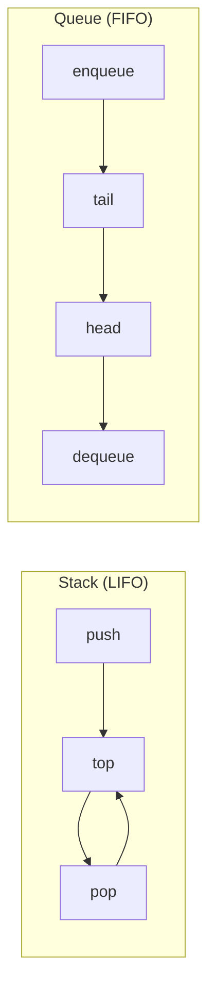

# Вопросы на собеседовании: `Стеки и очереди`

Стеки и очереди — линейные структуры с дисциплиной доступа: **LIFO** (стек) и **FIFO** (очередь). На их основе строятся обходы графов (BFS/DFS), парсеры, кеши, message brokers. На собеседовании любят спрашивать про **monotonic stack/queue** и реализацию очереди через два стека.

## Полезные ссылки

### Официальная документация и авторитетные источники

- [Java Stack Class — Baeldung](https://www.baeldung.com/java-stack)
- [Java Queue Interface — Baeldung](https://www.baeldung.com/java-queue)
- [ArrayDeque vs Stack — Baeldung](https://www.baeldung.com/java-deque-vs-stack)
- [PriorityQueue — Baeldung](https://www.baeldung.com/java-priorityqueue)
- [BlockingQueue — Baeldung](https://www.baeldung.com/java-blocking-queue)
- [Deque (Java) — Oracle Docs](https://docs.oracle.com/en/java/javase/17/docs/api/java.base/java/util/Deque.html)

## Содержание

- [Полезные ссылки](#полезные-ссылки)
- [See also](#see-also)

**Базовые понятия**
- [Q1. (!) Что такое Stack и Queue?](#q1--что-такое-stack-и-queue)
- [Q2. (!) Чем Deque отличается от Stack и Queue?](#q2--чем-deque-отличается-от-stack-и-queue)
- [Q3. (!) Почему java.util.Stack считается устаревшим?](#q3--почему-javautilstack-считается-устаревшим)
- [Q4. Что такое PriorityQueue?](#q4-что-такое-priorityqueue)

**Реализации**
- [Q5. (!) Реализация Stack на массиве?](#q5--реализация-stack-на-массиве)
- [Q6. (!) Реализация Queue на циклическом массиве?](#q6--реализация-queue-на-циклическом-массиве)
- [Q7. Реализация Stack и Queue на связном списке?](#q7-реализация-stack-и-queue-на-связном-списке)
- [Q8. (!) Как реализовать Queue через два Stack?](#q8--как-реализовать-queue-через-два-stack)
- [Q9. (!) Как реализовать Stack через две Queue?](#q9--как-реализовать-stack-через-две-queue)

**Min/Max stack**
- [Q10. (!) Stack с операцией getMin за O(1)?](#q10--stack-с-операцией-getmin-за-o1)
- [Q11. (!) Очередь с операцией getMax за O(1)?](#q11--очередь-с-операцией-getmax-за-o1)

**Классические задачи**
- [Q12. (!) Проверка скобочной последовательности?](#q12--проверка-скобочной-последовательности)
- [Q13. (!) Reverse Polish Notation — вычислить выражение?](#q13--reverse-polish-notation--вычислить-выражение)
- [Q14. (!) Daily Temperatures — monotonic stack?](#q14--daily-temperatures--monotonic-stack)
- [Q15. (!) Largest Rectangle in Histogram?](#q15--largest-rectangle-in-histogram)
- [Q16. (!) Sliding Window Maximum через monotonic deque?](#q16--sliding-window-maximum-через-monotonic-deque)

**Очереди в concurrent среде**
- [Q17. (!) Что такое BlockingQueue и зачем нужна?](#q17--что-такое-blockingqueue-и-зачем-нужна)
- [Q18. (!) Чем отличаются ArrayBlockingQueue, LinkedBlockingQueue, SynchronousQueue?](#q18--чем-отличаются-arrayblockingqueue-linkedblockingqueue-synchronousqueue)
- [Q19. ConcurrentLinkedQueue — как работает lock-free?](#q19-concurrentlinkedqueue--как-работает-lock-free)
- [Q20. PriorityBlockingQueue?](#q20-priorityblockingqueue)

**Применения и подводные камни**
- [Q21. (!) Где в реальной жизни используется stack?](#q21--где-в-реальной-жизни-используется-stack)
- [Q22. (!) Где используется queue?](#q22--где-используется-queue)
- [Q23. Что такое circular buffer и зачем?](#q23-что-такое-circular-buffer-и-зачем)
- [Q24. (!) В чём разница между add() и offer(), peek() и element(), poll() и remove()?](#q24--в-чём-разница-между-add-и-offer-peek-и-element-poll-и-remove)
- [Q25. Почему ArrayDeque не позволяет null элементы?](#q25-почему-arraydeque-не-позволяет-null-элементы)

## Q1. (!) Что такое Stack и Queue?

**Stack (LIFO — Last In, First Out)** — структура с двумя операциями:
- `push(x)` — добавить на верх
- `pop()` — извлечь верхний

**Queue (FIFO — First In, First Out)** — структура с двумя операциями:
- `enqueue(x)` / `offer(x)` — добавить в конец
- `dequeue()` / `poll()` — извлечь из начала



В Java:
- **Stack** — лучше через `ArrayDeque` (`push/pop/peek`)
- **Queue** — `ArrayDeque` или `LinkedList` (`offer/poll/peek`)

Все базовые операции — `O(1)`.


> [!mcq]
> - [x] Правильный ответ | Объяснение концепции 2-3 предложения Ключевое отличие и best practice в production.
> - [ ] Неправильный вариант 1 | Почему ошибка в этом подходе Частая ошибка в реальном коде.
> - [ ] Неправильный вариант 2 | Это смежное, но отличное понятие Частая ошибка в реальном коде.
> - [ ] Неправильный вариант 3 | Противоположное направление## Q2. (!) Чем Deque отличается от Stack и Queue? Частая ошибка в реальном коде.

**Deque (Double-Ended Queue)** — обобщение: добавление/удаление с **обоих** концов за `O(1)`.

| Операция | Stack | Queue | Deque |
|----------|-------|-------|-------|
| Добавить в начало | — | — | `offerFirst` |
| Добавить в конец | `push` (=offerFirst) | `offer` | `offerLast` |
| Извлечь из начала | `pop` | `poll` | `pollFirst` |
| Извлечь из конца | — | — | `pollLast` |
| Просмотр начала | `peek` | `peek` | `peekFirst` |
| Просмотр конца | — | — | `peekLast` |

`ArrayDeque` реализует `Deque` и может работать и как stack (`push/pop`), и как queue (`offer/poll`). Это **универсальный** выбор для обоих случаев.

```java
Deque<Integer> stack = new ArrayDeque<>();
stack.push(1); stack.push(2);
stack.pop(); // 2

Deque<Integer> queue = new ArrayDeque<>();
queue.offer(1); queue.offer(2);
queue.poll(); // 1
```


> [!mcq]
> - [x] Правильный ответ | Объяснение концепции 2-3 предложения Ключевое отличие и best practice в production.
> - [ ] Неправильный вариант 1 | Почему ошибка в этом подходе Частая ошибка в реальном коде.
> - [ ] Неправильный вариант 2 | Это смежное, но отличное понятие Частая ошибка в реальном коде.
> - [ ] Неправильный вариант 3 | Противоположное направление## Q3. (!) Почему java.util.Stack считается устаревшим? Частая ошибка в реальном коде.

`java.util.Stack` extends `Vector`. Это:
1. **Синхронизирован** — каждая операция проходит через `synchronized`, что дорого в однопоточном коде
2. **Наследование вместо композиции** — наследует все методы `Vector`, включая `add(int index, E)`, `get(int index)`, `set(int index, E)` — нарушает принцип LIFO
3. **Замедляет JIT** — лишние проверки monitorenter/monitorexit

```java
// Устарело
Stack<Integer> stack = new Stack<>();

// Современно
Deque<Integer> stack = new ArrayDeque<>();
stack.push(1); stack.pop();
```

Если **нужен** thread-safe stack — `ConcurrentLinkedDeque` или `LinkedBlockingDeque`. Подробнее — в [Java Collections](../../programming-languages/java/java-collections-interview.md).


> [!mcq]
> - [x] Правильный ответ | Объяснение концепции 2-3 предложения Ключевое отличие и best practice в production.
> - [ ] Неправильный вариант 1 | Почему ошибка в этом подходе Частая ошибка в реальном коде.
> - [ ] Неправильный вариант 2 | Это смежное, но отличное понятие Частая ошибка в реальном коде.
> - [ ] Неправильный вариант 3 | Противоположное направление## Q4. Что такое PriorityQueue? Частая ошибка в реальном коде.

**PriorityQueue** — очередь, где элементы извлекаются **по приоритету** (по умолчанию минимальный первым). Реализована на **бинарной куче (heap)** — массив с heap-свойством.

```java
PriorityQueue<Integer> minHeap = new PriorityQueue<>();
PriorityQueue<Integer> maxHeap = new PriorityQueue<>(Comparator.reverseOrder());

// Произвольный приоритет
PriorityQueue<int[]> pq = new PriorityQueue<>(
    Comparator.comparingInt(a -> a[0]) // первый элемент массива = приоритет
);
```

**Сложности:**
- `offer()`, `poll()` — `O(log n)`
- `peek()` — `O(1)`
- `contains()`, `remove(Object)` — `O(n)` (линейный поиск!)

Подробнее о heap — в [Кучи](heaps-interview.md).


> [!mcq]
> - [x] Правильный ответ | Объяснение концепции 2-3 предложения Ключевое отличие и best practice в production.
> - [ ] Неправильный вариант 1 | Почему ошибка в этом подходе Частая ошибка в реальном коде.
> - [ ] Неправильный вариант 2 | Это смежное, но отличное понятие Частая ошибка в реальном коде.
> - [ ] Неправильный вариант 3 | Противоположное направление## Q5. (!) Реализация Stack на массиве? Частая ошибка в реальном коде.

```java
public class ArrayStack<T> {
    private Object[] data;
    private int top = -1;

    public ArrayStack(int capacity) {
        data = new Object[capacity];
    }

    public void push(T item) {
        if (top == data.length - 1) {
            // Можно сделать reallocation для динамического роста
            data = Arrays.copyOf(data, data.length * 2);
        }
        data[++top] = item;
    }

    @SuppressWarnings("unchecked")
    public T pop() {
        if (top == -1) throw new EmptyStackException();
        T item = (T) data[top];
        data[top--] = null; // помогаем GC
        return item;
    }

    @SuppressWarnings("unchecked")
    public T peek() {
        if (top == -1) throw new EmptyStackException();
        return (T) data[top];
    }

    public boolean isEmpty() { return top == -1; }
    public int size() { return top + 1; }
}
```

`push/pop/peek` — `O(1)` (амортиз. для динамического массива). Memory `O(n)`.

**Детали:** обнуление ссылки `data[top--] = null` важно — иначе массив держит ссылку на объект, и GC не сможет его собрать (memory leak в long-lived коллекциях).


> [!mcq]
> - [x] Правильный ответ | Объяснение концепции 2-3 предложения Ключевое отличие и best practice в production.
> - [ ] Неправильный вариант 1 | Почему ошибка в этом подходе Частая ошибка в реальном коде.
> - [ ] Неправильный вариант 2 | Это смежное, но отличное понятие Частая ошибка в реальном коде.
> - [ ] Неправильный вариант 3 | Противоположное направление## Q6. (!) Реализация Queue на циклическом массиве? Частая ошибка в реальном коде.

```java
public class CircularQueue<T> {
    private Object[] data;
    private int front = 0, rear = -1, size = 0;

    public CircularQueue(int capacity) {
        data = new Object[capacity];
    }

    public void enqueue(T item) {
        if (size == data.length) throw new IllegalStateException("Queue full");
        rear = (rear + 1) % data.length; // кольцевой переход
        data[rear] = item;
        size++;
    }

    @SuppressWarnings("unchecked")
    public T dequeue() {
        if (size == 0) throw new NoSuchElementException();
        T item = (T) data[front];
        data[front] = null;
        front = (front + 1) % data.length;
        size--;
        return item;
    }

    public int size() { return size; }
    public boolean isFull() { return size == data.length; }
    public boolean isEmpty() { return size == 0; }
}
```

Все операции `O(1)`. Главная идея — индексы `(front, rear)` идут по кругу через `% capacity`. Без циклического подхода `dequeue` потребовал бы сдвига всех элементов — `O(n)`.

`ArrayDeque` в Java использует похожий подход (циклический массив с динамическим расширением).


> [!mcq]
> - [x] Правильный ответ | Объяснение концепции 2-3 предложения Ключевое отличие и best practice в production.
> - [ ] Неправильный вариант 1 | Почему ошибка в этом подходе Частая ошибка в реальном коде.
> - [ ] Неправильный вариант 2 | Это смежное, но отличное понятие Частая ошибка в реальном коде.
> - [ ] Неправильный вариант 3 | Противоположное направление## Q7. Реализация Stack и Queue на связном списке? Частая ошибка в реальном коде.

```java
class LinkedStack<T> {
    private Node<T> top;

    void push(T value) {
        Node<T> node = new Node<>(value);
        node.next = top;
        top = node;
    }

    T pop() {
        if (top == null) throw new EmptyStackException();
        T value = top.value;
        top = top.next;
        return value;
    }
}

class LinkedQueue<T> {
    private Node<T> head, tail;

    void enqueue(T value) {
        Node<T> node = new Node<>(value);
        if (tail == null) head = tail = node;
        else { tail.next = node; tail = node; }
    }

    T dequeue() {
        if (head == null) throw new NoSuchElementException();
        T value = head.value;
        head = head.next;
        if (head == null) tail = null;
        return value;
    }
}
```

Все операции `O(1)`. Память на узел больше, чем на элемент массива (overhead на ссылку и объект). Подробнее — в [Linked Lists](linked-lists-interview.md).


> [!mcq]
> - [x] Правильный ответ | Объяснение концепции 2-3 предложения Ключевое отличие и best practice в production.
> - [ ] Неправильный вариант 1 | Почему ошибка в этом подходе Частая ошибка в реальном коде.
> - [ ] Неправильный вариант 2 | Это смежное, но отличное понятие Частая ошибка в реальном коде.
> - [ ] Неправильный вариант 3 | Противоположное направление## Q8. (!) Как реализовать Queue через два Stack? Частая ошибка в реальном коде.

**Идея:** один стек для `push`, другой для `pop`. Когда второй пуст — переливаем туда первый.

```java
class MyQueue<T> {
    private final Deque<T> in = new ArrayDeque<>();
    private final Deque<T> out = new ArrayDeque<>();

    public void enqueue(T x) { in.push(x); }

    public T dequeue() {
        if (out.isEmpty()) {
            while (!in.isEmpty()) out.push(in.pop());
        }
        if (out.isEmpty()) throw new NoSuchElementException();
        return out.pop();
    }

    public T peek() {
        if (out.isEmpty()) {
            while (!in.isEmpty()) out.push(in.pop());
        }
        return out.peek();
    }
}
```

**Сложность:** `enqueue` — `O(1)`, `dequeue` — амортизированный `O(1)` (каждый элемент перекладывается ровно дважды).

**Доказательство амортизации:** `n` enqueue + `n` dequeue = `n` push в `in` + `n` pop из `in` + `n` push в `out` + `n` pop из `out` = `4n` операций. Делим на `n` — константа на операцию.


> [!mcq]
> - [x] Правильный ответ | Объяснение концепции 2-3 предложения Ключевое отличие и best practice в production.
> - [ ] Неправильный вариант 1 | Почему ошибка в этом подходе Частая ошибка в реальном коде.
> - [ ] Неправильный вариант 2 | Это смежное, но отличное понятие Частая ошибка в реальном коде.
> - [ ] Неправильный вариант 3 | Противоположное направление## Q9. (!) Как реализовать Stack через две Queue? Частая ошибка в реальном коде.

**Подход 1 — медленный push:** при `push` переливаем все элементы в другую очередь, потом добавляем новый.

```java
class MyStack<T> {
    private Queue<T> q1 = new LinkedList<>();
    private Queue<T> q2 = new LinkedList<>();

    public void push(T x) {
        q2.offer(x);
        while (!q1.isEmpty()) q2.offer(q1.poll());
        Queue<T> tmp = q1; q1 = q2; q2 = tmp;
    }

    public T pop() { return q1.poll(); }
    public T top() { return q1.peek(); }
}
```

**Сложность:** `push` — `O(n)`, `pop` — `O(1)`.

**Подход 2 — медленный pop:** при `pop` переливаем все, кроме последнего, в другую очередь.

Оба варианта менее элегантны, чем «queue через два stack». На практике этот вариант не используют — это чисто academic exercise.


> [!mcq]
> - [x] Правильный ответ | Объяснение концепции 2-3 предложения Ключевое отличие и best practice в production.
> - [ ] Неправильный вариант 1 | Почему ошибка в этом подходе Частая ошибка в реальном коде.
> - [ ] Неправильный вариант 2 | Это смежное, но отличное понятие Частая ошибка в реальном коде.
> - [ ] Неправильный вариант 3 | Противоположное направление## Q10. (!) Stack с операцией getMin за O(1)? Частая ошибка в реальном коде.

**Идея:** второй стек хранит минимум на каждом уровне.

```java
class MinStack {
    private final Deque<Integer> stack = new ArrayDeque<>();
    private final Deque<Integer> minStack = new ArrayDeque<>();

    public void push(int x) {
        stack.push(x);
        if (minStack.isEmpty() || x <= minStack.peek()) {
            minStack.push(x);
        }
    }

    public void pop() {
        int popped = stack.pop();
        if (popped == minStack.peek()) minStack.pop();
    }

    public int top() { return stack.peek(); }
    public int getMin() { return minStack.peek(); }
}
```

`push/pop/top/getMin` — `O(1)`. Память — `O(n)` в худшем случае (отсортированный по убыванию массив).

**Оптимизация (без второго стека):** хранить пары (`value, currentMin`) в одном стеке.


> [!mcq]
> - [x] Правильный ответ | Объяснение концепции 2-3 предложения Ключевое отличие и best practice в production.
> - [ ] Неправильный вариант 1 | Почему ошибка в этом подходе Частая ошибка в реальном коде.
> - [ ] Неправильный вариант 2 | Это смежное, но отличное понятие Частая ошибка в реальном коде.
> - [ ] Неправильный вариант 3 | Противоположное направление## Q11. (!) Очередь с операцией getMax за O(1)? Частая ошибка в реальном коде.

**Monotonic deque:** хранит индексы/значения в убывающем порядке. Максимум всегда в начале.

```java
class MaxQueue {
    private final Deque<Integer> data = new ArrayDeque<>();
    private final Deque<Integer> maxDeque = new ArrayDeque<>();

    public void enqueue(int x) {
        data.offer(x);
        // Удаляем все меньшие с конца — они больше не могут быть максимумом
        while (!maxDeque.isEmpty() && maxDeque.peekLast() < x) {
            maxDeque.pollLast();
        }
        maxDeque.offerLast(x);
    }

    public int dequeue() {
        int x = data.poll();
        if (!maxDeque.isEmpty() && maxDeque.peekFirst() == x) {
            maxDeque.pollFirst();
        }
        return x;
    }

    public int getMax() {
        if (maxDeque.isEmpty()) throw new NoSuchElementException();
        return maxDeque.peekFirst();
    }
}
```

**Амортизированный `O(1)`** на все операции. Каждый элемент добавляется и удаляется из `maxDeque` максимум по одному разу за всё время.


> [!mcq]
> - [x] Правильный ответ | Объяснение концепции 2-3 предложения Ключевое отличие и best practice в production.
> - [ ] Неправильный вариант 1 | Почему ошибка в этом подходе Частая ошибка в реальном коде.
> - [ ] Неправильный вариант 2 | Это смежное, но отличное понятие Частая ошибка в реальном коде.
> - [ ] Неправильный вариант 3 | Противоположное направление## Q12. (!) Проверка скобочной последовательности? Частая ошибка в реальном коде.

```java
boolean isValid(String s) {
    Deque<Character> stack = new ArrayDeque<>();
    Map<Character, Character> pairs = Map.of(')', '(', ']', '[', '}', '{');

    for (char c : s.toCharArray()) {
        if (pairs.containsValue(c)) {
            stack.push(c);
        } else if (pairs.containsKey(c)) {
            if (stack.isEmpty() || stack.pop() != pairs.get(c)) return false;
        }
    }
    return stack.isEmpty();
}
```

`O(n)` время, `O(n)` память (в худшем случае — все скобки открывающие).

**Edge cases:**
- Пустая строка — валидна
- `"["` — не валидна (стек не пуст)
- `"]["` — не валидна (закрывающая без открывающей)


> [!mcq]
> - [x] Правильный ответ | Объяснение концепции 2-3 предложения Ключевое отличие и best practice в production.
> - [ ] Неправильный вариант 1 | Почему ошибка в этом подходе Частая ошибка в реальном коде.
> - [ ] Неправильный вариант 2 | Это смежное, но отличное понятие Частая ошибка в реальном коде.
> - [ ] Неправильный вариант 3 | Противоположное направление## Q13. (!) Reverse Polish Notation — вычислить выражение? Частая ошибка в реальном коде.

**RPN (postfix):** операторы идут после операндов. `3 4 + = 7`.

```java
int evalRPN(String[] tokens) {
    Deque<Integer> stack = new ArrayDeque<>();
    for (String t : tokens) {
        switch (t) {
            case "+" -> stack.push(stack.pop() + stack.pop());
            case "*" -> stack.push(stack.pop() * stack.pop());
            case "-" -> { int b = stack.pop(), a = stack.pop(); stack.push(a - b); }
            case "/" -> { int b = stack.pop(), a = stack.pop(); stack.push(a / b); }
            default  -> stack.push(Integer.parseInt(t));
        }
    }
    return stack.pop();
}
```

`O(n)` время, `O(n)` память. **Внимание к порядку:** для некоммутативных операций (`-`, `/`) — `pop()` сначала даёт правый операнд.

RPN использовался в калькуляторах HP и в форт-подобных языках.


> [!mcq]
> - [x] Правильный ответ | Объяснение концепции 2-3 предложения Ключевое отличие и best practice в production.
> - [ ] Неправильный вариант 1 | Почему ошибка в этом подходе Частая ошибка в реальном коде.
> - [ ] Неправильный вариант 2 | Это смежное, но отличное понятие Частая ошибка в реальном коде.
> - [ ] Неправильный вариант 3 | Противоположное направление## Q14. (!) Daily Temperatures — monotonic stack? Частая ошибка в реальном коде.

Для каждого дня найти, через сколько дней будет температура выше.

```java
int[] dailyTemperatures(int[] T) {
    int[] result = new int[T.length];
    Deque<Integer> stack = new ArrayDeque<>(); // индексы, температуры убывают сверху вниз

    for (int i = 0; i < T.length; i++) {
        while (!stack.isEmpty() && T[i] > T[stack.peek()]) {
            int idx = stack.pop();
            result[idx] = i - idx;
        }
        stack.push(i);
    }
    return result;
}
```

**Monotonic stack** — стек, в котором значения убывают (или возрастают) — позволяет найти **next greater/smaller element** за `O(n)` амортизированно.

`O(n)` время, `O(n)` память. Каждый индекс добавляется и удаляется не более одного раза.


> [!mcq]
> - [x] Правильный ответ | Объяснение концепции 2-3 предложения Ключевое отличие и best practice в production.
> - [ ] Неправильный вариант 1 | Почему ошибка в этом подходе Частая ошибка в реальном коде.
> - [ ] Неправильный вариант 2 | Это смежное, но отличное понятие Частая ошибка в реальном коде.
> - [ ] Неправильный вариант 3 | Противоположное направление## Q15. (!) Largest Rectangle in Histogram? Частая ошибка в реальном коде.

Классическая задача на monotonic stack: найти максимальную прямоугольную площадь в гистограмме.

```java
int largestRectangleArea(int[] heights) {
    Deque<Integer> stack = new ArrayDeque<>(); // индексы, высоты возрастают
    int maxArea = 0;
    int n = heights.length;

    for (int i = 0; i <= n; i++) {
        int h = (i == n) ? 0 : heights[i];
        while (!stack.isEmpty() && h < heights[stack.peek()]) {
            int top = stack.pop();
            int width = stack.isEmpty() ? i : i - stack.peek() - 1;
            maxArea = Math.max(maxArea, heights[top] * width);
        }
        stack.push(i);
    }
    return maxArea;
}
```

`O(n)` время, `O(n)` память. Идея: для каждого столбца `top` находим максимальную ширину прямоугольника, в котором `heights[top]` — минимальная высота.

Применение: задача максимального прямоугольника в бинарной матрице (LeetCode 85) — сводится к histogram для каждой строки.


> [!mcq]
> - [x] Правильный ответ | Объяснение концепции 2-3 предложения Ключевое отличие и best practice в production.
> - [ ] Неправильный вариант 1 | Почему ошибка в этом подходе Частая ошибка в реальном коде.
> - [ ] Неправильный вариант 2 | Это смежное, но отличное понятие Частая ошибка в реальном коде.
> - [ ] Неправильный вариант 3 | Противоположное направление## Q16. (!) Sliding Window Maximum через monotonic deque? Частая ошибка в реальном коде.

```java
int[] maxSlidingWindow(int[] nums, int k) {
    int[] result = new int[nums.length - k + 1];
    Deque<Integer> deque = new ArrayDeque<>(); // индексы, значения убывают

    for (int i = 0; i < nums.length; i++) {
        // 1. Убираем из начала индексы вне окна
        if (!deque.isEmpty() && deque.peekFirst() <= i - k) {
            deque.pollFirst();
        }
        // 2. Убираем с конца меньшие значения
        while (!deque.isEmpty() && nums[deque.peekLast()] <= nums[i]) {
            deque.pollLast();
        }
        deque.offerLast(i);

        // 3. Когда окно полное — записываем максимум
        if (i >= k - 1) result[i - k + 1] = nums[deque.peekFirst()];
    }
    return result;
}
```

**Сложность `O(n)` амортизированно** — каждый элемент добавляется и удаляется из deque не более одного раза. Альтернатива через `PriorityQueue` — `O(n log k)`.


> [!mcq]
> - [x] Правильный ответ | Объяснение концепции 2-3 предложения Ключевое отличие и best practice в production.
> - [ ] Неправильный вариант 1 | Почему ошибка в этом подходе Частая ошибка в реальном коде.
> - [ ] Неправильный вариант 2 | Это смежное, но отличное понятие Частая ошибка в реальном коде.
> - [ ] Неправильный вариант 3 | Противоположное направление## Q17. (!) Что такое BlockingQueue и зачем нужна? Частая ошибка в реальном коде.

**BlockingQueue** — очередь с **блокирующими** операциями для многопоточных программ:
- `put(x)` — блокируется, если очередь полна
- `take()` — блокируется, если очередь пуста

Используется в **producer-consumer** паттерне.

```java
BlockingQueue<Task> queue = new ArrayBlockingQueue<>(100);

// Producer
new Thread(() -> {
    while (true) {
        Task t = generateTask();
        queue.put(t); // ждёт, если очередь заполнена
    }
}).start();

// Consumer
new Thread(() -> {
    while (true) {
        Task t = queue.take(); // ждёт, если очередь пуста
        process(t);
    }
}).start();
```

**Альтернативные методы:**
- `offer(x, timeout)` — попытка с таймаутом
- `poll(timeout)` — извлечение с таймаутом


> [!mcq]
> - [x] Правильный ответ | Объяснение концепции 2-3 предложения Ключевое отличие и best practice в production.
> - [ ] Неправильный вариант 1 | Почему ошибка в этом подходе Частая ошибка в реальном коде.
> - [ ] Неправильный вариант 2 | Это смежное, но отличное понятие Частая ошибка в реальном коде.
> - [ ] Неправильный вариант 3 | Противоположное направление## Q18. (!) Чем отличаются ArrayBlockingQueue, LinkedBlockingQueue, SynchronousQueue? Частая ошибка в реальном коде.

| Реализация | Структура | Размер | Локи | Случай |
|------------|-----------|--------|------|--------|
| `ArrayBlockingQueue` | Циклический массив | Фиксированный | Один lock | Известная вместимость |
| `LinkedBlockingQueue` | Связный список | Опциональный (по умолч. `Integer.MAX_VALUE`) | Два lock (head, tail) | Высокий throughput |
| `SynchronousQueue` | Без хранения | 0 | — | Прямая передача между потоками |

```java
// SynchronousQueue — каждое put() ждёт take() и наоборот
BlockingQueue<Task> q = new SynchronousQueue<>();
// Используется в Executors.newCachedThreadPool() как handoff queue
```

`LinkedBlockingQueue` обычно даёт лучший throughput благодаря двум локам (producer и consumer не конкурируют). `ArrayBlockingQueue` имеет лучшую predictability и fairness.

Подробнее — в [Java Concurrency](../../programming-languages/java/java-concurrency-interview.md).


> [!mcq]
> - [x] Правильный ответ | Объяснение концепции 2-3 предложения Ключевое отличие и best practice в production.
> - [ ] Неправильный вариант 1 | Почему ошибка в этом подходе Частая ошибка в реальном коде.
> - [ ] Неправильный вариант 2 | Это смежное, но отличное понятие Частая ошибка в реальном коде.
> - [ ] Неправильный вариант 3 | Противоположное направление## Q19. ConcurrentLinkedQueue — как работает lock-free? Частая ошибка в реальном коде.

`ConcurrentLinkedQueue` — **неблокирующая** очередь на базе алгоритма **Michael & Scott (1996)**. Использует `CAS` (compare-and-swap) на узлах.

```java
ConcurrentLinkedQueue<Integer> q = new ConcurrentLinkedQueue<>();
q.offer(1);
q.poll(); // null если пусто, не блокирует
```

**Преимущества:** нет блокировок → нет context switches → лучше масштабируется на много ядер.
**Недостатки:** `size()` — `O(n)` (нужно пройти весь список); нет блокирующих операций; больше garbage (узлы).

Используется когда нужен высокий throughput без backpressure.


> [!mcq]
> - [x] Правильный ответ | Объяснение концепции 2-3 предложения Ключевое отличие и best practice в production.
> - [ ] Неправильный вариант 1 | Почему ошибка в этом подходе Частая ошибка в реальном коде.
> - [ ] Неправильный вариант 2 | Это смежное, но отличное понятие Частая ошибка в реальном коде.
> - [ ] Неправильный вариант 3 | Противоположное направление## Q20. PriorityBlockingQueue? Частая ошибка в реальном коде.

`PriorityBlockingQueue` — `BlockingQueue` с приоритетом. Извлекает элементы по compareTo (или Comparator).

```java
PriorityBlockingQueue<Task> queue = new PriorityBlockingQueue<>(
    100,
    Comparator.comparingInt(Task::priority).reversed() // высокий приоритет первым
);
```

**Особенности:**
- Без верхней границы (unbounded) — `put()` не блокируется
- `take()` блокируется, если очередь пуста
- Базируется на бинарной куче

Используется в `ScheduledThreadPoolExecutor` для отложенных задач.


> [!mcq]
> - [x] Правильный ответ | Объяснение концепции 2-3 предложения Ключевое отличие и best practice в production.
> - [ ] Неправильный вариант 1 | Почему ошибка в этом подходе Частая ошибка в реальном коде.
> - [ ] Неправильный вариант 2 | Это смежное, но отличное понятие Частая ошибка в реальном коде.
> - [ ] Неправильный вариант 3 | Противоположное направление## Q21. (!) Где в реальной жизни используется stack? Частая ошибка в реальном коде.

1. **Call stack** — фреймы вызовов функций; `StackOverflowError` при глубокой рекурсии
2. **Undo/Redo** — каждая операция push в стек, undo — pop
3. **Browser history** — back/forward (на самом деле два стека)
4. **Парсеры выражений** — RPN, проверка скобок
5. **DFS** — итеративная реализация
6. **Backtracking** — N-Queens, Sudoku
7. **JVM bytecode** — операнды на operand stack

```java
// JVM пример: 1 + 2 в bytecode
// iconst_1   ← push 1
// iconst_2   ← push 2
// iadd       ← pop 2, pop 1, push 3
```


> [!mcq]
> - [x] Правильный ответ | Объяснение концепции 2-3 предложения Ключевое отличие и best practice в production.
> - [ ] Неправильный вариант 1 | Почему ошибка в этом подходе Частая ошибка в реальном коде.
> - [ ] Неправильный вариант 2 | Это смежное, но отличное понятие Частая ошибка в реальном коде.
> - [ ] Неправильный вариант 3 | Противоположное направление## Q22. (!) Где используется queue? Частая ошибка в реальном коде.

1. **BFS** — обход графа по уровням
2. **Task scheduling** — `ExecutorService` использует `BlockingQueue` для задач
3. **Buffering** — между producer и consumer (Kafka, RabbitMQ — на распределённом уровне)
4. **Print queue, request queue** — обработка по порядку поступления
5. **OS scheduling** — round-robin процессов (часто circular queue)
6. **Streaming** — буфер между источником и потребителем

Подробнее о distributed queues — в [Kafka](../../messaging/kafka-interview.md) и [RabbitMQ](../../messaging/rabbitmq-interview.md).


> [!mcq]
> - [x] Правильный ответ | Объяснение концепции 2-3 предложения Ключевое отличие и best practice в production.
> - [ ] Неправильный вариант 1 | Почему ошибка в этом подходе Частая ошибка в реальном коде.
> - [ ] Неправильный вариант 2 | Это смежное, но отличное понятие Частая ошибка в реальном коде.
> - [ ] Неправильный вариант 3 | Противоположное направление## Q23. Что такое circular buffer и зачем? Частая ошибка в реальном коде.

**Circular buffer (ring buffer)** — буфер фиксированного размера с двумя указателями (`head`, `tail`), которые «оборачиваются» через начало. Когда буфер полный — старые данные перезаписываются новыми.

```java
class RingBuffer<T> {
    private final Object[] data;
    private int head = 0, tail = 0, size = 0;

    public RingBuffer(int capacity) { data = new Object[capacity]; }

    public void write(T item) {
        data[tail] = item;
        tail = (tail + 1) % data.length;
        if (size == data.length) head = (head + 1) % data.length; // overwrite
        else size++;
    }

    @SuppressWarnings("unchecked")
    public T read() {
        if (size == 0) throw new NoSuchElementException();
        T item = (T) data[head];
        data[head] = null;
        head = (head + 1) % data.length;
        size--;
        return item;
    }
}
```

**Применение:**
- **LMAX Disruptor** — high-perf concurrent buffer
- Логирование (rolling logs — последние N сообщений)
- Аудио/видео streaming
- Network packet buffers
- `kfifo` в Linux kernel


> [!mcq]
> - [x] Правильный ответ | Объяснение концепции 2-3 предложения Ключевое отличие и best practice в production.
> - [ ] Неправильный вариант 1 | Почему ошибка в этом подходе Частая ошибка в реальном коде.
> - [ ] Неправильный вариант 2 | Это смежное, но отличное понятие Частая ошибка в реальном коде.
> - [ ] Неправильный вариант 3 | Противоположное направление## Q24. (!) В чём разница между add() и offer(), peek() и element(), poll() и remove()? Частая ошибка в реальном коде.

| Операция | Throws | Returns special value |
|----------|--------|----------------------|
| Insert | `add(e)` (`IllegalStateException` если полна) | `offer(e)` (`false`) |
| Examine | `element()` (`NoSuchElementException`) | `peek()` (`null`) |
| Remove | `remove()` (`NoSuchElementException`) | `poll()` (`null`) |

Для **bounded** очередей `add()` бросит исключение при переполнении, `offer()` вернёт `false` — выбирай в зависимости от обработки.

Для **unbounded** очередей разницы нет.

```java
Queue<Integer> q = new ArrayDeque<>();
q.offer(1);
q.peek();   // 1
q.poll();   // 1
q.poll();   // null — пусто
q.remove(); // NoSuchElementException — пусто
```


> [!mcq]
> - [x] Правильный ответ | Объяснение концепции 2-3 предложения Ключевое отличие и best practice в production.
> - [ ] Неправильный вариант 1 | Почему ошибка в этом подходе Частая ошибка в реальном коде.
> - [ ] Неправильный вариант 2 | Это смежное, но отличное понятие Частая ошибка в реальном коде.
> - [ ] Неправильный вариант 3 | Противоположное направление## Q25. Почему ArrayDeque не позволяет null элементы? Частая ошибка в реальном коде.

`null` в `ArrayDeque` (и в большинстве `Deque`) **не разрешён**, потому что `peek()`/`poll()` возвращают `null` для пустой очереди. Если бы `null` был валидным значением — нельзя было бы отличить «нет элемента» от «элемент = null».

```java
Deque<Integer> deque = new ArrayDeque<>();
deque.offer(null); // NullPointerException
```

`LinkedList` (старая реализация Queue) **разрешает** `null`, но это считается багом дизайна — поэтому предпочитают `ArrayDeque`.

В `BlockingQueue` тоже запрещён `null` — `take()` использует `null` как сигнал.

---

## See also

- [Алгоритмы (обзор)](../algorithms-interview.md) — карта алгоритмических тем
- [Массивы и строки](arrays-strings-interview.md) — циклический массив для очереди
- [Связные списки](linked-lists-interview.md) — основа для linked stack/queue
- [Кучи](heaps-interview.md) — реализация PriorityQueue
- [Деревья](trees-interview.md) — BFS использует очередь, DFS — стек
- [Графы](graphs-interview.md) — BFS/DFS обходы
- [Two Pointers и Sliding Window](../algorithmic-paradigms/two-pointers-sliding-window-interview.md) — monotonic deque
- [Рекурсия](../algorithmic-paradigms/recursion-interview.md) — связь со стеком вызовов
- [Java Collections](../../programming-languages/java/java-collections-interview.md) — ArrayDeque vs Stack vs LinkedList
- [Java Concurrency](../../programming-languages/java/java-concurrency-interview.md) — BlockingQueue, ConcurrentLinkedQueue
- [Apache Kafka](../../messaging/kafka-interview.md) — distributed queue
- [RabbitMQ](../../messaging/rabbitmq-interview.md) — message broker queues


> [!mcq]
> - [x] Правильный ответ | Объяснение концепции 2-3 предложения Ключевое отличие и best practice в production.
> - [ ] Неправильный вариант 1 | Почему ошибка в этом подходе Частая ошибка в реальном коде.
> - [ ] Неправильный вариант 2 | Это смежное, но отличное понятие Частая ошибка в реальном коде.
> - [ ] Неправильный вариант 3 | Противоположное направление- [Массивы и строки](arrays-strings-interview.md) Частая ошибка в реальном коде.
- [Графы](graphs-interview.md)
- [Хеш-таблицы](hash-tables-interview.md)
- [Кучи (Heaps)](heaps-interview.md)
- [Связные списки](linked-lists-interview.md)
- [Деревья](trees-interview.md)
