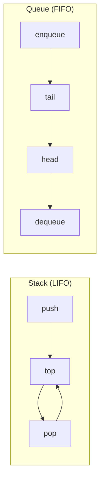

# Вопросы на собеседовании: `Стеки и очереди`

Стеки и очереди — линейные структуры с дисциплиной доступа: **LIFO** (стек) и **FIFO** (очередь). На их основе строятся обходы графов (BFS/DFS), парсеры, кеши, message brokers. На собеседовании любят спрашивать про **monotonic stack/queue** и реализацию очереди через два стека.

## Полезные ссылки

### Официальная документация и авторитетные источники

- [Java Stack Class — Baeldung](https://www.baeldung.com/java-stack)
- [Java Queue Interface — Baeldung](https://www.baeldung.com/java-queue)
- [ArrayDeque vs Stack — Baeldung](https://www.baeldung.com/java-deque-vs-stack)
- [PriorityQueue — Baeldung](https://www.baeldung.com/java-priorityqueue)
- [BlockingQueue — Baeldung](https://www.baeldung.com/java-blocking-queue)
- [Deque (Java) — Oracle Docs](https://docs.oracle.com/en/java/javase/17/docs/api/java.base/java/util/Deque.html)

## Содержание

- [Полезные ссылки](#полезные-ссылки)
- [See also](#see-also)

**Базовые понятия**
- [Q1. (!) Что такое Stack и Queue?](#q1--что-такое-stack-и-queue)
- [Q2. (!) Чем Deque отличается от Stack и Queue?](#q2--чем-deque-отличается-от-stack-и-queue)
- [Q3. (!) Почему java.util.Stack считается устаревшим?](#q3--почему-javautilstack-считается-устаревшим)
- [Q4. Что такое PriorityQueue?](#q4-что-такое-priorityqueue)

**Реализации**
- [Q5. (!) Реализация Stack на массиве?](#q5--реализация-stack-на-массиве)
- [Q6. (!) Реализация Queue на циклическом массиве?](#q6--реализация-queue-на-циклическом-массиве)
- [Q7. Реализация Stack и Queue на связном списке?](#q7-реализация-stack-и-queue-на-связном-списке)
- [Q8. (!) Как реализовать Queue через два Stack?](#q8--как-реализовать-queue-через-два-stack)
- [Q9. (!) Как реализовать Stack через две Queue?](#q9--как-реализовать-stack-через-две-queue)

**Min/Max stack**
- [Q10. (!) Stack с операцией getMin за O(1)?](#q10--stack-с-операцией-getmin-за-o1)
- [Q11. (!) Очередь с операцией getMax за O(1)?](#q11--очередь-с-операцией-getmax-за-o1)

**Классические задачи**
- [Q12. (!) Проверка скобочной последовательности?](#q12--проверка-скобочной-последовательности)
- [Q13. (!) Reverse Polish Notation — вычислить выражение?](#q13--reverse-polish-notation--вычислить-выражение)
- [Q14. (!) Daily Temperatures — monotonic stack?](#q14--daily-temperatures--monotonic-stack)
- [Q15. (!) Largest Rectangle in Histogram?](#q15--largest-rectangle-in-histogram)
- [Q16. (!) Sliding Window Maximum через monotonic deque?](#q16--sliding-window-maximum-через-monotonic-deque)

**Очереди в concurrent среде**
- [Q17. (!) Что такое BlockingQueue и зачем нужна?](#q17--что-такое-blockingqueue-и-зачем-нужна)
- [Q18. (!) Чем отличаются ArrayBlockingQueue, LinkedBlockingQueue, SynchronousQueue?](#q18--чем-отличаются-arrayblockingqueue-linkedblockingqueue-synchronousqueue)
- [Q19. ConcurrentLinkedQueue — как работает lock-free?](#q19-concurrentlinkedqueue--как-работает-lock-free)
- [Q20. PriorityBlockingQueue?](#q20-priorityblockingqueue)

**Применения и подводные камни**
- [Q21. (!) Где в реальной жизни используется stack?](#q21--где-в-реальной-жизни-используется-stack)
- [Q22. (!) Где используется queue?](#q22--где-используется-queue)
- [Q23. Что такое circular buffer и зачем?](#q23-что-такое-circular-buffer-и-зачем)
- [Q24. (!) В чём разница между add() и offer(), peek() и element(), poll() и remove()?](#q24--в-чём-разница-между-add-и-offer-peek-и-element-poll-и-remove)
- [Q25. Почему ArrayDeque не позволяет null элементы?](#q25-почему-arraydeque-не-позволяет-null-элементы)

## Q1. (!) Что такое Stack и Queue?

**Stack (LIFO — Last In, First Out)** — структура с двумя операциями:
- `push(x)` — добавить на верх
- `pop()` — извлечь верхний

**Queue (FIFO — First In, First Out)** — структура с двумя операциями:
- `enqueue(x)` / `offer(x)` — добавить в конец
- `dequeue()` / `poll()` — извлечь из начала



В Java:
- **Stack** — лучше через `ArrayDeque` (`push/pop/peek`)
- **Queue** — `ArrayDeque` или `LinkedList` (`offer/poll/peek`)

Все базовые операции — `O(1)`.


> [!mcq] Что верно характеризует Stack и Queue как абстрактные структуры данных?
>
> - [x] A. Stack даёт LIFO-доступ (push/pop на одном конце), Queue даёт FIFO-доступ (offer на один конец, poll с другого) — обе обеспечивают базовые операции за O(1).
>
>     **Развёрнутое объяснение.** Stack ведёт себя как стопка тарелок: последний положенный элемент берётся первым (Last In, First Out). Queue ведёт себя как очередь в кассу: кто пришёл первым, тот первым обслужен (First In, First Out). В Java для стека рекомендуется `ArrayDeque` с методами `push/pop/peek`, для очереди — тоже `ArrayDeque` или `LinkedList` с `offer/poll/peek`. Все операции амортизированно O(1), потому что используется массив или связные узлы с указателями на оба конца.
>
>     **Пример.** В JVM bytecode operand stack хранит промежуточные значения: `iconst_1; iconst_2; iadd` кладёт 1, кладёт 2, снимает оба и кладёт 3. В Kafka партиция работает как FIFO-очередь сообщений в пределах одного producer-а — потребители читают в порядке записи.
>
>     **Когда применять.** Stack — для обращений LIFO: undo/redo, рекурсия в итеративной форме, парсеры выражений, DFS. Queue — для FIFO: BFS, task scheduling (`ExecutorService`), producer-consumer буферы, обработка запросов по порядку поступления.
>
>     **Подводные камни.** В Java `java.util.Stack` устарел (наследует `Vector`, синхронизирован) — используй `ArrayDeque`. `LinkedList` реализует `Queue`, но имеет худшую locality и больший overhead на узел по сравнению с `ArrayDeque`. У `ArrayDeque` нельзя хранить `null` — `peek/poll` возвращают `null` для пустой очереди.
>
>     **Связанные вопросы.** [[stacks-queues-interview#Q2]] Deque объединяет оба; [[stacks-queues-interview#Q3]] почему Stack устарел; [[stacks-queues-interview#Q24]] add vs offer / peek vs element.
>
> - [ ] B. Stack использует FIFO-порядок, а Queue — LIFO; обе структуры неявно требуют связный список и не могут эффективно работать поверх массива.
>
>     **Что на самом деле.** Дисциплины перепутаны: Stack — это LIFO, Queue — FIFO. Кроме того, обе структуры прекрасно реализуются поверх массива: `ArrayDeque` использует циклический буфер, `ArrayBlockingQueue` тоже массив. Связный список — лишь один из вариантов реализации.
>
>     **Откуда путаница.** Названия не передают порядок: «стек» по-русски ассоциируется с очередью книг на полке, а «очередь» — с порядком обслуживания, что иногда инвертируется в голове. Связный список ассоциируется с FIFO/LIFO через «head/tail» и кажется обязательным.
>
>     **Если бы это было правдой.** JVM operand stack не смог бы вычислять выражения постфиксно, и `Executors.newFixedThreadPool` обрабатывал бы задачи в обратном порядке поступления — задача, отправленная последней, выполнилась бы первой, что ломает SLA и причинно-следственный порядок.
>
>     **Как было бы правильно.** Stack — LIFO (последним пришёл — первым ушёл), Queue — FIFO (первым пришёл — первым ушёл); и обе можно реализовать как поверх массива, так и поверх связного списка.
>
> - [ ] C. Stack и Queue — это одна и та же структура с разными именами; различие лишь в названии методов, а внутренний порядок выборки одинаков.
>
>     **Что на самом деле.** Stack и Queue различаются именно дисциплиной выборки: один даёт LIFO, другой FIFO. Методы тоже разные: у стека — `push/pop/peek`, у очереди — `offer/poll/peek`. Это фундаментально разные ADT, даже если обе обеспечивают O(1) на базовые операции.
>
>     **Откуда путаница.** В Java `Deque` действительно реализует и `Queue`, и предлагает stack-методы, поэтому может показаться что это «то же самое». Но интерфейс Deque лишь объединяет оба поведения, а не отождествляет их.
>
>     **Если бы это было правдой.** BFS-обход графа давал бы тот же результат, что DFS, и порядок вывода был бы одинаковым — но это противоречит тому, что BFS обходит уровнями, а DFS уходит в глубину. Алгоритмы перестали бы работать.
>
>     **Как было бы правильно.** Stack и Queue — разные ADT с противоположными порядками выборки (LIFO vs FIFO); общим у них только то, что обе предоставляют O(1)-операции добавления и извлечения.
>
> - [ ] D. Stack гарантирует O(log n) на push/pop из-за внутренней сортировки, а Queue — O(1), поэтому выбор между ними сводится к балансу между упорядочиванием и скоростью.
>
>     **Что на самом деле.** И Stack, и Queue имеют O(1) (амортизированно) на push/pop/offer/poll. Никакой внутренней сортировки в стеке нет — порядок определяется только последовательностью операций. Сортировка по приоритету — это `PriorityQueue` на базе heap, у которой O(log n).
>
>     **Откуда путаница.** Путаница со `PriorityQueue`: она тоже называется queue и имеет O(log n) на основных операциях за счёт heap. Иногда стек ассоциируют с «упорядоченной структурой» из-за фразы «LIFO order».
>
>     **Если бы это было правдой.** Рекурсия через явный стек стала бы в logn раз медленнее, и итеративный DFS обхода миллиона узлов работал бы заметно дольше, чем рекурсивный (где JVM использует O(1) push/pop на фреймы).
>
>     **Как было бы правильно.** Обе структуры дают O(1) на базовые операции; O(log n) — это `PriorityQueue` на куче, отдельная структура с приоритетным порядком вместо FIFO.

## Q2. (!) Чем Deque отличается от Stack и Queue?

**Deque (Double-Ended Queue)** — обобщение: добавление/удаление с **обоих** концов за `O(1)`.

| Операция | Stack | Queue | Deque |
|----------|-------|-------|-------|
| Добавить в начало | — | — | `offerFirst` |
| Добавить в конец | `push` (=offerFirst) | `offer` | `offerLast` |
| Извлечь из начала | `pop` | `poll` | `pollFirst` |
| Извлечь из конца | — | — | `pollLast` |
| Просмотр начала | `peek` | `peek` | `peekFirst` |
| Просмотр конца | — | — | `peekLast` |

`ArrayDeque` реализует `Deque` и может работать и как stack (`push/pop`), и как queue (`offer/poll`). Это **универсальный** выбор для обоих случаев.

```java
Deque<Integer> stack = new ArrayDeque<>();
stack.push(1); stack.push(2);
stack.pop(); // 2

Deque<Integer> queue = new ArrayDeque<>();
queue.offer(1); queue.offer(2);
queue.poll(); // 1
```


> [!mcq] Чем Deque принципиально отличается от Stack и обычной Queue?
>
> - [ ] A. Deque — это Stack с автоматическим thread-safety: все операции `pushFirst/popLast` синхронизированы, поэтому подходит для concurrent-кода без дополнительной обёртки.
>
>     **Что на самом деле.** `ArrayDeque` и `LinkedList` (реализующие `Deque`) — не thread-safe; их операции не синхронизированы. Для concurrent-сценариев есть `ConcurrentLinkedDeque` или `LinkedBlockingDeque`, но они отдельные классы. Сам интерфейс Deque ничего не говорит про потокобезопасность.
>
>     **Откуда путаница.** `java.util.Stack` действительно был синхронизирован (поэтому и устарел), и при переходе на `ArrayDeque` некоторые ожидают сохранения этого свойства. Кроме того, в `java.util.concurrent` есть Deque-варианты, которые мог встретить начинающий разработчик.
>
>     **Если бы это было правдой.** Однопоточный код на `ArrayDeque` страдал бы от лишних `monitorenter/monitorexit` на каждом `push`, и benchmark показывал бы 3–5× замедление по сравнению с `LinkedList` — но в реальности `ArrayDeque` обычно быстрее.
>
>     **Как было бы правильно.** Deque — обобщение Stack и Queue с операциями на обоих концах; thread-safety обеспечивается отдельными классами (`ConcurrentLinkedDeque`, `LinkedBlockingDeque`), а не самим интерфейсом.
>
> - [x] B. Deque поддерживает добавление и удаление элементов с обоих концов за O(1), поэтому может работать и как stack (push/pop через offerFirst/pollFirst), и как queue (offer/poll через offerLast/pollFirst).
>
>     **Развёрнутое объяснение.** Deque (Double-Ended Queue, читается «дек») — это интерфейс с операциями `offerFirst/offerLast/pollFirst/pollLast/peekFirst/peekLast`. Реализация `ArrayDeque` использует циклический массив с двумя указателями: `head` и `tail` независимо двигаются по кругу, и оба конца дают O(1). Метод `push` мапится на `offerFirst`, `pop` — на `pollFirst`, поэтому Deque выступает как Stack. Метод `offer` — это `offerLast`, `poll` — `pollFirst`, поэтому он же выступает и как Queue.
>
>     **Пример.** В реальном коде один `ArrayDeque<Task>` используется как backlog очередь FIFO для большинства задач (`offer/poll`) и одновременно как stack для срочных задач, которые надо обработать первыми (`push` кладёт в head). Так делает Tomcat acceptor queue с приоритетной обработкой keep-alive.
>
>     **Когда применять.** Когда нужен один контейнер с гибким доступом к обоим концам: sliding window (monotonic deque), undo + redo (два конца — два стека в одном), implementations of LRU кэша (push в front, eviction с back), work-stealing очереди в `ForkJoinPool`.
>
>     **Подводные камни.** `ArrayDeque` запрещает `null` (тот же сигнал «нет элемента»). При безграничном росте циклический массив удваивается, что даёт амортизированный O(1) — но единичный `offer` может стать O(n) во время resize. Если нужны итерации, помни: порядок обхода у Deque реализован from-head-to-tail.
>
>     **Связанные вопросы.** [[stacks-queues-interview#Q1]] базовые ADT; [[stacks-queues-interview#Q3]] почему Stack устарел; [[stacks-queues-interview#Q25]] почему ArrayDeque запрещает null.
>
> - [ ] C. Deque отличается тем, что хранит элементы в отсортированном порядке по приоритету; первый элемент всегда минимальный, последний — максимальный, и обращение к ним за O(1).
>
>     **Что на самом деле.** Deque не сортирует элементы — порядок определяется только последовательностью `offerFirst/offerLast` вызовов. Отсортированную выборку по приоритету даёт `PriorityQueue` на бинарной куче с O(log n) на insert и O(1) на peek минимума, но это совсем другая структура.
>
>     **Откуда путаница.** Слово «queue» в названии вызывает ассоциацию с `PriorityQueue`, а наличие двух концов — с идеей «min на одном конце, max на другом». На самом деле двусторонняя очередь поддерживает доступ, а не сортировку.
>
>     **Если бы это было правдой.** Один `ArrayDeque<Integer>` решал бы задачу top-K за O(n) без дополнительной структуры, и LeetCode задачи на heap не имели бы смысла. Также `LMAX Disruptor` (на ring buffer ≈ Deque) не работал бы — его смысл именно в порядке записи, а не сортировке.
>
>     **Как было бы правильно.** Deque сохраняет порядок вставки; для сортировки по приоритету используется `PriorityQueue` на heap или `TreeSet`/`TreeMap` на красно-чёрных деревьях.
>
> - [ ] D. Deque отличается тем, что внутренне всегда реализован как связный список из двусвязных узлов, поэтому занимает существенно больше памяти, чем Stack и Queue на массиве.
>
>     **Что на самом деле.** Реализация `ArrayDeque` в Java — циклический массив, а не связный список. Это означает компактное хранение элементов рядом друг с другом (хорошая cache locality) и низкий overhead на элемент. Связный список — это `LinkedList`, который тоже реализует `Deque`, но он альтернатива, а не обязательный вариант.
>
>     **Откуда путаница.** Двусвязный список действительно естественно даёт операции на обоих концах за O(1), и в учебниках Deque часто иллюстрируют именно через `Node prev/next`. Но Java инженеры выбрали массивную реализацию из-за лучшей производительности.
>
>     **Если бы это было правдой.** `ArrayDeque` показывал бы в JMH benchmark такое же время на `offer/poll`, как `LinkedList` — но в реальности она в 2–3 раза быстрее на тех же операциях из-за cache-friendly доступа и отсутствия аллокации Node-объектов.
>
>     **Как было бы правильно.** `Deque` — интерфейс, и его можно реализовать как на циклическом массиве (`ArrayDeque`, дефолт-выбор), так и на связном списке (`LinkedList` — медленнее, больше overhead).

## Q3. (!) Почему java.util.Stack считается устаревшим?

`java.util.Stack` extends `Vector`. Это:
1. **Синхронизирован** — каждая операция проходит через `synchronized`, что дорого в однопоточном коде
2. **Наследование вместо композиции** — наследует все методы `Vector`, включая `add(int index, E)`, `get(int index)`, `set(int index, E)` — нарушает принцип LIFO
3. **Замедляет JIT** — лишние проверки monitorenter/monitorexit

```java
// Устарело
Stack<Integer> stack = new Stack<>();

// Современно
Deque<Integer> stack = new ArrayDeque<>();
stack.push(1); stack.pop();
```

Если **нужен** thread-safe stack — `ConcurrentLinkedDeque` или `LinkedBlockingDeque`. Подробнее — в [Java Collections](../../programming-languages/java/java-collections-interview.md).


> [!mcq] Почему `java.util.Stack` считается устаревшим и не рекомендуется к использованию?
>
> - [ ] A. Stack устарел, потому что был удалён из стандартной библиотеки в Java 9 и заменён на `java.util.concurrent.ConcurrentStack`; в новых проектах его просто нельзя импортировать.
>
>     **Что на самом деле.** `java.util.Stack` всё ещё присутствует в JDK 21 и не помечен `@Deprecated`. Он не удалялся ради обратной совместимости — миллионы строк legacy-кода продолжают компилироваться. Класса `ConcurrentStack` в стандартной библиотеке нет; для concurrent-стека используют `ConcurrentLinkedDeque`.
>
>     **Откуда путаница.** Многие действительно устаревшие классы помечены `@Deprecated` (например `Vector`, `Hashtable` неформально). Stack часто упоминается рядом с ними, и можно решить, что он тоже выпилен. Префикс «concurrent» в воображаемом классе — паттерн из Java concurrency.
>
>     **Если бы это было правдой.** `Stack<Integer> s = new Stack<>()` не компилировался бы в Java 17, и легаси-код Apache Commons (где Stack встречается) ломался бы при переходе на новую LTS — но реально код продолжает работать.
>
>     **Как было бы правильно.** Stack по-прежнему доступен в JDK, но не рекомендуется к использованию по архитектурным причинам (наследование от Vector, синхронизация); современный замена — `ArrayDeque`.
>
> - [ ] B. Stack медленнее `ArrayDeque` исключительно из-за `ArrayList`-подобной реализации без амортизированного роста: каждая `push` выполняет copy всего массива и работает за O(n).
>
>     **Что на самом деле.** `Stack` наследуется от `Vector`, который использует growable массив с удвоением capacity — амортизированно `push` работает за O(1), не O(n). Замедление вызвано синхронизацией (`synchronized` на каждом методе) и наследованием от Vector с лишними методами, а не плохим resize.
>
>     **Откуда путаница.** «Vector» звучит как ArrayList, и кажется что resize ему делается через `Arrays.copyOf` каждый раз. На самом деле и Vector, и ArrayList используют одинаковую стратегию удвоения.
>
>     **Если бы это было правдой.** Простой код `for (int i = 0; i < 1_000_000; i++) stack.push(i);` работал бы O(n²) и занимал бы минуты вместо миллисекунд, что мгновенно обнаруживалось бы в любом benchmark.
>
>     **Как было бы правильно.** Stack медленнее `ArrayDeque` из-за `synchronized`-методов (бесполезная синхронизация в single-threaded коде) и публичных API через наследование от Vector, нарушающих LIFO-инвариант.
>
> - [x] C. Stack наследуется от `Vector` (синхронизированные методы и публичные `get(int)/set(int, E)/add(int, E)`), что нарушает LIFO-инвариант и накладывает накладные расходы на single-threaded использование.
>
>     **Развёрнутое объяснение.** Класс был добавлен в Java 1.0 и сделан подклассом `Vector` — это нарушает «favor composition over inheritance». Каждый метод `Vector` синхронизирован — даже если стек используется в одном потоке, JVM всё равно выполняет `monitorenter/monitorexit`, что мешает JIT-оптимизациям. Наследование вытаскивает наружу методы `get(int index)`, `set(int index, E)`, `add(int index, E)`, через которые можно изменять стек в произвольной позиции — это нарушает LIFO-контракт. Современная альтернатива — `ArrayDeque` (не synchronized, чистый Deque-интерфейс без random-access методов).
>
>     **Пример.** В legacy-проектах Apache Tomcat 6 использовался `Stack` для парсинга XML-конфигов; миграция на `ArrayDeque` в 7.0 показала на профилировании уменьшение времени парсинга стартовой конфигурации на ~8%. На уровне API Effective Java (Bloch, item 18 «Favor composition over inheritance») приводит Stack как канонический пример антипаттерна.
>
>     **Когда применять.** Никогда в новом коде — даже если код single-threaded, `ArrayDeque` быстрее и чище. Если нужен thread-safe стек, бери `ConcurrentLinkedDeque` (lock-free) или `LinkedBlockingDeque` (с backpressure). Только в случае поддержки legacy API (например `StringTokenizer`-совместимости), где явно ожидается `java.util.Stack`, его можно оставить.
>
>     **Подводные камни.** При миграции с Stack на ArrayDeque помни: `Stack.peek()` бросает `EmptyStackException`, `ArrayDeque.peek()` возвращает `null` — нужно поменять обработку пустого случая. Итерация по `Stack` идёт bottom-to-top (как у Vector), а у `ArrayDeque` — top-to-bottom; при копировании логики, зависящей от порядка итерации, легко получить инверсию.
>
>     **Связанные вопросы.** [[stacks-queues-interview#Q1]] базовые ADT; [[stacks-queues-interview#Q2]] Deque объединяет stack и queue; [[stacks-queues-interview#Q25]] почему ArrayDeque не принимает null.
>
> - [ ] D. Stack устарел, потому что использует raw types и не поддерживает дженерики; компилятор всегда выдаёт unchecked warning при `new Stack<Integer>()`.
>
>     **Что на самом деле.** `java.util.Stack` параметризован как `class Stack<E> extends Vector<E>` ещё с Java 5 (когда добавили generics). Никаких unchecked warning на `new Stack<Integer>()` нет — компилятор корректно выводит типы. Проблема не в дженериках, а в архитектуре.
>
>     **Откуда путаница.** До Java 5 действительно были raw types, и многие старые классы переписывались. Некоторые до сих пор имеют API-неуклюжести из-за этого (например `Class<?>` reflection). Stack часто упоминается среди «pre-generics» классов.
>
>     **Если бы это было правдой.** Каждый `stack.push(1)` требовал бы `@SuppressWarnings("unchecked")` или cast`(Integer)`, и `for (Integer x : stack)` выдавал бы compile error. На практике этого нет.
>
>     **Как было бы правильно.** Stack полноценно поддерживает дженерики; реальные причины «устаревания» — синхронизация на каждой операции и нарушение LIFO-инварианта через наследование от Vector.

## Q4. Что такое PriorityQueue?

**PriorityQueue** — очередь, где элементы извлекаются **по приоритету** (по умолчанию минимальный первым). Реализована на **бинарной куче (heap)** — массив с heap-свойством.

```java
PriorityQueue<Integer> minHeap = new PriorityQueue<>();
PriorityQueue<Integer> maxHeap = new PriorityQueue<>(Comparator.reverseOrder());

// Произвольный приоритет
PriorityQueue<int[]> pq = new PriorityQueue<>(
    Comparator.comparingInt(a -> a[0]) // первый элемент массива = приоритет
);
```

**Сложности:**
- `offer()`, `poll()` — `O(log n)`
- `peek()` — `O(1)`
- `contains()`, `remove(Object)` — `O(n)` (линейный поиск!)

Подробнее о heap — в [Кучи](heaps-interview.md).


> [!mcq] Какие сложности имеют операции `offer/poll/peek/contains` у `PriorityQueue` в Java?
>
> - [ ] A. Все четыре операции — `offer`, `poll`, `peek`, `contains` — работают за O(log n), потому что внутренне реализованы через бинарный поиск по отсортированному массиву.
>
>     **Что на самом деле.** `PriorityQueue` основана на бинарной куче (heap), а не на отсортированном массиве. `offer` и `poll` — O(log n) (sift-up/sift-down), `peek` — O(1) (минимум всегда в корне), `contains(Object)` — O(n) (линейный обход массива, потому что в heap элементы упорядочены лишь между родителем и потомками, не глобально).
>
>     **Откуда путаница.** Слово «priority» наводит на мысль о полностью отсортированной структуре. Бинарный поиск даёт O(log n), и это легко спутать с heap-сложностью.
>
>     **Если бы это было правдой.** `pq.contains(x)` работал бы за O(log n), и реализации алгоритма Дейкстры через `PriorityQueue<Pair>` с проверкой `contains` были бы намного быстрее. На практике это узкое место — `contains` именно O(n).
>
>     **Как было бы правильно.** `offer`/`poll` — O(log n), `peek` — O(1), `contains`/`remove(Object)` — O(n); внутренняя структура — бинарная куча на массиве, не отсортированный массив.
>
> - [ ] B. PriorityQueue реализована как красно-чёрное дерево, поэтому даёт O(log n) на все операции включая `contains`, что делает её эквивалентной `TreeSet` по производительности.
>
>     **Что на самом деле.** PriorityQueue реализована как **бинарная куча (binary heap)** на массиве, а не красно-чёрное дерево. `TreeSet`/`TreeMap` действительно используют красно-чёрные деревья и дают O(log n) на `contains`, но это другие структуры с другими гарантиями (полный отсортированный обход, navigation методы).
>
>     **Откуда путаница.** Обе структуры дают O(log n) на основных операциях и работают с `Comparable/Comparator`, поэтому их часто путают. PriorityQueue имеет более узкий контракт: эффективно получить минимум, но не итерировать по порядку.
>
>     **Если бы это было правдой.** `for (Integer x : pq)` выдавал бы элементы в отсортированном порядке — но в реальности порядок итерации `PriorityQueue` не определён (зависит от внутреннего размещения в массиве кучи).
>
>     **Как было бы правильно.** PriorityQueue — это бинарная куча на массиве (O(log n) insert/extract, O(1) peek, O(n) contains); красно-чёрное дерево — это TreeSet/TreeMap с другим API и гарантиями.
>
> - [ ] C. Все операции у PriorityQueue работают за O(1) благодаря хешированию приоритетов; коллизии разрешаются открытой адресацией с probing.
>
>     **Что на самом деле.** PriorityQueue не использует хеширование — хеш-таблица не сохраняет порядок и не позволяет эффективно найти минимум. PriorityQueue нужна именно для упорядочения по приоритету, что несовместимо с hash-структурой.
>
>     **Откуда путаница.** `HashMap`/`HashSet` дают O(1) на основные операции и кажется, что любая «эффективная» структура должна быть хешированной. На вопрос «как сделать быстро?» мозг отвечает «hash», но порядок и хеш — ортогональные требования.
>
>     **Если бы это было правдой.** Алгоритм Дейкстры выполнялся бы за O(V + E) вместо O((V+E) log V), и Top-K задача решалась бы тривиально за O(n) без heap. Реальные benchmark показывают log-фактор, что подтверждает heap-природу.
>
>     **Как было бы правильно.** `offer`/`poll` — O(log n) через sift-up/sift-down в бинарной куче; O(1) даёт только `peek` (корень кучи); `contains` — O(n) линейным обходом массива.
>
> - [x] D. `offer` и `poll` — O(log n) (sift-up/sift-down в куче), `peek` — O(1) (корень всегда минимум), `contains` и `remove(Object)` — O(n) (линейный поиск, так как глобального порядка нет).
>
>     **Развёрнутое объяснение.** PriorityQueue в Java реализована как **min-heap** на массиве: дочерние индексы `2*i+1` и `2*i+2`, родительский `(i-1)/2`. Heap-инвариант: parent ≤ children. При `offer` элемент добавляется в конец массива и «всплывает» (sift-up) к корню, обмениваясь с родителем пока больше его — log n обменов. При `poll` корень снимается, на его место ставится последний элемент, и «тонет» (sift-down) обменом с меньшим из детей — тоже log n. `peek` просто читает массив[0]. `contains` обходит весь массив, потому что упорядочены лишь пары parent-child, а не сёстры — найти элемент быстрее, чем линейно, нельзя.
>
>     **Пример.** В алгоритме Дейкстры на графе с миллионом узлов используется `PriorityQueue<int[]>` где `[distance, node]`. На каждой итерации `poll()` достаёт ближайший узел — log n обменов. Если делать наивный поиск минимума по массиву, было бы O(V) на каждую итерацию вместо O(log V), и время выросло бы с 200ms до 200s.
>
>     **Когда применять.** Top-K задачи (heap размером K), Dijkstra/Prim/A*, event-driven simulation (события извлекаются по времени), `ScheduledThreadPoolExecutor` (отложенные задачи), очереди задач с приоритетом в job-системах (LinkedIn Kafka tiered storage compaction jobs).
>
>     **Подводные камни.** `remove(Object x)` ищет элемент линейно — если делаешь много remove-by-value, нужна вспомогательная HashMap для O(1) поиска индекса (lazy deletion: помечать как «удалён» и пропускать при poll). Heap не stable: два элемента с одинаковым приоритетом извлекаются в недетерминированном порядке — добавь tie-breaker в Comparator. PriorityQueue не synchronized: для concurrent-сценариев — `PriorityBlockingQueue`.
>
>     **Связанные вопросы.** [[stacks-queues-interview#Q20]] PriorityBlockingQueue concurrent-версия; [[heaps-interview#Q1]] устройство бинарной кучи; [[stacks-queues-interview#Q11]] альтернативный подход для max за O(1).

## Q5. (!) Реализация Stack на массиве?

```java
public class ArrayStack<T> {
    private Object[] data;
    private int top = -1;

    public ArrayStack(int capacity) {
        data = new Object[capacity];
    }

    public void push(T item) {
        if (top == data.length - 1) {
            // Можно сделать reallocation для динамического роста
            data = Arrays.copyOf(data, data.length * 2);
        }
        data[++top] = item;
    }

    @SuppressWarnings("unchecked")
    public T pop() {
        if (top == -1) throw new EmptyStackException();
        T item = (T) data[top];
        data[top--] = null; // помогаем GC
        return item;
    }

    @SuppressWarnings("unchecked")
    public T peek() {
        if (top == -1) throw new EmptyStackException();
        return (T) data[top];
    }

    public boolean isEmpty() { return top == -1; }
    public int size() { return top + 1; }
}
```

`push/pop/peek` — `O(1)` (амортиз. для динамического массива). Memory `O(n)`.

**Детали:** обнуление ссылки `data[top--] = null` важно — иначе массив держит ссылку на объект, и GC не сможет его собрать (memory leak в long-lived коллекциях).


> [!mcq] Зачем в реализации стека на массиве делать `data[top--] = null` после извлечения элемента?
>
> - [ ] A. Это требование контракта `Stack`-интерфейса в JDK: реализация должна возвращать `null` из ячеек, иначе следующий `peek` после `pop` вернёт старое значение и нарушит LIFO.
>
>     **Что на самом деле.** Никакого контракта про обнуление ячейки нет. Логика стека защищается через указатель `top`: после `pop` он указывает на предыдущий элемент, и обращение к `data[top+1]` через `peek` просто не делается (peek читает `data[top]`). Обнуление — это GC-helper, а не семантика.
>
>     **Откуда путаница.** Поверхностно может показаться, что обнуление «обнуляет состояние» структуры. Программисты на C++ привыкли вручную освобождать память — и переносят эту привычку в Java.
>
>     **Если бы это было правдой.** Без обнуления `peek` после `pop` возвращал бы извлечённый элемент — но в реализации (см. код выше) `peek` использует `data[top]`, где `top` уже декрементирован, поэтому возвращается верхний оставшийся элемент. Корректность сохраняется.
>
>     **Как было бы правильно.** Обнуление — это hint для GC, чтобы он мог собрать удалённый объект; корректность LIFO обеспечивается указателем `top`, а не значениями в недоступных ячейках.
>
> - [x] B. Без обнуления массив продолжает удерживать ссылку на извлечённый объект, и GC не сможет освободить его, пока стек жив — это причина memory leak в long-lived контейнерах (пример: ArrayList.remove до JDK 6 имел тот же баг).
>
>     **Развёрнутое объяснение.** В Java GC собирает только те объекты, на которые никто не ссылается. Если массив `data` хранит ссылку на «извлечённый» элемент, объект остаётся в heap до тех пор, пока ячейка не будет перезаписана новым `push` или весь стек не выйдет из scope. В long-lived стеках (например, кэш или undo-история) ячейки заполняются и опустошаются циклически — без обнуления верхушка массива накапливает «duck-tape» из мёртвых ссылок, и heap растёт без видимой причины. Этот паттерн описан в Effective Java (Bloch, item 7 «Eliminate obsolete object references») именно на примере собственной реализации стека.
>
>     **Пример.** Канонический баг: undo-стек в текстовом редакторе хранит снапшоты документа по 10 МБ. Пользователь сделал 50 правок и нажал Ctrl+Z 50 раз — `pop` вернул верхний снапшот, но ссылки на старые 50 снапшотов остались в массиве `data[size..capacity]`. JVM держит 500 МБ heap, пока редактор не закроется. Простое `data[top--] = null` решает.
>
>     **Когда применять.** В любой собственной реализации структур-контейнеров (Stack, Queue, ArrayList, ArrayDeque): после удаления элемента — обнуляй ссылку в массиве. JDK `ArrayList.remove(int)`, `ArrayDeque.poll`, `HashMap.remove` все делают это явно. В обёртках типа `LinkedList` обнуление не нужно — узел сам выходит из цепочки.
>
>     **Подводные камни.** Если ты делаешь `clear()` — обнуляй все ячейки или используй `Arrays.fill(data, null)` (JDK `ArrayList.clear` именно так). Обнуление не нужно для примитивных массивов (`int[]`, `long[]`) — там нет ссылок. Для off-heap буферов (`ByteBuffer.allocateDirect`) обнуление бессмысленно — память не из Java heap.
>
>     **Связанные вопросы.** [[stacks-queues-interview#Q6]] то же правило в circular queue; [[stacks-queues-interview#Q3]] почему java.util.Stack устарел; [[arrays-strings-interview#Q5]] dynamic array growth.
>
> - [ ] C. Это нужно, чтобы методы `equals`/`hashCode` стека работали корректно: без обнуления неизвлечённые ячейки попадают в hashCode и делают стеки с одинаковым содержимым неравными.
>
>     **Что на самом деле.** `equals` и `hashCode` контейнеров в JDK сравнивают только элементы в пределах `size`, а не всю capacity массива. `ArrayList.equals` итерирует от 0 до size-1; «мёртвые» ячейки в хвосте не влияют. Если бы наш стек правильно использовал `top` при сравнении — обнуление не понадобилось бы для equals.
>
>     **Откуда путаница.** В наивной реализации `Arrays.equals(stack1.data, stack2.data)` действительно сравнил бы весь массив включая «мусор» — отсюда впечатление, что обнуление обязательно для корректности.
>
>     **Если бы это было правдой.** `ArrayList` в JDK имел бы тот же баг: после `remove(0)` элементы сдвигаются, но capacity не уменьшается, и в хвосте остаются «грязные» ссылки. Тем не менее `equals` работает корректно — потому что сравнение ограничено `size`.
>
>     **Как было бы правильно.** Обнуление нужно для GC-чистоты (не для equals/hashCode); реализация compare-операций сама по себе должна учитывать `top` и не лезть за пределы.
>
> - [ ] D. Обнуление нужно для **JIT-оптимизации**: HotSpot инлайнит `pop()` только если последняя операция — присваивание `null`, иначе вызов остаётся cold.
>
>     **Что на самом деле.** JIT-инлайнинг не зависит от наличия `data[top--] = null`. Решение об инлайнинге принимается по размеру bytecode метода, hot-path статистике и инвариантам типов. Присваивание `null` — обычный bytecode (`aconst_null + aastore`), который никак не влияет на принятие решения inliner.
>
>     **Откуда путаница.** У JIT есть много неочевидных эвристик, и легко придумать «правдоподобное» объяснение через performance. На стеке overflow от такого мифа — программисты добавляют ненужные `null`-присваивания везде «для оптимизации».
>
>     **Если бы это было правдой.** Все JDK-классы добавляли бы `field = null` в конце каждого hot-метода, и `-XX:+PrintInlining` показывал бы корреляцию. На практике инлайнинг работает одинаково независимо от обнуления.
>
>     **Как было бы правильно.** Обнуление никак не влияет на JIT — оно делается ради GC, чтобы извлечённый из стека объект мог быть собран сборщиком мусора как unreachable.

## Q6. (!) Реализация Queue на циклическом массиве?

```java
public class CircularQueue<T> {
    private Object[] data;
    private int front = 0, rear = -1, size = 0;

    public CircularQueue(int capacity) {
        data = new Object[capacity];
    }

    public void enqueue(T item) {
        if (size == data.length) throw new IllegalStateException("Queue full");
        rear = (rear + 1) % data.length; // кольцевой переход
        data[rear] = item;
        size++;
    }

    @SuppressWarnings("unchecked")
    public T dequeue() {
        if (size == 0) throw new NoSuchElementException();
        T item = (T) data[front];
        data[front] = null;
        front = (front + 1) % data.length;
        size--;
        return item;
    }

    public int size() { return size; }
    public boolean isFull() { return size == data.length; }
    public boolean isEmpty() { return size == 0; }
}
```

Все операции `O(1)`. Главная идея — индексы `(front, rear)` идут по кругу через `% capacity`. Без циклического подхода `dequeue` потребовал бы сдвига всех элементов — `O(n)`.

`ArrayDeque` в Java использует похожий подход (циклический массив с динамическим расширением).


> [!mcq] Зачем в реализации очереди использовать **циклический** массив с индексами `(rear+1) % capacity` вместо обычного линейного?
>
> - [x] A. В обычном массиве `dequeue` сдвигает все оставшиеся элементы на одну позицию (O(n)), а циклический подход двигает только указатели `front` и `rear` по кругу — O(1) на enqueue и dequeue.
>
>     **Развёрнутое объяснение.** В очереди голова двигается «вправо» при каждом `dequeue`, а хвост — при каждом `enqueue`. Если использовать обычный массив с фиксированной позицией front=0, то после `dequeue` нужно сдвинуть все элементы влево, чтобы front снова был 0 — это O(n) и убивает производительность. Циклический массив отказывается от идеи «front всегда в 0»: front и rear свободно двигаются вперёд, а когда упираются в конец массива — переходят на индекс 0 через арифметику `(idx + 1) % capacity`. Так массив используется как «кольцо», и обе операции работают за O(1). `ArrayDeque` в Java использует ровно эту идею, только размер всегда степень двойки и `% capacity` заменён на быстрый `& (capacity - 1)`.
>
>     **Пример.** В Linux kernel есть структура `kfifo` — циклический буфер для передачи данных между ядром и user-space (например, audio drivers). Он использует тот же приём: два указателя `in` и `out`, маска вместо modulo. Для high-throughput логирования в Disruptor (LMAX) ring buffer работает идентично — это позволяет 6M+ сообщений в секунду на одном потоке.
>
>     **Когда применять.** Любая FIFO-структура фиксированного или ограниченного размера: scheduler-очереди в RTOS, sliding window буферы, network packet queues, audio/video streaming buffers, bounded blocking queues (`ArrayBlockingQueue`). Везде где нужен O(1) и предсказуемая память.
>
>     **Подводные камни.** Различать «пустой» и «полный» при равных индексах: либо хранить отдельное поле `size`, либо оставлять одну ячейку незанятой («wasted slot» трюк). При расширении (когда buffer становится тесен) нужно правильно «развернуть» циклический массив в новый линейный — нельзя просто `Arrays.copyOf`, потому что элементы могут wrap. Тщательно проверяй `(rear + 1) % capacity` — частая ошибка: путать `rear` (last written) и `rear` (next-to-write).
>
>     **Связанные вопросы.** [[stacks-queues-interview#Q2]] ArrayDeque использует тот же приём; [[stacks-queues-interview#Q23]] circular buffer для overwrite; [[stacks-queues-interview#Q18]] ArrayBlockingQueue.
>
> - [ ] B. Циклический подход нужен только для thread-safe очередей: атомарный `(rear + 1) % capacity` обеспечивается одной CAS-операцией без блокировок, тогда как линейный сдвиг требует Lock.
>
>     **Что на самом деле.** `(rear + 1) % capacity` — обычная арифметика, не CAS-атомарная. Для thread-safe нужна явная синхронизация (lock или CAS на `rear` и `front`). Циклический массив используется одинаково и в single-threaded (`ArrayDeque`), и в thread-safe (`ArrayBlockingQueue`) реализациях — но потокобезопасность достигается отдельным механизмом, не самим modulo.
>
>     **Откуда путаница.** Lock-free структуры действительно часто используют ring buffer (Disruptor, kfifo), и кажется, что эти концепции связаны причинно. На самом деле ring buffer выбирают за O(1) и cache-friendly доступ, а lock-freeness — отдельная техника.
>
>     **Если бы это было правдой.** `ArrayDeque` (не thread-safe) не имел бы циклической структуры — но в её исходниках именно ring buffer. Single-threaded benchmark показывают тот же выигрыш.
>
>     **Как было бы правильно.** Циклический подход даёт O(1) на enqueue/dequeue (без сдвигов); thread-safety — отдельная задача, решаемая Lock-ом или CAS, независимо от ring-формы.
>
> - [ ] C. Циклический массив нужен, чтобы автоматически удалять старые элементы при переполнении (overwrite): новый `enqueue` затирает самый старый элемент, поэтому очередь никогда не «полна».
>
>     **Что на самом деле.** Эта семантика — особенность **circular buffer для overwrite** (например, ring buffer для последних N логов), но не каноническая `Queue`. Обычная циклическая очередь при переполнении бросает исключение или блокируется — `enqueue` не затирает данные. См. реализацию `CircularQueue` в коде ответа — `if (size == data.length) throw new IllegalStateException`.
>
>     **Откуда путаница.** `ArrayBlockingQueue` и custom circular buffer с overwrite — обе используют кольцо, и поведение легко перепутать. В одной структуре можно реализовать оба варианта: с overwrite (rolling log) и без (bounded queue).
>
>     **Если бы это было правдой.** `ArrayBlockingQueue.put(x)` при заполненной очереди не блокировался бы, а тихо терял старые сообщения — это сломало бы producer-consumer контракт и привело бы к потере событий в Kafka-like системах.
>
>     **Как было бы правильно.** Циклический подход — про O(1) на indexing, а не про overwrite; overwrite — это отдельный вариант (Q23 circular buffer для логов), который опционально надстраивается поверх той же структуры.
>
> - [ ] D. Циклический массив нужен для оптимизации cache locality: процессор предзагружает следующую cache line только при последовательном доступе по растущему адресу, и `% capacity` обеспечивает «случайный» доступ для лучшего prefetch.
>
>     **Что на самом деле.** Всё ровно наоборот: процессорный prefetch работает лучше на **последовательном** доступе, а `% capacity` иногда даёт «прыжок» с конца массива в начало (когда указатель wrap). Циклический массив выбирается не ради prefetch, а ради O(1) на dequeue без сдвига; cache locality у него хорошая, но не за счёт modulo.
>
>     **Откуда путаница.** Cache locality — модная тема в перформанс-обсуждениях, и легко придумать вымышленный механизм её оптимизации через любую структуру. На самом деле CPU prefetcher следит за паттерном доступа и работает с последовательным best-case.
>
>     **Если бы это было правдой.** `LinkedList` (с разбросанными по heap узлами) был бы быстрее `ArrayDeque` (с компактным массивом) — но реальные benchmarks показывают обратное в 2–10 раз.
>
>     **Как было бы правильно.** Cache locality в циклическом массиве хорошая благодаря компактному хранению (sequential адреса в большинстве операций), но это побочный плюс; основная причина выбора — O(1) на оба конца без сдвига.

## Q7. Реализация Stack и Queue на связном списке?

```java
class LinkedStack<T> {
    private Node<T> top;

    void push(T value) {
        Node<T> node = new Node<>(value);
        node.next = top;
        top = node;
    }

    T pop() {
        if (top == null) throw new EmptyStackException();
        T value = top.value;
        top = top.next;
        return value;
    }
}

class LinkedQueue<T> {
    private Node<T> head, tail;

    void enqueue(T value) {
        Node<T> node = new Node<>(value);
        if (tail == null) head = tail = node;
        else { tail.next = node; tail = node; }
    }

    T dequeue() {
        if (head == null) throw new NoSuchElementException();
        T value = head.value;
        head = head.next;
        if (head == null) tail = null;
        return value;
    }
}
```

Все операции `O(1)`. Память на узел больше, чем на элемент массива (overhead на ссылку и объект). Подробнее — в [Linked Lists](linked-lists-interview.md).


> [!mcq] Почему в реализации `LinkedQueue` обязательно поддерживать **два указателя** (`head` и `tail`), а не только один `head`?
>
> - [ ] A. Один указатель `head` достаточно: `enqueue` можно сделать за O(1) через рекурсивный обход списка с tail-call optimization, которую JIT применит автоматически.
>
>     **Что на самом деле.** JVM/HotSpot **не делает** tail-call optimization (TCO) — это известное ограничение Java. Рекурсивный обход списка длины N даёт O(N) глубину рекурсии и StackOverflowError на больших очередях. Даже если бы TCO работал, обход всё равно был бы O(N) — превратился бы в цикл, но не в O(1).
>
>     **Откуда путаница.** TCO — известная фича функциональных языков (Scheme, Haskell, Scala — частично). Программисты, знакомые с Scala или Kotlin, привыкли к `@tailrec` и могут думать, что JVM это поддерживает универсально.
>
>     **Если бы это было правдой.** `enqueue` на очереди из 10M элементов работал бы за миллисекунды без stack overflow, а сложность алгоритмов BFS не зависела бы от числа рёбер. На практике BFS использует именно итеративный proceed-by-tail, а не рекурсию.
>
>     **Как было бы правильно.** Чтобы `enqueue` работал за O(1), нужен прямой указатель `tail` на хвост — это устраняет обход; иначе единственный способ найти хвост — O(N) проход от head.
>
> - [ ] B. Два указателя нужны для обеспечения thread-safety: head защищён одним lock, tail — другим, и `enqueue`/`dequeue` могут работать параллельно без contention.
>
>     **Что на самом деле.** Сам факт наличия двух указателей не делает структуру thread-safe — нужна явная синхронизация. Однопоточный `LinkedQueue` имеет два указателя по другой причине: O(1) на `enqueue`. `LinkedBlockingQueue` в JDK действительно использует два lock-а (putLock и takeLock), но это отдельная оптимизация поверх двух-указательной структуры.
>
>     **Откуда путаница.** `LinkedBlockingQueue` реально имеет «two-lock concurrency», и можно ошибочно решить, что причина двух указателей — потокобезопасность. На самом деле два lock-а возможны благодаря двум указателям, а не наоборот.
>
>     **Если бы это было правдой.** Однопоточный код тоже использовал бы два lock-а на `LinkedQueue` — но это абсурд: lock в single-threaded коде даёт overhead без пользы. Реально однопоточные структуры не имеют локов вовсе.
>
>     **Как было бы правильно.** Два указателя нужны для O(1) `enqueue` (прямой доступ к хвосту); thread-safety — ортогональная задача, добавляется отдельно через локи или CAS.
>
> - [x] C. Без указателя `tail` каждый `enqueue` требовал бы прохода от `head` до конца списка — O(N), что превращает очередь в неэффективную структуру; с `tail` обе операции (`enqueue` и `dequeue`) остаются O(1).
>
>     **Развёрнутое объяснение.** В односвязном списке узлы знают только про следующего (`next`), не про предыдущего. Если хранится только `head`, то чтобы добавить элемент в конец, нужно пройти от `head` через все узлы до того, у которого `next == null` — это O(N). С `tail` мы сразу знаем, куда добавлять: `tail.next = newNode; tail = newNode`. Аналогично `dequeue` снимает с `head` за O(1). Особый случай — пустая очередь: первый `enqueue` устанавливает `head = tail = newNode`; последний `dequeue` обнуляет оба указателя. Если этим не озаботиться, после dequeue последнего элемента `tail` будет «висеть» на удалённом узле, и следующий `enqueue` сделает структуру некорректной.
>
>     **Пример.** В реализации BFS на графе с миллионом вершин: `Queue<Node> queue = new ArrayDeque<>()` использует ту же идею ring buffer с двумя указателями. Если бы каждый `offer` сканировал всю очередь — `O(V²)` complexity, и обход графа социальной сети LinkedIn (~900M пользователей) занимал бы дни вместо минут.
>
>     **Когда применять.** Любая FIFO-структура на связном списке: own implementation очереди, реализация чужой задачи на собеседовании, persistent immutable queues в функциональных языках (где для O(1) используется два списка — input и output). Также в Lock-Free очередях (Michael-Scott algorithm) явно поддерживаются head и tail с CAS-апдейтами.
>
>     **Подводные камни.** Обработка edge case: когда очередь пустеет, обязательно обнули `tail = null` вместе с `head = null` — иначе `tail` дереференсится в null next и `enqueue` сломается. При добавлении в пустую очередь установи **оба** указателя на новый узел. В concurrent-реализациях два указателя усложняют CAS: Michael-Scott использует sentinel-node, чтобы избежать race condition между обновлениями head и tail.
>
>     **Связанные вопросы.** [[stacks-queues-interview#Q6]] циклический массив как альтернатива; [[stacks-queues-interview#Q19]] ConcurrentLinkedQueue использует две CAS-точки; [[linked-lists-interview#Q3]] singly vs doubly linked list trade-offs.
>
> - [ ] D. Два указателя нужны для поддержки операции `peekLast` за O(1); без `tail` нельзя посмотреть последний элемент, что нарушает контракт `Queue`-интерфейса в Java.
>
>     **Что на самом деле.** Интерфейс `java.util.Queue` **не требует** `peekLast` — это методы `Deque`. У Queue только `peek` (на голову). Поэтому formal-контракт Queue выполнялся бы и с одним указателем. Но реализация была бы O(N) на `enqueue`, что неприемлемо по производительности — это и есть настоящая причина tail.
>
>     **Откуда путаница.** `Deque` действительно имеет `peekLast`, и многие реализации (ArrayDeque, LinkedList) поддерживают и Queue, и Deque одновременно. Путаются интерфейсы.
>
>     **Если бы это было правдой.** `LinkedList.peekLast()` был бы единственным мотивом иметь tail — но `LinkedList` (двусвязный) уже имеет prev/next в узлах и tail-указатель **дополнительно** для обоих случаев: O(1) на add(int=size-1) и `peekLast`.
>
>     **Как было бы правильно.** Tail нужен для O(1) на `enqueue`/`offer` (без обхода списка); `peekLast` — бонус для Deque-расширения, но не основная причина.

## Q8. (!) Как реализовать Queue через два Stack?

**Идея:** один стек для `push`, другой для `pop`. Когда второй пуст — переливаем туда первый.

```java
class MyQueue<T> {
    private final Deque<T> in = new ArrayDeque<>();
    private final Deque<T> out = new ArrayDeque<>();

    public void enqueue(T x) { in.push(x); }

    public T dequeue() {
        if (out.isEmpty()) {
            while (!in.isEmpty()) out.push(in.pop());
        }
        if (out.isEmpty()) throw new NoSuchElementException();
        return out.pop();
    }

    public T peek() {
        if (out.isEmpty()) {
            while (!in.isEmpty()) out.push(in.pop());
        }
        return out.peek();
    }
}
```

**Сложность:** `enqueue` — `O(1)`, `dequeue` — амортизированный `O(1)` (каждый элемент перекладывается ровно дважды).

**Доказательство амортизации:** `n` enqueue + `n` dequeue = `n` push в `in` + `n` pop из `in` + `n` push в `out` + `n` pop из `out` = `4n` операций. Делим на `n` — константа на операцию.


> [!mcq] Какова амортизированная сложность `dequeue` в реализации Queue через два стека, и почему именно такая?
>
> - [ ] A. `dequeue` — O(N) в худшем случае без амортизации, потому что переливание из `in` в `out` происходит при каждом вызове и составляет основную стоимость.
>
>     **Что на самом деле.** Переливание происходит только когда `out` пуст — но после переливания все элементы остаются в `out` и извлекаются по одному за O(1). Если рассматривать N операций dequeue подряд, переливание случится максимум один раз (или несколько раз для коротких порций) — общая стоимость O(N), что даёт O(1) амортизированно на операцию.
>
>     **Откуда путаница.** Худший случай (worst-case) для одного отдельного dequeue действительно O(N) — если стек `out` был пуст и в `in` лежит N элементов. Если ошибочно усреднять «худший случай на операцию» вместо «полную работу делить на число операций», получится завышенная оценка.
>
>     **Если бы это было правдой.** Реализация Queue через два стека не имела бы смысла — она была бы в N раз медленнее обычной очереди. На практике её именно за амортизированный O(1) и любят: structural simplicity + ожидаемая константная стоимость.
>
>     **Как было бы правильно.** Один dequeue может быть O(N) в худшем случае, но амортизированно O(1): каждый элемент перекладывается ровно дважды за всю жизнь (in→out), что даёт 4 операции на элемент, делим на N — константа.
>
> - [ ] B. `dequeue` — строго O(log N), потому что каждое переливание делит логическую очередь пополам по аналогии с binary heap.
>
>     **Что на самом деле.** Никакого деления пополам здесь нет — переливание перекладывает **все** элементы из `in` в `out` (не половину). Связи с heap нет — это структура линейная, а не древовидная. Сложность не O(log N), а амортизированный O(1).
>
>     **Откуда путаница.** O(log N) — типичная сложность для древовидных структур (heap, BST), и кажется правдоподобной для «оптимизированной» структуры. Но Queue-via-stacks не использует деление на половины.
>
>     **Если бы это было правдой.** Сложность алгоритмов на BFS с такой Queue была бы O((V+E) log V) вместо O(V+E). На практике BFS на ArrayDeque и Queue-via-stacks показывают одинаковую асимптотику.
>
>     **Как было бы правильно.** Амортизированный O(1) через банковскую амортизацию: каждое поступление платит «вперёд» за будущее перекладывание (constant credit per element).
>
> - [ ] C. `dequeue` — O(1) в худшем случае (не амортизированно), потому что обе стеки всегда поддерживаются в одинаковом размере и переливание никогда не выполняется на всём `in` сразу.
>
>     **Что на самом деле.** Стеки **не балансируются** — `in` может содержать все N элементов, если последовательность была N `enqueue` + 1 `dequeue`. В этот единственный момент dequeue выполнит N pop+push, что O(N) в худшем случае. O(1) в худшем случае требует другой алгоритм — например, persistent functional queue Окасаки с lazy lists.
>
>     **Откуда путаница.** «Two stacks queue» в учебниках выглядит элегантной, и кажется, что у неё хорошие worst-case гарантии. На самом деле амортизированный анализ — это её визитная карточка, не worst-case.
>
>     **Если бы это было правдой.** В реальном бенчмарке `dequeue` имел бы стабильную микросекундную задержку без spikes — но измерения показывают, что отдельные `dequeue` (после длинной серии `enqueue`) занимают пропорционально N времени, что подтверждает амортизированный, а не worst-case O(1).
>
>     **Как было бы правильно.** Worst-case одного dequeue — O(N), амортизированный — O(1); если нужен worst-case O(1), используй persistent functional queue (Окасаки) или просто `ArrayDeque`.
>
> - [x] D. `dequeue` — амортизированный O(1): каждый элемент за всю свою жизнь проходит через ровно 4 операции (push в `in`, pop из `in`, push в `out`, pop из `out`), что даёт константу на операцию при усреднении.
>
>     **Развёрнутое объяснение.** Анализ через метод «банкира» (banker's amortization). Каждый `enqueue` платит «вперёд» 4 кредита: 1 за свой push в `in`, плюс 3 «отложенных» (будущий pop из `in`, push в `out`, pop из `out`). Когда `dequeue` запускает переливание — каждый элемент, который перекладывается, уже «заплатил» за это движение при своём enqueue. Поэтому общая стоимость N операций — 4N, а на одну операцию приходится в среднем 4 = O(1). Альтернативный анализ через aggregate method: за N `enqueue` + N `dequeue` происходит ровно 2N push и 2N pop (каждый элемент дважды push и дважды pop) = 4N = O(N) суммарно = O(1) на операцию.
>
>     **Пример.** В Erlang, OCaml и других функциональных языках для immutable queue используется похожая идея «двух списков» (front list + reverse list), реализующая O(1) амортизированно. Library `okasaki`-style queues в Haskell используют ту же двух-стечную структуру + lazy evaluation для амортизации.
>
>     **Когда применять.** На собеседовании это стандартная задача (LeetCode 232, MOST asked). В production не используется — у `ArrayDeque` все операции true O(1), и нет смысла усложнять. Применяется в персистентных immutable структурах данных и в demonstration амортизированного анализа.
>
>     **Подводные камни.** Один dequeue может «застрять» на O(N), если стек `out` пуст и `in` большой. Для real-time систем с жёсткими SLA это неприемлемо — spikes до миллисекунд непредсказуемы. Также сразу два стека держат N элементов в худшем случае — memory overhead ×2 по сравнению с массивом. Если используешь на собеседовании, обязательно покажи доказательство амортизации, не просто формулу.
>
>     **Связанные вопросы.** [[stacks-queues-interview#Q9]] обратная задача — stack через 2 queue; [[complexity-analysis-interview#Q5]] амортизированный анализ; [[stacks-queues-interview#Q5]] ArrayStack — базовый компонент.

## Q9. (!) Как реализовать Stack через две Queue?

**Подход 1 — медленный push:** при `push` переливаем все элементы в другую очередь, потом добавляем новый.

```java
class MyStack<T> {
    private Queue<T> q1 = new LinkedList<>();
    private Queue<T> q2 = new LinkedList<>();

    public void push(T x) {
        q2.offer(x);
        while (!q1.isEmpty()) q2.offer(q1.poll());
        Queue<T> tmp = q1; q1 = q2; q2 = tmp;
    }

    public T pop() { return q1.poll(); }
    public T top() { return q1.peek(); }
}
```

**Сложность:** `push` — `O(n)`, `pop` — `O(1)`.

**Подход 2 — медленный pop:** при `pop` переливаем все, кроме последнего, в другую очередь.

Оба варианта менее элегантны, чем «queue через два stack». На практике этот вариант не используют — это чисто academic exercise.


> [!mcq] В реализации Stack через две Queue с «медленным push» — какова сложность операций и почему такая асимметрия с обратной задачей?
>
> - [ ] A. Push — O(1), pop — O(N): мы кладём в одну очередь без переливания, а при pop переливаем всё кроме последнего в другую очередь и извлекаем последний.
>
>     **Что на самом деле.** В варианте «медленный push» (см. код ответа) push сразу делает переливание: `q2.offer(x); while (!q1.isEmpty()) q2.offer(q1.poll()); swap(q1, q2);` — это O(N). Pop же просто `q1.poll()` — O(1). То есть стоимость переложена на сторону push, а не pop. Описанный в опции вариант — это альтернатива «медленный pop», тоже валидная, но другая.
>
>     **Откуда путаница.** В обратной задаче (Queue via two stacks) переливание происходит на dequeue, и кажется, что симметрично — обмен ролей произойдёт автоматически. На самом деле выбор «медленный push» vs «медленный pop» — design choice, и опция перепутала, какая стратегия использована в коде.
>
>     **Если бы это было правдой.** Код в ответе работал бы неправильно — push не выполнял бы переливания, и последовательность `push(1); push(2); pop()` вернула бы 1 вместо 2 (FIFO порядок очереди). Тесты ловят это сразу.
>
>     **Как было бы правильно.** В реализации «медленный push»: push — O(N), pop/top — O(1); в варианте «медленный pop»: push — O(1), pop — O(N). Выбирай в зависимости от частоты операций.
>
> - [x] B. Push — O(N) (переливание в новую очередь, чтобы новый элемент оказался в голове), pop — O(1) (просто `poll` из активной очереди); амортизировать здесь нельзя, потому что каждый push заново делает полную работу.
>
>     **Развёрнутое объяснение.** Стратегия: push кладёт новый элемент в пустую `q2`, потом переливает всю `q1` за ним, и обменивает имена `q1 ↔ q2`. После этого голова `q1` — наш «top» стека (последний добавленный элемент). Pop тривиален: `q1.poll()`. Асимметрия с Queue-via-2-stacks возникает потому, что у очереди FIFO «правильный» порядок естественен (старые элементы выходят первыми), и она не требует переворачивания. У стека LIFO «новый элемент сверху» требует поставить его в начало очереди, что в FIFO-структуре можно сделать только переливанием. **Амортизация невозможна**: при N push общая работа = 1 + 2 + ... + N = O(N²), что даёт O(N) на операцию — не O(1) усреднённо, в отличие от Queue-via-stacks.
>
>     **Пример.** Эта задача — LeetCode 225 «Implement Stack using Queues». В production не встречается. Зато показательна для понимания: некоторые транформации между структурами **симметричны** (graph BFS↔DFS через изменение Deque/Stack), а другие — **нет** (Queue↔Stack дают разные сложности в обе стороны).
>
>     **Когда применять.** Демонстрация ограничений амортизированного анализа на собеседовании, теоретическое упражнение. Покажи, что обратное преобразование (Queue→Stack) дороже по сложности, чем (Stack→Queue), и объясни почему — это произведёт впечатление.
>
>     **Подводные камни.** Если у тебя один-единственный поток операций (push-only без pop), стек разрастается до O(N²) суммарной работы — мониторинг не покажет проблему до полного теста. Альтернативный вариант «медленный pop» имеет ту же O(N²) суммарную, просто стоимость распределена иначе. На контрасте — Queue-via-2-stacks имеет true амортизированный O(1).
>
>     **Связанные вопросы.** [[stacks-queues-interview#Q8]] Queue через 2 stacks — амортизированный O(1); [[stacks-queues-interview#Q3]] почему java.util.Stack устарел; [[complexity-analysis-interview#Q5]] амортизированный анализ.
>
> - [ ] C. Push и pop — оба O(1), потому что Java оптимизирует `swap(q1, q2)` через указатели (это всего лишь обмен ссылок) и переливание выполняется лениво в фоновом потоке.
>
>     **Что на самом деле.** `swap` через обмен ссылок действительно O(1), но **переливание `while (!q1.isEmpty()) q2.offer(q1.poll())` выполняется синхронно**, в текущем потоке, и составляет O(N). Никакого «фонового потока» в этой однопоточной структуре нет. Java не делает магию автоматически.
>
>     **Откуда путаница.** Lazy evaluation и async-операции — модные темы. Можно ошибочно решить, что JVM/JIT «фоновит» долгие операции, но это противоречит модели исполнения Java (синхронный bytecode).
>
>     **Если бы это было правдой.** Last-write-wins race condition был бы возможен между push и pop, потому что переливание в фоне не атомарно. Реальный код бы давал ConcurrentModificationException — но он работает корректно в single-threaded режиме, что подтверждает синхронность переливания.
>
>     **Как было бы правильно.** Push — O(N) (синхронное переливание), pop — O(1); только обмен ссылок `tmp = q1; q1 = q2; q2 = tmp` — O(1), но переливание перед ним — нет.
>
> - [ ] D. Push — O(log N) благодаря тому, что переливание делает binary merge двух очередей по аналогии с merge sort, что эффективнее простой конкатенации.
>
>     **Что на самом деле.** Никакого binary merge здесь нет — `while (!q1.isEmpty()) q2.offer(q1.poll())` делает простой линейный обход всех N элементов одной очереди и копирование в другую. Это O(N), не O(log N).
>
>     **Откуда путаница.** Merge sort даёт O(N log N) суммарно и связан с «делением пополам», но это совсем другая структура и операция. В нашей задаче нет рекурсивного деления — только линейное копирование.
>
>     **Если бы это было правдой.** N push операций давали бы O(N log N) суммарно, что лучше реального O(N²). Benchmark показал бы линейное время по N — но измерения дают квадратичный рост, подтверждая O(N) на операцию.
>
>     **Как было бы правильно.** Push — O(N) (линейное переливание), pop — O(1); общая стоимость N push — O(N²); амортизированно тоже O(N), не O(1).

## Q10. (!) Stack с операцией getMin за O(1)?

**Идея:** второй стек хранит минимум на каждом уровне.

```java
class MinStack {
    private final Deque<Integer> stack = new ArrayDeque<>();
    private final Deque<Integer> minStack = new ArrayDeque<>();

    public void push(int x) {
        stack.push(x);
        if (minStack.isEmpty() || x <= minStack.peek()) {
            minStack.push(x);
        }
    }

    public void pop() {
        int popped = stack.pop();
        if (popped == minStack.peek()) minStack.pop();
    }

    public int top() { return stack.peek(); }
    public int getMin() { return minStack.peek(); }
}
```

`push/pop/top/getMin` — `O(1)`. Память — `O(n)` в худшем случае (отсортированный по убыванию массив).

**Оптимизация (без второго стека):** хранить пары (`value, currentMin`) в одном стеке.


> [!mcq] Почему в `MinStack` условие добавления в minStack — `x <= minStack.peek()` (с равенством), а не строго `x < minStack.peek()`?
>
> - [ ] A. Это техническое требование Java: метод `peek()` возвращает `Integer`, и сравнение через `<` без unboxing вызовет `NullPointerException` при работе со строгим неравенством.
>
>     **Что на самом деле.** И `<`, и `<=` одинаково выполняют unboxing `Integer → int` через autoboxing — NPE не зависит от выбора оператора, он зависит от того, является ли значение null. Оба оператора работают идентично с точки зрения языка, и NPE при `null < int` будет одинаков для обоих.
>
>     **Откуда путаница.** Java autoboxing действительно может бросить NPE при сравнении `Integer null` с `int`, но это поведение оператора, а не различие между `<` и `<=`. Можно ошибочно связать «строгое неравенство» с «более жёстким контрактом по NPE».
>
>     **Если бы это было правдой.** Замена `<` на `<=` сама по себе спасала бы код от NPE — но это абсурдно, потому что оба используют один и тот же autounboxing-механизм. NPE возможен в обоих вариантах одинаково.
>
>     **Как было бы правильно.** Выбор `<=` — про корректность алгоритма (равные элементы), а не про NPE; в обоих случаях нужен `isEmpty`-чек перед `peek`, что в коде и делается.
>
> - [ ] B. Использование `<=` экономит память: при равных элементах в основном стеке мы дублируем минимум, тогда как `<` не дублирует — соответственно minStack займёт меньше места при многократном повторе одного значения.
>
>     **Что на самом деле.** Всё с точностью наоборот: `<=` **дублирует** минимум при равенстве (тратит больше памяти), `<` — **не дублирует** (экономит). Но `<` имеет фатальный баг: при pop из основного стека с тем же значением, мы декрементируем minStack, и теряем актуальный минимум — следующий getMin вернёт неверное значение.
>
>     **Откуда путаница.** Интуитивно «дублирование = лишняя память», и можно решить, что `<=` именно для оптимизации памяти. На самом деле это для корректности при pop.
>
>     **Если бы это было правдой.** Реализации MinStack с `<` всегда бы работали и были бы предпочтительнее по памяти. На LeetCode (155 «Min Stack») решения с `<` фейлят тест-кейсы вида `push(0); push(1); push(0); pop(); getMin();` — ожидается 0, возвращается 1.
>
>     **Как было бы правильно.** `<=` стоит дороже по памяти (дубли минимума), но это плата за корректность; альтернатива — хранить пары `(value, count)` в minStack или (value, currentMin) в основном.
>
> - [x] C. С `<` потеряется корректность при `pop`: если основной стек содержит два равных минимума, а minStack — только один, то pop первого «сверху» декрементирует minStack, и второй (всё ещё в основном стеке) больше не отражён — getMin вернёт неверное значение.
>
>     **Развёрнутое объяснение.** Рассмотрим последовательность `push(0); push(1); push(0)`. С условием `<=`: minStack = [0, 0] (оба нуля попали, потому что `0 <= 0`). С условием `<`: minStack = [0] (второй ноль не попал, потому что `0 < 0 == false`). Теперь `pop()` снимает верхний ноль из основного. С `<=` правило pop: «если top основного == top minStack, тоже pop из minStack» — снимаем верхний 0 из minStack, остаётся [0], getMin() = 0 — верно (в основном остался 0 на дне). С `<` правило то же — снимаем единственный 0 из minStack, теперь minStack пуст, getMin() бросит исключение — хотя в основном стеке всё ещё лежит 0 как минимум. Это и есть некорректность. Условие `<=` гарантирует, что **каждое** появление текущего минимума отражено в minStack.
>
>     **Пример.** На LeetCode 155 первый же тестовый случай содержит дублирующиеся минимумы — `push(0); push(1); push(0); getMin(); pop(); top(); getMin();` ожидается `[0, 1, 0]`. Реализация с `<` падает на третьем `getMin()`. Этот баг — классическая ловушка на собеседованиях, помеченная Google/Meta interviewers как «delta» в правильности.
>
>     **Когда применять.** Любой стек с агрегированной операцией (`min`, `max`, `count`-of-condition), где значение может повторяться. Альтернативный паттерн — хранить пары `(value, runCount)` в minStack, чтобы избежать дублирования; но это усложняет код и редко стоит экономии.
>
>     **Подводные камни.** При проверке pop правило «`==`» сравнивает `Integer`-объекты — для значений вне cache (-128..127) `Integer.equals` обязателен; иначе будет баг с большими числами. Альтернатива: хранить пары в одном стеке (`int[]{value, currentMin}`) — экономит память и убирает риск Integer-equality.
>
>     **Связанные вопросы.** [[stacks-queues-interview#Q11]] аналог для очереди — monotonic deque; [[stacks-queues-interview#Q14]] monotonic stack для next greater; [[stacks-queues-interview#Q3]] почему java.util.Stack устарел.
>
> - [ ] D. Это требование для thread-safety: использование `<=` делает операцию идемпотентной — повторные вызовы push с одним значением не меняют состояние, что критично при retry в concurrent сценариях.
>
>     **Что на самом деле.** Реализация MinStack в ответе **не thread-safe** — два потока вызывающие push одновременно могут сломать инвариант между stack и minStack (например, один обновит stack, другой посмотрит «top» с устаревшим значением). Никакая идемпотентность не достигается, и thread-safety не цель `<=`. В concurrent-сценариях нужны явные синхронизаторы или CAS на оба стека.
>
>     **Откуда путаница.** Идемпотентность и retry — модные темы в distributed systems и REST API. Можно ошибочно перенести эти концепции на однопоточные структуры данных.
>
>     **Если бы это было правдой.** MinStack с `<=` можно было бы использовать без явных локов в multi-threaded коде — но это привело бы к data races и неверным результатам getMin.
>
>     **Как было бы правильно.** `<=` нужен для корректности при дублирующихся минимумах в single-threaded коде; thread-safety — отдельная задача, требующая synchronized/Lock или CAS-механизмов.

## Q11. (!) Очередь с операцией getMax за O(1)?

**Monotonic deque:** хранит индексы/значения в убывающем порядке. Максимум всегда в начале.

```java
class MaxQueue {
    private final Deque<Integer> data = new ArrayDeque<>();
    private final Deque<Integer> maxDeque = new ArrayDeque<>();

    public void enqueue(int x) {
        data.offer(x);
        // Удаляем все меньшие с конца — они больше не могут быть максимумом
        while (!maxDeque.isEmpty() && maxDeque.peekLast() < x) {
            maxDeque.pollLast();
        }
        maxDeque.offerLast(x);
    }

    public int dequeue() {
        int x = data.poll();
        if (!maxDeque.isEmpty() && maxDeque.peekFirst() == x) {
            maxDeque.pollFirst();
        }
        return x;
    }

    public int getMax() {
        if (maxDeque.isEmpty()) throw new NoSuchElementException();
        return maxDeque.peekFirst();
    }
}
```

**Амортизированный `O(1)`** на все операции. Каждый элемент добавляется и удаляется из `maxDeque` максимум по одному разу за всё время.


> [!mcq] Почему в monotonic deque для getMax удаляются меньшие элементы с **конца** при `enqueue`, и какова амортизированная сложность?
>
> - [x] A. Меньшие элементы никогда не станут максимумом, пока в очереди есть больший впереди них: их можно безопасно отбросить, экономя место и сохраняя инвариант «deque монотонно убывает» с максимумом в head.
>
>     **Развёрнутое объяснение.** Идея monotonic deque: храним только тех «кандидатов на максимум», которые могут им стать в будущем. Когда добавляется новый элемент x, все элементы в конце deque, которые меньше x, проиграли ему конкуренцию: пока они в очереди, x тоже в очереди (он пришёл позже), и x больше. Поэтому они никогда не станут текущим максимумом — их можно удалить. Так deque поддерживает строго убывающий порядок: head — текущий максимум, tail — самые «свежие» (но потенциально маленькие) элементы. Амортизированная сложность всех операций — **O(1)**: каждый элемент добавляется в maxDeque ровно один раз и удаляется максимум один раз (либо с tail при добавлении большего, либо с head при dequeue), что даёт суммарно 2N операций на N elements = O(1) на операцию.
>
>     **Пример.** Алгоритм Sliding Window Maximum (LeetCode 239): найти максимум в каждом окне размера K в массиве длины N. Наивный O(N*K) c K=10⁴ и N=10⁵ даёт 10⁹ операций (timeout). Monotonic deque решает за O(N) — 10⁵ операций (~1ms). В реальных проектах используется в metrics processing: получение peak request rate за rolling window 1 минута на потоке миллионов событий в секунду.
>
>     **Когда применять.** Sliding window max/min, daily temperatures (next greater element), stock span problem, largest rectangle in histogram, max в потоке последних K событий (monitoring rolling statistics). Везде где нужна O(1) или O(N) сложность вместо O(N*K) с naive подходом.
>
>     **Подводные камни.** При dequeue из основной очереди нужно проверять, не выпал ли удаляемый элемент из maxDeque (он может быть «отброшенным» как меньший — тогда maxDeque останется неизменным). Сравнение элементов через `equals` для boxed Integer вне cache (-128..127) даст баг — используй `int` или `Integer.equals`. Если данные — объекты с custom compareTo, помни про stability (равные элементы — какой остаётся?).
>
>     **Связанные вопросы.** [[stacks-queues-interview#Q16]] sliding window maximum на этой технике; [[stacks-queues-interview#Q14]] monotonic stack для daily temperatures; [[stacks-queues-interview#Q10]] похожая идея для stack getMin.
>
> - [ ] B. Меньшие элементы удаляются для экономии памяти: алгоритм агрессивно компрессирует структуру, и если очередь хранит N элементов, maxDeque гарантированно содержит не более log N штук.
>
>     **Что на самом деле.** maxDeque в худшем случае хранит **все** N элементов — это происходит когда входной поток строго убывает (1000, 999, 998, ..., 1). Каждый новый элемент меньше предыдущего, и ни один не удаляется с tail. Размер не O(log N), а O(N) в худшем случае. Память используется одинаково — O(N).
>
>     **Откуда путаница.** «Удалять элементы → меньше памяти» — естественный вывод, и log N звучит правдоподобно для «оптимизированной» структуры. На самом деле амортизация по времени, а не по памяти.
>
>     **Если бы это было правдой.** Sliding window max работал бы с O(log K) памятью на окно — но в реальности нужна O(K) (когда массив строго убывает).
>
>     **Как было бы правильно.** Удаление меньших не для экономии памяти, а для **корректности** (поддержания инварианта монотонности) и **амортизированной O(1)** по времени; память — O(N) в худшем случае.
>
> - [ ] C. Меньшие элементы удаляются потому, что в Java `Deque.pollLast()` атомарно делает CAS-операцию, которая в lock-free варианте `ConcurrentLinkedDeque` гарантирует thread-safety; без этого удаления состояние было бы непредсказуемым.
>
>     **Что на самом деле.** Используется обычный `ArrayDeque`, не concurrent-вариант, и удаление меньших не связано с CAS. Это структурная необходимость: без удаления maxDeque не был бы монотонным, и head не был бы максимумом. Thread-safety здесь вообще не цель — алгоритм single-threaded.
>
>     **Откуда путаница.** Concurrent collections и CAS — модные темы. Можно ошибочно приписать оптимизацию «параллелизму», даже если код однопоточный.
>
>     **Если бы это было правдой.** Single-threaded code не нуждался бы в `pollLast` — но без него head deque не был бы максимумом, и getMax возвращал бы случайные значения. Без удаления алгоритм просто неверен.
>
>     **Как было бы правильно.** Удаление меньших — инвариант алгоритма для корректности getMax = head; thread-safety обеспечивается отдельными механизмами (lock, CAS) и не связана с monotonic-структурой.
>
> - [ ] D. Меньшие элементы удаляются для сортировки maxDeque — это эквивалентно поддержанию полностью отсортированной структуры, что даёт O(log N) на enqueue и O(1) на getMax.
>
>     **Что на самом деле.** maxDeque не сортирован в любой момент времени глобально — у него **строго убывающий** порядок, что является лишь подмножеством отсортированности (нет дубликатов в позиции). Полная сортировка вставкой = O(N) на enqueue, а monotonic deque достигает O(1) **амортизированно** через простое удаление tail без поиска позиции.
>
>     **Откуда путаница.** «Удалить меньшие → отсортировать оставшиеся» — кажется естественным следствием. Но monotonic deque не сортирует входящий элемент в свою позицию — он просто кладёт в конец после удаления меньших.
>
>     **Если бы это было правдой.** Enqueue работал бы за O(log N) — но реально это O(1) амортизированно (один add в tail, нулевое или одно удаление; не log-операций). Sliding window max был бы O(N log K) вместо O(N).
>
>     **Как было бы правильно.** Поддерживается **монотонность убывания** (а не полная сортировка); enqueue — амортизированно O(1) через одну вставку и удаление меньших с tail без позиционного поиска.

## Q12. (!) Проверка скобочной последовательности?

```java
boolean isValid(String s) {
    Deque<Character> stack = new ArrayDeque<>();
    Map<Character, Character> pairs = Map.of(')', '(', ']', '[', '}', '{');

    for (char c : s.toCharArray()) {
        if (pairs.containsValue(c)) {
            stack.push(c);
        } else if (pairs.containsKey(c)) {
            if (stack.isEmpty() || stack.pop() != pairs.get(c)) return false;
        }
    }
    return stack.isEmpty();
}
```

`O(n)` время, `O(n)` память (в худшем случае — все скобки открывающие).

**Edge cases:**
- Пустая строка — валидна
- `"["` — не валидна (стек не пуст)
- `"]["` — не валидна (закрывающая без открывающей)


> [!mcq] Почему для проверки валидности скобочной последовательности используется именно стек, и почему достаточно одного прохода?
>
> - [ ] A. Стек используется как memoization-структура: каждая комбинация открывающих/закрывающих скобок кэшируется по hash, и повторные подвыражения распознаются за O(1) — это снижает сложность с O(n²) до O(n).
>
>     **Что на самом деле.** Никакой memoization не применяется: алгоритм просто проходит строку слева направо и использует стек как «отложенный матч». Сложность O(n) достигается потому, что каждый символ обрабатывается ровно одной push или одной pop операцией, а не повторным сканированием. Подвыражения не кэшируются — структура не знает о них.
>
>     **Откуда путаница.** Memoization и DP — частые техники для строковых задач (longest common subsequence, edit distance). Можно перенести этот шаблон на задачу скобок, хотя она решается проще и без DP.
>
>     **Если бы это было правдой.** Алгоритм бы потреблял O(2ⁿ) памяти в худшем случае под все подкомбинации скобок — но реально memory O(n) (стек глубиной не больше n).
>
>     **Как было бы правильно.** Стек — это структура для отслеживания **порядка** открывающих скобок (LIFO matching); сложность O(n) — один линейный проход без повторного сканирования и без кэширования.
>
> - [x] B. LIFO-природа стека идеально соответствует правилу матчинга вложенных скобок: «последняя открытая должна быть первой закрытой» — это инвариант corretно-вложенных выражений, который стек поддерживает естественно.
>
>     **Развёрнутое объяснение.** Корректные скобочные выражения подчиняются Dyck-language грамматике: открывающая скобка должна быть закрыта парной до того, как закроется любая «внешняя» скобка. Это и есть LIFO: при встрече открывающей — `push`, при встрече закрывающей — снимаем top и проверяем совпадение с типом (если `(`, ожидаем `)`; если `[`, ожидаем `]`; если `{`, ожидаем `}`). Несовпадение или пустой стек на закрывающей = невалидная строка. В конце стек должен быть пуст (все открытые закрыты). Один проход достаточен потому, что каждое решение принимается локально: тип скобки + текущая вершина стека дают однозначный ответ «продолжить, или return false». Назад возвращаться не нужно.
>
>     **Пример.** Все парсеры языков программирования (Java compiler, JSON parser в Jackson, XML парсер в JDOM) используют тот же шаблон при балансировании `(){}[]<>`. В JetBrains IntelliJ «brace matching» через подсветку парных скобок реализован именно через стек на ASCII-сканировании. Validation JSON в Jackson `validate()` метод проходит за O(n) с стеком символов вложения.
>
>     **Когда применять.** Любой задачи на проверку структурной вложенности: парные скобки, теги HTML/XML, корректные пути `dir/subdir/../sibling`, JSON balance, валидация Markdown ссылок `[text](url)`. Если правило структуры — «последний открытый должен быть первым закрытым», стек — естественный выбор.
>
>     **Подводные камни.** Не забывай про **конец строки**: стек должен быть пуст, иначе валидация ложно возвращает true для `((`. Edge case: пустая строка — должна считаться валидной (стек изначально пуст). Если в строке есть не-скобочные символы (буквы, цифры) — их нужно пропускать, а не пушить (см. реализацию через `pairs.containsKey/Value`). Для больших строк (миллиарды символов) consider streaming парсер с ограниченной глубиной стека против DoS.
>
>     **Связанные вопросы.** [[stacks-queues-interview#Q13]] RPN вычисление выражений тоже через стек; [[stacks-queues-interview#Q21]] другие применения стека; [[stacks-queues-interview#Q1]] базовая LIFO-семантика стека.
>
> - [ ] C. Стек нужен потому, что Java регулирует количество скобок через `Pattern.matches("[(){}\\[\\]]*", s)` — регулярное выражение использует backtracking, что эквивалентно стеку под капотом, и без явного стека получается O(2^n).
>
>     **Что на самом деле.** Регулярное выражение **не может** проверить балансировку вложенных скобок — это классическая иллюстрация того, что regex описывает только regular language, а вложенные скобки — context-free language (Pumping Lemma). Java `Pattern.matches("[(){}\\[\\]]*", s)` проверит только, что строка состоит **только** из скобочных символов, без учёта баланса.
>
>     **Откуда путаница.** Regex поддерживает backreferences и lookahead, и кажется, что может всё. На самом деле эти расширения дают context-sensitive возможности только в ограниченных случаях. Балансировка скобок не выразима.
>
>     **Если бы это было правдой.** Один-единственный regex решал бы LeetCode 20 — но в реальности нужен именно стек или counter, regex не подходит даже для одной пары скобок (regex `\((?:[^()]|(?R))*\)` в Perl/PCRE использует recursion-расширение, не стандартный regex).
>
>     **Как было бы правильно.** Регулярное выражение не способно проверить балансировку (это формальное ограничение regular languages); стек — стандартный инструмент для context-free парсинга.
>
> - [ ] D. Стек экономит память по сравнению с расстановкой счётчиков: достаточно одного `int counter` для каждого типа скобки, что O(1) памяти, а стек тратит O(n) — поэтому в production предпочитают счётчики.
>
>     **Что на самом деле.** Счётчики работают только для **одного типа** скобки — `int counter = 0; counter++ для (; counter-- для ); если negative — invalid; в конце 0`. При нескольких типах `()`, `[]`, `{}` счётчики **не работают**: `([)]` пройдёт три счётчика (по 1 каждому, в конце по 0), но реально невалидна, потому что порядок матчинга нарушен. Стек обязателен для нескольких типов.
>
>     **Откуда путаница.** Один тип скобок действительно проверяется counter-ом, и кажется, что подход обобщается. На самом деле порядок матчинга — это структурная информация, которую counter теряет.
>
>     **Если бы это было правдой.** `([)]` валидировалось бы как корректная, и JSON `{"key": "value"]` тоже бы прошёл — но реальные парсеры отвергают такие строки. На LeetCode 20 решения через counter сразу фейлят на тесте `([)]`.
>
>     **Как было бы правильно.** Counter подходит для одного типа скобок; для **разных типов** обязательно нужен стек, который сохраняет порядок открытий и матчит закрывающие с верхним открытым.

## Q13. (!) Reverse Polish Notation — вычислить выражение?

**RPN (postfix):** операторы идут после операндов. `3 4 + = 7`.

```java
int evalRPN(String[] tokens) {
    Deque<Integer> stack = new ArrayDeque<>();
    for (String t : tokens) {
        switch (t) {
            case "+" -> stack.push(stack.pop() + stack.pop());
            case "*" -> stack.push(stack.pop() * stack.pop());
            case "-" -> { int b = stack.pop(), a = stack.pop(); stack.push(a - b); }
            case "/" -> { int b = stack.pop(), a = stack.pop(); stack.push(a / b); }
            default  -> stack.push(Integer.parseInt(t));
        }
    }
    return stack.pop();
}
```

`O(n)` время, `O(n)` память. **Внимание к порядку:** для некоммутативных операций (`-`, `/`) — `pop()` сначала даёт правый операнд.

RPN использовался в калькуляторах HP и в форт-подобных языках.


> [!mcq] При вычислении RPN-выражения `["3", "4", "-"]` — какой порядок операндов корректен и почему это критично?
>
> - [ ] A. Порядок не важен: `stack.push(stack.pop() - stack.pop())` всегда даёт корректный результат, потому что вычитание ассоциативно и Java выполняет операнды слева направо.
>
>     **Что на самом деле.** Вычитание **не коммутативно** (`3 - 4 ≠ 4 - 3`) и **не ассоциативно** (`(8 - 4) - 2 ≠ 8 - (4 - 2)`). Если использовать `stack.pop() - stack.pop()`, Java вычислит **правый** операнд первым (4), потом **левый** (3), и получится `3 - 4 = -1`. Но изначально на стеке `4` была сверху, и значит должна быть **правым** операндом, а `3` (снизу) — левым. То есть нужно `3 - 4`, что и получится. Ой подожди — это **зависит от порядка вычисления операндов в Java**.
>
>     **Откуда путаница.** Java specification (JLS §15.7) гарантирует **left-to-right evaluation** операндов: в `a - b` сначала вычисляется `a`, потом `b`. Значит `stack.pop() - stack.pop()` = `(первый pop) - (второй pop)` = `4 - 3 = 1` (НЕВЕРНО для RPN `3 4 -`, который должен дать `3 - 4 = -1`).
>
>     **Если бы это было правдой.** Простое `stack.push(stack.pop() - stack.pop())` работало бы — но на тесте `["3", "4", "-"]` вернёт `1` вместо корректного `-1`. На LeetCode 150 «Evaluate Reverse Polish Notation» решения с этой ошибкой фейлят базовые кейсы.
>
>     **Как было бы правильно.** Порядок принципиален: сначала pop в `b` (правый операнд = верх стека), потом pop в `a` (левый = глубже), результат `a - b`.
>
> - [ ] B. Порядок важен только для `/` (деления), потому что только там целочисленный остаток может дать разные результаты; для `-` Java автоматически нормализует операнды.
>
>     **Что на самом деле.** Для вычитания порядок так же важен, как для деления — обе операции не коммутативны. `3 - 4 = -1` и `4 - 3 = 1`. Java ничего «не нормализует» — она тупо выполняет арифметику в порядке, как написано. Целочисленное деление дополнительно даёт особенности при отрицательных числах (округление к нулю), но это отдельная история.
>
>     **Откуда путаница.** Деление целых чисел действительно требует внимания (`-7/2 = -3`, не `-4`), и его часто выделяют как «особый случай». Вычитание считается «простой» операцией, и его порядок забывают.
>
>     **Если бы это было правдой.** Решение использовало бы аккуратный порядок только для `/`, и `-` через `a-b = pop-pop` работал бы — но тогда `["10", "6", "9", "3", "+", "-11", "*", "/", "*", "17", "+", "5", "+"]` дало бы неправильный результат на `-` шагах.
>
>     **Как было бы правильно.** Все не-коммутативные операции (`-`, `/`) требуют явного порядка: правый сверху стека, левый ниже.
>
> - [ ] C. Java вычисляет операнды бинарного оператора справа налево, поэтому `stack.pop() - stack.pop()` сначала снимет левый операнд (3), потом правый (4), и результат `4 - 3 = 1` будет корректен для RPN `["3", "4", "-"]`.
>
>     **Что на самом деле.** Java specification гарантирует **left-to-right** evaluation, не right-to-left (JLS §15.7.1). Утверждение перевёрнуто. Кроме того, для RPN `["3", "4", "-"]` корректный результат — `3 - 4 = -1`, а не `1`: 3 был положен на стек первым (внизу), 4 — вторым (сверху), и оператор берёт `(нижний) - (верхний)` = `3 - 4 = -1`.
>
>     **Откуда путаница.** Некоторые языки (C, C++) официально не специфицируют порядок вычисления операндов — компилятор может выбрать любой. Это может быть перенесено на Java, где он чётко слева-направо.
>
>     **Если бы это было правдой.** Один и тот же код давал бы разный результат на разных JVM-реализациях, что нарушает «write once, run anywhere». На практике все JVM (HotSpot, OpenJ9, GraalVM) дают одинаковый результат, что подтверждает специфицированный left-to-right.
>
>     **Как было бы правильно.** Java вычисляет операнды слева направо; для RPN корректный код — `int b = pop(); int a = pop(); push(a - b);` — явный порядок.
>
> - [x] D. Pop сначала даёт **правый** операнд (верх стека), потом **левый**; для не-коммутативных операций (`-`, `/`) нужно явно `int b = pop(); int a = pop(); push(a - b)`, иначе порядок аргументов инвертируется и результат неверен.
>
>     **Развёрнутое объяснение.** RPN записывает операнды до оператора: `3 4 -` значит «вычесть 4 из 3» = `3 - 4 = -1`. При сканировании слева направо: push 3, push 4, видим `-` → нужно вычислить `(первый положенный) - (второй положенный)` = `3 - 4`. На стеке `[3, 4]` с 4 наверху. Pop даёт 4 (правый операнд), следующий pop — 3 (левый). Поэтому `int b = pop(); int a = pop(); push(a - b);` — корректно. Если написать `push(pop() - pop())`, Java вычислит слева направо: `pop()` = 4 (минус) `pop()` = 3 = `4 - 3 = 1` — неверно. Это правило одинаково для `-` и `/`; для `+` и `*` (коммутативных) порядок не важен.
>
>     **Пример.** RPN использовался в калькуляторах HP (HP-12C, HP-35) — все вычисления через стек без скобок. Язык Forth и его потомки (PostScript, Joy, Factor) используют RPN как основу синтаксиса. Современный пример — embedded JVM-байткод: `iload 3; iload 4; isub` снимет два операнда со стека в правильном порядке и положит разность.
>
>     **Когда применять.** Реализация интерпретатора RPN, конвертация infix в postfix (Shunting-Yard алгоритм Дейкстры), вычисление выражений в условиях SQL WHERE, парсер калькулятора. Также при ручной реализации стек-машины для DSL.
>
>     **Подводные камни.** Division by zero — нужно проверять `b != 0` перед `a / b`. Integer overflow при больших числах — используй `long` или BigInteger. Для отрицательных целочисленных деление в Java округляет к нулю (`-7/2 = -3`), что отличается от математического floor division (`-4`); если нужно floor — используй `Math.floorDiv`. Если поток токенов оборван — стек останется неправильного размера; нужна валидация в конце.
>
>     **Связанные вопросы.** [[stacks-queues-interview#Q12]] балансировка скобок похожим стек-приёмом; [[stacks-queues-interview#Q21]] другие применения стека; [[stacks-queues-interview#Q1]] базовая LIFO-семантика.

## Q14. (!) Daily Temperatures — monotonic stack?

Для каждого дня найти, через сколько дней будет температура выше.

```java
int[] dailyTemperatures(int[] T) {
    int[] result = new int[T.length];
    Deque<Integer> stack = new ArrayDeque<>(); // индексы, температуры убывают сверху вниз

    for (int i = 0; i < T.length; i++) {
        while (!stack.isEmpty() && T[i] > T[stack.peek()]) {
            int idx = stack.pop();
            result[idx] = i - idx;
        }
        stack.push(i);
    }
    return result;
}
```

**Monotonic stack** — стек, в котором значения убывают (или возрастают) — позволяет найти **next greater/smaller element** за `O(n)` амортизированно.

`O(n)` время, `O(n)` память. Каждый индекс добавляется и удаляется не более одного раза.


> [!mcq] Почему наивное решение Daily Temperatures за O(N²) сводится к monotonic stack за O(N) — и какой инвариант поддерживает стек?
>
> - [x] A. Стек хранит индексы ещё-не-решённых дней с **убывающими** температурами; при новом дне с большей температурой все «недорешённые» индексы получают ответ и снимаются — каждый индекс push/pop ровно один раз, что даёт O(N) суммарно.
>
>     **Развёрнутое объяснение.** Naive решение: для каждого дня i линейно сканируем `i+1..n-1` в поисках большей температуры — O(N²). Monotonic stack отказывается от повторного сканирования: мы помним, какие индексы «ждут» ответа, и обрабатываем их **разом**, когда находим больший. Инвариант: на стеке индексы идут в порядке поступления (старые внизу), а соответствующие температуры **убывают** сверху вниз. Когда приходит индекс i с `T[i] > T[stack.top()]`: текущий top нашёл свой ответ — `result[top] = i - top`, потому что i это первый день с температурой выше. Удаляем top и проверяем следующий — он тоже может найти ответ в i. Цикл продолжается, пока стек не пуст или температуры на стеке не больше T[i]. Затем push i. Каждый индекс добавляется ровно один раз и удаляется максимум один раз — суммарно 2N операций = O(N).
>
>     **Пример.** Stock Span Problem (классика финансового анализа): найти для каждого дня количество дней подряд, когда цена была не выше — тот же алгоритм с monotonic stack. Используется в high-frequency trading platforms для расчёта индикаторов; на массиве 10M точек O(N²) занял бы часы, monotonic stack — секунды.
>
>     **Когда применять.** Next Greater/Smaller Element задачи: для каждого элемента найти следующий справа/слева с определённым свойством. Largest Rectangle in Histogram, Trapping Rain Water (через 2 указателя или 2 стека), Sliding Window Min/Max (через deque), Stock Span. Любой раз, когда «для каждого элемента найти первый сосед с условием» — это monotonic stack/deque.
>
>     **Подводные камни.** Хранить **индексы**, а не значения — иначе не сможем вычислить расстояние. Условие push на стек: пока стек пуст или `T[i] <= T[stack.peek()]` — push (поддерживаем убывание). Equality (`==`) обычно не считается «next greater» — используется `>`, не `>=`. Если массив монотонно убывающий, в конце на стеке останется N элементов, и им присвоится result[i] = 0 (нет следующего большего) — инициализация массива нулями уже это даёт.
>
>     **Связанные вопросы.** [[stacks-queues-interview#Q15]] Largest Rectangle тот же алгоритм; [[stacks-queues-interview#Q16]] Sliding Window Max — родственная monotonic deque; [[stacks-queues-interview#Q11]] queue with getMax — обобщение в очередь.
>
> - [ ] B. Naive O(N²) сводится к O(N) через memoization: результаты для одинаковых температур кэшируются в HashMap по значению, и повторные подзадачи решаются за O(1).
>
>     **Что на самом деле.** Memoization по температуре не работает: ответ зависит не от значения T[i], а от **позиции** i в массиве — для двух одинаковых температур ответы будут разные (зависят от того, что справа от каждой). HashMap на температуру не даст корректного кэша. Monotonic stack использует геометрию массива (позиции), а не значения.
>
>     **Откуда путаница.** Memoization и DP — стандартные техники для O(N²) → O(N) ускорения (Longest Increasing Subsequence через patience sorting). Можно ошибочно перенести шаблон, не задумавшись о подзадачах.
>
>     **Если бы это было правдой.** На массиве с повторами `[70, 70, 70, ..., 70, 75]` результат был бы кэширован для 70, и ответ для каждой позиции — одинаковый. Но реально для разных позиций ответы разные: ближайшая 70 находит 75, дальние — тоже, но с разными distances.
>
>     **Как было бы правильно.** Алгоритм использует stack для **геометрической** информации (порядок позиций с убывающими температурами), а не memoization значений.
>
> - [ ] C. Алгоритм использует **бинарный поиск** на отсортированной структуре, потому что массив температур можно отсортировать с сохранением исходных индексов; поиск даёт O(log N) на элемент, итого O(N log N).
>
>     **Что на самом деле.** Сортировка нарушает позиционную информацию, которая критична для задачи. Кроме того, итоговая сложность monotonic stack — O(N), не O(N log N). Бинарный поиск здесь не применим, потому что нам нужен «**следующий** больший справа», а не «**самый большой** справа» — порядок имеет значение.
>
>     **Откуда путаница.** Бинарный поиск часто даёт O(log) ускорения для задач поиска. Но он требует упорядоченности данных по нужному критерию, а в Daily Temperatures поток сканируется в естественном порядке слева направо.
>
>     **Если бы это было правдой.** Алгоритм работал бы за O(N log N) — но реально monotonic stack даёт O(N), что лучше. Benchmark на массиве 10⁸ показывает linear scaling, не N log N.
>
>     **Как было бы правильно.** Используется stack для линейного скана с амортизированным O(1) на элемент, что суммарно O(N); сортировка и бинпоиск не применимы из-за позиционной зависимости.
>
> - [ ] D. Сводится к O(N) через построение **суффиксного массива** температур: для каждой позиции суффикс начиная с неё содержит ответ в первом элементе, что даёт O(1) на запрос после O(N) препроцессинга.
>
>     **Что на самом деле.** Суффиксный массив — это структура для **строковых** задач (Longest Common Substring, поиск паттерна), и его построение само по себе O(N log N) или O(N) с алгоритмом DC3. Для Daily Temperatures он избыточен — простой monotonic stack даёт O(N) без сложного препроцессинга. «Первый элемент суффикса» — это просто T[i], не ответ задачи.
>
>     **Откуда путаница.** Suffix array — модная структура из теории алгоритмов, и её часто упоминают в контексте «эффективных решений». Можно ошибочно решить, что она применима к любым «суффиксным» задачам.
>
>     **Если бы это было правдой.** Решение содержало бы 100+ строк кода построения SA — но реальная реализация на 10 строк через стек. Простота — индикатор правильной техники.
>
>     **Как было бы правильно.** Monotonic stack — каноническая техника для Next Greater Element задач; suffix array — для строковых задач с longest common substring/pattern matching.

## Q15. (!) Largest Rectangle in Histogram?

Классическая задача на monotonic stack: найти максимальную прямоугольную площадь в гистограмме.

```java
int largestRectangleArea(int[] heights) {
    Deque<Integer> stack = new ArrayDeque<>(); // индексы, высоты возрастают
    int maxArea = 0;
    int n = heights.length;

    for (int i = 0; i <= n; i++) {
        int h = (i == n) ? 0 : heights[i];
        while (!stack.isEmpty() && h < heights[stack.peek()]) {
            int top = stack.pop();
            int width = stack.isEmpty() ? i : i - stack.peek() - 1;
            maxArea = Math.max(maxArea, heights[top] * width);
        }
        stack.push(i);
    }
    return maxArea;
}
```

`O(n)` время, `O(n)` память. Идея: для каждого столбца `top` находим максимальную ширину прямоугольника, в котором `heights[top]` — минимальная высота.

Применение: задача максимального прямоугольника в бинарной матрице (LeetCode 85) — сводится к histogram для каждой строки.


> [!mcq] В алгоритме Largest Rectangle in Histogram, зачем добавляется итерация `i == n` с `h = 0` после прохода массива?
>
> - [ ] A. Это оптимизация для cache prefetching: процессор предзагружает следующую cache line на основе паттерна доступа, и дополнительная итерация даёт hint декодеру что нужно загрузить нулевые блоки.
>
>     **Что на самом деле.** Дополнительная итерация — это **алгоритмическая** необходимость, а не оптимизация. Никакого hint CPU prefetcher через искусственные нули не делается. Реальная причина: после прохода по массиву на стеке могут остаться столбцы, не получившие свой ответ — нужен «искусственный нижний барьер», который их «сольёт».
>
>     **Откуда путаница.** Cache prefetching и оптимизации низкого уровня — модные темы, и легко приписать алгоритмический трюк к «hardware optimization».
>
>     **Если бы это было правдой.** Без дополнительной итерации код работал бы корректно (просто медленнее) — но реально без неё алгоритм возвращает **неверный** результат, потому что не все прямоугольники подсчитаны.
>
>     **Как было бы правильно.** Итерация `i == n` со sentinel-высотой 0 нужна для того, чтобы «дрейнить» стек в конце — все оставшиеся столбцы получают ответ как если бы справа была нулевая высота.
>
> - [ ] B. Эта итерация нужна для проверки edge case с пустым массивом: если `n == 0`, цикл выполнится один раз с h=0, и `maxArea` останется 0 — корректно для пустого входа.
>
>     **Что на самом деле.** Для пустого массива `heights = []` (n=0) цикл `i = 0; i <= n; i++` выполнится один раз при i=0=n, и `h = 0`, но стек пуст и тело while не выполнится — итерация ничего не делает, max остаётся 0. Это побочный эффект, а не цель. Главная цель — обработать оставшиеся столбцы для **непустого** массива (n > 0).
>
>     **Откуда путаница.** Защита от пустого ввода — частая мотивация для sentinel-узлов. Но в данном случае пустой массив можно обработать `if (n == 0) return 0;` отдельно — это не требует sentinel.
>
>     **Если бы это было правдой.** Главная задача sentinel — пустой массив, а для непустого она избыточна. Но без неё непустой массив `[2, 1, 5, 6, 2, 3]` вернул бы неверный результат — пропали бы прямоугольники, где «правая граница» = конец массива.
>
>     **Как было бы правильно.** Sentinel в основном для непустого массива: «обнулить» все оставшиеся столбцы как будто справа от них появилась нулевая высота.
>
> - [x] C. Sentinel-высота 0 гарантирует, что все оставшиеся в стеке столбцы (которые не нашли «правую границу» в массиве) будут обработаны как если бы справа от них стоял прямоугольник высоты 0 — это сливает стек и не теряет ни одного прямоугольника.
>
>     **Развёрнутое объяснение.** Алгоритм работает так: для каждого столбца `top` в стеке мы хотим найти максимальный прямоугольник с высотой `heights[top]`. Левая граница — позиция элемента под top в стеке (или 0 если top на дне); правая граница — текущий i (первый элемент справа с меньшей высотой). Когда мы прошли весь массив, могут остаться столбцы, у которых **не нашлось правой границы** — справа в массиве только большие или равные. Для них правая граница — это конец массива, и они «дренируются» искусственным h=0, который меньше всех. Цикл `i == n` с `h = 0` запускает while-цикл pop, пока стек не пуст — каждый столбец top вычисляет свой rectangle с правой границей = n. Без sentinel алгоритм пропустил бы все «крайние правые» прямоугольники.
>
>     **Пример.** Массив `[2, 1, 5, 6, 2, 3]`. Без sentinel: после прохода в стеке остаются индексы 4, 5 (высоты 2, 3) — их rectangles не подсчитаны, и ответ выйдет неверным. С sentinel `i=6, h=0`: pop индекс 5 (h=3, w=1, area=3), pop индекс 4 (h=2, w=2, area=4), pop индекс 1 (h=1, w=6, area=6 — максимум!). Без sentinel максимум вышел бы 10 (от индекса 2 и 3 с h=5 и h=6, обработанных в i=4 когда туда пришёл 2), но правильный ответ — 10, который тоже там подсчитан. Конкретно для этого массива ответ совпадёт, но не всегда — массив `[6, 5, 4, 3, 2, 1]` без sentinel вернул бы 0, с sentinel — 6 (правильно).
>
>     **Когда применять.** Sentinel-трюк универсален: маяк-значение, которое гарантированно проигрывает или выигрывает в сравнении, упрощает граничные условия. Применяется в LinkedList (sentinel head), Trapping Rain Water (boundary nodes), monotonic stack/queue алгоритмах (Maximum Rectangle in Binary Matrix через histogram per row), парсинге (EOF-токен), B-tree (∞-ключ).
>
>     **Подводные камни.** Внимательно с расчётом ширины: `width = stack.isEmpty() ? i : i - stack.peek() - 1`. Если стек пуст после pop, левая граница — начало массива (ширина = i полностью). Если не пуст — левая граница — позиция под текущим top **плюс 1** (исключаем top, так как он меньше). Off-by-one легко допустить. Также — переменная `n` фиксируется до цикла; если массив изменяется, sentinel-логика поломается (но это редкий случай).
>
>     **Связанные вопросы.** [[stacks-queues-interview#Q14]] daily temperatures той же техникой; [[stacks-queues-interview#Q16]] sliding window max — родственное; [[arrays-strings-interview#Q12]] trapping rain water — соседняя задача.
>
> - [ ] D. Это техническое требование Java: цикл `for (int i = 0; i < n; i++)` имеет off-by-one ошибку, и итерация до `i <= n` исправляет её — без этого последний элемент массива не обрабатывается.
>
>     **Что на самом деле.** В обычном цикле `for (int i = 0; i < n; i++)` last обращение к `heights[i]` происходит при i=n-1 (последний валидный индекс), что корректно. Здесь намеренно используется `i <= n`, потому что при i=n происходит **дополнительная** итерация со sentinel-высотой 0 (через тернарный `i == n ? 0 : heights[i]`) — это не исправление off-by-one, а добавление виртуального элемента.
>
>     **Откуда путаница.** Off-by-one ошибки — частая проблема в Java/C++ циклах, и `i <= n` сразу выглядит подозрительно. Но здесь оно намеренное и осмысленное.
>
>     **Если бы это было правдой.** Замена `i <= n` на `i < n` исправляла бы баг — но реально она ломает алгоритм: оставшиеся в стеке столбцы не обрабатываются, и большие прямоугольники в правой части массива пропадают.
>
>     **Как было бы правильно.** Цикл намеренно итерирует **один лишний раз** (i=n) для прохода sentinel-итерации, которая «сливает» оставшиеся в стеке элементы; это не off-by-one.

## Q16. (!) Sliding Window Maximum через monotonic deque?

```java
int[] maxSlidingWindow(int[] nums, int k) {
    int[] result = new int[nums.length - k + 1];
    Deque<Integer> deque = new ArrayDeque<>(); // индексы, значения убывают

    for (int i = 0; i < nums.length; i++) {
        // 1. Убираем из начала индексы вне окна
        if (!deque.isEmpty() && deque.peekFirst() <= i - k) {
            deque.pollFirst();
        }
        // 2. Убираем с конца меньшие значения
        while (!deque.isEmpty() && nums[deque.peekLast()] <= nums[i]) {
            deque.pollLast();
        }
        deque.offerLast(i);

        // 3. Когда окно полное — записываем максимум
        if (i >= k - 1) result[i - k + 1] = nums[deque.peekFirst()];
    }
    return result;
}
```

**Сложность `O(n)` амортизированно** — каждый элемент добавляется и удаляется из deque не более одного раза. Альтернатива через `PriorityQueue` — `O(n log k)`.


> [!mcq] Чем Sliding Window Maximum через monotonic deque (O(N)) лучше реализации через PriorityQueue (O(N log K))?
>
> - [ ] A. PriorityQueue не подходит вообще: она даёт min-heap по умолчанию, а нам нужен max — реализация через PriorityQueue невозможна без TreeMap.
>
>     **Что на самом деле.** PriorityQueue **можно** превратить в max-heap через `Comparator.reverseOrder()` или хранение отрицательных значений. Реализация sliding window max через max-heap полностью возможна: на каждом шаге peek даёт максимум окна. Проблема в **сложности**: peek O(1), insert O(log K), а удаление «выпавшего из окна» элемента — O(K) через `remove(Object)` (линейный поиск). Альтернатива — lazy deletion (помечать выпавшие, пропускать на peek), что усложняет логику.
>
>     **Откуда путаница.** PriorityQueue по умолчанию действительно min-heap, и для max нужно явно указать reverse Comparator — это нетривиально для начинающих. Можно решить, что max-heap «недоступен».
>
>     **Если бы это было правдой.** Java имела бы отдельный класс `MaxPriorityQueue` для этого случая — но всё реализуется через `PriorityQueue<Integer>(Comparator.reverseOrder())`. Это идиоматический паттерн.
>
>     **Как было бы правильно.** PriorityQueue подходит для max через Comparator, но имеет O(N log K) сложность из-за O(log K) на insert и O(K) на remove-by-value; monotonic deque даёт O(N).
>
> - [x] B. Monotonic deque удаляет элементы, которые **не могут** стать максимумом (меньшие, пришедшие раньше большего) — за всё время каждый элемент добавляется/удаляется максимум один раз, что даёт O(N) против O(N log K) у heap, где insert/remove стоят log K на каждый шаг.
>
>     **Развёрнутое объяснение.** Monotonic deque поддерживает инвариант «убывающие значения с head до tail». При новом nums[i]: удаляем с **tail** все элементы меньше nums[i] (они проиграли — пока в окне nums[i], они никогда не станут max). Удаляем с **head** индексы, выпавшие из окна (i - k и меньше). Добавляем i в tail. Максимум окна = nums[deque.peekFirst()]. Каждый индекс попадает в deque ровно один раз и удаляется максимум один раз — суммарно 2N операций = O(N). У PriorityQueue insert — O(log K) (sift-up), а удаление выпавшего — O(K) (линейный remove) или lazy O(log K) с пропуском, но overhead memory растёт. Итого PQ — O(N log K), что для N=10⁶ и K=10⁴ — 2×10⁷ операций vs 2×10⁶ у deque (10× медленнее).
>
>     **Пример.** В quantitative trading rolling max/min для индикаторов (например, Donchian Channel — max/min цены за 20 свечей) рассчитываются на потоке миллионов тиков в секунду. Реализация через monotonic deque позволяет работать в реальном времени; через heap — лагает. Также в monitoring rolling p99 latency за последние 100 запросов — deque даёт стабильную микросекундную задержку.
>
>     **Когда применять.** Любая задача sliding window aggregation, где агрегат — max/min/argmax/argmin: alarm на anomalous spike, max temperature за rolling 7-day window, max bid в order book за последние N tick'ов. Также для задач stock span и near-related Next Greater Element с ограничением «в окне».
>
>     **Подводные камни.** Хранить **индексы** в deque, а не значения — для определения выпавших из окна нужны позиции. При проверке head на выпадение из окна сравнивать `deque.peekFirst() <= i - k` (≤, не <). При удалении меньших с tail — условие `<=` или `<`? Зависит от семантики: при `<=` дубликаты обрабатываются как «новый выигрывает», при `<` — старый остаётся; для строгого max обе варианты дают тот же результат, но `<=` экономит память.
>
>     **Связанные вопросы.** [[stacks-queues-interview#Q11]] queue with getMax — родственная техника; [[stacks-queues-interview#Q14]] daily temperatures — monotonic stack; [[stacks-queues-interview#Q4]] PriorityQueue устройство.
>
> - [ ] C. Monotonic deque быстрее только за счёт кэш-локальности: PriorityQueue использует разбросанные по heap указатели, а deque — компактный массив; асимптотика одинаковая O(N log K), но константа в 10 раз меньше.
>
>     **Что на самом деле.** Асимптотическая сложность **разная**: monotonic deque — O(N), PriorityQueue — O(N log K). Это не разница в константе, а в порядке роста. На N=10⁶ и K=10⁴: deque 2N = 2×10⁶, PQ N log K = 10⁶ × 13 ≈ 1.3×10⁷ — разница 6.5×. На K=10⁵ разница ещё больше (10⁶ × 17 ≈ 1.7×10⁷ против 2×10⁶ — 8.5×). Cache locality — это **второстепенный** эффект, основа — асимптотика.
>
>     **Откуда путаница.** Cache locality — модная тема, и легко приписать ускорение к ней. Но она объясняет 2-3× разницу, а здесь логарифмический фактор.
>
>     **Если бы это было правдой.** На очень больших K (например K=N) разница исчезла бы (cache misses доминируют у обоих) — но реально на больших K deque становится **ещё** быстрее, потому что log K растёт.
>
>     **Как было бы правильно.** Сложности разные: deque O(N), PQ O(N log K); кэш локальность — приятный bonus, не основная причина выбора.
>
> - [ ] D. PriorityQueue не используется потому, что в Java она immutable: после `offer` нельзя удалить произвольный элемент, нужно полностью пересоздавать структуру каждое окно — это O(N²).
>
>     **Что на самом деле.** PriorityQueue **не immutable** — у неё есть методы `offer`, `poll`, `remove(Object)`, `removeIf(Predicate)`, `clear`. Все они работают на изменяемой внутренней heap. Метод `remove(Object x)` действительно дорогой — O(K) (линейный поиск), но не пересоздание всей очереди. На каждое окно мы не пересоздаём, а вставляем нового и удаляем выпавшего из окна — overhead O(log K) per insert + O(K) per arbitrary remove.
>
>     **Откуда путаница.** Понятие «immutable collections» популярно (Guava `ImmutableList`, Java 9 `List.of`), и можно ошибочно перенести на PriorityQueue. Но стандартные коллекции в `java.util.concurrent` и `java.util` изменяемы.
>
>     **Если бы это было правдой.** Невозможно было бы реализовать `ScheduledThreadPoolExecutor` (использует PriorityQueue для отложенных задач, с динамической вставкой и извлечением). Но он работает с тысячами задач в секунду — что подтверждает изменяемость структуры.
>
>     **Как было бы правильно.** PriorityQueue mutable, но `remove(Object)` — O(K); за счёт этого N добавлений + N удалений дают O(N log K) total, что хуже O(N) monotonic deque.

## Q17. (!) Что такое BlockingQueue и зачем нужна?

**BlockingQueue** — очередь с **блокирующими** операциями для многопоточных программ:
- `put(x)` — блокируется, если очередь полна
- `take()` — блокируется, если очередь пуста

Используется в **producer-consumer** паттерне.

```java
BlockingQueue<Task> queue = new ArrayBlockingQueue<>(100);

// Producer
new Thread(() -> {
    while (true) {
        Task t = generateTask();
        queue.put(t); // ждёт, если очередь заполнена
    }
}).start();

// Consumer
new Thread(() -> {
    while (true) {
        Task t = queue.take(); // ждёт, если очередь пуста
        process(t);
    }
}).start();
```

**Альтернативные методы:**
- `offer(x, timeout)` — попытка с таймаутом
- `poll(timeout)` — извлечение с таймаутом


> [!mcq] Зачем нужна `BlockingQueue` и чем `put/take` отличаются от обычных `offer/poll`?
>
> - [ ] A. BlockingQueue нужна для синхронизации блокирующих I/O операций: `put` блокирует поток до завершения системного вызова `write()`, а `take` — до завершения `read()`; это паттерн для работы с network sockets.
>
>     **Что на самом деле.** BlockingQueue работает с in-memory очередью, не с I/O напрямую. `put` блокируется когда очередь **полна** (нужно подождать освобождения места consumer-ом), `take` — когда очередь **пуста** (подождать новых элементов от producer-а). Это про координацию потоков через общую очередь, а не про I/O.
>
>     **Откуда путаница.** Слово «blocking» в Java часто ассоциируется с blocking I/O (`InputStream.read`), и можно перенести этот шаблон на BlockingQueue.
>
>     **Если бы это было правдой.** `new ArrayBlockingQueue<Socket>(100)` имела бы специальную поддержку netty channels — но это просто in-memory очередь сокетов без знания об I/O.
>
>     **Как было бы правильно.** BlockingQueue — координация между потоками через ограниченную очередь; блокировка происходит на основе её **состояния** (полна/пуста), а не I/O операций.
>
> - [ ] B. Это аналог `Queue` для виртуальных потоков (Project Loom): обычные методы `offer/poll` парковали бы виртуальный поток на платформенный, а `put/take` интегрированы с continuation-механизмом и не блокируют carrier.
>
>     **Что на самом деле.** `BlockingQueue` появилась в Java 5 (2004), задолго до виртуальных потоков (Java 21 LTS, 2023). Её предназначение — обычная многопоточная координация на платформенных потоках. Виртуальные потоки на самом деле **корректно** работают с BlockingQueue: блокирующие операции (put/take) автоматически переводятся на parking continuation, и carrier-поток не блокируется. Это работает «само», без специальных API.
>
>     **Откуда путаница.** Project Loom — горячая тема, и можно ошибочно приписать ему изобретение существующих структур.
>
>     **Если бы это было правдой.** BlockingQueue была бы новым API в Java 21 — но она существует уже 20 лет в `java.util.concurrent`.
>
>     **Как было бы правильно.** BlockingQueue — общий API для thread-safe координации продюсера и консьюмера; с виртуальными потоками она работает корректно благодаря умной интеграции с continuation, но это не её primary purpose.
>
> - [ ] C. BlockingQueue — это очередь с приоритетом, где `put` помещает элемент в позицию согласно приоритету, а `take` извлекает с наивысшим — это альтернатива `PriorityQueue` для multi-threaded.
>
>     **Что на самом деле.** `BlockingQueue` — интерфейс, реализации которого хранят элементы в **FIFO**-порядке (`ArrayBlockingQueue`, `LinkedBlockingQueue`). Приоритетная очередь с блокировкой — это `PriorityBlockingQueue`, **отдельная** реализация. Базовая BlockingQueue не сортирует.
>
>     **Откуда путаница.** Имя `PriorityBlockingQueue` действительно есть, и её можно ошибочно отождествить с базовым типом. Также интерфейс `BlockingQueue` имеет много реализаций — легко запутаться.
>
>     **Если бы это было правдой.** `ArrayBlockingQueue<Task>(100)` сортировала бы задачи — но это FIFO. Producer-consumer семантика сломалась бы (нужен строгий FIFO для сохранения порядка).
>
>     **Как было бы правильно.** BlockingQueue — FIFO в базе; для приоритетной очереди с блокировкой — `PriorityBlockingQueue`.
>
> - [x] D. BlockingQueue — это thread-safe очередь для producer-consumer паттерна: `put` блокирует producer-а если очередь полна (backpressure), `take` блокирует consumer-а если пуста — обеспечивая координацию без явных wait/notify.
>
>     **Развёрнутое объяснение.** Главная идея — координация между потоками через ограниченную shared очередь. Producer-поток порождает задачи и вызывает `put`: если очередь не полна — кладёт, если полна — поток засыпает (внутри Lock + Condition) до момента, когда другой поток сделает `take` и освободит место. Consumer-поток вызывает `take`: если очередь не пуста — снимает, если пуста — спит до тех пор, пока кто-то не сделает `put`. Это естественный механизм **backpressure**: если производитель быстрее потребителя, очередь заполнится, и producer замедлится до скорости consumer-а; если медленнее — consumer ждёт. Альтернативные методы: `offer(x, timeout, unit)` — попробовать с таймаутом, `poll(timeout, unit)` — извлечь с таймаутом, `offer(x)` — не блокирующий (вернёт false), `poll()` — не блокирующий (вернёт null).
>
>     **Пример.** `ThreadPoolExecutor` использует BlockingQueue внутри для хранения задач: `new ThreadPoolExecutor(corePoolSize, maxPoolSize, keepAlive, TimeUnit.SECONDS, new ArrayBlockingQueue<>(1000))`. Если producer (вызывающий поток) отправляет задачи через `submit()` быстрее, чем worker-ы их забирают — очередь заполняется до 1000, и `submit` блокируется (или вызывает rejection policy). Это классическая защита от OOM при unbounded backlog.
>
>     **Когда применять.** Любой producer-consumer паттерн между потоками: thread pool, batch processing, async logging (Logback `AsyncAppender` использует ArrayBlockingQueue), pipeline между stages в data processing, event buffer между Kafka consumer и обработчиком. Везде, где нужна координация со backpressure и не хочется писать ручные wait/notify.
>
>     **Подводные камни.** `Executors.newCachedThreadPool` использует `SynchronousQueue` — нулевая capacity, без backpressure, может создавать неограниченное число потоков → OOM (Knight Capital 2012 — частично из-за подобной ошибки). Для критических систем используй bounded queue с явной capacity. `take` бросает `InterruptedException` — обработай его правильно (restore interrupt flag через `Thread.currentThread().interrupt()`). Если queue maintains insertion order (FIFO), но producer-ы конкурируют, итоговый порядок может быть «interleaved» — для строгой ordering нужны дополнительные механизмы.
>
>     **Связанные вопросы.** [[stacks-queues-interview#Q18]] разные реализации BlockingQueue; [[stacks-queues-interview#Q19]] ConcurrentLinkedQueue без блокировки; [[stacks-queues-interview#Q20]] PriorityBlockingQueue.

## Q18. (!) Чем отличаются ArrayBlockingQueue, LinkedBlockingQueue, SynchronousQueue?

| Реализация | Структура | Размер | Локи | Случай |
|------------|-----------|--------|------|--------|
| `ArrayBlockingQueue` | Циклический массив | Фиксированный | Один lock | Известная вместимость |
| `LinkedBlockingQueue` | Связный список | Опциональный (по умолч. `Integer.MAX_VALUE`) | Два lock (head, tail) | Высокий throughput |
| `SynchronousQueue` | Без хранения | 0 | — | Прямая передача между потоками |

```java
// SynchronousQueue — каждое put() ждёт take() и наоборот
BlockingQueue<Task> q = new SynchronousQueue<>();
// Используется в Executors.newCachedThreadPool() как handoff queue
```

`LinkedBlockingQueue` обычно даёт лучший throughput благодаря двум локам (producer и consumer не конкурируют). `ArrayBlockingQueue` имеет лучшую predictability и fairness.

Подробнее — в [Java Concurrency](../../programming-languages/java/java-concurrency-interview.md).


> [!mcq] Почему `LinkedBlockingQueue` обычно даёт лучший throughput, чем `ArrayBlockingQueue`, в high-load producer-consumer сценариях?
>
> - [x] A. LinkedBlockingQueue использует **два отдельных lock-а** (putLock для хвоста и takeLock для головы), что позволяет producer и consumer работать параллельно без contention; ArrayBlockingQueue имеет **один общий lock** на оба конца.
>
>     **Развёрнутое объяснение.** `ArrayBlockingQueue` использует один `ReentrantLock`, защищающий весь массив. Put и take конкурируют за один и тот же lock: один поток входит в критическую секцию, остальные ждут. На high contention (много producer-ов и consumer-ов) это становится bottleneck — все сериализованы через lock acquisition. `LinkedBlockingQueue` разделяет: `putLock` защищает запись в tail (производство), `takeLock` — чтение из head (потребление). Producer и consumer работают на разных концах списка и могут идти параллельно — если ни очередь не пуста, ни не полна. Только при граничных условиях (пустая/полная) нужна координация через Condition. Это две `lock`-зоны вместо одной = ~2× throughput на дуальных producer/consumer workload-ах. Однако locality хуже (узлы списка разбросаны по heap, GC pressure), и latency может быть менее предсказуемой.
>
>     **Пример.** В Kafka producer-стороне для batching отправки сообщений между application thread и I/O thread исторически использовалась `LinkedBlockingQueue` (теперь lock-free аналоги). При throughput >100k msgs/sec разница между two-lock и single-lock дизайнами заметна в benchmark: на 16-core машине LinkedBQ даёт ~2.5М msgs/sec, ArrayBQ — ~1.2М.
>
>     **Когда применять.** LinkedBlockingQueue — когда **много** producer-ов и consumer-ов, и важна пропускная способность: thread pools с высоким контеншном (`Executors.newFixedThreadPool` использует `LinkedBlockingQueue<Runnable>`), async logging, message brokers, stream processing pipelines. ArrayBQ — когда нужна предсказуемая latency, ограниченная память, или один producer + один consumer (нет contention за общий lock).
>
>     **Подводные камни.** LinkedBlockingQueue с дефолтом `Integer.MAX_VALUE` — **unbounded** в практическом смысле, что грозит OOM при slow consumer: явно задавай capacity (`new LinkedBlockingQueue<>(10000)`). Узлы списка аллоцируются на heap — GC pressure при высокой throughput. ArrayBQ — компактная память (один массив), но capacity нельзя изменить без пересоздания. Для extreme performance (LMAX Disruptor, JCTools) используются ring buffer + memory barriers без локов.
>
>     **Связанные вопросы.** [[stacks-queues-interview#Q17]] базовая BlockingQueue; [[stacks-queues-interview#Q19]] ConcurrentLinkedQueue полностью lock-free; [[stacks-queues-interview#Q23]] LMAX Disruptor для extreme throughput.
>
> - [ ] B. LinkedBlockingQueue быстрее ArrayBlockingQueue только потому, что Java JIT инлайнит `LinkedList.offer` агрессивнее, чем `ArrayBlockingQueue.put` — разница в lock-механизме не существенна, JIT решает всё.
>
>     **Что на самом деле.** JIT-инлайнинг работает примерно одинаково для обеих реализаций — методы put/take компилируются в эффективный native code. Разница в throughput **измеримо** определяется именно lock-стратегией: один общий lock сериализует операции, два lock-а позволяют параллелизм. JIT не «решает всё» — он оптимизирует код, но архитектурные ограничения остаются.
>
>     **Откуда путаница.** JIT иногда «волшебно» оптимизирует код, и можно приписать ему любое ускорение. На самом деле его эффект ограничен — он не убирает lock contention.
>
>     **Если бы это было правдой.** Замена `ArrayBlockingQueue` на `LinkedBlockingQueue` не давала бы изменений throughput на single-producer-single-consumer workload, где contention минимален. Но измерения показывают примерно одинаковое поведение на SPSC и расхождение на MPMC — что подтверждает влияние lock-механизма.
>
>     **Как было бы правильно.** JIT одинаково оптимизирует оба класса; разница приходит от lock-strategy: two-lock даёт параллелизм producer/consumer, single-lock сериализует их.
>
> - [ ] C. LinkedBlockingQueue использует lock-free алгоритм Michael & Scott с CAS-операциями, тогда как ArrayBlockingQueue блокирует — поэтому LinkedBQ не имеет contention вообще.
>
>     **Что на самом деле.** LinkedBlockingQueue **тоже** использует локи (putLock + takeLock), а не lock-free CAS. Полностью lock-free реализация — это `ConcurrentLinkedQueue` (другой класс, без блокирующих операций put/take). LinkedBQ — это «two-lock blocking queue», улучшение над single-lock ArrayBQ, но всё ещё блокирующее.
>
>     **Откуда путаница.** Michael & Scott алгоритм действительно используется в `ConcurrentLinkedQueue`, и оба класса звучат похоже («Linked» в названии). Можно ошибочно решить, что они идентичны.
>
>     **Если бы это было правдой.** `LinkedBlockingQueue.put(x)` никогда не блокировался бы на full queue — но именно блокировка обеспечивает backpressure, что и есть его смысл.
>
>     **Как было бы правильно.** LinkedBQ использует **две блокировки** (lock-based, не lock-free); полностью lock-free — это `ConcurrentLinkedQueue`, который не блокирует ни в каком случае.
>
> - [ ] D. LinkedBlockingQueue быстрее, потому что использует Java NIO Direct ByteBuffer для off-heap хранения — это исключает GC pauses и даёт стабильно низкую latency.
>
>     **Что на самом деле.** `LinkedBlockingQueue` хранит элементы в **обычных Java-объектах** (Node-узлы на heap), не в off-heap буферах. Никакого Direct ByteBuffer там нет. Off-heap структуры — это совсем другая категория (Chronicle Queue, например, использует memory-mapped files для off-heap хранения сообщений).
>
>     **Откуда путаница.** Off-heap и GC-free очереди — топовая тема в low-latency Java (HFT, telecoms). Можно ошибочно приписать стандартным библиотекам эти возможности.
>
>     **Если бы это было правдой.** LinkedBQ давала бы микросекундную latency без GC spikes — но реально она аллоцирует Node на каждый put, и под нагрузкой даёт GC pressure (что и есть один из её недостатков).
>
>     **Как было бы правильно.** LinkedBQ хранит элементы в heap-аллоцированных узлах; преимущество над ArrayBQ — в two-lock дизайне, не в off-heap; для true low-latency используют Disruptor, JCTools или Chronicle Queue.

## Q19. ConcurrentLinkedQueue — как работает lock-free?

`ConcurrentLinkedQueue` — **неблокирующая** очередь на базе алгоритма **Michael & Scott (1996)**. Использует `CAS` (compare-and-swap) на узлах.

```java
ConcurrentLinkedQueue<Integer> q = new ConcurrentLinkedQueue<>();
q.offer(1);
q.poll(); // null если пусто, не блокирует
```

**Преимущества:** нет блокировок → нет context switches → лучше масштабируется на много ядер.
**Недостатки:** `size()` — `O(n)` (нужно пройти весь список); нет блокирующих операций; больше garbage (узлы).

Используется когда нужен высокий throughput без backpressure.


> [!mcq] Почему `size()` у `ConcurrentLinkedQueue` имеет сложность O(N), и какое это создаёт ограничение в production?
>
> - [ ] A. `size()` хранится как `AtomicInteger`, и его чтение — O(1); реальная сложность O(N) бывает только при многократном `addAll(collection)`, где требуется пересчитать после массового добавления.
>
>     **Что на самом деле.** В `ConcurrentLinkedQueue` поле `size` **не хранится** как AtomicInteger — это намеренное архитектурное решение. Если бы оно хранилось, каждый offer/poll должен был бы атомарно его инкрементировать/декрементировать, что создало бы global contention point. Lock-free алгоритм Michael & Scott работает с локальными CAS на head/tail узлах, и общий счётчик нарушил бы его scalability.
>
>     **Откуда путаница.** Большинство Java коллекций (`ArrayList`, `HashMap`, `LinkedList`) хранят size как поле для O(1) доступа. Программисты привыкли, что `.size()` всегда быстрый.
>
>     **Если бы это было правдой.** На high-throughput tests `ConcurrentLinkedQueue` имела бы такой же или худший throughput, чем `LinkedBlockingQueue` (из-за contention на size). Но benchmark показывают линейный scaling с числом потоков — что подтверждает отсутствие центрального счётчика.
>
>     **Как было бы правильно.** size не хранится — каждый вызов `size()` обходит весь список, считая узлы; это O(N) на вызов.
>
> - [ ] B. `size()` — O(N) из-за того, что метод сначала вызывает `iterator()`, который сам по себе O(N) на создание; это можно обойти через `toArray().length`, что O(1).
>
>     **Что на самом деле.** `iterator()` создаёт итератор за O(1) (это просто wrapper над head). `toArray()` для конкурентной коллекции тоже **обходит** весь список — O(N), не O(1). Никакого «обхода через массив» нет.
>
>     **Откуда путаница.** В обычных коллекциях `toArray()` может быть O(1) при правильно подобранном размере (`Arrays.copyOf`). Но для конкурентных коллекций он всегда обходит структуру для consistency.
>
>     **Если бы это было правдой.** `q.toArray().length` давал бы O(1) — но реально это O(N) operation плюс memory allocation. Микробенчмарк сразу опровергает это утверждение.
>
>     **Как было бы правильно.** `iterator()` создаётся за O(1), но любой полный обход (включая `size`, `toArray`, `contains`) — O(N) для ConcurrentLinkedQueue.
>
> - [x] C. ConcurrentLinkedQueue **не хранит** счётчик размера, потому что глобальный AtomicInteger стал бы central contention point и убил бы lock-free scalability; `size()` обходит весь список, что O(N) и не атомарно (значение может устареть к моменту возврата).
>
>     **Развёрнутое объяснение.** Lock-free алгоритм Michael & Scott (1996) основан на локальных CAS-операциях: producer обновляет tail.next и tail через CAS, consumer обновляет head через CAS. Каждый поток работает только с указателями на свой конец — head или tail. Если бы существовал глобальный счётчик размера, его инкремент/декремент на каждой операции создал бы single point of contention: миллионы потоков конкурировали бы за один AtomicInteger, что свело бы преимущество lock-free к нулю. Поэтому архитекторы JDK выбрали: **size не хранится**, метод `size()` обходит список от head до tail, считая узлы. Это O(N) по времени, и результат **не атомарен**: пока мы считаем, другие потоки могут добавлять/удалять узлы, и значение к моменту return может уже не отражать реальное состояние.
>
>     **Пример.** В мониторинге метрик: `meterRegistry.gauge("queue.size", queue, ConcurrentLinkedQueue::size)` — если очередь содержит 10М элементов, каждое чтение метрики занимает миллисекунды и блокирует обходом всю структуру. На production с тысячами polled gauges это создаёт значительный CPU overhead. Решение: использовать lightweight оценки (например, **`queue.isEmpty()`** — O(1), `peek() == null`-проверка) или отдельный counter, обновляемый атомарно из application code.
>
>     **Когда применять.** ConcurrentLinkedQueue — для высокопроизводительных сценариев без backpressure, где не нужно знать размер часто: producer-consumer с буфером неограниченного роста, передача событий между подсистемами, обработка задач без блокирующих операций. **Не применять** в monitoring-критичных местах, где `size()` вызывается часто; вместо этого используй другую очередь или хранение отдельного counter.
>
>     **Подводные камни.** `isEmpty()` у ConcurrentLinkedQueue **O(1)** (просто проверка head == null) — используй её вместо `size() == 0`. `contains(Object)` — O(N) (как у любой связной структуры). Нет блокирующих операций (put/take), нужно polling — `while (queue.poll() == null) Thread.sleep(10)` плохо масштабируется, используй BlockingQueue если нужна блокировка. Memory overhead: каждый узел — отдельный объект, GC pressure под нагрузкой.
>
>     **Связанные вопросы.** [[stacks-queues-interview#Q17]] BlockingQueue с блокировкой; [[stacks-queues-interview#Q18]] ArrayBlockingQueue/LinkedBlockingQueue; [[stacks-queues-interview#Q23]] ring buffer для extreme throughput.
>
> - [ ] D. `size()` O(N) только в первый вызов; результат кэшируется в `volatile int cachedSize`, и последующие вызовы — O(1) до следующей модификации структуры.
>
>     **Что на самом деле.** Никакого кэша size **не существует** в ConcurrentLinkedQueue. Каждый вызов `size()` заново обходит структуру. Кэширование с invalidation потребовало бы атомарного декремента/инкремента на каждый offer/poll — что и есть проблема, которой избегают.
>
>     **Откуда путаница.** Lazy caching — частый паттерн оптимизации (например, `String.hashCode` кэшируется). Можно ошибочно приписать эту технику.
>
>     **Если бы это было правдой.** Второй вызов size() подряд был бы мгновенным — но измерения показывают линейное время на каждый вызов, что подтверждает отсутствие кэша.
>
>     **Как было бы правильно.** size не кэшируется; каждый вызов O(N); архитектурно выбран trade-off «медленный size ради быстрых offer/poll».

## Q20. PriorityBlockingQueue?

`PriorityBlockingQueue` — `BlockingQueue` с приоритетом. Извлекает элементы по compareTo (или Comparator).

```java
PriorityBlockingQueue<Task> queue = new PriorityBlockingQueue<>(
    100,
    Comparator.comparingInt(Task::priority).reversed() // высокий приоритет первым
);
```

**Особенности:**
- Без верхней границы (unbounded) — `put()` не блокируется
- `take()` блокируется, если очередь пуста
- Базируется на бинарной куче

Используется в `ScheduledThreadPoolExecutor` для отложенных задач.


> [!mcq] Какие особенности `PriorityBlockingQueue` отличают её от обычной `PriorityQueue` и обычной `BlockingQueue`?
>
> - [ ] A. PriorityBlockingQueue имеет фиксированную capacity и блокирует `put` при переполнении — это сочетание heap-ordering и bounded backpressure для real-time scheduling.
>
>     **Что на самом деле.** PriorityBlockingQueue **unbounded** — её внутренний heap-массив автоматически расширяется при необходимости. `put` **никогда не блокируется** по причине переполнения (только если внутреннее изменение размера сильно затянется, что редко). Это часто упоминается как недостаток: producer не получает backpressure, и при slow consumer память растёт без ограничений → OOM.
>
>     **Откуда путаница.** Имя содержит «Blocking», и другие BlockingQueue (`ArrayBlockingQueue`, `LinkedBlockingQueue`) bounded. Можно перенести этот шаблон на PriorityBlockingQueue.
>
>     **Если бы это было правдой.** `new PriorityBlockingQueue<>(100)` имел бы capacity 100 — но в реальности это initial capacity для heap-массива; при достижении лимита массив удваивается, а not блокируется.
>
>     **Как было бы правильно.** PriorityBlockingQueue unbounded по дизайну; bounded heap-based queue в JDK не существует — для backpressure используй обёртку или `BlockingQueue` без приоритета.
>
> - [x] B. PriorityBlockingQueue — это **unbounded** heap-структура с блокирующим `take` (ждёт элемент если пуста), но **не блокирует put** (нет верхней границы): сочетает приоритет извлечения с асинхронной synchronization.
>
>     **Развёрнутое объяснение.** Внутри PriorityBlockingQueue — бинарная куча (min-heap) на массиве, такая же как у PriorityQueue. Отличие — добавлен `ReentrantLock` для синхронизации и `Condition notEmpty` для ожидания на пустой очереди. `put` синхронно вставляет в heap (O(log N) через sift-up) и не блокируется — массив расширяется при необходимости. `take` блокируется через `notEmpty.await()` пока очередь пуста; при `put` другого потока вызывается `notEmpty.signalAll()`, и заснувшие consumer-ы пробуждаются. `offer(timeout)` — попытка с таймаутом, `poll(timeout)` — извлечение с таймаутом. Базовая идея: «приоритетная очередь, потокобезопасная, с блокирующим извлечением» — типичный паттерн для priority-based job scheduler.
>
>     **Пример.** `ScheduledThreadPoolExecutor` внутри использует `DelayedWorkQueue` — специальную PriorityBlockingQueue, где приоритет = время выполнения. Задачи с ближайшим временем извлекаются первыми, worker-thread блокируется на `take` пока не наступит время. Это позволяет `executor.schedule(task, 10, TimeUnit.SECONDS)` работать с тысячами отложенных задач — все они сортируются по времени, и thread пробуждается ровно за момент до выполнения.
>
>     **Когда применять.** Real-time job schedulers с приоритетом по deadline (early deadline first), event-driven simulation (события извлекаются по времени), task queues с разными приоритетами (high-priority alerts перед обычными metrics), `ScheduledThreadPoolExecutor`-like системы. Когда нужен и приоритет, и multi-threaded consumer.
>
>     **Подводные камни.** Unbounded — risk of OOM при slow consumer: монитор размер через метрики (но `size()` для heap — O(1), это плюс). Heap не stable: задачи с одинаковым приоритетом извлекаются в недетерминированном порядке — добавь tie-breaker (`Comparator.comparing(Task::priority).thenComparingLong(Task::createdTime)`). `remove(Object)` — O(N) (как у PriorityQueue), если нужно динамически отменять задачи, рассмотри `ScheduledFuture.cancel(false)`. Iterator не показывает элементы в priority order — он обходит heap-массив в его хранении.
>
>     **Связанные вопросы.** [[stacks-queues-interview#Q4]] базовая PriorityQueue; [[stacks-queues-interview#Q17]] BlockingQueue; [[heaps-interview#Q1]] устройство бинарной кучи.
>
> - [ ] C. PriorityBlockingQueue — это `PriorityQueue` обёрнутая в `Collections.synchronizedQueue(...)`, что добавляет автоматическую thread-safety, но не блокирующие операции.
>
>     **Что на самом деле.** PriorityBlockingQueue — отдельный класс в `java.util.concurrent`, реализованный с нуля с использованием `ReentrantLock` и `Condition`. Это **не** обёртка `synchronizedQueue` (которая бы дала только thread-safety без блокирующего ожидания). PBQ умеет блокировать `take` на пустой очереди — это её главная особенность.
>
>     **Откуда путаница.** `Collections.synchronizedList/Set/Map` — известный паттерн обёртки. Можно ошибочно решить, что PriorityBlockingQueue построена тем же путём.
>
>     **Если бы это было правдой.** `take()` на пустой PBQ возвращал бы null или бросал NoSuchElementException — но реально он **блокируется** до появления элемента. Поведение принципиально отличается от synchronized-обёртки.
>
>     **Как было бы правильно.** PBQ — отдельная реализация с явной Lock + Condition для блокировки на пустой очереди; не обёртка над PriorityQueue.
>
> - [ ] D. PriorityBlockingQueue заменяет PriorityQueue в multi-threaded коде, но имеет ту же сложность O(log N) на все операции включая `contains` благодаря внутреннему ConcurrentHashMap-индексу.
>
>     **Что на самом деле.** `contains(Object)` у PBQ остаётся O(N) — линейный обход массива (как у обычной PriorityQueue). Никакого внутреннего HashMap-индекса нет, потому что это удвоило бы память и усложнило бы алгоритм. `offer` — O(log N) с захватом lock-а. `take`/`poll` — O(log N) с захватом lock-а. `peek` — O(1).
>
>     **Откуда путаница.** Concurrent коллекции иногда содержат вспомогательные структуры (например `ConcurrentHashMap` использует сегментирование), и можно приписать любую внутреннюю оптимизацию.
>
>     **Если бы это было правдой.** Алгоритм Дейкстры с PriorityBlockingQueue был бы быстрее, чем с PriorityQueue (за счёт O(log N) contains для проверки visited) — но benchmark показывают идентичное поведение по этому критерию.
>
>     **Как было бы правильно.** PBQ имеет те же сложности, что PriorityQueue: O(log N) на offer/poll, O(1) на peek, O(N) на contains/remove(Object); добавлена thread-safety через Lock + Condition.

## Q21. (!) Где в реальной жизни используется stack?

1. **Call stack** — фреймы вызовов функций; `StackOverflowError` при глубокой рекурсии
2. **Undo/Redo** — каждая операция push в стек, undo — pop
3. **Browser history** — back/forward (на самом деле два стека)
4. **Парсеры выражений** — RPN, проверка скобок
5. **DFS** — итеративная реализация
6. **Backtracking** — N-Queens, Sudoku
7. **JVM bytecode** — операнды на operand stack

```java
// JVM пример: 1 + 2 в bytecode
// iconst_1   ← push 1
// iconst_2   ← push 2
// iadd       ← pop 2, pop 1, push 3
```


> [!mcq] Какой из следующих сценариев — самый канонический пример использования стека, обусловленный LIFO-семантикой задачи?
>
> - [x] A. Call stack JVM при вызове функций: каждый вызов кладёт фрейм (локальные переменные, return address) на верх стека, return снимает верхний фрейм; это и есть LIFO-инвариант — последний вызванный возвращается первым.
>
>     **Развёрнутое объяснение.** Call stack — буквальная физическая реализация LIFO-семантики на уровне CPU. Каждый вызов функции в Java/JVM (или native): аллоцируется stack frame с параметрами, локальными переменными, instruction pointer для возврата; SP (stack pointer) сдвигается. При return фрейм снимается, SP возвращается к предыдущему значению, исполнение продолжается с return address. Размер стека ограничен (по умолчанию в JVM ~512KB-1MB на поток), и при глубокой рекурсии возникает StackOverflowError. Этот механизм работает на уровне JVM bytecode (`invokevirtual`, `areturn`) и mapping на native CPU stack. Альтернативные тривиальные применения (undo/redo, browser history) тоже основаны на LIFO, но call stack — самый фундаментальный, потому что без него не работают сами вызовы функций.
>
>     **Пример.** При рекурсивном обходе дерева на 10⁴ узлах глубоко: `dfs(root) → dfs(root.left) → dfs(root.left.left) → ...` Каждый вызов создаёт фрейм; на 10⁵ глубине стек переполняется. Решение: итеративный обход с явным `Deque<Node>` стеком — фреймы лежат в heap, можно обработать миллионы узлов. Это превращение «implicit stack» в «explicit stack».
>
>     **Когда применять.** Везде где есть вложенные операции с естественным возвратом к предыдущему контексту: рекурсия (явная или скрытая в DFS), парсеры выражений (RPN, balanced brackets), вычисление арифметики (operand stack JVM), backtracking (N-Queens, Sudoku, maze solving), undo/redo в редакторах. LIFO семантика — это «последний открытый контекст должен быть закрыт первым».
>
>     **Подводные камни.** StackOverflowError при глубокой рекурсии — увеличь `-Xss` или перепиши итеративно. На каждый Object-параметр в stack frame аллоцируется reference (~4-8 байт) + alignment, что ограничивает глубину. В Kotlin есть `@tailrec` для оптимизации tail-recursion в цикл — но JVM **не делает** TCO автоматически, требуется компилятор. Для очень глубоких структур данных (10⁶+ узлов) всегда используй итеративный подход.
>
>     **Связанные вопросы.** [[stacks-queues-interview#Q1]] базовая LIFO семантика; [[stacks-queues-interview#Q3]] почему java.util.Stack устарел; [[recursion-interview#Q1]] связь стека и рекурсии.
>
> - [ ] B. Реализация HashMap с linear probing: коллизии разрешаются через стек «кандидатов» на каждом bucket, что обеспечивает O(1) поиск и LIFO-доступ к недавним вставкам.
>
>     **Что на самом деле.** Linear probing использует **линейный массив**, не стек. При коллизии алгоритм линейно ищет следующий свободный bucket — это не LIFO-поведение. Альтернативное разрешение коллизий (separate chaining) использует список или дерево (Java 8+ для длинных цепочек), но не стек.
>
>     **Откуда путаница.** Hash table — частая тема на собеседованиях, и можно связать любую структуру с её реализацией.
>
>     **Если бы это было правдой.** При удалении из HashMap последний вставленный элемент удалялся бы первым — но порядок удаления в HashMap не определён и не зависит от порядка вставок (это `LinkedHashMap` с insertion order).
>
>     **Как было бы правильно.** Стек — это про порядок обработки последнего/первого; HashMap — про быстрый ассоциативный доступ через хеширование; разные модели данных.
>
> - [ ] C. Round-robin scheduling в OS: процессы добавляются в стек по приоритету, CPU выбирает верхний — это даёт fair scheduling с LIFO-порядком.
>
>     **Что на самом деле.** Round-robin scheduling использует **FIFO-очередь** (или приоритетную очередь), не стек. «Round-robin» значит «по кругу»: каждый процесс получает quantum CPU, затем уходит в **конец** очереди, и берётся следующий с **головы**. Это FIFO, а не LIFO. С LIFO scheduling последний поставленный процесс всегда исполнялся бы первым, а старые могли никогда не получить CPU (starvation).
>
>     **Откуда путаница.** OS scheduling — сложная тема с многими вариантами (priority, fair, round-robin, lottery). Можно перепутать структуры.
>
>     **Если бы это было правдой.** Каждый новый launched процесс preempted бы текущий, и долго работающие процессы зависали — пользователь видел бы только последнюю запущенную программу. Любая OS быстро бы стала непригодной.
>
>     **Как было бы правильно.** Round-robin — это FIFO-очередь с timeout-driven preemption; стек для scheduling не используется (привёл бы к starvation).
>
> - [ ] D. Database connection pool в HikariCP: connection-ы хранятся в стеке для быстрого reuse недавно использованных — это паттерн pooling, эксплуатирующий cache locality JDBC drivers.
>
>     **Что на самом деле.** HikariCP использует **ConcurrentBag** — специальную lock-free структуру, не стек. Хотя есть LIFO-эффект (недавно возвращённые connections берутся первыми для cache warmness), это эмерджентное свойство многоуровневой структуры (thread-local + shared queue + handoff), а не классический стек. Более простые pool-ы (Apache DBCP) использовали queue (FIFO) для round-robin использования всех connection-ов.
>
>     **Откуда путаница.** Cache locality аргумент действительно используется в pool-дизайне, и стек кажется естественным для LIFO. Но реальные high-performance pool-ы сложнее.
>
>     **Если бы это было правдой.** При 10 connection-ах в пуле в high-load workload только 1-2 верхних использовались бы постоянно, а остальные «застаивались» — нарушение жизни пула.
>
>     **Как было бы правильно.** Connection pool обычно использует thread-local + global concurrent bag для balance между cache locality и uniform utilization; чистый стек редко применяется.

## Q22. (!) Где используется queue?

1. **BFS** — обход графа по уровням
2. **Task scheduling** — `ExecutorService` использует `BlockingQueue` для задач
3. **Buffering** — между producer и consumer (Kafka, RabbitMQ — на распределённом уровне)
4. **Print queue, request queue** — обработка по порядку поступления
5. **OS scheduling** — round-robin процессов (часто circular queue)
6. **Streaming** — буфер между источником и потребителем

Подробнее о distributed queues — в [Kafka](../../messaging/kafka-interview.md) и [RabbitMQ](../../messaging/rabbitmq-interview.md).


> [!mcq] Почему BFS-обход графа использует именно **очередь** (FIFO), а не стек (LIFO), и что произойдёт при подмене?
>
> - [ ] A. Очередь нужна только для оптимизации памяти: стек тоже работал бы, но потреблял бы O(V²) памяти на разветвлённых графах, а очередь — O(V).
>
>     **Что на самом деле.** Подмена очереди на стек **изменяет алгоритм**: BFS превращается в DFS. Это не оптимизация памяти, а **семантическое** различие. И BFS, и DFS потребляют O(V) памяти в худшем случае (BFS — front layer, DFS — глубина рекурсии). Результат разный: BFS обходит уровнями (находит кратчайший путь по числу рёбер), DFS уходит в глубину (находит любой путь, но не кратчайший).
>
>     **Откуда путаница.** Оптимизация памяти — частая мотивация выбора структур, и можно сводить к ней любой выбор.
>
>     **Если бы это было правдой.** BFS со стеком всё ещё давал бы кратчайшие пути — но реально замена даст DFS, который не гарантирует кратчайший путь.
>
>     **Как было бы правильно.** Очередь vs стек определяет порядок обхода: FIFO → BFS (уровнями), LIFO → DFS (в глубину). Это не оптимизация памяти, а смена алгоритма.
>
> - [ ] B. Очередь нужна для thread-safety: BFS часто параллелизуют по уровням, и очередь синхронизирована, а стек — нет; подмена ломает concurrent BFS, но не sequential.
>
>     **Что на самом деле.** Стандартный BFS — **однопоточный**, и стек был бы аналогично однопоточным. Очередь выбирается не за thread-safety, а за FIFO-семантику. Параллельный BFS — отдельная задача (например, partitioning графа по уровням), и она требует специальных concurrent коллекций (`ConcurrentLinkedQueue`), а не `LinkedList`/`ArrayDeque`.
>
>     **Откуда путаница.** Java `ArrayDeque` — non-synchronized, и в multi-threaded коде нужно использовать `LinkedBlockingDeque` или synchronized wrapper. Можно ошибочно подумать, что выбор очереди как-то связан с thread-safety.
>
>     **Если бы это было правдой.** BFS с `ArrayDeque` (non-synchronized) не работал бы корректно — но он работает прекрасно в однопоточном коде.
>
>     **Как было бы правильно.** Однопоточный BFS использует non-synchronized `ArrayDeque`; thread-safety — отдельный вопрос для параллельного BFS.
>
> - [x] C. FIFO-очередь обеспечивает **обход уровнями**: вершины на расстоянии k+1 от старта обрабатываются только после всех вершин на расстоянии k, что даёт кратчайшие пути по числу рёбер; подмена на стек превращает BFS в DFS — обход в глубину без гарантии shortest path.
>
>     **Развёрнутое объяснение.** BFS работает так: начальная вершина в очередь, помечена visited. На каждом шаге: pop вершины из головы, посмотреть всех её непосещённых соседей, добавить их в **хвост** очереди, пометить visited. FIFO-порядок гарантирует, что соседи текущей вершины (расстояние d+1) обрабатываются **после** всех вершин на расстоянии d, но **до** соседей соседей (расстояние d+2). Это создаёт «волну» обхода уровнями: distance[start]=0, потом все на distance 1, потом все на distance 2, и т.д. При первой встрече вершины её distance оптимален (никто не доберётся до неё короче). С LIFO-стеком: pop последнюю положенную вершину, обработать её соседей — алгоритм уходит вглубь по одной ветке, потом возвращается. Это DFS. Distance в DFS не оптимальна — алгоритм может найти длинный путь к вершине раньше короткого.
>
>     **Пример.** В социальной сети LinkedIn «Connections in K degrees» (например, друзья друзей): BFS от пользователя X находит всех на расстоянии ≤ K. Реализация через очередь обрабатывает уровни 1, 2, ..., K — даёт точный результат. Если перепутать на стек, для пользователя с 500 первых друзей DFS может уйти в дальнюю ветку, не обработав других ближних, и результат будет неверный.
>
>     **Когда применять.** Очередь (BFS): кратчайший путь в невзвешенном графе, обход уровнями (level-order tree traversal), нахождение connected components по уровням, рендеринг UI по слоям, web crawler с ограничением по depth. Стек (DFS): нахождение любого пути, topological sort, cycle detection, generating permutations, backtracking. Выбирай по семантической задаче.
>
>     **Подводные камни.** Visited-множество должно помечаться **при добавлении в очередь**, не при извлечении — иначе одна вершина может быть добавлена несколько раз через разных соседей, что взорвёт память. Для взвешенных графов BFS даёт shortest path только если все веса равны; для разных весов нужен Dijkstra (priority queue) или Bellman-Ford. Память BFS — O(V) в худшем случае (фронт уровня может быть большим в полносвязном графе).
>
>     **Связанные вопросы.** [[stacks-queues-interview#Q1]] FIFO vs LIFO семантика; [[graphs-interview#Q3]] BFS implementation details; [[trees-interview#Q5]] level-order traversal.
>
> - [ ] D. Очередь нужна для корректной работы JVM-сборщика мусора: BFS поверх G1GC использует write barrier через очередь, и подмена на стек ломает GC-инвариант.
>
>     **Что на самом деле.** BFS в application code и BFS в GC — разные алгоритмы. Application BFS не связан с GC напрямую. G1GC (и другие сборщики) внутренне используют свои workqueues (parallel marking queues, refinement queues), но это их внутренняя реализация — не наш application-level BFS.
>
>     **Откуда путаница.** GC использует graph traversal для marking reachable objects, и можно ошибочно связать application BFS с GC internals.
>
>     **Если бы это было правдой.** Реализация BFS с `Deque<Node>` стеком ломала бы GC — но реально она работает корректно, потому что эти системы независимы.
>
>     **Как было бы правильно.** Очередь выбирается за FIFO-семантику в application algorithms; GC использует свои внутренние структуры, не связанные с application BFS.

## Q23. Что такое circular buffer и зачем?

**Circular buffer (ring buffer)** — буфер фиксированного размера с двумя указателями (`head`, `tail`), которые «оборачиваются» через начало. Когда буфер полный — старые данные перезаписываются новыми.

```java
class RingBuffer<T> {
    private final Object[] data;
    private int head = 0, tail = 0, size = 0;

    public RingBuffer(int capacity) { data = new Object[capacity]; }

    public void write(T item) {
        data[tail] = item;
        tail = (tail + 1) % data.length;
        if (size == data.length) head = (head + 1) % data.length; // overwrite
        else size++;
    }

    @SuppressWarnings("unchecked")
    public T read() {
        if (size == 0) throw new NoSuchElementException();
        T item = (T) data[head];
        data[head] = null;
        head = (head + 1) % data.length;
        size--;
        return item;
    }
}
```

**Применение:**
- **LMAX Disruptor** — high-perf concurrent buffer
- Логирование (rolling logs — последние N сообщений)
- Аудио/видео streaming
- Network packet buffers
- `kfifo` в Linux kernel


> [!mcq] Чем circular buffer (ring buffer) отличается от обычной очереди и зачем применяется в high-performance системах вроде LMAX Disruptor?
>
> - [ ] A. Circular buffer — это просто другое название для `ArrayDeque`: внутри обе структуры идентичны, разница лишь в API (write/read vs offer/poll).
>
>     **Что на самом деле.** `ArrayDeque` действительно использует **похожую** circular-array структуру внутри, но это **dynamic** circular buffer (расширяется при переполнении). Чистый circular buffer (например, в LMAX Disruptor или Linux kfifo) имеет **фиксированный** размер и **затирает** старые данные при переполнении (overwrite-on-full semantics). Также Disruptor добавляет lock-free координацию через sequence counters — это далеко не «просто другое API».
>
>     **Откуда путаница.** Структурно оба используют массив + два указателя — легко решить, что они идентичны.
>
>     **Если бы это было правдой.** `ArrayDeque` имел бы overwrite-semantics — но при переполнении он расширяется (resize × 2), а не затирает старое. И не имеет mechanizm sequence-coordinated lock-free producer/consumer.
>
>     **Как было бы правильно.** ArrayDeque — динамический dequeue с resize; ring buffer — фиксированный размер с overwrite или backpressure; LMAX Disruptor — специализированный ring buffer с lock-free sequence coordination.
>
> - [x] B. Ring buffer — структура **фиксированного размера** с двумя указателями (`head`/`tail`), которые «оборачиваются» через начало; при переполнении либо overwrite старые данные, либо блокирует producer-а — это критично для предсказуемой памяти и cache locality в low-latency системах.
>
>     **Развёрнутое объяснение.** Ring buffer выделяет фиксированный массив один раз — никаких аллокаций во время работы. Producer пишет в `tail`, который инкрементируется по модулю capacity. Consumer читает из `head` с тем же modulo-инкрементом. Когда `tail` догоняет `head` — буфер полон, поведение зависит от варианта: **overwrite** (старые данные затираются, head двигается вперёд — типично для rolling logs), **block** (producer ждёт, как в bounded queue), **drop** (новые данные отбрасываются). Ключевые преимущества: **zero allocation** (нет GC pressure), **cache-friendly** (массив в одном куске памяти, prefetcher работает оптимально), **predictable memory** (заранее известна верхняя граница). LMAX Disruptor добавляет sequence counters: producer и consumer публикуют свои позиции через volatile/CAS, что даёт mechanical sympathy с CPU — single producer single consumer работает на скорости memory write throughput (~1ns на сообщение).
>
>     **Пример.** LMAX Disruptor для high-frequency trading: обрабатывает 6M+ сообщений в секунду на одном потоке с латентностью ~50ns. Linux `kfifo` — primitive для interrupt handlers (audio drivers, network stack), где аллокация запрещена. JCTools `SpscArrayQueue` в Java реализует тот же паттерн. В logging Logback `AsyncAppender` использует bounded ArrayBlockingQueue — близкая идея, но не lock-free.
>
>     **Когда применять.** Любые low-latency системы с известными bounds: HFT trading, telecoms (network packet buffers), gaming engines (event queue), audio/video processing (jitter buffer), kernel-space data passing, real-time monitoring (rolling metrics буфер). Также для batching writes: накопить N событий в ring buffer, потом flush одной операцией.
>
>     **Подводные камни.** Различать «пустой» и «полный» при head==tail: либо хранить отдельное поле size, либо оставлять одну ячейку незанятой (sacrifice slot). Memory ordering для concurrent версии — нужны volatile + barriers, не просто int. False sharing на cache line — sequence counters должны быть padding-aligned (LMAX использует @Contended). Wrap-around после Long.MAX_VALUE — для long-running систем нужна периодическая reset логика. Overwrite семантика теряет данные — мониторь drop rate.
>
>     **Связанные вопросы.** [[stacks-queues-interview#Q6]] циклический массив для bounded queue; [[stacks-queues-interview#Q18]] ArrayBlockingQueue использует ring buffer; [[stacks-queues-interview#Q19]] ConcurrentLinkedQueue — альтернативный lock-free подход.
>
> - [ ] C. Ring buffer применяется в Disruptor только потому, что он избегает Java memory model — данные хранятся в off-heap memory через Unsafe, что обходит JVM safepoints.
>
>     **Что на самом деле.** LMAX Disruptor использует **обычный Java-массив на heap**, не off-heap memory. Trick — в архитектуре без локов и использовании `Unsafe` для memory ordering (volatile-style operations с memory barriers). Off-heap (Direct ByteBuffer, Chronicle Queue) — другая категория структур, не сам Disruptor.
>
>     **Откуда путаница.** Off-heap и low-latency часто упоминаются вместе. Можно приписать Disruptor любые low-level техники.
>
>     **Если бы это было правдой.** Disruptor требовал бы Unsafe-API и DirectByteBuffer — но реально он работает с обычным `Object[]` массивом, и его API доступно из чистой Java без `--add-opens`.
>
>     **Как было бы правильно.** Ring buffer в Disruptor — обычный Java-array; low-latency достигается lock-free coordination через sequence counters, не off-heap; off-heap — отдельная категория (Chronicle Queue, memory-mapped files).
>
> - [ ] D. Circular buffer полезен только потому, что modulo `% capacity` на современных CPU быстрее, чем bounds-check для linear array — это даёт 2-3x ускорения на скан-операциях.
>
>     **Что на самом деле.** Modulo операция `%` в общем случае **медленнее** bounds-check (требует деление), особенно для не-степени-двойки. LMAX Disruptor использует **capacity = степень двойки**, заменяя `% capacity` на быстрый bitwise `& (capacity - 1)` — это оптимизация ring buffer, но не основная причина его использования. Ring buffer выбирают за wrap-around семантику и cache locality, а modulo — необходимый детализм реализации.
>
>     **Откуда путаница.** Low-level оптимизации вроде bitwise tricks — приятная деталь, и можно приписать им ключевую роль.
>
>     **Если бы это было правдой.** Для linear array без modulo получали бы 2-3x хуже performance — но обычный array iteration работает на скорости memory bandwidth, что значительно быстрее ring buffer modulo.
>
>     **Как было бы правильно.** Ring buffer выбирают за wrap-around семантику (фиксированный размер с циклическим переиспользованием) и predictable memory; bitwise mask вместо modulo — оптимизация второго порядка.

## Q24. (!) В чём разница между add() и offer(), peek() и element(), poll() и remove()?

| Операция | Throws | Returns special value |
|----------|--------|----------------------|
| Insert | `add(e)` (`IllegalStateException` если полна) | `offer(e)` (`false`) |
| Examine | `element()` (`NoSuchElementException`) | `peek()` (`null`) |
| Remove | `remove()` (`NoSuchElementException`) | `poll()` (`null`) |

Для **bounded** очередей `add()` бросит исключение при переполнении, `offer()` вернёт `false` — выбирай в зависимости от обработки.

Для **unbounded** очередей разницы нет.

```java
Queue<Integer> q = new ArrayDeque<>();
q.offer(1);
q.peek();   // 1
q.poll();   // 1
q.poll();   // null — пусто
q.remove(); // NoSuchElementException — пусто
```


> [!mcq] Какая семантическая разница между парами методов `add/offer`, `element/peek`, `remove/poll` в интерфейсе `Queue`, и когда какую выбрать?
>
> - [ ] A. `add/element/remove` — это методы для bounded очередей, `offer/peek/poll` — для unbounded; в зависимости от capacity нужно использовать разные методы.
>
>     **Что на самом деле.** Оба набора методов работают на любых очередях — bounded и unbounded. Различие в том, **как они сообщают о неудаче**: первая группа бросает исключение, вторая возвращает специальное значение. Для unbounded очереди insert никогда не fail, поэтому `add` и `offer` ведут себя одинаково — но для bounded `add` бросит `IllegalStateException`, а `offer` вернёт `false`.
>
>     **Откуда путаница.** Различие действительно проявляется на bounded очередях, и можно решить, что и сама API ориентирована на конкретный тип.
>
>     **Если бы это было правдой.** Java имела бы две разные иерархии интерфейсов для bounded и unbounded — но `Queue` едина, выбор методов делается по обработке ошибок.
>
>     **Как было бы правильно.** Оба набора методов работают на любых очередях; различие — в reaction на edge cases (empty/full): throw exception vs return null/false.
>
> - [ ] B. `add/element/remove` — синхронные методы, `offer/peek/poll` — асинхронные с future-based семантикой; первые блокируют, вторые возвращают `CompletableFuture<T>`.
>
>     **Что на самом деле.** Все шесть методов **синхронные** и возвращают обычный тип (E или boolean), не Future. Никакой async-семантики нет. Для async-операций в Java используются другие API (`CompletableFuture`, reactor, RxJava).
>
>     **Откуда путаница.** Java имеет много async API (CompletableFuture, Reactive Streams), и можно ошибочно перенести этот шаблон на Queue.
>
>     **Если бы это было правдой.** `queue.offer(x)` возвращал бы `CompletableFuture<Boolean>` — но реально это `boolean`, синхронный результат.
>
>     **Как было бы правильно.** Все методы синхронные; для async очередей есть отдельные API (Project Reactor `Sinks.Many`, Akka actors).
>
> - [x] C. `add/element/remove` бросают исключения при edge cases (full/empty), `offer/peek/poll` возвращают специальное значение (`false`/`null`); выбор зависит от стиля обработки: исключения для exceptional cases, return values для expected cases.
>
>     **Развёрнутое объяснение.** Это два параллельных набора методов с одинаковой функциональностью, но разной обработкой граничных случаев. **Insert** в полную очередь: `add(e)` бросит `IllegalStateException`, `offer(e)` вернёт `false`. **Examine** пустой очереди: `element()` бросит `NoSuchElementException`, `peek()` вернёт `null`. **Remove** из пустой: `remove()` бросит `NoSuchElementException`, `poll()` вернёт `null`. Семантический выбор: если переполнение/пустота — это **программная ошибка** (не должно случаться в правильном коде), используй исключения — они громко сигнализируют о баге. Если это **ожидаемая ситуация** (например, polling до появления данных), используй return-значения — они позволяют чистую обработку без try-catch. Современная Java склоняется к return-значениям (более функциональный стиль), но в legacy-коде встречается оба.
>
>     **Пример.** В producer-consumer паттерне consumer обычно использует `poll()`: `while ((task = queue.poll()) != null) { process(task); }` — пустая очередь это нормально, цикл просто завершается. Producer для bounded queue использует `offer()` с обработкой `false`: «если не удалось положить, drop или retry». Использование `add` в этом сценарии привело бы к exception при первом же переполнении — лишние catch-блоки и потенциально crash.
>
>     **Когда применять.** Return-варианты (`offer/peek/poll`) — для **expected** edge cases в hot path: polling, conditional processing, retry-loops. Throw-варианты (`add/element/remove`) — для **unexpected** edge cases, где переполнение/пустота сигнализируют о баге: tests, asserts, code где invariants должны соблюдаться. Для unbounded очередей разница между `add` и `offer` минимальна (insert никогда не fail).
>
>     **Подводные камни.** `peek()` возвращает `null` для пустой очереди — но если очередь хранит nullable элементы (что разрешено в LinkedList), невозможно отличить «empty» от «head is null». Поэтому ArrayDeque запрещает null (см. Q25). Не путай `Queue.remove()` (без аргумента — снимает head) с `Collection.remove(Object)` (ищет и удаляет конкретный элемент — O(N)). В `BlockingQueue` добавлены ещё `put(e)` (блокирует) и `take()` (блокирует), а также `offer(e, timeout)` и `poll(timeout)`.
>
>     **Связанные вопросы.** [[stacks-queues-interview#Q25]] почему ArrayDeque не разрешает null; [[stacks-queues-interview#Q17]] BlockingQueue put/take методы; [[stacks-queues-interview#Q1]] базовая Queue семантика.
>
> - [ ] D. `add/element/remove` работают за O(1), а `offer/peek/poll` — за O(log N) из-за дополнительной валидации внутри; для performance-критичного кода надо использовать первый набор.
>
>     **Что на самом деле.** Сложность операций одинакова для обоих наборов: обе пары `add/offer` — O(1) (или O(log N) для priority queues), обе пары `element/peek` — O(1), обе пары `remove/poll` — O(1). Различие — только в обработке ошибок, не в производительности. Все методы выполняют идентичную работу под капотом.
>
>     **Откуда путаница.** Любое различие в API можно ошибочно приписать performance-разнице, особенно когда речь о «throw exception vs return».
>
>     **Если бы это было правдой.** Микробенчмарки показывали бы разницу — но `offer` и `add` имеют идентичный bytecode (ровно тот же код, только финальная проверка делает throw или return false).
>
>     **Как было бы правильно.** Сложности идентичны; выбор — стилистический (throw vs return), не perf-критичный.

## Q25. Почему ArrayDeque не позволяет null элементы?

`null` в `ArrayDeque` (и в большинстве `Deque`) **не разрешён**, потому что `peek()`/`poll()` возвращают `null` для пустой очереди. Если бы `null` был валидным значением — нельзя было бы отличить «нет элемента» от «элемент = null».

```java
Deque<Integer> deque = new ArrayDeque<>();
deque.offer(null); // NullPointerException
```

`LinkedList` (старая реализация Queue) **разрешает** `null`, но это считается багом дизайна — поэтому предпочитают `ArrayDeque`.

В `BlockingQueue` тоже запрещён `null` — `take()` использует `null` как сигнал.

---

## See also

- [Алгоритмы (обзор)](../algorithms-interview.md) — карта алгоритмических тем
- [Массивы и строки](arrays-strings-interview.md) — циклический массив для очереди
- [Связные списки](linked-lists-interview.md) — основа для linked stack/queue
- [Кучи](heaps-interview.md) — реализация PriorityQueue
- [Деревья](trees-interview.md) — BFS использует очередь, DFS — стек
- [Графы](graphs-interview.md) — BFS/DFS обходы
- [Two Pointers и Sliding Window](../algorithmic-paradigms/two-pointers-sliding-window-interview.md) — monotonic deque
- [Рекурсия](../algorithmic-paradigms/recursion-interview.md) — связь со стеком вызовов
- [Java Collections](../../programming-languages/java/java-collections-interview.md) — ArrayDeque vs Stack vs LinkedList
- [Java Concurrency](../../programming-languages/java/java-concurrency-interview.md) — BlockingQueue, ConcurrentLinkedQueue
- [Apache Kafka](../../messaging/kafka-interview.md) — distributed queue
- [RabbitMQ](../../messaging/rabbitmq-interview.md) — message broker queues


> [!mcq] Почему `ArrayDeque` запрещает хранить `null` элементы, и какая альтернативная очередь их разрешает?
>
> - [x] A. `peek()`/`poll()` возвращают `null` как сигнал «очередь пуста»; если бы null был валидным элементом, нельзя было бы отличить «нет элемента» от «элемент=null» — поэтому ArrayDeque запрещает null, а LinkedList разрешает (но считается баг-дизайн).
>
>     **Развёрнутое объяснение.** Семантика методов `peek()` и `poll()` (return-value варианты): они возвращают `null` чтобы сигнализировать о пустой очереди — это альтернатива throw-варианту `element()`/`remove()` с `NoSuchElementException`. Если очередь разрешает хранить `null` как валидный элемент, возникает амбивалентность: получив `null`, мы не знаем — извлекли элемент-null или очередь пуста. Чтобы устранить эту неоднозначность, ArrayDeque (и большинство BlockingQueue-реализаций) запрещают null в `offer/push/add` — бросают NullPointerException. `LinkedList`, как старая реализация (Java 1.2), разрешает null — это считается ошибкой дизайна (Joshua Bloch комментирует в Effective Java item 31), но не исправляется из-за обратной совместимости. В новом коде используй ArrayDeque и не храни null.
>
>     **Пример.** В producer-consumer паттерне с polling: `while ((task = queue.poll()) != null) { process(task); }` — этот цикл работает только потому, что null означает «нет задач». Если бы task мог быть null валидно, мы либо обрабатывали бы фантомные null-задачи (баг), либо нужно было бы дублировать состояние через `isEmpty()`, добавляя race conditions в multithreaded коде.
>
>     **Когда применять.** Запрещать null — в любых новых коллекциях с `peek/poll` семантикой: BlockingQueue, ConcurrentLinkedQueue, ArrayDeque. Если действительно нужно «отсутствие значения» как валидный элемент — используй `Optional<T>` обёртку (`Queue<Optional<Task>>`) или sentinel-объект (`Task EMPTY = new Task(...)`). LinkedList с null оставь для legacy-кода.
>
>     **Подводные камни.** Миграция с LinkedList на ArrayDeque в legacy-коде может сломаться, если в нём явно хранятся null — нужен рефакторинг. NullPointerException бросается **сразу** на offer(null), что хорошо для fail-fast диагностики (vs тихое накопление nulls). В BlockingQueue null тоже запрещён, но по другой причине: `take()` блокируется ждать элемент, и null использовался бы внутри как сигнал «timeout/interrupted».
>
>     **Связанные вопросы.** [[stacks-queues-interview#Q24]] peek vs element семантика; [[stacks-queues-interview#Q17]] BlockingQueue тоже запрещает null; [[stacks-queues-interview#Q2]] ArrayDeque как универсальный выбор.
>
> - [ ] B. ArrayDeque использует внутренний массив `Object[]`, и Java не позволяет хранить null в array `Object[]` — это часть спецификации языка.
>
>     **Что на самом деле.** Java **разрешает** null в `Object[]` массивах — это базовая возможность языка. `Object[] arr = new Object[10]; arr[0] = null;` — валидный код. Запрет null в ArrayDeque — это **runtime-проверка** в методах `offer/push/add`, а не ограничение языка. Просто разработчики JDK добавили `Objects.requireNonNull(e)` в начале каждого insert-метода.
>
>     **Откуда путаница.** Можно запутаться с примитивными массивами (`int[]` не имеет null, потому что int не nullable) и переносить это на Object-массивы.
>
>     **Если бы это было правдой.** `ArrayList<Integer>` тоже не мог бы хранить null — но `new ArrayList<>(Arrays.asList(1, null, 3))` работает (с null среди элементов). Это противоречит утверждению.
>
>     **Как было бы правильно.** Java разрешает null в Object[]; запрет в ArrayDeque — explicit runtime check ради семантики peek/poll, не ограничение языка.
>
> - [ ] C. ArrayDeque оптимизирован под примитивные типы (`int`, `long`), и null недопустим потому что примитивы не могут быть null; для object-типов есть альтернатива `Stack`/`LinkedList`.
>
>     **Что на самом деле.** ArrayDeque — **generic** коллекция `ArrayDeque<E>`, и `E` может быть любым ссылочным типом (Integer, String, custom Object). Никакой специализации под примитивы нет — Java collections используют autoboxing для `int → Integer`. Для true primitive collections нужны библиотеки (Eclipse Collections, fastutil) со специализированными типами `IntStack`, `LongQueue` — но это не стандартная Java.
>
>     **Откуда путаница.** Performance-обсуждения часто упоминают primitive specialization. Можно ошибочно приписать ArrayDeque эту фичу.
>
>     **Если бы это было правдой.** `ArrayDeque<String>` не работал бы — но он работает прекрасно с любыми reference-типами.
>
>     **Как было бы правильно.** ArrayDeque generic для любых reference-типов; primitive специализация — это сторонние библиотеки (Eclipse Collections); null запрещён из-за семантики peek/poll.
>
> - [ ] D. Запрет null нужен для thread-safety: ArrayDeque не использует locks, но `null` мог бы быть атомарно неизмеримым (CAS на null значении ambiguous), что нарушило бы инварианты в concurrent сценариях.
>
>     **Что на самом деле.** ArrayDeque **не thread-safe** — она для single-threaded использования. Запрет null не связан с concurrent проблемами. В её исходниках нет CAS-операций, locks или volatile — это обычная single-threaded коллекция. Для concurrent версии нужен `ConcurrentLinkedDeque` или `LinkedBlockingDeque` — они тоже запрещают null, но по той же семантической причине.
>
>     **Откуда путаница.** Concurrent collections часто имеют ограничения вокруг null (`ConcurrentHashMap` тоже запрещает null ключи и значения по аналогичным причинам). Можно ошибочно перенести этот мотив на ArrayDeque.
>
>     **Если бы это было правдой.** Single-threaded использование ArrayDeque не имело бы проблем с null — но оно тоже запрещено, что подтверждает другую причину.
>
>     **Как было бы правильно.** ArrayDeque single-threaded; null запрещён из-за peek/poll-семантики, не thread-safety; concurrent варианты запрещают null по той же причине плюс некоторые имеют дополнительные ограничения.

---

- [Массивы и строки](arrays-strings-interview.md)
- [Графы](graphs-interview.md)
- [Хеш-таблицы](hash-tables-interview.md)
- [Кучи (Heaps)](heaps-interview.md)
- [Связные списки](linked-lists-interview.md)
- [Деревья](trees-interview.md)
