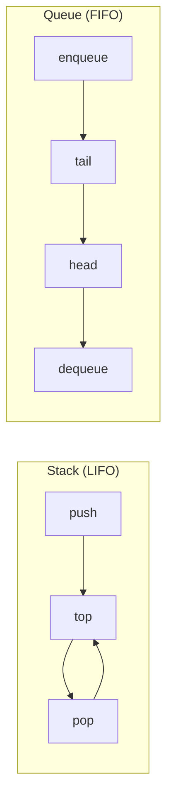

# Вопросы на собеседовании: `Стеки и очереди`

Стеки и очереди — линейные структуры с дисциплиной доступа: **LIFO** (стек) и **FIFO** (очередь). На их основе строятся обходы графов (BFS/DFS), парсеры, кеши, message brokers. На собеседовании любят спрашивать про **monotonic stack/queue** и реализацию очереди через два стека.

## Полезные ссылки

### Официальная документация и авторитетные источники

- [Java Stack Class — Baeldung](https://www.baeldung.com/java-stack)
- [Java Queue Interface — Baeldung](https://www.baeldung.com/java-queue)
- [ArrayDeque vs Stack — Baeldung](https://www.baeldung.com/java-deque-vs-stack)
- [PriorityQueue — Baeldung](https://www.baeldung.com/java-priorityqueue)
- [BlockingQueue — Baeldung](https://www.baeldung.com/java-blocking-queue)
- [Deque (Java) — Oracle Docs](https://docs.oracle.com/en/java/javase/17/docs/api/java.base/java/util/Deque.html)

## Содержание

- [Полезные ссылки](#полезные-ссылки)
- [See also](#see-also)

**Базовые понятия**
- [Q1. (!) Что такое Stack и Queue?](#q1--что-такое-stack-и-queue)
- [Q2. (!) Чем Deque отличается от Stack и Queue?](#q2--чем-deque-отличается-от-stack-и-queue)
- [Q3. (!) Почему java.util.Stack считается устаревшим?](#q3--почему-javautilstack-считается-устаревшим)
- [Q4. Что такое PriorityQueue?](#q4-что-такое-priorityqueue)

**Реализации**
- [Q5. (!) Реализация Stack на массиве?](#q5--реализация-stack-на-массиве)
- [Q6. (!) Реализация Queue на циклическом массиве?](#q6--реализация-queue-на-циклическом-массиве)
- [Q7. Реализация Stack и Queue на связном списке?](#q7-реализация-stack-и-queue-на-связном-списке)
- [Q8. (!) Как реализовать Queue через два Stack?](#q8--как-реализовать-queue-через-два-stack)
- [Q9. (!) Как реализовать Stack через две Queue?](#q9--как-реализовать-stack-через-две-queue)

**Min/Max stack**
- [Q10. (!) Stack с операцией getMin за O(1)?](#q10--stack-с-операцией-getmin-за-o1)
- [Q11. (!) Очередь с операцией getMax за O(1)?](#q11--очередь-с-операцией-getmax-за-o1)

**Классические задачи**
- [Q12. (!) Проверка скобочной последовательности?](#q12--проверка-скобочной-последовательности)
- [Q13. (!) Reverse Polish Notation — вычислить выражение?](#q13--reverse-polish-notation--вычислить-выражение)
- [Q14. (!) Задача Daily Temperatures через monotonic stack?](#q14--задача-daily-temperatures-через-monotonic-stack)
- [Q15. (!) Как решить Largest Rectangle in Histogram?](#q15--как-решить-largest-rectangle-in-histogram)
- [Q16. (!) Sliding Window Maximum через monotonic deque?](#q16--sliding-window-maximum-через-monotonic-deque)

**Очереди в concurrent среде**
- [Q17. (!) Что такое BlockingQueue и зачем нужна?](#q17--что-такое-blockingqueue-и-зачем-нужна)
- [Q18. (!) Чем отличаются ArrayBlockingQueue, LinkedBlockingQueue, SynchronousQueue?](#q18--чем-отличаются-arrayblockingqueue-linkedblockingqueue-synchronousqueue)
- [Q19. ConcurrentLinkedQueue — как работает lock-free?](#q19-concurrentlinkedqueue--как-работает-lock-free)
- [Q20. Что такое PriorityBlockingQueue?](#q20-что-такое-priorityblockingqueue)

**Применения и подводные камни**
- [Q21. (!) Где в реальной жизни используется stack?](#q21--где-в-реальной-жизни-используется-stack)
- [Q22. (!) Где используется queue?](#q22--где-используется-queue)
- [Q23. Что такое circular buffer и зачем?](#q23-что-такое-circular-buffer-и-зачем)
- [Q24. (!) В чём разница между add() и offer(), peek() и element(), poll() и remove()?](#q24--в-чём-разница-между-add-и-offer-peek-и-element-poll-и-remove)
- [Q25. Почему ArrayDeque не позволяет null элементы?](#q25-почему-arraydeque-не-позволяет-null-элементы)

## Q1. (!) Что такое Stack и Queue?

Это две линейные структуры с разной дисциплиной доступа: стек выдаёт элементы в обратном порядке добавления, очередь — в том же порядке, в каком они пришли.

**Stack (LIFO — Last In, First Out)** — последний добавленный выходит первым. Две операции:
- `push(x)` — добавить на верх
- `pop()` — извлечь верхний

**Queue (FIFO — First In, First Out)** — первый добавленный выходит первым. Две операции:
- `enqueue(x)` / `offer(x)` — добавить в конец
- `dequeue()` / `poll()` — извлечь из начала

Аналогии: стек — стопка тарелок (берём верхнюю), очередь — люди на кассе (обслуживают пришедшего раньше).



В Java:
- **Stack** — лучше через `ArrayDeque` (`push/pop/peek`), а не через устаревший `java.util.Stack`
- **Queue** — `ArrayDeque` или `LinkedList` (`offer/poll/peek`)

Все базовые операции — `O(1)`. На стеке строятся `DFS`, стек вызовов и парсеры; на очереди — `BFS` по уровням, планировщики задач и буферы.


## Q2. (!) Чем Deque отличается от Stack и Queue?

**Deque (Double-Ended Queue)** — обобщение стека и очереди: добавлять и удалять можно с **обоих** концов за `O(1)`. Stack работает только с одним концом, Queue — с двумя, но в разных ролях (добавление в один, извлечение из другого); Deque снимает это ограничение.

| Операция | Stack | Queue | Deque |
|----------|-------|-------|-------|
| Добавить в начало | — | — | `offerFirst` |
| Добавить в конец | `push` (=offerFirst) | `offer` | `offerLast` |
| Извлечь из начала | `pop` | `poll` | `pollFirst` |
| Извлечь из конца | — | — | `pollLast` |
| Просмотр начала | `peek` | `peek` | `peekFirst` |
| Просмотр конца | — | — | `peekLast` |

`ArrayDeque` реализует `Deque` и может работать и как stack (`push/pop`), и как queue (`offer/poll`). Поэтому это **универсальный** выбор: одна структура закрывает оба сценария без отдельных классов.

```java
Deque<Integer> stack = new ArrayDeque<>();
stack.push(1); stack.push(2);
stack.pop(); // 2

Deque<Integer> queue = new ArrayDeque<>();
queue.offer(1); queue.offer(2);
queue.poll(); // 1
```


## Q3. (!) Почему java.util.Stack считается устаревшим?

Корень проблемы в том, что `java.util.Stack` наследуется от `Vector` — и тащит за собой всё, что у `Vector` плохо для стека:

1. **Синхронизирован** — каждая операция проходит через `synchronized`. В однопоточном коде это плата за ненужную блокировку.
2. **Наследование вместо композиции** — вместе с `Vector` он получает `add(int index, E)`, `get(int index)`, `set(int index, E)`, то есть доступ по индексу. Это ломает саму идею LIFO: стек должен давать только верх, а не лезть в середину.
3. **Замедляет JIT** — лишние `monitorenter`/`monitorexit` мешают оптимизациям.

```java
// Устарело
Stack<Integer> stack = new Stack<>();

// Современно
Deque<Integer> stack = new ArrayDeque<>();
stack.push(1); stack.pop();
```

Вывод: в однопоточном коде — `ArrayDeque`. Если действительно нужен потокобезопасный стек — `ConcurrentLinkedDeque` или `LinkedBlockingDeque`, а не старый `Stack`. Подробнее — в [Java Collections](../../programming-languages/java/java-collections-interview.md).


## Q4. Что такое PriorityQueue?

**PriorityQueue** — очередь, где порядок извлечения задаёт не время добавления, а **приоритет** элемента (по умолчанию первым выходит минимальный). Внутри это **бинарная куча (heap)** — массив с heap-свойством: родитель всегда не больше потомков, поэтому минимум всегда в корне и доступен мгновенно.

```java
PriorityQueue<Integer> minHeap = new PriorityQueue<>();
PriorityQueue<Integer> maxHeap = new PriorityQueue<>(Comparator.reverseOrder());

// Произвольный приоритет
PriorityQueue<int[]> pq = new PriorityQueue<>(
    Comparator.comparingInt(a -> a[0]) // первый элемент массива = приоритет
);
```

**Сложности:**
- `offer()`, `poll()` — `O(log n)` (просеивание по высоте кучи)
- `peek()` — `O(1)` (минимум уже в корне)
- `contains()`, `remove(Object)` — `O(n)` (куча не индексирует значения, поэтому это линейный перебор!)

**Подводный камень:** `PriorityQueue` упорядочена только относительно корня. Итерация по ней **не** даёт отсортированный порядок — за сортировкой нужно последовательно звать `poll()`.

Подробнее о heap — в [Кучи](heaps-interview.md).


## Q5. (!) Реализация Stack на массиве?

Идея простая: массив плюс индекс `top` — позиция верхнего элемента. `push` пишет в `top+1`, `pop` возвращает `top` и сдвигает индекс вниз. Все операции трогают только один конец, поэтому сдвигов нет.

```java
public class ArrayStack<T> {
    private Object[] data;
    private int top = -1;

    public ArrayStack(int capacity) {
        data = new Object[capacity];
    }

    public void push(T item) {
        if (top == data.length - 1) {
            // Можно сделать reallocation для динамического роста
            data = Arrays.copyOf(data, data.length * 2);
        }
        data[++top] = item;
    }

    @SuppressWarnings("unchecked")
    public T pop() {
        if (top == -1) throw new EmptyStackException();
        T item = (T) data[top];
        data[top--] = null; // помогаем GC
        return item;
    }

    @SuppressWarnings("unchecked")
    public T peek() {
        if (top == -1) throw new EmptyStackException();
        return (T) data[top];
    }

    public boolean isEmpty() { return top == -1; }
    public int size() { return top + 1; }
}
```

`push/pop/peek` — `O(1)` (амортизированно для динамического массива, потому что удвоение размера происходит редко). Память — `O(n)`.

**Подводный камень:** обнуление ссылки `data[top--] = null` обязательно. Если этого не сделать, массив продолжит держать ссылку на «удалённый» объект, и GC его не соберёт — типичная утечка памяти в долгоживущих коллекциях.


## Q6. (!) Реализация Queue на циклическом массиве?

Очередь работает с двумя концами: добавляем в хвост (`rear`), извлекаем из головы (`front`). Если оставить голову на месте и просто двигать её вперёд, левая часть массива освобождается, но пропадает зря. Циклический массив решает это: оба индекса «оборачиваются» через `% capacity` и переиспользуют освободившиеся ячейки.

```java
public class CircularQueue<T> {
    private Object[] data;
    private int front = 0, rear = -1, size = 0;

    public CircularQueue(int capacity) {
        data = new Object[capacity];
    }

    public void enqueue(T item) {
        if (size == data.length) throw new IllegalStateException("Queue full");
        rear = (rear + 1) % data.length; // кольцевой переход
        data[rear] = item;
        size++;
    }

    @SuppressWarnings("unchecked")
    public T dequeue() {
        if (size == 0) throw new NoSuchElementException();
        T item = (T) data[front];
        data[front] = null;
        front = (front + 1) % data.length;
        size--;
        return item;
    }

    public int size() { return size; }
    public boolean isFull() { return size == data.length; }
    public boolean isEmpty() { return size == 0; }
}
```

Все операции — `O(1)`. Поле `size` нужно, чтобы отличить полную очередь от пустой: при кольцевых индексах условие `front == rear` неоднозначно (так выглядит и пустая, и заполненная очередь), а счётчик снимает эту неоднозначность. Без циклического подхода `dequeue` требовал бы сдвига всех элементов — `O(n)`.

Именно так устроен `ArrayDeque` в Java — циклический массив, который при заполнении удваивается.


## Q7. Реализация Stack и Queue на связном списке?

На связном списке обе структуры строятся без перевыделения памяти и без ограничения вместимости. Ключевой момент — какой конец списка использовать, чтобы все операции остались `O(1)`:
- **Stack** — голова списка. `push`/`pop` всегда работают с `top` (началом), вставка и удаление в голову — `O(1)`.
- **Queue** — два указателя, `head` (извлечение) и `tail` (добавление). Без указателя на хвост `enqueue` стал бы `O(n)`.

```java
class LinkedStack<T> {
    private Node<T> top;

    void push(T value) {
        Node<T> node = new Node<>(value);
        node.next = top;
        top = node;
    }

    T pop() {
        if (top == null) throw new EmptyStackException();
        T value = top.value;
        top = top.next;
        return value;
    }
}

class LinkedQueue<T> {
    private Node<T> head, tail;

    void enqueue(T value) {
        Node<T> node = new Node<>(value);
        if (tail == null) head = tail = node;
        else { tail.next = node; tail = node; }
    }

    T dequeue() {
        if (head == null) throw new NoSuchElementException();
        T value = head.value;
        head = head.next;
        if (head == null) tail = null;
        return value;
    }
}
```

Все операции — `O(1)`. **Компромисс против массива:** каждый узел — отдельный объект со ссылкой `next`, поэтому памяти на элемент уходит больше, а из-за разбросанности узлов в куче хуже работает кэш процессора. Зато нет перевыделений и копирования при росте. Подробнее — в [Linked Lists](linked-lists-interview.md).


## Q8. (!) Как реализовать Queue через два Stack?

**Идея:** очередь — это FIFO, а стек — LIFO; один разворот порядка превращает одно в другое, два разворота — восстанавливают исходный порядок. Поэтому держим два стека: `in` для добавления, `out` для извлечения. Когда `out` пуст, переливаем в него весь `in` — элементы при этом переворачиваются и встают в правильном для очереди порядке.

```java
class MyQueue<T> {
    private final Deque<T> in = new ArrayDeque<>();
    private final Deque<T> out = new ArrayDeque<>();

    public void enqueue(T x) { in.push(x); }

    public T dequeue() {
        if (out.isEmpty()) {
            while (!in.isEmpty()) out.push(in.pop());
        }
        if (out.isEmpty()) throw new NoSuchElementException();
        return out.pop();
    }

    public T peek() {
        if (out.isEmpty()) {
            while (!in.isEmpty()) out.push(in.pop());
        }
        return out.peek();
    }
}
```

**Сложность:** `enqueue` — `O(1)`, `dequeue` — амортизированный `O(1)`. Хотя отдельный `dequeue` может вызвать перелив на `O(n)`, каждый элемент перекладывается за свою жизнь ровно дважды (один раз в `out`, один раз из `out`), и эта стоимость размазывается по всем операциям.

**Доказательство амортизации:** `n` enqueue + `n` dequeue дают `n` push в `in`, `n` pop из `in`, `n` push в `out` и `n` pop из `out` — всего `4n` элементарных операций. Делим на `n` операций пользователя — получаем константу на каждую.


## Q9. (!) Как реализовать Stack через две Queue?

Здесь развернуть порядок одним переливом не выйдет (очередь сохраняет порядок, а не переворачивает его), поэтому «дороговизну» нельзя размазать — одна из операций всегда будет `O(n)`. Выбираем, какую именно сделать дорогой.

**Подход 1 — медленный push:** новый элемент кладём во вспомогательную очередь, затем переливаем туда все старые. Так свежий элемент оказывается впереди, и `pop` забирает именно его. После перелива очереди меняем местами.

```java
class MyStack<T> {
    private Queue<T> q1 = new LinkedList<>();
    private Queue<T> q2 = new LinkedList<>();

    public void push(T x) {
        q2.offer(x);
        while (!q1.isEmpty()) q2.offer(q1.poll());
        Queue<T> tmp = q1; q1 = q2; q2 = tmp;
    }

    public T pop() { return q1.poll(); }
    public T top() { return q1.peek(); }
}
```

**Сложность:** `push` — `O(n)`, `pop` — `O(1)`.

**Подход 2 — медленный pop:** при `pop` переливаем все элементы, кроме последнего, в другую очередь — последний и есть «вершина стека», его возвращаем.

Оба варианта менее элегантны, чем «queue через два stack» (там амортизация даёт `O(1)`), а здесь дорогая операция остаётся `O(n)` всегда. На практике это не используют — задача чисто учебная, на понимание свойств FIFO/LIFO.


## Q10. (!) Stack с операцией getMin за O(1)?

Наивно `getMin` — это `O(n)` (просмотр всех элементов). Чтобы сделать `O(1)`, нужно заранее знать минимум для каждого состояния стека.

**Идея:** держим второй стек `minStack`, синхронный с основным. На его вершине всегда лежит минимум среди элементов, которые сейчас в стеке. При `push` кладём новое значение в `minStack`, только если оно не больше текущего минимума; при `pop` снимаем его, только если снимаемое значение и есть текущий минимум. Так минимум всегда доступен с вершины за `O(1)`.

```java
class MinStack {
    private final Deque<Integer> stack = new ArrayDeque<>();
    private final Deque<Integer> minStack = new ArrayDeque<>();

    public void push(int x) {
        stack.push(x);
        if (minStack.isEmpty() || x <= minStack.peek()) {
            minStack.push(x);
        }
    }

    public void pop() {
        int popped = stack.pop();
        if (popped == minStack.peek()) minStack.pop();
    }

    public int top() { return stack.peek(); }
    public int getMin() { return minStack.peek(); }
}
```

`push/pop/top/getMin` — `O(1)`. Память — до `O(n)`: в худшем случае (элементы добавляются по убыванию) каждый из них попадает и в `minStack`.

**Оптимизация (без второго стека):** хранить в одном стеке пары (`value`, `currentMin`) — каждый кадр сразу несёт минимум на момент своего добавления. Объём памяти тот же, но проще логика снятия.


## Q11. (!) Очередь с операцией getMax за O(1)?

С очередью трюк со вторым стеком из Q10 не работает: удаление идёт с другого конца, чем добавление, и «синхронный» стек минимумов рассыпается. Нужен **монотонный дек**.

**Monotonic deque:** вспомогательный дек хранит значения в **невозрастающем** порядке, поэтому максимум всегда лежит в его начале. При добавлении нового элемента выбрасываем с конца дека все, кто меньше него — они уже никогда не станут максимумом (новый элемент моложе и больше). При удалении из очереди убираем элемент из начала дека, только если он совпал с максимумом.

```java
class MaxQueue {
    private final Deque<Integer> data = new ArrayDeque<>();
    private final Deque<Integer> maxDeque = new ArrayDeque<>();

    public void enqueue(int x) {
        data.offer(x);
        // Удаляем все меньшие с конца — они больше не могут быть максимумом
        while (!maxDeque.isEmpty() && maxDeque.peekLast() < x) {
            maxDeque.pollLast();
        }
        maxDeque.offerLast(x);
    }

    public int dequeue() {
        int x = data.poll();
        if (!maxDeque.isEmpty() && maxDeque.peekFirst() == x) {
            maxDeque.pollFirst();
        }
        return x;
    }

    public int getMax() {
        if (maxDeque.isEmpty()) throw new NoSuchElementException();
        return maxDeque.peekFirst();
    }
}
```

**Амортизированный `O(1)`** на все операции. Внутренний `while` может за один `enqueue` выбросить много элементов, но каждый элемент попадает в `maxDeque` и покидает его не более одного раза за всю жизнь — суммарная работа линейна.


## Q12. (!) Проверка скобочной последовательности?

Классическая задача на стек. Скобки вложены по принципу LIFO: последняя открытая должна закрыться первой — ровно дисциплина стека. Открывающую скобку кладём в стек; на закрывающей проверяем, что на вершине лежит парная ей открывающая. Если стек пуст или скобка не та — последовательность невалидна. В конце стек должен быть пустым (все скобки закрыты).

```java
boolean isValid(String s) {
    Deque<Character> stack = new ArrayDeque<>();
    Map<Character, Character> pairs = Map.of(')', '(', ']', '[', '}', '{');

    for (char c : s.toCharArray()) {
        if (pairs.containsValue(c)) {
            stack.push(c);
        } else if (pairs.containsKey(c)) {
            if (stack.isEmpty() || stack.pop() != pairs.get(c)) return false;
        }
    }
    return stack.isEmpty();
}
```

`O(n)` время, `O(n)` память (в худшем случае все скобки открывающие и лежат в стеке).

**Граничные случаи:**
- Пустая строка — валидна (нечего балансировать, стек пуст)
- `"["` — невалидна: в конце стек не пуст
- `"]["` — невалидна: закрывающая пришла без открывающей (стек пуст в момент проверки)


## Q13. (!) Reverse Polish Notation — вычислить выражение?

**RPN (postfix):** оператор идёт после своих операндов, например `3 4 +` означает `3 + 4 = 7`. Главное достоинство — не нужны скобки и приоритеты: порядок записи однозначно задаёт порядок вычислений.

**Алгоритм на стеке:** число — кладём в стек; оператор — снимаем два верхних числа, применяем операцию, результат возвращаем в стек. В конце в стеке остаётся одно значение — ответ.

```java
int evalRPN(String[] tokens) {
    Deque<Integer> stack = new ArrayDeque<>();
    for (String t : tokens) {
        switch (t) {
            case "+" -> stack.push(stack.pop() + stack.pop());
            case "*" -> stack.push(stack.pop() * stack.pop());
            case "-" -> { int b = stack.pop(), a = stack.pop(); stack.push(a - b); }
            case "/" -> { int b = stack.pop(), a = stack.pop(); stack.push(a / b); }
            default  -> stack.push(Integer.parseInt(t));
        }
    }
    return stack.pop();
}
```

`O(n)` время, `O(n)` память.

**Подводный камень — порядок операндов:** для некоммутативных операций (`-`, `/`) он важен. Первый `pop()` достаёт **правый** операнд (он был добавлен позже), второй — левый. Поэтому в коде сначала берут `b`, затем `a`, и считают `a - b`, а не `b - a`.

RPN исторически применялся в калькуляторах HP и в форт-подобных языках именно потому, что вычисляется одним проходом по стеку.


## Q14. (!) Задача Daily Temperatures через monotonic stack?

Задача: для каждого дня найти, через сколько дней температура впервые станет выше. Наивно это `O(n²)` (для каждого дня сканируем вперёд). Монотонный стек убирает повторное сканирование.

**Идея:** в стеке держим индексы дней, для которых ответ ещё не найден; температуры в нём убывают сверху вниз. Когда приходит более тёплый день `i`, он «закрывает» все более холодные дни на вершине стека: для каждого снимаемого индекса `idx` ответ равен `i - idx`. Так каждый день ждёт в стеке ровно до своего первого более тёплого дня.

```java
int[] dailyTemperatures(int[] T) {
    int[] result = new int[T.length];
    Deque<Integer> stack = new ArrayDeque<>(); // индексы, температуры убывают сверху вниз

    for (int i = 0; i < T.length; i++) {
        while (!stack.isEmpty() && T[i] > T[stack.peek()]) {
            int idx = stack.pop();
            result[idx] = i - idx;
        }
        stack.push(i);
    }
    return result;
}
```

**Monotonic stack** — стек, в котором значения упорядочены (убывают или возрастают). Это рабочая лошадка для задач «найти ближайший больший/меньший элемент» (next greater/smaller element) за `O(n)` амортизированно.

`O(n)` время, `O(n)` память: каждый индекс попадает в стек один раз и снимается не более одного раза, поэтому суммарно операций линейно, несмотря на вложенный `while`.


## Q15. (!) Как решить Largest Rectangle in Histogram?

Задача: найти прямоугольник максимальной площади, вписанный в гистограмму из столбцов разной высоты. Ключевая мысль: для каждого столбца можно построить самый широкий прямоугольник, в котором именно этот столбец — самый низкий. Тогда его площадь = `высота столбца × ширина зоны`, где зона ограничена первыми более низкими столбцами слева и справа.

**Монотонный стек** ищет эти границы за один проход: в нём лежат индексы столбцов с **возрастающей** высотой. Как только приходит столбец ниже вершины, мы нашли правую границу для столбца на вершине; левую границу даёт элемент под ним. Добавочный «нулевой» столбец в конце (`i == n`) принудительно вытолкнет всё, что осталось в стеке.

```java
int largestRectangleArea(int[] heights) {
    Deque<Integer> stack = new ArrayDeque<>(); // индексы, высоты возрастают
    int maxArea = 0;
    int n = heights.length;

    for (int i = 0; i <= n; i++) {
        int h = (i == n) ? 0 : heights[i];
        while (!stack.isEmpty() && h < heights[stack.peek()]) {
            int top = stack.pop();
            int width = stack.isEmpty() ? i : i - stack.peek() - 1;
            maxArea = Math.max(maxArea, heights[top] * width);
        }
        stack.push(i);
    }
    return maxArea;
}
```

`O(n)` время, `O(n)` память — каждый индекс кладётся и снимается со стека ровно один раз.

**Сценарий применения:** максимальный прямоугольник из единиц в бинарной матрице (LeetCode 85) сводится к этой задаче — для каждой строки строится «гистограмма» из высот столбцов единиц над ней, и считается максимальный прямоугольник.


## Q16. (!) Sliding Window Maximum через monotonic deque?

Задача: для окна ширины `k`, скользящего по массиву, выдавать максимум на каждой позиции. Это прямое применение монотонного дека из Q11 — только дополнительно нужно выбрасывать элементы, вышедшие за левую границу окна.

**Дек хранит индексы**, а значения по ним убывают. На каждом шаге: (1) убираем из начала индекс, выпавший из окна; (2) выбрасываем с конца все индексы со значением не больше текущего — они уже не станут максимумом, пока в окне есть более новый и крупный элемент; (3) добавляем текущий индекс. Максимум окна — всегда значение по индексу в начале дека.

```java
int[] maxSlidingWindow(int[] nums, int k) {
    int[] result = new int[nums.length - k + 1];
    Deque<Integer> deque = new ArrayDeque<>(); // индексы, значения убывают

    for (int i = 0; i < nums.length; i++) {
        // 1. Убираем из начала индексы вне окна
        if (!deque.isEmpty() && deque.peekFirst() <= i - k) {
            deque.pollFirst();
        }
        // 2. Убираем с конца меньшие значения
        while (!deque.isEmpty() && nums[deque.peekLast()] <= nums[i]) {
            deque.pollLast();
        }
        deque.offerLast(i);

        // 3. Когда окно полное — записываем максимум
        if (i >= k - 1) result[i - k + 1] = nums[deque.peekFirst()];
    }
    return result;
}
```

**Сложность `O(n)` амортизированно** — каждый индекс попадает в дек и покидает его не более одного раза. Альтернатива через `PriorityQueue` — `O(n log k)`: она проще в реализации, но медленнее, потому что куча не умеет дёшево удалять «протухшие» элементы из середины.


## Q17. (!) Что такое BlockingQueue и зачем нужна?

**BlockingQueue** — потокобезопасная очередь, которая умеет **ждать**, вместо того чтобы возвращать ошибку:
- `put(x)` — блокирует поток, пока в очереди не освободится место (если она полна)
- `take()` — блокирует поток, пока не появится элемент (если она пуста)

Зачем это нужно: в паттерне **producer-consumer** производители и потребители работают с разной скоростью. Блокировка автоматически решает синхронизацию и **backpressure** — быстрый producer не переполнит память, потому что `put` притормозит его, пока consumer не разгребёт очередь. Самим писать `wait/notify` не нужно.

```java
BlockingQueue<Task> queue = new ArrayBlockingQueue<>(100);

// Producer
new Thread(() -> {
    while (true) {
        Task t = generateTask();
        queue.put(t); // ждёт, если очередь заполнена
    }
}).start();

// Consumer
new Thread(() -> {
    while (true) {
        Task t = queue.take(); // ждёт, если очередь пуста
        process(t);
    }
}).start();
```

**Когда вечная блокировка нежелательна** — есть варианты с таймаутом:
- `offer(x, timeout)` — попытка вставить, но ждать не дольше таймаута
- `poll(timeout)` — попытка извлечь, но ждать не дольше таймаута


## Q18. (!) Чем отличаются ArrayBlockingQueue, LinkedBlockingQueue, SynchronousQueue?

| Реализация | Структура | Размер | Локи | Случай |
|------------|-----------|--------|------|--------|
| `ArrayBlockingQueue` | Циклический массив | Фиксированный | Один lock | Известная вместимость |
| `LinkedBlockingQueue` | Связный список | Опциональный (по умолч. `Integer.MAX_VALUE`) | Два lock (head, tail) | Высокий throughput |
| `SynchronousQueue` | Без хранения | 0 | — | Прямая передача между потоками |

```java
// SynchronousQueue — каждое put() ждёт take() и наоборот
BlockingQueue<Task> q = new SynchronousQueue<>();
// Используется в Executors.newCachedThreadPool() как handoff queue
```

Как выбирать:
- `LinkedBlockingQueue` обычно даёт выше пропускную способность: два раздельных лока на голову и хвост означают, что producer и consumer не конкурируют за одну блокировку.
- `ArrayBlockingQueue` предсказуемее по памяти (фиксированный массив, без аллокации узлов) и поддерживает честный (fair) порядок ожидающих потоков.
- `SynchronousQueue` ничего не хранит: `put` напрямую передаёт элемент потоку, который вызвал `take`. Это очередь-«передача из рук в руки».

Подробнее — в [Java Concurrency](../../programming-languages/java/java-concurrency-interview.md).


## Q19. ConcurrentLinkedQueue — как работает lock-free?

`ConcurrentLinkedQueue` — **неблокирующая** потокобезопасная очередь на основе алгоритма **Michael & Scott (1996)**. Вместо локов синхронизация держится на атомарной операции `CAS` (compare-and-swap): поток пытается переставить ссылку на хвост/голову, и если другой поток успел раньше — повторяет попытку в цикле, а не засыпает. Так несколько потоков продвигают очередь без взаимной блокировки.

```java
ConcurrentLinkedQueue<Integer> q = new ConcurrentLinkedQueue<>();
q.offer(1);
q.poll(); // null если пусто, не блокирует
```

**Плюсы:** нет блокировок → потоки не усыпляются → меньше переключений контекста → лучше масштабируется на много ядер.

**Минусы:**
- `size()` — `O(n)`: счётчика нет, приходится обходить весь список, и результат всё равно приблизителен при конкурентных изменениях
- нет блокирующих `put`/`take` — отсюда нет backpressure: переполнение нужно контролировать самому
- каждый элемент — отдельный узел-объект, поэтому больше нагрузка на GC

**Сценарий применения:** высокая пропускная способность, когда backpressure не нужен (или регулируется снаружи).


## Q20. Что такое PriorityBlockingQueue?

`PriorityBlockingQueue` — это `PriorityQueue` (куча с упорядочиванием по `compareTo` или `Comparator`), снабжённый потокобезопасностью и блокирующим `take`. То есть элементы извлекаются по приоритету, а не по порядку добавления, и при пустой очереди потребитель ждёт.

```java
PriorityBlockingQueue<Task> queue = new PriorityBlockingQueue<>(
    100,
    Comparator.comparingInt(Task::priority).reversed() // высокий приоритет первым
);
```

**Особенности:**
- Очередь неограниченная (unbounded), поэтому `put()` никогда не блокируется — места всегда «хватает» (куча растёт)
- `take()` блокируется, пока очередь пуста
- Под капотом — бинарная куча, отсюда `O(log n)` на вставку и извлечение

**Сценарий применения:** `ScheduledThreadPoolExecutor` использует приоритетную очередь, чтобы первой выполнять задачу с ближайшим временем запуска.


## Q21. (!) Где в реальной жизни используется stack?

Везде, где нужен порядок «последний вошёл — первый вышел» или возврат к предыдущему состоянию:

1. **Call stack** — кадры вызовов функций; глубокая рекурсия переполняет его и даёт `StackOverflowError`
2. **Undo/Redo** — каждое действие — `push`; отмена (undo) — `pop` последнего
3. **История браузера** — back/forward, по сути два стека (назад и вперёд)
4. **Парсеры выражений** — вычисление RPN, проверка скобок (Q12–Q13)
5. **DFS** — итеративный обход в глубину как раз заменяет рекурсию явным стеком
6. **Backtracking** — N-Queens, Sudoku: стек хранит частичное решение, откат — снятие верхнего шага
7. **JVM bytecode** — операнды лежат на operand stack виртуальной машины

```java
// JVM пример: 1 + 2 в bytecode
// iconst_1   ← push 1
// iconst_2   ← push 2
// iadd       ← pop 2, pop 1, push 3
```


## Q22. (!) Где используется queue?

Везде, где важна обработка «по очереди» — в порядке поступления (FIFO) или развязка скоростей producer и consumer:

1. **BFS** — обход графа по уровням: очередь хранит фронт ещё не посещённых вершин
2. **Планирование задач** — `ExecutorService` берёт задачи из `BlockingQueue`
3. **Буферизация** — развязка между producer и consumer (на распределённом уровне это Kafka, RabbitMQ)
4. **Очередь печати, очередь запросов** — обслуживание строго по порядку поступления
5. **Планировщик ОС** — round-robin процессов, часто на циклической очереди
6. **Streaming** — буфер между источником данных и потребителем

Подробнее о распределённых очередях — в [Kafka](../../messaging/kafka-interview.md) и [RabbitMQ](../../messaging/rabbitmq-interview.md).


## Q23. Что такое circular buffer и зачем?

**Circular buffer (ring buffer)** — буфер фиксированного размера с указателями `head` (чтение) и `tail` (запись), которые «оборачиваются» через начало массива (та же идея кольцевых индексов, что в Q6). Ключевое отличие от обычной очереди: при переполнении он не растёт и не бросает исключение, а **перезаписывает самые старые данные** новыми.

Зачем это нужно: фиксированный размер означает предсказуемое потребление памяти без аллокаций в рантайме — критично для систем реального времени, драйверов и горячих путей, где нельзя позволить себе GC-паузы или непредсказуемый рост.

```java
class RingBuffer<T> {
    private final Object[] data;
    private int head = 0, tail = 0, size = 0;

    public RingBuffer(int capacity) { data = new Object[capacity]; }

    public void write(T item) {
        data[tail] = item;
        tail = (tail + 1) % data.length;
        if (size == data.length) head = (head + 1) % data.length; // overwrite
        else size++;
    }

    @SuppressWarnings("unchecked")
    public T read() {
        if (size == 0) throw new NoSuchElementException();
        T item = (T) data[head];
        data[head] = null;
        head = (head + 1) % data.length;
        size--;
        return item;
    }
}
```

**Сценарии применения:**
- **LMAX Disruptor** — высокопроизводительный конкурентный буфер
- Логирование (rolling logs — храним только последние N сообщений)
- Аудио/видео streaming
- Буферы сетевых пакетов
- `kfifo` в ядре Linux


## Q24. (!) В чём разница между add() и offer(), peek() и element(), poll() и remove()?

У `Queue` каждая операция представлена двумя методами, которые делают одно и то же, но **по-разному реагируют на сбой**: одна группа бросает исключение, другая возвращает специальное значение (`false` или `null`).

| Операция | Бросает исключение | Возвращает спец. значение |
|----------|--------------------|---------------------------|
| Вставка | `add(e)` (`IllegalStateException`, если полна) | `offer(e)` (`false`) |
| Просмотр | `element()` (`NoSuchElementException`) | `peek()` (`null`) |
| Извлечение | `remove()` (`NoSuchElementException`) | `poll()` (`null`) |

Разница видна на **ограниченных (bounded)** очередях: при переполнении `add()` бросит исключение, а `offer()` вернёт `false`. Выбор зависит от того, как удобнее обрабатывать ситуацию — через `try/catch` или проверкой результата.

Для **неограниченных (unbounded)** очередей разницы при вставке нет: места всегда хватает, поэтому `add` и `offer` ведут себя одинаково.

```java
Queue<Integer> q = new ArrayDeque<>();
q.offer(1);
q.peek();   // 1
q.poll();   // 1
q.poll();   // null — пусто
q.remove(); // NoSuchElementException — пусто
```


## Q25. Почему ArrayDeque не позволяет null элементы?

Потому что `null` уже занят как служебный сигнал. Методы `peek()` и `poll()` возвращают `null`, чтобы сообщить «очередь пуста». Если бы `null` был допустимым элементом, результат `poll() == null` стал бы неоднозначным: то ли очередь пуста, то ли в ней реально лежит `null`. Запрет на `null` снимает эту двусмысленность.

```java
Deque<Integer> deque = new ArrayDeque<>();
deque.offer(null); // NullPointerException
```

`LinkedList` (старая реализация `Queue`) `null` **разрешает**, но это считается недочётом дизайна именно по той же причине неоднозначности — ещё один довод предпочитать `ArrayDeque`.

В `BlockingQueue` `null` тоже запрещён: блокирующие методы используют `null` как внутренний сигнал «элемента нет», и допустить реальный `null` они не могут.

---

## See also

- [Алгоритмы (обзор)](../algorithms-interview.md) — карта алгоритмических тем
- [Массивы и строки](arrays-strings-interview.md) — циклический массив для очереди
- [Связные списки](linked-lists-interview.md) — основа для linked stack/queue
- [Кучи](heaps-interview.md) — реализация PriorityQueue
- [Деревья](trees-interview.md) — BFS использует очередь, DFS — стек
- [Графы](graphs-interview.md) — BFS/DFS обходы
- [Two Pointers и Sliding Window](../algorithmic-paradigms/two-pointers-sliding-window-interview.md) — monotonic deque
- [Рекурсия](../algorithmic-paradigms/recursion-interview.md) — связь со стеком вызовов
- [Java Collections](../../programming-languages/java/java-collections-interview.md) — ArrayDeque vs Stack vs LinkedList
- [Java Concurrency](../../programming-languages/java/java-concurrency-interview.md) — BlockingQueue, ConcurrentLinkedQueue
- [Apache Kafka](../../messaging/kafka-interview.md) — distributed queue
- [RabbitMQ](../../messaging/rabbitmq-interview.md) — message broker queues


---

- [Массивы и строки](arrays-strings-interview.md)
- [Графы](graphs-interview.md)
- [Хеш-таблицы](hash-tables-interview.md)
- [Кучи (Heaps)](heaps-interview.md)
- [Связные списки](linked-lists-interview.md)
- [Деревья](trees-interview.md)
