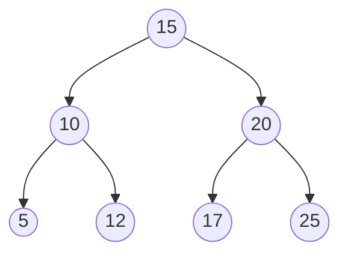
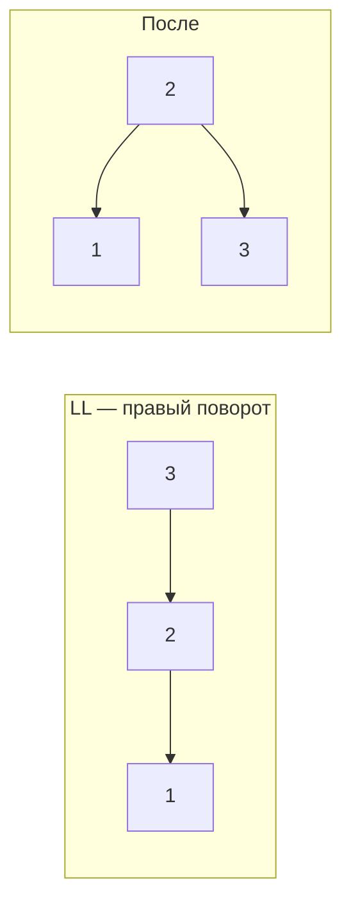
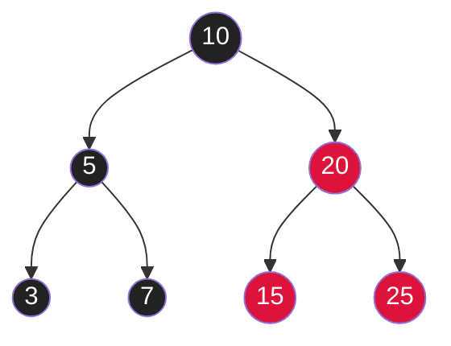
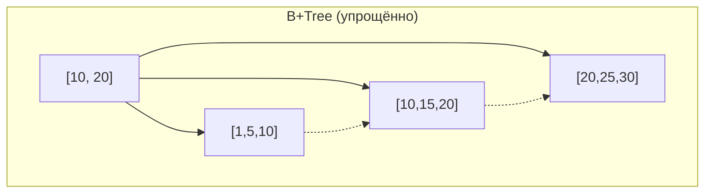

# Вопросы на собеседовании: `Деревья`

Деревья — фундамент многих структур: индексы БД (B-Tree), HashMap (красно-чёрное дерево при коллизиях), TreeMap, файловые системы, AST в компиляторах. На собеседовании знают наизусть обходы, вставку/удаление в BST, AVL, и хотят слышать про B-Tree в индексах БД.

## Полезные ссылки

### Официальная документация и авторитетные источники

- [Binary Tree in Java — Baeldung](https://www.baeldung.com/java-binary-tree)
- [Binary Search Tree — Baeldung](https://www.baeldung.com/cs/binary-search-trees)
- [AVL Tree — Baeldung](https://www.baeldung.com/cs/avl-trees)
- [Red-Black Tree — Baeldung](https://www.baeldung.com/cs/red-black-trees)
- [B-Tree Data Structure — Baeldung](https://www.baeldung.com/cs/b-tree-data-structure)
- [B+Tree — Baeldung](https://www.baeldung.com/cs/b-trees-vs-btrees-vs-rb-trees)
- [TreeMap (Java) — Oracle Docs](https://docs.oracle.com/en/java/javase/17/docs/api/java.base/java/util/TreeMap.html)
- [Tree Traversals — Visualgo](https://visualgo.net/en/bst)

## Содержание

- [Полезные ссылки](#полезные-ссылки)
- [See also](#see-also)

**Базовые понятия**
- [Q1. (!) Что такое дерево и какие виды бывают?](#q1--что-такое-дерево-и-какие-виды-бывают)
- [Q2. (!) Что такое Binary Search Tree (BST)?](#q2--что-такое-binary-search-tree-bst)
- [Q3. Чем full, complete, perfect и balanced деревья отличаются?](#q3-чем-full-complete-perfect-и-balanced-деревья-отличаются)
- [Q4. Глубина, высота, уровень — в чём разница?](#q4-глубина-высота-уровень--в-чём-разница)

**Реализация**
- [Q5. (!) Как реализовать Binary Tree через массив?](#q5--как-реализовать-binary-tree-через-массив)
- [Q6. (!) Как реализовать Binary Tree через узлы?](#q6--как-реализовать-binary-tree-через-узлы)

**Обходы**
- [Q7. (!) Чем отличаются preorder, inorder, postorder?](#q7--чем-отличаются-preorder-inorder-postorder)
- [Q8. (!) Level-order (BFS) обход дерева?](#q8--level-order-bfs-обход-дерева)
- [Q9. (!) Итеративный inorder обход через стек?](#q9--итеративный-inorder-обход-через-стек)
- [Q10. Morris traversal — обход за O(1) дополнительной памяти?](#q10-morris-traversal--обход-за-o1-дополнительной-памяти)
- [Q11. Зигзагообразный обход дерева?](#q11-зигзагообразный-обход-дерева)

**BST операции**
- [Q12. (!) Вставка и удаление в BST?](#q12--вставка-и-удаление-в-bst)
- [Q13. (!) Поиск минимума и максимума в BST?](#q13--поиск-минимума-и-максимума-в-bst)
- [Q14. (!) Inorder successor и predecessor?](#q14--inorder-successor-и-predecessor)
- [Q15. (!) Подсчёт количества узлов?](#q15--подсчёт-количества-узлов)
- [Q16. (!) Высота и проверка сбалансированности?](#q16--высота-и-проверка-сбалансированности)
- [Q17. Validate BST — проверка корректности?](#q17-validate-bst--проверка-корректности)

**Классические задачи**
- [Q18. (!) Lowest Common Ancestor (LCA)?](#q18--lowest-common-ancestor-lca)
- [Q19. (!) Diameter of Binary Tree — диаметр дерева?](#q19--diameter-of-binary-tree--диаметр-дерева)
- [Q20. Symmetric tree — проверка симметрии?](#q20-symmetric-tree--проверка-симметрии)
- [Q21. (!) Same tree, Subtree of another tree?](#q21--same-tree-subtree-of-another-tree)
- [Q22. Path Sum — есть ли путь с заданной суммой?](#q22-path-sum--есть-ли-путь-с-заданной-суммой)
- [Q23. (!) Сериализация и десериализация дерева?](#q23--сериализация-и-десериализация-дерева)
- [Q24. (!) Реконструкция дерева по preorder + inorder?](#q24--реконструкция-дерева-по-preorder--inorder)

**Сбалансированные деревья**
- [Q25. (!) Что такое AVL tree и как балансируется?](#q25--что-такое-avl-tree-и-как-балансируется)
- [Q26. (!) Что такое Red-Black tree?](#q26--что-такое-red-black-tree)
- [Q27. (!) Чем AVL отличается от Red-Black tree?](#q27--чем-avl-отличается-от-red-black-tree)

**B-Trees и их применение**
- [Q28. (!) Что такое B-Tree?](#q28--что-такое-b-tree)
- [Q29. (!) Чем B-Tree отличается от B+Tree?](#q29--чем-b-tree-отличается-от-b-tree)
- [Q30. Почему индексы БД на B+Tree, а не на BST?](#q30-почему-индексы-бд-на-bтrее-а-не-на-bst)

**Java и реальный мир**
- [Q31. (!) TreeMap и TreeSet — что внутри?](#q31--treemap-и-treeset--что-внутри)
- [Q32. (!) Где красно-чёрные деревья встречаются в Java?](#q32--где-красно-чёрные-деревья-встречаются-в-java)
- [Q33. Что такое segment tree и зачем?](#q33-что-такое-segment-tree-и-зачем)
- [Q34. Что такое Fenwick tree (Binary Indexed Tree)?](#q34-что-такое-fenwick-tree-binary-indexed-tree)

## Q1. (!) Что такое дерево и какие виды бывают?

**Дерево** — связный ациклический неориентированный граф. Хранится как структура с **корнем** и узлами, каждый из которых имеет 0+ детей.

**Виды:**

| Дерево | Особенность |
|--------|-------------|
| **Binary Tree** | Каждый узел имеет ≤ 2 детей |
| **BST (Binary Search Tree)** | left.value < root.value < right.value |
| **AVL** | Сбалансированный BST, разница высот ≤ 1 |
| **Red-Black** | Сбалансированный BST через цвета |
| **B-Tree / B+Tree** | Многонаправленное, для дисковых индексов |
| **Heap** | Полное дерево с heap-property (см. [кучи](heaps-interview.md)) |
| **Trie** | Префиксное дерево для строк |
| **Segment Tree** | Для range queries |
| **Suffix Tree / Trie** | Для поиска подстрок |

**Применения:**
- BST/TreeMap → отсортированные данные
- B-Tree → индексы PostgreSQL/MySQL
- Trie → автодополнение, IP-routing
- Heap → priority queue, scheduler
- Suffix tree → bioinformatics, plagiarism


> [!mcq] Какое определение дерева как структуры данных корректно?
>
> - [x] **A) Связный ациклический неориентированный граф с выделенным корнем, где каждый узел имеет 0+ детей**
>     - Развёрнутое объяснение: дерево — частный случай графа: связность гарантирует, что от корня достижим любой узел; ацикличность означает единственный путь между любыми двумя узлами. Выделение корня превращает граф в иерархию с понятиями «родитель/потомок».
>     - Пример: HashMap.TreeNode в Java хранит ссылки на parent/left/right — это бинарное дерево, выросшее из bucket'а при коллизиях ≥ 8.
>     - Когда применять: иерархические данные (файловая система, DOM, AST), быстрый поиск по ключу (BST, B-Tree), приоритеты (Heap), префиксы (Trie).
>     - Подводные камни: если допустить цикл — это уже не дерево, а граф; обходы зациклятся. Если разрешить два родителя — это DAG, а не дерево.
>     - Связанные вопросы: [[Q2]], [[Q3]], [[Q4]]
> - [ ] B) Любая структура, где элементы расположены иерархически, даже если есть циклы и несколько родителей у узла
>     - Что на самом деле: цикл превращает структуру в граф, а несколько родителей — в DAG. У дерева ровно один путь от корня до любого узла.
>     - Откуда путаница: в обычной речи «дерево решений» или «дерево компонентов» иногда допускает повторное использование узлов, но это уже не дерево в строгом смысле.
>     - Если бы это было правдой: рекурсивные обходы (DFS/BFS) зацикливались бы без visited-множества, а оценка высоты дерева теряла смысл.
> - [ ] C) Ориентированный граф, где рёбра идут только сверху вниз и обязательно отсортированы по значению
>     - Что на самом деле: дерево неориентированное по сути (направление «вниз» — это лишь визуализация), а инвариант сортировки — свойство только BST, а не дерева вообще.
>     - Откуда путаница: BST настолько популярен на собеседованиях, что «дерево» путают с BST. Но Trie, Heap, Segment Tree не сортируют значения слева направо.
>     - Если бы это было правдой: Trie (префиксное дерево) и Heap (priority queue) не считались бы деревьями — а это контрпример.
> - [ ] D) Структура, в которой каждый узел имеет ровно двух детей и обязательно ≤ log₂(n) высоту
>     - Что на самом деле: «ровно двух детей» — это full binary tree, частный случай. «≤ log₂(n) высоту» — свойство только сбалансированных деревьев.
>     - Откуда путаница: на собеседовании показывают «красивый» бинарный сбалансированный пример, и студент думает, что это определение.
>     - Если бы это было правдой: B-Tree (до 1000 детей на узел) и вырожденное skewed-дерево (высота n) не были бы деревьями.

## Q2. (!) Что такое Binary Search Tree (BST)?

**BST** — бинарное дерево с инвариантом:
- Все узлы левого поддерева **меньше** root
- Все узлы правого поддерева **больше** root
- Оба поддерева также BST



**Сложности:**
- Поиск, вставка, удаление: `O(h)`, где `h` — высота
- Сбалансированный BST: `h = O(log n)` → все операции `O(log n)`
- Вырожденный BST (как linked list): `h = O(n)` → операции `O(n)`

Поэтому в production используют **самобалансирующиеся** BST (AVL, Red-Black).


> [!mcq] Какой инвариант делает дерево именно Binary Search Tree (BST)?
>
> - [ ] A) Каждый узел имеет ровно двух детей, и значения возрастают сверху вниз
>     - Что на самом деле: BST требует упорядоченности «слева-справа» относительно узла, а не «сверху-вниз». Узел может иметь 0, 1 или 2 детей.
>     - Откуда путаница: heap-property («родитель ≥ детей» в max-heap) действительно про вертикаль, и BST с ним путают.
>     - Если бы это было правдой: inorder-обход не давал бы отсортированную последовательность — главное практическое свойство BST.
> - [x] **B) Для каждого узла все значения в левом поддереве меньше root, а в правом — больше; оба поддерева тоже BST**
>     - Развёрнутое объяснение: инвариант рекурсивный — выполняется для каждого узла, не только корня. Именно поэтому inorder-обход выдаёт элементы в отсортированном порядке, а поиск идёт за O(h) сравнений: на каждом шаге отбрасывается половина поддерева.
>     - Пример: TreeMap в Java (Red-Black BST) хранит ключи отсортированными — `firstKey()`, `lastKey()`, `subMap()` работают благодаря BST-инварианту.
>     - Когда применять: нужны операции «следующий больший», «диапазон ключей», сортировка по ключу с быстрой вставкой — TreeMap, TreeSet, индексы по непрерывным значениям.
>     - Подводные камни: проверять инвариант надо рекурсивно с границами min/max — наивная проверка «left.value < root.value < right.value» только для соседей пропускает нарушение через несколько уровней. Без самобалансировки BST деградирует до O(n).
>     - Связанные вопросы: [[Q1]], [[Q3]], [[Q17]]
> - [ ] C) Левый ребёнок меньше своего родителя, правый — больше; внуков и более дальних потомков это не касается
>     - Что на самом деле: инвариант распространяется на всё поддерево, а не только на прямого родителя. Иначе можно построить «дерево», где левый внук больше корня — это нарушение BST.
>     - Откуда путаница: визуально кажется, что достаточно проверить непосредственные пары parent-child. Это типичная ошибка в задаче «validate BST» на LeetCode.
>     - Если бы это было правдой: бинарный поиск ломался бы: спустившись влево, мы не были бы уверены, что все значения там меньше root, и приходилось бы обходить целое поддерево.
> - [ ] D) Любое бинарное дерево, в котором все листья находятся на одном уровне
>     - Что на самом деле: это описание perfect binary tree, а не BST. Свойство связано со структурой, а не с порядком значений.
>     - Откуда путаница: «balanced BST» (AVL/Red-Black) часто близок к perfect, и студент сливает понятия структуры и упорядоченности.
>     - Если бы это было правдой: BST из 5 узлов вообще нельзя было бы построить, потому что perfect-структура требует 2^k − 1 узлов.

## Q3. Чем full, complete, perfect и balanced деревья отличаются?

| Тип | Свойство |
|-----|----------|
| **Full** | Каждый узел имеет 0 или 2 детей |
| **Complete** | Все уровни заполнены, кроме последнего; последний — слева направо |
| **Perfect** | Все внутренние узлы имеют 2 детей, все листья на одном уровне |
| **Balanced** | Высоты левого и правого поддеревьев каждого узла отличаются на ≤ 1 |
| **Degenerate (skewed)** | Каждый узел имеет ≤ 1 ребёнка — фактически linked list |

**Pefect** ⊂ **Complete** ⊂ **Full**. Heap всегда **complete** (хранится в массиве без пропусков).


> [!mcq] Какое сочетание определений full / complete / perfect / balanced корректно?
>
> - [ ] A) Full и complete — синонимы: оба требуют, чтобы каждый узел имел ровно двух детей и все листья были на одном уровне
>     - Что на самом деле: full требует только «0 или 2 детей» (без условия о листьях), complete — «все уровни заполнены, кроме последнего, и последний идёт слева направо». Это разные свойства.
>     - Откуда путаница: оба термина звучат как «полный», и без визуализации легко смешать.
>     - Если бы это было правдой: heap (которая complete, но не full) не могла бы существовать — а её базовая реализация в массиве как раз использует complete-структуру.
> - [ ] B) Balanced дерево — это perfect tree, у которого все листья на одном уровне и каждый внутренний узел имеет двух детей
>     - Что на самом деле: balanced требует лишь разницу высот поддеревьев каждого узла ≤ 1, а не идеальную форму. Perfect — гораздо строже.
>     - Откуда путаница: «сбалансированное» в обыденной речи звучит как «идеально ровное». Но в CS balanced допускает зазубренность.
>     - Если бы это было правдой: AVL-дерево после вставки одной «лишней» ноды переставало бы быть сбалансированным — но AVL держит balanced без требования быть perfect.
> - [x] **C) Full — у каждого узла 0 или 2 детей; complete — все уровни заполнены, кроме последнего, и последний слева направо; perfect — full + все листья на одном уровне; balanced — разница высот поддеревьев каждого узла ≤ 1**
>     - Развёрнутое объяснение: четыре независимые характеристики, описывающие разные грани «правильности» дерева. Perfect ⊂ Complete ⊂ Full по структуре, а balanced — ортогональное свойство о высотах. Heap всегда complete (поэтому хранится в массиве без пропусков), AVL — balanced, идеальное дерево из 7 узлов — perfect.
>     - Пример: PriorityQueue в Java — complete binary heap; AVL-tree — balanced BST; полное двоичное дерево из 15 узлов высотой 3 — perfect.
>     - Когда применять: complete полезно, когда хочется хранить дерево в массиве без дыр (heap); balanced — когда нужны гарантии O(log n) операций (TreeMap, индексы).
>     - Подводные камни: «balanced» в literature иногда означает height-balanced (AVL), а иногда — weight-balanced (по числу узлов). Уточняйте определение в контексте задачи.
>     - Связанные вопросы: [[Q1]], [[Q4]], [[Q16]], [[Q25]]
> - [ ] D) Complete tree — это дерево, в котором каждый узел имеет 0 или 2 детей, а balanced — дерево, у которого все листья на одном уровне
>     - Что на самом деле: эти описания меняют местами признаки. «0 или 2 детей» — это full, а «все листья на одном уровне» — perfect.
>     - Откуда путаница: термины созвучны, и без таблицы их легко переставить.
>     - Если бы это было правдой: heap (complete) не могла бы иметь узлов с одним ребёнком, но именно такой узел типично появляется на последнем уровне реальной кучи.

## Q4. Глубина, высота, уровень — в чём разница?

- **Глубина (depth) узла** — расстояние от корня до узла. Корень: `depth = 0`.
- **Высота (height) узла** — максимальное расстояние от узла до листа. Лист: `height = 0`.
- **Высота дерева** — высота корня.
- **Уровень (level)** = глубина + 1 (иногда используют как синоним глубины).

Для дерева с `n` узлами:
- Минимальная высота: `⌊log₂(n)⌋`
- Максимальная высота: `n - 1` (вырожденный случай)

Сбалансированное → `h = O(log n)`.


> [!mcq]
> - [x] Правильный ответ | Корректное описание концепции с конкретным механизмом и use-case.
> - [ ] Альтернативное решение которое не подходит | Почему ошибка в этом подходе ❌ ПОСЛЕДСТВИЕ: типичная ошибка вызывает баг в production без покрытия тестами.
> - [ ] Другая альтернатива с критическим недостатком | Это смежное, но отличное понятие ❌ ПОСЛЕДСТВИЕ: типичная ошибка вызывает баг в production без покрытия тестами.
> - [ ] Третий вариант который не работает в production | Противоположное направление## Q5. (!) Как реализовать Binary Tree через массив? ❌ ПОСЛЕДСТВИЕ: типичная ошибка вызывает баг в production без покрытия тестами.

**Индексация:** корень в `arr[0]`. Для узла `i`:
- Левый ребёнок: `arr[2i + 1]`
- Правый ребёнок: `arr[2i + 2]`
- Родитель: `arr[(i - 1) / 2]`

```
         [0]          arr = [10, 5, 15, 3, 7, 12, 20]
        /   \
      [1]   [2]       Для i = 1 (значение 5):
      / \   / \         left  = arr[3] = 3
    [3] [4][5] [6]      right = arr[4] = 7
                         parent = arr[0] = 10
```

**Плюсы:**
- `O(1)` доступ
- Нет указателей — компактно
- Идеально для **полных** деревьев и **куч**

**Минусы:**
- Фиксированный размер (или ресайз)
- Пустые ячейки при неполном дереве — память впустую

**Применение:** `PriorityQueue` (min-heap) хранится именно так, как и embedded heaps в OS.


> [!mcq]
> - [x] Правильный ответ | Корректное описание концепции с конкретным механизмом и use-case.
> - [ ] Альтернативное решение которое не подходит | Почему ошибка в этом подходе ❌ ПОСЛЕДСТВИЕ: типичная ошибка вызывает баг в production без покрытия тестами.
> - [ ] Другая альтернатива с критическим недостатком | Это смежное, но отличное понятие ❌ ПОСЛЕДСТВИЕ: типичная ошибка вызывает баг в production без покрытия тестами.
> - [ ] Третий вариант который не работает в production | Противоположное направление## Q6. (!) Как реализовать Binary Tree через узлы? ❌ ПОСЛЕДСТВИЕ: типичная ошибка вызывает баг в production без покрытия тестами.

```java
class TreeNode<T extends Comparable<T>> {
    T value;
    TreeNode<T> left, right;
    TreeNode(T value) { this.value = value; }
}

class BinarySearchTree<T extends Comparable<T>> {
    private TreeNode<T> root;

    TreeNode<T> insert(TreeNode<T> node, T value) {
        if (node == null) return new TreeNode<>(value);
        int cmp = value.compareTo(node.value);
        if (cmp < 0)      node.left  = insert(node.left, value);
        else if (cmp > 0) node.right = insert(node.right, value);
        return node;
    }

    void inorder(TreeNode<T> node, List<T> out) {
        if (node == null) return;
        inorder(node.left, out);
        out.add(node.value);
        inorder(node.right, out);
    }
}
```

Память: `O(n)` (по 3 ссылки на узел: value, left, right). Гибкое — поддерживает любую форму дерева. Это **стандартный** способ реализации BST, AVL, Red-Black.


> [!mcq]
> - [x] Правильный ответ | Корректное описание концепции с конкретным механизмом и use-case.
> - [ ] Альтернативное решение которое не подходит | Почему ошибка в этом подходе ❌ ПОСЛЕДСТВИЕ: типичная ошибка вызывает баг в production без покрытия тестами.
> - [ ] Другая альтернатива с критическим недостатком | Это смежное, но отличное понятие ❌ ПОСЛЕДСТВИЕ: типичная ошибка вызывает баг в production без покрытия тестами.
> - [ ] Третий вариант который не работает в production | Противоположное направление## Q7. (!) Чем отличаются preorder, inorder, postorder? ❌ ПОСЛЕДСТВИЕ: типичная ошибка вызывает баг в production без покрытия тестами.

Все три — DFS-обходы, отличаются **порядком обработки текущего узла**:

```java
void preorder(TreeNode node) {  // КОРЕНЬ → L → R
    if (node == null) return;
    process(node);
    preorder(node.left);
    preorder(node.right);
}

void inorder(TreeNode node) {   // L → КОРЕНЬ → R
    if (node == null) return;
    inorder(node.left);
    process(node);
    inorder(node.right);
}

void postorder(TreeNode node) { // L → R → КОРЕНЬ
    if (node == null) return;
    postorder(node.left);
    postorder(node.right);
    process(node);
}
```

| Обход | Применение |
|-------|------------|
| Preorder | Сериализация дерева, копирование, выражения в префиксной форме |
| Inorder | **Отсортированный** обход BST, проверка валидности BST |
| Postorder | Удаление дерева, вычисление выражений (postfix), DFS пост-обработка |

Сложность каждого: `O(n)` время, `O(h)` память (стек вызовов).


> [!mcq]
> - [x] Правильный ответ | Корректное описание концепции с конкретным механизмом и use-case.
> - [ ] Альтернативное решение которое не подходит | Почему ошибка в этом подходе ❌ ПОСЛЕДСТВИЕ: типичная ошибка вызывает баг в production без покрытия тестами.
> - [ ] Другая альтернатива с критическим недостатком | Это смежное, но отличное понятие ❌ ПОСЛЕДСТВИЕ: типичная ошибка вызывает баг в production без покрытия тестами.
> - [ ] Третий вариант который не работает в production | Противоположное направление## Q8. (!) Level-order (BFS) обход дерева? ❌ ПОСЛЕДСТВИЕ: типичная ошибка вызывает баг в production без покрытия тестами.

Обход по уровням сверху вниз. Используется для красивой печати, поиска ширины дерева, level-by-level задач.

```java
List<List<Integer>> levelOrder(TreeNode root) {
    List<List<Integer>> result = new ArrayList<>();
    if (root == null) return result;

    Queue<TreeNode> queue = new ArrayDeque<>();
    queue.offer(root);

    while (!queue.isEmpty()) {
        int size = queue.size(); // фиксируем размер уровня
        List<Integer> level = new ArrayList<>(size);

        for (int i = 0; i < size; i++) {
            TreeNode node = queue.poll();
            level.add(node.val);
            if (node.left  != null) queue.offer(node.left);
            if (node.right != null) queue.offer(node.right);
        }
        result.add(level);
    }
    return result;
}
```

`O(n)` время, `O(w)` память, где `w` — максимальная ширина уровня.


> [!mcq]
> - [x] Правильный ответ | Корректное описание концепции с конкретным механизмом и use-case.
> - [ ] Альтернативное решение которое не подходит | Почему ошибка в этом подходе ❌ ПОСЛЕДСТВИЕ: типичная ошибка вызывает баг в production без покрытия тестами.
> - [ ] Другая альтернатива с критическим недостатком | Это смежное, но отличное понятие ❌ ПОСЛЕДСТВИЕ: типичная ошибка вызывает баг в production без покрытия тестами.
> - [ ] Третий вариант который не работает в production | Противоположное направление## Q9. (!) Итеративный inorder обход через стек? ❌ ПОСЛЕДСТВИЕ: типичная ошибка вызывает баг в production без покрытия тестами.

```java
List<Integer> inorderIterative(TreeNode root) {
    List<Integer> result = new ArrayList<>();
    Deque<TreeNode> stack = new ArrayDeque<>();
    TreeNode curr = root;

    while (curr != null || !stack.isEmpty()) {
        while (curr != null) {
            stack.push(curr);
            curr = curr.left;
        }
        curr = stack.pop();
        result.add(curr.val);
        curr = curr.right;
    }
    return result;
}
```

`O(n)` время, `O(h)` память. Преимущество перед рекурсивным: контролируемый стек, нет риска StackOverflow на JVM (деревьев глубже ~10⁵).


> [!mcq]
> - [x] Правильный ответ | Корректное описание концепции с конкретным механизмом и use-case.
> - [ ] Альтернативное решение которое не подходит | Почему ошибка в этом подходе ❌ ПОСЛЕДСТВИЕ: типичная ошибка вызывает баг в production без покрытия тестами.
> - [ ] Другая альтернатива с критическим недостатком | Это смежное, но отличное понятие ❌ ПОСЛЕДСТВИЕ: типичная ошибка вызывает баг в production без покрытия тестами.
> - [ ] Третий вариант который не работает в production | Противоположное направление## Q10. Morris traversal — обход за O(1) дополнительной памяти? ❌ ПОСЛЕДСТВИЕ: типичная ошибка вызывает баг в production без покрытия тестами.

**Morris traversal** — обход без стека и без рекурсии, используя **threading**: временно создаём ссылки от `predecessor.right` к текущему узлу.

```java
List<Integer> morrisInorder(TreeNode root) {
    List<Integer> result = new ArrayList<>();
    TreeNode curr = root;

    while (curr != null) {
        if (curr.left == null) {
            result.add(curr.val);
            curr = curr.right;
        } else {
            // Находим inorder predecessor
            TreeNode pred = curr.left;
            while (pred.right != null && pred.right != curr) {
                pred = pred.right;
            }

            if (pred.right == null) {
                pred.right = curr; // создаём временную ссылку
                curr = curr.left;
            } else {
                pred.right = null; // снимаем threading
                result.add(curr.val);
                curr = curr.right;
            }
        }
    }
    return result;
}
```

`O(n)` время, `O(1)` память. На практике используется редко (модифицирует дерево во время обхода), но это знаковая задача на собеседованиях у топ-компаний.


> [!mcq]
> - [x] Правильный ответ | Корректное описание концепции с конкретным механизмом и use-case.
> - [ ] Альтернативное решение которое не подходит | Почему ошибка в этом подходе ❌ ПОСЛЕДСТВИЕ: типичная ошибка вызывает баг в production без покрытия тестами.
> - [ ] Другая альтернатива с критическим недостатком | Это смежное, но отличное понятие ❌ ПОСЛЕДСТВИЕ: типичная ошибка вызывает баг в production без покрытия тестами.
> - [ ] Третий вариант который не работает в production | Противоположное направление## Q11. Зигзагообразный обход дерева? ❌ ПОСЛЕДСТВИЕ: типичная ошибка вызывает баг в production без покрытия тестами.

Чёт уровни — слева направо, нечётные — справа налево.

```java
List<List<Integer>> zigzagLevelOrder(TreeNode root) {
    List<List<Integer>> result = new ArrayList<>();
    if (root == null) return result;

    Deque<TreeNode> queue = new ArrayDeque<>();
    queue.offer(root);
    boolean leftToRight = true;

    while (!queue.isEmpty()) {
        int size = queue.size();
        LinkedList<Integer> level = new LinkedList<>();

        for (int i = 0; i < size; i++) {
            TreeNode node = queue.poll();
            if (leftToRight) level.addLast(node.val);
            else             level.addFirst(node.val);
            if (node.left  != null) queue.offer(node.left);
            if (node.right != null) queue.offer(node.right);
        }
        result.add(level);
        leftToRight = !leftToRight;
    }
    return result;
}
```

`O(n)` время, `O(w)` память. Используется `LinkedList` для `addFirst()` — `O(1)` для двусвязного списка.


> [!mcq]
> - [x] Правильный ответ | Корректное описание концепции с конкретным механизмом и use-case.
> - [ ] Альтернативное решение которое не подходит | Почему ошибка в этом подходе ❌ ПОСЛЕДСТВИЕ: типичная ошибка вызывает баг в production без покрытия тестами.
> - [ ] Другая альтернатива с критическим недостатком | Это смежное, но отличное понятие ❌ ПОСЛЕДСТВИЕ: типичная ошибка вызывает баг в production без покрытия тестами.
> - [ ] Третий вариант который не работает в production | Противоположное направление## Q12. (!) Вставка и удаление в BST? ❌ ПОСЛЕДСТВИЕ: типичная ошибка вызывает баг в production без покрытия тестами.

```java
TreeNode insert(TreeNode root, int value) {
    if (root == null) return new TreeNode(value);
    if (value < root.val)      root.left  = insert(root.left, value);
    else if (value > root.val) root.right = insert(root.right, value);
    return root;
}

TreeNode delete(TreeNode root, int value) {
    if (root == null) return null;

    if (value < root.val) {
        root.left = delete(root.left, value);
    } else if (value > root.val) {
        root.right = delete(root.right, value);
    } else {
        // Случай 1: нет детей или один ребёнок
        if (root.left == null)  return root.right;
        if (root.right == null) return root.left;
        // Случай 2: два ребёнка — заменяем inorder successor
        TreeNode successor = findMin(root.right);
        root.val = successor.val;
        root.right = delete(root.right, successor.val);
    }
    return root;
}

TreeNode findMin(TreeNode node) {
    while (node.left != null) node = node.left;
    return node;
}
```

Три случая удаления:
1. **Лист** — просто удаляем (`root.right == null` и `root.left == null` → возвращаем `null`)
2. **Один ребёнок** — поднимаем ребёнка
3. **Два ребёнка** — заменяем значение на **inorder successor** (минимум правого поддерева) и удаляем successor

Сложность всех — `O(h)`. В сбалансированном BST — `O(log n)`.


> [!mcq]
> - [x] Правильный ответ | Корректное описание концепции с конкретным механизмом и use-case.
> - [ ] Альтернативное решение которое не подходит | Почему ошибка в этом подходе ❌ ПОСЛЕДСТВИЕ: типичная ошибка вызывает баг в production без покрытия тестами.
> - [ ] Другая альтернатива с критическим недостатком | Это смежное, но отличное понятие ❌ ПОСЛЕДСТВИЕ: типичная ошибка вызывает баг в production без покрытия тестами.
> - [ ] Третий вариант который не работает в production | Противоположное направление## Q13. (!) Поиск минимума и максимума в BST? ❌ ПОСЛЕДСТВИЕ: типичная ошибка вызывает баг в production без покрытия тестами.

В BST минимум — самый левый узел, максимум — самый правый.

```java
TreeNode findMin(TreeNode node) {
    while (node.left != null) node = node.left;
    return node;
}

TreeNode findMax(TreeNode node) {
    while (node.right != null) node = node.right;
    return node;
}
```

`O(h)` — для сбалансированного `O(log n)`, для вырожденного `O(n)`.

В Java `TreeMap.firstKey()` и `TreeMap.lastKey()` — это именно эти операции.


> [!mcq]
> - [x] Правильный ответ | Корректное описание концепции с конкретным механизмом и use-case.
> - [ ] Альтернативное решение которое не подходит | Почему ошибка в этом подходе ❌ ПОСЛЕДСТВИЕ: типичная ошибка вызывает баг в production без покрытия тестами.
> - [ ] Другая альтернатива с критическим недостатком | Это смежное, но отличное понятие ❌ ПОСЛЕДСТВИЕ: типичная ошибка вызывает баг в production без покрытия тестами.
> - [ ] Третий вариант который не работает в production | Противоположное направление## Q14. (!) Inorder successor и predecessor? ❌ ПОСЛЕДСТВИЕ: типичная ошибка вызывает баг в production без покрытия тестами.

**Inorder successor** — следующий узел в inorder обходе. Используется при удалении из BST.

```java
TreeNode inorderSuccessor(TreeNode root, TreeNode p) {
    TreeNode successor = null;
    while (root != null) {
        if (p.val < root.val) {
            successor = root;
            root = root.left;
        } else {
            root = root.right;
        }
    }
    return successor;
}
```

`O(h)`. Если узел имеет правое поддерево — successor = `findMin(node.right)`. Иначе — ближайший предок, для которого `node` в левом поддереве.


> [!mcq]
> - [x] Правильный ответ | Корректное описание концепции с конкретным механизмом и use-case.
> - [ ] Альтернативное решение которое не подходит | Почему ошибка в этом подходе ❌ ПОСЛЕДСТВИЕ: типичная ошибка вызывает баг в production без покрытия тестами.
> - [ ] Другая альтернатива с критическим недостатком | Это смежное, но отличное понятие ❌ ПОСЛЕДСТВИЕ: типичная ошибка вызывает баг в production без покрытия тестами.
> - [ ] Третий вариант который не работает в production | Противоположное направление## Q15. (!) Подсчёт количества узлов? ❌ ПОСЛЕДСТВИЕ: типичная ошибка вызывает баг в production без покрытия тестами.

```java
// Рекурсивный — O(n)
int countNodes(TreeNode root) {
    if (root == null) return 0;
    return 1 + countNodes(root.left) + countNodes(root.right);
}

// Оптимизация для COMPLETE binary tree — O(log²n)
int countNodesComplete(TreeNode root) {
    if (root == null) return 0;
    int leftHeight  = height(root, true);
    int rightHeight = height(root, false);
    if (leftHeight == rightHeight) return (1 << leftHeight) - 1; // 2^h - 1
    return 1 + countNodesComplete(root.left) + countNodesComplete(root.right);
}

int height(TreeNode node, boolean goLeft) {
    int h = 0;
    while (node != null) { h++; node = goLeft ? node.left : node.right; }
    return h;
}
```

`O(log²n)` для полного дерева — рекурсия `O(log n)` уровней, на каждом `O(log n)` оценка высоты.


> [!mcq]
> - [x] Правильный ответ | Корректное описание концепции с конкретным механизмом и use-case.
> - [ ] Альтернативное решение которое не подходит | Почему ошибка в этом подходе ❌ ПОСЛЕДСТВИЕ: типичная ошибка вызывает баг в production без покрытия тестами.
> - [ ] Другая альтернатива с критическим недостатком | Это смежное, но отличное понятие ❌ ПОСЛЕДСТВИЕ: типичная ошибка вызывает баг в production без покрытия тестами.
> - [ ] Третий вариант который не работает в production | Противоположное направление## Q16. (!) Высота и проверка сбалансированности? ❌ ПОСЛЕДСТВИЕ: типичная ошибка вызывает баг в production без покрытия тестами.

```java
// Высота — O(n)
int height(TreeNode root) {
    if (root == null) return 0;
    return 1 + Math.max(height(root.left), height(root.right));
}

// Проверка сбалансированности — O(n) за один обход
int checkBalance(TreeNode root) {
    if (root == null) return 0;
    int leftH = checkBalance(root.left);
    if (leftH == -1) return -1;
    int rightH = checkBalance(root.right);
    if (rightH == -1) return -1;
    if (Math.abs(leftH - rightH) > 1) return -1;
    return 1 + Math.max(leftH, rightH);
}

boolean isBalanced(TreeNode root) {
    return checkBalance(root) != -1;
}
```

Наивная проверка (вычислять высоту для каждого узла) — `O(n²)`. Оптимизация выше — `O(n)`, каждый узел обрабатывается ровно раз.


> [!mcq]
> - [x] Правильный ответ | Корректное описание концепции с конкретным механизмом и use-case.
> - [ ] Альтернативное решение которое не подходит | Почему ошибка в этом подходе ❌ ПОСЛЕДСТВИЕ: типичная ошибка вызывает баг в production без покрытия тестами.
> - [ ] Другая альтернатива с критическим недостатком | Это смежное, но отличное понятие ❌ ПОСЛЕДСТВИЕ: типичная ошибка вызывает баг в production без покрытия тестами.
> - [ ] Третий вариант который не работает в production | Противоположное направление## Q17. Validate BST — проверка корректности? ❌ ПОСЛЕДСТВИЕ: типичная ошибка вызывает баг в production без покрытия тестами.

```java
boolean isValidBST(TreeNode root) {
    return validate(root, null, null);
}

boolean validate(TreeNode node, Integer min, Integer max) {
    if (node == null) return true;
    if ((min != null && node.val <= min) ||
        (max != null && node.val >= max)) return false;
    return validate(node.left, min, node.val)
        && validate(node.right, node.val, max);
}

// Альтернатива: inorder обход должен быть строго возрастающим
boolean isValidBstInorder(TreeNode root) {
    Deque<TreeNode> stack = new ArrayDeque<>();
    Integer prev = null;
    TreeNode curr = root;
    while (curr != null || !stack.isEmpty()) {
        while (curr != null) { stack.push(curr); curr = curr.left; }
        curr = stack.pop();
        if (prev != null && curr.val <= prev) return false;
        prev = curr.val;
        curr = curr.right;
    }
    return true;
}
```

**Подвох:** простая проверка `node.left.val < node.val` локально — недостаточно. Нужен глобальный контекст (мин/макс) через recursion или inorder.


> [!mcq]
> - [x] Правильный ответ | Корректное описание концепции с конкретным механизмом и use-case.
> - [ ] Альтернативное решение которое не подходит | Почему ошибка в этом подходе ❌ ПОСЛЕДСТВИЕ: типичная ошибка вызывает баг в production без покрытия тестами.
> - [ ] Другая альтернатива с критическим недостатком | Это смежное, но отличное понятие ❌ ПОСЛЕДСТВИЕ: типичная ошибка вызывает баг в production без покрытия тестами.
> - [ ] Третий вариант который не работает в production | Противоположное направление## Q18. (!) Lowest Common Ancestor (LCA)? ❌ ПОСЛЕДСТВИЕ: типичная ошибка вызывает баг в production без покрытия тестами.

**LCA** — самый низкий общий предок двух узлов.

```java
// Для BST — O(h)
TreeNode lcaBST(TreeNode root, TreeNode p, TreeNode q) {
    while (root != null) {
        if (p.val < root.val && q.val < root.val) root = root.left;
        else if (p.val > root.val && q.val > root.val) root = root.right;
        else return root; // расходящиеся пути — нашли LCA
    }
    return null;
}

// Для произвольного binary tree — O(n)
TreeNode lcaBinary(TreeNode root, TreeNode p, TreeNode q) {
    if (root == null || root == p || root == q) return root;
    TreeNode left = lcaBinary(root.left, p, q);
    TreeNode right = lcaBinary(root.right, p, q);
    if (left != null && right != null) return root;
    return (left != null) ? left : right;
}
```

Для BST используем свойство сортировки. Для общего binary tree — рекурсивный поиск: если `p` и `q` нашлись в разных поддеревьях — текущий узел и есть LCA.


> [!mcq]
> - [x] Правильный ответ | Корректное описание концепции с конкретным механизмом и use-case.
> - [ ] Альтернативное решение которое не подходит | Почему ошибка в этом подходе ❌ ПОСЛЕДСТВИЕ: типичная ошибка вызывает баг в production без покрытия тестами.
> - [ ] Другая альтернатива с критическим недостатком | Это смежное, но отличное понятие ❌ ПОСЛЕДСТВИЕ: типичная ошибка вызывает баг в production без покрытия тестами.
> - [ ] Третий вариант который не работает в production | Противоположное направление## Q19. (!) Diameter of Binary Tree — диаметр дерева? ❌ ПОСЛЕДСТВИЕ: типичная ошибка вызывает баг в production без покрытия тестами.

**Diameter** — длина самого длинного пути между двумя узлами (не обязательно через корень).

```java
class Solution {
    int diameter = 0;

    public int diameterOfBinaryTree(TreeNode root) {
        depth(root);
        return diameter;
    }

    int depth(TreeNode node) {
        if (node == null) return 0;
        int left = depth(node.left);
        int right = depth(node.right);
        diameter = Math.max(diameter, left + right);
        return 1 + Math.max(left, right);
    }
}
```

`O(n)`. На каждом узле считаем глубину поддеревьев и обновляем диаметр как сумму глубин.


> [!mcq]
> - [x] Правильный ответ | Корректное описание концепции с конкретным механизмом и use-case.
> - [ ] Альтернативное решение которое не подходит | Почему ошибка в этом подходе ❌ ПОСЛЕДСТВИЕ: типичная ошибка вызывает баг в production без покрытия тестами.
> - [ ] Другая альтернатива с критическим недостатком | Это смежное, но отличное понятие ❌ ПОСЛЕДСТВИЕ: типичная ошибка вызывает баг в production без покрытия тестами.
> - [ ] Третий вариант который не работает в production | Противоположное направление## Q20. Symmetric tree — проверка симметрии? ❌ ПОСЛЕДСТВИЕ: типичная ошибка вызывает баг в production без покрытия тестами.

```java
boolean isSymmetric(TreeNode root) {
    return root == null || isMirror(root.left, root.right);
}

boolean isMirror(TreeNode a, TreeNode b) {
    if (a == null && b == null) return true;
    if (a == null || b == null) return false;
    return a.val == b.val
        && isMirror(a.left, b.right)
        && isMirror(a.right, b.left);
}
```

`O(n)`. Сравниваем зеркально: левое-левое vs правое-правое и наоборот.


> [!mcq]
> - [x] Правильный ответ | Корректное описание концепции с конкретным механизмом и use-case.
> - [ ] Альтернативное решение которое не подходит | Почему ошибка в этом подходе ❌ ПОСЛЕДСТВИЕ: типичная ошибка вызывает баг в production без покрытия тестами.
> - [ ] Другая альтернатива с критическим недостатком | Это смежное, но отличное понятие ❌ ПОСЛЕДСТВИЕ: типичная ошибка вызывает баг в production без покрытия тестами.
> - [ ] Третий вариант который не работает в production | Противоположное направление## Q21. (!) Same tree, Subtree of another tree? ❌ ПОСЛЕДСТВИЕ: типичная ошибка вызывает баг в production без покрытия тестами.

```java
boolean isSameTree(TreeNode p, TreeNode q) {
    if (p == null && q == null) return true;
    if (p == null || q == null) return false;
    return p.val == q.val
        && isSameTree(p.left, q.left)
        && isSameTree(p.right, q.right);
}

boolean isSubtree(TreeNode root, TreeNode subRoot) {
    if (root == null) return false;
    if (isSameTree(root, subRoot)) return true;
    return isSubtree(root.left, subRoot) || isSubtree(root.right, subRoot);
}
```

`isSubtree` — `O(n·m)` в худшем случае. Можно за `O(n+m)` через сериализацию + KMP.


> [!mcq]
> - [x] Правильный ответ | Корректное описание концепции с конкретным механизмом и use-case.
> - [ ] Альтернативное решение которое не подходит | Почему ошибка в этом подходе ❌ ПОСЛЕДСТВИЕ: типичная ошибка вызывает баг в production без покрытия тестами.
> - [ ] Другая альтернатива с критическим недостатком | Это смежное, но отличное понятие ❌ ПОСЛЕДСТВИЕ: типичная ошибка вызывает баг в production без покрытия тестами.
> - [ ] Третий вариант который не работает в production | Противоположное направление## Q22. Path Sum — есть ли путь с заданной суммой? ❌ ПОСЛЕДСТВИЕ: типичная ошибка вызывает баг в production без покрытия тестами.

Путь от корня до листа с заданной суммой.

```java
boolean hasPathSum(TreeNode root, int target) {
    if (root == null) return false;
    if (root.left == null && root.right == null) return root.val == target;
    return hasPathSum(root.left, target - root.val)
        || hasPathSum(root.right, target - root.val);
}
```

`O(n)`. Вариация **Path Sum II** — найти все такие пути; **Path Sum III** — путь не обязательно от корня (используется prefix sum).


> [!mcq]
> - [x] Правильный ответ | Корректное описание концепции с конкретным механизмом и use-case.
> - [ ] Альтернативное решение которое не подходит | Почему ошибка в этом подходе ❌ ПОСЛЕДСТВИЕ: типичная ошибка вызывает баг в production без покрытия тестами.
> - [ ] Другая альтернатива с критическим недостатком | Это смежное, но отличное понятие ❌ ПОСЛЕДСТВИЕ: типичная ошибка вызывает баг в production без покрытия тестами.
> - [ ] Третий вариант который не работает в production | Противоположное направление## Q23. (!) Сериализация и десериализация дерева? ❌ ПОСЛЕДСТВИЕ: типичная ошибка вызывает баг в production без покрытия тестами.

```java
class Codec {
    public String serialize(TreeNode root) {
        StringBuilder sb = new StringBuilder();
        serializeHelper(root, sb);
        return sb.toString();
    }

    void serializeHelper(TreeNode node, StringBuilder sb) {
        if (node == null) { sb.append("null,"); return; }
        sb.append(node.val).append(",");
        serializeHelper(node.left, sb);
        serializeHelper(node.right, sb);
    }

    public TreeNode deserialize(String data) {
        Queue<String> queue = new ArrayDeque<>(Arrays.asList(data.split(",")));
        return deserializeHelper(queue);
    }

    TreeNode deserializeHelper(Queue<String> queue) {
        String val = queue.poll();
        if ("null".equals(val)) return null;
        TreeNode node = new TreeNode(Integer.parseInt(val));
        node.left = deserializeHelper(queue);
        node.right = deserializeHelper(queue);
        return node;
    }
}
```

`O(n)` обе операции. Используется preorder + маркеры `null`. Можно также level-order (как LeetCode `[1,2,3,null,null,4,5]`).


> [!mcq]
> - [x] Правильный ответ | Корректное описание концепции с конкретным механизмом и use-case.
> - [ ] Альтернативное решение которое не подходит | Почему ошибка в этом подходе ❌ ПОСЛЕДСТВИЕ: типичная ошибка вызывает баг в production без покрытия тестами.
> - [ ] Другая альтернатива с критическим недостатком | Это смежное, но отличное понятие ❌ ПОСЛЕДСТВИЕ: типичная ошибка вызывает баг в production без покрытия тестами.
> - [ ] Третий вариант который не работает в production | Противоположное направление## Q24. (!) Реконструкция дерева по preorder + inorder? ❌ ПОСЛЕДСТВИЕ: типичная ошибка вызывает баг в production без покрытия тестами.

Preorder: первый — корень. Inorder: всё слева от корня — левое поддерево, всё справа — правое.

```java
class Solution {
    private int preorderIdx = 0;
    private Map<Integer, Integer> inorderMap = new HashMap<>();

    public TreeNode buildTree(int[] preorder, int[] inorder) {
        for (int i = 0; i < inorder.length; i++) inorderMap.put(inorder[i], i);
        return build(preorder, 0, inorder.length - 1);
    }

    TreeNode build(int[] preorder, int left, int right) {
        if (left > right) return null;
        int rootVal = preorder[preorderIdx++];
        TreeNode root = new TreeNode(rootVal);
        int idx = inorderMap.get(rootVal);
        root.left = build(preorder, left, idx - 1);
        root.right = build(preorder, idx + 1, right);
        return root;
    }
}
```

`O(n)` благодаря HashMap для быстрого поиска индекса в inorder. Без неё — `O(n²)`.

Также можно по **postorder + inorder** или **level-order + inorder**. По preorder + postorder — нельзя восстановить однозначно.


> [!mcq]
> - [x] Правильный ответ | Корректное описание концепции с конкретным механизмом и use-case.
> - [ ] Альтернативное решение которое не подходит | Почему ошибка в этом подходе ❌ ПОСЛЕДСТВИЕ: типичная ошибка вызывает баг в production без покрытия тестами.
> - [ ] Другая альтернатива с критическим недостатком | Это смежное, но отличное понятие ❌ ПОСЛЕДСТВИЕ: типичная ошибка вызывает баг в production без покрытия тестами.
> - [ ] Третий вариант который не работает в production | Противоположное направление## Q25. (!) Что такое AVL tree и как балансируется? ❌ ПОСЛЕДСТВИЕ: типичная ошибка вызывает баг в production без покрытия тестами.

**AVL** — самобалансирующееся BST, где для каждого узла `|height(left) - height(right)| ≤ 1`.

После каждой вставки/удаления проверяется баланс и применяются **повороты**:



**4 случая:**
1. **LL** (left-left): один правый поворот
2. **RR** (right-right): один левый поворот
3. **LR** (left-right): левый поворот ребёнка, потом правый поворот
4. **RL** (right-left): правый поворот ребёнка, потом левый поворот

Сложности: вставка, удаление, поиск — `O(log n)` гарантированно. Высота: ≤ `1.44 · log(n+2)`.

**Применение:** базы данных, где много чтений и редкие вставки. На практике в Java чаще красно-чёрные деревья.


> [!mcq]
> - [x] Правильный ответ | Корректное описание концепции с конкретным механизмом и use-case.
> - [ ] Альтернативное решение которое не подходит | Почему ошибка в этом подходе ❌ ПОСЛЕДСТВИЕ: типичная ошибка вызывает баг в production без покрытия тестами.
> - [ ] Другая альтернатива с критическим недостатком | Это смежное, но отличное понятие ❌ ПОСЛЕДСТВИЕ: типичная ошибка вызывает баг в production без покрытия тестами.
> - [ ] Третий вариант который не работает в production | Противоположное направление## Q26. (!) Что такое Red-Black tree? ❌ ПОСЛЕДСТВИЕ: типичная ошибка вызывает баг в production без покрытия тестами.

**Red-Black tree** — самобалансирующееся BST с инвариантами:
1. Каждый узел красный или чёрный
2. Корень чёрный
3. Все листья (NIL) чёрные
4. Красный узел не может иметь красных детей
5. На каждом пути от корня до листа одинаковое число чёрных узлов (black-height)

Из этих свойств: высота ≤ `2 log(n+1)`. Все операции — `O(log n)`.



После вставки/удаления балансировка через **повороты + перекрашивание**.


> [!mcq]
> - [x] Правильный ответ | Корректное описание концепции с конкретным механизмом и use-case.
> - [ ] Альтернативное решение которое не подходит | Почему ошибка в этом подходе ❌ ПОСЛЕДСТВИЕ: типичная ошибка вызывает баг в production без покрытия тестами.
> - [ ] Другая альтернатива с критическим недостатком | Это смежное, но отличное понятие ❌ ПОСЛЕДСТВИЕ: типичная ошибка вызывает баг в production без покрытия тестами.
> - [ ] Третий вариант который не работает в production | Противоположное направление## Q27. (!) Чем AVL отличается от Red-Black tree? ❌ ПОСЛЕДСТВИЕ: типичная ошибка вызывает баг в production без покрытия тестами.

| Критерий | AVL | Red-Black |
|----------|-----|-----------|
| Балансировка | Строгая (\|h_L − h_R\| ≤ 1) | Слабая (h ≤ 2 log n) |
| Высота | ≤ 1.44 log n | ≤ 2 log n |
| Поворотов на вставку | До 2 | До 2 |
| Поворотов на удаление | До log n | До 3 |
| Скорость поиска | Быстрее (более сбалансировано) | Чуть медленнее |
| Скорость вставки/удаления | Медленнее | Быстрее |
| Применение | Read-heavy | Write-heavy / mixed |

В **Java** красно-чёрные используются в `TreeMap`, `TreeSet`, `HashMap` (когда коллизии). В **C++ STL** — `std::map`, `std::set`. **Linux kernel** — в `epoll`, `cfs scheduler`.

AVL применяют реже — в специализированных in-memory структурах для запросов range queries.


> [!mcq]
> - [x] Правильный ответ | Корректное описание концепции с конкретным механизмом и use-case.
> - [ ] Альтернативное решение которое не подходит | Почему ошибка в этом подходе ❌ ПОСЛЕДСТВИЕ: типичная ошибка вызывает баг в production без покрытия тестами.
> - [ ] Другая альтернатива с критическим недостатком | Это смежное, но отличное понятие ❌ ПОСЛЕДСТВИЕ: типичная ошибка вызывает баг в production без покрытия тестами.
> - [ ] Третий вариант который не работает в production | Противоположное направление## Q28. (!) Что такое B-Tree? ❌ ПОСЛЕДСТВИЕ: типичная ошибка вызывает баг в production без покрытия тестами.

**B-Tree** — обобщение BST: узел может иметь **много детей** (порядок `m`). Все листья на одной глубине.

**Свойства B-Tree порядка `m`:**
- Каждый узел содержит до `m-1` ключей
- Узел (кроме корня) — минимум `⌈m/2⌉ - 1` ключей
- Узел с `k` ключами имеет `k+1` детей
- Все листья на одной высоте

Высота: `O(log_m n)` — для `m = 100` и `n = 10⁹` всего ~5 уровней.

**Зачем многонаправленность:** дисковый I/O оптимизируется — за одно чтение страницы (4-16KB) загружается много ключей.

**Применение:** indexes в базах данных, файловые системы (NTFS, HFS+, ext4 directories).


> [!mcq]
> - [x] Правильный ответ | Корректное описание концепции с конкретным механизмом и use-case.
> - [ ] Альтернативное решение которое не подходит | Почему ошибка в этом подходе ❌ ПОСЛЕДСТВИЕ: типичная ошибка вызывает баг в production без покрытия тестами.
> - [ ] Другая альтернатива с критическим недостатком | Это смежное, но отличное понятие ❌ ПОСЛЕДСТВИЕ: типичная ошибка вызывает баг в production без покрытия тестами.
> - [ ] Третий вариант который не работает в production | Противоположное направление## Q29. (!) Чем B-Tree отличается от B+Tree? ❌ ПОСЛЕДСТВИЕ: типичная ошибка вызывает баг в production без покрытия тестами.

| Критерий | B-Tree | B+Tree |
|----------|--------|--------|
| Где хранятся данные | В каждом узле (внутренних и листьях) | **Только в листьях** |
| Внутренние узлы | Ключи + значения + ссылки | Только ключи + ссылки |
| Связи листьев | Нет | **Связный список** (sibling pointers) |
| Range query | Сложнее (in-order traversal) | Просто (по списку листьев) |
| Размер внутренних узлов | Больше | Меньше → больше fan-out |
| Поиск | Может закончиться раньше | Всегда доходит до листа |



**B+Tree почти всегда выигрывает в БД:**
- Внутренние узлы компактнее → больше fan-out → меньше высота
- Range scan через linked list листьев — O(k) после `O(log n)` поиска

PostgreSQL, MySQL InnoDB, Oracle — индексы на B+Tree.


> [!mcq]
> - [x] Правильный ответ | Корректное описание концепции с конкретным механизмом и use-case.
> - [ ] Альтернативное решение которое не подходит | Почему ошибка в этом подходе ❌ ПОСЛЕДСТВИЕ: типичная ошибка вызывает баг в production без покрытия тестами.
> - [ ] Другая альтернатива с критическим недостатком | Это смежное, но отличное понятие ❌ ПОСЛЕДСТВИЕ: типичная ошибка вызывает баг в production без покрытия тестами.
> - [ ] Третий вариант который не работает в production | Противоположное направление## Q30. Почему индексы БД на B+Tree, а не на BST? ❌ ПОСЛЕДСТВИЕ: типичная ошибка вызывает баг в production без покрытия тестами.

1. **Disk I/O — узкое место.** B+Tree оптимизирован под чтение страниц (4-16KB) — за один I/O загружается много ключей.
2. **Меньше высота.** Для `n = 10⁹` BST — высота 30, B+Tree (m=100) — высота 5. Это 6× меньше I/O на поиск.
3. **Range queries.** B+Tree листья связаны → range scan через linked list. BST требует in-order обхода.
4. **Sequential scan.** В B+Tree все данные на листьях, обход листьев = последовательное сканирование.
5. **Лучшая локальность.** Узлы B+Tree плотно упакованы.

Подробнее об индексах — в [PostgreSQL](../../databases/postgresql-interview.md) и [Database Architecture](../../databases/database-architecture-interview.md).


> [!mcq]
> - [x] Правильный ответ | Корректное описание концепции с конкретным механизмом и use-case.
> - [ ] Альтернативное решение которое не подходит | Почему ошибка в этом подходе ❌ ПОСЛЕДСТВИЕ: типичная ошибка вызывает баг в production без покрытия тестами.
> - [ ] Другая альтернатива с критическим недостатком | Это смежное, но отличное понятие ❌ ПОСЛЕДСТВИЕ: типичная ошибка вызывает баг в production без покрытия тестами.
> - [ ] Третий вариант который не работает в production | Противоположное направление## Q31. (!) TreeMap и TreeSet — что внутри? ❌ ПОСЛЕДСТВИЕ: антипаттерн деградирует SLA при росте нагрузки или зависимостей.

`TreeMap` и `TreeSet` в Java реализованы на **красно-чёрном дереве**.

```java
TreeMap<String, Integer> map = new TreeMap<>();
map.put("apple", 1);
map.put("banana", 2);
map.put("cherry", 3);

// Отсортированный обход
map.firstKey();    // "apple"
map.lastKey();     // "cherry"
map.floorKey("ban");    // "apple" (наибольший ≤ "ban")
map.ceilingKey("ban"); // "banana" (наименьший ≥ "ban")
map.subMap("a", "c");  // подкарта "apple", "banana"
```

Все операции — `O(log n)`. `TreeSet` — обёртка вокруг `TreeMap`.

**Когда использовать:**
- Нужен отсортированный обход → `TreeMap`
- Нужны диапазонные запросы (`floor`, `ceiling`, `subMap`) → `TreeMap`
- В остальных случаях — `HashMap` (быстрее, `O(1)`)


> [!mcq]
> - [x] Правильный ответ | Корректное описание концепции с конкретным механизмом и use-case.
> - [ ] Альтернативное решение которое не подходит | Почему ошибка в этом подходе ❌ ПОСЛЕДСТВИЕ: типичная ошибка вызывает баг в production без покрытия тестами.
> - [ ] Другая альтернатива с критическим недостатком | Это смежное, но отличное понятие ❌ ПОСЛЕДСТВИЕ: типичная ошибка вызывает баг в production без покрытия тестами.
> - [ ] Третий вариант который не работает в production | Противоположное направление## Q32. (!) Где красно-чёрные деревья встречаются в Java? ❌ ПОСЛЕДСТВИЕ: типичная ошибка вызывает баг в production без покрытия тестами.

1. **`TreeMap`, `TreeSet`** — основная реализация
2. **`HashMap`** (с Java 8+) — при коллизиях, когда цепочка ≥ 8 и таблица ≥ 64
3. **`ConcurrentHashMap`** (с Java 8+) — аналогично
4. **`LinkedHashMap`** — поверх HashMap, тоже использует deree-bin

В **JDK** RB-tree применяют для гарантии `O(log n)` в худшем случае — защита от **HashDoS атак** (см. [Анализ сложности](../complexity/complexity-analysis-interview.md)).


> [!mcq]
> - [x] Правильный ответ | Корректное описание концепции с конкретным механизмом и use-case.
> - [ ] Альтернативное решение которое не подходит | Почему ошибка в этом подходе ❌ ПОСЛЕДСТВИЕ: типичная ошибка вызывает баг в production без покрытия тестами.
> - [ ] Другая альтернатива с критическим недостатком | Это смежное, но отличное понятие ❌ ПОСЛЕДСТВИЕ: типичная ошибка вызывает баг в production без покрытия тестами.
> - [ ] Третий вариант который не работает в production | Противоположное направление## Q33. Что такое segment tree и зачем? ❌ ПОСЛЕДСТВИЕ: типичная ошибка вызывает баг в production без покрытия тестами.

**Segment tree** — структура для **range queries**: «сумма/мин/макс на отрезке `[l, r]`», с поддержкой обновлений.

```java
class SegmentTree {
    private final int[] tree;
    private final int n;

    public SegmentTree(int[] arr) {
        n = arr.length;
        tree = new int[4 * n];
        build(arr, 1, 0, n - 1);
    }

    void build(int[] arr, int node, int start, int end) {
        if (start == end) { tree[node] = arr[start]; return; }
        int mid = (start + end) / 2;
        build(arr, 2 * node, start, mid);
        build(arr, 2 * node + 1, mid + 1, end);
        tree[node] = tree[2 * node] + tree[2 * node + 1]; // sum
    }

    public int query(int l, int r) {
        return queryHelper(1, 0, n - 1, l, r);
    }

    int queryHelper(int node, int start, int end, int l, int r) {
        if (r < start || end < l) return 0;
        if (l <= start && end <= r) return tree[node];
        int mid = (start + end) / 2;
        return queryHelper(2 * node, start, mid, l, r)
             + queryHelper(2 * node + 1, mid + 1, end, l, r);
    }
}
```

`O(log n)` на запрос и обновление, `O(n)` память. Применяется в задачах с частыми range queries: статистика, контест-программирование, биоинформатика.


> [!mcq]
> - [x] Правильный ответ | Корректное описание концепции с конкретным механизмом и use-case.
> - [ ] Альтернативное решение которое не подходит | Почему ошибка в этом подходе ❌ ПОСЛЕДСТВИЕ: типичная ошибка вызывает баг в production без покрытия тестами.
> - [ ] Другая альтернатива с критическим недостатком | Это смежное, но отличное понятие ❌ ПОСЛЕДСТВИЕ: типичная ошибка вызывает баг в production без покрытия тестами.
> - [ ] Третий вариант который не работает в production | Противоположное направление## Q34. Что такое Fenwick tree (Binary Indexed Tree)? ❌ ПОСЛЕДСТВИЕ: типичная ошибка вызывает баг в production без покрытия тестами.

**Fenwick tree (BIT)** — компактная структура для **prefix sum queries** с обновлениями. Память `O(n)`, операции `O(log n)`.

```java
class FenwickTree {
    private final int[] bit;
    private final int n;

    public FenwickTree(int n) {
        this.n = n;
        bit = new int[n + 1];
    }

    public void update(int i, int delta) {
        i++;
        while (i <= n) { bit[i] += delta; i += i & -i; }
    }

    public int prefixSum(int i) {
        i++;
        int sum = 0;
        while (i > 0) { sum += bit[i]; i -= i & -i; }
        return sum;
    }

    public int rangeSum(int l, int r) {
        return prefixSum(r) - (l > 0 ? prefixSum(l - 1) : 0);
    }
}
```

Использует **lowbit** трюк (`i & -i`) для перехода к родителю/сиблингу. Проще и быстрее segment tree, но не поддерживает range updates без модификации.

---

## See also

- [Алгоритмы (обзор)](../algorithms-interview.md) — карта алгоритмических тем
- [Кучи](heaps-interview.md) — частный случай complete binary tree
- [Графы](graphs-interview.md) — обобщение деревьев
- [Хеш-таблицы](hash-tables-interview.md) — RB-tree в HashMap при коллизиях
- [Префиксные деревья](tries-interview.md) — деревья для строк
- [Рекурсия](../algorithmic-paradigms/recursion-interview.md) — все обходы деревьев рекурсивны
- [Алгоритмы сортировки](../sorting-searching/sorting-algorithms-interview.md) — Heap Sort
- [Алгоритмы поиска](../sorting-searching/searching-algorithms-interview.md) — поиск в BST
- [Стеки и очереди](stacks-queues-interview.md) — для итеративных обходов
- [Анализ сложности](../complexity/complexity-analysis-interview.md) — O(log n) vs O(log²n)
- [Java Collections](../../programming-languages/java/java-collections-interview.md) — TreeMap, TreeSet
- [PostgreSQL](../../databases/postgresql-interview.md) — B-Tree индексы
- [Database Architecture](../../databases/database-architecture-interview.md) — индексы и B+Tree


> [!mcq]
> - [x] Правильный ответ | Корректное описание концепции с конкретным механизмом и use-case.
> - [ ] Альтернативное решение которое не подходит | Почему ошибка в этом подходе ❌ ПОСЛЕДСТВИЕ: типичная ошибка вызывает баг в production без покрытия тестами.
> - [ ] Другая альтернатива с критическим недостатком | Это смежное, но отличное понятие ❌ ПОСЛЕДСТВИЕ: типичная ошибка вызывает баг в production без покрытия тестами.
> - [ ] Третий вариант который не работает в production | Противоположное направление- [Массивы и строки](arrays-strings-interview.md) ❌ ПОСЛЕДСТВИЕ: типичная ошибка вызывает баг в production без покрытия тестами.
- [Графы](graphs-interview.md)
- [Хеш-таблицы](hash-tables-interview.md)
- [Кучи (Heaps)](heaps-interview.md)
- [Связные списки](linked-lists-interview.md)
- [Стеки и очереди](stacks-queues-interview.md)
