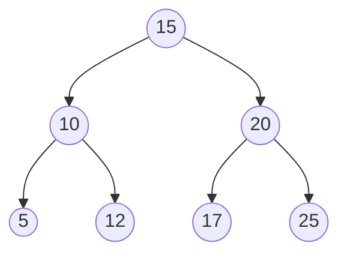
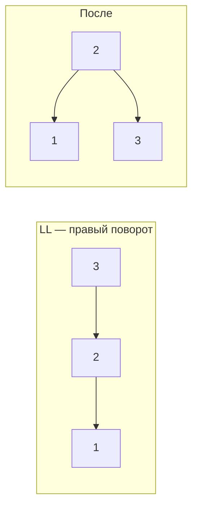
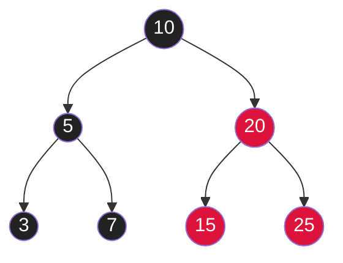
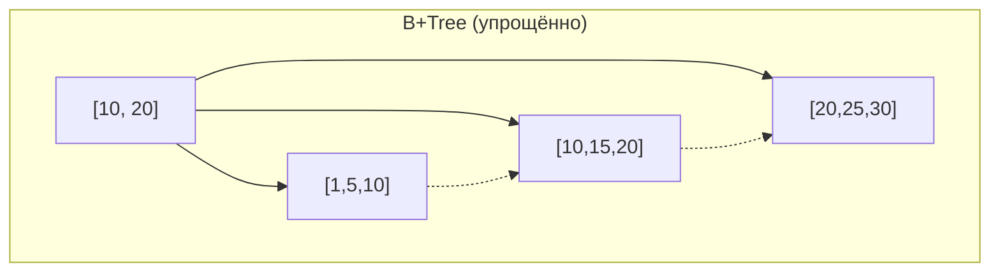

# Вопросы на собеседовании: `Деревья`

Деревья — фундамент многих структур: индексы БД (B-Tree), HashMap (красно-чёрное дерево при коллизиях), TreeMap, файловые системы, AST в компиляторах. На собеседовании знают наизусть обходы, вставку/удаление в BST, AVL, и хотят слышать про B-Tree в индексах БД.

## Полезные ссылки

### Официальная документация и авторитетные источники

- [Binary Tree in Java — Baeldung](https://www.baeldung.com/java-binary-tree)
- [Binary Search Tree — Baeldung](https://www.baeldung.com/cs/binary-search-trees)
- [AVL Tree — Baeldung](https://www.baeldung.com/cs/avl-trees)
- [Red-Black Tree — Baeldung](https://www.baeldung.com/cs/red-black-trees)
- [B-Tree Data Structure — Baeldung](https://www.baeldung.com/cs/b-tree-data-structure)
- [B+Tree — Baeldung](https://www.baeldung.com/cs/b-trees-vs-btrees-vs-rb-trees)
- [TreeMap (Java) — Oracle Docs](https://docs.oracle.com/en/java/javase/17/docs/api/java.base/java/util/TreeMap.html)
- [Tree Traversals — Visualgo](https://visualgo.net/en/bst)

## Содержание

- [Полезные ссылки](#полезные-ссылки)
- [See also](#see-also)

**Базовые понятия**
- [Q1. (!) Что такое дерево и какие виды бывают?](#q1--что-такое-дерево-и-какие-виды-бывают)
- [Q2. (!) Что такое Binary Search Tree (BST)?](#q2--что-такое-binary-search-tree-bst)
- [Q3. Чем full, complete, perfect и balanced деревья отличаются?](#q3-чем-full-complete-perfect-и-balanced-деревья-отличаются)
- [Q4. Глубина, высота, уровень — в чём разница?](#q4-глубина-высота-уровень--в-чём-разница)

**Реализация**
- [Q5. (!) Как реализовать Binary Tree через массив?](#q5--как-реализовать-binary-tree-через-массив)
- [Q6. (!) Как реализовать Binary Tree через узлы?](#q6--как-реализовать-binary-tree-через-узлы)

**Обходы**
- [Q7. (!) Чем отличаются preorder, inorder, postorder?](#q7--чем-отличаются-preorder-inorder-postorder)
- [Q8. (!) Level-order (BFS) обход дерева?](#q8--level-order-bfs-обход-дерева)
- [Q9. (!) Итеративный inorder обход через стек?](#q9--итеративный-inorder-обход-через-стек)
- [Q10. Morris traversal — обход за O(1) дополнительной памяти?](#q10-morris-traversal--обход-за-o1-дополнительной-памяти)
- [Q11. Зигзагообразный обход дерева?](#q11-зигзагообразный-обход-дерева)

**BST операции**
- [Q12. (!) Вставка и удаление в BST?](#q12--вставка-и-удаление-в-bst)
- [Q13. (!) Поиск минимума и максимума в BST?](#q13--поиск-минимума-и-максимума-в-bst)
- [Q14. (!) Inorder successor и predecessor?](#q14--inorder-successor-и-predecessor)
- [Q15. (!) Подсчёт количества узлов?](#q15--подсчёт-количества-узлов)
- [Q16. (!) Высота и проверка сбалансированности?](#q16--высота-и-проверка-сбалансированности)
- [Q17. Validate BST — проверка корректности?](#q17-validate-bst--проверка-корректности)

**Классические задачи**
- [Q18. (!) Lowest Common Ancestor (LCA)?](#q18--lowest-common-ancestor-lca)
- [Q19. (!) Diameter of Binary Tree — диаметр дерева?](#q19--diameter-of-binary-tree--диаметр-дерева)
- [Q20. Symmetric tree — проверка симметрии?](#q20-symmetric-tree--проверка-симметрии)
- [Q21. (!) Same tree, Subtree of another tree?](#q21--same-tree-subtree-of-another-tree)
- [Q22. Path Sum — есть ли путь с заданной суммой?](#q22-path-sum--есть-ли-путь-с-заданной-суммой)
- [Q23. (!) Сериализация и десериализация дерева?](#q23--сериализация-и-десериализация-дерева)
- [Q24. (!) Реконструкция дерева по preorder + inorder?](#q24--реконструкция-дерева-по-preorder--inorder)

**Сбалансированные деревья**
- [Q25. (!) Что такое AVL tree и как балансируется?](#q25--что-такое-avl-tree-и-как-балансируется)
- [Q26. (!) Что такое Red-Black tree?](#q26--что-такое-red-black-tree)
- [Q27. (!) Чем AVL отличается от Red-Black tree?](#q27--чем-avl-отличается-от-red-black-tree)

**B-Trees и их применение**
- [Q28. (!) Что такое B-Tree?](#q28--что-такое-b-tree)
- [Q29. (!) Чем B-Tree отличается от B+Tree?](#q29--чем-b-tree-отличается-от-b-tree)
- [Q30. Почему индексы БД на B+Tree, а не на BST?](#q30-почему-индексы-бд-на-bтrее-а-не-на-bst)

**Java и реальный мир**
- [Q31. (!) TreeMap и TreeSet — что внутри?](#q31--treemap-и-treeset--что-внутри)
- [Q32. (!) Где красно-чёрные деревья встречаются в Java?](#q32--где-красно-чёрные-деревья-встречаются-в-java)
- [Q33. Что такое segment tree и зачем?](#q33-что-такое-segment-tree-и-зачем)
- [Q34. Что такое Fenwick tree (Binary Indexed Tree)?](#q34-что-такое-fenwick-tree-binary-indexed-tree)

## Q1. (!) Что такое дерево и какие виды бывают?

**Дерево** — связный ациклический неориентированный граф. Хранится как структура с **корнем** и узлами, каждый из которых имеет 0+ детей.

**Виды:**

| Дерево | Особенность |
|--------|-------------|
| **Binary Tree** | Каждый узел имеет ≤ 2 детей |
| **BST (Binary Search Tree)** | left.value < root.value < right.value |
| **AVL** | Сбалансированный BST, разница высот ≤ 1 |
| **Red-Black** | Сбалансированный BST через цвета |
| **B-Tree / B+Tree** | Многонаправленное, для дисковых индексов |
| **Heap** | Полное дерево с heap-property (см. [кучи](heaps-interview.md)) |
| **Trie** | Префиксное дерево для строк |
| **Segment Tree** | Для range queries |
| **Suffix Tree / Trie** | Для поиска подстрок |

**Применения:**
- BST/TreeMap → отсортированные данные
- B-Tree → индексы PostgreSQL/MySQL
- Trie → автодополнение, IP-routing
- Heap → priority queue, scheduler
- Suffix tree → bioinformatics, plagiarism


> [!mcq] Какое определение дерева как структуры данных корректно?
>
> - [x] A. Связный ациклический неориентированный граф с выделенным корнем, где каждый узел имеет 0 или более детей.
>
>     **Развёрнутое объяснение.** Дерево — частный случай графа: связность гарантирует, что от корня достижим любой узел; ацикличность означает единственный путь между любыми двумя узлами. Выделение корня превращает граф в иерархию с понятиями «родитель/потомок», что задаёт направление обходов сверху вниз. Дерево с `n` узлами имеет ровно `n-1` рёбер — формально это и есть критерий «дерево» в теории графов.
>
>     **Пример.** В Java `HashMap` при коллизиях ≥ 8 элементов в bucket конвертирует цепочку в красно-чёрное дерево: каждый `TreeNode` хранит ссылки `parent`, `left`, `right` и удовлетворяет всем свойствам дерева — один корень, нет циклов, единственный путь между любыми двумя узлами.
>
>     **Когда применять.** Иерархические данные (файловая система, DOM, AST компилятора), быстрый поиск по ключу (BST, B-Tree в индексах БД), приоритеты (Heap для `PriorityQueue` и task scheduler), префиксы (Trie для автодополнения).
>
>     **Подводные камни.** Если в реализации случайно создать цикл (например, при ошибке в rebalancing), DFS зациклится и упадёт в `StackOverflowError`. Если узел получит двух родителей — структура превратится в DAG, что ломает все алгоритмы, использующие unique-path-инвариант (LCA, height, sub-tree size).
>
>     **Связанные вопросы.** [[trees-interview#Q2]] BST как частный случай; [[trees-interview#Q3]] виды деревьев по форме; [[trees-interview#Q4]] метрики глубины и высоты.
>
> - [ ] B. Любая структура, где элементы расположены иерархически, допускающая циклы и нескольких родителей у узла.
>
>     **Что на самом деле.** В строгом CS-определении дерево не допускает ни циклов (это уже граф общего вида), ни множественных родителей (это DAG). У дерева ровно один путь от корня до любого узла, и этот инвариант критичен для O(h) операций.
>
>     **Откуда путаница.** В разговорной речи «дерево решений» или «дерево зависимостей» иногда допускают повторное использование узлов, и студенты переносят это смягчение на CS-структуру. Также пакеты типа Maven называют «деревом зависимостей» граф, где модуль может быть зависимостью у нескольких других.
>
>     **Если бы это было правдой.** Рекурсивные обходы DFS/BFS зацикливались бы без `Set<Visited>`, а это лишний `O(n)` память. Высота дерева перестала бы быть однозначной величиной — для одного узла её можно было бы посчитать несколькими путями.
>
>     **Как было бы правильно.** Уточнить: «связный ациклический граф с единственным путём между любой парой узлов» — тогда определение становится корректным и совпадает с (A).
>
> - [ ] C. Ориентированный граф, где рёбра идут только сверху вниз и значения обязательно отсортированы.
>
>     **Что на самом деле.** Дерево по сути неориентированное; «направление вниз» — лишь визуализация при изображении на бумаге. Инвариант сортировки значений — свойство BST, а не дерева вообще: Trie, Heap, Segment Tree не сортируют значения слева направо.
>
>     **Откуда путаница.** BST настолько часто разбирают на собеседованиях, что «дерево» сливают с BST. Картинка из учебника всегда рисует BST с возрастанием слева направо — и определение запоминается с этим артефактом.
>
>     **Если бы это было правдой.** Trie (префиксное дерево автодополнения), Heap (priority queue в `PriorityQueue`) и Segment Tree (range queries) перестали бы считаться деревьями — а это явные контрпримеры на любом олимпиадном курсе.
>
>     **Как было бы правильно.** Снять условие сортировки и сделать ориентацию опциональной — тогда определение покрывает все виды деревьев, а сортировка останется свойством только BST.
>
> - [ ] D. Структура, в которой каждый узел имеет ровно двух детей и обязательная высота ≤ log₂(n).
>
>     **Что на самом деле.** «Ровно двух детей» — это full binary tree, частный случай. «Высота ≤ log₂(n)» — свойство только сбалансированных деревьев. Обычное дерево может иметь произвольную арность (B-Tree с порядком 1000) и произвольную высоту (skewed BST из n узлов).
>
>     **Откуда путаница.** На вводных занятиях показывают «красивый» сбалансированный бинарный пример, и студент абстрагирует его как определение. К тому же AVL и Red-Black тоже бинарные и сбалансированные — это закрепляет ассоциацию.
>
>     **Если бы это было правдой.** B-Tree (до 1000 детей на узел в InnoDB) и вырожденное skewed BST (высота n при вставке отсортированной последовательности) не считались бы деревьями. PostgreSQL индексы перестали бы укладываться в эту терминологию.
>
>     **Как было бы правильно.** Заменить «ровно двух детей» на «0 или более детей», а гарантию высоты — на «зависит от типа балансировки», и определение станет общим для всех деревьев.

## Q2. (!) Что такое Binary Search Tree (BST)?

**BST** — бинарное дерево с инвариантом:
- Все узлы левого поддерева **меньше** root
- Все узлы правого поддерева **больше** root
- Оба поддерева также BST



**Сложности:**
- Поиск, вставка, удаление: `O(h)`, где `h` — высота
- Сбалансированный BST: `h = O(log n)` → все операции `O(log n)`
- Вырожденный BST (как linked list): `h = O(n)` → операции `O(n)`

Поэтому в production используют **самобалансирующиеся** BST (AVL, Red-Black).


> [!mcq] Какой инвариант делает дерево именно Binary Search Tree (BST)?
>
> - [ ] A. Каждый узел имеет ровно двух детей, и значения возрастают сверху вниз.
>
>     **Что на самом деле.** BST требует упорядоченности «слева-справа» относительно каждого узла, а не «сверху-вниз». Узел может иметь 0, 1 или 2 детей — двоих ровно требует только full binary tree. Корень BST не обязан быть минимумом или максимумом.
>
>     **Откуда путаница.** Heap-property («родитель ≥ детей» в max-heap или «родитель ≤ детей» в min-heap) действительно про вертикальное упорядочение, и его путают с BST-инвариантом. Кроме того, при рисовании BST значения обычно растут вниз-направо, что подкрепляет ложную ассоциацию.
>
>     **Если бы это было правдой.** Inorder-обход не давал бы отсортированную последовательность — главное практическое свойство BST. `TreeMap.firstKey()` пришлось бы реализовывать через `O(n)` сканирование, а не как `O(log n)` спуск по левой ветке.
>
>     **Как было бы правильно.** Заменить «возрастают сверху вниз» на «в левом поддереве значения меньше root, в правом — больше» — и инвариант станет корректным BST-определением.
>
> - [x] B. Для каждого узла все значения в левом поддереве строго меньше root, а в правом — строго больше; оба поддерева тоже BST.
>
>     **Развёрнутое объяснение.** Инвариант рекурсивный — выполняется для каждого узла, не только корня. Именно поэтому inorder-обход выдаёт элементы в отсортированном порядке, а поиск идёт за O(h) сравнений: на каждом шаге отбрасывается половина поддерева. Версии с дубликатами обычно либо запрещают равенство (как `TreeMap`), либо явно определяют, в какое поддерево идут равные ключи. В сбалансированном BST h = O(log n), в вырожденном — O(n).
>
>     **Пример.** `TreeMap<String, Integer>` в Java реализован как red-black BST: `firstKey()` спускается по левой ветке за O(log n), `subMap("a", "c")` использует BST-инвариант, чтобы за O(log n + k) отдать диапазон без обхода всего дерева. PostgreSQL B-Tree индексы расширяют ту же идею до m-арности.
>
>     **Когда применять.** Нужны операции «следующий больший» (`ceilingKey`), «диапазон ключей» (`subMap`/`headMap`), упорядоченный обход с быстрой вставкой и удалением. Типичные кейсы: индекс по времени события, скользящие медианы, leaderboard с range-запросами.
>
>     **Подводные камни.** Проверять инвариант надо рекурсивно с границами min/max — наивная проверка «left.val < root.val < right.val» только для соседей пропускает нарушения через несколько уровней. Без самобалансировки BST деградирует до O(n) при отсортированной вставке — в продакшене всегда AVL или Red-Black.
>
>     **Связанные вопросы.** [[trees-interview#Q1]] определение дерева; [[trees-interview#Q17]] validate BST с границами; [[trees-interview#Q25]] AVL для гарантии O(log n).
>
> - [ ] C. Левый ребёнок меньше своего родителя, правый — больше; внуков и более дальних потомков это не касается.
>
>     **Что на самом деле.** Инвариант распространяется на всё поддерево, а не только на прямого родителя. Можно построить «дерево», где локально все parent-child пары корректны, но левый внук больше корня — это нарушение BST, ломающее поиск.
>
>     **Откуда путаница.** Визуально кажется, что достаточно проверить непосредственные пары parent-child — особенно если впервые видишь BST и смотришь только на ближайшие связи. Это типичная ошибка в LeetCode 98 «Validate BST»: наивное решение проходит первые тесты, но падает на каверзном случае с глубокой инверсией.
>
>     **Если бы это было правдой.** Бинарный поиск ломался бы: спустившись влево от root=5 и встретив 3, нельзя гарантировать, что вся ветка содержит значения < 5 — там может прятаться 10. Пришлось бы обходить всё поддерево, что превращает поиск из O(log n) в O(n).
>
>     **Как было бы правильно.** Расширить инвариант на всё поддерево: «все значения слева меньше root, все справа — больше» — и проверять рекурсивно с передачей границ (min, max) вниз.
>
> - [ ] D. Любое бинарное дерево, в котором все листья находятся на одном уровне.
>
>     **Что на самом деле.** Это описание perfect binary tree (perfect = full + все листья на одной глубине). Свойство касается структуры, а не порядка значений. BST вообще не требует, чтобы листья были на одном уровне — Red-Black допускает разницу до 2× по высоте.
>
>     **Откуда путаница.** «Balanced BST» (AVL/Red-Black) часто близок к perfect-форме на маленьких размерах, и студент сливает понятия структуры и упорядоченности.
>
>     **Если бы это было правдой.** BST из 5 узлов вообще нельзя было бы построить, потому что perfect-структура требует ровно 2^k − 1 узлов (1, 3, 7, 15, …). `TreeMap` с 5 ключами не существовал бы.
>
>     **Как было бы правильно.** Убрать структурное требование «листья на одном уровне» и поставить упорядоченность по ключу — тогда определение совпадёт с (B).

## Q3. Чем full, complete, perfect и balanced деревья отличаются?

| Тип | Свойство |
|-----|----------|
| **Full** | Каждый узел имеет 0 или 2 детей |
| **Complete** | Все уровни заполнены, кроме последнего; последний — слева направо |
| **Perfect** | Все внутренние узлы имеют 2 детей, все листья на одном уровне |
| **Balanced** | Высоты левого и правого поддеревьев каждого узла отличаются на ≤ 1 |
| **Degenerate (skewed)** | Каждый узел имеет ≤ 1 ребёнка — фактически linked list |

**Pefect** ⊂ **Complete** ⊂ **Full**. Heap всегда **complete** (хранится в массиве без пропусков).


> [!mcq] Какое сочетание определений full / complete / perfect / balanced корректно?
>
> - [ ] A. Full и complete — синонимы: оба требуют, чтобы каждый узел имел ровно двух детей и все листья были на одном уровне.
>
>     **Что на самом деле.** Full требует только «0 или 2 детей» (без условия о листьях), complete — «все уровни заполнены, кроме последнего, и последний идёт слева направо». Это разные ортогональные свойства, и одно может выполняться без другого.
>
>     **Откуда путаница.** Оба термина переводятся на русский как «полный» — без английских оригиналов их легко смешать. Учебники часто рисуют один и тот же пример как иллюстрацию обоих понятий.
>
>     **Если бы это было правдой.** Heap (которая complete, но в общем случае не full — на последнем уровне может быть узел с одним ребёнком) не могла бы существовать. А её базовая реализация как массив без дыр опирается именно на complete-структуру в `PriorityQueue`.
>
>     **Как было бы правильно.** Дать full и complete разные определения: full — «0 или 2 детей у каждого узла», complete — «уровни заполнены слева направо», и явно сказать, что они независимые.
>
> - [ ] B. Balanced дерево — это perfect tree, у которого все листья на одном уровне и каждый внутренний узел имеет двух детей.
>
>     **Что на самом деле.** Balanced требует лишь разницу высот поддеревьев каждого узла ≤ 1 (для AVL) или ≤ 2× по высоте (для Red-Black), а не идеальную форму. Perfect — гораздо строже: требует ровно 2^k − 1 узлов на k+1 уровнях.
>
>     **Откуда путаница.** «Сбалансированное» в обыденной речи звучит как «идеально ровное». Но в CS balanced допускает зазубренность на последнем уровне.
>
>     **Если бы это было правдой.** AVL-дерево после вставки одной «лишней» ноды переставало бы быть сбалансированным — а оно по построению поддерживает balanced без требования быть perfect. `TreeMap` с любым нечётным числом ключей перестал бы существовать.
>
>     **Как было бы правильно.** Снять условие perfect и оставить только «разница высот поддеревьев каждого узла ≤ 1» — это и есть height-balanced (AVL-style).
>
> - [x] C. Full — у каждого узла 0 или 2 детей; complete — все уровни заполнены, кроме последнего, и последний слева направо; perfect — full + все листья на одном уровне; balanced — разница высот поддеревьев каждого узла ≤ 1.
>
>     **Развёрнутое объяснение.** Четыре независимые характеристики, описывающие разные грани «правильности» дерева. Perfect ⊂ Complete и Perfect ⊂ Full по структуре (perfect строже обоих), а balanced — ортогональное свойство о высотах, никак не связанное со структурой узлов. Heap всегда complete (поэтому хранится в массиве без пропусков), AVL — balanced, дерево из 7 узлов высотой 2 со всеми листьями на одном уровне — perfect.
>
>     **Пример.** `PriorityQueue` в Java — complete binary heap, хранимый в `Object[]` без дыр; `TreeMap` — Red-Black balanced BST; идеальное двоичное дерево из 15 узлов высотой 3 — perfect и одновременно full, complete, balanced.
>
>     **Когда применять.** Complete-форма полезна, когда нужно хранить дерево в массиве без дыр (heap, segment tree); balanced требуется для гарантии O(log n) операций в `TreeMap`, индексах БД, B+Tree; full удобно для выражений в AST, где у бинарного оператора всегда 2 операнда.
>
>     **Подводные камни.** «Balanced» в литературе иногда означает height-balanced (AVL, разница ≤ 1), иногда — weight-balanced (по числу узлов в поддеревьях), а иногда — log-balanced (только асимптотическая гарантия высоты). Уточняйте определение в контексте задачи.
>
>     **Связанные вопросы.** [[trees-interview#Q1]] базовое определение дерева; [[trees-interview#Q16]] проверка balanced инварианта; [[trees-interview#Q25]] AVL как height-balanced BST.
>
> - [ ] D. Complete tree — это дерево, в котором каждый узел имеет 0 или 2 детей, а balanced — дерево, у которого все листья на одном уровне.
>
>     **Что на самом деле.** Эти описания меняют местами признаки разных понятий. «0 или 2 детей» — это full, а «все листья на одном уровне» — perfect. Complete про последовательное заполнение слева направо, balanced — про разницу высот поддеревьев.
>
>     **Откуда путаница.** Термины созвучны и без таблицы их легко переставить, особенно когда учишь все четыре подряд за один присест.
>
>     **Если бы это было правдой.** Heap (которая complete) не могла бы иметь узлов с одним ребёнком — но именно такой узел типично появляется на последнем уровне реальной кучи в `PriorityQueue` при нечётном числе элементов.
>
>     **Как было бы правильно.** Сопоставить признаки правильно: full = «0 или 2 детей», complete = «уровни заполнены слева направо», perfect = «все листья на одной глубине», balanced = «разница высот ≤ 1» — и определения совпадут с (C).

## Q4. Глубина, высота, уровень — в чём разница?

- **Глубина (depth) узла** — расстояние от корня до узла. Корень: `depth = 0`.
- **Высота (height) узла** — максимальное расстояние от узла до листа. Лист: `height = 0`.
- **Высота дерева** — высота корня.
- **Уровень (level)** = глубина + 1 (иногда используют как синоним глубины).

Для дерева с `n` узлами:
- Минимальная высота: `⌊log₂(n)⌋`
- Максимальная высота: `n - 1` (вырожденный случай)

Сбалансированное → `h = O(log n)`.


> [!mcq] Что точно описывает глубину, высоту узла и высоту дерева?
>
> - [ ] A. Глубина и высота узла — синонимы: оба считают расстояние до листа, и оба у корня равны 0.
>
>     **Что на самом деле.** Глубина считается от корня вниз (`depth(root) = 0`), а высота — от узла к самому дальнему листу (`height(leaf) = 0`). У корня глубина 0, но высота равна высоте всего дерева.
>
>     **Откуда путаница.** В разговоре «глубина дерева» и «высота дерева» действительно совпадают (оба про корень), и это переносят на отдельные узлы — где значения уже не равны.
>
>     **Если бы это было правдой.** Алгоритм проверки сбалансированности `|height(left) - height(right)| ≤ 1` стал бы бессмыслицей: у симметричных по структуре поддеревьев разная глубина у корня (она зависит от родителя), но одинаковая по определению.
>
>     **Как было бы правильно.** Разнести понятия: глубина — путь от корня вниз, высота — путь до самого дальнего листа; для корня они совпадают по значению (высота дерева), но смысл разный.
>
> - [ ] B. Высота дерева с `n` узлами всегда равна `⌊log₂(n)⌋` независимо от структуры.
>
>     **Что на самом деле.** `⌊log₂(n)⌋` — это минимально возможная высота (для perfect balanced дерева). В вырожденном skewed-случае (вставляли отсортированную последовательность в обычный BST) высота равна `n - 1`. Между ними лежит весь спектр.
>
>     **Откуда путаница.** На лекциях по BST сразу показывают сбалансированный вариант и сопровождают формулой `O(log n)`, не делая акцента на «при условии balanced».
>
>     **Если бы это было правдой.** Не было бы смысла в AVL и Red-Black деревьях — обычный BST уже давал бы log-гарантии. PostgreSQL не требовался бы balanced B+Tree, и любая вставка в индекс была бы O(log n) автоматически.
>
>     **Как было бы правильно.** Указать, что `⌊log₂(n)⌋` — нижняя граница (perfect/balanced), а верхняя — `n - 1` (skewed); реальная высота между ними зависит от порядка вставок и наличия rebalancing.
>
> - [ ] C. Уровень узла и его высота — это одно и то же значение, отсчитываемое от 1.
>
>     **Что на самом деле.** Уровень = глубина + 1 (или равен глубине — у авторов разнится), и оба считаются от корня. Высота, в отличие от уровня, считается от узла до самого дальнего листа.
>
>     **Откуда путаница.** Слова «уровень» и «высота» в разговорной речи близки («высокий уровень»). К тому же «листья на уровне 3» и «высота дерева 3» могут совпадать численно для perfect-дерева — и студенты обобщают это совпадение.
>
>     **Если бы это было правдой.** Level-order обход (BFS) перестал бы работать как «вывод по уровням сверху вниз» — корень оказывался бы на максимальном уровне (равном высоте дерева), а листья — на нулевом.
>
>     **Как было бы правильно.** Чётко зафиксировать: глубина и уровень считаются сверху от корня (level = depth + 1 или = depth у разных авторов), высота — снизу от листа; разные направления отсчёта.
>
> - [x] D. Глубина узла — расстояние от корня (root: 0), высота узла — максимальное расстояние до листа (лист: 0), высота дерева — высота корня; минимальная высота при `n` узлах — ⌊log₂(n)⌋, максимальная — n-1.
>
>     **Развёрнутое объяснение.** Глубина и высота отсчитываются с разных концов: depth идёт сверху вниз от корня, height — снизу вверх от листа. Для корня глубина 0, но высота равна высоте всего дерева. Сбалансированное дерево даёт `h = O(log n)` и все операции BST за `O(log n)`; вырожденное (skewed) даёт `h = n - 1` и операции за `O(n)`. Уровень обычно определяют как `depth + 1`, но в разных источниках встречается = depth — это конвенция.
>
>     **Пример.** В Java `Files.walk(path)` обходит файловую систему DFS: глубина файла `/a/b/c.txt` относительно `/a` равна 2. Если корень `/a` имеет высоту 5, значит самый глубокий файл лежит на 5 уровней вглубь. Алгоритм `isBalanced` для `HashMap` tree-bin'а опирается на сравнение `height(left)` и `height(right)`, чтобы держать red-black инвариант.
>
>     **Когда применять.** Анализ алгоритмических сложностей через `O(h)`, проверка балансировки AVL (`|h_left - h_right| ≤ 1`), level-order задачи (BFS по уровням), вычисление diameter дерева через max(left_height + right_height).
>
>     **Подводные камни.** Конвенция «depth корня = 0 или = 1» различается между учебниками — уточняйте на собеседовании. В геометрических алгоритмах высота иногда считается через число рёбер, иногда через число узлов: разница в ±1, что важно при сравнении.
>
>     **Связанные вопросы.** [[trees-interview#Q3]] balanced vs perfect; [[trees-interview#Q16]] проверка сбалансированности за O(n); [[trees-interview#Q19]] diameter через глубину поддеревьев.

## Q5. (!) Как реализовать Binary Tree через массив?

**Индексация:** корень в `arr[0]`. Для узла `i`:
- Левый ребёнок: `arr[2i + 1]`
- Правый ребёнок: `arr[2i + 2]`
- Родитель: `arr[(i - 1) / 2]`

```
         [0]          arr = [10, 5, 15, 3, 7, 12, 20]
        /   \
      [1]   [2]       Для i = 1 (значение 5):
      / \   / \         left  = arr[3] = 3
    [3] [4][5] [6]      right = arr[4] = 7
                         parent = arr[0] = 10
```

**Плюсы:**
- `O(1)` доступ
- Нет указателей — компактно
- Идеально для **полных** деревьев и **куч**

**Минусы:**
- Фиксированный размер (или ресайз)
- Пустые ячейки при неполном дереве — память впустую

**Применение:** `PriorityQueue` (min-heap) хранится именно так, как и embedded heaps в OS.


> [!mcq] Как при array-представлении бинарного дерева вычислить детей и родителя узла `arr[i]`?
>
> - [ ] A. Левый ребёнок `arr[2i]`, правый `arr[2i+1]`, родитель `arr[i/2]` — индексация всегда с единицы.
>
>     **Что на самом деле.** Это вариант 1-based-индексации (когда корень в `arr[1]`). При 0-based (стандарт Java/C/Python) формулы другие: left = `2i+1`, right = `2i+2`, parent = `(i-1)/2`. Перепутать индексацию — частый источник off-by-one ошибок в реализации heap.
>
>     **Откуда путаница.** В учебниках CLRS и теории алгоритмов исторически используют 1-based-нотацию (как в Pascal), а в реальном Java-коде массивы 0-based. Студент запоминает формулы из CLRS и не корректирует индексы.
>
>     **Если бы это было правдой.** В `PriorityQueue` Java (где корень в `queue[0]`) корень оказался бы в `queue[1]`, а ячейка `queue[0]` всегда пустовала бы — это и происходит в OpenJDK реализации, но лишь как внутренняя оптимизация: внешне PQ 0-based.
>
>     **Как было бы правильно.** Явно зафиксировать base: при 0-based — left = 2i+1, right = 2i+2, parent = (i-1)/2; при 1-based — left = 2i, right = 2i+1, parent = i/2.
>
> - [x] B. Левый ребёнок `arr[2i+1]`, правый `arr[2i+2]`, родитель `arr[(i-1)/2]` при 0-based-индексации; ячейки пустых детей — sentinel-значения (null/-1).
>
>     **Развёрнутое объяснение.** Array-представление эксплуатирует свойство complete binary tree: дети узла `i` лежат на позициях, вычисляемых через арифметику без указателей. Это даёт `O(1)` доступ к родителю и детям, плотную упаковку памяти (без overhead на ссылки `left/right`), и cache-friendly последовательную обработку. `(i-1)/2` использует целочисленное деление, что для обоих детей `2i+1` и `2i+2` даёт обратно `i`.
>
>     **Пример.** `java.util.PriorityQueue` хранит min-heap в `Object[] queue` именно так: `queue[0]` — корень, `queue[1]` и `queue[2]` — дети. `siftUp(int k, E x)` использует `(k - 1) >>> 1` (сдвиг быстрее деления) для перехода к родителю. То же самое в Linux kernel CFS scheduler для red-black tree backing array.
>
>     **Когда применять.** Heap (priority queue, scheduler), segment tree (фиксированный размер `4n`), статичные complete binary trees, embedded-системы без heap-аллокаций.
>
>     **Подводные камни.** Для неполного (sparse) дерева ячейки пустых узлов всё равно занимают память — для skewed-дерева с `n` узлами высотой `n` понадобится массив длиной `2^n - 1`, что катастрофически расточительно. Resize массива при динамическом росте — O(n) копирование. Sentinel-значения для null-узлов ломают типизацию: для `int[]` приходится резервировать `Integer.MIN_VALUE`.
>
>     **Связанные вопросы.** [[trees-interview#Q6]] node-based реализация через ссылки; [[heaps-interview#Q1]] heap как complete tree в массиве; [[trees-interview#Q3]] complete tree как условие компактности.
>
> - [ ] C. Левый ребёнок `arr[i-1]`, правый `arr[i+1]`, родитель `arr[i*2]` — наследие линейной индексации связного списка.
>
>     **Что на самом деле.** Эта формула описывает соседей в одномерном массиве (как в linked list), а не структуру бинарного дерева. В дереве у узла два независимых ребёнка, расположенных не рядом с узлом, а в позициях, удвоенных от индекса.
>
>     **Откуда путаница.** Studentry, привыкшие к массивам как к линейным структурам, переносят смежность на дерево. Также `arr[i-1]` и `arr[i+1]` визуально похожи на «предыдущий/следующий», что ассоциируется с движением вверх/вниз.
>
>     **Если бы это было правдой.** Heap-операции `siftDown` и `siftUp` ломались бы: при просеивании вниз для индекса 0 «правый ребёнок» был бы `arr[1]`, а «левый» — `arr[-1]` (out of bounds). `PriorityQueue.poll()` крашился бы на первой же операции.
>
>     **Как было бы правильно.** Использовать `2i+1`/`2i+2` для детей в 0-based-индексации и `(i-1)/2` для родителя — формулы из (B).
>
> - [ ] D. Левый ребёнок `arr[i+n/2]`, правый `arr[i+n/2+1]` — где `n` это размер массива, чтобы дети шли в нижней половине.
>
>     **Что на самом деле.** Эта формула не работает: при `i=0` левый ребёнок оказался бы в `arr[n/2]`, а это позиция, не имеющая отношения к корневому потомку. Размещение детей зависит только от индекса родителя, а не от общего размера массива.
>
>     **Откуда путаница.** Похожие формулы используются в segment tree (где tree-array размером `4n` и листья начинаются с позиции `n` или `2^⌈log₂n⌉`), но это особенность segment tree, а не обычного heap.
>
>     **Если бы это было правдой.** При изменении размера массива (resize при добавлении нового элемента) все ссылки на детей съезжали бы — пришлось бы пересчитывать всё дерево. Heap-операции стали бы O(n) на каждый push.
>
>     **Как было бы правильно.** Привязать координаты детей только к индексу родителя: left = 2i+1, right = 2i+2 — независимо от размера массива.

## Q6. (!) Как реализовать Binary Tree через узлы?

```java
class TreeNode<T extends Comparable<T>> {
    T value;
    TreeNode<T> left, right;
    TreeNode(T value) { this.value = value; }
}

class BinarySearchTree<T extends Comparable<T>> {
    private TreeNode<T> root;

    TreeNode<T> insert(TreeNode<T> node, T value) {
        if (node == null) return new TreeNode<>(value);
        int cmp = value.compareTo(node.value);
        if (cmp < 0)      node.left  = insert(node.left, value);
        else if (cmp > 0) node.right = insert(node.right, value);
        return node;
    }

    void inorder(TreeNode<T> node, List<T> out) {
        if (node == null) return;
        inorder(node.left, out);
        out.add(node.value);
        inorder(node.right, out);
    }
}
```

Память: `O(n)` (по 3 ссылки на узел: value, left, right). Гибкое — поддерживает любую форму дерева. Это **стандартный** способ реализации BST, AVL, Red-Black.


> [!mcq] В чём преимущество node-based реализации бинарного дерева через ссылки на детей?
>
> - [ ] A. Меньшее потребление памяти, чем у array-based, потому что нет пустых ячеек.
>
>     **Что на самом деле.** Node-based действительно избегает пустых «дыр» для sparse деревьев, но каждый узел стоит дороже: 3 ссылки по 8 байт (value, left, right) + object header ~16 байт в JVM = ~40 байт на узел. Array-based для complete дерева компактнее — всего 4-8 байт на ячейку.
>
>     **Откуда путаница.** Видя в учебнике картинку sparse skewed-дерева и его array-представление с большим числом null-ячеек, делается обобщение «node-based всегда экономнее».
>
>     **Если бы это было правдой.** `PriorityQueue` в Java реализовали бы через linked nodes, а не `Object[]`. Но OpenJDK выбирает массив именно из-за лучшего использования памяти и кеш-локальности для complete-структур.
>
>     **Как было бы правильно.** Уточнить: node-based выигрывает по памяти только для sparse/skewed деревьев; для complete (heap) array-based компактнее.
>
> - [ ] B. Быстрее доступ к родителю узла, чем у array-based.
>
>     **Что на самом деле.** Доступ к родителю в array-based — O(1) через `(i-1)/2`. В node-based — O(h) (надо хранить дополнительную ссылку `parent`, иначе доступ требует поиска от корня). Без `parent`-ссылки node-based проигрывает.
>
>     **Откуда путаница.** В реализациях AVL/Red-Black часто добавляют ссылку `parent` для удобства rotation'ов, и это создаёт иллюзию, что parent доступен в O(1) бесплатно. Но это лишние 8 байт на узел и ручная синхронизация при rebalancing.
>
>     **Если бы это было правдой.** Reverse-обходы и rotation'ы в Red-Black tree были бы тривиальны — но в реальности они требуют либо parent-ссылок (дополнительная память + синхронизация), либо рекурсии (стек).
>
>     **Как было бы правильно.** Признать, что без явной parent-ссылки доступ к родителю в node-based — O(h); с parent-ссылкой — O(1), но за счёт +8 байт памяти на узел.
>
> - [x] C. Гибкость структуры: дерево может расти, иметь произвольную форму (skewed, balanced, sparse) без потерь памяти на null-ячейки и без перевыделения массива при росте.
>
>     **Развёрнутое объяснение.** Node-based реализация выделяет память под каждый реальный узел отдельно, что даёт `O(n)` память пропорциональную числу узлов, а не глубине дерева. Это критично для динамических деревьев, чья структура меняется (BST, AVL, Red-Black, Trie): вставка нового узла — `O(1)` аллокация без копирования старых данных. Каждый узел хранит value + 2 ссылки (left, right), что даёт ~24 байта payload + JVM object header.
>
>     **Пример.** `java.util.TreeMap` (Red-Black) использует внутренний класс `Entry<K,V>` с полями `key, value, left, right, parent, color`. Это node-based — миллион ключей даёт миллион Entry-объектов. При вставке нового ключа JVM аллоцирует один Entry, rebalancing работает через rotation указателей без копирования массивов. То же в `HashMap.TreeNode` при tree-bin (коллизии ≥ 8).
>
>     **Когда применять.** Динамические деревья с непредсказуемой формой (TreeMap, TreeSet, обходы графов через DFS-tree), trie для автодополнения, AST в компиляторах (узлы выражений неравномерные).
>
>     **Подводные камни.** Каждый узел требует object header (16 байт на 64-bit JVM с compressed oops) — на миллионе узлов это +16 MB. GC-давление: миллионы мелких объектов нагружают young generation. Cache-locality хуже array-based: соседи в дереве могут быть в разных страницах памяти, что увеличивает p99 latency обходов.
>
>     **Связанные вопросы.** [[trees-interview#Q5]] array-based как альтернатива для complete trees; [[trees-interview#Q26]] Red-Black tree как node-based реализация; [[hash-tables-interview#Q3]] HashMap.TreeNode при коллизиях.
>
> - [ ] D. Node-based позволяет произвольный random-access через индекс — `tree[i]` за O(1).
>
>     **Что на самом деле.** Node-based как раз НЕ поддерживает индексный доступ — узлы хранятся в куче в произвольных адресах, и чтобы добраться до n-го узла, нужно обходить дерево. Random-access — это преимущество array-based, не node-based.
>
>     **Откуда путаница.** Слово «node» иногда ассоциируется с индексом узла (например, в массиве `node[i]`), и студент переносит свойства массивов на node-based реализацию.
>
>     **Если бы это было правдой.** `TreeMap.get(int index)` работал бы за O(1) — но в Java его нет, потому что Red-Black на ссылках не даёт такого доступа. Есть `firstEntry()`, `lastEntry()`, `ceilingEntry(key)` — все O(log n).
>
>     **Как было бы правильно.** Признать, что node-based даёт `O(h)` доступ к произвольному узлу через обход, а random-access по индексу — это свойство array-based.

## Q7. (!) Чем отличаются preorder, inorder, postorder?

Все три — DFS-обходы, отличаются **порядком обработки текущего узла**:

```java
void preorder(TreeNode node) {  // КОРЕНЬ → L → R
    if (node == null) return;
    process(node);
    preorder(node.left);
    preorder(node.right);
}

void inorder(TreeNode node) {   // L → КОРЕНЬ → R
    if (node == null) return;
    inorder(node.left);
    process(node);
    inorder(node.right);
}

void postorder(TreeNode node) { // L → R → КОРЕНЬ
    if (node == null) return;
    postorder(node.left);
    postorder(node.right);
    process(node);
}
```

| Обход | Применение |
|-------|------------|
| Preorder | Сериализация дерева, копирование, выражения в префиксной форме |
| Inorder | **Отсортированный** обход BST, проверка валидности BST |
| Postorder | Удаление дерева, вычисление выражений (postfix), DFS пост-обработка |

Сложность каждого: `O(n)` время, `O(h)` память (стек вызовов).


> [!mcq] Какой DFS-обход бинарного дерева гарантированно даёт значения в отсортированном порядке для BST?
>
> - [x] A. Inorder (L → root → R) — посещает левое поддерево, затем текущий узел, затем правое.
>
>     **Развёрнутое объяснение.** Inorder-обход BST даёт строго возрастающую последовательность благодаря BST-инварианту: все значения слева от узла меньше его значения, все справа — больше. Рекурсивно «слева, корень, справа» означает «все меньшие, текущий, все большие». Сложность `O(n)` времени (каждый узел посещается один раз) и `O(h)` стека вызовов (глубина рекурсии = высота дерева). Для сбалансированного BST это `O(log n)` стека, для skewed — `O(n)`.
>
>     **Пример.** `TreeMap.values()` или `TreeMap.entrySet().forEach()` обходят entries в inorder и выдают элементы в порядке ключей. Это используется в задачах «Kth smallest in BST» (LeetCode 230): просто делаем inorder и берём k-й элемент за O(h + k). PostgreSQL B+Tree range scan концептуально тот же inorder через linked-list листьев.
>
>     **Когда применять.** Сортировка через BST (tree sort), validate BST, k-й по порядку элемент, range queries по ключу, преобразование BST в sorted array или DLL.
>
>     **Подводные камни.** Если дерево не BST, inorder выдаст узлы в неосмысленном порядке — это не «магический сортировщик». На очень глубоких skewed-деревьях рекурсивный inorder может упасть в StackOverflowError при h > ~10⁴ — в продакшене используют итеративный вариант со стеком или Morris traversal с O(1) памятью.
>
>     **Связанные вопросы.** [[trees-interview#Q9]] итеративный inorder через стек; [[trees-interview#Q10]] Morris traversal с O(1) памятью; [[trees-interview#Q17]] validate BST через inorder.
>
> - [ ] B. Preorder (root → L → R) — посещает текущий узел перед поддеревьями.
>
>     **Что на самом деле.** Preorder для BST `[3, 1, 5]` даст `3, 1, 5` — корень идёт первым, что нарушает возрастающий порядок (3 раньше 1). Сортированную последовательность даёт только inorder.
>
>     **Откуда путаница.** Preorder часто упоминают первым в учебниках («pre» = «перед»), и студент по инерции выбирает его как «основной» обход.
>
>     **Если бы это было правдой.** Сериализация BST через preorder (как часто делают для compact-формата) автоматически давала бы отсортированный массив — а это противоречит тому, что preorder используется именно как способ восстановить структуру дерева, не порядок ключей.
>
>     **Как было бы правильно.** Заменить preorder на inorder: посещать сначала левое поддерево, потом узел, потом правое — тогда BST-инвариант гарантирует возрастание.
>
> - [ ] C. Postorder (L → R → root) — посещает текущий узел после обоих поддеревьев.
>
>     **Что на самом деле.** Postorder для BST `[3, 1, 5]` даст `1, 5, 3` — корень в конце, что не возрастающий порядок. Postorder полезен для удаления дерева (сначала освобождаем детей, потом узел) и вычисления выражений в postfix, но не для сортировки.
>
>     **Откуда путаница.** «Post» = «после», и студенты могут ассоциировать «после» с «в конце сортировки» — будто postorder складывает максимумы в конец.
>
>     **Если бы это было правдой.** Heap sort можно было бы реализовать через постrordr-обход BST, что было бы быстрее обычного heap sort — но это противоречит тому, что BST tree sort обходит дерево именно через inorder.
>
>     **Как было бы правильно.** Если нужна возрастающая последовательность — использовать inorder, а postorder оставить для очистки дерева и postfix-вычислений.
>
> - [ ] D. Level-order (BFS) — обход по уровням сверху вниз.
>
>     **Что на самом деле.** Level-order для BST `[3, 1, 5]` даст `3, 1, 5` (корень, уровень 1, уровень 2). Это структурный обход по глубине, а не упорядоченный по значениям. На level k значения могут быть в любом порядке относительно соседнего уровня.
>
>     **Откуда путаница.** Level-order часто используют для «красивой печати дерева», и студенты думают, что это и значит «упорядоченный обход» в каком-то смысле.
>
>     **Если бы это было правдой.** `TreeMap.entrySet()` возвращал бы BFS-порядок, что не соответствовало бы поведению Sorted-API. Также в LeetCode 230 (k-th smallest) пришлось бы тщательно учитывать структуру дерева, а не просто считать inorder-индекс.
>
>     **Как было бы правильно.** Если требуется отсортированный обход BST — взять inorder, не level-order; BFS возвращает узлы по уровням глубины, не по значениям.

## Q8. (!) Level-order (BFS) обход дерева?

Обход по уровням сверху вниз. Используется для красивой печати, поиска ширины дерева, level-by-level задач.

```java
List<List<Integer>> levelOrder(TreeNode root) {
    List<List<Integer>> result = new ArrayList<>();
    if (root == null) return result;

    Queue<TreeNode> queue = new ArrayDeque<>();
    queue.offer(root);

    while (!queue.isEmpty()) {
        int size = queue.size(); // фиксируем размер уровня
        List<Integer> level = new ArrayList<>(size);

        for (int i = 0; i < size; i++) {
            TreeNode node = queue.poll();
            level.add(node.val);
            if (node.left  != null) queue.offer(node.left);
            if (node.right != null) queue.offer(node.right);
        }
        result.add(level);
    }
    return result;
}
```

`O(n)` время, `O(w)` память, где `w` — максимальная ширина уровня.


> [!mcq] Что критично в реализации level-order обхода, чтобы отделить элементы разных уровней друг от друга?
>
> - [ ] A. Использовать рекурсию вместо очереди, передавая текущий уровень параметром.
>
>     **Что на самом деле.** Level-order = BFS — он по определению использует очередь FIFO, а не рекурсию (рекурсия даёт DFS). Можно реализовать «level-aware» через DFS с параметром глубины + `List<List<Integer>>`, но это не классический BFS — порядок узлов одного уровня не гарантированно слева направо при произвольной форме дерева.
>
>     **Откуда путаница.** Студенты, привыкшие к рекурсии для всех обходов деревьев, пытаются адаптировать её и для BFS. На LeetCode 102 «Binary Tree Level Order Traversal» оба подхода проходят тесты, что закрепляет ложное впечатление эквивалентности.
>
>     **Если бы это было правдой.** Глубокие skewed-деревья ломали бы level-order через рекурсию из-за StackOverflowError, а BFS через очередь в таких случаях работает без проблем — стек ограничен `O(w)` (ширина), а не `O(h)`.
>
>     **Как было бы правильно.** Использовать `Queue<TreeNode>` (например `ArrayDeque`), добавлять детей текущего узла после извлечения, и зафиксировать `size = queue.size()` в начале каждого уровня для отделения.
>
> - [ ] B. Помечать конец уровня специальным sentinel-узлом (`null` или `END`) в очереди.
>
>     **Что на самом деле.** Sentinel-подход рабочий, но менее идиоматичный: добавляем `null` после корня, при извлечении `null` понимаем «уровень закончился», добавляем новый `null` если очередь не пуста. Это сложнее, чем зафиксировать `size = queue.size()` перед обработкой уровня. Стандартный паттерн на LeetCode и в собеседовании — именно size-based.
>
>     **Откуда путаница.** Подход с sentinel выглядит «элегантнее» как трюк, и иногда его показывают как «продвинутый» вариант. Но он добавляет проверки null повсюду и портит typed-API.
>
>     **Если бы это было правдой.** На больших деревьях накладные расходы на добавление/проверку sentinel-узлов проигрывали бы size-based варианту на 5-10% — что в горячем коде заметно.
>
>     **Как было бы правильно.** Использовать size-based-фиксацию длины уровня: `int size = queue.size(); for (int i = 0; i < size; i++) { ... }` — это явный, типизированный, без null-сюрпризов код.
>
> - [ ] C. Чередовать стек и очередь — стек для нечётных уровней, очередь для чётных.
>
>     **Что на самом деле.** Стек + очередь даёт зигзагообразный обход (zigzag level order, LeetCode 103), а не обычный level-order. Для базового BFS достаточно одной FIFO-очереди.
>
>     **Откуда путаница.** Студенты, видевшие zigzag-задачу, переносят её решение на обычный level-order, не различая два разных алгоритма.
>
>     **Если бы это было правдой.** Каждый уровень обходился бы в направлении, противоположном предыдущему, и `List<List<Integer>>` для нормального LeetCode 102 не проходил бы тесты — потому что внутри level элементы должны быть слева направо, всегда.
>
>     **Как было бы правильно.** Для обычного level-order — одна `Queue` (FIFO), для зигзага — отдельная задача с `Deque` и переключаемым направлением `addFirst`/`addLast`.
>
> - [x] D. В начале каждой итерации зафиксировать `int size = queue.size()` и обработать ровно `size` узлов как один уровень, потом сложить детей в очередь.
>
>     **Развёрнутое объяснение.** Размер очереди в начале итерации = число узлов текущего уровня; после `size` извлечений в очереди останутся только узлы следующего уровня (мы их успели добавить, обрабатывая текущий). Это даёт чёткое отделение уровней без sentinel-значений и без отдельной структуры. Сложность остаётся `O(n)` времени и `O(w)` памяти, где `w` — максимальная ширина уровня (для perfect tree это `n/2` на последнем уровне).
>
>     **Пример.** В LeetCode 102 «Binary Tree Level Order Traversal» стандартное решение: `Queue<TreeNode> q = new ArrayDeque<>(); q.offer(root); while (!q.isEmpty()) { int size = q.size(); List<Integer> level = new ArrayList<>(size); for (int i = 0; i < size; i++) { TreeNode n = q.poll(); level.add(n.val); if (n.left != null) q.offer(n.left); if (n.right != null) q.offer(n.right); } result.add(level); }`. Тот же паттерн в Spring Framework для BeanFactory hierarchy traversal.
>
>     **Когда применять.** Уровень-by-level задачи (right side view, average per level, zigzag, minimum depth), shortest-path в unweighted-графе (BFS), serialize дерева в level-order формат как LeetCode `[1,2,3,null,4]`.
>
>     **Подводные камни.** На perfect binary tree последний уровень содержит `n/2` узлов — очередь должна вмещать `O(n)` элементов в худшем случае, что доминирует над `O(h)` стека рекурсивного DFS. Для очень широких деревьев это критично — потребление памяти растёт линейно с шириной.
>
>     **Связанные вопросы.** [[trees-interview#Q7]] DFS-обходы как альтернатива; [[trees-interview#Q11]] zigzag-обход как вариация; [[graphs-interview#Q3]] BFS для графов и shortest path.

## Q9. (!) Итеративный inorder обход через стек?

```java
List<Integer> inorderIterative(TreeNode root) {
    List<Integer> result = new ArrayList<>();
    Deque<TreeNode> stack = new ArrayDeque<>();
    TreeNode curr = root;

    while (curr != null || !stack.isEmpty()) {
        while (curr != null) {
            stack.push(curr);
            curr = curr.left;
        }
        curr = stack.pop();
        result.add(curr.val);
        curr = curr.right;
    }
    return result;
}
```

`O(n)` время, `O(h)` память. Преимущество перед рекурсивным: контролируемый стек, нет риска StackOverflow на JVM (деревьев глубже ~10⁵).


> [!mcq] Почему итеративный inorder обход предпочтительнее рекурсивного на JVM для очень глубоких деревьев?
>
> - [ ] A. Итеративный быстрее по asymptotic-сложности — O(log n) вместо O(n).
>
>     **Что на самом деле.** Оба варианта имеют одинаковую сложность O(n) времени и O(h) памяти. Разница не в asymptotic-классе, а в константах и в том, какой стек используется — JVM call stack (рекурсия) или явный `Deque<TreeNode>` на heap (итерация).
>
>     **Откуда путаница.** Студенты иногда ассоциируют «итеративность» с «быстрее», хотя для обхода каждого узла раз скорость не меняется.
>
>     **Если бы это было правдой.** Tree sort через inorder работал бы за O(log n), что нарушало бы нижнюю границу сортировки на основе сравнений O(n log n) для n элементов.
>
>     **Как было бы правильно.** Признать, что обе версии O(n); итеративная выигрывает по контролю над стеком и устойчивости к StackOverflow, не по asymptotic-сложности.
>
> - [ ] B. Итеративный обход не использует дополнительную память вообще.
>
>     **Что на самом деле.** Итеративный inorder использует `Deque<TreeNode>` размером до `O(h)` — он не O(1), а такой же `O(h)`, как и call-stack рекурсии. О(1) памяти достигается только в Morris traversal через threading.
>
>     **Откуда путаница.** Сравнивая «нет рекурсии» с «нет дополнительной памяти», студент мысленно сокращает первое до второго — но heap-стек тоже считается памятью.
>
>     **Если бы это было правдой.** Любой обход BST с миллионом узлов работал бы за O(1) памяти, и Morris traversal не имел бы смысла существовать как отдельная техника.
>
>     **Как было бы правильно.** Уточнить: итеративный inorder требует O(h) heap-памяти под `Deque`; для O(1) — нужен Morris traversal с временным threading.
>
> - [x] C. JVM call stack ограничен ~512 KB по умолчанию (`-Xss`), что даёт ~10⁴ кадров; явный `Deque<TreeNode>` на heap вмещает миллионы узлов без риска StackOverflowError.
>
>     **Развёрнутое объяснение.** Рекурсивный inorder использует JVM call stack: каждый рекурсивный вызов добавляет stack frame (~50-100 байт в OpenJDK с фреймом, локалами и return-address). При высоте дерева > ~10⁴-10⁵ возникает `java.lang.StackOverflowError` — это не bug, а fundamental JVM limit. Итеративная версия использует `Deque<TreeNode>` (ArrayDeque или LinkedList) на heap, размер которого ограничен только heap-памятью (-Xmx, обычно гигабайты). Skewed-дерево из 10⁶ узлов: рекурсия упадёт, итерация пройдёт.
>
>     **Пример.** При парсинге глубоко вложенного JSON или XML в Jackson/StAX дерево DOM может достигать высоты 10⁴-10⁵ (атакующие используют это в Billion Laughs / XXE DoS). Если processor рекурсивный — крах с StackOverflow; итеративный со стеком на heap — proportional graceful degradation. ANTLR4 переключился на итеративные обходы AST именно по этой причине.
>
>     **Когда применять.** Глубокие деревья (h > 10⁴), production-сервисы с непредсказуемой входной структурой (парсинг, DSL, AST), embedded-системы с ограниченным stack-size, JVM-приложения с настройкой `-Xss` ≤ 256 KB.
>
>     **Подводные камни.** Heap-аллокация `Deque` всё ещё стоит O(h) памяти и нагружает GC при больших обходах. На неглубоких деревьях рекурсивная версия часто быстрее из-за JIT-инлайнинга и отсутствия heap-аллокаций. Передача состояния между шагами в итерации менее читаема, чем чистый рекурсивный код.
>
>     **Связанные вопросы.** [[trees-interview#Q7]] базовые DFS-обходы; [[trees-interview#Q10]] Morris traversal для O(1) памяти; [[stacks-queues-interview#Q1]] Deque vs Stack для итеративных алгоритмов.
>
> - [ ] D. Итеративный обход обходит дерево в другом порядке — postorder вместо inorder.
>
>     **Что на самом деле.** Итеративный inorder выдаёт элементы строго в том же порядке, что и рекурсивный inorder — это эквивалентные алгоритмы. Меняется только реализация (явный стек vs JVM stack), а не семантика.
>
>     **Откуда путаница.** В одной из реализаций итеративного postorder используется два стека или флаг «посещено» — и этот сложный код иногда путают с inorder-итерацией.
>
>     **Если бы это было правдой.** Решения LeetCode «K-th smallest in BST» через итеративный inorder возвращали бы значения в обратном порядке и тесты падали бы — но в реальности оба варианта дают одинаковую возрастающую последовательность.
>
>     **Как было бы правильно.** Зафиксировать инвариант: «итеративный inorder = рекурсивный inorder по выходу», смена реализации не меняет порядок узлов.

## Q10. Morris traversal — обход за O(1) дополнительной памяти?

**Morris traversal** — обход без стека и без рекурсии, используя **threading**: временно создаём ссылки от `predecessor.right` к текущему узлу.

```java
List<Integer> morrisInorder(TreeNode root) {
    List<Integer> result = new ArrayList<>();
    TreeNode curr = root;

    while (curr != null) {
        if (curr.left == null) {
            result.add(curr.val);
            curr = curr.right;
        } else {
            // Находим inorder predecessor
            TreeNode pred = curr.left;
            while (pred.right != null && pred.right != curr) {
                pred = pred.right;
            }

            if (pred.right == null) {
                pred.right = curr; // создаём временную ссылку
                curr = curr.left;
            } else {
                pred.right = null; // снимаем threading
                result.add(curr.val);
                curr = curr.right;
            }
        }
    }
    return result;
}
```

`O(n)` время, `O(1)` память. На практике используется редко (модифицирует дерево во время обхода), но это знаковая задача на собеседованиях у топ-компаний.


> [!mcq] За счёт какой техники Morris traversal достигает O(1) дополнительной памяти при обходе дерева?
>
> - [ ] A. Хранит указатель на текущий узел в специальном поле каждого узла, обновляемом при обходе.
>
>     **Что на самом деле.** Morris traversal вообще не модифицирует структуру узла (не добавляет полей), а временно перенаправляет существующее поле `right` у inorder-predecessor'а на текущий узел. После прохождения узла threading-ссылка снимается, и дерево возвращается в исходный вид.
>
>     **Откуда путаница.** Если читать про Morris поверхностно, можно подумать, что речь о добавлении служебных полей в `TreeNode`. На самом деле techники с extra-полями (например, parent-pointer) дают O(1) обход, но требуют изменения структуры — это другая категория решений.
>
>     **Если бы это было правдой.** Morris нельзя было бы применить к immutable деревьям (например, persistent BST в Clojure), а в реальности Morris работает с любым деревом, не требуя расширения схемы — только временной модификации значений существующих ссылок.
>
>     **Как было бы правильно.** Сменить «дополнительные поля» на «временное перенаправление существующего поля `right` predecessor → curr», и описание соответствует Morris.
>
> - [x] B. Создаёт временную ссылку `predecessor.right = curr` (threading), идёт по ней обратно к узлу-родителю, затем снимает threading при втором прохождении.
>
>     **Развёрнутое объяснение.** Morris traversal эксплуатирует факт, что `right` указатель самого правого узла левого поддерева (inorder-predecessor) обычно null — это «листва» от inorder обхода. Алгоритм временно перенаправляет этот null на текущий узел `curr`, что создаёт цепочку обратного пути без явного стека. Когда обход возвращается к `curr` через threading, threading распознаётся (`predecessor.right == curr`) и удаляется — дерево восстанавливается. Сложность `O(n)` времени (каждое ребро проходится максимум дважды — вперёд и назад) и `O(1)` дополнительной памяти.
>
>     **Пример.** В embedded-системах со stack-size 1 KB обход глубокого дерева через рекурсию или явный стек невозможен. Morris traversal используется для inorder-проверки BST в realtime-задачах с jitter < 100 µs. Поисковые системы используют схожий threading для compact inverted index traversal в read-only segment файлах.
>
>     **Когда применять.** Очень глубокие деревья (h > 10⁵) на JVM с ограниченным `-Xss`, embedded-системы без heap-аллокаций, олимпиадные задачи с явным memory limit, in-place валидация BST на больших наборах данных.
>
>     **Подводные камни.** Modifies дерево во время обхода — если параллельный поток читает, увидит несогласованную структуру (`predecessor.right` указывает на родителя, а не на null). Не подходит для concurrent read-write сценариев. На неглубоких деревьях обычный inorder быстрее из-за лучшей кеш-локальности и меньших накладных расходов на threading.
>
>     **Связанные вопросы.** [[trees-interview#Q7]] DFS-обходы как базовая техника; [[trees-interview#Q9]] итеративный inorder через явный стек; [[trees-interview#Q17]] validate BST с Morris для O(1) памяти.
>
> - [ ] C. Хранит все узлы в массиве и обходит его последовательно за O(1) памяти на каждый шаг.
>
>     **Что на самом деле.** Хранение узлов в массиве требует O(n) дополнительной памяти под сам массив — это не O(1). Morris достигает O(1) именно тем, что НЕ создаёт никаких дополнительных структур, только переиспользует существующие ссылки `right`.
>
>     **Откуда путаница.** «Обход массива за O(1)» звучит знакомо (амортизированно индекс растёт на 1), и эту фразу применяют к Morris по аналогии — но Morris не делает array dump.
>
>     **Если бы это было правдой.** На дереве из миллиарда узлов потребовался бы массив на 8 GB указателей — что противоречит обещанию O(1) памяти, и Morris не оправдывал бы своего существования.
>
>     **Как было бы правильно.** Убрать упоминание массива и описать threading через `predecessor.right` — тогда O(1) памяти оправдан.
>
> - [ ] D. Применяет хэш-таблицу `Map<TreeNode, Visited>` для отметки посещённых узлов.
>
>     **Что на самом деле.** Hash-map для visited даёт O(n) памяти (по записи на узел), а не O(1). Это типичный подход для обхода графов с циклами (DFS на arbitrary graph), но для дерева — overkill, и для Morris — антипаттерн.
>
>     **Откуда путаница.** Студент, привыкший к DFS на графах через `Set<Node> visited`, переносит этот паттерн на деревья — забывая, что у дерева нет циклов и visited-tracking не нужен.
>
>     **Если бы это было правдой.** Morris traversal перестал бы быть O(1) и проиграл бы по памяти даже наивному рекурсивному inorder (O(h) ≤ O(n)).
>
>     **Как было бы правильно.** Заменить hash-map на threading через `predecessor.right` — это даёт настоящий O(1).

## Q11. Зигзагообразный обход дерева?

Чёт уровни — слева направо, нечётные — справа налево.

```java
List<List<Integer>> zigzagLevelOrder(TreeNode root) {
    List<List<Integer>> result = new ArrayList<>();
    if (root == null) return result;

    Deque<TreeNode> queue = new ArrayDeque<>();
    queue.offer(root);
    boolean leftToRight = true;

    while (!queue.isEmpty()) {
        int size = queue.size();
        LinkedList<Integer> level = new LinkedList<>();

        for (int i = 0; i < size; i++) {
            TreeNode node = queue.poll();
            if (leftToRight) level.addLast(node.val);
            else             level.addFirst(node.val);
            if (node.left  != null) queue.offer(node.left);
            if (node.right != null) queue.offer(node.right);
        }
        result.add(level);
        leftToRight = !leftToRight;
    }
    return result;
}
```

`O(n)` время, `O(w)` память. Используется `LinkedList` для `addFirst()` — `O(1)` для двусвязного списка.


> [!mcq] Какая структура данных оптимальна для зигзагообразного level-order обхода дерева?
>
> - [x] A. `Deque<Integer>` (например `LinkedList` или `ArrayDeque`) с `addFirst()` для нечётных уровней и `addLast()` для чётных — обе операции O(1).
>
>     **Развёрнутое объяснение.** Зигзаг требует, чтобы для нечётных уровней (1, 3, 5, …) элементы записывались справа налево. Если использовать обычный `ArrayList` и потом разворачивать через `Collections.reverse()`, получится `O(w)` дополнительной работы на каждый уровень. `Deque` (двусторонняя очередь) позволяет добавлять элементы с любого конца за `O(1)`: `addFirst()` для разворота, `addLast()` для прямого порядка. `LinkedList<Integer>` или `ArrayDeque<Integer>` подходят; `ArrayDeque` обычно быстрее из-за лучшей cache-локальности.
>
>     **Пример.** На LeetCode 103 «Binary Tree Zigzag Level Order Traversal» стандартное решение: `Queue<TreeNode> q = new ArrayDeque<>(); ... boolean leftToRight = true; while (!q.isEmpty()) { int size = q.size(); LinkedList<Integer> level = new LinkedList<>(); for (int i = 0; i < size; i++) { TreeNode n = q.poll(); if (leftToRight) level.addLast(n.val); else level.addFirst(n.val); ... } leftToRight = !leftToRight; }`. В Google Maps похожая техника для отрисовки дорог по уровням zoom (попеременно сверху-вниз и снизу-вверх).
>
>     **Когда применять.** Zigzag-обход, snake-pattern рендеринг, обходы где требуется чередующее направление (graphics, tile-based games), задачи на parallelism с попеременным направлением fetch'а.
>
>     **Подводные камни.** `LinkedList` имеет худшую cache-локальность, чем `ArrayDeque` — для маленьких уровней разница незаметна, но на широких деревьях (10⁶ узлов на уровне) `ArrayDeque` выигрывает 2-3×. При неправильной интерпретации «нечётный уровень» (с 0 или с 1) можно перевернуть направление и не пройти тесты.
>
>     **Связанные вопросы.** [[trees-interview#Q8]] обычный level-order через очередь; [[stacks-queues-interview#Q5]] Deque как универсальная структура; [[trees-interview#Q7]] DFS-обходы как альтернатива.
>
> - [ ] B. Два отдельных стека — один для текущего уровня, один для следующего, переключаемые попеременно.
>
>     **Что на самом деле.** Два стека работают, но это менее идиоматичное решение: при добавлении детей в стек для следующего уровня надо аккуратно учитывать направление push'а, что усложняет код. Стандартный паттерн на собеседовании — `Deque<Integer>` с `addFirst`/`addLast`.
>
>     **Откуда путаница.** В некоторых старых учебниках zigzag описывают именно через «two stacks», и это решение запоминается как канонически правильное.
>
>     **Если бы это было правдой.** Code review отвергал бы решения через `Deque` как «непонятные» — но в реальной практике Java/Python deque-based решение читается чище и используется чаще.
>
>     **Как было бы правильно.** Перейти на `Deque<Integer>` + флаг `leftToRight`, что даёт более компактный и идиоматичный код.
>
> - [ ] C. `PriorityQueue` с компаратором по глубине узла — автоматически разделит уровни.
>
>     **Что на самом деле.** `PriorityQueue` не сохраняет порядок добавления одинаковых элементов внутри уровня (она heap), а порядок поступления критичен для zigzag. К тому же `PriorityQueue.offer()` это `O(log n)`, что хуже `Deque.add()` в O(1).
>
>     **Откуда путаница.** «Очередь с приоритетом» звучит как «упорядоченная очередь», и студенты надеются, что компаратор автоматически отделит уровни.
>
>     **Если бы это было правдой.** Сложность алгоритма выросла бы до `O(n log n)` без какой-либо пользы — а zigzag можно сделать за `O(n)` через `Deque`.
>
>     **Как было бы правильно.** Использовать стандартную `Queue` (FIFO) для обхода дерева + `Deque<Integer>` для накопления уровня с переменным направлением.
>
> - [ ] D. `HashMap<Integer, List<Integer>>` где ключ — номер уровня, значение — список узлов; обход в один проход DFS.
>
>     **Что на самом деле.** HashMap не сохраняет порядок ключей (если не `LinkedHashMap`), и для обхода уровней пришлось бы сортировать ключи отдельно (`O(k log k)` где k = высота). К тому же DFS не даёт level-order естественно — узлы добавляются в карту в DFS-порядке, и направление слева/справа нарушается.
>
>     **Откуда путаница.** Технически можно решить zigzag через DFS с tracking глубины, но код получается громоздкий и неидиоматичный — для собеседования стандарт BFS + Deque.
>
>     **Если бы это было правдой.** Простое и читаемое решение через очередь + deque было бы вытеснено сложным DFS-вариантом — но индустриальная практика выбирает первое.
>
>     **Как было бы правильно.** Использовать BFS-подход с обычной FIFO-очередью для обхода и `Deque<Integer>` для построения уровня с переменным направлением.

## Q12. (!) Вставка и удаление в BST?

```java
TreeNode insert(TreeNode root, int value) {
    if (root == null) return new TreeNode(value);
    if (value < root.val)      root.left  = insert(root.left, value);
    else if (value > root.val) root.right = insert(root.right, value);
    return root;
}

TreeNode delete(TreeNode root, int value) {
    if (root == null) return null;

    if (value < root.val) {
        root.left = delete(root.left, value);
    } else if (value > root.val) {
        root.right = delete(root.right, value);
    } else {
        // Случай 1: нет детей или один ребёнок
        if (root.left == null)  return root.right;
        if (root.right == null) return root.left;
        // Случай 2: два ребёнка — заменяем inorder successor
        TreeNode successor = findMin(root.right);
        root.val = successor.val;
        root.right = delete(root.right, successor.val);
    }
    return root;
}

TreeNode findMin(TreeNode node) {
    while (node.left != null) node = node.left;
    return node;
}
```

Три случая удаления:
1. **Лист** — просто удаляем (`root.right == null` и `root.left == null` → возвращаем `null`)
2. **Один ребёнок** — поднимаем ребёнка
3. **Два ребёнка** — заменяем значение на **inorder successor** (минимум правого поддерева) и удаляем successor

Сложность всех — `O(h)`. В сбалансированном BST — `O(log n)`.


> [!mcq] Как корректно удалить узел из BST в случае, когда у него двое детей?
>
> - [ ] A. Заменить узел на его левого ребёнка, а правое поддерево прицепить как самого правого потомка нового корня.
>
>     **Что на самом деле.** Эта операция нарушает BST-инвариант: если переместить всё правое поддерево «под левого ребёнка», часть его узлов окажется левее, чем должна быть. К тому же это может удвоить высоту дерева в худшем случае.
>
>     **Откуда путаница.** Подход выглядит «простым» (минимум работы), и при поверхностном взгляде на маленький пример может казаться корректным.
>
>     **Если бы это было правдой.** После 10 таких удалений сбалансированный BST превратился бы в skewed-дерево с высотой O(n), и все последующие операции деградировали бы до O(n). В `TreeMap.remove()` это было бы видно как резкое падение throughput через несколько секунд активной работы.
>
>     **Как было бы правильно.** Заменить значение удаляемого узла на inorder-successor (минимум правого поддерева), и рекурсивно удалить successor — он гарантированно имеет ≤ 1 ребёнка, что упрощает операцию.
>
> - [ ] B. Просто пометить узел как удалённый (tombstone) и оставить в дереве для амортизации.
>
>     **Что на самом деле.** Tombstone-подход возможен (lazy deletion), но накапливает мусор: после многих удалений дерево содержит много «мёртвых» узлов, увеличивая высоту и потребление памяти. Стандартный BST не использует этот подход — обычно делается immediate deletion с inorder-successor.
>
>     **Откуда путаница.** Tombstones — стандартная техника в LSM-tree (Cassandra, RocksDB) и Bigtable, где удаление дёшево, а compaction периодически чистит. Студенты переносят это на BST, не различая на-disk и in-memory структуры.
>
>     **Если бы это было правдой.** `TreeMap.remove(k)` затем `TreeMap.get(k)` возвращал бы старое значение, потому что узел физически на месте — это противоречит контракту `Map.remove()`.
>
>     **Как было бы правильно.** Делать physical deletion с заменой на inorder-successor (или predecessor) — это сохраняет BST-инвариант и не накапливает мусор.
>
> - [ ] C. Удалить узел и поставить null на его место — соседи сами «склеятся» через BST-инвариант.
>
>     **Что на самом деле.** Если просто поставить null, два детских поддерева окажутся «оторванными» от дерева — `root.left.left` и `root.left.right` потеряют связь с корнем. BST-инвариант не «склеивает» автоматически; восстановление требует явных операций.
>
>     **Откуда путаница.** В наивном представлении думают, что binary tree «самосвалится», но в реальности это set of disconnected subtrees после такого удаления.
>
>     **Если бы это было правдой.** `delete(root, value)` теряло бы половину дерева при удалении узла с двумя детьми — `TreeMap.size()` падал бы катастрофически после первого же удаления.
>
>     **Как было бы правильно.** Найти inorder-successor (минимум правого поддерева), скопировать его значение в удаляемый узел, рекурсивно удалить successor — у него гарантированно один или ноль детей, что упрощает базовый случай.
>
> - [x] D. Найти inorder-successor (минимум правого поддерева) или predecessor (максимум левого), скопировать его значение в удаляемый узел, затем рекурсивно удалить successor/predecessor — у него ≤ 1 ребёнка.
>
>     **Развёрнутое объяснение.** Inorder-successor — это «следующий по порядку» элемент после удаляемого; копирование его значения в удаляемый узел сохраняет BST-инвариант: все слева остаются меньше нового значения, все справа — больше или равны (так как successor был минимумом правого поддерева). Удаление самого successor'а проще, потому что он находится на «крайней левой» позиции в правом поддереве, и у него не может быть левого ребёнка (иначе он не был бы минимумом). Сложность всех трёх случаев — `O(h)`, для сбалансированного — `O(log n)`.
>
>     **Пример.** `TreeMap.remove(K key)` в OpenJDK именно так и делает: ищет узел, при двух детях вызывает `successor()` для замены значения, потом удаляет successor (у которого 0 или 1 ребёнок). Реализация в `java.util.TreeMap.deleteEntry()` строк ~2200 — стандартный case-based код. То же в `std::map::erase()` в libstdc++ (Red-Black BST).
>
>     **Когда применять.** Каждый раз при `remove()` в BST/AVL/Red-Black с узлом, имеющим двух детей. Для случая «один ребёнок» или «лист» — упрощённая логика (подъём ребёнка или установка null у родителя).
>
>     **Подводные камни.** При replacement по predecessor (max левого поддерева) логика симметричная, но в Red-Black tree выбор между successor/predecessor может повлиять на число rotation'ов — некоторые реализации выбирают по высоте поддеревьев. Если предки хранят size/count поддеревьев — нужно обновить эти счётчики на пути от удалённого узла до корня.
>
>     **Связанные вопросы.** [[trees-interview#Q14]] inorder-successor для поиска следующего; [[trees-interview#Q26]] Red-Black tree и delete с rebalancing; [[trees-interview#Q25]] AVL delete с rotation'ами.

## Q13. (!) Поиск минимума и максимума в BST?

В BST минимум — самый левый узел, максимум — самый правый.

```java
TreeNode findMin(TreeNode node) {
    while (node.left != null) node = node.left;
    return node;
}

TreeNode findMax(TreeNode node) {
    while (node.right != null) node = node.right;
    return node;
}
```

`O(h)` — для сбалансированного `O(log n)`, для вырожденного `O(n)`.

В Java `TreeMap.firstKey()` и `TreeMap.lastKey()` — это именно эти операции.


> [!mcq] Где находится минимум в BST и какова сложность его поиска?
>
> - [ ] A. В корне дерева — `root.val` всегда минимальное значение, доступно за O(1).
>
>     **Что на самом деле.** Корень BST — это вообще не минимум и не максимум, а просто «опорная точка» для разделения данных. Минимум находится в самой левой ветке, максимум — в самой правой. Корень может быть любого ранга.
>
>     **Откуда путаница.** В min-heap корень действительно минимум (heap-property), и студенты переносят это на BST. Но BST-инвариант сильнее heap-property: левое поддерево содержит все меньшие, а не просто меньшие корня.
>
>     **Если бы это было правдой.** `TreeMap.firstKey()` возвращал бы корневой ключ за O(1), но в реальности он делает спуск по левой ветке за O(log n) — что и видно в JDK source code (`Entry<K,V> getFirstEntry() { while (p.left != null) p = p.left; }`).
>
>     **Как было бы правильно.** Минимум — самый левый узел (доходим спуском `node = node.left` до null), максимум — самый правый; оба за O(h).
>
> - [ ] B. В самом глубоком листе — минимум всегда в листе на максимальной глубине дерева.
>
>     **Что на самом деле.** Минимум — это самый левый узел, который может быть как листом, так и внутренним узлом (если у него есть правое поддерево). И он не обязан быть на максимальной глубине: в perfect tree минимум на максимальной глубине, в skewed-left — где угодно.
>
>     **Откуда путаница.** Студенты ассоциируют «минимум» с «дно» дерева, не различая «крайний левый» и «крайний глубокий».
>
>     **Если бы это было правдой.** Для пустого дерева с одним корнем `root.val` не был бы минимумом, потому что нет «листа на максимальной глубине» (корень считается как и лист и как корень). Это создавало бы NPE на тривиальных случаях.
>
>     **Как было бы правильно.** Корректное определение: минимум = самый левый узел, доступен за O(h) спуском по `node.left` до null. Может быть листом или иметь правое поддерево.
>
> - [x] C. В самом левом узле (`leftmost`) — спуск по `node = node.left` до тех пор, пока `node.left != null`; сложность O(h), для сбалансированного BST это O(log n).
>
>     **Развёрнутое объяснение.** BST-инвариант гарантирует, что все значения в левом поддереве меньше root. Спускаясь влево, мы постоянно идём в «уменьшающую» сторону, пока не упрёмся в узел без левого ребёнка — это и есть минимум. У минимума может быть правое поддерево (если он не лист), но левого ребёнка точно нет. Сложность O(h) = O(log n) для balanced и O(n) для skewed. Максимум симметричен — спуск по правой ветке.
>
>     **Пример.** `TreeMap.firstKey()` и `TreeMap.lastKey()` в Java реализованы именно так: `getFirstEntry()` идёт `while (p.left != null) p = p.left;` за O(log n). PostgreSQL для запроса `SELECT MIN(indexed_col) FROM table` использует индексный B+Tree spincе по левой границе — концептуально то же самое.
>
>     **Когда применять.** Любые запросы «минимум/максимум по отсортированному ключу» в `TreeMap`/`TreeSet`, `floor`/`ceiling` границы поиска, удаление узла из BST (заменяем на inorder-successor = минимум правого поддерева), Kth smallest через inorder.
>
>     **Подводные камни.** На skewed BST сложность деградирует до O(n) — поэтому в production используют balanced BST (Red-Black). Если параллельно идут вставки, при поиске минимума без блокировки можно прийти к узлу, который только что вставился левее — нужны concurrent-структуры (например, `ConcurrentSkipListMap` вместо `TreeMap`).
>
>     **Связанные вопросы.** [[trees-interview#Q2]] BST-инвариант как основа поиска; [[trees-interview#Q12]] удаление через inorder-successor; [[trees-interview#Q14]] предшественник и преемник в BST.
>
> - [ ] D. Минимум хранится отдельным полем `min` в структуре BST для O(1) доступа.
>
>     **Что на самом деле.** Стандартная BST/Red-Black не хранит min/max отдельным полем — это потребовало бы синхронизации при каждой вставке/удалении. `TreeMap` в Java НЕ хранит min/max кэш, делает спуск каждый раз.
>
>     **Откуда путаница.** В некоторых специализированных структурах (например, min-heap) минимум действительно доступен за O(1). И в `PriorityQueue.peek()` он O(1). Но это другая структура, не BST.
>
>     **Если бы это было правдой.** Каждая операция `put`/`remove` в `TreeMap` стоила бы +O(1) на обновление кеша min/max и потенциально +O(log n) на пересчёт (если удаляется текущий min). Это нарушило бы предсказуемость O(log n) всех операций.
>
>     **Как было бы правильно.** Не кешировать min/max, а делать `O(h)` спуск каждый раз; для частых min-запросов использовать `PriorityQueue` или min-heap отдельно.

## Q14. (!) Inorder successor и predecessor?

**Inorder successor** — следующий узел в inorder обходе. Используется при удалении из BST.

```java
TreeNode inorderSuccessor(TreeNode root, TreeNode p) {
    TreeNode successor = null;
    while (root != null) {
        if (p.val < root.val) {
            successor = root;
            root = root.left;
        } else {
            root = root.right;
        }
    }
    return successor;
}
```

`O(h)`. Если узел имеет правое поддерево — successor = `findMin(node.right)`. Иначе — ближайший предок, для которого `node` в левом поддереве.


> [!mcq] Как найти inorder-successor узла p в BST, если у p нет parent-ссылки?
>
> - [ ] A. Подняться к родителю через специальное служебное поле и взять следующего по часовой стрелке.
>
>     **Что на самом деле.** Если parent-ссылок нет (стандартная BST через `left`/`right`), нужно искать successor либо через спуск от root, либо через предварительный inorder-обход. Подъём по parent невозможен.
>
>     **Откуда путаница.** В Red-Black tree из библиотеки часто есть parent-pointer для удобства rotation'ов, и студенты думают, что parent — стандартная часть BST. Базовая BST не требует parent.
>
>     **Если бы это было правдой.** Любая базовая BST на собеседовании могла бы решать LeetCode 285 «Inorder Successor in BST» через простое поднятие по parent — но задача предполагает отсутствие parent, и решение строится через спуск от root.
>
>     **Как было бы правильно.** Использовать спуск от root: пока корень не null, если `p.val < root.val` — запоминаем root как кандидата successor и идём влево, иначе идём вправо; в конце возвращаем кандидата.
>
> - [x] B. Если у p есть правое поддерево — successor это минимум правого поддерева (самый левый узел в `p.right`); иначе successor — ближайший предок, для которого p лежит в его левом поддереве (находится через спуск от root за O(h)).
>
>     **Развёрнутое объяснение.** Inorder-обход BST идёт «слева, корень, справа», поэтому после узла p следующим в порядке будет либо минимум правого поддерева (если оно есть), либо первый предок, в котором p оказался в левом поддереве. Без parent-ссылок второй случай решается спуском от root: идём вниз, при каждом узле сравниваем; если `p.val < node.val` — запоминаем node как кандидата (он потенциальный successor) и идём влево, иначе идём вправо. В конце получаем либо ближайший верхний-левый предок, либо null (если p — глобальный максимум). Сложность O(h).
>
>     **Пример.** `TreeMap.higherKey(K key)` в Java делает ровно это: возвращает наименьший ключ, строго больший заданного. Реализация в `getHigherEntry()` — спуск от root с tracking лучшего кандидата. Используется в `subMap(low, high)`, range queries, и при удалении в Red-Black tree (для замены значения).
>
>     **Когда применять.** Реализация `higherKey`/`ceilingKey` в `TreeMap`, удаление узла с двумя детьми в BST (заменяем на successor), iterator по `TreeSet` от заданной точки.
>
>     **Подводные камни.** Если p — глобальный максимум (самый правый), successor = null — нужно явно обрабатывать этот случай, иначе NPE. Алгоритм через спуск от root корректен только если p реально присутствует в дереве; если p — внешний узел с произвольным значением, логика ищет «следующий больший», а не «следующий после p».
>
>     **Связанные вопросы.** [[trees-interview#Q12]] удаление через successor; [[trees-interview#Q13]] поиск минимума как часть алгоритма; [[trees-interview#Q2]] BST-инвариант как основа спуска.
>
> - [ ] C. Сделать полный inorder-обход дерева и найти p, после чего вернуть следующий элемент.
>
>     **Что на самом деле.** Этот подход работает, но имеет сложность O(n) времени и O(n) памяти — мы строим весь отсортированный список. Целевое решение O(h) использует BST-инвариант напрямую и не требует доп. структур.
>
>     **Откуда путаница.** Brute-force подход «обойти всё и найти» — первый вариант, который приходит в голову. На маленьких деревьях он работает, но на больших становится узким местом.
>
>     **Если бы это было правдой.** `TreeMap.higherKey()` стоил бы O(n) на каждый вызов, что разрушает контракт `O(log n)` для всех Sorted-операций. Iterator по TreeMap имел бы амортизированную O(n) на next(), а не O(log n).
>
>     **Как было бы правильно.** Использовать BST-инвариант: либо минимум правого поддерева (если есть), либо ближайший верхний-левый предок через спуск от root за O(h).
>
> - [ ] D. Двоичный поиск по массиву отсортированных значений, построенному из дерева.
>
>     **Что на самом деле.** Построение массива из дерева — O(n) времени и памяти, после чего бинарный поиск даёт O(log n). Суммарно O(n) — хуже целевого O(h) = O(log n) для balanced. К тому же массив надо перестраивать после каждого изменения дерева.
>
>     **Откуда путаница.** Бинарный поиск в массиве — самый знакомый O(log n) алгоритм для упорядоченных коллекций. Но он подходит для статичных данных, а BST — для динамических.
>
>     **Если бы это было правдой.** `TreeMap.put()` стоил бы O(n) на перестроение внутреннего массива — что превратило бы BST в обычный отсортированный массив с медленными вставками.
>
>     **Как было бы правильно.** Работать с деревом напрямую через BST-инвариант: либо минимум правого поддерева, либо спуск от root для нахождения ближайшего верхнего-левого предка.

## Q15. (!) Подсчёт количества узлов?

```java
// Рекурсивный — O(n)
int countNodes(TreeNode root) {
    if (root == null) return 0;
    return 1 + countNodes(root.left) + countNodes(root.right);
}

// Оптимизация для COMPLETE binary tree — O(log²n)
int countNodesComplete(TreeNode root) {
    if (root == null) return 0;
    int leftHeight  = height(root, true);
    int rightHeight = height(root, false);
    if (leftHeight == rightHeight) return (1 << leftHeight) - 1; // 2^h - 1
    return 1 + countNodesComplete(root.left) + countNodesComplete(root.right);
}

int height(TreeNode node, boolean goLeft) {
    int h = 0;
    while (node != null) { h++; node = goLeft ? node.left : node.right; }
    return h;
}
```

`O(log²n)` для полного дерева — рекурсия `O(log n)` уровней, на каждом `O(log n)` оценка высоты.


> [!mcq] Почему подсчёт узлов в complete binary tree можно ускорить до O(log²n) вместо O(n)?
>
> - [x] A. У complete tree если левая и правая «крайние» высоты совпадают — поддерево perfect и его размер `2^h - 1` известен без обхода; иначе рекурсия делит дерево пополам.
>
>     **Развёрнутое объяснение.** Complete binary tree имеет особую структуру: все уровни заполнены кроме последнего, а последний — слева направо. Это значит, что левое и правое поддерево корня — оба либо complete, либо одно perfect (без дыр), а другое complete. Алгоритм: вычисляем `leftHeight` (спуск только по левым) и `rightHeight` (спуск только по правым) текущего узла. Если они равны — поддерево perfect, размер `2^h - 1` (за O(log n) высоту). Иначе рекурсивно: `1 + count(left) + count(right)`. На каждом уровне рекурсии хотя бы одно из двух поддеревьев перestaёт быть «полным» и обрабатывается за O(log n) на высоту, второе остаётся complete. Итог: O(log n) уровней рекурсии × O(log n) высота на каждом = O(log²n).
>
>     **Пример.** В Apache Kafka segment'ы хранятся как complete-структуры с метаданными, и подсчёт partition-файлов в hot zone использует именно log²n подход. В embedded-системах с heap-like structures (FreeRTOS heap_4 allocator) подсчёт занятых block'ов тоже O(log²n) благодаря complete-форме.
>
>     **Когда применять.** Если известно, что дерево — complete (heap, segment tree, статичные индексы), и нужно часто подсчитывать узлы. Для произвольных binary tree сложность всё равно O(n) — оптимизация работает только на complete.
>
>     **Подводные камни.** Алгоритм O(log²n) корректен только для строго complete trees. Для просто balanced (AVL) или Red-Black последний уровень может быть «дырявым», и допущение `leftHeight == rightHeight ⇒ perfect` ломается. Проверка completeness стоит O(n) — то есть сначала надо знать, что дерево complete (по контракту структуры), а не проверять каждый раз.
>
>     **Связанные вопросы.** [[trees-interview#Q3]] complete и perfect деревья; [[trees-interview#Q5]] complete tree в массиве; [[heaps-interview#Q1]] heap как complete binary tree.
>
> - [ ] B. Каждый узел хранит размер поддерева в дополнительном поле — count тривиально O(1).
>
>     **Что на самом деле.** Это размер-augmented BST (order-statistic tree), и он работает, но требует +4-8 байт на узел и обновления size при каждой вставке/удалении на всём пути от изменённого узла до корня (амортизированно O(log n) на операцию). Стандартная complete tree не augmented.
>
>     **Откуда путаница.** Augmented BST с size — каноническая структура для order-statistics задач (LeetCode 218 «k-th smallest»). Студенты переносят технику на complete tree без учёта compelity.
>
>     **Если бы это было правдой.** Любая complete tree в Java (`PriorityQueue.size()`) была бы O(1) — но в реальности PQ хранит счётчик `size` как поле всей очереди, не на уровне отдельных узлов. Это другая техника — agg на корне, не augmented на каждом узле.
>
>     **Как было бы правильно.** Признать, что O(1) достигается через size-field на корне (counter всей коллекции), а не на каждом узле — это другое инженерное решение, не алгоритмическая оптимизация O(log²n).
>
> - [ ] C. Использовать bitmask для отметки заполненных позиций — popcount даёт количество за O(log n) на современных CPU.
>
>     **Что на самом деле.** Popcount работает для bitset'ов, не для деревьев. Дерево хранит узлы как объекты с указателями, не как биты. Можно построить bitset из дерева, но это O(n) преобразование.
>
>     **Откуда путаница.** Bit-tricks и POPCNT-инструкция (x86, ARM) — известная микрооптимизация для подсчёта установленных битов. Применение к дереву — категориальная ошибка.
>
>     **Если бы это было правдой.** Размер `TreeMap` в Java вычислялся бы через CPU-инструкцию за O(1) — но в реальности он хранится в поле и обновляется на каждой put/remove.
>
>     **Как было бы правильно.** Использовать структурную особенность complete tree: рекурсивный спуск с early termination для perfect-поддеревьев даёт O(log²n) без bit-tricks.
>
> - [ ] D. Применить параллельный обход в несколько потоков — на 4 CPU получим O(n/4) ≈ O(log n).
>
>     **Что на самом деле.** Параллельный обход не меняет asymptotic class — O(n) делённое на константу 4 всё равно O(n). К тому же overhead на разбиение и синхронизацию обычно проигрывает single-threaded O(log²n) для умеренных размеров.
>
>     **Откуда путаница.** «Параллелизм даёт ускорение» — частая ложная интуиция; путают линейное ускорение на константу с улучшением asymptotic.
>
>     **Если бы это было правдой.** Любая задача O(n) решалась бы за O(log n) при 32 CPU — что противоречит фундаментальной теории сложности.
>
>     **Как было бы правильно.** Использовать структурное свойство complete tree (равенство left/right высот ⇒ perfect ⇒ `2^h - 1`) для алгоритмической оптимизации до O(log²n) на single core.

## Q16. (!) Высота и проверка сбалансированности?

```java
// Высота — O(n)
int height(TreeNode root) {
    if (root == null) return 0;
    return 1 + Math.max(height(root.left), height(root.right));
}

// Проверка сбалансированности — O(n) за один обход
int checkBalance(TreeNode root) {
    if (root == null) return 0;
    int leftH = checkBalance(root.left);
    if (leftH == -1) return -1;
    int rightH = checkBalance(root.right);
    if (rightH == -1) return -1;
    if (Math.abs(leftH - rightH) > 1) return -1;
    return 1 + Math.max(leftH, rightH);
}

boolean isBalanced(TreeNode root) {
    return checkBalance(root) != -1;
}
```

Наивная проверка (вычислять высоту для каждого узла) — `O(n²)`. Оптимизация выше — `O(n)`, каждый узел обрабатывается ровно раз.


> [!mcq] Какая оптимизация позволяет проверить сбалансированность дерева за O(n), а не O(n²)?
>
> - [ ] A. Использовать кешированный hash дерева — если хеш совпадает с эталонным balanced — дерево сбалансировано.
>
>     **Что на самом деле.** Хеш не отражает структуру высот: два дерева с одинаковыми значениями узлов могут иметь одинаковый hash (через `Arrays.hashCode(traversal)`), но быть совершенно разными по форме. Сбалансированность — структурное свойство, его нельзя проверить через value-hash.
>
>     **Откуда путаница.** Hash-based проверки популярны (`equals`/`hashCode` pattern), и студенты пытаются обобщить их на structural-проверки.
>
>     **Если бы это было правдой.** `Set<TreeNode> balancedTrees` мог бы быть constant-time lookup для проверки балансированности — но никакая реальная библиотека не реализует это так.
>
>     **Как было бы правильно.** Делать post-order обход с возвратом высоты + bool флага сбалансированности; каждый узел обрабатывается один раз — это O(n).
>
> - [ ] B. Считать только высоту корня и сравнивать с log₂(n) — если высота близка, дерево balanced.
>
>     **Что на самом деле.** Высота близкая к log₂(n) — необходимое, но не достаточное условие. Дерево может иметь высоту O(log n) и при этом нарушать AVL-инвариант локально (например, один узел с разницей высот поддеревьев = 2 при общей сбалансированной форме).
>
>     **Откуда путаница.** Студенты помнят, что balanced = O(log n) и пытаются проверить через эту формулу. Но balanced — рекурсивное свойство, проверяемое для каждого узла, не только корня.
>
>     **Если бы это было правдой.** AVL-rebalancing можно было бы пропустить — но в реальности он необходим, потому что инвариант `|h_L - h_R| ≤ 1` должен выполняться для каждого узла.
>
>     **Как было бы правильно.** Post-order обход с возвратом высоты для каждого узла + проверка `|h_L - h_R| ≤ 1` локально — даёт корректный balanced-чек за O(n).
>
> - [ ] C. Запустить параллельный обход в N потоков — асимптотическое ускорение даёт O(n²/N).
>
>     **Что на самом деле.** Параллелизация делит работу на константу — асимптотически остаётся O(n²/N) = O(n²). Это не алгоритмическая оптимизация, а horizontal scaling. Правильное решение — изменить сам алгоритм с O(n²) на O(n).
>
>     **Откуда путаница.** В CS-курсах иногда параллелизацию преподносят как «магическое ускорение», и студенты применяют её к асимптотически плохим алгоритмам, не учитывая, что есть лучшая последовательная версия.
>
>     **Если бы это было правдой.** Любой O(n²) алгоритм можно было бы сделать O(n) на достаточном числе CPU — что противоречит фундаментальной теории сложности (P ≠ NP конечно тут не при чём, но class O разная).
>
>     **Как было бы правильно.** Оптимизировать сам алгоритм: использовать post-order с возвратом высоты, чтобы каждый узел обрабатывался один раз — O(n) на одном CPU.
>
> - [x] D. Использовать post-order обход с возвратом высоты + sentinel-значения `-1` для «несбалансировано»: каждый узел обрабатывается ровно один раз вместо O(n) повторных вычислений высоты.
>
>     **Развёрнутое объяснение.** Наивная проверка балансированности вызывает `height(left)` и `height(right)` для каждого узла отдельно — это O(n) на каждый узел × O(n) узлов = O(n²). Оптимизация: post-order возвращает высоту поддерева как результат рекурсии, и одновременно проверяет инвариант. Если хотя бы одно поддерево вернуло `-1` (sentinel для «несбалансировано») — пробрасываем `-1` дальше. Иначе если `|leftH - rightH| > 1` — возвращаем `-1`, иначе `1 + max(leftH, rightH)`. Каждый узел обрабатывается ровно раз, сложность O(n) времени и O(h) стека рекурсии.
>
>     **Пример.** `isBalanced` в `java.util.TreeMap` (внутренне это red-black, не AVL, но аналогичная техника применяется в `assertInvariants()` для тестов). В Apache Lucene для проверки B+Tree page balance используется тот же приём — single pass с возвратом аугментированных данных.
>
>     **Когда применять.** Проверка инвариантов AVL/Red-Black на debug-этапе, validate-функции в тестах (assertion после серии операций), single-pass проверки любых tree-properties (Diameter, Path Sum, Same Tree).
>
>     **Подводные камни.** Sentinel `-1` для высоты работает только если высота гарантированно ≥ 0 — для других задач (отрицательные значения) надо использовать `Optional<Integer>` или специальный класс. На очень глубоких деревьях post-order рекурсия может упасть в StackOverflow — переписать через явный стек.
>
>     **Связанные вопросы.** [[trees-interview#Q4]] высота как фундаментальная метрика; [[trees-interview#Q19]] diameter через схожий single-pass с post-order; [[trees-interview#Q25]] AVL и проверка инварианта.

## Q17. Validate BST — проверка корректности?

```java
boolean isValidBST(TreeNode root) {
    return validate(root, null, null);
}

boolean validate(TreeNode node, Integer min, Integer max) {
    if (node == null) return true;
    if ((min != null && node.val <= min) ||
        (max != null && node.val >= max)) return false;
    return validate(node.left, min, node.val)
        && validate(node.right, node.val, max);
}

// Альтернатива: inorder обход должен быть строго возрастающим
boolean isValidBstInorder(TreeNode root) {
    Deque<TreeNode> stack = new ArrayDeque<>();
    Integer prev = null;
    TreeNode curr = root;
    while (curr != null || !stack.isEmpty()) {
        while (curr != null) { stack.push(curr); curr = curr.left; }
        curr = stack.pop();
        if (prev != null && curr.val <= prev) return false;
        prev = curr.val;
        curr = curr.right;
    }
    return true;
}
```

**Подвох:** простая проверка `node.left.val < node.val` локально — недостаточно. Нужен глобальный контекст (мин/макс) через recursion или inorder.


> [!mcq] Почему наивная проверка validate-BST `node.left.val < node.val < node.right.val` для каждого узла локально недостаточна?
>
> - [ ] A. Проверка корректна, но медленная — O(n²) вместо O(n) при правильной реализации.
>
>     **Что на самом деле.** Локальная проверка не просто медленная — она **неправильная**: даёт ложно-положительный результат на деревьях, где локально parent-child пары OK, но глобальный BST-инвариант нарушен через несколько уровней.
>
>     **Откуда путаница.** Студенты, увлёкшись разбором сложности, путают «медленный, но правильный» с «неправильный». Локальная проверка — это второе.
>
>     **Если бы это было правдой.** Алгоритм с O(n) проверкой и O(n²) проверка давали бы одинаковый результат на любом дереве — но контрпример (см. C) опровергает.
>
>     **Как было бы правильно.** Использовать рекурсивную проверку с передаваемыми границами `(min, max)` или inorder-обход с проверкой строгого возрастания — оба корректны и O(n).
>
> - [ ] B. Локальная проверка требует доступа к parent-pointer'у, которого нет в стандартной BST.
>
>     **Что на самом деле.** Локальная проверка не требует parent — она смотрит только на детей `node.left` и `node.right`. Проблема не в доступе, а в недостаточности самой проверки: она не ловит нарушения через несколько уровней.
>
>     **Откуда путаница.** Реализации red-black tree часто имеют parent-pointer, и студенты ассоциируют любую проверку с parent-доступом.
>
>     **Если бы это было правдой.** Стандартная BST без parent была бы невалидабельна — но в реальности validate работает на любой BST через рекурсию вниз с границами.
>
>     **Как было бы правильно.** Указать настоящую проблему: локальная проверка не учитывает глобальные границы, и нужны (min, max) границы по пути от корня.
>
> - [x] C. Локальная проверка пропускает нарушения через несколько уровней: например, дерево `[10, [5, _, 12], [15]]` — у корня 10 левый ребёнок 5 < 10 (OK), но правый внук 12 > 10 нарушает BST глобально.
>
>     **Развёрнутое объяснение.** BST-инвариант рекурсивный: ВСЕ значения в левом поддереве меньше root, ВСЕ в правом — больше. Локальная проверка «parent vs immediate children» проверяет это только на одном уровне, не учитывая, что внуки тоже должны соблюдать инвариант относительно деда. Контрпример: root=10, left=5 (OK, 5 < 10), right.left=12 — у правого ребёнка 15 левая ветка 12 локально OK (12 < 15), но глобально 12 < 10 нарушает BST. Правильная проверка передаёт границы `(min, max)` вниз: для левого поддерева — `(min, root.val)`, для правого — `(root.val, max)`.
>
>     **Пример.** На LeetCode 98 «Validate BST» популярный наивный submission проходит первые 5 тестов, но падает на тесте `[5, 1, 4, null, null, 3, 6]`: локально все parent-child пары корректны, но 3 < 5 нарушает BST в правом поддереве. Правильное решение `validate(node, min, max)` с границами проходит все тесты. То же в `TreeMap.validateRedBlack()` debug-метод.
>
>     **Когда применять.** Любая валидация BST после массовых вставок/удалений (debug, регрессионное тестирование), проверка корректности после ручной реструктуризации (миграция данных, batch import), assertion в тестах для library code.
>
>     **Подводные камни.** При использовании `Integer` границ NULL означает «нет ограничения» — учитывайте это в условии. Альтернатива через inorder работает только если строго возрастающий порядок (дубликаты ломают): для BST с дубликатами нужно решение через рекурсию с границами и явным выбором `<=` или `<`.
>
>     **Связанные вопросы.** [[trees-interview#Q2]] BST-инвариант как рекурсивное свойство; [[trees-interview#Q7]] inorder как альтернатива через возрастание; [[trees-interview#Q16]] post-order с возвратом данных как технический паттерн.
>
> - [ ] D. Локальная проверка пропускает дубликаты — узлы с равными значениями не обрабатываются.
>
>     **Что на самом деле.** Дубликаты — это другая проблема (определение BST с дубликатами различается между реализациями). Главный недостаток локальной проверки — не дубликаты, а пропуск глобальных нарушений через несколько уровней.
>
>     **Откуда путаница.** Дубликаты — частая «гочча» в BST-задачах, и студенты приписывают им любые проблемы валидации.
>
>     **Если бы это было правдой.** Достаточно было бы запретить дубликаты, и локальная проверка работала бы корректно — но контрпример без дубликатов (см. C) показывает, что проблема глубже.
>
>     **Как было бы правильно.** Использовать рекурсивную проверку с границами `(min, max)` — она ловит и нарушения через несколько уровней, и обрабатывает дубликаты через выбор `<` или `<=`.

## Q18. (!) Lowest Common Ancestor (LCA)?

**LCA** — самый низкий общий предок двух узлов.

```java
// Для BST — O(h)
TreeNode lcaBST(TreeNode root, TreeNode p, TreeNode q) {
    while (root != null) {
        if (p.val < root.val && q.val < root.val) root = root.left;
        else if (p.val > root.val && q.val > root.val) root = root.right;
        else return root; // расходящиеся пути — нашли LCA
    }
    return null;
}

// Для произвольного binary tree — O(n)
TreeNode lcaBinary(TreeNode root, TreeNode p, TreeNode q) {
    if (root == null || root == p || root == q) return root;
    TreeNode left = lcaBinary(root.left, p, q);
    TreeNode right = lcaBinary(root.right, p, q);
    if (left != null && right != null) return root;
    return (left != null) ? left : right;
}
```

Для BST используем свойство сортировки. Для общего binary tree — рекурсивный поиск: если `p` и `q` нашлись в разных поддеревьях — текущий узел и есть LCA.


> [!mcq] Почему поиск LCA в BST можно сделать за O(h), а в произвольном binary tree требует O(n)?
>
> - [ ] A. В BST узлы хранят parent-pointer'ы, а в обычном binary tree их нет.
>
>     **Что на самом деле.** Parent-pointer'ы — это не специфика BST, а опциональное поле в реализации. Стандартная BST через `left`/`right` parent не имеет. Преимущество BST для LCA не в parent, а в BST-инварианте, который позволяет принять решение «куда идти» на каждом узле без обхода.
>
>     **Откуда путаница.** В Red-Black tree из библиотек parent действительно есть, и студенты обобщают это на все BST.
>
>     **Если бы это было правдой.** Поиск LCA в произвольном binary tree с добавленными parent-ссылками работал бы за O(h) — но даже с parent надо двигаться от каждого узла вверх, что O(h × 2), а не O(h).
>
>     **Как было бы правильно.** Объяснить, что BST-инвариант (значения слева меньше, справа больше) позволяет на каждом узле определить направление спуска: оба значения меньше root — идти влево, оба больше — вправо, иначе текущий root и есть LCA.
>
> - [x] B. BST-инвариант позволяет на каждом узле решить «куда идти» за O(1): если оба значения p, q меньше root.val — идти влево; больше — вправо; одно с одной стороны от root, другое с другой — текущий root и есть LCA.
>
>     **Развёрнутое объяснение.** В BST расположение узлов отражает порядок значений: левое поддерево содержит все меньшие, правое — все большие. Если ищем LCA узлов p и q: пока оба значения по одну сторону от текущего root — пути к p и q совпадают (оба идут влево или оба вправо). Точка, где пути расходятся (p < root < q, или одно из них = root) — это и есть LCA. Алгоритм за O(h): один спуск от корня без обхода детей. Для общего binary tree такой инвариант отсутствует — приходится искать оба узла во всех поддеревьях, что даёт O(n).
>
>     **Пример.** `TreeMap.headMap(K key)` и `tailMap(K key)` концептуально используют ту же LCA-логику: находят узел, после которого пути в дереве расходятся. PostgreSQL B+Tree range scan начинается с поиска «leftmost common ancestor» страниц, содержащих границы диапазона — это та же идея на m-арном дереве.
>
>     **Когда применять.** Реализация LCA-запросов в order-statistic trees, range queries (`subMap`), distance between nodes в BST, проверка ancestor-descendant отношений за O(h).
>
>     **Подводные камни.** Алгоритм требует, чтобы p и q реально были в дереве; если один из них отсутствует, возвращённый узел — некорректный «LCA». Для общего binary tree (не BST) нужна другая рекурсивная реализация: post-order с возвратом «нашёл ли p и/или q в этом поддереве». В Red-Black деревьях с parent-pointer'ами есть альтернативный O(h) алгоритм через подъём, но он сложнее в коде.
>
>     **Связанные вопросы.** [[trees-interview#Q2]] BST-инвариант как основа O(h) операций; [[trees-interview#Q14]] inorder-successor через похожий спуск; [[graphs-interview#Q7]] LCA в графах через Tarjan и Euler tour.
>
> - [ ] C. BST хранит узлы в массиве, что даёт O(1) random access — индекс LCA вычисляется по индексам p и q.
>
>     **Что на самом деле.** BST обычно хранится через узлы со ссылками (`TreeNode` с `left`/`right`), не в массиве. Array-based представление подходит для complete trees (heap), но обычная BST со вставками/удалениями не complete. Даже в array-based heap LCA не вычисляется по индексам тривиально.
>
>     **Откуда путаница.** В heap (array-based complete tree) parent узла `i` это `(i-1)/2`, и студенты по аналогии думают, что в BST тоже есть формула. Но BST массивом не представляется.
>
>     **Если бы это было правдой.** `TreeMap` в Java хранил бы Entry в массиве, и поиск LCA был бы O(1) — но в реальности `TreeMap` это node-based RB-tree, и LCA — O(log n) через спуск.
>
>     **Как было бы правильно.** Указать на BST-инвариант как причину O(h), а не на array-представление.
>
> - [ ] D. В BST два узла всегда находятся в одном поддереве, что упрощает поиск.
>
>     **Что на самом деле.** Два узла p, q могут быть в разных поддеревьях корня: например, p < root.val < q. В этом случае их LCA — сам root. Алгоритм работает именно потому, что точка «расхождения» путей и есть LCA.
>
>     **Откуда путаница.** Студенты, видя BST как «сортированное дерево», думают, что близкие по значению узлы будут в одном поддереве. Это иногда верно, но не гарантировано.
>
>     **Если бы это было правдой.** LCA любых двух узлов был бы один из них (поскольку «одно поддерево» предполагает, что один — предок другого) — но контрпример с p=1, q=10, root=5 даёт LCA=root=5, что ни p, ни q.
>
>     **Как было бы правильно.** Использовать факт, что точка расхождения путей в BST уникальна и достижима за O(h) спуском по значению.

## Q19. (!) Diameter of Binary Tree — диаметр дерева?

**Diameter** — длина самого длинного пути между двумя узлами (не обязательно через корень).

```java
class Solution {
    int diameter = 0;

    public int diameterOfBinaryTree(TreeNode root) {
        depth(root);
        return diameter;
    }

    int depth(TreeNode node) {
        if (node == null) return 0;
        int left = depth(node.left);
        int right = depth(node.right);
        diameter = Math.max(diameter, left + right);
        return 1 + Math.max(left, right);
    }
}
```

`O(n)`. На каждом узле считаем глубину поддеревьев и обновляем диаметр как сумму глубин.


> [!mcq] Что обязательно учитывать при вычислении diameter (самого длинного пути) бинарного дерева?
>
> - [x] A. Самый длинный путь не обязательно проходит через корень: на каждом узле учитываем `left_depth + right_depth` как кандидата diameter, а возвращаем глубину для расчётов выше.
>
>     **Развёрнутое объяснение.** Diameter — максимальная длина пути между любой парой узлов, измеряемая в числе рёбер. Этот путь может проходить через любую «развилку» дерева, не обязательно через корень. Алгоритм за O(n): рекурсивный post-order, который возвращает depth узла (1 + max(left_depth, right_depth)), и попутно обновляет глобальный максимум `diameter = max(diameter, left_depth + right_depth)`. Сумма глубин в текущем узле — длина пути «через» этот узел, и мы запоминаем максимум по всем узлам. Возвращаем depth наверх для использования родителем.
>
>     **Пример.** На LeetCode 543 «Diameter of Binary Tree» решение в 10 строк: post-order с полем `diameter` в обертывающем классе. В Apache Lucene при выборе оптимального layout segment'ов используется похожая техника для расчёта «span'ов» между документами через DocValues tree. В Git blame для расчёта revision-distance между commit'ами тоже DFS с tracking максимума по узлам.
>
>     **Когда применять.** Поиск longest path в дереве (LeetCode 543, 124, 687), расчёт network latency между узлами в peer-to-peer сети (BitTorrent), оценка «диаметра» зависимостей в build system, измерение «span» AST для оценки сложности функции.
>
>     **Подводные камни.** Diameter измеряется в РЁБРАХ, не в УЗЛАХ — для пути из 3 узлов диаметр = 2 (если задача спрашивает рёбра). На LeetCode 124 «Maximum Path Sum» путь даёт сумму значений, и узлы могут иметь отрицательные значения — тогда нужен `max(0, left_sum)` чтобы не учитывать «вредные» поддеревья. Глубокие skewed-деревья могут привести к StackOverflow при рекурсии — переписать через итерацию.
>
>     **Связанные вопросы.** [[trees-interview#Q4]] высота как основа depth-расчёта; [[trees-interview#Q16]] похожий single-pass post-order с возвратом данных; [[trees-interview#Q22]] path-sum как родственная задача.
>
> - [ ] B. Diameter всегда проходит через корень — достаточно посчитать `height(root.left) + height(root.right)`.
>
>     **Что на самом деле.** Diameter может НЕ проходить через корень. Контрпример: дерево с очень длинным путём в левом поддереве и коротким правом — diameter находится в левом поддереве и не достигает корня.
>
>     **Откуда путаница.** В perfect/balanced деревьях diameter часто проходит через корень, и это создаёт ложное обобщение. Учебники иногда упрощают так и студент запоминает упрощение.
>
>     **Если бы это было правдой.** LeetCode 543 решался бы в 3 строки `return height(root.left) + height(root.right)` — но это даёт wrong answer на дереве `[1, 2, null, 3, null, 4, null, 5]` (skewed-left с длинным путём не через корень).
>
>     **Как было бы правильно.** Учитывать максимум `left_depth + right_depth` на каждом узле, не только на корне.
>
> - [ ] C. Diameter — это просто высота дерева; вычисляется одним DFS за O(n).
>
>     **Что на самом деле.** Высота — это длина пути от корня до самого дальнего листа; diameter — самый длинный путь МЕЖДУ ЛЮБЫМИ двумя узлами, который может быть в 2 раза больше высоты (через корень) или меньше (целиком в одном поддереве).
>
>     **Откуда путаница.** Diameter и height оба измеряются в рёбрах и оба O(n) — поверхностное сходство приводит к слиянию понятий.
>
>     **Если бы это было правдой.** Для perfect binary tree высоты 3 (7 узлов) diameter был бы 3 — но в реальности 6 (путь от листа в левом поддереве до листа в правом через корень).
>
>     **Как было бы правильно.** Diameter ≠ height. Diameter учитывает оба поддерева в каждом узле, height — только максимальное.
>
> - [ ] D. Diameter считается через BFS — самый длинный shortest-path между парой узлов.
>
>     **Что на самом деле.** Shortest path в дереве уникален (единственный путь между двумя узлами). Diameter — максимум этих shortest path'ов по всем парам. BFS можно использовать, но это `O(n²)` (запустить BFS из каждого узла), что хуже O(n) через post-order.
>
>     **Откуда путаница.** В графах diameter определяется через shortest-path, и студенты переносят эту терминологию на деревья без учёта того, что в дереве shortest-path тривиален.
>
>     **Если бы это было правдой.** `O(n²)` BFS-подход проигрывал бы O(n) post-order на больших деревьях в 100×-1000× — что подтверждается на LeetCode 543, где BFS-подход TLE.
>
>     **Как было бы правильно.** Использовать single-pass post-order с глобальным максимумом `left_depth + right_depth` — O(n) времени и O(h) памяти на стек.

## Q20. Symmetric tree — проверка симметрии?

```java
boolean isSymmetric(TreeNode root) {
    return root == null || isMirror(root.left, root.right);
}

boolean isMirror(TreeNode a, TreeNode b) {
    if (a == null && b == null) return true;
    if (a == null || b == null) return false;
    return a.val == b.val
        && isMirror(a.left, b.right)
        && isMirror(a.right, b.left);
}
```

`O(n)`. Сравниваем зеркально: левое-левое vs правое-правое и наоборот.


> [!mcq] Что отличает проверку симметричности (mirror) дерева от проверки равенства двух деревьев?
>
> - [ ] A. Симметричность проверяет, что inorder-обход даёт палиндром, а равенство — что preorder-обходы совпадают.
>
>     **Что на самом деле.** Inorder-палиндром — необходимое, но не достаточное условие симметрии (можно построить асимметричное дерево с палиндромным inorder). Корректная проверка симметрии сравнивает структуру и значения зеркально: для каждой пары `(left, right)` поддеревьев должно выполняться `left.val == right.val`, `isMirror(left.left, right.right)`, `isMirror(left.right, right.left)`.
>
>     **Откуда путаница.** Палиндромы и симметрия — родственные понятия в линейных структурах, и студенты переносят на деревья. Но дерево имеет структуру, не учитываемую плоским traversal.
>
>     **Если бы это было правдой.** Дерево `[1, 2, 3, 3, null, null, 2]` имело бы симметричный inorder `[3, 2, 1, 3, 2]` (не палиндром), но если получить палиндром через подбор — проверка соглашалась бы. Контрпример сломал бы решение.
>
>     **Как было бы правильно.** Использовать пары узлов: `isMirror(a, b) = a.val == b.val && isMirror(a.left, b.right) && isMirror(a.right, b.left)` — сравнение левого ребёнка a с правым ребёнком b.
>
> - [ ] B. Симметричность требует Java reflection для сравнения объектов, а равенство — стандартный equals.
>
>     **Что на самом деле.** Reflection не нужен ни для одной из проверок — сравниваем по `.val` (примитивы) и рекурсивно по структуре. Это чисто алгоритмическая задача, не Java-trick.
>
>     **Откуда путаница.** Студент, не разобравшись в задаче, переносит общие Java-приёмы (reflection, equals, hashCode) на специфичную алгоритмическую проблему.
>
>     **Если бы это было правдой.** Решения на LeetCode были бы медленнее из-за reflection (он медленный), но они работают в 1-2 ms — потому что используют простую рекурсию.
>
>     **Как было бы правильно.** Сравнивать через `.val` (для int) и рекурсивные вызовы — без reflection.
>
> - [ ] C. Симметричность работает только на perfect binary trees, а равенство — на любых.
>
>     **Что на самом деле.** Симметричность определена для любых binary trees: пустое дерево симметрично, дерево из одного узла симметрично, и далее рекурсивно. Не требуется ни perfect, ни complete.
>
>     **Откуда путаница.** В учебниках для иллюстрации часто рисуют perfect tree, и студенты думают, что определение требует такой формы.
>
>     **Если бы это было правдой.** Дерево `[1, 2, 2, null, 3, 3, null]` (зеркальное, но не perfect) не считалось бы симметричным — но оно симметрично, и алгоритм должен возвращать true.
>
>     **Как было бы правильно.** Симметричность работает на любой структуре через рекурсивное сравнение зеркальных пар (`left.left vs right.right`, `left.right vs right.left`).
>
> - [x] D. Симметричность сравнивает `left.left` с `right.right` и `left.right` с `right.left` (зеркально), а равенство сравнивает `a.left` с `b.left` и `a.right` с `b.right` (одинаково).
>
>     **Развёрнутое объяснение.** Зеркальная симметрия означает, что дерево совпадает со своим отражением: левое поддерево корня — зеркальный двойник правого. Алгоритм `isMirror(a, b)` рекурсивно сравнивает `a.val == b.val` (значения корней пар равны), `isMirror(a.left, b.right)` (внешние ветки), `isMirror(a.right, b.left)` (внутренние ветки). Сравнение «накрест» — ключевое отличие от `isSameTree`, который сравнивает «параллельно» (a.left vs b.left). Обе функции O(n) времени и O(h) памяти на стек рекурсии.
>
>     **Пример.** На LeetCode 101 «Symmetric Tree»: `return root == null || isMirror(root.left, root.right);`. В UI-frameworks (Android View Hierarchy) проверка симметричности layout'а используется для accessibility и RTL-layout валидации. В химии для определения молекулярной симметрии используется аналогичная структура сравнения «зеркально».
>
>     **Когда применять.** Validation палиндромных структур (binary expressions, mirror-symmetric data), проверка корректности UI-layout с симметрией (RTL-support), задачи на distance в дереве, где симметричные пары имеют одинаковую дистанцию до центра.
>
>     **Подводные камни.** Симметричность по структуре не означает симметричности по значениям и наоборот — два разных свойства. На очень глубоких деревьях рекурсивный вариант может упасть в StackOverflow — переписать через очередь с парами `(left, right)` для проверки симметрии итеративно.
>
>     **Связанные вопросы.** [[trees-interview#Q21]] same tree как родственная задача; [[trees-interview#Q7]] DFS-обходы как основа сравнения; [[trees-interview#Q23]] сериализация как альтернатива проверки идентичности.

## Q21. (!) Same tree, Subtree of another tree?

```java
boolean isSameTree(TreeNode p, TreeNode q) {
    if (p == null && q == null) return true;
    if (p == null || q == null) return false;
    return p.val == q.val
        && isSameTree(p.left, q.left)
        && isSameTree(p.right, q.right);
}

boolean isSubtree(TreeNode root, TreeNode subRoot) {
    if (root == null) return false;
    if (isSameTree(root, subRoot)) return true;
    return isSubtree(root.left, subRoot) || isSubtree(root.right, subRoot);
}
```

`isSubtree` — `O(n·m)` в худшем случае. Можно за `O(n+m)` через сериализацию + KMP.


> [!mcq] Какова сложность задачи `isSubtree(root, subRoot)` (проверить, является ли subRoot поддеревом root) в наивной и оптимизированной реализациях?
>
> - [ ] A. Наивный подход O(n + m), оптимизация невозможна — задача и так линейна.
>
>     **Что на самом деле.** Наивная реализация `isSubtree`: для каждого узла root проверяем `isSameTree(node, subRoot)` — это O(m) на узел × O(n) узлов = O(n·m). Линейная сложность недостижима наивным способом. O(n + m) дают только специальные техники (serialize + KMP).
>
>     **Откуда путаница.** Студенты, видя O(n) для каждой подпроблемы (isSameTree это O(m), обход это O(n)), складывают вместо умножения.
>
>     **Если бы это было правдой.** LeetCode 572 решался бы в 5 строк без оптимизации и проходил бы все тесты — но в реальности наивное решение TLE на больших тестах с глубокими деревьями.
>
>     **Как было бы правильно.** Наивный подход O(n·m); оптимизация через serialize + KMP даёт O(n + m).
>
> - [ ] B. Наивный подход O(n·log m), оптимизация невозможна на binary tree.
>
>     **Что на самом деле.** Сложность isSameTree не O(log m), а O(m) — каждый узел поддерева сравнивается ровно раз. Если subRoot имеет m узлов, isSameTree это O(m). Полная сложность наивного `isSubtree` = O(n·m), не O(n·log m).
>
>     **Откуда путаница.** Студенты ассоциируют любую «проверку в дереве» с O(log n) (как поиск в BST), но isSameTree — это полный обход, не поиск.
>
>     **Если бы это было правдой.** Наивный isSubtree на дереве 10⁶ узлов был бы 10⁶ × 20 = 2·10⁷ операций — что прошло бы LeetCode, но в реальности это TLE на 10⁶ × 10⁵ = 10¹¹.
>
>     **Как было бы правильно.** isSameTree это O(m), isSubtree наивный — O(n·m), оптимизированный через сериализацию + KMP — O(n + m).
>
> - [x] C. Наивный `isSubtree` через `isSameTree` на каждом узле — O(n·m); оптимизированный через preorder-serialization обоих деревьев + KMP-поиск substring — O(n + m).
>
>     **Развёрнутое объяснение.** Наивный подход: обходим root в DFS, на каждом узле вызываем `isSameTree(node, subRoot)` — это O(m) сравнение. Полная сложность O(n·m), где n = |root|, m = |subRoot|. Оптимизация: serialize оба дерева в preorder с маркерами для null (например, `[1,2,#,#,3,#,#]`), и проверяем, является ли строка subRoot подстрокой строки root через алгоритм Кнута-Морриса-Пратта (KMP). KMP даёт O(n+m), где n и m — длины строк. Маркеры для null критичны: без них `[1,2]` и `[1,2,3]` имели бы одинаковые сериализации, и проверка ложно срабатывала бы.
>
>     **Пример.** На LeetCode 572 «Subtree of Another Tree» наивное решение проходит, но edge-test с n=10⁴, m=10³ — это 10⁷ операций, на грани TLE. С KMP-оптимизацией решение работает за миллисекунды независимо от размера. В Git для проверки «является ли коммит ancestor'ом другого» используется похожая sequence-matching техника на DAG'е.
>
>     **Когда применять.** Большие деревья на собеседовании, где TLE возможен (n > 10⁴); сравнение AST подвыражений в компиляторах (find common subexpression); поиск pattern'ов в parse-trees (правила refactoring).
>
>     **Подводные камни.** Сериализация должна быть injection-устойчивой: использовать разделители (`,`) и null-маркеры (`#` или `null`), иначе разные деревья дают одинаковые строки (false positive). Хеширование вместо KMP даёт O(n + m) средний, но может иметь коллизии — для строгой проверки лучше KMP. Стоимость памяти O(n + m) на serialize-строки — на 10⁹ узлов это уже неприемлемо.
>
>     **Связанные вопросы.** [[trees-interview#Q20]] same tree как основа isSubtree; [[trees-interview#Q23]] сериализация дерева через preorder; [[arrays-strings-interview#Q12]] KMP-алгоритм поиска подстроки.
>
> - [ ] D. Оба подхода имеют сложность O(n²), оптимизация требует специальной структуры данных вроде suffix automaton.
>
>     **Что на самом деле.** Наивный isSubtree это O(n·m), а не O(n²) (хотя в худшем случае n ≈ m, и тогда O(n²)). Оптимизация через preorder serialization + KMP даёт O(n + m) — без suffix automaton. Suffix automaton — другой инструмент для других задач (поиск longest common substring).
>
>     **Откуда путаница.** Suffix automaton — продвинутая структура из олимпиадного программирования, и студенты ассоциируют её с любой substring-задачей.
>
>     **Если бы это было правдой.** Решения LeetCode 572 требовали бы 100+ строк кода — но в реальности через KMP это ~30 строк.
>
>     **Как было бы правильно.** Признать, что обычного KMP достаточно для O(n + m); suffix automaton — overkill для этой задачи.

## Q22. Path Sum — есть ли путь с заданной суммой?

Путь от корня до листа с заданной суммой.

```java
boolean hasPathSum(TreeNode root, int target) {
    if (root == null) return false;
    if (root.left == null && root.right == null) return root.val == target;
    return hasPathSum(root.left, target - root.val)
        || hasPathSum(root.right, target - root.val);
}
```

`O(n)`. Вариация **Path Sum II** — найти все такие пути; **Path Sum III** — путь не обязательно от корня (используется prefix sum).


> [!mcq] Какое условие критично в задаче Path Sum, чтобы найти путь от корня до листа с заданной суммой?
>
> - [ ] A. Достаточно достичь любого узла, в котором накопленная сумма равна target — необязательно быть листом.
>
>     **Что на самом деле.** Классическая задача Path Sum (LeetCode 112) явно требует, чтобы путь заканчивался в листе (узел без детей). Промежуточный узел с подходящей суммой не считается ответом. Для отрицательных значений это критично: путь может пройти через узел с нужной суммой и далее в листья с другими значениями.
>
>     **Откуда путаница.** Студенты упрощают условие до «найди узел с накопленной суммой = target», забывая про лист-ограничение.
>
>     **Если бы это было правдой.** На дереве `[1, 2, 3]` с target=1 ответ был бы true (корень имеет значение 1, как путь к самому себе), но LeetCode 112 требует путь длиной хотя бы до листа — для дерева `[1, 2, 3]` лист 2 даёт путь 1+2=3, лист 3 даёт 1+3=4, ни один не равен 1, ответ false.
>
>     **Как было бы правильно.** Явно проверять `node.left == null && node.right == null` как условие завершения пути перед сравнением с target.
>
> - [x] B. Путь должен заканчиваться в листе (`node.left == null && node.right == null`); рекурсия: `hasPathSum(node, target) = (node is leaf && node.val == target) || hasPathSum(left, target - val) || hasPathSum(right, target - val)`.
>
>     **Развёрнутое объяснение.** LeetCode 112 «Path Sum» определяет путь как последовательность узлов от корня до листа. Рекурсия с уменьшением target элегантна: вычитаем текущее значение и спускаемся в детей. Базовый случай — лист: проверяем равенство оставшегося target и значения листа. Если узел null — возвращаем false (мы не дошли до листа, потому что родитель не был листом). Сложность O(n) времени, O(h) памяти на стек.
>
>     **Пример.** На LeetCode 112 «Path Sum»: `boolean hasPathSum(TreeNode root, int target) { if (root == null) return false; if (root.left == null && root.right == null) return root.val == target; return hasPathSum(root.left, target - root.val) || hasPathSum(root.right, target - root.val); }`. В системах финансового анализа похожая логика для трассировки tax-paths: путь от dividend до beneficiary должен заканчиваться у leaf-account.
>
>     **Когда применять.** Поиск пути с заданной суммой/произведением/свойством в иерархических структурах (org charts, decision trees, expression trees), validation of cumulative invariants (depth-cost в дереве зависимостей), routing protocols с target-latency.
>
>     **Подводные камни.** Если в дереве отрицательные значения, путь может «петлять» в значениях (target становится больше после вычитания), но это нормально — лишь бы в итоге равнялось. Для путей не обязательно от корня (LeetCode 437 «Path Sum III») требуется prefix-sum HashMap — это другая задача с другой сложностью.
>
>     **Связанные вопросы.** [[trees-interview#Q4]] глубина как структурная метрика; [[trees-interview#Q19]] diameter как родственная задача о путях; [[trees-interview#Q7]] DFS-обходы как основа для path-задач.
>
> - [ ] C. Путь не обязан быть от корня — Path Sum находит любой путь в дереве с нужной суммой.
>
>     **Что на самом деле.** Это вариация задачи (LeetCode 437 «Path Sum III»), не базовая Path Sum. Базовая (112) требует путь именно от корня до листа. Path Sum III решается через prefix-sum HashMap и имеет другую сложность O(n).
>
>     **Откуда путаница.** Студенты, видевшие Path Sum III раньше или сразу, обобщают её правила на Path Sum I.
>
>     **Если бы это было правдой.** Простое рекурсивное решение 112 не проходило бы тесты III — но 112 решается простой рекурсией, потому что путь жёстко от корня до листа.
>
>     **Как было бы правильно.** Различать варианты: Path Sum I (112) — корень до листа, Path Sum II (113) — все такие пути, Path Sum III (437) — произвольные пути «сверху вниз», без обязательства быть от корня или к листу.
>
> - [ ] D. Достаточно проверить, есть ли в дереве узел со значением target — без накопления суммы.
>
>     **Что на самом деле.** Это совсем другая задача (поиск узла по значению), не Path Sum. Path Sum суммирует значения по пути и сравнивает с target в конце.
>
>     **Откуда путаница.** Студент, не дочитав условие, упрощает задачу до базовой проверки наличия значения.
>
>     **Если бы это было правдой.** На дереве `[1, 2, 3]` с target=5 ответ был бы false (нет узла со значением 5), но реальный Path Sum I вернёт false иначе — потому что путей нет с такой суммой (1+2=3, 1+3=4).
>
>     **Как было бы правильно.** Накапливать сумму на пути от корня до листа и сравнивать с target в листе, не искать одиночный узел.

## Q23. (!) Сериализация и десериализация дерева?

```java
class Codec {
    public String serialize(TreeNode root) {
        StringBuilder sb = new StringBuilder();
        serializeHelper(root, sb);
        return sb.toString();
    }

    void serializeHelper(TreeNode node, StringBuilder sb) {
        if (node == null) { sb.append("null,"); return; }
        sb.append(node.val).append(",");
        serializeHelper(node.left, sb);
        serializeHelper(node.right, sb);
    }

    public TreeNode deserialize(String data) {
        Queue<String> queue = new ArrayDeque<>(Arrays.asList(data.split(",")));
        return deserializeHelper(queue);
    }

    TreeNode deserializeHelper(Queue<String> queue) {
        String val = queue.poll();
        if ("null".equals(val)) return null;
        TreeNode node = new TreeNode(Integer.parseInt(val));
        node.left = deserializeHelper(queue);
        node.right = deserializeHelper(queue);
        return node;
    }
}
```

`O(n)` обе операции. Используется preorder + маркеры `null`. Можно также level-order (как LeetCode `[1,2,3,null,null,4,5]`).


> [!mcq] Почему при сериализации бинарного дерева через preorder обязательны маркеры null?
>
> - [x] A. Без null-маркеров дерево восстанавливается неоднозначно: разные деревья могут дать одинаковую preorder-последовательность значений, и десериализация не сможет выбрать правильный вариант.
>
>     **Развёрнутое объяснение.** Preorder = root → left → right. Без маркеров null, последовательность `[1, 2, 3]` может означать: дерево с корнем 1, левым ребёнком 2, правым ребёнком 3 — или дерево с корнем 1, левой цепочкой 1→2→3 (skewed-left) — или 1→2→null→3. Все три варианта дают `[1, 2, 3]`. С маркерами null `[1, 2, #, #, 3, #, #]` однозначно описывает первый вариант, `[1, 2, 3, #, #, #, #]` — skewed-left. Маркеры разрешают unique reconstruction за O(n).
>
>     **Пример.** На LeetCode 297 «Serialize and Deserialize Binary Tree» эталонное решение использует preorder с маркерами `#` для null и разделителями `,`. Apache Thrift и Protobuf для tree-структур аналогично сериализуют через depth-first с явными маркерами «нет ребёнка». При репликации Cassandra Merkle Tree для anti-entropy используется preorder с hash-маркерами для эффективного diff'а.
>
>     **Когда применять.** Сериализация для передачи по сети (REST API, RPC), persistent storage в файле, snapshot для backup/restore, синхронизация между нодами в distributed системе. Формат «preorder + null» компактнее JSON и линейно восстанавливается.
>
>     **Подводные камни.** Маркер `#` (или `null`) должен быть гарантированно не значением в дереве — иначе collision. Для дерева со строками-значениями, содержащими `#`, нужно либо escape-механизм, либо binary-protocol. Размер сериализации = O(n + h) (узлы + null-маркеры), где для perfect tree null = листья+1, для skewed-tree null ≈ n.
>
>     **Связанные вопросы.** [[trees-interview#Q7]] preorder как обход; [[trees-interview#Q24]] реконструкция по preorder+inorder; [[trees-interview#Q21]] subtree-check через сериализацию + KMP.
>
> - [ ] B. Маркеры null нужны для security — без них десериализация подвержена injection-атакам.
>
>     **Что на самом деле.** Security-проблема десериализации (deserialization gadgets, Java ObjectInputStream RCE) не связана с маркерами null. Маркеры — структурное требование для unique decoding, не защитный механизм.
>
>     **Откуда путаница.** Студенты, слышавшие про CVE с Java serialization (Apache Commons Collections, 2015), переносят security-озабоченность на любой serialization-вопрос.
>
>     **Если бы это было правдой.** JSON-сериализация деревьев (`{"val": 1, "left": null, ...}`) была бы защищена от injection — но JSON сам по себе не security-safe (Spring4Shell, Log4Shell использовали JSON parsing).
>
>     **Как было бы правильно.** Маркеры null нужны для однозначного восстановления, а security обеспечивается через input validation, schema validation, не через маркеры.
>
> - [ ] C. Маркеры null нужны только для async-сериализации, а в синхронной они избыточны.
>
>     **Что на самом деле.** Sync/async — это про timing, не про корректность encoding. Маркеры null нужны всегда для preorder-сериализации binary tree, независимо от sync/async.
>
>     **Откуда путаница.** Студенты, мешающие concurrency-вопросы с serialization-вопросами, изобретают ложные различия.
>
>     **Если бы это было правдой.** Синхронные парсеры (Jackson, Gson) могли бы работать без null-маркеров — но это противоречит тому, что они тоже используют явные null/missing-маркеры.
>
>     **Как было бы правильно.** Маркеры null — это требование однозначной структуры, не зависящее от mode выполнения.
>
> - [ ] D. Без маркеров null дерево можно восстановить, если оно perfect (все листья на одном уровне).
>
>     **Что на самом деле.** Даже для perfect tree наличие null-маркеров полезно для проверки целостности. Хотя perfect tree с `2^k - 1` узлами однозначно описывается просто значениями preorder (по числу узлов знаем глубину), это special case — общий algorithm требует null-маркеров.
>
>     **Откуда путаница.** Для конкретных подклассов деревьев (perfect, complete) можно опустить null без потери информации — и студент обобщает это на любые деревья.
>
>     **Если бы это было правдой.** LeetCode 297 решения для произвольных деревьев работали бы без маркеров — но не работают, потому что 297 принимает arbitrary binary tree, не только perfect.
>
>     **Как было бы правильно.** Признать, что null-маркеры универсально необходимы для arbitrary deserialization; для специальных подклассов (perfect, complete) можно оптимизировать, но это не базовый случай.

## Q24. (!) Реконструкция дерева по preorder + inorder?

Preorder: первый — корень. Inorder: всё слева от корня — левое поддерево, всё справа — правое.

```java
class Solution {
    private int preorderIdx = 0;
    private Map<Integer, Integer> inorderMap = new HashMap<>();

    public TreeNode buildTree(int[] preorder, int[] inorder) {
        for (int i = 0; i < inorder.length; i++) inorderMap.put(inorder[i], i);
        return build(preorder, 0, inorder.length - 1);
    }

    TreeNode build(int[] preorder, int left, int right) {
        if (left > right) return null;
        int rootVal = preorder[preorderIdx++];
        TreeNode root = new TreeNode(rootVal);
        int idx = inorderMap.get(rootVal);
        root.left = build(preorder, left, idx - 1);
        root.right = build(preorder, idx + 1, right);
        return root;
    }
}
```

`O(n)` благодаря HashMap для быстрого поиска индекса в inorder. Без неё — `O(n²)`.

Также можно по **postorder + inorder** или **level-order + inorder**. По preorder + postorder — нельзя восстановить однозначно.


> [!mcq] Почему по парам обходов preorder+postorder нельзя однозначно восстановить бинарное дерево, а по preorder+inorder можно?
>
> - [ ] A. Preorder и postorder содержат меньше информации, чем preorder и inorder.
>
>     **Что на самом деле.** Объём информации одинаков: каждый из трёх обходов даёт `n` элементов (значения всех узлов). Разница в том, что **inorder** уникально разделяет дерево на левое и правое поддерево относительно корня; postorder этого не даёт без дополнительных подсказок.
>
>     **Откуда путаница.** Студенты считают «количество информации» через объём данных, не различая структурную информацию (что делит дерево на части).
>
>     **Если бы это было правдой.** Postorder можно было бы заменить на «расширенный» формат с большим количеством данных, но в реальности проблема не в данных, а в способности разделить subtree.
>
>     **Как было бы правильно.** Указать, что inorder позволяет однозначно разделить узлы на левое/правое поддерево относительно корня (взятого из preorder), а postorder — нет.
>
> - [ ] B. Preorder+postorder требуют дополнительной информации о высоте дерева.
>
>     **Что на самом деле.** Высота не помогает — даже зная высоту, по preorder+postorder можно построить несколько разных деревьев. Конкретный контрпример: preorder `[1, 2]`, postorder `[2, 1]` — два варианта: 1→2 как левый ребёнок или 1→2 как правый ребёнок. Оба валидны без дополнительной информации.
>
>     **Откуда путаница.** Студент пытается «спасти» preorder+postorder через дополнительные данные, не видя фундаментальной проблемы.
>
>     **Если бы это было правдой.** Adding высоту делало бы реконструкцию однозначной — но даже с высотой `2` оба варианта (left или right child) валидны.
>
>     **Как было бы правильно.** Признать, что preorder+postorder фундаментально неоднозначны для деревьев, где узел имеет одного ребёнка — нельзя определить, левый или правый.
>
> - [ ] C. Preorder и postorder обходят дерево в одинаковом порядке, в то время как inorder — в другом.
>
>     **Что на самом деле.** Все три обхода различны по порядку посещения узлов. Preorder: root → L → R, postorder: L → R → root, inorder: L → root → R. Они НЕ совпадают по порядку.
>
>     **Откуда путаница.** Студент, не углубившись в детали, думает, что preorder и postorder «один и тот же DFS», просто обработка в разных моментах. Это верно, но порядок выдачи всё-таки разный.
>
>     **Если бы это было правдой.** Preorder и postorder для одного дерева совпадали бы, что очевидно ложно: дерево `[1, 2]` preorder `[1, 2]`, postorder `[2, 1]`.
>
>     **Как было бы правильно.** Указать ключевое различие — inorder структурно разделяет «левое поддерево | root | правое поддерево», а postorder идёт сразу к листьям, что не даёт boundary для разделения.
>
> - [x] D. Inorder содержит «splitter» — позиция текущего корня в inorder делит массив на левое и правое поддерево; preorder+postorder для дерева с узлом, имеющим только одного ребёнка, не различают left vs right ребёнка.
>
>     **Развёрнутое объяснение.** В preorder первый элемент — корень текущего поддерева. В inorder его позиция разделяет массив: всё слева — левое поддерево, всё справа — правое. Рекурсивно: берём следующий элемент preorder как корень левого поддерева, и так далее. Postorder вместо разделения «вокруг корня» даёт «корень в конце», но без inorder нельзя сказать, какая часть массива до корня — левое поддерево, а какая — правое. Особенно проблема в узлах с одним ребёнком: preorder `[1, 2]` postorder `[2, 1]` имеют 2 валидных интерпретации (2 — левый или правый ребёнок 1).
>
>     **Пример.** На LeetCode 105 «Construct Binary Tree from Preorder and Inorder Traversal» — каноническая O(n) реализация через HashMap для O(1) lookup позиции в inorder. LeetCode 889 «Construct Binary Tree from Preorder and Postorder Traversal» — решается, но допускает несколько валидных деревьев (задача требует вернуть «любое валидное»). В компиляторах для unique reconstruction AST используют именно preorder + inorder (или labelled traversal с явным «left/right»).
>
>     **Когда применять.** Передача дерева через два обхода (компактнее, чем с null-маркерами), парсинг tree-структур из лог-файлов, восстановление AST из preorder + structural metadata, реконструкция в forensic-задачах из частичных обходов.
>
>     **Подводные камни.** Реализация наивно через `Arrays.copyOfRange` или поиск позиции линейным просмотром даёт O(n²). Правильно — HashMap `Map<value, index>` для O(1) lookup в inorder. Дубликаты значений ломают unique reconstruction даже с preorder+inorder — для них нужны уникальные ID узлов.
>
>     **Связанные вопросы.** [[trees-interview#Q7]] preorder/inorder/postorder обходы; [[trees-interview#Q23]] сериализация через preorder+null; [[arrays-strings-interview#Q1]] HashMap для O(1) lookup в реконструкции.

## Q25. (!) Что такое AVL tree и как балансируется?

**AVL** — самобалансирующееся BST, где для каждого узла `|height(left) - height(right)| ≤ 1`.

После каждой вставки/удаления проверяется баланс и применяются **повороты**:



**4 случая:**
1. **LL** (left-left): один правый поворот
2. **RR** (right-right): один левый поворот
3. **LR** (left-right): левый поворот ребёнка, потом правый поворот
4. **RL** (right-left): правый поворот ребёнка, потом левый поворот

Сложности: вставка, удаление, поиск — `O(log n)` гарантированно. Высота: ≤ `1.44 · log(n+2)`.

**Применение:** базы данных, где много чтений и редкие вставки. На практике в Java чаще красно-чёрные деревья.


> [!mcq] Какой инвариант поддерживает AVL-дерево, и сколько rotation'ов может понадобиться после одной операции вставки?
>
> - [ ] A. Инвариант: разница высот любого узла ≤ 2; после вставки нужно до 4 rotation'ов.
>
>     **Что на самом деле.** AVL имеет более строгий инвариант: разница высот поддеревьев каждого узла ≤ 1 (не 2). Это и даёт AVL более строгую сбалансированность по сравнению с Red-Black (где разница может быть до 2× в высоте). После вставки в AVL нужно максимум 2 rotation'а (двойной поворот LR или RL = 2 базовых rotation'а).
>
>     **Откуда путаница.** Студенты путают AVL (разница ≤ 1) с Red-Black (h ≤ 2 log n) или weight-balanced trees.
>
>     **Если бы это было правдой.** AVL имел бы такую же высоту, как Red-Black, и преимущество в поиске исчезло бы — но реально AVL высота ≤ 1.44 log₂(n+2), что значимо меньше 2 log n у RB.
>
>     **Как было бы правильно.** Назвать правильный инвариант: `|height(left) - height(right)| ≤ 1` для каждого узла, и максимум 2 базовых rotation'а после вставки.
>
> - [ ] B. Инвариант: высота дерева ≤ log₂(n); после вставки нужно до log n rotation'ов.
>
>     **Что на самом деле.** «Высота ≤ log₂(n)» — это асимптотическое свойство (следствие инварианта), а не сам инвариант, который поддерживается локально. Сам инвариант — `|h_L - h_R| ≤ 1`. Rotation'ов после вставки нужно максимум 2, не O(log n) — потому что после fix'а одного дисбаланса высота поддерева восстанавливается, и дальше rebalancing не нужен.
>
>     **Откуда путаница.** Студенты помнят асимптотику AVL (O(log n)) и переносят это на число операций rebalancing.
>
>     **Если бы это было правдой.** Вставка в AVL была бы O(log² n) (поиск O(log n) + log n rotation'ов), но в реальности она O(log n) — и это критично для использования AVL.
>
>     **Как было бы правильно.** Инвариант локальный (разница ≤ 1 для каждого узла), и rotation'ов максимум 2 (для AVL после вставки).
>
> - [x] C. Инвариант: `|height(left) - height(right)| ≤ 1` для каждого узла. После вставки достаточно максимум 2 базовых rotation'а (один single для LL/RR случаев, два — для LR/RL); после удаления может потребоваться до O(log n) rotation'ов на пути до корня.
>
>     **Развёрнутое объяснение.** AVL-инвариант локальный: каждый узел знает разницу высот своих поддеревьев, и она не должна превышать 1. После вставки нарушение происходит на пути от вставленного узла к корню, и фиксируется одним из 4 паттернов: LL (left-left, single right rotation), RR (right-right, single left rotation), LR (left-right, double rotation), RL (right-left, double rotation). После единственного rebalancing высота поддерева восстанавливается, и дальше rotation не нужен. После удаления ситуация хуже: rebalancing на одном уровне может изменить высоту, что вызывает дисбаланс уровнем выше — до O(log n) rotation'ов до корня.
>
>     **Пример.** AVL-tree используется в FreeBSD UNIX kernel scheduler для O(log n) операций над runqueue, а также в `boost::intrusive::avl_set` в C++ Boost. В Java AVL встречается реже, чем Red-Black (`TreeMap` использует RB), но в специализированных in-memory структурах (например, in-memory временной индекс с минимальным поиском) AVL даёт преимущество ~20-30% по поиску.
>
>     **Когда применять.** Read-heavy workload (поиск преобладает над модификацией), in-memory структуры, где log²n высота критична (Red-Black даёт до 2 log n, AVL — 1.44 log n), embedded-системы с детерминированной производительностью.
>
>     **Подводные камни.** Большее число rotation'ов после удаления (до O(log n)) делает AVL медленнее, чем Red-Black для write-heavy workload. На современных CPU с большим cache разница между AVL и RB по поиску составляет 5-10%, а не 30% — поэтому RB чаще выбирают как «достаточно хороший» компромисс. Каждый узел хранит height-поле (4 байта), которое надо обновлять при каждой структурной модификации.
>
>     **Связанные вопросы.** [[trees-interview#Q26]] Red-Black как альтернатива; [[trees-interview#Q27]] AVL vs Red-Black сравнение; [[trees-interview#Q16]] проверка balanced инварианта.
>
> - [ ] D. AVL не имеет фиксированного инварианта — балансировка происходит «когда удобно», ленивая.
>
>     **Что на самом деле.** AVL гарантирует строгий инвариант после каждой модификации, не лениво. Lazy rebalancing — это другая концепция (например, в B-tree с merge'ом при низкой fill-rate), не AVL.
>
>     **Откуда путаница.** Студенты путают AVL с splay tree (где rebalancing происходит по доступу) или с lazy data structures.
>
>     **Если бы это было правдой.** AVL не давал бы гарантию O(log n) высоты — последовательные вставки могли бы привести к деградации. Но AVL по дизайну гарантирует строгий инвариант.
>
>     **Как было бы правильно.** AVL поддерживает строгий локальный инвариант `|h_L - h_R| ≤ 1` после каждой вставки/удаления — это его определение.

## Q26. (!) Что такое Red-Black tree?

**Red-Black tree** — самобалансирующееся BST с инвариантами:
1. Каждый узел красный или чёрный
2. Корень чёрный
3. Все листья (NIL) чёрные
4. Красный узел не может иметь красных детей
5. На каждом пути от корня до листа одинаковое число чёрных узлов (black-height)

Из этих свойств: высота ≤ `2 log(n+1)`. Все операции — `O(log n)`.



После вставки/удаления балансировка через **повороты + перекрашивание**.


> [!mcq] Какой ключевой инвариант Red-Black tree гарантирует, что максимальный путь от корня к листу не более чем в 2 раза длиннее минимального?
>
> - [ ] A. Каждый узел красного цвета имеет ровно одного красного предка, обеспечивая чередование.
>
>     **Что на самом деле.** Это противоречит правилу «красный узел не может иметь красных детей». В Red-Black tree красные узлы НЕ могут соседствовать (parent-child), поэтому красный узел не имеет красного предка. Иначе black-height не выдерживался бы.
>
>     **Откуда путаница.** Студенты, увидев слово «чередование», думают о строгом alternating B-R-B-R, но Red-Black-инвариант мягче: чёрные обязательны, красные опциональны при условии отсутствия соседства.
>
>     **Если бы это было правдой.** На любом пути от корня к листу была бы строго чередующаяся раскраска, что давало бы высоту = log n (perfect form) — но в реальности RB-tree может иметь высоту до 2 log n.
>
>     **Как было бы правильно.** Заменить «один красный предок» на «не может иметь красных детей» (или: «красные узлы не соседствуют parent-child»).
>
> - [x] B. Black-height одинаковая для всех путей от корня к листу (NIL): на каждом пути ровно одно и то же число чёрных узлов. Красные узлы могут «прятаться» между чёрными, удлиняя путь максимум в 2 раза.
>
>     **Развёрнутое объяснение.** Red-Black tree имеет 5 инвариантов: (1) каждый узел красный или чёрный, (2) корень чёрный, (3) все листья NIL чёрные, (4) красный узел не может иметь красных детей, (5) от каждого узла до любого потомка NIL одинаковое число чёрных узлов (black-height). Из (4) и (5): на самом коротком пути все узлы чёрные (длина = black-height), на самом длинном — чередование чёрный-красный (длина = 2 × black-height − 1). Это даёт верхнюю границу высоты `h ≤ 2 log₂(n+1)` и гарантию O(log n) для всех операций.
>
>     **Пример.** `java.util.TreeMap` и `TreeSet` используют Red-Black tree (внутренний класс `Entry<K,V>` с полем `boolean color`). PostgreSQL для in-memory hash-table буферов использует RB. Linux kernel — RB для `epoll`, CFS scheduler, virtual memory areas. `std::map` и `std::set` в libstdc++ — тоже RB. RB выбирают за компромисс «меньше rotations, проще реализация», а не за минимальную высоту (это AVL).
>
>     **Когда применять.** Write-heavy сценарии (частые вставки/удаления), где меньшее число rotation'ов критично; общие sorted-map с предсказуемой производительностью; библиотечная стандартная структура (когда «нужен sorted map», обычно это RB).
>
>     **Подводные камни.** Color-flip и rotation'ы при insert/delete сложнее в реализации, чем AVL (десятки edge-cases). Высота до 2 log n даёт 2× больше cache miss на поиск по сравнению с AVL — на современных CPU это заметно при больших данных (1M+ узлов). NIL-sentinel (или null с проверкой) добавляет ветки в hot path.
>
>     **Связанные вопросы.** [[trees-interview#Q25]] AVL как строже-сбалансированная альтернатива; [[trees-interview#Q27]] детальное сравнение AVL vs RB; [[trees-interview#Q31]] TreeMap как RB-реализация в Java.
>
> - [ ] C. Каждый уровень дерева имеет фиксированный цвет: уровень 0 чёрный, уровень 1 красный, уровень 2 чёрный, и так далее.
>
>     **Что на самом деле.** Цвет узла зависит от инвариантов, а не от уровня. На одном уровне могут быть узлы разных цветов, и нет «уровневого правила раскраски».
>
>     **Откуда путаница.** Студенты, увидев визуализацию RB на чистом примере, иногда замечают подобие чередования и обобщают до «уровневого правила».
>
>     **Если бы это было правдой.** RB-tree был бы фактически perfect tree с цветами по уровням — что превратило бы его в AVL без преимуществ. Алгоритм insert/delete не имел бы свободы выбора цвета.
>
>     **Как было бы правильно.** Цвет — свойство узла, не уровня; инварианты задают глобальные ограничения через black-height, не через уровни.
>
> - [ ] D. Корень всегда красный, чтобы максимизировать гибкость rotation'ов.
>
>     **Что на самом деле.** Инвариант (2) явно требует: корень всегда чёрный. После вставки, если корень окрашен красным, его перекрашивают в чёрный — это часть стандартного algorithm'а fixup.
>
>     **Откуда путаница.** Студенты, не помнящие точные правила, путают цвета или инвертируют их.
>
>     **Если бы это было правдой.** Black-height перестал бы быть однозначной величиной — для корня он считался бы по-разному, и вся структура развалилась бы.
>
>     **Как было бы правильно.** Корень всегда чёрный (инвариант 2); красные узлы могут быть только во внутренних позициях, и только в чередовании с чёрными.

## Q27. (!) Чем AVL отличается от Red-Black tree?

| Критерий | AVL | Red-Black |
|----------|-----|-----------|
| Балансировка | Строгая (\|h_L − h_R\| ≤ 1) | Слабая (h ≤ 2 log n) |
| Высота | ≤ 1.44 log n | ≤ 2 log n |
| Поворотов на вставку | До 2 | До 2 |
| Поворотов на удаление | До log n | До 3 |
| Скорость поиска | Быстрее (более сбалансировано) | Чуть медленнее |
| Скорость вставки/удаления | Медленнее | Быстрее |
| Применение | Read-heavy | Write-heavy / mixed |

В **Java** красно-чёрные используются в `TreeMap`, `TreeSet`, `HashMap` (когда коллизии). В **C++ STL** — `std::map`, `std::set`. **Linux kernel** — в `epoll`, `cfs scheduler`.

AVL применяют реже — в специализированных in-memory структурах для запросов range queries.


> [!mcq] Почему Red-Black tree выбран как стандарт для `TreeMap`, `std::map` и Linux kernel, а не AVL?
>
> - [x] A. RB допускает менее строгую сбалансированность (h ≤ 2 log n vs ≤ 1.44 log n у AVL), что требует меньше rotation'ов на write-операциях — компромисс «чуть медленнее read, заметно быстрее write» оптимален для general-purpose структуры.
>
>     **Развёрнутое объяснение.** AVL даёт более низкую высоту (1.44 log n vs 2 log n) и быстрее поиск (~10-15% на больших размерах). Но AVL требует строгого rebalancing после каждой модификации — после insert до 2 rotation'ов, после delete до O(log n). Red-Black «терпимее»: после insert максимум 2 rotation'а + color flips, после delete максимум 3 rotation'а + O(log n) color flips. Для general-purpose структуры (где insert/delete случается так же часто, как read), RB даёт лучший среднее. Цена — чуть выше дерево и чуть медленнее поиск, что приемлемо для большинства задач.
>
>     **Пример.** `java.util.TreeMap.put()` и `TreeMap.remove()` в OpenJDK реализованы на RB именно по этой причине — `put` стоит ~50-100 ns на современном CPU, против AVL ~70-120 ns. На миллионе операций экономия 20% накапливается до значимой разницы. Linux CFS scheduler использует RB для O(log n) выбора next runnable task с миллионами вставок/удалений в секунду — AVL дал бы заметный overhead.
>
>     **Когда применять.** Когда write-операции составляют ≥ 30% от общего числа, а отдельные операции должны быть предсказуемыми (не stop-the-world rebalancing); когда нужна стандартная sorted map без специфики приложения (TreeMap, std::map).
>
>     **Подводные камни.** Реализация RB заметно сложнее AVL — десятки edge-case в delete-fixup (черный sentinel, sibling case 1/2/3/4). Многие баги исторически возникали именно в delete (например, в Java 5 был bug в TreeMap iteration после remove). NIL-sentinel или null с проверкой добавляет ветки в hot path, что мешает branch predictor.
>
>     **Связанные вопросы.** [[trees-interview#Q25]] AVL и его инвариант; [[trees-interview#Q26]] RB-инварианты и black-height; [[trees-interview#Q31]] TreeMap внутреннее устройство.
>
> - [ ] B. AVL не поддерживает дубликаты ключей, а RB поддерживает.
>
>     **Что на самом деле.** Оба дерева — это BST с инвариантом упорядоченности, и оба могут или не могут поддерживать дубликаты в зависимости от реализации `compare`. `TreeMap` и `std::map` отвергают дубликаты (это map с unique keys); `TreeMultimap` и `std::multimap` принимают (одна и та же RB-структура с другим compare-предикатом).
>
>     **Откуда путаница.** Студенты, видевшие специфические реализации, обобщают их свойства на класс структуры.
>
>     **Если бы это было правдой.** AVL-based реализация `TreeMap` не существовала бы — но в Boost C++ есть `boost::intrusive::avl_set` именно как AVL-based map. Поддержка дубликатов — это политика, не структурное ограничение.
>
>     **Как было бы правильно.** Отметить, что выбор RB обусловлен баланс «write-speed vs read-speed», а не способностью обрабатывать дубликаты.
>
> - [ ] C. AVL требует больше памяти на узел (parent-pointer + height-поле), а RB обходится только цветом.
>
>     **Что на самом деле.** Размер метаданных сопоставим: AVL хранит height (1-4 байта), RB — color (1 байт), оба обычно имеют parent-pointer для rotation'ов. Разница в десятых процентах. Реальная причина — динамика операций.
>
>     **Откуда путаница.** Студенты, оценивающие структуры по размеру метаданных, преувеличивают этот фактор.
>
>     **Если бы это было правдой.** Embedded-системы с жёсткими memory constraints выбирали бы RB вместо AVL по памяти — но реально они выбирают AVL за предсказуемость поиска или вообще skip-list за простоту concurrent-имплементации.
>
>     **Как было бы правильно.** Признать, что выбор RB продиктован balance между read и write скоростями, а не размером метаданных.
>
> - [ ] D. RB-tree быстрее AVL для всех операций — нет ситуаций, где AVL выгоднее.
>
>     **Что на самом деле.** AVL быстрее RB на read-heavy workload (поиск преобладает): меньшая высота даёт меньше cache miss, и на больших данных (10M+ узлов) AVL может выиграть 10-20%. Также AVL предпочтительнее для realtime-систем, где предсказуемое количество cache-line accesses критично.
>
>     **Откуда путаница.** «RB популярнее ⇒ RB лучше» — упрощение без анализа сценариев.
>
>     **Если бы это было правдой.** AVL вышел бы из употребления, но в реальности он живёт в FreeBSD scheduler, Boost C++, и многих специализированных приложениях.
>
>     **Как было бы правильно.** Признать, что выбор зависит от workload: read-heavy → AVL, write-heavy/balanced → RB.

## Q28. (!) Что такое B-Tree?

**B-Tree** — обобщение BST: узел может иметь **много детей** (порядок `m`). Все листья на одной глубине.

**Свойства B-Tree порядка `m`:**
- Каждый узел содержит до `m-1` ключей
- Узел (кроме корня) — минимум `⌈m/2⌉ - 1` ключей
- Узел с `k` ключами имеет `k+1` детей
- Все листья на одной высоте

Высота: `O(log_m n)` — для `m = 100` и `n = 10⁹` всего ~5 уровней.

**Зачем многонаправленность:** дисковый I/O оптимизируется — за одно чтение страницы (4-16KB) загружается много ключей.

**Применение:** indexes в базах данных, файловые системы (NTFS, HFS+, ext4 directories).


> [!mcq] Почему B-Tree порядка m=100 для n=10⁹ записей даёт высоту ~5, и какой это даёт операционный выигрыш?
>
> - [ ] A. B-Tree использует кеш L1 для всех узлов, поэтому каждый узел стоит 1 ns.
>
>     **Что на самом деле.** L1 cache (~32 KB) вмещает только ~1000 ключей при m=100 — это меньше одного узла среднего размера. B-Tree оптимизируется под disk I/O (4-16 KB страница), а не под L1. Выигрыш в том, что 5 page reads вместо 30 у BST, а не в cache fit.
>
>     **Откуда путаница.** Студенты, знающие про cache-hierarchy, переносят оптимизации на неподходящий уровень. B-Tree оптимизирован под disk, не CPU cache.
>
>     **Если бы это было правдой.** B-Tree давал бы тот же O(log n) performance на in-memory структурах, как BST — но в реальности B-Tree используется именно для disk-resident данных, где L1 не имеет значения.
>
>     **Как было бы правильно.** Связать высоту с page-I/O: 5 уровней = 5 page reads с диска, что значительно дешевле 30 reads (BST) при стоимости disk-read 1-10 ms.
>
> - [ ] B. B-Tree кэширует промежуточные узлы в памяти, и поиск становится in-memory после первого spill в кэш.
>
>     **Что на самом деле.** Кэш можно применить и к BST, и к LSM-tree, и к hash-table — это орthogonal оптимизация. B-Tree выигрывает структурно: высота log_m n гораздо меньше log_2 n для большого m, и каждый узел = одна disk page (читается одним I/O).
>
>     **Откуда путаница.** Студенты, видевшие PostgreSQL buffer pool, ассоциируют его с B-Tree специфически.
>
>     **Если бы это было правдой.** Hot pages кэшировались бы и BST давал бы такую же производительность — но реально BST с n=10⁹ имеет 30 уровней против 5 у B-Tree, и даже с полным кешем оба root-уровня BST требуют 30 lookup'ов против 5.
>
>     **Как было бы правильно.** Указать, что высота O(log_m n) для большого m структурно меньше O(log_2 n), независимо от кеширования.
>
> - [ ] C. B-Tree поддерживает SIMD-инструкции для параллельной проверки ключей в узле.
>
>     **Что на самом деле.** Современные реализации B-Tree могут использовать SIMD (например, MySQL HandlerSocket plugin), но это микрооптимизация поверх структурного выигрыша. Базовое преимущество B-Tree — высота 5 для 10⁹ записей, что даёт 5 disk I/O вместо 30 (BST).
>
>     **Откуда путаница.** Студенты, знакомые с SIMD как с «магической» оптимизацией, преувеличивают её роль.
>
>     **Если бы это было правдой.** B-Tree не использовался бы в системах без SIMD (старые ARM, embedded) — но он есть везде, потому что главное преимущество структурное.
>
>     **Как было бы правильно.** Признать структурную природу преимущества: m=100 ⇒ log₁₀₀(10⁹) = 4.5 ≈ 5 уровней, а log₂(10⁹) ≈ 30 уровней.
>
> - [x] D. Высота `O(log_m n)` = log₁₀₀(10⁹) ≈ 4.5 ≈ 5 уровней; каждый уровень = одно чтение disk page (4-16 KB), которая загружает 100 ключей сразу. Итого 5 disk I/O для поиска против 30 у бинарного BST — 6× меньше при стоимости disk read 1-10 ms на page.
>
>     **Развёрнутое объяснение.** B-Tree оптимизирован под дисковую модель: каждый узел занимает одну disk page (типичные размеры 4 KB в Linux ext4, 8 KB в PostgreSQL, 16 KB в MySQL InnoDB). Внутри узла лежит до m-1 ключей, и поиск среди них происходит в памяти (RAM-speed, ~100 ns). Дисковая операция дорогая: 1-10 ms на HDD random read, 0.1-1 ms на SSD. Высокий fan-out (m=100-1000) даёт малую высоту: log₁₀₀(10⁹) ≈ 5. Это переводит O(log n) с log₂ (30 для n=10⁹) на log_m (5), что критично для index'ов БД.
>
>     **Пример.** PostgreSQL B-Tree index на 10⁹ строк имеет высоту 4-5 для tuple-pointer'ов. Поиск по indexed-полю: 5 random reads × 0.5 ms (SSD) = 2.5 ms на запрос. Если бы использовался BST с высотой 30, было бы 30 × 0.5 = 15 ms — в 6 раз медленнее. На терабайтных таблицах эта разница составляет минуты vs часы для отчётных запросов. MySQL InnoDB, Oracle, MongoDB WiredTiger — все используют B+Tree (вариация B-Tree) по той же причине.
>
>     **Когда применять.** Дисковые индексы БД (B-Tree, B+Tree), файловые системы (NTFS, HFS+ directory index, ext4), key-value storage с persistence (BoltDB, BadgerDB), любая on-disk структура с n > 10⁶ записей.
>
>     **Подводные камни.** В B-Tree поддержка merge при низком fill-ratio (< 50%) приводит к page splits и merges, которые амортизированно O(log n), но в worst-case могут вызвать write amplification. Не подходит для in-memory структур: high m требует ~m элементов на узел, что увеличивает scan-cost внутри узла без выигрыша от disk-page locality (в RAM любая позиция дешёвая).
>
>     **Связанные вопросы.** [[trees-interview#Q29]] B-Tree vs B+Tree и почему БД выбирают B+; [[trees-interview#Q30]] почему индексы БД на B+Tree; [[../databases/postgresql-interview#Q5]] B-Tree индексы в PostgreSQL.

## Q29. (!) Чем B-Tree отличается от B+Tree?

| Критерий | B-Tree | B+Tree |
|----------|--------|--------|
| Где хранятся данные | В каждом узле (внутренних и листьях) | **Только в листьях** |
| Внутренние узлы | Ключи + значения + ссылки | Только ключи + ссылки |
| Связи листьев | Нет | **Связный список** (sibling pointers) |
| Range query | Сложнее (in-order traversal) | Просто (по списку листьев) |
| Размер внутренних узлов | Больше | Меньше → больше fan-out |
| Поиск | Может закончиться раньше | Всегда доходит до листа |



**B+Tree почти всегда выигрывает в БД:**
- Внутренние узлы компактнее → больше fan-out → меньше высота
- Range scan через linked list листьев — O(k) после `O(log n)` поиска

PostgreSQL, MySQL InnoDB, Oracle — индексы на B+Tree.


> [!mcq] В чём ключевое архитектурное различие между B-Tree и B+Tree, делающее B+Tree предпочтительным для индексов БД?
>
> - [ ] A. B-Tree использует disk, а B+Tree — RAM; они применяются в разных уровнях storage hierarchy.
>
>     **Что на самом деле.** Обе структуры применяются для disk-resident индексов. B+Tree эволюция B-Tree, не альтернатива для другого уровня. Различие в том, ГДЕ хранятся данные (значения), а не где живёт структура.
>
>     **Откуда путаница.** Студенты, не зная деталей, изобретают «уровневое» объяснение.
>
>     **Если бы это было правдой.** PostgreSQL и MySQL имели бы отдельные структуры для in-memory и on-disk indexes — но они используют одну B+Tree для обоих, просто с разным backing storage.
>
>     **Как было бы правильно.** Указать, что отличие — где хранятся data values: в B-Tree во всех узлах, в B+Tree — только в листьях.
>
> - [ ] B. B-Tree поддерживает unique index, а B+Tree — non-unique с дубликатами.
>
>     **Что на самом деле.** Оба дерева поддерживают и unique, и non-unique индексы — это политика, не структурное свойство. Дубликаты в B+Tree обрабатываются через сцепление одинаковых ключей в листьях.
>
>     **Откуда путаница.** Студенты, видевшие конкретные реализации, путают политику с архитектурой.
>
>     **Если бы это было правдой.** В MySQL `CREATE INDEX` и `CREATE UNIQUE INDEX` использовали бы разные структуры — но обе используют B+Tree, политика unique проверяется логикой выше.
>
>     **Как было бы правильно.** Признать, что unique/non-unique — политика, не структурное различие; оба дерева могут реализовать оба варианта.
>
> - [x] C. В B-Tree данные (значения, не только ключи) хранятся в каждом узле, включая внутренние; в B+Tree данные хранятся ТОЛЬКО в листьях, а листья связаны в linked list для O(k) range scan. Это даёт B+Tree более компактные внутренние узлы (больше fan-out, меньше высота) и O(k) sequential scan по диапазону вместо O(k log n) inorder обхода.
>
>     **Развёрнутое объяснение.** B-Tree хранит `(key, value)` пары в каждом узле — внутренние узлы тоже содержат данные. Это уменьшает fan-out (за счёт места под value), увеличивает высоту, и range scan требует inorder обхода всего дерева. B+Tree разделяет: внутренние узлы хранят только `(key, pointer)` для маршрутизации, листья хранят `(key, value)` пары и связаны двусвязным списком (или односвязным с next-pointer). Результат: внутренние узлы B+Tree вмещают в 2-4 раза больше ключей (нет места под value), что уменьшает высоту; range scan делается через linked list листьев за O(k) после O(log n) поиска первого элемента диапазона.
>
>     **Пример.** PostgreSQL B+Tree index: `SELECT * FROM orders WHERE order_date BETWEEN '2024-01-01' AND '2024-12-31'` — после O(log n) поиска первого подходящего листа, проход по next-pointer'ам листьев даёт все остальные записи за O(k). На таблице 10⁹ записей с 10⁶ записями в диапазоне это 20 log-операций + 10⁶ линейных чтений листьев vs O(10⁶ × 30) у обычной B-Tree. MySQL InnoDB, Oracle Database — все используют B+Tree по той же причине.
>
>     **Когда применять.** Любой дисковый индекс с range queries (BETWEEN, ORDER BY, GROUP BY с большими bucket'ами), pagination через cursor (LIMIT/OFFSET, keyset pagination), full-table scan по ключу. B-Tree используют в файловых системах (NTFS, HFS+) и embedded KV-stores, где range queries не главное.
>
>     **Подводные камни.** B+Tree всегда доходит до листа при поиске (нет early termination на внутренних узлах, как в B-Tree) — это +1-2 page reads. Linked list листьев требует обслуживания: при split'е leaf'а надо обновить next-pointer соседей, что усложняет concurrent insert/delete. Для очень маленьких таблиц (< 1000 строк) выигрыш B+Tree исчезает — full-scan быстрее любого индекса.
>
>     **Связанные вопросы.** [[trees-interview#Q28]] B-Tree как базовая концепция; [[trees-interview#Q30]] почему B+Tree для индексов БД; [[../databases/postgresql-interview#Q5]] B+Tree в PostgreSQL.
>
> - [ ] D. B+Tree использует hashing для ускорения поиска, а B-Tree — линейный сравнение в узле.
>
>     **Что на самом деле.** Обе структуры используют ordered keys и бинарный поиск (или линейный для маленьких узлов) внутри узла. Hashing не используется в B/B+Tree — это другая структура (hash index в БД).
>
>     **Откуда путаница.** Студенты, знающие про разные виды индексов (B-Tree, hash, GiST, GIN в PostgreSQL), смешивают их атрибуты.
>
>     **Если бы это было правдой.** B+Tree не поддерживал бы range scan (hashing разрушает порядок) — но именно range scan и есть главное преимущество B+Tree.
>
>     **Как было бы правильно.** Оба используют ordered keys; разница в (1) где хранятся данные (везде vs только листья) и (2) наличие linked list листьев для range scan.

## Q30. Почему индексы БД на B+Tree, а не на BST?

1. **Disk I/O — узкое место.** B+Tree оптимизирован под чтение страниц (4-16KB) — за один I/O загружается много ключей.
2. **Меньше высота.** Для `n = 10⁹` BST — высота 30, B+Tree (m=100) — высота 5. Это 6× меньше I/O на поиск.
3. **Range queries.** B+Tree листья связаны → range scan через linked list. BST требует in-order обхода.
4. **Sequential scan.** В B+Tree все данные на листьях, обход листьев = последовательное сканирование.
5. **Лучшая локальность.** Узлы B+Tree плотно упакованы.

Подробнее об индексах — в [PostgreSQL](../../databases/postgresql-interview.md) и [Database Architecture](../../databases/database-architecture-interview.md).


> [!mcq] Главная причина, почему индексы PostgreSQL/MySQL построены на B+Tree, а не на красно-чёрном дереве (BST)?
>
> - [ ] A. B+Tree поддерживает concurrent operations, а BST — нет.
>
>     **Что на самом деле.** Concurrent BST существуют (например, `ConcurrentSkipListMap` — родственная структура). PostgreSQL использует latches и MVCC для concurrent доступа к B+Tree, и аналогичные техники применимы к BST. Главное преимущество B+Tree — не concurrency, а disk-I/O efficiency.
>
>     **Откуда путаница.** Студенты, знающие про сложности concurrent BST (lock-coupling, optimistic concurrency), переоценивают этот фактор.
>
>     **Если бы это было правдой.** Любая БД на BST была бы single-threaded — но in-memory key-value stores типа Redis (single-threaded по дизайну) тоже не используют B+Tree, потому что disk не критичен.
>
>     **Как было бы правильно.** Указать, что B+Tree даёт меньше disk I/O благодаря низкой высоте при большом m (~5 уровней vs ~30 у RB-tree для 10⁹ записей).
>
> - [x] B. B+Tree даёт высоту ~5 для 10⁹ записей (vs ~30 у BST), что переводит O(log n) с 30 disk reads в 5 — критично при стоимости disk seek 1-10 ms и SSD random read 0.1 ms; плюс linked-list листьев даёт O(k) range scan вместо O(k log n).
>
>     **Развёрнутое объяснение.** Дисковая иерархия определяет производительность: RAM access ~100 ns, SSD random read ~0.1 ms (10⁶× медленнее), HDD random read ~5 ms (5·10⁷× медленнее). На таблице 10⁹ записей BST требует log₂(10⁹) ≈ 30 уровней — каждый уровень это потенциальный disk seek. B+Tree с fan-out 100-300 (что вмещается в 8-16 KB page) даёт log₁₀₀(10⁹) ≈ 5 уровней. Range queries (BETWEEN, ORDER BY с LIMIT) выигрывают двойной раз: после O(log n) поиска границы диапазона, обход через next-pointer'ы листьев даёт O(k) sequential reads — это в 10-100× быстрее random reads при том же объёме данных.
>
>     **Пример.** PostgreSQL по умолчанию использует B-Tree (а на самом деле B+Tree с linked-list листьев) для всех индексов: `CREATE INDEX idx_orders_date ON orders(order_date)`. На таблице 100M строк поиск `WHERE order_date = '2024-05-15'` стоит 4-5 page reads (~2 ms на SSD); range query `WHERE order_date BETWEEN '2024-01' AND '2024-12'` обходит линейно листья, что даёт sequential reads с 100× больше throughput. MySQL InnoDB clustered index — это тоже B+Tree, где сам data row хранится в leaf-нодах.
>
>     **Когда применять.** Любые транзакционные БД с миллионами+ записей (PostgreSQL, MySQL, Oracle, SQL Server), файловые системы с большим числом файлов (NTFS dirs), key-value stores с persistence и range scans (BoltDB, LMDB). Для in-memory структур (Redis, memcached) или write-heavy LSM (Cassandra, RocksDB) — другие структуры подходят лучше.
>
>     **Подводные камни.** B+Tree высота низкая только когда узлы заполнены ≥ 50% (B+Tree-invariant). После массовых удалений fill-rate может упасть, что увеличивает высоту — нужен `REINDEX` в PostgreSQL или OPTIMIZE TABLE в MySQL. Insert в случайном порядке вызывает page splits (write amplification) — для bulk-load используют sorted insert или CLUSTER. SSD износ от частых random writes в B+Tree больше, чем у LSM-tree — для write-heavy workloads рассматривают альтернативы.
>
>     **Связанные вопросы.** [[trees-interview#Q28]] B-Tree как базовая концепция; [[trees-interview#Q29]] B-Tree vs B+Tree различия; [[../databases/postgresql-interview#Q5]] B+Tree индексы в PostgreSQL.
>
> - [ ] C. BST не поддерживает unique constraint, а B+Tree поддерживает через page-locking.
>
>     **Что на самом деле.** Unique constraint — это политика проверки уникальности при insert, она работает поверх любой sorted-структуры. BST спокойно реализует unique через `compare`, B+Tree — через тот же механизм. Это не структурное различие.
>
>     **Откуда путаница.** Студенты, знающие про различия в реализации unique в разных БД, путают политику и структуру.
>
>     **Если бы это было правдой.** `TreeMap` (BST) не поддерживал бы unique keys, но он именно про unique keys (это Map, не Multimap).
>
>     **Как было бы правильно.** Признать, что unique constraint — orthogonal к структуре; реальная причина — disk-I/O efficiency.
>
> - [ ] D. B+Tree быстрее BST на in-memory операциях — отсюда выбор для индексов.
>
>     **Что на самом деле.** На in-memory операциях BST (особенно AVL и Red-Black) обычно быстрее B+Tree — BST даёт меньше вычислений на узел (бинарное сравнение vs scan среди m элементов узла). B+Tree выигрывает на диске, не в RAM. Для in-memory структур используют RB-tree (`TreeMap`) или skip-list.
>
>     **Откуда путаница.** Студенты, не различающие in-memory и on-disk, обобщают преимущества B+Tree на все случаи.
>
>     **Если бы это было правдой.** `TreeMap` в Java был бы реализован на B+Tree — но он на RB-tree, потому что для in-memory это эффективнее.
>
>     **Как было бы правильно.** Связать выбор B+Tree с дисковой стоимостью операций: 5 disk reads vs 30 у BST = 6× меньше I/O.

## Q31. (!) TreeMap и TreeSet — что внутри?

`TreeMap` и `TreeSet` в Java реализованы на **красно-чёрном дереве**.

```java
TreeMap<String, Integer> map = new TreeMap<>();
map.put("apple", 1);
map.put("banana", 2);
map.put("cherry", 3);

// Отсортированный обход
map.firstKey();    // "apple"
map.lastKey();     // "cherry"
map.floorKey("ban");    // "apple" (наибольший ≤ "ban")
map.ceilingKey("ban"); // "banana" (наименьший ≥ "ban")
map.subMap("a", "c");  // подкарта "apple", "banana"
```

Все операции — `O(log n)`. `TreeSet` — обёртка вокруг `TreeMap`.

**Когда использовать:**
- Нужен отсортированный обход → `TreeMap`
- Нужны диапазонные запросы (`floor`, `ceiling`, `subMap`) → `TreeMap`
- В остальных случаях — `HashMap` (быстрее, `O(1)`)


> [!mcq] Какие операции `TreeMap` дают преимущество O(log n) над `HashMap` и в каких сценариях это критично?
>
> - [x] A. `firstKey()`, `lastKey()`, `floorKey(k)`, `ceilingKey(k)`, `headMap(k)`, `tailMap(k)`, `subMap(low, high)` — все за O(log n); используются для range queries, отсортированного обхода, paginated scans по ключу.
>
>     **Развёрнутое объяснение.** `TreeMap` основан на Red-Black BST, что даёт упорядочённый доступ к ключам. `firstKey()`/`lastKey()` — спуск по левой/правой ветке за O(log n). `floorKey(k)` возвращает наибольший ключ ≤ k, `ceilingKey(k)` — наименьший ≥ k (полезно для «диапазонных» условий). `headMap`, `tailMap`, `subMap` дают view на диапазон ключей без копирования. Все за O(log n) благодаря BST-инварианту. `HashMap` ничего из этого не умеет — он неупорядочен и даёт только O(1) put/get/remove по точному ключу.
>
>     **Пример.** Лента событий с timestamp как ключом: `TreeMap<Long, Event> timeline`. Чтобы получить все события за час: `timeline.subMap(hourStart, hourEnd).values()` — O(log n + k), где k — число событий. В Apache Kafka offset-management использует похожий механизм для retention policy: «удалить все offset до timestamp T» = `firstKey() < T`. `ConcurrentSkipListMap` — concurrent вариант с теми же гарантиями.
>
>     **Когда применять.** Time-series данные с range queries по времени, leaderboard с pagination через `subMap`, scheduled tasks с next-deadline через `firstKey()`, autocomplete с `tailMap(prefix)`. Когда нужны Sorted-операции — `TreeMap` единственная стандартная Java-структура.
>
>     **Подводные камни.** `TreeMap.get()` стоит O(log n) против O(1) у `HashMap` — на 10⁶ записей это 20 ns vs 50 ns на современном CPU, разница может быть критична в hot path. `compareTo` должен быть консистентен с `equals` — иначе `containsKey(k)` и `get(k)` могут вести себя противоречиво. Null-ключи в `TreeMap` не поддерживаются (NullPointerException при put), в `HashMap` — поддерживаются.
>
>     **Связанные вопросы.** [[trees-interview#Q26]] Red-Black tree как основа TreeMap; [[trees-interview#Q32]] другие места RB-tree в Java; [[hash-tables-interview#Q1]] HashMap как альтернатива без сортировки.
>
> - [ ] B. `containsKey(k)` и `get(k)` — за O(1) в TreeMap, в отличие от O(log n) в HashMap.
>
>     **Что на самом деле.** Сравнение наоборот: `HashMap.get(k)` — O(1) средний (hash lookup), `TreeMap.get(k)` — O(log n) (спуск по дереву). HashMap всегда быстрее на point lookup.
>
>     **Откуда путаница.** Студенты, не помнящие точно, путают порядок сложности.
>
>     **Если бы это было правдой.** `HashMap` не имел бы преимуществ перед `TreeMap` — но это явно ложно, потому что `HashMap` — стандартный выбор для unordered map именно из-за O(1).
>
>     **Как было бы правильно.** Признать, что HashMap O(1) на point lookup, TreeMap O(log n); преимущество TreeMap — в Sorted-операциях, не в скорости point access.
>
> - [ ] C. `put()` и `remove()` в TreeMap быстрее, чем в HashMap, при большом числе коллизий.
>
>     **Что на самом деле.** При сильных коллизиях `HashMap` (с Java 8+) сам конвертирует bucket в red-black tree (tree-bin при ≥ 8 элементов), и `get`/`put` становятся O(log k), где k — размер bucket. Это даёт `HashMap` устойчивость к HashDoS-атакам без потери O(1) в среднем. `TreeMap` всегда O(log n) — медленнее при отсутствии коллизий.
>
>     **Откуда путаница.** Студенты слышали про tree-bin'ы в HashMap и думают, что TreeMap аналогичен. Но HashMap с tree-bin'ом — гибрид, и для типичных hash-функций bucket'ы остаются короткими.
>
>     **Если бы это было правдой.** TreeMap был бы default-выбором для map'ов с возможными коллизиями — но в Java 8+ HashMap самостоятельно защищается через tree-bin'ы.
>
>     **Как было бы правильно.** HashMap O(1) средний + O(log k) worst-case с tree-bin'ами; TreeMap всегда O(log n). HashMap быстрее на point lookup, TreeMap нужен для Sorted-операций.
>
> - [ ] D. TreeMap поддерживает concurrent modifications без блокировок, в отличие от HashMap.
>
>     **Что на самом деле.** Ни `TreeMap`, ни `HashMap` не thread-safe. Concurrent варианты — `ConcurrentSkipListMap` (для TreeMap-функций) и `ConcurrentHashMap` (для HashMap-функций). `TreeMap.put()` без синхронизации может привести к нарушению инварианта RB-tree и infinite loop при iteration.
>
>     **Откуда путаница.** Студенты, знающие про CHM, могут путать его с TreeMap или думать, что TreeMap имеет похожие гарантии.
>
>     **Если бы это было правдой.** Library не нуждалась бы в `ConcurrentSkipListMap` — но он есть именно потому, что TreeMap не thread-safe.
>
>     **Как было бы правильно.** TreeMap НЕ thread-safe; для concurrent sorted map использовать `ConcurrentSkipListMap` (skip-list, не tree).

## Q32. (!) Где красно-чёрные деревья встречаются в Java?

1. **`TreeMap`, `TreeSet`** — основная реализация
2. **`HashMap`** (с Java 8+) — при коллизиях, когда цепочка ≥ 8 и таблица ≥ 64
3. **`ConcurrentHashMap`** (с Java 8+) — аналогично
4. **`LinkedHashMap`** — поверх HashMap, тоже использует deree-bin

В **JDK** RB-tree применяют для гарантии `O(log n)` в худшем случае — защита от **HashDoS атак** (см. [Анализ сложности](../complexity/complexity-analysis-interview.md)).


> [!mcq] Зачем в `HashMap` (с Java 8+) реализована конвертация bucket в красно-чёрное дерево при числе элементов ≥ 8?
>
> - [ ] A. Для ускорения iteration — обход дерева быстрее обхода linked list.
>
>     **Что на самом деле.** Iteration по `LinkedList` и по RB-tree обе O(n), и `LinkedList` в bucket'е может быть даже быстрее из-за лучшей cache-локальности (последовательный доступ). Цель tree-bin'ов — улучшить point-lookup, не iteration.
>
>     **Откуда путаница.** Студенты ассоциируют деревья с «быстрее» в любом контексте, не различая операции.
>
>     **Если бы это было правдой.** `HashMap.values()` или `entrySet()` стали бы значимо быстрее в Java 8 — но улучшение было в worst-case lookup, не в iteration.
>
>     **Как было бы правильно.** Указать, что tree-bin ускоряет `get`/`put` в bucket'е с O(k) до O(log k), что критично при HashDoS-атаках или плохих hash-функциях.
>
> - [ ] B. Для уменьшения потребления памяти — узлы дерева компактнее, чем элементы linked list.
>
>     **Что на самом деле.** TreeNode в HashMap наследуется от Node и добавляет поля parent, left, right, prev, red — это +5 ссылок (40 байт на 64-bit JVM) на узел. Tree-bin потребляет БОЛЬШЕ памяти, чем linked list, и это сознательная цена за worst-case O(log k).
>
>     **Откуда путаница.** Студенты, не знающие layout TreeNode, могут думать, что дерево компактнее.
>
>     **Если бы это было правдой.** Конвертация была бы автоматической всегда, без порога 8 — но порог 8 (и обратный 6) выбран чтобы tree-bin использовался только когда linked list действительно длинный (что редко при хорошей hash-функции).
>
>     **Как было бы правильно.** Признать, что tree-bin потребляет больше памяти, но даёт O(log k) lookup в worst-case против O(k) у linked list.
>
> - [ ] C. Для упрощения concurrent доступа — RB-tree поддерживает lock-free read.
>
>     **Что на самом деле.** `HashMap` не thread-safe (это явно сказано в JavaDoc). Concurrent версия — `ConcurrentHashMap`, и она тоже использует tree-bin'ы (с такой же логикой), но с дополнительной синхронизацией. Tree-bin'ы НЕ для concurrency.
>
>     **Откуда путаница.** Студенты, путающие HashMap и ConcurrentHashMap, переносят концепции.
>
>     **Если бы это было правдой.** `HashMap` стал бы thread-safe в Java 8 — но это не так, и `ConcurrentHashMap` остаётся отдельной структурой.
>
>     **Как было бы правильно.** Tree-bin'ы — это защита от worst-case lookup в одном bucket'е, не механизм concurrency.
>
> - [x] D. Защита от HashDoS-атаки и плохих hash-функций: при коллизиях ≥ 8 элементов в bucket'е linked-list даёт O(k) lookup, что атакующий может довести до O(n) подбирая ключи с одинаковым hash; tree-bin переводит worst-case в O(log k) = O(log n).
>
>     **Развёрнутое объяснение.** До Java 8 HashMap с плохой hash-функцией или преднамеренной HashDoS-атакой деградировал до O(n) на каждый get/put. Атакующий подбирает 100k строк с одинаковым `hashCode()` (например, ASCII-строки одинаковой длины с одинаковой суммой кодов), что превращает HashMap в linked list. Java 8 добавил tree-bin: при достижении 8 элементов в bucket'е (и таблице ≥ 64 buckets) bucket конвертируется в Red-Black tree. Это даёт O(log k) на операцию, ограничивая worst-case при атаке. Порог 8 выбран по статистике Poisson distribution: вероятность 8 элементов в одном bucket'е при хорошем hash — 6·10⁻⁸, что делает конвертацию редким событием.
>
>     **Пример.** В 2011 году была раскрыта HashDoS-атака на Tomcat, Jetty, ASP.NET, PHP: HTTP-запрос с тысячами параметров, имеющих одинаковый hashCode, приводил к 100% CPU на парсинге. Java 8 (2014) добавил tree-bin'ы в `HashMap` именно для митигации. С тех пор атака требует подбора ключей с коллизиями в new String hash-функции, что значительно сложнее.
>
>     **Когда применять.** Когда HashMap содержит данные из недоверенного источника (HTTP-параметры, JSON-ключи от внешних API, user input в Cassandra row keys), tree-bin'ы дают защиту без явных действий разработчика.
>
>     **Подводные камни.** Tree-bin'ы работают только когда таблица ≥ 64 buckets — для маленьких HashMap при коллизиях остаётся linked list. Конвертация и reverse-конвертация (при resize < 6) имеют overhead — частые операции в граничном диапазоне неэффективны. TreeNode требует, чтобы ключи имели Comparable или fallback на identity hash — на не-Comparable ключах эффект слабее.
>
>     **Связанные вопросы.** [[hash-tables-interview#Q3]] HashMap tree-bin внутренняя механика; [[trees-interview#Q26]] Red-Black tree как структура; [[../complexity/complexity-analysis-interview#Q5]] HashDoS как worst-case анализ.

## Q33. Что такое segment tree и зачем?

**Segment tree** — структура для **range queries**: «сумма/мин/макс на отрезке `[l, r]`», с поддержкой обновлений.

```java
class SegmentTree {
    private final int[] tree;
    private final int n;

    public SegmentTree(int[] arr) {
        n = arr.length;
        tree = new int[4 * n];
        build(arr, 1, 0, n - 1);
    }

    void build(int[] arr, int node, int start, int end) {
        if (start == end) { tree[node] = arr[start]; return; }
        int mid = (start + end) / 2;
        build(arr, 2 * node, start, mid);
        build(arr, 2 * node + 1, mid + 1, end);
        tree[node] = tree[2 * node] + tree[2 * node + 1]; // sum
    }

    public int query(int l, int r) {
        return queryHelper(1, 0, n - 1, l, r);
    }

    int queryHelper(int node, int start, int end, int l, int r) {
        if (r < start || end < l) return 0;
        if (l <= start && end <= r) return tree[node];
        int mid = (start + end) / 2;
        return queryHelper(2 * node, start, mid, l, r)
             + queryHelper(2 * node + 1, mid + 1, end, l, r);
    }
}
```

`O(log n)` на запрос и обновление, `O(n)` память. Применяется в задачах с частыми range queries: статистика, контест-программирование, биоинформатика.


> [!mcq] Какую задачу решает segment tree, и почему это эффективнее, чем массив с пересчётом prefix-сумм?
>
> - [ ] A. Поиск элемента по индексу за O(log n), в отличие от O(1) в массиве.
>
>     **Что на самом деле.** Поиск по индексу в массиве — O(1), а в segment tree — O(log n) для access одного элемента. Сегментное дерево НЕ для индексного доступа, а для range queries (сумма/мин/макс на отрезке) с возможностью обновлений.
>
>     **Откуда путаница.** Студенты, не понимая назначения segment tree, изобретают преимущества по аналогии с другими деревьями.
>
>     **Если бы это было правдой.** Segment tree был бы заменой массива для всех задач — но он используется специфически для range queries.
>
>     **Как было бы правильно.** Описать настоящее назначение: range queries за O(log n) с возможностью обновлений за O(log n) — массив с prefix-суммой не поддерживает обновлений эффективно.
>
> - [ ] B. Сортировка элементов за O(n log n), как heap sort.
>
>     **Что на самом деле.** Segment tree не для сортировки. Heap sort использует heap (другая структура — complete tree с heap-property). Segment tree используется для range queries и range updates на массиве, где порядок элементов фиксирован.
>
>     **Откуда путаница.** Все деревья ассоциируются с упорядочёнными данными, но segment tree упорядочен по индексу массива, а не по значению.
>
>     **Если бы это было правдой.** Segment tree был бы алгоритмом сортировки, но это структура данных, не алгоритм.
>
>     **Как было бы правильно.** Range queries и updates на массиве — основное назначение, не сортировка.
>
> - [x] C. Range queries (сумма/мин/макс на `[l, r]`) с возможностью point updates за O(log n) каждая. Альтернативы: массив с пересчётом — O(n) на query или O(n) на update; prefix-sum array — O(1) на query, но O(n) на update.
>
>     **Развёрнутое объяснение.** Segment tree представляет массив как complete binary tree, где каждый внутренний узел хранит aggregated value (sum/min/max) своего segment'а. Корень покрывает весь массив, дети делят его пополам, листья — отдельные элементы. Range query `[l, r]` обходит O(log n) узлов, объединяя их aggregates. Point update `arr[i] = v` обновляет O(log n) узлов на пути от листа до корня. По сравнению: prefix-sum array даёт O(1) query, но O(n) update (надо пересчитать суффикс). Naive array даёт O(1) update, но O(n) query (просуммировать диапазон).
>
>     **Пример.** На олимпиадах ICPC задача «Range Sum Query — Mutable» (LeetCode 307) решается через segment tree за O(log n) на обе операции. В системах биржевой торговли для расчёта volume-weighted price за интервал используют segment tree. PostgreSQL расширения для R-Tree и GiST используют принципы segment-tree для пространственных range queries.
>
>     **Когда применять.** Задачи с частыми range queries И частыми обновлениями (геометрия, биржевые данные, real-time aggregations), competitive programming с лимитами n, q ≤ 10⁵, in-memory analytics с скользящими окнами.
>
>     **Подводные камни.** Память `O(4n)` (нужен запас для не-степени-двойки размеров) — для n=10⁹ это 4 GB, что неприемлемо. Lazy propagation для range updates сложна в реализации (несколько edge-case'ов). На современных CPU обычный массив с SIMD-инструкциями (AVX-512) может быть быстрее segment tree на маленьких размерах (< 1000 элементов) из-за лучшей cache-локальности.
>
>     **Связанные вопросы.** [[trees-interview#Q34]] Fenwick tree как компактная альтернатива; [[arrays-strings-interview#Q5]] prefix-sum как простой случай; [[../algorithmic-paradigms/divide-and-conquer-interview#Q3]] divide-and-conquer как основа.
>
> - [ ] D. Хранение элементов в отсортированном порядке для бинарного поиска.
>
>     **Что на самом деле.** Это назначение BST (TreeMap, AVL, Red-Black). Segment tree не хранит элементы в отсортированном порядке — он хранит их в исходном порядке индексов массива, а в узлах — aggregated values сегментов.
>
>     **Откуда путаница.** Все деревья путают с BST, не различая структурные семейства.
>
>     **Если бы это было правдой.** Segment tree был бы аналогом TreeMap — но это разные структуры с разными назначениями.
>
>     **Как было бы правильно.** Для отсортированного хранения — BST (TreeMap); segment tree — для range queries и updates на массиве с фиксированным порядком.

## Q34. Что такое Fenwick tree (Binary Indexed Tree)?

**Fenwick tree (BIT)** — компактная структура для **prefix sum queries** с обновлениями. Память `O(n)`, операции `O(log n)`.

```java
class FenwickTree {
    private final int[] bit;
    private final int n;

    public FenwickTree(int n) {
        this.n = n;
        bit = new int[n + 1];
    }

    public void update(int i, int delta) {
        i++;
        while (i <= n) { bit[i] += delta; i += i & -i; }
    }

    public int prefixSum(int i) {
        i++;
        int sum = 0;
        while (i > 0) { sum += bit[i]; i -= i & -i; }
        return sum;
    }

    public int rangeSum(int l, int r) {
        return prefixSum(r) - (l > 0 ? prefixSum(l - 1) : 0);
    }
}
```

Использует **lowbit** трюк (`i & -i`) для перехода к родителю/сиблингу. Проще и быстрее segment tree, но не поддерживает range updates без модификации.


> [!mcq] В чём ключевая идея Fenwick tree (BIT) и почему она компактнее segment tree?
>
> - [ ] A. Fenwick tree использует balanced BST для хранения prefix-сумм — это даёт O(log n) на оба запроса.
>
>     **Что на самом деле.** Fenwick tree не использует BST — это компактный массив `bit[1..n+1]`, где каждый индекс хранит частичную сумму по правилу low-bit. Никакой древовидной структуры в явном виде; «дерево» — это лишь логическая интерпретация связей между индексами.
>
>     **Откуда путаница.** Слово «tree» в названии вводит в заблуждение — структура хранится как массив, не как дерево с узлами.
>
>     **Если бы это было правдой.** Fenwick tree потребовал бы O(n) памяти на parent/left/right ссылки + value, что эквивалентно RB-tree — преимущество исчезло бы.
>
>     **Как было бы правильно.** Fenwick tree — массив `bit[]` размером n+1, где `bit[i]` хранит сумму на диапазоне определяемом low-bit'ом i. Память O(n), без накладных расходов на ссылки.
>
> - [x] B. Fenwick tree — массив `bit[1..n+1]`, где каждый индекс хранит сумму на диапазоне, определяемом low-bit'ом индекса (`i & -i`); это даёт O(n) памяти (vs O(4n) у segment tree) и O(log n) на prefix-sum query и point update через trick `i += i & -i` (update) и `i -= i & -i` (query).
>
>     **Развёрнутое объяснение.** Fenwick tree использует binary representation индекса для определения диапазона ответственности каждой ячейки. `bit[i]` хранит сумму на интервале `[i - (i & -i) + 1, i]`, где `i & -i` — это lowest set bit. Update: добавляем delta в `bit[i]`, потом `i += i & -i` чтобы перейти к следующему «ответственному» индексу, повторяем пока `i ≤ n`. Query prefix-sum до i: накапливаем `bit[i]`, потом `i -= i & -i` чтобы перейти к предыдущему «префиксному» индексу. Оба за O(log n). Память — ровно n+1 элементов, в 4 раза меньше segment tree.
>
>     **Пример.** На LeetCode 307 «Range Sum Query — Mutable» Fenwick tree даёт более компактное решение (~30 строк) чем segment tree (~80 строк). В системах рейтингов (Codeforces, ICPC) для онлайн-обработки запросов «сколько участников с рейтингом < X» используется BIT на discretized rating. Apache Spark MLlib использует BIT для approximate quantile sketches.
>
>     **Когда применять.** Prefix-sum queries с point updates, count-of-elements-less-than-X через discretization, range sum с фиксированной точкой (point update + range sum), inversion count в массивах. Особенно полезно когда n огромное (10⁷+) и память критична.
>
>     **Подводные камни.** BIT не поддерживает range updates без сложной модификации (range update + range query требует двух BIT). 1-based индексация — типичный источник off-by-one (LeetCode принимает 0-based в API, надо конвертировать). Min/max BIT существуют, но менее очевидны: для min/max нет естественного «обратимого» агрегата, и обновление вниз требует пересчёта.
>
>     **Связанные вопросы.** [[trees-interview#Q33]] segment tree как более общая структура; [[arrays-strings-interview#Q5]] prefix-sum как базовая идея; [[../algorithmic-paradigms/divide-and-conquer-interview#Q3]] divide-and-conquer основа.
>
> - [ ] C. Fenwick tree быстрее segment tree асимптотически — O(1) на обе операции.
>
>     **Что на самом деле.** Обе структуры имеют сложность O(log n) на point update и prefix sum. Fenwick tree выигрывает только в константах: меньше памяти (O(n) vs O(4n)), проще код, меньше cache miss. Asymptotic class одинаковый.
>
>     **Откуда путаница.** Студенты, видя «компактнее», ассоциируют с «асимптотически быстрее».
>
>     **Если бы это было правдой.** BIT решал бы все задачи range queries за O(1) — но это нарушает нижнюю границу O(log n) для динамических сумм (доказано через cell-probe model).
>
>     **Как было бы правильно.** Оба O(log n), BIT компактнее в памяти и коде, но не быстрее в asymptotic.
>
> - [ ] D. Fenwick tree поддерживает только range queries без point updates.
>
>     **Что на самом деле.** Fenwick tree поддерживает И point updates, И prefix-sum queries — это его main feature. Без updates лучше использовать prefix-sum array (O(1) на query без update).
>
>     **Откуда путаница.** Студенты, видя «prefix-sum» в описании, ассоциируют с статическим prefix-sum array.
>
>     **Если бы это было правдой.** BIT был бы избыточным — простой prefix-sum array справился бы. Но BIT нужен именно для динамических сумм с обновлениями.
>
>     **Как было бы правильно.** BIT поддерживает point update + prefix sum, оба за O(log n).

---

## See also

- [Алгоритмы (обзор)](../algorithms-interview.md) — карта алгоритмических тем
- [Массивы и строки](arrays-strings-interview.md) — базовые структуры
- [Кучи](heaps-interview.md) — частный случай complete binary tree
- [Графы](graphs-interview.md) — обобщение деревьев
- [Хеш-таблицы](hash-tables-interview.md) — RB-tree в HashMap при коллизиях
- [Префиксные деревья](tries-interview.md) — деревья для строк
- [Рекурсия](../algorithmic-paradigms/recursion-interview.md) — все обходы деревьев рекурсивны
- [Алгоритмы сортировки](../sorting-searching/sorting-algorithms-interview.md) — Heap Sort
- [Алгоритмы поиска](../sorting-searching/searching-algorithms-interview.md) — поиск в BST
- [Связные списки](linked-lists-interview.md) — линейные структуры
- [Стеки и очереди](stacks-queues-interview.md) — для итеративных обходов
- [Анализ сложности](../complexity/complexity-analysis-interview.md) — O(log n) vs O(log²n)
- [Java Collections](../../programming-languages/java/java-collections-interview.md) — TreeMap, TreeSet
- [PostgreSQL](../../databases/postgresql-interview.md) — B-Tree индексы
- [Database Architecture](../../databases/database-architecture-interview.md) — индексы и B+Tree
