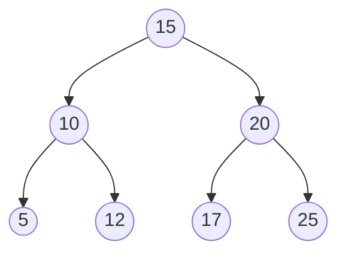
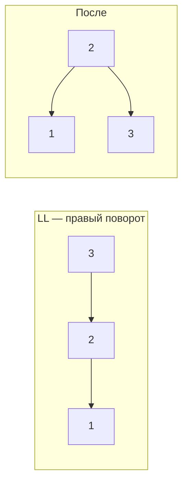
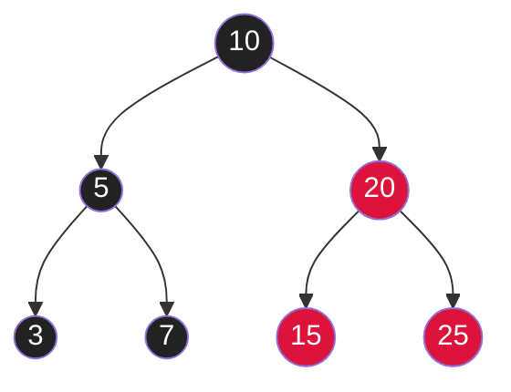
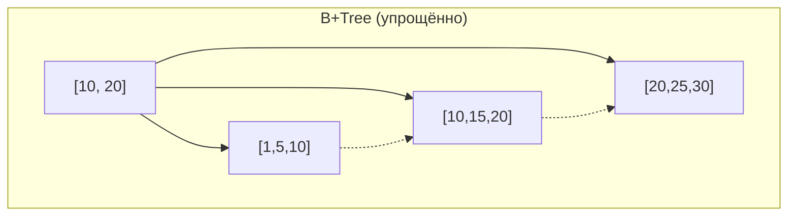

# Вопросы на собеседовании: `Деревья`

Деревья — фундамент многих структур: индексы БД (B-Tree), HashMap (красно-чёрное дерево при коллизиях), TreeMap, файловые системы, AST в компиляторах. На собеседовании знают наизусть обходы, вставку/удаление в BST, AVL, и хотят слышать про B-Tree в индексах БД.

## Полезные ссылки

### Официальная документация и авторитетные источники

- [Binary Tree in Java — Baeldung](https://www.baeldung.com/java-binary-tree)
- [Binary Search Tree — Baeldung](https://www.baeldung.com/cs/binary-search-trees)
- [AVL Tree — Baeldung](https://www.baeldung.com/cs/avl-trees)
- [Red-Black Tree — Baeldung](https://www.baeldung.com/cs/red-black-trees)
- [B-Tree Data Structure — Baeldung](https://www.baeldung.com/cs/b-tree-data-structure)
- [B+Tree — Baeldung](https://www.baeldung.com/cs/b-trees-vs-btrees-vs-rb-trees)
- [TreeMap (Java) — Oracle Docs](https://docs.oracle.com/en/java/javase/17/docs/api/java.base/java/util/TreeMap.html)
- [Tree Traversals — Visualgo](https://visualgo.net/en/bst)

## Содержание

- [Полезные ссылки](#полезные-ссылки)
- [See also](#see-also)

**Базовые понятия**
- [Q1. (!) Что такое дерево и какие виды бывают?](#q1--что-такое-дерево-и-какие-виды-бывают)
- [Q2. (!) Что такое Binary Search Tree (BST)?](#q2--что-такое-binary-search-tree-bst)
- [Q3. Чем full, complete, perfect и balanced деревья отличаются?](#q3-чем-full-complete-perfect-и-balanced-деревья-отличаются)
- [Q4. Глубина, высота, уровень — в чём разница?](#q4-глубина-высота-уровень--в-чём-разница)

**Реализация**
- [Q5. (!) Как реализовать Binary Tree через массив?](#q5--как-реализовать-binary-tree-через-массив)
- [Q6. (!) Как реализовать Binary Tree через узлы?](#q6--как-реализовать-binary-tree-через-узлы)

**Обходы**
- [Q7. (!) Чем отличаются preorder, inorder, postorder?](#q7--чем-отличаются-preorder-inorder-postorder)
- [Q8. (!) Level-order (BFS) обход дерева?](#q8--level-order-bfs-обход-дерева)
- [Q9. (!) Итеративный inorder обход через стек?](#q9--итеративный-inorder-обход-через-стек)
- [Q10. Morris traversal — обход за O(1) дополнительной памяти?](#q10-morris-traversal--обход-за-o1-дополнительной-памяти)
- [Q11. Зигзагообразный обход дерева?](#q11-зигзагообразный-обход-дерева)

**BST операции**
- [Q12. (!) Вставка и удаление в BST?](#q12--вставка-и-удаление-в-bst)
- [Q13. (!) Поиск минимума и максимума в BST?](#q13--поиск-минимума-и-максимума-в-bst)
- [Q14. (!) Inorder successor и predecessor?](#q14--inorder-successor-и-predecessor)
- [Q15. (!) Подсчёт количества узлов?](#q15--подсчёт-количества-узлов)
- [Q16. (!) Высота и проверка сбалансированности?](#q16--высота-и-проверка-сбалансированности)
- [Q17. Validate BST — проверка корректности?](#q17-validate-bst--проверка-корректности)

**Классические задачи**
- [Q18. (!) Как найти Lowest Common Ancestor (LCA) — наименьшего общего предка?](#q18--как-найти-lowest-common-ancestor-lca--наименьшего-общего-предка)
- [Q19. (!) Diameter of Binary Tree — диаметр дерева?](#q19--diameter-of-binary-tree--диаметр-дерева)
- [Q20. Symmetric tree — проверка симметрии?](#q20-symmetric-tree--проверка-симметрии)
- [Q21. (!) Как проверить одинаковость деревьев (Same tree) и вхождение поддерева (Subtree)?](#q21--как-проверить-одинаковость-деревьев-same-tree-и-вхождение-поддерева-subtree)
- [Q22. Path Sum — есть ли путь с заданной суммой?](#q22-path-sum--есть-ли-путь-с-заданной-суммой)
- [Q23. (!) Сериализация и десериализация дерева?](#q23--сериализация-и-десериализация-дерева)
- [Q24. (!) Реконструкция дерева по preorder + inorder?](#q24--реконструкция-дерева-по-preorder--inorder)

**Сбалансированные деревья**
- [Q25. (!) Что такое AVL tree и как балансируется?](#q25--что-такое-avl-tree-и-как-балансируется)
- [Q26. (!) Что такое Red-Black tree?](#q26--что-такое-red-black-tree)
- [Q27. (!) Чем AVL отличается от Red-Black tree?](#q27--чем-avl-отличается-от-red-black-tree)

**B-Trees и их применение**
- [Q28. (!) Что такое B-Tree?](#q28--что-такое-b-tree)
- [Q29. (!) Чем B-Tree отличается от B+Tree?](#q29--чем-b-tree-отличается-от-btree)
- [Q30. Почему индексы БД на B+Tree, а не на BST?](#q30-почему-индексы-бд-на-btree-а-не-на-bst)

**Java и реальный мир**
- [Q31. (!) TreeMap и TreeSet — что внутри?](#q31--treemap-и-treeset--что-внутри)
- [Q32. (!) Где красно-чёрные деревья встречаются в Java?](#q32--где-красно-чёрные-деревья-встречаются-в-java)
- [Q33. Что такое segment tree и зачем?](#q33-что-такое-segment-tree-и-зачем)
- [Q34. Что такое Fenwick tree (Binary Indexed Tree)?](#q34-что-такое-fenwick-tree-binary-indexed-tree)

## Q1. (!) Что такое дерево и какие виды бывают?

**Дерево** — связный ациклический неориентированный граф. На практике хранится с выделенным **корнем**; каждый узел имеет ноль или больше детей, и из корня есть ровно один путь к любому узлу.

Ключевое отличие от графа общего вида: нет циклов и для `n` узлов всегда ровно `n − 1` рёбер. Деревья дают иерархию и часто — логарифмическую высоту, на чём и строятся быстрые операции поиска.

**Виды:**

| Дерево | Особенность |
|--------|-------------|
| **Binary Tree** | Каждый узел имеет ≤ 2 детей |
| **BST (Binary Search Tree)** | left.value < root.value < right.value |
| **AVL** | Сбалансированный BST, разница высот ≤ 1 |
| **Red-Black** | Сбалансированный BST через цвета |
| **B-Tree / B+Tree** | Многонаправленное, для дисковых индексов |
| **Heap** | Полное дерево с heap-property (см. [кучи](heaps-interview.md)) |
| **Trie** | Префиксное дерево для строк |
| **Segment Tree** | Для range queries |
| **Suffix Tree / Trie** | Для поиска подстрок |

**Где применяются:**
- BST / TreeMap → отсортированные данные с быстрым поиском диапазона
- B-Tree → индексы PostgreSQL/MySQL (оптимизированы под дисковый I/O)
- Trie → автодополнение, IP-routing по префиксам
- Heap → priority queue, scheduler
- Suffix tree → биоинформатика, поиск плагиата

**На собеседовании** важно не перечислить виды, а уметь объяснить компромисс: обычный BST прост, но вырождается в список; самобалансирующиеся (AVL, Red-Black) гарантируют `O(log n)`; B-Tree жертвует простотой ради минимума обращений к диску.


## Q2. (!) Что такое Binary Search Tree (BST)?

**BST** — бинарное дерево, в котором ключи упорядочены так, что поиск идёт по одной ветке. Инвариант для каждого узла:
- Все узлы левого поддерева **меньше** root
- Все узлы правого поддерева **больше** root
- Оба поддерева также BST

Именно этот инвариант позволяет на каждом шаге отбрасывать половину дерева: сравнили ключ с узлом — и пошли строго влево или вправо. Поэтому inorder-обход BST даёт значения по возрастанию.



**Сложности** — всё упирается в высоту `h`:
- Поиск, вставка, удаление: `O(h)` (спускаемся по одной ветке)
- Сбалансированный BST: `h = O(log n)` → все операции `O(log n)`
- Вырожденный BST (как linked list): `h = O(n)` → операции `O(n)`

**Подводный камень:** обычный BST вырождается, если вставлять уже отсортированные данные — каждый новый ключ уходит вправо, дерево превращается в список. Поэтому в production используют **самобалансирующиеся** BST (AVL, Red-Black), которые держат `h = O(log n)` независимо от порядка вставки.


## Q3. Чем full, complete, perfect и balanced деревья отличаются?

| Тип | Свойство |
|-----|----------|
| **Full** | Каждый узел имеет 0 или 2 детей |
| **Complete** | Все уровни заполнены, кроме последнего; последний — слева направо |
| **Perfect** | Все внутренние узлы имеют 2 детей, все листья на одном уровне |
| **Balanced** | Высоты левого и правого поддеревьев каждого узла отличаются на ≤ 1 |
| **Degenerate (skewed)** | Каждый узел имеет ≤ 1 ребёнка — фактически linked list |

**Perfect** — самое строгое: такое дерево одновременно и **Complete**, и **Full** (Perfect ⊂ Complete и Perfect ⊂ Full). А вот **Complete** и **Full** между собой независимы — ни одно не является подмножеством другого: complete-дерево может иметь узел с единственным левым ребёнком (это нарушает full), а full-дерево — «дыры» на промежуточных уровнях (это нарушает complete). Heap всегда **complete**: за счёт отсутствия дыр он компактно хранится в массиве без пропусков (см. Q5).

**Зачем различать:** balanced — это про производительность (гарантия `O(log n)`), а full/complete/perfect — про форму. Например, complete-форма heap не означает упорядоченность по BST-инварианту; это разные свойства.


## Q4. Глубина, высота, уровень — в чём разница?

Глубина считается **сверху вниз** (от корня), высота — **снизу вверх** (от листьев). Это зеркальные понятия, и их легко перепутать на собеседовании.

- **Глубина (depth) узла** — расстояние от корня до узла. Корень: `depth = 0`.
- **Высота (height) узла** — максимальное расстояние от узла до листа. Лист: `height = 0`.
- **Высота дерева** — высота корня.
- **Уровень (level)** = глубина + 1 (иногда используют как синоним глубины).

Для дерева с `n` узлами:
- Минимальная высота: `⌊log₂(n)⌋` (плотно заполненное дерево)
- Максимальная высота: `n - 1` (вырожденный случай — цепочка)

Сбалансированное → `h = O(log n)`, и именно отсюда берётся логарифмическая стоимость операций.


## Q5. (!) Как реализовать Binary Tree через массив?

Идея: хранить узлы в плоском массиве, а связи родитель-ребёнок вычислять по индексам — без единого указателя. Работает потому, что в complete-дереве позиции узлов предсказуемы.

**Индексация:** корень в `arr[0]`. Для узла `i`:
- Левый ребёнок: `arr[2i + 1]`
- Правый ребёнок: `arr[2i + 2]`
- Родитель: `arr[(i - 1) / 2]`

```
         [0]          arr = [10, 5, 15, 3, 7, 12, 20]
        /   \
      [1]   [2]       Для i = 1 (значение 5):
      / \   / \         left  = arr[3] = 3
    [3] [4][5] [6]      right = arr[4] = 7
                         parent = arr[0] = 10
```

**Плюсы:**
- `O(1)` доступ к ребёнку/родителю по индексу
- Нет указателей — компактнее и лучше cache-locality (узлы лежат подряд в памяти)
- Идеально для **полных** деревьев и **куч**

**Минусы:**
- Фиксированный размер (или дорогой ресайз с копированием)
- Пустые ячейки при неполном дереве — память впустую; для разреженного дерева массив раздувается экспоненциально

**Эмпирическое правило:** массивное представление выбирают, когда дерево гарантированно complete (как heap). Для произвольной формы дерева берут узлы с указателями (Q6). `PriorityQueue` (min-heap) хранится именно так, как и embedded heaps в OS.


## Q6. (!) Как реализовать Binary Tree через узлы?

```java
class TreeNode<T extends Comparable<T>> {
    T value;
    TreeNode<T> left, right;
    TreeNode(T value) { this.value = value; }
}

class BinarySearchTree<T extends Comparable<T>> {
    private TreeNode<T> root;

    TreeNode<T> insert(TreeNode<T> node, T value) {
        if (node == null) return new TreeNode<>(value);
        int cmp = value.compareTo(node.value);
        if (cmp < 0)      node.left  = insert(node.left, value);
        else if (cmp > 0) node.right = insert(node.right, value);
        return node;
    }

    void inorder(TreeNode<T> node, List<T> out) {
        if (node == null) return;
        inorder(node.left, out);
        out.add(node.value);
        inorder(node.right, out);
    }
}
```

Узел хранит значение и две ссылки (`left`, `right`); вставка рекурсивно спускается по BST-инварианту до `null` и создаёт новый узел.

Память: `O(n)` (по 3 поля на узел: value, left, right). В отличие от массива, поддерживает **любую** форму дерева без перерасхода памяти на пустые ячейки — поэтому это **стандартный** способ реализации BST, AVL, Red-Black. Плата — указатели разбросаны по куче, cache-locality хуже, чем у массива.


## Q7. (!) Чем отличаются preorder, inorder, postorder?

Все три — DFS-обходы, и они отличаются **только моментом обработки текущего узла** относительно спуска в детей. Левое поддерево всегда обходится раньше правого; меняется лишь, когда «выводим» сам корень: до детей (preorder), между ними (inorder) или после (postorder).

```java
void preorder(TreeNode node) {  // КОРЕНЬ → L → R
    if (node == null) return;
    process(node);
    preorder(node.left);
    preorder(node.right);
}

void inorder(TreeNode node) {   // L → КОРЕНЬ → R
    if (node == null) return;
    inorder(node.left);
    process(node);
    inorder(node.right);
}

void postorder(TreeNode node) { // L → R → КОРЕНЬ
    if (node == null) return;
    postorder(node.left);
    postorder(node.right);
    process(node);
}
```

| Обход | Применение | Почему именно он |
|-------|------------|-----------------|
| Preorder | Сериализация дерева, копирование, выражения в префиксной форме | корень обрабатывается первым → копию/префикс строим сверху вниз |
| Inorder | **Отсортированный** обход BST, проверка валидности BST | для BST даёт значения по возрастанию |
| Postorder | Удаление дерева, вычисление выражений (postfix), DFS пост-обработка | дети обрабатываются до родителя → безопасно освобождать/агрегировать снизу вверх |

Сложность каждого: `O(n)` время (каждый узел посещаем один раз), `O(h)` память на стек вызовов — для сбалансированного дерева `O(log n)`, для вырожденного `O(n)`.


## Q8. (!) Level-order (BFS) обход дерева?

Обход по уровням сверху вниз — это BFS на дереве. В отличие от DFS-обходов, узлы посещаются «слоями», поэтому нужна **очередь**, а не стек/рекурсия.

Ключевой приём — зафиксировать `size = queue.size()` в начале каждой итерации: это ровно количество узлов текущего уровня, что позволяет сгруппировать вывод по слоям. Применяется для печати по уровнями, поиска ширины дерева, задач вида «обработай каждый уровень отдельно».

```java
List<List<Integer>> levelOrder(TreeNode root) {
    List<List<Integer>> result = new ArrayList<>();
    if (root == null) return result;

    Queue<TreeNode> queue = new ArrayDeque<>();
    queue.offer(root);

    while (!queue.isEmpty()) {
        int size = queue.size(); // фиксируем размер уровня
        List<Integer> level = new ArrayList<>(size);

        for (int i = 0; i < size; i++) {
            TreeNode node = queue.poll();
            level.add(node.val);
            if (node.left  != null) queue.offer(node.left);
            if (node.right != null) queue.offer(node.right);
        }
        result.add(level);
    }
    return result;
}
```

`O(n)` время, `O(w)` память, где `w` — максимальная ширина уровня. Для сбалансированного дерева последний уровень содержит до `n/2` узлов, так что в худшем случае память — `O(n)`.


## Q9. (!) Итеративный inorder обход через стек?

Зачем итеративно, если есть рекурсия: чтобы убрать неявный стек вызовов и контролировать память явно. Логика та же, что у рекурсивного inorder — сначала уходим максимально влево, складывая узлы в стек, затем «всплываем», обрабатываем узел и переходим вправо.

```java
List<Integer> inorderIterative(TreeNode root) {
    List<Integer> result = new ArrayList<>();
    Deque<TreeNode> stack = new ArrayDeque<>();
    TreeNode curr = root;

    while (curr != null || !stack.isEmpty()) {
        while (curr != null) {
            stack.push(curr);
            curr = curr.left;
        }
        curr = stack.pop();
        result.add(curr.val);
        curr = curr.right;
    }
    return result;
}
```

`O(n)` время, `O(h)` память. **Преимущество перед рекурсией:** стек явный и лежит в куче, поэтому нет риска `StackOverflowError` на глубоких деревьях (рекурсия на JVM падает примерно от ~10⁵ уровней вложенности).


## Q10. Morris traversal — обход за O(1) дополнительной памяти?

**Morris traversal** — inorder-обход за `O(1)` дополнительной памяти, без стека и без рекурсии. Трюк в **threading**: чтобы знать, куда вернуться после левого поддерева, временно протягиваем ссылку от inorder-предшественника (`pred.right`) обратно к текущему узлу. Эта временная ссылка играет роль «возврата», который обычно хранил бы стек.

Когда обход доходит до узла второй раз (ссылка уже стоит) — мы снимаем threading, восстанавливая дерево, и выводим значение. Поэтому дерево по итогу остаётся неизменным, хотя по ходу обхода модифицируется.

```java
List<Integer> morrisInorder(TreeNode root) {
    List<Integer> result = new ArrayList<>();
    TreeNode curr = root;

    while (curr != null) {
        if (curr.left == null) {
            result.add(curr.val);
            curr = curr.right;
        } else {
            // Находим inorder predecessor
            TreeNode pred = curr.left;
            while (pred.right != null && pred.right != curr) {
                pred = pred.right;
            }

            if (pred.right == null) {
                pred.right = curr; // создаём временную ссылку
                curr = curr.left;
            } else {
                pred.right = null; // снимаем threading
                result.add(curr.val);
                curr = curr.right;
            }
        }
    }
    return result;
}
```

`O(n)` время, `O(1)` память. **На практике** применяется редко: временно ломает дерево, не потокобезопасен и сложнее в отладке. Но это знаковая задача на собеседованиях у топ-компаний — проверяют понимание threading и того, как обойтись без стека.


## Q11. Зигзагообразный обход дерева?

Это level-order (Q8), но направление чередуется: чётные уровни читаем слева направо, нечётные — справа налево. Сам BFS не меняется — мы по-прежнему наполняем очередь слева направо; меняется только то, **в какой конец** результирующего списка кладём значение текущего уровня.

```java
List<List<Integer>> zigzagLevelOrder(TreeNode root) {
    List<List<Integer>> result = new ArrayList<>();
    if (root == null) return result;

    Deque<TreeNode> queue = new ArrayDeque<>();
    queue.offer(root);
    boolean leftToRight = true;

    while (!queue.isEmpty()) {
        int size = queue.size();
        LinkedList<Integer> level = new LinkedList<>();

        for (int i = 0; i < size; i++) {
            TreeNode node = queue.poll();
            if (leftToRight) level.addLast(node.val);
            else             level.addFirst(node.val);
            if (node.left  != null) queue.offer(node.left);
            if (node.right != null) queue.offer(node.right);
        }
        result.add(level);
        leftToRight = !leftToRight;
    }
    return result;
}
```

`O(n)` время, `O(w)` память. Хитрость — `LinkedList` для уровня: `addFirst()` на двусвязном списке стоит `O(1)`, тогда как у `ArrayList` вставка в начало была бы `O(n)` со сдвигом элементов.


## Q12. (!) Вставка и удаление в BST?

Вставка проста: спускаемся по инварианту до пустого места и подвешиваем новый лист. Удаление сложнее, потому что нужно сохранить упорядоченность — особенно когда у узла два ребёнка.

```java
TreeNode insert(TreeNode root, int value) {
    if (root == null) return new TreeNode(value);
    if (value < root.val)      root.left  = insert(root.left, value);
    else if (value > root.val) root.right = insert(root.right, value);
    return root;
}

TreeNode delete(TreeNode root, int value) {
    if (root == null) return null;

    if (value < root.val) {
        root.left = delete(root.left, value);
    } else if (value > root.val) {
        root.right = delete(root.right, value);
    } else {
        // Случай 1: нет детей или один ребёнок
        if (root.left == null)  return root.right;
        if (root.right == null) return root.left;
        // Случай 2: два ребёнка — заменяем inorder successor
        TreeNode successor = findMin(root.right);
        root.val = successor.val;
        root.right = delete(root.right, successor.val);
    }
    return root;
}

TreeNode findMin(TreeNode node) {
    while (node.left != null) node = node.left;
    return node;
}
```

Три случая удаления (по числу детей у удаляемого узла):
1. **Лист** — просто отрезаем (`root.right == null` и `root.left == null` → возвращаем `null`)
2. **Один ребёнок** — поднимаем единственного ребёнка на место узла
3. **Два ребёнка** — нельзя просто удалить, иначе порвём дерево. Заменяем значение узла на **inorder successor** (минимум правого поддерева — наименьший из тех, что больше узла), затем рекурсивно удаляем сам successor из правого поддерева. Successor по построению имеет не больше одного ребёнка, поэтому его удаление сводится к случаям 1–2.

**Почему именно successor:** это ближайшее по значению справа, поэтому после замены BST-инвариант сохраняется. Симметрично можно брать predecessor (максимум левого поддерева).

Сложность всех операций — `O(h)`. В сбалансированном BST — `O(log n)`.


## Q13. (!) Поиск минимума и максимума в BST?

Прямое следствие BST-инварианта: минимум — самый левый узел (идём по `left`, пока можем), максимум — самый правый. Сравнивать значения не нужно, достаточно идти по ссылкам.

```java
TreeNode findMin(TreeNode node) {
    while (node.left != null) node = node.left;
    return node;
}

TreeNode findMax(TreeNode node) {
    while (node.right != null) node = node.right;
    return node;
}
```

`O(h)` — для сбалансированного `O(log n)`, для вырожденного `O(n)`.

**В реальном коде:** `TreeMap.firstKey()` и `TreeMap.lastKey()` в Java — это ровно эти два спуска по красно-чёрному дереву.


## Q14. (!) Inorder successor и predecessor?

**Inorder successor** узла — следующий за ним по значению (следующий в inorder-обходе), **predecessor** — предыдущий. В BST это «соседи по сортировке». Successor нужен, например, при удалении узла с двумя детьми (Q12) и для итерации по дереву.

Реализация ниже находит successor за один спуск из корня, не требуя ссылок на родителя.

```java
TreeNode inorderSuccessor(TreeNode root, TreeNode p) {
    TreeNode successor = null;
    while (root != null) {
        if (p.val < root.val) {
            successor = root;
            root = root.left;
        } else {
            root = root.right;
        }
    }
    return successor;
}
```

`O(h)`. Два случая, которые стоит проговорить:
- Узел **имеет** правое поддерево → successor = `findMin(node.right)` (минимум справа).
- Узел **без** правого поддерева → successor — ближайший предок, для которого `node` лежит в его левом поддереве. Алгоритм выше как раз запоминает такого кандидата при каждом повороте влево.

Predecessor симметричен: при наличии левого поддерева это `findMax(node.left)`.


## Q15. (!) Подсчёт количества узлов?

Наивный способ — обойти всё дерево за `O(n)`. Но если известно, что дерево **complete**, число узлов можно посчитать быстрее, `O(log²n)`, не заходя в каждый узел.

```java
// Рекурсивный — O(n)
int countNodes(TreeNode root) {
    if (root == null) return 0;
    return 1 + countNodes(root.left) + countNodes(root.right);
}

// Оптимизация для COMPLETE binary tree — O(log²n)
int countNodesComplete(TreeNode root) {
    if (root == null) return 0;
    int leftHeight  = height(root, true);
    int rightHeight = height(root, false);
    if (leftHeight == rightHeight) return (1 << leftHeight) - 1; // 2^h - 1
    return 1 + countNodesComplete(root.left) + countNodesComplete(root.right);
}

int height(TreeNode node, boolean goLeft) {
    int h = 0;
    while (node != null) { h++; node = goLeft ? node.left : node.right; }
    return h;
}
```

**Почему `O(log²n)` для complete-дерева:** если левая и правая «высоты по краю» равны, поддерево perfect → узлов ровно `2^h − 1` без обхода. Иначе рекурсия идёт вглубь на `O(log n)` уровней, и на каждом оценка высоты стоит `O(log n)` — отсюда произведение `log²n`.


## Q16. (!) Высота и проверка сбалансированности?

Дерево сбалансировано, если у **каждого** узла высоты поддеревьев отличаются не больше чем на 1. Главный приём — совместить вычисление высоты и проверку баланса в одном обходе снизу вверх: функция возвращает высоту, а признаком дисбаланса служит «маркер» `-1`, который пробрасывается наверх и останавливает дальнейшие вычисления.

```java
// Высота — O(n)
int height(TreeNode root) {
    if (root == null) return 0;
    return 1 + Math.max(height(root.left), height(root.right));
}

// Проверка сбалансированности — O(n) за один обход
int checkBalance(TreeNode root) {
    if (root == null) return 0;
    int leftH = checkBalance(root.left);
    if (leftH == -1) return -1;
    int rightH = checkBalance(root.right);
    if (rightH == -1) return -1;
    if (Math.abs(leftH - rightH) > 1) return -1;
    return 1 + Math.max(leftH, rightH);
}

boolean isBalanced(TreeNode root) {
    return checkBalance(root) != -1;
}
```

**Компромисс:** наивная проверка вызывает `height()` для каждого узла отдельно → высота пересчитывается многократно, итого `O(n²)`. Версия выше делает один проход снизу вверх и считает каждый узел ровно раз → `O(n)`.


## Q17. Validate BST — проверка корректности?

Проверить, что дерево действительно BST, — это проверить инвариант **глобально**, а не для каждой пары родитель-ребёнок по отдельности. Каждый узел должен лежать в допустимом диапазоне `(min, max)`, который сужается по мере спуска: ушли влево — узел становится новым верхним пределом, ушли вправо — новым нижним.

```java
boolean isValidBST(TreeNode root) {
    return validate(root, null, null);
}

boolean validate(TreeNode node, Integer min, Integer max) {
    if (node == null) return true;
    if ((min != null && node.val <= min) ||
        (max != null && node.val >= max)) return false;
    return validate(node.left, min, node.val)
        && validate(node.right, node.val, max);
}

// Альтернатива: inorder обход должен быть строго возрастающим
boolean isValidBstInorder(TreeNode root) {
    Deque<TreeNode> stack = new ArrayDeque<>();
    Integer prev = null;
    TreeNode curr = root;
    while (curr != null || !stack.isEmpty()) {
        while (curr != null) { stack.push(curr); curr = curr.left; }
        curr = stack.pop();
        if (prev != null && curr.val <= prev) return false;
        prev = curr.val;
        curr = curr.right;
    }
    return true;
}
```

**Подвох (его и проверяют):** локальной проверки `node.left.val < node.val < node.right.val` недостаточно. Классический контрпример — узел из левого поддерева может быть меньше корня, но больше деда, и локально всё «корректно», а глобально BST нарушен. Поэтому нужен либо проброс мин/макс (первый способ), либо inorder-обход с требованием строгого возрастания (второй). Inorder-вариант элегантен: для настоящего BST значения выходят строго по возрастанию.


## Q18. (!) Как найти Lowest Common Ancestor (LCA) — наименьшего общего предка?

**LCA** двух узлов — самый глубокий узел, который является предком обоих (узел может быть предком самого себя). Алгоритм зависит от того, BST это или произвольное дерево.

```java
// Для BST — O(h)
TreeNode lcaBST(TreeNode root, TreeNode p, TreeNode q) {
    while (root != null) {
        if (p.val < root.val && q.val < root.val) root = root.left;
        else if (p.val > root.val && q.val > root.val) root = root.right;
        else return root; // расходящиеся пути — нашли LCA
    }
    return null;
}

// Для произвольного binary tree — O(n)
TreeNode lcaBinary(TreeNode root, TreeNode p, TreeNode q) {
    if (root == null || root == p || root == q) return root;
    TreeNode left = lcaBinary(root.left, p, q);
    TreeNode right = lcaBinary(root.right, p, q);
    if (left != null && right != null) return root;
    return (left != null) ? left : right;
}
```

**BST — `O(h)`:** используем упорядоченность. Пока оба значения меньше узла, LCA точно слева; пока оба больше — справа. Как только пути расходятся (один меньше, другой больше, либо один равен узлу) — текущий узел и есть LCA.

**Произвольное дерево — `O(n)`:** сортировки нет, приходится искать рекурсивно. Если `p` и `q` нашлись в **разных** поддеревьях текущего узла — он и есть LCA (ниже их пути уже разошлись). Если оба в одном поддереве — LCA глубже, возвращаем найденный там результат.


## Q19. (!) Diameter of Binary Tree — диаметр дерева?

**Diameter** — длина (в рёбрах) самого длинного пути между любыми двумя узлами. Ловушка: этот путь **не обязан** проходить через корень — он может целиком лежать в каком-то поддереве.

Ключевая идея: для каждого узла самый длинный путь, проходящий **через него**, равен `глубина(left) + глубина(right)`. Считаем это во время обычного вычисления глубины и держим максимум в поле — один проход, без повторного счёта глубин.

```java
class Solution {
    int diameter = 0;

    public int diameterOfBinaryTree(TreeNode root) {
        depth(root);
        return diameter;
    }

    int depth(TreeNode node) {
        if (node == null) return 0;
        int left = depth(node.left);
        int right = depth(node.right);
        diameter = Math.max(diameter, left + right);
        return 1 + Math.max(left, right);
    }
}
```

`O(n)` — каждый узел посещается один раз. Функция `depth` возвращает наверх глубину поддерева, а попутно обновляет общий максимум `diameter`; разделять эти два расчёта (как в наивной версии) превратило бы решение в `O(n²)`.


## Q20. Symmetric tree — проверка симметрии?

Дерево симметрично, если оно зеркально само себе относительно корня. Сводится к проверке двух поддеревьев на «зеркальность»: сравниваем не одинаковость, а отражение — левый ребёнок одного против правого ребёнка другого, и наоборот.

```java
boolean isSymmetric(TreeNode root) {
    return root == null || isMirror(root.left, root.right);
}

boolean isMirror(TreeNode a, TreeNode b) {
    if (a == null && b == null) return true;
    if (a == null || b == null) return false;
    return a.val == b.val
        && isMirror(a.left, b.right)
        && isMirror(a.right, b.left);
}
```

`O(n)`. Суть в перекрёстном сравнении внутри `isMirror`: `a.left` с `b.right` и `a.right` с `b.left`. Если бы мы сравнивали `a.left` с `b.left`, мы проверяли бы идентичность (Q21), а не симметрию.


## Q21. (!) Как проверить одинаковость деревьев (Same tree) и вхождение поддерева (Subtree)?

`isSameTree` проверяет, что два дерева идентичны по структуре и значениям (синхронный обход обоих). `isSubtree` использует её как кирпичик: для каждого узла большого дерева спрашивает «совпадает ли поддерево, начинающееся здесь, с искомым?».

```java
boolean isSameTree(TreeNode p, TreeNode q) {
    if (p == null && q == null) return true;
    if (p == null || q == null) return false;
    return p.val == q.val
        && isSameTree(p.left, q.left)
        && isSameTree(p.right, q.right);
}

boolean isSubtree(TreeNode root, TreeNode subRoot) {
    if (root == null) return false;
    if (isSameTree(root, subRoot)) return true;
    return isSubtree(root.left, subRoot) || isSubtree(root.right, subRoot);
}
```

`isSameTree` — `O(min(n, m))`. `isSubtree` — `O(n·m)` в худшем случае: для каждого из `n` узлов запускаем сравнение размером до `m`. Ускоряется до `O(n+m)`, если сериализовать оба дерева в строки и искать подстроку алгоритмом KMP.


## Q22. Path Sum — есть ли путь с заданной суммой?

Вопрос: существует ли путь **от корня до листа**, сумма значений которого равна `target`. Приём — вычитать значение узла из `target` при спуске; тогда у листа достаточно проверить равенство остатка значению листа. Так не нужно тащить накопленную сумму отдельным параметром.

```java
boolean hasPathSum(TreeNode root, int target) {
    if (root == null) return false;
    if (root.left == null && root.right == null) return root.val == target;
    return hasPathSum(root.left, target - root.val)
        || hasPathSum(root.right, target - root.val);
}
```

`O(n)` — в худшем случае обходим всё дерево. Важная деталь: условие листа — `left == null && right == null`; проверять `target == 0` на пустом узле неверно (можно случайно «дойти» до несуществующего листа). Вариации: **Path Sum II** — собрать все такие пути; **Path Sum III** — путь не обязан начинаться в корне, решается через prefix sum в HashMap.


## Q23. (!) Сериализация и десериализация дерева?

Цель — превратить дерево в строку и обратно без потери структуры. Главная трудность: по одному preorder-обходу дерево восстановить нельзя — теряется информация о пропущенных детях. Решение — явно записывать маркеры `null` для пустых ссылок. Тогда той же preorder-последовательности достаточно: при десериализации читаем токены по порядку, и каждый `null` подсказывает, где ветка обрывается.

```java
class Codec {
    public String serialize(TreeNode root) {
        StringBuilder sb = new StringBuilder();
        serializeHelper(root, sb);
        return sb.toString();
    }

    void serializeHelper(TreeNode node, StringBuilder sb) {
        if (node == null) { sb.append("null,"); return; }
        sb.append(node.val).append(",");
        serializeHelper(node.left, sb);
        serializeHelper(node.right, sb);
    }

    public TreeNode deserialize(String data) {
        Queue<String> queue = new ArrayDeque<>(Arrays.asList(data.split(",")));
        return deserializeHelper(queue);
    }

    TreeNode deserializeHelper(Queue<String> queue) {
        String val = queue.poll();
        if ("null".equals(val)) return null;
        TreeNode node = new TreeNode(Integer.parseInt(val));
        node.left = deserializeHelper(queue);
        node.right = deserializeHelper(queue);
        return node;
    }
}
```

`O(n)` обе операции, память `O(n)`. Здесь использован preorder + маркеры `null`; десериализация работает, потому что preorder восстанавливает узлы строго в порядке «корень → левое → правое». Альтернатива — level-order сериализация (тот самый формат `[1,2,3,null,null,4,5]` из LeetCode), удобный для человекочитаемого представления.


## Q24. (!) Реконструкция дерева по preorder + inorder?

Два обхода дополняют друг друга. **Preorder** даёт корень: его первый элемент — корень всего дерева, второй — корень левого поддерева и так далее. **Inorder** даёт границу: найдя корень в inorder, мы знаем, что всё слева от него — левое поддерево, всё справа — правое. Рекурсивно повторяя это, восстанавливаем дерево однозначно.

```java
class Solution {
    private int preorderIdx = 0;
    private Map<Integer, Integer> inorderMap = new HashMap<>();

    public TreeNode buildTree(int[] preorder, int[] inorder) {
        for (int i = 0; i < inorder.length; i++) inorderMap.put(inorder[i], i);
        return build(preorder, 0, inorder.length - 1);
    }

    TreeNode build(int[] preorder, int left, int right) {
        if (left > right) return null;
        int rootVal = preorder[preorderIdx++];
        TreeNode root = new TreeNode(rootVal);
        int idx = inorderMap.get(rootVal);
        root.left = build(preorder, left, idx - 1);
        root.right = build(preorder, idx + 1, right);
        return root;
    }
}
```

`O(n)` благодаря HashMap: индекс корня в inorder ищется за `O(1)`. Без неё каждый поиск был бы `O(n)` → суммарно `O(n²)`.

**Что важно знать про однозначность:** восстановить можно по **postorder + inorder** или **level-order + inorder** — во всех парах участвует inorder, который и задаёт деление на левое/правое. А вот по **preorder + postorder** дерево восстанавливается **не однозначно** (нельзя отличить узел с единственным левым ребёнком от узла с единственным правым).


## Q25. (!) Что такое AVL tree и как балансируется?

**AVL** — самобалансирующееся BST со строгим инвариантом: для каждого узла `|height(left) - height(right)| ≤ 1`. Этот «balance factor» хранится/пересчитывается в узлах и не даёт дереву вырождаться.

После каждой вставки/удаления баланс мог нарушиться — тогда поднимаемся от изменённого узла к корню и в первой же «перекошенной» точке применяем **повороты** (локальную перестройку 2–3 узлов, сохраняющую BST-инвариант):



**4 случая дисбаланса** (по тому, в каком «колене» произошёл перекос):
1. **LL** (left-left): один правый поворот
2. **RR** (right-right): один левый поворот
3. **LR** (left-right): сначала левый поворот ребёнка, потом правый поворот
4. **RL** (right-left): сначала правый поворот ребёнка, потом левый поворот

LR и RL — «двойные»: одиночный поворот их не выпрямляет, нужно сперва привести случай к LL/RR.

Сложности: вставка, удаление, поиск — `O(log n)` гарантированно. Высота: ≤ `1.44 · log(n+2)` — заметно ближе к идеалу, чем у Red-Black.

**Сценарий применения:** read-heavy нагрузка — много поисков, редкие записи. Жёсткая балансировка ускоряет чтение, но делает запись дороже (больше поворотов). На практике в Java чаще берут красно-чёрные деревья — они дешевле на запись.


## Q26. (!) Что такое Red-Black tree?

**Red-Black tree** — самобалансирующееся BST, где баланс держится не через явный контроль высоты, а через **раскраску узлов** в красный/чёрный и набор правил:
1. Каждый узел красный или чёрный
2. Корень чёрный
3. Все листья (NIL) чёрные
4. Красный узел не может иметь красных детей (нет двух красных подряд)
5. На каждом пути от корня до листа одинаковое число чёрных узлов (black-height)

**Почему это балансирует дерево:** правило 5 уравнивает чёрную длину всех путей, а правило 4 запрещает «удлинять» путь красными узлами вдвое и больше. Поэтому самый длинный путь не более чем вдвое длиннее самого короткого → высота ≤ `2 log(n+1)`, и все операции `O(log n)`.



После вставки/удаления баланс восстанавливается через **повороты + перекрашивание**. Главное преимущество перед AVL: часто хватает перекраски без поворота, поэтому запись дешевле — что и делает RB-tree выбором по умолчанию для библиотечных map/set.


## Q27. (!) Чем AVL отличается от Red-Black tree?

Оба гарантируют `O(log n)`, но по-разному выбирают **компромисс между скоростью чтения и записи**. AVL балансируется строже → дерево ниже → поиск быстрее, но запись дороже. Red-Black балансируется слабее → дерево выше → поиск чуть медленнее, зато запись дешевле (часто обходится перекраской без поворотов).

| Критерий | AVL | Red-Black |
|----------|-----|-----------|
| Балансировка | Строгая (\|h_L − h_R\| ≤ 1) | Слабая (h ≤ 2 log n) |
| Высота | ≤ 1.44 log n | ≤ 2 log n |
| Поворотов на вставку | До 2 | До 2 |
| Поворотов на удаление | До log n | До 3 |
| Скорость поиска | Быстрее (более сбалансировано) | Чуть медленнее |
| Скорость вставки/удаления | Медленнее | Быстрее |
| Применение | Read-heavy | Write-heavy / mixed |

**Где что встречается:** красно-чёрные деревья — в `TreeMap`, `TreeSet`, `HashMap` (при коллизиях) в **Java**, в `std::map` / `std::set` в **C++ STL**, в `epoll` и CFS-планировщике в **Linux kernel**. То есть везде, где нагрузка смешанная и важна дешёвая запись.

AVL применяют реже — в специализированных in-memory структурах под read-heavy сценарии и range queries, где выигрыш в скорости поиска оправдывает более дорогую запись.


## Q28. (!) Что такое B-Tree?

**B-Tree** — обобщение BST для дисковых хранилищ: узел хранит **много ключей** и имеет **много детей** (порядок `m`), а все листья лежат на одной глубине. Идея — сделать дерево «широким и низким», чтобы поиск требовал как можно меньше обращений к диску.

**Свойства B-Tree порядка `m`:**
- Каждый узел содержит до `m-1` ключей
- Узел (кроме корня) — минимум `⌈m/2⌉ - 1` ключей
- Узел с `k` ключами имеет `k+1` детей
- Все листья на одной высоте

Высота: `O(log_m n)` — для `m = 100` и `n = 10⁹` всего ~5 уровней (против ~30 у бинарного дерева).

**Зачем многонаправленность:** диск читается страницами (4–16 KB), и одно обращение к диску на порядки дороже сравнения в памяти. Сделав узел размером со страницу, мы за **одно** чтение загружаем сразу сотню ключей — то есть «оплачиваем» дорогой I/O редко. Высокий `m` напрямую уменьшает высоту, а значит и число обращений к диску на поиск.

**Применение:** индексы в базах данных, файловые системы (NTFS, HFS+, директории ext4).


## Q29. (!) Чем B-Tree отличается от B+Tree?

Ключевое отличие — **где лежат данные**. В B-Tree значения хранятся во всех узлах, в B+Tree — только в листьях, а внутренние узлы держат лишь ключи-разделители. Плюс листья B+Tree связаны в список. Эти два изменения и дают B+Tree преимущество в БД.

| Критерий | B-Tree | B+Tree |
|----------|--------|--------|
| Где хранятся данные | В каждом узле (внутренних и листьях) | **Только в листьях** |
| Внутренние узлы | Ключи + значения + ссылки | Только ключи + ссылки |
| Связи листьев | Нет | **Связный список** (sibling pointers) |
| Range query | Сложнее (in-order traversal) | Просто (по списку листьев) |
| Размер внутренних узлов | Больше | Меньше → больше fan-out |
| Поиск | Может закончиться раньше | Всегда доходит до листа |



**Почему B+Tree почти всегда выигрывает в БД:**
- Внутренние узлы хранят только ключи (без значений) → в страницу влезает больше ключей → больше fan-out → ниже дерево → меньше I/O.
- Range scan и сортированный обход почти бесплатны: нашли начало за `O(log n)`, дальше идём по связному списку листьев за `O(k)`, не возвращаясь вверх по дереву.
- Плата — поиск точечного ключа всегда доходит до листа (в B-Tree мог закончиться во внутреннем узле), но на фоне выигрыша по высоте это несущественно.

PostgreSQL, MySQL InnoDB, Oracle — индексы строят именно на B+Tree.


## Q30. Почему индексы БД на B+Tree, а не на BST?

Корень всех причин один: **на диске узкое место — число обращений к диску, а не число сравнений.** BST оптимизирует сравнения в памяти, B+Tree — обращения к диску. Отсюда конкретные выигрыши:

1. **Узел = страница.** B+Tree подгоняет узел под страницу диска (4–16 KB), так что один I/O приносит сразу много ключей. BST с бинарными узлами тратил бы по обращению на каждое сравнение.
2. **Меньше высота — меньше I/O.** Для `n = 10⁹` высота BST ~30, B+Tree (m=100) ~5 → примерно в 6× меньше обращений к диску на поиск.
3. **Range queries дёшевы.** Листья B+Tree связаны в список → диапазон читается последовательно. BST для этого требует in-order обхода с прыжками по дереву.
4. **Sequential scan.** Все данные лежат в листьях подряд → обход листьев = последовательное чтение, дружелюбное к диску и кешу.
5. **Локальность.** Узлы B+Tree плотно упакованы, что улучшает работу дискового и страничного кеша.

Подробнее об индексах — в [PostgreSQL](../../databases/postgresql-interview.md) и [Database Architecture](../../databases/database-architecture-interview.md).


## Q31. (!) TreeMap и TreeSet — что внутри?

`TreeMap` и `TreeSet` в Java реализованы на **красно-чёрном дереве**. Именно поэтому, в отличие от `HashMap`, они держат ключи **отсортированными** и дают навигационные операции (`floorKey`, `ceilingKey`, `subMap`) — всё это естественные операции на BST.

```java
TreeMap<String, Integer> map = new TreeMap<>();
map.put("apple", 1);
map.put("banana", 2);
map.put("cherry", 3);

// Отсортированный обход
map.firstKey();    // "apple"
map.lastKey();     // "cherry"
map.floorKey("ban");    // "apple" (наибольший ≤ "ban")
map.ceilingKey("ban"); // "banana" (наименьший ≥ "ban")
map.subMap("a", "c");  // подкарта "apple", "banana"
```

Все операции — `O(log n)`. `TreeSet` — это `TreeMap`, где значения-заглушки, то есть обёртка с тем же красно-чёрным деревом под капотом.

**Когда использовать:**
- Нужен отсортированный обход → `TreeMap`
- Нужны диапазонные/навигационные запросы (`floor`, `ceiling`, `subMap`) → `TreeMap`
- Порядок не важен → `HashMap` (амортизированный `O(1)` быстрее, чем `O(log n)`)

**Компромисс:** платим `O(log n)` вместо `O(1)` именно за упорядоченность. Если она не нужна — `TreeMap` проигрывает `HashMap` без всякой пользы.


## Q32. (!) Где красно-чёрные деревья встречаются в Java?

1. **`TreeMap`, `TreeSet`** — основная реализация
2. **`HashMap`** (с Java 8+) — при коллизиях, когда цепочка в бакете достигает ≥ 8 элементов и таблица ≥ 64: связный список превращается («treeify») в красно-чёрное дерево
3. **`ConcurrentHashMap`** (с Java 8+) — аналогично
4. **`LinkedHashMap`** — поверх HashMap, тоже использует tree-bin при коллизиях

**Зачем JDK это делает:** длинная цепочка коллизий деградирует поиск в бакете до `O(n)`. Превращение цепочки в RB-tree возвращает худший случай к `O(log n)` — это защита от **HashDoS-атак**, когда атакующий нарочно подбирает ключи с одинаковым хешем (см. [Анализ сложности](../complexity/complexity-analysis-interview.md)).


## Q33. Что такое segment tree и зачем?

**Segment tree** решает задачу, в которой и запросы по отрезку, и обновления должны быть быстрыми. Наивно: префиксные суммы дают запрос за `O(1)`, но обновление — за `O(n)`; голый массив — наоборот. Segment tree балансирует обе операции до `O(log n)`.

Идея: каждый узел отвечает за отрезок массива и хранит агрегат (сумму/мин/макс) по нему; корень покрывает весь массив, листья — отдельные элементы. Любой запрос `[l, r]` разбивается на `O(log n)` уже посчитанных отрезков-узлов.

```java
class SegmentTree {
    private final int[] tree;
    private final int n;

    public SegmentTree(int[] arr) {
        n = arr.length;
        tree = new int[4 * n];
        build(arr, 1, 0, n - 1);
    }

    void build(int[] arr, int node, int start, int end) {
        if (start == end) { tree[node] = arr[start]; return; }
        int mid = (start + end) / 2;
        build(arr, 2 * node, start, mid);
        build(arr, 2 * node + 1, mid + 1, end);
        tree[node] = tree[2 * node] + tree[2 * node + 1]; // sum
    }

    public int query(int l, int r) {
        return queryHelper(1, 0, n - 1, l, r);
    }

    int queryHelper(int node, int start, int end, int l, int r) {
        if (r < start || end < l) return 0;
        if (l <= start && end <= r) return tree[node];
        int mid = (start + end) / 2;
        return queryHelper(2 * node, start, mid, l, r)
             + queryHelper(2 * node + 1, mid + 1, end, l, r);
    }
}
```

`O(log n)` на запрос и обновление, `O(n)` память (массив `4n` с запасом на полное дерево). Применяется там, где смешаны частые range-запросы и обновления: статистика на лету, контест-программирование, биоинформатика. Для одних только range-запросов без обновлений хватило бы префиксных сумм.


## Q34. Что такое Fenwick tree (Binary Indexed Tree)?

**Fenwick tree (BIT)** — облегчённая альтернатива segment tree для частного, но частого случая: **префиксные суммы с обновлениями**. Память `O(n)` (всего один массив, без множителя 4), операции `O(log n)`.

Хитрость — кодировать структуру дерева прямо в двоичном представлении индекса: каждый элемент `bit[i]` хранит сумму блока, длина которого равна младшему установленному биту `i`. Поэтому никаких узлов и ссылок не нужно — навигация выражается битовыми операциями.

```java
class FenwickTree {
    private final int[] bit;
    private final int n;

    public FenwickTree(int n) {
        this.n = n;
        bit = new int[n + 1];
    }

    public void update(int i, int delta) {
        i++;
        while (i <= n) { bit[i] += delta; i += i & -i; }
    }

    public int prefixSum(int i) {
        i++;
        int sum = 0;
        while (i > 0) { sum += bit[i]; i -= i & -i; }
        return sum;
    }

    public int rangeSum(int l, int r) {
        return prefixSum(r) - (l > 0 ? prefixSum(l - 1) : 0);
    }
}
```

Тот самый трюк — **lowbit** (`i & -i`): он выделяет младший установленный бит и за один шаг переводит к следующему блоку (вверх при запросе, вбок при обновлении). 

**Компромисс с segment tree:** Fenwick компактнее, быстрее по константе и проще в коде, но менее гибок — «из коробки» он считает только обратимые агрегаты (сумму) и не умеет, например, range-min или range-updates без дополнительных ухищрений. Segment tree гибче, но тяжелее.


---

## See also

- [Алгоритмы (обзор)](../algorithms-interview.md) — карта алгоритмических тем
- [Массивы и строки](arrays-strings-interview.md) — базовые структуры
- [Кучи](heaps-interview.md) — частный случай complete binary tree
- [Графы](graphs-interview.md) — обобщение деревьев
- [Хеш-таблицы](hash-tables-interview.md) — RB-tree в HashMap при коллизиях
- [Префиксные деревья](tries-interview.md) — деревья для строк
- [Рекурсия](../algorithmic-paradigms/recursion-interview.md) — все обходы деревьев рекурсивны
- [Алгоритмы сортировки](../sorting-searching/sorting-algorithms-interview.md) — Heap Sort
- [Алгоритмы поиска](../sorting-searching/searching-algorithms-interview.md) — поиск в BST
- [Связные списки](linked-lists-interview.md) — линейные структуры
- [Стеки и очереди](stacks-queues-interview.md) — для итеративных обходов
- [Анализ сложности](../complexity/complexity-analysis-interview.md) — O(log n) vs O(log²n)
- [Java Collections](../../programming-languages/java/java-collections-interview.md) — TreeMap, TreeSet
- [PostgreSQL](../../databases/postgresql-interview.md) — B-Tree индексы
- [Database Architecture](../../databases/database-architecture-interview.md) — индексы и B+Tree
