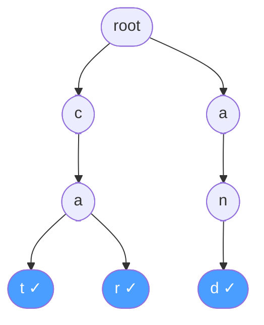

# Вопросы на собеседовании: `Trie и специальные структуры`

Trie (префиксное дерево) — основа автодополнения, spell-checkers, IP-routing. Вместе с Trie часто спрашивают **Union-Find** (DSU) — структуру для непересекающихся множеств, применяемую в Kruskal MST, обнаружении циклов и задачах вроде Number of Islands.

## Полезные ссылки

### Официальная документация и авторитетные источники

- [Trie Data Structure in Java — Baeldung](https://www.baeldung.com/trie-java)
- [Disjoint Set Union (Union-Find) — Baeldung](https://www.baeldung.com/cs/disjoint-set-union)
- [Suffix Tree — Baeldung](https://www.baeldung.com/cs/suffix-tree)
- [Aho-Corasick Algorithm — Baeldung](https://www.baeldung.com/cs/aho-corasick-algorithm)
- [Trie — GeeksforGeeks](https://www.geeksforgeeks.org/trie-insert-and-search/)

## Содержание

- [Полезные ссылки](#полезные-ссылки)
- [See also](#see-also)

**Trie**
- [Q1. (!) Что такое Trie?](#q1--что-такое-trie)
- [Q2. (!) Реализация Trie на HashMap?](#q2--реализация-trie-на-hashmap)
- [Q3. Реализация Trie на массиве (для ASCII)?](#q3-реализация-trie-на-массиве-для-ascii)
- [Q4. (!) Сложности операций Trie?](#q4--сложности-операций-trie)
- [Q5. (!) Зачем Trie вместо HashMap?](#q5--зачем-trie-вместо-hashmap)

**Расширения Trie**
- [Q6. (!) Compressed trie (Radix tree)?](#q6--compressed-trie-radix-tree)
- [Q7. (!) Что такое Suffix tree и зачем?](#q7--что-такое-suffix-tree-и-зачем)
- [Q8. Suffix array — альтернатива suffix tree?](#q8-suffix-array--альтернатива-suffix-tree)
- [Q9. Aho-Corasick — поиск множества образцов?](#q9-aho-corasick--поиск-множества-образцов)

**Классические задачи**
- [Q10. (!) Implement autocomplete?](#q10--implement-autocomplete)
- [Q11. Word Search II — поиск множества слов в grid?](#q11-word-search-ii--поиск-множества-слов-в-grid)
- [Q12. (!) Longest Common Prefix?](#q12--longest-common-prefix)
- [Q13. Replace Words — замена корнями?](#q13-replace-words--замена-корнями)
- [Q14. Maximum XOR of Two Numbers?](#q14-maximum-xor-of-two-numbers)

**Union-Find (DSU)**
- [Q15. (!) Что такое Union-Find?](#q15--что-такое-union-find)
- [Q16. (!) Реализация Union-Find?](#q16--реализация-union-find)
- [Q17. (!) Что такое path compression?](#q17--что-такое-path-compression)
- [Q18. (!) Что такое union by rank/size?](#q18--что-такое-union-by-ranksize)
- [Q19. Какова амортизированная сложность с обеими оптимизациями?](#q19-какова-амортизированная-сложность-с-обеими-оптимизациями)

**Применения Union-Find**
- [Q20. (!) Number of Islands через Union-Find?](#q20--number-of-islands-через-union-find)
- [Q21. (!) Detect cycle in undirected graph через Union-Find?](#q21--detect-cycle-in-undirected-graph-через-union-find)
- [Q22. (!) Connected Components в графе?](#q22--connected-components-в-графе)
- [Q23. Accounts Merge — объединение аккаунтов?](#q23-accounts-merge--объединение-аккаунтов)
- [Q24. Redundant Connection?](#q24-redundant-connection)

**Real-world применения**
- [Q25. (!) Где Trie используется в production?](#q25--где-trie-используется-в-production)
- [Q26. Где Union-Find используется в production?](#q26-где-union-find-используется-в-production)
- [Q27. Что такое Patricia Trie?](#q27-что-такое-patricia-trie)
- [Q28. (!) Что такое Bloom filter и связь с Trie?](#q28--что-такое-bloom-filter-и-связь-с-trie)

## Q1. (!) Что такое Trie?

**Trie (prefix tree, префиксное дерево)** — дерево, где каждый путь от корня до узла представляет строку (или её префикс). Каждый узел хранит:
- Ссылки на детей (по одной на возможный символ)
- Флаг `isEndOfWord`



Дерево для слов: `cat`, `car`, `and`. Узлы с ✓ — конец слова.

**Применения:**
- Autocomplete (поисковая строка)
- Spell-checker
- IP-routing tables (longest prefix match)
- Поиск слов с общим префиксом
- Dictionary для Word Search


> [!mcq] Что такое Trie и какой инвариант его структуры обеспечивает O(L) поиск?
>
> - [ ] A. Хеш-таблица строк с одним bucket на ключ; поиск строки и `startsWith(prefix)` — O(1) благодаря единому хешу.
>
>     **Что на самом деле.** Trie не хеш-таблица: ключи разнесены по узлам дерева посимвольно, общие префиксы делят путь. HashMap хеширует целую строку и теряет prefix-структуру.
>
>     **Откуда путаница.** И HashMap и Trie дают O(L) на полный поиск слова — отсюда соблазн считать их вариантами одного и того же. Но это совпадение только на full-match.
>
>     **Если бы это было правдой.** Тогда `startsWith("ca")` на словаре 1M слов сводился бы к одному hash lookup. На деле в HashMap пришлось бы сканировать все 1M ключей O(N·L) — Yandex autocomplete на этой архитектуре не отдал бы первый suggestion за разумное время.
>
>     **Как было бы правильно.** Описать Trie как дерево, где каждое ребро — символ, и поиск идёт побуквенно по структуре, а не по хешу строки.
>
> - [x] B. Дерево, в котором путь от корня до узла представляет строку или её префикс; каждый узел хранит ссылки на детей по символам и флаг `isEndOfWord`.
>
>     **Развёрнутое объяснение.** Trie (prefix tree) — n-арное дерево с одним корнем. Каждое ребро помечено символом алфавита, путь корень→узел кодирует строку. Узел с `isEndOfWord=true` означает, что строка из этого пути присутствует в словаре. Insert/search/startsWith все работают за O(L) — длина ключа, без сравнений с другими ключами и без хеширования. Внутреннее ветвление позволяет за один проход обслужить prefix queries.
>
>     **Пример.** Для словаря `{cat, car, and}`: путь `c→a→t` ведёт к листу с `isEndOfWord`, `c→a→r` — второй лист с общим префиксом `ca`. На этой структуре в Google Search Suggest 100M+ запросов отдают autocomplete за миллисекунды, потому что префикс `goo` разрешается в один путь длины 3.
>
>     **Когда применять.** Autocomplete в поисковиках и IDE (IntelliJ, VS Code), spell-checkers (Microsoft Word, Chrome), IP-routing с longest prefix match, T9/predictive text, словари с prefix-deletion.
>
>     **Подводные камни.** Память O(N·L·ALPHABET) в худшем случае — для unique слов без общих префиксов Trie тратит больше, чем HashMap. Для unicode наивный array-children с 65k слотов на узел невозможен — используют HashMap-children или compressed trie.
>
>     **Связанные вопросы.** [[tries-interview#Q4]] сложности операций; [[tries-interview#Q5]] Trie vs HashMap; [[tries-interview#Q6]] compressed trie.
>
> - [ ] C. Сбалансированное BST строк, где сравнение ключей идёт лексикографически за O(L·log N).
>
>     **Что на самом деле.** Trie не сравнивает строки между собой — каждый символ ключа ведёт по одному ребру. BST по строкам существует (например, `TreeMap<String,V>`), но это другая структура с другими гарантиями.
>
>     **Откуда путаница.** В обоих структурах есть «дерево» и слова можно вернуть в лексикографическом порядке. Но BST хранит каждый ключ целиком и сравнивает с медианой; Trie разделяет ключи на символы и шарит общие префиксы.
>
>     **Если бы это было правдой.** Insert одного слова длины L в словарь из 1M элементов стоил бы O(L·log 1M) = O(L·20) сравнений вместо O(L) шагов. На production-словаре spell-checker отвечал бы в 20 раз медленнее без выигрыша от общих префиксов.
>
>     **Как было бы правильно.** BST хорош для ordered queries, но prefix-shared O(L) даёт именно Trie — за счёт того, что общие префиксы хранятся один раз, а не повторяются в каждом ключе.
>
> - [ ] D. Направленный граф без ограничения ацикличности, где циклы кодируют циклические подстроки.
>
>     **Что на самом деле.** Trie — строго ациклическая древовидная структура с одним корнем. Из каждого узла есть ровно один путь к корню (parent pointer), циклов быть не может.
>
>     **Откуда путаница.** Suffix automaton (DAWG) и Aho-Corasick с failure links имеют дополнительные рёбра, которые формально создают циклы в общем графе. Но базовое дерево Trie остаётся деревом.
>
>     **Если бы это было правдой.** Рекурсивный `insert` уходил бы в бесконечный цикл при попадании на цикл рёбер; `delete` не мог бы корректно решить, какие узлы освобождать. Реализация была бы фундаментально невозможна.
>
>     **Как было бы правильно.** Trie — это дерево (специальный случай DAG с одним корнем без поглощённых рёбер); failure links в Aho-Corasick — отдельный overlay, не часть базовой Trie.

## Q2. (!) Реализация Trie на HashMap?

```java
class TrieNode {
    Map<Character, TrieNode> children = new HashMap<>();
    boolean isEndOfWord = false;
}

class Trie {
    private final TrieNode root = new TrieNode();

    public void insert(String word) {
        TrieNode curr = root;
        for (char c : word.toCharArray()) {
            curr.children.putIfAbsent(c, new TrieNode());
            curr = curr.children.get(c);
        }
        curr.isEndOfWord = true;
    }

    public boolean search(String word) {
        TrieNode node = findNode(word);
        return node != null && node.isEndOfWord;
    }

    public boolean startsWith(String prefix) {
        return findNode(prefix) != null;
    }

    private TrieNode findNode(String s) {
        TrieNode curr = root;
        for (char c : s.toCharArray()) {
            if (!curr.children.containsKey(c)) return null;
            curr = curr.children.get(c);
        }
        return curr;
    }
}
```

**Плюсы HashMap:** работает с любым unicode символом, занимает место только на реальные символы.
**Минусы:** overhead на HashMap (boxing, hashing).


> [!mcq] Как корректно реализовать Trie на HashMap с поддержкой произвольного unicode-алфавита?
>
> - [x] A. `class TrieNode { Map<Character, TrieNode> children; boolean isEndOfWord; }`; insert и search итерируют по символам слова, `putIfAbsent` создаёт новые узлы при необходимости.
>
>     **Развёрнутое объяснение.** Каждый узел содержит HashMap детей: ключ — следующий символ, значение — дочерний `TrieNode`. Insert проходит слово посимвольно, создавая узлы через `children.putIfAbsent(c, new TrieNode())`, и в конце ставит `curr.isEndOfWord = true`. Search/startsWith проходят те же шаги без модификации: возвращают `null`, если на каком-то символе нет ребра. Все операции — O(L), потому что HashMap-lookup амортизированно O(1).
>
>     **Пример.** В Yandex Search Suggest узлы Trie могут содержать русские и латинские символы вперемешку (`пр→prog→прог...` транслит-запросы) — HashMap нативно поддерживает любой Character, в отличие от фиксированного `TrieNode[26]`. Spell-checker в Chrome работает с unicode emoji в названиях компаний.
>
>     **Когда применять.** Произвольный или большой алфавит (unicode, китайский, эмодзи), редкие/разреженные ветвления (память на пустые слоты массива была бы расточительна), MVP-прототипы (`HashMap` лаконичнее массива на boilerplate-коде).
>
>     **Подводные камни.** Boxing `char → Character` и hash-операции дают константу x2–x3 к array-варианту. На горячем пути с миллионами lookup массив `TrieNode[26]` может быть в разы быстрее. Также HashMap не гарантирует ordered iteration — autocomplete с лексикографическим порядком требует TreeMap или сортировки на финале.
>
>     **Связанные вопросы.** [[tries-interview#Q3]] реализация на массиве; [[tries-interview#Q4]] сложности операций; [[tries-interview#Q10]] autocomplete на этой структуре.
>
> - [ ] B. Хранить все слова целиком как ключи единой `Map<String, Boolean>`, где значение указывает на конец слова.
>
>     **Что на самом деле.** Это не Trie, а обычный hash set строк. Map по полным ключам теряет prefix-структуру: общий путь `ca` для `cat` и `car` нигде не выражен явно.
>
>     **Откуда путаница.** Раз у Trie тоже используется HashMap (внутри узла), люди иногда путают «хранить узлы в HashMap» с «хранить слова в HashMap». Между ними принципиальная разница: первое работает по символам, второе по целым строкам.
>
>     **Если бы это было правдой.** `startsWith("goo")` на словаре `1M` ключей деградировал бы до full scan O(N·L) = 1M×6. На autocomplete в поисковике Google это означало бы латенцию десятки секунд вместо миллисекунд.
>
>     **Как было бы правильно.** Хранить детей внутри узла в HashMap по одному символу, а слово целиком не материализовывать; конец слова отмечать флагом `isEndOfWord` на нужном узле.
>
> - [ ] C. `TrieNode[] children = new TrieNode[26]` достаточно для unicode — индекс вычисляется как `c - 'a'`.
>
>     **Что на самом деле.** Массив на 26 элементов покрывает только латиницу нижнего регистра. Для unicode `c - 'a'` вернёт значение далеко за пределами 26 (например, для кириллической `а` U+0430 индекс ≈ 1071), и доступ обернётся `ArrayIndexOutOfBoundsException`.
>
>     **Откуда путаница.** В академических примерах LeetCode/CodeForces задачи часто ограничены `a-z`, и `TrieNode[26]` — стандартный приём. Эти примеры распространяются как универсальные, но условие про алфавит теряется.
>
>     **Если бы это было правдой.** При первой же вставке слова с буквой не из ASCII код упал бы с AIOOBE — production-инцидент через минуту после деплоя. Spell-checker для русского языка просто не запустился бы.
>
>     **Как было бы правильно.** Для произвольного алфавита использовать HashMap-children; массив имеет смысл только при гарантии узкого алфавита (например, `a-z` или биты `0/1` для bit-trie).
>
> - [ ] D. Рекурсивно передавать `String` как ключ в каждом вызове, без ссылок на узлы дерева.
>
>     **Что на самом деле.** Trie существует именно благодаря материализованным узлам и рёбрам между ними — это и есть структура, в которой шарятся префиксы. Передача String без узлов — это снова hash lookup, замаскированный под рекурсию.
>
>     **Откуда путаница.** Функциональный/рекурсивный стиль часто оперирует значениями вместо ссылок. Но Trie фундаментально stateful — без узлов нечего сжимать и нечего обходить DFS.
>
>     **Если бы это было правдой.** Невозможно реализовать `startsWith` за O(L) и autocomplete за O(L+K): без структуры дерева нет способа собрать все слова с общим префиксом без перебора словаря.
>
>     **Как было бы правильно.** Хранить узлы как объекты, связанные рёбрами через `Map<Character, TrieNode>` или `TrieNode[]`, и оперировать ссылками на эти узлы.

## Q3. Реализация Trie на массиве (для ASCII)?

```java
class TrieNode {
    TrieNode[] children = new TrieNode[26]; // только 'a'-'z'
    boolean isEndOfWord = false;
}

class Trie {
    private final TrieNode root = new TrieNode();

    public void insert(String word) {
        TrieNode curr = root;
        for (char c : word.toCharArray()) {
            int idx = c - 'a';
            if (curr.children[idx] == null) curr.children[idx] = new TrieNode();
            curr = curr.children[idx];
        }
        curr.isEndOfWord = true;
    }

    public boolean search(String word) {
        TrieNode curr = root;
        for (char c : word.toCharArray()) {
            int idx = c - 'a';
            if (curr.children[idx] == null) return false;
            curr = curr.children[idx];
        }
        return curr.isEndOfWord;
    }
}
```

**Плюсы массива:** быстрее (нет hashing), кэш-friendly.
**Минусы:** фиксированный алфавит, память на пустые слоты. Для unicode — нерационально.


> [!mcq] Какая реализация Trie на массиве оптимальна для алфавита `a-z` и почему?
>
> - [ ] A. `Map<Character, TrieNode> children` — массив тут не нужен, HashMap прекрасно справляется и для ASCII.
>
>     **Что на самом деле.** HashMap работает корректно для ASCII, но платит boxing `char→Character`, вычислением хеша и indirection через bucket. Для фиксированного алфавита `a-z` массив на 26 элементов даёт прямой O(1) доступ без этих издержек.
>
>     **Откуда путаница.** «HashMap всегда O(1)» — частое упрощение. На горячем пути с миллионами операций константа важна: cache-friendly array-индексация в 2–5× быстрее HashMap-lookup.
>
>     **Если бы это было правдой.** Benchmark на 10M insert/search показал бы HashMap-вариант с пропускной способностью ниже в 2–4 раза против array-варианта на том же словаре `a-z`. На spell-checker в IDE это разница между 50ms и 200ms открытия файла.
>
>     **Как было бы правильно.** Для гибкого алфавита (unicode) — HashMap; для строго фиксированного `a-z` — массив; выбор зависит от профиля нагрузки.
>
> - [ ] B. Хранить символы как `String children[i]` и обходить массив поиском по значению.
>
>     **Что на самом деле.** Это убивает основное преимущество array-Trie: прямую O(1) индексацию по `c - 'a'`. Линейный поиск по 26 элементам — O(26) на каждый шаг, и cache-locality теряется из-за String allocations.
>
>     **Откуда путаница.** Иногда `children` ассоциируется со списком, не с lookup-таблицей. Но в Trie ребро однозначно определяется символом, и position-based indexing — естественный способ его кодирования.
>
>     **Если бы это было правдой.** Каждый шаг insert/search стоил бы O(26) вместо O(1), insert длины 10 — 260 операций. На lookup 1M слов это разница на порядок — autocomplete нельзя было бы построить.
>
>     **Как было бы правильно.** Использовать `TrieNode[26]` и индексировать через `c - 'a'`; символ восстанавливается обратной операцией, если нужно.
>
> - [ ] C. `TrieNode[128]` — массив на весь ASCII, чтобы покрыть цифры, заглавные и спецсимволы.
>
>     **Что на самом деле.** Если задача требует только `a-z`, слоты 0–64 (контрольные + цифры) и 91–96 (`[]\^_`) будут пустыми всегда. Это утечка памяти: O(128·N) вместо O(26·N).
>
>     **Откуда путаница.** Кажется, что «128 = просто чуть больше, не страшно». Но Trie часто имеет миллионы узлов, и 5x памяти на каждый узел — это десятки гигабайт overhead на больших словарях.
>
>     **Если бы это было правдой.** Spell-checker на словаре 500k слов с `TrieNode[128]` потребовал бы ≈4GB heap вместо 800MB — JVM упала бы с OutOfMemoryError на стандартной конфигурации сервиса.
>
>     **Как было бы правильно.** Размер массива должен совпадать с реальным алфавитом задачи: 26 для `a-z`, 10 для цифр, 2 для битов и т.д.
>
> - [x] D. `TrieNode[] children = new TrieNode[26]`, индекс `idx = c - 'a'`; быстрее HashMap за счёт отсутствия boxing и cache-friendly layout, но ограничен `a-z`.
>
>     **Развёрнутое объяснение.** Массив на 26 элементов даёт прямой O(1) доступ к ребёнку по символу: `curr.children[c - 'a']`. Нет хеширования, нет boxing, нет HashMap-overhead — память расположена линейно, что помогает CPU prefetcher и L1 cache. Trade-off: невозможно работать с символами вне `a-z`, и для разреженных узлов 26 указателей по 8 байт = 208 байт на узел даже если используется один ребёнок.
>
>     **Пример.** Реализация Trie в LeetCode 208/211 и в учебных алгоритмах MIT — почти всегда array-based. В Lucene-derived поисковиках для ASCII-only языков (английский) array-Trie даёт 2–3× прирост по сравнению с HashMap-вариантом на benchmark с 1M insert.
>
>     **Когда применять.** Алфавит фиксирован и узок (`a-z`, `0-9`, биты `0/1`), нужна максимальная скорость (real-time autocomplete, IDE completion на 10M+ символов), работа на устройствах с ограниченным CPU (mobile T9).
>
>     **Подводные камни.** При unicode/кириллице/смешанных текстах массив 26 не работает — нужен HashMap или Map<Codepoint,Node>. Также на разреженных Trie (мало детей в узле) массив тратит память на null-слоты; для очень больших словарей применяют compressed trie.
>
>     **Связанные вопросы.** [[tries-interview#Q2]] HashMap-реализация; [[tries-interview#Q4]] сложности; [[tries-interview#Q6]] compressed trie для экономии памяти.

## Q4. (!) Сложности операций Trie?

| Операция | Сложность | Память |
|----------|-----------|--------|
| `insert(word)` | `O(L)`, L = длина | `O(L · ALPHABET)` |
| `search(word)` | `O(L)` | — |
| `startsWith(prefix)` | `O(L)` | — |
| `delete(word)` | `O(L)` | — |
| `autocomplete(prefix)` | `O(L + K)`, K = ответов | — |

**Память:** `O(N · L · ALPHABET)` в худшем случае (где N — число слов). Compressed trie уменьшает это.


> [!mcq] Какова корректная асимптотика операций Trie и от чего зависит каждая?
>
> - [ ] A. `insert = O(L²)`, потому что строки в Java immutable и для каждого шага создаётся новая подстрока.
>
>     **Что на самом деле.** Канонический insert проходит по `word.toCharArray()` или `word.charAt(i)` посимвольно — никакие подстроки не создаются. Каждый шаг O(1) на доступ к ребёнку, итого O(L).
>
>     **Откуда путаница.** В наивных JavaScript/Python примерах иногда пишут `prefix = word.substring(0, i)` в цикле — это даёт O(L²). Но это плохой стиль, а не свойство Trie.
>
>     **Если бы это было правдой.** Insert слова длины 100 стоил бы 10 000 операций вместо 100, и spell-checker на словаре 500k слов разворачивался бы в JVM около 50 секунд вместо одной.
>
>     **Как было бы правильно.** Использовать char-итерацию без substring; insert/search/startsWith — строго O(L) на длину ключа.
>
> - [x] B. `insert/search/startsWith/delete = O(L)`, `autocomplete = O(L + K·M)`, где `L` — длина ключа, `K` — число результатов, `M` — средняя длина возвращаемых слов.
>
>     **Развёрнутое объяснение.** Insert и search идут от корня по одному ребру на символ — L шагов. Delete — то же плюс опциональная сборка пустых узлов снизу вверх (тоже O(L)). Autocomplete = O(L) на проход к узлу префикса + O(K·M) на DFS по поддереву, где K — число найденных слов, M — их средняя длина. Память: O(N·L·ALPHABET) в худшем случае, но при общих префиксах — сильно меньше. Эти числа не зависят от размера словаря N — Trie выигрывает у HashMap именно на prefix queries.
>
>     **Пример.** В Google Search Suggest для запроса `"goo"` (L=3) дерево возвращает топ-10 кандидатов за L+K·M ≈ 3 + 10·6 = 63 операции — независимо от того, 1M в словаре или 100M. Это и есть основа sub-millisecond latency.
>
>     **Когда применять.** Анализировать эффективность Trie vs HashMap (HashMap не даёт O(L+K) на prefix queries), оценивать память при выборе compressed/standard Trie, обоснованно строить SLO на autocomplete-сервисы.
>
>     **Подводные камни.** Память O(N·L·ALPHABET) — теоретический худший случай; на практике с большими словарями активно работают именно общие префиксы, и фактическое потребление в разы ниже. Также delete не освобождает узлы автоматически — нужна реализация со счётчиком детей.
>
>     **Связанные вопросы.** [[tries-interview#Q5]] Trie vs HashMap; [[tries-interview#Q6]] compressed trie уменьшает память; [[tries-interview#Q10]] autocomplete-реализация.
>
> - [ ] C. `search = O(log N)` как бинарный поиск в отсортированном массиве слов.
>
>     **Что на самом деле.** Trie не сравнивает ключи между собой — каждый шаг по дереву это O(1) выбор ребёнка по символу. От размера словаря N сложность вообще не зависит.
>
>     **Откуда путаница.** Учебная статья «эффективные структуры для строк» иногда сваливает в одну кучу sorted array, BST, Trie. Но только в первых двух фигурирует `log N`; в Trie — `L`.
>
>     **Если бы это было правдой.** Для словаря 1M слов с L=10 search стоил бы log2(1M)=20 шагов — медленнее, чем фактические 10 шагов Trie. Spell-checker имел бы реальный N-зависимый профиль, чего на проде не наблюдается.
>
>     **Как было бы правильно.** Trie независим от N в основных операциях; зависимость только в `autocomplete` через K (число результатов), и то локально к поддереву.
>
> - [ ] D. `autocomplete = O(N·L)`, потому что нужно проверить все N слов на префикс.
>
>     **Что на самом деле.** Autocomplete идёт за O(L) к узлу префикса, а затем DFS по его поддереву обходит только потомков с этим префиксом. Слова, не имеющие этого префикса, вообще не посещаются.
>
>     **Откуда путаница.** Аналогия с linear scan «проверяем все слова, отбираем те, что начинаются с …» — это работа HashMap, не Trie. Префиксный поиск в Trie именно потому и придуман, чтобы избежать этого.
>
>     **Если бы это было правдой.** На словаре 100M запросов Google autocomplete для префикса `"goo"` требовал бы 100M·L операций — десятки секунд латенции. Реальный продакшен показывает <50ms, что несовместимо с O(N·L).
>
>     **Как было бы правильно.** O(L) на поиск узла + O(K) на сбор результатов (K — число найденных). N в формуле не появляется.

## Q5. (!) Зачем Trie вместо HashMap?

Если нужно искать слово целиком — HashMap проще и быстрее (`O(L)` vs `O(L)`, но с меньшими константами).

**Trie выигрывает когда:**
1. **Префиксный поиск** — `startsWith`, autocomplete: `O(L + K)` vs HashMap `O(N · L)` (нужно перебрать все)
2. **Меньше памяти при общих префиксах** — `cat, car, card` — общий путь `ca` хранится один раз
3. **Lexicographic ordering** — естественный порядок обхода
4. **Prefix-based deletion** — удалить все слова с префиксом
5. **Spell-check / fuzzy search** — поиск с расстоянием Левенштейна


> [!mcq] В каком сценарии Trie действительно выигрывает у HashMap, а в каком — нет?
>
> - [x] A. При prefix-search (startsWith, autocomplete) Trie даёт O(L+K) против HashMap O(N·L) — у Map нет prefix-структуры и нужно перебрать все ключи.
>
>     **Развёрнутое объяснение.** HashMap хеширует ключ целиком и теряет соседство по префиксам — `"cat"` и `"car"` попадают в случайные bucket'ы. Любой prefix-запрос вырождается в линейный скан N ключей. Trie, напротив, физически хранит общий префикс одной цепочкой узлов: запрос `"ca"` приходит в узел `a` за 2 шага, дальше DFS по поддереву возвращает K найденных слов. Это O(L+K), независимо от размера словаря.
>
>     **Пример.** Google Search Suggest на 100M+ автокомплитов: для запроса `"goo"` Trie возвращает топ-10 за ≈50 операций. Эквивалентный HashMap на том же словаре потребовал бы 100M·3 = 300M операций — несколько секунд латенции, что несовместимо с UX поиска.
>
>     **Когда применять.** Autocomplete и suggest, spell-check c fuzzy match, IP routing с longest prefix match, T9/predictive text на мобильных, code completion в IDE, любые prefix-based deletion (удалить все ключи с префиксом X).
>
>     **Подводные камни.** На full-match задачах (типа «есть ли в кэше точно такой ключ») HashMap всё равно быстрее — у него меньшая константа. Trie оправдан только тогда, когда без prefix queries не обойтись.
>
>     **Связанные вопросы.** [[tries-interview#Q4]] сложности операций; [[tries-interview#Q10]] autocomplete-реализация; [[tries-interview#Q25]] production-применения.
>
> - [ ] B. Trie быстрее HashMap даже при поиске полного слова, потому что не платит за хеширование.
>
>     **Что на самом деле.** Обе структуры на full-match дают O(L): HashMap — хеш строки и сравнение в bucket, Trie — L шагов по узлам. Но у HashMap константа ниже: один хеш + одно сравнение vs L разыменований указателей.
>
>     **Откуда путаница.** «O(1) hash lookup» иногда трактуется как «O(1) полностью», без учёта O(L) на сам хеш. Но и в Trie шаги тоже O(1), их L штук — выходит та же асимптотика.
>
>     **Если бы это было правдой.** Любой сервис, кэширующий по строковому ключу (Redis, Memcached, JVM HashMap), мигрировал бы на Trie ради скорости. На деле Redis использует hash table (DICT) для key→value, а radix tree только для streams — потому что full-match чаще, чем prefix.
>
>     **Как было бы правильно.** Признать: HashMap быстрее на full-match (меньше константа), Trie выигрывает только при prefix queries и shared-prefix экономии памяти.
>
> - [ ] C. Trie всегда потребляет меньше памяти, чем HashMap.
>
>     **Что на самом деле.** Trie выигрывает по памяти только когда много общих префиксов. Для словаря уникальных коротких слов Trie тратит много пустых слотов в узлах (особенно в array-варианте `TrieNode[26]`) и проигрывает компактному HashMap.
>
>     **Откуда путаница.** «Общие префиксы хранятся один раз» — верно, но это работает только при их наличии. На случайно сгенерированных строках префиксы почти не пересекаются.
>
>     **Если бы это было правдой.** Trie был бы default-структурой для любого set строк. Реально JVM `HashSet<String>` остаётся базовым выбором, потому что для 80% задач Trie неуместен по памяти.
>
>     **Как было бы правильно.** Trie экономит память на словарях с большим перекрытием префиксов (английский dictionary, URL paths, IP ranges); для уникальных коротких ключей HashMap компактнее.
>
> - [ ] D. Trie поддерживает O(1) insert в отличие от HashMap O(L).
>
>     **Что на самом деле.** Trie insert — строго O(L), потому что нужно пройти L узлов и потенциально создать новые. HashMap insert тоже O(L) (хеш строки + поиск bucket). Обе структуры равны по асимптотике.
>
>     **Откуда путаница.** Возможно, путаница с «O(1) per character» — на каждый символ Trie действительно делает O(1) работу. Но операция insert состоит из L таких шагов.
>
>     **Если бы это было правдой.** Insert 10 000 слов длины 50 стоил бы 10 000 операций в Trie vs 500 000 в HashMap — Trie доминировал бы повсюду. Bench показывают равенство этих чисел.
>
>     **Как было бы правильно.** Обе структуры — O(L) на insert; разница только в константе (Trie обычно дороже из-за allocations узлов).

## Q6. (!) Compressed trie (Radix tree)?

**Compressed trie (Patricia trie, Radix tree)** — Trie с объединёнными цепочками: если узел имеет одного ребёнка и не является концом слова, его сжимают.

```
Обычный Trie:           Compressed:
  c                       c
  └ a                     └ a
    └ r ✓                   └ r ✓
    └ t ✓                   └ t ✓
```

**Применения:**
- IP routing tables (Patricia trie)
- File system paths
- Database indexes (Btrfs, Ethereum tries)

**Плюсы:** компактнее, быстрее на больших словарях.
**Минусы:** сложнее реализовать, особенно delete с разделением узлов.


> [!mcq] Что такое Compressed trie (Radix tree, Patricia) и каков его основной инвариант?
>
> - [ ] A. Хранит только конечные узлы слов, промежуточные ветвления отбрасывает.
>
>     **Что на самом деле.** Compressed trie не выбрасывает структуру — он только сжимает цепочки узлов с одним ребёнком в одно ребро с меткой-строкой. Промежуточные ветвления остаются полностью, иначе prefix-структура не работала бы.
>
>     **Откуда путаница.** «Compressed» воспринимается как «убрали лишнее», но «лишним» считаются только сегменты без ветвлений; всё, что вносит ветвление или конец слова, сохраняется.
>
>     **Если бы это было правдой.** `startsWith("ca")` для словаря `{cat, car}` не нашёл бы ничего, потому что узел `a` после `c` был бы отброшен. Autocomplete сломался бы полностью.
>
>     **Как было бы правильно.** Сохранять все узлы-ветвления и узлы-концы; сжимать только linear chains в единую метку из нескольких символов.
>
> - [ ] B. Сжимает дерево через хеш-коллизии для экономии памяти.
>
>     **Что на самом деле.** Хеш-коллизии — характеристика hash table, а не Trie. Radix tree сжимает по принципу «один потомок» — это структурная операция над деревом, не вероятностная.
>
>     **Откуда путаница.** Слово «compression» часто связывают с lossy-сжатием или хеш-чем-то. Но в Radix tree сжатие lossless и детерминированное.
>
>     **Если бы это было правдой.** Trie страдал бы от false matches как hash table; lookup перестал бы быть точным. На IP routing это означало бы отправку пакетов не туда — катастрофа сети.
>
>     **Как было бы правильно.** Compression здесь — это объединение цепочки узлов с одним ребёнком в одно ребро с многосимвольной меткой; без потерь, без коллизий.
>
> - [x] C. Объединяет цепочки узлов с одним потомком в одно ребро с многосимвольной меткой; результат — меньше узлов, особенно при длинных уникальных суффиксах.
>
>     **Развёрнутое объяснение.** В обычном Trie каждый символ — отдельный узел. Если цепочка не разветвляется (один ребёнок, не end-of-word), мы можем «сжать» её, заменив N узлов одним ребром с меткой длины N. Лишние allocations исчезают, lookup идёт по сравнению строк, а не отдельных символов. Это даёт линейную экономию памяти на словарях с длинными уникальными суффиксами и ускоряет обход за счёт лучшей cache-locality. Patricia trie — частный случай для бинарных ключей с хранением «позиции различающего бита».
>
>     **Пример.** Linux/BSD радикс-деревья в подсистеме маршрутизации хранят сотни тысяч CIDR-префиксов (`10.0.0.0/8`, `192.168.0.0/16` и т.п.) с longest-prefix-match за O(длина_ключа). Ethereum state trie (MPT — Merkle Patricia Trie) хранит балансы аккаунтов и хеши хранилищ — сжатие критично, потому что каждый узел хешируется и попадает в Merkle root.
>
>     **Когда применять.** IP routing tables, файловые системы (хранение путей `/var/log/.../*`), database indexes (Btrfs, PostgreSQL GIN/SP-GiST частично), blockchain state (Ethereum, Polkadot), URL routing на больших API gateway.
>
>     **Подводные камни.** Insert и особенно delete сложнее: при вставке слова, разделяющего сжатое ребро, нужно расщеплять ребро на части. При delete — обратное действие, склейка цепочки одного ребёнка. Реализация в 2–3× дольше, чем обычный Trie; ошибки в split/merge ведут к коррапту дерева.
>
>     **Связанные вопросы.** [[tries-interview#Q27]] Patricia trie детально; [[tries-interview#Q1]] базовый Trie; [[tries-interview#Q25]] production-применения.
>
> - [ ] D. Использует B-tree вместо дерева для cache-эффективности.
>
>     **Что на самом деле.** B-tree — отдельная структура, оптимизированная для disk pages с высоким fanout. Radix tree остаётся trie с символьными рёбрами; его «cache-friendliness» приходит из сжатия цепочек, а не из B-tree fanout.
>
>     **Откуда путаница.** Обе структуры используются для индексов БД (B-tree в PostgreSQL/MySQL, radix в Btrfs/Ethereum) — это создаёт ассоциацию.
>
>     **Если бы это было правдой.** Radix tree наследовал бы дисковую модель B-tree с большими страницами по 4–16KB, что неэффективно для in-memory prefix queries. На деле IP routing работает в RAM и не нуждается в дисковой стратификации.
>
>     **Как было бы правильно.** B-tree оптимизирован для дискового I/O, radix — для in-memory prefix lookup; они решают разные задачи и комбинируются (например, B-tree индекс над radix-bucket'ами).

## Q7. (!) Что такое Suffix tree и зачем?

**Suffix tree** — Trie всех суффиксов строки. Позволяет за `O(m)` найти любую подстроку длины `m`.

Для строки `"banana$"` (символ `$` — терминатор):
```
Суффиксы: banana$, anana$, nana$, ana$, na$, a$, $
```

**Применения:**
- Биоинформатика (ДНК-последовательности)
- Plagiarism detection
- Поиск повторов в строке
- Longest common substring двух строк
- String compression

**Алгоритм Ukkonen** строит за `O(n)` время.

**Память:** `O(n²)` наивно, `O(n)` с оптимизациями (compressed).


> [!mcq] Что такое Suffix tree и какую задачу он решает за O(m)?
>
> - [ ] A. Дерево, хранящее суффиксы в бинарном отсортированном виде с двумя детьми на узел.
>
>     **Что на самом деле.** Это описание suffix array (плюс опционально LCP-array) — отсортированный список индексов суффиксов. Suffix tree — это compressed trie всех суффиксов; у его узлов может быть до `|Σ|` детей, а не 2.
>
>     **Откуда путаница.** Suffix tree и suffix array решают одни задачи (substring search) и часто упоминаются вместе. Но это разные структуры с разной асимптотикой памяти и скорости.
>
>     **Если бы это было правдой.** Поиск подстроки длины m деградировал бы до O(m log n) (через бинарный поиск в массиве), а не O(m) как у suffix tree. На длинных геномах это разница на порядок.
>
>     **Как было бы правильно.** Suffix tree — это trie с многими детьми и compressed-рёбрами; suffix array — отсортированный массив индексов. Они эквивалентны по выразительности, но различаются реализацией.
>
> - [ ] B. Инвертированный индекс строки для быстрого поиска слов.
>
>     **Что на самом деле.** Инвертированный индекс — это mapping `слово → список позиций/документов`, используемый в Lucene/Elasticsearch. Suffix tree — древовидная структура над символьными суффиксами одной строки.
>
>     **Откуда путаница.** Обе структуры решают полнотекстовый поиск, но на разных уровнях: Lucene индексирует слова в документах, suffix tree — все подстроки в одной строке.
>
>     **Если бы это было правдой.** Suffix tree был бы непригоден для поиска подстрок, не разделённых пробелами (как в ДНК), потому что инвертированный индекс работает только с токенами. Биоинформатика не могла бы его использовать.
>
>     **Как было бы правильно.** Suffix tree — character-level structure over all suffixes; inverted index — token-level structure over document collection. Они комплементарны.
>
> - [ ] C. Trie только первых N суффиксов без терминатора `$`.
>
>     **Что на самом деле.** Suffix tree включает все n суффиксов исходной строки (не только первые N), и обязательно использует терминатор. Без терминатора суффиксы могут совпадать с префиксами других, что нарушает уникальность путей.
>
>     **Откуда путаница.** Иногда в наивных учебных примерах опускают `$` ради простоты — но это сразу ломает корректность structuring.
>
>     **Если бы это было правдой.** Алгоритм Ukkonen некорректно построил бы дерево: некоторые суффиксы оказались бы внутренними узлами без листа, и search вернул бы false negatives. На реальных геномах это пропуск критичных совпадений.
>
>     **Как было бы правильно.** Включать ВСЕ n суффиксов и добавлять терминатор `$` (или любой символ, не входящий в алфавит) для уникальности.
>
> - [x] D. Compressed trie всех суффиксов строки (с уникальным терминатором `$`); поиск любой подстроки длины m за O(m); строится алгоритмом Ukkonen за O(n) времени и O(n) памяти.
>
>     **Развёрнутое объяснение.** Suffix tree хранит каждый суффикс строки как путь от корня до листа. Compressed-форма склеивает неразветвляющиеся цепочки в одно ребро. Терминатор `$` гарантирует, что никакой суффикс не является префиксом другого — иначе дерево было бы некорректным. Поиск подстроки P за O(|P|) сводится к спуску по дереву с проверкой меток рёбер. Алгоритм Ukkonen строит дерево за линейное время благодаря suffix links между узлами; наивно — O(n²).
>
>     **Пример.** В биоинформатике для генома человека (3 миллиарда пар оснований) suffix tree позволяет искать ДНК-мотив длины 20 за 20 шагов, независимо от длины генома. BLAST и его наследники в bioinformatics-pipeline используют suffix-структуры для поиска похожих участков. Plagiarism detection (Turnitin, Yandex Plagiat) применяет suffix tree для поиска длинных общих фрагментов между документами.
>
>     **Когда применять.** Биоинформатика (ДНК/белковые последовательности), longest common substring двух+ строк, повторяющиеся участки в строке, plagiarism detection, string compression (LZ77/LZ78 derivatives), full-text search для одного большого документа.
>
>     **Подводные камни.** Память — порядка 10–20× длины исходной строки (узлы хранят start/end индексы рёбер + suffix link + список детей). Для 1GB текста это 10–20GB RAM — на практике часто заменяют suffix array (4–8 байт на суффикс). Реализация Ukkonen-алгоритма сложна: даже опытные C++ авторы регулярно делают ошибки в обработке implicit suffix tree.
>
>     **Связанные вопросы.** [[tries-interview#Q8]] suffix array как альтернатива; [[tries-interview#Q9]] Aho-Corasick для multi-pattern; [[tries-interview#Q1]] базовый Trie.

## Q8. Suffix array — альтернатива suffix tree?

**Suffix array** — отсортированный массив всех суффиксов (точнее, их индексов).

Для `"banana"`:
```
Индекс  Суффикс
5       a
3       ana
1       anana
0       banana
4       na
2       nana
```

Suffix array: `[5, 3, 1, 0, 4, 2]`.

**Плюсы перед suffix tree:**
- Меньше памяти (4-8 байт на суффикс)
- Проще реализация
- Лучше cache locality

**Сложность построения:** `O(n log² n)` или `O(n)` с DC3/SA-IS.

Поиск подстроки — `O(m log n)` через бинарный поиск + `O(m)` сравнение.


> [!mcq] Что такое Suffix array и в чём его преимущество перед Suffix tree?
>
> - [ ] A. Массив длин суффиксов, по которому ищется подстрока сравнением длин.
>
>     **Что на самом деле.** Это описание LCP array (longest common prefix array) — вспомогательной структуры. Suffix array хранит индексы начала суффиксов в отсортированном порядке, а не длины.
>
>     **Откуда путаница.** SA и LCP почти всегда упоминаются вместе как пара структур для substring-задач. Из этого возникает идея, что они представляют одно и то же.
>
>     **Если бы это было правдой.** Алгоритм бинарного поиска подстроки в SA сломался бы, потому что искать нужно по lexicographic order суффиксов, а не по их длинам. Поиск возвращал бы случайные индексы.
>
>     **Как было бы правильно.** SA хранит начальные индексы суффиксов, отсортированные лексикографически по содержанию суффикса; LCP — отдельная структура с длинами общих префиксов соседних в SA суффиксов.
>
> - [ ] B. Хеш-таблица всех подстрок строки для O(1) поиска.
>
>     **Что на самом деле.** SA — это просто отсортированный массив индексов; никакой hash-структуры в нём нет. Хеш-таблица всех подстрок потребовала бы O(n²) памяти — невозможно для длинных строк.
>
>     **Откуда путаница.** «Быстрый поиск подстроки» ассоциируется с хешами и Rabin-Karp. Но SA даёт O(m log n) через бинарный поиск, не O(1).
>
>     **Если бы это было правдой.** Для строки 1GB хеш всех её подстрок занял бы порядка 10^18 байт — больше, чем всё хранилище мира. Биоинформатика не могла бы работать с SA для геномов.
>
>     **Как было бы правильно.** SA = O(n) памяти (n индексов по 4–8 байт); поиск через бинарный поиск + сравнение строк = O(m log n).
>
> - [ ] C. Сжатый Trie суффиксов в виде DAG.
>
>     **Что на самом деле.** DAG суффиксов — это suffix automaton (DAWG), отдельная структура с минимизированным числом состояний. SA — это плоский отсортированный массив индексов, не граф.
>
>     **Откуда путаница.** Suffix tree, suffix array, suffix automaton — близкие конструкции, и их часто смешивают в учебниках.
>
>     **Если бы это было правдой.** Реализация SA требовала бы графовых структур (узлы, рёбра, переходы), что противоречит его главному преимуществу — компактности (просто `int[n]`).
>
>     **Как было бы правильно.** SA — массив, suffix tree — дерево, suffix automaton — DAG. Все три эквивалентны по выразительности, но различаются хранением и скоростью построения.
>
> - [x] D. Отсортированный массив индексов всех суффиксов строки; меньше памяти, чем suffix tree (4–8 байт на суффикс); поиск подстроки за O(m log n) через бинарный поиск, построение за O(n log² n) или O(n) с SA-IS/DC3.
>
>     **Развёрнутое объяснение.** SA[i] = начальный индекс i-го лексикографически наименьшего суффикса. Бинарный поиск по SA с посимвольным сравнением даёт O(m log n) для поиска подстроки длины m. Память — n·4 байт (или 8 для длинных строк), что в 10–20× меньше suffix tree. Алгоритмы построения: O(n log² n) через сортировку с doubling, O(n log n) через radix sort, O(n) через SA-IS или DC3.
>
>     **Пример.** Bioinformatics-пайплайны (BWA, Bowtie) используют SA + LCP вместо suffix tree для индексации генома человека — 3GB генома → 12GB SA вместо ≈30GB suffix tree. Это разница между «помещается в RAM сервера» и «не помещается». Yandex/Google индексаторы используют SA-производные структуры для специализированных поисковых задач.
>
>     **Когда применять.** Когда память критична (длинные строки, embedded-системы), нужен только substring search без сложных операций (LCS, longest repeated substring требуют suffix tree или дополнительные таблицы), есть готовая библиотека построения (sdsl, libdivsufsort).
>
>     **Подводные камни.** Бинарный поиск с char-сравнением даёт O(m log n) — медленнее O(m) suffix tree. Для ускорения добавляют LCP array и алгоритм Manber-Myers, получая O(m + log n). Построение за O(n) (SA-IS) реализуется сложно, и наивные реализации часто медленнее, чем O(n log² n) с radix sort.
>
>     **Связанные вопросы.** [[tries-interview#Q7]] suffix tree сравнение; [[tries-interview#Q9]] Aho-Corasick для multi-pattern; [[tries-interview#Q1]] базовый Trie как контекст.

## Q9. Aho-Corasick — поиск множества образцов?

**Aho-Corasick** — алгоритм для одновременного поиска **множества образцов** в тексте за `O(n + m + z)`, где `z` — число найденных вхождений.

Использует Trie + **failure links** (как KMP, но для дерева).

```java
// Псевдокод
class AhoCorasick {
    TrieNode root;

    void buildFailureLinks() {
        // BFS, для каждого узла находим suffix link на самый длинный суффикс,
        // который тоже является префиксом какого-то слова
    }

    List<int[]> search(String text) {
        // Проходим по тексту, при каждой неуспешной попытке —
        // переходим по failure link
    }
}
```

**Применения:**
- Антивирусы (поиск сигнатур)
- Spam filters (multiple keyword matching)
- DNA sequence analysis
- Snort IDS (intrusion detection)

В Java есть библиотека **ahocorasick** (`org.ahocorasick:ahocorasick`).


> [!mcq] На каком принципе работает Aho-Corasick для одновременного поиска множества образцов?
>
> - [ ] A. DFS по Trie образцов для каждого нового символа текста, без переиспользования предыдущей работы.
>
>     **Что на самом деле.** Aho-Corasick запускает один проход по тексту с состоянием в Trie, а failure links позволяют «перепрыгнуть» в правильную позицию без повторного сравнения уже пройденных символов. Чистый DFS без failure links — это другой, наивный подход.
>
>     **Откуда путаница.** Trie + DFS — естественная пара в задачах вроде Word Search II. Но там DFS обходит grid, а в Aho-Corasick грид — это текст, и обход линеен.
>
>     **Если бы это было правдой.** Сложность была бы O(n·K·m), где K — число паттернов, m — средняя длина паттерна. Для антивируса с 10 000 сигнатур на 1GB файла это десятки минут вместо секунд.
>
>     **Как было бы правильно.** Один проход по тексту с переходами по основным рёбрам и failure links — даёт O(n+m+z).
>
> - [ ] B. KMP для каждого образца параллельно (по одному автомату на паттерн).
>
>     **Что на самом деле.** Aho-Corasick объединяет все K паттернов в один общий Trie с failure links — это и есть его главное преимущество. K независимых KMP дали бы K·(n+m), а AC даёт n+m+z.
>
>     **Откуда путаница.** AC действительно «расширение KMP на множество паттернов». Из этого возникает идея «KMP × K раз», но AC объединяет паттерны структурно.
>
>     **Если бы это было правдой.** Для 10 000 сигнатур антивируса вместо O(n+m+z) ≈ O(n) получили бы O(K·n) ≈ 10 000·n — на проверке 1GB файла это часы вместо секунд.
>
>     **Как было бы правильно.** Один Trie + один failure-link граф + один проход по тексту, обновляющий состояние; AC именно для этого и придуман.
>
> - [x] C. Trie над всеми паттернами + failure links (аналог KMP для дерева); один проход по тексту даёт все вхождения за O(n + m + z), где n — длина текста, m — суммарная длина паттернов, z — число найденных вхождений.
>
>     **Развёрнутое объяснение.** Сначала строится Trie из всех K паттернов (это даёт O(m) узлов). Затем BFS по дереву строит failure-функцию: для каждого узла находим самый длинный собственный суффикс, который тоже является префиксом какого-либо паттерна — туда и указывает failure link (аналог longest proper suffix prefix в KMP, но для всей коллекции). При сканировании текста, если на символе нет ребра в текущем узле, прыгаем по failure link и пробуем снова; если попали на узел-конец паттерна (или его «output link») — фиксируем вхождение. Каждый символ текста обрабатывается амортизированно O(1) — отсюда линейность.
>
>     **Пример.** ClamAV (open-source антивирус) использует Aho-Corasick для поиска тысяч сигнатур вирусов в файлах. Snort IDS — для сетевых сигнатур пакетов. Spam-фильтры Gmail / Yandex Mail — для multi-keyword matching в письмах. В Java библиотека `org.ahocorasick:ahocorasick` реализует классическую версию.
>
>     **Когда применять.** Антивирусы с тысячами сигнатур, IDS/IPS (Snort, Suricata), bioinformatics (одновременный поиск множества мотивов в геноме), DLP (data loss prevention — поиск утечек по pattern-листам), email/spam filters, content moderation в соцсетях.
>
>     **Подводные камни.** При очень большом числе паттернов память на Trie + failure links может быть заметной (десятки MB на 100k паттернов). Также output links нужно обрабатывать корректно — паттерны могут быть суффиксами других, и важно не пропустить вложенные вхождения. Регулярные обновления словаря требуют пересборки — incremental insert тоже возможен, но усложняет код.
>
>     **Связанные вопросы.** [[tries-interview#Q1]] базовый Trie как основа; [[tries-interview#Q11]] Word Search II как близкая задача multi-pattern; [[tries-interview#Q25]] production-применения.
>
> - [ ] D. Regex matching с backtracking по Trie образцов.
>
>     **Что на самом деле.** Regex с backtracking подвержен catastrophic backtracking — на специально сконструированных входах сложность взрывается до O(2^n). Aho-Corasick всегда O(n+m+z) гарантированно.
>
>     **Откуда путаница.** Regex и Trie оба относятся к pattern matching. Но AC — детерминированный автомат, а regex backtracking — недетерминированная стратегия с возвратом.
>
>     **Если бы это было правдой.** Антивирус с regex-движком на специально crafted-файле зависал бы на часы (ReDoS — Regular Expression Denial of Service). Snort бы не справился с peak-load трафиком.
>
>     **Как было бы правильно.** Aho-Corasick реализован как детерминированный конечный автомат с failure links, гарантирующий линейность вне зависимости от входа.

## Q10. (!) Implement autocomplete?

```java
class Trie {
    TrieNode root = new TrieNode();

    public void insert(String word) {
        TrieNode curr = root;
        for (char c : word.toCharArray()) {
            curr.children.putIfAbsent(c, new TrieNode());
            curr = curr.children.get(c);
        }
        curr.isEndOfWord = true;
    }

    public List<String> autocomplete(String prefix) {
        List<String> result = new ArrayList<>();
        TrieNode curr = root;
        for (char c : prefix.toCharArray()) {
            if (!curr.children.containsKey(c)) return result;
            curr = curr.children.get(c);
        }
        dfs(curr, new StringBuilder(prefix), result);
        return result;
    }

    private void dfs(TrieNode node, StringBuilder sb, List<String> result) {
        if (node.isEndOfWord) result.add(sb.toString());
        for (Map.Entry<Character, TrieNode> e : node.children.entrySet()) {
            sb.append(e.getKey());
            dfs(e.getValue(), sb, result);
            sb.deleteCharAt(sb.length() - 1);
        }
    }
}
```

`O(L + K · M)`, где `L` — префикс, `K` — число ответов, `M` — длина каждого. Для **top-K** автодополнений можно хранить частоту в каждом узле и применять heap.


> [!mcq] Как реализовать autocomplete с возвратом всех слов по префиксу за O(L + K·M)?
>
> - [x] A. Вставляем слова в Trie; для префикса находим узел за O(L), затем DFS по поддереву собирает все слова за O(K·M); для top-K можно хранить частоту в каждом узле и применять heap.
>
>     **Развёрнутое объяснение.** Autocomplete состоит из двух шагов: (1) проход по Trie от корня по символам префикса — O(L); (2) DFS/BFS из найденного узла, собирающий все строки до `isEndOfWord` — O(K·M), где K — число найденных слов, M — их средняя длина. Если нужно top-K по популярности, в каждый узел добавляют максимальную частоту его поддерева и используют priority queue с pruning по этой оценке — это даёт sub-K·M скорость на горячих префиксах. Для real-time обновлений частоты используют lazy propagation вверх по дереву.
>
>     **Пример.** Yandex Search Suggest хранит сотни миллионов запросов в Trie c per-node max-frequency. Для префикса `"москва"` (L=6) lookup идёт 6 шагов, затем top-10 кандидатов выбираются heap-обходом поддерева за десятки операций — общая латенция <5ms. Аналогично работает Google Search Autocomplete и AppStore search.
>
>     **Когда применять.** Поисковые suggest-системы, IDE code completion (IntelliJ, VS Code), мобильные клавиатуры (SwiftKey, GBoard), e-commerce поиск товаров (Wildberries, Ozon), DNS resolution с auto-suggestion.
>
>     **Подводные камни.** На горячих префиксах вроде `"a"` поддерево огромное — простой DFS вернёт миллион результатов. Без top-K с heap время растёт линейно. Также при concurrent updates частоты нужна синхронизация — иначе race condition при пересчёте max-frequency в родителях.
>
>     **Связанные вопросы.** [[tries-interview#Q4]] сложности операций; [[tries-interview#Q11]] Word Search II с похожим pattern; [[tries-interview#Q25]] production-применения.
>
> - [ ] B. Отсортированный список слов + binary search по префиксу.
>
>     **Что на самом деле.** Бинарный поиск по сортированному массиву найдёт первое слово с префиксом за O(log N + L), но дальше нужно линейно идти по массиву, собирая все совпадения — O(K). Главное — это не быстрее Trie, а сама структура не поддерживает быстрый ranking/freq updates.
>
>     **Откуда путаница.** Sorted array кажется «бесплатным» — если данные уже отсортированы, prefix range ищется бинарным поиском. Но в Trie мы получаем тот же результат и плюс возможность хранить per-node частоты и top-K кэши.
>
>     **Если бы это было правдой.** Любые update частоты (увеличить вес слова при клике пользователя) требовали бы пересортировки массива — O(N log N) на каждое событие. На Yandex Suggest с миллионами событий в секунду это нерабочая модель.
>
>     **Как было бы правильно.** Использовать Trie, в каждом узле хранить ссылку на топ-K кандидатов поддерева — обновления локализованы и stream-friendly.
>
> - [ ] C. `HashMap<String, List<String>>` prefix→words, который явно хранит все префиксы каждого слова.
>
>     **Что на самом деле.** Хранение всех префиксов явно требует O(L²) памяти на слово (для слова длины L есть L префиксов, каждый строка длины ≤L). Trie шарит общие префиксы в одной цепочке узлов, потребляя O(L) на уникальную часть.
>
>     **Откуда путаница.** «Если нужен быстрый lookup по префиксу — хешируем префикс» — естественный, но дорогой подход. Quick prototype может работать, но не масштабируется.
>
>     **Если бы это было правдой.** Словарь 1M слов средней длины 10 потребовал бы O(1M·100) = 100M строк-ключей в HashMap. Это десятки GB памяти вместо ≈1GB Trie.
>
>     **Как было бы правильно.** Trie шарит структуру: общий префикс `"google"` хранится один раз, и под ним подвешены варианты `"google.com"`, `"googlemaps"`, `"google translate"`.
>
> - [ ] D. Хранить частоту слов только в корне Trie для top-K ranking.
>
>     **Что на самом деле.** Корень один на всё дерево; в нём можно хранить максимум по словарю, но не распределение по поддеревьям. Для top-K по конкретному префиксу нужна частота в каждом узле (или хотя бы агрегированная по поддереву).
>
>     **Откуда путаница.** «Хранить метаданные в корне» — кажется централизованным и удобным. Но для distributed-ranking нужна локальная информация.
>
>     **Если бы это было правдой.** Top-K для префикса `"goo"` возвращал бы те же кандидаты, что и для `"go"` или `""` — корневое значение не знает о структуре поддерева. UX полностью сломан.
>
>     **Как было бы правильно.** В каждом узле хранить либо частоту самого слова (на end-of-word), либо max-frequency в поддереве (для pruning); heap-обход использует обе.

## Q11. Word Search II — поиск множества слов в grid?

Дан 2D grid и список слов. Найти все слова, существующие в grid (по соседним клеткам).

```java
List<String> findWords(char[][] board, String[] words) {
    Trie trie = new Trie();
    for (String w : words) trie.insert(w);

    Set<String> result = new HashSet<>();
    int rows = board.length, cols = board[0].length;
    for (int r = 0; r < rows; r++)
        for (int c = 0; c < cols; c++)
            dfs(board, r, c, trie.root, new StringBuilder(), result);
    return new ArrayList<>(result);
}

void dfs(char[][] board, int r, int c, TrieNode node,
         StringBuilder path, Set<String> result) {
    if (r < 0 || r >= board.length || c < 0 || c >= board[0].length
        || board[r][c] == '#') return;

    char ch = board[r][c];
    TrieNode next = node.children.get(ch);
    if (next == null) return;

    path.append(ch);
    if (next.isEndOfWord) result.add(path.toString());

    board[r][c] = '#'; // mark visited
    dfs(board, r + 1, c, next, path, result);
    dfs(board, r - 1, c, next, path, result);
    dfs(board, r, c + 1, next, path, result);
    dfs(board, r, c - 1, next, path, result);
    board[r][c] = ch; // restore

    path.deleteCharAt(path.length() - 1);
}
```

Без Trie — `O(W · R · C · 4^L)` (для каждого слова DFS). С Trie — все слова обрабатываются параллельно, `O(R · C · 4^L)`.


> [!mcq] Как эффективно решить Word Search II — поиск множества слов в 2D grid?
>
> - [x] A. Строим Trie из всех слов, затем DFS по grid с указателем на текущий TrieNode; прекращаем ветку, если в Trie нет дочернего узла для символа клетки.
>
>     **Развёрнутое объяснение.** Trie объединяет K слов в одно дерево с общими префиксами. DFS из каждой клетки идёт параллельно для ВСЕХ слов: на каждом шаге смотрим, есть ли в текущем TrieNode дочерний узел для буквы клетки; если нет — отсекаем всю ветку. Если попали на `isEndOfWord` — добавляем слово в результат. Такой подход даёт O(R·C·4^L), где L — максимальная длина слова, против O(W·R·C·4^L) при наивном DFS на каждое слово отдельно. Pruning через Trie резко сужает поисковое пространство.
>
>     **Пример.** На LeetCode 212 (Word Search II) типичный grid 12×12 с 1000 слов длины ≤10 решается за <100ms при правильной Trie+DFS реализации; без Trie тот же тест таймаутит. В реальной задаче поиска топонимов на изображении карты (OCR + лексикон) этот же приём используется на сетке слов.
>
>     **Когда применять.** Поиск множества слов в grid (boggle-like игры, кроссворды-проверки), OCR с словарной валидацией, поиск идентификаторов в дизассемблированном коде, проверка корректности доменных имён по таблице лексики.
>
>     **Подводные камни.** Помечать посещённые клетки нужно аккуратно (типичный трюк — установить `board[r][c] = '#'` и восстановить после рекурсии). Иначе можно зацикливаться или пропускать корректные пути. Также после нахождения слова стоит удалить его из Trie, чтобы не возвращать дубликаты — это даёт дополнительный pruning.
>
>     **Связанные вопросы.** [[tries-interview#Q10]] autocomplete на похожем DFS; [[tries-interview#Q1]] базовый Trie; [[tries-interview#Q9]] Aho-Corasick как альтернативный multi-pattern.
>
> - [ ] B. HashSet всех слов + независимый DFS от каждой клетки для каждого слова.
>
>     **Что на самом деле.** Это наивный подход, дающий O(W·R·C·4^L). DFS от каждой клетки повторяется W раз — никакой выгоды от общих префиксов между словами не извлекается.
>
>     **Откуда путаница.** «HashSet — быстрый membership check, чего ещё нужно» — но проблема не в проверке, а в обходе grid. Trie даёт pruning на уровне символа, а не слова.
>
>     **Если бы это было правдой.** На задаче с 1000 словами это в ≈1000× медленнее. Тест Word Search II с 12×12 grid и большим словарём не уложился бы в 4 секунды лимита LeetCode.
>
>     **Как было бы правильно.** Один Trie со всеми словами + один общий DFS, прерывающийся на отсутствии дочернего узла Trie для буквы клетки.
>
> - [ ] C. BFS по grid и сравнение каждого пути со словами через сортировку.
>
>     **Что на самом деле.** BFS даёт пути уровень-за-уровнем, но в Word Search II путь должен идти по соседним клеткам и может извиваться — это естественная задача для DFS с backtracking. BFS усложнил бы трекинг пути.
>
>     **Откуда путаница.** BFS часто упоминается как «универсальный обход графа». Но для path-finding с backtracking (а не shortest-path) DFS проще и естественнее.
>
>     **Если бы это было правдой.** Сортировка путей вместо early termination — это O(P log P) на каждый шаг, где P — число активных путей. Это резко ухудшает производительность.
>
>     **Как было бы правильно.** DFS с возвратом + Trie для early termination; путь хранится в StringBuilder, который мутируется при шагах назад.
>
> - [ ] D. TreeMap слов + поиск по лексикографическому порядку клеток.
>
>     **Что на самом деле.** TreeMap даёт ordered iteration по словам, но не помогает при обходе 2D grid — нет связи между позицией символа в grid и узлом TreeMap. Trie именно эту связь и обеспечивает.
>
>     **Откуда путаница.** «Sorted structure ускоряет prefix-search» — иногда верно (например, headMap/tailMap), но не для grid traversal.
>
>     **Если бы это было правдой.** Не было бы способа отсечь ветку DFS, потому что TreeMap не знает «следующего символа из текущего узла». Алгоритм деградирует до brute force.
>
>     **Как было бы правильно.** Trie с per-character навигацией: на каждом шаге DFS знает, какие символы ещё возможны из текущей позиции.

## Q12. (!) Longest Common Prefix?

Самый длинный общий префикс массива строк.

**Подход 1 — Trie:**

```java
String longestCommonPrefix(String[] strs) {
    if (strs.length == 0) return "";
    Trie trie = new Trie();
    for (String s : strs) trie.insert(s);

    StringBuilder sb = new StringBuilder();
    TrieNode curr = trie.root;
    while (curr.children.size() == 1 && !curr.isEndOfWord) {
        char c = curr.children.keySet().iterator().next();
        sb.append(c);
        curr = curr.children.get(c);
    }
    return sb.toString();
}
```

**Подход 2 — vertical scan (без Trie, проще):**

```java
String longestCommonPrefix(String[] strs) {
    if (strs.length == 0) return "";
    for (int i = 0; i < strs[0].length(); i++) {
        char c = strs[0].charAt(i);
        for (int j = 1; j < strs.length; j++) {
            if (i >= strs[j].length() || strs[j].charAt(i) != c)
                return strs[0].substring(0, i);
        }
    }
    return strs[0];
}
```

`O(S)`, где `S` — общая длина строк.


> [!mcq] Как найти Longest Common Prefix массива строк наиболее эффективно?
>
> - [ ] A. Отсортировать массив строк и сравнить первую с последней — общий префикс между крайними и есть LCP всех.
>
>     **Что на самом деле.** Идея работает корректно (lexicographic order гарантирует, что промежуточные строки имеют как минимум общий префикс крайних), но требует O(N·L·log N) на сортировку. Vertical scan O(S) (где S — суммарная длина) делает то же без сортировки.
>
>     **Откуда путаница.** Это популярный «трюк» с собеседований, и формально он валиден. Но его асимптотика хуже vertical scan, и cache-locality тоже хуже (сортировка перемешивает строки).
>
>     **Если бы это было правдой.** На массиве 1M строк длины 10 это даёт ≈200M операций сортировки + сравнение vs ≈10M операций vertical scan — на порядок медленнее.
>
>     **Как было бы правильно.** Vertical scan по символам (i-й символ всех строк) или Trie до первого ветвления — оба O(S) без сортировки.
>
> - [x] B. Вставить все строки в Trie и идти от корня, пока `children.size() == 1` и `!isEndOfWord`; альтернативно — vertical scan по символам всех строк за O(S).
>
>     **Развёрнутое объяснение.** Trie-подход: после вставки всех N строк LCP — это путь от корня до первого узла с >1 ребёнка ИЛИ до первого `isEndOfWord` (короче этого префикса быть не может, потому что одна из строк уже закончилась). Vertical scan: для каждой позиции i проверяем, что i-й символ совпадает во всех строках; на первом несовпадении возвращаем `strs[0].substring(0, i)`. Оба варианта дают O(S), где S — суммарная длина всех строк. Trie элегантнее структурно, vertical scan компактнее по коду и потребляет меньше памяти.
>
>     **Пример.** LeetCode 14 решается vertical scan в 5 строк кода за ~0ms. На реальной задаче поиска общего пути в файловой системе (`/var/log/nginx/access.log`, `/var/log/nginx/error.log` → `/var/log/nginx/`) тот же приём работает посимвольно. Auto-grouping в IDE для общего root импортов использует ту же идею.
>
>     **Когда применять.** LCP массива строк (vertical scan быстрее), LCP двух строк в потоке (Trie удобнее, если строки приходят инкрементально), любая задача с общим начальным сегментом (path normalization, common namespace в импортах).
>
>     **Подводные камни.** Trie платит за allocation узлов — для одноразового LCP это overhead, поэтому vertical scan предпочтительнее. Также vertical scan корректен на пустом массиве/строке только при явной проверке `strs.length == 0` и `i >= strs[j].length()`.
>
>     **Связанные вопросы.** [[tries-interview#Q13]] Replace Words как родственная задача; [[tries-interview#Q1]] Trie как структурная основа; [[tries-interview#Q5]] Trie vs HashMap.
>
> - [ ] C. Binary search на длину prefix + проверка каждой строки на этом префиксе.
>
>     **Что на самом деле.** Бинарный поиск ищет максимальное L такое, что префикс длины L совпадает у всех. На каждой проверке нужно сравнить с N строк = O(N·L). Итого O(N·L·log L_max) — хуже простого O(S) vertical scan.
>
>     **Откуда путаница.** Бинарный поиск ассоциируется с быстротой, но здесь его дополнительный log-фактор не оправдан, и константа выше.
>
>     **Если бы это было правдой.** На 1M строк длины 100 это даёт 1M·100·log(100) ≈ 7·10^8 операций vs 1·10^8 vertical scan — в 7 раз медленнее.
>
>     **Как было бы правильно.** Vertical scan/Trie без log-фактора; LCP — простая задача, не требующая бинарного поиска.
>
> - [ ] D. Reduce через zip всех пар строк (`reduce(zip(a, b))` в функциональном стиле).
>
>     **Что на самом деле.** Zip парами создаёт промежуточные кортежи/объекты для каждой пары символов — это та же O(S) работа, но с лишним object allocation на каждом шаге. Идея корректна, но реализация неэффективна.
>
>     **Откуда путаница.** Функциональный стиль (Scala, Kotlin) поощряет такие операции для красоты, без учёта overhead JVM на allocations.
>
>     **Если бы это было правдой.** На 1M строк zip-based решение генерировало бы 10M+ короткоживущих объектов — GC pressure заметно ухудшает throughput.
>
>     **Как было бы правильно.** Использовать примитивные char-сравнения в цикле (vertical scan) или Trie — без создания промежуточных коллекций.

## Q13. Replace Words — замена корнями?

Дан словарь корней и предложение. Заменить каждое слово на корень из словаря, если он является префиксом.

```java
String replaceWords(List<String> dict, String sentence) {
    Trie trie = new Trie();
    for (String root : dict) trie.insert(root);

    StringBuilder sb = new StringBuilder();
    String[] words = sentence.split(" ");
    for (int i = 0; i < words.length; i++) {
        if (i > 0) sb.append(" ");
        sb.append(findRoot(trie, words[i]));
    }
    return sb.toString();
}

String findRoot(Trie trie, String word) {
    TrieNode curr = trie.root;
    StringBuilder root = new StringBuilder();
    for (char c : word.toCharArray()) {
        if (!curr.children.containsKey(c) || curr.isEndOfWord) break;
        root.append(c);
        curr = curr.children.get(c);
    }
    return curr.isEndOfWord ? root.toString() : word;
}
```

`O(N + M)`, где N — общая длина словаря, M — длина предложения.


> [!mcq] Как эффективно решить задачу Replace Words (замена слов кратчайшим корнем из словаря)?
>
> - [x] A. Вставить все корни в Trie; для каждого слова идти по дереву до первого `isEndOfWord` — это и есть нужный корень; общая сложность O(N+M), где N — суммарная длина словаря, M — длина предложения.
>
>     **Развёрнутое объяснение.** Идея: для каждого слова входного предложения мы хотим найти кратчайший корень, который является его префиксом. Trie из всех корней позволяет проверить это за длину слова: идём по дереву по буквам, и как только встретили узел с `isEndOfWord` — возвращаем текущий путь как корень. Если дошли до конца слова, не встретив `isEndOfWord` — возвращаем слово как есть. Insert всех корней — O(N), обработка предложения — O(M), итого O(N+M).
>
>     **Пример.** Задача LeetCode 648: словарь `{cat, bat, rat}`, предложение `"the cattle was rattled by the battery"` → `"the cat was rat by the bat"`. На словаре 10k корней и предложении 100k символов решается за <50ms. В реальной NLP-задаче нормализации морфологии (Yandex Search) аналогичная техника используется для замены word-forms канонической леммой.
>
>     **Когда применять.** Stemming/lemmatization с заранее построенным словарём корней, нормализация URL'ов до базового домена, замена brand-aliases на канонические имена, dictionary-based code obfuscation/deobfuscation.
>
>     **Подводные камни.** Если в словаре есть и `"cat"` и `"cattle"` как корни, нужно выбрать кратчайший — Trie с остановкой на первом `isEndOfWord` это и делает естественно. Также пунктуация и регистр должны быть нормализованы до lookup'а, иначе `"Cat,"` не будет совпадать с `"cat"`.
>
>     **Связанные вопросы.** [[tries-interview#Q12]] LCP как родственная задача; [[tries-interview#Q10]] autocomplete на похожем DFS; [[tries-interview#Q1]] Trie основа.
>
> - [ ] B. Отсортировать корни по длине и применять `startsWith()` для каждого слова на каждом корне.
>
>     **Что на самом деле.** Это даёт O(R·W·L) — R корней, W слов в предложении, L средняя длина слова. Для R=10k и W=1k это 10^10 операций — несколько секунд вместо миллисекунд.
>
>     **Откуда путаница.** Сортировка по длине + linear scan кажется простым решением — без структур данных. Но игнорирует возможность share общих префиксов.
>
>     **Если бы это было правдой.** На большом словаре корней замена в реальном времени (например, для chat moderation) была бы невозможна — каждое сообщение проверялось бы секунды.
>
>     **Как было бы правильно.** Trie объединяет все корни в одну структуру, и проверка слова — это один проход длины L, а не сотни startsWith'ов.
>
> - [ ] C. Regex с alternation `(root1|root2|...)` всех корней.
>
>     **Что на самом деле.** Regex-движок с backtracking на огромной alternation подвержен экспоненциальной деградации (catastrophic backtracking) при совпадающих префиксах корней. Trie гарантирует линейность.
>
>     **Откуда путаница.** Regex — стандартный инструмент text processing, и его «легко применить». Но он не предназначен для тысяч альтернатив.
>
>     **Если бы это было правдой.** На словаре 10k корней с общими префиксами специально сконструированное предложение могло бы зависать на минуты — ReDoS-подобная атака. Production использовать нельзя.
>
>     **Как было бы правильно.** Trie с детерминированным проходом O(L) для каждого слова, без backtracking.
>
> - [ ] D. HashMap корней + проверка всех L префиксов каждого слова через `containsKey`.
>
>     **Что на самом деле.** Для каждого слова длины L это L отдельных hash-lookup'ов (по одному на каждый префикс) — O(L²) на слово (создание подстроки + хеш + сравнение). Trie проходит L символов однократно за O(L).
>
>     **Откуда путаница.** HashMap кажется естественным — «проверить, есть ли префикс». Но извлечение всех префиксов слова явно — это L подстрок, и каждая хешируется отдельно.
>
>     **Если бы это было правдой.** На слове длины 20 это 400 операций вместо 20 в Trie. Для предложения из тысяч слов разница — десятки миллисекунд накладных расходов.
>
>     **Как было бы правильно.** Trie использует структурный shared-prefix lookup за O(L) без явного перечисления префиксов.

## Q14. Maximum XOR of Two Numbers?

Найти пару чисел в массиве с максимальным XOR.

**Trick — Trie на битах:** для каждого числа храним его биты от старшего к младшему.

```java
class BitTrie {
    BitTrie[] children = new BitTrie[2];
}

int findMaximumXOR(int[] nums) {
    BitTrie root = new BitTrie();
    for (int num : nums) {
        BitTrie curr = root;
        for (int i = 31; i >= 0; i--) {
            int bit = (num >> i) & 1;
            if (curr.children[bit] == null) curr.children[bit] = new BitTrie();
            curr = curr.children[bit];
        }
    }

    int max = 0;
    for (int num : nums) {
        BitTrie curr = root;
        int xor = 0;
        for (int i = 31; i >= 0; i--) {
            int bit = (num >> i) & 1;
            int wanted = 1 - bit; // ищем противоположный для max XOR
            if (curr.children[wanted] != null) {
                xor |= (1 << i);
                curr = curr.children[wanted];
            } else {
                curr = curr.children[bit];
            }
        }
        max = Math.max(max, xor);
    }
    return max;
}
```

`O(N · 32) = O(N)`. Без Trie — `O(N²)` через все пары.


> [!mcq] Как найти Maximum XOR двух чисел в массиве за O(N) вместо наивного O(N²)?
>
> - [ ] A. Отсортировать массив и применить технику двух указателей — максимальный XOR будет между двумя «концами».
>
>     **Что на самом деле.** XOR не монотонен по отсортированным значениям: `1 XOR 2 = 3`, но `2 XOR 3 = 1`, `1 XOR 3 = 2`. Близкие значения могут давать малый XOR, а далёкие — не обязательно максимальный. Sorted-array + two pointers не применимы.
>
>     **Откуда путаница.** Two pointers — стандартная техника для отсортированных массивов с монотонными метриками (сумма, разность). XOR в этот шаблон не вписывается.
>
>     **Если бы это было правдой.** Алгоритм возвращал бы случайный неоптимальный ответ. На LeetCode 421 он провалил бы 90%+ тестов.
>
>     **Как было бы правильно.** Использовать bit-level подход: Bit Trie или greedy по битам с hash-set.
>
> - [ ] B. Nested loop O(N²) через все пары.
>
>     **Что на самом деле.** Это корректно, но при N=10^5 даёт 10^10 операций — десятки секунд работы. Bit Trie даёт тот же результат за O(N·32) ≈ O(N) — миллисекунды.
>
>     **Откуда путаница.** Brute force всегда «работает», и для маленьких N это нормально. Но в production-задачах (например, anti-fraud сравнение токенов) N большой.
>
>     **Если бы это было правдой.** Любая система с массивом 10^6 элементов и поиском Max XOR (например, hash similarity в антифрод) была бы непригодна — anti-fraud не мог бы работать в real-time.
>
>     **Как было бы правильно.** Использовать Bit Trie для линейной сложности на каждом числе с lookup противоположных бит.
>
> - [ ] C. Greedy побитово без Trie — сортируем по каждому биту отдельно.
>
>     **Что на самом деле.** Без структуры данных для быстрого поиска «противоположного бита по текущему пути» greedy не работает: на каждом шаге нужно знать, есть ли в наборе число с конкретными префиксными битами. Это и обеспечивает Bit Trie (либо hash-set по префиксам битов).
>
>     **Откуда путаница.** «Greedy bit-by-bit» — правильная идея, но без структуры она не реализуема за O(N).
>
>     **Если бы это было правдой.** Не было бы способа за O(1) проверить «существует ли в наборе число с такими-то 5 старшими битами» — и greedy деградировал бы до O(N²).
>
>     **Как было бы правильно.** Greedy + Bit Trie (или Greedy + hash-set по префиксным битам, что эквивалентно) — обе реализации дают O(N·32).
>
> - [x] D. Bit Trie на 32 битах каждого числа (от старшего бита к младшему); для каждого числа в массиве идём по Trie, выбирая на каждом уровне противоположный бит, если такой путь существует; общая сложность O(N·32) = O(N).
>
>     **Развёрнутое объяснение.** Каждое 32-битное число представляется как путь длины 32 в бинарном Trie от MSB к LSB. Для нахождения Max XOR числа `x` с любым другим числом в Trie мы на каждом уровне пытаемся пойти по противоположному биту: если бит `x` равен 1, ищем ребро 0; если 0 — ищем ребро 1. Это даёт максимальное побитовое различие = максимальный XOR. Если противоположного ребра нет, идём по той же стороне (но XOR в этом бите будет 0). После insert всех чисел и query всех чисел получаем глобальный максимум за O(N·32).
>
>     **Пример.** На LeetCode 421 (Maximum XOR of Two Numbers in an Array) с N=2·10^4 наивный O(N²) подход даёт ≈4·10^8 операций и таймаут; Bit Trie решает за ≈6·10^5 операций (мс). В anti-fraud системах применяется для сравнения SimHash или фингерпринтов за линейное время.
>
>     **Когда применять.** Maximum XOR queries (LeetCode 421, 1707), nearest neighbour по hamming distance на больших наборах (анти-фрод, image hash dedup), некоторые offline-задачи в crypto и information theory.
>
>     **Подводные камни.** Bit Trie хранит до 32 узлов на путь, и в худшем случае N·32 узлов всего — для N=10^7 это 3·10^8 объектов. На JVM с 8-байтными ссылками это десятки GB; следует использовать int[][] или flat массивы. Также при offline-задаче с одновременным query+update реализация усложняется.
>
>     **Связанные вопросы.** [[tries-interview#Q4]] сложности операций; [[tries-interview#Q1]] базовый Trie; [[tries-interview#Q5]] обоснование использования Trie.

## Q15. (!) Что такое Union-Find?

**Union-Find (Disjoint Set Union, DSU)** — структура для отслеживания разбиения элементов на **непересекающиеся группы**. Поддерживает:
- `find(x)` — найти представителя (корень) группы элемента `x`
- `union(x, y)` — объединить группы элементов `x` и `y`

С оптимизациями **path compression** + **union by rank** обе операции работают за **амортизированный `O(α(n)) ≈ O(1)`** (где `α` — обратная функция Аккермана).


> [!mcq] Что такое Union-Find (DSU) и какие операции и инварианты её определяют?
>
> - [ ] A. BFS/DFS для поиска связных компонент в графе.
>
>     **Что на самом деле.** BFS/DFS — это алгоритмы обхода графа, дающие O(V+E) на каждый запрос connectivity. UF — структура данных, поддерживающая динамические connectivity-запросы за амортизированный O(α(n)) ≈ O(1) на операцию.
>
>     **Откуда путаница.** Обе техники решают «найти связные компоненты». Но BFS работает на статическом графе за один проход, а UF поддерживает онлайн-запросы (добавление рёбер + проверка connected) — каждый отдельно за O(α).
>
>     **Если бы это было правдой.** Online-connectivity (например, в network monitoring tool с динамическими links) требовал бы переобхода всего графа на каждое событие — O(V+E) на каждое ребро вместо O(α).
>
>     **Как было бы правильно.** UF — структура данных с операциями find/union; BFS/DFS — алгоритмы обхода. UF строится поверх массива parent[] и работает за O(α).
>
> - [ ] B. `HashMap<Integer, Set<Integer>>` со списком элементов каждой группы.
>
>     **Что на самом деле.** При такой структуре union требует слияния двух Set'ов — O(min(s1, s2)) переписи элементов меньшего множества. UF с path compression делает это за O(α(n)) благодаря lazy parent-pointer update без переписи.
>
>     **Откуда путаница.** Прямая модель «группа = множество элементов» интуитивно понятна. Но она оптимизирована для read-операций (iterate over group), а не для union.
>
>     **Если бы это было правдой.** В задаче Kruskal MST с m рёбрами и n вершинами union'ы стоили бы суммарно O(n·log n) из-за worst-case merge'ов. UF даёт O(m·α(n)) — почти линейно.
>
>     **Как было бы правильно.** Хранить parent-pointer на представителя группы (root), а не материализованное множество элементов; lazy update через path compression при find.
>
> - [x] C. Структура данных для отслеживания разбиения на непересекающиеся множества с операциями `find(x)` (вернуть представителя группы x) и `union(x, y)` (объединить группы); с оптимизациями path compression + union by rank обе операции работают за амортизированный O(α(n)).
>
>     **Развёрнутое объяснение.** UF (Disjoint Set Union) поддерживает разбиение n элементов на disjoint subsets. Каждое множество представлено корневым элементом (representative). `find(x)` поднимается от x к корню по parent-pointer'ам; `union(x, y)` находит корни обоих и подвешивает один под другой. С двумя оптимизациями — path compression (при find все узлы пути перенаправляются на корень) и union by rank/size (меньшее дерево подвешивается под большее) — сложность каждой операции амортизированно O(α(n)), где α — обратная функция Аккермана. α(n) < 5 для всех практических n (до 2^65536), поэтому практически O(1).
>
>     **Пример.** В Kruskal MST на дорожной сети России (50k городов, 200k рёбер) UF позволяет проверить «принадлежат ли две вершины одной компоненте перед добавлением ребра» за O(1) — итоговое построение MST занимает <100ms. В Facebook account merging (миллиарды identity edges из cross-device tracking) UF с millisecond-latency определяет «один это пользователь или разные».
>
>     **Когда применять.** Kruskal MST, dynamic connectivity (online добавление рёбер + запрос connected), cycle detection в undirected graph, Number of Islands II (с динамическим добавлением земли), Accounts Merge (LeetCode 721), percolation, Hindley-Milner type inference в компиляторах.
>
>     **Подводные камни.** UF возвращает только «принадлежат ли x и y одной компоненте», но не сам путь между ними — для path needs нужен BFS поверх графа. Также UF не поддерживает удаление рёбер (это уже link-cut trees, более сложная структура). Initial allocation — `int[n]`, что требует знания n заранее; для unbounded id используют HashMap-based UF, что добавляет const-фактор.
>
>     **Связанные вопросы.** [[tries-interview#Q16]] реализация UF; [[tries-interview#Q17]] path compression; [[tries-interview#Q18]] union by rank; [[tries-interview#Q19]] амортизированная сложность.
>
> - [ ] D. Сбалансированное BST компонент для log-time lookup представителя.
>
>     **Что на самом деле.** UF использует массив parent[] (или Map), не BST. Lookup представителя — это последовательность parent-pointer переходов с path compression, а не бинарный поиск.
>
>     **Откуда путаница.** Слово «balance» в union by rank создаёт ассоциацию с balanced BST. Но это другой смысл: rank balanced — это про высоту дерева parent-pointers, без ordering ключей.
>
>     **Если бы это было правдой.** Сложность была бы O(log n) на операцию вместо O(α(n)) — теоретически хуже, и без преимуществ ordering (которое UF не использует).
>
>     **Как было бы правильно.** Хранение через `int[] parent`, lazy path compression на find и rank-based union — это структура, специально оптимизированная для connectivity, не для ordering.

## Q16. (!) Реализация Union-Find?

```java
class UnionFind {
    private final int[] parent;
    private final int[] rank;
    private int components;

    public UnionFind(int n) {
        parent = new int[n];
        rank = new int[n];
        for (int i = 0; i < n; i++) parent[i] = i; // каждый сам себе корень
        components = n;
    }

    public int find(int x) {
        if (parent[x] != x) parent[x] = find(parent[x]); // path compression
        return parent[x];
    }

    public boolean union(int x, int y) {
        int px = find(x), py = find(y);
        if (px == py) return false; // уже в одной группе

        // union by rank: меньший подвешиваем под больший
        if (rank[px] < rank[py]) { int tmp = px; px = py; py = tmp; }
        parent[py] = px;
        if (rank[px] == rank[py]) rank[px]++;
        components--;
        return true;
    }

    public boolean connected(int x, int y) {
        return find(x) == find(y);
    }

    public int getComponents() { return components; }
}
```


> [!mcq] Какая каноническая реализация Union-Find даёт амортизированный O(α(n))?
>
> - [ ] A. Хранить `group_id` в HashMap; при union перезаписывать все элементы меньшей группы на ID большей.
>
>     **Что на самом деле.** Прямая перезапись всех элементов меньшей группы на каждом union стоит O(min(s1, s2)) операций. Это даёт O(n log n) в среднем для последовательности union'ов — хуже, чем O(α(n)) с lazy parent update.
>
>     **Откуда путаница.** Подход «иметь явный group_id» — это weighted quick-union в первоначальной форме Седжвика, и он действительно даёт O(log n). Но это первая итерация, до path compression.
>
>     **Если бы это было правдой.** На Kruskal MST с 10M рёбер union'ы стоили бы 10M·log(10M) ≈ 230M операций vs 10M·5 = 50M в полном UF. На больших задачах разница на порядок.
>
>     **Как было бы правильно.** Хранить parent[x] (lazy reference на представителя), не материализованный group_id; обновлять parent-pointer только при find через path compression.
>
> - [x] B. `int[] parent` (изначально parent[i] = i — каждый сам себе корень); find рекурсивно с path compression (`parent[x] = find(parent[x])`); union по rank/size (меньшее дерево подвешивается под большее); O(α(n)) амортизированно на каждую операцию.
>
>     **Развёрнутое объяснение.** Каноническая реализация состоит из трёх частей. (1) Массив parent[n], где parent[i] хранит родителя i; изначально каждый элемент — свой корень (parent[i] = i). (2) `find(x)` следует по parent-pointer'ам до корня, и при выходе из рекурсии перенаправляет parent[x] прямо на корень (path compression) — следующий вызов find для x будет O(1). (3) `union(x, y)` находит корни px, py обоих, проверяет, что они разные, и подвешивает корень меньшего ранга под корень большего (union by rank) — это держит дерево сбалансированным. Дополнительный счётчик `components` декрементируется при каждом успешном union для query «сколько компонент?».
>
>     **Пример.** На LeetCode 547 (Friend Circles), 305 (Number of Islands II), 547 — стандартная реализация в ≈30 строк кода. На реальной MST построении сети Wikipedia (миллионы статей, ссылки как рёбра) UF позволяет построить spanning tree за секунды.
>
>     **Когда применять.** Любая задача с dynamic connectivity, cycle detection в undirected graph, Kruskal MST, Accounts Merge, percolation в физике, leader election в gossip protocols, image segmentation.
>
>     **Подводные камни.** Рекурсивный find может вызвать StackOverflowError на патологически глубоких деревьях (например, при отключённой union by rank); итеративная версия безопаснее для production. Также при concurrent-доступе path compression требует синхронизации — иначе race condition при одновременном update parent-pointer'а.
>
>     **Связанные вопросы.** [[tries-interview#Q17]] path compression детально; [[tries-interview#Q18]] union by rank; [[tries-interview#Q19]] амортизированный анализ; [[tries-interview#Q15]] базовое определение UF.
>
> - [ ] C. LinkedList цепочек, где `parent[x]` — следующий элемент в цепочке.
>
>     **Что на самом деле.** LinkedList даёт find = O(n) на обход цепочки; без path compression дерево вырастает в линейную цепь и каждый find становится O(n).
>
>     **Откуда путаница.** Linked-list напоминает «дерево, где у каждого узла один ребёнок». Но именно от такой структуры UF и убегает с помощью union by rank — иначе вся оптимизация теряется.
>
>     **Если бы это было правдой.** Worst-case последовательность union'ов давала бы O(n) на каждый find — сложность UF деградировала бы до O(m·n) на m операций. Kruskal MST на 10M рёбер занимал бы часы.
>
>     **Как было бы правильно.** Использовать `int[]` (массив-tree, не LinkedList) с path compression + union by rank для гарантии log-высоты и плоского дерева после серии find.
>
> - [ ] D. `parent[]` хранит само значение корня и обновляется напрямую при каждом union (без lazy compression).
>
>     **Что на самом деле.** Если parent[x] всегда указывает прямо на корень, то union должен обновлять parent для всех элементов меньшей группы — это снова O(min(s1, s2)) на union. Lazy parent-pointer (parent[x] указывает на какого-то предка, не обязательно корень) и path compression при find — ключ к O(α(n)).
>
>     **Откуда путаница.** «Прямая ссылка на корень» проще для понимания на schemes. Но это quick-find подход с O(n) union.
>
>     **Если бы это было правдой.** Worst-case union стоил бы O(n) — для миллиона элементов это секунды на одну операцию. UF был бы непригоден для своих основных применений.
>
>     **Как было бы правильно.** Lazy parent-pointer (на любого предка, не корень) + path compression только во время find — это и даёт O(α(n)) амортизированно.

## Q17. (!) Что такое path compression?

**Path compression** — при `find(x)` все узлы на пути сразу указывают на корень.

```java
int find(int x) {
    if (parent[x] != x) parent[x] = find(parent[x]); // recursive compression
    return parent[x];
}
```

**До:** `0 → 1 → 2 → 3 → root`
**После:** `0, 1, 2, 3 → root`

Без path compression find — `O(h)`. С — амортизированный почти `O(1)`.

**Альтернатива (итеративная):**

```java
int find(int x) {
    int root = x;
    while (parent[root] != root) root = parent[root];
    // Идём ещё раз, перенаправляя
    while (parent[x] != root) {
        int next = parent[x];
        parent[x] = root;
        x = next;
    }
    return root;
}
```


> [!mcq] Что такое path compression в Union-Find и какой эффект она даёт?
>
> - [x] A. При `find(x)` все узлы на пути от x к корню получают `parent = root` напрямую (рекурсивно или итеративно), сплющивая путь; даёт амортизированный O(α(n)) на операцию вместо O(h) высоты дерева.
>
>     **Развёрнутое объяснение.** Path compression — это lazy оптимизация: мы не сглаживаем дерево упреждающе, но во время каждого find переадресуем все промежуточные parent-pointer'ы на корень. После first find для глубокого узла все его предки становятся прямыми детьми корня — следующий find для любого из них O(1). Рекурсивная реализация: `if (parent[x] != x) parent[x] = find(parent[x]); return parent[x];` — на возврате из рекурсии присваивает parent. Итеративная: сначала найти root за O(h), потом второй проход с update'ом — две прохода, но без рекурсии. В паре с union by rank даёт O(α(n)) амортизированно.
>
>     **Пример.** На Kruskal MST с 10^7 рёбер path compression делает 99% find'ов O(1) после первого «прогрева» — итоговое время в 10× быстрее, чем UF без path compression. В image segmentation OpenCV эта же идея используется в алгоритме connected components с two-pass подходом.
>
>     **Когда применять.** Всегда вместе с union by rank/size — это даёт лучший амортизированный результат. Без union by rank patch compression сама по себе даёт O(log n) на operation (Tarjan-van Leeuwen). Стандартная связка во всех UF-реализациях.
>
>     **Подводные камни.** Рекурсивная версия может вызвать StackOverflowError на патологических входах, где union by rank ещё не успел сбалансировать дерево. На production используют итеративную форму или гарантируют union by rank с самого начала. Также в concurrent-сценариях нужна синхронизация parent-pointer update'а, иначе race condition.
>
>     **Связанные вопросы.** [[tries-interview#Q18]] union by rank как компаньон; [[tries-interview#Q19]] амортизированный анализ; [[tries-interview#Q16]] базовая реализация UF.
>
> - [ ] B. При union переименовывать все элементы меньшей группы в ID большей.
>
>     **Что на самом деле.** Это quick-find подход с явным переименованием, дающий O(n) на union. Path compression — это lazy-операция при find, не при union; она не переписывает данные при объединении групп.
>
>     **Откуда путаница.** «Compression» звучит как «сжатие данных», и кажется, что это про union. Но в UF compression означает «плющение дерева parent-pointer'ов» во время find.
>
>     **Если бы это было правдой.** Union стоил бы O(min(s1, s2)); серия union'ов давала бы O(n log n) в worst case. Это quick-find, не quick-union, и α(n) недостижим.
>
>     **Как было бы правильно.** Path compression выполняется внутри `find(x)` рекурсивно: после возврата find из родителя присваиваем `parent[x] = root`.
>
> - [ ] C. Хранить глубину каждого узла и прыгать через `depth/2` шагов (path halving).
>
>     **Что на самом деле.** Path halving — отдельная техника, при которой каждый второй узел на пути перенаправляется на деда: `parent[x] = parent[parent[x]]` в цикле. Это частичная оптимизация, не full compression. Full compression асимптотически лучше.
>
>     **Откуда путаница.** Path halving упоминается в некоторых учебниках как «более простая альтернатива». Действительно проще в реализации, но даёт чуть худший константный фактор.
>
>     **Если бы это было правдой.** Получили бы O(log n) на find вместо O(α(n)) — медленнее на больших n.
>
>     **Как было бы правильно.** Full path compression — стандартный выбор; path halving — backup для случаев, когда нужна одна-проходная версия без рекурсии.
>
> - [ ] D. После каждого find перестраивать всё дерево балансированным.
>
>     **Что на самом деле.** Полная rebalancing на каждый find стоила бы O(n) — это уничтожило бы всю эффективность UF. Path compression сплющивает только узлы посещённого пути (≤ h штук), не всё дерево.
>
>     **Откуда путаница.** Слово «сбалансировать» вызывает ассоциацию с AVL/RB-trees, где после каждой операции дерево восстанавливает инварианты. UF работает иначе — амортизация даёт результат без full rebalance.
>
>     **Если бы это было правдой.** Каждая операция была бы O(n); вся UF структура была бы непригодна (O(m·n) на m операций).
>
>     **Как было бы правильно.** Сплющивать только посещённый путь (амортизированный O(α(n))), полагаясь на union by rank для общего балансирования высоты.

## Q18. (!) Что такое union by rank/size?

**Union by rank** — при объединении подвешиваем дерево с меньшим **rank** под дерево с большим. Если ranks равны — выбираем любое и инкрементируем rank.

```java
boolean union(int x, int y) {
    int px = find(x), py = find(y);
    if (px == py) return false;
    if (rank[px] < rank[py]) parent[px] = py;
    else if (rank[px] > rank[py]) parent[py] = px;
    else { parent[py] = px; rank[px]++; }
    return true;
}
```

**Union by size** — аналогично, но используем размер дерева вместо rank.

Без union by rank — деревья могут вырастать в линию (`O(n)` высота). С — высота `O(log n)`.


> [!mcq] Что такое union by rank/size и зачем она нужна?
>
> - [ ] A. Всегда подвешивать новое дерево под старое (по порядку появления union'ов).
>
>     **Что на самом деле.** Порядок появления union'ов не коррелирует с размером деревьев. Без учёта rank/size последовательное подвешивание может выродить дерево в линейный связный список с h = n высотой.
>
>     **Откуда путаница.** «По порядку» кажется естественным. Но без оптимизации это и есть quick-union без оптимизаций — худший случай.
>
>     **Если бы это было правдой.** На патологической последовательности union'ов (1-2, 2-3, 3-4, …, (n-1)-n) дерево вырастало бы в цепь длины n. Find стоил бы O(n) на запрос; путь без path compression. UF деградировал бы до O(n) на операцию.
>
>     **Как было бы правильно.** Использовать rank или size как балансирующий критерий: всегда подвешиваем меньшее дерево под большее.
>
> - [x] B. Подвешивать дерево с меньшим rank (приблизительная глубина) под дерево с большим; если ranks равны — выбираем любое направление и инкрементируем rank победителя; гарантирует высоту O(log n) без path compression.
>
>     **Развёрнутое объяснение.** Rank — это эстимейт высоты дерева, обновляемый только при union с равным rank. При union по rank высота не превышает log2(n), потому что для удвоения rank нужно объединить два дерева одинаковой rank — что удваивает число элементов. Union by size — вариант с использованием размера поддерева вместо rank; даёт ту же асимптотику. В паре с path compression обе оптимизации сжимают амортизированную сложность с O(log n) до O(α(n)), где α — обратная функция Аккермана.
>
>     **Пример.** В Kruskal MST на 10^7 рёбер с union by rank высота дерева остаётся ≤24 даже без compression. С compression — почти плоское. Это позволяет MST построение за <500ms на современном железе.
>
>     **Когда применять.** Всегда вместе с path compression — это стандартная связка для production-grade UF. Без union by rank patch compression сама даёт O(log n); без compression union by rank даёт O(log n); вместе — O(α(n)).
>
>     **Подводные камни.** Rank — НЕ точная высота дерева (после path compression реальная высота меньше rank). Это и нормально: rank используется только как индикатор «кто крупнее», не для точного расчёта. Не нужно ремонтировать rank после compression — это упрощает реализацию.
>
>     **Связанные вопросы.** [[tries-interview#Q17]] path compression компаньон; [[tries-interview#Q19]] амортизированный анализ; [[tries-interview#Q16]] полная реализация UF.
>
> - [ ] C. Случайный выбор направления подвески.
>
>     **Что на самом деле.** Случайный выбор не гарантирует баланс: в worst case ничто не мешает 10 подряд union'ам выбрать одну сторону. Высота может вырасти до O(n).
>
>     **Откуда путаница.** Randomized data structures (skip lists) иногда дают expected O(log n). Но UF использует детерминистическую балансировку через rank, которая даёт точные гарантии, не вероятностные.
>
>     **Если бы это было правдой.** На worst-case последовательности RNG получили бы дегенеративное дерево; реальная сложность была бы O(n) per operation, как без оптимизации.
>
>     **Как было бы правильно.** Использовать детерминированный critery (rank или size) с гарантией O(log n) высоты при любом порядке операций.
>
> - [ ] D. Union по алфавитному порядку IDs (меньший ID становится корнем).
>
>     **Что на самом деле.** ID элементов не коррелирует с размером группы; элемент с ID=1 может оказаться в большой группе, а ID=100 — в маленькой. Алфавитный/численный порядок IDs не даёт никакого балансирующего эффекта.
>
>     **Откуда путаница.** «Каноническое представительство по min(ID)» — типичный приём из теории графов. Но в UF выбор корня должен зависеть от структуры дерева, не от метки.
>
>     **Если бы это было правдой.** UF на 1M элементов с union'ами через одного давал бы вытянутую структуру; find деградировал бы до O(n). Production-задачи не работали бы.
>
>     **Как было бы правильно.** Балансировка по rank (приблизительная глубина) или size (число элементов) — единственный путь к log-height гарантии.

## Q19. Какова амортизированная сложность с обеими оптимизациями?

С **path compression + union by rank** последовательность из `m` операций над `n` элементами выполняется за **`O(m · α(n))`**, где `α(n)` — обратная функция Аккермана.

`α(n) < 5` для всех практических `n` (до 2^65536). Поэтому каждая операция считается **константной** на практике.

Без оптимизаций — `O(m · n)` в худшем случае.


> [!mcq] Какова амортизированная сложность последовательности m операций UF с path compression и union by rank над n элементами?
>
> - [ ] A. O(m·log n) — с union by rank без path compression этого достаточно.
>
>     **Что на самом деле.** O(m·log n) — это сложность только с одной из оптимизаций. С обеими (path compression + union by rank) Тарьян доказал O(m·α(n)), что строго лучше O(m·log n).
>
>     **Откуда путаница.** Если в учебнике рассматривается только union by rank (без compression), действительно O(log n) на операцию. Из этого возникает мысль, что и общая сложность такая же.
>
>     **Если бы это было правдой.** На m = n = 10^7 это 10^7·log(10^7) ≈ 2.3·10^8 операций vs 10^7·5 = 5·10^7 с обеими оптимизациями — в 4–5 раз медленнее.
>
>     **Как было бы правильно.** С обеими оптимизациями — O(m·α(n)) ≈ O(m), почти линейно.
>
> - [ ] B. O(m·log log n) — с path compression без union by rank этого достаточно.
>
>     **Что на самом деле.** O(log log n) не является доказанной асимптотикой для одной только path compression. Без union by rank — Tarjan-van Leeuwen анализ даёт O(log n) на операцию в worst case.
>
>     **Откуда путаница.** Некоторые оптимизированные варианты (например, union by minimum index + path compression) дают log log n, но это не стандартная связка.
>
>     **Если бы это было правдой.** Без union by rank остаётся риск patологического input'а — серия union'ов может построить дерево высоты log n, и path compression не успевает срабатывать.
>
>     **Как было бы правильно.** Стандартная пара: path compression + union by rank даёт O(m·α(n)); ни одна из них в одиночку не даёт α.
>
> - [x] C. O(m·α(n)) для m операций над n элементами, где α — обратная функция Аккермана; α(n) < 5 для всех практических n (до 2^65536), поэтому на практике считается O(1) на операцию.
>
>     **Развёрнутое объяснение.** Tarjan и van Leeuwen в 1984 доказали верхнюю оценку O(m·α(n)) для UF с обеими оптимизациями (path compression + union by rank/size). Функция α — обратная функции Аккермана, и она растёт настолько медленно, что для всех n, с которыми мы сталкиваемся (включая n = 2^65536, число атомов во вселенной), α(n) ≤ 5. Поэтому на практике каждая операция UF считается константной — это не строго O(1), но фактически неотличимо. Соответствующая нижняя оценка O(m·α(n)) также доказана Фредманом и Сакс — никакая структура с поддерживаемыми find/union не может работать быстрее в worst case.
>
>     **Пример.** На Kruskal MST с 10^7 рёбер UF выполняет 10^7 union/find операций за ≈100ms — фактически линейно от числа рёбер. В Facebook Identity Graph с миллиардами edge-events UF поддерживает millisecond-latency на каждое сравнение — иначе cross-device матчинг не успевал бы за входящим трафиком.
>
>     **Когда применять.** Любая задача с large-scale dynamic connectivity: distributed gossip-based leader election, online social graph merging, real-time fraud detection на финансовых транзакциях, network topology monitoring.
>
>     **Подводные камни.** O(α(n)) — амортизированная оценка; одиночная операция может стоить O(log n) в худшем случае (например, первый find на длинной цепи). Также эта оценка предполагает корректную реализацию обеих оптимизаций — упрощённые варианты дают только O(log n).
>
>     **Связанные вопросы.** [[tries-interview#Q17]] path compression; [[tries-interview#Q18]] union by rank; [[tries-interview#Q15]] базовое определение UF.
>
> - [ ] D. O(m·n) — без оптимизаций; это и есть сложность канонической UF.
>
>     **Что на самом деле.** O(m·n) — это худший случай для quick-find или naive quick-union БЕЗ оптимизаций. Вопрос явно про обе оптимизации, и ответ — O(m·α(n)).
>
>     **Откуда путаница.** Если читать только определение «UF = parent array + find + union» без оптимизаций, получается O(m·n) в worst case. Но реальный production UF всегда с обеими оптимизациями.
>
>     **Если бы это было правдой.** Kruskal MST на 10^7 элементов = 10^14 операций = ≈3 года вычислений. Алгоритм был бы непригоден.
>
>     **Как было бы правильно.** С двумя оптимизациями — O(m·α(n)) ≈ O(m); это и есть та сложность, которая делает UF полезной структурой.

## Q20. (!) Number of Islands через Union-Find?

Подсчёт связных регионов из `1` в матрице `0/1`.

```java
int numIslands(char[][] grid) {
    int rows = grid.length, cols = grid[0].length;
    UnionFind uf = new UnionFind(rows * cols);
    int waterCount = 0;

    for (int r = 0; r < rows; r++) {
        for (int c = 0; c < cols; c++) {
            if (grid[r][c] == '0') { waterCount++; continue; }
            if (r + 1 < rows && grid[r+1][c] == '1')
                uf.union(r * cols + c, (r+1) * cols + c);
            if (c + 1 < cols && grid[r][c+1] == '1')
                uf.union(r * cols + c, r * cols + (c+1));
        }
    }
    return uf.getComponents() - waterCount;
}
```

Альтернативное решение — DFS/BFS — обычно проще для статической задачи. UF выигрывает при **динамическом** добавлении земли (LeetCode 305 «Number of Islands II»).


> [!mcq] Когда Union-Find предпочтительнее DFS для задачи Number of Islands?
>
> - [ ] A. Union-Find всегда быстрее DFS для Number of Islands — выбирать только его.
>
>     **Что на самом деле.** Для статической grid задачи DFS/BFS обычно проще реализовать (≈20 строк) и имеют ту же асимптотику O(R·C). UF выигрывает только при динамических updates — Number of Islands II на LeetCode 305.
>
>     **Откуда путаница.** UF звучит как «продвинутый» алгоритм, и есть соблазн применять его всегда. Но «продвинутый» не значит «лучший» — выбор должен зависеть от задачи.
>
>     **Если бы это было правдой.** Все собеседования сводились бы к «решите Number of Islands через UF». Реально интервьюер хочет видеть и DFS, и понимание, когда нужен UF.
>
>     **Как было бы правильно.** Для статической задачи использовать DFS/BFS (проще, чище), для динамической (Islands II) — UF. Они комплементарны, не конкурируют.
>
> - [ ] B. `return uf.getComponents()` без вычитания водных ячеек — это корректный результат.
>
>     **Что на самом деле.** При инициализации UF(rows·cols) каждая клетка начинается как отдельная компонента. Водные ячейки (`0`) не объединяются ни с кем — они остаются отдельными компонентами. Без вычитания их количество прибавляется к результату.
>
>     **Откуда путаница.** Кажется, что UF возвращает «число островов» автоматически. Но он возвращает «число disjoint components в индексной матрице», что включает изолированные водные клетки.
>
>     **Если бы это было правдой.** На grid с 100 водных клеток и 1 островом возвращалось бы 101 вместо 1 — тест провален.
>
>     **Как было бы правильно.** `return uf.getComponents() - waterCount` или (альтернативно) инициализировать UF только для land-клеток с маппингом через HashMap.
>
> - [ ] C. Union-Find нельзя применить к матрицам — только к спискам рёбер.
>
>     **Что на самом деле.** Матрица легко маппируется в индексы UF через `idx = r·cols + c`. Любая grid-задача с connectivity совместима с UF через этот маппинг. Список рёбер — это просто другой способ представления графа, не ограничение UF.
>
>     **Откуда путаница.** Классические примеры UF (Kruskal MST) идут со списком рёбер. Из этого возникает мысль, что UF принципиально требует именно такого формата.
>
>     **Если бы это было правдой.** Невозможно было бы применить UF к Number of Islands II, percolation на сетке, image segmentation — а это его флагманские use cases.
>
>     **Как было бы правильно.** UF работает с любыми идентификаторами элементов; маппинг grid → linear index стандартен.
>
> - [x] D. UF предпочтительнее DFS при динамических updates (Number of Islands II — клетки превращаются в землю по одной); для статической задачи DFS/BFS проще и идиоматичнее.
>
>     **Развёрнутое объяснение.** В статическом Number of Islands grid фиксирован — DFS/BFS обходит каждую землю один раз и помечает visited, давая O(R·C). UF тоже O(R·C·α(n)), но требует +20 строк boilerplate. В Number of Islands II (LeetCode 305) клетки превращаются в землю по одной — после каждого `addLand(r,c)` нужно вернуть текущее количество островов. DFS/BFS заставлял бы переобходить всё на каждое обновление O(k·R·C). UF поддерживает incremental update: добавление клетки = union с соседями = O(α) на операцию, итого O(K·α) для K событий — на порядки быстрее.
>
>     **Пример.** В real-time GIS-приложении (Yandex Maps, OpenStreetMap), где новые объекты добавляются динамически и нужен online-граф связности транспортных артерий, UF обновляет answer за миллисекунды. В image segmentation с интерактивными «мазками» пользователя — то же.
>
>     **Когда применять.** Dynamic connectivity на grid (Number of Islands II), online network monitoring с появлением рёбер, real-time fraud-detection с добавлением transaction-связей, incremental connected-component update в OpenCV-pipeline.
>
>     **Подводные камни.** Для динамического removal (клетка превращается обратно в воду) UF не поддерживает обратную операцию — нужна полная пересборка или специальная структура (link-cut trees). Также при больших grid (10^6 клеток) UF на массиве parent[10^6] потребует ~8MB, что нормально, но HashMap-based вариант для разреженного добавления будет компактнее.
>
>     **Связанные вопросы.** [[tries-interview#Q15]] базовое UF; [[tries-interview#Q22]] Connected Components как родственная задача; [[tries-interview#Q21]] cycle detection через UF.

## Q21. (!) Detect cycle in undirected graph через Union-Find?

Идём по рёбрам. Если оба конца уже в одной группе — цикл.

```java
boolean hasCycle(int n, int[][] edges) {
    UnionFind uf = new UnionFind(n);
    for (int[] e : edges) {
        if (!uf.union(e[0], e[1])) return true; // уже соединены — цикл
    }
    return false;
}
```

`O(E · α(V))`. Альтернатива — DFS с проверкой parent.


> [!mcq] Как корректно детектировать цикл в неориентированном графе с помощью Union-Find?
>
> - [ ] A. Перебрать все пары вершин и проверить, что `find(u) == find(v)` хотя бы для одной пары.
>
>     **Что на самом деле.** Это даёт O(V²·α(V)) — мы проверяем все V² пар. Достаточно итерировать только по рёбрам — O(E·α(V)), что обычно намного меньше V² для разреженных графов.
>
>     **Откуда путаница.** «Проверить пары» — общая стратегия для many graph-задач. Но для cycle detection достаточно итерации по рёбрам.
>
>     **Если бы это было правдой.** На V=10^5, E=10^6 это V² = 10^10 vs E = 10^6 — на 4 порядка медленнее. Production-graph анализ невозможен.
>
>     **Как было бы правильно.** Итерировать только по рёбрам и проверить результат union; если union вернул false — цикл найден.
>
> - [ ] B. После применения union ко всем рёбрам — цикл есть, если число компонент `< n` (где n — число вершин).
>
>     **Что на самом деле.** `components < n` означает, что есть связные компоненты с >1 вершиной — это connectivity, не цикл. Дерево из n вершин имеет n-1 рёбер и n - (n-1) = 1 компоненту, но циклов в нём нет.
>
>     **Откуда путаница.** «Меньше компонент = больше связности = может быть цикл» — путанная логика, но не верная.
>
>     **Если бы это было правдой.** Любой связный граф (даже tree) определялся бы как имеющий цикл. На дереве из 1000 вершин ответ был бы false positive.
>
>     **Как было бы правильно.** Проверять РЕЗУЛЬТАТ каждого union по отдельности: если union(u, v) вернул false — нашли ребро, замыкающее цикл.
>
> - [x] C. Итерировать по рёбрам: если `union(u, v)` вернул false (то есть `find(u) == find(v)` до union'а) — цикл найден. Сложность O(E·α(V)).
>
>     **Развёрнутое объяснение.** При обработке ребра (u, v) мы пытаемся объединить компоненты u и v. Если они УЖЕ в одной компоненте (find(u) == find(v)), значит, между ними уже существует путь — добавление текущего ребра создаст цикл. Сама реализация union возвращает false в этом случае. Если до конца итерации ни один union не вернул false — граф ациклический (forest/tree). Сложность — E·α(V) на проход по всем рёбрам с union-операциями.
>
>     **Пример.** В Kruskal MST cycle detection через UF — основной шаг: на каждое ребро (отсортированное по весу) проверяем «не создаст ли оно цикл?»; если нет — добавляем в MST. На графе 10^7 рёбер MST строится за ~500ms благодаря O(α) на проверку. В Git история commits проверяется на DAG-инвариант через похожую идею.
>
>     **Когда применять.** Cycle detection в undirected graph, Kruskal MST (cycle check на каждое ребро), Redundant Connection (LeetCode 684), валидация tree-структуры (n узлов и n-1 рёбер не гарантируют tree без cycle check), bridge detection.
>
>     **Подводные камни.** Этот подход работает только для undirected graph. Для directed нужен DFS с тремя цветами (white/gray/black) или Tarjan's SCC. Также при multigraph (несколько рёбер между той же парой) нужно учитывать parallel edges как trivial cycles — обычно их пропускают.
>
>     **Связанные вопросы.** [[tries-interview#Q20]] Number of Islands родственная задача; [[tries-interview#Q24]] Redundant Connection; [[tries-interview#Q15]] базовое UF.
>
> - [ ] D. DFS с visited[] — Union-Find к cycle detection неприменим.
>
>     **Что на самом деле.** UF — каноническая структура для cycle detection в undirected graph; именно так работает Kruskal MST. DFS — альтернатива, оба валидны.
>
>     **Откуда путаница.** Возможно, ассоциация с DFS как «дефолтным» подходом к graph traversal. Но UF идёт on par с DFS и часто проще для дополнительных queries (число компонент, например).
>
>     **Если бы это было правдой.** Kruskal MST использовал бы DFS на каждой проверке = O(V+E) per edge = O(E·(V+E)) суммарно. Это было бы хуже O(E·α(V)) на 3+ порядка.
>
>     **Как было бы правильно.** Оба подхода применимы: UF для cycle check + connectivity queries; DFS если уже идёт обход графа по другим причинам.

## Q22. (!) Connected Components в графе?

```java
int countComponents(int n, int[][] edges) {
    UnionFind uf = new UnionFind(n);
    for (int[] e : edges) uf.union(e[0], e[1]);
    return uf.getComponents();
}
```

`O((V + E) · α(V))`. Простота реализации делает Union-Find популярным выбором.


> [!mcq] Как корректно подсчитать число связных компонент графа с помощью Union-Find?
>
> - [x] A. Union по всем рёбрам; `uf.getComponents()` возвращает число компонент (изначально n, декрементируется на каждое успешное union); сложность O((V+E)·α(V)).
>
>     **Развёрнутое объяснение.** При инициализации UF(n) у нас n disjoint components (по одной на каждый узел). Каждый успешный union (когда find(u) != find(v)) объединяет две компоненты в одну, декрементируя счётчик. Unsuccessful union (find(u) == find(v) — уже соединены) не меняет счётчик. После обработки всех рёбер getComponents() возвращает финальное число — это и есть число connected components графа. Сложность O((V+E)·α(V)) — почти линейно.
>
>     **Пример.** В социальной сети с миллиардом узлов и десятками миллиардов рёбер дружбы UF позволяет за секунды посчитать число isolated user-clusters. В Yandex graph анализе trip-связности между станциями метро (V=300, E=400) UF возвращает число обособленных линий за миллисекунды.
>
>     **Когда применять.** Статический граф с известным набором рёбер, подсчёт компонент в социальных графах, число друг-кластеров в графе знакомств, число обособленных сегментов в network topology, image segmentation с подсчётом изолированных регионов.
>
>     **Подводные камни.** UF возвращает COUNT компонент, но не сами их элементы. Если нужен список «какие узлы в какой компоненте», нужно дополнительно `Map<root, List<node>>` поверх UF. Также при изолированных вершинах (без рёбер) UF корректно их учитывает как отдельные компоненты — это нормально для большинства задач.
>
>     **Связанные вопросы.** [[tries-interview#Q20]] Number of Islands родственная; [[tries-interview#Q21]] cycle detection; [[tries-interview#Q23]] Accounts Merge.
>
> - [ ] B. BFS от каждой вершины — Union-Find здесь не подходит.
>
>     **Что на самом деле.** UF отлично подходит: union по всем рёбрам, в конце вернуть getComponents(). Сложность O((V+E)·α(V)), что сопоставимо с BFS O(V+E); UF даёт более компактный код.
>
>     **Откуда путаница.** BFS — стандартный обход графа для связности. Но UF — тоже валидный (и часто более идиоматичный) подход.
>
>     **Если бы это было правдой.** Kruskal MST не мог бы использовать UF — а это его базовое применение. Большинство dynamic-connectivity задач остались бы без эффективного решения.
>
>     **Как было бы правильно.** UF работает: union(u, v) для каждого ребра, getComponents() в конце даёт ответ. BFS тоже работает; выбор по вкусу или дополнительным требованиям.
>
> - [ ] C. Union-Find возвращает список компонент с элементами, а не их количество.
>
>     **Что на самом деле.** Стандартный UF хранит только счётчик `components` (int). Список элементов в каждой компоненте требует дополнительного `Map<root, List<node>>`, которая агрегируется отдельно.
>
>     **Откуда путаница.** Желательно «всё в одном» — и count, и list. Но UF оптимизирован именно для O(α) на union/find; материализация списков — это дополнительный шаг.
>
>     **Если бы это было правдой.** Любой UF lookup возвращал бы List<node> — это O(размер компоненты) на каждый запрос. Эффективность UF теряется.
>
>     **Как было бы правильно.** Использовать UF для O(α) connectivity-queries, и опционально материализовать списки после всех операций через один проход и группировку по `find(i)`.
>
> - [ ] D. Union-Find работает только на connected графах.
>
>     **Что на самом деле.** UF специально предназначен для disconnected компонент — это его основная функция. При 0 рёбрах UF возвращает n компонент (n isolated vertices), при полном связном графе — 1 компоненту.
>
>     **Откуда путаница.** «Union находит пути» — иногда трактуется как «обязан существовать путь между любой парой». Это не так: UF просто фиксирует, какие узлы попали в одну группу через рёбра.
>
>     **Если бы это было правдой.** Connected Components задача была бы тавтологична — у connected графа всегда 1 компонента. UF был бы не нужен.
>
>     **Как было бы правильно.** UF поддерживает disconnected графы из коробки; число компонент — естественная output-метрика.

## Q23. Accounts Merge — объединение аккаунтов?

Каждый аккаунт — список email'ов. Если два аккаунта имеют общий email — это один человек, объединить.

```java
List<List<String>> accountsMerge(List<List<String>> accounts) {
    UnionFind uf = new UnionFind(accounts.size());
    Map<String, Integer> emailToIdx = new HashMap<>();

    for (int i = 0; i < accounts.size(); i++) {
        for (int j = 1; j < accounts.get(i).size(); j++) {
            String email = accounts.get(i).get(j);
            if (emailToIdx.containsKey(email)) {
                uf.union(i, emailToIdx.get(email));
            } else {
                emailToIdx.put(email, i);
            }
        }
    }

    Map<Integer, TreeSet<String>> groups = new HashMap<>();
    for (var e : emailToIdx.entrySet()) {
        int root = uf.find(e.getValue());
        groups.computeIfAbsent(root, k -> new TreeSet<>()).add(e.getKey());
    }

    List<List<String>> result = new ArrayList<>();
    for (var e : groups.entrySet()) {
        List<String> merged = new ArrayList<>();
        merged.add(accounts.get(e.getKey()).get(0));
        merged.addAll(e.getValue());
        result.add(merged);
    }
    return result;
}
```


> [!mcq] Какова корректная стратегия решения Accounts Merge через Union-Find?
>
> - [ ] A. Маппить `emailToIdx` с фиксированным первым аккаунтом (без последующего find) — этот первый и считать корнем.
>
>     **Что на самом деле.** Без UF.find() в конце нельзя отследить транзитивные объединения. Если аккаунты A и B объединены, а потом B и C — нам нужно знать, что A, B, C все принадлежат одному корню. Это даёт только find через path-pointer'ы UF.
>
>     **Откуда путаница.** «Первый увиденный = корень» — упрощение, кажущееся достаточным. Но оно работает только если транзитивные связи приходят в строго увеличивающемся порядке, что не гарантировано.
>
>     **Если бы это было правдой.** На input'е `[[A, e1], [B, e2], [C, e1, e2]]` третий аккаунт связывает первый со вторым, но фиксированный root не обновится — результат содержал бы 2 группы вместо 1.
>
>     **Как было бы правильно.** Использовать UF для управления группами, а в конце вызывать `find()` для каждого email и группировать по результату.
>
> - [ ] B. После union просто смержить списки напрямую без TreeSet.
>
>     **Что на самом деле.** Прямой merge даёт дублирующиеся emails в результате (один email мог встречаться в нескольких аккаунтах). Также задача требует sorted emails — без TreeSet/sort'а порядок будет случайным.
>
>     **Откуда путаница.** «UF дал группы, дальше просто собрать» — кажется естественным. Но дубликаты внутри группы пропускаются легко.
>
>     **Если бы это было правдой.** Output содержал бы повторы (`[John, j@m, j@m, jn@m]`) и был бы в случайном порядке — обе ошибки ловятся первыми же тестами.
>
>     **Как было бы правильно.** TreeSet даёт уникальность + sorted order одной структурой; альтернатива — HashSet + Collections.sort, что эквивалентно по результату.
>
> - [ ] C. Использовать `HashMap<email, accountName>` вместо UF.
>
>     **Что на самом деле.** HashMap фиксирует только прямую связь email→account. Она не обрабатывает транзитивные случаи: если acc1=[a,b], acc2=[b,c], acc3=[c,d] — это один человек по транзитивности (a~b~c~d), но HashMap даст три отдельных entry без объединения.
>
>     **Откуда путаница.** Hash-based dedupe — стандартный приём для прямых дубликатов. Но Accounts Merge — задача про транзитивное замыкание, не про прямой match.
>
>     **Если бы это было правдой.** Возвращали бы 3 группы вместо 1; тест LeetCode 721 fail. На production это означало бы, что один пользователь регистрируется как 3 разных — критичный баг в customer data.
>
>     **Как было бы правильно.** UF естественно поддерживает транзитивные объединения через find на корень; HashMap нужно бы дополнить explicit transitive closure (O(V³) Floyd-Warshall), что хуже.
>
> - [x] D. Map email→arbitraryIndex (произвольный аккаунт-индекс, в котором email встречен первым); внутри каждого аккаунта union(email1_idx, email2_idx) для связывания emails; в конце group by `uf.find(root)` для всех emails и собрать в TreeSet (для уникальности + sorted order).
>
>     **Развёрнутое объяснение.** Подход: (1) для каждого аккаунта итерируем по emails и регистрируем `emailToIdx[email] = i` если email новый, иначе union(i, emailToIdx[email]) — это связывает текущий аккаунт с тем, где этот email уже встречался. (2) После прохода по всем аккаунтам делаем второй проход: для каждого email находим его корень через uf.find(emailToIdx[email]) и группируем emails по корню в `Map<Integer, TreeSet<String>>`. TreeSet даёт уникальность + лексикографический порядок. (3) Для каждой группы выводим [имя_первого_аккаунта_в_корне, sorted emails].
>
>     **Пример.** Задача LeetCode 721. На вход аккаунты `[[John, j@m, jn@m], [John, jn@m, j2@m], [Mary, m@m]]` → выход `[[John, j@m, j2@m, jn@m], [Mary, m@m]]`. На прод-задаче Facebook cross-device tracking (миллиарды identity edges) этот же приём используется для дедупликации.
>
>     **Когда применять.** Email deduplication с транзитивными связями, account merging по общим identifier'ам (телефон, device-id), user reconciliation в analytics-системах, customer-data platform идентификация юника.
>
>     **Подводные камни.** Для корректного результата нужен второй проход с find — нельзя ограничиться «накопил группы при первом проходе». Также имя аккаунта (account[0]) хранится отдельно от emails — при выборе representative берётся имя из любого аккаунта в группе (обычно первого по индексу).
>
>     **Связанные вопросы.** [[tries-interview#Q22]] Connected Components как абстракция; [[tries-interview#Q15]] базовое UF; [[tries-interview#Q20]] Number of Islands родственная.

## Q24. Redundant Connection?

Дано дерево с одним лишним ребром. Найти его (то, удаление которого восстановит дерево).

```java
int[] findRedundantConnection(int[][] edges) {
    UnionFind uf = new UnionFind(edges.length + 1);
    for (int[] e : edges) {
        if (!uf.union(e[0], e[1])) return e; // создаст цикл
    }
    return new int[]{};
}
```

Идём по рёбрам, первое создающее цикл — лишнее. `O(E · α(V))`.


> [!mcq] Как найти Redundant Connection (лишнее ребро, превращающее tree в граф с одним циклом)?
>
> - [ ] A. Проверить все рёбра на наличие цикла через topological sort.
>
>     **Что на самом деле.** Topological sort применим только к directed acyclic graph (DAG). Задача Redundant Connection — про undirected graph, поэтому нужен UF или DFS, но не topological sort.
>
>     **Откуда путаница.** «Topological sort» ассоциируется с cycle detection в общем смысле. Но он работает только в DAG-контексте.
>
>     **Если бы это было правдой.** Topological sort на undirected graph не определён — алгоритм не запустился бы корректно. Тест провалился бы на первых входах.
>
>     **Как было бы правильно.** Использовать UF для undirected graph: union по каждому ребру, первое возвращающее false — redundant.
>
> - [ ] B. Вернуть любое ребро, оба конца которого имеют степень > 2.
>
>     **Что на самом деле.** Redundant ребро может соединять два узла любых степеней. Критерий — структурный (создаёт цикл), не локальный (степень).
>
>     **Откуда путаница.** «Узел с большой степенью = центр графа = там цикл» — приближённо верно для некоторых конфигураций, но не universal.
>
>     **Если бы это было правдой.** На графе `(1-2, 2-3, 3-1)` все узлы имеют степень 2, и критерий «>2» вернул бы пусто — хотя redundant ребро есть.
>
>     **Как было бы правильно.** Итерировать рёбра в порядке появления и применять union; первое ребро, замыкающее цикл (union вернул false), — redundant.
>
> - [x] C. Итерировать по рёбрам в порядке появления; первое ребро (u, v), для которого `uf.union(u, v)` вернул false (`find(u) == find(v)`) — это и есть redundant connection; сложность O(E·α(V)).
>
>     **Развёрнутое объяснение.** Задача гарантирует, что граф — это tree из n узлов с РОВНО одним лишним ребром (n узлов, n рёбер). Ребро называется redundant, если его удаление возвращает граф в tree-форму. Поскольку tree с (n-1) рёбер уникален при заданных n узлах, мы строим UF на n+1 (1-индексация) и обрабатываем рёбра по порядку: при union(u, v) если find(u) == find(v), ребро замыкает цикл — возвращаем его как redundant. Все предыдущие рёбра гарантированно были tree-формирующими.
>
>     **Пример.** LeetCode 684 Redundant Connection: вход `[[1,2], [1,3], [2,3]]` → выход `[2,3]` (ребро между 2 и 3, которое замыкает треугольник 1→2→3→1). На реальной задаче анализа недетерминированной сетевой топологии (где обнаружили лишний uplink в data center) тот же приём указывает на лишнее соединение.
>
>     **Когда применять.** Поиск избыточных рёбер в tree-подобных графах, валидация network topology (один loopback в коммутаторах), очистка graph-данных от циклических ссылок (org-charts, dependency graphs).
>
>     **Подводные камни.** Алгоритм возвращает ПОСЛЕДНЕЕ по порядку ребро, замыкающее цикл — это соответствует LeetCode 684. Для аналогичной 685 (Redundant Connection II — directed graph) логика усложняется: нужно проверять in-degree и cycle отдельно. Для multigraph несколько рёбер между той же парой — тоже корректно (первое из них tree, остальные redundant).
>
>     **Связанные вопросы.** [[tries-interview#Q21]] cycle detection как основа; [[tries-interview#Q15]] базовое UF; [[tries-interview#Q22]] Connected Components родственная.
>
> - [ ] D. Найти вершину с наибольшей степенью — её ребро лишнее.
>
>     **Что на самом деле.** Max-degree vertex может вообще не быть инцидентна redundant edge. Критерий — структурный (замыкание цикла), а не степенной.
>
>     **Откуда путаница.** В некоторых частных случаях узел в центре цикла действительно имеет высокую степень. Но это не universal критерий.
>
>     **Если бы это было правдой.** На графе `(1-2, 2-3, 3-1, 1-4, 1-5, 1-6)` узел 1 имеет степень 5, но redundant ребро — между 3 и 1 (либо 1-2 или 2-3, любое из треугольника), не обязательно у вершины 1. Алгоритм возвращал бы случайный результат.
>
>     **Как было бы правильно.** Итерация рёбер с union, ловить первый false — структурный критерий, дающий точный ответ.

## Q25. (!) Где Trie используется в production?

1. **Поисковые системы** — autocomplete на Google/Yandex
2. **Spell checkers** — Microsoft Word, web browsers
3. **IP routing tables** — longest prefix match (`/24`, `/16` подсети)
4. **Code completion** — IntelliJ IDEA, VS Code
5. **Phone book** — T9 input на старых телефонах
6. **Predictive text** — мобильные клавиатуры (SwiftKey, GBoard)
7. **DNS resolution** — иерархия доменов
8. **Compilers** — таблица идентификаторов


> [!mcq] Где Trie реально используется в production-системах?
>
> - [ ] A. Trie применяется только для simple word lookup — везде, где нужна скорость, HashMap быстрее.
>
>     **Что на самом деле.** HashMap даёт O(1) lookup только для full-match, но не поддерживает prefix queries. Trie выигрывает именно в задачах с O(L) prefix search — autocomplete, longest prefix match, spell-check.
>
>     **Откуда путаница.** «HashMap всегда быстрее» — упрощение, верное только для full-match. Prefix-задачи HashMap решает за O(N·L) (full scan).
>
>     **Если бы это было правдой.** Google Search Suggest не существовало бы в текущей форме — HashMap не справился бы с миллионами queries/sec для prefix-задач. IDE code completion лагало бы каждый раз при печати.
>
>     **Как было бы правильно.** Признать, что Trie и HashMap — комплементарные структуры; выбор зависит от типа queries. Для prefix — Trie, для full-match — HashMap.
>
> - [ ] B. IP routing использует B-tree, а не Trie.
>
>     **Что на самом деле.** IP routing (longest prefix match) — классический use case для Patricia Trie / radix tree. Ядра Linux и BSD используют именно радикс-дерево для маршрутизации, не B-tree.
>
>     **Откуда путаница.** B-tree — известная структура для индексов БД, и существует мнение «B-tree универсален». Но для in-memory prefix-match она не оптимальна.
>
>     **Если бы это было правдой.** Маршрутизация пакетов в Linux была бы медленнее на порядки — IP-роутеры не успевали бы обрабатывать миллионы pps. Internet не работал бы в текущем виде.
>
>     **Как было бы правильно.** IP routing использует radix-дерево (Patricia Trie) для longest prefix match за O(длина_префикса).
>
> - [x] C. Autocomplete (Google/Yandex Search Suggest), IP routing (longest prefix match в Linux/BSD ядре), spell checkers (MS Word, Chrome), code completion (IntelliJ, VS Code), T9/predictive text на мобильных, DNS-резолверы, Ethereum state trie (Merkle Patricia Trie).
>
>     **Развёрнутое объяснение.** Trie доминирует там, где (а) нужен prefix-search на больших словарях, (б) shared-prefix даёт экономию памяти, (в) latency критична. Поисковые системы используют Trie для миллиардных словарей с миллионами queries/sec. Сетевые роутеры — Patricia Trie для миллионов CIDR-префиксов. IDE — Trie для autocomplete по миллионам идентификаторов. Blockchain (Ethereum) — Merkle Patricia Trie для хранения миллионов аккаунтов с криптографическим Merkle-доказательством.
>
>     **Пример.** Google Search Suggest обрабатывает >5 миллиардов запросов в день; каждый префикс резолвится за <50ms через распределённый Trie. Linux ядро в `net/ipv4/fib_trie.c` использует LC-Trie (вариант Patricia) для FIB lookup — миллион prefix'ов resolve'ятся за наносекунды. Ethereum хранит state в MPT, где каждая update влияет на root hash для consensus.
>
>     **Когда применять.** Любой O(L) prefix retrieval по большому словарю: autocomplete, longest-prefix-match (IP/URL routing), spell-check с distance-1 fuzzy, hierarchical dictionary (DNS, file systems), Merkle-доказательства в blockchain.
>
>     **Подводные камни.** При неравномерном словаре (тысячи слов начинаются на `"a"`) horizontal balancing внутри узла может стать проблемой — иногда хранят детей в TreeMap для ordered iteration. Также Trie не идеален для exact-match-only задач (HashMap быстрее с меньшей константой).
>
>     **Связанные вопросы.** [[tries-interview#Q1]] базовое определение Trie; [[tries-interview#Q6]] compressed/Patricia Trie; [[tries-interview#Q27]] Patricia Trie детально.
>
> - [ ] D. Trie не используется в DNS — там просто flat hashmap.
>
>     **Что на самом деле.** DNS — это иерархия (root → TLD → domain → subdomain → host), которая естественно мапится на trie-структуру. Многие резолверы (bind, unbound) используют trie-производные структуры для каждого уровня иерархии.
>
>     **Откуда путаница.** Возможно, упрощение «DNS = key-value lookup». Но key — это иерархическое имя, и trie помогает при wildcard- и subdomain-queries.
>
>     **Если бы это было правдой.** Wildcard DNS (`*.example.com`) и DNSSEC валидация были бы невозможны без дополнительной структуры. Резолверы не могли бы эффективно делегировать запросы.
>
>     **Как было бы правильно.** DNS использует hierarchical lookup (по сути trie над labels) для разрешения имён и delegation; flat hashmap кэширует только финальные resolved entries.

## Q26. Где Union-Find используется в production?

1. **Kruskal MST** — построение минимального остовного дерева (сетевые топологии)
2. **Image segmentation** — connected components в изображении
3. **Network connectivity** — кто с кем связан в сети
4. **Account merging** — Facebook (cross-device user identity)
5. **Type inference в компиляторах** — Hindley-Milner unification
6. **Percolation** — модели случайных систем
7. **Distributed systems** — leader election в gossip protocols
8. **Game development** — connected territories (Risk, Civilization)


> [!mcq] Где Union-Find реально используется в production?
>
> - [ ] A. Union-Find — это академическая структура, в production применяются другие алгоритмы.
>
>     **Что на самом деле.** UF активно используется в production: Kruskal MST в сетевых топологиях, Hindley-Milner type inference в компиляторах (OCaml, Haskell, Rust borrow-checker), Facebook identity graph для cross-device tracking, image segmentation в OpenCV.
>
>     **Откуда путаница.** UF упоминается в учебниках алгоритмов как «простая структура», что создаёт ложное впечатление, что в production используют «что-то посложнее».
>
>     **Если бы это было правдой.** Compile-time type checking в современных языках программирования работало бы иначе; реальные сетевые роутеры использовали бы другие алгоритмы для MST. Но это противоречит реальным реализациям.
>
>     **Как было бы правильно.** UF — production-grade структура для dynamic connectivity, регулярно встречающаяся в реальных кодовых базах.
>
> - [x] B. Kruskal MST (network topology, дорожные сети), image segmentation (OpenCV connected components), account merging (Facebook identity graph), type inference в компиляторах (Hindley-Milner unification), percolation в физике, leader election в gossip protocols, game development (connected territories).
>
>     **Развёрнутое объяснение.** UF — фундаментальная структура для задач dynamic connectivity. В network topology MST строит spanning tree между routers/datacenters — это базовое building block для cost-минимизации сетевых connections. В OpenCV `connectedComponents` использует UF (внутренне) для two-pass labeling алгоритма. Facebook cross-device tracking сводит миллиарды identity-edges к канонической группе users через UF. В компиляторах OCaml/Rust UF лежит в основе Hindley-Milner type inference: при unification двух типов мы union'им их в одну equivalence class.
>
>     **Пример.** Kruskal MST на 50k городов России с 200k дорог-кандидатов строит оптимальную сеть за <100ms. OpenCV `connectedComponentsWithStats` обрабатывает изображение 4K (8 миллионов пикселей) за миллисекунды. Rust borrow-checker внутренне использует UF для отслеживания equivalence classes lifetime-переменных.
>
>     **Когда применять.** Dynamic connectivity вообще (когда нужна быстрая «connected?» query), MST построение, online network monitoring, real-time fraud detection (сообщество подозрительных аккаунтов), image processing, type inference в функциональных языках.
>
>     **Подводные камни.** UF не поддерживает прямой query «дай мне путь между u и v» — только «связаны ли они?». Для путей нужна параллельная BFS. Также UF не поддерживает удаление рёбер (только добавление через union); для общего dynamic connectivity с deletion нужен link-cut tree или offline-обработка через time-travel.
>
>     **Связанные вопросы.** [[tries-interview#Q15]] базовое UF; [[tries-interview#Q20]] Number of Islands; [[tries-interview#Q23]] Accounts Merge как production-кейс.
>
> - [ ] C. Union-Find не масштабируется — годится только для маленьких N (<1000).
>
>     **Что на самом деле.** UF с амортизированным O(α(n)) ≈ O(1) на операцию отлично масштабируется до миллиардов nodes. Facebook identity graph оперирует именно такими объёмами через UF-производные структуры.
>
>     **Откуда путаница.** Возможно, ассоциация с другими «деревянными» структурами (AVL, RB-tree) с O(log n) гарантией. UF строго быстрее на dynamic connectivity.
>
>     **Если бы это было правдой.** Сетевые задачи на planet-scale были бы нерешаемы; Kruskal MST на Internet topology не работал бы. Реально все провайдеры используют UF-like алгоритмы.
>
>     **Как было бы правильно.** UF легко масштабируется до миллиардов элементов; ограничение — память на `int[n]` (для миллиарда — 4–8 GB), но алгоритмически структура работает.
>
> - [ ] D. MST строится только Dijkstra, а не UF.
>
>     **Что на самом деле.** Dijkstra строит shortest path tree от одной вершины, что НЕ то же самое, что MST. MST строится либо Kruskal (UF + sorted edges), либо Prim (priority queue + frontier). Они дают разные деревья — путать нельзя.
>
>     **Откуда путаница.** Обе структуры — «дерево над графом», но цели разные: MST минимизирует sum of edge weights, shortest path tree минимизирует distance от root.
>
>     **Если бы это было правдой.** Сетевые роутеры строили бы spanning tree через shortest path, что не минимизирует total cost — спроектированные сети были бы избыточно дорогими.
>
>     **Как было бы правильно.** Kruskal MST = sort edges + UF для cycle detection (это и есть классическое использование UF). Prim MST = priority queue, без UF. Dijkstra — это shortest path, не MST.

## Q27. Что такое Patricia Trie?

**Patricia trie (Practical Algorithm to Retrieve Information Coded in Alphanumeric)** — оптимизация Trie для **бинарных** ключей. Сжимает цепочки и хранит **позицию различающего бита**.

```
Patricia Trie для 0010, 0011, 1011:
        bit 0
       /     \
      0       1
   bit 3      └ 1011
   /    \
0010   0011
```

**Применения:**
- IP routing (BSD radix trees)
- File systems
- Ethereum state trie

Память: `O(n · key_length)`, поиск: `O(key_length)`.


> [!mcq] Что такое Patricia Trie и в чём её отличие от стандартного Trie?
>
> - [ ] A. Patricia Trie — то же, что обычный Trie, только с другим названием.
>
>     **Что на самом деле.** Patricia (Practical Algorithm to Retrieve Information Coded in Alphanumeric) — оптимизация Trie, специфически для бинарных ключей. Она сжимает linear chains (узлы с одним потомком) в одно ребро + хранит позицию различающего бита для быстрого skip.
>
>     **Откуда путаница.** Названия близки, и обе структуры — деревья над строковыми ключами. Но Patricia добавляет path compression и bit-level operations.
>
>     **Если бы это было правдой.** Patricia Trie не имела бы преимуществ перед стандартным Trie; зачем тогда отдельное название? Реально она экономит память в 5–10× на разреженных ключах.
>
>     **Как было бы правильно.** Patricia = compressed binary trie с хранением различающего бита; основное преимущество — memory efficiency для длинных бинарных ключей.
>
> - [ ] B. Patricia Trie работает только с числовыми ключами.
>
>     **Что на самом деле.** Patricia работает с любыми бинарными представлениями: строки кодируются как последовательность битов (UTF-8 byte stream), IP-адреса как 32/128-битные значения, любые байтовые блобы. Главное — представление как бит-string.
>
>     **Откуда путаница.** «Алгоритм работает с битами» — иногда трактуется как «только числовые ключи». На самом деле любой ключ конвертируется в bit-string.
>
>     **Если бы это было правдой.** Patricia Trie не применялась бы в строковых сценариях. Но IP routing (числа) и Ethereum state trie (хеши строк) — оба используют именно Patricia.
>
>     **Как было бы правильно.** Patricia принимает любой ключ, который может быть выражен как последовательность битов — что покрывает все стандартные типы данных.
>
> - [ ] C. Patricia Trie не применяется в IP routing — там используется B-tree.
>
>     **Что на самом деле.** BSD radix trees (вариант Patricia Trie) — стандартный механизм для IP routing longest prefix match в Linux/BSD ядрах. См. `net/ipv4/fib_trie.c` в Linux и аналоги в FreeBSD.
>
>     **Откуда путаница.** B-tree — известная индексная структура, и есть популярное мнение «B-tree везде». Но для in-memory longest-prefix-match Patricia Trie специально оптимизирована.
>
>     **Если бы это было правдой.** Сетевые routers работали бы в разы медленнее; Internet не справлялся бы с peak-load трафиком.
>
>     **Как было бы правильно.** IP routing использует Patricia Trie / radix tree для O(длина_префикса) longest prefix match — это и есть основной production use case.
>
> - [x] D. Patricia (Path-Compressed) Trie — оптимизация Trie для бинарных ключей: сжимает linear chains узлов с одним потомком в одно ребро и хранит позицию различающего бита для быстрого skip'а; применяется в IP routing (Linux/BSD ядра), Ethereum state trie (Merkle Patricia Trie), некоторых файловых системах.
>
>     **Развёрнутое объяснение.** В стандартном Trie на бинарных ключах ключ длины 32 бит даёт цепочку из 32 узлов. Patricia сжимает её до 1–log(n) узлов, потому что хранит «позицию различающего бита» — индекс бита, по которому ветвление расходится. При lookup мы смотрим на этот бит в запросе и сразу прыгаем по нужной ветке, минуя промежуточные «согласные» биты. Память — O(n) узлов (по одному на ключ), не O(n·key_length). Поиск — O(key_length) в худшем случае, обычно меньше из-за skip'ов.
>
>     **Пример.** Ethereum Merkle Patricia Trie хранит миллионы аккаунтов как key=`hash(address)` → value=`{balance, code_hash, storage_root}`. Update'ы аккаунтов влияют на Merkle root, и при размере state в десятки GB Patricia позволяет update'у быть O(log n) узлов вместо O(n). Linux FIB Trie разрешает миллион prefix'ов за наносекунды.
>
>     **Когда применять.** Бинарные ключи фиксированной длины (IP-адреса, hash'ы), большие словари с разреженным распределением ключей, blockchain state (Merkle-proof'ы), routing tables (longest prefix match).
>
>     **Подводные камни.** Insert и особенно delete сложнее обычного Trie из-за split/merge узлов при изменении различающего бита. Реализация в 2–3× длиннее по коду и более подвержена тонким багам. На небольших словарях overhead на хранение позиции бита может перевешивать выгоду от сжатия.
>
>     **Связанные вопросы.** [[tries-interview#Q6]] compressed trie общее; [[tries-interview#Q1]] базовый Trie; [[tries-interview#Q25]] production-применения Trie.

## Q28. (!) Что такое Bloom filter и связь с Trie?

**Bloom filter** — компактная вероятностная структура для проверки членства. Может давать false positives, но не false negatives.

**Связь с Trie:** часто используются **вместе**:
- Bloom filter — быстрая проверка «может ли быть в Trie?»
- Если Bloom говорит «нет» — точно нет, не идём в Trie
- Если Bloom говорит «да» — проверяем Trie (может быть false positive)

Это паттерн в **LSM-trees (LevelDB, RocksDB, Cassandra)** — Bloom filter перед каждым SSTable.

Подробнее о Bloom filter — в [Hash Tables](hash-tables-interview.md).


> [!mcq] Что такое Bloom filter и как он связан с Trie в production-системах?
>
> - [ ] A. Bloom filter заменяет Trie — можно использовать только Bloom для всех prefix-задач.
>
>     **Что на самом деле.** Bloom filter — это вероятностная структура для membership check (есть ли ключ в наборе), с возможными false positives и невозможными false negatives. Он не хранит фактические данные и не поддерживает prefix retrieval — этим занимается Trie.
>
>     **Откуда путаница.** Bloom компактнее Trie и кажется «лучшей версией». Но Bloom отвечает только «возможно есть» или «точно нет», не возвращает сами данные или префиксы.
>
>     **Если бы это было правдой.** Autocomplete на Bloom не вернул бы топ-K кандидатов — он бы только подтвердил, что какие-то слова с этим префиксом могут существовать. UX не работал бы.
>
>     **Как было бы правильно.** Bloom filter — это veto-фильтр ПЕРЕД дорогой структурой (Trie, SSTable), а не замена; они комплементарны.
>
> - [ ] B. Bloom filter + Trie применяются только в LSM-trees, больше нигде.
>
>     **Что на самом деле.** Паттерн «быстрый probabilistic filter перед дорогим lookup» универсален: CDN cache (Bloom перед origin fetch), distributed caches (Memcached/Redis bloom-front), spell-checkers (Bloom перед dictionary lookup), web crawlers (Bloom для URL deduplication).
>
>     **Откуда путаница.** LSM-trees (LevelDB, RocksDB, Cassandra) — самый известный пример, но не единственный.
>
>     **Если бы это было правдой.** CDN миссы били бы по origin без фильтрации; spell-checkers тратили бы время на lookup явно несуществующих слов. Реально Bloom-фильтрация — стандартная оптимизация.
>
>     **Как было бы правильно.** Pattern «Bloom как veto перед expensive lookup» используется везде, где cost(lookup_miss) >> cost(bloom_check).
>
> - [x] C. Bloom filter — быстрая probabilistic veto («точно нет» гарантированно, «возможно есть» с малой вероятностью false positive); ставится ПЕРЕД дорогим Trie lookup; при «точно нет» — пропускаем Trie полностью, при «возможно есть» — идём в Trie для точной проверки.
>
>     **Развёрнутое объяснение.** Bloom filter — это битовый массив фиксированного размера m + k хеш-функций. При insert элемента ставятся k битов на позициях `h_i(x) mod m`. При query проверяем все k битов: если хоть один = 0, элемент ТОЧНО отсутствует (no false negatives); если все = 1, элемент ВОЗМОЖНО присутствует (false positive с настраиваемой вероятностью). Bloom занимает 10–20 бит на элемент vs Trie с десятками байт. Стандартный pattern: insert в Trie + insert в Bloom; на query сначала Bloom — если «нет», пропускаем дорогой Trie lookup; если «возможно есть» — идём в Trie для подтверждения.
>
>     **Пример.** LevelDB/RocksDB перед каждым SSTable хранят Bloom-filter (10 бит/key даёт ~1% false positive rate). Если запрашивается ключ, который НЕТ в SSTable, Bloom-фильтр отвечает «нет» за наносекунды — без disk I/O. Это экономит миллионы IOPS на read-heavy workload. Cassandra использует тот же приём для row-key lookup. CDN Cloudflare использует Bloom для URL-deduplication при crawl'е.
>
>     **Когда применять.** Любая система, где (а) lookup дорогой (disk I/O, network call, expensive computation), (б) miss-rate высокий (>50%), (в) допустим small false positive rate (мы проверим точной структурой). Не подходит, когда нужны точные ответы или нет дорогой backing-структуры.
>
>     **Подводные камни.** Bloom не поддерживает удаление (битсет не различает «один insert» и «два insert» для одной позиции — counting bloom filter решает это ценой памяти). Также размер и k нужно подбирать заранее: слишком малый m даёт высокий FP rate, слишком большой — теряется выгода. Формула: для n элементов и target FP rate p оптимальный m ≈ -n·ln(p)/(ln2)², k ≈ (m/n)·ln2.
>
>     **Связанные вопросы.** [[tries-interview#Q25]] production-применения Trie; [[hash-tables-interview#Q1]] Bloom filter детально; [[tries-interview#Q1]] базовый Trie как backing-структура.
>
> - [ ] D. Bloom filter нельзя комбинировать с Trie из-за разных структур данных.
>
>     **Что на самом деле.** Bloom и Trie — независимые структуры; они работают с одним и тем же набором ключей, но разными способами. Комбинирование (Bloom как фильтр + Trie как точная структура) — стандартный паттерн.
>
>     **Откуда путаница.** Возможно, ассоциация «разные структуры = несовместимы». Но они работают на разных уровнях: Bloom — probabilistic membership, Trie — exact data storage.
>
>     **Если бы это было правдой.** LSM-trees не существовали бы в их современной форме — LevelDB, RocksDB, Cassandra используют именно эту комбинацию миллионы раз в секунду.
>
>     **Как было бы правильно.** Bloom поверх любой основной структуры (Trie, B-tree, SSTable, hash-set) — стандартная оптимизация для read-heavy систем; ключи синхронизируются между двумя структурами через insert/delete pairs.

---

## See also

- [Алгоритмы (обзор)](../algorithms-interview.md) — карта алгоритмических тем
- [Деревья](trees-interview.md) — Trie как специализированное дерево
- [Хеш-таблицы](hash-tables-interview.md) — Bloom filter, alternative для membership
- [Графы](graphs-interview.md) — Kruskal использует Union-Find, cycle detection
- [Массивы и строки](arrays-strings-interview.md) — KMP и Rabin-Karp как альтернативы
- [Рекурсия](../algorithmic-paradigms/recursion-interview.md) — DFS обход Trie
- [Backtracking](../algorithmic-paradigms/backtracking-interview.md) — Word Search через Trie
- [Анализ сложности](../complexity/complexity-analysis-interview.md) — амортизированный O(α(n))
- [Java Collections](../../programming-languages/java/java-collections-interview.md) — нет встроенного Trie, но есть TreeMap
- [Redis](../../databases/redis-interview.md) — radix tree для streams
- [PostgreSQL](../../databases/postgresql-interview.md) — GIN/SP-GiST индексы используют tree-like structures
- [Кучи (Heaps)](heaps-interview.md)
- [Связные списки](linked-lists-interview.md)
- [Стеки и очереди](stacks-queues-interview.md)
