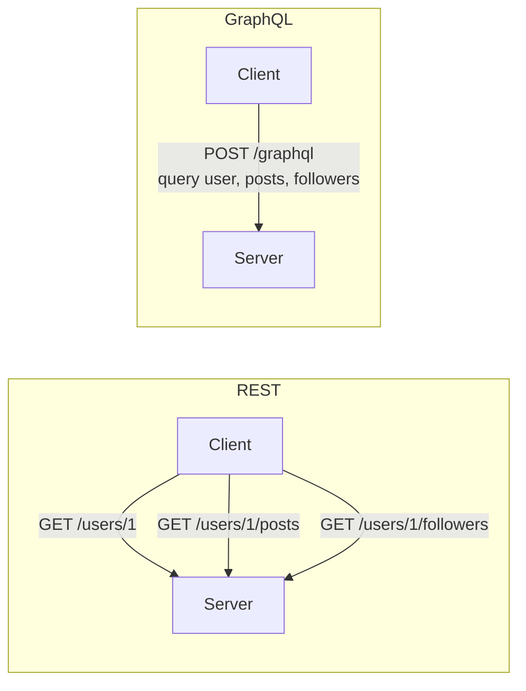
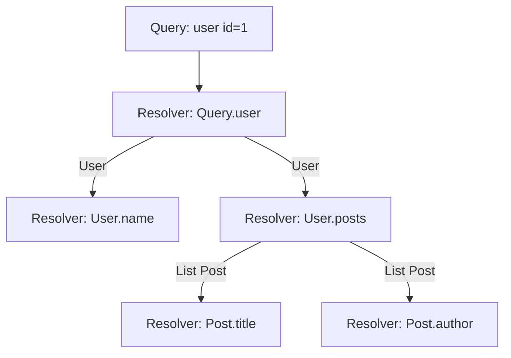
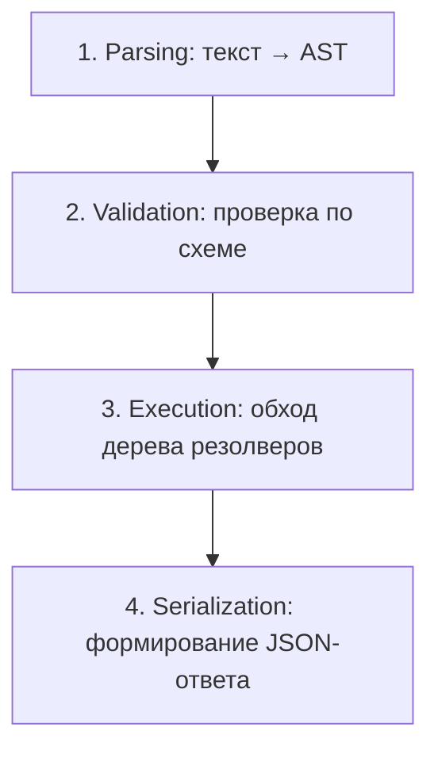
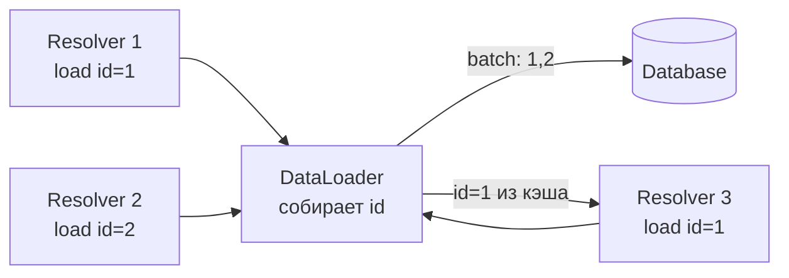
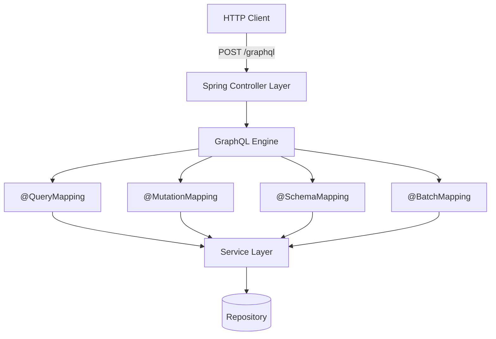
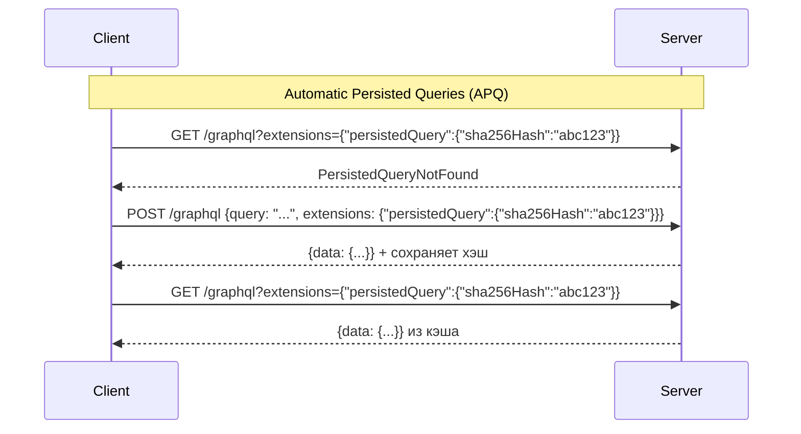
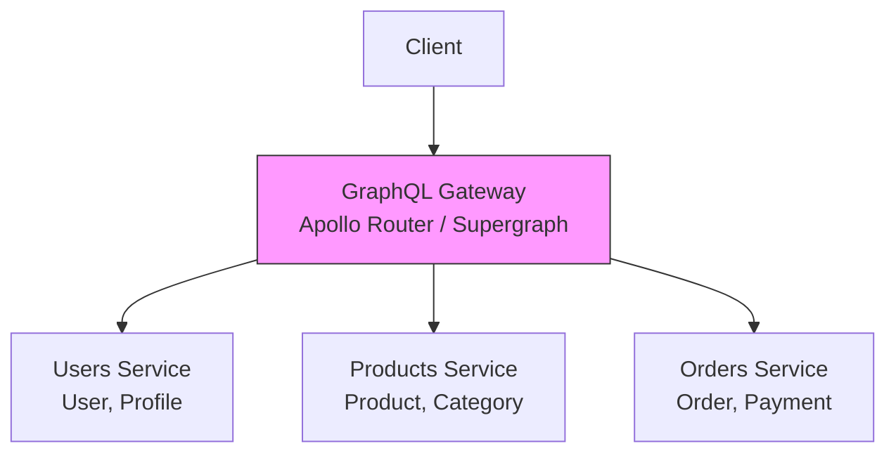
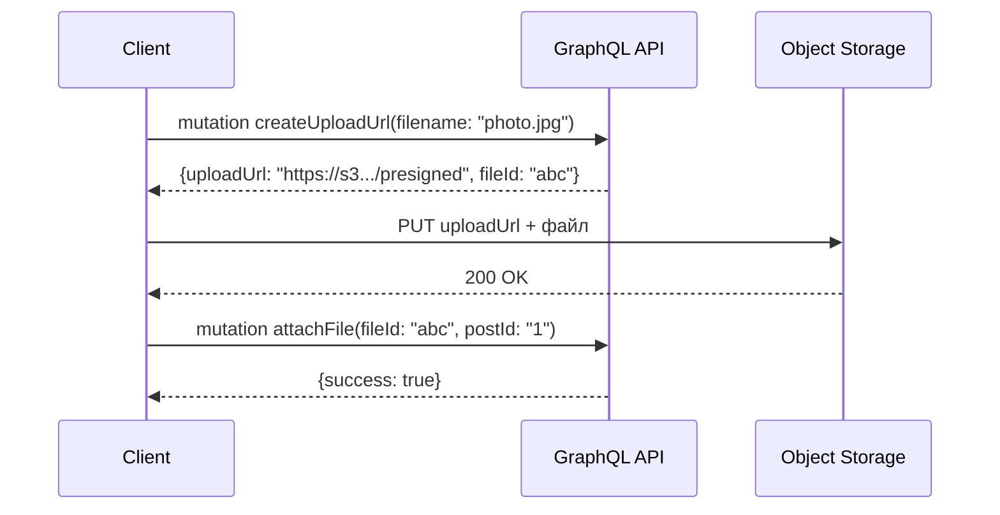
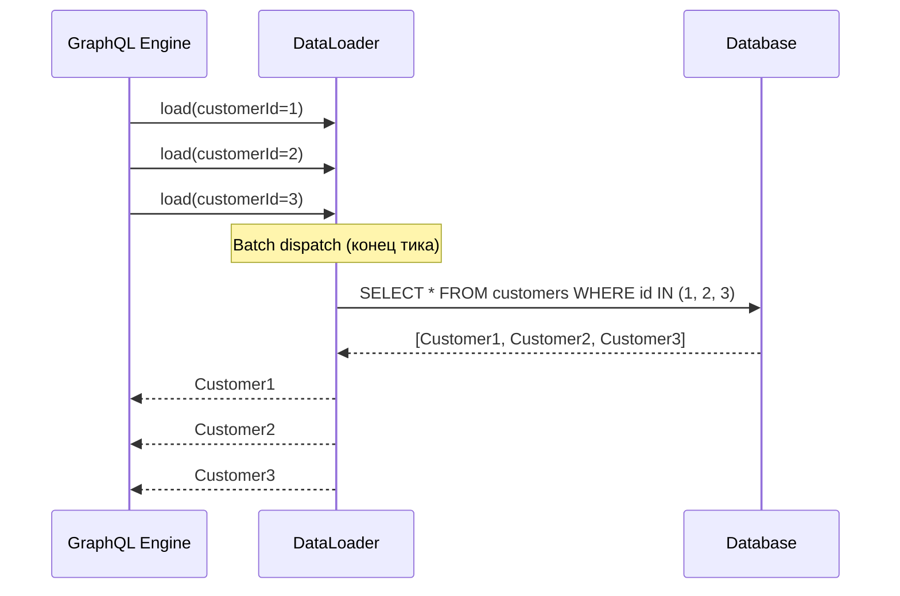

# Вопросы на собеседовании: `GraphQL`

Практичные вопросы и ответы по `GraphQL`: от базовых концепций схемы и типов до продвинутых тем -- `DataLoader`, пагинация, федерация, безопасность и интеграция с `Spring Boot`.

## Полезные ссылки

### Официальная документация

- [GraphQL — Official Docs](https://graphql.org/learn/) — основная документация по спецификации
- [GraphQL Specification](https://spec.graphql.org/draft/) — актуальная спецификация
- [Spring for GraphQL Reference](https://docs.spring.io/spring-graphql/reference/) — Spring-интеграция
- [Getting Started with GraphQL and Spring Boot — Baeldung](https://www.baeldung.com/spring-graphql) — пошаговое руководство
- [Introduction to GraphQL — Baeldung](https://www.baeldung.com/graphql) — обзорная статья
- [GraphQL vs REST — Baeldung](https://www.baeldung.com/graphql-vs-rest) — сравнение подходов
- [Error Handling in GraphQL — Baeldung](https://www.baeldung.com/spring-graphql-error-handling) — обработка ошибок
- [Pagination in Spring Boot GraphQL — Baeldung](https://www.baeldung.com/spring-boot-graphql-pagination) — пагинация

## Содержание

- [Полезные ссылки](#полезные-ссылки)
- [See also](#see-also)

**Основы GraphQL**
- [Q1. (!) Что такое GraphQL и чем он отличается от REST?](#q1-что-такое-graphql-и-чем-он-отличается-от-rest)
- [Q2. Что такое Schema Definition Language (SDL)?](#q2-что-такое-schema-definition-language-sdl)
- [Q3. (!) Какие типы данных существуют в GraphQL?](#q3-какие-типы-данных-существуют-в-graphql)
- [Q4. Что такое Input-типы и зачем они нужны?](#q4-что-такое-input-типы-и-зачем-они-нужны)

**Запросы, мутации и подписки**
- [Q5. (!) Как устроены Query, Mutation и Subscription?](#q5-как-устроены-query-mutation-и-subscription)
- [Q6. Что такое переменные и директивы в GraphQL?](#q6-что-такое-переменные-и-директивы-в-graphql)
- [Q7. Что такое фрагменты и зачем они нужны?](#q7-что-такое-фрагменты-и-зачем-они-нужны)
- [Q8. Как работают Inline Fragments и Union-типы?](#q8-как-работают-inline-fragments-и-union-типы)

**Резолверы и выполнение запросов**
- [Q9. (!) Что такое резолверы и как они работают?](#q9-что-такое-резолверы-и-как-они-работают)
- [Q10. Как GraphQL выполняет запрос (execution model)?](#q10-как-graphql-выполняет-запрос-execution-model)
- [Q11. (!) Что такое проблема N+1 в GraphQL и как её решить?](#q11-что-такое-проблема-n1-в-graphql-и-как-её-решить)
- [Q12. Как работает DataLoader?](#q12-как-работает-dataloader)

**Пагинация**
- [Q13. (!) Какие подходы к пагинации существуют в GraphQL?](#q13-какие-подходы-к-пагинации-существуют-в-graphql)
- [Q14. Что такое Relay-спецификация для пагинации (Connections)?](#q14-что-такое-relay-спецификация-для-пагинации-connections)

**Обработка ошибок и интроспекция**
- [Q15. Как устроена обработка ошибок в GraphQL?](#q15-как-устроена-обработка-ошибок-в-graphql)
- [Q16. Что такое интроспекция и зачем она нужна?](#q16-что-такое-интроспекция-и-зачем-она-нужна)

**GraphQL vs REST**
- [Q17. (!) Когда выбирать GraphQL, а когда REST?](#q17-когда-выбирать-graphql-а-когда-rest)
- [Q18. Какие основные проблемы REST решает GraphQL?](#q18-какие-основные-проблемы-rest-решает-graphql)

**Spring for GraphQL**
- [Q19. (!) Как работает Spring for GraphQL?](#q19-как-работает-spring-for-graphql)
- [Q20. Как определить контроллер в Spring for GraphQL?](#q20-как-определить-контроллер-в-spring-for-graphql)
- [Q21. Как подключить DataLoader в Spring for GraphQL?](#q21-как-подключить-dataloader-в-spring-for-graphql)

**Безопасность**
- [Q22. (!) Какие угрозы безопасности специфичны для GraphQL?](#q22-какие-угрозы-безопасности-специфичны-для-graphql)
- [Q23. Как ограничить глубину и сложность запросов?](#q23-как-ограничить-глубину-и-сложность-запросов)

**Кэширование и производительность**
- [Q24. Почему кэширование в GraphQL сложнее, чем в REST?](#q24-почему-кэширование-в-graphql-сложнее-чем-в-rest)
- [Q25. Что такое Persisted Queries?](#q25-что-такое-persisted-queries)

**Масштабирование и архитектура**
- [Q26. (!) Что такое GraphQL Federation?](#q26-что-такое-graphql-federation)
- [Q27. Чем Federation отличается от Schema Stitching?](#q27-чем-federation-отличается-от-schema-stitching)
- [Q28. Schema-first vs Code-first: в чём разница?](#q28-schema-first-vs-code-first-в-чём-разница)

**Продвинутые темы**
- [Q29. Как реализовать загрузку файлов в GraphQL?](#q29-как-реализовать-загрузку-файлов-в-graphql)
- [Q30. (!) Как организовать батчинг запросов?](#q30-как-организовать-батчинг-запросов)

**Продвинутые темы**
- [Q31. (!) Как работают GraphQL Subscriptions и как их реализовать в Spring?](#q31--как-работают-graphql-subscriptions-и-как-их-реализовать-в-spring)
- [Q32. Что такое @defer и @stream директивы в GraphQL?](#q32-что-такое-defer-и-stream-директивы-в-graphql)
- [Q33. (!) Как решить проблему N+1 с помощью DataLoader в Spring for GraphQL?](#q33--как-решить-проблему-n1-с-помощью-dataloader-в-spring-for-graphql)

**Дополнительные темы**
- [Q34. Что такое Persisted Queries и зачем они нужны?](#q34-что-такое-persisted-queries-и-зачем-они-нужны)
- [Q35. Как масштабировать GraphQL Subscriptions через WebSocket?](#q35-как-масштабировать-graphql-subscriptions-через-websocket)
- [Q36. Чем Schema Stitching отличается от Federation и почему Federation предпочтительнее?](#q36-чем-schema-stitching-отличается-от-federation-и-почему-federation-предпочтительнее)
- [Q37. Как реализовать rate limiting в GraphQL через ограничение сложности запроса?](#q37-как-реализовать-rate-limiting-в-graphql-через-ограничение-сложности-запроса)
- [Q38. Как устроена обработка ошибок в GraphQL: partial responses и поле errors?](#q38-как-устроена-обработка-ошибок-в-graphql-partial-responses-и-поле-errors)
- [Q39. (!) Как работает Apollo Federation 2 и что такое subgraph schemas?](#q39--как-работает-apollo-federation-2-и-что-такое-subgraph-schemas)
- [Q40. GraphQL vs REST vs gRPC: когда что выбирать?](#q40-graphql-vs-rest-vs-grpc-когда-что-выбирать)

---

## Q1. (!) Что такое GraphQL и чем он отличается от REST?

**`GraphQL`** -- это язык запросов для API и среда выполнения этих запросов, разработанная Facebook в 2012 году и опубликованная в 2015 году. В отличие от `REST`, клиент сам определяет, какие данные ему нужны.

**Ключевые отличия:**

| Критерий | REST | GraphQL |
|----------|------|---------|
| Эндпоинт | Множество (`/users`, `/posts`) | Один (`/graphql`) |
| Формат ответа | Фиксирован сервером | Определяется клиентом |
| Over-fetching | Часто -- сервер возвращает всё | Нет -- клиент берёт только нужное |
| Under-fetching | Часто -- нужно несколько запросов | Нет -- один запрос на граф данных |
| Версионирование | Через URL или заголовки | Эволюция схемы без версий |
| Кэширование | Простое (HTTP-кэш по URL) | Сложное (нужны спец. решения) |
| Типизация | Нет стандарта (OpenAPI опционально) | Строгая типизация через схему |



**Что хочет услышать интервьюер:** GraphQL решает проблемы over-fetching и under-fetching, но вводит собственные сложности -- кэширование, безопасность запросов, learning curve. Это не замена REST, а альтернативный подход, оптимальный для графовых данных и разнородных клиентов (мобильные, веб, IoT).

---


> [!mcq]
> **Вопрос:** В чём ключевое архитектурное отличие GraphQL от REST с точки зрения формирования ответа сервера?
>
> - [x] **A) Клиент в теле запроса декларативно указывает нужные поля, и сервер возвращает ровно эту проекцию — устраняя over-fetching и under-fetching за один round-trip**
>
>     ✓ ПОЧЕМУ ВЕРНО: это и есть фундаментальная идея GraphQL — shape ответа определяется запросом клиента, а не контрактом эндпоинта.
>
>     МЕХАНИЗМ: запрос приходит на единственный `POST /graphql`, парсится в AST, валидируется по schema, и executor вызывает резолверы только для запрошенных полей.
>
>     ```graphql
>     query { user(id: "1") { name posts { title } } }
>     ```
>
>     ```java
>     @SchemaMapping(typeName = "Query")
>     public User user(@Argument String id) {
>         return userRepo.findById(id).orElseThrow();
>     }
>     ```
>
>     ПРИМЕНИМОСТЬ: мобильные клиенты с тонким каналом, BFF-агрегация разнородных бэкендов, экраны со сложными зависимыми данными.
>
> - [ ] **B) GraphQL полностью заменяет REST во всех сценариях и всегда быстрее**
>
>     ✗ ПОЧЕМУ НЕВЕРНО: это не замена, а альтернатива; для file upload, простого CRUD под HTTP-кэш и public webhooks REST проще и эффективнее.
>
>     ПОСЛЕДСТВИЕ: команда выбирает GraphQL «потому что модно», получает лишний tooling, проблемы с кэшированием на CDN, security overhead (depth/complexity limiting) — и теряет скорость доставки.
>
> - [ ] **C) GraphQL обязательно использует WebSocket вместо HTTP для всех операций**
>
>     ✗ ПОЧЕМУ НЕВЕРНО: Query и Mutation работают по обычному `HTTP POST`; WebSocket/SSE нужен только для Subscriptions.
>
>     ПОСЛЕДСТВИЕ: инфраструктура поднимает WebSocket-шлюз там, где достаточно `POST /graphql` через обычный Ingress; усложняется балансировка, sticky sessions, наблюдаемость.
>
> - [ ] **D) GraphQL кэшируется HTTP-кэшем (Cache-Control + URL) так же прозрачно, как REST**
>
>     ✗ ПОЧЕМУ НЕВЕРНО: все запросы идут `POST` на один URL — HTTP-кэш по URL/методу бесполезен; нужны persisted queries + GET или клиентский cache (Apollo, Relay) по normalized entities.
>
>     ПОСЛЕДСТВИЕ: ожидание «CDN сам закэширует» приводит к пустому hit-rate, нагрузка падает на origin, latency растёт.

## Q2. Что такое Schema Definition Language (SDL)?

**`SDL`** (Schema Definition Language) -- язык описания схемы `GraphQL`. Схема является контрактом между клиентом и сервером, определяя типы данных, операции и их связи.

```graphql
type Author {
    id: ID!
    name: String!
    books: [Book!]!
}

type Book {
    id: ID!
    title: String!
    publishedYear: Int
    author: Author!
}

type Query {
    book(id: ID!): Book
    books(limit: Int = 10): [Book!]!
    author(id: ID!): Author
}

type Mutation {
    createBook(input: CreateBookInput!): Book!
    deleteBook(id: ID!): Boolean!
}

input CreateBookInput {
    title: String!
    publishedYear: Int
    authorId: ID!
}
```

**Основные элементы SDL:**
- **Скалярные типы:** `Int`, `Float`, `String`, `Boolean`, `ID` (+ пользовательские: `DateTime`, `BigDecimal`)
- **`!`** -- non-null модификатор (поле обязательно)
- **`[Type]`** -- список, `[Type!]!` -- обязательный список обязательных элементов
- **`input`** -- специальный тип для входных данных мутаций
- **`enum`** -- перечисления
- **`interface`** и **`union`** -- полиморфизм

---


> [!mcq]
> **Вопрос:** Что такое Schema Definition Language (SDL) в GraphQL и какова его роль в проекте?
>
> - [ ] **A) `!` в SDL обозначает «список» (array) элементов**
>
>     ✗ ПОЧЕМУ НЕВЕРНО: `!` — модификатор non-null (поле гарантированно не `null`); квадратные скобки `[...]` обозначают список; `[String!]!` — non-null список non-null строк.
>
>     ПОСЛЕДСТВИЕ: разработчик пишет `users: User!` ожидая массив, получает один объект; клиент падает на `.map()`, схема не отражает domain model.
>
> - [x] **B) SDL — текстовый язык описания типизированной схемы GraphQL: типов, полей, операций и связей; это единый контракт между клиентом и сервером, по которому валидируются запросы и генерируется tooling**
>
>     ✓ ПОЧЕМУ ВЕРНО: schema-first подход — SDL хранится в `.graphqls`, парсится при старте в `GraphQLSchema`, по нему валидируются входящие запросы и генерируются типы для клиента (Apollo Codegen, graphql-codegen).
>
>     МЕХАНИЗМ: spring-graphql читает `*.graphqls` из `classpath:graphql/`, биндит каждый `type/Query/Mutation` к `@SchemaMapping`-методам контроллера.
>
>     ```graphql
>     type Book { id: ID! title: String! author: Author! }
>     type Query { book(id: ID!): Book }
>     ```
>
>     ```java
>     @Controller
>     class BookController {
>         @QueryMapping public Book book(@Argument String id) { return service.find(id); }
>         @SchemaMapping public Author author(Book book) { return authorService.byId(book.authorId()); }
>     }
>     ```
>
>     ПРИМЕНИМОСТЬ: общий source of truth для backend, frontend, мобильных клиентов; автогенерация TS/Kotlin типов исключает дрейф между API и UI.
>
> - [ ] **C) `input` типы могут содержать поля с кастомными резолверами**
>
>     ✗ ПОЧЕМУ НЕВЕРНО: `input` — чисто структуры данных без логики и резолверов; они нужны как «DTO для аргументов», нельзя ссылаться на Object type как input.
>
>     ПОСЛЕДСТВИЕ: попытка `input X { y: User }`, где `User` — Object type, падает на schema validation при старте: «field type must be Input type».
>
> - [ ] **D) SDL одинаков для GraphQL и gRPC — оба описывают API одинаковым языком**
>
>     ✗ ПОЧЕМУ НЕВЕРНО: gRPC использует Protocol Buffers (`.proto`) с другой семантикой (RPC-методы, бинарный формат, отсутствие проекций полей); SDL — специфично только для GraphQL.
>
>     ПОСЛЕДСТВИЕ: команда пытается переиспользовать `.proto`-файлы как `.graphqls`, теряет tooling, не понимает где field selection и `input` против `message`.

## Q3. (!) Какие типы данных существуют в GraphQL?

`GraphQL` имеет строгую систему типов, которая является основой схемы:

**1. Скалярные типы (Scalar):**
```graphql
scalar DateTime    # пользовательский скаляр

type Example {
    id: ID!         # уникальный идентификатор (сериализуется как String)
    name: String!   # строка в UTF-8
    age: Int        # 32-битное целое
    rating: Float   # число с плавающей точкой (double)
    active: Boolean # true/false
    createdAt: DateTime  # пользовательский
}
```

**2. Object-типы** -- основной строительный блок:
```graphql
type User {
    id: ID!
    email: String!
    posts: [Post!]!
}
```

**3. Enum-типы:**
```graphql
enum Role {
    ADMIN
    USER
    MODERATOR
}
```

**4. Interface и Union:**
```graphql
interface Node {
    id: ID!
}

type User implements Node {
    id: ID!
    name: String!
}

union SearchResult = User | Post | Comment
```

**5. Input-типы** (для аргументов мутаций):
```graphql
input UserFilter {
    role: Role
    active: Boolean
}
```

**Модификаторы типов:**
- `String` -- nullable строка
- `String!` -- non-null строка
- `[String]` -- nullable список nullable строк
- `[String!]!` -- non-null список non-null строк

---


> [!mcq]
> **Вопрос:** Чем отличаются `interface` и `union` в системе типов GraphQL и как они применяются для полиморфизма?
>
> - [ ] **A) `ID` — это числовой тип `Integer`, и при сериализации сравнивается как число**
>
>     ✗ ПОЧЕМУ НЕВЕРНО: `ID` — это уникальный идентификатор, который сериализуется как `String` (хотя клиент может прислать число — оно будет приведено к строке); сравнение «как число» некорректно для UUID и составных ключей.
>
>     ПОСЛЕДСТВИЕ: схема ломается, как только в БД появляются UUID (`"a1b2-..."`) или префиксные ID (`"user:42"`) — `Integer.parseInt` бросает `NumberFormatException`.
>
> - [ ] **B) `union` расширяет `interface` и добавляет к нему реализацию по умолчанию**
>
>     ✗ ПОЧЕМУ НЕВЕРНО: это две разные конструкции. `interface` объявляет общие поля, которые Object types обязаны реализовать; `union` — это «один из» нескольких Object types БЕЗ общих полей.
>
>     ПОСЛЕДСТВИЕ: попытка `union X implements Y` — schema parse error; разработчик путает selection set (для union нужны `... on Type { ... }`-фрагменты) с обычным наследованием.
>
> - [x] **C) `interface` — общий контракт полей, который реализуют Object types (`implements`); `union` — set возможных Object types без общих полей; в обоих случаях клиент использует inline-фрагменты `... on Type` для выбора type-specific полей**
>
>     ✓ ПОЧЕМУ ВЕРНО: это и есть штатный механизм полиморфизма в GraphQL — interface для «все Node имеют id», union для «search возвращает User или Post или Comment».
>
>     МЕХАНИЗМ: на сервере нужен `TypeResolver`, который по runtime-объекту возвращает GraphQL type name; иначе executor не знает, какие резолверы вызвать.
>
>     ```graphql
>     interface Node { id: ID! }
>     type User implements Node { id: ID! name: String! }
>     union SearchResult = User | Post | Comment
>     type Query { search(q: String!): [SearchResult!]! }
>     ```
>
>     ```java
>     @Bean
>     RuntimeWiringConfigurer wiring() {
>         return b -> b.type("SearchResult", t -> t.typeResolver(env -> {
>             Object o = env.getObject();
>             if (o instanceof User)    return env.getSchema().getObjectType("User");
>             if (o instanceof Post)    return env.getSchema().getObjectType("Post");
>             return env.getSchema().getObjectType("Comment");
>         }));
>     }
>     ```
>
>     ```graphql
>     query { search(q: "java") { __typename ... on User { name } ... on Post { title } } }
>     ```
>
>     ПРИМЕНИМОСТЬ: feed/timeline с разнотипными сущностями, поиск по нескольким коллекциям, activity log.
>
> - [ ] **D) `Float` в GraphQL — это 32-битное число, эквивалентное Java `float`**
>
>     ✗ ПОЧЕМУ НЕВЕРНО: GraphQL `Float` по спецификации — IEEE 754 double precision (64-bit), маппится на Java `Double`.
>
>     ПОСЛЕДСТВИЕ: маппинг резолвера в `float` теряет точность для финансовых/научных значений; для денежных сумм всё равно нужен custom scalar (`BigDecimal`) — `Float` здесь не подходит ни в каком виде.

## Q4. Что такое Input-типы и зачем они нужны?

**`Input`-типы** -- специальные типы для передачи структурированных данных в аргументы запросов и мутаций. Они отличаются от обычных Object-типов: input-типы не могут содержать поля с аргументами и не могут реализовывать интерфейсы.

```graphql
input CreateUserInput {
    name: String!
    email: String!
    role: Role = USER    # значение по умолчанию
}

input UpdateUserInput {
    name: String
    email: String
    role: Role
}

type Mutation {
    createUser(input: CreateUserInput!): User!
    updateUser(id: ID!, input: UpdateUserInput!): User!
}
```

**Почему нельзя использовать обычные типы как аргументы:** обычные Object-типы могут содержать циклические ссылки и поля с резолверами, что делает их непригодными для входных данных. `Input`-типы -- это чистые структуры данных без логики.

**Паттерн на практике:** для каждой мутации создают свой input-тип (`CreateXInput`, `UpdateXInput`), что позволяет различать обязательные поля для создания и опциональные поля для обновления.

---


> [!mcq] Какое утверждение об `input`-типах в GraphQL верно?
>
> - [ ] **A.** Обычный `type User { ... }` можно передавать как аргумент мутации, если у него нет резолверов
>
>     НЕВЕРНО. GraphQL spec явно запрещает использовать Object types в позиции аргумента. Schema validation на старте упадёт с ошибкой `The type of <Mutation>.<arg> must be Input Type but got: User`.
>
>     ПОСЛЕДСТВИЕ: приложение не стартует — `SchemaProblem` в `GraphQLSchema.newSchema().build()`; даже «чистый» Object без резолверов отвергается парсером схемы.
>
> - [ ] **B.** `input`-типы могут содержать циклические ссылки друг на друга, как Object types
>
>     НЕВЕРНО. По спецификации GraphQL (June 2018, §3.10) циклы во `input` запрещены: `input A { b: B } input B { a: A }` — невалидная схема.
>
>     ПОСЛЕДСТВИЕ: `graphql-java` бросит `InvalidSchemaException` на этапе сборки; цикл невозможно сериализовать из JSON (бесконечная вложенность переменных).
>
> - [ ] **C.** Один универсальный `UserInput` достаточен и для `createUser`, и для `updateUser`
>
>     НЕВЕРНО. Для `createUser` поля обязательны (`name: String!`), для `updateUser` — опциональны (`name: String`). Один тип ломает domain invariants: либо create пропустит `null`, либо update потребует все поля.
>
>     ПОСЛЕДСТВИЕ: на проде клиент получит `User` с `name=null` после create (NOT NULL constraint в БД), либо вынужден слать все поля при update — лишний трафик + race condition при concurrent edit.
>
> - [x] **D.** `input`-типы — это чистые структуры данных без резолверов и интерфейсов, отдельные от Object types
>
>     ВЕРНО. Спецификация разделяет Input/Output types: `input` не имеет резолверов, не реализует `interface`, не содержит union/object-полей с аргументами. Это сериализуемый DTO для аргументов.
>
>     ```graphql
>     input CreateUserInput {
>         name: String!
>         email: String!
>         role: Role = USER
>     }
>     type Mutation {
>         createUser(input: CreateUserInput!): User!
>     }
>     ```
>
>     ```java
>     @Component
>     public class UserMutationResolver {
>         @MutationMapping
>         public User createUser(@Argument CreateUserInput input) {
>             return userService.create(input.name(), input.email(), input.role());
>         }
>     }
>     public record CreateUserInput(String name, String email, Role role) {}
>     ```
>
>     ПРИМЕНЕНИЕ: разделение `CreateXInput`/`UpdateXInput`/`FilterXInput` фиксирует контракт — обязательность полей выражена на уровне схемы, клиент валидируется до резолвера. Введение default value (`role: Role = USER`) убирает boilerplate из клиентского кода.

## Q5. (!) Как устроены Query, Mutation и Subscription?

Три корневых типа определяют входные точки в `GraphQL` API:

**`Query`** -- чтение данных (аналог `GET` в REST):
```graphql
type Query {
    user(id: ID!): User
    users(filter: UserFilter, page: Int, size: Int): [User!]!
    searchUsers(term: String!): [User!]!
}
```

**`Mutation`** -- изменение данных (аналог `POST`/`PUT`/`DELETE`):
```graphql
type Mutation {
    createUser(input: CreateUserInput!): User!
    updateUser(id: ID!, input: UpdateUserInput!): User!
    deleteUser(id: ID!): Boolean!
}
```

**`Subscription`** -- подписка на события в реальном времени (через `WebSocket`):
```graphql
type Subscription {
    userCreated: User!
    messageAdded(chatId: ID!): Message!
}
```

**Важные различия:**

| Аспект | Query | Mutation | Subscription |
|--------|-------|----------|--------------|
| Выполнение | Параллельное | Последовательное | Потоковое |
| Побочные эффекты | Нет | Да (только top-level) | Нет (получение событий) |
| Транспорт | HTTP | HTTP | WebSocket / SSE |

**Ключевой момент по спецификации:** мутации на верхнем уровне выполняются **последовательно** (в отличие от query, где поля могут выполняться параллельно). Это гарантирует предсказуемый порядок побочных эффектов.

---


> [!mcq] Какое утверждение о Query/Mutation/Subscription корректно?
>
> - [x] **A.** Top-level поля `Mutation` выполняются последовательно, top-level поля `Query` — параллельно
>
>     ВЕРНО. GraphQL spec §6.2.2 (Mutation): «If the operation is a mutation, the result of the operation is the result of executing the operation’s top level selection set on the mutation root object type. This selection set should be executed serially». Для Query — `executeSelectionSet` параллельно.
>
>     ```graphql
>     mutation BatchOps {
>         a: createUser(input: {name: "A"}) { id }   # выполняется ПЕРВЫМ
>         b: createUser(input: {name: "B"}) { id }   # ПОСЛЕ a, видит её результат
>     }
>     ```
>
>     ```java
>     // graphql-java: AsyncExecutionStrategy для Query, AsyncSerialExecutionStrategy для Mutation
>     GraphQL.newGraphQL(schema)
>         .queryExecutionStrategy(new AsyncExecutionStrategy())
>         .mutationExecutionStrategy(new AsyncSerialExecutionStrategy())
>         .build();
>     ```
>
>     ПРИМЕНЕНИЕ: позволяет клиенту батчить связанные мутации в одном запросе (`createUser` → `createPost` для нового user.id) с гарантией порядка. Внутри одного резолвера sub-selection всё равно параллелен — последовательность только на корне.
>
> - [ ] **B.** Top-level mutations выполняются параллельно, как и Query fields
>
>     НЕВЕРНО. Спецификация требует serial execution для мутаций. Параллельная реализация — нарушение spec, race conditions на одних и тех же сущностях.
>
>     ПОСЛЕДСТВИЕ: batch-мутация `deleteAccount → transferFunds` может выполнить transfer на удалённый аккаунт (или наоборот); никакие гарантии порядка — потеря данных, неконсистентный state.
>
> - [ ] **C.** `Subscription` работает через HTTP long-polling без persistent connection
>
>     НЕВЕРНО. Subscription требует двусторонний канал: WebSocket (`graphql-ws`/`graphql-transport-ws`) или SSE. HTTP stateless не поддерживает server push без переподключения.
>
>     ПОСЛЕДСТВИЕ: polling = высокая задержка (1-5s), N×RPS на сервер, нет гарантии «получено единожды»; для chat/notifications даёт UX как у REST `GET /messages?since=...` — теряется смысл Subscription.
>
> - [ ] **D.** `Query` со side effects семантически эквивалентен `Mutation`
>
>     НЕВЕРНО. Клиенты (Apollo Client, Relay), CDN и gateway-кэши агрессивно кэшируют `Query` (`@cacheControl`, `GET`-запросы, persisted queries).
>
>     ПОСЛЕДСТВИЕ: `query incrementCounter { ... }` выполнится один раз и закэшируется — последующие вызовы вернут старый результат без вызова резолвера; реальный inc не произойдёт. Нарушение контракта Query = pure read.

## Q6. Что такое переменные и директивы в GraphQL?

### Переменные

Переменные позволяют параметризировать запросы, отделяя данные от структуры запроса:

```graphql
query GetUser($userId: ID!, $withPosts: Boolean!) {
    user(id: $userId) {
        name
        email
        posts @include(if: $withPosts) {
            title
        }
    }
}
```

Переменные передаются отдельно как JSON:
```json
{
    "userId": "42",
    "withPosts": true
}
```

### Директивы

**Встроенные директивы:**
- **`@include(if: Boolean)`** -- включить поле, если условие `true`
- **`@skip(if: Boolean)`** -- пропустить поле, если условие `true`
- **`@deprecated(reason: String)`** -- пометить поле как устаревшее (на стороне схемы)

```graphql
type User {
    id: ID!
    name: String!
    username: String @deprecated(reason: "Используйте поле name")
}
```

**Пользовательские директивы** (на уровне схемы):
```graphql
directive @auth(role: Role!) on FIELD_DEFINITION

type Query {
    users: [User!]! @auth(role: ADMIN)
    publicPosts: [Post!]!
}
```

---


> [!mcq] Какое утверждение о переменных и директивах GraphQL верно?
>
> - [ ] **A.** `@skip(if: true)` включает поле, а `@include(if: true)` — пропускает
>
>     НЕВЕРНО. Семантика прямо противоположная: `@skip(if: true)` ПРОПУСКАЕТ поле, `@include(if: true)` ВКЛЮЧАЕТ. Они дублируют друг друга через инверсию условия (`@skip(if: $x)` == `@include(if: !$x)`).
>
>     ПОСЛЕДСТВИЕ: клиент получает пустой ответ там, где ожидает данные; UI рендерит «No data» при `withPosts=true`; отладка через сетевые логи показывает корректный запрос, но мозг разработчика ищет баг не там.
>
> - [x] **B.** Кастомная директива на схеме требует server-side реализации через `SchemaDirectiveWiring` или DataFetcher
>
>     ВЕРНО. Объявление `directive @auth(role: Role!) on FIELD_DEFINITION` — это только декларация в SDL. Без обработчика runtime просто пропускает её.
>
>     ```graphql
>     directive @auth(role: Role!) on FIELD_DEFINITION
>     type Query {
>         adminUsers: [User!]! @auth(role: ADMIN)
>     }
>     ```
>
>     ```java
>     public class AuthDirective implements SchemaDirectiveWiring {
>         @Override
>         public GraphQLFieldDefinition onField(SchemaDirectiveWiringEnvironment<GraphQLFieldDefinition> env) {
>             GraphQLDirective d = env.getDirective();
>             Role required = Role.valueOf((String) d.getArgument("role").getValue());
>             GraphQLFieldDefinition field = env.getElement();
>             DataFetcher<?> original = env.getCodeRegistry().getDataFetcher(env.getFieldsContainer(), field);
>             DataFetcher<?> guarded = e -> {
>                 User u = e.getGraphQlContext().get("user");
>                 if (u == null || !u.hasRole(required)) throw new AccessDeniedException("Need " + required);
>                 return original.get(e);
>             };
>             env.getCodeRegistry().dataFetcher(env.getFieldsContainer(), field, guarded);
>             return field;
>         }
>     }
>     RuntimeWiring.newRuntimeWiring().directive("auth", new AuthDirective()).build();
>     ```
>
>     ПРИМЕНЕНИЕ: декларативная авторизация на уровне схемы — `@auth(role: ADMIN)` рядом с полем читаемее, чем разбросанные проверки в резолверах. То же для `@upper`, `@deprecated(reason: ...)` (поведение в introspection), `@cost` (rate limiting).
>
> - [ ] **C.** GraphQL переменные нужно вручную экранировать для защиты от injection в schema
>
>     НЕВЕРНО. Переменные передаются отдельным JSON, не интерполируются в query string. Парсер `graphql-java` строго типизирует их по схеме: `$id: ID!` отвергнет non-string.
>
>     ПОСЛЕДСТВИЕ: ложное чувство безопасности заставляет писать ручной escaping вместо параметризованных SQL-запросов в резолверах — injection всё равно случится через `String.format("SELECT ... WHERE name = '%s'", input.name())`. Защищать надо downstream вызовы (JDBC PreparedStatement), не GraphQL слой.
>
> - [ ] **D.** `@deprecated` на поле блокирует его выполнение в runtime
>
>     НЕВЕРНО. `@deprecated(reason: "...")` — это маркер для introspection (отображается в IDE/Graphiql и в `__schema`). Поле работает как раньше, резолвер вызывается.
>
>     ПОСЛЕДСТВИЕ: команда добавляет `@deprecated` и удаляет код через месяц — все клиенты, не обновившие запросы, начинают получать ошибки в проде. Нужен реальный мониторинг использования deprecated полей (`fieldExecutionListener`) перед удалением.

## Q7. Что такое фрагменты и зачем они нужны?

**Фрагменты** -- переиспользуемые наборы полей, которые устраняют дублирование в запросах:

```graphql
fragment UserBasicInfo on User {
    id
    name
    email
    avatarUrl
}

query {
    currentUser {
        ...UserBasicInfo
        role
    }
    teamMembers {
        ...UserBasicInfo
        joinedAt
    }
}
```

**Когда использовать фрагменты:**
- Одинаковые наборы полей в нескольких запросах
- Компонентный подход на фронтенде: каждый UI-компонент объявляет свой фрагмент с нужными данными
- Сокращение размера запросов

**Важно:** фрагмент всегда привязан к конкретному типу (`on User`), что даёт проверку типов на этапе валидации запроса.

---


> [!mcq] Какое утверждение о GraphQL-фрагментах верно?
>
> - [ ] **A.** Фрагмент можно объявить без указания типа (`fragment X { ... }`), он автоматически применится к любому объекту в запросе.
>
>     **Почему неверно:** объявление фрагмента БЕЗ `on <Type>` — синтаксическая ошибка в SDL. Спецификация GraphQL требует обязательного указания типа: `fragment UserBasicInfo on User { ... }`.
>
>     **Последствие:** запрос отклонится на этапе валидации с `Syntax Error: Expected "on", found "{"`, клиент получит `errors` вместо `data` и UI сломается.
>
> - [ ] **B.** Фрагменты раскрываются на стороне клиента ДО отправки на сервер — сервер получает уже плоский запрос без `...FragmentName`.
>
>     **Почему неверно:** фрагменты — часть спецификации языка запросов и отправляются на сервер AS-IS. Сервер их парсит и разворачивает в AST при выполнении. Клиентские библиотеки (Apollo, Relay) могут оптимизировать, но базовое поведение — отправка фрагментов на сервер.
>
>     **Последствие:** разработчик ошибочно считает фрагменты «синтаксическим сахаром» уровня клиента и не понимает, как они влияют на серверный план выполнения и кэширование Apollo-нормализованного store.
>
> - [x] **C.** Фрагмент привязан к конкретному типу через `on <Type>`, что даёт type-checking на этапе валидации запроса и позволяет переиспользовать набор полей в разных queries.
>
>     **Почему верно:** ключевое свойство фрагментов — типизация и переиспользование. Пример из шпаргалки:
>
>     ```graphql
>     fragment UserBasicInfo on User {
>         id
>         name
>         email
>     }
>
>     query {
>         currentUser { ...UserBasicInfo role }
>         teamMembers { ...UserBasicInfo joinedAt }
>     }
>     ```
>
>     Если в `UserBasicInfo` указать поле, отсутствующее в `User`, валидация упадёт ещё до выполнения резолверов.
>
>     **Последствие:** компонентный подход на фронте (каждый UI-компонент объявляет свой fragment) + DRY на сервере + раннее обнаружение ошибок при изменении схемы.
>
> - [ ] **D.** Фрагменты работают только в `Query`, в `Mutation` и `Subscription` они запрещены спецификацией.
>
>     **Почему неверно:** спецификация GraphQL разрешает фрагменты во всех трёх корневых операциях. Можно объявить `fragment OrderResult on Order { id status }` и использовать его как в Query, так и в Mutation response.
>
>     **Последствие:** разработчик дублирует один и тот же набор полей в Query и Mutation response, нарушая DRY и создавая drift между ними при эволюции схемы.

## Q8. Как работают Inline Fragments и Union-типы?

**Union-типы** позволяют полю возвращать один из нескольких типов:

```graphql
union SearchResult = User | Post | Comment

type Query {
    search(term: String!): [SearchResult!]!
}
```

Для работы с union/interface используют **inline fragments**:

```graphql
query {
    search(term: "java") {
        ... on User {
            name
            email
        }
        ... on Post {
            title
            content
        }
        ... on Comment {
            text
            author {
                name
            }
        }
        __typename   # мета-поле: возвращает имя типа
    }
}
```

**`__typename`** -- мета-поле, доступное для любого Object-типа, которое возвращает имя конкретного типа. Клиентские библиотеки (Apollo, Relay) используют его для нормализации кэша.

---


> [!mcq] Какое утверждение об inline fragments и union-типах в GraphQL верно?
>
> - [ ] **A.** Union-тип может включать как Object-типы, так и скалярные типы (`String`, `Int`), что упрощает поиск разнородных результатов.
>
>     **Почему неверно:** спецификация GraphQL запрещает включать в union скаляры, enum, input-типы и интерфейсы. Union содержит ТОЛЬКО Object-типы: `union SearchResult = User | Post | Comment` — корректно, `union X = String | Int` — ошибка схемы.
>
>     **Последствие:** schema-валидатор (`graphql-java`, `graphql-tools`) откажется стартовать приложение с ошибкой `Union types can only contain Object types`. Запуск сервиса упадёт ещё до приёма первого запроса.
>
> - [ ] **B.** Для извлечения полей из union-результата достаточно перечислить поля напрямую: `search(term: "java") { name email title }` — engine сам разберётся, какие поля от какого типа.
>
>     **Почему неверно:** на union/interface-полях нельзя селектить «общие» поля без `... on <Type>`. Спецификация требует inline fragment для каждого возможного типа: `... on User { name }`, `... on Post { title }`.
>
>     **Последствие:** валидатор вернёт `Field "name" cannot be queried on union type "SearchResult"`. Запрос отклонится, клиент получит пустой `data` и `errors` — типичная ошибка джунов при первом использовании union.
>
> - [ ] **C.** Мета-поле `__typename` доступно только для union- и interface-полей; на обычных Object-типах оно вызывает ошибку валидации.
>
>     **Почему неверно:** `__typename` — универсальное мета-поле, доступное на ЛЮБОМ Object-типе, не только на union/interface. Apollo Client автоматически добавляет `__typename` в каждый selection set для нормализации кэша.
>
>     **Последствие:** разработчик отключает `__typename` для «обычных» типов, ломает кэш-нормализацию Apollo (по умолчанию `dataIdFromObject` использует `__typename + id`), получает stale data в UI после мутаций.
>
> - [x] **D.** Inline fragments `... on <Type>` обязательны для union/interface, позволяют запросить разный набор полей для каждого возможного типа; `__typename` помогает клиенту определить конкретный тип результата для рендеринга.
>
>     **Почему верно:** это и есть штатный механизм работы с polymorphic-результатами. Пример из шпаргалки:
>
>     ```graphql
>     query {
>         search(term: "java") {
>             __typename
>             ... on User    { name email }
>             ... on Post    { title content }
>             ... on Comment { text author { name } }
>         }
>     }
>     ```
>
>     Клиент по `__typename` решает, какой React-компонент рендерить (`UserCard`, `PostCard`, `CommentCard`).
>
>     **Последствие:** type-safe работа с разнородными результатами, корректная нормализация Apollo-кэша, возможность строить полиморфные UI без дублирования endpoints.

## Q9. (!) Что такое резолверы и как они работают?

**Резолвер** -- это функция, которая отвечает за получение данных для конкретного поля в схеме. Каждое поле в `GraphQL`-схеме имеет соответствующий резолвер.



**Аргументы резолвера** (четыре стандартных):

1. **`parent`** (root) -- результат родительского резолвера
2. **`args`** -- аргументы, переданные полю
3. **`context`** -- общий контекст запроса (аутентификация, DataLoader, соединения с БД)
4. **`info`** -- метаданные о запросе (дерево полей, фрагменты)

**Пример на Java (Spring for GraphQL):**

```java
@Controller
public class BookController {

    @QueryMapping
    public Book book(@Argument Long id) {
        return bookRepository.findById(id).orElse(null);
    }

    @SchemaMapping(typeName = "Book", field = "author")
    public Author author(Book book) {
        return authorRepository.findById(book.getAuthorId());
    }
}
```

**Default resolvers:** если для поля не определён явный резолвер, `GraphQL` использует тривиальный резолвер, который просто читает одноимённое свойство из parent-объекта (аналог геттера в Java).

---


> [!mcq] Какое утверждение о резолверах в GraphQL корректно?
>
> - [x] **A.** Резолвер — функция, разрешающая значение конкретного поля; получает четыре стандартных аргумента `parent / args / context / info`, причём если резолвер не определён явно, используется тривиальный (читает одноимённое свойство из `parent`).
>
>     **Почему верно:** это базовая модель резолверов в любой GraphQL-имплементации. Spring for GraphQL автоматически генерирует тривиальные резолверы для полей-геттеров:
>
>     ```java
>     @Controller
>     public class BookController {
>
>         @QueryMapping
>         public Book book(@Argument Long id) {
>             return bookRepository.findById(id).orElse(null);
>         }
>
>         // Для поля Book.title тривиальный резолвер вызовет book.getTitle() автоматически
>         @SchemaMapping(typeName = "Book", field = "author")
>         public Author author(Book book) {        // book — это parent
>             return authorRepository.findById(book.getAuthorId());
>         }
>     }
>     ```
>
>     `parent` = результат родительского резолвера, `args` = аргументы поля, `context` = per-request контекст (auth, DataLoader), `info` = AST-метаданные запроса.
>
>     **Последствие:** не нужно писать boilerplate-резолверы для каждого поля — только для тех, что требуют отдельной логики (связи, вычисляемые поля, авторизация).
>
> - [ ] **B.** Все резолверы выполняются строго последовательно сверху вниз — engine не может распараллелить даже независимые поля корневого `Query`.
>
>     **Почему неверно:** для `Query` engine ИМЕЕТ ПРАВО выполнять поля верхнего уровня параллельно (и `graphql-java` делает это через `CompletableFuture`). Последовательное выполнение — только для `Mutation` (чтобы избежать race condition между сайд-эффектами).
>
>     **Последствие:** разработчик пишет блокирующие резолверы вместо реактивных, теряет ~N-кратное ускорение на запросах с независимыми top-level полями, latency p99 растёт линейно от количества полей в Query.
>
> - [ ] **C.** Аргумент `parent` всегда равен `null` — резолвер не имеет доступа к данным родительского уровня и должен заново загружать всё из базы.
>
>     **Почему неверно:** `parent` — это РЕЗУЛЬТАТ родительского резолвера. Для `Query.user` parent = `null`, но для `User.posts` parent = объект `User`, возвращённый из `Query.user`. Именно через parent резолверы строят цепочки навигации по графу.
>
>     **Последствие:** разработчик игнорирует parent и в каждом nested-резолвере делает повторный SELECT из БД, превращая запрос в worst-case N+1 даже там, где DataLoader не нужен (данные уже есть в parent).
>
> - [ ] **D.** Резолвер обязан возвращать примитивные типы (`String`, `Int`, `Boolean`); вернуть объект и продолжить обход engine не умеет — для вложенных полей нужно делать отдельный запрос с фронта.
>
>     **Почему неверно:** ровно наоборот — engine продолжает обход рекурсивно: если резолвер возвращает Object, движок берёт это значение как `parent` и вызывает резолверы вложенных полей. Это и есть суть «разрешения дерева до листьев».
>
>     **Последствие:** разработчик строит «плоский» API в стиле REST поверх GraphQL, теряет ключевое преимущество — один запрос вместо waterfall’а, фронт делает N round-trips там, где должен быть один.

## Q10. Как GraphQL выполняет запрос (execution model)?

Выполнение `GraphQL`-запроса -- это обход дерева полей сверху вниз:



**Детали этапа Execution:**

1. Начинается с корневого типа (`Query`, `Mutation`, `Subscription`)
2. Для каждого поля вызывается соответствующий резолвер
3. Результат резолвера передаётся как `parent` дочерним резолверам
4. Скалярные поля (листья) возвращают конечные значения
5. Для `Query` поля верхнего уровня могут выполняться **параллельно**
6. Для `Mutation` поля верхнего уровня выполняются **последовательно**

**Обход до листьев:** `GraphQL` engine гарантирует, что каждое запрошенное поле будет разрешено до скалярного значения. Если резолвер возвращает объект, engine продолжает обход по вложенным полям.

---


> [!mcq] Какой порядок выполнения полей верхнего уровня гарантирует GraphQL execution model?
>
> - [ ] **A.** Поля `Query` выполняются последовательно, поля `Mutation` — параллельно для ускорения записи.
>
>     **Что на самом деле:** ровно наоборот — `Query` параллельно, `Mutation` последовательно. Спецификация требует sequential execution для мутаций именно потому, что записи имеют side-effects и порядок важен.
>
>     **Откуда путаница:** интуитивно «запись надо быстро, чтение можно подождать», и кажется что параллелить нужно мутации. Но GraphQL оптимизирует под безопасность, а не скорость записи.
>
>     **Если бы это было правдой:** две мутации в одном запросе `createOrder` + `chargePayment` могли бы выполниться в произвольном порядке — платёж мог бы пройти до создания заказа.
>
> - [ ] **B.** Все поля любого типа выполняются строго последовательно сверху вниз по тексту запроса.
>
>     **Что на самом деле:** для `Query` и `Subscription` engine волен выполнять top-level поля параллельно. Только `Mutation` гарантирует sequential execution.
>
>     **Откуда путаница:** «обход дерева сверху вниз» из mermaid-диаграммы воспринимается как линейная последовательность. На самом деле «сверху вниз» — про уровни вложенности, не про порядок сиблингов.
>
>     **Если бы это было правдой:** теряется главное преимущество GraphQL — невозможно было бы параллельно загружать несвязанные ветки графа (`user` и `products` в одном query).
>
> - [ ] **C.** Резолверы запускаются снизу вверх: сначала листья-скаляры, потом родительские объекты получают агрегаты.
>
>     **Что на самом деле:** обход идёт сверху вниз. Родительский резолвер выполняется первым, его результат передаётся в `parent` дочерним резолверам. Без `parent` дочерние резолверы не знают, что разрешать.
>
>     **Откуда путаница:** в SQL/ORM есть паттерн bottom-up агрегации (`COUNT`, `SUM`). В GraphQL модель противоположная — top-down traversal.
>
>     **Если бы это было правдой:** резолвер `book.author` не знал бы, какую книгу разрешать, потому что `parent: Book` ещё не существует на момент его вызова.
>
> - [x] **D.** Query/Subscription поля верхнего уровня могут выполняться параллельно, Mutation — строго последовательно; обход дерева идёт сверху вниз с передачей `parent` в дочерние резолверы.
>
>     **Развёрнутое объяснение:** execution model — это 4 этапа (parse → validate → execute → serialize). На этапе execute engine стартует с корневого типа, для каждого выбранного поля вызывает резолвер и рекурсивно спускается к детям, передавая результат как `parent`. Для `Query` спецификация разрешает параллелизм top-level полей (нет side-effects), для `Mutation` запрещает (порядок мутаций — часть контракта).
>
>     **Пример:** запрос `mutation { a: createUser(...) { id } b: deleteUser(...) }` — сначала полностью отрабатывает `a` (включая все вложенные резолверы), только потом стартует `b`. А `query { users { name } products { title } }` может тянуть `users` и `products` параллельно.
>
>     **Когда применять:** знание модели критично при дизайне резолверов — нельзя полагаться на shared mutable state между сиблингами в `Query` (могут выполниться одновременно). В `Mutation` можно — порядок гарантирован.
>
>     **Подводные камни:** многие engine (graphql-java по умолчанию) выполняют `Query`-сиблинги последовательно из соображений простоты — параллелизм опционален. Если код полагается на параллельность, проверяй конфигурацию `ExecutionStrategy`. Также: `DataLoader` дедуплицирует запросы именно за счёт того, что все вложенные резолверы успевают зарегистрировать ключи до начала batch.
>
>     **Связанные вопросы:** [[graphql-interview#Q9]], [[graphql-interview#Q11]], [[graphql-interview#Q12]].

## Q11. (!) Что такое проблема N+1 в GraphQL и как её решить?

**Проблема N+1** -- классическая проблема производительности, когда для загрузки списка из N элементов выполняется 1 запрос на список + N запросов на связанные данные.

**Пример:**
```graphql
query {
    books {          # 1 запрос: SELECT * FROM books
        title
        author {     # N запросов: SELECT * FROM authors WHERE id = ?
            name     #   для каждой книги отдельный запрос
        }
    }
}
```

Если в базе 100 книг, будет выполнено 1 + 100 = 101 SQL-запрос.

**Решения:**

| Подход | Описание | Когда использовать |
|--------|----------|--------------------|
| `DataLoader` | Батчинг + кэширование запросов | Стандартный подход |
| `JOIN FETCH` | Загрузка в одном SQL-запросе | Простые случаи, один уровень |
| `@BatchMapping` | Spring for GraphQL батч-маппинг | Spring-проекты |
| Look-ahead | Анализ запроса до выполнения | Продвинутая оптимизация |

**DataLoader превращает N+1 в 1+1:**
```
Без DataLoader:
SELECT * FROM books                    -- 1 запрос
SELECT * FROM authors WHERE id = 1     -- N запросов
SELECT * FROM authors WHERE id = 2
SELECT * FROM authors WHERE id = 3
...

С DataLoader:
SELECT * FROM books                    -- 1 запрос
SELECT * FROM authors WHERE id IN (1, 2, 3, ...)  -- 1 запрос
```

---


> [!mcq] В чём суть проблемы N+1 в GraphQL и почему `DataLoader` её решает?
>
> - [x] **A.** Каждая вложенная связь резолвится отдельным запросом (1 на список + N на детей); `DataLoader` собирает ключи в один tick и делает batch-запрос `WHERE id IN (...)`, превращая N+1 в 1+1.
>
>     **Развёрнутое объяснение:** GraphQL обходит дерево полей рекурсивно — для списка из N книг резолвер `book.author` вызывается N раз, каждый раз делая отдельный SELECT по `author_id`. `DataLoader` встаёт прокси-слоем: вместо немедленного запроса он собирает все запрошенные ключи в текущем event-loop tick, а в конце tick'а вызывает batch-функцию, которая делает один SQL `WHERE id IN (1,2,...,N)`. Результаты раздаются по исходным промисам.
>
>     **Пример:** `books { author { name } }` без DataLoader — 1+100=101 SQL-запрос на список из 100 книг. С DataLoader — 2 запроса: `SELECT * FROM books` и `SELECT * FROM authors WHERE id IN (...)`. Плюс per-request кэш: если две разные книги ссылаются на одного автора, второй раз ключ не пойдёт в batch.
>
>     **Когда применять:** всегда для вложенных связей one-to-many и many-to-one. Особенно критично, если резолвер дёргает внешний сервис (REST/gRPC) — там 100 round-trip'ов вместо одного убивают latency.
>
>     **Подводные камни:** `DataLoader` обязан создаваться per-request (через `@RequestScope` или `BatchLoaderRegistry`), иначе кэш «потечёт» между пользователями и вернёт чужие данные. Также batch-функция должна сохранять порядок ключей — если возвращаете `Map<Long, Author>`, отсутствующие ключи дадут `null` в соответствующих позициях, что нужно явно обрабатывать. И помните: DataLoader не решает over-fetching — только лишние round-trip'ы.
>
>     **Связанные вопросы:** [[graphql-interview#Q10]], [[graphql-interview#Q12]], [[graphql-interview#Q9]].
>
> - [ ] **B.** N+1 — это про слишком большой объём данных в ответе; `DataLoader` сжимает payload и стримит данные клиенту чанками.
>
>     **Что на самом деле:** N+1 — про количество round-trip'ов к источнику данных (БД/сервису), а не размер payload. `DataLoader` не занимается ни сжатием, ни стримингом — он чисто про батчинг запросов на бэкенде.
>
>     **Откуда путаница:** «много данных» и «много запросов» субъективно ощущаются как одна и та же проблема производительности. Плюс есть отдельный паттерн `@defer/@stream` для стриминга — его легко перепутать с DataLoader.
>
>     **Если бы это было правдой:** N+1 проявлялся бы только на больших объектах, а на крошечных списках с тяжёлыми связями (100 коротких книг с 100 отдельными SQL за авторами) проблема была бы незаметна — а на практике именно тут она самая болезненная.
>
> - [ ] **C.** N+1 — проблема параллельного выполнения мутаций; решается переводом всех мутаций в последовательный режим через `DataLoader`.
>
>     **Что на самом деле:** N+1 возникает на чтениях (Query) при обходе связей, мутации тут ни при чём. Мутации и так выполняются последовательно по спецификации (см. [[graphql-interview#Q10]]). `DataLoader` — про батчинг, не про сериализацию.
>
>     **Откуда путаница:** обе темы — performance + execution model, легко смешать в голове. На собеседовании это типичная путаница «слышал звон».
>
>     **Если бы это было правдой:** проблема исчезала бы при отключении параллелизма Query-сиблингов, но реальный N+1 на 100 авторов одинаково плох и при последовательном, и при параллельном выполнении — потому что 100 round-trip'ов всё равно остаются.
>
> - [ ] **D.** N+1 решается JOIN-ом всех таблиц в один SQL; `DataLoader` под капотом строит огромный JOIN всех связанных сущностей за один запрос.
>
>     **Что на самом деле:** `DataLoader` делает отдельный batch-запрос на каждый тип связи (один `WHERE id IN` на авторов, другой на издателей и т.д.), а не один большой JOIN. JOIN — это альтернативный подход (`JOIN FETCH`), но у него свои проблемы — декартово произведение, дублирование строк.
>
>     **Откуда путаница:** для разработчиков из мира JPA «решить N+1» рефлекторно означает `JOIN FETCH`. В GraphQL подход другой — батчинг плюс per-request кэш.
>
>     **Если бы это было правдой:** при запросе `books { author publisher reviews }` `DataLoader` строил бы один SQL с тремя JOIN'ами — но в коде batch-функции явно видны независимые `repo.findAllById(ids)` для каждой связи. JOIN — выбор разработчика, не магия DataLoader'а.

## Q12. Как работает DataLoader?

**`DataLoader`** -- это утилита, созданная Facebook, которая решает проблему N+1 через два механизма: **батчинг** и **кэширование**.

**Принцип работы:**



1. Резолверы вызывают `dataLoader.load(key)` -- запрос откладывается
2. В конце "тика" (event loop tick) все накопленные ключи передаются в batch-функцию
3. Batch-функция делает один запрос за все ключи (например, `WHERE id IN (...)`)
4. Результаты раздаются по исходным промисам
5. Повторный запрос с тем же ключом отдаётся из кэша (per-request)

**Реализация на Java:**

```java
@Configuration
public class DataLoaderConfig {

    @Bean
    public BatchLoaderRegistry batchLoaderRegistry(AuthorRepository repo) {
        return registry -> registry
            .forTypePair(Long.class, Author.class)
            .registerMappedBatchLoader((authorIds, env) -> {
                // Один запрос вместо N
                Map<Long, Author> authors = repo.findAllById(authorIds)
                    .stream()
                    .collect(Collectors.toMap(Author::getId, a -> a));
                return Mono.just(authors);
            });
    }
}
```

**Важно:** `DataLoader` создаётся **per-request**, чтобы кэш не утекал между запросами разных пользователей.

---


> [!mcq] Почему `DataLoader` обязательно должен создаваться per-request, а не быть синглтоном?
>
> - [ ] **A.** Из-за лимита Java на количество объектов в heap — синглтон копит все ключи за время жизни приложения и упирается в OutOfMemoryError.
>
>     **Что на самом деле:** причина не в утечке памяти как таковой, а в логическом смешивании данных разных пользователей. Кэш DataLoader'а не освобождается между запросами, и пользователь A может получить данные, закэшированные при запросе пользователя B.
>
>     **Откуда путаница:** «не делай синглтоном» автоматически ассоциируется с memory leak — это самый частый аргумент против singleton-кэшей. В случае DataLoader проблема глубже — это data isolation, а не resource management.
>
>     **Если бы это было правдой:** проблема решалась бы простым `cache.maximumSize(N)` или TTL. Но даже с ограниченным кэшем шаринг между пользователями остаётся фатальным багом безопасности.
>
> - [x] **B.** Кэш DataLoader'а хранит результаты по ключу без учёта пользователя — синглтон бы возвращал одному пользователю данные, закэшированные при запросе другого, что нарушает изоляцию и приводит к утечке чужих данных.
>
>     **Развёрнутое объяснение:** `DataLoader` имеет два механизма — батчинг (склейка запросов в один tick) и per-request кэш (одинаковый ключ в рамках запроса не дёргает источник дважды). Кэш — это `Map<Key, CompletableFuture<Value>>`. Если DataLoader живёт дольше одного запроса, этот Map становится глобальным: пользователь A запросил `user(id=5)`, и его данные осели в кэше; пользователь B (с другими правами) запрашивает того же `user(id=5)` — и получает данные из кэша, минуя проверки авторизации и фильтрацию в репозитории.
>
>     **Пример:** в Spring for GraphQL `BatchLoaderRegistry` автоматически создаёт DataLoader'ы per-request через `DataLoaderRegistry` в `GraphQlContext`. Если вручную обернуть всё в `@Bean` без скоупа — получишь синглтон со всеми описанными выше последствиями. Правильно: `@Bean @RequestScope` или регистрация через `BatchLoaderRegistry`.
>
>     **Когда применять:** правило железное — DataLoader всегда per-request, без исключений для read-only данных. Даже «публичный каталог товаров» может иметь поля, которые зависят от роли пользователя (цены, доступность, скидки).
>
>     **Подводные камни:** при использовании `WebFlux` и `Mono`/`Flux` важно, чтобы DataLoader жил в правильном reactive context — иначе батчинг не сработает (резолверы выполнятся в разных tick'ах). В `graphql-java` есть `DataLoaderRegistry` который привязан к `ExecutionInput` — это и есть граница per-request. Тестирование: проверяй не только функциональность, но и изоляцию (один и тот же ключ в двух параллельных запросах не должен возвращать одинаковый объект из shared кэша).
>
>     **Связанные вопросы:** [[graphql-interview#Q11]], [[graphql-interview#Q10]], [[graphql-interview#Q15]].
>
> - [ ] **C.** Spring требует регистрировать все `BatchLoader`-бины как prototype, иначе контекст не стартует — это техническое ограничение фреймворка, не более.
>
>     **Что на самом деле:** Spring не имеет такого требования. Технически можно зарегистрировать DataLoader как singleton — контекст поднимется, тесты пройдут, а на production проявится утечка данных между пользователями. Это требование архитектурное (изоляция), а не инфраструктурное.
>
>     **Откуда путаница:** Spring действительно строг к скоупам в некоторых местах (например, `@RequestScope` для HTTP-фильтров). Кажется, что и здесь фреймворк бы «остановил».
>
>     **Если бы это было правдой:** старт приложения с singleton-DataLoader падал бы, и баг с утечкой данных был бы невозможен. На практике приложение стартует нормально — баг проявится только под нагрузкой от разных пользователей.
>
> - [ ] **D.** Per-request скоуп нужен только для DataLoader'ов с мутациями, а для чтений (Query) синглтон даже предпочтительнее ради переиспользования кэша между запросами.
>
>     **Что на самом деле:** DataLoader не используется в мутациях — там нет проблемы N+1 (мутация одна на запрос). Per-request скоуп нужен именно для чтений, и именно для того чтобы кэш НЕ переиспользовался между запросами.
>
>     **Откуда путаница:** интуиция «кэш — это про скорость, чем шире — тем лучше» работает для stateless-кэшей (Redis с TTL, CDN), но ломается для in-memory кэшей с user-specific данными.
>
>     **Если бы это было правдой:** долгоживущий кэш для read-only данных давал бы быстрее ответы — но за счёт потери авторизации на уровне резолверов. Для глобального read-only кэширования есть отдельные инструменты (Caffeine с ключом `(userId, entityId)`, либо APQ — Automatic Persisted Queries).

## Q13. (!) Какие подходы к пагинации существуют в GraphQL?

В `GraphQL` применяются два основных подхода к пагинации:

### 1. Offset-based (страничная)

```graphql
type Query {
    books(page: Int = 0, size: Int = 10): BookPage!
}

type BookPage {
    content: [Book!]!
    totalElements: Int!
    totalPages: Int!
    hasNext: Boolean!
}
```

**Плюсы:** простота, возможность перехода на произвольную страницу.
**Минусы:** нестабильна при вставке/удалении (можно пропустить или продублировать элементы), плохо масштабируется (OFFSET в SQL дорогой).

### 2. Cursor-based (курсорная, Relay-стиль)

```graphql
type Query {
    books(first: Int, after: String, last: Int, before: String): BookConnection!
}

type BookConnection {
    edges: [BookEdge!]!
    pageInfo: PageInfo!
}

type BookEdge {
    node: Book!
    cursor: String!   # opaque cursor (обычно base64 от ID)
}

type PageInfo {
    hasNextPage: Boolean!
    hasPreviousPage: Boolean!
    startCursor: String
    endCursor: String
}
```

**Плюсы:** стабильна при мутациях данных, эффективна для бесконечной прокрутки, хорошо масштабируется.
**Минусы:** нельзя "прыгнуть" на произвольную страницу, сложнее в реализации.

**Рекомендация:** для публичных API и мобильных приложений предпочтительна cursor-based пагинация. Для админ-панелей с таблицами -- offset-based может быть удобнее.

---


> [!mcq] Чем cursor-based пагинация выигрывает у offset-based в `GraphQL`?
>
> - [ ] **A) Cursor-пагинация позволяет перейти на произвольную страницу по номеру, тогда как offset требует обхода всех предыдущих страниц.**
>   - Это перевёрнутая семантика: именно offset-пагинация даёт «прыжок» на страницу по номеру.
>   - Cursor — это opaque-указатель на конкретную позицию, по нему нельзя посчитать «страницу 47».
>   - ПОСЛЕДСТВИЕ: проектируете UI с прыжком на страницу и удивляетесь, что cursor-API такого не поддерживает.
>
> - [x] **B) Cursor-пагинация устойчива к вставкам и удалениям между запросами и не выполняет дорогой SQL OFFSET.**
>   - Cursor (обычно base64 от ID/timestamp) указывает на конкретную запись — добавление новых строк не «сдвигает окно».
>   - Запрос `WHERE id > :cursor LIMIT :n` использует индекс и работает за O(log N), в отличие от `OFFSET N` (O(N)).
>   - МЕХАНИЗМ: Relay Connection возвращает `edges[].cursor` и `pageInfo.endCursor`, который клиент передаёт обратно в `after`.
>   - USE-CASE: бесконечная прокрутка ленты, мобильные приложения, публичные API с активными мутациями.
>   - КОНТЕКСТ: офсетная пагинация уместна только в админ-панелях с относительно статичными данными.
>
> - [ ] **C) Offset-пагинация эффективна при больших N, потому что СУБД использует индекс OFFSET для пропуска строк.**
>   - Индекса OFFSET в РСУБД не существует — `LIMIT 10 OFFSET 100000` всегда читает и отбрасывает 100000 строк.
>   - Это главная причина деградации offset-пагинации на хвосте: latency растёт линейно от номера страницы.
>   - ПОСЛЕДСТВИЕ: на проде с миллионом записей пользователь на 1000-й странице ждёт несколько секунд.
>
> - [ ] **D) Offset-пагинация устойчивее к параллельным вставкам, так как номер страницы фиксирован.**
>   - Прямо противоположно: вставка в начало списка сдвигает все элементы, и пользователь увидит дубликаты или пропуски.
>   - Стабильность даёт именно cursor, который указывает на конкретный объект, а не на абстрактную «страницу».
>   - ПОСЛЕДСТВИЕ: лента новостей с offset-пагинацией показывает один пост дважды при скролле.

## Q14. Что такое Relay-спецификация для пагинации (Connections)?

**Relay Connection Specification** -- стандарт пагинации, разработанный Facebook для библиотеки Relay, который стал де-факто стандартом в `GraphQL`.

**Требования спецификации:**

1. **Connection** -- тип с полями `edges` и `pageInfo`
2. **Edge** -- содержит `node` (сам элемент) и `cursor`
3. **PageInfo** -- содержит `hasNextPage`, `hasPreviousPage`, `startCursor`, `endCursor`
4. **Аргументы:** `first`/`after` (вперёд) и `last`/`before` (назад)

**Реализация в Spring for GraphQL:**

```java
@Controller
public class BookController {

    @QueryMapping
    public Connection<Book> books(
            @Argument int first,
            @Argument String after) {
        // Spring for GraphQL поддерживает scroll-based пагинацию
        ScrollSubrange subrange = ScrollSubrange.create(
            ScrollPosition.forward(after), first, true);
        Window<Book> window = bookRepository.findBy(subrange);
        return ConnectionAdapter.from(window);
    }
}
```

**Global Object Identification** -- ещё одна часть Relay-спецификации: каждый объект должен иметь глобально уникальный `id` и быть доступен через поле `node(id: ID!)`.

---


> [!mcq] Какие три обязательных компонента описывает Relay Connection Specification?
>
> - [ ] **A) `items`, `total`, `currentPage` — стандартный набор полей для постраничного ответа.**
>   - Это типичная offset-пагинация (как в Spring `Page<T>`), но Relay-спецификация устроена иначе.
>   - Relay не оперирует понятиями «страница» и «total» — он работает с курсорами и ребрами графа.
>   - ПОСЛЕДСТВИЕ: клиент Relay/Apollo не сможет автоматически дозагружать данные, потому что не найдёт `pageInfo`.
>
> - [ ] **B) `data`, `errors`, `extensions` — три корневых поля любого GraphQL-ответа.**
>   - Это структура любого GraphQL-response верхнего уровня, а не Connection-типа.
>   - Вопрос про пагинацию внутри `data`, а не про конверт ответа.
>   - ПОСЛЕДСТВИЕ: путаница между транспортным форматом GraphQL и доменной моделью пагинации.
>
> - [x] **C) `Connection` (с `edges` и `pageInfo`), `Edge` (с `node` и `cursor`), `PageInfo` (с `hasNextPage`/`endCursor` и др.).**
>   - `Connection` — это тип-обёртка, `edges: [Edge!]!` — список рёбер, каждое ребро несёт сам объект (`node`) и его курсор.
>   - `PageInfo` сообщает клиенту, есть ли следующая/предыдущая страница и какими курсорами начинать/заканчивать.
>   - МЕХАНИЗМ: аргументы `first`/`after` для прямого обхода и `last`/`before` — для обратного.
>   - USE-CASE: Spring for GraphQL предоставляет `ConnectionAdapter.from(Window<T>)` для конвертации Spring Data `Window` в Relay Connection.
>   - КОНТЕКСТ: спецификация также требует Global Object Identification — каждый node должен иметь уникальный `id` и быть доступен через корневой `node(id: ID!)`.
>
> - [ ] **D) `query`, `variables`, `operationName` — обязательные поля запроса для пагинации.**
>   - Это поля HTTP-запроса GraphQL (тело POST), а не Connection-типа.
>   - Relay не определяет транспортный формат — только структуру типов в схеме.
>   - ПОСЛЕДСТВИЕ: смешивание уровня запроса (transport) и уровня схемы (типы) приведёт к некорректной реализации резолвера.

## Q15. Как устроена обработка ошибок в GraphQL?

В отличие от `REST`, `GraphQL` **всегда возвращает HTTP 200**, даже при ошибках. Ошибки передаются в отдельном массиве `errors`:

```json
{
    "data": {
        "user": null
    },
    "errors": [
        {
            "message": "User not found",
            "locations": [{"line": 2, "column": 3}],
            "path": ["user"],
            "extensions": {
                "classification": "NOT_FOUND",
                "code": "USER_NOT_FOUND"
            }
        }
    ]
}
```

**Типы ошибок:**

| Тип | Когда | HTTP-аналог |
|-----|-------|-------------|
| Синтаксическая | Некорректный запрос | 400 |
| Валидация | Поле не существует в схеме | 400 |
| Runtime | Ошибка в резолвере | 500 |
| Бизнес-логика | Нет прав, не найден | 4xx |

**Spring for GraphQL -- обработка ошибок:**

```java
@Controller
public class BookController {

    @QueryMapping
    public Book book(@Argument Long id) {
        return bookRepository.findById(id)
            .orElseThrow(() -> new BookNotFoundException(id));
    }
}

// Кастомный exception resolver
@Component
public class CustomExceptionResolver extends DataFetcherExceptionResolverAdapter {

    @Override
    protected GraphQLError resolveToSingleError(
            Throwable ex, DataFetchingEnvironment env) {
        if (ex instanceof BookNotFoundException) {
            return GraphqlErrorBuilder.newError(env)
                .message(ex.getMessage())
                .errorType(ErrorType.NOT_FOUND)
                .build();
        }
        return null; // вернёт стандартную ошибку
    }
}
```

**Частичные ответы** -- уникальная особенность `GraphQL`: ответ может содержать и `data`, и `errors` одновременно. Успешно разрешённые поля вернут данные, а сломавшиеся -- `null` с ошибкой.

---


> [!mcq] В чём ключевое отличие модели ошибок GraphQL от REST?
>
> - [ ] **A) GraphQL возвращает HTTP-код в зависимости от типа ошибки (404, 500, 403) — точно как REST.**
>   - GraphQL почти всегда отвечает HTTP 200 — даже при бизнес-ошибках и runtime-исключениях.
>   - Не-200 коды используются только при сбоях транспортного уровня (400 — невалидный JSON, 415 — неверный Content-Type).
>   - ПОСЛЕДСТВИЕ: мониторинг по HTTP-статусам в Grafana покажет «всё зелёное», пока 100% запросов возвращают ошибки в `errors`.
>
> - [ ] **B) Каждая ошибка завершает выполнение всего запроса — клиент получает либо `data`, либо `errors`, но не оба.**
>   - Это REST-семантика: либо успешный ответ, либо ошибочный.
>   - В GraphQL частичные ответы — фундаментальная особенность: ошибка в одном резолвере не отменяет уже разрешённые поля.
>   - ПОСЛЕДСТВИЕ: клиент, проверяющий только `if (response.errors) throw`, теряет валидные данные из `data`.
>
> - [ ] **C) Ошибки нельзя кастомизировать — спецификация GraphQL запрещает добавлять свои поля.**
>   - Спецификация явно предусматривает поле `extensions` для произвольных метаданных (классификация, код, traceId).
>   - Spring for GraphQL предлагает `DataFetcherExceptionResolverAdapter` для маппинга exception → GraphQLError с нужным `errorType` и `extensions`.
>   - ПОСЛЕДСТВИЕ: команда отказывается от типизированных бизнес-ошибок и теряет UX-возможности (показать «email уже занят» вместо «Internal Error»).
>
> - [x] **D) GraphQL поддерживает частичные ответы: успешные поля попадают в `data`, а сломавшиеся — в `errors` с `path`, указывающим точное место.**
>   - Ответ может одновременно содержать `data` с null-значениями для сломавшихся узлов и массив `errors` с `path: ["user", "posts", 2, "author"]`.
>   - МЕХАНИЗМ: каждая ошибка несёт `message`, `locations` (координаты в запросе), `path` (путь в ответе) и `extensions.classification` (NOT_FOUND, FORBIDDEN и т.д.).
>   - USE-CASE: дашборд с виджетами — если один виджет упал, остальные всё равно отрисуются, потому что их данные пришли в `data`.
>   - КОНТЕКСТ: в Spring for GraphQL для частичного ответа резолвер должен бросать исключение, а не возвращать null с побочной записью в errors-buffer.
>   - HTTP всегда 200 — это сознательное архитектурное решение: транспорт отделён от семантики бизнес-ошибок.

## Q16. Что такое интроспекция и зачем она нужна?

**Интроспекция** -- возможность запрашивать у `GraphQL`-сервера информацию о его схеме. Это встроенная функциональность, позволяющая клиентам динамически узнавать структуру API.

```graphql
# Запрос всех типов в схеме
{
    __schema {
        types {
            name
            kind
        }
    }
}

# Запрос полей конкретного типа
{
    __type(name: "User") {
        name
        fields {
            name
            type {
                name
                kind
            }
        }
    }
}
```

**Применения интроспекции:**
- **IDE и инструменты:** GraphiQL, Apollo Studio, Insomnia используют интроспекцию для автодополнения
- **Генерация кода:** клиентские генераторы (codegen) строят типы по схеме
- **Документация:** автоматическая генерация документации API

**Безопасность:** в production интроспекцию **рекомендуется отключать**, так как она раскрывает всю структуру API потенциальному злоумышленнику.

**Spring for GraphQL -- отключение интроспекции:**
```yaml
spring:
  graphql:
    schema:
      introspection:
        enabled: false
```

---


> [!mcq] Зачем `GraphQL`-серверу нужна интроспекция и какой её ключевой риск в production?
>
> - [x] **A) Интроспекция позволяет клиенту запросить структуру схемы через `__schema` и `__type` — на этом работают GraphiQL, Apollo Studio, codegen и автодокументация; в production её принято отключать, чтобы не раскрывать структуру API атакующему.**
>
>   Это и есть рабочая роль интроспекции: рантайм-самоописание схемы через встроенные мета-поля `__schema`/`__type`, на которых построена вся экосистема инструментов (IDE, autocomplete, генерация типов клиента, документация). В production её типично отключают (`spring.graphql.schema.introspection.enabled=false`), чтобы внешний пользователь не получил карту всех типов, полей и аргументов API.
>
>   ПРИМЕНИМОСТЬ: dev/stage — включать, чтобы команды пользовались GraphiQL и codegen; public production — выключать или прятать за auth, оставлять включённой только во внутреннем периметре.
>
>   МЕХАНИЗМ: `__schema { types { name kind } }` и `__type(name: "User") { fields { name type { name } } }` — это обычные GraphQL-запросы, обслуживаемые движком из метаданных схемы, без обращения к резолверам бизнес-логики.
>
> - [ ] B) Интроспекция — это серверный механизм валидации входящих запросов по схеме перед выполнением, поэтому её нельзя отключать в production. | Валидацию запроса по схеме делает фаза `validation` исполнения GraphQL, а не интроспекция. `__schema`/`__type` — это API наружу для клиента, его можно безопасно отключить, и парсинг с валидацией продолжат работать. ❌ ПОСЛЕДСТВИЕ: команда боится выключать интроспекцию в проде «чтобы не сломать валидацию» и в итоге публикует полную карту схемы наружу — облегчает разведку для атакующего.
>
> - [ ] C) Интроспекция — это сбор рантайм-метрик (latency, error rate) по каждому полю резолвера, аналог Micrometer для `GraphQL`. | Метрики per-field — это инструментирование (`Instrumentation` в GraphQL Java, Micrometer-биндинги Spring for GraphQL), а не интроспекция. Интроспекция отвечает только за описание схемы, а не за телеметрию её выполнения. ❌ ПОСЛЕДСТВИЕ: путают наблюдаемость и самоописание схемы; реальные SLO по полям не настраивают, а на «интроспекцию» вешают ожидания, которые она не закрывает.
>
> - [ ] D) Интроспекция — это автоматическая генерация резолверов из SDL по соглашениям об именах, поэтому её можно полностью заменить кодогенерацией. | Резолверы пишет разработчик (`@QueryMapping`, `@SchemaMapping` и т.п.) либо подключает batch-резолверы; SDL-first подход просто связывает имена полей с методами. Кодогенерация типов на клиенте использует интроспекцию, но не заменяет её на сервере. ❌ ПОСЛЕДСТВИЕ: пытаются «сгенерировать всё из SDL» и отключают интроспекцию, теряя при этом инструменты разработки, не получив взамен ничего полезного на сервере.

## Q17. (!) Когда выбирать GraphQL, а когда REST?

**Выбирайте `GraphQL`, когда:**
- Разнородные клиенты (мобильное приложение, SPA, IoT) с разными потребностями в данных
- Сложные связанные данные (графовая модель)
- Частые изменения требований к API на стороне фронтенда
- Нужна строгая типизация и самодокументирующийся API
- Проблемы over-fetching/under-fetching критичны (ограниченный трафик на мобильных)

**Выбирайте `REST`, когда:**
- Простой CRUD без сложных связей
- Критично HTTP-кэширование (CDN, прокси)
- Загрузка/скачивание файлов как основной сценарий
- Команда не имеет опыта с `GraphQL`
- Микросервисная коммуникация (здесь лучше подходит [gRPC](grpc-interview.md))
- Публичный API с широкой аудиторией (REST более распространён)

**Гибридный подход** на практике распространён: `REST` для простых CRUD-операций и загрузки файлов, `GraphQL` для сложных запросов к данным, [gRPC](grpc-interview.md) для inter-service коммуникации.

---


> [!mcq] По какому критерию инженеру корректно выбрать `GraphQL` вместо `REST` на новом сервисе?
>
> - [ ] A) `GraphQL` всегда быстрее `REST`, потому что один HTTP-запрос дешевле нескольких, и его стоит выбирать по умолчанию для любого нового API. | «Один эндпоинт» не означает «всегда быстрее»: внутри GraphQL может ходить за N сущностями в БД, и без `DataLoader` это даст N+1, а HTTP-кэширование GET-ответов в REST часто эффективнее GraphQL-POST. ❌ ПОСЛЕДСТВИЕ: команда внедряет GraphQL «потому что современно» в сервис простых CRUD-операций, теряет HTTP-кэш на CDN и получает деградацию p95 под реальной нагрузкой.
>
> - [x] **B) `GraphQL` оправдан, когда у вас разнородные клиенты (мобильные, SPA, IoT) с разными потребностями в полях, графовая модель связанных данных и over/under-fetching реально влияет на SLA; `REST` оставляют для простых CRUD, файлов и сценариев с тяжёлым HTTP-кэшированием.**
>
>   Решение про API-стиль — это решение про модель данных и клиентов, а не про моду. GraphQL даёт максимальную пользу, когда: разные клиенты хотят разные подмножества полей (mobile с ограниченным трафиком vs богатый web), данные образуют граф с глубокими связями (1-N-M экранов), а версионирование REST `/v1` ↔ `/v2` становится тормозом эволюции. REST выигрывает на простом CRUD, скачивании/загрузке файлов, public API с CDN-кэшем и в командах, где никто не работал с GraphQL.
>
>   ПРИМЕНИМОСТЬ: BFF для мобильного и web-клиента одновременно — GraphQL; чистый CRUD над одной сущностью с файлами и публичный API — REST; inter-service — обычно [gRPC](grpc-interview.md). На практике распространён гибрид: REST + GraphQL + gRPC в одной системе.
>
>   МЕХАНИЗМ: критерии решения — (1) число клиентов с разными view-моделями, (2) глубина связей в данных, (3) важность HTTP-кэширования и файлового трафика, (4) опыт команды. Эти факторы важнее, чем сравнение «новее/моднее».
>
> - [ ] C) `GraphQL` нужно выбирать, когда нужна строгая типизация запросов и компилятор-чекер на клиенте, а `REST` — когда типизация не важна, поскольку других различий между ними нет. | Типизация — лишь один из критериев и не «единственное различие»: REST вполне типизируется через OpenAPI + codegen, а главные отличия лежат в модели запроса (поля-граф vs ресурс), кэшировании, эволюции и over/under-fetching. ❌ ПОСЛЕДСТВИЕ: команда сводит выбор к одному критерию, игнорирует кэширование и сложность операционки GraphQL (cost analysis, depth limit) и попадает на проблемы в проде.
>
> - [ ] D) `REST` — устаревший стиль, и его уместно оставлять только для legacy-систем, поэтому любой новый сервис должен быть на `GraphQL`. | REST остаётся осмысленным выбором для простых ресурсных API, файлового трафика, публичных API с CDN-кэшированием и для inter-service вызовов, где gRPC даёт ещё больше. Объявлять REST «только для legacy» — фактологическая ошибка. ❌ ПОСЛЕДСТВИЕ: команда переписывает рабочий REST на GraphQL без выгод по нагрузке и клиентам, добавляет сложность (DataLoader, complexity analysis, schema governance) ради соответствия моде.

## Q18. Какие основные проблемы REST решает GraphQL?

**1. Over-fetching** -- сервер возвращает избыточные данные:
```
REST:  GET /users/1  →  { id, name, email, address, phone, avatar, settings, ... }
GraphQL: query { user(id: 1) { name, email } }  →  только нужные поля
```

**2. Under-fetching** -- для одного экрана нужно несколько запросов:
```
REST:  GET /users/1  →  GET /users/1/posts  →  GET /users/1/followers
GraphQL: один запрос — все данные за раз
```

**3. Версионирование** -- в `REST` приходится создавать `/v1/`, `/v2/`, в `GraphQL` схема эволюционирует:
```graphql
type User {
    name: String!       # новое поле
    fullName: String @deprecated(reason: "Используйте name")  # старое помечено
}
```

**4. Документация** -- схема `GraphQL` является самодокументирующимся контрактом, инструменты автоматически генерируют документацию через интроспекцию.

**Но `GraphQL` создаёт новые проблемы:** сложность кэширования, риски безопасности (произвольные запросы), сложность мониторинга (один эндпоинт), необходимость защиты от злонамеренных запросов.

---


> [!mcq] Какие конкретно проблемы `REST` `GraphQL` действительно решает на уровне дизайна, а не за счёт «магии»?
>
> - [ ] A) `GraphQL` устраняет проблемы `REST` целиком: автоматически кэширует ответы по URL, версионирует схему без участия разработчика и сам решает N+1 на уровне движка. | URL-кэширование GraphQL как раз теряет (один POST `/graphql` с разными запросами), эволюция схемы — это ручная работа с `@deprecated` и dual-runнингом, а N+1 решает не движок, а вы сами через `DataLoader`/`@BatchMapping`. ❌ ПОСЛЕДСТВИЕ: команда обещает менеджеру «GraphQL всё сам решает», в итоге получает N+1 в БД, отсутствие CDN-кэша и хаос с эволюцией схемы.
>
> - [ ] B) `GraphQL` решает только over-fetching, а под-fetching и проблему версионирования он наоборот усугубляет, потому что один эндпоинт скрывает все ресурсы. | Под-fetching как раз главный выигрыш GraphQL: один запрос вытягивает связанные сущности по графу, заменяя N последовательных REST-вызовов. Версионирование тоже упрощается через `@deprecated` и аддитивную эволюцию схемы. ❌ ПОСЛЕДСТВИЕ: инженеру не «продают» главный архитектурный смысл GraphQL — выгоду на BFF для мобильных клиентов с под-fetching и эволюцию без `/v2`.
>
> - [x] **C) `GraphQL` системно решает четыре проблемы `REST`: over-fetching (клиент выбирает поля), under-fetching (граф связей в одном запросе), версионирование (аддитивная эволюция с `@deprecated` вместо `/v1`-`/v2`) и документацию (схема + интроспекция); но он создаёт новые проблемы — кэширование, мониторинг, защита от тяжёлых запросов.**
>
>   GraphQL — это смена контракта «ресурс с фиксированным DTO» на «граф с проекцией полей»: клиент сам определяет проекцию (`{ user { name email } }`), что закрывает over-fetching; связанные сущности тянутся в одном запросе — это закрывает under-fetching; схема эволюционирует аддитивно через новые поля и `@deprecated`, что снимает версионирование URL; SDL+интроспекция дают самодокументирующийся контракт.
>
>   Но взамен появляются: сложность HTTP-кэширования (POST + произвольное тело), мониторинг через один эндпоинт (нужны per-field метрики), безопасность произвольных запросов (depth/complexity limits, persisted queries), сложность обработки ошибок (`errors[]` + `data: null`).
>
>   ПРИМЕНИМОСТЬ: пользоваться выгодами там, где они реальны (BFF с разными клиентами, графовая модель данных), и обязательно вводить компенсирующие механизмы — `DataLoader` против N+1, complexity analysis и persisted queries против abuse, APM/per-resolver метрики против слепой зоны мониторинга.
>
>   МЕХАНИЗМ: `query { user(id: 1) { name } }` отправляет POST на `/graphql`; движок валидирует по схеме, парсит дерево полей, запускает резолверы и собирает `data` + `errors[]`; `@deprecated` помечает поле без удаления, давая клиентам мигрировать без `/v2`.
>
> - [ ] D) `GraphQL` решает в основном проблемы клиентской производительности через бинарный wire-формат и потоковую передачу, аналогично [gRPC](grpc-interview.md). | GraphQL по умолчанию — это HTTP+JSON, никакого бинарного формата как у Protobuf нет; потоковая модель ограничена subscriptions (WebSocket/SSE), а главные плюсы лежат в модели запроса, а не в транспорте. ❌ ПОСЛЕДСТВИЕ: путают GraphQL с gRPC, ожидают экономии байт за счёт Protobuf и удивляются, что JSON-payload иногда даже больше, чем у эквивалентного REST.

## Q19. (!) Как работает Spring for GraphQL?

**`Spring for GraphQL`** -- официальный проект Spring для интеграции `GraphQL` в Spring-приложения. Пришёл на замену сторонним библиотекам (GraphQL Java Tools, GraphQL SPQR).

**Подключение:**
```groovy
// build.gradle
dependencies {
    implementation 'org.springframework.boot:spring-boot-starter-graphql'
    implementation 'org.springframework.boot:spring-boot-starter-web'
    // Для WebSocket subscriptions:
    // implementation 'org.springframework.boot:spring-boot-starter-websocket'
}
```

**Структура проекта:**
```
src/main/resources/
  graphql/
    schema.graphqls      # основная схема
    book.graphqls        # дополнительные файлы схемы (автоматически объединяются)
```

**Конфигурация:**
```yaml
spring:
  graphql:
    graphiql:
      enabled: true         # GraphiQL UI по /graphiql
    schema:
      locations: classpath:graphql/
      printer:
        enabled: true       # endpoint для получения SDL
    websocket:
      path: /graphql        # путь для WebSocket subscriptions
```



**Ключевые аннотации:**
- `@QueryMapping` -- резолвер для Query-полей
- `@MutationMapping` -- резолвер для Mutation-полей
- `@SubscriptionMapping` -- резолвер для Subscription-полей
- `@SchemaMapping` -- резолвер для поля произвольного типа
- `@BatchMapping` -- батч-резолвер (решает N+1)
- `@Argument` -- привязка аргументов GraphQL к параметрам метода

---


> [!mcq] Spring for GraphQL — официальный модуль для интеграции GraphQL в Spring Boot. Что он даёт по сравнению со сторонними библиотеками (graphql-java-tools, SPQR)?
>
> - [x] **Schema-first подход + аннотированные контроллеры (`@QueryMapping`, `@MutationMapping`, `@SchemaMapping`, `@BatchMapping`) с прозрачной интеграцией Spring Security, WebFlux, WebSocket subscriptions и DataLoader.**
>     **Развёрнутое объяснение:** `spring-boot-starter-graphql` автоматически собирает схему из `classpath:graphql/*.graphqls`, регистрирует `@Controller`-классы как резолверы, поднимает GraphiQL UI и (при наличии `spring-boot-starter-websocket`) WebSocket-endpoint для подписок. Это даёт «нативный» Spring DX: DI работает, `@PreAuthorize` работает на резолверах, `@AuthenticationPrincipal` инжектится, тесты пишутся через `GraphQlTester`.
>     **Пример:** `@QueryMapping public Book book(@Argument Long id) { return service.findById(id); }` — без явной регистрации в `RuntimeWiring`, Spring сам связывает метод с полем схемы `book(id: ID!)` по имени.
>     **Когда применять:** любой Spring Boot 3+ проект, где требуется GraphQL endpoint; миграция с graphql-java-tools (он deprecated) или DGS, если важна минимизация зависимостей.
>     **Подводные камни:** schema-first означает, что схему нужно поддерживать отдельно от Java-классов — рассинхронизация ловится только в рантайме. Загрузки файлов (Upload scalar) из коробки нет. Метрики и tracing требуют отдельной настройки через `Instrumentation`.
>     **Связанные вопросы:** [[graphql-interview#Q20]], [[graphql-interview#Q21]], [[graphql-interview#Q28]]
> - [ ] Это форк Netflix DGS, который Spring Team взял в core и переименовал; внутри тот же `graphql-java-tools` со SDL-парсером Netflix.
>     **Что на самом деле:** Spring for GraphQL — самостоятельный проект, разработанный командой Spring совместно с graphql-java; основан на `graphql-java` напрямую, а не на DGS. DGS остаётся отдельным проектом Netflix.
>     **Откуда путаница:** оба проекта решают похожую задачу (schema-first GraphQL в Spring) и оба зрелые; новички путают, кто кого вдохновил.
>     **Если бы это было правдой:** в зависимостях видели бы `com.netflix.graphql.dgs:*`, а конфигурация лежала бы в `dgs.*`, а не в `spring.graphql.*`.
> - [ ] Code-first библиотека: схема генерируется из аннотированных Java-классов (`@GraphQLType`, `@GraphQLQuery`), SDL-файлы не нужны.
>     **Что на самом деле:** Spring for GraphQL — наоборот, schema-first: SDL-файл первичен, контроллеры подвязываются к нему. Code-first подход — это GraphQL SPQR.
>     **Откуда путаница:** существуют обе философии (schema-first vs code-first), и кандидат смешивает их.
>     **Если бы это было правдой:** не нужны были бы `.graphqls` файлы и `spring.graphql.schema.locations`.
> - [ ] Spring for GraphQL поддерживает только синхронные резолверы — `Mono`/`Flux` из reactor не работают, subscriptions реализуются через polling.
>     **Что на самом деле:** проект построен поверх reactor: резолверы могут возвращать `Mono<T>`/`Flux<T>`, а `@SubscriptionMapping` возвращает именно `Flux<T>` поверх WebSocket. Это одна из ключевых фич.
>     **Откуда путаница:** в первых релизах ранних альфа-версий subscriptions требовали ручной настройки.
>     **Если бы это было правдой:** не было бы `spring-boot-starter-websocket` интеграции и `@SubscriptionMapping`.

---

## Q20. Как определить контроллер в Spring for GraphQL?

**Аннотированный контроллер (основной подход):**

```java
@Controller
public class BookController {

    private final BookService bookService;

    // Query: books(page: Int, size: Int): BookPage!
    @QueryMapping
    public List<Book> books(@Argument int page, @Argument int size) {
        return bookService.findAll(PageRequest.of(page, size));
    }

    // Query: book(id: ID!): Book
    @QueryMapping
    public Book book(@Argument Long id) {
        return bookService.findById(id);
    }

    // Mutation: createBook(input: CreateBookInput!): Book!
    @MutationMapping
    public Book createBook(@Argument CreateBookInput input) {
        return bookService.create(input);
    }

    // Поле Book.author (вместо отдельного резолвера)
    @SchemaMapping(typeName = "Book")
    public Author author(Book book) {
        return authorService.findById(book.getAuthorId());
    }

    // Batch-вариант для решения N+1
    @BatchMapping(typeName = "Book")
    public Map<Book, Author> author(List<Book> books) {
        List<Long> authorIds = books.stream()
            .map(Book::getAuthorId)
            .distinct()
            .toList();
        Map<Long, Author> authors = authorService.findAllById(authorIds)
            .stream()
            .collect(Collectors.toMap(Author::getId, a -> a));
        return books.stream()
            .collect(Collectors.toMap(b -> b, b -> authors.get(b.getAuthorId())));
    }
}
```

**Subscription (с WebSocket):**

```java
@Controller
public class MessageController {

    @SubscriptionMapping
    public Flux<Message> messageAdded(@Argument Long chatId) {
        return messageService.subscribe(chatId);
    }
}
```

**Контекст безопасности** -- Spring Security интегрируется прозрачно:

```java
@QueryMapping
public User currentUser(@AuthenticationPrincipal UserDetails user) {
    return userService.findByUsername(user.getUsername());
}
```

---


> [!mcq] В чём ключевое различие между `@SchemaMapping` и `@BatchMapping` для резолвера поля `Book.author`?
>
> - [ ] `@SchemaMapping` работает только для скалярных полей, `@BatchMapping` — для объектных. Поэтому `author` всегда должен быть через `@BatchMapping`.
>     **Что на самом деле:** оба умеют резолвить объектные поля. Разница не в типе поля, а в способе вызова: `@SchemaMapping` вызывается N раз для N родителей (каждый отдельно), `@BatchMapping` — один раз с `List<Book>` на входе.
>     **Откуда путаница:** новички ассоциируют «batch» со скалярами/числами, но речь о батчинге родительских объектов, а не типе поля.
>     **Если бы это было правдой:** нельзя было бы написать `@SchemaMapping(typeName="Book") public Author author(Book book)`.
> - [x] **`@SchemaMapping` вызывается отдельно для каждого родительского объекта (N вызовов = N+1), а `@BatchMapping` принимает `List<Book>` и возвращает `Map<Book, Author>` — решает N+1 за счёт батчевой загрузки.**
>     **Развёрнутое объяснение:** при запросе `books { author { name } }` GraphQL Engine для каждого `Book` должен резолвить поле `author`. С `@SchemaMapping` Spring вызывает метод по разу на каждую книгу — это классический N+1. С `@BatchMapping` Spring сначала собирает все `Book`-родители, отдаёт их одним списком, ждёт `Map<Book, Author>` и сам распределяет результаты по полям. Под капотом `@BatchMapping` — это автогенерируемый `DataLoader`.
>     **Пример:** `@BatchMapping(typeName="Book") public Map<Book, Author> author(List<Book> books) { ... один SQL IN-запрос ... }` против `@SchemaMapping(typeName="Book") public Author author(Book book) { return repo.findById(book.authorId()); }` — второй вариант делает N запросов.
>     **Когда применять:** `@BatchMapping` — всегда, когда поле связано с внешним источником (БД, HTTP, другой сервис) и есть риск N+1. `@SchemaMapping` — для вычисляемых полей, не требующих I/O (форматирование, derived fields).
>     **Подводные камни:** `@BatchMapping` возвращает `Map<Parent, Child>` — порядок и сопоставление по `equals`/`hashCode` родителя; если у `Book` нет корректного `equals`, маппинг ломается. Также `@BatchMapping` ленив: если в запросе нет поля `author`, метод не вызывается вообще.
>     **Связанные вопросы:** [[graphql-interview#Q11]], [[graphql-interview#Q12]], [[graphql-interview#Q21]]
> - [ ] `@SchemaMapping` — для Query-полей корневого уровня, `@BatchMapping` — для вложенных полей.
>     **Что на самом деле:** корневые Query-поля — это `@QueryMapping`, не `@SchemaMapping`. `@SchemaMapping` как раз для вложенных полей произвольного типа (`@SchemaMapping(typeName="Book") public X y(Book b)`), но не батчевый.
>     **Откуда путаница:** все три аннотации привязывают метод к полю схемы, легко смешать роли.
>     **Если бы это было правдой:** `@QueryMapping` был бы не нужен.
> - [ ] `@BatchMapping` — это синхронный аналог `@SchemaMapping`; первый блокирует поток, второй работает асинхронно через `CompletableFuture`.
>     **Что на самом деле:** ровно наоборот по семантике: `@BatchMapping` возвращает `Mono<Map>` или `Map`, а сам по себе выполняется в рамках dispatch-фазы `DataLoader` — то есть тоже асинхронен. Блокирующих/неблокирующих различий между аннотациями нет.
>     **Откуда путаница:** слово «batch» ассоциируется с синхронной массовой обработкой (Spring Batch).
>     **Если бы это было правдой:** `@BatchMapping` не решал бы N+1 в реактивных приложениях.

---

## Q21. Как подключить DataLoader в Spring for GraphQL?

**`Spring for GraphQL`** предоставляет два подхода:

### 1. @BatchMapping (рекомендуемый)

Самый простой способ -- Spring автоматически создаёт `DataLoader`:

```java
@Controller
public class BookController {

    @BatchMapping(typeName = "Book", field = "author")
    public Mono<Map<Book, Author>> author(List<Book> books) {
        Set<Long> ids = books.stream()
            .map(Book::getAuthorId)
            .collect(Collectors.toSet());
        return authorRepository.findAllById(ids)
            .collectMap(Author::getId)
            .map(authorsById -> books.stream()
                .collect(Collectors.toMap(
                    b -> b,
                    b -> authorsById.get(b.getAuthorId())
                )));
    }
}
```

### 2. Ручная регистрация через BatchLoaderRegistry

Для большего контроля:

```java
@Configuration
public class DataLoaderConfig {

    @Bean
    public RuntimeWiringConfigurer runtimeWiringConfigurer(
            BatchLoaderRegistry registry) {
        registry.forTypePair(Long.class, Author.class)
            .registerMappedBatchLoader((authorIds, env) ->
                Flux.fromIterable(authorRepository.findAllById(authorIds))
                    .collectMap(Author::getId));
        return wiringBuilder -> {};
    }
}
```

Использование в контроллере:

```java
@SchemaMapping(typeName = "Book")
public CompletableFuture<Author> author(
        Book book,
        DataLoader<Long, Author> authorDataLoader) {
    return authorDataLoader.load(book.getAuthorId());
}
```

**`@BatchMapping` предпочтительнее**, так как Spring сам управляет жизненным циклом `DataLoader` и не требует ручной конфигурации.

---


> [!mcq] Какой подход к подключению DataLoader в Spring for GraphQL предпочтительнее и почему?
>
> - [ ] Создать `DataLoader` вручную в каждом резолвере: `DataLoader<Long, Author> loader = DataLoader.newDataLoader(keys -> ...)` — так контроль выше.
>     **Что на самом деле:** создание DataLoader на каждый резолвер ломает батчинг — у каждого вызова свой кэш и свой набор ключей, агрегация не происходит. DataLoader должен быть один на запрос (per-request scope), а не на резолвер.
>     **Откуда путаница:** в туториалах часто показывают создание DataLoader inline ради краткости.
>     **Если бы это было правдой:** не существовало бы `DataLoaderRegistry` и контекста выполнения.
> - [ ] Зарегистрировать singleton `DataLoader` через `@Bean` и инжектить его в резолверы.
>     **Что на самом деле:** singleton DataLoader держит кэш между запросами разных пользователей — это и утечка памяти, и нарушение изоляции данных (User A может получить закэшированные данные User B). DataLoader должен быть per-request.
>     **Откуда путаница:** Spring приучает мыслить в singleton'ах, и DataLoader выглядит как обычный bean.
>     **Если бы это было правдой:** не нужно было бы `BatchLoaderRegistry` и dispatch-логики.
> - [x] **Использовать `@BatchMapping` — Spring автоматически создаёт и регистрирует DataLoader с правильным per-request scope; либо `BatchLoaderRegistry` для ручной регистрации с большим контролем.**
>     **Развёрнутое объяснение:** `@BatchMapping` — самый простой и идиоматичный путь: Spring сам распознаёт сигнатуру `Map<Parent, Child> method(List<Parent>)`, генерирует `MappedBatchLoader`, регистрирует его в `DataLoaderRegistry` нового запроса и связывает с полем схемы. Для нестандартных случаев (кастомные ключи, кэш-стратегии, кросс-резолверный шаринг) используют `BatchLoaderRegistry.forTypePair(K.class, V.class).registerMappedBatchLoader(...)` в `@Configuration`-классе, а затем инжектят `DataLoader<K, V>` параметром в `@SchemaMapping`-метод.
>     **Пример:** `@BatchMapping(typeName="Book") Mono<Map<Book, Author>> author(List<Book> books) { ... }` — Spring всё сделает сам. Альтернатива: `registry.forTypePair(Long.class, Author.class).registerMappedBatchLoader(...)` + `@SchemaMapping public CompletableFuture<Author> author(Book b, DataLoader<Long, Author> loader) { return loader.load(b.authorId()); }`.
>     **Когда применять:** `@BatchMapping` — по умолчанию. `BatchLoaderRegistry` — когда один DataLoader переиспользуется между разными типами/полями, либо когда нужны нестандартные ключи (не сама родительская сущность).
>     **Подводные камни:** DataLoader регистрируется автоматически только при HTTP-запросе через `WebGraphQlHandler`; в тестах через `ExecutionGraphQlService` без `WebGraphQlInterceptor` контекст DataLoader может отсутствовать. В тестах используют `GraphQlTester` или регистрируют DataLoader вручную в `ExecutionInput`.
>     **Связанные вопросы:** [[graphql-interview#Q11]], [[graphql-interview#Q12]], [[graphql-interview#Q20]], [[graphql-interview#Q33]]
> - [ ] DataLoader в Spring for GraphQL не работает — нужно переходить на Netflix DGS, где есть `@DgsDataLoader`.
>     **Что на самом деле:** Spring for GraphQL поддерживает DataLoader полноценно (через `@BatchMapping` и `BatchLoaderRegistry`). `@DgsDataLoader` — это эквивалент в DGS, не замена.
>     **Откуда путаница:** DGS появился раньше и более популярен в Netflix-стеке; кандидат мог не следить за развитием Spring for GraphQL.
>     **Если бы это было правдой:** не было бы документации Spring по DataLoader integration.

---

## Q22. (!) Какие угрозы безопасности специфичны для GraphQL?

`GraphQL` API имеет уникальный набор угроз, связанных с гибкостью запросов:

**1. Глубоко вложенные запросы (Depth Attack):**
```graphql
# Злоумышленник может создать запрос, который рекурсивно обходит связи
query {
    user(id: 1) {
        friends {
            friends {
                friends {
                    friends { ... }  # бесконечная вложенность
                }
            }
        }
    }
}
```

**2. Широкие запросы (Breadth Attack):**
```graphql
query {
    a1: users(first: 1000) { name }
    a2: users(first: 1000) { name }
    # ... тысячи алиасов
    a100: users(first: 1000) { name }
}
```

**3. Интроспекция** -- раскрытие всей схемы API злоумышленнику.

**4. Injection** -- если аргументы не валидируются, возможны SQL/NoSQL injection.

**5. Batching attack** -- множество мутаций (например, попыток входа) в одном запросе.

**Меры защиты:**

| Мера | Описание |
|------|----------|
| Depth limiting | Ограничение максимальной глубины запроса |
| Query complexity | Оценка стоимости запроса по весам полей |
| Rate limiting | Ограничение частоты запросов |
| Persisted queries | Белый список разрешённых запросов |
| Timeout | Ограничение времени выполнения |
| Отключение интроспекции | В production |
| Валидация входных данных | Для всех аргументов |
| Аутентификация/авторизация | На уровне резолверов |

---


> [!mcq] Какая угроза безопасности специфична именно для GraphQL и не имеет прямого аналога в REST?
>
> - [ ] SQL injection через аргументы операций — REST от него защищён за счёт ORM, а GraphQL нет.
>     **Что на самом деле:** SQL injection одинаково возможен в REST и GraphQL, если резолвер/контроллер конкатенирует пользовательский ввод в SQL. Защита одна и та же — параметризованные запросы / ORM. Это не GraphQL-specific.
>     **Откуда путаница:** GraphQL запросы выглядят «структурно богаче», и кажется, что атак-поверхность шире для injection.
>     **Если бы это было правдой:** OWASP Top 10 относил бы injection к GraphQL-only, что не так.
> - [ ] CSRF — потому что GraphQL всегда использует POST.
>     **Что на самом деле:** CSRF — общая проблема stateful-аутентификации (cookies); GraphQL может быть подвержен CSRF, как и REST. Не специфично. Современные GraphQL endpoints либо требуют preflight (custom Content-Type), либо токен в заголовке — это и есть защита.
>     **Откуда путаница:** GraphQL действительно почти всегда POST, и кажется что-то особое.
>     **Если бы это было правдой:** PUT/DELETE REST-эндпоинты не были бы CSRF-уязвимы.
> - [ ] XSS — GraphQL возвращает JSON, который браузер исполняет напрямую.
>     **Что на самом деле:** XSS — проблема рендеринга на клиенте, не транспорта. JSON-ответ GraphQL не исполняется браузером. XSS возможен только если фронтенд вставляет данные ответа в DOM без эскейпа — общая проблема для любого API.
>     **Откуда путаница:** название «GraphQL» и сложный JSON могут наводить на мысль, что есть что-то особенное.
>     **Если бы это было правдой:** все JSON-API были бы XSS-уязвимыми по дизайну.
> - [x] **Depth/Breadth attack (глубокие вложенности и широкие алиасы) + интроспекция + batching attack — атаки на ресурсы, которые становятся возможными именно из-за гибкости GraphQL: клиент сам формирует структуру и сложность запроса.**
>     **Развёрнутое объяснение:** в REST каждый эндпоинт имеет фиксированную форму ответа — нагрузка на CPU/БД ограничена контрактом. В GraphQL клиент может попросить рекурсивный обход графа (`user { friends { friends { friends } } }` глубиной 100) или сотни алиасов (`a1: users(first:1000) a2: users(first:1000) ...`) одним запросом, что мгновенно вешает сервер. Интроспекция (`__schema`) раскрывает всю структуру API злоумышленнику. Batching позволяет упаковать тысячи мутаций (включая попытки логина) в один HTTP-запрос, обходя rate limit по запросам.
>     **Пример:** атакующий шлёт запрос с глубиной 50 и алиасами — один запрос даёт миллиард SQL-обращений к БД при наивной реализации. Защита: `MaxQueryDepthInstrumentation(7)` + `MaxQueryComplexityInstrumentation(200)` + отключение интроспекции в проде + persisted queries.
>     **Когда применять:** любой публичный GraphQL endpoint в production. Внутренние API между микросервисами с trusted-клиентами могут жить с менее строгими лимитами.
>     **Подводные камни:** depth limit без complexity limit бесполезен — `users(first:10000) { name }` имеет глубину 2 и убьёт сервер. Persisted queries дают строжайшую защиту, но требуют доработки клиента. Интроспекция нужна в dev/staging для tooling (GraphiQL, codegen), отключать только в проде через профили.
>     **Связанные вопросы:** [[graphql-interview#Q23]], [[graphql-interview#Q25]], [[graphql-interview#Q34]], [[graphql-interview#Q37]]

---

## Q23. Как ограничить глубину и сложность запросов?

### Ограничение глубины (Max Depth)

```java
@Configuration
public class GraphQLConfig {

    @Bean
    public RuntimeWiringConfigurer configurer() {
        return builder -> {};
    }

    @Bean
    public GraphQlSourceBuilderCustomizer sourceBuilderCustomizer() {
        return builder -> builder.configureGraphQl(graphQlBuilder ->
            graphQlBuilder.executionIdProvider(ExecutionIdProvider.DEFAULT)
        );
    }
}
```

С использованием `graphql-java` instrumentation:

```java
@Bean
public Instrumentation maxQueryDepthInstrumentation() {
    return new MaxQueryDepthInstrumentation(10); // макс. глубина = 10
}

@Bean
public Instrumentation maxQueryComplexityInstrumentation() {
    return new MaxQueryComplexityInstrumentation(200); // макс. сложность = 200
}
```

### Анализ сложности (Query Complexity)

Каждому полю назначается "вес". Суммарная сложность запроса не должна превышать лимит:

```graphql
# Пример весов:
# скалярное поле = 1
# объектное поле = 2
# список = 5 * кол-во элементов

query {
    users(first: 100) {  # 5 * 100 = 500
        name             # 1
        posts {          # 2
            title        # 1
        }
    }
}
# Итого: 500 + 100*(1 + 2 + 1) = 900
```

**Директивы `@cost` и `@listSize`** (из спецификации GraphQL Demand Control):
```graphql
type Query {
    users(first: Int): [User!]! @listSize(assumedSize: 50)
}

type User {
    name: String!
    profile: Profile! @cost(weight: 3)  # дорогая операция
}
```

---


> [!mcq] В чём принципиальная разница между depth limit и complexity limit, и почему обоих недостаточно по отдельности?
>
> - [x] **Depth limit ограничивает максимальную вложенность дерева запроса (структуру), complexity limit — суммарную «стоимость» (вес полей × количество элементов); они защищают от разных типов атак и должны применяться вместе.**
>     **Развёрнутое объяснение:** depth — структурная метрика: считает максимальную глубину вложенности AST. Защищает от рекурсивных обходов вроде `user.friends.friends.friends...`. Complexity — вычислительная метрика: каждому полю назначается вес (скаляр=1, объект=2, список=N), и сумма по всему запросу не должна превышать лимит. Защищает от широких запросов вроде `users(first: 10000) { name }`, у которых глубина всего 2, но реальная нагрузка огромна. По отдельности каждый имеет дыру: depth=7 пропускает `users(first: 10000)`, complexity=200 пропускает 200-уровневую рекурсию, если каждое поле стоит 1.
>     **Пример:** `MaxQueryDepthInstrumentation(10)` + `MaxQueryComplexityInstrumentation(200)` с `FieldComplexityCalculator`, где `users` стоит `10 + child * first_arg`. Запрос `users(first: 10000) { name }` будет 10 + 10000 = 10010 — отклонён.
>     **Когда применять:** для любого публичного GraphQL endpoint. Лимиты подбирают по 95-му перцентилю легитимных запросов в проде с запасом.
>     **Подводные камни:** complexity-калькулятор должен учитывать пагинационные аргументы (`first`, `last`) — иначе `users(first: 10000)` будет считаться той же стоимости, что и `users(first: 10)`. Директивы `@cost` и `@listSize` из GraphQL Demand Control спецификации помогают декларативно объявлять веса в SDL. В тестах нужно проверять, что легитимные запросы фронта проходят (записать complexity всех запросов в CI).
>     **Связанные вопросы:** [[graphql-interview#Q22]], [[graphql-interview#Q37]]
> - [ ] Depth и complexity — синонимы; разные библиотеки называют одно и то же по-разному.
>     **Что на самом деле:** это две различные метрики (структурная vs вычислительная), которые ловят разные классы атак. Они дополняют, а не дублируют друг друга.
>     **Откуда путаница:** оба ограничивают «размер» запроса в общем смысле.
>     **Если бы это было правдой:** не было бы двух разных инструментаций (`MaxQueryDepthInstrumentation` и `MaxQueryComplexityInstrumentation`).
> - [ ] Достаточно depth limit, complexity избыточно — глубина пропорциональна сложности.
>     **Что на самом деле:** запрос `users(first: 10000) { name }` имеет глубину 2 и убивает БД. Глубина и сложность не пропорциональны.
>     **Откуда путаница:** интуитивно «глубже = тяжелее», но это не так для списочных полей с большим `first`.
>     **Если бы это было правдой:** OWASP не рекомендовал бы оба лимита в GraphQL Security Cheat Sheet.
> - [ ] Complexity limit достаточно, depth избыточно — высокая глубина всегда даёт высокую сложность.
>     **Что на самом деле:** при наивном калькуляторе (поле = 1) рекурсивный запрос глубиной 100 может иметь сложность 100, что ниже лимита 200, но всё равно может ловить N+1 на каждом уровне. Depth даёт дешёвый «короткий замок» на структурные атаки независимо от веса.
>     **Откуда путаница:** complexity кажется более «умной» метрикой, и хочется обойтись только ей.
>     **Если бы это было правдой:** Apollo Router не имел бы отдельной опции `max_query_depth`.

---

## Q24. Почему кэширование в GraphQL сложнее, чем в REST?

В `REST` каждый ресурс имеет уникальный URL, что позволяет использовать стандартный HTTP-кэш (браузер, CDN, прокси). В `GraphQL` все запросы идут на один эндпоинт `POST /graphql`, и HTTP-кэш не работает.

**Проблемы:**
- Один URL для всех запросов -- HTTP-кэш по URL бесполезен
- `POST`-запросы не кэшируются по умолчанию
- Каждый клиент запрашивает разный набор полей
- Один объект может быть частью разных запросов

**Решения:**

**1. Client-side нормализованный кэш** (Apollo Client, Relay):
- Каждый объект с `id` + `__typename` кэшируется отдельно
- При повторном запросе данные берутся из кэша
- При мутации автоматически обновляются связанные запросы

**2. Server-side кэширование по полям:**
```java
@QueryMapping
@Cacheable("books")
public List<Book> books() {
    return bookRepository.findAll();
}
```

**3. Persisted Queries** -- позволяют использовать `GET`-запросы и HTTP-кэш.

**4. CDN-кэширование** -- возможно с Automatic Persisted Queries (APQ), где запрос идентифицируется хэшем.

---


> [!mcq] Почему стандартный HTTP-кэш (CDN, browser cache, прокси) не работает с GraphQL «из коробки», и какое решение восстанавливает кэширование?
>
> - [ ] HTTP-кэш не работает, потому что GraphQL использует HTTPS, а CDN кэширует только HTTP.
>     **Что на самом деле:** CDN отлично работают с HTTPS (Cloudflare, CloudFront, Akamai — всё через TLS). Проблема не в транспорте.
>     **Откуда путаница:** некоторые old-school CDN раньше требовали отдельной настройки для HTTPS.
>     **Если бы это было правдой:** HTTPS REST API тоже не кэшировались бы.
> - [x] **Все GraphQL-запросы идут на один URL (`POST /graphql`) с разным телом — HTTP-кэш ключируется по URL+метод, поэтому видит «один и тот же ресурс»; POST по спецификации не кэшируется. Решение: Persisted Queries с GET — клиент шлёт `GET /graphql?extensions={"persistedQuery":{"sha256Hash":"abc"}}`, CDN кэширует по полному URL.**
>     **Развёрнутое объяснение:** HTTP-кэш строит ключ на (`method`, `URL`, иногда `Vary`-заголовках). В REST разные ресурсы = разные URL (`/users/1`, `/orders/5`), и кэш работает естественно. В GraphQL все запросы — `POST /graphql` с разным телом; CDN не может различать запросы, не парся тело (а тело не входит в ключ кэша). POST вообще запрещён к кэшированию по RFC 7231 без `Cache-Control: public`. Persisted Queries решают это: запрос идентифицируется хэшем в URL — каждый уникальный запрос имеет уникальный URL, и CDN кэширует его как обычный GET-ресурс.
>     **Пример:** Apollo Server с APQ + Cloudflare: первый запрос идёт как `POST` с полным текстом и хэшем, последующие — как `GET /graphql?extensions={"persistedQuery":{"sha256Hash":"abc"}}`. Cloudflare кэширует ответ на 60 секунд по этому URL. Hit-rate близок к REST-API.
>     **Когда применять:** публичные GraphQL API с read-heavy нагрузкой (новостные ленты, каталоги товаров). Также если используется CDN/edge-кэширование.
>     **Подводные камни:** инвалидация сложна — нужно либо короткий TTL, либо тегирование через CDN purge API. Авторизованные запросы (`Authorization` header) обычно нельзя кэшировать публично — нужен private cache или `Vary: Authorization`. Apollo Client поддерживает APQ из коробки, для других клиентов — самостоятельная реализация.
>     **Связанные вопросы:** [[graphql-interview#Q25]], [[graphql-interview#Q34]]
> - [ ] HTTP-кэш не работает, потому что GraphQL всегда возвращает 200 OK даже для ошибок, а CDN кэширует только 200-ответы.
>     **Что на самом деле:** проблема не в кодах ответов (CDN кэширует именно 200), а в одинаковости URL. Кроме того, кэширование ошибочного ответа — действительно угроза, но решается через `Cache-Control` заголовок, а не корень проблемы.
>     **Откуда путаница:** действительно есть отдельная подпроблема — не кэшировать ответы с `errors`.
>     **Если бы это было правдой:** CDN не кэшировали бы любые JSON API, что не так.
> - [ ] Кэширование в GraphQL невозможно в принципе — нужно полагаться только на client-side нормализованный кэш (Apollo Client, Relay).
>     **Что на самом деле:** server-side и CDN-кэширование возможны (через APQ, через нормализованный кэш типа `@cacheControl` директив в Apollo Server, через persisted queries). Apollo Client/Relay — лишь один уровень из стека.
>     **Откуда путаница:** клиентский нормализованный кэш — самое известное решение, кажется, что других нет.
>     **Если бы это было правдой:** Apollo Server не имел бы `cacheControl` плагина.

---

## Q25. Что такое Persisted Queries?

**Persisted Queries** -- механизм, при котором `GraphQL`-запросы регистрируются на сервере заранее, а клиент отправляет только идентификатор (хэш) запроса вместо полного текста.

**Процесс:**


**Преимущества:**
- **Безопасность:** сервер принимает только зарегистрированные запросы (белый список)
- **Производительность:** меньший размер запросов, возможность `GET`-запросов
- **HTTP-кэширование:** `GET`-запросы можно кэшировать на CDN
- **Защита от DoS:** произвольные запросы отклоняются

**Режимы:**
- **Automatic Persisted Queries (APQ)** -- клиент отправляет хэш, при промахе -- полный запрос (Apollo)
- **Registered Operations** -- только заранее зарегистрированные запросы, произвольные запрещены (строгий режим для production)

---


> [!mcq] В чём разница между Automatic Persisted Queries (APQ) и зарегистрированными (registered/static) persisted queries, и когда выбирать какой режим?
>
> - [ ] APQ — это persisted queries на CDN, registered — на сервере; функционально одно и то же, разница только в месте хранения.
>     **Что на самом деле:** оба хранятся на сервере (в кэше или persistent storage). Разница не в месте, а в семантике: APQ принимает любой запрос и кэширует, registered принимает только заранее одобренные.
>     **Откуда путаница:** оба используют хэширование и серверный кэш.
>     **Если бы это было правдой:** не было бы разницы для безопасности.
> - [ ] APQ требует регистрации запросов в CI/CD pipeline, registered работает прозрачно — клиент шлёт хэш, сервер сам кэширует.
>     **Что на самом деле:** ровно наоборот: APQ — Automatic (без CI/CD регистрации, сервер кэширует на лету), registered — требует деплоя списка запросов на сервер.
>     **Откуда путаница:** имена «automatic/registered» новички часто путают местами.
>     **Если бы это было правдой:** название «Automatic» было бы бессмысленно.
> - [x] **APQ: клиент шлёт хэш; если сервер не знает — отвечает `PersistedQueryNotFound`, клиент досылает полный запрос, сервер кэширует на будущее. Registered: только заранее зарегистрированные хэши принимаются, любой неизвестный запрос отклоняется. APQ — для производительности (меньше байтов в сети), registered — для безопасности (whitelist).**
>     **Развёрнутое объяснение:** APQ — opt-in оптимизация на стороне клиента: первый раз дороже (round-trip + полный запрос), потом дешевле (только хэш). Сервер хранит маппинг `hash -> query` в LRU-кэше. Registered queries — это compile-time подход: фронтенд-сборка извлекает все GraphQL-операции, считает их хэши, и публикует мapping в Schema Registry (Apollo Studio) или сам сервер. В проде сервер отклоняет любые запросы, кроме известных — даже если злоумышленник напишет запрос синтаксически валидно, без хэша в registry он не пройдёт.
>     **Пример:** для мобильного приложения с фиксированным набором запросов — registered (безопасность + производительность). Для веб-приложения с динамическими запросами от внутренних разработчиков — APQ (гибкость + производительность). Apollo Client + Apollo Router из коробки поддерживают оба режима через конфигурацию.
>     **Когда применять:** registered — публичные API с строгими требованиями к безопасности (банкинг, медицина, любое HIPAA/PCI). APQ — внутренние API и read-heavy public API, где приоритет производительность.
>     **Подводные камни:** registered ломает GraphiQL UI и ad-hoc запросы (нельзя «попробовать что-то новое»); нужен отдельный non-prod endpoint для разработки. APQ-кэш на сервере должен иметь TTL и LRU — иначе атакующий заполнит память миллионом случайных хэшей. Schema-evolution: при изменении запроса (даже добавление поля) меняется хэш — старые клиенты с прежним хэшем ломаются, нужны grace-периоды.
>     **Связанные вопросы:** [[graphql-interview#Q24]], [[graphql-interview#Q34]]
> - [ ] APQ и registered — это одно и то же, просто Apollo называет «APQ», а другие вендоры (Hasura, AWS AppSync) — «registered».
>     **Что на самом деле:** это разные режимы. Apollo поддерживает оба: APQ через `apolloRequireApolloPersistedQueriesSetup`, registered — через `persistedQueries.experimental_dontKeepDeprecated`.
>     **Откуда путаница:** разные вендоры действительно используют разные термины для близких механизмов.
>     **Если бы это было правдой:** официальная документация Apollo не разделяла бы эти два режима.

---

## Q26. (!) Что такое GraphQL Federation?

**`GraphQL Federation`** -- архитектурный подход для построения единого `GraphQL` API из нескольких микросервисов, каждый из которых управляет своей частью схемы.



**Ключевые концепции:**

**1. Subgraph** -- отдельный `GraphQL`-сервис со своей частью схемы:
```graphql
# Users Subgraph
type User @key(fields: "id") {
    id: ID!
    name: String!
    email: String!
}
```

**2. Entity** -- тип, который может быть расширен другими subgraph'ами. Директива `@key` определяет уникальный идентификатор:
```graphql
# Orders Subgraph — расширяет User
type User @key(fields: "id") {
    id: ID!
    orders: [Order!]!  # добавляет поле orders к User
}
```

**3. Gateway (Router)** -- точка входа, которая объединяет subgraph'ы в единую схему (supergraph), маршрутизирует запросы и собирает ответы.

**Преимущества:**
- Каждая команда владеет своим subgraph (team ownership)
- Независимый деплой сервисов
- Единый API для клиентов
- Инкрементальная миграция с монолита

---


> [!mcq] Какую главную проблему решает GraphQL Federation в архитектуре с множеством микросервисов?
>
> - [ ] Federation решает проблему N+1, объединяя множественные запросы к разным сервисам в один SQL.
>     **Что на самом деле:** Federation работает на уровне сетевых вызовов между Router и subgraph'ами, а не на уровне SQL. N+1 решается DataLoader'ами внутри subgraph'ов. Federation может даже усугубить N+1, если запрос требует обхода entity references между subgraph'ами без оптимизации.
>     **Откуда путаница:** оба решают «оптимизацию запросов», но на разных уровнях абстракции.
>     **Если бы это было правдой:** не нужны были бы DataLoader'ы в federated архитектуре.
> - [ ] Federation позволяет иметь несколько GraphQL endpoint'ов вместо одного — клиенты подключаются параллельно к разным subgraph'ам.
>     **Что на самом деле:** ровно наоборот: Federation скрывает все subgraph'ы за единым endpoint (Router/Gateway), клиент видит один URL и единую схему. Прямое подключение клиента к subgraph'ам нарушает абстракцию.
>     **Откуда путаница:** «несколько сервисов» интуитивно ассоциируется с «несколько endpoint'ов».
>     **Если бы это было правдой:** не нужен был бы Apollo Router.
> - [ ] Federation — это просто GraphQL поверх gRPC: Router конвертирует GraphQL-запрос в gRPC-вызов нужного сервиса.
>     **Что на самом деле:** Federation работает поверх HTTP/GraphQL между Router и subgraph'ами; subgraph'ы — это полноценные GraphQL-сервера. gRPC может использоваться внутри subgraph'а для связи с микросервисами, но это деталь реализации.
>     **Откуда путаница:** обе технологии используются в microservices-стеке.
>     **Если бы это было правдой:** subgraph'ы не имели бы своих GraphQL-схем.
> - [x] **Federation решает проблему владения схемой и независимого деплоя: каждая команда декларативно описывает свою часть схемы (subgraph) с директивами `@key`/`@external`, а Router (supergraph) автоматически собирает единую схему и делает query planning — без централизованной gateway-команды и без рассинхронизации.**
>     **Развёрнутое объяснение:** в монолитном GraphQL все типы лежат в одной схеме — добавление поля требует координации всех команд. С Federation команда «Orders» добавляет в свой subgraph поле `User.orders`, объявляя `User @key(fields: "id") @extends` — Router видит, что `User` уже определён в subgraph «Users», и автоматически связывает их через `@key`. При запросе `user { name orders { total } }` Router строит план: получить `User` из Users subgraph, получить `orders` из Orders subgraph через `__resolveReference`, сшить результат. Каждая команда деплоит свой subgraph независимо; Schema Registry проверяет совместимость при пуше.
>     **Пример:** Netflix, Apollo GraphOS, Shopify, Audi — все используют federated GraphQL для координации 100+ команд. Subgraph «Catalog» владеет `Product`, subgraph «Reviews» расширяет `Product` полем `reviews: [Review]` через `@key`. Запрос проходит через Apollo Router, который параллельно дёргает оба сервиса.
>     **Когда применять:** организация с 5+ командами разработки, владеющими разными бизнес-доменами; необходимость единого API для клиентов; высокая частота независимых деплоев. Для одной команды и одного сервиса Federation — overkill.
>     **Подводные камни:** Router становится критической точкой отказа — нужны HA и хороший мониторинг. Query planning сложен: плохо спроектированные `@key`-связи приводят к каскадным запросам. Cross-subgraph мутации — антипаттерн (атомарности нет, нужно saga). Federation 1 → 2 миграция нетривиальна (изменились директивы и семантика `@external`).
>     **Связанные вопросы:** [[graphql-interview#Q27]], [[graphql-interview#Q36]], [[graphql-interview#Q39]]

---

## Q27. Чем Federation отличается от Schema Stitching?

**`Schema Stitching`** и **`Federation`** решают одну задачу -- объединение нескольких `GraphQL`-сервисов в один API, но принципиально разными способами.

| Аспект | Schema Stitching | Federation |
|--------|-----------------|------------|
| Где логика объединения | В gateway (централизованно) | В subgraph'ах (декларативно) |
| Связи между типами | Gateway знает, как связать | `@key`, `@extends` в схемах сервисов |
| Независимость сервисов | Низкая (gateway всё контролирует) | Высокая (каждый сервис самодостаточен) |
| Масштабируемость | Плохая (gateway = bottleneck) | Хорошая (gateway тонкий) |
| Команда разработки | Нужна централизованная | Каждая команда независимо |
| Зрелость | Старый подход | Современный стандарт (Apollo) |

**Schema Stitching** -- gateway загружает схемы удалённых сервисов и вручную "сшивает" их:
```javascript
// Gateway должен знать, как связать User с Orders
const schema = stitchSchemas({
    subschemas: [usersSchema, ordersSchema],
    typeMergingConfig: { ... }  // ручная конфигурация
});
```

**Federation** -- сервисы декларативно описывают, как они расширяют общие типы:
```graphql
# Каждый subgraph самодостаточен, gateway разбирается автоматически
type User @key(fields: "id") {
    id: ID!
    orders: [Order!]!
}
```

**Рекомендация:** Federation -- предпочтительный подход для новых проектов. Schema Stitching оправдан для интеграции legacy-сервисов.

---


> [!mcq] Ключевое архитектурное различие между Schema Stitching и Federation, влияющее на масштабируемость и независимость команд?
>
> - [x] **В Schema Stitching gateway держит централизованную конфигурацию связей между типами (typeMergingConfig) — добавление нового сервиса требует изменения gateway. В Federation связи декларируются в самих subgraph'ах через `@key`/`@extends` — добавление сервиса не требует изменения Router'а.**
>     **Развёрнутое объяснение:** Schema Stitching работает в стиле «гипер-mediator»: gateway загружает удалённые схемы, и разработчик gateway вручную пишет правила, как связать `User` из сервиса А с `Order` из сервиса Б. Это создаёт «знание о всех сервисах в одном месте» — gateway становится bottleneck'ом и для разработки, и для деплоя. Federation инвертирует контроль: subgraph «Orders» сам объявляет `type User @key(fields: "id") { id: ID! orders: [Order!]! }`, и Router узнаёт об этом через композицию супергрфа (build-time или runtime через Schema Registry). Никаких ручных правил merging — всё декларативно.
>     **Пример:** в Schema Stitching добавление `Reviews` сервиса требует доработки `mergeSchemas({...})` в gateway-коде, ревью, деплоя gateway. В Federation команда `Reviews` пишет свою схему с `@key` и пушит в registry — supergraph composition происходит автоматически, Router читает новую composed schema без изменения собственного кода.
>     **Когда применять:** Federation — новые проекты, организации с независимыми командами. Schema Stitching — миграция legacy GraphQL-сервисов, у которых нет поддержки Federation директив; либо очень специфичные case с custom merging-логикой.
>     **Подводные камни:** Schema Stitching не deprecated, но активно вытесняется Federation 2 в экосистеме Apollo и graphql-tools. У Federation тоже своя сложность — Schema Registry, validation, composition — это инфраструктура, требующая поддержки. Hybrid-подход (некоторые subgraph через Federation, некоторые через stitching) технически возможен, но усложняет.
>     **Связанные вопросы:** [[graphql-interview#Q26]], [[graphql-interview#Q36]]
> - [ ] Schema Stitching работает только с REST API, Federation — только с GraphQL.
>     **Что на самом деле:** оба работают с GraphQL-сервисами. Stitching изначально создавался для объединения существующих GraphQL-схем; REST-обёртки делаются на другом уровне (BFF, adapter).
>     **Откуда путаница:** есть отдельные библиотеки (`@graphql-mesh`) для объединения REST/GraphQL/gRPC, и кандидат может смешать с Stitching.
>     **Если бы это было правдой:** Schema Stitching не имел бы смысла в чисто GraphQL-стеке.
> - [ ] Federation медленнее, потому что Router делает дополнительный сетевой round-trip для каждого entity reference.
>     **Что на самом деле:** Federation Router использует query planning и параллельные запросы — производительность сравнима со Stitching, а в Federation 2 часто выше (лучший планировщик). Никаких лишних round-trip'ов «по дизайну» нет; entity resolver вызывается в той же фазе, что и обычный subgraph-запрос.
>     **Откуда путаница:** интуитивно «Router посередине» = «лишний хоп», но Stitching gateway тоже делает то же самое.
>     **Если бы это было правдой:** Apollo не строил бы Router на Rust для high-performance use cases.
> - [ ] Schema Stitching не поддерживает мутации, только Query.
>     **Что на самом деле:** Stitching поддерживает Query, Mutation и Subscription наравне с Federation. Это полнофункциональный объединитель схем.
>     **Откуда путаница:** мутации между сервисами действительно сложнее из-за отсутствия distributed transaction, но это проблема обоих подходов.
>     **Если бы это было правдой:** Stitching был бы неприменим для большинства реальных API.

---

## Q28. Schema-first vs Code-first: в чём разница?

Два подхода к разработке `GraphQL` API:

### Schema-first (SDL-first)

Сначала пишется SDL-схема, затем реализуются резолверы:

```graphql
# schema.graphqls -- пишется первым
type Query {
    book(id: ID!): Book
}

type Book {
    id: ID!
    title: String!
    author: Author!
}
```

```java
// Контроллер привязывается к схеме
@Controller
public class BookController {
    @QueryMapping
    public Book book(@Argument Long id) { ... }
}
```

**Плюсы:** схема как контракт, удобно для командной работы, фронтенд может начать работу до реализации бэкенда.
**Минусы:** дублирование (схема + Java-классы), ошибки рассинхронизации.

### Code-first

Схема генерируется из аннотированного Java-кода:

```java
// Схема генерируется автоматически из аннотаций
@GraphQLApi
public class BookApi {
    @Query
    public Book book(@Argument Long id) { ... }
}

@Type
public class Book {
    private Long id;
    private String title;
    private Author author;
}
```

**Плюсы:** единственный источник правды -- код, нет рассинхронизации, IDE-поддержка.
**Минусы:** схема менее читаема для не-Java разработчиков, сложнее использовать как контракт.

| Критерий | Schema-first | Code-first |
|----------|-------------|------------|
| Spring for GraphQL | Да (основной подход) | Нет (нужна SPQR или DGS) |
| Netflix DGS | Да | Да |
| GraphQL SPQR | Нет | Да (основной подход) |
| Команда | Кросс-функциональная | Java-only |

**Spring for GraphQL** использует **schema-first** подход, что считается рекомендуемой практикой.

---


> [!mcq] В команде из 8 разработчиков (3 Java-backend, 2 фронтенд, 3 мобильных) проектируется новое GraphQL API. Какой подход выбрать и почему?
>
> - [ ] Code-first (например, GraphQL SPQR) — Java-разработчики напишут типы как POJO, схема сгенерируется автоматически, фронтенду останется только использовать.
>     **Что на самом деле:** при кросс-функциональной команде schema-first даёт лучший контракт: фронтенд и мобильные разработчики могут читать `.graphqls` файл напрямую, обсуждать его на этапе дизайна, генерировать TypeScript/Swift/Kotlin клиенты до того, как бэкенд написан. Code-first превращает схему в «вторичный артефакт», который тяжело ревьюить без знания Java.
>     **Откуда путаница:** code-first действительно удобнее для одиночного Java-разработчика — меньше дублирования.
>     **Если бы это было правдой:** Apollo, GitHub, Shopify не выбирали бы schema-first для своих публичных API.
> - [x] **Schema-first (Spring for GraphQL) — SDL-файл `schema.graphqls` становится контрактом, который читают все три команды; фронтенд и мобильные разработчики могут начать генерацию клиентов и моки до того, как бэкенд реализует резолверы; параллельная разработка.**
>     **Развёрнутое объяснение:** schema-first превращает SDL в первоисточник правды и инструмент коммуникации. Дизайн схемы происходит на встрече с фронтендом — обсуждаются типы, опциональность, пагинация. После апрува SDL фронтенд запускает `graphql-codegen` и получает типизированные хуки/клиенты, моки можно сгенерировать через GraphQL Faker. Бэкенд параллельно пишет резолверы — Spring for GraphQL связывает их со схемой автоматически по именам. К моменту, когда бэкенд готов, фронтенд уже отлажен на моках. В code-first схема появляется после написания кода — фронтенд блокирован.
>     **Пример:** Spring for GraphQL + Apollo Client + Codegen: команда пишет `book.graphqls`, фронтенд запускает `apollo-codegen --schema=book.graphqls`, бэкенд пишет `@QueryMapping public Book book(@Argument Long id)`. Связь типов автоматическая.
>     **Когда применять:** любая команда из 2+ человек с разными ролями (backend/frontend/mobile); публичный API с внешними потребителями; долгоживущие API (3+ года), где контракт критичен. Code-first оправдан только для one-person internal-tool без фронтенд-партнёра.
>     **Подводные камни:** schema-first требует синхронизации Java-типов и SDL — при добавлении поля в схему нужно не забыть добавить в Java и наоборот. Spring for GraphQL не валидирует это на старте полностью; компилятор не помогает. Mitigations: schema-linting в CI, generators типа `graphql-codegen-java` для DTO. Также эстетика SDL — он становится длинным; разделение на несколько `.graphqls`-файлов по доменам помогает.
>     **Связанные вопросы:** [[graphql-interview#Q2]], [[graphql-interview#Q19]]
> - [ ] Schema-first для Query, Code-first для Mutation — потому что Query редко меняется, а Mutation постоянно эволюционирует.
>     **Что на самом деле:** смешанные подходы технически не поддерживаются ни Spring for GraphQL, ни SPQR. Нужен один подход на весь сервис. И Query, и Mutation одинаково эволюционируют.
>     **Откуда путаница:** интуитивно кажется, что мутации меняются чаще и нужна «гибкость» code-first.
>     **Если бы это было правдой:** были бы гибридные библиотеки, которых нет.
> - [ ] Code-first всегда лучше, потому что устраняет дублирование между схемой и Java-классами.
>     **Что на самом деле:** «дублирование» в schema-first — это контракт, читаемый всеми. Отсутствие дубликата = отсутствие документации/моков для фронтенда. Это не баг, а фича schema-first.
>     **Откуда путаница:** DRY (Don't Repeat Yourself) — общий принцип, но он применяется к одной аудитории, а не к разным.
>     **Если бы это было правдой:** REST API не нуждались бы в OpenAPI-спеках.

---

## Q29. Как реализовать загрузку файлов в GraphQL?

Спецификация `GraphQL` не определяет механизм загрузки файлов. Существует несколько подходов:

### 1. Multipart Request (graphql-multipart-request-spec)

```graphql
scalar Upload

type Mutation {
    uploadFile(file: Upload!): FileInfo!
}
```

```java
// Spring for GraphQL не поддерживает Upload из коробки
// Используется с DGS или кастомным скаляром
@MutationMapping
public FileInfo uploadFile(@Argument MultipartFile file) {
    String path = storageService.store(file);
    return new FileInfo(path, file.getOriginalFilename(), file.getSize());
}
```

### 2. Signed URL (рекомендуемый подход)

```graphql
type Mutation {
    createUploadUrl(filename: String!, contentType: String!): UploadUrl!
}

type UploadUrl {
    uploadUrl: String!     # pre-signed URL для PUT
    fileId: String!
}
```



**Рекомендация:** используйте signed URL для файлов. `GraphQL` оптимизирован для структурированных данных, а не для бинарных потоков. Подробнее о работе с REST-эндпоинтами для загрузки файлов -- в [вопросах по HTTP & REST](http-rest-interview.md).

---


> [!mcq] Какой подход к загрузке файлов через GraphQL предпочтительнее в production-системе и почему?
>
> - [ ] Кодировать файл в base64 и передавать как обычный `String`-аргумент в мутации `uploadFile(content: String!)`.
>     **Что на самом деле:** base64 раздувает размер на ~33%, превращает бинарник в строку (огромное парсинг-нагрузка JSON-парсера), не поддерживает streaming — весь файл лежит в памяти бэкенда. Для файла 100 MB это 133 MB JSON-строки в памяти.
>     **Откуда путаница:** base64 — простой способ передать binary через JSON-API; работает для маленьких файлов (avatar до 1 MB).
>     **Если бы это было правдой:** не существовало бы спецификации `graphql-multipart-request`.
> - [ ] Использовать кастомный скаляр `Upload` и `graphql-multipart-request-spec` — это стандарт, поддерживаемый всеми библиотеками из коробки.
>     **Что на самом деле:** `Upload`-скаляр поддерживается в Apollo Server, DGS, но **не поддерживается Spring for GraphQL из коробки** — нужна ручная реализация через `MultipartFile` и кастомный controller. Кроме того, multipart-запросы плохо кэшируются и плохо проксируются через стандартные CDN.
>     **Откуда путаница:** в Node.js-экосистеме `Upload`-скаляр — стандарт де-факто.
>     **Если бы это было правдой:** Spring for GraphQL имел бы Upload в зависимостях.
> - [x] **Signed URL (pre-signed S3 URL): мутация `createUploadUrl(filename, contentType)` возвращает временный URL для прямого PUT в object storage; клиент загружает файл напрямую в S3/MinIO, минуя бэкенд; вторая мутация `attachFile(fileId, postId)` связывает загруженный файл с сущностью.**
>     **Развёрнутое объяснение:** signed URL переносит загрузку с GraphQL-сервера на дешёвое object storage. Бэкенд участвует только в двух коротких операциях: выдать URL (миллисекунды, никакой передачи данных) и привязать готовый файл к доменной сущности. Никакого роста памяти, никакого streaming, всё параллелится. Object storage (S3/GCS/Azure Blob) дешевле и масштабируемее любого Java-сервиса. Бэкенд не становится bottleneck'ом при пиковых загрузках.
>     **Пример:** клиент дёргает `mutation { createUploadUrl(filename: "video.mp4", contentType: "video/mp4") { uploadUrl fileId } }`. Сервер генерирует pre-signed URL c TTL 15 минут и сохраняет `fileId -> {bucket, key, status: PENDING}` в БД. Клиент делает `PUT uploadUrl` напрямую в S3 — данные не проходят через GraphQL. После загрузки клиент шлёт `mutation { attachPhoto(fileId: "abc", postId: "1") }` — сервер валидирует, что объект существует в S3 (HEAD-запрос), обновляет статус. Async-вариант: S3 Event Notification → SQS → consumer обновляет статус.
>     **Когда применять:** любые файлы крупнее 1-5 MB; production-системы с переменной нагрузкой; мобильные приложения (плохой канал — нужны resumable uploads через multipart S3 API).
>     **Подводные камни:** orphan-файлы (загружен в S3, но `attachFile` не вызван) — нужна ночная cleanup-job. Безопасность: проверять Content-Length и Content-Type на сервере при выдаче URL (нельзя позволить загрузить 100 GB). Authentication: pre-signed URL содержит подпись, проверять права пользователя в момент выдачи. CORS на S3-бакете обязателен для прямой загрузки из браузера.
>     **Связанные вопросы:** [[graphql-interview#Q5]]
> - [ ] Загрузка файлов в GraphQL невозможна — нужно делать отдельный REST-endpoint и связывать через ID.
>     **Что на самом деле:** signed URL и есть «REST-endpoint для загрузки», но связывание происходит через GraphQL-мутации. Полностью отказываться от GraphQL для file-related API не нужно — структурные данные (метаданные, валидация, связи) хорошо ложатся на GraphQL.
>     **Откуда путаница:** действительно, прямую upload через GraphQL делать не стоит — но это не означает отказ от GraphQL целиком.
>     **Если бы это было правдой:** не было бы паттерна signed URL в GraphQL-документации.

---

## Q30. (!) Как организовать батчинг запросов?

**Батчинг** позволяет клиенту отправить несколько `GraphQL`-операций в одном HTTP-запросе:

```json
[
    {
        "query": "query { user(id: 1) { name } }",
        "operationName": "GetUser"
    },
    {
        "query": "query { books { title } }",
        "operationName": "GetBooks"
    }
]
```

Сервер возвращает массив ответов в том же порядке:
```json
[
    { "data": { "user": { "name": "Alice" } } },
    { "data": { "books": [{ "title": "GraphQL in Action" }] } }
]
```

**Преимущества:**
- Уменьшение количества HTTP round-trips
- Снижение overhead на установку соединений
- Особенно полезно для мобильных клиентов с высоким latency

**Риски и ограничения:**
- **Безопасность:** злоумышленник может отправить сотни операций в одном запросе (batching attack)
- **Timeout:** одна медленная операция блокирует весь batch
- **Сложность мониторинга:** сложнее отслеживать производительность отдельных операций

**Защита:**
```java
// Ограничение количества операций в batch
@Bean
public WebGraphQlInterceptor batchLimitInterceptor() {
    return (request, chain) -> {
        // Проверка размера batch (для кастомного batch endpoint)
        return chain.next(request);
    };
}
```

**Альтернатива батчингу:** `@defer` и `@stream` директивы (экспериментальные), которые позволяют серверу отправлять части ответа по мере готовности, не дожидаясь завершения всех резолверов. Подробнее об оптимизации API-запросов -- в [вопросах по микросервисам](../architecture/microservices-interview.md).


> [!mcq] Чем HTTP request batching (массив операций в одном POST) отличается от DataLoader batching, и какие риски у первого?
>
> - [ ] Это синонимы — оба термина описывают объединение GraphQL-операций для производительности.
>     **Что на самом деле:** это совершенно разные механизмы на разных уровнях. HTTP batching — клиентский: несколько GraphQL operations в одном HTTP-запросе. DataLoader batching — серверный: объединение N вызовов к источнику данных в один внутри одного запроса.
>     **Откуда путаница:** оба используют слово «batching» и оба про производительность.
>     **Если бы это было правдой:** Apollo не разделял бы `apollo-link-batch-http` и `DataLoader` как разные продукты.
> - [ ] HTTP batching работает только в GraphQL, DataLoader — общий механизм для REST/GraphQL.
>     **Что на самом деле:** HTTP batching — общий паттерн (REST batching через JSON-RPC, OData $batch). DataLoader специфичен для систем с нелинейным графом данных (GraphQL — основной кейс).
>     **Откуда путаница:** имя `DataLoader` тесно связано с GraphQL-стеком, но идея универсальна.
>     **Если бы это было правдой:** не существовало бы REST API с batch-эндпоинтами.
> - [ ] HTTP batching — безопасный механизм, не имеющий рисков; DataLoader — внутренняя оптимизация.
>     **Что на самом деле:** HTTP batching имеет серьёзные риски безопасности (batching attack) и производительности (timeout на один долгий operation блокирует все). DataLoader — действительно internal, обычно безопасен.
>     **Откуда путаница:** оба механизма позиционируются как «оптимизации».
>     **Если бы это было правдой:** Apollo не имел бы предупреждений о batching attack в документации.
> - [x] **HTTP batching: клиент шлёт `[{query:"..."},{query:"..."}]` массивом — несколько операций в одном HTTP-запросе для экономии round-trip; обрабатываются независимо на сервере. DataLoader batching: внутри одного GraphQL-запроса объединяет N вызовов резолверов с разными ключами в один батч-вызов к источнику данных. HTTP batching рискован: атакующий может отправить тысячи операций (например, попыток логина) в одном HTTP — обходит rate-limit-by-request; одна медленная операция timeout'ит весь массив; сложнее мониторить отдельные операции.**
>     **Развёрнутое объяснение:** HTTP batching — это transport-уровень: `apollo-link-batch-http` объединяет вызовы клиента в окне 10ms в массив. Сервер видит массив, запускает каждую operation параллельно (или последовательно), возвращает массив ответов. DataLoader — это resolver-уровень внутри одной operation: при обходе графа собирает все вызовы `load(key)` за один tick event-loop'а, делает один batch-запрос к БД/HTTP, возвращает результаты. Эти механизмы независимы и комплементарны: можно использовать оба одновременно.
>     **Пример:** HTTP batching: клиент шлёт `[{query:"{user(id:1){name}}"},{query:"{books{title}}"}]` — один POST, один HTTPS-handshake. DataLoader: внутри запроса `users { friends { name } }` все вызовы `load(friendId)` группируются в `SELECT * FROM users WHERE id IN (...)`. Защита HTTP batching: ограничить размер массива (`max_batch_size: 5`), rate-limit по сумме операций, мониторинг через interceptor.
>     **Когда применять:** HTTP batching — для high-latency сетей (мобильные клиенты), где amortization HTTPS-handshake критичен; для warm-up dashboard'а с десятком независимых запросов. DataLoader — всегда, когда есть N+1 на стороне сервера.
>     **Подводные камни:** HTTP batching ломает HTTP/2 multiplexing — в HTTP/2 параллельные запросы и так почти бесплатны, и batching становится менее выгоден. Также batching усложняет отдельный кэш по запросам (Apollo Client кэширует по operation, не по batch). Метрики на отдельные operation'ы тоже сложнее: APM видит один POST с N операций. В production-готовых системах batching включают точечно для конкретных мобильных-сценариев.
>     **Связанные вопросы:** [[graphql-interview#Q11]], [[graphql-interview#Q12]], [[graphql-interview#Q21]], [[graphql-interview#Q33]]

---

## Q31. (!) Как работают GraphQL Subscriptions и как их реализовать в Spring?

**GraphQL Subscriptions** — механизм получения данных в реальном времени. Клиент подписывается на событие, сервер отправляет обновления при каждом наступлении события.

**Транспорт:** обычно `WebSocket` (протокол `graphql-ws` или устаревший `subscriptions-transport-ws`).

**Схема:**

```graphql
type Subscription {
    orderStatusChanged(orderId: ID!): OrderStatusEvent!
    newOrderPlaced: Order!
}

type OrderStatusEvent {
    orderId: ID!
    oldStatus: OrderStatus!
    newStatus: OrderStatus!
    timestamp: String!
}
```

**Реализация в Spring for GraphQL:**

```java
@Controller
public class OrderSubscriptionController {

    private final Sinks.Many<OrderStatusEvent> orderEventSink =
        Sinks.many().multicast().onBackpressureBuffer();

    // Resolver для подписки
    @SubscriptionMapping
    public Flux<OrderStatusEvent> orderStatusChanged(@Argument String orderId) {
        return orderEventSink.asFlux()
            .filter(event -> event.orderId().equals(orderId))
            .timeout(Duration.ofMinutes(30));  // авто-отключение через 30 мин
    }

    // Публикация события при изменении статуса заказа
    @EventListener
    public void onOrderStatusChanged(OrderStatusChangedEvent event) {
        orderEventSink.tryEmitNext(new OrderStatusEvent(
            event.orderId(), event.oldStatus(), event.newStatus(),
            Instant.now().toString()
        ));
    }
}
```

**Конфигурация WebSocket в Spring:**

```yaml
spring:
  graphql:
    websocket:
      path: /graphql-ws
      connection-init-timeout: 60s
```

**Клиентский запрос (через `graphql-ws` протокол):**

```javascript
const client = createClient({ url: 'ws://localhost:8080/graphql-ws' });

client.subscribe(
  {
    query: `subscription OnOrderStatus($orderId: ID!) {
      orderStatusChanged(orderId: $orderId) {
        oldStatus newStatus timestamp
      }
    }`,
    variables: { orderId: '123' }
  },
  {
    next: (data) => console.log('Status update:', data),
    error: (err) => console.error('Subscription error:', err),
    complete: () => console.log('Subscription complete')
  }
);
```

**Subscription vs SSE vs WebSocket:**

| Критерий | GraphQL Subscription | SSE | WebSocket |
|----------|---------------------|-----|-----------|
| Направление | Двунаправленное (WS) | Сервер → клиент | Двунаправленное |
| Типизация | Да (схема GraphQL) | Нет | Нет |
| Сложность | Средняя | Низкая | Средняя |
| Применение | Real-time UI обновления | Уведомления, feeds | Чат, игры |


> [!mcq] В чём ключевое отличие GraphQL Subscription'ов от обычных Query/Mutation на уровне транспорта и реализации в Spring for GraphQL?
>
> - [x] **Subscription использует stateful-транспорт (обычно WebSocket по протоколу `graphql-ws`) и возвращает `Flux<T>` — постоянный поток событий; Query/Mutation — stateless POST с разовым ответом. В Spring for GraphQL: `@SubscriptionMapping` возвращает `Flux<T>` поверх Reactor, события публикуются через `Sinks.Many` или из доменных событий через `@EventListener`.**
>     **Развёрнутое объяснение:** обычный GraphQL-запрос — single-shot: клиент шлёт POST, получает один JSON, соединение закрывается. Subscription — long-lived: клиент открывает WebSocket, шлёт `subscribe`-сообщение по протоколу `graphql-ws`, и сервер отправляет события (`next`-сообщения) по мере их возникновения, пока клиент не закроет соединение или не отправит `complete`. Spring for GraphQL автоматически поднимает WebSocket endpoint при наличии `spring-boot-starter-websocket` и пути `spring.graphql.websocket.path`. Резолвер возвращает `Flux<T>` — каждый emit становится отдельным GraphQL-событием для клиента. Backpressure обрабатывается Reactor'ом.
>     **Пример:** `@SubscriptionMapping public Flux<OrderEvent> orderStatusChanged(@Argument String orderId) { return sink.asFlux().filter(e -> e.orderId().equals(orderId)); }` — где `sink` это `Sinks.Many.multicast().onBackpressureBuffer()`. Публикация: `sink.tryEmitNext(event)` из доменного service'а при изменении статуса.
>     **Когда применять:** real-time UI (статусы заказов, чаты, dashboards с метриками), уведомления, live-collaboration (Google Docs-style). Для read-only feed (без обратной связи от клиента) можно вместо WebSocket использовать SSE — проще.
>     **Подводные камни:** WebSocket — stateful, плохо масштабируется horizontal'но без sticky sessions или distributed pub/sub (Redis). Auth работает только на стадии connection_init — нужно проверять права при подписке и при каждом event'е (если событие может содержать данные, доступные не всем). Backpressure: если клиент медленнее сервера, buffer переполняется — нужны стратегии (DROP_LATEST, BUFFER с лимитом, TERMINATE). Connection-leak: разорванное соединение должно очищать ресурсы — `Flux.timeout(Duration.ofMinutes(30))`.
>     **Связанные вопросы:** [[graphql-interview#Q5]], [[graphql-interview#Q35]]
> - [ ] Subscription — синхронная операция; клиент опрашивает сервер каждые N секунд по обычному HTTP, как long polling.
>     **Что на самом деле:** Subscription по спецификации — push-based через WebSocket или SSE. Long polling — это другой подход (REST с retry); GraphQL Subscription специально его избегает в пользу WebSocket.
>     **Откуда путаница:** некоторые системы реализуют «фейковые» subscriptions через polling, но это не каноническая Subscription.
>     **Если бы это было правдой:** не было бы протокола `graphql-ws` и `spring.graphql.websocket.path`.
> - [ ] Subscription и Query — одинаковые операции, различающиеся только ключевым словом в схеме; транспорт всегда HTTP POST.
>     **Что на самом деле:** разница принципиальная: Query/Mutation — POST с одним ответом, Subscription — WebSocket с потоком. Schema-keyword отражает архитектурное различие.
>     **Откуда путаница:** все три — operation types в схеме, выглядят однородно в SDL.
>     **Если бы это было правдой:** не было бы `Flux<T>` для subscriptions и `T`/`Mono<T>` для queries.
> - [ ] Subscription реализуется в Spring через `@QueryMapping` с возвратом `CompletableFuture<Flux<T>>` — отдельная аннотация не нужна.
>     **Что на самом деле:** есть отдельная `@SubscriptionMapping` для семантической ясности и маршрутизации в GraphQL Engine. Возврат — просто `Flux<T>`, не CompletableFuture.
>     **Откуда путаница:** обе аннотации связывают метод с полем схемы, но они НЕ взаимозаменяемы.
>     **Если бы это было правдой:** не было бы аннотации `@SubscriptionMapping` в проекте.

---

## Q32. Что такое @defer и @stream директивы в GraphQL?

**`@defer`** и **`@stream`** — экспериментальные директивы, позволяющие серверу отправлять части ответа **инкрементально** по мере готовности, не дожидаясь полного выполнения всех резолверов.

**`@defer` — отложить фрагмент:**

```graphql
query GetOrder {
  order(id: "123") {
    id
    status           # ← возвращается сразу

    ... @defer {
      customer {     # ← возвращается позже (медленный сервис)
        name
        email
      }
    }

    ... @defer(label: "analytics") {
      analytics {   # ← возвращается ещё позже
        viewCount
        lastViewed
      }
    }
  }
}
```

**Ответ сервера (multipart/mixed):**

```
--graphql
Content-Type: application/json

{"data": {"order": {"id": "123", "status": "SHIPPED"}}, "hasNext": true}

--graphql
Content-Type: application/json

{"incremental": [{"path": ["order"], "data": {"customer": {"name": "Alice"}}}], "hasNext": true}

--graphql
Content-Type: application/json

{"incremental": [{"path": ["order"], "label": "analytics", "data": {"analytics": {...}}}], "hasNext": false}
--graphql--
```

**`@stream` — потоковые списки:**

```graphql
query GetOrders {
  orders @stream {  # каждый элемент отправляется по мере готовности
    id
    status
  }
}
```

**Статус поддержки:**
- Директивы в статусе **RFC** в GraphQL spec (не финализированы)
- Spring for GraphQL 1.2+ имеет экспериментальную поддержку
- Требует HTTP/2 или chunked transfer encoding

**Когда полезно:**
- Страница со множеством независимых виджетов (dashboard)
- Длинные списки данных
- Когда часть данных доступна быстро, часть — медленно


> [!mcq] Какую проблему решают `@defer` и `@stream`, и чем они отличаются от Subscription?
>
> - [ ] `@defer` и `@stream` — это синонимы для Subscription'ов, упрощённая альтернатива WebSocket для real-time данных.
>     **Что на самом deле:** это разные механизмы. `@defer`/`@stream` — инкрементальная доставка частей одного response'а; Subscription — отдельные independent events во времени. `@defer` работает в рамках одного HTTP-запроса (multipart/mixed), не требует WebSocket.
>     **Откуда путаница:** оба про «не блокировать клиента в ожидании».
>     **Если бы это было правдой:** не нужно было бы две разные спецификации.
> - [x] **`@defer` позволяет помечать поля/фрагменты как «отложенные» — сервер сразу возвращает быстрые поля, а медленные досылает позже через `multipart/mixed`; `@stream` делает то же для элементов списка (стримит элементы по мере готовности). Это улучшает Time-to-First-Byte и Time-to-Interactive для страниц с разнородными по скорости данными. От Subscription отличается тем, что это part'ы одного response, а не отдельные events.**
>     **Развёрнутое объяснение:** проблема: на dashboard'е с виджетами один резолвер быстрый (`order.status`), другой медленный (`order.analytics`). Без `@defer` клиент ждёт самого медленного. С `@defer { analytics { ... } }` сервер возвращает `{order: {status: "SHIPPED"}, hasNext: true}` сразу, а вторым chunk'ом — analytics. UI может отрендерить статус, а аналитику показать с loader'ом. `@stream` аналогично для списков: `orders @stream { id }` — каждый order отправляется отдельно. Транспорт — multipart HTTP response с `Content-Type: multipart/mixed`.
>     **Пример:** Apollo Client 3.7+ поддерживает `@defer` из коробки — useQuery возвращает promise, который resolveит'ся постепенно с `loading: true` на defer-полях. В Spring for GraphQL 1.2+ есть экспериментальная поддержка — `@SchemaMapping`-методы для defer-полей могут возвращать `Mono<T>` с задержкой.
>     **Когда применять:** UI с разнородными по скорости данными (dashboards, detail-страницы со sidebar'ом); длинные списки, где первые элементы важнее всех (поиск товаров, инфинит-скролл). Не нужно для простых CRUD-страниц.
>     **Подводные камни:** директивы в статусе draft/RFC в GraphQL spec — финализация ожидается, но реализации могут отличаться. Поддержка в инструментах (Apollo Studio, GraphiQL) ограничена. На стороне сервера требует HTTP/2 или chunked transfer encoding — не все load balancer'ы пропускают multipart/mixed корректно. Кэширование multipart-ответов невозможно — теряется CDN-кэширование. Также сложнее отладка: в логах вместо одного response много chunk'ов.
>     **Связанные вопросы:** [[graphql-interview#Q5]], [[graphql-interview#Q31]]
> - [ ] `@defer` откладывает выполнение мутации на server-side — сервер ставит её в очередь и возвращает 202 Accepted.
>     **Что на самом деле:** `@defer` про доставку частей response'а, не про async-обработку. Мутации к `@defer` отношения не имеют — он применяется к Query-полям и фрагментам.
>     **Откуда путаница:** название «defer» ассоциируется с «отложить выполнение».
>     **Если бы это было правдой:** была бы директива `@async` или похожая для мутаций — но её нет в spec.
> - [ ] `@stream` — синоним `@defer`, добавлен в spec для совместимости с разными клиентами.
>     **Что на самом деле:** `@defer` для фрагментов объектов, `@stream` для элементов списков. Они дополняют друг друга, не дублируют.
>     **Откуда путаница:** оба про инкрементальную доставку.
>     **Если бы это было правдой:** были бы deprecation-предупреждения в spec.

---

## Q33. (!) Как решить проблему N+1 с помощью DataLoader в Spring for GraphQL?

**Проблема N+1:** при загрузке N заказов с клиентами — N отдельных SQL-запросов к таблице пользователей.

```graphql
query {
  orders {           # 1 запрос → 10 заказов
    id
    customer {       # 10 запросов → 10 пользователей (N+1!)
      name
    }
  }
}
```

**DataLoader** — батчинг загрузчик: собирает все `customerId` за один "тик" event loop и делает один запрос `IN (id1, id2, ..., idN)`.

**Полная реализация в Spring for GraphQL:**

```java
// 1. Определяем BatchLoaderRegistry
@Configuration
public class DataLoaderConfig {

    @Bean
    public BatchLoaderRegistry batchLoaderRegistry(CustomerRepository repo) {
        return BatchLoaderRegistry.newInstance()
            .forTypePair(Long.class, CustomerDto.class)
            .withName("customerLoader")
            .registerMappedBatchLoader((customerIds, env) -> {
                // Один запрос вместо N
                List<Customer> customers = repo.findAllById(customerIds);
                return Mono.just(customers.stream()
                    .collect(Collectors.toMap(
                        c -> c.getId(),
                        c -> new CustomerDto(c.getId(), c.getName(), c.getEmail())
                    )));
            });
    }
}

// 2. Используем в резолвере
@Controller
public class OrderController {

    @QueryMapping
    public List<Order> orders() {
        return orderRepository.findAll();
    }

    // Резолвер поля customer — вызывается для каждого Order
    @SchemaMapping(typeName = "Order", field = "customer")
    public CompletableFuture<CustomerDto> customer(
            Order order,
            DataLoader<Long, CustomerDto> customerLoader) {
        // DataLoader накапливает IDs и делает batch-запрос
        return customerLoader.load(order.getCustomerId());
    }
}
```

**Что происходит под капотом:**



**Результат:** вместо 1 + N запросов — ровно 2 запроса (1 на заказы + 1 батч на клиентов).

**Кэширование в DataLoader:** по умолчанию DataLoader кэширует результаты в рамках одного запроса — повторные `load(id)` возвращают закэшированный результат без повторного обращения к БД.


> [!mcq] В чём роль DataLoader при решении N+1 в Spring for GraphQL, и почему он эффективнее обычного `JOIN FETCH`?
>
> - [ ] DataLoader заменяет SQL — резолвер не делает запросы к БД, всё кэшируется в Redis между запросами.
>     **Что на самом деле:** DataLoader не заменяет SQL, а агрегирует SQL-запросы. Per-request scope (не global Redis-кэш): после завершения GraphQL-запроса DataLoader выбрасывается со своим кэшем. Redis для DataLoader — антипаттерн (кросс-запросная утечка данных пользователей).
>     **Откуда путаница:** «кэш» — общий термин, и DataLoader действительно имеет внутренний кэш, но request-scoped.
>     **Если бы это было правдой:** были бы проблемы изоляции данных между пользователями.
> - [ ] DataLoader работает на уровне SQL — переписывает каждый запрос на батчевый автоматически, как Hibernate `@BatchSize`.
>     **Что на самом деле:** DataLoader работает на уровне резолверов GraphQL, агностично к источнику данных (SQL, NoSQL, HTTP, gRPC). Он не модифицирует SQL — он группирует вызовы `load(id)` и передаёт массив ключей в batch-функцию, которую пишет разработчик.
>     **Откуда путаница:** результат похож на `@BatchSize`, но механизм совсем другой.
>     **Если бы это было правдой:** DataLoader работал бы только с JPA/Hibernate.
> - [x] **DataLoader собирает все вызовы `load(key)` за один "tick" event-loop в массив ключей, делает один batch-вызов (`SELECT ... WHERE id IN (...)`), и распределяет результаты по исходным `CompletableFuture`. Это эффективнее `JOIN FETCH` тем, что DataLoader работает поверх любого источника данных (REST, gRPC, БД), не только JPA, и не страдает от Cartesian explosion при множественных коллекциях.**
>     **Развёрнутое объяснение:** GraphQL выполняет резолверы field-by-field. При запросе `orders { customer { name } }` Engine вызывает `customer`-резолвер 10 раз (для 10 заказов). DataLoader перехватывает эти вызовы: `loader.load(customerId)` возвращает `CompletableFuture<Customer>`, который ещё не выполнен. После завершения текущего «tick» (когда все field-резолверы текущего уровня вызвались) DataLoader делает один batch-call: `repo.findAllById([1,2,3,...])`, и резолвит все futures. `JOIN FETCH` в SQL работает только для JPA-сущностей в одной БД; не работает для микросервисов и гетерогенных источников. Кроме того, `JOIN FETCH` с двумя `LEFT JOIN`-коллекциями вызывает Cartesian explosion (`orders × items × tags`) — DataLoader делает отдельный batch на каждую коллекцию.
>     **Пример:** в Spring for GraphQL `@BatchMapping(typeName="Order") public Map<Order, Customer> customer(List<Order> orders) { ... }` — Spring сам создаёт DataLoader. Для resolver'ов через `@SchemaMapping`: `BatchLoaderRegistry.forTypePair(Long.class, Customer.class).registerMappedBatchLoader((ids, env) -> Mono.just(repo.findAllById(ids).stream().collect(toMap(Customer::id, c -> c))))`, и затем `@SchemaMapping(typeName="Order") public CompletableFuture<Customer> customer(Order o, DataLoader<Long, Customer> loader) { return loader.load(o.customerId()); }`.
>     **Когда применять:** всегда, когда есть field-резолвер, обращающийся к внешнему источнику (БД, HTTP, кэш). Не нужно для in-memory вычислений или resolver'ов без I/O.
>     **Подводные камни:** DataLoader кэширует результаты внутри запроса — `load(1)` после `load(1)` возвращает закэшированный без повторного batch-call. Это редко проблема, но в долгих запросах со stale-чтением может дать неконсистентные данные. Также: если batch-функция кидает exception, все futures в батче failит'ся — нужна аккуратная обработка ошибок (`exceptionsToFutures`). Тестирование: в unit-тестах резолверов DataLoader инжектится через `BatchLoaderRegistry.newRegistry()`, в integration через `GraphQlTester`.
>     **Связанные вопросы:** [[graphql-interview#Q11]], [[graphql-interview#Q12]], [[graphql-interview#Q20]], [[graphql-interview#Q21]]
> - [ ] DataLoader решает N+1 только для JPA-сущностей; для REST/gRPC-микросервисов нужны другие подходы.
>     **Что на самом деле:** DataLoader агностичен к источнику данных — batch-функция может вызывать REST API, gRPC, Kafka, что угодно. Главное, чтобы источник поддерживал batch-операции (получение N сущностей по списку ID).
>     **Откуда путаница:** в туториалах часто примеры с JPA.
>     **Если бы это было правдой:** Apollo Federation не работала бы с REST-микросервисами.

---

## Q34. Что такое Persisted Queries и зачем они нужны?

**Persisted Queries** — механизм, при котором GraphQL-запрос сохраняется на сервере под хешем (APQ, Automatic Persisted Queries). Клиент отправляет только хеш; сервер возвращает `PERSISTED_QUERY_NOT_FOUND`, если не знает запрос, и тогда клиент досылает полный текст.

**Зачем нужны:**
- **Безопасность** — разрешить только заранее зарегистрированные запросы (whitelist), запретить произвольный GraphQL
- **Производительность** — экономия трафика: вместо 5 KB текста запроса — 64-байтный SHA-256
- **Кэширование** — GET-запрос с хешем можно кэшировать на CDN как обычный REST-ресурс

**Два варианта реализации:**

| Вариант | Описание |
|---------|----------|
| APQ (Automatic) | Клиент посылает хеш, сервер кэширует текст; Apollo Client поддерживает из коробки |
| Static Persisted Queries | Запросы компилируются во время сборки клиента и регистрируются на сервере; в проде клиент шлёт только ID |

**Пример APQ-запроса:**
```http
GET /graphql?extensions={"persistedQuery":{"version":1,"sha256Hash":"abc123..."}}
```

**В Spring for GraphQL:** поддержки APQ из коробки нет — реализуют через кастомный `WebGraphQlInterceptor`, кэширующий запросы в Redis по хешу.

**Когда использовать:** публичные GraphQL API с высоким трафиком; приложения с требованиями безопасности (финтех); CDN-кэширование read-only запросов.


> [!mcq] Какие три проблемы одновременно решают Persisted Queries в production-GraphQL?
>
> - [ ] Только производительность — экономия трафика за счёт передачи 64-байтного хэша вместо 5 KB запроса.
>     **Что на самом деле:** производительность — лишь одна из трёх задач. Также: безопасность (whitelist) и CDN-кэширование (GET-запросы кэшируются по URL).
>     **Откуда путаница:** производительность — самая видимая выгода.
>     **Если бы это было правдой:** в финтехе Persisted Queries не использовали бы для соответствия требованиям безопасности.
> - [ ] Только безопасность — запрет произвольных запросов от клиента, защита от GraphQL-инъекций.
>     **Что на самом деле:** безопасность — один из трёх плюсов. «GraphQL-инъекции» не существует как класса атак (атаки — это depth/breadth/batching, защита от которых ортогональна Persisted Queries).
>     **Откуда путаница:** Persisted Queries часто упоминают в security-разделах.
>     **Если бы это было правдой:** не было бы дискуссии о CDN-кэшировании APQ.
> - [ ] Только кэширование — APQ позволяет CDN кэшировать GraphQL по URL.
>     **Что на самом деле:** одна из трёх задач. Кэширование без GET-запросов и стабильных URL не работает в GraphQL.
>     **Откуда путаница:** для read-heavy API кэширование — главная мотивация.
>     **Если бы это было правдой:** Apollo не позиционировал бы APQ как security feature.
> - [x] **Безопасность (whitelist разрешённых запросов — registered mode), производительность (передача 64-байтного SHA-256 вместо 5 KB SDL), и кэширование (GET-запросы с хэшем в URL кэшируются стандартным HTTP-кэшем/CDN). Все три выгоды получаются одновременно в одном механизме.**
>     **Развёрнутое объяснение:** Persisted Queries — это многоцелевая оптимизация. (1) Безопасность: в registered-режиме сервер отклоняет любой запрос, чей хэш не находится в Schema Registry. Атакующий не может выполнить произвольный GraphQL — даже если он знает схему. (2) Производительность: каждый запрос на 5-10 KB меньше за счёт замены текста хэшем; для мобильных клиентов с дорогим трафиком — заметная экономия. (3) Кэширование: GET `/graphql?extensions={"persistedQuery":{"sha256Hash":"..."}}` уникален по URL и метод-GET — стандартный HTTP-кэш (browser, CDN, прокси) кэширует его как обычный ресурс.
>     **Пример:** Apollo Studio с registered queries в проде. CI/CD-pipeline: фронтенд-сборка извлекает все GraphQL-операции, считает SHA-256, пушит в Schema Registry. В runtime клиент шлёт хэш — Router проверяет в Registry, делает запрос. Cloudflare кэширует ответы по URL с TTL 60s. Hit rate ~70%, нагрузка на бэкенд снижается соответственно.
>     **Когда применять:** публичные API с высоким трафиком; финтех/медтех с compliance-требованиями; мобильные приложения с фиксированным набором запросов и дорогим трафиком.
>     **Подводные камни:** запросы с переменными — переменные передаются отдельно от хэша, поэтому хэш покрывает только структуру (`query GetUser($id: ID!) { user(id: $id) { ... } }`). При изменении запроса даже на пробел — меняется хэш; старые клиенты с прежним хэшем ломаются. Нужна grace-стратегия: rolling update сервера с поддержкой и старого, и нового хэша одновременно. Authorization-зависимые ответы нельзя кэшировать публично без `Vary: Authorization`.
>     **Связанные вопросы:** [[graphql-interview#Q22]], [[graphql-interview#Q24]], [[graphql-interview#Q25]]

---

## Q35. Как масштабировать GraphQL Subscriptions через WebSocket?

**GraphQL Subscriptions** работают поверх `WebSocket` (реже — `SSE`). Масштабирование сложнее, чем у обычных запросов, так как `WebSocket` — stateful соединение.

**Проблема горизонтального масштабирования:**

```
Client --WS--> Node1   \
                        > Разные ноды не знают о подписках друг друга
Client --WS--> Node2   /
```

**Решения:**

1. **Sticky sessions** — все WebSocket-соединения клиента попадают на одну ноду (nginx `ip_hash`). Простое решение, но неравномерная нагрузка.

2. **Pub/Sub через Redis** — каждый сервер публикует события в Redis-канал, все серверы подписаны и рассылают нужным клиентам:

```java
// Spring WebSocket + Redis pub/sub
@Service
public class SubscriptionService {
    private final RedisTemplate<String, Object> redisTemplate;

    public Flux<OrderStatus> orderUpdates(String orderId) {
        return Flux.create(sink -> {
            MessageListenerAdapter adapter = new MessageListenerAdapter(
                (MessageListener) (message, pattern) -> {
                    OrderStatus status = deserialize(message.getBody());
                    sink.next(status);
                });
            redisTemplate.execute(connection -> {
                connection.subscribe(adapter, ("order:" + orderId).getBytes());
                return null;
            }, true);
        });
    }
}
```

3. **Dedicated WebSocket Gateway** — специализированный сервис для Subscriptions (например, Hasura, Ably); основной сервис публикует события через Kafka/Redis.

**Рекомендации:**
- Ограничивать количество активных подписок на пользователя
- Реализовать heartbeat (`keep-alive`) для детектирования разорванных соединений
- Мониторить активные WebSocket-соединения и память
- Рассмотреть SSE как более простую альтернативу для односторонних обновлений


> [!mcq] Сервис GraphQL Subscriptions работает на одной реплике. Нужно перейти на 3 реплики за load balancer'ом. Какие проблемы возникают и как их решить?
>
> - [x] **WebSocket — stateful: каждое соединение привязано к конкретной реплике; разные реплики не знают о подписках друг друга. Решения: (1) sticky sessions через LB (`ip_hash` / consistent hashing) — все WS-соединения клиента идут на одну реплику; (2) распределённый pub/sub (Redis / Kafka / NATS) — события публикуются в общий брокер, все реплики подписаны и рассылают своим подключённым клиентам; (3) выделенный WebSocket Gateway (Hasura, Centrifugo, Ably) — основной сервис публикует события в Kafka, gateway держит WS-соединения.**
>     **Развёрнутое объяснение:** проблема двух уровней. (a) Routing: LB должен направить WebSocket-handshake на конкретную реплику; без sticky LB может отправить на новую реплику при reconnect, но это решается клиентским retry. (b) Fan-out: событие происходит на реплике A, но подписчик подключён к реплике B — нужно межрепликовое сообщение. Sticky sessions + Redis pub/sub — самая частая комбинация: sticky упрощает routing, Redis обеспечивает fan-out. Spring WebFlux + `ReactiveRedisTemplate.listenToPattern("order:*")` — реплика подписывается на канал в Redis, при получении сообщения emit'ит в локальные `Sinks.Many`. Доменный сервис при изменении статуса публикует через `redisTemplate.convertAndSend("order:" + orderId, event)` — все реплики получают, но только те, у кого есть subscriber на этот orderId, отправят в WebSocket.
>     **Пример:** для 10k-50k одновременных WS-соединений: 3 реплики Spring сервиса, sticky sessions через nginx `ip_hash`, Redis для pub/sub, мониторинг активных соединений через `actuator/metrics/spring.websocket.sessions.active`. Для 100k+ — выделенный gateway (Centrifugo) + основной сервис как event-publisher.
>     **Когда применять:** scaling — с первой production-нагрузки выше 1k одновременных subscribers; sticky без pub/sub работает только для подписок, где события генерируются на той же реплике (редкий случай).
>     **Подводные камни:** sticky sessions неравномерно распределяют нагрузку — реплика с «вип-пользователем» (много долгих подписок) перегружена; нужна стратегия rebalancing. Redis pub/sub не имеет persistence — события, пропущенные при reconnect, теряются (для гарантированной доставки — Kafka). Heartbeat: разорванные WS обнаруживаются только по таймауту — нужно ping/pong каждые 30s. Память: каждое WS-соединение это ~30-50 KB JVM heap — для 10k соединений нужно 500 MB только под буферы.
>     **Связанные вопросы:** [[graphql-interview#Q5]], [[graphql-interview#Q31]]
> - [ ] WebSocket — stateless, как и HTTP; 3 реплики работают сразу без дополнительной настройки.
>     **Что на самом деле:** WebSocket — stateful (длительное TCP-соединение, привязанное к процессу). Без распределённого pub/sub реплики изолированы.
>     **Откуда путаница:** WebSocket поверх HTTP, и кажется, что наследует stateless-семантику.
>     **Если бы это было правдой:** не существовало бы Centrifugo и других специализированных WebSocket-gateway'ев.
> - [ ] Использовать только sticky sessions — этого достаточно для любой нагрузки.
>     **Что на самом деле:** sticky решает только routing, но не fan-out. Если событие происходит на реплике A, а подписчик на реплике B, sticky не поможет — нужен Redis/Kafka между репликами.
>     **Откуда путаница:** sticky — самый простой совет, и он действительно нужен, но не достаточен.
>     **Если бы это было правдой:** Apollo Server не имел бы поддержки PubSub-плагинов.
> - [ ] Перевести Subscriptions с WebSocket на обычные REST polling — масштабируется тривиально через stateless replicas.
>     **Что на самом деле:** polling — это шаг назад: высокая latency (опрос раз в N секунд), большая нагрузка на сервер (каждый клиент делает запросы), отсутствие true real-time. Современные системы выбирают WebSocket или SSE с правильной инфраструктурой.
>     **Откуда путаница:** polling действительно проще масштабировать, и для некоторых use case (нечасто-обновляемые данные) допустим.
>     **Если бы это было правдой:** Discord/Slack/Trading работали бы на polling, что не так.

---

## Q36. Чем Schema Stitching отличается от Federation и почему Federation предпочтительнее?

**Schema Stitching** — старый подход: шлюз сам собирает единую схему из нескольких GraphQL API, делегируя запросы в нужный сервис. Реализован в `graphql-tools`.

**Apollo Federation** — современный подход: каждый сервис (subgraph) публикует собственную схему с аннотациями (`@key`, `@extends`); шлюз (Router) автоматически строит federated schema.

**Сравнение:**

| Критерий | Schema Stitching | Apollo Federation |
|----------|-----------------|-------------------|
| Координация | На шлюзе — шлюз знает всё | Распределённая — каждый subgraph декларирует свои типы |
| Добавление нового сервиса | Изменение конфига шлюза | Subgraph регистрируется в Registry |
| Отказоустойчивость | Шлюз — единая точка сложности | Supergraph schema строится автоматически |
| Поддержка | Deprecated в пользу Federation | Активно развивается, CNCF-проект |
| Независимые деплои | Сложно | Да, каждый subgraph деплоится отдельно |

**Пример Federation 2:**

```graphql
# users subgraph
type User @key(fields: "id") {
  id: ID!
  name: String!
  email: String!
}

# orders subgraph — расширяет тип User
type User @key(fields: "id") @extends {
  id: ID! @external
  orders: [Order!]!
}

type Order {
  id: ID!
  total: Float!
}
```

**Почему Federation предпочтительнее:** каждая команда владеет своим subgraph и деплоит независимо; Router (Apollo Router) обеспечивает query planning; есть Schema Registry для управления версиями контракта.


> [!mcq] Почему именно Apollo Federation вытеснил Schema Stitching в современных архитектурах с микросервисами?
>
> - [ ] Federation быстрее по latency — Apollo Router написан на Rust, а Stitching gateway всегда на Node.js.
>     **Что на самом деле:** Apollo Router на Rust действительно быстр, но это деталь реализации Apollo, а не парадигмы. Stitching можно реализовать и на Rust; Federation — и на Node.js (Apollo Gateway). Главное преимущество Federation — архитектурное, а не performance.
>     **Откуда путаница:** Apollo Router — хорошо известный продукт, и его performance путают с самим подходом Federation.
>     **Если бы это было правдой:** Federation на Apollo Gateway (Node.js) был бы медленнее Stitching, что не так.
> - [x] **Federation декларативна и distributed: каждая команда владеет своим subgraph'ом и независимо его деплоит; gateway-конфигурация генерируется автоматически из supergraph composition. Schema Stitching централизованна: gateway-команда вручную пишет правила merging для всех сервисов — bottleneck и для разработки, и для деплоя. Federation также имеет Schema Registry для compatibility checks при деплое subgraph'ов.**
>     **Развёрнутое объяснение:** в Stitching team Gateway — узкое место организации: каждый новый сервис, каждое изменение API требует доработки gateway-кода, его ревью и деплоя; gateway-команда видит и понимает все типы всех сервисов. Это нарушает Conway's Law: организационная независимость команд не отражается в архитектуре. Federation инвертирует контроль: gateway-команда (если она есть) занимается только инфраструктурой Router'а; бизнес-команды владеют своими subgraph'ами полностью. Schema Registry (Apollo Studio / Hive) проверяет, что новый subgraph совместим с существующим supergraph: нет конфликтов типов, `@key`-ссылки разрешаются, deprecated-поля помечены корректно. При проблемах деплой subgraph'а блокируется в CI — supergraph не ломается в проде.
>     **Пример:** в Netflix 100+ команд, каждая со своим subgraph'ом. Команда «Recommendations» добавляет в свой subgraph поле `Movie.recommendedFor` с `@requires(fields: "viewHistory")` — Router автоматически дёргает `Users` subgraph за `viewHistory` и передаёт в `Recommendations`. В Stitching это требовало бы 100 правок gateway-конфига для каждой такой связи.
>     **Когда применять:** Federation — для организаций с независимыми командами разработки (3+ команд), когда GraphQL API большой и эволюционирует часто. Stitching — для миграции legacy GraphQL-сервисов без поддержки Federation директив или для очень специфичных кейсов с custom merging.
>     **Подводные камни:** Federation Router — критическая точка отказа, требует HA-конфигурации (3+ реплики, health-check, circuit-breaker для subgraph'ов). Cross-subgraph мутации не атомарны — saga-паттерн обязателен. Federation 1 → 2 миграция нетривиальна: изменилась семантика `@external`, появились `@shareable`, `@override`. Schema Registry — отдельная инфраструктура (Apollo Studio платный, Hive open-source).
>     **Связанные вопросы:** [[graphql-interview#Q26]], [[graphql-interview#Q27]], [[graphql-interview#Q39]]
> - [ ] Federation поддерживает Subscriptions, а Schema Stitching — нет.
>     **Что на самом деле:** оба подхода поддерживают Subscriptions, но через разные механизмы (federation passthrough vs stitched subscriptions). Это не главное преимущество.
>     **Откуда путаница:** Subscriptions в распределённых архитектурах сложны, и кажется, что Federation решает это специально.
>     **Если бы это было правдой:** Stitching был бы полностью неприменим для real-time API.
> - [ ] Federation решает проблему N+1 на уровне gateway автоматически, а Stitching — нет.
>     **Что на самом деле:** ни Federation, ни Stitching не решают N+1 на уровне gateway; обе технологии могут даже усугубить N+1 (entity references). N+1 решается внутри subgraph'ов через DataLoader.
>     **Откуда путаница:** Federation Query Planner оптимизирует параллельные запросы — это путают с решением N+1.
>     **Если бы это было правдой:** не нужны были бы DataLoader'ы в federated архитектуре.

---

## Q37. Как реализовать rate limiting в GraphQL через ограничение сложности запроса?

В GraphQL нет стандартного механизма rate limiting по URL. Ограничение строится на двух уровнях:

**1. Query Depth — ограничение глубины вложенности:**

```graphql
# Потенциально опасный запрос (глубина 10+)
{ user { friends { friends { friends { friends { ... } } } } } }
```

```java
// Spring for GraphQL — кастомный Instrumentation
@Component
public class MaxDepthInstrumentation extends SimplePerformantInstrumentation {
    private static final int MAX_DEPTH = 7;

    @Override
    public DocumentAndVariables instrumentDocumentAndVariables(
            DocumentAndVariables dav, InstrumentationDocumentParameters params,
            InstrumentationState state) {
        int depth = calculateDepth(dav.getDocument());
        if (depth > MAX_DEPTH) {
            throw new QueryDepthException("Query depth " + depth + " exceeds max " + MAX_DEPTH);
        }
        return dav;
    }
}
```

**2. Query Complexity — штрафные очки за поля:**

```java
// Назначаем веса полям схемы
FieldComplexityCalculator calculator = (env, childComplexity) -> {
    String field = env.getFieldDefinition().getName();
    return switch (field) {
        case "users" -> 10 + childComplexity * 2;  // дорогой список
        case "user"  -> 1 + childComplexity;
        default      -> 1 + childComplexity;
    };
};

GraphQL graphQL = GraphQL.newGraphQL(schema)
    .queryExecutionStrategy(new AsyncExecutionStrategy())
    .instrumentation(new ChainedInstrumentation(List.of(
        new MaxQueryComplexityInstrumentation(100),   // макс. 100 очков
        new MaxQueryDepthInstrumentation(7)
    )))
    .build();
```

**3. Rate limiting по IP / токену через API Gateway:**

```yaml
# Kong / nginx — rate limit на /graphql endpoint
rate_limit:
  per_minute: 60
  per_second: 10
```

**Best practice:** комбинировать все три уровня: depth limit (7-10), complexity limit (100-200), и token bucket на уровне Gateway. Персистированные запросы дополнительно позволяют разрешить только известные запросы.


> [!mcq] Почему обычный rate limiting «N запросов в минуту на пользователя» (token bucket по IP/userId) недостаточен для GraphQL?
>
> - [ ] Token bucket работает только для синхронных запросов; GraphQL всегда асинхронный, поэтому нужно что-то другое.
>     **Что на самом деле:** token bucket работает и для GraphQL — на уровне HTTP-запросов он применим как обычно. Проблема не в синхронности, а в том, что один GraphQL-запрос может быть в 1000 раз дороже другого.
>     **Откуда путаница:** GraphQL ассоциируется с async-обработкой (subscriptions, reactive).
>     **Если бы это было правдой:** REST-API с async-эндпоинтами не использовали бы token bucket.
> - [ ] Token bucket не учитывает batching — клиент может отправить 1000 операций в одном POST и потратить только 1 токен.
>     **Что на самом деле:** это верный пункт, но не главный — batching attack действительно обходит обычный rate limit, но решается ограничением размера batch'а отдельно. Главная проблема в variabel cost одной operation.
>     **Откуда путаница:** batching attack — известная уязвимость GraphQL.
>     **Если бы это было правдой:** disable batching полностью решил бы проблему, но не решает.
> - [x] **Цена одного GraphQL-запроса варьируется на 4-5 порядков: `{ user(id:1) { name } }` (1 SQL) vs `{ users(first:1000) { friends { friends { friends { name } } } } }` (миллион SQL). Token bucket по количеству запросов не отражает реальную нагрузку — нужно ограничение по сложности (complexity points): rate-limit считает не «запросов в минуту», а «complexity points в минуту», и одна тяжёлая operation тратит сразу 100 очков из 1000 в минуту.**
>     **Развёрнутое объяснение:** в REST каждый эндпоинт имеет фиксированную форму ответа, и стоимость предсказуема — 100 req/min даёт consistently 100 одинаковых ответов. В GraphQL один и тот же URL может вернуть мегабайт данных или килобайт; query complexity это формализует. Реализация: после parsing/validation GraphQL-запроса калькулятор пробегает AST, суммирует веса полей (с учётом аргументов `first`/`limit`) — получает число (например, 250). Этот числовой weight вычитается из bucket пользователя; если bucket пуст — отказ. Bucket пополняется со скоростью N точек/секунду. Это даёт справедливость: один пользователь с 10 запросами по 10 очков = 100; другой с 1 запросом на 100 очков = тот же лимит.
>     **Пример:** Spring for GraphQL + Bucket4j + Redis: `WebGraphQlInterceptor` парсит запрос, считает complexity через свой `Instrumentation`, делает `bucket.tryConsume(complexity)`. На входе также проверяется `MaxQueryComplexityInstrumentation` (отдельный hard-limit на один запрос). Метрики в Prometheus: `graphql_query_complexity_histogram`, `graphql_rate_limit_rejected_total`.
>     **Когда применять:** публичные GraphQL API; B2B-API с разными tier-планами (free: 100 pts/min, premium: 10000 pts/min); защита от scrapers.
>     **Подводные камни:** complexity-калькулятор должен корректно учитывать `first`/`last`/`limit`-аргументы — иначе `users(first: 10000) { name }` посчитается как 1, а реально это 10000 SQL-строк. Sebastian Marquez `@cost` и `@listSize` директивы помогают декларативно объявлять веса. Также: complexity не учитывает реальное время выполнения — медленный internal-сервис может «съесть» весь thread pool, даже если complexity низкая (для этого нужны timeout'ы и circuit breaker'ы).
>     **Связанные вопросы:** [[graphql-interview#Q22]], [[graphql-interview#Q23]]
> - [ ] Token bucket в GraphQL работает идеально — никаких отличий от REST.
>     **Что на самом деле:** разница принципиальная — variable cost одного запроса. Эта проблема не существует в REST с его фиксированными эндпоинтами.
>     **Откуда путаница:** базовая концепция rate limiting универсальна.
>     **Если бы это было правдой:** Apollo не имел бы `@cost`-плагина и Demand Control спецификации.

---

## Q38. Как устроена обработка ошибок в GraphQL: partial responses и поле errors?

**Ключевое отличие от REST:** GraphQL всегда возвращает `HTTP 200`, даже при ошибках. Ошибки идут в поле `errors`, данные — в поле `data`.

**Структура ответа с ошибкой:**

```json
{
  "data": {
    "user": {
      "id": "1",
      "name": "Alice",
      "orders": null
    }
  },
  "errors": [
    {
      "message": "Failed to load orders",
      "locations": [{"line": 4, "column": 5}],
      "path": ["user", "orders"],
      "extensions": {
        "code": "SERVICE_UNAVAILABLE",
        "classification": "DataFetchingException"
      }
    }
  ]
}
```

**Partial response:** если один резолвер упал, остальные поля возвращаются успешно. `data.user.orders = null`, но `data.user.name` есть — это частичный ответ. Клиент должен проверять и `data`, и `errors`.

**Типы ошибок в GraphQL:**

| Тип | Когда | Поведение |
|-----|-------|-----------|
| Syntax error | Невалидный запрос | `data: null`, errors |
| Validation error | Запрос не соответствует схеме | `data: null`, errors |
| Resolver error | Ошибка при выполнении | Частичный `data`, errors |
| Network error | Недоступен сервер | HTTP 5xx |

**Обработка в Spring for GraphQL:**

```java
@Component
public class CustomExceptionResolver implements DataFetcherExceptionResolver {

    @Override
    public Mono<List<GraphQLError>> resolveException(Throwable ex,
            DataFetchingEnvironment env) {
        if (ex instanceof NotFoundException e) {
            GraphQLError error = GraphqlErrorBuilder.newError(env)
                .message(e.getMessage())
                .errorType(ErrorType.NOT_FOUND)
                .extensions(Map.of("code", "NOT_FOUND"))
                .build();
            return Mono.just(List.of(error));
        }
        // Для неизвестных исключений — скрыть детали от клиента
        GraphQLError error = GraphqlErrorBuilder.newError(env)
            .message("Internal error")
            .errorType(ErrorType.INTERNAL_ERROR)
            .build();
        return Mono.just(List.of(error));
    }
}
```

**Best practices:**
- Никогда не пробрасывать стектрейс в поле `message` в проде
- Использовать `extensions.code` для машиночитаемых кодов ошибок
- Не злоупотреблять partial responses — если данные критичны, пробрасывать ошибку выше


> [!mcq] Что такое partial response в GraphQL и почему клиент должен проверять и `data`, и `errors`?
>
> - [ ] Partial response — это `HTTP 206 Partial Content`, который сервер возвращает при ошибке в одном из резолверов.
>     **Что на самом деле:** GraphQL всегда возвращает `HTTP 200`, даже при ошибках в резолверах. Поле `errors` в JSON — стандартный механизм сигнализации ошибок. HTTP 206 — это REST-семантика для range-запросов, не GraphQL.
>     **Откуда путаница:** «partial» наводит на мысли об HTTP 206.
>     **Если бы это было правдой:** GraphQL-клиенты обрабатывали бы статус-код, а не парсили errors.
> - [ ] Partial response — это режим, в котором сервер пропускает медленные резолверы и возвращает только быстрые поля. Включается через `@defer`.
>     **Что на самом деле:** partial response и `@defer` — разные механизмы. `@defer` — инкрементальная доставка одного response через multipart. Partial response — это семантика обычного GraphQL response: data может содержать частичные результаты при ошибке в одном из резолверов.
>     **Откуда путаница:** оба про «не всё сразу».
>     **Если бы это было правдой:** partial response был бы opt-in директивой, а это default-поведение.
> - [ ] Partial response — это ошибочное состояние, которого следует избегать; нормальный ответ всегда содержит либо только `data`, либо только `errors`.
>     **Что на самом деле:** partial response — это нормальное и валидное состояние по спецификации GraphQL. `{ user { name orders } }` с провалом резолвера `orders` вернёт `data.user.name = "Alice"` и `data.user.orders = null` + `errors: [{path: ["user","orders"]}]`. Клиент должен корректно отображать частичные данные.
>     **Откуда путаница:** в REST либо успех (2xx + data), либо ошибка (4xx/5xx) — кажется естественным.
>     **Если бы это было правдой:** не было бы рекомендаций «check both data and errors» в Apollo Client документации.
> - [x] **Partial response — это валидное по спецификации GraphQL состояние, когда часть резолверов отработала успешно, а часть провалилась. Response содержит И `data` (с заполненными успешными полями и `null` на упавших), И `errors` (с описанием каждой ошибки и `path` к упавшему полю). Клиент обязан проверять оба поля: только `data` без проверки `errors` маскирует ошибки; только `errors` без рендеринга `data` теряет полезные данные. HTTP-код всегда 200 (исключение — syntax/validation errors, тогда `data: null`).**
>     **Развёрнутое объяснение:** GraphQL execution не fail-fast: если резолвер `order.items` упал, Engine продолжает выполнять `order.total`, `order.customer.name` и так далее. На упавшее поле подставляется `null` (либо распространяется на nullable-родителя по правилам null propagation), а в `errors[]` добавляется запись с `message`, `path`, `extensions`. Клиент видит useful partial data — может отрендерить заказ без списка items, но с total. Apollo Client автоматически сохраняет partial data в кэш и пробрасывает ошибки через `error`-callback.
>     **Пример:** запрос `{ user(id: 1) { name posts { title } } }` при падении `posts` вернёт `{"data": {"user": {"name": "Alice", "posts": null}}, "errors": [{"message": "Service unavailable", "path": ["user", "posts"], "extensions": {"code": "SERVICE_UNAVAILABLE"}}]}`. UI рендерит имя пользователя, в секции posts показывает «Не удалось загрузить». В Spring for GraphQL `DataFetcherExceptionResolver` маппит exception'ы в `GraphQLError` с `extensions.code` для машиночитаемой обработки.
>     **Когда применять:** дефолтное поведение для read-операций — partial response повышает UX. Для мутаций часто лучше fail-fast: если `createOrder` упал, не имеет смысла возвращать частичный результат — пробросить exception, чтобы клиент сделал retry.
>     **Подводные камни:** Non-null поля (`field: Type!`) при ошибке распространяют null вверх по дереву до ближайшего nullable-родителя — это null propagation. Если у вас `User.id: ID!` и резолвер `id` упал, весь `user` станет null. В проде нельзя пробрасывать stack trace в `message` — атакующий получит детали инфраструктуры; используйте generic message и technical details в `extensions.code`. Логирование: каждый GraphQLError должен попадать в логи с request-id для traceability.
>     **Связанные вопросы:** [[graphql-interview#Q15]]

---

## Q39. (!) Как работает Apollo Federation 2 и что такое subgraph schemas?

**Apollo Federation 2** — архитектурный подход для построения распределённых GraphQL API из нескольких независимых сервисов.

**Ключевые компоненты:**

```
Client → Apollo Router (Supergraph) → subgraph-1 (Users)
                                    → subgraph-2 (Orders)
                                    → subgraph-3 (Products)
```

**Директивы Federation 2:**

| Директива | Назначение |
|-----------|-----------|
| `@key` | Объявить тип как entity с уникальным ключом |
| `@shareable` | Разрешить определение поля в нескольких subgraphs |
| `@external` | Поле определено в другом subgraph |
| `@requires` | Резолвер требует поля из другого subgraph |
| `@provides` | Subgraph может предоставить поля другого типа |
| `@override` | Переопределить поле из другого subgraph |

**Пример: Users subgraph:**

```graphql
# users subgraph schema
extend schema @link(url: "https://specs.apollo.dev/federation/v2.0",
                    import: ["@key", "@shareable"])

type Query {
  me: User
}

type User @key(fields: "id") {
  id: ID!
  username: String! @shareable
  email: String!
}
```

**Orders subgraph расширяет User:**

```graphql
# orders subgraph schema
type User @key(fields: "id") {
  id: ID!
  orders(first: Int = 10): [Order!]!
}

type Order {
  id: ID!
  total: Float!
  status: OrderStatus!
}

# Resolver для __resolveReference
@Component
public class UserResolver {
    @SchemaMapping(typeName = "User", field = "orders")
    public List<Order> orders(User user) {
        return orderRepository.findByUserId(user.getId());
    }
}
```

**Query Planning:** Router получает запрос клиента, строит plan выполнения, делает параллельные запросы в нужные subgraphs и сшивает ответы.

**Schema Registry (Apollo Studio):** хранит схемы всех subgraphs, проверяет совместимость при деплое нового subgraph (schema checks), генерирует supergraph schema.

**На собеседовании:** Federation решает проблему владения схемой — каждая команда владеет своим subgraph и деплоит независимо. Это критично при 10+ микросервисах с GraphQL API.


> [!mcq] Что такое entity reference в Apollo Federation 2 и как Router решает, к какому subgraph'у пойти за полем `User.orders`, если `User` определён в Users subgraph, а `orders` — в Orders subgraph?
>
> - [x] **`User` объявлен с `@key(fields: "id")` в Users subgraph как entity (источник правды для типа). Orders subgraph расширяет тип через `type User @key(fields: "id") { id: ID! orders: [Order!]! }` — Router при запросе `user(id:1) { name orders }` (1) идёт в Users subgraph за `name` и получает `{__typename: "User", id: "1", name: "Alice"}`, (2) использует entity reference `{__typename: "User", id: "1"}` чтобы дёрнуть Orders subgraph через `_entities`-query, (3) Orders subgraph реализует `__resolveReference(User user)`, возвращающий `User` с `orders`, (4) Router сшивает оба результата в один JSON-ответ для клиента.**
>     **Развёрнутое объяснение:** entity — это GraphQL-тип с уникальным ключом (`@key(fields: "id")`), который может быть extend'ен другими subgraph'ами. Apollo Router использует механизм `_entities`-query — специальный root-field, доступный только для подзапросов между subgraph'ами (не для внешних клиентов). При выполнении плана Router отправляет в Orders subgraph: `query { _entities(representations: [{__typename: "User", id: "1"}, {__typename: "User", id: "2"}]) { ... on User { orders { id total } } } }`. Orders subgraph через `@SchemaMapping(typeName="User", field="__resolveReference")` понимает, как загрузить `User` по `id` (даже если у него нет своей таблицы users — достаточно знать `id`). Это batch-механизм: 100 пользователей загружаются одним подзапросом.
>     **Пример:** Users subgraph: `type User @key(fields: "id") { id: ID! name: String! }`. Orders subgraph: `type User @key(fields: "id") { id: ID! @external; orders: [Order!]! }` + resolver `@SchemaMapping(typeName="User") public List<Order> orders(User user) { return orderRepo.findByUserId(user.id()); }` + reference resolver `@SchemaMapping(typeName="User", field="__resolveReference") public User resolveReference(@Argument String id) { return new User(id, null); }` (только `id` — остальное приедет из Users subgraph).
>     **Когда применять:** entity references — основа Federation. Используйте, когда тип логически принадлежит одному subgraph'у, но другие хотят добавить к нему свои поля. Anti-pattern: владеть одним типом из двух subgraph'ов одновременно (без @shareable).
>     **Подводные камни:** entity resolver не должен делать тяжёлых запросов — он вызывается часто и для каждого reference. Используйте DataLoader внутри `__resolveReference` для batch'инга. `@key(fields: "id")` с составным ключом (`@key(fields: "namespace id")`) валиден, но усложняет JOIN'ы. Циклические ссылки между subgraph'ами (`A.b -> B.a -> A.b`) ломают composition — нужно разрывать через @shareable или редизайн.
>     **Связанные вопросы:** [[graphql-interview#Q26]], [[graphql-interview#Q27]], [[graphql-interview#Q36]]
> - [ ] Apollo Router в runtime смотрит, в каком subgraph'е реализован метод `User.orders`, и направляет туда запрос на основе reflection.
>     **Что на самом деле:** Router не делает runtime reflection. Composition supergraph schema, сгенерированная build-time из всех subgraph'ов, точно знает, кто владеет каким полем — это закодировано в metadata supergraph'а.
>     **Откуда путаница:** Router выглядит как «магия», и кажется, что внутри что-то динамическое.
>     **Если бы это было правдой:** добавление subgraph'а требовало бы перезапуска Router'а с reflection.
> - [ ] `User.orders` должен быть определён ТОЛЬКО в Users subgraph; нельзя расширять типы из других subgraph'ов.
>     **Что на самом деле:** возможность расширения чужих типов — главная фича Federation. Orders subgraph может добавлять поля к `User` через extension с `@key`.
>     **Откуда путаница:** в монолитном GraphQL действительно один тип имеет одно определение.
>     **Если бы это было правдой:** Federation не отличалась бы от множества независимых GraphQL endpoint'ов.
> - [ ] Router сначала идёт в Orders subgraph, получает `orders`, затем в Users subgraph за `User`, и склеивает по `id`.
>     **Что на самом деле:** ровно наоборот: Router сначала идёт в subgraph-источник правды (Users — owner of `User`), получает entity reference, и потом дёргает Orders за расширяющими полями. Это семантически правильно: User существует независимо, а orders — это «дополнение».
>     **Откуда путаница:** не очевидно, кто из subgraph'ов «первичный».
>     **Если бы это было правдой:** при отсутствии данных `orders` Router не смог бы вернуть `User`, что неправильно.

---

## Q40. GraphQL vs REST vs gRPC: когда что выбирать?

**Сравнительная таблица:**

| Критерий | REST | GraphQL | gRPC |
|----------|------|---------|------|
| Клиент | Браузер, мобильный, сторонний | Браузер, мобильный (множество клиентов) | Backend-to-backend |
| Формат | JSON/XML | JSON | Protobuf (бинарный) |
| Контракт | OpenAPI (опционально) | Schema (SDL) | `.proto` (обязательный) |
| Streaming | Ограниченный (SSE) | Subscriptions (WebSocket) | Нативный (4 типа) |
| Кэширование | Простое (HTTP-кэш) | Сложное (APQ, CDN) | Нет нативного |
| Типизация | Нет стандарта | Строгая | Строгая |
| Производительность | Средняя | Средняя | Высокая |
| Браузерная поддержка | Отличная | Отличная | gRPC-Web (через proxy) |
| Learning curve | Низкий | Средний | Средний |

**Когда выбирать REST:**
- Публичный API для сторонних разработчиков
- Простые CRUD-операции
- Необходимо HTTP-кэширование из коробки
- Нет строгих требований к производительности

**Когда выбирать GraphQL:**
- Разнородные клиенты с разными потребностями в данных (мобильный vs веб)
- Сложный граф данных с множеством связей
- BFF (Backend for Frontend) — один API для нескольких клиентов
- Нужна гибкость: клиент сам решает, какие поля запрашивать

**Когда выбирать gRPC:**
- Высоконагруженное межсервисное взаимодействие внутри кластера
- Streaming данных (телеметрия, события)
- Строгий контракт и генерация кода обязательны
- Latency критична (protobuf на 5-10x компактнее JSON)

**Гибридный подход (рекомендуемый):**

```
Mobile/Web Client → GraphQL API → (внутри) gRPC → Microservices
External Partners → REST API  → (внутри) gRPC → Microservices
```

GraphQL или REST — на внешнем слое (developer experience), gRPC — внутри инфраструктуры (производительность).


> [!mcq] Архитектор выбирает протокол для нового API в e-commerce платформе: мобильное приложение, веб-фронт, B2B-партнёры и 30+ внутренних микросервисов. Какой подход рационален?
>
> - [ ] Только gRPC: высокая производительность и строгий контракт; мобильные клиенты используют gRPC-Web через прокси, B2B-партнёры — gRPC-gateway для REST.
>     **Что на самом деле:** gRPC-Web имеет ограниченную поддержку в браузерах (нет streaming, нужен прокси, не работает в Safari < 14 со старыми CORS), а B2B-партнёры обычно не готовы интегрироваться через gRPC — слишком высокий порог входа. Это сужает экосистему интеграций.
>     **Откуда путаница:** gRPC даёт лучшую производительность и кажется «универсальным» решением.
>     **Если бы это было правдой:** Google, Stripe, Twilio предлагали бы публичные API только через gRPC, а не REST.
> - [x] **Гибрид: GraphQL для мобильного и веб-фронта (один API, гибкая выборка полей, BFF-роль), REST для B2B-партнёров (низкий порог входа, OpenAPI-спека, экосистема инструментов), gRPC для межсервисной коммуникации (производительность, строгий контракт, streaming). Каждый протокол на своём уровне даёт лучший trade-off для своей аудитории.**
>     **Развёрнутое объяснение:** аудитория и use case определяют выбор. Frontend разный (web, iOS, Android) — каждый клиент хочет свой набор полей, чтобы минимизировать payload и не делать множества REST-запросов. GraphQL решает это идеально через выборку полей + Subscriptions для real-time. B2B-партнёры (платёжные системы, складские системы, маркетплейсы) — их интеграции должны быть «дешёвыми»: REST с OpenAPI-спекой, генерация клиента в их любом языке, простая отладка через curl. gRPC внутри: 30+ микросервисов общаются между собой — для них важна производительность (Protobuf на 5-10x компактнее JSON), типизация (`.proto`-файлы в monorepo, автогенерация Java/Go/Kotlin клиентов), streaming для events.
>     **Пример:** Mobile/Web → `https://api.shop.com/graphql` (Apollo Router) → внутри Federation: User subgraph, Orders subgraph, Inventory subgraph. Эти subgraph'ы общаются между собой через gRPC. B2B-партнёры → `https://api.shop.com/rest/v1/orders` (REST gateway, читает данные у тех же микросервисов через gRPC).
>     **Когда применять:** организация со зрелой архитектурой (10+ микросервисов), разными аудиториями (mobile/web/B2B), и достаточной командой для поддержки трёх стеков. Для стартапа с 2-3 сервисами достаточно одного протокола (обычно REST).
>     **Подводные камни:** три стека = тройная нагрузка на DevOps (CI/CD для трёх типов API, три мониторинга, три набора инструментов). Контракт между REST gateway и GraphQL может стать узким местом — кто owner какого поля, как валидировать схему. gRPC-Web всё-таки используется в специальных кейсах (financial trading UI), но это исключение. Documentation: три типа API требуют отдельных порталов (GraphiQL для GraphQL, Swagger для REST, Protobuf API reference для gRPC) — обычно публикуют в общий developer portal.
>     **Связанные вопросы:** [[graphql-interview#Q1]], [[graphql-interview#Q18]]
> - [ ] Только REST с OpenAPI для всех — самый простой и универсальный подход; over-fetching исправляется через `fields`-параметр (`GET /orders?fields=id,total`).
>     **Что на самом деле:** sparse fieldsets в REST частично решают over-fetching, но не решают N+1: чтобы загрузить order с customer и items, всё равно нужно 3 запроса (or Embedded resource через HAL, что усложняет API). GraphQL делает это одним запросом. Для разнородных мобильных клиентов GraphQL значительно эффективнее.
>     **Откуда путаница:** REST действительно простой и универсальный — для маленьких проектов он лучший выбор.
>     **Если бы это было правдой:** Facebook не создал бы GraphQL, столкнувшись с проблемой over-fetching в мобильном приложении.
> - [ ] Только GraphQL для всего — клиенты и партнёры используют один gateway, межсервисное взаимодействие тоже через GraphQL Federation.
>     **Что на самом деле:** GraphQL между микросервисами — не оптимален: накладные расходы парсинга/валидации GraphQL на каждом hop, потеря производительности по сравнению с gRPC. B2B-партнёры часто не имеют экспертизы в GraphQL — REST даёт более низкий порог входа.
>     **Откуда путаница:** Federation наводит на мысль «GraphQL везде».
>     **Если бы это было правдой:** Google внутри использовал бы GraphQL вместо Stubby/gRPC.

---

## See also

- [HTTP и REST](http-rest-interview.md) — сравнение REST и GraphQL: когда использовать каждый подход, over-fetching vs under-fetching, версионирование
- [gRPC](grpc-interview.md) — альтернатива GraphQL для высокопроизводительного межсервисного взаимодействия с типизированными контрактами
- [Микросервисная архитектура](../architecture/microservices-interview.md) — GraphQL Federation как способ объединить несколько GraphQL-сервисов за одним endpoint
- [API Gateway](../architecture/api-gateway-interview.md) — GraphQL-слой часто размещается за Gateway: аутентификация, rate limiting, маршрутизация
- [Spring Boot](../frameworks/spring/spring-boot-interview.md) — интеграция Spring for GraphQL: аннотации `@QueryMapping`, `@MutationMapping`, контроллеры и DataLoader
- [API Design Best Practices](api-design-best-practices-interview.md)
- [API Versioning](api-versioning-interview.md)
- [OpenAPI / Swagger](openapi-swagger-interview.md)
- [Richardson Maturity Model (REST)](rest-maturity-interview.md)
- [Шпаргалка: GraphQL для Java](../../development/api/graphql/graphql.md) — теория
