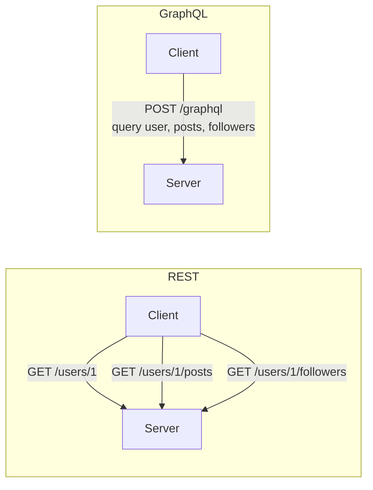
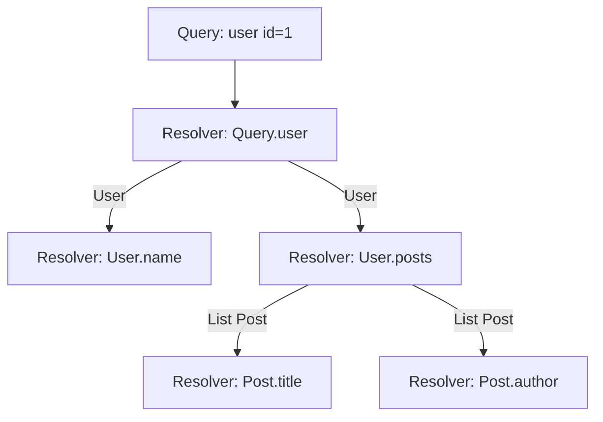
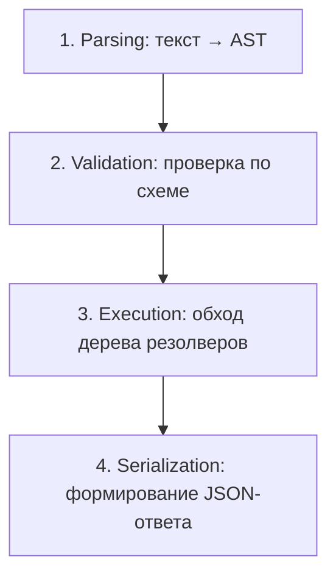
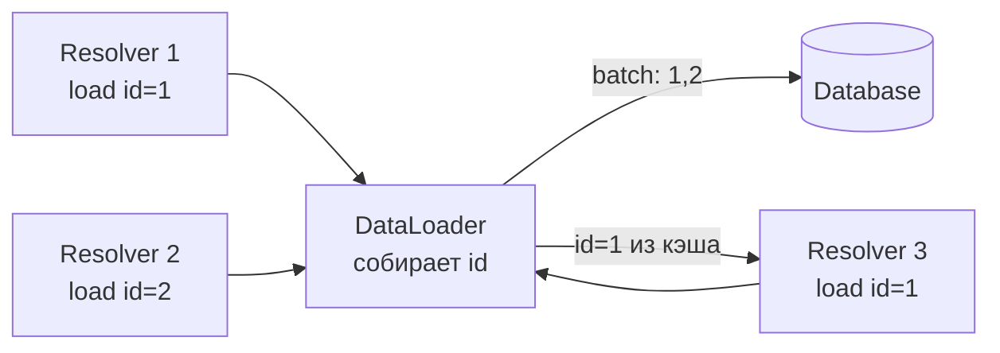
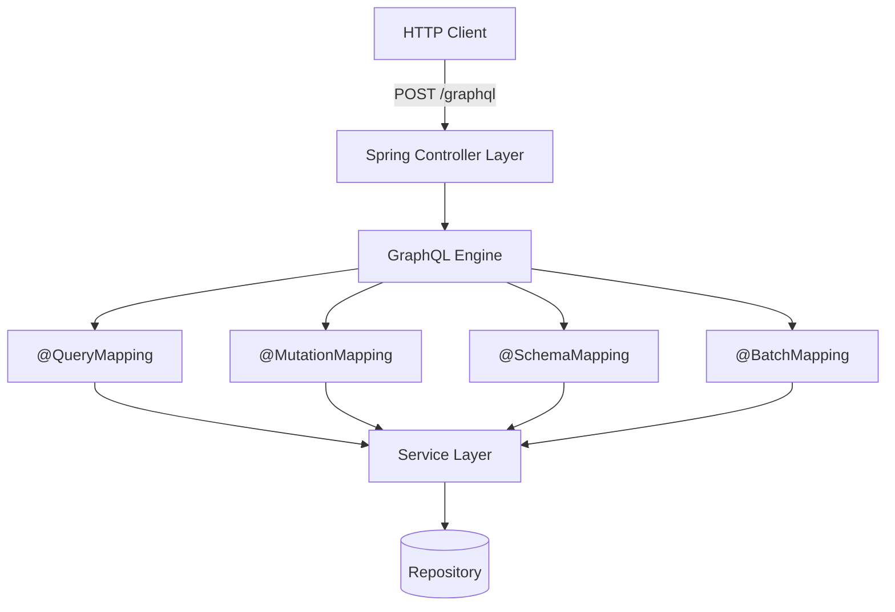
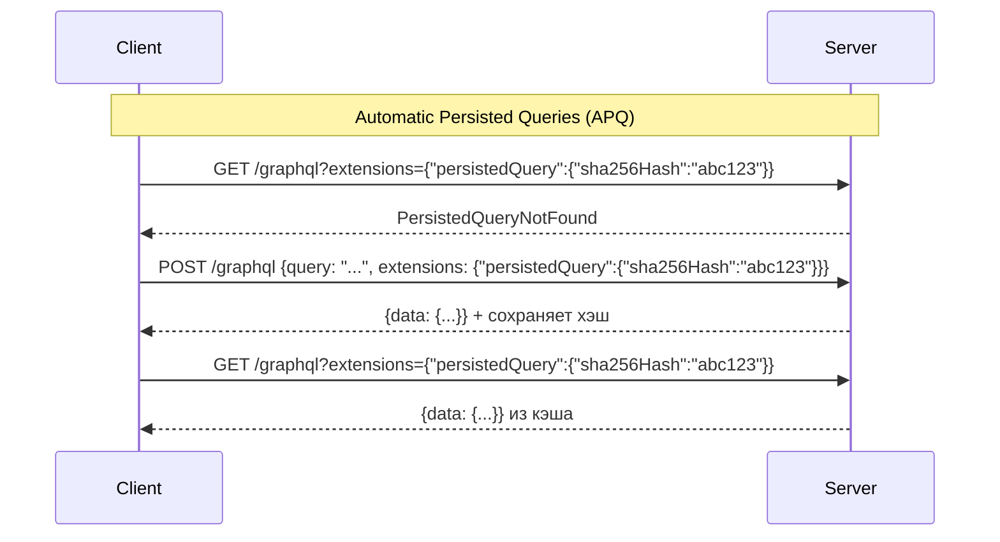
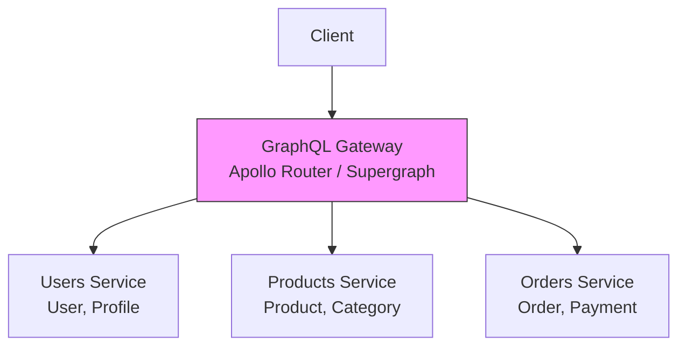
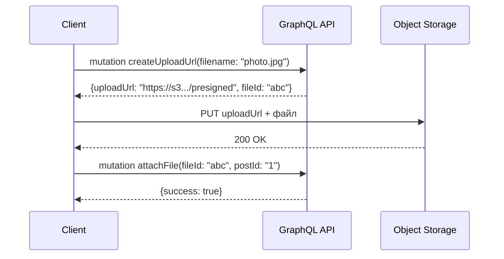
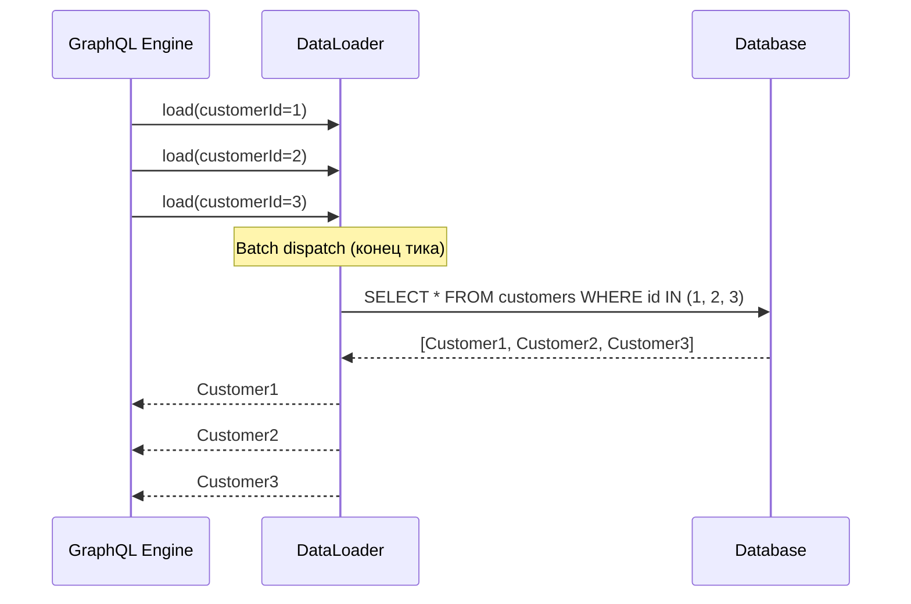

# Вопросы на собеседовании: `GraphQL`

Практичные вопросы и ответы по `GraphQL`: от базовых концепций схемы и типов до продвинутых тем -- `DataLoader`, пагинация, федерация, безопасность и интеграция с `Spring Boot`.

## Полезные ссылки

### Официальная документация

- [GraphQL — Official Docs](https://graphql.org/learn/) — основная документация по спецификации
- [GraphQL Specification](https://spec.graphql.org/draft/) — актуальная спецификация
- [Spring for GraphQL Reference](https://docs.spring.io/spring-graphql/reference/) — Spring-интеграция
- [Getting Started with GraphQL and Spring Boot — Baeldung](https://www.baeldung.com/spring-graphql) — пошаговое руководство
- [Introduction to GraphQL — Baeldung](https://www.baeldung.com/graphql) — обзорная статья
- [GraphQL vs REST — Baeldung](https://www.baeldung.com/graphql-vs-rest) — сравнение подходов
- [Error Handling in GraphQL — Baeldung](https://www.baeldung.com/spring-graphql-error-handling) — обработка ошибок
- [Pagination in Spring Boot GraphQL — Baeldung](https://www.baeldung.com/spring-boot-graphql-pagination) — пагинация

## Содержание

- [Полезные ссылки](#полезные-ссылки)
- [See also](#see-also)

**Основы GraphQL**
- [Q1. (!) Что такое GraphQL и чем он отличается от REST?](#q1-что-такое-graphql-и-чем-он-отличается-от-rest)
- [Q2. Что такое Schema Definition Language (SDL)?](#q2-что-такое-schema-definition-language-sdl)
- [Q3. (!) Какие типы данных существуют в GraphQL?](#q3-какие-типы-данных-существуют-в-graphql)
- [Q4. Что такое Input-типы и зачем они нужны?](#q4-что-такое-input-типы-и-зачем-они-нужны)

**Запросы, мутации и подписки**
- [Q5. (!) Как устроены Query, Mutation и Subscription?](#q5-как-устроены-query-mutation-и-subscription)
- [Q6. Что такое переменные и директивы в GraphQL?](#q6-что-такое-переменные-и-директивы-в-graphql)
- [Q7. Что такое фрагменты и зачем они нужны?](#q7-что-такое-фрагменты-и-зачем-они-нужны)
- [Q8. Как работают Inline Fragments и Union-типы?](#q8-как-работают-inline-fragments-и-union-типы)

**Резолверы и выполнение запросов**
- [Q9. (!) Что такое резолверы и как они работают?](#q9-что-такое-резолверы-и-как-они-работают)
- [Q10. Как GraphQL выполняет запрос (execution model)?](#q10-как-graphql-выполняет-запрос-execution-model)
- [Q11. (!) Что такое проблема N+1 в GraphQL и как её решить?](#q11-что-такое-проблема-n1-в-graphql-и-как-её-решить)
- [Q12. Как работает DataLoader?](#q12-как-работает-dataloader)

**Пагинация**
- [Q13. (!) Какие подходы к пагинации существуют в GraphQL?](#q13-какие-подходы-к-пагинации-существуют-в-graphql)
- [Q14. Что такое Relay-спецификация для пагинации (Connections)?](#q14-что-такое-relay-спецификация-для-пагинации-connections)

**Обработка ошибок и интроспекция**
- [Q15. Как устроена обработка ошибок в GraphQL?](#q15-как-устроена-обработка-ошибок-в-graphql)
- [Q16. Что такое интроспекция и зачем она нужна?](#q16-что-такое-интроспекция-и-зачем-она-нужна)

**GraphQL vs REST**
- [Q17. (!) Когда выбирать GraphQL, а когда REST?](#q17-когда-выбирать-graphql-а-когда-rest)
- [Q18. Какие основные проблемы REST решает GraphQL?](#q18-какие-основные-проблемы-rest-решает-graphql)

**Spring for GraphQL**
- [Q19. (!) Как работает Spring for GraphQL?](#q19-как-работает-spring-for-graphql)
- [Q20. Как определить контроллер в Spring for GraphQL?](#q20-как-определить-контроллер-в-spring-for-graphql)
- [Q21. Как подключить DataLoader в Spring for GraphQL?](#q21-как-подключить-dataloader-в-spring-for-graphql)

**Безопасность**
- [Q22. (!) Какие угрозы безопасности специфичны для GraphQL?](#q22-какие-угрозы-безопасности-специфичны-для-graphql)
- [Q23. Как ограничить глубину и сложность запросов?](#q23-как-ограничить-глубину-и-сложность-запросов)

**Кэширование и производительность**
- [Q24. Почему кэширование в GraphQL сложнее, чем в REST?](#q24-почему-кэширование-в-graphql-сложнее-чем-в-rest)
- [Q25. Что такое Persisted Queries?](#q25-что-такое-persisted-queries)

**Масштабирование и архитектура**
- [Q26. (!) Что такое GraphQL Federation?](#q26-что-такое-graphql-federation)
- [Q27. Чем Federation отличается от Schema Stitching?](#q27-чем-federation-отличается-от-schema-stitching)
- [Q28. Schema-first vs Code-first: в чём разница?](#q28-schema-first-vs-code-first-в-чём-разница)

**Продвинутые темы**
- [Q29. Как реализовать загрузку файлов в GraphQL?](#q29-как-реализовать-загрузку-файлов-в-graphql)
- [Q30. (!) Как организовать батчинг запросов?](#q30-как-организовать-батчинг-запросов)

**Продвинутые темы**
- [Q31. (!) Как работают GraphQL Subscriptions и как их реализовать в Spring?](#q31--как-работают-graphql-subscriptions-и-как-их-реализовать-в-spring)
- [Q32. Что такое @defer и @stream директивы в GraphQL?](#q32-что-такое-defer-и-stream-директивы-в-graphql)
- [Q33. (!) Как решить проблему N+1 с помощью DataLoader в Spring for GraphQL?](#q33--как-решить-проблему-n1-с-помощью-dataloader-в-spring-for-graphql)

**Дополнительные темы**
- [Q34. Что такое Persisted Queries и зачем они нужны?](#q34-что-такое-persisted-queries-и-зачем-они-нужны)
- [Q35. Как масштабировать GraphQL Subscriptions через WebSocket?](#q35-как-масштабировать-graphql-subscriptions-через-websocket)
- [Q36. Чем Schema Stitching отличается от Federation и почему Federation предпочтительнее?](#q36-чем-schema-stitching-отличается-от-federation-и-почему-federation-предпочтительнее)
- [Q37. Как реализовать rate limiting в GraphQL через ограничение сложности запроса?](#q37-как-реализовать-rate-limiting-в-graphql-через-ограничение-сложности-запроса)
- [Q38. Как устроена обработка ошибок в GraphQL: partial responses и поле errors?](#q38-как-устроена-обработка-ошибок-в-graphql-partial-responses-и-поле-errors)
- [Q39. (!) Как работает Apollo Federation 2 и что такое subgraph schemas?](#q39--как-работает-apollo-federation-2-и-что-такое-subgraph-schemas)
- [Q40. GraphQL vs REST vs gRPC: когда что выбирать?](#q40-graphql-vs-rest-vs-grpc-когда-что-выбирать)

---

## Q1. (!) Что такое GraphQL и чем он отличается от REST?

**`GraphQL`** -- это язык запросов для API и среда выполнения этих запросов, разработанная Facebook в 2012 году и опубликованная в 2015 году. В отличие от `REST`, клиент сам определяет, какие данные ему нужны.

**Ключевые отличия:**

| Критерий | REST | GraphQL |
|----------|------|---------|
| Эндпоинт | Множество (`/users`, `/posts`) | Один (`/graphql`) |
| Формат ответа | Фиксирован сервером | Определяется клиентом |
| Over-fetching | Часто -- сервер возвращает всё | Нет -- клиент берёт только нужное |
| Under-fetching | Часто -- нужно несколько запросов | Нет -- один запрос на граф данных |
| Версионирование | Через URL или заголовки | Эволюция схемы без версий |
| Кэширование | Простое (HTTP-кэш по URL) | Сложное (нужны спец. решения) |
| Типизация | Нет стандарта (OpenAPI опционально) | Строгая типизация через схему |



**Что хочет услышать интервьюер:** GraphQL решает проблемы over-fetching и under-fetching, но вводит собственные сложности -- кэширование, безопасность запросов, learning curve. Это не замена REST, а альтернативный подход, оптимальный для графовых данных и разнородных клиентов (мобильные, веб, IoT).

---

## Q2. Что такое Schema Definition Language (SDL)?

**`SDL`** (Schema Definition Language) -- язык описания схемы `GraphQL`. Схема является контрактом между клиентом и сервером, определяя типы данных, операции и их связи.

```graphql
type Author {
    id: ID!
    name: String!
    books: [Book!]!
}

type Book {
    id: ID!
    title: String!
    publishedYear: Int
    author: Author!
}

type Query {
    book(id: ID!): Book
    books(limit: Int = 10): [Book!]!
    author(id: ID!): Author
}

type Mutation {
    createBook(input: CreateBookInput!): Book!
    deleteBook(id: ID!): Boolean!
}

input CreateBookInput {
    title: String!
    publishedYear: Int
    authorId: ID!
}
```

**Основные элементы SDL:**
- **Скалярные типы:** `Int`, `Float`, `String`, `Boolean`, `ID` (+ пользовательские: `DateTime`, `BigDecimal`)
- **`!`** -- non-null модификатор (поле обязательно)
- **`[Type]`** -- список, `[Type!]!` -- обязательный список обязательных элементов
- **`input`** -- специальный тип для входных данных мутаций
- **`enum`** -- перечисления
- **`interface`** и **`union`** -- полиморфизм

---

## Q3. (!) Какие типы данных существуют в GraphQL?

`GraphQL` имеет строгую систему типов, которая является основой схемы:

**1. Скалярные типы (Scalar):**
```graphql
scalar DateTime    # пользовательский скаляр

type Example {
    id: ID!         # уникальный идентификатор (сериализуется как String)
    name: String!   # строка в UTF-8
    age: Int        # 32-битное целое
    rating: Float   # число с плавающей точкой (double)
    active: Boolean # true/false
    createdAt: DateTime  # пользовательский
}
```

**2. Object-типы** -- основной строительный блок:
```graphql
type User {
    id: ID!
    email: String!
    posts: [Post!]!
}
```

**3. Enum-типы:**
```graphql
enum Role {
    ADMIN
    USER
    MODERATOR
}
```

**4. Interface и Union:**
```graphql
interface Node {
    id: ID!
}

type User implements Node {
    id: ID!
    name: String!
}

union SearchResult = User | Post | Comment
```

**5. Input-типы** (для аргументов мутаций):
```graphql
input UserFilter {
    role: Role
    active: Boolean
}
```

**Модификаторы типов:**
- `String` -- nullable строка
- `String!` -- non-null строка
- `[String]` -- nullable список nullable строк
- `[String!]!` -- non-null список non-null строк

---

## Q4. Что такое Input-типы и зачем они нужны?

**`Input`-типы** -- специальные типы для передачи структурированных данных в аргументы запросов и мутаций. Они отличаются от обычных Object-типов: input-типы не могут содержать поля с аргументами и не могут реализовывать интерфейсы.

```graphql
input CreateUserInput {
    name: String!
    email: String!
    role: Role = USER    # значение по умолчанию
}

input UpdateUserInput {
    name: String
    email: String
    role: Role
}

type Mutation {
    createUser(input: CreateUserInput!): User!
    updateUser(id: ID!, input: UpdateUserInput!): User!
}
```

**Почему нельзя использовать обычные типы как аргументы:** обычные Object-типы могут содержать циклические ссылки и поля с резолверами, что делает их непригодными для входных данных. `Input`-типы -- это чистые структуры данных без логики.

**Паттерн на практике:** для каждой мутации создают свой input-тип (`CreateXInput`, `UpdateXInput`), что позволяет различать обязательные поля для создания и опциональные поля для обновления.

---

## Q5. (!) Как устроены Query, Mutation и Subscription?

Три корневых типа определяют входные точки в `GraphQL` API:

**`Query`** -- чтение данных (аналог `GET` в REST):
```graphql
type Query {
    user(id: ID!): User
    users(filter: UserFilter, page: Int, size: Int): [User!]!
    searchUsers(term: String!): [User!]!
}
```

**`Mutation`** -- изменение данных (аналог `POST`/`PUT`/`DELETE`):
```graphql
type Mutation {
    createUser(input: CreateUserInput!): User!
    updateUser(id: ID!, input: UpdateUserInput!): User!
    deleteUser(id: ID!): Boolean!
}
```

**`Subscription`** -- подписка на события в реальном времени (через `WebSocket`):
```graphql
type Subscription {
    userCreated: User!
    messageAdded(chatId: ID!): Message!
}
```

**Важные различия:**

| Аспект | Query | Mutation | Subscription |
|--------|-------|----------|--------------|
| Выполнение | Параллельное | Последовательное | Потоковое |
| Побочные эффекты | Нет | Да (только top-level) | Нет (получение событий) |
| Транспорт | HTTP | HTTP | WebSocket / SSE |

**Ключевой момент по спецификации:** мутации на верхнем уровне выполняются **последовательно** (в отличие от query, где поля могут выполняться параллельно). Это гарантирует предсказуемый порядок побочных эффектов.

---

## Q6. Что такое переменные и директивы в GraphQL?

### Переменные

Переменные позволяют параметризировать запросы, отделяя данные от структуры запроса:

```graphql
query GetUser($userId: ID!, $withPosts: Boolean!) {
    user(id: $userId) {
        name
        email
        posts @include(if: $withPosts) {
            title
        }
    }
}
```

Переменные передаются отдельно как JSON:
```json
{
    "userId": "42",
    "withPosts": true
}
```

### Директивы

**Встроенные директивы:**
- **`@include(if: Boolean)`** -- включить поле, если условие `true`
- **`@skip(if: Boolean)`** -- пропустить поле, если условие `true`
- **`@deprecated(reason: String)`** -- пометить поле как устаревшее (на стороне схемы)

```graphql
type User {
    id: ID!
    name: String!
    username: String @deprecated(reason: "Используйте поле name")
}
```

**Пользовательские директивы** (на уровне схемы):
```graphql
directive @auth(role: Role!) on FIELD_DEFINITION

type Query {
    users: [User!]! @auth(role: ADMIN)
    publicPosts: [Post!]!
}
```

---

## Q7. Что такое фрагменты и зачем они нужны?

**Фрагменты** -- переиспользуемые наборы полей, которые устраняют дублирование в запросах:

```graphql
fragment UserBasicInfo on User {
    id
    name
    email
    avatarUrl
}

query {
    currentUser {
        ...UserBasicInfo
        role
    }
    teamMembers {
        ...UserBasicInfo
        joinedAt
    }
}
```

**Когда использовать фрагменты:**
- Одинаковые наборы полей в нескольких запросах
- Компонентный подход на фронтенде: каждый UI-компонент объявляет свой фрагмент с нужными данными
- Сокращение размера запросов

**Важно:** фрагмент всегда привязан к конкретному типу (`on User`), что даёт проверку типов на этапе валидации запроса.

---

## Q8. Как работают Inline Fragments и Union-типы?

**Union-типы** позволяют полю возвращать один из нескольких типов:

```graphql
union SearchResult = User | Post | Comment

type Query {
    search(term: String!): [SearchResult!]!
}
```

Для работы с union/interface используют **inline fragments**:

```graphql
query {
    search(term: "java") {
        ... on User {
            name
            email
        }
        ... on Post {
            title
            content
        }
        ... on Comment {
            text
            author {
                name
            }
        }
        __typename   # мета-поле: возвращает имя типа
    }
}
```

**`__typename`** -- мета-поле, доступное для любого Object-типа, которое возвращает имя конкретного типа. Клиентские библиотеки (Apollo, Relay) используют его для нормализации кэша.

---

## Q9. (!) Что такое резолверы и как они работают?

**Резолвер** -- это функция, которая отвечает за получение данных для конкретного поля в схеме. Каждое поле в `GraphQL`-схеме имеет соответствующий резолвер.



**Аргументы резолвера** (четыре стандартных):

1. **`parent`** (root) -- результат родительского резолвера
2. **`args`** -- аргументы, переданные полю
3. **`context`** -- общий контекст запроса (аутентификация, DataLoader, соединения с БД)
4. **`info`** -- метаданные о запросе (дерево полей, фрагменты)

**Пример на Java (Spring for GraphQL):**

```java
@Controller
public class BookController {

    @QueryMapping
    public Book book(@Argument Long id) {
        return bookRepository.findById(id).orElse(null);
    }

    @SchemaMapping(typeName = "Book", field = "author")
    public Author author(Book book) {
        return authorRepository.findById(book.getAuthorId());
    }
}
```

**Default resolvers:** если для поля не определён явный резолвер, `GraphQL` использует тривиальный резолвер, который просто читает одноимённое свойство из parent-объекта (аналог геттера в Java).

---

## Q10. Как GraphQL выполняет запрос (execution model)?

Выполнение `GraphQL`-запроса -- это обход дерева полей сверху вниз:



**Детали этапа Execution:**

1. Начинается с корневого типа (`Query`, `Mutation`, `Subscription`)
2. Для каждого поля вызывается соответствующий резолвер
3. Результат резолвера передаётся как `parent` дочерним резолверам
4. Скалярные поля (листья) возвращают конечные значения
5. Для `Query` поля верхнего уровня могут выполняться **параллельно**
6. Для `Mutation` поля верхнего уровня выполняются **последовательно**

**Обход до листьев:** `GraphQL` engine гарантирует, что каждое запрошенное поле будет разрешено до скалярного значения. Если резолвер возвращает объект, engine продолжает обход по вложенным полям.

---

## Q11. (!) Что такое проблема N+1 в GraphQL и как её решить?

**Проблема N+1** -- классическая проблема производительности, когда для загрузки списка из N элементов выполняется 1 запрос на список + N запросов на связанные данные.

**Пример:**
```graphql
query {
    books {          # 1 запрос: SELECT * FROM books
        title
        author {     # N запросов: SELECT * FROM authors WHERE id = ?
            name     #   для каждой книги отдельный запрос
        }
    }
}
```

Если в базе 100 книг, будет выполнено 1 + 100 = 101 SQL-запрос.

**Решения:**

| Подход | Описание | Когда использовать |
|--------|----------|--------------------|
| `DataLoader` | Батчинг + кэширование запросов | Стандартный подход |
| `JOIN FETCH` | Загрузка в одном SQL-запросе | Простые случаи, один уровень |
| `@BatchMapping` | Spring for GraphQL батч-маппинг | Spring-проекты |
| Look-ahead | Анализ запроса до выполнения | Продвинутая оптимизация |

**DataLoader превращает N+1 в 1+1:**
```
Без DataLoader:
SELECT * FROM books                    -- 1 запрос
SELECT * FROM authors WHERE id = 1     -- N запросов
SELECT * FROM authors WHERE id = 2
SELECT * FROM authors WHERE id = 3
...

С DataLoader:
SELECT * FROM books                    -- 1 запрос
SELECT * FROM authors WHERE id IN (1, 2, 3, ...)  -- 1 запрос
```

---

## Q12. Как работает DataLoader?

**`DataLoader`** -- это утилита, созданная Facebook, которая решает проблему N+1 через два механизма: **батчинг** и **кэширование**.

**Принцип работы:**



1. Резолверы вызывают `dataLoader.load(key)` -- запрос откладывается
2. В конце "тика" (event loop tick) все накопленные ключи передаются в batch-функцию
3. Batch-функция делает один запрос за все ключи (например, `WHERE id IN (...)`)
4. Результаты раздаются по исходным промисам
5. Повторный запрос с тем же ключом отдаётся из кэша (per-request)

**Реализация на Java:**

```java
@Configuration
public class DataLoaderConfig {

    @Bean
    public BatchLoaderRegistry batchLoaderRegistry(AuthorRepository repo) {
        return registry -> registry
            .forTypePair(Long.class, Author.class)
            .registerMappedBatchLoader((authorIds, env) -> {
                // Один запрос вместо N
                Map<Long, Author> authors = repo.findAllById(authorIds)
                    .stream()
                    .collect(Collectors.toMap(Author::getId, a -> a));
                return Mono.just(authors);
            });
    }
}
```

**Важно:** `DataLoader` создаётся **per-request**, чтобы кэш не утекал между запросами разных пользователей.

---

## Q13. (!) Какие подходы к пагинации существуют в GraphQL?

В `GraphQL` применяются два основных подхода к пагинации:

### 1. Offset-based (страничная)

```graphql
type Query {
    books(page: Int = 0, size: Int = 10): BookPage!
}

type BookPage {
    content: [Book!]!
    totalElements: Int!
    totalPages: Int!
    hasNext: Boolean!
}
```

**Плюсы:** простота, возможность перехода на произвольную страницу.
**Минусы:** нестабильна при вставке/удалении (можно пропустить или продублировать элементы), плохо масштабируется (OFFSET в SQL дорогой).

### 2. Cursor-based (курсорная, Relay-стиль)

```graphql
type Query {
    books(first: Int, after: String, last: Int, before: String): BookConnection!
}

type BookConnection {
    edges: [BookEdge!]!
    pageInfo: PageInfo!
}

type BookEdge {
    node: Book!
    cursor: String!   # opaque cursor (обычно base64 от ID)
}

type PageInfo {
    hasNextPage: Boolean!
    hasPreviousPage: Boolean!
    startCursor: String
    endCursor: String
}
```

**Плюсы:** стабильна при мутациях данных, эффективна для бесконечной прокрутки, хорошо масштабируется.
**Минусы:** нельзя "прыгнуть" на произвольную страницу, сложнее в реализации.

**Рекомендация:** для публичных API и мобильных приложений предпочтительна cursor-based пагинация. Для админ-панелей с таблицами -- offset-based может быть удобнее.

---

## Q14. Что такое Relay-спецификация для пагинации (Connections)?

**Relay Connection Specification** -- стандарт пагинации, разработанный Facebook для библиотеки Relay, который стал де-факто стандартом в `GraphQL`.

**Требования спецификации:**

1. **Connection** -- тип с полями `edges` и `pageInfo`
2. **Edge** -- содержит `node` (сам элемент) и `cursor`
3. **PageInfo** -- содержит `hasNextPage`, `hasPreviousPage`, `startCursor`, `endCursor`
4. **Аргументы:** `first`/`after` (вперёд) и `last`/`before` (назад)

**Реализация в Spring for GraphQL:**

```java
@Controller
public class BookController {

    @QueryMapping
    public Connection<Book> books(
            @Argument int first,
            @Argument String after) {
        // Spring for GraphQL поддерживает scroll-based пагинацию
        ScrollSubrange subrange = ScrollSubrange.create(
            ScrollPosition.forward(after), first, true);
        Window<Book> window = bookRepository.findBy(subrange);
        return ConnectionAdapter.from(window);
    }
}
```

**Global Object Identification** -- ещё одна часть Relay-спецификации: каждый объект должен иметь глобально уникальный `id` и быть доступен через поле `node(id: ID!)`.

---

## Q15. Как устроена обработка ошибок в GraphQL?

В отличие от `REST`, `GraphQL` **всегда возвращает HTTP 200**, даже при ошибках. Ошибки передаются в отдельном массиве `errors`:

```json
{
    "data": {
        "user": null
    },
    "errors": [
        {
            "message": "User not found",
            "locations": [{"line": 2, "column": 3}],
            "path": ["user"],
            "extensions": {
                "classification": "NOT_FOUND",
                "code": "USER_NOT_FOUND"
            }
        }
    ]
}
```

**Типы ошибок:**

| Тип | Когда | HTTP-аналог |
|-----|-------|-------------|
| Синтаксическая | Некорректный запрос | 400 |
| Валидация | Поле не существует в схеме | 400 |
| Runtime | Ошибка в резолвере | 500 |
| Бизнес-логика | Нет прав, не найден | 4xx |

**Spring for GraphQL -- обработка ошибок:**

```java
@Controller
public class BookController {

    @QueryMapping
    public Book book(@Argument Long id) {
        return bookRepository.findById(id)
            .orElseThrow(() -> new BookNotFoundException(id));
    }
}

// Кастомный exception resolver
@Component
public class CustomExceptionResolver extends DataFetcherExceptionResolverAdapter {

    @Override
    protected GraphQLError resolveToSingleError(
            Throwable ex, DataFetchingEnvironment env) {
        if (ex instanceof BookNotFoundException) {
            return GraphqlErrorBuilder.newError(env)
                .message(ex.getMessage())
                .errorType(ErrorType.NOT_FOUND)
                .build();
        }
        return null; // вернёт стандартную ошибку
    }
}
```

**Частичные ответы** -- уникальная особенность `GraphQL`: ответ может содержать и `data`, и `errors` одновременно. Успешно разрешённые поля вернут данные, а сломавшиеся -- `null` с ошибкой.

---

## Q16. Что такое интроспекция и зачем она нужна?

**Интроспекция** -- возможность запрашивать у `GraphQL`-сервера информацию о его схеме. Это встроенная функциональность, позволяющая клиентам динамически узнавать структуру API.

```graphql
# Запрос всех типов в схеме
{
    __schema {
        types {
            name
            kind
        }
    }
}

# Запрос полей конкретного типа
{
    __type(name: "User") {
        name
        fields {
            name
            type {
                name
                kind
            }
        }
    }
}
```

**Применения интроспекции:**
- **IDE и инструменты:** GraphiQL, Apollo Studio, Insomnia используют интроспекцию для автодополнения
- **Генерация кода:** клиентские генераторы (codegen) строят типы по схеме
- **Документация:** автоматическая генерация документации API

**Безопасность:** в production интроспекцию **рекомендуется отключать**, так как она раскрывает всю структуру API потенциальному злоумышленнику.

**Spring for GraphQL -- отключение интроспекции:**
```yaml
spring:
  graphql:
    schema:
      introspection:
        enabled: false
```

---

## Q17. (!) Когда выбирать GraphQL, а когда REST?

**Выбирайте `GraphQL`, когда:**
- Разнородные клиенты (мобильное приложение, SPA, IoT) с разными потребностями в данных
- Сложные связанные данные (графовая модель)
- Частые изменения требований к API на стороне фронтенда
- Нужна строгая типизация и самодокументирующийся API
- Проблемы over-fetching/under-fetching критичны (ограниченный трафик на мобильных)

**Выбирайте `REST`, когда:**
- Простой CRUD без сложных связей
- Критично HTTP-кэширование (CDN, прокси)
- Загрузка/скачивание файлов как основной сценарий
- Команда не имеет опыта с `GraphQL`
- Микросервисная коммуникация (здесь лучше подходит [[grpc-interview|gRPC]])
- Публичный API с широкой аудиторией (REST более распространён)

**Гибридный подход** на практике распространён: `REST` для простых CRUD-операций и загрузки файлов, `GraphQL` для сложных запросов к данным, [[grpc-interview|gRPC]] для inter-service коммуникации.

---

## Q18. Какие основные проблемы REST решает GraphQL?

**1. Over-fetching** -- сервер возвращает избыточные данные:
```
REST:  GET /users/1  →  { id, name, email, address, phone, avatar, settings, ... }
GraphQL: query { user(id: 1) { name, email } }  →  только нужные поля
```

**2. Under-fetching** -- для одного экрана нужно несколько запросов:
```
REST:  GET /users/1  →  GET /users/1/posts  →  GET /users/1/followers
GraphQL: один запрос — все данные за раз
```

**3. Версионирование** -- в `REST` приходится создавать `/v1/`, `/v2/`, в `GraphQL` схема эволюционирует:
```graphql
type User {
    name: String!       # новое поле
    fullName: String @deprecated(reason: "Используйте name")  # старое помечено
}
```

**4. Документация** -- схема `GraphQL` является самодокументирующимся контрактом, инструменты автоматически генерируют документацию через интроспекцию.

**Но `GraphQL` создаёт новые проблемы:** сложность кэширования, риски безопасности (произвольные запросы), сложность мониторинга (один эндпоинт), необходимость защиты от злонамеренных запросов.

---

## Q19. (!) Как работает Spring for GraphQL?

**`Spring for GraphQL`** -- официальный проект Spring для интеграции `GraphQL` в Spring-приложения. Пришёл на замену сторонним библиотекам (GraphQL Java Tools, GraphQL SPQR).

**Подключение:**
```groovy
// build.gradle
dependencies {
    implementation 'org.springframework.boot:spring-boot-starter-graphql'
    implementation 'org.springframework.boot:spring-boot-starter-web'
    // Для WebSocket subscriptions:
    // implementation 'org.springframework.boot:spring-boot-starter-websocket'
}
```

**Структура проекта:**
```
src/main/resources/
  graphql/
    schema.graphqls      # основная схема
    book.graphqls        # дополнительные файлы схемы (автоматически объединяются)
```

**Конфигурация:**
```yaml
spring:
  graphql:
    graphiql:
      enabled: true         # GraphiQL UI по /graphiql
    schema:
      locations: classpath:graphql/
      printer:
        enabled: true       # endpoint для получения SDL
    websocket:
      path: /graphql        # путь для WebSocket subscriptions
```



**Ключевые аннотации:**
- `@QueryMapping` -- резолвер для Query-полей
- `@MutationMapping` -- резолвер для Mutation-полей
- `@SubscriptionMapping` -- резолвер для Subscription-полей
- `@SchemaMapping` -- резолвер для поля произвольного типа
- `@BatchMapping` -- батч-резолвер (решает N+1)
- `@Argument` -- привязка аргументов GraphQL к параметрам метода

---

## Q20. Как определить контроллер в Spring for GraphQL?

**Аннотированный контроллер (основной подход):**

```java
@Controller
public class BookController {

    private final BookService bookService;

    // Query: books(page: Int, size: Int): BookPage!
    @QueryMapping
    public List<Book> books(@Argument int page, @Argument int size) {
        return bookService.findAll(PageRequest.of(page, size));
    }

    // Query: book(id: ID!): Book
    @QueryMapping
    public Book book(@Argument Long id) {
        return bookService.findById(id);
    }

    // Mutation: createBook(input: CreateBookInput!): Book!
    @MutationMapping
    public Book createBook(@Argument CreateBookInput input) {
        return bookService.create(input);
    }

    // Поле Book.author (вместо отдельного резолвера)
    @SchemaMapping(typeName = "Book")
    public Author author(Book book) {
        return authorService.findById(book.getAuthorId());
    }

    // Batch-вариант для решения N+1
    @BatchMapping(typeName = "Book")
    public Map<Book, Author> author(List<Book> books) {
        List<Long> authorIds = books.stream()
            .map(Book::getAuthorId)
            .distinct()
            .toList();
        Map<Long, Author> authors = authorService.findAllById(authorIds)
            .stream()
            .collect(Collectors.toMap(Author::getId, a -> a));
        return books.stream()
            .collect(Collectors.toMap(b -> b, b -> authors.get(b.getAuthorId())));
    }
}
```

**Subscription (с WebSocket):**

```java
@Controller
public class MessageController {

    @SubscriptionMapping
    public Flux<Message> messageAdded(@Argument Long chatId) {
        return messageService.subscribe(chatId);
    }
}
```

**Контекст безопасности** -- Spring Security интегрируется прозрачно:

```java
@QueryMapping
public User currentUser(@AuthenticationPrincipal UserDetails user) {
    return userService.findByUsername(user.getUsername());
}
```

---

## Q21. Как подключить DataLoader в Spring for GraphQL?

**`Spring for GraphQL`** предоставляет два подхода:

### 1. @BatchMapping (рекомендуемый)

Самый простой способ -- Spring автоматически создаёт `DataLoader`:

```java
@Controller
public class BookController {

    @BatchMapping(typeName = "Book", field = "author")
    public Mono<Map<Book, Author>> author(List<Book> books) {
        Set<Long> ids = books.stream()
            .map(Book::getAuthorId)
            .collect(Collectors.toSet());
        return authorRepository.findAllById(ids)
            .collectMap(Author::getId)
            .map(authorsById -> books.stream()
                .collect(Collectors.toMap(
                    b -> b,
                    b -> authorsById.get(b.getAuthorId())
                )));
    }
}
```

### 2. Ручная регистрация через BatchLoaderRegistry

Для большего контроля:

```java
@Configuration
public class DataLoaderConfig {

    @Bean
    public RuntimeWiringConfigurer runtimeWiringConfigurer(
            BatchLoaderRegistry registry) {
        registry.forTypePair(Long.class, Author.class)
            .registerMappedBatchLoader((authorIds, env) ->
                Flux.fromIterable(authorRepository.findAllById(authorIds))
                    .collectMap(Author::getId));
        return wiringBuilder -> {};
    }
}
```

Использование в контроллере:

```java
@SchemaMapping(typeName = "Book")
public CompletableFuture<Author> author(
        Book book,
        DataLoader<Long, Author> authorDataLoader) {
    return authorDataLoader.load(book.getAuthorId());
}
```

**`@BatchMapping` предпочтительнее**, так как Spring сам управляет жизненным циклом `DataLoader` и не требует ручной конфигурации.

---

## Q22. (!) Какие угрозы безопасности специфичны для GraphQL?

`GraphQL` API имеет уникальный набор угроз, связанных с гибкостью запросов:

**1. Глубоко вложенные запросы (Depth Attack):**
```graphql
# Злоумышленник может создать запрос, который рекурсивно обходит связи
query {
    user(id: 1) {
        friends {
            friends {
                friends {
                    friends { ... }  # бесконечная вложенность
                }
            }
        }
    }
}
```

**2. Широкие запросы (Breadth Attack):**
```graphql
query {
    a1: users(first: 1000) { name }
    a2: users(first: 1000) { name }
    # ... тысячи алиасов
    a100: users(first: 1000) { name }
}
```

**3. Интроспекция** -- раскрытие всей схемы API злоумышленнику.

**4. Injection** -- если аргументы не валидируются, возможны SQL/NoSQL injection.

**5. Batching attack** -- множество мутаций (например, попыток входа) в одном запросе.

**Меры защиты:**

| Мера | Описание |
|------|----------|
| Depth limiting | Ограничение максимальной глубины запроса |
| Query complexity | Оценка стоимости запроса по весам полей |
| Rate limiting | Ограничение частоты запросов |
| Persisted queries | Белый список разрешённых запросов |
| Timeout | Ограничение времени выполнения |
| Отключение интроспекции | В production |
| Валидация входных данных | Для всех аргументов |
| Аутентификация/авторизация | На уровне резолверов |

---

## Q23. Как ограничить глубину и сложность запросов?

### Ограничение глубины (Max Depth)

```java
@Configuration
public class GraphQLConfig {

    @Bean
    public RuntimeWiringConfigurer configurer() {
        return builder -> {};
    }

    @Bean
    public GraphQlSourceBuilderCustomizer sourceBuilderCustomizer() {
        return builder -> builder.configureGraphQl(graphQlBuilder ->
            graphQlBuilder.executionIdProvider(ExecutionIdProvider.DEFAULT)
        );
    }
}
```

С использованием `graphql-java` instrumentation:

```java
@Bean
public Instrumentation maxQueryDepthInstrumentation() {
    return new MaxQueryDepthInstrumentation(10); // макс. глубина = 10
}

@Bean
public Instrumentation maxQueryComplexityInstrumentation() {
    return new MaxQueryComplexityInstrumentation(200); // макс. сложность = 200
}
```

### Анализ сложности (Query Complexity)

Каждому полю назначается "вес". Суммарная сложность запроса не должна превышать лимит:

```graphql
# Пример весов:
# скалярное поле = 1
# объектное поле = 2
# список = 5 * кол-во элементов

query {
    users(first: 100) {  # 5 * 100 = 500
        name             # 1
        posts {          # 2
            title        # 1
        }
    }
}
# Итого: 500 + 100*(1 + 2 + 1) = 900
```

**Директивы `@cost` и `@listSize`** (из спецификации GraphQL Demand Control):
```graphql
type Query {
    users(first: Int): [User!]! @listSize(assumedSize: 50)
}

type User {
    name: String!
    profile: Profile! @cost(weight: 3)  # дорогая операция
}
```

---

## Q24. Почему кэширование в GraphQL сложнее, чем в REST?

В `REST` каждый ресурс имеет уникальный URL, что позволяет использовать стандартный HTTP-кэш (браузер, CDN, прокси). В `GraphQL` все запросы идут на один эндпоинт `POST /graphql`, и HTTP-кэш не работает.

**Проблемы:**
- Один URL для всех запросов -- HTTP-кэш по URL бесполезен
- `POST`-запросы не кэшируются по умолчанию
- Каждый клиент запрашивает разный набор полей
- Один объект может быть частью разных запросов

**Решения:**

**1. Client-side нормализованный кэш** (Apollo Client, Relay):
- Каждый объект с `id` + `__typename` кэшируется отдельно
- При повторном запросе данные берутся из кэша
- При мутации автоматически обновляются связанные запросы

**2. Server-side кэширование по полям:**
```java
@QueryMapping
@Cacheable("books")
public List<Book> books() {
    return bookRepository.findAll();
}
```

**3. Persisted Queries** -- позволяют использовать `GET`-запросы и HTTP-кэш.

**4. CDN-кэширование** -- возможно с Automatic Persisted Queries (APQ), где запрос идентифицируется хэшем.

---

## Q25. Что такое Persisted Queries?

**Persisted Queries** -- механизм, при котором `GraphQL`-запросы регистрируются на сервере заранее, а клиент отправляет только идентификатор (хэш) запроса вместо полного текста.

**Процесс:**


**Преимущества:**
- **Безопасность:** сервер принимает только зарегистрированные запросы (белый список)
- **Производительность:** меньший размер запросов, возможность `GET`-запросов
- **HTTP-кэширование:** `GET`-запросы можно кэшировать на CDN
- **Защита от DoS:** произвольные запросы отклоняются

**Режимы:**
- **Automatic Persisted Queries (APQ)** -- клиент отправляет хэш, при промахе -- полный запрос (Apollo)
- **Registered Operations** -- только заранее зарегистрированные запросы, произвольные запрещены (строгий режим для production)

---

## Q26. (!) Что такое GraphQL Federation?

**`GraphQL Federation`** -- архитектурный подход для построения единого `GraphQL` API из нескольких микросервисов, каждый из которых управляет своей частью схемы.



**Ключевые концепции:**

**1. Subgraph** -- отдельный `GraphQL`-сервис со своей частью схемы:
```graphql
# Users Subgraph
type User @key(fields: "id") {
    id: ID!
    name: String!
    email: String!
}
```

**2. Entity** -- тип, который может быть расширен другими subgraph'ами. Директива `@key` определяет уникальный идентификатор:
```graphql
# Orders Subgraph — расширяет User
type User @key(fields: "id") {
    id: ID!
    orders: [Order!]!  # добавляет поле orders к User
}
```

**3. Gateway (Router)** -- точка входа, которая объединяет subgraph'ы в единую схему (supergraph), маршрутизирует запросы и собирает ответы.

**Преимущества:**
- Каждая команда владеет своим subgraph (team ownership)
- Независимый деплой сервисов
- Единый API для клиентов
- Инкрементальная миграция с монолита

---

## Q27. Чем Federation отличается от Schema Stitching?

**`Schema Stitching`** и **`Federation`** решают одну задачу -- объединение нескольких `GraphQL`-сервисов в один API, но принципиально разными способами.

| Аспект | Schema Stitching | Federation |
|--------|-----------------|------------|
| Где логика объединения | В gateway (централизованно) | В subgraph'ах (декларативно) |
| Связи между типами | Gateway знает, как связать | `@key`, `@extends` в схемах сервисов |
| Независимость сервисов | Низкая (gateway всё контролирует) | Высокая (каждый сервис самодостаточен) |
| Масштабируемость | Плохая (gateway = bottleneck) | Хорошая (gateway тонкий) |
| Команда разработки | Нужна централизованная | Каждая команда независимо |
| Зрелость | Старый подход | Современный стандарт (Apollo) |

**Schema Stitching** -- gateway загружает схемы удалённых сервисов и вручную "сшивает" их:
```javascript
// Gateway должен знать, как связать User с Orders
const schema = stitchSchemas({
    subschemas: [usersSchema, ordersSchema],
    typeMergingConfig: { ... }  // ручная конфигурация
});
```

**Federation** -- сервисы декларативно описывают, как они расширяют общие типы:
```graphql
# Каждый subgraph самодостаточен, gateway разбирается автоматически
type User @key(fields: "id") {
    id: ID!
    orders: [Order!]!
}
```

**Рекомендация:** Federation -- предпочтительный подход для новых проектов. Schema Stitching оправдан для интеграции legacy-сервисов.

---

## Q28. Schema-first vs Code-first: в чём разница?

Два подхода к разработке `GraphQL` API:

### Schema-first (SDL-first)

Сначала пишется SDL-схема, затем реализуются резолверы:

```graphql
# schema.graphqls -- пишется первым
type Query {
    book(id: ID!): Book
}

type Book {
    id: ID!
    title: String!
    author: Author!
}
```

```java
// Контроллер привязывается к схеме
@Controller
public class BookController {
    @QueryMapping
    public Book book(@Argument Long id) { ... }
}
```

**Плюсы:** схема как контракт, удобно для командной работы, фронтенд может начать работу до реализации бэкенда.
**Минусы:** дублирование (схема + Java-классы), ошибки рассинхронизации.

### Code-first

Схема генерируется из аннотированного Java-кода:

```java
// Схема генерируется автоматически из аннотаций
@GraphQLApi
public class BookApi {
    @Query
    public Book book(@Argument Long id) { ... }
}

@Type
public class Book {
    private Long id;
    private String title;
    private Author author;
}
```

**Плюсы:** единственный источник правды -- код, нет рассинхронизации, IDE-поддержка.
**Минусы:** схема менее читаема для не-Java разработчиков, сложнее использовать как контракт.

| Критерий | Schema-first | Code-first |
|----------|-------------|------------|
| Spring for GraphQL | Да (основной подход) | Нет (нужна SPQR или DGS) |
| Netflix DGS | Да | Да |
| GraphQL SPQR | Нет | Да (основной подход) |
| Команда | Кросс-функциональная | Java-only |

**Spring for GraphQL** использует **schema-first** подход, что считается рекомендуемой практикой.

---

## Q29. Как реализовать загрузку файлов в GraphQL?

Спецификация `GraphQL` не определяет механизм загрузки файлов. Существует несколько подходов:

### 1. Multipart Request (graphql-multipart-request-spec)

```graphql
scalar Upload

type Mutation {
    uploadFile(file: Upload!): FileInfo!
}
```

```java
// Spring for GraphQL не поддерживает Upload из коробки
// Используется с DGS или кастомным скаляром
@MutationMapping
public FileInfo uploadFile(@Argument MultipartFile file) {
    String path = storageService.store(file);
    return new FileInfo(path, file.getOriginalFilename(), file.getSize());
}
```

### 2. Signed URL (рекомендуемый подход)

```graphql
type Mutation {
    createUploadUrl(filename: String!, contentType: String!): UploadUrl!
}

type UploadUrl {
    uploadUrl: String!     # pre-signed URL для PUT
    fileId: String!
}
```



**Рекомендация:** используйте signed URL для файлов. `GraphQL` оптимизирован для структурированных данных, а не для бинарных потоков. Подробнее о работе с REST-эндпоинтами для загрузки файлов -- в [[http-rest-interview|вопросах по HTTP & REST]].

---

## Q30. (!) Как организовать батчинг запросов?

**Батчинг** позволяет клиенту отправить несколько `GraphQL`-операций в одном HTTP-запросе:

```json
[
    {
        "query": "query { user(id: 1) { name } }",
        "operationName": "GetUser"
    },
    {
        "query": "query { books { title } }",
        "operationName": "GetBooks"
    }
]
```

Сервер возвращает массив ответов в том же порядке:
```json
[
    { "data": { "user": { "name": "Alice" } } },
    { "data": { "books": [{ "title": "GraphQL in Action" }] } }
]
```

**Преимущества:**
- Уменьшение количества HTTP round-trips
- Снижение overhead на установку соединений
- Особенно полезно для мобильных клиентов с высоким latency

**Риски и ограничения:**
- **Безопасность:** злоумышленник может отправить сотни операций в одном запросе (batching attack)
- **Timeout:** одна медленная операция блокирует весь batch
- **Сложность мониторинга:** сложнее отслеживать производительность отдельных операций

**Защита:**
```java
// Ограничение количества операций в batch
@Bean
public WebGraphQlInterceptor batchLimitInterceptor() {
    return (request, chain) -> {
        // Проверка размера batch (для кастомного batch endpoint)
        return chain.next(request);
    };
}
```

**Альтернатива батчингу:** `@defer` и `@stream` директивы (экспериментальные), которые позволяют серверу отправлять части ответа по мере готовности, не дожидаясь завершения всех резолверов. Подробнее об оптимизации API-запросов -- в [[microservices-interview|вопросах по микросервисам]].

## Q31. (!) Как работают GraphQL Subscriptions и как их реализовать в Spring?

**GraphQL Subscriptions** — механизм получения данных в реальном времени. Клиент подписывается на событие, сервер отправляет обновления при каждом наступлении события.

**Транспорт:** обычно `WebSocket` (протокол `graphql-ws` или устаревший `subscriptions-transport-ws`).

**Схема:**

```graphql
type Subscription {
    orderStatusChanged(orderId: ID!): OrderStatusEvent!
    newOrderPlaced: Order!
}

type OrderStatusEvent {
    orderId: ID!
    oldStatus: OrderStatus!
    newStatus: OrderStatus!
    timestamp: String!
}
```

**Реализация в Spring for GraphQL:**

```java
@Controller
public class OrderSubscriptionController {

    private final Sinks.Many<OrderStatusEvent> orderEventSink =
        Sinks.many().multicast().onBackpressureBuffer();

    // Resolver для подписки
    @SubscriptionMapping
    public Flux<OrderStatusEvent> orderStatusChanged(@Argument String orderId) {
        return orderEventSink.asFlux()
            .filter(event -> event.orderId().equals(orderId))
            .timeout(Duration.ofMinutes(30));  // авто-отключение через 30 мин
    }

    // Публикация события при изменении статуса заказа
    @EventListener
    public void onOrderStatusChanged(OrderStatusChangedEvent event) {
        orderEventSink.tryEmitNext(new OrderStatusEvent(
            event.orderId(), event.oldStatus(), event.newStatus(),
            Instant.now().toString()
        ));
    }
}
```

**Конфигурация WebSocket в Spring:**

```yaml
spring:
  graphql:
    websocket:
      path: /graphql-ws
      connection-init-timeout: 60s
```

**Клиентский запрос (через `graphql-ws` протокол):**

```javascript
const client = createClient({ url: 'ws://localhost:8080/graphql-ws' });

client.subscribe(
  {
    query: `subscription OnOrderStatus($orderId: ID!) {
      orderStatusChanged(orderId: $orderId) {
        oldStatus newStatus timestamp
      }
    }`,
    variables: { orderId: '123' }
  },
  {
    next: (data) => console.log('Status update:', data),
    error: (err) => console.error('Subscription error:', err),
    complete: () => console.log('Subscription complete')
  }
);
```

**Subscription vs SSE vs WebSocket:**

| Критерий | GraphQL Subscription | SSE | WebSocket |
|----------|---------------------|-----|-----------|
| Направление | Двунаправленное (WS) | Сервер → клиент | Двунаправленное |
| Типизация | Да (схема GraphQL) | Нет | Нет |
| Сложность | Средняя | Низкая | Средняя |
| Применение | Real-time UI обновления | Уведомления, feeds | Чат, игры |

## Q32. Что такое @defer и @stream директивы в GraphQL?

**`@defer`** и **`@stream`** — экспериментальные директивы, позволяющие серверу отправлять части ответа **инкрементально** по мере готовности, не дожидаясь полного выполнения всех резолверов.

**`@defer` — отложить фрагмент:**

```graphql
query GetOrder {
  order(id: "123") {
    id
    status           # ← возвращается сразу

    ... @defer {
      customer {     # ← возвращается позже (медленный сервис)
        name
        email
      }
    }

    ... @defer(label: "analytics") {
      analytics {   # ← возвращается ещё позже
        viewCount
        lastViewed
      }
    }
  }
}
```

**Ответ сервера (multipart/mixed):**

```
--graphql
Content-Type: application/json

{"data": {"order": {"id": "123", "status": "SHIPPED"}}, "hasNext": true}

--graphql
Content-Type: application/json

{"incremental": [{"path": ["order"], "data": {"customer": {"name": "Alice"}}}], "hasNext": true}

--graphql
Content-Type: application/json

{"incremental": [{"path": ["order"], "label": "analytics", "data": {"analytics": {...}}}], "hasNext": false}
--graphql--
```

**`@stream` — потоковые списки:**

```graphql
query GetOrders {
  orders @stream {  # каждый элемент отправляется по мере готовности
    id
    status
  }
}
```

**Статус поддержки:**
- Директивы в статусе **RFC** в GraphQL spec (не финализированы)
- Spring for GraphQL 1.2+ имеет экспериментальную поддержку
- Требует HTTP/2 или chunked transfer encoding

**Когда полезно:**
- Страница со множеством независимых виджетов (dashboard)
- Длинные списки данных
- Когда часть данных доступна быстро, часть — медленно

## Q33. (!) Как решить проблему N+1 с помощью DataLoader в Spring for GraphQL?

**Проблема N+1:** при загрузке N заказов с клиентами — N отдельных SQL-запросов к таблице пользователей.

```graphql
query {
  orders {           # 1 запрос → 10 заказов
    id
    customer {       # 10 запросов → 10 пользователей (N+1!)
      name
    }
  }
}
```

**DataLoader** — батчинг загрузчик: собирает все `customerId` за один "тик" event loop и делает один запрос `IN (id1, id2, ..., idN)`.

**Полная реализация в Spring for GraphQL:**

```java
// 1. Определяем BatchLoaderRegistry
@Configuration
public class DataLoaderConfig {

    @Bean
    public BatchLoaderRegistry batchLoaderRegistry(CustomerRepository repo) {
        return BatchLoaderRegistry.newInstance()
            .forTypePair(Long.class, CustomerDto.class)
            .withName("customerLoader")
            .registerMappedBatchLoader((customerIds, env) -> {
                // Один запрос вместо N
                List<Customer> customers = repo.findAllById(customerIds);
                return Mono.just(customers.stream()
                    .collect(Collectors.toMap(
                        c -> c.getId(),
                        c -> new CustomerDto(c.getId(), c.getName(), c.getEmail())
                    )));
            });
    }
}

// 2. Используем в резолвере
@Controller
public class OrderController {

    @QueryMapping
    public List<Order> orders() {
        return orderRepository.findAll();
    }

    // Резолвер поля customer — вызывается для каждого Order
    @SchemaMapping(typeName = "Order", field = "customer")
    public CompletableFuture<CustomerDto> customer(
            Order order,
            DataLoader<Long, CustomerDto> customerLoader) {
        // DataLoader накапливает IDs и делает batch-запрос
        return customerLoader.load(order.getCustomerId());
    }
}
```

**Что происходит под капотом:**



**Результат:** вместо 1 + N запросов — ровно 2 запроса (1 на заказы + 1 батч на клиентов).

**Кэширование в DataLoader:** по умолчанию DataLoader кэширует результаты в рамках одного запроса — повторные `load(id)` возвращают закэшированный результат без повторного обращения к БД.

## Q34. Что такое Persisted Queries и зачем они нужны?

**Persisted Queries** — механизм, при котором GraphQL-запрос сохраняется на сервере под хешем (APQ, Automatic Persisted Queries). Клиент отправляет только хеш; сервер возвращает `PERSISTED_QUERY_NOT_FOUND`, если не знает запрос, и тогда клиент досылает полный текст.

**Зачем нужны:**
- **Безопасность** — разрешить только заранее зарегистрированные запросы (whitelist), запретить произвольный GraphQL
- **Производительность** — экономия трафика: вместо 5 KB текста запроса — 64-байтный SHA-256
- **Кэширование** — GET-запрос с хешем можно кэшировать на CDN как обычный REST-ресурс

**Два варианта реализации:**

| Вариант | Описание |
|---------|----------|
| APQ (Automatic) | Клиент посылает хеш, сервер кэширует текст; Apollo Client поддерживает из коробки |
| Static Persisted Queries | Запросы компилируются во время сборки клиента и регистрируются на сервере; в проде клиент шлёт только ID |

**Пример APQ-запроса:**
```http
GET /graphql?extensions={"persistedQuery":{"version":1,"sha256Hash":"abc123..."}}
```

**В Spring for GraphQL:** поддержки APQ из коробки нет — реализуют через кастомный `WebGraphQlInterceptor`, кэширующий запросы в Redis по хешу.

**Когда использовать:** публичные GraphQL API с высоким трафиком; приложения с требованиями безопасности (финтех); CDN-кэширование read-only запросов.

## Q35. Как масштабировать GraphQL Subscriptions через WebSocket?

**GraphQL Subscriptions** работают поверх `WebSocket` (реже — `SSE`). Масштабирование сложнее, чем у обычных запросов, так как `WebSocket` — stateful соединение.

**Проблема горизонтального масштабирования:**

```
Client --WS--> Node1   \
                        > Разные ноды не знают о подписках друг друга
Client --WS--> Node2   /
```

**Решения:**

1. **Sticky sessions** — все WebSocket-соединения клиента попадают на одну ноду (nginx `ip_hash`). Простое решение, но неравномерная нагрузка.

2. **Pub/Sub через Redis** — каждый сервер публикует события в Redis-канал, все серверы подписаны и рассылают нужным клиентам:

```java
// Spring WebSocket + Redis pub/sub
@Service
public class SubscriptionService {
    private final RedisTemplate<String, Object> redisTemplate;

    public Flux<OrderStatus> orderUpdates(String orderId) {
        return Flux.create(sink -> {
            MessageListenerAdapter adapter = new MessageListenerAdapter(
                (MessageListener) (message, pattern) -> {
                    OrderStatus status = deserialize(message.getBody());
                    sink.next(status);
                });
            redisTemplate.execute(connection -> {
                connection.subscribe(adapter, ("order:" + orderId).getBytes());
                return null;
            }, true);
        });
    }
}
```

3. **Dedicated WebSocket Gateway** — специализированный сервис для Subscriptions (например, Hasura, Ably); основной сервис публикует события через Kafka/Redis.

**Рекомендации:**
- Ограничивать количество активных подписок на пользователя
- Реализовать heartbeat (`keep-alive`) для детектирования разорванных соединений
- Мониторить активные WebSocket-соединения и память
- Рассмотреть SSE как более простую альтернативу для односторонних обновлений

## Q36. Чем Schema Stitching отличается от Federation и почему Federation предпочтительнее?

**Schema Stitching** — старый подход: шлюз сам собирает единую схему из нескольких GraphQL API, делегируя запросы в нужный сервис. Реализован в `graphql-tools`.

**Apollo Federation** — современный подход: каждый сервис (subgraph) публикует собственную схему с аннотациями (`@key`, `@extends`); шлюз (Router) автоматически строит federated schema.

**Сравнение:**

| Критерий | Schema Stitching | Apollo Federation |
|----------|-----------------|-------------------|
| Координация | На шлюзе — шлюз знает всё | Распределённая — каждый subgraph декларирует свои типы |
| Добавление нового сервиса | Изменение конфига шлюза | Subgraph регистрируется в Registry |
| Отказоустойчивость | Шлюз — единая точка сложности | Supergraph schema строится автоматически |
| Поддержка | Deprecated в пользу Federation | Активно развивается, CNCF-проект |
| Независимые деплои | Сложно | Да, каждый subgraph деплоится отдельно |

**Пример Federation 2:**

```graphql
# users subgraph
type User @key(fields: "id") {
  id: ID!
  name: String!
  email: String!
}

# orders subgraph — расширяет тип User
type User @key(fields: "id") @extends {
  id: ID! @external
  orders: [Order!]!
}

type Order {
  id: ID!
  total: Float!
}
```

**Почему Federation предпочтительнее:** каждая команда владеет своим subgraph и деплоит независимо; Router (Apollo Router) обеспечивает query planning; есть Schema Registry для управления версиями контракта.

## Q37. Как реализовать rate limiting в GraphQL через ограничение сложности запроса?

В GraphQL нет стандартного механизма rate limiting по URL. Ограничение строится на двух уровнях:

**1. Query Depth — ограничение глубины вложенности:**

```graphql
# Потенциально опасный запрос (глубина 10+)
{ user { friends { friends { friends { friends { ... } } } } } }
```

```java
// Spring for GraphQL — кастомный Instrumentation
@Component
public class MaxDepthInstrumentation extends SimplePerformantInstrumentation {
    private static final int MAX_DEPTH = 7;

    @Override
    public DocumentAndVariables instrumentDocumentAndVariables(
            DocumentAndVariables dav, InstrumentationDocumentParameters params,
            InstrumentationState state) {
        int depth = calculateDepth(dav.getDocument());
        if (depth > MAX_DEPTH) {
            throw new QueryDepthException("Query depth " + depth + " exceeds max " + MAX_DEPTH);
        }
        return dav;
    }
}
```

**2. Query Complexity — штрафные очки за поля:**

```java
// Назначаем веса полям схемы
FieldComplexityCalculator calculator = (env, childComplexity) -> {
    String field = env.getFieldDefinition().getName();
    return switch (field) {
        case "users" -> 10 + childComplexity * 2;  // дорогой список
        case "user"  -> 1 + childComplexity;
        default      -> 1 + childComplexity;
    };
};

GraphQL graphQL = GraphQL.newGraphQL(schema)
    .queryExecutionStrategy(new AsyncExecutionStrategy())
    .instrumentation(new ChainedInstrumentation(List.of(
        new MaxQueryComplexityInstrumentation(100),   // макс. 100 очков
        new MaxQueryDepthInstrumentation(7)
    )))
    .build();
```

**3. Rate limiting по IP / токену через API Gateway:**

```yaml
# Kong / nginx — rate limit на /graphql endpoint
rate_limit:
  per_minute: 60
  per_second: 10
```

**Best practice:** комбинировать все три уровня: depth limit (7-10), complexity limit (100-200), и token bucket на уровне Gateway. Персистированные запросы дополнительно позволяют разрешить только известные запросы.

## Q38. Как устроена обработка ошибок в GraphQL: partial responses и поле errors?

**Ключевое отличие от REST:** GraphQL всегда возвращает `HTTP 200`, даже при ошибках. Ошибки идут в поле `errors`, данные — в поле `data`.

**Структура ответа с ошибкой:**

```json
{
  "data": {
    "user": {
      "id": "1",
      "name": "Alice",
      "orders": null
    }
  },
  "errors": [
    {
      "message": "Failed to load orders",
      "locations": [{"line": 4, "column": 5}],
      "path": ["user", "orders"],
      "extensions": {
        "code": "SERVICE_UNAVAILABLE",
        "classification": "DataFetchingException"
      }
    }
  ]
}
```

**Partial response:** если один резолвер упал, остальные поля возвращаются успешно. `data.user.orders = null`, но `data.user.name` есть — это частичный ответ. Клиент должен проверять и `data`, и `errors`.

**Типы ошибок в GraphQL:**

| Тип | Когда | Поведение |
|-----|-------|-----------|
| Syntax error | Невалидный запрос | `data: null`, errors |
| Validation error | Запрос не соответствует схеме | `data: null`, errors |
| Resolver error | Ошибка при выполнении | Частичный `data`, errors |
| Network error | Недоступен сервер | HTTP 5xx |

**Обработка в Spring for GraphQL:**

```java
@Component
public class CustomExceptionResolver implements DataFetcherExceptionResolver {

    @Override
    public Mono<List<GraphQLError>> resolveException(Throwable ex,
            DataFetchingEnvironment env) {
        if (ex instanceof NotFoundException e) {
            GraphQLError error = GraphqlErrorBuilder.newError(env)
                .message(e.getMessage())
                .errorType(ErrorType.NOT_FOUND)
                .extensions(Map.of("code", "NOT_FOUND"))
                .build();
            return Mono.just(List.of(error));
        }
        // Для неизвестных исключений — скрыть детали от клиента
        GraphQLError error = GraphqlErrorBuilder.newError(env)
            .message("Internal error")
            .errorType(ErrorType.INTERNAL_ERROR)
            .build();
        return Mono.just(List.of(error));
    }
}
```

**Best practices:**
- Никогда не пробрасывать стектрейс в поле `message` в проде
- Использовать `extensions.code` для машиночитаемых кодов ошибок
- Не злоупотреблять partial responses — если данные критичны, пробрасывать ошибку выше

## Q39. (!) Как работает Apollo Federation 2 и что такое subgraph schemas?

**Apollo Federation 2** — архитектурный подход для построения распределённых GraphQL API из нескольких независимых сервисов.

**Ключевые компоненты:**

```
Client → Apollo Router (Supergraph) → subgraph-1 (Users)
                                    → subgraph-2 (Orders)
                                    → subgraph-3 (Products)
```

**Директивы Federation 2:**

| Директива | Назначение |
|-----------|-----------|
| `@key` | Объявить тип как entity с уникальным ключом |
| `@shareable` | Разрешить определение поля в нескольких subgraphs |
| `@external` | Поле определено в другом subgraph |
| `@requires` | Резолвер требует поля из другого subgraph |
| `@provides` | Subgraph может предоставить поля другого типа |
| `@override` | Переопределить поле из другого subgraph |

**Пример: Users subgraph:**

```graphql
# users subgraph schema
extend schema @link(url: "https://specs.apollo.dev/federation/v2.0",
                    import: ["@key", "@shareable"])

type Query {
  me: User
}

type User @key(fields: "id") {
  id: ID!
  username: String! @shareable
  email: String!
}
```

**Orders subgraph расширяет User:**

```graphql
# orders subgraph schema
type User @key(fields: "id") {
  id: ID!
  orders(first: Int = 10): [Order!]!
}

type Order {
  id: ID!
  total: Float!
  status: OrderStatus!
}

# Resolver для __resolveReference
@Component
public class UserResolver {
    @SchemaMapping(typeName = "User", field = "orders")
    public List<Order> orders(User user) {
        return orderRepository.findByUserId(user.getId());
    }
}
```

**Query Planning:** Router получает запрос клиента, строит plan выполнения, делает параллельные запросы в нужные subgraphs и сшивает ответы.

**Schema Registry (Apollo Studio):** хранит схемы всех subgraphs, проверяет совместимость при деплое нового subgraph (schema checks), генерирует supergraph schema.

**На собеседовании:** Federation решает проблему владения схемой — каждая команда владеет своим subgraph и деплоит независимо. Это критично при 10+ микросервисах с GraphQL API.

## Q40. GraphQL vs REST vs gRPC: когда что выбирать?

**Сравнительная таблица:**

| Критерий | REST | GraphQL | gRPC |
|----------|------|---------|------|
| Клиент | Браузер, мобильный, сторонний | Браузер, мобильный (множество клиентов) | Backend-to-backend |
| Формат | JSON/XML | JSON | Protobuf (бинарный) |
| Контракт | OpenAPI (опционально) | Schema (SDL) | `.proto` (обязательный) |
| Streaming | Ограниченный (SSE) | Subscriptions (WebSocket) | Нативный (4 типа) |
| Кэширование | Простое (HTTP-кэш) | Сложное (APQ, CDN) | Нет нативного |
| Типизация | Нет стандарта | Строгая | Строгая |
| Производительность | Средняя | Средняя | Высокая |
| Браузерная поддержка | Отличная | Отличная | gRPC-Web (через proxy) |
| Learning curve | Низкий | Средний | Средний |

**Когда выбирать REST:**
- Публичный API для сторонних разработчиков
- Простые CRUD-операции
- Необходимо HTTP-кэширование из коробки
- Нет строгих требований к производительности

**Когда выбирать GraphQL:**
- Разнородные клиенты с разными потребностями в данных (мобильный vs веб)
- Сложный граф данных с множеством связей
- BFF (Backend for Frontend) — один API для нескольких клиентов
- Нужна гибкость: клиент сам решает, какие поля запрашивать

**Когда выбирать gRPC:**
- Высоконагруженное межсервисное взаимодействие внутри кластера
- Streaming данных (телеметрия, события)
- Строгий контракт и генерация кода обязательны
- Latency критична (protobuf на 5-10x компактнее JSON)

**Гибридный подход (рекомендуемый):**

```
Mobile/Web Client → GraphQL API → (внутри) gRPC → Microservices
External Partners → REST API  → (внутри) gRPC → Microservices
```

GraphQL или REST — на внешнем слое (developer experience), gRPC — внутри инфраструктуры (производительность).

---

## See also

- [[http-rest-interview|HTTP и REST]] — сравнение REST и GraphQL: когда использовать каждый подход, over-fetching vs under-fetching, версионирование
- [[grpc-interview|gRPC]] — альтернатива GraphQL для высокопроизводительного межсервисного взаимодействия с типизированными контрактами
- [[microservices-interview|Микросервисная архитектура]] — GraphQL Federation как способ объединить несколько GraphQL-сервисов за одним endpoint
- [[api-gateway-interview|API Gateway]] — GraphQL-слой часто размещается за Gateway: аутентификация, rate limiting, маршрутизация
- [[spring-boot-interview|Spring Boot]] — интеграция Spring for GraphQL: аннотации `@QueryMapping`, `@MutationMapping`, контроллеры и DataLoader

- [[api-design-best-practices-interview|API Design Best Practices]]
- [[api-versioning-interview|API Versioning]]
- [[grpc-interview|gRPC]]
- [[http-rest-interview|HTTP и REST]]
- [[openapi-swagger-interview|OpenAPI / Swagger]]
- [[rest-maturity-interview|Richardson Maturity Model (REST)]]
