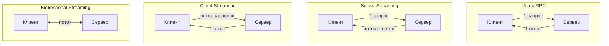
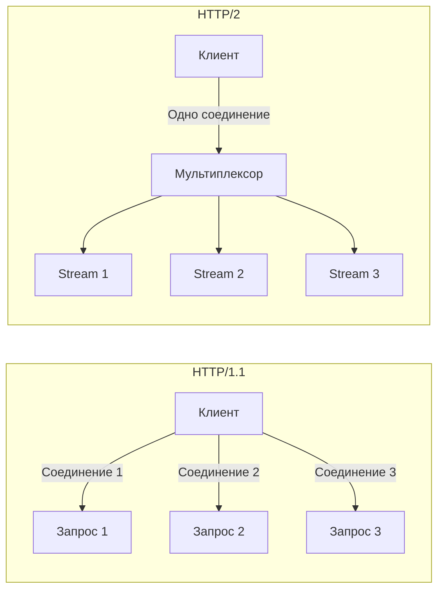
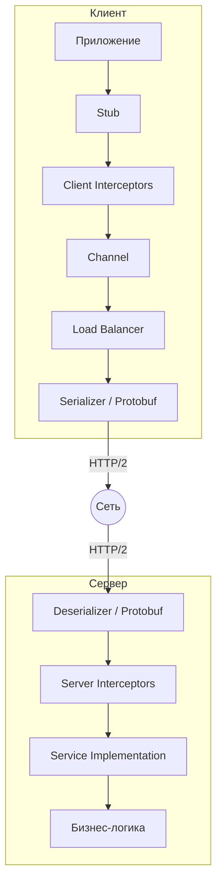
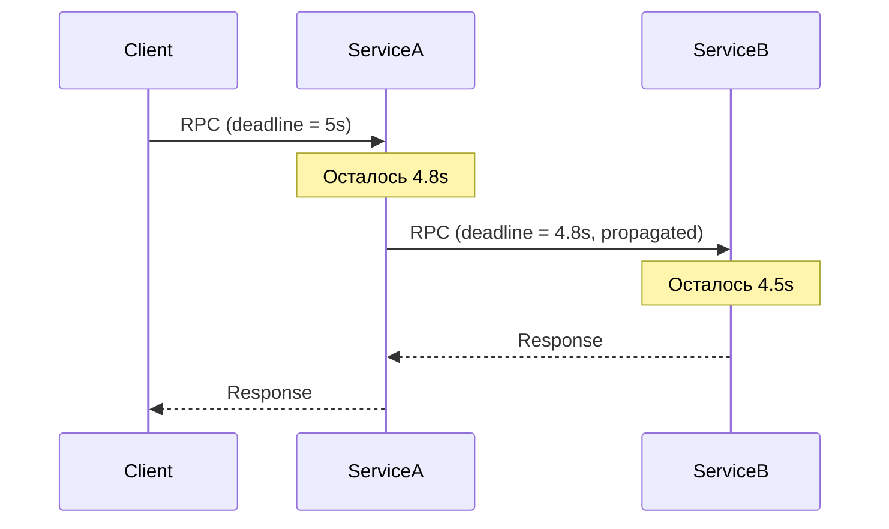
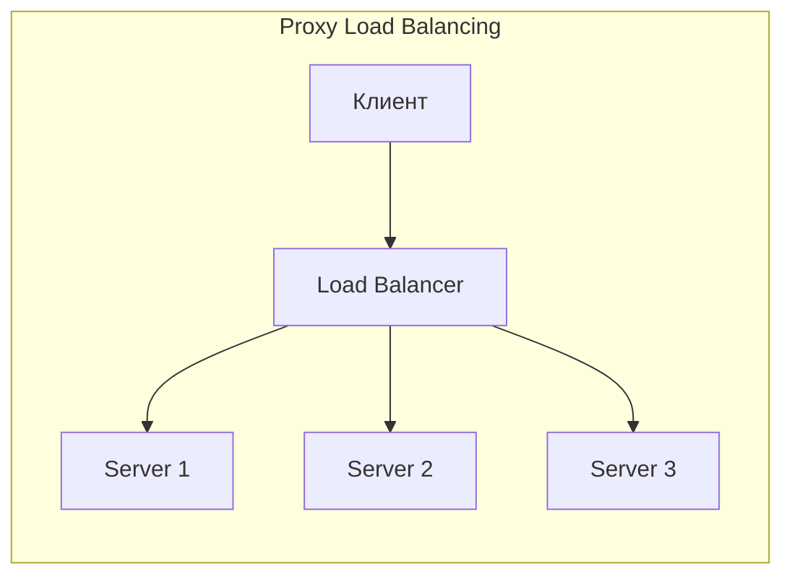
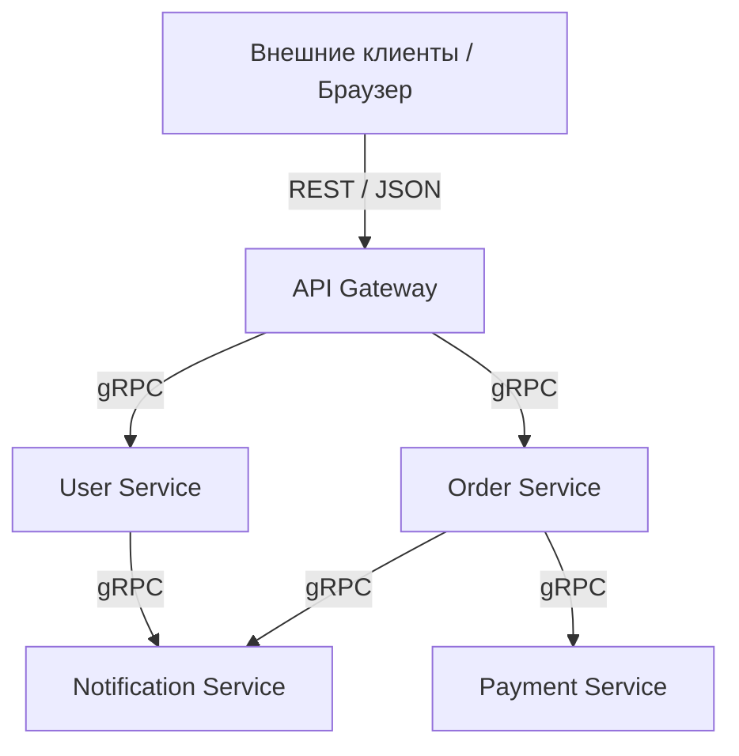

# Вопросы на собеседовании: `gRPC`

Практичные вопросы и ответы по `gRPC`: определение сервисов через `Protocol Buffers`, типы вызовов, streaming, интерсепторы, обработка ошибок, безопасность, интеграция со `Spring Boot` и сравнение с `REST`.

**`gRPC`** (gRPC Remote Procedure Call) — высокопроизводительный фреймворк удалённых вызовов процедур, разработанный Google. Использует `HTTP/2` для транспорта и `Protocol Buffers` для сериализации, что обеспечивает компактность данных и низкую задержку. Широко применяется в микросервисных архитектурах для межсервисного взаимодействия.

## Полезные ссылки

### Официальная документация

- [gRPC — Official Site](https://grpc.io/) — официальный сайт проекта
- [Core concepts, architecture and lifecycle](https://grpc.io/docs/what-is-grpc/core-concepts/) — ключевые концепции gRPC
- [gRPC Java Quick Start](https://grpc.io/docs/languages/java/quickstart/) — быстрый старт на Java
- [Protocol Buffers Language Guide (proto3)](https://protobuf.dev/programming-guides/proto3/) — спецификация proto3
- [gRPC Status Codes](https://grpc.io/docs/guides/status-codes/) — коды ошибок gRPC
- [Introduction to gRPC | Baeldung](https://www.baeldung.com/grpc-introduction) — введение в gRPC на Java
- [Introduction to gRPC with Spring Boot | Baeldung](https://www.baeldung.com/spring-boot-grpc) — gRPC + Spring Boot
- [Streaming with gRPC in Java | Baeldung](https://www.baeldung.com/java-grpc-streaming) — streaming в Java
- [Error Handling in gRPC | Baeldung](https://www.baeldung.com/grpcs-error-handling) — обработка ошибок

## Содержание

- [Полезные ссылки](#полезные-ссылки)
- [See also](#see-also)

**Основы gRPC**
- [Q1. (!) Что такое gRPC и какие проблемы он решает?](#q1--что-такое-grpc-и-какие-проблемы-он-решает)
- [Q2. (!) Что такое Protocol Buffers и зачем они нужны?](#q2--что-такое-protocol-buffers-и-зачем-они-нужны)
- [Q3. Как определить сервис в `.proto` файле?](#q3-как-определить-сервис-в-proto-файле)
- [Q4. Как происходит генерация кода из `.proto` файлов в Java?](#q4-как-происходит-генерация-кода-из-proto-файлов-в-java)
- [Q5. Что такое `Channel` и `Stub` в gRPC?](#q5-что-такое-channel-и-stub-в-grpc)

**Типы RPC вызовов**
- [Q6. (!) Какие типы RPC поддерживает gRPC?](#q6--какие-типы-rpc-поддерживает-grpc)
- [Q7. Как реализовать Server Streaming RPC?](#q7-как-реализовать-server-streaming-rpc)
- [Q8. Как реализовать Client Streaming RPC?](#q8-как-реализовать-client-streaming-rpc)
- [Q9. Как работает Bidirectional Streaming?](#q9-как-работает-bidirectional-streaming)

**Архитектура и транспорт**
- [Q10. (!) Почему gRPC использует HTTP/2 и какие преимущества это даёт?](#q10--почему-grpc-использует-http2-и-какие-преимущества-это-даёт)
- [Q11. Как работает мультиплексирование в HTTP/2 и как gRPC его использует?](#q11-как-работает-мультиплексирование-в-http2-и-как-grpc-его-использует)
- [Q12. Какова архитектура gRPC приложения?](#q12-какова-архитектура-grpc-приложения)

**Interceptors и Metadata**
- [Q13. (!) Что такое Interceptors в gRPC и зачем они нужны?](#q13--что-такое-interceptors-в-grpc-и-зачем-они-нужны)
- [Q14. Что такое Metadata в gRPC?](#q14-что-такое-metadata-в-grpc)

**Обработка ошибок**
- [Q15. (!) Как устроена обработка ошибок в gRPC?](#q15--как-устроена-обработка-ошибок-в-grpc)
- [Q16. Какие стандартные Status Codes существуют в gRPC?](#q16-какие-стандартные-status-codes-существуют-в-grpc)

**Deadlines, Timeouts и надёжность**
- [Q17. (!) Как работают Deadlines и Timeouts в gRPC?](#q17--как-работают-deadlines-и-timeouts-в-grpc)
- [Q18. Как настроить Retry Policy в gRPC?](#q18-как-настроить-retry-policy-в-grpc)

**Балансировка нагрузки и Service Discovery**
- [Q19. Какие модели балансировки нагрузки поддерживает gRPC?](#q19-какие-модели-балансировки-нагрузки-поддерживает-grpc)
- [Q20. Что такое Name Resolver в gRPC?](#q20-что-такое-name-resolver-в-grpc)

**Безопасность**
- [Q21. (!) Как обеспечить безопасность gRPC-соединений?](#q21--как-обеспечить-безопасность-grpc-соединений)
- [Q22. Как реализовать аутентификацию в gRPC?](#q22-как-реализовать-аутентификацию-в-grpc)

**gRPC и Spring Boot**
- [Q23. (!) Как интегрировать gRPC со Spring Boot?](#q23--как-интегрировать-grpc-со-spring-boot)
- [Q24. Как тестировать gRPC-сервисы?](#q24-как-тестировать-grpc-сервисы)

**Health Checking и Reflection**
- [Q25. Что такое gRPC Health Checking Protocol?](#q25-что-такое-grpc-health-checking-protocol)
- [Q26. Что такое Server Reflection и зачем она нужна?](#q26-что-такое-server-reflection-и-зачем-она-нужна)

**gRPC-Web и совместимость**
- [Q27. Что такое gRPC-Web и зачем он нужен?](#q27-что-такое-grpc-web-и-зачем-он-нужен)

**Сравнение и выбор**
- [Q28. (!) Чем gRPC отличается от REST?](#q28--чем-grpc-отличается-от-rest)
- [Q29. Как обеспечить обратную совместимость в Protocol Buffers?](#q29-как-обеспечить-обратную-совместимость-в-protocol-buffers)
- [Q30. Когда стоит использовать gRPC, а когда REST?](#q30-когда-стоит-использовать-grpc-а-когда-rest)

**Продвинутые темы**
- [Q31. (!) Как правильно управлять Channel и Stub в долгоживущих приложениях?](#q31--как-правильно-управлять-channel-и-stub-в-долгоживущих-приложениях)
- [Q32. Какие лучшие практики дизайна proto3 схем нужно знать?](#q32-какие-лучшие-практики-дизайна-proto3-схем-нужно-знать)
- [Q33. (!) Как организовать observability для gRPC-сервисов?](#q33--как-организовать-observability-для-grpc-сервисов)

**Экосистема и интеграции**
- [Q34. Что такое gRPC-Web и как он работает в браузерах?](#q34-что-такое-grpc-web-и-как-он-работает-в-браузерах)
- [Q35. (!) gRPC vs REST vs GraphQL: сравнение и выбор протокола?](#q35--grpc-vs-rest-vs-graphql-сравнение-и-выбор-протокола)
- [Q36. Правила backwards compatibility в Protocol Buffers: как эволюционировать схему?](#q36-правила-backwards-compatibility-в-protocol-buffers-как-эволюционировать-схему)
- [Q37. Как настроить gRPC load balancing в Kubernetes?](#q37-как-настроить-grpc-load-balancing-в-kubernetes)
- [Q38. Как реализовать retry policy в gRPC через ServiceConfig?](#q38-как-реализовать-retry-policy-в-grpc-через-serviceconfig)
- [Q39. (!) Как интегрировать gRPC с Spring Boot через grpc-spring-boot-starter?](#q39--как-интегрировать-grpc-с-spring-boot-через-grpc-spring-boot-starter)
- [Q40. Что такое transcoding gRPC ↔ REST через google.api.http аннотации?](#q40-что-такое-transcoding-grpc--rest-через-googleapihttp-аннотации)

---

## Q1. (!) Что такое gRPC и какие проблемы он решает?

`gRPC` (gRPC Remote Procedure Call) — это высокопроизводительный, open-source фреймворк удалённых вызовов процедур, разработанный Google и переданный в `CNCF`.

**Ключевые характеристики:**

- Использует `HTTP/2` как транспортный протокол
- Сериализация через `Protocol Buffers` (protobuf) — компактный бинарный формат
- Строгая типизация через `.proto` файлы (контракт-first подход)
- Поддержка streaming (server, client, bidirectional)
- Автоматическая генерация клиентского и серверного кода на 10+ языках
- Встроенная поддержка deadline/timeout, cancellation, interceptors

**Какие проблемы решает:**

| Проблема | Решение в gRPC |
|----------|----------------|
| Большой overhead JSON/XML | Бинарная сериализация protobuf (до 10x компактнее) |
| Отсутствие строгого контракта в REST | `.proto` файл как единый источник правды |
| Нет streaming в HTTP/1.1 | Четыре типа RPC включая bidirectional streaming |
| Ручное написание клиентов | Автогенерация стабов для любого языка |
| Head-of-line blocking | Мультиплексирование `HTTP/2` |

**На собеседовании важно подчеркнуть:** gRPC идеален для межсервисного взаимодействия в микросервисных архитектурах, где важна производительность и строгий контракт. Для публичных API чаще выбирают REST из-за лучшей поддержки в браузерах.


> [!mcq] Какое сочетание ключевых характеристик отличает gRPC от классического REST/JSON?
>
> - [x] **A) HTTP/2 как транспорт + Protocol Buffers + автогенерация стабов из `.proto`**
>
>   Почему верно: gRPC строится на трёх китах — мультиплексирующий HTTP/2 (без head-of-line blocking), бинарный protobuf (компактнее JSON в 5-10 раз) и контракт-first генерация кода для 10+ языков.
>
>   Механизм: клиент и сервер делят один `.proto` файл, `protoc` генерирует типобезопасные стабы, рантайм io.grpc открывает один HTTP/2-канал и мультиплексирует RPC через streams.
>
>   ```java
>   ManagedChannel channel = ManagedChannelBuilder
>       .forAddress("user-service", 9090)
>       .usePlaintext()
>       .build();
>   UserServiceGrpc.UserServiceBlockingStub stub =
>       UserServiceGrpc.newBlockingStub(channel);
>   GetUserResponse resp = stub.getUser(
>       GetUserRequest.newBuilder().setId(42L).build());
>   ```
>
>   Когда применять: межсервисное взаимодействие в микросервисах, где важна низкая латентность, строгий контракт и поддержка streaming (например, телеметрия, чаты, real-time апдейты).
>
> - [ ] B) HTTP/1.1 с JSON-телом и кастомными заголовками для типизации
>
>   Почему неверно: это и есть классический REST, от которого gRPC уходит. HTTP/1.1 страдает от head-of-line blocking, JSON в 5-10 раз тяжелее protobuf, типизация через заголовки — самописная конвенция без валидации.
>
>   Последствие: при высоком RPS под нагрузкой растёт латентность из-за блокировки запросов в одном TCP-соединении, парсинг JSON съедает CPU, контракт между сервисами расходится (никто не следит за версионированием).
>
> - [ ] C) WebSocket-туннель поверх TCP с XML-сериализацией поверх SOAP
>
>   Почему неверно: WebSocket даёт двунаправленный канал, но без структуры RPC, deadline, cancellation и встроенных interceptor-ов. SOAP/XML — verbose-формат предыдущей эпохи, в gRPC не используется.
>
>   Последствие: команда пишет свой протокол поверх WS (свои framing, error codes, retry), нет автогенерации клиентов, любое изменение схемы ломает обе стороны без compile-time проверки.
>
> - [ ] D) UDP-датаграммы с MessagePack для минимальной задержки
>
>   Почему неверно: gRPC требует надёжной доставки, упорядоченности и flow control — всё это даёт TCP/HTTP2, а не UDP. MessagePack — конкурент protobuf, но gRPC по спеке завязан на protobuf.
>
>   Последствие: при потере датаграмм RPC молча падает или дублируется, нет встроенного механизма retry/backoff, реализовать надёжность поверх UDP — отдельный квартал работы команды.

## Q2. (!) Что такое Protocol Buffers и зачем они нужны?

`Protocol Buffers` (protobuf) — это language-neutral, platform-neutral механизм сериализации структурированных данных, разработанный Google. Используется в gRPC как IDL (Interface Definition Language) и формат сериализации.

**Пример `.proto` файла:**

```protobuf
syntax = "proto3";

package com.example.grpc;

option java_multiple_files = true;
option java_package = "com.example.grpc.user";

message User {
  int64 id = 1;
  string name = 2;
  string email = 3;
  UserRole role = 4;
  repeated string tags = 5;        // список
  optional string bio = 6;         // необязательное поле

  enum UserRole {
    UNKNOWN = 0;
    ADMIN = 1;
    USER = 2;
  }
}

message GetUserRequest {
  int64 id = 1;
}

message GetUserResponse {
  User user = 1;
}
```

**Ключевые особенности proto3:**

- Каждое поле имеет **уникальный номер** (field number) — именно он используется при сериализации, а не имя
- Поля 1-15 занимают 1 байт для tag — используйте для часто встречающихся полей
- Значения по умолчанию: `0` для чисел, пустая строка, `false`, пустой список
- Поддержка `oneof`, `map`, `Any`, `Timestamp` и других well-known types
- Бинарный формат: компактнее JSON на 60-80%, быстрее в сериализации/десериализации в 3-10 раз

**Типы данных protobuf:**

| Protobuf тип | Java тип | Описание |
|-------------|----------|----------|
| `int32` / `int64` | `int` / `long` | Целые числа |
| `float` / `double` | `float` / `double` | Числа с плавающей точкой |
| `bool` | `boolean` | Логическое значение |
| `string` | `String` | Строка (UTF-8) |
| `bytes` | `ByteString` | Байтовый массив |
| `repeated` | `List<T>` | Список элементов |
| `map<K,V>` | `Map<K,V>` | Словарь |


> [!mcq] Почему в Protocol Buffers при сериализации используется именно номер поля (`field number`), а не имя?
>
> - [ ] A) Имена полей сериализуются вместе со значениями, но в сокращённой форме (первые 3 символа)
>
>   Почему неверно: protobuf вообще не пишет имена полей в бинарный wire-формат. Имена нужны только в `.proto` исходнике и в сгенерированном коде, на проводе их нет.
>
>   Последствие: разработчик ждёт, что переименование поля сломает совместимость и закладывает миграцию, хотя на самом деле всё работало бы — и наоборот, безопасно меняет номер поля, ломая всех старых клиентов.
>
> - [x] **B) Номер поля — единственный идентификатор в бинарном формате; имя нужно только в исходнике**
>
>   Почему верно: protobuf кодирует каждое поле как пару `(field_number << 3) | wire_type` плюс значение. Имя поля не попадает в payload, что даёт компактность и обратную совместимость — можно безопасно переименовывать поля, но НЕЛЬЗЯ менять их номера.
>
>   Механизм: при чтении бинаря парсер ищет по номеру в дескрипторе сообщения. Если поле неизвестно — оно попадает в `unknown fields` и сохраняется при ретрансляции (это даёт forward compatibility).
>
>   ```protobuf
>   message User {
>     int64 id = 1;           // номер 1 — занят навсегда
>     string name = 2;        // переименовать name → fullName можно
>     reserved 3, 4;          // зарезервировано: нельзя переиспользовать
>     reserved "old_email";   // имя тоже резервируется
>     string email = 5;       // новые поля — новые номера
>   }
>   ```
>
>   ```java
>   User user = User.newBuilder().setId(42L).setName("Иван").build();
>   byte[] bytes = user.toByteArray();  // в bytes нет строк "id"/"name"
>   User parsed = User.parseFrom(bytes); // парсится по номерам
>   ```
>
>   Когда применять: проектирование схем с долгим жизненным циклом — резервируйте номера удалённых полей, используйте номера 1-15 для часто встречающихся (1 байт вместо 2), не переиспользуйте номера.
>
> - [ ] C) Номер поля используется только для сортировки полей в бинарном выводе, имена тоже сериализуются
>
>   Почему неверно: порядок полей в wire-формате не гарантирован спекой; парсер должен корректно читать поля в любом порядке. Имена снова не пишутся.
>
>   Последствие: команда пишет тесты, сравнивающие байты сериализации двух эквивалентных сообщений, и они флапают между JVM/версиями protoc — много потерянных часов на расследование.
>
> - [ ] D) И номер, и имя поля одинаково важны и оба попадают в бинарь для отказоустойчивости
>
>   Почему неверно: это противоречит дизайн-целям protobuf — компактности. Включение имён превратило бы формат в нечто близкое к JSON.
>
>   Последствие: разработчик не понимает, почему переименование поля «безопасно», а смена номера ломает всё, и принимает архитектурные решения, нарушающие backwards compatibility.

## Q3. Как определить сервис в `.proto` файле?

Сервис в protobuf описывает набор RPC-методов, которые может вызывать клиент:

```protobuf
syntax = "proto3";

package com.example.grpc;

option java_multiple_files = true;
option java_package = "com.example.grpc.user";

service UserService {
  // Unary RPC — один запрос, один ответ
  rpc GetUser (GetUserRequest) returns (GetUserResponse);

  // Server Streaming — один запрос, поток ответов
  rpc ListUsers (ListUsersRequest) returns (stream UserResponse);

  // Client Streaming — поток запросов, один ответ
  rpc UploadUsers (stream UploadUserRequest) returns (UploadUsersResponse);

  // Bidirectional Streaming — поток в обе стороны
  rpc ChatUsers (stream ChatMessage) returns (stream ChatMessage);
}
```

**Правила определения сервисов:**

- Каждый RPC-метод принимает ровно **один** message-тип и возвращает **один** message-тип
- Ключевое слово `stream` определяет потоковую передачу
- Один `.proto` файл может содержать несколько сервисов
- Имена сервисов и методов используются при генерации Java-классов

**Из этого `.proto` файла генерируются:**
- `UserServiceGrpc` — базовый класс с серверным стабом (`UserServiceImplBase`)
- `UserServiceGrpc.UserServiceBlockingStub` — синхронный клиентский стаб
- `UserServiceGrpc.UserServiceStub` — асинхронный клиентский стаб
- `UserServiceGrpc.UserServiceFutureStub` — стаб на основе `ListenableFuture`


> [!mcq] Какое утверждение про определение `service` в `.proto` корректно?
>
> - [ ] A) RPC-метод может принимать несколько message-аргументов через запятую: `rpc Foo (Req1, Req2) returns (Resp)`
>
>   Почему неверно: спека protobuf запрещает множественные аргументы. Каждый RPC-метод принимает РОВНО один message-тип и возвращает РОВНО один message-тип. Если нужно несколько полей — оборачиваем в один request-message.
>
>   Последствие: `protoc` выдаст синтаксическую ошибку компиляции схемы, билд упадёт в CI. Если разработчик нашёл странный обходной путь (генерация двух методов) — клиенты получают неконсистентный API.
>
> - [ ] B) Серверный код можно вызывать напрямую из клиента без генерации стабов, если оба процесса написаны на Java
>
>   Почему неверно: даже для Java-to-Java gRPC требует генерации стабов через `protoc-gen-grpc-java`. Без стаба нет ни сериализации, ни маршрутизации методов через `MethodDescriptor`.
>
>   Последствие: попытка «упростить» взаимодействие через прямой вызов нарушает изоляцию сервисов, теряются interceptor-ы, метрики, deadline propagation; в проде команда обнаруживает, что нет ни tracing, ни возможности заменить транспорт.
>
> - [x] **C) Ключевое слово `stream` перед типом превращает unary RPC в server/client/bidi streaming, из одного `.proto` `protoc` генерирует базовый класс `<Service>Grpc.<Service>ImplBase` и три клиентских стаба (Blocking, Async, Future)**
>
>   Почему верно: это точно отражает спеку protobuf3 и поведение `protoc-gen-grpc-java`. Один `service` блок описывает контракт, а `stream` на запросе/ответе задаёт тип RPC (4 комбинации).
>
>   Механизм: `protoc` парсит service-блок, для каждого RPC создаёт `MethodDescriptor`, генерирует серверный абстрактный класс с методами для override и три клиентских стаба под разные стили вызова.
>
>   ```protobuf
>   service UserService {
>     rpc GetUser (GetUserRequest) returns (GetUserResponse);                // unary
>     rpc ListUsers (ListReq) returns (stream UserResponse);                 // server stream
>     rpc UploadUsers (stream UploadReq) returns (UploadResp);               // client stream
>     rpc Chat (stream ChatMessage) returns (stream ChatMessage);            // bidi
>   }
>   ```
>
>   ```java
>   // серверная реализация — наследуемся от сгенерированного ImplBase
>   class UserServiceImpl extends UserServiceGrpc.UserServiceImplBase {
>       @Override
>       public void getUser(GetUserRequest req, StreamObserver<GetUserResponse> obs) {
>           obs.onNext(GetUserResponse.newBuilder()
>               .setUser(User.newBuilder().setId(req.getId()).setName("Иван").build())
>               .build());
>           obs.onCompleted();
>       }
>   }
>
>   // клиент — выбираем стиль стаба под задачу
>   var blocking = UserServiceGrpc.newBlockingStub(channel);   // синхронно
>   var async    = UserServiceGrpc.newStub(channel);            // через StreamObserver
>   var future   = UserServiceGrpc.newFutureStub(channel);      // ListenableFuture
>   ```
>
>   Когда применять: blocking — для простых синхронных вызовов в скриптах/тестах; async — для streaming и реактивных пайплайнов; future — для интеграции с CompletableFuture/Guava.
>
> - [ ] D) Один `.proto` файл может содержать только один `service`, иначе генератор кода падает с ошибкой
>
>   Почему неверно: ограничения нет — в одном файле можно описать сколько угодно сервисов и сообщений. Это вопрос стиля и удобства, а не валидности.
>
>   Последствие: команда искусственно дробит схему на десятки файлов «потому что так надо», получает запутанные import-цепочки и сложности с версионированием proto-пакета.

## Q4. Как происходит генерация кода из `.proto` файлов в Java?

Генерация кода выполняется компилятором `protoc` с плагином `protoc-gen-grpc-java`. В Gradle-проектах это автоматизируется через `protobuf-gradle-plugin`:

```groovy
plugins {
    id 'com.google.protobuf' version '0.9.4'
}

dependencies {
    implementation 'io.grpc:grpc-netty-shaded:1.65.0'
    implementation 'io.grpc:grpc-protobuf:1.65.0'
    implementation 'io.grpc:grpc-stub:1.65.0'
    compileOnly 'org.apache.tomcat:annotations-api:6.0.53'
}

protobuf {
    protoc {
        artifact = 'com.google.protobuf:protoc:4.27.0'
    }
    plugins {
        grpc {
            artifact = 'io.grpc:protoc-gen-grpc-java:1.65.0'
        }
    }
    generateProtoTasks {
        all()*.plugins {
            grpc {}
        }
    }
}
```

**Что генерируется:**

1. **Message-классы** — immutable Java-объекты для каждого `message` в `.proto` (с builder-паттерном)
2. **Service-стабы** — абстрактные классы для реализации сервера и клиентские стабы
3. **Descriptor-ы** — метаданные для reflection и сериализации

```java
// Сгенерированный builder для message
User user = User.newBuilder()
    .setId(1L)
    .setName("Иван")
    .setEmail("ivan@example.com")
    .setRole(User.UserRole.ADMIN)
    .addTags("java")
    .addTags("grpc")
    .build();
```


> [!mcq]
> **Что генерирует `protoc` с плагином `protoc-gen-grpc-java` при сборке `.proto` файлов?**
>
> - [ ] **A) Только POJO-классы для message без gRPC-стабов — стабы пишутся руками**
>   - *Что на самом деле:* плагин `protoc-gen-grpc-java` генерирует и message-классы, и абстрактные service-стабы (`ServiceImplBase`) и клиентские стабы (`BlockingStub`, `Stub`, `FutureStub`).
>   - *Откуда путаница:* без плагина `protoc-gen-grpc-java` действительно генерируются только message-классы — это путь чистого Protocol Buffers без gRPC.
>   - *Если бы это было правдой:* gRPC терял бы главное преимущество — автогенерацию транспортного слоя, и его было бы невозможно использовать без ручного boilerplate.
>
> - [ ] **B) Java-исходники с reflection-вызовами вместо строго типизированных стабов**
>   - *Что на самом деле:* сгенерированный код полностью статически типизирован — никакого reflection в hot path, только прямые вызовы методов.
>   - *Откуда путаница:* в Spring/Jackson часто используется reflection — но gRPC сознательно отказался от него ради производительности.
>   - *Если бы это было правдой:* пропали бы compile-time проверки контрактов — главное преимущество protobuf над JSON.
>
> - [ ] **C) Mutable POJO-классы с setter-ами без builder-паттерна**
>   - *Что на самом деле:* message-классы immutable, создаются через builder (`User.newBuilder().setId(1L).build()`).
>   - *Откуда путаница:* в JavaBeans-конвенции принято использовать mutable объекты с setter-ами.
>   - *Если бы это было правдой:* message-объекты нельзя было бы безопасно шарить между потоками, и thread-safety пришлось бы обеспечивать вручную.
>
> - [x] **D) Message-классы (immutable, через builder), service-стабы (server и client) и descriptor-ы для reflection**
>   - *Развёрнутое объяснение:* `protoc` с плагином `protoc-gen-grpc-java` производит три категории артефактов. Первая — immutable message-классы с builder-паттерном, обеспечивающим типобезопасное конструирование. Вторая — service-стабы: `ServiceImplBase` (абстрактный класс для реализации сервера) и три клиентских стаба (`BlockingStub` для синхронных вызовов, `Stub` для асинхронных с `StreamObserver`, `FutureStub` для unary с `ListenableFuture`). Третья — `Descriptor`-ы с метаданными для server reflection и динамической сериализации.
>   - *Пример:* `User user = User.newBuilder().setId(1L).setName("Иван").addTags("java").build();` — типобезопасный builder с проверками на compile-time.
>   - *Когда применять:* в Gradle-проектах используют `protobuf-gradle-plugin`, который автоматизирует вызов `protoc` и подключает сгенерированный код к compileJava. Это стандартный подход в production.
>   - *Подводные камни:* `BlockingStub` не поддерживает client streaming и bidi (только unary и server streaming через `Iterator`); забытый `channel.shutdown()` приводит к утечке threads и connections; нужна зависимость `compileOnly 'org.apache.tomcat:annotations-api'` для `@Generated`.
>   - *Связанные вопросы:* [[grpc-interview#Q5]] про `Channel` и `Stub`, [[grpc-interview#Q2]] про Protocol Buffers.

## Q5. Что такое `Channel` и `Stub` в gRPC?

**`Channel`** — абстракция TCP-соединения с gRPC-сервером. Управляет пулом HTTP/2-подключений, балансировкой нагрузки и переподключением.

**`Stub`** — сгенерированный клиент, через который вызываются RPC-методы. Привязан к `Channel`.

```java
// Создание канала
ManagedChannel channel = ManagedChannelBuilder
    .forAddress("localhost", 9090)
    .usePlaintext()  // без TLS (только для разработки!)
    .build();

// Blocking stub — синхронные вызовы
UserServiceGrpc.UserServiceBlockingStub blockingStub =
    UserServiceGrpc.newBlockingStub(channel);

// Async stub — асинхронные вызовы с StreamObserver
UserServiceGrpc.UserServiceStub asyncStub =
    UserServiceGrpc.newStub(channel);

// Future stub — возвращает ListenableFuture (только для unary)
UserServiceGrpc.UserServiceFutureStub futureStub =
    UserServiceGrpc.newFutureStub(channel);

// Вызов через blocking stub
GetUserResponse response = blockingStub.getUser(
    GetUserRequest.newBuilder().setId(1L).build()
);

// Не забываем закрыть канал при завершении
channel.shutdown().awaitTermination(5, TimeUnit.SECONDS);
```

**Типы стабов:**

| Тип стаба | Unary | Server Streaming | Client Streaming | Bidi |
|-----------|-------|-----------------|-----------------|------|
| `BlockingStub` | да | да (Iterator) | нет | нет |
| `Stub` (async) | да | да | да | да |
| `FutureStub` | да | нет | нет | нет |

**Важно:** `Channel` потокобезопасен и должен переиспользоваться. Создание нового канала на каждый запрос — антипаттерн.


> [!mcq]
> **Чем `Channel` отличается от `Stub` в gRPC и как их правильно использовать?**
>
> - [x] **A) `Channel` — переиспользуемая абстракция TCP/HTTP/2-соединения; `Stub` — лёгкий клиент, привязанный к каналу**
>   - *Развёрнутое объяснение:* `ManagedChannel` инкапсулирует пул HTTP/2-подключений, балансировку нагрузки, name resolution и логику переподключения. Он thread-safe и создаётся один раз на адрес. `Stub` — это тонкая обёртка над `Channel`, содержащая сгенерированные методы RPC. Существует три типа стабов: `BlockingStub` (синхронные вызовы), `Stub` (асинхронные с `StreamObserver`), `FutureStub` (возвращает `ListenableFuture`, только для unary). Стабы дешёвые — их можно создавать на каждый запрос для настройки таймаутов и метаданных.
>   - *Пример:* `ManagedChannel channel = ManagedChannelBuilder.forAddress("localhost", 9090).usePlaintext().build(); UserServiceGrpc.UserServiceBlockingStub stub = UserServiceGrpc.newBlockingStub(channel); GetUserResponse resp = stub.getUser(req);` — канал переиспользуется, стаб создаётся легко.
>   - *Когда применять:* `Channel` создают один раз на адрес и держат на весь lifecycle приложения (бин в Spring). `Stub.withDeadlineAfter(5, TimeUnit.SECONDS)` создаёт новый стаб с per-call настройками — это нормально и дёшево.
>   - *Подводные камни:* создание нового `Channel` на каждый запрос — антипаттерн (исчерпание portов, медленный handshake); забытый `channel.shutdown().awaitTermination()` приводит к утечке threads; `usePlaintext()` использовать только для разработки — в production обязательно TLS.
>   - *Связанные вопросы:* [[grpc-interview#Q4]] про генерацию стабов, [[grpc-interview#Q6]] про типы RPC.
>
> - [ ] **B) `Channel` — это сгенерированный клиент, а `Stub` — соединение с сервером**
>   - *Что на самом деле:* всё ровно наоборот: `Channel` — соединение, `Stub` — сгенерированный клиент над соединением.
>   - *Откуда путаница:* терминология может казаться обратной, если ассоциировать «канал» с интерфейсом, а «стаб» с реализацией.
>   - *Если бы это было правдой:* `Stub` пришлось бы создавать один раз и не получалось бы менять deadlines/metadata per-call, что сломало бы идиоматичный gRPC.
>
> - [ ] **C) `Channel` и `Stub` — синонимы, разные названия одного и того же объекта**
>   - *Что на самом деле:* это разные абстракции с разной ответственностью: `Channel` управляет транспортом, `Stub` предоставляет типизированный API.
>   - *Откуда путаница:* в простых примерах оба встречаются вместе, и может казаться, что разделение искусственное.
>   - *Если бы это было правдой:* нельзя было бы иметь несколько типов стабов (`Blocking`/`Async`/`Future`) над одним каналом, и architecture API была бы существенно беднее.
>
> - [ ] **D) `Channel` нужно создавать на каждый RPC-вызов, `Stub` — один раз и переиспользовать**
>   - *Что на самом деле:* всё наоборот: `Channel` создаётся один раз и переиспользуется (он дорогой), а `Stub` можно создавать per-call (он дешёвый).
>   - *Откуда путаница:* в HTTP/REST клиентах действительно типична схема «один HTTP-клиент на запрос», но gRPC использует long-lived HTTP/2.
>   - *Если бы это было правдой:* приложение быстро исчерпало бы ephemeral ports, страдало бы от TCP/TLS handshake latency и не использовало бы преимущества HTTP/2 multiplexing.

## Q6. (!) Какие типы RPC поддерживает gRPC?

gRPC поддерживает четыре типа вызовов:



**1. Unary RPC** — классический запрос-ответ:

```protobuf
rpc GetUser (GetUserRequest) returns (GetUserResponse);
```

**2. Server Streaming RPC** — сервер отправляет поток сообщений в ответ на один запрос:

```protobuf
rpc ListUsers (ListUsersRequest) returns (stream UserResponse);
```
Используется для: получения больших списков, подписки на события, скачивания файлов.

**3. Client Streaming RPC** — клиент отправляет поток, сервер возвращает один ответ:

```protobuf
rpc UploadUsers (stream UploadUserRequest) returns (UploadUsersResponse);
```
Используется для: загрузки файлов, batch-операций, агрегации данных.

**4. Bidirectional Streaming RPC** — оба направления работают независимо:

```protobuf
rpc Chat (stream ChatMessage) returns (stream ChatMessage);
```
Используется для: чатов, real-time обновлений, двусторонней синхронизации.

**На собеседовании:** часто просят назвать все 4 типа и привести пример использования каждого. Подчеркните, что streaming возможен благодаря `HTTP/2`.


> [!mcq]
> **Какие четыре типа RPC поддерживает gRPC и за счёт чего возможен streaming?**
>
> - [ ] **A) Только Unary и Server Streaming — клиентский и bidi streaming не поддерживаются**
>   - *Что на самом деле:* gRPC поддерживает все четыре типа: Unary, Server Streaming, Client Streaming и Bidirectional Streaming.
>   - *Откуда путаница:* в REST/HTTP-обвязках действительно типичны только request-response и server-sent events (аналог server streaming).
>   - *Если бы это было правдой:* gRPC терял бы половину своих сильных сторон — невозможны были бы chat-сервисы, batch-upload через streaming и real-time bidi-синхронизация.
>
> - [x] **B) Unary, Server Streaming, Client Streaming, Bidirectional Streaming — streaming возможен благодаря HTTP/2**
>   - *Развёрнутое объяснение:* четыре типа RPC покрывают все стандартные паттерны коммуникации. **Unary** — классический request-response (`rpc GetUser(Req) returns (Resp)`). **Server Streaming** — один запрос, поток ответов (`returns (stream Resp)`) для подписки на события или больших списков. **Client Streaming** — поток запросов, один ответ (`(stream Req) returns (Resp)`) для batch-upload и агрегации. **Bidirectional** — независимые потоки в обе стороны (`(stream Req) returns (stream Resp)`) для чатов и real-time. Streaming работает благодаря HTTP/2 framing: один TCP-connection мультиплексирует несколько streams, каждый stream — последовательность DATA-фреймов.
>   - *Пример:* `rpc Chat (stream ChatMessage) returns (stream ChatMessage);` — bidi-канал, где клиент и сервер шлют сообщения независимо, без request-response чередования.
>   - *Когда применять:* Unary — для CRUD-операций; Server Streaming — подписки, server-sent events, выгрузка списков; Client Streaming — загрузка файлов, batch-импорт; Bidi — чаты, торговые системы, multiplayer-игры.
>   - *Подводные камни:* `BlockingStub` поддерживает только Unary и Server Streaming (через `Iterator`); забытый `onCompleted()` в `StreamObserver` оставляет stream открытым; flow control HTTP/2 может приводить к backpressure, который надо учитывать; long-lived bidi-streams требуют keepalive-настроек, иначе разрываются балансировщиками.
>   - *Связанные вопросы:* [[grpc-interview#Q5]] про `Channel` и `Stub`, [[grpc-interview#Q7]] про реализацию Server Streaming.
>
> - [ ] **C) Все четыре типа, но streaming реализован через WebSocket поверх HTTP/1.1**
>   - *Что на самом деле:* gRPC построен на HTTP/2 и использует его native multiplexing — WebSocket не задействован. Существует gRPC-Web для браузеров, но даже он использует HTTP/2 или HTTP/1.1 framing, а не WebSocket.
>   - *Откуда путаница:* WebSocket — известная технология для двусторонней связи и легко спутать механизмы.
>   - *Если бы это было правдой:* пропали бы преимущества HTTP/2 (header compression HPACK, server push, flow control), а инфраструктура промежуточных прокси/балансировщиков стала бы сложнее.
>
> - [ ] **D) Только Unary и Bidirectional — Server Streaming и Client Streaming реализуются через несколько Unary-вызовов**
>   - *Что на самом деле:* Server Streaming и Client Streaming — это первоклассные типы RPC с одним open stream, а не серия Unary-вызовов.
>   - *Откуда путаница:* в REST действительно эмулируют streaming через polling несколькими запросами.
>   - *Если бы это было правдой:* терялась бы эффективность HTTP/2 multiplexing на одном stream, латентность росла бы из-за per-call overhead, и не было бы естественной семантики «поток данных».

## Q7. Как реализовать Server Streaming RPC?

**Определение в `.proto`:**

```protobuf
service StockService {
  rpc WatchStock (StockRequest) returns (stream StockPrice);
}

message StockRequest {
  string symbol = 1;
}

message StockPrice {
  string symbol = 1;
  double price = 2;
  int64 timestamp = 3;
}
```

**Серверная реализация:**

```java
public class StockServiceImpl extends StockServiceGrpc.StockServiceImplBase {

    @Override
    public void watchStock(StockRequest request,
                           StreamObserver<StockPrice> responseObserver) {
        String symbol = request.getSymbol();

        // Эмуляция потока обновлений цен
        ScheduledExecutorService executor = Executors.newSingleThreadScheduledExecutor();
        executor.scheduleAtFixedRate(() -> {
            StockPrice price = StockPrice.newBuilder()
                .setSymbol(symbol)
                .setPrice(getLatestPrice(symbol))
                .setTimestamp(System.currentTimeMillis())
                .build();

            responseObserver.onNext(price);    // отправить сообщение
        }, 0, 1, TimeUnit.SECONDS);

        // При отмене клиентом — остановить executor
        Context.current().addListener(context -> {
            executor.shutdown();
            responseObserver.onCompleted();    // завершить поток
        }, MoreExecutors.directExecutor());
    }
}
```

**Клиент (blocking):**

```java
Iterator<StockPrice> prices = blockingStub.watchStock(
    StockRequest.newBuilder().setSymbol("GOOG").build()
);

while (prices.hasNext()) {
    StockPrice price = prices.next();
    System.out.printf("%s: $%.2f%n", price.getSymbol(), price.getPrice());
}
```


> [!mcq] Что характерно для реализации Server Streaming RPC на сервере (Java)?
>
> - [ ] **A.** Сервер возвращает `List<StockPrice>` из метода и фреймворк сам сериализует список как поток.
>   - *Что на самом деле:* контракт streaming-метода — `void watchStock(Request, StreamObserver<Response>)`, сервер сам решает когда и сколько раз вызывать `onNext()`.
>   - *Откуда путаница:* в обычных Unary-методах действительно возвращается значение, но streaming работает иначе.
>   - *Если бы это было правдой:* терялось бы главное преимущество streaming — постепенная отправка сообщений по мере появления данных, и весь List держался бы в памяти до завершения генерации.
>
> - [ ] **B.** Для каждого нового сообщения нужно создавать новый `HTTP/2` stream — иначе клиент не получит данные в реальном времени.
>   - *Что на самом деле:* весь поток сообщений идёт по **одному** `HTTP/2` stream от момента вызова RPC до `onCompleted()`. Это и есть суть Server Streaming.
>   - *Откуда путаница:* смешение с REST polling, где каждый запрос — отдельное соединение/stream.
>   - *Если бы это было правдой:* сводился бы на нет выигрыш HTTP/2 multiplexing, и каждое сообщение несло бы overhead на установление нового stream-а (HEADERS-фрейм, flow control window).
>
> - [x] **C.** Сервер многократно вызывает `responseObserver.onNext(message)` для отправки элементов и завершает поток вызовом `responseObserver.onCompleted()`; клиент получает данные через `Iterator` (blocking) или `StreamObserver` (async).
>   - *Почему правильно:* `StreamObserver` — каноническое API gRPC Java для отправки stream-сообщений. `onNext()` пишет данные в HTTP/2 stream, `onCompleted()` шлёт END_STREAM-фрейм. На клиенте blocking stub возвращает `Iterator`, который блокируется на `hasNext()` до прихода следующего сообщения или END_STREAM.
>   - *Когда применять:* подписка на котировки, лог-стрим, прогресс долгой операции, server-side events — когда нужен один запрос → N ответов.
>   - *Граничные случаи:* при отмене клиентом сервер должен корректно остановить генерацию (через `Context.current().addListener()` или проверку `isCancelled()`), иначе executor продолжит писать в закрытый stream и получит `StatusRuntimeException`.
>   - *Связанные концепты:* `StreamObserver`, HTTP/2 stream lifecycle, flow control, `Context` для отмены.
>   - *Запомнить:* **`onNext()` × N, потом `onCompleted()` один раз** — это контракт server streaming.
>
> - [ ] **D.** Server Streaming требует включения `Server Push` в `HTTP/2` — без `PUSH_PROMISE`-фреймов сервер не может инициативно слать данные.
>   - *Что на самом деле:* server streaming в gRPC работает поверх обычных `DATA`-фреймов в рамках одного stream-а, инициированного клиентом. `HTTP/2 Server Push` (`PUSH_PROMISE`) — это **отдельный** механизм, который gRPC не использует.
>   - *Откуда путаница:* и то и другое связано с «сервер сам отправляет данные», но Server Push был задуман для пушинга связанных ресурсов (CSS вместе с HTML) и не подходит для long-lived streaming.
>   - *Если бы это было правдой:* gRPC не работал бы за прокси и балансировщиками, которые часто отключают Server Push; и Server Push сейчас deprecated в Chrome — gRPC streaming бы не запустился.

## Q8. Как реализовать Client Streaming RPC?

**Определение в `.proto`:**

```protobuf
service FileService {
  rpc UploadFile (stream FileChunk) returns (UploadStatus);
}
```

**Серверная реализация:**

```java
@Override
public StreamObserver<FileChunk> uploadFile(
        StreamObserver<UploadStatus> responseObserver) {

    return new StreamObserver<FileChunk>() {
        ByteArrayOutputStream buffer = new ByteArrayOutputStream();
        int chunkCount = 0;

        @Override
        public void onNext(FileChunk chunk) {
            buffer.write(chunk.getData().toByteArray(), 0,
                         chunk.getData().size());
            chunkCount++;
        }

        @Override
        public void onError(Throwable t) {
            logger.error("Upload failed", t);
        }

        @Override
        public void onCompleted() {
            // Все чанки получены — сохраняем файл
            saveFile(buffer.toByteArray());
            responseObserver.onNext(UploadStatus.newBuilder()
                .setSuccess(true)
                .setMessage("Uploaded " + chunkCount + " chunks")
                .build());
            responseObserver.onCompleted();
        }
    };
}
```

**Клиент (async):**

```java
StreamObserver<UploadStatus> responseObserver = new StreamObserver<>() {
    @Override
    public void onNext(UploadStatus status) {
        System.out.println("Upload: " + status.getMessage());
    }
    @Override
    public void onError(Throwable t) { /* обработка ошибки */ }
    @Override
    public void onCompleted() { /* завершение */ }
};

StreamObserver<FileChunk> requestObserver =
    asyncStub.uploadFile(responseObserver);

// Отправляем файл по частям
byte[] fileData = Files.readAllBytes(Path.of("large-file.bin"));
int chunkSize = 64 * 1024; // 64 KB
for (int i = 0; i < fileData.length; i += chunkSize) {
    int end = Math.min(i + chunkSize, fileData.length);
    requestObserver.onNext(FileChunk.newBuilder()
        .setData(ByteString.copyFrom(fileData, i, end - i))
        .build());
}
requestObserver.onCompleted();
```


> [!mcq] Что характеризует Client Streaming RPC в gRPC?
>
> - [ ] **A.** Клиент отправляет одно сообщение, а сервер возвращает поток — это инверсия Server Streaming.
>   - *Что на самом деле:* это описание **Server Streaming**, а не Client Streaming. В Client Streaming наоборот: клиент шлёт **поток** сообщений, сервер возвращает **одно**.
>   - *Откуда путаница:* термины «client/server streaming» отличаются одним словом, и легко перепутать направление.
>   - *Если бы это было правдой:* нельзя было бы реализовать загрузку файла чанками, batch-загрузку записей в БД или агрегирование телеметрии — типовые задачи, ради которых Client Streaming и придуман.
>
> - [ ] **B.** Сервер должен вызывать `responseObserver.onNext()` после каждого полученного `FileChunk` — это требование протокола, иначе клиент заблокируется.
>   - *Что на самом деле:* сервер сам решает, когда отправить единственный ответ. Обычно `onNext()` + `onCompleted()` вызываются **внутри клиентского `onCompleted()`** — когда весь входной поток получен и обработан. Клиент не блокируется ожиданием промежуточных ответов.
>   - *Откуда путаница:* по аналогии с request-response может казаться, что на каждый кусок данных нужен «ack».
>   - *Если бы это было правдой:* пропадал бы смысл Client Streaming как способа единым ответом подтвердить весь batch; сервер был бы вынужден реализовывать bidirectional-семантику.
>
> - [ ] **C.** Метод сервиса возвращает `void`, а количество ответных сообщений определяется числом полученных от клиента — один к одному.
>   - *Что на самом деле:* метод возвращает `StreamObserver<RequestType>` (а не void), и ответ — ровно **один** `UploadStatus`, независимо от числа полученных чанков. Один-к-одному — это четвёртый шаблон в bidirectional только если так договорились на уровне приложения.
>   - *Откуда путаница:* смешение Client Streaming и Bidirectional Streaming.
>   - *Если бы это было правдой:* нельзя было бы агрегировать результат (один статус загрузки на N чанков) — а это основной use-case.
>
> - [x] **D.** Серверный метод возвращает `StreamObserver<RequestType>` для приёма потока запросов; клиент шлёт N сообщений через `requestObserver.onNext()` и закрывает поток `onCompleted()`; сервер отправляет **один** ответ из своего `onCompleted()`.
>   - *Почему правильно:* контракт Client Streaming в gRPC Java — серверный метод имеет сигнатуру `StreamObserver<Req> upload(StreamObserver<Resp> responseObserver)`. Возвращённый observer принимает поток входящих сообщений (`onNext`/`onError`/`onCompleted`). Когда клиент завершает поток, сервер агрегирует данные и отвечает одним сообщением через `responseObserver.onNext()` + `onCompleted()`.
>   - *Когда применять:* загрузка больших файлов чанками, batch-импорт записей, отправка телеметрии за период, любая задача N запросов → 1 ответ.
>   - *Граничные случаи:* нужно обрабатывать `onError()` от клиента — освобождать буферы, не отправлять `onNext`/`onCompleted` после ошибки (получите `IllegalStateException`). Размер чанка обычно 16-64 KB, чтобы не упереться в `maxInboundMessageSize`.
>   - *Связанные концепты:* `StreamObserver`, HTTP/2 END_STREAM, async stub, flow control window.
>   - *Запомнить:* **N запросов → 1 ответ, сервер отвечает в своём `onCompleted()`** — это контракт client streaming.

## Q9. Как работает Bidirectional Streaming?

В bidirectional streaming клиент и сервер обмениваются сообщениями **независимо** друг от друга по одному `HTTP/2`-соединению. Порядок чтения и записи произвольный.

```java
// Серверная реализация чата
@Override
public StreamObserver<ChatMessage> chat(
        StreamObserver<ChatMessage> responseObserver) {

    return new StreamObserver<ChatMessage>() {
        @Override
        public void onNext(ChatMessage message) {
            // Обработать входящее сообщение и отправить ответ
            ChatMessage reply = ChatMessage.newBuilder()
                .setSender("server")
                .setText("Echo: " + message.getText())
                .setTimestamp(System.currentTimeMillis())
                .build();
            responseObserver.onNext(reply);
        }

        @Override
        public void onError(Throwable t) {
            logger.error("Chat stream error", t);
        }

        @Override
        public void onCompleted() {
            responseObserver.onCompleted();
        }
    };
}
```

**Ключевые моменты:**
- Потоки клиента и сервера **независимы** — сервер может отправить 5 сообщений на 1 клиентское
- Каждая сторона завершает свой поток вызовом `onCompleted()`
- Идеально для real-time взаимодействия: чаты, совместное редактирование, игровые сессии
- Работает поверх одного `HTTP/2` stream


> [!mcq] В чём принципиальное отличие Bidirectional Streaming от двух параллельных Server и Client Streaming-вызовов?
>
> - [x] **A.** Bidi использует **один** `HTTP/2` stream, по которому обе стороны могут читать и писать сообщения независимо и в произвольном порядке; порядок чтения/записи не привязан 1:1 (сервер может прислать 5 сообщений на 1 клиентское).
>   - *Почему правильно:* в bidirectional RPC клиент открывает один stream через `asyncStub.chat(responseObserver)` и получает `requestObserver`. Дальше обе стороны независимо вызывают `onNext()` — нет правила «один запрос → один ответ». Это обеспечивается тем, что HTTP/2 stream полнодуплексный: `DATA`-фреймы в обе стороны идут независимо до `END_STREAM` каждой стороны.
>   - *Когда применять:* чат, совместное редактирование документа, multiplayer-игры, push-уведомления с подтверждениями, любые real-time сценарии где обе стороны могут инициировать сообщение.
>   - *Граничные случаи:* каждая сторона завершает свой поток **независимо** через `onCompleted()`. Если клиент закрыл свой write-side, сервер всё ещё может писать — half-closed state. При высоком throughput следить за flow control: HTTP/2 window может стопорить отправителя.
>   - *Связанные концепты:* HTTP/2 stream states (open / half-closed / closed), flow control, `StreamObserver` pair, `Context` для отмены.
>   - *Запомнить:* **один stream, два независимых направления, любой порядок** — это и есть bidi.
>
> - [ ] **B.** Bidi — это синтаксический сахар над двумя `HTTP/2` stream-ами (один для клиент→сервер, второй для сервер→клиент), которые согласованы по ID и обрабатываются одним RPC-методом на сервере.
>   - *Что на самом деле:* используется **один** stream. Два stream-а — это были бы два независимых RPC, и согласовывать их пришлось бы на уровне приложения (correlation ID, синхронизация состояния).
>   - *Откуда путаница:* кажется логичным, что для двух направлений нужны два канала — это работает на низком уровне TCP, но HTTP/2 spec намеренно сделал stream полнодуплексным.
>   - *Если бы это было правдой:* пропадали бы гарантии порядка относительно начала RPC, нельзя было бы атомарно отменить обе стороны через `Context.cancel()`, и удвоилась бы нагрузка на flow control bookkeeping.
>
> - [ ] **C.** В bidi сервер обязан отвечать на каждое сообщение клиента ровно одним сообщением (1:1) — иначе нарушается контракт `StreamObserver`.
>   - *Что на самом деле:* gRPC **не накладывает** ограничение 1:1. Сервер может вообще не отвечать на сообщение клиента, ответить позже, ответить пачкой — это решение приложения.
>   - *Откуда путаница:* request/response-мышление из REST переносят на streaming.
>   - *Если бы это было правдой:* нельзя было бы реализовать push-уведомления (где клиент шлёт redко, а сервер часто) или агрегацию (клиент шлёт N, сервер отвечает одним сводным).
>
> - [ ] **D.** Bidi требует, чтобы клиент и сервер завершали поток одновременно вызовом `onCompleted()` — иначе stream зависнет в half-closed state и съест ресурсы.
>   - *Что на самом деле:* half-closed state — это **нормальное** и легитимное состояние HTTP/2 stream. Стороны завершают свой write-side независимо; стороны не должны синхронизироваться по `onCompleted()`.
>   - *Откуда путаница:* термин «half-closed» звучит как проблема, но это штатное промежуточное состояние из HTTP/2 spec.
>   - *Если бы это было правдой:* нельзя было бы реализовать сценарий «клиент дослал все запросы и ждёт оставшиеся ответы сервера» (типичный для batch-обработки с прогрессом).

## Q10. (!) Почему gRPC использует HTTP/2 и какие преимущества это даёт?

`HTTP/2` — это основа производительности gRPC. Главные преимущества:

**1. Мультиплексирование:**
Несколько RPC-вызовов передаются параллельно по одному TCP-соединению (в отдельных stream-ах). В `HTTP/1.1` для этого требовались отдельные соединения.

**2. Бинарный фрейминг:**
`HTTP/2` передаёт данные в бинарных фреймах, а не текстовых. Это эффективнее для парсинга и уменьшает overhead.

**3. Сжатие заголовков (HPACK):**
Заголовки сжимаются и дедуплицируются между запросами, экономя трафик.

**4. Server Push:**
Сервер может инициировать отправку данных клиенту без запроса (основа для server streaming).

**5. Flow Control:**
Встроенное управление потоком данных на уровне stream и соединения предотвращает перегрузку.



**Производительность gRPC vs REST:**
- Payload: на 60-80% компактнее благодаря protobuf
- Latency: до 7-10x ниже в high-throughput сценариях
- Пропускная способность: значительно выше при множественных параллельных вызовах


> [!mcq] Какое преимущество HTTP/2 даёт gRPC наибольший выигрыш по latency при множественных параллельных вызовах с одного клиента?
>
> - [ ] **A.** Server Push автоматически отдаёт клиенту все ответы наперёд, без явных RPC-запросов
>
>     Почему неверно: Server Push в HTTP/2 используется в gRPC как основа для server streaming, но клиент по-прежнему инициирует RPC явным вызовом. «Автоматическая отдача без запросов» противоречит модели gRPC, где stream открывается только после `stub.method(...)`.
>
>     Последствие: ожидание, что данные «придут сами», приведёт к зависшим клиентам и таймаутам в production.
>
> - [x] **B.** Мультиплексирование stream-ов в одном TCP-соединении — параллельные RPC не ждут друг друга на уровне HTTP
>
>     Почему верно: HTTP/2 позволяет открыть множество независимых stream-ов в рамках одного TCP-соединения. Каждый RPC-вызов gRPC — отдельный stream, поэтому медленный ответ не блокирует другие вызовы (нет HTTP-уровневого head-of-line blocking, как в HTTP/1.1 с pipelining).
>
>     Механизм: фреймы разных stream-ов чередуются в одном TCP-потоке с уникальным stream-id; flow control работает per-stream.
>
>     Когда использовать: высоконагруженные клиенты с тысячами параллельных RPC через один `ManagedChannel` — типично для микросервисов.
>
> - [ ] **C.** Бинарный фрейминг полностью устраняет накладные расходы на сериализацию payload
>
>     Почему неверно: бинарный фрейминг HTTP/2 касается транспортного уровня (фреймов HEADERS/DATA), а не сериализации payload — это делает protobuf. Это смежные, но разные оптимизации.
>
>     Последствие: путаница уровней оптимизации мешает диагностировать настоящие bottleneck-и (CPU на marshalling vs. сеть).
>
> - [ ] **D.** HPACK заменяет TCP-соединения short-lived UDP-пакетами для быстрого handshake
>
>     Почему неверно: HPACK — это сжатие HTTP-заголовков, оно работает поверх TCP и не меняет транспорт. UDP появляется только в HTTP/3 (QUIC), которого в gRPC over HTTP/2 нет.
>
>     Последствие: ожидание «UDP-скорости» от HTTP/2 приведёт к неверным сетевым моделям и ошибкам в capacity planning.

## Q11. Как работает мультиплексирование в HTTP/2 и как gRPC его использует?

В `HTTP/2` одно TCP-соединение разделяется на несколько **stream-ов**. Каждый stream — это независимый двунаправленный поток фреймов.

**Как gRPC использует мультиплексирование:**

- Один `ManagedChannel` = одно (или несколько) TCP-соединение
- Каждый RPC-вызов — отдельный `HTTP/2` stream
- Stream-ы не блокируют друг друга (нет head-of-line blocking на уровне HTTP)
- Клиент может делать тысячи параллельных RPC через один канал

**Конфигурация в Java:**

```java
ManagedChannel channel = ManagedChannelBuilder
    .forAddress("service.example.com", 443)
    .maxInboundMessageSize(16 * 1024 * 1024)  // 16 MB
    .keepAliveTime(30, TimeUnit.SECONDS)
    .keepAliveTimeout(5, TimeUnit.SECONDS)
    .build();
```

**Важно:** хотя head-of-line blocking отсутствует на уровне HTTP/2, он остаётся на уровне TCP. При потере пакета все stream-ы в одном соединении ждут ретрансмиссии. Это одна из мотиваций для `HTTP/3` (QUIC).


> [!mcq] При тысячах параллельных RPC через один `ManagedChannel` — что именно остаётся узким местом и почему HTTP/2 это не устраняет полностью?
>
> - [ ] **A.** Сжатие protobuf-сообщений становится bottleneck, потому что HPACK не сжимает payload
>
>     Почему неверно: HPACK действительно сжимает только заголовки, но protobuf — это компактный бинарный формат, и сжатие payload (gzip per-message) обычно не является доминирующим bottleneck для тысяч мелких RPC. Это путает уровни.
>
>     Последствие: оптимизация compression в первую очередь — отвлечение от настоящей причины (TCP-уровень).
>
> - [ ] **B.** Stream-id заканчиваются после 2^31 вызовов, и канал блокируется до переподключения
>
>     Почему неверно: stream-id 31-битные и действительно конечны, но это редкая граница (миллиарды вызовов на одном соединении), а gRPC автоматически создаёт новое соединение при исчерпании. Не главный bottleneck для типичных нагрузок.
>
>     Последствие: фокус на экзотическом edge-case вместо реальных причин degradation.
>
> - [x] **C.** TCP head-of-line blocking — при потере пакета все stream-ы ждут ретрансмиссии, потому что HTTP/2 живёт поверх одного TCP-соединения
>
>     Почему верно: HTTP/2 устраняет head-of-line blocking на уровне HTTP (stream-ы независимы), но один TCP-сегмент потерянного пакета останавливает доставку всех байт после него — а значит, и все stream-ы в этом соединении. Это фундаментальное ограничение TCP, не HTTP/2.
>
>     Механизм: TCP гарантирует упорядоченную доставку → потеря пакета N задерживает выдачу N+1, N+2 приложению, даже если они принадлежат разным stream-ам.
>
>     Решение: HTTP/3 (QUIC) переходит на UDP с независимыми stream-ами на транспортном уровне — именно это и было ключевой мотивацией QUIC.
>
> - [ ] **D.** `keepAliveTime` слишком короткий и разрывает соединение, заставляя пересоздавать stream-ы
>
>     Почему неверно: keepalive — это механизм поддержания соединения, а не его разрыва. Слишком частые keepalive могут вызвать GOAWAY от сервера (`too_many_pings`), но это конфигурационная ошибка, а не фундаментальный bottleneck HTTP/2.
>
>     Последствие: смешивание операционных тюнингов с архитектурными ограничениями приведёт к неверным выводам при capacity planning.

## Q12. Какова архитектура gRPC приложения?



**Основные компоненты:**

1. **`.proto` файл** — контракт между клиентом и сервером
2. **Сгенерированный код** — стабы, message-классы, service base
3. **`Channel`** — управление соединением на клиенте
4. **`Server`** — приём входящих RPC на сервере
5. **`Interceptors`** — cross-cutting concerns (логирование, аутентификация)
6. **`StreamObserver`** — callback-интерфейс для обработки потоковых сообщений
7. **Сериализатор** — protobuf marshalling/unmarshalling


> [!mcq] В архитектуре gRPC куда правильнее всего поместить аутентификацию по JWT-токену, чтобы не дублировать логику в каждом сервисе?
>
> - [ ] **A.** Внутри каждого Service Implementation в начале метода — явная проверка токена перед бизнес-логикой
>
>     Почему неверно: дублирование cross-cutting concern в каждом методе нарушает DRY, делает рефакторинг (например, смена claim-схемы) дорогим и риcкованным, и легко забыть проверку в новом методе.
>
>     Последствие: один пропущенный вызов проверки = unauthorized доступ в production; типичный security-bug.
>
> - [ ] **B.** В `.proto` файле через кастомные опции `option (auth.required) = true;`
>
>     Почему неверно: `.proto` — это контракт, а не runtime-механизм. Кастомные options можно объявить, но они сами по себе ничего не проверяют — нужен генератор кода или runtime-компонент, который их прочитает. Это смежное, но недостаточное место.
>
>     Последствие: ложное чувство безопасности — опция в `.proto` есть, а реальной проверки нет.
>
> - [ ] **C.** В `StreamObserver.onNext` колбэке — там, где приходит первый запрос
>
>     Почему неверно: `StreamObserver` — это callback для обработки сообщений уже принятого RPC. К моменту `onNext` соединение установлено, headers (где обычно живёт `Authorization`) уже не доступны через стандартный API, а сам интерфейс предназначен для бизнес-логики, не для security.
>
>     Последствие: невозможность правильно прочитать токен из metadata + смешивание уровней ответственности.
>
> - [x] **D.** В `ServerInterceptor` — middleware, который перехватывает все RPC до Service Implementation и читает токен из `Metadata`
>
>     Почему верно: `ServerInterceptor` — это идиоматичное место для cross-cutting concerns (auth, logging, tracing, rate limiting). Он работает до бизнес-логики, имеет доступ к `Metadata` (headers), может прервать вызов через `call.close(Status.UNAUTHENTICATED, ...)`, и регистрируется один раз на сервере для всех сервисов.
>
>     Механизм: `interceptCall(call, headers, next)` читает `Metadata.Key<String> AUTH_KEY`, валидирует JWT, кладёт subject в `Context.current().withValue(USER_KEY, user)` — и Service Impl получает аутентифицированного пользователя через Context.
>
>     Когда использовать: любая cross-cutting логика, которая должна применяться единообразно ко всем (или к группе) RPC — `ServerInterceptors.intercept(service, authInterceptor, loggingInterceptor)`.

## Q13. (!) Что такое Interceptors в gRPC и зачем они нужны?

`Interceptors` — это middleware-компоненты, которые перехватывают RPC-вызовы для добавления cross-cutting функциональности. Аналог фильтров/перехватчиков в `Spring MVC` или `Servlet Filter`.

**Два типа:**

**1. `ServerInterceptor`** — перехватывает входящие вызовы на сервере:

```java
public class LoggingServerInterceptor implements ServerInterceptor {

    @Override
    public <ReqT, RespT> ServerCall.Listener<ReqT> interceptCall(
            ServerCall<ReqT, RespT> call,
            Metadata headers,
            ServerCallHandler<ReqT, RespT> next) {

        String methodName = call.getMethodDescriptor().getFullMethodName();
        long start = System.nanoTime();
        logger.info("gRPC call: {}", methodName);

        ServerCall.Listener<ReqT> listener = next.startCall(call, headers);

        return new ForwardingServerCallListener.SimpleForwardingServerCallListener<>(listener) {
            @Override
            public void onComplete() {
                long elapsed = TimeUnit.NANOSECONDS.toMillis(System.nanoTime() - start);
                logger.info("gRPC call {} completed in {} ms", methodName, elapsed);
                super.onComplete();
            }
        };
    }
}
```

**2. `ClientInterceptor`** — перехватывает исходящие вызовы на клиенте:

```java
public class AuthClientInterceptor implements ClientInterceptor {
    private static final Metadata.Key<String> AUTH_KEY =
        Metadata.Key.of("authorization", Metadata.ASCII_STRING_MARSHALLER);

    @Override
    public <ReqT, RespT> ClientCall<ReqT, RespT> interceptCall(
            MethodDescriptor<ReqT, RespT> method,
            CallOptions callOptions,
            Channel next) {

        return new ForwardingClientCall.SimpleForwardingClientCall<>(
                next.newCall(method, callOptions)) {
            @Override
            public void start(Listener<RespT> listener, Metadata headers) {
                headers.put(AUTH_KEY, "Bearer " + getToken());
                super.start(listener, headers);
            }
        };
    }
}
```

**Регистрация:**

```java
// Серверный interceptor
Server server = ServerBuilder.forPort(9090)
    .addService(ServerInterceptors.intercept(
        new UserServiceImpl(), new LoggingServerInterceptor()))
    .build();

// Клиентский interceptor
ManagedChannel channel = ManagedChannelBuilder.forAddress("localhost", 9090)
    .intercept(new AuthClientInterceptor())
    .build();
```

**Типичные применения:** логирование, метрики, аутентификация, трассировка, валидация, rate limiting.


> [!mcq]
> **Что представляют собой Interceptors в gRPC и где их применяют?**
>
> - [x] **A.** Middleware-компоненты, перехватывающие RPC-вызовы для cross-cutting логики (логирование, auth, метрики)
>   - Корректное определение: `ServerInterceptor` оборачивает входящие вызовы, `ClientInterceptor` — исходящие, оба регистрируются через `ServerBuilder`/`ManagedChannelBuilder`.
>   - Механизм: реализация `interceptCall(...)` вызывает `next.startCall(...)` или `next.newCall(...)`, оборачивая `ServerCall.Listener`/`ClientCall` через `ForwardingServer/ClientCallListener`.
>   - Применение: единая точка для трассировки (trace-id из `Metadata`), `JWT`-валидации, rate limiting, измерения latency — без правки бизнес-логики сервисов.
>   - Контракт: interceptor не должен блокировать поток I/O и обязан корректно проксировать все callback'и (`onMessage`, `onHalfClose`, `onCancel`, `onComplete`).
>   - Аналог в HTTP-мире: `Servlet Filter` или Spring `HandlerInterceptor`, но работает на уровне gRPC-вызовов, а не HTTP-запросов.
>
> - [ ] **B.** Утилиты для парсинга `.proto`-файлов и генерации стабов на стадии сборки
>   - Это работа `protoc` и плагина `protoc-gen-grpc-java`, выполняется на этапе компиляции, а не во время RPC-вызова.
>   - ПОСЛЕДСТВИЕ: путаница приведёт к попыткам "перехватить" вызов через generated-код, что невозможно — стабы immutable и не имеют hook-точек.
>
> - [ ] **C.** Конфигурация TLS-шифрования и mTLS-аутентификации на уровне канала
>   - TLS настраивается через `ManagedChannelBuilder.useTransportSecurity()` и `SslContextBuilder`, это transport-layer, а не application-layer.
>   - ПОСЛЕДСТВИЕ: попытка через interceptor "включить TLS" приведёт к runtime-ошибкам — interceptor не имеет доступа к socket'у.
>
> - [ ] **D.** Механизм health checking для load balancer'а через `grpc.health.v1.Health` сервис
>   - Health checking — отдельный стандартный сервис (`HealthGrpc`), реализуется как обычный gRPC-сервис, а не как interceptor.
>   - ПОСЛЕДСТВИЕ: реализация health-логики внутри interceptor нарушит контракт LB — он ожидает RPC-вызов `Check`/`Watch` к health-сервису.

## Q14. Что такое Metadata в gRPC?

`Metadata` — это механизм передачи дополнительной информации между клиентом и сервером, аналогичный HTTP-заголовкам. Передаётся в формате ключ-значение.

```java
// Определение ключей metadata
Metadata.Key<String> TRACE_ID_KEY =
    Metadata.Key.of("x-trace-id", Metadata.ASCII_STRING_MARSHALLER);
Metadata.Key<byte[]> BINARY_KEY =
    Metadata.Key.of("data-bin", Metadata.BINARY_BYTE_MARSHALLER);

// Отправка metadata на клиенте (через interceptor)
Metadata headers = new Metadata();
headers.put(TRACE_ID_KEY, UUID.randomUUID().toString());

// Чтение metadata на сервере
String traceId = headers.get(TRACE_ID_KEY);
```

**Типы metadata:**

| Тип | Суффикс ключа | Маршаллер | Пример |
|-----|---------------|-----------|--------|
| Текстовый | любой | `ASCII_STRING_MARSHALLER` | `authorization`, `x-request-id` |
| Бинарный | `-bin` | `BINARY_BYTE_MARSHALLER` | `token-bin`, `payload-bin` |

**Три точки передачи:**
1. **Initial metadata** — заголовки запроса (клиент → сервер)
2. **Response headers** — заголовки ответа (сервер → клиент, перед первым сообщением)
3. **Trailing metadata / trailers** — завершающие метаданные (сервер → клиент, после последнего сообщения)

Metadata активно используется для передачи trace-id (distributed tracing), токенов аутентификации, информации о пользователе и других cross-cutting данных. Доступ к metadata осуществляется через `Interceptors`, подробнее в [вопросах по HTTP и REST](http-rest-interview.md).


> [!mcq]
> **Чем `Metadata` в gRPC отличается от тела сообщения и как её передают?**
>
> - [ ] **A.** Это часть `protobuf`-сообщения, объявляемая в `.proto` через специальное поле `metadata`
>   - В `.proto` нет встроенного `metadata`-типа: пользовательские метаданные описываются как обычные поля сообщения, но это уже payload, а не транспортные метаданные.
>   - ПОСЛЕДСТВИЕ: попытка добавить trace-id/auth в `.proto` приведёт к смешению cross-cutting логики с бизнес-моделью и сломает совместимость при эволюции схемы.
>
> - [x] **B.** Транспортные ключ-значение пары поверх HTTP/2 headers, передаваемые отдельно от payload через initial/trailing frames
>   - Корректно: `Metadata` маппится на HTTP/2 HEADERS-фреймы; `Metadata.Key<T>` задаёт имя и `Marshaller` (`ASCII_STRING_MARSHALLER` или `BINARY_BYTE_MARSHALLER` для `-bin`-суффикса).
>   - Передаётся в трёх точках: initial metadata (request headers клиента), response headers (перед первым сообщением сервера) и trailing metadata/trailers (после последнего сообщения, плюс `grpc-status`/`grpc-message`).
>   - Доступ к ней — через `ServerInterceptor.interceptCall(call, headers, next)` или `ClientInterceptor` (запись в `headers` в `start(...)`); прикладной код в сервисе по умолчанию её не видит.
>   - Use-cases: распространение `trace-id` (W3C `traceparent`), JWT в `authorization`, `user-agent`, `grpc-timeout` (для deadline propagation).
>   - Ограничение: ASCII-ключи (lowercase), бинарные значения только в `-bin`-ключах, суммарный размер ограничен `maxInboundMetadataSize` (по умолчанию 8 KB).
>
> - [ ] **C.** Информация о схеме `.proto`-файлов, передаваемая через gRPC reflection API
>   - Это служба `grpc.reflection.v1alpha.ServerReflection`, отдельный сервис для динамических клиентов (`grpcurl`, Postman), никак не связан с per-call metadata.
>   - ПОСЛЕДСТВИЕ: путаница приведёт к попыткам через reflection передавать auth/tracing — это архитектурная ошибка, reflection обычно отключают в production.
>
> - [ ] **D.** Конфигурация канала: keepalive, max message size, compression — задаваемая через `ChannelOption`
>   - Это channel-level настройки `ManagedChannelBuilder` (`keepAliveTime`, `maxInboundMessageSize`), они влияют на все вызовы канала, а не на конкретный RPC.
>   - ПОСЛЕДСТВИЕ: смешение этих понятий помешает динамически прокидывать per-request данные — channel-options нельзя менять на лету для одного вызова.

## Q15. (!) Как устроена обработка ошибок в gRPC?

В gRPC ошибки передаются через объект `Status`, который содержит **код ошибки** и опциональное **текстовое описание**. Это принципиально отличается от HTTP status codes.

**Отправка ошибки на сервере:**

```java
@Override
public void getUser(GetUserRequest request,
                    StreamObserver<GetUserResponse> responseObserver) {
    User user = userRepository.findById(request.getId());

    if (user == null) {
        // Простая ошибка
        responseObserver.onError(Status.NOT_FOUND
            .withDescription("User not found: " + request.getId())
            .asRuntimeException());
        return;
    }

    responseObserver.onNext(toResponse(user));
    responseObserver.onCompleted();
}
```

**Расширенная обработка ошибок с деталями (Rich Error Model):**

```java
// Отправка ошибки с дополнительными деталями
com.google.rpc.Status status = com.google.rpc.Status.newBuilder()
    .setCode(Code.INVALID_ARGUMENT.getNumber())
    .setMessage("Validation failed")
    .addDetails(Any.pack(BadRequest.newBuilder()
        .addFieldViolations(FieldViolation.newBuilder()
            .setField("email")
            .setDescription("Invalid email format")
            .build())
        .build()))
    .build();

responseObserver.onError(
    StatusProto.toStatusRuntimeException(status));
```

**Обработка ошибок на клиенте:**

```java
try {
    GetUserResponse response = blockingStub.getUser(request);
} catch (StatusRuntimeException e) {
    Status status = e.getStatus();
    switch (status.getCode()) {
        case NOT_FOUND:
            logger.warn("User not found: {}", status.getDescription());
            break;
        case DEADLINE_EXCEEDED:
            logger.error("Request timed out");
            break;
        case UNAVAILABLE:
            logger.error("Service unavailable, retry later");
            break;
        default:
            logger.error("gRPC error: {} - {}",
                status.getCode(), status.getDescription());
    }
}
```


> [!mcq]
> **Как gRPC возвращает ошибки клиенту и чем это отличается от HTTP REST?**
>
> - [ ] **A.** Через HTTP status codes (4xx/5xx) — клиент читает их из ответа как в обычном REST
>   - HTTP/2 для всех успешных и неуспешных gRPC-вызовов возвращает `200 OK`; реальный gRPC-статус приходит в trailer'е `grpc-status`.
>   - ПОСЛЕДСТВИЕ: ориентация на HTTP-код в middleware/proxy приведёт к тому, что все gRPC-ошибки будут считаться успешными ответами (метрики 5xx будут нулевыми, алерты сломаются).
>
> - [ ] **B.** Через выброс checked-exception в generated stub, которое клиент обязан перехватить компилятором
>   - В Java stub-методы бросают `StatusRuntimeException` (unchecked), компилятор не заставляет его ловить — это сознательный design choice.
>   - ПОСЛЕДСТВИЕ: ожидание checked-exception приведёт к тому, что разработчик не обернёт вызов в `try/catch`, и при `UNAVAILABLE` приложение упадёт по unhandled-exception.
>
> - [x] **C.** Через объект `Status` с кодом из 17 стандартных значений (`NOT_FOUND`, `UNAVAILABLE`, …), описанием и опциональными деталями в trailer'ах
>   - Корректно: сервер вызывает `responseObserver.onError(Status.X.withDescription(...).asRuntimeException())`; HTTP/2 trailers содержат `grpc-status` (число), `grpc-message` (строка), `grpc-status-details-bin` (Any-protobuf для Rich Error Model).
>   - Клиент ловит `StatusRuntimeException`, извлекает `e.getStatus().getCode()` и применяет retry-стратегию (`UNAVAILABLE` → retry, `INVALID_ARGUMENT` → fail fast, `DEADLINE_EXCEEDED` → fail).
>   - Rich Error Model: `com.google.rpc.Status` с `details` (например, `BadRequest.FieldViolation`) передаётся через `StatusProto.toStatusRuntimeException(...)` для структурированных ошибок валидации.
>   - Контракт: статусы стандартизованы (gRPC spec), что позволяет middleware (envoy, linkerd) единообразно строить метрики/retry-policy без знания бизнес-семантики.
>   - Распространение: deadline и status автоматически прокидываются через interceptor'ы, что критично для микросервисных цепочек (root-cause виден на всех hop'ах).
>
> - [ ] **D.** Через специальное поле `error` в каждом `.proto`-сообщении ответа — клиент проверяет его вручную
>   - Это паттерн "envelope с error" из REST/GraphQL, не gRPC; gRPC использует out-of-band signalling через trailer'ы для разделения ошибки и payload.
>   - ПОСЛЕДСТВИЕ: добавление `error`-поля в каждый response-message создаст дублирование с `grpc-status`, усложнит схему и сломает retry-логику middleware (она смотрит на `grpc-status`, а не на тело).

## Q16. Какие стандартные Status Codes существуют в gRPC?

gRPC определяет 17 стандартных кодов в `io.grpc.Status.Code`:

| Код | Число | Описание | HTTP-аналог |
|-----|-------|----------|-------------|
| `OK` | 0 | Успех | 200 |
| `CANCELLED` | 1 | Вызов отменён (клиентом) | 499 |
| `UNKNOWN` | 2 | Неизвестная ошибка | 500 |
| `INVALID_ARGUMENT` | 3 | Невалидный аргумент | 400 |
| `DEADLINE_EXCEEDED` | 4 | Timeout истёк | 504 |
| `NOT_FOUND` | 5 | Ресурс не найден | 404 |
| `ALREADY_EXISTS` | 6 | Ресурс уже существует | 409 |
| `PERMISSION_DENIED` | 7 | Нет прав | 403 |
| `RESOURCE_EXHAUSTED` | 8 | Ресурс исчерпан (rate limit) | 429 |
| `FAILED_PRECONDITION` | 9 | Не выполнено предусловие | 400 |
| `ABORTED` | 10 | Операция прервана (конфликт) | 409 |
| `OUT_OF_RANGE` | 11 | Выход за пределы | 400 |
| `UNIMPLEMENTED` | 12 | Метод не реализован | 501 |
| `INTERNAL` | 13 | Внутренняя ошибка сервера | 500 |
| `UNAVAILABLE` | 14 | Сервис недоступен | 503 |
| `DATA_LOSS` | 15 | Потеря данных | 500 |
| `UNAUTHENTICATED` | 16 | Не аутентифицирован | 401 |

**Частая ошибка на собеседовании:** путают `UNAUTHENTICATED` (нет токена / невалидный токен) и `PERMISSION_DENIED` (токен валиден, но прав недостаточно).


> [!mcq]
> **Чем различаются `UNAUTHENTICATED` и `PERMISSION_DENIED` в gRPC — и в какой ситуации сервер обязан вернуть именно `PERMISSION_DENIED`?**
>
> - [ ] **A.** `UNAUTHENTICATED` возвращается, если пользователь не имеет роли для метода; `PERMISSION_DENIED` — если токен просрочен
>   - Что на самом деле: семантика обратная — `UNAUTHENTICATED` (16) означает «кто ты — неизвестно» (нет/невалиден/просрочен токен), `PERMISSION_DENIED` (7) — «кто ты — знаю, но прав на эту операцию нет».
>   - Откуда путаница: оба кода связаны с auth и часто перепутываются в логах; в HTTP REST аналогичная пара 401/403 тоже путается.
>   - Если бы это было правдой: клиент после refresh токена попадал бы в бесконечный цикл — обновил токен → снова `UNAUTHENTICATED` → снова refresh.
>
> - [x] **B.** Токен валиден и аутентификация прошла, но у пользователя нет прав на конкретную операцию (например, читать чужой профиль)
>   - Развёрнутое объяснение: `PERMISSION_DENIED` (код 7, HTTP-аналог 403) сигнализирует, что identity установлена корректно, но authorization-policy запретила доступ. Это означает: токен валиден, подпись проверена, claims извлечены — но проверка ACL/RBAC/ABAC отказала. Клиент не должен повторять запрос с тем же контекстом — это не временная ошибка.
>   - Пример: `if (!authService.canAccess(currentUser, request.getUserId())) { responseObserver.onError(Status.PERMISSION_DENIED.withDescription("Cannot access foreign profile").asRuntimeException()); return; }` — после успешной проверки JWT в interceptor бизнес-логика отказывает в доступе к чужому ресурсу.
>   - Когда применять: row-level security (пользователь читает чужие данные), tenant isolation (пользователь tenant A пытается читать tenant B), feature-flags по ролям (admin-only метод), квоты на конкретный ресурс.
>   - Подводные камни: не путать с `UNAUTHENTICATED` (нет/невалиден токен) — иначе сломается retry/refresh-логика; не путать с `RESOURCE_EXHAUSTED` (квота исчерпана глобально — можно retry позже) и `FAILED_PRECONDITION` (состояние ресурса не позволяет операцию).
>   - Связанные вопросы: [[grpc-interview#Q15]] обработка ошибок и `Status`, [[grpc-interview#Q18]] какие коды ретраить.
>
> - [ ] **C.** Любая ошибка доступа возвращается как `INTERNAL` — клиент сам решает по описанию, что произошло
>   - Что на самом деле: `INTERNAL` (13) предназначен для нарушений инвариантов сервера (баги, потеря инвариантов БД); auth/authz имеют выделенные коды специально для машинной обработки.
>   - Откуда путаница: разработчики маскируют auth-ошибки под `INTERNAL`, считая это «безопаснее» (не раскрывает структуру прав).
>   - Если бы это было правдой: middleware (Envoy retry-policy, sentry-алерты) не различал бы legit `PERMISSION_DENIED` и реальные баги — `INTERNAL` обычно входит в retryable list и в алерты pager-duty.
>
> - [ ] **D.** `ABORTED` — единственный код для отказа авторизации; остальные применяются только к транспортным ошибкам
>   - Что на самом деле: `ABORTED` (10) означает конфликт concurrency (например, optimistic-locking failure при update), к авторизации не имеет отношения.
>   - Откуда путаница: слово «aborted» ассоциируется с «прерывание из-за политики», хотя в gRPC-spec это transactional conflict.
>   - Если бы это было правдой: retry-policy в gRPC по умолчанию ретраит `ABORTED` (это идемпотентный конфликт) — клиент бесконечно повторял бы запрос, на который у него нет прав.

## Q17. (!) Как работают Deadlines и Timeouts в gRPC?

`Deadline` — это абсолютное время, после которого RPC считается неудачным. В отличие от timeout, deadline **распространяется** по цепочке вызовов между микросервисами.

```java
// Установка deadline на клиенте
GetUserResponse response = blockingStub
    .withDeadlineAfter(5, TimeUnit.SECONDS)
    .getUser(request);

// Альтернативно — абсолютный deadline
Deadline deadline = Deadline.after(3, TimeUnit.SECONDS);
GetUserResponse response = blockingStub
    .withDeadline(deadline)
    .getUser(request);
```

**Проверка deadline на сервере:**

```java
@Override
public void getUser(GetUserRequest request,
                    StreamObserver<GetUserResponse> responseObserver) {
    // Проверить, не истёк ли deadline до начала работы
    if (Context.current().isCancelled()) {
        responseObserver.onError(Status.CANCELLED
            .withDescription("Request already cancelled")
            .asRuntimeException());
        return;
    }

    // Долгая операция — периодически проверяем deadline
    for (int i = 0; i < steps; i++) {
        if (Context.current().getDeadline().isExpired()) {
            responseObserver.onError(Status.DEADLINE_EXCEEDED
                .withDescription("Processing timed out")
                .asRuntimeException());
            return;
        }
        processStep(i);
    }
}
```



**Лучшие практики:**
- Всегда устанавливайте deadline — без него запрос может висеть бесконечно
- Deadline **пропагируется** автоматически: если сервис A вызывает сервис B, оставшееся время передаётся
- На сервере проверяйте `Context.current().isCancelled()` перед дорогими операциями


> [!mcq]
> **Чем `Deadline` в gRPC принципиально отличается от обычного клиентского timeout — и почему это критично для цепочки микросервисов?**
>
> - [ ] **A.** Deadline — это просто синоним timeout, разница только в названии в gRPC API
>   - Что на самом деле: deadline хранит абсолютное время («истечёт в 12:00:05.123 UTC»), timeout — относительный интервал («через 5 секунд от сейчас»); это даёт разную семантику при пересылке через сеть.
>   - Откуда путаница: на клиенте оба задаются одинаково (`withDeadlineAfter(5, SECONDS)`), и разница не видна в одиночном вызове.
>   - Если бы это было правдой: при передаче в цепочке A→B→C каждый hop добавлял бы свой timeout заново, общее время вызова росло бы линейно с глубиной цепи и SLO рушилось бы.
>
> - [ ] **B.** Deadline проверяется только в момент отправки запроса; после установления соединения вызов не может быть прерван
>   - Что на самом деле: deadline проверяется и на сервере через `Context.current().getDeadline().isExpired()`, и транспортом gRPC автоматически отменяет stream при истечении (отправляет `RST_STREAM` с `grpc-status=DEADLINE_EXCEEDED`).
>   - Откуда путаница: в наивных синхронных API timeout действительно проверяется только в момент connect/read.
>   - Если бы это было правдой: долгие server-side операции (batch jobs, streaming) занимали бы ресурсы сервера ещё долго после того, как клиент уже отключился.
>
> - [x] **C.** Deadline — абсолютная точка во времени, которая автоматически пропагируется через все downstream-вызовы в одном logical request
>   - Развёрнутое объяснение: когда клиент вызывает `stub.withDeadlineAfter(5, SECONDS)`, gRPC сохраняет момент `T+5s` в `Context.current().getDeadline()`. При downstream-вызове через `Context` (или ManagedChannel в том же контексте) gRPC отправляет в metadata header `grpc-timeout`, равный *остатку* — например `4500m` (4.5 сек). Сервис B получает уже урезанный deadline. Это даёт строгую гарантию: суммарное время всей цепочки A→B→C не превысит исходный deadline клиента.
>   - Пример: клиент → ServiceA (deadline 5s) → ServiceA вызывает ServiceB после 0.2s обработки (B получит deadline ≈ 4.8s) → B вызывает ServiceC после своих 0.3s (C получит ≈ 4.5s). Если ServiceC «зависнет» на 5 секунд, он сам прервёт работу с `DEADLINE_EXCEEDED` — гарантия E2E SLO.
>   - Когда применять: всегда устанавливать deadline на edge-сервисе (API gateway); пропагировать через `Context.current().withDeadline(...).run(...)` или просто использовать stub в текущем контексте; в долгих server-side операциях периодически проверять `isCancelled()`.
>   - Подводные камни: deadline пропагируется только если downstream-вызов сделан в том же `Context` (для async-кода нужно явно сохранять и восстанавливать `Context`); если использовать `Context.ROOT` или новый `Executor` без `Context.currentContextExecutor`, deadline теряется; deadline без буфера на retry приведёт к тому, что повторных попыток не будет.
>   - Связанные вопросы: [[grpc-interview#Q15]] обработка ошибок (`DEADLINE_EXCEEDED`), [[grpc-interview#Q18]] retry policy и взаимодействие с deadline, [[grpc-interview#Q13]] interceptors для логирования времени.
>
> - [ ] **D.** Deadline применим только к unary RPC; для streaming RPC используется отдельный механизм keep-alive
>   - Что на самом деле: deadline работает одинаково для всех типов RPC (unary, server/client/bidi streaming); keep-alive (HTTP/2 PING) — независимый механизм для обнаружения мёртвых соединений, не для бизнес-логики.
>   - Откуда путаница: у длинных streaming RPC «естественно» считают, что deadline неприменим, потому что они могут идти часами.
>   - Если бы это было правдой: long-lived stream RPC становились бы потенциальным DoS-вектором — клиент мог бы открыть stream и забыть его, удерживая ресурсы сервера без ограничения по времени.

## Q18. Как настроить Retry Policy в gRPC?

gRPC поддерживает автоматические повторные попытки через конфигурацию сервиса:

```java
// Программная настройка retry policy
Map<String, Object> retryPolicy = new HashMap<>();
retryPolicy.put("maxAttempts", 3D);
retryPolicy.put("initialBackoff", "0.5s");
retryPolicy.put("maxBackoff", "5s");
retryPolicy.put("backoffMultiplier", 2D);
retryPolicy.put("retryableStatusCodes",
    List.of("UNAVAILABLE", "DEADLINE_EXCEEDED"));

Map<String, Object> methodConfig = Map.of(
    "name", List.of(Map.of(
        "service", "com.example.grpc.UserService"
    )),
    "retryPolicy", retryPolicy
);

Map<String, Object> serviceConfig = Map.of(
    "methodConfig", List.of(methodConfig)
);

ManagedChannel channel = ManagedChannelBuilder
    .forAddress("localhost", 9090)
    .defaultServiceConfig(serviceConfig)
    .enableRetry()
    .build();
```

**Какие вызовы ретраить безопасно:**
- `UNAVAILABLE` — сервер временно недоступен
- `DEADLINE_EXCEEDED` — если операция идемпотентна
- **Не ретраить:** `INVALID_ARGUMENT`, `NOT_FOUND`, `ALREADY_EXISTS`

**Hedging** — альтернативная стратегия: отправить несколько копий запроса параллельно, взять первый успешный ответ. Подходит для идемпотентных read-запросов с жёсткими требованиями к latency.


> [!mcq]
> **Какие гарантии и ограничения накладывает встроенный retry-механизм gRPC — и почему `INVALID_ARGUMENT` категорически нельзя добавлять в `retryableStatusCodes`?**
>
> - [ ] **A.** Ретрай в gRPC безопасно ретраит любой код ошибки — клиент сам решает, когда остановиться, опираясь на `maxAttempts`
>   - Что на самом деле: ретраить безопасно только статусы, которые семантически означают «попробуй ещё» (`UNAVAILABLE`, иногда `DEADLINE_EXCEEDED` для идемпотентных операций); коды бизнес-логики (`NOT_FOUND`, `INVALID_ARGUMENT`, `ALREADY_EXISTS`) — детерминированный отказ.
>   - Откуда путаница: `maxAttempts` действительно ограничивает количество попыток, и кажется, что этого достаточно для безопасности.
>   - Если бы это было правдой: клиент при невалидном email повторял бы запрос 3 раза, тратя ресурсы сервера и сетевой бюджет; deadline съедался бы на гарантированно безрезультатных попытках.
>
> - [ ] **B.** Retry-policy управляется только на стороне сервера через service config — клиент не может её переопределить
>   - Что на самом деле: retry-policy задаётся клиентом через `ManagedChannelBuilder.defaultServiceConfig(...)` или через service config от name resolver; сервер не может «навязать» retry клиенту.
>   - Откуда путаница: в xDS-конфигурации control plane (Envoy/Istio) действительно может централизованно задавать retry-policy, но это особый случай pre-deployment-конфига, а не runtime-control сервером.
>   - Если бы это было правдой: legacy-клиенты со старой настройкой `maxAttempts=10` нельзя было бы остановить даже при перегрузке сервера, бутстрап retry-storm стал бы неконтролируем.
>
> - [ ] **C.** Hedging и retry — синонимы; разница только в имени конфигурационного поля
>   - Что на самом деле: retry отправляет повторный запрос *после* получения ошибки (последовательно); hedging отправляет несколько копий запроса *параллельно* и берёт первый успешный ответ — разные стратегии для разных профилей latency.
>   - Откуда путаница: обе стратегии увеличивают надёжность за счёт повторных вызовов и часто упоминаются вместе.
>   - Если бы это было правдой: hedging применялся бы к non-idempotent операциям (например, `CreateOrder`) и приводил бы к дубликатам заказов в БД — параллельные запросы успели бы обработаться оба.
>
> - [x] **D.** Ретраю подлежат только «transient» статусы (`UNAVAILABLE`, иногда `DEADLINE_EXCEEDED` для идемпотентных операций); deterministic errors типа `INVALID_ARGUMENT`/`NOT_FOUND`/`ALREADY_EXISTS` ретраить запрещено, иначе теряются latency и SLO
>   - Развёрнутое объяснение: retry-policy в gRPC — это конечная state machine с `maxAttempts`, экспоненциальным backoff (`initialBackoff * backoffMultiplier^n` до `maxBackoff`) и whitelist'ом `retryableStatusCodes`. Семантически ретраить можно только коды, означающие временный сбой инфраструктуры. `INVALID_ARGUMENT` означает «твой запрос не пройдёт проверку никогда» — повтор гарантированно вернёт тот же результат, но съест deadline-бюджет, ресурсы канала и потенциально вызовет retry-storm при массовых клиентских багах.
>   - Пример: `retryPolicy.put("retryableStatusCodes", List.of("UNAVAILABLE", "DEADLINE_EXCEEDED"));` — корректно для read-методов; добавление `INVALID_ARGUMENT` сюда заставит клиент 3 раза слать заведомо невалидный запрос, увеличит p99 latency этого клиента в ~5 раз и удвоит ошибочный QPS на сервере.
>   - Когда применять: для read-методов с идемпотентной семантикой (`GetUser`, `ListOrders`) — `UNAVAILABLE` + `DEADLINE_EXCEEDED`; для write-методов с идемпотентным контрактом (есть idempotency-key) — те же коды; для non-idempotent writes (`CreateOrder` без ключа) — лучше hedging выключить и retry только на `UNAVAILABLE` с `maxAttempts=2`.
>   - Подводные камни: retry увеличивает фактический QPS сервера в `maxAttempts` раз при сбое — это может усугубить downstream-перегрузку (retry storm); комбинация retry + истекающий deadline может привести к тому, что попытка ретрая отменится сразу `DEADLINE_EXCEEDED`, не дав сервису восстановиться; need backoff + jitter, иначе все клиенты повторно атакуют сервер синхронно.
>   - Связанные вопросы: [[grpc-interview#Q15]] какие статусы возвращает сервер, [[grpc-interview#Q16]] семантика конкретных кодов (`UNAVAILABLE` vs `PERMISSION_DENIED`), [[grpc-interview#Q17]] взаимодействие deadline и retry budget.

## Q19. Какие модели балансировки нагрузки поддерживает gRPC?

gRPC поддерживает две основные модели:

**1. Proxy-based (серверная):**
Внешний балансировщик (Envoy, nginx, HAProxy) распределяет запросы. Клиент не знает о backend-серверах.

**2. Client-side (клиентская):**
Клиент сам решает, на какой сервер отправить запрос. Встроенные политики:

```java
// Round Robin — запросы по очереди между серверами
ManagedChannel channel = ManagedChannelBuilder
    .forTarget("dns:///my-service.example.com")
    .defaultLoadBalancingPolicy("round_robin")
    .build();

// Pick First (по умолчанию) — первый доступный сервер
ManagedChannel channel = ManagedChannelBuilder
    .forTarget("dns:///my-service.example.com")
    .defaultLoadBalancingPolicy("pick_first")
    .build();
```



**Нюанс с gRPC и L4 балансировщиками:** обычные TCP-балансировщики (L4) распределяют только *соединения*, а не отдельные RPC. Поскольку gRPC мультиплексирует вызовы в одном соединении, все вызовы попадут на один backend. Нужен L7-балансировщик (Envoy, Istio) или client-side балансировка.


> [!mcq]
> **Почему обычный TCP/L4-балансировщик плохо работает с gRPC и как это лечится?**
>
> - [x] **A) Потому что gRPC мультиплексирует все RPC в одном долгоживущем HTTP/2-соединении, и L4 распределяет соединения, а не вызовы — поэтому нужен L7-балансировщик (Envoy, Istio) либо client-side балансировка с `round_robin` поверх `NameResolver`**
>   - **Развёрнутое объяснение:** HTTP/2 держит одно TCP-соединение между клиентом и сервером и гонит по нему все стримы/RPC. L4-балансировщик видит только сам факт соединения и направит его на один backend целиком — дальше все RPC от этого клиента приходят на один pod. Чтобы распределение шло на уровне отдельных вызовов, нужен либо L7-прокси, который разбирает HTTP/2 и роутит каждый RPC (Envoy, Istio, gRPC-aware nginx), либо client-side балансировка: клиент через `NameResolver` получает список адресов и сам выбирает backend политикой (`round_robin`, `pick_first`, weighted и т.д.).
>   - **Пример:** `ManagedChannelBuilder.forTarget("dns:///user-service:9090").defaultLoadBalancingPolicy("round_robin")` — DNS отдаёт все IP подов, клиент открывает по соединению на каждый и распределяет RPC сам.
>   - **Когда применять:** внутрикластерный gRPC в Kubernetes без service mesh (client-side + headless service), либо service mesh с Envoy/Istio для L7-роутинга.
>   - **Подводные камни:** DNS-резолвер кэширует адреса — после scale-up новые поды могут не появиться до повторной резолюции; `pick_first` не балансирует вообще; в k8s обычный `ClusterIP` Service выступает L4-балансировщиком, нужен headless (`clusterIP: None`) для client-side.
>   - **Связанные вопросы:** [[grpc-interview#Q20]], [[grpc-interview#Q11]]
> - [ ] **B) Достаточно поставить любой Kubernetes Service `ClusterIP` перед gRPC-подами — kube-proxy сделает L7-роутинг и каждый RPC попадёт на разный backend**
>   - **Что на самом деле:** `ClusterIP` Service в k8s работает на уровне L4 (iptables/IPVS), он балансирует TCP-соединения, а не HTTP/2-стримы. Долгоживущий gRPC-channel приклеится к одному pod-у, и весь трафик пойдёт туда же до пересоздания соединения.
>   - **Откуда путаница:** для HTTP/1.1 короткоживущих запросов `ClusterIP` действительно нормально балансирует — каждый запрос = новое соединение. С gRPC модель ломается.
>   - **Если бы это было правдой:** нагрузка распределялась бы равномерно, но на практике видно «горячие» поды с 100% CPU и «холодные» простаивающие — классический симптом L4 поверх gRPC.
> - [ ] **C) Использовать `ManagedChannelBuilder.usePlaintext()` без указания `defaultLoadBalancingPolicy` — gRPC сам выберет round_robin при наличии нескольких A-записей в DNS**
>   - **Что на самом деле:** дефолтная политика — `pick_first`, а не `round_robin`. Клиент возьмёт первый адрес из DNS-ответа и будет работать только с ним, пока он жив. `usePlaintext()` вообще не про балансировку, а про отключение TLS.
>   - **Откуда путаница:** многие думают, что DNS round-robin (несколько A-записей) автоматически даёт балансировку — но это работает только если клиент пересоздаёт соединение под каждый запрос, что не про gRPC.
>   - **Если бы это было правдой:** тогда бы не существовало политики `round_robin` и xDS — а они есть именно потому, что дефолт другой.
> - [ ] **D) Поставить L4-TCP-балансировщик (HAProxy в режиме `mode tcp`, AWS NLB) и включить sticky sessions по client IP — это даст равномерное распределение RPC**
>   - **Что на самом деле:** sticky sessions решают противоположную задачу — закрепить клиента за конкретным backend. Это усугубляет проблему: один клиент = одно соединение = один pod, а не балансировка по RPC.
>   - **Откуда путаница:** sticky sessions полезны для stateful WebSocket/SSE, и кажется, что для long-lived gRPC-channel тоже подойдут. На самом деле для gRPC нужен ровно обратный подход — L7-роутинг каждого вызова.
>   - **Если бы это было правдой:** AWS ALB (L7) не предлагал бы отдельную поддержку gRPC, а сразу советовал NLB — но реально для gRPC нужен именно ALB или Envoy.

## Q20. Что такое Name Resolver в gRPC?

`NameResolver` — компонент, который преобразует логическое имя сервиса в список адресов. Это основа service discovery в gRPC.

**Встроенные резолверы:**
- `dns:///` — стандартный DNS-резолвер (по умолчанию)
- `static:///` — статический список адресов
- `xds:///` — интеграция с xDS (Envoy, Istio)

```java
// DNS-based service discovery
ManagedChannel channel = ManagedChannelBuilder
    .forTarget("dns:///user-service.default.svc.cluster.local:9090")
    .defaultLoadBalancingPolicy("round_robin")
    .build();
```

**Кастомный resolver** — можно написать для интеграции с `Consul`, `Eureka`, `ZooKeeper`:

```java
public class ConsulNameResolverProvider extends NameResolverProvider {
    @Override
    public NameResolver newNameResolver(URI targetUri, NameResolver.Args args) {
        return new ConsulNameResolver(targetUri.getAuthority());
    }

    @Override
    public String getDefaultScheme() {
        return "consul";
    }
}

// Использование: consul:///user-service
```

В [вопросах по микросервисам](../architecture/microservices-interview.md) рассматривается service discovery более детально.


> [!mcq]
> **Зачем нужен `NameResolver` в gRPC и что он реально делает?**
>
> - [ ] **A) `NameResolver` — это HTTP-клиент внутри gRPC, который отправляет запросы по logical-имени сервиса и сам обрабатывает retry при сетевых ошибках**
>   - **Что на самом деле:** `NameResolver` не отправляет никаких запросов и ничего не ретраит. Его единственная задача — преобразовать логическое имя (`dns:///user-service`, `consul:///orders`) в список адресов (IP:port) и подписать `LoadBalancer` на обновления этого списка. Реальные RPC выполняет канал и стабы, retry — отдельная `RetryPolicy`.
>   - **Откуда путаница:** имя «resolver» в обиходе ассоциируется с любым клиентским кодом, делающим запросы по URL. В gRPC же это узкоспециализированный компонент service discovery.
>   - **Если бы это было правдой:** не нужны были бы отдельные `LoadBalancer`, `ManagedChannel`, `Stub` — всё лежало бы в одном «resolver».
> - [x] **B) Компонент service discovery: маппит логическое имя сервиса в список физических адресов (IP:port) и нотифицирует канал/балансировщик при изменении списка — точка интеграции с Consul, Eureka, xDS, DNS**
>   - **Развёрнутое объяснение:** `NameResolver` живёт между `ManagedChannel` и `LoadBalancer`. При создании канала gRPC по схеме URI (`dns://`, `xds://`, `consul://`) выбирает зарегистрированный `NameResolverProvider`, тот возвращает резолвер. Резолвер делает первичный lookup (DNS-запрос, обращение к Consul и т.п.) и периодически или по сигналу обновляет список адресов. Обновления передаются балансировщику через `Listener2.onResult()`, балансировщик пересобирает пул subchannels.
>   - **Пример:** для k8s headless service — `dns:///user-service.default.svc.cluster.local:9090` + `round_robin` LB; для Consul — кастомный `ConsulNameResolverProvider extends NameResolverProvider` с `getDefaultScheme() = "consul"`, регистрируется через SPI или вручную в `NameResolverRegistry`.
>   - **Когда применять:** интеграция со своим service discovery (Consul, ZooKeeper, Eureka), кастомные стратегии шардирования по подмножеству backend-ов, динамическое обновление endpoints при scale-up без рестарта клиента.
>   - **Подводные камни:** дефолтный DNS-резолвер кэширует ответы (`networkaddress.cache.ttl`) — может видеть «старые» поды после rolling-deploy; нужно либо тюнить TTL, либо использовать xDS/Consul; кастомный резолвер должен корректно реализовать `refresh()` и `shutdown()`, иначе утечки потоков.
>   - **Связанные вопросы:** [[grpc-interview#Q19]], [[grpc-interview#Q21]]
> - [ ] **C) Это интерсептор, который автоматически добавляет заголовки `:authority` и `user-agent` к каждому RPC по правилам, заданным в `.proto`-файле**
>   - **Что на самом деле:** добавление заголовков — задача `ClientInterceptor` и `CallCredentials`. `:authority` устанавливается каналом из target-URI, `user-agent` — самим gRPC-runtime по дефолту. `NameResolver` к заголовкам отношения не имеет, и в `.proto` нет синтаксиса «правил резолвинга».
>   - **Откуда путаница:** слово «resolver» в HTTP/REST мире (например, в Spring `HandlerMethodArgumentResolver`) часто связано с обработкой запроса/заголовков. В gRPC терминология совсем другая.
>   - **Если бы это было правдой:** не существовало бы отдельной концепции `Metadata` и `Interceptor` — но они описаны в [[grpc-interview#Q14]] и [[grpc-interview#Q13]] как независимые механизмы.
> - [ ] **D) Это серверный компонент, который выбирает, какой `@GrpcService` обслуживает входящий RPC по имени метода в `path`**
>   - **Что на самом деле:** маршрутизация на сервере по `path` (`/package.Service/Method`) — это работа `ServerImpl`/`HandlerRegistry`, не `NameResolver`. `NameResolver` живёт только на клиентской стороне.
>   - **Откуда путаница:** в обоих случаях речь о «преобразовании имени в реализацию», и неподготовленному человеку легко перепутать клиентский service discovery с серверным dispatch.
>   - **Если бы это было правдой:** API `NameResolver` лежал бы в серверном пакете `io.grpc.ServerBuilder`, а он лежит в клиентском `io.grpc.NameResolver` и используется именно `ManagedChannelBuilder`.

## Q21. (!) Как обеспечить безопасность gRPC-соединений?

gRPC поддерживает TLS из коробки и настоятельно рекомендует его использование в production.

**TLS-шифрование:**

```java
// Сервер с TLS
Server server = ServerBuilder.forPort(443)
    .useTransportSecurity(
        new File("server.crt"),
        new File("server.key"))
    .addService(new UserServiceImpl())
    .build();

// Клиент с TLS
ManagedChannel channel = ManagedChannelBuilder
    .forAddress("service.example.com", 443)
    // TLS включён по умолчанию, usePlaintext() выключает
    .build();

// Клиент с кастомным CA (mTLS)
ManagedChannel channel = NettyChannelBuilder
    .forAddress("service.example.com", 443)
    .sslContext(GrpcSslContexts.forClient()
        .trustManager(new File("ca.crt"))
        .keyManager(new File("client.crt"), new File("client.key"))
        .build())
    .build();
```

**Mutual TLS (mTLS):**
Обе стороны предъявляют сертификаты. Стандарт в service mesh (Istio автоматически настраивает mTLS между сервисами).

**Важно:** `usePlaintext()` допустим только для локальной разработки. В production всегда используйте TLS. Подробнее о безопасности в [вопросах по безопасности приложений](../security/application-security-interview.md).


> [!mcq]
> **Что значит «безопасное gRPC-соединение» в production и какой минимум обязателен?**
>
> - [ ] **A) Достаточно положить gRPC за HTTPS-reverse-proxy (nginx с обычным `proxy_pass`) и использовать `usePlaintext()` между сервисами внутри кластера — внутренний трафик не требует TLS**
>   - **Что на самом наделе:** во-первых, обычный nginx `proxy_pass` не умеет HTTP/2-к-gRPC без `grpc_pass` и upstream поверх h2c, а во-вторых, «внутренний трафик безопасен» — это устаревший perimeter-security: внутри кластера ходят compromised pods, supply chain, sidecar-проксики, и mTLS — стандарт zero-trust.
>   - **Откуда путаница:** в монолитную эпоху ставили TLS только на edge — внутри LAN всё было plaintext. В микросервисах эта модель не работает.
>   - **Если бы это было правдой:** Istio/Linkerd не делали бы автоматический mTLS между подами по умолчанию — но именно это и есть их главная фича.
> - [ ] **B) Включить TLS только на клиенте (`NettyChannelBuilder.sslContext(...)`) — сервер сам подцепит сертификаты из JDK keystore и установит шифрованное соединение**
>   - **Что на самом деле:** TLS — двусторонняя настройка. Если сервер запущен без `useTransportSecurity()`, он слушает plaintext h2c, и клиент с TLS не сможет к нему подключиться (получит `UNAVAILABLE` / SSL handshake error). JDK keystore используется клиентом для проверки серверного сертификата, не сервером.
>   - **Откуда путаница:** в Spring Boot HTTPS включается одной настройкой на стороне сервера (`server.ssl.*`), и кажется, что и тут «достаточно одной стороны». Но симметрия TLS требует конфигурации обеих сторон.
>   - **Если бы это было правдой:** не существовало бы `ServerBuilder.useTransportSecurity(certChain, privateKey)` — а это базовый API для серверного TLS.
> - [x] **C) Включить TLS на обеих сторонах канала (`ServerBuilder.useTransportSecurity` + клиент с валидным trust manager), для inter-service в zero-trust — mTLS с проверкой клиентского сертификата; `usePlaintext()` оставлять только для local-dev**
>   - **Развёрнутое объяснение:** базовый minimum — серверный TLS: сервер предъявляет сертификат, клиент валидирует его по цепочке доверия (CA из JDK keystore либо кастомный trust manager для self-signed). Для inter-service в production-кластере добавляется mutual TLS (mTLS): клиент тоже предъявляет сертификат, сервер проверяет его и идентифицирует caller — это основа zero-trust и authZ по идентичности сервиса. На уровне реализации: `GrpcSslContexts.forServer(certChain, privateKey).clientAuth(ClientAuth.REQUIRE)` на сервере + `forClient().keyManager(clientCert, clientKey).trustManager(caCert)` на клиенте. В service mesh (Istio, Linkerd) mTLS включается прозрачно sidecar-ами без правок кода.
>   - **Пример:** `ServerBuilder.forPort(443).useTransportSecurity(new File("server.crt"), new File("server.key")).addService(...)` + `NettyChannelBuilder.forAddress("svc:443").sslContext(GrpcSslContexts.forClient().trustManager(new File("ca.crt")).keyManager(new File("client.crt"), new File("client.key")).build())`.
>   - **Когда применять:** любой production gRPC поверх публичной сети (обязательно TLS); inter-service в k8s/cloud без service mesh (mTLS вручную); сервисы в service mesh (mTLS автоматически).
>   - **Подводные камни:** ротация сертификатов — самописный mTLS легко ломается, когда cert истёк; для k8s используют cert-manager + SPIFFE/SPIRE; `usePlaintext()` иногда попадает в prod-конфиг через копипасту из туториалов — надо запрещать линтером; для проверки SAN/CN в клиентском сертификате нужен `ServerInterceptor`, который читает SSL-сессию.
>   - **Связанные вопросы:** [[grpc-interview#Q22]], [[grpc-interview#Q20]]
> - [ ] **D) Использовать gRPC over plaintext + JWT в заголовке `authorization` через `CallCredentials` — JWT уже подписан, его нельзя подделать, поэтому шифрование канала не нужно**
>   - **Что на самом деле:** JWT подписан, но не зашифрован — содержимое (claims, userId, scopes) видно любому, кто перехватит трафик. Без TLS JWT можно просто скопировать из сети и переиграть в свой запрос (replay attack), пока не истёк. Authentication и transport security — ортогональные слои: JWT решает «кто это», TLS решает «никто не читает и не подменяет канал».
>   - **Откуда путаница:** «JWT signed → secure» — частое упрощение. Signed защищает от модификации, но не от перехвата и replay.
>   - **Если бы это было правдой:** OAuth2/OIDC-спеки не требовали бы HTTPS для всех endpoint-ов с токенами — а они требуют явно (RFC 6749 §3.1).

## Q22. Как реализовать аутентификацию в gRPC?

Аутентификация реализуется через `CallCredentials` и `ServerInterceptor`:

**JWT-аутентификация:**

```java
// Клиентская часть — передача токена
public class JwtCallCredentials extends CallCredentials {
    private final String token;

    public JwtCallCredentials(String token) {
        this.token = token;
    }

    @Override
    public void applyRequestMetadata(RequestInfo requestInfo,
            Executor executor, MetadataApplier applier) {
        executor.execute(() -> {
            Metadata headers = new Metadata();
            headers.put(
                Metadata.Key.of("authorization",
                    Metadata.ASCII_STRING_MARSHALLER),
                "Bearer " + token);
            applier.apply(headers);
        });
    }
}

// Использование
UserServiceGrpc.UserServiceBlockingStub stub = blockingStub
    .withCallCredentials(new JwtCallCredentials(jwtToken));
```

**Серверная валидация через Interceptor:**

```java
public class JwtServerInterceptor implements ServerInterceptor {
    private static final Context.Key<String> USER_ID_KEY =
        Context.key("userId");

    @Override
    public <ReqT, RespT> ServerCall.Listener<ReqT> interceptCall(
            ServerCall<ReqT, RespT> call,
            Metadata headers,
            ServerCallHandler<ReqT, RespT> next) {

        String authHeader = headers.get(
            Metadata.Key.of("authorization",
                Metadata.ASCII_STRING_MARSHALLER));

        if (authHeader == null || !authHeader.startsWith("Bearer ")) {
            call.close(Status.UNAUTHENTICATED
                .withDescription("Missing or invalid token"), new Metadata());
            return new ServerCall.Listener<>() {};
        }

        String token = authHeader.substring(7);
        String userId = validateAndExtractUserId(token);

        Context ctx = Context.current().withValue(USER_ID_KEY, userId);
        return Contexts.interceptCall(ctx, call, headers, next);
    }
}
```

Подробнее про паттерны аутентификации — в [вопросах по аутентификации и авторизации](../security/authentication-authorization-patterns-interview.md) и [OAuth2](../security/oauth2-interview.md).


**Вопрос:** Какой механизм gRPC корректно передаёт JWT-токен от клиента к серверу для аутентификации?

> [!mcq]
> - [ ] **A.** Сериализовать JWT внутрь protobuf-поля `auth_token` каждого запроса
>
>     **Что на самом деле:** токен попадёт в полезную нагрузку сообщения, и его придётся повторять в каждом `.proto` методе, смешивая бизнес-данные с infrastructure-метаданными.
>
>     **Откуда путаница:** в REST иногда так делают для form-based аутентификации, но gRPC специально вынес метаданные в отдельный канал.
>
>     **Если бы это было правдой:** изменение схемы аутентификации (rotate, новый формат) требовало бы перегенерировать stubs и обновлять каждый RPC — нарушение separation of concerns.
>
> - [ ] **B.** Положить токен в HTTP/2 path или query string при создании канала
>
>     **Что на самом деле:** gRPC использует HTTP/2 frames, но path фиксирован под имя сервиса/метода (`/package.Service/Method`), а query string в gRPC отсутствует — это не URL, это бинарный RPC поверх HTTP/2.
>
>     **Откуда путаница:** перенос REST-паттернов «токен в URL», которые и в REST считаются антипаттерном (попадает в логи).
>
>     **Если бы это было правдой:** токен светился бы в access-логах balancer'ов и нарушал бы спецификацию gRPC wire-format.
>
> - [ ] **C.** Хранить токен в `ThreadLocal` на клиенте и читать его на сервере через `Context.current()`
>
>     **Что на самом деле:** `ThreadLocal` живёт только в JVM клиента и физически не передаётся по сети. Сервер видит только то, что приехало в metadata HTTP/2-фрейма.
>
>     **Откуда путаница:** `Context` в gRPC действительно используется на стороне сервера (для request-scoped значений после interceptor'а), но он не «телепортируется» через сеть.
>
>     **Если бы это было правдой:** ломалась бы изоляция процессов и базовая модель распределённых систем.
>
> - [x] **D.** Реализовать `CallCredentials` на клиенте, который добавляет `authorization: Bearer <token>` в `Metadata`, и `ServerInterceptor` для валидации
>
>     **Развёрнутое объяснение:** gRPC отделяет метаданные (`Metadata`) от тела сообщения — это аналог HTTP-заголовков. `CallCredentials.applyRequestMetadata()` вызывается перед отправкой каждого RPC и подкладывает заголовок `authorization`. На сервере `ServerInterceptor.interceptCall()` достаёт значение, валидирует JWT, кладёт `userId` в `Context` через `Contexts.interceptCall()` — после этого бизнес-метод читает его через `Context.key()`.
>
>     **Пример:** stub получает токен через `stub.withCallCredentials(new JwtCallCredentials(jwt))`. Interceptor возвращает `Status.UNAUTHENTICATED`, если заголовок отсутствует или JWT невалиден, иначе пробрасывает вызов дальше с обогащённым контекстом.
>
>     **Когда применять:** любой service-to-service или client-server gRPC, где нужна per-call аутентификация — REST-аналог Bearer-токенов, но без накладных расходов на парсинг HTTP/1.1 заголовков.
>
>     **Подводные камни:** `CallCredentials` требует включённого TLS (gRPC по умолчанию отклоняет credentials через незащищённый канал — `requireFakeFeature` нужен только для тестов); токен передаётся при каждом RPC, поэтому при streaming-вызовах валидируется один раз на установление потока — refresh-логику надо строить аккуратно.
>
>     **Связанные вопросы:** [[grpc-interview#Q21]], [[grpc-interview#Q23]]

## Q23. (!) Как интегрировать gRPC со Spring Boot?

Есть два основных подхода:

**1. `grpc-spring-boot-starter` (LogNet) — зрелый, широко используемый:**

```groovy
dependencies {
    implementation 'net.devh:grpc-spring-boot-starter:3.1.0.RELEASE'
}
```

```java
// Серверный gRPC-сервис — аннотация @GrpcService
@GrpcService
public class UserGrpcService extends UserServiceGrpc.UserServiceImplBase {

    private final UserRepository userRepository;

    public UserGrpcService(UserRepository userRepository) {
        this.userRepository = userRepository;
    }

    @Override
    public void getUser(GetUserRequest request,
                        StreamObserver<GetUserResponse> responseObserver) {
        User user = userRepository.findById(request.getId())
            .orElseThrow();

        responseObserver.onNext(GetUserResponse.newBuilder()
            .setUser(toProto(user))
            .build());
        responseObserver.onCompleted();
    }
}
```

```yaml
# application.yml
grpc:
  server:
    port: 9090
  client:
    user-service:
      address: dns:///user-service:9090
      negotiation-type: tls
```

```java
// Клиент — аннотация @GrpcClient
@Service
public class UserClient {

    @GrpcClient("user-service")
    private UserServiceGrpc.UserServiceBlockingStub userStub;

    public User getUser(long id) {
        GetUserResponse response = userStub.getUser(
            GetUserRequest.newBuilder().setId(id).build());
        return fromProto(response.getUser());
    }
}
```

**2. Spring gRPC (официальный, с Spring Boot 3.4+):**

```groovy
dependencies {
    implementation 'org.springframework.grpc:spring-grpc-spring-boot-starter'
}
```

Предоставляет нативную интеграцию со Spring ecosystem: `@GrpcService`, auto-configuration, Spring Security integration, `@GrpcClient`.

**Выбор подхода:**
- `grpc-spring-boot-starter` (LogNet) — проверен временем, большое сообщество, стабилен
- Spring gRPC — официальный проект Spring, активно развивается, лучшая интеграция с Spring экосистемой

Подробнее об экосистеме Spring — в [вопросах по Spring Boot](../frameworks/spring/spring-boot-interview.md).


**Вопрос:** Какой подход к интеграции gRPC со Spring Boot обеспечивает декларативную регистрацию серверных сервисов и клиентских stub'ов через DI-контейнер?

> [!mcq]
> - [x] **A.** Использовать `grpc-spring-boot-starter` (LogNet) или официальный `spring-grpc-spring-boot-starter`: пометить серверный класс `@GrpcService`, инжектить клиента через `@GrpcClient("name")`, настроить адреса в `application.yml`
>
>     **Развёрнутое объяснение:** стартеры берут на себя весь boilerplate — создают `Server` на указанном порту, регистрируют все `@GrpcService`-бины, добавляют health/reflection-сервисы, поднимают клиентские `ManagedChannel` по конфигурации `grpc.client.<name>.address`. Бины классов, наследующих `*ImplBase`, автоматически добавляются в сервер; поля с `@GrpcClient` инжектируются как готовые blocking/async stubs.
>
>     **Пример:** `@GrpcService class UserGrpcService extends UserServiceGrpc.UserServiceImplBase` + `@GrpcClient("user-service") private UserServiceBlockingStub userStub;` в другом сервисе. В YAML — `grpc.server.port: 9090`, `grpc.client.user-service.address: dns:///user-service:9090`. Spring сам сшивает всё через auto-configuration.
>
>     **Когда применять:** Spring Boot 2.x/3.x + gRPC — LogNet-стартер де-факто стандарт (большое сообщество, проверен временем); для Spring Boot 3.4+ официальный Spring gRPC даёт лучшую интеграцию со Spring Security и Reactor.
>
>     **Подводные камни:** `@GrpcClient` инжектирует stub на этапе init — если адрес недоступен, канал просто переходит в `IDLE` и подключится при первом вызове (NOT fail-fast); по умолчанию LogNet поднимает Netty-сервер на отдельном порту от HTTP — это два разных listener'а, и Spring Boot Actuator их не объединяет; reflection-сервис включается отдельно (`grpc.server.reflection-service-enabled: true`) — без него `grpcurl list` не работает.
>
>     **Связанные вопросы:** [[grpc-interview#Q22]], [[grpc-interview#Q24]]
>
> - [ ] **B.** Запускать `io.grpc.Server` вручную в `@PostConstruct` и поднимать клиентов как обычные `@Bean` через `ManagedChannelBuilder`
>
>     **Что на самом деле:** так делали до появления стартеров — работает, но придётся самому заботиться о graceful shutdown (`@PreDestroy` с `server.shutdown().awaitTermination()`), регистрации interceptor'ов, health/reflection-сервисов и proper-DI клиентов между модулями.
>
>     **Откуда путаница:** иногда советуют в туториалах «без магии», но в продовой кодовой базе это превращается в copy-paste из проекта в проект.
>
>     **Если бы это было правдой как best-practice:** мы бы делали то же самое и для Tomcat — а Spring Boot изначально снял этот boilerplate. Для gRPC стартеры играют ту же роль.
>
> - [ ] **C.** Обернуть gRPC-сервисы в `@RestController` и проксировать вызовы через `RestTemplate`/`WebClient`
>
>     **Что на самом деле:** это полностью убивает смысл gRPC — теряются HTTP/2 multiplexing, streaming, бинарная сериализация, типизированные stubs. Получается медленный REST с лишним hop'ом.
>
>     **Откуда путаница:** иногда команды действительно ставят grpc-gateway/grpc-web для browser-клиентов, но это дополнительный слой, а не способ интеграции с самим Spring.
>
>     **Если бы это было правдой:** Google и CNCF не вкладывались бы в gRPC — REST с JSON и так есть.
>
> - [ ] **D.** Использовать `@FeignClient` с gRPC-транспортом и реестром Eureka
>
>     **Что на самом деле:** Feign — это декларативный HTTP/REST-клиент, у него нет gRPC-транспорта (есть отдельный `grpc-spring-boot-starter` для DNS-based discovery, и `spring-cloud-loadbalancer` интегрируется с gRPC отдельно).
>
>     **Откуда путаница:** обе библиотеки декларативные (`@FeignClient` vs `@GrpcClient`) — похожие имена создают ложную аналогию.
>
>     **Если бы это было правдой:** не было бы отдельной экосистемы gRPC-стартеров — все бы пользовались Feign.

## Q24. Как тестировать gRPC-сервисы?

**1. In-process тестирование (без сети):**

```java
@ExtendWith(MockitoExtension.class)
class UserGrpcServiceTest {

    @Mock
    private UserRepository userRepository;

    private InProcessServer inProcessServer;
    private ManagedChannel channel;
    private UserServiceGrpc.UserServiceBlockingStub stub;

    @BeforeEach
    void setUp() throws Exception {
        String serverName = InProcessServerBuilder.generateName();

        inProcessServer = InProcessServerBuilder
            .forName(serverName)
            .directExecutor()
            .addService(new UserGrpcService(userRepository))
            .build()
            .start();

        channel = InProcessChannelBuilder
            .forName(serverName)
            .directExecutor()
            .build();

        stub = UserServiceGrpc.newBlockingStub(channel);
    }

    @AfterEach
    void tearDown() {
        channel.shutdown();
        inProcessServer.shutdown();
    }

    @Test
    void shouldReturnUser() {
        when(userRepository.findById(1L))
            .thenReturn(Optional.of(new User(1L, "Test")));

        GetUserResponse response = stub.getUser(
            GetUserRequest.newBuilder().setId(1L).build());

        assertThat(response.getUser().getName()).isEqualTo("Test");
    }

    @Test
    void shouldReturnNotFoundForMissingUser() {
        when(userRepository.findById(99L))
            .thenReturn(Optional.empty());

        StatusRuntimeException ex = assertThrows(
            StatusRuntimeException.class,
            () -> stub.getUser(
                GetUserRequest.newBuilder().setId(99L).build()));

        assertThat(ex.getStatus().getCode())
            .isEqualTo(Status.Code.NOT_FOUND);
    }
}
```

**2. `GrpcCleanupRule` (JUnit 4) / расширение для управления ресурсами:**

```java
@RegisterExtension
static final GrpcCleanupExtension grpcCleanup = new GrpcCleanupExtension();
```

**3. Интеграционные тесты с Spring Boot Test:**

```java
@SpringBootTest(properties = "grpc.server.port=0")
class UserGrpcServiceIntegrationTest {

    @GrpcClient("inProcess")
    private UserServiceGrpc.UserServiceBlockingStub stub;

    @Test
    void shouldCreateAndGetUser() {
        // полный интеграционный тест с реальной БД
    }
}
```

Подробнее о стратегиях тестирования — в [вопросах по интеграционному тестированию](../testing/integration-testing-interview.md) и [модульному тестированию](../testing/unit-testing-interview.md).


**Вопрос:** Как быстро и без сетевых накладных расходов изолированно протестировать `*ImplBase`-сервис, чтобы покрыть бизнес-логику и обработку gRPC-статусов?

> [!mcq]
> - [ ] **A.** Поднимать настоящий `Server` на случайном TCP-порту в `@BeforeEach` и подключаться через `ManagedChannelBuilder.forAddress("localhost", port).usePlaintext()`
>
>     **Что на самом деле:** работает, но добавляет сетевой стек (Netty selectors, TLS-handshake даже в plaintext-режиме, socket allocation), что делает тесты медленнее на порядок и иногда flaky из-за занятых портов.
>
>     **Откуда путаница:** так часто пишут «integration smoke», но для unit-уровня это overkill — есть встроенный механизм без сети.
>
>     **Если бы это было правдой как best-practice:** gRPC-команда не стала бы добавлять `InProcessServerBuilder` в core-библиотеку специально для тестов.
>
> - [x] **B.** Использовать `InProcessServerBuilder.forName(...).directExecutor()` + `InProcessChannelBuilder` — сервер и канал общаются через in-memory transport без сокетов
>
>     **Развёрнутое объяснение:** in-process transport — это специальная реализация gRPC, которая обходит сетевой стек: сообщения передаются через очередь в памяти, `directExecutor()` выполняет всё в вызывающем потоке (предсказуемый порядок, проще дебажить). Серверный сервис регистрируется как обычно (`addService(new UserGrpcService(mockedRepo))`), клиент получает stub против того же `serverName` — interceptor'ы, `Context`, статусы работают идентично production-сетапу.
>
>     **Пример:** в `@BeforeEach` поднимаем `InProcessServer` с моком репозитория, в тесте делаем `stub.getUser(...)` и проверяем `assertThat(response.getUser().getName()).isEqualTo("Test")`; для негативных кейсов — `assertThrows(StatusRuntimeException.class, ...)` и сверяем `ex.getStatus().getCode()` с `Status.Code.NOT_FOUND`. В `@AfterEach` обязательно `channel.shutdown()` и `server.shutdown()`.
>
>     **Когда применять:** unit/component-тесты gRPC-сервисов, тесты interceptor'ов и client-side логики (retry, deadline propagation). Для полноценной интеграции с реальной БД и Spring-контекстом лучше `@SpringBootTest(properties = "grpc.server.port=0")` с `@GrpcClient("inProcess")`.
>
>     **Подводные камни:** забыть `shutdown()` — каналы накапливаются между тестами и тесты «текут»; `directExecutor()` означает синхронное выполнение, и если в проде async-цепочки маскируют race condition, in-process его не покажет; для streaming-тестов используйте `StreamRecorder` или Reactor's `StepVerifier`, иначе ассерты будут гоняться за асинхронными `onNext`.
>
>     **Связанные вопросы:** [[grpc-interview#Q22]], [[grpc-interview#Q23]]
>
> - [ ] **C.** Мокать stub целиком через Mockito (`mock(UserServiceBlockingStub.class)`) и тестировать сервис через эти моки
>
>     **Что на самом деле:** так тестируют клиента, который ходит в чужой gRPC-сервис (тогда мок stub'а оправдан). Но если мокать собственный stub при тестировании собственного сервиса — вы тестируете Mockito, а не код: реальная сериализация, валидация, interceptor-цепочка и mapping в `Status` обходятся стороной.
>
>     **Откуда путаница:** Mockito удобен и привычен — соблазн помокать всё подряд.
>
>     **Если бы это было правдой:** баги в маппинге исключений на `Status` (например, забыли обернуть `EntityNotFoundException` в `Status.NOT_FOUND`) попадали бы в прод незамеченными.
>
> - [ ] **D.** Использовать Testcontainers с образом сервиса и вызывать его через `grpcurl` из тестов
>
>     **Что на самом деле:** Testcontainers + grpcurl — это e2e-тесты через CLI, без типизированных stub'ов. Полезны для contract-тестов или smoke-проверок развёрнутого image, но не для покрытия логики самого сервиса.
>
>     **Откуда путаница:** иногда советуют для CI, но обычно вместе с in-process unit-тестами, а не вместо них.
>
>     **Если бы это было правдой как основной способ:** test feedback loop вырастал бы с миллисекунд до десятков секунд на каждый кейс.

## Q25. Что такое gRPC Health Checking Protocol?

`Health Checking` — это стандартизированный протокол для проверки состояния gRPC-сервиса. Определён в `grpc.health.v1.Health`.

**Protobuf-определение:**

```protobuf
service Health {
  rpc Check (HealthCheckRequest) returns (HealthCheckResponse);
  rpc Watch (HealthCheckRequest) returns (stream HealthCheckResponse);
}

message HealthCheckRequest {
  string service = 1;  // пустая строка = проверка всего сервера
}

message HealthCheckResponse {
  enum ServingStatus {
    UNKNOWN = 0;
    SERVING = 1;
    NOT_SERVING = 2;
    SERVICE_UNKNOWN = 3;
  }
  ServingStatus status = 1;
}
```

**Реализация в Java:**

```java
// Добавление health service
HealthStatusManager healthManager = new HealthStatusManager();

Server server = ServerBuilder.forPort(9090)
    .addService(new UserServiceImpl())
    .addService(healthManager.getHealthService())
    .build();

// Обновление статуса
healthManager.setStatus("com.example.UserService",
    ServingStatus.SERVING);

// При проблемах
healthManager.setStatus("com.example.UserService",
    ServingStatus.NOT_SERVING);
```

**Интеграция с Kubernetes:**

```yaml
# Kubernetes gRPC health check (с K8s 1.24+)
livenessProbe:
  grpc:
    port: 9090
  initialDelaySeconds: 10
readinessProbe:
  grpc:
    port: 9090
  initialDelaySeconds: 5
```

Подробнее о health checking и мониторинге — в [вопросах по observability](../monitoring/observability-interview.md) и [Kubernetes](../devops/kubernetes-interview.md).


> [!mcq] Какое утверждение про gRPC Health Checking Protocol (`grpc.health.v1.Health`) корректно?
>
> - [ ] A) Это произвольная конвенция: каждая команда сама придумывает `.proto` для health-check, а Kubernetes `grpc:` probe умеет вызывать любой такой кастомный сервис по имени метода.
>   - Почему неверно: протокол стандартизирован — `service Health { rpc Check; rpc Watch }` с фиксированными именами и сообщениями `HealthCheckRequest/Response`. K8s `grpc:` probe вызывает именно `grpc.health.v1.Health/Check`, кастомные сервисы он не понимает.
>   - Последствие: writing-свой-Health приводит к тому, что K8s liveness/readiness всегда возвращает FAIL → бесконечные рестарты пода или, наоборот, NotReady-сервис продолжает получать трафик.
>
> - [ ] B) `Check` и `Watch` обязаны возвращать одинаковое значение для всего процесса целиком — поле `service` в `HealthCheckRequest` игнорируется, проверять состояние отдельных сервисов внутри сервера протокол не позволяет.
>   - Почему неверно: поле `service` — это идентификатор конкретного gRPC-сервиса; `HealthStatusManager.setStatus("com.example.UserService", SERVING)` управляет статусом per-service. Пустая строка `""` означает «весь сервер», иначе — конкретный сервис.
>   - Последствие: если думать что health глобальный, нельзя выводить из ротации отдельный сервис при graceful degradation — приходится валить весь под, что увеличивает blast radius.
>
> - [x] C) `Check` — unary-запрос для разовой проверки (используется K8s liveness/readiness probe), `Watch` — server-streaming, толкающий клиенту новый `ServingStatus` при изменении состояния; per-service статусом управляет `HealthStatusManager` на сервере.
>   - Почему верно: ровно это и определено в `grpc.health.v1`. `Check` подходит для poll-моделей (K8s, балансировщик), `Watch` — для долгоживущих наблюдателей (service mesh, custom LB), а `HealthStatusManager` хранит и публикует `SERVING / NOT_SERVING / SERVICE_UNKNOWN` на каждое имя сервиса отдельно.
>   - Углубление: при graceful shutdown сначала переключают статус в `NOT_SERVING`, ждут, пока LB/K8s уберут под из ротации, и только потом останавливают сервер — это даёт zero-downtime деплой.
>   - Связь с темой: K8s 1.24+ умеет `livenessProbe.grpc.port`, чему вызывает именно этот стандартный метод; до 1.24 использовали `grpc-health-probe` CLI как exec-probe.
>   - Best practice: связывайте статус с реальной готовностью (DB-pool открыт, миграции применены, кеши прогреты), не возвращайте `SERVING` сразу при старте процесса.
>
> - [ ] D) HTTP/1.1 endpoint `/healthz` на отдельном порту — это и есть gRPC Health Checking Protocol, просто способ публикации; ничего кроме HTTP-кода 200/503 он не определяет.
>   - Почему неверно: `/healthz` — это REST-конвенция Kubernetes/Spring Boot Actuator. gRPC Health Checking Protocol — это полноценный gRPC-сервис, типизированный по `.proto`, возвращающий enum `ServingStatus`, не HTTP-код.
>   - Последствие: смешав REST `/healthz` и gRPC Health, ставят `livenessProbe.httpGet` на gRPC-порт (или наоборот) — probe всегда фейлится, под перезапускается, и команда долго ищет причину «случайных» рестартов.

## Q26. Что такое Server Reflection и зачем она нужна?

`Server Reflection` позволяет клиентам динамически узнавать, какие сервисы и методы доступны на сервере, без доступа к `.proto` файлам. Аналог Swagger/OpenAPI для REST.

**Включение reflection:**

```java
// Зависимость
// io.grpc:grpc-services

Server server = ServerBuilder.forPort(9090)
    .addService(new UserServiceImpl())
    .addService(ProtoReflectionService.newInstance())  // reflection
    .build();
```

**Использование с `grpcurl` (CLI-клиент для gRPC):**

```bash
# Список сервисов
grpcurl -plaintext localhost:9090 list

# Описание сервиса
grpcurl -plaintext localhost:9090 describe com.example.UserService

# Вызов метода
grpcurl -plaintext -d '{"id": 1}' \
  localhost:9090 com.example.UserService/GetUser
```

**Когда полезно:**
- Отладка и ручное тестирование через `grpcurl`
- Автоматическая генерация документации
- Service mesh / API gateway для динамического обнаружения сервисов

**В production:** reflection обычно включают только на dev/staging или ограничивают доступ. На production он может раскрыть внутреннюю структуру API.


> [!mcq] Какое утверждение про gRPC Server Reflection и его уместность в production наиболее точно?
>
> - [ ] A) Reflection — обязательная часть gRPC-протокола: без `ProtoReflectionService` обычные сгенерированные стабы клиента вообще не смогут вызывать методы сервера, потому что не знают сигнатур RPC.
>   - Почему неверно: сгенерированный клиент уже содержит все сигнатуры (из того же `.proto`, что и сервер), reflection ему не нужен. Reflection используют только динамические клиенты вроде `grpcurl`, Postman, BloomRPC — те, у кого нет `.proto` под рукой.
>   - Последствие: команда лепит `ProtoReflectionService` во все сервисы «чтобы работало», увеличивая поверхность атаки и образ; продуктивно от этого ничего не выигрывает.
>
> - [ ] B) Reflection полностью эквивалентен OpenAPI/Swagger — это машиночитаемая спецификация, которую достаточно «опубликовать» один раз; клиенты потом скачивают `.proto`-описание и не нуждаются в подключении к серверу для вызовов.
>   - Почему неверно: reflection — это runtime-сервис на самом сервере, отвечающий на запросы `ServerReflectionInfo` в реальном времени. Это не статическая спецификация и не способ дистрибуции `.proto`-файлов в репозиторий клиента.
>   - Последствие: подменив `.proto`-репозиторий чтением reflection в CI, теряют source of truth — невозможно ревьюить контракт в Merge Request, breaking changes уходят в прод без code review.
>
> - [ ] C) Если включить reflection, скорость вызовов методов падает на порядок, потому что каждый RPC начинает с дополнительного round-trip к `ServerReflection`-сервису для валидации сигнатуры запроса.
>   - Почему неверно: reflection вызывается только динамическими клиентами и только при обнаружении API, а не на каждом RPC. Обычные стабы вообще не трогают reflection-сервис, latency продакшен-вызовов он не меняет.
>   - Последствие: команда «оптимизирует» сервис, выключая reflection, и потом не может отладить инцидент `grpcurl`-ом — теряет дебаг-инструментарий ради воображаемой проблемы.
>
> - [x] D) Reflection — отдельный gRPC-сервис (`grpc.reflection.v1alpha.ServerReflection`), который позволяет динамическим клиентам (`grpcurl`, Postman, service mesh) запросить список сервисов и `FileDescriptorProto`; на production его обычно отключают или закрывают сетевыми политиками, оставляя только на dev/staging.
>   - Почему верно: именно этот сервис добавляется через `ProtoReflectionService.newInstance()` и отдаёт descriptors по запросу. На проде его держат за фаерволом или в отдельном admin-namespace, чтобы не раскрывать внутреннюю структуру API внешним потребителям.
>   - Углубление: reflection раскрывает не только имена методов, но и все поля сообщений, типы, вложенные структуры, deprecated-флаги, comments из `.proto` — фактически весь контракт. Это поверхность для разведки атаки, отсюда требование отключать в публичных деплоях.
>   - Связь с темой: альтернатива — раздавать `.proto` через buf.build / private artifact registry; динамические клиенты подгружают descriptors локально без reflection. В service mesh (Istio) reflection нужен для xDS-обнаружения методов и часто разрешён только внутри сетки.
>   - Best practice: на staging — `ProtoReflectionService` + ACL по IP; на prod — выключено или доступно только из внутренней сети для оператора через bastion.

## Q27. Что такое gRPC-Web и зачем он нужен?

`gRPC-Web` — это протокол-адаптер, позволяющий браузерам вызывать gRPC-сервисы. Браузеры не поддерживают `HTTP/2` напрямую для gRPC (нет доступа к HTTP/2 фреймам из JavaScript), поэтому нужен промежуточный слой.

**Архитектура:**


**Ограничения gRPC-Web:**
- Поддерживает только Unary и Server Streaming RPC
- Client Streaming и Bidirectional Streaming **не поддерживаются**
- Требует прокси (Envoy, grpc-web-proxy) для трансляции протокола
- Альтернатива: использовать REST gateway (`grpc-gateway`) для публичных API

**Когда использовать gRPC-Web:**
- Единый `.proto` контракт для backend и frontend
- Типобезопасный клиент в TypeScript/JavaScript
- Когда нужна производительность protobuf для frontend

**Когда лучше REST:** публичные API, интеграция с третьими сторонами, простые CRUD-операции — здесь REST проще и имеет лучшую поддержку. Подробнее в [вопросах по HTTP и REST](http-rest-interview.md).


> [!mcq] Какое утверждение про gRPC-Web и его ограничения в браузерных клиентах корректно?
>
> - [x] A) gRPC-Web — это адаптер протокола поверх HTTP/1.1 или HTTP/2 (без доступа к низкоуровневым HTTP/2-фреймам из JS), требующий прокси (Envoy, grpc-web-proxy) для трансляции в обычный gRPC; из четырёх типов RPC браузер получает только Unary и Server Streaming, а Client/Bidirectional streaming не поддерживаются.
>   - Почему верно: браузерные API (`fetch`, `XMLHttpRequest`) не дают управления HTTP/2 фреймами и trailer-ами, которые нужны для gRPC. gRPC-Web упаковывает gRPC-кадры в обычное HTTP-тело, а прокси на бэкенде разбирает их обратно в gRPC. Client streaming требует full-duplex, который браузер не предоставляет надёжно — отсюда ограничение.
>   - Углубление: Server streaming работает через `text/event-stream`-подобный чанковый ответ; некоторые реализации (Connect-Web, Improbable grpc-web) расширяют возможности, но stable-спецификация официально гарантирует только Unary + Server streaming. Размер payload обычно меньше REST/JSON за счёт protobuf, но не такой компактный как чистый gRPC — есть overhead от base64-обёртки в текстовом режиме.
>   - Связь с темой: альтернатива для браузера — `grpc-gateway` (генерирует REST/JSON фасад из `.proto`) или Connect-protocol; выбор зависит от того, важна ли типобезопасность TypeScript-клиента или совместимость с обычными HTTP-инструментами.
>   - Best practice: за Envoy/Nginx с поддержкой gRPC-Web + CORS; не выставляйте gRPC-Web в публичный интернет без аутентификации — он наследует всю поверхность API сервера.
>
> - [ ] B) gRPC-Web — это прозрачный клиент-сайд polyfill: достаточно подключить JS-библиотеку, и браузер начинает говорить чистым gRPC over HTTP/2 без какого-либо прокси на бэкенде.
>   - Почему неверно: браузер не даёт JS-коду доступ к HTTP/2-фреймам и trailer-ам, которые требует gRPC, — никакой polyfill это не обходит. Прокси (Envoy с фильтром `envoy.filters.http.grpc_web`) обязателен для трансляции.
>   - Последствие: команда ожидает «просто подключить либу», деплоит без прокси и получает 415/502 на каждом вызове; в spike rollback’е выясняется, что нужна Envoy-инфраструктура и CORS-конфиг.
>
> - [ ] C) gRPC-Web поддерживает все четыре типа RPC (Unary, Server Streaming, Client Streaming, Bidirectional), потому что современный браузер через WebSocket даёт ту же семантику, что HTTP/2 streams.
>   - Почему неверно: gRPC-Web не использует WebSocket, и спецификация прямо ограничивает Client Streaming и Bidirectional. Семантика WebSocket-фреймов отличается от HTTP/2 streams, маппинг не тривиален и не стандартизирован в gRPC-Web.
>   - Последствие: разработчик закладывает Bidirectional-чат на gRPC-Web, упирается в ошибки на этапе интеграции, переписывает на WebSocket/SSE в авральном режиме перед релизом.
>
> - [ ] D) gRPC-Web — это синоним `grpc-gateway`: один и тот же reverse-proxy, отдающий REST/JSON-фасад поверх gRPC-сервера; protobuf в браузере не используется, всё передаётся обычным JSON.
>   - Почему неверно: `grpc-gateway` действительно генерирует REST/JSON-фасад из `.proto`, но это другой инструмент. gRPC-Web сохраняет protobuf-сериализацию (binary или base64-encoded), типобезопасные стабы и контракт `.proto` на клиенте — это его ключевая выгода.
>   - Последствие: путая два решения, выбирают gRPC-Web ради «REST-подобной простоты» и удивляются, что клиент всё равно требует protoc-сгенерированные стабы и Envoy-прокси.

## Q28. (!) Чем gRPC отличается от REST?

| Критерий | gRPC | REST |
|----------|------|------|
| **Протокол** | `HTTP/2` | `HTTP/1.1` (реже HTTP/2) |
| **Формат данных** | `Protocol Buffers` (бинарный) | JSON / XML (текстовый) |
| **Контракт** | `.proto` файл (строгий) | OpenAPI / Swagger (опциональный) |
| **Генерация кода** | Автоматическая (стабы) | Вручную или через codegen |
| **Streaming** | 4 типа (включая bidirectional) | Ограниченный (SSE, WebSocket) |
| **Браузерная поддержка** | Требует gRPC-Web + прокси | Нативная |
| **Человекочитаемость** | Нет (бинарный формат) | Да (JSON) |
| **Tooling** | `grpcurl`, Postman (ограниченно) | curl, Postman, браузер |
| **Производительность** | Высокая (до 10x быстрее) | Средняя |
| **Deadline propagation** | Встроена | Ручная реализация |
| **Балансировка** | L7 (Envoy) или client-side | L4/L7 (любой) |

**Когда gRPC лучше:**
- Межсервисное взаимодействие в микросервисах
- Высокие требования к latency и throughput
- Polyglot-среда (много языков)
- Streaming сценарии
- Строгий контракт обязателен

**Когда REST лучше:**
- Публичные API для внешних потребителей
- Браузерные клиенты
- Простые CRUD-операции
- Отладка и интроспекция важнее производительности
- Команда не готова к protobuf

**Комбинированный подход (часто на практике):**
gRPC для внутренних микросервисов + REST gateway (через `grpc-gateway` или API Gateway) для внешних клиентов.


> [!mcq] Команда сравнивает gRPC и REST для нового межсервисного API. Какое утверждение точно описывает ключевое архитектурное различие?
>
> - [ ] A) gRPC и REST используют один и тот же транспорт HTTP/1.1, разница только в формате тела — protobuf в gRPC и JSON в REST.
>
>   Почему неверно: gRPC требует именно HTTP/2 — это спецификация, а не выбор разработчика. HTTP/2 даёт мультиплексирование стримов в одном соединении, бинарные кадры, server push, header compression (HPACK) — фичи, на которых построены streaming RPC и низкая латентность gRPC.
>
>   Последствие: команда деплоит gRPC-сервис за nginx без HTTP/2 или за L4-балансировщиком и получает ошибки `UNAVAILABLE` или висящие стримы; разбирательство съедает день, потому что начали с предположения о HTTP/1.1.
>
> - [x] **B) gRPC использует HTTP/2 + Protocol Buffers + строгий контракт `.proto` с автогенерацией стабов; REST обычно работает поверх HTTP/1.1 с JSON и опциональным OpenAPI-контрактом.**
>
>   Почему верно: это три фундаментальных столпа gRPC, которые формируют все остальные различия — четыре типа streaming, deadline propagation, бинарная сериализация в 5-10 раз компактнее JSON, типобезопасные клиенты для 10+ языков из одного `.proto`.
>
>   Механизм: `protoc` парсит `.proto`, генерирует стабы (java/go/python/…), io.grpc-runtime открывает один HTTP/2-канал и мультиплексирует RPC через streams; контракт фиксируется в репозитории, breaking changes ловятся compile-time.
>
>   ```protobuf
>   service UserService {
>     rpc GetUser (GetUserRequest) returns (GetUserResponse);
>     rpc StreamEvents (EventFilter) returns (stream Event);
>   }
>   ```
>
>   Когда применять: высоконагруженные внутренние API между микросервисами, polyglot-команды, streaming-сценарии (телеметрия, чаты, real-time апдейты). Для публичных API/браузеров чаще выбирают REST.
>
> - [ ] C) gRPC обязательно работает поверх TCP без HTTP, а REST — поверх HTTP; поэтому gRPC нельзя проксировать через L7-балансировщики и API Gateway.
>
>   Почему неверно: gRPC работает строго поверх HTTP/2, а не raw TCP. Любой HTTP/2-aware прокси (Envoy, Nginx с HTTP/2, Istio, GCP HTTP(S) LB) проксирует gRPC; есть готовые фильтры grpc-web, grpc-json-transcoder.
>
>   Последствие: архитектор отказывается от gRPC «потому что мы не сможем его балансировать», команда тащит самописный TCP-протокол с retry/deadline вручную — теряют год на воспроизведение того, что в gRPC из коробки.
>
> - [ ] D) REST поддерживает все четыре типа стриминга (unary, server-streaming, client-streaming, bidirectional) нативно, а gRPC ограничен только unary-вызовами.
>
>   Почему неверно: всё ровно наоборот. gRPC даёт все четыре типа RPC через HTTP/2 streams; REST исторически unary, а streaming достигается отдельными примитивами (SSE, WebSocket, long-polling) без единой семантики deadline/cancellation.
>
>   Последствие: команда выбирает REST для real-time телеметрии и пишет поверх WebSocket свой framing/retry/backpressure; spec постоянно ломается между клиентом и сервером, на ревью находят race conditions и потерянные сообщения.

## Q29. Как обеспечить обратную совместимость в Protocol Buffers?

Обратная совместимость — ключевое преимущество protobuf. Правила:

**Безопасные изменения (backward compatible):**
- Добавление нового поля (с новым номером)
- Удаление поля (номер не переиспользуется!)
- Переименование поля (номер не меняется — именно он используется при сериализации)
- Добавление нового RPC-метода в сервис
- Добавление нового значения в `enum`

**Ломающие изменения (НЕЛЬЗЯ делать):**
- Изменение номера существующего поля
- Изменение типа поля (например, `int32` → `string`)
- Переиспользование удалённого номера поля
- Удаление или переименование сервиса/метода (ломает клиентов)

**Защита от переиспользования номеров:**

```protobuf
message User {
  int64 id = 1;
  string name = 2;
  // string old_field = 3;  // удалено
  reserved 3;               // запрещаем переиспользование
  reserved "old_field";     // запрещаем переиспользование имени

  string email = 4;
}
```

**Лучшие практики:**
- Используйте `reserved` для удалённых полей
- Никогда не меняйте номера полей
- Новые обязательные данные добавляйте как `optional` с дефолтным значением
- Версионируйте `.proto` через package: `com.example.v1`, `com.example.v2`


> [!mcq] Команда удаляет устаревшее поле `string old_email = 3;` из protobuf-сообщения `User`. Какой подход обеспечит обратную совместимость со старыми клиентами и защитит от ошибок в будущем?
>
> - [x] **A) Удалить строку поля, но добавить `reserved 3;` и `reserved "old_email";` — номер 3 и имя `old_email` помечаются как занятые, новые поля получают другие номера.**
>
>   Почему верно: protobuf сериализует данные по field number, а не по имени. Если номер 3 переиспользовать под новое поле другого типа, старые байты будут читаться как corrupt data. `reserved` фиксирует это в схеме, и `protoc` падает с ошибкой при попытке переиспользовать номер/имя.
>
>   Механизм: компилятор `protoc` проверяет `reserved`-списки на этапе генерации; старые клиенты с полем `old_email` продолжают слать байты с tag=3, новый сервер их игнорирует как unknown fields (proto3 поведение по умолчанию).
>
>   ```protobuf
>   message User {
>     int64 id = 1;
>     string name = 2;
>     reserved 3;             // защита от переиспользования номера
>     reserved "old_email";   // защита от переиспользования имени
>     string email = 4;       // новое поле, другой номер
>   }
>   ```
>
>   Когда применять: всегда при удалении поля в production-схеме; особенно критично для долгоживущих API с десятками клиентских команд, у которых разные циклы релизов.
>
> - [ ] B) Удалить поле и сразу переиспользовать номер 3 для нового поля `string phone = 3;` — старые клиенты не пострадают, потому что они «не знают про новое поле».
>
>   Почему неверно: старые клиенты продолжат отправлять и принимать байты с tag=3, ожидая `string old_email`. Если новое поле другого типа (например, `int32 age = 3;`) — wire-type не совпадёт, парсер либо упадёт, либо прочитает мусор. Даже при том же типе данные перемешаются между разными значениями.
>
>   Последствие: production-инцидент с corrupt data, который сложно отдиагностировать (валидные protobuf-сообщения с осмысленными байтами, но в неправильных полях); rollback и срочный hotfix.
>
> - [ ] C) Просто удалить поле — protobuf при десериализации опирается на имена полей, а не на номера, поэтому несовпадение по имени `old_email` ↔ `new_phone` безопасно.
>
>   Почему неверно: ровно наоборот — protobuf на проводе несёт только номера полей (tag + wire type), имена существуют только в `.proto` и кодогенерации. Удаление поля без `reserved` оставляет дыру, в которую коллега через полгода вставит новое поле с тем же номером.
>
>   Последствие: cross-team breaking change без warning от компилятора; обнаружится только при первой реальной нагрузке от старых клиентов в проде.
>
> - [ ] D) Поменять тип поля 3 с `string` на `int32` через `[deprecated = true]` — старые клиенты увидят флаг deprecated и автоматически перестанут отправлять поле.
>
>   Почему неверно: `[deprecated = true]` — это только подсказка для IDE/линтеров и документации; никакой runtime-семантики у неё нет, старые клиенты продолжают слать данные. Смена типа с `string` на `int32` ломает wire-format (length-delimited → varint).
>
>   Последствие: парсер на новом сервере получает невалидные varint-байты, RPC падает с `INVALID_ARGUMENT` или возвращает мусор; alert-ы загораются у всех потребителей.

## Q30. Когда стоит использовать gRPC, а когда REST?

**Используйте gRPC когда:**
- Микросервисная архитектура с интенсивным межсервисным общением
- Критически важна производительность (финтех, игры, real-time системы)
- Нужен streaming (уведомления, потоковые данные, чат)
- Polyglot-среда: команды пишут на разных языках и нужен единый контракт
- Внутренние API с контролируемыми клиентами

**Используйте REST когда:**
- Публичный API для внешних потребителей
- Веб-приложения с браузерными клиентами
- Простые CRUD-операции без streaming
- Необходимость быстрой отладки через curl/Postman
- Команда не имеет опыта с protobuf/gRPC

**Гибридный подход (рекомендация):**



На практике часто используют `grpc-gateway` — reverse-proxy, автоматически генерирующий REST API из `.proto` файлов:

```protobuf
import "google/api/annotations.proto";

service UserService {
  rpc GetUser (GetUserRequest) returns (GetUserResponse) {
    option (google.api.http) = {
      get: "/api/v1/users/{id}"
    };
  }
}
```

Это позволяет предоставлять один и тот же сервис и через gRPC (для внутренних потребителей), и через REST (для внешних).


> [!mcq] Платформа должна предоставлять API: внутренние микросервисы общаются между собой, а внешним SaaS-партнёрам и браузерному UI нужно отдавать тот же функционал. Какой выбор протоколов оптимален?
>
> - [ ] A) Использовать только REST/JSON и для внутренних сервисов, и для внешних клиентов — единый протокол упрощает инфраструктуру и tooling.
>
>   Почему неверно: внутри кластера, где сотни RPS на сервис, REST/JSON отдаёт CPU на парсинг JSON и пропускную способность на verbose-текст. Нет deadline propagation, streaming приходится докручивать через SSE/WebSocket, нет автогенерации типобезопасных клиентов.
>
>   Последствие: latency p99 деградирует под нагрузкой, payload-ы на телеметрию раздуваются в 5-10x, между командами расходятся контракты без compile-time проверки — оверхед растёт линейно с числом сервисов.
>
> - [ ] B) Использовать только gRPC везде, включая внешних партнёров и браузер — protobuf даёт лучшую производительность, и партнёры подтянутся.
>
>   Почему неверно: внешние партнёры обычно интегрируются через curl/Postman/SDK на нестандартных языках, и protobuf-схема для них — высокий барьер. Браузер требует gRPC-Web + прокси и теряет client/bidirectional streaming. Tooling для отладки публичного gRPC уступает REST.
>
>   Последствие: партнёры жалуются на сложность интеграции, поддержка тратит время на «как сгенерировать клиента из proto», часть клиентов вообще не онбордится; в браузере приходится всё равно добавлять REST-фасад.
>
> - [x] **C) gRPC для внутреннего межсервисного трафика + REST-фасад (например, через grpc-gateway или API Gateway) для внешних клиентов и браузера; бизнес-логика и контракт описаны один раз в `.proto`.**
>
>   Почему верно: гибрид использует сильные стороны обоих протоколов. Внутри кластера — производительность и строгий контракт gRPC; на границе — привычный REST/JSON для внешних потребителей. `grpc-gateway` или `google.api.http`-аннотации генерируют REST-фасад из того же `.proto`, поэтому источник истины один.
>
>   Механизм: микросервисы реализуют gRPC-сервис, на границе стоит Envoy/grpc-gateway, который транслирует HTTP/JSON в gRPC-вызов; deadline и trace propagation сохраняются end-to-end.
>
>   ```protobuf
>   service UserService {
>     rpc GetUser (GetUserRequest) returns (User) {
>       option (google.api.http) = { get: "/v1/users/{id}" };
>     }
>   }
>   ```
>
>   Когда применять: типовая микросервисная архитектура с разнородными потребителями (мобильный, веб, SaaS-партнёры) и интенсивным internal east-west трафиком.
>
> - [ ] D) Использовать gRPC только для streaming-операций (например, real-time телеметрия), а все unary-вызовы оставить на REST — так не нужно два протокола одновременно.
>
>   Почему неверно: смешение по типу операции внутри одного сервиса фрагментирует контракт — половина API в `.proto`, половина в OpenAPI, дублирование DTO и валидаций. Команды теряют единый источник истины, ревью схем превращается в перекрёстную проверку.
>
>   Последствие: каждое поле меняется в двух местах, расхождения накапливаются, баги типа «в REST поле обязательное, в gRPC опциональное» всплывают на интеграции; рефакторинг блокируется потому, что миграция требует трогать обе схемы.

## Q31. (!) Как правильно управлять Channel и Stub в долгоживущих приложениях?

**`ManagedChannel`** — долгоживущий объект, представляющий пул соединений к gRPC-серверу. Создавать `Channel` на каждый запрос — антипаттерн: это дорого (TLS handshake, HTTP/2 connection setup).

**Правила управления Channel:**

```java
// ПРАВИЛЬНО: Channel как singleton bean
@Configuration
public class GrpcClientConfig {

    @Bean(destroyMethod = "shutdown")
    public ManagedChannel userServiceChannel() {
        return ManagedChannelBuilder
            .forAddress("user-service", 9090)
            .keepAliveTime(30, TimeUnit.SECONDS)        // keepalive для долгих соединений
            .keepAliveTimeout(5, TimeUnit.SECONDS)
            .keepAliveWithoutCalls(true)                // keepalive даже без активных RPC
            .maxInboundMessageSize(10 * 1024 * 1024)    // 10MB
            .usePlaintext()  // или useTransportSecurity() для TLS
            .build();
    }

    @Bean
    public UserServiceGrpc.UserServiceBlockingStub userServiceStub(
            ManagedChannel userServiceChannel) {
        // Blocking stub — для синхронных вызовов
        return UserServiceGrpc.newBlockingStub(userServiceChannel)
            .withDeadlineAfter(5, TimeUnit.SECONDS);  // default deadline
    }

    @Bean
    public UserServiceGrpc.UserServiceFutureStub userServiceFutureStub(
            ManagedChannel userServiceChannel) {
        // Future stub — для async вызовов (ListenableFuture)
        return UserServiceGrpc.newFutureStub(userServiceChannel);
    }
}
```

**НЕПРАВИЛЬНО — создание Channel на каждый запрос:**

```java
// НЕ ДЕЛАЙТЕ ТАК — каждый вызов создаёт новое TCP + TLS соединение
public UserResponse getUser(long userId) {
    ManagedChannel channel = ManagedChannelBuilder    // АНТИПАТТЕРН
        .forAddress("user-service", 9090).build();
    try {
        return UserServiceGrpc.newBlockingStub(channel).getUser(...);
    } finally {
        channel.shutdown();  // и тут же убиваем
    }
}
```

**Типы Stub:**

| Stub | Применение | Потокобезопасность |
|------|-----------|-------------------|
| `BlockingStub` | Синхронные вызовы | Да (stateless) |
| `FutureStub` | Async через `ListenableFuture` | Да |
| `AsyncStub` | Streaming, обратные вызовы | Да |

**Переопределение deadline per-call (от default):**

```java
@Service
public class UserServiceClient {
    private final UserServiceGrpc.UserServiceBlockingStub stub;

    public UserResponse getUser(long userId) {
        return stub
            .withDeadlineAfter(2, TimeUnit.SECONDS)  // переопределяем для конкретного вызова
            .getUser(GetUserRequest.newBuilder().setId(userId).build());
    }
}
```


> [!mcq] В Spring Boot приложении нужно вызывать gRPC-сервис из 50+ компонентов, RPS 500-1000. Как организовать `ManagedChannel` и stub-ы?
>
> - [ ] A) Создавать новый `ManagedChannel` и stub внутри каждого метода-потребителя — это потокобезопасно и гарантирует свежее соединение для каждого вызова.
>
>   Почему неверно: каждый `ManagedChannel.build()` поднимает новое TCP-соединение, TLS handshake (~50-100мс), HTTP/2 SETTINGS обмен. При 1000 RPS получаем тысячи коротких соединений в секунду, исчерпание ephemeral ports и деградацию latency.
>
>   Последствие: процесс упирается в `TIME_WAIT` сокеты, латентность вырастает в 10-100 раз, gRPC retry/keepalive не работают (новый канал — новая история); сервер видит шторм SYN, может включить SYN-cookies или rate-limit.
>
> - [ ] B) Создавать один `ManagedChannel` как singleton, но stub-ы создавать новые на каждый вызов через `newBlockingStub(channel)` — stub-ы дешёвые, и так безопаснее.
>
>   Почему неверно: stub-ы действительно дешёвые и без состояния, но создавать их на каждый вызов — лишний шум в hot path. Главное — это не делает архитектуру «безопаснее»: stub thread-safe сам по себе, его можно держать singleton-ом и менять per-call настройки через `withDeadlineAfter`/`withCallCredentials`.
>
>   Последствие: бесполезные аллокации в горячем пути (GC pressure при высоком RPS), путаница в коде «зачем мы здесь снова создаём stub» — без выигрыша по корректности.
>
> - [ ] C) Создавать `ManagedChannel` per-thread через `ThreadLocal` — так каждый поток получает изолированный канал, и нет конкуренции за HTTP/2 streams.
>
>   Почему неверно: `ManagedChannel` уже потокобезопасен и мультиплексирует параллельные RPC через HTTP/2 streams в одном соединении — это его киллер-фича. `ThreadLocal`-каналы создают по соединению на поток (десятки/сотни), теряют преимущества мультиплексирования и сложно корректно закрываются (leak при отмирании пула).
>
>   Последствие: gRPC connection leak в логах, рост числа открытых сокетов на сервере, OOM на клиенте от накопленных каналов; диагностика занимает дни, потому что узор «per-thread channel» необычный.
>
> - [x] **D) Один `ManagedChannel` как Spring singleton bean (с `destroyMethod = "shutdown"`) + stub-ы тоже singleton-bean-ы, конфигурируются keepalive/deadline/retry на канале; per-call настройки через `.withDeadlineAfter()` и `.withCallCredentials()`.**
>
>   Почему верно: `ManagedChannel` спроектирован как долгоживущий объект — он мультиплексирует тысячи параллельных RPC через HTTP/2 streams в одном соединении, держит keepalive, реализует client-side load balancing, ServiceConfig и retry. Stub-ы — иммутабельные обёртки над каналом, потокобезопасны, дешёвы.
>
>   Механизм: Spring управляет жизненным циклом канала (graceful shutdown при `@PreDestroy`), keepalive держит соединение тёплым, deadline переопределяется per-call без создания нового stub.
>
>   ```java
>   @Bean(destroyMethod = "shutdown")
>   public ManagedChannel userChannel() {
>     return ManagedChannelBuilder.forAddress("user-service", 9090)
>         .keepAliveTime(30, TimeUnit.SECONDS)
>         .keepAliveWithoutCalls(true)
>         .enableRetry()
>         .usePlaintext()
>         .build();
>   }
>   ```
>
>   Когда применять: всегда в долгоживущих приложениях (Spring Boot, любой service runtime); короткоживущие CLI/lambda — отдельный случай, там канал создаётся под одну задачу и корректно закрывается.

## Q32. Какие лучшие практики дизайна proto3 схем нужно знать?

**proto3** — третья версия Protocol Buffers. Обратная совместимость — критически важная концепция при эволюции API.

**Правила обратной совместимости:**

```protobuf
// Версия 1 (стабильная)
message CreateOrderRequest {
  string customer_id = 1;
  repeated OrderLineItem items = 2;
  // Удалять поля нельзя! Зарезервируйте номера:
  // reserved 3, 4;
  // reserved "old_field";
}

// Версия 2 (обратно совместимая)
message CreateOrderRequest {
  string customer_id = 1;
  repeated OrderLineItem items = 2;
  // Новые поля — только добавлять, с новыми номерами
  string promo_code = 5;            // поле 3 и 4 — зарезервированы
  google.protobuf.Timestamp eta = 6;
  reserved 3, 4;                    // старые номера зарезервированы
}
```

**Лучшие практики:**

| Практика | Описание |
|----------|----------|
| **Не переиспользуйте номера полей** | Старые клиенты могут неправильно интерпретировать данные |
| **`reserved` для удалённых полей** | Предотвращает случайное переиспользование номера |
| **`optional` для необязательных полей** | В proto3 все поля опциональны по умолчанию; `optional` явно добавляет `has_*` методы |
| **`google.protobuf.Timestamp`** | Вместо `int64` для времени (стандартный тип) |
| **`google.protobuf.Any`** | Для полиморфных данных (но с осторожностью) |
| **Enum: первое значение = 0** | В proto3 `0` — default value; нулевое значение — "UNKNOWN"/"UNSPECIFIED" |
| **`oneof` для взаимоисключающих полей** | Явное моделирование вариативности |

```protobuf
syntax = "proto3";
package com.example.orders.v1;

import "google/protobuf/timestamp.proto";

message Order {
  string order_id = 1;              // snake_case в proto → camelCase в Java
  string customer_id = 2;
  repeated OrderLine lines = 3;
  OrderStatus status = 4;
  google.protobuf.Timestamp created_at = 5;

  // oneof для взаимоисключающих источников оплаты
  oneof payment_method {
    CardPayment card = 6;
    BankTransfer transfer = 7;
  }

  reserved 8, 9;  // зарезервированы для будущих полей оплаты
}

enum OrderStatus {
  ORDER_STATUS_UNSPECIFIED = 0;  // всегда 0 как default
  ORDER_STATUS_PENDING = 1;
  ORDER_STATUS_SHIPPED = 2;
  ORDER_STATUS_DELIVERED = 3;
  ORDER_STATUS_CANCELLED = 4;
}
```

**Организация proto-файлов:**

```
protos/
  com/example/orders/v1/
    order.proto
    order_service.proto
  com/example/common/v1/
    money.proto
    address.proto
```

**Версионирование API через пакет:** `/v1/`, `/v2/` — гарантирует что клиенты разных версий не конфликтуют.


> [!mcq] Команда проектирует новый `enum OrderStatus` в proto3-сообщении. Какой подход следует лучшим практикам и сохраняет совместимость?
>
> - [ ] A) Первое значение enum = `PENDING = 1` (бизнес-смысл), без дополнительных префиксов и без значения 0; так читается естественнее.
>
>   Почему неверно: в proto3 enum обязан иметь значение 0 как default — иначе компилятор отвергнет схему. Без значения 0 нельзя представить «не установлено» при десериализации старых данных.
>
>   Последствие: `protoc` падает на компиляции схемы, CI ломается; если использовать proto2-стиль с required, проблемы вылезут на runtime при первом старом сообщении без поля.
>
> - [x] **B) `ORDER_STATUS_UNSPECIFIED = 0` как первое значение (явный «нулевой» вариант для default/неизвестно), затем бизнес-значения с префиксом имени enum — `ORDER_STATUS_PENDING = 1`, `ORDER_STATUS_SHIPPED = 2`; запрещено менять значения у существующих и переиспользовать номера.**
>
>   Почему верно: proto3 требует значение 0 в каждом enum. UNSPECIFIED-вариант делает «default»-кейс явным, а не маскирует его под бизнес-значение. Префикс имени enum обязателен по style guide Google: enum-значения находятся в одном namespace с другими enum-ами в файле, без префикса будут коллизии.
>
>   Механизм: при добавлении нового статуса старые клиенты получают UNSPECIFIED (потому что они не знают о новом числе), что лучше любого молчаливого fallback на «случайное» значение. Префикс делает код читаемым: `OrderStatus.ORDER_STATUS_PENDING` явно говорит о принадлежности.
>
>   ```protobuf
>   enum OrderStatus {
>     ORDER_STATUS_UNSPECIFIED = 0;   // обязательный default
>     ORDER_STATUS_PENDING = 1;
>     ORDER_STATUS_SHIPPED = 2;
>     ORDER_STATUS_DELIVERED = 3;
>     ORDER_STATUS_CANCELLED = 4;
>     reserved 5;                     // зарезервировано для будущих
>   }
>   ```
>
>   Когда применять: всегда в новых proto3-схемах; особенно важно для долгоживущих API, где enum будет эволюционировать годами.
>
> - [ ] C) Объявить статусы через `oneof status { PendingState pending = 1; ShippedState shipped = 2; }` вместо enum — это даст type-safety и гибкость per-state.
>
>   Почему неверно: `oneof` — это про взаимоисключающие сложные данные (например, способ оплаты с разными полями), а не про простые перечисления. Использовать `oneof` для статуса — overengineering: бьёт по эргономике, увеличивает размер payload, ломает индексацию в БД и аналитику.
>
>   Последствие: SQL-запросы «count by status» превращаются в гимнастику, BI-команда жалуется на схему, рефакторинг назад на enum стоит миграции данных и обновления всех клиентов.
>
> - [ ] D) Использовать `string status = 1;` вместо enum — строки гибче (можно добавлять новые значения без миграции схемы) и проще для дебага.
>
>   Почему неверно: строки лишают компилятор возможности валидировать значения — любая опечатка в коде («delivred») станет валидным «новым статусом». Размер payload растёт (каждый раз идёт length-delimited строка вместо varint), сравнения медленнее, индексы в БД больше.
>
>   Последствие: расходящиеся версии строк между сервисами («DELIVERED» vs «Delivered» vs «delivered»), бойлерплейт нормализации в каждом потребителе, баги «почему мой фильтр не работает» через полгода эксплуатации.

## Q33. (!) Как организовать observability для gRPC-сервисов?

gRPC-трафик не виден через обычные HTTP-инструменты, поэтому требует специфической настройки метрик, трейсинга и логирования.

**Метрики через Micrometer + gRPC-Spring-Boot-Starter:**

```xml
<dependency>
    <groupId>net.devh</groupId>
    <artifactId>grpc-server-spring-boot-starter</artifactId>
</dependency>
<!-- Автоматически экспортирует gRPC метрики в Micrometer -->
```

**Ключевые метрики gRPC (Prometheus):**

```promql
# RPS по методам
sum(rate(grpc_server_handled_total[1m])) by (grpc_method, grpc_code)

# Процент ошибок
sum(rate(grpc_server_handled_total{grpc_code!="OK"}[5m]))
/ sum(rate(grpc_server_handled_total[5m])) * 100

# p99 latency
histogram_quantile(0.99,
  sum(rate(grpc_server_handling_seconds_bucket[5m])) by (le, grpc_method)
)

# Активные streaming-вызовы
grpc_server_started_total - grpc_server_handled_total
```

**Distributed tracing через OpenTelemetry Interceptor:**

```java
@Configuration
public class GrpcTracingConfig {

    @Bean
    public GlobalServerInterceptorConfigurer tracingInterceptor(Tracer tracer) {
        return registry -> registry.addLastClientInterceptors(
            new OpenTelemetryClientInterceptor(tracer)
        );
    }
}
```

**Логирование gRPC-вызовов через Interceptor:**

```java
@GrpcGlobalInterceptor
public class LoggingServerInterceptor implements ServerInterceptor {

    @Override
    public <Req, Resp> ServerCall.Listener<Req> interceptCall(
            ServerCall<Req, Resp> call,
            Metadata headers,
            ServerCallHandler<Req, Resp> next) {

        String method = call.getMethodDescriptor().getFullMethodName();
        String traceId = headers.get(
            Metadata.Key.of("traceparent", Metadata.ASCII_STRING_MARSHALLER));
        long startNanos = System.nanoTime();

        return new ForwardingServerCallListener.SimpleForwardingServerCallListener<>(
                next.startCall(new ForwardingServerCall.SimpleForwardingServerCall<>(call) {
                    @Override
                    public void close(Status status, Metadata trailers) {
                        long durationMs = (System.nanoTime() - startNanos) / 1_000_000;
                        log.info("gRPC method={} status={} duration={}ms traceId={}",
                            method, status.getCode(), durationMs, traceId);
                        super.close(status, trailers);
                    }
                }, headers)) {};
    }
}
```

**SLO для gRPC-сервисов:**
- **Availability**: 99.9% успешных вызовов (`grpc_code=OK`)
- **Latency p50**: < 5мс для unary вызовов внутри кластера
- **Latency p99**: < 50мс
- **Error budget**: мониторьте `UNAVAILABLE`, `DEADLINE_EXCEEDED`, `RESOURCE_EXHAUSTED`


> [!mcq] SRE-команда выкатывает gRPC-сервисы в Kubernetes и хочет полноценный observability stack: метрики, трейсинг, логи. Какой подход правильно использует gRPC-специфику?
>
> - [x] **A) Включить server-side Interceptor (`grpc-spring-boot-starter` экспортирует метрики в Micrometer / Prometheus автоматически: `grpc_server_handled_total`, `grpc_server_handling_seconds`) + OpenTelemetry-Interceptor для распространения trace context через gRPC-Metadata + логирующий Interceptor с traceId/duration/status.**
>
>   Почему верно: Interceptors — единая точка для cross-cutting concerns в gRPC, аналог Servlet Filters в HTTP. Метрики дают per-method latency и error-rate с разбивкой по `grpc_code` (`OK`, `UNAVAILABLE`, `DEADLINE_EXCEEDED`), OpenTelemetry автоматически прокидывает `traceparent` через Metadata, логирующий Interceptor пишет одну запись на RPC.
>
>   Механизм: server-side Interceptor оборачивает `ServerCall.Listener` и пишет метрики на `onClose`; client-side Interceptor оборачивает `ClientCall` и инжектит trace headers в исходящие RPC; trace context передаётся в Metadata-ключе `traceparent`, что соответствует W3C Trace Context.
>
>   ```promql
>   # p99 latency на метод
>   histogram_quantile(0.99,
>     sum(rate(grpc_server_handling_seconds_bucket[5m])) by (le, grpc_method))
>   # доля ошибок
>   sum(rate(grpc_server_handled_total{grpc_code!="OK"}[5m]))
>     / sum(rate(grpc_server_handled_total[5m]))
>   ```
>
>   Когда применять: production gRPC-сервисы любого масштаба; типовой стек — Micrometer → Prometheus + OpenTelemetry → Jaeger/Tempo + structured logs в ELK/Loki.
>
> - [ ] B) Полагаться на стандартные HTTP-метрики nginx/ingress на уровне L7-proxy и считать оттуда RPS/latency для gRPC.
>
>   Почему неверно: L7-метрики nginx/ingress видят HTTP/2 streams, но не gRPC-метод и не `grpc_code`. Они покажут «HTTP 200» там, где приложение вернуло `UNAVAILABLE` через grpc-status trailer — успешный HTTP-ответ с ошибкой gRPC.
>
>   Последствие: SLO на error rate всегда выглядит зелёным (HTTP 200 на всё), реальные сбои невидимы; алерты на бизнес-ошибки приходится строить из логов, что сильно дороже и медленнее.
>
> - [ ] C) Достаточно `/actuator/health` и Prometheus JVM-метрик (heap, GC, thread count) — gRPC сам по себе observability не требует.
>
>   Почему неверно: JVM-метрики показывают здоровье процесса, но не RPC-семантику. Нельзя узнать, какие методы тормозят, какой % `DEADLINE_EXCEEDED`, какие клиенты больше всего ретраят. Trace context без Interceptor теряется на границе сервиса.
>
>   Последствие: при инциденте «приложение работает, но клиенты жалуются» нет данных для диагностики, разработчики дебажат вслепую, MTTR измеряется часами/днями.
>
> - [ ] D) Использовать tcpdump/Wireshark на проде для всех gRPC-вызовов — это даёт точную информацию по wire-формату HTTP/2 фреймов и protobuf-payload.
>
>   Почему неверно: tcpdump — инструмент отладки, не observability. Он не масштабируется (генерация терабайтов в день), не агрегируется в метрики, требует расшифровки TLS, и protobuf без `.proto` нечитаем. Постоянное снятие трафика на проде — комплаенс-риск.
>
>   Последствие: операционные данные превращаются в архив pcap-файлов, которые никто не разбирает; реальные KPI не видны, дашборды отсутствуют; tcpdump на pod-е пожирает CPU и I/O.

## Q34. Что такое gRPC-Web и как он работает в браузерах?

**Проблема:** браузеры не поддерживают HTTP/2 напрямую для gRPC — fetch/XHR не позволяют управлять HTTP/2 trailers, которые gRPC использует для передачи статуса.

**gRPC-Web** — протокол-обёртка, адаптирующий gRPC для браузеров. Он работает поверх HTTP/1.1 или HTTP/2 и проксирует запросы к настоящему gRPC-серверу.

**Архитектура с Envoy Proxy:**

```
Browser → HTTP/1.1 gRPC-Web → Envoy Proxy → HTTP/2 gRPC → Backend
```

**Конфигурация Envoy:**

```yaml
# envoy.yaml
filters:
  - name: envoy.filters.http.grpc_web
    typed_config:
      "@type": type.googleapis.com/envoy.extensions.filters.http.grpc_web.v3.GrpcWeb
  - name: envoy.filters.http.cors
    typed_config:
      "@type": type.googleapis.com/envoy.extensions.filters.http.cors.v3.CorsPolicy
      allow_origin_string_match:
        - prefix: "*"
      allow_headers: "content-type,x-grpc-web,x-user-agent"
```

**Клиент на TypeScript:**

```typescript
import { GreeterClient } from './generated/HelloServiceClientPb';
import { HelloRequest } from './generated/hello_pb';

const client = new GreeterClient('http://localhost:8080');
const request = new HelloRequest();
request.setName('World');

client.sayHello(request, {}, (err, response) => {
  console.log(response.getMessage());
});
```

**Ограничения gRPC-Web:**
- Нет поддержки client-streaming и bidirectional streaming (только server-streaming и unary)
- Требует proxy (Envoy, nginx с модулем, Traefik)
- Менее эффективен, чем нативный gRPC (overhead на перекодирование)

**Альтернатива — Connect Protocol** (от Buf.build): совместим с gRPC, но работает в браузере без proxy, поддерживает JSON, активно развивается как замена gRPC-Web.


> [!mcq] Frontend-команда хочет вызывать backend gRPC-сервисы напрямую из браузерного SPA. Какое утверждение про gRPC-Web корректно описывает архитектуру и ограничения?
>
> - [ ] A) gRPC-Web позволяет JS-клиенту в браузере говорить с gRPC-сервером напрямую по HTTP/2 без прокси — достаточно подключить библиотеку `grpc-web` и сгенерированные protobuf-стабы.
>
>   Почему неверно: браузерные `fetch`/`XMLHttpRequest` не дают доступ к HTTP/2 фреймам и trailer-ам, в которых gRPC передаёт grpc-status. Без прокси сервер просто не получит корректный gRPC-запрос — нужен Envoy с фильтром `envoy.filters.http.grpc_web` или аналог.
>
>   Последствие: команда деплоит «без прокси», получает 415/502 на каждый вызов; полдня уходит на выяснение «почему не работает», заканчивается срочной настройкой Envoy в проде.
>
> - [x] **B) gRPC-Web — это адаптер протокола: браузер отправляет gRPC-Web-запрос (HTTP/1.1 или HTTP/2 с упакованными gRPC-кадрами в теле), прокси (Envoy с фильтром grpc_web) транслирует его в обычный gRPC HTTP/2 к серверу; поддерживаются только Unary и Server Streaming, Client/Bidirectional streaming недоступны.**
>
>   Почему верно: спецификация gRPC-Web описывает именно адаптер, потому что браузер не даёт нужных HTTP/2 примитивов (управление trailer-ами, full-duplex стримы). Прокси выступает мостом, на нём упаковка/распаковка gRPC-Web ↔ gRPC. Client streaming требует full-duplex, который браузер не отдаёт надёжно — отсюда ограничение.
>
>   Механизм: клиент использует тот же `.proto` и protoc-сгенерированные TypeScript-стабы, runtime сериализует protobuf и отправляет POST с `content-type: application/grpc-web+proto` (или `+text` для base64); сервер за Envoy получает обычный gRPC; trailer grpc-status упакован в конец body.
>
>   ```yaml
>   # Envoy config (фрагмент)
>   http_filters:
>     - name: envoy.filters.http.grpc_web
>     - name: envoy.filters.http.cors
>     - name: envoy.filters.http.router
>   ```
>
>   Когда применять: SPA на TypeScript, где нужна типобезопасность из `.proto` и тот же контракт что у backend-сервисов; для real-time каналов лучше WebSocket/SSE или Connect-Web.
>
> - [ ] C) gRPC-Web поддерживает все четыре типа RPC, включая Bidirectional Streaming, потому что использует WebSocket как транспорт под капотом.
>
>   Почему неверно: gRPC-Web не использует WebSocket — он работает поверх обычных HTTP-запросов с упакованным gRPC-кадровым форматом в теле. Стандарт прямо ограничивает Client Streaming и Bidirectional Streaming.
>
>   Последствие: разработчик закладывает Bidirectional-чат на gRPC-Web, обнаруживает ограничение на этапе интеграции, в авральном режиме переписывает на WebSocket/SSE перед релизом.
>
> - [ ] D) gRPC-Web — это просто `grpc-gateway`: один и тот же reverse-proxy, который генерирует REST/JSON-фасад из `.proto`-аннотаций; protobuf на клиенте не используется, всё передаётся обычным JSON.
>
>   Почему неверно: это разные инструменты. `grpc-gateway` действительно генерирует REST/JSON-фасад из `.proto` (аннотации `google.api.http`), но gRPC-Web сохраняет protobuf-сериализацию (binary или base64), типобезопасные стабы и `.proto`-контракт на клиенте — это его главная выгода относительно обычного REST.
>
>   Последствие: команда выбирает gRPC-Web «ради REST-подобной простоты», удивляется что нужны protoc-стабы и Envoy; или наоборот ожидает protobuf-производительности от `grpc-gateway` и получает обычный JSON.

## Q35. (!) gRPC vs REST vs GraphQL: сравнение и выбор протокола?

**Сравнительная таблица:**

| Критерий | REST | GraphQL | gRPC |
|----------|------|---------|------|
| Транспорт | HTTP/1.1, HTTP/2 | HTTP/1.1, HTTP/2 | HTTP/2 |
| Формат | JSON/XML | JSON | Protobuf (бинарный) |
| Контракт | OpenAPI (опционально) | SDL Schema | `.proto` (обязательный) |
| Типизация | Слабая | Строгая | Строгая |
| Streaming | SSE, WebSocket (отдельно) | WebSocket (Subscriptions) | Нативный (4 типа) |
| Кэширование | HTTP-кэш, CDN | APQ + CDN | Нет нативного |
| Браузер | Нативно | Нативно | Только gRPC-Web + proxy |
| Генерация кода | Swagger Codegen | Apollo Codegen | `protoc` (10+ языков) |
| Производительность | Средняя | Средняя | Высокая |
| Гибкость запроса | Фиксированный ответ | Клиент выбирает поля | Фиксированный ответ |

**Когда выбирать REST:**
- Публичный API для внешних разработчиков
- Простые CRUD-операции, нет сложных связей
- Необходимо HTTP-кэширование из коробки
- Команда не готова к learning curve

**Когда выбирать GraphQL:**
- Разнородные клиенты (мобильный vs веб) с разными потребностями
- Сложный граф данных с множеством связей
- BFF (Backend for Frontend) — один API для нескольких типов клиентов
- Нужна гибкость: клиент определяет форму ответа

**Когда выбирать gRPC:**
- Высоконагруженное межсервисное взаимодействие внутри кластера (latency critical)
- Streaming данных (IoT, телеметрия, чат)
- Строгий polyglot-контракт между командами
- CPU/bandwidth-чувствительные операции (protobuf на 5-10x компактнее JSON)

**Рекомендуемый гибридный подход:**

```
Mobile/Web ──GraphQL──→ API Gateway ──gRPC──→ Microservices
3rd Party  ──REST─────→ API Gateway ──gRPC──→ Microservices
```


> [!mcq] Архитектор выбирает протокол для нового сервиса. Мобильное приложение и веб-SPA должны получать гибкие наборы полей (часто разные на одном экране), а внешние партнёры интегрируются через стандартный HTTP. Какой протокол подходит лучше всего и почему?
>
> - [ ] A) gRPC — потому что он самый быстрый по протоколу и protobuf компактнее JSON; мобильные клиенты получат бонус по latency, а партнёры подключатся через `grpc-gateway`.
>
>   Почему неверно: gRPC даёт фиксированный shape ответа на каждый RPC — клиент не может выбрать «только id и name». Если мобильный и веб-экраны хотят разные подмножества полей, придётся делать множество узкоспециализированных RPC, что взрывает API surface.
>
>   Последствие: десятки методов `GetUserShort`, `GetUserWithProfile`, `GetUserForList` плодятся под каждый экран; контракт раздувается, backend-команда становится узким горлом для любых UI-изменений.
>
> - [ ] B) REST + версионирование через `/v1/`, `/v2/` — мобильный и веб-клиент будут делать набор HTTP-запросов с разными параметрами, а партнёры подключатся к тому же API.
>
>   Почему неверно: REST не даёт клиенту выбирать поля декларативно. Тривиальные «дай мне только этих три поля» требуют либо кастомных `?fields=`-параметров (нестандартно), либо отдельных endpoint-ов. Для разнородных клиентов это означает overfetching или N+1-запросов.
>
>   Последствие: мобильный клиент в 3G/4G сетях скачивает больше, чем нужно (overfetching → батарея и latency), либо делает каскад запросов (под-ресурсы поштучно) → latency-storm на запуске экрана.
>
> - [x] **C) GraphQL — клиент сам выбирает форму ответа через query, один endpoint обслуживает мобильный и веб; для внешних партнёров — отдельный REST-фасад или открытый GraphQL endpoint, в зависимости от их предпочтений и tooling.**
>
>   Почему верно: GraphQL спроектирован ровно под этот кейс — разнородные клиенты с разными потребностями к одним и тем же данным. Клиент пишет query «дай id, name, и только email из profile», сервер возвращает ровно это; нет over/underfetching. Один schema-контракт, типизация в IDE, инструменты типа Apollo Codegen.
>
>   Механизм: GraphQL parser строит plan по схеме, resolver-ы получают данные (часто batched через DataLoader), сериализатор отдаёт JSON в форме query. Внешним партнёрам можно отдать тот же endpoint или REST-фасад поверх — оба варианта рабочие.
>
>   ```graphql
>   query UserCard($id: ID!) {
>     user(id: $id) {
>       id name
>       profile { email avatarUrl }
>     }
>   }
>   ```
>
>   Когда применять: BFF-подобные кейсы, разнородные клиенты с разными UI-требованиями к одному графу данных; не подходит для тяжёлого east-west трафика между сервисами (там лучше gRPC) и для простых CRUD (там REST проще).
>
> - [ ] D) Использовать SOAP + XML — это самый зрелый протокол с богатой типизацией и формальными контрактами WSDL; партнёры точно знают этот стандарт.
>
>   Почему неверно: SOAP/XML — verbose-формат предыдущей эпохи, проигрывает всем трём современным альтернативам по производительности и эргономике. Современные клиенты (мобильный/SPA) и партнёры обычно ожидают REST/GraphQL/gRPC; SDK для SOAP редко обновляются.
>
>   Последствие: онбординг партнёров затягивается («у нас нет SOAP-клиента»), мобильная команда жалуется на размер ответов и сложность парсинга, талантов знающих SOAP всё меньше, поддержка дорожает.

## Q36. Правила backwards compatibility в Protocol Buffers: как эволюционировать схему?

Protocol Buffers обеспечивают совместимость через **field numbers** — именно они сериализуются, а не имена полей.

**Правила безопасных изменений (SAFE):**

| Изменение | Безопасно? | Почему |
|-----------|-----------|--------|
| Добавить новое поле | Да | Старые клиенты игнорируют неизвестные поля |
| Переименовать поле | Да | Field number не меняется |
| Изменить тип на совместимый (int32→int64) | Да | Wire-type совместим |
| Добавить новое enum-значение | Да | Неизвестные значения → 0 на старых клиентах |

**Опасные изменения (BREAKING):**

| Изменение | Проблема |
|-----------|---------|
| Удалить поле | Старые данные/клиенты ждут этого поля |
| Изменить field number | Старые клиенты читают другое поле |
| Изменить тип на несовместимый (string→int32) | Wire-type не совпадёт — corrupt data |
| Изменить значение enum | Сломает десериализацию |

**Практика безопасного удаления — `reserved`:**

```protobuf
message UserProfile {
  // Удалили поля 2 и 4, имя "old_address" — резервируем
  reserved 2, 4;
  reserved "old_address", "deprecated_phone";

  int64 id = 1;
  string name = 3;
  string email = 5;  // новое поле
}
```

**Стратегия эволюции:**
1. Никогда не менять и не переиспользовать field numbers
2. При deprecation — помечать `[deprecated = true]`, потом `reserved`
3. Изменения типа — только между wire-type-совместимыми (`int32`/`int64`/`uint32`/`uint64`/`bool` — один wire type)
4. Версионирование через package: `com.example.v1.UserService` → `com.example.v2.UserService`

```protobuf
// Версионирование пакета
syntax = "proto3";
package com.example.v2;
option java_package = "com.example.grpc.v2";

service UserService {
  rpc GetUser (GetUserRequest) returns (User);
}
```


> [!mcq] В существующем `.proto` есть поле `int32 user_age = 5;`. Команда хочет расширить диапазон до `int64` (некоторые системы хранят age как timestamp в секундах). Какое утверждение про эту эволюцию схемы корректно?
>
> - [ ] A) Менять `int32` на `int64` нельзя — это всегда breaking change, потому что меняется размер поля в памяти на клиенте и сервере.
>
>   Почему неверно: protobuf wire-format не различает `int32` и `int64` — оба сериализуются как varint (один и тот же wire type). Поэтому смена между ними безопасна на проводе. Разница только в типе сгенерированного кода на клиенте/сервере, что меняется при recompile.
>
>   Последствие: команда отказывается от безопасной миграции «потому что нельзя», тащит костыли (например, два поля одновременно), усложняет схему и API без причины.
>
> - [ ] B) Менять `int32` на `int64` безопасно только если одновременно поменять номер поля с 5 на новое значение (например, 50) — это гарантирует, что старые клиенты не прочитают новое поле.
>
>   Почему неверно: смена номера поля — это и есть классический breaking change. Старые клиенты будут отправлять/ожидать tag=5, новый сервер увидит «unknown field» и потеряет данные. Изоляция через новый номер ломает совместимость, а не сохраняет её.
>
>   Последствие: rolling deployment с этой схемой ломает interop между старыми и новыми инстансами; в логах массово появляются предупреждения «unknown field tag=5», часть данных пропадает молча.
>
> - [ ] C) Безопасно сменить тип на любой другой числовой — `int32` ↔ `int64` ↔ `string` ↔ `float`, потому что protobuf делает автоматическое преобразование при десериализации.
>
>   Почему неверно: автоматического преобразования между разными wire-type-ами нет. `string` имеет wire-type length-delimited, `float` — fixed32, `int32/64` — varint. Несовпадение wire-type вызовет ошибку парсинга или corrupt data.
>
>   Последствие: при попытке сменить `int32` на `string` парсер на старом клиенте получает невалидную varint-последовательность и падает с `INVALID_ARGUMENT` или ловит мусор.
>
> - [x] **D) Менять `int32` на `int64` безопасно (тот же wire-type — varint), номер поля 5 сохраняется; нельзя менять между группами несовместимых wire-type-ов (например, varint ↔ length-delimited ↔ fixed32 — это breaking).**
>
>   Почему верно: protobuf-совместимость определяется wire-type, не C-типом. Внутри группы varint (`int32`, `int64`, `uint32`, `uint64`, `bool`, `sint32`, `sint64`, enum) смена безопасна. Между группами (varint ↔ length-delimited ↔ fixed32/fixed64) — breaking, потому что парсер ожидает другой формат байтов.
>
>   Механизм: при чтении парсер сначала смотрит на wire-type из tag-byte. Если он совпадает с ожидаемым в схеме, читает; иначе пропускает (для unknown fields) или ошибка. Поэтому `int32 → int64` пройдёт незаметно для старых клиентов; `int32 → string` — нет.
>
>   ```protobuf
>   // Версия 1
>   message User { int32 user_age = 5; }
>   // Версия 2 — совместима
>   message User { int64 user_age = 5; }
>   // Версия 3 — НЕ совместима (varint → length-delimited)
>   message User { string user_age = 5; }   // BREAKING!
>   ```
>
>   Когда применять: при расширении диапазона числовых полей в production-схемах; всегда смотреть таблицу wire-type-ов в proto-документации перед сменой типа.

## Q37. Как настроить gRPC load balancing в Kubernetes?

**Проблема:** стандартный Kubernetes Service (`ClusterIP`) балансирует на уровне TCP-соединений, а gRPC (HTTP/2) держит одно долгое соединение — все запросы идут на один pod.

**Решения:**

**1. Client-side load balancing с Headless Service:**

```yaml
# Headless Service — DNS возвращает IP всех pods
apiVersion: v1
kind: Service
metadata:
  name: order-service-grpc
spec:
  clusterIP: None   # headless!
  selector:
    app: order-service
  ports:
    - port: 9090
      name: grpc
```

```java
// Client использует round-robin по всем IP из DNS
ManagedChannel channel = ManagedChannelBuilder
    .forTarget("dns:///order-service-grpc:9090")
    .defaultLoadBalancingPolicy("round_robin")
    .usePlaintext()
    .build();
```

**2. Proxy-side load balancing через Envoy/Istio:**

```yaml
# Istio VirtualService с load balancing
apiVersion: networking.istio.io/v1alpha3
kind: DestinationRule
metadata:
  name: order-service-lb
spec:
  host: order-service-grpc
  trafficPolicy:
    loadBalancer:
      simple: ROUND_ROBIN
    connectionPool:
      http:
        h2UpgradePolicy: UPGRADE
```

**3. gRPC xDS load balancing (продвинутый):**

xDS — протокол управления, используемый Envoy/Istio. gRPC поддерживает xDS natively — можно управлять балансировкой без proxy:

```java
// xDS-based channel (требует xDS control plane — Istio/Envoy)
ManagedChannel channel = ManagedChannelBuilder
    .forTarget("xds:///order-service:9090")
    .build();
```

**Рекомендация:** для Kubernetes — Istio service mesh с Envoy proxy (наиболее прозрачно) или headless service + `round_robin` на клиенте (проще, без service mesh).


> [!mcq] gRPC-клиент в Kubernetes стучится в сервис через обычный `ClusterIP`-Service. После деплоя выясняется, что 90% трафика идёт на один pod из десяти. Какое объяснение и решение корректны?
>
> - [ ] A) Это нормально: gRPC балансируется на уровне HTTP/2 streams, и kube-proxy в режиме iptables правильно распределяет каждый stream между pod-ами по round-robin.
>
>   Почему неверно: kube-proxy в iptables/IPVS работает на уровне L4 (TCP), он балансирует соединения, не отдельные HTTP/2 streams. Одно долгоживущее HTTP/2 соединение к ClusterIP попадает на один backend pod, и все мультиплексированные через него streams идут туда же.
>
>   Последствие: команда верит что «всё ок», игнорирует асимметричную нагрузку, один pod упирается в CPU/memory, остальные простаивают; SLO деградирует под пиками.
>
> - [x] **B) `ClusterIP`-Service балансирует на L4 (TCP-соединения), а gRPC поверх HTTP/2 держит одно долгое соединение и мультиплексирует все RPC через streams в нём — поэтому все вызовы попадают на один pod. Решение: Headless Service (`clusterIP: None`) + DNS-резолвинг всех pod-ов на клиенте с `defaultLoadBalancingPolicy("round_robin")`, или service mesh (Istio/Linkerd) с L7-балансировкой gRPC через Envoy sidecar.**
>
>   Почему верно: причина известного gRPC-on-K8s антипаттерна — несовпадение слоёв балансировки. L4-балансер видит одну долгую TCP-сессию, не понимает HTTP/2 streams. Решения работают на L7: либо клиент сам обходит pod-ы (Headless + round_robin), либо sidecar-proxy (Envoy в Istio) делает per-request балансировку.
>
>   Механизм: Headless Service возвращает A-записи всех Pod IP вместо одного VIP; gRPC-runtime открывает соединение к каждому IP и распределяет RPC round-robin. Istio внедряет Envoy как sidecar, который терминирует HTTP/2 и балансирует на уровне отдельных запросов.
>
>   ```java
>   // Client-side load balancing с Headless Service
>   ManagedChannel ch = ManagedChannelBuilder
>       .forTarget("dns:///order-service-grpc:9090")
>       .defaultLoadBalancingPolicy("round_robin")
>       .build();
>   ```
>
>   Когда применять: всегда при deployment gRPC в Kubernetes с >1 replica; выбор между client-side (проще, без service mesh) и service-mesh (прозрачно, но операционно сложнее) — по зрелости команды.
>
> - [ ] C) Проблема в том, что Kubernetes Service использует session affinity по умолчанию — нужно выставить `service.spec.sessionAffinity: None`, и трафик начнёт равномерно распределяться по pod-ам.
>
>   Почему неверно: `sessionAffinity: None` — это и есть значение по умолчанию для ClusterIP. Дело не в нём, а в природе долгого HTTP/2 соединения, которое не пересоздаётся между запросами. Переключение affinity не решит проблему.
>
>   Последствие: после изменения affinity ничего не меняется, команда теряет день на ложную гипотезу; реальная причина обнаруживается позже, когда уже подключают service mesh.
>
> - [ ] D) Использовать `NodePort`-сервис вместо `ClusterIP` — это переводит балансировку на kube-proxy в режиме IPVS, который умеет HTTP/2 stream-aware распределение.
>
>   Почему неверно: ни iptables, ни IPVS-режим kube-proxy не делают L7-балансировку HTTP/2 streams. NodePort — это просто проброс порта с каждой ноды на тот же ClusterIP, который остаётся L4. Никаких stream-aware фич у kube-proxy нет.
>
>   Последствие: команда меняет тип сервиса, перестраивает networking, открывает порты на нодах — без результата; теряется ещё несколько дней до того, как находится настоящее решение.

## Q38. Как реализовать retry policy в gRPC через ServiceConfig?

**gRPC Retry Policy** настраивается через JSON ServiceConfig — декларативно, без кода. Применяется на уровне `ManagedChannel`.

**Пример ServiceConfig с retry:**

```java
String serviceConfig = """
{
  "methodConfig": [{
    "name": [{"service": "com.example.OrderService"}],
    "retryPolicy": {
      "maxAttempts": 4,
      "initialBackoff": "0.1s",
      "maxBackoff": "1s",
      "backoffMultiplier": 2,
      "retryableStatusCodes": ["UNAVAILABLE", "DEADLINE_EXCEEDED"]
    },
    "timeout": "10s"
  }]
}
""";

ManagedChannel channel = ManagedChannelBuilder
    .forAddress("order-service", 9090)
    .defaultServiceConfig(parseServiceConfig(serviceConfig))
    .enableRetry()          // обязательно!
    .usePlaintext()
    .build();
```

**Параметры retry policy:**

| Параметр | Описание |
|----------|---------|
| `maxAttempts` | Максимум попыток (включая первую), не более 5 |
| `initialBackoff` | Начальная задержка перед первым retry |
| `maxBackoff` | Максимальная задержка (exponential backoff cap) |
| `backoffMultiplier` | Множитель для exponential backoff |
| `retryableStatusCodes` | Только эти коды вызывают retry |

**Retry-safe коды:** `UNAVAILABLE` (сервис недоступен), `DEADLINE_EXCEEDED` (только если retry безопасен). `NOT_FOUND`, `INVALID_ARGUMENT` — не ретраить.

**Hedge (параллельные запросы)** — альтернатива retry для latency-sensitive операций:

```json
"hedgingPolicy": {
  "maxAttempts": 3,
  "hedgingDelay": "50ms",
  "nonFatalStatusCodes": ["UNAVAILABLE"]
}
```

Hedge отправляет повторный запрос через `hedgingDelay`, не дожидаясь ответа на предыдущий. Быстрее retry, но увеличивает нагрузку на сервер. Использовать только для idempotent операций.


> [!mcq] В retry-политике через gRPC ServiceConfig команда указывает `"retryableStatusCodes": ["UNAVAILABLE", "DEADLINE_EXCEEDED", "INTERNAL", "NOT_FOUND"]` для всех методов сервиса. В чём проблема такой конфигурации?
>
> - [x] **A) Ретраить `NOT_FOUND` нельзя — это не транзиентная ошибка, а семантический ответ «такой записи нет», который не изменится при повторе; то же про `INVALID_ARGUMENT`/`PERMISSION_DENIED`. Ретраить `INTERNAL` опасно для не-идемпотентных операций — повтор может выполнить запись дважды. Ретраить безопасно только транзиентные коды: `UNAVAILABLE`, `RESOURCE_EXHAUSTED`, иногда `DEADLINE_EXCEEDED` (если retry-safe), и только для идемпотентных методов.**
>
>   Почему верно: gRPC status code — это контракт о том, повторим ли запрос. `UNAVAILABLE` означает «сервер временно недоступен, попробуй ещё раз», `NOT_FOUND` — «запись отсутствует, повтор не поможет», `INTERNAL` — «у меня сломалось внутри, состояние неизвестно». Слепое ретрирование `NOT_FOUND` создаёт N-кратную нагрузку без шанса на успех; ретрирование `INTERNAL` для `CreateOrder` создаст дубликаты заказов.
>
>   Механизм: retry-policy должна различать идемпотентность операции и тип ошибки. ServiceConfig позволяет настроить `methodConfig` per-method, поэтому read-операции могут иметь более широкий retry, чем write. Деньги и побочные эффекты — только при наличии idempotency-key или сервер-сайд idempotency.
>
>   ```json
>   {"methodConfig":[
>     {"name":[{"service":"orders.OrderService","method":"GetOrder"}],
>      "retryPolicy":{"maxAttempts":3,"initialBackoff":"0.1s",
>        "maxBackoff":"1s","backoffMultiplier":2,
>        "retryableStatusCodes":["UNAVAILABLE","DEADLINE_EXCEEDED"]}},
>     {"name":[{"service":"orders.OrderService","method":"CreateOrder"}],
>      "retryPolicy":{"maxAttempts":2,"initialBackoff":"0.5s",
>        "maxBackoff":"2s","backoffMultiplier":2,
>        "retryableStatusCodes":["UNAVAILABLE"]}}
>   ]}
>   ```
>
>   Когда применять: всегда настраивать retry на уровне метода с учётом идемпотентности; для критичных write-операций — комбинировать с server-side idempotency-key (например, заголовок `Idempotency-Key` в Metadata).
>
> - [ ] B) Проблема только в `RESOURCE_EXHAUSTED` — он там отсутствует, нужно добавить, тогда retry-политика станет корректной.
>
>   Почему неверно: `RESOURCE_EXHAUSTED` — это transient-код, его добавление имеет смысл, но это не главная проблема. Главное — наличие в списке `NOT_FOUND` (нетранзиентный код) и `INTERNAL` (опасно для не-идемпотентных операций). Без исправления этих двух retry политика опасна.
>
>   Последствие: команда добавляет `RESOURCE_EXHAUSTED`, верит что «теперь нормально», и продолжает создавать дубликаты при `INTERNAL` на `CreateOrder`; финансовые инциденты остаются.
>
> - [ ] C) Проблема в `maxAttempts` — он не указан явно, и gRPC по умолчанию ретраит бесконечно, что создаст retry-storm на падающем сервисе.
>
>   Почему неверно: `maxAttempts` обязателен в ServiceConfig и не имеет дефолтного значения «бесконечно». Спецификация gRPC ограничивает `maxAttempts` максимум 5 (большее значение клипуется). Retry-storm важная проблема, но решается не этим — а правильным выбором retryable-codes и экспоненциальным backoff.
>
>   Последствие: команда исправляет несуществующую проблему, реальные баги (NOT_FOUND/INTERNAL в retry) остаются; ложная уверенность в надёжности retry-политики.
>
> - [ ] D) Проблема в формате JSON — `retryableStatusCodes` должен содержать числовые значения (`14, 4, 13, 5`), а не строки; со строками gRPC игнорирует политику.
>
>   Почему неверно: в gRPC ServiceConfig коды задаются именно строками (`"UNAVAILABLE"`, `"DEADLINE_EXCEEDED"` и т.д.) — это требование спецификации. Числовые значения там не используются. Политика парсится корректно, поэтому ретраи на самом деле выполняются — это и делает ситуацию опаснее.
>
>   Последствие: разработчик меняет на числа, политика становится невалидной и retry отключается, что маскирует проблему «слишком широких retryable-codes» — теперь нет ни retry вообще, ни корректной политики.

## Q39. (!) Как интегрировать gRPC с Spring Boot через grpc-spring-boot-starter?

**Библиотека:** `net.devh:grpc-spring-boot-starter` (наиболее популярная) или `io.github.lognet:grpc-spring-boot-starter`.

**Зависимости (Gradle):**

```kotlin
dependencies {
    implementation("net.devh:grpc-server-spring-boot-starter:2.15.0.RELEASE")
    implementation("net.devh:grpc-client-spring-boot-starter:2.15.0.RELEASE")
}
```

**Серверная сторона — реализация сервиса:**

```java
@GrpcService  // регистрирует как gRPC-сервис, Spring-бин
public class OrderGrpcService extends OrderServiceGrpc.OrderServiceImplBase {

    private final OrderRepository orderRepository;

    public OrderGrpcService(OrderRepository orderRepository) {
        this.orderRepository = orderRepository;
    }

    @Override
    public void getOrder(GetOrderRequest request,
                         StreamObserver<OrderResponse> responseObserver) {
        Order order = orderRepository.findById(request.getOrderId())
            .orElseThrow(() -> Status.NOT_FOUND
                .withDescription("Order not found: " + request.getOrderId())
                .asRuntimeException());

        OrderResponse response = OrderResponse.newBuilder()
            .setId(order.getId())
            .setStatus(order.getStatus())
            .setTotal(order.getTotal().doubleValue())
            .build();

        responseObserver.onNext(response);
        responseObserver.onCompleted();
    }
}
```

**Глобальный Interceptor для всего сервера:**

```java
@GrpcGlobalServerInterceptor   // применяется ко всем сервисам
public class AuthServerInterceptor implements ServerInterceptor {
    @Override
    public <Req, Resp> ServerCall.Listener<Req> interceptCall(
            ServerCall<Req, Resp> call, Metadata headers,
            ServerCallHandler<Req, Resp> next) {
        String token = headers.get(
            Metadata.Key.of("authorization", Metadata.ASCII_STRING_MARSHALLER));
        if (!isValid(token)) {
            call.close(Status.UNAUTHENTICATED.withDescription("Invalid token"), new Metadata());
            return new ServerCall.Listener<>() {};
        }
        return next.startCall(call, headers);
    }
}
```

**Клиентская сторона:**

```java
@Service
public class OrderClient {

    @GrpcClient("order-service")  // имя из application.yml
    private OrderServiceGrpc.OrderServiceBlockingStub orderStub;

    public OrderResponse getOrder(String orderId) {
        return orderStub.getOrder(
            GetOrderRequest.newBuilder().setOrderId(orderId).build());
    }
}
```

**application.yml для клиента:**

```yaml
grpc:
  server:
    port: 9090
  client:
    order-service:
      address: "static://order-service:9090"
      negotiation-type: plaintext   # или tls
      enable-keep-alive: true
      keep-alive-time: 30s
      keep-alive-timeout: 5s
```


> [!mcq] Spring Boot приложение интегрируется с gRPC через `net.devh:grpc-spring-boot-starter`. Как правильно объявить gRPC-сервис на стороне сервера и инжектить клиентский stub в потребителе?
>
> - [ ] A) На сервере — обычный `@Service` с реализацией интерфейса из protoc; стартер сам обнаружит его по интерфейсу. На клиенте — создавать `ManagedChannel` руками в `@PostConstruct` каждого потребителя.
>
>   Почему неверно: `@Service` для gRPC недостаточно — стартер `grpc-spring-boot-starter` ищет именно `@GrpcService`-аннотацию для регистрации сервиса в gRPC-сервере. Ручное создание `ManagedChannel` в каждом потребителе ломает singleton-канал и плодит соединения.
>
>   Последствие: gRPC-сервис не регистрируется, при старте сервер слушает порт, но не отвечает на методы; клиентская часть создаёт лишние каналы и упирается в connection leak — оба бага в одном изменении.
>
> - [ ] B) На сервере — `@RestController` + `@RequestMapping("/grpc/...")`, потому что gRPC работает поверх HTTP/2 и Spring MVC автоматически его обработает.
>
>   Почему неверно: gRPC не использует MVC-инфраструктуру Spring (DispatcherServlet, RestController). gRPC-сервер слушает на отдельном порту (по умолчанию 9090) через свой HTTP/2 stack, не через Tomcat/Jetty Spring Boot. `@RestController` для gRPC просто не сработает.
>
>   Последствие: разработчик пишет «gRPC-эндпоинт» как REST-контроллер, тестируется curl-ом по 8080 (работает как обычный REST), а настоящие gRPC-клиенты на 9090 получают `UNIMPLEMENTED`; путаница «у нас же есть метод» затягивает диагностику.
>
> - [x] **C) На сервере — наследовать сгенерированный `XxxServiceGrpc.XxxServiceImplBase` и пометить `@GrpcService` (стартер автоматически регистрирует в gRPC-сервере на порту из `grpc.server.port`); на клиенте — `@GrpcClient("service-name")` инжектит сконфигурированный stub из `grpc.client.*` секции application.yml.**
>
>   Почему верно: `@GrpcService` — это специфическая аннотация стартера, которая регистрирует bean как gRPC-сервис в `Server` (отдельная инстанция, обычно порт 9090). `@GrpcClient` инжектит stub, привязанный к каналу, сконфигурированному в `grpc.client.<name>.*` (адрес, keepalive, retry, TLS). Жизненный цикл канала и stub-а управляется Spring.
>
>   Механизм: стартер сканирует ApplicationContext на `@GrpcService` и регистрирует их в `GrpcServerLifecycle` (binding на порт, graceful shutdown). `@GrpcClient` — это `BeanPostProcessor`, который ищет поля с аннотацией и подставляет нужный stub из `GrpcChannelFactory`.
>
>   ```java
>   @GrpcService
>   public class OrderGrpcService extends OrderServiceGrpc.OrderServiceImplBase {
>     @Override public void getOrder(GetOrderRequest req, StreamObserver<Order> out) { ... }
>   }
>
>   @Service
>   public class OrderClient {
>     @GrpcClient("order-service") private OrderServiceGrpc.OrderServiceBlockingStub stub;
>   }
>   ```
>
>   ```yaml
>   grpc:
>     server: { port: 9090 }
>     client:
>       order-service:
>         address: "static://order-service:9090"
>         negotiation-type: plaintext
>         enable-keep-alive: true
>   ```
>
>   Когда применять: стандартная интеграция gRPC в Spring Boot приложении, особенно с микросервисной архитектурой; стартер берёт на себя жизненный цикл, observability hooks и health endpoint.
>
> - [ ] D) На сервере — `@Component` с методами, помеченными `@GrpcMethod("get-order")`; стартер ищет такие методы и автоматически генерирует proto-схему из их сигнатур.
>
>   Почему неверно: `grpc-spring-boot-starter` не генерирует proto-схему из Java-кода — это противоположная философия contract-first gRPC. Источник истины — `.proto`, из которого `protoc` генерирует Java-классы. Никаких `@GrpcMethod` в стартере нет.
>
>   Последствие: разработчик ищет несуществующую аннотацию, тратит время на попытки «contract-from-code», в итоге переходит на правильный workflow с потерей времени; команда учится «как не надо».

## Q40. Что такое transcoding gRPC ↔ REST через google.api.http аннотации?

**gRPC Transcoding** — механизм, позволяющий одновременно предоставлять gRPC и REST API из одного `.proto` файла. Прокси (Envoy, Cloud Endpoints, grpc-gateway) транслирует HTTP/JSON запросы в gRPC вызовы.

**Аннотации в `.proto`:**

```protobuf
syntax = "proto3";
import "google/api/annotations.proto";

service OrderService {
  rpc GetOrder (GetOrderRequest) returns (Order) {
    option (google.api.http) = {
      get: "/v1/orders/{order_id}"
    };
  }

  rpc CreateOrder (CreateOrderRequest) returns (Order) {
    option (google.api.http) = {
      post: "/v1/orders"
      body: "*"
    };
  }

  rpc ListOrders (ListOrdersRequest) returns (ListOrdersResponse) {
    option (google.api.http) = {
      get: "/v1/orders"
      // query params маппируются автоматически из полей запроса
    };
  }
}

message GetOrderRequest {
  string order_id = 1;  // → path param {order_id}
}
```

**Конфигурация Envoy для transcoding:**

```yaml
http_filters:
  - name: envoy.filters.http.grpc_json_transcoder
    typed_config:
      "@type": type.googleapis.com/envoy.extensions.filters.http.grpc_json_transcoder.v3.GrpcJsonTranscoder
      proto_descriptor: "/etc/envoy/api.pb"
      services: ["com.example.OrderService"]
      print_options:
        add_whitespace: true
        always_print_primitive_fields: true
        preserve_proto_field_names: true
```

**Альтернатива — grpc-gateway (Go):** генерирует reverse-proxy из аннотаций, более популярен в Go-экосистеме.

**Результат транскодинга:**

```
REST: GET /v1/orders/123
  ↓ Envoy transcoder
gRPC: OrderService.GetOrder({order_id: "123"})
  ↓ gRPC response
REST: HTTP 200 {"id":"123","status":"DELIVERED","total":99.9}
```

**Когда использовать:** когда нужно поддерживать и gRPC-клиенты (внутренние сервисы) и REST-клиенты (внешние партнёры, браузеры) без дублирования бизнес-логики.


> [!mcq] Команда хочет одновременно отдавать сервис как gRPC (внутренним потребителям) и REST/JSON (партнёрам), не дублируя бизнес-логику. Какое утверждение про gRPC transcoding через `google.api.http`-аннотации корректно?
>
> - [ ] A) Transcoding генерирует отдельный REST-сервис на Java с дублирующими контроллерами — нужно поддерживать оба endpoint-а параллельно и синхронизировать их вручную.
>
>   Почему неверно: смысл transcoding — ровно избежать дублирования. Бизнес-логика остаётся в одном gRPC-сервисе, REST-фасад создаётся на уровне proxy (Envoy с фильтром grpc_json_transcoder, или Cloud Endpoints, или grpc-gateway), который транслирует HTTP/JSON → gRPC → HTTP/JSON без отдельной Java-реализации.
>
>   Последствие: команда пишет REST-контроллеры рядом с gRPC-сервисом, синхронизирует их вручную; через полгода логика расходится, обнаруживаются баги типа «через REST работает, через gRPC нет», источник истины размывается.
>
> - [x] **B) В `.proto` добавляются аннотации `option (google.api.http) = {get: "/v1/orders/{order_id}"};`; прокси (Envoy с фильтром `grpc_json_transcoder`, или `grpc-gateway` для Go, или GCP Cloud Endpoints) использует эти аннотации + proto-descriptor чтобы транслировать HTTP/JSON в gRPC-вызов и обратно. Бизнес-логика реализована один раз на gRPC, REST-фасад — это инфраструктурный слой.**
>
>   Почему верно: `google.api.http`-аннотации — расширение от Google API Design Guide; они описывают маппинг HTTP-метод/path/body на gRPC-RPC. Прокси читает proto-descriptor (бинарный дамп всех `.proto`) и аннотации, на лету конвертирует входящий HTTP-запрос: path-параметры → request fields, JSON body → protobuf, response protobuf → JSON.
>
>   Механизм: один деплоймент микросервиса слушает gRPC на 9090; перед ним Envoy/grpc-gateway слушает на 80/443 и принимает HTTP/JSON. Внутренние клиенты идут напрямую по gRPC, внешние партнёры — через REST-фасад на том же proxy.
>
>   ```protobuf
>   service OrderService {
>     rpc GetOrder (GetOrderRequest) returns (Order) {
>       option (google.api.http) = { get: "/v1/orders/{order_id}" };
>     }
>     rpc CreateOrder (CreateOrderRequest) returns (Order) {
>       option (google.api.http) = { post: "/v1/orders", body: "*" };
>     }
>   }
>   ```
>
>   Когда применять: когда один и тот же сервис должен обслуживать и внутренних gRPC-клиентов, и внешних REST-потребителей; типично — публичный API через transcoding-фасад на API Gateway.
>
> - [ ] C) Transcoding меняет gRPC-сервер так, что он начинает принимать и HTTP/2 и HTTP/1.1 на одном порту: gRPC-клиенты говорят бинарно, REST-клиенты — JSON; никакой прокси не нужен.
>
>   Почему неверно: gRPC-сервер сам по себе не делает transcoding. Он принимает только HTTP/2 с `content-type: application/grpc`. Преобразование JSON↔protobuf происходит на отдельном слое — прокси (Envoy/grpc-gateway), не внутри сервера.
>
>   Последствие: разработчик ожидает «магии из коробки», деплоит сервис без proxy, REST-клиенты получают 415 Unsupported Media Type или закрытые соединения; разочарование в технологии без причины.
>
> - [ ] D) `google.api.http`-аннотации работают только с GCP Cloud Endpoints — для on-premise или AWS нужно вручную писать REST-фасад в коде сервиса, transcoding доступен только в Google Cloud.
>
>   Почему неверно: аннотации — открытый стандарт, и есть несколько open-source реализаций транскодера: Envoy фильтр `grpc_json_transcoder` (работает где угодно, даже on-premise), `grpc-gateway` для Go (генерирует reverse-proxy из аннотаций). Они не требуют GCP.
>
>   Последствие: команда отказывается от transcoding «потому что мы не в GCP», тащит ручной REST-фасад с дублированием логики; когда позже узнают про Envoy/grpc-gateway, рефакторят месяцами.

---

## See also

- [HTTP и REST](http-rest-interview.md) — сравнение REST и gRPC: когда выбирать каждый подход, JSON vs Protobuf, версионирование контрактов
- [GraphQL](graphql-interview.md) — ещё одна альтернатива REST: flexible queries vs строгие контракты, разные сценарии применения
- [Микросервисная архитектура](../architecture/microservices-interview.md) — gRPC как основной протокол межсервисного взаимодействия внутри кластера
- [Сетевые протоколы](../architecture/networking-interview.md) — gRPC работает поверх HTTP/2: multiplexing, flow control, header compression
- [Spring Boot](../frameworks/spring/spring-boot-interview.md) — интеграция gRPC со Spring Boot: grpc-spring-boot-starter, ServerInterceptor, аннотации
- [Распределённые системы](../architecture/distributed-systems-interview.md) — межсервисное взаимодействие, deadline propagation, retry политики
- [API Design Best Practices](api-design-best-practices-interview.md)
- [API Versioning](api-versioning-interview.md)
- [OpenAPI / Swagger](openapi-swagger-interview.md)
- [Richardson Maturity Model (REST)](rest-maturity-interview.md)
- [Шпаргалка: gRPC](../../development/api/grpc/grpc.md) — теория
