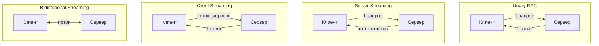
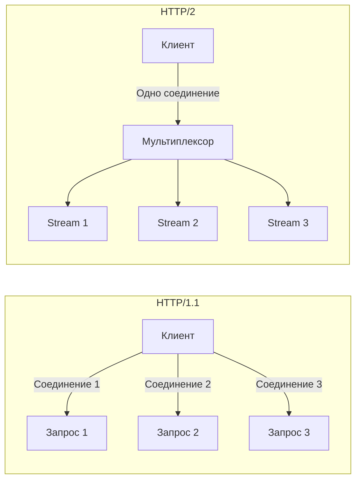
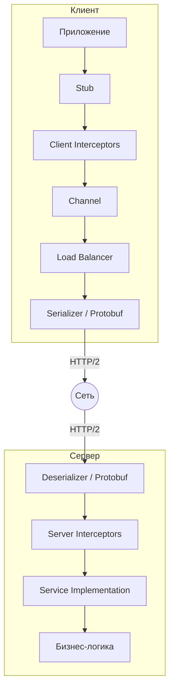
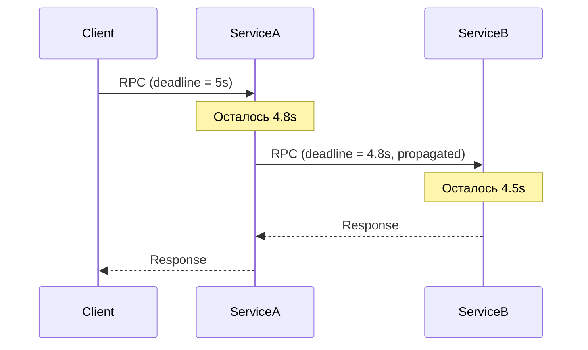
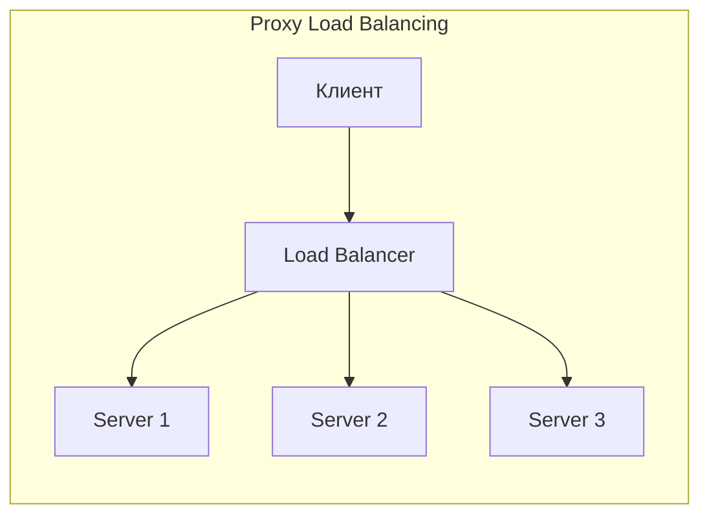
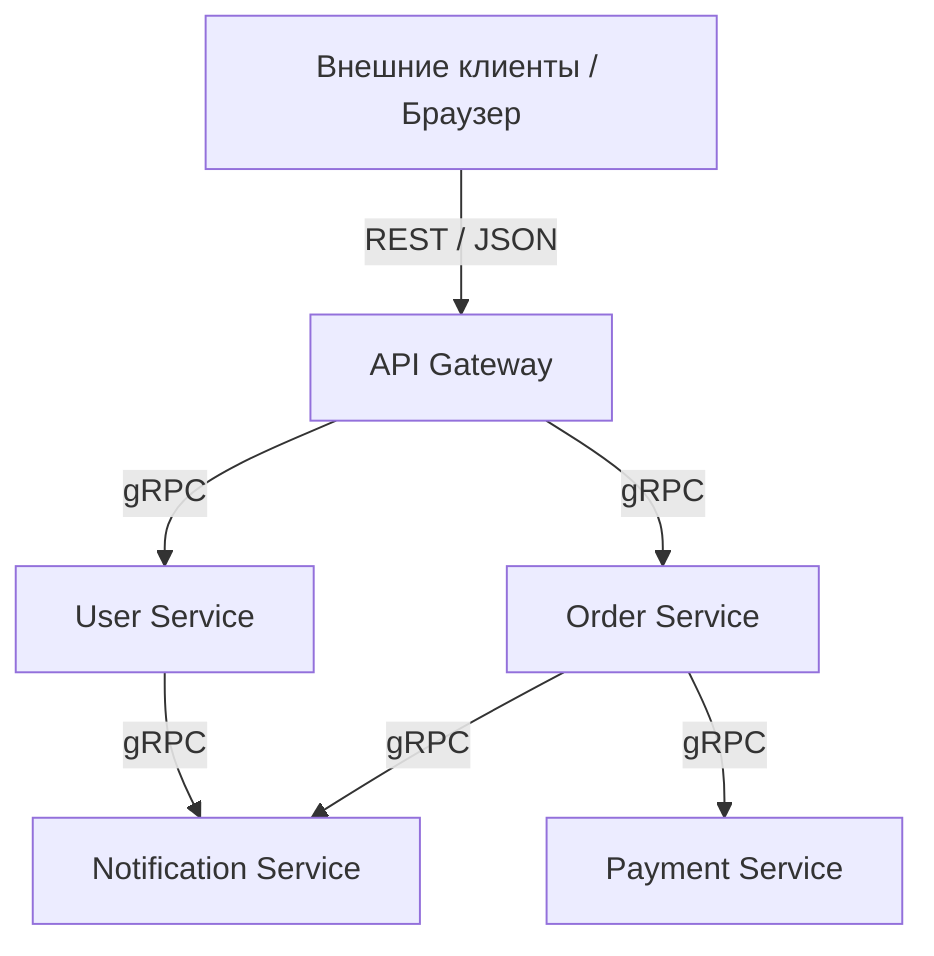

# Вопросы на собеседовании: `gRPC`

Практичные вопросы и ответы по `gRPC`: определение сервисов через `Protocol Buffers`, типы вызовов, streaming, интерсепторы, обработка ошибок, безопасность, интеграция со `Spring Boot` и сравнение с `REST`.

**`gRPC`** (gRPC Remote Procedure Call) — высокопроизводительный фреймворк удалённых вызовов процедур, разработанный Google. Использует `HTTP/2` для транспорта и `Protocol Buffers` для сериализации, что обеспечивает компактность данных и низкую задержку. Широко применяется в микросервисных архитектурах для межсервисного взаимодействия.

## Полезные ссылки

### Официальная документация

- [gRPC — Official Site](https://grpc.io/) — официальный сайт проекта
- [Core concepts, architecture and lifecycle](https://grpc.io/docs/what-is-grpc/core-concepts/) — ключевые концепции gRPC
- [gRPC Java Quick Start](https://grpc.io/docs/languages/java/quickstart/) — быстрый старт на Java
- [Protocol Buffers Language Guide (proto3)](https://protobuf.dev/programming-guides/proto3/) — спецификация proto3
- [gRPC Status Codes](https://grpc.io/docs/guides/status-codes/) — коды ошибок gRPC
- [Introduction to gRPC | Baeldung](https://www.baeldung.com/grpc-introduction) — введение в gRPC на Java
- [Introduction to gRPC with Spring Boot | Baeldung](https://www.baeldung.com/spring-boot-grpc) — gRPC + Spring Boot
- [Streaming with gRPC in Java | Baeldung](https://www.baeldung.com/java-grpc-streaming) — streaming в Java
- [Error Handling in gRPC | Baeldung](https://www.baeldung.com/grpcs-error-handling) — обработка ошибок

## Содержание

- [Полезные ссылки](#полезные-ссылки)
- [See also](#see-also)

**Основы gRPC**
- [Q1. (!) Что такое gRPC и какие проблемы он решает?](#q1--что-такое-grpc-и-какие-проблемы-он-решает)
- [Q2. (!) Что такое Protocol Buffers и зачем они нужны?](#q2--что-такое-protocol-buffers-и-зачем-они-нужны)
- [Q3. Как определить сервис в `.proto` файле?](#q3-как-определить-сервис-в-proto-файле)
- [Q4. Как происходит генерация кода из `.proto` файлов в Java?](#q4-как-происходит-генерация-кода-из-proto-файлов-в-java)
- [Q5. Что такое `Channel` и `Stub` в gRPC?](#q5-что-такое-channel-и-stub-в-grpc)

**Типы RPC вызовов**
- [Q6. (!) Какие типы RPC поддерживает gRPC?](#q6--какие-типы-rpc-поддерживает-grpc)
- [Q7. Как реализовать Server Streaming RPC?](#q7-как-реализовать-server-streaming-rpc)
- [Q8. Как реализовать Client Streaming RPC?](#q8-как-реализовать-client-streaming-rpc)
- [Q9. Как работает Bidirectional Streaming?](#q9-как-работает-bidirectional-streaming)

**Архитектура и транспорт**
- [Q10. (!) Почему gRPC использует HTTP/2 и какие преимущества это даёт?](#q10--почему-grpc-использует-http2-и-какие-преимущества-это-даёт)
- [Q11. Как работает мультиплексирование в HTTP/2 и как gRPC его использует?](#q11-как-работает-мультиплексирование-в-http2-и-как-grpc-его-использует)
- [Q12. Какова архитектура gRPC приложения?](#q12-какова-архитектура-grpc-приложения)

**Interceptors и Metadata**
- [Q13. (!) Что такое Interceptors в gRPC и зачем они нужны?](#q13--что-такое-interceptors-в-grpc-и-зачем-они-нужны)
- [Q14. Что такое Metadata в gRPC?](#q14-что-такое-metadata-в-grpc)

**Обработка ошибок**
- [Q15. (!) Как устроена обработка ошибок в gRPC?](#q15--как-устроена-обработка-ошибок-в-grpc)
- [Q16. Какие стандартные Status Codes существуют в gRPC?](#q16-какие-стандартные-status-codes-существуют-в-grpc)

**Deadlines, Timeouts и надёжность**
- [Q17. (!) Как работают Deadlines и Timeouts в gRPC?](#q17--как-работают-deadlines-и-timeouts-в-grpc)
- [Q18. Как настроить Retry Policy в gRPC?](#q18-как-настроить-retry-policy-в-grpc)

**Балансировка нагрузки и Service Discovery**
- [Q19. Какие модели балансировки нагрузки поддерживает gRPC?](#q19-какие-модели-балансировки-нагрузки-поддерживает-grpc)
- [Q20. Что такое Name Resolver в gRPC?](#q20-что-такое-name-resolver-в-grpc)

**Безопасность**
- [Q21. (!) Как обеспечить безопасность gRPC-соединений?](#q21--как-обеспечить-безопасность-grpc-соединений)
- [Q22. Как реализовать аутентификацию в gRPC?](#q22-как-реализовать-аутентификацию-в-grpc)

**gRPC и Spring Boot**
- [Q23. (!) Как интегрировать gRPC со Spring Boot?](#q23--как-интегрировать-grpc-со-spring-boot)
- [Q24. Как тестировать gRPC-сервисы?](#q24-как-тестировать-grpc-сервисы)

**Health Checking и Reflection**
- [Q25. Что такое gRPC Health Checking Protocol?](#q25-что-такое-grpc-health-checking-protocol)
- [Q26. Что такое Server Reflection и зачем она нужна?](#q26-что-такое-server-reflection-и-зачем-она-нужна)

**gRPC-Web и совместимость**
- [Q27. Что такое gRPC-Web и зачем он нужен?](#q27-что-такое-grpc-web-и-зачем-он-нужен)

**Сравнение и выбор**
- [Q28. (!) Чем gRPC отличается от REST?](#q28--чем-grpc-отличается-от-rest)
- [Q29. Как обеспечить обратную совместимость в Protocol Buffers?](#q29-как-обеспечить-обратную-совместимость-в-protocol-buffers)
- [Q30. Когда стоит использовать gRPC, а когда REST?](#q30-когда-стоит-использовать-grpc-а-когда-rest)

**Продвинутые темы**
- [Q31. (!) Как правильно управлять Channel и Stub в долгоживущих приложениях?](#q31--как-правильно-управлять-channel-и-stub-в-долгоживущих-приложениях)
- [Q32. Какие лучшие практики дизайна proto3 схем нужно знать?](#q32-какие-лучшие-практики-дизайна-proto3-схем-нужно-знать)
- [Q33. (!) Как организовать observability для gRPC-сервисов?](#q33--как-организовать-observability-для-grpc-сервисов)

**Экосистема и интеграции**
- [Q34. Что такое gRPC-Web и как он работает в браузерах?](#q34-что-такое-grpc-web-и-как-он-работает-в-браузерах)
- [Q35. (!) gRPC vs REST vs GraphQL: сравнение и выбор протокола?](#q35--grpc-vs-rest-vs-graphql-сравнение-и-выбор-протокола)
- [Q36. Правила backwards compatibility в Protocol Buffers: как эволюционировать схему?](#q36-правила-backwards-compatibility-в-protocol-buffers-как-эволюционировать-схему)
- [Q37. Как настроить gRPC load balancing в Kubernetes?](#q37-как-настроить-grpc-load-balancing-в-kubernetes)
- [Q38. Как реализовать retry policy в gRPC через ServiceConfig?](#q38-как-реализовать-retry-policy-в-grpc-через-serviceconfig)
- [Q39. (!) Как интегрировать gRPC с Spring Boot через grpc-spring-boot-starter?](#q39--как-интегрировать-grpc-с-spring-boot-через-grpc-spring-boot-starter)
- [Q40. Что такое transcoding gRPC ↔ REST через google.api.http аннотации?](#q40-что-такое-transcoding-grpc--rest-через-googleapihttp-аннотации)

---

## Q1. (!) Что такое gRPC и какие проблемы он решает?

`gRPC` (gRPC Remote Procedure Call) — высокопроизводительный open-source фреймворк удалённых вызовов процедур от Google, переданный в `CNCF`. Идея проста: вы описываете сервис в `.proto`-файле, а вызов удалённого метода выглядит для кода как обычный локальный вызов функции — сериализацию, транспорт и десериализацию gRPC берёт на себя.

В основе три кита: транспорт `HTTP/2`, бинарная сериализация `Protocol Buffers` и контракт-first подход через `.proto`. Именно из этой комбинации вытекают все его свойства — компактность, низкая задержка и строгая типизация.

**Ключевые характеристики:**

- Использует `HTTP/2` как транспортный протокол
- Сериализация через `Protocol Buffers` (protobuf) — компактный бинарный формат
- Строгая типизация через `.proto` файлы (контракт-first подход)
- Поддержка streaming (server, client, bidirectional)
- Автоматическая генерация клиентского и серверного кода на 10+ языках
- Встроенная поддержка deadline/timeout, cancellation, interceptors

**Какие проблемы решает:**

| Проблема | Решение в gRPC |
|----------|----------------|
| Большой overhead JSON/XML | Бинарная сериализация protobuf (до 10x компактнее) |
| Отсутствие строгого контракта в REST | `.proto` файл как единый источник правды |
| Нет streaming в HTTP/1.1 | Четыре типа RPC включая bidirectional streaming |
| Ручное написание клиентов | Автогенерация стабов для любого языка |
| Head-of-line blocking | Мультиплексирование `HTTP/2` |

**На собеседовании важно подчеркнуть:** gRPC создан под межсервисное взаимодействие внутри микросервисной архитектуры — там, где важны производительность и строгий контракт между командами. А вот для публичных API чаще берут REST: он нативно работает в браузере, а gRPC требует прокси (gRPC-Web) и хуже поддаётся отладке «руками».

## Q2. (!) Что такое Protocol Buffers и зачем они нужны?

`Protocol Buffers` (protobuf) — механизм сериализации структурированных данных от Google, не привязанный к языку или платформе. В gRPC он играет сразу две роли: служит языком описания контракта (IDL — Interface Definition Language) и форматом, в котором данные летят по сети.

**Зачем они нужны.** protobuf решает две задачи разом. Во-первых, даёт единый строгий контракт: схема в `.proto` описывает структуру сообщений и из неё генерируется код для любого языка, поэтому клиент и сервер физически не могут разойтись в форматах. Во-вторых, сериализует данные в компактный бинарный вид — без имён полей, без кавычек и скобок, как в JSON. За счёт этого payload меньше, а парсинг быстрее.

**Пример `.proto` файла:**

```protobuf
syntax = "proto3";

package com.example.grpc;

option java_multiple_files = true;
option java_package = "com.example.grpc.user";

message User {
  int64 id = 1;
  string name = 2;
  string email = 3;
  UserRole role = 4;
  repeated string tags = 5;        // список
  optional string bio = 6;         // необязательное поле

  enum UserRole {
    UNKNOWN = 0;
    ADMIN = 1;
    USER = 2;
  }
}

message GetUserRequest {
  int64 id = 1;
}

message GetUserResponse {
  User user = 1;
}
```

**Ключевые особенности proto3:**

- Каждое поле имеет **уникальный номер** (field number), и именно он, а не имя поля, записывается в бинарный поток. Это ключевой факт: благодаря ему поле можно безболезненно переименовать, а имена не занимают места в payload.
- Поля с номерами 1–15 кодируют tag одним байтом, 16+ — двумя. Поэтому самые частые поля держат в диапазоне 1–15.
- Значения по умолчанию заданы неявно: `0` для чисел, пустая строка, `false`, пустой список. В proto3 такие поля просто не сериализуются (экономия места), а на приёме подставляется дефолт.
- Поддержка `oneof` (взаимоисключающие поля), `map`, `Any` и well-known types вроде `Timestamp`.
- Бинарный формат компактнее JSON на 60–80% и сериализуется/десериализуется в 3–10 раз быстрее.

**Типы данных protobuf:**

| Protobuf тип | Java тип | Описание |
|-------------|----------|----------|
| `int32` / `int64` | `int` / `long` | Целые числа |
| `float` / `double` | `float` / `double` | Числа с плавающей точкой |
| `bool` | `boolean` | Логическое значение |
| `string` | `String` | Строка (UTF-8) |
| `bytes` | `ByteString` | Байтовый массив |
| `repeated` | `List<T>` | Список элементов |
| `map<K,V>` | `Map<K,V>` | Словарь |

## Q3. Как определить сервис в `.proto` файле?

Сервис описывается блоком `service` и содержит набор RPC-методов, которые сможет вызывать клиент. Каждый метод задаёт тип запроса и тип ответа, а ключевое слово `stream` превращает любую из сторон в поток. Этот блок — и есть контракт: из него generator создаёт и серверную «заготовку», и клиентские стабы.

```protobuf
syntax = "proto3";

package com.example.grpc;

option java_multiple_files = true;
option java_package = "com.example.grpc.user";

service UserService {
  // Unary RPC — один запрос, один ответ
  rpc GetUser (GetUserRequest) returns (GetUserResponse);

  // Server Streaming — один запрос, поток ответов
  rpc ListUsers (ListUsersRequest) returns (stream UserResponse);

  // Client Streaming — поток запросов, один ответ
  rpc UploadUsers (stream UploadUserRequest) returns (UploadUsersResponse);

  // Bidirectional Streaming — поток в обе стороны
  rpc ChatUsers (stream ChatMessage) returns (stream ChatMessage);
}
```

**Правила определения сервисов:**

- Каждый RPC-метод принимает ровно **один** message-тип и возвращает **один** message-тип
- Ключевое слово `stream` определяет потоковую передачу
- Один `.proto` файл может содержать несколько сервисов
- Имена сервисов и методов используются при генерации Java-классов

**Из этого `.proto` файла генерируются:**
- `UserServiceGrpc` — базовый класс с серверным стабом (`UserServiceImplBase`)
- `UserServiceGrpc.UserServiceBlockingStub` — синхронный клиентский стаб
- `UserServiceGrpc.UserServiceStub` — асинхронный клиентский стаб
- `UserServiceGrpc.UserServiceFutureStub` — стаб на основе `ListenableFuture`

## Q4. Как происходит генерация кода из `.proto` файлов в Java?

Код генерирует компилятор `protoc`: сам он умеет создавать только message-классы, а за RPC-стабы отвечает плагин `protoc-gen-grpc-java`. Запускать `protoc` руками не нужно — в Gradle это вешается на сборку через `protobuf-gradle-plugin`, и при каждом `build` код из `.proto` пересоздаётся автоматически.

```groovy
plugins {
    id 'com.google.protobuf' version '0.9.4'
}

dependencies {
    implementation 'io.grpc:grpc-netty-shaded:1.65.0'
    implementation 'io.grpc:grpc-protobuf:1.65.0'
    implementation 'io.grpc:grpc-stub:1.65.0'
    compileOnly 'org.apache.tomcat:annotations-api:6.0.53'
}

protobuf {
    protoc {
        artifact = 'com.google.protobuf:protoc:4.27.0'
    }
    plugins {
        grpc {
            artifact = 'io.grpc:protoc-gen-grpc-java:1.65.0'
        }
    }
    generateProtoTasks {
        all()*.plugins {
            grpc {}
        }
    }
}
```

**Что генерируется:**

1. **Message-классы** — immutable Java-объекты для каждого `message` в `.proto` (с builder-паттерном)
2. **Service-стабы** — абстрактные классы для реализации сервера и клиентские стабы
3. **Descriptor-ы** — метаданные для reflection и сериализации

```java
// Сгенерированный builder для message
User user = User.newBuilder()
    .setId(1L)
    .setName("Иван")
    .setEmail("ivan@example.com")
    .setRole(User.UserRole.ADMIN)
    .addTags("java")
    .addTags("grpc")
    .build();
```

## Q5. Что такое `Channel` и `Stub` в gRPC?

Это два слоя клиента, разделённые по ответственности: `Channel` отвечает за «как доставить байты», `Stub` — за «какой метод вызвать».

**`Channel`** — абстракция соединения с сервером. За этим объектом скрыт пул `HTTP/2`-подключений, балансировка нагрузки и автоматическое переподключение. Он тяжёлый, потокобезопасный и долгоживущий: создаётся один раз и переиспользуется.

**`Stub`** — сгенерированный из `.proto` клиент, через который вы вызываете RPC-методы как обычные функции. Стаб лёгкий, привязан к `Channel` и делегирует ему всю транспортную работу. На одном канале можно держать сколько угодно стабов.

```java
// Создание канала
ManagedChannel channel = ManagedChannelBuilder
    .forAddress("localhost", 9090)
    .usePlaintext()  // без TLS (только для разработки!)
    .build();

// Blocking stub — синхронные вызовы
UserServiceGrpc.UserServiceBlockingStub blockingStub =
    UserServiceGrpc.newBlockingStub(channel);

// Async stub — асинхронные вызовы с StreamObserver
UserServiceGrpc.UserServiceStub asyncStub =
    UserServiceGrpc.newStub(channel);

// Future stub — возвращает ListenableFuture (только для unary)
UserServiceGrpc.UserServiceFutureStub futureStub =
    UserServiceGrpc.newFutureStub(channel);

// Вызов через blocking stub
GetUserResponse response = blockingStub.getUser(
    GetUserRequest.newBuilder().setId(1L).build()
);

// Не забываем закрыть канал при завершении
channel.shutdown().awaitTermination(5, TimeUnit.SECONDS);
```

**Типы стабов:**

| Тип стаба | Unary | Server Streaming | Client Streaming | Bidi |
|-----------|-------|-----------------|-----------------|------|
| `BlockingStub` | да | да (Iterator) | нет | нет |
| `Stub` (async) | да | да | да | да |
| `FutureStub` | да | нет | нет | нет |

**Важно:** `Channel` потокобезопасен и должен переиспользоваться. Создание нового канала на каждый запрос — антипаттерн.

## Q6. (!) Какие типы RPC поддерживает gRPC?

gRPC поддерживает четыре типа вызовов — они отличаются тем, сколько сообщений (одно или поток) передаёт каждая из сторон:



**1. Unary RPC** — классический запрос-ответ:

```protobuf
rpc GetUser (GetUserRequest) returns (GetUserResponse);
```

**2. Server Streaming RPC** — сервер отправляет поток сообщений в ответ на один запрос:

```protobuf
rpc ListUsers (ListUsersRequest) returns (stream UserResponse);
```
Используется для: получения больших списков, подписки на события, скачивания файлов.

**3. Client Streaming RPC** — клиент отправляет поток, сервер возвращает один ответ:

```protobuf
rpc UploadUsers (stream UploadUserRequest) returns (UploadUsersResponse);
```
Используется для: загрузки файлов, batch-операций, агрегации данных.

**4. Bidirectional Streaming RPC** — оба направления работают независимо:

```protobuf
rpc Chat (stream ChatMessage) returns (stream ChatMessage);
```
Используется для: чатов, real-time обновлений, двусторонней синхронизации.

**На собеседовании:** часто просят назвать все 4 типа и привести по примеру на каждый. Подчеркните, что любой streaming возможен именно благодаря `HTTP/2`: один stream держит долгий двунаправленный поток фреймов, тогда как в `HTTP/1.1` это потребовало бы хаков вроде long-polling или WebSocket.

## Q7. Как реализовать Server Streaming RPC?

В server streaming сервер на один запрос клиента отправляет поток ответов. На уровне кода это значит, что метод не возвращает значение, а получает `StreamObserver` и вызывает `onNext()` столько раз, сколько нужно сообщений, завершая поток через `onCompleted()`. Клиент же читает ответы как `Iterator`.

**Определение в `.proto`:**

```protobuf
service StockService {
  rpc WatchStock (StockRequest) returns (stream StockPrice);
}

message StockRequest {
  string symbol = 1;
}

message StockPrice {
  string symbol = 1;
  double price = 2;
  int64 timestamp = 3;
}
```

**Серверная реализация:**

```java
public class StockServiceImpl extends StockServiceGrpc.StockServiceImplBase {

    @Override
    public void watchStock(StockRequest request,
                           StreamObserver<StockPrice> responseObserver) {
        String symbol = request.getSymbol();

        // Эмуляция потока обновлений цен
        ScheduledExecutorService executor = Executors.newSingleThreadScheduledExecutor();
        executor.scheduleAtFixedRate(() -> {
            StockPrice price = StockPrice.newBuilder()
                .setSymbol(symbol)
                .setPrice(getLatestPrice(symbol))
                .setTimestamp(System.currentTimeMillis())
                .build();

            responseObserver.onNext(price);    // отправить сообщение
        }, 0, 1, TimeUnit.SECONDS);

        // При отмене клиентом — остановить executor
        Context.current().addListener(context -> {
            executor.shutdown();
            responseObserver.onCompleted();    // завершить поток
        }, MoreExecutors.directExecutor());
    }
}
```

**Нюанс:** пример учебный, и в продакшен его переносить as-is нельзя — у него два слабых места. Во-первых, `onNext()` зовётся по таймеру без проверки готовности потока: в grpc-java `onNext()` не блокируется, и если клиент читает медленнее, чем сервер пишет, сообщения копятся в очереди gRPC без ограничения. Во-вторых, `onCompleted()` здесь вызывается в листенере отмены, то есть уже **после** того, как клиент отменил вызов: завершать отменённый stream бессмысленно (ответ клиенту всё равно не уйдёт), а попытка `onNext()` по отменённому вызову бросит `StatusRuntimeException`. Правильная реакция на отмену — просто освободить ресурсы (остановить executor), а саму отмену удобнее ловить через `setOnCancelHandler()`.

**Backpressure (application-level flow control).** `HTTP/2` даёт транспортный flow control, но он лишь притормаживает отправку байтов в сокет — сообщения, уже переданные в `onNext()`, буферизуются в памяти процесса, и при быстром продюсере и медленном потребителе это прямой путь к OOM. Рабочий паттерн в grpc-java: привести `responseObserver` к `ServerCallStreamObserver`, писать только пока `isReady()` возвращает `true`, а продолжение отправки вешать на колбэк `setOnReadyHandler()` — он сработает, когда транспорт снова готов принимать данные. Для входящих потоков (client/bidirectional streaming, см. Q8–Q9) есть зеркальный механизм: `disableAutoRequest()` отключает автоматический запрос следующих сообщений, и сервер сам вызывает `request(n)`, когда обработал текущие, — иначе входящие сообщения точно так же накапливаются быстрее, чем потребляются.

**Клиент (blocking):**

```java
Iterator<StockPrice> prices = blockingStub.watchStock(
    StockRequest.newBuilder().setSymbol("GOOG").build()
);

while (prices.hasNext()) {
    StockPrice price = prices.next();
    System.out.printf("%s: $%.2f%n", price.getSymbol(), price.getPrice());
}
```

## Q8. Как реализовать Client Streaming RPC?

Здесь всё зеркально server streaming: поток сообщений шлёт клиент, а сервер отдаёт один ответ. Поэтому серверный метод не принимает запрос напрямую, а **возвращает** `StreamObserver` для входящих сообщений — его `onNext()` вызывается на каждый чанк от клиента, а `onCompleted()` сигналит, что данные кончились, и пора отдать итоговый ответ. Типичный сценарий — заливка файла по частям или агрегация batch-данных.

**Определение в `.proto`:**

```protobuf
service FileService {
  rpc UploadFile (stream FileChunk) returns (UploadStatus);
}
```

**Серверная реализация:**

```java
@Override
public StreamObserver<FileChunk> uploadFile(
        StreamObserver<UploadStatus> responseObserver) {

    return new StreamObserver<FileChunk>() {
        ByteArrayOutputStream buffer = new ByteArrayOutputStream();
        int chunkCount = 0;

        @Override
        public void onNext(FileChunk chunk) {
            buffer.write(chunk.getData().toByteArray(), 0,
                         chunk.getData().size());
            chunkCount++;
        }

        @Override
        public void onError(Throwable t) {
            logger.error("Upload failed", t);
        }

        @Override
        public void onCompleted() {
            // Все чанки получены — сохраняем файл
            saveFile(buffer.toByteArray());
            responseObserver.onNext(UploadStatus.newBuilder()
                .setSuccess(true)
                .setMessage("Uploaded " + chunkCount + " chunks")
                .build());
            responseObserver.onCompleted();
        }
    };
}
```

**Клиент (async):**

```java
StreamObserver<UploadStatus> responseObserver = new StreamObserver<>() {
    @Override
    public void onNext(UploadStatus status) {
        System.out.println("Upload: " + status.getMessage());
    }
    @Override
    public void onError(Throwable t) { /* обработка ошибки */ }
    @Override
    public void onCompleted() { /* завершение */ }
};

StreamObserver<FileChunk> requestObserver =
    asyncStub.uploadFile(responseObserver);

// Отправляем файл по частям
byte[] fileData = Files.readAllBytes(Path.of("large-file.bin"));
int chunkSize = 64 * 1024; // 64 KB
for (int i = 0; i < fileData.length; i += chunkSize) {
    int end = Math.min(i + chunkSize, fileData.length);
    requestObserver.onNext(FileChunk.newBuilder()
        .setData(ByteString.copyFrom(fileData, i, end - i))
        .build());
}
requestObserver.onCompleted();
```

## Q9. Как работает Bidirectional Streaming?

В bidirectional streaming обе стороны обмениваются потоками сообщений **независимо** друг от друга, по одному `HTTP/2`-stream. Ключевое слово «независимо»: это не пинг-понг «запрос-ответ-запрос», а два параллельных потока. Сервер не обязан отвечать ровно одним сообщением на каждое клиентское — он может прислать пять ответов на один запрос или вовсе слать данные по своему таймеру. Порядок чтения и записи произвольный.

```java
// Серверная реализация чата
@Override
public StreamObserver<ChatMessage> chat(
        StreamObserver<ChatMessage> responseObserver) {

    return new StreamObserver<ChatMessage>() {
        @Override
        public void onNext(ChatMessage message) {
            // Обработать входящее сообщение и отправить ответ
            ChatMessage reply = ChatMessage.newBuilder()
                .setSender("server")
                .setText("Echo: " + message.getText())
                .setTimestamp(System.currentTimeMillis())
                .build();
            responseObserver.onNext(reply);
        }

        @Override
        public void onError(Throwable t) {
            logger.error("Chat stream error", t);
        }

        @Override
        public void onCompleted() {
            responseObserver.onCompleted();
        }
    };
}
```

**Ключевые моменты:**
- Потоки клиента и сервера **независимы** — сервер может отправить 5 сообщений на 1 клиентское
- Каждая сторона завершает свой поток вызовом `onCompleted()`
- Идеально для real-time взаимодействия: чаты, совместное редактирование, игровые сессии
- Работает поверх одного `HTTP/2` stream

## Q10. (!) Почему gRPC использует HTTP/2 и какие преимущества это даёт?

`HTTP/2` — фундамент производительности gRPC: именно его возможности дают и параллелизм, и streaming, и экономию на заголовках. Разберём по пунктам, что конкретно он приносит.

**1. Мультиплексирование:**
Несколько RPC-вызовов идут параллельно по одному TCP-соединению, каждый в своём stream. В `HTTP/1.1` для параллелизма приходилось открывать отдельные соединения — это решало проблему head-of-line blocking ценой накладных расходов на каждое подключение.

**2. Бинарный фрейминг:**
`HTTP/2` передаёт данные в бинарных фреймах, а не текстовых. Это эффективнее для парсинга и уменьшает overhead.

**3. Сжатие заголовков (HPACK):**
Заголовки сжимаются и дедуплицируются между запросами, экономя трафик.

**4. Двунаправленные stream-ы:**
Каждый `HTTP/2` stream двунаправленный: пока он открыт, обе стороны могут слать DATA-фреймы. Именно на этом построен streaming в gRPC — при server streaming сервер отправляет поток сообщений DATA-фреймами **в рамках того же stream**, который открыл клиент. Частое заблуждение: HTTP/2 Server Push (`PUSH_PROMISE`) gRPC **не использует** — это браузерный механизм проактивной доставки ресурсов, к gRPC-стримингу он отношения не имеет.

**5. Flow Control:**
Встроенное управление потоком данных на уровне stream и соединения предотвращает перегрузку.



**Производительность gRPC vs REST:**
- Payload: на 60-80% компактнее благодаря protobuf
- Latency: до 7-10x ниже в high-throughput сценариях
- Пропускная способность: значительно выше при множественных параллельных вызовах

## Q11. Как работает мультиплексирование в HTTP/2 и как gRPC его использует?

Мультиплексирование — это разделение одного TCP-соединения на множество независимых логических потоков (**stream**). Каждый stream — это самостоятельный двунаправленный канал фреймов со своим идентификатором, и фреймы разных stream-ов свободно перемежаются в одном соединении. gRPC ложится на эту модель буквально один-в-один: один RPC = один stream.

**Как gRPC использует мультиплексирование:**

- Один `ManagedChannel` = одно (или несколько) TCP-соединение
- Каждый RPC-вызов — отдельный `HTTP/2` stream
- Stream-ы не блокируют друг друга (нет head-of-line blocking на уровне HTTP)
- Клиент может делать тысячи параллельных RPC через один канал

**Конфигурация в Java:**

```java
ManagedChannel channel = ManagedChannelBuilder
    .forAddress("service.example.com", 443)
    .maxInboundMessageSize(16 * 1024 * 1024)  // 16 MB
    .keepAliveTime(30, TimeUnit.SECONDS)
    .keepAliveTimeout(5, TimeUnit.SECONDS)
    .build();
```

**Важно:** хотя head-of-line blocking отсутствует на уровне HTTP/2, он остаётся на уровне TCP. При потере пакета все stream-ы в одном соединении ждут ретрансмиссии. Это одна из мотиваций для `HTTP/3` (QUIC).

## Q12. Какова архитектура gRPC приложения?

Архитектуру удобно читать как путь одного вызова: приложение зовёт метод стаба → клиентские интерсепторы добавляют cross-cutting логику → канал сериализует запрос в protobuf и шлёт по `HTTP/2` → на сервере данные десериализуются, проходят серверные интерсепторы и попадают в реализацию сервиса с бизнес-логикой. Ответ идёт тем же путём в обратную сторону.



**Основные компоненты:**

1. **`.proto` файл** — контракт между клиентом и сервером
2. **Сгенерированный код** — стабы, message-классы, service base
3. **`Channel`** — управление соединением на клиенте
4. **`Server`** — приём входящих RPC на сервере
5. **`Interceptors`** — cross-cutting concerns (логирование, аутентификация)
6. **`StreamObserver`** — callback-интерфейс для обработки потоковых сообщений
7. **Сериализатор** — protobuf marshalling/unmarshalling

## Q13. (!) Что такое Interceptors в gRPC и зачем они нужны?

`Interceptors` — это middleware, которое вклинивается в RPC-вызов до и после бизнес-логики, чтобы добавить сквозную функциональность (логирование, метрики, аутентификацию) в одном месте, а не дублировать её в каждом методе. Прямой аналог — `Servlet Filter` или перехватчики `Spring MVC`. Логика та же: цепочка обёрток вокруг вызова, каждая может что-то сделать с запросом/ответом и передать управление дальше через `next`.

**Два типа** — по тому, на какой стороне перехватывается вызов:

**1. `ServerInterceptor`** — перехватывает входящие вызовы на сервере:

```java
public class LoggingServerInterceptor implements ServerInterceptor {

    @Override
    public <ReqT, RespT> ServerCall.Listener<ReqT> interceptCall(
            ServerCall<ReqT, RespT> call,
            Metadata headers,
            ServerCallHandler<ReqT, RespT> next) {

        String methodName = call.getMethodDescriptor().getFullMethodName();
        long start = System.nanoTime();
        logger.info("gRPC call: {}", methodName);

        ServerCall.Listener<ReqT> listener = next.startCall(call, headers);

        return new ForwardingServerCallListener.SimpleForwardingServerCallListener<>(listener) {
            @Override
            public void onComplete() {
                long elapsed = TimeUnit.NANOSECONDS.toMillis(System.nanoTime() - start);
                logger.info("gRPC call {} completed in {} ms", methodName, elapsed);
                super.onComplete();
            }
        };
    }
}
```

**2. `ClientInterceptor`** — перехватывает исходящие вызовы на клиенте:

```java
public class AuthClientInterceptor implements ClientInterceptor {
    private static final Metadata.Key<String> AUTH_KEY =
        Metadata.Key.of("authorization", Metadata.ASCII_STRING_MARSHALLER);

    @Override
    public <ReqT, RespT> ClientCall<ReqT, RespT> interceptCall(
            MethodDescriptor<ReqT, RespT> method,
            CallOptions callOptions,
            Channel next) {

        return new ForwardingClientCall.SimpleForwardingClientCall<>(
                next.newCall(method, callOptions)) {
            @Override
            public void start(Listener<RespT> listener, Metadata headers) {
                headers.put(AUTH_KEY, "Bearer " + getToken());
                super.start(listener, headers);
            }
        };
    }
}
```

**Регистрация:**

```java
// Серверный interceptor
Server server = ServerBuilder.forPort(9090)
    .addService(ServerInterceptors.intercept(
        new UserServiceImpl(), new LoggingServerInterceptor()))
    .build();

// Клиентский interceptor
ManagedChannel channel = ManagedChannelBuilder.forAddress("localhost", 9090)
    .intercept(new AuthClientInterceptor())
    .build();
```

**Типичные применения:** логирование, метрики, аутентификация, трассировка, валидация, rate limiting.

## Q14. Что такое Metadata в gRPC?

`Metadata` — это пары ключ-значение, которые едут рядом с RPC-вызовом, но не входят в само тело сообщения. Прямой аналог — HTTP-заголовки. Смысл разделения тот же: бизнес-данные кладут в message, а служебную информацию (токен авторизации, trace-id, версию клиента) — в metadata, чтобы её можно было читать в интерсепторах, не разбирая payload.

```java
// Определение ключей metadata
Metadata.Key<String> TRACE_ID_KEY =
    Metadata.Key.of("x-trace-id", Metadata.ASCII_STRING_MARSHALLER);
Metadata.Key<byte[]> BINARY_KEY =
    Metadata.Key.of("data-bin", Metadata.BINARY_BYTE_MARSHALLER);

// Отправка metadata на клиенте (через interceptor)
Metadata headers = new Metadata();
headers.put(TRACE_ID_KEY, UUID.randomUUID().toString());

// Чтение metadata на сервере
String traceId = headers.get(TRACE_ID_KEY);
```

**Типы metadata:**

| Тип | Суффикс ключа | Маршаллер | Пример |
|-----|---------------|-----------|--------|
| Текстовый | любой | `ASCII_STRING_MARSHALLER` | `authorization`, `x-request-id` |
| Бинарный | `-bin` | `BINARY_BYTE_MARSHALLER` | `token-bin`, `payload-bin` |

**Три точки передачи:**
1. **Initial metadata** — заголовки запроса (клиент → сервер)
2. **Response headers** — заголовки ответа (сервер → клиент, перед первым сообщением)
3. **Trailing metadata / trailers** — завершающие метаданные (сервер → клиент, после последнего сообщения)

Metadata активно используется для передачи trace-id (distributed tracing), токенов аутентификации, информации о пользователе и других cross-cutting данных. Доступ к metadata осуществляется через `Interceptors`, подробнее в [вопросах по HTTP и REST](http-rest-interview.md).

## Q15. (!) Как устроена обработка ошибок в gRPC?

В gRPC ошибка — это не исключение в привычном смысле, а объект `Status`: числовой **код** из фиксированного набора плюс опциональное текстовое **описание**. Сервер не «бросает» ошибку клиенту произвольно, а завершает вызов конкретным статусом через `responseObserver.onError(...)`. На клиенте этот статус прилетает как `StatusRuntimeException`.

Отличие от HTTP важно понимать: gRPC использует **собственный** набор кодов (`NOT_FOUND`, `UNAVAILABLE`, …), а не HTTP-статусы. HTTP/2 на транспорте почти всегда отдаёт `200 OK` — реальный результат вызова лежит в gRPC-статусе, который передаётся в trailing metadata.

**Отправка ошибки на сервере:**

```java
@Override
public void getUser(GetUserRequest request,
                    StreamObserver<GetUserResponse> responseObserver) {
    User user = userRepository.findById(request.getId());

    if (user == null) {
        // Простая ошибка
        responseObserver.onError(Status.NOT_FOUND
            .withDescription("User not found: " + request.getId())
            .asRuntimeException());
        return;
    }

    responseObserver.onNext(toResponse(user));
    responseObserver.onCompleted();
}
```

**Расширенная обработка ошибок с деталями (Rich Error Model):**

Когда одного кода и строки мало (например, нужно сообщить, какие именно поля невалидны), gRPC позволяет приложить к статусу структурированные детали через `Any` — например стандартный тип `BadRequest` с перечнем нарушений по полям. Клиент сможет распаковать их и показать осмысленную ошибку.

```java
// Отправка ошибки с дополнительными деталями
com.google.rpc.Status status = com.google.rpc.Status.newBuilder()
    .setCode(Code.INVALID_ARGUMENT.getNumber())
    .setMessage("Validation failed")
    .addDetails(Any.pack(BadRequest.newBuilder()
        .addFieldViolations(FieldViolation.newBuilder()
            .setField("email")
            .setDescription("Invalid email format")
            .build())
        .build()))
    .build();

responseObserver.onError(
    StatusProto.toStatusRuntimeException(status));
```

**Обработка ошибок на клиенте:**

```java
try {
    GetUserResponse response = blockingStub.getUser(request);
} catch (StatusRuntimeException e) {
    Status status = e.getStatus();
    switch (status.getCode()) {
        case NOT_FOUND:
            logger.warn("User not found: {}", status.getDescription());
            break;
        case DEADLINE_EXCEEDED:
            logger.error("Request timed out");
            break;
        case UNAVAILABLE:
            logger.error("Service unavailable, retry later");
            break;
        default:
            logger.error("gRPC error: {} - {}",
                status.getCode(), status.getDescription());
    }
}
```

## Q16. Какие стандартные Status Codes существуют в gRPC?

gRPC определяет 17 стандартных кодов в `io.grpc.Status.Code` — единый словарь ошибок для всех языков. Знать их полезно не для зубрёжки, а чтобы корректно реагировать на клиенте: одни коды стоит ретраить, другие — нет (см. Q18). Ниже — полный список с HTTP-аналогами для интуиции:

| Код | Число | Описание | HTTP-аналог |
|-----|-------|----------|-------------|
| `OK` | 0 | Успех | 200 |
| `CANCELLED` | 1 | Вызов отменён (клиентом) | 499 |
| `UNKNOWN` | 2 | Неизвестная ошибка | 500 |
| `INVALID_ARGUMENT` | 3 | Невалидный аргумент | 400 |
| `DEADLINE_EXCEEDED` | 4 | Timeout истёк | 504 |
| `NOT_FOUND` | 5 | Ресурс не найден | 404 |
| `ALREADY_EXISTS` | 6 | Ресурс уже существует | 409 |
| `PERMISSION_DENIED` | 7 | Нет прав | 403 |
| `RESOURCE_EXHAUSTED` | 8 | Ресурс исчерпан (rate limit) | 429 |
| `FAILED_PRECONDITION` | 9 | Не выполнено предусловие | 400 |
| `ABORTED` | 10 | Операция прервана (конфликт) | 409 |
| `OUT_OF_RANGE` | 11 | Выход за пределы | 400 |
| `UNIMPLEMENTED` | 12 | Метод не реализован | 501 |
| `INTERNAL` | 13 | Внутренняя ошибка сервера | 500 |
| `UNAVAILABLE` | 14 | Сервис недоступен | 503 |
| `DATA_LOSS` | 15 | Потеря данных | 500 |
| `UNAUTHENTICATED` | 16 | Не аутентифицирован | 401 |

**Частая ошибка на собеседовании:** путают `UNAUTHENTICATED` (нет токена / невалидный токен) и `PERMISSION_DENIED` (токен валиден, но прав недостаточно).

## Q17. (!) Как работают Deadlines и Timeouts в gRPC?

`Deadline` — это абсолютная точка во времени («не позже 12:00:05»), после которой RPC считается провалившимся со статусом `DEADLINE_EXCEEDED`. Главное отличие от обычного timeout — в природе значения. Timeout относителен («ждать 5 секунд») и каждый сервис в цепочке отсчитывает его заново. Deadline абсолютен, поэтому **пропагируется** по всей цепочке вызовов: если сервис A с дедлайном 5 с уже потратил 0.2 с и зовёт сервис B, тот получает не свежие 5 с, а оставшиеся 4.8 с. Это защищает от ситуации, когда суммарное время по цепочке неконтролируемо растёт.

```java
// Установка deadline на клиенте
GetUserResponse response = blockingStub
    .withDeadlineAfter(5, TimeUnit.SECONDS)
    .getUser(request);

// Альтернативно — абсолютный deadline
Deadline deadline = Deadline.after(3, TimeUnit.SECONDS);
GetUserResponse response = blockingStub
    .withDeadline(deadline)
    .getUser(request);
```

**Проверка deadline на сервере:**

```java
@Override
public void getUser(GetUserRequest request,
                    StreamObserver<GetUserResponse> responseObserver) {
    // Проверить, не истёк ли deadline до начала работы
    if (Context.current().isCancelled()) {
        responseObserver.onError(Status.CANCELLED
            .withDescription("Request already cancelled")
            .asRuntimeException());
        return;
    }

    // Долгая операция — периодически проверяем deadline
    for (int i = 0; i < steps; i++) {
        if (Context.current().getDeadline().isExpired()) {
            responseObserver.onError(Status.DEADLINE_EXCEEDED
                .withDescription("Processing timed out")
                .asRuntimeException());
            return;
        }
        processStep(i);
    }
}
```



**Рекомендации:**
- Всегда задавайте deadline на клиенте — без него зависший сервер заставит вызов висеть бесконечно и держать ресурсы.
- Deadline пропагируется автоматически, но полагаться на это можно лишь внутри gRPC: на границе с не-gRPC-вызовами (БД, HTTP) дедлайн нужно конвертировать в их собственные таймауты вручную.
- На сервере перед дорогими операциями проверяйте `Context.current().isCancelled()` — нет смысла начинать работу, если клиент уже не ждёт ответа.

## Q18. Как настроить Retry Policy в gRPC?

gRPC умеет повторять неудавшиеся вызовы сам, без кода в бизнес-логике — это настраивается декларативно через ServiceConfig на уровне канала. Вы описываете политику (сколько попыток, какой backoff, на какие коды реагировать), и gRPC применяет её прозрачно. Главное — не забыть `enableRetry()` при сборке канала, иначе конфиг проигнорируется.

```java
// Программная настройка retry policy
Map<String, Object> retryPolicy = new HashMap<>();
retryPolicy.put("maxAttempts", 3D);
retryPolicy.put("initialBackoff", "0.5s");
retryPolicy.put("maxBackoff", "5s");
retryPolicy.put("backoffMultiplier", 2D);
retryPolicy.put("retryableStatusCodes",
    List.of("UNAVAILABLE", "DEADLINE_EXCEEDED"));

Map<String, Object> methodConfig = Map.of(
    "name", List.of(Map.of(
        "service", "com.example.grpc.UserService"
    )),
    "retryPolicy", retryPolicy
);

Map<String, Object> serviceConfig = Map.of(
    "methodConfig", List.of(methodConfig)
);

ManagedChannel channel = ManagedChannelBuilder
    .forAddress("localhost", 9090)
    .defaultServiceConfig(serviceConfig)
    .enableRetry()
    .build();
```

**Какие вызовы ретраить безопасно.** Главный критерий — идемпотентность: повтор не должен навредить, если первая попытка на самом деле дошла до сервера.
- `UNAVAILABLE` — сервер временно недоступен, повтор почти всегда безопасен.
- `DEADLINE_EXCEEDED` — ретраить только если операция идемпотентна: запрос мог успеть выполниться на сервере, а ответ не дойти.
- **Не ретраить:** `INVALID_ARGUMENT`, `NOT_FOUND`, `ALREADY_EXISTS` — повтор тех же данных даст тот же результат, это лишняя нагрузка.

**Hedging** — альтернатива retry: вместо «ждём ошибку, потом повторяем» отправляем несколько копий запроса параллельно (или с малой задержкой) и берём первый успешный ответ. Так срезается «хвост» латентности от единичного медленного сервера. Цена — лишняя нагрузка, поэтому подходит только для идемпотентных read-запросов с жёсткими требованиями к latency.

## Q19. Какие модели балансировки нагрузки поддерживает gRPC?

gRPC поддерживает две модели, и выбор между ними — это выбор, кто принимает решение о маршрутизации:

**1. Proxy-based (серверная):**
Между клиентом и backend стоит внешний балансировщик (Envoy, nginx, HAProxy) и распределяет запросы. Клиент знает только адрес прокси и ничего — о backend-серверах. Плюс: вся логика централизована, клиент простой. Минус: лишний сетевой хоп и единая точка, которую тоже надо масштабировать.

**2. Client-side (клиентская):**
Клиент сам получает список адресов (через NameResolver) и сам решает, куда слать каждый запрос. Лишнего хопа нет, но логика балансировки живёт в каждом клиенте. Встроенные политики:

```java
// Round Robin — запросы по очереди между серверами
ManagedChannel channel = ManagedChannelBuilder
    .forTarget("dns:///my-service.example.com")
    .defaultLoadBalancingPolicy("round_robin")
    .build();

// Pick First (по умолчанию) — первый доступный сервер
ManagedChannel channel = ManagedChannelBuilder
    .forTarget("dns:///my-service.example.com")
    .defaultLoadBalancingPolicy("pick_first")
    .build();
```



**Нюанс с gRPC и L4 балансировщиками:** обычные TCP-балансировщики (L4) распределяют только *соединения*, а не отдельные RPC. Поскольку gRPC мультиплексирует вызовы в одном соединении, все вызовы попадут на один backend. Нужен L7-балансировщик (Envoy, Istio) или client-side балансировка.

## Q20. Что такое Name Resolver в gRPC?

`NameResolver` — компонент, превращающий логическое имя сервиса (`user-service`) в конкретный список адресов backend-ов. Это первый шаг любой client-side балансировки: сначала резолвер находит, куда вообще можно слать запрос, и только потом load balancer выбирает один адрес из списка. По сути это и есть встроенный в gRPC механизм service discovery, а схема в target (`dns:///`, `xds:///`) выбирает конкретный резолвер.

**Встроенные резолверы:**
- `dns:///` — стандартный DNS-резолвер (по умолчанию)
- `static:///` — статический список адресов
- `xds:///` — интеграция с xDS (Envoy, Istio)

```java
// DNS-based service discovery
ManagedChannel channel = ManagedChannelBuilder
    .forTarget("dns:///user-service.default.svc.cluster.local:9090")
    .defaultLoadBalancingPolicy("round_robin")
    .build();
```

**Кастомный resolver** — можно написать для интеграции с `Consul`, `Eureka`, `ZooKeeper`:

```java
public class ConsulNameResolverProvider extends NameResolverProvider {
    @Override
    public NameResolver newNameResolver(URI targetUri, NameResolver.Args args) {
        return new ConsulNameResolver(targetUri.getAuthority());
    }

    @Override
    public String getDefaultScheme() {
        return "consul";
    }
}

// Использование: consul:///user-service
```

В [вопросах по микросервисам](../architecture/microservices-interview.md) рассматривается service discovery более детально.

## Q21. (!) Как обеспечить безопасность gRPC-соединений?

Безопасность gRPC раскладывается на два уровня: шифрование канала (TLS — кто кого слышит) и аутентификация вызова (кто звонит, см. Q22). На транспортном уровне gRPC поддерживает TLS из коробки и в Java-клиенте включает его по умолчанию — отключить шифрование нужно явным `usePlaintext()`.

**TLS-шифрование:**

```java
// Сервер с TLS
Server server = ServerBuilder.forPort(443)
    .useTransportSecurity(
        new File("server.crt"),
        new File("server.key"))
    .addService(new UserServiceImpl())
    .build();

// Клиент с TLS
ManagedChannel channel = ManagedChannelBuilder
    .forAddress("service.example.com", 443)
    // TLS включён по умолчанию, usePlaintext() выключает
    .build();

// Клиент с кастомным CA (mTLS)
ManagedChannel channel = NettyChannelBuilder
    .forAddress("service.example.com", 443)
    .sslContext(GrpcSslContexts.forClient()
        .trustManager(new File("ca.crt"))
        .keyManager(new File("client.crt"), new File("client.key"))
        .build())
    .build();
```

**Mutual TLS (mTLS):**
Обе стороны предъявляют сертификаты. Стандарт в service mesh (Istio автоматически настраивает mTLS между сервисами).

**Важно:** `usePlaintext()` допустим только для локальной разработки. В production всегда используйте TLS. Подробнее о безопасности в [вопросах по безопасности приложений](../security/application-security-interview.md).

## Q22. Как реализовать аутентификацию в gRPC?

Аутентификация в gRPC — это две симметричные половины. На клиенте `CallCredentials` подкладывает токен в metadata каждого вызова (механизм, заточенный именно под учётные данные и умеющий обновлять токен асинхронно). На сервере `ServerInterceptor` достаёт токен из metadata, проверяет его и либо пропускает вызов дальше, либо рубит его статусом `UNAUTHENTICATED`.

**JWT-аутентификация:**

```java
// Клиентская часть — передача токена
public class JwtCallCredentials extends CallCredentials {
    private final String token;

    public JwtCallCredentials(String token) {
        this.token = token;
    }

    @Override
    public void applyRequestMetadata(RequestInfo requestInfo,
            Executor executor, MetadataApplier applier) {
        executor.execute(() -> {
            Metadata headers = new Metadata();
            headers.put(
                Metadata.Key.of("authorization",
                    Metadata.ASCII_STRING_MARSHALLER),
                "Bearer " + token);
            applier.apply(headers);
        });
    }
}

// Использование
UserServiceGrpc.UserServiceBlockingStub stub = blockingStub
    .withCallCredentials(new JwtCallCredentials(jwtToken));
```

**Серверная валидация через Interceptor:**

```java
public class JwtServerInterceptor implements ServerInterceptor {
    private static final Context.Key<String> USER_ID_KEY =
        Context.key("userId");

    @Override
    public <ReqT, RespT> ServerCall.Listener<ReqT> interceptCall(
            ServerCall<ReqT, RespT> call,
            Metadata headers,
            ServerCallHandler<ReqT, RespT> next) {

        String authHeader = headers.get(
            Metadata.Key.of("authorization",
                Metadata.ASCII_STRING_MARSHALLER));

        if (authHeader == null || !authHeader.startsWith("Bearer ")) {
            call.close(Status.UNAUTHENTICATED
                .withDescription("Missing or invalid token"), new Metadata());
            return new ServerCall.Listener<>() {};
        }

        String token = authHeader.substring(7);
        String userId = validateAndExtractUserId(token);

        Context ctx = Context.current().withValue(USER_ID_KEY, userId);
        return Contexts.interceptCall(ctx, call, headers, next);
    }
}
```

Подробнее про паттерны аутентификации — в [вопросах по аутентификации и авторизации](../security/authentication-authorization-patterns-interview.md) и [OAuth2](../security/oauth2-interview.md).

## Q23. (!) Как интегрировать gRPC со Spring Boot?

Голый gRPC ничего не знает о Spring: сервер и каналы пришлось бы поднимать руками и связывать с бинами самому. Стартеры снимают эту рутину — поднимают gRPC-сервер как часть жизненного цикла приложения, регистрируют сервисы и стабы через DI по аннотациям. Есть два основных подхода:

**1. `grpc-spring-boot-starter` (LogNet) — зрелый, широко используемый:**

```groovy
dependencies {
    implementation 'net.devh:grpc-spring-boot-starter:3.1.0.RELEASE'
}
```

```java
// Серверный gRPC-сервис — аннотация @GrpcService
@GrpcService
public class UserGrpcService extends UserServiceGrpc.UserServiceImplBase {

    private final UserRepository userRepository;

    public UserGrpcService(UserRepository userRepository) {
        this.userRepository = userRepository;
    }

    @Override
    public void getUser(GetUserRequest request,
                        StreamObserver<GetUserResponse> responseObserver) {
        User user = userRepository.findById(request.getId())
            .orElseThrow();

        responseObserver.onNext(GetUserResponse.newBuilder()
            .setUser(toProto(user))
            .build());
        responseObserver.onCompleted();
    }
}
```

```yaml
# application.yml
grpc:
  server:
    port: 9090
  client:
    user-service:
      address: dns:///user-service:9090
      negotiation-type: tls
```

```java
// Клиент — аннотация @GrpcClient
@Service
public class UserClient {

    @GrpcClient("user-service")
    private UserServiceGrpc.UserServiceBlockingStub userStub;

    public User getUser(long id) {
        GetUserResponse response = userStub.getUser(
            GetUserRequest.newBuilder().setId(id).build());
        return fromProto(response.getUser());
    }
}
```

**2. Spring gRPC (официальный, с Spring Boot 3.4+):**

```groovy
dependencies {
    implementation 'org.springframework.grpc:spring-grpc-spring-boot-starter'
}
```

Предоставляет нативную интеграцию со Spring ecosystem: `@GrpcService`, auto-configuration, Spring Security integration, `@GrpcClient`.

**Выбор подхода:**
- `grpc-spring-boot-starter` (LogNet) — проверен временем, большое сообщество, стабилен
- Spring gRPC — официальный проект Spring, активно развивается, лучшая интеграция с Spring экосистемой

Подробнее об экосистеме Spring — в [вопросах по Spring Boot](../frameworks/spring/spring-boot-interview.md).

## Q24. Как тестировать gRPC-сервисы?

Главный приём — не поднимать реальный сетевой сервер. gRPC даёт in-process транспорт (`InProcessServerBuilder` / `InProcessChannelBuilder`): сервер и клиент общаются внутри одной JVM без сокетов, портов и TLS. Тесты получаются быстрыми и детерминированными, но при этом проходят весь настоящий gRPC-стек — сериализацию, интерсепторы, маппинг статусов, — а не зовут метод напрямую. Зависимости (репозитории и т.п.) при этом мокаются как обычно.

**1. In-process тестирование (без сети):**

```java
@ExtendWith(MockitoExtension.class)
class UserGrpcServiceTest {

    @Mock
    private UserRepository userRepository;

    private InProcessServer inProcessServer;
    private ManagedChannel channel;
    private UserServiceGrpc.UserServiceBlockingStub stub;

    @BeforeEach
    void setUp() throws Exception {
        String serverName = InProcessServerBuilder.generateName();

        inProcessServer = InProcessServerBuilder
            .forName(serverName)
            .directExecutor()
            .addService(new UserGrpcService(userRepository))
            .build()
            .start();

        channel = InProcessChannelBuilder
            .forName(serverName)
            .directExecutor()
            .build();

        stub = UserServiceGrpc.newBlockingStub(channel);
    }

    @AfterEach
    void tearDown() {
        channel.shutdown();
        inProcessServer.shutdown();
    }

    @Test
    void shouldReturnUser() {
        when(userRepository.findById(1L))
            .thenReturn(Optional.of(new User(1L, "Test")));

        GetUserResponse response = stub.getUser(
            GetUserRequest.newBuilder().setId(1L).build());

        assertThat(response.getUser().getName()).isEqualTo("Test");
    }

    @Test
    void shouldReturnNotFoundForMissingUser() {
        when(userRepository.findById(99L))
            .thenReturn(Optional.empty());

        StatusRuntimeException ex = assertThrows(
            StatusRuntimeException.class,
            () -> stub.getUser(
                GetUserRequest.newBuilder().setId(99L).build()));

        assertThat(ex.getStatus().getCode())
            .isEqualTo(Status.Code.NOT_FOUND);
    }
}
```

**2. `GrpcCleanupRule` (JUnit 4) / расширение для управления ресурсами:**

```java
@RegisterExtension
static final GrpcCleanupExtension grpcCleanup = new GrpcCleanupExtension();
```

**3. Интеграционные тесты с Spring Boot Test:**

```java
@SpringBootTest(properties = "grpc.server.port=0")
class UserGrpcServiceIntegrationTest {

    @GrpcClient("inProcess")
    private UserServiceGrpc.UserServiceBlockingStub stub;

    @Test
    void shouldCreateAndGetUser() {
        // полный интеграционный тест с реальной БД
    }
}
```

Подробнее о стратегиях тестирования — в [вопросах по интеграционному тестированию](../testing/integration-testing-interview.md) и [модульному тестированию](../testing/unit-testing-interview.md).

## Q25. Что такое gRPC Health Checking Protocol?

`Health Checking` — стандартный gRPC-сервис (`grpc.health.v1.Health`), через который инфраструктура спрашивает «жив ли ты и готов ли принимать трафик». Смысл стандартизации в том, что проверять здоровье можно тем же протоколом, что и бизнес-вызовы, — не нужен отдельный HTTP-эндпоинт. У него два метода: `Check` (разовый опрос) и `Watch` (server-streaming подписка на изменения статуса). Статус задаётся отдельно для каждого сервиса, а пустая строка означает «весь сервер целиком».

**Protobuf-определение:**

```protobuf
service Health {
  rpc Check (HealthCheckRequest) returns (HealthCheckResponse);
  rpc Watch (HealthCheckRequest) returns (stream HealthCheckResponse);
}

message HealthCheckRequest {
  string service = 1;  // пустая строка = проверка всего сервера
}

message HealthCheckResponse {
  enum ServingStatus {
    UNKNOWN = 0;
    SERVING = 1;
    NOT_SERVING = 2;
    SERVICE_UNKNOWN = 3;
  }
  ServingStatus status = 1;
}
```

**Реализация в Java:**

```java
// Добавление health service
HealthStatusManager healthManager = new HealthStatusManager();

Server server = ServerBuilder.forPort(9090)
    .addService(new UserServiceImpl())
    .addService(healthManager.getHealthService())
    .build();

// Обновление статуса
healthManager.setStatus("com.example.UserService",
    ServingStatus.SERVING);

// При проблемах
healthManager.setStatus("com.example.UserService",
    ServingStatus.NOT_SERVING);
```

**Интеграция с Kubernetes:**

```yaml
# Kubernetes gRPC health check (с K8s 1.24+)
livenessProbe:
  grpc:
    port: 9090
  initialDelaySeconds: 10
readinessProbe:
  grpc:
    port: 9090
  initialDelaySeconds: 5
```

Подробнее о health checking и мониторинге — в [вопросах по observability](../monitoring/observability-interview.md) и [Kubernetes](../devops/kubernetes-interview.md).

## Q26. Что такое Server Reflection и зачем она нужна?

`Server Reflection` — это сервис, через который сам сервер отдаёт описание своих сервисов, методов и сообщений в рантайме. Зачем он нужен: обычно клиенту для вызова gRPC требуется сгенерированный из `.proto` код, но инструменты вроде `grpcurl` или API gateway этого кода не имеют. Reflection решает проблему — клиент спрашивает у сервера «что ты умеешь» и формирует запрос на лету. По роли это аналог Swagger/OpenAPI для REST: машиночитаемое самоописание API.

**Включение reflection:**

```java
// Зависимость
// io.grpc:grpc-services

Server server = ServerBuilder.forPort(9090)
    .addService(new UserServiceImpl())
    .addService(ProtoReflectionService.newInstance())  // reflection
    .build();
```

**Использование с `grpcurl` (CLI-клиент для gRPC):**

```bash
# Список сервисов
grpcurl -plaintext localhost:9090 list

# Описание сервиса
grpcurl -plaintext localhost:9090 describe com.example.UserService

# Вызов метода
grpcurl -plaintext -d '{"id": 1}' \
  localhost:9090 com.example.UserService/GetUser
```

**Когда полезно:**
- Отладка и ручное тестирование через `grpcurl`
- Автоматическая генерация документации
- Service mesh / API gateway для динамического обнаружения сервисов

**В production:** reflection обычно включают только на dev/staging или ограничивают доступ. На production он может раскрыть внутреннюю структуру API.

## Q27. Что такое gRPC-Web и зачем он нужен?

`gRPC-Web` — протокол-адаптер, чтобы gRPC-сервисы можно было звать прямо из браузера. Причина, по которой нужен адаптер, конкретна: gRPC опирается на тонкое управление `HTTP/2`-фреймами и trailing metadata, а браузерные API (`fetch`/`XHR`) такого доступа не дают. Поэтому браузер говорит на упрощённом `gRPC-Web` поверх HTTP/1.1, а прокси (обычно Envoy) переводит это в полноценный gRPC к backend.

**Архитектура:**


**Ограничения gRPC-Web:**
- Поддерживает только Unary и Server Streaming RPC
- Client Streaming и Bidirectional Streaming **не поддерживаются**
- Требует прокси (Envoy, grpc-web-proxy) для трансляции протокола
- Альтернатива: использовать REST gateway (`grpc-gateway`) для публичных API

**Когда использовать gRPC-Web:**
- Единый `.proto` контракт для backend и frontend
- Типобезопасный клиент в TypeScript/JavaScript
- Когда нужна производительность protobuf для frontend

**Когда лучше REST:** публичные API, интеграция с третьими сторонами, простые CRUD-операции — здесь REST проще и имеет лучшую поддержку. Подробнее в [вопросах по HTTP и REST](http-rest-interview.md).

## Q28. (!) Чем gRPC отличается от REST?

Коротко: gRPC — это бинарный RPC поверх `HTTP/2` со строгим контрактом и кодогенерацией, а REST — текстовый ресурс-ориентированный стиль поверх обычного HTTP. Отсюда и весь набор различий — производительность, типобезопасность, streaming против человекочитаемости, браузерной поддержки и простоты отладки. Детали по критериям:

| Критерий | gRPC | REST |
|----------|------|------|
| **Протокол** | `HTTP/2` | `HTTP/1.1` (реже HTTP/2) |
| **Формат данных** | `Protocol Buffers` (бинарный) | JSON / XML (текстовый) |
| **Контракт** | `.proto` файл (строгий) | OpenAPI / Swagger (опциональный) |
| **Генерация кода** | Автоматическая (стабы) | Вручную или через codegen |
| **Streaming** | 4 типа (включая bidirectional) | Ограниченный (SSE, WebSocket) |
| **Браузерная поддержка** | Требует gRPC-Web + прокси | Нативная |
| **Человекочитаемость** | Нет (бинарный формат) | Да (JSON) |
| **Tooling** | `grpcurl`, Postman (ограниченно) | curl, Postman, браузер |
| **Производительность** | Высокая (до 10x быстрее) | Средняя |
| **Deadline propagation** | Встроена | Ручная реализация |
| **Балансировка** | L7 (Envoy) или client-side | L4/L7 (любой) |

**Когда gRPC лучше:**
- Межсервисное взаимодействие в микросервисах
- Высокие требования к latency и throughput
- Polyglot-среда (много языков)
- Streaming сценарии
- Строгий контракт обязателен

**Когда REST лучше:**
- Публичные API для внешних потребителей
- Браузерные клиенты
- Простые CRUD-операции
- Отладка и интроспекция важнее производительности
- Команда не готова к protobuf

**Комбинированный подход (часто на практике):**
gRPC для внутренних микросервисов + REST gateway (через `grpc-gateway` или API Gateway) для внешних клиентов.

## Q29. Как обеспечить обратную совместимость в Protocol Buffers?

Вся совместимость protobuf держится на одном факте: в бинарный поток пишется **номер** поля, а не его имя. Поэтому имя можно менять свободно, а номер — никогда. Из этого выводятся все правила ниже.

**Безопасные изменения (backward compatible):**
- Добавление нового поля (с новым номером)
- Удаление поля (номер не переиспользуется!)
- Переименование поля (номер не меняется — именно он используется при сериализации)
- Добавление нового RPC-метода в сервис
- Добавление нового значения в `enum`

**Ломающие изменения (НЕЛЬЗЯ делать):**
- Изменение номера существующего поля
- Изменение типа поля (например, `int32` → `string`)
- Переиспользование удалённого номера поля
- Удаление или переименование сервиса/метода (ломает клиентов)

**Защита от переиспользования номеров:**

```protobuf
message User {
  int64 id = 1;
  string name = 2;
  // string old_field = 3;  // удалено
  reserved 3;               // запрещаем переиспользование
  reserved "old_field";     // запрещаем переиспользование имени

  string email = 4;
}
```

**Рекомендации:**
- После удаления поля сразу резервируйте его номер и имя через `reserved` — это страховка от того, что коллега через год переиспользует номер и тихо испортит данные.
- Никогда не меняйте номера полей.
- Новые «обязательные» данные добавляйте как `optional` с осмысленным дефолтом: старые клиенты их не пришлют, и сервер должен корректно работать с дефолтным значением.
- Несовместимые изменения делайте через версию пакета (`com.example.v1` → `com.example.v2`), а не правкой существующей схемы.

## Q30. Когда стоит использовать gRPC, а когда REST?

Простое правило: gRPC — для внутреннего трафика, где вы контролируете обе стороны и важна эффективность; REST — для внешних границ, где важны доступность из браузера, простота и интеграция с кем угодно. Граница проходит примерно по линии «внутри кластера / наружу».

**Используйте gRPC когда:**
- Микросервисная архитектура с интенсивным межсервисным общением
- Критически важна производительность (финтех, игры, real-time системы)
- Нужен streaming (уведомления, потоковые данные, чат)
- Polyglot-среда: команды пишут на разных языках и нужен единый контракт
- Внутренние API с контролируемыми клиентами

**Используйте REST когда:**
- Публичный API для внешних потребителей
- Веб-приложения с браузерными клиентами
- Простые CRUD-операции без streaming
- Необходимость быстрой отладки через curl/Postman
- Команда не имеет опыта с protobuf/gRPC

**Гибридный подход (рекомендация):**



На практике часто используют `grpc-gateway` — reverse-proxy, автоматически генерирующий REST API из `.proto` файлов:

```protobuf
import "google/api/annotations.proto";

service UserService {
  rpc GetUser (GetUserRequest) returns (GetUserResponse) {
    option (google.api.http) = {
      get: "/api/v1/users/{id}"
    };
  }
}
```

Это позволяет предоставлять один и тот же сервис и через gRPC (для внутренних потребителей), и через REST (для внешних).

## Q31. (!) Как правильно управлять Channel и Stub в долгоживущих приложениях?

**`ManagedChannel`** — долгоживущий объект, представляющий пул соединений к gRPC-серверу. Создавать `Channel` на каждый запрос — антипаттерн: это дорого (TLS handshake, HTTP/2 connection setup).

**Правила управления Channel:**

```java
// ПРАВИЛЬНО: Channel как singleton bean
@Configuration
public class GrpcClientConfig {

    @Bean(destroyMethod = "shutdown")
    public ManagedChannel userServiceChannel() {
        return ManagedChannelBuilder
            .forAddress("user-service", 9090)
            .keepAliveTime(30, TimeUnit.SECONDS)        // keepalive для долгих соединений
            .keepAliveTimeout(5, TimeUnit.SECONDS)
            .keepAliveWithoutCalls(true)                // keepalive даже без активных RPC
            .maxInboundMessageSize(10 * 1024 * 1024)    // 10MB
            .usePlaintext()  // или useTransportSecurity() для TLS
            .build();
    }

    @Bean
    public UserServiceGrpc.UserServiceBlockingStub userServiceStub(
            ManagedChannel userServiceChannel) {
        // Blocking stub — для синхронных вызовов
        return UserServiceGrpc.newBlockingStub(userServiceChannel)
            .withDeadlineAfter(5, TimeUnit.SECONDS);  // default deadline
    }

    @Bean
    public UserServiceGrpc.UserServiceFutureStub userServiceFutureStub(
            ManagedChannel userServiceChannel) {
        // Future stub — для async вызовов (ListenableFuture)
        return UserServiceGrpc.newFutureStub(userServiceChannel);
    }
}
```

**НЕПРАВИЛЬНО — создание Channel на каждый запрос:**

```java
// НЕ ДЕЛАЙТЕ ТАК — каждый вызов создаёт новое TCP + TLS соединение
public UserResponse getUser(long userId) {
    ManagedChannel channel = ManagedChannelBuilder    // АНТИПАТТЕРН
        .forAddress("user-service", 9090).build();
    try {
        return UserServiceGrpc.newBlockingStub(channel).getUser(...);
    } finally {
        channel.shutdown();  // и тут же убиваем
    }
}
```

**Типы Stub:**

| Stub | Применение | Потокобезопасность |
|------|-----------|-------------------|
| `BlockingStub` | Синхронные вызовы | Да (stateless) |
| `FutureStub` | Async через `ListenableFuture` | Да |
| `AsyncStub` | Streaming, обратные вызовы | Да |

**Переопределение deadline per-call (от default):**

```java
@Service
public class UserServiceClient {
    private final UserServiceGrpc.UserServiceBlockingStub stub;

    public UserResponse getUser(long userId) {
        return stub
            .withDeadlineAfter(2, TimeUnit.SECONDS)  // переопределяем для конкретного вызова
            .getUser(GetUserRequest.newBuilder().setId(userId).build());
    }
}
```

## Q32. Какие лучшие практики дизайна proto3 схем нужно знать?

Хорошая proto3-схема — это схема, которую можно безопасно развивать годами, не ломая ни одного клиента. Поэтому большинство практик крутится вокруг одной мысли: эволюция должна быть аддитивной (добавляем, не меняем), а номера полей — неприкосновенны. Ниже — конкретные правила, которые из этого следуют.

**Правила обратной совместимости:**

```protobuf
// Версия 1 (стабильная)
message CreateOrderRequest {
  string customer_id = 1;
  repeated OrderLineItem items = 2;
  // Удалять поля нельзя! Зарезервируйте номера:
  // reserved 3, 4;
  // reserved "old_field";
}

// Версия 2 (обратно совместимая)
message CreateOrderRequest {
  string customer_id = 1;
  repeated OrderLineItem items = 2;
  // Новые поля — только добавлять, с новыми номерами
  string promo_code = 5;            // поле 3 и 4 — зарезервированы
  google.protobuf.Timestamp eta = 6;
  reserved 3, 4;                    // старые номера зарезервированы
}
```

**Лучшие практики:**

| Практика | Описание |
|----------|----------|
| **Не переиспользуйте номера полей** | Старые клиенты могут неправильно интерпретировать данные |
| **`reserved` для удалённых полей** | Предотвращает случайное переиспользование номера |
| **`optional` для необязательных полей** | В proto3 все поля опциональны по умолчанию; `optional` явно добавляет `has_*` методы |
| **`google.protobuf.Timestamp`** | Вместо `int64` для времени (стандартный тип) |
| **`google.protobuf.Any`** | Для полиморфных данных (но с осторожностью) |
| **Enum: первое значение = 0** | В proto3 `0` — default value; нулевое значение — "UNKNOWN"/"UNSPECIFIED" |
| **`oneof` для взаимоисключающих полей** | Явное моделирование вариативности |

```protobuf
syntax = "proto3";
package com.example.orders.v1;

import "google/protobuf/timestamp.proto";

message Order {
  string order_id = 1;              // snake_case в proto → camelCase в Java
  string customer_id = 2;
  repeated OrderLine lines = 3;
  OrderStatus status = 4;
  google.protobuf.Timestamp created_at = 5;

  // oneof для взаимоисключающих источников оплаты
  oneof payment_method {
    CardPayment card = 6;
    BankTransfer transfer = 7;
  }

  reserved 8, 9;  // зарезервированы для будущих полей оплаты
}

enum OrderStatus {
  ORDER_STATUS_UNSPECIFIED = 0;  // всегда 0 как default
  ORDER_STATUS_PENDING = 1;
  ORDER_STATUS_SHIPPED = 2;
  ORDER_STATUS_DELIVERED = 3;
  ORDER_STATUS_CANCELLED = 4;
}
```

**Организация proto-файлов:**

```
protos/
  com/example/orders/v1/
    order.proto
    order_service.proto
  com/example/common/v1/
    money.proto
    address.proto
```

**Версионирование API через пакет:** `/v1/`, `/v2/` — гарантирует что клиенты разных версий не конфликтуют.

## Q33. (!) Как организовать observability для gRPC-сервисов?

Главная проблема observability в gRPC: трафик бинарный и идёт по `HTTP/2`, поэтому обычные HTTP-инструменты (логи nginx, метрики по URL-путям) его толком не видят. Решение — снимать сигналы изнутри самого gRPC через интерсепторы. Три классических столпа настраиваются так: метрики (RPS, доля ошибок, latency по методам) — обычно через готовую интеграцию со стартером и Micrometer; распределённый трейсинг — через OpenTelemetry-интерсептор, который пробрасывает контекст в metadata; логирование — через серверный интерсептор, фиксирующий метод, статус и длительность каждого вызова.

**Метрики через Micrometer + gRPC-Spring-Boot-Starter:**

```xml
<dependency>
    <groupId>net.devh</groupId>
    <artifactId>grpc-server-spring-boot-starter</artifactId>
</dependency>
<!-- Автоматически экспортирует gRPC метрики в Micrometer -->
```

**Ключевые метрики gRPC (Prometheus):**

```promql
# RPS по методам
sum(rate(grpc_server_handled_total[1m])) by (grpc_method, grpc_code)

# Процент ошибок
sum(rate(grpc_server_handled_total{grpc_code!="OK"}[5m]))
/ sum(rate(grpc_server_handled_total[5m])) * 100

# p99 latency
histogram_quantile(0.99,
  sum(rate(grpc_server_handling_seconds_bucket[5m])) by (le, grpc_method)
)

# Активные streaming-вызовы
grpc_server_started_total - grpc_server_handled_total
```

**Distributed tracing через OpenTelemetry Interceptor:**

```java
@Configuration
public class GrpcTracingConfig {

    @Bean
    public GlobalServerInterceptorConfigurer tracingInterceptor(Tracer tracer) {
        return registry -> registry.addLastClientInterceptors(
            new OpenTelemetryClientInterceptor(tracer)
        );
    }
}
```

**Логирование gRPC-вызовов через Interceptor:**

```java
@GrpcGlobalInterceptor
public class LoggingServerInterceptor implements ServerInterceptor {

    @Override
    public <Req, Resp> ServerCall.Listener<Req> interceptCall(
            ServerCall<Req, Resp> call,
            Metadata headers,
            ServerCallHandler<Req, Resp> next) {

        String method = call.getMethodDescriptor().getFullMethodName();
        String traceId = headers.get(
            Metadata.Key.of("traceparent", Metadata.ASCII_STRING_MARSHALLER));
        long startNanos = System.nanoTime();

        return new ForwardingServerCallListener.SimpleForwardingServerCallListener<>(
                next.startCall(new ForwardingServerCall.SimpleForwardingServerCall<>(call) {
                    @Override
                    public void close(Status status, Metadata trailers) {
                        long durationMs = (System.nanoTime() - startNanos) / 1_000_000;
                        log.info("gRPC method={} status={} duration={}ms traceId={}",
                            method, status.getCode(), durationMs, traceId);
                        super.close(status, trailers);
                    }
                }, headers)) {};
    }
}
```

**SLO для gRPC-сервисов:**
- **Availability**: 99.9% успешных вызовов (`grpc_code=OK`)
- **Latency p50**: < 5мс для unary вызовов внутри кластера
- **Latency p99**: < 50мс
- **Error budget**: мониторьте `UNAVAILABLE`, `DEADLINE_EXCEEDED`, `RESOURCE_EXHAUSTED`

## Q34. Что такое gRPC-Web и как он работает в браузерах?

**Проблема:** браузеры не поддерживают HTTP/2 напрямую для gRPC — fetch/XHR не позволяют управлять HTTP/2 trailers, которые gRPC использует для передачи статуса.

**gRPC-Web** — протокол-обёртка, адаптирующий gRPC для браузеров. Он работает поверх HTTP/1.1 или HTTP/2 и проксирует запросы к настоящему gRPC-серверу.

**Архитектура с Envoy Proxy:**

```
Browser → HTTP/1.1 gRPC-Web → Envoy Proxy → HTTP/2 gRPC → Backend
```

**Конфигурация Envoy:**

```yaml
# envoy.yaml
filters:
  - name: envoy.filters.http.grpc_web
    typed_config:
      "@type": type.googleapis.com/envoy.extensions.filters.http.grpc_web.v3.GrpcWeb
  - name: envoy.filters.http.cors
    typed_config:
      "@type": type.googleapis.com/envoy.extensions.filters.http.cors.v3.CorsPolicy
      allow_origin_string_match:
        - prefix: "*"
      allow_headers: "content-type,x-grpc-web,x-user-agent"
```

**Клиент на TypeScript:**

```typescript
import { GreeterClient } from './generated/HelloServiceClientPb';
import { HelloRequest } from './generated/hello_pb';

const client = new GreeterClient('http://localhost:8080');
const request = new HelloRequest();
request.setName('World');

client.sayHello(request, {}, (err, response) => {
  console.log(response.getMessage());
});
```

**Ограничения gRPC-Web:**
- Нет поддержки client-streaming и bidirectional streaming (только server-streaming и unary)
- Требует proxy (Envoy, nginx с модулем, Traefik)
- Менее эффективен, чем нативный gRPC (overhead на перекодирование)

**Альтернатива — Connect Protocol** (от Buf.build): совместим с gRPC, но работает в браузере без proxy, поддерживает JSON, активно развивается как замена gRPC-Web.

## Q35. (!) gRPC vs REST vs GraphQL: сравнение и выбор протокола?

Эти три подхода решают разные задачи, и сравнивать их «кто лучше» в вакууме бессмысленно. Грубо: REST — про ресурсы и совместимость со всем, GraphQL — про гибкость запроса под конкретного клиента, gRPC — про скорость и строгий контракт между сервисами. Выбор диктуется не модой, а тем, кто потребитель API и что для него критично.

**Сравнительная таблица:**

| Критерий | REST | GraphQL | gRPC |
|----------|------|---------|------|
| Транспорт | HTTP/1.1, HTTP/2 | HTTP/1.1, HTTP/2 | HTTP/2 |
| Формат | JSON/XML | JSON | Protobuf (бинарный) |
| Контракт | OpenAPI (опционально) | SDL Schema | `.proto` (обязательный) |
| Типизация | Слабая | Строгая | Строгая |
| Streaming | SSE, WebSocket (отдельно) | WebSocket (Subscriptions) | Нативный (4 типа) |
| Кэширование | HTTP-кэш, CDN | APQ + CDN | Нет нативного |
| Браузер | Нативно | Нативно | Только gRPC-Web + proxy |
| Генерация кода | Swagger Codegen | Apollo Codegen | `protoc` (10+ языков) |
| Производительность | Средняя | Средняя | Высокая |
| Гибкость запроса | Фиксированный ответ | Клиент выбирает поля | Фиксированный ответ |

**Когда выбирать REST:**
- Публичный API для внешних разработчиков
- Простые CRUD-операции, нет сложных связей
- Необходимо HTTP-кэширование из коробки
- Команда не готова к learning curve

**Когда выбирать GraphQL:**
- Разнородные клиенты (мобильный vs веб) с разными потребностями
- Сложный граф данных с множеством связей
- BFF (Backend for Frontend) — один API для нескольких типов клиентов
- Нужна гибкость: клиент определяет форму ответа

**Когда выбирать gRPC:**
- Высоконагруженное межсервисное взаимодействие внутри кластера (latency critical)
- Streaming данных (IoT, телеметрия, чат)
- Строгий polyglot-контракт между командами
- CPU/bandwidth-чувствительные операции (protobuf на 5-10x компактнее JSON)

**Рекомендуемый гибридный подход:**

```
Mobile/Web ──GraphQL──→ API Gateway ──gRPC──→ Microservices
3rd Party  ──REST─────→ API Gateway ──gRPC──→ Microservices
```

## Q36. Правила backwards compatibility в Protocol Buffers: как эволюционировать схему?

Protocol Buffers обеспечивают совместимость через **field numbers**: на проводе живёт номер поля и его wire-type, а не имя. Понимание этого факта сразу даёт ответ на любой вопрос «можно ли так менять схему» — достаточно спросить, не поедут ли номер и wire-type у уже сериализованных данных.

**Правила безопасных изменений (SAFE):**

| Изменение | Безопасно? | Почему |
|-----------|-----------|--------|
| Добавить новое поле | Да | Старые клиенты игнорируют неизвестные поля |
| Удалить поле (номер и имя — в `reserved`) | Да | В proto3 нет `required`; читатель получит дефолтное значение (см. Q29) |
| Переименовать поле | Да | Field number не меняется |
| Изменить тип на совместимый (int32→int64) | Да | Wire-type совместим |
| Добавить новое enum-значение | Да | proto3 сохраняет неизвестное значение как число; в Java getter вернёт `UNRECOGNIZED`, сырой номер доступен через `getXxxValue()` |

**Опасные изменения (BREAKING):**

| Изменение | Проблема |
|-----------|---------|
| Переиспользовать номер удалённого поля | Новые данные «прочитаются» как старое поле — тихая порча данных |
| Изменить field number | Старые клиенты читают другое поле |
| Изменить тип на несовместимый (string→int32) | Wire-type не совпадёт — corrupt data |
| Изменить значение enum | Сломает десериализацию |

**Практика безопасного удаления — `reserved`:**

```protobuf
message UserProfile {
  // Удалили поля 2 и 4, имя "old_address" — резервируем
  reserved 2, 4;
  reserved "old_address", "deprecated_phone";

  int64 id = 1;
  string name = 3;
  string email = 5;  // новое поле
}
```

**Стратегия эволюции:**
1. Никогда не менять и не переиспользовать field numbers
2. При deprecation — помечать `[deprecated = true]`, потом `reserved`
3. Изменения типа — только между wire-type-совместимыми (`int32`/`int64`/`uint32`/`uint64`/`bool` — один wire type)
4. Версионирование через package: `com.example.v1.UserService` → `com.example.v2.UserService`

```protobuf
// Версионирование пакета
syntax = "proto3";
package com.example.v2;
option java_package = "com.example.grpc.v2";

service UserService {
  rpc GetUser (GetUserRequest) returns (User);
}
```

## Q37. Как настроить gRPC load balancing в Kubernetes?

**Проблема:** стандартный Kubernetes Service (`ClusterIP`) балансирует на уровне TCP-соединений, а gRPC (HTTP/2) держит одно долгое соединение — все запросы идут на один pod.

**Решения:**

**1. Client-side load balancing с Headless Service:**

```yaml
# Headless Service — DNS возвращает IP всех pods
apiVersion: v1
kind: Service
metadata:
  name: order-service-grpc
spec:
  clusterIP: None   # headless!
  selector:
    app: order-service
  ports:
    - port: 9090
      name: grpc
```

```java
// Client использует round-robin по всем IP из DNS
ManagedChannel channel = ManagedChannelBuilder
    .forTarget("dns:///order-service-grpc:9090")
    .defaultLoadBalancingPolicy("round_robin")
    .usePlaintext()
    .build();
```

**2. Proxy-side load balancing через Envoy/Istio:**

```yaml
# Istio VirtualService с load balancing
apiVersion: networking.istio.io/v1alpha3
kind: DestinationRule
metadata:
  name: order-service-lb
spec:
  host: order-service-grpc
  trafficPolicy:
    loadBalancer:
      simple: ROUND_ROBIN
    connectionPool:
      http:
        h2UpgradePolicy: UPGRADE
```

**3. gRPC xDS load balancing (продвинутый):**

xDS — протокол управления, используемый Envoy/Istio. gRPC поддерживает xDS natively — можно управлять балансировкой без proxy:

```java
// xDS-based channel (требует xDS control plane — Istio/Envoy)
ManagedChannel channel = ManagedChannelBuilder
    .forTarget("xds:///order-service:9090")
    .build();
```

**Рекомендация:** для Kubernetes — Istio service mesh с Envoy proxy (наиболее прозрачно) или headless service + `round_robin` на клиенте (проще, без service mesh).

## Q38. Как реализовать retry policy в gRPC через ServiceConfig?

**gRPC Retry Policy** описывается как JSON ServiceConfig и применяется к каналу целиком — декларативно, без единой строки в бизнес-коде. Преимущество такого подхода в том, что политику ретраев можно менять централизованно (или даже раздавать сервером через service config resolution), не трогая вызывающий код. Обязательное условие — `enableRetry()` при сборке канала: без него весь блок `retryPolicy` молча игнорируется.

**Пример ServiceConfig с retry:**

```java
String serviceConfig = """
{
  "methodConfig": [{
    "name": [{"service": "com.example.OrderService"}],
    "retryPolicy": {
      "maxAttempts": 4,
      "initialBackoff": "0.1s",
      "maxBackoff": "1s",
      "backoffMultiplier": 2,
      "retryableStatusCodes": ["UNAVAILABLE", "DEADLINE_EXCEEDED"]
    },
    "timeout": "10s"
  }]
}
""";

ManagedChannel channel = ManagedChannelBuilder
    .forAddress("order-service", 9090)
    .defaultServiceConfig(parseServiceConfig(serviceConfig))
    .enableRetry()          // обязательно!
    .usePlaintext()
    .build();
```

**Параметры retry policy:**

| Параметр | Описание |
|----------|---------|
| `maxAttempts` | Максимум попыток (включая первую), не более 5 |
| `initialBackoff` | Начальная задержка перед первым retry |
| `maxBackoff` | Максимальная задержка (exponential backoff cap) |
| `backoffMultiplier` | Множитель для exponential backoff |
| `retryableStatusCodes` | Только эти коды вызывают retry |

**Retry-safe коды:** `UNAVAILABLE` (сервис недоступен), `DEADLINE_EXCEEDED` (только если retry безопасен). `NOT_FOUND`, `INVALID_ARGUMENT` — не ретраить.

**Hedge (параллельные запросы)** — альтернатива retry для latency-sensitive операций:

```json
"hedgingPolicy": {
  "maxAttempts": 3,
  "hedgingDelay": "50ms",
  "nonFatalStatusCodes": ["UNAVAILABLE"]
}
```

Hedge отправляет повторный запрос через `hedgingDelay`, не дожидаясь ответа на предыдущий. Быстрее retry, но увеличивает нагрузку на сервер. Использовать только для idempotent операций.

## Q39. (!) Как интегрировать gRPC с Spring Boot через grpc-spring-boot-starter?

Идея стартера в трёх аннотациях: `@GrpcService` помечает реализацию как gRPC-сервис и регистрирует её в авто-поднятом сервере, `@GrpcClient` инжектит готовый стаб по имени из конфига, а `@GrpcGlobalServerInterceptor` вешает сквозной интерсептор на все сервисы. Всё остальное (старт сервера, каналы, keep-alive, TLS) задаётся в `application.yml`.

**Библиотека:** `net.devh:grpc-spring-boot-starter` (наиболее популярная) или `io.github.lognet:grpc-spring-boot-starter`.

**Зависимости (Gradle):**

```kotlin
dependencies {
    implementation("net.devh:grpc-server-spring-boot-starter:2.15.0.RELEASE")
    implementation("net.devh:grpc-client-spring-boot-starter:2.15.0.RELEASE")
}
```

**Серверная сторона — реализация сервиса:**

```java
@GrpcService  // регистрирует как gRPC-сервис, Spring-бин
public class OrderGrpcService extends OrderServiceGrpc.OrderServiceImplBase {

    private final OrderRepository orderRepository;

    public OrderGrpcService(OrderRepository orderRepository) {
        this.orderRepository = orderRepository;
    }

    @Override
    public void getOrder(GetOrderRequest request,
                         StreamObserver<OrderResponse> responseObserver) {
        Order order = orderRepository.findById(request.getOrderId())
            .orElseThrow(() -> Status.NOT_FOUND
                .withDescription("Order not found: " + request.getOrderId())
                .asRuntimeException());

        OrderResponse response = OrderResponse.newBuilder()
            .setId(order.getId())
            .setStatus(order.getStatus())
            .setTotal(order.getTotal().doubleValue())
            .build();

        responseObserver.onNext(response);
        responseObserver.onCompleted();
    }
}
```

**Глобальный Interceptor для всего сервера:**

```java
@GrpcGlobalServerInterceptor   // применяется ко всем сервисам
public class AuthServerInterceptor implements ServerInterceptor {
    @Override
    public <Req, Resp> ServerCall.Listener<Req> interceptCall(
            ServerCall<Req, Resp> call, Metadata headers,
            ServerCallHandler<Req, Resp> next) {
        String token = headers.get(
            Metadata.Key.of("authorization", Metadata.ASCII_STRING_MARSHALLER));
        if (!isValid(token)) {
            call.close(Status.UNAUTHENTICATED.withDescription("Invalid token"), new Metadata());
            return new ServerCall.Listener<>() {};
        }
        return next.startCall(call, headers);
    }
}
```

**Клиентская сторона:**

```java
@Service
public class OrderClient {

    @GrpcClient("order-service")  // имя из application.yml
    private OrderServiceGrpc.OrderServiceBlockingStub orderStub;

    public OrderResponse getOrder(String orderId) {
        return orderStub.getOrder(
            GetOrderRequest.newBuilder().setOrderId(orderId).build());
    }
}
```

**application.yml для клиента:**

```yaml
grpc:
  server:
    port: 9090
  client:
    order-service:
      address: "static://order-service:9090"
      negotiation-type: plaintext   # или tls
      enable-keep-alive: true
      keep-alive-time: 30s
      keep-alive-timeout: 5s
```

## Q40. Что такое transcoding gRPC ↔ REST через google.api.http аннотации?

**gRPC Transcoding** позволяет отдать один и тот же сервис сразу в двух видах — как gRPC и как REST/JSON — не дублируя бизнес-логику. Вы размечаете методы в `.proto` аннотациями `google.api.http` (какой HTTP-метод и путь соответствует RPC), а прокси (Envoy, Cloud Endpoints, grpc-gateway) на лету переводит входящие HTTP/JSON-запросы в gRPC-вызовы и обратно. Внутренние сервисы при этом ходят по быстрому gRPC, а внешние клиенты и браузеры — по привычному REST.

**Аннотации в `.proto`:**

```protobuf
syntax = "proto3";
import "google/api/annotations.proto";

service OrderService {
  rpc GetOrder (GetOrderRequest) returns (Order) {
    option (google.api.http) = {
      get: "/v1/orders/{order_id}"
    };
  }

  rpc CreateOrder (CreateOrderRequest) returns (Order) {
    option (google.api.http) = {
      post: "/v1/orders"
      body: "*"
    };
  }

  rpc ListOrders (ListOrdersRequest) returns (ListOrdersResponse) {
    option (google.api.http) = {
      get: "/v1/orders"
      // query params маппируются автоматически из полей запроса
    };
  }
}

message GetOrderRequest {
  string order_id = 1;  // → path param {order_id}
}
```

**Конфигурация Envoy для transcoding:**

```yaml
http_filters:
  - name: envoy.filters.http.grpc_json_transcoder
    typed_config:
      "@type": type.googleapis.com/envoy.extensions.filters.http.grpc_json_transcoder.v3.GrpcJsonTranscoder
      proto_descriptor: "/etc/envoy/api.pb"
      services: ["com.example.OrderService"]
      print_options:
        add_whitespace: true
        always_print_primitive_fields: true
        preserve_proto_field_names: true
```

**Альтернатива — grpc-gateway (Go):** генерирует reverse-proxy из аннотаций, более популярен в Go-экосистеме.

**Результат транскодинга:**

```
REST: GET /v1/orders/123
  ↓ Envoy transcoder
gRPC: OrderService.GetOrder({order_id: "123"})
  ↓ gRPC response
REST: HTTP 200 {"id":"123","status":"DELIVERED","total":99.9}
```

**Когда использовать:** когда нужно поддерживать и gRPC-клиенты (внутренние сервисы) и REST-клиенты (внешние партнёры, браузеры) без дублирования бизнес-логики.

---

## See also

- [HTTP и REST](http-rest-interview.md) — сравнение REST и gRPC: когда выбирать каждый подход, JSON vs Protobuf, версионирование контрактов
- [GraphQL](graphql-interview.md) — ещё одна альтернатива REST: flexible queries vs строгие контракты, разные сценарии применения
- [Микросервисная архитектура](../architecture/microservices-interview.md) — gRPC как основной протокол межсервисного взаимодействия внутри кластера
- [Сетевые протоколы](../architecture/networking-interview.md) — gRPC работает поверх HTTP/2: multiplexing, flow control, header compression
- [Spring Boot](../frameworks/spring/spring-boot-interview.md) — интеграция gRPC со Spring Boot: grpc-spring-boot-starter, ServerInterceptor, аннотации
- [Распределённые системы](../architecture/distributed-systems-interview.md) — межсервисное взаимодействие, deadline propagation, retry политики
- [API Design Best Practices](api-design-best-practices-interview.md)
- [API Versioning](api-versioning-interview.md)
- [OpenAPI / Swagger](openapi-swagger-interview.md)
- [Richardson Maturity Model (REST)](rest-maturity-interview.md)
- [Шпаргалка: gRPC](../../development/api/grpc/grpc.md) — теория
