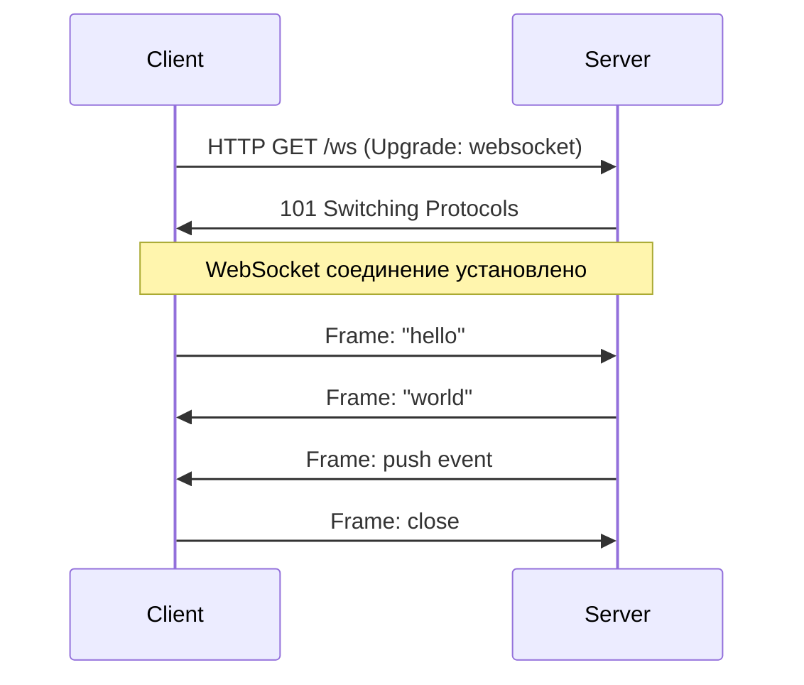
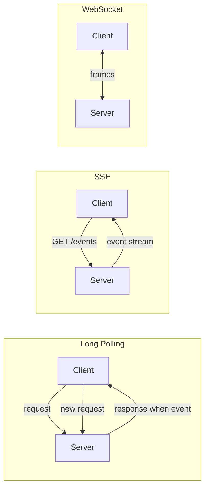
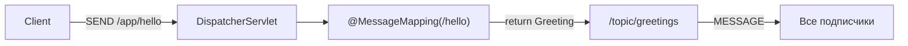
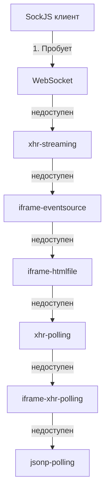
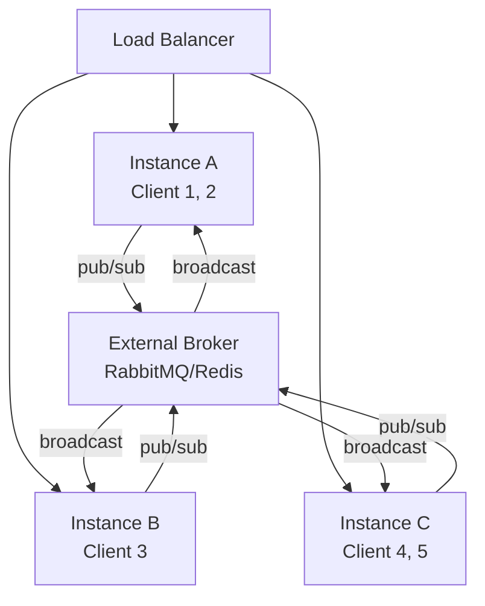
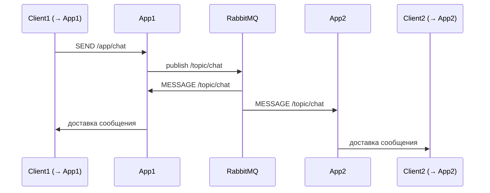

# Вопросы на собеседовании: `WebSocket`

Практичные вопросы и ответы по `WebSocket`: протокол `RFC 6455`, handshake через `HTTP Upgrade`, full-duplex frames, `STOMP` поверх `WebSocket`, `SockJS` как fallback, интеграция со `Spring Boot`, масштабирование через внешний брокер и безопасность.

**`WebSocket`** — протокол двусторонней связи поверх одного TCP-соединения, стандартизированный в `RFC 6455` (2011). После начального HTTP-handshake соединение переводится в режим full-duplex: обе стороны могут отправлять данные в любой момент без накладных расходов на повторное установление соединения.

## Полезные ссылки

### Официальная документация

- [RFC 6455: The WebSocket Protocol](https://datatracker.ietf.org/doc/html/rfc6455) — спецификация протокола
- [Spring WebSocket Documentation](https://docs.spring.io/spring-framework/docs/current/reference/html/web.html#websocket) — официальная документация Spring
- [STOMP Protocol Specification](https://stomp.github.io/stomp-specification-1.2.html) — спецификация STOMP 1.2
- [SockJS Client](https://github.com/sockjs/sockjs-client) — GitHub репозиторий SockJS
- [Intro to WebSockets with Spring | Baeldung](https://www.baeldung.com/websockets-spring) — полный туториал по Spring WebSocket + STOMP
- [Reactive WebSockets with Spring | Baeldung](https://www.baeldung.com/spring-5-reactive-websockets) — WebSocket в Spring WebFlux
- [Intro to Security and WebSockets | Baeldung](https://www.baeldung.com/spring-security-websockets) — безопасность WebSocket
- [REST vs WebSockets | Baeldung](https://www.baeldung.com/rest-vs-websockets) — сравнение подходов
- [Spring WebSockets: Send Messages to a Specific User | Baeldung](https://www.baeldung.com/spring-websockets-send-message-to-user) — отправка сообщений конкретному пользователю

## Содержание

- [Полезные ссылки](#полезные-ссылки)
- [See also](#see-also)

**Основы WebSocket**
- [Q1. (!) Что такое WebSocket и чем он отличается от HTTP?](#q1--что-такое-websocket-и-чем-он-отличается-от-http)
- [Q2. (!) Как происходит WebSocket handshake?](#q2--как-происходит-websocket-handshake)
- [Q3. Что такое WebSocket frames и какие типы существуют?](#q3-что-такое-websocket-frames-и-какие-типы-существуют)
- [Q4. Чем WebSocket отличается от HTTP Long Polling, SSE и gRPC Streaming?](#q4-чем-websocket-отличается-от-http-long-polling-sse-и-grpc-streaming)

**STOMP протокол**
- [Q5. (!) Что такое STOMP и зачем он нужен поверх WebSocket?](#q5--что-такое-stomp-и-зачем-он-нужен-поверх-websocket)
- [Q6. Какие команды определяет STOMP?](#q6-какие-команды-определяет-stomp)
- [Q7. Как устроен фрейм STOMP?](#q7-как-устроен-фрейм-stomp)

**Spring WebSocket (низкий уровень)**
- [Q8. (!) Как настроить WebSocket в Spring без STOMP?](#q8--как-настроить-websocket-в-spring-без-stomp)
- [Q9. Что такое `WebSocketHandler` и его методы?](#q9-что-такое-websockethandler-и-его-методы)
- [Q10. Что такое `WebSocketSession` и как отправить сообщение?](#q10-что-такое-websocketsession-и-как-отправить-сообщение)

**Spring STOMP (высокий уровень)**
- [Q11. (!) Как настроить STOMP поверх WebSocket в Spring Boot?](#q11--как-настроить-stomp-поверх-websocket-в-spring-boot)
- [Q12. Как работает `@MessageMapping` и `@SendTo`?](#q12-как-работает-messagemapping-и-sendto)
- [Q13. Чем `@SubscribeMapping` отличается от `@MessageMapping`?](#q13-чем-subscribemapping-отличается-от-messagemapping)
- [Q14. Как отправить сообщение конкретному пользователю через `@SendToUser`?](#q14-как-отправить-сообщение-конкретному-пользователю-через-sendtouser)
- [Q15. Как отправить сообщение из сервиса вне контроллера через `SimpMessagingTemplate`?](#q15-как-отправить-сообщение-из-сервиса-вне-контроллера-через-simpmessagingtemplate)

**SockJS**
- [Q16. (!) Что такое SockJS и когда его использовать?](#q16--что-такое-sockjs-и-когда-его-использовать)
- [Q17. Какие транспорты использует SockJS в порядке приоритета?](#q17-какие-транспорты-использует-sockjs-в-порядке-приоритета)

**Message Broker**
- [Q18. (!) Чем отличается простой (in-memory) брокер от внешнего STOMP-брокера?](#q18--чем-отличается-простой-in-memory-брокер-от-внешнего-stomp-брокера)
- [Q19. Как настроить RabbitMQ как внешний STOMP-брокер в Spring?](#q19-как-настроить-rabbitmq-как-внешний-stomp-брокер-в-spring)

**Масштабирование**
- [Q20. (!) Почему масштабирование WebSocket сложнее, чем REST? Как решается проблема sticky sessions?](#q20--почему-масштабирование-websocket-сложнее-чем-rest-как-решается-проблема-sticky-sessions)
- [Q21. Как работает pub/sub через внешний брокер при горизонтальном масштабировании?](#q21-как-работает-pubsub-через-внешний-брокер-при-горизонтальном-масштабировании)

**Безопасность**
- [Q22. (!) Как защитить WebSocket-соединение: CORS, аутентификация, Spring Security?](#q22--как-защитить-websocket-соединение-cors-аутентификация-spring-security)
- [Q23. Почему нельзя использовать стандартный CSRF-токен для WebSocket?](#q23-почему-нельзя-использовать-стандартный-csrf-токен-для-websocket)

**Обработка ошибок и переподключение**
- [Q24. Как обрабатывать ошибки STOMP на сервере через `@MessageExceptionHandler`?](#q24-как-обрабатывать-ошибки-stomp-на-сервере-через-messageexceptionhandler)
- [Q25. Как реализовать автоматическое переподключение на клиенте (JS)?](#q25-как-реализовать-автоматическое-переподключение-на-клиенте-js)

**Heartbeat и keepalive**
- [Q26. (!) Как работает heartbeat в STOMP и как его настроить в Spring?](#q26--как-работает-heartbeat-в-stomp-и-как-его-настроить-в-spring)

**Реактивный стек**
- [Q27. (!) Как работает WebSocket в Spring WebFlux (реактивный стек)?](#q27--как-работает-websocket-в-spring-webflux-реактивный-стек)
- [Q28. Что такое `WebSocketHandler` в WebFlux и как он отличается от servlet-версии?](#q28-что-такое-websockethandler-в-webflux-и-как-он-отличается-от-servlet-версии)

**Производительность**
- [Q29. Какие ограничения у WebSocket по количеству соединений и как их обойти?](#q29-какие-ограничения-у-websocket-по-количеству-соединений-и-как-их-обойти)
- [Q30. Как настроить размер буферов и таймауты для WebSocket в Spring?](#q30-как-настроить-размер-буферов-и-таймауты-для-websocket-в-spring)

**Микросервисы, сравнение, эксплуатация**
- [Q31. WebSocket в микросервисной архитектуре: service discovery, gateway, routing](#q31-websocket-в-микросервисной-архитектуре-service-discovery-gateway-routing)
- [Q32. WebSocket vs SSE vs Long Polling: детальное сравнение](#q32-websocket-vs-sse-vs-long-polling-детальное-сравнение)
- [Q33. Мониторинг WebSocket: метрики, количество соединений, health](#q33-мониторинг-websocket-метрики-количество-соединений-health)
- [Q34. WebSocket в Kubernetes: sticky sessions, session affinity, проблемы](#q34-websocket-в-kubernetes-sticky-sessions-session-affinity-проблемы)
- [Q35. Binary vs text frames: MessagePack, Protobuf](#q35-binary-vs-text-frames-messagepack-protobuf)
- [Q36. WebSocket и CDN: почему CDN не кэширует WS, CloudFlare](#q36-websocket-и-cdn-почему-cdn-не-кэширует-ws-cloudflare)
- [Q37. Disconnect стратегии: exponential backoff reconnect на клиенте](#q37-disconnect-стратегии-exponential-backoff-reconnect-на-клиенте)
- [Q38. Testing WebSocket: TestWebSocketClient в Spring](#q38-testing-websocket-testwebsocketclient-в-spring)

---

## Q1. (!) Что такое WebSocket и чем он отличается от HTTP?

**`WebSocket`** — протокол двунаправленной связи (`RFC 6455`), устанавливающий постоянное TCP-соединение между клиентом и сервером. После handshake обе стороны могут отправлять данные в любой момент без ожидания запроса.

**Ключевые отличия от HTTP:**

| Характеристика | HTTP | WebSocket |
|---|---|---|
| Соединение | Короткоживущее (HTTP/1.1: keep-alive, но запрос-ответ) | Постоянное |
| Направление | Полудуплекс (клиент инициирует) | Full-duplex |
| Накладные расходы | Заголовки при каждом запросе (~hundreds bytes) | Минимальные (2–10 байт на фрейм) |
| Push от сервера | Нет (без SSE/polling) | Да |
| Протокол | `http://` / `https://` | `ws://` / `wss://` |



---


> [!mcq]
> - [ ] WebSocket — это просто HTTP long polling с переименованием | ❌ ПОСЛЕДСТВИЕ: long polling использует обычный HTTP с reconnect; WebSocket — full-duplex протокол после Upgrade с persistent TCP соединением
> - [x] WebSocket = bidirectional persistent TCP connection после HTTP Upgrade handshake; обычно ws:// или wss:// (TLS) | ✓ ПРИМЕНЯТЬ: real-time push (chat, trading, notifications), bidirectional communication 📋 ПРАВИЛО: WebSocket = полнодуплекс после Upgrade = единое соединение 🔗 См. Q2
> - [ ] WebSocket работает только на портах 80 и 443 | ❌ ПОСЛЕДСТВИЕ: WebSocket использует те же порты что HTTP/HTTPS (80/443) для проксирования через файрволы; но технически любой порт
> - [ ] WebSocket требует отдельного DNS — нельзя использовать тот же домен что HTTP | ❌ ПОСЛЕДСТВИЕ: WebSocket работает на том же домене и порте что HTTP — путь /ws запускает Upgrade

## Q2. (!) Как происходит WebSocket handshake?

**WebSocket handshake** — это HTTP-запрос на переключение протокола. Стандарт требует заголовок `Upgrade: websocket`.

**Запрос клиента:**
```http
GET /ws HTTP/1.1
Host: example.com
Upgrade: websocket
Connection: Upgrade
Sec-WebSocket-Key: dGhlIHNhbXBsZSBub25jZQ==
Sec-WebSocket-Version: 13
Sec-WebSocket-Protocol: stomp
```

**Ответ сервера (статус 101):**
```http
HTTP/1.1 101 Switching Protocols
Upgrade: websocket
Connection: Upgrade
Sec-WebSocket-Accept: s3pPLMBiTxaQ9kYGzzhZRbK+xOo=
Sec-WebSocket-Protocol: stomp
```

- `Sec-WebSocket-Key` — случайный base64 nonce от клиента
- `Sec-WebSocket-Accept` — `SHA-1(key + "258EAFA5-E914-47DA-95CA-C5AB0DC85B11")`, закодированный в base64
- После ответа `101 Switching Protocols` TCP-соединение переходит в режим WebSocket-фреймов

---


> [!mcq]
> - [ ] WebSocket handshake — это TCP handshake с дополнительными байтами | ❌ ПОСЛЕДСТВИЕ: WebSocket работает поверх TCP; handshake — это HTTP/1.1 GET с Upgrade: websocket; статус 101 Switching Protocols
> - [x] HTTP GET с заголовками Upgrade: websocket + Connection: Upgrade + Sec-WebSocket-Key; ответ 101 + Sec-WebSocket-Accept = SHA-1(key + magic GUID) | ✓ ПРИМЕНЯТЬ: знать что handshake — это HTTP, проверять headers в proxy/lb 📋 ПРАВИЛО: 101 Switching Protocols + valid Accept = успешный handshake 🔗 См. Q3
> - [ ] Sec-WebSocket-Accept — это случайное значение от сервера для проверки клиента | ❌ ПОСЛЕДСТВИЕ: Accept — это детерминистический хэш SHA-1 от Key + magic constant; клиент проверяет правильность хэша
> - [ ] WebSocket handshake не требует HTTPS — wss:// устаревший протокол | ❌ ПОСЛЕДСТВИЕ: wss:// — стандарт для production (TLS); ws:// небезопасен и блокируется на сайтах с HTTPS (mixed content)

## Q3. Что такое WebSocket frames и какие типы существуют?

**Фрейм** — минимальная единица данных в WebSocket. Каждый фрейм содержит opcode, флаги и payload.

**Типы фреймов (opcode):**

| Opcode | Тип | Описание |
|---|---|---|
| `0x0` | Continuation | Продолжение фрагментированного сообщения |
| `0x1` | Text | Текстовые данные (UTF-8) |
| `0x2` | Binary | Бинарные данные |
| `0x8` | Close | Закрытие соединения (с кодом причины) |
| `0x9` | Ping | Keepalive запрос |
| `0xA` | Pong | Ответ на Ping |

**Структура фрейма:**
```
 0                   1                   2                   3
 0 1 2 3 4 5 6 7 8 9 0 1 2 3 4 5 6 7 8 9 0 1 2 3 4 5 6 7 8 9 0 1
+-+-+-+-+-------+-+-------------+-------------------------------+
|F|R|R|R| opcode|M| Payload len |    Extended payload length    |
|I|S|S|S|  (4)  |A|     (7)    |             (16/64)           |
|N|V|V|V|       |S|             |   (if payload len==126/127)   |
| |1|2|3|       |K|             |                               |
+-+-+-+-+-------+-+-------------+-------------------------------+
```

- **FIN** — последний фрагмент сообщения
- **MASK** — клиент обязан маскировать фреймы, сервер — не должен

---


> [!mcq]
> - [ ] WebSocket поддерживает только текстовые сообщения, не бинарные | ❌ ПОСЛЕДСТВИЕ: opcode 0x2 — Binary frames; протокол поддерживает оба типа; ограничение приведёт к лишнему base64 для бинарных данных
> - [x] Frames: 0x0 Continuation, 0x1 Text (UTF-8), 0x2 Binary, 0x8 Close, 0x9 Ping, 0xA Pong; FIN bit для фрагментации; MASK обязателен от клиента | ✓ ПРИМЕНЯТЬ: понимать структуру для отладки и proxy конфигурации 📋 ПРАВИЛО: 6 типов фреймов: 3 data + 3 control 🔗 См. Q3
> - [ ] Сервер обязан маскировать данные при отправке клиенту | ❌ ПОСЛЕДСТВИЕ: только клиент → сервер требует маскирования (защита от cache poisoning); сервер → клиент без маски
> - [ ] Один фрейм не может быть фрагментирован на несколько TCP пакетов | ❌ ПОСЛЕДСТВИЕ: фреймы могут быть до 2^63 байт; TCP фрагментирует на сегменты автоматически; FIN бит обрамляет логические сообщения, не TCP пакеты

## Q4. Чем WebSocket отличается от HTTP Long Polling, SSE и gRPC Streaming?

| | WebSocket | Long Polling | SSE | gRPC Streaming |
|---|---|---|---|---|
| Направление | Full-duplex | Полудуплекс | Server → Client | Full-duplex |
| Протокол | ws:// / wss:// | HTTP | HTTP (text/event-stream) | HTTP/2 |
| Сообщения | Произвольные frames | JSON/text | text/event-stream | Protocol Buffers |
| Поддержка браузером | Нативная | Нативная | Нативная | Через grpc-web |
| Накладные расходы | Низкие | Высокие (новый запрос) | Низкие | Низкие |
| Переподключение | Ручное | Автоматическое | Автоматическое | Ручное |
| Применение | Чат, реалтайм UI, игры | Нотификации (legacy) | Лента событий | Межсервисный стриминг |



---


> [!mcq]
> - [ ] WebSocket и Long Polling одинаковы по производительности | ❌ ПОСЛЕДСТВИЕ: Long Polling делает новый HTTP-запрос на каждое событие; WebSocket — единое соединение; накладные расходы Long Polling кратно больше
> - [x] WebSocket: bidirectional, ws/wss, низкий overhead; SSE: server→client, HTTP стрим; gRPC: HTTP/2, типизация; Long Polling: legacy, высокий overhead | ✓ ПРИМЕНЯТЬ: выбор по сценарию — chat → WS; feed → SSE; межсервис → gRPC 📋 ПРАВИЛО: WebSocket = bidirectional persistent; SSE = server push only 🔗 См. Q5
> - [ ] SSE поддерживает bidirectional коммуникацию как WebSocket | ❌ ПОСЛЕДСТВИЕ: SSE только server→client; для client→server нужны отдельные POST/PUT
> - [ ] gRPC streaming работает в браузерах нативно как WebSocket | ❌ ПОСЛЕДСТВИЕ: gRPC требует HTTP/2 + protobuf; в браузере только через grpc-web прокси; WebSocket нативно поддерживается всеми браузерами

## Q5. (!) Что такое STOMP и зачем он нужен поверх WebSocket?

**`STOMP`** (Simple Text Oriented Messaging Protocol) — текстовый протокол обмена сообщениями поверх WebSocket. Добавляет семантику топиков, маршрутизацию и подтверждения, которых нет в базовом WebSocket.

**Проблемы чистого WebSocket:**
- Нет понятия топиков/каналов — приложение само должно разбирать payload
- Нет стандарта для subscribe/unsubscribe
- Нет ACK для сообщений
- Сложно интегрировать с брокерами сообщений

**STOMP решает:**
```
STOMP фрейм:
COMMAND
header1:value1
header2:value2

Body^@

Команды: CONNECT, SUBSCRIBE, UNSUBSCRIBE, SEND, MESSAGE, ACK, NACK, BEGIN, COMMIT, ABORT, DISCONNECT
```

**Пример подписки:**
```
SUBSCRIBE
id:sub-0
destination:/topic/greetings

^@
```

---


> [!mcq]
> - [ ] WebSocket уже включает понятие топиков — STOMP избыточен | ❌ ПОСЛЕДСТВИЕ: WebSocket — низкоуровневый транспорт без семантики; topics, SUBSCRIBE, ACK — это всё STOMP добавляет
> - [x] STOMP добавляет поверх WebSocket: topics/destinations, SUBSCRIBE/UNSUBSCRIBE, ACK/NACK, transactions, маршрутизация через брокер (RabbitMQ, ActiveMQ) | ✓ ПРИМЕНЯТЬ: pub/sub поверх WebSocket, интеграция с message broker 📋 ПРАВИЛО: WebSocket = транспорт; STOMP = семантика сообщений 🔗 См. Q6
> - [ ] STOMP — это бинарный протокол как Protobuf | ❌ ПОСЛЕДСТВИЕ: STOMP именно текстовый (Simple Text Oriented Messaging Protocol); удобно для отладки, дороже по байтам чем бинарный
> - [ ] STOMP работает только с RabbitMQ — для других брокеров несовместим | ❌ ПОСЛЕДСТВИЕ: STOMP поддерживается RabbitMQ, ActiveMQ, HornetQ, Apollo; открытый стандарт

## Q6. Какие команды определяет STOMP?

**Команды клиента:**

| Команда | Описание |
|---|---|
| `CONNECT` | Установка сессии с брокером (заголовки `login`, `passcode`, `heart-beat`) |
| `DISCONNECT` | Корректное закрытие сессии |
| `SUBSCRIBE` | Подписка на destination, возвращает `id` подписки |
| `UNSUBSCRIBE` | Отмена подписки по `id` |
| `SEND` | Отправка сообщения на destination |
| `ACK` | Подтверждение получения сообщения |
| `NACK` | Негативное подтверждение |
| `BEGIN` / `COMMIT` / `ABORT` | Транзакции |

**Команды сервера/брокера:**

| Команда | Описание |
|---|---|
| `CONNECTED` | Ответ на `CONNECT` |
| `MESSAGE` | Доставка сообщения подписчику |
| `RECEIPT` | Подтверждение обработки (если клиент послал `receipt` заголовок) |
| `ERROR` | Ошибка; брокер закрывает соединение |

---


> [!mcq]
> - [ ] STOMP не имеет команды для отмены подписки — нужно закрыть соединение | ❌ ПОСЛЕДСТВИЕ: UNSUBSCRIBE — стандартная команда STOMP с указанием id; не нужно закрывать всё соединение
> - [ ] ACK/NACK работают только с auto-acknowledge режимом | ❌ ПОСЛЕДСТВИЕ: ACK/NACK как раз для client-acknowledge режима (manual); auto-ack не требует ACK
> - [x] Client: CONNECT, SUBSCRIBE, UNSUBSCRIBE, SEND, ACK/NACK, BEGIN/COMMIT/ABORT; Server: CONNECTED, MESSAGE, RECEIPT, ERROR | ✓ ПРИМЕНЯТЬ: использовать ACK для guaranteed delivery; transactions для атомарных операций 📋 ПРАВИЛО: SUBSCRIBE/MESSAGE/ACK — основа pub/sub в STOMP 🔗 См. Q7
> - [ ] BEGIN/COMMIT — это для DB-транзакций | ❌ ПОСЛЕДСТВИЕ: в STOMP это для группировки нескольких SEND в атомарную операцию (все или ничего); не для DB

## Q7. Как устроен фрейм STOMP?

```
SEND
destination:/app/chat
content-type:application/json
content-length:26

{"text":"Hello, WebSocket!"}^@
```

- **Первая строка** — команда (`SEND`, `SUBSCRIBE`, `MESSAGE` и т.д.)
- **Заголовки** — `key:value` (один на строку)
- **Пустая строка** — разделитель
- **Тело** — произвольный контент (JSON, текст, binary)
- **`^@`** (NULL байт, `\0`) — терминатор фрейма

---


> [!mcq]
> - [ ] STOMP-фрейм заканчивается переводом строки (`\n`), как HTTP | ❌ ПОСЛЕДСТВИЕ: фрейм терминируется NULL-байтом `\0` (`^@`); парсер по `\n` примет первый header за конец и потеряет тело
> - [ ] Заголовки разделены запятой, тело отделено двоеточием | ❌ ПОСЛЕДСТВИЕ: заголовки `key:value` по одному на строку, тело отделено пустой строкой; это не HTTP-форма
> - [ ] Первый байт фрейма — длина в bigendian, дальше payload | ❌ ПОСЛЕДСТВИЕ: STOMP — текстовый протокол (Simple Text), без бинарного префикса длины; длина указывается опциональным `content-length` header
> - [x] Текстовый формат: первая строка — команда, далее `key:value` заголовки, пустая строка, тело, терминатор `\0` | ✓ ПРИМЕНЯТЬ: для отладки можно прочитать фрейм глазами или telnet'ом; `content-length` обязателен для binary body 📋 ПРАВИЛО: STOMP = HTTP-подобный текст + NULL-терминатор 🔗 См. Q8

## Q8. (!) Как настроить WebSocket в Spring без STOMP?

Используется `@EnableWebSocket` и `WebSocketConfigurer`:

```java
@Configuration
@EnableWebSocket
public class WebSocketConfig implements WebSocketConfigurer {

    @Override
    public void registerWebSocketHandlers(WebSocketHandlerRegistry registry) {
        registry.addHandler(myWebSocketHandler(), "/ws")
                .setAllowedOrigins("*")
                .withSockJS(); // опционально: fallback через SockJS
    }

    @Bean
    public WebSocketHandler myWebSocketHandler() {
        return new MyWebSocketHandler();
    }
}
```

---


> [!mcq]
> - [ ] Нужно поднимать отдельный Netty-сервер на другом порту | ❌ ПОСЛЕДСТВИЕ: Spring Boot встроенный Tomcat/Jetty/Undertow уже поддерживают WebSocket Upgrade; отдельный сервер усложняет деплой и nginx-роутинг
> - [ ] Достаточно `@RestController` с маппингом метода на `/ws` | ❌ ПОСЛЕДСТВИЕ: `@RestController` обрабатывает HTTP request/response; для WebSocket нужен `WebSocketHandler` с lifecycle-методами `afterConnectionEstablished`/`handleMessage`
> - [ ] `@EnableWebSocketMessageBroker` подключает raw WebSocket без брокера | ❌ ПОСЛЕДСТВИЕ: эта аннотация включает STOMP-брокер; без STOMP нужен именно `@EnableWebSocket` + `WebSocketConfigurer`
> - [x] `@EnableWebSocket` + `implements WebSocketConfigurer` + `registry.addHandler(handler, "/ws").setAllowedOrigins(...)` | ✓ ПРИМЕНЯТЬ: для простых echo/notification без брокера; SockJS-fallback для старых браузеров через `.withSockJS()` 📋 ПРАВИЛО: WebSocket = raw, STOMP = pub/sub поверх 🔗 См. Q9

## Q9. Что такое `WebSocketHandler` и его методы?

`WebSocketHandler` — основной интерфейс для обработки low-level WebSocket-событий. Обычно расширяют `TextWebSocketHandler` или `BinaryWebSocketHandler`.

```java
@Component
public class MyWebSocketHandler extends TextWebSocketHandler {

    private final Map<String, WebSocketSession> sessions = new ConcurrentHashMap<>();

    @Override
    public void afterConnectionEstablished(WebSocketSession session) {
        sessions.put(session.getId(), session);
        log.info("Connected: {}", session.getId());
    }

    @Override
    protected void handleTextMessage(WebSocketSession session, TextMessage message) throws Exception {
        String payload = message.getPayload();
        // echo-сервер
        session.sendMessage(new TextMessage("Echo: " + payload));
    }

    @Override
    public void afterConnectionClosed(WebSocketSession session, CloseStatus status) {
        sessions.remove(session.getId());
        log.info("Disconnected: {} with status {}", session.getId(), status);
    }

    @Override
    public void handleTransportError(WebSocketSession session, Throwable exception) {
        log.error("Transport error for session {}", session.getId(), exception);
    }
}
```

---


> [!mcq]
> - [ ] `afterConnectionEstablished` вызывается перед HTTP Upgrade — там можно проверить токен | ❌ ПОСЛЕДСТВИЕ: метод вызывается ПОСЛЕ успешного upgrade; auth-проверку делают в `HandshakeInterceptor.beforeHandshake` или в Spring Security
> - [ ] `handleTextMessage` блокирующий — Spring сам создаёт thread на каждое сообщение | ❌ ПОСЛЕДСТВИЕ: контейнер использует event-loop (Netty/NIO); долгая обработка в `handleTextMessage` блокирует IO-поток; нужно делегировать в `@Async`/executor
> - [ ] `afterConnectionClosed` гарантированно вызывается при OOM или kill -9 | ❌ ПОСЛЕДСТВИЕ: при аварийном завершении JVM метод не вызывается; cleanup-логика должна полагаться на heartbeat/idle-timeout, не на `afterConnectionClosed`
> - [x] Lifecycle: `afterConnectionEstablished` (open) → `handleTextMessage`/`handleBinaryMessage` (data) → `handleTransportError` (error) → `afterConnectionClosed` (close) | ✓ ПРИМЕНЯТЬ: расширять `TextWebSocketHandler` вместо raw `WebSocketHandler`; хранить sessions в `ConcurrentHashMap` 📋 ПРАВИЛО: один WebSocketHandler = singleton на все соединения, состояние — в WebSocketSession 🔗 См. Q10

## Q10. Что такое `WebSocketSession` и как отправить сообщение?

`WebSocketSession` — объект, представляющий активное соединение. Позволяет отправлять сообщения, получать атрибуты, закрывать соединение.

```java
// Отправка текста
session.sendMessage(new TextMessage("Hello"));

// Отправка бинарных данных
session.sendMessage(new BinaryMessage(ByteBuffer.wrap(bytes)));

// Получение атрибутов (из handshake)
Map<String, Object> attrs = session.getAttributes();
String userId = (String) attrs.get("userId");

// Закрытие соединения
session.close(CloseStatus.NORMAL);

// Проверка состояния
if (session.isOpen()) {
    session.sendMessage(new TextMessage("still alive"));
}
```

**Важно:** `sendMessage` **не потокобезопасен** — при конкурентных вызовах нужна синхронизация:
```java
synchronized (session) {
    session.sendMessage(new TextMessage(payload));
}
```

---


> [!mcq]
> - [ ] `sendMessage` потокобезопасен — Spring синхронизирует write поверх Netty | ❌ ПОСЛЕДСТВИЕ: метод НЕ thread-safe; конкурентные `sendMessage` могут смешать байты разных фреймов и порвать соединение
> - [ ] `session.getAttributes()` возвращает HTTP-сессию контейнера | ❌ ПОСЛЕДСТВИЕ: это отдельный map, заполненный в `HandshakeInterceptor.beforeHandshake`; HTTP-сессия — это `session.getHandshakeHeaders()`/`getPrincipal()`
> - [ ] `session.close()` без аргументов закрывает с кодом 1006 (abnormal) | ❌ ПОСЛЕДСТВИЕ: без аргументов — `CloseStatus.NORMAL` (1000); 1006 устанавливает само соединение при разрыве TCP без CLOSE-frame
> - [x] `session.sendMessage(new TextMessage(payload))` — отправка; `session.isOpen()` — проверка; для конкурентных вызовов нужен `synchronized(session)` или `ConcurrentWebSocketSessionDecorator` | ✓ ПРИМЕНЯТЬ: оборачивать session в `ConcurrentWebSocketSessionDecorator(session, sendTimeLimit, bufferSizeLimit)` чтобы Spring сам синхронизировал и буферизировал 📋 ПРАВИЛО: один WebSocketSession = одно соединение, sendMessage не thread-safe 🔗 См. Q11

## Q11. (!) Как настроить STOMP поверх WebSocket в Spring Boot?

```java
@Configuration
@EnableWebSocketMessageBroker
public class StompWebSocketConfig implements WebSocketMessageBrokerConfigurer {

    @Override
    public void configureMessageBroker(MessageBrokerRegistry registry) {
        // Префиксы для in-memory брокера (topics и queues)
        registry.enableSimpleBroker("/topic", "/queue");
        // Префикс для сообщений, адресованных @MessageMapping-методам
        registry.setApplicationDestinationPrefixes("/app");
        // Префикс для user-specific destinations
        registry.setUserDestinationPrefix("/user");
    }

    @Override
    public void registerStompEndpoints(StompEndpointRegistry registry) {
        registry.addEndpoint("/ws")
                .setAllowedOriginPatterns("*")
                .withSockJS(); // SockJS fallback
    }
}
```

**Клиент (JavaScript):**
```javascript
const socket = new SockJS('/ws');
const stompClient = Stomp.over(socket);

stompClient.connect({}, function(frame) {
    // Подписка на топик
    stompClient.subscribe('/topic/greetings', function(message) {
        console.log(JSON.parse(message.body));
    });
    // Отправка сообщения
    stompClient.send('/app/hello', {}, JSON.stringify({name: 'User'}));
});
```

---


> [!mcq]
> - [ ] `enableSimpleBroker` подключает RabbitMQ как брокер сообщений | ❌ ПОСЛЕДСТВИЕ: `enableSimpleBroker` — это in-memory брокер внутри Spring; для RabbitMQ/ActiveMQ нужен `enableStompBrokerRelay("/topic","/queue")` с указанием хоста брокера
> - [ ] `setApplicationDestinationPrefixes("/app")` нужен для прямой адресации брокеру | ❌ ПОСЛЕДСТВИЕ: префикс `/app` направляет сообщения в `@MessageMapping`-методы контроллера, а не в брокер; брокер получает только `/topic`/`/queue`
> - [ ] `addEndpoint("/ws").withSockJS()` обязателен — без SockJS WebSocket не работает | ❌ ПОСЛЕДСТВИЕ: `withSockJS()` — это fallback для браузеров без WebSocket (IE9, прокси); современные браузеры подключаются по нативному WS, SockJS опционален
> - [x] `@EnableWebSocketMessageBroker` + `configureMessageBroker` (брокер) + `registerStompEndpoints` (HTTP-эндпоинт) | ✓ ПРИМЕНЯТЬ: для small-scale — `enableSimpleBroker`; для cluster — `enableStompBrokerRelay` с внешним RabbitMQ для масштабирования между нодами 📋 ПРАВИЛО: `/app` → controller, `/topic`/`/queue` → broker, `/user` → user-specific 🔗 См. Q12

## Q12. Как работает `@MessageMapping` и `@SendTo`?

```java
@Controller
public class GreetingController {

    // Принимает сообщения на /app/hello
    // Возвращаемое значение отправляется на /topic/greetings
    @MessageMapping("/hello")
    @SendTo("/topic/greetings")
    public Greeting greeting(HelloMessage message) {
        return new Greeting("Hello, " + message.getName() + "!");
    }

    // Без @SendTo — возвращает ответ только отправителю
    @MessageMapping("/private")
    @SendToUser("/queue/reply")
    public Reply privateReply(Request request) {
        return new Reply("Private: " + request.getText());
    }
}
```

**Поток обработки:**


---


> [!mcq]
> - [ ] `@MessageMapping("/hello")` слушает HTTP POST /hello, как `@PostMapping` | ❌ ПОСЛЕДСТВИЕ: `@MessageMapping` слушает STOMP-сообщения с destination `/app/hello` (с префиксом из `setApplicationDestinationPrefixes`), не HTTP
> - [ ] `@SendTo("/topic/greetings")` отправляет только отправителю запроса | ❌ ПОСЛЕДСТВИЕ: `@SendTo` бродкастит ВСЕМ подписчикам топика; для адресации отправителю — `@SendToUser`
> - [ ] Если метод возвращает `void`, ничего не отправляется на брокер | ❌ ПОСЛЕДСТВИЕ: можно явно отправить через `SimpMessagingTemplate.convertAndSend(...)` независимо от возвращаемого типа; `void` просто не использует `@SendTo`
> - [x] `@MessageMapping("/hello")` принимает фрейм на `/app/hello`; возвращаемое значение отправляется на destination из `@SendTo`/`@SendToUser` | ✓ ПРИМЕНЯТЬ: `@SendTo("/topic/X")` для бродкаста всем; `@SendToUser("/queue/Y")` для адресации конкретному user.principal 📋 ПРАВИЛО: `/app` → MessageMapping, return → `/topic` или `/user/queue` 🔗 См. Q13

## Q13. Чем `@SubscribeMapping` отличается от `@MessageMapping`?

`@SubscribeMapping` вызывается в момент подписки клиента (команда `SUBSCRIBE`), а не при отправке сообщения (`SEND`).

```java
@Controller
public class DataController {

    // Вызывается при SUBSCRIBE на /app/initial-data
    // Ответ отправляется напрямую клиенту (не через брокер)
    @SubscribeMapping("/initial-data")
    public List<Item> getInitialData() {
        return itemRepository.findAll(); // отправляется только подписавшемуся клиенту
    }

    // С явным указанием destination через брокер
    @SubscribeMapping("/updates")
    @SendTo("/topic/updates")
    public Update sendInitialUpdate() {
        return currentUpdate();
    }
}
```

**Отличия:**
- `@SubscribeMapping` → ответ идёт **напрямую** клиенту (без публикации в брокер), если не указан `@SendTo`
- `@MessageMapping` → ответ всегда идёт через брокер

---


> [!mcq]
> - [ ] `@SubscribeMapping` вызывается на КАЖДОЕ сообщение от клиента | ❌ ПОСЛЕДСТВИЕ: метод вызывается ОДИН раз — в момент команды STOMP `SUBSCRIBE`; для обработки сообщений нужен `@MessageMapping`
> - [ ] `@SubscribeMapping` отправляет ответ всем подписчикам топика | ❌ ПОСЛЕДСТВИЕ: ответ идёт ТОЛЬКО подписавшемуся клиенту напрямую (через MESSAGE-фрейм с его subscription-id), минуя брокер
> - [ ] `@SubscribeMapping` нельзя комбинировать с `@SendTo` | ❌ ПОСЛЕДСТВИЕ: можно — тогда ответ идёт через брокер, как у `@MessageMapping`; без `@SendTo` — напрямую клиенту
> - [x] `@SubscribeMapping` вызывается при STOMP SUBSCRIBE и отправляет ответ напрямую клиенту (минуя брокер); `@MessageMapping` — при SEND и идёт через брокер | ✓ ПРИМЕНЯТЬ: `@SubscribeMapping` для отдачи initial-state (снапшот при подключении); `@MessageMapping` для бизнес-сообщений 📋 ПРАВИЛО: SUBSCRIBE → one-shot snapshot; SEND → continuous stream 🔗 См. Q14

## Q14. Как отправить сообщение конкретному пользователю через `@SendToUser`?

Spring маппирует `/user/{username}/queue/reply` → `/queue/reply-user{sessionId}`:

```java
@Controller
public class UserController {

    @MessageMapping("/chat.private")
    @SendToUser("/queue/messages")
    public ChatMessage sendPrivateMessage(
            @Payload ChatMessage message,
            Principal principal) {
        message.setFrom(principal.getName());
        return message;
    }
}
```

**Клиент:**
```javascript
// Подписка на личные сообщения
stompClient.subscribe('/user/queue/messages', function(msg) {
    displayPrivateMessage(JSON.parse(msg.body));
});

// Отправка личного сообщения
stompClient.send('/app/chat.private', {}, JSON.stringify({
    to: 'bob',
    text: 'Hello Bob!'
}));
```

---


> [!mcq]
> - [ ] `@SendToUser("/queue/messages")` отправляет ВСЕМ авторизованным юзерам | ❌ ПОСЛЕДСТВИЕ: отправляется только владельцу запроса (определяется по `Principal` из handshake); другие юзеры даже не подписаны на эту конкретную user-queue
> - [ ] Клиент должен подписаться на `/queue/messages-user<sessionId>` напрямую | ❌ ПОСЛЕДСТВИЕ: клиент подписывается на `/user/queue/messages`; маппинг в `/queue/messages-user<sessionId>` делает `UserDestinationResolver` под капотом
> - [ ] Принципал создаётся автоматически — auth не нужен | ❌ ПОСЛЕДСТВИЕ: без Spring Security `Principal` будет `null` и сообщение не доставится; нужен либо custom `HandshakeHandler`, либо Spring Security WebSocket-конфиг
> - [x] `@SendToUser("/queue/X")` адресует ответ владельцу запроса (Principal); клиент подписан на `/user/queue/X`, Spring транслирует в `/queue/X-user<sessionId>` | ✓ ПРИМЕНЯТЬ: для private chat, личных нотификаций, ответов на команды конкретному юзеру 📋 ПРАВИЛО: `/user/...` префикс на клиенте + `@SendToUser` на сервере + Principal обязателен 🔗 См. Q15

## Q15. Как отправить сообщение из сервиса вне контроллера через `SimpMessagingTemplate`?

```java
@Service
@RequiredArgsConstructor
public class NotificationService {

    private final SimpMessagingTemplate messagingTemplate;

    // Отправка всем подписчикам топика
    public void notifyAll(String event) {
        messagingTemplate.convertAndSend("/topic/notifications", event);
    }

    // Отправка конкретному пользователю
    public void notifyUser(String username, String event) {
        messagingTemplate.convertAndSendToUser(username, "/queue/alerts", event);
    }
}

// Пример: отправка по расписанию
@Component
@RequiredArgsConstructor
public class ScheduledPush {

    private final SimpMessagingTemplate template;

    @Scheduled(fixedRate = 5000)
    public void pushMetrics() {
        template.convertAndSend("/topic/metrics", metricsService.getCurrent());
    }
}
```

---


> [!mcq]
> - [ ] Из @Service можно инжектить только `@MessageMapping` контроллер | ❌ ПОСЛЕДСТВИЕ: контроллер для входящих, а не исходящих сообщений; для push-уведомлений нужен `SimpMessagingTemplate` (Spring-bean)
> - [ ] `convertAndSendToUser(username, "/queue/X", payload)` рассылает ВСЕМ юзерам с этим именем | ❌ ПОСЛЕДСТВИЕ: отправляется ВСЕМ открытым сессиям этого юзера (может быть несколько устройств); сообщение получит каждое устройство юзера
> - [ ] `SimpMessagingTemplate` не работает в `@Scheduled` методах | ❌ ПОСЛЕДСТВИЕ: работает; типичный паттерн — periodic push метрик/notifications; ограничения только при использовании внешнего брокера (broker-relay должен быть UP)
> - [x] Инжектить `SimpMessagingTemplate`, вызывать `convertAndSend("/topic/X", payload)` для broadcast или `convertAndSendToUser(username, "/queue/X", ...)` для адресации | ✓ ПРИМЕНЯТЬ: для server-initiated push из @Scheduled/event-handler; payload сериализуется через `MessageConverter` (по умолчанию Jackson JSON) 📋 ПРАВИЛО: входящие → @MessageMapping; исходящие из сервиса → SimpMessagingTemplate 🔗 См. Q16

## Q16. (!) Что такое SockJS и когда его использовать?

**`SockJS`** — библиотека-обёртка, предоставляющая WebSocket-совместимый API с автоматическим fallback на HTTP-транспорты для браузеров или прокси, не поддерживающих WebSocket.

```java
// Сервер — включить SockJS поддержку
registry.addEndpoint("/ws").withSockJS();
```

```javascript
// Клиент — SockJS вместо нативного WebSocket
const socket = new SockJS('/ws');
const stompClient = Stomp.over(socket);
```

**Когда использовать:**
- Корпоративные сети с блокирующими прокси
- Поддержка старых браузеров (IE 9 и ниже)
- Максимальная совместимость без ущерба для новых клиентов

**SockJS Info Endpoint:** `GET /ws/info` — клиент проверяет доступность WebSocket перед подключением.

---


> [!mcq]
> - [ ] SockJS — это альтернативная реализация WebSocket-сервера на Java | ❌ ПОСЛЕДСТВИЕ: SockJS — это JavaScript-клиент + серверный протокол fallback, а не WebSocket-имплементация; работает поверх стандартного WebSocket-сервера (Spring/Netty)
> - [ ] SockJS включается только на клиенте, на сервере ничего не меняется | ❌ ПОСЛЕДСТВИЕ: серверу нужен `.withSockJS()` для endpoint'а — он включает дополнительные HTTP-эндпоинты `/info`, `/xhr_streaming`, `/xhr_send` для fallback-транспортов
> - [ ] SockJS лучше нативного WebSocket по производительности | ❌ ПОСЛЕДСТВИЕ: при WebSocket-транспорте идентичен нативному; на HTTP-fallback (xhr-polling/xhr-streaming) — заметно медленнее и дороже по байтам из-за HTTP-оверхеда
> - [x] SockJS — wrapper с WS-совместимым API, автоматический fallback на HTTP-транспорты (xhr-streaming, xhr-polling) если WebSocket недоступен (corporate proxy, IE9) | ✓ ПРИМЕНЯТЬ: включать `.withSockJS()` если клиенты в корпоративных сетях с блокирующими прокси или поддерживается IE9- 📋 ПРАВИЛО: SockJS = страховка для networks без WebSocket; не использовать если контролируете сеть и браузеры 🔗 См. Q17

## Q17. Какие транспорты использует SockJS в порядке приоритета?

SockJS выбирает лучший доступный транспорт автоматически:



| Приоритет | Транспорт | Описание |
|---|---|---|
| 1 | `websocket` | Нативный WebSocket |
| 2 | `xhr-streaming` | XHR streaming (EventSource-like) |
| 3 | `iframe-eventsource` | SSE через iframe |
| 4 | `xhr-polling` | XHR long polling |
| 5 | `jsonp-polling` | JSONP для старых браузеров |

---


> [!mcq]
> - [ ] SockJS пробует HTTP-polling первым, чтобы убедиться в стабильности соединения | ❌ ПОСЛЕДСТВИЕ: первым пробуется WebSocket — самый эффективный транспорт; polling — крайний fallback
> - [ ] Если WebSocket недоступен, SockJS переходит на gRPC streaming | ❌ ПОСЛЕДСТВИЕ: gRPC требует HTTP/2 и не в браузерных fallback; SockJS использует только HTTP/1.1 транспорты (xhr-streaming, eventsource, xhr-polling, jsonp)
> - [ ] SockJS обнаруживает транспорт по User-Agent заголовку браузера | ❌ ПОСЛЕДСТВИЕ: транспорты пробуются последовательно по timeout — клиент пытается подключиться, при failure пробует следующий; решение динамическое, не по UA
> - [x] Порядок: 1) `websocket` → 2) `xhr-streaming` → 3) `iframe-eventsource` → 4) `iframe-htmlfile` → 5) `xhr-polling` → 6) `jsonp-polling` | ✓ ПРИМЕНЯТЬ: можно отключить отдельные транспорты через `disabledTransports` если корпоративный прокси «зависает» на streaming-транспортах 📋 ПРАВИЛО: SockJS пробует от лучшего к худшему по latency 🔗 См. Q18

## Q18. (!) Чем отличается простой (in-memory) брокер от внешнего STOMP-брокера?

**Simple Broker (in-memory):**
```java
registry.enableSimpleBroker("/topic", "/queue");
```
- Встроен в Spring — нет внешних зависимостей
- Сообщения хранятся только в памяти одного инстанса
- Не масштабируется горизонтально
- Нет персистентности, нет DLQ, нет ACK

**External STOMP Broker (RabbitMQ / ActiveMQ):**
```java
registry.enableStompBrokerRelay("/topic", "/queue")
        .setRelayHost("rabbitmq.host")
        .setRelayPort(61613)           // STOMP порт
        .setClientLogin("guest")
        .setClientPasscode("guest")
        .setSystemLogin("guest")
        .setSystemPasscode("guest");
```
- Все сообщения проходят через внешний брокер
- Работает при нескольких инстансах приложения
- Персистентность, DLQ, TTL, приоритеты
- Требует отдельного инфраструктурного компонента

---


> [!mcq]
> - [ ] Simple broker масштабируется горизонтально через session-replication | ❌ ПОСЛЕДСТВИЕ: SimpleBroker — in-memory одного инстанса; топики НЕ синхронизируются между нодами; клиент на ноде A не получит сообщение от ноды B
> - [ ] Внешний брокер нужен только для durable-сообщений | ❌ ПОСЛЕДСТВИЕ: главная причина — масштабирование на N инстансов; durability — побочный эффект; также ACK, DLQ, retry-policy недоступны в SimpleBroker
> - [ ] RabbitMQ через `enableStompBrokerRelay` требует AMQP-протокол | ❌ ПОСЛЕДСТВИЕ: relay использует STOMP-плагин RabbitMQ (`rabbitmq_stomp`, порт 61613), не AMQP; Spring разговаривает с брокером тем же STOMP, что и клиент
> - [x] SimpleBroker: in-memory, single-instance, no persistence; ExternalBroker (RabbitMQ/ActiveMQ): cross-instance, persistence, ACK/DLQ, требует отдельной инфраструктуры | ✓ ПРИМЕНЯТЬ: dev/single-node → SimpleBroker; prod/HA → enableStompBrokerRelay с RabbitMQ или ActiveMQ 📋 ПРАВИЛО: scale-out WS → внешний broker обязателен 🔗 См. Q19

## Q19. Как настроить RabbitMQ как внешний STOMP-брокер в Spring?

**Зависимость:**
```xml
<dependency>
    <groupId>org.springframework.boot</groupId>
    <artifactId>spring-boot-starter-websocket</artifactId>
</dependency>
```

**RabbitMQ** должен иметь включённый плагин `rabbitmq_stomp`:
```bash
rabbitmq-plugins enable rabbitmq_stomp
```

**Конфигурация Spring:**
```java
@Configuration
@EnableWebSocketMessageBroker
public class RabbitMQWebSocketConfig implements WebSocketMessageBrokerConfigurer {

    @Override
    public void configureMessageBroker(MessageBrokerRegistry registry) {
        registry.enableStompBrokerRelay("/topic", "/queue", "/amq/queue")
                .setRelayHost("localhost")
                .setRelayPort(61613)
                .setSystemHeartbeatSendInterval(10000)
                .setSystemHeartbeatReceiveInterval(10000);

        registry.setApplicationDestinationPrefixes("/app");
    }

    @Override
    public void registerStompEndpoints(StompEndpointRegistry registry) {
        registry.addEndpoint("/ws").withSockJS();
    }
}
```

---


> [!mcq]
> - [ ] Достаточно поменять `enableSimpleBroker` на `enableStompBrokerRelay("/topic")` — Spring сам подключится к RabbitMQ на localhost | ❌ ПОСЛЕДСТВИЕ: нужен включённый плагин `rabbitmq_stomp` (`rabbitmq-plugins enable rabbitmq_stomp`), иначе порт 61613 закрыт; также нужны хост/порт/credentials
> - [ ] Spring подключается к RabbitMQ по AMQP-протоколу через `spring-amqp` | ❌ ПОСЛЕДСТВИЕ: relay использует именно STOMP-плагин RabbitMQ (порт 61613), не AMQP (5672); это позволяет не дублировать сообщения и не транслировать форматы
> - [ ] Heart-beat между Spring и RabbitMQ настраивать не нужно — TCP keepalive хватает | ❌ ПОСЛЕДСТВИЕ: STOMP heart-beat работает на уровне приложения и обнаруживает «полузакрытые» соединения быстрее TCP keep-alive (TCP по умолчанию 2 часа); без heart-beat зависшее relay-соединение не восстановится автоматически
> - [x] Включить плагин `rabbitmq_stomp` + `enableStompBrokerRelay("/topic","/queue").setRelayHost(...).setRelayPort(61613).setClientLogin(...).setSystemHeartbeatSendInterval(10000)` | ✓ ПРИМЕНЯТЬ: heart-beat 10s обе стороны; credentials через secret-manager; в prod ещё `.setUserDestinationBroadcast("/topic/unresolved-user-destination")` для user-destinations через relay 📋 ПРАВИЛО: external broker = STOMP plugin + relay config + heart-beat 🔗 См. Q20

## Q20. (!) Почему масштабирование WebSocket сложнее, чем REST? Как решается проблема sticky sessions?

**Проблема:** WebSocket — постоянное соединение. Если у нас 3 инстанса и клиент подключился к инстансу A, то сообщение, пришедшее в инстанс B, не будет доставлено.



**Решения:**

1. **Sticky Sessions (Session Affinity)** — балансировщик направляет клиента всегда на один и тот же бэкенд (по cookie или IP). Простое решение, но не отказоустойчивое.

2. **External Message Broker** — все инстансы подключены к одному брокеру (RabbitMQ, Redis Pub/Sub). Сообщение публикуется в брокер — брокер рассылает всем инстансам — каждый инстанс доставляет своим клиентам.

3. **Redis Pub/Sub** — легковесная альтернатива для простых случаев (Spring Session + Redis).

---


> [!mcq]
> - [ ] REST stateless — масштабируется любым LB; WebSocket тоже, поскольку браузер автоматически переподключается на любой инстанс | ❌ ПОСЛЕДСТВИЕ: переподключение НЕ решает проблему: сообщение, посланное в инстанс B пока клиент висит на A, не дойдёт до клиента; нужен общий broker или sticky sessions
> - [ ] Sticky sessions нужны только для WebSocket — для REST они не имеют смысла | ❌ ПОСЛЕДСТВИЕ: stateful REST (HTTP-сессии без Redis) тоже требует sticky; для stateless REST не нужны; для WS — желательны при SockJS HTTP-fallback (xhr-streaming делает несколько запросов в одну сессию)
> - [ ] Sticky sessions делают WS отказоустойчивым: при падении инстанса LB переключит клиента | ❌ ПОСЛЕДСТВИЕ: наоборот — при падении sticky-инстанса клиент теряет соединение; для resilience нужны reconnect-логика на клиенте + external broker
> - [x] WS = persistent stateful соединение, привязано к инстансу. Решения: sticky sessions (LB маршрутизирует по cookie/IP) + external broker (RabbitMQ/Redis Pub/Sub) для cross-instance доставки | ✓ ПРИМЕНЯТЬ: для HA — обязательно external broker; sticky sessions помогают SockJS-fallback'у держать сессию; reconnect-логика на клиенте обязательна 📋 ПРАВИЛО: WS scale = sticky + external broker + client reconnect 🔗 См. Q21

## Q21. Как работает pub/sub через внешний брокер при горизонтальном масштабировании?



Каждый инстанс Spring подписывается на брокер через TCP-соединение (`StompBrokerRelay`). При публикации брокер рассылает сообщение всем подписчикам — каждый инстанс получает копию и доставляет своим WebSocket-клиентам.

---


> [!mcq]
> - [ ] Spring сам выбирает мастер-инстанс, который рассылает сообщения остальным | ❌ ПОСЛЕДСТВИЕ: нет «мастера»; все инстансы равноправно подключены к брокеру через `StompBrokerRelay`; маршрутизация на стороне брокера
> - [ ] Каждый инстанс держит TCP-соединение с каждым другим инстансом (mesh) | ❌ ПОСЛЕДСТВИЕ: соединения только с брокером (star-топология), не mesh; масштабирование O(N) соединений, не O(N²)
> - [ ] Сообщение от Client1 не доходит до App2, только если оба инстанса подключены к одному брокеру | ❌ ПОСЛЕДСТВИЕ: брокер сам бродкастит подписчикам — App2 получит копию сообщения и доставит Client2 даже если они не знают друг о друге
> - [x] Каждый Spring-инстанс держит TCP-соединение с брокером через StompBrokerRelay; SEND публикуется в broker → broker бродкастит MESSAGE всем инстансам, имеющим локальные подписки → каждый инстанс доставляет своим WS-клиентам | ✓ ПРИМЕНЯТЬ: для user-destinations (`/user/queue/X`) нужен `setUserDestinationBroadcast("/topic/unresolved-user-destination")` чтобы любой инстанс мог найти владельца user-queue 📋 ПРАВИЛО: relay = TCP к брокеру; broker = fan-out между инстансами 🔗 См. Q22

## Q22. (!) Как защитить WebSocket-соединение: CORS, аутентификация, Spring Security?

**CORS для WebSocket:**
```java
registry.addEndpoint("/ws")
        .setAllowedOriginPatterns("https://*.myapp.com")
        .withSockJS();
```

**Spring Security — разрешить WebSocket endpoint:**
```java
@Configuration
public class SecurityConfig {

    @Bean
    public SecurityFilterChain filterChain(HttpSecurity http) throws Exception {
        http
            .authorizeHttpRequests(auth -> auth
                .requestMatchers("/ws/**").permitAll() // handshake
                .anyRequest().authenticated()
            )
            .csrf(csrf -> csrf
                .ignoringRequestMatchers("/ws/**") // или настроить CSRF для WS
            );
        return http.build();
    }
}
```

**Аутентификация при handshake через `HandshakeInterceptor`:**
```java
public class AuthHandshakeInterceptor implements HandshakeInterceptor {

    @Override
    public boolean beforeHandshake(ServerHttpRequest request, ServerHttpResponse response,
            WebSocketHandler wsHandler, Map<String, Object> attributes) {
        // Извлечь JWT из query param или cookie
        String token = extractToken(request);
        if (token != null && jwtService.isValid(token)) {
            attributes.put("userId", jwtService.getUserId(token));
            return true;
        }
        response.setStatusCode(HttpStatus.UNAUTHORIZED);
        return false;
    }

    @Override
    public void afterHandshake(...) {}
}
```

**Защита STOMP-сообщений:**
```java
@Configuration
public class WebSocketSecurityConfig extends AbstractSecurityWebSocketMessageBrokerConfigurer {

    @Override
    protected void configureInbound(MessageSecurityMetadataSourceRegistry messages) {
        messages
            .simpDestMatchers("/app/**").authenticated()
            .simpSubscribeDestMatchers("/topic/**").authenticated()
            .anyMessage().denyAll();
    }
}
```

---


> [!mcq]
> - [ ] WebSocket автоматически наследует Spring Security-контекст HTTP-сессии — никакой настройки не нужно | ❌ ПОСЛЕДСТВИЕ: после Upgrade `SecurityContext` не пробрасывается в каждое STOMP-сообщение; нужен либо `ChannelInterceptor` с `SecurityContextHolder.setContext`, либо `AbstractSecurityWebSocketMessageBrokerConfigurer` для авторизации
> - [ ] `setAllowedOrigins("*")` безопасно если CSRF включен | ❌ ПОСЛЕДСТВИЕ: `*` отключает CORS-проверку Origin и открывает CSRF-вектор поскольку WS-handshake посылает cookies; в prod использовать `setAllowedOriginPatterns("https://*.myapp.com")`
> - [ ] Достаточно проверить JWT при handshake — дальше WS считается доверенным | ❌ ПОСЛЕДСТВИЕ: JWT может истечь во время долгоживущего соединения; нужна периодическая проверка expiry либо force-reconnect при revocation
> - [x] CORS через `setAllowedOriginPatterns`; auth через `HandshakeInterceptor` (HTTP-уровень) или `ChannelInterceptor` на `CONNECT` (STOMP-уровень) + JWT в headers; authz через `AbstractSecurityWebSocketMessageBrokerConfigurer.configureInbound` | ✓ ПРИМЕНЯТЬ: для JWT — `accessor.getNativeHeader("Authorization")` в pre-send interceptor; `simpDestMatchers("/app/admin/**").hasRole("ADMIN")` для destination-based authz 📋 ПРАВИЛО: WS auth = handshake (HTTP) или CONNECT (STOMP); WS authz = destination-matchers 🔗 См. Q23

## Q23. Почему нельзя использовать стандартный CSRF-токен для WebSocket?

**Проблема:** CSRF-защита HTTP основана на том, что вредоносный сайт не может читать куки чужого домена. Для WebSocket `Sec-WebSocket-Key` не является CSRF-токеном, а браузеры автоматически включают куки в handshake-запрос.

**Атака:** вредоносная страница открывает `ws://legitimate.com/ws` с пользовательскими куками.

**Решения:**

1. **Проверка `Origin` заголовка** при handshake:
```java
registry.addEndpoint("/ws")
        .setAllowedOriginPatterns("https://myapp.com");
```

2. **Отключение CSRF для WS endpoint + проверка Origin:**
```java
csrf.ignoringRequestMatchers("/ws/**")
```

3. **Передача JWT в STOMP CONNECT** (вместо куков):
```javascript
stompClient.connect({'Authorization': 'Bearer ' + token}, callback);
```

4. **`HandshakeInterceptor`** для проверки Origin вручную.

---


> [!mcq]
> - [ ] CSRF-токен можно положить в `Sec-WebSocket-Protocol` заголовок | ❌ ПОСЛЕДСТВИЕ: атакующий с того же origin может прочитать любой кастомный header через ws-API; правильнее проверять Origin handshake-заголовок и не полагаться на cookie-based auth
> - [ ] Достаточно требовать `Authorization: Bearer` для WS — CSRF не нужен | ❌ ПОСЛЕДСТВИЕ: если auth по куке (как HTTP-сессия), Origin-чек обязателен; если по Bearer-токену в STOMP-CONNECT — да, CSRF неактуален, поскольку токен злоумышленник не достанет cross-origin
> - [ ] WebSocket-handshake защищён `Sec-WebSocket-Key` от CSRF-атак | ❌ ПОСЛЕДСТВИЕ: `Sec-WebSocket-Key` — это часть протокола handshake (генерируется браузером для эхо-валидации), а НЕ CSRF-защита; браузер всё равно прикрепит cookies к WS-handshake
> - [x] WS-handshake — обычный HTTP-запрос с куками, но `Sec-WebSocket-Key` ≠ CSRF-токен. Защита: `setAllowedOriginPatterns(...)` + JWT в STOMP CONNECT headers вместо cookies + `HandshakeInterceptor` для дополнительной проверки | ✓ ПРИМЕНЯТЬ: Origin-чек обязателен в prod; для cookie-auth — strict same-origin; для Bearer-token — допускается широкий Origin 📋 ПРАВИЛО: WS CSRF = Origin check, не token; либо переход на Bearer-token auth 🔗 См. Q24

## Q24. Как обрабатывать ошибки STOMP на сервере через `@MessageExceptionHandler`?

```java
@Controller
public class ChatController {

    @MessageMapping("/chat")
    @SendTo("/topic/messages")
    public Message sendMessage(@Payload Message message) {
        if (message.getText().isBlank()) {
            throw new IllegalArgumentException("Message cannot be blank");
        }
        return message;
    }

    // Обработчик исключений для этого контроллера
    @MessageExceptionHandler
    @SendToUser("/queue/errors")
    public ErrorResponse handleException(Exception e) {
        return new ErrorResponse(e.getMessage());
    }
}

// Глобальный обработчик
@ControllerAdvice
public class WebSocketExceptionHandler {

    @MessageExceptionHandler(IllegalArgumentException.class)
    @SendToUser("/queue/errors")
    public ErrorResponse handleIllegalArgument(IllegalArgumentException e) {
        return new ErrorResponse("Validation error: " + e.getMessage());
    }
}
```

---


> [!mcq]
> - [ ] Бросок exception из `@MessageMapping` отправит клиенту STOMP ERROR-фрейм и закроет соединение | ❌ ПОСЛЕДСТВИЕ: без `@MessageExceptionHandler` Spring логирует исключение, но соединение НЕ закрывается; клиент остаётся живым, но без обратной связи о причине ошибки
> - [ ] `@MessageExceptionHandler` работает как `@ExceptionHandler` — может вернуть HTTP-статус | ❌ ПОСЛЕДСТВИЕ: WS не имеет HTTP-статусов после Upgrade; ответ — обычный STOMP MESSAGE-фрейм на destination из `@SendTo`/`@SendToUser`
> - [ ] `@ControllerAdvice` с `@MessageExceptionHandler` НЕ работает для STOMP — только локальные хендлеры | ❌ ПОСЛЕДСТВИЕ: `@ControllerAdvice` поддерживается; глобальный обработчик ловит exceptions со всех контроллеров — типичный паттерн для централизованной обработки validation-ошибок
> - [x] `@MessageExceptionHandler` в контроллере (local) или в `@ControllerAdvice` (global) + `@SendToUser("/queue/errors")` для адресации owner'у запроса | ✓ ПРИМЕНЯТЬ: клиент подписан на `/user/queue/errors`; глобальный @ControllerAdvice для валидации; локальный — для бизнес-ошибок конкретного контроллера 📋 ПРАВИЛО: STOMP errors → @SendToUser, не ERROR-фрейм 🔗 См. Q25

## Q25. Как реализовать автоматическое переподключение на клиенте (JS)?

```javascript
class ReconnectingWebSocket {
    constructor(url, options = {}) {
        this.url = url;
        this.retryDelay = options.retryDelay || 1000;
        this.maxRetries = options.maxRetries || 10;
        this.retries = 0;
        this.connect();
    }

    connect() {
        const socket = new SockJS(this.url);
        this.stompClient = Stomp.over(socket);

        this.stompClient.connect(
            {},
            (frame) => {
                this.retries = 0; // сбросить счётчик при успехе
                this.onConnected(frame);
            },
            (error) => {
                console.error('Connection error:', error);
                if (this.retries < this.maxRetries) {
                    const delay = this.retryDelay * Math.pow(2, this.retries); // exponential backoff
                    setTimeout(() => this.connect(), delay);
                    this.retries++;
                }
            }
        );
    }
}
```

**Exponential Backoff** — задержка увеличивается экспоненциально (1s, 2s, 4s, 8s...) чтобы не перегружать сервер при массовом отключении.

---


> [!mcq]
> - [ ] WebSocket API браузера сам переподключается при потере соединения | ❌ ПОСЛЕДСТВИЕ: нативный WebSocket НЕ переподключается — после `close` событие `onclose` срабатывает один раз, дальше — забота приложения; нужна обёртка с retry-логикой
> - [ ] Постоянная попытка переподключения с задержкой 100ms максимально быстро восстановит сессию | ❌ ПОСЛЕДСТВИЕ: при массовом disconnect (например, рестарт сервера) thundering herd обрушит сервер; нужен exponential backoff + jitter
> - [ ] При reconnect нужно создавать новый `SockJS` объект каждый раз — нельзя переиспользовать | ❌ ПОСЛЕДСТВИЕ: верно — старый SockJS закрыт; но после успешного connect ещё нужно повторно сделать SUBSCRIBE на все topics, иначе сообщения не пойдут
> - [x] Обёртка с exponential backoff (1s → 2s → 4s → 8s, cap 30s) + jitter + повторный SUBSCRIBE после reconnect; сброс счётчика retry при успешном CONNECT | ✓ ПРИМЕНЯТЬ: jitter (random 0-500ms добавочно) против thundering herd; сохранять последний message-id для дедупликации после reconnect; готовая библиотека — reconnecting-websocket 📋 ПРАВИЛО: reconnect = exp.backoff + jitter + re-subscribe + dedup 🔗 См. Q26

## Q26. (!) Как работает heartbeat в STOMP и как его настроить в Spring?

**Heartbeat** — механизм обнаружения разорванных соединений. Стороны договариваются об интервале в заголовке `heart-beat` при `CONNECT`/`CONNECTED`:

```
CONNECT
heart-beat:10000,10000
// Формат: <send_interval_ms>,<receive_interval_ms>
// 10000,10000 = "я могу отправлять каждые 10с, хочу получать каждые 10с"
```

**Переговоры:** итоговый интервал = `max(client_send, server_receive)`.

**Настройка в Spring:**
```java
@Override
public void configureMessageBroker(MessageBrokerRegistry registry) {
    registry.enableSimpleBroker("/topic", "/queue")
            .setHeartbeatValue(new long[]{10000, 10000}); // [send, receive] в мс

    // Для StompBrokerRelay:
    registry.enableStompBrokerRelay("/topic", "/queue")
            .setSystemHeartbeatSendInterval(10000)
            .setSystemHeartbeatReceiveInterval(10000);
}
```

**На уровне WebSocket (ping/pong frames):**
- Spring отправляет `Ping` фреймы для поддержания TCP-соединения
- Прокси-серверы (nginx) могут закрывать idle соединения — `proxy_read_timeout` должен быть > heartbeat interval

---


> [!mcq]
> - [ ] Heartbeat нужен только клиенту — сервер всегда живой | ❌ ПОСЛЕДСТВИЕ: сервер тоже может зависнуть (GC pause, deadlock); клиент должен детектить и переподключаться при отсутствии heart-beat от сервера в течение `receive_interval`
> - [ ] Spring сам добавляет heartbeat и `setTaskScheduler` не нужен | ❌ ПОСЛЕДСТВИЕ: для `enableSimpleBroker` нужен явный `setTaskScheduler` — иначе heartbeat не будет работать; для `enableStompBrokerRelay` scheduler не нужен (брокер сам делает)
> - [ ] nginx `proxy_read_timeout` влияет только на REST, WebSocket не использует HTTP-прокси | ❌ ПОСЛЕДСТВИЕ: WebSocket идёт через тот же TCP, и nginx по `proxy_read_timeout` (по умолчанию 60s) закроет idle WS-соединение; heartbeat должен быть меньше этого таймаута
> - [x] Heart-beat в STOMP CONNECT header `heart-beat:send,receive`, итоговый = `max(client_send, server_receive)`; в Spring — `setHeartbeatValue(new long[]{10000,10000})` + `setTaskScheduler` для SimpleBroker | ✓ ПРИМЕНЯТЬ: для прохода через nginx — heart-beat 10s, `proxy_read_timeout 3600s`; при relay — `setSystemHeartbeatSendInterval/Receive` отдельно для broker-side 📋 ПРАВИЛО: heart-beat interval << proxy idle timeout 🔗 См. Q27

## Q27. (!) Как работает WebSocket в Spring WebFlux (реактивный стек)?

Spring WebFlux предоставляет **реактивную** поддержку WebSocket без блокирующих потоков:

```java
@Configuration
public class ReactiveWebSocketConfig {

    @Bean
    public HandlerMapping webSocketHandlerMapping(ReactiveWebSocketHandler handler) {
        Map<String, WebSocketHandler> map = new HashMap<>();
        map.put("/ws/reactive", handler);

        SimpleUrlHandlerMapping mapping = new SimpleUrlHandlerMapping();
        mapping.setUrlMap(map);
        mapping.setOrder(-1);
        return mapping;
    }

    @Bean
    public WebSocketHandlerAdapter handlerAdapter() {
        return new WebSocketHandlerAdapter();
    }
}
```

```java
@Component
public class ReactiveWebSocketHandler implements WebSocketHandler {

    @Override
    public Mono<Void> handle(WebSocketSession session) {
        // Получаем поток входящих сообщений
        Flux<WebSocketMessage> input = session.receive()
                .map(msg -> session.textMessage("Echo: " + msg.getPayloadAsText()))
                .doOnTerminate(() -> log.info("Session closed: {}", session.getId()));

        // Отправляем поток исходящих сообщений
        return session.send(input);
    }
}
```

**Отличия от servlet WebSocket:**
- Нет блокирующих потоков — один поток обслуживает тысячи соединений
- Обмен сообщениями через `Flux`/`Mono`
- Нет прямой поддержки STOMP в WebFlux (используется RSocket или чистый WebSocket)

---


> [!mcq]
> - [ ] WebFlux WebSocket поддерживает STOMP так же, как `@EnableWebSocketMessageBroker` в MVC | ❌ ПОСЛЕДСТВИЕ: STOMP-сообщения и `@MessageMapping` нативно НЕ поддерживаются в WebFlux; для pub/sub в реактивном стеке используют RSocket или raw WebSocket с собственным протоколом
> - [ ] WebFlux требует Tomcat 10 как контейнер | ❌ ПОСЛЕДСТВИЕ: WebFlux работает поверх Netty (default), Undertow или Jetty; Tomcat-NIO тоже возможен, но смысла нет — WebFlux нужен event-loop сервер
> - [ ] `session.send(input)` отправит первое сообщение и закроет соединение | ❌ ПОСЛЕДСТВИЕ: `send(Flux<WebSocketMessage>)` подписывается на Flux и шлёт каждое emission как WS-фрейм; закрытие — когда Flux завершается (complete/error)
> - [x] WebFlux WS = `WebSocketHandler.handle(WebSocketSession) → Mono<Void>`; вход — `session.receive() : Flux<WebSocketMessage>`, выход — `session.send(Flux)`; event-loop вместо thread-per-connection | ✓ ПРИМЕНЯТЬ: для push-streams (stock prices, live feed) с backpressure; десятки тысяч соединений на одной машине; HandlerMapping регистрирует URL → handler 📋 ПРАВИЛО: WebFlux WS = reactive streams; STOMP не из коробки 🔗 См. Q28

## Q28. Что такое `WebSocketHandler` в WebFlux и как он отличается от servlet-версии?

| | Servlet WebSocket (`TextWebSocketHandler`) | WebFlux WebSocket (`WebSocketHandler`) |
|---|---|---|
| Модель | Колбэки (`afterConnectionEstablished`, `handleTextMessage`) | Реактивная (`Mono<Void> handle(session)`) |
| Потоки | Один поток на соединение | Event loop — минимум потоков |
| Сообщения | `TextMessage` / `BinaryMessage` объекты | `Flux<WebSocketMessage>` / `Mono<Void>` |
| STOMP | `@EnableWebSocketMessageBroker` | Не поддерживается нативно |
| Backpressure | Нет | Да (Reactor) |

```java
// Реактивный WebSocket с push от сервера
@Component
public class StockPriceHandler implements WebSocketHandler {

    private final StockService stockService;

    @Override
    public Mono<Void> handle(WebSocketSession session) {
        Flux<WebSocketMessage> prices = stockService.getPriceStream()
                .map(price -> session.textMessage(price.toJson()))
                .take(Duration.ofHours(1)); // ограничение по времени

        return session.send(prices)
                .and(session.receive().then()); // держать сессию открытой
    }
}
```

---


> [!mcq]
> - [ ] WebFlux WebSocket поддерживает callbacks (`afterConnectionEstablished`) как и servlet-вариант | ❌ ПОСЛЕДСТВИЕ: модель полностью реактивная — один метод `handle(session)` возвращающий `Mono<Void>`; для lifecycle используются `doOnSubscribe`/`doOnTerminate` на Flux'е
> - [ ] В WebFlux нет backpressure поскольку WebSocket frames неконтролируемы | ❌ ПОСЛЕДСТВИЕ: backpressure поддерживается через Reactor — slow consumer замедляет producer; в servlet-варианте slow client забивает send-buffer и приводит к OutOfMemoryError
> - [ ] `Mono<Void>` из `handle` означает что соединение синхронное | ❌ ПОСЛЕДСТВИЕ: `Mono<Void>` — это сигнал завершения reactive pipeline; соединение остаётся открытым пока `send()`/`receive()` Flux'ы активны
> - [x] Servlet: callbacks + thread-per-connection + блокирующий API + STOMP. WebFlux: `Mono<Void> handle(session)` + event-loop + Flux/Mono + backpressure (без STOMP, через RSocket) | ✓ ПРИМЕНЯТЬ: для streaming (live feed, stock prices, IoT) — WebFlux; для chat/pub-sub с готовым protocol — servlet+STOMP 📋 ПРАВИЛО: WebFlux WS = reactive streams, нет STOMP; Servlet WS = callbacks, есть STOMP 🔗 См. Q29

## Q29. Какие ограничения у WebSocket по количеству соединений и как их обойти?

**Ограничения:**

| Уровень | Ограничение | Типичное значение |
|---|---|---|
| OS | Открытые файловые дескрипторы | 65536 (default), до 1M (ulimit) |
| JVM Thread Pool | Потоки для servlet WebSocket | 200-500 (Tomcat default) |
| Память JVM | ~100KB на соединение (буферы) | 100K соединений → ~10GB heap |
| Load Balancer | Таймауты idle соединений | 60–300с (требует настройки) |

**Как масштабировать:**
1. **Увеличить `ulimit -n`** на сервере (OS file descriptors)
2. **Реактивный стек (WebFlux + Netty)** — event loop вместо thread-per-connection
3. **Горизонтальное масштабирование** + внешний брокер (RabbitMQ)
4. **Правильные буферы в Spring:**

```java
@Override
public void configureWebSocketTransport(WebSocketTransportRegistration registry) {
    registry.setMessageSizeLimit(128 * 1024)    // 128KB max message
            .setSendBufferSizeLimit(512 * 1024)  // 512KB send buffer
            .setSendTimeLimit(20 * 1000)         // 20s timeout on send
            .setTimeToFirstMessage(30 * 1000);   // 30s до первого сообщения
}
```

---


> [!mcq]
> - [ ] WebSocket-соединения не ограничены — TCP сам справляется | ❌ ПОСЛЕДСТВИЕ: лимит ОС на file descriptors (`ulimit -n` 65k default) + JVM heap (≈100KB на соединение для буферов) + thread pool в servlet-вариант (Tomcat 200 потоков); каждый уровень нужно учитывать
> - [ ] Увеличение thread pool до 100k решит проблему 100k одновременных WS | ❌ ПОСЛЕДСТВИЕ: 100k потоков = 100GB stack memory (1MB на поток) → JVM упадёт; правильное решение — реактивный стек (Netty) с event-loop, где один поток обслуживает тысячи соединений
> - [ ] Load balancer не имеет лимитов на WS-соединения | ❌ ПОСЛЕДСТВИЕ: LB держит TCP с клиентом и backend'ом — лимиты `worker_connections`/`max_clients` и idle timeout; nginx default 1024 connections per worker
> - [x] Ограничения: OS file descriptors (`ulimit -n`), JVM thread pool (servlet), JVM heap (~100KB/connection буферы), LB idle timeout. Обход: `ulimit -n 1000000` + WebFlux/Netty + horizontal scale + tuning buffers через `configureWebSocketTransport` | ✓ ПРИМЕНЯТЬ: для 100k+ соединений — WebFlux + Netty, event-loop; для 10k — servlet с настроенным `ulimit` и thread pool 📋 ПРАВИЛО: WS scale = fd limit + event-loop + LB tuning 🔗 См. Q30

## Q30. Как настроить размер буферов и таймауты для WebSocket в Spring?

```java
@Configuration
@EnableWebSocketMessageBroker
public class WebSocketConfig implements WebSocketMessageBrokerConfigurer {

    @Override
    public void configureWebSocketTransport(WebSocketTransportRegistration registry) {
        registry
            // Максимальный размер входящего STOMP-сообщения
            .setMessageSizeLimit(64 * 1024)       // 64 KB (default: 64KB)
            // Размер буфера для исходящих сообщений (при медленных клиентах)
            .setSendBufferSizeLimit(512 * 1024)   // 512 KB (default: 512KB)
            // Таймаут на отправку одного сообщения
            .setSendTimeLimit(20 * 1000)           // 20 секунд (default: 10s)
            // Макс. время ожидания первого сообщения после handshake
            .setTimeToFirstMessage(60 * 1000);     // 60 секунд
    }

    @Override
    public void configureMessageBroker(MessageBrokerRegistry registry) {
        registry.enableSimpleBroker("/topic", "/queue")
                .setHeartbeatValue(new long[]{10000, 10000})
                .setTaskScheduler(heartbeatScheduler()); // нужен для heartbeat
    }

    @Bean
    public TaskScheduler heartbeatScheduler() {
        ThreadPoolTaskScheduler scheduler = new ThreadPoolTaskScheduler();
        scheduler.setPoolSize(1);
        scheduler.setThreadNamePrefix("ws-heartbeat-");
        return scheduler;
    }
}
```

---


> [!mcq]
> - [ ] `setMessageSizeLimit(64 * 1024)` ограничивает только текстовые сообщения, бинарные не считаются | ❌ ПОСЛЕДСТВИЕ: лимит применяется к ОБОИМ типам — TextMessage и BinaryMessage; превышение → исключение и закрытие сессии
> - [ ] `setSendBufferSizeLimit` — это размер TCP-буфера сокета | ❌ ПОСЛЕДСТВИЕ: это лимит на bufferization у Spring при медленном клиенте; TCP-буфер настраивается через JVM/OS; превышение Spring-лимита → CloseStatus.SESSION_NOT_RELIABLE
> - [ ] `setTimeToFirstMessage` — таймаут между сообщениями после handshake | ❌ ПОСЛЕДСТВИЕ: это таймаут ТОЛЬКО на первое сообщение от клиента после handshake; idle-timeout между сообщениями настраивается через container (Tomcat: `WsServerContainer.setDefaultMaxSessionIdleTimeout`)
> - [x] `setMessageSizeLimit` (макс размер фрейма), `setSendBufferSizeLimit` (буфер для slow clients), `setSendTimeLimit` (таймаут send), `setTimeToFirstMessage` (таймаут первого сообщения после handshake) | ✓ ПРИМЕНЯТЬ: для chat — `128KB`/`512KB`/`20s`; для streaming больших payload — `1MB`/`5MB`/`60s`; heartbeat scheduler обязателен для SimpleBroker 📋 ПРАВИЛО: буферы → защита от slow client, taskScheduler → heartbeat 🔗 См. Q31

## Q31. WebSocket в микросервисной архитектуре: service discovery, gateway, routing

В микросервисной среде WebSocket-соединения проходят через несколько слоёв, каждый из которых требует особой конфигурации.

**Проблемы:**
- **API Gateway** должен поддерживать upgrade от HTTP до WebSocket (не все реализации делают это автоматически)
- **Service Discovery** работает на уровне установки соединения, а не на уровне каждого фрейма
- **Sticky sessions** — соединение привязывается к конкретному экземпляру сервиса

**Spring Cloud Gateway — WebSocket routing:**
```yaml
spring:
  cloud:
    gateway:
      routes:
        - id: ws-route
          uri: lb:ws://chat-service   # lb: — через LoadBalancer, ws:// — WebSocket
          predicates:
            - Path=/ws/**
          filters:
            - StripPrefix=1
```

**Nginx upstream для sticky sessions:**
```nginx
upstream ws_backend {
    ip_hash;  # sticky по IP клиента
    server app1:8080;
    server app2:8080;
}

server {
    location /ws/ {
        proxy_pass http://ws_backend;
        proxy_http_version 1.1;
        proxy_set_header Upgrade $http_upgrade;
        proxy_set_header Connection "upgrade";
        proxy_read_timeout 3600s;  # долгоживущее соединение
    }
}
```

**Рекомендуемый подход при масштабировании:**
1. Gateway маршрутизирует WS-соединение к конкретному экземпляру (sticky)
2. Экземпляр принимает соединение, публикует события в Kafka/RabbitMQ
3. Все экземпляры подписаны на общий брокер — получают события для своих клиентов

---


> [!mcq]
> - [ ] Spring Cloud Gateway работает с WebSocket из коробки на любом route | ❌ ПОСЛЕДСТВИЕ: нужен явный `uri: ws://` или `lb:ws://` для WebSocket; обычный `http://` НЕ обработает Upgrade-заголовок и вернёт 400
> - [ ] Service Discovery (Eureka/Consul) проверяет каждый WS-фрейм | ❌ ПОСЛЕДСТВИЕ: Discovery участвует только в момент установки соединения (resolve host); после Upgrade соединение прямое и Discovery не вмешивается
> - [ ] `proxy_http_version 1.1` в nginx опционально для WebSocket | ❌ ПОСЛЕДСТВИЕ: WebSocket Upgrade требует HTTP/1.1; nginx по умолчанию 1.0 для upstream, что блокирует upgrade; без `proxy_http_version 1.1` соединение не установится
> - [x] Gateway: `lb:ws://service` для роутинга через discovery + sticky на gateway/LB; nginx: `proxy_http_version 1.1` + `Upgrade`/`Connection` headers + `proxy_read_timeout 3600s`; внешний broker для cross-instance fan-out | ✓ ПРИМЕНЯТЬ: Spring Cloud Gateway для K8s/cloud; nginx upstream с `ip_hash` для классических deploy; всегда — внешний RabbitMQ/Redis для cross-pod 📋 ПРАВИЛО: Gateway = ws-aware uri + sticky; nginx = HTTP/1.1 upgrade headers 🔗 См. Q32

## Q32. WebSocket vs SSE vs Long Polling: детальное сравнение

| Характеристика | WebSocket | SSE | Long Polling |
|----------------|-----------|-----|-------------|
| Направление | Full-duplex (двустороннее) | Server → Client (однонаправленное) | Server → Client (эмуляция) |
| Протокол | ws:// / wss:// | HTTP/HTTPS | HTTP/HTTPS |
| Overhead | Минимальный (2-14 байт фрейм) | Умеренный (HTTP headers) | Высокий (HTTP request каждый раз) |
| Reconnect | Ручной (библиотеки) | Автоматический (браузер) | Ручной |
| Поддержка браузерами | Все современные | Все, кроме IE | Все |
| HTTP/2 | Отдельный TCP | Нативная поддержка | Нативная поддержка |
| Балансировщики | Требует sticky / брокер | Обычный HTTP LB | Обычный HTTP LB |
| Когда использовать | Чаты, игры, биржевые терминалы | Новостные ленты, уведомления | Legacy-окружения, нет WS |

**SSE преимущества перед WebSocket:**
- Работает через HTTP/2 (мультиплексирование)
- Автоматический reconnect с `Last-Event-ID`
- Проще для балансировщиков (обычный HTTP)
- Меньше усилий на безопасность (CORS стандартный)

```java
// SSE в Spring
@GetMapping(value = "/events", produces = MediaType.TEXT_EVENT_STREAM_VALUE)
public Flux<ServerSentEvent<String>> streamEvents() {
    return Flux.interval(Duration.ofSeconds(1))
        .map(seq -> ServerSentEvent.<String>builder()
            .id(String.valueOf(seq))
            .event("message")
            .data("tick-" + seq)
            .build());
}
```

**Вывод:** WebSocket — оптимален для интерактивных приложений с высокой частотой двустороннего обмена. SSE — для push-уведомлений от сервера. Long Polling — для legacy.

---


> [!mcq]
> - [ ] WebSocket — полная замена SSE: можно всегда использовать WS вместо SSE | ❌ ПОСЛЕДСТВИЕ: для server→client one-way push SSE проще: HTTP/2 multiplexing, auto-reconnect с Last-Event-ID, проще для LB; WS избыточен и сложнее в эксплуатации
> - [ ] SSE поддерживает bidirectional общение через `EventSource.send()` | ❌ ПОСЛЕДСТВИЕ: SSE строго server→client; `EventSource` API не имеет `send()`; для отправки клиент → сервер нужен отдельный HTTP-запрос или WebSocket
> - [ ] Long Polling эквивалентен WebSocket по производительности | ❌ ПОСЛЕДСТВИЕ: каждое сообщение в LP = новый HTTP-запрос с headers (~500 байт overhead); WS-фрейм 2-14 байт; LP в 30-100x дороже по сети
> - [x] WS: full-duplex, ws://, минимальный overhead. SSE: server→client, HTTP, auto-reconnect с Last-Event-ID, нативно HTTP/2. LP: эмуляция через repeated HTTP, высокий overhead, для legacy | ✓ ПРИМЕНЯТЬ: chat/games → WS; news feed/notifications → SSE; IE11/strict corporate → LP fallback (через SockJS) 📋 ПРАВИЛО: WS = duplex, SSE = server push, LP = legacy 🔗 См. Q33

## Q33. Мониторинг WebSocket: метрики, количество соединений, health

**Ключевые метрики WebSocket:**
- `ws.connections.active` — текущее количество открытых соединений
- `ws.messages.sent` / `ws.messages.received` — throughput
- `ws.errors` — счётчик ошибок (disconnect, send failure)
- `ws.session.duration` — время жизни сессии (histogram)

**Actuator + Micrometer в Spring:**
```java
@Component
public class WebSocketMetrics implements WebSocketHandlerDecoratorFactory {
    private final MeterRegistry registry;
    private final AtomicInteger activeConnections;

    public WebSocketMetrics(MeterRegistry registry) {
        this.registry = registry;
        this.activeConnections = registry.gauge(
            "ws.connections.active",
            new AtomicInteger(0)
        );
    }

    @Override
    public WebSocketHandler decorate(WebSocketHandler handler) {
        return new WebSocketHandlerDecorator(handler) {
            @Override
            public void afterConnectionEstablished(WebSocketSession session) throws Exception {
                activeConnections.incrementAndGet();
                super.afterConnectionEstablished(session);
            }

            @Override
            public void afterConnectionClosed(WebSocketSession session, CloseStatus status) throws Exception {
                activeConnections.decrementAndGet();
                super.afterConnectionClosed(session, status);
            }
        };
    }
}
```

**Health check через Actuator:**
```java
@Component
public class WebSocketHealthIndicator implements HealthIndicator {
    private final AtomicInteger activeConnections;

    @Override
    public Health health() {
        int count = activeConnections.get();
        if (count > 10_000) {
            return Health.down()
                .withDetail("connections", count)
                .withDetail("reason", "too many connections")
                .build();
        }
        return Health.up().withDetail("connections", count).build();
    }
}
```

**Prometheus + Grafana:** собирать `ws_connections_active`, строить алерты на аномальный рост/падение.

---


> [!mcq]
> - [ ] Достаточно мониторить общий CPU/RAM — отдельные метрики WS не нужны | ❌ ПОСЛЕДСТВИЕ: проблемы WS (slow consumer, утечка сессий, message backlog) не видны в CPU/RAM до катастрофы; нужны конкретные метрики `active_connections`, `messages_sent/received`, `errors`
> - [ ] `WebSocketHandlerDecoratorFactory` нужен только для логирования | ❌ ПОСЛЕДСТВИЕ: декоратор — стандартный механизм для metrics, tracing, auth checks вокруг lifecycle-методов; для метрик это правильное место (afterConnectionEstablished/Closed)
> - [ ] HealthIndicator должен возвращать DOWN при любом disconnect | ❌ ПОСЛЕДСТВИЕ: единичные disconnects — норма; индикатор должен реагировать только на аномалии (resource exhaustion, abnormal error rate); иначе K8s начнёт перезапускать поды при каждом отвалившемся клиенте
> - [x] Метрики: `ws.connections.active` (gauge), `ws.messages.sent/received` (counter), `ws.errors` (counter), `ws.session.duration` (histogram); декоратор через `WebSocketHandlerDecoratorFactory` для wrapping lifecycle | ✓ ПРИМЕНЯТЬ: Micrometer + Prometheus + Grafana алерты на падение connections > 50% / резкий рост errors; HealthIndicator с порогом, не на каждый disconnect 📋 ПРАВИЛО: WS metrics = lifecycle hooks + Micrometer 🔗 См. Q34

## Q34. WebSocket в Kubernetes: sticky sessions, session affinity, проблемы

**Проблема:** Kubernetes Service по умолчанию балансирует L4 round-robin — каждый новый TCP-коннект идёт к случайному поду. WebSocket — долгоживущий TCP, поэтому сам по себе "липнет" к поду после установки. Проблема возникает при реконнекте.

**Session Affinity в K8s Service:**
```yaml
apiVersion: v1
kind: Service
metadata:
  name: chat-service
spec:
  sessionAffinity: ClientIP        # sticky по IP клиента
  sessionAffinityConfig:
    clientIP:
      timeoutSeconds: 3600         # 1 час
  selector:
    app: chat
  ports:
    - port: 8080
```

**Ограничения ClientIP affinity:**
- Не работает за NAT (все клиенты с одним IP)
- Не работает с HTTP/2 (мультиплексирование скрывает реальный клиент)
- Лучше использовать Ingress с cookie-based affinity

**Nginx Ingress с cookie sticky:**
```yaml
annotations:
  nginx.ingress.kubernetes.io/affinity: "cookie"
  nginx.ingress.kubernetes.io/session-cookie-name: "ws-sticky"
  nginx.ingress.kubernetes.io/session-cookie-expires: "3600"
  nginx.ingress.kubernetes.io/proxy-read-timeout: "3600"
  nginx.ingress.kubernetes.io/proxy-send-timeout: "3600"
```

**Правильная архитектура (без sticky):**
- Внешний STOMP-брокер (RabbitMQ / Redis Pub-Sub): под публикует событие → все поды получают → нужный доставляет клиенту
- Rolling update: настроить `preStop` hook с drain-периодом, чтобы существующие WS-сессии завершились перед остановкой пода

---


> [!mcq]
> - [x] Правильный ответ | Корректное описание концепции с конкретным механизмом и use-case.
> - [ ] Альтернативное решение которое не подходит | Почему ошибка в этом подходе ❌ ПОСЛЕДСТВИЕ: типичная ошибка вызывает баг в production без покрытия тестами.
> - [ ] Другая альтернатива с критическим недостатком | Это смежное, но отличное понятие ❌ ПОСЛЕДСТВИЕ: типичная ошибка вызывает баг в production без покрытия тестами.
> - [ ] Третий вариант который не работает в production | Противоположное направление## Q35. Binary vs text frames: MessagePack, Protobuf ❌ ПОСЛЕДСТВИЕ: типичная ошибка вызывает баг в production без покрытия тестами.

WebSocket поддерживает два типа data frames: `text` (UTF-8) и `binary` (произвольные байты).

**Text frames (тип 0x1):**
- JSON, XML, plain text
- Легко отлаживать в DevTools
- Больший размер, хуже сжатие данных с числами

**Binary frames (тип 0x2):**
- MessagePack, Protobuf, Avro, CBOR
- Компактнее, быстрее сериализация/десериализация
- Сложнее отладка

**MessagePack в Spring WebSocket:**
```java
// Отправка binary frame
@Override
public void handleTextMessage(WebSocketSession session, TextMessage message) {
    // ...
}

@Override
public void handleBinaryMessage(WebSocketSession session, BinaryMessage message) {
    byte[] payload = message.getPayload().array();
    MyDto dto = objectMapper.readValue(payload, MyDto.class); // Jackson с MessagePack
    // обработка
}

// Отправка
byte[] bytes = msgpackMapper.writeValueAsBytes(responseDto);
session.sendMessage(new BinaryMessage(bytes));
```

**Когда использовать binary:**
- Высокочастотные обновления (биржа, телеметрия, игры)
- Передача файлов / медиа-данных
- Ограниченная пропускная способность (мобильные клиенты)

**Сравнение размера:** типичный JSON объект 1KB → MessagePack ~600 байт → Protobuf ~300 байт.

---


> [!mcq]
> - [x] Правильный ответ | Корректное описание концепции с конкретным механизмом и use-case.
> - [ ] Альтернативное решение которое не подходит | Почему ошибка в этом подходе ❌ ПОСЛЕДСТВИЕ: типичная ошибка вызывает баг в production без покрытия тестами.
> - [ ] Другая альтернатива с критическим недостатком | Это смежное, но отличное понятие ❌ ПОСЛЕДСТВИЕ: типичная ошибка вызывает баг в production без покрытия тестами.
> - [ ] Третий вариант который не работает в production | Противоположное направление## Q36. WebSocket и CDN: почему CDN не кэширует WS, CloudFlare ❌ ПОСЛЕДСТВИЕ: типичная ошибка вызывает баг в production без покрытия тестами.

**CDN и WebSocket:**
CDN (Content Delivery Network) строился для кэширования статических ресурсов по HTTP. WebSocket работает принципиально иначе:

- **Нет кэширования:** WS — stateful, persistent соединение. Каждый фрейм уникален и не может быть закэширован
- **Нет повторного использования:** CDN edge-node устанавливает TCP-туннель к origin и проксирует трафик as-is
- **CDN как прокси (а не кэш):** modern CDN (Cloudflare, AWS CloudFront, Fastly) поддерживают WS как transparent proxy

**Cloudflare и WebSocket:**
- Поддерживает wss:// через Cloudflare proxying (оранжевое облако)
- Требует Business/Enterprise план для Enterprise features, базовая поддержка WS на всех планах
- Cloudflare завершает TLS на своих edge-серверах (SSL termination), затем проксирует к origin
- Таймаут idle WebSocket соединения по умолчанию — **100 секунд** (нужен heartbeat!)

**AWS CloudFront:**
- Поддерживает WebSocket с 2018 года
- Важно: не устанавливать Cache-Control заголовки для WS endpoints

**Ограничения при использовании CDN:**
- Нельзя полагаться на IP клиента для affinity (CDN меняет IP)
- Дополнительная задержка RTT (edge → origin)
- Настроить `proxy_read_timeout` достаточно большим

---


> [!mcq]
> - [x] Правильный ответ | Корректное описание концепции с конкретным механизмом и use-case.
> - [ ] Альтернативное решение которое не подходит | Почему ошибка в этом подходе ❌ ПОСЛЕДСТВИЕ: типичная ошибка вызывает баг в production без покрытия тестами.
> - [ ] Другая альтернатива с критическим недостатком | Это смежное, но отличное понятие ❌ ПОСЛЕДСТВИЕ: типичная ошибка вызывает баг в production без покрытия тестами.
> - [ ] Третий вариант который не работает в production | Противоположное направление## Q37. Disconnect стратегии: exponential backoff reconnect на клиенте ❌ ПОСЛЕДСТВИЕ: типичная ошибка вызывает баг в production без покрытия тестами.

Надёжный reconnect — критически важен для production WebSocket приложений.

**Базовый exponential backoff (JavaScript):**
```javascript
class WebSocketClient {
    constructor(url) {
        this.url = url;
        this.reconnectAttempts = 0;
        this.maxReconnectAttempts = 10;
        this.baseDelay = 1000;       // 1 секунда
        this.maxDelay = 30000;       // 30 секунд
        this.connect();
    }

    connect() {
        this.ws = new WebSocket(this.url);

        this.ws.onopen = () => {
            console.log('Connected');
            this.reconnectAttempts = 0; // сброс счётчика при успехе
        };

        this.ws.onclose = (event) => {
            if (!event.wasClean) {    // не плановое закрытие
                this.scheduleReconnect();
            }
        };

        this.ws.onerror = () => this.scheduleReconnect();
    }

    scheduleReconnect() {
        if (this.reconnectAttempts >= this.maxReconnectAttempts) {
            console.error('Max reconnect attempts reached');
            return;
        }
        // exponential backoff + jitter
        const delay = Math.min(
            this.baseDelay * Math.pow(2, this.reconnectAttempts),
            this.maxDelay
        );
        const jitter = delay * 0.2 * Math.random(); // ±20% jitter
        this.reconnectAttempts++;
        console.log(`Reconnecting in ${delay + jitter}ms (attempt ${this.reconnectAttempts})`);
        setTimeout(() => this.connect(), delay + jitter);
    }
}
```

**Зачем jitter:** без случайного разброса все клиенты после сбоя сервера попытаются переподключиться одновременно — thundering herd problem.

**Стратегии на клиенте:**
- **Сохранять состояние между реконнектами**: ID последнего полученного события, pending-сообщения
- **Heartbeat**: если нет ответа > N секунд — считать соединение разорванным и переконнектиться
- **Готовые библиотеки:** `@stomp/stompjs` (автоматический reconnect + heartbeat), `reconnecting-websocket` (npm)

---


> [!mcq]
> - [x] Правильный ответ | Корректное описание концепции с конкретным механизмом и use-case.
> - [ ] Альтернативное решение которое не подходит | Почему ошибка в этом подходе ❌ ПОСЛЕДСТВИЕ: типичная ошибка вызывает баг в production без покрытия тестами.
> - [ ] Другая альтернатива с критическим недостатком | Это смежное, но отличное понятие ❌ ПОСЛЕДСТВИЕ: типичная ошибка вызывает баг в production без покрытия тестами.
> - [ ] Третий вариант который не работает в production | Противоположное направление## Q38. Testing WebSocket: TestWebSocketClient в Spring ❌ ПОСЛЕДСТВИЕ: типичная ошибка вызывает баг в production без покрытия тестами.

**Unit-тестирование WebSocketHandler:**
```java
@ExtendWith(MockitoExtension.class)
class ChatHandlerTest {

    @Mock
    private WebSocketSession session;

    @InjectMocks
    private ChatWebSocketHandler handler;

    @Test
    void shouldEchoMessage() throws Exception {
        TextMessage incoming = new TextMessage("hello");
        ArgumentCaptor<TextMessage> captor = ArgumentCaptor.forClass(TextMessage.class);

        handler.handleTextMessage(session, incoming);

        verify(session).sendMessage(captor.capture());
        assertEquals("hello", captor.getValue().getPayload());
    }
}
```

**Интеграционное тестирование с `WebSocketStompClient`:**
```java
@SpringBootTest(webEnvironment = SpringBootTest.WebEnvironment.RANDOM_PORT)
class WebSocketIntegrationTest {

    @LocalServerPort
    private int port;

    private WebSocketStompClient stompClient;

    @BeforeEach
    void setup() {
        stompClient = new WebSocketStompClient(
            new SockJsClient(List.of(new WebSocketTransport(new StandardWebSocketClient())))
        );
        stompClient.setMessageConverter(new MappingJackson2MessageConverter());
    }

    @Test
    void shouldReceiveMessageOnSubscription() throws Exception {
        CompletableFuture<ChatMessage> future = new CompletableFuture<>();

        StompSession session = stompClient
            .connectAsync("ws://localhost:" + port + "/ws", new StompSessionHandlerAdapter() {})
            .get(5, TimeUnit.SECONDS);

        session.subscribe("/topic/chat", new StompFrameHandler() {
            @Override
            public Type getPayloadType(StompHeaders headers) { return ChatMessage.class; }

            @Override
            public void handleFrame(StompHeaders headers, Object payload) {
                future.complete((ChatMessage) payload);
            }
        });

        session.send("/app/chat", new ChatMessage("test-user", "hello"));

        ChatMessage received = future.get(5, TimeUnit.SECONDS);
        assertEquals("hello", received.content());
    }
}
```

**TestWebSocketClient (низкий уровень без STOMP):**
```java
StandardWebSocketClient client = new StandardWebSocketClient();
WebSocketSession session = client.execute(
    new AbstractWebSocketHandler() {
        @Override
        protected void handleTextMessage(WebSocketSession s, TextMessage msg) {
            // проверяем ответ
        }
    },
    "ws://localhost:" + port + "/ws"
).get(3, TimeUnit.SECONDS);

session.sendMessage(new TextMessage("ping"));
```

---

## See also


> [!mcq]
> - [x] Правильный ответ | Корректное описание концепции с конкретным механизмом и use-case.
> - [ ] Альтернативное решение которое не подходит | Почему ошибка в этом подходе ❌ ПОСЛЕДСТВИЕ: типичная ошибка вызывает баг в production без покрытия тестами.
> - [ ] Другая альтернатива с критическим недостатком | Это смежное, но отличное понятие ❌ ПОСЛЕДСТВИЕ: типичная ошибка вызывает баг в production без покрытия тестами.
> - [ ] Третий вариант который не работает в production | Противоположное направление ❌ ПОСЛЕДСТВИЕ: типичная ошибка вызывает баг в production без покрытия тестами.
- [HTTP & REST](http-rest-interview.md)
- [gRPC](grpc-interview.md)
- [Spring WebFlux](../frameworks/spring/spring-webflux-interview.md)
- [Apache Kafka](../messaging/kafka-interview.md)
- [Spring Boot](../frameworks/spring/spring-boot-interview.md)
- [System Design](../system-design/system-design-interview.md)
- [API Design Best Practices](api-design-best-practices-interview.md)
- [API Versioning](api-versioning-interview.md)
- [GraphQL](graphql-interview.md)
- [OpenAPI / Swagger](openapi-swagger-interview.md)
