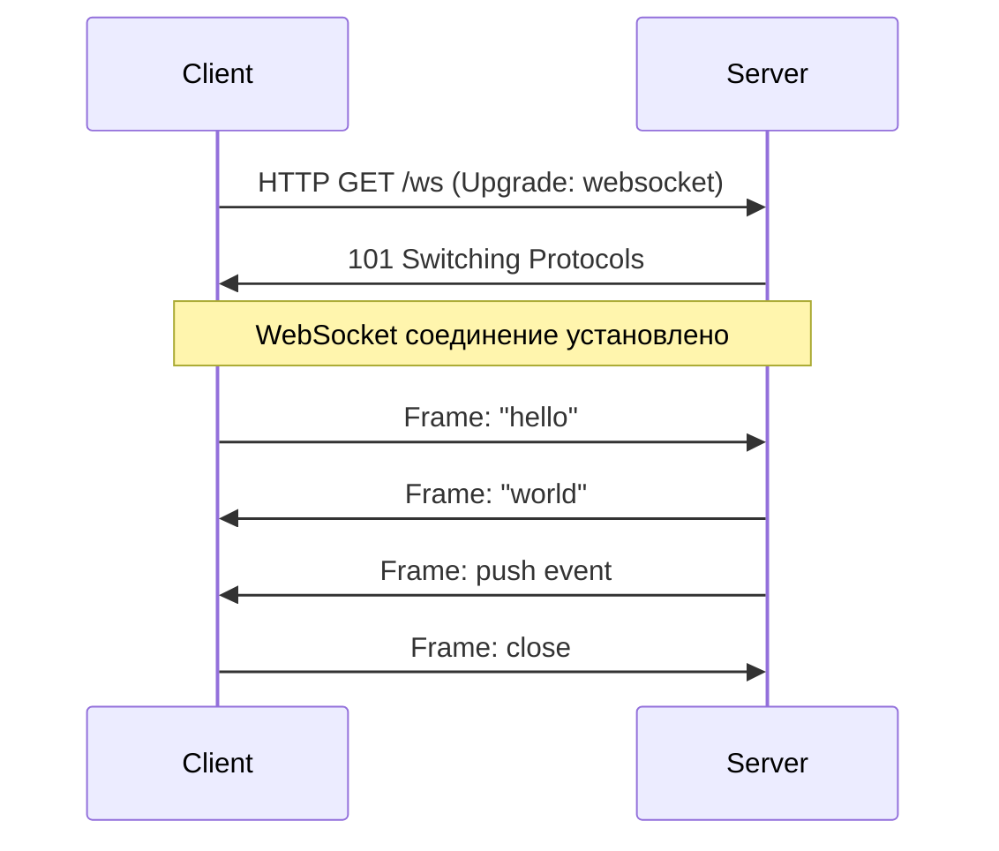
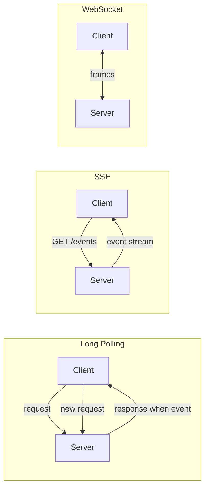
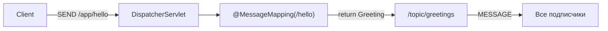
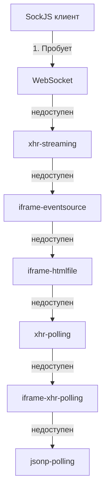
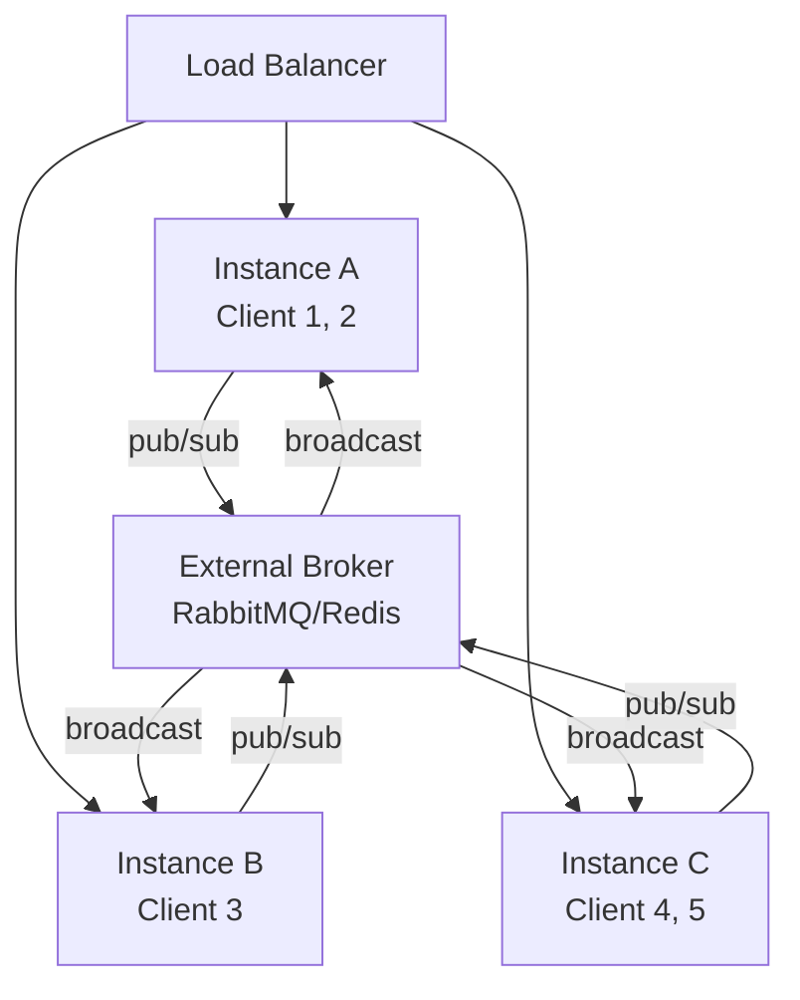
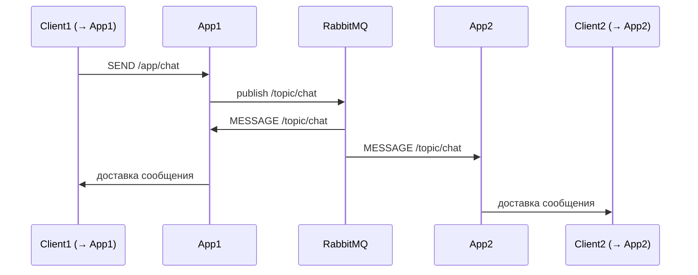

# Вопросы на собеседовании: `WebSocket`

Практичные вопросы и ответы по `WebSocket`: протокол `RFC 6455`, handshake через `HTTP Upgrade`, full-duplex frames, `STOMP` поверх `WebSocket`, `SockJS` как fallback, интеграция со `Spring Boot`, масштабирование через внешний брокер и безопасность.

**`WebSocket`** — протокол двусторонней связи поверх одного TCP-соединения, стандартизированный в `RFC 6455` (2011). После начального HTTP-handshake соединение переводится в режим full-duplex: обе стороны могут отправлять данные в любой момент без накладных расходов на повторное установление соединения.

## Полезные ссылки

### Официальная документация

- [RFC 6455: The WebSocket Protocol](https://datatracker.ietf.org/doc/html/rfc6455) — спецификация протокола
- [Spring WebSocket Documentation](https://docs.spring.io/spring-framework/docs/current/reference/html/web.html#websocket) — официальная документация Spring
- [STOMP Protocol Specification](https://stomp.github.io/stomp-specification-1.2.html) — спецификация STOMP 1.2
- [SockJS Client](https://github.com/sockjs/sockjs-client) — GitHub репозиторий SockJS
- [Intro to WebSockets with Spring | Baeldung](https://www.baeldung.com/websockets-spring) — полный туториал по Spring WebSocket + STOMP
- [Reactive WebSockets with Spring | Baeldung](https://www.baeldung.com/spring-5-reactive-websockets) — WebSocket в Spring WebFlux
- [Intro to Security and WebSockets | Baeldung](https://www.baeldung.com/spring-security-websockets) — безопасность WebSocket
- [REST vs WebSockets | Baeldung](https://www.baeldung.com/rest-vs-websockets) — сравнение подходов
- [Spring WebSockets: Send Messages to a Specific User | Baeldung](https://www.baeldung.com/spring-websockets-send-message-to-user) — отправка сообщений конкретному пользователю

## Содержание

- [Полезные ссылки](#полезные-ссылки)
- [See also](#see-also)

**Основы WebSocket**
- [Q1. (!) Что такое WebSocket и чем он отличается от HTTP?](#q1--что-такое-websocket-и-чем-он-отличается-от-http)
- [Q2. (!) Как происходит WebSocket handshake?](#q2--как-происходит-websocket-handshake)
- [Q3. Что такое WebSocket frames и какие типы существуют?](#q3-что-такое-websocket-frames-и-какие-типы-существуют)
- [Q4. Чем WebSocket отличается от HTTP Long Polling, SSE и gRPC Streaming?](#q4-чем-websocket-отличается-от-http-long-polling-sse-и-grpc-streaming)

**STOMP протокол**
- [Q5. (!) Что такое STOMP и зачем он нужен поверх WebSocket?](#q5--что-такое-stomp-и-зачем-он-нужен-поверх-websocket)
- [Q6. Какие команды определяет STOMP?](#q6-какие-команды-определяет-stomp)
- [Q7. Как устроен фрейм STOMP?](#q7-как-устроен-фрейм-stomp)

**Spring WebSocket (низкий уровень)**
- [Q8. (!) Как настроить WebSocket в Spring без STOMP?](#q8--как-настроить-websocket-в-spring-без-stomp)
- [Q9. Что такое `WebSocketHandler` и его методы?](#q9-что-такое-websockethandler-и-его-методы)
- [Q10. Что такое `WebSocketSession` и как отправить сообщение?](#q10-что-такое-websocketsession-и-как-отправить-сообщение)

**Spring STOMP (высокий уровень)**
- [Q11. (!) Как настроить STOMP поверх WebSocket в Spring Boot?](#q11--как-настроить-stomp-поверх-websocket-в-spring-boot)
- [Q12. Как работает `@MessageMapping` и `@SendTo`?](#q12-как-работает-messagemapping-и-sendto)
- [Q13. Чем `@SubscribeMapping` отличается от `@MessageMapping`?](#q13-чем-subscribemapping-отличается-от-messagemapping)
- [Q14. Как отправить сообщение конкретному пользователю через `@SendToUser`?](#q14-как-отправить-сообщение-конкретному-пользователю-через-sendtouser)
- [Q15. Как отправить сообщение из сервиса вне контроллера через `SimpMessagingTemplate`?](#q15-как-отправить-сообщение-из-сервиса-вне-контроллера-через-simpmessagingtemplate)

**SockJS**
- [Q16. (!) Что такое SockJS и когда его использовать?](#q16--что-такое-sockjs-и-когда-его-использовать)
- [Q17. Какие транспорты использует SockJS в порядке приоритета?](#q17-какие-транспорты-использует-sockjs-в-порядке-приоритета)

**Message Broker**
- [Q18. (!) Чем отличается простой (in-memory) брокер от внешнего STOMP-брокера?](#q18--чем-отличается-простой-in-memory-брокер-от-внешнего-stomp-брокера)
- [Q19. Как настроить RabbitMQ как внешний STOMP-брокер в Spring?](#q19-как-настроить-rabbitmq-как-внешний-stomp-брокер-в-spring)

**Масштабирование**
- [Q20. (!) Почему масштабирование WebSocket сложнее, чем REST? Как решается проблема sticky sessions?](#q20--почему-масштабирование-websocket-сложнее-чем-rest-как-решается-проблема-sticky-sessions)
- [Q21. Как работает pub/sub через внешний брокер при горизонтальном масштабировании?](#q21-как-работает-pubsub-через-внешний-брокер-при-горизонтальном-масштабировании)

**Безопасность**
- [Q22. (!) Как защитить WebSocket-соединение: CORS, аутентификация, Spring Security?](#q22--как-защитить-websocket-соединение-cors-аутентификация-spring-security)
- [Q23. Почему нельзя использовать стандартный CSRF-токен для WebSocket?](#q23-почему-нельзя-использовать-стандартный-csrf-токен-для-websocket)

**Обработка ошибок и переподключение**
- [Q24. Как обрабатывать ошибки STOMP на сервере через `@MessageExceptionHandler`?](#q24-как-обрабатывать-ошибки-stomp-на-сервере-через-messageexceptionhandler)
- [Q25. Как реализовать автоматическое переподключение на клиенте (JS)?](#q25-как-реализовать-автоматическое-переподключение-на-клиенте-js)

**Heartbeat и keepalive**
- [Q26. (!) Как работает heartbeat в STOMP и как его настроить в Spring?](#q26--как-работает-heartbeat-в-stomp-и-как-его-настроить-в-spring)

**Реактивный стек**
- [Q27. (!) Как работает WebSocket в Spring WebFlux (реактивный стек)?](#q27--как-работает-websocket-в-spring-webflux-реактивный-стек)
- [Q28. Что такое `WebSocketHandler` в WebFlux и как он отличается от servlet-версии?](#q28-что-такое-websockethandler-в-webflux-и-как-он-отличается-от-servlet-версии)

**Производительность**
- [Q29. Какие ограничения у WebSocket по количеству соединений и как их обойти?](#q29-какие-ограничения-у-websocket-по-количеству-соединений-и-как-их-обойти)
- [Q30. Как настроить размер буферов и таймауты для WebSocket в Spring?](#q30-как-настроить-размер-буферов-и-таймауты-для-websocket-в-spring)

**Микросервисы, сравнение, эксплуатация**
- [Q31. WebSocket в микросервисной архитектуре: service discovery, gateway, routing](#q31-websocket-в-микросервисной-архитектуре-service-discovery-gateway-routing)
- [Q32. WebSocket vs SSE vs Long Polling: детальное сравнение](#q32-websocket-vs-sse-vs-long-polling-детальное-сравнение)
- [Q33. Мониторинг WebSocket: метрики, количество соединений, health](#q33-мониторинг-websocket-метрики-количество-соединений-health)
- [Q34. WebSocket в Kubernetes: sticky sessions, session affinity, проблемы](#q34-websocket-в-kubernetes-sticky-sessions-session-affinity-проблемы)
- [Q35. Бинарные и текстовые фреймы: MessagePack, Protobuf](#q35-бинарные-и-текстовые-фреймы-messagepack-protobuf)
- [Q36. WebSocket и CDN: почему CDN не кэширует WS, CloudFlare](#q36-websocket-и-cdn-почему-cdn-не-кэширует-ws-cloudflare)
- [Q37. Disconnect стратегии: exponential backoff reconnect на клиенте](#q37-disconnect-стратегии-exponential-backoff-reconnect-на-клиенте)
- [Q38. Тестирование WebSocket в Spring: от unit до интеграции](#q38-тестирование-websocket-в-spring-от-unit-до-интеграции)

---

## Q1. (!) Что такое WebSocket и чем он отличается от HTTP?

`WebSocket` — протокол двунаправленной связи (`RFC 6455`), который держит одно постоянное TCP-соединение между клиентом и сервером. Главное отличие от HTTP: в HTTP сервер не может заговорить первым — он только отвечает на запрос клиента. В WebSocket после первоначального handshake это ограничение снимается: обе стороны шлют данные в любой момент, не переустанавливая соединение и не платя за HTTP-заголовки на каждом сообщении.

Поэтому WebSocket выбирают там, где сервер должен **сам** инициировать обмен и делать это часто: чаты, биржевые котировки, многопользовательские игры, live-дашборды. Для редких уведомлений «сверху вниз» обычно достаточно SSE, а для классического «запрос-ответ» — HTTP (см. Q4, Q32).

**Ключевые отличия от HTTP:**

| Характеристика | HTTP | WebSocket |
|---|---|---|
| Соединение | Короткоживущее (HTTP/1.1: keep-alive, но запрос-ответ) | Постоянное |
| Направление | Полудуплекс (клиент инициирует) | Full-duplex |
| Накладные расходы | Заголовки при каждом запросе (~hundreds bytes) | Минимальные (2–10 байт на фрейм) |
| Push от сервера | Нет (без SSE/polling) | Да |
| Протокол | `http://` / `https://` | `ws://` / `wss://` |



---

## Q2. (!) Как происходит WebSocket handshake?

Handshake — это обычный HTTP-запрос, который просит сервер «переключить» уже открытое TCP-соединение с HTTP на WebSocket. Если сервер согласен, он отвечает статусом `101 Switching Protocols`, и с этого момента по тому же сокету идут уже не HTTP-запросы, а WebSocket-фреймы. Ключевой признак запроса — заголовки `Upgrade: websocket` и `Connection: Upgrade`.

**Запрос клиента:**
```http
GET /ws HTTP/1.1
Host: example.com
Upgrade: websocket
Connection: Upgrade
Sec-WebSocket-Key: dGhlIHNhbXBsZSBub25jZQ==
Sec-WebSocket-Version: 13
Sec-WebSocket-Protocol: stomp
```

**Ответ сервера (статус 101):**
```http
HTTP/1.1 101 Switching Protocols
Upgrade: websocket
Connection: Upgrade
Sec-WebSocket-Accept: s3pPLMBiTxaQ9kYGzzhZRbK+xOo=
Sec-WebSocket-Protocol: stomp
```

**Как стороны подтверждают друг друга:**

- `Sec-WebSocket-Key` — случайный base64-nonce от клиента. Это не секрет и не аутентификация — он нужен лишь чтобы убедиться, что сервер действительно понимает протокол, а не просто кэширующий прокси, вернувший старый ответ.
- `Sec-WebSocket-Accept` — ответ сервера: `SHA-1(key + "258EAFA5-E914-47DA-95CA-C5AB0DC85B11")` в base64. Магическая константа (GUID) зашита в `RFC 6455`; клиент пересчитывает её сам и сверяет — совпало, значит на той стороне настоящий WebSocket-сервер.
- После ответа `101 Switching Protocols` HTTP на этом сокете заканчивается: то же TCP-соединение переходит в режим обмена WebSocket-фреймами.

**Важно:** handshake идёт по HTTP, поэтому через него передаются куки, заголовки и параметры — на этом этапе обычно и делают аутентификацию (см. Q22). Дальше, внутри установленного соединения, HTTP-механизмов уже нет.

---

## Q3. Что такое WebSocket frames и какие типы существуют?

Фрейм — это минимальная единица передачи в WebSocket: всё, что отправляется после handshake, нарезается на фреймы. Каждый фрейм несёт opcode (что это за фрейм), флаги и payload. Фреймы делятся на два класса: **данные** (text, binary, continuation) и **управляющие** (close, ping, pong) — управляющие обслуживают само соединение и не доходят до прикладного кода.

**Типы фреймов (opcode):**

| Opcode | Тип | Описание |
|---|---|---|
| `0x0` | Continuation | Продолжение фрагментированного сообщения |
| `0x1` | Text | Текстовые данные (UTF-8) |
| `0x2` | Binary | Бинарные данные |
| `0x8` | Close | Закрытие соединения (с кодом причины) |
| `0x9` | Ping | Keepalive запрос |
| `0xA` | Pong | Ответ на Ping |

**Структура фрейма:**
```
 0                   1                   2                   3
 0 1 2 3 4 5 6 7 8 9 0 1 2 3 4 5 6 7 8 9 0 1 2 3 4 5 6 7 8 9 0 1
+-+-+-+-+-------+-+-------------+-------------------------------+
|F|R|R|R| opcode|M| Payload len |    Extended payload length    |
|I|S|S|S|  (4)  |A|     (7)    |             (16/64)           |
|N|V|V|V|       |S|             |   (if payload len==126/127)   |
| |1|2|3|       |K|             |                               |
+-+-+-+-+-------+-+-------------+-------------------------------+
```

**Что важно знать на собеседовании:**

- **FIN** — флаг «это последний фрагмент сообщения». Одно логическое сообщение может разбиваться на несколько фреймов (первый — text/binary, продолжения — continuation), и только у последнего FIN=1. Это позволяет стримить большое сообщение, не зная его размер заранее.
- **MASK** — клиент **обязан** маскировать payload случайным ключом, сервер — наоборот, не должен. Маскирование защищает не от подслушивания (это не шифрование), а от cache-poisoning-атак на промежуточные прокси, которые могли бы принять данные фрейма за валидный HTTP-запрос.
- **Payload len** — длина кодируется переменно: 7 бит для коротких сообщений, либо расширение до 16/64 бит — поэтому накладные расходы на фрейм всего 2–14 байт.

---

## Q4. Чем WebSocket отличается от HTTP Long Polling, SSE и gRPC Streaming?

Все четыре технологии решают одну задачу — доставить данные клиенту, не дожидаясь его запроса, — но по-разному. Коротко выбор такой: **Long Polling** — это эмуляция push поверх обычного HTTP (запасной вариант для legacy); **SSE** — лёгкий однонаправленный поток сервер→клиент; **WebSocket** — полноценный двусторонний канал для браузера; **gRPC Streaming** — двусторонний стрим для общения между сервисами по HTTP/2.

| | WebSocket | Long Polling | SSE | gRPC Streaming |
|---|---|---|---|---|
| Направление | Full-duplex | Полудуплекс | Server → Client | Full-duplex |
| Протокол | ws:// / wss:// | HTTP | HTTP (text/event-stream) | HTTP/2 |
| Сообщения | Произвольные frames | JSON/text | text/event-stream | Protocol Buffers |
| Поддержка браузером | Нативная | Нативная | Нативная | Через grpc-web |
| Накладные расходы | Низкие | Высокие (новый запрос) | Низкие | Низкие |
| Переподключение | Ручное | Автоматическое | Автоматическое | Ручное |
| Применение | Чат, реалтайм UI, игры | Нотификации (legacy) | Лента событий | Межсервисный стриминг |



---

## Q5. (!) Что такое STOMP и зачем он нужен поверх WebSocket?

`STOMP` (Simple Text Oriented Messaging Protocol) — текстовый протокол обмена сообщениями, работающий поверх WebSocket. Аналогия: WebSocket — это «голый» TCP-канал, по которому летят произвольные байты, а STOMP добавляет к нему понятный прикладной формат — как HTTP добавляет структуру поверх TCP. Благодаря этому появляются топики, подписки и адресация сообщений «из коробки».

Без STOMP всё это приходится изобретать самому, и каждый раз заново:

- **Нет понятия топиков/каналов** — приложение само парсит payload, чтобы понять, кому адресовано сообщение.
- **Нет стандарта subscribe/unsubscribe** — клиент не может сказать «подпишите меня на новости комнаты №5» единым способом.
- **Нет ACK** — невозможно стандартно подтвердить, что сообщение получено и обработано.
- **Тяжело интегрировать с брокерами** (RabbitMQ, ActiveMQ) — они «говорят» на STOMP, и без него мост приходится писать руками.

STOMP закрывает все эти пункты единым текстовым форматом фрейма (команда + заголовки + тело):
```
STOMP фрейм:
COMMAND
header1:value1
header2:value2

Body^@

Команды: CONNECT, SUBSCRIBE, UNSUBSCRIBE, SEND, MESSAGE, ACK, NACK, BEGIN, COMMIT, ABORT, DISCONNECT
```

**Пример подписки:**
```
SUBSCRIBE
id:sub-0
destination:/topic/greetings

^@
```

---

## Q6. Какие команды определяет STOMP?

Команды STOMP делятся на две группы по тому, кто их отправляет: клиент управляет своей подпиской и шлёт сообщения, а сервер/брокер доставляет сообщения и подтверждает обработку. На собеседовании достаточно помнить «большую четвёрку» клиента — `CONNECT`, `SUBSCRIBE`, `SEND`, `DISCONNECT` — и серверный `MESSAGE`.

**Команды клиента:**

| Команда | Описание |
|---|---|
| `CONNECT` | Установка сессии с брокером (заголовки `login`, `passcode`, `heart-beat`) |
| `DISCONNECT` | Корректное закрытие сессии |
| `SUBSCRIBE` | Подписка на destination, возвращает `id` подписки |
| `UNSUBSCRIBE` | Отмена подписки по `id` |
| `SEND` | Отправка сообщения на destination |
| `ACK` | Подтверждение получения сообщения |
| `NACK` | Негативное подтверждение |
| `BEGIN` / `COMMIT` / `ABORT` | Транзакции |

**Команды сервера/брокера:**

| Команда | Описание |
|---|---|
| `CONNECTED` | Ответ на `CONNECT` |
| `MESSAGE` | Доставка сообщения подписчику |
| `RECEIPT` | Подтверждение обработки (если клиент послал `receipt` заголовок) |
| `ERROR` | Ошибка; брокер закрывает соединение |

---

## Q7. Как устроен фрейм STOMP?

Фрейм STOMP устроен почти как HTTP-сообщение и читается человеком: первая строка — команда, дальше заголовки `key:value`, пустая строка-разделитель, затем тело и завершающий NULL-байт. Именно текстовость делает STOMP удобным для отладки — фрейм видно в сетевой панели браузера «как есть».

```
SEND
destination:/app/chat
content-type:application/json
content-length:26

{"text":"Hello, WebSocket!"}^@
```

- **Первая строка** — команда (`SEND`, `SUBSCRIBE`, `MESSAGE` и т.д.)
- **Заголовки** — `key:value` (один на строку)
- **Пустая строка** — разделитель
- **Тело** — произвольный контент (JSON, текст, binary)
- **`^@`** (NULL байт, `\0`) — терминатор фрейма

---

## Q8. (!) Как настроить WebSocket в Spring без STOMP?

Это «низкоуровневый» режим: Spring отдаёт вам сырое соединение, а семантику сообщений (формат, маршрутизацию, подписки) вы пишете сами. Нужны две вещи — аннотация `@EnableWebSocket` и конфигуратор `WebSocketConfigurer`, в котором регистрируется handler на конкретный URL.

Такой подход берут, когда STOMP избыточен: простой echo-сервер, проксирование бинарного потока, своя самописная схема сообщений. Как только нужны топики и подписки — переходят на STOMP (Q11).

```java
@Configuration
@EnableWebSocket
public class WebSocketConfig implements WebSocketConfigurer {

    @Override
    public void registerWebSocketHandlers(WebSocketHandlerRegistry registry) {
        registry.addHandler(myWebSocketHandler(), "/ws")
                .setAllowedOrigins("*")
                .withSockJS(); // опционально: fallback через SockJS
    }

    @Bean
    public WebSocketHandler myWebSocketHandler() {
        return new MyWebSocketHandler();
    }
}
```

---

## Q9. Что такое `WebSocketHandler` и его методы?

`WebSocketHandler` — основной интерфейс жизненного цикла соединения: Spring вызывает его методы-колбэки на каждое событие сокета. Напрямую этот интерфейс реализуют редко — обычно расширяют готовый `TextWebSocketHandler` (или `BinaryWebSocketHandler`), который уже разбирает фреймы и отдаёт вам собранное сообщение.

**Четыре ключевых метода** (по сути — состояния соединения):

- `afterConnectionEstablished` — соединение открыто; здесь регистрируют сессию (например, в `Map`, чтобы потом адресно слать сообщения).
- `handleTextMessage` / `handleBinaryMessage` — пришло сообщение от клиента.
- `afterConnectionClosed` — соединение закрылось; здесь убирают сессию из реестра, иначе будет утечка.
- `handleTransportError` — ошибка транспорта (обрыв TCP и т.п.).

```java
@Component
public class MyWebSocketHandler extends TextWebSocketHandler {

    private final Map<String, WebSocketSession> sessions = new ConcurrentHashMap<>();

    @Override
    public void afterConnectionEstablished(WebSocketSession session) {
        sessions.put(session.getId(), session);
        log.info("Connected: {}", session.getId());
    }

    @Override
    protected void handleTextMessage(WebSocketSession session, TextMessage message) throws Exception {
        String payload = message.getPayload();
        // echo-сервер
        session.sendMessage(new TextMessage("Echo: " + payload));
    }

    @Override
    public void afterConnectionClosed(WebSocketSession session, CloseStatus status) {
        sessions.remove(session.getId());
        log.info("Disconnected: {} with status {}", session.getId(), status);
    }

    @Override
    public void handleTransportError(WebSocketSession session, Throwable exception) {
        log.error("Transport error for session {}", session.getId(), exception);
    }
}
```

---

## Q10. Что такое `WebSocketSession` и как отправить сообщение?

`WebSocketSession` — дескриптор одного активного соединения: через него отправляют сообщения, читают атрибуты (положенные туда на этапе handshake), проверяют состояние и закрывают соединение. Каждому подключённому клиенту соответствует свой объект сессии с уникальным `getId()`.

```java
// Отправка текста
session.sendMessage(new TextMessage("Hello"));

// Отправка бинарных данных
session.sendMessage(new BinaryMessage(ByteBuffer.wrap(bytes)));

// Получение атрибутов (из handshake)
Map<String, Object> attrs = session.getAttributes();
String userId = (String) attrs.get("userId");

// Закрытие соединения
session.close(CloseStatus.NORMAL);

// Проверка состояния
if (session.isOpen()) {
    session.sendMessage(new TextMessage("still alive"));
}
```

**Подводный камень:** `sendMessage` **не потокобезопасен**. Если два потока пишут в одну сессию одновременно (например, broadcast из планировщика плюс ответ на входящее сообщение), фреймы перемешаются и соединение порвётся с ошибкой `TEXT_FULL_WRITING`. Поэтому запись в сессию синхронизируют (или используют `ConcurrentWebSocketSessionDecorator`, который делает это за вас):
```java
synchronized (session) {
    session.sendMessage(new TextMessage(payload));
}
```

---

## Q11. (!) Как настроить STOMP поверх WebSocket в Spring Boot?

Высокоуровневый режим включается аннотацией `@EnableWebSocketMessageBroker` и интерфейсом `WebSocketMessageBrokerConfigurer`. В отличие от Q8, здесь Spring сам разбирает STOMP-фреймы, ведёт подписки и маршрутизирует сообщения — вам остаётся настроить два момента и писать контроллеры с `@MessageMapping`.

**Что задаётся в конфигурации:**

- `enableSimpleBroker("/topic", "/queue")` — какие префиксы обслуживает брокер. Всё, что уходит на `/topic/*` или `/queue/*`, брокер рассылает подписчикам.
- `setApplicationDestinationPrefixes("/app")` — сообщения с этим префиксом попадают **не в брокер, а в ваши `@MessageMapping`-методы** для обработки.
- `setUserDestinationPrefix("/user")` — префикс для адресных, «личных» сообщений конкретному пользователю (см. Q14).
- `registerStompEndpoints` — URL для handshake (`/ws`), CORS и опциональный SockJS-fallback.

```java
@Configuration
@EnableWebSocketMessageBroker
public class StompWebSocketConfig implements WebSocketMessageBrokerConfigurer {

    @Override
    public void configureMessageBroker(MessageBrokerRegistry registry) {
        // Префиксы для in-memory брокера (topics и queues)
        registry.enableSimpleBroker("/topic", "/queue");
        // Префикс для сообщений, адресованных @MessageMapping-методам
        registry.setApplicationDestinationPrefixes("/app");
        // Префикс для user-specific destinations
        registry.setUserDestinationPrefix("/user");
    }

    @Override
    public void registerStompEndpoints(StompEndpointRegistry registry) {
        registry.addEndpoint("/ws")
                .setAllowedOriginPatterns("*")
                .withSockJS(); // SockJS fallback
    }
}
```

**Клиент (JavaScript):**
```javascript
const socket = new SockJS('/ws');
const stompClient = Stomp.over(socket);

stompClient.connect({}, function(frame) {
    // Подписка на топик
    stompClient.subscribe('/topic/greetings', function(message) {
        console.log(JSON.parse(message.body));
    });
    // Отправка сообщения
    stompClient.send('/app/hello', {}, JSON.stringify({name: 'User'}));
});
```

---

## Q12. Как работает `@MessageMapping` и `@SendTo`?

Это STOMP-аналог пары `@RequestMapping` + ответ в MVC. `@MessageMapping("/hello")` ловит сообщения, пришедшие на `/app/hello` (префикс `/app` из Q11). То, что метод **вернул**, Spring публикует в брокер по адресу из `@SendTo("/topic/greetings")` — и брокер рассылает результат всем подписчикам этого топика.

Ключевая идея: `@SendTo` отправляет ответ **всем подписчикам** топика, а не только автору исходного сообщения. Если нужно ответить лично отправителю — используют `@SendToUser` (Q14).

```java
@Controller
public class GreetingController {

    // Принимает сообщения на /app/hello
    // Возвращаемое значение отправляется на /topic/greetings
    @MessageMapping("/hello")
    @SendTo("/topic/greetings")
    public Greeting greeting(HelloMessage message) {
        return new Greeting("Hello, " + message.getName() + "!");
    }

    // Без @SendTo — возвращает ответ только отправителю
    @MessageMapping("/private")
    @SendToUser("/queue/reply")
    public Reply privateReply(Request request) {
        return new Reply("Private: " + request.getText());
    }
}
```

**Поток обработки:**


---

## Q13. Чем `@SubscribeMapping` отличается от `@MessageMapping`?

Разница — в моменте срабатывания. `@MessageMapping` реагирует на отправку сообщения (команда `SEND`), а `@SubscribeMapping` — на саму подписку (команда `SUBSCRIBE`). Главный сценарий `@SubscribeMapping` — отдать клиенту **начальное состояние сразу при подписке** (request-reply): подписался на список задач — тут же получил текущий список, дальше приходят только обновления через брокер.

```java
@Controller
public class DataController {

    // Вызывается при SUBSCRIBE на /app/initial-data
    // Ответ отправляется напрямую клиенту (не через брокер)
    @SubscribeMapping("/initial-data")
    public List<Item> getInitialData() {
        return itemRepository.findAll(); // отправляется только подписавшемуся клиенту
    }

    // С явным указанием destination через брокер
    @SubscribeMapping("/updates")
    @SendTo("/topic/updates")
    public Update sendInitialUpdate() {
        return currentUpdate();
    }
}
```

**Отличия:**

- `@SubscribeMapping` → ответ по умолчанию идёт **напрямую** подписавшемуся клиенту, минуя брокер (если не указан `@SendTo`). Поэтому его не увидят другие подписчики — это ответ «один на один», ровно как нужно для начального состояния.
- `@MessageMapping` → ответ всегда публикуется через брокер и доходит до всех подписчиков адресата.

---

## Q14. Как отправить сообщение конкретному пользователю через `@SendToUser`?

`@SendToUser` отправляет ответ **только тому пользователю**, чьё сообщение обрабатывается, а не всем подписчикам топика. Это нужно для личных сообщений, персональных уведомлений, приватных ответов.

Работает так: клиент подписывается на «логический» адрес `/user/queue/messages`, а Spring под капотом превращает его в физический, уникальный для сессии (`/queue/messages-user{sessionId}`). Кто такой «этот пользователь», Spring определяет по `Principal` из Spring Security — поэтому для адресной доставки соединение должно быть аутентифицировано.

```java
@Controller
public class UserController {

    @MessageMapping("/chat.private")
    @SendToUser("/queue/messages")
    public ChatMessage sendPrivateMessage(
            @Payload ChatMessage message,
            Principal principal) {
        message.setFrom(principal.getName());
        return message;
    }
}
```

**Клиент:**
```javascript
// Подписка на личные сообщения
stompClient.subscribe('/user/queue/messages', function(msg) {
    displayPrivateMessage(JSON.parse(msg.body));
});

// Отправка личного сообщения
stompClient.send('/app/chat.private', {}, JSON.stringify({
    to: 'bob',
    text: 'Hello Bob!'
}));
```

---

## Q15. Как отправить сообщение из сервиса вне контроллера через `SimpMessagingTemplate`?

Контроллеры с `@MessageMapping` реагируют только на входящее сообщение от клиента. Но часто push нужен «сам по себе» — по событию из БД, по расписанию, из Kafka-listener. Для этого Spring даёт бин `SimpMessagingTemplate`: его инжектят в любой сервис и публикуют сообщение в брокер императивно.

- `convertAndSend("/topic/...", payload)` — broadcast всем подписчикам топика.
- `convertAndSendToUser(username, "/queue/...", payload)` — адресно одному пользователю (тот же механизм, что у `@SendToUser` из Q14).

```java
@Service
@RequiredArgsConstructor
public class NotificationService {

    private final SimpMessagingTemplate messagingTemplate;

    // Отправка всем подписчикам топика
    public void notifyAll(String event) {
        messagingTemplate.convertAndSend("/topic/notifications", event);
    }

    // Отправка конкретному пользователю
    public void notifyUser(String username, String event) {
        messagingTemplate.convertAndSendToUser(username, "/queue/alerts", event);
    }
}

// Пример: отправка по расписанию
@Component
@RequiredArgsConstructor
public class ScheduledPush {

    private final SimpMessagingTemplate template;

    @Scheduled(fixedRate = 5000)
    public void pushMetrics() {
        template.convertAndSend("/topic/metrics", metricsService.getCurrent());
    }
}
```

---

## Q16. (!) Что такое SockJS и когда его использовать?

`SockJS` — библиотека-обёртка, которая даёт API «как у WebSocket», но если настоящий WebSocket недоступен — незаметно подменяет его на эмуляцию поверх обычного HTTP (streaming или polling). Для прикладного кода разницы нет: тот же `subscribe`/`send`, просто под капотом другой транспорт.

Зачем это нужно: WebSocket иногда не проходит — старый браузер, корпоративный прокси, который вырезает заголовок `Upgrade`, или firewall, пропускающий только «классический» HTTP. SockJS гарантирует, что соединение всё равно установится, пусть и менее эффективным способом.

```java
// Сервер — включить SockJS поддержку
registry.addEndpoint("/ws").withSockJS();
```

```javascript
// Клиент — SockJS вместо нативного WebSocket
const socket = new SockJS('/ws');
const stompClient = Stomp.over(socket);
```

**Когда использовать:**
- Корпоративные сети с блокирующими прокси
- Поддержка старых браузеров (IE 9 и ниже)
- Максимальная совместимость без ущерба для новых клиентов

**SockJS Info Endpoint:** `GET /ws/info` — клиент проверяет доступность WebSocket перед подключением.

---

## Q17. Какие транспорты использует SockJS в порядке приоритета?

SockJS пробует транспорты сверху вниз и берёт первый рабочий — от самого эффективного (нативный WebSocket) к самому совместимому (polling для древних браузеров). Сначала клиент дёргает `/ws/info`, чтобы понять возможности окружения, затем выбирает транспорт:



| Приоритет | Транспорт | Описание |
|---|---|---|
| 1 | `websocket` | Нативный WebSocket |
| 2 | `xhr-streaming` | XHR streaming (EventSource-like) |
| 3 | `iframe-eventsource` | SSE через iframe |
| 4 | `xhr-polling` | XHR long polling |
| 5 | `jsonp-polling` | JSONP для старых браузеров |

---

## Q18. (!) Чем отличается простой (in-memory) брокер от внешнего STOMP-брокера?

Брокер в STOMP-схеме — это то, что хранит подписки и рассылает сообщения. Spring предлагает два варианта, и выбор между ними — это в первую очередь вопрос масштабирования. **Simple broker** живёт внутри JVM приложения, **внешний relay** — отдельный продукт (RabbitMQ, ActiveMQ), к которому приложение подключается по TCP.

**Simple Broker (in-memory):**
```java
registry.enableSimpleBroker("/topic", "/queue");
```
- Встроен в Spring — нет внешних зависимостей
- Сообщения хранятся только в памяти одного инстанса
- Не масштабируется горизонтально
- Нет персистентности, нет DLQ, нет ACK

**External STOMP Broker (RabbitMQ / ActiveMQ):**
```java
registry.enableStompBrokerRelay("/topic", "/queue")
        .setRelayHost("rabbitmq.host")
        .setRelayPort(61613)           // STOMP порт
        .setClientLogin("guest")
        .setClientPasscode("guest")
        .setSystemLogin("guest")
        .setSystemPasscode("guest");
```
- Все сообщения проходят через внешний брокер
- Работает при нескольких инстансах приложения — поэтому это единственный нормальный путь к горизонтальному масштабированию WebSocket (см. Q20, Q21)
- Персистентность, DLQ, TTL, приоритеты
- Требует отдельного инфраструктурного компонента

**Эмпирическое правило:** один инстанс или прототип — simple broker; продакшен с несколькими репликами — внешний relay.

---

## Q19. Как настроить RabbitMQ как внешний STOMP-брокер в Spring?

Идея: вместо `enableSimpleBroker` вызываем `enableStompBrokerRelay` — и Spring перестаёт сам рассылать сообщения, а проксирует их в RabbitMQ по STOMP-протоколу (порт 61613). Нужны три шага: добавить starter, включить в RabbitMQ плагин `rabbitmq_stomp` (без него брокер не понимает STOMP) и прописать relay в конфигурации.

**Зависимость:**
```xml
<dependency>
    <groupId>org.springframework.boot</groupId>
    <artifactId>spring-boot-starter-websocket</artifactId>
</dependency>
```

**RabbitMQ** должен иметь включённый плагин `rabbitmq_stomp`:
```bash
rabbitmq-plugins enable rabbitmq_stomp
```

**Конфигурация Spring:**
```java
@Configuration
@EnableWebSocketMessageBroker
public class RabbitMQWebSocketConfig implements WebSocketMessageBrokerConfigurer {

    @Override
    public void configureMessageBroker(MessageBrokerRegistry registry) {
        registry.enableStompBrokerRelay("/topic", "/queue", "/amq/queue")
                .setRelayHost("localhost")
                .setRelayPort(61613)
                .setSystemHeartbeatSendInterval(10000)
                .setSystemHeartbeatReceiveInterval(10000);

        registry.setApplicationDestinationPrefixes("/app");
    }

    @Override
    public void registerStompEndpoints(StompEndpointRegistry registry) {
        registry.addEndpoint("/ws").withSockJS();
    }
}
```

---

## Q20. (!) Почему масштабирование WebSocket сложнее, чем REST? Как решается проблема sticky sessions?

Корень проблемы в том, что WebSocket-соединение **stateful**. REST-запрос без состояния: любой инстанс обработает его одинаково, балансировщику всё равно, куда отправить. А WebSocket — постоянное соединение, привязанное к конкретному инстансу: клиент «живёт» на инстансе A, и весь его контекст (подписки, сессия) — только там.

**Проблема:** допустим, у нас 3 инстанса. Клиент подключён к A. Событие, которое надо ему доставить, генерируется на инстансе B — но B не знает про этого клиента и физически не имеет с ним соединения. Сообщение теряется.



**Решения:**

1. **Sticky Sessions (Session Affinity)** — балансировщик всегда направляет клиента на один и тот же бэкенд (по cookie или IP). Это решает только полдела: гарантирует, что клиент переподключится к «своему» инстансу, но не решает проблему доставки события, родившегося на другом инстансе. К тому же не отказоустойчиво — упал инстанс, и все его клиенты остались без обработчика.

2. **External Message Broker** — настоящее решение. Все инстансы подключены к одному брокеру (RabbitMQ, ActiveMQ). Событие публикуется в брокер → брокер рассылает копию каждому инстансу → каждый доставляет своим клиентам. Инстансам больше не нужно знать друг о друге.

3. **Redis Pub/Sub** — легковесная альтернатива брокеру для простых случаев, когда не нужны персистентность и DLQ.

---

## Q21. Как работает pub/sub через внешний брокер при горизонтальном масштабировании?



Механика по шагам: каждый инстанс Spring держит с брокером отдельное служебное TCP-соединение (`StompBrokerRelay`) и от имени своих клиентов подписывается на нужные топики. Когда клиент C1 на App1 шлёт сообщение, App1 не рассылает его сам, а публикует в брокер. Брокер видит, что на этот топик подписаны и App1, и App2, и отправляет копию обоим. Каждый инстанс дальше доставляет сообщение только тем WebSocket-клиентам, что подключены именно к нему. Так C2 на App2 получает сообщение, хотя физически с App1 не связан.

---

## Q22. (!) Как защитить WebSocket-соединение: CORS, аутентификация, Spring Security?

Защита делится на два уровня, и важно их не путать. **Первый уровень — handshake**: это обычный HTTP-запрос, поэтому здесь работают привычные механизмы — проверка `Origin`, аутентификация по куке/JWT через `HandshakeInterceptor`, правила в `SecurityFilterChain`. **Второй уровень — STOMP-сообщения** уже внутри открытого соединения: их авторизуют отдельно, по destination, через аннотацию `@EnableWebSocketSecurity` и бин `AuthorizationManager<Message<?>>`. Браузерный CORS на WebSocket не распространяется, поэтому контроль источника берёт на себя проверка `Origin` (см. Q23).

**CORS / контроль источника для WebSocket:**
```java
registry.addEndpoint("/ws")
        .setAllowedOriginPatterns("https://*.myapp.com")
        .withSockJS();
```

**Spring Security — разрешить WebSocket endpoint:**
```java
@Configuration
public class SecurityConfig {

    @Bean
    public SecurityFilterChain filterChain(HttpSecurity http) throws Exception {
        http
            .authorizeHttpRequests(auth -> auth
                .requestMatchers("/ws/**").permitAll() // handshake
                .anyRequest().authenticated()
            )
            .csrf(csrf -> csrf
                .ignoringRequestMatchers("/ws/**") // или настроить CSRF для WS
            );
        return http.build();
    }
}
```

**Аутентификация при handshake через `HandshakeInterceptor`:**
```java
public class AuthHandshakeInterceptor implements HandshakeInterceptor {

    @Override
    public boolean beforeHandshake(ServerHttpRequest request, ServerHttpResponse response,
            WebSocketHandler wsHandler, Map<String, Object> attributes) {
        // Извлечь JWT из query param или cookie
        String token = extractToken(request);
        if (token != null && jwtService.isValid(token)) {
            attributes.put("userId", jwtService.getUserId(token));
            return true;
        }
        response.setStatusCode(HttpStatus.UNAUTHORIZED);
        return false;
    }

    @Override
    public void afterHandshake(...) {}
}
```

**Защита STOMP-сообщений** (Spring Security 6.x): аннотация `@EnableWebSocketSecurity` + бин `AuthorizationManager<Message<?>>`, собранный через `MessageMatcherDelegatingAuthorizationManager.builder()`:
```java
@Configuration
@EnableWebSocketSecurity
public class WebSocketSecurityConfig {

    @Bean
    public AuthorizationManager<Message<?>> messageAuthorizationManager(
            MessageMatcherDelegatingAuthorizationManager.Builder messages) {
        messages
            .simpDestMatchers("/app/**").authenticated()
            .simpSubscribeDestMatchers("/topic/**").authenticated()
            .anyMessage().denyAll();
        return messages.build();
    }
}
```

---

## Q23. Почему нельзя использовать стандартный CSRF-токен для WebSocket?

**Короткий ответ:** у WebSocket нет встроенного места для CSRF-токена, а браузер всё равно автоматически прикладывает куки к handshake — поэтому вместо CSRF-токена источник проверяют по заголовку `Origin`.

**Почему так.** Классический CSRF-токен — это секрет, который сервер кладёт в страницу, а вредоносный сайт прочитать не может (его блокирует Same-Origin Policy). В WebSocket такого канала нет: `Sec-WebSocket-Key` — не секрет и не токен (см. Q2), он лишь подтверждает поддержку протокола. При этом куки авторизованного пользователя браузер шлёт автоматически.

**Атака (Cross-Site WebSocket Hijacking):** пользователь залогинен на `legitimate.com`; зайдя на вредоносную страницу, та через JS открывает `ws://legitimate.com/ws`. Браузер сам подставит куки сессии — и злоумышленник получит аутентифицированное соединение.

**Решения:**

1. **Проверка `Origin` заголовка** при handshake:
```java
registry.addEndpoint("/ws")
        .setAllowedOriginPatterns("https://myapp.com");
```

2. **Отключение CSRF для WS endpoint + проверка Origin:**
```java
csrf.ignoringRequestMatchers("/ws/**")
```

3. **Передача JWT в STOMP CONNECT** (вместо куков):
```javascript
stompClient.connect({'Authorization': 'Bearer ' + token}, callback);
```

4. **`HandshakeInterceptor`** для проверки Origin вручную.

---

## Q24. Как обрабатывать ошибки STOMP на сервере через `@MessageExceptionHandler`?

Это STOMP-аналог `@ExceptionHandler` из MVC. Если `@MessageMapping`-метод бросает исключение, обычного HTTP-статуса вернуть некуда — соединение уже открыто. Поэтому исключение перехватывает метод с `@MessageExceptionHandler`, формирует понятный ответ об ошибке и через `@SendToUser` отправляет его **лично** виновному клиенту (обычно в `/user/queue/errors`), не задевая остальных.

Область видимости — как и в MVC: `@MessageExceptionHandler` внутри контроллера ловит ошибки только этого контроллера, а вынесенный в `@ControllerAdvice` — глобально для всех. Без такого обработчика STOMP по умолчанию шлёт клиенту `ERROR`-фрейм и **закрывает соединение** (см. Q6) — что для пользователя выглядит как внезапный обрыв.

```java
@Controller
public class ChatController {

    @MessageMapping("/chat")
    @SendTo("/topic/messages")
    public Message sendMessage(@Payload Message message) {
        if (message.getText().isBlank()) {
            throw new IllegalArgumentException("Message cannot be blank");
        }
        return message;
    }

    // Обработчик исключений для этого контроллера
    @MessageExceptionHandler
    @SendToUser("/queue/errors")
    public ErrorResponse handleException(Exception e) {
        return new ErrorResponse(e.getMessage());
    }
}

// Глобальный обработчик
@ControllerAdvice
public class WebSocketExceptionHandler {

    @MessageExceptionHandler(IllegalArgumentException.class)
    @SendToUser("/queue/errors")
    public ErrorResponse handleIllegalArgument(IllegalArgumentException e) {
        return new ErrorResponse("Validation error: " + e.getMessage());
    }
}
```

---

## Q25. Как реализовать автоматическое переподключение на клиенте (JS)?

В отличие от SSE, у WebSocket нет автоматического reconnect — браузер просто закрывает сокет, и переподключаться приходится самому. Базовая логика: на колбэк ошибки/закрытия запускаем повторную попытку, при успехе сбрасываем счётчик, а интервал между попытками увеличиваем по схеме **exponential backoff** — чтобы тысячи клиентов после сбоя сервера не ударили по нему все разом (thundering herd).

```javascript
class ReconnectingWebSocket {
    constructor(url, options = {}) {
        this.url = url;
        this.retryDelay = options.retryDelay || 1000;
        this.maxRetries = options.maxRetries || 10;
        this.retries = 0;
        this.connect();
    }

    connect() {
        const socket = new SockJS(this.url);
        this.stompClient = Stomp.over(socket);

        this.stompClient.connect(
            {},
            (frame) => {
                this.retries = 0; // сбросить счётчик при успехе
                this.onConnected(frame);
            },
            (error) => {
                console.error('Connection error:', error);
                if (this.retries < this.maxRetries) {
                    const delay = this.retryDelay * Math.pow(2, this.retries); // exponential backoff
                    setTimeout(() => this.connect(), delay);
                    this.retries++;
                }
            }
        );
    }
}
```

**Exponential Backoff** — задержка увеличивается экспоненциально (1s, 2s, 4s, 8s...) чтобы не перегружать сервер при массовом отключении.

---

## Q26. (!) Как работает heartbeat в STOMP и как его настроить в Spring?

Heartbeat — это «пульс» соединения: стороны периодически шлют друг другу пустые сигналы, чтобы заметить, что канал жив. Зачем это нужно: оборванное TCP-соединение по умолчанию выглядит как «тишина» — данных нет, но и ошибки нет, и обе стороны могут часами думать, что собеседник на связи. Heartbeat превращает молчание в явный сигнал: не пришёл пульс в срок — считаем соединение мёртвым и реагируем (закрываем, переподключаемся).

Стороны договариваются об интервале в заголовке `heart-beat` ещё на этапе `CONNECT`/`CONNECTED`:

```
CONNECT
heart-beat:10000,10000
// Формат: <send_interval_ms>,<receive_interval_ms>
// 10000,10000 = "я могу отправлять каждые 10с, хочу получать каждые 10с"
```

**Переговоры:** итоговый интервал = `max(client_send, server_receive)`.

**Настройка в Spring:**
```java
@Override
public void configureMessageBroker(MessageBrokerRegistry registry) {
    registry.enableSimpleBroker("/topic", "/queue")
            .setHeartbeatValue(new long[]{10000, 10000}); // [send, receive] в мс

    // Для StompBrokerRelay:
    registry.enableStompBrokerRelay("/topic", "/queue")
            .setSystemHeartbeatSendInterval(10000)
            .setSystemHeartbeatReceiveInterval(10000);
}
```

**На уровне WebSocket (ping/pong frames):**
- Spring отправляет `Ping` фреймы для поддержания TCP-соединения
- Прокси-серверы (nginx) могут закрывать idle соединения — `proxy_read_timeout` должен быть > heartbeat interval

---

## Q27. (!) Как работает WebSocket в Spring WebFlux (реактивный стек)?

В WebFlux меняется сама модель работы с соединением. Servlet-стек (Q9) построен на колбэках и привязывает к каждому соединению поток — это упирается в пул потоков при десятках тысяч клиентов. WebFlux работает на event loop поверх Netty: входящие и исходящие сообщения — это реактивные потоки (`Flux`/`Mono`), которые один обработчик обслуживает неблокирующе, поэтому горстка потоков тянет тысячи соединений.

Контракт сводится к одному методу `Mono<Void> handle(WebSocketSession session)`: внутри вы описываете, как поток входящих сообщений (`session.receive()`) преобразуется в поток исходящих (`session.send(...)`) — декларативно, как пайплайн.

```java
@Configuration
public class ReactiveWebSocketConfig {

    @Bean
    public HandlerMapping webSocketHandlerMapping(ReactiveWebSocketHandler handler) {
        Map<String, WebSocketHandler> map = new HashMap<>();
        map.put("/ws/reactive", handler);

        SimpleUrlHandlerMapping mapping = new SimpleUrlHandlerMapping();
        mapping.setUrlMap(map);
        mapping.setOrder(-1);
        return mapping;
    }

    @Bean
    public WebSocketHandlerAdapter handlerAdapter() {
        return new WebSocketHandlerAdapter();
    }
}
```

```java
@Component
public class ReactiveWebSocketHandler implements WebSocketHandler {

    @Override
    public Mono<Void> handle(WebSocketSession session) {
        // Получаем поток входящих сообщений
        Flux<WebSocketMessage> input = session.receive()
                .map(msg -> session.textMessage("Echo: " + msg.getPayloadAsText()))
                .doOnTerminate(() -> log.info("Session closed: {}", session.getId()));

        // Отправляем поток исходящих сообщений
        return session.send(input);
    }
}
```

**Отличия от servlet WebSocket:**
- Нет блокирующих потоков — один поток обслуживает тысячи соединений
- Обмен сообщениями через `Flux`/`Mono`
- Нет прямой поддержки STOMP в WebFlux (используется RSocket или чистый WebSocket)

---

## Q28. Что такое `WebSocketHandler` в WebFlux и как он отличается от servlet-версии?

Имя одно, но это два разных интерфейса с противоположной философией. Servlet-версия (`org.springframework.web.socket.WebSocketHandler`, обычно через `TextWebSocketHandler`) — императивная, на колбэках. WebFlux-версия (`org.springframework.web.reactive.socket.WebSocketHandler`) — декларативная: вся обработка соединения описывается одним реактивным пайплайном. Ключевые отличия:

| | Servlet WebSocket (`TextWebSocketHandler`) | WebFlux WebSocket (`WebSocketHandler`) |
|---|---|---|
| Модель | Колбэки (`afterConnectionEstablished`, `handleTextMessage`) | Реактивная (`Mono<Void> handle(session)`) |
| Потоки | Один поток на соединение | Event loop — минимум потоков |
| Сообщения | `TextMessage` / `BinaryMessage` объекты | `Flux<WebSocketMessage>` / `Mono<Void>` |
| STOMP | `@EnableWebSocketMessageBroker` | Не поддерживается нативно |
| Backpressure | Нет | Да (Reactor) |

```java
// Реактивный WebSocket с push от сервера
@Component
public class StockPriceHandler implements WebSocketHandler {

    private final StockService stockService;

    @Override
    public Mono<Void> handle(WebSocketSession session) {
        Flux<WebSocketMessage> prices = stockService.getPriceStream()
                .map(price -> session.textMessage(price.toJson()))
                .take(Duration.ofHours(1)); // ограничение по времени

        return session.send(prices)
                .and(session.receive().then()); // держать сессию открытой
    }
}
```

---

## Q29. Какие ограничения у WebSocket по количеству соединений и как их обойти?

Главное, что нужно понимать: каждое WebSocket-соединение «занимает» ресурсы постоянно, пока открыто, — в отличие от HTTP-запроса, который пришёл и ушёл. Поэтому потолок упирается сразу в несколько слоёв, и узким местом становится тот, что закончится первым: файловые дескрипторы ОС, потоки в servlet-стеке, память на буферы, таймауты балансировщика.

**Ограничения по слоям:**

| Уровень | Ограничение | Типичное значение |
|---|---|---|
| OS | Открытые файловые дескрипторы | 65536 (default), до 1M (ulimit) |
| JVM Thread Pool | Потоки для servlet WebSocket | 200-500 (Tomcat default) |
| Память JVM | ~100KB на соединение (буферы) | 100K соединений → ~10GB heap |
| Load Balancer | Таймауты idle соединений | 60–300с (требует настройки) |

**Как масштабировать:**
1. **Увеличить `ulimit -n`** на сервере (OS file descriptors)
2. **Реактивный стек (WebFlux + Netty)** — event loop вместо thread-per-connection
3. **Горизонтальное масштабирование** + внешний брокер (RabbitMQ)
4. **Правильные буферы в Spring:**

```java
@Override
public void configureWebSocketTransport(WebSocketTransportRegistration registry) {
    registry.setMessageSizeLimit(128 * 1024)    // 128KB max message
            .setSendBufferSizeLimit(512 * 1024)  // 512KB send buffer
            .setSendTimeLimit(20 * 1000)         // 20s timeout on send
            .setTimeToFirstMessage(30 * 1000);   // 30s до первого сообщения
}
```

---

## Q30. Как настроить размер буферов и таймауты для WebSocket в Spring?

Тонкая настройка делается в `configureWebSocketTransport`. Смысл каждого параметра — защита от двух типичных бед: слишком больших сообщений (риск OOM) и медленных клиентов (которые не успевают вычитывать данные и забивают исходящий буфер). Четыре главных рычага:

- `setMessageSizeLimit` — максимум на входящее STOMP-сообщение; отсекает «бомбы» и случайные гигантские payload.
- `setSendBufferSizeLimit` — сколько данных копится в очереди на отправку медленному клиенту, прежде чем сессию закроют.
- `setSendTimeLimit` — сколько ждать завершения одной отправки; вышли за лимит — клиент считается зависшим.
- `setTimeToFirstMessage` — сколько ждать первого сообщения после handshake (защита от «полуоткрытых» соединений).

```java
@Configuration
@EnableWebSocketMessageBroker
public class WebSocketConfig implements WebSocketMessageBrokerConfigurer {

    @Override
    public void configureWebSocketTransport(WebSocketTransportRegistration registry) {
        registry
            // Максимальный размер входящего STOMP-сообщения
            .setMessageSizeLimit(64 * 1024)       // 64 KB (default: 64KB)
            // Размер буфера для исходящих сообщений (при медленных клиентах)
            .setSendBufferSizeLimit(512 * 1024)   // 512 KB (default: 512KB)
            // Таймаут на отправку одного сообщения
            .setSendTimeLimit(20 * 1000)           // 20 секунд (default: 10s)
            // Макс. время ожидания первого сообщения после handshake
            .setTimeToFirstMessage(60 * 1000);     // 60 секунд
    }

    @Override
    public void configureMessageBroker(MessageBrokerRegistry registry) {
        registry.enableSimpleBroker("/topic", "/queue")
                .setHeartbeatValue(new long[]{10000, 10000})
                .setTaskScheduler(heartbeatScheduler()); // нужен для heartbeat
    }

    @Bean
    public TaskScheduler heartbeatScheduler() {
        ThreadPoolTaskScheduler scheduler = new ThreadPoolTaskScheduler();
        scheduler.setPoolSize(1);
        scheduler.setThreadNamePrefix("ws-heartbeat-");
        return scheduler;
    }
}
```

---

## Q31. WebSocket в микросервисной архитектуре: service discovery, gateway, routing

В микросервисной среде WebSocket-соединения проходят через несколько слоёв, каждый из которых требует особой конфигурации.

**Проблемы:**
- **API Gateway** должен поддерживать upgrade от HTTP до WebSocket (не все реализации делают это автоматически)
- **Service Discovery** работает на уровне установки соединения, а не на уровне каждого фрейма
- **Sticky sessions** — соединение привязывается к конкретному экземпляру сервиса

**Spring Cloud Gateway — WebSocket routing:**
```yaml
spring:
  cloud:
    gateway:
      routes:
        - id: ws-route
          uri: lb:ws://chat-service   # lb: — через LoadBalancer, ws:// — WebSocket
          predicates:
            - Path=/ws/**
          filters:
            - StripPrefix=1
```

**Nginx upstream для sticky sessions:**
```nginx
upstream ws_backend {
    ip_hash;  # sticky по IP клиента
    server app1:8080;
    server app2:8080;
}

server {
    location /ws/ {
        proxy_pass http://ws_backend;
        proxy_http_version 1.1;
        proxy_set_header Upgrade $http_upgrade;
        proxy_set_header Connection "upgrade";
        proxy_read_timeout 3600s;  # долгоживущее соединение
    }
}
```

**Рекомендуемый подход при масштабировании:**
1. Gateway маршрутизирует WS-соединение к конкретному экземпляру (sticky)
2. Экземпляр принимает соединение, публикует события в Kafka/RabbitMQ
3. Все экземпляры подписаны на общий брокер — получают события для своих клиентов

---

## Q32. WebSocket vs SSE vs Long Polling: детальное сравнение

| Характеристика | WebSocket | SSE | Long Polling |
|----------------|-----------|-----|-------------|
| Направление | Full-duplex (двустороннее) | Server → Client (однонаправленное) | Server → Client (эмуляция) |
| Протокол | ws:// / wss:// | HTTP/HTTPS | HTTP/HTTPS |
| Overhead | Минимальный (2-14 байт фрейм) | Умеренный (HTTP headers) | Высокий (HTTP request каждый раз) |
| Reconnect | Ручной (библиотеки) | Автоматический (браузер) | Ручной |
| Поддержка браузерами | Все современные | Все, кроме IE | Все |
| HTTP/2 | Отдельный TCP | Нативная поддержка | Нативная поддержка |
| Балансировщики | Требует sticky / брокер | Обычный HTTP LB | Обычный HTTP LB |
| Когда использовать | Чаты, игры, биржевые терминалы | Новостные ленты, уведомления | Legacy-окружения, нет WS |

**SSE преимущества перед WebSocket:**
- Работает через HTTP/2 (мультиплексирование)
- Автоматический reconnect с `Last-Event-ID`
- Проще для балансировщиков (обычный HTTP)
- Меньше усилий на безопасность (CORS стандартный)

```java
// SSE в Spring
@GetMapping(value = "/events", produces = MediaType.TEXT_EVENT_STREAM_VALUE)
public Flux<ServerSentEvent<String>> streamEvents() {
    return Flux.interval(Duration.ofSeconds(1))
        .map(seq -> ServerSentEvent.<String>builder()
            .id(String.valueOf(seq))
            .event("message")
            .data("tick-" + seq)
            .build());
}
```

**Вывод:** WebSocket — оптимален для интерактивных приложений с высокой частотой двустороннего обмена. SSE — для push-уведомлений от сервера. Long Polling — для legacy.

---

## Q33. Мониторинг WebSocket: метрики, количество соединений, health

В отличие от REST, где метрика по умолчанию — latency и RPS, у WebSocket главный показатель здоровья — **число открытых соединений** (gauge): по нему видно нагрузку, утечки сессий и аномальные обрывы. Технически это делают через декоратор handler-а (`WebSocketHandlerDecoratorFactory`), который инкрементит счётчик при открытии и декрементит при закрытии, отдавая значение в Micrometer/Prometheus.

**Ключевые метрики WebSocket:**
- `ws.connections.active` — текущее количество открытых соединений
- `ws.messages.sent` / `ws.messages.received` — throughput
- `ws.errors` — счётчик ошибок (disconnect, send failure)
- `ws.session.duration` — время жизни сессии (histogram)

**Actuator + Micrometer в Spring:**
```java
@Component
public class WebSocketMetrics implements WebSocketHandlerDecoratorFactory {
    private final MeterRegistry registry;
    private final AtomicInteger activeConnections;

    public WebSocketMetrics(MeterRegistry registry) {
        this.registry = registry;
        this.activeConnections = registry.gauge(
            "ws.connections.active",
            new AtomicInteger(0)
        );
    }

    @Override
    public WebSocketHandler decorate(WebSocketHandler handler) {
        return new WebSocketHandlerDecorator(handler) {
            @Override
            public void afterConnectionEstablished(WebSocketSession session) throws Exception {
                activeConnections.incrementAndGet();
                super.afterConnectionEstablished(session);
            }

            @Override
            public void afterConnectionClosed(WebSocketSession session, CloseStatus status) throws Exception {
                activeConnections.decrementAndGet();
                super.afterConnectionClosed(session, status);
            }
        };
    }
}
```

**Health check через Actuator:**
```java
@Component
public class WebSocketHealthIndicator implements HealthIndicator {
    private final AtomicInteger activeConnections;

    @Override
    public Health health() {
        int count = activeConnections.get();
        if (count > 10_000) {
            return Health.down()
                .withDetail("connections", count)
                .withDetail("reason", "too many connections")
                .build();
        }
        return Health.up().withDetail("connections", count).build();
    }
}
```

**Prometheus + Grafana:** собирать `ws_connections_active`, строить алерты на аномальный рост/падение.

---

## Q34. WebSocket в Kubernetes: sticky sessions, session affinity, проблемы

**Проблема:** Kubernetes Service по умолчанию балансирует L4 round-robin — каждый новый TCP-коннект идёт к случайному поду. WebSocket — долгоживущий TCP, поэтому сам по себе "липнет" к поду после установки. Проблема возникает при реконнекте.

**Session Affinity в K8s Service:**
```yaml
apiVersion: v1
kind: Service
metadata:
  name: chat-service
spec:
  sessionAffinity: ClientIP        # sticky по IP клиента
  sessionAffinityConfig:
    clientIP:
      timeoutSeconds: 3600         # 1 час
  selector:
    app: chat
  ports:
    - port: 8080
```

**Ограничения ClientIP affinity:**
- Не работает за NAT (все клиенты с одним IP)
- Не работает с HTTP/2 (мультиплексирование скрывает реальный клиент)
- Лучше использовать Ingress с cookie-based affinity

**Nginx Ingress с cookie sticky:**
```yaml
annotations:
  nginx.ingress.kubernetes.io/affinity: "cookie"
  nginx.ingress.kubernetes.io/session-cookie-name: "ws-sticky"
  nginx.ingress.kubernetes.io/session-cookie-expires: "3600"
  nginx.ingress.kubernetes.io/proxy-read-timeout: "3600"
  nginx.ingress.kubernetes.io/proxy-send-timeout: "3600"
```

**Правильная архитектура (без sticky):**
- Внешний STOMP-брокер (RabbitMQ / Redis Pub-Sub): под публикует событие → все поды получают → нужный доставляет клиенту
- Rolling update: настроить `preStop` hook с drain-периодом, чтобы существующие WS-сессии завершились перед остановкой пода

---

## Q35. Бинарные и текстовые фреймы: MessagePack, Protobuf

WebSocket умеет передавать данные в двух форматах: `text` (фрейм 0x1, обязательно валидный UTF-8) и `binary` (фрейм 0x2, любые байты). Выбор — это компромисс между удобством отладки и эффективностью: текст (обычно JSON) легко читать в DevTools, но он громоздкий; бинарь (MessagePack, Protobuf) компактнее и быстрее парсится, но «непрозрачен» при отладке.

**Text frames (тип 0x1):**
- JSON, XML, plain text
- Легко отлаживать в DevTools
- Больший размер, хуже сжатие данных с числами

**Binary frames (тип 0x2):**
- MessagePack, Protobuf, Avro, CBOR
- Компактнее, быстрее сериализация/десериализация
- Сложнее отладка

**MessagePack в Spring WebSocket:**
```java
// Отправка binary frame
@Override
public void handleTextMessage(WebSocketSession session, TextMessage message) {
    // ...
}

@Override
public void handleBinaryMessage(WebSocketSession session, BinaryMessage message) {
    byte[] payload = message.getPayload().array();
    MyDto dto = objectMapper.readValue(payload, MyDto.class); // Jackson с MessagePack
    // обработка
}

// Отправка
byte[] bytes = msgpackMapper.writeValueAsBytes(responseDto);
session.sendMessage(new BinaryMessage(bytes));
```

**Когда использовать binary:**
- Высокочастотные обновления (биржа, телеметрия, игры)
- Передача файлов / медиа-данных
- Ограниченная пропускная способность (мобильные клиенты)

**Сравнение размера:** типичный JSON объект 1KB → MessagePack ~600 байт → Protobuf ~300 байт.

---

## Q36. WebSocket и CDN: почему CDN не кэширует WS, CloudFlare

**CDN и WebSocket:**
CDN (Content Delivery Network) строился для кэширования статических ресурсов по HTTP. WebSocket работает принципиально иначе:

- **Нет кэширования:** WS — stateful, persistent соединение. Каждый фрейм уникален и не может быть закэширован
- **Нет повторного использования:** CDN edge-node устанавливает TCP-туннель к origin и проксирует трафик as-is
- **CDN как прокси (а не кэш):** modern CDN (Cloudflare, AWS CloudFront, Fastly) поддерживают WS как transparent proxy

**Cloudflare и WebSocket:**
- Поддерживает wss:// через Cloudflare proxying (оранжевое облако)
- Требует Business/Enterprise план для Enterprise features, базовая поддержка WS на всех планах
- Cloudflare завершает TLS на своих edge-серверах (SSL termination), затем проксирует к origin
- Таймаут idle WebSocket соединения по умолчанию — **100 секунд** (нужен heartbeat!)

**AWS CloudFront:**
- Поддерживает WebSocket с 2018 года
- Важно: не устанавливать Cache-Control заголовки для WS endpoints

**Ограничения при использовании CDN:**
- Нельзя полагаться на IP клиента для affinity (CDN меняет IP)
- Дополнительная задержка RTT (edge → origin)
- Настроить `proxy_read_timeout` достаточно большим

---

## Q37. Disconnect стратегии: exponential backoff reconnect на клиенте

Надёжный reconnect — критически важен для production WebSocket приложений.

**Базовый exponential backoff (JavaScript):**
```javascript
class WebSocketClient {
    constructor(url) {
        this.url = url;
        this.reconnectAttempts = 0;
        this.maxReconnectAttempts = 10;
        this.baseDelay = 1000;       // 1 секунда
        this.maxDelay = 30000;       // 30 секунд
        this.connect();
    }

    connect() {
        this.ws = new WebSocket(this.url);

        this.ws.onopen = () => {
            console.log('Connected');
            this.reconnectAttempts = 0; // сброс счётчика при успехе
        };

        this.ws.onclose = (event) => {
            if (!event.wasClean) {    // не плановое закрытие
                this.scheduleReconnect();
            }
        };

        this.ws.onerror = () => this.scheduleReconnect();
    }

    scheduleReconnect() {
        if (this.reconnectAttempts >= this.maxReconnectAttempts) {
            console.error('Max reconnect attempts reached');
            return;
        }
        // exponential backoff + jitter
        const delay = Math.min(
            this.baseDelay * Math.pow(2, this.reconnectAttempts),
            this.maxDelay
        );
        const jitter = delay * 0.2 * Math.random(); // ±20% jitter
        this.reconnectAttempts++;
        console.log(`Reconnecting in ${delay + jitter}ms (attempt ${this.reconnectAttempts})`);
        setTimeout(() => this.connect(), delay + jitter);
    }
}
```

**Зачем jitter:** без случайного разброса все клиенты после сбоя сервера попытаются переподключиться одновременно — thundering herd problem.

**Стратегии на клиенте:**
- **Сохранять состояние между реконнектами**: ID последнего полученного события, pending-сообщения
- **Heartbeat**: если нет ответа > N секунд — считать соединение разорванным и переконнектиться
- **Готовые библиотеки:** `@stomp/stompjs` (автоматический reconnect + heartbeat), `reconnecting-websocket` (npm)

---

## Q38. Тестирование WebSocket в Spring: от unit до интеграции

WebSocket тестируют на двух уровнях. **Unit** — проверяем логику `WebSocketHandler` в изоляции: мокаем `WebSocketSession`, вызываем `handleTextMessage` напрямую и через `ArgumentCaptor` смотрим, что именно handler попытался отправить, — без реального сокета и поднятого контекста. **Интеграция** — поднимаем приложение на случайном порту и подключаемся настоящим клиентом (`WebSocketStompClient`), чтобы проверить полный путь: handshake → подписка → отправка → доставка.

**Unit-тестирование WebSocketHandler:**
```java
@ExtendWith(MockitoExtension.class)
class ChatHandlerTest {

    @Mock
    private WebSocketSession session;

    @InjectMocks
    private ChatWebSocketHandler handler;

    @Test
    void shouldEchoMessage() throws Exception {
        TextMessage incoming = new TextMessage("hello");
        ArgumentCaptor<TextMessage> captor = ArgumentCaptor.forClass(TextMessage.class);

        handler.handleTextMessage(session, incoming);

        verify(session).sendMessage(captor.capture());
        assertEquals("hello", captor.getValue().getPayload());
    }
}
```

**Интеграционное тестирование с `WebSocketStompClient`:**
```java
@SpringBootTest(webEnvironment = SpringBootTest.WebEnvironment.RANDOM_PORT)
class WebSocketIntegrationTest {

    @LocalServerPort
    private int port;

    private WebSocketStompClient stompClient;

    @BeforeEach
    void setup() {
        stompClient = new WebSocketStompClient(
            new SockJsClient(List.of(new WebSocketTransport(new StandardWebSocketClient())))
        );
        stompClient.setMessageConverter(new MappingJackson2MessageConverter());
    }

    @Test
    void shouldReceiveMessageOnSubscription() throws Exception {
        CompletableFuture<ChatMessage> future = new CompletableFuture<>();

        StompSession session = stompClient
            .connectAsync("ws://localhost:" + port + "/ws", new StompSessionHandlerAdapter() {})
            .get(5, TimeUnit.SECONDS);

        session.subscribe("/topic/chat", new StompFrameHandler() {
            @Override
            public Type getPayloadType(StompHeaders headers) { return ChatMessage.class; }

            @Override
            public void handleFrame(StompHeaders headers, Object payload) {
                future.complete((ChatMessage) payload);
            }
        });

        session.send("/app/chat", new ChatMessage("test-user", "hello"));

        ChatMessage received = future.get(5, TimeUnit.SECONDS);
        assertEquals("hello", received.content());
    }
}
```

**TestWebSocketClient (низкий уровень без STOMP):**
```java
StandardWebSocketClient client = new StandardWebSocketClient();
WebSocketSession session = client.execute(
    new AbstractWebSocketHandler() {
        @Override
        protected void handleTextMessage(WebSocketSession s, TextMessage msg) {
            // проверяем ответ
        }
    },
    "ws://localhost:" + port + "/ws"
).get(3, TimeUnit.SECONDS);

session.sendMessage(new TextMessage("ping"));
```

## See also

- [HTTP & REST](http-rest-interview.md)
- [gRPC](grpc-interview.md)
- [Spring WebFlux](../frameworks/spring/spring-webflux-interview.md)
- [Apache Kafka](../messaging/kafka-interview.md)
- [Spring Boot](../frameworks/spring/spring-boot-interview.md)
- [System Design](../system-design/system-design-interview.md)
- [API Design Best Practices](api-design-best-practices-interview.md)
- [API Versioning](api-versioning-interview.md)
- [GraphQL](graphql-interview.md)
- [OpenAPI / Swagger](openapi-swagger-interview.md)
