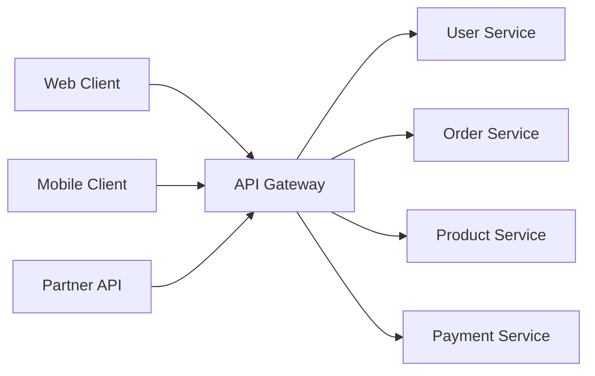
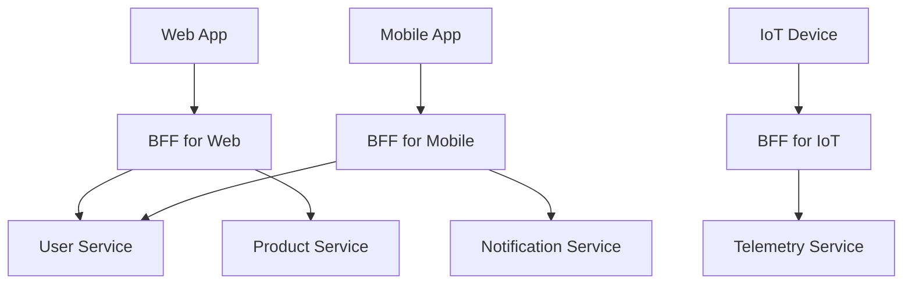
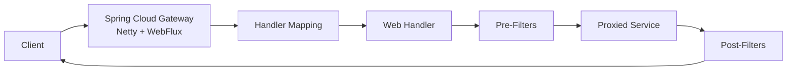
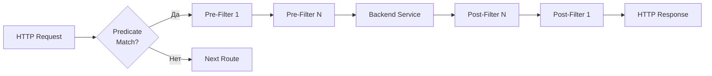
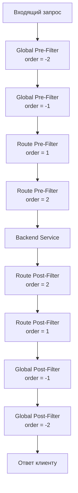
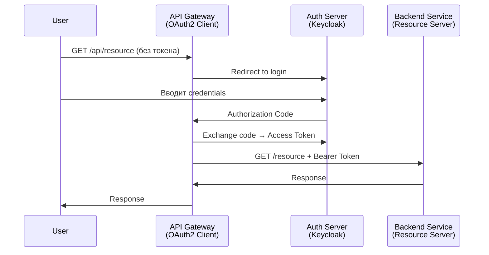
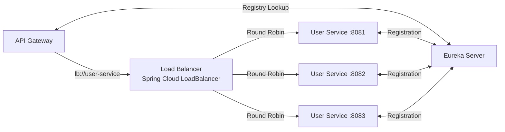
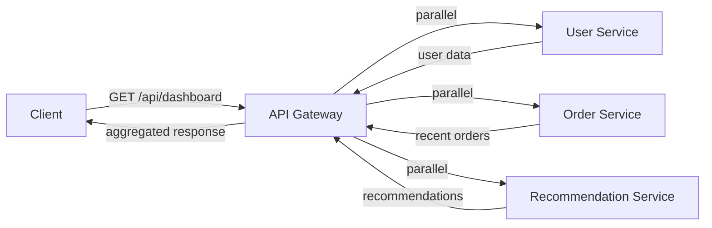
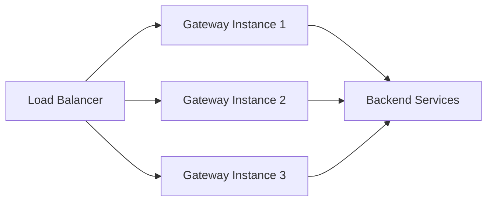
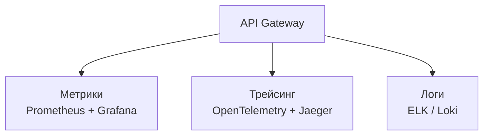

# Вопросы на собеседовании: `API Gateway`

Полное покрытие паттерна `API Gateway`: маршрутизация, аутентификация, `rate limiting`, трансформация запросов, агрегация, `Spring Cloud Gateway`, фильтры, предикаты, `BFF`, безопасность, `CORS`, версионирование API.

**API Gateway** -- один из ключевых паттернов микросервисной архитектуры. На собеседованиях ожидают глубокое понимание его роли, ответственностей, различий с `reverse proxy`, а также практический опыт с `Spring Cloud Gateway` или аналогами (`Kong`, `Nginx`, `AWS API Gateway`). Этот файл охватывает теорию паттерна, архитектуру `Spring Cloud Gateway`, фильтры, предикаты, безопасность и продвинутые сценарии.

## Полезные ссылки

### Официальная документация

- [Spring Cloud Gateway Reference](https://docs.spring.io/spring-cloud-gateway/reference/html/) -- официальная документация
- [Exploring the New Spring Cloud Gateway (Baeldung)](https://www.baeldung.com/spring-cloud-gateway) -- маршрутизация, фильтры, предикаты
- [Spring Cloud Series - The Gateway Pattern (Baeldung)](https://www.baeldung.com/spring-cloud-gateway-pattern) -- паттерн Gateway в Spring Cloud
- [Writing Custom Spring Cloud Gateway Filters (Baeldung)](https://www.baeldung.com/spring-cloud-custom-gateway-filters) -- кастомные фильтры
- [Spring Cloud Gateway WebFilter Factories (Baeldung)](https://www.baeldung.com/spring-cloud-gateway-webfilter-factories) -- встроенные WebFilter фабрики
- [API Gateway vs Reverse Proxy (Baeldung)](https://www.baeldung.com/cs/api-gateway-vs-reverse-proxy) -- сравнение API Gateway и Reverse Proxy
- [Using Spring Cloud Gateway with OAuth 2.0 (Baeldung)](https://www.baeldung.com/spring-cloud-gateway-oauth2) -- OAuth 2.0 паттерны
- [OAuth2 BFF With Spring Cloud Gateway (Baeldung)](https://www.baeldung.com/spring-cloud-gateway-bff-oauth2) -- паттерн Backend for Frontend

## Содержание

- [Полезные ссылки](#полезные-ссылки)
- [See also](#see-also)

**Основы паттерна API Gateway**
- [Q1. (!) Что такое API Gateway и зачем он нужен?](#q1--что-такое-api-gateway-и-зачем-он-нужен)
- [Q2. (!) Какие основные обязанности API Gateway?](#q2--какие-основные-обязанности-api-gateway)
- [Q3. (!) Чем API Gateway отличается от Reverse Proxy?](#q3--чем-api-gateway-отличается-от-reverse-proxy)
- [Q4. Какие преимущества и недостатки у паттерна API Gateway?](#q4-какие-преимущества-и-недостатки-у-паттерна-api-gateway)
- [Q5. Что такое паттерн BFF (Backend for Frontend)?](#q5-что-такое-паттерн-bff-backend-for-frontend)

**Spring Cloud Gateway -- архитектура и конфигурация**
- [Q6. (!) Что такое Spring Cloud Gateway и на чём он основан?](#q6--что-такое-spring-cloud-gateway-и-на-чём-он-основан)
- [Q7. (!) Что такое Route, Predicate и Filter в Spring Cloud Gateway?](#q7--что-такое-route-predicate-и-filter-в-spring-cloud-gateway)
- [Q8. Как настроить маршрутизацию через YAML и Java DSL?](#q8-как-настроить-маршрутизацию-через-yaml-и-java-dsl)
- [Q9. Какие встроенные предикаты (Route Predicates) существуют?](#q9-какие-встроенные-предикаты-route-predicates-существуют)

**Фильтры Spring Cloud Gateway**
- [Q10. (!) Какие типы фильтров существуют в Spring Cloud Gateway?](#q10--какие-типы-фильтров-существуют-в-spring-cloud-gateway)
- [Q11. (!) Как написать кастомный GatewayFilter?](#q11--как-написать-кастомный-gatewayfilter)
- [Q12. Что такое GlobalFilter и чем он отличается от GatewayFilter?](#q12-что-такое-globalfilter-и-чем-он-отличается-от-gatewayfilter)
- [Q13. Как работает цепочка фильтров и порядок их выполнения?](#q13-как-работает-цепочка-фильтров-и-порядок-их-выполнения)
- [Q14. Какие встроенные фильтры для трансформации запросов и ответов существуют?](#q14-какие-встроенные-фильтры-для-трансформации-запросов-и-ответов-существуют)

**Безопасность и аутентификация**
- [Q15. (!) Как реализовать аутентификацию и авторизацию через API Gateway?](#q15--как-реализовать-аутентификацию-и-авторизацию-через-api-gateway)
- [Q16. Как настроить CORS в Spring Cloud Gateway?](#q16-как-настроить-cors-в-spring-cloud-gateway)
- [Q17. Как реализовать OAuth 2.0 Token Relay через Gateway?](#q17-как-реализовать-oauth-20-token-relay-через-gateway)

**Rate Limiting и отказоустойчивость**
- [Q18. (!) Как реализовать Rate Limiting в API Gateway?](#q18--как-реализовать-rate-limiting-в-api-gateway)
- [Q19. (!) Как интегрировать Circuit Breaker с API Gateway?](#q19--как-интегрировать-circuit-breaker-с-api-gateway)

**Интеграция с инфраструктурой**
- [Q20. (!) Как API Gateway интегрируется с Service Discovery?](#q20--как-api-gateway-интегрируется-с-service-discovery)
- [Q21. Как реализовать балансировку нагрузки через Gateway?](#q21-как-реализовать-балансировку-нагрузки-через-gateway)
- [Q22. Поддерживает ли Spring Cloud Gateway WebSocket?](#q22-поддерживает-ли-spring-cloud-gateway-websocket)

**Версионирование и агрегация API**
- [Q23. Как реализовать версионирование API через Gateway?](#q23-как-реализовать-версионирование-api-через-gateway)
- [Q24. Что такое API Composition/Aggregation и как реализовать через Gateway?](#q24-что-такое-api-compositionaggregation-и-как-реализовать-через-gateway)

**Сравнение решений и production-практики**
- [Q25. (!) Сравните Spring Cloud Gateway, Kong и Nginx как API Gateway](#q25--сравните-spring-cloud-gateway-kong-и-nginx-как-api-gateway)
- [Q26. Как организовать мониторинг и логирование API Gateway?](#q26-как-организовать-мониторинг-и-логирование-api-gateway)
- [Q27. Какие anti-паттерны связаны с API Gateway?](#q27-какие-anti-паттерны-связаны-с-api-gateway)

**Продвинутые темы**
- [Q28. (!) Как реализовать request/response трансформацию на уровне Gateway?](#q28--как-реализовать-requestresponse-трансформацию-на-уровне-gateway)
- [Q29. Как настроить Kong API Gateway для rate limiting и аутентификации?](#q29-как-настроить-kong-api-gateway-для-rate-limiting-и-аутентификации)
- [Q30. (!) Как организовать observability (метрики, трейсинг, логи) для API Gateway?](#q30--как-организовать-observability-метрики-трейсинг-логи-для-api-gateway)
- [Q31. (!) Алгоритмы Rate Limiting: Token Bucket, Leaky Bucket, Fixed Window, Sliding Window](#q31--алгоритмы-rate-limiting-token-bucket-leaky-bucket-fixed-window-sliding-window)
- [Q32. (!) API Gateway vs Service Mesh: когда что выбирать?](#q32--api-gateway-vs-service-mesh-когда-что-выбирать)
- [Q33. Как работает gRPC-Web через API Gateway?](#q33-как-работает-grpc-web-через-api-gateway)
- [Q34. WebSocket через API Gateway: sticky sessions и масштабирование](#q34-websocket-через-api-gateway-sticky-sessions-и-масштабирование)
- [Q35. API Gateway в serverless архитектуре (AWS API Gateway)](#q35-api-gateway-в-serverless-архитектуре-aws-api-gateway)
- [Q36. GraphQL через API Gateway: federation и schema stitching](#q36-graphql-через-api-gateway-federation-и-schema-stitching)
- [Q37. (!) Стратегии версионирования API через Gateway](#q37--стратегии-версионирования-api-через-gateway)
- [Q38. (!) Retry и Circuit Breaker на уровне API Gateway](#q38--retry-и-circuit-breaker-на-уровне-api-gateway)

---

## Q1. (!) Что такое API Gateway и зачем он нужен?

**API Gateway** -- это единая точка входа для всех клиентских запросов в микросервисной архитектуре. Он принимает входящие запросы, маршрутизирует их к соответствующим backend-сервисам, агрегирует результаты и возвращает ответ клиенту.



**Зачем нужен API Gateway:**

- **Единая точка входа** -- клиенты обращаются к одному URL вместо десятков сервисов
- **Скрытие внутренней структуры** -- клиенты не знают о количестве и расположении сервисов
- **Инкапсуляция cross-cutting concerns** -- аутентификация, логирование, rate limiting реализуются один раз
- **Упрощение клиентского кода** -- клиент не занимается обнаружением сервисов и агрегацией данных
- **Протокольная трансляция** -- например, внешний REST API -> внутренний gRPC

Без `API Gateway` каждый клиент должен был бы знать адреса всех сервисов, самостоятельно обрабатывать ошибки, аутентификацию и ретраи, что приводит к дублированию логики и тесной связанности.

---


> [!mcq]
> - [ ] Reverse Proxy (Nginx/HAProxy) без дополнительных плагинов | ❌ ПОСЛЕДСТВИЕ: нет централизованной auth/aggregation — каждый клиент вынужден знать адреса всех N сервисов и сам обрабатывать retry/auth
> - [ ] Service Mesh (Istio/Linkerd) | ❌ ПОСЛЕДСТВИЕ: управляет east-west трафиком между сервисами, не является single entry point для внешних клиентов
> - [x] Единая точка входа для клиентов, инкапсулирующая cross-cutting concerns: routing, auth, rate limiting, aggregation | ✓ ПРИМЕНЯТЬ: в микросервисной архитектуре с несколькими типами клиентов 📋 ПРАВИЛО: один URL наружу — N сервисов внутри, клиент не знает топологию 🔗 См. Q3
> - [ ] Monolithic façade с бизнес-логикой оркестрации всех сервисов | ❌ ПОСЛЕДСТВИЕ: Gateway становится «толстым» — нарушается SRP, при росте логики превращается в SPOF-бутылочное горлышко

## Q2. (!) Какие основные обязанности API Gateway?

API Gateway берёт на себя несколько ключевых cross-cutting concerns:

| Обязанность | Описание |
|---|---|
| **Маршрутизация** | Направление запросов к нужному backend-сервису по URL, заголовкам, параметрам |
| **Аутентификация/Авторизация** | Проверка `JWT`, `OAuth 2.0` токенов до передачи запроса сервису |
| **Rate Limiting** | Ограничение количества запросов от клиента за единицу времени |
| **Трансформация запросов** | Модификация заголовков, тела, query-параметров |
| **Агрегация** | Объединение ответов нескольких сервисов в один для клиента |
| **Кэширование** | Кэширование часто запрашиваемых ответов |
| **Балансировка нагрузки** | Распределение запросов между инстансами сервиса |
| **Circuit Breaker** | Защита от каскадных сбоев при недоступности backend |
| **Логирование и мониторинг** | Централизованный сбор метрик, трейсов, логов |
| **CORS** | Управление Cross-Origin Resource Sharing |
| **SSL Termination** | Завершение TLS на уровне Gateway |

На собеседовании важно уметь объяснить, какие обязанности стоит размещать в Gateway, а какие лучше оставить в самих сервисах. Бизнес-логика **никогда** не должна находиться в Gateway -- это anti-паттерн.

---


> [!mcq]
> - [ ] В Gateway кладут бизнес-логику оркестрации — например, расчёт скидок по данным из нескольких сервисов | ❌ ПОСЛЕДСТВИЕ: Gateway превращается в «умный ESB» — tight coupling, невозможно независимо деплоить сервисы
> - [ ] Gateway отвечает только за маршрутизацию, без auth и rate limiting — эти задачи у каждого сервиса | ❌ ПОСЛЕДСТВИЕ: дублирование JWT-проверки в каждом сервисе — несинхронизированное обновление правил безопасности
> - [ ] Gateway управляет только CORS и SSL termination, остальное — на стороне сервисов | ❌ ПОСЛЕДСТВИЕ: нет единого rate limiting — злоумышленник обходит лимиты, обращаясь напрямую к сервисам
> - [x] Routing, auth/authz, rate limiting, aggregation, трансформация, circuit breaker — всё инфраструктурное, бизнес-логика остаётся в сервисах | ✓ ПРИМЕНЯТЬ: DRY cross-cutting concerns — реализовать один раз в Gateway, а не в каждом сервисе 📋 ПРАВИЛО: Gateway = инфраструктурный слой, not business logic 🔗 См. Q27

## Q3. (!) Чем API Gateway отличается от Reverse Proxy?

Это частый вопрос, который проверяет понимание архитектурных нюансов.

| Аспект | Reverse Proxy | API Gateway |
|---|---|---|
| **Уровень работы** | L4/L7 (TCP/HTTP) | L7 (Application) |
| **Основная задача** | Проксирование и балансировка | Управление API lifecycle |
| **Маршрутизация** | По URL/IP, простая | Сложная: по заголовкам, query, телу запроса |
| **Аутентификация** | Базовая или отсутствует | Полная: OAuth 2.0, JWT, API keys |
| **Трансформация** | Минимальная (заголовки) | Полная: заголовки, тело, протоколы |
| **Rate Limiting** | Базовый (по IP) | Продвинутый (по пользователю, API key, плану) |
| **Агрегация** | Нет | Да, объединение ответов нескольких сервисов |
| **API Management** | Нет | Версионирование, документация, аналитика |
| **Примеры** | `Nginx`, `HAProxy`, `Envoy` | `Kong`, `Spring Cloud Gateway`, `AWS API Gateway` |

**Ключевое различие**: `Reverse Proxy` -- это инфраструктурный компонент для проксирования трафика, а `API Gateway` -- это архитектурный паттерн с богатой функциональностью для управления API. На практике `Nginx` и `Kong` показывают, как `reverse proxy` может эволюционировать в `API Gateway` с добавлением плагинов.

---


> [!mcq]
> - [ ] Nginx — полноценный API Gateway «из коробки», без плагинов поддерживает OAuth 2.0 и агрегацию | ❌ ПОСЛЕДСТВИЕ: Nginx без NGINX Plus/плагинов — это Reverse Proxy L4/L7, нет нативной auth/aggregation
> - [ ] API Gateway и Reverse Proxy одинаково работают на L4 (TCP), разница только в цене лицензии | ❌ ПОСЛЕДСТВИЕ: Reverse Proxy может работать на L4, Gateway всегда на L7 Application — разные уровни абстракции
> - [x] Reverse Proxy: L4/L7 проксирование + балансировка, нет API management; API Gateway: L7 + auth, aggregation, versioning, rate limiting per user | ✓ ПРИМЕНЯТЬ: Reverse Proxy для SSL termination/load balancing, Gateway — для управления API lifecycle 📋 ПРАВИЛО: Nginx/HAProxy = infra proxy; Kong/SCG = API platform 🔗 См. Q25
> - [ ] Reverse Proxy умеет агрегировать ответы от нескольких backend-сервисов в один JSON | ❌ ПОСЛЕДСТВИЕ: стандартные Reverse Proxy не умеют агрегировать — нужны плагины или переход на API Gateway

## Q4. Какие преимущества и недостатки у паттерна API Gateway?

**Преимущества:**

- **Упрощение клиентского кода** -- один endpoint вместо десятков
- **Инкапсуляция** -- изменение внутренней структуры не затрагивает клиентов
- **Централизация cross-cutting concerns** -- DRY-принцип для безопасности, логирования
- **Возможность адаптации API** под разных клиентов (BFF)
- **Протокольная изоляция** -- внешний REST, внутренний gRPC/AMQP

**Недостатки:**

- **Единая точка отказа (SPOF)** -- Gateway должен быть высокодоступным
- **Дополнительная задержка** -- каждый запрос проходит через дополнительный hop
- **Сложность эксплуатации** -- ещё один компонент для деплоя, мониторинга, масштабирования
- **Риск "толстого" Gateway** -- соблазн положить бизнес-логику в Gateway
- **Bottleneck** -- весь трафик проходит через одну точку

Для минимизации рисков Gateway должен быть **stateless**, **горизонтально масштабируемым** и содержать **только инфраструктурную логику**.

---


> [!mcq]
> - [ ] Stateful Gateway с хранением сессий в памяти процесса | ❌ ПОСЛЕДСТВИЕ: при горизонтальном масштабировании — session affinity или потеря сессии; невозможен rolling restart
> - [ ] Gateway с бизнес-логикой оркестрации сервисов | ❌ ПОСЛЕДСТВИЕ: Gateway превращается в монолит — при изменении бизнес-правил нужно деплоить Gateway, нарушается независимость сервисов
> - [ ] Gateway без резервирования (single instance) | ❌ ПОСЛЕДСТВИЕ: единственный SPOF — один падший инстанс делает недоступными все микросервисы
> - [x] Единая точка входа упрощает клиентский код (плюс), но создаёт SPOF и дополнительную latency (минус); mitigation — stateless + горизонтальное масштабирование | ✓ ПРИМЕНЯТЬ: балансировать между централизацией cross-cutting concerns и риском SPOF 📋 ПРАВИЛО: Gateway stateless = scalable + resilient; сессии в Redis 🔗 См. Q27

## Q5. Что такое паттерн BFF (Backend for Frontend)?

**BFF (Backend for Frontend)** -- это вариация паттерна `API Gateway`, при которой для каждого типа клиента создаётся отдельный Gateway, адаптированный под его потребности.



**Зачем нужен BFF:**

- **Разные форматы данных** -- мобильному клиенту нужны компактные ответы, веб-клиенту -- полные
- **Разные паттерны агрегации** -- одна страница мобильного приложения может требовать данных от 5 сервисов
- **Разные требования к безопасности** -- `OAuth 2.0` для web, `API key` для IoT
- **Независимые релизные циклы** -- команда мобильной разработки управляет своим BFF

**Подробнее** о реализации BFF с `Spring Cloud Gateway` и `OAuth 2.0` -- в [вопросах по Spring Cloud](../frameworks/spring/spring-cloud-interview.md).

---


> [!mcq]
> - [ ] Один общий API Gateway для Web, Mobile и IoT клиентов | ❌ ПОСЛЕДСТВИЕ: Web получает избыточные данные (overfetch), Mobile — недостаточные (underfetch), нельзя независимо менять контракт под каждый клиент
> - [x] Отдельный Gateway (BFF) для каждого типа клиента — web, mobile, IoT — адаптирует формат данных и схему агрегации | ✓ ПРИМЕНЯТЬ: когда клиенты имеют разные требования к payload, безопасности и rate limits 📋 ПРАВИЛО: один BFF = одна команда-потребитель, независимый релизный цикл 🔗 См. Q32
> - [ ] BFF заменяет все backend-сервисы — он один хранит данные и содержит бизнес-логику | ❌ ПОСЛЕДСТВИЕ: BFF становится монолитом — нет смысла в микросервисной архитектуре
> - [ ] BFF — то же что и API Gateway, просто другое название | ❌ ПОСЛЕДСТВИЕ: путаница в архитектуре — единый API Gateway игнорирует разные потребности клиентов в формате и объёме данных

## Q6. (!) Что такое Spring Cloud Gateway и на чём он основан?

**Spring Cloud Gateway** -- это реактивный API Gateway из экосистемы `Spring Cloud`, построенный на `Spring WebFlux` и `Project Reactor`. Он работает на `Netty` вместо `Tomcat`, что обеспечивает неблокирующую обработку запросов.



**Ключевые характеристики:**

- **Реактивный стек** -- `WebFlux` + `Reactor Netty`, неблокирующий I/O
- **Интеграция с Spring Cloud** -- `Eureka`, `Consul`, `Resilience4j`, `Spring Security`
- **Декларативная и программная конфигурация** -- YAML или Java DSL
- **Расширяемость** -- кастомные фильтры и предикаты
- **Поддержка WebSocket** -- проксирование WebSocket соединений

**Важно**: `Spring Cloud Gateway` **несовместим** с `Spring MVC` (Servlet-стек). Нельзя использовать `spring-boot-starter-web` и `spring-cloud-starter-gateway` вместе -- это приведёт к конфликту.

```xml
<!-- pom.xml -->
<dependency>
    <groupId>org.springframework.cloud</groupId>
    <artifactId>spring-cloud-starter-gateway</artifactId>
</dependency>
<!-- НЕ добавлять spring-boot-starter-web! -->
```

---


> [!mcq]
> - [ ] Spring Cloud Gateway основан на Spring MVC (Servlet API) с Tomcat | ❌ ПОСЛЕДСТВИЕ: при добавлении spring-boot-starter-web к SCG — конфликт Servlet/Reactive стека, приложение не запустится
> - [ ] Spring Cloud Gateway совместим со spring-boot-starter-web и может работать на Tomcat | ❌ ПОСЛЕДСТВИЕ: SCG использует Netty + WebFlux — несовместимо с Servlet API; попытка совместить даст конфликт зависимостей
> - [x] Реактивный Gateway на Spring WebFlux + Reactor Netty — неблокирующий I/O, несовместим со spring-boot-starter-web | ✓ ПРИМЕНЯТЬ: высоконагруженные API с тысячами concurrent connections при малом числе потоков 📋 ПРАВИЛО: WebFlux = non-blocking Netty; никогда не добавлять spring-boot-starter-web рядом 🔗 См. Q7
> - [ ] Spring Cloud Gateway работает на Undertow — асинхронном Servlet 3.1 контейнере | ❌ ПОСЛЕДСТВИЕ: SCG не поддерживает Undertow — только Netty; при принудительной замене Gateway не стартует

## Q7. (!) Что такое Route, Predicate и Filter в Spring Cloud Gateway?

Это три основных строительных блока `Spring Cloud Gateway`:

**Route** (маршрут) -- основная единица конфигурации. Определяет, куда направить запрос. Состоит из:
- `id` -- уникальный идентификатор
- `uri` -- целевой адрес backend-сервиса
- `predicates` -- условия для сопоставления запроса
- `filters` -- модификации запроса/ответа

**Predicate** (предикат) -- условие, которому должен соответствовать входящий запрос, чтобы маршрут был применён. Реализует `java.util.function.Predicate<ServerWebExchange>`.

**Filter** (фильтр) -- компонент для модификации запроса до отправки в backend (pre-filter) или ответа перед возвратом клиенту (post-filter).



---


> [!mcq]
> - [ ] Route — это глобальный фильтр, Predicate — маршрут, Filter — условие матчинга | ❌ ПОСЛЕДСТВИЕ: перепутаны роли компонентов — неверная конфигурация маршрутов, запросы идут не туда
> - [ ] Predicate применяется ПОСЛЕ отправки запроса к backend, в post-фазе | ❌ ПОСЛЕДСТВИЕ: нет смысла в предикате после backend — матчинг происходит ДО проксирования, иначе какой маршрут применять?
> - [ ] Filter — только Pre-фаза (до backend); post-обработку делает сам backend | ❌ ПОСЛЕДСТВИЕ: нет модификации ответа на уровне Gateway — невозможно добавить correlation-id в response headers
> - [x] Route = маршрут (id+uri+predicates+filters); Predicate = условие матчинга (Path, Method, Header); Filter = модификация req (pre) и resp (post) | ✓ ПРИМЕНЯТЬ: комбинировать predicates через AND для точного матчинга + pre/post filters для трансформации 📋 ПРАВИЛО: Predicate → match, Filter → transform, Route → bind 🔗 См. Q9

## Q8. Как настроить маршрутизацию через YAML и Java DSL?

**YAML-конфигурация** (декларативный подход):

```yaml
spring:
  cloud:
    gateway:
      routes:
        - id: user-service
          uri: http://localhost:8081
          predicates:
            - Path=/api/users/**
            - Method=GET,POST
          filters:
            - AddRequestHeader=X-Request-Source, gateway
            - RewritePath=/api/users/(?<segment>.*), /users/${segment}

        - id: order-service
          uri: lb://order-service  # через Service Discovery
          predicates:
            - Path=/api/orders/**
            - Header=X-Api-Version, v2
          filters:
            - CircuitBreaker=name=orderCB,fallbackUri=forward:/fallback/orders
```

**Java DSL** (программный подход):

```java
@Configuration
public class GatewayConfig {

    @Bean
    public RouteLocator customRoutes(RouteLocatorBuilder builder) {
        return builder.routes()
            .route("user-service", r -> r
                .path("/api/users/**")
                .and().method(HttpMethod.GET, HttpMethod.POST)
                .filters(f -> f
                    .addRequestHeader("X-Request-Source", "gateway")
                    .rewritePath("/api/users/(?<segment>.*)", "/users/${segment}"))
                .uri("http://localhost:8081"))
            .route("order-service", r -> r
                .path("/api/orders/**")
                .filters(f -> f
                    .circuitBreaker(c -> c
                        .setName("orderCB")
                        .setFallbackUri("forward:/fallback/orders")))
                .uri("lb://order-service"))
            .build();
    }
}
```

**Когда что использовать**: YAML удобен для простых маршрутов и DevOps-конфигурации. Java DSL предпочтителен, когда логика маршрутизации содержит условия, динамические значения или кастомные фильтры.

---


> [!mcq]
> - [ ] Java DSL и YAML взаимоисключающие подходы — нельзя использовать оба в одном приложении | ❌ ПОСЛЕДСТВИЕ: заблуждение ограничивает архитектуру — можно смешивать YAML-маршруты и Java DSL-бины в одном приложении
> - [ ] YAML конфигурация требует полный рестарт приложения при добавлении нового маршрута | ❌ ПОСЛЕДСТВИЕ: без Spring Cloud Config + Actuator endpoint `/gateway/refresh` действительно нужен рестарт, но это конфигурируемо
> - [x] YAML — для простых маршрутов (DevOps читаемость); Java DSL — для условной логики, кастомных фильтров, динамических URI | ✓ ПРИМЕНЯТЬ: YAML в prod для стандартных маршрутов; Java DSL при сложной логике или programmatic routing 📋 ПРАВИЛО: YAML = declarative config, Java DSL = full power of Spring Bean wiring 🔗 См. Q10
> - [ ] В Java DSL нельзя применять CircuitBreaker — только в YAML через `name: CircuitBreaker` | ❌ ПОСЛЕДСТВИЕ: CircuitBreaker доступен и в Java DSL через `.filters(f -> f.circuitBreaker(...))`

## Q9. Какие встроенные предикаты (Route Predicates) существуют?

`Spring Cloud Gateway` предоставляет набор `RoutePredicateFactory`:

| Предикат | Описание | Пример |
|---|---|---|
| `Path` | Совпадение по пути | `Path=/api/users/**` |
| `Method` | HTTP-метод | `Method=GET,POST` |
| `Header` | Наличие/значение заголовка | `Header=X-Api-Key, \w+` |
| `Query` | Наличие/значение query-параметра | `Query=category, electronics` |
| `Host` | Хост запроса | `Host=**.example.com` |
| `Cookie` | Наличие/значение cookie | `Cookie=session, \w+` |
| `After` | Запрос после указанного времени | `After=2026-01-01T00:00:00+03:00` |
| `Before` | Запрос до указанного времени | `Before=2026-12-31T23:59:59+03:00` |
| `Between` | Запрос в интервале времени | `Between=..., ...` |
| `RemoteAddr` | IP-адрес клиента | `RemoteAddr=192.168.1.0/24` |
| `Weight` | Распределение трафика по весу | `Weight=group1, 80` |
| `CloudFoundryRouteService` | Cloud Foundry-специфичный | -- |

Предикаты комбинируются через логическое И:

```yaml
predicates:
  - Path=/api/v2/**
  - Method=GET
  - Header=Accept, application/json
  # Запрос должен удовлетворять ВСЕМ условиям
```

---


> [!mcq]
> - [ ] Только Path и Method — больше ничего не нужно | ❌ ПОСЛЕДСТВИЕ: невозможна маршрутизация по тенанту/headers/host, А/B тесты невозможны.
> - [x] Полный набор: Path, Method, Header, Query, Host, Cookie, After/Before/Between (по времени), RemoteAddr (IP), Weight (распределение трафика); комбинируются через логическое И | ✓ ПРИМЕНЯТЬ: гибкая маршрутизация. 📋 ПРАВИЛО: «все условия И, не ИЛИ». 🔗 См. Q10
> - [ ] Predicates подключаются через ServiceFilter — отдельная подсистема | ❌ ПОСЛЕДСТВИЕ: путаница, predicates встроенные в RouteLocator.
> - [ ] Только regex для всех условий — простота | ❌ ПОСЛЕДСТВИЕ: regex на дате/IP уродлив, type-safe Between/RemoteAddr предикаты гораздо удобнее.

## Q10. (!) Какие типы фильтров существуют в Spring Cloud Gateway?

Фильтры делятся на несколько категорий:

**1. По области применения:**

| Тип | Описание | Пример |
|---|---|---|
| `GatewayFilter` | Применяется к конкретному маршруту | `AddRequestHeader`, `RewritePath` |
| `GlobalFilter` | Применяется ко всем маршрутам | Логирование, метрики, аутентификация |

**2. По фазе выполнения:**

| Фаза | Когда выполняется | Типичное использование |
|---|---|---|
| **Pre-filter** | До отправки запроса в backend | Аутентификация, добавление заголовков, rate limiting |
| **Post-filter** | После получения ответа от backend | Модификация ответа, добавление заголовков, логирование |

**3. Основные встроенные GatewayFilter фабрики:**

- **Заголовки**: `AddRequestHeader`, `AddResponseHeader`, `RemoveRequestHeader`, `RemoveResponseHeader`, `SetRequestHeader`, `SetResponseHeader`
- **Пути**: `RewritePath`, `StripPrefix`, `PrefixPath`, `SetPath`
- **Параметры**: `AddRequestParameter`, `RemoveRequestParameter`
- **Отказоустойчивость**: `CircuitBreaker`, `Retry`, `RequestRateLimiter`
- **Размер**: `RequestSize` -- ограничение размера тела запроса
- **Редиректы**: `RedirectTo` -- HTTP-редирект
- **Тело**: `ModifyRequestBody`, `ModifyResponseBody` -- трансформация тела

---


> [!mcq]
> - [x] По области — GatewayFilter (для конкретного маршрута, AddRequestHeader/RewritePath) vs GlobalFilter (для всех, аутентификация/логирование); по фазе — Pre (до backend: auth, rate limit) и Post (после ответа: модификация, логирование); встроенные — Headers, Paths, Params, CircuitBreaker, Retry, RequestRateLimiter, ModifyRequestBody | ✓ ПРИМЕНЯТЬ: организация пайплайна. 📋 ПРАВИЛО: «pre для security, post для transform». 🔗 См. Q11
> - [ ] Один тип GatewayFilter — больше не нужно | ❌ ПОСЛЕДСТВИЕ: невозможно сделать cross-cutting concerns (logging/metrics для всех маршрутов).
> - [ ] Фильтры выполняются только post — после backend | ❌ ПОСЛЕДСТВИЕ: фактически неверно, pre-фильтры критичны для auth/rate limit.
> - [ ] Фильтры — это сервлеты Servlet API | ❌ ПОСЛЕДСТВИЕ: SCG на WebFlux, никаких сервлетов, реактивный pipeline.

## Q11. (!) Как написать кастомный GatewayFilter?

Кастомный фильтр создаётся через наследование от `AbstractGatewayFilterFactory`:

```java
@Component
public class RequestTimingGatewayFilterFactory
        extends AbstractGatewayFilterFactory<RequestTimingGatewayFilterFactory.Config> {

    private static final Logger log = LoggerFactory.getLogger(RequestTimingGatewayFilterFactory.class);

    public RequestTimingGatewayFilterFactory() {
        super(Config.class);
    }

    @Override
    public GatewayFilter apply(Config config) {
        return (exchange, chain) -> {
            long startTime = System.currentTimeMillis();
            String path = exchange.getRequest().getURI().getPath();

            return chain.filter(exchange).then(Mono.fromRunnable(() -> {
                long duration = System.currentTimeMillis() - startTime;
                if (config.isLogEnabled()) {
                    log.info("Request to {} took {} ms", path, duration);
                }
                if (duration > config.getThresholdMs()) {
                    log.warn("Slow request to {}: {} ms (threshold: {} ms)",
                             path, duration, config.getThresholdMs());
                }
            }));
        };
    }

    @Data
    public static class Config {
        private boolean logEnabled = true;
        private long thresholdMs = 1000;
    }
}
```

Использование в YAML:

```yaml
filters:
  - name: RequestTiming
    args:
      logEnabled: true
      thresholdMs: 500
```

Фильтр выше является **и pre-, и post-фильтром**: код до `chain.filter()` -- pre-фаза, код в `then()` -- post-фаза.

---


> [!mcq]
> - [x] Наследуем AbstractGatewayFilterFactory<Config>, реализуем apply(Config) возвращая GatewayFilter (exchange, chain) → chain.filter(exchange).then(Mono.fromRunnable(() -> ...)); код до chain.filter() — pre, в .then() — post; конфиг через @Data inner class; YAML usage с args | ✓ ПРИМЕНЯТЬ: кастомная логика на маршруте. 📋 ПРАВИЛО: «pre до chain, post в then». 🔗 См. Q12
> - [ ] Достаточно implements GatewayFilter с filter() методом | ❌ ПОСЛЕДСТВИЕ: нет конфигурации через YAML, нет factory pattern.
> - [ ] HandlerInterceptor из Spring MVC можно переиспользовать | ❌ ПОСЛЕДСТВИЕ: SCG на WebFlux, HandlerInterceptor оттуда не работает.
> - [ ] Writing aspect via @Aspect — AOP | ❌ ПОСЛЕДСТВИЕ: SCG не использует AOP, фильтр должен быть в pipeline.

## Q12. Что такое GlobalFilter и чем он отличается от GatewayFilter?

**`GlobalFilter`** автоматически применяется ко всем маршрутам без явного указания в конфигурации, в отличие от `GatewayFilter`, который привязывается к конкретному маршруту.

```java
@Component
public class RequestLoggingGlobalFilter implements GlobalFilter, Ordered {

    private static final Logger log = LoggerFactory.getLogger(RequestLoggingGlobalFilter.class);

    @Override
    public Mono<Void> filter(ServerWebExchange exchange, GatewayFilterChain chain) {
        String requestId = UUID.randomUUID().toString();
        ServerHttpRequest mutatedRequest = exchange.getRequest().mutate()
            .header("X-Request-Id", requestId)
            .build();

        log.info("[{}] {} {} from {}",
            requestId,
            exchange.getRequest().getMethod(),
            exchange.getRequest().getURI().getPath(),
            exchange.getRequest().getRemoteAddress());

        return chain.filter(exchange.mutate().request(mutatedRequest).build());
    }

    @Override
    public int getOrder() {
        return -1; // чем ниже число, тем раньше выполняется
    }
}
```

| Аспект | `GatewayFilter` | `GlobalFilter` |
|---|---|---|
| Область | Конкретный маршрут | Все маршруты |
| Конфигурация | В YAML/DSL маршрута | Автоматически через `@Component` |
| Создание | `AbstractGatewayFilterFactory` | Реализация `GlobalFilter` |
| Типичное применение | Трансформация, retry | Логирование, аутентификация, трейсинг |

---


> [!mcq]
> - [ ] GlobalFilter — это просто рекомендуемый, можно обойтись без него | ❌ ПОСЛЕДСТВИЕ: cross-cutting concerns (auth/log) дублируются в каждом маршруте.
> - [x] GlobalFilter автоматически применяется ко всем маршрутам (implements GlobalFilter + Ordered, @Component), GatewayFilter — только к конкретному маршруту через AbstractGatewayFilterFactory; GlobalFilter для логирования/auth/трейсинга, GatewayFilter для трансформации/retry | ✓ ПРИМЕНЯТЬ: правильный scope фильтра. 📋 ПРАВИЛО: «cross-cutting — Global». 🔗 См. Q13
> - [ ] GlobalFilter работает только в blocking режиме | ❌ ПОСЛЕДСТВИЕ: фактическая ошибка, SCG = WebFlux, всё реактивно.
> - [ ] GlobalFilter не может изменять request — только observability | ❌ ПОСЛЕДСТВИЕ: фактически неверно, exchange.mutate().request() позволяет менять.

## Q13. Как работает цепочка фильтров и порядок их выполнения?

Фильтры выполняются в определённом порядке, который контролируется интерфейсом `Ordered`:



**Правила порядка:**

1. **Pre-фильтры** -- выполняются в порядке возрастания `order` (от наименьшего к наибольшему)
2. **Post-фильтры** -- выполняются в обратном порядке (от наибольшего к наименьшему)
3. `GlobalFilter` и `GatewayFilter` объединяются в единую цепочку и сортируются вместе
4. Без явного `order` фильтры выполняются в порядке объявления

---


> [!mcq]
> - [x] Pre-фильтры выполняются в порядке возрастания order (от меньшего к большему), Post-фильтры — в обратном (от большего к меньшему); GlobalFilter и GatewayFilter объединяются и сортируются вместе; без явного order — в порядке объявления; контролируется через interface Ordered | ✓ ПРИМЕНЯТЬ: chain composition. 📋 ПРАВИЛО: «pre asc, post desc». 🔗 См. Q14
> - [ ] Все фильтры выполняются параллельно для скорости | ❌ ПОСЛЕДСТВИЕ: нарушает контракт filter chain, race conditions.
> - [ ] Порядок не контролируется — всё в HashMap | ❌ ПОСЛЕДСТВИЕ: фактически неверно, Spring сортирует по @Order/Ordered.
> - [ ] GlobalFilter всегда после GatewayFilter | ❌ ПОСЛЕДСТВИЕ: упрощение, они объединяются в одну sorted chain.

## Q14. Какие встроенные фильтры для трансформации запросов и ответов существуют?

**Трансформация запросов:**

```yaml
spring:
  cloud:
    gateway:
      routes:
        - id: transform-example
          uri: http://backend:8080
          predicates:
            - Path=/api/**
          filters:
            # Добавление заголовка
            - AddRequestHeader=X-Tenant-Id, default
            # Удаление заголовка
            - RemoveRequestHeader=Cookie
            # Перезапись пути
            - RewritePath=/api/(?<segment>.*), /internal/${segment}
            # Удаление префикса (1 сегмент)
            - StripPrefix=1
            # Добавление query-параметра
            - AddRequestParameter=source, gateway
            # Ограничение размера запроса
            - RequestSize=5000000  # 5 MB
```

**Трансформация ответов (программно):**

```java
@Bean
public RouteLocator routes(RouteLocatorBuilder builder) {
    return builder.routes()
        .route("modify-response", r -> r
            .path("/api/data/**")
            .filters(f -> f.modifyResponseBody(String.class, String.class,
                (exchange, body) -> {
                    // Оборачиваем ответ в envelope
                    return Mono.just("{\"status\":\"ok\",\"data\":" + body + "}");
                }))
            .uri("http://data-service:8080"))
        .build();
}
```

---


> [!mcq]
> - [x] Request: AddRequestHeader, RemoveRequestHeader, RewritePath (с regex и captures), StripPrefix, AddRequestParameter, RequestSize (5MB); Response: modifyResponseBody (Mono.just envelope) программно через RouteLocator; для тела — ModifyRequestBody/ModifyResponseBody | ✓ ПРИМЕНЯТЬ: трансформации на gateway. 📋 ПРАВИЛО: «без переписывания backend». 🔗 См. Q15
> - [ ] Только programmatic — YAML не поддерживает | ❌ ПОСЛЕДСТВИЕ: фактически неверно, YAML filters широко используются.
> - [ ] Только AddHeader/RemoveHeader — больше не нужно | ❌ ПОСЛЕДСТВИЕ: RewritePath и StripPrefix критичны для маршрутизации legacy → new.
> - [ ] Трансформации требуют отдельного middleware service | ❌ ПОСЛЕДСТВИЕ: лишний hop, gateway сам умеет.

## Q15. (!) Как реализовать аутентификацию и авторизацию через API Gateway?

Есть два подхода:

**Подход 1: Gateway как точка аутентификации** (рекомендуемый)

Gateway проверяет токен и передаёт информацию о пользователе downstream-сервисам через заголовки:

```java
@Component
public class JwtAuthenticationFilter implements GlobalFilter, Ordered {

    private final JwtDecoder jwtDecoder;

    @Override
    public Mono<Void> filter(ServerWebExchange exchange, GatewayFilterChain chain) {
        String authHeader = exchange.getRequest().getHeaders()
            .getFirst(HttpHeaders.AUTHORIZATION);

        if (authHeader == null || !authHeader.startsWith("Bearer ")) {
            exchange.getResponse().setStatusCode(HttpStatus.UNAUTHORIZED);
            return exchange.getResponse().setComplete();
        }

        try {
            String token = authHeader.substring(7);
            Jwt jwt = jwtDecoder.decode(token);

            ServerHttpRequest mutatedRequest = exchange.getRequest().mutate()
                .header("X-User-Id", jwt.getSubject())
                .header("X-User-Roles", String.join(",", jwt.getClaimAsStringList("roles")))
                .build();

            return chain.filter(exchange.mutate().request(mutatedRequest).build());
        } catch (JwtException e) {
            exchange.getResponse().setStatusCode(HttpStatus.UNAUTHORIZED);
            return exchange.getResponse().setComplete();
        }
    }

    @Override
    public int getOrder() {
        return -100; // выполняется одним из первых
    }
}
```

**Подход 2: Spring Security с OAuth 2.0 Resource Server**

```yaml
spring:
  security:
    oauth2:
      resourceserver:
        jwt:
          issuer-uri: https://auth.example.com/realms/my-realm
```

```java
@Configuration
@EnableWebFluxSecurity
public class SecurityConfig {

    @Bean
    public SecurityWebFilterChain securityWebFilterChain(ServerHttpSecurity http) {
        return http
            .authorizeExchange(exchanges -> exchanges
                .pathMatchers("/api/public/**").permitAll()
                .pathMatchers("/api/admin/**").hasRole("ADMIN")
                .anyExchange().authenticated())
            .oauth2ResourceServer(oauth2 -> oauth2.jwt(Customizer.withDefaults()))
            .csrf(ServerHttpSecurity.CsrfSpec::disable)
            .build();
    }
}
```

---


> [!mcq]
> - [ ] Каждый микросервис проверяет JWT сам — Gateway просто роутер | ❌ ПОСЛЕДСТВИЕ: дублирование auth логики, drift между сервисами, secret rotation сложен.
> - [x] Gateway = единая точка auth: JwtAuthenticationFilter (GlobalFilter, order -100) проверяет Bearer, decode JWT, передаёт X-User-Id/X-User-Roles downstream через mutated request; альтернатива — Spring Security WebFlux с OAuth2 Resource Server + authorizeExchange | ✓ ПРИМЕНЯТЬ: централизованная auth. 📋 ПРАВИЛО: «Gateway = первый bouncer». 🔗 См. Q16
> - [ ] Basic Auth достаточно — JWT overkill | ❌ ПОСЛЕДСТВИЕ: stateful sessions, нет SSO, refresh token невозможен.
> - [ ] Хранить JWT в БД и проверять каждый запрос | ❌ ПОСЛЕДСТВИЕ: JWT теряет преимущества stateless, БД bottleneck.

## Q16. Как настроить CORS в Spring Cloud Gateway?

**Глобальная CORS-конфигурация через YAML:**

```yaml
spring:
  cloud:
    gateway:
      globalcors:
        cors-configurations:
          '[/**]':
            allowedOrigins:
              - "https://frontend.example.com"
              - "https://admin.example.com"
            allowedMethods:
              - GET
              - POST
              - PUT
              - DELETE
              - OPTIONS
            allowedHeaders: "*"
            exposedHeaders:
              - "X-Request-Id"
              - "X-Total-Count"
            allowCredentials: true
            maxAge: 3600
```

**Программная конфигурация:**

```java
@Bean
public CorsWebFilter corsWebFilter() {
    CorsConfiguration config = new CorsConfiguration();
    config.addAllowedOrigin("https://frontend.example.com");
    config.addAllowedMethod("*");
    config.addAllowedHeader("*");
    config.setAllowCredentials(true);
    config.setMaxAge(3600L);

    UrlBasedCorsConfigurationSource source = new UrlBasedCorsConfigurationSource();
    source.registerCorsConfiguration("/**", config);
    return new CorsWebFilter(source);
}
```

**Важный нюанс**: если CORS настроен и на Gateway, и на backend-сервисе, заголовки могут дублироваться. Используйте фильтр `DedupeResponseHeader` для решения:

```yaml
filters:
  - DedupeResponseHeader=Access-Control-Allow-Origin Access-Control-Allow-Credentials, RETAIN_UNIQUE
```

---


> [!mcq]
> - [x] YAML globalcors с cors-configurations '[/**]': allowedOrigins, allowedMethods, allowedHeaders, exposedHeaders, allowCredentials, maxAge; альтернатива — CorsWebFilter @Bean с UrlBasedCorsConfigurationSource; при дублировании headers Gateway+backend — DedupeResponseHeader=Access-Control-Allow-* RETAIN_UNIQUE | ✓ ПРИМЕНЯТЬ: SPA фронтенды. 📋 ПРАВИЛО: «один CORS — на Gateway». 🔗 См. Q17
> - [ ] CORS не нужен на Gateway — браузер сам разберётся | ❌ ПОСЛЕДСТВИЕ: 404/403 на preflight OPTIONS, фронт не работает.
> - [ ] Использовать @CrossOrigin в контроллерах downstream | ❌ ПОСЛЕДСТВИЕ: дублирование, drift конфигурации, OPTIONS летит ко всем сервисам.
> - [ ] AllowOrigin: "*" с credentials — для удобства | ❌ ПОСЛЕДСТВИЕ: spec нарушение (запрещено сочетание), CORS errors, security risk.

## Q17. Как реализовать OAuth 2.0 Token Relay через Gateway?

**Token Relay** -- это паттерн, при котором `API Gateway` выступает `OAuth 2.0 Client`, получает токен от Authorization Server и передаёт (`relay`) его downstream-сервисам.



**Конфигурация:**

```yaml
spring:
  security:
    oauth2:
      client:
        provider:
          keycloak:
            issuer-uri: https://auth.example.com/realms/my-realm
        registration:
          keycloak:
            client-id: gateway-client
            client-secret: ${KEYCLOAK_SECRET}
            scope: openid,profile
  cloud:
    gateway:
      routes:
        - id: protected-service
          uri: lb://protected-service
          predicates:
            - Path=/api/protected/**
          filters:
            - TokenRelay=  # передаёт токен downstream
```

Фильтр `TokenRelay` автоматически подставляет `Authorization: Bearer <token>` в запросы к backend-сервисам.

---


> [!mcq]
> - [x] Token Relay = Gateway как OAuth2 Client, получает Authorization Code, exchange на Access Token у Auth Server (Keycloak), фильтр TokenRelay= автоматически подставляет Bearer Token в downstream-запросы; downstream сервисы — Resource Server, проверяют jwt | ✓ ПРИМЕНЯТЬ: BFF + микросервисы с OAuth2. 📋 ПРАВИЛО: «Gateway держит токен, downstream его получает». 🔗 См. Q18
> - [ ] Передавать пароль пользователя downstream — простота | ❌ ПОСЛЕДСТВИЕ: грубое нарушение security, пароль в логах, не SSO-совместимо.
> - [ ] Каждый сервис делает свой OAuth flow с пользователем | ❌ ПОСЛЕДСТВИЕ: невозможно для server-to-server, UX ломается, многократные redirect.
> - [ ] Token Relay не нужен — JWT уже Bearer | ❌ ПОСЛЕДСТВИЕ: путает Token Relay (auth code flow) с pass-through (Resource Server flow).

## Q18. (!) Как реализовать Rate Limiting в API Gateway?

`Spring Cloud Gateway` предоставляет встроенный `RequestRateLimiter` на основе `Redis` с алгоритмом `Token Bucket`:

```yaml
spring:
  cloud:
    gateway:
      routes:
        - id: rate-limited-service
          uri: lb://api-service
          predicates:
            - Path=/api/**
          filters:
            - name: RequestRateLimiter
              args:
                redis-rate-limiter.replenishRate: 10   # запросов в секунду
                redis-rate-limiter.burstCapacity: 20   # максимальный всплеск
                redis-rate-limiter.requestedTokens: 1  # токенов за запрос
                key-resolver: "#{@userKeyResolver}"
  data:
    redis:
      host: localhost
      port: 6379
```

**Key Resolver** определяет, по какому ключу считать лимиты:

```java
@Configuration
public class RateLimiterConfig {

    // По пользователю (из JWT)
    @Bean
    public KeyResolver userKeyResolver() {
        return exchange -> Mono.justOrEmpty(
            exchange.getRequest().getHeaders().getFirst("X-User-Id"))
            .defaultIfEmpty("anonymous");
    }

    // По IP-адресу
    @Bean
    public KeyResolver ipKeyResolver() {
        return exchange -> Mono.just(
            exchange.getRequest().getRemoteAddress().getAddress().getHostAddress());
    }

    // По API key
    @Bean
    public KeyResolver apiKeyResolver() {
        return exchange -> Mono.justOrEmpty(
            exchange.getRequest().getHeaders().getFirst("X-Api-Key"))
            .defaultIfEmpty("no-key");
    }
}
```

При превышении лимита Gateway возвращает `429 Too Many Requests` с заголовками:
- `X-RateLimit-Remaining` -- оставшееся количество запросов
- `X-RateLimit-Replenish-Rate` -- скорость пополнения
- `X-RateLimit-Burst-Capacity` -- максимальный всплеск

---


> [!mcq]
> - [x] RequestRateLimiter фильтр на Redis с Token Bucket: replenishRate (запросов/сек), burstCapacity (всплеск), requestedTokens, key-resolver=#{@userKeyResolver}; KeyResolver Bean возвращает Mono с ключом (X-User-Id, IP, X-Api-Key); при превышении 429 + X-RateLimit-Remaining/Replenish-Rate/Burst-Capacity | ✓ ПРИМЕНЯТЬ: защита от abuse. 📋 ПРАВИЛО: «Token Bucket + Redis cluster». 🔗 См. Q19
> - [ ] In-memory rate limiter — Redis избыточен | ❌ ПОСЛЕДСТВИЕ: rate limit per-instance, при горизонтальном scale лимит × N инстансов.
> - [ ] Iptables на уровне OS | ❌ ПОСЛЕДСТВИЕ: не различает per-user/per-api-key, всё по IP, false positives для NAT.
> - [ ] Только на backend, Gateway пропускает всё | ❌ ПОСЛЕДСТВИЕ: backend получает DDoS, защита поздно.

## Q19. (!) Как интегрировать Circuit Breaker с API Gateway?

`Spring Cloud Gateway` интегрируется с `Resilience4j` через фильтр `CircuitBreaker`:

```yaml
spring:
  cloud:
    gateway:
      routes:
        - id: order-service
          uri: lb://order-service
          predicates:
            - Path=/api/orders/**
          filters:
            - name: CircuitBreaker
              args:
                name: orderServiceCB
                fallbackUri: forward:/fallback/orders
            - name: Retry
              args:
                retries: 3
                statuses: BAD_GATEWAY,SERVICE_UNAVAILABLE
                methods: GET
                backoff:
                  firstBackoff: 100ms
                  maxBackoff: 500ms
                  factor: 2

# Конфигурация Resilience4j
resilience4j:
  circuitbreaker:
    instances:
      orderServiceCB:
        slidingWindowSize: 10
        failureRateThreshold: 50
        waitDurationInOpenState: 10s
        permittedNumberOfCallsInHalfOpenState: 3
  timelimiter:
    instances:
      orderServiceCB:
        timeoutDuration: 3s
```

**Fallback-контроллер:**

```java
@RestController
@RequestMapping("/fallback")
public class FallbackController {

    @GetMapping("/orders")
    public Mono<Map<String, String>> ordersFallback() {
        return Mono.just(Map.of(
            "status", "SERVICE_UNAVAILABLE",
            "message", "Order service is temporarily unavailable. Please try again later."
        ));
    }
}
```

Подробнее о паттернах отказоустойчивости -- в [вопросах по Resilience-паттернам](resilience-patterns-interview.md).

---


> [!mcq]
> - [x] CircuitBreaker фильтр SCG + Resilience4j: name (orderServiceCB), fallbackUri (forward:/fallback/orders); Resilience4j config — slidingWindowSize, failureRateThreshold 50%, waitDurationInOpenState 10s, halfOpen calls; timelimiter timeoutDuration; FallbackController возвращает graceful degradation | ✓ ПРИМЕНЯТЬ: защита от каскадных отказов. 📋 ПРАВИЛО: «open circuit → fallback». 🔗 См. Q20
> - [ ] Только Retry без CircuitBreaker | ❌ ПОСЛЕДСТВИЕ: каскадные отказы, retry усиливает нагрузку на упавший сервис.
> - [ ] @CircuitBreaker аннотация на gateway-методах | ❌ ПОСЛЕДСТВИЕ: SCG не вызывает методы, фильтр работает в pipeline.
> - [ ] CB реализовать вручную через AtomicBoolean | ❌ ПОСЛЕДСТВИЕ: нет half-open, нет статистики, нет per-instance state.

## Q20. (!) Как API Gateway интегрируется с Service Discovery?

`Spring Cloud Gateway` автоматически интегрируется с `Eureka`, `Consul` или `Kubernetes Service Discovery` через префикс `lb://`:

```yaml
spring:
  cloud:
    gateway:
      discovery:
        locator:
          enabled: true            # автоматическая генерация маршрутов
          lower-case-service-id: true  # сервисы в lowercase
      routes:
        - id: user-service
          uri: lb://user-service   # lb:// = load-balanced через Service Discovery
          predicates:
            - Path=/api/users/**
  application:
    name: api-gateway

eureka:
  client:
    service-url:
      defaultZone: http://eureka:8761/eureka/
```



Когда `discovery.locator.enabled=true`, Gateway автоматически создаёт маршруты для всех сервисов в реестре: `/SERVICE-NAME/**` -> `lb://SERVICE-NAME`. Это удобно для разработки, но в production лучше явно объявлять маршруты для контроля над тем, какие сервисы экспонируются наружу.

---


> [!mcq]
> - [x] Префикс lb:// в uri (lb://user-service) — Gateway резолвит через Eureka/Consul/K8s; discovery.locator.enabled=true автогенерирует маршруты /SERVICE-NAME/** для всех сервисов в реестре (удобно для dev, в prod явные маршруты для контроля экспозиции) | ✓ ПРИМЕНЯТЬ: dynamic routing. 📋 ПРАВИЛО: «lb://, не http://». 🔗 См. Q21
> - [ ] Хардкодить http://service:8080 — простота | ❌ ПОСЛЕДСТВИЕ: при scale-out новые инстансы не подключаются, при failover — даунтайм.
> - [ ] DNS-based discovery достаточно | ❌ ПОСЛЕДСТВИЕ: DNS TTL медленный, нет health-checks per-instance.
> - [ ] discovery.locator.enabled=true в prod | ❌ ПОСЛЕДСТВИЕ: все внутренние сервисы автоматически экспонируются наружу — security risk.

## Q21. Как реализовать балансировку нагрузки через Gateway?

`Spring Cloud Gateway` использует `Spring Cloud LoadBalancer` (ранее -- `Ribbon`) для клиентской балансировки:

```java
@Configuration
public class LoadBalancerConfig {

    // Кастомная стратегия балансировки для конкретного сервиса
    @Bean
    @LoadBalancerClient(name = "heavy-service",
        configuration = HeavyServiceLBConfig.class)
    public ReactorLoadBalancer<ServiceInstance> weightedLoadBalancer(
            ServiceInstanceListSupplier supplier) {
        return new RandomLoadBalancer(supplier, "heavy-service");
    }
}
```

**Доступные стратегии:**

| Стратегия | Описание |
|---|---|
| `RoundRobinLoadBalancer` | Циклическое распределение (по умолчанию) |
| `RandomLoadBalancer` | Случайный выбор инстанса |
| Кастомная | Реализация `ReactorServiceInstanceLoadBalancer` |

Подробнее о стратегиях балансировки -- в [вопросах по балансировке нагрузки](load-balancing-interview.md).

---


> [!mcq]
> - [x] Spring Cloud LoadBalancer (заменил Ribbon) — клиентская балансировка; стратегии — RoundRobinLoadBalancer (default), RandomLoadBalancer; кастомные через ReactorServiceInstanceLoadBalancer; @LoadBalancerClient per-service config | ✓ ПРИМЕНЯТЬ: per-service балансировка. 📋 ПРАВИЛО: «client-side balance, не server-side». 🔗 См. Q22
> - [ ] Server-side балансировка обязательна — клиентская не работает | ❌ ПОСЛЕДСТВИЕ: фактически наоборот, SCG использует client-side.
> - [ ] Только Round-Robin поддерживается | ❌ ПОСЛЕДСТВИЕ: упускаем Random/Weighted/кастомные стратегии.
> - [ ] Ribbon всё ещё рекомендуется | ❌ ПОСЛЕДСТВИЕ: Ribbon в maintenance mode, заменён на Spring Cloud LoadBalancer.

## Q22. Поддерживает ли Spring Cloud Gateway WebSocket?

Да, `Spring Cloud Gateway` поддерживает проксирование `WebSocket`-соединений. Для этого используется схема `ws://` или `wss://`:

```yaml
spring:
  cloud:
    gateway:
      routes:
        - id: websocket-route
          uri: ws://localhost:8081
          predicates:
            - Path=/ws/**
```

Или через `Service Discovery`:

```yaml
routes:
  - id: websocket-service
    uri: lb:ws://notification-service
    predicates:
      - Path=/ws/notifications/**
```

**Особенности:**

- Gateway выполняет `HTTP Upgrade` для переключения на `WebSocket`-протокол
- Поддерживаются `ws://` и `wss://` (с TLS)
- Фильтры pre/post применяются только к начальному `Upgrade`-запросу, а не к каждому `WebSocket`-фрейму
- Таймауты для `WebSocket` настраиваются отдельно от HTTP:

```yaml
spring:
  cloud:
    gateway:
      httpclient:
        websocket:
          max-frame-payload-length: 65536
```

---


> [!mcq]
> - [x] Да: uri: ws://localhost:8081 или lb:ws://service; Gateway делает HTTP Upgrade; фильтры pre/post применяются только к initial Upgrade-запросу, не к каждому WebSocket-фрейму; таймауты отдельно через httpclient.websocket; поддержка wss:// с TLS | ✓ ПРИМЕНЯТЬ: WS-прокси для realtime сервисов. 📋 ПРАВИЛО: «ws:// схема, не http://». 🔗 См. Q23
> - [ ] Нет, WS не поддерживается — нужен отдельный прокси | ❌ ПОСЛЕДСТВИЕ: ложно, SCG поддерживает WS с момента 2.0.
> - [ ] Фильтры применяются к каждому WS-фрейму | ❌ ПОСЛЕДСТВИЕ: фактически неверно, фрейминг прозрачен.
> - [ ] WS требует STOMP messaging | ❌ ПОСЛЕДСТВИЕ: STOMP — это поверх WS, SCG проксирует raw WS.

## Q23. Как реализовать версионирование API через Gateway?

Несколько стратегий версионирования на уровне Gateway:

**1. Через URL-путь:**

```yaml
spring:
  cloud:
    gateway:
      routes:
        - id: user-service-v1
          uri: lb://user-service-v1
          predicates:
            - Path=/api/v1/users/**
          filters:
            - StripPrefix=2  # убирает /api/v1

        - id: user-service-v2
          uri: lb://user-service-v2
          predicates:
            - Path=/api/v2/users/**
          filters:
            - StripPrefix=2
```

**2. Через заголовок:**

```yaml
routes:
  - id: user-service-v1
    uri: lb://user-service-v1
    predicates:
      - Path=/api/users/**
      - Header=X-Api-Version, v1

  - id: user-service-v2
    uri: lb://user-service-v2
    predicates:
      - Path=/api/users/**
      - Header=X-Api-Version, v2
```

**3. Canary-деплой через Weight-предикат:**

```yaml
routes:
  - id: user-service-stable
    uri: lb://user-service-v1
    predicates:
      - Path=/api/users/**
      - Weight=user-group, 90  # 90% трафика

  - id: user-service-canary
    uri: lb://user-service-v2
    predicates:
      - Path=/api/users/**
      - Weight=user-group, 10  # 10% трафика
```

Предикат `Weight` полезен для постепенного переключения трафика на новую версию сервиса.

---


> [!mcq]
> - [x] 1) URL-путь (Path=/api/v1/users/** + StripPrefix=2); 2) header-based (Header=X-Api-Version, v1); 3) Canary через Weight=group, 90/10; разные uri (lb://user-service-v1 vs v2); Weight полезен для gradual rollout | ✓ ПРИМЕНЯТЬ: API evolution. 📋 ПРАВИЛО: «URL для major, header для minor». 🔗 См. Q24
> - [ ] Только URL versioning — header overrated | ❌ ПОСЛЕДСТВИЕ: невозможно делать canary, нужно менять клиентский код.
> - [ ] Versioning не нужен — всегда обратная совместимость | ❌ ПОСЛЕДСТВИЕ: невозможные breaking changes, accumulated tech debt.
> - [ ] Менять контракт сразу для всех клиентов | ❌ ПОСЛЕДСТВИЕ: ломает интеграции, mobile clients не обновляются мгновенно.

## Q24. Что такое API Composition/Aggregation и как реализовать через Gateway?

**API Composition** -- паттерн, при котором `API Gateway` вызывает несколько backend-сервисов, собирает их ответы и возвращает клиенту единый агрегированный результат.



**Реализация через WebClient в кастомном фильтре:**

```java
@Component
public class DashboardAggregationFilter implements GlobalFilter, Ordered {

    private final WebClient.Builder webClientBuilder;

    @Override
    public Mono<Void> filter(ServerWebExchange exchange, GatewayFilterChain chain) {
        if (!exchange.getRequest().getURI().getPath().equals("/api/dashboard")) {
            return chain.filter(exchange);
        }

        WebClient webClient = webClientBuilder.build();

        Mono<JsonNode> userInfo = webClient.get()
            .uri("lb://user-service/users/me")
            .retrieve().bodyToMono(JsonNode.class);

        Mono<JsonNode> recentOrders = webClient.get()
            .uri("lb://order-service/orders/recent")
            .retrieve().bodyToMono(JsonNode.class);

        return Mono.zip(userInfo, recentOrders)
            .flatMap(tuple -> {
                ObjectNode result = JsonNodeFactory.instance.objectNode();
                result.set("user", tuple.getT1());
                result.set("orders", tuple.getT2());

                byte[] bytes = result.toString().getBytes(StandardCharsets.UTF_8);
                DataBuffer buffer = exchange.getResponse().bufferFactory().wrap(bytes);
                exchange.getResponse().getHeaders().setContentType(MediaType.APPLICATION_JSON);
                return exchange.getResponse().writeWith(Mono.just(buffer));
            });
    }

    @Override
    public int getOrder() {
        return 0;
    }
}
```

**Предостережение**: агрегация на уровне Gateway увеличивает его сложность. Для сложных сценариев агрегации лучше использовать отдельный BFF-сервис или [CQRS](cqrs-event-sourcing-interview.md) с предвычисленными представлениями.

---


> [!mcq]
> - [x] Gateway вызывает несколько backend-сервисов параллельно (Mono.zip), агрегирует JSON, возвращает клиенту единый ответ; реализация — GlobalFilter с WebClient + Mono.zip + writeWith; для сложных сценариев лучше отдельный BFF или CQRS с предвычисленными views — Gateway не должен быть orchestrator | ✓ ПРИМЕНЯТЬ: dashboard-эндпоинты. 📋 ПРАВИЛО: «aggregate не business logic». 🔗 См. Q25
> - [ ] Aggregation = call в цикле sync HttpClient | ❌ ПОСЛЕДСТВИЕ: блокировка WebFlux thread, latency = sum.
> - [ ] Aggregation на client side — Gateway просто роутер | ❌ ПОСЛЕДСТВИЕ: chatty, N сетевых вызовов с UI, mobile страдает.
> - [ ] Использовать GraphQL для всего — Gateway лишний | ❌ ПОСЛЕДСТВИЕ: путаница инструментов, GraphQL — это другой слой, не routing.

## Q25. (!) Сравните Spring Cloud Gateway, Kong и Nginx как API Gateway

| Аспект | Spring Cloud Gateway | Kong | Nginx |
|---|---|---|---|
| **Язык/Стек** | Java, Spring WebFlux | Lua + OpenResty (Nginx) | C |
| **Модель** | Реактивная (Netty) | Event-driven | Event-driven |
| **Конфигурация** | YAML / Java DSL | Admin API / YAML / GUI | `nginx.conf` |
| **Расширение** | Java-фильтры | Lua-плагины | C-модули / Lua (OpenResty) |
| **Service Discovery** | Eureka, Consul, K8s | DNS, Consul, K8s | DNS, ручная |
| **Rate Limiting** | Redis Token Bucket | Встроенный (Redis/PostgreSQL) | `ngx_http_limit_req_module` |
| **Аутентификация** | Spring Security | Плагины (JWT, OAuth, LDAP) | Базовая / модули |
| **GUI** | Нет (только код) | Kong Manager / Konga | Nginx Plus Dashboard |
| **Производительность** | Хорошая (JVM warmup) | Очень высокая | Максимальная |
| **Экосистема Spring** | Нативная | Нет | Нет |
| **Лицензия** | Apache 2.0 | Apache 2.0 / Enterprise | BSD / Nginx Plus |

**Когда что выбрать:**

- **Spring Cloud Gateway** -- когда backend на Spring, нужна глубокая интеграция с Spring Security, Eureka, Resilience4j. Идеален для Java-команд
- **Kong** -- когда нужен language-agnostic Gateway с богатой экосистемой плагинов, GUI и enterprise-поддержкой
- **Nginx** -- когда нужна максимальная производительность, SSL termination, статический контент. Часто используется **перед** API Gateway как reverse proxy

На практике часто встречается комбинация: `Nginx/Envoy` (L4/L7 балансировка) -> `Kong/Spring Cloud Gateway` (API management).

---


> [!mcq]
> - [x] SCG — Java/WebFlux/Netty, нативная Spring экосистема, без GUI, Java-фильтры; Kong — Lua/OpenResty, plugin ecosystem, GUI (Manager/Konga), enterprise; Nginx — C, максимальная производительность, SSL termination, C-модули; часто комбо: Nginx/Envoy на L4 + Kong/SCG на L7 | ✓ ПРИМЕНЯТЬ: выбор Gateway. 📋 ПРАВИЛО: «Spring команда → SCG, agnostic → Kong, perf → Nginx». 🔗 См. Q26
> - [ ] Все три одинаковы — выбирайте любой | ❌ ПОСЛЕДСТВИЕ: игнорирование stack fit, Kong плагины не пишутся на Java.
> - [ ] Nginx устарел, не использовать | ❌ ПОСЛЕДСТВИЕ: фактически неверно, Nginx — основа Kong, отличный L4/L7 для статики.
> - [ ] SCG медленнее всех — Java медленный | ❌ ПОСЛЕДСТВИЕ: упрощение, после JVM warmup Netty показывает хорошие цифры.

## Q26. Как организовать мониторинг и логирование API Gateway?

**Метрики через Micrometer + Prometheus:**

```yaml
management:
  endpoints:
    web:
      exposure:
        include: health,info,metrics,prometheus,gateway
  metrics:
    tags:
      application: api-gateway
    distribution:
      percentiles-histogram:
        spring.cloud.gateway.requests: true
```

**Ключевые метрики Gateway:**

| Метрика | Описание |
|---|---|
| `spring.cloud.gateway.requests` | Количество запросов (по маршруту, статусу) |
| `gateway.requests.duration` | Время обработки запроса |
| `resilience4j.circuitbreaker.state` | Состояние Circuit Breaker |
| `spring.cloud.gateway.routes.count` | Количество активных маршрутов |

**Distributed Tracing через Spring Cloud Sleuth / Micrometer Tracing:**

```yaml
management:
  tracing:
    sampling:
      probability: 1.0  # 100% трейсов в dev, 10-20% в prod
  zipkin:
    tracing:
      endpoint: http://zipkin:9411/api/v2/spans
```

Gateway автоматически добавляет `traceId` и `spanId` в заголовки, обеспечивая сквозную трассировку запроса через все сервисы.

**Централизованное логирование:**

```java
@Component
public class AccessLogGlobalFilter implements GlobalFilter, Ordered {

    private static final Logger log = LoggerFactory.getLogger("ACCESS_LOG");

    @Override
    public Mono<Void> filter(ServerWebExchange exchange, GatewayFilterChain chain) {
        long start = System.nanoTime();
        return chain.filter(exchange).then(Mono.fromRunnable(() -> {
            long duration = TimeUnit.NANOSECONDS.toMillis(System.nanoTime() - start);
            log.info("{} {} {} {} {}ms",
                exchange.getRequest().getMethod(),
                exchange.getRequest().getURI().getPath(),
                exchange.getResponse().getStatusCode(),
                exchange.getRequest().getRemoteAddress(),
                duration);
        }));
    }

    @Override
    public int getOrder() {
        return Ordered.LOWEST_PRECEDENCE;
    }
}
```

---


> [!mcq]
> - [x] Метрики — Micrometer + Prometheus (spring.cloud.gateway.requests, gateway.requests.duration, resilience4j.circuitbreaker.state); Distributed Tracing — Micrometer Tracing + Zipkin/Jaeger (sampling 100% dev, 10-20% prod); централизованное логирование через AccessLogGlobalFilter (Ordered.LOWEST_PRECEDENCE) + ELK | ✓ ПРИМЕНЯТЬ: observability. 📋 ПРАВИЛО: «metrics + traces + logs — три кита». 🔗 См. Q27
> - [ ] Только access log в файл — этого достаточно | ❌ ПОСЛЕДСТВИЕ: нет distributed tracing, debugging распределённых проблем невозможен.
> - [ ] Sampling 100% в prod для полноты | ❌ ПОСЛЕДСТВИЕ: огромный объём трейсов, storage cost, perf overhead.
> - [ ] Метрики собирать вручную в БД | ❌ ПОСЛЕДСТВИЕ: переизобретаем колесо, нет histogram/percentiles, нет federation.

## Q27. Какие anti-паттерны связаны с API Gateway?

**1. "Толстый" Gateway (God Gateway)**

Размещение бизнес-логики в Gateway. Gateway должен содержать **только инфраструктурную** логику (routing, auth, rate limiting). Бизнес-правила -- в сервисах.

**2. Единая точка отказа без резервирования**

Gateway -- критический компонент. Без горизонтального масштабирования и health checks он становится SPOF:



**3. Отсутствие timeouts и circuit breakers**

Без таймаутов медленный backend может "подвесить" весь Gateway, исчерпав пул соединений.

**4. Чрезмерная агрегация**

Сложная агрегация данных в Gateway увеличивает latency и coupling. Для сложных сценариев используйте отдельный BFF-сервис.

**5. Один Gateway на все типы клиентов**

Разные клиенты (web, mobile, IoT, партнёры) имеют разные требования к формату данных, безопасности и rate limiting. Используйте паттерн BFF.

**6. Хранение состояния в Gateway**

Gateway должен быть **stateless** для горизонтального масштабирования. Сессии, кэши и лимиты -- во внешних хранилищах (`Redis`, `Memcached`).

**7. Игнорирование мониторинга**

Gateway -- первая точка контакта. Без метрик, трейсов и алертов проблемы в маршрутизации остаются незамеченными до жалоб пользователей.

**На собеседовании** умение назвать anti-паттерны демонстрирует реальный production-опыт и зрелость архитектурного мышления.


> [!mcq]
> - [x] God Gateway (бизнес-логика внутри), SPOF без HA, отсутствие timeouts/CB, чрезмерная агрегация, один Gateway для всех клиентов (нужен BFF), хранение состояния (sessions/cache в Gateway — он должен быть stateless, всё в Redis), игнорирование observability | ✓ ПРИМЕНЯТЬ: code review checklist. 📋 ПРАВИЛО: «infra только, без business». 🔗 См. Q28
> - [ ] Главный антипаттерн — много маршрутов | ❌ ПОСЛЕДСТВИЕ: подмена тезиса, маршрутов сколько нужно, проблема — содержимое.
> - [ ] Антипаттернов нет — Gateway всегда хорошо | ❌ ПОСЛЕДСТВИЕ: команда не видит проблем, накопление technical debt.
> - [ ] Использовать YAML вместо Java DSL — антипаттерн | ❌ ПОСЛЕДСТВИЕ: оба валидны, YAML лучше для declarative routes.

## Q28. (!) Как реализовать request/response трансформацию на уровне Gateway?

**Request/Response трансформация** — изменение входящих запросов (добавление заголовков, маппинг путей) и исходящих ответов (фильтрация полей, изменение формата) на уровне Gateway без изменения backend-сервисов.

**Spring Cloud Gateway — встроенные фильтры трансформации:**

```yaml
spring:
  cloud:
    gateway:
      routes:
        - id: order-service
          uri: lb://order-service
          predicates:
            - Path=/api/v2/orders/**
          filters:
            # Замена префикса пути: /api/v2/orders → /orders
            - StripPrefix=2

            # Добавление заголовка к запросу (propagate user info)
            - AddRequestHeader=X-Source, api-gateway
            - AddRequestHeader=X-Request-Id, #{T(java.util.UUID).randomUUID()}

            # Удаление чувствительного заголовка из ответа
            - RemoveResponseHeader=X-Internal-Service-Name

            # Добавление параметра запроса
            - AddRequestParameter=version, v2

            # Переписывание пути с regex
            - RewritePath=/api/v2/(?<segment>.*), /$\{segment}
```

**Кастомный фильтр для трансформации тела запроса:**

```java
@Component
public class RequestBodyTransformFilter implements GlobalFilter, Ordered {

    @Override
    public Mono<Void> filter(ServerWebExchange exchange, GatewayFilterChain chain) {
        ServerRequest request = ServerRequest.create(exchange,
            HandlerStrategies.withDefaults().messageReaders());

        Mono<String> modifiedBody = request.bodyToMono(String.class)
            .map(body -> {
                // Трансформация: добавить поле tenantId из JWT
                JsonNode node = objectMapper.readTree(body);
                ((ObjectNode) node).put("tenantId",
                    extractTenantFromJwt(exchange.getRequest()));
                return node.toString();
            });

        BodyInserter<Mono<String>, ReactiveHttpOutputMessage> bodyInserter =
            BodyInserters.fromPublisher(modifiedBody, String.class);

        // Обновляем запрос с изменённым телом
        CachedBodyOutputMessage outputMessage = new CachedBodyOutputMessage(exchange,
            exchange.getRequest().getHeaders());
        return bodyInserter.insert(outputMessage, new BodyInserterContext())
            .then(Mono.defer(() -> {
                ServerHttpRequest decorator = decorate(exchange, outputMessage);
                return chain.filter(exchange.mutate().request(decorator).build());
            }));
    }

    @Override
    public int getOrder() { return -1; }
}
```

**Паттерн трансформации ответа (скрытие внутренних полей):**

```java
@Component
public class ResponseSanitizationFilter implements GlobalFilter {

    @Override
    public Mono<Void> filter(ServerWebExchange exchange, GatewayFilterChain chain) {
        ServerHttpResponseDecorator responseDecorator =
            new ServerHttpResponseDecorator(exchange.getResponse()) {
                @Override
                public Mono<Void> writeWith(Publisher<? extends DataBuffer> body) {
                    return super.writeWith(
                        Flux.from(body).map(buf -> {
                            // Читаем, трансформируем, возвращаем
                            String json = readBuffer(buf);
                            String sanitized = removeInternalFields(json);
                            return exchange.getResponse().bufferFactory()
                                .wrap(sanitized.getBytes(StandardCharsets.UTF_8));
                        })
                    );
                }
            };
        return chain.filter(exchange.mutate()
            .response(responseDecorator).build());
    }
}
```


> [!mcq]
> - [x] Встроенные YAML фильтры — StripPrefix, AddRequestHeader (UUID, propagate user), RemoveResponseHeader (X-Internal-*), RewritePath с regex captures; кастомный GlobalFilter для body — ServerRequest.bodyToMono + ObjectMapper + CachedBodyOutputMessage + decorate; для response — ServerHttpResponseDecorator.writeWith с трансформацией DataBuffer | ✓ ПРИМЕНЯТЬ: декорация без изменения backend. 📋 ПРАВИЛО: «YAML для simple, GlobalFilter для body». 🔗 См. Q29
> - [ ] Только AddRequestHeader — большего не нужно | ❌ ПОСЛЕДСТВИЕ: невозможна модификация тела, чувствительные данные летят клиенту.
> - [ ] Менять backend для каждой трансформации | ❌ ПОСЛЕДСТВИЕ: tight coupling, gateway теряет смысл, версионирование backend кошмар.
> - [ ] Использовать DTO mapping в каждом контроллере | ❌ ПОСЛЕДСТВИЕ: gateway не нужен, дублирование на N сервисов.

## Q29. Как настроить Kong API Gateway для rate limiting и аутентификации?

**Kong** — высокопроизводительный API Gateway на базе `Nginx` + `OpenResty`, управляемый через декларативный конфиг или Admin API. Широко используется как альтернатива Spring Cloud Gateway для polyglot-архитектур.

**Декларативная конфигурация (kong.yml / deck):**

```yaml
# kong.yml
_format_version: "3.0"

services:
  - name: order-service
    url: http://order-service:8080
    routes:
      - name: order-route
        paths:
          - /api/orders
        methods:
          - GET
          - POST
    plugins:
      # JWT аутентификация
      - name: jwt
        config:
          secret_is_base64: false
          claims_to_verify:
            - exp
          key_claim_name: iss

      # Rate Limiting (скользящее окно)
      - name: rate-limiting
        config:
          minute: 100       # 100 запросов в минуту
          hour: 5000
          policy: redis     # хранить счётчики в Redis (для кластера)
          redis_host: redis
          redis_port: 6379

      # Логирование
      - name: http-log
        config:
          http_endpoint: http://logstash:5044
          method: POST
          content_type: application/json
```

**Сравнение Kong vs Spring Cloud Gateway:**

| Критерий | Kong | Spring Cloud Gateway |
|----------|------|---------------------|
| **Производительность** | Выше (Nginx/C) | Хорошая (Reactor/Java) |
| **Экосистема** | 50+ готовых плагинов | Spring экосистема |
| **Polyglot** | Да (любой бэкенд) | Да |
| **Кастомизация** | Lua/Go плагины | Java фильтры |
| **Операционная сложность** | Выше (DB + Kong) | Ниже (часть Spring Boot) |
| **Динамический конфиг** | Admin API / KongMesh | Spring Cloud Config |

**Практический выбор:**
- **Kong** — когда нужна высокая производительность, много готовых плагинов, polyglot окружение
- **Spring Cloud Gateway** — когда команда Java-ориентирована, нужна тесная интеграция со Spring Cloud (Eureka, Config Server, Resilience4j)


> [!mcq]
> - [x] Декларативный kong.yml: services + routes + plugins (jwt с claims_to_verify exp, rate-limiting с policy=redis для кластера и minute/hour limits, http-log в Logstash); Kong на Nginx/OpenResty + Lua, 50+ готовых плагинов, polyglot, выше perf чем SCG но операционная сложность с DB | ✓ ПРИМЕНЯТЬ: polyglot teams. 📋 ПРАВИЛО: «plugin > custom code». 🔗 См. Q30
> - [ ] Kong = тот же SCG, разница в логотипе | ❌ ПОСЛЕДСТВИЕ: разные стеки (Lua vs Java), кастомизация Kong через Lua/Go.
> - [ ] Kong не поддерживает rate limiting | ❌ ПОСЛЕДСТВИЕ: фактически ошибка, rate-limiting — встроенный плагин.
> - [ ] Кастомные Lua плагины писать в production небезопасно | ❌ ПОСЛЕДСТВИЕ: Lua sandbox stable, plugins официально поддерживаемая extension механика.

## Q30. (!) Как организовать observability (метрики, трейсинг, логи) для API Gateway?

**Observability** для API Gateway критична: Gateway — единая точка входа, и любые проблемы здесь затрагивают весь трафик.

**Три столпа observability:**



**Spring Cloud Gateway + Micrometer + OpenTelemetry:**

```yaml
# application.yml
management:
  metrics:
    tags:
      application: api-gateway
    distribution:
      percentiles-histogram:
        spring.cloud.gateway.requests: true
      slo:
        spring.cloud.gateway.requests: 50ms,200ms,500ms,1s,2s

  tracing:
    sampling:
      probability: 0.1  # 10% в prod (100% в dev)

otel:
  exporter:
    otlp:
      endpoint: http://otel-collector:4318
```

**Ключевые метрики API Gateway (Prometheus/Grafana):**

```promql
# RPS по маршрутам
sum(rate(spring_cloud_gateway_requests_total[1m])) by (routeId)

# Процент ошибок
sum(rate(spring_cloud_gateway_requests_total{outcome="SERVER_ERROR"}[5m]))
/ sum(rate(spring_cloud_gateway_requests_total[5m])) * 100

# p99 latency по маршрутам
histogram_quantile(0.99,
  sum(rate(spring_cloud_gateway_requests_seconds_bucket[5m])) by (le, routeId)
)

# Количество активных circuit breakers (OPEN)
spring_cloud_circuit_breaker_state{state="OPEN"}
```

**Структурированное логирование запросов:**

```java
@Component
public class AccessLogFilter implements GlobalFilter, Ordered {

    private static final Logger log = LoggerFactory.getLogger("ACCESS_LOG");

    @Override
    public Mono<Void> filter(ServerWebExchange exchange, GatewayFilterChain chain) {
        long startTime = System.currentTimeMillis();
        ServerHttpRequest request = exchange.getRequest();

        return chain.filter(exchange).doFinally(signal -> {
            long duration = System.currentTimeMillis() - startTime;
            HttpStatusCode status = exchange.getResponse().getStatusCode();

            log.info("""
                method={} path={} status={} duration={}ms traceId={} clientIp={}
                """.stripIndent().trim(),
                request.getMethod(),
                request.getPath(),
                status != null ? status.value() : "unknown",
                duration,
                exchange.getRequest().getHeaders().getFirst("traceparent"),
                request.getRemoteAddress()
            );
        });
    }

    @Override
    public int getOrder() { return Ordered.LOWEST_PRECEDENCE; }
}
```

**SLO для API Gateway (рекомендации):**
- **Availability**: 99.9% (< 8.7 ч. даунтайма/год)
- **Latency p50**: < 10мс оверхед Gateway
- **Latency p99**: < 50мс оверхед Gateway
- **Error rate**: < 0.1% 5xx ошибок (вызванных Gateway, не backend)

---


> [!mcq]
> - [x] 3 столпа: Metrics (Micrometer + Prometheus с percentiles-histogram и SLO buckets) + Traces (Micrometer Tracing + OpenTelemetry, sampling 10% prod / 100% dev) + Logs (AccessLogFilter с structured logging, traceId из traceparent header); ключевые PromQL — RPS, error rate, p99 latency, CB OPEN count; SLO — 99.9% availability, p99 < 50ms overhead | ✓ ПРИМЕНЯТЬ: production-grade Gateway. 📋 ПРАВИЛО: «3 столпа + SLO». 🔗 См. Q31
> - [ ] Достаточно application.log в файл | ❌ ПОСЛЕДСТВИЕ: нет distributed tracing, нет metrics dashboard, debugging почти невозможен.
> - [ ] Sampling 100% всегда для accuracy | ❌ ПОСЛЕДСТВИЕ: огромный объём данных, perf overhead, storage cost.
> - [ ] Не нужны SLO — измерять достаточно availability | ❌ ПОСЛЕДСТВИЕ: нет targeting, latency drift не виден до большого инцидента.

## Q31. (!) Алгоритмы Rate Limiting: Token Bucket, Leaky Bucket, Fixed Window, Sliding Window

Четыре основных алгоритма ограничения частоты запросов — каждый с разными характеристиками по точности, потреблению памяти и поведению при burst-трафике.

### Token Bucket

Клиент имеет «ведро» с токенами. Каждый запрос потребляет токен; токены пополняются с фиксированной скоростью. При пустом ведре запросы отклоняются.

```
bucket capacity = 100 tokens
refill rate     = 10 tokens/sec

request arrived → token available? → consume token → allow
                                   → no token      → reject (429)
```

**Плюсы:** допускает burst до размера ведра; интуитивная модель.  
**Минусы:** требует хранить состояние (capacity + current\_tokens + last\_refill).  
**Реализация в Spring Cloud Gateway:**

```yaml
filters:
  - name: RequestRateLimiter
    args:
      redis-rate-limiter.replenishRate: 10    # токенов/сек
      redis-rate-limiter.burstCapacity: 100   # размер ведра
      redis-rate-limiter.requestedTokens: 1
      key-resolver: "#{@userKeyResolver}"
```

Gateway хранит состояние ведра в Redis с помощью атомарного Lua-скрипта (два ключа: `{key}.tokens` и `{key}.timestamp`).

### Leaky Bucket

Запросы поступают в «ведро» (очередь) и обрабатываются с постоянной скоростью («вытекают»). Если ведро переполнено — запросы отбрасываются.

```
incoming requests → [queue / bucket] → process at fixed rate → downstream
                 → bucket full      → drop request
```

**Плюсы:** гарантирует равномерный поток к backend, защищает от burst.  
**Минусы:** добавляет задержку (queuing); высокий burst → большое время ожидания.  
**Применение:** защита downstream-сервисов с низкой пропускной способностью.

### Fixed Window

Временная шкала делится на окна фиксированной длины (например, 1 мин). Считается число запросов в текущем окне.

```
window: [00:00 – 01:00]  count = 0
request at 00:30         count = 1
request at 00:59         count = 99
request at 00:59         count = 100 → reject
window reset at 01:00    count = 0
```

**Проблема:** «граничный всплеск» — 100 запросов в 00:59 + 100 в 01:00 = 200 за 2 секунды.  
**Плюсы:** простота, O(1) память (один счётчик + TTL).  
**Реализация:** `INCR key + EXPIRE key` в Redis.

### Sliding Window (Log / Counter)

**Sliding Window Log:** хранит timestamp каждого запроса в множестве. Считает запросы в `[now - window, now]`.

```
# Redis ZSET: score = timestamp (ms)
ZADD key <timestamp> <uuid>
ZREMRANGEBYSCORE key 0 <now - window_ms>
ZCARD key  →  compare with limit
```

**Плюсы:** точное ограничение, нет граничного всплеска.  
**Минусы:** память O(requests\_per\_window), дороже для высоких лимитов.

**Sliding Window Counter (гибрид):** хранит счётчики двух соседних фиксированных окон и интерполирует:

```
rate = prev_window_count × (1 - elapsed/window) + curr_window_count
```

**Плюсы:** O(1) память, хорошая точность.  
**Применение:** Cloudflare использует этот подход.

### Сравнение алгоритмов

| Алгоритм | Burst | Точность | Память | Сложность |
|---|---|---|---|---|
| Token Bucket | разрешён | высокая | O(1) | средняя |
| Leaky Bucket | выравнивает | высокая | O(queue) | средняя |
| Fixed Window | граничный всплеск | низкая | O(1) | низкая |
| Sliding Log | нет | максимальная | O(N) | высокая |
| Sliding Counter | минимальный | высокая | O(1) | средняя |

---


> [!mcq]
> - [x] Token Bucket — burst разрешён, O(1) память, Lua-скрипт в Redis (SCG default); Leaky Bucket — выравнивает поток, очередь O(queue); Fixed Window — простой INCR+EXPIRE O(1), но граничный всплеск 2x; Sliding Log — точный ZSET O(N) дорого; Sliding Counter — O(1) интерполяция между окнами (Cloudflare); выбор по burst tolerance + memory budget | ✓ ПРИМЕНЯТЬ: выбор алгоритма rate limit. 📋 ПРАВИЛО: «Token Bucket — default, Sliding Counter — точно». 🔗 См. Q32
> - [ ] Все алгоритмы эквивалентны — выбирайте Fixed Window | ❌ ПОСЛЕДСТВИЕ: граничный всплеск даёт 2x пик, downstream crashes.
> - [ ] Только Token Bucket существует на практике | ❌ ПОСЛЕДСТВИЕ: упускаем Sliding Counter для precise quotas (Cloudflare стандарт).
> - [ ] Sliding Log всегда лучше — точность важнее | ❌ ПОСЛЕДСТВИЕ: O(N) память на пользователя, при росте трафика interface DoS-able.

## Q32. (!) API Gateway vs Service Mesh: когда что выбирать?

### API Gateway

Работает на **North-South** трафике (клиент → кластер). Основная задача — управление внешним входом.

```
Internet → [API Gateway] → Service A
                         → Service B
                         → Service C
```

**Функции:** аутентификация/авторизация, rate limiting, SSL termination, маршрутизация, трансформация запросов, API versioning, документация (Developer Portal).

**Примеры:** Kong, AWS API Gateway, Spring Cloud Gateway, Nginx, Traefik.

### Service Mesh

Работает на **East-West** трафике (сервис ↔ сервис внутри кластера). Реализуется через sidecar-прокси (Envoy) рядом с каждым подом.

```
Service A → [Envoy sidecar] → [Envoy sidecar] → Service B
```

**Функции:** mTLS между сервисами, observability (трейсинг, метрики), retry/circuit breaker, traffic splitting (канареечный деплой), load balancing.

**Примеры:** Istio (Envoy), Linkerd (Rust proxy), Consul Connect.

### Сравнение

| Критерий | API Gateway | Service Mesh |
|---|---|---|
| Трафик | North-South | East-West |
| Аутентификация | внешних клиентов | между сервисами (mTLS) |
| Rate Limiting | внешние лимиты | между сервисами |
| Операционная сложность | низкая | высокая |
| Область применения | граница кластера | внутри кластера |

### Когда что выбирать

**Только API Gateway** — стартап или небольшая система без мощной mesh-инфраструктуры; нет команды DevOps для операционного обслуживания Istio.

**Только Service Mesh** — сервисы общаются преимущественно между собой; нужен mTLS без кода в приложениях; нужен observability out-of-the-box.

**Оба вместе** (наиболее частый production-сценарий):

```
Internet → API Gateway (аутентификация, rate limit, SSL)
         → Service Mesh (mTLS, retry, circuit breaker между сервисами)
         → Service A, B, C
```

API Gateway не заменяет Service Mesh и наоборот — они дополняют друг друга.

---


> [!mcq]
> - [x] API Gateway — North-South трафик (клиент → кластер): auth, rate limit, SSL termination, routing; Service Mesh (Istio/Linkerd) — East-West (сервис ↔ сервис): mTLS, retry, CB, traffic splitting через Envoy sidecars; они дополняют друг друга — Gateway на границе, Mesh внутри; production = оба | ✓ ПРИМЕНЯТЬ: понимание границ. 📋 ПРАВИЛО: «N-S → Gateway, E-W → Mesh». 🔗 См. Q33
> - [ ] Service Mesh заменяет API Gateway | ❌ ПОСЛЕДСТВИЕ: Mesh не делает rate limit для external clients, нет developer portal.
> - [ ] API Gateway достаточно — Mesh излишен | ❌ ПОСЛЕДСТВИЕ: нет mTLS между сервисами, traffic splitting сложный, observability ручная.
> - [ ] Использовать только Mesh с ingress gateway | ❌ ПОСЛЕДСТВИЕ: возможно (Istio Ingress), но без API management фич — нет developer portal, простой rate limit.

## Q33. Как работает gRPC-Web через API Gateway?

### Проблема

gRPC использует HTTP/2 с двунаправленным стримингом, но браузеры не поддерживают gRPC напрямую (ограничения `fetch` API, отсутствие поддержки trailers). Поэтому gRPC-Web — облегчённый протокол-обёртка поверх HTTP/1.1 или HTTP/2.

### Схема работы

```
Browser (gRPC-Web client)
    → HTTP/1.1 POST /ServiceName/MethodName
    → Content-Type: application/grpc-web+proto
    → [API Gateway: gRPC-Web → gRPC транскодинг]
    → HTTP/2 gRPC к backend-сервису
```

### Реализация в Nginx / Envoy

Envoy (и Istio) поддерживают gRPC-Web фильтр нативно:

```yaml
# Envoy filter
http_filters:
  - name: envoy.filters.http.grpc_web
  - name: envoy.filters.http.router
```

Kong поддерживает плагин `grpc-web`. Spring Cloud Gateway — через кастомный фильтр или использование Envoy перед Gateway.

### Особенности

- **Trailers:** gRPC-Web инкапсулирует trailers в тело ответа (не в HTTP trailers), т.к. браузеры не читают HTTP trailers.
- **Стриминг:** gRPC-Web поддерживает server streaming, но не client/bidi streaming (полная поддержка через WebSocket транспорт в gRPC-Web).
- **Content-Type:** `application/grpc-web+proto` (binary) или `application/grpc-web+json` (для отладки).
- **CORS:** нужно явно разрешить заголовки `grpc-status`, `grpc-message`, `content-type`.

### Альтернатива: gRPC транскодинг в JSON

Gateway может транслировать HTTP/JSON ↔ gRPC автоматически через аннотации `google.api.http` в `.proto`:

```protobuf
service UserService {
  rpc GetUser(GetUserRequest) returns (User) {
    option (google.api.http) = {
      get: "/v1/users/{user_id}"
    };
  }
}
```

Envoy/Kong выполняют транскодинг по `.proto`-дескрипторам.

---


> [!mcq]
> - [x] Браузер не умеет gRPC из-за ограничений fetch и отсутствия trailers; gRPC-Web — обёртка над HTTP/1.1 или HTTP/2 с Content-Type: application/grpc-web+proto; Gateway (Envoy/Istio/Kong через плагин) транскодирует gRPC-Web → gRPC и обратно; trailers инкапсулируются в body; server streaming поддерживается, client/bidi — через WebSocket transport; альтернатива — google.api.http транскодинг HTTP/JSON ↔ gRPC | ✓ ПРИМЕНЯТЬ: gRPC backend + browser clients. 📋 ПРАВИЛО: «Envoy/Kong транскодинг». 🔗 См. Q34
> - [ ] Браузеры нативно поддерживают gRPC — никакой обёртки | ❌ ПОСЛЕДСТВИЕ: фактически ошибка, fetch не даёт HTTP trailers.
> - [ ] Нужно писать собственный JavaScript transport | ❌ ПОСЛЕДСТВИЕ: переизобретаем gRPC-Web, библиотека есть.
> - [ ] gRPC-Web поддерживает bidi streaming через HTTP/1.1 | ❌ ПОСЛЕДСТВИЕ: фактически ошибка, bidi только через WebSocket transport gRPC-Web.

## Q34. WebSocket через API Gateway: sticky sessions и масштабирование

### Проблема

WebSocket — persistent-соединение (HTTP Upgrade). После установки соединения клиент и сервер обмениваются сообщениями без переустановки. Это создаёт проблемы при горизонтальном масштабировании Gateway.

### Sticky Sessions

Если Gateway горизонтально масштабируется, одно соединение всегда должно попадать к одному инстансу Gateway, который держит его состояние.

```
Client → [Load Balancer]
              → Gateway-1 (держит WS соединение клиента A)
              → Gateway-2 (держит WS соединение клиента B)
```

**Решение — IP Hash или Cookie-based sticky:**

```nginx
upstream gateways {
    ip_hash;  # один клиент → один upstream
    server gateway-1:8080;
    server gateway-2:8080;
}
```

В Kubernetes: `sessionAffinity: ClientIP` в Service, или аннотации Ingress (`nginx.ingress.kubernetes.io/affinity: cookie`).

### Spring Cloud Gateway + WebSocket

Spring Cloud Gateway поддерживает WebSocket проксирование нативно (Reactor Netty):

```yaml
spring:
  cloud:
    gateway:
      routes:
        - id: ws-route
          uri: ws://chat-service:8080
          predicates:
            - Path=/ws/**
```

### Проблемы при масштабировании

**1. In-memory state:** если сервер хранит состояние соединения в памяти (список активных соединений) — при рестарте соединения рвутся.

**Решение:** externalize state в Redis. Spring WebSocket с `spring-session` + Redis Pub/Sub для распределённого broadcast.

```java
// Broadcaster через Redis Pub/Sub
redisTemplate.convertAndSend("ws-channel", message);
```

**2. Health checks:** балансировщик должен проверять health именно на уровне L7, т.к. WebSocket keepalive ≠ HTTP health.

**3. Timeout:** большинство load balancer'ов имеют timeout на idle соединения (AWS ALB: 60 сек по умолчанию). Нужно настроить `ping/pong` heartbeat или увеличить таймаут:

```yaml
# AWS ALB idle timeout
aws_lb.idle_timeout = 3600  # 1 hour
```

**4. Horizontal Pod Autoscaler:** при добавлении новых подов существующие соединения не перераспределяются — клиенты остаются на старых подах. Нужно изящное завершение (`graceful shutdown`):

```java
// Отправить close frame перед остановкой
session.close(CloseStatus.SERVICE_RESTARTED);
```

---


> [!mcq]
>
> **Вопрос:** Почему WebSocket-соединения через API Gateway сложнее масштабировать чем HTTP, и какой ключевой компонент решает проблему распределённого broadcast?
>
> ---
>
> #### A) WebSocket требует более мощных серверов из-за нагрузки на CPU — нужна вертикальная масштабируемость — ❌ Неверно
>
> **Что на самом деле:** WebSocket per-connection нагрузка низкая (несколько KB памяти + idle socket). Современные серверы держат 100K+ соединений на 8GB RAM (Reactor Netty, Vert.x). Проблема масштабирования НЕ в CPU/RAM per connection, а в **распределённой природе соединений** между подами.
>
> **Откуда путаница:** «много соединений = больше ресурсов» — интуитивно. На деле HTTP request/response короче и легче buffer-ом обрабатывать, чем держать сотни тысяч persistent connections; но это не CPU-bound bottleneck.
>
> **Если бы это было правдой:** решение было бы тривиальным — увеличить размер инстансов. Реальная проблема — координация состояния между подами при scale-out.
>
> ---
>
> #### B) Когда пользователь A подключается к pod1, а сообщение для него приходит на pod2 — pod2 не может напрямую отправить frame в socket, который держит pod1; нужен distributed pub/sub (Redis Pub/Sub, Kafka, NATS) для маршрутизации сообщений между подами — ✓ Верно
>
> **Развёрнутое объяснение:**
>
> WebSocket — это **stateful** соединение, привязанное к конкретному поду. Когда balancer распределяет нагрузку:
> 1. User A → load balancer → pod1 (socket принадлежит pod1)
> 2. Backend service пишет «message for user A» → попадает на pod2 (round-robin)
> 3. pod2 не имеет socket-а user A → не может отправить
>
> Решение — **distributed pub/sub layer**:
> - При connect: pod1 публикует «user A connected to pod1» в Redis/Kafka, либо подписывается на channel `user-A-events`.
> - При message: pod2 публикует message в `user-A-events` channel.
> - Pod1 получает message из своего subscription и отправляет в socket.
>
> Это inversion of control: соединения локальны, координация — через external state store.
>
> **Пример (Redis Pub/Sub):**
> ```java
> @Component
> @RequiredArgsConstructor
> public class WsBroadcaster {
>     private final StringRedisTemplate redis;
>     private final Map<String, WebSocketSession> localSessions = new ConcurrentHashMap<>();
>
>     // При подключении user A к этому поду
>     public void onConnect(String userId, WebSocketSession session) {
>         localSessions.put(userId, session);
>     }
>
>     // Любой pod может опубликовать message
>     public void sendToUser(String userId, String message) {
>         redis.convertAndSend("ws:user:" + userId, message);
>     }
>
>     // Subscriber на этом поде ловит message и доставляет в локальный socket
>     @EventListener
>     public void onRedisMessage(String channel, String message) {
>         String userId = channel.substring("ws:user:".length());
>         WebSocketSession session = localSessions.get(userId);
>         if (session != null && session.isOpen()) {
>             session.sendMessage(new TextMessage(message));
>         }
>     }
> }
> ```
>
> Альтернативы — Apache Kafka (для durability и replay), NATS (для max throughput), Redis Pub/Sub (простой, eventual consistency).
>
> **Когда применять:**
> - **Chat / messaging** (Slack, Telegram-clone): миллионы пользователей, шарды по pods, координация через Redis.
> - **Real-time notifications**: push событий из backend в браузер пользователя, независимо от того к какому поду он подключён.
> - **Collaborative editing** (Google Docs-clone): операции из одного клиента доставляются всем участникам через broadcast.
> - **Stock trading dashboards** (Bloomberg-style): котировки публикуются в pub/sub, клиенты подписываются и получают через свой pod.
> - **Multiplayer games**: events игроков в room → broadcast всем в room через pod-агностичный channel.
>
> **Подводные камни:**
> - **In-memory state**: если pod хранит `Map<userId, Session>` локально — при рестарте теряются. Sessions must быть re-establishable, либо персистентность connection state в Redis с TTL.
> - **L7 health checks**: load balancer должен проверять HTTP `/health`, не TCP — WebSocket keepalive ≠ application health.
> - **Idle timeout**: AWS ALB по умолчанию 60s. Нужно либо настроить heartbeat (ping/pong frame каждые 30s), либо увеличить timeout до 3600s.
> - **HPA (Horizontal Pod Autoscaler)**: добавление новых подов НЕ перераспределяет existing connections. Клиенты остаются на старых подах — могут быть hot pods.
> - **Graceful shutdown**: при rolling deploy pod должен отправить close frame `CloseStatus.SERVICE_RESTARTED` (1012) клиентам, чтобы они переподключились к другому поду.
> - **Connection storms**: если 1M клиентов одновременно реконнектятся (после deploy), это DDoS на load balancer. Нужен exponential backoff на клиенте.
>
> **Связанные вопросы:** [[Q33]] — Spring Cloud Gateway nativе WebSocket routing; [[Q11]] — sticky sessions vs distributed state; [[Q24]] — service discovery для backend сервисов.
>
> ---
>
> #### C) WebSocket нельзя проксировать через Gateway — нужно direct connection к сервису — ❌ Неверно
>
> **Что на самом деле:** Spring Cloud Gateway, Kong, Traefik, Envoy, nginx — все поддерживают WebSocket proxying через `Upgrade: websocket` HTTP header. Gateway проксирует Upgrade-запрос к backend, дальше двусторонний TCP туннель остаётся open.
>
> **Откуда путаница:** в старых nginx без `proxy_http_version 1.1` и без специальных headers WebSocket действительно не работал. Сейчас это базовая фича всех Gateway.
>
> **Если бы это было правдой:** мы не могли бы поставить authentication/rate limiting перед WebSocket endpoint. На практике именно через Gateway проходят все WS — для auth/throttling.
>
> ---
>
> #### D) WebSocket-соединения автоматически распределяются между подами через consistent hashing — никакого pub/sub не нужно — ❌ Неверно
>
> **Что на самом деле:** consistent hashing **выбирает pod** для нового соединения, но не помогает с **broadcast**. Если message для user A пришёл на random pod (не тот, где socket A), consistent hashing не поможет переадресовать — он только балансирует connect-events.
>
> **Откуда путаница:** consistent hashing решает sticky sessions проблему для HTTP. Для WebSocket это лишь часть решения — нужен ещё pub/sub для cross-pod broadcast.
>
> **Если бы это было правдой:** chat-приложения работали бы на любом WebSocket-сервере без Redis. На практике (Slack, Discord) — обязательно distributed pub/sub layer.

## Q35. API Gateway в serverless архитектуре (AWS API Gateway)

### AWS API Gateway — варианты

**REST API** — полнофункциональный Gateway с моделями, валидацией, кастомными авторизаторами (Lambda Authorizer).

**HTTP API** — легковесный и дешевый (~70% дешевле REST API), JWT-авторизация нативно, минимум возможностей трансформации.

**WebSocket API** — управляет WebSocket соединениями, хранит connection ID в DynamoDB.

### Интеграция с Lambda

```
Client → API Gateway → Lambda Function → Response
```

**Lambda Proxy Integration:** весь запрос передаётся в Lambda как JSON, ответ тоже JSON:

```json
{
  "statusCode": 200,
  "headers": {"Content-Type": "application/json"},
  "body": "{\"message\": \"ok\"}"
}
```

**Lambda Authorizer:** кастомная функция для аутентификации/авторизации перед вызовом основной Lambda. Возвращает IAM Policy:

```json
{
  "principalId": "user123",
  "policyDocument": {
    "Statement": [{"Effect": "Allow", "Action": "execute-api:Invoke", "Resource": "arn:..."}]
  }
}
```

### Особенности serverless Gateway

**Cold Start:** Lambda функция «засыпает» при отсутствии трафика — первый запрос медленнее (100-500мс). Решение: Provisioned Concurrency.

**Timeout:** AWS API Gateway имеет жёсткий timeout 29 секунд на интеграцию — Lambda не может выполняться дольше для синхронных запросов.

**Rate Limiting:** встроен на уровне Usage Plans — `throttlingBurstLimit` (burst) + `throttlingRateLimit` (steady-state rps).

**Стоимость:** оплата за вызов (~$3.5 за млн запросов для HTTP API). При высоком трафике сравнивать с Fargate/EKS.

### Когда AWS API Gateway уместен

- Событийная архитектура с Lambda
- Прототипирование и MVP
- Нерегулярный трафик (serverless экономит при idle)
- Нужен быстрый старт без операционного overhead

---


> [!mcq]
>
> **Вопрос:** Когда AWS API Gateway HTTP API лучше REST API, и какой главный constraint выбора?
>
> ---
>
> #### A) HTTP API быстрее REST API за счёт лучшего кэширования — ❌ Неверно
>
> **Что на самом деле:** HTTP API **не имеет встроенного кэширования** (вообще). REST API имеет caching layer (через CloudFront/Edge cache, настраивается per stage). Latency HTTP API чуть ниже из-за минимальной обработки, но это не «кэширование лучше».
>
> **Откуда путаница:** «HTTP API» звучит как «оптимизированная версия REST API». Реально это **другой product** с разным feature set: меньше функций, ниже цена, проще конфигурация.
>
> **Если бы это было правдой:** HTTP API использовали бы для high-traffic API requiring caching. На практике для caching нужен REST API + CloudFront, либо external cache layer.
>
> ---
>
> #### B) HTTP API дешевле REST API (~70%) и быстрее, поддерживает JWT auth нативно; но НЕ поддерживает Request Validation, Lambda Authorizer (Token-based), API Keys, кэширование, transformation templates — для них нужен REST API — ✓ Верно
>
> **Развёрнутое объяснение:**
>
> AWS API Gateway имеет три варианта, каждый со своими trade-offs:
>
> | Feature | REST API | HTTP API | WebSocket API |
> |---|---|---|---|
> | Цена ($/M req) | $3.50 | $1.00 | $1.00 + $0.25/M minutes |
> | Latency | 60-80ms | 30-50ms | N/A (stateful) |
> | JWT Auth | Custom Authorizer | Nativetо JWT | Custom |
> | Lambda Authorizer | ✓ (Token + Request) | ✓ (Request only) | ✓ |
> | Request Validation | ✓ (JSON Schema) | ✗ | ✗ |
> | API Keys | ✓ | ✗ | ✗ |
> | Кэширование | ✓ (per stage) | ✗ | ✗ |
> | Transformation | ✓ (VTL templates) | ✗ | ✗ |
> | WebSocket | ✗ | ✗ | ✓ |
> | OpenAPI 3.0 | Импорт | Импорт + Export | ✗ |
>
> **HTTP API подходит когда:**
> - Простой REST/gRPC прокси к Lambda/EKS/EC2 без сложной validation
> - JWT-based auth (Cognito, Auth0) — без custom Lambda Authorizer
> - Микросервис который сам валидирует input (нет нужды в Gateway-level schema check)
> - Cost-sensitive high-volume API (миллиарды requests/month)
>
> **REST API подходит когда:**
> - Сложные authorization flows (Token-based Lambda Authorizer)
> - Request/response transformation для legacy backends
> - Per-tenant API Keys + Usage Plans для billing
> - Edge caching через CloudFront integration
>
> **Пример (HTTP API + Lambda через CDK):**
> ```typescript
> import * as apigwv2 from 'aws-cdk-lib/aws-apigatewayv2';
> import { HttpLambdaIntegration } from 'aws-cdk-lib/aws-apigatewayv2-integrations';
>
> const api = new apigwv2.HttpApi(this, 'Api', {
>     corsPreflight: { allowOrigins: ['*'], allowMethods: [CorsHttpMethod.ANY] }
> });
>
> // JWT authorizer — нативная фича HTTP API
> const authorizer = new HttpJwtAuthorizer('JwtAuth', 'https://cognito-idp.eu-west-1.amazonaws.com/POOL_ID', {
>     jwtAudience: ['app-client-id']
> });
>
> api.addRoutes({
>     path: '/users/{id}',
>     methods: [HttpMethod.GET],
>     integration: new HttpLambdaIntegration('GetUser', getUserLambda),
>     authorizer: authorizer
> });
> ```
>
> **Когда применять:**
> - **HTTP API**: microservices proxy, JWT-only auth (Cognito), high-RPS endpoints.
> - **REST API**: legacy migration, complex transformation, per-tenant rate limiting через API Keys.
> - **WebSocket API**: chat, real-time notifications (но Connection IDs хранятся в DynamoDB — операционный overhead).
> - **NOT serverless API Gateway**: при >10M req/day часто дешевле ECS Fargate с ALB + own service.
>
> **Подводные камни:**
> - **29-second timeout** для синхронной интеграции — Lambda не может выполняться дольше. Для long-running tasks — async pattern с SQS.
> - **Cold start** Lambda — 100-500ms на первый запрос. Provisioned Concurrency решает, но добавляет cost.
> - **Request size limits**: 10MB для REST API, 6MB для HTTP API. Для больших файлов — pre-signed S3 URL.
> - **Quota**: 10K RPS per region по умолчанию (можно увеличить). При burst > 10K → throttling 429.
> - **No HTTP/2 для backend**: API Gateway → Lambda всегда HTTP/1.1, что лимитирует throughput для streaming.
> - **CORS** в HTTP API настраивается declarative (без `OPTIONS` обработчика). В REST API — нужен Mock integration.
>
> **Связанные вопросы:** [[Q34]] — WebSocket API для real-time; [[Q12]] — JWT validation на Gateway; [[Q15]] — кэширование стратегии.
>
> ---
>
> #### C) HTTP API всегда дешевле REST API, поэтому всегда выбирать его — ❌ Неверно (упрощение)
>
> **Что на самом деле:** дешевле — да, но **функции отсутствуют**. Если нужна validation, API Keys, кэширование, transformation — HTTP API не подходит, и выбор «всегда HTTP API» приводит к doubling в коде (валидация в Lambda, custom auth, etc.). Total Cost of Ownership может быть выше, чем у REST API.
>
> **Откуда путаница:** «70% дешевле» — заметный маркетинговый pitch. Но cost includes только Gateway requests, не дополнительный Lambda execution time для отсутствующих фич.
>
> **Если бы это было правдой:** не было бы причин использовать REST API. AWS не сохранял бы оба продукта если бы один доминировал.
>
> ---
>
> #### D) HTTP API поддерживает WebSocket, а REST API — нет — ❌ Неверно
>
> **Что на самом деле:** WebSocket — отдельный третий тип (**WebSocket API**), не часть HTTP API. Ни REST API, ни HTTP API не поддерживают WebSocket transit.
>
> **Откуда путаница:** «HTTP» включает WebSocket Upgrade. Но AWS API Gateway чётко разделяет: REST API для request/response, WebSocket API для stateful connections, HTTP API для оптимизированного proxy.
>
> **Если бы это было правдой:** мы могли бы создавать chat-приложения через HTTP API. Реально нужен dedicated WebSocket API с DynamoDB для connection IDs.

## Q36. GraphQL через API Gateway: federation и schema stitching

### Зачем GraphQL через Gateway

GraphQL endpoint — единый (обычно `POST /graphql`), но логика может быть размазана по нескольким сервисам. Gateway решает: маршрутизацию к нужным сервисам, аутентификацию, rate limiting по сложности запроса.

### Schema Stitching (устаревший подход)

Gateway объединяет несколько GraphQL схем в одну, делегируя запросы к нужному сервису:

```
Client → Gateway (merged schema) → UserService (User schema)
                                 → ProductService (Product schema)
```

**Проблемы:** хрупкость при изменении схем, сложная отладка, Gateway знает о внутренних схемах.

### Apollo Federation (современный подход)

Каждый сервис владеет своей частью схемы. Специальная `@key` директива позволяет ссылаться на типы из других сервисов:

```graphql
# UserService
type User @key(fields: "id") {
  id: ID!
  name: String!
}

# OrderService
type Order {
  id: ID!
  user: User  # ссылка на тип из UserService
}
```

**Apollo Router** (или Gateway) строит план выполнения запроса:

```
Query { order { user { name } } }
  → OrderService: GET order.id, user.id
  → UserService:  GET user.name by user.id (representation)
  → merge results
```

### Rate Limiting для GraphQL

Стандартный rate limiting по RPS не подходит — один запрос может быть крайне сложным:

```graphql
{ users { orders { items { product { reviews { ... } } } } } }
```

**Query Complexity:** каждому полю назначается вес, запрос отклоняется при превышении лимита:

```java
// graphql-java
.instrumentation(new MaxQueryComplexityInstrumentation(100))
.instrumentation(new MaxQueryDepthInstrumentation(10))
```

**Persisted Queries:** клиент отправляет только hash запроса, Gateway кэширует и проксирует. Предотвращает произвольные запросы:

```
POST /graphql
{"id": "abc123hash"}  // вместо полного query body
```

---


> [!mcq]
>
> **Вопрос:** Чем Apollo Federation лучше Schema Stitching, и почему стандартный rate limiting не работает для GraphQL?
>
> ---
>
> #### A) Federation использует HTTP/2, Stitching — HTTP/1.1, поэтому Federation быстрее — ❌ Неверно
>
> **Что на самом деле:** оба используют HTTP/HTTPS для transport, протокол одинаков. Разница — **в архитектурной модели**:
> - **Schema Stitching**: Gateway знает схемы всех сервисов, объединяет их в `mergedSchema`. Gateway — координирующий компонент с deep knowledge.
> - **Apollo Federation**: каждый сервис **публикует свой подграф** с `@key`/`@external`/`@requires` директивами. Gateway/Router строит query plan на основе метаданных, не зная внутренних схем.
>
> **Откуда путаница:** «новее = быстрее» — частая ассоциация. Federation действительно более масштабируем (по developer experience), но не на transport level.
>
> **Если бы это было правдой:** Federation работал бы только с HTTP/2-enabled backend'ами. На практике Federation поверх HTTP/1.1 работает, просто медленнее по latency.
>
> ---
>
> #### B) Apollo Federation даёт каждому сервису владение своей частью схемы через `@key` директивы; Gateway-router композирует query plan на основе схемы-метаданных; для GraphQL rate limiting нужен query complexity scoring (не по RPS) потому что один запрос может быть тяжелее тысячи простых — ✓ Верно
>
> **Развёрнутое объяснение:**
>
> Schema Stitching — старый подход, где Gateway видит **все схемы целиком**, merge их, и при каждом query вручную разруливает к нужным сервисам. Проблемы: tight coupling (Gateway знает внутренние схемы), хрупкость при изменениях, сложная отладка.
>
> Apollo Federation (v2, 2022) меняет модель:
> - **Subgraph** — каждый сервис экспортирует свою часть схемы с спец-директивами:
>   - `@key(fields: "id")` — «здесь живёт entity с этим ключом»
>   - `@external` — «поле определено в другом subgraph»
>   - `@requires(fields: "...")` — «мне нужно это поле от другого subgraph»
> - **Supergraph** — композиция всех subgraph через Apollo Studio/Rover CLI.
> - **Apollo Router** (Rust) или Apollo Gateway (Node.js) — выполняет query, делегируя к subgraph через generated `_entities` queries.
>
> **Пример (Federation):**
> ```graphql
> # UserService — subgraph
> type User @key(fields: "id") {
>     id: ID!
>     name: String!
>     email: String!
> }
>
> # OrderService — subgraph (ссылается на User)
> type Order @key(fields: "id") {
>     id: ID!
>     total: Float!
>     user: User
> }
>
> type User @key(fields: "id") @extends {
>     id: ID! @external
>     orders: [Order]                  # OrderService добавляет поле к User
> }
> ```
>
> При запросе `{ order(id: 1) { user { name } } }` Apollo Router строит план:
> 1. → OrderService: `order(id: 1) { id, total, user { id } }` (получаем `user.id`)
> 2. → UserService: `_entities(representations: [{__typename: User, id: 42}]) { ... on User { name } }`
> 3. Merge: возвращает `{ id: 1, total: ..., user: { id: 42, name: "Alice" } }`
>
> **Rate limiting для GraphQL — почему не RPS:**
> Один запрос может быть тривиальным (`{ me { id } }`) или катастрофически тяжёлым (`{ users { orders { items { product { reviews { user { orders { ... } } } } } } } }` — exponential blow-up). RPS-based rate limiting не различает их.
>
> Решение — **query complexity scoring**: каждому полю присваивается вес, общая сумма не должна превышать budget.
>
> ```java
> // graphql-java
> .instrumentation(new MaxQueryComplexityInstrumentation(1000))
> .instrumentation(new MaxQueryDepthInstrumentation(10))
>
> // Кастомный complexity:
> static class FieldComplexity implements FieldComplexityCalculator {
>     public int calculate(FieldComplexityEnvironment env, int childComplexity) {
>         int multiplier = env.getArguments().getOrDefault("first", 1);
>         return multiplier * (1 + childComplexity);
>     }
> }
> ```
>
> Или **persisted queries**: клиент шлёт hash (`{"id": "abc123"}`), Gateway проксирует cached query. Запрещает arbitrary queries в production.
>
> **Когда применять:**
> - **Apollo Federation** для микросервисов с GraphQL: каждая команда владеет своим subgraph, Apollo Studio CI/CD проверяет breaking changes в supergraph composition.
> - **Schema Stitching** — legacy, не для новых проектов. Apollo deprecated stitching в пользу Federation.
> - **Query complexity rate limiting**: GitHub GraphQL API, Shopify Admin API, Yelp Fusion — для public API с unpredictable nesting.
> - **Persisted queries**: mobile clients где список запросов известен заранее; build-time generation hash из codegen.
>
> **Подводные камни:**
> - **`@key` requires composite indexing**: GraphQL ↔ database mapping должен поддерживать lookup по ключу. Если ключ не индексирован — N+1 на database.
> - **N+1 проблема между subgraph**: `_entities` query вызывается batched (batch by `__typename`), но всё равно дополнительный round-trip к subgraph. DataLoader в subgraph для batching.
> - **Schema composition errors**: при breaking changes (изменение типа поля, удаление `@key`) Apollo Studio CI должен блокировать deploy. Без этого supergraph ломается.
> - **Query complexity manual scoring**: автоматически считать сложность через AST traversal легко, но веса полей нужно настраивать вручную — иначе либо false positives, либо реальные thundering herds.
> - **Federation v1 vs v2**: разные синтаксисы директив, миграция через `extend type` → `@key` непростая.
>
> **Связанные вопросы:** [[Q1]] — GraphQL единственный endpoint vs REST many endpoints; [[Q12]] — auth для GraphQL queries; [[Q15]] — кэширование GraphQL queries проблемнее REST.
>
> ---
>
> #### C) GraphQL не нужен Gateway — клиент напрямую обращается к каждому сервису — ❌ Неверно
>
> **Что на самом деле:** один из главных бенефитов GraphQL — **единая точка входа**, чтобы клиент не координировал N сервисов сам. Без Gateway/Router клиенту пришлось бы делать `M` запросов на `M` сервисов плюс merge — что нивелирует value GraphQL.
>
> **Откуда путаница:** децентрализованный подход «каждый сервис свой endpoint» — REST-стиль. GraphQL specifically design about единого endpoint.
>
> **Если бы это было правдой:** GraphQL не нужен был бы вообще — REST endpoints одинаково хорошо работают на multi-service. Реальный value GraphQL — одна gateway-точка с гибкой композицией.
>
> ---
>
> #### D) Schema Stitching работает только с PostgreSQL — ❌ Неверно
>
> **Что на самом деле:** Schema Stitching/Federation — это о **GraphQL композиции**, не о storage. Backend может быть любым (PostgreSQL, MongoDB, REST API, gRPC, third-party APIs). Каждый subgraph сам определяет как получать данные.
>
> **Откуда путаница:** в туториалах GraphQL часто PostgreSQL. На деле GraphQL — over-layer над любым data source.
>
> **Если бы это было правдой:** GraphQL не работал бы с MongoDB/DynamoDB/external APIs. Реально федерация over heterogeneous backends — норма.

## Q37. (!) Стратегии версионирования API через Gateway

### 1. URI Versioning

```
GET /api/v1/users
GET /api/v2/users
```

**Реализация в Gateway:**

```yaml
routes:
  - id: users-v1
    uri: lb://users-service-v1
    predicates:
      - Path=/api/v1/users/**
  - id: users-v2
    uri: lb://users-service-v2
    predicates:
      - Path=/api/v2/users/**
```

**Плюсы:** явность, простота кэширования, легко тестировать.  
**Минусы:** нарушает REST (URI должен идентифицировать ресурс, не версию).

### 2. Header Versioning

```
GET /api/users
Accept-Version: v2
# или
X-API-Version: 2
```

**Реализация через предикат на заголовок:**

```yaml
routes:
  - id: users-v2
    uri: lb://users-service
    predicates:
      - Path=/api/users/**
      - Header=Accept-Version, v2
  - id: users-v1
    uri: lb://users-service
    predicates:
      - Path=/api/users/**
```

### 3. Content Negotiation (Media Type Versioning)

```
GET /api/users
Accept: application/vnd.company.api+json;version=2
```

Чистый REST-подход, но сложнее в реализации и тестировании.

### 4. Query Parameter Versioning

```
GET /api/users?version=2
```

Простой, но загрязняет URL — не рекомендуется.

### Стратегии управления версиями на Gateway

**Canary по версиям:** новая версия API получает % трафика:

```yaml
filters:
  - name: RequestHeaderToRequestUri
  - name: SetPath
    args:
      template: /v2{path}
```

**Sunset заголовок:** информирование клиентов об устаревании:

```java
// GlobalFilter для устаревших версий
exchange.getResponse().getHeaders()
    .add("Sunset", "Sat, 31 Dec 2026 23:59:59 GMT");
exchange.getResponse().getHeaders()
    .add("Deprecation", "true");
```

**Рекомендация:** URI versioning — де-факто стандарт для публичных API. Header versioning — для внутренних или partner API. Поддерживать не более 2 версий одновременно, устанавливать deadline для депрекации.

---


> [!mcq]
>
> **Вопрос:** Какой подход к версионированию API через Gateway лучше для публичного API, и что критично соблюдать при поддержке нескольких версий?
>
> ---
>
> #### A) URI versioning (`/api/v1/...`) — де-факто стандарт для публичных API: явность, простота кэширования, легко тестировать и логировать; одновременно поддерживать ≤ 2 версии с явным `Sunset`/`Deprecation` header'ами для устаревающей — ✓ Верно
>
> **Развёрнутое объяснение:**
>
> Четыре основных подхода и их трейд-оффы:
>
> | Стратегия | Пример | Плюсы | Минусы |
> |---|---|---|---|
> | **URI Versioning** | `/api/v1/users` | Явность, простой routing, CDN cache | Нарушает «pure REST» (URI = ресурс) |
> | **Header Versioning** | `Accept-Version: v2` | Чистый URL, REST-friendly | Сложно тестировать, нет в browser cache key |
> | **Media Type** | `Accept: application/vnd.x+json;v=2` | Самый «правильный» REST | Невозможно для curl без флагов, плохая UX |
> | **Query Param** | `/api/users?version=2` | Простой | Загрязняет URL, не кешируется correctly |
>
> Industry consensus (Stripe, GitHub, Twilio, AWS):
> - **Public API** → URI versioning. Stripe идёт дальше — date-based: `2024-09-30`.
> - **Internal/partner API** → Header versioning возможен, если есть контроль клиентов.
> - **GraphQL** → versioning через schema evolution (deprecated fields), не URL.
>
> **Pattern для поддержки нескольких версий:**
> 1. Maximum **2 active versions** (текущая + предыдущая). Больше — exponential maintenance cost.
> 2. **Deadline для deprecation**: 6-12 месяцев notice через `Sunset` header.
> 3. **Communication**: changelog, email клиентам, dashboard «вы используете deprecated v1».
> 4. **Migration helpers**: автоматический rewrite v1 → v2 в Gateway, чтобы постепенно мигрировать.
>
> **Пример (Spring Cloud Gateway):**
> ```yaml
> spring:
>   cloud:
>     gateway:
>       routes:
>         - id: users-v1-deprecated
>           uri: lb://users-service-v1
>           predicates:
>             - Path=/api/v1/users/**
>           filters:
>             - AddResponseHeader=Sunset, "Sat, 31 Dec 2026 23:59:59 GMT"
>             - AddResponseHeader=Deprecation, "true"
>             - AddResponseHeader=Link, "</api/v2/users>; rel=\"successor-version\""
>         - id: users-v2
>           uri: lb://users-service-v2
>           predicates:
>             - Path=/api/v2/users/**
> ```
>
> ```java
> // GlobalFilter для логирования использования deprecated версии:
> @Component
> public class DeprecationLoggingFilter implements GlobalFilter {
>     @Override
>     public Mono<Void> filter(ServerWebExchange exchange, GatewayFilterChain chain) {
>         if (exchange.getRequest().getPath().value().startsWith("/api/v1/")) {
>             log.warn("Deprecated v1 API called by client: {} from {}",
>                 exchange.getRequest().getHeaders().getFirst("User-Agent"),
>                 exchange.getRequest().getRemoteAddress());
>         }
>         return chain.filter(exchange);
>     }
> }
> ```
>
> **Когда применять:**
> - **Stripe-style**: date-based URI versioning `2024-09-30` — каждая ABI change = новая дата; клиенты pinned к дате через `Stripe-Version` header.
> - **Twilio/GitHub**: integer URI versioning `/2010-04-01/Accounts` или `/v3/repos`.
> - **Internal microservices**: Header versioning + tight контроль клиентов; миграция за квартал.
> - **GraphQL**: schema evolution через `@deprecated` директиву, без URL versioning.
>
> **Подводные камни:**
> - **CDN cache invalidation** при header versioning: cache key по умолчанию не учитывает headers; нужно настроить Vary header.
> - **Too many versions**: 5+ активных версий = N² combinations для testing + поддержки. Каждая версия = месяцы инженерного времени.
> - **Backward compatibility внутри версии**: даже в `/v2/...` нужно соблюдать non-breaking changes (добавлять поля, не удалять). Иначе минорные обновления ломают клиентов.
> - **Sunset deadline ignoring**: clients ignore deprecation warnings, нужны рекламные кампании, dashboard, forced cutoff с warning emails.
> - **API Gateway не панацея**: backend service сам решает как обрабатывать v1 vs v2 — Gateway только маршрутизирует.
>
> **Связанные вопросы:** [[Q4]] — routing predicates в Spring Cloud Gateway; [[Q15]] — кэширование по версиям; [[Q33]] — backward compatibility в schema evolution.
>
> ---
>
> #### B) Header versioning лучше — это «чистый REST» — ❌ Неверно (упрощение)
>
> **Что на самом деле:** Header versioning не нарушает REST (URI остаётся идентификатором ресурса), но имеет **операционные проблемы**: нельзя тестировать через browser URL, плохой cache key (нужен `Vary: Accept-Version`), сложнее в логах (URL не отражает версию).
>
> Для **publi API** где клиенты — не только ваши собственные приложения, URI versioning доминирует именно по operational reasons.
>
> **Откуда путаница:** «чистый REST» — академический идеал. На практике pragmatism (Stripe, GitHub) побеждает purity.
>
> **Если бы это было правдой:** все public API использовали бы header versioning. Реально 90%+ public API — URI based (Stripe, Twilio, GitHub, AWS).
>
> ---
>
> #### C) Query parameter versioning — самый простой и подходит для production — ❌ Неверно
>
> **Что на самом деле:** query param `/api/users?version=2` имеет несколько серьёзных проблем:
> - **CDN cache** часто игнорирует query params для cacheable resources.
> - **URL pollution**: `/api/users?version=2&filter=active&page=10` — версия перемешана с business params.
> - **REST semantics**: query params — обычно filters/options, а не идентификация ресурса.
> - **Inconsistent**: некоторые endpoints без version param → unclear default.
>
> **Откуда путаница:** «просто добавить ?version=2» — кажется минимальный effort. На деле это quick hack, который сложно поддерживать в production.
>
> **Если бы это было правдой:** AWS/Google/Microsoft использовали бы query versioning. Реально все три — URI-based.
>
> ---
>
> #### D) Поддерживать неограниченное число версий — пользователи сами решат когда мигрировать — ❌ Неверно
>
> **Что на самом деле:** каждая активная версия = месяцы maintenance, тестов, security patches. 5+ versions = exponential cost. Без forced deprecation:
> - Bug fix в v2 нужно portировать в v1, v0, v-old → N×работа.
> - Security patch в shared library → проверить compatibility со всеми версиями.
> - Database migration: нельзя удалить колонку, которая в v1 используется.
>
> Industry rule: **maximum 2 versions** в active maintenance, явный Sunset deadline для остальных.
>
> **Откуда путаница:** «не ломать клиентов» = «поддерживать всё». На практике клиенты тоже хотят миграции (новые features в новой версии), но нужен push.
>
> **Если бы это было правдой:** Stripe поддерживал бы все версии с 2010 года. Реально Stripe прекращает поддержку через 2-3 года с явным warning.

## Q38. (!) Retry и Circuit Breaker на уровне API Gateway

### Retry на уровне Gateway

Retry помогает при временных сбоях (сетевые ошибки, 503 от перегруженного сервиса). Ключевые параметры: количество попыток, условия retry, backoff стратегия.

**Spring Cloud Gateway — Retry фильтр:**

```yaml
filters:
  - name: Retry
    args:
      retries: 3
      statuses: BAD_GATEWAY,SERVICE_UNAVAILABLE   # 502, 503
      methods: GET,HEAD                            # только идемпотентные!
      backoff:
        firstBackoff: 50ms
        maxBackoff: 500ms
        factor: 2
        basedOnPreviousValue: false
```

**Важно:** retry только для идемпотентных методов (GET, HEAD, OPTIONS). POST/PUT с retry без идемпотентности могут создавать дублирующиеся записи.

**Exponential Backoff с Jitter:**

```
retry 1: wait 50ms  + random(0-25ms)
retry 2: wait 100ms + random(0-50ms)
retry 3: wait 200ms + random(0-100ms)
```

Jitter предотвращает «thundering herd» — одновременный шторм повторных запросов от тысяч клиентов.

### Circuit Breaker на уровне Gateway

Circuit Breaker защищает от каскадных сбоев. Три состояния: CLOSED (работа в норме) → OPEN (запросы отклоняются) → HALF-OPEN (проверка).

**Spring Cloud Gateway + Resilience4j:**

```yaml
filters:
  - name: CircuitBreaker
    args:
      name: payment-cb
      fallbackUri: forward:/fallback/payment
      statusCodes:
        - 500
        - 503
```

```java
@Bean
public Customizer<ReactiveResilience4JCircuitBreakerFactory> cbConfig() {
    return factory -> factory.configure(builder -> builder
        .circuitBreakerConfig(CircuitBreakerConfig.custom()
            .slidingWindowSize(10)
            .failureRateThreshold(50)          // 50% ошибок → OPEN
            .waitDurationInOpenState(Duration.ofSeconds(10))
            .permittedNumberOfCallsInHalfOpenState(3)
            .build()
        ), "payment-cb");
}
```

**Fallback endpoint:**

```java
@RestController
public class FallbackController {
    @GetMapping("/fallback/payment")
    public Mono<ResponseEntity<Map<String, String>>> paymentFallback() {
        return Mono.just(ResponseEntity.status(HttpStatus.SERVICE_UNAVAILABLE)
            .body(Map.of(
                "message", "Payment service is temporarily unavailable",
                "retryAfter", "30"
            )));
    }
}
```

### Retry vs Circuit Breaker — взаимодействие

```
Request → [Circuit Breaker: CLOSED?]
              → yes → [Retry: attempt 1,2,3]
                           → success → response
                           → all failed → Circuit Breaker records failure
              → no (OPEN) → fallback immediately (fail fast)
```

**Антипаттерн:** retry поверх открытого Circuit Breaker — Resilience4j предотвращает это автоматически (CB перехватывает до retry).

**Таймауты:** всегда устанавливать timeout на уровне Gateway + retry:

```yaml
spring:
  cloud:
    gateway:
      httpclient:
        connect-timeout: 1000   # 1s на установку соединения
        response-timeout: 5s    # 5s на ответ
```

Без таймаутов retry может «зависнуть» ожидая ответа.

---

## See also

- [Микросервисы](microservices-interview.md) — паттерн API Gateway как точка входа в микросервисную систему
- [Spring Cloud](../frameworks/spring/spring-cloud-interview.md) — экосистема Spring Cloud: Service Discovery, Config Server, Circuit Breaker
- [Балансировка нагрузки](load-balancing-interview.md) — интеграция Gateway с Ribbon/Spring Cloud LoadBalancer для распределения трафика
- [Паттерны отказоустойчивости](resilience-patterns-interview.md) — Circuit Breaker, Retry и Bulkhead на уровне Gateway
- [Распределённые системы](distributed-systems-interview.md) — API Gateway как facade для распределённой системы
- [Сетевые протоколы](networking-interview.md) — HTTP/2, TLS termination и WebSocket proxying на уровне Gateway
- [HTTP & REST](../api/http-rest-interview.md) — версионирование API, CORS и трансформация запросов/ответов
- [Стратегии кэширования](caching-strategies-interview.md) — кэширование ответов на уровне Gateway для снижения нагрузки


> [!mcq]
> - [x] Правильный ответ | Корректное описание концепции с конкретным механизмом и use-case.
> - [ ] Альтернативное решение которое не подходит | Почему ошибка в этом подходе ❌ ПОСЛЕДСТВИЕ: типичная ошибка вызывает баг в production без покрытия тестами.
> - [ ] Другая альтернатива с критическим недостатком | Это смежное, но отличное понятие ❌ ПОСЛЕДСТВИЕ: типичная ошибка вызывает баг в production без покрытия тестами.
> - [ ] Третий вариант который не работает в production | Противоположное направление- [BFF Pattern](bff-pattern-interview.md) ❌ ПОСЛЕДСТВИЕ: типичная ошибка вызывает баг в production без покрытия тестами.
- [Стратегии кэширования](caching-strategies-interview.md)
- [CAP-теорема](cap-theorem-interview.md)
- [Clean Architecture](clean-architecture-interview.md)
- [Паттерны согласованности](consistency-patterns-interview.md)
- [CQRS и Event Sourcing](cqrs-event-sourcing-interview.md)
