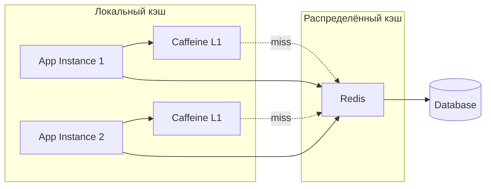
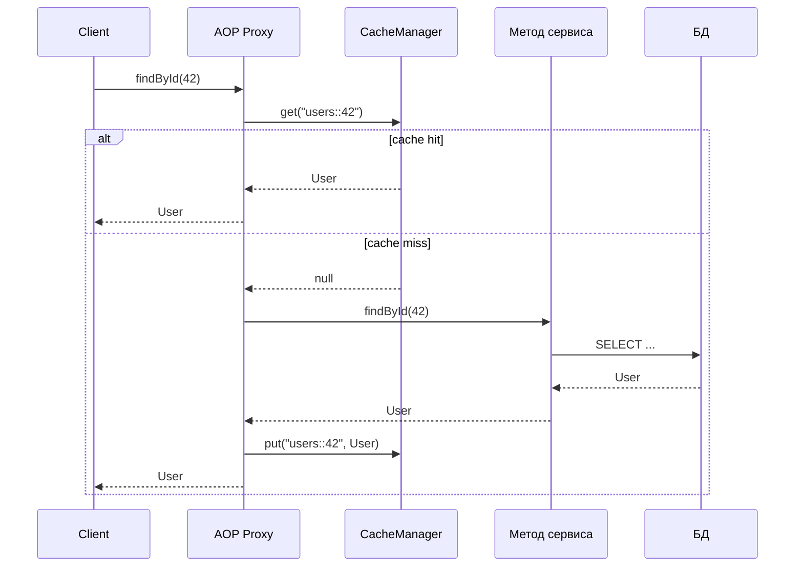
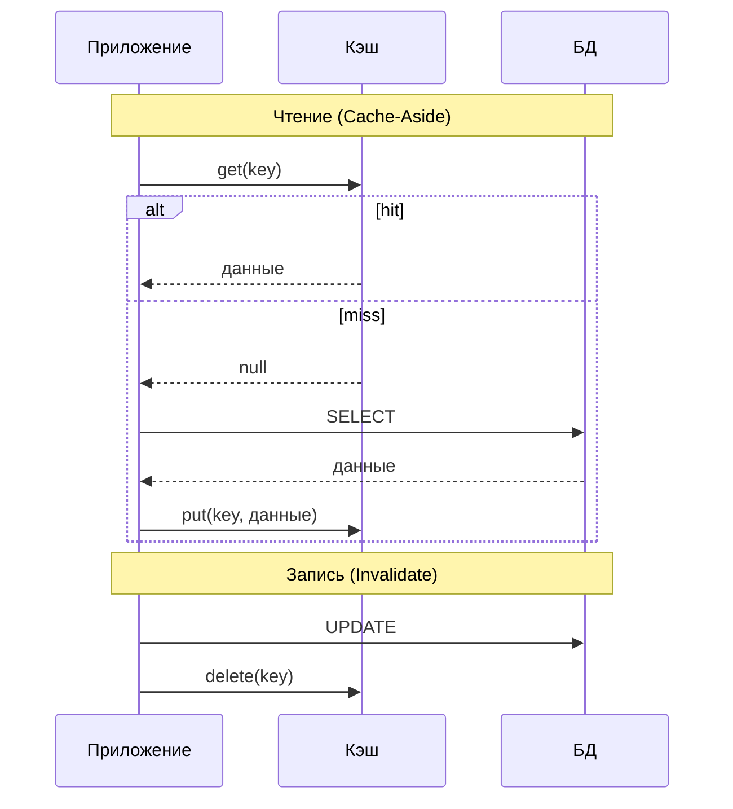
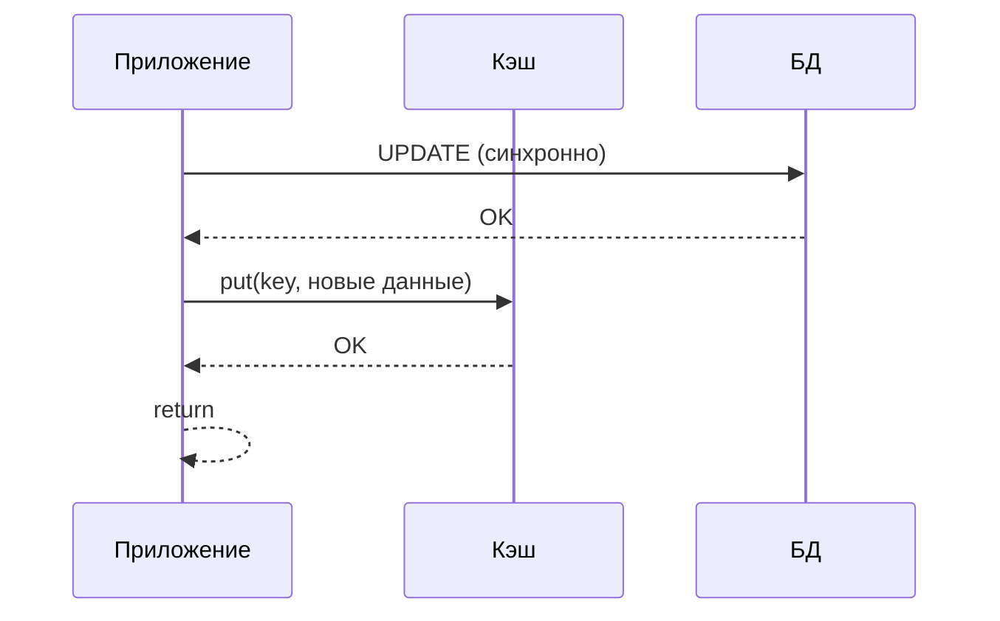
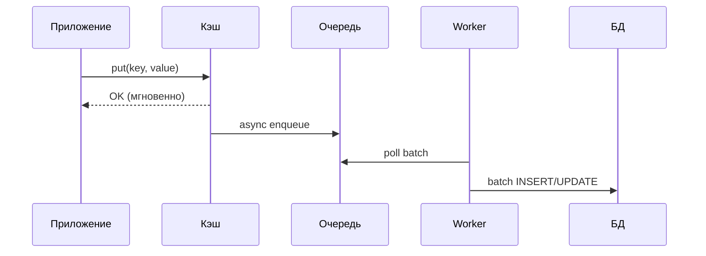
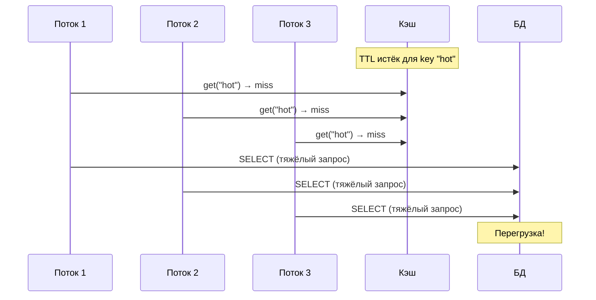
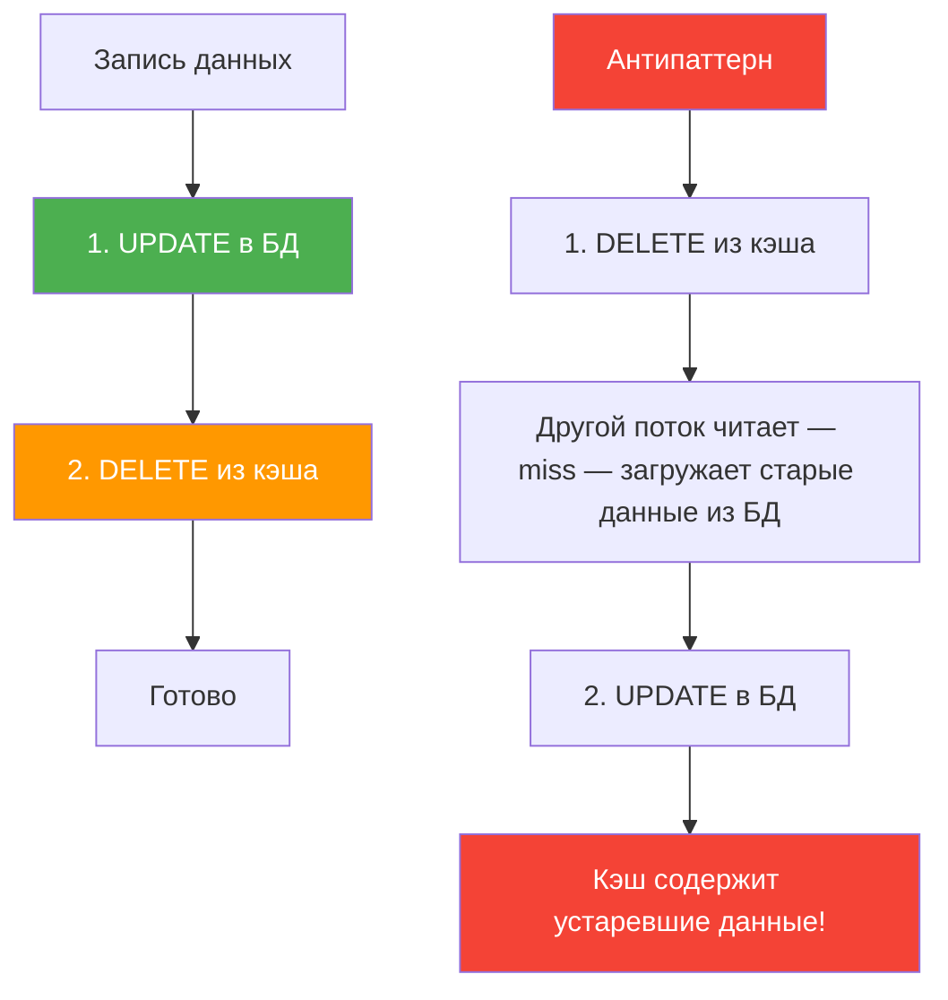
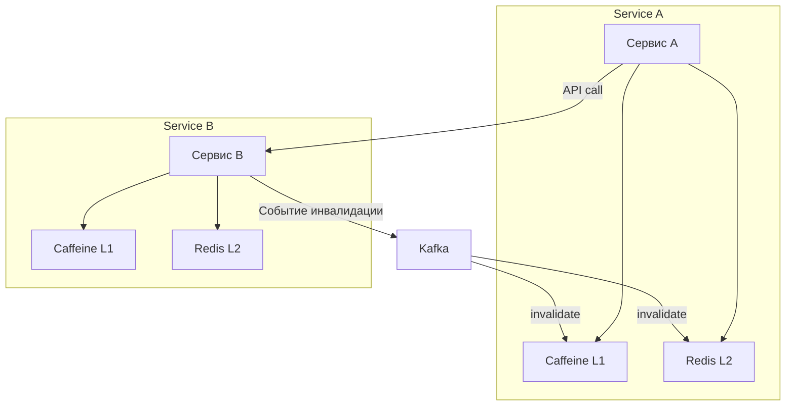
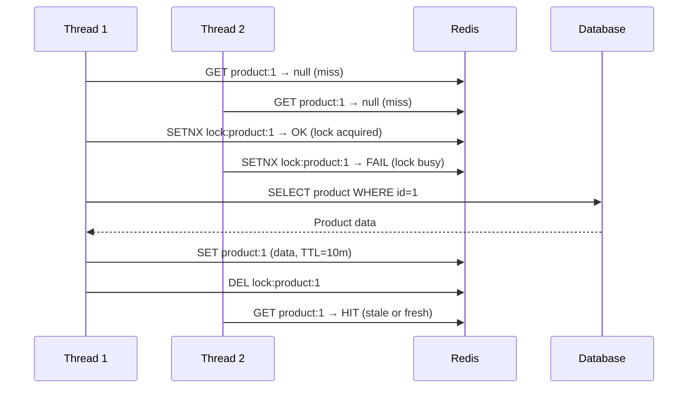
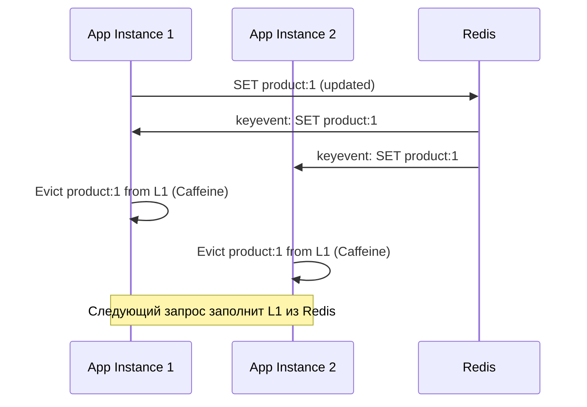

# Вопросы на собеседовании: Стратегии кэширования

Краткое введение: типичные вопросы по **стратегиям кэширования** — локальный и распределённый кэш, `Cache-Aside`, `Write-Through`, `Write-Behind`, `TTL`, инвалидация, `Spring Cache`, `Caffeine`, `Redis`, stampede, мониторинг. Стратегии кэширования критичны для производительности и консистентности; на собеседованиях часто спрашивают про выбор паттерна, конфигурацию в `Spring Boot` и поведение при сбоях.

Дата последнего обновления: 2026-04-13

## Полезные ссылки

### Официальная документация

- [Spring Cache Abstraction](https://docs.spring.io/spring-framework/reference/integration/cache.html) — официальная документация Spring Cache
- [Spring Boot Cache with Redis (Baeldung)](https://www.baeldung.com/spring-boot-redis-cache) — настройка Redis кэша в Spring Boot
- [Spring Boot and Caffeine Cache (Baeldung)](https://www.baeldung.com/spring-boot-caffeine-cache) — Caffeine в Spring Boot
- [Two-Level Cache with Spring (Baeldung)](https://www.baeldung.com/spring-two-level-cache) — реализация L1/L2 кэша
- [Caching Strategies (Redis)](https://redis.io/docs/manual/patterns/) — паттерны кэширования Redis
- [Introduction to Caffeine (Baeldung)](https://www.baeldung.com/java-caching-caffeine) — основы Caffeine API

## Содержание

- [Полезные ссылки](#полезные-ссылки)
- [See also](#see-also)

**Основы кэширования**
- [Q1. (!) Что такое локальный кэш и распределённый кэш?](#q1--что-такое-локальный-кэш-и-распределённый-кэш)
- [Q2. Что такое многоуровневый кэш (L1/L2)?](#q2-что-такое-многоуровневый-кэш-l1l2)
- [Q3. Что такое HTTP-кэш (браузерный и прокси)?](#q3-что-такое-http-кэш-браузерный-и-прокси)
- [Q4. Что такое hit ratio и miss ratio?](#q4-что-такое-hit-ratio-и-miss-ratio)
- [Q5. (!) Что такое eviction policy и какие бывают?](#q5--что-такое-eviction-policy-и-какие-бывают)

**Spring Cache и аннотации**
- [Q6. (!) Как работает Spring Cache Abstraction?](#q6--как-работает-spring-cache-abstraction)
- [Q7. (!) Как использовать @Cacheable, @CacheEvict и @CachePut?](#q7--как-использовать-cacheable-cacheevict-и-cacheput)
- [Q8. Как настроить Caffeine Cache в Spring Boot?](#q8-как-настроить-caffeine-cache-в-spring-boot)
- [Q9. (!) Как настроить Redis Cache в Spring Boot?](#q9--как-настроить-redis-cache-в-spring-boot)
- [Q10. Как использовать несколько CacheManager в одном приложении?](#q10-как-использовать-несколько-cachemanager-в-одном-приложении)

**Стратегии записи и чтения**
- [Q11. (!) Что такое Cache-Aside (Lazy Loading)?](#q11--что-такое-cache-aside-lazy-loading)
- [Q12. (!) Что такое Write-Through?](#q12--что-такое-write-through)
- [Q13. Что такое Write-Behind (Write-Back)?](#q13-что-такое-write-behind-write-back)
- [Q14. Что такое Read-Through Cache?](#q14-что-такое-read-through-cache)
- [Q15. Что такое Write-Around и когда его использовать?](#q15-что-такое-write-around-и-когда-его-использовать)
- [Q16. (!) Когда использовать TTL, а когда инвалидацию по событию?](#q16--когда-использовать-ttl-а-когда-инвалидацию-по-событию)

**Проблемы кэширования**
- [Q17. (!) Что такое cache stampede (thundering herd) и как его избежать?](#q17--что-такое-cache-stampede-thundering-herd-и-как-его-избежать)
- [Q18. Что такое cache penetration и cache avalanche?](#q18-что-такое-cache-penetration-и-cache-avalanche)
- [Q19. (!) Как обеспечить консистентность кэша и БД?](#q19--как-обеспечить-консистентность-кэша-и-бд)
- [Q20. Что такое stale-while-revalidate и когда применять?](#q20-что-такое-stale-while-revalidate-и-когда-применять)

**Ключи, сериализация и дизайн**
- [Q21. Что такое cache key design и какие ошибки избегать?](#q21-что-такое-cache-key-design-и-какие-ошибки-избегать)
- [Q22. Как кэшировать списки и пагинированные результаты?](#q22-как-кэшировать-списки-и-пагинированные-результаты)
- [Q23. (!) Что такое cache serialization и какие форматы предпочтительны?](#q23--что-такое-cache-serialization-и-какие-форматы-предпочтительны)
- [Q24. Что такое cache invalidation по тегу?](#q24-что-такое-cache-invalidation-по-тегу)

**Кэширование в микросервисах**
- [Q25. Как кэшировать в микросервисной архитектуре?](#q25-как-кэшировать-в-микросервисной-архитектуре)
- [Q26. Что такое Near Cache и когда его использовать?](#q26-что-такое-near-cache-и-когда-его-использовать)
- [Q27. Что такое cache warming и когда его применять?](#q27-что-такое-cache-warming-и-когда-его-применять)
- [Q28. (!) Что такое cache coherence в распределённом кэше?](#q28--что-такое-cache-coherence-в-распределённом-кэше)

**Выбор технологий и production**
- [Q29. Как выбрать TTL для кэша?](#q29-как-выбрать-ttl-для-кэша)
- [Q30. (!) Как выбирать между Caffeine, Redis и Hazelcast?](#q30--как-выбирать-между-caffeine-redis-и-hazelcast)
- [Q31. Как мониторить кэш в production?](#q31-как-мониторить-кэш-в-production)
- [Q32. (!) Как обрабатывать сбои кэша (Redis unavailable)?](#q32--как-обрабатывать-сбои-кэша-redis-unavailable)
- [Q33. Как обеспечить безопасность кэша (Redis)?](#q33-как-обеспечить-безопасность-кэша-redis)
- [Q34. Как тестировать кэширование (unit, integration)?](#q34-как-тестировать-кэширование-unit-integration)
- [Q35. Как кэш влияет на латентность и throughput приложения?](#q35-как-кэш-влияет-на-латентность-и-throughput-приложения)
- [Q36. Что такое cache partitioning и зачем оно нужно?](#q36-что-такое-cache-partitioning-и-зачем-оно-нужно)
- [Q37. Что такое cache coherence в мультидатацентровой среде?](#q37-что-такое-cache-coherence-в-мультидатацентровой-среде)
- [Q38. Как измерять и интерпретировать метрики кэша в production?](#q38-как-измерять-и-интерпретировать-метрики-кэша-в-production)

**Продвинутые темы**
- [Q39. (!) Как предотвратить cache stampede с помощью distributed lock?](#q39--как-предотвратить-cache-stampede-с-помощью-distributed-lock)
- [Q40. (!) Что такое probabilistic early expiration (PER) и как оно работает?](#q40--что-такое-probabilistic-early-expiration-per-и-как-оно-работает)
- [Q41. Как организовать cache warming при старте приложения?](#q41-как-организовать-cache-warming-при-старте-приложения)
- [Q42. (!) Как работает инвалидация кэша через pub/sub (Redis Keyspace Notifications)?](#q42--как-работает-инвалидация-кэша-через-pubsub-redis-keyspace-notifications)

---

## Q1. (!) Что такое локальный кэш и распределённый кэш?

**Локальный кэш** — кэш в памяти процесса приложения (`Caffeine`, `Guava Cache`, `Ehcache`). Плюсы: минимальная латентность (наносекунды), нет сетевых вызовов. Минусы: не разделяется между инстансами; при масштабировании каждый инстанс имеет свой кэш; инвалидация на других узлах сложнее.

**Распределённый кэш** — кэш на отдельных узлах (`Redis`, `Memcached`, `Hazelcast`). Плюсы: общий кэш для всех инстансов; централизованная инвалидация. Минусы: сетевая задержка (1-5 мс), зависимость от доступности кэш-сервера, необходимость сериализации (см. [вопросы по Redis](../databases/redis-interview.md)).



**На собеседовании:** ожидают, что кандидат объяснит trade-off между латентностью и консистентностью, и предложит гибридный подход (L1 + L2).

## Q2. Что такое многоуровневый кэш (L1/L2)?

**Многоуровневый кэш** — комбинация уровней: **L1** — локальный (`Caffeine`), **L2** — распределённый (`Redis`). Запрос сначала проверяет `L1`; при промахе — `L2`; при промахе в `L2` — источник данных (БД). Результат записывается в оба уровня.


**Пример двухуровневого доступа:**

```java
@Service
@RequiredArgsConstructor
public class UserService {
    private final Cache<String, User> localCache;  // Caffeine L1
    private final RedisTemplate<String, User> redis; // L2
    private final UserRepository userRepository;

    public User getUser(Long id) {
        String key = "user:" + id;

        // L1 — локальный кэш
        User user = localCache.getIfPresent(key);
        if (user != null) return user;

        // L2 — Redis
        user = redis.opsForValue().get(key);
        if (user != null) {
            localCache.put(key, user);
            return user;
        }

        // БД
        user = userRepository.findById(id).orElseThrow();
        redis.opsForValue().set(key, user, Duration.ofMinutes(30));
        localCache.put(key, user);
        return user;
    }
}
```

`TTL` в `L1` обычно короче (1-5 минут), чем в `L2` (10-60 минут), чтобы быстрее подхватывать инвалидацию. При публикации события инвалидации нужно очищать `L1` во всех инстансах (через `Redis Pub/Sub`). Подробнее о реализации в [Spring Boot](../frameworks/spring/spring-boot-interview.md).

## Q3. Что такое HTTP-кэш (браузерный и прокси)?

**HTTP-кэш** — кэширование ответов по заголовкам `Cache-Control`, `ETag`, `Last-Modified`. Браузер и прокси (`CDN`, `Nginx`) хранят ответ и не запрашивают сервер при повторном запросе.

Сервер отдаёт `ETag` (хеш тела); клиент при повторном запросе шлёт `If-None-Match`; при неизменных данных — **304 Not Modified** без тела — экономия трафика. Для персональных данных используют `private` или `no-store`.

**Пример конфигурации в `Spring`:**

```java
@GetMapping("/products/{id}")
public ResponseEntity<Product> getProduct(@PathVariable Long id) {
    Product product = productService.findById(id);
    return ResponseEntity.ok()
        .cacheControl(CacheControl.maxAge(1, TimeUnit.HOURS).cachePublic())
        .eTag(String.valueOf(product.getVersion()))
        .body(product);
}
```

**Практика:** для статики (`JS/CSS`) — `Cache-Control: public, max-age=31536000` с версией в имени файла; для `API` — `ETag` по хешу тела; для персональных данных — `Cache-Control: private, no-store`.

## Q4. Что такое hit ratio и miss ratio?

**Hit ratio** — доля запросов, обслуженных из кэша: `hit_ratio = hits / (hits + misses)`. **Miss ratio** = 1 - hit_ratio.

Целевые значения: 80-95% для горячих справочников; для персональных данных hit ratio может быть ниже из-за высокой кардинальности ключей. Метрики снимают через `Redis INFO stats` (`keyspace_hits`, `keyspace_misses`) или `Micrometer CacheMetrics`.

**Практика:** алерт при hit ratio < 70% в течение 15 минут; дашборд с трендом по кэшам; при падении после деплоя — ожидаемо (холодный кэш), дать время на прогрев. Подробнее о метриках в [вопросах по наблюдаемости](../monitoring/observability-interview.md).

## Q5. (!) Что такое eviction policy и какие бывают?

**Eviction policy** — политика вытеснения записей при переполнении кэша:

| Политика | Описание | Когда использовать |
|----------|----------|--------------------|
| **LRU** | Вытесняются наименее недавно использованные | Большинство сценариев |
| **LFU** | Наименее часто используемые | Когда важна частота обращений |
| **TTL** | Удаление по истечении времени | Данные с ограниченным сроком актуальности |
| **FIFO** | Первым пришёл — первым вытеснен | Простые сценарии |
| **Window TinyLFU** | Комбинация LRU и LFU | `Caffeine` — лучший hit ratio |

`Caffeine` по умолчанию использует `Window TinyLFU`. В `Redis` по умолчанию `noeviction`; настраивают через `maxmemory-policy`:

```conf
maxmemory 256mb
maxmemory-policy allkeys-lru
```

Варианты в `Redis`: `allkeys-lru`, `volatile-lru`, `allkeys-lfu`, `volatile-ttl`, `noeviction`.

## Q6. (!) Как работает Spring Cache Abstraction?

`Spring Cache Abstraction` — уровень абстракции над кэш-провайдерами (`Caffeine`, `Redis`, `EhCache`). Включается аннотацией `@EnableCaching` и работает через AOP-прокси: при вызове метода с `@Cacheable` прокси перехватывает вызов и проверяет кэш.

```java
@Configuration
@EnableCaching
public class CacheConfig {
    // Spring Boot автоматически подберёт CacheManager
    // на основе зависимостей в classpath
}
```



**Важные нюансы:**
- Прокси работает только при вызове через бин (`this.method()` не проходит через прокси — кэш не сработает)
- По умолчанию `null` кэшируется — используйте `unless = "#result == null"` для исключения
- `@Cacheable` на `private` методах не работает (Spring AOP)

## Q7. (!) Как использовать @Cacheable, @CacheEvict и @CachePut?

Основные аннотации `Spring Cache`:

```java
@Service
public class ProductService {

    // @Cacheable — кэширует результат; при повторном вызове
    // с тем же ключом метод не выполняется
    @Cacheable(value = "products", key = "#id",
               unless = "#result == null")
    public Product findById(Long id) {
        return productRepository.findById(id).orElse(null);
    }

    // @Cacheable с составным ключом
    @Cacheable(value = "productSearch",
               key = "#category + ':' + #page")
    public List<Product> search(String category, int page) {
        return productRepository.findByCategory(category,
            PageRequest.of(page, 20));
    }

    // @CachePut — всегда выполняет метод и обновляет кэш
    @CachePut(value = "products", key = "#product.id")
    @Transactional
    public Product update(Product product) {
        return productRepository.save(product);
    }

    // @CacheEvict — удаляет запись из кэша
    @CacheEvict(value = "products", key = "#id")
    @Transactional
    public void delete(Long id) {
        productRepository.deleteById(id);
    }

    // @CacheEvict — очистка всего кэша
    @CacheEvict(value = "products", allEntries = true)
    @Scheduled(fixedRate = 3600000) // каждый час
    public void evictAllProducts() {
        log.info("Products cache cleared");
    }

    // @Caching — комбинация аннотаций
    @Caching(
        put = @CachePut(value = "products", key = "#product.id"),
        evict = @CacheEvict(value = "productSearch",
                            allEntries = true)
    )
    @Transactional
    public Product save(Product product) {
        return productRepository.save(product);
    }
}
```

**Ключевые параметры:**
- `value` / `cacheNames` — имя кэша
- `key` — SpEL-выражение для ключа (по умолчанию — все аргументы метода)
- `condition` — условие кэширования (SpEL): `condition = "#id > 10"`
- `unless` — условие исключения результата: `unless = "#result.size() == 0"`
- `sync = true` — синхронный доступ (предотвращает stampede)

## Q8. Как настроить Caffeine Cache в Spring Boot?

**Зависимость:**
```groovy
implementation 'org.springframework.boot:spring-boot-starter-cache'
implementation 'com.github.ben-manes.caffeine:caffeine'
```

**Вариант 1 — через `application.yml`:**
```yaml
spring:
  cache:
    type: caffeine
    caffeine:
      spec: maximumSize=500,expireAfterWrite=10m
    cache-names: products,users
```

**Вариант 2 — программная конфигурация (рекомендуется для разных TTL):**

```java
@Configuration
@EnableCaching
public class CaffeineCacheConfig {

    @Bean
    public CacheManager cacheManager() {
        CaffeineCacheManager manager = new CaffeineCacheManager();
        manager.setCaffeine(Caffeine.newBuilder()
            .maximumSize(1000)
            .expireAfterWrite(Duration.ofMinutes(10))
            .recordStats()); // для Micrometer метрик
        return manager;
    }
}
```

**Вариант 3 — разные настройки для каждого кэша:**

```java
@Configuration
@EnableCaching
public class CaffeineCacheConfig {

    @Bean
    public CacheManager cacheManager() {
        SimpleCacheManager manager = new SimpleCacheManager();
        manager.setCaches(List.of(
            buildCache("products", 500, Duration.ofMinutes(30)),
            buildCache("users", 200, Duration.ofMinutes(5)),
            buildCache("config", 50, Duration.ofHours(1))
        ));
        return manager;
    }

    private CaffeineCache buildCache(String name, int maxSize,
                                     Duration ttl) {
        return new CaffeineCache(name, Caffeine.newBuilder()
            .maximumSize(maxSize)
            .expireAfterWrite(ttl)
            .recordStats()
            .build());
    }
}
```

## Q9. (!) Как настроить Redis Cache в Spring Boot?

**Зависимость:**
```groovy
implementation 'org.springframework.boot:spring-boot-starter-data-redis'
implementation 'org.springframework.boot:spring-boot-starter-cache'
```

**application.yml:**
```yaml
spring:
  data:
    redis:
      host: localhost
      port: 6379
      password: ${REDIS_PASSWORD}
      timeout: 2000ms
  cache:
    type: redis
    redis:
      time-to-live: 600000  # 10 минут в мс
      cache-null-values: false
```

**Программная конфигурация с JSON-сериализацией:**

```java
@Configuration
@EnableCaching
public class RedisCacheConfig {

    @Bean
    public RedisCacheManager cacheManager(
            RedisConnectionFactory connectionFactory) {

        // Конфигурация по умолчанию
        RedisCacheConfiguration defaultConfig =
            RedisCacheConfiguration.defaultCacheConfig()
                .entryTtl(Duration.ofMinutes(10))
                .disableCachingNullValues()
                .serializeKeysWith(
                    SerializationPair.fromSerializer(
                        new StringRedisSerializer()))
                .serializeValuesWith(
                    SerializationPair.fromSerializer(
                        new GenericJackson2JsonRedisSerializer()));

        // Разные TTL для разных кэшей
        Map<String, RedisCacheConfiguration> configs = Map.of(
            "users", defaultConfig.entryTtl(Duration.ofMinutes(5)),
            "products", defaultConfig.entryTtl(Duration.ofMinutes(30)),
            "config", defaultConfig.entryTtl(Duration.ofHours(1))
        );

        return RedisCacheManager.builder(connectionFactory)
            .cacheDefaults(defaultConfig)
            .withInitialCacheConfigurations(configs)
            .transactionAware()
            .build();
    }
}
```

**Важно:** `GenericJackson2JsonRedisSerializer` добавляет поле `@class` для десериализации; при переименовании пакета старые записи не десериализуются — используйте версию в ключе или короткий `TTL`. Подробнее о `Redis` в [вопросах по Redis](../databases/redis-interview.md).

## Q10. Как использовать несколько CacheManager в одном приложении?

Типичный сценарий: `Caffeine` для горячих данных + `Redis` для общего кэша.

```java
@Configuration
@EnableCaching
public class MultiCacheConfig {

    @Bean
    @Primary
    public CacheManager caffeineCacheManager() {
        CaffeineCacheManager manager = new CaffeineCacheManager("hotData");
        manager.setCaffeine(Caffeine.newBuilder()
            .maximumSize(100)
            .expireAfterWrite(Duration.ofMinutes(1)));
        return manager;
    }

    @Bean("redisCacheManager")
    public CacheManager redisCacheManager(
            RedisConnectionFactory factory) {
        return RedisCacheManager.builder(factory)
            .cacheDefaults(RedisCacheConfiguration.defaultCacheConfig()
                .entryTtl(Duration.ofMinutes(30)))
            .build();
    }
}

@Service
public class ProductService {

    // Использует Primary (Caffeine)
    @Cacheable("hotData")
    public Product getHotProduct(Long id) { ... }

    // Явно указан Redis CacheManager
    @Cacheable(value = "allProducts",
               cacheManager = "redisCacheManager")
    public Product getProduct(Long id) { ... }
}
```

## Q11. (!) Что такое Cache-Aside (Lazy Loading)?

`Cache-Aside` — приложение само управляет кэшем: при чтении сначала проверяет кэш; при промахе загружает из БД и записывает в кэш. При записи приложение обновляет БД и инвалидирует кэш (удаляет ключ).



**Реализация в `Spring`:**

```java
@Cacheable(value = "users", key = "#id")
public User findById(Long id) {
    return userRepository.findById(id).orElseThrow();
}

@CacheEvict(value = "users", key = "#user.id")
@Transactional
public User update(User user) {
    return userRepository.save(user);
}
```

**Плюсы:** простота; кэш содержит только запрашиваемые данные. **Минусы:** при промахе два запроса; возможна гонка при одновременной записи и чтении (stale data). Порядок при записи — сначала БД, затем удаление ключа в кэше.

## Q12. (!) Что такое Write-Through?

**Write-Through** — при записи приложение пишет и в кэш, и в БД синхронно. Порядок: сначала БД, потом кэш — при сбое данные не расходятся.



**Плюсы:** кэш и БД согласованы; читатели всегда получают актуальные данные из кэша. **Минусы:** повышенная латентность записи (два синхронных вызова). Подходит, когда консистентность важнее скорости записи.

```java
@CachePut(value = "users", key = "#user.id")
@Transactional
public User update(User user) {
    return userRepository.save(user); // сначала БД, результат — в кэш
}
```

## Q13. Что такое Write-Behind (Write-Back)?

**Write-Behind** — при записи приложение пишет в кэш и сразу возвращает успех; запись в БД выполняется асинхронно (батчами или по расписанию).



**Плюсы:** низкая латентность записи, разгрузка БД. **Минусы:** риск потери данных при падении до сброса в БД; сложность консистентности.

Подходит для логов, метрик, счётчиков; для платежей — `Write-Through`. Требует надёжной очереди (подробнее в [вопросах по Kafka](../messaging/kafka-interview.md)) и идемпотентности записи в БД.

## Q14. Что такое Read-Through Cache?

**Read-Through** — кэш сам загружает данные из источника при промахе (прозрачно для приложения). Приложение вызывает только `cache.get(key)`; кэш при промахе сам вызывает `CacheLoader`.

```java
// Caffeine Read-Through с CacheLoader
LoadingCache<Long, User> cache = Caffeine.newBuilder()
    .maximumSize(1000)
    .expireAfterWrite(Duration.ofMinutes(10))
    .build(id -> userRepository.findById(id).orElse(null));

// Использование — при промахе автоматически вызовет loader
User user = cache.get(42L);
```

**Отличие от `Cache-Aside`:** в `Cache-Aside` приложение управляет логикой загрузки; в `Read-Through` логика инкапсулирована в кэше. В `Spring @Cacheable` — это **cache-aside**, а не read-through; для настоящего read-through нужен `CacheLoader` (`Caffeine`) или `MapLoader` (`Hazelcast`).

## Q15. Что такое Write-Around и когда его использовать?

**Write-Around** — при записи приложение пишет только в БД; кэш не обновляется и не инвалидируется. При чтении при промахе данные загружаются из источника и кладутся в кэш.

**Плюсы:** запись не нагружает кэш; подходит для редко перечитываемых после записи данных. **Минусы:** после записи следующее чтение даёт промах и идёт в БД; возможны устаревшие данные в кэше.

Используют когда записей много, а повторные чтения тех же данных редки (логи, аудит), или когда допустима задержка консистентности до `TTL`.

## Q16. (!) Когда использовать TTL, а когда инвалидацию по событию?

| Критерий | TTL | Инвалидация по событию |
|----------|-----|----------------------|
| Частота изменений | Редко | Часто |
| Требования к актуальности | Допустима задержка | Нужна актуальность сразу |
| Сложность реализации | Простая | Сложнее (события, подписчики) |
| Пример данных | Справочники, конфигурация | Профиль, корзина, баланс |

**Комбинированный подход (рекомендуется):** `TTL` как страховка + инвалидация при обновлении:

```java
// TTL задан в конфигурации кэша (например, 1 час)
// При обновлении — явная инвалидация
@CacheEvict(value = "users", key = "#user.id")
@Transactional
public User update(User user) {
    User saved = userRepository.save(user);
    // при пропуске события кэш обновится через TTL
    return saved;
}
```

Для справочников — `TTL` с jitter (базовый + случайное отклонение). Для персональных данных — инвалидация по событию. Подробнее о событийной архитектуре в [вопросах по Event-Driven](event-driven-patterns-interview.md).

## Q17. (!) Что такое cache stampede (thundering herd) и как его избежать?

**Cache stampede** — при истечении популярного ключа множество потоков одновременно обнаруживают промах и все идут в БД, создавая всплеск нагрузки.



**Решения:**

```java
// 1. Caffeine LoadingCache — один поток загружает, остальные ждут
LoadingCache<String, Product> cache = Caffeine.newBuilder()
    .maximumSize(1000)
    .expireAfterWrite(Duration.ofMinutes(10))
    .build(key -> productRepository.findByKey(key));

// 2. Spring @Cacheable с sync=true
@Cacheable(value = "products", key = "#id", sync = true)
public Product findById(Long id) {
    return productRepository.findById(id).orElseThrow();
}

// 3. Redis — distributed lock (singleflight)
public Product getWithLock(String key) {
    Product p = redis.opsForValue().get(key);
    if (p != null) return p;

    String lockKey = "lock:" + key;
    Boolean acquired = redis.opsForValue()
        .setIfAbsent(lockKey, "1", Duration.ofSeconds(5));
    if (Boolean.TRUE.equals(acquired)) {
        try {
            p = loadFromDb(key);
            redis.opsForValue().set(key, p, Duration.ofMinutes(10));
        } finally {
            redis.delete(lockKey);
        }
    } else {
        // ждать и повторить
        Thread.sleep(50);
        return getWithLock(key);
    }
    return p;
}
```

## Q18. Что такое cache penetration и cache avalanche?

**Cache penetration** — запросы по несуществующим ключам проходят сквозь кэш в БД каждый раз. Решения:
- Кэшировать `null` с коротким `TTL`
- Bloom-фильтр для отсечения заведомо несуществующих ключей
- Лимит запросов по одному ключу

**Cache avalanche** — массовое истечение `TTL` многих ключей одновременно; всплеск запросов к БД. Решения:
- Разброс `TTL` (базовый + случайное отклонение — jitter)
- Высокая доступность кэша (`Redis Cluster`, `Sentinel`)
- Постепенная загрузка при холодном старте (cache warming по приоритету)

```java
// Jitter для TTL — предотвращение avalanche
private Duration ttlWithJitter(Duration base) {
    long jitter = ThreadLocalRandom.current()
        .nextLong(base.toSeconds() / 10); // ±10%
    return base.plusSeconds(jitter);
}
```

## Q19. (!) Как обеспечить консистентность кэша и БД?

Порядок операций при `Cache-Aside`: **сначала обновить БД, затем инвалидировать кэш**. При обратном порядке возможна гонка (чтение после инвалидации, но до записи в БД — устаревшие данные попадут в кэш).



**Подходы:**
- `Cache-Aside` с инвалидацией — при записи в БД удалять ключ в кэше
- `Write-Through` — запись в кэш и БД синхронно
- Короткий `TTL` — приемлемая задержка консистентности
- События — при изменении данных публиковать событие; потребители инвалидируют кэш

При распределённом кэше и нескольких писателях нужна единая стратегия, иначе один сервис может инвалидировать ключ, а другой — перезаписать устаревшим значением. Подробнее в [паттернах согласованности](consistency-patterns-interview.md).

## Q20. Что такое stale-while-revalidate и когда применять?

**Stale-while-revalidate (SWR)** — клиенту сразу возвращают закэшированное (возможно устаревшее) значение, а в фоне обновляют кэш для следующего запроса.

Применяют в `HTTP` (заголовок `Cache-Control: stale-while-revalidate=<seconds>`) и в серверном кэше.

```java
// Серверная реализация SWR
@Service
public class SWRCacheService {
    private final Cache<String, CacheEntry> cache;
    private final ExecutorService executor;

    public Product getProduct(String id) {
        CacheEntry entry = cache.getIfPresent(id);
        if (entry == null) {
            // первый запрос — синхронная загрузка
            Product p = loadFromDb(id);
            cache.put(id, new CacheEntry(p, Instant.now()));
            return p;
        }
        if (entry.isExpired()) {
            // stale — вернуть старое, обновить в фоне
            executor.submit(() -> {
                Product fresh = loadFromDb(id);
                cache.put(id, new CacheEntry(fresh, Instant.now()));
            });
        }
        return entry.getValue();
    }
}
```

**Плюсы:** низкая латентность для пользователя. **Минусы:** один запрос может получить устаревшие данные. Уместно для каталогов, лент, статики.

## Q21. Что такое cache key design и какие ошибки избегать?

**Рекомендации:**
- Осмысленный префикс: `product:v2:42`, `user:profile:123`
- Версия в ключе при смене формата сериализации
- Ограничение кардинальности (избегать уникальных id без ограничения набора)
- Короткие стабильные ключи (ограничение размера ключа в `Redis` — 512 МБ, но длинные ключи тратят память)

**Ошибки:**
- Высокая кардинальность без контроля — миллионы ключей, низкий hit ratio
- Отсутствие версии — при переименовании полей старые записи ломают десериализацию
- Неоднозначные ключи — разные данные под одним ключом

```java
// Хорошо — осмысленный, версионированный ключ
@Cacheable(value = "products",
           key = "'v2:' + #id")
public Product findById(Long id) { ... }

// Плохо — все аргументы в ключе без контроля
@Cacheable("search")
public List<Product> search(String q, String cat,
    String sort, int page, int size) { ... }
// Огромная кардинальность → низкий hit ratio
```

## Q22. Как кэшировать списки и пагинированные результаты?

Списки по комбинации параметров дают высокую кардинальность. Подходы:

1. **Кэшировать сущности по id** и собирать список из кэша
2. **Кэшировать только популярные комбинации** (первая страница, топ-фильтры)
3. **Короткий TTL** для списков
4. **Инвалидация по тегу** при изменении сущности

```java
// Кэш по id — entity:42, entity:99
@Cacheable(value = "products", key = "#id")
public Product findById(Long id) { ... }

// Кэш списка id с коротким TTL (настроен в CacheManager)
@Cacheable(value = "productIds",
           key = "'page:' + #page")
public List<Long> getProductIds(int page) { ... }

// При обновлении — инвалидация конкретной сущности
// и всего списка id
@Caching(evict = {
    @CacheEvict(value = "products", key = "#product.id"),
    @CacheEvict(value = "productIds", allEntries = true)
})
public Product update(Product product) { ... }
```

## Q23. (!) Что такое cache serialization и какие форматы предпочтительны?

Сериализация кэша — преобразование объектов в байты для хранения в распределённом кэше (`Redis`, `Memcached`).

| Формат | Плюсы | Минусы |
|--------|-------|--------|
| **JSON** (Jackson) | Читаемость, межъязыковость | Больше места, медленнее |
| **MessagePack/Protobuf** | Компактность, скорость | Нечитаемый, схема |
| **Java Serialization** | Встроен в JDK | Медленно, небезопасно, не рекомендуется |
| **Kryo/FST** | Очень быстро, компактно | Только JVM, версионирование |

**Конфигурация JSON-сериализации в Redis:**

```java
@Bean
public RedisCacheConfiguration cacheConfiguration() {
    ObjectMapper mapper = new ObjectMapper()
        .registerModule(new JavaTimeModule())
        .activateDefaultTyping(
            mapper.getPolymorphicTypeValidator(),
            ObjectMapper.DefaultTyping.NON_FINAL);

    return RedisCacheConfiguration.defaultCacheConfig()
        .serializeValuesWith(
            SerializationPair.fromSerializer(
                new GenericJackson2JsonRedisSerializer(mapper)));
}
```

**Важно:** при изменении полей объекта старые записи в кэше могут не десериализоваться — используйте версию в ключе (`user:v2:123`) или короткий `TTL` при миграции. Подробнее о сериализации в [вопросах по Java Serialization](../programming-languages/java/java-serialization-interview.md).

## Q24. Что такое cache invalidation по тегу?

Инвалидация по тегу — группировка ключей по тегу; при изменении сущности инвалидируют все ключи с этим тегом.

**Реализация через Redis Set:**

```java
@Service
public class TaggedCacheService {
    private final RedisTemplate<String, Object> redis;

    // При записи в кэш — регистрируем ключ в теге
    public void putWithTag(String key, Object value,
                           String tag, Duration ttl) {
        redis.opsForValue().set(key, value, ttl);
        redis.opsForSet().add("tag:" + tag, key);
    }

    // Инвалидация по тегу — удаляем все ключи
    public void evictByTag(String tag) {
        Set<Object> keys = redis.opsForSet()
            .members("tag:" + tag);
        if (keys != null && !keys.isEmpty()) {
            redis.delete(keys.stream()
                .map(Object::toString)
                .collect(Collectors.toList()));
        }
        redis.delete("tag:" + tag);
    }
}
```

Альтернатива — версия в ключе: при изменении увеличивать версию, старые ключи вымирают по `TTL`.

## Q25. Как кэшировать в микросервисной архитектуре?

**Принципы:**
- Локальный кэш в каждом сервисе — быстрый, но инвалидация при изменении в другом сервисе сложна
- Распределённый кэш (`Redis`) — общий для инстансов одного сервиса
- **Не кэшировать чужие данные без контракта на инвалидацию**



Часто комбинируют `L1` (локальный, короткий `TTL`) и `L2` (`Redis`); при публикации события подписчики инвалидируют свой `L1` и соответствующие ключи в `L2`. Подробнее в [вопросах по микросервисам](microservices-interview.md).

## Q26. Что такое Near Cache и когда его использовать?

**Near Cache** — локальный кэш рядом с клиентом распределённого кэша (`Hazelcast Near Cache`, клиент `Redis` с локальным `Caffeine`). Горячие ключи обслуживаются из локальной памяти; уменьшается нагрузка на сеть.

**Подходит:** read-heavy с повторяющимся набором ключей (топ товаров, конфигурация).

**Не подходит:** высокая кардинальность ключей; частые обновления; данные, требующие строгой консистентности.

В `Hazelcast` — включить `Near Cache` для map с `invalidate-on-change: true`, задать `max-size` и `TTL`. В клиенте `Redis` (`Lettuce`, `Jedis`) можно держать локальный `Caffeine` поверх `Redis` для горячих ключей.

## Q27. Что такое cache warming и когда его применять?

**Cache warming** — предзаполнение кэша при старте приложения или по расписанию (популярные ключи загружаются до первых запросов). Применяют чтобы избежать всплеска промахов после деплоя или перезапуска.

```java
@Component
@RequiredArgsConstructor
public class CacheWarmer implements ApplicationRunner {

    private final ProductService productService;

    @Override
    public void run(ApplicationArguments args) {
        // Загружаем топ-100 популярных товаров при старте
        List<Long> topIds = productService.getTopProductIds(100);
        topIds.forEach(productService::findById);
        log.info("Cache warmed with {} products", topIds.size());
    }
}
```

**Важно:** не блокировать старт приложения долгим warming; загружать ключи асинхронно; приоритизировать самые горячие ключи.

## Q28. (!) Что такое cache coherence в распределённом кэше?

**Cache coherence** — согласованность кэша между узлами. В `Redis Cluster` каждый ключ принадлежит одному шарду по хешу слота; реплики получают копию асинхронно. Чтение с реплики может вернуть устаревшие данные.

**Стратегии:**
- Инвалидация по событию (`Redis Pub/Sub`, `Kafka`)
- Короткий `TTL`
- Чтение только с primary для критичных данных
- `Near Cache` усложняет coherence — при обновлении нужно инвалидировать все клиенты

```java
// Инвалидация через Redis Pub/Sub
@Component
public class CacheInvalidationListener {

    @Autowired
    private Cache<String, Object> localCache;

    @Bean
    public RedisMessageListenerContainer container(
            RedisConnectionFactory factory) {
        var container = new RedisMessageListenerContainer();
        container.setConnectionFactory(factory);
        container.addMessageListener(
            (message, pattern) -> {
                String key = new String(message.getBody());
                localCache.invalidate(key);
                log.info("Invalidated local cache: {}", key);
            },
            new ChannelTopic("cache:invalidate"));
        return container;
    }
}
```

Подробнее о согласованности в [паттернах согласованности](consistency-patterns-interview.md).

## Q29. Как выбрать TTL для кэша?

Зависит от требований к консистентности:

| Тип данных | TTL | Подход |
|------------|-----|--------|
| Конфигурация | Часы-дни | Длинный TTL + инвалидация по событию |
| Справочники | 10-60 минут | TTL с jitter |
| Пользовательские данные | 1-10 минут | Короткий TTL или инвалидация по событию |
| Сессии | Минуты | TTL = timeout сессии |
| Часто обновляемые | Секунды | Инвалидация по событию |

**Разброс TTL** (jitter) для предотвращения avalanche:

```java
// Caffeine с фиксированным TTL
Caffeine.newBuilder()
    .expireAfterWrite(Duration.ofMinutes(10))
    .build();

// Redis с jitter
public void cacheWithJitter(String key, Object value,
                            Duration baseTtl) {
    long jitter = ThreadLocalRandom.current()
        .nextLong(0, baseTtl.toSeconds() / 5);
    redis.opsForValue().set(key, value,
        baseTtl.plusSeconds(jitter));
}
```

## Q30. (!) Как выбирать между Caffeine, Redis и Hazelcast?

| Критерий | Caffeine | Redis | Hazelcast |
|----------|----------|-------|-----------|
| Тип | Локальный in-process | Распределённый | Распределённый in-cluster |
| Латентность | Наносекунды | 1-5 мс (сеть) | Микросекунды-мс |
| Общий кэш | Нет | Да | Да |
| Персистентность | Нет | RDB/AOF | Да |
| Read/Write-Through | CacheLoader | Нет (из коробки) | MapLoader/MapStore |
| Эксплуатация | Нулевая | Средняя | Сложная |
| Лучший сценарий | Горячие данные одного инстанса | Общий кэш между сервисами | Тесная интеграция с Java |

**Рекомендация:** для production часто эффективнее гибрид `L1 Caffeine` + `L2 Redis`, чем ставка только на один слой.

## Q31. Как мониторить кэш в production?

Метрики: **hit ratio**, **miss ratio**, **latency** (get/set), размер кэша, **eviction rate**.

**Micrometer + Caffeine (автоматически):**

```java
// При recordStats() Micrometer автоматически экспортирует метрики
@Bean
public CacheManager cacheManager(MeterRegistry meterRegistry) {
    CaffeineCacheManager manager = new CaffeineCacheManager();
    manager.setCaffeine(Caffeine.newBuilder()
        .maximumSize(1000)
        .recordStats()); // включает cache.gets, cache.puts, cache.evictions
    return manager;
}
```

**Алерты:**
- hit ratio < 70% в течение 15 минут
- p99 latency get выше порога
- Память `Redis` > 80%
- Eviction rate резко вырос

В `Redis` — `INFO stats` (`keyspace_hits`, `keyspace_misses`); `Redis Exporter` для `Prometheus`. `spring-boot-starter-cache` с `micrometer-registry-prometheus` автоматически экспортирует метрики кэша в `Actuator`. Подробнее в [вопросах по метрикам и трейсингу](../monitoring/metrics-tracing-interview.md).

## Q32. (!) Как обрабатывать сбои кэша (Redis unavailable)?

**Антипаттерн:** при падении `Redis` без ограничений переключаться на БД и одновременно запускать агрессивные retry — каскадный сбой БД.

**Стратегии:**


```java
@Service
public class ResilientCacheService {

    @Autowired
    private RedisTemplate<String, Object> redis;

    // Локальный fallback-кэш
    private final Cache<String, Object> fallback =
        Caffeine.newBuilder()
            .maximumSize(500)
            .expireAfterWrite(Duration.ofMinutes(1))
            .build();

    @CircuitBreaker(name = "redis", fallbackMethod = "fallbackGet")
    public Object get(String key) {
        return redis.opsForValue().get(key);
    }

    // Fallback при недоступности Redis
    private Object fallbackGet(String key, Exception ex) {
        log.warn("Redis unavailable, using fallback cache: {}",
                 ex.getMessage());
        return fallback.getIfPresent(key);
    }
}
```

При восстановлении `Redis` предпочтительнее ленивая загрузка (`Cache-Aside`), а не батчевое заполнение.

## Q33. Как обеспечить безопасность кэша (Redis)?

**Рекомендации:**
- Приватная сеть (firewall, `VPC`)
- Аутентификация (`requirepass` в `Redis`)
- `TLS` для шифрования в transit
- Отключить опасные команды (`FLUSHALL`, `CONFIG`)
- Не хранить `PII` в открытом виде — шифрование на уровне приложения

```conf
# redis.conf
requirepass ${REDIS_PASSWORD}
rename-command FLUSHALL ""
rename-command CONFIG ""
tls-port 6380
port 0
bind 127.0.0.1
```

В `Spring`: `spring.data.redis.password` из переменной окружения; для `TLS` — `spring.data.redis.ssl.enabled=true`.

## Q34. Как тестировать кэширование (unit, integration)?

**Unit-тесты:**

```java
@SpringBootTest
class ProductServiceCacheTest {

    @Autowired
    private ProductService productService;

    @MockBean
    private ProductRepository productRepository;

    @Autowired
    private CacheManager cacheManager;

    @Test
    void shouldReturnCachedValue() {
        when(productRepository.findById(1L))
            .thenReturn(Optional.of(new Product(1L, "Test")));

        // Первый вызов — идёт в repository
        productService.findById(1L);
        // Второй вызов — из кэша
        productService.findById(1L);

        verify(productRepository, times(1)).findById(1L);
    }

    @Test
    void shouldEvictOnUpdate() {
        Product p = new Product(1L, "Test");
        when(productRepository.findById(1L))
            .thenReturn(Optional.of(p));
        when(productRepository.save(any()))
            .thenReturn(p);

        productService.findById(1L);
        productService.update(p); // evict
        productService.findById(1L);

        verify(productRepository, times(2)).findById(1L);
    }

    @AfterEach
    void clearCache() {
        cacheManager.getCacheNames()
            .forEach(name -> cacheManager.getCache(name).clear());
    }
}
```

**Integration-тесты:** с реальным `Redis` через `Testcontainers`; проверить запись, чтение, `TTL`, инвалидацию. Подробнее в [вопросах по интеграционному тестированию](../testing/integration-testing-interview.md).

## Q35. Как кэш влияет на латентность и throughput приложения?

| Метрика | Без кэша | С кэшем (hit) | С кэшем (miss) |
|---------|----------|---------------|-----------------|
| Латентность (локальный) | 50-500 мс | < 1 мс | 50-500 мс + overhead |
| Латентность (Redis) | 50-500 мс | 1-5 мс | 50-500 мс + 1-5 мс |
| Throughput | Ограничен БД | Высокий (при высоком hit ratio) | Ниже (двойной вызов) |

Снижение средней латентности тем выше, чем выше hit ratio. **Риски:** при промахах добавляется обращение к кэшу (сеть, сериализация); неправильный размер или `TTL` может не дать выигрыша.

## Q36. Что такое cache partitioning и зачем оно нужно?

**Partitioning** (шардирование) кэша — распределение ключей по нескольким узлам по хешу ключа. Нужно для:
- Горизонтального масштабирования объёма кэша
- Распределения нагрузки
- Увеличения пропускной способности

В `Redis Cluster` ключ хешируется в один из 16384 слотов; каждый узел владеет диапазоном слотов. Hash tags (`{user}:123`, `{user}:456`) позволяют направить связанные ключи в один слот для атомарных операций.

## Q37. Что такое cache coherence в мультидатацентровой среде?

В мультидатацентровой среде каждый `DC` может иметь свой кэш; при обновлении в одном `DC` кэши в других могут содержать устаревшие данные.

**Подходы:**
- **Инвалидация по событию** — при записи в DC1 публикуется событие через `Kafka` (cross-DC репликация); подписчики в DC2 инвалидируют ключ
- **Короткий TTL** — уменьшает окно несогласованности
- **Централизованный кэш** — один `Redis Cluster` с репликами в DC (выше latency для удалённого DC)
- **Версионирование** — версия в ключе/значении, клиент сравнивает

Для строгой консистентности между DC часто используют отказ от кэша для критичных данных. Подробнее в [вопросах по распределённым системам](distributed-systems-interview.md).

## Q38. Как измерять и интерпретировать метрики кэша в production?

**Ключевые метрики:**
- **Hit ratio** — цель 80-95%; низкий → плохой дизайн ключей, короткий TTL
- **Latency** (get/set p50, p99) — рост → проблемы с Redis или сетью
- **Eviction rate** — частые evictions снижают hit ratio → увеличить память или сократить TTL
- **Ошибки** (timeout, connection refused) — доступность кэша

**Инструменты:** `Micrometer` + `Prometheus/Grafana`; `Redis INFO stats`; `Caffeine.stats()`.

**Интерпретация:**
- Резкое падение hit ratio после деплоя — возможна смена ключей или TTL
- Рост eviction rate — увеличить `maxmemory` или сократить TTL
- Высокий hit ratio + высокая latency — проблема с сетью или сериализацией

```java
// Экспорт метрик Caffeine в Micrometer
@Bean
public CacheMetricsRegistrar cacheMetrics(
        MeterRegistry registry, CacheManager manager) {
    manager.getCacheNames().forEach(name -> {
        Cache cache = manager.getCache(name);
        if (cache != null) {
            CaffeineCacheMetrics.monitor(registry,
                (CaffeineCache) cache, name);
        }
    });
    return new CacheMetricsRegistrar(registry);
}
```

## Q39. (!) Как предотвратить cache stampede с помощью distributed lock?

**Cache stampede** (thundering herd) — одновременный промах множества потоков/инстансов при истёкшем TTL, когда все они начинают вычислять значение параллельно и перегружают БД.

**Решение: distributed lock через Redis (`SETNX`)**

```java
@Service
public class LockBasedCacheService {

    private final StringRedisTemplate redisTemplate;
    private final ProductRepository productRepository;

    public Product getProduct(Long id) {
        String cacheKey = "product:" + id;
        String lockKey  = "lock:" + cacheKey;

        // 1. Попытка взять из кэша
        String cached = redisTemplate.opsForValue().get(cacheKey);
        if (cached != null) return deserialize(cached, Product.class);

        // 2. Попытка захватить lock (SETNX, TTL 5 сек)
        Boolean locked = redisTemplate.opsForValue()
            .setIfAbsent(lockKey, "1", Duration.ofSeconds(5));

        if (Boolean.TRUE.equals(locked)) {
            try {
                // 3. Повторная проверка (двойная блокировка)
                cached = redisTemplate.opsForValue().get(cacheKey);
                if (cached != null) return deserialize(cached, Product.class);

                Product product = productRepository.findById(id).orElseThrow();
                redisTemplate.opsForValue().set(cacheKey,
                    serialize(product), Duration.ofMinutes(10));
                return product;
            } finally {
                redisTemplate.delete(lockKey);
            }
        } else {
            // 4. Другой поток держит lock — вернуть stale-данные или подождать
            cached = redisTemplate.opsForValue().get(cacheKey);
            if (cached != null) return deserialize(cached, Product.class);
            // Простой backoff: подождать 50-100мс и повторить
            throw new CacheStampedeException("Cache warming in progress, retry");
        }
    }
}
```



**Альтернативы:**
- **Probabilistic early expiration** — обновлять кэш досрочно с вероятностью, пропорциональной близости к TTL
- **Background refresh** — фоновый поток обновляет кэш за 30 сек до истечения TTL
- **Jitter на TTL** — добавить случайный разброс к TTL, чтобы ключи не истекали одновременно: `TTL = base + random(0, base*0.2)`

## Q40. (!) Что такое probabilistic early expiration (PER) и как оно работает?

**Probabilistic Early Expiration** (также known as **XFetch**) — алгоритм, который обновляет кэш **до** истечения TTL с вероятностью, нарастающей по мере приближения к дедлайну. Это позволяет одному потоку "добровольно" пересчитать кэш раньше, не допуская одновременного stampede.

**Формула:** для каждого запроса вычисляется условие досрочного обновления:

```
currentTime - delta * beta * ln(random()) > expiryTime
```

Где:
- `delta` — время вычисления значения (мс)
- `beta` — коэффициент агрессивности (обычно 1.0)
- `random()` — случайное число [0, 1)

Чем ближе `currentTime` к `expiryTime`, тем выше вероятность срабатывания.

```java
public class XFetchCache {
    private final RedisTemplate<String, Object> redis;
    private static final double BETA = 1.0;

    public <T> T get(String key, Supplier<T> loader, Duration ttl) {
        CacheEntry<T> entry = (CacheEntry<T>) redis.opsForValue().get(key);

        if (entry == null || shouldEarlyExpire(entry)) {
            long start = System.currentTimeMillis();
            T value = loader.get();
            long delta = System.currentTimeMillis() - start;

            redis.opsForValue().set(key,
                new CacheEntry<>(value, Instant.now().plus(ttl), delta),
                ttl);
            return value;
        }
        return entry.value();
    }

    private boolean shouldEarlyExpire(CacheEntry<?> entry) {
        double rand = Math.random();
        double now = Instant.now().toEpochMilli();
        double expiry = entry.expiry().toEpochMilli();
        return now - entry.delta() * BETA * Math.log(rand) > expiry;
    }
}
```

**Преимущество перед distributed lock:** нет блокировок, нет ожидания, алгоритм работает в высоко конкурентной среде без единой точки синхронизации.

## Q41. Как организовать cache warming при старте приложения?

**Cache warming** — предварительное наполнение кэша при старте приложения (или перед увеличением нагрузки), чтобы первые запросы не уходили в холодный БД.

**Стратегии:**

| Стратегия | Когда применять | Реализация |
|-----------|----------------|------------|
| **Eager preload** | Небольшой, редко меняющийся набор данных | `ApplicationRunner` при старте |
| **Lazy warming** | Большой объём данных | Первые запросы наполняют кэш |
| **Background warming** | Периодическое обновление | `@Scheduled` job |
| **Import snapshot** | Перезапуск с сохранением кэша | Redis `BGSAVE` / `RESTORE` |

```java
@Component
public class CacheWarmupRunner implements ApplicationRunner {

    private final CacheManager cacheManager;
    private final ProductRepository productRepository;

    @Override
    public void run(ApplicationArguments args) {
        log.info("Starting cache warm-up...");
        Cache productCache = cacheManager.getCache("products");
        if (productCache == null) return;

        // Загружаем топ-1000 самых запрашиваемых продуктов
        productRepository.findTop1000ByOrderByViewCountDesc()
            .forEach(p -> productCache.put(p.getId(), p));

        log.info("Cache warm-up completed: {} products loaded", 1000);
    }
}
```

**Паттерн "background prefetch" через `@Scheduled`:**

```java
@Scheduled(fixedDelay = 300_000)  // каждые 5 минут
public void refreshHotCache() {
    List<Long> hotProductIds = analyticsService.getTopProductIds(500);
    hotProductIds.forEach(id -> {
        Product p = productRepository.findById(id).orElse(null);
        if (p != null) cacheManager.getCache("products").put(id, p);
    });
}
```

**Важно:** при warming учитывать порядок старта в Kubernetes — `readinessProbe` должна возвращать `200` только после завершения прогрева, иначе трафик придёт раньше готовности кэша.

## Q42. (!) Как работает инвалидация кэша через pub/sub (Redis Keyspace Notifications)?

**Redis Keyspace Notifications** — механизм, позволяющий подписчикам получать события об изменениях ключей в Redis (SET, DEL, EXPIRE, EXPIRED).

**Конфигурация:**

```bash
# redis.conf или через CONFIG SET
notify-keyspace-events "KEA"
# K — keyspace events (prefix __keyspace@0__)
# E — keyevent events (prefix __keyevent@0__)
# A — все события (аналог g$lzxed)
```

**Сценарий: инвалидация L1 (Caffeine) при изменении в Redis**

```java
@Component
public class RedisCacheInvalidationListener {

    private final CaffeineCacheManager localCacheManager;

    @PostConstruct
    public void subscribe() {
        // Spring Data Redis MessageListenerAdapter
    }

    // Вызывается при DEL/EXPIRE события
    @EventListener
    public void onKeyExpired(RedisKeyExpiredEvent<?> event) {
        String key = new String(event.getId());
        // Инвалидируем соответствующую запись в L1
        String cacheName = extractCacheName(key);
        String cacheKey  = extractCacheKey(key);
        Cache local = localCacheManager.getCache(cacheName);
        if (local != null) local.evict(cacheKey);
        log.debug("L1 cache invalidated for key: {}", key);
    }
}
```



**Ограничения:**
- Pub/sub не гарантирует доставку (fire-and-forget) — при падении инстанса события теряются
- Для критичных систем используйте `Redis Streams` с consumer groups — гарантируют at-least-once
- `notify-keyspace-events` увеличивает CPU Redis на 10-15%

---

## See also

- [Redis](../databases/redis-interview.md) — вопросы по Redis как распределённому кэшу и хранилищу данных
- [Микросервисная архитектура](microservices-interview.md) — кэширование в контексте микросервисов
- [Распределённые системы](distributed-systems-interview.md) — консистентность и репликация кэшированных данных
- [Spring Boot](../frameworks/spring/spring-boot-interview.md) — конфигурация и автоконфигурация кэша (@Cacheable, @CacheEvict)
- [Паттерны масштабируемости](scalability-patterns-interview.md) — кэш как инструмент масштабирования и снижения нагрузки на БД
- [Паттерны отказоустойчивости](resilience-patterns-interview.md) — кэш как fallback при недоступности upstream сервиса
- [Архитектура баз данных](../databases/database-architecture-interview.md) — read replica vs кэш, стратегии снижения нагрузки на БД

- [[api-gateway-interview|API Gateway]]
- [[bff-pattern-interview|BFF Pattern]]
- [[cap-theorem-interview|CAP-теорема]]
- [[clean-architecture-interview|Clean Architecture]]
- [[consistency-patterns-interview|Паттерны согласованности]]
- [[cqrs-event-sourcing-interview|CQRS и Event Sourcing]]
