# Вопросы на собеседовании: Стратегии кэширования

Краткое введение: типичные вопросы по **стратегиям кэширования** — локальный и распределённый кэш, `Cache-Aside`, `Write-Through`, `Write-Behind`, `TTL`, инвалидация, `Spring Cache`, `Caffeine`, `Redis`, stampede, мониторинг. Стратегии кэширования критичны для производительности и консистентности; на собеседованиях часто спрашивают про выбор паттерна, конфигурацию в `Spring Boot` и поведение при сбоях.

## Полезные ссылки

### Официальная документация

- [Spring Cache Abstraction](https://docs.spring.io/spring-framework/reference/integration/cache.html) — официальная документация Spring Cache
- [Spring Boot Cache with Redis (Baeldung)](https://www.baeldung.com/spring-boot-redis-cache) — настройка Redis кэша в Spring Boot
- [Spring Boot and Caffeine Cache (Baeldung)](https://www.baeldung.com/spring-boot-caffeine-cache) — Caffeine в Spring Boot
- [Two-Level Cache with Spring (Baeldung)](https://www.baeldung.com/spring-two-level-cache) — реализация L1/L2 кэша
- [Caching Strategies (Redis)](https://redis.io/docs/manual/patterns/) — паттерны кэширования Redis
- [Introduction to Caffeine (Baeldung)](https://www.baeldung.com/java-caching-caffeine) — основы Caffeine API

## Содержание

- [Полезные ссылки](#полезные-ссылки)
- [See also](#see-also)

**Основы кэширования**
- [Q1. (!) Что такое локальный кэш и распределённый кэш?](#q1--что-такое-локальный-кэш-и-распределённый-кэш)
- [Q2. Что такое многоуровневый кэш (L1/L2)?](#q2-что-такое-многоуровневый-кэш-l1l2)
- [Q3. Что такое HTTP-кэш (браузерный и прокси)?](#q3-что-такое-http-кэш-браузерный-и-прокси)
- [Q4. Что такое hit ratio и miss ratio?](#q4-что-такое-hit-ratio-и-miss-ratio)
- [Q5. (!) Что такое eviction policy и какие бывают?](#q5--что-такое-eviction-policy-и-какие-бывают)

**Spring Cache и аннотации**
- [Q6. (!) Как работает Spring Cache Abstraction?](#q6--как-работает-spring-cache-abstraction)
- [Q7. (!) Как использовать @Cacheable, @CacheEvict и @CachePut?](#q7--как-использовать-cacheable-cacheevict-и-cacheput)
- [Q8. Как настроить Caffeine Cache в Spring Boot?](#q8-как-настроить-caffeine-cache-в-spring-boot)
- [Q9. (!) Как настроить Redis Cache в Spring Boot?](#q9--как-настроить-redis-cache-в-spring-boot)
- [Q10. Как использовать несколько CacheManager в одном приложении?](#q10-как-использовать-несколько-cachemanager-в-одном-приложении)

**Стратегии записи и чтения**
- [Q11. (!) Что такое Cache-Aside (Lazy Loading)?](#q11--что-такое-cache-aside-lazy-loading)
- [Q12. (!) Что такое Write-Through?](#q12--что-такое-write-through)
- [Q13. Что такое Write-Behind (Write-Back)?](#q13-что-такое-write-behind-write-back)
- [Q14. Что такое Read-Through Cache?](#q14-что-такое-read-through-cache)
- [Q15. Что такое Write-Around и когда его использовать?](#q15-что-такое-write-around-и-когда-его-использовать)
- [Q16. (!) Когда использовать TTL, а когда инвалидацию по событию?](#q16--когда-использовать-ttl-а-когда-инвалидацию-по-событию)

**Проблемы кэширования**
- [Q17. (!) Что такое cache stampede (thundering herd) и как его избежать?](#q17--что-такое-cache-stampede-thundering-herd-и-как-его-избежать)
- [Q18. Что такое cache penetration и cache avalanche?](#q18-что-такое-cache-penetration-и-cache-avalanche)
- [Q19. (!) Как обеспечить консистентность кэша и БД?](#q19--как-обеспечить-консистентность-кэша-и-бд)
- [Q20. Что такое stale-while-revalidate и когда применять?](#q20-что-такое-stale-while-revalidate-и-когда-применять)

**Ключи, сериализация и дизайн**
- [Q21. Что такое cache key design и какие ошибки избегать?](#q21-что-такое-cache-key-design-и-какие-ошибки-избегать)
- [Q22. Как кэшировать списки и пагинированные результаты?](#q22-как-кэшировать-списки-и-пагинированные-результаты)
- [Q23. (!) Что такое cache serialization и какие форматы предпочтительны?](#q23--что-такое-cache-serialization-и-какие-форматы-предпочтительны)
- [Q24. Что такое cache invalidation по тегу?](#q24-что-такое-cache-invalidation-по-тегу)

**Кэширование в микросервисах**
- [Q25. Как кэшировать в микросервисной архитектуре?](#q25-как-кэшировать-в-микросервисной-архитектуре)
- [Q26. Что такое Near Cache и когда его использовать?](#q26-что-такое-near-cache-и-когда-его-использовать)
- [Q27. Что такое cache warming и когда его применять?](#q27-что-такое-cache-warming-и-когда-его-применять)
- [Q28. (!) Что такое cache coherence в распределённом кэше?](#q28--что-такое-cache-coherence-в-распределённом-кэше)

**Выбор технологий и production**
- [Q29. Как выбрать TTL для кэша?](#q29-как-выбрать-ttl-для-кэша)
- [Q30. (!) Как выбирать между Caffeine, Redis и Hazelcast?](#q30--как-выбирать-между-caffeine-redis-и-hazelcast)
- [Q31. Как мониторить кэш в production?](#q31-как-мониторить-кэш-в-production)
- [Q32. (!) Как обрабатывать сбои кэша (Redis unavailable)?](#q32--как-обрабатывать-сбои-кэша-redis-unavailable)
- [Q33. Как обеспечить безопасность кэша (Redis)?](#q33-как-обеспечить-безопасность-кэша-redis)
- [Q34. Как тестировать кэширование (unit, integration)?](#q34-как-тестировать-кэширование-unit-integration)
- [Q35. Как кэш влияет на латентность и throughput приложения?](#q35-как-кэш-влияет-на-латентность-и-throughput-приложения)
- [Q36. Что такое cache partitioning и зачем оно нужно?](#q36-что-такое-cache-partitioning-и-зачем-оно-нужно)
- [Q37. Что такое cache coherence в мультидатацентровой среде?](#q37-что-такое-cache-coherence-в-мультидатацентровой-среде)
- [Q38. Как измерять и интерпретировать метрики кэша в production?](#q38-как-измерять-и-интерпретировать-метрики-кэша-в-production)

**Продвинутые темы**
- [Q39. (!) Как предотвратить cache stampede с помощью distributed lock?](#q39--как-предотвратить-cache-stampede-с-помощью-distributed-lock)
- [Q40. (!) Что такое probabilistic early expiration (PER) и как оно работает?](#q40--что-такое-probabilistic-early-expiration-per-и-как-оно-работает)
- [Q41. Как организовать cache warming при старте приложения?](#q41-как-организовать-cache-warming-при-старте-приложения)
- [Q42. (!) Как работает инвалидация кэша через pub/sub (Redis Keyspace Notifications)?](#q42--как-работает-инвалидация-кэша-через-pubsub-redis-keyspace-notifications)

---

## Q1. (!) Что такое локальный кэш и распределённый кэш?

**Локальный кэш** — кэш в памяти процесса приложения (`Caffeine`, `Guava Cache`, `Ehcache`). Плюсы: минимальная латентность (наносекунды), нет сетевых вызовов. Минусы: не разделяется между инстансами; при масштабировании каждый инстанс имеет свой кэш; инвалидация на других узлах сложнее.

**Распределённый кэш** — кэш на отдельных узлах (`Redis`, `Memcached`, `Hazelcast`). Плюсы: общий кэш для всех инстансов; централизованная инвалидация. Минусы: сетевая задержка (1-5 мс), зависимость от доступности кэш-сервера, необходимость сериализации (см. [вопросы по Redis](../databases/redis-interview.md)).

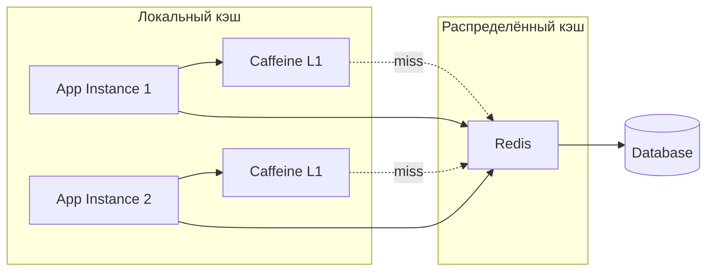

**На собеседовании:** ожидают, что кандидат объяснит trade-off между латентностью и консистентностью, и предложит гибридный подход (L1 + L2).


> [!mcq]
> - [ ] Локальный `Caffeine` автоматически синхронизируется между инстансами через gossip-протокол | `Caffeine` — чисто in-process, никакого протокола между JVM нет. ❌ ПОСЛЕДСТВИЕ: после `UPDATE` в инстансе A инстанс B 10 минут отдаёт устаревший профиль клиента, support-тикеты «изменил email — старый показывается».
> - [ ] Распределённый `Redis` всегда быстрее локального `Caffeine` за счёт оптимизации сети | Сетевой round-trip 1-5 мс vs наносекундный доступ к heap — `Caffeine` на 3 порядка быстрее. ❌ ПОСЛЕДСТВИЕ: hot-read API с `Redis` на каждый запрос держит p99 ~5 мс вместо <1 мс — недостижение SLA на checkout.
> - [x] Локальный кэш живёт в heap процесса (наносекунды, не делится между инстансами); распределённый — на отдельных узлах (1-5 мс по сети, общий для кластера) | Trade-off латентность vs консистентность: при масштабировании каждый инстанс держит свой `Caffeine`, инвалидация на других узлах требует pub/sub. ✓ ПРИМЕНЯТЬ: Netflix EVCache использует L1 in-process + L2 распределённый для рекомендаций. 📋 ПРАВИЛО: «Локальный — наносекунды без consistency, распределённый — миллисекунды с общей правдой». 🔗 См. Q2, Q26, Q28.
> - [ ] Локальный кэш и распределённый — синонимы, разница только в реализации API | Это две разные категории с разными trade-off. ❌ ПОСЛЕДСТВИЕ: команда выбирает `Caffeine` для shared session-store на 10 подов — каждый под видит свои сессии, пользователь логинится повторно после round-robin LB.

## Q2. Что такое многоуровневый кэш (L1/L2)?

**Многоуровневый кэш** — комбинация уровней: **L1** — локальный (`Caffeine`), **L2** — распределённый (`Redis`). Запрос сначала проверяет `L1`; при промахе — `L2`; при промахе в `L2` — источник данных (БД). Результат записывается в оба уровня.

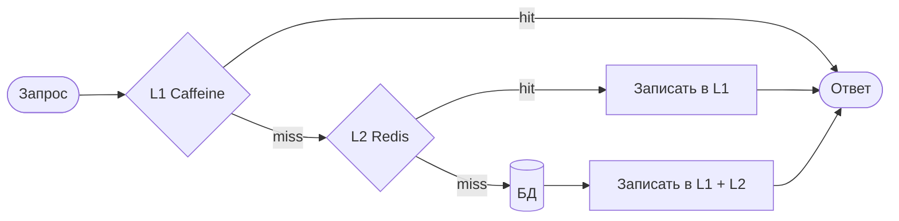

**Пример двухуровневого доступа:**

```java
@Service
@RequiredArgsConstructor
public class UserService {
    private final Cache<String, User> localCache;  // Caffeine L1
    private final RedisTemplate<String, User> redis; // L2
    private final UserRepository userRepository;

    public User getUser(Long id) {
        String key = "user:" + id;

        // L1 — локальный кэш
        User user = localCache.getIfPresent(key);
        if (user != null) return user;

        // L2 — Redis
        user = redis.opsForValue().get(key);
        if (user != null) {
            localCache.put(key, user);
            return user;
        }

        // БД
        user = userRepository.findById(id).orElseThrow();
        redis.opsForValue().set(key, user, Duration.ofMinutes(30));
        localCache.put(key, user);
        return user;
    }
}
```

`TTL` в `L1` обычно короче (1-5 минут), чем в `L2` (10-60 минут), чтобы быстрее подхватывать инвалидацию. При публикации события инвалидации нужно очищать `L1` во всех инстансах (через `Redis Pub/Sub`). Подробнее о реализации в [Spring Boot](../frameworks/spring/spring-boot-interview.md).


> [!mcq]
> - [ ] L1 `Caffeine` и L2 `Redis` должны иметь одинаковый TTL — иначе данные расходятся | Короткий TTL в L1 нужен именно чтобы быстрее подхватывать инвалидацию из L2. ❌ ПОСЛЕДСТВИЕ: TTL обоих 60 минут — после события инвалидации L1 в одной поде держит stale-данные час, customer видит «удалённый» товар в каталоге.
> - [x] L1 локальный с коротким TTL (1-5 мин), L2 распределённый с длинным TTL (10-60 мин); запрос идёт L1→L2→БД, результат пишется в оба | Короткий TTL L1 минимизирует stale-данные при cross-node инвалидации; длинный TTL L2 разгружает БД. ✓ ПРИМЕНЯТЬ: типичный паттерн в e-commerce каталогах (Wildberries, OZON) для горячих товаров. 📋 ПРАВИЛО: «L1 — короткий TTL для свежести, L2 — длинный TTL для разгрузки БД». 🔗 См. Q1, Q26, Q28.
> - [ ] При промахе L2 нужно писать только в L2, чтобы не дублировать данные | Иначе следующий запрос на этом же инстансе снова идёт в L2 (1-5 мс) вместо L1 (наносекунды). ❌ ПОСЛЕДСТВИЕ: hot-key обслуживается на 5 мс вместо <1 мс — теряется главное преимущество L1.
> - [ ] L1 должен быть распределённым (Hazelcast), L2 — локальным (Caffeine) | Это инверсия: L1 ближе к процессу = должен быть быстрее L2. ❌ ПОСЛЕДСТВИЕ: каждое чтение идёт по сети в Hazelcast (5 мс) — производительность хуже, чем без многоуровневого кэша.

## Q3. Что такое HTTP-кэш (браузерный и прокси)?

**HTTP-кэш** — кэширование ответов по заголовкам `Cache-Control`, `ETag`, `Last-Modified`. Браузер и прокси (`CDN`, `Nginx`) хранят ответ и не запрашивают сервер при повторном запросе.

Сервер отдаёт `ETag` (хеш тела); клиент при повторном запросе шлёт `If-None-Match`; при неизменных данных — **304 Not Modified** без тела — экономия трафика. Для персональных данных используют `private` или `no-store`.

**Пример конфигурации в `Spring`:**

```java
@GetMapping("/products/{id}")
public ResponseEntity<Product> getProduct(@PathVariable Long id) {
    Product product = productService.findById(id);
    return ResponseEntity.ok()
        .cacheControl(CacheControl.maxAge(1, TimeUnit.HOURS).cachePublic())
        .eTag(String.valueOf(product.getVersion()))
        .body(product);
}
```

**Практика:** для статики (`JS/CSS`) — `Cache-Control: public, max-age=31536000` с версией в имени файла; для `API` — `ETag` по хешу тела; для персональных данных — `Cache-Control: private, no-store`.


> [!mcq]
> - [ ] `ETag` и `Cache-Control: max-age` взаимоисключающие — нужно выбрать один | Они комбинируются: `max-age` для freshness window, `ETag` для revalidation после истечения. ❌ ПОСЛЕДСТВИЕ: только `ETag` без `max-age` — каждый запрос идёт на сервер за 304 Not Modified, теряется главный смысл кэша.
> - [ ] `Cache-Control: no-cache` запрещает кэширование полностью | `no-cache` разрешает кэш, но требует revalidation; `no-store` — запрет полностью. ❌ ПОСЛЕДСТВИЕ: команда ставит `no-cache` на статику думая «не кэшировать» — на деле браузер кэширует и шлёт revalidation на каждый запрос.
> - [ ] Все ответы кэшируются по умолчанию даже без заголовков | Без явных директив поведение зависит от клиента/прокси, но обычно кэшируется только `GET` 200 c определёнными заголовками. ❌ ПОСЛЕДСТВИЕ: персональный профиль без `Cache-Control: private` попадает в shared CDN — другой пользователь видит чужие данные (incident class «cache poisoning»).
> - [x] `ETag` (хеш тела) + `If-None-Match` дают 304 без тела при неизменных данных; `Cache-Control: max-age` даёт freshness window без обращения к серверу | Для статики — `public, max-age=31536000` с версией в имени; для персонального — `private, no-store`. ✓ ПРИМЕНЯТЬ: Cloudflare/Fastly используют `ETag` + `stale-while-revalidate` для CDN edge-caching. 📋 ПРАВИЛО: «`max-age` экономит RPS, `ETag` экономит трафик, `private` защищает от утечки». 🔗 См. Q4, Q20.

## Q4. Что такое hit ratio и miss ratio?

**Hit ratio** — доля запросов, обслуженных из кэша: `hit_ratio = hits / (hits + misses)`. **Miss ratio** = 1 - hit_ratio.

Целевые значения: 80-95% для горячих справочников; для персональных данных hit ratio может быть ниже из-за высокой кардинальности ключей. Метрики снимают через `Redis INFO stats` (`keyspace_hits`, `keyspace_misses`) или `Micrometer CacheMetrics`.

**Практика:** алерт при hit ratio < 70% в течение 15 минут; дашборд с трендом по кэшам; при падении после деплоя — ожидаемо (холодный кэш), дать время на прогрев. Подробнее о метриках в [вопросах по наблюдаемости](../monitoring/observability-interview.md).


> [!mcq]
> - [ ] Hit ratio 100% — идеальная цель для любого кэша | 100% означает данные никогда не меняются — нет смысла в TTL, обычно есть бизнес-причина для misses. ❌ ПОСЛЕДСТВИЕ: команда переустанавливает огромный TTL чтобы «достичь 100%» — после изменения профиля пользователь сутки видит старый email.
> - [ ] Hit ratio < 50% всегда означает баг конфигурации | Для high-cardinality данных (например, поиск по пользовательскому query) низкий ratio — норма из-за уникальности ключей. ❌ ПОСЛЕДСТВИЕ: SRE гонится за hit ratio для кэша поисковых запросов, добавляет память — память растёт, ratio не растёт, бюджет облака +30%.
> - [x] Hit ratio = hits/(hits+misses); цель 80-95% для горячих справочников; алерт при <70% в течение 15 минут (исключая прогрев после деплоя) | Метрики через `Redis INFO stats` (`keyspace_hits`/`keyspace_misses`) или `Micrometer CacheMetrics`. ✓ ПРИМЕНЯТЬ: Spring Boot Admin с Micrometer/Prometheus экспортирует `cache.gets` для дашбордов. 📋 ПРАВИЛО: «80-95% горячо, <70% — алерт, <50% — пересмотреть ключи». 🔗 См. Q31, Q38.
> - [ ] Hit ratio считается только по успешным GET, ошибки кэша не учитываются | Stats считают как success, так и errors — иначе при сетевых проблемах ratio выглядит «нормально». ❌ ПОСЛЕДСТВИЕ: Redis недоступен 30 минут, hit ratio в дашборде 95% (только успехи) — алерты молчат, BE падает на БД.

## Q5. (!) Что такое eviction policy и какие бывают?

**Eviction policy** — политика вытеснения записей при переполнении кэша:

| Политика | Описание | Когда использовать |
|----------|----------|--------------------|
| **LRU** | Вытесняются наименее недавно использованные | Большинство сценариев |
| **LFU** | Наименее часто используемые | Когда важна частота обращений |
| **TTL** | Удаление по истечении времени | Данные с ограниченным сроком актуальности |
| **FIFO** | Первым пришёл — первым вытеснен | Простые сценарии |
| **Window TinyLFU** | Комбинация LRU и LFU | `Caffeine` — лучший hit ratio |

`Caffeine` по умолчанию использует `Window TinyLFU`. В `Redis` по умолчанию `noeviction`; настраивают через `maxmemory-policy`:

```conf
maxmemory 256mb
maxmemory-policy allkeys-lru
```

Варианты в `Redis`: `allkeys-lru`, `volatile-lru`, `allkeys-lfu`, `volatile-ttl`, `noeviction`.


> [!mcq]
> - [ ] `Redis` по умолчанию использует `allkeys-lru` — нужно только задать `maxmemory` | По умолчанию `noeviction` — Redis отвечает ошибкой `OOM command not allowed` на запись при достижении лимита. ❌ ПОСЛЕДСТВИЕ: продакшен Redis с `maxmemory 4gb` без `maxmemory-policy` — после заполнения все `SET` падают, write-path приложения деградирует до 0% success.
> - [ ] LFU всегда лучше LRU за счёт учёта частоты | LFU плохо адаптируется к смене горячего набора (старые «горячие» вытесняют новые); для большинства сценариев LRU/W-TinyLFU эффективнее. ❌ ПОСЛЕДСТВИЕ: после redesign каталога новые товары не попадают в кэш — старые «топы» удерживают слоты, hit ratio новых страниц 0%.
> - [ ] FIFO с `Caffeine` даёт лучший hit ratio в большинстве сценариев | `Caffeine` использует `Window TinyLFU` (комбинация LRU+LFU) — лучший hit ratio среди open-source. ❌ ПОСЛЕДСТВИЕ: ручная замена на FIFO деградирует hit ratio с 92% до 78% — DB throughput +30%, p99 +200мс.
> - [x] Eviction — политика вытеснения при переполнении: LRU (least recently used), LFU (по частоте), TTL, FIFO, W-TinyLFU; в `Redis` настраивается `maxmemory-policy` (по умолчанию `noeviction`); `Caffeine` использует `Window TinyLFU` | Для большинства production-сценариев в Redis ставят `allkeys-lru` или `volatile-lru`. ✓ ПРИМЕНЯТЬ: Spring Boot + `Caffeine` использует W-TinyLFU из коробки при `recordStats()`. 📋 ПРАВИЛО: «Redis по умолчанию `noeviction` — обязательно явно ставь `allkeys-lru`». 🔗 См. Q29, Q30.

## Q6. (!) Как работает Spring Cache Abstraction?

`Spring Cache Abstraction` — уровень абстракции над кэш-провайдерами (`Caffeine`, `Redis`, `EhCache`). Включается аннотацией `@EnableCaching` и работает через AOP-прокси: при вызове метода с `@Cacheable` прокси перехватывает вызов и проверяет кэш.

```java
@Configuration
@EnableCaching
public class CacheConfig {
    // Spring Boot автоматически подберёт CacheManager
    // на основе зависимостей в classpath
}
```

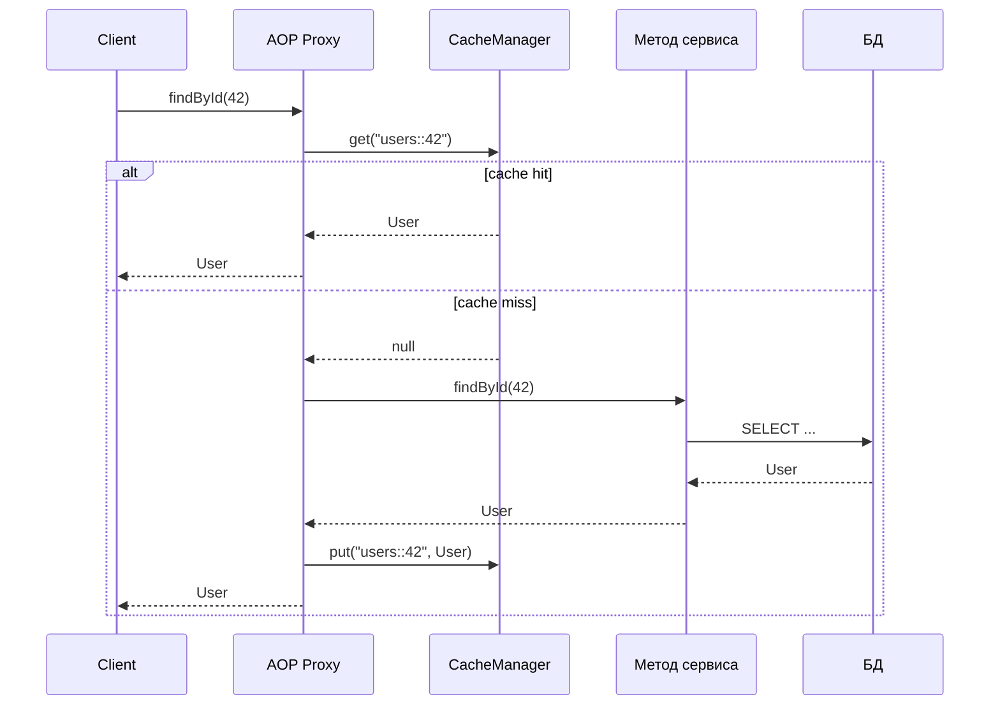

**Важные нюансы:**
- Прокси работает только при вызове через бин (`this.method()` не проходит через прокси — кэш не сработает)
- По умолчанию `null` кэшируется — используйте `unless = "#result == null"` для исключения
- `@Cacheable` на `private` методах не работает (Spring AOP)


> [!mcq]
> - [x] `@EnableCaching` создаёт AOP-прокси; `@Cacheable` на public-методе перехватывает вызов через бин и проверяет кэш до выполнения тела; внутренний вызов `this.method()` не идёт через прокси — кэш не сработает | Spring AOP работает через JDK proxy (по интерфейсу) или CGLIB (по классу) — обходит self-invocation. ✓ ПРИМЕНЯТЬ: Spring Boot автоконфигурация подбирает `CacheManager` по classpath (`Caffeine`, `Redis`, `EhCache`). 📋 ПРАВИЛО: «`@Cacheable` работает только через бин, `this.method()` — мимо прокси». 🔗 См. Q7, Q11.
> - [ ] `@Cacheable` работает на любых методах включая `private` за счёт байт-код инструментации | Spring AOP — это runtime прокси, `private` методы не перехватываются (нужен AspectJ load-time weaving). ❌ ПОСЛЕДСТВИЕ: разработчик ставит `@Cacheable` на `private fetchData()`, локально работает (компилятор не ругается), на production кэш не сработает — БД нагружена в 10 раз.
> - [ ] При `null` Spring не кэширует значение по умолчанию | По умолчанию `null` кэшируется — нужен `unless = "#result == null"` для исключения. ❌ ПОСЛЕДСТВИЕ: `findByEmail()` возвращает `null` для несуществующего пользователя — `null` кэшируется, после регистрации того же email follow-up запрос всё ещё видит `null`.
> - [ ] AOP-прокси работает синхронно — `@Cacheable` нельзя использовать с `CompletableFuture` | Spring 4.3+ поддерживает `CompletableFuture` и `Mono`/`Flux` в `@Cacheable`. ❌ ПОСЛЕДСТВИЕ: команда отказывается от reactive-стека из-за «несовместимости» с кэшем — теряют backpressure и throughput.

## Q7. (!) Как использовать @Cacheable, @CacheEvict и @CachePut?

Основные аннотации `Spring Cache`:

```java
@Service
public class ProductService {

    // @Cacheable — кэширует результат; при повторном вызове
    // с тем же ключом метод не выполняется
    @Cacheable(value = "products", key = "#id",
               unless = "#result == null")
    public Product findById(Long id) {
        return productRepository.findById(id).orElse(null);
    }

    // @Cacheable с составным ключом
    @Cacheable(value = "productSearch",
               key = "#category + ':' + #page")
    public List<Product> search(String category, int page) {
        return productRepository.findByCategory(category,
            PageRequest.of(page, 20));
    }

    // @CachePut — всегда выполняет метод и обновляет кэш
    @CachePut(value = "products", key = "#product.id")
    @Transactional
    public Product update(Product product) {
        return productRepository.save(product);
    }

    // @CacheEvict — удаляет запись из кэша
    @CacheEvict(value = "products", key = "#id")
    @Transactional
    public void delete(Long id) {
        productRepository.deleteById(id);
    }

    // @CacheEvict — очистка всего кэша
    @CacheEvict(value = "products", allEntries = true)
    @Scheduled(fixedRate = 3600000) // каждый час
    public void evictAllProducts() {
        log.info("Products cache cleared");
    }

    // @Caching — комбинация аннотаций
    @Caching(
        put = @CachePut(value = "products", key = "#product.id"),
        evict = @CacheEvict(value = "productSearch",
                            allEntries = true)
    )
    @Transactional
    public Product save(Product product) {
        return productRepository.save(product);
    }
}
```

**Ключевые параметры:**
- `value` / `cacheNames` — имя кэша
- `key` — SpEL-выражение для ключа (по умолчанию — все аргументы метода)
- `condition` — условие кэширования (SpEL): `condition = "#id > 10"`
- `unless` — условие исключения результата: `unless = "#result.size() == 0"`
- `sync = true` — синхронный доступ (предотвращает stampede)


> [!mcq]
> - [ ] `@CachePut` идентичен `@Cacheable` — оба возвращают значение из кэша | `@CachePut` ВСЕГДА выполняет метод и обновляет кэш; `@Cacheable` пропускает выполнение при hit. ❌ ПОСЛЕДСТВИЕ: `@CachePut` на `findById` — каждый вызов идёт в БД, кэш не работает (нагрузка как без кэша, но + сериализация в Redis).
> - [ ] `@CacheEvict(allEntries = true)` инвалидирует только указанный ключ | `allEntries = true` очищает весь named cache — обычно используется для глобальной инвалидации после batch-обновления. ❌ ПОСЛЕДСТВИЕ: команда добавляет `allEntries=true` на каждый `update` — кэш постоянно холодный, hit ratio 5%, БД throughput +500%.
> - [x] `@Cacheable` — кэширует результат (skip метод при hit); `@CachePut` — всегда выполняет и обновляет; `@CacheEvict` — удаляет ключ; `sync = true` сериализует параллельные miss (защита от stampede); `unless = "#result == null"` исключает `null` | `key` — SpEL по аргументам, `condition`/`unless` — фильтры. ✓ ПРИМЕНЯТЬ: Spring Boot Caffeine config c `sync=true` на горячих ключах для предотвращения stampede. 📋 ПРАВИЛО: «`@Cacheable` skip, `@CachePut` обновить, `@CacheEvict` удалить — три глагола, три задачи». 🔗 См. Q6, Q17, Q19.
> - [ ] `key = "#id"` обязателен — без него кэш не работает | По умолчанию `Spring` использует `SimpleKeyGenerator` (все аргументы метода). ❌ ПОСЛЕДСТВИЕ: метод с `(String category, int page)` без явного `key` создаёт `SimpleKey[«electronics»,3]` — но при сериализации в Redis может конфликтовать, тесты зелёные локально, prod даёт `ClassCastException` после restart.

## Q8. Как настроить Caffeine Cache в Spring Boot?

**Зависимость:**
```groovy
implementation 'org.springframework.boot:spring-boot-starter-cache'
implementation 'com.github.ben-manes.caffeine:caffeine'
```

**Вариант 1 — через `application.yml`:**
```yaml
spring:
  cache:
    type: caffeine
    caffeine:
      spec: maximumSize=500,expireAfterWrite=10m
    cache-names: products,users
```

**Вариант 2 — программная конфигурация (рекомендуется для разных TTL):**

```java
@Configuration
@EnableCaching
public class CaffeineCacheConfig {

    @Bean
    public CacheManager cacheManager() {
        CaffeineCacheManager manager = new CaffeineCacheManager();
        manager.setCaffeine(Caffeine.newBuilder()
            .maximumSize(1000)
            .expireAfterWrite(Duration.ofMinutes(10))
            .recordStats()); // для Micrometer метрик
        return manager;
    }
}
```

**Вариант 3 — разные настройки для каждого кэша:**

```java
@Configuration
@EnableCaching
public class CaffeineCacheConfig {

    @Bean
    public CacheManager cacheManager() {
        SimpleCacheManager manager = new SimpleCacheManager();
        manager.setCaches(List.of(
            buildCache("products", 500, Duration.ofMinutes(30)),
            buildCache("users", 200, Duration.ofMinutes(5)),
            buildCache("config", 50, Duration.ofHours(1))
        ));
        return manager;
    }

    private CaffeineCache buildCache(String name, int maxSize,
                                     Duration ttl) {
        return new CaffeineCache(name, Caffeine.newBuilder()
            .maximumSize(maxSize)
            .expireAfterWrite(ttl)
            .recordStats()
            .build());
    }
}
```


> [!mcq]
> - [ ] Один `CacheManager` обязан иметь одинаковый TTL для всех кэшей | `SimpleCacheManager` или программная конфигурация позволяют задать разные TTL и `maxSize` per-cache. ❌ ПОСЛЕДСТВИЕ: команда ставит общий TTL 1 час на `users`+`config` — справочник с длинной актуальностью бесполезно перегружается.
> - [x] Через `application.yml` с `caffeine.spec` для одного TTL на всё ИЛИ программно через `SimpleCacheManager` + `buildCache(name, maxSize, ttl)` для разных настроек per-cache; `recordStats()` нужен для Micrometer-метрик | `application.yml` подход проще, программный — гибче. ✓ ПРИМЕНЯТЬ: Spring Boot starter `spring-boot-starter-cache` + `caffeine` зависимость. 📋 ПРАВИЛО: «yml для одного TTL, code для разных — без `recordStats()` нет метрик». 🔗 См. Q6, Q31.
> - [ ] `@EnableCaching` достаточно — конфигурация `Caffeine` не нужна | Без зависимости `caffeine` Spring выберет `ConcurrentMapCacheManager` (без TTL, без размера). ❌ ПОСЛЕДСТВИЕ: кэш растёт без ограничений — heap OOM через несколько часов работы под нагрузкой.
> - [ ] `Caffeine.newBuilder().maximumSize(0)` означает unlimited | `maximumSize(0)` означает кэш отключён — никогда не хранит элементы. ❌ ПОСЛЕДСТВИЕ: разработчик пишет `0` вместо `Long.MAX_VALUE` думая «без лимита» — кэш не работает, БД нагружена, hit ratio 0%.

## Q9. (!) Как настроить Redis Cache в Spring Boot?

**Зависимость:**
```groovy
implementation 'org.springframework.boot:spring-boot-starter-data-redis'
implementation 'org.springframework.boot:spring-boot-starter-cache'
```

**application.yml:**
```yaml
spring:
  data:
    redis:
      host: localhost
      port: 6379
      password: ${REDIS_PASSWORD}
      timeout: 2000ms
  cache:
    type: redis
    redis:
      time-to-live: 600000  # 10 минут в мс
      cache-null-values: false
```

**Программная конфигурация с JSON-сериализацией:**

```java
@Configuration
@EnableCaching
public class RedisCacheConfig {

    @Bean
    public RedisCacheManager cacheManager(
            RedisConnectionFactory connectionFactory) {

        // Конфигурация по умолчанию
        RedisCacheConfiguration defaultConfig =
            RedisCacheConfiguration.defaultCacheConfig()
                .entryTtl(Duration.ofMinutes(10))
                .disableCachingNullValues()
                .serializeKeysWith(
                    SerializationPair.fromSerializer(
                        new StringRedisSerializer()))
                .serializeValuesWith(
                    SerializationPair.fromSerializer(
                        new GenericJackson2JsonRedisSerializer()));

        // Разные TTL для разных кэшей
        Map<String, RedisCacheConfiguration> configs = Map.of(
            "users", defaultConfig.entryTtl(Duration.ofMinutes(5)),
            "products", defaultConfig.entryTtl(Duration.ofMinutes(30)),
            "config", defaultConfig.entryTtl(Duration.ofHours(1))
        );

        return RedisCacheManager.builder(connectionFactory)
            .cacheDefaults(defaultConfig)
            .withInitialCacheConfigurations(configs)
            .transactionAware()
            .build();
    }
}
```

**Важно:** `GenericJackson2JsonRedisSerializer` добавляет поле `@class` для десериализации; при переименовании пакета старые записи не десериализуются — используйте версию в ключе или короткий `TTL`. Подробнее о `Redis` в [вопросах по Redis](../databases/redis-interview.md).


> [!mcq]
> - [ ] `JdkSerializationRedisSerializer` (по умолчанию) безопасен для production | `JdkSerializationRedisSerializer` использует Java serialization — известная RCE-уязвимость + поломка при изменении полей класса. ❌ ПОСЛЕДСТВИЕ: после rolling deploy с переименованием поля `User.email`→`User.contactEmail` старые записи дают `InvalidClassException` — read-path падает на 50% инстансов.
> - [ ] `GenericJackson2JsonRedisSerializer` не сохраняет тип — десериализация ломается на полиморфных полях | Сериализатор добавляет поле `@class` для type-info — десериализация работает с полиморфизмом. ❌ ПОСЛЕДСТВИЕ: команда переходит на свой `ObjectMapper` без default-typing — `List<Animal>` десериализуется как `List<LinkedHashMap>`, `ClassCastException` в runtime.
> - [ ] `entryTtl(Duration.ZERO)` означает кэш без срока | `Duration.ZERO` означает «не кэшировать» — Redis записывает с TTL=0 = немедленное истечение. ❌ ПОСЛЕДСТВИЕ: разработчик ставит `Duration.ZERO` думая «бесконечно» — кэш не работает, hit ratio 0%, нагрузка на БД как без кэша.
> - [x] `RedisCacheManager.builder(factory)` с `defaultCacheConfig().entryTtl(...).disableCachingNullValues().serializeValuesWith(GenericJackson2JsonRedisSerializer)`; `withInitialCacheConfigurations(Map)` для разных TTL per-cache; добавлять версию в ключ при смене формата | JSON-сериализатор межъязыковой и читаемый, но добавляет `@class` — нужно учитывать при cross-language. ✓ ПРИМЕНЯТЬ: Spring Data Redis с `RedisCacheManager` для `@Cacheable` поверх Redis Cluster. 📋 ПРАВИЛО: «JSON для cross-platform, версия в ключе для безопасной миграции схемы». 🔗 См. Q23, Q21, Q32.

## Q10. Как использовать несколько CacheManager в одном приложении?

Типичный сценарий: `Caffeine` для горячих данных + `Redis` для общего кэша.

```java
@Configuration
@EnableCaching
public class MultiCacheConfig {

    @Bean
    @Primary
    public CacheManager caffeineCacheManager() {
        CaffeineCacheManager manager = new CaffeineCacheManager("hotData");
        manager.setCaffeine(Caffeine.newBuilder()
            .maximumSize(100)
            .expireAfterWrite(Duration.ofMinutes(1)));
        return manager;
    }

    @Bean("redisCacheManager")
    public CacheManager redisCacheManager(
            RedisConnectionFactory factory) {
        return RedisCacheManager.builder(factory)
            .cacheDefaults(RedisCacheConfiguration.defaultCacheConfig()
                .entryTtl(Duration.ofMinutes(30)))
            .build();
    }
}

@Service
public class ProductService {

    // Использует Primary (Caffeine)
    @Cacheable("hotData")
    public Product getHotProduct(Long id) { ... }

    // Явно указан Redis CacheManager
    @Cacheable(value = "allProducts",
               cacheManager = "redisCacheManager")
    public Product getProduct(Long id) { ... }
}
```


> [!mcq]
> - [ ] Spring при двух `CacheManager` бинах автоматически выбирает любой — `@Primary` не нужен | Без `@Primary` Spring бросает `NoUniqueBeanDefinitionException` при `@Cacheable` без явного `cacheManager`. ❌ ПОСЛЕДСТВИЕ: после добавления второго `CacheManager` приложение не стартует на production — все instances в `CrashLoopBackOff`.
> - [x] Помечать один `CacheManager` как `@Primary` (используется по умолчанию), второй именованным `@Bean("redisCacheManager")`; `@Cacheable(cacheManager = "redisCacheManager")` для явного выбора | Типично: `Caffeine` для горячих in-process данных + `Redis` для shared кэша между сервисами. ✓ ПРИМЕНЯТЬ: гибрид L1+L2 — `@Primary Caffeine` для горячих ключей + named Redis для общего. 📋 ПРАВИЛО: «`@Primary` для дефолта, имя бина для явного указания». 🔗 См. Q1, Q2, Q26.
> - [ ] Несколько `CacheManager` нельзя использовать в одной транзакции | `transactionAware()` на каждом `CacheManager` поддерживает участие в Spring transaction. ❌ ПОСЛЕДСТВИЕ: команда отказывается от L1+L2 из-за «несовместимости» с `@Transactional` — теряют snapshot consistency между кэшем и БД.
> - [ ] `@Cacheable(cacheNames = "x", cacheManager = "y")` приоритетнее `@Primary` только в Spring 6 | Параметр `cacheManager` всегда переопределяет `@Primary` начиная со Spring 4.1. ❌ ПОСЛЕДСТВИЕ: разработчик не указывает явный manager думая «Spring 5 не поддерживает» — все вызовы идут в `@Primary` Caffeine, Redis-кэш пустой и бесполезный.

## Q11. (!) Что такое Cache-Aside (Lazy Loading)?

`Cache-Aside` — приложение само управляет кэшем: при чтении сначала проверяет кэш; при промахе загружает из БД и записывает в кэш. При записи приложение обновляет БД и инвалидирует кэш (удаляет ключ).

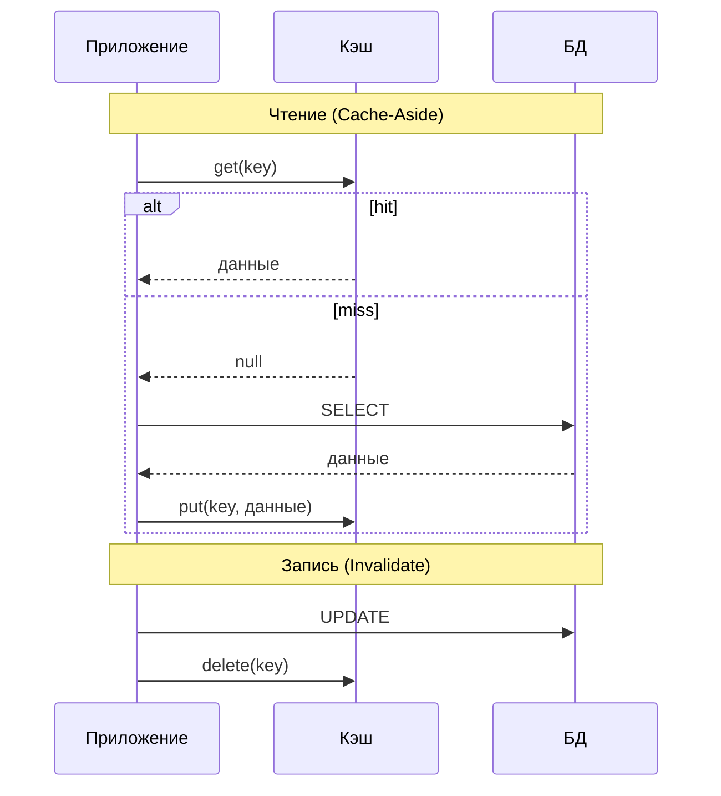

**Реализация в `Spring`:**

```java
@Cacheable(value = "users", key = "#id")
public User findById(Long id) {
    return userRepository.findById(id).orElseThrow();
}

@CacheEvict(value = "users", key = "#user.id")
@Transactional
public User update(User user) {
    return userRepository.save(user);
}
```

**Плюсы:** простота; кэш содержит только запрашиваемые данные. **Минусы:** при промахе два запроса; возможна гонка при одновременной записи и чтении (stale data). Порядок при записи — сначала БД, затем удаление ключа в кэше.


> [!mcq]
> - [ ] При записи: сначала удалить ключ в кэше, затем `UPDATE` в БД | Race: между `DELETE` и `UPDATE` другой поток видит miss, читает старое значение из БД, кладёт в кэш — устаревшие данные. ❌ ПОСЛЕДСТВИЕ: пользователь меняет email, в это время другой запрос читает профиль — кэш получает старый email и держит его до TTL (час+).
> - [x] При чтении: проверить кэш → miss → загрузить из БД → положить в кэш; при записи: сначала `UPDATE` БД, затем `DELETE` ключа кэша; приложение само управляет логикой | При обратном порядке (delete-then-update) возникает race condition. ✓ ПРИМЕНЯТЬ: `@Cacheable` + `@CacheEvict` в Spring (стандартный паттерн в `Booking.com` для product-каталога). 📋 ПРАВИЛО: «Сначала БД, потом DELETE кэша — иначе race вернёт stale». 🔗 См. Q12, Q14, Q19.
> - [ ] При записи приложение пишет в кэш и в БД параллельно для скорости | Параллельная запись = `Write-Through` или `Write-Around`, не `Cache-Aside`; параллельность даёт inconsistency при ошибке одной из операций. ❌ ПОСЛЕДСТВИЕ: запись в кэш успешна, в БД упала — после restart кэш холодный, читатели получают «исчезнувшие» данные.
> - [ ] Cache-Aside требует поддержки `Read-Through` API в кэш-движке | `Cache-Aside` — приложение управляет; `Read-Through` — кэш сам загружает. Это разные паттерны. ❌ ПОСЛЕДСТВИЕ: команда заявляет «Redis не поддерживает Cache-Aside» и переходит на Hazelcast — бесполезное усложнение, теряют годы экспертизы по Redis.

## Q12. (!) Что такое Write-Through?

**Write-Through** — при записи приложение пишет и в кэш, и в БД синхронно. Порядок: сначала БД, потом кэш — при сбое данные не расходятся.

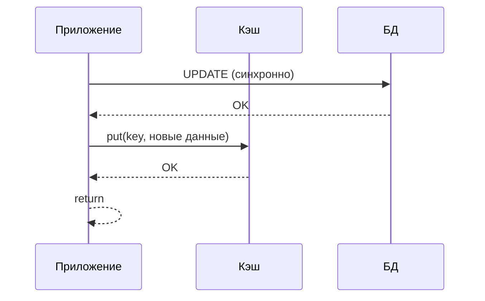

**Плюсы:** кэш и БД согласованы; читатели всегда получают актуальные данные из кэша. **Минусы:** повышенная латентность записи (два синхронных вызова). Подходит, когда консистентность важнее скорости записи.

```java
@CachePut(value = "users", key = "#user.id")
@Transactional
public User update(User user) {
    return userRepository.save(user); // сначала БД, результат — в кэш
}
```


> [!mcq]
> - [ ] Write-Through асинхронен — приложение возвращает успех сразу после записи в кэш | Это Write-Behind, не Write-Through; Write-Through синхронный (ждёт обе записи). ❌ ПОСЛЕДСТВИЕ: команда называет Write-Behind «Write-Through» — обещает строгую consistency финансам, на crash теряет 10K транзакций из in-memory очереди.
> - [ ] Порядок: сначала кэш, затем БД — для атомарности | Если БД упадёт после успешной записи в кэш, читатели увидят данные, которых нет в источнике. ❌ ПОСЛЕДСТВИЕ: payment-write кладёт «оплачено» в кэш, БД timeout, пользователь видит paid status, после reconciliation статус сбрасывается — поддержка двойного списания.
> - [ ] Write-Through подходит для high-throughput logging | Синхронные две записи на каждое событие убивают throughput; для логов — Write-Behind или batch. ❌ ПОСЛЕДСТВИЕ: лог-сервис на Write-Through держит p99 50мс на запись — при пике 50K RPS очередь приложения растёт, падает по timeout.
> - [x] Синхронная запись и в БД, и в кэш в порядке: сначала БД (источник истины), затем кэш; читатели всегда получают актуальные данные | Повышенная латентность записи (две операции), но строгая consistency. ✓ ПРИМЕНЯТЬ: `@CachePut` в Spring для критичных данных (банковские балансы, статусы платежей). 📋 ПРАВИЛО: «Write-Through — сначала БД, потом кэш, синхронно — consistency дороже latency». 🔗 См. Q11, Q13, Q19.

## Q13. Что такое Write-Behind (Write-Back)?

**Write-Behind** — при записи приложение пишет в кэш и сразу возвращает успех; запись в БД выполняется асинхронно (батчами или по расписанию).

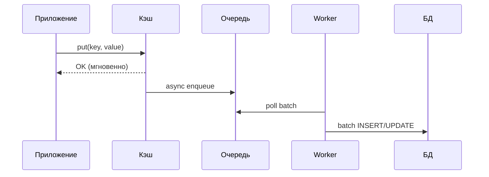

**Плюсы:** низкая латентность записи, разгрузка БД. **Минусы:** риск потери данных при падении до сброса в БД; сложность консистентности.

Подходит для логов, метрик, счётчиков; для платежей — `Write-Through`. Требует надёжной очереди (подробнее в [вопросах по Kafka](../messaging/kafka-interview.md)) и идемпотентности записи в БД.


> [!mcq]
> - [x] Запись в кэш + асинхронный sync в БД через очередь/батч; низкая латентность записи, риск потери данных при crash до flush; подходит для логов, метрик, счётчиков — НЕ для платежей | Требует надёжной очереди (Kafka), идемпотентности записи в БД. ✓ ПРИМЕНЯТЬ: метрики и счётчики просмотров в Yandex Lavka через Kafka + batch insert в ClickHouse. 📋 ПРАВИЛО: «Write-Behind без durability guarantee → data loss при crash; для логов да, для денег нет». 🔗 См. Q12, Q19.
> - [ ] Write-Behind гарантирует durability за счёт WAL в кэше | Стандартные in-memory кэши не имеют WAL; Redis AOF/RDB защищает только сам кэш, не БД. ❌ ПОСЛЕДСТВИЕ: команда обещает «durable Write-Behind через Redis AOF» — после kill -9 поды теряют 30 секунд транзакций (между `appendfsync everysec` и crash).
> - [ ] Write-Behind подходит для платежей за счёт скорости | Риск потери данных недопустим для денег — для платежей только Write-Through или sync. ❌ ПОСЛЕДСТВИЕ: payment-сервис на Write-Behind, kafka-broker недоступен 5 минут — 10K оплат показаны success в UI, в БД не записаны, пользователи требуют товары без оплаты.
> - [ ] Write-Behind = Write-Through по семантике, разница только в реализации | Принципиально разные durability guarantees: sync vs async. ❌ ПОСЛЕДСТВИЕ: архитектор смешивает паттерны на собеседовании — потом строит «Write-Through» через async очередь, теряет данные при первом OOM.

## Q14. Что такое Read-Through Cache?

**Read-Through** — кэш сам загружает данные из источника при промахе (прозрачно для приложения). Приложение вызывает только `cache.get(key)`; кэш при промахе сам вызывает `CacheLoader`.

```java
// Caffeine Read-Through с CacheLoader
LoadingCache<Long, User> cache = Caffeine.newBuilder()
    .maximumSize(1000)
    .expireAfterWrite(Duration.ofMinutes(10))
    .build(id -> userRepository.findById(id).orElse(null));

// Использование — при промахе автоматически вызовет loader
User user = cache.get(42L);
```

**Отличие от `Cache-Aside`:** в `Cache-Aside` приложение управляет логикой загрузки; в `Read-Through` логика инкапсулирована в кэше. В `Spring @Cacheable` — это **cache-aside**, а не read-through; для настоящего read-through нужен `CacheLoader` (`Caffeine`) или `MapLoader` (`Hazelcast`).


> [!mcq]
> - [ ] Spring `@Cacheable` — это и есть Read-Through из коробки | `@Cacheable` реализует **Cache-Aside** — Spring вызывает метод и кладёт результат, кэш не управляет загрузкой. ❌ ПОСЛЕДСТВИЕ: команда заявляет «Read-Through через Spring Cache» — на собеседовании архитектора срезают за неточность терминологии, фейл оффера.
> - [ ] Read-Through невозможно реализовать с Redis | Spring Data Redis не имеет Read-Through из коробки, но Hazelcast/`Caffeine.LoadingCache` реализуют его нативно. ❌ ПОСЛЕДСТВИЕ: команда отбрасывает Redis из-за «отсутствия Read-Through» — переходит на Hazelcast и сложную эксплуатацию вместо простого Cache-Aside в Redis.
> - [x] Кэш сам загружает из источника при miss (через `CacheLoader`); приложение зовёт только `cache.get(key)`; реализуется через `Caffeine.LoadingCache` или Hazelcast `MapLoader` — НЕ через Spring `@Cacheable` (это Cache-Aside) | Логика загрузки инкапсулирована в кэше, приложение не различает hit/miss. ✓ ПРИМЕНЯТЬ: `Caffeine.newBuilder().build(CacheLoader)` в high-throughput сервисах для прозрачной загрузки. 📋 ПРАВИЛО: «Read-Through — кэш грузит сам, Cache-Aside — приложение грузит явно». 🔗 См. Q11, Q15.
> - [ ] Read-Through кэширует null автоматически без настройки | Поведение зависит от `CacheLoader`; обычно `null` от loader = miss, нужно явно решать через `Optional` или sentinel. ❌ ПОСЛЕДСТВИЕ: `LoadingCache` для `findById` возвращает `null` для несуществующих — `Caffeine` не кэширует `null`, каждый запрос идёт в БД (cache penetration).

## Q15. Что такое Write-Around и когда его использовать?

**Write-Around** — при записи приложение пишет только в БД; кэш не обновляется и не инвалидируется. При чтении при промахе данные загружаются из источника и кладутся в кэш.

**Плюсы:** запись не нагружает кэш; подходит для редко перечитываемых после записи данных. **Минусы:** после записи следующее чтение даёт промах и идёт в БД; возможны устаревшие данные в кэше.

Используют когда записей много, а повторные чтения тех же данных редки (логи, аудит), или когда допустима задержка консистентности до `TTL`.


> [!mcq]
> - [ ] Write-Around записывает в кэш и БД, но без сериализации | Это просто Write-Through; Write-Around вообще НЕ пишет в кэш при записи. ❌ ПОСЛЕДСТВИЕ: команда называет Write-Through «Write-Around» — теряет понимание trade-off, использует неправильный паттерн для аудит-логов.
> - [x] Запись только в БД, кэш не обновляется при записи; кэш заполняется лениво при первом чтении (через Cache-Aside); подходит для write-heavy данных, которые редко перечитываются (логи, аудит, метрики) | Минус: следующее чтение после записи даёт miss. ✓ ПРИМЕНЯТЬ: журнал транзакций в банковских системах — пишется много, читается редко (raw audit). 📋 ПРАВИЛО: «Write-Around — write skip кэш; для write-heavy + read-cold данных». 🔗 См. Q11, Q12, Q13.
> - [ ] Write-Around подходит для часто читаемых данных за счёт меньшей записи | Для read-heavy данных Write-Around невыгоден — каждое чтение после записи = промах + БД hit. ❌ ПОСЛЕДСТВИЕ: команда применяет Write-Around к user-профилям — после каждого `update` следующий `findById` идёт в БД, hit ratio падает с 95% до 60%.
> - [ ] Write-Around требует двух соединений: одно к кэшу, одно к БД | Запись идёт только в БД — одно соединение. ❌ ПОСЛЕДСТВИЕ: разработчик ставит две connection pool «для Write-Around» — лишние ресурсы, никакой выгоды.

## Q16. (!) Когда использовать TTL, а когда инвалидацию по событию?

| Критерий | TTL | Инвалидация по событию |
|----------|-----|----------------------|
| Частота изменений | Редко | Часто |
| Требования к актуальности | Допустима задержка | Нужна актуальность сразу |
| Сложность реализации | Простая | Сложнее (события, подписчики) |
| Пример данных | Справочники, конфигурация | Профиль, корзина, баланс |

**Комбинированный подход (рекомендуется):** `TTL` как страховка + инвалидация при обновлении:

```java
// TTL задан в конфигурации кэша (например, 1 час)
// При обновлении — явная инвалидация
@CacheEvict(value = "users", key = "#user.id")
@Transactional
public User update(User user) {
    User saved = userRepository.save(user);
    // при пропуске события кэш обновится через TTL
    return saved;
}
```

Для справочников — `TTL` с jitter (базовый + случайное отклонение). Для персональных данных — инвалидация по событию. Подробнее о событийной архитектуре в [вопросах по Event-Driven](event-driven-patterns-interview.md).


> [!mcq]
> - [ ] Только TTL — событийная инвалидация ненадёжна и не нужна | Без событий пользователи видят stale данные до истечения TTL — недопустимо для профилей, корзины, баланса. ❌ ПОСЛЕДСТВИЕ: банковский баланс с TTL 10 минут без инвалидации — пользователь пополняет счёт, не видит зачисление 10 минут, дёргает поддержку.
> - [ ] Только инвалидация по событию — TTL не нужен | При пропуске события (kafka rebalance, network blip) кэш держит stale бесконечно. ❌ ПОСЛЕДСТВИЕ: kafka consumer падает на 1 час, события инвалидации потеряны — кэш держит устаревшие цены товаров, после восстановления требуется ручной flush.
> - [ ] TTL с jitter и event-инвалидация взаимоисключающие | Они комбинируются: jitter защищает от avalanche, события дают свежесть, TTL — страховка. ❌ ПОСЛЕДСТВИЕ: команда выбирает «или event или TTL» вместо комбинации — теряет defence-in-depth.
> - [x] Комбо: TTL с jitter (страховка от пропущенных событий + защита от avalanche) + инвалидация по событию (свежесть при изменениях); для справочников — длинный TTL, для персональных данных — короткий + событие | Defence-in-depth: один отказывает — другой работает. ✓ ПРИМЕНЯТЬ: каталог товаров в e-commerce: 30-минутный TTL c jitter + Redis Pub/Sub при `update` товара. 📋 ПРАВИЛО: «TTL — страховка, событие — свежесть; комбо безопаснее любого одного». 🔗 См. Q19, Q24, Q29, Q42.

## Q17. (!) Что такое cache stampede (thundering herd) и как его избежать?

**Cache stampede** — при истечении популярного ключа множество потоков одновременно обнаруживают промах и все идут в БД, создавая всплеск нагрузки.

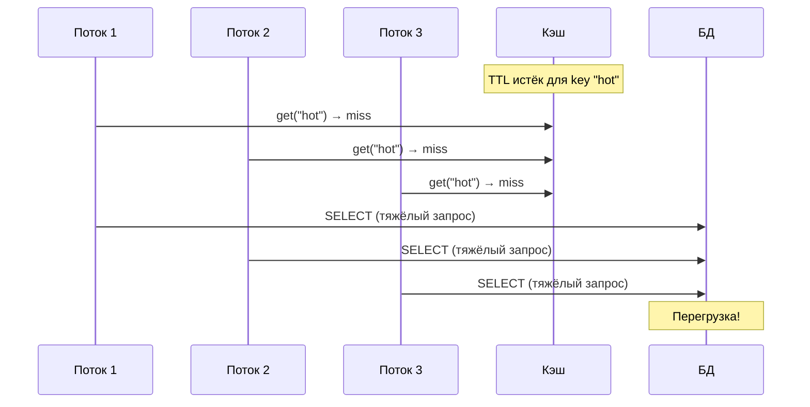

**Решения:**

```java
// 1. Caffeine LoadingCache — один поток загружает, остальные ждут
LoadingCache<String, Product> cache = Caffeine.newBuilder()
    .maximumSize(1000)
    .expireAfterWrite(Duration.ofMinutes(10))
    .build(key -> productRepository.findByKey(key));

// 2. Spring @Cacheable с sync=true
@Cacheable(value = "products", key = "#id", sync = true)
public Product findById(Long id) {
    return productRepository.findById(id).orElseThrow();
}

// 3. Redis — distributed lock (singleflight)
public Product getWithLock(String key) {
    Product p = redis.opsForValue().get(key);
    if (p != null) return p;

    String lockKey = "lock:" + key;
    Boolean acquired = redis.opsForValue()
        .setIfAbsent(lockKey, "1", Duration.ofSeconds(5));
    if (Boolean.TRUE.equals(acquired)) {
        try {
            p = loadFromDb(key);
            redis.opsForValue().set(key, p, Duration.ofMinutes(10));
        } finally {
            redis.delete(lockKey);
        }
    } else {
        // ждать и повторить
        Thread.sleep(50);
        return getWithLock(key);
    }
    return p;
}
```


> [!mcq]
> - [x] При истечении TTL популярного ключа множество потоков одновременно идут в БД (mass expiration → 1000 RPS на DB одновременно); защита: `@Cacheable(sync=true)`, `Caffeine.LoadingCache` (single-flight), distributed lock через Redis `SETNX`, jitter на TTL | `sync=true` — самое простое решение для одного инстанса; `SETNX` lock — для распределённого. ✓ ПРИМЕНЯТЬ: Spring `@Cacheable(sync=true)` на горячих ключах (top products в e-commerce). 📋 ПРАВИЛО: «Cache stampede при mass expiration → 1000 RPS на DB; sync, lock или PER — обязательно для горячих ключей». 🔗 См. Q39, Q40, Q18.
> - [ ] Stampede решается просто увеличением TTL до 24 часов | Длинный TTL только откладывает проблему — рано или поздно ключ истечёт, и удар по БД будет такой же или больше. ❌ ПОСЛЕДСТВИЕ: команда увеличила TTL до 24h, в час пик все ключи истекли одновременно — БД упала на 15 минут, $50K потерянных заказов.
> - [ ] Достаточно retry с экспоненциальным backoff на стороне приложения | Retry усугубляет проблему — те же 1000 потоков ждут и снова бьют по БД (retry storm). ❌ ПОСЛЕДСТВИЕ: после miss приложения retry 5 раз с jitter — 1000 потоков×5 retry = 5000 RPS вместо 1000, БД с queue depth 200 умирает гарантированно.
> - [ ] `@Cacheable` автоматически защищает от stampede по умолчанию | По умолчанию `sync=false` — параллельные miss идут в БД параллельно. ❌ ПОСЛЕДСТВИЕ: разработчик не указал `sync=true`, на собеседовании отвечает «Spring сам всё делает» — на проде после рестарта Redis 30 потоков параллельно нагружают `findById`.

## Q18. Что такое cache penetration и cache avalanche?

**Cache penetration** — запросы по несуществующим ключам проходят сквозь кэш в БД каждый раз. Решения:
- Кэшировать `null` с коротким `TTL`
- Bloom-фильтр для отсечения заведомо несуществующих ключей
- Лимит запросов по одному ключу

**Cache avalanche** — массовое истечение `TTL` многих ключей одновременно; всплеск запросов к БД. Решения:
- Разброс `TTL` (базовый + случайное отклонение — jitter)
- Высокая доступность кэша (`Redis Cluster`, `Sentinel`)
- Постепенная загрузка при холодном старте (cache warming по приоритету)

```java
// Jitter для TTL — предотвращение avalanche
private Duration ttlWithJitter(Duration base) {
    long jitter = ThreadLocalRandom.current()
        .nextLong(base.toSeconds() / 10); // ±10%
    return base.plusSeconds(jitter);
}
```


> [!mcq]
> - [ ] Penetration и avalanche — синонимы | Penetration — несуществующие ключи проходят сквозь кэш в БД; avalanche — массовое истечение TTL. Разные проблемы, разные решения. ❌ ПОСЛЕДСТВИЕ: команда применяет jitter (от avalanche) против penetration — атакующий продолжает дёргать `findById(-1)`, БД лежит.
> - [ ] От penetration защищает только rate limiting на уровне ingress | Bloom-фильтр и кэширование `null` с коротким TTL — стандартные защиты на уровне приложения. ❌ ПОСЛЕДСТВИЕ: SRE упирается в rate limiting nginx, забывает про bloom — атакующий обходит rate limit через ботнет, БД нагружена несуществующими `userId`.
> - [ ] Avalanche решается только переходом на Redis Cluster | Redis Cluster не помогает от avalanche — все шарды одинаково нагружены при mass expiration. Решение — jitter на TTL. ❌ ПОСЛЕДСТВИЕ: «Cluster без jitter не предотвращает синхронный flush 100K keys = thundering herd»; команда мигрирует на Cluster, проблема остаётся, потрачены 3 спринта.
> - [x] Penetration: запросы по несуществующим ключам идут в БД (защита: кэшировать `null` с коротким TTL, Bloom-фильтр, rate limit per-key); Avalanche: одновременное истечение TTL множества ключей (защита: jitter на TTL, HA кэша, gradual warming) | Кэширование `null` защищает от targeted-атак; bloom — от случайных лишних запросов. ✓ ПРИМЕНЯТЬ: jitter `±10%` на TTL в Yandex Lavka каталоге; bloom-filter в front перед БД. 📋 ПРАВИЛО: «TTL без jitter → синхронный flush 100K keys = thundering herd; bloom против penetration». 🔗 См. Q17, Q29, Q39.

## Q19. (!) Как обеспечить консистентность кэша и БД?

Порядок операций при `Cache-Aside`: **сначала обновить БД, затем инвалидировать кэш**. При обратном порядке возможна гонка (чтение после инвалидации, но до записи в БД — устаревшие данные попадут в кэш).

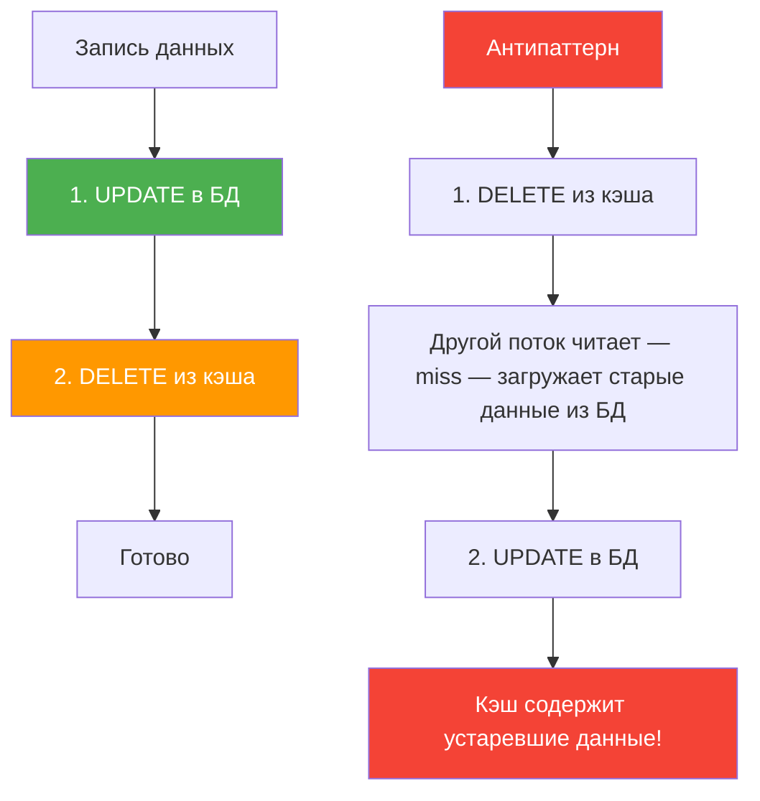

**Подходы:**
- `Cache-Aside` с инвалидацией — при записи в БД удалять ключ в кэше
- `Write-Through` — запись в кэш и БД синхронно
- Короткий `TTL` — приемлемая задержка консистентности
- События — при изменении данных публиковать событие; потребители инвалидируют кэш

При распределённом кэше и нескольких писателях нужна единая стратегия, иначе один сервис может инвалидировать ключ, а другой — перезаписать устаревшим значением. Подробнее в [паттернах согласованности](consistency-patterns-interview.md).


> [!mcq]
> - [ ] При записи: сначала `DELETE` ключа кэша, затем `UPDATE` БД (атомарность через прокси) | Race: после `DELETE` другой поток читает БД (старое значение), кладёт в кэш до `UPDATE` — устаревшие данные. ❌ ПОСЛЕДСТВИЕ: классический race на `update profile` — запись в БД задержалась 50мс, конкурентный read положил старый профиль обратно в кэш на 1 час.
> - [x] Cache-Aside порядок: 1) `UPDATE` БД, 2) `DELETE` ключа кэша; короткий TTL как страховка; для distributed-кэша + multi-writer — события (Redis Pub/Sub, Kafka) или Write-Through; обратный порядок (`DELETE`-then-`UPDATE`) вызывает race с stale данными | После UPDATE следующий read загрузит свежее. ✓ ПРИМЕНЯТЬ: `@CacheEvict` после `@Transactional` save в Spring (стандартный паттерн в Booking.com). 📋 ПРАВИЛО: «UPDATE → DELETE кэш; короткий TTL как страховка от пропущенных событий». 🔗 См. Q11, Q12, Q42.
> - [ ] Достаточно `@Transactional` — Spring сам синхронизирует кэш и БД | `@Transactional` управляет только БД-транзакцией; кэш-операции выполняются вне транзакционного контекста БД. ❌ ПОСЛЕДСТВИЕ: команда полагается на `@Transactional`, на rollback БД кэш уже обновлён — после ошибки checkout пользователь видит «успех» в каталоге.
> - [ ] Distributed lock на каждый write обеспечит consistency | Lock на каждую запись убивает throughput; для consistency достаточно правильного порядка операций + событий. ❌ ПОСЛЕДСТВИЕ: команда вводит global lock через Redlock на write — RPS падает с 1000 до 50, latency p99 +500мс, продукт-маркеры красные.

## Q20. Что такое stale-while-revalidate и когда применять?

**Stale-while-revalidate (SWR)** — клиенту сразу возвращают закэшированное (возможно устаревшее) значение, а в фоне обновляют кэш для следующего запроса.

Применяют в `HTTP` (заголовок `Cache-Control: stale-while-revalidate=<seconds>`) и в серверном кэше.

```java
// Серверная реализация SWR
@Service
public class SWRCacheService {
    private final Cache<String, CacheEntry> cache;
    private final ExecutorService executor;

    public Product getProduct(String id) {
        CacheEntry entry = cache.getIfPresent(id);
        if (entry == null) {
            // первый запрос — синхронная загрузка
            Product p = loadFromDb(id);
            cache.put(id, new CacheEntry(p, Instant.now()));
            return p;
        }
        if (entry.isExpired()) {
            // stale — вернуть старое, обновить в фоне
            executor.submit(() -> {
                Product fresh = loadFromDb(id);
                cache.put(id, new CacheEntry(fresh, Instant.now()));
            });
        }
        return entry.getValue();
    }
}
```

**Плюсы:** низкая латентность для пользователя. **Минусы:** один запрос может получить устаревшие данные. Уместно для каталогов, лент, статики.


> [!mcq]
> - [ ] SWR блокирует первый запрос пока обновляет кэш | SWR ВОЗВРАЩАЕТ stale значение немедленно, обновление идёт в фоне — нулевая блокировка. ❌ ПОСЛЕДСТВИЕ: команда реализует «SWR» с блокировкой — теряет главное преимущество (низкая латентность для пользователя).
> - [ ] SWR подходит для финансовых данных за счёт скорости | SWR возвращает устаревшие данные — недопустимо для балансов, цен, остатков. ❌ ПОСЛЕДСТВИЕ: SWR на остатках товара — пользователь видит «в наличии», добавляет в корзину, на checkout «нет в наличии», конверсия падает.
> - [x] Stale-While-Revalidate: клиенту сразу возвращается закэшированное (возможно stale) значение, обновление кэша запускается в фоне для следующего запроса; HTTP `Cache-Control: stale-while-revalidate=N`; уместно для каталогов, лент новостей, статики, рекомендаций | Один запрос может получить stale, последующие — fresh. ✓ ПРИМЕНЯТЬ: Cloudflare/Vercel CDN с `stale-while-revalidate` на статические страницы; Next.js ISR. 📋 ПРАВИЛО: «SWR — stale ради скорости, fresh приходит для следующих». 🔗 См. Q4, Q14.
> - [ ] SWR требует поддержки на стороне клиента (браузера) | SWR можно реализовать и серверно через background executor с фоновой загрузкой. ❌ ПОСЛЕДСТВИЕ: команда отказывается от SWR на BFF из-за «несовместимости» — теряют 30% latency reduction на каталоге.

## Q21. Что такое cache key design и какие ошибки избегать?

**Рекомендации:**
- Осмысленный префикс: `product:v2:42`, `user:profile:123`
- Версия в ключе при смене формата сериализации
- Ограничение кардинальности (избегать уникальных id без ограничения набора)
- Короткие стабильные ключи (ограничение размера ключа в `Redis` — 512 МБ, но длинные ключи тратят память)

**Ошибки:**
- Высокая кардинальность без контроля — миллионы ключей, низкий hit ratio
- Отсутствие версии — при переименовании полей старые записи ломают десериализацию
- Неоднозначные ключи — разные данные под одним ключом

```java
// Хорошо — осмысленный, версионированный ключ
@Cacheable(value = "products",
           key = "'v2:' + #id")
public Product findById(Long id) { ... }

// Плохо — все аргументы в ключе без контроля
@Cacheable("search")
public List<Product> search(String q, String cat,
    String sort, int page, int size) { ... }
// Огромная кардинальность → низкий hit ratio
```


> [!mcq]
> - [ ] Длинные ключи лучше коротких — больше уникальности | Длинные ключи тратят память (ограничение Redis 512MB на ключ, но реалистично — KB/ключ убивает hit ratio). ❌ ПОСЛЕДСТВИЕ: ключ JSON-сериализованного query на 800 байт × 10M ключей = 8GB только в keys, eviction рано, hit ratio падает.
> - [ ] Кэшировать `key = #q+#cat+#sort+#page+#size` (все параметры) — простой подход | Cartesian product параметров даёт миллионы уникальных ключей, hit ratio близок к 0. ❌ ПОСЛЕДСТВИЕ: search-cache с 5 параметрами по 10 значений = 100K ключей при 1K горячих — 99% запросов промах, БД нагружена как без кэша.
> - [x] Осмысленный префикс (`product:v2:42`), версия в ключе при смене формата сериализации, ограничение кардинальности (избегать раздутого набора), короткие стабильные ключи | Версия в ключе позволяет live-миграцию без сброса всего кэша. ✓ ПРИМЕНЯТЬ: schema-versioning в Redis ключах при rolling-deploy с изменением `User` DTO. 📋 ПРАВИЛО: «Префикс + версия + ограниченная кардинальность — три кита key design». 🔗 См. Q23, Q24.
> - [ ] Hash-based ключи (sha256(query)) лучше структурированных | Hash ключи нечитаемы при отладке (не понять что в кэше) и не помогают с кардинальностью. ❌ ПОСЛЕДСТВИЕ: на инциденте «не очистить старые ключи» — нет паттерна `KEYS old_format:*`, только дамп всего Redis.

## Q22. Как кэшировать списки и пагинированные результаты?

Списки по комбинации параметров дают высокую кардинальность. Подходы:

1. **Кэшировать сущности по id** и собирать список из кэша
2. **Кэшировать только популярные комбинации** (первая страница, топ-фильтры)
3. **Короткий TTL** для списков
4. **Инвалидация по тегу** при изменении сущности

```java
// Кэш по id — entity:42, entity:99
@Cacheable(value = "products", key = "#id")
public Product findById(Long id) { ... }

// Кэш списка id с коротким TTL (настроен в CacheManager)
@Cacheable(value = "productIds",
           key = "'page:' + #page")
public List<Long> getProductIds(int page) { ... }

// При обновлении — инвалидация конкретной сущности
// и всего списка id
@Caching(evict = {
    @CacheEvict(value = "products", key = "#product.id"),
    @CacheEvict(value = "productIds", allEntries = true)
})
public Product update(Product product) { ... }
```


> [!mcq]
> - [ ] Кэшировать каждую страницу как `List<Product>` — простой подход | Изменение одного товара требует инвалидации всех страниц, где он встречается; кардинальность параметров взрывается. ❌ ПОСЛЕДСТВИЕ: каталог 10K товаров × 5 фильтров × 100 страниц = 5M кэш-ключей, hit ratio < 10%.
> - [x] Кэшировать сущности по id (`product:42`) + только список id для популярных страниц (`page:1` → `[1,2,3,...]`) с коротким TTL; сборка списка из id-кэша; инвалидация по тегу при изменении сущности | Уменьшает кардинальность и упрощает инвалидацию. ✓ ПРИМЕНЯТЬ: e-commerce каталоги — `productIds:page:N` + `product:id` (паттерн VK Marketplace). 📋 ПРАВИЛО: «Сущности по id, список id для топ-страниц — а не List целиком». 🔗 См. Q21, Q24.
> - [ ] Все страницы кэшировать с TTL 24h для максимального hit ratio | Длинный TTL на пагинированные списки = stale данные после изменений сущностей видны весь день. ❌ ПОСЛЕДСТВИЕ: товар удалён из админки, в каталоге показывается ещё 24 часа — пользователи кликают на 404, конверсия падает.
> - [ ] Списки нельзя кэшировать вообще из-за инвалидации | Можно — нужно правильно проектировать ключи и инвалидацию по тегам. ❌ ПОСЛЕДСТВИЕ: команда отказывается от кэша списков — каждый search-запрос идёт в Elasticsearch, latency p99 +200мс, бюджет облака +50%.

## Q23. (!) Что такое cache serialization и какие форматы предпочтительны?

Сериализация кэша — преобразование объектов в байты для хранения в распределённом кэше (`Redis`, `Memcached`).

| Формат | Плюсы | Минусы |
|--------|-------|--------|
| **JSON** (Jackson) | Читаемость, межъязыковость | Больше места, медленнее |
| **MessagePack/Protobuf** | Компактность, скорость | Нечитаемый, схема |
| **Java Serialization** | Встроен в JDK | Медленно, небезопасно, не рекомендуется |
| **Kryo/FST** | Очень быстро, компактно | Только JVM, версионирование |

**Конфигурация JSON-сериализации в Redis:**

```java
@Bean
public RedisCacheConfiguration cacheConfiguration() {
    ObjectMapper mapper = new ObjectMapper()
        .registerModule(new JavaTimeModule())
        .activateDefaultTyping(
            mapper.getPolymorphicTypeValidator(),
            ObjectMapper.DefaultTyping.NON_FINAL);

    return RedisCacheConfiguration.defaultCacheConfig()
        .serializeValuesWith(
            SerializationPair.fromSerializer(
                new GenericJackson2JsonRedisSerializer(mapper)));
}
```

**Важно:** при изменении полей объекта старые записи в кэше могут не десериализоваться — используйте версию в ключе (`user:v2:123`) или короткий `TTL` при миграции. Подробнее о сериализации в [вопросах по Java Serialization](../programming-languages/java/java-serialization-interview.md).


> [!mcq]
> - [ ] Java Serialization — стандартный безопасный выбор | `JdkSerializationRedisSerializer` — известный RCE-вектор + ломается при изменении полей класса. ❌ ПОСЛЕДСТВИЕ: атакующий с RCE через десериализацию (CVE-2015-7501 Apache Commons) исполняет произвольный код от имени сервиса.
> - [ ] Kryo всегда быстрее JSON в 10× — выбор очевиден | Kryo быстрее, но JVM-only и требует регистрации классов; cross-language интеграция невозможна. ❌ ПОСЛЕДСТВИЕ: Kotlin сервис кладёт в Redis Kryo-объект, Python-микросервис не может прочитать — два сервиса слепы для одних и тех же данных.
> - [ ] `GenericJackson2JsonRedisSerializer` без default-typing работает корректно для полиморфных полей | Без default-typing полиморфные поля (`Animal`, `Event`) десериализуются как `LinkedHashMap`. ❌ ПОСЛЕДСТВИЕ: `List<Notification>` в кэше десериализуется как `List<HashMap>` — `ClassCastException` в production через час после деплоя.
> - [x] JSON (Jackson) — читаемый, межъязыковой, медленнее (де-факто стандарт); `GenericJackson2JsonRedisSerializer` с default-typing для полиморфизма; MessagePack/Protobuf — компактнее и быстрее JSON; Kryo/FST — JVM-only, очень быстро; Java Serialization — НЕ использовать (RCE + поломка при смене полей); версия в ключе при смене схемы | JSON — компромисс между читаемостью и скоростью. ✓ ПРИМЕНЯТЬ: Spring Data Redis с `GenericJackson2JsonRedisSerializer` + default-typing для cross-language. 📋 ПРАВИЛО: «JSON для кросс-языка, Protobuf для скорости, никогда Java Serialization». 🔗 См. Q9, Q21.

## Q24. Что такое cache invalidation по тегу?

Инвалидация по тегу — группировка ключей по тегу; при изменении сущности инвалидируют все ключи с этим тегом.

**Реализация через Redis Set:**

```java
@Service
public class TaggedCacheService {
    private final RedisTemplate<String, Object> redis;

    // При записи в кэш — регистрируем ключ в теге
    public void putWithTag(String key, Object value,
                           String tag, Duration ttl) {
        redis.opsForValue().set(key, value, ttl);
        redis.opsForSet().add("tag:" + tag, key);
    }

    // Инвалидация по тегу — удаляем все ключи
    public void evictByTag(String tag) {
        Set<Object> keys = redis.opsForSet()
            .members("tag:" + tag);
        if (keys != null && !keys.isEmpty()) {
            redis.delete(keys.stream()
                .map(Object::toString)
                .collect(Collectors.toList()));
        }
        redis.delete("tag:" + tag);
    }
}
```

Альтернатива — версия в ключе: при изменении увеличивать версию, старые ключи вымирают по `TTL`.


> [!mcq]
> - [x] Группировка ключей по тегу через `Redis Set` (`tag:user:42` → набор ключей этого пользователя); при изменении сущности — `evictByTag(tag)` удаляет все ключи в наборе; альтернатива — версия в ключе (увеличить версию, старые ключи вымрут по TTL) | `SMEMBERS` + `DEL` в pipeline для атомарной инвалидации. ✓ ПРИМЕНЯТЬ: tagged invalidation для каскадной инвалидации связанных кэшей (заказы пользователя, его адреса, корзина). 📋 ПРАВИЛО: «Tag-based для каскадной инвалидации; версия в ключе для miграции схемы». 🔗 См. Q21, Q19.
> - [ ] Tag invalidation требует Redis Cluster — на standalone не работает | Работает и на standalone Redis через `Set`-операции. ❌ ПОСЛЕДСТВИЕ: команда отказывается от tag invalidation на dev-среде, на проде получают inconsistent кэш после крупных обновлений.
> - [ ] `KEYS pattern:*` + `DEL` — стандартный способ tag invalidation | `KEYS` блокирует Redis (O(N)) — на 10M ключей блокировка 5+ секунд, все запросы timeout. ❌ ПОСЛЕДСТВИЕ: команда применяет `KEYS user:42:*` на проде — Redis заблокирован 8 секунд, p99 latency скакнул с 5мс до 8000мс, downstream сервисы валятся по timeout.
> - [ ] Tag invalidation медленнее `@CacheEvict(allEntries=true)` | Tag invalidation удаляет только нужные ключи; `allEntries=true` сбрасывает весь named cache (теряются непричастные данные). ❌ ПОСЛЕДСТВИЕ: команда применяет `allEntries=true` думая «быстрее» — после каждого update товара hit ratio всего каталога падает с 95% до 0%, БД RPS +500%.

## Q25. Как кэшировать в микросервисной архитектуре?

**Принципы:**
- Локальный кэш в каждом сервисе — быстрый, но инвалидация при изменении в другом сервисе сложна
- Распределённый кэш (`Redis`) — общий для инстансов одного сервиса
- **Не кэшировать чужие данные без контракта на инвалидацию**

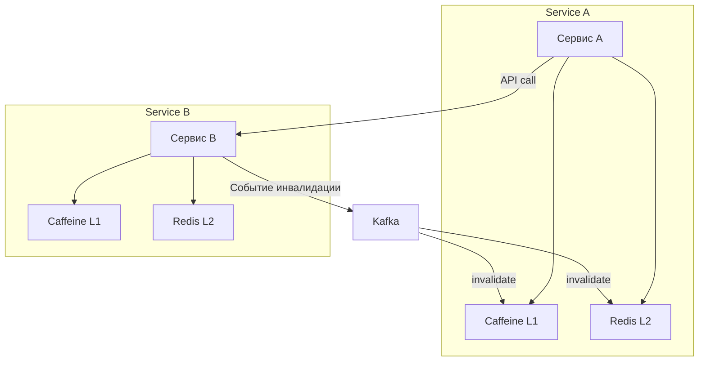

Часто комбинируют `L1` (локальный, короткий `TTL`) и `L2` (`Redis`); при публикации события подписчики инвалидируют свой `L1` и соответствующие ключи в `L2`. Подробнее в [вопросах по микросервисам](microservices-interview.md).


> [!mcq]
> - [ ] Один общий Redis для всех сервисов с прямым доступом к чужим ключам | Service B читает кэш Service A — без контракта на инвалидацию данные расходятся; нарушение bounded context. ❌ ПОСЛЕДСТВИЕ: Service A меняет формат `user:profile` (добавляет поле), Service B падает на десериализации в production — инцидент cross-team.
> - [ ] Локальный кэш в каждом сервисе достаточен — distributed не нужен | Без shared слоя каждый инстанс одного сервиса держит свою копию = высокий БД-load и stale-данные между подами. ❌ ПОСЛЕДСТВИЕ: 10 подов × 100 запросов = 1000 БД-hits на холодный старт вместо 1 (с Redis L2).
> - [x] L1 локальный (`Caffeine` в каждом сервисе) + L2 распределённый (`Redis` per-сервис, не shared); НЕ кэшировать чужие данные без контракта на инвалидацию (TTL + событие); инвалидация через Kafka/Pub-Sub при изменениях | Bounded context + defence-in-depth. ✓ ПРИМЕНЯТЬ: Discord — каждый сервис свой Redis, инвалидация через RabbitMQ (известный архитектурный паттерн). 📋 ПРАВИЛО: «Свой кэш на сервис, контракт на cross-сервис данные через события». 🔗 См. Q1, Q2, Q26, Q42.
> - [ ] Hazelcast embedded в каждый pod даст лучшую производительность | Hazelcast embedded требует cluster discovery в каждом pod, увеличивает heap, JGroups timeout-ы под нагрузкой; обычно сложнее, чем Redis cluster. ❌ ПОСЛЕДСТВИЕ: Hazelcast в JVM каждого пода даёт OOM при 5K connections, GC паузы 2 сек на full GC, p99 latency страдает.

## Q26. Что такое Near Cache и когда его использовать?

**Near Cache** — локальный кэш рядом с клиентом распределённого кэша (`Hazelcast Near Cache`, клиент `Redis` с локальным `Caffeine`). Горячие ключи обслуживаются из локальной памяти; уменьшается нагрузка на сеть.

**Подходит:** read-heavy с повторяющимся набором ключей (топ товаров, конфигурация).

**Не подходит:** высокая кардинальность ключей; частые обновления; данные, требующие строгой консистентности.

В `Hazelcast` — включить `Near Cache` для map с `invalidate-on-change: true`, задать `max-size` и `TTL`. В клиенте `Redis` (`Lettuce`, `Jedis`) можно держать локальный `Caffeine` поверх `Redis` для горячих ключей.


> [!mcq]
> - [ ] Near Cache подходит для high-cardinality пользовательских данных | High-cardinality плохо живёт в локальной памяти — низкий hit ratio, eviction давит горячие ключи. ❌ ПОСЛЕДСТВИЕ: команда включает Near Cache на user-profile (миллионы пользователей) — heap растёт до OOM, hit ratio 5%.
> - [x] Локальный кэш рядом с клиентом распределённого кэша (`Hazelcast Near Cache`, `Caffeine` поверх Redis-клиента); горячие ключи обслуживаются из heap (наносекунды) минуя сеть; подходит для read-heavy с повторяющимся набором ключей (топ-товары, конфиг); НЕ подходит для high-cardinality и частых обновлений | `invalidate-on-change: true` в Hazelcast для consistency. ✓ ПРИМЕНЯТЬ: Hazelcast Near Cache для конфигурации feature-флагов (читается на каждый запрос, меняется редко). 📋 ПРАВИЛО: «Near Cache — для горячих read-heavy ключей; держать invalidate-on-change». 🔗 См. Q1, Q2, Q42.
> - [ ] Near Cache всегда консистентен через synchronous invalidation | Дефолт — async invalidation; sync доступен, но убивает throughput. ❌ ПОСЛЕДСТВИЕ: команда полагается на default Hazelcast, после `update` 200мс другие узлы держат stale в Near Cache.
> - [ ] Near Cache заменяет L1/L2 паттерн | Near Cache это и есть L1 поверх L2 (распределённый) — это не замена, а реализация. ❌ ПОСЛЕДСТВИЕ: разработчик путает термины на собеседовании, не может объяснить разницу — теряет архитекторский оффер.

## Q27. Что такое cache warming и когда его применять?

**Cache warming** — предзаполнение кэша при старте приложения или по расписанию (популярные ключи загружаются до первых запросов). Применяют чтобы избежать всплеска промахов после деплоя или перезапуска.

```java
@Component
@RequiredArgsConstructor
public class CacheWarmer implements ApplicationRunner {

    private final ProductService productService;

    @Override
    public void run(ApplicationArguments args) {
        // Загружаем топ-100 популярных товаров при старте
        List<Long> topIds = productService.getTopProductIds(100);
        topIds.forEach(productService::findById);
        log.info("Cache warmed with {} products", topIds.size());
    }
}
```

**Важно:** не блокировать старт приложения долгим warming; загружать ключи асинхронно; приоритизировать самые горячие ключи.


> [!mcq]
> - [ ] Cache warming должен быть синхронным — блокировать старт до полного прогрева | Синхронный warming на старте увеличивает startup time до минут — k8s readinessProbe тратит много времени, rolling deploy медленный. ❌ ПОСЛЕДСТВИЕ: warming 50K товаров занимает 5 минут × 10 подов = 50 минут на rolling deploy, бизнес теряет окно для горячих фич.
> - [x] Предзаполнение кэша при старте/по расписанию топ-N горячих ключей; асинхронный warming (не блокирует startup), приоритет по аналитике, `readinessProbe` возвращает 200 только после готовности; альтернативно — Redis `BGSAVE`/`RESTORE` snapshot между деплоями | Защита от cold-cache всплеска после restart. ✓ ПРИМЕНЯТЬ: `ApplicationRunner` в Spring Boot для top-1000 товаров; `@Scheduled` для periodic refresh. 📋 ПРАВИЛО: «Async warming + readiness gate; синхронный убивает rolling deploy». 🔗 См. Q41, Q17.
> - [ ] Warming всех ключей — лучший подход для максимального hit ratio | Прогрев холодных ключей бесполезен (никто не запросит) и убивает БД на старте. ❌ ПОСЛЕДСТВИЕ: warming всех 10M пользователей при старте — 10 минут БД на 100% CPU, deploy блокирован, остальные сервисы лежат.
> - [ ] Cache warming не нужен — TTL сам всё решит | После cold restart первые тысячи запросов нагружают БД (cold cache miss storm). ❌ ПОСЛЕДСТВИЕ: после rolling restart латентность p99 поднимается с 50мс до 5s на 10 минут — пользователи видят 504, конверсия падает.

## Q28. (!) Что такое cache coherence в распределённом кэше?

**Cache coherence** — согласованность кэша между узлами. В `Redis Cluster` каждый ключ принадлежит одному шарду по хешу слота; реплики получают копию асинхронно. Чтение с реплики может вернуть устаревшие данные.

**Стратегии:**
- Инвалидация по событию (`Redis Pub/Sub`, `Kafka`)
- Короткий `TTL`
- Чтение только с primary для критичных данных
- `Near Cache` усложняет coherence — при обновлении нужно инвалидировать все клиенты

```java
// Инвалидация через Redis Pub/Sub
@Component
public class CacheInvalidationListener {

    @Autowired
    private Cache<String, Object> localCache;

    @Bean
    public RedisMessageListenerContainer container(
            RedisConnectionFactory factory) {
        var container = new RedisMessageListenerContainer();
        container.setConnectionFactory(factory);
        container.addMessageListener(
            (message, pattern) -> {
                String key = new String(message.getBody());
                localCache.invalidate(key);
                log.info("Invalidated local cache: {}", key);
            },
            new ChannelTopic("cache:invalidate"));
        return container;
    }
}
```

Подробнее о согласованности в [паттернах согласованности](consistency-patterns-interview.md).


> [!mcq]
> - [ ] `Redis Cluster` гарантирует strong consistency между primary и replica | Replication async — read с replica может вернуть stale данные. ❌ ПОСЛЕДСТВИЕ: после `SET balance` чтение с replica на 50мс возвращает старый баланс — пользователь делает повторный платёж.
> - [ ] Distributed cache без consistent hashing справляется через простое modulo | При добавлении/удалении узла modulo вызывает resharding 100% данных — массовый cache miss + перебалансировка нагрузки. ❌ ПОСЛЕДСТВИЕ: «Distributed cache без consistent hashing → resharding 100% data»; при scaling добавление узла даёт 30 минут near-zero hit ratio, БД лежит.
> - [ ] Coherence невозможна без consensus-протокола (Raft/Paxos) | Для кэша достаточно eventual consistency через события (Pub/Sub, Kafka) — Raft нужен только для критичной строгой consistency. ❌ ПОСЛЕДСТВИЕ: команда строит Raft поверх Redis для cache invalidation — 6 месяцев разработки, latency +10мс на каждую операцию.
> - [x] Согласованность данных между узлами кластера: в Redis Cluster ключ принадлежит одному шарду по hash slot, реплики получают копию async (читать с replica → возможно stale); стратегии — инвалидация через Pub/Sub, короткий TTL, чтение только с primary для критичных данных, consistent hashing при resharding | Near Cache усложняет coherence — нужно инвалидировать клиенты. ✓ ПРИМЕНЯТЬ: Redis Pub/Sub для cross-pod invalidation в Spring Boot multi-pod кластере. 📋 ПРАВИЛО: «Coherence через события + consistent hashing — иначе resharding убьёт hit ratio». 🔗 См. Q19, Q42, Q37.

## Q29. Как выбрать TTL для кэша?

Зависит от требований к консистентности:

| Тип данных | TTL | Подход |
|------------|-----|--------|
| Конфигурация | Часы-дни | Длинный TTL + инвалидация по событию |
| Справочники | 10-60 минут | TTL с jitter |
| Пользовательские данные | 1-10 минут | Короткий TTL или инвалидация по событию |
| Сессии | Минуты | TTL = timeout сессии |
| Часто обновляемые | Секунды | Инвалидация по событию |

**Разброс TTL** (jitter) для предотвращения avalanche:

```java
// Caffeine с фиксированным TTL
Caffeine.newBuilder()
    .expireAfterWrite(Duration.ofMinutes(10))
    .build();

// Redis с jitter
public void cacheWithJitter(String key, Object value,
                            Duration baseTtl) {
    long jitter = ThreadLocalRandom.current()
        .nextLong(0, baseTtl.toSeconds() / 5);
    redis.opsForValue().set(key, value,
        baseTtl.plusSeconds(jitter));
}
```


> [!mcq]
> - [ ] Один универсальный TTL 1 час для всех кэшей | Конфигурация и сессии требуют разных TTL — общий компромисс не подходит ни тем ни другим. ❌ ПОСЛЕДСТВИЕ: 1ч TTL на сессии — пользователь логинится каждый час; 1ч на конфиг — изменения видны через час.
> - [ ] Длинный TTL 24h для всех — максимизирует hit ratio | Stale данные видны весь день после изменений; одновременное истечение = avalanche. ❌ ПОСЛЕДСТВИЕ: каталог с TTL 24h без jitter — каждый день в 00:00 mass expiration → DB load спайк, p99 5s.
> - [x] По типу данных: конфиг — часы/дни (длинный TTL + событийная инвалидация); справочники — 10-60 мин с jitter; пользовательские — 1-10 мин или событийная; сессии — TTL = session timeout; часто меняющиеся — секунды или только событийная; jitter `±10-20%` против avalanche | Trade-off: длинный TTL разгружает БД, короткий — свежесть. ✓ ПРИМЕНЯТЬ: Spring `RedisCacheManager` с `withInitialCacheConfigurations` per-cache. 📋 ПРАВИЛО: «TTL по типу данных + jitter; нет универсального значения». 🔗 См. Q5, Q16, Q17, Q18.
> - [ ] TTL не нужен — событийная инвалидация всё решает | События могут теряться (kafka rebalance, network blip), TTL — последний рубеж. ❌ ПОСЛЕДСТВИЕ: kafka недоступна 1 час, без TTL кэш держит stale данные навсегда после восстановления, требуется ручной flush.

## Q30. (!) Как выбирать между Caffeine, Redis и Hazelcast?

| Критерий | Caffeine | Redis | Hazelcast |
|----------|----------|-------|-----------|
| Тип | Локальный in-process | Распределённый | Распределённый in-cluster |
| Латентность | Наносекунды | 1-5 мс (сеть) | Микросекунды-мс |
| Общий кэш | Нет | Да | Да |
| Персистентность | Нет | RDB/AOF | Да |
| Read/Write-Through | CacheLoader | Нет (из коробки) | MapLoader/MapStore |
| Эксплуатация | Нулевая | Средняя | Сложная |
| Лучший сценарий | Горячие данные одного инстанса | Общий кэш между сервисами | Тесная интеграция с Java |

**Рекомендация:** для production часто эффективнее гибрид `L1 Caffeine` + `L2 Redis`, чем ставка только на один слой.


> [!mcq]
> - [x] `Caffeine` — локальный, наносекунды, отличный hit ratio (W-TinyLFU), нулевая эксплуатация — для горячих in-process; `Redis` — распределённый, 1-5 мс, RDB/AOF persistence, экосистема, общий между сервисами — стандарт; `Hazelcast` — distributed embedded, MapLoader/MapStore, тесная Java-интеграция — нишевый; в production гибрид L1 Caffeine + L2 Redis эффективнее ставки на один | Эксплуатация Hazelcast сложнее Redis. ✓ ПРИМЕНЯТЬ: типичный production stack — Spring Boot + Caffeine (L1) + Redis (L2). 📋 ПРАВИЛО: «Caffeine для горячего in-process, Redis для shared, Hazelcast только при сильной Java-tight-coupling». 🔗 См. Q1, Q2, Q26.
> - [ ] Hazelcast всегда быстрее Redis за счёт co-location с JVM | Hazelcast IMap операции имеют JNI overhead и cluster JGroups — на простых GET не быстрее Redis. ❌ ПОСЛЕДСТВИЕ: команда мигрирует с Redis на Hazelcast «для скорости» — latency не падает, эксплуатация усложняется (split-brain detection, cluster discovery).
> - [ ] Caffeine можно использовать для shared кэша между подами через clustering | Caffeine — чисто local, никакого clustering. ❌ ПОСЛЕДСТВИЕ: команда заявляет «Caffeine clustering через Spring Cloud» (нет такого) — на проде сессии разбегаются между подами, пользователи логинятся повторно.
> - [ ] Redis нельзя использовать как primary database — только cache | Redis с AOF + RDB можно использовать как primary store для специфичных нагрузок (sessions, leaderboards). ❌ ПОСЛЕДСТВИЕ: команда дублирует sessions в PostgreSQL «потому что Redis не БД» — двойная запись, race conditions при rolling deploy.

## Q31. Как мониторить кэш в production?

Метрики: **hit ratio**, **miss ratio**, **latency** (get/set), размер кэша, **eviction rate**.

**Micrometer + Caffeine (автоматически):**

```java
// При recordStats() Micrometer автоматически экспортирует метрики
@Bean
public CacheManager cacheManager(MeterRegistry meterRegistry) {
    CaffeineCacheManager manager = new CaffeineCacheManager();
    manager.setCaffeine(Caffeine.newBuilder()
        .maximumSize(1000)
        .recordStats()); // включает cache.gets, cache.puts, cache.evictions
    return manager;
}
```

**Алерты:**
- hit ratio < 70% в течение 15 минут
- p99 latency get выше порога
- Память `Redis` > 80%
- Eviction rate резко вырос

В `Redis` — `INFO stats` (`keyspace_hits`, `keyspace_misses`); `Redis Exporter` для `Prometheus`. `spring-boot-starter-cache` с `micrometer-registry-prometheus` автоматически экспортирует метрики кэша в `Actuator`. Подробнее в [вопросах по метрикам и трейсингу](../monitoring/metrics-tracing-interview.md).


> [!mcq]
> - [ ] Достаточно мониторить только hit ratio | Без latency и eviction rate не увидеть деградации Redis (timeout, OOM). ❌ ПОСЛЕДСТВИЕ: hit ratio 95%, но Redis отдаёт ответы за 2 секунды — приложение медленное, дашборд выглядит зелёным.
> - [ ] `recordStats()` в Caffeine не нужен — Spring сам собирает метрики | Без `recordStats()` Caffeine не выдаёт `CacheStats` — `cache.gets`/`cache.puts` будут нулевыми. ❌ ПОСЛЕДСТВИЕ: команда уверена что мониторит кэш, на дашборде нули — невозможно настроить алерты, инциденты пропущены.
> - [x] Hit/miss ratio + latency get/set p50/p99 + размер + eviction rate; `Caffeine.recordStats()` для CacheStats; `Micrometer` + `Prometheus` для экспорта; `Redis INFO stats` для `keyspace_hits`/`keyspace_misses`/`evicted_keys`; алерты: hit < 70% (15 мин), p99 latency > порога, memory > 80%, eviction spike | Холодный старт после деплоя — ожидаемая просадка. ✓ ПРИМЕНЯТЬ: Spring Boot `actuator` + `micrometer-registry-prometheus` + Grafana дашборды per-cache. 📋 ПРАВИЛО: «Hit ratio + latency + eviction — три метрики, без `recordStats()` нули». 🔗 См. Q4, Q38.
> - [ ] Алерт при hit ratio < 50% после деплоя — обязательно | После деплоя кэш холодный, ratio временно низкий — алерт даст false positive, разбудит SRE на ровном месте. ❌ ПОСЛЕДСТВИЕ: SRE отключают алерт «он шумит» — потом не замечают реальной деградации.

## Q32. (!) Как обрабатывать сбои кэша (Redis unavailable)?

**Антипаттерн:** при падении `Redis` без ограничений переключаться на БД и одновременно запускать агрессивные retry — каскадный сбой БД.

**Стратегии:**

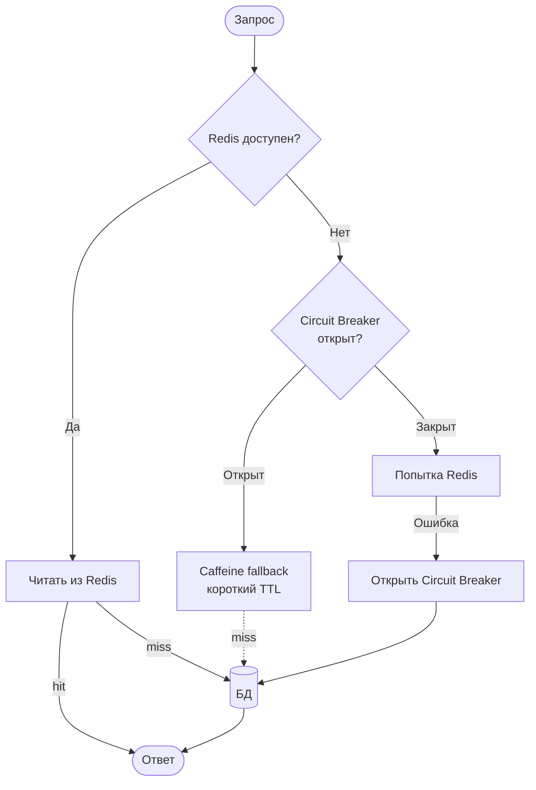

```java
@Service
public class ResilientCacheService {

    @Autowired
    private RedisTemplate<String, Object> redis;

    // Локальный fallback-кэш
    private final Cache<String, Object> fallback =
        Caffeine.newBuilder()
            .maximumSize(500)
            .expireAfterWrite(Duration.ofMinutes(1))
            .build();

    @CircuitBreaker(name = "redis", fallbackMethod = "fallbackGet")
    public Object get(String key) {
        return redis.opsForValue().get(key);
    }

    // Fallback при недоступности Redis
    private Object fallbackGet(String key, Exception ex) {
        log.warn("Redis unavailable, using fallback cache: {}",
                 ex.getMessage());
        return fallback.getIfPresent(key);
    }
}
```

При восстановлении `Redis` предпочтительнее ленивая загрузка (`Cache-Aside`), а не батчевое заполнение.


> [!mcq]
> - [ ] При падении Redis fallback на БД с агрессивным retry (5×100мс) — стандартное решение | Retry storm + cache miss storm = каскадный сбой БД (1000 потоков × 5 retry на каждый ключ). ❌ ПОСЛЕДСТВИЕ: Redis недоступен 30 секунд, retry конфигурация 5×100мс — БД получает 5000 RPS вместо 1000, connection pool exhausted, БД лежит 10 минут.
> - [ ] Резкий fallback всех кэш-операций в БД без ограничений | Без circuit breaker одновременный fallback всех инстансов нагружает БД в десятки раз. ❌ ПОСЛЕДСТВИЕ: 50 подов × 1000 RPS = 50K RPS на БД, которая держала 10K — БД OOM, downtime 30 минут.
> - [ ] Сразу возвращать клиентам 503 при недоступности Redis | Это превращает кэш в hard dependency — недоступность кэша = недоступность сервиса. ❌ ПОСЛЕДСТВИЕ: Redis перезагружается 5 секунд, весь сервис недоступен — для каталога это неоправданно (можно отдавать данные из БД).
> - [x] `@CircuitBreaker` (Resilience4j) с fallback на локальный `Caffeine` коротким TTL и/или БД с rate limit; при восстановлении Redis — ленивая загрузка (Cache-Aside), не batch-warming; circuit breaker предотвращает retry storm; в идеале — graceful degradation (отдать stale из БД с пометкой) | Cache не должен быть hard dependency. ✓ ПРИМЕНЯТЬ: Resilience4j `@CircuitBreaker` + `Caffeine` fallback в Netflix-style паттернах. 📋 ПРАВИЛО: «Кэш — best-effort, circuit breaker + fallback БД с rate limit; cache — не hard dependency». 🔗 См. Q17, Q18, Q31.

## Q33. Как обеспечить безопасность кэша (Redis)?

**Рекомендации:**
- Приватная сеть (firewall, `VPC`)
- Аутентификация (`requirepass` в `Redis`)
- `TLS` для шифрования в transit
- Отключить опасные команды (`FLUSHALL`, `CONFIG`)
- Не хранить `PII` в открытом виде — шифрование на уровне приложения

```conf
# redis.conf
requirepass ${REDIS_PASSWORD}
rename-command FLUSHALL ""
rename-command CONFIG ""
tls-port 6380
port 0
bind 127.0.0.1
```

В `Spring`: `spring.data.redis.password` из переменной окружения; для `TLS` — `spring.data.redis.ssl.enabled=true`.


> [!mcq]
> - [ ] Redis по умолчанию защищён аутентификацией | По умолчанию `requirepass` НЕ установлен — Redis принимает любые подключения. ❌ ПОСЛЕДСТВИЕ: открытый порт 6379 без `requirepass` — атакующий вызывает `FLUSHALL` или загружает скрипт на crypto-mining (известная атака на cloud Redis).
> - [x] Приватная сеть/VPC + `requirepass` (из env) + TLS (`tls-port 6380`) + rename опасных команд (`FLUSHALL`, `CONFIG`, `KEYS` → ""); `bind` на нужные интерфейсы; PII шифровать на уровне приложения (Redis хранит plain text) | Спрятать Redis за приватной сетью — основа защиты. ✓ ПРИМЕНЯТЬ: AWS ElastiCache в private subnet + IAM auth + at-rest encryption. 📋 ПРАВИЛО: «Приватная сеть + auth + TLS + rename FLUSHALL — четыре must-have для прода». 🔗 См. Q9, Q32.
> - [ ] Достаточно `bind 0.0.0.0` и не публиковать порт | Port-forward в k8s или misconfigured security group открывает доступ. ❌ ПОСЛЕДСТВИЕ: разработчик делает `kubectl port-forward` на staging Redis — кладёт чужой kubeconfig, обнаруживается утечка прод-данных.
> - [ ] Шифрование PII в Redis не нужно — кэш «временный» | Кэш может содержать персональные данные часами; утечка дампа = GDPR-инцидент. ❌ ПОСЛЕДСТВИЕ: leak дампа Redis с email/телефонами 1M пользователей — штраф $4M по GDPR + репутационный ущерб.

## Q34. Как тестировать кэширование (unit, integration)?

**Unit-тесты:**

```java
@SpringBootTest
class ProductServiceCacheTest {

    @Autowired
    private ProductService productService;

    @MockBean
    private ProductRepository productRepository;

    @Autowired
    private CacheManager cacheManager;

    @Test
    void shouldReturnCachedValue() {
        when(productRepository.findById(1L))
            .thenReturn(Optional.of(new Product(1L, "Test")));

        // Первый вызов — идёт в repository
        productService.findById(1L);
        // Второй вызов — из кэша
        productService.findById(1L);

        verify(productRepository, times(1)).findById(1L);
    }

    @Test
    void shouldEvictOnUpdate() {
        Product p = new Product(1L, "Test");
        when(productRepository.findById(1L))
            .thenReturn(Optional.of(p));
        when(productRepository.save(any()))
            .thenReturn(p);

        productService.findById(1L);
        productService.update(p); // evict
        productService.findById(1L);

        verify(productRepository, times(2)).findById(1L);
    }

    @AfterEach
    void clearCache() {
        cacheManager.getCacheNames()
            .forEach(name -> cacheManager.getCache(name).clear());
    }
}
```

**Integration-тесты:** с реальным `Redis` через `Testcontainers`; проверить запись, чтение, `TTL`, инвалидацию. Подробнее в [вопросах по интеграционному тестированию](../testing/integration-testing-interview.md).


> [!mcq]
> - [ ] Тесты можно полагаться на shared cache state между методами | Shared state ломает test isolation — тесты flaky в зависимости от порядка. ❌ ПОСЛЕДСТВИЕ: тесты зелёные локально, красные в CI из-за порядка — команда тратит дни на «странные» падения.
> - [x] Unit-тесты с `@SpringBootTest` + `@MockBean` репозитория + `@Autowired CacheManager`; проверять `verify(repo, times(1))` для cache hit; `@AfterEach` сбрасывать кэш через `cacheManager.getCacheNames().forEach(...clear())`; integration с реальным Redis через `Testcontainers` (TTL, инвалидация) | Изоляция тестов через `@AfterEach`. ✓ ПРИМЕНЯТЬ: Spring Boot Test + Testcontainers `GenericContainer("redis:7-alpine")`. 📋 ПРАВИЛО: «Mock repo для unit, Testcontainers для integration; всегда clear cache между тестами». 🔗 См. Q6, Q7.
> - [ ] Достаточно мокать только `CacheManager`, репозиторий не нужен | Без мока репозитория тесты идут в реальную БД — flaky и медленные. ❌ ПОСЛЕДСТВИЕ: тест требует БД через `@DataJpaTest`, в CI запускается H2 — поведение Postgres-specific cache не воспроизводится.
> - [ ] Тестировать кэш не нужно — Spring сам гарантирует корректность | Логика инвалидации специфична для бизнеса (`@CacheEvict` ключ), Spring её не знает. ❌ ПОСЛЕДСТВИЕ: разработчик ставит `@CacheEvict` с неправильным `key` — кэш не инвалидируется, в production пользователи видят stale.

## Q35. Как кэш влияет на латентность и throughput приложения?

| Метрика | Без кэша | С кэшем (hit) | С кэшем (miss) |
|---------|----------|---------------|-----------------|
| Латентность (локальный) | 50-500 мс | < 1 мс | 50-500 мс + overhead |
| Латентность (Redis) | 50-500 мс | 1-5 мс | 50-500 мс + 1-5 мс |
| Throughput | Ограничен БД | Высокий (при высоком hit ratio) | Ниже (двойной вызов) |

Снижение средней латентности тем выше, чем выше hit ratio. **Риски:** при промахах добавляется обращение к кэшу (сеть, сериализация); неправильный размер или `TTL` может не дать выигрыша.


> [!mcq]
> - [ ] Кэш всегда снижает латентность — даже при низком hit ratio | При hit ratio 30% средняя латентность может быть выше, чем без кэша (cache miss добавляет round-trip). ❌ ПОСЛЕДСТВИЕ: кэш для high-cardinality поиска даёт hit ratio 20% — каждый запрос идёт в Redis (5мс) + БД, p99 +5мс к каждому запросу.
> - [x] При hit ratio высокий — большой выигрыш в латентности (50-500мс БД vs <1мс Caffeine vs 1-5мс Redis) и throughput (БД больше не bottleneck); при низком ratio кэш добавляет overhead на cache miss; неверный размер/TTL может не дать выигрыша или даже ухудшить производительность | Trade-off: затраты на сериализацию/сеть vs выигрыш на hit. ✓ ПРИМЕНЯТЬ: load test до и после внедрения для измерения delta. 📋 ПРАВИЛО: «Кэш выгоден при hit ratio >70%; ниже — измерять, может быть anti-pattern». 🔗 См. Q4, Q31.
> - [ ] Throughput всегда ограничен размером кэша | Throughput ограничен hit ratio + латентностью БД на miss. ❌ ПОСЛЕДСТВИЕ: команда увеличивает кэш в 10× думая «больше throughput», получает только +10% (не было eviction давления).
> - [ ] Кэш не влияет на throughput — только на латентность | При hit БД не вызывается, throughput БД свободен для других запросов. ❌ ПОСЛЕДСТВИЕ: ошибка в design review «throughput не вырастет» — отказывают от кэша, БД bottleneck остаётся.

## Q36. Что такое cache partitioning и зачем оно нужно?

**Partitioning** (шардирование) кэша — распределение ключей по нескольким узлам по хешу ключа. Нужно для:
- Горизонтального масштабирования объёма кэша
- Распределения нагрузки
- Увеличения пропускной способности

В `Redis Cluster` ключ хешируется в один из 16384 слотов; каждый узел владеет диапазоном слотов. Hash tags (`{user}:123`, `{user}:456`) позволяют направить связанные ключи в один слот для атомарных операций.


> [!mcq]
> - [x] Распределение ключей по узлам по hash slot ключа (16384 в Redis Cluster) для горизонтального масштабирования объёма, нагрузки и пропускной способности; hash tags `{user}:profile` `{user}:cart` направляют связанные ключи в один slot для атомарных multi-key операций | Без hash tags MULTI/EXEC через несколько slot невозможен. ✓ ПРИМЕНЯТЬ: Redis Cluster в e-commerce для шардинга миллионов user-profile ключей. 📋 ПРАВИЛО: «Hash tags `{X}` для co-location связанных ключей; иначе MULTI ломается». 🔗 См. Q28, Q30.
> - [ ] Partitioning не нужен — Redis standalone выдержит любую нагрузку | Один узел ограничен памятью (RAM) и сетью; >100GB данных или >100K RPS требуют шардинг. ❌ ПОСЛЕДСТВИЕ: сервис вырастает с 10K до 200K RPS — standalone Redis CPU 100%, latency p99 +500мс, нужно срочно мигрировать на Cluster.
> - [ ] Все ключи должны попадать в один slot для consistency | Hash tags используются ТОЛЬКО для специфичных multi-key операций; обычные SET/GET работают cross-slot. ❌ ПОСЛЕДСТВИЕ: команда оборачивает все ключи в `{global}:` — все данные на одном узле, шардинг бесполезен.
> - [ ] Resharding в Redis Cluster останавливает кластер | Resharding идёт онлайн (slot migration); только в момент migrating slot ключи могут блокироваться на миллисекунды. ❌ ПОСЛЕДСТВИЕ: команда планирует maintenance window для resharding (не нужен) — теряет время.

## Q37. Что такое cache coherence в мультидатацентровой среде?

В мультидатацентровой среде каждый `DC` может иметь свой кэш; при обновлении в одном `DC` кэши в других могут содержать устаревшие данные.

**Подходы:**
- **Инвалидация по событию** — при записи в DC1 публикуется событие через `Kafka` (cross-DC репликация); подписчики в DC2 инвалидируют ключ
- **Короткий TTL** — уменьшает окно несогласованности
- **Централизованный кэш** — один `Redis Cluster` с репликами в DC (выше latency для удалённого DC)
- **Версионирование** — версия в ключе/значении, клиент сравнивает

Для строгой консистентности между DC часто используют отказ от кэша для критичных данных. Подробнее в [вопросах по распределённым системам](distributed-systems-interview.md).


> [!mcq]
> - [ ] Достаточно одного централизованного `Redis Cluster` для всех DC | Cross-DC latency 50-200мс убивает производительность кэша в удалённом DC; SPOF при разделении сети. ❌ ПОСЛ�EДСТВИЕ: Redis в DC1, приложение в DC2 — каждый GET 100мс, медленнее чем БД read replica локально.
> - [ ] Strong consistency между DC через synchronous replication | Sync репликация cross-DC = latency удалённого DC на каждой записи (100-500мс). ❌ ПОСЛЕДСТВИЕ: write `SET balance` ждёт ack из удалённого DC 200мс — checkout p99 1500мс, конверсия падает.
> - [x] Каждый DC свой кэш + cross-DC инвалидация через Kafka MirrorMaker (cross-DC репликация событий); короткий TTL уменьшает окно несогласованности; для критичных данных — отказ от кэша; версионирование (optimistic concurrency) | Eventual consistency между DC — приемлемо для большинства данных. ✓ ПРИМЕНЯТЬ: Netflix multi-region архитектура с Kafka cross-region для cache invalidation. 📋 ПРАВИЛО: «Свой кэш per-DC + событийная инвалидация cross-DC; sync репликация — антипаттерн». 🔗 См. Q19, Q28, Q42.
> - [ ] CRDT-кэш решает все проблемы coherence без событий | CRDT работают для специфичных типов (counters, sets), не для произвольных DTO; реализация сложная. ❌ ПОСЛЕДСТВИЕ: команда внедряет CRDT для user-profile — 6 месяцев разработки, профиль через CRDT не моделируется естественно.

## Q38. Как измерять и интерпретировать метрики кэша в production?

**Ключевые метрики:**
- **Hit ratio** — цель 80-95%; низкий → плохой дизайн ключей, короткий TTL
- **Latency** (get/set p50, p99) — рост → проблемы с Redis или сетью
- **Eviction rate** — частые evictions снижают hit ratio → увеличить память или сократить TTL
- **Ошибки** (timeout, connection refused) — доступность кэша

**Инструменты:** `Micrometer` + `Prometheus/Grafana`; `Redis INFO stats`; `Caffeine.stats()`.

**Интерпретация:**
- Резкое падение hit ratio после деплоя — возможна смена ключей или TTL
- Рост eviction rate — увеличить `maxmemory` или сократить TTL
- Высокий hit ratio + высокая latency — проблема с сетью или сериализацией

```java
// Экспорт метрик Caffeine в Micrometer
@Bean
public CacheMetricsRegistrar cacheMetrics(
        MeterRegistry registry, CacheManager manager) {
    manager.getCacheNames().forEach(name -> {
        Cache cache = manager.getCache(name);
        if (cache != null) {
            CaffeineCacheMetrics.monitor(registry,
                (CaffeineCache) cache, name);
        }
    });
    return new CacheMetricsRegistrar(registry);
}
```


> [!mcq]
> - [ ] Hit ratio 99% + p99 latency 500мс — нормальное состояние | Высокая latency при высоком hit ratio = проблема с сетью/сериализацией, не с кэшем. ❌ ПОСЛЕДСТВИЕ: команда видит 99% hit ratio, не замечает проблему — пользователи жалуются на медленную страницу 500мс.
> - [x] Hit ratio (цель 80-95%, низкий → плохой ключ-дизайн или короткий TTL); latency p50/p99 (рост → сеть/сериализация); eviction rate (рост → увеличить maxmemory или сократить TTL); ошибки (timeout, connection refused → доступность); резкое падение hit ratio после деплоя — смена ключей или TTL; высокий hit ratio + высокая latency — сеть/сериализация | Метрики смотреть вместе, не по одной. ✓ ПРИМЕНЯТЬ: Grafana дашборд с 4 панелями (hit/latency/eviction/errors) per-cache. 📋 ПРАВИЛО: «4 метрики вместе: hit, latency, eviction, errors — каждая отдельно врёт». 🔗 См. Q4, Q31.
> - [ ] Eviction rate > 0 — всегда плохо | Небольшой eviction rate нормален при достижении `maxmemory`; spike — плохо. ❌ ПОСЛЕДСТВИЕ: команда увеличивает память «избавиться от eviction», тратит лишние $5K/мес — eviction был ожидаемым.
> - [ ] Connection errors можно игнорировать если hit ratio норма | Connection errors = сервис фактически работает в degraded режиме. ❌ ПОСЛЕДСТВИЕ: 5% запросов получают connection refused, hit ratio дашборда 95% — алерт молчит, пользователи периодически видят 503.

## Q39. (!) Как предотвратить cache stampede с помощью distributed lock?

**Cache stampede** (thundering herd) — одновременный промах множества потоков/инстансов при истёкшем TTL, когда все они начинают вычислять значение параллельно и перегружают БД.

**Решение: distributed lock через Redis (`SETNX`)**

```java
@Service
public class LockBasedCacheService {

    private final StringRedisTemplate redisTemplate;
    private final ProductRepository productRepository;

    public Product getProduct(Long id) {
        String cacheKey = "product:" + id;
        String lockKey  = "lock:" + cacheKey;

        // 1. Попытка взять из кэша
        String cached = redisTemplate.opsForValue().get(cacheKey);
        if (cached != null) return deserialize(cached, Product.class);

        // 2. Попытка захватить lock (SETNX, TTL 5 сек)
        Boolean locked = redisTemplate.opsForValue()
            .setIfAbsent(lockKey, "1", Duration.ofSeconds(5));

        if (Boolean.TRUE.equals(locked)) {
            try {
                // 3. Повторная проверка (двойная блокировка)
                cached = redisTemplate.opsForValue().get(cacheKey);
                if (cached != null) return deserialize(cached, Product.class);

                Product product = productRepository.findById(id).orElseThrow();
                redisTemplate.opsForValue().set(cacheKey,
                    serialize(product), Duration.ofMinutes(10));
                return product;
            } finally {
                redisTemplate.delete(lockKey);
            }
        } else {
            // 4. Другой поток держит lock — вернуть stale-данные или подождать
            cached = redisTemplate.opsForValue().get(cacheKey);
            if (cached != null) return deserialize(cached, Product.class);
            // Простой backoff: подождать 50-100мс и повторить
            throw new CacheStampedeException("Cache warming in progress, retry");
        }
    }
}
```

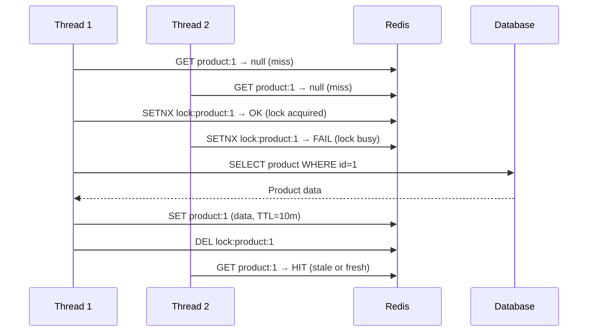

**Альтернативы:**
- **Probabilistic early expiration** — обновлять кэш досрочно с вероятностью, пропорциональной близости к TTL
- **Background refresh** — фоновый поток обновляет кэш за 30 сек до истечения TTL
- **Jitter на TTL** — добавить случайный разброс к TTL, чтобы ключи не истекали одновременно: `TTL = base + random(0, base*0.2)`


> [!mcq]
> - [ ] Lock без TTL — самый надёжный вариант | Без TTL крах holder-потока оставляет lock навсегда — все остальные ждут вечно. ❌ ПОСЛЕДСТВИЕ: процесс упал между `SETNX` и `DEL`, без TTL lock держится навсегда — все запросы по этому ключу таймаутят, инцидент 30 минут до ручного `DEL`.
> - [ ] После получения lock не нужна повторная проверка кэша (двойная блокировка) | Между miss и SETNX другой поток мог уже залить кэш — без двойной проверки делается лишний запрос в БД. ❌ ПОСЛЕДСТВИЕ: 5 потоков делают 5 БД-запросов вместо одного — stampede снижен но не устранён.
> - [x] Redis `SETNX` (или `SET NX EX`) для захвата lock с TTL 5 сек; внутри lock — повторная проверка кэша (двойная блокировка), затем загрузка из БД и `SET` с реальным TTL; в `finally` всегда `DEL` lock; альтернативы: `Caffeine.LoadingCache` (single-flight для одного инстанса), Probabilistic Early Expiration (XFetch), background refresh, jitter | Lock с TTL защищает от crash holder. ✓ ПРИМЕНЯТЬ: Redisson `RLock` или ручной `SETNX` для горячих ключей в e-commerce каталоге. 📋 ПРАВИЛО: «SETNX + TTL + двойная проверка + finally DEL — четыре правила distributed lock». 🔗 См. Q17, Q40.
> - [ ] Distributed lock через `SETNX` гарантирует exactly-once в кластере | Redlock-алгоритм для строгой корректности cluster-wide; одиночный SETNX даёт «достаточно хорошо» для кэша. ❌ ПОСЛЕДСТВИЕ: команда заявляет «exactly-once через SETNX» для финансовых операций — на partition узлы расходятся, двойная запись.

## Q40. (!) Что такое probabilistic early expiration (PER) и как оно работает?

**Probabilistic Early Expiration** (также known as **XFetch**) — алгоритм, который обновляет кэш **до** истечения TTL с вероятностью, нарастающей по мере приближения к дедлайну. Это позволяет одному потоку "добровольно" пересчитать кэш раньше, не допуская одновременного stampede.

**Формула:** для каждого запроса вычисляется условие досрочного обновления:

```
currentTime - delta * beta * ln(random()) > expiryTime
```

Где:
- `delta` — время вычисления значения (мс)
- `beta` — коэффициент агрессивности (обычно 1.0)
- `random()` — случайное число [0, 1)

Чем ближе `currentTime` к `expiryTime`, тем выше вероятность срабатывания.

```java
public class XFetchCache {
    private final RedisTemplate<String, Object> redis;
    private static final double BETA = 1.0;

    public <T> T get(String key, Supplier<T> loader, Duration ttl) {
        CacheEntry<T> entry = (CacheEntry<T>) redis.opsForValue().get(key);

        if (entry == null || shouldEarlyExpire(entry)) {
            long start = System.currentTimeMillis();
            T value = loader.get();
            long delta = System.currentTimeMillis() - start;

            redis.opsForValue().set(key,
                new CacheEntry<>(value, Instant.now().plus(ttl), delta),
                ttl);
            return value;
        }
        return entry.value();
    }

    private boolean shouldEarlyExpire(CacheEntry<?> entry) {
        double rand = Math.random();
        double now = Instant.now().toEpochMilli();
        double expiry = entry.expiry().toEpochMilli();
        return now - entry.delta() * BETA * Math.log(rand) > expiry;
    }
}
```

**Преимущество перед distributed lock:** нет блокировок, нет ожидания, алгоритм работает в высоко конкурентной среде без единой точки синхронизации.


> [!mcq]
> - [x] XFetch: при каждом GET вычисляется `currentTime - delta * beta * ln(random()) > expiryTime` — чем ближе к expiry, тем выше вероятность одного потока «добровольно» пересчитать кэш досрочно; нет блокировок, нет ожидания, работает в high-concurrent среде; `delta` — время вычисления, `beta` — агрессивность (~1.0) | Превосходит distributed lock — нет single point of synchronization. ✓ ПРИМЕНЯТЬ: XFetch для top-1000 горячих ключей в high-RPS API (как описано в paper «Optimal Probabilistic Cache Stampede Prevention»). 📋 ПРАВИЛО: «PER (XFetch) — без блокировок, обновляет один поток досрочно по probability». 🔗 См. Q17, Q39.
> - [ ] PER требует Redis Cluster — на standalone не работает | Алгоритм работает на любом кэше — это application-level логика, не Redis-специфичная. ❌ ПОСЛЕДСТВИЕ: команда мигрирует на Cluster «ради PER» — лишняя сложность.
> - [ ] PER гарантированно избегает любых stampede | PER снижает вероятность, но при пиковом RPS возможен одновременный пересчёт несколькими потоками. ❌ ПОСЛЕДСТВИЕ: команда не ставит дополнительный distributed lock «PER достаточно» — на хайп-event несколько потоков пересчитывают одновременно.
> - [ ] PER заменяет TTL — при использовании XFetch TTL не нужен | TTL всё равно нужен для лимита stale-данных; PER только смещает обновление к моменту до expiry. ❌ ПОСЛЕДСТВИЕ: разработчик отключает TTL «PER сам всё обновит» — при затухании RPS ключ держится бесконечно с устаревшими данными.

## Q41. Как организовать cache warming при старте приложения?

**Cache warming** — предварительное наполнение кэша при старте приложения (или перед увеличением нагрузки), чтобы первые запросы не уходили в холодный БД.

**Стратегии:**

| Стратегия | Когда применять | Реализация |
|-----------|----------------|------------|
| **Eager preload** | Небольшой, редко меняющийся набор данных | `ApplicationRunner` при старте |
| **Lazy warming** | Большой объём данных | Первые запросы наполняют кэш |
| **Background warming** | Периодическое обновление | `@Scheduled` job |
| **Import snapshot** | Перезапуск с сохранением кэша | Redis `BGSAVE` / `RESTORE` |

```java
@Component
public class CacheWarmupRunner implements ApplicationRunner {

    private final CacheManager cacheManager;
    private final ProductRepository productRepository;

    @Override
    public void run(ApplicationArguments args) {
        log.info("Starting cache warm-up...");
        Cache productCache = cacheManager.getCache("products");
        if (productCache == null) return;

        // Загружаем топ-1000 самых запрашиваемых продуктов
        productRepository.findTop1000ByOrderByViewCountDesc()
            .forEach(p -> productCache.put(p.getId(), p));

        log.info("Cache warm-up completed: {} products loaded", 1000);
    }
}
```

**Паттерн "background prefetch" через `@Scheduled`:**

```java
@Scheduled(fixedDelay = 300_000)  // каждые 5 минут
public void refreshHotCache() {
    List<Long> hotProductIds = analyticsService.getTopProductIds(500);
    hotProductIds.forEach(id -> {
        Product p = productRepository.findById(id).orElse(null);
        if (p != null) cacheManager.getCache("products").put(id, p);
    });
}
```

**Важно:** при warming учитывать порядок старта в Kubernetes — `readinessProbe` должна возвращать `200` только после завершения прогрева, иначе трафик придёт раньше готовности кэша.


> [!mcq]
> - [ ] Cache warming должен быть синхронным в `@PostConstruct` | Блокирует запуск приложения до полного прогрева — readiness probe долго не возвращает 200. ❌ ПОСЛЕДСТВИЕ: warming 50K ключей × 10мс = 500с — k8s killing pod по timeout, deploy в loop.
> - [x] `ApplicationRunner` для async warming top-N горячих ключей; `@Scheduled(fixedDelay)` для periodic prefetch; `readinessProbe` возвращает 200 только после готовности кэша; альтернативы — Redis `BGSAVE/RESTORE` snapshot (Eager preload), lazy warming для большого объёма; не блокировать старт | Async + readiness gate = быстрый rolling deploy. ✓ ПРИМЕНЯТЬ: `ApplicationRunner` + Spring Boot `HealthIndicator` для warming top-1000 в e-commerce (Wildberries). 📋 ПРАВИЛО: «Async warming + readiness gate; periodic prefetch для горячих ключей». 🔗 См. Q17, Q27.
> - [ ] Warming через `KEYS *` + `MGET` — самый быстрый способ | `KEYS` блокирует Redis, `MGET` на тысячи ключей даёт overflow. ❌ ПОСЛЕДСТВИЕ: команда вызывает `KEYS user:*` на проде — Redis заблокирован 5 секунд, p99 latency скакнул до 8 секунд.
> - [ ] Warming не нужен — `lazy loading` сам справится | После cold restart первая 1000 запросов идут в БД параллельно — БД лежит. ❌ ПОСЛЕДСТВИЕ: rolling deploy 10 подов = 10K cold queries → БД 100% CPU 5 минут, p99 latency 5 секунд.

## Q42. (!) Как работает инвалидация кэша через pub/sub (Redis Keyspace Notifications)?

**Redis Keyspace Notifications** — механизм, позволяющий подписчикам получать события об изменениях ключей в Redis (SET, DEL, EXPIRE, EXPIRED).

**Конфигурация:**

```bash
# redis.conf или через CONFIG SET
notify-keyspace-events "KEA"
# K — keyspace events (prefix __keyspace@0__)
# E — keyevent events (prefix __keyevent@0__)
# A — все события (аналог g$lzxed)
```

**Сценарий: инвалидация L1 (Caffeine) при изменении в Redis**

```java
@Component
public class RedisCacheInvalidationListener {

    private final CaffeineCacheManager localCacheManager;

    @PostConstruct
    public void subscribe() {
        // Spring Data Redis MessageListenerAdapter
    }

    // Вызывается при DEL/EXPIRE события
    @EventListener
    public void onKeyExpired(RedisKeyExpiredEvent<?> event) {
        String key = new String(event.getId());
        // Инвалидируем соответствующую запись в L1
        String cacheName = extractCacheName(key);
        String cacheKey  = extractCacheKey(key);
        Cache local = localCacheManager.getCache(cacheName);
        if (local != null) local.evict(cacheKey);
        log.debug("L1 cache invalidated for key: {}", key);
    }
}
```

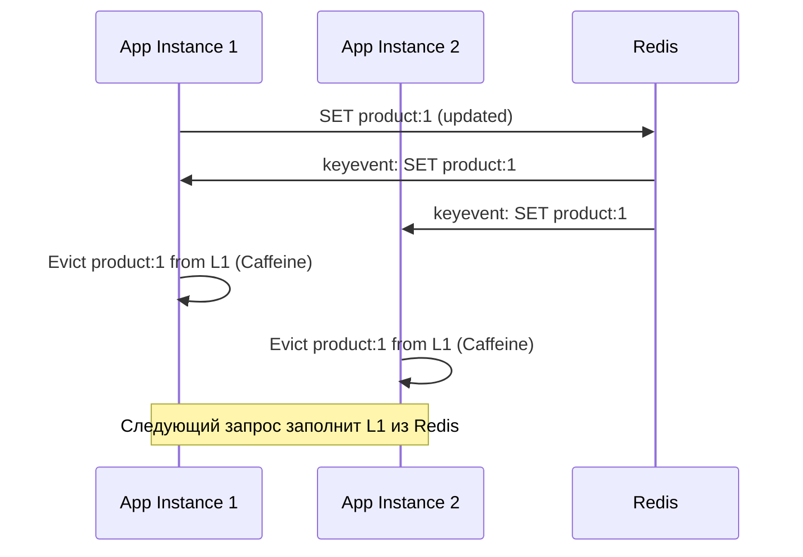

**Ограничения:**
- Pub/sub не гарантирует доставку (fire-and-forget) — при падении инстанса события теряются
- Для критичных систем используйте `Redis Streams` с consumer groups — гарантируют at-least-once
- `notify-keyspace-events` увеличивает CPU Redis на 10-15%

> [!mcq]
> - [ ] Pub/Sub гарантирует at-least-once delivery — потери исключены | Pub/Sub — fire-and-forget; при падении инстанса в момент публикации события теряются. ❌ ПОСЛЕДСТВИЕ: pod рестартится во время публикации `cache:invalidate` — другие pods держат stale 1 час до TTL, customer видит «удалённый» товар.
> - [ ] `notify-keyspace-events` бесплатен по CPU | Включение нотификаций добавляет 10-15% CPU Redis при высоком write throughput. ❌ ПОСЛЕДСТВИЕ: команда включает `KEA` на проде с 50K writes/sec — CPU Redis +15%, ноды на пределе, latency p99 +5мс.
> - [ ] Keyspace Notifications работают только с DEL и EXPIRE | Конфигурация поддерживает `g$lzxed` (generic, string, list, set, hash, sorted, expired, evicted). ❌ ПОСЛЕДСТВИЕ: команда не подписывается на `evicted` события — кэш L1 не инвалидируется при memory pressure, stale данные.
> - [x] Redis Keyspace Notifications через `notify-keyspace-events "KEA"` (K=keyspace, E=keyevent, A=все события); подписка на `__keyevent@0__:set/del/expired` для cross-pod L1 инвалидации (Caffeine); pub/sub НЕ гарантирует доставку (fire-and-forget) — для критичной семантики использовать Redis Streams с consumer groups (at-least-once); CPU overhead 10-15% | Streams для гарантий, Pub/Sub для best-effort. ✓ ПРИМЕНЯТЬ: Spring Data Redis `RedisMessageListenerContainer` для cross-pod Caffeine invalidation. 📋 ПРАВИЛО: «Pub/Sub fire-and-forget; для гарантий — Redis Streams; CPU +15%». 🔗 См. Q19, Q28, Q32.

---

## See also

- [Redis](../databases/redis-interview.md) — вопросы по Redis как распределённому кэшу и хранилищу данных
- [Микросервисная архитектура](microservices-interview.md) — кэширование в контексте микросервисов
- [Распределённые системы](distributed-systems-interview.md) — консистентность и репликация кэшированных данных
- [Spring Boot](../frameworks/spring/spring-boot-interview.md) — конфигурация и автоконфигурация кэша (`@Cacheable`, `@CacheEvict`)
- [Паттерны масштабируемости](scalability-patterns-interview.md) — кэш как инструмент масштабирования и снижения нагрузки на БД
- [Паттерны отказоустойчивости](resilience-patterns-interview.md) — кэш как fallback при недоступности upstream сервиса
- [Архитектура баз данных](../databases/database-architecture-interview.md) — read replica vs кэш, стратегии снижения нагрузки на БД
- [API Gateway](api-gateway-interview.md)
- [BFF Pattern](bff-pattern-interview.md)
- [CAP-теорема](cap-theorem-interview.md)
- [Clean Architecture](clean-architecture-interview.md)
- [Паттерны согласованности](consistency-patterns-interview.md)
- [CQRS и Event Sourcing](cqrs-event-sourcing-interview.md)
