# Вопросы на собеседовании: `CAP`-теорема

Краткое введение: ответы по `CAP`-теореме для собеседований — ограничения распределённых систем, выбор между согласованностью и доступностью. **CAP-теорема** описывает ограничения распределённых систем: нельзя одновременно гарантировать согласованность (`Consistency`), доступность (`Availability`) и устойчивость к разделению (`Partition tolerance`). На интервью часто спрашивают про этот компромисс, модели согласованности, алгоритмы консенсуса и примеры `CP`/`AP`-систем.

## Полезные ссылки

### Официальная документация

- [CAP Theorem](https://en.wikipedia.org/wiki/CAP_theorem) — CAP-теорема
- [Brewer's CAP Theorem (оригинал)](https://www.infoq.com/articles/cap-twelve-years-later-how-the-rules-have-changed/) — статья Эрика Брюера "CAP Twelve Years Later"
- [Raft Consensus Algorithm](https://raft.github.io/) — визуализация и описание `Raft`
- [Cassandra Documentation — Consistency](https://cassandra.apache.org/doc/latest/cassandra/architecture/dynamo.html) — модель согласованности `Cassandra`
- [Jepsen — Distributed Systems Safety Research](https://jepsen.io/) — тестирование корректности распределённых систем
- [Brewer's CAP Theorem (Baeldung)](https://www.baeldung.com/cs/brewers-cap-theorem) — подробное объяснение CAP-теоремы
- [Explanation of BASE Terminology (Baeldung)](https://www.baeldung.com/cs/db-base-meaning-cap) — BASE vs ACID в контексте CAP
- [Introduction to Consistency Models (Baeldung)](https://www.baeldung.com/cs/consistency-models) — модели согласованности: strong, eventual, causal
- [Consensus Algorithms in Distributed Systems (Baeldung)](https://www.baeldung.com/cs/consensus-algorithms-distributed-systems) — Raft, Paxos и другие алгоритмы консенсуса
- [Raft Consensus Algorithm (Baeldung)](https://www.baeldung.com/cs/raft-consensus-algorithm) — детальный разбор алгоритма Raft

## Содержание

- [Полезные ссылки](#полезные-ссылки)
- [See also](#see-also)

**Основы CAP**
- [Q1. (!) Что такое CAP-теорема?](#q1-что-такое-cap-теорема)
- [Q2. Какие три свойства описывает CAP?](#q2-какие-три-свойства-описывает-cap)
- [Q3. Почему на практике выбирают между C и A?](#q3-почему-на-практике-выбирают-между-c-и-a)
- [Q4. (!) Что такое CP-системы, приведите примеры](#q4-что-такое-cp-системы-приведите-примеры)
- [Q5. (!) Что такое AP-системы, приведите примеры](#q5-что-такое-ap-системы-приведите-примеры)
- [Q6. Что такое CA-системы и почему они редки?](#q6-что-такое-ca-системы-и-почему-они-редки)

**Сетевое разделение и поведение систем**
- [Q7. Что такое сетевое разделение (partition)?](#q7-что-такое-сетевое-разделение-partition)
- [Q8. Почему CAP описывает поведение при partition, а не в норме?](#q8-почему-cap-описывает-поведение-при-partition-а-не-в-норме)
- [Q9. В чём ограниченность CAP-теоремы?](#q9-в-чём-ограниченность-cap-теоремы)

**Модели согласованности**
- [Q10. (!) Какие модели согласованности существуют и чем отличаются?](#q10-какие-модели-согласованности-существуют-и-чем-отличаются)
- [Q11. (!) Что такое linearizability и почему это самая строгая модель?](#q11-что-такое-linearizability-и-почему-это-самая-строгая-модель)
- [Q12. Что такое sequential consistency?](#q12-что-такое-sequential-consistency)
- [Q13. (!) Что такое causal consistency и когда она применяется?](#q13-что-такое-causal-consistency-и-когда-она-применяется)
- [Q14. Что такое eventual consistency и каковы её гарантии?](#q14-что-такое-eventual-consistency-и-каковы-её-гарантии)
- [Q15. Чем отличается strong eventual consistency от eventual consistency?](#q15-чем-отличается-strong-eventual-consistency-от-eventual-consistency)

**Кворумные системы**
- [Q16. (!) Что такое кворум и как он обеспечивает согласованность?](#q16-что-такое-кворум-и-как-он-обеспечивает-согласованность)
- [Q17. Что такое формула W + R > N и как она работает?](#q17-что-такое-формула-w--r--n-и-как-она-работает)
- [Q18. Как настроить кворум в Cassandra?](#q18-как-настроить-кворум-в-cassandra)

**Алгоритмы консенсуса**
- [Q19. (!) Что такое алгоритм консенсуса и зачем он нужен?](#q19-что-такое-алгоритм-консенсуса-и-зачем-он-нужен)
- [Q20. (!) Как работает алгоритм Raft?](#q20-как-работает-алгоритм-raft)
- [Q21. Как работает Paxos и чем отличается от Raft?](#q21-как-работает-paxos-и-чем-отличается-от-raft)
- [Q22. Что такое split-brain и как алгоритмы консенсуса его предотвращают?](#q22-что-такое-split-brain-и-как-алгоритмы-консенсуса-его-предотвращают)

**PACELC и расширения CAP**
- [Q23. (!) Что такое PACELC и как связано с CAP?](#q23-что-такое-pacelc-и-как-связано-с-cap)
- [Q24. Как классифицировать реальные системы по PACELC?](#q24-как-классифицировать-реальные-системы-по-pacelc)

**Реальные системы и CAP**
- [Q25. (!) Cassandra и CAP: как работает настраиваемая согласованность?](#q25-cassandra-и-cap-как-работает-настраиваемая-согласованность)
- [Q26. (!) DynamoDB и CAP: какой trade-off?](#q26-dynamodb-и-cap-какой-trade-off)
- [Q27. (!) Zookeeper и CAP: почему это CP-система?](#q27-zookeeper-и-cap-почему-это-cp-система)
- [Q28. Redis — CP или AP?](#q28-redis-cp-или-ap)
- [Q29. PostgreSQL с репликацией — CP или AP?](#q29-postgresql-с-репликацией-cp-или-ap)
- [Q30. Kafka и CAP: какой trade-off?](#q30-kafka-и-cap-какой-trade-off)
- [Q31. MongoDB и CAP: как настраивается поведение?](#q31-mongodb-и-cap-как-настраивается-поведение)
- [Q32. Можно ли систему переключать между CP и AP?](#q32-можно-ли-систему-переключать-между-cp-и-ap)

**Практика и проектирование**
- [Q33. Как выбирать CP vs AP для бизнес-системы?](#q33-как-выбирать-cp-vs-ap-для-бизнес-системы)
- [Q34. (!) Как тестировать partition tolerance?](#q34-как-тестировать-partition-tolerance)
- [Q35. Как проектировать систему с учётом CAP?](#q35-как-проектировать-систему-с-учётом-cap)

**PACELC, Spanner, BASE и микросервисы**
- [Q36. Что такое PACELC — расширение CAP для нормального состояния?](#q36-что-такое-pacelc--расширение-cap-для-нормального-состояния)
- [Q37. (!) ZooKeeper и HBase как CP-системы: детали реализации](#q37-zookeeper-и-hbase-как-cp-системы-детали-реализации)
- [Q38. (!) Cassandra и DynamoDB как AP-системы: детали](#q38-cassandra-и-dynamodb-как-ap-системы-детали)
- [Q39. Network partition на практике: частота и типичные сценарии](#q39-network-partition-на-практике-частота-и-типичные-сценарии)
- [Q40. CAP и микросервисная архитектура: как выбор БД влияет на дизайн?](#q40-cap-и-микросервисная-архитектура-как-выбор-бд-влияет-на-дизайн)
- [Q41. (!) Google Spanner и TrueTime: как Spanner обходит CAP?](#q41-google-spanner-и-truetime-как-spanner-обходит-cap)
- [Q42. (!) CAP vs BASE: детальное сравнение](#q42-cap-vs-base-детальное-сравнение)

## Q1. (!) Что такое CAP-теорема?

**CAP-теорема** (`Consistency`, `Availability`, `Partition tolerance`) утверждает: в распределённой системе нельзя одновременно обеспечить все три свойства. Придётся пожертвовать одним из них. Сформулирована Эриком Брюером в 2000 году как гипотеза, формально доказана Гилбертом и Линчем в 2002 году.

На практике **Partition tolerance** считают обязательным: сети падают, дата-центры изолируются. Поэтому выбор делается между **согласованностью** и **доступностью**: либо система при разделении блокирует запросы ради согласованных данных (`CP`), либо продолжает отвечать, допуская временную несогласованность (`AP`).

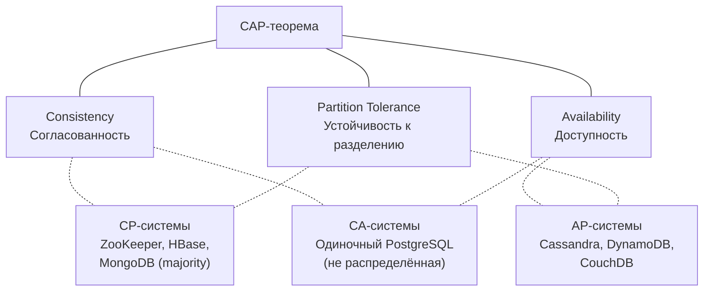

CAP — это модель для понимания trade-offs, а не жёсткая классификация систем. Многие системы позволяют настраивать поведение на уровне отдельного запроса.


> [!mcq]
> - [ ] `CAP` гарантирует, что распределённая система всегда обеспечит все три свойства | Это инверсия теоремы: Брюер утверждает обратное — одновременно все три невозможны при `partition`. ❌ ПОСЛЕДСТВИЕ: архитектор обещает бизнесу 100% `consistency` и `availability` для мульти-региона; первый сетевой сбой ломает SLA, банк теряет $2M за час downtime.
> - [x] При `partition` выбирают между `consistency` и `availability`; `partition tolerance` обязателен в распределённой системе | Сети ненадёжны, дата-центры изолируются, поэтому `P` — реальность, а не выбор; жертвовать можно только `C` или `A`. ✓ ПРИМЕНЯТЬ: AWS multi-AZ deployments — выбор между MongoDB `majority` (`CP`) и DynamoDB eventual (`AP`) делается по бизнес-требованию. 📋 ПРАВИЛО: «P — это погода, выбираешь между C и A». 🔗 См. Q3, Q4, Q23.
> - [ ] `CAP` означает, что можно выбрать любые два свойства из трёх независимо от сети | Формулировка «pick 2 of 3» — упрощение Брюера 2000 года; в реальности `P` навязан физикой, выбор только между `C` и `A`. ❌ ПОСЛЕДСТВИЕ: команда строит «CA»-систему на двух дата-центрах; при первом обрыве WAN-канала split-brain пишет в обе половины, расхождение балансов на $500K требует ручной сверки.
> - [ ] `CAP` относится только к NoSQL-системам, реляционные БД свободны от ограничений | Теорема описывает любую распределённую систему с репликацией: PostgreSQL streaming replication, MySQL Galera, Oracle RAC — все подчиняются `CAP`. ❌ ПОСЛЕДСТВИЕ: DBA включает синхронную репликацию PostgreSQL и удивляется, почему при сбое реплики мастер замораживает запись на 30 секунд — это и есть `CP`-выбор `CAP`.

## Q2. Какие три свойства описывает CAP?

**Consistency** (согласованность) — все узлы видят одни и те же данные в один момент времени; чтение после записи возвращает последнее записанное значение. Это `linearizability` — самая строгая модель согласованности.

**Availability** (доступность) — каждый запрос к работающему узлу получает ответ (не обязательно с последними данными). Система не блокирует клиентов и не возвращает ошибку таймаута.

**Partition tolerance** (устойчивость к разделению) — система продолжает работать при разрыве связи между узлами, когда сообщения теряются или задерживаются на произвольное время.

В реальных распределённых системах сетевое разделение неизбежно, поэтому **Partition tolerance** не отбрасывают. Остаётся выбор между C и A: при partition нельзя иметь и то, и другое одновременно.


> [!mcq]
> - [ ] `Consistency` означает, что данные хранятся в одной БД без реплик | Это путаница с ACID-`C`: в `CAP` `consistency` — это `linearizability` (все узлы видят одинаковое значение в любой момент), а не валидность схемы. ❌ ПОСЛЕДСТВИЕ: разработчик думает, что у него `C`, потому что есть `CHECK` constraints; при асинхронной репликации читает stale данные с реплики и показывает клиенту устаревший баланс.
> - [ ] `Availability` означает 99.99% uptime за квартал | `CAP-availability` — это «каждый запрос к работающему узлу получает ответ», а не SLA-метрика; узел может быть жив, но при `CP` отказывает в ответе ради `C`. ❌ ПОСЛЕДСТВИЕ: SRE рапортует 99.99% uptime по health-check, не замечая, что 5% запросов получают `503` при partition — реальная `availability` ниже.
> - [x] `C` — все узлы видят одни данные (`linearizability`), `A` — каждый запрос получает ответ, `P` — система переживает потерю сообщений между узлами | Три формальных свойства из доказательства Гилберта-Линча 2002 года; при `partition` нельзя одновременно гарантировать `C` и `A`. ✓ ПРИМЕНЯТЬ: etcd в Kubernetes — `CP` (`linearizability` через `Raft`), Cassandra `CL=ONE` — `AP` (всегда отвечает, eventual). 📋 ПРАВИЛО: «C — одинаковое, A — отвечающее, P — переживающее». 🔗 См. Q1, Q3, Q11.
> - [ ] `Partition tolerance` означает, что система не теряет данные при сбое диска | `P` — про сетевое разделение между узлами, а не про durability диска; durability относится к `D` в ACID. ❌ ПОСЛЕДСТВИЕ: команда выбирает «AP»-систему ради надёжности диска, а получает `eventual consistency` для финансов; double-spend через 2 часа после запуска.

## Q3. Почему на практике выбирают между C и A?

**Partition tolerance** в распределённой системе нельзя отбросить: сети ненадёжны, дата-центры изолируются, задержки непредсказуемы. Любая система с репликацией или несколькими узлами должна учитывать возможность разделения.

Если мы хотим, чтобы система переживала partition, остаётся выбор: при разделении либо блокировать запросы до восстановления связи с кворумом (жертвуем **Availability**, получаем **CP**), либо продолжать обслуживать запросы и допускать устаревшие данные (жертвуем **Consistency**, получаем **AP**).

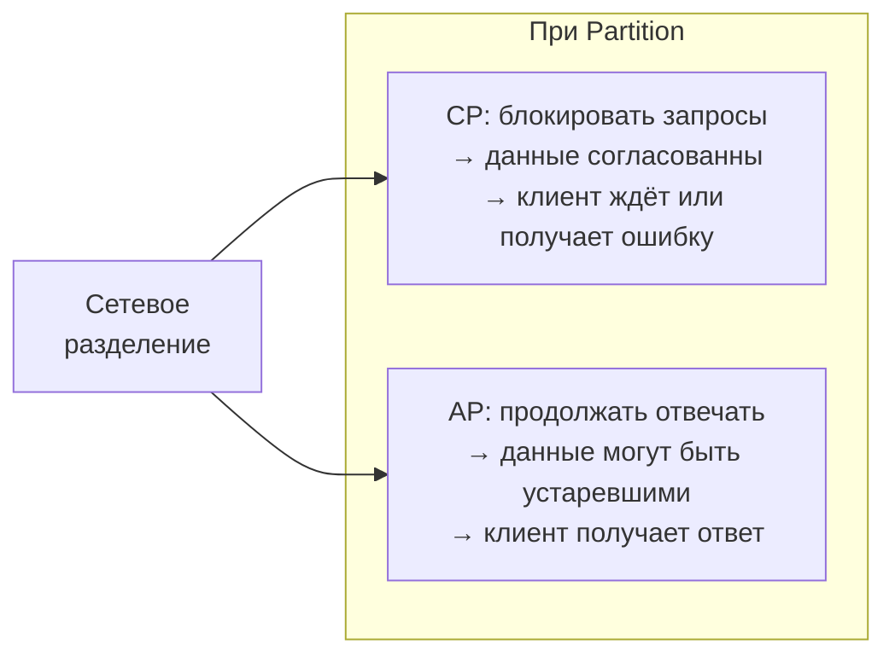

Поэтому говорят: «на практике выбор между C и A».


> [!mcq]
> - [ ] `Partition tolerance` можно отключить, если использовать надёжное оборудование | Сети ненадёжны на физическом уровне: GC pauses, kernel hangs, switch flaps создают partition даже на CISCO; `P` нельзя «отключить». ❌ ПОСЛЕДСТВИЕ: компания инвестирует $5M в избыточную сеть, но 60-секундный GC pause на Java-узле создаёт partition с точки зрения `CAP`; кластер уходит в split-brain.
> - [x] `Partition tolerance` неизбежен в распределённой системе, поэтому остаётся выбор C или A | Сети теряют пакеты, дата-центры изолируются, GC pauses имитируют partition; единственная свобода — поведение при разделении: блокировать запросы (`CP`) или отвечать stale данными (`AP`). ✓ ПРИМЕНЯТЬ: Stripe выбирает `CP` (PostgreSQL synchronous) для платежей, Netflix выбирает `AP` (Cassandra `LOCAL_ONE`) для recommendations. 📋 ПРАВИЛО: «Не выбираешь P — выбираешь между C и A». 🔗 См. Q1, Q6, Q7.
> - [ ] `CA`-системы в облаке решают проблему через resilient networking | `CA` означает «нет partition» = нет распределённости; multi-AZ deployment физически распределён, поэтому он либо `CP`, либо `AP`. ❌ ПОСЛЕДСТВИЕ: архитектор маркирует RDS Multi-AZ как «CA-система» в DAR-документе; при failover теряет 30 секунд commits — это `CP`-поведение, не `CA`.
> - [ ] При `partition` можно заморозить весь кластер и сохранить и `C`, и `A` | «Заморозить» = недоступен = `availability=0`; вы получаете `C` и `P`, но `A` теряется по определению. ❌ ПОСЛЕДСТВИЕ: команда настраивает MongoDB с `writeConcern=majority` для финансов и удивляется, почему при изоляции одного узла из трёх продакшен встаёт на 5 минут — это `CP` в действии.

## Q4. (!) Что такое CP-системы, приведите примеры

**CP-системы** жертвуют доступностью ради согласованности. При разделении сети они блокируют запись (и часто чтение), пока не восстановится связь с кворумом реплик. Цель — гарантировать, что все узлы видят одинаковые данные; клиент не получит устаревшую информацию, но может получить таймаут или отказ.

| Система | Механизм CP |
|---------|------------|
| `ZooKeeper` | Алгоритм `ZAB` (Zookeeper Atomic Broadcast), кворум на запись и чтение |
| `etcd` | Алгоритм `Raft`, линеаризуемые чтения через лидера |
| `HBase` | Зависит от `ZooKeeper` для координации, строгая согласованность на уровне строки |
| `MongoDB` (majority) | `writeConcern: majority` + `readConcern: majority` |
| `PostgreSQL` (синхронная репликация) | `synchronous_commit = on`, запись ждёт подтверждения реплики |

Подходят там, где критична строгая согласованность — финансы, учёт, инвентарь, распределённые блокировки — а кратковременная недоступность допустима.


> [!mcq]
> - [ ] `CP`-система всегда возвращает успех, но с устаревшими данными при partition | Это `AP`-поведение; `CP` ради консистентности отказывает (`timeout`/`error`), а не отдаёт stale. ❌ ПОСЛЕДСТВИЕ: разработчик ожидает от `etcd` ответ при partition и получает `context deadline exceeded`; деплой Kubernetes-приложения зависает, обнаруживают проблему через час downtime.
> - [x] `CP`-система при partition блокирует запросы без кворума ради `linearizability`; примеры — `ZooKeeper`, `etcd`, `HBase`, MongoDB `majority`, синхронный PostgreSQL | Запись подтверждается только при доступе к кворуму реплик; меньшинство отказывает клиенту, чтобы избежать stale reads. ✓ ПРИМЕНЯТЬ: Kubernetes использует etcd (`Raft`, `CP`) для хранения состояния кластера; Apache HBase для финансовой аналитики у Bloomberg. 📋 ПРАВИЛО: «CP — лучше отказ, чем устаревшее значение». 🔗 См. Q19, Q20, Q27.
> - [ ] `CP` означает Cloud Provider, описание развёртывания в AWS/GCP | Это омоним: в `CAP` `CP` = `Consistency + Partition tolerance`; не путать с провайдерами облака. ❌ ПОСЛЕДСТВИЕ: на интервью кандидат отвечает «CP — это AWS/Azure», что показывает неподготовленность; offer не получают на senior-позицию по distributed systems.
> - [ ] `CP`-системы хранят данные на нескольких дисках в одном узле | `CP` про сетевое разделение между узлами, RAID — про сбои дисков; концепции ортогональны. ❌ ПОСЛЕДСТВИЕ: команда строит «CP»-кластер с RAID-10 на одном сервере; сетевой сбой между app и DB кладёт всё, потому что нет реальной репликации между узлами.

## Q5. (!) Что такое AP-системы, приведите примеры

**AP-системы** жертвуют согласованностью ради доступности. При разделении сети они продолжают принимать запросы и отвечать, но могут отдавать устаревшие данные до схождения реплик. Репликация обычно асинхронная.

| Система | Механизм AP |
|---------|------------|
| `Cassandra` (CL=ONE) | Асинхронная репликация, `read repair`, `anti-entropy` |
| `DynamoDB` (eventually consistent reads) | По умолчанию eventual consistency, опционально strongly consistent |
| `CouchDB` | Multi-master репликация, разрешение конфликтов на уровне приложения |
| `Riak` | `Dynamo`-подобная архитектура, `vector clocks` для разрешения конфликтов |

Подходят для лент, счётчиков, кэшей, сценариев, где допустима `eventual consistency`. Многие AP-системы позволяют усилить согласованность per-request за счёт задержки.


> [!mcq]
> - [x] `AP`-система при partition продолжает отвечать на запросы, допуская eventual consistency; примеры — `Cassandra` (CL=ONE), `DynamoDB` (default reads), `CouchDB`, `Riak` | Асинхронная репликация, `read repair`, `anti-entropy`, `vector clocks` сводят реплики со временем; клиент может получить stale данные, но никогда не получает таймаут. ✓ ПРИМЕНЯТЬ: Discord переехал с Cassandra на ScyllaDB (`AP`) для триллионов сообщений; Netflix хранит viewing history в Cassandra с `LOCAL_ONE`. 📋 ПРАВИЛО: «AP — лучше устаревшее, чем тишина». 🔗 См. Q14, Q25, Q38.
> - [ ] `AP` означает «Application Programming» — слой между UI и БД | Омоним: в `CAP` `AP` = `Availability + Partition tolerance`; путать API-слой с архитектурным выбором. ❌ ПОСЛЕДСТВИЕ: junior отвечает на собеседовании «AP — это REST API»; интервьюер закрывает раздел, кандидат теряет offer на $150K.
> - [ ] `AP`-система гарантирует, что все клиенты видят свежие данные через 1 секунду | `eventual consistency` не даёт гарантий по времени конвергенции — может быть миллисекунды, может минуты при длительном partition. ❌ ПОСЛЕДСТВИЕ: SLA обещает «свежие данные за 1 сек» на Cassandra `CL=ONE`; при сетевом инциденте 6-часовой replication lag, отдел рекомендаций показывает удалённые товары, теряет $300K выручки.
> - [ ] `AP`-системы не подходят для production-нагрузки | DynamoDB обрабатывает триллионы запросов, Cassandra — основа Netflix, Apple, Discord; `AP` — индустриальный стандарт для high-throughput. ❌ ПОСЛЕДСТВИЕ: архитектор отвергает Cassandra ради «безопасного» PostgreSQL, упирается в 50K writes/sec и тратит 6 месяцев на шардирование.

## Q6. Что такое CA-системы и почему они редки?

**CA-системы** теоретически дают согласованность и доступность, но не устойчивы к разделению сети. В распределённой среде partition неизбежны, поэтому чисто CA в реальности почти не бывает.

CA по сути — одиночный узел или нераспределённая БД без репликации: одна база на одном сервере, локальная ФС. Как только появляются реплики и несколько узлов, приходится учитывать разделение и выбирать CP или AP.

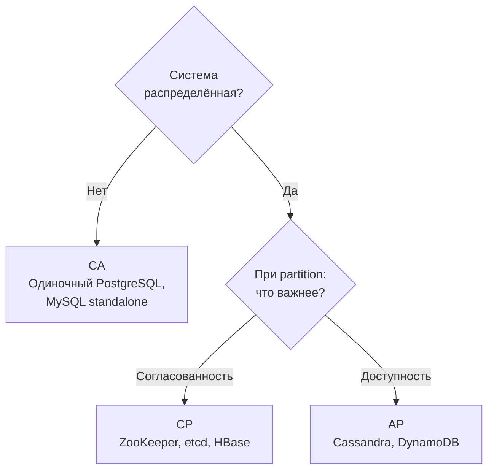

Единственный «CA» — это система, которая при partition просто перестаёт быть распределённой.


> [!mcq]
> - [ ] `CA` — это распределённая система с `consistency` и `availability`, защищённая от partition надёжной сетью | Невозможно: `partition` — физическое явление, не выбор; «защищённая сеть» всё равно даёт `partition` через GC pauses, kernel panic, switch flap. ❌ ПОСЛЕДСТВИЕ: команда классифицирует Galera Cluster как `CA`; при WAN-задержке между DC получает split-brain и потерю транзакций на $1M.
> - [ ] `CA` означает Cluster Architecture, любая многоузловая БД | Омоним: в `CAP` `CA` имеет конкретный смысл — система без `P`, то есть нераспределённая. ❌ ПОСЛЕДСТВИЕ: на ревью архитектуры кандидат говорит «MongoDB sharded cluster — это CA», что показывает непонимание; промоушен до principal заблокирован.
> - [x] `CA` — единственный узел или нераспределённая БД (одиночный PostgreSQL/MySQL); при появлении репликации становится `CP` или `AP` | Без распределённости нет `partition`, поэтому `C` и `A` достижимы; как только добавляется реплика — выбираешь между `C` и `A`. ✓ ПРИМЕНЯТЬ: development-стенды с одним инстансом PostgreSQL; small-scale SaaS до миграции на multi-AZ. 📋 ПРАВИЛО: «CA — это про один сервер, не про кластер». 🔗 См. Q1, Q3, Q7.
> - [ ] `CA`-системы — лучший выбор для production, потому что дают и `C`, и `A` | `CA` = одиночный узел = single point of failure; production требует распределённости, поэтому реальные системы — `CP` или `AP`. ❌ ПОСЛЕДСТВИЕ: стартап запускается на одном PostgreSQL ради «CA»; при сбое сервера 4-часовой outage, $200K compensation клиентам.

## Q7. Что такое сетевое разделение (partition)?

**Partition** (сетевое разделение) — ситуация, когда группа узлов перестаёт получать сообщения от другой группы из-за сетевого сбоя, задержки или потери пакетов. Узлы в каждой группе могут общаться между собой, но не с узлами «по ту сторону» partition.

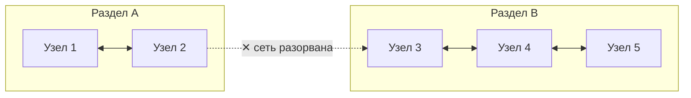

Типичные причины: разрыв кабеля, отказ маршрутизатора, изоляция дата-центра, проблемы с upstream-провайдером. Partition может быть:
- **Полным** — полная потеря связи между сегментами
- **Частичным** (asymmetric) — узел A видит B, но B не видит A
- **Временным** (секунды) или **длительным** (минуты, часы)

CAP говорит о поведении системы именно в момент partition.


> [!mcq]
> - [ ] `Partition` — это сбой одного узла кластера | Это node failure: узел мёртв и не отвечает; partition — узлы живы, но не видят друг друга. ❌ ПОСЛЕДСТВИЕ: алертинг настроен на «node down», игнорирует случаи, когда узел жив, но изолирован; split-brain в Cassandra пишет в две половины 2 часа до обнаружения.
> - [x] `Partition` — ситуация, когда группы узлов перестают обмениваться сообщениями из-за сетевого сбоя; узлы внутри группы видят друг друга, между группами — нет | Причины: разрыв кабеля, отказ маршрутизатора, изоляция AZ, GC pause; partition бывает полным, asymmetric (A видит B, B не видит A) или временным. ✓ ПРИМЕНЯТЬ: AWS us-east-1 outage 2017 — частичный partition между AZ; Cloudflare 2020 — BGP-разделение регионов. 📋 ПРАВИЛО: «Partition — узлы живы, но молчат друг с другом». 🔗 См. Q1, Q22, Q39.
> - [ ] `Partition` означает шардирование данных по узлам (`partitioning`) | Омоним: в `CAP` `partition` = network partition, в шардировании — логическое разделение данных; концепции разные. ❌ ПОСЛЕДСТВИЕ: junior путает термины и настраивает Cassandra `partition_key` ради `partition tolerance`; при сетевом сбое всё равно получает split-brain.
> - [ ] `Partition` — это разделение диска на разделы (`fdisk`) | Концепция из ОС не имеет отношения к `CAP`; в распределённых системах `partition` = network partition. ❌ ПОСЛЕДСТВИЕ: на интервью кандидат отвечает «partition tolerance — устойчивость к разделам диска»; интервьюер ставит red flag, кандидат не проходит.

## Q8. Почему CAP описывает поведение при partition, а не в норме?

CAP фокусируется на **момент partition**, потому что в нормальных условиях (без разделения сети) распределённая система может обеспечивать и согласованность, и доступность одновременно. Проблема возникает только когда сеть разделяется: тогда нельзя гарантировать и C, и A.

При partition нужно принять решение: блокировать запросы (CP) или допустить устаревшие данные (AP). В повседневной работе большинство систем работают без partition, поэтому CAP — это не про «всегда», а про «когда сеть сломалась». Именно это ограничение привело к появлению **PACELC**, которая описывает поведение системы и в нормальном режиме.


> [!mcq]
> - [x] В нормальном режиме (без partition) распределённая система может обеспечить и `C`, и `A`; trade-off возникает только при разделении сети | Без partition узлы синхронизируются и отвечают; разделение вынуждает выбирать между блокировкой запросов (`CP`) или stale ответом (`AP`). ✓ ПРИМЕНЯТЬ: Cassandra `QUORUM` без partition даёт и `C`, и `A`; PACELC расширяет CAP, добавляя выбор `Latency vs Consistency` в норме. 📋 ПРАВИЛО: «CAP — про шторм, PACELC — про штиль». 🔗 См. Q9, Q23, Q36.
> - [ ] `CAP` всегда требует выбора между `C` и `A`, независимо от состояния сети | В норме оба свойства достижимы; теорема Гилберта-Линча 2002 явно говорит «during a network partition». ❌ ПОСЛЕДСТВИЕ: архитектор постоянно жертвует `C` ради `A`, получает stale данные даже без сетевых проблем; финансовые расчёты расходятся на $50K в день.
> - [ ] `CAP` описывает поведение в момент перезагрузки узла | Перезагрузка — node failure, не partition; `CAP` про разделение сети между живыми узлами. ❌ ПОСЛЕДСТВИЕ: rolling restart MongoDB интерпретируется как «выбор CAP»; команда не настраивает `writeConcern: majority`, теряет данные при следующем failover.
> - [ ] `CAP` — про периодические backup данных | Backups — про durability, не про `CAP`; теорема не имеет отношения к снапшотам и восстановлению. ❌ ПОСЛЕДСТВИЕ: DBA путает CAP с backup-стратегией, настраивает только snapshot'ы, игнорирует репликацию; при partition — split-brain без защиты.

## Q9. В чём ограниченность CAP-теоремы?

CAP описывает бинарный выбор при partition, но реальность сложнее:

- **Гранулярность**: система может быть CP для одних операций и AP для других (разные `consistency levels`)
- **Задержки**: CAP не учитывает latency — «доступная» система с 30-секундным ответом бесполезна
- **Частичные отказы**: partition — не единственный тип сбоя; есть ещё отказы узлов, византийские ошибки
- **Спектр согласованности**: CAP рассматривает только `linearizability`, но есть множество промежуточных моделей
- **Бинарность**: реальные системы не «чисто» CP или AP — они выбирают точку на спектре

**PACELC** расширяет CAP, добавляя измерение latency vs consistency в нормальном режиме. На практике многие системы настраиваются под сценарий, а не жёстко привязаны к CP или AP.


> [!mcq]
> - [ ] `CAP` точно классифицирует все системы как `CP` или `AP`, без оттенков | Реальные системы настраиваемы: Cassandra `ONE` — `AP`, `QUORUM` — между `CP` и `AP`; жёсткая бинарность — упрощение. ❌ ПОСЛЕДСТВИЕ: архитектор маркирует MongoDB как «CP» в DAR, не учитывая `writeConcern=1` режим; финансовый сервис теряет коммиты при failover.
> - [x] `CAP` — бинарная упрощённая модель: не учитывает latency, частичные отказы, спектр consistency моделей, гранулярность per-operation | Реальные системы выбирают точку на спектре (causal, eventual, strong); `PACELC` добавляет latency vs consistency в норме; `FLP` показывает невозможность консенсуса в асинхронных системах. ✓ ПРИМЕНЯТЬ: Daniel Abadi (PACELC paper, 2012) расширяет CAP; Jepsen тестирует tunable consistency на десятках систем. 📋 ПРАВИЛО: «CAP — это карта, не территория». 🔗 См. Q10, Q23, Q32.
> - [ ] Главное ограничение `CAP` — не работает с реляционными БД | Теорема применима к любой распределённой системе с репликацией; PostgreSQL streaming replication подчиняется `CAP` так же, как Cassandra. ❌ ПОСЛЕДСТВИЕ: команда выбирает PostgreSQL «потому что CAP не про SQL» и игнорирует синхронную репликацию; при partition replica читает stale данные, отчёты неверны.
> - [ ] `CAP` устарела и не применима к современным cloud-системам | Теорема — фундаментальный физический закон распределённых систем, а не мода; AWS, GCP, Azure всё равно подчиняются. ❌ ПОСЛЕДСТВИЕ: кандидат на интервью говорит «CAP устарел, есть Spanner»; интервьюер уточняет про TrueTime — и Spanner оказывается `CP`-системой с малой uncertainty interval.

## Q10. (!) Какие модели согласованности существуют и чем отличаются?

Модели согласованности образуют спектр от самой строгой к самой слабой. Выбор модели — ключевой архитектурный trade-off:

| Модель | Гарантия | Цена | Пример системы |
|--------|----------|------|---------------|
| `Linearizability` | Операции выглядят мгновенными, глобальный порядок | Максимальная latency, минимальная пропускная способность | `etcd`, `ZooKeeper`, `Spanner` |
| `Sequential consistency` | Глобальный порядок операций, но без привязки к реальному времени | Высокая latency | `ZooKeeper` (для чтений через лидера) |
| `Causal consistency` | Причинно-связанные операции видны в правильном порядке | Умеренная latency | `MongoDB` (causal sessions), `COPS` |
| `Read-your-writes` | Клиент видит свои собственные записи | Низкая latency | Sticky sessions, session tokens |
| `Eventual consistency` | Все реплики сойдутся «когда-нибудь» | Минимальная latency | `Cassandra` (CL=ONE), `DynamoDB` (default) |

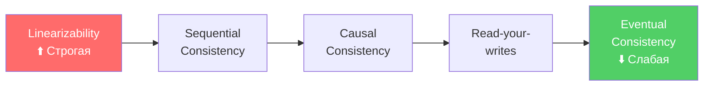

Чем строже модель, тем выше задержка и ниже пропускная способность, но тем проще рассуждать о корректности.


> [!mcq]
> - [ ] Существует только две модели: strong и eventual consistency | Это упрощение: реальный спектр — `linearizability`, `sequential`, `causal`, `read-your-writes`, `monotonic reads`, `eventual`; каждая с уникальными гарантиями. ❌ ПОСЛЕДСТВИЕ: архитектор выбирает «strong consistency» для чата, не зная про `causal`; платит за `linearizability` 100ms latency вместо 5ms `causal`, теряет вовлечённость пользователей.
> - [ ] `Eventual consistency` гарантирует, что чтение увидит свою же запись | Это `read-your-writes`, более сильная модель; чистая `eventual` не даёт даже этого. ❌ ПОСЛЕДСТВИЕ: разработчик использует Cassandra `LOCAL_ONE` для UI, после `INSERT` сразу `SELECT` возвращает старые данные; пользователь жалуется «мой пост пропал».
> - [x] Спектр от строгой к слабой: `linearizability` → `sequential` → `causal` → `read-your-writes` → `eventual`; чем строже модель, тем выше latency и ниже throughput | `Linearizability` требует консенсуса (Raft/Paxos), `causal` — vector clocks, `eventual` — async replication; выбор определяет цену операции. ✓ ПРИМЕНЯТЬ: etcd/Spanner — `linearizability` для конфигов; MongoDB causal sessions для социальных связей; Cassandra `ONE` — `eventual` для лент. 📋 ПРАВИЛО: «Чем строже модель, тем дороже миллисекунда». 🔗 См. Q11, Q13, Q14.
> - [ ] Все модели consistency дают одинаковые гарантии, отличается только название | Каждая модель — формальное определение допустимых историй операций; `sequential` допускает наблюдения, недопустимые при `linearizability`. ❌ ПОСЛЕДСТВИЕ: команда пишет «consistency» в SLA без уточнения уровня; QA тестирует `eventual`, продакшн ждёт `strong` — баги в финансовой логике обнаруживают через 6 месяцев.

## Q11. (!) Что такое linearizability и почему это самая строгая модель?

**Linearizability** (линеаризуемость) — самая строгая модель согласованности для одиночного объекта. Каждая операция выглядит так, как будто она произошла мгновенно в некоторый момент между началом и завершением запроса. Все клиенты видят один и тот же глобальный порядок операций, согласованный с реальным временем.

Ключевые свойства:
- **Мгновенность**: если запись завершилась до начала чтения — чтение обязано увидеть эту запись
- **Глобальный порядок**: все наблюдатели согласны в порядке операций
- **Real-time ordering**: порядок операций совпадает с реальным временем

```
Клиент A:  |---write(x=1)---|
Клиент B:           |---read(x)---| → должен вернуть 1
                                      (чтение началось после завершения записи)

Клиент A:  |---write(x=1)---|
Клиент B:      |---read(x)---|      → может вернуть 0 или 1
                                      (операции пересекаются во времени)
```

Линеаризуемость обеспечивается через алгоритмы консенсуса (`Raft`, `Paxos`) или единственного лидера с синхронной репликацией. Системы: `etcd`, `ZooKeeper` (sync reads), Google `Spanner` (с TrueTime).


> [!mcq]
> - [ ] `Linearizability` — то же, что `serializability` в БД | `Serializability` про многошаговые транзакции (ACID `I`), `linearizability` про одиночный объект и реальное время; `strict serializability` = serializability + linearizability. ❌ ПОСЛЕДСТВИЕ: разработчик включает `SERIALIZABLE` в PostgreSQL, ждёт линеаризуемости от replica reads, получает stale данные из-за async replication; race condition в платежах.
> - [x] Каждая операция выглядит как мгновенная в некий момент между началом и завершением; все клиенты видят один глобальный порядок, согласованный с реальным временем | Если запись завершилась до начала чтения — чтение обязано увидеть её; обеспечивается через `Raft`/`Paxos` или single leader с синхронной репликацией. ✓ ПРИМЕНЯТЬ: etcd для Kubernetes API server, ZooKeeper с `sync()`+read для leader election в HBase. 📋 ПРАВИЛО: «Linearizability — операция мгновенна, все согласны в порядке». 🔗 См. Q10, Q19, Q20.
> - [ ] `Linearizability` — это про порядок записей в журнале, без отношения к реальному времени | Это `sequential consistency`: глобальный порядок есть, но не привязан к real-time; `linearizability` — строже, требует real-time order. ❌ ПОСЛЕДСТВИЕ: разработчик считает ZooKeeper sequential reads линеаризуемыми, не вызывает `sync()`; читает stale snapshot, lock manager выдаёт два владельца блокировки.
> - [ ] `Linearizability` достижима только в одной локальной БД | Достижима в распределённых системах через консенсус (etcd/Raft, Spanner/TrueTime), хотя ценой latency. ❌ ПОСЛЕДСТВИЕ: команда отказывается от etcd ради «локальной согласованности» в файле; Kubernetes-кластер не масштабируется, теряет fault-tolerance.

## Q12. Что такое sequential consistency?

**Sequential consistency** (последовательная согласованность) — модель, в которой результат выполнения эквивалентен некоторому последовательному выполнению операций всех процессов, при этом операции каждого процесса сохраняют свой порядок. В отличие от `linearizability`, порядок не обязан совпадать с реальным временем.

```
Процесс A: write(x=1), write(x=2)
Процесс B: write(x=3), write(x=4)

Допустимый sequential order:
  write(x=1) → write(x=3) → write(x=2) → write(x=4)
  (порядок внутри каждого процесса сохранён: 1 до 2, 3 до 4)

Недопустимый:
  write(x=2) → write(x=1) → ...
  (нарушен порядок процесса A)
```

На практике `sequential consistency` проще реализовать, чем `linearizability`, потому что не нужна синхронизация с реальным временем. Используется в `ZooKeeper` для обычных чтений (не через `sync`).


> [!mcq]
> - [ ] `Sequential consistency` идентична `linearizability` | Различие критично: `sequential` не требует совпадения с real-time, `linearizability` — требует; `sequential` слабее. ❌ ПОСЛЕДСТВИЕ: разработчик ожидает от ZooKeeper sequential reads гарантии «после `write`-`read` увидит запись», получает stale; lock service выдаёт повторный lock.
> - [x] Все процессы видят операции в одинаковом глобальном порядке, при этом порядок внутри каждого процесса сохранён, но не обязан совпадать с реальным временем | Слабее `linearizability` (нет real-time), сильнее `causal` (есть глобальный порядок); проще реализовать без timestamp-синхронизации. ✓ ПРИМЕНЯТЬ: ZooKeeper для обычных чтений (без `sync()`); Lamport's original spec для multiprocessor systems. 📋 ПРАВИЛО: «Sequential — общий порядок, но без часов». 🔗 См. Q11, Q13, Q22.
> - [ ] `Sequential consistency` означает последовательную обработку запросов одним потоком | Это про конкурентность одного процесса, не про распределённую модель; `sequential consistency` — модель видимости операций между узлами. ❌ ПОСЛЕДСТВИЕ: разработчик думает «sequential = single-threaded», использует один поток на всю БД; throughput 100 RPS вместо 50K, продукт не масштабируется.
> - [ ] Это самая слабая модель consistency | `Sequential` сильнее `causal`, `read-your-writes`, `eventual`; в спектре строгих моделей — вторая по силе после `linearizability`. ❌ ПОСЛЕДСТВИЕ: команда выбирает «sequential» как «слабейшую достаточную» для high-throughput, получает overhead глобального ordering, latency растёт втрое.

## Q13. (!) Что такое causal consistency и когда она применяется?

**Causal consistency** (причинная согласованность) — модель, которая гарантирует порядок только для причинно-связанных операций. Если операция B зависит от результата операции A (например, B читает значение, записанное A), то все узлы увидят A перед B. Параллельные (не связанные причинно) операции могут быть видны в разном порядке на разных узлах.

```
Пример (чат):
  Алиса: "Кто идёт на обед?"     (сообщение 1)
  Боб:   "Я!"                     (сообщение 2, ответ на 1 — причинная связь)

  Causal consistency гарантирует: все видят сообщение 1 перед 2.
  Но сообщение Кати "Привет всем" (не связано) может быть в любом месте.
```

Применяется в:
- **`MongoDB`** (causal consistency sessions) — клиент получает `clusterTime` и `operationTime`, гарантирующие причинный порядок
- **Социальные сети** — комментарии должны отображаться после поста, на который они отвечают
- **Коллаборативные редакторы** — `CRDT` с causal ordering

Causal consistency — хороший компромисс: сильнее `eventual`, но не требует глобальной синхронизации как `linearizability`.


> [!mcq]
> - [x] Гарантирует порядок только для причинно-связанных операций (если B зависит от A — все видят A до B); параллельные операции могут наблюдаться в разном порядке | Реализуется через vector clocks или version vectors; компромисс между `eventual` (слабо) и `linearizability` (дорого). ✓ ПРИМЕНЯТЬ: MongoDB causal sessions через `clusterTime`/`operationTime`; Facebook TAO для социального графа; Google COPS для многосайтовой репликации. 📋 ПРАВИЛО: «Causal — комментарий после поста, всегда в порядке». 🔗 См. Q10, Q11, Q15.
> - [ ] `Causal consistency` гарантирует глобальный порядок для всех операций, как `linearizability` | Только для причинно-связанных; параллельные (без happens-before) могут видеться в разном порядке на разных узлах. ❌ ПОСЛЕДСТВИЕ: команда полагается на causal для финансовых транзакций, ожидая total order; параллельные списания на одном счёте дают расхождение баланса на $300K.
> - [ ] `Causal consistency` — то же, что `read-your-writes` | `Read-your-writes` — частный случай: клиент видит свои записи; `causal` шире — учитывает чужие зависимые операции тоже. ❌ ПОСЛЕДСТВИЕ: разработчик включает sticky session ради causal, получает только read-your-writes; чужие комментарии к посту видны до самого поста, в чате путаница.
> - [ ] Применяется только в академических работах, не в production | MongoDB, Riak, Redis Enterprise CRDT, Facebook TAO активно используют causal в продакшене. ❌ ПОСЛЕДСТВИЕ: архитектор отвергает causal как «теоретическую», берёт `linearizability` для социального графа; кластер не выдерживает нагрузку, latency растёт с 5ms до 80ms.

## Q14. Что такое eventual consistency и каковы её гарантии?

**Eventual consistency** (согласованность в конечном счёте) — самая слабая практически полезная модель. Гарантия: если прекратить запись, то через конечное время все реплики придут к одинаковому состоянию. Нет гарантий о том, как быстро это произойдёт и что увидит клиент в промежутке.

Что **гарантируется**:
- Данные не будут потеряны (durability)
- Реплики сойдутся (convergence)

Что **не гарантируется**:
- Порядок операций (клиент может увидеть запись B без записи A, даже если A была раньше)
- `Read-your-writes` (клиент может не увидеть свою запись сразу)
- Время конвергенции (может быть миллисекунды, может минуты)

```java
// Пример: DynamoDB eventually consistent read
GetItemRequest request = GetItemRequest.builder()
    .tableName("Orders")
    .key(Map.of("orderId", AttributeValue.builder().s("123").build()))
    .consistentRead(false)  // eventual consistency (default, в 2 раза дешевле)
    .build();

// Strongly consistent read — гарантирует последние данные, но дороже
GetItemRequest strongRequest = request.toBuilder()
    .consistentRead(true)   // strong consistency (удвоенная стоимость RCU)
    .build();
```


> [!mcq]
> - [ ] `Eventual consistency` — то же, что отсутствие репликации | Это означает single node без репликации; `eventual` — про множество реплик, которые сойдутся через async replication. ❌ ПОСЛЕДСТВИЕ: junior настраивает «eventual» отключением репликации в Cassandra, получает single point of failure без read-replicas; кластер падает при отказе одного узла.
> - [ ] `Eventual consistency` гарантирует, что данные сойдутся за 1 секунду | Нет гарантий по времени: при длительном partition replication lag может быть часы; «eventual» = «когда-нибудь». ❌ ПОСЛЕДСТВИЕ: команда обещает в SLA «1-секундная конвергенция» на DynamoDB Global Tables; cross-region partition даёт 30-минутный lag, банк теряет $2M на double-spend в финансовых транзакциях.
> - [ ] Гарантирует, что клиент всегда видит последние данные сразу после записи | Это `linearizability` или `strong consistency`, не `eventual`; в чистой `eventual` клиент может не увидеть собственную запись. ❌ ПОСЛЕДСТВИЕ: разработчик полагается на «eventual» в Cassandra `LOCAL_ONE` для чтения после записи; UI показывает «пост не создан», пользователь дублирует — два поста в ленте.
> - [x] Гарантия: если запись прекращается, все реплики через конечное время сойдутся; нет гарантий порядка, времени конвергенции и `read-your-writes` | Самая слабая практически полезная модель; даёт durability и convergence, но клиент может не увидеть свою запись сразу или увидеть B без A. ✓ ПРИМЕНЯТЬ: DynamoDB по умолчанию (eventually consistent reads — 0.5 RCU vs 1 RCU strong); Cassandra `CL=ONE` для viewing history Netflix. 📋 ПРАВИЛО: «Eventual — когда-нибудь, не сейчас». 🔗 См. Q10, Q15, Q26.

## Q15. Чем отличается strong eventual consistency от eventual consistency?

**Strong eventual consistency** (`SEC`) добавляет к `eventual consistency` гарантию: если два узла получили одинаковый набор обновлений (в любом порядке), они будут в одинаковом состоянии **немедленно**, без дополнительной координации.

Обычная `eventual consistency` требует дополнительного этапа разрешения конфликтов (conflict resolution), который может потребовать координации. `SEC` достигается через **бесконфликтные реплицируемые типы данных** (`CRDT`):

```java
// Пример: G-Counter (grow-only counter) — CRDT
// Каждый узел инкрементирует свой счётчик, конфликтов нет
public class GCounter {
    private final Map<String, Long> counters = new HashMap<>(); // nodeId → count

    public void increment(String nodeId) {
        counters.merge(nodeId, 1L, Long::sum);
    }

    // Merge с другой репликой — просто max по каждому узлу
    public void merge(GCounter other) {
        other.counters.forEach((node, count) ->
            counters.merge(node, count, Math::max)
        );
    }

    public long value() {
        return counters.values().stream().mapToLong(Long::longValue).sum();
    }
}
```

`CRDT` используются в `Riak` (counters, sets, maps), `Redis` (CRDTs в Redis Enterprise), коллаборативных редакторах (Figma, Google Docs).


> [!mcq]
> - [ ] `SEC` идентична strong consistency | `Strong` = `linearizability` (real-time order для всех операций); `SEC` гарантирует только сходимость реплик при одинаковых обновлениях. ❌ ПОСЛЕДСТВИЕ: архитектор путает термины, обещает «strong» при использовании CRDT; финансовый расчёт ожидает linearizable read, читает stale CRDT-counter, баланс отрицательный.
> - [ ] `SEC` — это `eventual consistency` с дополнительным локом на запись | Локов нет: CRDT работают без координации, в этом их сила; локи противоречат идее eventual-семейства. ❌ ПОСЛЕДСТВИЕ: команда добавляет distributed lock над Riak ради «strong eventual», получает single point of contention; throughput 1K RPS вместо 50K.
> - [ ] `SEC` гарантирует, что записи никогда не теряются | Это `durability`, ортогонально consistency-моделям; `SEC` — про сходимость реплик при одинаковом наборе. ❌ ПОСЛЕДСТВИЕ: разработчик полагается на «SEC» для durability, не настраивает `fsync`; при падении узла теряет последние write-ahead-log записи.
> - [x] `SEC` добавляет: при одинаковом наборе обновлений (в любом порядке) реплики немедленно в одинаковом состоянии без координации; реализуется через CRDT | CRDT (G-Counter, OR-Set, LWW-Register) гарантируют коммутативность операций: merge = max/union, конфликтов нет. ✓ ПРИМЕНЯТЬ: Riak DT (counters, sets, maps), Redis Enterprise CRDTs, Figma collaborative editing, Automerge. 📋 ПРАВИЛО: «SEC = одинаковый набор → одинаковое состояние, без conflict resolution». 🔗 См. Q14, Q15, Q40.

## Q16. (!) Что такое кворум и как он обеспечивает согласованность?

**Кворум** (quorum) — минимальное количество узлов, которые должны подтвердить операцию, чтобы она считалась успешной. Кворумные системы позволяют достичь согласованности без централизованного координатора.

Ключевая формула: `W + R > N`, где:
- `N` — общее число реплик
- `W` — количество узлов, подтверждающих запись (write quorum)
- `R` — количество узлов, с которых читают (read quorum)

Если `W + R > N`, множества узлов записи и чтения **пересекаются** — хотя бы один узел в read quorum содержит последнюю запись.

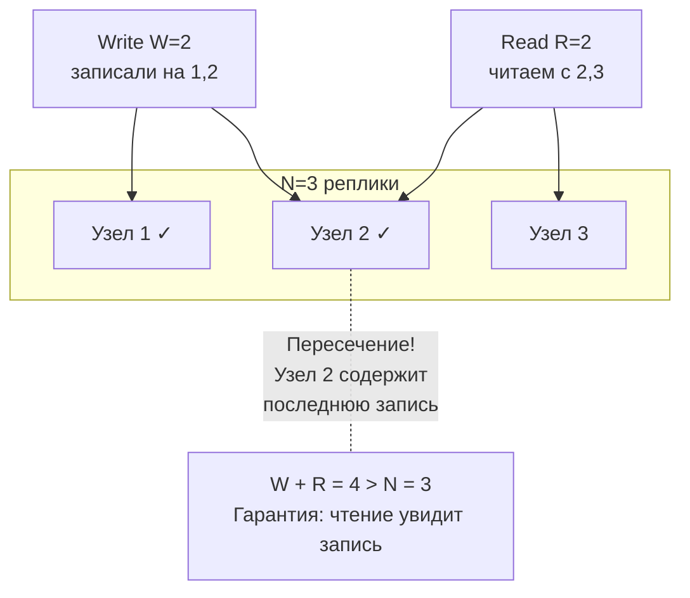


> [!mcq]
> - [x] Кворум — минимальное число узлов, подтверждающих операцию; при `W+R>N` множества записи и чтения пересекаются, гарантируя что чтение увидит последнюю запись | Без централизованного координатора достигается consistency через пересечение sets; формула из Dynamo paper Amazon (2007). ✓ ПРИМЕНЯТЬ: Cassandra `QUORUM` (W=2, R=2, N=3), DynamoDB internal Paxos quorums, Riak с настраиваемыми W/R. 📋 ПРАВИЛО: «W+R>N — пересечение, гарантия overlap'а». 🔗 См. Q17, Q18, Q22.
> - [ ] Кворум — это всегда большинство узлов кластера (`majority`) | `Majority quorum` — частный случай (W=R=⌊N/2⌋+1); общий кворум может быть несимметричным (W=N, R=1 или W=1, R=N). ❌ ПОСЛЕДСТВИЕ: разработчик жёстко прописывает `majority` для каждого запроса, не используя `W=N, R=1` для read-heavy workload; кластер тормозит на чтениях втрое.
> - [ ] Кворум гарантирует `linearizability` автоматически | `W+R>N` даёт overlap, но без version vectors/timestamps возможны concurrent writes без ordering; для linearizability нужен консенсус. ❌ ПОСЛЕДСТВИЕ: команда полагает на Cassandra `QUORUM` как на linearizable, не использует LWT (`Paxos`); concurrent updates на счёте дают потерю обновления, баланс расходится.
> - [ ] Кворум применяется только в Cassandra | Применяется в Dynamo, Riak, Voldemort, Amazon S3 (eventual + read repair), любой системе с replication factor. ❌ ПОСЛЕДСТВИЕ: архитектор не рассматривает quorum tuning в DynamoDB, использует только default eventual reads; критичный read возвращает stale, баг проявляется только в продакшене.

## Q17. Что такое формула W + R > N и как она работает?

Формула `W + R > N` — математическое условие пересечения кворумов. Разные комбинации дают разные trade-offs:

| Конфигурация | W | R | Характеристика |
|-------------|---|---|----------------|
| `W=N, R=1` | 3 | 1 | Быстрое чтение, медленная запись, нет отказоустойчивости на запись |
| `W=1, R=N` | 1 | 3 | Быстрая запись, медленное чтение, нет отказоустойчивости на чтение |
| `W=2, R=2` (majority) | 2 | 2 | Сбалансированно, переживает отказ 1 узла из 3 |
| `W=1, R=1` | 1 | 1 | Максимальная скорость, но `W+R=2 ≤ N=3` — нет гарантии согласованности |

```
N=5, W=3, R=3:  W+R=6 > 5 ✓  — согласованность, переживает отказ 2 узлов
N=5, W=3, R=2:  W+R=5 = 5 ✗  — формально нет гарантии (нужно строго >)
N=5, W=1, R=1:  W+R=2 < 5 ✗  — eventual consistency, максимальная скорость
```

Важно: даже при `W + R > N` кворум не гарантирует `linearizability` — для этого нужен дополнительный механизм (version vectors, timestamps).


> [!mcq]
> - [x] `W+R>N` — условие пересечения write/read sets; разные комбинации дают trade-offs (W=N — медленная запись, W=1 — быстрая но без гарантии); даже при выполнении формула не даёт `linearizability` без timestamps | `W+R≤N` означает eventual consistency; формальное условие из Dynamo (Amazon 2007); версионирование (vector clocks/HLC) нужно для разрешения concurrent updates. ✓ ПРИМЕНЯТЬ: настройка Cassandra: `RF=3, W=QUORUM(2), R=QUORUM(2)` — 4>3, гарантия overlap; Riak с `pw=2, pr=2`. 📋 ПРАВИЛО: «W+R>N — overlap есть, но не linearizable». 🔗 См. Q16, Q18, Q25.
> - [ ] При `W+R=N` система остаётся consistent | Нужно строго `>`: при `W+R=N` множества могут не пересечься, чтение получит stale; формальное условие — strict greater than. ❌ ПОСЛЕДСТВИЕ: разработчик настраивает `W=2, R=3, N=5` (W+R=5=N), думает «достаточно»; concurrent read увидит до-write состояние, race condition в платёжной логике.
> - [ ] `W=1, R=1` достаточно для consistency при `RF=3` | `W+R=2<3=N`, гарантии нет: чтение может попасть на узел без последней записи; это `eventual consistency`-режим. ❌ ПОСЛЕДСТВИЕ: команда выбирает Cassandra `CL=ONE` для каталога цен, ожидая «как QUORUM», получает stale prices при ребалансе кластера; биллинг считает по старой цене, потеря $50K.
> - [ ] Формула применима только при синхронной репликации | Формула — про любую replication strategy; асинхронная репликация плюс quorum reads/writes даёт consistency через overlap. ❌ ПОСЛЕДСТВИЕ: архитектор переключает Cassandra на синхронную репликацию ради «правильного quorum»; latency растёт втрое, throughput падает, формула и так работала с async replication.

## Q18. Как настроить кворум в Cassandra?

`Cassandra` позволяет задавать `consistency level` (CL) на уровне каждого запроса. Это определяет W и R:

```cql
-- Создание keyspace с replication factor = 3
CREATE KEYSPACE orders WITH replication = {
  'class': 'NetworkTopologyStrategy',
  'dc1': 3,
  'dc2': 3
};

-- Запись с QUORUM: W = ⌊N/2⌋ + 1 = 2 из 3
INSERT INTO orders.items (id, name, price)
VALUES (uuid(), 'Laptop', 999.99)
USING CONSISTENCY QUORUM;

-- Чтение с QUORUM: R = 2 из 3
-- W(2) + R(2) = 4 > N(3) → гарантия согласованности
SELECT * FROM orders.items WHERE id = ?
USING CONSISTENCY QUORUM;

-- Максимальная доступность (AP-режим)
SELECT * FROM orders.items WHERE id = ?
USING CONSISTENCY ONE;  -- R=1, быстро, но может быть устаревшее

-- Максимальная согласованность (CP-режим)
INSERT INTO orders.items (id, name, price)
VALUES (uuid(), 'Laptop', 999.99)
USING CONSISTENCY ALL;  -- W=N=3, все реплики должны ответить
```

Уровни согласованности `Cassandra`:

| CL | Описание | Trade-off |
|----|----------|-----------|
| `ANY` | Запись принята хотя бы одним узлом (включая hinted handoff) | Максимальная доступность, минимальная гарантия |
| `ONE` | 1 реплика | Быстро, AP |
| `QUORUM` | ⌊N/2⌋ + 1 реплик | Баланс, strong consistency при W+R>N |
| `LOCAL_QUORUM` | Кворум в локальном дата-центре | Баланс + низкая latency (без кросс-DC) |
| `EACH_QUORUM` | Кворум в каждом дата-центре | Максимальная кросс-DC согласованность |
| `ALL` | Все реплики | CP, минимальная доступность |


> [!mcq]
> - [x] `Cassandra` задаёт `consistency level` per-request: `ONE` (W=R=1, AP), `QUORUM` (⌊N/2⌋+1, strong при W+R>N), `LOCAL_QUORUM` (кворум в DC), `EACH_QUORUM` (кворум в каждом DC), `ALL` (CP) | Per-request настройка позволяет оптимизировать критические запросы (`QUORUM` для платежей) и быстрые (`LOCAL_ONE` для лент). ✓ ПРИМЕНЯТЬ: Netflix viewing history — `LOCAL_ONE`; Apple iCloud — `LOCAL_QUORUM` для пользовательских данных; платежи — `QUORUM` или LWT. 📋 ПРАВИЛО: «Cassandra — tunable per-request, не глобально». 🔗 См. Q16, Q17, Q25.
> - [ ] Cassandra настраивается только глобально через `cassandra.yaml` | `consistency level` задаётся per-query через `CONSISTENCY` в CQL; глобально настраиваются только timeouts и replication strategy. ❌ ПОСЛЕДСТВИЕ: DBA пытается «настроить QUORUM» в `cassandra.yaml`, не находит параметра; команда работает с дефолтным `ONE`, получает stale reads в финансовой логике.
> - [ ] При `CL=ONE` запись попадает только на один узел из RF | Запись всегда реплицируется на все RF узлов; `CL` определяет, сколько узлов должны подтвердить, до возврата клиенту. ❌ ПОСЛЕДСТВИЕ: разработчик думает «`CL=ONE` = одна копия», беспокоится о durability; на самом деле копий 3 (RF=3), но клиент не ждёт остальных.
> - [ ] `EACH_QUORUM` идентичен `LOCAL_QUORUM` | `LOCAL_QUORUM` — кворум только в локальном DC, `EACH_QUORUM` — кворум в каждом DC; `EACH_QUORUM` дороже по latency, но даёт мульти-DC strong consistency. ❌ ПОСЛЕДСТВИЕ: команда использует `LOCAL_QUORUM` в multi-region setup, ожидая cross-region consistency; replication lag между регионами 5 сек, читают stale из другого региона.

## Q19. (!) Что такое алгоритм консенсуса и зачем он нужен?

**Алгоритм консенсуса** — протокол, позволяющий группе узлов договориться об одном значении, даже если часть узлов отказала. Консенсус — фундаментальная проблема распределённых систем, доказанная как неразрешимая в асинхронных системах (теорема `FLP`, 1985).

Консенсус нужен для:
- **Выбора лидера** — кто из узлов принимает решения?
- **Репликации журнала** — все реплики должны согласовать порядок записей
- **Распределённых блокировок** — кто владеет блокировкой?
- **Атомарных транзакций** — commit или abort?
- **Конфигурации кластера** — какие узлы в кластере?

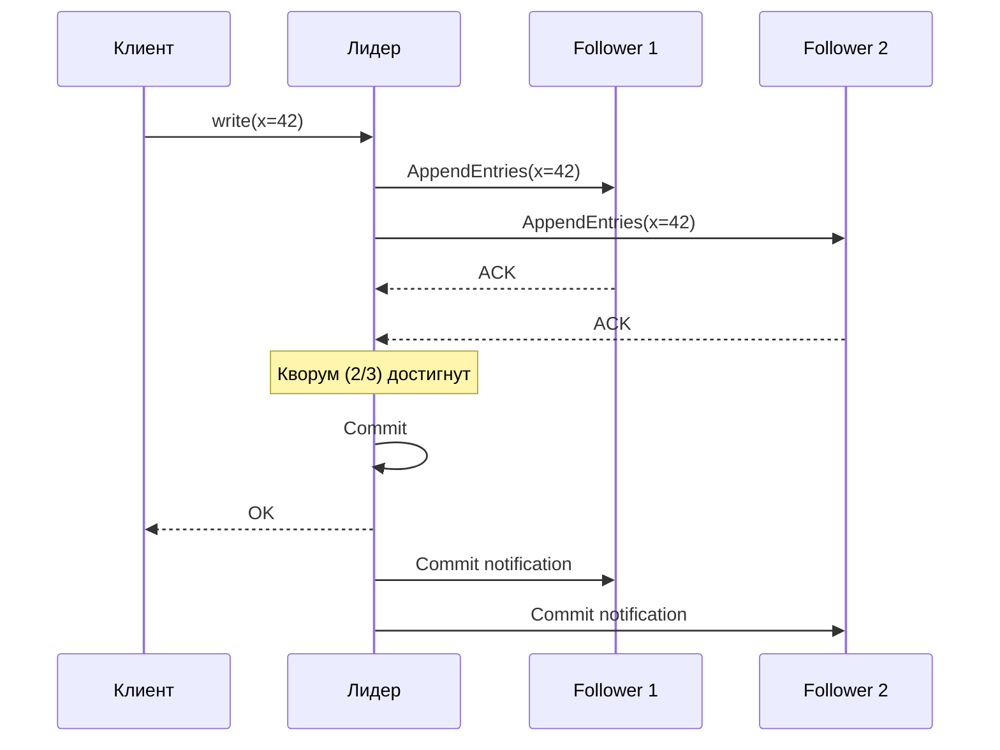

Основные алгоритмы: `Paxos` (Лэмпорт, 1989), `Raft` (Онгаро и Устерхаут, 2014), `ZAB` (ZooKeeper), `Viewstamped Replication`.


> [!mcq]
> - [ ] Алгоритм консенсуса гарантирует решение даже при отказе всех узлов | По FLP-теореме невозможно при асинхронной сети с одним сбоем; Paxos/Raft требуют большинство (`⌊N/2⌋+1`) живых узлов. ❌ ПОСЛЕДСТВИЕ: команда деплоит etcd с RF=3 в один AZ, ожидая работу при отказе двух; AZ падает, кластер встаёт без кворума, Kubernetes API недоступен 4 часа.
> - [ ] Алгоритм репликации данных между узлами | Репликация — следствие консенсуса (replicated log), но сам консенсус — про согласование одного значения; репликация может быть и без консенсуса (async replication). ❌ ПОСЛЕДСТВИЕ: junior путает Paxos с master-slave replication, не понимает зачем нужен election при failover; кластер уходит в split-brain без leader election.
> - [ ] Алгоритм только для Bitcoin/blockchain | Bitcoin использует PoW (Nakamoto consensus), но классический distributed consensus (Paxos/Raft) старше на 30 лет и используется в БД, координаторах. ❌ ПОСЛЕДСТВИЕ: на интервью кандидат отвечает «консенсус — это PoW в Bitcoin», не знает про Paxos; offer на distributed systems engineer не получают.
> - [x] Протокол, позволяющий группе узлов договориться об одном значении при отказе части; нужен для leader election, log replication, distributed locks, atomic commit | Теорема `FLP` (1985) показывает невозможность детерминированного консенсуса в асинхронных системах при сбое одного узла; практические алгоритмы (Paxos, Raft, ZAB) обходят через timeouts и randomization. ✓ ПРИМЕНЯТЬ: etcd (Raft) для Kubernetes, ZooKeeper (ZAB) для Hadoop, Google Chubby (Paxos) для locks. 📋 ПРАВИЛО: «Консенсус — договориться, когда часть молчит». 🔗 См. Q20, Q21, Q22.

## Q20. (!) Как работает алгоритм Raft?

**Raft** — алгоритм консенсуса, разработанный как понятная альтернатива `Paxos`. Используется в `etcd`, `Consul`, `CockroachDB`, `TiKV`. Raft разбивает задачу консенсуса на три подзадачи:

**1. Выбор лидера (Leader Election)**:
- Узлы в состояниях: `Leader`, `Follower`, `Candidate`
- Если follower не получает heartbeat от лидера в течение election timeout — становится candidate
- Candidate запрашивает голоса у всех узлов; получив большинство — становится лидером
- В каждый момент максимум один лидер на term (эпоху)

**2. Репликация журнала (Log Replication)**:
- Все записи идут через лидера
- Лидер отправляет `AppendEntries` RPC follower'ам
- Запись считается committed, когда реплицирована на большинство

**3. Безопасность (Safety)**:
- Новый лидер обязан содержать все committed записи
- Candidate не получит голос от узла с более полным журналом

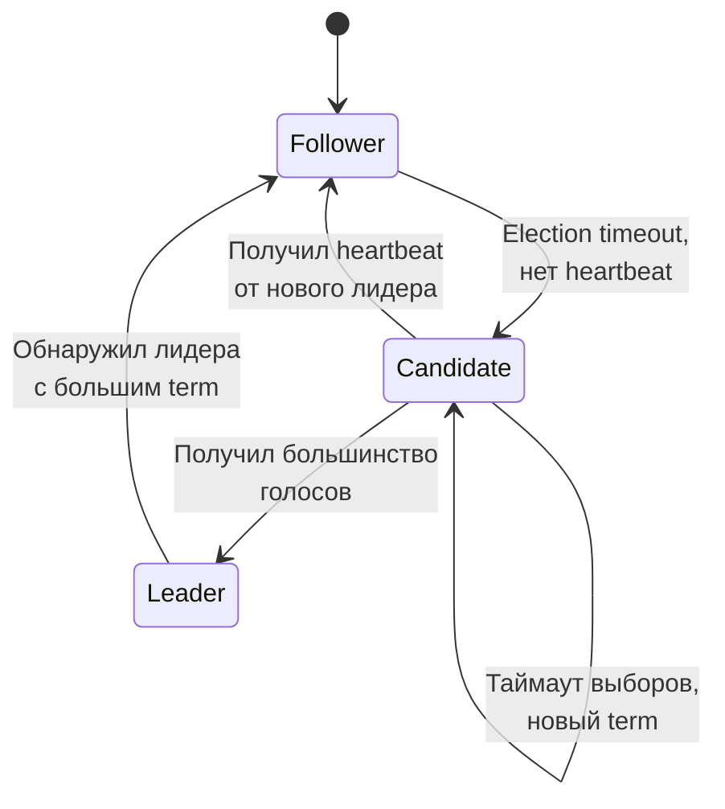

Raft гарантирует `linearizability` для операций через лидера. `etcd` по умолчанию направляет чтения через лидера; `serializable` чтения (через любой узел) быстрее, но слабее.


> [!mcq]
> - [x] Три подзадачи: leader election (через election timeout и голосование большинства), log replication (через `AppendEntries` от лидера), safety (новый лидер содержит все committed записи) | Все записи через лидера; запись committed после реплики на большинство; в каждый момент максимум один лидер на term (epoch); разработан Онгаро и Устерхаут (2014) как понятная альтернатива Paxos. ✓ ПРИМЕНЯТЬ: etcd для Kubernetes API, Consul для service discovery, CockroachDB, TiKV, HashiCorp Vault. 📋 ПРАВИЛО: «Raft — leader, log, safety; всё через большинство». 🔗 См. Q19, Q21, Q22.
> - [ ] Raft работает без лидера, peer-to-peer | Raft строго leader-based: все записи через лидера, фолловеры только реплицируют; leaderless — это Dynamo-стиль (Cassandra). ❌ ПОСЛЕДСТВИЕ: разработчик думает Raft = peer-to-peer, удивляется когда etcd-кластер становится недоступен на запись после падения лидера; не понимает 200ms окна выборов.
> - [ ] Raft не использует heartbeats | Heartbeats — основа Raft: лидер шлёт `AppendEntries` (даже пустые) каждые ~50ms; отсутствие heartbeat запускает election timeout у фолловера. ❌ ПОСЛЕДСТВИЕ: команда тюнит election timeout слишком агрессивно (100ms) на slow network; узлы постоянно меняют лидера, кластер тратит время на выборы вместо работы.
> - [ ] Raft гарантирует доступность при разделении сети 50/50 | При partition 50/50 ни одна половина не имеет большинства (`⌊N/2⌋+1`); кластер блокирует записи, выбирает `C` над `A`. ❌ ПОСЛЕДСТВИЕ: архитектор обещает high availability с Raft при любом partition; реальный сетевой инцидент 50/50 кладёт etcd на 30 минут, Kubernetes API недоступен.

## Q21. Как работает Paxos и чем отличается от Raft?

**Paxos** (Лэмпорт, 1989) — первый формально доказанный алгоритм консенсуса. Работает в две фазы:

**Фаза 1 (Prepare)**:
- Proposer выбирает номер предложения `n` и отправляет `Prepare(n)` acceptor'ам
- Acceptor отвечает `Promise(n)` — обещает не принимать предложения с номером < n

**Фаза 2 (Accept)**:
- Proposer, получив ответы от кворума, отправляет `Accept(n, value)`
- Acceptor принимает, если не обещал большего номера
- Значение считается выбранным, когда принято кворумом

Сравнение `Paxos` и `Raft`:

| Аспект | `Paxos` | `Raft` |
|--------|---------|--------|
| Роли | Proposer, Acceptor, Learner | Leader, Follower, Candidate |
| Лидер | Необязателен (multi-leader) | Обязателен (single leader) |
| Понятность | Сложный, трудно реализовать | Разработан для понятности |
| Гибкость | Более гибкий (Multi-Paxos, Fast Paxos) | Менее гибкий, но достаточный |
| Реализации | Google Chubby, Spanner | etcd, Consul, CockroachDB |
| Формальное доказательство | Полное | На основе Paxos |

На практике `Raft` используется чаще из-за понятности: легче реализовать, тестировать и отлаживать.


> [!mcq]
> - [x] `Paxos` (Лэмпорт 1989) — две фазы (`Prepare`/`Promise`, `Accept`/`Accepted`) с ролями proposer/acceptor/learner; Raft — single leader с явными ролями, разработан для понятности | Paxos гибче (multi-leader, Fast Paxos), сложнее в реализации; Raft проще, используется чаще; ZAB (ZooKeeper) — вариант Paxos. ✓ ПРИМЕНЯТЬ: Google Chubby/Spanner (Paxos), etcd/Consul (Raft), ZooKeeper (ZAB), Apache Cassandra LWT (Paxos). 📋 ПРАВИЛО: «Paxos — гибкий, Raft — понятный». 🔗 См. Q19, Q20, Q22.
> - [ ] Paxos и Raft — это одно и то же с разными названиями | Алгоритмически разные: Paxos допускает multiple leaders, Raft — single leader; Paxos сложнее формально, Raft проще. ❌ ПОСЛЕДСТВИЕ: разработчик меняет etcd (Raft) на Paxos-based решение «потому что одно и то же», ловит race conditions из-за multi-leader семантики.
> - [ ] Paxos гарантирует liveness даже при асинхронной сети | По FLP-теореме impossible: Paxos гарантирует safety (не повреждает данные), но не liveness без timeouts; нужны механизмы randomization/backoff. ❌ ПОСЛЕДСТВИЕ: команда полагается на Paxos «всегда жив», получает livelock при сетевой нестабильности; cluster не может выбрать leader, downtime 1 час.
> - [ ] Paxos применяется только в академических работах | Активно используется: Google Spanner, Chubby, Megastore, Cassandra LWT, Microsoft Azure Cosmos DB. ❌ ПОСЛЕДСТВИЕ: на интервью кандидат говорит «Paxos — теория, реальность Raft»; интервьюер уточняет про Spanner, кандидат теряет offer на cloud platform.

## Q22. Что такое split-brain и как алгоритмы консенсуса его предотвращают?

**Split-brain** — ситуация, когда при partition несколько сегментов кластера считают себя «главными» и принимают записи независимо. Это приводит к расхождению данных, которое может быть неразрешимым.

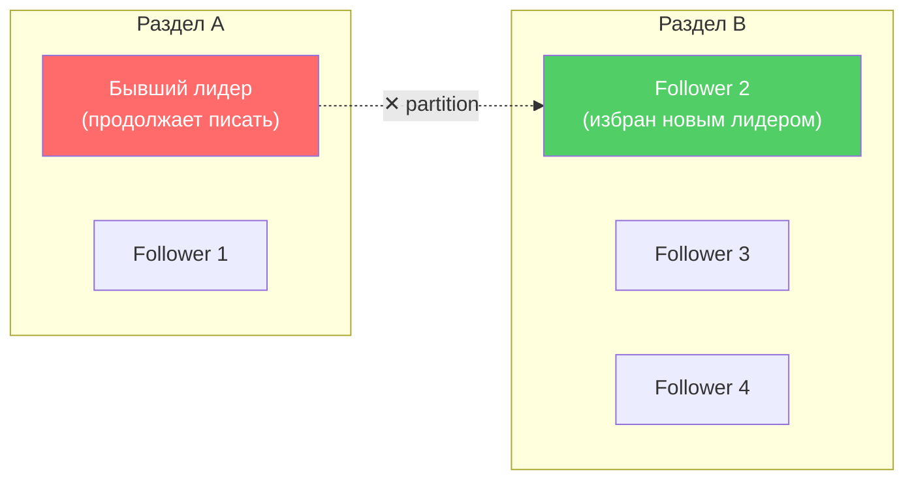

Как алгоритмы консенсуса предотвращают split-brain:

1. **Кворум большинства**: лидер может commit только с подтверждением от `⌊N/2⌋ + 1` узлов. При partition с 5 узлами (2+3) — только раздел с 3 узлами может достичь кворума
2. **Term/epoch**: каждый лидер работает в своём term. Старый лидер, получив сообщение с большим term, немедленно становится follower
3. **Fencing tokens**: при получении блокировки возвращается монотонно растущий token; ресурс отклоняет запросы со старым token

```java
// Пример: fencing token в распределённой блокировке
public class FencedLock {
    private final AtomicLong fencingToken = new AtomicLong(0);

    public LockResult tryLock(String clientId) {
        long token = fencingToken.incrementAndGet();
        return new LockResult(clientId, token);
    }

    // Ресурс проверяет: принимать только запросы с максимальным token
    public boolean validateToken(long token, long lastSeenToken) {
        return token > lastSeenToken; // старый лидер будет отклонён
    }
}
```


> [!mcq]
> - [ ] Split-brain легко решается перезапуском кластера | Проблема в том, что данные уже расходятся: ручное reconcile может быть невозможным или дорогим (миллионы записей). ❌ ПОСЛЕДСТВИЕ: SRE перезапускает MongoDB после split-brain, теряет данные одной половины (потому что другая стала primary); пользователи теряют 4 часа транзакций.
> - [ ] Split-brain невозможен в Kubernetes из-за etcd | etcd с RF=3 в одном AZ при сетевом сбое 1+2 не достигает majority; split-brain возможен при misconfiguration; защищает мульти-AZ deployment. ❌ ПОСЛЕДСТВИЕ: команда деплоит etcd в один AZ, AZ падает частично, кластер уходит в split, восстановление 6 часов.
> - [ ] Quorum достаточен, fencing tokens не нужны | Quorum защищает кластер, но при выдаче distributed lock клиентам нужен fencing: старый holder после GC pause может записать stale данные. ❌ ПОСЛЕДСТВИЕ: команда использует Redlock без fencing, через GC pause старый holder записывает поверх нового; race condition на распределённом lock'е.
> - [x] При partition несколько сегментов считают себя главными и пишут независимо; Paxos/Raft предотвращают через quorum majority, term/epoch и fencing tokens | Только сегмент с `⌊N/2⌋+1` узлов достигает кворума; старый лидер с устаревшим term становится follower; fencing отклоняет stale writes. ✓ ПРИМЕНЯТЬ: GitHub 2018 outage — split-brain MySQL Orchestrator на 24 часа; ZooKeeper/etcd используют epoch. 📋 ПРАВИЛО: «Split-brain — две головы пишут, fencing — кто старше, тот молчит». 🔗 См. Q7, Q19, Q20.

## Q23. (!) Что такое PACELC и как связано с CAP?

**PACELC** — расширение CAP, предложенное Даниэлем Абади в 2012 году. Формулировка: при **P**artition выбор между **A** и **C** (как в CAP), при **E**lse (отсутствии partition) — выбор между **L**atency и **C**onsistency. То есть даже без partition система может жертвовать согласованностью ради более низкой задержки.

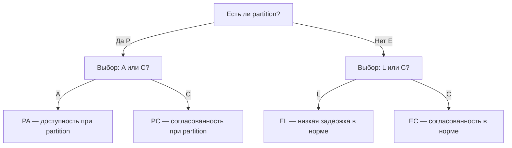

PACELC лучше отражает реальные trade-offs:
- CAP говорит только о поведении при сбоях
- PACELC добавляет повседневный trade-off: latency vs consistency
- Большинство запросов выполняются **без** partition, поэтому EL/EC важнее PA/PC


> [!mcq]
> - [x] PACELC (Daniel Abadi 2012) — расширение CAP: при `Partition` выбор между `A` и `C` (как в CAP), при `Else` (норма) — выбор между `Latency` и `Consistency` | Большинство времени partition нет, но trade-off `latency vs consistency` всё равно остаётся; Cassandra `QUORUM` даёт `C`, но `latency` выше, чем `ONE`. ✓ ПРИМЕНЯТЬ: классификация: DynamoDB PA/EL, MongoDB majority PC/EC, Cassandra ONE PA/EL, ZooKeeper PC/EC, Spanner PC/EC. 📋 ПРАВИЛО: «PACELC — CAP в шторм + Latency-vs-Consistency в штиль». 🔗 См. Q1, Q9, Q24.
> - [ ] PACELC заменяет CAP полностью | Расширяет, не заменяет: PACELC включает CAP как первую часть; обе теоремы используются вместе. ❌ ПОСЛЕДСТВИЕ: команда отбрасывает CAP, фокусируется только на PACELC; в DAR-документе нет анализа поведения при partition, продакшен встаёт.
> - [ ] PACELC применима только к BASE-системам | Применима к любым распределённым системам с репликацией: Spanner (PC/EC), PostgreSQL sync (PC/EC), DynamoDB (PA/EL). ❌ ПОСЛЕДСТВИЕ: архитектор не классифицирует PostgreSQL по PACELC, считает только Cassandra «BASE»; не настраивает synchronous_commit, теряет данные при failover.
> - [ ] `Else` в PACELC означает «всегда» | `Else` — конкретное условие «не partition» = нормальный режим работы; trade-off в `Else` другой, чем в `Partition` (latency vs consistency, не availability). ❌ ПОСЛЕДСТВИЕ: разработчик читает «PACELC: при чём-либо выбор между L и C», теряет понимание условности; настраивает Cassandra как «всегда EL», не учитывает PA при сбоях сети.

## Q24. Как классифицировать реальные системы по PACELC?

| Система | Классификация PACELC | Объяснение |
|---------|---------------------|------------|
| `Cassandra` | PA/EL | При partition — доступность; в норме — низкая latency (async replication) |
| `DynamoDB` (default) | PA/EL | Eventual reads по умолчанию; при partition — доступность |
| `MongoDB` (majority) | PC/EC | При partition — согласованность; в норме — тоже согласованность |
| `ZooKeeper` | PC/EC | Всегда согласованность, даже ценой latency |
| `etcd` | PC/EC | Raft, чтение через лидера, линеаризуемость |
| `CockroachDB` | PC/EC | Строгая сериализуемость, Raft |
| `Riak` | PA/EL | Dynamo-модель, оптимизация latency |
| `PostgreSQL` (async) | PA/EL | Асинхронная репликация → latency важнее |
| `PostgreSQL` (sync) | PC/EC | Синхронная репликация → согласованность важнее |
| Google `Spanner` | PC/EC | TrueTime, внешняя согласованность |

Обратите внимание: `Cassandra` и `DynamoDB` — PA/EL по умолчанию, но могут работать как PC/EC при настройке `QUORUM`/`consistent reads`.


> [!mcq]
> - [ ] Все NoSQL — PA/EL, все SQL — PC/EC | Зависит от настроек: MongoDB majority — PC/EC (NoSQL), PostgreSQL async — PA/EL (SQL); технология не определяет автоматически. ❌ ПОСЛЕДСТВИЕ: архитектор выбирает MongoDB как «NoSQL = AP» для платежей, не настраивает majority writeConcern; при failover теряет коммиты, $200K компенсаций.
> - [ ] Spanner — единственная PA/EC система | Spanner — PC/EC (Paxos гарантирует C при partition), не PA/EC; такая комбинация невозможна (либо A, либо C при partition). ❌ ПОСЛЕДСТВИЕ: команда выбирает Spanner ради «availability + consistency», не понимая что при partition Spanner блокирует записи; биллинг встаёт на 30 сек при network event.
> - [ ] PACELC даёт одинаковую классификацию для всех версий системы | Версии меняют поведение: MongoDB до 3.2 имела weaker defaults, после 3.2 — majority по умолчанию; классификация эволюционирует. ❌ ПОСЛЕДСТВИЕ: DBA полагается на старую классификацию MongoDB 2.x как PA/EL, выбирает её для финансов; не знает о изменениях в 4.x, продакшен ведёт себя иначе.
> - [x] Cassandra/DynamoDB default — PA/EL; MongoDB majority и ZooKeeper — PC/EC; Spanner — PC/EC ценой TrueTime; PostgreSQL sync — PC/EC, async — PA/EL | Классификация зависит от настроек: одна система может быть PA/EL и PC/EC при разных CL (Cassandra ONE vs ALL). ✓ ПРИМЕНЯТЬ: матрица для DAR: для платежей PC/EC (etcd, MongoDB majority), для лент PA/EL (Cassandra ONE, DynamoDB default). 📋 ПРАВИЛО: «Каждая система — точка в матрице PACELC, не категория». 🔗 См. Q23, Q31, Q36.

## Q25. (!) Cassandra и CAP: как работает настраиваемая согласованность?

`Cassandra` — архетипическая AP-система, но с **tunable consistency** (настраиваемой согласованностью). Клиент выбирает уровень согласованности per-request:

```cql
-- AP-режим: быстро, но возможны устаревшие данные
SELECT * FROM users WHERE id = ? CONSISTENCY ONE;

-- Strong consistency: W(QUORUM) + R(QUORUM) > N(RF)
INSERT INTO users (id, name) VALUES (?, ?) CONSISTENCY QUORUM;
SELECT * FROM users WHERE id = ? CONSISTENCY QUORUM;

-- Для мульти-DC: LOCAL_QUORUM не ходит в другие дата-центры
SELECT * FROM users WHERE id = ? CONSISTENCY LOCAL_QUORUM;
```

Механизмы конвергенции в `Cassandra`:
- **Read repair** — при чтении с нескольких реплик, если данные расходятся, устаревшие реплики обновляются
- **Anti-entropy repair** (`nodetool repair`) — фоновый процесс, сравнивает Merkle trees реплик
- **Hinted handoff** — если реплика недоступна, другой узел сохраняет hint и доставит данные позже
- **Last-write-wins** (LWW) — разрешение конфликтов по timestamp

```yaml
# cassandra.yaml — ключевые параметры согласованности
hinted_handoff_enabled: true
max_hint_window_in_ms: 10800000  # 3 часа — как долго хранить hints
read_request_timeout_in_ms: 5000
write_request_timeout_in_ms: 2000
```


> [!mcq]
> - [x] Cassandra — AP-система с **tunable consistency**: клиент выбирает CL per-request (`ONE`/`QUORUM`/`ALL`/`LOCAL_QUORUM`); механизмы конвергенции — read repair, hinted handoff, anti-entropy (`nodetool repair`), LWW по timestamp | `W+R>N` (например QUORUM+QUORUM при RF=3) даёт strong consistency при наличии всех реплик; per-request выбор позволяет mixing strong/eventual в одной БД. ✓ ПРИМЕНЯТЬ: Discord использует Cassandra/ScyllaDB с `LOCAL_QUORUM` для сообщений; Apple iCloud — `LOCAL_QUORUM`+LWT для critical writes. 📋 ПРАВИЛО: «Cassandra — AP по умолчанию, CP по запросу с QUORUM». 🔗 См. Q5, Q17, Q18.
> - [ ] Cassandra гарантирует strong consistency на `QUORUM` без дополнительных настроек | `QUORUM` даёт `W+R>N`, но при concurrent writes возможна потеря обновления через LWW; для true strong нужны LWT (Lightweight Transactions через Paxos). ❌ ПОСЛЕДСТВИЕ: команда использует `QUORUM` для счётчика баланса, два concurrent inсrement дают LWW; один инкремент теряется, баланс расходится.
> - [ ] Cassandra `CL=ALL` идентичен `CL=QUORUM` | `ALL` ждёт всех реплик (W=N), `QUORUM` — большинства (`⌊N/2⌋+1`); при `ALL` отказ одного узла блокирует запись (CP-режим). ❌ ПОСЛЕДСТВИЕ: разработчик выбирает `ALL` ради «надёжности», не понимая trade-off; при rolling restart реплики продакшен встаёт, доступность падает на 5%.
> - [ ] Read repair работает только при `CL=ALL` | Read repair работает при любом CL>1 (несколько реплик опрашиваются), при `ALL` — синхронный, при `QUORUM`+ — async через `read_repair_chance`. ❌ ПОСЛЕДСТВИЕ: команда отключает read repair ради latency на `CL=ONE`, не запускает `nodetool repair`; через месяц реплики разъехались, restore из backup невозможен.

## Q26. (!) DynamoDB и CAP: какой trade-off?

`DynamoDB` — управляемая NoSQL-БД от AWS, по умолчанию AP-система с `eventual consistency`. Предлагает два режима чтения:

```java
// Eventually consistent read (по умолчанию) — AP
// Дешевле (0.5 RCU за 4KB), может вернуть устаревшие данные
GetItemRequest eventualRead = GetItemRequest.builder()
    .tableName("Orders")
    .key(Map.of("PK", AttributeValue.builder().s("ORDER#123").build()))
    .consistentRead(false) // default
    .build();

// Strongly consistent read — ближе к CP
// Дороже (1 RCU за 4KB), гарантирует последние данные
GetItemRequest strongRead = GetItemRequest.builder()
    .tableName("Orders")
    .key(Map.of("PK", AttributeValue.builder().s("ORDER#123").build()))
    .consistentRead(true)
    .build();
```

Особенности `DynamoDB` в контексте CAP:

| Аспект | Поведение |
|--------|-----------|
| Eventual reads | Данные конвергируют обычно за ~1 секунду |
| Strong reads | Только для `GetItem`/`Query`, не для `Scan` по GSI |
| Global Tables | Multi-region, eventual consistency между регионами (last-writer-wins) |
| Transactions | `TransactWriteItems` — ACID на уровне таблицы, CP-семантика |
| GSI | Всегда eventually consistent (асинхронное обновление индекса) |

`DynamoDB` по PACELC: **PA/EL** (default) или **PC/EC** (при `consistentRead=true` + transactions).


> [!mcq]
> - [ ] `DynamoDB` всегда `CP`: каждый `GetItem` идёт через Paxos-кворум независимо от флагов | DynamoDB по умолчанию AP с eventual reads (0.5 RCU); strong reads — opt-in через `consistentRead=true`. ❌ ПОСЛЕДСТВИЕ: команда оставляет default reads и считает что баланс счёта всегда свежий — после `UpdateItem` фронт показывает старое значение, пользователь жмёт «оплатить» дважды.
> - [ ] `consistentRead=true` гарантирует strong consistency и для GSI-запросов | Strong reads работают только для base table (`GetItem`/`Query` по PK), GSI всегда eventually consistent (асинхронное обновление индекса). ❌ ПОСЛЕДСТВИЕ: разработчик включает `consistentRead=true` для `Query` по GSI и получает `ValidationException`; в фолбэке ловит stale данные индекса.
> - [x] `DynamoDB` — настраиваемый AP/CP: default `eventually consistent` (PA/EL), `consistentRead=true` + `TransactWriteItems` дают strong reads и ACID-транзакции (PC/EC) | Eventual reads дёшевы (0.5 RCU за 4KB) и быстрее, strong — 1 RCU и читаются с лидер-реплики; Global Tables между регионами всегда eventual c LWW. ✓ ПРИМЕНЯТЬ: Amazon retail каталог использует eventual reads, корзины и `TransactWriteItems` — strong; Lyft fare-calculation на DynamoDB с `consistentRead=true` для финансовых операций. 📋 ПРАВИЛО: «DynamoDB — eventual по умолчанию, strong по флагу, GSI всегда лагает». 🔗 См. Q14, Q23, Q32.
> - [ ] Global Tables гарантируют linearizability между регионами через TrueTime-подобный механизм | Global Tables — multi-master с **last-writer-wins** по timestamp, никакого глобального консенсуса нет; конфликтующие записи в разных регионах теряются молча. ❌ ПОСЛЕДСТВИЕ: команда настраивает Global Tables eu/us для inventory, два региона декрементируют сток одновременно; LWW оставляет одну запись, второй декремент теряется — overselling.

## Q27. (!) Zookeeper и CAP: почему это CP-система?

`ZooKeeper` — классическая **CP-система**, используемая для координации распределённых систем. Реализует протокол `ZAB` (ZooKeeper Atomic Broadcast), аналогичный `Paxos`.

Почему CP:
- **Все записи идут через лидера** — один лидер (leader), остальные follower'ы
- **Запись требует кворума** — лидер не подтвердит запись, пока большинство (⌊N/2⌋ + 1) follower'ов не запишут её в журнал
- **При partition** — раздел без кворума **не обслуживает запросы** (жертвует availability)
- **Sequential consistency** по умолчанию, `linearizability` при использовании `sync()` + read

```
Кластер ZooKeeper (5 узлов):
  При partition 2+3:
    Раздел с 3 узлами: выбирает нового лидера, продолжает работать ✓
    Раздел с 2 узлами: не может достичь кворума, отклоняет запросы ✗
    → Согласованность сохранена, доступность потеряна для меньшинства
```

`ZooKeeper` используется для:
- Распределённых блокировок (`/locks/resource-1`)
- Выбора лидера (`/election/leader`)
- Хранения конфигурации (`/config/service-a`)
- Service discovery (`/services/order-service/instances`)

Аналоги: `etcd` (Raft), `Consul` (Raft) — тоже CP-системы для координации.


> [!mcq]
> - [ ] `ZooKeeper` остаётся доступным во всех разделах: меньшинство переходит в `read-only` и продолжает обслуживать клиентов | При partition меньшинство **не обслуживает ни записи, ни чтения** (без `sync()`), кидает `ConnectionLossException`; ZK жертвует availability ради consistency. ❌ ПОСЛЕДСТВИЕ: команда строит service discovery на ZK и считает, что меньшинство «отдаст stale» — на самом деле клиенты падают с `KeeperException`, downstream-сервисы не находят инстансы и возникает каскадный outage.
> - [ ] `ZAB` — это просто отдельная реализация Raft, идентичная по протоколу выборов лидера | ZAB и Raft решают одну задачу (атомарный broadcast), но используют разные механизмы: ZAB опирается на `epoch`+`zxid`, Raft — на `term`+log matching; ZAB старше Raft и оптимизирован под primary-backup. ❌ ПОСЛЕДСТВИЕ: разработчик читает Raft paper и пытается «портировать» его термины на ZK без изучения ZAB; неверные предположения о fencing приводят к двойному выполнению job.
> - [ ] `ZooKeeper` обеспечивает `linearizability` для всех чтений по умолчанию | По умолчанию чтения **sequential consistent** и могут вернуть stale данные с follower'а; для linearizability нужен `sync()` перед `getData()`. ❌ ПОСЛЕДСТВИЕ: HBase region master читает `/regions` без `sync()` после network blip и считает регион живым; назначает запросы на мёртвый сервер, клиенты ловят таймауты 30 секунд.
> - [x] `ZooKeeper` — `CP` через `ZAB`: все записи идут через лидера, коммитятся после кворума `⌊N/2⌋+1` follower'ов; раздел без кворума отказывает клиентам, `linearizability` для чтений — через `sync()` | Эфемерные узлы привязаны к сессии и исчезают при разрыве (anti-split-brain), `zxid` обеспечивает глобальный порядок операций. ✓ ПРИМЕНЯТЬ: Apache Kafka до KRaft использовал ZK для `controller election` и хранения ISR; Hadoop HDFS NameNode HA через ZK. 📋 ПРАВИЛО: «ZK — лидер + кворум, меньшинство молчит, эфемерки убивают split-brain». 🔗 См. Q19, Q22, Q37.

## Q28. Redis — CP или AP?

**Redis** в кластерном режиме (`Redis Cluster`) — в терминах CAP ближе к **AP**. При partition секции кластера продолжают обслуживать запросы; данные могут расходиться между секциями до восстановления связи. Redis не гарантирует strong consistency при partition.

```
Redis Cluster (6 узлов: 3 master + 3 replica):
  Master A (слоты 0-5460)     → Replica A'
  Master B (слоты 5461-10922) → Replica B'
  Master C (слоты 10923-16383)→ Replica C'

  Репликация: асинхронная (по умолчанию)
  → write на Master A подтверждается ДО репликации на A'
  → при падении Master A возможна потеря последних записей
```

Одиночный Redis (standalone) — по сути CA (один узел, нет partition между репликами в смысле CAP). Redis Sentinel с репликацией: при failover реплика асинхронная, возможна потеря данных при сбое мастера — тоже ближе к AP по поведению. Параметр `WAIT` позволяет ждать репликации, сдвигая поведение к CP:

```redis
SET order:123 "confirmed"
WAIT 1 5000  -- ждать подтверждения от 1 реплики, таймаут 5 сек
```


> [!mcq]
> - [ ] Redis Cluster — `CP`: при partition меньшинство master'ов блокируется, как в Raft-системах | Redis использует **асинхронную репликацию** и `gossip`-failover, а не consensus-протокол; меньшинство не «блокируется», а продолжает писать до timeout `cluster-node-timeout`. ❌ ПОСЛЕДСТВИЕ: команда выбирает Redis Cluster для distributed lock, читает «CP» в маркетинговых материалах; при network blip два мастера принимают `SETNX` на один ключ — двойной charge платежа.
> - [x] Redis Cluster — `AP` с асинхронной репликацией: master подтверждает запись до её доставки на replica; команда `WAIT N timeout` сдвигает поведение к CP, но не даёт linearizability | При failover replica может потерять последние записи; `WAIT 1 5000` ждёт ack от 1 реплики, но это не гарантирует, что данные применены до partition. ✓ ПРИМЕНЯТЬ: Twitter Timeline на Redis Cluster (AP, eventual ок); StackOverflow использует `WAIT` для критичных счётчиков; Redis Enterprise CRDTs — настоящий AP без потерь. 📋 ПРАВИЛО: «Redis — async всегда, WAIT — лишь best-effort, не consensus». 🔗 См. Q14, Q15, Q22.
> - [ ] Redis Sentinel предотвращает split-brain через атомарные часы и fencing tokens | Sentinel использует quorum голосования, но **не fencing**: старый master после partition может продолжать принимать записи, пока клиент не переподключится. ❌ ПОСЛЕДСТВИЕ: после network blip Sentinel промоутит replica, но старый master ещё 30 секунд принимает `INCR`; клиенты, держащие старое соединение, инкрементят оба узла — счётчик расходится.
> - [ ] Standalone Redis — `AP`, потому что один узел реплицирует данные между потоками | Standalone Redis — single-process, single-node, без partition вообще, поэтому формально `CA`; AP/CP-вопрос возникает только при репликации/Cluster. ❌ ПОСЛЕДСТВИЕ: разработчик считает, что замена standalone на Cluster «бесплатно» добавит масштабирование с теми же гарантиями; продакшен ловит потерянные `INCR` после первого failover.

## Q29. PostgreSQL с репликацией — CP или AP?

Зависит от режима репликации:

**Синхронная репликация** (`synchronous_commit = on`): запись подтверждается только после получения данных на реплику(и). При partition с потерей кворума реплик — запись блокируется или отказывает. Это **CP**.

```sql
-- Настройка синхронной репликации (postgresql.conf)
-- synchronous_standby_names = 'FIRST 1 (replica1, replica2)'
-- synchronous_commit = on

-- Проверка статуса репликации
SELECT client_addr, state, sync_state, sent_lsn, replay_lsn
FROM pg_stat_replication;

-- sync_state: 'sync' — синхронная (CP), 'async' — асинхронная (AP)
```

**Асинхронная репликация**: мастер подтверждает запись сразу, репликация идёт в фоне. При partition мастер продолжает принимать запись — **AP**. Но при падении мастера возможна потеря данных (если реплика не успела получить изменения).

| Режим | `synchronous_commit` | Поведение | CAP |
|-------|---------------------|-----------|-----|
| `on` | Ждёт WAL flush на реплике | Потеря данных = 0, latency выше | CP |
| `remote_apply` | Ждёт apply на реплике | Чтение с реплики актуально | CP |
| `remote_write` | Ждёт записи в OS cache реплики | Компромисс | CP (слабее) |
| `off` | Не ждёт реплики | Минимальная latency, возможна потеря | AP |


> [!mcq]
> - [ ] PostgreSQL с любой репликацией — всегда `CP`: WAL-based реплика гарантирует strong consistency для чтений с standby | Только `synchronous_commit=remote_apply` даёт согласованное чтение со standby; `on` (default) ждёт WAL flush, но replay может отставать — read-your-writes на standby ломается. ❌ ПОСЛЕДСТВИЕ: разработчик пишет в primary и сразу читает с pgBouncer'а, направляющего read на standby; видит «своё удаление как existing» — UI показывает запись, которую только что удалил.
> - [ ] `synchronous_commit=off` это `CP`-режим: данные подтверждаются только после fsync на primary | `off` означает, что primary подтверждает commit ДО fsync даже на самом себе; при крахе primary теряются последние ~200ms транзакций. ❌ ПОСЛЕДСТВИЕ: команда включает `synchronous_commit=off` ради latency на финансовом API; узел падает после kernel panic — теряются последние 50 платежей, но клиенты получили `200 OK`.
> - [ ] Асинхронная репликация даёт `linearizability` для чтений с replica после короткого лага | Async replication = eventual consistency без формальных гарантий; replication lag может расти до часов при OOM на standby. ❌ ПОСЛЕДСТВИЕ: монолит читает баланс с replica с lag 5s; пользователь делает перевод, видит старый баланс и нажимает «отправить» снова — двойное списание.
> - [x] PostgreSQL — `CP` при `synchronous_commit=on/remote_apply` (ждёт реплики, блокирует write при потере кворума) и `AP` при `async`/`off` (low latency, потеря последних транзакций при failover) | `synchronous_standby_names = 'ANY 1 (...)'` требует ack от 1 реплики; при её недоступности `COMMIT` блокируется. ✓ ПРИМЕНЯТЬ: GitLab.com использует `synchronous_commit=remote_apply` для критичных транзакций; Patroni+etcd для CP-failover; Citus и Crunchy Bridge с sync replication. 📋 ПРАВИЛО: «PG sync — CP, async — AP, режим выбираешь per-cluster, не per-query». 🔗 См. Q11, Q14, Q22.

## Q30. Kafka и CAP: какой trade-off?

**Kafka** ориентирована на **доступность и отказоустойчивость**: при partition брокеры продолжают принимать и отдавать сообщения. В терминах CAP — настраиваемо, от AP до CP.

```properties
# Producer: AP-режим (максимальный throughput)
acks=1                    # лидер подтвердил, не ждём реплик
retries=0

# Producer: CP-режим (максимальная durability)
acks=all                  # ждём подтверждения от всех ISR
min.insync.replicas=2     # минимум 2 ISR для записи
retries=2147483647        # бесконечные ретраи
enable.idempotence=true   # exactly-once семантика
```

| Параметр | AP-значение | CP-значение | Влияние |
|----------|------------|-------------|---------|
| `acks` | `0` или `1` | `all` | Подтверждение записи |
| `min.insync.replicas` | `1` | `2+` | Минимум реплик для записи |
| `unclean.leader.election.enable` | `true` | `false` | Разрешить несинхронную реплику стать лидером |

При `acks=all` и `min.insync.replicas=2` — если живых реплик < 2, producer получит ошибку `NotEnoughReplicasException` (CP: жертвуем доступностью ради целостности).


> [!mcq]
> - [ ] `acks=1` достаточно для exactly-once и durability при отказе брокера | `acks=1` подтверждает только лидер, до репликации; падение лидера = потеря батча. Для exactly-once нужны `acks=all`+`enable.idempotence=true`+транзакции. ❌ ПОСЛЕДСТВИЕ: команда настраивает `acks=1` для платёжного топика ради latency, лидер падает в момент сетевого blip; теряется 200 событий, бухгалтерия не сходится.
> - [ ] `unclean.leader.election.enable=true` нужен на проде для максимальной durability | Этот флаг разрешает out-of-sync replica стать лидером при падении ISR — данные out-of-sync replica теряются; durability падает, не растёт. ❌ ПОСЛЕДСТВИЕ: команда включает unclean election «чтобы топик не блокировался» при двойном падении ISR; новый лидер на 30 секунд отстал, последние сообщения молча удаляются из лога — downstream-аналитика расходится.
> - [ ] `min.insync.replicas=2` гарантирует, что producer никогда не получит ошибку при доступности 2+ брокеров из 3 | При падении одного брокера ISR становится 2; падение второго → ISR=1 < 2 → producer получает `NotEnoughReplicasException` (CP-поведение). ❌ ПОСЛЕДСТВИЕ: разработчик считает min.insync.replicas «мягкой рекомендацией», запускает rolling restart двух брокеров одновременно; топик блокируется на 5 минут, заказы не принимаются.
> - [x] Kafka настраивается per-topic от AP до CP: `acks=1` — AP/low-latency; `acks=all`+`min.insync.replicas=2`+`enable.idempotence=true` — CP с exactly-once, отказ при ISR<minInsync | `acks=all` ждёт ack от всех ISR (не от всех реплик); `min.insync.replicas` определяет минимум ISR, без которого write блокируется. ✓ ПРИМЕНЯТЬ: LinkedIn для metrics — `acks=1` (AP); финансовые события Robinhood и платежи Stripe Connect — `acks=all`+min.insync=2 (CP); Confluent Cloud рекомендует CP для критичных топиков. 📋 ПРАВИЛО: «Kafka — acks+ISR определяют CAP, не сам брокер». 🔗 См. Q14, Q16, Q22.

`MongoDB` — система с настраиваемой согласованностью. По умолчанию использует `ReplicaSet` с одним primary и несколькими secondary:

```javascript
// AP-режим: быстрая запись, возможна потеря при failover
db.orders.insertOne(
  { orderId: "123", status: "confirmed" },
  { writeConcern: { w: 1 } }  // только primary подтвердил
);

// CP-режим: запись подтверждена большинством
db.orders.insertOne(
  { orderId: "123", status: "confirmed" },
  { writeConcern: { w: "majority", j: true } }  // majority + journal
);

// Чтение с гарантией causal consistency
const session = db.getMongo().startSession({ causalConsistency: true });
session.getDatabase("shop").orders.find({ orderId: "123" })
  .readConcern("majority")       // читать только committed данные
  .readPreference("secondary");  // можно читать с secondary
```

`MongoDB` Causal Consistency Sessions — поддерживают `causal consistency` через `clusterTime` и `operationTime`. Это позволяет читать с secondary и при этом гарантировать, что чтение увидит результаты предыдущих записей этой же сессии.


> [!mcq]
> - [ ] MongoDB всегда CP — secondary не поддерживают чтение | ❌ ПОСЛЕДСТВИЕ: MongoDB по умолчанию AP: `w:1` + `readPreference("secondary")` = fast но eventual; CP настраивается через `w:"majority"` + `readConcern("majority")`
> - [ ] Causal Consistency гарантирует линеаризуемость | ❌ ПОСЛЕДСТВИЕ: causal consistency слабее linearizability; гарантирует только порядок операций в одной сессии, не глобальный порядок
> - [x] MongoDB Causal Consistency Sessions: `readConcern("majority")` + `readPreference("secondary")` гарантирует что чтение увидит результаты предыдущих записей той же сессии | ✓ ПРИМЕНЯТЬ: снизить нагрузку на primary читая с secondary при этом сохранив causal order 📋 ПРАВИЛО: Causal Session = `clusterTime`+`operationTime` отслеживает happens-before в рамках сессии 🔗 См. Q32
> - [ ] `readConcern("majority")` нельзя использовать с `readPreference("secondary")` | ❌ ПОСЛЕДСТВИЕ: именно эта комбинация + causal consistency session позволяет безопасно читать с secondary; без causal session есть риск stale read

## Q32. Можно ли систему переключать между CP и AP?

Да, многие системы позволяют настраивать поведение per-request или per-collection:

| Система | CP-настройка | AP-настройка |
|---------|-------------|-------------|
| `Cassandra` | `QUORUM` / `ALL` | `ONE` / `LOCAL_ONE` |
| `DynamoDB` | `consistentRead: true` | `consistentRead: false` (default) |
| `MongoDB` | `w: "majority"`, `readConcern: "majority"` | `w: 1`, `readConcern: "local"` |
| `Kafka` | `acks: all`, `min.insync.replicas: 2` | `acks: 1` |
| `PostgreSQL` | `synchronous_commit: on` | `synchronous_commit: off` |

Для конкретного запроса можно выбирать уровень: критичные операции (платежи, инвентарь) — сильнее consistency, некритичные (лента, аналитика) — выше availability. Система не «чисто» CP или AP, а конфигурируемая по сценарию.


> [!mcq]
> - [ ] Система должна быть либо только CP, либо только AP — смешивание невозможно | ❌ ПОСЛЕДСТВИЕ: Cassandra (QUORUM=CP / ONE=AP), DynamoDB (consistentRead), MongoDB (writeConcern) позволяют per-request конфигурацию
> - [x] Многие системы (Cassandra, DynamoDB, MongoDB, Kafka) конфигурируются per-request: критичные операции → CP (QUORUM/majority), некритичные → AP (ONE/LOCAL_ONE) | ✓ ПРИМЕНЯТЬ: платежи → CP; лента → AP в одной системе 📋 ПРАВИЛО: не ищи CP или AP систему — ищи per-operation consistency level 🔗 См. Q33
> - [ ] Переключение CP↔AP требует перезапуска кластера | ❌ ПОСЛЕДСТВИЕ: Cassandra меняет consistency level per-query без рестарта; это параметр запроса, не конфигурация кластера
> - [ ] DynamoDB по умолчанию CP (strongly consistent) | ❌ ПОСЛЕДСТВИЕ: DynamoDB по умолчанию eventual consistent (AP, дешевле); strongly consistent = `consistentRead: true` + доп. стоимость

## Q33. Как выбирать CP vs AP для бизнес-системы?

Задайте вопрос: **допустима ли устаревшая информация?**

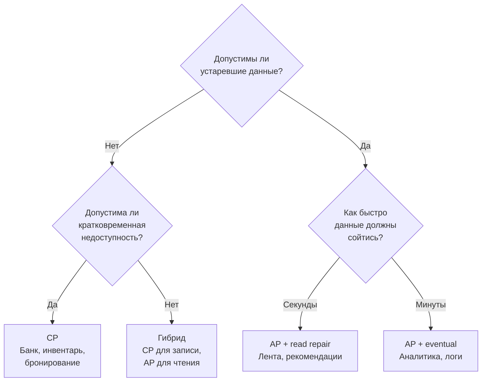

Ключевые вопросы для выбора:
- **Банковский баланс, инвентарь, место бронирования** — нет, нужен CP
- **Лента постов, счётчики лайков, рекомендации** — да, допустима eventual consistency
- **Влияние недоступности**: если при partition система «висит» 30 секунд — приемлемо? Для платежей — часто да. Для real-time чата — нет
- **Частота partition**: в одной зоне — реже; мульти-регион — чаще, AP предпочтительнее
- **Стоимость несогласованности vs недоступности**: что дороже бизнесу — показать устаревшие данные или не показать ничего?


> [!mcq]
> - [ ] CP выбирают когда пользователей мало, AP — когда много | ❌ ПОСЛЕДСТВИЕ: выбор CP/AP не зависит от масштаба; зависит от бизнес-требований: допустима ли устаревшая информация для данной операции
> - [ ] AP система всегда дешевле CP в operational cost | ❌ ПОСЛЕДСТВИЕ: стоимость зависит от конкретной БД и consistency level; CP на primary может быть дешевле AP с репликацией read-replicas
> - [x] Выбор CP/AP per-operation: «допустима ли устаревшая информация?» Платёж/инвентарь → CP; лента/аналитика → AP; frequency of partition → учесть | ✓ ПРИМЕНЯТЬ: e-commerce — остаток склада CP, каталог AP 📋 ПРАВИЛО: стоимость inconsistency > стоимость unavailability → CP; иначе AP 🔗 См. Q32
> - [ ] Все операции в сервисе должны использовать один уровень consistency | ❌ ПОСЛЕДСТВИЕ: Cassandra рекомендует QUORUM для критичных операций и LOCAL_ONE для analytics в одном кластере;混合ый подход норма

## Q34. (!) Как тестировать partition tolerance?

Тестирование устойчивости к разделению — важная часть валидации распределённых систем. Основные подходы:

**1. Jepsen** — фреймворк Кайла Кингсбери для тестирования согласованности распределённых систем:
- Создаёт кластер, инжектирует сетевые разделения
- Проверяет, нарушились ли заявленные гарантии (linearizability, sequential consistency)
- Нашёл баги в `Cassandra`, `MongoDB`, `Redis`, `Kafka`, `CockroachDB` и десятках других систем

**2. Chaos Engineering** — целенаправленное внесение сбоев в production или staging:

```bash
# Имитация network partition с помощью iptables
# Блокируем трафик между узлами 1 и 3
sudo iptables -A INPUT -s 10.0.0.3 -j DROP
sudo iptables -A OUTPUT -d 10.0.0.3 -j DROP

# Имитация задержки сети (latency injection)
sudo tc qdisc add dev eth0 root netem delay 200ms 50ms

# Имитация потери пакетов (partial partition)
sudo tc qdisc add dev eth0 root netem loss 30%
```

**3. Инструменты Chaos Engineering**:

| Инструмент | Описание |
|-----------|----------|
| `Chaos Monkey` (Netflix) | Случайно убивает инстансы в production |
| `Toxiproxy` (Shopify) | Прокси для имитации сетевых проблем |
| `Pumba` | Chaos testing для Docker контейнеров |
| `Litmus` | Chaos engineering для Kubernetes |
| `tc` / `iptables` | Linux-инструменты для имитации сетевых проблем |

**4. Что проверять при тестировании**:
- Система корректно обнаруживает partition (таймауты, heartbeat)
- Не возникает split-brain (два лидера одновременно)
- Данные не теряются при восстановлении
- Система восстанавливается автоматически после устранения partition
- Клиенты получают корректные ошибки, а не молчаливое повреждение данных


> [!mcq]
> - [ ] Jepsen тестирует только производительность, не корректность | ❌ ПОСЛЕДСТВИЕ: Jepsen тестирует correctness (linearizability, sequential consistency), а не performance; нашёл реальные баги в Cassandra, MongoDB, Redis
> - [ ] `iptables DROP` тестирует только latency, не partition | ❌ ПОСЛЕДСТВИЕ: `iptables -j DROP` создаёт полный network partition (пакеты не проходят); именно для тестирования partition tolerance
> - [x] Jepsen (проверяет linearizability), Chaos Engineering (iptables/tc/Toxiproxy), Chaos Monkey (убивает инстансы); проверять: split-brain, data loss при recovery, auto-recovery | ✓ ПРИМЕНЯТЬ: тест partition tolerance до production при запуске нового кластера 📋 ПРАВИЛО: chaos в staging → verify CAP claims → measure recovery time 🔗 См. Q35
> - [ ] Chaos Engineering допустим только в production — staging слишком отличается | ❌ ПОСЛЕДСТВИЕ: Netflix начинал chaos в staging; production chaos (GameDay) добавляется позже с feature flags и ограниченным scope

## Q35. Как проектировать систему с учётом CAP?

Практические принципы проектирования распределённых систем с учётом CAP:

**1. Не проектируйте «глобально CP или AP»** — выбирайте на уровне операции:

```
Пример: e-commerce
  - Остаток на складе → CP (нельзя продать товар, которого нет)
  - Каталог товаров → AP (устаревшая цена допустима на секунды)
  - Корзина → AP (синхронизируется при checkout)
  - Платёж → CP (строгая согласованность обязательна)
```

**2. Используйте компенсирующие транзакции** вместо строгой согласованности где возможно:
- Паттерн `Saga` — цепочка локальных транзакций с компенсациями
- Паттерн `Outbox` — гарантированная доставка событий через таблицу outbox
- `Idempotency keys` — безопасные повторные запросы

**3. Разделяйте reads и writes** (`CQRS`):
- Запись через CP-подсистему (один master, синхронная репликация)
- Чтение через AP-подсистему (множество read-реплик, eventual consistency)

**4. Мониторьте replication lag** — разницу между мастером и репликами:

```sql
-- PostgreSQL: проверка задержки репликации
SELECT now() - pg_last_xact_replay_timestamp() AS replication_lag;

-- Если lag > допустимого — алерт, переключение на чтение с мастера
```

**5. Проектируйте для graceful degradation**: при partition система должна деградировать предсказуемо, а не ломаться неожиданно. Клиент должен знать, что получает устаревшие данные (например, через заголовок `X-Data-Staleness`).

---


> [!mcq]
> - [ ] Система должна быть CP или AP во всех сценариях одинаково | ❌ ПОСЛЕДСТВИЕ: PACELC объясняет: даже в нормальном режиме (без partition) выбор latency vs consistency влияет на каждый запрос
> - [ ] При отсутствии partition CAP теорема не применима | ❌ ПОСЛЕДСТВИЕ: PACELC дополняет CAP именно для нормального режима; latency↔consistency tradeoff существует всегда
> - [x] Проектировать CP/AP per-operation; использовать async replication для некритичного; circuit breaker + fallback; мониторить replication lag; graceful degradation | ✓ ПРИМЕНЯТЬ: e-commerce — inventory CP, catalog AP; X-Data-Staleness header для прозрачности 📋 ПРАВИЛО: partition rare → PACELC latency/consistency важнее CAP 🔗 См. Q33
> - [ ] Graceful degradation означает возврат 503 при любой partition | ❌ ПОСЛЕДСТВИЕ: graceful degradation = показать устаревшие данные с предупреждением, не упасть; 503 только когда stale data неприемлема

## Q36. Что такое PACELC — расширение CAP для нормального состояния?

**PACELC** (Partition-Availability-Consistency-Else-Latency-Consistency) — теорема, предложенная Даниэлем Абади в 2012 году. Она расширяет CAP, добавляя вторую ось trade-off: что происходит, когда разделения **нет**.

CAP описывает только поведение при partition. Но в реальных системах партиции редки — гораздо важнее, что происходит в **нормальном режиме работы**: приходится выбирать между **задержкой** (`Latency`) и **согласованностью** (`Consistency`).

```
PACELC формулировка:
  Если есть P (Partition):
    выбираем A (Availability) ИЛИ C (Consistency)
  Else (нет Partition):
    выбираем L (Latency) ИЛИ C (Consistency)
```

| Система | При Partition | В норме | Классификация |
|---------|---------------|---------|---------------|
| `DynamoDB` | A | L | PA/EL |
| `Cassandra` (ONE) | A | L | PA/EL |
| `Cassandra` (QUORUM) | A | C | PA/EC |
| `ZooKeeper` | C | C | PC/EC |
| `HBase` | C | C | PC/EC |
| `MongoDB` (default) | C | C | PC/EC |
| `CRDT-системы` | A | L | PA/EL |

**Почему PACELC важнее CAP на практике:**
- В системе с 99.9% uptime partition бывает часы в год; latency vs consistency — каждый запрос
- При QUORUM-чтении в Cassandra нужно дождаться ответа большинства реплик — это увеличивает latency в обмен на свежие данные
- При eventual consistency (ONE) — минимальная latency, но данные могут быть устаревшими

```
Пример для собеседования:
  Cassandra с RF=3:
  - CONSISTENCY ONE:   latency ~1ms, может вернуть устаревшие данные (PA/EL)
  - CONSISTENCY QUORUM: latency ~5ms, всегда актуальные данные (PA/EC)
  - CONSISTENCY ALL:   latency ~10ms, максимальная свежесть (PA/EC)
```

---


> [!mcq]
> - [ ] PACELC = CAP, просто другое название | ❌ ПОСЛЕДСТВИЕ: PACELC расширяет CAP: CAP только про partition; PACELC добавляет E (else) — latency↔consistency tradeoff в нормальном режиме
> - [ ] Cassandra PA/EL с QUORUM неверна — QUORUM всегда PC | ❌ ПОСЛЕДСТВИЕ: Cassandra при partition всегда AP (можно писать в minority); с QUORUM — PA/EC в PACELC; при ONE — PA/EL
> - [x] PACELC: при P → AP/CP; при Else → L/C; DynamoDB=PA/EL; Cassandra ONE=PA/EL, QUORUM=PA/EC; ZooKeeper=PC/EC | ✓ ПРИМЕНЯТЬ: объяснять latency vs consistency трadeoff на интервью через PACELC 📋 ПРАВИЛО: PACELC добавляет нормальный режим к CAP; partition редок, latency↔consistency каждый запрос 🔗 См. Q35
> - [ ] Mongo default — PA/EL (eventual consistent) | ❌ ПОСЛЕДСТВИЕ: MongoDB default `readConcern: local` и `w:1` — это PC/EC в PACELC; strong consistency per document

## Q37. ZooKeeper и HBase как CP-системы: детали реализации

**ZooKeeper** — распределённый координатор, реализующий строгую CP-семантику через протокол **ZAB** (ZooKeeper Atomic Broadcast).

**Как ZAB обеспечивает согласованность:**
1. Все операции записи направляются **лидеру**
2. Лидер присваивает **zxid** (монотонно возрастающий идентификатор транзакции)
3. Лидер рассылает `PROPOSE` фолловерам; те отвечают `ACK`
4. После получения кворума ACK лидер отправляет `COMMIT`
5. Операция видна клиентам только после commit

**При network partition:**
- Меньшинство узлов перестаёт принимать запись (блокирует запросы)
- Лидер на меньшинстве уходит в отставку
- Клиенты получают `ConnectionLossException`

```java
// ZooKeeper: создание эфемерного узла (distributed lock)
ZooKeeper zk = new ZooKeeper("localhost:2181", 3000, null);
String path = zk.create("/lock/my-lock-",
    new byte[0],
    ZooDefs.Ids.OPEN_ACL_UNSAFE,
    CreateMode.EPHEMERAL_SEQUENTIAL);
// При потере соединения (partition) — узел исчезает автоматически
// Это гарантирует отсутствие split-brain: два лидера невозможны
```

**HBase** использует ZooKeeper для координации:
- ZooKeeper хранит местоположение region-серверов
- При partition region-сервер не может обновить ZK → считается мёртвым
- RegionMaster назначает регионы на другие серверы
- Запросы к недоступному region-серверу блокируются (CP: лучше ошибка, чем неконсистентные данные)

| Характеристика | ZooKeeper | HBase |
|----------------|-----------|-------|
| Протокол консенсуса | ZAB | ZAB (через ZK) |
| При partition | Блокирует меньшинство | Перемещает регионы |
| Задержка записи | ~1-5ms (синхронная) | ~5-20ms |
| Гарантия | Linearizability | Strong consistency per row |
| Применение | Service discovery, leader election, locks | OLTP с высокой нагрузкой на запись |

---


> [!mcq]
> - [ ] ZooKeeper CP означает что он всегда доступен — просто с задержкой | ❌ ПОСЛЕДСТВИЕ: ZooKeeper CP: при partition minority узлов блокирует writes; клиент получает ConnectionLossException, не медленный ответ
> - [ ] ZAB протокол = Raft — те же гарантии | ❌ ПОСЛЕДСТВИЕ: ZAB и Raft — разные протоколы; ZAB broadcasting-first, Raft leader-first election; оба обеспечивают linearizability но разными механизмами
> - [x] ZooKeeper CP через ZAB: все writes → лидер → PROPOSE кворуму → COMMIT; при partition меньшинство блокирует writes; HBase использует ZK для координации регионов | ✓ ПРИМЕНЯТЬ: leader election, distributed locks, service discovery требуют CP 📋 ПРАВИЛО: ZK ephemeral node исчезает при disconnect → no split-brain possible 🔗 См. Q38
> - [ ] HBase может работать без ZooKeeper | ❌ ПОСЛЕДСТВИЕ: HBase критически зависит от ZooKeeper для region server tracking; без ZK HBase не знает где находятся region servers

## Q38. Cassandra и DynamoDB как AP-системы: детали

**Cassandra** — AP-система, спроектированная для максимальной доступности. Ключевые механизмы:

**Архитектура без лидера (leaderless):**
- Все узлы равноправны (peer-to-peer)
- Запись идёт на любой узел-координатор → тот реплицирует на N узлов по consistent hashing
- Нет единой точки отказа; partition не блокирует работу

```
Настройка согласованности Cassandra:
  RF=3, DC=1
  CONSISTENCY ONE:    W=1, R=1 — максимальная доступность, может быть stale read
  CONSISTENCY QUORUM: W=2, R=2 — 2+2>3, всегда читаем свежие данные
  CONSISTENCY LOCAL_QUORUM: кворум в рамках одного датацентра
  CONSISTENCY ALL:    W=3, R=3 — CP-режим (блокирует при недоступности ноды)
```

**Hinted Handoff** — при недоступности реплики координатор сохраняет «подсказку» и доставляет данные позже. Это обеспечивает AP при коротких partition.

**Read Repair** — при чтении с кворумом, если реплики расходятся, Cassandra автоматически обновляет устаревшие реплики.

**DynamoDB** — управляемый сервис AWS, AP по умолчанию, CP по запросу:

```
DynamoDB режимы чтения:
  Eventually Consistent Read (по умолчанию):
    - Запрос идёт на любую реплику из 3
    - Может вернуть данные до 1 секунды устаревшими
    - В 2 раза дешевле (0.5 RCU за 4KB)

  Strongly Consistent Read:
    - Запрос идёт только на leader-реплику
    - Всегда актуальные данные
    - 1 RCU за 4KB, больше latency
    - При partition может вернуть ошибку
```

| Характеристика | Cassandra | DynamoDB |
|----------------|-----------|----------|
| Архитектура | Leaderless ring | Leader-based (Paxos per partition) |
| При partition | Продолжает работу (AP) | Eventually consistent (AP default) |
| CP-режим | CONSISTENCY ALL / QUORUM | Strongly Consistent Reads |
| Конфликты | LWW (Last Write Wins) по timestamp | Условные записи (ConditionalExpression) |
| Anti-entropy | Read Repair, Merkle trees | Managed (прозрачно) |
| Применение | Глобально распределённые данные | AWS-нативные приложения |

---


> [!mcq]
> - [ ] Cassandra всегда AP — нельзя настроить CP поведение | ❌ ПОСЛЕДСТВИЕ: Cassandra с CONSISTENCY ALL или QUORUM = CP поведение; если реплик нет → запись блокируется
> - [ ] DynamoDB использует Paxos per partition → всегда CP | ❌ ПОСЛЕДСТВИЕ: DynamoDB по умолчанию AP (eventual consistent); strongly consistent reads = opt-in; за деньги и latency
> - [x] Cassandra AP через leaderless ring + LWW для конфликтов; DynamoDB AP + conditional writes; оба поддерживают CP per-request | ✓ ПРИМЕНЯТЬ: Cassandra для globally distributed writes; DynamoDB для AWS-native OLTP 📋 ПРАВИЛО: Cassandra leaderless → no single point; DynamoDB Paxos per partition → stronger default 🔗 См. Q38
> - [ ] Cassandra не поддерживает conditional updates — только LWW | ❌ ПОСЛЕДСТВИЕ: Cassandra поддерживает Lightweight Transactions (LWT) через Paxos для conditional writes; дороже но возможно

## Q39. Network partition на практике: частота и типичные сценарии

**Network partition** — это не редкий аварийный сценарий. В реальных production-системах partition происходят регулярно:

**Статистика и исследования:**
- Исследование Google (2009): в крупных дата-центрах происходят тысячи сетевых сбоев в месяц
- Исследование Microsoft: 40% инцидентов связаны с сетевыми проблемами
- Jepsen.io: большинство протестированных систем имели проблемы с partition

**Типичные сценарии partition:**

| Сценарий | Причина | Длительность |
|----------|---------|--------------|
| GC pause | Stop-the-world GC на ноде — другие узлы считают её мёртвой | Секунды |
| Сетевое оборудование | Сбой свитча, замена маршрутизатора | Минуты |
| Обновление ОС/приложения | Rolling restart — часть узлов недоступна | Минуты |
| Перегрузка сети | Пакеты теряются при пиковой нагрузке | Секунды–минуты |
| Междатацентровый сбой | Обрыв WAN-канала | Минуты–часы |
| Slow network | Пакеты доходят, но с большой задержкой (partial partition) | Переменно |
| Cloud AZ failure | AWS/GCP зона недоступна | Минуты–часы |

**Partial partition** — особенно коварный случай: узлы A и B видят узел C, но не видят друг друга. В такой ситуации классические алгоритмы консенсуса могут вести себя неожиданно.

```
Примеры реальных инцидентов (по данным Jepsen):
  - MongoDB 2.4: при partition могла выбрать двух primary → потеря данных
  - Redis Sentinel: split-brain при GC pause у sentinel-узлов
  - Cassandra: при partition с QUORUM возможна запись в меньшинство
  - Kafka: при partition controller мог не освободить лидерство
```

**Как защититься:**
- Тестировать с помощью Jepsen, Chaos Monkey, Toxiproxy
- Настраивать таймауты ниже реального времени отказа
- Использовать fencing tokens для предотвращения split-brain
- Проектировать для graceful degradation, а не for perfect connectivity

---


> [!mcq]
> - [ ] Network partition происходит только при катастрофах датацентра | ❌ ПОСЛЕДСТВИЕ: partition случается от GC pause (seconds), rolling restart, перегрузки сети, slow network; это регулярные события
> - [x] Partition происходит регулярно: GC pause, rolling restart, AZ failure, WAN; защита: Jepsen тесты + fencing tokens + circuit breaker + graceful degradation | ✓ ПРИМЕНЯТЬ: при проектировании новой distributed системы учитывать partial partition 📋 ПРАВИЛО: partition не "если", а "когда" — проектировать для recovery, не perfect connectivity 🔗 См. Q34
> - [ ] Partial partition (A и B видят C но не друг друга) невозможен в cloud | ❌ ПОСЛЕДСТВИЕ: partial partition — реальный сценарий; документирован в AWS, GCP outpost; классические алгоритмы могут вести себя неожиданно
> - [ ] Fencing tokens защищают только от split-brain при leader election | ❌ ПОСЛЕДСТВИЕ: fencing tokens применяются для любого distributed lock; клиент с устаревшим token → storage отвергает запись

## Q40. CAP и микросервисная архитектура: как выбор БД влияет на дизайн?

В микросервисной архитектуре каждый сервис владеет своей БД (Database per Service pattern). Выбор CP или AP определяет всю стратегию согласованности данных.

**CP-сервис** (строгая согласованность):
```
Когда выбирать CP:
  - Финансовые транзакции (списание средств)
  - Inventory management (остатки товаров)
  - Уникальность пользователей (регистрация)
  - Права доступа и авторизация

Последствия для дизайна:
  - Синхронные вызовы между сервисами (REST/gRPC)
  - Distributed transactions (Saga с компенсациями)
  - Возможны блокировки при partition
  - Нужен circuit breaker для защиты от каскадных отказов
```

**AP-сервис** (eventual consistency):
```
Когда выбирать AP:
  - Каталог товаров (устаревшая цена 1-2 секунды — OK)
  - Корзина покупок (синхронизируется при checkout)
  - Статистика и аналитика
  - Рекомендации и персонализация

Последствия для дизайна:
  - Асинхронное взаимодействие (события/Kafka)
  - Idempotent операции
  - Версионирование сущностей
  - Логика обработки конфликтов в бизнес-коде
```

**Практическая схема для e-commerce:**

```
Сервис         БД          CAP    Причина
──────────────────────────────────────────────────
Order          PostgreSQL  CP     Финансовая операция
Payment        PostgreSQL  CP     Списание средств
Inventory      PostgreSQL  CP     Нельзя продать дважды
Product        Cassandra   AP     Каталог, устаревание OK
Cart           Redis       AP     Сессионные данные
Search         Elasticsearch AP   Индекс, лаг допустим
Analytics      ClickHouse  AP     Аналитика, eventual OK
Notifications  Cassandra   AP     Доставка best-effort
```

**Паттерны для межсервисной согласованности:**
- **Saga** — цепочка локальных транзакций с компенсациями (для CP↔AP взаимодействия)
- **Outbox + CDC** — атомарная публикация событий (for AP downstream consumers)
- **API Composition** — агрегация данных на query-side (CQRS)
- **Read-your-writes** — sticky session или version token для согласованного чтения после записи

---


> [!mcq]
> - [ ] Все микросервисы должны использовать одну БД для согласованности | ❌ ПОСЛЕДСТВИЕ: Database per Service = микросервисный принцип; одна БД = coupling между сервисами, невозможна независимая эволюция
> - [ ] CP-сервис не может взаимодействовать с AP-сервисом | ❌ ПОСЛЕДСТВИЕ: Saga pattern решает CP↔AP: Order (CP) публикует событие → Product (AP) обновляет каталог; компенсации при ошибке
> - [x] Database per Service; CP (PostgreSQL) для финансов/инвентаря; AP (Cassandra/Redis) для каталога/корзины; Saga+Outbox для межсервисной согласованности | ✓ ПРИМЕНЯТЬ: e-commerce: Order=CP, Catalog=AP, Cart=AP, Payment=CP 📋 ПРАВИЛО: выбор CP/AP per service based on business risk of inconsistency 🔗 См. Q35
> - [ ] Outbox pattern нужен только для CP-сервисов | ❌ ПОСЛЕДСТВИЕ: Outbox нужен любому сервису который публикует события + должен быть atomically с записью в БД; актуально для CP и AP сервисов

## Q41. (!) Google Spanner и TrueTime: как Spanner обходит CAP?

**Google Spanner** — глобально распределённая база данных, которую Google позиционирует как CA-систему. Это звучит невозможно с точки зрения CAP, но Spanner использует умный трюк.

**TrueTime API** — ключевая инновация Spanner:
- Каждый дата-центр Google оснащён **атомными часами** и **GPS-приёмниками**
- TrueTime не возвращает одно время — он возвращает **интервал** `[earliest, latest]`, где истинное время гарантированно находится
- Неопределённость (uncertainty interval) обычно составляет **1-7 миллисекунд**

```
TrueTime API:
  TT.now()   → TTInterval{earliest: t-ε, latest: t+ε}
  TT.after(t) → true, если t точно в прошлом
  TT.before(t) → true, если t точно в будущем

Алгоритм commit wait:
  1. Транзакция получает commit timestamp s = TT.now().latest
  2. Spanner ждёт, пока TT.after(s) станет true (~7ms)
  3. Только после этого транзакция видна другим
  → Это гарантирует, что все узлы "видели" время > s до commit
```

**Почему Spanner не нарушает CAP:**

Spanner — это CP-система. При network partition Spanner блокирует записи (ждёт кворума Paxos). Но Google построил очень надёжную сеть между дата-центрами (выделенные кабели, минимальные потери), поэтому partition практически не происходит.

> Брюер сам прокомментировал: "Spanner — технически CP, но с очень высокой практической доступностью за счёт надёжной инфраструктуры"

**Что даёт TrueTime:**
- **External consistency** (stronger than linearizability): если транзакция T1 завершилась до начала T2 в реальном времени, то T2 увидит все изменения T1 — даже если они на разных континентах
- **Globally consistent snapshots**: чтение с меткой времени даёт согласованный срез всей глобальной БД

| Характеристика | Обычная распределённая БД | Google Spanner |
|----------------|---------------------------|----------------|
| Синхронизация времени | NTP (~100ms погрешность) | Атомные часы + GPS (~7ms) |
| Гарантии | Linearizability per shard | External consistency global |
| Глобальные транзакции | 2PC с высокой latency | Paxos + TrueTime wait |
| Доступность | Зависит от partition | 99.999% (5 nines) |
| Применение | Большинство систем | Google Ads, F1, Cloud Spanner |

---


> [!mcq]
> - [ ] Google Spanner — CA система, нарушающая P теоремы CAP | ❌ ПОСЛЕДСТВИЕ: Spanner — CP; он жертвует availability: при partition ждёт кворума Paxos; его trick — TrueTime минимизирует commit wait до ~7ms
> - [ ] TrueTime использует NTP как все другие системы | ❌ ПОСЛЕДСТВИЕ: TrueTime = атомные часы + GPS + NTP; погрешность ~7ms vs NTP ~100ms; именно это позволяет commit wait быть коротким
> - [x] Spanner CP: TrueTime (атомные часы+GPS, ±7ms) позволяет external consistency; commit wait = uncertainty interval; глобальные транзакции через Paxos | ✓ ПРИМЕНЯТЬ: глобально распределённые финансовые системы где CP + low latency нужны 📋 ПРАВИЛО: Spanner обходит CAP trade-off аппаратно (часы), не теоретически 🔗 См. Q42
> - [ ] Cloud Spanner = open source, можно self-host | ❌ ПОСЛЕДСТВИЕ: Cloud Spanner = managed Google Cloud service; TrueTime требует специального оборудования Google; self-host невозможен без аналогичного hardware

## Q42. (!) CAP vs BASE: детальное сравнение

**ACID** и **BASE** — два противоположных подхода к гарантиям транзакций в распределённых системах.

**ACID** (Atomicity, Consistency, Isolation, Durability) — традиционная модель реляционных БД:
- Транзакция либо выполняется полностью, либо не выполняется совсем
- Сильная согласованность: данные всегда в валидном состоянии
- Дорого в распределённой среде: требует 2PC, блокировок, координации

**BASE** (Basically Available, Soft state, Eventually consistent) — модель для AP-систем:
- **Basically Available**: система всегда отвечает, даже если данные неполные
- **Soft state**: состояние системы может меняться само по себе (репликация, компакция)
- **Eventually consistent**: данные согласуются через некоторое время

```
Детальное сравнение ACID vs BASE:

Свойство          ACID                    BASE
─────────────────────────────────────────────────────
Согласованность   Строгая (сразу)         Eventual (через время)
Доступность       Может блокировать       Всегда отвечает
Модель            Pessimistic locking      Optimistic / MVCC
Конфликты         Предотвращаются          Разрешаются post-hoc
Масштабирование   Вертикальное (трудно)    Горизонтальное (легко)
Сложность кода    Простая (БД решает)     Высокая (приложение решает)
Примеры           PostgreSQL, Oracle       Cassandra, DynamoDB, CouchDB
```

**Связь CAP и BASE:**
- CP-системы тяготеют к ACID (ZooKeeper, HBase, PostgreSQL с репликацией)
- AP-системы реализуют BASE (Cassandra, DynamoDB, CouchDB)
- BASE — это не «плохой ACID», а осознанный выбор для масштабируемости

**Когда BASE достаточно — реальные примеры:**

```
1. DNS — классический пример BASE:
   - Запись обновляется у root-сервера
   - Распространяется по миру за минуты-часы
   - Все DNS-серверы eventual consistent
   - Никого не блокирует — всегда доступна

2. Amazon Shopping Cart:
   - При partition cart продолжает работать (AP)
   - Конфликты (два добавления одного товара) разрешаются union-ом
   - Пользователь видит "лишний" товар и может убрать

3. Facebook Timeline:
   - Пост может появиться у разных пользователей в разное время
   - Eventual consistent — через секунды все видят одно
   - Никогда не блокирует публикацию
```

**Практический выбор:**

| Критерий | Выбирай ACID/CP | Выбирай BASE/AP |
|----------|-----------------|-----------------|
| Финансы | ✓ (обязательно) | — |
| Медицинские данные | ✓ | — |
| Inventory | ✓ | — |
| Социальная лента | — | ✓ |
| Аналитика | — | ✓ |
| Кэш / сессии | — | ✓ |
| Корзина | — | ✓ (с merge) |

> [!mcq]
> - [ ] BASE = упрощённый ACID для простых систем без транзакций | ❌ ПОСЛЕДСТВИЕ: BASE — осознанный выбор масштабируемости; Amazon, Facebook, Netflix используют BASE для core features; не "упрощение"
> - [ ] ACID невозможно в distributed systems | ❌ ПОСЛЕДСТВИЕ: Google Spanner, CockroachDB, distributed PostgreSQL реализуют ACID globally; дорого но возможно
> - [x] CP/ACID: строгая согласованность, может блокировать → финансы, инвентарь; AP/BASE: basically available, eventual → лента, корзина, аналитика | ✓ ПРИМЕНЯТЬ: выбирать по стоимости inconsistency vs unavailability для конкретного use-case 📋 ПРАВИЛО: ACID = DB решает конфликты; BASE = приложение решает merge logic 🔗 См. Q33
> - [ ] BASE системы не поддерживают конфликт-разрешение — данные просто перезаписываются | ❌ ПОСЛЕДСТВИЕ: Cassandra использует LWW, CouchDB MVCC, Amazon cart union-merge; BASE требует явного conflict resolution в app layer

---

## See also

- [Распределённые системы](distributed-systems-interview.md) — базовые концепции: репликация, шардирование, консенсус
- [Паттерны согласованности](consistency-patterns-interview.md) — eventual consistency, linearizability, causal
- [Микросервисы](microservices-interview.md) — выбор CP/AP для каждого сервиса в архитектуре
- [Стратегии кэширования](caching-strategies-interview.md) — компромиссы согласованности при кэшировании
- [Архитектура БД](../databases/database-architecture-interview.md) — как Cassandra, DynamoDB, ZooKeeper реализуют CAP
- [Паттерны масштабирования](scalability-patterns-interview.md) — горизонтальное масштабирование и partition tolerance
- [BFF Pattern](bff-pattern-interview.md)
- [Clean Architecture](clean-architecture-interview.md)
- [Паттерны согласованности](consistency-patterns-interview.md)
- [CQRS и Event Sourcing](cqrs-event-sourcing-interview.md)
