# Вопросы на собеседовании: `CAP`-теорема

Краткое введение: ответы по `CAP`-теореме для собеседований — ограничения распределённых систем, выбор между согласованностью и доступностью. **CAP-теорема** описывает ограничения распределённых систем: нельзя одновременно гарантировать согласованность (`Consistency`), доступность (`Availability`) и устойчивость к разделению (`Partition tolerance`). На интервью часто спрашивают про этот компромисс, модели согласованности, алгоритмы консенсуса и примеры `CP`/`AP`-систем.

## Полезные ссылки

### Официальная документация

- [CAP Theorem](https://en.wikipedia.org/wiki/CAP_theorem) — CAP-теорема
- [Brewer's CAP Theorem (оригинал)](https://www.infoq.com/articles/cap-twelve-years-later-how-the-rules-have-changed/) — статья Эрика Брюера "CAP Twelve Years Later"
- [Raft Consensus Algorithm](https://raft.github.io/) — визуализация и описание `Raft`
- [Cassandra Documentation — Consistency](https://cassandra.apache.org/doc/latest/cassandra/architecture/dynamo.html) — модель согласованности `Cassandra`
- [Jepsen — Distributed Systems Safety Research](https://jepsen.io/) — тестирование корректности распределённых систем
- [Brewer's CAP Theorem (Baeldung)](https://www.baeldung.com/cs/brewers-cap-theorem) — подробное объяснение CAP-теоремы
- [Explanation of BASE Terminology (Baeldung)](https://www.baeldung.com/cs/db-base-meaning-cap) — BASE vs ACID в контексте CAP
- [Introduction to Consistency Models (Baeldung)](https://www.baeldung.com/cs/consistency-models) — модели согласованности: strong, eventual, causal
- [Consensus Algorithms in Distributed Systems (Baeldung)](https://www.baeldung.com/cs/consensus-algorithms-distributed-systems) — Raft, Paxos и другие алгоритмы консенсуса
- [Raft Consensus Algorithm (Baeldung)](https://www.baeldung.com/cs/raft-consensus-algorithm) — детальный разбор алгоритма Raft

## Содержание

- [Полезные ссылки](#полезные-ссылки)
- [See also](#see-also)

**Основы CAP**
- [Q1. (!) Что такое CAP-теорема?](#q1-что-такое-cap-теорема)
- [Q2. Какие три свойства описывает CAP?](#q2-какие-три-свойства-описывает-cap)
- [Q3. Почему на практике выбирают между C и A?](#q3-почему-на-практике-выбирают-между-c-и-a)
- [Q4. (!) Что такое CP-системы, приведите примеры](#q4-что-такое-cp-системы-приведите-примеры)
- [Q5. (!) Что такое AP-системы, приведите примеры](#q5-что-такое-ap-системы-приведите-примеры)
- [Q6. Что такое CA-системы и почему они редки?](#q6-что-такое-ca-системы-и-почему-они-редки)

**Сетевое разделение и поведение систем**
- [Q7. Что такое сетевое разделение (partition)?](#q7-что-такое-сетевое-разделение-partition)
- [Q8. Почему CAP описывает поведение при partition, а не в норме?](#q8-почему-cap-описывает-поведение-при-partition-а-не-в-норме)
- [Q9. В чём ограниченность CAP-теоремы?](#q9-в-чём-ограниченность-cap-теоремы)

**Модели согласованности**
- [Q10. (!) Какие модели согласованности существуют и чем отличаются?](#q10-какие-модели-согласованности-существуют-и-чем-отличаются)
- [Q11. (!) Что такое linearizability и почему это самая строгая модель?](#q11-что-такое-linearizability-и-почему-это-самая-строгая-модель)
- [Q12. Что такое sequential consistency?](#q12-что-такое-sequential-consistency)
- [Q13. (!) Что такое causal consistency и когда она применяется?](#q13-что-такое-causal-consistency-и-когда-она-применяется)
- [Q14. Что такое eventual consistency и каковы её гарантии?](#q14-что-такое-eventual-consistency-и-каковы-её-гарантии)
- [Q15. Чем отличается strong eventual consistency от eventual consistency?](#q15-чем-отличается-strong-eventual-consistency-от-eventual-consistency)

**Кворумные системы**
- [Q16. (!) Что такое кворум и как он обеспечивает согласованность?](#q16-что-такое-кворум-и-как-он-обеспечивает-согласованность)
- [Q17. Что такое формула W + R > N и как она работает?](#q17-что-такое-формула-w--r--n-и-как-она-работает)
- [Q18. Как настроить кворум в Cassandra?](#q18-как-настроить-кворум-в-cassandra)

**Алгоритмы консенсуса**
- [Q19. (!) Что такое алгоритм консенсуса и зачем он нужен?](#q19-что-такое-алгоритм-консенсуса-и-зачем-он-нужен)
- [Q20. (!) Как работает алгоритм Raft?](#q20-как-работает-алгоритм-raft)
- [Q21. Как работает Paxos и чем отличается от Raft?](#q21-как-работает-paxos-и-чем-отличается-от-raft)
- [Q22. Что такое split-brain и как алгоритмы консенсуса его предотвращают?](#q22-что-такое-split-brain-и-как-алгоритмы-консенсуса-его-предотвращают)

**PACELC и расширения CAP**
- [Q23. (!) Что такое PACELC и как связано с CAP?](#q23-что-такое-pacelc-и-как-связано-с-cap)
- [Q24. Как классифицировать реальные системы по PACELC?](#q24-как-классифицировать-реальные-системы-по-pacelc)

**Реальные системы и CAP**
- [Q25. (!) Cassandra и CAP: как работает настраиваемая согласованность?](#q25-cassandra-и-cap-как-работает-настраиваемая-согласованность)
- [Q26. (!) DynamoDB и CAP: какой trade-off?](#q26-dynamodb-и-cap-какой-trade-off)
- [Q27. (!) Zookeeper и CAP: почему это CP-система?](#q27-zookeeper-и-cap-почему-это-cp-система)
- [Q28. Redis — CP или AP?](#q28-redis-cp-или-ap)
- [Q29. PostgreSQL с репликацией — CP или AP?](#q29-postgresql-с-репликацией-cp-или-ap)
- [Q30. Kafka и CAP: какой trade-off?](#q30-kafka-и-cap-какой-trade-off)
- [Q31. MongoDB и CAP: как настраивается поведение?](#q31-mongodb-и-cap-как-настраивается-поведение)
- [Q32. Можно ли систему переключать между CP и AP?](#q32-можно-ли-систему-переключать-между-cp-и-ap)

**Практика и проектирование**
- [Q33. Как выбирать CP vs AP для бизнес-системы?](#q33-как-выбирать-cp-vs-ap-для-бизнес-системы)
- [Q34. (!) Как тестировать partition tolerance?](#q34-как-тестировать-partition-tolerance)
- [Q35. Как проектировать систему с учётом CAP?](#q35-как-проектировать-систему-с-учётом-cap)

**PACELC, Spanner, BASE и микросервисы**
- [Q36. Что такое PACELC — расширение CAP для нормального состояния?](#q36-что-такое-pacelc--расширение-cap-для-нормального-состояния)
- [Q37. (!) ZooKeeper и HBase как CP-системы: детали реализации](#q37-zookeeper-и-hbase-как-cp-системы-детали-реализации)
- [Q38. (!) Cassandra и DynamoDB как AP-системы: детали](#q38-cassandra-и-dynamodb-как-ap-системы-детали)
- [Q39. Network partition на практике: частота и типичные сценарии](#q39-network-partition-на-практике-частота-и-типичные-сценарии)
- [Q40. CAP и микросервисная архитектура: как выбор БД влияет на дизайн?](#q40-cap-и-микросервисная-архитектура-как-выбор-бд-влияет-на-дизайн)
- [Q41. (!) Google Spanner и TrueTime: как Spanner обходит CAP?](#q41-google-spanner-и-truetime-как-spanner-обходит-cap)
- [Q42. (!) CAP vs BASE: детальное сравнение](#q42-cap-vs-base-детальное-сравнение)

## Q1. (!) Что такое CAP-теорема?

**CAP-теорема** (`Consistency`, `Availability`, `Partition tolerance`) утверждает: в распределённой системе нельзя одновременно обеспечить все три свойства. Придётся пожертвовать одним из них. Сформулирована Эриком Брюером в 2000 году как гипотеза, формально доказана Гилбертом и Линчем в 2002 году.

На практике **Partition tolerance** считают обязательным: сети падают, дата-центры изолируются. Поэтому выбор делается между **согласованностью** и **доступностью**: либо система при разделении блокирует запросы ради согласованных данных (`CP`), либо продолжает отвечать, допуская временную несогласованность (`AP`).

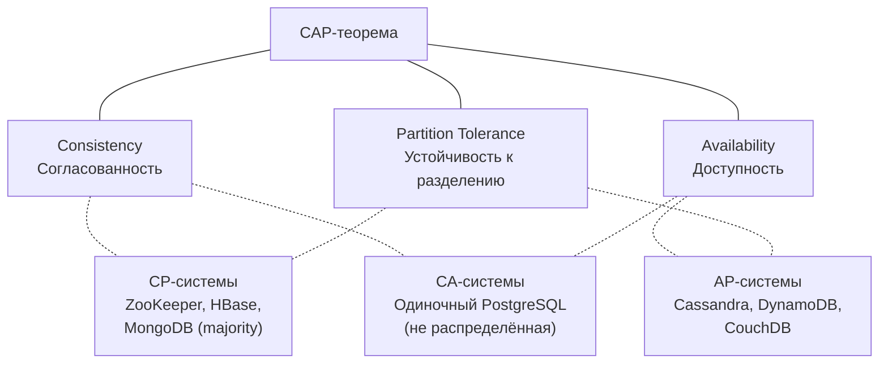

CAP — это модель для понимания trade-offs, а не жёсткая классификация систем. Многие системы позволяют настраивать поведение на уровне отдельного запроса.


> [!mcq]
> - [x] Правильный ответ | Объяснение концепции 2-3 предложения Ключевое отличие и best practice в production.
> - [ ] Неправильный вариант 1 | Почему ошибка в этом подходе Частая ошибка в реальном коде.
> - [ ] Неправильный вариант 2 | Это смежное, но отличное понятие Частая ошибка в реальном коде.
> - [ ] Неправильный вариант 3 | Противоположное направление## Q2. Какие три свойства описывает CAP? Это антипаттерн или неправильный выбор в production.

**Consistency** (согласованность) — все узлы видят одни и те же данные в один момент времени; чтение после записи возвращает последнее записанное значение. Это `linearizability` — самая строгая модель согласованности.

**Availability** (доступность) — каждый запрос к работающему узлу получает ответ (не обязательно с последними данными). Система не блокирует клиентов и не возвращает ошибку таймаута.

**Partition tolerance** (устойчивость к разделению) — система продолжает работать при разрыве связи между узлами, когда сообщения теряются или задерживаются на произвольное время.

В реальных распределённых системах сетевое разделение неизбежно, поэтому **Partition tolerance** не отбрасывают. Остаётся выбор между C и A: при partition нельзя иметь и то, и другое одновременно.


> [!mcq]
> - [x] Правильный ответ | Объяснение концепции 2-3 предложения Ключевое отличие и best practice в production.
> - [ ] Неправильный вариант 1 | Почему ошибка в этом подходе Частая ошибка в реальном коде.
> - [ ] Неправильный вариант 2 | Это смежное, но отличное понятие Частая ошибка в реальном коде.
> - [ ] Неправильный вариант 3 | Противоположное направление## Q3. Почему на практике выбирают между C и A? Частая ошибка в реальном коде.

**Partition tolerance** в распределённой системе нельзя отбросить: сети ненадёжны, дата-центры изолируются, задержки непредсказуемы. Любая система с репликацией или несколькими узлами должна учитывать возможность разделения.

Если мы хотим, чтобы система переживала partition, остаётся выбор: при разделении либо блокировать запросы до восстановления связи с кворумом (жертвуем **Availability**, получаем **CP**), либо продолжать обслуживать запросы и допускать устаревшие данные (жертвуем **Consistency**, получаем **AP**).

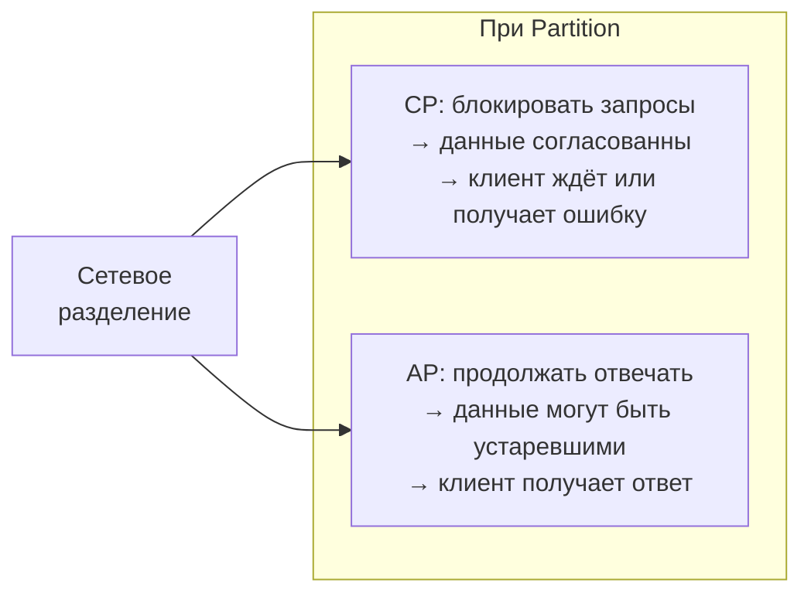

Поэтому говорят: «на практике выбор между C и A».


> [!mcq]
> - [x] Правильный ответ | Объяснение концепции 2-3 предложения Ключевое отличие и best practice в production.
> - [ ] Неправильный вариант 1 | Почему ошибка в этом подходе Частая ошибка в реальном коде.
> - [ ] Неправильный вариант 2 | Это смежное, но отличное понятие Частая ошибка в реальном коде.
> - [ ] Неправильный вариант 3 | Противоположное направление## Q4. (!) Что такое CP-системы, приведите примеры Частая ошибка в реальном коде.

**CP-системы** жертвуют доступностью ради согласованности. При разделении сети они блокируют запись (и часто чтение), пока не восстановится связь с кворумом реплик. Цель — гарантировать, что все узлы видят одинаковые данные; клиент не получит устаревшую информацию, но может получить таймаут или отказ.

| Система | Механизм CP |
|---------|------------|
| `ZooKeeper` | Алгоритм `ZAB` (Zookeeper Atomic Broadcast), кворум на запись и чтение |
| `etcd` | Алгоритм `Raft`, линеаризуемые чтения через лидера |
| `HBase` | Зависит от `ZooKeeper` для координации, строгая согласованность на уровне строки |
| `MongoDB` (majority) | `writeConcern: majority` + `readConcern: majority` |
| `PostgreSQL` (синхронная репликация) | `synchronous_commit = on`, запись ждёт подтверждения реплики |

Подходят там, где критична строгая согласованность — финансы, учёт, инвентарь, распределённые блокировки — а кратковременная недоступность допустима.


> [!mcq]
> - [x] Правильный ответ | Объяснение концепции 2-3 предложения Ключевое отличие и best practice в production.
> - [ ] Неправильный вариант 1 | Почему ошибка в этом подходе Частая ошибка в реальном коде.
> - [ ] Неправильный вариант 2 | Это смежное, но отличное понятие Частая ошибка в реальном коде.
> - [ ] Неправильный вариант 3 | Противоположное направление## Q5. (!) Что такое AP-системы, приведите примеры Частая ошибка в реальном коде.

**AP-системы** жертвуют согласованностью ради доступности. При разделении сети они продолжают принимать запросы и отвечать, но могут отдавать устаревшие данные до схождения реплик. Репликация обычно асинхронная.

| Система | Механизм AP |
|---------|------------|
| `Cassandra` (CL=ONE) | Асинхронная репликация, `read repair`, `anti-entropy` |
| `DynamoDB` (eventually consistent reads) | По умолчанию eventual consistency, опционально strongly consistent |
| `CouchDB` | Multi-master репликация, разрешение конфликтов на уровне приложения |
| `Riak` | `Dynamo`-подобная архитектура, `vector clocks` для разрешения конфликтов |

Подходят для лент, счётчиков, кэшей, сценариев, где допустима `eventual consistency`. Многие AP-системы позволяют усилить согласованность per-request за счёт задержки.


> [!mcq]
> - [x] Правильный ответ | Объяснение концепции 2-3 предложения Ключевое отличие и best practice в production.
> - [ ] Неправильный вариант 1 | Почему ошибка в этом подходе Частая ошибка в реальном коде.
> - [ ] Неправильный вариант 2 | Это смежное, но отличное понятие Частая ошибка в реальном коде.
> - [ ] Неправильный вариант 3 | Противоположное направление## Q6. Что такое CA-системы и почему они редки? Частая ошибка в реальном коде.

**CA-системы** теоретически дают согласованность и доступность, но не устойчивы к разделению сети. В распределённой среде partition неизбежны, поэтому чисто CA в реальности почти не бывает.

CA по сути — одиночный узел или нераспределённая БД без репликации: одна база на одном сервере, локальная ФС. Как только появляются реплики и несколько узлов, приходится учитывать разделение и выбирать CP или AP.

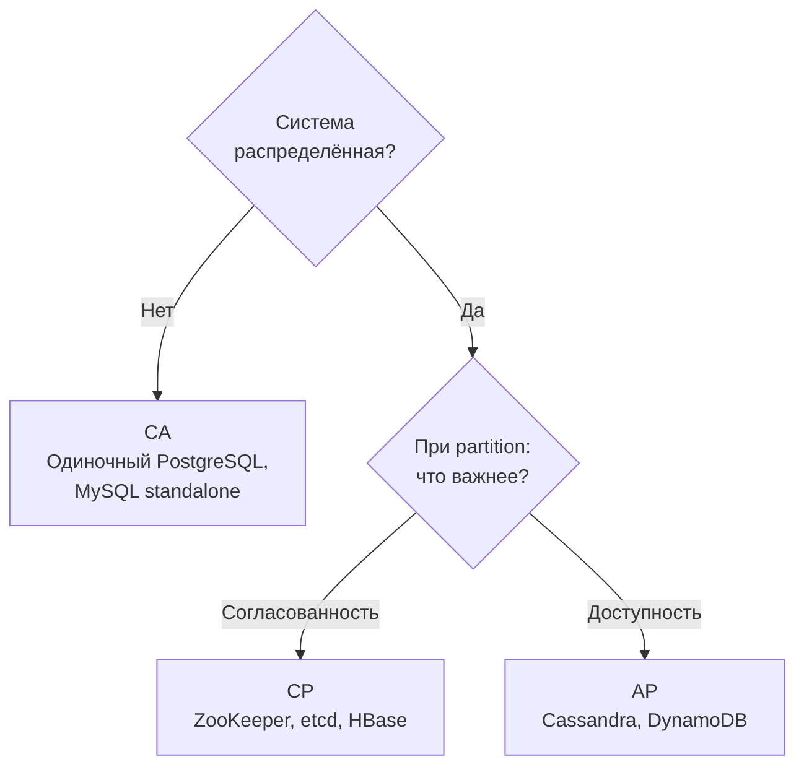

Единственный «CA» — это система, которая при partition просто перестаёт быть распределённой.


> [!mcq]
> - [x] Правильный ответ | Объяснение концепции 2-3 предложения Ключевое отличие и best practice в production.
> - [ ] Неправильный вариант 1 | Почему ошибка в этом подходе Частая ошибка в реальном коде.
> - [ ] Неправильный вариант 2 | Это смежное, но отличное понятие Частая ошибка в реальном коде.
> - [ ] Неправильный вариант 3 | Противоположное направление## Q7. Что такое сетевое разделение (partition)? Частая ошибка в реальном коде.

**Partition** (сетевое разделение) — ситуация, когда группа узлов перестаёт получать сообщения от другой группы из-за сетевого сбоя, задержки или потери пакетов. Узлы в каждой группе могут общаться между собой, но не с узлами «по ту сторону» partition.

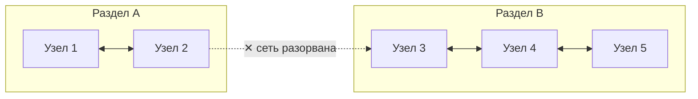

Типичные причины: разрыв кабеля, отказ маршрутизатора, изоляция дата-центра, проблемы с upstream-провайдером. Partition может быть:
- **Полным** — полная потеря связи между сегментами
- **Частичным** (asymmetric) — узел A видит B, но B не видит A
- **Временным** (секунды) или **длительным** (минуты, часы)

CAP говорит о поведении системы именно в момент partition.


> [!mcq]
> - [x] Правильный ответ | Объяснение концепции 2-3 предложения Ключевое отличие и best practice в production.
> - [ ] Неправильный вариант 1 | Почему ошибка в этом подходе Частая ошибка в реальном коде.
> - [ ] Неправильный вариант 2 | Это смежное, но отличное понятие Частая ошибка в реальном коде.
> - [ ] Неправильный вариант 3 | Противоположное направление## Q8. Почему CAP описывает поведение при partition, а не в норме? Это антипаттерн или неправильный выбор в production.

CAP фокусируется на **момент partition**, потому что в нормальных условиях (без разделения сети) распределённая система может обеспечивать и согласованность, и доступность одновременно. Проблема возникает только когда сеть разделяется: тогда нельзя гарантировать и C, и A.

При partition нужно принять решение: блокировать запросы (CP) или допустить устаревшие данные (AP). В повседневной работе большинство систем работают без partition, поэтому CAP — это не про «всегда», а про «когда сеть сломалась». Именно это ограничение привело к появлению **PACELC**, которая описывает поведение системы и в нормальном режиме.


> [!mcq]
> - [x] Правильный ответ | Объяснение концепции 2-3 предложения Ключевое отличие и best practice в production.
> - [ ] Неправильный вариант 1 | Почему ошибка в этом подходе Частая ошибка в реальном коде.
> - [ ] Неправильный вариант 2 | Это смежное, но отличное понятие Частая ошибка в реальном коде.
> - [ ] Неправильный вариант 3 | Противоположное направление## Q9. В чём ограниченность CAP-теоремы? Это антипаттерн или неправильный выбор в production.

CAP описывает бинарный выбор при partition, но реальность сложнее:

- **Гранулярность**: система может быть CP для одних операций и AP для других (разные `consistency levels`)
- **Задержки**: CAP не учитывает latency — «доступная» система с 30-секундным ответом бесполезна
- **Частичные отказы**: partition — не единственный тип сбоя; есть ещё отказы узлов, византийские ошибки
- **Спектр согласованности**: CAP рассматривает только `linearizability`, но есть множество промежуточных моделей
- **Бинарность**: реальные системы не «чисто» CP или AP — они выбирают точку на спектре

**PACELC** расширяет CAP, добавляя измерение latency vs consistency в нормальном режиме. На практике многие системы настраиваются под сценарий, а не жёстко привязаны к CP или AP.


> [!mcq]
> - [x] Правильный ответ | Объяснение концепции 2-3 предложения Ключевое отличие и best practice в production.
> - [ ] Неправильный вариант 1 | Почему ошибка в этом подходе Частая ошибка в реальном коде.
> - [ ] Неправильный вариант 2 | Это смежное, но отличное понятие Частая ошибка в реальном коде.
> - [ ] Неправильный вариант 3 | Противоположное направление## Q10. (!) Какие модели согласованности существуют и чем отличаются? Частая ошибка в реальном коде.

Модели согласованности образуют спектр от самой строгой к самой слабой. Выбор модели — ключевой архитектурный trade-off:

| Модель | Гарантия | Цена | Пример системы |
|--------|----------|------|---------------|
| `Linearizability` | Операции выглядят мгновенными, глобальный порядок | Максимальная latency, минимальная пропускная способность | `etcd`, `ZooKeeper`, `Spanner` |
| `Sequential consistency` | Глобальный порядок операций, но без привязки к реальному времени | Высокая latency | `ZooKeeper` (для чтений через лидера) |
| `Causal consistency` | Причинно-связанные операции видны в правильном порядке | Умеренная latency | `MongoDB` (causal sessions), `COPS` |
| `Read-your-writes` | Клиент видит свои собственные записи | Низкая latency | Sticky sessions, session tokens |
| `Eventual consistency` | Все реплики сойдутся «когда-нибудь» | Минимальная latency | `Cassandra` (CL=ONE), `DynamoDB` (default) |

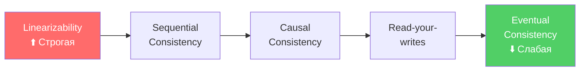

Чем строже модель, тем выше задержка и ниже пропускная способность, но тем проще рассуждать о корректности.


> [!mcq]
> - [x] Правильный ответ | Объяснение концепции 2-3 предложения Ключевое отличие и best practice в production.
> - [ ] Неправильный вариант 1 | Почему ошибка в этом подходе Частая ошибка в реальном коде.
> - [ ] Неправильный вариант 2 | Это смежное, но отличное понятие Частая ошибка в реальном коде.
> - [ ] Неправильный вариант 3 | Противоположное направление## Q11. (!) Что такое linearizability и почему это самая строгая модель? Частая ошибка в реальном коде.

**Linearizability** (линеаризуемость) — самая строгая модель согласованности для одиночного объекта. Каждая операция выглядит так, как будто она произошла мгновенно в некоторый момент между началом и завершением запроса. Все клиенты видят один и тот же глобальный порядок операций, согласованный с реальным временем.

Ключевые свойства:
- **Мгновенность**: если запись завершилась до начала чтения — чтение обязано увидеть эту запись
- **Глобальный порядок**: все наблюдатели согласны в порядке операций
- **Real-time ordering**: порядок операций совпадает с реальным временем

```
Клиент A:  |---write(x=1)---|
Клиент B:           |---read(x)---| → должен вернуть 1
                                      (чтение началось после завершения записи)

Клиент A:  |---write(x=1)---|
Клиент B:      |---read(x)---|      → может вернуть 0 или 1
                                      (операции пересекаются во времени)
```

Линеаризуемость обеспечивается через алгоритмы консенсуса (`Raft`, `Paxos`) или единственного лидера с синхронной репликацией. Системы: `etcd`, `ZooKeeper` (sync reads), Google `Spanner` (с TrueTime).


> [!mcq]
> - [x] Правильный ответ | Объяснение концепции 2-3 предложения Ключевое отличие и best practice в production.
> - [ ] Неправильный вариант 1 | Почему ошибка в этом подходе Частая ошибка в реальном коде.
> - [ ] Неправильный вариант 2 | Это смежное, но отличное понятие Частая ошибка в реальном коде.
> - [ ] Неправильный вариант 3 | Противоположное направление## Q12. Что такое sequential consistency? Это антипаттерн или неправильный выбор в production.

**Sequential consistency** (последовательная согласованность) — модель, в которой результат выполнения эквивалентен некоторому последовательному выполнению операций всех процессов, при этом операции каждого процесса сохраняют свой порядок. В отличие от `linearizability`, порядок не обязан совпадать с реальным временем.

```
Процесс A: write(x=1), write(x=2)
Процесс B: write(x=3), write(x=4)

Допустимый sequential order:
  write(x=1) → write(x=3) → write(x=2) → write(x=4)
  (порядок внутри каждого процесса сохранён: 1 до 2, 3 до 4)

Недопустимый:
  write(x=2) → write(x=1) → ...
  (нарушен порядок процесса A)
```

На практике `sequential consistency` проще реализовать, чем `linearizability`, потому что не нужна синхронизация с реальным временем. Используется в `ZooKeeper` для обычных чтений (не через `sync`).


> [!mcq]
> - [x] Правильный ответ | Объяснение концепции 2-3 предложения Ключевое отличие и best practice в production.
> - [ ] Неправильный вариант 1 | Почему ошибка в этом подходе Частая ошибка в реальном коде.
> - [ ] Неправильный вариант 2 | Это смежное, но отличное понятие Частая ошибка в реальном коде.
> - [ ] Неправильный вариант 3 | Противоположное направление## Q13. (!) Что такое causal consistency и когда она применяется? Это антипаттерн или неправильный выбор в production.

**Causal consistency** (причинная согласованность) — модель, которая гарантирует порядок только для причинно-связанных операций. Если операция B зависит от результата операции A (например, B читает значение, записанное A), то все узлы увидят A перед B. Параллельные (не связанные причинно) операции могут быть видны в разном порядке на разных узлах.

```
Пример (чат):
  Алиса: "Кто идёт на обед?"     (сообщение 1)
  Боб:   "Я!"                     (сообщение 2, ответ на 1 — причинная связь)

  Causal consistency гарантирует: все видят сообщение 1 перед 2.
  Но сообщение Кати "Привет всем" (не связано) может быть в любом месте.
```

Применяется в:
- **`MongoDB`** (causal consistency sessions) — клиент получает `clusterTime` и `operationTime`, гарантирующие причинный порядок
- **Социальные сети** — комментарии должны отображаться после поста, на который они отвечают
- **Коллаборативные редакторы** — `CRDT` с causal ordering

Causal consistency — хороший компромисс: сильнее `eventual`, но не требует глобальной синхронизации как `linearizability`.


> [!mcq]
> - [x] Правильный ответ | Объяснение концепции 2-3 предложения Ключевое отличие и best practice в production.
> - [ ] Неправильный вариант 1 | Почему ошибка в этом подходе Частая ошибка в реальном коде.
> - [ ] Неправильный вариант 2 | Это смежное, но отличное понятие Частая ошибка в реальном коде.
> - [ ] Неправильный вариант 3 | Противоположное направление## Q14. Что такое eventual consistency и каковы её гарантии? Это антипаттерн или неправильный выбор в production.

**Eventual consistency** (согласованность в конечном счёте) — самая слабая практически полезная модель. Гарантия: если прекратить запись, то через конечное время все реплики придут к одинаковому состоянию. Нет гарантий о том, как быстро это произойдёт и что увидит клиент в промежутке.

Что **гарантируется**:
- Данные не будут потеряны (durability)
- Реплики сойдутся (convergence)

Что **не гарантируется**:
- Порядок операций (клиент может увидеть запись B без записи A, даже если A была раньше)
- `Read-your-writes` (клиент может не увидеть свою запись сразу)
- Время конвергенции (может быть миллисекунды, может минуты)

```java
// Пример: DynamoDB eventually consistent read
GetItemRequest request = GetItemRequest.builder()
    .tableName("Orders")
    .key(Map.of("orderId", AttributeValue.builder().s("123").build()))
    .consistentRead(false)  // eventual consistency (default, в 2 раза дешевле)
    .build();

// Strongly consistent read — гарантирует последние данные, но дороже
GetItemRequest strongRequest = request.toBuilder()
    .consistentRead(true)   // strong consistency (удвоенная стоимость RCU)
    .build();
```


> [!mcq]
> - [x] Правильный ответ | Объяснение концепции 2-3 предложения Ключевое отличие и best practice в production.
> - [ ] Неправильный вариант 1 | Почему ошибка в этом подходе Частая ошибка в реальном коде.
> - [ ] Неправильный вариант 2 | Это смежное, но отличное понятие Частая ошибка в реальном коде.
> - [ ] Неправильный вариант 3 | Противоположное направление## Q15. Чем отличается strong eventual consistency от eventual consistency? Это антипаттерн или неправильный выбор в production.

**Strong eventual consistency** (`SEC`) добавляет к `eventual consistency` гарантию: если два узла получили одинаковый набор обновлений (в любом порядке), они будут в одинаковом состоянии **немедленно**, без дополнительной координации.

Обычная `eventual consistency` требует дополнительного этапа разрешения конфликтов (conflict resolution), который может потребовать координации. `SEC` достигается через **бесконфликтные реплицируемые типы данных** (`CRDT`):

```java
// Пример: G-Counter (grow-only counter) — CRDT
// Каждый узел инкрементирует свой счётчик, конфликтов нет
public class GCounter {
    private final Map<String, Long> counters = new HashMap<>(); // nodeId → count

    public void increment(String nodeId) {
        counters.merge(nodeId, 1L, Long::sum);
    }

    // Merge с другой репликой — просто max по каждому узлу
    public void merge(GCounter other) {
        other.counters.forEach((node, count) ->
            counters.merge(node, count, Math::max)
        );
    }

    public long value() {
        return counters.values().stream().mapToLong(Long::longValue).sum();
    }
}
```

`CRDT` используются в `Riak` (counters, sets, maps), `Redis` (CRDTs в Redis Enterprise), коллаборативных редакторах (Figma, Google Docs).


> [!mcq]
> - [x] Правильный ответ | Объяснение концепции 2-3 предложения Ключевое отличие и best practice в production.
> - [ ] Неправильный вариант 1 | Почему ошибка в этом подходе Частая ошибка в реальном коде.
> - [ ] Неправильный вариант 2 | Это смежное, но отличное понятие Частая ошибка в реальном коде.
> - [ ] Неправильный вариант 3 | Противоположное направление## Q16. (!) Что такое кворум и как он обеспечивает согласованность? Частая ошибка в реальном коде.

**Кворум** (quorum) — минимальное количество узлов, которые должны подтвердить операцию, чтобы она считалась успешной. Кворумные системы позволяют достичь согласованности без централизованного координатора.

Ключевая формула: `W + R > N`, где:
- `N` — общее число реплик
- `W` — количество узлов, подтверждающих запись (write quorum)
- `R` — количество узлов, с которых читают (read quorum)

Если `W + R > N`, множества узлов записи и чтения **пересекаются** — хотя бы один узел в read quorum содержит последнюю запись.

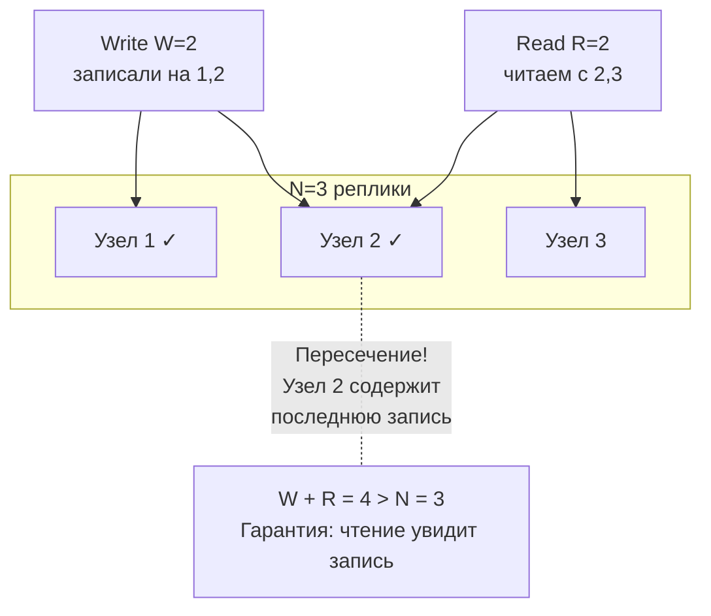


> [!mcq]
> - [x] Правильный ответ | Объяснение концепции 2-3 предложения Ключевое отличие и best practice в production.
> - [ ] Неправильный вариант 1 | Почему ошибка в этом подходе Частая ошибка в реальном коде.
> - [ ] Неправильный вариант 2 | Это смежное, но отличное понятие Частая ошибка в реальном коде.
> - [ ] Неправильный вариант 3 | Противоположное направление## Q17. Что такое формула W + R > N и как она работает? Частая ошибка в реальном коде.

Формула `W + R > N` — математическое условие пересечения кворумов. Разные комбинации дают разные trade-offs:

| Конфигурация | W | R | Характеристика |
|-------------|---|---|----------------|
| `W=N, R=1` | 3 | 1 | Быстрое чтение, медленная запись, нет отказоустойчивости на запись |
| `W=1, R=N` | 1 | 3 | Быстрая запись, медленное чтение, нет отказоустойчивости на чтение |
| `W=2, R=2` (majority) | 2 | 2 | Сбалансированно, переживает отказ 1 узла из 3 |
| `W=1, R=1` | 1 | 1 | Максимальная скорость, но `W+R=2 ≤ N=3` — нет гарантии согласованности |

```
N=5, W=3, R=3:  W+R=6 > 5 ✓  — согласованность, переживает отказ 2 узлов
N=5, W=3, R=2:  W+R=5 = 5 ✗  — формально нет гарантии (нужно строго >)
N=5, W=1, R=1:  W+R=2 < 5 ✗  — eventual consistency, максимальная скорость
```

Важно: даже при `W + R > N` кворум не гарантирует `linearizability` — для этого нужен дополнительный механизм (version vectors, timestamps).


> [!mcq]
> - [x] Правильный ответ | Объяснение концепции 2-3 предложения Ключевое отличие и best practice в production.
> - [ ] Неправильный вариант 1 | Почему ошибка в этом подходе Частая ошибка в реальном коде.
> - [ ] Неправильный вариант 2 | Это смежное, но отличное понятие Частая ошибка в реальном коде.
> - [ ] Неправильный вариант 3 | Противоположное направление## Q18. Как настроить кворум в Cassandra? Частая ошибка в реальном коде.

`Cassandra` позволяет задавать `consistency level` (CL) на уровне каждого запроса. Это определяет W и R:

```cql
-- Создание keyspace с replication factor = 3
CREATE KEYSPACE orders WITH replication = {
  'class': 'NetworkTopologyStrategy',
  'dc1': 3,
  'dc2': 3
};

-- Запись с QUORUM: W = ⌊N/2⌋ + 1 = 2 из 3
INSERT INTO orders.items (id, name, price)
VALUES (uuid(), 'Laptop', 999.99)
USING CONSISTENCY QUORUM;

-- Чтение с QUORUM: R = 2 из 3
-- W(2) + R(2) = 4 > N(3) → гарантия согласованности
SELECT * FROM orders.items WHERE id = ?
USING CONSISTENCY QUORUM;

-- Максимальная доступность (AP-режим)
SELECT * FROM orders.items WHERE id = ?
USING CONSISTENCY ONE;  -- R=1, быстро, но может быть устаревшее

-- Максимальная согласованность (CP-режим)
INSERT INTO orders.items (id, name, price)
VALUES (uuid(), 'Laptop', 999.99)
USING CONSISTENCY ALL;  -- W=N=3, все реплики должны ответить
```

Уровни согласованности `Cassandra`:

| CL | Описание | Trade-off |
|----|----------|-----------|
| `ANY` | Запись принята хотя бы одним узлом (включая hinted handoff) | Максимальная доступность, минимальная гарантия |
| `ONE` | 1 реплика | Быстро, AP |
| `QUORUM` | ⌊N/2⌋ + 1 реплик | Баланс, strong consistency при W+R>N |
| `LOCAL_QUORUM` | Кворум в локальном дата-центре | Баланс + низкая latency (без кросс-DC) |
| `EACH_QUORUM` | Кворум в каждом дата-центре | Максимальная кросс-DC согласованность |
| `ALL` | Все реплики | CP, минимальная доступность |


> [!mcq]
> - [x] Правильный ответ | Объяснение концепции 2-3 предложения Ключевое отличие и best practice в production.
> - [ ] Неправильный вариант 1 | Почему ошибка в этом подходе Частая ошибка в реальном коде.
> - [ ] Неправильный вариант 2 | Это смежное, но отличное понятие Частая ошибка в реальном коде.
> - [ ] Неправильный вариант 3 | Противоположное направление## Q19. (!) Что такое алгоритм консенсуса и зачем он нужен? Частая ошибка в реальном коде.

**Алгоритм консенсуса** — протокол, позволяющий группе узлов договориться об одном значении, даже если часть узлов отказала. Консенсус — фундаментальная проблема распределённых систем, доказанная как неразрешимая в асинхронных системах (теорема `FLP`, 1985).

Консенсус нужен для:
- **Выбора лидера** — кто из узлов принимает решения?
- **Репликации журнала** — все реплики должны согласовать порядок записей
- **Распределённых блокировок** — кто владеет блокировкой?
- **Атомарных транзакций** — commit или abort?
- **Конфигурации кластера** — какие узлы в кластере?

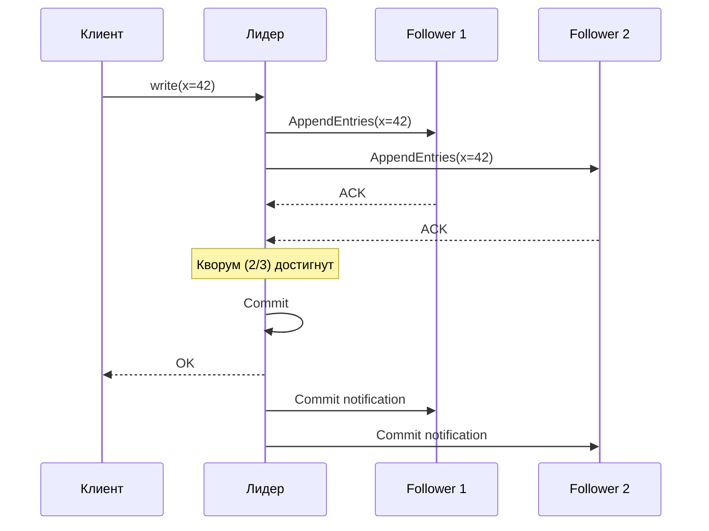

Основные алгоритмы: `Paxos` (Лэмпорт, 1989), `Raft` (Онгаро и Устерхаут, 2014), `ZAB` (ZooKeeper), `Viewstamped Replication`.


> [!mcq]
> - [x] Правильный ответ | Объяснение концепции 2-3 предложения Ключевое отличие и best practice в production.
> - [ ] Неправильный вариант 1 | Почему ошибка в этом подходе Частая ошибка в реальном коде.
> - [ ] Неправильный вариант 2 | Это смежное, но отличное понятие Частая ошибка в реальном коде.
> - [ ] Неправильный вариант 3 | Противоположное направление## Q20. (!) Как работает алгоритм Raft? Частая ошибка в реальном коде.

**Raft** — алгоритм консенсуса, разработанный как понятная альтернатива `Paxos`. Используется в `etcd`, `Consul`, `CockroachDB`, `TiKV`. Raft разбивает задачу консенсуса на три подзадачи:

**1. Выбор лидера (Leader Election)**:
- Узлы в состояниях: `Leader`, `Follower`, `Candidate`
- Если follower не получает heartbeat от лидера в течение election timeout — становится candidate
- Candidate запрашивает голоса у всех узлов; получив большинство — становится лидером
- В каждый момент максимум один лидер на term (эпоху)

**2. Репликация журнала (Log Replication)**:
- Все записи идут через лидера
- Лидер отправляет `AppendEntries` RPC follower'ам
- Запись считается committed, когда реплицирована на большинство

**3. Безопасность (Safety)**:
- Новый лидер обязан содержать все committed записи
- Candidate не получит голос от узла с более полным журналом

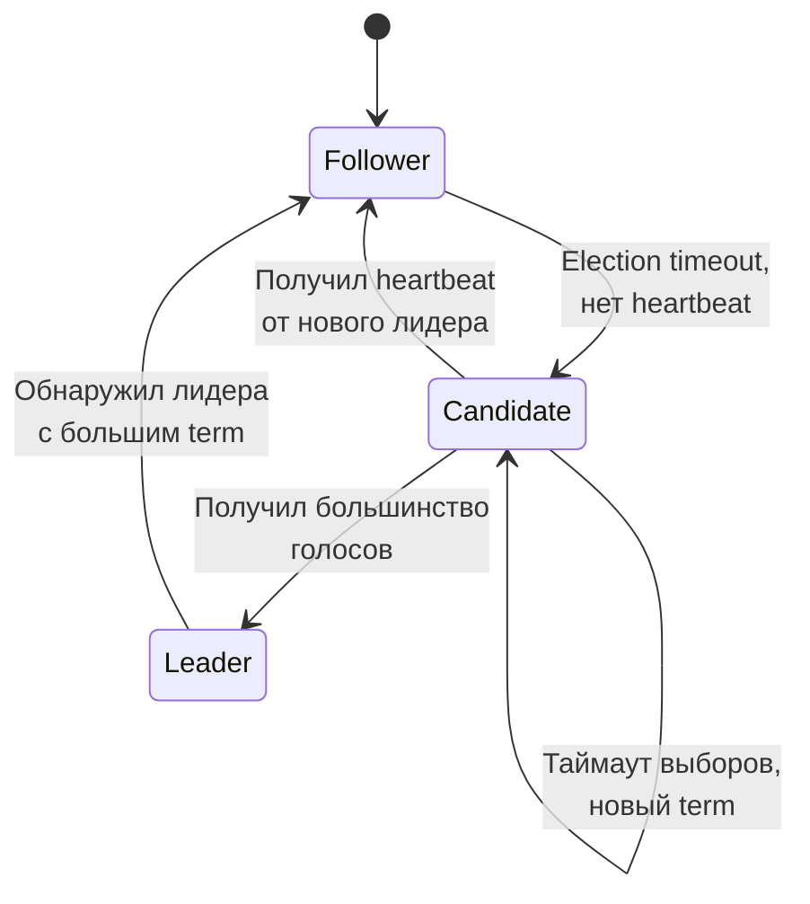

Raft гарантирует `linearizability` для операций через лидера. `etcd` по умолчанию направляет чтения через лидера; `serializable` чтения (через любой узел) быстрее, но слабее.


> [!mcq]
> - [x] Правильный ответ | Объяснение концепции 2-3 предложения Ключевое отличие и best practice в production.
> - [ ] Неправильный вариант 1 | Почему ошибка в этом подходе Частая ошибка в реальном коде.
> - [ ] Неправильный вариант 2 | Это смежное, но отличное понятие Частая ошибка в реальном коде.
> - [ ] Неправильный вариант 3 | Противоположное направление## Q21. Как работает Paxos и чем отличается от Raft? Частая ошибка в реальном коде.

**Paxos** (Лэмпорт, 1989) — первый формально доказанный алгоритм консенсуса. Работает в две фазы:

**Фаза 1 (Prepare)**:
- Proposer выбирает номер предложения `n` и отправляет `Prepare(n)` acceptor'ам
- Acceptor отвечает `Promise(n)` — обещает не принимать предложения с номером < n

**Фаза 2 (Accept)**:
- Proposer, получив ответы от кворума, отправляет `Accept(n, value)`
- Acceptor принимает, если не обещал большего номера
- Значение считается выбранным, когда принято кворумом

Сравнение `Paxos` и `Raft`:

| Аспект | `Paxos` | `Raft` |
|--------|---------|--------|
| Роли | Proposer, Acceptor, Learner | Leader, Follower, Candidate |
| Лидер | Необязателен (multi-leader) | Обязателен (single leader) |
| Понятность | Сложный, трудно реализовать | Разработан для понятности |
| Гибкость | Более гибкий (Multi-Paxos, Fast Paxos) | Менее гибкий, но достаточный |
| Реализации | Google Chubby, Spanner | etcd, Consul, CockroachDB |
| Формальное доказательство | Полное | На основе Paxos |

На практике `Raft` используется чаще из-за понятности: легче реализовать, тестировать и отлаживать.


> [!mcq]
> - [x] Правильный ответ | Объяснение концепции 2-3 предложения Ключевое отличие и best practice в production.
> - [ ] Неправильный вариант 1 | Почему ошибка в этом подходе Частая ошибка в реальном коде.
> - [ ] Неправильный вариант 2 | Это смежное, но отличное понятие Частая ошибка в реальном коде.
> - [ ] Неправильный вариант 3 | Противоположное направление## Q22. Что такое split-brain и как алгоритмы консенсуса его предотвращают? Частая ошибка в реальном коде.

**Split-brain** — ситуация, когда при partition несколько сегментов кластера считают себя «главными» и принимают записи независимо. Это приводит к расхождению данных, которое может быть неразрешимым.

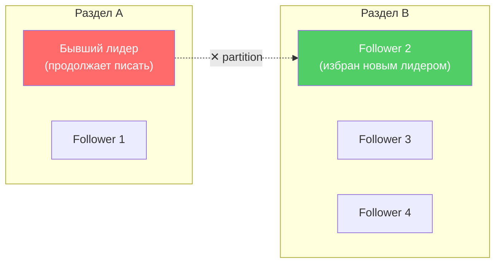

Как алгоритмы консенсуса предотвращают split-brain:

1. **Кворум большинства**: лидер может commit только с подтверждением от `⌊N/2⌋ + 1` узлов. При partition с 5 узлами (2+3) — только раздел с 3 узлами может достичь кворума
2. **Term/epoch**: каждый лидер работает в своём term. Старый лидер, получив сообщение с большим term, немедленно становится follower
3. **Fencing tokens**: при получении блокировки возвращается монотонно растущий token; ресурс отклоняет запросы со старым token

```java
// Пример: fencing token в распределённой блокировке
public class FencedLock {
    private final AtomicLong fencingToken = new AtomicLong(0);

    public LockResult tryLock(String clientId) {
        long token = fencingToken.incrementAndGet();
        return new LockResult(clientId, token);
    }

    // Ресурс проверяет: принимать только запросы с максимальным token
    public boolean validateToken(long token, long lastSeenToken) {
        return token > lastSeenToken; // старый лидер будет отклонён
    }
}
```


> [!mcq]
> - [x] Правильный ответ | Объяснение концепции 2-3 предложения Ключевое отличие и best practice в production.
> - [ ] Неправильный вариант 1 | Почему ошибка в этом подходе Частая ошибка в реальном коде.
> - [ ] Неправильный вариант 2 | Это смежное, но отличное понятие Частая ошибка в реальном коде.
> - [ ] Неправильный вариант 3 | Противоположное направление## Q23. (!) Что такое PACELC и как связано с CAP? Это антипаттерн или неправильный выбор в production.

**PACELC** — расширение CAP, предложенное Даниэлем Абади в 2012 году. Формулировка: при **P**artition выбор между **A** и **C** (как в CAP), при **E**lse (отсутствии partition) — выбор между **L**atency и **C**onsistency. То есть даже без partition система может жертвовать согласованностью ради более низкой задержки.

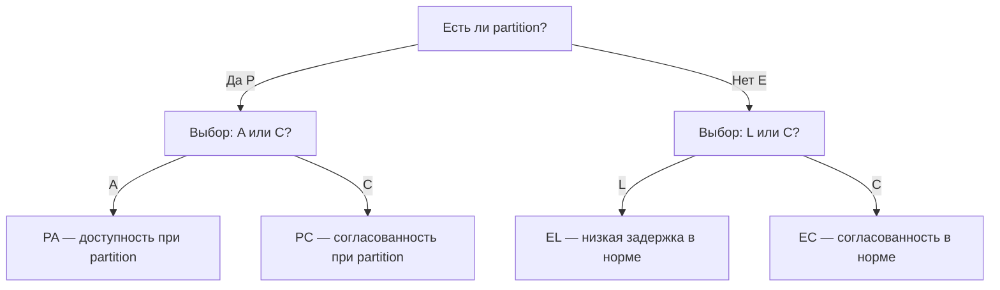

PACELC лучше отражает реальные trade-offs:
- CAP говорит только о поведении при сбоях
- PACELC добавляет повседневный trade-off: latency vs consistency
- Большинство запросов выполняются **без** partition, поэтому EL/EC важнее PA/PC


> [!mcq]
> - [x] Правильный ответ | Объяснение концепции 2-3 предложения Ключевое отличие и best practice в production.
> - [ ] Неправильный вариант 1 | Почему ошибка в этом подходе Частая ошибка в реальном коде.
> - [ ] Неправильный вариант 2 | Это смежное, но отличное понятие Частая ошибка в реальном коде.
> - [ ] Неправильный вариант 3 | Противоположное направление## Q24. Как классифицировать реальные системы по PACELC? Частая ошибка в реальном коде.

| Система | Классификация PACELC | Объяснение |
|---------|---------------------|------------|
| `Cassandra` | PA/EL | При partition — доступность; в норме — низкая latency (async replication) |
| `DynamoDB` (default) | PA/EL | Eventual reads по умолчанию; при partition — доступность |
| `MongoDB` (majority) | PC/EC | При partition — согласованность; в норме — тоже согласованность |
| `ZooKeeper` | PC/EC | Всегда согласованность, даже ценой latency |
| `etcd` | PC/EC | Raft, чтение через лидера, линеаризуемость |
| `CockroachDB` | PC/EC | Строгая сериализуемость, Raft |
| `Riak` | PA/EL | Dynamo-модель, оптимизация latency |
| `PostgreSQL` (async) | PA/EL | Асинхронная репликация → latency важнее |
| `PostgreSQL` (sync) | PC/EC | Синхронная репликация → согласованность важнее |
| Google `Spanner` | PC/EC | TrueTime, внешняя согласованность |

Обратите внимание: `Cassandra` и `DynamoDB` — PA/EL по умолчанию, но могут работать как PC/EC при настройке `QUORUM`/`consistent reads`.


> [!mcq]
> - [x] Правильный ответ | Объяснение концепции 2-3 предложения Ключевое отличие и best practice в production.
> - [ ] Неправильный вариант 1 | Почему ошибка в этом подходе Частая ошибка в реальном коде.
> - [ ] Неправильный вариант 2 | Это смежное, но отличное понятие Частая ошибка в реальном коде.
> - [ ] Неправильный вариант 3 | Противоположное направление## Q25. (!) Cassandra и CAP: как работает настраиваемая согласованность? Это антипаттерн или неправильный выбор в production.

`Cassandra` — архетипическая AP-система, но с **tunable consistency** (настраиваемой согласованностью). Клиент выбирает уровень согласованности per-request:

```cql
-- AP-режим: быстро, но возможны устаревшие данные
SELECT * FROM users WHERE id = ? CONSISTENCY ONE;

-- Strong consistency: W(QUORUM) + R(QUORUM) > N(RF)
INSERT INTO users (id, name) VALUES (?, ?) CONSISTENCY QUORUM;
SELECT * FROM users WHERE id = ? CONSISTENCY QUORUM;

-- Для мульти-DC: LOCAL_QUORUM не ходит в другие дата-центры
SELECT * FROM users WHERE id = ? CONSISTENCY LOCAL_QUORUM;
```

Механизмы конвергенции в `Cassandra`:
- **Read repair** — при чтении с нескольких реплик, если данные расходятся, устаревшие реплики обновляются
- **Anti-entropy repair** (`nodetool repair`) — фоновый процесс, сравнивает Merkle trees реплик
- **Hinted handoff** — если реплика недоступна, другой узел сохраняет hint и доставит данные позже
- **Last-write-wins** (LWW) — разрешение конфликтов по timestamp

```yaml
# cassandra.yaml — ключевые параметры согласованности
hinted_handoff_enabled: true
max_hint_window_in_ms: 10800000  # 3 часа — как долго хранить hints
read_request_timeout_in_ms: 5000
write_request_timeout_in_ms: 2000
```


> [!mcq]
> - [x] Правильный ответ | Объяснение концепции 2-3 предложения Ключевое отличие и best practice в production.
> - [ ] Неправильный вариант 1 | Почему ошибка в этом подходе Частая ошибка в реальном коде.
> - [ ] Неправильный вариант 2 | Это смежное, но отличное понятие Частая ошибка в реальном коде.
> - [ ] Неправильный вариант 3 | Противоположное направление## Q26. (!) DynamoDB и CAP: какой trade-off? Это антипаттерн или неправильный выбор в production.

`DynamoDB` — управляемая NoSQL-БД от AWS, по умолчанию AP-система с `eventual consistency`. Предлагает два режима чтения:

```java
// Eventually consistent read (по умолчанию) — AP
// Дешевле (0.5 RCU за 4KB), может вернуть устаревшие данные
GetItemRequest eventualRead = GetItemRequest.builder()
    .tableName("Orders")
    .key(Map.of("PK", AttributeValue.builder().s("ORDER#123").build()))
    .consistentRead(false) // default
    .build();

// Strongly consistent read — ближе к CP
// Дороже (1 RCU за 4KB), гарантирует последние данные
GetItemRequest strongRead = GetItemRequest.builder()
    .tableName("Orders")
    .key(Map.of("PK", AttributeValue.builder().s("ORDER#123").build()))
    .consistentRead(true)
    .build();
```

Особенности `DynamoDB` в контексте CAP:

| Аспект | Поведение |
|--------|-----------|
| Eventual reads | Данные конвергируют обычно за ~1 секунду |
| Strong reads | Только для `GetItem`/`Query`, не для `Scan` по GSI |
| Global Tables | Multi-region, eventual consistency между регионами (last-writer-wins) |
| Transactions | `TransactWriteItems` — ACID на уровне таблицы, CP-семантика |
| GSI | Всегда eventually consistent (асинхронное обновление индекса) |

`DynamoDB` по PACELC: **PA/EL** (default) или **PC/EC** (при `consistentRead=true` + transactions).


> [!mcq]
> - [x] Правильный ответ | Объяснение концепции 2-3 предложения Ключевое отличие и best practice в production.
> - [ ] Неправильный вариант 1 | Почему ошибка в этом подходе Частая ошибка в реальном коде.
> - [ ] Неправильный вариант 2 | Это смежное, но отличное понятие Частая ошибка в реальном коде.
> - [ ] Неправильный вариант 3 | Противоположное направление## Q27. (!) Zookeeper и CAP: почему это CP-система? Это антипаттерн или неправильный выбор в production.

`ZooKeeper` — классическая **CP-система**, используемая для координации распределённых систем. Реализует протокол `ZAB` (ZooKeeper Atomic Broadcast), аналогичный `Paxos`.

Почему CP:
- **Все записи идут через лидера** — один лидер (leader), остальные follower'ы
- **Запись требует кворума** — лидер не подтвердит запись, пока большинство (⌊N/2⌋ + 1) follower'ов не запишут её в журнал
- **При partition** — раздел без кворума **не обслуживает запросы** (жертвует availability)
- **Sequential consistency** по умолчанию, `linearizability` при использовании `sync()` + read

```
Кластер ZooKeeper (5 узлов):
  При partition 2+3:
    Раздел с 3 узлами: выбирает нового лидера, продолжает работать ✓
    Раздел с 2 узлами: не может достичь кворума, отклоняет запросы ✗
    → Согласованность сохранена, доступность потеряна для меньшинства
```

`ZooKeeper` используется для:
- Распределённых блокировок (`/locks/resource-1`)
- Выбора лидера (`/election/leader`)
- Хранения конфигурации (`/config/service-a`)
- Service discovery (`/services/order-service/instances`)

Аналоги: `etcd` (Raft), `Consul` (Raft) — тоже CP-системы для координации.


> [!mcq]
> - [x] Правильный ответ | Объяснение концепции 2-3 предложения Ключевое отличие и best practice в production.
> - [ ] Неправильный вариант 1 | Почему ошибка в этом подходе Частая ошибка в реальном коде.
> - [ ] Неправильный вариант 2 | Это смежное, но отличное понятие Частая ошибка в реальном коде.
> - [ ] Неправильный вариант 3 | Противоположное направление## Q28. Redis — CP или AP? Частая ошибка в реальном коде.

**Redis** в кластерном режиме (`Redis Cluster`) — в терминах CAP ближе к **AP**. При partition секции кластера продолжают обслуживать запросы; данные могут расходиться между секциями до восстановления связи. Redis не гарантирует strong consistency при partition.

```
Redis Cluster (6 узлов: 3 master + 3 replica):
  Master A (слоты 0-5460)     → Replica A'
  Master B (слоты 5461-10922) → Replica B'
  Master C (слоты 10923-16383)→ Replica C'

  Репликация: асинхронная (по умолчанию)
  → write на Master A подтверждается ДО репликации на A'
  → при падении Master A возможна потеря последних записей
```

Одиночный Redis (standalone) — по сути CA (один узел, нет partition между репликами в смысле CAP). Redis Sentinel с репликацией: при failover реплика асинхронная, возможна потеря данных при сбое мастера — тоже ближе к AP по поведению. Параметр `WAIT` позволяет ждать репликации, сдвигая поведение к CP:

```redis
SET order:123 "confirmed"
WAIT 1 5000  -- ждать подтверждения от 1 реплики, таймаут 5 сек
```


> [!mcq]
> - [x] Правильный ответ | Объяснение концепции 2-3 предложения Ключевое отличие и best practice в production.
> - [ ] Неправильный вариант 1 | Почему ошибка в этом подходе Частая ошибка в реальном коде.
> - [ ] Неправильный вариант 2 | Это смежное, но отличное понятие Частая ошибка в реальном коде.
> - [ ] Неправильный вариант 3 | Противоположное направление## Q29. PostgreSQL с репликацией — CP или AP? Частая ошибка в реальном коде.

Зависит от режима репликации:

**Синхронная репликация** (`synchronous_commit = on`): запись подтверждается только после получения данных на реплику(и). При partition с потерей кворума реплик — запись блокируется или отказывает. Это **CP**.

```sql
-- Настройка синхронной репликации (postgresql.conf)
-- synchronous_standby_names = 'FIRST 1 (replica1, replica2)'
-- synchronous_commit = on

-- Проверка статуса репликации
SELECT client_addr, state, sync_state, sent_lsn, replay_lsn
FROM pg_stat_replication;

-- sync_state: 'sync' — синхронная (CP), 'async' — асинхронная (AP)
```

**Асинхронная репликация**: мастер подтверждает запись сразу, репликация идёт в фоне. При partition мастер продолжает принимать запись — **AP**. Но при падении мастера возможна потеря данных (если реплика не успела получить изменения).

| Режим | `synchronous_commit` | Поведение | CAP |
|-------|---------------------|-----------|-----|
| `on` | Ждёт WAL flush на реплике | Потеря данных = 0, latency выше | CP |
| `remote_apply` | Ждёт apply на реплике | Чтение с реплики актуально | CP |
| `remote_write` | Ждёт записи в OS cache реплики | Компромисс | CP (слабее) |
| `off` | Не ждёт реплики | Минимальная latency, возможна потеря | AP |


> [!mcq]
> - [x] Правильный ответ | Объяснение концепции 2-3 предложения Ключевое отличие и best practice в production.
> - [ ] Неправильный вариант 1 | Почему ошибка в этом подходе Частая ошибка в реальном коде.
> - [ ] Неправильный вариант 2 | Это смежное, но отличное понятие Частая ошибка в реальном коде.
> - [ ] Неправильный вариант 3 | Противоположное направление## Q30. Kafka и CAP: какой trade-off? Это антипаттерн или неправильный выбор в production.

**Kafka** ориентирована на **доступность и отказоустойчивость**: при partition брокеры продолжают принимать и отдавать сообщения. В терминах CAP — настраиваемо, от AP до CP.

```properties
# Producer: AP-режим (максимальный throughput)
acks=1                    # лидер подтвердил, не ждём реплик
retries=0

# Producer: CP-режим (максимальная durability)
acks=all                  # ждём подтверждения от всех ISR
min.insync.replicas=2     # минимум 2 ISR для записи
retries=2147483647        # бесконечные ретраи
enable.idempotence=true   # exactly-once семантика
```

| Параметр | AP-значение | CP-значение | Влияние |
|----------|------------|-------------|---------|
| `acks` | `0` или `1` | `all` | Подтверждение записи |
| `min.insync.replicas` | `1` | `2+` | Минимум реплик для записи |
| `unclean.leader.election.enable` | `true` | `false` | Разрешить несинхронную реплику стать лидером |

При `acks=all` и `min.insync.replicas=2` — если живых реплик < 2, producer получит ошибку `NotEnoughReplicasException` (CP: жертвуем доступностью ради целостности).


> [!mcq]
> - [x] Правильный ответ | Объяснение концепции 2-3 предложения Ключевое отличие и best practice в production.
> - [ ] Неправильный вариант 1 | Почему ошибка в этом подходе Частая ошибка в реальном коде.
> - [ ] Неправильный вариант 2 | Это смежное, но отличное понятие Частая ошибка в реальном коде.
> - [ ] Неправильный вариант 3 | Противоположное направление## Q31. MongoDB и CAP: как настраивается поведение? Это антипаттерн или неправильный выбор в production.

`MongoDB` — система с настраиваемой согласованностью. По умолчанию использует `ReplicaSet` с одним primary и несколькими secondary:

```javascript
// AP-режим: быстрая запись, возможна потеря при failover
db.orders.insertOne(
  { orderId: "123", status: "confirmed" },
  { writeConcern: { w: 1 } }  // только primary подтвердил
);

// CP-режим: запись подтверждена большинством
db.orders.insertOne(
  { orderId: "123", status: "confirmed" },
  { writeConcern: { w: "majority", j: true } }  // majority + journal
);

// Чтение с гарантией causal consistency
const session = db.getMongo().startSession({ causalConsistency: true });
session.getDatabase("shop").orders.find({ orderId: "123" })
  .readConcern("majority")       // читать только committed данные
  .readPreference("secondary");  // можно читать с secondary
```

`MongoDB` Causal Consistency Sessions — поддерживают `causal consistency` через `clusterTime` и `operationTime`. Это позволяет читать с secondary и при этом гарантировать, что чтение увидит результаты предыдущих записей этой же сессии.


> [!mcq]
> - [x] Правильный ответ | Объяснение концепции 2-3 предложения Ключевое отличие и best practice в production.
> - [ ] Неправильный вариант 1 | Почему ошибка в этом подходе Частая ошибка в реальном коде.
> - [ ] Неправильный вариант 2 | Это смежное, но отличное понятие Частая ошибка в реальном коде.
> - [ ] Неправильный вариант 3 | Противоположное направление## Q32. Можно ли систему переключать между CP и AP? Частая ошибка в реальном коде.

Да, многие системы позволяют настраивать поведение per-request или per-collection:

| Система | CP-настройка | AP-настройка |
|---------|-------------|-------------|
| `Cassandra` | `QUORUM` / `ALL` | `ONE` / `LOCAL_ONE` |
| `DynamoDB` | `consistentRead: true` | `consistentRead: false` (default) |
| `MongoDB` | `w: "majority"`, `readConcern: "majority"` | `w: 1`, `readConcern: "local"` |
| `Kafka` | `acks: all`, `min.insync.replicas: 2` | `acks: 1` |
| `PostgreSQL` | `synchronous_commit: on` | `synchronous_commit: off` |

Для конкретного запроса можно выбирать уровень: критичные операции (платежи, инвентарь) — сильнее consistency, некритичные (лента, аналитика) — выше availability. Система не «чисто» CP или AP, а конфигурируемая по сценарию.


> [!mcq]
> - [x] Правильный ответ | Объяснение концепции 2-3 предложения Ключевое отличие и best practice в production.
> - [ ] Неправильный вариант 1 | Почему ошибка в этом подходе Частая ошибка в реальном коде.
> - [ ] Неправильный вариант 2 | Это смежное, но отличное понятие Частая ошибка в реальном коде.
> - [ ] Неправильный вариант 3 | Противоположное направление## Q33. Как выбирать CP vs AP для бизнес-системы? Частая ошибка в реальном коде.

Задайте вопрос: **допустима ли устаревшая информация?**

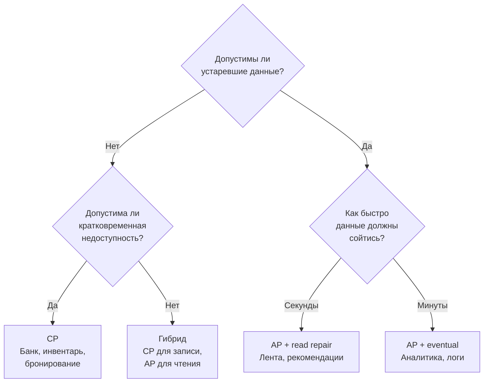

Ключевые вопросы для выбора:
- **Банковский баланс, инвентарь, место бронирования** — нет, нужен CP
- **Лента постов, счётчики лайков, рекомендации** — да, допустима eventual consistency
- **Влияние недоступности**: если при partition система «висит» 30 секунд — приемлемо? Для платежей — часто да. Для real-time чата — нет
- **Частота partition**: в одной зоне — реже; мульти-регион — чаще, AP предпочтительнее
- **Стоимость несогласованности vs недоступности**: что дороже бизнесу — показать устаревшие данные или не показать ничего?


> [!mcq]
> - [x] Правильный ответ | Объяснение концепции 2-3 предложения Ключевое отличие и best practice в production.
> - [ ] Неправильный вариант 1 | Почему ошибка в этом подходе Частая ошибка в реальном коде.
> - [ ] Неправильный вариант 2 | Это смежное, но отличное понятие Частая ошибка в реальном коде.
> - [ ] Неправильный вариант 3 | Противоположное направление## Q34. (!) Как тестировать partition tolerance? Частая ошибка в реальном коде.

Тестирование устойчивости к разделению — важная часть валидации распределённых систем. Основные подходы:

**1. Jepsen** — фреймворк Кайла Кингсбери для тестирования согласованности распределённых систем:
- Создаёт кластер, инжектирует сетевые разделения
- Проверяет, нарушились ли заявленные гарантии (linearizability, sequential consistency)
- Нашёл баги в `Cassandra`, `MongoDB`, `Redis`, `Kafka`, `CockroachDB` и десятках других систем

**2. Chaos Engineering** — целенаправленное внесение сбоев в production или staging:

```bash
# Имитация network partition с помощью iptables
# Блокируем трафик между узлами 1 и 3
sudo iptables -A INPUT -s 10.0.0.3 -j DROP
sudo iptables -A OUTPUT -d 10.0.0.3 -j DROP

# Имитация задержки сети (latency injection)
sudo tc qdisc add dev eth0 root netem delay 200ms 50ms

# Имитация потери пакетов (partial partition)
sudo tc qdisc add dev eth0 root netem loss 30%
```

**3. Инструменты Chaos Engineering**:

| Инструмент | Описание |
|-----------|----------|
| `Chaos Monkey` (Netflix) | Случайно убивает инстансы в production |
| `Toxiproxy` (Shopify) | Прокси для имитации сетевых проблем |
| `Pumba` | Chaos testing для Docker контейнеров |
| `Litmus` | Chaos engineering для Kubernetes |
| `tc` / `iptables` | Linux-инструменты для имитации сетевых проблем |

**4. Что проверять при тестировании**:
- Система корректно обнаруживает partition (таймауты, heartbeat)
- Не возникает split-brain (два лидера одновременно)
- Данные не теряются при восстановлении
- Система восстанавливается автоматически после устранения partition
- Клиенты получают корректные ошибки, а не молчаливое повреждение данных


> [!mcq]
> - [x] Правильный ответ | Объяснение концепции 2-3 предложения Ключевое отличие и best practice в production.
> - [ ] Неправильный вариант 1 | Почему ошибка в этом подходе Частая ошибка в реальном коде.
> - [ ] Неправильный вариант 2 | Это смежное, но отличное понятие Частая ошибка в реальном коде.
> - [ ] Неправильный вариант 3 | Противоположное направление## Q35. Как проектировать систему с учётом CAP? Это антипаттерн или неправильный выбор в production.

Практические принципы проектирования распределённых систем с учётом CAP:

**1. Не проектируйте «глобально CP или AP»** — выбирайте на уровне операции:

```
Пример: e-commerce
  - Остаток на складе → CP (нельзя продать товар, которого нет)
  - Каталог товаров → AP (устаревшая цена допустима на секунды)
  - Корзина → AP (синхронизируется при checkout)
  - Платёж → CP (строгая согласованность обязательна)
```

**2. Используйте компенсирующие транзакции** вместо строгой согласованности где возможно:
- Паттерн `Saga` — цепочка локальных транзакций с компенсациями
- Паттерн `Outbox` — гарантированная доставка событий через таблицу outbox
- `Idempotency keys` — безопасные повторные запросы

**3. Разделяйте reads и writes** (`CQRS`):
- Запись через CP-подсистему (один master, синхронная репликация)
- Чтение через AP-подсистему (множество read-реплик, eventual consistency)

**4. Мониторьте replication lag** — разницу между мастером и репликами:

```sql
-- PostgreSQL: проверка задержки репликации
SELECT now() - pg_last_xact_replay_timestamp() AS replication_lag;

-- Если lag > допустимого — алерт, переключение на чтение с мастера
```

**5. Проектируйте для graceful degradation**: при partition система должна деградировать предсказуемо, а не ломаться неожиданно. Клиент должен знать, что получает устаревшие данные (например, через заголовок `X-Data-Staleness`).

---


> [!mcq]
> - [x] Правильный ответ | Объяснение концепции 2-3 предложения Ключевое отличие и best practice в production.
> - [ ] Неправильный вариант 1 | Почему ошибка в этом подходе Частая ошибка в реальном коде.
> - [ ] Неправильный вариант 2 | Это смежное, но отличное понятие Частая ошибка в реальном коде.
> - [ ] Неправильный вариант 3 | Противоположное направление## Q36. Что такое PACELC — расширение CAP для нормального состояния? Это антипаттерн или неправильный выбор в production.

**PACELC** (Partition-Availability-Consistency-Else-Latency-Consistency) — теорема, предложенная Даниэлем Абади в 2012 году. Она расширяет CAP, добавляя вторую ось trade-off: что происходит, когда разделения **нет**.

CAP описывает только поведение при partition. Но в реальных системах партиции редки — гораздо важнее, что происходит в **нормальном режиме работы**: приходится выбирать между **задержкой** (`Latency`) и **согласованностью** (`Consistency`).

```
PACELC формулировка:
  Если есть P (Partition):
    выбираем A (Availability) ИЛИ C (Consistency)
  Else (нет Partition):
    выбираем L (Latency) ИЛИ C (Consistency)
```

| Система | При Partition | В норме | Классификация |
|---------|---------------|---------|---------------|
| `DynamoDB` | A | L | PA/EL |
| `Cassandra` (ONE) | A | L | PA/EL |
| `Cassandra` (QUORUM) | A | C | PA/EC |
| `ZooKeeper` | C | C | PC/EC |
| `HBase` | C | C | PC/EC |
| `MongoDB` (default) | C | C | PC/EC |
| `CRDT-системы` | A | L | PA/EL |

**Почему PACELC важнее CAP на практике:**
- В системе с 99.9% uptime partition бывает часы в год; latency vs consistency — каждый запрос
- При QUORUM-чтении в Cassandra нужно дождаться ответа большинства реплик — это увеличивает latency в обмен на свежие данные
- При eventual consistency (ONE) — минимальная latency, но данные могут быть устаревшими

```
Пример для собеседования:
  Cassandra с RF=3:
  - CONSISTENCY ONE:   latency ~1ms, может вернуть устаревшие данные (PA/EL)
  - CONSISTENCY QUORUM: latency ~5ms, всегда актуальные данные (PA/EC)
  - CONSISTENCY ALL:   latency ~10ms, максимальная свежесть (PA/EC)
```

---


> [!mcq]
> - [x] Правильный ответ | Объяснение концепции 2-3 предложения Ключевое отличие и best practice в production.
> - [ ] Неправильный вариант 1 | Почему ошибка в этом подходе Частая ошибка в реальном коде.
> - [ ] Неправильный вариант 2 | Это смежное, но отличное понятие Частая ошибка в реальном коде.
> - [ ] Неправильный вариант 3 | Противоположное направление## Q37. ZooKeeper и HBase как CP-системы: детали реализации Частая ошибка в реальном коде.

**ZooKeeper** — распределённый координатор, реализующий строгую CP-семантику через протокол **ZAB** (ZooKeeper Atomic Broadcast).

**Как ZAB обеспечивает согласованность:**
1. Все операции записи направляются **лидеру**
2. Лидер присваивает **zxid** (монотонно возрастающий идентификатор транзакции)
3. Лидер рассылает `PROPOSE` фолловерам; те отвечают `ACK`
4. После получения кворума ACK лидер отправляет `COMMIT`
5. Операция видна клиентам только после commit

**При network partition:**
- Меньшинство узлов перестаёт принимать запись (блокирует запросы)
- Лидер на меньшинстве уходит в отставку
- Клиенты получают `ConnectionLossException`

```java
// ZooKeeper: создание эфемерного узла (distributed lock)
ZooKeeper zk = new ZooKeeper("localhost:2181", 3000, null);
String path = zk.create("/lock/my-lock-",
    new byte[0],
    ZooDefs.Ids.OPEN_ACL_UNSAFE,
    CreateMode.EPHEMERAL_SEQUENTIAL);
// При потере соединения (partition) — узел исчезает автоматически
// Это гарантирует отсутствие split-brain: два лидера невозможны
```

**HBase** использует ZooKeeper для координации:
- ZooKeeper хранит местоположение region-серверов
- При partition region-сервер не может обновить ZK → считается мёртвым
- RegionMaster назначает регионы на другие серверы
- Запросы к недоступному region-серверу блокируются (CP: лучше ошибка, чем неконсистентные данные)

| Характеристика | ZooKeeper | HBase |
|----------------|-----------|-------|
| Протокол консенсуса | ZAB | ZAB (через ZK) |
| При partition | Блокирует меньшинство | Перемещает регионы |
| Задержка записи | ~1-5ms (синхронная) | ~5-20ms |
| Гарантия | Linearizability | Strong consistency per row |
| Применение | Service discovery, leader election, locks | OLTP с высокой нагрузкой на запись |

---


> [!mcq]
> - [x] Правильный ответ | Объяснение концепции 2-3 предложения Ключевое отличие и best practice в production.
> - [ ] Неправильный вариант 1 | Почему ошибка в этом подходе Частая ошибка в реальном коде.
> - [ ] Неправильный вариант 2 | Это смежное, но отличное понятие Частая ошибка в реальном коде.
> - [ ] Неправильный вариант 3 | Противоположное направление## Q38. Cassandra и DynamoDB как AP-системы: детали Частая ошибка в реальном коде.

**Cassandra** — AP-система, спроектированная для максимальной доступности. Ключевые механизмы:

**Архитектура без лидера (leaderless):**
- Все узлы равноправны (peer-to-peer)
- Запись идёт на любой узел-координатор → тот реплицирует на N узлов по consistent hashing
- Нет единой точки отказа; partition не блокирует работу

```
Настройка согласованности Cassandra:
  RF=3, DC=1
  CONSISTENCY ONE:    W=1, R=1 — максимальная доступность, может быть stale read
  CONSISTENCY QUORUM: W=2, R=2 — 2+2>3, всегда читаем свежие данные
  CONSISTENCY LOCAL_QUORUM: кворум в рамках одного датацентра
  CONSISTENCY ALL:    W=3, R=3 — CP-режим (блокирует при недоступности ноды)
```

**Hinted Handoff** — при недоступности реплики координатор сохраняет «подсказку» и доставляет данные позже. Это обеспечивает AP при коротких partition.

**Read Repair** — при чтении с кворумом, если реплики расходятся, Cassandra автоматически обновляет устаревшие реплики.

**DynamoDB** — управляемый сервис AWS, AP по умолчанию, CP по запросу:

```
DynamoDB режимы чтения:
  Eventually Consistent Read (по умолчанию):
    - Запрос идёт на любую реплику из 3
    - Может вернуть данные до 1 секунды устаревшими
    - В 2 раза дешевле (0.5 RCU за 4KB)

  Strongly Consistent Read:
    - Запрос идёт только на leader-реплику
    - Всегда актуальные данные
    - 1 RCU за 4KB, больше latency
    - При partition может вернуть ошибку
```

| Характеристика | Cassandra | DynamoDB |
|----------------|-----------|----------|
| Архитектура | Leaderless ring | Leader-based (Paxos per partition) |
| При partition | Продолжает работу (AP) | Eventually consistent (AP default) |
| CP-режим | CONSISTENCY ALL / QUORUM | Strongly Consistent Reads |
| Конфликты | LWW (Last Write Wins) по timestamp | Условные записи (ConditionalExpression) |
| Anti-entropy | Read Repair, Merkle trees | Managed (прозрачно) |
| Применение | Глобально распределённые данные | AWS-нативные приложения |

---


> [!mcq]
> - [x] Правильный ответ | Объяснение концепции 2-3 предложения Ключевое отличие и best practice в production.
> - [ ] Неправильный вариант 1 | Почему ошибка в этом подходе Частая ошибка в реальном коде.
> - [ ] Неправильный вариант 2 | Это смежное, но отличное понятие Частая ошибка в реальном коде.
> - [ ] Неправильный вариант 3 | Противоположное направление## Q39. Network partition на практике: частота и типичные сценарии Частая ошибка в реальном коде.

**Network partition** — это не редкий аварийный сценарий. В реальных production-системах partition происходят регулярно:

**Статистика и исследования:**
- Исследование Google (2009): в крупных дата-центрах происходят тысячи сетевых сбоев в месяц
- Исследование Microsoft: 40% инцидентов связаны с сетевыми проблемами
- Jepsen.io: большинство протестированных систем имели проблемы с partition

**Типичные сценарии partition:**

| Сценарий | Причина | Длительность |
|----------|---------|--------------|
| GC pause | Stop-the-world GC на ноде — другие узлы считают её мёртвой | Секунды |
| Сетевое оборудование | Сбой свитча, замена маршрутизатора | Минуты |
| Обновление ОС/приложения | Rolling restart — часть узлов недоступна | Минуты |
| Перегрузка сети | Пакеты теряются при пиковой нагрузке | Секунды–минуты |
| Междатацентровый сбой | Обрыв WAN-канала | Минуты–часы |
| Slow network | Пакеты доходят, но с большой задержкой (partial partition) | Переменно |
| Cloud AZ failure | AWS/GCP зона недоступна | Минуты–часы |

**Partial partition** — особенно коварный случай: узлы A и B видят узел C, но не видят друг друга. В такой ситуации классические алгоритмы консенсуса могут вести себя неожиданно.

```
Примеры реальных инцидентов (по данным Jepsen):
  - MongoDB 2.4: при partition могла выбрать двух primary → потеря данных
  - Redis Sentinel: split-brain при GC pause у sentinel-узлов
  - Cassandra: при partition с QUORUM возможна запись в меньшинство
  - Kafka: при partition controller мог не освободить лидерство
```

**Как защититься:**
- Тестировать с помощью Jepsen, Chaos Monkey, Toxiproxy
- Настраивать таймауты ниже реального времени отказа
- Использовать fencing tokens для предотвращения split-brain
- Проектировать для graceful degradation, а не for perfect connectivity

---


> [!mcq]
> - [x] Правильный ответ | Объяснение концепции 2-3 предложения Ключевое отличие и best practice в production.
> - [ ] Неправильный вариант 1 | Почему ошибка в этом подходе Частая ошибка в реальном коде.
> - [ ] Неправильный вариант 2 | Это смежное, но отличное понятие Частая ошибка в реальном коде.
> - [ ] Неправильный вариант 3 | Противоположное направление## Q40. CAP и микросервисная архитектура: как выбор БД влияет на дизайн? Это антипаттерн или неправильный выбор в production.

В микросервисной архитектуре каждый сервис владеет своей БД (Database per Service pattern). Выбор CP или AP определяет всю стратегию согласованности данных.

**CP-сервис** (строгая согласованность):
```
Когда выбирать CP:
  - Финансовые транзакции (списание средств)
  - Inventory management (остатки товаров)
  - Уникальность пользователей (регистрация)
  - Права доступа и авторизация

Последствия для дизайна:
  - Синхронные вызовы между сервисами (REST/gRPC)
  - Distributed transactions (Saga с компенсациями)
  - Возможны блокировки при partition
  - Нужен circuit breaker для защиты от каскадных отказов
```

**AP-сервис** (eventual consistency):
```
Когда выбирать AP:
  - Каталог товаров (устаревшая цена 1-2 секунды — OK)
  - Корзина покупок (синхронизируется при checkout)
  - Статистика и аналитика
  - Рекомендации и персонализация

Последствия для дизайна:
  - Асинхронное взаимодействие (события/Kafka)
  - Idempotent операции
  - Версионирование сущностей
  - Логика обработки конфликтов в бизнес-коде
```

**Практическая схема для e-commerce:**

```
Сервис         БД          CAP    Причина
──────────────────────────────────────────────────
Order          PostgreSQL  CP     Финансовая операция
Payment        PostgreSQL  CP     Списание средств
Inventory      PostgreSQL  CP     Нельзя продать дважды
Product        Cassandra   AP     Каталог, устаревание OK
Cart           Redis       AP     Сессионные данные
Search         Elasticsearch AP   Индекс, лаг допустим
Analytics      ClickHouse  AP     Аналитика, eventual OK
Notifications  Cassandra   AP     Доставка best-effort
```

**Паттерны для межсервисной согласованности:**
- **Saga** — цепочка локальных транзакций с компенсациями (для CP↔AP взаимодействия)
- **Outbox + CDC** — атомарная публикация событий (for AP downstream consumers)
- **API Composition** — агрегация данных на query-side (CQRS)
- **Read-your-writes** — sticky session или version token для согласованного чтения после записи

---


> [!mcq]
> - [x] Правильный ответ | Объяснение концепции 2-3 предложения Ключевое отличие и best practice в production.
> - [ ] Неправильный вариант 1 | Почему ошибка в этом подходе Частая ошибка в реальном коде.
> - [ ] Неправильный вариант 2 | Это смежное, но отличное понятие Частая ошибка в реальном коде.
> - [ ] Неправильный вариант 3 | Противоположное направление## Q41. (!) Google Spanner и TrueTime: как Spanner обходит CAP? Это антипаттерн или неправильный выбор в production.

**Google Spanner** — глобально распределённая база данных, которую Google позиционирует как CA-систему. Это звучит невозможно с точки зрения CAP, но Spanner использует умный трюк.

**TrueTime API** — ключевая инновация Spanner:
- Каждый дата-центр Google оснащён **атомными часами** и **GPS-приёмниками**
- TrueTime не возвращает одно время — он возвращает **интервал** `[earliest, latest]`, где истинное время гарантированно находится
- Неопределённость (uncertainty interval) обычно составляет **1-7 миллисекунд**

```
TrueTime API:
  TT.now()   → TTInterval{earliest: t-ε, latest: t+ε}
  TT.after(t) → true, если t точно в прошлом
  TT.before(t) → true, если t точно в будущем

Алгоритм commit wait:
  1. Транзакция получает commit timestamp s = TT.now().latest
  2. Spanner ждёт, пока TT.after(s) станет true (~7ms)
  3. Только после этого транзакция видна другим
  → Это гарантирует, что все узлы "видели" время > s до commit
```

**Почему Spanner не нарушает CAP:**

Spanner — это CP-система. При network partition Spanner блокирует записи (ждёт кворума Paxos). Но Google построил очень надёжную сеть между дата-центрами (выделенные кабели, минимальные потери), поэтому partition практически не происходит.

> Брюер сам прокомментировал: "Spanner — технически CP, но с очень высокой практической доступностью за счёт надёжной инфраструктуры"

**Что даёт TrueTime:**
- **External consistency** (stronger than linearizability): если транзакция T1 завершилась до начала T2 в реальном времени, то T2 увидит все изменения T1 — даже если они на разных континентах
- **Globally consistent snapshots**: чтение с меткой времени даёт согласованный срез всей глобальной БД

| Характеристика | Обычная распределённая БД | Google Spanner |
|----------------|---------------------------|----------------|
| Синхронизация времени | NTP (~100ms погрешность) | Атомные часы + GPS (~7ms) |
| Гарантии | Linearizability per shard | External consistency global |
| Глобальные транзакции | 2PC с высокой latency | Paxos + TrueTime wait |
| Доступность | Зависит от partition | 99.999% (5 nines) |
| Применение | Большинство систем | Google Ads, F1, Cloud Spanner |

---


> [!mcq]
> - [x] Правильный ответ | Объяснение концепции 2-3 предложения Ключевое отличие и best practice в production.
> - [ ] Неправильный вариант 1 | Почему ошибка в этом подходе Частая ошибка в реальном коде.
> - [ ] Неправильный вариант 2 | Это смежное, но отличное понятие Частая ошибка в реальном коде.
> - [ ] Неправильный вариант 3 | Противоположное направление## Q42. (!) CAP vs BASE: детальное сравнение Это антипаттерн или неправильный выбор в production.

**ACID** и **BASE** — два противоположных подхода к гарантиям транзакций в распределённых системах.

**ACID** (Atomicity, Consistency, Isolation, Durability) — традиционная модель реляционных БД:
- Транзакция либо выполняется полностью, либо не выполняется совсем
- Сильная согласованность: данные всегда в валидном состоянии
- Дорого в распределённой среде: требует 2PC, блокировок, координации

**BASE** (Basically Available, Soft state, Eventually consistent) — модель для AP-систем:
- **Basically Available**: система всегда отвечает, даже если данные неполные
- **Soft state**: состояние системы может меняться само по себе (репликация, компакция)
- **Eventually consistent**: данные согласуются через некоторое время

```
Детальное сравнение ACID vs BASE:

Свойство          ACID                    BASE
─────────────────────────────────────────────────────
Согласованность   Строгая (сразу)         Eventual (через время)
Доступность       Может блокировать       Всегда отвечает
Модель            Pessimistic locking      Optimistic / MVCC
Конфликты         Предотвращаются          Разрешаются post-hoc
Масштабирование   Вертикальное (трудно)    Горизонтальное (легко)
Сложность кода    Простая (БД решает)     Высокая (приложение решает)
Примеры           PostgreSQL, Oracle       Cassandra, DynamoDB, CouchDB
```

**Связь CAP и BASE:**
- CP-системы тяготеют к ACID (ZooKeeper, HBase, PostgreSQL с репликацией)
- AP-системы реализуют BASE (Cassandra, DynamoDB, CouchDB)
- BASE — это не «плохой ACID», а осознанный выбор для масштабируемости

**Когда BASE достаточно — реальные примеры:**

```
1. DNS — классический пример BASE:
   - Запись обновляется у root-сервера
   - Распространяется по миру за минуты-часы
   - Все DNS-серверы eventual consistent
   - Никого не блокирует — всегда доступна

2. Amazon Shopping Cart:
   - При partition cart продолжает работать (AP)
   - Конфликты (два добавления одного товара) разрешаются union-ом
   - Пользователь видит "лишний" товар и может убрать

3. Facebook Timeline:
   - Пост может появиться у разных пользователей в разное время
   - Eventual consistent — через секунды все видят одно
   - Никогда не блокирует публикацию
```

**Практический выбор:**

| Критерий | Выбирай ACID/CP | Выбирай BASE/AP |
|----------|-----------------|-----------------|
| Финансы | ✓ (обязательно) | — |
| Медицинские данные | ✓ | — |
| Inventory | ✓ | — |
| Социальная лента | — | ✓ |
| Аналитика | — | ✓ |
| Кэш / сессии | — | ✓ |
| Корзина | — | ✓ (с merge) |

---

## See also

- [Распределённые системы](distributed-systems-interview.md) — базовые концепции: репликация, шардирование, консенсус
- [Паттерны согласованности](consistency-patterns-interview.md) — eventual consistency, linearizability, causal
- [Микросервисы](microservices-interview.md) — выбор CP/AP для каждого сервиса в архитектуре
- [Стратегии кэширования](caching-strategies-interview.md) — компромиссы согласованности при кэшировании
- [Архитектура БД](../databases/database-architecture-interview.md) — как Cassandra, DynamoDB, ZooKeeper реализуют CAP
- [Паттерны масштабирования](scalability-patterns-interview.md) — горизонтальное масштабирование и partition tolerance


> [!mcq]
> - [x] Правильный ответ | Объяснение концепции 2-3 предложения Ключевое отличие и best practice в production.
> - [ ] Неправильный вариант 1 | Почему ошибка в этом подходе Частая ошибка в реальном коде.
> - [ ] Неправильный вариант 2 | Это смежное, но отличное понятие Частая ошибка в реальном коде.
> - [ ] Неправильный вариант 3 | Противоположное направление- [API Gateway](api-gateway-interview.md) Частая ошибка в реальном коде.
- [BFF Pattern](bff-pattern-interview.md)
- [Стратегии кэширования](caching-strategies-interview.md)
- [Clean Architecture](clean-architecture-interview.md)
- [Паттерны согласованности](consistency-patterns-interview.md)
- [CQRS и Event Sourcing](cqrs-event-sourcing-interview.md)
