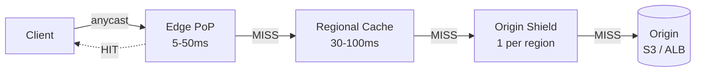
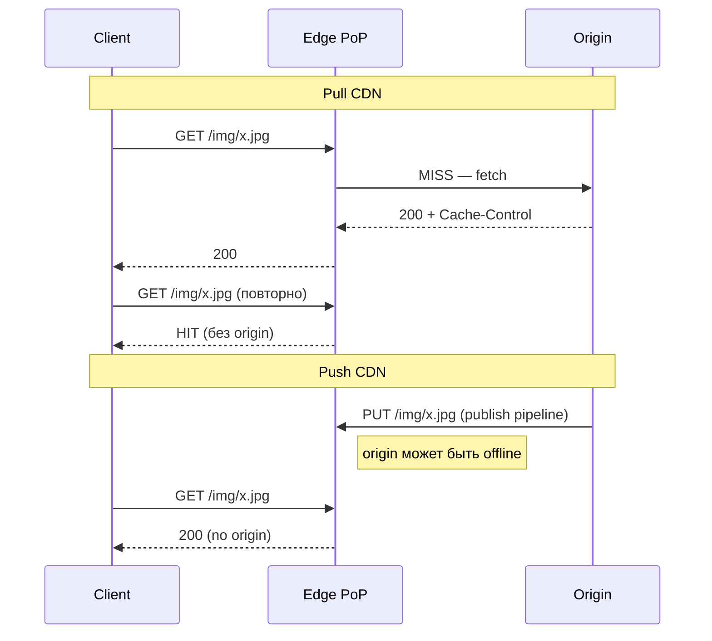
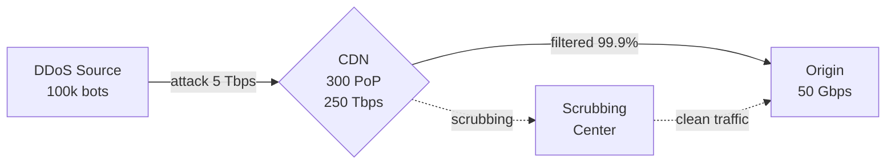

# Вопросы на собеседовании: `CDN (Content Delivery Network)`

`CDN` — географически распределённая сеть кэширующих серверов (`edge`/`PoP`), которая отдаёт контент клиенту с ближайшей точки присутствия вместо origin-сервера. Снижает latency, разгружает egress на origin, повышает доступность и поглощает DDoS. На system design интервью CDN — почти всегда первый слой между пользователем и backend для любого крупного web/мобильного продукта.

Дата последнего обновления: 2026-05-21

**Ключевые игроки рынка:** `Cloudflare`, `Akamai`, `AWS CloudFront`, `Fastly`, `Google Cloud CDN`, `Bunny.net`. Все строятся вокруг трёх идей: **anycast routing к ближайшему PoP**, **многоуровневый кэш** и **edge compute для динамики**.

## Полезные ссылки

### Официальная документация

- [System Design Primer — Content Delivery Network](https://github.com/donnemartin/system-design-primer#content-delivery-network) — Push/Pull CDN, базовая теория
- [Cloudflare Learning — What is a CDN?](https://www.cloudflare.com/learning/cdn/what-is-a-cdn/) — концепции CDN от Cloudflare
- [AWS CloudFront — Developer Guide](https://docs.aws.amazon.com/AmazonCloudFront/latest/DeveloperGuide/) — поведение кэша, behaviors, invalidation
- [Fastly — Surrogate Keys](https://docs.fastly.com/en/guides/working-with-surrogate-keys) — purge by tag
- [Cloudflare Cache Tags](https://developers.cloudflare.com/cache/how-to/cache-keys/) — cache tags и purge by tag
- [MDN — HTTP caching](https://developer.mozilla.org/en-US/docs/Web/HTTP/Caching) — Cache-Control, ETag, Vary
- [RFC 9111 — HTTP Caching](https://www.rfc-editor.org/rfc/rfc9111) — каноническая семантика
- [HLS spec (RFC 8216)](https://www.rfc-editor.org/rfc/rfc8216) — HTTP Live Streaming
- [Web Cache Deception — 2017/2020](https://www.akamai.com/blog/security/web-cache-deception-attack) — оригинальная атака на Akamai
- [Cloudflare 2019 BGP leak — post-mortem](https://blog.cloudflare.com/how-verizon-and-a-bgp-optimizer-knocked-large-parts-of-the-internet-offline-today/) — incident
- [Fastly 2021 global outage — post-mortem](https://www.fastly.com/blog/summary-of-june-8-outage) — 1 час, Amazon/Reddit/UK gov
- [Akamai 2021 DNS outage](https://www.akamai.com/blog/news/Akamai-Summary-of-July-22-DNS-Disruption) — Steam/PSN/банки

## Содержание

- [Полезные ссылки](#полезные-ссылки)
- [See also](#see-also)

**Основы и архитектура**
- [Q1. (!) Что такое CDN и зачем он нужен?](#q1--что-такое-cdn-и-зачем-он-нужен)
- [Q2. (!) Архитектура CDN: PoP, edge, regional, origin shield, origin](#q2--архитектура-cdn-pop-edge-regional-origin-shield-origin)
- [Q3. Anycast routing — как CDN выбирает ближайший PoP?](#q3-anycast-routing--как-cdn-выбирает-ближайший-pop)
- [Q4. GeoDNS vs Anycast — что и когда?](#q4-geodns-vs-anycast--что-и-когда)
- [Q5. Cache hierarchy: edge → regional → origin shield](#q5-cache-hierarchy-edge--regional--origin-shield)

**Push vs Pull, кеширование**
- [Q6. (!) Push CDN vs Pull CDN — когда какой выбрать?](#q6--push-cdn-vs-pull-cdn--когда-какой-выбрать)
- [Q7. (!) Cache-Control, ETag, Last-Modified — как работают на CDN?](#q7--cache-control-etag-last-modified--как-работают-на-cdn)
- [Q8. Vary header и cache key — нормализация запроса](#q8-vary-header-и-cache-key--нормализация-запроса)
- [Q9. (!) Cache invalidation: purge by URL, purge by tag, versioning](#q9--cache-invalidation-purge-by-url-purge-by-tag-versioning)
- [Q10. stale-while-revalidate и stale-if-error](#q10-stale-while-revalidate-и-stale-if-error)
- [Q11. Surrogate-Control vs Cache-Control](#q11-surrogate-control-vs-cache-control)
- [Q12. Range requests и кэширование больших файлов](#q12-range-requests-и-кэширование-больших-файлов)

**TLS / HTTP-протоколы**
- [Q13. (!) TLS termination на edge: что даёт и какие риски?](#q13--tls-termination-на-edge-что-даёт-и-какие-риски)
- [Q14. HTTP/2 и HTTP/3 (QUIC) на edge](#q14-http2-и-http3-quic-на-edge)
- [Q15. 0-RTT в TLS 1.3 — выигрыш и replay-риск](#q15-0-rtt-в-tls-13--выигрыш-и-replay-риск)

**Image / Video / Edge Compute**
- [Q16. (!) Image optimization: AVIF/WebP, srcset, on-the-fly resize](#q16--image-optimization-avifwebp-srcset-on-the-fly-resize)
- [Q17. Video streaming: HLS, DASH, ABR, CMAF, LL-HLS](#q17-video-streaming-hls-dash-abr-cmaf-ll-hls)
- [Q18. Dynamic Site Acceleration (DSA) — как кэшировать «динамику»](#q18-dynamic-site-acceleration-dsa--как-кэшировать-динамику)
- [Q19. (!) Edge compute: Cloudflare Workers, Lambda@Edge, Compute@Edge](#q19--edge-compute-cloudflare-workers-lambdaedge-computeedge)

**Безопасность (WAF, DDoS, cache poisoning)**
- [Q20. (!) DDoS protection: scrubbing, rate limiting, bot management](#q20--ddos-protection-scrubbing-rate-limiting-bot-management)
- [Q21. WAF на CDN: Cloudflare WAF, AWS WAF, Imperva](#q21-waf-на-cdn-cloudflare-waf-aws-waf-imperva)
- [Q22. (!) Cache poisoning и Web Cache Deception — как защищаться?](#q22--cache-poisoning-и-web-cache-deception--как-защищаться)
- [Q23. Cache-key smuggling и нормализация заголовков](#q23-cache-key-smuggling-и-нормализация-заголовков)

**Cost / Multi-CDN / Operations**
- [Q24. (!) Cost-модель CDN: egress, requests, edge CPU-ms](#q24--cost-модель-cdn-egress-requests-edge-cpu-ms)
- [Q25. Сравнение игроков: Cloudflare/Akamai/CloudFront/Fastly/Bunny](#q25-сравнение-игроков-cloudflareakamaicloudfrontfastlybunny)
- [Q26. (!) Multi-CDN: active-active, traffic steering, NS1/Cedexis](#q26--multi-cdn-active-active-traffic-steering-ns1cedexis)
- [Q27. CDN logs, analytics, RUM](#q27-cdn-logs-analytics-rum)
- [Q28. Cold start cache MISS и pre-warming](#q28-cold-start-cache-miss-и-pre-warming)
- [Q29. Real incidents: Fastly 2021, Akamai 2021, Cloudflare 2019](#q29-real-incidents-fastly-2021-akamai-2021-cloudflare-2019)
- [Q30. Конкретные конфиги: CloudFront Behavior и Cloudflare Page Rules](#q30-конкретные-конфиги-cloudfront-behavior-и-cloudflare-page-rules)

## Q1. (!) Что такое CDN и зачем он нужен?

**CDN (Content Delivery Network)** — сеть распределённых кэширующих серверов (`edge`, `PoP`), которые отдают контент с ближайшей географически точки. Между клиентом и origin появляется слой кэша.

**Что даёт:**
- **Задержка (latency)** — `edge` в 5-50 мс от пользователя вместо 100-300 мс до origin в другом регионе. TCP/TLS handshake выполняется на edge.
- **Разгрузка канала (bandwidth offload)** — 80-99% запросов закрываются кэшем edge, origin платит меньше за egress.
- **Доступность** — пока кэш свежий, origin может лежать, а контент всё равно отдаётся (`stale-if-error`).
- **Поглощение DDoS** — у Cloudflare и Akamai ёмкость 100+ Tbps anycast, они поглощают атаки, которые убили бы origin.
- **TLS на edge** — handshake близко к клиенту экономит 1-2 RTT.

**Что НЕ даёт:**
- Не ускоряет операции записи (origin всё равно обрабатывает).
- Не «магически» кэширует динамику без правильных заголовков.

**Архитектурно CDN это:**
```
Client ──anycast──► Edge PoP ──fill──► Regional cache ──► Origin shield ──► Origin
         (5-50 ms)                       (50-150 ms)                       (full)
```

**Итог:** CDN — обязательный слой для любого продукта с географически распределённой аудиторией и статикой/медиа.

## Q2. (!) Архитектура CDN: PoP, edge, regional, origin shield, origin

**Уровни иерархии (снизу вверх по близости к клиенту):**

| Слой | Что это | Сколько узлов | RTT до клиента |
|------|---------|----------------|-----------------|
| **Edge PoP** | Точка присутствия в городе/IX | 200-300+ | 5-50 мс |
| **Regional cache** | Региональный кэш (CloudFront Regional Edge) | 10-20 | 30-100 мс |
| **Origin shield** | Один singleton-кэш перед origin | 1 на регион | — |
| **Origin** | Исходный сервер (S3, ALB, app) | 1-несколько | 100-300 мс |

**Зачем три уровня:**
- **Edge PoP** — отдаёт hot-объекты. Если cache MISS — идёт в regional, не сразу в origin.
- **Regional cache** — поглощает MISS-трафик от десятков edge PoP. Даёт второй шанс на cache HIT.
- **Origin shield** — единственная точка, которая ходит в origin. Без неё каждый regional при cache MISS делал бы свой запрос → **thundering herd на origin**.

**Пример CloudFront:**
```
Client → Edge (CF PoP) → Regional Edge Cache → Origin Shield (опц.) → S3/ALB
```

**Origin shield** включается отдельно (CloudFront — `OriginShield`, Cloudflare — `Tiered Cache`). Особенно важно при больших каталогах (Netflix, e-commerce) — иначе при cache MISS на 200 PoP получаете 200 одновременных GET-ов на origin.



**Итог:** PoP принимает запрос, regional агрегирует MISS-ы, shield защищает origin от thundering herd.

## Q3. Anycast routing — как CDN выбирает ближайший PoP?

**Anycast** — один IP-адрес объявляется через BGP из многих локаций. Маршрутизаторы интернета сами выбирают «ближайший» путь по AS-hops и BGP-метрикам.

**Как это работает у CDN:**
1. Cloudflare/CloudFront получают AS (например, AS13335 у Cloudflare).
2. Анонсируют один и тот же `/24` префикс через BGP из 300 PoP.
3. ISP клиента видит несколько маршрутов и выбирает с меньшим AS-path/metric.
4. Клиент попадает на ближайший PoP без DNS-трюков.

**Плюсы anycast:**
- Один IP — нет DNS-разрешения для выбора региона.
- DDoS распределяется по 300 PoP естественным образом.
- Переключение при сбое (failover) автоматическое — если PoP падает, BGP сходится за секунды.

**Минусы:**
- Меньше контроля: можно попасть не в физически ближайший, а в «лучший по BGP» PoP. Иногда из РФ маршрут уходит через Германию.
- Stateful-протоколы (TCP) могут «прыгать» между PoP при изменении маршрута — Cloudflare решает это через consistent hashing.

**Пример:** клиент с IP `213.x.x.x` (Москва) делает запрос к `1.1.1.1`:
- BGP-таблица Ростелекома: маршрут через MSK-IX → ближайший Cloudflare PoP в Москве.
- RTT: 5-10 мс.

## Q4. GeoDNS vs Anycast — что и когда?

**GeoDNS** — авторитативный DNS возвращает разный A-record в зависимости от региона клиента (по IP резолвера или EDNS Client Subnet).

**Anycast** — один IP в BGP, маршрутизация на уровне сети.

**Сравнение:**

| Аспект | GeoDNS | Anycast |
|--------|---------|---------|
| Уровень | DNS (L7) | BGP (L3) |
| Failover | минуты (TTL DNS) | секунды (BGP) |
| Гранулярность | по country/ASN | по AS-path |
| Стоимость | дешёво (NS1, Route53) | дорого (нужны AS+IP блоки) |
| Контроль | высокий (override на уровне страны) | низкий (определяется BGP) |
| Привязка (sticky) | нет (resolver кэширует) | на каждое соединение |

**Гибрид:**
Большинство крупных CDN используют **anycast + GeoDNS поверх**:
- Базовый routing — anycast IP CDN.
- GeoDNS используется для multi-CDN (NS1, Cedexis) — выбор провайдера (Cloudflare vs Akamai) по региону и здоровью.

**Пример:** ozon.ru использует Cloudflare anycast, но через NS1 GeoDNS направляет 10% трафика из Урала на резервный Akamai при сбое.

## Q5. Cache hierarchy: edge → regional → origin shield

Иерархия кэша — это многоуровневый кэш, где каждый уровень снижает количество запросов к нижнему. Подробнее в Q2.

**Принципы:**
- **Edge cache** — `~1-10 GB` на PoP, hot working set, TTL обычно 1 мин - 1 час для статики.
- **Regional cache** — `~10-100 TB`, поглощает MISS из edge.
- **Origin shield** — один singleton-кэш, главная роль — **анти-stampede**.

**Числа из CloudFront:**
- Доля MISS на edge: 5-20% для хорошо кэшируемого контента.
- Доля MISS на regional: 50-80% от MISS-ов edge.
- Доля MISS на origin shield: 80-95% — только по-настоящему холодные объекты доходят до origin.

**Эффект**: при 100k QPS от клиентов origin видит 50-500 QPS — снижение в 200-2000 раз.

## Q6. (!) Push CDN vs Pull CDN — когда какой выбрать?

**Pull CDN (Pull-through, lazy):**
- Origin содержит мастер-копию.
- При первом запросе CDN тянет файл из origin (cache MISS) и кэширует.
- Повторные запросы — cache HIT.
- TTL/headers контролируют свежесть.

**Push CDN (Push-on-publish, eager):**
- Контент **загружается заранее** на CDN — например, по CI/CD после публикации.
- Origin может быть выключен после публикации.
- CDN — единственный источник правды для пользователя.

**Сравнение:**

| Параметр | Pull CDN | Push CDN |
|----------|----------|----------|
| Настройка | минуты — поменять DNS | сложнее — нужен publish-pipeline |
| Каталог | любой размер (lazy) | ограничен ёмкостью CDN |
| Свежесть | TTL/инвалидация | контролируется публикацией |
| Стоимость | egress origin × доля MISS | egress только при публикации |
| Холодный старт | MISS-задержка для первого пользователя | нет MISS — всё уже в кэше |
| Идеален для | большого динамического каталога | маленького статического набора |

**Когда Pull:**
- E-commerce (миллионы SKU) — большая часть товаров запрашивается редко.
- Ответы API, динамическая персонализация.
- Пользовательский контент (Instagram, YouTube — частично push для вирусного).

**Когда Push:**
- Маркетинговые лендинги — известный набор файлов, важна моментальная доступность.
- Релизы ПО (`.exe`/`.dmg`) — пик нагрузки в первые часы, MISS-задержка недопустима.
- Игровые патчи (Steam, PSN) — Akamai/CloudFront раскладывают (push) на сотни PoP заранее.
- Ассеты для live-событий — заранее разложить плеер/тексты, чтобы при старте трансляции PoP-ы уже были «горячие».

**Гибрид:** большинство prod-систем — Pull CDN + ручной прогрев (prewarm) для известных горячих объектов (новый релиз, рекламная кампания).



**Итог:** Pull — default для большинства случаев; Push — для известного небольшого hot-set с критичной cold-start latency.

## Q7. (!) Cache-Control, ETag, Last-Modified — как работают на CDN?

**Cache-Control** — основной заголовок, управляет TTL и behavior:
- `max-age=3600` — клиент кэширует на 1 час.
- `s-maxage=86400` — shared cache (CDN) кэширует на 24 часа.
- `public` / `private` — `private` запрещает кэширование на CDN.
- `no-cache` — кэшировать можно, но перед использованием проверить с origin (revalidate через ETag).
- `no-store` — не кэшировать вообще.
- `immutable` — браузер/CDN не проверяет даже после reload (для версионированных URL).
- `stale-while-revalidate=60`, `stale-if-error=600` — см. Q10.

**ETag** — хэш/версия ресурса. Возвращается origin, клиент шлёт `If-None-Match` при revalidate. CDN отвечает `304 Not Modified` без тела.

**Last-Modified** — timestamp последнего изменения. Клиент шлёт `If-Modified-Since`.

**Когда что:**

| Заголовок | Назначение | На что влияет |
|-----------|------------|---------------|
| `Cache-Control: s-maxage` | TTL для CDN | сколько edge держит без revalidate |
| `Cache-Control: max-age` | TTL для браузера | сколько браузер не идёт даже в CDN |
| `ETag` | Ревалидация | 304 без тела при совпадении |
| `Last-Modified` | Ревалидация | запасной вариант, если нет ETag |

**Тонкости:**
- `s-maxage` переопределяет `max-age` для общего кэша (CDN). Это позволяет давать CDN 24h, а браузеру 5 минут.
- Если origin не шлёт `Cache-Control`, CDN использует свои дефолтные TTL (CloudFront — 24h, Cloudflare — по типу контента).
- `ETag` weak (`W/"..."`) vs strong — weak допускает семантически эквивалентные отличия.

**Пример:**
```http
Cache-Control: public, max-age=300, s-maxage=86400, stale-while-revalidate=3600
ETag: "abc123"
Last-Modified: Mon, 21 May 2026 10:00:00 GMT
```
- Браузер кэширует 5 минут.
- CDN кэширует 24 часа.
- При истечении s-maxage — отдаёт stale ещё час, фоном идёт за свежим.

## Q8. Vary header и cache key — нормализация запроса

**Cache key** — то, по чему CDN различает запросы в кэше. По умолчанию это `URL` (path + query string).

**Vary header** добавляет в cache key значение указанных заголовков:
```http
Vary: Accept-Encoding, Accept-Language
```
Тогда для одного URL CDN держит отдельные копии: `gzip+ru`, `br+ru`, `gzip+en`...

**Опасности `Vary`:**
- **Фрагментация кэша** — каждый уникальный `User-Agent` создаёт отдельную копию. `Vary: User-Agent` для миллиона UA = миллион кэш-копий → доля HIT близка к нулю.
- **Vary: *** — никогда не кэшировать.

**Cache key customization:**
- CloudFront: `CachePolicy` определяет какие headers/query string включать в ключ.
- Cloudflare: `Cache Rules` или legacy `Page Rules` — что игнорировать (например, `?utm_source=...`).
- Fastly: VCL `vcl_hash` — полный контроль.

**Best practices:**
- Игнорировать tracking-параметры в query string (`utm_*`, `fbclid`, `gclid`) — иначе каждая ссылка из рекламы создаёт уникальный cache MISS.
- `Vary: Accept-Encoding` всегда полезен (gzip vs br).
- `Vary: Accept-Language` — если есть локализация на одном URL.
- НЕ ставить `Vary: User-Agent` — кэш фрагментируется в ноль.

**Пример нормализации (CloudFront CachePolicy):**
```json
{
  "QueryStringsConfig": { "QueryStringBehavior": "whitelist", "QueryStrings": ["id", "size"] },
  "HeadersConfig": { "HeaderBehavior": "whitelist", "Headers": ["Accept-Encoding"] },
  "CookiesConfig": { "CookieBehavior": "none" }
}
```

## Q9. (!) Cache invalidation: purge by URL, purge by tag, versioning

**Способы invalidate кэш на CDN:**

**1. Purge by URL** — удалить конкретный URL из кэша.
- CloudFront: `aws cloudfront create-invalidation --paths /img/x.jpg` (стоит $0.005 за path после 1000 free).
- Cloudflare: API `POST /zones/<id>/purge_cache` с `{"files": ["..."]}`.
- Время propagation: 30 сек - 5 мин.
- Минусы: дорого при тысячах URL, нельзя purge wildcard на CloudFront (только prefix).

**2. Purge by tag (Surrogate-Key / Cache Tags)**:
- Origin отдаёт заголовок `Cache-Tag: product-42, category-shoes` (Cloudflare) или `Surrogate-Key: product-42 category-shoes` (Fastly).
- Purge: `POST /zones/<id>/purge_cache {"tags": ["product-42"]}` — все объекты с этим тегом инвалидируются.
- **Time-to-purge: <150 мс глобально (Fastly).**
- Идеально для e-commerce: изменился product → purge tag → инвалидируется product page + listing + search results.

**3. Versioning через URL (cache busting)**:
- `/static/main.abc123.js` — хеш в имени файла.
- При изменении контента — новый хеш → новый URL → старый просто истекает по TTL.
- Не требует API вызовов, работает на любом CDN.
- Используется в webpack/vite/rollup для JS/CSS.

**4. TTL refresh** — просто подождать `s-maxage`. Подходит для некритичных данных.

**Сравнение:**

| Метод | Задержка | Стоимость | Сложность |
|-------|---------|------|-----------|
| Purge by URL | 30 сек - 5 мин | $$ | Низкая |
| Purge by tag | <1 сек | $ | Средняя (теги на origin) |
| Версионирование URL | мгновенно (новый URL) | 0 | Низкая (build-инструмент) |
| Истечение TTL | TTL | 0 | 0 |

**Что использовать:**
- **Статические ассеты (JS/CSS)** → версионирование + `immutable`.
- **Динамический контент (HTML, API)** → purge by tag (Fastly), `s-maxage=0 + must-revalidate` для критичных.
- **Контент конкретного пользователя** → `private` + не кэшировать на CDN.

**Пример Fastly Surrogate-Key:**
```http
Cache-Control: public, max-age=86400
Surrogate-Key: product-42 category-shoes brand-nike
```
Когда обновляется товар 42:
```bash
curl -X POST https://api.fastly.com/service/SID/purge \
  -H "Surrogate-Key: product-42"
```

## Q10. stale-while-revalidate и stale-if-error

**`stale-while-revalidate=<sec>`** — после истечения `max-age`/`s-maxage` CDN отдаёт **устаревший (stale)** ответ клиенту немедленно, **параллельно** обновляя кэш фоном.
- Эффект: клиент всегда получает быстрый ответ, без MISS-задержки.
- Компромисс: до `<sec>` секунд после истечения отдаётся устаревшая версия.

**`stale-if-error=<sec>`** — если origin вернул 5xx/timeout, CDN отдаёт устаревшую версию до `<sec>` секунд.
- Эффект: продукт продолжает работать даже при падении origin.
- Компромисс: пользователь не узнаёт, что origin сломан.

**Пример:**
```http
Cache-Control: max-age=60, stale-while-revalidate=600, stale-if-error=86400
```
- 60 сек — свежий ответ.
- 600 сек после — устаревший ответ + фоновая ревалидация.
- 86400 сек после — устаревший ответ при ошибке origin.

**Поддержка:**
- CloudFront: с 2023 года.
- Cloudflare: `Always Online` (похоже).
- Fastly: VCL `restart`/`pass`.
- Браузеры: Chrome 75+.

**Когда применять:**
- Новостные сайты, листинги — статья с устареванием в 5 минут лучше, чем 5xx.
- API с терпимыми к устареванию клиентами — для пользователя актуальность некритична.

**Когда НЕ применять:**
- Банкинг, платежи — финансовый риск при устаревших данных.
- Данные в реальном времени (биржа, спортивный счёт).

## Q11. Surrogate-Control vs Cache-Control

**Проблема:** одно `Cache-Control` для браузера и CDN неудобно — иногда хочешь дать CDN 24h, а браузеру 5 минут.

**Решения:**

**1. `s-maxage` в Cache-Control** (стандарт RFC 7234):
```http
Cache-Control: max-age=300, s-maxage=86400
```
- Браузер: 5 минут (`max-age`).
- CDN (shared): 24 часа (`s-maxage`).
- Работает на CloudFront, Cloudflare, любом RFC-совместимом.

**2. `Surrogate-Control`** (Akamai/Fastly расширение):
```http
Cache-Control: max-age=300
Surrogate-Control: max-age=86400
```
- Surrogate-Control видят только CDN-edge (Akamai, Fastly), удаляют его перед отдачей клиенту.
- Браузер видит только Cache-Control.
- Удобно: можно ставить max-age для CDN и независимо для клиента, и клиент не видит CDN-специфичных директив.

**Когда использовать Surrogate-Control:**
- Хочешь чтобы клиент не знал TTL CDN.
- Используются Surrogate-специфичные директивы (например, Fastly `stale-while-revalidate`, `stale-if-error` исторически).
- Multi-CDN с разными TTL.

**В целом**: `s-maxage` универсальнее и достаточно для 95% случаев.

## Q12. Range requests и кэширование больших файлов

**Range request** — клиент запрашивает фрагмент файла:
```http
GET /video/big.mp4
Range: bytes=0-1048575
```
Origin/CDN отвечают `206 Partial Content`.

**Применение:** видео-стриминг, resumable downloads (apt, brew), больших файлов (>100 MB).

**Проблема для CDN:** один и тот же файл запрашивается разными ranges от разных клиентов. Хранить 1000 копий для 1000 ranges — нерационально.

**Как CDN обрабатывают:**
- **CloudFront:** кэширует **целый объект** при первом полном fetch из origin (через `Origin Response Timeout`), потом отдаёт диапазоны из кэша. Если первый запрос — диапазон, CloudFront может тянуть полный объект фоном или не тянуть (зависит от поведения).
- **Cloudflare:** аналогично — `Range Request Cache` (Enterprise) кэширует чанки.
- **Akamai:** `Object Caching Behavior` — настройка, как обрабатывать диапазоны.
- **Fastly:** `vcl_fetch` с `restart` для полного fetch.

**Лучшие практики для больших файлов:**
- **Предварительная нарезка** на стороне origin: разрезать на чанки 1-4 MB заранее (сегменты HLS, DASH — Q17).
- **Origin shield** обязателен — иначе при холодном старте все edge тянут полный файл одновременно при MISS.
- Хранить файлы в S3 с `Multipart Upload` — origin поддерживает диапазоны естественно.

**Видео-стриминг** обычно использует HLS/DASH — там файл уже разрезан на чанки (.ts/.m4s), range request не нужен, каждый чанк — это обычный GET (см. Q17).

## Q13. (!) TLS termination на edge: что даёт и какие риски?

**TLS termination на edge** — TLS handshake (`ClientHello`, certificate exchange) завершается на ближайшем PoP, оттуда до origin идёт отдельное (часто долгоживущее) TLS-соединение.

**Что даёт:**
- **Задержка**: TLS 1.2 handshake = 2 RTT, TLS 1.3 = 1 RTT, 0-RTT возможно. На edge RTT 5-50 мс против 200 мс до origin → handshake в 10-40 раз быстрее.
- **Переиспользование соединений**: 100 клиентов делают handshake на edge, edge держит один пул к origin (`keep-alive` + HTTP/2 multiplexing).
- **OCSP stapling**: edge каждые 5-10 мин запрашивает OCSP-response у CA и прикладывает к ServerHello — клиент не идёт в CA сам. Экономит 100-300 мс на первое соединение.
- **SNI**: edge обслуживает тысячи сертификатов на одном IP по `Server Name Indication`. У Cloudflare один anycast IP = миллионы доменов.
- **Управление сертификатами**: автоматический Let's Encrypt у Cloudflare, ACM у CloudFront — без ручного продления.

**Риски:**
- **Соответствие/PCI-DSS** — TLS терминируется не у тебя; CDN-провайдер видит открытый текст (Cloudflare видит весь трафик клиента). Для PCI-данных нужен либо `Keyless SSL` (приватный ключ остаётся у клиента), либо сквозной (end-to-end) TLS без termination.
- **Ошибочно выпущенные сертификаты**: если CDN скомпрометирован, он может выпустить сертификат на твой домен.
- **Доступ государства**: CDN-провайдера по закону юрисдикции могут обязать выдать расшифрованный трафик.

**Способы снизить риск:**
- **Authenticated origin pulls** — origin принимает только TLS-запросы с клиентским сертификатом от CDN. Если кто-то обходит CDN — он не достучится до origin.
- **Cloudflare Keyless SSL / AWS Certificate Manager Private CA** — приватный ключ держится у клиента; CDN дёргает Keyless-сервер для подписи.
- **Сквозной TLS** — CDN пропускает TLS насквозь, не терминируя (но теряешь edge-оптимизации).

## Q14. HTTP/2 и HTTP/3 (QUIC) на edge

**HTTP/2** (RFC 7540, 2015):
- Мультиплексирование: много потоков (streams) в одном TCP-соединении (head-of-line blocking на L4 остаётся).
- Server Push (устарел, мало кто использовал).
- Сжатие заголовков (HPACK).
- TLS обязателен на практике.

**HTTP/3** (RFC 9114, 2022):
- Транспорт: **QUIC** поверх UDP (RFC 9000).
- 0-RTT и 1-RTT handshake (TLS 1.3 интегрирован).
- **Нет head-of-line blocking на транспорте** — потерянный пакет в одном потоке не блокирует другие.
- Миграция соединений — клиент меняет IP (Wi-Fi → LTE), соединение не рвётся.

**Преимущества HTTP/3 на edge:**
- Особенно заметно на мобильных и теряющих пакеты сетях (3G, метро, поезда) — задержка на 20-40% ниже.
- Миграция соединений важна для long-poll/streaming.
- 0-RTT даёт handshake менее 50 мс (против 200 мс TCP+TLS 1.2).

**Поддержка:**
- Cloudflare — с 2019 (одни из первых).
- CloudFront — с 2022.
- Fastly — с 2022.
- Chrome, Firefox, Safari — все поддерживают.

**Включение:**
```
Cloudflare → SSL/TLS → Edge Certificates → HTTP/3 (with QUIC) → ON
CloudFront → Distribution → Edit → Supported HTTP versions → HTTP/2 and HTTP/3
```

**HTTP/3 alt-svc:**
Сервер отдаёт `Alt-Svc: h3=":443"` — клиент в следующий раз пробует HTTP/3.

**Тонкости:**
- HTTP/3 = UDP. Некоторые корпоративные firewall блокируют UDP/443 — клиент откатывается на HTTP/2.
- HTTP/3 ещё не везде оптимально настроен в ядрах Linux (нужен io_uring/XDP для полной производительности).

## Q15. 0-RTT в TLS 1.3 — выигрыш и replay-риск

**0-RTT** (Zero Round-Trip Time) — клиент отправляет данные **в первом же пакете** к серверу, до завершения TLS handshake.

**Как это работает:**
1. Клиент уже соединялся раньше — у него есть `session ticket` от сервера.
2. При повторном соединении клиент шифрует данные с `PSK` (Pre-Shared Key) из тикета и шлёт сразу с `ClientHello`.
3. Сервер расшифровывает, обрабатывает запрос, отвечает.

**Выигрыш:**
- TLS 1.2 handshake = 2 RTT (~50-200 мс).
- TLS 1.3 = 1 RTT.
- TLS 1.3 + 0-RTT = 0 RTT (sub-millisecond «handshake» — данные сразу с handshake пакетом).

**Риск replay-атаки:**
- 0-RTT-данные **не имеют защиты от повтора (replay)** — кто-то перехвативший 0-RTT-запрос может его воспроизвести.
- Атакующий не может расшифровать (PSK секретный), но может несколько раз воспроизвести `POST /api/transfer`.

**Способы снизить риск:**
- 0-RTT использовать **только для идемпотентных GET** (картинки, JS) — не для POST/PUT/DELETE.
- Сервер хранит nonce/кэш защиты от повтора (короткое окно, 5-10 сек).
- Cloudflare: 0-RTT по умолчанию включено только для GET.
- CloudFront: 0-RTT с 2023, по запросу.

**Когда применять:**
- Статический контент, картинки, JS — выигрыш 50-200 мс на первом запросе после повторного коннекта.
- Мобильные приложения — пользователь постоянно переключается между сетями.

**Когда НЕ применять:**
- Любые неидемпотентные эндпоинты (`/api/order/create`, `/api/payment`).
- Финансовые операции.

## Q16. (!) Image optimization: AVIF/WebP, srcset, on-the-fly resize

**Проблема:** оригинальные фото — 5-20 MB (4K, RAW). Браузер показывает их на 400×400 px. 95% bytes — мусор.

**Решения:**

**1. Responsive images через ``:**
```html

```
Браузер сам выбирает размер по viewport и DPR.

**2. Современные форматы:**

| Формат | Сжатие против JPEG | Поддержка |
|--------|---------------------|------------|
| **WebP** | -25-35% | 96% браузеров (с 2020) |
| **AVIF** | -50% | 90% браузеров (с 2022) |
| **JPEG XL** | -60% | ограниченная (Chrome убрал в 2023) |

**3. Ресайз/конвертация формата «на лету» на CDN:**
- **Cloudflare Images** — `https://imagedelivery.net/<account>/<image>/w=400,format=auto` — ресайз + определение AVIF/WebP на основе заголовка Accept.
- **Akamai Image Manager** — на основе политик, $$$.
- **CloudFront + Lambda@Edge** — `sharp` на lambda, ресайз по требованию, кэш в CloudFront.
- **imgproxy** (open-source) — self-hosted перед CDN.
- **Vercel Image Optimization** — встроено в Next.js.

**Pipeline:**
```
Origin (master image 4K) → CDN edge (cache resized versions) → Client
                            ↑ генерирует на 1-й запрос
```

**Лучшие практики:**
- Хранить оригинал **без потерь (lossless)** (PNG/TIFF/AVIF).
- Ресайз/сжатие на CDN с кэшем.
- Учитывать `Accept: image/avif,image/webp` → отдавать оптимальный формат через `format=auto`.
- `Cache-Control: public, max-age=31536000, immutable` — версионированный URL.

**Числа Cloudflare Images:**
- $5/мес за хранение 100k изображений.
- Безлимит операций ресайза.
- Замена для self-hosted thumbor/imgix.

## Q17. Video streaming: HLS, DASH, ABR, CMAF, LL-HLS

**HLS** (HTTP Live Streaming, RFC 8216) — Apple, 2009. Стандарт на iOS/Safari, де-факто на web.
- Playlist `.m3u8` + сегменты `.ts` (MPEG-TS) или `.m4s` (fMP4).
- Сегменты 2-10 секунд.

**DASH** (Dynamic Adaptive Streaming over HTTP, ISO/IEC 23009-1) — MPEG, 2012.
- Playlist `.mpd` (XML) + сегменты `.m4s` (fragmented MP4).
- Используется YouTube, Netflix.
- Не поддерживается нативно на Safari (нужен MSE).

**CMAF** (Common Media Application Format) — общий контейнер `.cmfv`/`.cmfa`, поддерживается и HLS, и DASH. Снижает storage cost в 2 раза (один файл — два playlist).

**ABR** (Adaptive Bitrate) — клиент сам переключается между качествами по доступной полосе:
- Плейлист содержит варианты: 360p@500kbps, 720p@2Mbps, 1080p@5Mbps.
- При потере пакетов/буферизации — переключается на качество ниже.

**LL-HLS** (Low-Latency HLS) — Apple, 2019. Сокращает задержку «от камеры до экрана» (glass-to-glass) с 20-30 сек до 2-5 сек.
- Сегменты 0.2-2 сек + `EXT-X-PART` (части сегментов).
- HTTP/2 push для предзагрузки (устарел в Safari 16).

**Специфика CDN:**
- Каждый сегмент — обычный GET, идеально для кэша CDN.
- `s-maxage` для VOD — максимум (неизменяемые файлы).
- Для live — короткий TTL (5-30 сек) или инвалидация в реальном времени.
- Origin shield обязателен — иначе при вирусной live-трансляции тысячи edge тянут один сегмент.

**Стек:**
```
Encoder (FFmpeg/AWS Elemental) →
    S3/origin (segments) →
        Origin Shield →
            CDN edge (cache) →
                Player (hls.js, dash.js, Shaka Player)
```

**Числа Netflix Open Connect:**
- 100% видео через CDN edge (Open Connect Appliances в дата-центрах ISP).
- Заранее раскладывают популярный контент на OCA (Push CDN — Q6).
- 200 Tbps в пике.

## Q18. Dynamic Site Acceleration (DSA) — как кэшировать «динамику»

**DSA** — техники ускорения динамического контента (API, персонализированный HTML) через CDN.

**Что НЕ кэшируется напрямую:**
- HTML для конкретного пользователя (профиль, корзина).
- API с данными на каждого пользователя.
- Данные в реальном времени.

**Как ускорять без кэша:**

**1. TLS termination на edge** (Q13) — экономия 100-300 мс на handshake.

**2. Пул соединений edge→origin**: edge держит постоянный мультиплексированный HTTP/2-пул. Origin не делает TLS handshake на каждый запрос.

**3. Оптимизация маршрута**: CDN использует свой backbone (Cloudflare Argo Smart Routing, AWS Global Accelerator) — пакеты идут через приватную сеть CDN вместо публичного интернета, AS-hop-ов меньше.

**4. Edge compute** (Q19): кэширование персонализированного контента на edge через Cloudflare Workers Cache API или KV.

**5. Микро-кэширование**: `s-maxage=1-5` секунд. Даже секундный кэш на новостном сайте при 1000 RPS снижает QPS на origin в 100-1000 раз. Stale-while-revalidate=60 даёт хороший UX без MISS-задержки.

**6. Edge Side Includes (ESI)**: разбить HTML на фрагменты с разным TTL.
```html
<esi:include src="/shared/header" /> <!-- TTL=24h -->
<esi:include src="/cart" />          <!-- TTL=0, user-specific -->
```
Edge собирает страницу из кэшированных и некэшированных фрагментов.

**7. Сжатие на edge**: edge сжимает ответ в Brotli/gzip перед отдачей клиенту. Origin может отдавать несжатый ответ → edge его сжимает.

**Пример микро-кэша Cloudflare:**
```
Cache Rule: /api/feed/* → Cache Eligibility: Eligible for cache, s-maxage=2, stale-while-revalidate=60
```
- 1000 RPS на ленту → origin видит 0.5 RPS (доля HIT 99.95%).
- Пользователь видит данные с задержкой ≤2 сек.

## Q19. (!) Edge compute: Cloudflare Workers, Lambda@Edge, Compute@Edge

**Edge compute** — выполнение кода на CDN edge (PoP), близко к клиенту. Подробно — в [edge-computing](edge-computing-interview.md).

**Основные платформы:**

| Платформа | Runtime | Холодный старт | Лимиты CPU/mem | Стоимость |
|-----------|---------|-------------|----------------|-----------|
| **Cloudflare Workers** | V8 isolates | 0 мс | 50 мс CPU, 128 MB | $5/мес + $0.50/M requests |
| **Lambda@Edge** | Node/Python | 100-500 мс | 5 сек, 128 MB | $0.60/M requests + $0.00005/GB-sec |
| **CloudFront Functions** | JS minimal | 0 мс | 1 мс CPU, 2 MB | $0.10/M requests |
| **Fastly Compute@Edge** | WASM (Rust/JS/Go) | 35 мкс | 50 мс CPU | $$$ |
| **Vercel Edge Functions** | V8 (на CF) | 0 мс | 50 мс CPU | по плану |

**Сценарии для edge compute:**
- **Проверка Auth/JWT** — отклонять анонимных до origin.
- **A/B-тестирование** — ответ с учётом варианта (50% пользователей — вариант A).
- **Персонализация** — менять HTML по гео/cookie.
- **Ресайз изображений** — Cloudflare Workers + Cache API (Q16).
- **Детект ботов / rate limiting** — Cloudflare Bot Management.
- **Агрегация API** — собирать данные из нескольких origin в один ответ.
- **Геофенсинг** — блокировать страны без обращения к origin.

**Пример Cloudflare Worker (auth):**
```js
addEventListener('fetch', event => {
  const url = new URL(event.request.url);
  const token = event.request.headers.get('Authorization');
  if (!token && url.pathname.startsWith('/api/')) {
    event.respondWith(new Response('Unauthorized', { status: 401 }));
    return;
  }
  event.respondWith(fetch(event.request));
});
```

**Компромиссы:**
- **Workers** (V8 isolates): нулевой холодный старт, но ограничения: 50 мс CPU, нет полного Node API, только Web API.
- **Lambda@Edge**: полный Node.js, но холодный старт 100-500 мс; не подходит для всех запросов.
- **Compute@Edge**: на базе WASM, поддерживает Rust/Go/JS, средние характеристики.

**Когда edge compute, когда нет:**
- Подходит: лёгкие преобразования (auth, A/B, ресайз изображений).
- Подходит: маршрутизация с учётом кэша.
- Не подходит: тяжёлые вычисления, ML-инференс (хотя Workers AI меняет правила).
- Не подходит: логика с интенсивной работой с БД (нет низколатентной БД на edge, кроме Workers KV).

## Q20. (!) DDoS protection: scrubbing, rate limiting, bot management

**Типы DDoS:**
- **Объёмные (volumetric)** (L3/L4): UDP flood, SYN flood, amplification — забивают полосу.
- **Протокольные** (L3/L4): исчерпание TCP-состояний, фрагментированные пакеты.
- **Прикладные (application)** (L7): HTTP flood, slowloris, удары по «дорогим» эндпоинтам.

**Защита на стороне CDN:**

**1. Поглощение через anycast**:
- Сеть Cloudflare = 250+ Tbps ёмкости. Атака на 5 Tbps распределяется по 300 PoP — каждый получает 16 Gbps, легко.
- Akamai/AWS Shield Advanced — аналогично.

**2. Очистка трафика (scrubbing)**:
- Подозрительный трафик направляется в центр очистки, где L3/L4-фильтры (Arbor, Radware) отсеивают атаки.
- AWS Shield Advanced, Cloudflare Magic Transit (BGP-redirect).

**3. Rate limiting**:
- Cloudflare Rate Limiting Rules: `IF requests > 100/min FROM same IP THEN block`.
- На edge — не доходит до origin.
- На уровне эндпоинта (`/login` 10 req/min) против глобального.

**4. Управление ботами (bot management)**:
- Cloudflare Bot Management — ML-скоринг каждого запроса (1-99). Боты помечаются даже без явных паттернов.
- Akamai Bot Manager — аналогично.
- Использует TLS-фингерпринтинг (JA3/JA4), поведение браузера, репутацию IP.

**5. CAPTCHA-челлендж**:
- Подозрительные запросы получают `cf-mitigated: challenge` → JS-челлендж или CAPTCHA.
- Cloudflare Turnstile — невидимая CAPTCHA.

**6. Правила WAF** (Q21): блокируют SQLi, XSS, OWASP Top 10 на edge.

**Числа атак:**
- Cloudflare 2024: поглотили атаку 3.8 Tbps (максимум на тот момент).
- AWS Shield 2020: 2.3 Tbps (максимум на тот момент).
- Krebs on Security 2016: 620 Gbps от ботнета Mirai — пришлось мигрировать с Akamai на Project Shield (Google).

**Стоимость:**
- Cloudflare Pro/Business: защита от DDoS включена (без лимита).
- AWS Shield Standard: бесплатно; Advanced — $3000/мес.
- Akamai Prolexic: enterprise-прайсинг.



## Q21. WAF на CDN: Cloudflare WAF, AWS WAF, Imperva

**WAF (Web Application Firewall)** — слой L7, фильтрует HTTP-запросы по сигнатурам и правилам.

**Игроки:**
- **Cloudflare WAF** — Managed Rules (OWASP, Cloudflare proprietary) + custom rules. От $20/мес.
- **AWS WAF** — Managed Rules (AWS, Imperva, Fortinet rule groups), $5/мес + $0.60 per rule + $0.60/M requests.
- **Imperva** — enterprise, $$$.
- **Akamai Kona Site Defender** — bundle с WAF + DDoS.
- **F5 Big-IP** — on-prem/cloud.

**Что защищает:**
- **OWASP Top 10**: SQLi, XSS, CSRF, path traversal, инъекция команд.
- **Боты / скраперы** (см. Q20).
- **Гео-блокировка**: запретить страны.
- **Атаки по частоте**: перебор учётных данных (credential stuffing).

**Правило AWS WAF (JSON):**
```json
{
  "Name": "BlockBadUserAgents",
  "Statement": {
    "ByteMatchStatement": {
      "FieldToMatch": { "SingleHeader": { "Name": "user-agent" } },
      "SearchString": "sqlmap",
      "PositionalConstraint": "CONTAINS"
    }
  },
  "Action": { "Block": {} }
}
```

**Ложные срабатывания:**
- Managed rules часто блокируют легитимные запросы (например, regex-совпадение на `union select` в комментарии).
- **Режим Count** перед `Block` — мониторить 1-2 недели, потом включать.

**WAF + Edge Compute:**
- WAF — декларативные правила.
- Edge compute — программный подход (Cloudflare Workers до/после WAF).

**Режимы Cloudflare WAF:**
- **Off** — нет правил.
- **Essentially Off** — только критичные.
- **Low / Medium / High** — уровни чувствительности.

## Q22. (!) Cache poisoning и Web Cache Deception — как защищаться?

**Cache poisoning** — атакующий заставляет CDN закэшировать malicious response для легитимного URL.

**Векторы:**

**1. Инъекция неключевого заголовка (unkeyed header injection)**:
- Origin использует `X-Forwarded-Host` в ответе, но CDN не включает его в cache key.
- Атакующий шлёт `X-Forwarded-Host: evil.com`, получает ответ с `<script src="evil.com/x.js">`, CDN кэширует его для всех.
- Защита: cache key должен включать все заголовки, влияющие на ответ. WAF блокирует попытки.

**2. Загрязнение HTTP-параметров (HPP)**:
- `/page?lang=ru&lang=en` — origin берёт первый, CDN берёт второй.

**3. Web Cache Deception** (Omer Gil, 2017, повторно Akamai 2020):
- URL `/account.json/non-existent.css` — origin отдаёт `/account.json` (игнорируя `non-existent.css`), но CDN видит `.css` и кэширует **как публичный статический ресурс**.
- Атакующий стучится в `/account.json/x.css`, кэшируются персональные данные, потом любой может их прочитать.
- **Akamai 2020**: уязвимость на десятках сайтов (PayPal, Trello), позволяла читать данные других пользователей.
- Защита:
  - Origin должен возвращать 404 на `non-existent.css`.
  - CDN не должен кэшировать content-type `application/json` вне зависимости от расширения в URL.
  - Cloudflare добавил защиту в 2021.

**4. Cache key smuggling** (см. Q23).

**Принципы защиты:**
- **Ключевой кэш** — все заголовки и query-параметры, влияющие на ответ, должны входить в cache key.
- **Правильный Vary** — особенно `Vary: Cookie` для персонализированного контента.
- **Кэширование с учётом Content-Type** — не кэшировать JSON/HTML по расширению в URL.
- **Правила WAF** — блокировать подозрительные инъекции заголовков.
- **Аудит** — логи Cloudflare/CloudFront показывают cache HIT-ы; смотри на необычные.

**Реальные инциденты:**
- **Web Cache Deception (2017/2020)** — массовая уязвимость, Akamai/PayPal/Trello.
- **Cloudflare 2017 Cloudbleed** — утечка origin через кэш (не классическое poisoning, но раскрытие памяти).
- **2018 HTTP request smuggling** — рассинхрон парсеров фронта и бэка, позволяет отравить кэш (James Kettle, Black Hat).

## Q23. Cache-key smuggling и нормализация заголовков

**Cache-key smuggling** — атаки, использующие различия в парсинге URL/headers между CDN и origin для манипуляции cache key.

**Векторы:**

**1. Расхождение в нормализации пути**:
- CDN видит `/api/user/123/../admin` и нормализует в `/api/admin`.
- Origin видит путь как есть и обрабатывает другой эндпоинт.
- Cache key — `/api/admin`, но ответ — от admin-эндпоинта.

**2. Порядок query-параметров**:
- `/?a=1&b=2` против `/?b=2&a=1` — для origin одинаково, для CDN разный cache key (если нормализация выключена).

**3. Завершающий слеш**:
- `/page` против `/page/` — origin отдаёт одинаково, CDN кэширует отдельно. Не уязвимость, но фрагментация кэша.

**4. Парсинг значения заголовка**:
- CDN парсит `X-Forwarded-For: 1.1.1.1, 2.2.2.2` и берёт первый.
- Origin берёт последний.
- Если cache key включает X-Forwarded-For — рассинхрон.

**5. HTTP Request Smuggling** (James Kettle, 2019):
- Рассинхрон парсеров фронта и бэка (CL.TE, TE.CL): CDN видит один запрос, origin — другой.
- Можно отравить кэш, обойти WAF, угнать admin-сессии.

**Защита:**
- **Строгая нормализация пути** одинаково на CDN и origin.
- **Отклонять неоднозначные запросы** — Cloudflare/CloudFront отклоняют запросы с конфликтующими Content-Length и Transfer-Encoding.
- **Cache key — явный whitelist** — не «всё, кроме списка», а «только список».
- **Логи аудита** — cache HIT для admin-эндпоинтов — это сигнал.

**Инструменты:**
- Burp Suite + HTTP Request Smuggler (PortSwigger).
- Smuggler (открытый сканер).

## Q24. (!) Cost-модель CDN: egress, requests, edge CPU-ms

**Структура цены:**

**1. Egress (отдача байт клиенту):**
- CloudFront: $0.085/GB (US/EU), $0.114 (asia-pacific). С порогами: от 10TB+ цена снижается.
- Cloudflare: **без лимита, включён** в Pro/Business (одна из основных причин выбора).
- Fastly: $0.12/GB (NA/EU), $0.19 Азия.
- Bunny.net: $0.005/GB (Volume tier) — самый дешёвый.

**2. Запросы:**
- CloudFront: $0.0075 / 10k HTTP, $0.01 / 10k HTTPS.
- Cloudflare: включено.
- Fastly: $0.0075 / 10k.

**3. Edge compute (CPU-ms):**
- Cloudflare Workers: $0.50/M requests + $12.50/M CPU-ms (Bundled).
- Lambda@Edge: $0.60/M requests + $0.00005/GB-sec.
- CloudFront Functions: $0.10/M requests (no CPU-ms billing — ограничение 1 мс).

**4. Инвалидация:**
- CloudFront: 1000 путей/мес бесплатно, потом $0.005/путь.
- Cloudflare: без лимита, включено.

**5. SSL-сертификаты:**
- CloudFront ACM: бесплатно.
- Cloudflare Universal SSL: бесплатно.
- Выделенный SSL (CloudFront): $600/мес за сертификат.

**Пример расчёта (e-commerce 100 TB/мес, 5B requests):**

| Метрика | CloudFront | Cloudflare Business | Bunny.net |
|---------|-----------|---------------------|------------|
| Egress | 100 TB × $0.085 = $8500 | $200 (фикс) | $500 |
| Запросы | 5B × $0.0075/10k = $3750 | включено | $1500 |
| Инвалидация | ~$50 | включено | $10 |
| **Итого** | **$12300** | **$200** | **$2010** |

**Cloudflare экономичнее при большом egress** (но enterprise-SLA ограничен), CloudFront — для интеграции с AWS, Bunny — для бюджета.

**Почему CDN дешевле S3 egress:**
- S3 → egress в интернет: $0.09/GB (us-east-1).
- S3 → CloudFront egress: $0 (бесплатно, внутренний).
- CloudFront → интернет: $0.085/GB.
- Экономия: $0.005/GB × 100 TB = $500/мес.
- Cloudflare R2 + Workers: **полностью бесплатный egress** → $0 при любом объёме.

## Q25. Сравнение игроков: Cloudflare/Akamai/CloudFront/Fastly/Bunny

| Параметр | Cloudflare | Akamai | CloudFront | Fastly | Bunny.net |
|----------|------------|--------|-------------|---------|-----------|
| Число PoP | 310+ | 4100+ (крупнейшая) | 600+ | 84 | 117 |
| Цена egress | без лимита (по плану) | $$$ | $0.085/GB | $0.12/GB | $0.005/GB |
| Edge compute | Workers (V8) | EdgeWorkers (V8) | Lambda@Edge / CFF | Compute@Edge (WASM) | Edge Scripting (Lua) |
| DDoS | без лимита, включён | enterprise | Shield Standard бесплатно | включён | базовый |
| WAF | включён в Pro+ | Kona Site Defender | AWS WAF отдельно | включён | базовый |
| Оптимизация изображений | Cloudflare Images | Image Manager | через Lambda@Edge | через CE Image | Bunny Optimizer |
| Стриминг | Stream | Adaptive Media Delivery | MediaPackage | Live Streaming | Bunny Stream |
| Модель цены | фиксированные планы | enterprise-контракты | по потреблению | по потреблению | по потреблению, дёшево |
| Сильная сторона | egress без лимита, безопасность | больше всего PoP, видео, банкинг | интеграция с AWS | гибкость (VCL), свежие технологии | стоимость |
| Слабая сторона | enterprise-SLA ограничен | дорого, сложно | цена egress, нет фикс-плана | меньше сеть | меньше сеть |

**Когда что:**
- **Cloudflare** — стартапы, медиа, всё с большим egress. Discord, Shopify, GitHub, Replit.
- **Akamai** — enterprise (банки, видео, госсектор). Netflix частично, HSBC, US gov.
- **CloudFront** — AWS-стек, интеграция с S3/Lambda. Amazon.com, Hulu (был), Pinterest.
- **Fastly** — глубокая кастомизация на VCL, новости. NYT, Reddit, Stripe, Spotify, GitHub Pages.
- **Bunny.net** — бюджетные стартапы, раздача игр, видео. Indie-студии.
- **Google Cloud CDN** — только GCP-стек, простые сценарии.

**Multi-CDN** часто используют (Q26): Cloudflare как основной + CloudFront/Fastly как резерв.

## Q26. (!) Multi-CDN: active-active, traffic steering, NS1/Cedexis

**Multi-CDN** — использование 2+ CDN одновременно ради:
- **Доступности**: один CDN падает → трафик переключается.
- **Производительности**: разные CDN сильнее в разных регионах.
- **Переговорной позиции**: можно торговаться с вендорами.
- **Соответствия требованиям**: суверенитет данных (РФ — локальный CDN + Cloudflare для остального).

**Архитектуры:**

**1. Active-passive (DNS-failover)**:
- Основной CDN всегда; при падении — DNS переключает на резервный.
- Переключение: 5-30 секунд (TTL DNS).
- Простота.

**2. Active-active (распределение трафика)**:
- Трафик распределяется между CDN по правилам: по региону, по проценту, с учётом здоровья.
- **NS1 Pulsar / Cedexis (Citrix ITM)** — распределение на уровне DNS на основе RUM (Real User Monitoring).
- **AWS Route53 Latency-Based Routing** — простой вариант.
- **Cloudflare Load Balancer** + внешние origin-ы (можно подключить Akamai/CloudFront как origin).

**3. Гибрид (географическое разделение)**:
- РФ → CDN77 / Ngenix (локальные).
- EU → Cloudflare.
- US → CloudFront.

**Trade-offs:**

| Параметр | Один CDN | Multi-CDN |
|----------|------------|------------|
| Стоимость | $X | $X × 1.5-2 (накладные расходы) |
| Задержка | только лучший CDN | лучший из нескольких в каждом регионе |
| Доступность | один провайдер | переживает сбой одного провайдера |
| Сложность | низкая | высокая (инвалидация кэша на N CDN) |
| Привязка к вендору | высокая | низкая |

**Кто использует multi-CDN:**
- **Netflix** — Akamai + Level 3 + Limelight + Open Connect.
- **Apple** — Akamai + CloudFront + собственный.
- **Hulu** — Akamai + CloudFront + Fastly.
- **Wikipedia** — Cloudflare + Fastly.

**Инвалидация кэша в multi-CDN:**
- **Каждый CDN надо очищать (purge) отдельно** — единого API нет.
- Используют **координатор purge-ов** (свой скрипт, Mux Mile-High или Datacake).
- Cache tags облегчают (Fastly Surrogate-Key, Cloudflare Cache Tags) — один tag → purge на всех CDN сразу.

**Пример распределения (NS1 Pulsar):**
```
RUM data → NS1 → DNS response
EU users → Cloudflare PoP IP (best by RUM RTT)
US users → CloudFront PoP IP
Asia users → CloudFront PoP IP (RUM показал что Cloudflare там медленнее)
```

## Q27. CDN logs, analytics, RUM

**Логи и метрики CDN:**

**1. Логи доступа**:
- CloudFront → S3 (сырые) или CloudWatch Logs.
- Cloudflare → Logpush (S3/GCS/Azure/Datadog).
- Fastly → Real-time Streaming (Splunk, Datadog).
- Поля: timestamp, IP клиента, URL, статус, байты, cache HIT/MISS, edge PoP, время ответа.

**2. Метрики в реальном времени**:
- Cloudflare Analytics — запросов/сек, полоса, доля cache HIT, доля ошибок.
- CloudFront → метрики CloudWatch (гранулярность 1 мин).
- Fastly — дашборды в реальном времени.

**3. RUM (Real User Monitoring)**:
- Cloudflare Web Analytics (бесплатно, дружелюбно к приватности).
- CloudFront с CloudWatch RUM.
- RUM SDK от Sentry/New Relic/Datadog встраивается на странице.
- Метрики: TTFB, LCP, FCP, CLS, INP — Web Vitals.

**4. Синтетический мониторинг**:
- Pingdom, Datadog Synthetic, Catchpoint — периодические проверки из глобальных локаций.
- Видит простой даже когда никто не пользуется сервисом.

**Что мониторить:**
- **Доля cache HIT** — целевая 85-95% для статики, 60-80% для динамики с микро-кэшем.
- **Время ответа edge** — p95 < 50 мс.
- **Время ответа origin** — p95 < 200 мс (только при cache MISS).
- **Доля 5xx** — < 0.1%.
- **Попытки DDoS** — Cloudflare Security Events, AWS Shield Insights.
- **Топ URL по полосе** — найти горячие точки для оптимизации.

**Алерты:**
- Доля cache HIT < 70% → разбор инвалидации/конфига.
- Доля 5xx > 1% → потенциальный простой origin.
- Всплеск полосы → DDoS или вирусный контент.

**Управление стоимостью:**
- Семплировать логи, если >100 GB/мес — Cloudflare Logpush sampling, CloudFront sampling 1-100%.

## Q28. Cold start cache MISS и pre-warming

**Холодный старт** — edge-PoP CDN только что начал работать (deploy, рестарт, масштабирование) и кэш пуст. Первые запросы каждого URL — MISS, идут в origin.

**Симптомы:**
- Всплески p99-задержки после деплоя / автоскейлинга.
- QPS на origin вырастает в 5-20 раз.
- При массовой инвалидации по тегу — глобальный холодный старт.

**Стратегии прогрева:**

**1. Синтетический прогрев**:
- Скрипт делает GET на топ-N URL из 300 PoP (через TCP-к-PoP или через VPN).
- Применяется перед вирусным событием (Black Friday, новый релиз).
- Требует платных API на 300 локаций (но Cloudflare даёт бесплатно через Workers).

**2. Push CDN** (Q6) — заранее раскладывать контент.

**3. Origin shield** (Q2/Q5) — singleton-кэш гарантирует один MISS на весь глобальный кластер, а не N.

**4. stale-while-revalidate** (Q10) — после первого прогрева у клиента не бывает MISS-задержки.

**5. Tiered cache** (Cloudflare) — между edge и origin есть кэш «tier-1» в крупном PoP, который поглощает MISS от мелких.

**Лавина (stampede) при холодном старте:**
- 1000 клиентов одновременно делают MISS → 1000 запросов на origin?
- Origin shield → 1 запрос на origin, 999 ждут.
- Без shield → 1000 одновременных запросов на origin = гибель от thundering herd.

**Объединение запросов (coalescing)**:
- Cloudflare: объединение запросов «в полёте» — несколько одновременных MISS на один URL объединяются.
- CloudFront: `Origin Coalescing` (с 2023).
- Fastly: `vcl_recv → return(pass)` для опционального объединения.

**Метрика:**
- «Время до первого HIT» — через сколько после деплоя появляется первый HIT.
- QPS на origin сразу после деплоя → должен быть как до него.

## Q29. Real incidents: Fastly 2021, Akamai 2021, Cloudflare 2019

**Эти инциденты — обязательны к знанию для system design интервью.**

**1. Cloudflare 2019, утечка BGP (Verizon)**:
- 24 июня 2019, ~3 часа.
- Небольшой ISP в Пенсильвании (DQE Communications) с BGP-оптимизатором (Noction) объявил тысячи специфических префиксов Cloudflare в сторону Verizon (AS701).
- Verizon принял их и распространил → трафик многих клиентов Cloudflare уехал через ISP в Пенсильвании, а потом был отброшен.
- Cloudflare, Amazon, Linode частично недоступны.
- Урок: BGP по умолчанию не имеет аутентификации; RPKI помогает (но Verizon не валидировал ROA).

**2. Fastly 2021, глобальный сбой**:
- 8 июня 2021, **49 минут** полного простоя.
- Баг в ПО Fastly, спровоцированный валидным изменением конфига клиента.
- Затронуты: Amazon.com, Reddit, NYT, Stack Overflow, Twitch, правительство UK (gov.uk), eBay, Shopify, частично PayPal.
- Зависимость от одного CDN ударила больно.
- Урок: стратегия multi-CDN для критичных сервисов.

**3. Akamai 2021, сбой DNS**:
- 22 июля 2021, **1 час**.
- Баг в новом обновлении конфигурации DNS.
- Затронуты: Steam, PSN, банки (Lloyds, Capital One UK), DraftKings, FedEx, UPS.
- Критичная инфраструктура (банки) лежала час.

**4. Cloudflare 2022, заголовок cf-connecting-ip**:
- 25 июля 2022.
- Баг в Cloudflare передавал заголовок `Cf-Connecting-Ip` от недоверенного CF-трафика к origin, позволяя подделку IP.
- Затронуты все клиенты, использующие этот заголовок для rate limiting/auth.
- Урок: границы доверия между CDN и origin, mTLS / Authenticated Origin Pulls.

**5. Web Cache Deception (Akamai 2020)**:
- Omer Gil обновил исследование 2017 года.
- PayPal, Trello и многие другие — `/account.json/x.css` кэшировался публично.
- Утечка PII на десятках сайтов до фиксов.

**6. Slack 2021 (январь)**:
- Сбой инвалидации кэша + автоскейлинга → thundering herd на AWS.
- 5-часовой простой.
- Урок: фиксировать инвалидацию кэша как часть процедуры деплоя.

**7. KrebsOnSecurity 2016 (Mirai)**:
- 620 Gbps DDoS от IoT-ботнета Mirai (камеры/DVR).
- Akamai сбросил pro-bono клиента после потенциальных расходов на защиту $1M+.
- Приютил Project Shield (Google).
- Урок: pro-bono ≠ навсегда; для критичной защиты — платный тариф.

**Что отвечать на интервью:**
- «Знаю про Fastly 2021 — пример SPOF без multi-CDN».
- «Cloudflare 2019 BGP — повод изучить RPKI».
- «Akamai 2021 — банки оказались зависимы от одного CDN; multi-CDN критичен для финансов».

## Q30. Конкретные конфиги: CloudFront Behavior и Cloudflare Page Rules

**CloudFront Behavior** (per-distribution):
```json
{
  "PathPattern": "/api/*",
  "TargetOriginId": "api-origin",
  "ViewerProtocolPolicy": "redirect-to-https",
  "AllowedMethods": ["GET", "HEAD", "OPTIONS", "POST", "PUT", "DELETE"],
  "CachePolicyId": "658327ea-f89d-4fab-a63d-7e88639e58f6",  // Managed-CachingDisabled для API
  "OriginRequestPolicyId": "216adef6-5c7f-47e4-b989-5492eafa07d3",  // Managed-AllViewer
  "Compress": true
}
```

**CloudFront Cache Policy** (custom):
```json
{
  "Name": "ProductImagesCachePolicy",
  "MinTTL": 86400,
  "DefaultTTL": 86400,
  "MaxTTL": 31536000,
  "ParametersInCacheKeyAndForwardedToOrigin": {
    "EnableAcceptEncodingGzip": true,
    "EnableAcceptEncodingBrotli": true,
    "HeadersConfig": { "HeaderBehavior": "whitelist", "Headers": { "Items": ["Accept"] } },
    "QueryStringsConfig": { "QueryStringBehavior": "whitelist", "QueryStrings": { "Items": ["w", "h", "format"] } },
    "CookiesConfig": { "CookieBehavior": "none" }
  }
}
```

**Cloudflare Page Rules / Cache Rules** (per-domain):
```
URL: example.com/static/*
Settings:
  - Cache Level: Cache Everything
  - Edge Cache TTL: 1 month
  - Browser Cache TTL: 1 hour

URL: example.com/api/*
Settings:
  - Cache Level: Bypass

URL: example.com/*.json/*.css  # WCD protection
Settings:
  - Cache Level: Bypass
```

**Cloudflare Cache Rules (новый формат, 2023+)**:
```
When: URI Path matches "/static/*"
Then:
  - Cache Eligibility: Eligible for cache
  - Edge TTL: 1 month
  - Cache Key:
    - Query String: include only ["v"]
    - Cookie: ignore
  - Cache by status code: 200, 301, 404 (for 1 min)
```

**Fastly VCL example**:
```vcl
sub vcl_recv {
  # WCD protection
  if (req.url ~ "\.json/.*\.css$") {
    return(pass);
  }
  # Ignore tracking params
  set req.url = querystring.filter(req.url, "utm_source");
  set req.url = querystring.filter(req.url, "fbclid");
}

sub vcl_fetch {
  if (beresp.http.Content-Type ~ "image/") {
    set beresp.http.Cache-Control = "public, max-age=31536000, immutable";
  }
}
```

**Лучшие практики для конфигов:**
- **Whitelist** заголовков/query/cookies в cache key, никогда blacklist.
- **Сжатие на edge** (gzip/brotli) — `Compress: true` всегда.
- **Отдельные behaviors** для `/static/*` (большой TTL), `/api/*` (без кэша или микро-кэш), `/admin/*` (private, без кэша).
- **Тестировать в режиме Count/Monitor** перед переключением на Block для правил безопасности.

---

## See also

- [Стратегии кэширования](caching-strategies-interview.md) — общие паттерны кэширования: Cache-Aside, Write-Through, TTL, инвалидация, многоуровневый кэш
- [Edge Computing](edge-computing-interview.md) — детально про Cloudflare Workers, Lambda@Edge, Compute@Edge и V8 isolates
- [Load Balancing](load-balancing-interview.md) — балансировка трафика, anycast, GeoDNS, L4/L7
- [Distributed Systems](distributed-systems-interview.md) — общие принципы распределённых систем, eventual consistency
- [Scalability Patterns](scalability-patterns-interview.md) — горизонтальное масштабирование, partitioning, replication
- [DNS](dns-interview.md) — авторитативный DNS, GeoDNS, anycast — фундамент для CDN routing
- [Networking](networking-interview.md) — TCP/UDP, TLS, HTTP/2/3, BGP
- [Network Performance](../performance/network-performance-interview.md) — latency, throughput, TCP tuning, congestion control
- [HTTP / REST](../api/http-rest-interview.md) — заголовки, методы, статус-коды, semantics caching
- [System Design Interview](../system-design/system-design-interview.md) — общий процесс system design, capacity estimation
- [Resilience Patterns](resilience-patterns-interview.md) — circuit breaker, retry, timeout — что нужно вокруг CDN
- [Microservices](microservices-interview.md) — API gateway vs CDN, service mesh
