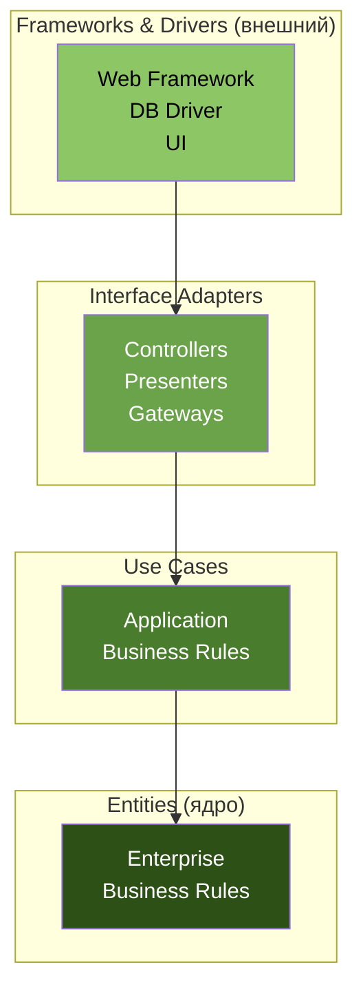
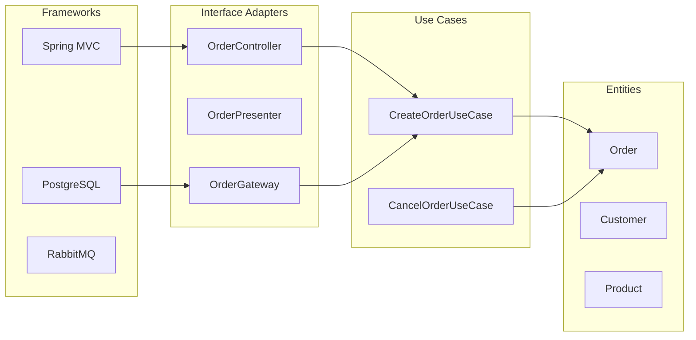
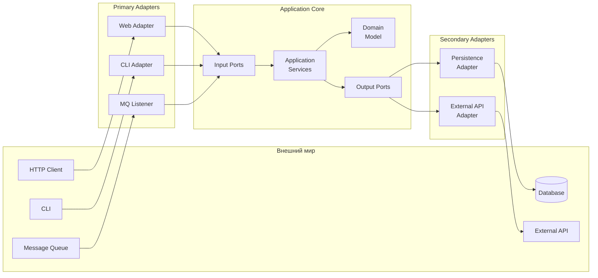
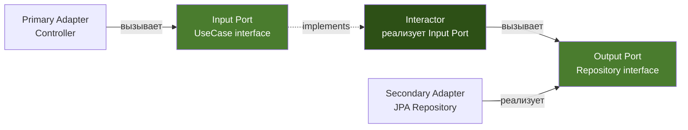
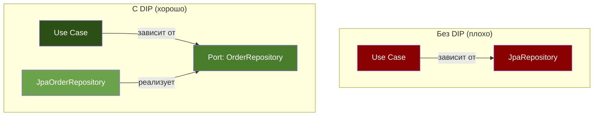
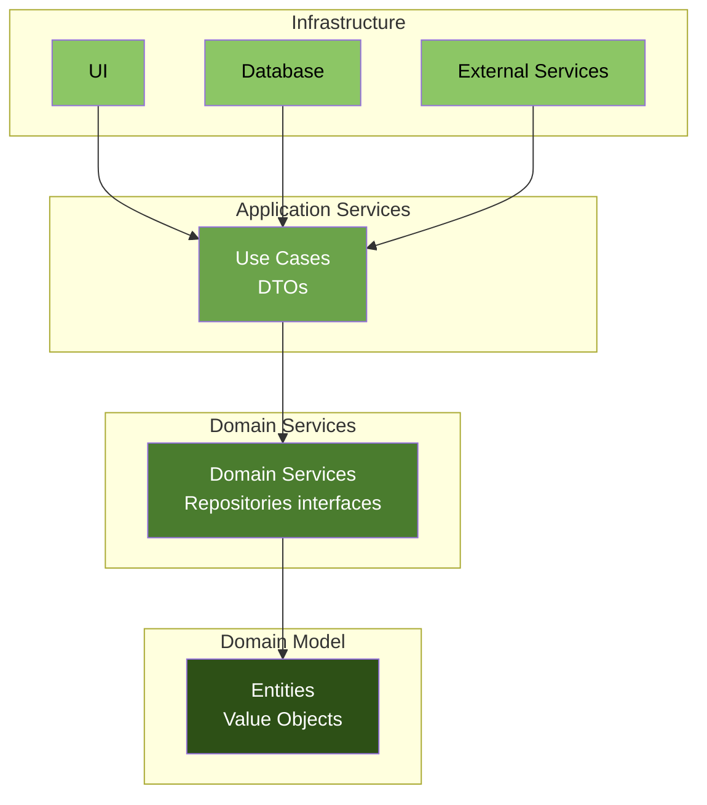
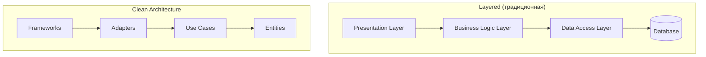
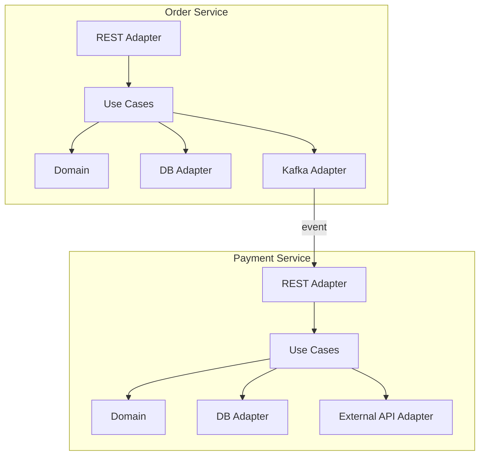
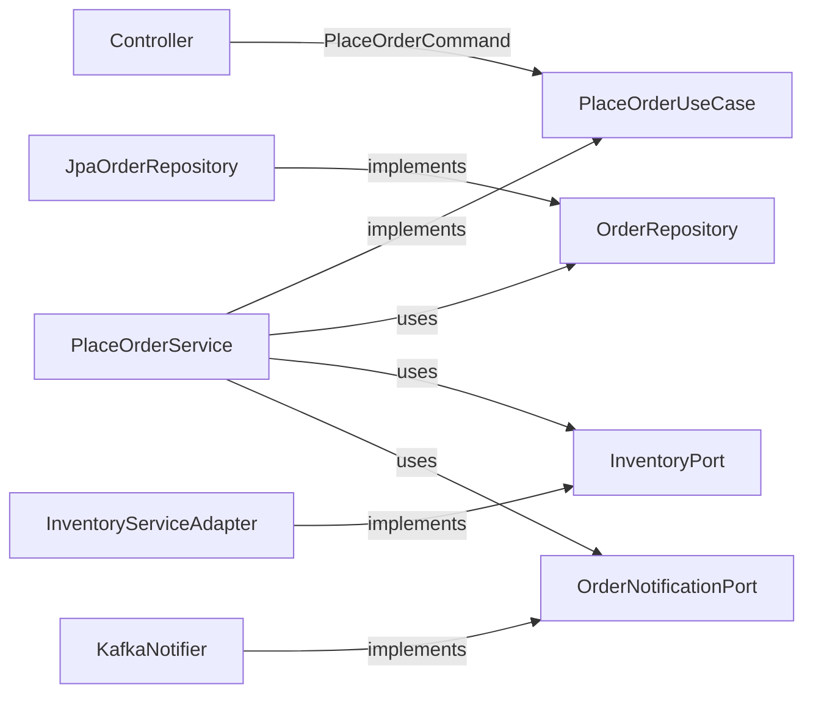
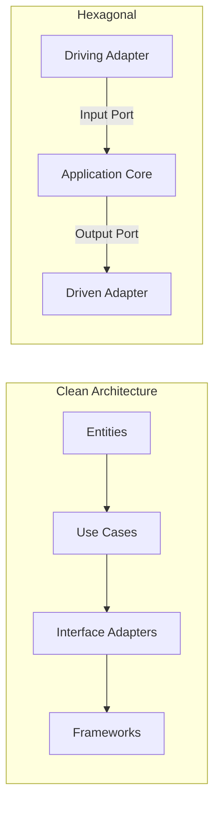

# Вопросы на собеседовании: `Clean Architecture`

Полное покрытие `Clean Architecture` и `Hexagonal Architecture`: правило зависимостей, слои (`Entities`, `Use Cases`, `Interface Adapters`, `Frameworks`), порты и адаптеры, `Onion Architecture`, `Dependency Inversion`, реализация в `Spring Boot`, тестирование и антипаттерны.

**Clean Architecture** (Роберт Мартин, 2012) и **Hexagonal Architecture** (Алистер Кокбёрн, 2005) -- два наиболее влиятельных архитектурных подхода, объединённых общей идеей: изоляция бизнес-логики от инфраструктурных деталей. На собеседованиях уровня Senior/Lead вопросы по этим темам проверяют понимание `Dependency Inversion`, умение проектировать границы модулей и выбирать подходящую архитектуру для конкретного контекста.

## Полезные ссылки

### Официальная документация

- [Clean Architecture with Spring Boot (Baeldung)](https://www.baeldung.com/spring-boot-clean-architecture) -- реализация Clean Architecture на Spring Boot
- [Hexagonal Architecture, DDD, and Spring (Baeldung)](https://www.baeldung.com/hexagonal-architecture-ddd-spring) -- Hexagonal Architecture с DDD и Spring
- [The Clean Architecture (Robert C. Martin)](https://blog.cleancoder.com/uncle-bob/2012/08/13/the-clean-architecture.html) -- оригинальная статья Роберта Мартина
- [Hexagonal Architecture (Alistair Cockburn)](https://alistair.cockburn.us/hexagonal-architecture/) -- оригинальная статья Алистера Кокбёрна
- [Vertical Slice Architecture (Baeldung)](https://www.baeldung.com/java-vertical-slice-architecture) -- альтернативный подход Vertical Slices
- [ArchUnit (Baeldung)](https://www.baeldung.com/java-archunit-intro) -- автоматическая проверка архитектурных правил

## Содержание

- [Полезные ссылки](#полезные-ссылки)
- [See also](#see-also)

**Основы Clean Architecture**
- [Q1. (!) Что такое Clean Architecture и какую проблему она решает?](#q1--что-такое-clean-architecture-и-какую-проблему-она-решает)
- [Q2. (!) Что такое правило зависимостей (Dependency Rule)?](#q2--что-такое-правило-зависимостей-dependency-rule)
- [Q3. Какие слои определяет Clean Architecture?](#q3-какие-слои-определяет-clean-architecture)
- [Q4. Что такое Entities в контексте Clean Architecture?](#q4-что-такое-entities-в-контексте-clean-architecture)
- [Q5. (!) Что такое Use Cases (Interactors) и какова их роль?](#q5--что-такое-use-cases-interactors-и-какова-их-роль)
- [Q6. Что такое Interface Adapters?](#q6-что-такое-interface-adapters)
- [Q7. Какова роль слоя Frameworks & Drivers?](#q7-какова-роль-слоя-frameworks--drivers)

**Hexagonal Architecture (Ports & Adapters)**
- [Q8. (!) Что такое Hexagonal Architecture и чем она отличается от Clean Architecture?](#q8--что-такое-hexagonal-architecture-и-чем-она-отличается-от-clean-architecture)
- [Q9. Что такое порты (Ports) в гексагональной архитектуре?](#q9-что-такое-порты-ports-в-гексагональной-архитектуре)
- [Q10. Что такое адаптеры (Adapters) и какие их типы существуют?](#q10-что-такое-адаптеры-adapters-и-какие-их-типы-существуют)
- [Q11. Чем отличаются Input (Driving) и Output (Driven) порты?](#q11-чем-отличаются-input-driving-и-output-driven-порты)
- [Q12. Как связаны Hexagonal Architecture и Dependency Inversion Principle?](#q12-как-связаны-hexagonal-architecture-и-dependency-inversion-principle)

**Onion Architecture и сравнение подходов**
- [Q13. Что такое Onion Architecture?](#q13-что-такое-onion-architecture)
- [Q14. Сравните Clean, Hexagonal и Onion Architecture](#q14-сравните-clean-hexagonal-и-onion-architecture)
- [Q15. (!) Чем Clean Architecture отличается от традиционной слоистой архитектуры?](#q15--чем-clean-architecture-отличается-от-традиционной-слоистой-архитектуры)
- [Q16. Что такое Vertical Slice Architecture и когда она предпочтительнее?](#q16-что-такое-vertical-slice-architecture-и-когда-она-предпочтительнее)

**Реализация в Java и Spring Boot**
- [Q17. Как организовать пакетную структуру Spring Boot проекта по Clean Architecture?](#q17-как-организовать-пакетную-структуру-spring-boot-проекта-по-clean-architecture)
- [Q18. Как реализовать Input Port и Use Case Interactor в Java?](#q18-как-реализовать-input-port-и-use-case-interactor-в-java)
- [Q19. Как реализовать Output Port и его адаптер?](#q19-как-реализовать-output-port-и-его-адаптер)
- [Q20. (!) Как Spring Boot вписывается в Clean Architecture?](#q20--как-spring-boot-вписывается-в-clean-architecture)
- [Q21. Как правильно передавать данные между слоями (DTO, Domain Model, Entity)?](#q21-как-правильно-передавать-данные-между-слоями-dto-domain-model-entity)
- [Q22. Как обрабатывать транзакции в Clean Architecture?](#q22-как-обрабатывать-транзакции-в-clean-architecture)

**Тестирование и качество**
- [Q23. Какие преимущества для тестирования даёт Clean Architecture?](#q23-какие-преимущества-для-тестирования-даёт-clean-architecture)
- [Q24. Как тестировать Use Case без инфраструктуры?](#q24-как-тестировать-use-case-без-инфраструктуры)
- [Q25. Как использовать ArchUnit для проверки архитектурных правил?](#q25-как-использовать-archunit-для-проверки-архитектурных-правил)

**Антипаттерны и практические проблемы**
- [Q26. (!) Какие типичные антипаттерны нарушают Clean Architecture?](#q26--какие-типичные-антипаттерны-нарушают-clean-architecture)
- [Q27. Когда Clean Architecture -- это overkill?](#q27-когда-clean-architecture----это-overkill)
- [Q28. (!) Как избежать анемичной доменной модели в Clean Architecture?](#q28--как-избежать-анемичной-доменной-модели-в-clean-architecture)
- [Q29. Как применять Clean Architecture в микросервисах?](#q29-как-применять-clean-architecture-в-микросервисах)
- [Q30. Как эволюционно мигрировать монолит к Clean Architecture?](#q30-как-эволюционно-мигрировать-монолит-к-clean-architecture)

**Продвинутые темы**
- [Q31. (!) Как правильно реализовать Use Case Interactor с несколькими портами?](#q31--как-правильно-реализовать-use-case-interactor-с-несколькими-портами)
- [Q32. Как организовать обработку ошибок в Use Case без исключений инфраструктуры?](#q32-как-организовать-обработку-ошибок-в-use-case-без-исключений-инфраструктуры)
- [Q33. (!) Как проверить соблюдение Dependency Rule через ArchUnit?](#q33--как-проверить-соблюдение-dependency-rule-через-archunit)

**Clean Architecture: расширенные темы**
- [Q34. (!) Чем Clean Architecture отличается от Hexagonal (Ports & Adapters) — ключевые отличия?](#q34--чем-clean-architecture-отличается-от-hexagonal-ports--adapters--ключевые-отличия)
- [Q35. Как реализовать Presenter паттерн в Clean Architecture?](#q35-как-реализовать-presenter-паттерн-в-clean-architecture)
- [Q36. Как организовать тестирование на каждом уровне Clean Architecture?](#q36-как-организовать-тестирование-на-каждом-уровне-clean-architecture)
- [Q37. Как реализовать Dependency Injection без Spring IoC контейнера?](#q37-как-реализовать-dependency-injection-без-spring-ioc-контейнера)
- [Q38. Как интегрировать агрегаты и Domain Events в Clean Architecture?](#q38-как-интегрировать-агрегаты-и-domain-events-в-clean-architecture)
- [Q39. Что такое Screaming Architecture и как она связана с Clean Architecture?](#q39-что-такое-screaming-architecture-и-как-она-связана-с-clean-architecture)
- [Q40. (!) Как эволюционировать от Clean Architecture к Vertical Slice Architecture?](#q40--как-эволюционировать-от-clean-architecture-к-vertical-slice-architecture)
- [Q41. Как правильно реализовать пакетную структуру Spring Boot проекта в стиле Clean Architecture на практике?](#q41-как-правильно-реализовать-пакетную-структуру-spring-boot-проекта-в-стиле-clean-architecture-на-практике)

---

## Q1. (!) Что такое Clean Architecture и какую проблему она решает?

**Clean Architecture -- это способ организовать код так, чтобы бизнес-логика не зависела от инфраструктуры** (UI, базы данных, фреймворков, внешних сервисов). Подход предложил Роберт Мартин (Uncle Bob) в 2012 году.

Проблема, которую она решает, -- **сильная связанность** (tight coupling) бизнес-логики с технологическими деталями. В типичном приложении бизнес-правила "размазаны" по контроллерам, сервисам и репозиториям, и это бьёт по сопровождаемости:

- **Технологию не заменить** без переписывания бизнес-логики
- **Тестировать тяжело** -- для unit-теста нужна база данных или HTTP-сервер
- **Правила не переиспользовать** в другом контексте (CLI, другой сервис)
- **Изменения каскадят** -- правка UI ломает доменную логику

Лекарство -- **правило зависимостей** (Dependency Rule): зависимости в коде направлены только **внутрь**, к бизнес-логике. Внешний слой знает о внутреннем, но не наоборот. За счёт этого ядро ничего не знает о том, кто его вызывает и где хранятся данные, поэтому остаётся стабильным при смене любых внешних деталей.



> На собеседовании важно подчеркнуть: Clean Architecture -- это не конкретная структура папок, а **набор принципов** организации зависимостей. Конкретная реализация может варьироваться.

## Q2. (!) Что такое правило зависимостей (Dependency Rule)?

**Dependency Rule -- правило, что зависимости в исходном коде направлены только внутрь, к более высокоуровневым политикам.** Это центральный принцип Clean Architecture, ради которого и затеяны все слои.

На практике из него следуют три конкретных запрета:

1. **Внутренние слои ничего не знают о внешних**: `Entity` не знает о `Use Case`, `Use Case` не знает о `Controller`. Зависимость всегда указывает от периферии к ядру.
2. **Данные пересекают границы** через простые структуры (DTO), а не через объекты внешних слоёв -- иначе внутренний слой косвенно узнал бы о внешнем.
3. **Имена из внешних слоёв** не упоминаются во внутренних: домен не должен видеть имя класса `OrderController` или `OrderJpaEntity`.

Но `Use Case` всё же надо как-то достучаться до базы. Как направить зависимость внутрь, если данные физически снаружи? Через **Dependency Inversion Principle** (DIP): внутренний слой объявляет интерфейс (порт), а внешний слой его реализует (адаптер). Стрелка зависимости разворачивается -- инфраструктура зависит от домена, а не наоборот.

```java
// Внутренний слой (Use Case) определяет интерфейс
public interface OrderRepository {
    Order findById(OrderId id);
    void save(Order order);
}

// Внешний слой (Infrastructure) реализует интерфейс
public class JpaOrderRepository implements OrderRepository {
    private final JpaOrderEntityRepository jpaRepo;
    private final OrderMapper mapper;

    @Override
    public Order findById(OrderId id) {
        return jpaRepo.findById(id.value())
            .map(mapper::toDomain)
            .orElseThrow(() -> new OrderNotFoundException(id));
    }
}
```

Типичное нарушение правила: доменная сущность содержит JPA-аннотации (`@Entity`, `@Column`). Формально код компилируется, но домен теперь зависит от фреймворка -- его нельзя ни переиспользовать без JPA на classpath, ни протестировать без неё.

## Q3. Какие слои определяет Clean Architecture?

Clean Architecture определяет **четыре концентрических слоя**, от стабильного ядра к легко заменяемой периферии. Чем ближе к центру -- тем стабильнее код и тем реже он меняется.

| Слой | Содержимое | Зависимости |
|------|-----------|-------------|
| **Entities** | Доменные объекты, бизнес-правила уровня предприятия | Ни от чего |
| **Use Cases** | Сценарии использования, бизнес-правила приложения | Только от Entities |
| **Interface Adapters** | Контроллеры, презентеры, маперы, шлюзы | От Use Cases и Entities |
| **Frameworks & Drivers** | Web-фреймворк, БД, UI, внешние API | От всех внутренних слоёв |



Ответственность каждого слоя:

- **Entities** -- самые стабильные правила, меняются реже всего; они переживают смену приложений
- **Use Cases** -- оркестрируют бизнес-логику: вызывают Entities и обращаются к внешнему миру через порты
- **Interface Adapters** -- переводят данные между форматом ядра и форматом внешних систем (JSON, строки таблиц)
- **Frameworks** -- самый нестабильный слой; именно его проще всего выкинуть и заменить

**Зачем именно концентрические кольца:** код, который меняется по разным причинам и с разной частотой, разнесён по разным слоям. Частые правки (новый endpoint, смена БД) задевают только периферию и не доходят до ядра.

## Q4. Что такое Entities в контексте Clean Architecture?

**Entities -- объекты, инкапсулирующие бизнес-правила уровня предприятия** (Enterprise Business Rules): те правила, что верны независимо от конкретного приложения. Это самое стабильное и ценное в системе.

Их свойства:

- Содержат **критичную бизнес-логику**, не привязанную к конкретному приложению
- Переиспользуются в нескольких приложениях (один и тот же `Order` -- и в веб-сервисе, и в batch-обработке)
- **Не содержат** аннотаций фреймворков (`@Entity`, `@Component`)
- Ничего не знают о базах данных, HTTP, очередях

Главное -- термин `Entity` здесь в смысле Uncle Bob (доменный объект), а не `@Entity` из JPA. Это разные вещи, и путать их -- частая ошибка.

```java
public class Order {
    private final OrderId id;
    private final CustomerId customerId;
    private final List<OrderLine> lines;
    private OrderStatus status;
    private Money totalPrice;

    public void addLine(Product product, int quantity) {
        if (status != OrderStatus.DRAFT) {
            throw new OrderAlreadySubmittedException(id);
        }
        lines.add(new OrderLine(product, quantity));
        recalculateTotal();
    }

    public void submit() {
        if (lines.isEmpty()) {
            throw new EmptyOrderException(id);
        }
        this.status = OrderStatus.SUBMITTED;
    }

    public void cancel(CancellationPolicy policy) {
        if (!policy.canCancel(this)) {
            throw new CancellationNotAllowedException(id);
        }
        this.status = OrderStatus.CANCELLED;
    }

    private void recalculateTotal() {
        this.totalPrice = lines.stream()
            .map(OrderLine::lineTotal)
            .reduce(Money.ZERO, Money::add);
    }
}
```

Обратите внимание: `Order` -- это **богатая доменная модель** (Rich Domain Model). Бизнес-логика (`addLine`, `submit`, `cancel`) живёт внутри объекта, а не в сервисах, поэтому объект сам охраняет свои инварианты: нельзя добавить строку в уже отправленный заказ или отправить пустой. Это противоположность анемичной модели, где `Order` -- просто набор геттеров/сеттеров, а правила раскиданы по сервисам (см. Q28).

## Q5. (!) Что такое Use Cases (Interactors) и какова их роль?

**Use Case (он же Interactor) -- единица бизнес-логики уровня приложения, описывающая один конкретный сценарий** («создать заказ», «перевести деньги»). Если Entity отвечает на вопрос «что такое заказ», то Use Case -- на вопрос «что значит создать заказ в этом приложении».

Его роль:
- **Оркестрирует** работу: загружает доменные объекты, вызывает их методы, сохраняет результат через порты
- **Реализует** правила, специфичные для приложения (а не для предприятия в целом)
- **Определяет** свои вход и выход через порты-интерфейсы, не завязываясь на конкретную технологию
- **Не зависит** от способа доставки запроса -- один и тот же Use Case вызывается из HTTP-контроллера, CLI или слушателя очереди

```java
// Input Port -- интерфейс, который определяет Use Case
public interface CreateOrderUseCase {
    CreateOrderResponse execute(CreateOrderRequest request);
}

// Входные данные
public record CreateOrderRequest(
    String customerId,
    List<OrderLineRequest> lines
) {}

// Выходные данные
public record CreateOrderResponse(
    String orderId,
    BigDecimal totalPrice,
    String status
) {}

// Interactor -- реализация Use Case
public class CreateOrderInteractor implements CreateOrderUseCase {

    private final CustomerRepository customerRepo;
    private final ProductRepository productRepo;
    private final OrderRepository orderRepo;
    private final OrderNotificationPort notificationPort;

    public CreateOrderInteractor(
            CustomerRepository customerRepo,
            ProductRepository productRepo,
            OrderRepository orderRepo,
            OrderNotificationPort notificationPort) {
        this.customerRepo = customerRepo;
        this.productRepo = productRepo;
        this.orderRepo = orderRepo;
        this.notificationPort = notificationPort;
    }

    @Override
    public CreateOrderResponse execute(CreateOrderRequest request) {
        Customer customer = customerRepo.findById(
            new CustomerId(request.customerId()));

        Order order = Order.create(customer);

        for (var lineReq : request.lines()) {
            Product product = productRepo.findById(
                new ProductId(lineReq.productId()));
            order.addLine(product, lineReq.quantity());
        }

        order.submit();
        orderRepo.save(order);
        notificationPort.notifyOrderCreated(order);

        return new CreateOrderResponse(
            order.getId().value(),
            order.getTotalPrice().amount(),
            order.getStatus().name()
        );
    }
}
```

Обратите внимание: бизнес-правила (`addLine`, `submit`) живут в доменном объекте `Order`, а Interactor лишь дирижирует -- загружает участников, вызывает их методы, сохраняет. Это удерживает Use Case тонким.

> Эмпирическое правило: один Use Case -- один класс. Так соблюдается `Single Responsibility Principle`, а тест на сценарий не тянет за собой логику соседних сценариев.

## Q6. Что такое Interface Adapters?

**Interface Adapters -- слой-переводчик между форматом ядра и форматом внешнего мира** (web, БД, внешние сервисы). Ядро говорит на языке доменных объектов, внешний мир -- на языке JSON, строк таблиц и байтов очереди; этот слой переводит в обе стороны.

Что здесь живёт:

- **Controllers** -- принимают HTTP-запрос и переводят его в `Request` для Use Case
- **Presenters** -- форматируют `Response` из Use Case под нужды клиента
- **Gateways / реализации репозиториев** -- переводят доменные объекты в формат хранения и обратно
- **Mappers** -- конвертируют между DTO, доменными и persistence-моделями

```java
@RestController
@RequestMapping("/api/orders")
public class OrderController {

    private final CreateOrderUseCase createOrder;
    private final OrderDtoMapper mapper;

    public OrderController(CreateOrderUseCase createOrder,
                           OrderDtoMapper mapper) {
        this.createOrder = createOrder;
        this.mapper = mapper;
    }

    @PostMapping
    public ResponseEntity<OrderDto> create(
            @RequestBody CreateOrderDto dto) {
        // Adapter: HTTP DTO → Use Case Request
        var request = mapper.toRequest(dto);

        // Вызов Use Case
        var response = createOrder.execute(request);

        // Adapter: Use Case Response → HTTP DTO
        return ResponseEntity
            .status(HttpStatus.CREATED)
            .body(mapper.toDto(response));
    }
}
```

Ключевой признак правильного контроллера: в нём **нет ни одной строки бизнес-логики** -- только перевод формата и делегирование Use Case. Если в контроллере появляется `if` про бизнес-правила, логика утекла не туда (антипаттерн из Q26).

## Q7. Какова роль слоя Frameworks & Drivers?

**Frameworks & Drivers -- самый внешний слой, где собраны все технические детали и сторонние библиотеки.** По Clean Architecture фреймворк -- это деталь, а не фундамент: он на периферии, а не в центре.

Что сюда входит:

- **Web-фреймворк**: `Spring MVC`, `Spring WebFlux`
- **ORM / Persistence**: `Hibernate`, `JDBC`, `jOOQ`
- **Драйверы БД**: `PostgreSQL`, `MySQL`, `MongoDB`
- **Очереди сообщений**: `RabbitMQ`, `Kafka`
- **Внешние API**: REST-клиенты, gRPC-стабы
- **UI**: шаблоны, фронтенд

Характеристики слоя:

1. **Тонкий "клей"** -- здесь минимум кода: конфигурация и wiring, а не логика
2. **Легко заменяем** -- смена БД с `PostgreSQL` на `MongoDB` в идеале задевает только этот слой
3. **Дом для конфигурации** Spring: `@Configuration`, `@Bean`, `application.yml`

```java
@Configuration
public class OrderConfiguration {

    @Bean
    public CreateOrderUseCase createOrderUseCase(
            CustomerRepository customerRepo,
            ProductRepository productRepo,
            OrderRepository orderRepo,
            OrderNotificationPort notificationPort) {
        return new CreateOrderInteractor(
            customerRepo, productRepo, orderRepo, notificationPort);
    }
}
```

Обратите внимание: `CreateOrderInteractor` **не аннотирован** `@Service` -- он не знает о Spring. Wiring происходит в конфигурационном классе внешнего слоя.

## Q8. (!) Что такое Hexagonal Architecture и чем она отличается от Clean Architecture?

**Hexagonal Architecture (Ports & Adapters) -- паттерн, где приложение общается с внешним миром только через порты** (абстрактные интерфейсы), а конкретные технологии подключаются адаптерами (реализациями этих интерфейсов). Предложен Алистером Кокбёрном в 2005 году. Метафора шестиугольника подчёркивает, что граней (точек входа и выхода) много и все они равноправны: HTTP, CLI, тест -- лишь разные адаптеры к одному ядру.



Сравнение с Clean Architecture:

| Аспект | Hexagonal | Clean Architecture |
|--------|-----------|-------------------|
| **Автор** | Alistair Cockburn (2005) | Robert C. Martin (2012) |
| **Терминология** | Порты, адаптеры | Entities, Use Cases, Interface Adapters |
| **Слои** | 2 зоны: core и внешний мир | 4 концентрических кольца |
| **Фокус** | Взаимозаменяемость внешних систем | Направление зависимостей |
| **Общая идея** | Изоляция домена от инфраструктуры | Изоляция домена от инфраструктуры |

Главное, что стоит сказать на собеседовании: по сути это **один и тот же принцип** (изоляция домена через инверсию зависимостей) с разной терминологией и визуализацией. Clean Architecture детальнее проговаривает слои внутри ядра, Hexagonal -- абстрактнее и сильнее акцентирует взаимозаменяемость адаптеров. На практике их свободно комбинируют.

## Q9. Что такое порты (Ports) в гексагональной архитектуре?

**Port -- интерфейс, объявленный в ядре приложения, который описывает контракт с внешним миром.** Ключевое: порт принадлежит ядру (домену), а не инфраструктуре -- именно поэтому зависимость указывает внутрь. Порты бывают двух типов, по направлению вызова:

**Input Port (Driving Port)** -- описывает, что приложение умеет делать. Через него внешний мир инициирует действия (вызов идёт снаружи внутрь):

```java
// Input Port
public interface SendMoneyUseCase {
    boolean sendMoney(SendMoneyCommand command);
}

public record SendMoneyCommand(
    AccountId sourceAccountId,
    AccountId targetAccountId,
    Money amount
) {
    public SendMoneyCommand {
        requireNonNull(sourceAccountId);
        requireNonNull(targetAccountId);
        if (amount.isNegativeOrZero()) {
            throw new IllegalArgumentException(
                "Amount must be positive");
        }
    }
}
```

**Output Port (Driven Port)** -- описывает, что приложению нужно от внешнего мира. Через него ядро обращается к инфраструктуре (вызов идёт изнутри наружу):

```java
// Output Port
public interface LoadAccountPort {
    Account loadAccount(AccountId accountId, LocalDateTime baselineDate);
}

// Output Port
public interface UpdateAccountStatePort {
    void updateActivities(Account account);
}
```

Принципиальное отличие в том, кто реализует порт. **Input Port реализует само ядро** (Use Case -- это его реализация), а **Output Port реализует адаптер** снаружи. Оба интерфейса объявлены внутри, поэтому ядро не ссылается ни на один внешний класс.

## Q10. Что такое адаптеры (Adapters) и какие их типы существуют?

**Adapter -- конкретная реализация, которая связывает порт с конкретной технологией.** Адаптер -- сменная деталь: чтобы заменить технологию (REST на gRPC, JPA на MongoDB), достаточно написать новый адаптер, не трогая ядро. Адаптеры делятся на два типа по тому, с какой стороны они подключены к ядру.

**Primary Adapters (Driving)** -- стоят на входе и сами вызывают Input Ports, инициируя сценарий:

```java
// Primary Adapter: REST Controller
@RestController
@RequestMapping("/accounts")
public class SendMoneyController {

    private final SendMoneyUseCase sendMoney;

    @PostMapping("/send/{sourceId}/{targetId}/{amount}")
    public ResponseEntity<Void> sendMoney(
            @PathVariable long sourceId,
            @PathVariable long targetId,
            @PathVariable long amount) {

        var command = new SendMoneyCommand(
            new AccountId(sourceId),
            new AccountId(targetId),
            Money.of(amount));

        sendMoney.sendMoney(command);

        return ResponseEntity.ok().build();
    }
}
```

**Secondary Adapters (Driven)** -- стоят на выходе и реализуют Output Ports, поставляя ядру инфраструктуру (БД, внешний сервис):

```java
// Secondary Adapter: JPA Repository
@Repository
public class AccountPersistenceAdapter
        implements LoadAccountPort, UpdateAccountStatePort {

    private final AccountJpaRepository accountRepo;
    private final ActivityJpaRepository activityRepo;
    private final AccountMapper mapper;

    @Override
    public Account loadAccount(AccountId accountId,
                               LocalDateTime baselineDate) {
        AccountJpaEntity entity = accountRepo
            .findById(accountId.value())
            .orElseThrow(() -> new EntityNotFoundException(
                "Account not found: " + accountId));

        List<ActivityJpaEntity> activities = activityRepo
            .findByOwnerSince(accountId.value(), baselineDate);

        return mapper.toDomain(entity, activities, baselineDate);
    }

    @Override
    public void updateActivities(Account account) {
        account.getActivityWindow().getActivities()
            .forEach(activity -> activityRepo.save(
                mapper.toJpaEntity(activity)));
    }
}
```

Запомнить разницу легко: Primary адаптер **вызывает** порт (зависит от Input Port), Secondary адаптер **реализует** порт (подставляется в Output Port через DI). В обоих случаях стрелка зависимости направлена к ядру -- правило зависимостей соблюдено.

## Q11. Чем отличаются Input (Driving) и Output (Driven) порты?

Коротко: **Input Port -- это «что приложение умеет», Output Port -- «что приложению нужно».** Отсюда вытекает и направление вызова, и кто реализует интерфейс.

| Характеристика | Input Port (Driving) | Output Port (Driven) |
|---------------|---------------------|---------------------|
| **Направление** | Внешний мир → Приложение | Приложение → Внешний мир |
| **Кто вызывает** | Primary Adapter (Controller) | Use Case (Interactor) |
| **Кто реализует** | Use Case / Application Service | Secondary Adapter |
| **Примеры** | `CreateOrderUseCase`, `SendMoneyUseCase` | `OrderRepository`, `PaymentGateway` |
| **Аналогия** | "Что я умею делать" | "Что мне нужно от внешнего мира" |



Важный нюанс, который часто путают на собеседовании: Input Port Use Case **реализует**, а Output Port Use Case **использует**. Но объявлены оба интерфейса в ядре приложения -- именно поэтому ядро не зависит ни от контроллера, ни от репозитория.

## Q12. Как связаны Hexagonal Architecture и Dependency Inversion Principle?

**DIP -- это механизм, который физически позволяет соблюсти правило зависимостей.** Без него «зависимости только внутрь» оставалось бы лозунгом: ведь Use Case реально нужна база. `Dependency Inversion Principle` (пятый принцип `SOLID`) формулируется так:

> Модули высокого уровня не должны зависеть от модулей низкого уровня. Оба должны зависеть от абстракций.

Применительно к Hexagonal это работает в три шага:

1. **Ядро** (высокий уровень) объявляет Output Port -- абстракцию того, что ему нужно
2. **Инфраструктура** (низкий уровень) реализует эту абстракцию
3. **Зависимость инвертируется**: компилируемая зависимость идёт от инфраструктуры к домену, хотя в runtime поток управления идёт от домена к инфраструктуре

В этом и фокус: направление вызова в рантайме (домен → БД) и направление зависимости в коде (БД → домен) противоположны. Порт-интерфейс -- та точка, где они расходятся.



Без DIP: `Use Case → JPA Repository` (домен зависит от инфраструктуры).
С DIP: `Use Case → Port ← Adapter` (инфраструктура зависит от домена).

В Spring это реализуется автоматически через `@Autowired` / constructor injection: Spring подставляет `JpaOrderRepository` вместо `OrderRepository` в runtime.

## Q13. Что такое Onion Architecture?

**Onion Architecture -- подход с теми же зависимостями-внутрь, но с более дробным делением ядра на слои.** Предложен Джеффри Палермо (Jeffrey Palermo) в 2008 году как развитие идей Hexagonal Architecture.

Слои Onion Architecture (от ядра к периферии):

1. **Domain Model** -- сущности и value objects
2. **Domain Services** -- доменные сервисы, работающие с несколькими сущностями
3. **Application Services** -- сценарии использования, оркестрация
4. **Infrastructure** -- внешний слой (БД, UI, API)



Ключевое отличие от Hexagonal: Onion явно разводит **Domain Model** (сущности и value objects) и **Domain Services** (логику над несколькими сущностями), тогда как Hexagonal сваливает их в общий "Application Core". Практический смысл этого деления -- не дать доменным сервисам разрастись и проглотить логику, которая должна жить в самих сущностях.

## Q14. Сравните Clean, Hexagonal и Onion Architecture

Все три архитектуры -- **вариации одной идеи**: бизнес-логика в центре, инфраструктура на периферии, зависимости направлены внутрь через DIP. Различаются они терминологией, метафорой и степенью детализации слоёв, но не сутью.

| Критерий | Clean Architecture | Hexagonal Architecture | Onion Architecture |
|----------|-------------------|----------------------|-------------------|
| **Автор** | Robert C. Martin (2012) | Alistair Cockburn (2005) | Jeffrey Palermo (2008) |
| **Визуализация** | Концентрические кольца | Шестиугольник | "Луковица" |
| **Слои** | 4: Entities, Use Cases, Adapters, Frameworks | 2 зоны: Core и Internal/External | 4: Domain Model, Domain Services, App Services, Infra |
| **Терминология** | Entities, Interactors | Ports, Adapters | Onion layers |
| **Фокус** | Dependency Rule | Взаимозаменяемость через порты | Доменная модель в центре |
| **Use Cases** | Явно выделены | Часть Application Core | Application Services |
| **DIP** | Ключевой принцип | Ключевой принцип | Ключевой принцип |

На практике термины свободно смешивают, и это нормально. Собеседователь ждёт, что вы:
1. Понимаете, что все три подхода -- **вариации одной идеи** (а не три конкурирующие теории)
2. Знаете терминологию каждого и не путаетесь в ней
3. Умеете применить любой из них на практике, выбирая по контексту, а не по моде

## Q15. (!) Чем Clean Architecture отличается от традиционной слоистой архитектуры?

**Главное отличие -- направление зависимостей.** В традиционной слоистой архитектуре (Layered / N-tier) зависимости идут **сверху вниз**: `Presentation → Business Logic → Data Access`, и бизнес-слой в итоге зависит от слоя данных. В Clean Architecture зависимости идут **снаружи внутрь**, к домену, и домен не зависит ни от чего.



Отсюда расходятся все остальные различия:

| Аспект | Layered Architecture | Clean Architecture |
|--------|---------------------|-------------------|
| **Направление зависимостей** | Сверху вниз (UI → BL → DA) | Снаружи внутрь (Infra → Domain) |
| **Домен зависит от БД** | Да (BL → DA) | Нет (Domain ничего не знает о БД) |
| **Замена БД** | Требует изменения BL | Только адаптер |
| **Тестирование домена** | Нужна БД или моки DA | Чистые unit-тесты |
| **Доменные сущности** | Часто совпадают с ORM-сущностями | Отделены от ORM |
| **Где бизнес-логика** | Размазана по слоям | Сконцентрирована в Entities/Use Cases |

Корень проблемы Layered Architecture: **бизнес-слой зависит от слоя данных**. Поэтому смена `Hibernate` на `jOOQ` тянет за собой правку сервисов, а unit-тест бизнес-логики требует мокать data-access. Clean Architecture разрывает эту зависимость: бизнес-логика объявляет интерфейсы, инфраструктура их реализует -- и БД становится сменной деталью.

## Q16. Что такое Vertical Slice Architecture и когда она предпочтительнее?

**Vertical Slice Architecture -- организация кода по бизнес-функциям (features / slices), а не по техническим слоям.** Вместо горизонтальных пакетов `controllers/`, `services/`, `repositories/` код режется вертикально: каждый slice содержит всё нужное для одного сценария -- от контроллера до запроса в БД. Это противоположность разрезу по слоям.

```
// Традиционный подход (по слоям)
controllers/
  OrderController.java
  ProductController.java
services/
  OrderService.java
  ProductService.java
repositories/
  OrderRepository.java
  ProductRepository.java

// Vertical Slices (по фичам)
features/
  create-order/
    CreateOrderCommand.java
    CreateOrderHandler.java
    CreateOrderValidator.java
  cancel-order/
    CancelOrderCommand.java
    CancelOrderHandler.java
```

Сравнение:

| Аспект | Clean Architecture | Vertical Slices |
|--------|-------------------|----------------|
| **Организация кода** | По архитектурным слоям | По бизнес-фичам |
| **Связанность** | Слои связаны через абстракции | Slices независимы друг от друга |
| **Переиспользование** | Высокое (общие Use Cases) | Минимальное (каждый slice самодостаточен) |
| **Сложность для простых CRUD** | Высокая (много слоёв ради простой операции) | Низкая (один файл на операцию) |
| **Когда выбирать** | Сложный домен, долгоживущий проект | CRUD-heavy, микросервисы, быстрая разработка |

**Когда Vertical Slices предпочтительнее:** CRUD-heavy приложения, микросервисы, быстрая разработка -- там, где фичи независимы и слои Clean Architecture только добавляют церемоний без выгоды. **Когда выигрывает Clean Architecture:** сложный домен и долгоживущий проект, где переиспользование Use Cases и изоляция домена окупают накладные расходы.

На практике подходы комбинируют: Clean Architecture для сложного ядра + Vertical Slices для feature-модулей. Именно так устроен наш проект (см. `feature/` в [Spring Framework](../frameworks/spring/spring-framework-interview.md)).

## Q17. Как организовать пакетную структуру Spring Boot проекта по Clean Architecture?

Главный принцип -- **пакет верхнего уровня = слой**, и зависимости между пакетами проверяемы. Рекомендуемая структура:

```
com.example.myapp/
├── domain/                          # Entities (ядро)
│   ├── model/
│   │   ├── Order.java              # Доменная сущность
│   │   ├── OrderId.java            # Value Object
│   │   ├── OrderStatus.java        # Enum
│   │   └── Money.java              # Value Object
│   ├── service/
│   │   └── PricingService.java     # Доменный сервис
│   └── exception/
│       └── OrderNotFoundException.java
│
├── application/                     # Use Cases
│   ├── port/
│   │   ├── in/                     # Input Ports
│   │   │   ├── CreateOrderUseCase.java
│   │   │   └── CancelOrderUseCase.java
│   │   └── out/                    # Output Ports
│   │       ├── OrderRepository.java
│   │       ├── PaymentGateway.java
│   │       └── NotificationSender.java
│   ├── service/
│   │   ├── CreateOrderService.java # Interactor
│   │   └── CancelOrderService.java
│   └── dto/
│       ├── CreateOrderRequest.java
│       └── CreateOrderResponse.java
│
├── adapter/                         # Interface Adapters
│   ├── in/
│   │   ├── web/
│   │   │   ├── OrderController.java
│   │   │   └── OrderDtoMapper.java
│   │   └── messaging/
│   │       └── OrderEventListener.java
│   └── out/
│       ├── persistence/
│       │   ├── OrderJpaEntity.java
│       │   ├── OrderJpaRepository.java
│       │   ├── OrderPersistenceAdapter.java
│       │   └── OrderPersistenceMapper.java
│       └── external/
│           └── StripePaymentAdapter.java
│
└── config/                          # Frameworks & Drivers
    ├── BeanConfiguration.java
    ├── WebConfiguration.java
    └── PersistenceConfiguration.java
```

Правила зависимостей между пакетами (по убыванию свободы):
- `domain` -- **нулевые внешние зависимости** (ни Spring, ни JPA, ни Lombok)
- `application` -- зависит только от `domain`
- `adapter` -- зависит от `application` и `domain`, но не наоборот
- `config` -- зависит от всех (это место сборки, Composition Root)

**Рекомендация:** в крупных проектах вынесите каждый пакет в отдельный **Gradle/Maven модуль**. Тогда нарушение направления зависимостей просто не скомпилируется -- это надёжнее, чем соглашение «не импортируй adapter из domain», которое легко нарушить по невнимательности. Для одномодульных проектов ту же проверку даёт ArchUnit (см. Q25, Q33).

## Q18. Как реализовать Input Port и Use Case Interactor в Java?

Схема всегда одинакова: интерфейс Use Case (Input Port) + команда на вход + результат на выход + класс-реализация (Interactor), который оркеструет домен. Полный пример:

```java
// === Input Port (интерфейс Use Case) ===
public interface TransferMoneyUseCase {
    TransferResult execute(TransferMoneyCommand command);
}

// === Command (входные данные) ===
public record TransferMoneyCommand(
    AccountId fromAccount,
    AccountId toAccount,
    Money amount
) {
    // Self-validating command
    public TransferMoneyCommand {
        Objects.requireNonNull(fromAccount, "fromAccount required");
        Objects.requireNonNull(toAccount, "toAccount required");
        Objects.requireNonNull(amount, "amount required");
        if (fromAccount.equals(toAccount)) {
            throw new IllegalArgumentException(
                "Cannot transfer to same account");
        }
    }
}

// === Result (выходные данные) ===
public record TransferResult(
    String transactionId,
    Money newBalanceFrom,
    Money newBalanceTo,
    Instant timestamp
) {}

// === Interactor (реализация Use Case) ===
public class TransferMoneyService implements TransferMoneyUseCase {

    private final LoadAccountPort loadAccount;
    private final UpdateAccountPort updateAccount;
    private final TransactionIdGenerator idGenerator;

    public TransferMoneyService(
            LoadAccountPort loadAccount,
            UpdateAccountPort updateAccount,
            TransactionIdGenerator idGenerator) {
        this.loadAccount = loadAccount;
        this.updateAccount = updateAccount;
        this.idGenerator = idGenerator;
    }

    @Override
    public TransferResult execute(TransferMoneyCommand command) {
        Account from = loadAccount.load(command.fromAccount());
        Account to = loadAccount.load(command.toAccount());

        // Бизнес-логика в доменной модели
        from.withdraw(command.amount());
        to.deposit(command.amount());

        // Сохранение через Output Port
        updateAccount.update(from);
        updateAccount.update(to);

        return new TransferResult(
            idGenerator.generate(),
            from.getBalance(),
            to.getBalance(),
            Instant.now()
        );
    }
}
```

Два момента, на которые стоит обратить внимание:

- **Команда самовалидируется** в компактном конструкторе record (`fromAccount != toAccount`) -- до Use Case доходит уже структурно корректный запрос.
- **`TransferMoneyService` не содержит аннотаций Spring** (`@Service`, `@Transactional`). Это обычный Java-класс, который собирается через `new` и тестируется без Spring Context за миллисекунды.

## Q19. Как реализовать Output Port и его адаптер?

```java
// === Output Port (определён в application layer) ===
public interface LoadAccountPort {
    Account load(AccountId accountId);
}

public interface UpdateAccountPort {
    void update(Account account);
}

// === Persistence Model (не доменная!) ===
@Entity
@Table(name = "accounts")
class AccountJpaEntity {
    @Id
    private Long id;
    private String holderName;
    private BigDecimal balance;

    // JPA-specific: конструктор без аргументов, геттеры, сеттеры
}

// === Secondary Adapter (реализация Output Port) ===
@Repository
class AccountPersistenceAdapter
        implements LoadAccountPort, UpdateAccountPort {

    private final AccountJpaRepository jpaRepository;
    private final AccountPersistenceMapper mapper;

    AccountPersistenceAdapter(
            AccountJpaRepository jpaRepository,
            AccountPersistenceMapper mapper) {
        this.jpaRepository = jpaRepository;
        this.mapper = mapper;
    }

    @Override
    public Account load(AccountId accountId) {
        AccountJpaEntity entity = jpaRepository
            .findById(accountId.value())
            .orElseThrow(() -> new AccountNotFoundException(accountId));
        return mapper.toDomain(entity);
    }

    @Override
    public void update(Account account) {
        AccountJpaEntity entity = mapper.toJpaEntity(account);
        jpaRepository.save(entity);
    }
}

// === Mapper между domain и persistence моделями ===
@Component
class AccountPersistenceMapper {

    Account toDomain(AccountJpaEntity entity) {
        return Account.reconstitute(
            new AccountId(entity.getId()),
            entity.getHolderName(),
            Money.of(entity.getBalance())
        );
    }

    AccountJpaEntity toJpaEntity(Account domain) {
        var entity = new AccountJpaEntity();
        entity.setId(domain.getId().value());
        entity.setHolderName(domain.getHolderName());
        entity.setBalance(domain.getBalance().amount());
        return entity;
    }
}
```

Ключевой момент всей конструкции: доменная модель `Account` и JPA-модель `AccountJpaEntity` -- **два разных класса**, между которыми стоит маппер. Да, это лишний класс и лишний маппинг. Но взамен схема БД может меняться (денормализация, переименование колонок), не задевая домен, а домен может иметь поля, которых в БД нет вовсе. Адаптер (`@Repository`) и маппер -- единственное место, которое знает обе модели сразу.

## Q20. (!) Как Spring Boot вписывается в Clean Architecture?

**Spring Boot в Clean Architecture -- это деталь самого внешнего слоя (Frameworks & Drivers), а не центр приложения.** Цель -- использовать удобства Spring (DI, транзакции, web), не пуская его аннотации внутрь домена и Use Cases. Тогда ядро остаётся переносимым и тестируемым без контейнера.

Три практических правила:

**1. DI-контейнер -- для wiring, но домен создаём явно, а не аннотациями:**

```java
// ПРАВИЛЬНО: Use Case создаётся через @Bean
@Configuration
public class UseCaseConfig {

    @Bean
    public TransferMoneyUseCase transferMoney(
            LoadAccountPort loadAccount,
            UpdateAccountPort updateAccount) {
        return new TransferMoneyService(loadAccount, updateAccount,
            new UuidTransactionIdGenerator());
    }
}

// НЕПРАВИЛЬНО: Use Case аннотирован @Service
@Service  // домен зависит от Spring!
public class TransferMoneyService { ... }
```

Здесь `@Bean`-метод создаёт Use Case через `new`, поэтому сам класс `TransferMoneyService` остаётся свободным от Spring. Цена -- немного ручного wiring в `@Configuration`; выгода -- чистый домен.

**2. `@Transactional` -- на адаптере или в конфигурации, но не внутри Use Case:**

```java
// Вариант 1: Transactional Adapter
@Repository
public class TransactionalAccountAdapter implements UpdateAccountPort {
    @Transactional
    @Override
    public void update(Account account) { ... }
}

// Вариант 2: Transactional Use Case Proxy
@Configuration
public class UseCaseConfig {
    @Bean
    public TransferMoneyUseCase transferMoney(...) {
        return new TransactionalUseCaseProxy<>(
            new TransferMoneyService(...));
    }
}
```

**3. Spring-аннотации -- только в `adapter` и `config`:** простое правило, которое легко проверить ArchUnit-ом.

| Аннотация | Допустимый слой |
|-----------|----------------|
| `@RestController`, `@RequestMapping` | `adapter.in.web` |
| `@Repository`, `@Entity` | `adapter.out.persistence` |
| `@Configuration`, `@Bean` | `config` |
| `@Service`, `@Component` | `config` (если нужно) |
| Ничего из Spring | `domain`, `application` |

## Q21. Как правильно передавать данные между слоями (DTO, Domain Model, Entity)?

Главное правило: **у каждого слоя своя модель данных, и преобразование между ними происходит ровно на границе слоёв.** Один объект не путешествует через всю систему -- он перекладывается из формата в формат на каждом переходе.

```mermaid
graph LR
    HTTP["HTTP DTO<br/>(JSON)"] -->|Controller Mapper| REQ[Use Case<br/>Request]
    REQ -->|Interactor| DOM[Domain<br/>Model]
    DOM -->|Persistence Mapper| JPA[JPA Entity<br/>(DB row)]
    DOM -->|Interactor| RESP[Use Case<br/>Response]
    RESP -->|Controller Mapper| JSON["HTTP DTO<br/>(JSON)"]
```

Три типа моделей:

```java
// 1. HTTP DTO -- для API (adapter.in.web)
public record CreateOrderApiRequest(
    @NotBlank String customerId,
    @NotEmpty List<OrderLineDto> items
) {}

// 2. Use Case Request/Response -- для бизнес-логики (application)
public record CreateOrderRequest(
    CustomerId customerId,
    List<OrderLineData> items
) {}

// 3. JPA Entity -- для персистентности (adapter.out.persistence)
@Entity
@Table(name = "orders")
class OrderJpaEntity {
    @Id @GeneratedValue
    private Long id;
    private String customerId;
    // ...
}
```

Зачем три модели вместо одной: **внутренний слой никогда не видит модель внешнего**. Домен не знает ни о `@NotBlank` (валидация API), ни о `@Entity` (JPA) -- значит, изменение формата JSON или схемы таблицы не доходит до бизнес-логики.

**Компромисс:** да, появляется бойлерплейт с мапперами. Но это осознанная плата: цена маппинга = цена независимости слоёв. На простом CRUD эта плата не окупается (см. Q27), на сложном долгоживущем домене -- окупается с лихвой.

## Q22. Как обрабатывать транзакции в Clean Architecture?

**Транзакция -- инфраструктурная концепция, поэтому она не должна просачиваться в домен.** Но границу транзакции естественно проводить вокруг Use Case: один сценарий = одна атомарная операция. Задача -- задать эту границу снаружи, не зашивая `@Transactional` в чистый класс Interactor-а. Три способа:

**1. `@Transactional` на фасаде/адаптере-обёртке:**

```java
@Component
public class TransactionalCreateOrderFacade implements CreateOrderUseCase {

    private final CreateOrderService delegate;

    @Transactional
    @Override
    public CreateOrderResponse execute(CreateOrderRequest request) {
        return delegate.execute(request);
    }
}
```

**2. Аспект (AOP) для Use Cases:**

```java
@Aspect
@Component
public class TransactionalUseCaseAspect {

    @Around("execution(* com.example..application.port.in.*UseCase.*(..))")
    public Object wrapInTransaction(ProceedingJoinPoint pjp)
            throws Throwable {
        return executeInTransaction(() -> {
            try { return pjp.proceed(); }
            catch (Throwable t) { throw new RuntimeException(t); }
        });
    }
}
```

**3. Явный `TransactionTemplate` (Spring) в конфигурации:**

```java
@Configuration
public class UseCaseConfig {

    @Bean
    public CreateOrderUseCase createOrder(
            OrderRepository repo,
            TransactionTemplate txTemplate) {
        var service = new CreateOrderService(repo);
        return request -> txTemplate.execute(
            status -> service.execute(request));
    }
}
```

**Компромиссы:** фасад -- понятно, но многословно (класс на каждый Use Case); AOP -- лаконично, но «магия», которую трудно отследить в коде; `TransactionTemplate` -- максимально явно, ценой зависимости от Spring в `@Configuration` (а это допустимый слой). Чаще всего на практике выбирают AOP-обёртку для всех Use Cases или прагматичный `@Transactional` на сервисе, если команда сознательно идёт на лёгкое присутствие Spring в application-слое.

## Q23. Какие преимущества для тестирования даёт Clean Architecture?

**Главная выгода для тестов -- бизнес-логика отвязана от инфраструктуры, поэтому большинство тестов не требуют ни БД, ни Spring Context и выполняются за миллисекунды.** Это даёт здоровую пирамиду тестов, а не «ледяной конус» из медленных интеграционных проверок.

**1. Unit-тесты доменных сущностей -- без моков и фреймворков:**

```java
@Test
void order_cannot_be_submitted_when_empty() {
    Order order = Order.create(customerId);

    assertThrows(EmptyOrderException.class, order::submit);
}

@Test
void adding_line_recalculates_total() {
    Order order = Order.create(customerId);

    order.addLine(product, 2);

    assertEquals(Money.of(200), order.getTotalPrice());
}
```

**2. Unit-тесты Use Cases -- только моки портов:**

```java
@Test
void transfers_money_between_accounts() {
    // Given
    var loadPort = mock(LoadAccountPort.class);
    var updatePort = mock(UpdateAccountPort.class);
    var useCase = new TransferMoneyService(loadPort, updatePort,
        new FixedIdGenerator("tx-123"));

    when(loadPort.load(sourceId)).thenReturn(sourceAccount);
    when(loadPort.load(targetId)).thenReturn(targetAccount);

    // When
    var result = useCase.execute(
        new TransferMoneyCommand(sourceId, targetId, Money.of(100)));

    // Then
    verify(updatePort).update(sourceAccount);
    verify(updatePort).update(targetAccount);
    assertEquals(Money.of(900), result.newBalanceFrom());
}
```

**3. Интеграционные тесты адаптеров -- изолированно от бизнес-логики:**

```java
@DataJpaTest
class AccountPersistenceAdapterTest {

    @Autowired private AccountJpaRepository jpaRepo;
    private AccountPersistenceAdapter adapter;

    @BeforeEach
    void setup() {
        adapter = new AccountPersistenceAdapter(
            jpaRepo, new AccountPersistenceMapper());
    }

    @Test
    void loads_account_from_database() {
        jpaRepo.save(new AccountJpaEntity(1L, "Alice", new BigDecimal("1000")));

        Account account = adapter.load(new AccountId(1L));

        assertEquals("Alice", account.getHolderName());
    }
}
```

Итоговая пирамида тестирования в Clean Architecture:
- **Много** быстрых unit-тестов домена и Use Cases (без Spring Context, миллисекунды)
- **Несколько** интеграционных тестов адаптеров (`@DataJpaTest`, `@WebMvcTest`)
- **Мало** медленных end-to-end тестов (`@SpringBootTest`, полный контекст + БД)

Логика проста: дешёвые тесты проверяют то, что меняется чаще всего (бизнес-правила), а дорогие медленные тесты остаются точечной проверкой проводки между слоями.

## Q24. Как тестировать Use Case без инфраструктуры?

Поскольку Use Case обращается к миру только через Output Ports (интерфейсы), в тесте достаточно подсунуть вместо реальных адаптеров либо моки, либо in-memory реализации. БД и сеть не нужны.

```java
// In-memory реализация Output Port для тестов
public class InMemoryOrderRepository implements OrderRepository {
    private final Map<OrderId, Order> store = new HashMap<>();

    @Override
    public Order findById(OrderId id) {
        return Optional.ofNullable(store.get(id))
            .orElseThrow(() -> new OrderNotFoundException(id));
    }

    @Override
    public void save(Order order) {
        store.put(order.getId(), order);
    }

    // Тестовый хелпер
    public int count() {
        return store.size();
    }
}

// Тест Use Case с in-memory адаптером
@Test
void creates_order_and_saves_it() {
    var orderRepo = new InMemoryOrderRepository();
    var customerRepo = new InMemoryCustomerRepository();
    customerRepo.save(testCustomer);
    var productRepo = new InMemoryProductRepository();
    productRepo.save(testProduct);
    var notifier = mock(OrderNotificationPort.class);

    var useCase = new CreateOrderInteractor(
        customerRepo, productRepo, orderRepo, notifier);

    var response = useCase.execute(new CreateOrderRequest(
        testCustomer.getId().value(),
        List.of(new OrderLineRequest(testProduct.getId().value(), 3))
    ));

    assertNotNull(response.orderId());
    assertEquals(1, orderRepo.count());
    verify(notifier).notifyOrderCreated(any());
}
```

**In-memory адаптер vs мок -- когда что:** мок проверяет факт вызова (`verify(notifier).notifyOrderCreated(...)`), а in-memory реализация проверяет реальное поведение -- сохранённый объект потом можно прочитать тем же портом. In-memory тесты устойчивее к рефакторингу: они не ломаются от смены внутренней последовательности вызовов, пока итоговое состояние верно. Для запросов чтения/записи (репозитории) обычно берут in-memory, для побочных эффектов (уведомления) -- мок.

## Q25. Как использовать ArchUnit для проверки архитектурных правил?

`ArchUnit` -- библиотека, которая проверяет архитектурные правила обычным JUnit-тестом. Зачем она нужна: правило зависимостей легко проговорить, но без автоматической проверки оно нарушается уже на втором месяце -- кто-нибудь импортирует `@Service` в домен «на минутку». ArchUnit ловит это на CI и превращает архитектуру из договорённости в исполняемый контракт.

```java
@AnalyzeClasses(packages = "com.example.myapp")
class CleanArchitectureRulesTest {

    // Правило: domain не зависит от application, adapter, config
    @ArchTest
    static final ArchRule domain_should_not_depend_on_outer_layers =
        noClasses()
            .that().resideInAPackage("..domain..")
            .should().dependOnClassesThat()
            .resideInAnyPackage(
                "..application..", "..adapter..", "..config..");

    // Правило: application не зависит от adapter и config
    @ArchTest
    static final ArchRule application_should_not_depend_on_adapters =
        noClasses()
            .that().resideInAPackage("..application..")
            .should().dependOnClassesThat()
            .resideInAnyPackage("..adapter..", "..config..");

    // Правило: domain не использует Spring-аннотации
    @ArchTest
    static final ArchRule domain_should_not_use_spring =
        noClasses()
            .that().resideInAPackage("..domain..")
            .should().dependOnClassesThat()
            .resideInAPackage("org.springframework..");

    // Правило: domain не использует JPA
    @ArchTest
    static final ArchRule domain_should_not_use_jpa =
        noClasses()
            .that().resideInAPackage("..domain..")
            .should().dependOnClassesThat()
            .resideInAnyPackage("javax.persistence..", "jakarta.persistence..");

    // Hexagonal architecture rule (встроенная поддержка ArchUnit)
    @ArchTest
    static final ArchRule hexagonal =
        Architectures.onionArchitecture()
            .domainModels("..domain.model..")
            .domainServices("..domain.service..")
            .applicationServices("..application..")
            .adapter("web", "..adapter.in.web..")
            .adapter("persistence", "..adapter.out.persistence..")
            .adapter("external", "..adapter.out.external..");
}
```

Так это и работает: тест запускается вместе с остальными, и если кто-то добавит `import org.springframework.stereotype.Service` в доменный класс, сборка упадёт на CI с понятным сообщением о нарушенном правиле -- задолго до code review.

## Q26. (!) Какие типичные антипаттерны нарушают Clean Architecture?

Все эти антипаттерны объединяет одно: **зависимость потекла не в ту сторону** -- внутренний слой узнал о внешнем. Разберём пять самых частых.

**1. JPA-аннотации на доменной сущности:**

```java
// АНТИПАТТЕРН: домен зависит от JPA
@Entity
@Table(name = "orders")
public class Order {
    @Id @GeneratedValue
    private Long id;
    @Column(name = "total_price")
    private BigDecimal totalPrice;
}
```

Чем плохо: домен теперь не существует без JPA на classpath, а схема БД диктует структуру доменной модели. Лечится **отдельной JPA-моделью** и маппером (Q19).

**2. Use Case знает о HTTP:**

```java
// АНТИПАТТЕРН: Use Case возвращает ResponseEntity
public class CreateOrderService {
    public ResponseEntity<OrderDto> execute(...) { // HTTP в Use Case!
        ...
    }
}
```

Чем плохо: Use Case завязался на web-фреймворк и больше не вызывается из CLI или очереди. Должен возвращать доменный объект или простой DTO, а упаковку в `ResponseEntity` делает контроллер.

**3. «Прозрачный» сервис (Pass-through Service):**

```java
// АНТИПАТТЕРН: сервис только делегирует в репозиторий
public class OrderService {
    public Order findById(Long id) {
        return orderRepository.findById(id);  // нет бизнес-логики
    }
}
```

Чем плохо: лишний слой без ценности -- сервис только пробрасывает вызов. Если так выглядят все сервисы, архитектура избыточна для этого случая, проще убрать слой (см. Q27).

**4. Shared domain model (один класс на все слои):**

Один и тот же класс `Order` служит доменной сущностью, JPA-моделью и HTTP DTO. Поначалу это экономит код, но связывает все слои в один узел: добавили поле для JSON -- поменялась схема БД; поменяли тип в БД -- сломали API. Слои перестают эволюционировать независимо.

**5. Бизнес-логика в контроллере:**

```java
// АНТИПАТТЕРН
@PostMapping("/orders")
public ResponseEntity<OrderDto> create(@RequestBody CreateOrderDto dto) {
    if (dto.items().isEmpty()) throw new BadRequestException("...");
    var order = new Order();
    order.setStatus("CREATED");
    orderRepo.save(order);  // контроллер работает с репозиторием напрямую
    return ResponseEntity.ok(mapper.toDto(order));
}
```

Чем плохо: бизнес-правило (`items.isEmpty()`) живёт в web-слое и не переиспользуется, контроллер лезет в репозиторий мимо Use Case. Контроллер должен только адаптировать формат и делегировать Use Case.

## Q27. Когда Clean Architecture -- это overkill?

**Clean Architecture окупается только тогда, когда сложность домена перевешивает накладные расходы на слои, интерфейсы и мапперы.** Если домена почти нет, эти слои -- чистый налог без выгоды. Где она не оправдана:

**1. Простые CRUD-приложения** -- если вся логика сводится к "прочитай из БД / запиши в БД", дополнительные слои абстракции не несут ценности.

**2. Прототипы и MVP** -- на этапе валидации идеи скорость разработки важнее архитектурной чистоты.

**3. Маленькие микросервисы** -- сервис с 2-3 эндпоинтами и минимальной логикой будет перегружен слоями Clean Architecture.

**4. Утилитарные библиотеки и инструменты** -- где нет сложного домена.

**Когда Clean Architecture оправдана:**

- Сложная бизнес-логика (финансы, логистика, ERP)
- Долгоживущий проект (5+ лет)
- Большая команда (нужны чёткие границы между модулями)
- Высокая вероятность смены технологий
- Необходимость обширного unit-тестирования домена

> Совет на собеседовании: покажите, что видите компромисс. «Clean Architecture -- всегда правильно» -- слабый ответ. «Применяю, когда сложность домена оправдывает overhead, и не применяю на CRUD» -- сильный, потому что демонстрирует инженерное суждение, а не следование моде.

## Q28. (!) Как избежать анемичной доменной модели в Clean Architecture?

**Анемичная модель -- это объект из одних геттеров/сеттеров, у которого всю логику забрали сервисы.** Формально слои на месте, но Entity перестала быть носителем бизнес-правил и превратилась в structure-холдер. Лекарство одно: вернуть поведение внутрь объекта, сделав его богатым (Rich Domain Model).

```java
// АНЕМИЧНАЯ модель (антипаттерн)
public class Account {
    private BigDecimal balance;
    public BigDecimal getBalance() { return balance; }
    public void setBalance(BigDecimal balance) { this.balance = balance; }
}

public class AccountService {
    public void withdraw(Account account, BigDecimal amount) {
        if (account.getBalance().compareTo(amount) < 0) {
            throw new InsufficientFundsException();
        }
        account.setBalance(account.getBalance().subtract(amount));
    }
}
```

```java
// БОГАТАЯ модель (правильно)
public class Account {
    private Money balance;

    public void withdraw(Money amount) {
        if (balance.isLessThan(amount)) {
            throw new InsufficientFundsException(
                "Cannot withdraw " + amount + ", balance is " + balance);
        }
        this.balance = balance.subtract(amount);
    }

    public void deposit(Money amount) {
        this.balance = balance.add(amount);
    }

    // Нет setBalance()! Баланс меняется только через бизнес-операции.
}
```

Разница принципиальная: в анемичном варианте `AccountService.withdraw` может забыть проверку баланса, и снаружи никто не помешает вызвать `setBalance(-1000)`. В богатой модели единственный путь изменить баланс -- через `withdraw`/`deposit`, и проверка инварианта неминуема.

Принципы богатой модели:
1. **Нет публичных сеттеров** -- состояние меняется только через именованные бизнес-методы
2. **Инварианты проверяются внутри** -- объект невозможно привести в невалидное состояние
3. **Value Objects вместо примитивов** (`Money` вместо `BigDecimal`, `OrderId` вместо `Long`) -- тип сам исключает ошибки вроде передачи суммы туда, где ждут id
4. **Решения принимаются в Entity**, а не в сервисе -- сервис лишь оркеструет

Подробнее о паттернах проектирования домена -- в [Domain-Driven Design](ddd-interview.md).

## Q29. Как применять Clean Architecture в микросервисах?

**В микросервисах Clean Architecture работает внутри каждого сервиса, а не на уровне всей системы.** Один микросервис -- одно мини-приложение со своими слоями. На уровне системы границы задают уже не слои, а Bounded Context-ы и сетевые контракты.



Рекомендации:

**1. Каждый сервис -- отдельный Bounded Context с собственным доменом:**
- Не расшаривайте доменные модели между сервисами
- Используйте `Anti-Corruption Layer` (адаптер) для преобразования данных из другого сервиса

**2. Межсервисная коммуникация -- через Output Port:**

```java
// Output Port в Order Service
public interface PaymentPort {
    PaymentResult requestPayment(OrderId orderId, Money amount);
}

// Adapter: HTTP-клиент к Payment Service
@Component
public class PaymentServiceHttpAdapter implements PaymentPort {
    private final WebClient webClient;

    @Override
    public PaymentResult requestPayment(OrderId orderId, Money amount) {
        return webClient.post()
            .uri("/api/payments")
            .bodyValue(new PaymentRequest(orderId.value(), amount.amount()))
            .retrieve()
            .bodyToMono(PaymentResponse.class)
            .map(this::toDomain)
            .block();
    }
}
```

Удобство в том, что другой сервис -- такой же внешний мир, как БД: обращение к нему прячется за обычным Output Port (`PaymentPort`), а HTTP/gRPC становится сменным адаптером.

**3. Не перестарайтесь**: простой CRUD-микросервис не нуждается в полной Clean Architecture. Сложность архитектуры должна быть пропорциональна сложности домена сервиса, а не одинаковой для всех.

Подробнее о межсервисном взаимодействии -- в [Микросервисы](microservices-interview.md).

## Q30. Как эволюционно мигрировать монолит к Clean Architecture?

**Мигрировать нужно постепенно, на одном Bounded Context за раз, а не переписывать всё разом (Big Bang).** Big Bang рискован: долгая ветка, конфликты, нулевая ценность до самого конца. Пошаговый путь даёт работающую систему на каждом шаге. Порядок шагов выбран так, чтобы каждый следующий опирался на предыдущий.

**Шаг 1. Отделить доменную модель от JPA:**

```java
// Было: JPA-сущность = доменная модель
@Entity
public class Order { @Id private Long id; ... }

// Стало: отдельная доменная модель
public class Order { private OrderId id; ... }  // domain

@Entity
class OrderJpaEntity { @Id private Long id; ... }  // persistence
```

**Шаг 2. Ввести Output Ports для репозиториев:**

```java
// Было: сервис зависит от JPA-репозитория
@Service
public class OrderService {
    @Autowired private JpaOrderRepository repo;
}

// Стало: сервис зависит от абстракции
public class OrderService {
    private final OrderRepository repo;  // интерфейс в domain/application
}
```

**Шаг 3. Выделить Use Cases из "толстых" сервисов:**

```java
// Было: один OrderService с 20 методами

// Стало: отдельные Use Cases
public class CreateOrderService implements CreateOrderUseCase { ... }
public class CancelOrderService implements CancelOrderUseCase { ... }
public class ShipOrderService implements ShipOrderUseCase { ... }
```

**Шаг 4. Разделить модули (Gradle/Maven):**

```
modules/
  order-domain/      # domain model, ports
  order-application/ # use cases
  order-adapter/     # controllers, persistence, external
  order-boot/        # Spring Boot main, config
```

**Шаг 5. Добавить ArchUnit-тесты** для предотвращения регрессии архитектуры.

Главное -- начать с одного Bounded Context, на нём доказать команде и себе ценность подхода (тесты стали быстрее, БД стала сменной), и только потом раскатывать на остальную систему. Так миграция остаётся обратимой и не блокирует поставку фич.

## Q31. (!) Как правильно реализовать Use Case Interactor с несколькими портами?

**Interactor с несколькими портами строится по одному правилу: каждая внешняя потребность -- отдельный Output Port, и все они инжектируются через конструктор.** Реализуя Input Port, Interactor оркеструет работу: проверяет бизнес-условия, дёргает домен и обращается наружу через узкие порты (репозиторий, инвентарь, уведомления). Сам он по-прежнему не знает ни о JPA, ни о Kafka -- только об интерфейсах.

```java
// --- Input Port (интерфейс Use Case) ---
public interface PlaceOrderUseCase {
    PlaceOrderResult execute(PlaceOrderCommand command);
}

// --- Output Ports (зависимости Use Case) ---
public interface OrderRepository {
    void save(Order order);
    Optional<Order> findById(OrderId id);
}

public interface InventoryPort {
    boolean checkAvailability(ProductId productId, int quantity);
    void reserve(ProductId productId, int quantity);
}

public interface OrderNotificationPort {
    void notifyOrderPlaced(Order order);
}

// --- Use Case Interactor (Application слой) ---
@UseCase  // кастомная аннотация = @Service
@Transactional
public class PlaceOrderService implements PlaceOrderUseCase {

    private final OrderRepository orderRepository;
    private final InventoryPort inventory;
    private final OrderNotificationPort notifier;

    public PlaceOrderService(
            OrderRepository orderRepository,
            InventoryPort inventory,
            OrderNotificationPort notifier) {
        this.orderRepository = orderRepository;
        this.inventory = inventory;
        this.notifier = notifier;
    }

    @Override
    public PlaceOrderResult execute(PlaceOrderCommand command) {
        // 1. Бизнес-валидация (не инфраструктурная)
        if (!inventory.checkAvailability(command.productId(), command.quantity())) {
            return PlaceOrderResult.failure("Product not available");
        }

        // 2. Создание агрегата через фабричный метод
        Order order = Order.create(command.productId(),
                                   command.quantity(),
                                   command.customerId());

        // 3. Резервирование инвентаря
        inventory.reserve(command.productId(), command.quantity());

        // 4. Сохранение агрегата
        orderRepository.save(order);

        // 5. Side-effect через Output Port
        notifier.notifyOrderPlaced(order);

        return PlaceOrderResult.success(order.getId());
    }
}
```



Обратите внимание на порядок шагов в `execute`: сначала бизнес-валидация (проверка наличия), потом создание агрегата, и только затем побочные эффекты (резерв, сохранение, уведомление). Это не случайность -- дешёвую проверку делаем раньше дорогих операций, чтобы не резервировать инвентарь под заведомо неудачный заказ.

**Ключевые правила:**
- **Один порт -- одна потребность:** `OrderRepository`, `InventoryPort`, `OrderNotificationPort` разделены, а не свалены в «god-сервис». Так каждый порт легко мокать и подменять.
- `PlaceOrderService` **не знает** о `JPA`, `Kafka`, `HTTP` -- только о портах
- Все зависимости инжектируются через конструктор -- это и делает класс тестируемым через `new` без контейнера
- `@Transactional` на Use Case допустим, только если команда сознательно считает transaction management частью application-слоя (компромисс из Q22)

## Q32. Как организовать обработку ошибок в Use Case без исключений инфраструктуры?

**Главное правило: инфраструктурные исключения (`SQLException`, `IOException`, `HttpClientException`) не должны просачиваться в Use Case или домен.** Иначе домен косвенно узнаёт о технологии хранения. Различают два вида ошибок и обрабатывают их по-разному: ожидаемые бизнес-исходы и технические сбои.

**Ожидаемый бизнес-исход -- паттерн Result/Either (явный возврат):** если «товара нет» -- это нормальная ветка сценария, а не авария, её честнее вернуть значением, а не бросать исключение.

```java
// Sealed interface для типизированного результата
public sealed interface PlaceOrderResult {
    record Success(OrderId orderId) implements PlaceOrderResult {}
    record Failure(String reason, ErrorCode code) implements PlaceOrderResult {}

    static PlaceOrderResult success(OrderId id) { return new Success(id); }
    static PlaceOrderResult failure(String reason) {
        return new Failure(reason, ErrorCode.BUSINESS_RULE_VIOLATION);
    }
}

// Использование в контроллере (Adapter слой)
@PostMapping("/orders")
public ResponseEntity<?> placeOrder(@RequestBody PlaceOrderRequest request) {
    PlaceOrderResult result = placeOrderUseCase.execute(
        new PlaceOrderCommand(request.productId(), request.quantity(), currentUserId())
    );
    return switch (result) {
        case PlaceOrderResult.Success s ->
            ResponseEntity.ok(new OrderCreatedResponse(s.orderId()));
        case PlaceOrderResult.Failure f ->
            ResponseEntity.badRequest().body(new ErrorResponse(f.reason()));
    };
}
```

Бонус: компилятор через `sealed`-интерфейс и `switch` заставляет контроллер обработать все исходы -- забыть ветку `Failure` не выйдет.

**Доменные исключения -- допустимы, но только определённые внутри домена:** для нарушения инвариантов исключение уместно, если оно «своё», а не инфраструктурное. А вот инфраструктурные ошибки адаптер обязан перехватить и перевести в доменные на границе.

```java
// Исключение определено в domain слое — допустимо
public class InsufficientInventoryException extends DomainException {
    public InsufficientInventoryException(ProductId id) {
        super("Product " + id + " not available");
    }
}

// Output Port оборачивает инфраструктурные ошибки:
public class JpaOrderRepository implements OrderRepository {
    @Override
    public void save(Order order) {
        try {
            jpaRepo.save(mapper.toEntity(order));
        } catch (DataIntegrityViolationException e) {
            // Преобразуем инфраструктурное исключение в доменное
            throw new OrderAlreadyExistsException(order.getId());
        }
    }
}
```

## Q33. (!) Как проверить соблюдение Dependency Rule через ArchUnit?

**ArchUnit описывает Dependency Rule как набор JUnit-правил, и нарушение валит сборку на CI -- без опоры на бдительность ревьюера.** Ниже -- готовый набор: отдельные правила «домен не зависит от X», комплексное `layeredArchitecture()` для всей системы слоёв и структурное правило «все порты -- интерфейсы».

```java
@AnalyzeClasses(packages = "com.example.order",
                importOptions = ImportOption.DoNotIncludeTests.class)
class DependencyRuleTest {

    @ArchTest
    static final ArchRule domain_должен_не_зависеть_от_инфраструктуры =
        noClasses()
            .that().resideInAPackage("..domain..")
            .should().dependOnClassesThat()
            .resideInAnyPackage("..adapter..", "..infrastructure..",
                                "org.springframework..", "jakarta.persistence..")
            .because("Domain layer must be framework-independent");

    @ArchTest
    static final ArchRule usecase_не_должен_зависеть_от_adapter =
        noClasses()
            .that().resideInAPackage("..application..")
            .should().dependOnClassesThat()
            .resideInAPackage("..adapter..")
            .because("Use cases must not depend on adapters");

    @ArchTest
    static final ArchRule слоистая_архитектура =
        layeredArchitecture()
            .consideringAllDependencies()
            .layer("Domain").definedBy("..domain..")
            .layer("Application").definedBy("..application..")
            .layer("Adapter").definedBy("..adapter..")
            .layer("Config").definedBy("..config..")
            .whereLayer("Domain").mayNotAccessAnyLayer()
            .whereLayer("Application").mayOnlyAccessLayers("Domain")
            .whereLayer("Adapter").mayOnlyAccessLayers("Application", "Domain")
            .whereLayer("Config").mayAccessLayers("Domain", "Application", "Adapter");

    @ArchTest
    static final ArchRule порты_должны_быть_интерфейсами =
        classes()
            .that().resideInAPackage("..application.port..")
            .should().beInterfaces()
            .because("All ports must be interfaces for Dependency Inversion");
}
```

**Структура пакетов для работы правил:**

```
com.example.order
  domain/
    model/         Order, OrderId, OrderStatus
    exception/     DomainException, InsufficientInventoryException
  application/
    port/
      in/          PlaceOrderUseCase, CancelOrderUseCase
      out/         OrderRepository, InventoryPort, OrderNotificationPort
    service/       PlaceOrderService, CancelOrderService
  adapter/
    in/
      web/         OrderController, OrderRequest, OrderResponse
    out/
      persistence/ JpaOrderRepository, OrderJpaEntity, OrderMapper
      messaging/   KafkaOrderNotifier
  config/          BeanConfiguration, SecurityConfig
```

Правила работают только при дисциплине именования пакетов: `layeredArchitecture()` и шаблоны вроде `..domain..` опираются именно на эту структуру. Запуск -- обычный `./gradlew test`: нарушение Dependency Rule валит сборку с понятным указанием, какой класс какой пакет импортировал нелегально.

## Q34. (!) Чем Clean Architecture отличается от Hexagonal (Ports & Adapters) — ключевые отличия?

**Обе решают одну задачу -- изолировать бизнес-логику от инфраструктуры через инверсию зависимостей -- и отличаются в основном детализацией.** Если в двух словах: Hexagonal проще и абстрактнее (ядро + порты + адаптеры), Clean детальнее режет само ядро на Entities и Use Cases.

| Аспект | Clean Architecture | Hexagonal Architecture |
|--------|-------------------|----------------------|
| Автор / год | Robert C. Martin, 2012 | Alistair Cockburn, 2005 |
| Терминология | Entities, Use Cases, Interface Adapters, Frameworks | Application, Ports, Adapters |
| Число слоёв | 4 концентрических слоя | 2 зоны: Application + External |
| Центр | Entities (бизнес-правила) | Application (Use Cases) |
| Тип портов | Явно разделены на Input/Output | Driving (primary) / Driven (secondary) |
| Детализация | Описывает каждый слой детально | Более абстрактна, фокус на портах |
| Визуальная метафора | Концентрические окружности | Шестиугольник с портами по граням |

**Ключевое сходство:** оба паттерна реализуют Dependency Inversion — бизнес-логика не зависит ни от чего внешнего.

**Ключевое отличие:** Clean Architecture дополнительно разделяет Enterprise Business Rules (Entities) и Application Business Rules (Use Cases), тогда как Hexagonal видит их как единое ядро Application.



**На практике** разница почти стирается: большинство команд называют это «Clean/Hexagonal» взаимозаменяемо и берут лучшее из обоих -- слово «порт» из Hexagonal и явное разделение Entities/Use Cases из Clean. Спорить, «что правильнее», на собеседовании смысла нет; ценнее показать, что вы понимаете общий принцип за обоими названиями.

## Q35. Как реализовать Presenter паттерн в Clean Architecture?

**Presenter -- компонент слоя Interface Adapters, который превращает результат Use Case в формат View (UI, REST-ответ), чтобы сам Use Case не знал о формате вывода.** Хитрость в инверсии: Use Case не возвращает результат, а отдаёт его в Output Port, который реализует Presenter. Так направление вывода тоже подчиняется правилу зависимостей.

**Классический поток (Uncle Bob):**

```
Controller → Use Case → Output Port ← Presenter → View Model → View
```

Use Case вызывает Output Port (интерфейс), Presenter реализует его и формирует View Model.

```java
// Output Port — интерфейс в application layer
public interface PlaceOrderOutputPort {
    void present(PlaceOrderResult result);
}

// Use Case Interactor
@Service
public class PlaceOrderInteractor implements PlaceOrderUseCase {
    private final PlaceOrderOutputPort outputPort;
    private final OrderRepository orderRepository;

    public void placeOrder(PlaceOrderCommand cmd) {
        Order order = Order.create(cmd.getItems(), cmd.getCustomerId());
        orderRepository.save(order);
        // Вызываем Output Port — не знаем кто будет обрабатывать
        outputPort.present(PlaceOrderResult.success(order.getId()));
    }
}

// Presenter в adapter layer
public class PlaceOrderJsonPresenter implements PlaceOrderOutputPort {
    private OrderResponse viewModel;

    @Override
    public void present(PlaceOrderResult result) {
        // Формируем View Model для HTTP ответа
        this.viewModel = OrderResponse.builder()
            .orderId(result.getOrderId().value())
            .status("CREATED")
            .message("Order placed successfully")
            .build();
    }

    public OrderResponse getViewModel() {
        return viewModel;
    }
}

// Controller
@RestController
public class OrderController {
    private final PlaceOrderUseCase useCase;
    private final PlaceOrderJsonPresenter presenter;

    @PostMapping("/orders")
    public ResponseEntity<OrderResponse> placeOrder(@RequestBody OrderRequest request) {
        useCase.placeOrder(new PlaceOrderCommand(request.getItems()));
        return ResponseEntity.ok(presenter.getViewModel());
    }
}
```

**Альтернатива -- Return Value подход:** Use Case просто возвращает Response Model, минуя Presenter. Проще и привычнее, но Use Case теперь знает о структуре ответа. В Spring Boot большинство команд берут именно этот вариант -- классический Presenter с состоянием плохо ложится на stateless-бины.

**Когда оправдан полноценный Presenter:** когда один Use Case должен выдавать несколько форматов вывода (JSON, XML, gRPC, разные view-модели) без правок в самом Use Case. Если формат один -- лишняя церемония, берите Return Value.

## Q36. Как организовать тестирование на каждом уровне Clean Architecture?

**Каждый слой тестируется своим типом теста, и чем ближе слой к ядру, тем дешевле и многочисленнее тесты.** Clean Architecture даёт это «бесплатно»: раз зависимости направлены внутрь, внутренние слои можно проверять без внешних. Пять уровней снизу вверх:

**Уровень 1 -- Domain (Entities): чистые unit-тесты.** Ни моков, ни Spring -- только конструктор и assert:

```java
// Нет моков, нет Spring — только бизнес-логика
class OrderTest {
    @Test
    void should_calculate_total_correctly() {
        Order order = Order.create(List.of(
            new OrderItem(new Money(100, "RUB"), 2),
            new OrderItem(new Money(50, "RUB"), 1)
        ));
        assertThat(order.getTotal()).isEqualTo(new Money(250, "RUB"));
    }

    @Test
    void should_not_allow_empty_order() {
        assertThatThrownBy(() -> Order.create(Collections.emptyList()))
            .isInstanceOf(EmptyOrderException.class);
    }
}
```

**Уровень 2 -- Application (Use Cases): unit-тесты с мок-портами.** Реальная инфраструктура заменена моками Output Ports:

```java
class PlaceOrderInteractorTest {
    @Mock OrderRepository orderRepository;
    @Mock InventoryPort inventoryPort;
    @Mock PlaceOrderOutputPort outputPort;
    @InjectMocks PlaceOrderInteractor interactor;

    @Test
    void should_save_order_and_notify() {
        when(inventoryPort.isAvailable(any())).thenReturn(true);

        interactor.placeOrder(new PlaceOrderCommand(List.of(item1)));

        verify(orderRepository).save(any(Order.class));
        verify(outputPort).present(argThat(r -> r.isSuccess()));
    }
}
```

**Уровень 3 -- Adapter (Infrastructure): интеграционные тесты.** Здесь как раз нужна реальная БД (Testcontainers), но изолированно от бизнес-логики:

```java
// Тест JPA адаптера с реальной БД (Testcontainers)
@DataJpaTest
@Import(JpaOrderRepository.class)
class JpaOrderRepositoryTest {
    @Autowired JpaOrderRepository repository;

    @Test
    void should_persist_and_retrieve_order() {
        Order order = TestOrderBuilder.defaultOrder().build();
        repository.save(order);
        Optional<Order> found = repository.findById(order.getId());
        assertThat(found).isPresent();
    }
}
```

**Уровень 4 -- Controller (Adapter In): тесты с MockMvc.** Use Case замокан, проверяется только web-слой (маршрутизация, сериализация, статусы):

```java
@WebMvcTest(OrderController.class)
class OrderControllerTest {
    @MockBean PlaceOrderUseCase useCase;
    @Autowired MockMvc mvc;

    @Test
    void should_return_201_on_successful_order() throws Exception {
        mvc.perform(post("/orders").contentType(APPLICATION_JSON)
            .content("{\"items\":[...]}"))
           .andExpect(status().isCreated());
        verify(useCase).placeOrder(any());
    }
}
```

**Уровень 5 -- E2E: полные сценарии через API.** Самые медленные и немногочисленные -- реальный путь HTTP → Spring → БД:

```java
@SpringBootTest(webEnvironment = RANDOM_PORT)
@Testcontainers
class PlaceOrderE2ETest {
    // Тест реального HTTP → Spring → DB сценария
}
```

**Почему такая пирамида выгодна:**
- Domain и Use Case тесты идут секунды -- нет Spring Context, нет БД; их можно держать тысячами
- Инфраструктурные тесты изолированы от бизнес-логики и не дублируют её проверки
- Смена БД ломает только тесты адаптеров, но не тесты Use Cases -- логика проверена отдельно от хранилища

## Q37. Как реализовать Dependency Injection без Spring IoC контейнера?

**DI -- это принцип (зависимости приходят извне), а IoC-контейнер вроде Spring -- лишь один из способов его реализовать.** Без контейнера сборку делают вручную в **Composition Root** -- единственной точке, где приложение создаёт и связывает все объекты. Это доказывает важную мысль: Clean Architecture не требует Spring, домен остаётся переносимым.

**Ручная сборка через Composition Root:**

```java
// Composition Root — точка сборки всего приложения
// В Clean Architecture это часть слоя Frameworks & Drivers
public class AppCompositionRoot {

    public static OrderController buildOrderController() {
        // Создаём инфраструктурные зависимости
        DataSource dataSource = buildDataSource();
        OrderJpaRepository jpaRepo = new OrderJpaRepository(dataSource);
        InventoryHttpAdapter inventoryAdapter = new InventoryHttpAdapter("http://inventory-svc");
        KafkaOrderNotifier notifier = new KafkaOrderNotifier(buildKafkaProducer());

        // Создаём Use Case, внедряя порты
        PlaceOrderOutputPort presenter = new PlaceOrderJsonPresenter();
        PlaceOrderInteractor useCase = new PlaceOrderInteractor(
            jpaRepo,          // implements OrderRepository (Output Port)
            inventoryAdapter, // implements InventoryPort (Output Port)
            notifier,         // implements OrderNotificationPort (Output Port)
            presenter         // Output Port для ответа
        );

        // Возвращаем Controller (Input Adapter)
        return new OrderController(useCase);
    }
}
```

**Pure DI в тестах — без фреймворков:**

```java
class PlaceOrderIntegrationTest {
    @Test
    void full_scenario_without_spring() {
        // Stub-адаптеры вместо реальной инфраструктуры
        InMemoryOrderRepository repo = new InMemoryOrderRepository();
        StubInventoryPort inventory = StubInventoryPort.withAllAvailable();
        CapturingOutputPort output = new CapturingOutputPort();

        PlaceOrderInteractor useCase = new PlaceOrderInteractor(repo, inventory, output);
        useCase.placeOrder(new PlaceOrderCommand(List.of(item)));

        assertThat(repo.count()).isEqualTo(1);
        assertThat(output.getLastResult().isSuccess()).isTrue();
    }
}
```

**Когда Spring IoC подходит:** в production Spring (`@Component`, `@Bean`) -- правильный выбор, ручная сборка масштабируется плохо. В этом случае Composition Root -- это `@Configuration`-классы. Важно понять: Spring просто автоматизирует ту же ручную сборку и не нарушает Clean Architecture, пока Domain и Use Cases не импортируют его аннотации.

**Правило:** `@Component`, `@Service` допустимы в адаптерах (и, по компромиссу из Q22, в Interactor-ах), но Domain Entities о Spring знать не должны. Ручной Composition Root полезен и тогда, когда вы остаётесь на Spring -- в тестах он позволяет собирать сценарий без поднятия контекста.

## Q38. Как интегрировать агрегаты и Domain Events в Clean Architecture?

**Агрегаты из DDD ложатся прямо в слой Entities, а Domain Events решают тонкий вопрос: агрегат должен сообщить о случившемся, но не имеет права знать о Kafka.** Решение -- разделить генерацию и доставку: агрегат лишь накапливает события в себе, Use Case забирает их и отдаёт в Output Port, а транспорт прячется за адаптером.

**Агрегат генерирует события, но не публикует их:**

```java
// Domain layer — нет зависимостей от инфраструктуры
public class Order {
    private final OrderId id;
    private OrderStatus status;
    private final List<OrderItem> items;

    // Список событий — хранится в агрегате до публикации
    private final List<DomainEvent> domainEvents = new ArrayList<>();

    public static Order place(PlaceOrderCommand cmd) {
        Order order = new Order(OrderId.newId(), cmd.getItems());
        // Регистрируем событие — не публикуем напрямую
        order.domainEvents.add(new OrderPlacedEvent(order.id, order.items));
        return order;
    }

    public void confirm() {
        if (this.status != OrderStatus.PENDING) {
            throw new OrderStateException("Can only confirm PENDING orders");
        }
        this.status = OrderStatus.CONFIRMED;
        this.domainEvents.add(new OrderConfirmedEvent(this.id));
    }

    public List<DomainEvent> pullDomainEvents() {
        List<DomainEvent> events = List.copyOf(this.domainEvents);
        this.domainEvents.clear();
        return events;
    }
}
```

Приём с `pullDomainEvents()` важен: агрегат отдаёт накопленные события и очищает список, поэтому событие не опубликуется дважды и агрегат остаётся чистым после сохранения.

**Use Case забирает события и публикует их через Output Port:**

```java
// Output Port в application layer
public interface DomainEventPublisher {
    void publish(List<DomainEvent> events);
}

// Use Case Interactor
@Service
public class PlaceOrderInteractor implements PlaceOrderUseCase {
    private final OrderRepository orderRepository;
    private final DomainEventPublisher eventPublisher;

    @Override
    @Transactional
    public void placeOrder(PlaceOrderCommand cmd) {
        Order order = Order.place(cmd);
        orderRepository.save(order);
        // После сохранения — публикуем события
        eventPublisher.publish(order.pullDomainEvents());
    }
}

// Adapter реализует публикацию через Spring Events или Kafka
@Component
public class SpringDomainEventPublisher implements DomainEventPublisher {
    private final ApplicationEventPublisher publisher;

    @Override
    public void publish(List<DomainEvent> events) {
        events.forEach(publisher::publishEvent);
    }
}
```

**Ключевые правила:**
- Агрегат генерирует события, но ничего не знает о транспорте (Kafka, Spring Events) -- это разделяет «что произошло» и «как доставить»
- Output Port `DomainEventPublisher` -- граница между Use Case и инфраструктурой; сменить Spring Events на Kafka можно одним новым адаптером
- Публикация идёт **после** успешной записи в БД (в той же транзакции либо через Outbox Pattern) -- иначе подписчики узнают о заказе, которого в БД нет

## Q39. Что такое Screaming Architecture и как она связана с Clean Architecture?

**Screaming Architecture -- принцип Роберта Мартина: структура проекта должна кричать о предметной области, а не о технологиях.** Идея проста: открыв корневые пакеты, новый разработчик должен сразу понять, что делает система (заказы, платежи, каталог), а не на каком фреймворке она написана. Верхний уровень -- это бизнес, а не `controllers/services/repositories`.

**Плохо — структура кричит о технологиях:**

```
com.example
  controllers/      ← видны технологии
    UserController
    OrderController
  services/
    UserService
    OrderService
  repositories/
    UserRepository
    OrderRepository
```

**Хорошо — структура кричит о предметной области:**

```
com.example
  orders/           ← видна предметная область
    PlaceOrderUseCase
    CancelOrderUseCase
    Order
    OrderRepository
  users/
    RegisterUserUseCase
    User
    UserRepository
  catalog/
    SearchProductsUseCase
    Product
```

**Связь с Clean Architecture:** это два ортогональных решения. Clean Architecture определяет *направление зависимостей* между слоями, Screaming Architecture -- *как назвать и сгруппировать пакеты* верхнего уровня. Можно соблюдать Dependency Rule, но иметь «кричащую о технологиях» структуру -- и наоборот. Сильнее всего они вместе: features наверху, слои Clean Architecture -- внутри каждой feature.

**Практическая реализация в Spring Boot:**

```
com.example.ordering
  domain/              # Domain Entities
    Order, OrderItem, OrderStatus
  application/         # Use Cases
    PlaceOrderUseCase, PlaceOrderCommand
    PlaceOrderInteractor
  adapter/
    in/web/            # REST adapter
      OrderController
    out/persistence/   # JPA adapter
      JpaOrderRepository
```

**Screaming Architecture + Feature слайсы:** организация по features (`orders/`, `users/`, `catalog/`) с внутренней Clean Architecture структурой внутри каждой feature — наиболее распространённый подход в современных проектах.

## Q40. (!) Как эволюционировать от Clean Architecture к Vertical Slice Architecture?

**Vertical Slice -- альтернатива, где код режут по фичам (use cases), а не по слоям; каждый «срез» самодостаточен: контроллер, логика, доступ к данным в одном месте.** Переход от Clean Architecture к Vertical Slices -- это не «отказ от чистоты», а смена приоритета: с переиспользования общих слоёв на локальность изменений внутри фичи. Делать его стоит, когда слои Clean Architecture начинают мешать, а не помогать.

**Сравнение подходов:**

| Аспект | Clean Architecture | Vertical Slice |
|--------|-------------------|----------------|
| Организация | По слоям (Domain, Application, Adapter) | По фичам (PlaceOrder, CancelOrder) |
| Связность | Высокая между слоями одного модуля | Высокая внутри фичи, низкая между фичами |
| Переиспользование | Domain и Use Cases переиспользуются | Общий код вынесен в shared/ |
| Сложность | Высокая (много абстракций) | Ниже для простых CRUD фич |
| Изменения | Затрагивают несколько слоёв | Локализованы внутри фичи |

**Эволюционный переход:**

**Шаг 1 — Screaming Architecture (промежуточный шаг):**
```
feature/
  orders/            # организовано по доменам
    domain/
    application/
    adapter/
  users/
```

**Шаг 2 — Vertical Slices (полный переход):**
```
feature/
  place-order/
    PlaceOrderController.java
    PlaceOrderCommand.java
    PlaceOrderHandler.java      # содержит бизнес-логику
    PlaceOrderValidator.java
    OrderCreatedEvent.java
  cancel-order/
    CancelOrderController.java
    CancelOrderHandler.java
  shared/
    domain/Order.java           # общие доменные объекты
    persistence/OrderRepository.java
```

**Когда Vertical Slices лучше Clean Architecture:**
- Команда маленькая (2-5 человек)
- Фичи независимы и редко переиспользуют бизнес-логику
- Нужно быстро добавлять новые endpoints
- Проект не предполагает смены технологий

**Когда Clean Architecture лучше:**
- Сложная доменная логика, требующая изоляции
- Нужна тестируемость Use Cases без инфраструктуры
- Команда большая, несколько команд работают над одним модулем
- Планируется смена БД или фреймворка

**Гибридный подход (чаще всего и побеждает):** Vertical Slices задают верхнеуровневую разбивку по фичам, а внутри сложных фич применяется Clean Architecture. Простые CRUD-срезы остаются плоскими, сложные -- получают слои. Так платишь за абстракции только там, где они окупаются.

## Q41. Как правильно реализовать пакетную структуру Spring Boot проекта в стиле Clean Architecture на практике?

**На практике вся структура сводится к четырём пакетам верхнего уровня (`domain`, `application`, `adapter`, `config`), и весь вопрос -- что именно класть в каждый и куда направлять зависимости.** Ниже -- эталонная раскладка одной feature и правила, по которым в неё попадают классы.

**Полная структура проекта:**

```
src/main/java/com/example/ordering/
│
├── domain/                          # Слой 1: Enterprise Business Rules
│   ├── model/
│   │   ├── Order.java               # Агрегат
│   │   ├── OrderId.java             # Value Object
│   │   ├── OrderItem.java
│   │   ├── OrderStatus.java
│   │   └── Money.java
│   ├── event/
│   │   ├── OrderPlacedEvent.java    # Domain Events
│   │   └── OrderConfirmedEvent.java
│   └── exception/
│       ├── InsufficientInventoryException.java
│       └── OrderNotFoundException.java
│
├── application/                     # Слой 2: Application Business Rules
│   ├── port/
│   │   ├── in/                      # Input Ports (Use Case интерфейсы)
│   │   │   ├── PlaceOrderUseCase.java
│   │   │   └── CancelOrderUseCase.java
│   │   └── out/                     # Output Ports (зависимости)
│   │       ├── OrderRepository.java
│   │       ├── InventoryPort.java
│   │       └── DomainEventPublisher.java
│   ├── service/                     # Use Case Interactors
│   │   ├── PlaceOrderService.java
│   │   └── CancelOrderService.java
│   └── dto/                         # Command/Response объекты
│       ├── PlaceOrderCommand.java
│       └── PlaceOrderResult.java
│
├── adapter/                         # Слой 3: Interface Adapters
│   ├── in/
│   │   └── web/                     # REST адаптеры (Driving)
│   │       ├── OrderController.java
│   │       ├── OrderRequest.java
│   │       ├── OrderResponse.java
│   │       └── OrderMapper.java
│   └── out/
│       ├── persistence/             # JPA адаптеры (Driven)
│       │   ├── JpaOrderRepository.java
│       │   ├── OrderJpaEntity.java
│       │   └── OrderEntityMapper.java
│       ├── messaging/               # Kafka адаптеры
│       │   └── KafkaOrderEventPublisher.java
│       └── inventory/               # HTTP адаптеры
│           └── InventoryHttpAdapter.java
│
└── config/                          # Слой 4: Frameworks & Config
    ├── BeanConfiguration.java       # Composition Root
    ├── SecurityConfig.java
    └── PersistenceConfig.java
```

**Правила раскладки (по слоям, от ядра наружу):**
1. `domain/` -- ноль аннотаций Spring, ноль `jakarta.persistence`, Lombok по вкусу. Здесь живёт самое стабильное.
2. `application/port/in/` -- интерфейсы Use Cases; `@Transactional` допустим на реализациях как осознанный компромисс (Q22)
3. `application/port/out/` -- интерфейсы для инфраструктуры, чистая Java; их реализуют адаптеры
4. `adapter/` -- единственное место для `@Component`, `@Repository`, `@RestController` и знания о конкретных технологиях
5. `config/` -- Composition Root: `@Configuration`, `@Bean`, Spring Security

**Как удержать это в порядке:** правила легко нарушить по невнимательности, поэтому их проверку выносят в ArchUnit (см. Q33) -- тогда нарушение направления зависимостей валит сборку на CI, а не всплывает на code review через полгода.

---

## See also

- [Domain-Driven Design](ddd-interview.md) — тактические и стратегические паттерны DDD, Bounded Context и агрегаты
- [Design Patterns](../design-patterns/design-patterns-interview.md) — SOLID, GoF и архитектурные паттерны, лежащие в основе Clean Architecture
- [Микросервисы](microservices-interview.md) — применение Clean Architecture в микросервисной среде
- [CQRS и Event Sourcing](cqrs-event-sourcing-interview.md) — разделение моделей чтения и записи в рамках чистой архитектуры
- [Паттерны отказоустойчивости](resilience-patterns-interview.md) — Circuit Breaker и Retry в слое Infrastructure/Adapter
- [Паттерны масштабируемости](scalability-patterns-interview.md) — горизонтальное масштабирование модулей чистой архитектуры
- [Spring Boot](../frameworks/spring/spring-boot-interview.md) — практическая реализация Clean Architecture со Spring IoC и Spring Data
- [Шпаргалка: Clean Architecture](../../architecture/clean-architecture.md) — теория
