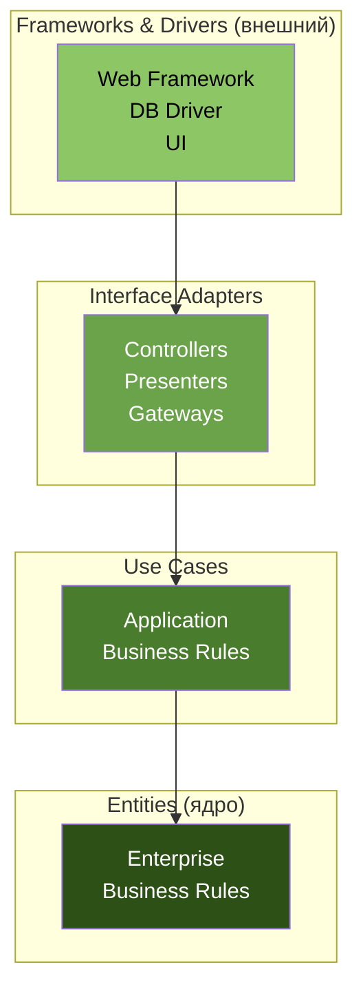
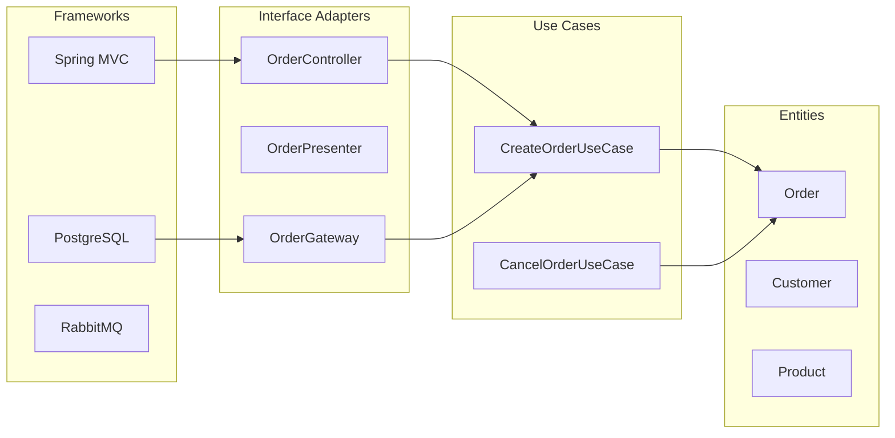
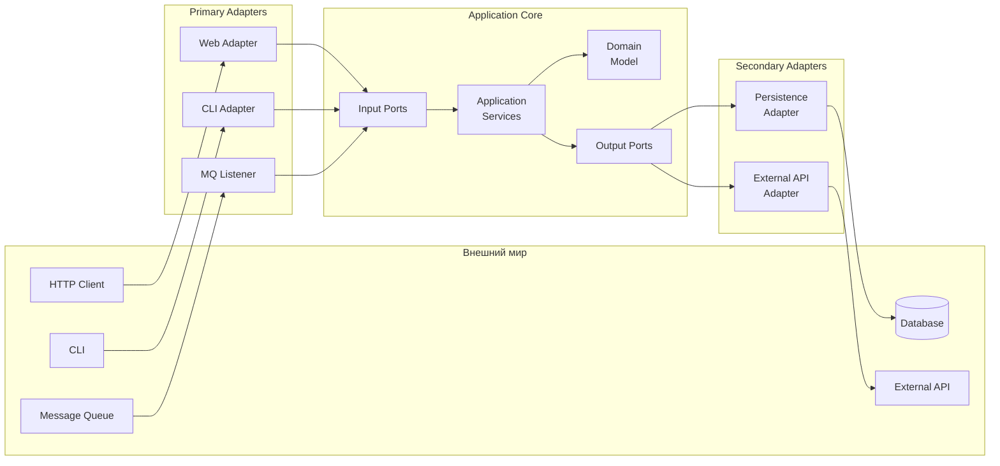
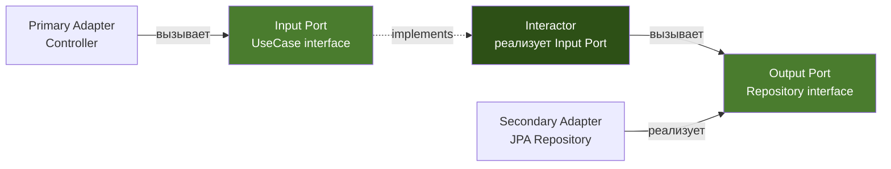
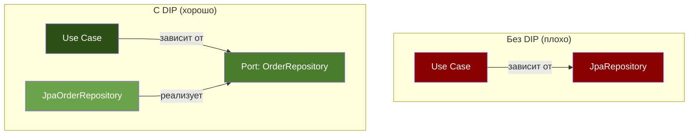
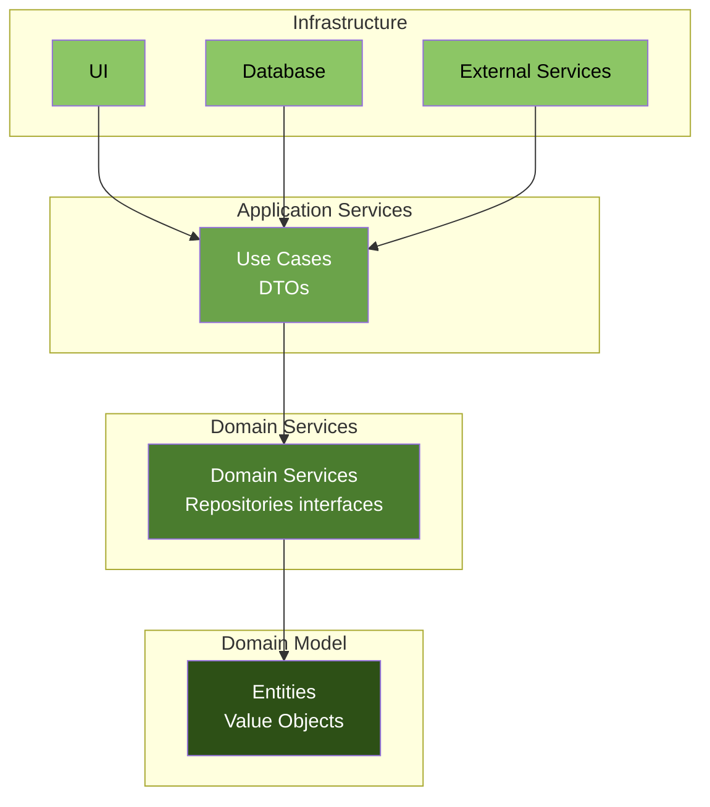
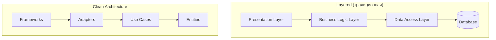
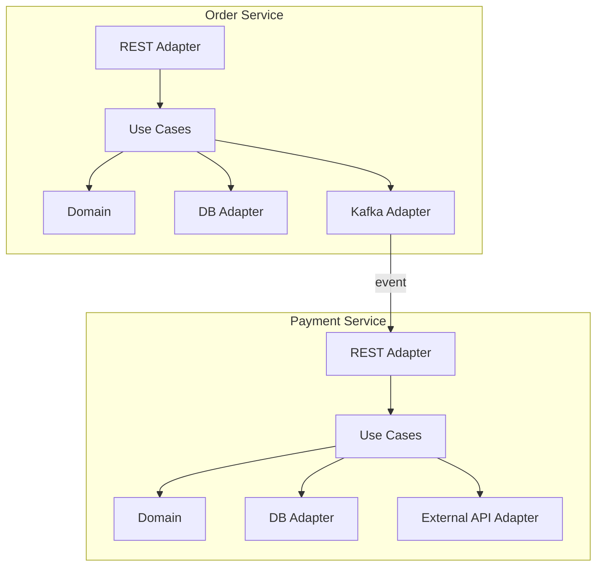
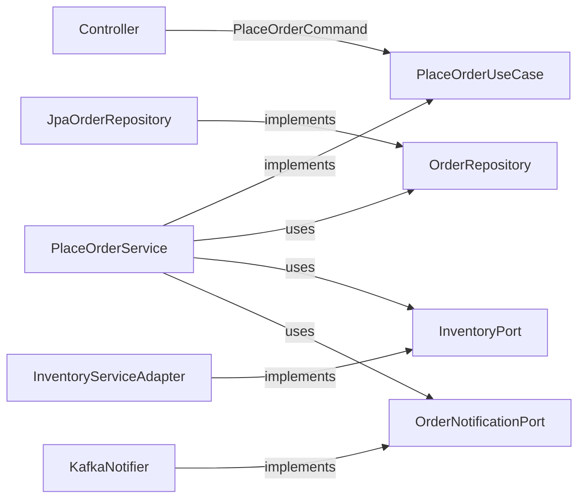
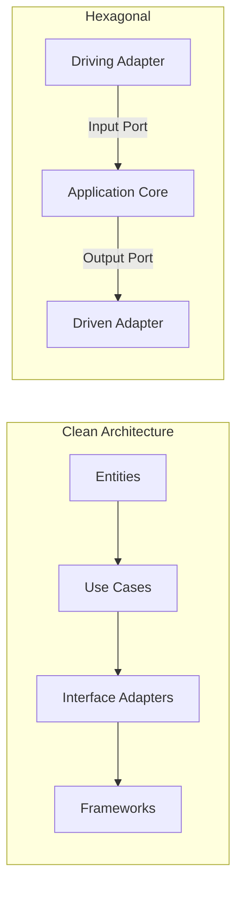

# Вопросы на собеседовании: `Clean Architecture`

Полное покрытие `Clean Architecture` и `Hexagonal Architecture`: правило зависимостей, слои (`Entities`, `Use Cases`, `Interface Adapters`, `Frameworks`), порты и адаптеры, `Onion Architecture`, `Dependency Inversion`, реализация в `Spring Boot`, тестирование и антипаттерны.

**Clean Architecture** (Роберт Мартин, 2012) и **Hexagonal Architecture** (Алистер Кокбёрн, 2005) -- два наиболее влиятельных архитектурных подхода, объединённых общей идеей: изоляция бизнес-логики от инфраструктурных деталей. На собеседованиях уровня Senior/Lead вопросы по этим темам проверяют понимание `Dependency Inversion`, умение проектировать границы модулей и выбирать подходящую архитектуру для конкретного контекста.

## Полезные ссылки

### Официальная документация

- [Clean Architecture with Spring Boot (Baeldung)](https://www.baeldung.com/spring-boot-clean-architecture) -- реализация Clean Architecture на Spring Boot
- [Hexagonal Architecture, DDD, and Spring (Baeldung)](https://www.baeldung.com/hexagonal-architecture-ddd-spring) -- Hexagonal Architecture с DDD и Spring
- [The Clean Architecture (Robert C. Martin)](https://blog.cleancoder.com/uncle-bob/2012/08/13/the-clean-architecture.html) -- оригинальная статья Роберта Мартина
- [Hexagonal Architecture (Alistair Cockburn)](https://alistair.cockburn.us/hexagonal-architecture/) -- оригинальная статья Алистера Кокбёрна
- [Vertical Slice Architecture (Baeldung)](https://www.baeldung.com/java-vertical-slice-architecture) -- альтернативный подход Vertical Slices
- [ArchUnit (Baeldung)](https://www.baeldung.com/java-archunit-intro) -- автоматическая проверка архитектурных правил

## Содержание

- [Полезные ссылки](#полезные-ссылки)
- [See also](#see-also)

**Основы Clean Architecture**
- [Q1. (!) Что такое Clean Architecture и какую проблему она решает?](#q1--что-такое-clean-architecture-и-какую-проблему-она-решает)
- [Q2. (!) Что такое правило зависимостей (Dependency Rule)?](#q2--что-такое-правило-зависимостей-dependency-rule)
- [Q3. Какие слои определяет Clean Architecture?](#q3-какие-слои-определяет-clean-architecture)
- [Q4. Что такое Entities в контексте Clean Architecture?](#q4-что-такое-entities-в-контексте-clean-architecture)
- [Q5. (!) Что такое Use Cases (Interactors) и какова их роль?](#q5--что-такое-use-cases-interactors-и-какова-их-роль)
- [Q6. Что такое Interface Adapters?](#q6-что-такое-interface-adapters)
- [Q7. Какова роль слоя Frameworks & Drivers?](#q7-какова-роль-слоя-frameworks--drivers)

**Hexagonal Architecture (Ports & Adapters)**
- [Q8. (!) Что такое Hexagonal Architecture и чем она отличается от Clean Architecture?](#q8--что-такое-hexagonal-architecture-и-чем-она-отличается-от-clean-architecture)
- [Q9. Что такое порты (Ports) в гексагональной архитектуре?](#q9-что-такое-порты-ports-в-гексагональной-архитектуре)
- [Q10. Что такое адаптеры (Adapters) и какие их типы существуют?](#q10-что-такое-адаптеры-adapters-и-какие-их-типы-существуют)
- [Q11. Чем отличаются Input (Driving) и Output (Driven) порты?](#q11-чем-отличаются-input-driving-и-output-driven-порты)
- [Q12. Как связаны Hexagonal Architecture и Dependency Inversion Principle?](#q12-как-связаны-hexagonal-architecture-и-dependency-inversion-principle)

**Onion Architecture и сравнение подходов**
- [Q13. Что такое Onion Architecture?](#q13-что-такое-onion-architecture)
- [Q14. Сравните Clean, Hexagonal и Onion Architecture](#q14-сравните-clean-hexagonal-и-onion-architecture)
- [Q15. (!) Чем Clean Architecture отличается от традиционной слоистой архитектуры?](#q15--чем-clean-architecture-отличается-от-традиционной-слоистой-архитектуры)
- [Q16. Что такое Vertical Slice Architecture и когда она предпочтительнее?](#q16-что-такое-vertical-slice-architecture-и-когда-она-предпочтительнее)

**Реализация в Java и Spring Boot**
- [Q17. Как организовать пакетную структуру Spring Boot проекта по Clean Architecture?](#q17-как-организовать-пакетную-структуру-spring-boot-проекта-по-clean-architecture)
- [Q18. Как реализовать Input Port и Use Case Interactor в Java?](#q18-как-реализовать-input-port-и-use-case-interactor-в-java)
- [Q19. Как реализовать Output Port и его адаптер?](#q19-как-реализовать-output-port-и-его-адаптер)
- [Q20. (!) Как Spring Boot вписывается в Clean Architecture?](#q20--как-spring-boot-вписывается-в-clean-architecture)
- [Q21. Как правильно передавать данные между слоями (DTO, Domain Model, Entity)?](#q21-как-правильно-передавать-данные-между-слоями-dto-domain-model-entity)
- [Q22. Как обрабатывать транзакции в Clean Architecture?](#q22-как-обрабатывать-транзакции-в-clean-architecture)

**Тестирование и качество**
- [Q23. Какие преимущества для тестирования даёт Clean Architecture?](#q23-какие-преимущества-для-тестирования-даёт-clean-architecture)
- [Q24. Как тестировать Use Case без инфраструктуры?](#q24-как-тестировать-use-case-без-инфраструктуры)
- [Q25. Как использовать ArchUnit для проверки архитектурных правил?](#q25-как-использовать-archunit-для-проверки-архитектурных-правил)

**Антипаттерны и практические проблемы**
- [Q26. (!) Какие типичные антипаттерны нарушают Clean Architecture?](#q26--какие-типичные-антипаттерны-нарушают-clean-architecture)
- [Q27. Когда Clean Architecture -- это overkill?](#q27-когда-clean-architecture----это-overkill)
- [Q28. (!) Как избежать анемичной доменной модели в Clean Architecture?](#q28--как-избежать-анемичной-доменной-модели-в-clean-architecture)
- [Q29. Как применять Clean Architecture в микросервисах?](#q29-как-применять-clean-architecture-в-микросервисах)
- [Q30. Как эволюционно мигрировать монолит к Clean Architecture?](#q30-как-эволюционно-мигрировать-монолит-к-clean-architecture)

**Продвинутые темы**
- [Q31. (!) Как правильно реализовать Use Case Interactor с несколькими портами?](#q31--как-правильно-реализовать-use-case-interactor-с-несколькими-портами)
- [Q32. Как организовать обработку ошибок в Use Case без исключений инфраструктуры?](#q32-как-организовать-обработку-ошибок-в-use-case-без-исключений-инфраструктуры)
- [Q33. (!) Как проверить соблюдение Dependency Rule через ArchUnit?](#q33--как-проверить-соблюдение-dependency-rule-через-archunit)

**Clean Architecture: расширенные темы**
- [Q34. (!) Чем Clean Architecture отличается от Hexagonal (Ports & Adapters) — ключевые отличия?](#q34--чем-clean-architecture-отличается-от-hexagonal-ports--adapters--ключевые-отличия)
- [Q35. Как реализовать Presenter паттерн в Clean Architecture?](#q35-как-реализовать-presenter-паттерн-в-clean-architecture)
- [Q36. Как организовать тестирование на каждом уровне Clean Architecture?](#q36-как-организовать-тестирование-на-каждом-уровне-clean-architecture)
- [Q37. Как реализовать Dependency Injection без Spring IoC контейнера?](#q37-как-реализовать-dependency-injection-без-spring-ioc-контейнера)
- [Q38. Как интегрировать агрегаты и Domain Events в Clean Architecture?](#q38-как-интегрировать-агрегаты-и-domain-events-в-clean-architecture)
- [Q39. Что такое Screaming Architecture и как она связана с Clean Architecture?](#q39-что-такое-screaming-architecture-и-как-она-связана-с-clean-architecture)
- [Q40. (!) Как эволюционировать от Clean Architecture к Vertical Slice Architecture?](#q40--как-эволюционировать-от-clean-architecture-к-vertical-slice-architecture)
- [Q41. Как правильно реализовать пакетную структуру Spring Boot проекта в стиле Clean Architecture на практике?](#q41-как-правильно-реализовать-пакетную-структуру-spring-boot-проекта-в-стиле-clean-architecture-на-практике)

---

## Q1. (!) Что такое Clean Architecture и какую проблему она решает?

**Clean Architecture** -- архитектурный подход, предложенный Робертом Мартином (Uncle Bob) в 2012 году, основная идея которого -- **изоляция бизнес-логики от инфраструктурных деталей** (UI, базы данных, фреймворки, внешние сервисы).

Ключевая проблема, которую решает Clean Architecture -- **сильная связанность** (tight coupling) бизнес-логики с технологическими деталями. В типичном приложении бизнес-правила "размазаны" по контроллерам, сервисам и репозиториям, что приводит к:

- **Невозможности замены технологий** без переписывания бизнес-логики
- **Сложности тестирования** -- для unit-теста нужна база данных, HTTP-сервер
- **Невозможности переиспользования** бизнес-правил в другом контексте
- **Каскадным изменениям** -- смена UI ломает доменную логику

Главный принцип -- **правило зависимостей** (Dependency Rule): зависимости кода направлены только **внутрь**, к бизнес-логике.



> На собеседовании важно подчеркнуть: Clean Architecture -- это не конкретная структура папок, а **набор принципов** организации зависимостей. Конкретная реализация может варьироваться.


> [!mcq]
>
> **A) ✅ Архитектурный подход с изоляцией бизнес-логики от инфраструктуры через правило зависимостей, направленных внутрь к ядру.**
>
> Корректно: Clean Architecture определяется не структурой папок, а принципом Dependency Rule — все зависимости направлены к слою бизнес-правил.
>
> МЕХАНИЗМ: внешние слои (Frameworks, Adapters) зависят от внутренних (Use Cases, Entities), но не наоборот. Реализуется через DIP — внутренний слой объявляет интерфейс (порт), внешний предоставляет реализацию.
>
> USE-CASE: e-commerce — `OrderService` определяет `OrderRepository`-интерфейс в use-case-слое, а `JpaOrderRepository` в infrastructure имплементит его. Замена JPA на MongoDB не трогает доменный код.
>
> ПОЧЕМУ ВЕРНО: точно описывает суть подхода Uncle Bob (2012) — решение проблемы tight coupling между бизнес-логикой и технологиями.
>
> ---
>
> **B) ❌ Структура папок с обязательными именами `entities/`, `usecases/`, `controllers/` — без неё это не Clean Architecture.**
>
> Неверно: Clean Architecture — это набор принципов, а не конкретная файловая структура. Можно использовать любую структуру (по слоям, по фичам, vertical slices), если соблюдается Dependency Rule.
>
> ПОСЛЕДСТВИЕ: команда тратит спринты на «правильное» переименование папок, но реальные зависимости остаются спутанными — `Order` всё ещё содержит `@Entity` JPA-аннотации, и переход на другую БД требует переписывания домена.
>
> ---
>
> **C) ❌ Паттерн, требующий использования CQRS, Event Sourcing и Hexagonal Architecture одновременно.**
>
> Неверно: Clean Architecture не привязана к CQRS или Event Sourcing — это смежные концепции. Hexagonal (Cockburn, 2005) и Onion (Palermo, 2008) — родственные идеи с тем же принципом изоляции ядра, но это разные подходы.
>
> ПОСЛЕДСТВИЕ: команда вводит CQRS+ES+Hexagonal+Clean одновременно «по канонам» — получает over-engineering, где простой CRUD-сервис превращается в 6 слоёв с маппингом на каждой границе.
>
> ---
>
> **D) ❌ Способ организации кода, при котором БД и UI находятся в центре, а бизнес-логика — на периферии для лёгкой замены.**
>
> Неверно: это полная инверсия — Clean Architecture ставит **бизнес-логику в центр**, а БД/UI на периферию. БД и UI считаются «деталями реализации», которые меняются чаще, чем бизнес-правила.
>
> ПОСЛЕДСТВИЕ: при смене Postgres → MongoDB или MVC → REST переписывается доменный код, бизнес-правила теряются среди инфраструктурных деталей, тесты невозможны без поднятия БД.

## Q2. (!) Что такое правило зависимостей (Dependency Rule)?

**Dependency Rule** -- центральный принцип Clean Architecture:

> Зависимости исходного кода должны быть направлены только **внутрь**, к более высокоуровневым политикам.

Это означает:

1. **Внутренние слои ничего не знают о внешних**: `Entity` не знает о `Use Case`, `Use Case` не знает о `Controller`
2. **Данные пересекают границы** через простые структуры (DTO), а не через объекты внешних слоёв
3. **Имена, определённые во внешних слоях**, не должны упоминаться во внутренних

Правило реализуется через **Dependency Inversion Principle** (DIP): внутренний слой определяет интерфейс (порт), а внешний слой предоставляет реализацию (адаптер).

```java
// Внутренний слой (Use Case) определяет интерфейс
public interface OrderRepository {
    Order findById(OrderId id);
    void save(Order order);
}

// Внешний слой (Infrastructure) реализует интерфейс
public class JpaOrderRepository implements OrderRepository {
    private final JpaOrderEntityRepository jpaRepo;
    private final OrderMapper mapper;

    @Override
    public Order findById(OrderId id) {
        return jpaRepo.findById(id.value())
            .map(mapper::toDomain)
            .orElseThrow(() -> new OrderNotFoundException(id));
    }
}
```

Нарушение правила зависимостей -- это когда, например, доменная сущность содержит JPA-аннотации (`@Entity`, `@Column`) -- домен начинает зависеть от фреймворка.


> [!mcq]
>
> **A) ❌ Правило, согласно которому каждый класс должен зависеть от как можно меньшего числа интерфейсов.**
>
> Неверно: это похоже на Interface Segregation Principle (ISP), но Dependency Rule — про **направление** зависимостей между слоями, а не про количество интерфейсов в классе.
>
> ПОСЛЕДСТВИЕ: команда минимизирует интерфейсы у каждого класса, но `Order`-сущность продолжает импортировать `javax.persistence.*` — направление зависимости нарушено, домен зависит от инфраструктуры.
>
> ---
>
> **B) ✅ Зависимости в исходном коде направлены только внутрь — от внешних слоёв к внутренним, более высокоуровневым политикам.**
>
> Корректно: Dependency Rule — центральный принцип Clean Architecture. Внутренние слои (Entities, Use Cases) ничего не знают о внешних (Adapters, Frameworks).
>
> МЕХАНИЗМ: реализуется через Dependency Inversion Principle — внутренний слой определяет интерфейс (порт), внешний слой предоставляет его реализацию (адаптер). Компилятор гарантирует, что `domain/` не импортирует ничего из `infrastructure/`.
>
> USE-CASE: `OrderUseCase` объявляет `interface OrderRepository` в use-case-слое; `JpaOrderRepository` в `infrastructure/` реализует его. На этапе сборки можно ArchUnit-правилом проверить, что в `domain.*` нет импортов `org.springframework.*` или `javax.persistence.*`.
>
> ПОЧЕМУ ВЕРНО: точное определение из «Clean Architecture» Uncle Bob — «зависимости в исходном коде должны указывать только внутрь».
>
> ---
>
> **C) ❌ Правило, запрещающее использовать любые сторонние библиотеки внутри проекта.**
>
> Неверно: Dependency Rule не запрещает зависимости — он регламентирует их направление. Use Cases могут зависеть от утилитарных библиотек (Lombok, MapStruct), главное — не от инфраструктурных деталей (БД, веб-фреймворк).
>
> ПОСЛЕДСТВИЕ: команда отказывается от всех внешних библиотек и пишет велосипеды — реинжиниринг логирования, валидации, маппинга, что увеличивает time-to-market и количество багов.
>
> ---
>
> **D) ❌ Все классы должны зависеть от абстрактного базового класса, чтобы можно было их подменить наследниками.**
>
> Неверно: путаница с классической наследственной полиморфией. Dependency Rule опирается на **интерфейсы и порты**, а не на абстрактные базовые классы. Кроме того, направление — про слои, а не про конкретные классы.
>
> ПОСЛЕДСТВИЕ: появляются глубокие иерархии `AbstractOrderService` → `BaseOrderService` → `OrderService`, fragile base class problem, изменения в верхнем классе ломают наследников.

## Q3. Какие слои определяет Clean Architecture?

Clean Architecture определяет четыре концентрических слоя (от ядра к периферии):

| Слой | Содержимое | Зависимости |
|------|-----------|-------------|
| **Entities** | Доменные объекты, бизнес-правила уровня предприятия | Ни от чего |
| **Use Cases** | Сценарии использования, бизнес-правила приложения | Только от Entities |
| **Interface Adapters** | Контроллеры, презентеры, маперы, шлюзы | От Use Cases и Entities |
| **Frameworks & Drivers** | Web-фреймворк, БД, UI, внешние API | От всех внутренних слоёв |



Каждый слой имеет чёткую ответственность:

- **Entities** -- самые стабильные, меняются реже всего
- **Use Cases** -- оркестрируют бизнес-логику, вызывая Entities и порты
- **Interface Adapters** -- преобразуют данные между форматами внутренних и внешних слоёв
- **Frameworks** -- самый нестабильный слой, который проще всего заменить


> [!mcq]
>
> **A) ❌ Три слоя: Presentation, Business Logic, Data Access — классическая трёхзвенка с дополнительной изоляцией.**
>
> Неверно: это описание классической N-tier архитектуры (Three-Layer), а не Clean Architecture. Three-Layer допускает любые зависимости между слоями (например, Presentation → Data Access), в Clean — строгое правило зависимостей.
>
> ПОСЛЕДСТВИЕ: команда называет проект «Clean Architecture», но `OrderController` напрямую вызывает `OrderJpaRepository`, минуя бизнес-логику — это N-tier с новым названием, без реальной изоляции.
>
> ---
>
> **B) ❌ Два слоя: Domain (всё бизнес-ядро) и Infrastructure (всё остальное) — упрощённая Onion-модель.**
>
> Неверно: это близко к Onion Architecture, но в Clean Architecture явно различаются **Entities** (Enterprise Business Rules) и **Use Cases** (Application Business Rules) — это два разных слоя с разными уровнями стабильности.
>
> ПОСЛЕДСТВИЕ: смешивание Entities и Use Cases в одном пакете приводит к тому, что доменные объекты начинают знать о конкретных сценариях (`Order.placeOrderWithDiscount()`), теряется переиспользование сущностей между разными приложениями.
>
> ---
>
> **C) ✅ Четыре концентрических слоя: Entities → Use Cases → Interface Adapters → Frameworks & Drivers — от ядра к периферии.**
>
> Корректно: классическая модель Uncle Bob с 4 слоями в концентрических кругах.
>
> МЕХАНИЗМ:
> - **Entities** — Enterprise Business Rules (бизнес-правила уровня компании, переиспользуемые между приложениями).
> - **Use Cases** — Application Business Rules (сценарии конкретного приложения, оркестрируют entities и порты).
> - **Interface Adapters** — Controllers, Presenters, Gateways (преобразуют данные между внутренним и внешним форматом).
> - **Frameworks & Drivers** — Spring MVC, PostgreSQL, RabbitMQ (детали реализации, самый нестабильный слой).
>
> USE-CASE: e-commerce — `Order` (Entity) описывает правила скидок, валидные суммы; `CreateOrderUseCase` оркестрирует создание заказа; `OrderController` принимает HTTP-запрос; Spring MVC + PostgreSQL — фреймворки. При смене HTTP → gRPC меняется только слой Adapters.
>
> ПОЧЕМУ ВЕРНО: это точная модель из оригинальной статьи и книги Uncle Bob — четыре слоя с правилом «зависимости внутрь».
>
> ---
>
> **D) ❌ Шесть слоёв: Presentation, Application, Service, Domain, Repository, Database — расширенная DDD-модель.**
>
> Неверно: это собирательная картина из разных архитектурных стилей (DDD-tactical + N-tier), но не Clean Architecture. Clean имеет ровно 4 слоя; добавление искусственных слоёв (`ServiceLayer` между `Application` и `Domain`) — антипаттерн.
>
> ПОСЛЕДСТВИЕ: на каждой границе требуется маппинг (6 слоёв = 5 маппингов туда + 5 обратно), команда тратит 30% времени на boilerplate-мапперы, нарушается принцип «каждый слой имеет уникальную ответственность».

## Q4. Что такое Entities в контексте Clean Architecture?

**Entities** -- это объекты, инкапсулирующие бизнес-правила уровня предприятия (Enterprise Business Rules). Они:

- Содержат **критичную бизнес-логику**, которая не зависит от конкретного приложения
- Могут быть переиспользованы в нескольких приложениях
- **Не содержат** аннотаций фреймворков (`@Entity`, `@Component`)
- Не знают о базах данных, HTTP, очередях

```java
public class Order {
    private final OrderId id;
    private final CustomerId customerId;
    private final List<OrderLine> lines;
    private OrderStatus status;
    private Money totalPrice;

    public void addLine(Product product, int quantity) {
        if (status != OrderStatus.DRAFT) {
            throw new OrderAlreadySubmittedException(id);
        }
        lines.add(new OrderLine(product, quantity));
        recalculateTotal();
    }

    public void submit() {
        if (lines.isEmpty()) {
            throw new EmptyOrderException(id);
        }
        this.status = OrderStatus.SUBMITTED;
    }

    public void cancel(CancellationPolicy policy) {
        if (!policy.canCancel(this)) {
            throw new CancellationNotAllowedException(id);
        }
        this.status = OrderStatus.CANCELLED;
    }

    private void recalculateTotal() {
        this.totalPrice = lines.stream()
            .map(OrderLine::lineTotal)
            .reduce(Money.ZERO, Money::add);
    }
}
```

Обратите внимание: `Order` -- это **богатая доменная модель** (Rich Domain Model), в которой бизнес-логика живёт внутри объекта, а не в сервисах. Это отличается от анемичной модели, где `Order` -- просто набор геттеров/сеттеров.


> [!mcq] Что такое Entities в Clean Architecture?
>
> - [ ] **A) Это JPA-сущности с аннотацией `@Entity`, отображающие таблицы БД через Hibernate.**
>
>     Что на самом деле: Entities в Clean Architecture — это объекты с критичной бизнес-логикой уровня предприятия, не связанные с ORM или какой-либо инфраструктурой.
>
>     Откуда путаница: термин «Entity» совпадает с JPA-аннотацией, и многие путают доменную сущность с persistence-моделью.
>
>     Если бы это было правдой: смена ORM или БД ломала бы доменную модель, и переиспользовать Entities в других приложениях стало бы невозможно.
>
> - [ ] **B) Это DTO для передачи данных между слоями приложения (controller → service → repository).**
>
>     Что на самом деле: DTO — это пассивные структуры без поведения, а Entities содержат богатую бизнес-логику и инварианты (Rich Domain Model).
>
>     Откуда путаница: в анемичной модели Entity действительно вырождается в набор геттеров/сеттеров, что неотличимо от DTO.
>
>     Если бы это было правдой: бизнес-правила пришлось бы размазывать по сервисам, нарушая принцип «Tell, Don't Ask» и теряя инкапсуляцию.
>
> - [ ] **C) Это активные записи (Active Record), которые сами умеют сохранять себя в БД через `entity.save()`.**
>
>     Что на самом деле: Entities в Clean Architecture не знают о существовании БД вообще — за сохранение отвечают репозитории во внешних слоях.
>
>     Откуда путаница: паттерн Active Record (Ruby on Rails, Eloquent) совмещает бизнес-логику и persistence в одном объекте.
>
>     Если бы это было правдой: Entities стали бы зависеть от инфраструктуры, нарушая правило зависимостей (Dependency Rule).
>
> - [x] **D) Это объекты с критичными бизнес-правилами уровня предприятия, инкапсулирующие инварианты и не зависящие от фреймворков и БД.**
>
>     Развёрнутое объяснение: Entities — самый внутренний слой Clean Architecture. Они содержат правила, которые верны для бизнеса в целом, независимо от конкретного приложения. Например, «Order нельзя отправить, если в нём нет позиций» — это правило справедливо и для веб-магазина, и для мобильного приложения, и для CLI-инструмента.
>
>     Пример: класс `Order` с методами `addLine()`, `submit()`, `cancel()` инкапсулирует инварианты внутри себя — нельзя добавить позицию в отправленный заказ, нельзя отправить пустой заказ. Никаких `@Entity`, `@Component`, ссылок на Spring или Hibernate.
>
>     Когда применять: всегда, когда есть бизнес-логика, которая верна вне зависимости от конкретного use-case. Если правило может переиспользоваться между несколькими приложениями — оно живёт в Entities.
>
>     Подводные камни: соблазн добавить JPA-аннотации «для удобства» приводит к смешению слоёв. Решение — разделять `domain.Order` (чистая доменная модель) и `persistence.OrderJpaEntity` (модель хранения) с маппером между ними.
>
>     Связанные вопросы: [[clean-architecture-interview#Q2]] — правило зависимостей запрещает Entities знать о внешних слоях; [[clean-architecture-interview#Q5]] — Use Cases оркестрируют работу Entities.

## Q5. (!) Что такое Use Cases (Interactors) и какова их роль?

**Use Case** (или **Interactor**) -- это единица бизнес-логики уровня приложения. Каждый Use Case описывает один конкретный сценарий использования системы.

Роль Use Case:
- **Оркестрирует** вызовы доменных объектов и портов
- **Реализует** бизнес-правила, специфичные для приложения
- **Определяет** входные и выходные данные через порты (интерфейсы)
- **Не зависит** от способа доставки запроса (HTTP, CLI, MQ)

```java
// Input Port -- интерфейс, который определяет Use Case
public interface CreateOrderUseCase {
    CreateOrderResponse execute(CreateOrderRequest request);
}

// Входные данные
public record CreateOrderRequest(
    String customerId,
    List<OrderLineRequest> lines
) {}

// Выходные данные
public record CreateOrderResponse(
    String orderId,
    BigDecimal totalPrice,
    String status
) {}

// Interactor -- реализация Use Case
public class CreateOrderInteractor implements CreateOrderUseCase {

    private final CustomerRepository customerRepo;
    private final ProductRepository productRepo;
    private final OrderRepository orderRepo;
    private final OrderNotificationPort notificationPort;

    public CreateOrderInteractor(
            CustomerRepository customerRepo,
            ProductRepository productRepo,
            OrderRepository orderRepo,
            OrderNotificationPort notificationPort) {
        this.customerRepo = customerRepo;
        this.productRepo = productRepo;
        this.orderRepo = orderRepo;
        this.notificationPort = notificationPort;
    }

    @Override
    public CreateOrderResponse execute(CreateOrderRequest request) {
        Customer customer = customerRepo.findById(
            new CustomerId(request.customerId()));

        Order order = Order.create(customer);

        for (var lineReq : request.lines()) {
            Product product = productRepo.findById(
                new ProductId(lineReq.productId()));
            order.addLine(product, lineReq.quantity());
        }

        order.submit();
        orderRepo.save(order);
        notificationPort.notifyOrderCreated(order);

        return new CreateOrderResponse(
            order.getId().value(),
            order.getTotalPrice().amount(),
            order.getStatus().name()
        );
    }
}
```

> Правило: один Use Case -- один класс. Это обеспечивает соблюдение `Single Responsibility Principle` и упрощает тестирование.


> [!mcq] Какова основная роль Use Case (Interactor) в Clean Architecture?
>
> - [x] **A) Оркестрировать вызовы доменных объектов и портов для реализации одного конкретного бизнес-сценария приложения.**
>
>     Развёрнутое объяснение: Use Case — единица application business rules, описывающая один сценарий («Создать заказ», «Отменить подписку»). Он координирует Entities и инфраструктурные порты (репозитории, нотификации), но не содержит ни доменных инвариантов (они в Entities), ни деталей доставки (HTTP, CLI — это слой адаптеров).
>
>     Пример: `CreateOrderInteractor` получает `CreateOrderRequest`, загружает `Customer` через `CustomerRepository`-порт, создаёт `Order` (Entity), наполняет позициями, вызывает `order.submit()`, сохраняет через `OrderRepository`, отправляет уведомление через `OrderNotificationPort` и возвращает `CreateOrderResponse`.
>
>     Когда применять: один класс — один Use Case. Это соблюдает Single Responsibility Principle, упрощает unit-тестирование (моки портов) и делает явным список сценариев системы.
>
>     Подводные камни: соблазн объединить несколько сценариев в «толстый сервис» (`OrderService` с 20 методами) ломает SRP. Также вредно тащить HTTP-объекты (`HttpServletRequest`) внутрь Use Case — это утечка деталей доставки.
>
>     Связанные вопросы: [[clean-architecture-interview#Q4]] — Entities, которыми оркестрирует Use Case; [[clean-architecture-interview#Q6]] — Interface Adapters, вызывающие Use Cases.
>
> - [ ] **B) Реализовать всю бизнес-логику системы, включая инварианты доменных объектов.**
>
>     Что на самом деле: инварианты сущностей (Enterprise Business Rules) живут в Entities, а в Use Case — только application-level правила, специфичные для конкретного сценария.
>
>     Откуда путаница: в transaction-script-стиле вся логика действительно собирается в сервисах, и тогда Entities вырождаются в анемичные DTO.
>
>     Если бы это было правдой: правила вроде «нельзя отменить отправленный заказ» дублировались бы в каждом Use Case, а Entities стали бы бесполезными контейнерами данных.
>
> - [ ] **C) Принимать HTTP-запросы и преобразовывать их в формат, понятный сервисам.**
>
>     Что на самом деле: это работа Controllers, которые находятся в слое Interface Adapters, а не Use Cases. Use Case ничего не знает о HTTP.
>
>     Откуда путаница: в Spring MVC контроллер часто называют «service» или сразу включает в него бизнес-логику, размывая границу слоёв.
>
>     Если бы это было правдой: Use Case нельзя было бы переиспользовать из CLI, gRPC или message-consumer'а — пришлось бы дублировать логику.
>
> - [ ] **D) Описывать структуру таблиц БД и маппинг доменных объектов на SQL.**
>
>     Что на самом деле: маппинг на БД — задача Gateways/Repository implementations в слое Interface Adapters; Use Case оперирует абстракциями (портами).
>
>     Откуда путаница: смешение persistence-слоя и application-слоя часто происходит, когда `@Repository` напрямую вызывается из контроллера.
>
>     Если бы это было правдой: смена БД с PostgreSQL на MongoDB переписывала бы все Use Cases, нарушая Dependency Inversion.

## Q6. Что такое Interface Adapters?

**Interface Adapters** -- слой, который преобразует данные между форматами, удобными для Use Cases / Entities, и форматами, удобными для внешних агентов (web, БД, внешние сервисы).

В этом слое находятся:

- **Controllers** -- принимают HTTP-запросы, преобразуют в `Request` для Use Case
- **Presenters** -- форматируют `Response` из Use Case для клиента
- **Gateways / Repository implementations** -- преобразуют доменные объекты в формат хранения
- **Mappers** -- конвертируют между DTO, доменными моделями и persistence-моделями

```java
@RestController
@RequestMapping("/api/orders")
public class OrderController {

    private final CreateOrderUseCase createOrder;
    private final OrderDtoMapper mapper;

    public OrderController(CreateOrderUseCase createOrder,
                           OrderDtoMapper mapper) {
        this.createOrder = createOrder;
        this.mapper = mapper;
    }

    @PostMapping
    public ResponseEntity<OrderDto> create(
            @RequestBody CreateOrderDto dto) {
        // Adapter: HTTP DTO → Use Case Request
        var request = mapper.toRequest(dto);

        // Вызов Use Case
        var response = createOrder.execute(request);

        // Adapter: Use Case Response → HTTP DTO
        return ResponseEntity
            .status(HttpStatus.CREATED)
            .body(mapper.toDto(response));
    }
}
```

Контроллер **не содержит бизнес-логики** -- он только адаптирует формат данных и делегирует работу Use Case.


> [!mcq] Что такое Interface Adapters в Clean Architecture?
>
> - [ ] **A) Слой, содержащий драйверы БД, web-фреймворки и внешние библиотеки.**
>
>     Что на самом деле: драйверы и фреймворки живут в самом внешнем слое — Frameworks & Drivers, а Interface Adapters — это слой между application-логикой и внешними технологиями.
>
>     Откуда путаница: визуально на круговой диаграмме слои примыкают друг к другу, и легко спутать «адаптер» с «драйвером».
>
>     Если бы это было правдой: смена web-фреймворка с Spring MVC на Quarkus затрагивала бы только Frameworks & Drivers, и Interface Adapters был бы вовсе не нужен.
>
> - [x] **B) Слой, преобразующий данные между форматами Use Cases/Entities и форматами внешних агентов (HTTP, БД, очереди).**
>
>     Развёрнутое объяснение: Interface Adapters — это «переводчики» между внутренним языком приложения и внешним миром. Здесь живут Controllers (HTTP → Use Case Request), Presenters (Use Case Response → HTTP DTO), Gateways/Repository implementations (Entity → SQL row), а также Mappers между DTO и доменными моделями.
>
>     Пример: `OrderController` принимает `CreateOrderDto` из `@RequestBody`, через `OrderDtoMapper` превращает его в `CreateOrderRequest`, вызывает `createOrder.execute(request)`, и результат маппит обратно в `OrderDto` для ответа клиенту. Сам Use Case ничего не знает о HTTP.
>
>     Когда применять: всегда, когда нужно подключить внешнюю технологию к Use Cases — REST-эндпоинт, Kafka-consumer, gRPC-сервис, репозиторий БД. Adapter изолирует Use Case от деталей протокола.
>
>     Подводные камни: соблазн втащить бизнес-логику в Controller («проверим тут, что заказ не пустой») приводит к её дублированию и к тому, что логика не покрыта unit-тестами Use Case'а. Controller обязан быть тонким — только маппинг и делегирование.
>
>     Связанные вопросы: [[clean-architecture-interview#Q2]] — правило зависимостей: адаптер зависит от Use Case, а не наоборот; [[clean-architecture-interview#Q5]] — Use Cases, которые вызывают адаптеры.
>
> - [ ] **C) Это интерфейсы Java (`interface`), определяющие контракты между классами.**
>
>     Что на самом деле: Interface Adapters — это целый слой архитектуры с конкретными классами (Controllers, Presenters, Gateways), а не просто Java-интерфейсы. Контракты определяются портами в слое Use Cases.
>
>     Откуда путаница: слово «interface» в названии слоя сбивает с толку — оно означает «граница/интерфейс системы», а не Java-конструкцию `interface`.
>
>     Если бы это было правдой: понятие слоя Interface Adapters сводилось бы к пустым декларациям, и весь код преобразования негде было бы разместить.
>
> - [ ] **D) Слой, содержащий доменные сущности и бизнес-правила.**
>
>     Что на самом деле: доменные сущности живут в самом внутреннем слое Entities; Interface Adapters находятся на два слоя выше и не содержат бизнес-логики вообще.
>
>     Откуда путаница: в плохо спроектированных приложениях бизнес-логика часто стекает в контроллеры и репозитории, и их ошибочно воспринимают как место для логики.
>
>     Если бы это было правдой: правило зависимостей нарушалось бы — внутренние слои не могли бы существовать без внешних, и переиспользование Entities между приложениями стало бы невозможным.

## Q7. Какова роль слоя Frameworks & Drivers?

**Frameworks & Drivers** -- самый внешний слой, содержащий все технические детали:

- **Web-фреймворк**: `Spring MVC`, `Spring WebFlux`
- **ORM / Persistence**: `Hibernate`, `JDBC`, `jOOQ`
- **Драйверы БД**: `PostgreSQL`, `MySQL`, `MongoDB`
- **Очереди сообщений**: `RabbitMQ`, `Kafka`
- **Внешние API**: REST-клиенты, gRPC-стабы
- **UI**: шаблоны, фронтенд

Ключевые характеристики:

1. **Максимально тонкий "клей"** -- этот слой содержит минимум кода, только конфигурацию и wiring
2. **Легко заменяем** -- смена БД с `PostgreSQL` на `MongoDB` затрагивает только этот слой
3. **Здесь живут конфигурации** Spring: `@Configuration`, `@Bean`, `application.yml`

```java
@Configuration
public class OrderConfiguration {

    @Bean
    public CreateOrderUseCase createOrderUseCase(
            CustomerRepository customerRepo,
            ProductRepository productRepo,
            OrderRepository orderRepo,
            OrderNotificationPort notificationPort) {
        return new CreateOrderInteractor(
            customerRepo, productRepo, orderRepo, notificationPort);
    }
}
```

Обратите внимание: `CreateOrderInteractor` **не аннотирован** `@Service` -- он не знает о Spring. Wiring происходит в конфигурационном классе внешнего слоя.


> [!mcq]
> - [ ] A) Frameworks & Drivers содержит бизнес-логику обработки заказов, чтобы код был «ближе к технологии».
>     - Почему неверно: бизнес-логика должна жить в Entities и Use Cases внутреннего ядра, а не во внешнем слое.
>     - Последствие: при смене ORM или web-фреймворка придётся переписывать бизнес-правила.
> - [ ] B) Этот слой обязан быть толстым и активно знать про Use Cases, чтобы напрямую координировать домен.
>     - Почему неверно: правило зависимостей запрещает внешнему слою решать за домен — он лишь предоставляет реализации портов.
>     - Последствие: домен оказывается завязан на Spring/JPA, юнит-тесты без контейнера становятся невозможны.
> - [x] C) Это тонкий внешний «клей» с конфигурациями (`@Configuration`, `@Bean`) и драйверами (БД, web, MQ), легко заменяемый без изменения ядра.
>     - Почему верно: Frameworks & Drivers содержит только wiring и адаптеры к технологиям — Use Case-ы и Entities не знают о Spring/JPA, поэтому замена `PostgreSQL` на `MongoDB` или Spring MVC на WebFlux затрагивает только этот слой.
>     - Пример: `CreateOrderInteractor` без `@Service`, а `@Bean`-конфигурация в `OrderConfiguration` инжектит репозитории — тесты домена работают без Spring.
>     - Почему остальные хуже: A путает слои и тянет бизнес-логику наружу; B нарушает Dependency Rule; D полностью убирает абстракции и делает архитектуру неотличимой от monolith-Spring.
>     - Mnemonic: «Внешний слой — это тонкий клей, а не мозг системы».
> - [ ] D) Слой Frameworks & Drivers нужно полностью убрать — Use Cases должны напрямую работать с `JdbcTemplate` и `HttpServletRequest`.
>     - Почему неверно: это разрушает инверсию зависимостей и превращает Clean Architecture в обычный layered-стиль.
>     - Последствие: невозможно подменить технологию без переписывания Use Case-ов, тестируемость падает до нуля.

## Q8. (!) Что такое Hexagonal Architecture и чем она отличается от Clean Architecture?

**Hexagonal Architecture** (Ports & Adapters) -- архитектурный паттерн, предложенный Алистером Кокбёрном в 2005 году. Основная идея -- приложение взаимодействует с внешним миром через **порты** (абстрактные интерфейсы) и **адаптеры** (конкретные реализации).



Сравнение с Clean Architecture:

| Аспект | Hexagonal | Clean Architecture |
|--------|-----------|-------------------|
| **Автор** | Alistair Cockburn (2005) | Robert C. Martin (2012) |
| **Терминология** | Порты, адаптеры | Entities, Use Cases, Interface Adapters |
| **Слои** | 2 зоны: core и внешний мир | 4 концентрических кольца |
| **Фокус** | Взаимозаменяемость внешних систем | Направление зависимостей |
| **Общая идея** | Изоляция домена от инфраструктуры | Изоляция домена от инфраструктуры |

По сути, это **один и тот же принцип** с разной терминологией и визуализацией. На практике часто комбинируют оба подхода.


> [!mcq]
> - [ ] A) Hexagonal — это устаревшая версия Clean Architecture от того же автора (Роберт Мартин), полностью заменённая в 2012 году.
>     - Почему неверно: Hexagonal предложил Alistair Cockburn в 2005, а Clean Architecture — Robert C. Martin в 2012; это разные авторы и параллельные подходы.
>     - Последствие: путаница в исторических ссылках и неверная аргументация на code review.
> - [ ] B) Hexagonal предписывает ровно 6 слоёв (по числу сторон шестиугольника), а Clean — 4 кольца.
>     - Почему неверно: «гексагон» — лишь визуальная метафора, число 6 не имеет архитектурного смысла, у Hexagonal всего 2 зоны (core и внешний мир).
>     - Последствие: бессмысленное дробление кода под несуществующее правило.
> - [ ] C) Hexagonal допускает зависимости домена от инфраструктуры, в отличие от Clean Architecture.
>     - Почему неверно: оба подхода строго запрещают зависимости домена от инфраструктуры через Dependency Inversion.
>     - Последствие: реализация «гексагона» с прямыми вызовами JPA — фактически layered-стиль под чужим именем.
> - [x] D) Hexagonal (Cockburn, 2005) и Clean Architecture (Martin, 2012) выражают один принцип — изоляция домена от инфраструктуры через инверсию зависимостей — разной терминологией: «порты/адаптеры» против «Entities/Use Cases/Interface Adapters», 2 зоны против 4 концентрических колец.
>     - Почему верно: оба паттерна основаны на DIP и направляют зависимости внутрь к домену; различия — словарь и детализация слоёв, а не философия. На практике их часто комбинируют: гексагональные порты внутри Clean-колец.
>     - Пример: `SendMoneyUseCase` (Input Port) реализуется Interactor-ом из слоя Use Cases — это одновременно «порт» по Cockburn и «Use Case» по Martin.
>     - Почему остальные хуже: A искажает авторство и хронологию; B превращает метафору в догму; C прямо противоречит сути обоих подходов.
>     - Mnemonic: «Один принцип DIP — две школы названий».

## Q9. Что такое порты (Ports) в гексагональной архитектуре?

**Port** -- это интерфейс, определённый в ядре приложения, который описывает контракт взаимодействия с внешним миром. Порты бывают двух типов:

**Input Port (Driving Port)** -- определяет, что приложение умеет делать. Через него внешний мир инициирует действия:

```java
// Input Port
public interface SendMoneyUseCase {
    boolean sendMoney(SendMoneyCommand command);
}

public record SendMoneyCommand(
    AccountId sourceAccountId,
    AccountId targetAccountId,
    Money amount
) {
    public SendMoneyCommand {
        requireNonNull(sourceAccountId);
        requireNonNull(targetAccountId);
        if (amount.isNegativeOrZero()) {
            throw new IllegalArgumentException(
                "Amount must be positive");
        }
    }
}
```

**Output Port (Driven Port)** -- определяет, что приложение ожидает от внешнего мира. Через него приложение обращается к инфраструктуре:

```java
// Output Port
public interface LoadAccountPort {
    Account loadAccount(AccountId accountId, LocalDateTime baselineDate);
}

// Output Port
public interface UpdateAccountStatePort {
    void updateActivities(Account account);
}
```

Принципиальное отличие: **Input Port определяет Use Case** (что делаем), а **Output Port определяет потребность** (что нужно от внешнего мира).


> [!mcq]
> - [x] A) Port — это интерфейс в ядре приложения; Input Port (`SendMoneyUseCase`) описывает «что приложение умеет» и реализуется Use Case-ом, Output Port (`LoadAccountPort`) описывает «что приложению нужно от внешнего мира» и реализуется Secondary Adapter-ом.
>     - Почему верно: порты определяются именно в ядре, чтобы зависимости были направлены внутрь; различие input/output задаёт направление вызова — driving (внешний мир → ядро) или driven (ядро → инфраструктура). Это и есть применение DIP в гексагональной архитектуре.
>     - Пример: `SendMoneyController` вызывает `SendMoneyUseCase` (Input Port), а Interactor вызывает `LoadAccountPort` (Output Port) для загрузки счёта из БД.
>     - Почему остальные хуже: B путает порты с конкретными реализациями; C переносит порты в инфраструктуру и ломает DIP; D смешивает порты с DTO-объектами и теряет контракт поведения.
>     - Mnemonic: «Input Port = что я умею; Output Port = что мне нужно».
> - [ ] B) Port — это конкретный класс-адаптер с аннотацией `@Component`, например `JpaOrderRepository`.
>     - Почему неверно: это адаптер, а не порт; порт — абстракция (интерфейс), а реализация — адаптер.
>     - Последствие: ядро начинает зависеть от Spring/JPA, исчезает граница, тесты требуют контекста.
> - [ ] C) Порты определяются в слое инфраструктуры, а ядро импортирует их.
>     - Почему неверно: направление инверсии нарушено — ядро должно владеть контрактами, иначе DIP не работает.
>     - Последствие: смена инфраструктуры тянет за собой изменения в Use Case-ах и Entities.
> - [ ] D) Port — это DTO для передачи данных между слоями, без какого-либо поведения.
>     - Почему неверно: порт — это поведенческий контракт (интерфейс с методами), а не структура данных; DTO — отдельная роль.
>     - Последствие: теряется возможность подменять реализацию и тестировать ядро в изоляции.

## Q10. Что такое адаптеры (Adapters) и какие их типы существуют?

**Adapter** -- конкретная реализация порта, которая связывает ядро приложения с конкретной технологией.

**Primary Adapters (Driving)** -- вызывают Input Ports, инициируют действия:

```java
// Primary Adapter: REST Controller
@RestController
@RequestMapping("/accounts")
public class SendMoneyController {

    private final SendMoneyUseCase sendMoney;

    @PostMapping("/send/{sourceId}/{targetId}/{amount}")
    public ResponseEntity<Void> sendMoney(
            @PathVariable long sourceId,
            @PathVariable long targetId,
            @PathVariable long amount) {

        var command = new SendMoneyCommand(
            new AccountId(sourceId),
            new AccountId(targetId),
            Money.of(amount));

        sendMoney.sendMoney(command);

        return ResponseEntity.ok().build();
    }
}
```

**Secondary Adapters (Driven)** -- реализуют Output Ports, предоставляют инфраструктуру:

```java
// Secondary Adapter: JPA Repository
@Repository
public class AccountPersistenceAdapter
        implements LoadAccountPort, UpdateAccountStatePort {

    private final AccountJpaRepository accountRepo;
    private final ActivityJpaRepository activityRepo;
    private final AccountMapper mapper;

    @Override
    public Account loadAccount(AccountId accountId,
                               LocalDateTime baselineDate) {
        AccountJpaEntity entity = accountRepo
            .findById(accountId.value())
            .orElseThrow(() -> new EntityNotFoundException(
                "Account not found: " + accountId));

        List<ActivityJpaEntity> activities = activityRepo
            .findByOwnerSince(accountId.value(), baselineDate);

        return mapper.toDomain(entity, activities, baselineDate);
    }

    @Override
    public void updateActivities(Account account) {
        account.getActivityWindow().getActivities()
            .forEach(activity -> activityRepo.save(
                mapper.toJpaEntity(activity)));
    }
}
```

Primary адаптеры **зависят от** Input Ports (вызывают их), а Secondary адаптеры **реализуют** Output Ports (подставляются через DI).


> [!mcq]
> - [ ] A) Primary Adapter и Secondary Adapter различаются исключительно расположением: Primary всегда в пакете `adapter/in/`, Secondary — в `adapter/out/`, а технически это один и тот же тип компонента.
>     - Почему неверно: расположение — лишь следствие, а не сущность различия; ключевое различие — направление вызова и роль (driving vs driven).
>     - Последствие: команда располагает Kafka-listener в `adapter/out/` потому что «он же пишет в БД», ломает терминологию и сбивает читающих.
> - [x] B) Primary Adapter (Driving) вызывает Input Port и инициирует сценарий из внешнего мира (например, `SendMoneyController` вызывает `SendMoneyUseCase`); Secondary Adapter (Driven) реализует Output Port и предоставляет инфраструктуру ядру (например, `AccountPersistenceAdapter implements LoadAccountPort`).
>     - Почему верно: Primary получает событие извне (HTTP, Kafka, scheduler), создаёт command и вызывает порт ядра — это «driving» сторона. Secondary — реализация контракта, который ядро объявило для своих нужд: БД, внешний API, отправка письма. Направление зависимости одинаковое (внутрь ядра), но роли разные.
>     - Пример: REST-контроллер `POST /accounts/send` — Primary; `AccountPersistenceAdapter` с `findById` — Secondary; оба нужны для одного Use Case.
>     - Почему остальные хуже: A путает следствие (расположение пакетов) с сущностью; C переворачивает направление DI; D смешивает роли адаптера и фабрики.
>     - Mnemonic: «Primary запускает ядро, Secondary обслуживает ядро».
> - [ ] C) Primary Adapter реализует Output Port (например, JPA Repository), а Secondary Adapter реализует Input Port и оборачивает HTTP-запросы.
>     - Почему неверно: роли перепутаны — JPA реализует Output Port (driven), а HTTP вызывает Input Port (driving).
>     - Последствие: при таком понимании появляется HTTP-клиент к самому себе и Spring Data, который «толкает» команды в ядро — рассогласование на уровне дизайна.
> - [ ] D) Primary Adapter — это фабрика для создания Use Case-ов, а Secondary Adapter — обёртка над DTO для сериализации.
>     - Почему неверно: адаптер — это не фабрика и не сериализатор, а реализация конкретного контракта (порта) для связи ядра с технологией.
>     - Последствие: фабрики Use Case-ов начинают тянуть JPA и REST, домен теряет изоляцию.

## Q11. Чем отличаются Input (Driving) и Output (Driven) порты?

| Характеристика | Input Port (Driving) | Output Port (Driven) |
|---------------|---------------------|---------------------|
| **Направление** | Внешний мир → Приложение | Приложение → Внешний мир |
| **Кто вызывает** | Primary Adapter (Controller) | Use Case (Interactor) |
| **Кто реализует** | Use Case / Application Service | Secondary Adapter |
| **Примеры** | `CreateOrderUseCase`, `SendMoneyUseCase` | `OrderRepository`, `PaymentGateway` |
| **Аналогия** | "Что я умею делать" | "Что мне нужно от внешнего мира" |



Важный нюанс: Input Port -- это **реализуемый** Use Case-ом интерфейс, а Output Port -- это **используемый** Use Case-ом интерфейс. Оба определяются в ядре приложения.


> [!mcq]
> - [x] A) Input Port — контракт «что приложение умеет», направлен внешний мир → ядро (Primary Adapter вызывает его, Use Case реализует); Output Port — контракт «что приложению нужно от мира», направлен ядро → инфраструктура (Use Case вызывает, Secondary Adapter реализует). Оба интерфейса живут в ядре.
>     - Почему верно: направление вызовов и место реализации задают тип порта. Input описывает поведение приложения для входящих сценариев, Output описывает зависимости приложения от внешних систем; разместив оба интерфейса в ядре, мы соблюдаем DIP.
>     - Пример: `CreateOrderUseCase` (Input) реализуется `CreateOrderService`, `OrderRepository` (Output) реализуется `JpaOrderRepository`. Контроллер дёргает Input, сервис дёргает Output.
>     - Почему остальные хуже: B путает «реализует» и «использует»; C располагает порты в инфраструктуре и ломает DIP; D приписывает Input/Output разные направления зависимости, тогда как обе зависят внутрь.
>     - Mnemonic: «In = что я умею; Out = что мне нужно. Оба — в ядре».
> - [ ] B) Input Port реализуется Primary Adapter, а Output Port вызывается Secondary Adapter — то есть оба порта реализуются адаптерами на границе.
>     - Почему неверно: Input Port реализует именно Use Case (ядро), а не контроллер; Secondary Adapter реализует Output Port, а не «вызывает».
>     - Последствие: при попытке внедрить controller вместо use case в bean-конфигурации тесты ядра становятся невозможны.
> - [ ] C) Input Port находится в адаптере веба, Output Port — в адаптере БД; ядро импортирует оба интерфейса.
>     - Почему неверно: это инверсия направления — ядро не должно зависеть от пакетов адаптеров; иначе при смене web-фреймворка ядро надо менять.
>     - Последствие: невозможно собрать `application` модуль без `adapter` модуля — теряется ценность модульной структуры.
> - [ ] D) Input Port направлен ядро → внешний мир (ядро публикует API), Output Port — внешний мир → ядро (внешние системы вызывают ядро).
>     - Почему неверно: направления перевёрнуты — Input принимает входящий вызов, Output совершает исходящий.
>     - Последствие: модель адаптеров рассыпается, при code review коллеги не могут понять, кто кого вызывает.

## Q12. Как связаны Hexagonal Architecture и Dependency Inversion Principle?

`Dependency Inversion Principle` (DIP) -- пятый принцип `SOLID` -- является **фундаментом** гексагональной архитектуры:

> Модули высокого уровня не должны зависеть от модулей низкого уровня. Оба должны зависеть от абстракций.

В контексте Hexagonal Architecture:

1. **Ядро приложения** (высокий уровень) определяет Output Port (абстракцию)
2. **Инфраструктура** (низкий уровень) реализует эту абстракцию
3. **Зависимость кода инвертирована**: инфраструктура зависит от домена, а не наоборот



Без DIP: `Use Case → JPA Repository` (домен зависит от инфраструктуры).
С DIP: `Use Case → Port ← Adapter` (инфраструктура зависит от домена).

В Spring это реализуется автоматически через `@Autowired` / constructor injection: Spring подставляет `JpaOrderRepository` вместо `OrderRepository` в runtime.


> [!mcq]
> - [ ] A) DIP в гексагональной архитектуре означает, что ядро реализует интерфейсы инфраструктуры (например, `extends JpaRepository`), чтобы все классы зависели от одного контракта.
>     - Почему неверно: это инверсия наоборот — ядро не должно реализовывать инфраструктурные контракты, оно должно их объявлять.
>     - Последствие: классы домена тянут JPA-аннотации и пакет `org.springframework`, что нарушает фундаментальный принцип.
> - [ ] B) DIP и гексагональная архитектура — независимые идеи: DIP про конкретные классы, а гексагональная архитектура про шестиугольную диаграмму с портами.
>     - Почему неверно: гексагональная архитектура напрямую опирается на DIP — без инверсии зависимостей нет смысла в портах и адаптерах.
>     - Последствие: без понимания связи разработчик может «применить» гексагональную диаграмму, но оставить прямые `new JpaRepository()` в Use Case-ах.
> - [x] C) Hexagonal Architecture — это конкретное применение DIP: ядро (модуль высокого уровня) определяет Output Port (абстракцию), а инфраструктура (модуль низкого уровня) реализует её. Это переворачивает традиционный поток зависимостей `Service → JpaRepository` в `Service → Port ← Adapter`.
>     - Почему верно: пятый принцип SOLID гласит «модули высокого уровня не должны зависеть от низкого уровня, оба зависят от абстракций». Hexagonal делает это явно: порты — это абстракции, объявленные ядром (высокий уровень), адаптеры — реализации (низкий уровень).
>     - Пример: Use Case вызывает `OrderRepository` (интерфейс в `application/port/out/`), Spring внедряет `JpaOrderRepository`. Compile-time ядро не знает про JPA.
>     - Почему остальные хуже: A путает «реализовать» с «определить»; B отрицает связь, хотя она ключевая; D привязывает DIP к Spring, тогда как принцип шире контейнера.
>     - Mnemonic: «DIP — теория, гексагон — практика. Порт = абстракция».
> - [ ] D) DIP работает только с Spring `@Autowired`; без IoC контейнера невозможно реализовать Hexagonal Architecture.
>     - Почему неверно: DIP — принцип проектирования, а IoC — лишь автоматизация. Можно собрать всё руками в Composition Root (см. Q37).
>     - Последствие: команда отказывается применять Hexagonal в плагинах/CLI без Spring, упуская тестируемость.

## Q13. Что такое Onion Architecture?

**Onion Architecture** -- архитектурный подход, предложенный Джеффри Палермо (Jeffrey Palermo) в 2008 году. Это развитие идей Hexagonal Architecture с более детальным разделением на слои.

Слои Onion Architecture (от ядра к периферии):

1. **Domain Model** -- сущности и value objects
2. **Domain Services** -- доменные сервисы, работающие с несколькими сущностями
3. **Application Services** -- сценарии использования, оркестрация
4. **Infrastructure** -- внешний слой (БД, UI, API)



Ключевое отличие от Hexagonal Architecture -- Onion Architecture явно разделяет **Domain Model** и **Domain Services**, тогда как Hexagonal объединяет их в "Application Core".


> [!mcq]
> - [ ] A) Onion Architecture — это альтернативное название Layered Architecture, где Presentation располагается в центре, а БД — на периферии.
>     - Почему неверно: Layered Architecture имеет Presentation наверху, а Onion помещает Domain Model в центр; это разные подходы с разным направлением зависимостей.
>     - Последствие: путаница в терминологии приведёт к ошибочному рассказу на собеседовании, где Onion перепутают с N-tier.
> - [x] B) Onion Architecture (Jeffrey Palermo, 2008) — развитие гексагональной идеи с детальным разделением ядра на Domain Model, Domain Services и Application Services; инфраструктура остаётся периферией, зависимости направлены внутрь к Domain Model.
>     - Почему верно: Onion выделяет домен в самый центр, оборачивает его доменными сервисами, затем Application Services, а инфраструктура — внешнее кольцо. Главное отличие от Hexagonal — явное разделение Domain Model и Domain Services внутри ядра.
>     - Пример: `Order` (Domain Model) → `OrderShippingPolicy` (Domain Service) → `PlaceOrderUseCase` (Application Service) → `JpaOrderRepository` (Infrastructure).
>     - Почему остальные хуже: A путает Onion с Layered; C приписывает Onion авторство Uncle Bob (на самом деле Palermo); D переворачивает направление зависимостей.
>     - Mnemonic: «Луковица: домен в центре, инфраструктура снаружи, всё указывает внутрь».
> - [ ] C) Onion Architecture предложена Robert C. Martin как замена Clean Architecture после критики последней за избыточную сложность.
>     - Почему неверно: Onion появилась в 2008 (Palermo), Clean Architecture — в 2012 (Martin); они развивались параллельно, а не как замена.
>     - Последствие: некорректная атрибуция авторства подрывает доверие к ответу на собеседовании.
> - [ ] D) В Onion Architecture зависимости направлены наружу: Domain Model импортирует Infrastructure, чтобы упростить ORM-маппинг.
>     - Почему неверно: вся суть Onion — зависимости направлены внутрь к ядру; домен ничего не знает об инфраструктуре.
>     - Последствие: при таком понимании теряется главное преимущество подхода — изоляция домена.

## Q14. Сравните Clean, Hexagonal и Onion Architecture

Все три архитектуры разделяют **одну и ту же фундаментальную идею**: бизнес-логика в центре, инфраструктура на периферии, зависимости направлены внутрь.

| Критерий | Clean Architecture | Hexagonal Architecture | Onion Architecture |
|----------|-------------------|----------------------|-------------------|
| **Автор** | Robert C. Martin (2012) | Alistair Cockburn (2005) | Jeffrey Palermo (2008) |
| **Визуализация** | Концентрические кольца | Шестиугольник | "Луковица" |
| **Слои** | 4: Entities, Use Cases, Adapters, Frameworks | 2 зоны: Core и Internal/External | 4: Domain Model, Domain Services, App Services, Infra |
| **Терминология** | Entities, Interactors | Ports, Adapters | Onion layers |
| **Фокус** | Dependency Rule | Взаимозаменяемость через порты | Доменная модель в центре |
| **Use Cases** | Явно выделены | Часть Application Core | Application Services |
| **DIP** | Ключевой принцип | Ключевой принцип | Ключевой принцип |

На практике термины часто смешивают. Собеседователь ожидает, что вы:
1. Знаете, что все три подхода -- **вариации одной идеи**
2. Понимаете терминологию каждого
3. Умеете применить любой из них на практике


> [!mcq]
> - [ ] A) Эти подходы радикально различаются: Clean — для монолитов, Hexagonal — для микросервисов, Onion — для legacy-проектов. Выбор зависит от типа архитектуры приложения.
>     - Почему неверно: все три подхода применимы к любому типу приложения; различия — в терминологии и детализации, а не в типе системы.
>     - Последствие: разработчик отказывается применять Hexagonal в монолите, теряя тестируемость и изоляцию.
> - [x] B) Все три подхода реализуют одну фундаментальную идею: бизнес-логика в центре, инфраструктура на периферии, зависимости направлены внутрь. Различаются только терминологией (Entities/Use Cases vs Ports/Adapters vs Domain/App Services) и уровнем детализации слоёв.
>     - Почему верно: на практике разработчики смешивают термины — называют Hexagonal-проект «Clean Architecture» и наоборот. Это допустимо, потому что все три подхода — вариации одной идеи Dependency Inversion, упакованной в разные метафоры (концентрические кольца, шестиугольник, луковица).
>     - Пример: проект с пакетами `domain/`, `application/port/`, `adapter/in/`, `adapter/out/` одновременно соответствует Clean (4 слоя), Hexagonal (порты и адаптеры) и Onion (домен в центре).
>     - Почему остальные хуже: A искусственно привязывает подходы к типам систем; C говорит о принципиальной несовместимости, хотя её нет; D противопоставляет их Layered, но игнорирует общую идею.
>     - Mnemonic: «Одна идея — три картинки: кольца, шестиугольник, луковица».
> - [ ] C) Clean и Hexagonal принципиально несовместимы: в Clean зависимости направлены наружу, а в Hexagonal — внутрь. Onion — компромисс между ними.
>     - Почему неверно: во всех трёх подходах зависимости направлены внутрь — это общая суть; никакого «наружу» в Clean нет.
>     - Последствие: при попытке сочетать подходы возникает путаница и неверное направление импортов.
> - [ ] D) Clean, Hexagonal и Onion — синонимы традиционной N-tier архитектуры, просто с разными названиями слоёв.
>     - Почему неверно: N-tier (Presentation → Business → Data) имеет противоположное направление зависимостей (сверху вниз к БД); Clean/Hex/Onion инвертируют это.
>     - Последствие: команда оставляет прямые зависимости Service → JpaRepository, считая что это и есть «Clean».

## Q15. (!) Чем Clean Architecture отличается от традиционной слоистой архитектуры?

**Традиционная слоистая архитектура** (Layered / N-tier) -- это классический подход с тремя слоями: `Presentation → Business Logic → Data Access`. Зависимости идут **сверху вниз**.



Ключевые отличия:

| Аспект | Layered Architecture | Clean Architecture |
|--------|---------------------|-------------------|
| **Направление зависимостей** | Сверху вниз (UI → BL → DA) | Снаружи внутрь (Infra → Domain) |
| **Домен зависит от БД** | Да (BL → DA) | Нет (Domain ничего не знает о БД) |
| **Замена БД** | Требует изменения BL | Только адаптер |
| **Тестирование домена** | Нужна БД или моки DA | Чистые unit-тесты |
| **Доменные сущности** | Часто совпадают с ORM-сущностями | Отделены от ORM |
| **Где бизнес-логика** | Размазана по слоям | Сконцентрирована в Entities/Use Cases |

Главная проблема Layered Architecture: **бизнес-слой зависит от слоя данных**. При смене `Hibernate` на `jOOQ` нужно менять сервисы. В Clean Architecture бизнес-логика определяет интерфейсы, а инфраструктура их реализует.


> [!mcq]
> - [ ] A) Clean Architecture добавляет четвёртый слой к классическим трём (Presentation/Business/Data) — Entities становятся четвёртым слоем над БД, но направление зависимостей остаётся прежним (сверху вниз).
>     - Почему неверно: суть Clean — изменить направление зависимостей, а не добавить новый слой; зависимости направлены внутрь, а не вниз.
>     - Последствие: разработчик добавляет пакет `entities/`, но оставляет `Service → JpaRepository`, не получая ни тестируемости, ни изоляции.
> - [ ] B) Clean Architecture и Layered Architecture идентичны — это два названия для одной и той же концепции трёхуровневого разделения кода.
>     - Почему неверно: ключевое различие — направление зависимостей; Layered зависит сверху вниз (UI → BL → DA), Clean — снаружи внутрь (Infra → Domain).
>     - Последствие: команда называет N-tier «Clean Architecture» и не получает преимуществ изоляции домена.
> - [ ] C) В Clean Architecture бизнес-логика размазана по слоям так же, как в Layered, но используются интерфейсы вместо классов — это улучшает только синтаксис, не архитектуру.
>     - Почему неверно: в Clean бизнес-логика **сконцентрирована** в Entities/Use Cases, а не размазана; интерфейсы — следствие DIP, а не самоцель.
>     - Последствие: появляются «прозрачные» интерфейсы без реальной инверсии — антипаттерн (см. Q26).
> - [x] D) В Layered (N-tier) зависимости направлены сверху вниз (`Presentation → Business → Data Access → DB`), и Business Layer **зависит** от Data Access. В Clean Architecture зависимости направлены **снаружи внутрь** к домену: Business Layer определяет интерфейс репозитория, а Data Access его реализует. Это разворачивает граф зависимостей и делает домен независимым от БД.
>     - Почему верно: главное отличие — направление зависимостей. В N-tier смена `Hibernate → jOOQ` ломает Business Layer; в Clean меняется только адаптер. Кроме того, в Clean доменные сущности не совпадают с ORM-моделями, бизнес-логика сконцентрирована в Entities/Use Cases, а не размазана по сервисам.
>     - Пример: `OrderService` в Layered: `@Autowired JpaOrderRepository repo` (прямая зависимость от Hibernate). В Clean: `OrderService` зависит от `OrderRepository` (интерфейс в `application/port/out/`), а `JpaOrderRepository` реализует этот интерфейс в `adapter/out/persistence/`.
>     - Почему остальные хуже: A добавляет слой, не меняя направление; B уравнивает подходы; C сводит различие к синтаксису.
>     - Mnemonic: «Layered: BL → DA. Clean: BL ← (interface) ← DA».

## Q16. Что такое Vertical Slice Architecture и когда она предпочтительнее?

**Vertical Slice Architecture** -- подход, при котором код организуется не по техническим слоям (controller, service, repository), а по **бизнес-функциям** (features / slices). Каждый slice содержит все слои для одного сценария.

```
// Традиционный подход (по слоям)
controllers/
  OrderController.java
  ProductController.java
services/
  OrderService.java
  ProductService.java
repositories/
  OrderRepository.java
  ProductRepository.java

// Vertical Slices (по фичам)
features/
  create-order/
    CreateOrderCommand.java
    CreateOrderHandler.java
    CreateOrderValidator.java
  cancel-order/
    CancelOrderCommand.java
    CancelOrderHandler.java
```

Сравнение:

| Аспект | Clean Architecture | Vertical Slices |
|--------|-------------------|----------------|
| **Организация кода** | По архитектурным слоям | По бизнес-фичам |
| **Связанность** | Слои связаны через абстракции | Slices независимы друг от друга |
| **Переиспользование** | Высокое (общие Use Cases) | Минимальное (каждый slice самодостаточен) |
| **Сложность для простых CRUD** | Высокая (много слоёв ради простой операции) | Низкая (один файл на операцию) |
| **Когда выбирать** | Сложный домен, долгоживущий проект | CRUD-heavy, микросервисы, быстрая разработка |

На практике часто комбинируют: Clean Architecture для ядра + Vertical Slices для feature-модулей. Именно так устроен наш проект (см. `feature/` в [Spring Framework](../frameworks/spring/spring-framework-interview.md)).


> [!mcq]
> - [x] A) Vertical Slice — организация кода по бизнес-фичам (`features/create-order/`, `features/cancel-order/`), где каждый slice содержит все слои для одного use case в одном пакете: command, handler, validator, mapper. Slices независимы друг от друга. Предпочтительна для CRUD-heavy систем с независимыми фичами и небольших команд (2-5 человек).
>     - Почему верно: горизонтальные слои (controllers/, services/, repositories/) разрезают одну фичу на разные пакеты — изменение требует правок в 4 местах. Vertical Slice локализует изменения в одном пакете, ускоряя добавление эндпоинтов и снижая связанность между фичами.
>     - Пример: `features/place-order/PlaceOrderCommand.java + PlaceOrderHandler.java + PlaceOrderValidator.java` — всё в одном пакете. Изменение валидации не затрагивает остальные фичи.
>     - Почему остальные хуже: B описывает Layered Architecture; C путает Vertical Slice с микросервисами (это про код, а не про деплой); D приписывает ему свойства, которые ему не принадлежат.
>     - Mnemonic: «Slice = всё для одной фичи в одном пакете».
> - [ ] B) Vertical Slice Architecture — это организация кода по техническим слоям (controllers/, services/, repositories/), где каждый слой — отдельный «срез» приложения.
>     - Почему неверно: это описание Layered Architecture, а не Vertical Slice; Vertical Slice режет по фичам, а не по техническим слоям.
>     - Последствие: команда «применяет Vertical Slice», но фактически использует классический N-tier — никаких преимуществ.
> - [ ] C) Vertical Slice — это микросервисная архитектура, где каждый slice представляет отдельный сервис с собственной БД и API.
>     - Почему неверно: Vertical Slice — это подход к организации **кода внутри одного сервиса**, а не разделение на сервисы; не требует отдельных БД или API.
>     - Последствие: команда дробит монолит на микросервисы под предлогом Vertical Slice, не получив локализации изменений, но получив сетевые задержки.
> - [ ] D) Vertical Slice автоматически обеспечивает изоляцию domain layer и тестируемость без моков; это улучшенная Clean Architecture без её недостатков.
>     - Почему неверно: Vertical Slice не имеет встроенной изоляции domain — может содержать прямые вызовы JPA из handler; изоляция требует осознанного применения DIP.
>     - Последствие: разработчики бросают Clean «в пользу Vertical Slice» и получают handler-классы по 500 строк с прямыми JPA-вызовами.

## Q17. Как организовать пакетную структуру Spring Boot проекта по Clean Architecture?

Рекомендуемая пакетная структура:

```
com.example.myapp/
├── domain/                          # Entities (ядро)
│   ├── model/
│   │   ├── Order.java              # Доменная сущность
│   │   ├── OrderId.java            # Value Object
│   │   ├── OrderStatus.java        # Enum
│   │   └── Money.java              # Value Object
│   ├── service/
│   │   └── PricingService.java     # Доменный сервис
│   └── exception/
│       └── OrderNotFoundException.java
│
├── application/                     # Use Cases
│   ├── port/
│   │   ├── in/                     # Input Ports
│   │   │   ├── CreateOrderUseCase.java
│   │   │   └── CancelOrderUseCase.java
│   │   └── out/                    # Output Ports
│   │       ├── OrderRepository.java
│   │       ├── PaymentGateway.java
│   │       └── NotificationSender.java
│   ├── service/
│   │   ├── CreateOrderService.java # Interactor
│   │   └── CancelOrderService.java
│   └── dto/
│       ├── CreateOrderRequest.java
│       └── CreateOrderResponse.java
│
├── adapter/                         # Interface Adapters
│   ├── in/
│   │   ├── web/
│   │   │   ├── OrderController.java
│   │   │   └── OrderDtoMapper.java
│   │   └── messaging/
│   │       └── OrderEventListener.java
│   └── out/
│       ├── persistence/
│       │   ├── OrderJpaEntity.java
│       │   ├── OrderJpaRepository.java
│       │   ├── OrderPersistenceAdapter.java
│       │   └── OrderPersistenceMapper.java
│       └── external/
│           └── StripePaymentAdapter.java
│
└── config/                          # Frameworks & Drivers
    ├── BeanConfiguration.java
    ├── WebConfiguration.java
    └── PersistenceConfiguration.java
```

Правила модульных зависимостей:
- `domain` -- **нулевые зависимости** (ни Spring, ни JPA, ни Lombok)
- `application` -- зависит только от `domain`
- `adapter` -- зависит от `application` и `domain`
- `config` -- зависит от всех (wiring)

В крупных проектах каждый пакет можно вынести в отдельный **Gradle/Maven модуль**, чтобы зависимости проверялись на этапе компиляции.


> [!mcq]
> - [ ] A) Стандартная Spring-структура: `controller/`, `service/`, `repository/`, `entity/`, `dto/` на верхнем уровне — это и есть Clean Architecture в Spring Boot, так как Spring уже всё разделяет за нас.
>     - Почему неверно: такая структура — Layered Architecture, а не Clean; нет инверсии зависимостей, `service/` зависит от `repository/`.
>     - Последствие: проект скатывается к anemic domain и прямой связке Service → JpaRepository — ничего из преимуществ Clean.
> - [ ] B) Все классы домена располагаются в одном пакете `com.example.myapp.domain`, включая JPA-сущности с `@Entity`, чтобы избежать дублирования моделей.
>     - Почему неверно: смешение `@Entity` и domain model — нарушение Dependency Rule; domain не должен знать о JPA.
>     - Последствие: тесты домена требуют `@DataJpaTest` и БД, домен зависит от Hibernate.
> - [x] C) Структура с пакетами `domain/` (Entities, Value Objects — нулевые зависимости), `application/port/in/` (Input Ports), `application/port/out/` (Output Ports), `application/service/` (Use Case Interactors), `adapter/in/` (web/messaging контроллеры), `adapter/out/` (persistence/external адаптеры), `config/` (Spring Beans). Правила: domain не зависит ни от чего, application — только от domain, adapter — от application и domain.
>     - Почему верно: эта структура отражает 4 слоя Clean Architecture, делает Dependency Rule видимым через пакеты, поддерживается ArchUnit-проверкой, и легко мигрируется в Gradle-модули при росте проекта.
>     - Пример: `domain/model/Order.java` — без Spring; `application/port/out/OrderRepository.java` — интерфейс; `adapter/out/persistence/OrderPersistenceAdapter.java` — реализация с `@Repository`.
>     - Почему остальные хуже: A это Layered, не Clean; B нарушает Dependency Rule; D смешивает все слои в один модуль без границ.
>     - Mnemonic: «domain → application → adapter → config — наружу».
> - [ ] D) Все классы должны лежать в одном пакете `com.example.myapp`, чтобы Spring `@ComponentScan` нашёл всех бинов без дополнительной настройки.
>     - Почему неверно: отсутствие пакетной структуры лишает возможности проверять архитектуру и затрудняет навигацию по коду.
>     - Последствие: проект становится «one big package» — невозможно ни тестировать изоляцию, ни проверять зависимости.

## Q18. Как реализовать Input Port и Use Case Interactor в Java?

Полный пример реализации Input Port и Interactor:

```java
// === Input Port (интерфейс Use Case) ===
public interface TransferMoneyUseCase {
    TransferResult execute(TransferMoneyCommand command);
}

// === Command (входные данные) ===
public record TransferMoneyCommand(
    AccountId fromAccount,
    AccountId toAccount,
    Money amount
) {
    // Self-validating command
    public TransferMoneyCommand {
        Objects.requireNonNull(fromAccount, "fromAccount required");
        Objects.requireNonNull(toAccount, "toAccount required");
        Objects.requireNonNull(amount, "amount required");
        if (fromAccount.equals(toAccount)) {
            throw new IllegalArgumentException(
                "Cannot transfer to same account");
        }
    }
}

// === Result (выходные данные) ===
public record TransferResult(
    String transactionId,
    Money newBalanceFrom,
    Money newBalanceTo,
    Instant timestamp
) {}

// === Interactor (реализация Use Case) ===
public class TransferMoneyService implements TransferMoneyUseCase {

    private final LoadAccountPort loadAccount;
    private final UpdateAccountPort updateAccount;
    private final TransactionIdGenerator idGenerator;

    public TransferMoneyService(
            LoadAccountPort loadAccount,
            UpdateAccountPort updateAccount,
            TransactionIdGenerator idGenerator) {
        this.loadAccount = loadAccount;
        this.updateAccount = updateAccount;
        this.idGenerator = idGenerator;
    }

    @Override
    public TransferResult execute(TransferMoneyCommand command) {
        Account from = loadAccount.load(command.fromAccount());
        Account to = loadAccount.load(command.toAccount());

        // Бизнес-логика в доменной модели
        from.withdraw(command.amount());
        to.deposit(command.amount());

        // Сохранение через Output Port
        updateAccount.update(from);
        updateAccount.update(to);

        return new TransferResult(
            idGenerator.generate(),
            from.getBalance(),
            to.getBalance(),
            Instant.now()
        );
    }
}
```

Обратите внимание: `TransferMoneyService` **не содержит аннотаций Spring** (`@Service`, `@Transactional`). Это чистый Java-класс, который можно тестировать без Spring Context.


> [!mcq]
> - [ ] A) Use Case Interactor — это контроллер с аннотацией `@RestController`, который принимает HTTP-запрос, валидирует JSON и возвращает `ResponseEntity`.
>     - Почему неверно: это описание Primary Adapter (контроллера), а не Use Case; Use Case не должен знать про HTTP.
>     - Последствие: бизнес-логика тесно связана со Spring MVC, тестировать без Spring Context невозможно.
> - [ ] B) Use Case Interactor — это `@Service` с `@Autowired` `JpaRepository` и `@Transactional`, который выполняет CRUD-операции через ORM.
>     - Почему неверно: прямая зависимость от `JpaRepository` нарушает DIP — Use Case должен зависеть от Output Port (интерфейса), а не от Spring Data.
>     - Последствие: при смене БД или ORM приходится переписывать Use Case-ы.
> - [x] C) Input Port — это интерфейс (`TransferMoneyUseCase`), который описывает «что приложение умеет». Interactor (`TransferMoneyService implements TransferMoneyUseCase`) — реализация Use Case в чистом Java-классе без Spring-аннотаций, который принимает Command, вызывает Output Ports (через конструктор) и возвращает Result. Бизнес-логика выполняется в доменной модели (`from.withdraw(amount)`), Interactor — оркестратор.
>     - Почему верно: разделение интерфейса и реализации позволяет тестировать Use Case без Spring и подменять реализацию; чистый Java-класс с конструктор-injection делает зависимости явными и облегчает unit-тесты с моками портов.
>     - Пример: `TransferMoneyCommand` (record с self-validation) → `TransferMoneyService.execute(cmd)` → `from.withdraw(cmd.amount())` (логика в Entity) → `updateAccount.update(from)` (Output Port) → `TransferResult`.
>     - Почему остальные хуже: A путает Interactor с Controller; B нарушает DIP; D игнорирует разделение Input Port и реализации.
>     - Mnemonic: «Input Port — интерфейс; Interactor — реализация без Spring».
> - [ ] D) Use Case Interactor — это статический метод utility-класса, который принимает все зависимости как параметры метода, без интерфейса и без полей.
>     - Почему неверно: статические методы лишают тестируемости (нельзя подменить зависимости) и не позволяют использовать Input Port абстракцию.
>     - Последствие: невозможно собрать Composition Root, тесты дублируют setup для каждого вызова.

## Q19. Как реализовать Output Port и его адаптер?

```java
// === Output Port (определён в application layer) ===
public interface LoadAccountPort {
    Account load(AccountId accountId);
}

public interface UpdateAccountPort {
    void update(Account account);
}

// === Persistence Model (не доменная!) ===
@Entity
@Table(name = "accounts")
class AccountJpaEntity {
    @Id
    private Long id;
    private String holderName;
    private BigDecimal balance;

    // JPA-specific: конструктор без аргументов, геттеры, сеттеры
}

// === Secondary Adapter (реализация Output Port) ===
@Repository
class AccountPersistenceAdapter
        implements LoadAccountPort, UpdateAccountPort {

    private final AccountJpaRepository jpaRepository;
    private final AccountPersistenceMapper mapper;

    AccountPersistenceAdapter(
            AccountJpaRepository jpaRepository,
            AccountPersistenceMapper mapper) {
        this.jpaRepository = jpaRepository;
        this.mapper = mapper;
    }

    @Override
    public Account load(AccountId accountId) {
        AccountJpaEntity entity = jpaRepository
            .findById(accountId.value())
            .orElseThrow(() -> new AccountNotFoundException(accountId));
        return mapper.toDomain(entity);
    }

    @Override
    public void update(Account account) {
        AccountJpaEntity entity = mapper.toJpaEntity(account);
        jpaRepository.save(entity);
    }
}

// === Mapper между domain и persistence моделями ===
@Component
class AccountPersistenceMapper {

    Account toDomain(AccountJpaEntity entity) {
        return Account.reconstitute(
            new AccountId(entity.getId()),
            entity.getHolderName(),
            Money.of(entity.getBalance())
        );
    }

    AccountJpaEntity toJpaEntity(Account domain) {
        var entity = new AccountJpaEntity();
        entity.setId(domain.getId().value());
        entity.setHolderName(domain.getHolderName());
        entity.setBalance(domain.getBalance().amount());
        return entity;
    }
}
```

Ключевой момент: доменная модель `Account` и JPA-модель `AccountJpaEntity` -- **разные классы**. Это позволяет домену эволюционировать независимо от схемы БД.


> [!mcq]
> - [ ] A) Output Port объявляется в адаптере, а application импортирует интерфейс из `adapter/out/persistence/`, чтобы избежать дублирования mapping-кода.
>     - Почему неверно: это инверсия Dependency Rule — `application` не должен зависеть от `adapter`; иначе модуль application нельзя собрать без adapter.
>     - Последствие: при смене persistence-технологии приходится менять интерфейсы в адаптере — нарушает DIP.
> - [x] B) Output Port (`LoadAccountPort`, `UpdateAccountPort`) — интерфейс в `application` слое, объявляющий, что нужно ядру от внешнего мира. Secondary Adapter (`AccountPersistenceAdapter implements LoadAccountPort`) — реализация в `adapter/out/persistence/` с `@Repository`, использующая `JpaRepository` и **mapper** для преобразования `AccountJpaEntity ↔ Account` (domain). Доменная и JPA-модель — разные классы.
>     - Почему верно: разделение доменной модели и JPA-сущности позволяет домену эволюционировать независимо от схемы БД; mapper изолирует знание о `@Entity` от domain; Output Port объявлен в application — соблюдается Dependency Rule.
>     - Пример: `AccountPersistenceAdapter` имеет `AccountJpaRepository` и `AccountPersistenceMapper`, преобразует `AccountJpaEntity` в `Account.reconstitute(id, name, money)` через mapper.
>     - Почему остальные хуже: A нарушает Dependency Rule; C объединяет domain и JPA модели (anti-pattern); D пропускает mapper и теряет изоляцию.
>     - Mnemonic: «Domain ≠ JPA Entity; разделяй и используй mapper».
> - [ ] C) Доменная сущность `Account` сама помечается `@Entity` и реализует Output Port — это упрощает код и избегает дублирования mapper-классов.
>     - Почему неверно: `@Entity` на domain — антипаттерн (см. Q26); domain получает зависимость от JPA, нарушая Dependency Rule.
>     - Последствие: тесты домена требуют Hibernate, нельзя сменить ORM без правки domain.
> - [ ] D) Output Port использует `extends JpaRepository<AccountJpaEntity, Long>` — тогда Spring Data автоматически генерирует реализацию, и адаптер не нужен.
>     - Почему неверно: `JpaRepository` — Spring-специфичный интерфейс, его наследование в `application` тянет Spring Data в ядро.
>     - Последствие: ядро зависит от Spring, нельзя использовать ничего, кроме JPA, для реализации Output Port.

## Q20. (!) Как Spring Boot вписывается в Clean Architecture?

`Spring Boot` -- это **фреймворк**, который по Clean Architecture принадлежит к **самому внешнему слою** (Frameworks & Drivers). Он должен быть "деталью реализации", а не центром приложения.

Как правильно использовать Spring в Clean Architecture:

**1. DI-контейнер для wiring -- но не для доменных классов:**

```java
// ПРАВИЛЬНО: Use Case создаётся через @Bean
@Configuration
public class UseCaseConfig {

    @Bean
    public TransferMoneyUseCase transferMoney(
            LoadAccountPort loadAccount,
            UpdateAccountPort updateAccount) {
        return new TransferMoneyService(loadAccount, updateAccount,
            new UuidTransactionIdGenerator());
    }
}

// НЕПРАВИЛЬНО: Use Case аннотирован @Service
@Service  // домен зависит от Spring!
public class TransferMoneyService { ... }
```

**2. `@Transactional` -- на адаптере или в конфигурации, не в Use Case:**

```java
// Вариант 1: Transactional Adapter
@Repository
public class TransactionalAccountAdapter implements UpdateAccountPort {
    @Transactional
    @Override
    public void update(Account account) { ... }
}

// Вариант 2: Transactional Use Case Proxy
@Configuration
public class UseCaseConfig {
    @Bean
    public TransferMoneyUseCase transferMoney(...) {
        return new TransactionalUseCaseProxy<>(
            new TransferMoneyService(...));
    }
}
```

**3. Spring-специфичные аннотации -- только в adapter и config пакетах:**

| Аннотация | Допустимый слой |
|-----------|----------------|
| `@RestController`, `@RequestMapping` | `adapter.in.web` |
| `@Repository`, `@Entity` | `adapter.out.persistence` |
| `@Configuration`, `@Bean` | `config` |
| `@Service`, `@Component` | `config` (если нужно) |
| Ничего из Spring | `domain`, `application` |


> [!mcq]
> - [ ] A) Spring Boot — это центр приложения; все классы (Entities, Use Cases, Adapters) должны быть `@Component` или `@Service`, чтобы автоматически попадать в ApplicationContext.
>     - Почему неверно: Spring — фреймворк, по Clean Architecture он часть внешнего слоя «Frameworks & Drivers»; domain и application не должны зависеть от Spring-аннотаций.
>     - Последствие: невозможно тестировать домен без `@SpringBootTest`, смена фреймворка ломает всё.
> - [x] B) Spring Boot принадлежит самому внешнему слою (Frameworks & Drivers); он используется как DI-контейнер для wiring через `@Configuration`/`@Bean` и для адаптеров (`@RestController`, `@Repository`). Domain и Use Case Interactors — чистые Java-классы без Spring-аннотаций; `@Transactional` располагается на адаптере, фасаде или AOP-аспекте, а не в Use Case.
>     - Почему верно: Spring должен быть «деталью реализации», как и БД. DI-контейнер — лишь автоматизация Composition Root. Размещая `@Bean` в `config/`, мы оставляем domain/application свободными от Spring и сохраняем возможность тестировать их без контекста.
>     - Пример: `@Bean TransferMoneyUseCase transferMoney(LoadAccountPort, UpdateAccountPort) { return new TransferMoneyService(...); }` — Use Case остаётся POJO, Spring внедряет порты.
>     - Почему остальные хуже: A делает Spring центром; C запрещает Spring совсем, что делает Composition Root огромным; D запрещает только `@Service`, оставляя другие нарушения.
>     - Mnemonic: «Spring снаружи; domain/application — чистая Java».
> - [ ] C) В Clean Architecture запрещено использовать Spring Boot — нужно собирать всё через ручной Composition Root в `main()` без `ApplicationContext`.
>     - Почему неверно: Spring совместим с Clean — главное держать аннотации в адаптерах и config; полный отказ от Spring — это другая крайность.
>     - Последствие: проекты получают огромный `main()` с ручным wiring сотен бинов вместо `@Configuration`.
> - [ ] D) Можно ставить `@Service` на доменные классы, но нельзя `@RestController` — этого достаточно для соблюдения Clean Architecture.
>     - Почему неверно: `@Service` на domain тянет Spring в ядро так же, как `@RestController`; запрет только одной аннотации не решает проблему.
>     - Последствие: формально «архитектура чистая», а фактически domain требует Spring Context для тестов.

## Q21. Как правильно передавать данные между слоями (DTO, Domain Model, Entity)?

В Clean Architecture каждый слой имеет свои модели данных, и преобразование происходит на границах слоёв:

```mermaid
graph LR
    HTTP["HTTP DTO<br/>(JSON)"] -->|Controller Mapper| REQ[Use Case<br/>Request]
    REQ -->|Interactor| DOM[Domain<br/>Model]
    DOM -->|Persistence Mapper| JPA[JPA Entity<br/>(DB row)]
    DOM -->|Interactor| RESP[Use Case<br/>Response]
    RESP -->|Controller Mapper| JSON["HTTP DTO<br/>(JSON)"]
```

Три типа моделей:

```java
// 1. HTTP DTO -- для API (adapter.in.web)
public record CreateOrderApiRequest(
    @NotBlank String customerId,
    @NotEmpty List<OrderLineDto> items
) {}

// 2. Use Case Request/Response -- для бизнес-логики (application)
public record CreateOrderRequest(
    CustomerId customerId,
    List<OrderLineData> items
) {}

// 3. JPA Entity -- для персистентности (adapter.out.persistence)
@Entity
@Table(name = "orders")
class OrderJpaEntity {
    @Id @GeneratedValue
    private Long id;
    private String customerId;
    // ...
}
```

Правило: **внутренний слой никогда не видит модели внешнего слоя**. Домен не знает о `@NotBlank` (валидация API) и `@Entity` (JPA).

Может показаться, что это много "бойлерплейта" с маперами. Но это **осознанный компромисс**: цена маппинга -- это цена **независимости слоёв**.


> [!mcq]
> - [x] A) Каждый слой имеет свои модели данных: HTTP DTO (`CreateOrderApiRequest` с `@NotBlank`) в adapter.in.web, Use Case Request/Response (`CreateOrderRequest` с типизированными VO) в application, JPA Entity (`OrderJpaEntity` с `@Entity`) в adapter.out.persistence. Преобразование выполняется маперами на границах слоёв. Внутренний слой никогда не видит модели внешнего.
>     - Почему верно: разделение моделей даёт независимость слоёв — API может эволюционировать без изменения domain, JPA-схему можно менять без перекомпиляции HTTP-клиентов. Цена boilerplate-маперов — это плата за изоляцию.
>     - Пример: Controller получает `CreateOrderApiRequest`, mapper создаёт `CreateOrderRequest`, Interactor вызывает domain methods, возвращает `CreateOrderResponse`, mapper возвращает `CreateOrderApiResponse` для JSON.
>     - Почему остальные хуже: B использует один класс для всего и связывает все слои; C прокидывает domain наружу в JSON, теряя контроль над API; D запрещает мапперы, что разрушает изоляцию.
>     - Mnemonic: «3 модели — 3 слоя; мапперы на границах».
> - [ ] B) Использовать одну Java-модель (`Order`) с аннотациями `@Entity`, `@NotBlank`, `@JsonProperty` одновременно — это избавляет от мапперов и ускоряет разработку.
>     - Почему неверно: «shared model» связывает все слои — изменение JSON-формата меняет JPA-схему и domain.
>     - Последствие: невозможно поддерживать API-версионирование, smell на code review, ломается при первом же breaking change в API.
> - [ ] C) Возвращать доменные сущности напрямую из контроллера как `@ResponseBody` — Spring сам сериализует их в JSON; мапперы избыточны.
>     - Почему неверно: domain leak — внутренние поля попадают в API, API становится зависимым от refactoring domain; breaking changes становятся невозможны без поломки клиентов.
>     - Последствие: переименование поля в domain — breaking change для всех потребителей API.
> - [ ] D) Запретить мапперы и передавать `Map<String, Object>` между слоями — это даёт максимальную гибкость без классов-обёрток.
>     - Почему неверно: потеря типобезопасности, невозможность IDE refactoring, отсутствие компиляторных проверок.
>     - Последствие: runtime-ошибки `ClassCastException` вместо compile-time проверок, регрессии на проде.

## Q22. Как обрабатывать транзакции в Clean Architecture?

Транзакции -- инфраструктурная концепция, и она **не должна просачиваться в домен**. Несколько подходов:

**1. `@Transactional` на уровне адаптера / фасада:**

```java
@Component
public class TransactionalCreateOrderFacade implements CreateOrderUseCase {

    private final CreateOrderService delegate;

    @Transactional
    @Override
    public CreateOrderResponse execute(CreateOrderRequest request) {
        return delegate.execute(request);
    }
}
```

**2. Аспект (AOP) для Use Cases:**

```java
@Aspect
@Component
public class TransactionalUseCaseAspect {

    @Around("execution(* com.example..application.port.in.*UseCase.*(..))")
    public Object wrapInTransaction(ProceedingJoinPoint pjp)
            throws Throwable {
        return executeInTransaction(() -> {
            try { return pjp.proceed(); }
            catch (Throwable t) { throw new RuntimeException(t); }
        });
    }
}
```

**3. Явный `TransactionTemplate` (Spring) в конфигурации:**

```java
@Configuration
public class UseCaseConfig {

    @Bean
    public CreateOrderUseCase createOrder(
            OrderRepository repo,
            TransactionTemplate txTemplate) {
        var service = new CreateOrderService(repo);
        return request -> txTemplate.execute(
            status -> service.execute(request));
    }
}
```

Каждый подход имеет trade-offs: фасад -- просто, но verbose; AOP -- лаконично, но "магия"; `TransactionTemplate` -- явно, но зависимость от Spring в конфигурации (что допустимо).


> [!mcq]
> - [ ] A) Поставить `@Transactional` на каждый метод доменной сущности (`Order.confirm()`), чтобы транзакции были рядом с бизнес-логикой.
>     - Почему неверно: `@Transactional` — Spring-аннотация, на domain она тянет Spring в ядро; кроме того, методы Entity вызываются Use Case-ом, у которого уже есть транзакция.
>     - Последствие: nested transactions, propagation issues, или просто отсутствие транзакции (Spring AOP не работает на доменных POJO).
> - [ ] B) Использовать `JpaRepository.save()` без явных транзакций — JPA сам управляет транзакциями, и явное управление в Use Case не нужно.
>     - Почему неверно: `save()` без транзакции — это auto-commit на каждом вызове, нет атомарности при нескольких операциях; первая ошибка после успешной записи оставит данные в полу-состоянии.
>     - Последствие: при `payment.fail() → order.markFailed()` после `save()` сохранится только первая запись.
> - [x] C) Поместить `@Transactional` на адаптере/фасаде (`TransactionalCreateOrderFacade implements CreateOrderUseCase`), либо использовать AOP-аспект для всех `*UseCase`, либо явно использовать `TransactionTemplate` в `@Configuration`. Главное правило — транзакция не должна просачиваться в domain или в интерфейс Use Case.
>     - Почему верно: транзакции — инфраструктурная концепция; их управление принадлежит adapter/config слою, а не domain. Любой из трёх подходов сохраняет domain чистым от Spring. Выбор зависит от стиля команды: фасад — verbose-но явный, AOP — лаконично-но магия, TransactionTemplate — явно-но связано с Spring в config.
>     - Пример: `TransactionalCreateOrderFacade` оборачивает `CreateOrderService.execute()` в `@Transactional`, делегируя бизнес-логику чистому Java-классу.
>     - Почему остальные хуже: A тянет Spring в domain; B теряет атомарность; D игнорирует rollback и оставляет частичные изменения.
>     - Mnemonic: «Транзакция = инфраструктура → adapter/config, не domain».
> - [ ] D) Запустить каждую операцию в отдельной транзакции (одна операция = один `EntityManager.flush()`), без объединения нескольких операций в одну транзакцию.
>     - Почему неверно: теряется атомарность бизнес-операций — частичное выполнение возможно при ошибке между шагами.
>     - Последствие: списали деньги со счёта, но не зачислили получателю — нарушение бизнес-инвариантов.

## Q23. Какие преимущества для тестирования даёт Clean Architecture?

Clean Architecture значительно упрощает тестирование на всех уровнях:

**1. Unit-тесты доменных сущностей -- без моков, без фреймворков:**

```java
@Test
void order_cannot_be_submitted_when_empty() {
    Order order = Order.create(customerId);

    assertThrows(EmptyOrderException.class, order::submit);
}

@Test
void adding_line_recalculates_total() {
    Order order = Order.create(customerId);

    order.addLine(product, 2);

    assertEquals(Money.of(200), order.getTotalPrice());
}
```

**2. Unit-тесты Use Cases -- только моки портов:**

```java
@Test
void transfers_money_between_accounts() {
    // Given
    var loadPort = mock(LoadAccountPort.class);
    var updatePort = mock(UpdateAccountPort.class);
    var useCase = new TransferMoneyService(loadPort, updatePort,
        new FixedIdGenerator("tx-123"));

    when(loadPort.load(sourceId)).thenReturn(sourceAccount);
    when(loadPort.load(targetId)).thenReturn(targetAccount);

    // When
    var result = useCase.execute(
        new TransferMoneyCommand(sourceId, targetId, Money.of(100)));

    // Then
    verify(updatePort).update(sourceAccount);
    verify(updatePort).update(targetAccount);
    assertEquals(Money.of(900), result.newBalanceFrom());
}
```

**3. Интеграционные тесты адаптеров -- изолированно от бизнес-логики:**

```java
@DataJpaTest
class AccountPersistenceAdapterTest {

    @Autowired private AccountJpaRepository jpaRepo;
    private AccountPersistenceAdapter adapter;

    @BeforeEach
    void setup() {
        adapter = new AccountPersistenceAdapter(
            jpaRepo, new AccountPersistenceMapper());
    }

    @Test
    void loads_account_from_database() {
        jpaRepo.save(new AccountJpaEntity(1L, "Alice", new BigDecimal("1000")));

        Account account = adapter.load(new AccountId(1L));

        assertEquals("Alice", account.getHolderName());
    }
}
```

Пирамида тестирования в Clean Architecture:
- **Много** быстрых unit-тестов домена и Use Cases (без Spring Context)
- **Несколько** интеграционных тестов адаптеров (`@DataJpaTest`, `@WebMvcTest`)
- **Мало** end-to-end тестов (`@SpringBootTest`)


> [!mcq]
> - [ ] A) Clean Architecture требует только end-to-end тестов через `@SpringBootTest`, поскольку каждый слой связан с остальными и нельзя тестировать в изоляции.
>     - Почему неверно: ровно наоборот — изоляция слоёв делает unit-тесты домена возможными без Spring; E2E нужны только для интеграции, а не для всей логики.
>     - Последствие: тесты медленные (минуты вместо миллисекунд), флаки из-за инфраструктуры, низкое покрытие из-за дороговизны написания.
> - [ ] B) Тестировать только адаптеры через `@SpringBootTest` — это покрывает все слои за счёт сквозных сценариев и не требует unit-тестов.
>     - Почему неверно: E2E медленные, регрессии в domain ловятся через сложные сценарии вместо точечных тестов; стоимость отладки взлетает.
>     - Последствие: 30-минутные CI-сборки, разработчики избегают написания тестов из-за стоимости.
> - [ ] C) Каждый тест должен использовать `@MockBean` для всех зависимостей, включая доменные сущности, чтобы изолировать тестируемый класс.
>     - Почему неверно: `@MockBean` запускает Spring Context (медленно) и моки domain — избыточны (POJO легко создать вручную).
>     - Последствие: тесты медленные и хрупкие, моки domain маскируют ошибки в бизнес-логике.
> - [x] D) Естественная пирамида тестирования: много быстрых unit-тестов домена (без моков и Spring) и Use Cases (с моками портов), несколько интеграционных тестов адаптеров (`@DataJpaTest`, `@WebMvcTest`), мало E2E через `@SpringBootTest`. Domain тестируется чистыми ассертами на доменные методы; Use Case — через mocks для Output Ports; адаптеры — изолированно от бизнес-логики.
>     - Почему верно: разделение слоёв через интерфейсы делает каждый уровень тестируемым отдельно. Unit-тесты домена запускаются за миллисекунды (нет Spring Context), Use Case тесты используют `mock(LoadAccountPort.class)` без БД, адаптеры тестируются через slice-аннотации Spring. Результат — быстрая обратная связь и высокое покрытие.
>     - Пример: `OrderTest.adding_line_recalculates_total()` без моков; `TransferMoneyServiceTest` с `mock(LoadAccountPort.class)`; `AccountPersistenceAdapterTest` с `@DataJpaTest`.
>     - Почему остальные хуже: A требует E2E для всего; B полагается только на адаптеры; C требует моки на каждом уровне (избыточно для domain).
>     - Mnemonic: «Domain без моков — Use Case с моками портов — Adapter slice-тестами».

## Q24. Как тестировать Use Case без инфраструктуры?

Благодаря Output Ports, Use Case тестируется с помощью моков или in-memory реализаций:

```java
// In-memory реализация Output Port для тестов
public class InMemoryOrderRepository implements OrderRepository {
    private final Map<OrderId, Order> store = new HashMap<>();

    @Override
    public Order findById(OrderId id) {
        return Optional.ofNullable(store.get(id))
            .orElseThrow(() -> new OrderNotFoundException(id));
    }

    @Override
    public void save(Order order) {
        store.put(order.getId(), order);
    }

    // Тестовый хелпер
    public int count() {
        return store.size();
    }
}

// Тест Use Case с in-memory адаптером
@Test
void creates_order_and_saves_it() {
    var orderRepo = new InMemoryOrderRepository();
    var customerRepo = new InMemoryCustomerRepository();
    customerRepo.save(testCustomer);
    var productRepo = new InMemoryProductRepository();
    productRepo.save(testProduct);
    var notifier = mock(OrderNotificationPort.class);

    var useCase = new CreateOrderInteractor(
        customerRepo, productRepo, orderRepo, notifier);

    var response = useCase.execute(new CreateOrderRequest(
        testCustomer.getId().value(),
        List.of(new OrderLineRequest(testProduct.getId().value(), 3))
    ));

    assertNotNull(response.orderId());
    assertEquals(1, orderRepo.count());
    verify(notifier).notifyOrderCreated(any());
}
```

Преимущество in-memory адаптеров перед моками: они проверяют **поведение** (порядок записи/чтения), а не просто факт вызова метода. Это делает тесты более устойчивыми к рефакторингу.


> [!mcq]
> - [ ] A) Запустить `@SpringBootTest` с реальной БД и подменить только внешние HTTP-клиенты через `@MockBean` — это даёт «достаточную» изоляцию.
>     - Почему неверно: реальная БД делает тест медленным и зависимым от данных; это не unit-тест Use Case, а интеграционный.
>     - Последствие: 30-секундный «unit-тест», который ломается при изменении тестовых данных.
> - [x] B) Создавать **in-memory реализации Output Ports** (`InMemoryOrderRepository`, `InMemoryCustomerRepository`) или использовать `mock(OrderRepository.class)` для подмены зависимостей; Use Case собирается через конструктор без Spring Context. In-memory адаптеры проверяют поведение (запись/чтение), моки проверяют факт вызова — оба подхода допустимы.
>     - Почему верно: благодаря Output Ports Use Case **не знает**, что под ним JPA или HashMap. In-memory адаптер ведёт себя как настоящий репозиторий (можно `count()`, `findAll()`), что делает тесты более устойчивыми к рефакторингу; моки лучше для проверки взаимодействий.
>     - Пример: `var orderRepo = new InMemoryOrderRepository(); var useCase = new CreateOrderInteractor(orderRepo, ...); useCase.execute(req); assertEquals(1, orderRepo.count());`.
>     - Почему остальные хуже: A использует реальную БД (не unit-тест); C статически меняет реализацию (нельзя сменить для других тестов); D ставит JPA-mock через PowerMock (хрупко и медленно).
>     - Mnemonic: «In-memory или mock — Use Case не отличит».
> - [ ] C) Подключить тестовую реализацию через статическую переменную `OrderRepository.IMPLEMENTATION = new TestRepository()` — это позволяет тестам не зависеть от DI.
>     - Почему неверно: статическое состояние ломает параллельный запуск тестов и нарушает SOLID (Single Source of Truth).
>     - Последствие: тесты влияют друг на друга, появляются flaky tests.
> - [ ] D) Использовать PowerMock для перехвата вызовов JPA-репозитория в Use Case-е.
>     - Почему неверно: если Use Case напрямую дёргает JPA — это нарушение DIP, и нужно исправлять архитектуру, а не маскировать через PowerMock; кроме того, PowerMock медленный и хрупкий.
>     - Последствие: тесты ломаются при апгрейде Java/Hibernate, архитектурная проблема остаётся.

## Q25. Как использовать ArchUnit для проверки архитектурных правил?

`ArchUnit` -- библиотека для автоматической проверки архитектурных правил в Java. Она предотвращает нарушение Dependency Rule на уровне CI/CD:

```java
@AnalyzeClasses(packages = "com.example.myapp")
class CleanArchitectureRulesTest {

    // Правило: domain не зависит от application, adapter, config
    @ArchTest
    static final ArchRule domain_should_not_depend_on_outer_layers =
        noClasses()
            .that().resideInAPackage("..domain..")
            .should().dependOnClassesThat()
            .resideInAnyPackage(
                "..application..", "..adapter..", "..config..");

    // Правило: application не зависит от adapter и config
    @ArchTest
    static final ArchRule application_should_not_depend_on_adapters =
        noClasses()
            .that().resideInAPackage("..application..")
            .should().dependOnClassesThat()
            .resideInAnyPackage("..adapter..", "..config..");

    // Правило: domain не использует Spring-аннотации
    @ArchTest
    static final ArchRule domain_should_not_use_spring =
        noClasses()
            .that().resideInAPackage("..domain..")
            .should().dependOnClassesThat()
            .resideInAPackage("org.springframework..");

    // Правило: domain не использует JPA
    @ArchTest
    static final ArchRule domain_should_not_use_jpa =
        noClasses()
            .that().resideInAPackage("..domain..")
            .should().dependOnClassesThat()
            .resideInAnyPackage("javax.persistence..", "jakarta.persistence..");

    // Hexagonal architecture rule (встроенная поддержка ArchUnit)
    @ArchTest
    static final ArchRule hexagonal =
        Architectures.onionArchitecture()
            .domainModels("..domain.model..")
            .domainServices("..domain.service..")
            .applicationServices("..application..")
            .adapter("web", "..adapter.in.web..")
            .adapter("persistence", "..adapter.out.persistence..")
            .adapter("external", "..adapter.out.external..");
}
```

ArchUnit запускается как обычный JUnit-тест. Если разработчик добавит `import org.springframework.stereotype.Service` в доменный класс, тест упадёт на CI.


> [!mcq]
> - [x] A) ArchUnit — это библиотека для написания тестов архитектурных правил как обычных JUnit-тестов: `noClasses().that().resideInAPackage("..domain..").should().dependOnClassesThat().resideInAnyPackage("..application..", "..adapter..")`. Правила запускаются в CI и падают, если разработчик нарушает Dependency Rule или добавляет `@Service` в domain.
>     - Почему верно: ArchUnit предоставляет fluent DSL для проверки структуры пакетов, направления зависимостей, наличия аннотаций. В отличие от code review (нестабильно) и checkstyle (синтаксис), ArchUnit проверяет семантику архитектуры через bytecode analysis.
>     - Пример: `domain_should_not_use_spring` проверяет, что классы из `..domain..` не зависят от `org.springframework..`. При попытке добавить `@Service` в `Order.java` тест падает на CI с понятным сообщением.
>     - Почему остальные хуже: B сводит ArchUnit к коду стайл-проверкам; C делает его инструментом runtime; D ограничивает application-уровнем, теряя ценность для domain.
>     - Mnemonic: «ArchUnit = JUnit-тесты на архитектуру».
> - [ ] B) ArchUnit — это IDE-плагин, который подсвечивает нарушения архитектуры красным в редакторе.
>     - Почему неверно: ArchUnit — Java-библиотека для тестов, а не IDE-плагин; проверки выполняются в JVM как unit-тесты.
>     - Последствие: команда ищет несуществующий плагин и не получает CI-защиту.
> - [ ] C) ArchUnit подменяет classloader в runtime и блокирует вызовы между запрещёнными пакетами.
>     - Почему неверно: ArchUnit работает в тестах через статический анализ bytecode, не вмешивается в runtime.
>     - Последствие: команда ждёт runtime-ошибок, но они не появляются; нарушения попадают в прод.
> - [ ] D) ArchUnit проверяет только зависимости application-слоя, для domain используется отдельный инструмент Sonar.
>     - Почему неверно: ArchUnit одинаково применим ко всем слоям; Sonar — для качества кода, не для архитектурных правил.
>     - Последствие: разработчик пропускает проверки domain (самого важного слоя), и нарушения накапливаются.

## Q26. (!) Какие типичные антипаттерны нарушают Clean Architecture?

**1. JPA-аннотации на доменных сущностях:**

```java
// АНТИПАТТЕРН: домен зависит от JPA
@Entity
@Table(name = "orders")
public class Order {
    @Id @GeneratedValue
    private Long id;
    @Column(name = "total_price")
    private BigDecimal totalPrice;
}
```

Домен не должен знать о `@Entity`. Нужна **отдельная JPA-модель** и маппер.

**2. Use Case знает о HTTP:**

```java
// АНТИПАТТЕРН: Use Case возвращает ResponseEntity
public class CreateOrderService {
    public ResponseEntity<OrderDto> execute(...) { // HTTP в Use Case!
        ...
    }
}
```

Use Case должен возвращать доменный объект или простой DTO, а не `ResponseEntity`.

**3. "Прозрачный" сервис (Pass-through Service):**

```java
// АНТИПАТТЕРН: сервис только делегирует в репозиторий
public class OrderService {
    public Order findById(Long id) {
        return orderRepository.findById(id);  // нет бизнес-логики
    }
}
```

Если Use Case не содержит логики, возможно, архитектура избыточна для данного случая (см. Q27).

**4. Shared domain model (общая модель для всех слоёв):**

Использование одного класса `Order` как доменной сущности, JPA-модели и HTTP DTO одновременно. Это удобно поначалу, но связывает все слои друг с другом.

**5. Бизнес-логика в контроллере:**

```java
// АНТИПАТТЕРН
@PostMapping("/orders")
public ResponseEntity<OrderDto> create(@RequestBody CreateOrderDto dto) {
    if (dto.items().isEmpty()) throw new BadRequestException("...");
    var order = new Order();
    order.setStatus("CREATED");
    orderRepo.save(order);  // контроллер работает с репозиторием напрямую
    return ResponseEntity.ok(mapper.toDto(order));
}
```

Контроллер должен только адаптировать формат и делегировать Use Case.


> [!mcq]
> - [ ] A) Использование `@Transactional` на адаптере вместо domain — это антипаттерн, так как транзакции должны быть частью бизнес-логики.
>     - Почему неверно: ровно наоборот — `@Transactional` в domain тянет Spring в ядро; правильное место — adapter/facade (см. Q22).
>     - Последствие: domain становится зависимым от Spring AOP, тесты требуют контекста.
> - [ ] B) Антипаттерн — это разделение domain model и JPA entity на разные классы; это создаёт «бойлерплейт» mapper-кода без пользы.
>     - Почему неверно: это правильная практика; «бойлерплейт» — плата за изоляцию domain от schema БД.
>     - Последствие: команда объединяет domain и JPA Entity, получая anemic model и зависимость domain от Hibernate.
> - [ ] C) Антипаттерн — это использование интерфейсов для Output Ports вместо абстрактных классов; абстрактные классы дают больше контроля.
>     - Почему неверно: интерфейсы — правильный выбор для портов; абстрактные классы добавляют ненужные связки и единственное наследование.
>     - Последствие: команда не использует интерфейсы, теряя возможность множественной реализации (например, In-memory для тестов и JPA для prod).
> - [x] D) Ключевые антипаттерны: (1) `@Entity`/`@Column` на доменных сущностях (domain зависит от JPA); (2) Use Case возвращает `ResponseEntity<DTO>` (Use Case знает о HTTP); (3) Pass-through Service — сервис, который только делегирует в репозиторий без бизнес-логики; (4) Shared model — один класс для domain, JPA, HTTP DTO; (5) Бизнес-логика в контроллере (валидация, расчёты, прямое обращение к репозиторию).
>     - Почему верно: эти антипаттерны нарушают Dependency Rule или размывают границы слоёв. Каждый из них постепенно превращает Clean Architecture обратно в Layered: domain зависит от инфраструктуры, контроллер делает работу Use Case, мапперы становятся «лишней работой» и удаляются. Результат — потеря всех преимуществ.
>     - Пример: `@Entity public class Order` — antipattern; правильно — `OrderJpaEntity` отдельно от domain `Order`. `public ResponseEntity<OrderDto> execute(...)` — antipattern; правильно — `OrderResult execute(OrderCommand)`.
>     - Почему остальные хуже: A называет правильную практику антипаттерном (на самом деле наоборот); B и C объявляют антипаттернами правильные практики (split modelов, использование интерфейсов).
>     - Mnemonic: «JPA в domain, HTTP в Use Case, логика в Controller — три худших греха».

## Q27. Когда Clean Architecture -- это overkill?

Clean Architecture добавляет **существенную сложность** (множество интерфейсов, маперов, моделей). Она не оправдана в следующих случаях:

**1. Простые CRUD-приложения** -- если вся логика сводится к "прочитай из БД / запиши в БД", дополнительные слои абстракции не несут ценности.

**2. Прототипы и MVP** -- на этапе валидации идеи скорость разработки важнее архитектурной чистоты.

**3. Маленькие микросервисы** -- сервис с 2-3 эндпоинтами и минимальной логикой будет перегружен слоями Clean Architecture.

**4. Утилитарные библиотеки и инструменты** -- где нет сложного домена.

**Когда Clean Architecture оправдана:**

- Сложная бизнес-логика (финансы, логистика, ERP)
- Долгоживущий проект (5+ лет)
- Большая команда (нужны чёткие границы между модулями)
- Высокая вероятность смены технологий
- Необходимость обширного unit-тестирования домена

> Правило на собеседовании: покажите, что вы понимаете trade-offs. "Clean Architecture -- серебряная пуля" -- плохой ответ. "Я применяю Clean Architecture когда сложность домена оправдывает overhead" -- хороший.


> [!mcq]
> - [ ] A) Clean Architecture всегда оправдана независимо от типа проекта, потому что преимущества тестируемости и изоляции перевешивают любой overhead.
>     - Почему неверно: для CRUD-приложений и MVP overhead в виде десятков интерфейсов и мапперов перевешивает выгоды; не каждый проект нуждается в долгосрочной эволюции.
>     - Последствие: 3-месячный MVP получает 50 классов вместо 10, скорость разработки падает в 3 раза без необходимости.
> - [x] B) Clean Architecture не оправдана для: (1) простых CRUD без сложной логики; (2) прототипов и MVP (скорость важнее чистоты); (3) маленьких микросервисов с 2-3 эндпоинтами; (4) утилитарных библиотек. Оправдана для: сложного домена (финансы, логистика), долгоживущих проектов (5+ лет), больших команд, высокой вероятности смены технологий.
>     - Почему верно: Clean Architecture даёт изоляцию ценой существенной сложности (множество интерфейсов, мапперов, моделей). Принцип пропорциональности: применять архитектурный подход только когда сложность системы оправдывает его overhead. Показать на собеседовании понимание trade-offs — сильный сигнал зрелости.
>     - Пример: маленький сервис «получи курс валют от ЦБ → верни в JSON» — Clean overkill (3 класса достаточно). ERP-система с расчётом зарплат — Clean оправдана (сотни сценариев, годы эволюции).
>     - Почему остальные хуже: A провозглашает Clean «серебряной пулей»; C делает критерием выбор фреймворка; D связывает Clean только с микросервисами.
>     - Mnemonic: «Сложный домен + долгая жизнь = Clean; CRUD + MVP = простая структура».
> - [ ] C) Clean Architecture не нужна, если проект использует Spring Boot — Spring сам обеспечивает разделение слоёв через свои аннотации.
>     - Почему неверно: Spring не даёт Dependency Rule «из коробки»; `@Service` может зависеть от `JpaRepository` напрямую, нарушая инверсию.
>     - Последствие: команда полагается на Spring как на архитектуру и получает classic N-tier без преимуществ Clean.
> - [ ] D) Clean Architecture оправдана только для микросервисов; для монолитов используется Layered Architecture.
>     - Почему неверно: тип системы (моно vs микро) не определяет применимость архитектурного подхода; сложные монолиты могут больше выиграть от Clean, чем простые микросервисы.
>     - Последствие: разработчик отказывается применять Clean в монолите, теряя тестируемость.

## Q28. (!) Как избежать анемичной доменной модели в Clean Architecture?

**Анемичная доменная модель** (Anemic Domain Model) -- антипаттерн, при котором доменные объекты содержат только данные (геттеры/сеттеры), а вся бизнес-логика вынесена в сервисы. Это нарушает идею Clean Architecture, где Entities должны быть **богатыми**.

```java
// АНЕМИЧНАЯ модель (антипаттерн)
public class Account {
    private BigDecimal balance;
    public BigDecimal getBalance() { return balance; }
    public void setBalance(BigDecimal balance) { this.balance = balance; }
}

public class AccountService {
    public void withdraw(Account account, BigDecimal amount) {
        if (account.getBalance().compareTo(amount) < 0) {
            throw new InsufficientFundsException();
        }
        account.setBalance(account.getBalance().subtract(amount));
    }
}
```

```java
// БОГАТАЯ модель (правильно)
public class Account {
    private Money balance;

    public void withdraw(Money amount) {
        if (balance.isLessThan(amount)) {
            throw new InsufficientFundsException(
                "Cannot withdraw " + amount + ", balance is " + balance);
        }
        this.balance = balance.subtract(amount);
    }

    public void deposit(Money amount) {
        this.balance = balance.add(amount);
    }

    // Нет setBalance()! Баланс меняется только через бизнес-операции.
}
```

Принципы богатой модели:
1. **Нет публичных сеттеров** -- состояние меняется через именованные бизнес-методы
2. **Инварианты проверяются внутри** -- объект всегда валиден
3. **Value Objects** вместо примитивов (`Money` вместо `BigDecimal`, `OrderId` вместо `Long`)
4. **Логика принятия решений -- в Entity**, а не в сервисе

Подробнее о паттернах проектирования домена -- в [Domain-Driven Design](ddd-interview.md).


> [!mcq]
> - [x] A) Сделать domain model **богатой**: запретить публичные setters; состояние меняется через именованные бизнес-методы (`account.withdraw(amount)`); инварианты проверяются внутри (нельзя создать invalid объект); использовать Value Objects (`Money` вместо `BigDecimal`, `OrderId` вместо `Long`); логика принятия решений — в Entity, а не в сервисе.
>     - Почему верно: анемичная модель = data class с getters/setters + сервис с логикой; вся «бизнес» оказывается в `AccountService`, объект `Account` — просто структура данных. Богатая модель воплощает инкапсуляцию: `account.withdraw(amount)` проверяет баланс внутри, гарантируя инвариант «баланс ≥ 0»; вызвать `account.balance = -100` снаружи нельзя.
>     - Пример: `public void withdraw(Money amount) { if (balance.isLessThan(amount)) throw new InsufficientFundsException(); this.balance = balance.subtract(amount); }` — нет setBalance, есть withdraw.
>     - Почему остальные хуже: B сохраняет анемичность через делегирование в сервис; C допускает setters; D отказывается от Value Objects, теряя типобезопасность.
>     - Mnemonic: «Нет setter — да withdraw/deposit; Value Objects везде».
> - [ ] B) Использовать `@Data` Lombok для генерации getters/setters и весь бизнес-код держать в `AccountService` — это даёт чёткое разделение между data и behavior.
>     - Почему неверно: это и есть классическая анемичная модель; `@Data` генерирует setters, которые позволяют установить недопустимое состояние; логика в сервисе нарушает инкапсуляцию.
>     - Последствие: невозможно гарантировать инварианты; код типа `account.setBalance(-100)` компилируется и ломает данные.
> - [ ] C) Сделать поля `public` и убрать getters — это сократит код и сделает domain «прозрачным».
>     - Почему неверно: публичные поля разрушают инкапсуляцию полностью; нельзя контролировать изменения; невозможно добавить логику валидации позже.
>     - Последствие: любой код может изменить состояние объекта, инварианты невозможно поддерживать.
> - [ ] D) Отказаться от Value Objects и использовать примитивы (`BigDecimal balance`, `Long orderId`), так как ORM лучше работает с примитивами.
>     - Почему неверно: примитивы теряют семантику (`Long` для orderId vs customerId — одинаковые типы, легко перепутать); ORM прекрасно работает с Value Objects через `@Embeddable`.
>     - Последствие: bugs типа «передали orderId в место customerId» компилируются и ломают prod.

## Q29. Как применять Clean Architecture в микросервисах?

В микросервисной архитектуре Clean Architecture применяется **внутри каждого сервиса**, а не на уровне системы:



Рекомендации:

**1. Каждый сервис -- отдельный Bounded Context с собственным доменом:**
- Не расшаривайте доменные модели между сервисами
- Используйте `Anti-Corruption Layer` (адаптер) для преобразования данных из другого сервиса

**2. Межсервисная коммуникация -- через Output Port:**

```java
// Output Port в Order Service
public interface PaymentPort {
    PaymentResult requestPayment(OrderId orderId, Money amount);
}

// Adapter: HTTP-клиент к Payment Service
@Component
public class PaymentServiceHttpAdapter implements PaymentPort {
    private final WebClient webClient;

    @Override
    public PaymentResult requestPayment(OrderId orderId, Money amount) {
        return webClient.post()
            .uri("/api/payments")
            .bodyValue(new PaymentRequest(orderId.value(), amount.amount()))
            .retrieve()
            .bodyToMono(PaymentResponse.class)
            .map(this::toDomain)
            .block();
    }
}
```

**3. Не перестарайтесь**: простой CRUD-микросервис не нуждается в полной Clean Architecture. Применяйте принцип пропорциональности сложности.

Подробнее о межсервисном взаимодействии -- в [Микросервисы](microservices-interview.md).


> [!mcq]
> - [ ] A) Расшарить доменные модели между микросервисами через общий jar — это избавляет от дублирования кода и упрощает поддержку.
>     - Почему неверно: shared domain превращает микросервисы в распределённый монолит; изменение модели требует deploy всех сервисов одновременно.
>     - Последствие: один сервис «обновили Order.status enum» — все остальные ломаются на старте.
> - [x] B) Clean Architecture применяется **внутри каждого сервиса**, а не на уровне системы; каждый сервис — отдельный Bounded Context с собственным domain; межсервисная коммуникация — через Output Port (`PaymentPort`), реализованный HTTP/Kafka-адаптером; используется Anti-Corruption Layer для преобразования моделей внешних сервисов в свой domain.
>     - Почему верно: микросервисы — это про границы деплоя, Clean Architecture — про границы внутри кода. Каждый сервис автономен: свой domain, свои Use Cases, свои адаптеры. Outbound HTTP-вызовы оборачиваются как Output Ports — сервис не знает, что под `PaymentPort` стоит REST или Kafka.
>     - Пример: `OrderService` имеет `PaymentPort` (interface), его реализует `PaymentServiceHttpAdapter` через `WebClient.post("/api/payments")`; при переходе на Kafka меняется только adapter.
>     - Почему остальные хуже: A создаёт shared model и распределённый монолит; C игнорирует Bounded Context; D требует Clean Architecture на уровне всей системы (бессмысленно).
>     - Mnemonic: «Каждый сервис — свой Bounded Context; межсервисное общение — через Port».
> - [ ] C) Микросервисы автоматически обеспечивают Clean Architecture — границы сети уже отделяют слои.
>     - Почему неверно: внутри сервиса можно написать спагетти с прямой связью Service → JpaRepository → HTTP-client без портов; сетевые границы не дают Dependency Rule.
>     - Последствие: «архитектура микросервисов есть, а Clean нет» — каждый сервис внутри — Layered.
> - [ ] D) Clean Architecture применяется на уровне всей микросервисной системы: один общий domain, один общий application, одна общая БД на все сервисы.
>     - Почему неверно: это противоречит идее микросервисов; общая БД делает систему монолитной с точки зрения данных.
>     - Последствие: schema-coupling делает независимый деплой невозможным.

## Q30. Как эволюционно мигрировать монолит к Clean Architecture?

Пошаговая стратегия миграции без Big Bang рефакторинга:

**Шаг 1. Выделить доменную модель:**

```java
// Было: JPA-сущность = доменная модель
@Entity
public class Order { @Id private Long id; ... }

// Стало: отдельная доменная модель
public class Order { private OrderId id; ... }  // domain

@Entity
class OrderJpaEntity { @Id private Long id; ... }  // persistence
```

**Шаг 2. Ввести Output Ports для репозиториев:**

```java
// Было: сервис зависит от JPA-репозитория
@Service
public class OrderService {
    @Autowired private JpaOrderRepository repo;
}

// Стало: сервис зависит от абстракции
public class OrderService {
    private final OrderRepository repo;  // интерфейс в domain/application
}
```

**Шаг 3. Выделить Use Cases из "толстых" сервисов:**

```java
// Было: один OrderService с 20 методами

// Стало: отдельные Use Cases
public class CreateOrderService implements CreateOrderUseCase { ... }
public class CancelOrderService implements CancelOrderUseCase { ... }
public class ShipOrderService implements ShipOrderUseCase { ... }
```

**Шаг 4. Разделить модули (Gradle/Maven):**

```
modules/
  order-domain/      # domain model, ports
  order-application/ # use cases
  order-adapter/     # controllers, persistence, external
  order-boot/        # Spring Boot main, config
```

**Шаг 5. Добавить ArchUnit-тесты** для предотвращения регрессии архитектуры.

Важно: миграция -- **постепенный процесс**. Начните с одного Bounded Context, докажите ценность подхода, затем распространяйте на остальные части системы.


> [!mcq]
> - [ ] A) Big Bang Refactoring: остановить разработку фич на 6 месяцев, переписать монолит с нуля в Clean Architecture, затем переключить трафик за одну ночь.
>     - Почему неверно: Big Bang переписывание — высокий риск (бизнес против полугода без фич, баги при миграции данных, потеря команды); статистика провалов >70%.
>     - Последствие: проект упирается в дедлайны, фичи всё равно делаются в legacy, переписанный код устаревает к запуску.
> - [ ] B) Переименовать пакеты `service/` → `application/`, `repository/` → `adapter/out/persistence/` — этого достаточно, чтобы получить Clean Architecture.
>     - Почему неверно: переименование не меняет направление зависимостей; класс `application/OrderService` всё ещё импортирует `adapter/out/persistence/JpaOrderRepository` напрямую.
>     - Последствие: «Clean Architecture на бумаге» без преимуществ; тесты и зависимости остаются как в Layered.
> - [ ] C) Заморозить монолит, начать разработку нового проекта в Clean Architecture рядом — Strangler Fig Pattern с переключением функций через API Gateway.
>     - Почему неверно: это микросервисная стратегия, а не миграция к Clean Architecture; не превращает существующий код, а заменяет его новым.
>     - Последствие: 2× ресурсы (поддержка legacy + разработка нового); долго (годы).
> - [x] D) Пошаговая миграция: (1) выделить domain model из JPA entities; (2) ввести Output Ports для репозиториев; (3) разбить «толстые» сервисы на отдельные Use Cases; (4) разделить на Gradle/Maven модули с проверкой зависимостей на compile-time; (5) добавить ArchUnit-тесты для предотвращения регрессии. Начинать с одного Bounded Context, доказать ценность, затем масштабировать.
>     - Почему верно: пошаговый подход позволяет продолжать развитие функциональности, минимизирует риск, даёт команде учиться на ходу. Каждый шаг даёт измеримую ценность: шаг 2 — тестируемость Use Cases без БД, шаг 4 — гарантия compile-time, шаг 5 — защита от регрессии. Бизнес видит результат на каждом этапе.
>     - Пример: начали с модуля Order — отделили `Order.java` (domain) от `OrderJpaEntity.java`, ввели `OrderRepository` interface, разбили `OrderService` на `CreateOrderService` + `CancelOrderService`. Через месяц — масштабировали на Payment.
>     - Почему остальные хуже: A — high-risk Big Bang; B — переименование без изменений зависимостей; C — Strangler Fig (это другой подход).
>     - Mnemonic: «5 шагов, начни с одного Bounded Context».

## Q31. (!) Как правильно реализовать Use Case Interactor с несколькими портами?

**Use Case Interactor** — реализация бизнес-сценария. Он принимает входные данные через `Input Port` (интерфейс), вызывает `Output Ports` (репозитории, уведомители, внешние сервисы) и возвращает результат через `Output Port` или напрямую.

```java
// --- Input Port (интерфейс Use Case) ---
public interface PlaceOrderUseCase {
    PlaceOrderResult execute(PlaceOrderCommand command);
}

// --- Output Ports (зависимости Use Case) ---
public interface OrderRepository {
    void save(Order order);
    Optional<Order> findById(OrderId id);
}

public interface InventoryPort {
    boolean checkAvailability(ProductId productId, int quantity);
    void reserve(ProductId productId, int quantity);
}

public interface OrderNotificationPort {
    void notifyOrderPlaced(Order order);
}

// --- Use Case Interactor (Application слой) ---
@UseCase  // кастомная аннотация = @Service
@Transactional
public class PlaceOrderService implements PlaceOrderUseCase {

    private final OrderRepository orderRepository;
    private final InventoryPort inventory;
    private final OrderNotificationPort notifier;

    public PlaceOrderService(
            OrderRepository orderRepository,
            InventoryPort inventory,
            OrderNotificationPort notifier) {
        this.orderRepository = orderRepository;
        this.inventory = inventory;
        this.notifier = notifier;
    }

    @Override
    public PlaceOrderResult execute(PlaceOrderCommand command) {
        // 1. Бизнес-валидация (не инфраструктурная)
        if (!inventory.checkAvailability(command.productId(), command.quantity())) {
            return PlaceOrderResult.failure("Product not available");
        }

        // 2. Создание агрегата через фабричный метод
        Order order = Order.create(command.productId(),
                                   command.quantity(),
                                   command.customerId());

        // 3. Резервирование инвентаря
        inventory.reserve(command.productId(), command.quantity());

        // 4. Сохранение агрегата
        orderRepository.save(order);

        // 5. Side-effect через Output Port
        notifier.notifyOrderPlaced(order);

        return PlaceOrderResult.success(order.getId());
    }
}
```



**Ключевые правила:**
- `PlaceOrderService` **не знает** о `JPA`, `Kafka`, `HTTP` — только о портах
- Все зависимости инжектируются через конструктор (тестируемость)
- `@Transactional` может быть на Use Case только если transaction management — часть application layer


> [!mcq]
> - [x] A) Interactor реализует Input Port (`PlaceOrderService implements PlaceOrderUseCase`), принимает все Output Ports (`OrderRepository`, `InventoryPort`, `OrderNotificationPort`) через **конструктор**, оркеструет вызовы в сценарии: проверяет инвентарь, создаёт агрегат через фабричный метод, резервирует, сохраняет, уведомляет. Interactor не знает о JPA/Kafka/HTTP — только о портах. `@Transactional` допустимо, если transaction management — часть application layer.
>     - Почему верно: конструктор-injection делает зависимости явными, упрощает тестирование (mock каждого порта), документирует, что нужно Use Case-у. Оркестрация через порты соблюдает Dependency Rule. Фабричный метод domain (`Order.create(...)`) воплощает бизнес-логику в Entity.
>     - Пример: `new PlaceOrderService(orderRepo, inventory, notifier)` → `execute(cmd)` → `inventory.checkAvailability` → `Order.create(...)` → `inventory.reserve` → `orderRepository.save(order)` → `notifier.notifyOrderPlaced(order)` → `PlaceOrderResult.success(order.getId())`.
>     - Почему остальные хуже: B использует setter injection и теряет immutability; C делает поля static и ломает тестирование; D делегирует в utility-классы без портов.
>     - Mnemonic: «Конструктор-injection + оркестрация портов + domain методы».
> - [ ] B) Использовать setter injection (`@Autowired` на полях) для всех портов и не делать поля `final` — это упрощает написание класса.
>     - Почему неверно: setter injection делает зависимости неявными (не видно в API класса), мутирует объект и усложняет тестирование (нельзя передать моки в конструктор).
>     - Последствие: NPE при попытке вызвать Use Case вне Spring; невозможно создать Use Case в unit-тесте.
> - [ ] C) Все Output Ports объявить как `static` поля в Use Case-е, инициализируемые в `static initializer` — это избавит от конструктор-injection.
>     - Почему неверно: static state делает класс непригодным для тестов (нельзя подменить для разных тестов); параллельный запуск тестов ломается.
>     - Последствие: тесты влияют друг на друга; невозможно использовать moc на static-полях без PowerMock.
> - [ ] D) Use Case делегирует логику в utility-классы (`OrderUtils.placeOrder(...)`) без портов — Interactor становится «прозрачным».
>     - Почему неверно: utility-классы скрывают зависимости (статические вызовы к БД, HTTP); теряется инверсия зависимостей.
>     - Последствие: невозможно подменить зависимости в тестах, prod-баги от прямых вызовов БД.

## Q32. Как организовать обработку ошибок в Use Case без исключений инфраструктуры?

В Clean Architecture исключения инфраструктурного слоя (`SQLException`, `IOException`, `HttpClientException`) не должны "просачиваться" в Use Case или доменный слой.

**Паттерн Result/Either — явный возврат ошибки:**

```java
// Sealed interface для типизированного результата
public sealed interface PlaceOrderResult {
    record Success(OrderId orderId) implements PlaceOrderResult {}
    record Failure(String reason, ErrorCode code) implements PlaceOrderResult {}

    static PlaceOrderResult success(OrderId id) { return new Success(id); }
    static PlaceOrderResult failure(String reason) {
        return new Failure(reason, ErrorCode.BUSINESS_RULE_VIOLATION);
    }
}

// Использование в контроллере (Adapter слой)
@PostMapping("/orders")
public ResponseEntity<?> placeOrder(@RequestBody PlaceOrderRequest request) {
    PlaceOrderResult result = placeOrderUseCase.execute(
        new PlaceOrderCommand(request.productId(), request.quantity(), currentUserId())
    );
    return switch (result) {
        case PlaceOrderResult.Success s ->
            ResponseEntity.ok(new OrderCreatedResponse(s.orderId()));
        case PlaceOrderResult.Failure f ->
            ResponseEntity.badRequest().body(new ErrorResponse(f.reason()));
    };
}
```

**Доменные исключения — допустимы во внутреннем слое:**

```java
// Исключение определено в domain слое — допустимо
public class InsufficientInventoryException extends DomainException {
    public InsufficientInventoryException(ProductId id) {
        super("Product " + id + " not available");
    }
}

// Output Port оборачивает инфраструктурные ошибки:
public class JpaOrderRepository implements OrderRepository {
    @Override
    public void save(Order order) {
        try {
            jpaRepo.save(mapper.toEntity(order));
        } catch (DataIntegrityViolationException e) {
            // Преобразуем инфраструктурное исключение в доменное
            throw new OrderAlreadyExistsException(order.getId());
        }
    }
}
```


> [!mcq]
> - [ ] A) Бросать `SQLException` из Use Case-а напрямую, чтобы контроллер мог обработать его в `@ExceptionHandler` и вернуть нужный HTTP-статус.
>     - Почему неверно: `SQLException` — инфраструктурное исключение; Use Case не должен знать о JDBC; контроллер тоже не должен.
>     - Последствие: domain зависит от `java.sql`, при смене БД на NoSQL весь exception handling ломается.
> - [x] B) Использовать паттерн Result/Either: `sealed interface PlaceOrderResult { record Success(OrderId), Failure(String reason, ErrorCode) }` — Use Case возвращает результат явно; контроллер обрабатывает через `switch` expression. Доменные исключения (`InsufficientInventoryException extends DomainException`) допустимы во внутреннем слое. Output Port обёртывает инфраструктурные исключения (`DataIntegrityViolationException` → `OrderAlreadyExistsException`).
>     - Почему верно: явный возврат ошибки через типизированный Result делает все ветви видимыми компилятору; `sealed interface` + `switch` дают exhaustive checking. Доменные исключения остаются в domain, не утекая в подсистемы. Адаптер преобразует инфраструктурные ошибки в доменные на границе.
>     - Пример: `JpaOrderRepository.save()` ловит `DataIntegrityViolationException`, бросает доменный `OrderAlreadyExistsException`; Use Case возвращает `PlaceOrderResult.failure("Order exists")`; controller возвращает 409 Conflict.
>     - Почему остальные хуже: A пропускает SQLException в Use Case; C использует RuntimeException для бизнес-ошибок (теряется типизация); D подавляет ошибки.
>     - Mnemonic: «Result для бизнес-ошибок; доменные exceptions для domain; адаптер обёртывает инфраструктуру».
> - [ ] C) Бросать generic `RuntimeException` из любого слоя — обработка идёт в одном `@ControllerAdvice` в конце.
>     - Почему неверно: теряется типизация ошибок, нельзя различить «бизнес-ошибка» (4xx) и «системная ошибка» (5xx); все ошибки выглядят одинаково.
>     - Последствие: клиент получает 500 на «недостаточно товара» вместо 409, мониторинг ругается на ошибки, которые ожидаемые.
> - [ ] D) Подавлять все исключения (`try-catch` без обработки) — пользователь не должен видеть ошибки от системы.
>     - Почему неверно: проглатывание ошибок маскирует баги; данные могут быть в недопустимом состоянии без уведомления; невозможно отлаживать.
>     - Последствие: silent failures — деньги списались, заказ не создался, клиент не знает; debug месяцами.

## Q33. (!) Как проверить соблюдение Dependency Rule через ArchUnit?

**ArchUnit** — библиотека для автоматической проверки архитектурных правил в тестах. Позволяет не допустить нарушений Dependency Rule без code review.

```java
@AnalyzeClasses(packages = "com.example.order",
                importOptions = ImportOption.DoNotIncludeTests.class)
class DependencyRuleTest {

    @ArchTest
    static final ArchRule domain_должен_не_зависеть_от_инфраструктуры =
        noClasses()
            .that().resideInAPackage("..domain..")
            .should().dependOnClassesThat()
            .resideInAnyPackage("..adapter..", "..infrastructure..",
                                "org.springframework..", "jakarta.persistence..")
            .because("Domain layer must be framework-independent");

    @ArchTest
    static final ArchRule usecase_не_должен_зависеть_от_adapter =
        noClasses()
            .that().resideInAPackage("..application..")
            .should().dependOnClassesThat()
            .resideInAPackage("..adapter..")
            .because("Use cases must not depend on adapters");

    @ArchTest
    static final ArchRule слоистая_архитектура =
        layeredArchitecture()
            .consideringAllDependencies()
            .layer("Domain").definedBy("..domain..")
            .layer("Application").definedBy("..application..")
            .layer("Adapter").definedBy("..adapter..")
            .layer("Config").definedBy("..config..")
            .whereLayer("Domain").mayNotAccessAnyLayer()
            .whereLayer("Application").mayOnlyAccessLayers("Domain")
            .whereLayer("Adapter").mayOnlyAccessLayers("Application", "Domain")
            .whereLayer("Config").mayAccessLayers("Domain", "Application", "Adapter");

    @ArchTest
    static final ArchRule порты_должны_быть_интерфейсами =
        classes()
            .that().resideInAPackage("..application.port..")
            .should().beInterfaces()
            .because("All ports must be interfaces for Dependency Inversion");
}
```

**Структура пакетов для работы правил:**

```
com.example.order
  domain/
    model/         Order, OrderId, OrderStatus
    exception/     DomainException, InsufficientInventoryException
  application/
    port/
      in/          PlaceOrderUseCase, CancelOrderUseCase
      out/         OrderRepository, InventoryPort, OrderNotificationPort
    service/       PlaceOrderService, CancelOrderService
  adapter/
    in/
      web/         OrderController, OrderRequest, OrderResponse
    out/
      persistence/ JpaOrderRepository, OrderJpaEntity, OrderMapper
      messaging/   KafkaOrderNotifier
  config/          BeanConfiguration, SecurityConfig
```

Запуск: `./gradlew test` — нарушения Dependency Rule приведут к падению теста с понятным сообщением.


> [!mcq]
> - [x] A) Использовать ArchUnit DSL: `noClasses().that().resideInAPackage("..domain..").should().dependOnClassesThat().resideInAnyPackage("..adapter..", "org.springframework..", "jakarta.persistence..")`, плюс `layeredArchitecture()` для строгой проверки слоёв (Domain → Application → Adapter → Config) и `classes().that().resideInAPackage("..application.port..").should().beInterfaces()`. Тесты запускаются как JUnit и падают на CI при нарушении.
>     - Почему верно: ArchUnit предоставляет специальный API `layeredArchitecture()` для определения целых слоёв с правилами `mayNotAccessAnyLayer()`, `mayOnlyAccessLayers()`. Это позволяет проверить не только запрет конкретных пакетов, но и весь Dependency Rule одним правилом. Сообщение об ошибке указывает на конкретный класс и нарушенное правило.
>     - Пример: `whereLayer("Domain").mayNotAccessAnyLayer()` гарантирует, что domain ничего не импортирует; нарушение даёт `Architecture Violation [Priority: MEDIUM]: Rule '...' was violated: Class Order calls method JpaRepository.save() in...`.
>     - Почему остальные хуже: B полагается на code review (нестабильно); C — checkstyle (синтаксические правила, не семантические); D — runtime (поздно).
>     - Mnemonic: «layeredArchitecture() + noClasses().should().dependOn() = Dependency Rule на CI».
> - [ ] B) Полагаться на code review — рецензенты ловят все нарушения архитектуры на этапе MR.
>     - Почему неверно: люди ошибаются, забывают правила; нарушения проскальзывают, особенно в больших PR.
>     - Последствие: архитектура деградирует со временем, каждый новый разработчик добавляет «маленькое нарушение».
> - [ ] C) Использовать только checkstyle с правилом «не импортировать `javax.persistence` в `domain/`» — это покрывает основные нарушения.
>     - Почему неверно: checkstyle проверяет синтаксис, а не семантику; не покрывает циклические зависимости, нарушения через рефлексию, аннотации.
>     - Последствие: checkstyle проходит, а архитектура нарушена через косвенные импорты.
> - [ ] D) Проверять зависимости в runtime через `ApplicationContextAware` и бросать `IllegalStateException` при обнаружении нарушений.
>     - Почему неверно: runtime-проверки запускаются поздно (после деплоя), не масштабируются на тысячи классов, замедляют старт.
>     - Последствие: проблема обнаруживается в production вместо CI.

## Q34. (!) Чем Clean Architecture отличается от Hexagonal (Ports & Adapters) — ключевые отличия?

**Clean Architecture** и **Hexagonal Architecture** решают одну задачу — изоляция бизнес-логики от инфраструктуры — но делают это по-разному.

| Аспект | Clean Architecture | Hexagonal Architecture |
|--------|-------------------|----------------------|
| Автор / год | Robert C. Martin, 2012 | Alistair Cockburn, 2005 |
| Терминология | Entities, Use Cases, Interface Adapters, Frameworks | Application, Ports, Adapters |
| Число слоёв | 4 концентрических слоя | 2 зоны: Application + External |
| Центр | Entities (бизнес-правила) | Application (Use Cases) |
| Тип портов | Явно разделены на Input/Output | Driving (primary) / Driven (secondary) |
| Детализация | Описывает каждый слой детально | Более абстрактна, фокус на портах |
| Визуальная метафора | Концентрические окружности | Шестиугольник с портами по граням |

**Ключевое сходство:** оба паттерна реализуют Dependency Inversion — бизнес-логика не зависит ни от чего внешнего.

**Ключевое отличие:** Clean Architecture дополнительно разделяет Enterprise Business Rules (Entities) и Application Business Rules (Use Cases), тогда как Hexagonal видит их как единое ядро Application.



**На практике** разница незначительна: большинство команд называют это Clean/Hexagonal Architecture взаимозаменяемо, сочетая концепции обоих подходов.


> [!mcq]
> - [ ] A) Clean — современный подход 2020-х, Hexagonal — устаревший от 2005 года; в production-проектах используется только Clean Architecture.
>     - Почему неверно: Hexagonal (Alistair Cockburn, 2005) и Clean (Robert C. Martin, 2012) — оба активно используются; ни один не «устарел».
>     - Последствие: команда «отказывается» от Hexagonal проектов, теряя возможность работать со зрелым кодом.
> - [ ] B) Они решают разные задачи: Clean — про изоляцию домена, Hexagonal — про множественные пользовательские интерфейсы.
>     - Почему неверно: обе архитектуры решают одну и ту же задачу — изоляция бизнес-логики от инфраструктуры через DIP.
>     - Последствие: разработчик применяет «Hexagonal только для UI» и упускает изоляцию остальной инфраструктуры.
> - [x] C) Обе архитектуры реализуют одну идею — изоляцию бизнес-логики через Dependency Inversion. Ключевые различия: терминология (Entities/Use Cases/Adapters/Frameworks vs Application/Ports/Adapters), число слоёв (Clean — 4 концентрических, Hexagonal — 2 зоны Application/External), детализация (Clean разделяет Enterprise Business Rules в Entities и Application Business Rules в Use Cases — Hexagonal видит их единым ядром). Visualization: концентрические окружности vs шестиугольник с портами по граням.
>     - Почему верно: оба паттерна — про DIP, разница в детализации и метафоре. Clean детализирует слои внутри ядра (Entities отдельно от Use Cases), Hexagonal делает акцент на портах как явных абстракциях по границе. На практике команды смешивают термины и сочетают подходы.
>     - Пример: проект с `domain/`, `application/port/`, `adapter/in/`, `adapter/out/` — это одновременно Clean (4 слоя) и Hexagonal (ports & adapters).
>     - Почему остальные хуже: A навешивает «устарелость»; B приписывает разные задачи; D утверждает несовместимость.
>     - Mnemonic: «Одна идея — две метафоры; терминология ≠ суть».
> - [ ] D) Clean и Hexagonal принципиально несовместимы и не могут использоваться в одном проекте — нужно выбрать одну архитектуру.
>     - Почему неверно: они **совместимы**, часто используются вместе; концепции дополняют друг друга.
>     - Последствие: команда тратит время на «архитектурные войны», вместо того чтобы применять полезное из обоих.

## Q35. Как реализовать Presenter паттерн в Clean Architecture?

**Presenter** — компонент слоя Interface Adapters, отвечающий за преобразование данных от Use Case в формат, пригодный для View (UI, REST-ответ). Он позволяет Use Case не знать о формате вывода.

**Классический поток (Uncle Bob):**

```
Controller → Use Case → Output Port ← Presenter → View Model → View
```

Use Case вызывает Output Port (интерфейс), Presenter реализует его и формирует View Model.

```java
// Output Port — интерфейс в application layer
public interface PlaceOrderOutputPort {
    void present(PlaceOrderResult result);
}

// Use Case Interactor
@Service
public class PlaceOrderInteractor implements PlaceOrderUseCase {
    private final PlaceOrderOutputPort outputPort;
    private final OrderRepository orderRepository;

    public void placeOrder(PlaceOrderCommand cmd) {
        Order order = Order.create(cmd.getItems(), cmd.getCustomerId());
        orderRepository.save(order);
        // Вызываем Output Port — не знаем кто будет обрабатывать
        outputPort.present(PlaceOrderResult.success(order.getId()));
    }
}

// Presenter в adapter layer
public class PlaceOrderJsonPresenter implements PlaceOrderOutputPort {
    private OrderResponse viewModel;

    @Override
    public void present(PlaceOrderResult result) {
        // Формируем View Model для HTTP ответа
        this.viewModel = OrderResponse.builder()
            .orderId(result.getOrderId().value())
            .status("CREATED")
            .message("Order placed successfully")
            .build();
    }

    public OrderResponse getViewModel() {
        return viewModel;
    }
}

// Controller
@RestController
public class OrderController {
    private final PlaceOrderUseCase useCase;
    private final PlaceOrderJsonPresenter presenter;

    @PostMapping("/orders")
    public ResponseEntity<OrderResponse> placeOrder(@RequestBody OrderRequest request) {
        useCase.placeOrder(new PlaceOrderCommand(request.getItems()));
        return ResponseEntity.ok(presenter.getViewModel());
    }
}
```

**Альтернатива — Return Value подход:** Use Case возвращает результат напрямую (Response Model), минуя Presenter. Проще в реализации, но Use Case узнаёт о формате ответа. Большинство команд используют именно этот вариант в Spring Boot.

**Когда нужен Presenter:** при необходимости поддержки нескольких форматов вывода (JSON, XML, gRPC) без изменения Use Case.


> [!mcq]
> - [x] A) Presenter — компонент в Interface Adapters, реализующий Output Port (`PlaceOrderOutputPort`) для формирования View Model. Use Case вызывает `outputPort.present(result)`, Presenter формирует `OrderResponse`, Controller достаёт его через `presenter.getViewModel()`. Это позволяет Use Case **не знать о формате вывода** (JSON, XML, gRPC). На практике в Spring Boot большинство команд используют упрощённую **Return Value** альтернативу: Use Case возвращает Response Model напрямую, минуя Presenter.
>     - Почему верно: классический Presenter (Uncle Bob) полезен при поддержке нескольких форматов вывода без изменения Use Case — один и тот же Use Case через разные Presenter-ы выдаёт JSON/XML/gRPC. Однако для большинства Spring Boot приложений с одним JSON-форматом проще вернуть Response из Use Case напрямую — это компромисс между чистотой и прагматизмом.
>     - Пример: `interface PlaceOrderOutputPort { void present(PlaceOrderResult); }`, `PlaceOrderJsonPresenter implements PlaceOrderOutputPort` сохраняет `OrderResponse viewModel`, `OrderController` делает `useCase.placeOrder(cmd); return presenter.getViewModel()`.
>     - Почему остальные хуже: B размещает Presenter в Use Case (нарушение слоёв); C полностью отрицает паттерн; D привязывает Presenter к View фреймворку.
>     - Mnemonic: «Presenter — Output Port для View; Return Value — упрощение».
> - [ ] B) Presenter — это часть Use Case-а, который форматирует выходные данные в JSON и возвращает их Controller-у.
>     - Почему неверно: Presenter принадлежит слою Interface Adapters, а не Use Case; Use Case не должен знать о JSON-формате.
>     - Последствие: Use Case зависит от Jackson и формата API, нельзя сменить API без правки бизнес-логики.
> - [ ] C) Presenter не нужен в Clean Architecture — Controller сам преобразует доменные объекты в JSON через `ObjectMapper`.
>     - Почему неверно: это упрощение допустимо, но классический Presenter даёт гибкость при поддержке нескольких форматов; полное отрицание неверно.
>     - Последствие: при необходимости добавить gRPC рядом с REST приходится дублировать Use Case или нарушать слои.
> - [ ] D) Presenter — это класс из Spring MVC (`org.springframework.web.servlet.View`), который нужно расширять и регистрировать в `ViewResolver`.
>     - Почему неверно: Presenter в Clean Architecture — паттерн, не связанный с конкретным фреймворком; Spring `View` — другая концепция (server-side rendering).
>     - Последствие: команда строит REST API через Spring `View`, теряя простоту JSON-ответов.

## Q36. Как организовать тестирование на каждом уровне Clean Architecture?

Clean Architecture обеспечивает **естественную пирамиду тестирования** — каждый слой тестируется изолированно.

**Уровень 1 — Domain (Entities): чистые unit-тесты**

```java
// Нет моков, нет Spring — только бизнес-логика
class OrderTest {
    @Test
    void should_calculate_total_correctly() {
        Order order = Order.create(List.of(
            new OrderItem(new Money(100, "RUB"), 2),
            new OrderItem(new Money(50, "RUB"), 1)
        ));
        assertThat(order.getTotal()).isEqualTo(new Money(250, "RUB"));
    }

    @Test
    void should_not_allow_empty_order() {
        assertThatThrownBy(() -> Order.create(Collections.emptyList()))
            .isInstanceOf(EmptyOrderException.class);
    }
}
```

**Уровень 2 — Application (Use Cases): unit-тесты с мок-портами**

```java
class PlaceOrderInteractorTest {
    @Mock OrderRepository orderRepository;
    @Mock InventoryPort inventoryPort;
    @Mock PlaceOrderOutputPort outputPort;
    @InjectMocks PlaceOrderInteractor interactor;

    @Test
    void should_save_order_and_notify() {
        when(inventoryPort.isAvailable(any())).thenReturn(true);

        interactor.placeOrder(new PlaceOrderCommand(List.of(item1)));

        verify(orderRepository).save(any(Order.class));
        verify(outputPort).present(argThat(r -> r.isSuccess()));
    }
}
```

**Уровень 3 — Adapter (Infrastructure): интеграционные тесты**

```java
// Тест JPA адаптера с реальной БД (Testcontainers)
@DataJpaTest
@Import(JpaOrderRepository.class)
class JpaOrderRepositoryTest {
    @Autowired JpaOrderRepository repository;

    @Test
    void should_persist_and_retrieve_order() {
        Order order = TestOrderBuilder.defaultOrder().build();
        repository.save(order);
        Optional<Order> found = repository.findById(order.getId());
        assertThat(found).isPresent();
    }
}
```

**Уровень 4 — Controller (Adapter In): тесты с MockMvc**

```java
@WebMvcTest(OrderController.class)
class OrderControllerTest {
    @MockBean PlaceOrderUseCase useCase;
    @Autowired MockMvc mvc;

    @Test
    void should_return_201_on_successful_order() throws Exception {
        mvc.perform(post("/orders").contentType(APPLICATION_JSON)
            .content("{\"items\":[...]}"))
           .andExpect(status().isCreated());
        verify(useCase).placeOrder(any());
    }
}
```

**Уровень 5 — E2E: полные сценарии через API**

```java
@SpringBootTest(webEnvironment = RANDOM_PORT)
@Testcontainers
class PlaceOrderE2ETest {
    // Тест реального HTTP → Spring → DB сценария
}
```

**Ключевые преимущества пирамиды в Clean Architecture:**
- Domain и Use Case тесты запускаются за секунды — нет Spring Context
- Инфраструктурные тесты изолированы от бизнес-логики
- Изменение БД не ломает тесты Use Cases


> [!mcq]
> - [ ] A) Тестировать только через `@SpringBootTest` с реальной БД (Testcontainers) — это «honest» тест, потому что воспроизводит production-окружение.
>     - Почему неверно: один уровень тестов (E2E) — это перевёрнутая пирамида с медленными тестами; быстрая обратная связь невозможна.
>     - Последствие: CI идёт 30+ минут, разработчики избегают тестов из-за стоимости их написания.
> - [x] B) Естественная пирамида: **Уровень 1 (Domain)** — чистые unit-тесты без моков и Spring (`OrderTest.should_calculate_total_correctly()`); **Уровень 2 (Application)** — unit с моками портов (`PlaceOrderInteractorTest` с `@Mock OrderRepository`); **Уровень 3 (Adapter)** — slice-тесты (`@DataJpaTest` для JPA адаптера); **Уровень 4 (Controller)** — `@WebMvcTest` с `MockMvc`; **Уровень 5 (E2E)** — `@SpringBootTest` с Testcontainers для критичных сценариев.
>     - Почему верно: каждый слой тестируется на своём уровне абстракции с минимально необходимыми зависимостями. Domain тестируется за миллисекунды без Spring Context; Use Case — с моками портов в isolation; адаптеры — изолированно через `@DataJpaTest`/`@WebMvcTest`; E2E — только для критичных flow. Получается быстрая обратная связь + высокое покрытие.
>     - Пример: `OrderTest` без Spring; `PlaceOrderInteractorTest` с `@InjectMocks`; `JpaOrderRepositoryTest` с `@DataJpaTest`; `OrderControllerTest` с `@WebMvcTest(OrderController.class)`.
>     - Почему остальные хуже: A только E2E (медленно); C тестирует через моки domain (избыточно); D не тестирует адаптеры.
>     - Mnemonic: «Domain без всего → Use Case с моками портов → Adapter slice → E2E для критичных».
> - [ ] C) Использовать `@MockBean` на всех уровнях — это унифицирует тесты и упрощает миграцию между слоями.
>     - Почему неверно: `@MockBean` всегда запускает Spring Context; для domain (POJO) это избыточно и медленно.
>     - Последствие: даже простые тесты Entity запускаются секундами вместо миллисекунд.
> - [ ] D) Тестировать только через Postman/REST Assured без unit-тестов — это даёт максимальную честность сценариев.
>     - Почему неверно: ручные/API тесты медленные, не покрывают edge cases, не интегрируются в CI без сложного setup.
>     - Последствие: регрессии в edge cases ловятся только в production.

## Q37. Как реализовать Dependency Injection без Spring IoC контейнера?

В Clean Architecture зависимости должны быть инвертированы, но IoC контейнер — это деталь инфраструктуры. Можно реализовать DI вручную через **Composition Root** — единственное место, где создаются объекты.

**Ручная сборка через Composition Root:**

```java
// Composition Root — точка сборки всего приложения
// В Clean Architecture это часть слоя Frameworks & Drivers
public class AppCompositionRoot {

    public static OrderController buildOrderController() {
        // Создаём инфраструктурные зависимости
        DataSource dataSource = buildDataSource();
        OrderJpaRepository jpaRepo = new OrderJpaRepository(dataSource);
        InventoryHttpAdapter inventoryAdapter = new InventoryHttpAdapter("http://inventory-svc");
        KafkaOrderNotifier notifier = new KafkaOrderNotifier(buildKafkaProducer());

        // Создаём Use Case, внедряя порты
        PlaceOrderOutputPort presenter = new PlaceOrderJsonPresenter();
        PlaceOrderInteractor useCase = new PlaceOrderInteractor(
            jpaRepo,          // implements OrderRepository (Output Port)
            inventoryAdapter, // implements InventoryPort (Output Port)
            notifier,         // implements OrderNotificationPort (Output Port)
            presenter         // Output Port для ответа
        );

        // Возвращаем Controller (Input Adapter)
        return new OrderController(useCase);
    }
}
```

**Pure DI в тестах — без фреймворков:**

```java
class PlaceOrderIntegrationTest {
    @Test
    void full_scenario_without_spring() {
        // Stub-адаптеры вместо реальной инфраструктуры
        InMemoryOrderRepository repo = new InMemoryOrderRepository();
        StubInventoryPort inventory = StubInventoryPort.withAllAvailable();
        CapturingOutputPort output = new CapturingOutputPort();

        PlaceOrderInteractor useCase = new PlaceOrderInteractor(repo, inventory, output);
        useCase.placeOrder(new PlaceOrderCommand(List.of(item)));

        assertThat(repo.count()).isEqualTo(1);
        assertThat(output.getLastResult().isSuccess()).isTrue();
    }
}
```

**Когда Spring IoC подходит:** В production Spring (@Component, @Bean) — правильный выбор. Composition Root в этом случае — классы `@Configuration`. Spring просто автоматизирует ручную сборку, не нарушая Clean Architecture, если Domain и Use Cases не импортируют Spring-аннотации.

**Правило:** аннотации `@Component`, `@Service` допустимы в адаптерах и Use Case Interactors, но Domain Entities не должны знать о Spring.


> [!mcq]
> - [ ] A) Без Spring IoC реализовать Clean Architecture невозможно — Dependency Injection требует контейнера для управления жизненным циклом бинов.
>     - Почему неверно: DI — это просто передача зависимостей через конструктор; контейнер автоматизирует, но не обязателен.
>     - Последствие: команда отказывается от Clean Architecture в CLI-утилитах или плагинах, теряя тестируемость.
> - [x] B) Использовать **Composition Root** — единственное место (в слое Frameworks & Drivers), где создаются все объекты вручную: `AppCompositionRoot.buildOrderController()` создаёт `DataSource`, `OrderJpaRepository`, `InventoryHttpAdapter`, `KafkaOrderNotifier`, затем собирает `PlaceOrderInteractor` через конструктор и возвращает `OrderController`. В тестах Pure DI ещё проще: `new PlaceOrderInteractor(new InMemoryOrderRepository(), stubInventory, capturingOutput)`. Spring `@Configuration` — это автоматизация того же Composition Root.
>     - Почему верно: ручная сборка делает все зависимости явными и видимыми в одном месте, упрощает понимание системы для новичков. В тестах не нужен Spring Context — собрать Use Case можно за одну строку. В production Spring `@Bean` методы делают то же самое, что и ручной Composition Root.
>     - Пример: `var jpaRepo = new OrderJpaRepository(buildDataSource()); var useCase = new PlaceOrderInteractor(jpaRepo, inventoryAdapter, notifier, presenter); return new OrderController(useCase);`.
>     - Почему остальные хуже: A объявляет невозможность; C использует global static state; D отказывается от инверсии.
>     - Mnemonic: «Composition Root — одно место сборки; Pure DI — конструктор + new».
> - [ ] C) Использовать `ServiceLocator` static-класс: `ServiceLocator.get(OrderRepository.class)` извлекает зависимости в каждом Use Case-е.
>     - Почему неверно: Service Locator — антипаттерн (Anti-pattern), скрывает зависимости класса, ломает тестируемость (нельзя подменить локально).
>     - Последствие: в тесте `OrderRepository` подменяется глобально и влияет на параллельные тесты; зависимости класса не видны в его API.
> - [ ] D) Создавать все объекты внутри Use Case-а: `new JpaOrderRepository()` прямо в `PlaceOrderInteractor.execute()` — это «инверсия наоборот».
>     - Почему неверно: это полностью разрушает инверсию зависимостей; Use Case жёстко связывается с конкретными реализациями.
>     - Последствие: невозможно подменить реализацию в тестах, невозможно сменить технологию без правки domain.

## Q38. Как интегрировать агрегаты и Domain Events в Clean Architecture?

**Агрегаты** из DDD естественно вписываются в слой Entities Clean Architecture. **Domain Events** публикуются агрегатом, но их доставка — ответственность инфраструктуры.

**Агрегат с Domain Events в Domain слое:**

```java
// Domain layer — нет зависимостей от инфраструктуры
public class Order {
    private final OrderId id;
    private OrderStatus status;
    private final List<OrderItem> items;

    // Список событий — хранится в агрегате до публикации
    private final List<DomainEvent> domainEvents = new ArrayList<>();

    public static Order place(PlaceOrderCommand cmd) {
        Order order = new Order(OrderId.newId(), cmd.getItems());
        // Регистрируем событие — не публикуем напрямую
        order.domainEvents.add(new OrderPlacedEvent(order.id, order.items));
        return order;
    }

    public void confirm() {
        if (this.status != OrderStatus.PENDING) {
            throw new OrderStateException("Can only confirm PENDING orders");
        }
        this.status = OrderStatus.CONFIRMED;
        this.domainEvents.add(new OrderConfirmedEvent(this.id));
    }

    public List<DomainEvent> pullDomainEvents() {
        List<DomainEvent> events = List.copyOf(this.domainEvents);
        this.domainEvents.clear();
        return events;
    }
}
```

**Use Case публикует события через Output Port:**

```java
// Output Port в application layer
public interface DomainEventPublisher {
    void publish(List<DomainEvent> events);
}

// Use Case Interactor
@Service
public class PlaceOrderInteractor implements PlaceOrderUseCase {
    private final OrderRepository orderRepository;
    private final DomainEventPublisher eventPublisher;

    @Override
    @Transactional
    public void placeOrder(PlaceOrderCommand cmd) {
        Order order = Order.place(cmd);
        orderRepository.save(order);
        // После сохранения — публикуем события
        eventPublisher.publish(order.pullDomainEvents());
    }
}

// Adapter реализует публикацию через Spring Events или Kafka
@Component
public class SpringDomainEventPublisher implements DomainEventPublisher {
    private final ApplicationEventPublisher publisher;

    @Override
    public void publish(List<DomainEvent> events) {
        events.forEach(publisher::publishEvent);
    }
}
```

**Ключевые правила:**
- Агрегат генерирует события, но не знает о транспорте
- Output Port `DomainEventPublisher` — граница между Use Case и инфраструктурой
- Публикация событий происходит **после** успешной записи в БД (в той же транзакции или через Outbox Pattern)


> [!mcq]
> - [x] A) Агрегат (`Order`) — Entity в domain слое, накапливает события в `private List<DomainEvent>` через бизнес-методы (`Order.place()` добавляет `OrderPlacedEvent`); затем `pullDomainEvents()` отдаёт и очищает список. Use Case: сохраняет агрегат через `OrderRepository`, затем публикует события через Output Port `DomainEventPublisher`. Адаптер (`SpringDomainEventPublisher implements DomainEventPublisher`) использует `ApplicationEventPublisher` или Kafka. Публикация — **после** успешной записи в БД, идеально через Outbox Pattern.
>     - Почему верно: агрегат знает свою бизнес-логику и генерирует события, но не знает о транспорте (Spring Events/Kafka/etc.); Output Port `DomainEventPublisher` — граница между Use Case и инфраструктурой; публикация после `repository.save()` гарантирует консистентность (нельзя опубликовать событие, если запись провалилась).
>     - Пример: `Order.place(cmd)` создаёт Order и добавляет `OrderPlacedEvent` в `domainEvents`; `PlaceOrderInteractor.placeOrder()` вызывает `orderRepository.save(order)`, затем `eventPublisher.publish(order.pullDomainEvents())`.
>     - Почему остальные хуже: B публикует события прямо из агрегата (domain тянет инфраструктуру); C публикует **до** записи (риск рассинхронизации); D смешивает события с инфраструктурой через `@EventListener` на domain.
>     - Mnemonic: «Агрегат накапливает события; Use Case публикует после save; адаптер транспорт».
> - [ ] B) Агрегат сам публикует события: `Order.place()` вызывает `applicationEventPublisher.publishEvent(new OrderPlacedEvent())` напрямую.
>     - Почему неверно: domain тянет Spring (`ApplicationEventPublisher`), нарушается Dependency Rule.
>     - Последствие: тесты домена требуют Spring Context, нельзя сменить транспорт без правки domain.
> - [ ] C) Публиковать события **до** записи в БД — иначе можно «забыть» опубликовать после успешной записи.
>     - Почему неверно: событие опубликовано до записи означает: если запись провалится, consumers получат событие без данных; это нарушит консистентность.
>     - Последствие: payment-service получит `OrderPlacedEvent`, попытается прочитать Order из БД — а его нет; rollback не помогает (event уже ушёл).
> - [ ] D) Использовать `@EventListener` на domain-сущности — Spring сам опубликует событие после возврата из метода.
>     - Почему неверно: `@EventListener` — Spring-аннотация на domain, ломает Dependency Rule; кроме того, listeners домена не имеют доступа к application logic.
>     - Последствие: domain зависит от Spring, listener логика разбросана по классам.

## Q39. Что такое Screaming Architecture и как она связана с Clean Architecture?

**Screaming Architecture** — принцип, введённый Robert C. Martin: структура проекта должна **кричать** о предметной области, а не о технологиях. Глядя на пакеты, сразу должно быть видно, что делает система.

**Плохо — структура кричит о технологиях:**

```
com.example
  controllers/      ← видны технологии
    UserController
    OrderController
  services/
    UserService
    OrderService
  repositories/
    UserRepository
    OrderRepository
```

**Хорошо — структура кричит о предметной области:**

```
com.example
  orders/           ← видна предметная область
    PlaceOrderUseCase
    CancelOrderUseCase
    Order
    OrderRepository
  users/
    RegisterUserUseCase
    User
    UserRepository
  catalog/
    SearchProductsUseCase
    Product
```

**Связь с Clean Architecture:** Screaming Architecture — это принцип организации пакетов внутри Clean Architecture. Верхний уровень пакетов — это Use Cases и Domain Concepts, а не технические слои.

**Практическая реализация в Spring Boot:**

```
com.example.ordering
  domain/              # Domain Entities
    Order, OrderItem, OrderStatus
  application/         # Use Cases
    PlaceOrderUseCase, PlaceOrderCommand
    PlaceOrderInteractor
  adapter/
    in/web/            # REST adapter
      OrderController
    out/persistence/   # JPA adapter
      JpaOrderRepository
```

**Screaming Architecture + Feature слайсы:** организация по features (`orders/`, `users/`, `catalog/`) с внутренней Clean Architecture структурой внутри каждой feature — наиболее распространённый подход в современных проектах.


> [!mcq]
> - [ ] A) Screaming Architecture — это противоположность Clean Architecture: вместо технических слоёв используются только feature-папки, без domain/application/adapter.
>     - Почему неверно: Screaming и Clean дополняют друг друга — Screaming диктует именование пакетов верхнего уровня, Clean — внутреннюю структуру каждой фичи.
>     - Последствие: команда отказывается от слоёв «ради Screaming», получая spaghetti внутри каждой feature.
> - [ ] B) Screaming Architecture применима только к микросервисам — каждый сервис «кричит» о своей предметной области через имя.
>     - Почему неверно: Screaming применима к организации пакетов в монолите; имя микросервиса — отдельный аспект.
>     - Последствие: разработчики пропускают Screaming для монолитов, оставляя `controllers/`, `services/`.
> - [ ] C) Screaming Architecture — это просто способ группировать файлы по feature-папкам без архитектурных правил.
>     - Почему неверно: это упрощение; Screaming — принцип, а не просто feature-folders; внутри по-прежнему действует Clean Architecture.
>     - Последствие: команда смешивает domain и persistence внутри feature-папки, теряя изоляцию.
> - [x] D) Screaming Architecture (Uncle Bob) — принцип: структура проекта должна **кричать** о предметной области, а не о технологиях. Плохо: `controllers/`, `services/`, `repositories/` — кричит о Spring; хорошо: `orders/`, `users/`, `catalog/` — кричит о бизнесе. Это принцип организации пакетов **внутри** Clean Architecture; на практике сочетается: feature слайсы на верхнем уровне (`orders/`, `users/`) с внутренней Clean-структурой (`orders/domain/`, `orders/application/`, `orders/adapter/`).
>     - Почему верно: при первом взгляде на структуру проекта должно быть видно, что делает система (биллинг, заказы, каталог), а не на каком фреймворке написана. Screaming Architecture — это про названия пакетов; Clean Architecture — про направление зависимостей. Они применяются на разных уровнях и не конфликтуют.
>     - Пример: `com.example.ordering/orders/domain/Order.java`, `com.example.ordering/orders/application/PlaceOrderUseCase.java` — структура кричит «orders», внутри Clean-слои.
>     - Почему остальные хуже: A объявляет их противоположностями; B ограничивает Screaming микросервисами; C приравнивает Screaming к feature-folders без архитектуры.
>     - Mnemonic: «Структура кричит о домене + Clean внутри = современный подход».

## Q40. (!) Как эволюционировать от Clean Architecture к Vertical Slice Architecture?

**Vertical Slice Architecture** — альтернативный подход, где код организован **по фичам (use cases)**, а не по слоям. Каждый "срез" содержит всё необходимое: контроллер, бизнес-логику, репозиторий.

**Сравнение подходов:**

| Аспект | Clean Architecture | Vertical Slice |
|--------|-------------------|----------------|
| Организация | По слоям (Domain, Application, Adapter) | По фичам (PlaceOrder, CancelOrder) |
| Связность | Высокая между слоями одного модуля | Высокая внутри фичи, низкая между фичами |
| Переиспользование | Domain и Use Cases переиспользуются | Общий код вынесен в shared/ |
| Сложность | Высокая (много абстракций) | Ниже для простых CRUD фич |
| Изменения | Затрагивают несколько слоёв | Локализованы внутри фичи |

**Эволюционный переход:**

**Шаг 1 — Screaming Architecture (промежуточный шаг):**
```
feature/
  orders/            # организовано по доменам
    domain/
    application/
    adapter/
  users/
```

**Шаг 2 — Vertical Slices (полный переход):**
```
feature/
  place-order/
    PlaceOrderController.java
    PlaceOrderCommand.java
    PlaceOrderHandler.java      # содержит бизнес-логику
    PlaceOrderValidator.java
    OrderCreatedEvent.java
  cancel-order/
    CancelOrderController.java
    CancelOrderHandler.java
  shared/
    domain/Order.java           # общие доменные объекты
    persistence/OrderRepository.java
```

**Когда Vertical Slices лучше Clean Architecture:**
- Команда маленькая (2-5 человек)
- Фичи независимы и редко переиспользуют бизнес-логику
- Нужно быстро добавлять новые endpoints
- Проект не предполагает смены технологий

**Когда Clean Architecture лучше:**
- Сложная доменная логика, требующая изоляции
- Нужна тестируемость Use Cases без инфраструктуры
- Команда большая, несколько команд работают над одним модулем
- Планируется смена БД или фреймворка

**Гибридный подход:** крупные проекты часто используют Vertical Slices для организации на верхнем уровне и Clean Architecture внутри сложных фич.


> [!mcq]
> - [ ] A) Эволюция всегда односторонняя: Clean → Vertical Slices, обратное движение не имеет смысла; нужно полностью отказаться от слоёв.
>     - Почему неверно: эволюция возможна в обе стороны в зависимости от сложности фич; для сложного домена возврат к Clean внутри slice оправдан.
>     - Последствие: команда удаляет domain layer и получает фичи с прямыми вызовами JPA.
> - [x] B) Двухшаговая эволюция: (1) **Screaming Architecture** — переход от layer-папок к feature-папкам, сохраняя Clean внутри (`orders/domain/`, `orders/application/`, `orders/adapter/`); (2) **Vertical Slices** — упрощение: каждая фича в одном пакете без обязательных слоёв (`place-order/PlaceOrderController.java + Command.java + Handler.java + Validator.java`), общий код выносится в `shared/`. Гибрид: Vertical Slices снаружи + Clean внутри сложных фич — наиболее распространённый подход в крупных проектах.
>     - Почему верно: эволюция должна быть постепенной — Screaming как промежуточный шаг сохраняет архитектурные правила, Vertical Slices добавляются по мере роста однородности фич. Гибрид позволяет CRUD-фичам быть простыми (один пакет на endpoint), а сложным фичам использовать полную Clean Architecture.
>     - Пример: `place-order/` имеет один Handler с прямым JPA; `process-payment/` (сложная фича) внутри имеет domain/application/adapter.
>     - Почему остальные хуже: A объявляет однонаправленность; C призывает удалить весь shared (нереалистично); D требует чистый Vertical Slice без Clean внутри.
>     - Mnemonic: «Screaming → Vertical Slices → Гибрид; домен в slice по необходимости».
> - [ ] C) Полностью удалить domain/ и application/ пакеты; всё переместить в features/ — это даст максимальную локальность изменений.
>     - Почему неверно: общие domain-объекты (Money, OrderId) нужны нескольким фичам; полное удаление приводит к дублированию.
>     - Последствие: 10 копий класса `Money` в разных feature-пакетах; багфиксы в одном месте не распространяются.
> - [ ] D) Запретить Clean Architecture внутри slice-ов — Vertical Slice должен быть «плоским» (один пакет = один use case без слоёв).
>     - Почему неверно: сложные фичи (например, расчёт зарплат) нуждаются в Clean-слоях даже внутри slice; запрет ограничивает выбор.
>     - Последствие: 500-строчные handler-классы в сложных фичах, теряется тестируемость.

## Q41. Как правильно реализовать пакетную структуру Spring Boot проекта в стиле Clean Architecture на практике?

Ключевой вопрос практической реализации — где провести границы между пакетами и что размещать в каждом из них.

**Полная структура проекта:**

```
src/main/java/com/example/ordering/
│
├── domain/                          # Слой 1: Enterprise Business Rules
│   ├── model/
│   │   ├── Order.java               # Агрегат
│   │   ├── OrderId.java             # Value Object
│   │   ├── OrderItem.java
│   │   ├── OrderStatus.java
│   │   └── Money.java
│   ├── event/
│   │   ├── OrderPlacedEvent.java    # Domain Events
│   │   └── OrderConfirmedEvent.java
│   └── exception/
│       ├── InsufficientInventoryException.java
│       └── OrderNotFoundException.java
│
├── application/                     # Слой 2: Application Business Rules
│   ├── port/
│   │   ├── in/                      # Input Ports (Use Case интерфейсы)
│   │   │   ├── PlaceOrderUseCase.java
│   │   │   └── CancelOrderUseCase.java
│   │   └── out/                     # Output Ports (зависимости)
│   │       ├── OrderRepository.java
│   │       ├── InventoryPort.java
│   │       └── DomainEventPublisher.java
│   ├── service/                     # Use Case Interactors
│   │   ├── PlaceOrderService.java
│   │   └── CancelOrderService.java
│   └── dto/                         # Command/Response объекты
│       ├── PlaceOrderCommand.java
│       └── PlaceOrderResult.java
│
├── adapter/                         # Слой 3: Interface Adapters
│   ├── in/
│   │   └── web/                     # REST адаптеры (Driving)
│   │       ├── OrderController.java
│   │       ├── OrderRequest.java
│   │       ├── OrderResponse.java
│   │       └── OrderMapper.java
│   └── out/
│       ├── persistence/             # JPA адаптеры (Driven)
│       │   ├── JpaOrderRepository.java
│       │   ├── OrderJpaEntity.java
│       │   └── OrderEntityMapper.java
│       ├── messaging/               # Kafka адаптеры
│       │   └── KafkaOrderEventPublisher.java
│       └── inventory/               # HTTP адаптеры
│           └── InventoryHttpAdapter.java
│
└── config/                          # Слой 4: Frameworks & Config
    ├── BeanConfiguration.java       # Composition Root
    ├── SecurityConfig.java
    └── PersistenceConfig.java
```

**Ключевые правила:**
1. `domain/` — нет аннотаций Spring, нет `jakarta.persistence`, нет Lombok (опционально)
2. `application/port/in/` — интерфейсы Use Cases, аннотация `@Transactional` допустима на реализациях
3. `application/port/out/` — интерфейсы для инфраструктуры, только Java
4. `adapter/` — здесь `@Component`, `@Repository`, `@RestController`
5. `config/` — `@Configuration` классы, `@Bean` методы, Spring Security

**Проверка через ArchUnit** (см. Q33) гарантирует соблюдение правил автоматически в CI.


> [!mcq]
> - [ ] A) Полная структура: `controller/`, `service/`, `repository/`, `entity/`, `dto/` на верхнем уровне с `@Service`/`@Repository` — это и есть Clean Architecture для Spring Boot.
>     - Почему неверно: это классическая Layered Architecture, где зависимости направлены сверху вниз; нет инверсии, domain тесно связан с JPA.
>     - Последствие: команда называет проект «Clean Architecture», но фактически имеет N-tier — никаких преимуществ.
> - [ ] B) Один пакет `com.example.ordering` со всеми классами; разделение через имена файлов (`OrderDomain.java`, `OrderJpa.java`); Spring сам найдёт всех бинов через `@ComponentScan`.
>     - Почему неверно: отсутствие пакетной структуры лишает проверки Dependency Rule, делает navigation невозможной для команды.
>     - Последствие: при росте проекта структура превращается в «one big package» — невозможно сменить технологию или тестировать слои отдельно.
> - [x] C) Структура с 4 слоями: (1) `domain/` — `model/Order, OrderId, Money` (Value Objects), `event/OrderPlacedEvent` (Domain Events), `exception/DomainException`, БЕЗ Spring и JPA-аннотаций; (2) `application/port/in/` (Input Ports — Use Case интерфейсы), `application/port/out/` (Output Ports — интерфейсы для инфры), `application/service/` (Interactors), `application/dto/` (Command/Response); (3) `adapter/in/web/` (Controller, REST DTOs), `adapter/out/persistence/` (JPA Entity, Repository, Mapper), `adapter/out/messaging/` (Kafka), `adapter/out/external/` (HTTP клиенты); (4) `config/` — `@Configuration` классы. Правила: domain — без Spring/JPA, application — только domain, adapter — application+domain, config — все.
>     - Почему верно: эта структура физически реализует Dependency Rule через пакеты, поддерживается ArchUnit-проверкой, легко мигрируется в Gradle-модули, разделяет ответственности по 4 слоям Clean Architecture. Imports автоматически становятся документацией зависимостей.
>     - Пример: `domain/model/Order.java` без `@Entity`; `application/port/out/OrderRepository.java` — interface; `adapter/out/persistence/JpaOrderRepository.java` с `@Repository`; `config/BeanConfiguration.java` собирает Use Cases.
>     - Почему остальные хуже: A — это Layered; B — без структуры; D — смешивает domain и JPA Entity.
>     - Mnemonic: «4 пакета: domain → application → adapter → config; зависимости только наружу».
> - [ ] D) Объединять domain model и JPA Entity в один класс с `@Entity` и `@Embeddable Value Objects` — это избавляет от мапперов и упрощает поддержку.
>     - Почему неверно: это нарушение Dependency Rule — domain тянет JPA-аннотации; теряется независимость от схемы БД.
>     - Последствие: невозможно тестировать domain без JPA, нельзя сменить ORM, refactoring domain ломает БД-миграции.

---

## See also

- [Domain-Driven Design](ddd-interview.md) — тактические и стратегические паттерны DDD, Bounded Context и агрегаты
- [Design Patterns](../design-patterns/design-patterns-interview.md) — SOLID, GoF и архитектурные паттерны, лежащие в основе Clean Architecture
- [Микросервисы](microservices-interview.md) — применение Clean Architecture в микросервисной среде
- [CQRS и Event Sourcing](cqrs-event-sourcing-interview.md) — разделение моделей чтения и записи в рамках чистой архитектуры
- [Паттерны отказоустойчивости](resilience-patterns-interview.md) — Circuit Breaker и Retry в слое Infrastructure/Adapter
- [Паттерны масштабируемости](scalability-patterns-interview.md) — горизонтальное масштабирование модулей чистой архитектуры
- [Spring Boot](../frameworks/spring/spring-boot-interview.md) — практическая реализация Clean Architecture со Spring IoC и Spring Data
- [Шпаргалка: Clean Architecture](../../architecture/clean-architecture.md) — теория
