# Вопросы на собеседовании: Паттерны согласованности

Краткое введение: ответы по моделям и паттернам согласованности в распределённых системах — `strong`/`eventual`/`causal` consistency, `2PC`, `3PC`, `TCC`, `Saga`, `Outbox`, `CDC`, `Event Sourcing`, `CQRS`, `CRDTs`. В распределённых системах **согласованность** (consistency) — то, насколько узлы «видят» одни и те же данные; паттерны помогают выбирать компромисс между свежестью данных, доступностью и производительностью. На собеседованиях часто спрашивают про типы согласованности, способы координации распределённых операций и разрешение конфликтов.

Дата последнего обновления: 2026-04-13

## Полезные ссылки

### Официальная документация

- [Consistency Models](https://en.wikipedia.org/wiki/Consistency_model) — модели согласованности
- [Saga Pattern — Baeldung](https://www.baeldung.com/cs/saga-pattern-microservices) — паттерн `Saga` в микросервисах
- [Outbox Pattern — Baeldung](https://www.baeldung.com/cs/transactional-outbox-pattern) — `Transactional Outbox`
- [CRDT — Wikipedia](https://en.wikipedia.org/wiki/Conflict-free_replicated_data_type) — бесконфликтные реплицируемые типы данных
- [Debezium Documentation](https://debezium.io/documentation/) — `Change Data Capture`
- [Vector Clocks — Wikipedia](https://en.wikipedia.org/wiki/Vector_clock) — векторные часы
- [Eventual vs. Strong Consistency (Baeldung)](https://www.baeldung.com/cs/eventual-consistency-vs-strong-eventual-consistency-vs-strong-consistency) — сравнение моделей согласованности
- [Introduction to Consistency Models (Baeldung)](https://www.baeldung.com/cs/consistency-models) — обзор моделей согласованности
- [Two-Phase Commit vs. Saga Pattern (Baeldung)](https://www.baeldung.com/cs/two-phase-commit-vs-saga-pattern) — сравнение 2PC и Saga
- [Transactions Across Microservices (Baeldung)](https://www.baeldung.com/transactions-across-microservices) — распределённые транзакции в микросервисах

## Содержание

- [Полезные ссылки](#полезные-ссылки)
- [See also](#see-also)

**Модели согласованности**
- [Q1. (!) Что такое согласованность в распределённых системах?](#q1-что-такое-согласованность-в-распределённых-системах)
- [Q2. (!) Что такое Strong Consistency?](#q2-что-такое-strong-consistency)
- [Q3. (!) Что такое Eventual Consistency?](#q3-что-такое-eventual-consistency)
- [Q4. Что такое Causal Consistency?](#q4-что-такое-causal-consistency)
- [Q5. Что такое Session Consistency и Read-your-writes?](#q5-что-такое-session-consistency-и-read-your-writes)
- [Q6. Что такое Monotonic Reads и Monotonic Writes?](#q6-что-такое-monotonic-reads-и-monotonic-writes)
- [Q7. (!) Что такое Linearizability и чем отличается от Serializability?](#q7-что-такое-linearizability-и-чем-отличается-от-serializability)
- [Q8. Как выбрать модель согласованности для конкретного сценария?](#q8-как-выбрать-модель-согласованности-для-конкретного-сценария)

**Распределённые транзакции: 2PC, 3PC, TCC**
- [Q9. (!) Что такое Two-Phase Commit (2PC)?](#q9-что-такое-two-phase-commit-2pc)
- [Q10. Чем Three-Phase Commit отличается от 2PC?](#q10-чем-three-phase-commit-отличается-от-2pc)
- [Q11. Что такое TCC (Try-Confirm/Cancel)?](#q11-что-такое-tcc-try-confirmcancel)
- [Q12. (!) Когда выбирать 2PC, а когда Saga?](#q12-когда-выбирать-2pc-а-когда-saga)

**Saga Pattern**
- [Q13. (!) Что такое Saga и когда его используют?](#q13-что-такое-saga-и-когда-его-используют)
- [Q14. (!) Чем отличается оркестрация от хореографии в Saga?](#q14-чем-отличается-оркестрация-от-хореографии-в-saga)
- [Q15. Как обеспечить идемпотентность компенсирующих транзакций в Saga?](#q15-как-обеспечить-идемпотентность-компенсирующих-транзакций-в-saga)
- [Q16. Какие проблемы возникают с изоляцией в Saga?](#q16-какие-проблемы-возникают-с-изоляцией-в-saga)

**Outbox Pattern и CDC**
- [Q17. (!) Что такое Transactional Outbox Pattern?](#q17-что-такое-transactional-outbox-pattern)
- [Q18. (!) Что такое Change Data Capture (CDC) и как он связан с Outbox?](#q18-что-такое-change-data-capture-cdc-и-как-он-связан-с-outbox)
- [Q19. Как реализовать Outbox Pattern на Spring Boot и Debezium?](#q19-как-реализовать-outbox-pattern-на-spring-boot-и-debezium)

**Event Sourcing и CQRS**
- [Q20. (!) Что такое Event Sourcing?](#q20-что-такое-event-sourcing)
- [Q21. Что такое CQRS и зачем разделять команды и запросы?](#q21-что-такое-cqrs-и-зачем-разделять-команды-и-запросы)
- [Q22. Как совмещать Event Sourcing и CQRS?](#q22-как-совмещать-event-sourcing-и-cqrs)
- [Q23. Как обеспечить согласованность при Event Sourcing?](#q23-как-обеспечить-согласованность-при-event-sourcing)

**Разрешение конфликтов**
- [Q24. (!) Как разрешать конфликты при Eventual Consistency?](#q24-как-разрешать-конфликты-при-eventual-consistency)
- [Q25. (!) Что такое CRDT и какие типы существуют?](#q25-что-такое-crdt-и-какие-типы-существуют)
- [Q26. Что такое Vector Clocks и как они определяют причинность?](#q26-что-такое-vector-clocks-и-как-они-определяют-причинность)
- [Q27. Что такое Last-Write-Wins (LWW) и в чём его проблемы?](#q27-что-такое-last-write-wins-lww-и-в-чём-его-проблемы)

**Практика и кэширование**
- [Q28. Как достигается консистентность при кэшировании?](#q28-как-достигается-консистентность-при-кэшировании)
- [Q29. Как реализовать Read-your-writes в микросервисной архитектуре?](#q29-как-реализовать-read-your-writes-в-микросервисной-архитектуре)
- [Q30. Как выбрать стратегию согласованности для e-commerce системы?](#q30-как-выбрать-стратегию-согласованности-для-e-commerce-системы)

**Дополнительные темы**
- [Q31. (!) Что такое PACELC-теорема и чем она дополняет CAP?](#q31-что-такое-pacelc-теорема-и-чем-она-дополняет-cap)
- [Q32. Что такое Tunable Consistency и как она реализована в Cassandra?](#q32-что-такое-tunable-consistency-и-как-она-реализована-в-cassandra)
- [Q33. (!) Что такое Bounded Staleness и когда её применять?](#q33-что-такое-bounded-staleness-и-когда-её-применять)
- [Q34. Как обеспечить Read-your-writes при межсервисных вызовах?](#q34-как-обеспечить-read-your-writes-при-межсервисных-вызовах)
- [Q35. (!) Чем отличается согласованность на уровне строки от согласованности на уровне транзакции?](#q35-чем-отличается-согласованность-на-уровне-строки-от-согласованности-на-уровне-транзакции)

**Read-your-writes, Monotonic Reads, Causal, Quorum, Fencing**
- [Q36. (!) Как обеспечить Read-your-writes consistency в распределённых системах?](#q36-как-обеспечить-read-your-writes-consistency-в-распределённых-системах)
- [Q37. Monotonic Read Consistency: sticky sessions и session tokens](#q37-monotonic-read-consistency-sticky-sessions-и-session-tokens)
- [Q38. (!) Causal Consistency: реализация через Vector Clocks](#q38-causal-consistency-реализация-через-vector-clocks)
- [Q39. (!) Linearizability vs Serializability: разница и применение](#q39-linearizability-vs-serializability-разница-и-применение)
- [Q40. (!) CRDTs: типы и применение в production](#q40-crdts-типы-и-применение-в-production)
- [Q41. Quorum Consensus: как работает формула R + W > N?](#q41-quorum-consensus-как-работает-формула-r--w--n)
- [Q42. (!) Fencing Tokens: предотвращение split-brain](#q42-fencing-tokens-предотвращение-split-brain)

## Q1. (!) Что такое согласованность в распределённых системах?

**Согласованность** (consistency) — свойство распределённой системы, определяющее, какие гарантии получают клиенты относительно видимости и порядка обновлений данных. В идеале хотелось бы строгой согласованности везде, но из-за задержек сети, отказов узлов и необходимости горизонтального масштабирования в реальности выбирают компромисс между свежестью данных, доступностью и производительностью.

Паттерны согласованности — это способы достичь нужного баланса. Их можно разделить на три группы:

| Группа | Примеры | Назначение |
|--------|---------|------------|
| Модели согласованности | `Strong`, `Eventual`, `Causal`, `Session` | Определяют гарантии видимости данных |
| Протоколы транзакций | `2PC`, `3PC`, `TCC`, `Saga` | Координация операций между сервисами |
| Подходы к хранению | `Event Sourcing`, `CQRS`, `Outbox`, `CDC` | Способы записи и распространения изменений |

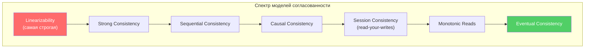

> **Что хочет услышать интервьюер**: не только определение, но и понимание, что согласованность — это *спектр*, а не бинарный выбор. Каждая модель — компромисс между latency, availability и correctness.

## Q2. (!) Что такое Strong Consistency?

**Strong Consistency** (строгая согласованность) — любое чтение после записи возвращает последнее записанное значение; все узлы видят одинаковое состояние. Достигается через синхронную репликацию, протоколы консенсуса (`Raft`, `Paxos`, `ZAB`) или распределённые транзакции.

Минусы: выше задержки (нужно дождаться подтверждения от кворума), при разделении сети возможна недоступность записи (CP в терминах CAP). Плюсы — простая модель для приложения: не нужно обрабатывать конфликты и устаревшие данные.

```java
// Пример: запись с кворумом (концептуально)
public class QuorumWriter {
    private final List<ReplicaClient> replicas;
    private final int quorumSize; // обычно N/2 + 1

    public void write(String key, String value) {
        int acks = 0;
        for (ReplicaClient replica : replicas) {
            try {
                replica.write(key, value);
                acks++;
            } catch (ReplicaUnavailableException e) {
                log.warn("Реплика {} недоступна", replica.id());
            }
        }
        if (acks < quorumSize) {
            throw new InsufficientReplicasException(
                "Получено " + acks + " подтверждений, нужно " + quorumSize);
        }
    }
}
```

**Где используется**: `etcd` (Raft), `ZooKeeper` (ZAB), `CockroachDB`, `Spanner` — финансы, инвентарь, критичные операции, где потеря записи недопустима.

## Q3. (!) Что такое Eventual Consistency?

**Eventual Consistency** (согласованность в конечном счёте) — если обновления прекратить, то со временем все реплики придут к одному состоянию. До этого момента чтения могут возвращать устаревшие данные. Обычно связана с асинхронной репликацией: запись подтверждается одним узлом, распространение на остальные идёт в фоне.

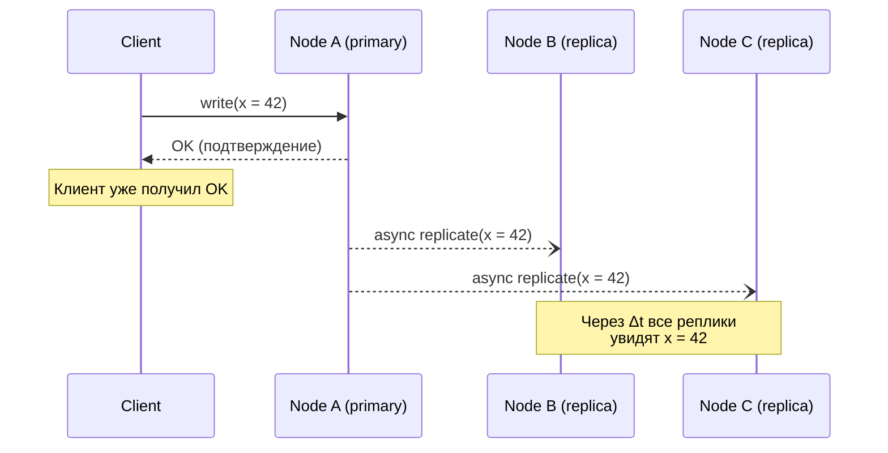

Даёт высокую доступность и масштабируемость (AP в CAP), но усложняет логику:
- Нужна стратегия разрешения конфликтов (`LWW`, `vector clocks`, `CRDT`)
- Обеспечение `read-your-writes` для UX
- Обработка `stale reads` в бизнес-логике

**Типично для**: `Cassandra`, `DynamoDB`, `S3`, кэшей, лент, счётчиков — везде, где допустима кратковременная рассинхронизация.

## Q4. Что такое Causal Consistency?

**Causal Consistency** (причинная согласованность) — сохраняется порядок причинно связанных операций: если операция A повлияла на B (например, ответ на комментарий), то все узлы видят A до B. Несвязанные (concurrent) операции могут наблюдаться в разном порядке на разных узлах.

Реализуется через:
- **Векторные часы** — каждый узел поддерживает вектор версий
- **Lamport timestamps** — логические часы с упорядочением
- **Per-partition ordering** — например, в `Kafka` гарантируется порядок внутри партиции

```java
// Причинная зависимость: ответ на комментарий
// Комментарий A (timestamp: [Node1:1, Node2:0])
// Ответ B зависит от A (timestamp: [Node1:1, Node2:1])
// Causal consistency гарантирует: если видишь B, то обязательно видишь A

public class CausalMessage {
    private final String content;
    private final Map<String, Integer> vectorClock; // причинный контекст
    private final String dependsOn; // ID сообщения-родителя

    public boolean canDeliver(Map<String, Integer> localClock) {
        // Доставляем только если все зависимости уже применены
        return vectorClock.entrySet().stream()
            .allMatch(e -> localClock.getOrDefault(e.getKey(), 0) >= e.getValue());
    }
}
```

**Сильнее** `eventual` (гарантирует порядок причинно связанных событий), **слабее** `strong` (concurrent события могут быть в разном порядке). Удобна для лент, чатов, цепочек комментариев — `MongoDB` поддерживает causal sessions.

## Q5. Что такое Session Consistency и Read-your-writes?

**Session Consistency** — в рамках одной сессии пользователь видит согласованную картину; разные сессии могут видеть разные версии. **Read-your-writes** — после своей записи пользователь при последующих чтениях всегда видит свои изменения; иначе после «Сохранить» пользователь мог бы увидеть старые данные.

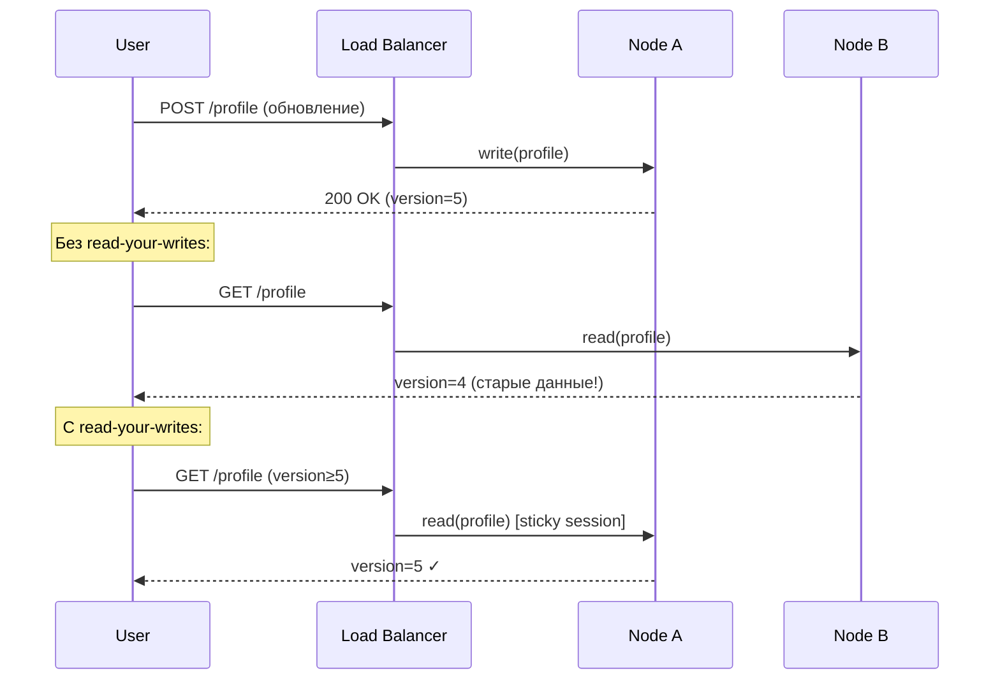

Способы реализации:
- **Sticky sessions** — привязка пользователя к узлу, принявшему запись
- **Version token** — клиент передаёт номер версии, сервер ждёт или перенаправляет
- **Кэш записей** — клиент кэширует свои изменения и мержит с ответом сервера

## Q6. Что такое Monotonic Reads и Monotonic Writes?

**Monotonic Reads** — если клиент прочитал значение версии N, последующие чтения не вернут версию старше N. Без этой гарантии возможен «откат во времени»: первое чтение вернуло свежие данные с быстрой реплики, второе — устаревшие с медленной.

**Monotonic Writes** — записи одного клиента применяются на всех репликах в том порядке, в котором были выполнены. Без этой гарантии возможны аномалии: `SET balance = 100`, затем `SET balance = balance - 30` — если вторая запись применится раньше первой на какой-то реплике, результат будет некорректным.

```java
// Реализация monotonic reads через version tracking
public class MonotonicReadClient {
    private final Map<String, Long> lastSeenVersion = new ConcurrentHashMap<>();

    public <T> T read(String key, List<ReplicaClient> replicas) {
        long minVersion = lastSeenVersion.getOrDefault(key, 0L);

        for (ReplicaClient replica : replicas) {
            VersionedValue<T> result = replica.read(key);
            if (result.version() >= minVersion) {
                lastSeenVersion.put(key, result.version());
                return result.value();
            }
        }
        throw new ConsistencyException(
            "Ни одна реплика не имеет версии >= " + minVersion);
    }
}
```

**Практика**: `DynamoDB` и `Cassandra` с `QUORUM` read дают monotonic reads. Для однопользовательских сценариев достаточно sticky sessions.

## Q7. (!) Что такое Linearizability и чем отличается от Serializability?

**Linearizability** — формальное свойство: каждая операция выглядит как мгновенная (атомарная) в некоторой точке между началом и завершением. Все операции образуют линейный порядок, совместимый с реальным временем. Любое чтение видит эффект последней завершённой записи.

**Serializability** — транзакционное свойство: результат выполнения параллельных транзакций эквивалентен *какому-то* последовательному выполнению. Не требует соответствия реальному времени — только существования допустимого порядка.

| Свойство | `Linearizability` | `Serializability` |
|----------|-------------------|-------------------|
| Область | Одна операция / один объект | Группа операций (транзакция) |
| Реальное время | Учитывает | Не требует |
| Пример | `etcd`, `ZooKeeper` | PostgreSQL `SERIALIZABLE` |
| Комбинация | `Strict Serializability` = оба свойства одновременно |

**Strict Serializability** (строгая сериализуемость) — комбинация обоих: транзакции и линеаризуемы, и сериализуемы. Даёт `CockroachDB`, `Spanner`. Самая дорогая гарантия, но и самая простая для программиста.

> **На собеседовании**: linearizability — про *одну* операцию и реальное время, serializability — про *группы* операций и логический порядок. Путаница между ними — частая ошибка кандидатов.

## Q8. Как выбрать модель согласованности для конкретного сценария?

Выбор модели зависит от бизнес-требований, допустимой задержки и последствий рассинхронизации:

| Сценарий | Модель | Почему |
|----------|--------|--------|
| Банковский перевод | `Strong` / `Linearizable` | Потеря транзакции = потеря денег |
| Остатки на складе | `Strong` для резервирования | Overselling недопустим |
| Лента новостей | `Eventual` | Задержка в секунды приемлема |
| Чат / комментарии | `Causal` | Важен порядок в треде, но не глобально |
| Профиль пользователя | `Session` / `Read-your-writes` | Пользователь должен видеть свои правки |
| Счётчик лайков | `Eventual` | Точное значение не критично в реальном времени |
| Корзина покупок | `Session` + `Eventual` | Свои действия видны сразу, чужие — eventual |

**Правило**: начинай с самой слабой модели, которая удовлетворяет бизнес-требованиям. Усиливай только там, где это действительно нужно. Сильная согласованность всегда дороже по latency и availability.

## Q9. (!) Что такое Two-Phase Commit (2PC)?

**Two-Phase Commit (2PC)** — протокол распределённой транзакции, гарантирующий атомарность: либо все участники фиксируют, либо все откатывают.

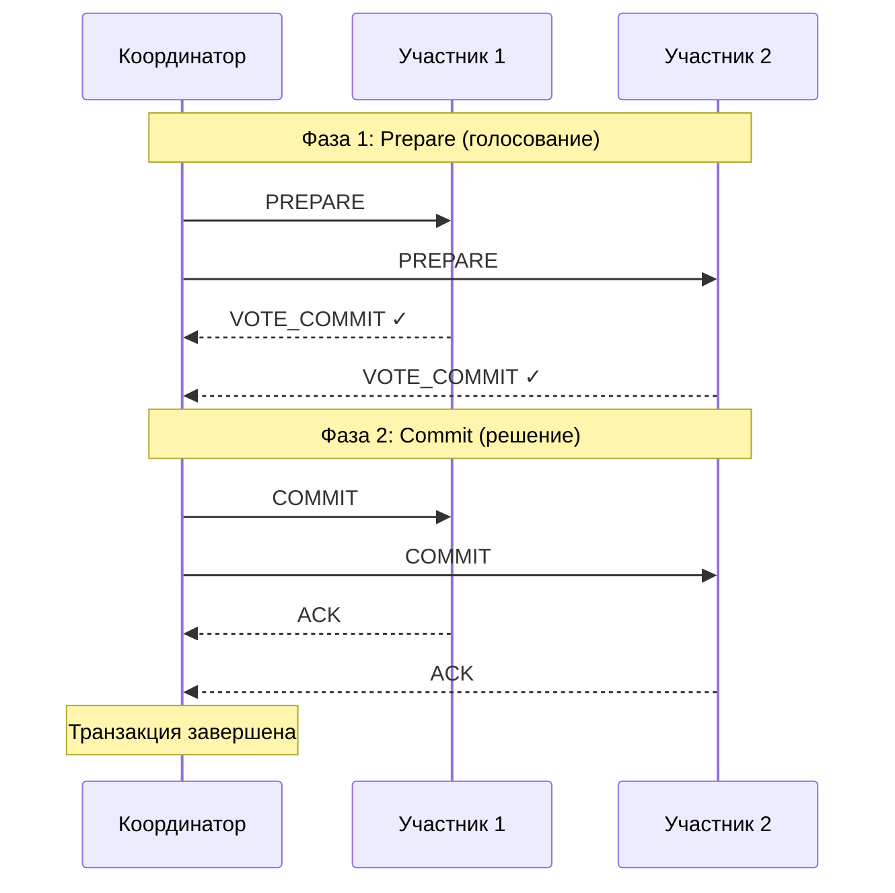

```java
// Реализация координатора 2PC (упрощённо)
public class TwoPhaseCommitCoordinator {
    private final List<Participant> participants;

    @Transactional
    public void execute(DistributedTransaction tx) {
        String txId = UUID.randomUUID().toString();

        // Фаза 1: Prepare
        List<Vote> votes = participants.stream()
            .map(p -> p.prepare(txId, tx))
            .toList();

        boolean allReady = votes.stream()
            .allMatch(v -> v == Vote.COMMIT);

        // Фаза 2: Commit или Abort
        if (allReady) {
            participants.forEach(p -> p.commit(txId));
            log.info("Транзакция {} зафиксирована", txId);
        } else {
            participants.forEach(p -> p.abort(txId));
            log.warn("Транзакция {} откачена", txId);
        }
    }
}
```

**Проблемы 2PC**:
- **Блокировка** — участники держат локи от `PREPARE` до получения решения
- **Единая точка отказа** — падение координатора между `PREPARE` и `COMMIT` оставляет участников в неопределённости
- **Не масштабируется** — блокировки на время сетевых задержек снижают throughput

**Используется**: `XA`-транзакции (`JTA`), `PostgreSQL` prepared transactions, внутрикластерная координация.

## Q10. Чем Three-Phase Commit отличается от 2PC?

**Three-Phase Commit (3PC)** добавляет фазу `PreCommit` между `Prepare` и `Commit`:

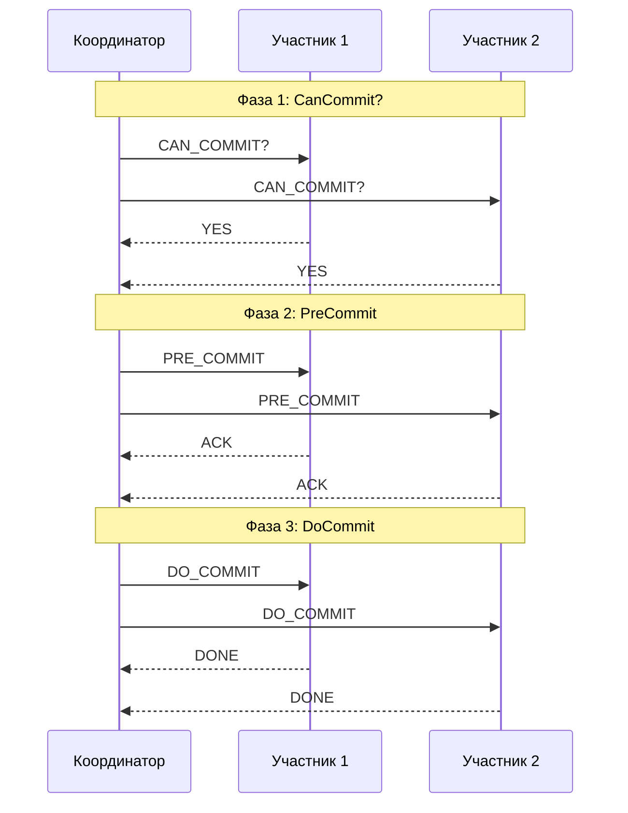

**Ключевое отличие**: после `PreCommit` участники знают, что все проголосовали «за». Если координатор пропадает, участники могут самостоятельно зафиксировать транзакцию по таймауту — это уменьшает окно блокировки.

**На практике 3PC редко используют**: при сетевом разделении (partition) всё равно возможна неопределённость — часть узлов в одной партиции зафиксирует, часть в другой откатит. Сложность выше, а гарантии при реальных сбоях не намного лучше. Чаще применяют `Saga` или `eventual consistency`.

## Q11. Что такое TCC (Try-Confirm/Cancel)?

**TCC** (Try-Confirm/Cancel) — паттерн распределённой транзакции, где каждый участник реализует три операции:

- **Try** — резервирует ресурсы, проверяет бизнес-правила, но не фиксирует
- **Confirm** — подтверждает резервацию, делая её постоянной
- **Cancel** — отменяет резервацию, освобождает ресурсы

```java
// TCC-интерфейс для сервиса инвентаря
public interface InventoryTccService {

    /** Try: резервируем товар, но не списываем */
    ReservationId tryReserve(String productId, int quantity);

    /** Confirm: подтверждаем резервацию → товар списан */
    void confirmReserve(ReservationId reservationId);

    /** Cancel: отменяем резервацию → товар возвращён в наличие */
    void cancelReserve(ReservationId reservationId);
}

// Координатор TCC-транзакции
public class TccCoordinator {
    public void placeOrder(Order order) {
        // Фаза Try
        ReservationId inventoryRes = inventoryService.tryReserve(
            order.productId(), order.quantity());
        PaymentHoldId paymentHold = paymentService.tryHold(
            order.userId(), order.amount());

        try {
            // Фаза Confirm
            inventoryService.confirmReserve(inventoryRes);
            paymentService.confirmHold(paymentHold);
        } catch (Exception e) {
            // Фаза Cancel
            inventoryService.cancelReserve(inventoryRes);
            paymentService.cancelHold(paymentHold);
            throw new OrderFailedException("Не удалось подтвердить заказ", e);
        }
    }
}
```

**Отличия от `Saga`**: `TCC` резервирует ресурсы на фазе `Try` (не фиксирует), поэтому нет видимых промежуточных состояний. `Saga` фиксирует каждый шаг и откатывает компенсациями. `TCC` ближе к `2PC` по семантике, но без глобальных блокировок БД.

## Q12. (!) Когда выбирать 2PC, а когда Saga?

| Критерий | `2PC` | `Saga` |
|----------|-------|--------|
| Участники | Однородные (одна БД / XA) | Разнородные сервисы |
| Длительность | Короткие операции (мс) | Долгие процессы (секунды–минуты) |
| Блокировки | Глобальные локи | Нет глобальных локов |
| Изоляция | Полная (ACID) | Видимы промежуточные состояния |
| Отказоустойчивость | Координатор = SPOF | Компенсации при сбоях |
| Масштабируемость | Плохая (блокировки) | Хорошая |
| Сложность | Низкая (если есть XA) | Высокая (компенсации, идемпотентность) |

**Используйте 2PC**, когда: операции в пределах одного кластера БД, нужна строгая атомарность, длительность транзакции — миллисекунды.

**Используйте Saga**, когда: микросервисы с разными БД, операции могут быть долгими, глобальные блокировки недопустимы, можно обработать промежуточные состояния.

## Q13. (!) Что такое Saga и когда его используют?

**Saga** — паттерн управления распределёнными транзакциями без глобальных блокировок. Длинная бизнес-операция разбивается на шаги (локальные транзакции) в разных сервисах. У каждого шага есть **компенсирующая транзакция** — обратное действие для отката. При сбое компенсации выполняются в обратном порядке.

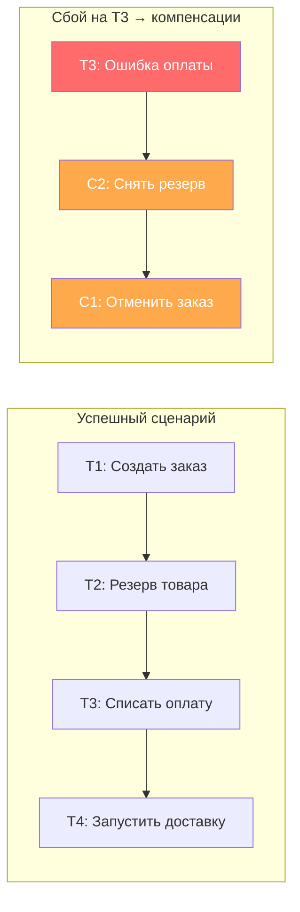

```java
// Определение шагов Saga (Spring-подобный подход)
public class OrderSagaDefinition {

    public SagaDefinition<OrderSagaData> define() {
        return SagaDefinition.<OrderSagaData>builder()
            .step()
                .invokeParticipant(this::createOrder)
                .withCompensation(this::cancelOrder)
            .step()
                .invokeParticipant(this::reserveInventory)
                .withCompensation(this::releaseInventory)
            .step()
                .invokeParticipant(this::processPayment)
                .withCompensation(this::refundPayment)
            .step()
                .invokeParticipant(this::arrangeDelivery)
                // Последний шаг — компенсация не нужна (pivot transaction)
            .build();
    }

    private CommandMessage createOrder(OrderSagaData data) {
        return new CreateOrderCommand(data.getOrderId(), data.getItems());
    }

    private CommandMessage cancelOrder(OrderSagaData data) {
        return new CancelOrderCommand(data.getOrderId());
    }
    // ... остальные методы
}
```

**Ключевые требования**:
- Компенсации должны быть **идемпотентными** — повторный вызов безопасен
- Компенсации должны быть **коммутативными** — порядок не важен при параллельном откате
- Нужна **персистентность состояния** Saga — чтобы пережить рестарт

## Q14. (!) Чем отличается оркестрация от хореографии в Saga?

**Оркестрация** — центральный координатор (orchestrator) управляет порядком шагов, отправляя команды участникам и обрабатывая ответы:

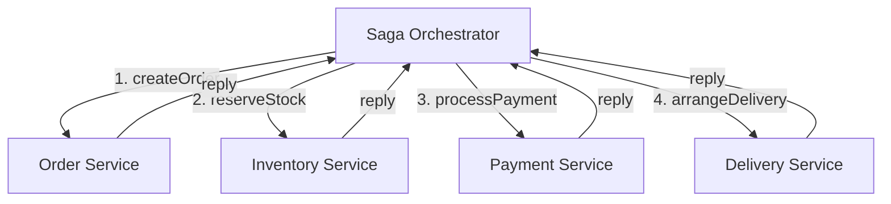

**Хореография** — сервисы общаются через события, каждый реагирует на события других:

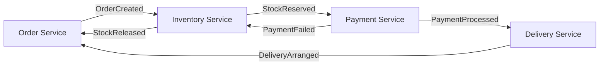

| Критерий | Оркестрация | Хореография |
|----------|------------|-------------|
| Управление | Центральный координатор | Децентрализованное |
| Связанность | Координатор знает о всех шагах | Сервисы знают только о соседних событиях |
| Сложность логики | Сосредоточена в одном месте | Размазана по сервисам |
| Отладка | Проще (одна точка наблюдения) | Сложнее (distributed tracing) |
| SPOF | Координатор (нужен HA) | Нет единой точки отказа |
| Масштаб | До ~10 шагов удобно | Для 3-5 шагов проще |

**Практика**: для сложных бизнес-процессов (заказ, возврат) чаще используют **оркестрацию** — легче контролировать и отлаживать. Хореографию — для простых цепочек из 2-3 сервисов.

## Q15. Как обеспечить идемпотентность компенсирующих транзакций в Saga?

Компенсация может вызываться повторно (сбой сети, retry) — она **обязана** быть идемпотентной.

```java
@Service
public class PaymentCompensationService {

    @Transactional
    public void refundPayment(String sagaId, String paymentId) {
        // 1. Проверяем: не обработана ли уже эта компенсация?
        if (compensationLogRepository.existsBySagaIdAndAction(sagaId, "REFUND")) {
            log.info("Компенсация REFUND для saga {} уже выполнена, пропускаем", sagaId);
            return; // идемпотентность!
        }

        // 2. Выполняем возврат
        paymentGateway.refund(paymentId);

        // 3. Фиксируем факт компенсации
        compensationLogRepository.save(new CompensationLog(
            sagaId, "REFUND", paymentId, Instant.now()));
    }
}
```

**Приёмы обеспечения идемпотентности**:
- **Idempotency key** — уникальный ключ операции; повторный вызов с тем же ключом = no-op
- **Журнал компенсаций** — таблица processed_compensations; проверяем перед выполнением
- **Статусная модель** — заказ в статусе `CANCELLED` нельзя отменить повторно
- **Conditional updates** — `UPDATE ... WHERE status = 'RESERVED'` не сработает, если уже `RELEASED`

## Q16. Какие проблемы возникают с изоляцией в Saga?

В отличие от `2PC`, `Saga` не обеспечивает глобальную изоляцию — промежуточные состояния видны другим транзакциям. Это порождает аномалии:

| Аномалия | Описание | Решение |
|----------|----------|---------|
| **Lost updates** | Параллельная Saga перезаписывает изменения | Optimistic locking (версионность) |
| **Dirty reads** | Чтение промежуточного состояния, которое будет откачено | Semantic locks, статусы (`PENDING`) |
| **Non-repeatable reads** | Повторное чтение даёт другой результат | Версионирование данных |

**Countermeasures** (контрмеры по книге Chris Richardson):

1. **Semantic lock** — помечаем ресурс как «в процессе» (`ORDER_PENDING`), другие Saga ждут или отклоняются
2. **Commutative updates** — операции коммутативны (увеличить/уменьшить счётчик), порядок не важен
3. **Pessimistic view** — переупорядочиваем шаги Saga, чтобы «рискованные» чтения были после фиксации
4. **Reread value** — перечитываем данные перед фиксацией и проверяем, что они не изменились
5. **Version file** — записываем операции в лог и применяем в правильном порядке

## Q17. (!) Что такое Transactional Outbox Pattern?

**Transactional Outbox** — паттерн гарантированной доставки событий: вместо прямой отправки в брокер (`Kafka`, `RabbitMQ`) событие записывается в таблицу `outbox` **в той же транзакции**, что и бизнес-данные. Отдельный процесс (polling publisher или `CDC`) вычитывает и отправляет события в брокер.

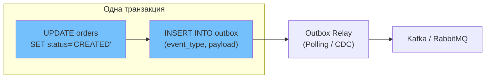

```java
@Service
@RequiredArgsConstructor
public class OrderService {
    private final OrderRepository orderRepository;
    private final OutboxRepository outboxRepository;

    @Transactional
    public Order createOrder(CreateOrderRequest request) {
        // 1. Бизнес-логика
        Order order = Order.create(request);
        orderRepository.save(order);

        // 2. Событие в outbox (та же транзакция!)
        OutboxEvent event = OutboxEvent.builder()
            .aggregateType("Order")
            .aggregateId(order.getId().toString())
            .eventType("OrderCreated")
            .payload(objectMapper.writeValueAsString(
                new OrderCreatedEvent(order.getId(), order.getItems())))
            .build();
        outboxRepository.save(event);

        return order;
    }
}

@Entity
@Table(name = "outbox")
public class OutboxEvent {
    @Id @GeneratedValue
    private Long id;
    private String aggregateType;
    private String aggregateId;
    private String eventType;
    @Column(columnDefinition = "TEXT")
    private String payload;
    private Instant createdAt = Instant.now();
    private boolean sent = false;
}
```

**Зачем**: решает проблему **dual write** — невозможно атомарно записать в БД и отправить в брокер. Без outbox: если запись в БД прошла, а отправка в Kafka упала — событие потеряно. С outbox: событие гарантированно сохранено в БД и будет отправлено.

## Q18. (!) Что такое Change Data Capture (CDC) и как он связан с Outbox?

**Change Data Capture (CDC)** — подход, при котором изменения в БД автоматически захватываются и отправляются в стриминговую платформу. `Debezium` — самый популярный инструмент CDC для `Kafka`.

**Связь с `Outbox`**: `CDC` читает таблицу `outbox` через `WAL` (Write-Ahead Log) базы данных, без polling-запросов. Это эффективнее, чем периодический `SELECT`, и обеспечивает `at-least-once` доставку.

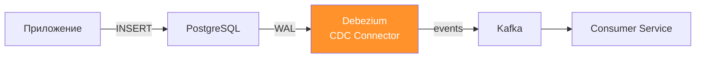

**Два режима CDC**:

| Режим | Описание | Плюсы | Минусы |
|-------|----------|-------|--------|
| **Log-based** | Читает WAL/binlog | Нет нагрузки на БД, не пропустит изменения | Нужен доступ к WAL |
| **Query-based** | Polling с `SELECT` | Просто настроить | Нагрузка на БД, задержка |

**`Debezium` Outbox Event Router** — встроенный SMT (Single Message Transform) в `Debezium`, который умеет трансформировать записи из таблицы `outbox` в корректные события для `Kafka`, удаляя инфраструктурные поля.

## Q19. Как реализовать Outbox Pattern на Spring Boot и Debezium?

Полная реализация включает три части: таблицу `outbox`, запись в неё из сервиса и конфигурацию `Debezium`:

```sql
-- Flyway миграция: V1__create_outbox.sql
CREATE TABLE outbox (
    id            UUID PRIMARY KEY DEFAULT gen_random_uuid(),
    aggregate_type VARCHAR(255) NOT NULL,
    aggregate_id   VARCHAR(255) NOT NULL,
    event_type    VARCHAR(255) NOT NULL,
    payload       JSONB NOT NULL,
    created_at    TIMESTAMP WITH TIME ZONE DEFAULT now()
);

-- Индекс для polling (если без CDC)
CREATE INDEX idx_outbox_created_at ON outbox (created_at);
```

```java
// Polling Publisher — альтернатива CDC (проще, но менее эффективно)
@Component
@RequiredArgsConstructor
public class OutboxPollingPublisher {
    private final OutboxRepository outboxRepository;
    private final KafkaTemplate<String, String> kafkaTemplate;

    @Scheduled(fixedDelay = 100) // каждые 100 мс
    @Transactional
    public void publishOutboxEvents() {
        List<OutboxEvent> events = outboxRepository
            .findTop100ByOrderByCreatedAtAsc();

        for (OutboxEvent event : events) {
            kafkaTemplate.send(
                event.getAggregateType() + ".events",
                event.getAggregateId(),
                event.getPayload()
            ).whenComplete((result, ex) -> {
                if (ex == null) {
                    outboxRepository.delete(event);
                } else {
                    log.error("Ошибка отправки события {}", event.getId(), ex);
                }
            });
        }
    }
}
```

```json
// Конфигурация Debezium Connector (CDC-подход)
{
  "name": "outbox-connector",
  "config": {
    "connector.class": "io.debezium.connector.postgresql.PostgresConnector",
    "database.hostname": "postgres",
    "database.port": "5432",
    "database.dbname": "orders_db",
    "table.include.list": "public.outbox",
    "transforms": "outbox",
    "transforms.outbox.type":
      "io.debezium.transforms.outbox.EventRouter",
    "transforms.outbox.route.topic.replacement": "${routedByValue}.events"
  }
}
```

## Q20. (!) Что такое Event Sourcing?

**Event Sourcing** — состояние агрегата хранится как последовательность неизменяемых **событий** (append-only log). Текущее состояние получают, применяя все события по порядку (replay). Запись — добавление нового события, прошлое не перезаписывается.

```java
// Агрегат заказа с Event Sourcing
public class OrderAggregate {
    private UUID orderId;
    private OrderStatus status;
    private List<OrderItem> items = new ArrayList<>();
    private BigDecimal totalAmount;
    private final List<DomainEvent> uncommittedEvents = new ArrayList<>();

    // Команда → валидация → событие
    public void createOrder(UUID id, List<OrderItem> items) {
        if (status != null) {
            throw new IllegalStateException("Заказ уже создан");
        }
        apply(new OrderCreatedEvent(id, items, calculateTotal(items)));
    }

    public void confirmPayment(String transactionId) {
        if (status != OrderStatus.PENDING) {
            throw new IllegalStateException("Заказ не в статусе PENDING");
        }
        apply(new PaymentConfirmedEvent(orderId, transactionId));
    }

    // Применение события (изменяет состояние)
    private void apply(DomainEvent event) {
        mutate(event);
        uncommittedEvents.add(event);
    }

    // Мутация состояния по событию (используется и при replay)
    private void mutate(DomainEvent event) {
        switch (event) {
            case OrderCreatedEvent e -> {
                this.orderId = e.orderId();
                this.items = e.items();
                this.totalAmount = e.total();
                this.status = OrderStatus.PENDING;
            }
            case PaymentConfirmedEvent e ->
                this.status = OrderStatus.PAID;
            case OrderCancelledEvent e ->
                this.status = OrderStatus.CANCELLED;
            default -> throw new UnknownEventException(event);
        }
    }

    // Восстановление из истории событий
    public static OrderAggregate rehydrate(List<DomainEvent> history) {
        OrderAggregate aggregate = new OrderAggregate();
        history.forEach(aggregate::mutate);
        return aggregate;
    }
}
```

**Преимущества**: полный аудит, возможность пересобрать состояние на любой момент, debug через replay, natural fit для `CQRS`.

**Минусы**: сложность модели, рост лога (нужен **snapshot** + compaction), версионирование формата событий (upcasting), eventual consistency между event store и проекциями.

## Q21. Что такое CQRS и зачем разделять команды и запросы?

**CQRS** (Command Query Responsibility Segregation) — разделение модели записи (команды) и модели чтения (запросы). Команды меняют состояние, запросы читают из отдельных, оптимизированных проекций.

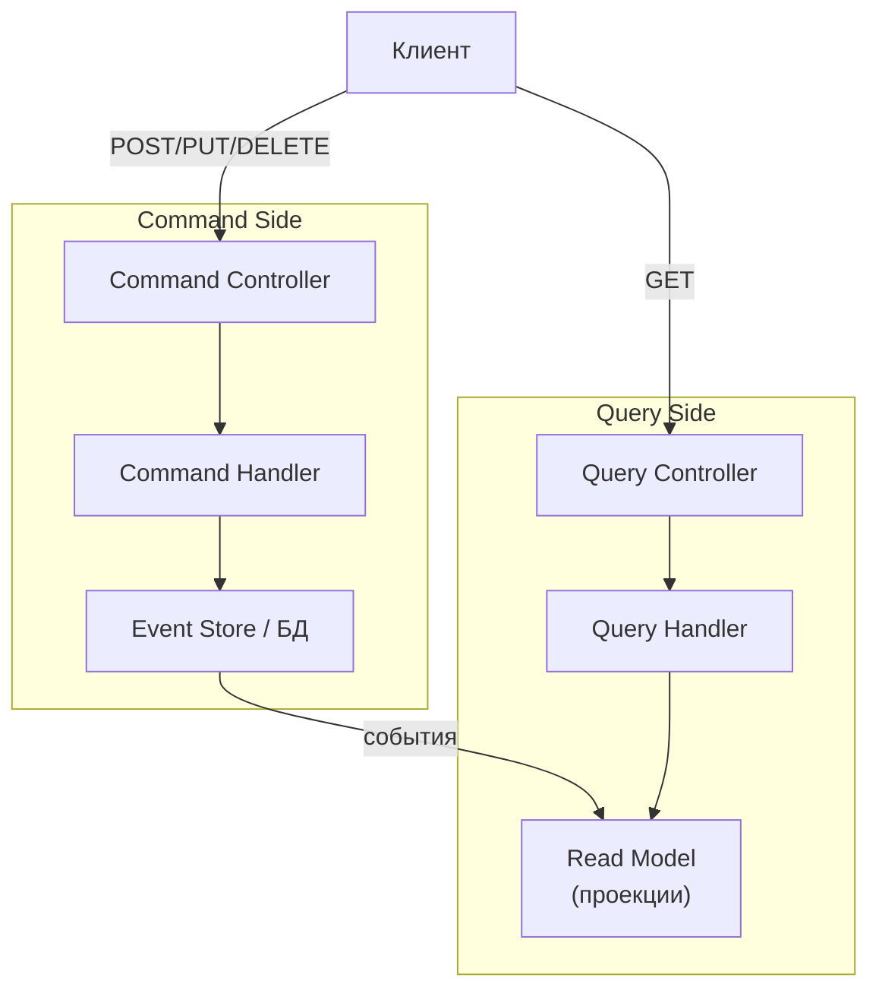

```java
// Command side
public record CreateOrderCommand(UUID customerId, List<OrderItem> items) {}

@Service
public class OrderCommandHandler {
    private final EventStore eventStore;

    public UUID handle(CreateOrderCommand cmd) {
        OrderAggregate order = new OrderAggregate();
        order.createOrder(UUID.randomUUID(), cmd.items());
        eventStore.save(order.getId(), order.getUncommittedEvents());
        return order.getId();
    }
}

// Query side — отдельная модель, оптимизированная под чтение
@Entity
@Table(name = "order_summary_view")
public class OrderSummaryView {
    @Id private UUID orderId;
    private String customerName;
    private BigDecimal total;
    private String status;
    private int itemCount;
    private Instant createdAt;
}

@Component
public class OrderProjector {
    @EventHandler
    public void on(OrderCreatedEvent event) {
        orderSummaryRepository.save(new OrderSummaryView(
            event.orderId(), event.customerName(),
            event.total(), "PENDING", event.items().size(), Instant.now()));
    }
}
```

**Зачем**: масштабирование чтения и записи независимо, разные уровни согласованности, разные хранилища под разные паттерны доступа. CQRS можно использовать **без** `Event Sourcing` — просто с разными моделями для чтения и записи.

## Q22. Как совмещать Event Sourcing и CQRS?

Запись: команда → агрегат → событие → `event store` (append-only). Чтение: подписчики (projectors) обрабатывают события и обновляют проекции (read models) в отдельных хранилищах.

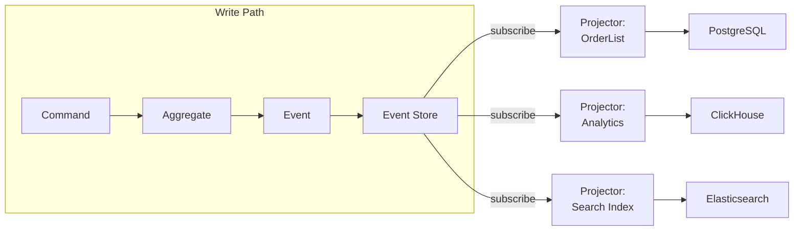

**Eventual consistency** между event store и проекциями — задержка (обычно миллисекунды) допустима. Для `read-your-writes` можно:
- Кэшировать запись на клиенте
- Ждать обновления проекции (polling / `WebSocket`)
- Читать напрямую из event store для критичных сценариев

**Снэпшоты**: чтобы не реплеить тысячи событий при загрузке агрегата, сохраняют snapshot каждые N событий:

```java
public class SnapshotStore {
    public OrderAggregate load(UUID aggregateId) {
        Snapshot snapshot = snapshotRepo
            .findLatest(aggregateId)
            .orElse(Snapshot.empty());

        List<DomainEvent> eventsSinceSnapshot = eventStore
            .loadFrom(aggregateId, snapshot.version());

        OrderAggregate aggregate = snapshot.hasData()
            ? deserialize(snapshot.data())
            : new OrderAggregate();

        eventsSinceSnapshot.forEach(aggregate::apply);
        return aggregate;
    }
}
```

## Q23. Как обеспечить согласованность при Event Sourcing?

**Проблема**: между записью события и обновлением проекции есть окно рассинхронизации. Как управлять?

| Стратегия | Описание | Гарантия |
|-----------|----------|----------|
| **Optimistic concurrency** | Проверяем expected version при записи | Защита от конфликтов записи |
| **Idempotent projectors** | Проекторы обрабатывают событие ровно раз | At-least-once → exactly-once |
| **Causation ID** | Каждое событие хранит ID команды-причины | Дедупликация и трассировка |
| **Projection rebuild** | Пересборка проекции из всех событий | Исправление рассинхронизации |

```java
// Optimistic concurrency в event store
public class EventStore {
    @Transactional
    public void save(UUID aggregateId, int expectedVersion,
                     List<DomainEvent> events) {
        int currentVersion = getCurrentVersion(aggregateId);
        if (currentVersion != expectedVersion) {
            throw new OptimisticConcurrencyException(
                "Expected version " + expectedVersion +
                ", but current is " + currentVersion);
        }

        int version = expectedVersion;
        for (DomainEvent event : events) {
            jdbcTemplate.update("""
                INSERT INTO events (aggregate_id, version, event_type, payload, created_at)
                VALUES (?, ?, ?, ?::jsonb, now())
                """,
                aggregateId, ++version,
                event.getClass().getSimpleName(),
                serialize(event));
        }
    }
}
```

> **На собеседовании**: подчеркните, что `Event Sourcing` даёт **strong consistency для записи** (через optimistic concurrency) и **eventual consistency для чтения** (проекции обновляются асинхронно).

## Q24. (!) Как разрешать конфликты при Eventual Consistency?

При асинхронной репликации несколько узлов могут обновить один объект одновременно — возникает конфликт. Основные стратегии:

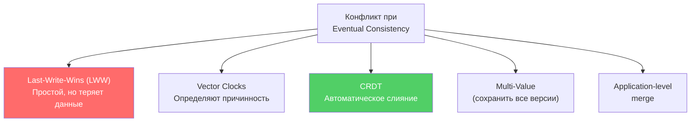

**Сравнение стратегий**:

| Стратегия | Потеря данных | Сложность | Пример системы |
|-----------|---------------|-----------|----------------|
| `LWW` | Возможна | Низкая | `Cassandra` |
| `Vector Clocks` | Нет (при ручном merge) | Средняя | `Riak` (deprecated) |
| `CRDT` | Нет | Высокая | `Redis CRDT`, `Automerge` |
| Multi-Value | Нет | Средняя | `DynamoDB` (conditional writes) |
| App-level merge | Зависит от логики | Высокая | Custom |

**Выбор**: для счётчиков и множеств — `CRDT`. Для документов — `CRDT` (`Automerge`, `Yjs`) или app-level merge. Для простых key-value с редкими конфликтами — `LWW` с отслеживанием.

## Q25. (!) Что такое CRDT и какие типы существуют?

**CRDT** (Conflict-free Replicated Data Types) — структуры данных, операции обновления которых коммутативны, ассоциативны и идемпотентны. Конфликты разрешаются автоматически при merge — без координации между узлами.

Два вида:
- **CvRDT** (state-based) — узлы обмениваются полным состоянием и мержат через `merge()`
- **CmRDT** (operation-based) — узлы обмениваются операциями, операции коммутативны

**Основные типы CRDT**:

| Тип | Описание | Пример использования |
|-----|----------|---------------------|
| **G-Counter** | Grow-only счётчик; каждый узел инкрементирует свой слот | Счётчик просмотров |
| **PN-Counter** | Два G-Counter (positive + negative) | Лайки/дизлайки |
| **G-Set** | Grow-only множество (только добавление) | Список уникальных посетителей |
| **OR-Set** | Observed-Remove Set (добавление + удаление) | Корзина покупок |
| **LWW-Register** | Регистр с last-write-wins | Профиль пользователя |
| **LWW-Map** | Карта LWW-регистров | JSON-документ |
| **MV-Register** | Multi-Value Register (хранит все конкурентные значения) | Поле с ручным merge |

```java
// G-Counter (grow-only) — распределённый счётчик
public class GCounter {
    private final String nodeId;
    private final Map<String, Long> counters = new ConcurrentHashMap<>();

    public GCounter(String nodeId) {
        this.nodeId = nodeId;
        counters.put(nodeId, 0L);
    }

    public void increment() {
        counters.merge(nodeId, 1L, Long::sum);
    }

    public long value() {
        return counters.values().stream().mapToLong(Long::longValue).sum();
    }

    // Merge: берём максимум по каждому узлу
    public GCounter merge(GCounter other) {
        GCounter result = new GCounter(this.nodeId);
        Set<String> allNodes = new HashSet<>(this.counters.keySet());
        allNodes.addAll(other.counters.keySet());

        for (String node : allNodes) {
            result.counters.put(node, Math.max(
                this.counters.getOrDefault(node, 0L),
                other.counters.getOrDefault(node, 0L)));
        }
        return result;
    }
}

// PN-Counter = два G-Counter
public class PNCounter {
    private final GCounter positive;
    private final GCounter negative;

    public void increment() { positive.increment(); }
    public void decrement() { negative.increment(); }

    public long value() {
        return positive.value() - negative.value();
    }
}
```

**Где используются**: `Redis` (CRDTs в Redis Enterprise для Active-Active), `Riak`, `Automerge` и `Yjs` (collaborative editing), `Cassandra` counters (PN-Counter по сути).

## Q26. Что такое Vector Clocks и как они определяют причинность?

**Vector Clock** — логические часы для определения причинно-следственных связей между событиями в распределённой системе. Каждый узел поддерживает вектор `[N1:v1, N2:v2, ...]`, где `vi` — количество событий, известных от узла `i`.

**Правила**:
1. При локальном событии: инкрементируем свой слот
2. При отправке сообщения: инкрементируем свой слот, прикладываем вектор
3. При получении сообщения: `merge(local, received)` = поэлементный `max`, затем инкрементируем свой слот

```java
public class VectorClock {
    private final Map<String, Integer> clock = new HashMap<>();

    public void increment(String nodeId) {
        clock.merge(nodeId, 1, Integer::sum);
    }

    public VectorClock merge(VectorClock other) {
        VectorClock result = new VectorClock();
        Set<String> allNodes = new HashSet<>(this.clock.keySet());
        allNodes.addAll(other.clock.keySet());

        for (String node : allNodes) {
            result.clock.put(node, Math.max(
                this.clock.getOrDefault(node, 0),
                other.clock.getOrDefault(node, 0)));
        }
        return result;
    }

    /**
     * Определяет отношение причинности:
     * - BEFORE: this happened-before other
     * - AFTER: this happened-after other
     * - CONCURRENT: ни один не "раньше" другого → конфликт!
     */
    public Relation compareTo(VectorClock other) {
        boolean thisBeforeOrEqual = clock.entrySet().stream()
            .allMatch(e -> e.getValue() <= other.clock.getOrDefault(e.getKey(), 0));
        boolean otherBeforeOrEqual = other.clock.entrySet().stream()
            .allMatch(e -> e.getValue() <= this.clock.getOrDefault(e.getKey(), 0));

        if (thisBeforeOrEqual && !otherBeforeOrEqual) return Relation.BEFORE;
        if (otherBeforeOrEqual && !thisBeforeOrEqual) return Relation.AFTER;
        if (thisBeforeOrEqual) return Relation.EQUAL;
        return Relation.CONCURRENT; // конфликт!
    }

    public enum Relation { BEFORE, AFTER, CONCURRENT, EQUAL }
}
```

**Пример**: Node A: `[A:2, B:1]`, Node B: `[A:1, B:3]` → `CONCURRENT` (конфликт! A знает больше о себе, B знает больше о себе). Нужен merge или ручное разрешение.

**Проблема масштабирования**: размер вектора растёт с числом узлов. Решения: **dotted version vectors** (используются в `Riak`), **interval tree clocks**.

## Q27. Что такое Last-Write-Wins (LWW) и в чём его проблемы?

**Last-Write-Wins** — стратегия разрешения конфликтов, где побеждает запись с наибольшим timestamp. Проста в реализации, но имеет серьёзные проблемы.

```java
public class LWWRegister<T> {
    private T value;
    private long timestamp;

    public void write(T newValue, long timestamp) {
        if (timestamp > this.timestamp) {
            this.value = newValue;
            this.timestamp = timestamp;
        }
        // Иначе — отбрасываем (более старая запись)
    }

    public LWWRegister<T> merge(LWWRegister<T> other) {
        return this.timestamp >= other.timestamp ? this : other;
    }
}
```

**Проблемы LWW**:

| Проблема | Описание |
|----------|----------|
| **Потеря данных** | Конкурентная запись с меньшим timestamp будет отброшена |
| **Clock skew** | Часы узлов рассинхронизированы → побеждает «неправильная» запись |
| **NTP drift** | Даже с NTP точность ~мс, что недостаточно для high-throughput |
| **Произвольный выбор** | При одинаковом timestamp нужен tiebreaker (обычно node ID) |

**Когда LWW допустим**: для данных, где потеря конкурентного обновления не критична (кэш, последний онлайн-статус, cursor position в редакторе). `Cassandra` использует LWW по умолчанию — это осознанный выбор в пользу простоты.

**Альтернативы**: `CRDT` (автоматический merge без потерь), `Multi-Value Register` (сохранить оба значения, разрешить позже), `Operational Transform` / `CRDT` для collaborative editing.

## Q28. Как достигается консистентность при кэшировании?

**Основные стратегии кэширования**:

| Стратегия | Запись | Консистентность | Latency записи |
|-----------|--------|-----------------|----------------|
| **Cache-aside** | Пишем в БД, инвалидируем кэш | Eventual | Низкая |
| **Write-through** | Пишем в кэш + БД синхронно | Strong | Высокая |
| **Write-behind** | Пишем в кэш, в БД — async | Eventual + риск потери | Низкая |
| **Read-through** | Кэш сам ходит в БД при промахе | Eventual | Средняя |

```java
// Cache-aside с Spring Cache
@Service
@RequiredArgsConstructor
public class ProductService {
    private final ProductRepository repository;
    private final CacheManager cacheManager;

    @Cacheable(value = "products", key = "#id")
    public Product getProduct(Long id) {
        return repository.findById(id)
            .orElseThrow(() -> new NotFoundException("Product " + id));
    }

    @Transactional
    public Product updateProduct(Long id, UpdateRequest request) {
        Product product = repository.findById(id).orElseThrow();
        product.update(request);
        repository.save(product);

        // Инвалидируем ПОСЛЕ записи в БД
        cacheManager.getCache("products").evict(id);

        return product;
    }
}
```

**Проблемы cache-aside**:
- **Race condition**: два потока читают пустой кэш, оба идут в БД, оба пишут в кэш — не страшно (один перезапишет другого тем же значением)
- **Stale cache**: между записью в БД и инвалидацией кэша другой поток может прочитать старое значение
- **Cache stampede**: после инвалидации множество запросов одновременно идут в БД

**Решения**: `TTL` + инвалидация, `distributed lock` при заполнении кэша, `write-through` для критичных данных, `versioned cache keys`.

## Q29. Как реализовать Read-your-writes в микросервисной архитектуре?

В микросервисах `read-your-writes` сложнее, чем в монолите — запись и чтение могут обрабатываться разными инстансами.

```java
// Подход 1: Version token через HTTP-заголовки
@RestController
public class OrderController {

    @PostMapping("/orders")
    public ResponseEntity<Order> createOrder(
            @RequestBody CreateOrderRequest request) {
        Order order = orderService.create(request);

        return ResponseEntity.ok()
            .header("X-Write-Version", String.valueOf(order.getVersion()))
            .body(order);
    }

    @GetMapping("/orders/{id}")
    public ResponseEntity<Order> getOrder(
            @PathVariable UUID id,
            @RequestHeader(value = "X-Min-Version", required = false)
                Long minVersion) {
        Order order = orderService.findById(id);

        if (minVersion != null && order.getVersion() < minVersion) {
            // Проекция ещё не обновилась — retry или fallback
            return ResponseEntity.status(HttpStatus.SERVICE_UNAVAILABLE)
                .header("Retry-After", "1")
                .build();
        }
        return ResponseEntity.ok(order);
    }
}

// Подход 2: Sticky session через Gateway
// В application.yml (Spring Cloud Gateway):
// spring.cloud.gateway.routes:
//   - id: orders
//     uri: lb://order-service
//     predicates:
//       - Path=/orders/**
//     metadata:
//       session-affinity: cookie
```

**Подходы**:

| Подход | Описание | Плюсы | Минусы |
|--------|----------|-------|--------|
| **Version token** | Клиент передаёт минимальную версию | Простой, stateless | Нужен retry при stale |
| **Sticky session** | Привязка к инстансу | Прозрачно для клиента | Проблемы при failover |
| **Causal token** | Вектор причинности в заголовке | Точный | Сложнее реализовать |
| **Client-side cache** | Клиент кэширует свои записи | Быстрый | Расход памяти клиента |

## Q30. Как выбрать стратегию согласованности для e-commerce системы?

Реальная e-commerce система использует **разные модели** для разных поддоменов:

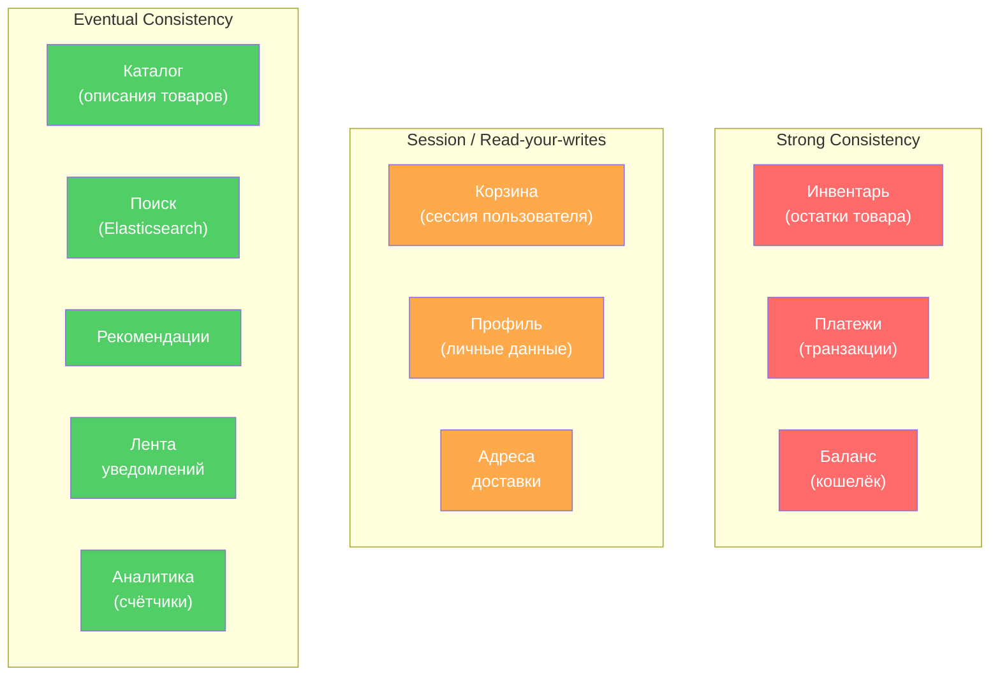

**Конкретные решения**:

| Поддомен | Модель | Паттерн | Почему |
|----------|--------|---------|--------|
| Инвентарь | `Strong` | `2PC` / `Saga` + `Outbox` | Overselling = убытки |
| Платежи | `Strong` | `TCC` / `Saga` | Двойное списание недопустимо |
| Заказы | `Saga` (оркестрация) | `Event Sourcing` + `Outbox` | Много шагов, нужен аудит |
| Каталог | `Eventual` | `CDC` → `Elasticsearch` | Задержка 1-2 сек приемлема |
| Корзина | `Session` | `Redis` + sticky session | Пользователь видит свои действия |
| Уведомления | `Eventual` | `Kafka` | Задержка допустима |

> **На собеседовании**: покажите, что вы не выбираете одну модель для всей системы, а применяете **разные уровни согласованности** для разных поддоменов, исходя из бизнес-требований.

## Q31. (!) Что такое PACELC-теорема и чем она дополняет CAP?

**PACELC** (Daniel Abadi, 2012) расширяет `CAP` с учётом штатной работы системы (без partition):

- **P** (Partition): при разделении сети выбирай между **A** (availability) и **C** (consistency) — это CAP
- **E** (Else): при *нормальной* работе выбирай между **L** (latency) и **C** (consistency)

```
PACELC = (P → A or C) else (L vs C)
```

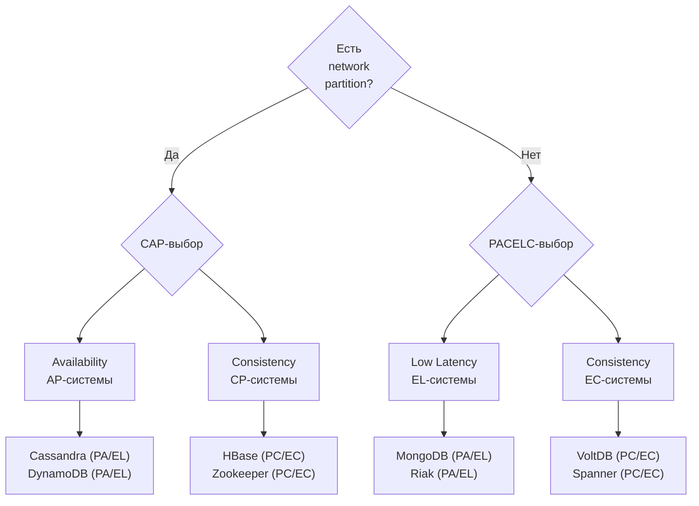

| Система | Partition | Else |
|---------|-----------|------|
| `Cassandra` | PA (доступность) | EL (низкая latency) |
| `HBase` | PC (согласованность) | EC (согласованность) |
| `MongoDB` (с replica set) | PC | EC |
| `DynamoDB` | PA | EL |
| `Spanner` | PC | EC |

**Практический вывод:** `CAP` говорит, что делать при сбое. `PACELC` добавляет: даже без сбоя есть компромисс между скоростью и свежестью данных. При выборе базы данных важно учитывать оба измерения.

## Q32. Что такое Tunable Consistency и как она реализована в Cassandra?

**Tunable Consistency** — возможность настроить уровень согласованности **per-запрос**, выбирая баланс между latency, доступностью и свежестью данных.

В `Cassandra` каждый запрос имеет `ConsistencyLevel`, определяющий, сколько реплик должны подтвердить операцию:

| Уровень | Описание | Когда применять |
|---------|----------|----------------|
| `ONE` | 1 реплика | Некритичные чтения, максимальная скорость |
| `QUORUM` | `N/2 + 1` реплик | Баланс consistency/availability |
| `ALL` | Все реплики | Критичные записи, риск недоступности |
| `LOCAL_QUORUM` | Кворум в датацентре | Multi-DC, без межрегиональных задержек |
| `EACH_QUORUM` | Кворум в каждом DC | Строгая гарантия multi-DC |

**Правило Strong Consistency:** `W + R > N` (где W — write level, R — read level, N — replication factor).

```java
// Пример: RF=3, W=QUORUM(2), R=QUORUM(2) → 2+2 > 3 → Strong Consistency
CqlSession session = CqlSession.builder().build();

// Запись с гарантией кворума
PreparedStatement write = session.prepare(
    "INSERT INTO orders (id, status) VALUES (?, ?)"
);
session.execute(write.bind(orderId, "CREATED")
    .setConsistencyLevel(ConsistencyLevel.QUORUM));

// Чтение: LOCAL_QUORUM для низкой latency в локальном DC
PreparedStatement read = session.prepare(
    "SELECT * FROM orders WHERE id = ?"
);
Row row = session.execute(read.bind(orderId)
    .setConsistencyLevel(ConsistencyLevel.LOCAL_QUORUM)).one();
```

**Типичная стратегия:**
- Финансовые записи: `W=ALL`, `R=ONE` (быстрое чтение, гарантированная запись)
- Каталог: `W=ONE`, `R=ONE` (eventual consistency, максимальная скорость)
- Заказы: `W=QUORUM`, `R=QUORUM` (strong consistency без избыточных накладных расходов)

## Q33. (!) Что такое Bounded Staleness и когда её применять?

**Bounded Staleness** (ограниченная устарелость) — модель согласованности, гарантирующая, что чтения отстают от записей не более чем на **заданный порог** — по времени или по числу версий.

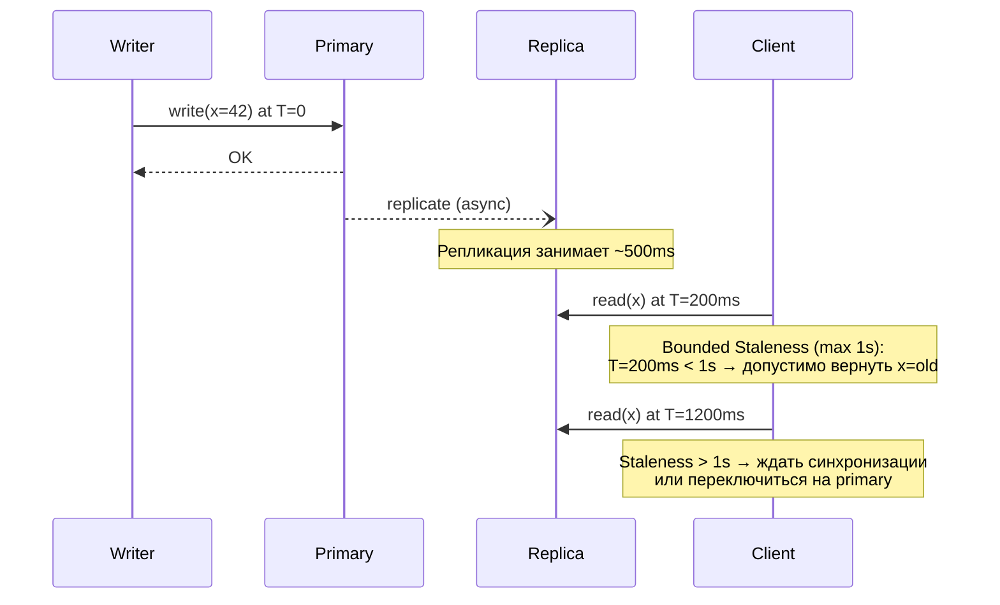

**Применение:**
- `Azure Cosmos DB` — явная настройка `maxStalenessPrefix` (версии) и `maxIntervalInSeconds` (время)
- `DynamoDB` — eventual reads могут отставать до нескольких секунд
- `Redis` (async replication) — `replica-lazy-flush`, отставание на тысячи команд

**Когда применять:**
- Метрики, дашборды — 30 секунд устарелости допустимы
- Персонализация, рекомендации — 1-5 минут OK
- Инвентарь, баланс — не применять; нужен `strong consistency`

## Q34. Как обеспечить Read-your-writes при межсервисных вызовах?

При синхронных REST-вызовах между микросервисами обеспечить `read-your-writes` сложнее, чем в одном сервисе, потому что запись и последующее чтение могут попасть на разные сервисы/реплики.

**Подходы:**

1. **Sticky routing по userId** — запросы одного пользователя маршрутизируются на одну реплику (stateful, снижает эффективность балансировки)

2. **Write token / version propagation** — после записи сервис возвращает `writeToken` (номер версии/LSN); последующие чтения передают токен в заголовке и ждут, пока реплика достигнет нужной версии:

```java
// POST /profile → возвращает X-Write-Token: 42
// GET /profile с заголовком: X-Min-Version: 42
// Сервис чтения блокирует запрос до достижения версии 42

@GetMapping("/profile/{id}")
public ProfileDto getProfile(
    @PathVariable UUID id,
    @RequestHeader(value = "X-Min-Version", required = false) Long minVersion) {

    if (minVersion != null) {
        replicationWaiter.waitForVersion(id, minVersion, Duration.ofSeconds(2));
    }
    return profileService.find(id);
}
```

3. **Read-after-write через Primary** — после записи читать с `primary` (или leader-ноды); последующие чтения можно направлять на реплики

4. **Клиентский кэш** — фронтенд хранит последнее записанное значение и показывает его до подтверждения от бэкенда

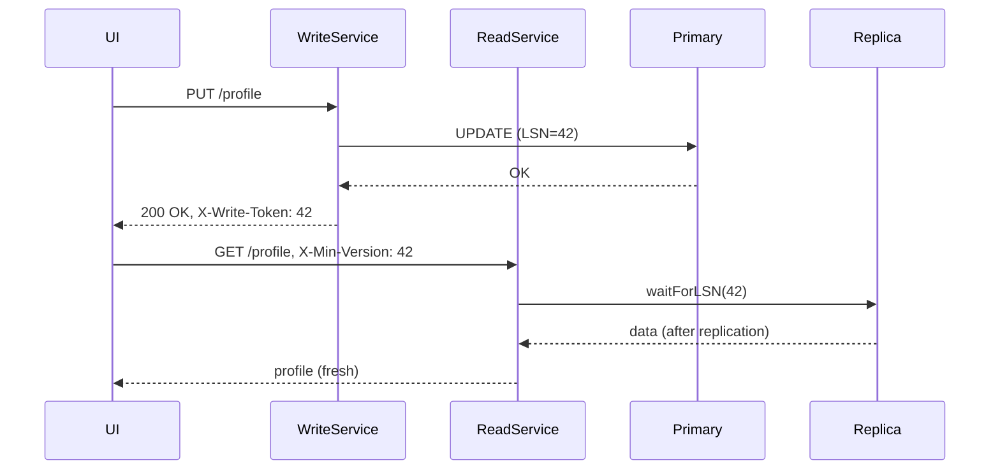

## Q35. (!) Чем отличается согласованность на уровне строки от согласованности на уровне транзакции?

**Row-level consistency** (согласованность строки) — гарантирует атомарность операций над одной записью: запись либо применяется целиком, либо нет. Нет гарантий относительно других строк, видимых в том же чтении.

**Transaction-level consistency (Serializability)** — набор операций над несколькими строками/таблицами выглядит так, как если бы выполнялся последовательно (без параллельных аномалий).

| Характеристика | Row-level | Transaction-level |
|----------------|-----------|-------------------|
| Атомарность | Одна строка | Набор операций |
| Изоляция | Нет | Да (разные уровни) |
| Производительность | Высокая | Ниже (локи/MVCC) |
| Аномалии | Dirty read, phantom | Устраняются уровнями изоляции |
| Примеры БД | `Cassandra` (LWT) | `PostgreSQL`, `MySQL` (SERIALIZABLE) |

**Linearizability vs Serializability:**
- `Linearizability` — операции над **одним объектом** выглядят мгновенными и отражают реальное время (`single-object`)
- `Serializability` — транзакции над **несколькими объектами** выглядят последовательными (`multi-object`)
- `Strict Serializability` = `Linearizability` + `Serializability` — самая сильная гарантия; обеспечивают `Spanner`, `FoundationDB`

```sql
-- Row-level (Cassandra LWT): атомарная операция над одной строкой
INSERT INTO accounts (id, balance) VALUES (1, 1000)
IF NOT EXISTS;

-- Transaction-level (PostgreSQL SERIALIZABLE): несколько строк атомарно
BEGIN;
SET TRANSACTION ISOLATION LEVEL SERIALIZABLE;
UPDATE accounts SET balance = balance - 100 WHERE id = 1;
UPDATE accounts SET balance = balance + 100 WHERE id = 2;
COMMIT;
```

---

## Q36. (!) Как обеспечить Read-your-writes consistency в распределённых системах?

**Read-your-writes** (RYW) — гарантия: клиент, выполнивший запись, всегда увидит результат этой записи при последующем чтении. Звучит тривиально, но в распределённых системах нарушается при чтении с реплики, которая ещё не синхронизировалась.

**Проблема:**
```
Клиент:
  1. POST /profile → запись на Primary (LSN=100)
  2. GET /profile  → чтение с Replica (LSN=95) → видит старые данные!
```

**Решения:**

**1. Read-after-write routing — читать всегда с Primary после записи:**
```java
// Spring Boot пример с DataSource routing
public class ReadYourWritesDataSource extends AbstractRoutingDataSource {
    private final ThreadLocal<Boolean> usesPrimary = new ThreadLocal<>();

    @Override
    protected Object determineCurrentLookupKey() {
        return Boolean.TRUE.equals(usesPrimary.get()) ? "primary" : "replica";
    }
}

// В сервисе:
@Transactional
public UserDto updateProfile(UpdateRequest req) {
    userRepo.save(req);
    readYourWritesDataSource.forceUsePrimary(); // следующие 5 секунд — читать с primary
    return userRepo.findById(req.id());
}
```

**2. Version tokens / Write tokens:**
```java
// Запись возвращает LSN/версию
WriteResult result = profileService.update(dto);
long writeToken = result.getLogSequenceNumber(); // например, 100

// Чтение с минимальной версией
@GetMapping("/profile/{id}")
public ProfileDto getProfile(@PathVariable UUID id,
    @RequestHeader(value = "X-Min-Version", required = false) Long minVersion) {
    if (minVersion != null) {
        replicationWaiter.waitForVersion(id, minVersion, Duration.ofSeconds(2));
    }
    return profileService.find(id);
}
```

**3. Sticky sessions** — клиент всегда направляется на один и тот же узел (например, через consistent hashing по session ID). Минус: нарушается балансировка нагрузки.

**4. Client-side caching** — фронтенд сохраняет последнее записанное значение и показывает его оптимистично, пока реплика не догонит.

| Метод | Сложность | Производительность | Применение |
|-------|-----------|-------------------|------------|
| Read from Primary | Простая | Снижается (нет реплик) | Критичные данные |
| Version tokens | Средняя | Хорошая | REST API |
| Sticky sessions | Низкая | Средняя | Stateful приложения |
| Client cache | Средняя | Отличная | SPA / mobile |

---

## Q37. Monotonic Read Consistency: sticky sessions и session tokens

**Monotonic Read Consistency** — гарантия, что клиент никогда не увидит более старую версию данных после того, как уже видел новую. Без этой гарантии возможна ситуация: первый запрос вернул версию 5, второй запрос вернул версию 3 (читал с отставшей реплики).

**Проблема:**
```
Клиент делает два последовательных GET /orders:
  Запрос 1 → Replica A (синхронизирована до LSN=50) → видит заказ #123
  Запрос 2 → Replica B (синхронизирована до LSN=40) → заказ #123 исчез!
```

**Решение 1: Sticky sessions (сессионная привязка)**

Балансировщик направляет все запросы одной сессии на один и тот же бэкенд/реплику:

```nginx
# Nginx: sticky sessions через IP hash
upstream backend {
    ip_hash;  # один клиент → один сервер
    server replica1:8080;
    server replica2:8080;
    server replica3:8080;
}
```

Минус: при отказе реплики клиент видит "скачок" назад при переключении. Хуже балансировки при "горячих" IP.

**Решение 2: Session tokens (векторные версии)**

```java
// Клиент передаёт последнюю известную версию
// Сервер гарантирует, что ответ не хуже этой версии

public class MonotonicReadFilter implements Filter {
    @Override
    public void doFilter(ServletRequest req, ServletResponse res, FilterChain chain) {
        String sessionVersion = ((HttpServletRequest) req).getHeader("X-Session-Version");
        if (sessionVersion != null) {
            long version = Long.parseLong(sessionVersion);
            // Если реплика отстаёт — ждём или переключаемся на primary
            replicaRouter.ensureAtLeast(version);
        }
        chain.doFilter(req, res);
        // В ответе — текущая версия реплики
        ((HttpServletResponse) res).setHeader("X-Session-Version",
            String.valueOf(replicaRouter.currentVersion()));
    }
}
```

**Решение 3: Read from same replica per session**

```java
// Consistent hashing по session ID
public ReplicaClient selectReplica(String sessionId) {
    int hash = Math.abs(sessionId.hashCode()) % replicas.size();
    return replicas.get(hash);
}
```

**Когда монотонность критична:**
- Пагинация: перескакивание страниц из-за разных реплик недопустимо
- Чаты: сообщения не должны "исчезать"
- Финансовые отчёты: балансы не должны откатываться

---

## Q38. (!) Causal Consistency: реализация через Vector Clocks

**Causal Consistency** гарантирует: если событие A causally предшествует событию B (A happened-before B), то все узлы сначала увидят A, потом B. События без причинно-следственной связи могут наблюдаться в любом порядке.

**Определение "happened-before" (→):**
- Если A и B на одном узле, и A выполнилось раньше B → A → B
- Если A — отправка сообщения, B — получение → A → B
- Транзитивность: если A → B и B → C → A → C

**Vector Clocks — основной механизм реализации:**

```java
public class VectorClock {
    private final Map<String, Long> clock = new HashMap<>();

    // При локальном событии — инкрементируем свой счётчик
    public void tick(String nodeId) {
        clock.merge(nodeId, 1L, Long::sum);
    }

    // При отправке сообщения — прикладываем свои часы
    public Map<String, Long> getSnapshot() {
        return Collections.unmodifiableMap(clock);
    }

    // При получении сообщения — merge: берём max по каждому узлу
    public void merge(Map<String, Long> received) {
        received.forEach((node, time) ->
            clock.merge(node, time, Math::max));
        // Инкрементируем свой счётчик
        clock.merge("self", 1L, Long::sum);
    }

    // A happened-before B?
    public boolean happenedBefore(VectorClock other) {
        return clock.entrySet().stream()
            .allMatch(e -> e.getValue() <= other.clock.getOrDefault(e.getKey(), 0L))
            && !clock.equals(other.clock); // хотя бы одно значение меньше
    }
}
```

**Пример работы Vector Clocks:**

```
Узел A: [A:1, B:0, C:0]  — событие e1
Узел B: [A:0, B:1, C:0]  — событие e2 (независимо)
A отправляет B: [A:1, B:0, C:0]
B получает: merge → [A:1, B:2, C:0]  — теперь B знает: e1 → это событие
```

**Реализации в production:**

| Система | Механизм | Детали |
|---------|----------|--------|
| `Riak` | Vector Clocks | Каждый объект несёт VClock |
| `DynamoDB` | Version vectors | Внутренняя реализация |
| `Cassandra` | Timestamps (не VClock) | LWW, не causal! |
| `MongoDB` | Causal sessions | Session consistency через cluster time |
| `Redis` (Cluster) | Нет causal | Eventual по умолчанию |

**MongoDB Causal Consistency Sessions:**
```java
ClientSession session = mongoClient.startSession(
    ClientSessionOptions.builder()
        .causallyConsistent(true)
        .build());
// Все операции в сессии causally consistent
// Запись → гарантированно видна в последующем чтении той же сессии
```

---

## Q39. (!) Linearizability vs Serializability: разница и применение

Это одна из самых путаных пар терминов в распределённых системах. Многие кандидаты путают их, хотя они описывают принципиально разные вещи.

**Linearizability** (линеаризуемость) — свойство **одного объекта** (ключа, строки):
- Каждая операция выглядит как мгновенная в какой-то точке реального времени
- Если операция A завершилась до начала операции B, B видит результат A
- Это single-object, single-operation гарантия

**Serializability** (сериализуемость) — свойство **транзакций** (наборов операций):
- Результат параллельного выполнения транзакций эквивалентен какому-то последовательному порядку
- Не привязана к реальному времени — "эквивалентная последовательность" может не совпадать с порядком завершения
- Это multi-object, multi-operation гарантия

```
Различие на примере:

Linearizability (нарушение):
  T=0ms: Client A читает X → начало
  T=1ms: Client B пишет X=5 → завершает
  T=2ms: Client A читает X → завершает, видит X=0 (старое!)
  НАРУШЕНИЕ: B завершил запись до завершения чтения A

Serializability (нарушение — write skew):
  Account A: $100, Account B: $100, правило: sum > 0
  T1: читает A(100), B(100), пишет A=-50
  T2: читает A(100), B(100), пишет B=-50
  Итог: A=-50, B=-50, sum=-100 — правило нарушено!
  (при последовательном выполнении этого не случилось бы)
```

**Strict Serializability** = Linearizability + Serializability:
- Самая сильная гарантия
- Транзакции выглядят и как мгновенные, и как последовательные
- Реализуют: Google Spanner, FoundationDB, CockroachDB (SERIALIZABLE isolation)

| Свойство | Linearizability | Serializability | Strict Serializability |
|----------|-----------------|-----------------|------------------------|
| Область | Один объект | Транзакции | Транзакции |
| Реальное время | Да | Нет | Да |
| Производительность | Средняя | Ниже | Самая низкая |
| Аномалии | Нет на один ключ | Нет write skew | Нет всех аномалий |
| Примеры | etcd, ZooKeeper | PostgreSQL SERIALIZABLE | Spanner, FoundationDB |

**Когда нужна каждая:**
- **Linearizability**: лидер-выборы, distributed locks, счётчики (один объект, но нужна точность)
- **Serializability**: банковские переводы между счетами, сложные бизнес-инварианты
- **Strict Serializability**: финансовые системы с глобальным состоянием, критичные транзакции

---

## Q40. (!) CRDTs: типы и применение в production

**CRDT** (Conflict-free Replicated Data Type) — структура данных, спроектированная так, что конфликты при слиянии реплик **математически невозможны**: слияние всегда детерминировано и корректно.

**Два вида CRDTs:**

**State-based CRDT (CvRDT)** — узлы периодически обмениваются полным состоянием, применяют функцию merge:
```java
// G-Counter (Grow-only Counter) — пример state-based CRDT
public class GCounter {
    private final Map<String, Long> counters = new HashMap<>();
    private final String nodeId;

    public void increment() {
        counters.merge(nodeId, 1L, Long::sum);
    }

    public long value() {
        return counters.values().stream().mapToLong(Long::longValue).sum();
    }

    // Merge: берём max по каждому узлу — всегда корректно
    public GCounter merge(GCounter other) {
        GCounter result = new GCounter(nodeId);
        Set<String> allKeys = new HashSet<>(counters.keySet());
        allKeys.addAll(other.counters.keySet());
        allKeys.forEach(k ->
            result.counters.put(k, Math.max(
                counters.getOrDefault(k, 0L),
                other.counters.getOrDefault(k, 0L))));
        return result;
    }
}
```

**Operation-based CRDT (CmRDT)** — узлы обмениваются операциями (не состоянием); операции идемпотентны и коммутативны:
```java
// Add-Wins Set — операции add всегда побеждают remove
// Даже если remove приходит позже add — элемент остаётся
// (используется в Redis CRDB, Riak)
```

**Основные типы CRDTs:**

| Тип | Операции | Применение | Пример |
|-----|----------|------------|--------|
| G-Counter | только increment | Счётчики просмотров | Redis, Riak |
| PN-Counter | increment + decrement | Лайки, голоса | SoundCloud |
| G-Set | только add | Теги, списки | — |
| OR-Set (Add-Wins) | add + remove | Корзина, список задач | Redis, Riak |
| LWW-Register | set с timestamp | Профиль пользователя | Cassandra |
| MV-Register | multi-value (конфликт выставляется клиенту) | Документы | Riak |
| RGA | insert + delete с позицией | Совместное редактирование текста | Google Docs, Figma |
| OR-Map | key→CRDT value | JSON-документы | Redis JSON |

**Применение в production:**

```
Figma — использует CRDT для realtime-коллаборации:
  - Каждый объект на canvas — CRDT
  - Два пользователя двигают один объект → merge без конфликтов

Redis Enterprise (CRDB):
  - Geo-replicated кластеры с автоматическим merge
  - OR-Set для корзины: add-wins семантика

Riak:
  - Все типы данных — встроенные CRDTs (Map, Set, Counter, Flag, Register)

Notion, Linear:
  - Используют CRDT для offline-first синхронизации
```

**Ограничения CRDTs:**
- Не все структуры данных можно представить как CRDT (например, уникальные ограничения)
- State-based CRDTs требуют передачи полного состояния (дорого для больших объектов)
- Семантика может быть неочевидной (add-wins vs remove-wins выбирается заранее)

---

## Q41. Quorum Consensus: как работает формула R + W > N?

**Quorum** — минимальное количество узлов, которые должны подтвердить операцию чтения/записи для гарантии согласованности.

**Формула: R + W > N**
- `N` — количество реплик (Replication Factor)
- `W` — кворум записи (сколько узлов должны подтвердить запись)
- `R` — кворум чтения (сколько узлов должны ответить при чтении)

**Почему формула гарантирует согласованность:**

При R + W > N множества "узлов записи" и "узлов чтения" обязательно пересекаются. Значит, хотя бы один узел, участвовавший в записи, всегда участвует в чтении — и вернёт актуальные данные.

```
Пример с N=5, W=3, R=3: W+R=6 > 5 ✓
  Запись подтверждена на узлах: {1, 2, 3}
  Чтение опрашивает узлы:      {2, 3, 4}
  Пересечение:                  {2, 3} — оба видели запись ✓

Пример с N=5, W=2, R=2: W+R=4 < 5 ✗ — нет гарантии!
  Запись на узлах: {1, 2}
  Чтение с узлов:  {3, 4}
  Пересечение:     {} — никто не видел запись!
```

**Типичные конфигурации:**

```
N=3 (типичный кластер):
  W=2, R=2: R+W=4>3 ✓ — strong consistency, терпит отказ 1 узла
  W=1, R=3: R+W=4>3 ✓ — fast write, slow read
  W=3, R=1: R+W=4>3 ✓ — slow write, fast read
  W=1, R=1: R+W=2<3 ✗ — eventual consistency (AP)

N=5 (для большей отказоустойчивости):
  W=3, R=3: W+R=6>5 ✓ — терпит отказ 2 узлов
  W=1, R=1: eventual consistency
```

**Cassandra — настройка кворума:**
```cql
-- Консистентность на уровне запроса
INSERT INTO orders (id, status) VALUES (uuid(), 'PENDING')
USING CONSISTENCY QUORUM;  -- W = N/2 + 1 = 2 при RF=3

SELECT * FROM orders WHERE id = ?
CONSISTENCY LOCAL_QUORUM;  -- кворум в пределах одного DC
```

**Сравнение кворумных стратегий:**

| W | R | Доступность записи | Доступность чтения | Согласованность |
|---|---|--------------------|--------------------|-----------------|
| N | 1 | Низкая | Высокая | Strong |
| 1 | N | Высокая | Низкая | Strong |
| N/2+1 | N/2+1 | Средняя | Средняя | Strong + отказоустойч. |
| 1 | 1 | Максимальная | Максимальная | Eventual |

**Leaderless quorum (Dynamo-style):**
В Cassandra и DynamoDB любой узел может координировать запрос. Это отличается от leader-based кворума (Raft, ZAB), где лидер явно назначается алгоритмом консенсуса.

---

## Q42. (!) Fencing Tokens: предотвращение split-brain

**Split-brain** — ситуация, когда два узла одновременно считают себя лидерами и пишут в общий ресурс. Это приводит к потере данных или неконсистентному состоянию.

**Классический сценарий (проблема):**

```
1. Node A получает lock от ZooKeeper, становится лидером
2. Node A зависает на 30 секунд (GC pause / network hiccup)
3. ZooKeeper считает A мёртвым → отдаёт lock Node B
4. Node B начинает записывать в shared storage
5. Node A "просыпается" → думает, что ещё держит lock → тоже пишет
6. SPLIT-BRAIN: два записывающих узла одновременно!
```

**Решение: Fencing Tokens**

```
1. ZooKeeper выдаёт lock с монотонно возрастающим токеном: token=34
2. Node A получает lock, запоминает token=34
3. Node A зависает...
4. ZooKeeper отдаёт lock Node B с token=35
5. Node B пишет в storage с заголовком: X-Fencing-Token: 35
6. Storage запоминает: последний принятый токен = 35
7. Node A просыпается, пытается писать с X-Fencing-Token: 34
8. Storage ОТКЛОНЯЕТ: 34 < 35 → запрос с устаревшим токеном!
```

**Реализация на стороне storage:**

```java
public class FencedStorage {
    private volatile long lastFencingToken = 0;

    public synchronized void write(String key, String value, long fencingToken) {
        if (fencingToken < lastFencingToken) {
            throw new FencingTokenException(
                "Stale token: " + fencingToken + " < " + lastFencingToken);
        }
        lastFencingToken = fencingToken;
        store.put(key, value);
    }
}
```

**Fencing в Kubernetes (для StatefulSets):**

```yaml
# Kubernetes использует resource version как fencing token
# kubectl использует resourceVersion при каждом update
apiVersion: v1
kind: ConfigMap
metadata:
  resourceVersion: "1234"  # если изменилось — update отклонён (OptimisticLock)
```

**Fencing в Redis (RedLock):**

```java
// RedLock: при продлении lock генерируется новый уникальный value
// Клиент проверяет, что value совпадает → только реальный держатель lock-а может его продлить
String lockValue = UUID.randomUUID().toString();
redisTemplate.opsForValue().set("lock:key", lockValue,
    Duration.ofSeconds(30), SetOption.ifAbsent());

// При работе — проверяем, что всё ещё наш lock (Lua-скрипт атомарно)
String lua = "if redis.call('get', KEYS[1]) == ARGV[1] then " +
             "return redis.call('del', KEYS[1]) else return 0 end";
```

**Сравнение подходов защиты от split-brain:**

| Подход | Механизм | Сложность | Надёжность |
|--------|----------|-----------|------------|
| Fencing tokens | Монотонный токен + server-side check | Средняя | Высокая |
| STONITH | Физическое отключение "зомби"-узла | Высокая | Максимальная |
| Epoch numbers | Версионированные эпохи лидерства | Средняя | Высокая |
| Lease-based | TTL на lock, нет продления = нет записи | Низкая | Средняя |
| Single-writer | Один writer всегда | Низкая | Высокая (но нет HA) |

**Ключевой принцип**: фенсинг-токен должна проверять **сама БД/storage**, а не клиент. Клиент может быть скомпрометирован или завис — только storage знает реальный порядок запросов.

---

## See also

- [Распределённые системы](distributed-systems-interview.md) — репликация, шардирование, консенсус и сетевые разделы
- [CAP-теорема](cap-theorem-interview.md) — выбор между согласованностью и доступностью при partition
- [Микросервисная архитектура](microservices-interview.md) — согласованность данных между микросервисами
- [CQRS и Event Sourcing](cqrs-event-sourcing-interview.md) — eventual consistency через проекции и Event Sourcing
- [Event-Driven паттерны](event-driven-patterns-interview.md) — Outbox Pattern, Saga и асинхронная согласованность
- [Архитектура баз данных](../databases/database-architecture-interview.md) — уровни изоляции транзакций и MVCC

- [[api-gateway-interview|API Gateway]]
- [[bff-pattern-interview|BFF Pattern]]
- [[caching-strategies-interview|Стратегии кэширования]]
- [[cap-theorem-interview|CAP-теорема]]
- [[clean-architecture-interview|Clean Architecture]]
- [[cqrs-event-sourcing-interview|CQRS и Event Sourcing]]
