# Вопросы на собеседовании: Паттерны согласованности

Краткое введение: ответы по моделям и паттернам согласованности в распределённых системах — `strong`/`eventual`/`causal` consistency, `2PC`, `3PC`, `TCC`, `Saga`, `Outbox`, `CDC`, `Event Sourcing`, `CQRS`, `CRDTs`. В распределённых системах **согласованность** (consistency) — то, насколько узлы «видят» одни и те же данные; паттерны помогают выбирать компромисс между свежестью данных, доступностью и производительностью. На собеседованиях часто спрашивают про типы согласованности, способы координации распределённых операций и разрешение конфликтов.

## Полезные ссылки

### Официальная документация

- [Consistency Models](https://en.wikipedia.org/wiki/Consistency_model) — модели согласованности
- [Saga Pattern — Baeldung](https://www.baeldung.com/cs/saga-pattern-microservices) — паттерн `Saga` в микросервисах
- [Outbox Pattern — Baeldung](https://www.baeldung.com/cs/transactional-outbox-pattern) — `Transactional Outbox`
- [CRDT — Wikipedia](https://en.wikipedia.org/wiki/Conflict-free_replicated_data_type) — бесконфликтные реплицируемые типы данных
- [Debezium Documentation](https://debezium.io/documentation/) — `Change Data Capture`
- [Vector Clocks — Wikipedia](https://en.wikipedia.org/wiki/Vector_clock) — векторные часы
- [Eventual vs. Strong Consistency (Baeldung)](https://www.baeldung.com/cs/eventual-consistency-vs-strong-eventual-consistency-vs-strong-consistency) — сравнение моделей согласованности
- [Introduction to Consistency Models (Baeldung)](https://www.baeldung.com/cs/consistency-models) — обзор моделей согласованности
- [Two-Phase Commit vs. Saga Pattern (Baeldung)](https://www.baeldung.com/cs/two-phase-commit-vs-saga-pattern) — сравнение 2PC и Saga
- [Transactions Across Microservices (Baeldung)](https://www.baeldung.com/transactions-across-microservices) — распределённые транзакции в микросервисах

## Содержание

- [Полезные ссылки](#полезные-ссылки)
- [See also](#see-also)

**Модели согласованности**
- [Q1. (!) Что такое согласованность в распределённых системах?](#q1-что-такое-согласованность-в-распределённых-системах)
- [Q2. (!) Что такое Strong Consistency?](#q2-что-такое-strong-consistency)
- [Q3. (!) Что такое Eventual Consistency?](#q3-что-такое-eventual-consistency)
- [Q4. Что такое Causal Consistency?](#q4-что-такое-causal-consistency)
- [Q5. Что такое Session Consistency и Read-your-writes?](#q5-что-такое-session-consistency-и-read-your-writes)
- [Q6. Что такое Monotonic Reads и Monotonic Writes?](#q6-что-такое-monotonic-reads-и-monotonic-writes)
- [Q7. (!) Что такое Linearizability и чем отличается от Serializability?](#q7-что-такое-linearizability-и-чем-отличается-от-serializability)
- [Q8. Как выбрать модель согласованности для конкретного сценария?](#q8-как-выбрать-модель-согласованности-для-конкретного-сценария)

**Распределённые транзакции: 2PC, 3PC, TCC**
- [Q9. (!) Что такое Two-Phase Commit (2PC)?](#q9-что-такое-two-phase-commit-2pc)
- [Q10. Чем Three-Phase Commit отличается от 2PC?](#q10-чем-three-phase-commit-отличается-от-2pc)
- [Q11. Что такое TCC (Try-Confirm/Cancel)?](#q11-что-такое-tcc-try-confirmcancel)
- [Q12. (!) Когда выбирать 2PC, а когда Saga?](#q12-когда-выбирать-2pc-а-когда-saga)

**Saga Pattern**
- [Q13. (!) Что такое Saga и когда его используют?](#q13-что-такое-saga-и-когда-его-используют)
- [Q14. (!) Чем отличается оркестрация от хореографии в Saga?](#q14-чем-отличается-оркестрация-от-хореографии-в-saga)
- [Q15. Как обеспечить идемпотентность компенсирующих транзакций в Saga?](#q15-как-обеспечить-идемпотентность-компенсирующих-транзакций-в-saga)
- [Q16. Какие проблемы возникают с изоляцией в Saga?](#q16-какие-проблемы-возникают-с-изоляцией-в-saga)

**Outbox Pattern и CDC**
- [Q17. (!) Что такое Transactional Outbox Pattern?](#q17-что-такое-transactional-outbox-pattern)
- [Q18. (!) Что такое Change Data Capture (CDC) и как он связан с Outbox?](#q18-что-такое-change-data-capture-cdc-и-как-он-связан-с-outbox)
- [Q19. Как реализовать Outbox Pattern на Spring Boot и Debezium?](#q19-как-реализовать-outbox-pattern-на-spring-boot-и-debezium)

**Event Sourcing и CQRS**
- [Q20. (!) Что такое Event Sourcing?](#q20-что-такое-event-sourcing)
- [Q21. Что такое CQRS и зачем разделять команды и запросы?](#q21-что-такое-cqrs-и-зачем-разделять-команды-и-запросы)
- [Q22. Как совмещать Event Sourcing и CQRS?](#q22-как-совмещать-event-sourcing-и-cqrs)
- [Q23. Как обеспечить согласованность при Event Sourcing?](#q23-как-обеспечить-согласованность-при-event-sourcing)

**Разрешение конфликтов**
- [Q24. (!) Как разрешать конфликты при Eventual Consistency?](#q24-как-разрешать-конфликты-при-eventual-consistency)
- [Q25. (!) Что такое CRDT и какие типы существуют?](#q25-что-такое-crdt-и-какие-типы-существуют)
- [Q26. Что такое Vector Clocks и как они определяют причинность?](#q26-что-такое-vector-clocks-и-как-они-определяют-причинность)
- [Q27. Что такое Last-Write-Wins (LWW) и в чём его проблемы?](#q27-что-такое-last-write-wins-lww-и-в-чём-его-проблемы)

**Практика и кэширование**
- [Q28. Как достигается консистентность при кэшировании?](#q28-как-достигается-консистентность-при-кэшировании)
- [Q29. Как реализовать Read-your-writes в микросервисной архитектуре?](#q29-как-реализовать-read-your-writes-в-микросервисной-архитектуре)
- [Q30. Как выбрать стратегию согласованности для e-commerce системы?](#q30-как-выбрать-стратегию-согласованности-для-e-commerce-системы)

**Дополнительные темы**
- [Q31. (!) Что такое PACELC-теорема и чем она дополняет CAP?](#q31-что-такое-pacelc-теорема-и-чем-она-дополняет-cap)
- [Q32. Что такое Tunable Consistency и как она реализована в Cassandra?](#q32-что-такое-tunable-consistency-и-как-она-реализована-в-cassandra)
- [Q33. (!) Что такое Bounded Staleness и когда её применять?](#q33-что-такое-bounded-staleness-и-когда-её-применять)
- [Q34. Как обеспечить Read-your-writes при межсервисных вызовах?](#q34-как-обеспечить-read-your-writes-при-межсервисных-вызовах)
- [Q35. (!) Чем отличается согласованность на уровне строки от согласованности на уровне транзакции?](#q35-чем-отличается-согласованность-на-уровне-строки-от-согласованности-на-уровне-транзакции)

**Read-your-writes, Monotonic Reads, Causal, Quorum, Fencing**
- [Q36. (!) Как обеспечить Read-your-writes consistency в распределённых системах?](#q36-как-обеспечить-read-your-writes-consistency-в-распределённых-системах)
- [Q37. Monotonic Read Consistency: sticky sessions и session tokens](#q37-monotonic-read-consistency-sticky-sessions-и-session-tokens)
- [Q38. (!) Causal Consistency: реализация через Vector Clocks](#q38-causal-consistency-реализация-через-vector-clocks)
- [Q39. (!) Linearizability vs Serializability: разница и применение](#q39-linearizability-vs-serializability-разница-и-применение)
- [Q40. (!) CRDTs: типы и применение в production](#q40-crdts-типы-и-применение-в-production)
- [Q41. Quorum Consensus: как работает формула R + W > N?](#q41-quorum-consensus-как-работает-формула-r--w--n)
- [Q42. (!) Fencing Tokens: предотвращение split-brain](#q42-fencing-tokens-предотвращение-split-brain)

## Q1. (!) Что такое согласованность в распределённых системах?

**Согласованность** (consistency) — свойство распределённой системы, определяющее, какие гарантии получают клиенты относительно видимости и порядка обновлений данных. В идеале хотелось бы строгой согласованности везде, но из-за задержек сети, отказов узлов и необходимости горизонтального масштабирования в реальности выбирают компромисс между свежестью данных, доступностью и производительностью.

Паттерны согласованности — это способы достичь нужного баланса. Их можно разделить на три группы:

| Группа | Примеры | Назначение |
|--------|---------|------------|
| Модели согласованности | `Strong`, `Eventual`, `Causal`, `Session` | Определяют гарантии видимости данных |
| Протоколы транзакций | `2PC`, `3PC`, `TCC`, `Saga` | Координация операций между сервисами |
| Подходы к хранению | `Event Sourcing`, `CQRS`, `Outbox`, `CDC` | Способы записи и распространения изменений |

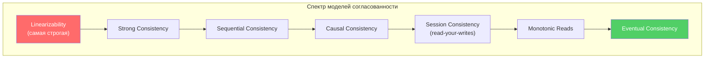

> **Что хочет услышать интервьюер**: не только определение, но и понимание, что согласованность — это *спектр*, а не бинарный выбор. Каждая модель — компромисс между latency, availability и correctness.


> [!mcq]
> - [ ] Все узлы в любой момент времени держат бит-в-бит идентичные данные без задержки | Это идеализация: даже синхронная репликация занимает RTT, а узлы не могут обновляться мгновенно одновременно. ❌ ПОСЛЕДСТВИЕ: при выборе СУБД на основе этого ожидания получаем 200ms+ p99 latency и SLA breach в multi-region deploy.
> - [x] Спектр гарантий видимости и порядка обновлений: компромисс между свежестью, доступностью и latency | Согласованность — не бинарный выбор «есть/нет», а семейство моделей (Linearizability → Sequential → Causal → Session → Eventual), каждая со своими гарантиями и стоимостью. ✓ ПРИМЕНЯТЬ: AWS DynamoDB предлагает strongly/eventually consistent reads per-request; Cassandra — tunable consistency через `CL=ONE/QUORUM/ALL`. 📋 ПРАВИЛО: «Consistency — это шкала, а не флажок». 🔗 См. Q7, Q31, Q32.
> - [ ] Свойство ACID-транзакции, означающее переход из одного валидного состояния в другое | Это `C` из ACID, относится к инвариантам схемы (FK, CHECK, NOT NULL), а не к видимости данных между узлами кластера. ❌ ПОСЛЕДСТВИЕ: путаница ACID-`C` и distributed-`C` приводит к неверной интерпретации CAP — кандидат не понимает, что CAP про репликацию, а не про триггеры.
> - [ ] Гарантия, что после записи каждое чтение возвращает свежее значение независимо от нагрузки | Это определение Linearizability — частный (самый строгий) случай согласованности, не вся концепция. ❌ ПОСЛЕДСТВИЕ: проектируя `Eventual` систему как «consistency = всегда свежо», получаем неправильные ожидания SLA — пользователь видит stale данные в Cassandra/S3, заведённый bug «не работает».

## Q2. (!) Что такое Strong Consistency?

**Strong Consistency** (строгая согласованность) — любое чтение после записи возвращает последнее записанное значение; все узлы видят одинаковое состояние. Достигается через синхронную репликацию, протоколы консенсуса (`Raft`, `Paxos`, `ZAB`) или распределённые транзакции.

Минусы: выше задержки (нужно дождаться подтверждения от кворума), при разделении сети возможна недоступность записи (CP в терминах CAP). Плюсы — простая модель для приложения: не нужно обрабатывать конфликты и устаревшие данные.

```java
// Пример: запись с кворумом (концептуально)
public class QuorumWriter {
    private final List<ReplicaClient> replicas;
    private final int quorumSize; // обычно N/2 + 1

    public void write(String key, String value) {
        int acks = 0;
        for (ReplicaClient replica : replicas) {
            try {
                replica.write(key, value);
                acks++;
            } catch (ReplicaUnavailableException e) {
                log.warn("Реплика {} недоступна", replica.id());
            }
        }
        if (acks < quorumSize) {
            throw new InsufficientReplicasException(
                "Получено " + acks + " подтверждений, нужно " + quorumSize);
        }
    }
}
```

**Где используется**: `etcd` (Raft), `ZooKeeper` (ZAB), `CockroachDB`, `Spanner` — финансы, инвентарь, критичные операции, где потеря записи недопустима.


> [!mcq]
> - [ ] Достигается через асинхронную репликацию `MASTER → SLAVE` с подтверждением одного узла | Это `Eventual Consistency`: master подтверждает запись локально, реплики догоняют асинхронно. Для strong нужно дождаться кворума ДО ответа клиенту. ❌ ПОСЛЕДСТВИЕ: проектировщик считает MySQL `async replication` строго согласованным, а на read-replica ловит stale reads и race conditions при failover.
> - [ ] Каждый узел кэширует данные локально и периодически инвалидирует кэш | Это описание кэширования с TTL, не модели согласованности — никаких гарантий о порядке между узлами и репликами. ❌ ПОСЛЕДСТВИЕ: реализуем «strong» через локальный Caffeine-cache + TTL=1s — два пользователя видят разные значения счётчика, лента дублирует сообщения.
> - [x] Любое чтение после записи возвращает последнее значение; обеспечивается синхронной репликацией через консенсус (Raft, Paxos) | Запись подтверждается клиенту только после согласования квoрумом узлов; читатель всегда видит самое свежее значение независимо от того, к какой реплике обратился. ✓ ПРИМЕНЯТЬ: `etcd`/`ZooKeeper` (Raft/ZAB), Google Spanner для финансовых транзакций, CockroachDB для строгой сериализуемости. 📋 ПРАВИЛО: «Strong = пишем кворумом, читаем свежее». 🔗 См. Q1, Q7, Q41.
> - [ ] Все записи идут на один master без репликации, чтения — оттуда же | Это single-node режим — нет распределённости вовсе, нет HA, master = SPOF. ❌ ПОСЛЕДСТВИЕ: называя single-node «Strong Consistency», получаем downtime при падении мастера и теряем данные между fsync-интервалами; в проде нет HA → 99.5% uptime вместо 99.99%.

## Q3. (!) Что такое Eventual Consistency?

**Eventual Consistency** (согласованность в конечном счёте) — если обновления прекратить, то со временем все реплики придут к одному состоянию. До этого момента чтения могут возвращать устаревшие данные. Обычно связана с асинхронной репликацией: запись подтверждается одним узлом, распространение на остальные идёт в фоне.

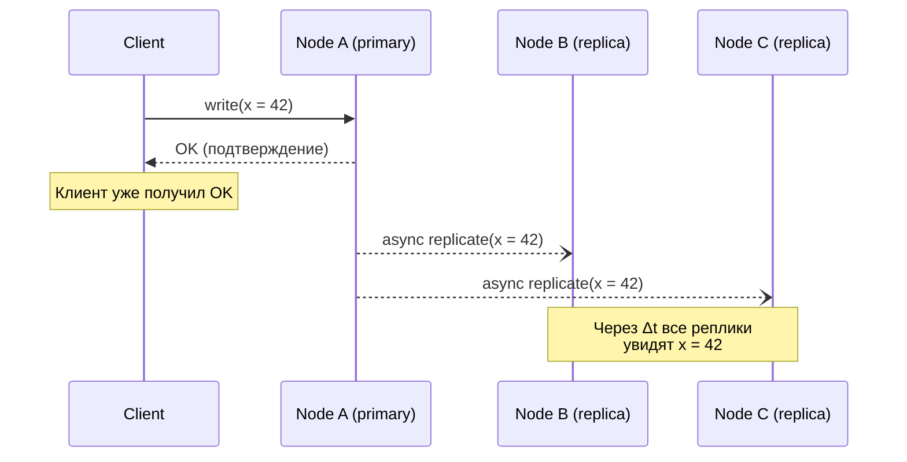

Даёт высокую доступность и масштабируемость (AP в CAP), но усложняет логику:
- Нужна стратегия разрешения конфликтов (`LWW`, `vector clocks`, `CRDT`)
- Обеспечение `read-your-writes` для UX
- Обработка `stale reads` в бизнес-логике

**Типично для**: `Cassandra`, `DynamoDB`, `S3`, кэшей, лент, счётчиков — везде, где допустима кратковременная рассинхронизация.


> [!mcq]
> - [ ] Все узлы видят записи в одинаковом порядке, но возможна задержка | Это `Sequential Consistency` — общий порядок есть, но без привязки к реальному времени. Eventual такого не гарантирует — порядок может различаться между репликами. ❌ ПОСЛЕДСТВИЕ: ожидая sequential, на Cassandra получаем разный порядок событий на узлах, лента ломается при cross-region failover.
> - [ ] Записи теряются, если узлы не синхронизировались за timeout | Eventual гарантирует сходимость БЕЗ потери: anti-entropy (read repair, hinted handoff, Merkle trees) подтянет данные. Потеря — это другое (durability fail). ❌ ПОСЛЕДСТВИЕ: не доверяем eventual системе и дублируем записи в S3 + DynamoDB → 2× стоимость, write amplification, без реальной защиты.
> - [ ] Чтения всегда возвращают свежее значение, но записи обрабатываются с задержкой | Перепутана семантика: eventual — наоборот, записи быстрые (один узел подтверждает), а чтения могут быть stale. ❌ ПОСЛЕДСТВИЕ: основываясь на этом понимании, ставим `read consistency = ALL` в Cassandra «для свежести» — кластер недоступен при падении любого узла, AP-преимущество потеряно.
> - [x] Если обновления прекратить, все реплики со временем сойдутся к одному состоянию; до этого чтения могут быть stale | Запись подтверждается одним узлом (низкая latency, AP), репликация идёт асинхронно. Гарантия — *convergence*, не порядок и не свежесть. ✓ ПРИМЕНЯТЬ: AWS S3, DynamoDB (eventually consistent reads), Cassandra `CL=ONE`, Redis async replication, DNS — всё BASE-системы. 📋 ПРАВИЛО: «Eventual = когда-нибудь сойдутся, не сейчас». 🔗 См. Q1, Q24, Q31.

## Q4. Что такое Causal Consistency?

**Causal Consistency** (причинная согласованность) — сохраняется порядок причинно связанных операций: если операция A повлияла на B (например, ответ на комментарий), то все узлы видят A до B. Несвязанные (concurrent) операции могут наблюдаться в разном порядке на разных узлах.

Реализуется через:
- **Векторные часы** — каждый узел поддерживает вектор версий
- **Lamport timestamps** — логические часы с упорядочением
- **Per-partition ordering** — например, в `Kafka` гарантируется порядок внутри партиции

```java
// Причинная зависимость: ответ на комментарий
// Комментарий A (timestamp: [Node1:1, Node2:0])
// Ответ B зависит от A (timestamp: [Node1:1, Node2:1])
// Causal consistency гарантирует: если видишь B, то обязательно видишь A

public class CausalMessage {
    private final String content;
    private final Map<String, Integer> vectorClock; // причинный контекст
    private final String dependsOn; // ID сообщения-родителя

    public boolean canDeliver(Map<String, Integer> localClock) {
        // Доставляем только если все зависимости уже применены
        return vectorClock.entrySet().stream()
            .allMatch(e -> localClock.getOrDefault(e.getKey(), 0) >= e.getValue());
    }
}
```

**Сильнее** `eventual` (гарантирует порядок причинно связанных событий), **слабее** `strong` (concurrent события могут быть в разном порядке). Удобна для лент, чатов, цепочек комментариев — `MongoDB` поддерживает causal sessions.


> [!mcq]
> - [x] Сохраняется порядок причинно связанных операций (happens-before): если A повлияла на B, все узлы видят A до B; concurrent операции — в любом порядке | Реализуется через `vector clocks`, `Lamport timestamps` или causal sessions. Сильнее `eventual` (есть happens-before гарантии), слабее `strong` (concurrent может быть в разном порядке). ✓ ПРИМЕНЯТЬ: MongoDB causal sessions через `causallyConsistent=true`, Riak vector clocks, COPS database — лента/чаты, где важен порядок в треде. 📋 ПРАВИЛО: «Сохраняем порядок причин, не порядок параллелей». 🔗 См. Q26, Q38, Q1.
> - [ ] Все узлы видят операции в одном глобальном порядке (total order) | Это `Sequential Consistency`, не causal — там нет «несвязанных» операций, всё упорядочено глобально. ❌ ПОСЛЕДСТВИЕ: ожидая total order на causal-системе, реализуем lock-free алгоритмы которые ломаются при concurrent updates → race condition в распределённом счётчике лайков.
> - [ ] Каждое чтение возвращает результат последней записи во всём кластере | Это `Linearizability` — самая строгая модель, требует консенсуса. Causal слабее, не требует кворума. ❌ ПОСЛЕДСТВИЕ: путаница с linearizability приводит к выбору `etcd` для лент чата вместо MongoDB causal — 10× латенси, кластер не масштабируется на multi-region.
> - [ ] Узлы синхронизируются только при чтении, иначе работают независимо | Это описание `Eventual` через read repair, но без гарантий happens-before — может прийти ответ B без A. ❌ ПОСЛЕДСТВИЕ: на eventual-системе строим систему комментариев — пользователь видит ответ на пост раньше самого поста, UI ломается.

## Q5. Что такое Session Consistency и Read-your-writes?

**Session Consistency** — в рамках одной сессии пользователь видит согласованную картину; разные сессии могут видеть разные версии. **Read-your-writes** — после своей записи пользователь при последующих чтениях всегда видит свои изменения; иначе после «Сохранить» пользователь мог бы увидеть старые данные.

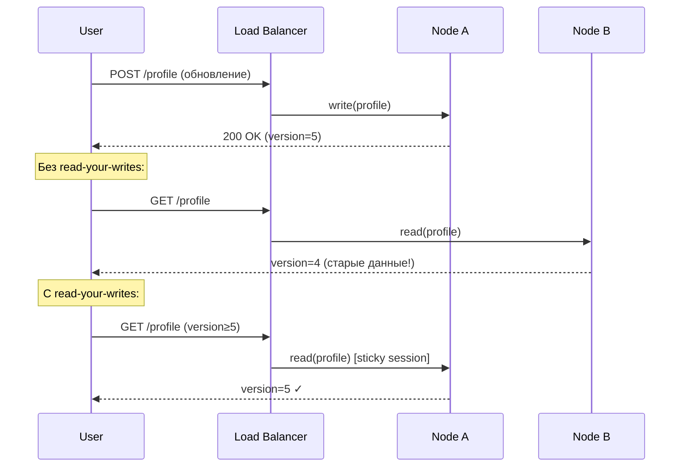

Способы реализации:
- **Sticky sessions** — привязка пользователя к узлу, принявшему запись
- **Version token** — клиент передаёт номер версии, сервер ждёт или перенаправляет
- **Кэш записей** — клиент кэширует свои изменения и мержит с ответом сервера


> [!mcq]
> - [ ] После записи ВСЕ пользователи в системе видят результат сразу | Это `Linearizability` (или strong consistency для всех клиентов), а не RYW. RYW — только для автора записи. ❌ ПОСЛЕДСТВИЕ: проектировщик ждёт от RYW глобальной видимости, реализует synchronous replication для всего кластера → 10× write latency, throughput падает.
> - [x] Автор записи в последующих чтениях своей сессии всегда видит свои изменения; другие клиенты могут видеть stale | Реализация: sticky sessions (привязка к узлу-приёмнику), version tokens (`X-Min-Version` header), client-side cache своих писем. ✓ ПРИМЕНЯТЬ: MongoDB causal sessions, AWS DynamoDB `ConsistentRead=true` после `PutItem`, Spring Cloud Gateway sticky cookie-affinity. 📋 ПРАВИЛО: «Своё пишу — своё вижу». 🔗 См. Q29, Q34, Q36.
> - [ ] Каждый узел кэширует все прошлые ответы для одного клиента | Это client-side cache, частный приём, но не определение модели. ❌ ПОСЛЕДСТВИЕ: реализуем «RYW» через ETag-кэш в браузере — пользователь видит свои данные после refresh страницы (cache miss), кэш не помогает в SPA на разных вкладках.
> - [ ] Все запросы пользователя обязательно идут на primary-узел | Это частный случай (read-from-primary), но не вся модель — есть version-token подход без принудительного primary read. ❌ ПОСЛЕДСТВИЕ: всегда читаем с primary → нагрузка на master растёт линейно с RPS, реплики простаивают, нет масштабирования read-throughput.

## Q6. Что такое Monotonic Reads и Monotonic Writes?

**Monotonic Reads** — если клиент прочитал значение версии N, последующие чтения не вернут версию старше N. Без этой гарантии возможен «откат во времени»: первое чтение вернуло свежие данные с быстрой реплики, второе — устаревшие с медленной.

**Monotonic Writes** — записи одного клиента применяются на всех репликах в том порядке, в котором были выполнены. Без этой гарантии возможны аномалии: `SET balance = 100`, затем `SET balance = balance - 30` — если вторая запись применится раньше первой на какой-то реплике, результат будет некорректным.

```java
// Реализация monotonic reads через version tracking
public class MonotonicReadClient {
    private final Map<String, Long> lastSeenVersion = new ConcurrentHashMap<>();

    public <T> T read(String key, List<ReplicaClient> replicas) {
        long minVersion = lastSeenVersion.getOrDefault(key, 0L);

        for (ReplicaClient replica : replicas) {
            VersionedValue<T> result = replica.read(key);
            if (result.version() >= minVersion) {
                lastSeenVersion.put(key, result.version());
                return result.value();
            }
        }
        throw new ConsistencyException(
            "Ни одна реплика не имеет версии >= " + minVersion);
    }
}
```

**Практика**: `DynamoDB` и `Cassandra` с `QUORUM` read дают monotonic reads. Для однопользовательских сценариев достаточно sticky sessions.


> [!mcq]
> - [ ] Чтение всегда возвращает самое свежее значение из всего кластера | Это `Linearizability`, более строгая модель. Monotonic reads допускают stale данные, но запрещают «откат во времени». ❌ ПОСЛЕДСТВИЕ: ожидая linearizability от monotonic reads, инженер строит финансовый дашборд на DynamoDB `consistent reads=false` — баланс «прыгает» в обе стороны при rebalancing.
> - [ ] Чтения и записи всегда упорядочены глобально по timestamp | Это `Sequential/Strong Consistency`. Monotonic — лишь *non-decreasing* для одного клиента, без глобального порядка. ❌ ПОСЛЕДСТВИЕ: рассчитываем на global ordering на eventual+monotonic системе, получаем баг с кросс-пользовательскими сообщениями в чате — порядок между пользователями произволен.
> - [x] Если клиент прочитал версию N, последующие чтения не вернут версию старше N; записи одного клиента применяются на репликах в порядке выполнения | Без monotonic reads возможен «откат во времени»: первое чтение с быстрой реплики (свежее), второе со старой (stale). Достигается через session-tracking, sticky sessions, или version pinning. ✓ ПРИМЕНЯТЬ: DynamoDB / Cassandra с `QUORUM` read дают monotonic; MongoDB causal sessions; HTTP `If-Modified-Since` для пагинации. 📋 ПРАВИЛО: «Время не идёт назад в одной сессии». 🔗 См. Q5, Q37.
> - [ ] Все реплики содержат идентичные данные в любой момент | Это идеализация Strong Consistency — нереализуема физически из-за RTT. Monotonic — слабее, относится к одной клиентской сессии. ❌ ПОСЛЕДСТВИЕ: ставим равенство реплик условием для read-replica routing — при отставании реплики пользователю сыпятся 503 ошибки.

## Q7. (!) Что такое Linearizability и чем отличается от Serializability?

**Linearizability** — формальное свойство: каждая операция выглядит как мгновенная (атомарная) в некоторой точке между началом и завершением. Все операции образуют линейный порядок, совместимый с реальным временем. Любое чтение видит эффект последней завершённой записи.

**Serializability** — транзакционное свойство: результат выполнения параллельных транзакций эквивалентен *какому-то* последовательному выполнению. Не требует соответствия реальному времени — только существования допустимого порядка.

| Свойство | `Linearizability` | `Serializability` |
|----------|-------------------|-------------------|
| Область | Одна операция / один объект | Группа операций (транзакция) |
| Реальное время | Учитывает | Не требует |
| Пример | `etcd`, `ZooKeeper` | PostgreSQL `SERIALIZABLE` |
| Комбинация | `Strict Serializability` = оба свойства одновременно |

**Strict Serializability** (строгая сериализуемость) — комбинация обоих: транзакции и линеаризуемы, и сериализуемы. Даёт `CockroachDB`, `Spanner`. Самая дорогая гарантия, но и самая простая для программиста.

> **На собеседовании**: linearizability — про *одну* операцию и реальное время, serializability — про *группы* операций и логический порядок. Путаница между ними — частая ошибка кандидатов.


> [!mcq]
> - [ ] Это синонимы: оба гарантируют, что транзакции выполняются в каком-то последовательном порядке | Принципиально разные свойства: linearizability про *одну* операцию + реальное время, serializability про *группу* операций без привязки ко времени. ❌ ПОСЛЕДСТВИЕ: интервьюер ставит минус кандидату, который путает их при обсуждении CockroachDB / Spanner и `SERIALIZABLE` isolation в PostgreSQL.
> - [ ] Linearizability — про транзакции, Serializability — про одну операцию | Перевёрнуто: linearizability — single-object/single-operation; serializability — multi-object/multi-operation (transaction). ❌ ПОСЛЕДСТВИЕ: при выборе уровня изоляции в PostgreSQL запрашиваем `LINEARIZABLE` (которого нет в SQL) → команда годами думает, что `READ COMMITTED` достаточно для финансовых переводов, money lost через write skew.
> - [ ] Linearizability сильнее, потому что включает в себя Serializability | Это не корректное вложение: они независимы. Strong combination — `Strict Serializability` (linearizability + serializability одновременно), которую дают Spanner и CockroachDB. ❌ ПОСЛЕДСТВИЕ: ожидая что Linearizable БД (etcd) даёт serializable transactions для multi-key операций — ловим аномалии при batch update нескольких ключей в etcd.
> - [x] Linearizability — single-object operation выглядит мгновенной в реальном времени; Serializability — set of transactions эквивалентен какому-то последовательному выполнению (не обязательно по времени) | Linearizability про atomic visibility одной записи (etcd, ZooKeeper). Serializability про корректность параллельных транзакций (`PostgreSQL SERIALIZABLE`). `Strict Serializability = Linearizability + Serializability` (Spanner, CockroachDB). ✓ ПРИМЕНЯТЬ: etcd/ZooKeeper для leader election (linearizability достаточно), PostgreSQL `SERIALIZABLE` для банковских переводов, Spanner для глобальных финансовых транзакций. 📋 ПРАВИЛО: «Linearizability про атомарность во времени, Serializability про порядок транзакций». 🔗 См. Q35, Q39.

## Q8. Как выбрать модель согласованности для конкретного сценария?

Выбор модели зависит от бизнес-требований, допустимой задержки и последствий рассинхронизации:

| Сценарий | Модель | Почему |
|----------|--------|--------|
| Банковский перевод | `Strong` / `Linearizable` | Потеря транзакции = потеря денег |
| Остатки на складе | `Strong` для резервирования | Overselling недопустим |
| Лента новостей | `Eventual` | Задержка в секунды приемлема |
| Чат / комментарии | `Causal` | Важен порядок в треде, но не глобально |
| Профиль пользователя | `Session` / `Read-your-writes` | Пользователь должен видеть свои правки |
| Счётчик лайков | `Eventual` | Точное значение не критично в реальном времени |
| Корзина покупок | `Session` + `Eventual` | Свои действия видны сразу, чужие — eventual |

**Правило**: начинай с самой слабой модели, которая удовлетворяет бизнес-требованиям. Усиливай только там, где это действительно нужно. Сильная согласованность всегда дороже по latency и availability.


> [!mcq]
> - [x] Начинать со слабейшей модели, удовлетворяющей бизнес-требованию: усиливать только там где stale данные приведут к убытку | Strong для денег и инвентаря (overselling = убытки), Causal для лент/чатов (важен порядок в треде), Session для профиля, Eventual для счётчиков лайков. Каждое усиление — рост latency и снижение availability. ✓ ПРИМЕНЯТЬ: Amazon e-commerce (DynamoDB strong для checkout, eventual для рекомендаций), Netflix (Cassandra eventual для viewing history), Uber (Spanner для платежей). 📋 ПРАВИЛО: «Самая слабая модель, что не сломает бизнес». 🔗 См. Q30, Q31, Q33.
> - [ ] Всегда выбирать Strong Consistency — она покрывает все случаи и проще в разработке | Strong везде = убитая latency и availability на ровном месте. Лента новостей не требует strong, а под нагрузкой ляжет первой. ❌ ПОСЛЕДСТВИЕ: ставим `SERIALIZABLE` на все таблицы PostgreSQL — на 5K RPS появляются `serialization_failure` errors каждый second, throughput падает в 10×.
> - [ ] Использовать Eventual везде, где нет явных финансовых операций | Eventual для счётчика остатка товара = overselling, refund-ы и репутационные потери. Не всё, что не «деньги», переносит eventual. ❌ ПОСЛЕДСТВИЕ: интернет-магазин на Cassandra `CL=ONE` для inventory — продаёт 100 единиц последнего товара, разгребает 99 refund-ов; убытки на shipping + customer support.
> - [ ] Опираться на популярность БД в команде, не на бизнес-требования | Технологический выбор подмена бизнес-анализа: команда знает MongoDB → используем для платежей без понимания eventual reads. ❌ ПОСЛЕДСТВИЕ: stripe-like процессинг на eventual MongoDB читает «ещё не зафиксированный» баланс при retry → double-charge клиента, chargeback storm, потеря processor licence.

## Q9. (!) Что такое Two-Phase Commit (2PC)?

**Two-Phase Commit (2PC)** — протокол распределённой транзакции, гарантирующий атомарность: либо все участники фиксируют, либо все откатывают.

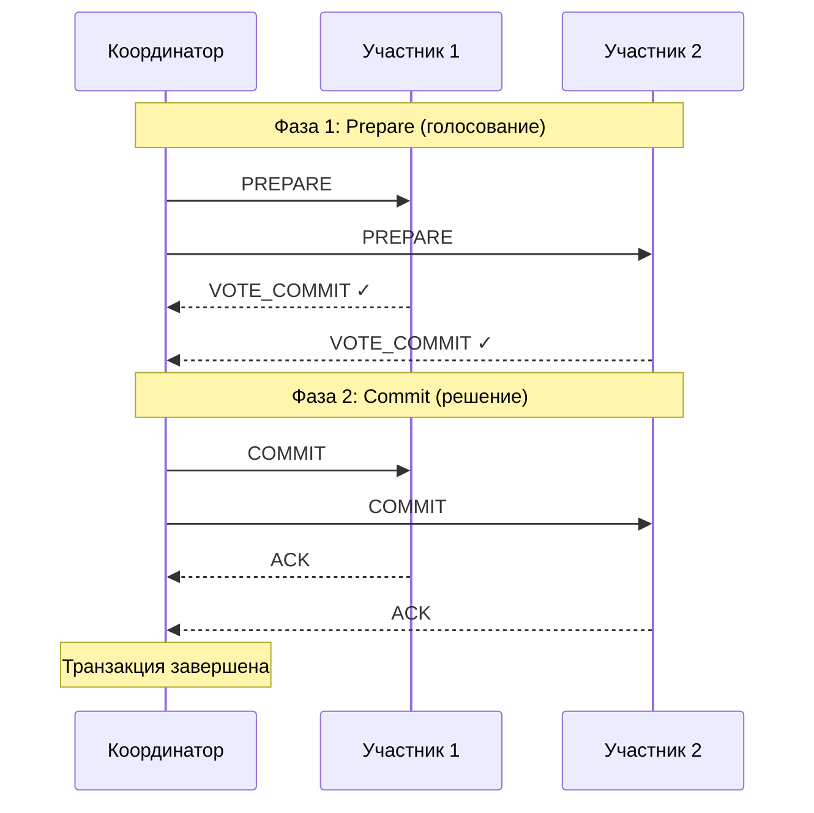

```java
// Реализация координатора 2PC (упрощённо)
public class TwoPhaseCommitCoordinator {
    private final List<Participant> participants;

    @Transactional
    public void execute(DistributedTransaction tx) {
        String txId = UUID.randomUUID().toString();

        // Фаза 1: Prepare
        List<Vote> votes = participants.stream()
            .map(p -> p.prepare(txId, tx))
            .toList();

        boolean allReady = votes.stream()
            .allMatch(v -> v == Vote.COMMIT);

        // Фаза 2: Commit или Abort
        if (allReady) {
            participants.forEach(p -> p.commit(txId));
            log.info("Транзакция {} зафиксирована", txId);
        } else {
            participants.forEach(p -> p.abort(txId));
            log.warn("Транзакция {} откачена", txId);
        }
    }
}
```

**Проблемы 2PC**:
- **Блокировка** — участники держат локи от `PREPARE` до получения решения
- **Единая точка отказа** — падение координатора между `PREPARE` и `COMMIT` оставляет участников в неопределённости
- **Не масштабируется** — блокировки на время сетевых задержек снижают throughput

**Используется**: `XA`-транзакции (`JTA`), `PostgreSQL` prepared transactions, внутрикластерная координация.


> [!mcq]
> - [ ] Координатор сразу шлёт `COMMIT` всем участникам и ждёт `ACK` — фаза `PREPARE` не нужна, если участники надёжны | Без `PREPARE` нет голосования: один участник падает на `COMMIT`, другие уже зафиксировали — атомарность нарушена. ❌ ПОСЛЕДСТВИЕ: «упрощённый 2PC» в платёжном шлюзе → списали с карты, заказ не создался; ручные refund-ы и chargeback storm.
> - [x] Двухфазный протокол: фаза `PREPARE` (голосование участников) → если все `VOTE_COMMIT`, координатор рассылает `COMMIT`, иначе `ABORT`; гарантирует атомарность через блокировки от `PREPARE` до решения | Все участники держат локи на ресурсах между фазами; при падении координатора между `PREPARE` и `COMMIT` участники остаются в `in-doubt` состоянии до восстановления координатора. ✓ ПРИМЕНЯТЬ: `XA`-транзакции через `JTA`/Atomikos, `PostgreSQL` `PREPARE TRANSACTION`/`COMMIT PREPARED`, MySQL XA для multi-shard write. 📋 ПРАВИЛО: «PREPARE — голос, COMMIT — указ; молчит координатор → лочит участник». 🔗 См. Q10, Q11, Q12.
> - [ ] Каждый участник самостоятельно решает commit/abort по таймеру; координатор только агрегирует результаты | Это leaderless подход без атомарности: участники могут решить разное, нет общего исхода. ❌ ПОСЛЕДСТВИЕ: «autonomous commit» в multi-DB операции — `inventory` зафиксировал списание, `payments` сделал rollback по timeout, инвентарь ушёл в минус.
> - [ ] Это асинхронный протокол: координатор не ждёт ответа участников и продолжает работать | 2PC по определению блокирующий, координатор обязан дождаться всех голосов до решения. Асинхронный аналог — это Saga, не 2PC. ❌ ПОСЛЕДСТВИЕ: putая 2PC и Saga в DAR, выбираем XA-транзакции для микросервисов с разными БД — кластер виснет на network jitter, throughput падает в 5×.

## Q10. Чем Three-Phase Commit отличается от 2PC?

**Three-Phase Commit (3PC)** добавляет фазу `PreCommit` между `Prepare` и `Commit`:

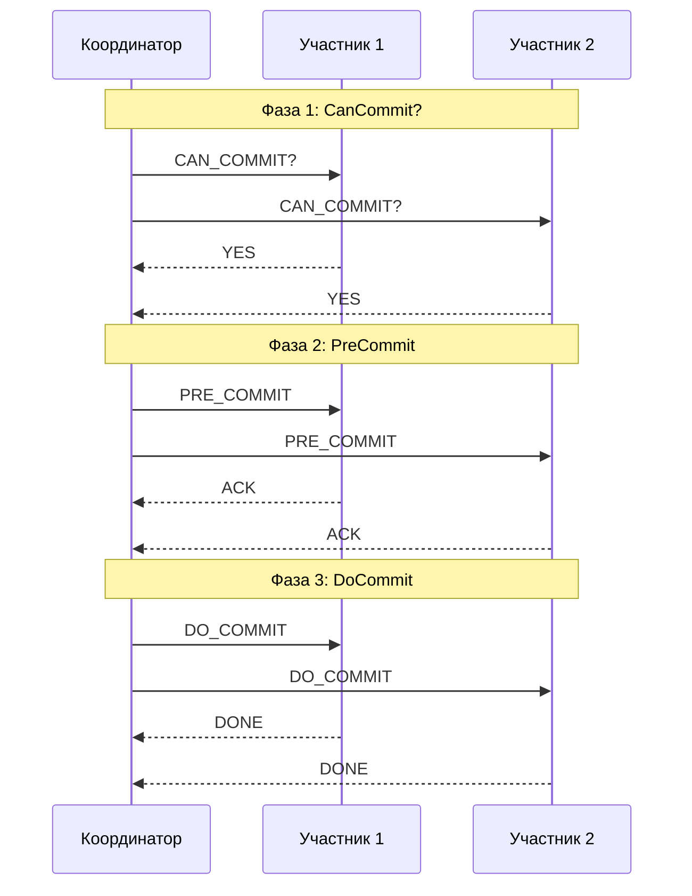

**Ключевое отличие**: после `PreCommit` участники знают, что все проголосовали «за». Если координатор пропадает, участники могут самостоятельно зафиксировать транзакцию по таймауту — это уменьшает окно блокировки.

**На практике 3PC редко используют**: при сетевом разделении (partition) всё равно возможна неопределённость — часть узлов в одной партиции зафиксирует, часть в другой откатит. Сложность выше, а гарантии при реальных сбоях не намного лучше. Чаще применяют `Saga` или `eventual consistency`.


> [!mcq]
> - [ ] 3PC даёт строгую атомарность даже при произвольных сетевых разделениях, в отличие от 2PC | Ложно: при partition 3PC всё ещё может разойтись (часть узлов commit по таймеру, часть abort), просто окно блокировки меньше. ❌ ПОСЛЕДСТВИЕ: команда выбирает 3PC «потому что атомарнее» для multi-DC платежей, при network split получает duplicate payments — 3PC от этого не защищает.
> - [ ] 3PC использует асинхронные сообщения, а 2PC — только синхронные | Оба протокола request/response: разница в количестве фаз, а не в синхронности. ❌ ПОСЛЕДСТВИЕ: ожидая «асинхронность» от 3PC, проектируем event-driven систему — упираемся в блокировки на `PreCommit` и теряем все преимущества месседжинга.
> - [x] Добавляет фазу `PreCommit` между `Prepare` и `Commit`: участники узнают о решении до commit и могут самостоятельно завершить транзакцию по таймауту, если координатор пропал | Уменьшает окно блокировки и спасает от единичного отказа координатора, но при network partition по-прежнему возможны расхождения; на практике редко используется (Saga и `eventual` применяются чаще). ✓ ПРИМЕНЯТЬ: упомянуть на собеседовании как академический ответ; реальные системы (Spanner, CockroachDB) используют Paxos/Raft вместо 3PC. 📋 ПРАВИЛО: «PreCommit = фаза «уже всё хорошо», но split-brain не лечит». 🔗 См. Q9, Q12, Q13.
> - [ ] Это полностью неблокирующий протокол без локов | Даже 3PC держит локи на ресурсах от `Prepare` до `DoCommit` — иначе concurrent транзакции сломают данные. Неблокирующих distributed-транзакций без trade-off не существует. ❌ ПОСЛЕДСТВИЕ: «выбрали 3PC потому что без локов» в высоконагруженной БД — выясняется на нагрузке, что lock contention тот же, рефакторинг на Saga в авральном режиме.

## Q11. Что такое TCC (Try-Confirm/Cancel)?

**TCC** (Try-Confirm/Cancel) — паттерн распределённой транзакции, где каждый участник реализует три операции:

- **Try** — резервирует ресурсы, проверяет бизнес-правила, но не фиксирует
- **Confirm** — подтверждает резервацию, делая её постоянной
- **Cancel** — отменяет резервацию, освобождает ресурсы

```java
// TCC-интерфейс для сервиса инвентаря
public interface InventoryTccService {

    /** Try: резервируем товар, но не списываем */
    ReservationId tryReserve(String productId, int quantity);

    /** Confirm: подтверждаем резервацию → товар списан */
    void confirmReserve(ReservationId reservationId);

    /** Cancel: отменяем резервацию → товар возвращён в наличие */
    void cancelReserve(ReservationId reservationId);
}

// Координатор TCC-транзакции
public class TccCoordinator {
    public void placeOrder(Order order) {
        // Фаза Try
        ReservationId inventoryRes = inventoryService.tryReserve(
            order.productId(), order.quantity());
        PaymentHoldId paymentHold = paymentService.tryHold(
            order.userId(), order.amount());

        try {
            // Фаза Confirm
            inventoryService.confirmReserve(inventoryRes);
            paymentService.confirmHold(paymentHold);
        } catch (Exception e) {
            // Фаза Cancel
            inventoryService.cancelReserve(inventoryRes);
            paymentService.cancelHold(paymentHold);
            throw new OrderFailedException("Не удалось подтвердить заказ", e);
        }
    }
}
```

**Отличия от `Saga`**: `TCC` резервирует ресурсы на фазе `Try` (не фиксирует), поэтому нет видимых промежуточных состояний. `Saga` фиксирует каждый шаг и откатывает компенсациями. `TCC` ближе к `2PC` по семантике, но без глобальных блокировок БД.


> [!mcq]
> - [x] Three-step протокол: `Try` (резервирует ресурс без коммита) → `Confirm` (фиксирует резерв) → `Cancel` (отменяет резерв при ошибке); семантика близка к 2PC, но без глобальных локов БД | Каждый сервис реализует три эндпойнта с идемпотентностью; на `Try` ресурс помечен как «зарезервированный» (`HOLD`), но не списан; промежуточные состояния не видны соседям. ✓ ПРИМЕНЯТЬ: Seata TCC mode в Alibaba для распределённых платежей, hold-резервы на банковских картах перед confirm, Booking.com inventory holds. 📋 ПРАВИЛО: «Try резервирует, Confirm коммитит, Cancel отпускает». 🔗 См. Q9, Q12, Q13.
> - [ ] TCC и Saga — синонимы: оба используют компенсации после commit | Разная семантика: Saga фиксирует каждый шаг и компенсирует, TCC резервирует на `Try` и подтверждает на `Confirm`; промежуточные состояния не видны другим транзакциям. ❌ ПОСЛЕДСТВИЕ: в DAR пишем «TCC = Saga», команда реализует Saga и удивляется, почему `intermediate state` корзины виден другим пользователям, бронь дублируется.
> - [ ] TCC требует глобальный лок БД на всё время от `Try` до `Confirm` | Наоборот: TCC именно потому популярен, что использует бизнес-уровневое резервирование (поле `status=HOLD`) вместо row-locks в БД. ❌ ПОСЛЕДСТВИЕ: реализуя TCC через `SELECT FOR UPDATE` на всю операцию — БД виснет на длинных транзакциях, deadlock на checkout flow в час пик.
> - [ ] `Cancel` вызывается только по ручной команде администратора | Cancel — автоматическая компенсация координатора при сбое любого `Try`/`Confirm`; ручной mode сводит надёжность TCC на нет. ❌ ПОСЛЕДСТВИЕ: «cancel только вручную» → при сбое payment-сервиса инвентарь висит в `HOLD` сутками, реальные товары не доступны для продажи, lost revenue.

## Q12. (!) Когда выбирать 2PC, а когда Saga?

| Критерий | `2PC` | `Saga` |
|----------|-------|--------|
| Участники | Однородные (одна БД / XA) | Разнородные сервисы |
| Длительность | Короткие операции (мс) | Долгие процессы (секунды–минуты) |
| Блокировки | Глобальные локи | Нет глобальных локов |
| Изоляция | Полная (ACID) | Видимы промежуточные состояния |
| Отказоустойчивость | Координатор = SPOF | Компенсации при сбоях |
| Масштабируемость | Плохая (блокировки) | Хорошая |
| Сложность | Низкая (если есть XA) | Высокая (компенсации, идемпотентность) |

**Используйте 2PC**, когда: операции в пределах одного кластера БД, нужна строгая атомарность, длительность транзакции — миллисекунды.

**Используйте Saga**, когда: микросервисы с разными БД, операции могут быть долгими, глобальные блокировки недопустимы, можно обработать промежуточные состояния.


> [!mcq]
> - [ ] 2PC всегда лучше: даёт ACID-гарантии, поэтому подходит для микросервисов | 2PC требует синхронной координации и глобальных локов — на 50+ микросервисах с разными БД и SLA это убивает throughput и доступность. ❌ ПОСЛЕДСТВИЕ: ставим Atomikos поверх 12 микросервисов — кластер виснет на сетевых задержках, p99 latency 10s, регулярные in-doubt транзакции после рестарта.
> - [ ] Saga подходит везде, 2PC — устаревший протокол, его не используют | 2PC жив в банковских ядрах, XA-транзакциях между БД, prepared transactions PostgreSQL — там, где участники однородны и операции коротки. ❌ ПОСЛЕДСТВИЕ: «2PC устарел» → переписываем core-banking на Saga, ловим double-debit в edge cases компенсаций (lost compensation message), регуляторное расследование.
> - [x] 2PC — для коротких операций (мс) в пределах кластера/одной БД с однородными участниками; Saga — для долгих бизнес-процессов (секунды-минуты) между разнородными микросервисами с независимыми БД | Критерии: длительность транзакции, количество участников, допустимость глобальных локов, наличие XA-драйверов; видимость промежуточных состояний — отдельный вопрос изоляции. ✓ ПРИМЕНЯТЬ: 2PC для multi-shard PostgreSQL операций; Saga для checkout-flow в Wolt/Booking.com (order → inventory → payment → delivery). 📋 ПРАВИЛО: «2PC для миллисекунд в одной семье, Saga для минут в зоопарке». 🔗 См. Q9, Q11, Q13.
> - [ ] Выбор зависит исключительно от размера команды разработки | Технический выбор подмена менеджментом: ни 2PC, ни Saga не зависят от размера команды, только от характеристик операций и инфраструктуры. ❌ ПОСЛЕДСТВИЕ: «у нас 50 разработчиков, поэтому Saga» — внутри одной БД на одном сервисе ставят Saga вместо локальной транзакции, получают eventual consistency на ровном месте.

## Q13. (!) Что такое Saga и когда его используют?

**Saga** — паттерн управления распределёнными транзакциями без глобальных блокировок. Длинная бизнес-операция разбивается на шаги (локальные транзакции) в разных сервисах. У каждого шага есть **компенсирующая транзакция** — обратное действие для отката. При сбое компенсации выполняются в обратном порядке.

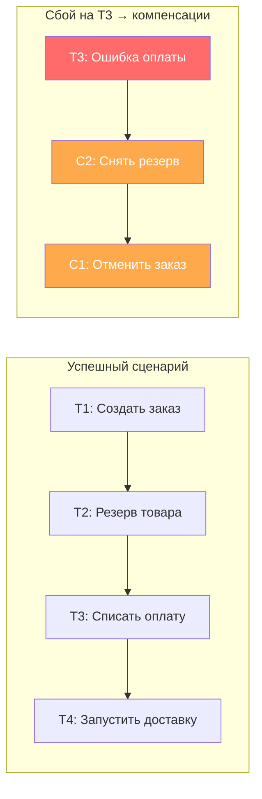

```java
// Определение шагов Saga (Spring-подобный подход)
public class OrderSagaDefinition {

    public SagaDefinition<OrderSagaData> define() {
        return SagaDefinition.<OrderSagaData>builder()
            .step()
                .invokeParticipant(this::createOrder)
                .withCompensation(this::cancelOrder)
            .step()
                .invokeParticipant(this::reserveInventory)
                .withCompensation(this::releaseInventory)
            .step()
                .invokeParticipant(this::processPayment)
                .withCompensation(this::refundPayment)
            .step()
                .invokeParticipant(this::arrangeDelivery)
                // Последний шаг — компенсация не нужна (pivot transaction)
            .build();
    }

    private CommandMessage createOrder(OrderSagaData data) {
        return new CreateOrderCommand(data.getOrderId(), data.getItems());
    }

    private CommandMessage cancelOrder(OrderSagaData data) {
        return new CancelOrderCommand(data.getOrderId());
    }
    // ... остальные методы
}
```

**Ключевые требования**:
- Компенсации должны быть **идемпотентными** — повторный вызов безопасен
- Компенсации должны быть **коммутативными** — порядок не важен при параллельном откате
- Нужна **персистентность состояния** Saga — чтобы пережить рестарт


> [!mcq]
> - [ ] Распределённая транзакция, обеспечивающая `ACID`-изоляцию между микросервисами через 2PC | Saga намеренно отказывается от глобальной изоляции: каждый шаг — локальная транзакция, видимая другим до завершения всего процесса. ❌ ПОСЛЕДСТВИЕ: ожидая ACID от Saga, не реализуем `semantic locks` для inventory — два пользователя резервируют последний товар, второй получает `OutOfStockException` после оплаты, refund storm.
> - [x] Длинная бизнес-операция, разбитая на последовательность локальных транзакций в разных сервисах с компенсирующей транзакцией для каждого шага; при сбое компенсации выполняются в обратном порядке | Применяется в микросервисах с независимыми БД, длительности секунды-минуты. Компенсации обязаны быть идемпотентными и коммутативными; нужна персистентность state машины Saga (рестарт). ✓ ПРИМЕНЯТЬ: Wolt order pipeline (create → reserve → charge → dispatch с компенсациями), Axon Saga, Camunda BPMN, AWS Step Functions для долгих workflows. 📋 ПРАВИЛО: «Локальный коммит + обратный шаг = Saga». 🔗 См. Q14, Q15, Q16.
> - [ ] Паттерн оркестрации запросов через API Gateway без записи состояния | Это API composition, не Saga: нет компенсаций, нет долгого state, нет управления распределёнными изменениями. ❌ ПОСЛЕДСТВИЕ: называем chain-of-HTTP-calls «сагой» — при падении 3-го шага не откатываем 1-й и 2-й, остаются orphan-данные в нескольких БД, требующие ручного reconciliation.
> - [ ] Способ горизонтального шардирования через распределение запросов между сервисами | Перепутано с шардированием: Saga управляет распределённой бизнес-логикой, не распределением данных. ❌ ПОСЛЕДСТВИЕ: путая Saga с шардингом, проектировщик ставит «Saga» на каждый read-запрос — overhead state-машины на простых GET, latency p99 растёт втрое.

## Q14. (!) Чем отличается оркестрация от хореографии в Saga?

**Оркестрация** — центральный координатор (orchestrator) управляет порядком шагов, отправляя команды участникам и обрабатывая ответы:

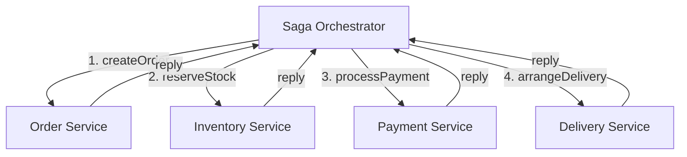

**Хореография** — сервисы общаются через события, каждый реагирует на события других:

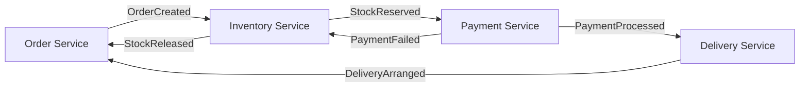

| Критерий | Оркестрация | Хореография |
|----------|------------|-------------|
| Управление | Центральный координатор | Децентрализованное |
| Связанность | Координатор знает о всех шагах | Сервисы знают только о соседних событиях |
| Сложность логики | Сосредоточена в одном месте | Размазана по сервисам |
| Отладка | Проще (одна точка наблюдения) | Сложнее (distributed tracing) |
| SPOF | Координатор (нужен HA) | Нет единой точки отказа |
| Масштаб | До ~10 шагов удобно | Для 3-5 шагов проще |

**Практика**: для сложных бизнес-процессов (заказ, возврат) чаще используют **оркестрацию** — легче контролировать и отлаживать. Хореографию — для простых цепочек из 2-3 сервисов.


> [!mcq]
> - [x] Оркестрация — центральный `orchestrator` рассылает команды участникам и обрабатывает ответы (одна точка наблюдения, легче отлаживать); хореография — сервисы общаются через события, каждый реагирует на event соседа (нет SPOF, но distributed tracing обязателен) | Оркестрация удобна для 5+ шагов сложного процесса (заказ, возврат); хореография проще для 2-3 шагов с слабой связностью; на практике гибрид. ✓ ПРИМЕНЯТЬ: Camunda/Axon orchestrator для checkout, Kafka choreography для notifications fan-out в Netflix. 📋 ПРАВИЛО: «Дирижёр vs хор: 5+ шагов — дирижёр, 3 — хор». 🔗 См. Q13, Q15, Q16.
> - [ ] Оркестрация — событийная модель без координатора, хореография — централизованный диспетчер | Перепутаны определения: оркестрация = центральный orchestrator, хореография = реактивные события без центрального узла. ❌ ПОСЛЕДСТВИЕ: проектируем «оркестрацию через Kafka events без координатора», команда теряет видимость порядка шагов, отладка failure через grep по логам сервисов.
> - [ ] Оркестрация требует синхронных HTTP-вызовов, хореография — только асинхронных | Оркестратор тоже может работать через очереди (command-bus); протокол транспорта (HTTP/AMQP/Kafka) не определяет стиль координации. ❌ ПОСЛЕДСТВИЕ: «оркестрация = синхронно» приводит к timeout-ам на 30-секундных шагах Saga, orchestrator валится с `RestTemplate timeout`, рестарт ломает Saga.
> - [ ] Хореография всегда быстрее, поэтому всегда предпочтительнее | Скорость зависит от транспорта, а не стиля координации; хореография усложняет отладку и нет общего места для бизнес-логики. ❌ ПОСЛЕДСТВИЕ: 12-шаговая checkout-сага на хореографии — никто не знает, на каком шаге зависла, добавить новый шаг = править 5 сервисов, dev-velocity падает.

## Q15. Как обеспечить идемпотентность компенсирующих транзакций в Saga?

Компенсация может вызываться повторно (сбой сети, retry) — она **обязана** быть идемпотентной.

```java
@Service
public class PaymentCompensationService {

    @Transactional
    public void refundPayment(String sagaId, String paymentId) {
        // 1. Проверяем: не обработана ли уже эта компенсация?
        if (compensationLogRepository.existsBySagaIdAndAction(sagaId, "REFUND")) {
            log.info("Компенсация REFUND для saga {} уже выполнена, пропускаем", sagaId);
            return; // идемпотентность!
        }

        // 2. Выполняем возврат
        paymentGateway.refund(paymentId);

        // 3. Фиксируем факт компенсации
        compensationLogRepository.save(new CompensationLog(
            sagaId, "REFUND", paymentId, Instant.now()));
    }
}
```

**Приёмы обеспечения идемпотентности**:
- **Idempotency key** — уникальный ключ операции; повторный вызов с тем же ключом = no-op
- **Журнал компенсаций** — таблица processed_compensations; проверяем перед выполнением
- **Статусная модель** — заказ в статусе `CANCELLED` нельзя отменить повторно
- **Conditional updates** — `UPDATE ... WHERE status = 'RESERVED'` не сработает, если уже `RELEASED`


> [!mcq]
> - [ ] Достаточно повторно вызывать компенсацию — БД сама разберётся, что данные уже откачены | Без guard-условия повторный `refund` спишет деньги дважды; компенсации делают мутацию состояния, нет автоматической защиты от повторов. ❌ ПОСЛЕДСТВИЕ: retry компенсации `refund` на flaky network → клиенту возвращают деньги дважды, balance уходит в минус, банк-процессор блокирует merchant account.
> - [ ] Идемпотентность компенсаций нельзя гарантировать в распределённой системе | Можно и нужно: idempotency key + журнал выполненных компенсаций + status-машина агрегата. ❌ ПОСЛЕДСТВИЕ: «нельзя сделать идемпотентность» → пишут «at-most-once» компенсации без журнала, при network partition orchestrator не может убедиться что compensate выполнен, остаются orphan inventory holds.
> - [ ] Достаточно `synchronized`-блока на методе компенсации | `synchronized` работает только в пределах JVM; Saga распределена, второй pod orchestrator всё равно вызовет compensate параллельно. ❌ ПОСЛЕДСТВИЕ: `synchronized` на compensate в k8s deployment с replicas=3 — повторные refund при rolling restart, audit показывает duplicate transactions, регуляторное расследование.
> - [x] Через `idempotency key` в request, журнал выполненных компенсаций (`compensation_log` с `(saga_id, action)`), conditional updates (`UPDATE ... WHERE status='RESERVED'`) и status-машину агрегата | На входе compensate проверяем `existsBySagaIdAndAction`, выполняем мутацию, фиксируем факт в журнале — повторный вызов читает журнал и no-op'ит. ✓ ПРИМЕНЯТЬ: Stripe Idempotency-Key header (24h retention), Axon `@SagaEventHandler` с deduplication, Spring Retry + outbox-marker. 📋 ПРАВИЛО: «Журнал + status-check = повтор без вреда». 🔗 См. Q13, Q14, Q17.

## Q16. Какие проблемы возникают с изоляцией в Saga?

В отличие от `2PC`, `Saga` не обеспечивает глобальную изоляцию — промежуточные состояния видны другим транзакциям. Это порождает аномалии:

| Аномалия | Описание | Решение |
|----------|----------|---------|
| **Lost updates** | Параллельная Saga перезаписывает изменения | Optimistic locking (версионность) |
| **Dirty reads** | Чтение промежуточного состояния, которое будет откачено | Semantic locks, статусы (`PENDING`) |
| **Non-repeatable reads** | Повторное чтение даёт другой результат | Версионирование данных |

**Countermeasures** (контрмеры по книге Chris Richardson):

1. **Semantic lock** — помечаем ресурс как «в процессе» (`ORDER_PENDING`), другие Saga ждут или отклоняются
2. **Commutative updates** — операции коммутативны (увеличить/уменьшить счётчик), порядок не важен
3. **Pessimistic view** — переупорядочиваем шаги Saga, чтобы «рискованные» чтения были после фиксации
4. **Reread value** — перечитываем данные перед фиксацией и проверяем, что они не изменились
5. **Version file** — записываем операции в лог и применяем в правильном порядке


> [!mcq]
> - [ ] Saga обеспечивает полную изоляцию транзакций как `SERIALIZABLE` в PostgreSQL | Нет: Saga намеренно жертвует изоляцией ради доступности — промежуточные состояния (`PENDING`, `RESERVED`) видны другим клиентам. ❌ ПОСЛЕДСТВИЕ: проектировщик ожидает `SERIALIZABLE` от Saga — два запроса параллельно резервируют последний товар, оба видят `available=1`, оба коммитят, dirty read => overselling.
> - [x] Lost updates, dirty reads и non-repeatable reads возможны, потому что промежуточные состояния видны соседям; решаются `semantic locks` (`status=PENDING`), `commutative updates`, `pessimistic view` (переупорядочивание шагов), `reread value` перед commit | Книга Chris Richardson «Microservices Patterns» формализует countermeasures; нужно явно бороться с каждой аномалией на уровне бизнес-логики. ✓ ПРИМЕНЯТЬ: Booking.com `OrderStatus=RESERVED` semantic lock, Wolt commutative balance updates, Camunda BPMN с явными isolation gates. 📋 ПРАВИЛО: «Нет глобальной изоляции — лечим аномалии в коде». 🔗 См. Q13, Q15, Q24.
> - [ ] Изоляции нет вообще, нужно использовать только для read-only операций | Ложно: Saga для write-операций, аномалии управляемы через countermeasures. ❌ ПОСЛЕДСТВИЕ: «Saga только для чтения» — команда строит синхронный API composition вместо Saga для checkout, при сбое 4-го шага orphan-данные в 3 БД, ручной reconciliation.
> - [ ] Каждый шаг Saga автоматически становится `SERIALIZABLE` в своей БД | Локальная транзакция шага — да, изолирована в своей БД, но Saga как целое — нет; видимость промежуточных состояний между шагами не зависит от уровня изоляции локальной БД. ❌ ПОСЛЕДСТВИЕ: ставим `SERIALIZABLE` на каждой локальной транзакции, ждём «полной изоляции» — concurrent Saga параллельно резервируют один товар, нет cross-сервисной защиты.

## Q17. (!) Что такое Transactional Outbox Pattern?

**Transactional Outbox** — паттерн гарантированной доставки событий: вместо прямой отправки в брокер (`Kafka`, `RabbitMQ`) событие записывается в таблицу `outbox` **в той же транзакции**, что и бизнес-данные. Отдельный процесс (polling publisher или `CDC`) вычитывает и отправляет события в брокер.

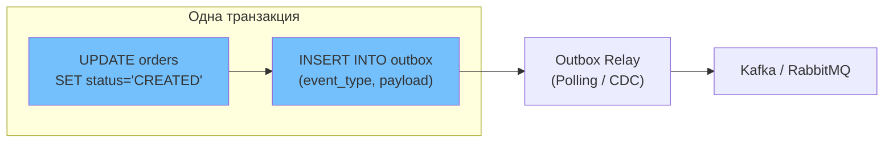

```java
@Service
@RequiredArgsConstructor
public class OrderService {
    private final OrderRepository orderRepository;
    private final OutboxRepository outboxRepository;

    @Transactional
    public Order createOrder(CreateOrderRequest request) {
        // 1. Бизнес-логика
        Order order = Order.create(request);
        orderRepository.save(order);

        // 2. Событие в outbox (та же транзакция!)
        OutboxEvent event = OutboxEvent.builder()
            .aggregateType("Order")
            .aggregateId(order.getId().toString())
            .eventType("OrderCreated")
            .payload(objectMapper.writeValueAsString(
                new OrderCreatedEvent(order.getId(), order.getItems())))
            .build();
        outboxRepository.save(event);

        return order;
    }
}

@Entity
@Table(name = "outbox")
public class OutboxEvent {
    @Id @GeneratedValue
    private Long id;
    private String aggregateType;
    private String aggregateId;
    private String eventType;
    @Column(columnDefinition = "TEXT")
    private String payload;
    private Instant createdAt = Instant.now();
    private boolean sent = false;
}
```

**Зачем**: решает проблему **dual write** — невозможно атомарно записать в БД и отправить в брокер. Без outbox: если запись в БД прошла, а отправка в Kafka упала — событие потеряно. С outbox: событие гарантированно сохранено в БД и будет отправлено.


> [!mcq]
> - [ ] Отправлять событие в Kafka сразу после `commit` бизнес-транзакции через `KafkaTemplate.send()` | Это dual-write: commit в БД прошёл, отправка в Kafka может упасть → событие потеряно (`OrderCreated` ушёл в БД, но не в Kafka, downstream ничего не знает). ❌ ПОСЛЕДСТВИЕ: e-commerce checkout: оплата прошла, `OrderPaid` event не отправлен из-за Kafka rebalance → фулфилмент не запускается, клиент пишет в support через 2 часа.
> - [x] Записать событие в таблицу `outbox` той же транзакцией, что и бизнес-данные; отдельный relay (polling publisher или Debezium CDC) вычитывает таблицу и шлёт в брокер с at-least-once гарантией | Атомарность бизнес-данных и события через локальную ACID-транзакцию; relay даёт `at-least-once` (consumer должен быть идемпотентным); решает классическую `dual-write problem`. ✓ ПРИМЕНЯТЬ: Debezium Postgres connector + outbox SMT для Kafka, Eventuate Tram, Spring Modulith outbox; используется в Wolt, Booking.com, Yandex Lavka. 📋 ПРАВИЛО: «Одна транзакция на данные и outbox — relay добьётся доставки». 🔗 См. Q18, Q19, Q31.
> - [ ] Вызывать `kafkaTemplate.send().get()` синхронно перед commit транзакции | Если commit упадёт после успешного send, событие отправлено для несуществующих данных — phantom event на стороне consumer. ❌ ПОСЛЕДСТВИЕ: payment-сервис шлёт `PaymentSucceeded` до commit БД, БД rollback на constraint violation — downstream начисляет бонус за несуществующий платёж, refund storm.
> - [ ] Использовать `@TransactionalEventListener(phase=AFTER_COMMIT)` для отправки в Kafka | Это всё равно dual-write: commit прошёл, но отправка в листенере может упасть (broker недоступен, JVM crash, OOM); событие потеряно. ❌ ПОСЛЕДСТВИЕ: знаменитая ловушка Spring разработчиков — `AFTER_COMMIT` слушатель ловит `OutOfMemoryError` при сериализации и теряет событие, инвентарь не списан, продажа невидима для аналитики.

## Q18. (!) Что такое Change Data Capture (CDC) и как он связан с Outbox?

**Change Data Capture (CDC)** — подход, при котором изменения в БД автоматически захватываются и отправляются в стриминговую платформу. `Debezium` — самый популярный инструмент CDC для `Kafka`.

**Связь с `Outbox`**: `CDC` читает таблицу `outbox` через `WAL` (Write-Ahead Log) базы данных, без polling-запросов. Это эффективнее, чем периодический `SELECT`, и обеспечивает `at-least-once` доставку.

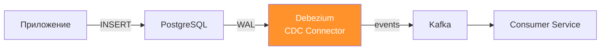

**Два режима CDC**:

| Режим | Описание | Плюсы | Минусы |
|-------|----------|-------|--------|
| **Log-based** | Читает WAL/binlog | Нет нагрузки на БД, не пропустит изменения | Нужен доступ к WAL |
| **Query-based** | Polling с `SELECT` | Просто настроить | Нагрузка на БД, задержка |

**`Debezium` Outbox Event Router** — встроенный SMT (Single Message Transform) в `Debezium`, который умеет трансформировать записи из таблицы `outbox` в корректные события для `Kafka`, удаляя инфраструктурные поля.


> [!mcq]
> - [ ] CDC и Outbox — синонимы: одно и то же название одного паттерна | Разные слои: CDC — механизм захвата изменений из WAL/binlog, Outbox — паттерн транзакционно консистентной таблицы событий; CDC может читать любые таблицы, Outbox — конкретный use-case. ❌ ПОСЛЕДСТВИЕ: путаница терминов в DAR, команда читает с CDC всю таблицу `orders` и публикует internal-схему наружу — break consumer на следующем migration column rename.
> - [ ] CDC требует обязательного polling SQL-запросов | Log-based CDC (Debezium) читает WAL/binlog без `SELECT`, что эффективнее polling. Query-based CDC — только один из режимов. ❌ ПОСЛЕДСТВИЕ: команда деплоит CDC через `@Scheduled SELECT * FROM outbox` каждые 100ms — БД получает 600 RPS пустых запросов, vacuum не справляется.
> - [x] CDC (например, Debezium) читает WAL/binlog базы и публикует изменения в Kafka без polling; в комбинации с Outbox: CDC читает таблицу `outbox` через WAL и шлёт events в брокер с at-least-once, при этом приложение пишет outbox обычным INSERT в локальной транзакции | Debezium Outbox Event Router (SMT) трансформирует строку outbox в правильный Kafka topic и убирает инфраструктурные поля; не нагружает БД polling-запросами. ✓ ПРИМЕНЯТЬ: Debezium PostgreSQL connector + `EventRouter` SMT, Wolt order events через Debezium → Kafka, Yandex Lavka внутренний event-bus. 📋 ПРАВИЛО: «WAL — реальный источник правды; Outbox — таблица-конверт для CDC». 🔗 См. Q17, Q19, Q23.
> - [ ] CDC заменяет outbox таблицу: можно публиковать изменения напрямую с любых бизнес-таблиц | Прямой CDC бизнес-таблиц публикует internal schema наружу: rename колонки = breaking change всех consumer; outbox — стабильный публичный контракт. ❌ ПОСЛЕДСТВИЕ: Debezium на таблице `users` без outbox — добавили колонку `password_hash`, она автоматически попала в Kafka topic; security-инцидент с утечкой хешей паролей в analytics pipeline.

## Q19. Как реализовать Outbox Pattern на Spring Boot и Debezium?

Полная реализация включает три части: таблицу `outbox`, запись в неё из сервиса и конфигурацию `Debezium`:

```sql
-- Flyway миграция: V1__create_outbox.sql
CREATE TABLE outbox (
    id            UUID PRIMARY KEY DEFAULT gen_random_uuid(),
    aggregate_type VARCHAR(255) NOT NULL,
    aggregate_id   VARCHAR(255) NOT NULL,
    event_type    VARCHAR(255) NOT NULL,
    payload       JSONB NOT NULL,
    created_at    TIMESTAMP WITH TIME ZONE DEFAULT now()
);

-- Индекс для polling (если без CDC)
CREATE INDEX idx_outbox_created_at ON outbox (created_at);
```

```java
// Polling Publisher — альтернатива CDC (проще, но менее эффективно)
@Component
@RequiredArgsConstructor
public class OutboxPollingPublisher {
    private final OutboxRepository outboxRepository;
    private final KafkaTemplate<String, String> kafkaTemplate;

    @Scheduled(fixedDelay = 100) // каждые 100 мс
    @Transactional
    public void publishOutboxEvents() {
        List<OutboxEvent> events = outboxRepository
            .findTop100ByOrderByCreatedAtAsc();

        for (OutboxEvent event : events) {
            kafkaTemplate.send(
                event.getAggregateType() + ".events",
                event.getAggregateId(),
                event.getPayload()
            ).whenComplete((result, ex) -> {
                if (ex == null) {
                    outboxRepository.delete(event);
                } else {
                    log.error("Ошибка отправки события {}", event.getId(), ex);
                }
            });
        }
    }
}
```

```json
// Конфигурация Debezium Connector (CDC-подход)
{
  "name": "outbox-connector",
  "config": {
    "connector.class": "io.debezium.connector.postgresql.PostgresConnector",
    "database.hostname": "postgres",
    "database.port": "5432",
    "database.dbname": "orders_db",
    "table.include.list": "public.outbox",
    "transforms": "outbox",
    "transforms.outbox.type":
      "io.debezium.transforms.outbox.EventRouter",
    "transforms.outbox.route.topic.replacement": "${routedByValue}.events"
  }
}
```


> [!mcq]
> - [x] Создать таблицу `outbox` через Flyway, в `@Transactional`-методе писать бизнес-сущность и `OutboxEvent` одним коммитом, настроить Debezium PostgreSQL connector с `transforms.outbox.type=EventRouter`; альтернативно — `@Scheduled` polling publisher (`fixedDelay=100`) для простых случаев | Polling даёт `at-least-once` без CDC infrastructure (проще для старта); Debezium масштабируется на high-throughput но требует доступа к WAL и `wal_level=logical`. ✓ ПРИМЕНЯТЬ: Wolt и Yandex Lavka Debezium + Outbox SMT на Kafka, Eventuate Tram для Spring Boot, Spring Modulith built-in event publication; для маленьких сервисов — polling-publisher на `@Scheduled`. 📋 ПРАВИЛО: «Flyway-таблица + одна транзакция + relay (CDC или polling)». 🔗 См. Q17, Q18, Q23.
> - [ ] Достаточно annotation `@SendToKafka` на методе сервиса — Spring сам обеспечит транзакционность | Нет такой аннотации; даже при наличии custom-обёртки она не решает dual-write — отправка в брокер не часть JPA-транзакции. ❌ ПОСЛЕДСТВИЕ: разработчик пишет own-аннотацию `@SendToKafka` через AOP и `AFTER_COMMIT` — теряет события при OOM, в production выясняется через 3 месяца на отчёте о пропавших заказах.
> - [ ] Достаточно положить `KafkaTemplate.send()` внутрь `@Transactional` метода | `@Transactional` управляет JPA-сессией, не Kafka producer; send всё равно вне транзакции БД, dual-write проблема осталась. ❌ ПОСЛЕДСТВИЕ: код выглядит «транзакционным», но при rollback БД событие уже в Kafka — phantom event начисляет бонус за несостоявшийся order.
> - [ ] Использовать Kafka transactions с `EOSV2` напрямую без таблицы outbox | Kafka transactions решают atomicity для exactly-once consume-process-produce, но не для атомарности «БД + Kafka send»; нужен XA или outbox. ❌ ПОСЛЕДСТВИЕ: в DAR заявлен «exactly-once через Kafka transactions», в реальности БД и Kafka расходятся при partial failure, аналитика и операционная БД показывают разные числа.

## Q20. (!) Что такое Event Sourcing?

**Event Sourcing** — состояние агрегата хранится как последовательность неизменяемых **событий** (append-only log). Текущее состояние получают, применяя все события по порядку (replay). Запись — добавление нового события, прошлое не перезаписывается.

```java
// Агрегат заказа с Event Sourcing
public class OrderAggregate {
    private UUID orderId;
    private OrderStatus status;
    private List<OrderItem> items = new ArrayList<>();
    private BigDecimal totalAmount;
    private final List<DomainEvent> uncommittedEvents = new ArrayList<>();

    // Команда → валидация → событие
    public void createOrder(UUID id, List<OrderItem> items) {
        if (status != null) {
            throw new IllegalStateException("Заказ уже создан");
        }
        apply(new OrderCreatedEvent(id, items, calculateTotal(items)));
    }

    public void confirmPayment(String transactionId) {
        if (status != OrderStatus.PENDING) {
            throw new IllegalStateException("Заказ не в статусе PENDING");
        }
        apply(new PaymentConfirmedEvent(orderId, transactionId));
    }

    // Применение события (изменяет состояние)
    private void apply(DomainEvent event) {
        mutate(event);
        uncommittedEvents.add(event);
    }

    // Мутация состояния по событию (используется и при replay)
    private void mutate(DomainEvent event) {
        switch (event) {
            case OrderCreatedEvent e -> {
                this.orderId = e.orderId();
                this.items = e.items();
                this.totalAmount = e.total();
                this.status = OrderStatus.PENDING;
            }
            case PaymentConfirmedEvent e ->
                this.status = OrderStatus.PAID;
            case OrderCancelledEvent e ->
                this.status = OrderStatus.CANCELLED;
            default -> throw new UnknownEventException(event);
        }
    }

    // Восстановление из истории событий
    public static OrderAggregate rehydrate(List<DomainEvent> history) {
        OrderAggregate aggregate = new OrderAggregate();
        history.forEach(aggregate::mutate);
        return aggregate;
    }
}
```

**Преимущества**: полный аудит, возможность пересобрать состояние на любой момент, debug через replay, natural fit для `CQRS`.

**Минусы**: сложность модели, рост лога (нужен **snapshot** + compaction), версионирование формата событий (upcasting), eventual consistency между event store и проекциями.


> [!mcq]
> - [ ] Состояние агрегата хранится напрямую в виде snapshot, события только для аудита | Event Sourcing хранит ИМЕННО события как primary source of truth; snapshots — оптимизация replay. ❌ ПОСЛЕДСТВИЕ: команда называет «event sourcing» паттерном CRUD+audit_log — теряет benefits replay (debug через прошлое) и temporal queries («какой был баланс на 3 числа»).
> - [ ] Каждое событие перезаписывает предыдущее состояние в `events` таблице | Event Store — append-only: события неизменяемы и добавляются последовательно с monotonic version; перезапись ломает saga и replay. ❌ ПОСЛЕДСТВИЕ: разработчик «обновляет» событие после bug-fix `UPDATE events SET payload=...` — replay даёт другое состояние, projections расходятся, debug через event log невозможен.
> - [ ] Event Sourcing требует обязательного NoSQL хранилища, на PostgreSQL не работает | Event Store отлично реализуется на PostgreSQL append-only таблице с partitioning по `aggregate_id` и индексом `(aggregate_id, version)`; EventStoreDB — специализированный, но не обязательный. ❌ ПОСЛЕДСТВИЕ: «нам нужна Cassandra для ES» — команда тащит NoSQL ради ES, теряет ACID локальной транзакции (нельзя атомарно записать события и outbox), переписывает на PG через 6 месяцев.
> - [x] Состояние агрегата хранится как append-only последовательность неизменяемых событий (event log); текущее состояние получается replay'ем всех событий или из snapshot+events после snapshot; запись = добавление события, изменения прошлого нет | Каждое событие — факт о произошедшем (`OrderCreatedEvent`, `PaymentConfirmedEvent`); aggregate.apply(event) обновляет in-memory state; optimistic concurrency через `expected_version`. ✓ ПРИМЕНЯТЬ: EventStoreDB, Axon Framework, Booking.com event-sourced reservations, банковские core-banking системы (ledger), Wolt order pipeline. 📋 ПРАВИЛО: «Состояние = свёртка событий; events не меняются». 🔗 См. Q21, Q22, Q23.

## Q21. Что такое CQRS и зачем разделять команды и запросы?

**CQRS** (Command Query Responsibility Segregation) — разделение модели записи (команды) и модели чтения (запросы). Команды меняют состояние, запросы читают из отдельных, оптимизированных проекций.

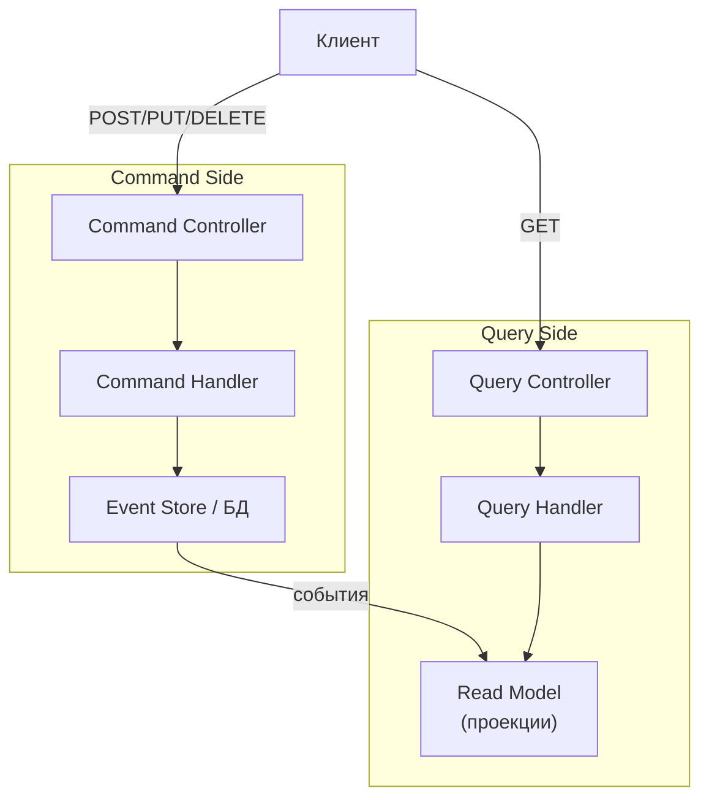

```java
// Command side
public record CreateOrderCommand(UUID customerId, List<OrderItem> items) {}

@Service
public class OrderCommandHandler {
    private final EventStore eventStore;

    public UUID handle(CreateOrderCommand cmd) {
        OrderAggregate order = new OrderAggregate();
        order.createOrder(UUID.randomUUID(), cmd.items());
        eventStore.save(order.getId(), order.getUncommittedEvents());
        return order.getId();
    }
}

// Query side — отдельная модель, оптимизированная под чтение
@Entity
@Table(name = "order_summary_view")
public class OrderSummaryView {
    @Id private UUID orderId;
    private String customerName;
    private BigDecimal total;
    private String status;
    private int itemCount;
    private Instant createdAt;
}

@Component
public class OrderProjector {
    @EventHandler
    public void on(OrderCreatedEvent event) {
        orderSummaryRepository.save(new OrderSummaryView(
            event.orderId(), event.customerName(),
            event.total(), "PENDING", event.items().size(), Instant.now()));
    }
}
```

**Зачем**: масштабирование чтения и записи независимо, разные уровни согласованности, разные хранилища под разные паттерны доступа. CQRS можно использовать **без** `Event Sourcing` — просто с разными моделями для чтения и записи.


> [!mcq]
> - [ ] CQRS обязательно требует Event Sourcing — это две части одного паттерна | Нет: CQRS = разделение моделей чтения и записи, может работать с обычной CRUD-БД и материализованными view-таблицами. ES — отдельный паттерн хранения. ❌ ПОСЛЕДСТВИЕ: команда обязательно ставит Event Store вместе с CQRS — добавляет зоопарк инфры (EventStoreDB) для простого read-replication, переусложнение и debug-overhead.
> - [x] Разделение модели записи (Command — изменяет состояние) и модели чтения (Query — читает оптимизированные проекции); часто разные БД и схемы под разные паттерны доступа; eventual consistency между write и read side | Read-проекции обновляются подписчиками на события commit-side; масштабирование read и write независимо; CQRS можно использовать без Event Sourcing — достаточно денормализованных view-таблиц. ✓ ПРИМЕНЯТЬ: Axon Framework, Booking.com inventory write/read разделение, ClickHouse как read-projection поверх PostgreSQL write-side. 📋 ПРАВИЛО: «Команда пишет в нормализованное, query читает из денормализованного». 🔗 См. Q20, Q22, Q23.
> - [ ] Команды и запросы используют одну и ту же модель, но разные эндпойнты в API | Это просто REST-стиль API, не CQRS; суть CQRS — разные модели данных, не разные пути URL. ❌ ПОСЛЕДСТВИЕ: команда заявляет «у нас CQRS, потому что есть `POST /orders` и `GET /orders`» — никакого разделения моделей нет, отчёты тормозят как и раньше, аналитика читает write-БД.
> - [ ] CQRS — это паттерн только для микросервисов, в монолите его не применяют | CQRS вполне работает в монолите: разные таблицы для команды и проекции в одной БД, разные namespace в коде. ❌ ПОСЛЕДСТВИЕ: «CQRS только для микросервисов» — монолит с тяжёлыми отчётами загнан в N микросервисов «чтобы был CQRS», вместо того чтобы выделить read-модель в той же БД с минимальным рефакторингом.

## Q22. Как совмещать Event Sourcing и CQRS?

Запись: команда → агрегат → событие → `event store` (append-only). Чтение: подписчики (projectors) обрабатывают события и обновляют проекции (read models) в отдельных хранилищах.

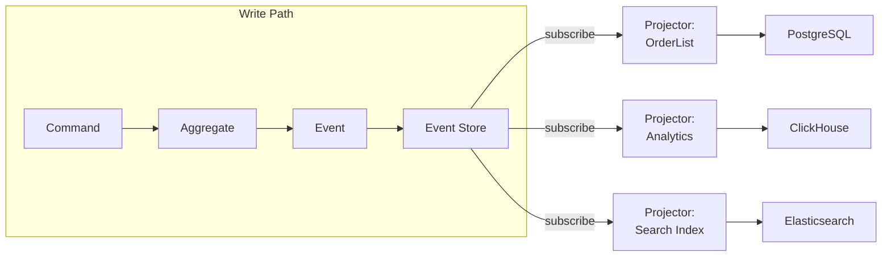

**Eventual consistency** между event store и проекциями — задержка (обычно миллисекунды) допустима. Для `read-your-writes` можно:
- Кэшировать запись на клиенте
- Ждать обновления проекции (polling / `WebSocket`)
- Читать напрямую из event store для критичных сценариев

**Снэпшоты**: чтобы не реплеить тысячи событий при загрузке агрегата, сохраняют snapshot каждые N событий:

```java
public class SnapshotStore {
    public OrderAggregate load(UUID aggregateId) {
        Snapshot snapshot = snapshotRepo
            .findLatest(aggregateId)
            .orElse(Snapshot.empty());

        List<DomainEvent> eventsSinceSnapshot = eventStore
            .loadFrom(aggregateId, snapshot.version());

        OrderAggregate aggregate = snapshot.hasData()
            ? deserialize(snapshot.data())
            : new OrderAggregate();

        eventsSinceSnapshot.forEach(aggregate::apply);
        return aggregate;
    }
}
```


> [!mcq]
> - [ ] Команды напрямую обновляют read model — Event Store нужен только для аудита | Это нарушает идею ES+CQRS: read model должна строиться из event stream проектором, иначе нет benefit от хранения событий и нельзя пересобрать проекции. ❌ ПОСЛЕДСТВИЕ: команда «обновляет read model в той же транзакции» — невозможно построить новые проекции из истории, replay невозможен, audit log расходится с реальностью.
> - [ ] Command и Query side обязательно работают на одной БД для согласованности | Главный смысл CQRS+ES — разные хранилища под разные паттерны: Event Store (PostgreSQL append-only) для записи, ClickHouse/ES для аналитики, PostgreSQL view для UI. ❌ ПОСЛЕДСТВИЕ: всё в одной PostgreSQL, command-side блокирует таблицу OLAP-запросом отчёта — checkout latency прыгает с 50ms до 5s.
> - [ ] Снэпшоты заменяют event log полностью — старые события можно удалять | Удаление событий ломает replay и аудит — главные benefits ES; snapshots — оптимизация загрузки, не замена истории. ❌ ПОСЛЕДСТВИЕ: «удалили старые events после snapshot» — bug found через 6 месяцев требует replay от точки за snapshot, история потеряна, debug невозможен.
> - [x] Запись: command → aggregate → event → Event Store (append-only); проекторы (subscribers) читают event stream и обновляют различные read models в собственных БД (PostgreSQL, ClickHouse, Elasticsearch); снэпшоты каждые N событий ускоряют загрузку aggregate | Eventual consistency между write и read side — задержка в миллисекундах; replay event log пересобирает проекцию с нуля; idempotent projector через causation_id. ✓ ПРИМЕНЯТЬ: Axon Framework + EventStoreDB, Booking.com event-sourced reservations, Wolt order pipeline (PostgreSQL Event Store → Kafka → ClickHouse). 📋 ПРАВИЛО: «Один write-log, много read-проекций; replay — лекарство всех бед». 🔗 См. Q20, Q21, Q23.

## Q23. Как обеспечить согласованность при Event Sourcing?

**Проблема**: между записью события и обновлением проекции есть окно рассинхронизации. Как управлять?

| Стратегия | Описание | Гарантия |
|-----------|----------|----------|
| **Optimistic concurrency** | Проверяем expected version при записи | Защита от конфликтов записи |
| **Idempotent projectors** | Проекторы обрабатывают событие ровно раз | At-least-once → exactly-once |
| **Causation ID** | Каждое событие хранит ID команды-причины | Дедупликация и трассировка |
| **Projection rebuild** | Пересборка проекции из всех событий | Исправление рассинхронизации |

```java
// Optimistic concurrency в event store
public class EventStore {
    @Transactional
    public void save(UUID aggregateId, int expectedVersion,
                     List<DomainEvent> events) {
        int currentVersion = getCurrentVersion(aggregateId);
        if (currentVersion != expectedVersion) {
            throw new OptimisticConcurrencyException(
                "Expected version " + expectedVersion +
                ", but current is " + currentVersion);
        }

        int version = expectedVersion;
        for (DomainEvent event : events) {
            jdbcTemplate.update("""
                INSERT INTO events (aggregate_id, version, event_type, payload, created_at)
                VALUES (?, ?, ?, ?::jsonb, now())
                """,
                aggregateId, ++version,
                event.getClass().getSimpleName(),
                serialize(event));
        }
    }
}
```

> **На собеседовании**: подчеркните, что `Event Sourcing` даёт **strong consistency для записи** (через optimistic concurrency) и **eventual consistency для чтения** (проекции обновляются асинхронно).


> [!mcq]
> - [ ] Использовать distributed transactions для атомарности event store + проекции | 2PC по сети между event store и read model = блокировки, плохо масштабируется. Event Sourcing именно потому популярен, что не требует distributed txn. ❌ ПОСЛЕДСТВИЕ: ставим XA-транзакции на event store + ClickHouse projection — кластер виснет на failover, лидер-выборы выкатывают в read-only на 30 секунд.
> - [x] Strong consistency для записи через optimistic concurrency (expected version), eventual consistency для чтения через идемпотентные projector-ы | Запись: `INSERT INTO events WHERE current_version = expected` отклонит конфликты. Чтение: projector обрабатывает event log с causation_id, применяя ровно один раз. ✓ ПРИМЕНЯТЬ: EventStoreDB, Axon Framework, Booking.com event-sourced reservations с idempotent projection. 📋 ПРАВИЛО: «Strong на write, eventual на projections». 🔗 См. Q20, Q22, Q31.
> - [ ] Полностью игнорировать рассинхронизацию — projection догонит самостоятельно | Без optimistic concurrency возможны write conflicts (lost updates на агрегате). Без causation_id — duplicate events в projection. ❌ ПОСЛЕДСТВИЕ: на event-sourced order-aggregate два concurrent confirms создают два события `OrderConfirmed`, projection показывает разные суммы → клиенту начисляется double bonus, разрулить через reconciliation в 03:00.
> - [ ] Хранить актуальное состояние в кэше и синхронно обновлять при каждой записи без version-чека | Это противоречит самой идее ES — стейт восстанавливается из event log, не из «текущего» состояния. Без optimistic concurrency cache и projection расходятся при failover. ❌ ПОСЛЕДСТВИЕ: код на Axon с ручным cache-aside ломается при rebalancing, projection и cache расходятся, debug через replay невозможен.

## Q24. (!) Как разрешать конфликты при Eventual Consistency?

При асинхронной репликации несколько узлов могут обновить один объект одновременно — возникает конфликт. Основные стратегии:

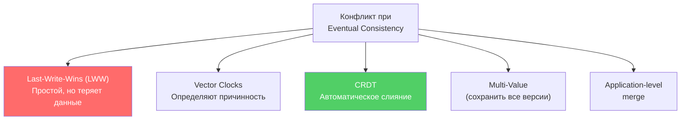

**Сравнение стратегий**:

| Стратегия | Потеря данных | Сложность | Пример системы |
|-----------|---------------|-----------|----------------|
| `LWW` | Возможна | Низкая | `Cassandra` |
| `Vector Clocks` | Нет (при ручном merge) | Средняя | `Riak` (deprecated) |
| `CRDT` | Нет | Высокая | `Redis CRDT`, `Automerge` |
| Multi-Value | Нет | Средняя | `DynamoDB` (conditional writes) |
| App-level merge | Зависит от логики | Высокая | Custom |

**Выбор**: для счётчиков и множеств — `CRDT`. Для документов — `CRDT` (`Automerge`, `Yjs`) или app-level merge. Для простых key-value с редкими конфликтами — `LWW` с отслеживанием.


> [!mcq]
> - [ ] Применять `LWW` (Last-Write-Wins) везде — самый простой и быстрый подход | LWW теряет данные при concurrent updates и страдает от clock skew между узлами. Для счётчиков и cart-операций — катастрофа. ❌ ПОСЛЕДСТВИЕ: Cassandra `LWW` для distributed counter лайков — при NTP drift 50ms между узлами счётчик «прыгает» назад, пользователи видят отрицательные значения.
> - [ ] Использовать distributed transactions через `2PC` для любых конфликтов | 2PC противоречит eventual-консистентности и убивает AP-преимущества. Eventual системы (Cassandra, Dynamo) не поддерживают 2PC между узлами. ❌ ПОСЛЕДСТВИЕ: пытаемся надеть Atomikos на Cassandra cluster — кластер тормозит, throughput падает с 50K WPS до 500 WPS, при partition вообще blocked.
> - [x] Выбрать стратегию под тип данных: `CRDT` для счётчиков/множеств, vector clocks для документов с ручным merge, `LWW` допустим только где потеря OK | Разные данные требуют разных стратегий: CRDT даёт автоматический merge без потерь, vector clocks определяют happens-before, LWW годится для cache-state. ✓ ПРИМЕНЯТЬ: Redis Enterprise CRDT для shopping cart, Riak vector clocks для документов, Cassandra LWW для last-seen-status. 📋 ПРАВИЛО: «CRDT для счётчиков, VClock для merge, LWW только для disposable». 🔗 См. Q25, Q26, Q27.
> - [ ] Запретить concurrent writes на уровне приложения через pessimistic lock на Redis | Locks через Redis/Zookeeper не работают на eventual — кластеры могут разделиться, два «лидера» с одним lock. И lock убивает преимущества AP. ❌ ПОСЛЕДСТВИЕ: на Cassandra пишем через `redlock`-обёртку — split-brain в Redis ставит два writer'а одновременно, обе записи коммитятся, deduplication в 03:00 падает.

## Q25. (!) Что такое CRDT и какие типы существуют?

**CRDT** (Conflict-free Replicated Data Types) — структуры данных, операции обновления которых коммутативны, ассоциативны и идемпотентны. Конфликты разрешаются автоматически при merge — без координации между узлами.

Два вида:
- **CvRDT** (state-based) — узлы обмениваются полным состоянием и мержат через `merge()`
- **CmRDT** (operation-based) — узлы обмениваются операциями, операции коммутативны

**Основные типы CRDT**:

| Тип | Описание | Пример использования |
|-----|----------|---------------------|
| **G-Counter** | Grow-only счётчик; каждый узел инкрементирует свой слот | Счётчик просмотров |
| **PN-Counter** | Два G-Counter (positive + negative) | Лайки/дизлайки |
| **G-Set** | Grow-only множество (только добавление) | Список уникальных посетителей |
| **OR-Set** | Observed-Remove Set (добавление + удаление) | Корзина покупок |
| **LWW-Register** | Регистр с last-write-wins | Профиль пользователя |
| **LWW-Map** | Карта LWW-регистров | JSON-документ |
| **MV-Register** | Multi-Value Register (хранит все конкурентные значения) | Поле с ручным merge |

```java
// G-Counter (grow-only) — распределённый счётчик
public class GCounter {
    private final String nodeId;
    private final Map<String, Long> counters = new ConcurrentHashMap<>();

    public GCounter(String nodeId) {
        this.nodeId = nodeId;
        counters.put(nodeId, 0L);
    }

    public void increment() {
        counters.merge(nodeId, 1L, Long::sum);
    }

    public long value() {
        return counters.values().stream().mapToLong(Long::longValue).sum();
    }

    // Merge: берём максимум по каждому узлу
    public GCounter merge(GCounter other) {
        GCounter result = new GCounter(this.nodeId);
        Set<String> allNodes = new HashSet<>(this.counters.keySet());
        allNodes.addAll(other.counters.keySet());

        for (String node : allNodes) {
            result.counters.put(node, Math.max(
                this.counters.getOrDefault(node, 0L),
                other.counters.getOrDefault(node, 0L)));
        }
        return result;
    }
}

// PN-Counter = два G-Counter
public class PNCounter {
    private final GCounter positive;
    private final GCounter negative;

    public void increment() { positive.increment(); }
    public void decrement() { negative.increment(); }

    public long value() {
        return positive.value() - negative.value();
    }
}
```

**Где используются**: `Redis` (CRDTs в Redis Enterprise для Active-Active), `Riak`, `Automerge` и `Yjs` (collaborative editing), `Cassandra` counters (PN-Counter по сути).


> [!mcq]
> - [ ] Структуры данных, использующие consensus (`Raft`/`Paxos`) для синхронизации между репликами | Это противоположность CRDT: CRDT именно потому ценны, что НЕ требуют консенсуса — узлы независимо применяют операции. ❌ ПОСЛЕДСТВИЕ: проектировщик ожидает strong consistency от Riak CRDT — на multi-DC получает stale reads, ставит «защитный» Raft-слой → производительность падает до уровня single-master.
> - [ ] Структуры с pessimistic locking, где каждая операция блокирует остальные | CRDT — lock-free и асинхронные. Locking противоречит идее автоматического merge без координации. ❌ ПОСЛЕДСТВИЕ: пытаемся реализовать CRDT через `synchronized` блоки в Java — single-node performance ОК, но на distributed-merge ничего не работает, расход памяти растёт линейно.
> - [ ] Любые eventually consistent структуры (например, Redis lists с async repl) | CRDT требуют математических свойств (commutativity, associativity, idempotence). Обычный async-лист не CRDT — concurrent operations теряются. ❌ ПОСЛЕДСТВИЕ: называя Redis list «CRDT», получаем потерю элементов корзины при network partition в active-active deployment.
> - [x] Структуры данных, операции обновления которых коммутативны, ассоциативны и идемпотентны: merge всегда детерминирован и без потерь (G-Counter, PN-Counter, OR-Set, LWW-Register, MV-Register, RGA) | CvRDT (state-based: merge через `max`) и CmRDT (op-based: операции коммутируют). Конфликты математически невозможны — merge точечно одинаков на всех репликах. ✓ ПРИМЕНЯТЬ: Redis Enterprise CRDB для cart, Figma RGA для realtime co-editing, Yjs/Automerge для collaborative docs, Riak DataTypes (Counter/Set/Map). 📋 ПРАВИЛО: «Коммутативность + ассоциативность + идемпотентность = no conflict». 🔗 См. Q24, Q40, Q26.

## Q26. Что такое Vector Clocks и как они определяют причинность?

**Vector Clock** — логические часы для определения причинно-следственных связей между событиями в распределённой системе. Каждый узел поддерживает вектор `[N1:v1, N2:v2, ...]`, где `vi` — количество событий, известных от узла `i`.

**Правила**:
1. При локальном событии: инкрементируем свой слот
2. При отправке сообщения: инкрементируем свой слот, прикладываем вектор
3. При получении сообщения: `merge(local, received)` = поэлементный `max`, затем инкрементируем свой слот

```java
public class VectorClock {
    private final Map<String, Integer> clock = new HashMap<>();

    public void increment(String nodeId) {
        clock.merge(nodeId, 1, Integer::sum);
    }

    public VectorClock merge(VectorClock other) {
        VectorClock result = new VectorClock();
        Set<String> allNodes = new HashSet<>(this.clock.keySet());
        allNodes.addAll(other.clock.keySet());

        for (String node : allNodes) {
            result.clock.put(node, Math.max(
                this.clock.getOrDefault(node, 0),
                other.clock.getOrDefault(node, 0)));
        }
        return result;
    }

    /**
     * Определяет отношение причинности:
     * - BEFORE: this happened-before other
     * - AFTER: this happened-after other
     * - CONCURRENT: ни один не "раньше" другого → конфликт!
     */
    public Relation compareTo(VectorClock other) {
        boolean thisBeforeOrEqual = clock.entrySet().stream()
            .allMatch(e -> e.getValue() <= other.clock.getOrDefault(e.getKey(), 0));
        boolean otherBeforeOrEqual = other.clock.entrySet().stream()
            .allMatch(e -> e.getValue() <= this.clock.getOrDefault(e.getKey(), 0));

        if (thisBeforeOrEqual && !otherBeforeOrEqual) return Relation.BEFORE;
        if (otherBeforeOrEqual && !thisBeforeOrEqual) return Relation.AFTER;
        if (thisBeforeOrEqual) return Relation.EQUAL;
        return Relation.CONCURRENT; // конфликт!
    }

    public enum Relation { BEFORE, AFTER, CONCURRENT, EQUAL }
}
```

**Пример**: Node A: `[A:2, B:1]`, Node B: `[A:1, B:3]` → `CONCURRENT` (конфликт! A знает больше о себе, B знает больше о себе). Нужен merge или ручное разрешение.

**Проблема масштабирования**: размер вектора растёт с числом узлов. Решения: **dotted version vectors** (используются в `Riak`), **interval tree clocks**.


> [!mcq]
> - [x] Логические часы — массив `[N1:v1, N2:v2, ...]`; каждый узел инкрементирует свой слот при событии и при send/receive merge'ит через поэлементный max | Сравнение векторов: A→B (A happened-before B) если все vA[i] ≤ vB[i] и хотя бы одно строго меньше. Если ни A→B ни B→A — конкурентные (CONCURRENT), требуют merge или ручного разрешения. ✓ ПРИМЕНЯТЬ: Riak vector clocks для документов, Amazon Dynamo (исходный 2007 paper), DynamoDB internals, COPS database. 📋 ПРАВИЛО: «Vector — кто и сколько событий видел». 🔗 См. Q4, Q38, Q24.
> - [ ] Один глобальный счётчик timestamp, увеличивающийся монотонно для всех узлов | Это `Lamport clock` (single counter), не vector — Lamport не определяет concurrent vs causal, только total order. Vector clock хранит знания о КАЖДОМ узле. ❌ ПОСЛЕДСТВИЕ: реализуем Riak без vector clock, используя Lamport — теряем информацию о concurrent updates, конфликты разрешаются как LWW и пользователи теряют комментарии.
> - [ ] Физический NTP timestamp, прикрепляемый к каждому событию | Физические часы рассинхронизированы (NTP drift ~ms-сотни ms), могут идти назад при NTP correction. Vector clocks — логические, не зависят от физики. ❌ ПОСЛЕДСТВИЕ: NTP-based ordering на multi-DC: при leap second в июне 2015 кластер Cassandra терял события из «будущего», AWS падал на сотни систем.
> - [ ] Дерево хеш-сумм для дедупликации сообщений | Это Merkle tree (anti-entropy), используется для синхронизации реплик в Cassandra/Dynamo. Не определяет причинность. ❌ ПОСЛЕДСТВИЕ: путаница с Merkle деревом приводит к запросу «vector clock на бинарных файлах» — бессмысленно, инженер тратит спринт на не-задачу.

## Q27. Что такое Last-Write-Wins (LWW) и в чём его проблемы?

**Last-Write-Wins** — стратегия разрешения конфликтов, где побеждает запись с наибольшим timestamp. Проста в реализации, но имеет серьёзные проблемы.

```java
public class LWWRegister<T> {
    private T value;
    private long timestamp;

    public void write(T newValue, long timestamp) {
        if (timestamp > this.timestamp) {
            this.value = newValue;
            this.timestamp = timestamp;
        }
        // Иначе — отбрасываем (более старая запись)
    }

    public LWWRegister<T> merge(LWWRegister<T> other) {
        return this.timestamp >= other.timestamp ? this : other;
    }
}
```

**Проблемы LWW**:

| Проблема | Описание |
|----------|----------|
| **Потеря данных** | Конкурентная запись с меньшим timestamp будет отброшена |
| **Clock skew** | Часы узлов рассинхронизированы → побеждает «неправильная» запись |
| **NTP drift** | Даже с NTP точность ~мс, что недостаточно для high-throughput |
| **Произвольный выбор** | При одинаковом timestamp нужен tiebreaker (обычно node ID) |

**Когда LWW допустим**: для данных, где потеря конкурентного обновления не критична (кэш, последний онлайн-статус, cursor position в редакторе). `Cassandra` использует LWW по умолчанию — это осознанный выбор в пользу простоты.

**Альтернативы**: `CRDT` (автоматический merge без потерь), `Multi-Value Register` (сохранить оба значения, разрешить позже), `Operational Transform` / `CRDT` для collaborative editing.


> [!mcq]
> - [ ] Гарантирует, что более старая запись никогда не перезапишет новую — поэтому потерь данных нет | Опасное заблуждение: LWW гарантирует только победителя по timestamp, но при clock skew или concurrent writes одна валидная запись теряется без следа. ❌ ПОСЛЕДСТВИЕ: на Cassandra с NTP drift 50-100ms одно из двух одновременных обновлений профиля «исчезает», пользователь жалуется «настройки не сохраняются».
> - [x] Стратегия: побеждает запись с большим timestamp; проста, но теряет concurrent данные, страдает от clock skew, NTP drift — годится только где потеря OK | LWW работает на основе физических часов, поэтому требует синхронизированных NTP. Применима для disposable-данных (last-online, cache TTL), НЕ для счётчиков и cart. Tiebreaker — node ID при равных timestamp. ✓ ПРИМЕНЯТЬ: Cassandra LWW по умолчанию (осознанный trade-off за простоту), Redis для last-seen-status, DynamoDB conditional writes как safer альтернатива. 📋 ПРАВИЛО: «LWW = быстро + просто + теряет данные при гонке». 🔗 См. Q24, Q40, Q26.
> - [ ] Использует vector clocks для упорядочивания записей | Перепутано: LWW использует physical timestamp, vector clocks — отдельная стратегия для происхождения причинных связей и детекции concurrent. ❌ ПОСЛЕДСТВИЕ: называя Riak с vector clocks «LWW», команда не реализует merge handlers для concurrent siblings — Riak возвращает list-of-versions, приложение крашится с `unexpected list type`.
> - [ ] Атомарно сохраняет обе concurrent записи и применяет их по очереди | Это `Multi-Value Register` или `MV-Register CRDT`, не LWW. LWW отбрасывает «проигравшую» запись. ❌ ПОСЛЕДСТВИЕ: ожидая многоверсионность от Cassandra LWW, разработчик не реализует client-side reconciliation; при concurrent edit документа теряется текст одного из редакторов.

## Q28. Как достигается консистентность при кэшировании?

**Основные стратегии кэширования**:

| Стратегия | Запись | Консистентность | Latency записи |
|-----------|--------|-----------------|----------------|
| **Cache-aside** | Пишем в БД, инвалидируем кэш | Eventual | Низкая |
| **Write-through** | Пишем в кэш + БД синхронно | Strong | Высокая |
| **Write-behind** | Пишем в кэш, в БД — async | Eventual + риск потери | Низкая |
| **Read-through** | Кэш сам ходит в БД при промахе | Eventual | Средняя |

```java
// Cache-aside с Spring Cache
@Service
@RequiredArgsConstructor
public class ProductService {
    private final ProductRepository repository;
    private final CacheManager cacheManager;

    @Cacheable(value = "products", key = "#id")
    public Product getProduct(Long id) {
        return repository.findById(id)
            .orElseThrow(() -> new NotFoundException("Product " + id));
    }

    @Transactional
    public Product updateProduct(Long id, UpdateRequest request) {
        Product product = repository.findById(id).orElseThrow();
        product.update(request);
        repository.save(product);

        // Инвалидируем ПОСЛЕ записи в БД
        cacheManager.getCache("products").evict(id);

        return product;
    }
}
```

**Проблемы cache-aside**:
- **Race condition**: два потока читают пустой кэш, оба идут в БД, оба пишут в кэш — не страшно (один перезапишет другого тем же значением)
- **Stale cache**: между записью в БД и инвалидацией кэша другой поток может прочитать старое значение
- **Cache stampede**: после инвалидации множество запросов одновременно идут в БД

**Решения**: `TTL` + инвалидация, `distributed lock` при заполнении кэша, `write-through` для критичных данных, `versioned cache keys`.


> [!mcq]
> - [ ] Cache-aside даёт strong consistency, потому что инвалидация мгновенна | Cache-aside даёт eventual: между записью в БД и evict в кэше есть race window, другой поток может прочитать stale; для strong нужен write-through (атомарно). ❌ ПОСЛЕДСТВИЕ: реализуем e-commerce price cache как cache-aside, ждём «strong» — клиент видит старую цену 5 секунд после изменения, разница на промокоде → claim chargeback.
> - [ ] Write-behind безопаснее всего: пишем в кэш, БД догонит асинхронно | Write-behind теряет данные при падении ноды до flush в БД; кэш — эфемерное хранилище, не источник правды. ❌ ПОСЛЕДСТВИЕ: SoundCloud-style сервис на Redis write-behind терял лайки при rolling restart кэша, аналитика расходилась с UI на 5-10%.
> - [x] Стратегия выбирается по trade-off latency/consistency: cache-aside (eventual, низкая запись) → write-through (strong, синхронная запись в кэш+БД) → write-behind (eventual + риск потери, минимальная latency) → read-through (lazy load); для cache-aside обязательно `evict ПОСЛЕ commit БД`, иначе race с stale read | Race conditions решаются TTL + distributed lock при заполнении cache stampede prevention; versioned keys (`product:{id}:v{version}`) делают invalidation атомарной. ✓ ПРИМЕНЯТЬ: Redis cache-aside через Spring `@CacheEvict(beforeInvocation=false)` после commit; Caffeine + write-through для конфигов; Memcached + versioned keys в Wolt. 📋 ПРАВИЛО: «Сначала commit БД, потом evict cache; никогда наоборот». 🔗 См. Q24, Q31, Q34.
> - [ ] Достаточно поставить Redis с `EXPIRE 60` — TTL автоматически даст консистентность | TTL минимизирует stale window, но не устраняет: между записью и истечением TTL читатели видят stale; для критичных данных нужна явная invalidation. ❌ ПОСЛЕДСТВИЕ: «TTL=60s = consistency» — банковский баланс читают со stale 60-секундным кэшем, клиент видит остаток до перевода и пробует снять deny-money дважды.

## Q29. Как реализовать Read-your-writes в микросервисной архитектуре?

В микросервисах `read-your-writes` сложнее, чем в монолите — запись и чтение могут обрабатываться разными инстансами.

```java
// Подход 1: Version token через HTTP-заголовки
@RestController
public class OrderController {

    @PostMapping("/orders")
    public ResponseEntity<Order> createOrder(
            @RequestBody CreateOrderRequest request) {
        Order order = orderService.create(request);

        return ResponseEntity.ok()
            .header("X-Write-Version", String.valueOf(order.getVersion()))
            .body(order);
    }

    @GetMapping("/orders/{id}")
    public ResponseEntity<Order> getOrder(
            @PathVariable UUID id,
            @RequestHeader(value = "X-Min-Version", required = false)
                Long minVersion) {
        Order order = orderService.findById(id);

        if (minVersion != null && order.getVersion() < minVersion) {
            // Проекция ещё не обновилась — retry или fallback
            return ResponseEntity.status(HttpStatus.SERVICE_UNAVAILABLE)
                .header("Retry-After", "1")
                .build();
        }
        return ResponseEntity.ok(order);
    }
}

// Подход 2: Sticky session через Gateway
// В application.yml (Spring Cloud Gateway):
// spring.cloud.gateway.routes:
//   - id: orders
//     uri: lb://order-service
//     predicates:
//       - Path=/orders/**
//     metadata:
//       session-affinity: cookie
```

**Подходы**:

| Подход | Описание | Плюсы | Минусы |
|--------|----------|-------|--------|
| **Version token** | Клиент передаёт минимальную версию | Простой, stateless | Нужен retry при stale |
| **Sticky session** | Привязка к инстансу | Прозрачно для клиента | Проблемы при failover |
| **Causal token** | Вектор причинности в заголовке | Точный | Сложнее реализовать |
| **Client-side cache** | Клиент кэширует свои записи | Быстрый | Расход памяти клиента |


> [!mcq]
> - [x] Version token: write-сервис возвращает `X-Write-Token: <LSN>`; read-сервис принимает `X-Min-Version` header, ждёт пока read-replica догонит до этой версии (`replicationWaiter.waitForVersion`) или переключается на primary | Передаётся в gateway/headers через все микросервисы; работает stateless; альтернативы — sticky-session (нарушается при failover), causal token (точнее, но сложнее). ✓ ПРИМЕНЯТЬ: AWS DynamoDB `ConsistentRead=true` после `PutItem`, MongoDB `causally consistent sessions` через cluster time, Spring Cloud Gateway custom `XMinVersionFilter`. 📋 ПРАВИЛО: «Запись возвращает токен, чтение ждёт до токена». 🔗 См. Q5, Q34, Q36.
> - [ ] Достаточно session-affinity на API Gateway — пользователь всегда попадёт на тот же инстанс | Sticky session работает в монолите, но в микросервисах запись идёт через `order-service`, а чтение — через `query-service`; они инстансами не связаны. ❌ ПОСЛЕДСТВИЕ: ставим cookie-affinity, ждём RYW в микросервисах — пользователь после `POST /orders` делает `GET /orders` и видит пустой список 2-3 секунды (read с реплики query-service).
> - [ ] Использовать `EVENTUAL` consistency и не давать клиенту видеть свои изменения сразу — пусть подождёт refresh | Это разрушает UX: пользователь после «Сохранить» не видит данные → нажимает кнопку повторно → создаются duplicate orders. ❌ ПОСЛЕДСТВИЕ: «подождёт refresh» в банковском приложении — клиент после перевода не видит транзакцию, нажимает «Перевести» снова, double-payment, customer support флуд.
> - [ ] Поставить `READ COMMITTED` на read-replica — это даст RYW автоматически | Уровень изоляции БД управляет видимостью внутри одной транзакции; не управляет тем, какая реплика отвечает на запрос. ❌ ПОСЛЕДСТВИЕ: команда тратит спринт на тюнинг isolation levels, RYW всё равно ломается потому что read-replica отстаёт от master, проблема не в isolation.

## Q30. Как выбрать стратегию согласованности для e-commerce системы?

Реальная e-commerce система использует **разные модели** для разных поддоменов:

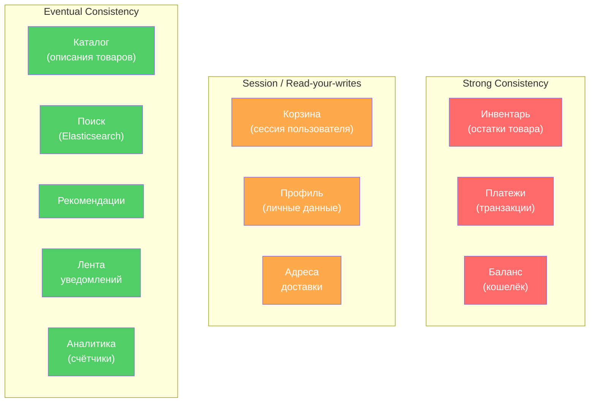

**Конкретные решения**:

| Поддомен | Модель | Паттерн | Почему |
|----------|--------|---------|--------|
| Инвентарь | `Strong` | `2PC` / `Saga` + `Outbox` | Overselling = убытки |
| Платежи | `Strong` | `TCC` / `Saga` | Двойное списание недопустимо |
| Заказы | `Saga` (оркестрация) | `Event Sourcing` + `Outbox` | Много шагов, нужен аудит |
| Каталог | `Eventual` | `CDC` → `Elasticsearch` | Задержка 1-2 сек приемлема |
| Корзина | `Session` | `Redis` + sticky session | Пользователь видит свои действия |
| Уведомления | `Eventual` | `Kafka` | Задержка допустима |

> **На собеседовании**: покажите, что вы не выбираете одну модель для всей системы, а применяете **разные уровни согласованности** для разных поддоменов, исходя из бизнес-требований.


> [!mcq]
> - [ ] Выбрать одну сильнейшую модель (`Strong`/`Linearizable`) и применить её ко всем поддоменам | Strong для каталога/рекомендаций — убитая latency на ровном месте; Strong для лайков — overengineering; e-commerce требует разные модели для разных bounded contexts. ❌ ПОСЛЕДСТВИЕ: ставим CockroachDB Serializable для всего, p99 latency на каталоге растёт до 500ms, Black Friday кладёт сервис.
> - [x] Применять разные модели для разных поддоменов: `Strong`+Saga/2PC для инвентаря и платежей (overselling = убытки), `Session`+Redis для корзины (read-your-writes), `Eventual`+CDC для каталога/поиска/рекомендаций, `Causal`+Kafka per-partition для уведомлений | Bounded contexts из DDD; каждый домен — свой trade-off latency/consistency; outbox+CDC связывает write-side с read-replica. ✓ ПРИМЕНЯТЬ: Amazon (DynamoDB strong для checkout, Kinesis eventual для рекомендаций), Netflix (Cassandra eventual для viewing history, Spanner для billing), Wolt (PostgreSQL strong для orders, ClickHouse eventual для analytics). 📋 ПРАВИЛО: «Каждому bounded context — своя модель». 🔗 См. Q8, Q31, Q33.
> - [ ] Выбрать `Eventual` везде и компенсировать в коде через retry — это самое простое | Eventual для inventory = overselling и refunds; компенсация через retry не решает race condition при concurrent резерве последнего товара. ❌ ПОСЛЕДСТВИЕ: магазин на Cassandra `CL=ONE` для inventory продаёт 100 единиц последнего товара 100 разным клиентам, 99 refund-ов + chargeback fees + repuational hit.
> - [ ] Делать выбор по популярности БД в команде, чтобы избежать обучения | Технический выбор подмена менеджментом: команда знает MongoDB → ставит для платежей и теряет деньги на eventual reads дублей. ❌ ПОСЛЕДСТВИЕ: «у нас все знают MongoDB» — payment processor читает stale balance при retry, double-charge, blocked merchant account, потеря processor licence.

## Q31. (!) Что такое PACELC-теорема и чем она дополняет CAP?

**PACELC** (Daniel Abadi, 2012) расширяет `CAP` с учётом штатной работы системы (без partition):

- **P** (Partition): при разделении сети выбирай между **A** (availability) и **C** (consistency) — это CAP
- **E** (Else): при *нормальной* работе выбирай между **L** (latency) и **C** (consistency)

```
PACELC = (P → A or C) else (L vs C)
```

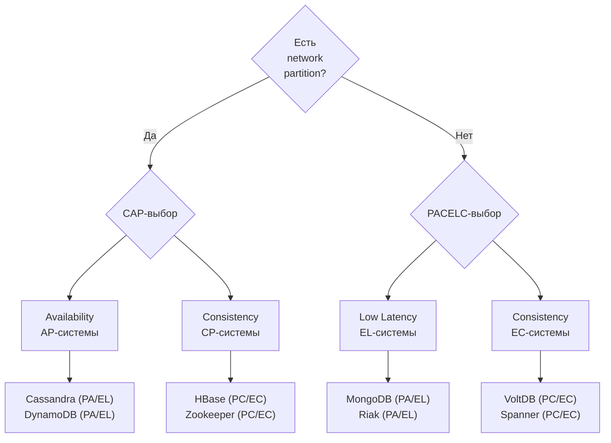

| Система | Partition | Else |
|---------|-----------|------|
| `Cassandra` | PA (доступность) | EL (низкая latency) |
| `HBase` | PC (согласованность) | EC (согласованность) |
| `MongoDB` (с replica set) | PC | EC |
| `DynamoDB` | PA | EL |
| `Spanner` | PC | EC |

**Практический вывод:** `CAP` говорит, что делать при сбое. `PACELC` добавляет: даже без сбоя есть компромисс между скоростью и свежестью данных. При выборе базы данных важно учитывать оба измерения.


> [!mcq]
> - [ ] PACELC просто переформулировка CAP другими словами — дополнительной информации не несёт | PACELC именно добавляет измерение `Else` (без partition): trade-off latency vs consistency существует и в штатной работе, не только при сбоях. ❌ ПОСЛЕДСТВИЕ: команда выбирает БД только по CAP («нам нужен AP») — игнорирует latency-vs-consistency в штатном режиме, на Cassandra `LOCAL_QUORUM` p99 в 3× выше ожиданий из-за coordinator forwarding.
> - [x] PACELC (Daniel Abadi 2012) расширяет CAP: `(Partition → A or C) Else (L vs C)` — даже без partition системы выбирают между низкой latency и согласованностью; классификация: Cassandra/DynamoDB = PA/EL, HBase/Spanner = PC/EC, MongoDB replica set = PC/EC | CAP отвечает «что делать при сбое», PACELC — «во что плата за consistency в штатной работе»; помогает выбирать БД с учётом обоих режимов. ✓ ПРИМЕНЯТЬ: Cassandra (PA/EL) для high-throughput eventual writes, Spanner (PC/EC) для финансов, DynamoDB tunable per-request, HBase (PC/EC) для аналитики; цитировать на собеседовании оригинал статьи Abadi. 📋 ПРАВИЛО: «CAP — про сбой, PACELC — про штатный режим». 🔗 См. Q1, Q32, Q33.
> - [ ] PACELC требует, чтобы система была одновременно AP и CP — иначе теорема нарушается | Каждая система выбирает по одному значению: PA или PC (при partition), EL или EC (без partition); комбинации PA/EC и PC/EL запрещены. ❌ ПОСЛЕДСТВИЕ: «AP+CP одновременно» — команда выбирает Cassandra с `CL=ALL` для записи и `CL=ONE` для чтения, ждёт «AP+strong», получает write-unavailability при отказе любого узла.
> - [ ] PACELC применима только к NoSQL базам, реляционные не входят | PostgreSQL replication, MySQL Group Replication, Oracle RAC — всё классифицируется по PACELC; теорема не зависит от модели данных. ❌ ПОСЛЕДСТВИЕ: «PostgreSQL не подпадает под PACELC» — команда не учитывает, что async replica даёт EL (stale reads), синхронная — EC (write latency), сюрпризы в SLA после миграции.

**Tunable Consistency** — возможность настроить уровень согласованности **per-запрос**, выбирая баланс между latency, доступностью и свежестью данных.

В `Cassandra` каждый запрос имеет `ConsistencyLevel`, определяющий, сколько реплик должны подтвердить операцию:

| Уровень | Описание | Когда применять |
|---------|----------|----------------|
| `ONE` | 1 реплика | Некритичные чтения, максимальная скорость |
| `QUORUM` | `N/2 + 1` реплик | Баланс consistency/availability |
| `ALL` | Все реплики | Критичные записи, риск недоступности |
| `LOCAL_QUORUM` | Кворум в датацентре | Multi-DC, без межрегиональных задержек |
| `EACH_QUORUM` | Кворум в каждом DC | Строгая гарантия multi-DC |

**Правило Strong Consistency:** `W + R > N` (где W — write level, R — read level, N — replication factor).

```java
// Пример: RF=3, W=QUORUM(2), R=QUORUM(2) → 2+2 > 3 → Strong Consistency
CqlSession session = CqlSession.builder().build();

// Запись с гарантией кворума
PreparedStatement write = session.prepare(
    "INSERT INTO orders (id, status) VALUES (?, ?)"
);
session.execute(write.bind(orderId, "CREATED")
    .setConsistencyLevel(ConsistencyLevel.QUORUM));

// Чтение: LOCAL_QUORUM для низкой latency в локальном DC
PreparedStatement read = session.prepare(
    "SELECT * FROM orders WHERE id = ?"
);
Row row = session.execute(read.bind(orderId)
    .setConsistencyLevel(ConsistencyLevel.LOCAL_QUORUM)).one();
```

**Типичная стратегия:**
- Финансовые записи: `W=ALL`, `R=ONE` (быстрое чтение, гарантированная запись)
- Каталог: `W=ONE`, `R=ONE` (eventual consistency, максимальная скорость)
- Заказы: `W=QUORUM`, `R=QUORUM` (strong consistency без избыточных накладных расходов)


> [!mcq]
> - [ ] Cassandra поддерживает только один уровень `QUORUM` для всех запросов | Cassandra даёт `ConsistencyLevel` per-request: ONE/QUORUM/ALL/LOCAL_QUORUM/EACH_QUORUM/SERIAL — каждый запрос сам выбирает trade-off. ❌ ПОСЛЕДСТВИЕ: команда ставит `QUORUM` глобально для всего кластера — каталог тормозит, инвентарь не получает strong reads, p99 5×.
> - [ ] Tunable Consistency = `eventual everywhere` без возможности усиления | Наоборот: tunable именно даёт выбор между eventual и strong per-запрос; формула `R + W > N` гарантирует strong при кворуме. ❌ ПОСЛЕДСТВИЕ: разработчик считает Cassandra «всегда eventual», для финансовых записей выбирает PostgreSQL — теряет horizontal scaling, при росте traffic master не справляется.
> - [x] Per-запрос настройка `ConsistencyLevel` (ONE/QUORUM/ALL/LOCAL_QUORUM/EACH_QUORUM): формула `W + R > N` даёт strong consistency через пересечение кворумов записи и чтения, иначе — eventual; в Cassandra устанавливается через `CqlSession.execute(stmt.setConsistencyLevel(...))` | RF=3, W=QUORUM(2), R=QUORUM(2) → 4>3 → strong; RF=3, W=ONE, R=ONE → 2<3 → eventual; LOCAL_QUORUM избегает межрегиональных RTT в multi-DC. ✓ ПРИМЕНЯТЬ: Cassandra финансы (W=ALL, R=ONE), каталог (W=ONE, R=ONE), заказы (W=QUORUM, R=QUORUM); ScyllaDB и DynamoDB consistent reads. 📋 ПРАВИЛО: «W+R > N → strong; иначе — eventual». 🔗 См. Q1, Q31, Q41.
> - [ ] Tunable consistency требует ребут кластера для смены уровня | `ConsistencyLevel` — атрибут запроса, не глобальный конфиг кластера; меняется в строке кода без рестарта. ❌ ПОСЛЕДСТВИЕ: «нужен maintenance window для смены CL» — команда переживает downtime ради config-change, который можно было сделать в коде.

**Bounded Staleness** (ограниченная устарелость) — модель согласованности, гарантирующая, что чтения отстают от записей не более чем на **заданный порог** — по времени или по числу версий.

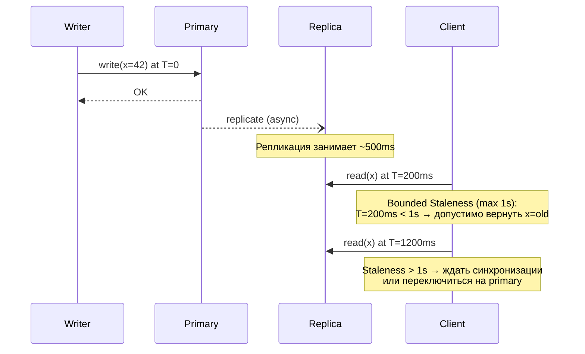

**Применение:**
- `Azure Cosmos DB` — явная настройка `maxStalenessPrefix` (версии) и `maxIntervalInSeconds` (время)
- `DynamoDB` — eventual reads могут отставать до нескольких секунд
- `Redis` (async replication) — `replica-lazy-flush`, отставание на тысячи команд

**Когда применять:**
- Метрики, дашборды — 30 секунд устарелости допустимы
- Персонализация, рекомендации — 1-5 минут OK
- Инвентарь, баланс — не применять; нужен `strong consistency`


> [!mcq]
> - [ ] Bounded Staleness — синоним Eventual Consistency: одно и то же | Eventual не даёт верхней границы устарелости (может отставать секунды/минуты); Bounded Staleness явно ограничивает: «не более 5 секунд» или «не более 100 версий». ❌ ПОСЛЕДСТВИЕ: команда называет Cassandra eventual reads «bounded staleness» — пользователь видит данные с задержкой минуты на отставшей реплике, аналитика расходится с операционной БД.
> - [ ] Bounded Staleness требует Strong Consistency на стороне записи | Bounded staleness — это relaxation strong, не его требование; работает с асинхронной репликацией с timestamp-tracking задержки. ❌ ПОСЛЕДСТВИЕ: «нужна Strong запись для bounded staleness» — выбирают Spanner ради метрик дашборда, тратят $10K/месяц вместо Cosmos DB BoundedStaleness за $1K.
> - [ ] Bounded Staleness применяется только к финансовым системам | Наоборот: финансы требуют Strong, BS — для метрик/аналитики/презенс-данных, где небольшое отставание допустимо. ❌ ПОСЛЕДСТВИЕ: ставим BS на банковский баланс — клиент видит остаток до перевода в течение N секунд, пытается снять деньги дважды, double-charge.
> - [x] Модель согласованности с явной верхней границей отставания: `maxStalenessPrefix` (число версий) или `maxIntervalInSeconds` (время); если staleness превышен — клиент ждёт синхронизации или переключается на primary | Реализация: Azure Cosmos DB консистентность `BOUNDED_STALENESS`, DynamoDB eventual reads с tracking lag, Redis async replication. Подходит для дашбордов (30s OK), персонализации (1-5min), не для финансов. ✓ ПРИМЕНЯТЬ: Cosmos DB `consistencyPolicy.bounded_staleness` для глобальной БД метрик, AWS DynamoDB Global Tables, Microsoft Teams (presence через Cosmos DB). 📋 ПРАВИЛО: «Stale, но не больше N секунд/версий». 🔗 См. Q3, Q31, Q33.

При синхронных REST-вызовах между микросервисами обеспечить `read-your-writes` сложнее, чем в одном сервисе, потому что запись и последующее чтение могут попасть на разные сервисы/реплики.

**Подходы:**

1. **Sticky routing по userId** — запросы одного пользователя маршрутизируются на одну реплику (stateful, снижает эффективность балансировки)

2. **Write token / version propagation** — после записи сервис возвращает `writeToken` (номер версии/LSN); последующие чтения передают токен в заголовке и ждут, пока реплика достигнет нужной версии:

```java
// POST /profile → возвращает X-Write-Token: 42
// GET /profile с заголовком: X-Min-Version: 42
// Сервис чтения блокирует запрос до достижения версии 42

@GetMapping("/profile/{id}")
public ProfileDto getProfile(
    @PathVariable UUID id,
    @RequestHeader(value = "X-Min-Version", required = false) Long minVersion) {

    if (minVersion != null) {
        replicationWaiter.waitForVersion(id, minVersion, Duration.ofSeconds(2));
    }
    return profileService.find(id);
}
```

3. **Read-after-write через Primary** — после записи читать с `primary` (или leader-ноды); последующие чтения можно направлять на реплики

4. **Клиентский кэш** — фронтенд хранит последнее записанное значение и показывает его до подтверждения от бэкенда

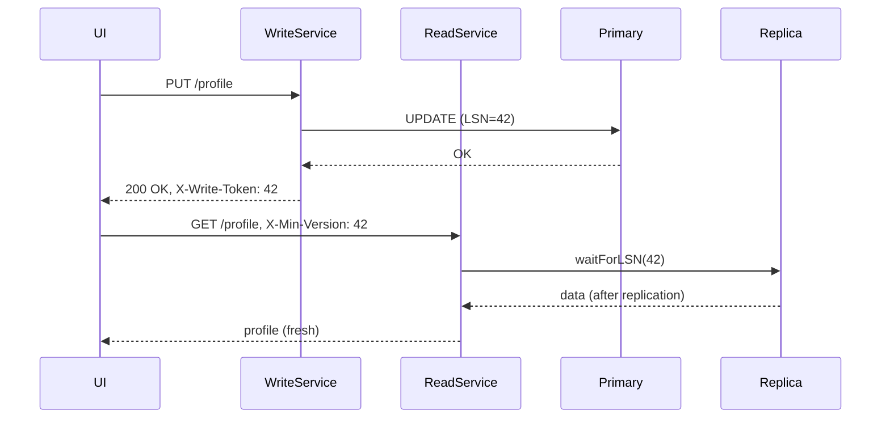


> [!mcq]
> - [x] Передавать `X-Write-Token: <LSN>` (returned by write-сервис) в `X-Min-Version` header последующих read-запросов; read-сервис вызывает `replicationWaiter.waitForVersion(id, minVersion, timeout)` чтобы дождаться репликации; альтернативы — sticky routing по userId, fallback на primary read | Token-based propagation работает stateless через все микросервисы; sticky routing нарушает балансировку; primary-read убивает scaling read-реплик. ✓ ПРИМЕНЯТЬ: Spring Cloud Gateway custom `XMinVersionFilter`, MongoDB `causally consistent sessions` через cluster time, AWS DynamoDB `ConsistentRead=true` после `PutItem`. 📋 ПРАВИЛО: «Запись возвращает LSN, чтение ждёт LSN». 🔗 См. Q5, Q29, Q36.
> - [ ] Кэшировать ответ POST на клиенте 30 секунд — пользователь увидит свои данные сразу | Client-side cache решает только для одной вкладки/устройства; на втором устройстве пользователь видит stale, в SPA refresh теряет cache. ❌ ПОСЛЕДСТВИЕ: банковское приложение кэширует баланс после перевода в браузере — пользователь открывает мобайл, видит старый баланс, паникует и звонит в support.
> - [ ] Использовать `READ_COMMITTED` на read-replica — это даёт RYW автоматически | Уровень изоляции БД управляет видимостью внутри транзакции, не управляет тем, какая реплика отвечает; read-replica всё равно отстаёт от master. ❌ ПОСЛЕДСТВИЕ: команда тратит спринт на тюнинг isolation levels, RYW всё равно ломается на failover.
> - [ ] Достаточно поставить retry с `@Retryable(maxAttempts=3)` в read-сервисе | Retry даёт лотерею: один из retry попадёт на догнавшую реплику, остальные — на отставшую; для каждого пользователя experience разный. ❌ ПОСЛЕДСТВИЕ: e-commerce checkout: `GET /orders/{id}` ретраит 3 раза, всё равно попадает на отставшую реплику с replica lag = 5s, клиент видит «Заказ не найден» после успешной оплаты.

**Row-level consistency** (согласованность строки) — гарантирует атомарность операций над одной записью: запись либо применяется целиком, либо нет. Нет гарантий относительно других строк, видимых в том же чтении.

**Transaction-level consistency (Serializability)** — набор операций над несколькими строками/таблицами выглядит так, как если бы выполнялся последовательно (без параллельных аномалий).

| Характеристика | Row-level | Transaction-level |
|----------------|-----------|-------------------|
| Атомарность | Одна строка | Набор операций |
| Изоляция | Нет | Да (разные уровни) |
| Производительность | Высокая | Ниже (локи/MVCC) |
| Аномалии | Dirty read, phantom | Устраняются уровнями изоляции |
| Примеры БД | `Cassandra` (LWT) | `PostgreSQL`, `MySQL` (SERIALIZABLE) |

**Linearizability vs Serializability:**
- `Linearizability` — операции над **одним объектом** выглядят мгновенными и отражают реальное время (`single-object`)
- `Serializability` — транзакции над **несколькими объектами** выглядят последовательными (`multi-object`)
- `Strict Serializability` = `Linearizability` + `Serializability` — самая сильная гарантия; обеспечивают `Spanner`, `FoundationDB`

```sql
-- Row-level (Cassandra LWT): атомарная операция над одной строкой
INSERT INTO accounts (id, balance) VALUES (1, 1000)
IF NOT EXISTS;

-- Transaction-level (PostgreSQL SERIALIZABLE): несколько строк атомарно
BEGIN;
SET TRANSACTION ISOLATION LEVEL SERIALIZABLE;
UPDATE accounts SET balance = balance - 100 WHERE id = 1;
UPDATE accounts SET balance = balance + 100 WHERE id = 2;
COMMIT;
```

---


> [!mcq]
> - [ ] Это синонимы: row-level и transaction-level — одно и то же | Принципиально разные scope: row-level — атомарность одной строки (Cassandra LWT), transaction-level — атомарность набора операций (PostgreSQL `SERIALIZABLE`). ❌ ПОСЛЕДСТВИЕ: команда называет Cassandra LWT «serializable» — переводит деньги между счетами через два LWT-запроса, ловит partial-update при network partition.
> - [x] Row-level consistency — атомарность операций над одной записью (Cassandra LWT, single-key writes); transaction-level (Serializability) — атомарность и изоляция набора операций над множеством строк/таблиц (PostgreSQL `SERIALIZABLE`); Linearizability ≈ row-level в реальном времени, Strict Serializability = Linearizability + Serializability | Row-level не защищает от write skew между строками: `UPDATE balance` атомарно для одной строки, но constraint `total > 0` для двух счетов нарушается; transaction-level через MVCC/SSI или 2PL устраняет аномалии. ✓ ПРИМЕНЯТЬ: Cassandra LWT (row-level) для idempotent writes, PostgreSQL `SERIALIZABLE` для bank transfers, Spanner/CockroachDB `Strict Serializability` для глобальных финансов. 📋 ПРАВИЛО: «Row — одна строка атомарно; Transaction — несколько строк изолированно». 🔗 См. Q7, Q35, Q39.
> - [ ] Row-level — это `READ_COMMITTED`, Transaction-level — `REPEATABLE_READ` | Уровни изоляции (READ_COMMITTED, REPEATABLE_READ, SERIALIZABLE) — это разные уровни ВНУТРИ transaction-level; row-level — другое измерение, про scope атомарности. ❌ ПОСЛЕДСТВИЕ: путаница терминов в DAR — выбираем `REPEATABLE_READ` ожидая «row-level safety», ловим write skew в финансовых переводах.
> - [ ] Transaction-level всегда быстрее row-level из-за отсутствия per-row locks | Transaction-level дороже: requires MVCC overhead, lock-management для multi-row, conflict detection; row-level дешевле — атомарность только для одной строки. ❌ ПОСЛЕДСТВИЕ: команда выбирает `SERIALIZABLE` для каждого простого `UPDATE` ожидая performance — на 5K WPS ловит `serialization_failure`, throughput 10×.

**Read-your-writes** (RYW) — гарантия: клиент, выполнивший запись, всегда увидит результат этой записи при последующем чтении. Звучит тривиально, но в распределённых системах нарушается при чтении с реплики, которая ещё не синхронизировалась.

**Проблема:**
```
Клиент:
  1. POST /profile → запись на Primary (LSN=100)
  2. GET /profile  → чтение с Replica (LSN=95) → видит старые данные!
```

**Решения:**

**1. Read-after-write routing — читать всегда с Primary после записи:**
```java
// Spring Boot пример с DataSource routing
public class ReadYourWritesDataSource extends AbstractRoutingDataSource {
    private final ThreadLocal<Boolean> usesPrimary = new ThreadLocal<>();

    @Override
    protected Object determineCurrentLookupKey() {
        return Boolean.TRUE.equals(usesPrimary.get()) ? "primary" : "replica";
    }
}

// В сервисе:
@Transactional
public UserDto updateProfile(UpdateRequest req) {
    userRepo.save(req);
    readYourWritesDataSource.forceUsePrimary(); // следующие 5 секунд — читать с primary
    return userRepo.findById(req.id());
}
```

**2. Version tokens / Write tokens:**
```java
// Запись возвращает LSN/версию
WriteResult result = profileService.update(dto);
long writeToken = result.getLogSequenceNumber(); // например, 100

// Чтение с минимальной версией
@GetMapping("/profile/{id}")
public ProfileDto getProfile(@PathVariable UUID id,
    @RequestHeader(value = "X-Min-Version", required = false) Long minVersion) {
    if (minVersion != null) {
        replicationWaiter.waitForVersion(id, minVersion, Duration.ofSeconds(2));
    }
    return profileService.find(id);
}
```

**3. Sticky sessions** — клиент всегда направляется на один и тот же узел (например, через consistent hashing по session ID). Минус: нарушается балансировка нагрузки.

**4. Client-side caching** — фронтенд сохраняет последнее записанное значение и показывает его оптимистично, пока реплика не догонит.

| Метод | Сложность | Производительность | Применение |
|-------|-----------|-------------------|------------|
| Read from Primary | Простая | Снижается (нет реплик) | Критичные данные |
| Version tokens | Средняя | Хорошая | REST API |
| Sticky sessions | Низкая | Средняя | Stateful приложения |
| Client cache | Средняя | Отличная | SPA / mobile |

---


> [!mcq]
> - [ ] Достаточно `Strong consistency` глобально — RYW гарантируется автоматически | Strong даёт RYW + ещё больше (для всех клиентов), но это overkill: убитая latency и availability там, где нужна только видимость своих изменений. ❌ ПОСЛЕДСТВИЕ: ставим Spanner Strong для социальной сети ради RYW профиля — стоимость $50K/месяц, p99 latency 200ms+, можно было обойтись Cosmos DB BoundedStaleness за $5K.
> - [x] Несколько подходов: read-after-write routing на primary (`ReadYourWritesDataSource` с ThreadLocal); version tokens через `X-Min-Version` header + `replicationWaiter.waitForVersion`; sticky sessions через consistent hashing по session ID; client-side caching своих writes до подтверждения репликой | Каждый подход — свой trade-off: primary-read убивает scaling, sticky session нарушается на failover, version-token требует LSN-tracking, client-cache работает только в SPA. ✓ ПРИМЕНЯТЬ: AWS DynamoDB `ConsistentRead=true` после `PutItem`, MongoDB causal sessions через cluster time, Spring Cloud Gateway sticky cookie-affinity, Discord client-cache. 📋 ПРАВИЛО: «Своё пишу — своё вижу; реализаций минимум 4». 🔗 См. Q5, Q29, Q34.
> - [ ] Только `synchronized` блок на write-методе сервиса даст RYW | `synchronized` — JVM-level lock, не спасает в multi-replica deployment; пишет на pod A, читает с pod B, RYW ломается. ❌ ПОСЛЕДСТВИЕ: разработчик ставит `synchronized` на `updateProfile` в k8s deployment с replicas=3 — RYW всё равно нарушается, debug через логи занимает спринт.
> - [ ] Глобальный distributed lock через Redis на каждый write-read цикл | Performance disaster: lock на каждый запрос убивает throughput; при отказе Redis весь сервис в read-only; есть проще способы. ❌ ПОСЛЕДСТВИЕ: Redlock на `/profile` write-read — 5K RPS приложение получает throttling, latency p99 → 500ms, при rolling restart Redis сервис недоступен.

**Monotonic Read Consistency** — гарантия, что клиент никогда не увидит более старую версию данных после того, как уже видел новую. Без этой гарантии возможна ситуация: первый запрос вернул версию 5, второй запрос вернул версию 3 (читал с отставшей реплики).

**Проблема:**
```
Клиент делает два последовательных GET /orders:
  Запрос 1 → Replica A (синхронизирована до LSN=50) → видит заказ #123
  Запрос 2 → Replica B (синхронизирована до LSN=40) → заказ #123 исчез!
```

**Решение 1: Sticky sessions (сессионная привязка)**

Балансировщик направляет все запросы одной сессии на один и тот же бэкенд/реплику:

```nginx
# Nginx: sticky sessions через IP hash
upstream backend {
    ip_hash;  # один клиент → один сервер
    server replica1:8080;
    server replica2:8080;
    server replica3:8080;
}
```

Минус: при отказе реплики клиент видит "скачок" назад при переключении. Хуже балансировки при "горячих" IP.

**Решение 2: Session tokens (векторные версии)**

```java
// Клиент передаёт последнюю известную версию
// Сервер гарантирует, что ответ не хуже этой версии

public class MonotonicReadFilter implements Filter {
    @Override
    public void doFilter(ServletRequest req, ServletResponse res, FilterChain chain) {
        String sessionVersion = ((HttpServletRequest) req).getHeader("X-Session-Version");
        if (sessionVersion != null) {
            long version = Long.parseLong(sessionVersion);
            // Если реплика отстаёт — ждём или переключаемся на primary
            replicaRouter.ensureAtLeast(version);
        }
        chain.doFilter(req, res);
        // В ответе — текущая версия реплики
        ((HttpServletResponse) res).setHeader("X-Session-Version",
            String.valueOf(replicaRouter.currentVersion()));
    }
}
```

**Решение 3: Read from same replica per session**

```java
// Consistent hashing по session ID
public ReplicaClient selectReplica(String sessionId) {
    int hash = Math.abs(sessionId.hashCode()) % replicas.size();
    return replicas.get(hash);
}
```

**Когда монотонность критична:**
- Пагинация: перескакивание страниц из-за разных реплик недопустимо
- Чаты: сообщения не должны "исчезать"
- Финансовые отчёты: балансы не должны откатываться

---


> [!mcq]
> - [ ] Sticky sessions всегда дают monotonic reads без минусов | Sticky session ломается при failover ноды: клиент перебрасывается на другую реплику с другим LSN, может увидеть «старые» данные → нарушение монотонности. ❌ ПОСЛЕДСТВИЕ: чат на sticky-session по `ip_hash`, при rolling restart pod пользователи видят disappearing messages, support флуд.
> - [x] Sticky sessions (consistent hashing по session ID на gateway/Nginx `ip_hash` или `sticky-cookie`) либо session tokens (клиент передаёт `X-Session-Version: <LSN>`, сервер ждёт пока реплика догонит); компромисс — sticky проще но плохо при failover, session-token надёжнее но требует tracking | Без monotonic reads возможен «откат во времени»: первый GET с реплики A (LSN=50), второй GET с реплики B (LSN=40) → пагинация ломается, чат теряет сообщения, баланс «прыгает» назад. ✓ ПРИМЕНЯТЬ: Nginx `ip_hash` upstream для sticky, AWS ALB stickiness, MongoDB causal sessions, custom `MonotonicReadFilter` в Spring; Discord и LinkedIn используют consistent hashing. 📋 ПРАВИЛО: «Время не идёт назад: либо реплика та же, либо token не меньше». 🔗 См. Q5, Q6, Q36.
> - [ ] Достаточно random load balancing — несколько запросов всё равно дадут актуальную версию | Random LB — главная причина нарушения monotonic reads: один запрос на реплике A, другой на B с другим LSN. ❌ ПОСЛЕДСТВИЕ: лента новостей через random LB на 5 реплик с replication lag — пользователь скроллит вниз, исчезают и появляются посты, флакающий UX.
> - [ ] Monotonic reads недостижимы в распределённых системах | Достижимы через session-tracking; реализованы в Cassandra/DynamoDB через QUORUM read, MongoDB causal sessions. ❌ ПОСЛЕДСТВИЕ: «не сделать → делаем strong» — выбираем Spanner ради monotonic reads на ленте, переплачиваем 10×, не получаем других benefits strong.

**Causal Consistency** гарантирует: если событие A causally предшествует событию B (A happened-before B), то все узлы сначала увидят A, потом B. События без причинно-следственной связи могут наблюдаться в любом порядке.

**Определение "happened-before" (→):**
- Если A и B на одном узле, и A выполнилось раньше B → A → B
- Если A — отправка сообщения, B — получение → A → B
- Транзитивность: если A → B и B → C → A → C

**Vector Clocks — основной механизм реализации:**

```java
public class VectorClock {
    private final Map<String, Long> clock = new HashMap<>();

    // При локальном событии — инкрементируем свой счётчик
    public void tick(String nodeId) {
        clock.merge(nodeId, 1L, Long::sum);
    }

    // При отправке сообщения — прикладываем свои часы
    public Map<String, Long> getSnapshot() {
        return Collections.unmodifiableMap(clock);
    }

    // При получении сообщения — merge: берём max по каждому узлу
    public void merge(Map<String, Long> received) {
        received.forEach((node, time) ->
            clock.merge(node, time, Math::max));
        // Инкрементируем свой счётчик
        clock.merge("self", 1L, Long::sum);
    }

    // A happened-before B?
    public boolean happenedBefore(VectorClock other) {
        return clock.entrySet().stream()
            .allMatch(e -> e.getValue() <= other.clock.getOrDefault(e.getKey(), 0L))
            && !clock.equals(other.clock); // хотя бы одно значение меньше
    }
}
```

**Пример работы Vector Clocks:**

```
Узел A: [A:1, B:0, C:0]  — событие e1
Узел B: [A:0, B:1, C:0]  — событие e2 (независимо)
A отправляет B: [A:1, B:0, C:0]
B получает: merge → [A:1, B:2, C:0]  — теперь B знает: e1 → это событие
```

**Реализации в production:**

| Система | Механизм | Детали |
|---------|----------|--------|
| `Riak` | Vector Clocks | Каждый объект несёт VClock |
| `DynamoDB` | Version vectors | Внутренняя реализация |
| `Cassandra` | Timestamps (не VClock) | LWW, не causal! |
| `MongoDB` | Causal sessions | Session consistency через cluster time |
| `Redis` (Cluster) | Нет causal | Eventual по умолчанию |

**MongoDB Causal Consistency Sessions:**
```java
ClientSession session = mongoClient.startSession(
    ClientSessionOptions.builder()
        .causallyConsistent(true)
        .build());
// Все операции в сессии causally consistent
// Запись → гарантированно видна в последующем чтении той же сессии
```

---


> [!mcq]
> - [ ] Vector clocks используют физический NTP timestamp для упорядочивания | Физические часы рассинхронизированы (NTP drift ~ms-сотни ms); vector clocks — логические, не зависят от физики, основаны на счётчиках событий per-node. ❌ ПОСЛЕДСТВИЕ: пытаемся реализовать «vector clock на NTP» — при leap second в июне 2015 cassandra-кластеры теряли события из «будущего», AWS падал на сотни систем.
> - [ ] Causal Consistency — это `Linearizability` для конкретного типа объектов | Linearizability — самая строгая модель (single-object + real-time), Causal — слабее (только happens-before, без real-time). ❌ ПОСЛЕДСТВИЕ: путая causal с linearizability, выбираем etcd для лент чата вместо MongoDB causal sessions — 10× латенси, кластер не масштабируется на multi-region.
> - [x] Vector clocks: каждый узел держит вектор `[N1:v1, N2:v2,...]`, при локальном событии инкрементирует свой слот, при send/receive `merge` через поэлементный max + инкремент; happens-before если все `vA[i] ≤ vB[i]` и хотя бы одно строго меньше; concurrent если ни A→B ни B→A; реализуется в Riak, MongoDB causal sessions через cluster time | Доставка сообщения только если все vector-зависимости применены (`canDeliver` проверяет `localClock ≥ messageClock`); concurrent updates требуют merge или ручного разрешения; масштабирование через dotted version vectors (Riak) для O(N) → O(actors). ✓ ПРИМЕНЯТЬ: Riak vector clocks, MongoDB `causally consistent sessions`, COPS database, Amazon Dynamo (исходный paper 2007); Notion и Linear для offline-first sync. 📋 ПРАВИЛО: «Vector — кто и сколько событий видел; merge через max». 🔗 См. Q4, Q26, Q40.
> - [ ] Causal Consistency реализуется через single global counter (Lamport clock) | Lamport clock даёт total order, но не различает concurrent vs causal — теряет информацию о параллелизме; vector clocks хранят знание о КАЖДОМ узле. ❌ ПОСЛЕДСТВИЕ: «Lamport clock = causal» — Riak без vector clocks, используя Lamport, теряет concurrent updates, конфликты разрешаются как LWW, пользователи теряют комментарии.

Это одна из самых путаных пар терминов в распределённых системах. Многие кандидаты путают их, хотя они описывают принципиально разные вещи.

**Linearizability** (линеаризуемость) — свойство **одного объекта** (ключа, строки):
- Каждая операция выглядит как мгновенная в какой-то точке реального времени
- Если операция A завершилась до начала операции B, B видит результат A
- Это single-object, single-operation гарантия

**Serializability** (сериализуемость) — свойство **транзакций** (наборов операций):
- Результат параллельного выполнения транзакций эквивалентен какому-то последовательному порядку
- Не привязана к реальному времени — "эквивалентная последовательность" может не совпадать с порядком завершения
- Это multi-object, multi-operation гарантия

```
Различие на примере:

Linearizability (нарушение):
  T=0ms: Client A читает X → начало
  T=1ms: Client B пишет X=5 → завершает
  T=2ms: Client A читает X → завершает, видит X=0 (старое!)
  НАРУШЕНИЕ: B завершил запись до завершения чтения A

Serializability (нарушение — write skew):
  Account A: $100, Account B: $100, правило: sum > 0
  T1: читает A(100), B(100), пишет A=-50
  T2: читает A(100), B(100), пишет B=-50
  Итог: A=-50, B=-50, sum=-100 — правило нарушено!
  (при последовательном выполнении этого не случилось бы)
```

**Strict Serializability** = Linearizability + Serializability:
- Самая сильная гарантия
- Транзакции выглядят и как мгновенные, и как последовательные
- Реализуют: Google Spanner, FoundationDB, CockroachDB (SERIALIZABLE isolation)

| Свойство | Linearizability | Serializability | Strict Serializability |
|----------|-----------------|-----------------|------------------------|
| Область | Один объект | Транзакции | Транзакции |
| Реальное время | Да | Нет | Да |
| Производительность | Средняя | Ниже | Самая низкая |
| Аномалии | Нет на один ключ | Нет write skew | Нет всех аномалий |
| Примеры | etcd, ZooKeeper | PostgreSQL SERIALIZABLE | Spanner, FoundationDB |

**Когда нужна каждая:**
- **Linearizability**: лидер-выборы, distributed locks, счётчики (один объект, но нужна точность)
- **Serializability**: банковские переводы между счетами, сложные бизнес-инварианты
- **Strict Serializability**: финансовые системы с глобальным состоянием, критичные транзакции

---


> [!mcq]
> - [ ] Это синонимы: оба гарантируют, что транзакции выполняются в каком-то последовательном порядке | Принципиально разные свойства: linearizability — про *одну* операцию + реальное время; serializability — про *группу* операций без привязки ко времени. ❌ ПОСЛЕДСТВИЕ: интервьюер ставит минус кандидату, который путает их при обсуждении CockroachDB / Spanner и `SERIALIZABLE` isolation в PostgreSQL.
> - [ ] Linearizability — про транзакции, Serializability — про одну операцию | Перевёрнуто: linearizability — single-object/single-operation; serializability — multi-object/multi-operation (transaction). ❌ ПОСЛЕДСТВИЕ: при выборе уровня изоляции в PostgreSQL запрашиваем `LINEARIZABLE` (которого нет в SQL) — команда годами думает, что `READ COMMITTED` достаточно для финансовых переводов, money lost через write skew.
> - [x] Linearizability — single-object operation выглядит мгновенной в реальном времени (atomic visibility одной записи); Serializability — set of transactions эквивалентен какому-то последовательному выполнению (без обязательной привязки к времени); `Strict Serializability = Linearizability + Serializability` (Spanner, CockroachDB) | Linearizability достаточно для leader election, distributed locks, счётчиков (etcd, ZooKeeper); Serializability — для multi-row транзакций (PostgreSQL `SERIALIZABLE`); Strict Serializability — для глобальных финансов (Spanner, FoundationDB). ✓ ПРИМЕНЯТЬ: etcd/ZooKeeper для leader election, PostgreSQL `SERIALIZABLE` для bank transfers, Spanner/CockroachDB для глобальных платежей. 📋 ПРАВИЛО: «Linearizability — атомарность во времени; Serializability — порядок транзакций». 🔗 См. Q7, Q35, Q39.
> - [ ] Linearizability сильнее, потому что включает Serializability как частный случай | Это не корректное вложение: они независимы по scope. Strong combination — `Strict Serializability` (linearizability + serializability одновременно). ❌ ПОСЛЕДСТВИЕ: ожидаем что Linearizable БД (etcd) даёт serializable transactions для multi-key операций — ловим аномалии при batch update нескольких ключей в etcd.

**CRDT** (Conflict-free Replicated Data Type) — структура данных, спроектированная так, что конфликты при слиянии реплик **математически невозможны**: слияние всегда детерминировано и корректно.

**Два вида CRDTs:**

**State-based CRDT (CvRDT)** — узлы периодически обмениваются полным состоянием, применяют функцию merge:
```java
// G-Counter (Grow-only Counter) — пример state-based CRDT
public class GCounter {
    private final Map<String, Long> counters = new HashMap<>();
    private final String nodeId;

    public void increment() {
        counters.merge(nodeId, 1L, Long::sum);
    }

    public long value() {
        return counters.values().stream().mapToLong(Long::longValue).sum();
    }

    // Merge: берём max по каждому узлу — всегда корректно
    public GCounter merge(GCounter other) {
        GCounter result = new GCounter(nodeId);
        Set<String> allKeys = new HashSet<>(counters.keySet());
        allKeys.addAll(other.counters.keySet());
        allKeys.forEach(k ->
            result.counters.put(k, Math.max(
                counters.getOrDefault(k, 0L),
                other.counters.getOrDefault(k, 0L))));
        return result;
    }
}
```

**Operation-based CRDT (CmRDT)** — узлы обмениваются операциями (не состоянием); операции идемпотентны и коммутативны:
```java
// Add-Wins Set — операции add всегда побеждают remove
// Даже если remove приходит позже add — элемент остаётся
// (используется в Redis CRDB, Riak)
```

**Основные типы CRDTs:**

| Тип | Операции | Применение | Пример |
|-----|----------|------------|--------|
| G-Counter | только increment | Счётчики просмотров | Redis, Riak |
| PN-Counter | increment + decrement | Лайки, голоса | SoundCloud |
| G-Set | только add | Теги, списки | — |
| OR-Set (Add-Wins) | add + remove | Корзина, список задач | Redis, Riak |
| LWW-Register | set с timestamp | Профиль пользователя | Cassandra |
| MV-Register | multi-value (конфликт выставляется клиенту) | Документы | Riak |
| RGA | insert + delete с позицией | Совместное редактирование текста | Google Docs, Figma |
| OR-Map | key→CRDT value | JSON-документы | Redis JSON |

**Применение в production:**

```
Figma — использует CRDT для realtime-коллаборации:
  - Каждый объект на canvas — CRDT
  - Два пользователя двигают один объект → merge без конфликтов

Redis Enterprise (CRDB):
  - Geo-replicated кластеры с автоматическим merge
  - OR-Set для корзины: add-wins семантика

Riak:
  - Все типы данных — встроенные CRDTs (Map, Set, Counter, Flag, Register)

Notion, Linear:
  - Используют CRDT для offline-first синхронизации
```

**Ограничения CRDTs:**
- Не все структуры данных можно представить как CRDT (например, уникальные ограничения)
- State-based CRDTs требуют передачи полного состояния (дорого для больших объектов)
- Семантика может быть неочевидной (add-wins vs remove-wins выбирается заранее)

---


> [!mcq]
> - [ ] Все CRDTs хранят полное состояние и обмениваются им (только state-based) | Два вида: CvRDT (state-based: обмен полным state, merge через max) и CmRDT (operation-based: обмен операциями с коммутативностью); op-based экономит трафик. ❌ ПОСЛЕДСТВИЕ: на больших объектах state-based CRDT передаёт MB по сети при каждом merge — network saturation, latency растёт линейно с размером state.
> - [ ] CRDTs — это любые eventual consistent структуры, например Redis lists с async repl | CRDTs требуют математических свойств (commutativity, associativity, idempotence); обычный async-list — concurrent operations теряются, не CRDT. ❌ ПОСЛЕДСТВИЕ: называя Redis list «CRDT», теряем элементы корзины при network partition в active-active deployment.
> - [ ] CRDTs всегда дают strong consistency без trade-off | CRDTs — eventual consistency с гарантией convergence, не strong; текущее значение на одной реплике может отличаться от другой до merge. ❌ ПОСЛЕДСТВИЕ: проектируем bank balance на CRDT G-Counter ожидая «strong because no conflict» — клиент видит разные балансы в разных DC, regulatory issue.
> - [x] Структуры с математически невозможным конфликтом merge: CvRDT (state-based) — обмен полным state с `merge` через поэлементный max, CmRDT (op-based) — обмен идемпотентными+коммутативными операциями; типы: G-Counter (grow-only), PN-Counter (positive-negative), G-Set, OR-Set (Add-Wins), LWW-Register, MV-Register, RGA (для текста) | Применение: G-Counter в SoundCloud для views, OR-Set в Redis CRDB для cart, RGA в Figma/Google Docs для realtime co-editing, Riak DataTypes (Counter/Set/Map/Flag), Notion/Linear для offline-first sync. ✓ ПРИМЕНЯТЬ: Redis Enterprise CRDB для multi-DC cart, Figma RGA для concurrent canvas editing, Yjs/Automerge для collaborative docs, Riak Counter/Set. 📋 ПРАВИЛО: «Коммутативность + ассоциативность + идемпотентность = no conflict». 🔗 См. Q24, Q25, Q26.

**Quorum** — минимальное количество узлов, которые должны подтвердить операцию чтения/записи для гарантии согласованности.

**Формула: R + W > N**
- `N` — количество реплик (Replication Factor)
- `W` — кворум записи (сколько узлов должны подтвердить запись)
- `R` — кворум чтения (сколько узлов должны ответить при чтении)

**Почему формула гарантирует согласованность:**

При R + W > N множества "узлов записи" и "узлов чтения" обязательно пересекаются. Значит, хотя бы один узел, участвовавший в записи, всегда участвует в чтении — и вернёт актуальные данные.

```
Пример с N=5, W=3, R=3: W+R=6 > 5 ✓
  Запись подтверждена на узлах: {1, 2, 3}
  Чтение опрашивает узлы:      {2, 3, 4}
  Пересечение:                  {2, 3} — оба видели запись ✓

Пример с N=5, W=2, R=2: W+R=4 < 5 ✗ — нет гарантии!
  Запись на узлах: {1, 2}
  Чтение с узлов:  {3, 4}
  Пересечение:     {} — никто не видел запись!
```

**Типичные конфигурации:**

```
N=3 (типичный кластер):
  W=2, R=2: R+W=4>3 ✓ — strong consistency, терпит отказ 1 узла
  W=1, R=3: R+W=4>3 ✓ — fast write, slow read
  W=3, R=1: R+W=4>3 ✓ — slow write, fast read
  W=1, R=1: R+W=2<3 ✗ — eventual consistency (AP)

N=5 (для большей отказоустойчивости):
  W=3, R=3: W+R=6>5 ✓ — терпит отказ 2 узлов
  W=1, R=1: eventual consistency
```

**Cassandra — настройка кворума:**
```cql
-- Консистентность на уровне запроса
INSERT INTO orders (id, status) VALUES (uuid(), 'PENDING')
USING CONSISTENCY QUORUM;  -- W = N/2 + 1 = 2 при RF=3

SELECT * FROM orders WHERE id = ?
CONSISTENCY LOCAL_QUORUM;  -- кворум в пределах одного DC
```

**Сравнение кворумных стратегий:**

| W | R | Доступность записи | Доступность чтения | Согласованность |
|---|---|--------------------|--------------------|-----------------|
| N | 1 | Низкая | Высокая | Strong |
| 1 | N | Высокая | Низкая | Strong |
| N/2+1 | N/2+1 | Средняя | Средняя | Strong + отказоустойч. |
| 1 | 1 | Максимальная | Максимальная | Eventual |

**Leaderless quorum (Dynamo-style):**
В Cassandra и DynamoDB любой узел может координировать запрос. Это отличается от leader-based кворума (Raft, ZAB), где лидер явно назначается алгоритмом консенсуса.

---


> [!mcq]
> - [ ] `R + W > N` гарантирует strong consistency только если все узлы кластера здоровы | Формула гарантирует strong при любом достижимом кворуме: `W` узлов подтвердили запись, `R` узлов отвечают на чтение, пересечение ≥ 1, поэтому хотя бы один узел в чтении видел запись. ❌ ПОСЛЕДСТВИЕ: команда не понимает формулу, ставит `W=1, R=N` ради «availability» — пишет на 1 узел, читает с N, latency чтения 10× из-за самого медленного узла без выигрыша consistency.
> - [x] Формула `R + W > N` гарантирует strong consistency через пересечение кворумов: при `N=3, W=2, R=2` множества записывающих и читающих узлов пересекаются хотя бы в одном узле, который видел запись; типичные конфигурации: `W=QUORUM, R=QUORUM` (баланс), `W=ALL, R=ONE` (slow write, fast read), `W=1, R=1` (eventual) | Cassandra реализует через `ConsistencyLevel`; `LOCAL_QUORUM` избегает межрегиональных RTT в multi-DC; формула не зависит от того, leader-based (Raft) или leaderless (Dynamo-style). ✓ ПРИМЕНЯТЬ: Cassandra `W=QUORUM,R=QUORUM` для заказов, DynamoDB `Strong reads` (внутренняя реализация формулы), ScyllaDB; etcd/ZooKeeper достигают через Raft majority. 📋 ПРАВИЛО: «W+R > N → пересечение кворумов → strong». 🔗 См. Q1, Q2, Q32.
> - [ ] `W=N` всегда лучше: пишем на все узлы, гарантируем consistency | `W=N` убивает write availability: при отказе ЛЮБОГО узла запись блокируется; кворум `W=N/2+1` терпит отказ `floor(N/2)` узлов. ❌ ПОСЛЕДСТВИЕ: ставим `CL=ALL` для Cassandra записей — при rolling restart одной ноды весь кластер read-only для записи, deployment блокируется.
> - [ ] Формула применима только к Cassandra, в других БД её нет | Formula универсальна для quorum-based систems: DynamoDB, ScyllaDB, Riak, etcd (через Raft), MongoDB write concern `w:majority`. ❌ ПОСЛЕДСТВИЕ: «формула только для Cassandra» — команда не настраивает MongoDB `writeConcern: majority` для критичных записей, ловит data loss при primary failover.

**Split-brain** — ситуация, когда два узла одновременно считают себя лидерами и пишут в общий ресурс. Это приводит к потере данных или неконсистентному состоянию.

**Классический сценарий (проблема):**

```
1. Node A получает lock от ZooKeeper, становится лидером
2. Node A зависает на 30 секунд (GC pause / network hiccup)
3. ZooKeeper считает A мёртвым → отдаёт lock Node B
4. Node B начинает записывать в shared storage
5. Node A "просыпается" → думает, что ещё держит lock → тоже пишет
6. SPLIT-BRAIN: два записывающих узла одновременно!
```

**Решение: Fencing Tokens**

```
1. ZooKeeper выдаёт lock с монотонно возрастающим токеном: token=34
2. Node A получает lock, запоминает token=34
3. Node A зависает...
4. ZooKeeper отдаёт lock Node B с token=35
5. Node B пишет в storage с заголовком: X-Fencing-Token: 35
6. Storage запоминает: последний принятый токен = 35
7. Node A просыпается, пытается писать с X-Fencing-Token: 34
8. Storage ОТКЛОНЯЕТ: 34 < 35 → запрос с устаревшим токеном!
```

**Реализация на стороне storage:**

```java
public class FencedStorage {
    private volatile long lastFencingToken = 0;

    public synchronized void write(String key, String value, long fencingToken) {
        if (fencingToken < lastFencingToken) {
            throw new FencingTokenException(
                "Stale token: " + fencingToken + " < " + lastFencingToken);
        }
        lastFencingToken = fencingToken;
        store.put(key, value);
    }
}
```

**Fencing в Kubernetes (для StatefulSets):**

```yaml
# Kubernetes использует resource version как fencing token
# kubectl использует resourceVersion при каждом update
apiVersion: v1
kind: ConfigMap
metadata:
  resourceVersion: "1234"  # если изменилось — update отклонён (OptimisticLock)
```

**Fencing в Redis (RedLock):**

```java
// RedLock: при продлении lock генерируется новый уникальный value
// Клиент проверяет, что value совпадает → только реальный держатель lock-а может его продлить
String lockValue = UUID.randomUUID().toString();
redisTemplate.opsForValue().set("lock:key", lockValue,
    Duration.ofSeconds(30), SetOption.ifAbsent());

// При работе — проверяем, что всё ещё наш lock (Lua-скрипт атомарно)
String lua = "if redis.call('get', KEYS[1]) == ARGV[1] then " +
             "return redis.call('del', KEYS[1]) else return 0 end";
```

**Сравнение подходов защиты от split-brain:**

| Подход | Механизм | Сложность | Надёжность |
|--------|----------|-----------|------------|
| Fencing tokens | Монотонный токен + server-side check | Средняя | Высокая |
| STONITH | Физическое отключение "зомби"-узла | Высокая | Максимальная |
| Epoch numbers | Версионированные эпохи лидерства | Средняя | Высокая |
| Lease-based | TTL на lock, нет продления = нет записи | Низкая | Средняя |
| Single-writer | Один writer всегда | Низкая | Высокая (но нет HA) |

**Ключевой принцип**: фенсинг-токен должна проверять **сама БД/storage**, а не клиент. Клиент может быть скомпрометирован или завис — только storage знает реальный порядок запросов.

---


> [!mcq]
> - [ ] Достаточно distributed lock через ZooKeeper/Redis — split-brain невозможен | Lock не спасает от GC pause/network hiccup: lock holder зависает, ZooKeeper отдаёт lock другому, но первый «просыпается» и тоже пишет — split-brain. ❌ ПОСЛЕДСТВИЕ: классическая Martin Kleppmann статья «How to do distributed locking»: ZooKeeper lock без fencing token → два writer'а пишут в S3 параллельно, один файл перезаписывается, data loss.
> - [ ] Fencing token проверяется на стороне клиента перед записью | Клиент может быть скомпрометирован, зависнуть, обмануть проверку; проверять токен должна сама storage — она знает реальный порядок запросов. ❌ ПОСЛЕДСТВИЕ: client-side check fencing token — два writer'а оба «считают» что у них свежий token, оба коммитят, storage не блокирует устаревший токен.
> - [ ] Достаточно `synchronized` блока на storage сервере | `synchronized` — JVM-level, не помогает в distributed системе с несколькими storage-replicas; lock manager и storage обычно разные сервисы. ❌ ПОСЛЕДСТВИЕ: «synchronized на storage write» — два storage-pod в k8s принимают запись с устаревшим токеном параллельно, fencing не работает.
> - [x] Lock manager (ZooKeeper/etcd) выдаёт lock с монотонно возрастающим токеном; storage хранит `lastFencingToken` и отклоняет запросы с `token < lastFencingToken`; альтернативы — STONITH (физическое отключение зомби), epoch numbers, lease-based с TTL без продления, single-writer (нет HA) | Server-side check обязателен — клиент скомпрометирован/завис; Kubernetes использует `resourceVersion` как fencing token, Redis Redlock — UUID lock value с Lua-script атомарной проверки. ✓ ПРИМЕНЯТЬ: Kubernetes `resourceVersion` для StatefulSet updates, Redis Redlock + Lua check, etcd lease с monotonic revision, ZooKeeper sequence znode. 📋 ПРАВИЛО: «Монотонный токен + server-side reject < lastToken». 🔗 См. Q9, Q39, Q41.

## See also

- [Распределённые системы](distributed-systems-interview.md) — репликация, шардирование, консенсус и сетевые разделы
- [CAP-теорема](cap-theorem-interview.md) — выбор между согласованностью и доступностью при partition
- [Микросервисная архитектура](microservices-interview.md) — согласованность данных между микросервисами
- [CQRS и Event Sourcing](cqrs-event-sourcing-interview.md) — eventual consistency через проекции и Event Sourcing
- [Event-Driven паттерны](event-driven-patterns-interview.md) — Outbox Pattern, Saga и асинхронная согласованность
- [Архитектура баз данных](../databases/database-architecture-interview.md) — уровни изоляции транзакций и MVCC
- [API Gateway](api-gateway-interview.md)
- [BFF Pattern](bff-pattern-interview.md)
- [Стратегии кэширования](caching-strategies-interview.md)
- [Clean Architecture](clean-architecture-interview.md)
