# Вопросы на собеседовании: `CQRS` и `Event Sourcing`

Полное покрытие паттернов `CQRS` (Command Query Responsibility Segregation) и `Event Sourcing`: разделение моделей чтения и записи, хранение событий, проекции, снапшоты, `Axon Framework`, паттерн `Saga`, версионирование событий, реализация в `Spring Boot`.

**CQRS** и **Event Sourcing** -- два комплементарных архитектурных паттерна, которые часто применяются вместе в сложных распределённых системах. `CQRS` разделяет операции чтения и записи на уровне модели, а `Event Sourcing` сохраняет все изменения состояния как последовательность неизменяемых событий. На собеседованиях эти темы обязательны для Senior-позиций, поскольку показывают понимание масштабируемой архитектуры, eventual consistency и моделирования предметной области.

## Полезные ссылки

### Официальная документация

- [CQRS and Event Sourcing in Java (Baeldung)](https://www.baeldung.com/cqrs-event-sourcing-java) -- базовая реализация CQRS и Event Sourcing на Java
- [A Guide to the Axon Framework (Baeldung)](https://www.baeldung.com/axon-cqrs-event-sourcing) -- Axon Framework для CQRS/ES
- [Implementing CQRS with Spring Modulith (Baeldung)](https://www.baeldung.com/spring-modulith-cqrs) -- CQRS через Spring Modulith
- [Apply CQRS to a Spring REST API (Baeldung)](https://www.baeldung.com/cqrs-for-a-spring-rest-api) -- применение CQRS к REST API
- [Snapshotting Aggregates in Axon (Baeldung)](https://www.baeldung.com/axon-snapshotting-aggregates) -- снапшоты агрегатов
- [Saga Pattern in Microservices (Baeldung)](https://www.baeldung.com/cs/saga-pattern-microservices) -- паттерн Saga
- [CQRS (Martin Fowler)](https://martinfowler.com/bliki/CQRS.html) -- каноническое описание CQRS
- [Event Sourcing (Martin Fowler)](https://martinfowler.com/eaaDev/EventSourcing.html) -- каноническое описание Event Sourcing
- [Axon Framework Reference Guide](https://docs.axoniq.io/reference-guide/) -- официальная документация Axon

## Содержание

- [Полезные ссылки](#полезные-ссылки)
- [See also](#see-also)

**Основы CQRS**
- [Q1. (!) Что такое CQRS и зачем он нужен?](#q1--что-такое-cqrs-и-зачем-он-нужен)
- [Q2. В чём разница между CQS и CQRS?](#q2-в-чём-разница-между-cqs-и-cqrs)
- [Q3. Как устроены модели чтения и записи в CQRS?](#q3-как-устроены-модели-чтения-и-записи-в-cqrs)
- [Q4. Какие преимущества даёт разделение моделей чтения и записи?](#q4-какие-преимущества-даёт-разделение-моделей-чтения-и-записи)
- [Q5. Какие недостатки и сложности привносит CQRS?](#q5-какие-недостатки-и-сложности-привносит-cqrs)
- [Q6. Когда стоит и не стоит применять CQRS?](#q6-когда-стоит-и-не-стоит-применять-cqrs)

**Event Sourcing**
- [Q7. (!) Что такое Event Sourcing?](#q7--что-такое-event-sourcing)
- [Q8. (!) Что такое Event Store и чем он отличается от обычной БД?](#q8--что-такое-event-store-и-чем-он-отличается-от-обычной-бд)
- [Q9. Как восстановить состояние агрегата из событий?](#q9-как-восстановить-состояние-агрегата-из-событий)
- [Q10. (!) Что такое снапшоты и зачем они нужны?](#q10--что-такое-снапшоты-и-зачем-они-нужны)
- [Q11. Что такое Event Replay и для чего он используется?](#q11-что-такое-event-replay-и-для-чего-он-используется)
- [Q12. Какие проблемы возникают при удалении данных в Event Sourcing?](#q12-какие-проблемы-возникают-при-удалении-данных-в-event-sourcing)

**Проекции и Read Model**
- [Q13. (!) Что такое проекции в CQRS/ES?](#q13--что-такое-проекции-в-cqrses)
- [Q14. Как синхронизировать модель чтения с моделью записи?](#q14-как-синхронизировать-модель-чтения-с-моделью-записи)
- [Q15. (!) Что такое Eventual Consistency в контексте CQRS?](#q15--что-такое-eventual-consistency-в-контексте-cqrs)

**Команды, события и агрегаты**
- [Q16. Как устроена команда (Command) в CQRS?](#q16-как-устроена-команда-command-в-cqrs)
- [Q17. Чем событие (Event) отличается от команды?](#q17-чем-событие-event-отличается-от-команды)
- [Q18. (!) Как агрегат обрабатывает команды и публикует события?](#q18--как-агрегат-обрабатывает-команды-и-публикует-события)

**Axon Framework и Spring Boot**
- [Q19. Что такое Axon Framework и какие компоненты он предоставляет?](#q19-что-такое-axon-framework-и-какие-компоненты-он-предоставляет)
- [Q20. Как реализовать CQRS/ES приложение на Spring Boot с Axon?](#q20-как-реализовать-cqrses-приложение-на-spring-boot-с-axon)
- [Q21. Как реализовать CQRS без Axon на чистом Spring Boot?](#q21-как-реализовать-cqrs-без-axon-на-чистом-spring-boot)

**Saga Pattern**
- [Q22. (!) Что такое паттерн Saga и зачем он нужен?](#q22--что-такое-паттерн-saga-и-зачем-он-нужен)
- [Q23. В чём разница между оркестрацией и хореографией в Saga?](#q23-в-чём-разница-между-оркестрацией-и-хореографией-в-saga)
- [Q24. Что такое компенсирующие транзакции?](#q24-что-такое-компенсирующие-транзакции)

**Версионирование и эволюция событий**
- [Q25. Что такое версионирование событий и зачем оно нужно?](#q25-что-такое-версионирование-событий-и-зачем-оно-нужно)
- [Q26. Что такое Upcaster и как он работает?](#q26-что-такое-upcaster-и-как-он-работает)

**CQRS + Event Sourcing: совместное применение**
- [Q27. Почему CQRS и Event Sourcing часто используются вместе?](#q27-почему-cqrs-и-event-sourcing-часто-используются-вместе)
- [Q28. Как тестировать CQRS/ES приложения?](#q28-как-тестировать-cqrses-приложения)

**Практика и trade-offs**
- [Q29. Какие реальные проблемы возникают при внедрении CQRS/ES?](#q29-какие-реальные-проблемы-возникают-при-внедрении-cqrses)
- [Q30. (!) Как обеспечить идемпотентность обработки событий?](#q30--как-обеспечить-идемпотентность-обработки-событий)

**Продвинутые темы**
- [Q31. (!) Как управлять несколькими проекциями одного агрегата?](#q31--как-управлять-несколькими-проекциями-одного-агрегата)
- [Q32. Как пересобрать (rebuild) read model при изменении схемы проекции?](#q32-как-пересобрать-rebuild-read-model-при-изменении-схемы-проекции)
- [Q33. (!) Как соблюдать GDPR (право на удаление) при использовании Event Sourcing?](#q33--как-соблюдать-gdpr-право-на-удаление-при-использовании-event-sourcing)

**CQRS/ES: расширенные темы**
- [Q34. Как Axon Framework реализует CQRS/ES в Java/Spring?](#q34-как-axon-framework-реализует-cqrses-в-javaspring)
- [Q35. (!) Как устроена структура таблицы Event Store — версионирование и оптимистичная блокировка?](#q35--как-устроена-структура-таблицы-event-store--версионирование-и-оптимистичная-блокировка)
- [Q36. Как реализовать снапшоты в Event Sourcing — алгоритм и стратегии?](#q36-как-реализовать-снапшоты-в-event-sourcing--алгоритм-и-стратегии)
- [Q37. Какие типы проекций существуют в CQRS/ES и чем отличается catch-up subscription?](#q37-какие-типы-проекций-существуют-в-cqrses-и-чем-отличается-catch-up-subscription)
- [Q38. Как объяснить eventual consistency в CQRS конечному пользователю?](#q38-как-объяснить-eventual-consistency-в-cqrs-конечному-пользователю)
- [Q39. (!) Как реализовать Saga в CQRS — оркестрация vs хореография?](#q39--как-реализовать-saga-в-cqrs--оркестрация-vs-хореография)
- [Q40. Что такое Upcasting событий и как реализовать эволюцию схемы Event Sourcing?](#q40-что-такое-upcasting-событий-и-как-реализовать-эволюцию-схемы-event-sourcing)
- [Q41. Стратегии перестройки Read Model — zero-downtime rebuild проекций?](#q41-стратегии-перестройки-read-model--zero-downtime-rebuild-проекций)

---

## Q1. (!) Что такое CQRS и зачем он нужен?

**CQRS** (Command Query Responsibility Segregation) -- архитектурный паттерн, разделяющий операции записи (команды) и чтения (запросы) на уровне модели данных. Вместо одной модели, обслуживающей и чтение, и запись, создаются две отдельные модели.

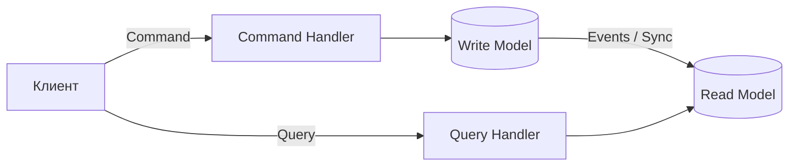

**Зачем нужен CQRS:**

- **Независимое масштабирование** -- нагрузка на чтение обычно в 10-100 раз превышает нагрузку на запись; CQRS позволяет масштабировать их раздельно
- **Оптимизация моделей** -- модель записи нормализована для консистентности, модель чтения денормализована для скорости
- **Разделение ответственности** -- команды валидируют бизнес-правила, запросы просто возвращают данные
- **Упрощение сложной бизнес-логики** -- запись может использовать DDD-агрегаты, чтение -- плоские проекции

Термин ввёл Грег Янг (Greg Young) в 2010 году, развив принцип CQS Бертрана Мейера.

## Q2. В чём разница между CQS и CQRS?

| Характеристика | `CQS` | `CQRS` |
|---|---|---|
| **Уровень** | Метод/функция | Архитектура/модель |
| **Суть** | Метод либо возвращает результат, либо изменяет состояние, но не оба | Отдельные модели для чтения и записи |
| **Автор** | Бертран Мейер (1988) | Грег Янг (2010) |
| **Масштаб** | Один объект | Вся система или bounded context |
| **Разделение** | На уровне сигнатуры метода | На уровне классов, модулей, баз данных |

**CQS** -- принцип проектирования интерфейсов: команды (`void`) изменяют состояние, запросы возвращают данные без побочных эффектов.

**CQRS** -- расширяет CQS до архитектурного уровня: разные объекты, разные модели данных, потенциально разные хранилища для чтения и записи.

```java
// CQS на уровне метода
public interface OrderService {
    void placeOrder(OrderCommand cmd);      // команда — void
    OrderDto getOrder(UUID orderId);         // запрос — возвращает данные
}

// CQRS на уровне архитектуры — разные сервисы
public class OrderCommandService {
    public void placeOrder(PlaceOrderCommand cmd) { /* ... */ }
}

public class OrderQueryService {
    public OrderView getOrder(UUID orderId) { /* ... */ }
}
```

## Q3. Как устроены модели чтения и записи в CQRS?

**Write Model (модель записи):**
- Содержит бизнес-логику и инварианты
- Обычно реализуется через DDD-агрегаты
- Нормализованная структура данных
- Принимает команды, валидирует правила, генерирует события
- Оптимизирована для консистентности

**Read Model (модель чтения):**
- Денормализованная, оптимизированная для конкретных UI/API-запросов
- Не содержит бизнес-логику
- Может быть несколько read-моделей для разных потребителей
- Обновляется асинхронно из событий write-модели
- Может использовать другое хранилище (Elasticsearch, Redis, materialized view)

```java
// Write Model — DDD агрегат
@Aggregate
public class OrderAggregate {
    @AggregateIdentifier
    private UUID orderId;
    private OrderStatus status;
    private List<OrderLine> lines;
    private Money totalAmount;

    @CommandHandler
    public void handle(ConfirmOrderCommand cmd) {
        if (status != OrderStatus.PENDING) {
            throw new IllegalStateException("Заказ уже подтверждён");
        }
        apply(new OrderConfirmedEvent(orderId, totalAmount));
    }
}

// Read Model — денормализованная проекция
@Entity
@Table(name = "order_summary_view")
public class OrderSummaryView {
    @Id
    private UUID orderId;
    private String customerName;
    private String status;
    private BigDecimal totalAmount;
    private int itemCount;
    private LocalDateTime createdAt;
    // Нет бизнес-логики — только данные для отображения
}
```

## Q4. Какие преимущества даёт разделение моделей чтения и записи?

1. **Независимое масштабирование** -- read-реплики можно множить без влияния на запись
2. **Оптимальные структуры данных** -- запись хранится нормализованно, чтение -- денормализованно
3. **Разные технологии хранения** -- запись в PostgreSQL, чтение из Elasticsearch или Redis
4. **Упрощение запросов** -- нет сложных JOIN-ов, данные уже подготовлены
5. **Изоляция изменений** -- изменение бизнес-логики не ломает модель чтения и наоборот
6. **Поддержка нескольких представлений** -- один поток событий питает REST API, аналитику, поиск
7. **Упрощение безопасности** -- разные политики доступа для чтения и записи

## Q5. Какие недостатки и сложности привносит CQRS?

- **Eventual Consistency** -- данные в read-модели отстают от write-модели; пользователь может не сразу видеть свои изменения
- **Увеличение сложности** -- две модели, синхронизация, дополнительная инфраструктура
- **Дублирование данных** -- одни и те же данные хранятся в разных формах
- **Сложность отладки** -- трудно отследить путь данных от команды до проекции
- **Операционные затраты** -- больше компонентов для мониторинга и поддержки
- **Обработка ошибок** -- если проекция сломалась, нужен механизм replay/retry
- **Порог входа** -- команде нужно понимать паттерн; новичкам сложно

**На собеседовании важно** показать, что вы понимаете не только плюсы, но и реальные проблемы. CQRS -- это не серебряная пуля.

**На собеседовании важно** показать, что вы понимаете не только плюсы, но и реальные проблемы. CQRS -- это не серебряная пуля.

## Q6. Когда стоит и не стоит применять CQRS?

**Стоит применять:**
- Высокая асимметрия нагрузки чтение/запись (read-heavy системы)
- Сложная бизнес-логика записи (DDD-агрегаты с инвариантами)
- Необходимость нескольких представлений данных (UI, аналитика, поиск)
- Микросервисная архитектура с чёткими bounded context
- Системы с требованием аудита (Event Sourcing + CQRS)

**Не стоит применять:**
- Простые CRUD-приложения без сложной бизнес-логики
- Монолиты с простой доменной моделью
- Системы с жёстким требованием strong consistency
- Маленькие команды без опыта работы с eventual consistency
- MVP и прототипы -- слишком рано для такой сложности

> **Правило:** начинайте с простой архитектуры; переходите на CQRS, когда сложность домена или нагрузка это оправдывают.

## Q7. (!) Что такое Event Sourcing?

**Event Sourcing** -- паттерн, при котором состояние системы хранится не в виде текущего снимка, а в виде полного упорядоченного журнала неизменяемых событий. Текущее состояние объекта восстанавливается путём последовательного применения всех его событий.

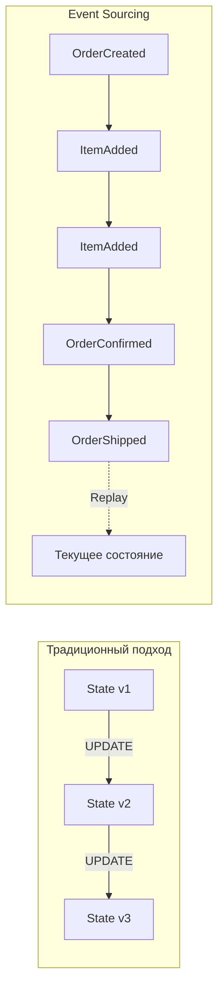

**Ключевые свойства:**
- **Immutability** -- события никогда не изменяются и не удаляются
- **Append-only** -- новые события только добавляются в конец журнала
- **Полный аудит** -- история всех изменений сохранена навсегда
- **Temporal queries** -- можно узнать состояние на любой момент в прошлом
- **Replay** -- можно пересчитать любую проекцию, проиграв события заново

```java
// Событие — неизменяемый факт
public record OrderCreatedEvent(
    UUID orderId,
    UUID customerId,
    LocalDateTime createdAt
) {}

public record ItemAddedEvent(
    UUID orderId,
    UUID productId,
    int quantity,
    BigDecimal price
) {}

public record OrderConfirmedEvent(
    UUID orderId,
    BigDecimal totalAmount,
    LocalDateTime confirmedAt
) {}
```

## Q8. (!) Что такое Event Store и чем он отличается от обычной БД?

**Event Store** -- специализированное хранилище, оптимизированное для append-only записи и последовательного чтения событий.

| Характеристика | Обычная БД | Event Store |
|---|---|---|
| **Операции** | CRUD | Append + Read |
| **Модификация** | UPDATE, DELETE | Только INSERT |
| **Состояние** | Текущий снимок | Полная история |
| **Индексы** | По полям | По aggregateId + version |
| **Запросы** | Произвольные SQL | Потоковое чтение по агрегату |
| **Конкурентность** | Блокировки/MVCC | Оптимистичная блокировка по версии |

**Реализации Event Store:**
- **Axon Server** -- встроенный Event Store в Axon Framework
- **EventStoreDB** -- специализированная БД от Event Store Ltd.
- **PostgreSQL/MySQL** -- можно реализовать самостоятельно через таблицу событий
- **Kafka** -- как журнал событий (с оговорками)

```java
// Простая реализация Event Store на JDBC
@Repository
public class JdbcEventStore implements EventStore {

    private final JdbcTemplate jdbc;

    public void append(UUID aggregateId, long expectedVersion,
                       List<DomainEvent> events) {
        for (DomainEvent event : events) {
            int rows = jdbc.update("""
                INSERT INTO event_store
                    (aggregate_id, version, event_type, payload, timestamp)
                VALUES (?, ?, ?, ?::jsonb, ?)
                """,
                aggregateId,
                ++expectedVersion,
                event.getClass().getSimpleName(),
                serialize(event),
                Instant.now()
            );
            if (rows == 0) {
                throw new OptimisticLockException(
                    "Конфликт версий для агрегата " + aggregateId);
            }
        }
    }

    public List<DomainEvent> load(UUID aggregateId) {
        return jdbc.query("""
            SELECT event_type, payload FROM event_store
            WHERE aggregate_id = ?
            ORDER BY version ASC
            """,
            (rs, i) -> deserialize(
                rs.getString("event_type"),
                rs.getString("payload")),
            aggregateId
        );
    }
}
```

## Q9. Как восстановить состояние агрегата из событий?

Состояние восстанавливается путём **replay** -- последовательного применения всех событий агрегата от начала до конца:

```java
public class OrderAggregate {
    private UUID orderId;
    private OrderStatus status;
    private List<OrderLine> lines = new ArrayList<>();
    private Money totalAmount = Money.ZERO;

    // Восстановление из событий
    public static OrderAggregate reconstruct(List<DomainEvent> events) {
        OrderAggregate aggregate = new OrderAggregate();
        for (DomainEvent event : events) {
            aggregate.apply(event);
        }
        return aggregate;
    }

    private void apply(DomainEvent event) {
        switch (event) {
            case OrderCreatedEvent e -> {
                this.orderId = e.orderId();
                this.status = OrderStatus.PENDING;
            }
            case ItemAddedEvent e -> {
                this.lines.add(new OrderLine(e.productId(), e.quantity(), e.price()));
                this.totalAmount = totalAmount.add(
                    e.price().multiply(e.quantity()));
            }
            case OrderConfirmedEvent e -> {
                this.status = OrderStatus.CONFIRMED;
            }
            default -> throw new IllegalArgumentException(
                "Неизвестное событие: " + event.getClass());
        }
    }
}
```

**Процесс:**
1. Загрузить все события агрегата из Event Store (по `aggregateId`)
2. Создать пустой экземпляр агрегата
3. Последовательно применить каждое событие (`apply`)
4. Получить текущее состояние

**Важно:** метод `apply` не должен содержать побочных эффектов (вызовов внешних систем, записи в БД) -- только мутацию внутреннего состояния.

## Q10. (!) Что такое снапшоты и зачем они нужны?

**Снапшот** (Snapshot) -- сохранённый слепок состояния агрегата на определённый момент (версию). Позволяет ускорить восстановление, не проигрывая тысячи событий с самого начала.

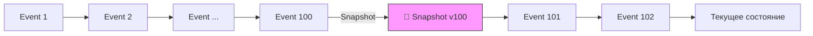

**Без снапшотов:** загрузить и применить все N событий (может быть тысячи).

**Со снапшотами:** загрузить снапшот + применить только события после снапшота.

```java
// Axon Framework — настройка снапшотов
@Configuration
public class SnapshotConfig {

    @Bean
    public SnapshotTriggerDefinition snapshotTrigger(Snapshotter snapshotter) {
        // Создавать снапшот каждые 100 событий
        return new EventCountSnapshotTriggerDefinition(snapshotter, 100);
    }
}

// Ручная реализация
public class SnapshotAwareEventStore {

    public OrderAggregate load(UUID aggregateId) {
        // 1. Попытаться загрузить последний снапшот
        Optional<Snapshot> snapshot = snapshotStore.load(aggregateId);

        OrderAggregate aggregate;
        long fromVersion;

        if (snapshot.isPresent()) {
            aggregate = snapshot.get().getState();
            fromVersion = snapshot.get().getVersion();
        } else {
            aggregate = new OrderAggregate();
            fromVersion = 0;
        }

        // 2. Загрузить только события после снапшота
        List<DomainEvent> events = eventStore.loadFrom(
            aggregateId, fromVersion);
        events.forEach(aggregate::apply);

        return aggregate;
    }
}
```

**Стратегии создания снапшотов:**
- **По количеству событий** -- каждые N событий (Axon: `EventCountSnapshotTriggerDefinition`)
- **По времени** -- периодически по расписанию
- **По размеру** -- когда размер потока превышает порог
- **По запросу** -- явный вызов при необходимости

## Q11. Что такое Event Replay и для чего он используется?

**Event Replay** -- процесс повторного воспроизведения событий из Event Store для пересчёта проекций или восстановления состояния.

**Сценарии использования:**
1. **Пересчёт проекции** -- баг в проекции, нужно исправить и пересчитать с нуля
2. **Новая проекция** -- добавлено новое read-представление, нужно заполнить его историческими данными
3. **Миграция данных** -- переход на новую схему read-модели
4. **Аналитика** -- ретроспективный анализ данных
5. **Восстановление после сбоя** -- пересоздание read-базы после потери данных

```java
@Component
public class ProjectionRebuilder {

    private final EventStore eventStore;
    private final OrderSummaryProjection projection;

    public void rebuild() {
        // 1. Очистить текущую проекцию
        projection.reset();

        // 2. Воспроизвести все события
        eventStore.readAllEvents()
            .forEach(event -> {
                projection.handle(event);
                if (event.getSequenceNumber() % 10_000 == 0) {
                    log.info("Обработано {} событий", event.getSequenceNumber());
                }
            });

        log.info("Пересчёт проекции завершён");
    }
}
```

**Важно при replay:**
- Обработчики должны быть **идемпотентными**
- Replay может занять часы для больших систем -- нужна стратегия (параллелизм, батчи)
- Во время replay read-модель может быть недоступна (нужна стратегия blue-green)
- Внешние побочные эффекты (отправка email, вызов API) НЕ должны срабатывать при replay

## Q12. Какие проблемы возникают при удалении данных в Event Sourcing?

В Event Sourcing события неизменяемы и никогда не удаляются. Это создаёт конфликт с требованиями вроде GDPR (право на забвение).

**Подходы к решению:**

1. **Crypto Shredding** (криптографическое уничтожение):
   - Персональные данные шифруются ключом, привязанным к пользователю
   - При запросе на удаление уничтожается ключ -- данные становятся нечитаемыми

```java
public record UserRegisteredEvent(
    UUID userId,
    String encryptedName,    // зашифровано ключом пользователя
    String encryptedEmail,   // зашифровано ключом пользователя
    String keyId             // ссылка на ключ шифрования
) {}

// При GDPR-запросе: удалить ключ из key store
keyStore.delete(userId); // события остались, но нечитаемы
```

2. **Event Transformation** -- перезапись потока с удалёнными полями (нарушает иммутабельность, но иногда допустимо)

3. **Разделение потоков** -- персональные данные хранятся отдельно от бизнес-событий

4. **Tombstone Events** -- специальное событие `UserDataErasedEvent`, сигнализирующее проекциям очистить данные

## Q13. (!) Что такое проекции в CQRS/ES?

**Проекция** (Projection) -- компонент, который слушает поток событий и строит оптимизированное read-представление (view) данных.

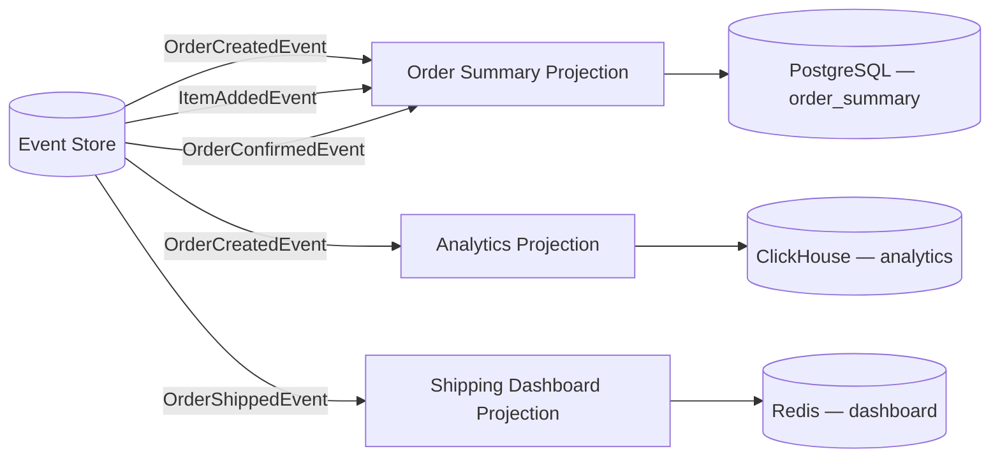

**Ключевые свойства проекций:**
- **Производные** -- полностью вычисляются из событий, можно пересоздать в любой момент
- **Специализированные** -- каждая проекция оптимизирована под конкретный use-case
- **Независимые** -- разные проекции могут использовать разные хранилища и обновляться с разной скоростью
- **Disposable** -- проекцию можно удалить и пересчитать из событий

```java
@Component
public class OrderSummaryProjection {

    private final OrderSummaryRepository repository;

    @EventHandler
    public void on(OrderCreatedEvent event) {
        OrderSummaryView view = new OrderSummaryView();
        view.setOrderId(event.orderId());
        view.setCustomerName(event.customerName());
        view.setStatus("PENDING");
        view.setItemCount(0);
        view.setTotalAmount(BigDecimal.ZERO);
        view.setCreatedAt(event.createdAt());
        repository.save(view);
    }

    @EventHandler
    public void on(ItemAddedEvent event) {
        OrderSummaryView view = repository.findById(event.orderId())
            .orElseThrow();
        view.setItemCount(view.getItemCount() + event.quantity());
        view.setTotalAmount(view.getTotalAmount()
            .add(event.price().multiply(BigDecimal.valueOf(event.quantity()))));
        repository.save(view);
    }

    @EventHandler
    public void on(OrderConfirmedEvent event) {
        repository.updateStatus(event.orderId(), "CONFIRMED");
    }
}
```

## Q14. Как синхронизировать модель чтения с моделью записи?

Существует три основных подхода:

**1. Синхронная обработка (в одной транзакции):**
```java
@Transactional
public void placeOrder(PlaceOrderCommand cmd) {
    Order order = orderRepository.save(new Order(cmd));
    orderViewRepository.save(OrderView.from(order)); // в той же транзакции
}
```
- Простота, strong consistency
- Не масштабируется, связанность

**2. Асинхронная обработка через события:**
```java
// Write side публикует событие
applicationEventPublisher.publishEvent(new OrderCreatedEvent(order));

// Read side слушает
@EventListener
public void on(OrderCreatedEvent event) {
    orderViewRepository.save(OrderView.from(event));
}
```
- Масштабируется, но eventual consistency
- Нужна обработка ошибок и retry

**3. Change Data Capture (CDC):**
- Инструменты вроде Debezium читают WAL базы данных
- Автоматически синхронизируют изменения
- Не требует изменений в коде приложения

**На практике** чаще всего используют асинхронный подход через брокер сообщений (`Kafka`, `RabbitMQ`) с гарантией at-least-once доставки и идемпотентными обработчиками.

## Q15. (!) Что такое Eventual Consistency в контексте CQRS?

**Eventual Consistency** -- свойство системы, при котором read-модель гарантированно придёт в согласованное состояние с write-моделью, но с некоторой задержкой.

В CQRS это означает: после выполнения команды запрос может вернуть **устаревшие данные**, пока проекция не обработает событие.

**Типичный пример проблемы:**
1. Пользователь создаёт заказ (команда)
2. Система возвращает `201 Created`
3. Пользователь переходит на страницу заказов (запрос)
4. Нового заказа ещё нет -- проекция не успела обновиться

**Стратегии решения:**

| Стратегия | Описание |
|---|---|
| **Read-your-writes** | После команды читать из write-модели одну операцию |
| **Causal consistency** | Клиент передаёт версию, read-модель ждёт нужную версию |
| **Optimistic UI** | Клиент показывает ожидаемый результат до подтверждения |
| **Polling / SSE** | Клиент периодически опрашивает или слушает push-уведомления |
| **Synchronous projection** | Проекция обновляется синхронно (жертвует масштабируемостью) |

```java
// Read-your-writes: возвращаем данные из write-модели сразу после команды
@PostMapping("/orders")
public ResponseEntity<OrderDto> createOrder(@RequestBody CreateOrderRequest req) {
    UUID orderId = commandGateway.sendAndWait(new CreateOrderCommand(req));

    // Возвращаем данные из write-модели, а не из проекции
    Order order = orderWriteRepository.findById(orderId).orElseThrow();
    return ResponseEntity.status(201).body(OrderDto.from(order));
}
```

## Q16. Как устроена команда (Command) в CQRS?

**Команда** -- объект, выражающий намерение изменить состояние системы. Команда -- это приказ (императив), а не факт.

**Правила проектирования команд:**
- Именуются в повелительном наклонении: `CreateOrder`, `CancelOrder`, `AddItem`
- Содержат все данные, необходимые для выполнения
- Не содержат бизнес-логику
- Направлены конкретному агрегату (содержат `targetAggregateId`)
- Могут быть отклонены (валидация, бизнес-правила)

```java
// Команда — неизменяемый объект-намерение
public record CreateOrderCommand(
    @TargetAggregateIdentifier
    UUID orderId,
    UUID customerId,
    List<OrderLineDto> items
) {}

public record ConfirmOrderCommand(
    @TargetAggregateIdentifier
    UUID orderId,
    String confirmedBy
) {}

public record CancelOrderCommand(
    @TargetAggregateIdentifier
    UUID orderId,
    String reason
) {}
```

**Валидация команд** происходит на двух уровнях:
1. **Структурная** (на входе) -- Bean Validation (`@NotNull`, `@Size`)
2. **Бизнес-валидация** (в агрегате) -- проверка инвариантов домена

## Q17. Чем событие (Event) отличается от команды?

| Характеристика | Команда (Command) | Событие (Event) |
|---|---|---|
| **Семантика** | Намерение (приказ) | Факт (произошло) |
| **Именование** | Императив: `CreateOrder` | Прошедшее время: `OrderCreated` |
| **Результат** | Может быть отклонена | Уже произошло, необратимо |
| **Адресат** | Конкретный агрегат | Все подписчики |
| **Количество обработчиков** | Ровно один | Ноль или много |
| **Изменяемость** | Можно повторить | Неизменяемо, хранится навсегда |

```java
// Команда — "Я хочу, чтобы это произошло"
public record PlaceOrderCommand(UUID orderId, UUID customerId) {}

// Событие — "Это уже произошло"
public record OrderPlacedEvent(UUID orderId, UUID customerId,
                                LocalDateTime placedAt) {}
```

**Важно для собеседования:** команда может быть отклонена (заказ нельзя отменить, если он уже доставлен), а событие -- нет. Событие -- это неопровержимый факт.

## Q18. (!) Как агрегат обрабатывает команды и публикует события?

Агрегат в CQRS/ES выполняет два вида операций:

1. **Command Handler** -- принимает команду, валидирует бизнес-правила, решает какие события опубликовать
2. **Event Sourcing Handler** -- применяет событие к внутреннему состоянию (мутация без побочных эффектов)

```java
@Aggregate
public class OrderAggregate {

    @AggregateIdentifier
    private UUID orderId;
    private OrderStatus status;
    private UUID customerId;
    private List<OrderLine> lines = new ArrayList<>();
    private Money totalAmount = Money.ZERO;

    // Команда создания — конструктор
    @CommandHandler
    public OrderAggregate(CreateOrderCommand cmd) {
        // Валидация бизнес-правил
        if (cmd.items().isEmpty()) {
            throw new IllegalArgumentException("Заказ без товаров");
        }
        // Публикация события (НЕ изменение состояния!)
        AggregateLifecycle.apply(new OrderCreatedEvent(
            cmd.orderId(), cmd.customerId(), Instant.now()));

        for (var item : cmd.items()) {
            AggregateLifecycle.apply(new ItemAddedEvent(
                cmd.orderId(), item.productId(),
                item.quantity(), item.price()));
        }
    }

    @CommandHandler
    public void handle(ConfirmOrderCommand cmd) {
        if (status != OrderStatus.PENDING) {
            throw new OrderAlreadyConfirmedException(orderId);
        }
        AggregateLifecycle.apply(new OrderConfirmedEvent(
            orderId, totalAmount, Instant.now()));
    }

    // Event Sourcing Handlers — только мутация состояния
    @EventSourcingHandler
    public void on(OrderCreatedEvent event) {
        this.orderId = event.orderId();
        this.customerId = event.customerId();
        this.status = OrderStatus.PENDING;
    }

    @EventSourcingHandler
    public void on(ItemAddedEvent event) {
        this.lines.add(new OrderLine(
            event.productId(), event.quantity(), event.price()));
        this.totalAmount = totalAmount.add(
            event.price().multiply(event.quantity()));
    }

    @EventSourcingHandler
    public void on(OrderConfirmedEvent event) {
        this.status = OrderStatus.CONFIRMED;
    }
}
```

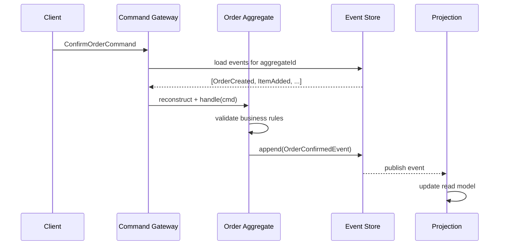

## Q19. Что такое Axon Framework и какие компоненты он предоставляет?

**Axon Framework** -- Java-фреймворк для построения приложений на базе `CQRS` и `Event Sourcing`. Состоит из двух частей:

- **Axon Framework** -- библиотека с аннотациями и инфраструктурой
- **Axon Server** -- выделенный Event Store и маршрутизатор сообщений

**Ключевые компоненты:**

| Компонент | Назначение |
|---|---|
| `@Aggregate` | Маркирует DDD-агрегат |
| `@AggregateIdentifier` | Идентификатор агрегата |
| `@CommandHandler` | Обработчик команды |
| `@EventSourcingHandler` | Применение события к состоянию |
| `@EventHandler` | Обработчик события в проекции |
| `@QueryHandler` | Обработчик запроса |
| `@SagaEventHandler` | Обработчик события в Saga |
| `CommandGateway` | Отправка команд |
| `QueryGateway` | Выполнение запросов |
| `EventStore` | Хранилище событий |

**Подключение к Spring Boot:**

```xml
<dependency>
    <groupId>org.axonframework</groupId>
    <artifactId>axon-spring-boot-starter</artifactId>
    <version>4.9.3</version>
</dependency>
```

```java
// Controller использует CommandGateway и QueryGateway
@RestController
@RequestMapping("/api/orders")
public class OrderController {

    private final CommandGateway commandGateway;
    private final QueryGateway queryGateway;

    @PostMapping
    public CompletableFuture<UUID> createOrder(@RequestBody CreateOrderRequest req) {
        UUID orderId = UUID.randomUUID();
        return commandGateway.send(new CreateOrderCommand(
            orderId, req.customerId(), req.items()));
    }

    @GetMapping("/{id}")
    public CompletableFuture<OrderView> getOrder(@PathVariable UUID id) {
        return queryGateway.query(
            new FindOrderQuery(id),
            ResponseTypes.instanceOf(OrderView.class));
    }
}
```

## Q20. Как реализовать CQRS/ES приложение на Spring Boot с Axon?

Минимальная структура приложения:

```java
// 1. Команды
public record CreateOrderCommand(
    @TargetAggregateIdentifier UUID orderId,
    UUID customerId,
    List<OrderLineDto> items) {}

// 2. События
public record OrderCreatedEvent(UUID orderId, UUID customerId,
                                 Instant createdAt) {}

// 3. Агрегат (write-side)
@Aggregate
public class OrderAggregate {
    @AggregateIdentifier
    private UUID orderId;
    private OrderStatus status;

    @CommandHandler
    public OrderAggregate(CreateOrderCommand cmd) {
        AggregateLifecycle.apply(new OrderCreatedEvent(
            cmd.orderId(), cmd.customerId(), Instant.now()));
    }

    @EventSourcingHandler
    public void on(OrderCreatedEvent event) {
        this.orderId = event.orderId();
        this.status = OrderStatus.PENDING;
    }

    protected OrderAggregate() {} // для Axon
}

// 4. Проекция (read-side)
@Component
public class OrderProjection {

    private final OrderViewRepository repository;

    @EventHandler
    public void on(OrderCreatedEvent event) {
        repository.save(new OrderView(
            event.orderId(), event.customerId(),
            "PENDING", event.createdAt()));
    }

    @QueryHandler
    public OrderView handle(FindOrderQuery query) {
        return repository.findById(query.orderId()).orElse(null);
    }
}

// 5. Query
public record FindOrderQuery(UUID orderId) {}
```

**Конфигурация `application.yml`:**

```yaml
axon:
  axonserver:
    servers: localhost:8124
  serializer:
    general: jackson
    events: jackson
    messages: jackson
```

## Q21. Как реализовать CQRS без Axon на чистом Spring Boot?

CQRS можно реализовать без специализированных фреймворков, используя `Spring Modulith` или просто разделяя слои вручную:

```java
// Command Side
@Service
public class OrderCommandService {

    private final OrderRepository orderRepository;
    private final ApplicationEventPublisher eventPublisher;

    @Transactional
    public UUID createOrder(CreateOrderCommand cmd) {
        Order order = new Order(cmd.customerId(), cmd.items());
        order = orderRepository.save(order);

        eventPublisher.publishEvent(new OrderCreatedEvent(
            order.getId(), order.getCustomerId()));

        return order.getId();
    }
}

// Query Side
@Service
public class OrderQueryService {

    private final OrderViewRepository viewRepository;

    @Transactional(readOnly = true)
    public OrderView getOrder(UUID orderId) {
        return viewRepository.findById(orderId)
            .orElseThrow(() -> new OrderNotFoundException(orderId));
    }

    @Transactional(readOnly = true)
    public Page<OrderView> searchOrders(OrderSearchCriteria criteria,
                                         Pageable pageable) {
        return viewRepository.findByCriteria(criteria, pageable);
    }
}

// Projection — слушатель событий
@Component
public class OrderViewProjection {

    private final OrderViewRepository viewRepository;

    @TransactionalEventListener(phase = AFTER_COMMIT)
    public void on(OrderCreatedEvent event) {
        OrderView view = OrderView.builder()
            .orderId(event.orderId())
            .customerId(event.customerId())
            .status("PENDING")
            .build();
        viewRepository.save(view);
    }
}
```

**Spring Modulith** добавляет поддержку `@ApplicationModuleListener` с гарантией доставки и повторной обработки:

```java
@Component
public class OrderViewProjection {

    @ApplicationModuleListener
    public void on(OrderCreatedEvent event) {
        // Spring Modulith гарантирует at-least-once доставку
        // через event publication log
    }
}
```

## Q22. (!) Что такое паттерн Saga и зачем он нужен?

**Saga** -- паттерн управления распределёнными транзакциями, который разбивает длительную бизнес-операцию на последовательность локальных транзакций, каждая из которых может быть компенсирована в случае ошибки.

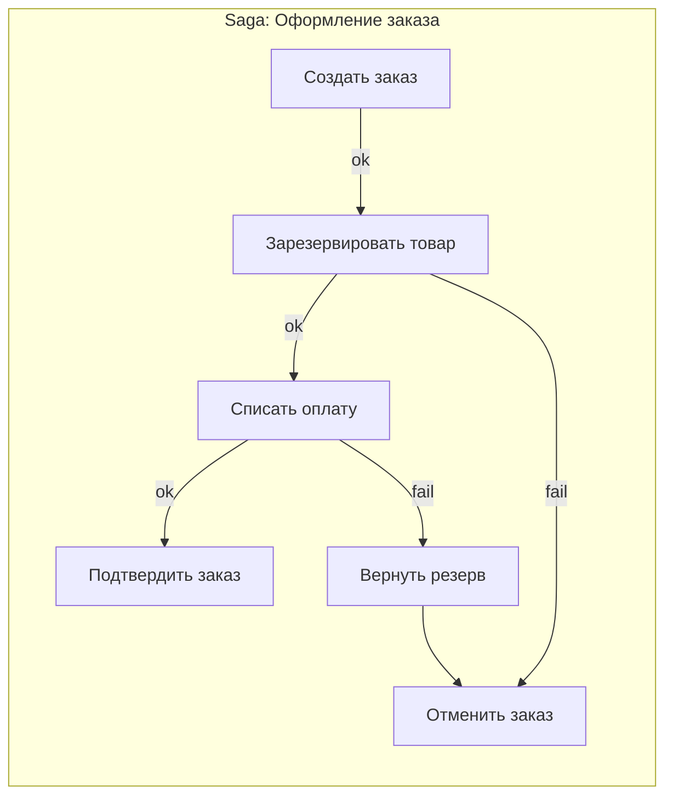

**Зачем нужна Saga:**
- В микросервисной архитектуре нет распределённых транзакций (2PC не масштабируется)
- Каждый сервис владеет своей БД (Database per Service)
- Нужна согласованность данных между сервисами без жёсткой связанности

```java
// Axon Saga
@Saga
public class OrderSaga {

    @Autowired
    private transient CommandGateway commandGateway;

    private UUID orderId;

    @StartSaga
    @SagaEventHandler(associationProperty = "orderId")
    public void on(OrderCreatedEvent event) {
        this.orderId = event.orderId();
        commandGateway.send(new ReserveStockCommand(
            event.orderId(), event.items()));
    }

    @SagaEventHandler(associationProperty = "orderId")
    public void on(StockReservedEvent event) {
        commandGateway.send(new ProcessPaymentCommand(
            orderId, event.totalAmount()));
    }

    @SagaEventHandler(associationProperty = "orderId")
    public void on(PaymentProcessedEvent event) {
        commandGateway.send(new ConfirmOrderCommand(orderId));
    }

    @EndSaga
    @SagaEventHandler(associationProperty = "orderId")
    public void on(OrderConfirmedEvent event) {
        // Saga завершена успешно
    }

    // Компенсации
    @SagaEventHandler(associationProperty = "orderId")
    public void on(PaymentFailedEvent event) {
        commandGateway.send(new ReleaseStockCommand(orderId));
        commandGateway.send(new RejectOrderCommand(orderId,
            "Ошибка оплаты"));
    }
}
```

## Q23. В чём разница между оркестрацией и хореографией в Saga?

| Характеристика | Оркестрация | Хореография |
|---|---|---|
| **Координатор** | Центральный оркестратор управляет шагами | Нет координатора, сервисы реагируют на события |
| **Связанность** | Оркестратор знает всех участников | Сервисы не знают друг о друге |
| **Поток управления** | Явный, легко читаемый | Неявный, распределён по сервисам |
| **Сложность добавления шага** | Изменить оркестратор | Добавить подписчика |
| **Отладка** | Проще — весь flow в одном месте | Сложнее — flow размазан |
| **Single point of failure** | Оркестратор | Нет |

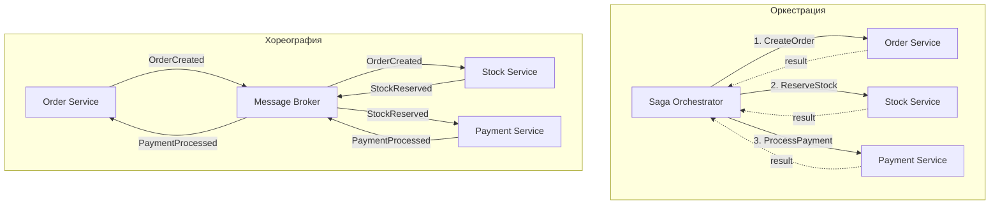

**Когда выбрать оркестрацию:**
- Сложные flow с множеством шагов (5+)
- Нужна видимость состояния процесса
- Есть условные ветвления в логике
- Фреймворки: `Axon Saga`, `Camunda`, `Temporal`

**Когда выбрать хореографию:**
- Простые flow (2-3 шага)
- Максимальная decoupling
- Нет условных переходов
- Инструменты: `Kafka`, `RabbitMQ`, Spring Events

## Q24. Что такое компенсирующие транзакции?

**Компенсирующая транзакция** -- операция, которая семантически отменяет эффект ранее выполненной локальной транзакции. В отличие от `ROLLBACK` в ACID-транзакции, компенсация -- это новая операция (не откат).

**Важные свойства:**
- Компенсация не всегда возвращает систему в исходное состояние (например, отмена заказа -- не то же, что его отсутствие)
- Компенсации должны быть **идемпотентными** -- могут вызываться повторно
- Компенсации должны быть **коммутативными**, если возможно
- Порядок компенсаций -- обратный порядку выполнения шагов

```java
// Примеры компенсирующих транзакций
public interface SagaStep<T> {
    T execute();           // прямое действие
    void compensate(T result); // компенсация
}

// Шаг: резервирование товара
public class ReserveStockStep implements SagaStep<ReservationId> {

    public ReservationId execute() {
        return stockService.reserve(orderId, items);
    }

    public void compensate(ReservationId reservationId) {
        stockService.releaseReservation(reservationId);
    }
}

// Шаг: списание оплаты
public class ChargePaymentStep implements SagaStep<PaymentId> {

    public PaymentId execute() {
        return paymentService.charge(customerId, amount);
    }

    public void compensate(PaymentId paymentId) {
        paymentService.refund(paymentId); // возврат, не отмена
    }
}
```

**Типичные компенсации:**

| Действие | Компенсация |
|---|---|
| Создать заказ | Отменить заказ |
| Зарезервировать товар | Освободить резерв |
| Списать оплату | Сделать возврат |
| Отправить уведомление | Отправить уведомление об отмене |

## Q25. Что такое версионирование событий и зачем оно нужно?

**Версионирование событий** -- стратегия управления изменениями структуры событий при эволюции системы. Поскольку события в Event Store хранятся навсегда, нужен механизм работы со старыми форматами.

**Проблема:** вы изменили структуру `OrderCreatedEvent` (добавили поле, переименовали, изменили тип) -- но Event Store уже содержит миллионы событий старого формата.

**Стратегии версионирования:**

1. **Weak schema** -- десериализатор игнорирует неизвестные поля и использует defaults для отсутствующих
2. **Upcasting** -- трансформация старого формата в новый при чтении
3. **Новый тип события** -- `OrderCreatedEventV2` (не рекомендуется, засоряет код)
4. **Copy-and-transform** -- перезапись Event Store с новым форматом (опасно, редко)

```java
// Версия 1: начальная структура
public record OrderCreatedEventV1(
    UUID orderId,
    String customerName,
    BigDecimal totalAmount
) {}

// Версия 2: разделили имя на firstName/lastName, добавили currency
public record OrderCreatedEvent(
    UUID orderId,
    String firstName,
    String lastName,
    BigDecimal totalAmount,
    String currency  // новое поле
) {}
```

**Правила обратной совместимости:**
- Добавление полей с defaults -- **безопасно**
- Удаление полей -- **опасно** (старый код упадёт)
- Переименование полей -- требует **upcaster**
- Изменение типа поля -- требует **upcaster**

## Q26. Что такое Upcaster и как он работает?

**Upcaster** -- компонент, который трансформирует событие из старой версии в новую при чтении из Event Store. Upcaster работает прозрачно: агрегат и проекции всегда видят актуальную версию события.

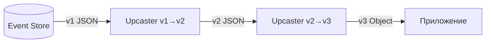

```java
// Axon Framework — Upcaster
public class OrderCreatedEventUpcaster extends SingleEventUpcaster {

    @Override
    protected boolean canUpcast(IntermediateEventRepresentation ir) {
        return ir.getType().getName().equals(
            "com.example.OrderCreatedEvent")
            && ir.getType().getRevision() == null; // v1 без ревизии
    }

    @Override
    protected IntermediateEventRepresentation doUpcast(
            IntermediateEventRepresentation ir) {

        return ir.upcastPayload(
            new SimpleSerializedType(
                ir.getType().getName(), "2.0"), // целевая ревизия
            JsonNode.class,
            event -> {
                ObjectNode node = (ObjectNode) event;
                // Разбиваем customerName на firstName + lastName
                String fullName = node.get("customerName").asText();
                String[] parts = fullName.split(" ", 2);
                node.remove("customerName");
                node.put("firstName", parts[0]);
                node.put("lastName",
                    parts.length > 1 ? parts[1] : "");
                // Добавляем default для нового поля
                node.put("currency", "RUB");
                return node;
            }
        );
    }
}

// Регистрация upcaster
@Bean
public EventUpcasterChain eventUpcasters() {
    return new EventUpcasterChain(
        new OrderCreatedEventUpcaster(),
        new OrderShippedEventUpcaster()
    );
}
```

**Цепочка upcasters:** если событие прошло через несколько версий (v1 -> v2 -> v3), создаётся цепочка, где каждый upcaster поднимает событие на одну версию.

**Важно:** upcaster работает с raw-представлением (JSON), а не с десериализованным объектом -- это позволяет трансформировать события, даже если старый Java-класс уже удалён.

## Q27. Почему CQRS и Event Sourcing часто используются вместе?

`CQRS` и `Event Sourcing` -- независимые паттерны, но они синергетически дополняют друг друга:

| Аспект | Как ES помогает CQRS | Как CQRS помогает ES |
|---|---|---|
| **Read model** | Поток событий -- естественный источник для построения проекций | Разделение моделей позволяет читать данные без replay |
| **Синхронизация** | События -- встроенный механизм обновления read-модели | Проекции решают проблему сложных запросов по событиям |
| **Аудит** | ES предоставляет полную историю изменений | -- |
| **Масштабирование** | -- | Множество read-реплик разгружают Event Store |
| **Rebuild** | Пересчёт любой проекции из истории событий | -- |

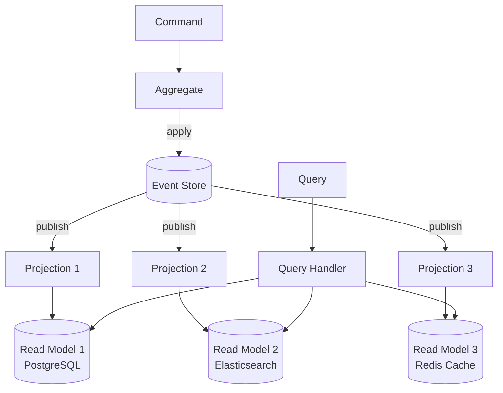

**Можно использовать отдельно:**
- **CQRS без ES** -- write model в обычной БД, события публикуются через Outbox/CDC для обновления read model
- **ES без CQRS** -- все запросы идут через replay агрегатов (медленно, но возможно для простых случаев)

**На практике** ES без CQRS быстро упирается в производительность запросов, поэтому проекции (а значит, CQRS) становятся необходимостью.

## Q28. Как тестировать CQRS/ES приложения?

Тестирование CQRS/ES систем разбивается на уровни:

**1. Unit-тесты агрегатов (Given-When-Then):**

```java
// Axon Test Fixtures — "given events, when command, then events"
@Test
void shouldConfirmPendingOrder() {
    fixture.given(
            new OrderCreatedEvent(orderId, customerId, Instant.now()),
            new ItemAddedEvent(orderId, productId, 2, new BigDecimal("100")))
        .when(new ConfirmOrderCommand(orderId, "admin"))
        .expectSuccessfulHandlerExecution()
        .expectEvents(new OrderConfirmedEvent(
            orderId, new BigDecimal("200"), any()));
}

@Test
void shouldRejectConfirmationOfAlreadyConfirmedOrder() {
    fixture.given(
            new OrderCreatedEvent(orderId, customerId, Instant.now()),
            new OrderConfirmedEvent(orderId, amount, Instant.now()))
        .when(new ConfirmOrderCommand(orderId, "admin"))
        .expectException(OrderAlreadyConfirmedException.class);
}
```

**2. Unit-тесты проекций:**

```java
@Test
void shouldCreateViewOnOrderCreated() {
    var event = new OrderCreatedEvent(orderId, customerId, Instant.now());

    projection.on(event);

    OrderView view = viewRepository.findById(orderId).orElseThrow();
    assertThat(view.getStatus()).isEqualTo("PENDING");
    assertThat(view.getCustomerId()).isEqualTo(customerId);
}
```

**3. Saga-тесты:**

```java
@Test
void shouldStartPaymentAfterStockReserved() {
    sagaFixture
        .givenAggregate(orderId.toString())
            .published(new OrderCreatedEvent(orderId, customerId))
        .whenPublishingA(new StockReservedEvent(orderId, items))
        .expectDispatchedCommands(
            new ProcessPaymentCommand(orderId, totalAmount));
}
```

**4. Интеграционные тесты:**

```java
@SpringBootTest
@Testcontainers
class OrderIntegrationTest {

    @Autowired CommandGateway commandGateway;
    @Autowired QueryGateway queryGateway;

    @Test
    void fullOrderLifecycle() {
        UUID orderId = UUID.randomUUID();

        commandGateway.sendAndWait(new CreateOrderCommand(orderId, ...));

        await().atMost(5, SECONDS).untilAsserted(() -> {
            OrderView view = queryGateway.query(
                new FindOrderQuery(orderId),
                OrderView.class).join();
            assertThat(view.getStatus()).isEqualTo("PENDING");
        });
    }
}
```

**Ключевые принципы:**
- Агрегаты тестируются через Given-When-Then (события -> команда -> ожидаемые события)
- Проекции тестируются отдельно (событие на вход -> проверка view)
- Интеграционные тесты учитывают eventual consistency (используют `Awaitility`)

## Q29. Какие реальные проблемы возникают при внедрении CQRS/ES?

**1. Eventual Consistency UX:**
- Пользователь не видит свои изменения сразу -- нужен optimistic UI или read-your-writes

**2. Рост Event Store:**
- Миллиарды событий = медленный replay -- обязательны снапшоты
- Нужна стратегия архивирования старых событий

**3. Сложность отладки:**
- Ошибка может быть в агрегате, проекции, upcaster, saga -- трудно отследить
- Нужен correlation ID для трассировки от команды до проекции

**4. Миграция существующих систем:**
- Переход с CRUD на CQRS/ES -- сложный процесс
- Нет исторических событий -- нужно создать "начальные" снапшоты

**5. Идемпотентность:**
- At-least-once доставка означает повторную обработку -- все обработчики должны быть идемпотентными

**6. Обработка ошибок в проекциях:**
- Сломанная проекция не должна блокировать write side
- Нужен механизм retry с dead letter queue

**7. Тестирование:**
- E2E тесты сложнее из-за асинхронности
- Нужны специальные тестовые фреймворки (Axon Test Fixtures)

**8. Команда и культура:**
- Разработчики привыкли к CRUD -- нужно обучение
- Ревью кода сложнее -- нужно понимать flow "команда -> событие -> проекция"

**Рекомендация:** внедряйте CQRS/ES в одном bounded context, не во всей системе. Подробнее о границах контекстов -- в [вопросах по DDD](ddd-interview.md).

## Q30. (!) Как обеспечить идемпотентность обработки событий?

Идемпотентность критична, потому что в distributed-системах события могут доставляться повторно (at-least-once). Обработчик должен давать одинаковый результат при повторной обработке.

**Стратегии:**

**1. Естественная идемпотентность (SET-semantics):**
```java
@EventHandler
public void on(OrderCreatedEvent event) {
    // INSERT OR UPDATE — повторный вызов перезапишет данные
    viewRepository.save(new OrderView(event.orderId(), ...));
}
```

**2. Дедупликация по event ID:**
```java
@EventHandler
public void on(OrderCreatedEvent event,
               @MessageIdentifier String eventId) {
    if (processedEventRepository.existsById(eventId)) {
        log.debug("Событие {} уже обработано, пропускаем", eventId);
        return;
    }

    viewRepository.save(new OrderView(event.orderId(), ...));
    processedEventRepository.save(new ProcessedEvent(eventId));
}
```

**3. Conditional writes (оптимистичная блокировка):**
```java
@EventHandler
public void on(ItemAddedEvent event) {
    int updated = jdbc.update("""
        UPDATE order_view
        SET item_count = item_count + ?,
            total_amount = total_amount + ?,
            last_event_sequence = ?
        WHERE order_id = ? AND last_event_sequence < ?
        """,
        event.quantity(), event.amount(),
        event.sequenceNumber(),
        event.orderId(), event.sequenceNumber());

    if (updated == 0) {
        log.debug("Событие {} уже применено", event.sequenceNumber());
    }
}
```

**4. Idempotency key в таблице проекции:**
- Добавить колонку `last_processed_event_seq` к view-таблице
- Обновлять только если `event.seq > last_processed_event_seq`

Подробнее об идемпотентности в контексте EDA -- в [вопросах по Event-Driven паттернам](event-driven-patterns-interview.md).

## Q31. (!) Как управлять несколькими проекциями одного агрегата?

В реальных системах один агрегат обычно нужен в нескольких read-моделях: список заказов для UI, аналитика для отчётов, нотификации для рассылки.

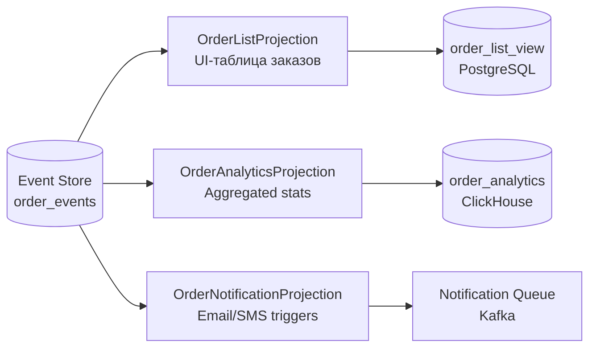

**Реализация с Axon Framework (несколько `@EventHandler` в разных классах):**

```java
// Проекция для UI-таблицы
@ProcessingGroup("order-list")
@Component
public class OrderListProjection {

    private final OrderListViewRepository repo;

    @EventHandler
    public void on(OrderCreatedEvent event) {
        repo.save(new OrderListView(event.orderId(), event.customerId(),
            "CREATED", event.timestamp()));
    }

    @EventHandler
    public void on(OrderShippedEvent event) {
        repo.updateStatus(event.orderId(), "SHIPPED");
    }
}

// Аналитическая проекция (отдельный processing group)
@ProcessingGroup("order-analytics")
@Component
public class OrderAnalyticsProjection {

    private final OrderAnalyticsRepository analyticsRepo;

    @EventHandler
    public void on(OrderCreatedEvent event) {
        analyticsRepo.incrementDailyOrders(event.timestamp().toLocalDate());
        analyticsRepo.addRevenue(event.totalAmount(), event.timestamp().toLocalDate());
    }
}
```

**Tracking vs Subscribing Event Processors в Axon:**

| Тип | Хранит позицию | Параллелизм | Replay | Применение |
|-----|----------------|-------------|--------|------------|
| **Tracking** | Да (в БД) | Да (сегменты) | Да | Production (надёжный, restart-safe) |
| **Subscribing** | Нет | Thread pool | Нет | Простые синхронные сценарии |

**Конфигурация Tracking Processor:**

```java
@Bean
public void configureProcessors(EventProcessingConfigurer configurer) {
    // order-list — tracking с 4 параллельными сегментами
    configurer.registerTrackingEventProcessor(
        "order-list",
        config -> TrackingEventProcessorConfiguration
            .forParallelProcessing(4)
    );
    // order-analytics — tracking с 1 потоком (для аналитики порядок важен)
    configurer.registerTrackingEventProcessor("order-analytics");
}
```

## Q32. Как пересобрать (rebuild) read model при изменении схемы проекции?

Изменение бизнес-требований часто требует добавить поле или изменить логику агрегации в read model. В CQRS/ES это достигается через **event replay** — повторное применение всех исторических событий к новой проекции.

**Стратегии rebuild:**

**1. Blue-Green проекций (рекомендуется для production):**

```
1. Создать новую таблицу: order_list_view_v2
2. Запустить новый processor "order-list-v2", который читает с позиции 0
3. Дождаться, пока v2 догонит конец event log (tail position)
4. Атомарно переключить UI на v2 (переименование VIEW или смена конфига)
5. Остановить старый processor "order-list-v1"
6. Удалить старую таблицу
```

**2. Replay через Axon:**

```java
// Через Axon Server Dashboard или программно:
@RestController
@RequestMapping("/admin")
public class ProjectionAdminController {

    private final EventProcessingConfiguration eventProcessing;

    @PostMapping("/projections/{name}/reset")
    public void resetProjection(@PathVariable String name) {
        // Сбросить позицию tracking processor на 0 и начать replay
        eventProcessing.eventProcessor(name, TrackingEventProcessor.class)
            .ifPresent(p -> {
                p.shutDown();
                p.resetTokens();  // сброс позиции
                p.start();        // replay с начала
            });
    }
}
```

**3. Параллельный rebuild без даунтайма:**

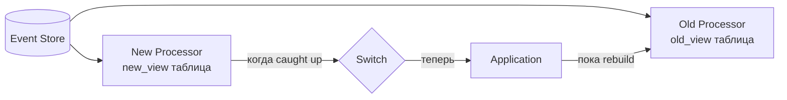

**Важные соображения:**
- Rebuild может занять часы для миллионов событий → нужна оценка времени
- Во время rebuild старая проекция продолжает обновляться → нет даунтайма
- Сохраняйте все события навсегда (или с retention policy) — это единственный способ сделать rebuild

## Q33. (!) Как соблюдать GDPR (право на удаление) при использовании Event Sourcing?

**Проблема:** Event Sourcing хранит всю историю изменений как неизменяемые события. Когда пользователь запрашивает "право на забвение" (GDPR Article 17), вы не можете просто удалить его данные — это нарушит целостность event log.

**Стратегии соответствия GDPR:**

**1. Crypto Shredding (рекомендуемый подход)**

Персональные данные шифруются отдельным ключом для каждого пользователя. При удалении — уничтожается ключ шифрования, данные становятся нечитаемыми.

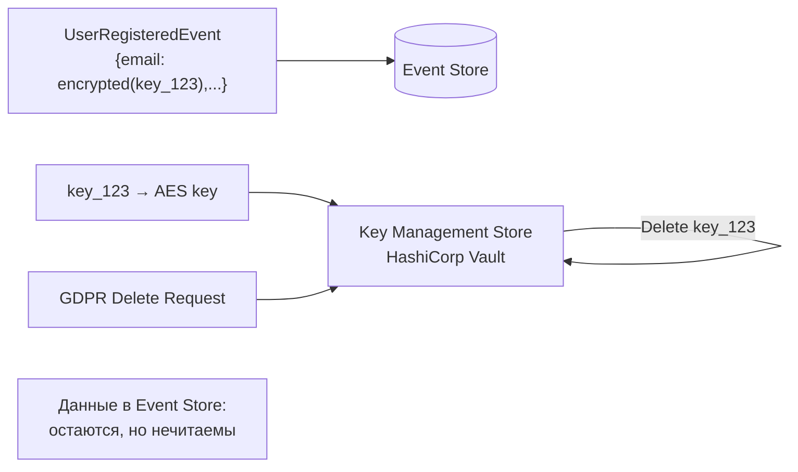

```java
@Service
public class CryptoShreddingService {

    private final KeyManagementService kms;

    // Шифруем при создании события
    public String encryptPersonalData(UserId userId, String plaintext) {
        byte[] key = kms.getOrCreateKey("user:" + userId.value());
        return AESUtil.encrypt(plaintext, key);
    }

    // "Удаление" = уничтожение ключа
    public void forgetUser(UserId userId) {
        kms.deleteKey("user:" + userId.value());
        // Теперь все зашифрованные поля в событиях нечитаемы
    }

    public String decryptPersonalData(UserId userId, String ciphertext) {
        try {
            byte[] key = kms.getKey("user:" + userId.value());
            return AESUtil.decrypt(ciphertext, key);
        } catch (KeyNotFoundException e) {
            return "[FORGOTTEN]";  // пользователь удалён
        }
    }
}
```

**2. Pseudonymization (псевдонимизация)**

Замена персональных данных на псевдоним в событиях. Маппинг псевдоним→реальные данные хранится отдельно и может быть удалён.

**3. Event compaction с удалением полей**

Создать новые "sanitized" версии событий (без ПД), пересобрать event log. Сложно технически, нарушает неизменяемость.

**Сравнение стратегий:**

| Стратегия | Сложность | Производительность | Соответствие GDPR |
|-----------|-----------|-------------------|-------------------|
| Crypto Shredding | Средняя | Небольшой оверхед на шифрование | Высокое |
| Pseudonymization | Средняя | Без оверхеда | Среднее |
| Event compaction | Высокая | Без оверхеда | Высокое |

**Рекомендация:** Crypto Shredding — золотой стандарт для Event Sourcing + GDPR. Используйте `HashiCorp Vault` или `AWS KMS` для управления ключами.

## Q34. Как Axon Framework реализует CQRS/ES в Java/Spring?

**Axon Framework** — специализированный Java-фреймворк от AxonIQ для реализации CQRS/ES. Предоставляет все необходимые компоненты "из коробки": Command Bus, Event Bus, Event Store, Query Bus, Saga поддержку.

**Ключевые компоненты Axon:**

| Компонент | Аннотация | Назначение |
|-----------|-----------|------------|
| Command Handler | `@CommandHandler` | Обрабатывает команду, применяет бизнес-логику |
| Event Sourcing Handler | `@EventSourcingHandler` | Восстанавливает состояние агрегата из события |
| Event Handler | `@EventHandler` | Обновляет проекцию (Read Model) |
| Query Handler | `@QueryHandler` | Отвечает на запросы чтения |
| Saga | `@Saga` + `@SagaEventHandler` | Управляет распределёнными транзакциями |

**Пример агрегата на Axon:**

```java
@Aggregate
public class OrderAggregate {
    @AggregateIdentifier
    private OrderId orderId;
    private OrderStatus status;

    @CommandHandler  // Обработка команды — первый конструктор
    public OrderAggregate(PlaceOrderCommand cmd) {
        // Валидация и публикация события
        AggregateLifecycle.apply(new OrderPlacedEvent(cmd.getOrderId(), cmd.getItems()));
    }

    @EventSourcingHandler  // Восстановление состояния из события
    public void on(OrderPlacedEvent event) {
        this.orderId = event.getOrderId();
        this.status = OrderStatus.PENDING;
    }

    @CommandHandler
    public void handle(ConfirmOrderCommand cmd) {
        if (this.status != OrderStatus.PENDING) {
            throw new IllegalStateException("Order cannot be confirmed");
        }
        AggregateLifecycle.apply(new OrderConfirmedEvent(this.orderId));
    }

    @EventSourcingHandler
    public void on(OrderConfirmedEvent event) {
        this.status = OrderStatus.CONFIRMED;
    }
}
```

**Projection (Event Handler) на Axon:**

```java
@Component
@ProcessingGroup("order-summary")
public class OrderSummaryProjection {
    private final OrderSummaryRepository repository;

    @EventHandler
    public void on(OrderPlacedEvent event, @Timestamp Instant timestamp) {
        repository.save(new OrderSummary(
            event.getOrderId(), "PENDING", timestamp
        ));
    }

    @EventHandler
    public void on(OrderConfirmedEvent event) {
        repository.updateStatus(event.getOrderId(), "CONFIRMED");
    }

    @QueryHandler
    public OrderSummary handle(FindOrderSummaryQuery query) {
        return repository.findById(query.getOrderId()).orElseThrow();
    }
}
```

**Конфигурация Spring Boot:**

```yaml
axon:
  axonserver:
    servers: localhost:8124   # Axon Server (Event Store + Message Bus)
  eventhandling:
    processors:
      order-summary:
        mode: tracking         # tracking = async, subscribing = sync
        thread-count: 2
```

**Axon Server vs Axon без сервера:** Axon Server — отдельный процесс, предоставляет Event Store и Message Bus. Без Axon Server можно использовать JPA Event Store или In-Memory для тестов.

## Q35. (!) Как устроена структура таблицы Event Store — версионирование и оптимистичная блокировка?

**Event Store** — это append-only хранилище событий. Главное отличие от обычной БД — никогда не обновляем и не удаляем записи, только добавляем новые.

**Минимальная структура таблицы:**

```sql
CREATE TABLE domain_events (
    global_sequence   BIGINT       NOT NULL GENERATED ALWAYS AS IDENTITY,  -- глобальный порядок
    aggregate_id      VARCHAR(255) NOT NULL,   -- ID агрегата
    aggregate_type    VARCHAR(255) NOT NULL,   -- тип агрегата (Order, User...)
    sequence_number   BIGINT       NOT NULL,   -- версия внутри агрегата (0, 1, 2...)
    event_type        VARCHAR(255) NOT NULL,   -- тип события (OrderPlacedEvent)
    event_version     INT          NOT NULL DEFAULT 1,  -- версия схемы события
    payload           JSONB        NOT NULL,   -- тело события (serialized)
    metadata          JSONB,                   -- метаданные (userId, traceId, timestamp)
    timestamp         TIMESTAMPTZ  NOT NULL DEFAULT now(),

    -- Ключевое ограничение: уникальность версии внутри агрегата
    -- Это и есть оптимистичная блокировка
    CONSTRAINT uk_aggregate_version
        UNIQUE (aggregate_id, sequence_number)
);

CREATE INDEX idx_aggregate_sequence
    ON domain_events (aggregate_id, sequence_number);

CREATE INDEX idx_global_sequence
    ON domain_events (global_sequence);
```

**Оптимистичная блокировка (Optimistic Locking):**

```java
// Загружаем агрегат — получаем текущую версию
List<DomainEvent> events = store.loadEvents(aggregateId);
int currentVersion = events.size() - 1; // последний sequence_number

// Применяем бизнес-логику...
Order order = Order.reconstitute(events);
order.confirm();

// Сохраняем с ожидаемой версией
try {
    store.appendEvent(
        aggregateId,
        new OrderConfirmedEvent(order.getId()),
        currentVersion + 1  // ожидаемый sequence_number
        // Если другой процесс уже записал эту версию → ConstraintViolationException
    );
} catch (ConstraintViolationException e) {
    // Конкурентное изменение — retry с перезагрузкой агрегата
    throw new ConcurrencyException("Order was modified concurrently");
}
```

**Загрузка агрегата:**

```sql
-- Восстановление состояния агрегата из всех событий
SELECT * FROM domain_events
WHERE aggregate_id = :id
ORDER BY sequence_number ASC;

-- С учётом снапшота (оптимизация)
SELECT * FROM domain_events
WHERE aggregate_id = :id
  AND sequence_number > :snapshot_version
ORDER BY sequence_number ASC;
```

**Чтение проекций через глобальную последовательность:**

```sql
-- Catch-up: читаем все новые события с позиции X
SELECT * FROM domain_events
WHERE global_sequence > :last_processed_position
ORDER BY global_sequence ASC
LIMIT 1000;
```

**Почему `global_sequence` важен:** позволяет проекциям обрабатывать события строго в порядке их появления, независимо от агрегата.

## Q36. Как реализовать снапшоты в Event Sourcing — алгоритм и стратегии?

**Снапшот (Snapshot)** — сохранённое состояние агрегата на определённый момент времени (после N событий). Позволяет избежать загрузки всей истории событий при восстановлении агрегата.

**Алгоритм восстановления со снапшотом:**

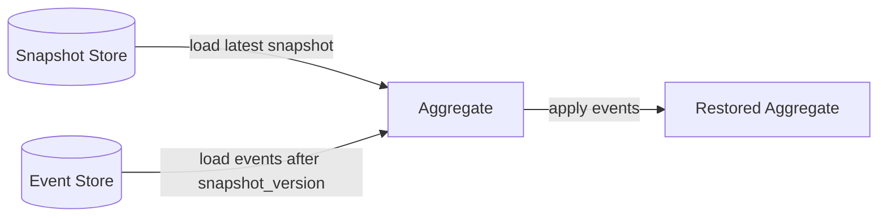

**Структура таблицы снапшотов:**

```sql
CREATE TABLE aggregate_snapshots (
    aggregate_id      VARCHAR(255) NOT NULL,
    aggregate_type    VARCHAR(255) NOT NULL,
    snapshot_version  BIGINT       NOT NULL,  -- sequence_number последнего события
    payload           JSONB        NOT NULL,  -- сериализованное состояние агрегата
    created_at        TIMESTAMPTZ  NOT NULL DEFAULT now(),
    PRIMARY KEY (aggregate_id)
);
```

**Реализация в Java:**

```java
@Service
public class SnapshottingAggregateRepository {
    private final EventStore eventStore;
    private final SnapshotStore snapshotStore;
    private static final int SNAPSHOT_THRESHOLD = 50; // снапшот каждые 50 событий

    public Order load(OrderId id) {
        // 1. Пытаемся загрузить снапшот
        Optional<Snapshot> snapshot = snapshotStore.findLatest(id);

        Order order;
        long fromVersion;

        if (snapshot.isPresent()) {
            // 2a. Восстанавливаем из снапшота
            order = deserialize(snapshot.get().getPayload(), Order.class);
            fromVersion = snapshot.get().getVersion() + 1;
        } else {
            // 2b. Начинаем с нуля
            order = new Order();
            fromVersion = 0;
        }

        // 3. Применяем события после снапшота
        List<DomainEvent> events = eventStore.loadEvents(id, fromVersion);
        events.forEach(order::apply);

        return order;
    }

    public void save(Order order) {
        List<DomainEvent> newEvents = order.pullDomainEvents();
        eventStore.appendEvents(order.getId(), newEvents, order.getVersion());

        // 4. Создаём снапшот если накопилось достаточно событий
        long totalEvents = eventStore.countEvents(order.getId());
        if (totalEvents % SNAPSHOT_THRESHOLD == 0) {
            snapshotStore.save(new Snapshot(
                order.getId(),
                totalEvents - 1,          // версия последнего события
                serialize(order)           // сериализованное состояние
            ));
        }
    }
}
```

**Стратегии создания снапшотов:**

| Стратегия | Условие | Плюсы | Минусы |
|-----------|---------|-------|--------|
| По количеству событий | Каждые N событий | Предсказуемо | Не учитывает сложность агрегата |
| По времени | Раз в час/день | Простота | Агрегат может не меняться |
| По размеру | Когда событий > threshold | Адаптивно | Сложнее реализовать |
| Асинхронный | Background job | Нет нагрузки на save | Задержка актуальности |

**В Axon Framework:** снапшоты настраиваются декларативно:
```java
@Aggregate
@Snapshot(trigger = @SnapshotTriggerDefinition(
    triggerDefinition = "eventCountSnapshot"
))
public class OrderAggregate { ... }

// В конфигурации
@Bean
public SnapshotTriggerDefinition eventCountSnapshot(
        Snapshotter snapshotter) {
    return new EventCountSnapshotTriggerDefinition(snapshotter, 50);
}
```

## Q37. Какие типы проекций существуют в CQRS/ES и чем отличается catch-up subscription?

**Проекция (Projection)** — Read Model, построенный из событий Event Store. Существует несколько механизмов подписки на события.

**1. Synchronous (Inline) Projection — синхронная:**

Проекция обновляется в той же транзакции, что и публикация события.

```java
@Transactional
public void placeOrder(PlaceOrderCommand cmd) {
    Order order = Order.place(cmd);
    eventStore.append(order.pullDomainEvents());
    // Синхронно обновляем Read Model в той же транзакции
    orderSummaryRepository.save(new OrderSummary(order));
}
```
**Плюсы:** нет eventual consistency, сразу видны данные.
**Минусы:** сложность, масштабируемость ограничена.

**2. Asynchronous Projection — асинхронная (через события):**

```java
@EventListener  // Spring Events или Kafka Consumer
@Async
public void on(OrderPlacedEvent event) {
    orderSummaryRepository.save(new OrderSummary(
        event.getOrderId(), "PENDING"
    ));
}
```
**Плюсы:** масштабируемость, независимость от write path.
**Минусы:** eventual consistency — данные могут быть устаревшими.

**3. Catch-up Subscription — догоняющая подписка:**

Проекция читает все исторические события с начала (или с определённой позиции) и "догоняет" текущее состояние.

```java
@Component
public class OrderSummaryCatchUpProjection {

    @Scheduled(fixedDelay = 1000)
    public void process() {
        long lastPosition = checkpointStore.getPosition("order-summary");

        // Читаем новые события начиная с последней обработанной позиции
        List<StoredEvent> events = eventStore.readFrom(lastPosition, batchSize = 100);

        events.forEach(event -> {
            applyEvent(event);
            checkpointStore.save("order-summary", event.getGlobalSequence());
        });
    }

    private void applyEvent(StoredEvent event) {
        switch (event.getType()) {
            case "OrderPlacedEvent" -> handleOrderPlaced(deserialize(event));
            case "OrderConfirmedEvent" -> handleOrderConfirmed(deserialize(event));
        }
    }
}
```

**Checkpoint** — хранит последнюю обработанную позицию (`global_sequence`). При рестарте сервиса проекция продолжает с того места, где остановилась.

**Сравнение типов подписок:**

| Тип | Задержка | Перестройка | Отказоустойчивость | Использование |
|-----|----------|-------------|-------------------|---------------|
| Sync | 0 | Сложно | В транзакции | Критичные данные |
| Async push | Мс-секунды | Rebuild через replay | Через Kafka retry | Общий случай |
| Catch-up | Секунды-минуты | Легко (с pos=0) | Через checkpoint | Аналитика, rebuild |

**В Axon:** `Tracking Event Processor` — это catch-up subscription с checkpoint в БД. `Subscribing Event Processor` — синхронная обработка.

## Q38. Как объяснить eventual consistency в CQRS конечному пользователю?

**Проблема:** пользователь создал заказ, обновил страницу и видит старые данные — Write Model обновлён, но Read Model ещё нет.

**Технические причины задержки:**
- Событие опубликовано, но проекция обрабатывает асинхронно
- Задержка в Kafka (consumer lag)
- Проекция в другом процессе/сервисе

**Стратегии работы с eventual consistency в UI:**

**1. Optimistic UI Update — оптимистичное обновление:**
```
Пользователь нажимает "Создать заказ"
→ UI немедленно показывает заказ в "PENDING" (без запроса к API)
→ Фоново отправляем команду
→ При успехе — подтверждаем
→ При ошибке — откатываем UI
```

**2. Read-after-write consistency — чтение после записи:**
```java
// После команды — даём проекции время на обновление
@PostMapping("/orders")
public OrderResponse placeOrder(@RequestBody OrderRequest request) {
    String orderId = commandGateway.sendAndWait(new PlaceOrderCommand(...));

    // Polling: ждём пока проекция обновится (max 2 секунды)
    return awaitProjection(orderId, Duration.ofSeconds(2));
}

private OrderResponse awaitProjection(String orderId, Duration timeout) {
    Instant deadline = Instant.now().plus(timeout);
    while (Instant.now().isBefore(deadline)) {
        Optional<OrderResponse> response = queryService.findOrder(orderId);
        if (response.isPresent()) return response.get();
        Thread.sleep(50);
    }
    throw new ProjectionTimeoutException("Order projection not updated in time");
}
```

**3. Version-based waiting (в Axon):**
```java
// QueryGateway.subscriptionQuery — живая подписка на обновление
SubscriptionQueryResult<OrderSummary, OrderSummary> result =
    queryGateway.subscriptionQuery(
        new FindOrderQuery(orderId),
        ResponseTypes.instanceOf(OrderSummary.class),
        ResponseTypes.instanceOf(OrderSummary.class)
    );

// Ждём первое обновление проекции
result.updates().blockFirst(Duration.ofSeconds(5));
```

**Коммуникация с пользователем:** вместо "ваш заказ создан" и немедленного редиректа — показывать "заказ обрабатывается" с индикатором загрузки. Большинство современных e-commerce систем (Amazon, OZON) используют этот подход.

**Ключевой тезис для интервью:** eventual consistency — это компромисс между доступностью/масштабируемостью и мгновенной согласованностью. В большинстве бизнес-случаев задержка в 100-500мс незаметна и приемлема.

## Q39. (!) Как реализовать Saga в CQRS — оркестрация vs хореография?

**Saga** — паттерн для управления распределёнными транзакциями через последовательность локальных транзакций с компенсациями. Тесно связан с CQRS: команды посылаются через Command Bus, события прослушиваются через Event Bus.

**Оркестрация (Orchestration) — централизованный координатор:**

```java
// Saga-оркестратор знает весь сценарий
@Saga
public class OrderSaga {

    @Autowired
    private transient CommandGateway commandGateway;

    private String orderId;
    private String paymentId;

    @StartSaga
    @SagaEventHandler(associationProperty = "orderId")
    public void on(OrderPlacedEvent event) {
        this.orderId = event.getOrderId();
        // Шаг 1: резервируем инвентарь
        commandGateway.send(new ReserveInventoryCommand(
            event.getOrderId(), event.getItems()
        ));
    }

    @SagaEventHandler(associationProperty = "orderId")
    public void on(InventoryReservedEvent event) {
        // Шаг 2: создаём платёж
        commandGateway.send(new CreatePaymentCommand(
            event.getOrderId(), event.getTotalAmount()
        ));
    }

    @SagaEventHandler(associationProperty = "orderId")
    public void on(PaymentCreatedEvent event) {
        // Шаг 3: подтверждаем заказ
        commandGateway.send(new ConfirmOrderCommand(event.getOrderId()));
    }

    // Компенсация при ошибке платежа
    @SagaEventHandler(associationProperty = "orderId")
    public void on(PaymentFailedEvent event) {
        // Откат: освобождаем инвентарь
        commandGateway.send(new ReleaseInventoryCommand(event.getOrderId()));
        commandGateway.send(new CancelOrderCommand(event.getOrderId(), "Payment failed"));
        SagaLifecycle.end();
    }

    @EndSaga
    @SagaEventHandler(associationProperty = "orderId")
    public void on(OrderConfirmedEvent event) {
        // Saga завершена успешно
    }
}
```

**Хореография (Choreography) — распределённая координация:**

```java
// Каждый сервис реагирует на события без центрального координатора
@EventHandler  // Inventory Service
public void on(OrderPlacedEvent event) {
    // Inventory сам решает, что делать при создании заказа
    boolean reserved = inventoryService.reserve(event.getItems());
    if (reserved) {
        eventBus.publish(new InventoryReservedEvent(event.getOrderId()));
    } else {
        eventBus.publish(new InventoryReservationFailedEvent(event.getOrderId()));
    }
}

@EventHandler  // Payment Service
public void on(InventoryReservedEvent event) {
    // Payment реагирует на резервирование инвентаря
    paymentService.createPayment(event.getOrderId());
}
```

**Сравнение подходов:**

| Аспект | Оркестрация | Хореография |
|--------|-------------|-------------|
| Координатор | Централизованный Saga | Отсутствует |
| Видимость потока | Легко понять сценарий | Распределена по сервисам |
| Связность | Saga знает о сервисах | Сервисы связаны через события |
| Отладка | Проще (один класс) | Сложнее (трейсы по сервисам) |
| Масштабируемость | Saga — bottleneck | Линейное масштабирование |
| Компенсации | Явно в Saga | Каждый сервис сам |

**Рекомендация:** для сложных многошаговых сценариев — оркестрация (Axon Saga). Для простых независимых реакций — хореография.

## Q40. Что такое Upcasting событий и как реализовать эволюцию схемы Event Sourcing?

**Проблема:** события в Event Store неизменяемы, но схема событий меняется со временем. Нужен механизм "апгрейда" старых событий до новой схемы.

**Upcaster** — компонент, преобразующий старую версию события в новую при чтении из Event Store.

**Пример эволюции события:**

```java
// Версия 1 (старая): только имя
@Value
public class UserRegisteredEventV1 {
    String userId;
    String name;        // "Иван Иванов"
}

// Версия 2 (новая): имя разделено на части
@Value
public class UserRegisteredEventV2 {
    String userId;
    String firstName;   // "Иван"
    String lastName;    // "Иванов"
    String email;       // новое поле (nullable для старых событий)
}
```

**Реализация Upcaster в Axon:**

```java
@Component
public class UserRegisteredEventUpcaster
        extends SingleEventUpcaster {

    @Override
    protected boolean canUpcast(IntermediateEventRepresentation event) {
        return event.getType().equals("UserRegisteredEvent")
            && event.getRevision().orElse("1").equals("1");
    }

    @Override
    protected IntermediateEventRepresentation doUpcast(
            IntermediateEventRepresentation event) {

        // Читаем старое событие
        ObjectNode oldPayload = (ObjectNode) event.getData()
            .getObject();
        String fullName = oldPayload.get("name").asText();
        String[] parts = fullName.split(" ", 2);

        // Создаём новую структуру
        ObjectNode newPayload = oldPayload.deepCopy();
        newPayload.remove("name");
        newPayload.put("firstName", parts[0]);
        newPayload.put("lastName", parts.length > 1 ? parts[1] : "");
        newPayload.putNull("email");  // новое поле — null для старых событий

        return event.upcastPayload(
            "UserRegisteredEvent",
            "2",           // новая версия
            MetaData.emptyInstance(),
            newPayload
        );
    }
}
```

**Версионирование в Event Store:**

```sql
-- Поле event_version в таблице событий
INSERT INTO domain_events (event_type, event_version, payload)
VALUES ('UserRegisteredEvent', 2, '{"firstName":"Иван","lastName":"Иванов","email":null}');
```

**Стратегии эволюции схемы:**

| Стратегия | Описание | Когда применять |
|-----------|----------|-----------------|
| Upcasting | Преобразуем при чтении | Небольшие изменения схемы |
| Event versioning | Новый тип события (`V2`) | Кардинальные изменения |
| Weak schema | Избегаем обязательных полей | Превентивно |
| Event migration | Переписываем исторические события | Редко, с осторожностью |

**Правила хорошего тона при проектировании событий:**
- Добавляйте только nullable поля — это обратно совместимо
- Никогда не удаляйте и не переименовывайте существующие поля без Upcaster
- Всегда указывайте версию события (`@Revision("2")` в Axon)

## Q41. Стратегии перестройки Read Model — zero-downtime rebuild проекций?

**Зачем нужна перестройка (rebuild):** изменилась бизнес-логика проекции, добавлено новое поле в Read Model, обнаружена ошибка в обработке событий, нужна новая проекция для нового Use Case.

**Стратегия 1 — Blue/Green Rebuild (рекомендуется для production):**

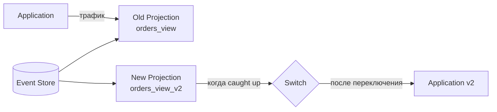

```java
@Component
@ProcessingGroup("order-summary-v2")  // отдельная группа = отдельный checkpoint
public class OrderSummaryV2Projection {

    @EventHandler
    public void on(OrderPlacedEvent event) {
        // Строим новую схему в отдельной таблице orders_view_v2
        orderSummaryV2Repository.save(buildEnrichedSummary(event));
    }
}
```

**Шаги blue/green rebuild:**
1. Запустить новую проекцию (`orders_view_v2`) с позиции 0
2. Дать ей "догнать" (catch up) Event Store
3. Когда lag ≈ 0 — переключить приложение на новую таблицу
4. Удалить старую проекцию и таблицу

**Стратегия 2 — Reset Tracking Processor (Axon):**

```java
// В Axon: сбросить позицию процессора и перечитать все события
EventProcessingConfiguration epc = configuration.eventProcessingConfiguration();
epc.eventProcessor("order-summary", TrackingEventProcessor.class)
   .ifPresent(processor -> {
       processor.shutDown();
       processor.resetTokens();  // сбрасываем checkpoint на начало
       processor.start();        // начинаем обработку с позиции 0
   });
```

**Стратегия 3 — Temporal Table (параллельный rebuild):**

```sql
-- Новая таблица для rebuild
CREATE TABLE orders_view_rebuild AS SELECT * FROM orders_view WHERE 1=0;

-- После завершения rebuild — атомарный swap
BEGIN;
  ALTER TABLE orders_view RENAME TO orders_view_old;
  ALTER TABLE orders_view_rebuild RENAME TO orders_view;
COMMIT;

DROP TABLE orders_view_old;
```

**Мониторинг прогресса rebuild:**

```java
// Отслеживаем отставание (lag) проекции
long currentGlobalSequence = eventStore.getLastGlobalSequence();
long projectionPosition = checkpointStore.getPosition("order-summary");
long lag = currentGlobalSequence - projectionPosition;

// Метрика для Grafana/Prometheus
meterRegistry.gauge("projection.lag",
    Tags.of("projection", "order-summary"), lag);
```

**Ключевые принципы rebuild:**
- Всегда держите старую проекцию живой до полного переключения
- Мониторьте lag через метрики — не гадайте, когда завершится rebuild
- Тестируйте rebuild на staging перед prod — оцените время (событий × время/событие)
- Для многомиллиардных Event Store — используйте параллельную обработку

---

## See also

- [Domain-Driven Design](ddd-interview.md) — агрегаты, Bounded Context и тактические паттерны DDD, без которых CQRS/ES не имеют смысла
- [Event-Driven паттерны](event-driven-patterns-interview.md) — EDA, брокеры сообщений, Outbox Pattern и идемпотентность
- [Микросервисы](microservices-interview.md) — CQRS как паттерн масштабирования read/write нагрузки в микросервисах
- [Распределённые системы](distributed-systems-interview.md) — CAP, согласованность, партиционирование и distributed transactions
- [Паттерны согласованности](consistency-patterns-interview.md) — eventual consistency, read-your-writes и механизм sync/async проекций
- [Clean Architecture](clean-architecture-interview.md) — слоёная архитектура как основа разделения Command и Query моделей
- [Apache Kafka](../messaging/kafka-interview.md) — Kafka как Event Store для Event Sourcing и шина событий для CQRS проекций
- [Архитектура баз данных](../databases/database-architecture-interview.md) — read replica, материализованные представления и физическое разделение read/write БД
- [API Gateway](api-gateway-interview.md) — единая точка входа в систему CQRS с маршрутизацией команд и query
- [BFF Pattern](bff-pattern-interview.md) — Backend-for-Frontend как способ адаптировать CQRS-проекции под конкретные клиенты
- [Стратегии кэширования](caching-strategies-interview.md) — read-through и write-behind как альтернатива/дополнение к CQRS-проекциям
- [CAP-теорема](cap-theorem-interview.md) — фундамент выбора между consistency и availability в распределённых CQRS-системах
