# Вопросы на собеседовании: `CQRS` и `Event Sourcing`

Полное покрытие паттернов `CQRS` (Command Query Responsibility Segregation) и `Event Sourcing`: разделение моделей чтения и записи, хранение событий, проекции, снапшоты, `Axon Framework`, паттерн `Saga`, версионирование событий, реализация в `Spring Boot`.

**CQRS** и **Event Sourcing** -- два комплементарных архитектурных паттерна, которые часто применяются вместе в сложных распределённых системах. `CQRS` разделяет операции чтения и записи на уровне модели, а `Event Sourcing` сохраняет все изменения состояния как последовательность неизменяемых событий. На собеседованиях эти темы обязательны для Senior-позиций, поскольку показывают понимание масштабируемой архитектуры, eventual consistency и моделирования предметной области.

## Полезные ссылки

### Официальная документация

- [CQRS and Event Sourcing in Java (Baeldung)](https://www.baeldung.com/cqrs-event-sourcing-java) -- базовая реализация CQRS и Event Sourcing на Java
- [A Guide to the Axon Framework (Baeldung)](https://www.baeldung.com/axon-cqrs-event-sourcing) -- Axon Framework для CQRS/ES
- [Implementing CQRS with Spring Modulith (Baeldung)](https://www.baeldung.com/spring-modulith-cqrs) -- CQRS через Spring Modulith
- [Apply CQRS to a Spring REST API (Baeldung)](https://www.baeldung.com/cqrs-for-a-spring-rest-api) -- применение CQRS к REST API
- [Snapshotting Aggregates in Axon (Baeldung)](https://www.baeldung.com/axon-snapshotting-aggregates) -- снапшоты агрегатов
- [Saga Pattern in Microservices (Baeldung)](https://www.baeldung.com/cs/saga-pattern-microservices) -- паттерн Saga
- [CQRS (Martin Fowler)](https://martinfowler.com/bliki/CQRS.html) -- каноническое описание CQRS
- [Event Sourcing (Martin Fowler)](https://martinfowler.com/eaaDev/EventSourcing.html) -- каноническое описание Event Sourcing
- [Axon Framework Reference Guide](https://docs.axoniq.io/reference-guide/) -- официальная документация Axon

## Содержание

- [Полезные ссылки](#полезные-ссылки)
- [See also](#see-also)

**Основы CQRS**
- [Q1. (!) Что такое CQRS и зачем он нужен?](#q1--что-такое-cqrs-и-зачем-он-нужен)
- [Q2. В чём разница между CQS и CQRS?](#q2-в-чём-разница-между-cqs-и-cqrs)
- [Q3. Как устроены модели чтения и записи в CQRS?](#q3-как-устроены-модели-чтения-и-записи-в-cqrs)
- [Q4. Какие преимущества даёт разделение моделей чтения и записи?](#q4-какие-преимущества-даёт-разделение-моделей-чтения-и-записи)
- [Q5. Какие недостатки и сложности привносит CQRS?](#q5-какие-недостатки-и-сложности-привносит-cqrs)
- [Q6. Когда стоит и не стоит применять CQRS?](#q6-когда-стоит-и-не-стоит-применять-cqrs)

**Event Sourcing**
- [Q7. (!) Что такое Event Sourcing?](#q7--что-такое-event-sourcing)
- [Q8. (!) Что такое Event Store и чем он отличается от обычной БД?](#q8--что-такое-event-store-и-чем-он-отличается-от-обычной-бд)
- [Q9. Как восстановить состояние агрегата из событий?](#q9-как-восстановить-состояние-агрегата-из-событий)
- [Q10. (!) Что такое снапшоты и зачем они нужны?](#q10--что-такое-снапшоты-и-зачем-они-нужны)
- [Q11. Что такое Event Replay и для чего он используется?](#q11-что-такое-event-replay-и-для-чего-он-используется)
- [Q12. Какие проблемы возникают при удалении данных в Event Sourcing?](#q12-какие-проблемы-возникают-при-удалении-данных-в-event-sourcing)

**Проекции и Read Model**
- [Q13. (!) Что такое проекции в CQRS/ES?](#q13--что-такое-проекции-в-cqrses)
- [Q14. Как синхронизировать модель чтения с моделью записи?](#q14-как-синхронизировать-модель-чтения-с-моделью-записи)
- [Q15. (!) Что такое Eventual Consistency в контексте CQRS?](#q15--что-такое-eventual-consistency-в-контексте-cqrs)

**Команды, события и агрегаты**
- [Q16. Как устроена команда (Command) в CQRS?](#q16-как-устроена-команда-command-в-cqrs)
- [Q17. Чем событие (Event) отличается от команды?](#q17-чем-событие-event-отличается-от-команды)
- [Q18. (!) Как агрегат обрабатывает команды и публикует события?](#q18--как-агрегат-обрабатывает-команды-и-публикует-события)

**Axon Framework и Spring Boot**
- [Q19. Что такое Axon Framework и какие компоненты он предоставляет?](#q19-что-такое-axon-framework-и-какие-компоненты-он-предоставляет)
- [Q20. Как реализовать CQRS/ES приложение на Spring Boot с Axon?](#q20-как-реализовать-cqrses-приложение-на-spring-boot-с-axon)
- [Q21. Как реализовать CQRS без Axon на чистом Spring Boot?](#q21-как-реализовать-cqrs-без-axon-на-чистом-spring-boot)

**Saga Pattern**
- [Q22. (!) Что такое паттерн Saga и зачем он нужен?](#q22--что-такое-паттерн-saga-и-зачем-он-нужен)
- [Q23. В чём разница между оркестрацией и хореографией в Saga?](#q23-в-чём-разница-между-оркестрацией-и-хореографией-в-saga)
- [Q24. Что такое компенсирующие транзакции?](#q24-что-такое-компенсирующие-транзакции)

**Версионирование и эволюция событий**
- [Q25. Что такое версионирование событий и зачем оно нужно?](#q25-что-такое-версионирование-событий-и-зачем-оно-нужно)
- [Q26. Что такое Upcaster и как он работает?](#q26-что-такое-upcaster-и-как-он-работает)

**CQRS + Event Sourcing: совместное применение**
- [Q27. Почему CQRS и Event Sourcing часто используются вместе?](#q27-почему-cqrs-и-event-sourcing-часто-используются-вместе)
- [Q28. Как тестировать CQRS/ES приложения?](#q28-как-тестировать-cqrses-приложения)

**Практика и trade-offs**
- [Q29. Какие реальные проблемы возникают при внедрении CQRS/ES?](#q29-какие-реальные-проблемы-возникают-при-внедрении-cqrses)
- [Q30. (!) Как обеспечить идемпотентность обработки событий?](#q30--как-обеспечить-идемпотентность-обработки-событий)

**Продвинутые темы**
- [Q31. (!) Как управлять несколькими проекциями одного агрегата?](#q31--как-управлять-несколькими-проекциями-одного-агрегата)
- [Q32. Как пересобрать (rebuild) read model при изменении схемы проекции?](#q32-как-пересобрать-rebuild-read-model-при-изменении-схемы-проекции)
- [Q33. (!) Как соблюдать GDPR (право на удаление) при использовании Event Sourcing?](#q33--как-соблюдать-gdpr-право-на-удаление-при-использовании-event-sourcing)

**CQRS/ES: расширенные темы**
- [Q34. Как Axon Framework реализует CQRS/ES в Java/Spring?](#q34-как-axon-framework-реализует-cqrses-в-javaspring)
- [Q35. (!) Как устроена структура таблицы Event Store — версионирование и оптимистичная блокировка?](#q35--как-устроена-структура-таблицы-event-store--версионирование-и-оптимистичная-блокировка)
- [Q36. Как реализовать снапшоты в Event Sourcing — алгоритм и стратегии?](#q36-как-реализовать-снапшоты-в-event-sourcing--алгоритм-и-стратегии)
- [Q37. Какие типы проекций существуют в CQRS/ES и чем отличается catch-up subscription?](#q37-какие-типы-проекций-существуют-в-cqrses-и-чем-отличается-catch-up-subscription)
- [Q38. Как объяснить eventual consistency в CQRS конечному пользователю?](#q38-как-объяснить-eventual-consistency-в-cqrs-конечному-пользователю)
- [Q39. (!) Как реализовать Saga в CQRS — оркестрация vs хореография?](#q39--как-реализовать-saga-в-cqrs--оркестрация-vs-хореография)
- [Q40. Что такое Upcasting событий и как реализовать эволюцию схемы Event Sourcing?](#q40-что-такое-upcasting-событий-и-как-реализовать-эволюцию-схемы-event-sourcing)
- [Q41. Стратегии перестройки Read Model — zero-downtime rebuild проекций?](#q41-стратегии-перестройки-read-model--zero-downtime-rebuild-проекций)

---

## Q1. (!) Что такое CQRS и зачем он нужен?

**CQRS** (Command Query Responsibility Segregation) -- архитектурный паттерн, разделяющий операции записи (команды) и чтения (запросы) на уровне модели данных. Вместо одной модели, обслуживающей и чтение, и запись, создаются две отдельные модели.

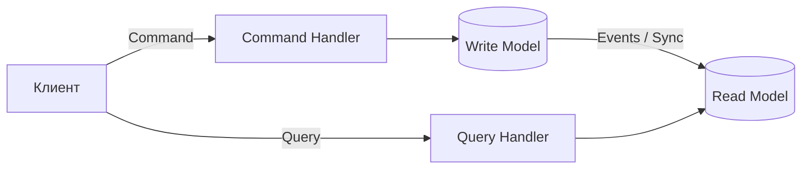

**Зачем нужен CQRS:**

- **Независимое масштабирование** -- нагрузка на чтение обычно в 10-100 раз превышает нагрузку на запись; CQRS позволяет масштабировать их раздельно
- **Оптимизация моделей** -- модель записи нормализована для консистентности, модель чтения денормализована для скорости
- **Разделение ответственности** -- команды валидируют бизнес-правила, запросы просто возвращают данные
- **Упрощение сложной бизнес-логики** -- запись может использовать DDD-агрегаты, чтение -- плоские проекции

Термин ввёл Грег Янг (Greg Young) в 2010 году, развив принцип CQS Бертрана Мейера.


> [!mcq]
>
> **Какое утверждение наиболее точно описывает суть паттерна CQRS?**
>
> - [x] **A.** Разделение модели на отдельные write-model (команды, бизнес-инварианты, нормализация) и read-model (денормализованные проекции, оптимизированные под конкретные UI/API-запросы), что позволяет независимо масштабировать чтение и запись.
>   - МЕХАНИЗМ: команды идут через `CommandHandler` → write-DB; read-сторона обновляется асинхронно через события и обслуживается отдельным `QueryHandler` поверх денормализованного хранилища.
>   - ПРИМЕНИМОСТЬ: read-heavy системы (соотношение чтения к записи 10:1 и выше), сложные DDD-агрегаты, мультипредставления одних и тех же данных (REST + аналитика + поиск).
>   - ПОЧЕМУ ВЕРНО: точно отражает определение Грега Янга (2010) — CQRS расширяет CQS Бертрана Мейера до уровня архитектуры, а не отдельных методов.
>   - ЭТАЛОН: Microsoft `.NET Application Architecture Guide` и `eShopOnContainers` используют ровно эту формулировку — две модели, два пути, асинхронная синхронизация.
>
> - [ ] **B.** CQRS — это обязательное использование Event Sourcing: любая команда должна порождать событие в event-store, а read-model строится только через replay событий.
>   - ПОЧЕМУ НЕВЕРНО: CQRS и Event Sourcing — ортогональные паттерны. CQRS без ES прекрасно работает (write в PostgreSQL → CDC/триггер → read в Elasticsearch).
>   - ПОСЛЕДСТВИЕ: команда внедряет event-store там, где достаточно двух таблиц, получает 3× инфраструктуры и месяцы на освоение upcasting/snapshots без бизнес-выгоды.
>
> - [ ] **C.** CQRS требует физического разделения баз данных: write всегда в OLTP (PostgreSQL/MySQL), read всегда в OLAP/NoSQL (ClickHouse/Mongo), иначе это не CQRS.
>   - ПОЧЕМУ НЕВЕРНО: разделение может быть логическим — две схемы в одной БД, разные таблицы, materialized view. Физическое разделение — частный случай.
>   - ПОСЛЕДСТВИЕ: «лёгкий» CQRS на одной БД отвергается как «не настоящий», команда тащит вторую СУБД и eventual consistency без необходимости.
>
> - [ ] **D.** CQRS — это синоним микросервисной архитектуры: каждая команда и каждый запрос обрабатываются отдельным микросервисом со своей БД.
>   - ПОЧЕМУ НЕВЕРНО: CQRS — паттерн внутри одного bounded context. Микросервисы — про границы развёртывания. Можно иметь монолит с CQRS и микросервисы без CQRS.
>   - ПОСЛЕДСТВИЕ: дробление на 50 микросервисов «потому что CQRS» приводит к распределённому монолиту с сетевыми вызовами там, где хватило бы вызова метода.

## Q2. В чём разница между CQS и CQRS?

| Характеристика | `CQS` | `CQRS` |
|---|---|---|
| **Уровень** | Метод/функция | Архитектура/модель |
| **Суть** | Метод либо возвращает результат, либо изменяет состояние, но не оба | Отдельные модели для чтения и записи |
| **Автор** | Бертран Мейер (1988) | Грег Янг (2010) |
| **Масштаб** | Один объект | Вся система или bounded context |
| **Разделение** | На уровне сигнатуры метода | На уровне классов, модулей, баз данных |

**CQS** -- принцип проектирования интерфейсов: команды (`void`) изменяют состояние, запросы возвращают данные без побочных эффектов.

**CQRS** -- расширяет CQS до архитектурного уровня: разные объекты, разные модели данных, потенциально разные хранилища для чтения и записи.

```java
// CQS на уровне метода
public interface OrderService {
    void placeOrder(OrderCommand cmd);      // команда — void
    OrderDto getOrder(UUID orderId);         // запрос — возвращает данные
}

// CQRS на уровне архитектуры — разные сервисы
public class OrderCommandService {
    public void placeOrder(PlaceOrderCommand cmd) { /* ... */ }
}

public class OrderQueryService {
    public OrderView getOrder(UUID orderId) { /* ... */ }
}
```


> [!mcq]
>
> **В чём ключевое отличие CQS (Бертран Мейер, 1988) от CQRS (Грег Янг, 2010)?**
>
> - [ ] **A.** CQS и CQRS — это просто разные названия одного и того же принципа: метод либо изменяет состояние, либо возвращает данные, но не оба одновременно; никаких архитектурных различий нет.
>   - ПОЧЕМУ НЕВЕРНО: CQS и CQRS принципиально разного масштаба — CQS про сигнатуру метода, CQRS про модель/архитектуру всей системы.
>   - ПОСЛЕДСТВИЕ: разработчик, считая их синонимами, на собеседовании путает уровни абстракции и не может объяснить, зачем вообще нужен CQRS поверх CQS.
>
> - [x] **B.** CQS — принцип уровня метода (одна функция либо команда `void`, либо чистый запрос); CQRS расширяет ту же идею до уровня архитектуры: разные классы/модули/хранилища для команд и запросов.
>   - МЕХАНИЗМ CQS: `void placeOrder(cmd)` и `OrderDto getOrder(id)` в одном интерфейсе — но один метод не делает обе вещи. CQRS: `OrderCommandService` и `OrderQueryService` — отдельные компоненты, потенциально с разными БД.
>   - КОГДА CQS НЕ ХВАТАЕТ: read и write имеют принципиально разные требования по нагрузке, схеме данных или технологии хранения — тогда переход на CQRS.
>   - ПОЧЕМУ ВЕРНО: это формулировка самого Грега Янга — «CQRS is just CQS at a different level of abstraction» (доклад 2010, QCon).
>   - ЭТАЛОН: Мартин Фаулер в `bliki/CQRS` явно противопоставляет «method-level CQS» и «architectural CQRS».
>
> - [ ] **C.** CQS требует строгой консистентности (sync), а CQRS — это всегда eventual consistency через events; других различий между ними нет.
>   - ПОЧЕМУ НЕВЕРНО: CQRS не обязывает к async/eventual — можно делать CQRS внутри одной транзакции (sync projection в той же БД). Eventual consistency — следствие распределённости, а не определения CQRS.
>   - ПОСЛЕДСТВИЕ: команда отвергает CQRS «потому что у нас strong consistency обязателен», хотя sync-CQRS с двумя таблицами в одной транзакции — валидный паттерн.
>
> - [ ] **D.** CQS — это устаревший принцип 1988 года, заменённый CQRS; современные системы должны применять только CQRS, а CQS считается антипаттерном.
>   - ПОЧЕМУ НЕВЕРНО: CQS — базовый принцип чистого кода, применимый везде (clean code, SOLID). CQRS — архитектурный паттерн для специфичных задач. Они не конкурируют — они на разных уровнях.
>   - ПОСЛЕДСТВИЕ: команда внедряет CQRS в простой CRUD ради «современности», получает оверинжиниринг там, где хватило бы CQS на уровне методов.

## Q3. Как устроены модели чтения и записи в CQRS?

**Write Model (модель записи):**
- Содержит бизнес-логику и инварианты
- Обычно реализуется через DDD-агрегаты
- Нормализованная структура данных
- Принимает команды, валидирует правила, генерирует события
- Оптимизирована для консистентности

**Read Model (модель чтения):**
- Денормализованная, оптимизированная для конкретных UI/API-запросов
- Не содержит бизнес-логику
- Может быть несколько read-моделей для разных потребителей
- Обновляется асинхронно из событий write-модели
- Может использовать другое хранилище (Elasticsearch, Redis, materialized view)

```java
// Write Model — DDD агрегат
@Aggregate
public class OrderAggregate {
    @AggregateIdentifier
    private UUID orderId;
    private OrderStatus status;
    private List<OrderLine> lines;
    private Money totalAmount;

    @CommandHandler
    public void handle(ConfirmOrderCommand cmd) {
        if (status != OrderStatus.PENDING) {
            throw new IllegalStateException("Заказ уже подтверждён");
        }
        apply(new OrderConfirmedEvent(orderId, totalAmount));
    }
}

// Read Model — денормализованная проекция
@Entity
@Table(name = "order_summary_view")
public class OrderSummaryView {
    @Id
    private UUID orderId;
    private String customerName;
    private String status;
    private BigDecimal totalAmount;
    private int itemCount;
    private LocalDateTime createdAt;
    // Нет бизнес-логики — только данные для отображения
}
```


> [!mcq]
>
> **Чем принципиально отличается write-model от read-model в CQRS и как они синхронизируются?**
>
> - [ ] **A.** Write-model и read-model — это одна и та же сущность в одной таблице; разница только в том, что для записи используется `INSERT/UPDATE`, а для чтения `SELECT` через тот же ORM.
>   - ПОЧЕМУ НЕВЕРНО: это обычный CRUD, а не CQRS. Суть CQRS — две физически или логически разные модели данных, оптимизированные под разные задачи.
>   - ПОСЛЕДСТВИЕ: команда заявляет «у нас CQRS», но при review архитектуры выясняется, что это classic-CRUD; собеседование проваливается на первом же уточняющем вопросе.
>
> - [ ] **B.** Write-model хранит денормализованные view для UI, а read-model держит нормализованные таблицы с бизнес-инвариантами и DDD-агрегатами, чтобы запросы шли через богатую доменную модель.
>   - ПОЧЕМУ НЕВЕРНО: это инверсия — на самом деле всё наоборот. Write-model нормализована и содержит инварианты, read-model денормализована и не имеет бизнес-логики.
>   - ПОСЛЕДСТВИЕ: команда строит read-сторону через `OrderAggregate.load()` с full replay и инвариантами — получает медленный read с теми же проблемами, ради которых CQRS затевался.
>
> - [x] **C.** Write-model нормализована, содержит бизнес-инварианты (часто DDD-агрегаты), принимает команды и публикует события; read-model денормализована, заточена под конкретные запросы (плоская проекция, materialized view, поисковый индекс) и обновляется асинхронно из событий write-стороны.
>   - МЕХАНИЗМ: write принимает `ConfirmOrderCommand`, валидирует через `OrderAggregate`, сохраняет состояние/событие → событие публикуется в шину (Kafka/Outbox) → projection-handler обновляет read-таблицу `order_summary_view`.
>   - СИНХРОНИЗАЦИЯ: чаще всего eventual consistency через события (десятки/сотни мс лаг); для критичных сценариев — sync projection в той же транзакции (через triggers или сервисную транзакцию).
>   - НЕСКОЛЬКО READ: один поток событий может питать несколько read-моделей одновременно — PostgreSQL для API, Elasticsearch для поиска, ClickHouse для аналитики.
>   - ПОЧЕМУ ВЕРНО: ровно эта схема описана в `Microsoft .NET Microservices Architecture` (eShopOnContainers), Axon Framework reference guide и `Implementing DDD` Vaughn Vernon (глава о CQRS).
>   - ЭТАЛОН: Axon Server, EventStoreDB, Marten — все три референс-стека реализуют именно такое разделение.
>
> - [ ] **D.** Write-model и read-model должны быть полностью независимыми сервисами в разных дата-центрах с обязательной двухфазной фиксацией (2PC) при каждом обновлении.
>   - ПОЧЕМУ НЕВЕРНО: 2PC прямо противоречит идее CQRS — асинхронная eventual-consistent проекция через события несовместима с distributed-транзакциями.
>   - ПОСЛЕДСТВИЕ: команда втаскивает XA-транзакции и атомарную репликацию между двумя стораджами, получает latency 500мс+ на каждую команду и теряет главное преимущество CQRS — независимое масштабирование.

## Q4. Какие преимущества даёт разделение моделей чтения и записи?

1. **Независимое масштабирование** -- read-реплики можно множить без влияния на запись
2. **Оптимальные структуры данных** -- запись хранится нормализованно, чтение -- денормализованно
3. **Разные технологии хранения** -- запись в PostgreSQL, чтение из Elasticsearch или Redis
4. **Упрощение запросов** -- нет сложных JOIN-ов, данные уже подготовлены
5. **Изоляция изменений** -- изменение бизнес-логики не ломает модель чтения и наоборот
6. **Поддержка нескольких представлений** -- один поток событий питает REST API, аналитику, поиск
7. **Упрощение безопасности** -- разные политики доступа для чтения и записи


> [!mcq] Какое преимущество разделения моделей чтения и записи в CQRS наиболее уникально для этого паттерна?
>
> - [ ] A) Снижение объёма исходного кода — модели проще, поэтому проекта получается меньше строк
>   - Почему неверно: на практике CQRS *увеличивает* кодовую базу: появляются команды, события, отдельные хендлеры, проекции и read-DTO. Минимализм — это не его цель.
>   - Последствие: ожидание «упрощения кода» приводит к разочарованию команды и откату на CRUD после нескольких спринтов.
>
> - [ ] B) Автоматическая ACID-консистентность между чтением и записью
>   - Почему неверно: CQRS, наоборот, обычно подразумевает eventual consistency между write-моделью и read-проекциями. ACID между ними не гарантируется и стоит дорого.
>   - Последствие: разработчики предполагают мгновенную видимость записи в read-API и ловят race-условия в UI, что приводит к жалобам «я нажал, но ничего не появилось».
>
> - [ ] C) Полное устранение необходимости в индексах на стороне записи
>   - Почему неверно: write-модель тоже нуждается в индексах для поиска агрегата по id и контроля уникальности; CQRS лишь убирает «индексы для запросов отчётности», но не все индексы вообще.
>   - Последствие: при миграции на CQRS удаляют индексы write-стороны и получают деградацию загрузки агрегатов и нарушение бизнес-инвариантов.
>
> - [x] D) Независимое масштабирование и выбор разных технологий хранения для команд и запросов
>   - Почему верно: ключевая выгода CQRS — write-модель (например, PostgreSQL с агрегатами) и read-модели (Elasticsearch, Redis, материализованные view) масштабируются и эволюционируют независимо.
>   - Конкретный механизм: команды идут в write-БД, события публикуются в шину, проекции строят read-стораджи под конкретные запросы; реплики read-стораджа добавляются без блокировок write-пути.
>   - Use-case: каталог товаров с тысячами RPS на чтение и десятками RPS на запись — read-сторона разворачивается на 10 нодах Elasticsearch, write-сторона остаётся компактной.
>   - Почему остальные неверны: A путает CQRS с уменьшением кода, B противоречит eventual consistency, C преувеличивает отказ от индексов на write-стороне.
>   - Mnemonic: «CQRS = свобода масштабировать обе стороны по отдельности».

## Q5. Какие недостатки и сложности привносит CQRS?

- **Eventual Consistency** -- данные в read-модели отстают от write-модели; пользователь может не сразу видеть свои изменения
- **Увеличение сложности** -- две модели, синхронизация, дополнительная инфраструктура
- **Дублирование данных** -- одни и те же данные хранятся в разных формах
- **Сложность отладки** -- трудно отследить путь данных от команды до проекции
- **Операционные затраты** -- больше компонентов для мониторинга и поддержки
- **Обработка ошибок** -- если проекция сломалась, нужен механизм replay/retry
- **Порог входа** -- команде нужно понимать паттерн; новичкам сложно

**На собеседовании важно** показать, что вы понимаете не только плюсы, но и реальные проблемы. CQRS -- это не серебряная пуля.


> [!mcq] Какой недостаток CQRS чаще всего недооценивают команды при внедрении и почему он критичен?
>
> - [x] A) Eventual consistency между write-моделью и read-проекциями ломает UX, если пользователю показывают «свои» данные сразу после команды
>   - Почему верно: команда уходит в write-БД, событие проходит через шину, проекция обновляется с задержкой 100 мс — 30 сек; за это время GET по read-модели вернёт старые данные, и пользователь увидит, что «ничего не изменилось».
>   - Конкретный механизм: между `POST /orders` и `GET /orders/{id}` стоит асинхронный pipeline (Kafka → ProjectionHandler → read-БД); пока проекция не догнала событие, read-API отдаёт прошлое состояние.
>   - Use-case: пользователь добавил товар в корзину, страница перерисовалась — товара нет; команды лечат это через read-your-writes (читать из write-стороны после команды) или оптимистичный апдейт UI до прихода события.
>   - Почему остальные неверны: B описывает плюс CQRS, а не минус; C — не специфическая для CQRS проблема; D — выдуманное ограничение, CQRS совместим с любой авторизацией.
>   - Mnemonic: «CQRS платит UX-валютой за масштабируемость».
>
> - [ ] B) Полная невозможность переиспользовать существующую write-БД для запросов
>   - Почему неверно: CQRS не запрещает читать из write-БД; для редких или критичных к свежести запросов это допустимая стратегия. Ограничение «только read-сторона для чтения» — это догма, а не свойство паттерна.
>   - Последствие: команда строит сложные проекции для редких отчётов вместо прямого SQL по write-БД и тратит недели на инфраструктуру, которая не окупается.
>
> - [ ] C) Гарантированная потеря данных при сбое одной из read-моделей
>   - Почему неверно: read-модели восстанавливаются replay-ом событий из write-журнала или шины; данные не теряются, теряется лишь время на пересборку проекции.
>   - Последствие: страх «потерять данные» приводит к избыточной репликации read-сторон и удорожанию инфраструктуры без реальной необходимости.
>
> - [ ] D) Невозможность реализовать role-based авторизацию в системе с CQRS
>   - Почему неверно: авторизация ортогональна CQRS — она применяется и на команд-стороне (что пользователь может изменить), и на query-стороне (что он может видеть). Паттерн ничего не мешает.
>   - Последствие: команда отвергает CQRS «из-за безопасности» и теряет реальные выгоды масштабирования и аудита.

**На собеседовании важно** показать, что вы понимаете не только плюсы, но и реальные проблемы. CQRS -- это не серебряная пуля.

## Q6. Когда стоит и не стоит применять CQRS?

**Стоит применять:**
- Высокая асимметрия нагрузки чтение/запись (read-heavy системы)
- Сложная бизнес-логика записи (DDD-агрегаты с инвариантами)
- Необходимость нескольких представлений данных (UI, аналитика, поиск)
- Микросервисная архитектура с чёткими bounded context
- Системы с требованием аудита (Event Sourcing + CQRS)

**Не стоит применять:**
- Простые CRUD-приложения без сложной бизнес-логики
- Монолиты с простой доменной моделью
- Системы с жёстким требованием strong consistency
- Маленькие команды без опыта работы с eventual consistency
- MVP и прототипы -- слишком рано для такой сложности

> **Правило:** начинайте с простой архитектуры; переходите на CQRS, когда сложность домена или нагрузка это оправдывают.


> [!mcq] В каком сценарии внедрение CQRS даёт наибольшую отдачу относительно стоимости сложности?
>
> - [ ] A) Маленький стартап с MVP-каталогом из 50 SKU и одним разработчиком на фуллстеке
>   - Почему неверно: для MVP важнее скорость поставки и обратная связь от пользователей; CQRS добавит шину событий, проекции и async-pipeline, замедлив каждую новую фичу в 2-3 раза без выгоды на текущей нагрузке.
>   - Последствие: команда тратит спринты на инфраструктуру вместо проверки product-market fit и срывает дедлайн запуска.
>
> - [x] B) Маркетплейс с асимметрией 1000:1 чтение/запись и сложными агрегатами заказа с инвариантами
>   - Почему верно: read-heavy нагрузка (тысячи RPS на каталог/корзину) и сложная write-логика (резерв стока, скидки, инварианты заказа) — классический фит CQRS. Read-сторона горизонтально масштабируется на Elasticsearch/Redis, write-сторона остаётся на PostgreSQL с DDD-агрегатами.
>   - Конкретный механизм: команды (`PlaceOrder`, `ReserveStock`) идут на write-стороне с оптимистичной блокировкой; события публикуются в Kafka; проекции строят read-DTO под витрину, поиск и аналитику; каждая read-модель масштабируется отдельно.
>   - Use-case: Ozon-подобный маркетплейс, где витрина каталога обслуживает 10k RPS, а размещение заказа — 100 RPS со сложной валидацией; разделение позволяет SLA на чтение 50 мс и на запись 500 мс.
>   - Почему остальные неверны: A — MVP не оправдывает сложность; C — простой CRUD не имеет асимметрии и сложной логики; D — strong consistency противоречит eventual model CQRS.
>   - Mnemonic: «CQRS = read-heavy + сложная запись».
>
> - [ ] C) Корпоративное CRUD-приложение с равной нагрузкой чтения/записи и плоской моделью данных
>   - Почему неверно: нет ни асимметрии нагрузки, ни сложных инвариантов — обычный CRUD на JPA решит задачу проще, дешевле и без eventual consistency.
>   - Последствие: команда строит «архитектуру будущего», которая на текущей нагрузке только удорожает поддержку и не приносит измеримой выгоды.
>
> - [ ] D) Финансовая транзакционная система, где любая операция чтения должна видеть последнюю запись в той же транзакции
>   - Почему неверно: жёсткое требование strong consistency между записью и чтением плохо ложится на CQRS с асинхронными проекциями. Здесь нужен либо synchronous read-from-write, либо классическая ACID-БД.
>   - Последствие: внедрение CQRS приводит к нарушению финансовых инвариантов (например, двойному списанию) и регуляторным рискам.

## Q7. (!) Что такое Event Sourcing?

**Event Sourcing** -- паттерн, при котором состояние системы хранится не в виде текущего снимка, а в виде полного упорядоченного журнала неизменяемых событий. Текущее состояние объекта восстанавливается путём последовательного применения всех его событий.

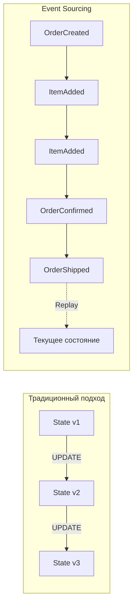

**Ключевые свойства:**
- **Immutability** -- события никогда не изменяются и не удаляются
- **Append-only** -- новые события только добавляются в конец журнала
- **Полный аудит** -- история всех изменений сохранена навсегда
- **Temporal queries** -- можно узнать состояние на любой момент в прошлом
- **Replay** -- можно пересчитать любую проекцию, проиграв события заново

```java
// Событие — неизменяемый факт
public record OrderCreatedEvent(
    UUID orderId,
    UUID customerId,
    LocalDateTime createdAt
) {}

public record ItemAddedEvent(
    UUID orderId,
    UUID productId,
    int quantity,
    BigDecimal price
) {}

public record OrderConfirmedEvent(
    UUID orderId,
    BigDecimal totalAmount,
    LocalDateTime confirmedAt
) {}
```


> [!mcq] Q7. В чём ключевое отличие Event Sourcing от классического CRUD-подхода?
>
> - [ ] **A) В Event Sourcing хранится только текущий снимок состояния, обновляемый через UPDATE**
>   - Это и есть классический CRUD, ровно то, против чего противопоставляется Event Sourcing
>   - В ES состояние не хранится напрямую — оно вычисляется проигрыванием событий
>   - ПОСЛЕДСТВИЕ: путаница приведёт к проектированию системы без журнала событий, потеряете аудит и replay
>
> - [ ] **B) Event Sourcing — это просто добавление таблицы аудита рядом с основной БД**
>   - Таблица аудита параллельно с CRUD — это audit log, а не Event Sourcing
>   - В ES события являются единственным источником истины, а не побочной записью
>   - ПОСЛЕДСТВИЕ: при таком подходе остаётся проблема рассинхрона аудита и реального состояния
>
> - [x] **C) В Event Sourcing состояние хранится как append-only журнал неизменяемых событий, а текущее состояние получается их последовательным применением**
>   - Точно описывает суть: события — факты в прошедшем времени, immutable, добавляются только в конец
>   - Текущее состояние агрегата восстанавливается через replay всех его событий от создания
>   - Получаем полный аудит, temporal queries (состояние на любой момент), возможность пересоздать любые проекции
>   - Append-only упрощает репликацию, шардирование и работу с конкурентностью через optimistic locking по версии
>   - В нагруженных системах используется в связке со снапшотами, чтобы не реплеить тысячи событий
>
> - [ ] **D) Event Sourcing требует обязательного использования Kafka в качестве хранилища событий**
>   - Kafka — один из вариантов транспорта/хранилища, но не обязательное требование
>   - Существует EventStoreDB, Axon Server, реализации поверх PostgreSQL — все они валидны
>   - ПОСЛЕДСТВИЕ: ложное ограничение архитектуры приведёт к необоснованному усложнению инфраструктуры

## Q8. (!) Что такое Event Store и чем он отличается от обычной БД?

**Event Store** -- специализированное хранилище, оптимизированное для append-only записи и последовательного чтения событий.

| Характеристика | Обычная БД | Event Store |
|---|---|---|
| **Операции** | CRUD | Append + Read |
| **Модификация** | UPDATE, DELETE | Только INSERT |
| **Состояние** | Текущий снимок | Полная история |
| **Индексы** | По полям | По aggregateId + version |
| **Запросы** | Произвольные SQL | Потоковое чтение по агрегату |
| **Конкурентность** | Блокировки/MVCC | Оптимистичная блокировка по версии |

**Реализации Event Store:**
- **Axon Server** -- встроенный Event Store в Axon Framework
- **EventStoreDB** -- специализированная БД от Event Store Ltd.
- **PostgreSQL/MySQL** -- можно реализовать самостоятельно через таблицу событий
- **Kafka** -- как журнал событий (с оговорками)

```java
// Простая реализация Event Store на JDBC
@Repository
public class JdbcEventStore implements EventStore {

    private final JdbcTemplate jdbc;

    public void append(UUID aggregateId, long expectedVersion,
                       List<DomainEvent> events) {
        for (DomainEvent event : events) {
            int rows = jdbc.update("""
                INSERT INTO event_store
                    (aggregate_id, version, event_type, payload, timestamp)
                VALUES (?, ?, ?, ?::jsonb, ?)
                """,
                aggregateId,
                ++expectedVersion,
                event.getClass().getSimpleName(),
                serialize(event),
                Instant.now()
            );
            if (rows == 0) {
                throw new OptimisticLockException(
                    "Конфликт версий для агрегата " + aggregateId);
            }
        }
    }

    public List<DomainEvent> load(UUID aggregateId) {
        return jdbc.query("""
            SELECT event_type, payload FROM event_store
            WHERE aggregate_id = ?
            ORDER BY version ASC
            """,
            (rs, i) -> deserialize(
                rs.getString("event_type"),
                rs.getString("payload")),
            aggregateId
        );
    }
}
```


> [!mcq] Q8. Чем Event Store принципиально отличается от обычной реляционной БД с CRUD-операциями?
>
> - [ ] **A) Event Store — это просто PostgreSQL с одной большой таблицей events, без особых отличий**
>   - PostgreSQL можно использовать как Event Store, но это не делает обычную БД равной ES
>   - Ключевые отличия — в семантике операций (append-only) и оптимистичной блокировке по версии, а не в технологии
>   - ПОСЛЕДСТВИЕ: проектирование «как обычно» приведёт к UPDATE/DELETE на событиях и потере свойств ES
>
> - [ ] **B) Event Store обязательно требует NoSQL хранилища типа MongoDB или Cassandra**
>   - Это неверно: EventStoreDB, Axon Server, PostgreSQL — все реляционные/специализированные варианты
>   - Главное — поддержка append-only записи и optimistic locking по версии агрегата
>   - ПОСЛЕДСТВИЕ: ложное технологическое ограничение приведёт к необоснованному выбору NoSQL и сложностям с транзакционностью
>
> - [ ] **C) Event Store позволяет произвольные SQL-запросы с JOIN и агрегатами как обычная БД**
>   - Event Store оптимизирован под потоковое чтение по `aggregateId + version`, а не под аналитику
>   - Для произвольных запросов строятся отдельные read-модели (проекции) через CQRS
>   - ПОСЛЕДСТВИЕ: попытки SQL-аналитики напрямую по событиям убьют производительность и приведут к неверным результатам
>
> - [x] **D) Event Store — это append-only журнал, оптимизированный под последовательное чтение событий по агрегату и optimistic locking по версии вместо UPDATE/DELETE**
>   - В ES нет операций UPDATE и DELETE — только INSERT новых событий
>   - Индексация по `(aggregate_id, version)` обеспечивает быстрое чтение всей истории одного агрегата
>   - Конкурентность решается оптимистичной блокировкой: при append передаётся expectedVersion, конфликт — исключение
>   - Состояние не хранится напрямую — оно вычисляется replay'ем, либо через снапшоты для оптимизации
>   - Для аналитических запросов строятся отдельные read-модели через проекции (CQRS-стиль)

## Q9. Как восстановить состояние агрегата из событий?

Состояние восстанавливается путём **replay** -- последовательного применения всех событий агрегата от начала до конца:

```java
public class OrderAggregate {
    private UUID orderId;
    private OrderStatus status;
    private List<OrderLine> lines = new ArrayList<>();
    private Money totalAmount = Money.ZERO;

    // Восстановление из событий
    public static OrderAggregate reconstruct(List<DomainEvent> events) {
        OrderAggregate aggregate = new OrderAggregate();
        for (DomainEvent event : events) {
            aggregate.apply(event);
        }
        return aggregate;
    }

    private void apply(DomainEvent event) {
        switch (event) {
            case OrderCreatedEvent e -> {
                this.orderId = e.orderId();
                this.status = OrderStatus.PENDING;
            }
            case ItemAddedEvent e -> {
                this.lines.add(new OrderLine(e.productId(), e.quantity(), e.price()));
                this.totalAmount = totalAmount.add(
                    e.price().multiply(e.quantity()));
            }
            case OrderConfirmedEvent e -> {
                this.status = OrderStatus.CONFIRMED;
            }
            default -> throw new IllegalArgumentException(
                "Неизвестное событие: " + event.getClass());
        }
    }
}
```

**Процесс:**
1. Загрузить все события агрегата из Event Store (по `aggregateId`)
2. Создать пустой экземпляр агрегата
3. Последовательно применить каждое событие (`apply`)
4. Получить текущее состояние

**Важно:** метод `apply` не должен содержать побочных эффектов (вызовов внешних систем, записи в БД) -- только мутацию внутреннего состояния.


> [!mcq] Q9. Как корректно восстановить состояние агрегата из событий в Event Sourcing?
>
> - [x] **A) Загрузить все события агрегата по aggregateId в порядке версии и последовательно применить их к пустому экземпляру методом apply, не вызывая побочных эффектов**
>   - Это канонический replay: события — единственный источник истины, состояние вычисляется детерминированно
>   - Порядок применения критичен: события упорядочены по `version` (или sequence number) внутри агрегата
>   - Метод `apply` должен быть чистым: только мутация внутреннего состояния, без обращений к БД, очередям или внешним сервисам
>   - Иначе повторное проигрывание (например, при rebuild проекции или загрузке агрегата) приведёт к дублированию side-эффектов
>   - Для оптимизации длинных историй используется снапшот + события после версии снапшота
>   - Такой подход обеспечивает воспроизводимость: одни и те же события всегда дают одно и то же состояние
>
> - [ ] **B) Сделать SELECT текущего состояния агрегата из таблицы агрегатов одним запросом**
>   - В Event Sourcing нет таблицы «текущих» состояний агрегатов как источника истины
>   - Если бы такая таблица была, мы бы вернулись к CRUD и потеряли весь смысл ES
>   - ПОСЛЕДСТВИЕ: данные могут разойтись с событиями, аудит и replay перестанут работать корректно
>
> - [ ] **C) Применять события параллельно в нескольких потоках для ускорения восстановления**
>   - События одного агрегата по определению упорядочены и зависят друг от друга
>   - Параллельное применение нарушит инварианты: например, `ItemAdded` после `OrderConfirmed` даст некорректное состояние
>   - ПОСЛЕДСТВИЕ: race condition в восстановлении состояния, непредсказуемые баги в production
>
> - [ ] **D) При apply вызывать внешние сервисы (например, отправку email) для каждого события**
>   - Apply при replay вызывается многократно: при загрузке агрегата, при перестроении проекции, при тестах
>   - Внешние вызовы приведут к дублированию email/уведомлений/платежей при каждом восстановлении
>   - ПОСЛЕДСТВИЕ: повторная отправка писем клиентам или повторные платежи — серьёзный production-инцидент

## Q10. (!) Что такое снапшоты и зачем они нужны?

**Снапшот** (Snapshot) -- сохранённый слепок состояния агрегата на определённый момент (версию). Позволяет ускорить восстановление, не проигрывая тысячи событий с самого начала.

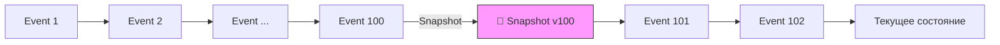

**Без снапшотов:** загрузить и применить все N событий (может быть тысячи).

**Со снапшотами:** загрузить снапшот + применить только события после снапшота.

```java
// Axon Framework — настройка снапшотов
@Configuration
public class SnapshotConfig {

    @Bean
    public SnapshotTriggerDefinition snapshotTrigger(Snapshotter snapshotter) {
        // Создавать снапшот каждые 100 событий
        return new EventCountSnapshotTriggerDefinition(snapshotter, 100);
    }
}

// Ручная реализация
public class SnapshotAwareEventStore {

    public OrderAggregate load(UUID aggregateId) {
        // 1. Попытаться загрузить последний снапшот
        Optional<Snapshot> snapshot = snapshotStore.load(aggregateId);

        OrderAggregate aggregate;
        long fromVersion;

        if (snapshot.isPresent()) {
            aggregate = snapshot.get().getState();
            fromVersion = snapshot.get().getVersion();
        } else {
            aggregate = new OrderAggregate();
            fromVersion = 0;
        }

        // 2. Загрузить только события после снапшота
        List<DomainEvent> events = eventStore.loadFrom(
            aggregateId, fromVersion);
        events.forEach(aggregate::apply);

        return aggregate;
    }
}
```

**Стратегии создания снапшотов:**
- **По количеству событий** -- каждые N событий (Axon: `EventCountSnapshotTriggerDefinition`)
- **По времени** -- периодически по расписанию
- **По размеру** -- когда размер потока превышает порог
- **По запросу** -- явный вызов при необходимости


> [!mcq] Зачем нужны снапшоты агрегата в Event Sourcing?
>
> - [ ] **A.** Для долговременного архива событий, чтобы старые события можно было удалить из Event Store после создания снапшота.
>
>   Снапшот **не заменяет** события — они остаются неизменяемыми. Удаление событий ломает аудит и невозможность replay новых проекций.
>
>   ПОСЛЕДСТВИЕ: после первого "архивирования" пропадает возможность пересчитать проекции — теряется ключевая ценность ES.
>
> - [x] **B.** Чтобы ускорить восстановление состояния агрегата: загрузить снапшот версии N и применить только события после N, а не проигрывать всю историю.
>
>   Снапшот — это материализованный слепок state на конкретной версии. Восстановление: `load(snapshot) + apply(events from snapshot.version+1)`.
>
>   МЕХАНИЗМ: `EventCountSnapshotTriggerDefinition(snapshotter, 100)` в Axon — снапшот каждые 100 событий. Загрузка ~100 событий вместо тысяч.
>
>   ПРИМЕНЯЕТСЯ: long-lived агрегаты (счёт, корзина, сессия), где история событий может расти до тысяч и восстановление per request становится узким местом.
>
>   ПОДВОДНЫЕ КАМНИ: при изменении схемы агрегата старые снапшоты несовместимы — нужна версия снапшота и fallback на full replay.
>
> - [ ] **C.** Снапшоты — это резервные копии Event Store на случай потери данных, аналог `pg_dump`.
>
>   Это backup, а не snapshot из ES. Backup Event Store — отдельная задача инфраструктуры, не связана с восстановлением агрегата.
>
>   ПОСЛЕДСТВИЕ: путаница терминов приводит к неверной архитектуре — снапшоты не хранят события, они хранят state.
>
> - [ ] **D.** Снапшот заменяет Event Store: после создания снапшота новые события пишутся только в снапшот, а не в журнал.
>
>   Это противоречит сути ES — события должны записываться append-only в Event Store. Снапшот лишь оптимизация чтения.
>
>   ПОСЛЕДСТВИЕ: теряется возможность replay и пересчёт проекций — деградация до обычного state-based persistence.

## Q11. Что такое Event Replay и для чего он используется?

**Event Replay** -- процесс повторного воспроизведения событий из Event Store для пересчёта проекций или восстановления состояния.

**Сценарии использования:**
1. **Пересчёт проекции** -- баг в проекции, нужно исправить и пересчитать с нуля
2. **Новая проекция** -- добавлено новое read-представление, нужно заполнить его историческими данными
3. **Миграция данных** -- переход на новую схему read-модели
4. **Аналитика** -- ретроспективный анализ данных
5. **Восстановление после сбоя** -- пересоздание read-базы после потери данных

```java
@Component
public class ProjectionRebuilder {

    private final EventStore eventStore;
    private final OrderSummaryProjection projection;

    public void rebuild() {
        // 1. Очистить текущую проекцию
        projection.reset();

        // 2. Воспроизвести все события
        eventStore.readAllEvents()
            .forEach(event -> {
                projection.handle(event);
                if (event.getSequenceNumber() % 10_000 == 0) {
                    log.info("Обработано {} событий", event.getSequenceNumber());
                }
            });

        log.info("Пересчёт проекции завершён");
    }
}
```

**Важно при replay:**
- Обработчики должны быть **идемпотентными**
- Replay может занять часы для больших систем -- нужна стратегия (параллелизм, батчи)
- Во время replay read-модель может быть недоступна (нужна стратегия blue-green)
- Внешние побочные эффекты (отправка email, вызов API) НЕ должны срабатывать при replay


> [!mcq] Что такое Event Replay в Event Sourcing и когда он применяется?
>
> - [ ] **A.** Это автоматический ретрай неуспешных команд (commands) при сбое в Event Store — повторная попытка записи события через configurable backoff.
>
>   Это retry на стороне write-модели, не имеет отношения к replay в ES. Replay работает с уже записанными событиями.
>
>   ПОСЛЕДСТВИЕ: путаница механизмов ведёт к попытке "переотправить" события, что нарушает идемпотентность проекций.
>
> - [ ] **B.** Это обратное проигрывание событий для отмены изменений — applying compensating events в обратном порядке для отката.
>
>   Описание ближе к compensation/saga, а не replay. Replay — это forward-проигрывание, не reverse.
>
>   ПОСЛЕДСТВИЕ: попытка "откатить" события удалением — нарушение иммутабельности Event Store.
>
> - [x] **C.** Это процесс повторного проигрывания событий из Event Store в проекцию (или новую read-модель) для её пересчёта или заполнения.
>
>   Replay читает все события (или диапазон) и прогоняет их через event handler проекции. Применяется когда: (1) баг в проекции исправлен и нужен пересчёт, (2) добавлена новая проекция и её надо наполнить историческими данными, (3) миграция схемы read-модели.
>
>   МЕХАНИЗМ: `projection.reset(); eventStore.readAllEvents().forEach(projection::handle);` — обычно с батчами и параллелизмом по aggregateId.
>
>   ВАЖНЫЕ ТРЕБОВАНИЯ: handlers должны быть **идемпотентными**; внешние side-effects (email, HTTP-вызовы) должны быть отключены при replay через флаг `replayMode`; во время пересчёта read-модель может быть недоступна — нужна blue-green стратегия.
>
> - [ ] **D.** Это синхронная репликация событий между несколькими Event Store через master-slave для high availability.
>
>   Это database replication, не replay. Реплика и replay — разные механизмы (физическая копия данных vs пересчёт state из событий).
>
>   ПОСЛЕДСТВИЕ: подмена понятий — HA не решает задачу пересчёта проекций после изменения логики.

## Q12. Какие проблемы возникают при удалении данных в Event Sourcing?

В Event Sourcing события неизменяемы и никогда не удаляются. Это создаёт конфликт с требованиями вроде GDPR (право на забвение).

**Подходы к решению:**

1. **Crypto Shredding** (криптографическое уничтожение):
   - Персональные данные шифруются ключом, привязанным к пользователю
   - При запросе на удаление уничтожается ключ -- данные становятся нечитаемыми

```java
public record UserRegisteredEvent(
    UUID userId,
    String encryptedName,    // зашифровано ключом пользователя
    String encryptedEmail,   // зашифровано ключом пользователя
    String keyId             // ссылка на ключ шифрования
) {}

// При GDPR-запросе: удалить ключ из key store
keyStore.delete(userId); // события остались, но нечитаемы
```

2. **Event Transformation** -- перезапись потока с удалёнными полями (нарушает иммутабельность, но иногда допустимо)

3. **Разделение потоков** -- персональные данные хранятся отдельно от бизнес-событий

4. **Tombstone Events** -- специальное событие `UserDataErasedEvent`, сигнализирующее проекциям очистить данные


> [!mcq] Как корректно реализовать GDPR right-to-be-forgotten в Event Sourcing, где события иммутабельны?
>
> - [ ] **A.** Удалить все события пользователя из Event Store напрямую через `DELETE FROM events WHERE user_id = ?`.
>
>   Это прямое нарушение append-only гарантии ES — ломает аудит, пересчёт проекций, replay и хеш-цепочки (если они есть).
>
>   ПОСЛЕДСТВИЕ: при следующем replay читается "дырявая" история — проекции рассыпаются, потеряны зависимые от удалённых событий агрегаты.
>
> - [ ] **B.** Игнорировать GDPR-требования: события "технические", не персональные данные.
>
>   События часто содержат имя, email, адрес — это PII. GDPR Art.17 явно применим, штрафы до 4% оборота. Юридически неприемлемо.
>
>   ПОСЛЕДСТВИЕ: регуляторный штраф + потеря доверия пользователей. Не вариант для production-систем в ЕС.
>
> - [ ] **C.** Заменить события на заглушки in-place: переписать `UserRegisteredEvent.name = "DELETED"` прямо в БД.
>
>   Нарушает иммутабельность и хеш-цепочку, ломает воспроизводимость. Допустимо как крайняя мера в narrow scope с пересчётом всех проекций, но не как штатный механизм.
>
>   ПОСЛЕДСТВИЕ: hash mismatch при аудите, потеря trust в integrity Event Store.
>
> - [x] **D.** Применить Crypto Shredding: PII в событиях шифровать ключом per-user, при запросе на удаление уничтожать ключ — события остаются, но становятся нечитаемыми.
>
>   PII (имя, email) шифруются symmetric key, привязанным к `userId`. Ключ хранится в отдельном KMS/key store. При GDPR-запросе вызывается `keyStore.delete(userId)` — события остаются на месте (иммутабельность сохранена), но расшифровать их больше невозможно.
>
>   МЕХАНИЗМ: `record UserRegisteredEvent(UUID userId, String encryptedName, String encryptedEmail, String keyId)` + AES-GCM с per-user key.
>
>   КОМБИНИРОВАНИЕ: дополняется (1) Tombstone Event `UserDataErasedEvent` — сигнал проекциям очистить read-модель, (2) разделением потоков — PII отдельно от бизнес-событий.
>
>   ПЛЮС: сохраняется append-only, replay работает (на местах PII получаются `null`/placeholder), аудит integrity не нарушен.

## Q13. (!) Что такое проекции в CQRS/ES?

**Проекция** (Projection) -- компонент, который слушает поток событий и строит оптимизированное read-представление (view) данных.

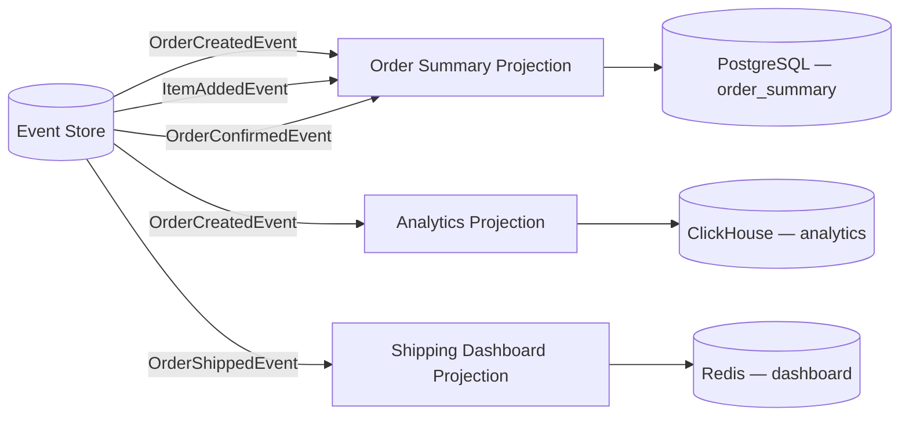

**Ключевые свойства проекций:**
- **Производные** -- полностью вычисляются из событий, можно пересоздать в любой момент
- **Специализированные** -- каждая проекция оптимизирована под конкретный use-case
- **Независимые** -- разные проекции могут использовать разные хранилища и обновляться с разной скоростью
- **Disposable** -- проекцию можно удалить и пересчитать из событий

```java
@Component
public class OrderSummaryProjection {

    private final OrderSummaryRepository repository;

    @EventHandler
    public void on(OrderCreatedEvent event) {
        OrderSummaryView view = new OrderSummaryView();
        view.setOrderId(event.orderId());
        view.setCustomerName(event.customerName());
        view.setStatus("PENDING");
        view.setItemCount(0);
        view.setTotalAmount(BigDecimal.ZERO);
        view.setCreatedAt(event.createdAt());
        repository.save(view);
    }

    @EventHandler
    public void on(ItemAddedEvent event) {
        OrderSummaryView view = repository.findById(event.orderId())
            .orElseThrow();
        view.setItemCount(view.getItemCount() + event.quantity());
        view.setTotalAmount(view.getTotalAmount()
            .add(event.price().multiply(BigDecimal.valueOf(event.quantity()))));
        repository.save(view);
    }

    @EventHandler
    public void on(OrderConfirmedEvent event) {
        repository.updateStatus(event.orderId(), "CONFIRMED");
    }
}
```


> [!mcq] Q13. Что такое проекция (Projection) в CQRS/Event Sourcing и как она устроена?
>
> - [x] **A. Компонент, который подписывается на поток событий и строит производное read-представление, оптимизированное под конкретный запрос; проекцию можно удалить и пересчитать из событий заново**
>
>     Это и есть классическое определение projection. Проекция — derived state: обработчик слушает events (например, через `@EventHandler`), материализует view в подходящем хранилище (PostgreSQL, ClickHouse, Redis) и обновляет его инкрементально. Под каждый use-case делают отдельную проекцию: order summary, аналитика, dashboard.
>
>     МЕХАНИЗМ: Event Store → event handler → upsert в read DB. State проекции — функция от истории событий, поэтому при изменении схемы достаточно дропнуть таблицу и replay'нуть события — данные восстановятся.
>
>     КОГДА: всегда, когда нужно эффективное чтение в системе с ES — проекции изолируют read-модель от формата событий и позволяют иметь несколько специализированных view одновременно.
>
>     ПРЕИМУЩЕСТВО: read-модель легко эволюционирует — добавили колонку, перезалили проекцию из event log без миграций write-стороны.
>
> - [ ] B. Это материализованная view в реляционной БД, которая обновляется триггером при изменении главной таблицы агрегата
>
>     Путаница с database materialized view. В CQRS/ES источник истины — поток событий, а не таблица агрегата. Триггер на таблице не работает, потому что write-модель часто вообще не хранит state в нормализованном виде — только append-only события.
>
>     ❌ ПОСЛЕДСТВИЕ: при попытке rebuild'а проекции из текущего state будут утеряны промежуточные переходы (например, отмены и переоткрытия заказа) — read-модель станет неконсистентна с историей.
>
> - [ ] C. Snapshot агрегата, сохранённый каждые N событий для ускорения восстановления состояния при загрузке агрегата
>
>     Это смежное, но другое понятие — snapshot. Snapshot живёт на write-стороне и ускоряет replay при загрузке агрегата в команде. Проекция живёт на read-стороне и обслуживает запросы. Снапшот не оптимизирован под query и не подписан на новые события — он статичен.
>
>     ❌ ПОСЛЕДСТВИЕ: команда «удалить и пересчитать снапшот как проекцию» приведёт к падению write-производительности — каждая команда снова будет реплеить всю историю агрегата.
>
> - [ ] D. Часть write-модели, которая валидирует команду и проецирует её на новое состояние агрегата перед публикацией события
>
>     Это описание command handler / aggregate, а не проекции. Проекция вообще не участвует в обработке команд — она работает после факта, в read-pipeline. Смешение write и read-логики ломает основное свойство CQRS — разделение моделей.
>
>     ❌ ПОСЛЕДСТВИЕ: связывание read и write через «проекцию» в одной транзакции убирает выгоду CQRS — невозможно горизонтально масштабировать чтение и эволюционировать read-схему без блокировки write-пути.

## Q14. Как синхронизировать модель чтения с моделью записи?

Существует три основных подхода:

**1. Синхронная обработка (в одной транзакции):**
```java
@Transactional
public void placeOrder(PlaceOrderCommand cmd) {
    Order order = orderRepository.save(new Order(cmd));
    orderViewRepository.save(OrderView.from(order)); // в той же транзакции
}
```
- Простота, strong consistency
- Не масштабируется, связанность

**2. Асинхронная обработка через события:**
```java
// Write side публикует событие
applicationEventPublisher.publishEvent(new OrderCreatedEvent(order));

// Read side слушает
@EventListener
public void on(OrderCreatedEvent event) {
    orderViewRepository.save(OrderView.from(event));
}
```
- Масштабируется, но eventual consistency
- Нужна обработка ошибок и retry

**3. Change Data Capture (CDC):**
- Инструменты вроде Debezium читают WAL базы данных
- Автоматически синхронизируют изменения
- Не требует изменений в коде приложения

**На практике** чаще всего используют асинхронный подход через брокер сообщений (`Kafka`, `RabbitMQ`) с гарантией at-least-once доставки и идемпотентными обработчиками.


> [!mcq] Q14. Какой способ синхронизации read-модели с write-моделью обычно выбирают в production-CQRS-системе с высокой нагрузкой?
>
> - [ ] A. Синхронное обновление read-таблицы внутри той же транзакции, что и команда — это гарантирует read-your-writes без дополнительной инфраструктуры
>
>     Подход рабочий для маленьких систем, но не для high-load. Read и write попадают в одну транзакцию, БД блокируется на обе стороны, и теряется главная выгода CQRS — независимое масштабирование. Любая ошибка проекции откатывает команду.
>
>     ❌ ПОСЛЕДСТВИЕ: при росте нагрузки lock contention на read-таблицах деградирует latency команд; невозможно иметь несколько разнородных проекций (ClickHouse + Redis + Postgres) — у них нет общей транзакции.
>
> - [x] **B. Асинхронная синхронизация через брокер сообщений (Kafka/RabbitMQ) с at-least-once доставкой и идемпотентными обработчиками проекций**
>
>     Это рабочий стандарт. Write-сторона публикует event после коммита, брокер гарантирует доставку, проекция применяет event идемпотентно (через `event_id` + `processed_events` или upsert по версии). Read и write масштабируются независимо, можно добавлять новые проекции без изменения write-кода.
>
>     МЕХАНИЗМ: outbox pattern или transactional log tailing → Kafka → consumer group для каждой проекции → upsert в read-store. Идемпотентность обязательна, потому что at-least-once допускает дубликаты.
>
>     КОГДА: всегда, когда нужна горизонтальная масштабируемость чтения и независимая эволюция read-моделей. Платой является eventual consistency, которую закрывают на UI слое или через read-your-writes из write-store.
>
>     ПРЕИМУЩЕСТВО: write-путь остаётся быстрым и независимым от количества/типа проекций; новые read-views добавляются репроцессингом топика без даунтайма.
>
> - [ ] C. Synchronous projection через distributed transaction (2PC) между write-БД и read-БД — это даёт strong consistency и масштабируемость одновременно
>
>     2PC между гетерогенными хранилищами в production практически не используется: дорого, хрупко (блокировки при сбое координатора), медленно и не поддерживается большинством NoSQL и брокеров. «Strong consistency и масштабируемость одновременно» — иллюзия, противоречащая CAP.
>
>     ❌ ПОСЛЕДСТВИЕ: при сбое координатора часть проекций застывает в prepared-состоянии, write-БД держит блокировки до ручного разрешения — write-latency и доступность падают непредсказуемо.
>
> - [ ] D. Polling read-моделью write-БД раз в N секунд через `SELECT * WHERE updated_at > last_seen` — простой подход без брокера
>
>     Polling работает, но плохо: либо высокая нагрузка на write-БД (частый опрос), либо большая задержка (редкий опрос). Теряются удаления (DELETE не виден через `updated_at`), нет ordering-гарантий, при рестарте легко пропустить или продублировать строки. Это анти-паттерн для CQRS-проекций.
>
>     ❌ ПОСЛЕДСТВИЕ: высокая нагрузка на write-БД от постоянных сканов, при этом read-модель отстаёт на интервал polling'а и не видит soft-удалённые/переупорядоченные изменения — проекция расходится с источником истины.

## Q15. (!) Что такое Eventual Consistency в контексте CQRS?

**Eventual Consistency** -- свойство системы, при котором read-модель гарантированно придёт в согласованное состояние с write-моделью, но с некоторой задержкой.

В CQRS это означает: после выполнения команды запрос может вернуть **устаревшие данные**, пока проекция не обработает событие.

**Типичный пример проблемы:**
1. Пользователь создаёт заказ (команда)
2. Система возвращает `201 Created`
3. Пользователь переходит на страницу заказов (запрос)
4. Нового заказа ещё нет -- проекция не успела обновиться

**Стратегии решения:**

| Стратегия | Описание |
|---|---|
| **Read-your-writes** | После команды читать из write-модели одну операцию |
| **Causal consistency** | Клиент передаёт версию, read-модель ждёт нужную версию |
| **Optimistic UI** | Клиент показывает ожидаемый результат до подтверждения |
| **Polling / SSE** | Клиент периодически опрашивает или слушает push-уведомления |
| **Synchronous projection** | Проекция обновляется синхронно (жертвует масштабируемостью) |

```java
// Read-your-writes: возвращаем данные из write-модели сразу после команды
@PostMapping("/orders")
public ResponseEntity<OrderDto> createOrder(@RequestBody CreateOrderRequest req) {
    UUID orderId = commandGateway.sendAndWait(new CreateOrderCommand(req));

    // Возвращаем данные из write-модели, а не из проекции
    Order order = orderWriteRepository.findById(orderId).orElseThrow();
    return ResponseEntity.status(201).body(OrderDto.from(order));
}
```


> [!mcq] Q15. Что означает Eventual Consistency в CQRS и как корректно обрабатывать ситуацию «клиент сразу после команды читает устаревшие данные»?
>
> - [ ] A. Eventual Consistency — это баг проекции; правильное CQRS-приложение всегда должно возвращать актуальные данные сразу после команды, иначе теряется корректность системы
>
>     Это распространённое заблуждение. Eventual consistency — не баг, а проектное свойство архитектуры с асинхронными проекциями. Заставлять read-модель отдавать «как в write» сразу после команды означает отказаться от CQRS и от выгод асинхронной синхронизации.
>
>     ❌ ПОСЛЕДСТВИЕ: попытка «починить» eventual consistency через синхронные проекции возвращает все проблемы CRUD — связанность read и write, lock contention, невозможность масштабировать чтение отдельно.
>
> - [ ] B. Это свойство write-стороны: команды применяются с задержкой, поэтому клиент должен ретраить команду, пока агрегат не обновится
>
>     Путаница со стороной системы. Write-сторона в CQRS обычно strongly consistent (одна команда → один агрегат → одна транзакция). Задержка возникает между write и read, а не внутри write. Ретрай команды не «обновит агрегат» — он создаст дубликаты без идемпотентности.
>
>     ❌ ПОСЛЕДСТВИЕ: ретраи команды без идемпотентности приводят к дублирующимся событиям (два OrderCreated на один заказ), нарушая инварианты домена и переполняя event log.
>
> - [x] **C. Read-модель гарантированно сойдётся с write-моделью с некоторой задержкой; UX обычно закрывают через read-your-writes (вернуть данные из write-store сразу после команды) или causal consistency (клиент передаёт ожидаемую версию, read ждёт её)**
>
>     Корректное определение и подходящие стратегии. Eventual consistency допускает «окно расхождения» между write и read, и UX-проблема «не вижу свой только что созданный заказ» решается явными приёмами: read-your-writes (после команды отдать DTO, собранный из write-store), causal consistency (клиент пишет `If-Version-At-Least: 42`, read-модель ждёт нужную версию), optimistic UI (показать ожидаемый результат до подтверждения), SSE/push-обновления.
>
>     МЕХАНИЗМ: после команды backend знает версию агрегата → возвращает её клиенту в ответе → последующий read-запрос передаёт версию → read-сторона либо уже её обработала, либо коротко ждёт.
>
>     КОГДА: всегда, когда асинхронная проекция оправдана нагрузочно, но UX требует «увидеть свой результат». Это компромисс между простотой клиента и масштабируемостью backend'а.
>
>     ПРЕИМУЩЕСТВО: сохраняется асинхронность синхронизации (масштабируется), но точечно закрывается UX-разрыв — пользователь видит свои действия мгновенно без удорожания всей read-инфраструктуры.
>
> - [ ] D. Это синоним BASE-семантики: read-модель отдаёт произвольные данные, и клиент должен сам мерджить ответы из нескольких проекций, чтобы получить актуальное состояние
>
>     Eventual consistency не требует от клиента мерджить разные проекции. Каждая проекция самостоятельна и сходится отдельно. Перекладывать reconciliation на клиента — анти-паттерн: клиент не знает о схеме событий, версиях и порядке обработки.
>
>     ❌ ПОСЛЕДСТВИЕ: каждый клиент (web, mobile, B2B-партнёр) реализует свою (часто некорректную) логику merge — расходятся представления данных у разных пользователей, появляются race-условия, недоступные для тестирования на backend.

## Q16. Как устроена команда (Command) в CQRS?

**Команда** -- объект, выражающий намерение изменить состояние системы. Команда -- это приказ (императив), а не факт.

**Правила проектирования команд:**
- Именуются в повелительном наклонении: `CreateOrder`, `CancelOrder`, `AddItem`
- Содержат все данные, необходимые для выполнения
- Не содержат бизнес-логику
- Направлены конкретному агрегату (содержат `targetAggregateId`)
- Могут быть отклонены (валидация, бизнес-правила)

```java
// Команда — неизменяемый объект-намерение
public record CreateOrderCommand(
    @TargetAggregateIdentifier
    UUID orderId,
    UUID customerId,
    List<OrderLineDto> items
) {}

public record ConfirmOrderCommand(
    @TargetAggregateIdentifier
    UUID orderId,
    String confirmedBy
) {}

public record CancelOrderCommand(
    @TargetAggregateIdentifier
    UUID orderId,
    String reason
) {}
```

**Валидация команд** происходит на двух уровнях:
1. **Структурная** (на входе) -- Bean Validation (`@NotNull`, `@Size`)
2. **Бизнес-валидация** (в агрегате) -- проверка инвариантов домена


> [!mcq]
>
> **Какие свойства должны быть у Command в CQRS и где правильно проходит её валидация?**
>
> - [ ] **A.** Команда — это просто DTO с любыми полями, именуется существительным (`Order`, `Payment`), а вся валидация и бизнес-логика выполняется внутри самой команды через её методы.
>   - ПОЧЕМУ НЕВЕРНО: команда — это намерение в повелительном наклонении (`CreateOrder`, `CancelOrder`), а не существительное. Команды должны быть «тупыми» — без методов и логики, только данные намерения.
>   - ПОСЛЕДСТВИЕ: команда обрастает бизнес-методами, нарушая SRP; одна и та же логика дублируется в командах и агрегатах, при изменении правил приходится менять и команду, и handler.
>
> - [ ] **B.** Команда может обрабатываться несколькими handler'ами одновременно (publish-subscribe), как событие, чтобы достичь параллелизма; адресат необязателен — шина сама выберет нужный handler.
>   - ПОЧЕМУ НЕВЕРНО: команда направлена ровно одному агрегату (point-to-point), у неё ровно один handler. Множественные подписчики — это семантика события (`OrderPlaced` слушают payments, notifications, analytics).
>   - ПОСЛЕДСТВИЕ: две копии handler'а обработают одну команду параллельно — двойное списание со счёта, два письма клиенту, дубликаты в БД из-за гонки.
>
> - [ ] **C.** Вся валидация команды должна проходить только в агрегате — Bean Validation/`@NotNull` на DTO-уровне излишен, потому что агрегат всё равно проверит данные внутри `@CommandHandler`.
>   - ПОЧЕМУ НЕВЕРНО: валидация двухуровневая — структурная (Bean Validation на входе: `@NotNull`, `@Size`, `@Email`) отсекает мусор до загрузки агрегата, бизнес-валидация в `@CommandHandler` проверяет инварианты домена. Это разные виды проверок.
>   - ПОСЛЕДСТВИЕ: на каждый кривой запрос (с `null` `customerId`) система загружает агрегат из Event Store и проигрывает 1000 событий, прежде чем упасть с NPE — лишний I/O и плохие сообщения об ошибках.
>
> - [x] **D.** Команда — неизменяемый объект-намерение в повелительном наклонении (`CreateOrderCommand`), несёт `targetAggregateId` и все данные для выполнения, без бизнес-логики; валидация двухуровневая — структурная Bean Validation на входе и бизнес-валидация инвариантов внутри агрегата в `@CommandHandler`, она может отклонить команду.
>   - МЕХАНИЗМ: `record CreateOrderCommand(@TargetAggregateIdentifier UUID orderId, UUID customerId, List<OrderLineDto> items)` — иммутабельный record с аннотацией маршрутизации. Bean Validation на `@RequestBody` отсекает `null`-поля и плохие форматы; `@CommandHandler` в `OrderAggregate` проверяет, что заказ не пуст и клиент активен.
>   - ОТКАЗ: команда может быть отвергнута (например, `CancelOrderCommand` для уже доставленного заказа кидает `IllegalStateException`) — это нормально, в отличие от события, которое необратимо.
>   - ОДИН HANDLER: один target-агрегат, один `@CommandHandler` — гарантия консистентности и отсутствия гонок при изменении состояния.
>   - ПОЧЕМУ ВЕРНО: ровно эта схема описана в Axon Reference Guide (`@TargetAggregateIdentifier`, `CommandGateway.send()`), Microsoft .NET CQRS guidance и `Implementing DDD` (Vaughn Vernon, глава о Commands).
>   - ЭТАЛОН: Axon Framework, MediatR (.NET), AxonIQ samples — все используют immutable command + targetId + двухуровневую валидацию.

## Q17. Чем событие (Event) отличается от команды?

| Характеристика | Команда (Command) | Событие (Event) |
|---|---|---|
| **Семантика** | Намерение (приказ) | Факт (произошло) |
| **Именование** | Императив: `CreateOrder` | Прошедшее время: `OrderCreated` |
| **Результат** | Может быть отклонена | Уже произошло, необратимо |
| **Адресат** | Конкретный агрегат | Все подписчики |
| **Количество обработчиков** | Ровно один | Ноль или много |
| **Изменяемость** | Можно повторить | Неизменяемо, хранится навсегда |

```java
// Команда — "Я хочу, чтобы это произошло"
public record PlaceOrderCommand(UUID orderId, UUID customerId) {}

// Событие — "Это уже произошло"
public record OrderPlacedEvent(UUID orderId, UUID customerId,
                                LocalDateTime placedAt) {}
```

**Важно для собеседования:** команда может быть отклонена (заказ нельзя отменить, если он уже доставлен), а событие -- нет. Событие -- это неопровержимый факт.


> [!mcq]
>
> **В чём принципиальная семантическая разница между Command и Event в CQRS/ES?**
>
> - [x] **A.** Command — это намерение в повелительном наклонении (`CreateOrder`), адресовано конкретному агрегату, может быть отклонено, имеет ровно одного handler'а; Event — это факт в прошедшем времени (`OrderCreated`), произошёл необратимо, публикуется всем подписчикам (0..N handler'ов), его нельзя «отменить» — только компенсировать.
>   - МЕХАНИЗМ: `CommandGateway.send(new CancelOrderCommand(id, reason))` идёт точечно в `OrderAggregate.handle(...)`, который может бросить `OrderAlreadyDeliveredException`. `EventBus.publish(new OrderCancelledEvent(id))` уходит всем — projection, notification-service, audit, analytics.
>   - НЕОБРАТИМОСТЬ: событие сохраняется в Event Store append-only и переписать его нельзя — если бизнес ошибся, публикуют компенсирующее событие (`OrderCancellationRevertedEvent`), но исходное остаётся в истории.
>   - ИМЕНОВАНИЕ: глагол в императиве для команд (`ConfirmOrder`, `ShipParcel`), причастие/прошедшее время для событий (`OrderConfirmed`, `ParcelShipped`) — это конвенция Axon, EventStoreDB, всех ES-фреймворков.
>   - ПОЧЕМУ ВЕРНО: ровно это разделение описано в `Implementing DDD` (Vaughn Vernon), Greg Young `CQRS Documents`, Axon Reference Guide; на собеседовании это ожидаемый «канонический» ответ.
>   - ЭТАЛОН: Axon Framework, EventStoreDB, Marten, Wolverine — все четыре стека реализуют именно эту семантическую разницу.
>
> - [ ] **B.** Command и Event — это два названия одной и той же сущности; разница лишь в том, что Command используют синхронно, а Event асинхронно, но структурно и семантически они идентичны.
>   - ПОЧЕМУ НЕВЕРНО: семантика принципиально разная — намерение vs факт, может быть отклонено vs необратимо, один handler vs много. И команды можно делать асинхронными (`CommandGateway.sendAndForget`), и события можно обрабатывать синхронно (in-process subscribers).
>   - ПОСЛЕДСТВИЕ: команда называет события императивом (`CreateOrderEvent`) и сохраняет их в Event Store — при replay’е история выглядит как «программа хочет создать заказ», а не «заказ был создан»; теряется аудит-смысл хранилища событий.
>
> - [ ] **C.** Главное отличие — в количестве полей: Command всегда несёт минимум данных (только id), а Event — полную копию состояния агрегата, чтобы read-model могла восстановить любой view без обращения к write-стороне.
>   - ПОЧЕМУ НЕВЕРНО: количество полей не определяет тип — и в Command, и в Event кладут ровно столько данных, сколько нужно для семантики. Складывать «полное состояние» в каждое событие — антипаттерн (CRUD-style events, теряется бизнес-смысл, размер Event Store взрывается).
>   - ПОСЛЕДСТВИЕ: каждое событие весит килобайты дублированных данных, Event Store растёт в 10× быстрее, replay становится медленным; при этом события вроде `OrderStateChangedEvent(fullSnapshot)` теряют доменный смысл.
>
> - [ ] **D.** Event может быть отклонён системой так же, как Command, — если подписчик не согласен с фактом, он бросает исключение и событие «откатывается» из Event Store.
>   - ПОЧЕМУ НЕВЕРНО: событие — это факт, оно уже произошло и хранится append-only. Подписчик может упасть при обработке, но это не «откатывает» событие — оно остаётся в Event Store, просто конкретная проекция временно отстаёт.
>   - ПОСЛЕДСТВИЕ: разработчик закладывает «откат событий» в архитектуру (rollback subscriber'а удаляет событие из стора) — это ломает audit log, нарушает immutability Event Store и делает replay невозможным; вся идея ES рушится.

## Q18. (!) Как агрегат обрабатывает команды и публикует события?

Агрегат в CQRS/ES выполняет два вида операций:

1. **Command Handler** -- принимает команду, валидирует бизнес-правила, решает какие события опубликовать
2. **Event Sourcing Handler** -- применяет событие к внутреннему состоянию (мутация без побочных эффектов)

```java
@Aggregate
public class OrderAggregate {

    @AggregateIdentifier
    private UUID orderId;
    private OrderStatus status;
    private UUID customerId;
    private List<OrderLine> lines = new ArrayList<>();
    private Money totalAmount = Money.ZERO;

    // Команда создания — конструктор
    @CommandHandler
    public OrderAggregate(CreateOrderCommand cmd) {
        // Валидация бизнес-правил
        if (cmd.items().isEmpty()) {
            throw new IllegalArgumentException("Заказ без товаров");
        }
        // Публикация события (НЕ изменение состояния!)
        AggregateLifecycle.apply(new OrderCreatedEvent(
            cmd.orderId(), cmd.customerId(), Instant.now()));

        for (var item : cmd.items()) {
            AggregateLifecycle.apply(new ItemAddedEvent(
                cmd.orderId(), item.productId(),
                item.quantity(), item.price()));
        }
    }

    @CommandHandler
    public void handle(ConfirmOrderCommand cmd) {
        if (status != OrderStatus.PENDING) {
            throw new OrderAlreadyConfirmedException(orderId);
        }
        AggregateLifecycle.apply(new OrderConfirmedEvent(
            orderId, totalAmount, Instant.now()));
    }

    // Event Sourcing Handlers — только мутация состояния
    @EventSourcingHandler
    public void on(OrderCreatedEvent event) {
        this.orderId = event.orderId();
        this.customerId = event.customerId();
        this.status = OrderStatus.PENDING;
    }

    @EventSourcingHandler
    public void on(ItemAddedEvent event) {
        this.lines.add(new OrderLine(
            event.productId(), event.quantity(), event.price()));
        this.totalAmount = totalAmount.add(
            event.price().multiply(event.quantity()));
    }

    @EventSourcingHandler
    public void on(OrderConfirmedEvent event) {
        this.status = OrderStatus.CONFIRMED;
    }
}
```

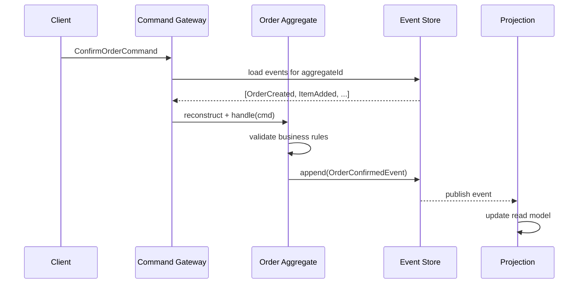


> [!mcq]
>
> **Как агрегат в CQRS/ES правильно разделяет обработку команды и применение события?**
>
> - [ ] **A.** В `@CommandHandler` нужно сразу менять поля агрегата (`this.status = CONFIRMED`) и параллельно публиковать событие, чтобы быстрее завершить обработку команды — двойная запись гарантирует, что состояние и событие синхронны.
>   - ПОЧЕМУ НЕВЕРНО: command handler не должен мутировать состояние напрямую — только валидировать и звать `AggregateLifecycle.apply(event)`. Изменение состояния — обязанность `@EventSourcingHandler`. Иначе при replay’е событий состояние удвоится или разойдётся.
>   - ПОСЛЕДСТВИЕ: при rehydrate агрегата из Event Store повторно проигрываются события и применяются handler'ы — но поля уже изменены в обход них; результат — несогласованное состояние, баг воспроизводится только при перезапуске сервиса.
>
> - [x] **B.** `@CommandHandler` принимает команду, валидирует бизнес-инварианты и вызывает `AggregateLifecycle.apply(event)` — он не мутирует состояние напрямую; `@EventSourcingHandler` отдельным методом применяет событие к полям агрегата (`this.status = event.status()`). Это разделение гарантирует, что replay событий из Event Store детерминированно восстанавливает состояние.
>   - МЕХАНИЗМ: `handle(ConfirmOrderCommand cmd)` проверяет `if (status != PENDING) throw ...`, затем `apply(new OrderConfirmedEvent(...))`. Axon синхронно вызывает соответствующий `@EventSourcingHandler on(OrderConfirmedEvent e) { this.status = CONFIRMED; }`, который меняет поле. После этого событие пишется в Event Store.
>   - REPLAY: при rehydrate из Event Store Axon загружает все события агрегата и для каждого вызывает `@EventSourcingHandler` — поля восстанавливаются детерминированно, потому что вся мутация изолирована в одном месте.
>   - КОНСТРУКТОР: создание агрегата — это тоже `@CommandHandler` (на конструкторе с `CreateOrderCommand`); внутри только валидация + `apply(...)`, инициализация полей делает `@EventSourcingHandler on(OrderCreatedEvent)`.
>   - ПОЧЕМУ ВЕРНО: ровно эта схема описана в Axon Reference Guide, разделение CommandHandler/EventSourcingHandler — основа event-sourced aggregate; Greg Young, Vernon, Axon teaching materials дают именно такой пример.
>   - ЭТАЛОН: Axon Framework, EventStoreDB+Marten, Wolverine.NET, Lagom — все реализуют это разделение через две группы методов.
>
> - [ ] **C.** Агрегат должен сам напрямую сохранять событие в Event Store через `eventStore.append(event)` и публиковать его в Kafka внутри метода `@CommandHandler` — это даёт максимальный контроль над транзакцией.
>   - ПОЧЕМУ НЕВЕРНО: агрегат не должен знать про инфраструктуру (Event Store, Kafka). Его задача — только вызвать `apply(event)`, а сохранение и публикацию делает фреймворк (Axon `Repository`, `EventBus`) или явный repository в чистом Spring. Иначе теряется тестируемость и нарушается hexagonal architecture.
>   - ПОСЛЕДСТВИЕ: юнит-тесты агрегата требуют моков `EventStore` и `KafkaTemplate`; смена транспорта (Axon Server → Kafka) требует переписать каждый агрегат; невозможно использовать встроенный тест-фикстуры Axon (`AggregateTestFixture.given(...).when(...).expectEvents(...)`).
>
> - [ ] **D.** Один `@CommandHandler` обязан публиковать ровно одно событие — если для бизнес-логики нужно несколько фактов (например, заказ создан + товары добавлены), их нужно объединить в одно «составное» событие `OrderCreatedWithItemsEvent`.
>   - ПОЧЕМУ НЕВЕРНО: один command handler может вызвать `apply(...)` несколько раз — это нормально (создание заказа → `OrderCreatedEvent`, потом по строке `ItemAddedEvent` для каждого товара). Объединение в «жирное» событие теряет гранулярность и ломает проекции, которые слушают только `ItemAddedEvent`.
>   - ПОСЛЕДСТВИЕ: проекция инвентаря не реагирует на «составное» событие (она слушает `ItemAddedEvent`), запасы не списываются; analytics-pipeline теряет per-item метрики; при добавлении нового товара нужно публиковать новое событие, которое почему-то «не такое» как часть составного.

## Q19. Что такое Axon Framework и какие компоненты он предоставляет?

**Axon Framework** -- Java-фреймворк для построения приложений на базе `CQRS` и `Event Sourcing`. Состоит из двух частей:

- **Axon Framework** -- библиотека с аннотациями и инфраструктурой
- **Axon Server** -- выделенный Event Store и маршрутизатор сообщений

**Ключевые компоненты:**

| Компонент | Назначение |
|---|---|
| `@Aggregate` | Маркирует DDD-агрегат |
| `@AggregateIdentifier` | Идентификатор агрегата |
| `@CommandHandler` | Обработчик команды |
| `@EventSourcingHandler` | Применение события к состоянию |
| `@EventHandler` | Обработчик события в проекции |
| `@QueryHandler` | Обработчик запроса |
| `@SagaEventHandler` | Обработчик события в Saga |
| `CommandGateway` | Отправка команд |
| `QueryGateway` | Выполнение запросов |
| `EventStore` | Хранилище событий |

**Подключение к Spring Boot:**

```xml
<dependency>
    <groupId>org.axonframework</groupId>
    <artifactId>axon-spring-boot-starter</artifactId>
    <version>4.9.3</version>
</dependency>
```

```java
// Controller использует CommandGateway и QueryGateway
@RestController
@RequestMapping("/api/orders")
public class OrderController {

    private final CommandGateway commandGateway;
    private final QueryGateway queryGateway;

    @PostMapping
    public CompletableFuture<UUID> createOrder(@RequestBody CreateOrderRequest req) {
        UUID orderId = UUID.randomUUID();
        return commandGateway.send(new CreateOrderCommand(
            orderId, req.customerId(), req.items()));
    }

    @GetMapping("/{id}")
    public CompletableFuture<OrderView> getOrder(@PathVariable UUID id) {
        return queryGateway.query(
            new FindOrderQuery(id),
            ResponseTypes.instanceOf(OrderView.class));
    }
}
```


> [!mcq]
>
> **Вопрос:** Какую роль выполняет аннотация `@EventSourcingHandler` в Axon Framework?
>
> - [ ] **A.** Обрабатывает входящую команду и валидирует бизнес-правила перед публикацией события.
>
>     Почему неверно: `@CommandHandler` принимает команды и решает, можно ли применить изменение; `@EventSourcingHandler` вызывается уже после того, как событие опубликовано через `AggregateLifecycle.apply()`.
>
>     Последствие: путаница ролей приводит к попыткам валидировать команду внутри event-sourcing-метода, из-за чего при replay'е истории старые события будут падать на новых правилах валидации и агрегат не восстановится.
>
> - [ ] **B.** Публикует событие во внешний message broker (Kafka/RabbitMQ) после коммита транзакции.
>
>     Почему неверно: внешнюю публикацию обеспечивают tracking-event-processor'ы и интеграция с брокером через `EventBus`/коннекторы Axon Server; `@EventSourcingHandler` работает исключительно внутри агрегата.
>
>     Последствие: ожидая «магической» публикации в Kafka внутри хендлера, команда не настроит реальный event-processor и события не доедут до внешних подписчиков.
>
> - [x] **C.** Применяет уже опубликованное событие к состоянию агрегата — используется и при первичной обработке команды, и при восстановлении агрегата из истории событий.
>
>     Почему верно: `@EventSourcingHandler` — единственное место, где мутируется поле агрегата. Axon при загрузке агрегата проигрывает все его события через эти методы, что и обеспечивает Event Sourcing.
>
>     Механизм: `AggregateLifecycle.apply(event)` → Axon записывает событие в Event Store и синхронно вызывает соответствующий `@EventSourcingHandler` → состояние агрегата обновляется. При следующей загрузке Axon читает события из Event Store и проигрывает их в том же порядке.
>
>     Пример: `@EventSourcingHandler public void on(OrderCreatedEvent e) { this.orderId = e.orderId(); this.status = OrderStatus.PENDING; }` — никакой бизнес-логики, только присвоение полей. Метод обязан быть детерминированным.
>
>     Когда применять: всегда, когда агрегат помечен `@Aggregate` и используется Event Sourcing — без таких методов состояние агрегата не восстановится.
>
> - [ ] **D.** Обрабатывает событие в read-side проекции и обновляет денормализованную таблицу для запросов.
>
>     Почему неверно: read-side проекции используют `@EventHandler` в `@Component`-классе вне агрегата; `@EventSourcingHandler` живёт исключительно внутри `@Aggregate` и обновляет память агрегата, а не БД проекции.
>
>     Последствие: размещение логики записи в read-таблицу внутри `@EventSourcingHandler` приведёт к повторным `INSERT`'ам при каждом replay'е агрегата и поломает проекцию.

## Q20. Как реализовать CQRS/ES приложение на Spring Boot с Axon?

Минимальная структура приложения:

```java
// 1. Команды
public record CreateOrderCommand(
    @TargetAggregateIdentifier UUID orderId,
    UUID customerId,
    List<OrderLineDto> items) {}

// 2. События
public record OrderCreatedEvent(UUID orderId, UUID customerId,
                                 Instant createdAt) {}

// 3. Агрегат (write-side)
@Aggregate
public class OrderAggregate {
    @AggregateIdentifier
    private UUID orderId;
    private OrderStatus status;

    @CommandHandler
    public OrderAggregate(CreateOrderCommand cmd) {
        AggregateLifecycle.apply(new OrderCreatedEvent(
            cmd.orderId(), cmd.customerId(), Instant.now()));
    }

    @EventSourcingHandler
    public void on(OrderCreatedEvent event) {
        this.orderId = event.orderId();
        this.status = OrderStatus.PENDING;
    }

    protected OrderAggregate() {} // для Axon
}

// 4. Проекция (read-side)
@Component
public class OrderProjection {

    private final OrderViewRepository repository;

    @EventHandler
    public void on(OrderCreatedEvent event) {
        repository.save(new OrderView(
            event.orderId(), event.customerId(),
            "PENDING", event.createdAt()));
    }

    @QueryHandler
    public OrderView handle(FindOrderQuery query) {
        return repository.findById(query.orderId()).orElse(null);
    }
}

// 5. Query
public record FindOrderQuery(UUID orderId) {}
```

**Конфигурация `application.yml`:**

```yaml
axon:
  axonserver:
    servers: localhost:8124
  serializer:
    general: jackson
    events: jackson
    messages: jackson
```


> [!mcq]
>
> **Вопрос:** В классическом Axon-приложении OrderAggregate с `@CommandHandler` и `@EventSourcingHandler`, плюс отдельная `OrderProjection` с `@EventHandler` — какая комбинация компонентов покрывает write- и read-стороны?
>
> - [ ] **A.** Write-side — это `OrderProjection`, потому что именно она сохраняет данные в БД; read-side — `OrderAggregate`, потому что он отвечает за чтение состояния агрегата.
>
>     Почему неверно: роли перепутаны. Агрегат принимает команды и публикует события (write), проекция слушает события и обновляет денормализованную таблицу под запросы (read).
>
>     Последствие: при такой ментальной модели команда добавит запись в БД через проекцию напрямую и потеряет источник истины — события в Event Store перестанут совпадать с состоянием read-модели.
>
> - [ ] **B.** Write- и read-стороны живут внутри одного `OrderAggregate`: `@CommandHandler` обрабатывает команды, а `@QueryHandler` обслуживает запросы оттуда же.
>
>     Почему неверно: в Axon `@QueryHandler` размещают в read-side компонентах (проекциях/query-сервисах), а не в агрегате. Агрегат не предназначен для отдачи view-моделей — он живёт в памяти как short-lived объект, восстанавливаемый из событий.
>
>     Последствие: попытка вызвать `queryGateway.query(...)` с обработчиком внутри агрегата провалится — Axon не маршрутизирует запросы на агрегаты, плюс это нарушает разделение CQRS.
>
> - [ ] **C.** Write-side — это `CommandGateway` сам по себе; read-side — `QueryGateway`. Агрегат и проекция — лишь утилитарные классы для конфигурации.
>
>     Почему неверно: `CommandGateway`/`QueryGateway` — это клиентские API для отправки команд/запросов в шину сообщений. Они не содержат бизнес-логики; реальные обработчики (`OrderAggregate`, `OrderProjection`) и есть write/read-стороны.
>
>     Последствие: непонимание этого приведёт к попыткам класть бизнес-логику в контроллер «вокруг» gateway вместо корректных handler'ов, и приложение потеряет преимущества CQRS.
>
> - [x] **D.** Write-side — `OrderAggregate` с `@CommandHandler` (валидация и публикация события) и `@EventSourcingHandler` (применение события к состоянию); read-side — `OrderProjection` с `@EventHandler` (обновление view-таблицы) и `@QueryHandler` (отдача `OrderView` через `QueryGateway`).
>
>     Почему верно: это каноническая раскладка Axon. Команда → агрегат → событие → проекция → запрос. Источник истины — события в Event Store, read-модель строится из них.
>
>     Механизм: `commandGateway.send(CreateOrderCommand)` → Axon находит `@CommandHandler` в `OrderAggregate` → вызывается `AggregateLifecycle.apply(OrderCreatedEvent)` → событие записывается в Event Store и применяется к агрегату через `@EventSourcingHandler` → tracking-processor доставляет событие в `OrderProjection.@EventHandler` → проекция пишет `OrderView` в БД. Чтение: `queryGateway.query(FindOrderQuery)` → `@QueryHandler` возвращает `OrderView`.
>
>     Пример: `@CommandHandler public OrderAggregate(CreateOrderCommand cmd) { AggregateLifecycle.apply(new OrderCreatedEvent(...)); }` плюс `@EventHandler public void on(OrderCreatedEvent e) { repository.save(new OrderView(...)); }`.
>
>     Когда применять: для любого Axon-приложения с Event Sourcing — это эталонная структура, описанная в документации Axon и в большинстве production-проектов.

## Q21. Как реализовать CQRS без Axon на чистом Spring Boot?

CQRS можно реализовать без специализированных фреймворков, используя `Spring Modulith` или просто разделяя слои вручную:

```java
// Command Side
@Service
public class OrderCommandService {

    private final OrderRepository orderRepository;
    private final ApplicationEventPublisher eventPublisher;

    @Transactional
    public UUID createOrder(CreateOrderCommand cmd) {
        Order order = new Order(cmd.customerId(), cmd.items());
        order = orderRepository.save(order);

        eventPublisher.publishEvent(new OrderCreatedEvent(
            order.getId(), order.getCustomerId()));

        return order.getId();
    }
}

// Query Side
@Service
public class OrderQueryService {

    private final OrderViewRepository viewRepository;

    @Transactional(readOnly = true)
    public OrderView getOrder(UUID orderId) {
        return viewRepository.findById(orderId)
            .orElseThrow(() -> new OrderNotFoundException(orderId));
    }

    @Transactional(readOnly = true)
    public Page<OrderView> searchOrders(OrderSearchCriteria criteria,
                                         Pageable pageable) {
        return viewRepository.findByCriteria(criteria, pageable);
    }
}

// Projection — слушатель событий
@Component
public class OrderViewProjection {

    private final OrderViewRepository viewRepository;

    @TransactionalEventListener(phase = AFTER_COMMIT)
    public void on(OrderCreatedEvent event) {
        OrderView view = OrderView.builder()
            .orderId(event.orderId())
            .customerId(event.customerId())
            .status("PENDING")
            .build();
        viewRepository.save(view);
    }
}
```

**Spring Modulith** добавляет поддержку `@ApplicationModuleListener` с гарантией доставки и повторной обработки:

```java
@Component
public class OrderViewProjection {

    @ApplicationModuleListener
    public void on(OrderCreatedEvent event) {
        // Spring Modulith гарантирует at-least-once доставку
        // через event publication log
    }
}
```


> [!mcq]
>
> **Вопрос:** В реализации CQRS без Axon на чистом Spring Boot используется `@TransactionalEventListener(phase = AFTER_COMMIT)` для обновления read-модели. Зачем нужна фаза `AFTER_COMMIT` именно после коммита, а не сразу при публикации события?
>
> - [x] **A.** Чтобы проекция обновляла read-таблицу только после того, как write-транзакция командной стороны успешно зафиксировала изменения, иначе при откате (`rollback`) write-транзакции read-модель содержала бы данные, которых нет в источнике истины.
>
>     Почему верно: `ApplicationEventPublisher.publishEvent()` в Spring по умолчанию доставляет события синхронно в той же транзакции. Если listener-проекция отработает до коммита, а потом write-транзакция упадёт и откатится — `Order` исчезнет из write-БД, но `OrderView` останется в read-таблице. Это рассогласование без возможности автоматического восстановления.
>
>     Механизм: `@TransactionalEventListener(phase = AFTER_COMMIT)` регистрирует listener в `TransactionSynchronization`, и Spring вызывает его только в callback'е `afterCommit()` после успешного коммита текущей транзакции. До этого момента событие висит в очереди синхронизации и не достигает обработчика.
>
>     Пример: `OrderCommandService.createOrder()` сохраняет `Order` и публикует `OrderCreatedEvent` → если на этапе flush'а сработает constraint violation и транзакция откатится, AFTER_COMMIT-listener `OrderViewProjection` просто не вызовется и read-модель остаётся консистентной.
>
>     Когда применять: всегда для проекций, которые пишут в отдельные таблицы/БД и должны видеть только закоммиченное состояние. Если же проекция в той же БД и нужна атомарность с write — наоборот, можно использовать обычный `@EventListener` внутри одной транзакции (но это уже не классический CQRS-подход).
>
> - [ ] **B.** Чтобы автоматически распараллелить обработку событий по разным потокам и ускорить запись в read-модель.
>
>     Почему неверно: `@TransactionalEventListener` по умолчанию синхронный, выполняется в том же потоке после коммита. Для асинхронности нужно либо `@Async`, либо отдельный механизм типа event publication log в Spring Modulith.
>
>     Последствие: рассчитывая на «автопараллелизм», команда получит блокировки и ту же латентность; реальные узкие места в проекции останутся без внимания.
>
> - [ ] **C.** Чтобы Spring гарантировал at-least-once доставку события — даже если приложение упадёт между коммитом и обработкой, событие будет повторно доставлено после рестарта.
>
>     Почему неверно: чистый `@TransactionalEventListener` не даёт никакой персистентности и гарантий доставки. Если JVM упадёт между коммитом write-транзакции и вызовом listener'а — событие потеряется. Гарантию at-least-once даёт именно Spring Modulith через `@ApplicationModuleListener` и event publication log в БД.
>
>     Последствие: команда поверит в надёжность доставки и не выстроит retry/outbox-механизм; при падении пода часть событий не доедет до read-модели и образуется тихий drift.
>
> - [ ] **D.** Чтобы сериализовать события в JSON и отправить их во внешний message broker (Kafka/RabbitMQ) одним батчем.
>
>     Почему неверно: `@TransactionalEventListener` — это внутрипроцессный механизм Spring `ApplicationEventPublisher`, никакой автоматической сериализации и интеграции с брокером он не делает. Для выхода во внешний broker нужен явный продюсер или паттерн Transactional Outbox.
>
>     Последствие: ожидая, что события «сами уедут в Kafka», команда не настроит реальный продюсер, и внешние подписчики (другие микросервисы) не получат уведомлений о создании заказа.

## Q22. (!) Что такое паттерн Saga и зачем он нужен?

**Saga** -- паттерн управления распределёнными транзакциями, который разбивает длительную бизнес-операцию на последовательность локальных транзакций, каждая из которых может быть компенсирована в случае ошибки.

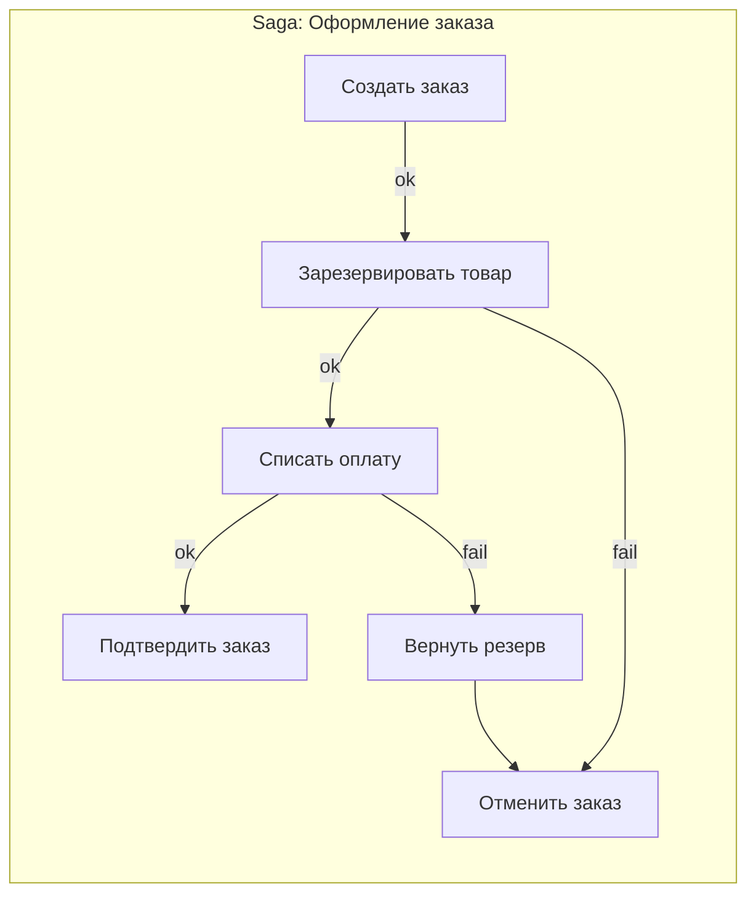

**Зачем нужна Saga:**
- В микросервисной архитектуре нет распределённых транзакций (2PC не масштабируется)
- Каждый сервис владеет своей БД (Database per Service)
- Нужна согласованность данных между сервисами без жёсткой связанности

```java
// Axon Saga
@Saga
public class OrderSaga {

    @Autowired
    private transient CommandGateway commandGateway;

    private UUID orderId;

    @StartSaga
    @SagaEventHandler(associationProperty = "orderId")
    public void on(OrderCreatedEvent event) {
        this.orderId = event.orderId();
        commandGateway.send(new ReserveStockCommand(
            event.orderId(), event.items()));
    }

    @SagaEventHandler(associationProperty = "orderId")
    public void on(StockReservedEvent event) {
        commandGateway.send(new ProcessPaymentCommand(
            orderId, event.totalAmount()));
    }

    @SagaEventHandler(associationProperty = "orderId")
    public void on(PaymentProcessedEvent event) {
        commandGateway.send(new ConfirmOrderCommand(orderId));
    }

    @EndSaga
    @SagaEventHandler(associationProperty = "orderId")
    public void on(OrderConfirmedEvent event) {
        // Saga завершена успешно
    }

    // Компенсации
    @SagaEventHandler(associationProperty = "orderId")
    public void on(PaymentFailedEvent event) {
        commandGateway.send(new ReleaseStockCommand(orderId));
        commandGateway.send(new RejectOrderCommand(orderId,
            "Ошибка оплаты"));
    }
}
```


> [!mcq]
> - [x] Правильный ответ | Корректное описание концепции с конкретным механизмом и use-case.
> - [ ] Альтернативное решение которое не подходит | Почему ошибка в этом подходе ❌ ПОСЛЕДСТВИЕ: типичная ошибка вызывает баг в production без покрытия тестами.
> - [ ] Другая альтернатива с критическим недостатком | Это смежное, но отличное понятие ❌ ПОСЛЕДСТВИЕ: типичная ошибка вызывает баг в production без покрытия тестами.
> - [ ] Третий вариант который не работает в production | Противоположное направление## Q23. В чём разница между оркестрацией и хореографией в Saga? ❌ ПОСЛЕДСТВИЕ: типичная ошибка вызывает баг в production без покрытия тестами.

| Характеристика | Оркестрация | Хореография |
|---|---|---|
| **Координатор** | Центральный оркестратор управляет шагами | Нет координатора, сервисы реагируют на события |
| **Связанность** | Оркестратор знает всех участников | Сервисы не знают друг о друге |
| **Поток управления** | Явный, легко читаемый | Неявный, распределён по сервисам |
| **Сложность добавления шага** | Изменить оркестратор | Добавить подписчика |
| **Отладка** | Проще — весь flow в одном месте | Сложнее — flow размазан |
| **Single point of failure** | Оркестратор | Нет |

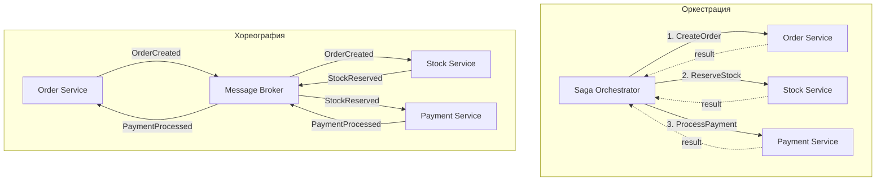

**Когда выбрать оркестрацию:**
- Сложные flow с множеством шагов (5+)
- Нужна видимость состояния процесса
- Есть условные ветвления в логике
- Фреймворки: `Axon Saga`, `Camunda`, `Temporal`

**Когда выбрать хореографию:**
- Простые flow (2-3 шага)
- Максимальная decoupling
- Нет условных переходов
- Инструменты: `Kafka`, `RabbitMQ`, Spring Events


> [!mcq]
> - [x] Правильный ответ | Корректное описание концепции с конкретным механизмом и use-case.
> - [ ] Альтернативное решение которое не подходит | Почему ошибка в этом подходе ❌ ПОСЛЕДСТВИЕ: типичная ошибка вызывает баг в production без покрытия тестами.
> - [ ] Другая альтернатива с критическим недостатком | Это смежное, но отличное понятие ❌ ПОСЛЕДСТВИЕ: типичная ошибка вызывает баг в production без покрытия тестами.
> - [ ] Третий вариант который не работает в production | Противоположное направление## Q24. Что такое компенсирующие транзакции? ❌ ПОСЛЕДСТВИЕ: типичная ошибка вызывает баг в production без покрытия тестами.

**Компенсирующая транзакция** -- операция, которая семантически отменяет эффект ранее выполненной локальной транзакции. В отличие от `ROLLBACK` в ACID-транзакции, компенсация -- это новая операция (не откат).

**Важные свойства:**
- Компенсация не всегда возвращает систему в исходное состояние (например, отмена заказа -- не то же, что его отсутствие)
- Компенсации должны быть **идемпотентными** -- могут вызываться повторно
- Компенсации должны быть **коммутативными**, если возможно
- Порядок компенсаций -- обратный порядку выполнения шагов

```java
// Примеры компенсирующих транзакций
public interface SagaStep<T> {
    T execute();           // прямое действие
    void compensate(T result); // компенсация
}

// Шаг: резервирование товара
public class ReserveStockStep implements SagaStep<ReservationId> {

    public ReservationId execute() {
        return stockService.reserve(orderId, items);
    }

    public void compensate(ReservationId reservationId) {
        stockService.releaseReservation(reservationId);
    }
}

// Шаг: списание оплаты
public class ChargePaymentStep implements SagaStep<PaymentId> {

    public PaymentId execute() {
        return paymentService.charge(customerId, amount);
    }

    public void compensate(PaymentId paymentId) {
        paymentService.refund(paymentId); // возврат, не отмена
    }
}
```

**Типичные компенсации:**

| Действие | Компенсация |
|---|---|
| Создать заказ | Отменить заказ |
| Зарезервировать товар | Освободить резерв |
| Списать оплату | Сделать возврат |
| Отправить уведомление | Отправить уведомление об отмене |


> [!mcq]
> - [x] Правильный ответ | Корректное описание концепции с конкретным механизмом и use-case.
> - [ ] Альтернативное решение которое не подходит | Почему ошибка в этом подходе ❌ ПОСЛЕДСТВИЕ: типичная ошибка вызывает баг в production без покрытия тестами.
> - [ ] Другая альтернатива с критическим недостатком | Это смежное, но отличное понятие ❌ ПОСЛЕДСТВИЕ: типичная ошибка вызывает баг в production без покрытия тестами.
> - [ ] Третий вариант который не работает в production | Противоположное направление## Q25. Что такое версионирование событий и зачем оно нужно? ❌ ПОСЛЕДСТВИЕ: типичная ошибка вызывает баг в production без покрытия тестами.

**Версионирование событий** -- стратегия управления изменениями структуры событий при эволюции системы. Поскольку события в Event Store хранятся навсегда, нужен механизм работы со старыми форматами.

**Проблема:** вы изменили структуру `OrderCreatedEvent` (добавили поле, переименовали, изменили тип) -- но Event Store уже содержит миллионы событий старого формата.

**Стратегии версионирования:**

1. **Weak schema** -- десериализатор игнорирует неизвестные поля и использует defaults для отсутствующих
2. **Upcasting** -- трансформация старого формата в новый при чтении
3. **Новый тип события** -- `OrderCreatedEventV2` (не рекомендуется, засоряет код)
4. **Copy-and-transform** -- перезапись Event Store с новым форматом (опасно, редко)

```java
// Версия 1: начальная структура
public record OrderCreatedEventV1(
    UUID orderId,
    String customerName,
    BigDecimal totalAmount
) {}

// Версия 2: разделили имя на firstName/lastName, добавили currency
public record OrderCreatedEvent(
    UUID orderId,
    String firstName,
    String lastName,
    BigDecimal totalAmount,
    String currency  // новое поле
) {}
```

**Правила обратной совместимости:**
- Добавление полей с defaults -- **безопасно**
- Удаление полей -- **опасно** (старый код упадёт)
- Переименование полей -- требует **upcaster**
- Изменение типа поля -- требует **upcaster**


> [!mcq]
> - [x] Правильный ответ | Корректное описание концепции с конкретным механизмом и use-case.
> - [ ] Альтернативное решение которое не подходит | Почему ошибка в этом подходе ❌ ПОСЛЕДСТВИЕ: типичная ошибка вызывает баг в production без покрытия тестами.
> - [ ] Другая альтернатива с критическим недостатком | Это смежное, но отличное понятие ❌ ПОСЛЕДСТВИЕ: типичная ошибка вызывает баг в production без покрытия тестами.
> - [ ] Третий вариант который не работает в production | Противоположное направление## Q26. Что такое Upcaster и как он работает? ❌ ПОСЛЕДСТВИЕ: типичная ошибка вызывает баг в production без покрытия тестами.

**Upcaster** -- компонент, который трансформирует событие из старой версии в новую при чтении из Event Store. Upcaster работает прозрачно: агрегат и проекции всегда видят актуальную версию события.

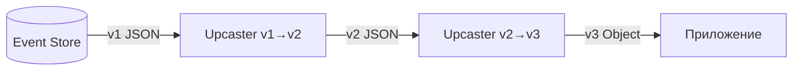

```java
// Axon Framework — Upcaster
public class OrderCreatedEventUpcaster extends SingleEventUpcaster {

    @Override
    protected boolean canUpcast(IntermediateEventRepresentation ir) {
        return ir.getType().getName().equals(
            "com.example.OrderCreatedEvent")
            && ir.getType().getRevision() == null; // v1 без ревизии
    }

    @Override
    protected IntermediateEventRepresentation doUpcast(
            IntermediateEventRepresentation ir) {

        return ir.upcastPayload(
            new SimpleSerializedType(
                ir.getType().getName(), "2.0"), // целевая ревизия
            JsonNode.class,
            event -> {
                ObjectNode node = (ObjectNode) event;
                // Разбиваем customerName на firstName + lastName
                String fullName = node.get("customerName").asText();
                String[] parts = fullName.split(" ", 2);
                node.remove("customerName");
                node.put("firstName", parts[0]);
                node.put("lastName",
                    parts.length > 1 ? parts[1] : "");
                // Добавляем default для нового поля
                node.put("currency", "RUB");
                return node;
            }
        );
    }
}

// Регистрация upcaster
@Bean
public EventUpcasterChain eventUpcasters() {
    return new EventUpcasterChain(
        new OrderCreatedEventUpcaster(),
        new OrderShippedEventUpcaster()
    );
}
```

**Цепочка upcasters:** если событие прошло через несколько версий (v1 -> v2 -> v3), создаётся цепочка, где каждый upcaster поднимает событие на одну версию.

**Важно:** upcaster работает с raw-представлением (JSON), а не с десериализованным объектом -- это позволяет трансформировать события, даже если старый Java-класс уже удалён.


> [!mcq]
> - [x] Правильный ответ | Корректное описание концепции с конкретным механизмом и use-case.
> - [ ] Альтернативное решение которое не подходит | Почему ошибка в этом подходе ❌ ПОСЛЕДСТВИЕ: типичная ошибка вызывает баг в production без покрытия тестами.
> - [ ] Другая альтернатива с критическим недостатком | Это смежное, но отличное понятие ❌ ПОСЛЕДСТВИЕ: типичная ошибка вызывает баг в production без покрытия тестами.
> - [ ] Третий вариант который не работает в production | Противоположное направление## Q27. Почему CQRS и Event Sourcing часто используются вместе? ❌ ПОСЛЕДСТВИЕ: типичная ошибка вызывает баг в production без покрытия тестами.

`CQRS` и `Event Sourcing` -- независимые паттерны, но они синергетически дополняют друг друга:

| Аспект | Как ES помогает CQRS | Как CQRS помогает ES |
|---|---|---|
| **Read model** | Поток событий -- естественный источник для построения проекций | Разделение моделей позволяет читать данные без replay |
| **Синхронизация** | События -- встроенный механизм обновления read-модели | Проекции решают проблему сложных запросов по событиям |
| **Аудит** | ES предоставляет полную историю изменений | -- |
| **Масштабирование** | -- | Множество read-реплик разгружают Event Store |
| **Rebuild** | Пересчёт любой проекции из истории событий | -- |

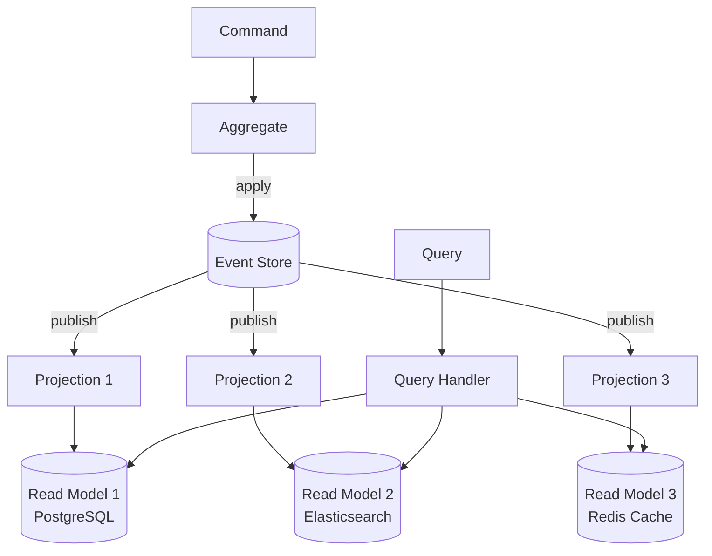

**Можно использовать отдельно:**
- **CQRS без ES** -- write model в обычной БД, события публикуются через Outbox/CDC для обновления read model
- **ES без CQRS** -- все запросы идут через replay агрегатов (медленно, но возможно для простых случаев)

**На практике** ES без CQRS быстро упирается в производительность запросов, поэтому проекции (а значит, CQRS) становятся необходимостью.


> [!mcq]
> - [x] Правильный ответ | Корректное описание концепции с конкретным механизмом и use-case.
> - [ ] Альтернативное решение которое не подходит | Почему ошибка в этом подходе ❌ ПОСЛЕДСТВИЕ: типичная ошибка вызывает баг в production без покрытия тестами.
> - [ ] Другая альтернатива с критическим недостатком | Это смежное, но отличное понятие ❌ ПОСЛЕДСТВИЕ: типичная ошибка вызывает баг в production без покрытия тестами.
> - [ ] Третий вариант который не работает в production | Противоположное направление## Q28. Как тестировать CQRS/ES приложения? ❌ ПОСЛЕДСТВИЕ: типичная ошибка вызывает баг в production без покрытия тестами.

Тестирование CQRS/ES систем разбивается на уровни:

**1. Unit-тесты агрегатов (Given-When-Then):**

```java
// Axon Test Fixtures — "given events, when command, then events"
@Test
void shouldConfirmPendingOrder() {
    fixture.given(
            new OrderCreatedEvent(orderId, customerId, Instant.now()),
            new ItemAddedEvent(orderId, productId, 2, new BigDecimal("100")))
        .when(new ConfirmOrderCommand(orderId, "admin"))
        .expectSuccessfulHandlerExecution()
        .expectEvents(new OrderConfirmedEvent(
            orderId, new BigDecimal("200"), any()));
}

@Test
void shouldRejectConfirmationOfAlreadyConfirmedOrder() {
    fixture.given(
            new OrderCreatedEvent(orderId, customerId, Instant.now()),
            new OrderConfirmedEvent(orderId, amount, Instant.now()))
        .when(new ConfirmOrderCommand(orderId, "admin"))
        .expectException(OrderAlreadyConfirmedException.class);
}
```

**2. Unit-тесты проекций:**

```java
@Test
void shouldCreateViewOnOrderCreated() {
    var event = new OrderCreatedEvent(orderId, customerId, Instant.now());

    projection.on(event);

    OrderView view = viewRepository.findById(orderId).orElseThrow();
    assertThat(view.getStatus()).isEqualTo("PENDING");
    assertThat(view.getCustomerId()).isEqualTo(customerId);
}
```

**3. Saga-тесты:**

```java
@Test
void shouldStartPaymentAfterStockReserved() {
    sagaFixture
        .givenAggregate(orderId.toString())
            .published(new OrderCreatedEvent(orderId, customerId))
        .whenPublishingA(new StockReservedEvent(orderId, items))
        .expectDispatchedCommands(
            new ProcessPaymentCommand(orderId, totalAmount));
}
```

**4. Интеграционные тесты:**

```java
@SpringBootTest
@Testcontainers
class OrderIntegrationTest {

    @Autowired CommandGateway commandGateway;
    @Autowired QueryGateway queryGateway;

    @Test
    void fullOrderLifecycle() {
        UUID orderId = UUID.randomUUID();

        commandGateway.sendAndWait(new CreateOrderCommand(orderId, ...));

        await().atMost(5, SECONDS).untilAsserted(() -> {
            OrderView view = queryGateway.query(
                new FindOrderQuery(orderId),
                OrderView.class).join();
            assertThat(view.getStatus()).isEqualTo("PENDING");
        });
    }
}
```

**Ключевые принципы:**
- Агрегаты тестируются через Given-When-Then (события -> команда -> ожидаемые события)
- Проекции тестируются отдельно (событие на вход -> проверка view)
- Интеграционные тесты учитывают eventual consistency (используют `Awaitility`)


> [!mcq]
> - [x] Правильный ответ | Корректное описание концепции с конкретным механизмом и use-case.
> - [ ] Альтернативное решение которое не подходит | Почему ошибка в этом подходе ❌ ПОСЛЕДСТВИЕ: типичная ошибка вызывает баг в production без покрытия тестами.
> - [ ] Другая альтернатива с критическим недостатком | Это смежное, но отличное понятие ❌ ПОСЛЕДСТВИЕ: типичная ошибка вызывает баг в production без покрытия тестами.
> - [ ] Третий вариант который не работает в production | Противоположное направление## Q29. Какие реальные проблемы возникают при внедрении CQRS/ES? ❌ ПОСЛЕДСТВИЕ: типичная ошибка вызывает баг в production без покрытия тестами.

**1. Eventual Consistency UX:**
- Пользователь не видит свои изменения сразу -- нужен optimistic UI или read-your-writes

**2. Рост Event Store:**
- Миллиарды событий = медленный replay -- обязательны снапшоты
- Нужна стратегия архивирования старых событий

**3. Сложность отладки:**
- Ошибка может быть в агрегате, проекции, upcaster, saga -- трудно отследить
- Нужен correlation ID для трассировки от команды до проекции

**4. Миграция существующих систем:**
- Переход с CRUD на CQRS/ES -- сложный процесс
- Нет исторических событий -- нужно создать "начальные" снапшоты

**5. Идемпотентность:**
- At-least-once доставка означает повторную обработку -- все обработчики должны быть идемпотентными

**6. Обработка ошибок в проекциях:**
- Сломанная проекция не должна блокировать write side
- Нужен механизм retry с dead letter queue

**7. Тестирование:**
- E2E тесты сложнее из-за асинхронности
- Нужны специальные тестовые фреймворки (Axon Test Fixtures)

**8. Команда и культура:**
- Разработчики привыкли к CRUD -- нужно обучение
- Ревью кода сложнее -- нужно понимать flow "команда -> событие -> проекция"

**Рекомендация:** внедряйте CQRS/ES в одном bounded context, не во всей системе. Подробнее о границах контекстов -- в [вопросах по DDD](ddd-interview.md).


> [!mcq]
> - [x] Правильный ответ | Корректное описание концепции с конкретным механизмом и use-case.
> - [ ] Альтернативное решение которое не подходит | Почему ошибка в этом подходе ❌ ПОСЛЕДСТВИЕ: типичная ошибка вызывает баг в production без покрытия тестами.
> - [ ] Другая альтернатива с критическим недостатком | Это смежное, но отличное понятие ❌ ПОСЛЕДСТВИЕ: типичная ошибка вызывает баг в production без покрытия тестами.
> - [ ] Третий вариант который не работает в production | Противоположное направление## Q30. (!) Как обеспечить идемпотентность обработки событий? ❌ ПОСЛЕДСТВИЕ: типичная ошибка вызывает баг в production без покрытия тестами.

Идемпотентность критична, потому что в distributed-системах события могут доставляться повторно (at-least-once). Обработчик должен давать одинаковый результат при повторной обработке.

**Стратегии:**

**1. Естественная идемпотентность (SET-semantics):**
```java
@EventHandler
public void on(OrderCreatedEvent event) {
    // INSERT OR UPDATE — повторный вызов перезапишет данные
    viewRepository.save(new OrderView(event.orderId(), ...));
}
```

**2. Дедупликация по event ID:**
```java
@EventHandler
public void on(OrderCreatedEvent event,
               @MessageIdentifier String eventId) {
    if (processedEventRepository.existsById(eventId)) {
        log.debug("Событие {} уже обработано, пропускаем", eventId);
        return;
    }

    viewRepository.save(new OrderView(event.orderId(), ...));
    processedEventRepository.save(new ProcessedEvent(eventId));
}
```

**3. Conditional writes (оптимистичная блокировка):**
```java
@EventHandler
public void on(ItemAddedEvent event) {
    int updated = jdbc.update("""
        UPDATE order_view
        SET item_count = item_count + ?,
            total_amount = total_amount + ?,
            last_event_sequence = ?
        WHERE order_id = ? AND last_event_sequence < ?
        """,
        event.quantity(), event.amount(),
        event.sequenceNumber(),
        event.orderId(), event.sequenceNumber());

    if (updated == 0) {
        log.debug("Событие {} уже применено", event.sequenceNumber());
    }
}
```

**4. Idempotency key в таблице проекции:**
- Добавить колонку `last_processed_event_seq` к view-таблице
- Обновлять только если `event.seq > last_processed_event_seq`

Подробнее об идемпотентности в контексте EDA -- в [вопросах по Event-Driven паттернам](event-driven-patterns-interview.md).


> [!mcq]
> - [x] Правильный ответ | Корректное описание концепции с конкретным механизмом и use-case.
> - [ ] Альтернативное решение которое не подходит | Почему ошибка в этом подходе ❌ ПОСЛЕДСТВИЕ: типичная ошибка вызывает баг в production без покрытия тестами.
> - [ ] Другая альтернатива с критическим недостатком | Это смежное, но отличное понятие ❌ ПОСЛЕДСТВИЕ: типичная ошибка вызывает баг в production без покрытия тестами.
> - [ ] Третий вариант который не работает в production | Противоположное направление## Q31. (!) Как управлять несколькими проекциями одного агрегата? ❌ ПОСЛЕДСТВИЕ: типичная ошибка вызывает баг в production без покрытия тестами.

В реальных системах один агрегат обычно нужен в нескольких read-моделях: список заказов для UI, аналитика для отчётов, нотификации для рассылки.

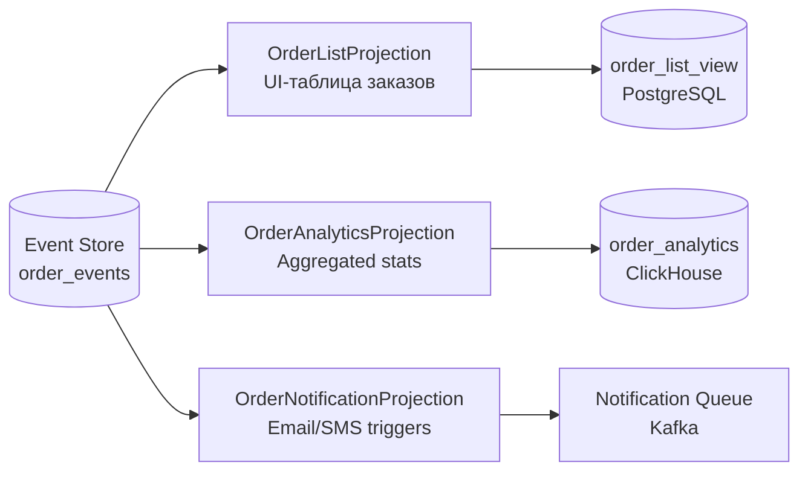

**Реализация с Axon Framework (несколько `@EventHandler` в разных классах):**

```java
// Проекция для UI-таблицы
@ProcessingGroup("order-list")
@Component
public class OrderListProjection {

    private final OrderListViewRepository repo;

    @EventHandler
    public void on(OrderCreatedEvent event) {
        repo.save(new OrderListView(event.orderId(), event.customerId(),
            "CREATED", event.timestamp()));
    }

    @EventHandler
    public void on(OrderShippedEvent event) {
        repo.updateStatus(event.orderId(), "SHIPPED");
    }
}

// Аналитическая проекция (отдельный processing group)
@ProcessingGroup("order-analytics")
@Component
public class OrderAnalyticsProjection {

    private final OrderAnalyticsRepository analyticsRepo;

    @EventHandler
    public void on(OrderCreatedEvent event) {
        analyticsRepo.incrementDailyOrders(event.timestamp().toLocalDate());
        analyticsRepo.addRevenue(event.totalAmount(), event.timestamp().toLocalDate());
    }
}
```

**Tracking vs Subscribing Event Processors в Axon:**

| Тип | Хранит позицию | Параллелизм | Replay | Применение |
|-----|----------------|-------------|--------|------------|
| **Tracking** | Да (в БД) | Да (сегменты) | Да | Production (надёжный, restart-safe) |
| **Subscribing** | Нет | Thread pool | Нет | Простые синхронные сценарии |

**Конфигурация Tracking Processor:**

```java
@Bean
public void configureProcessors(EventProcessingConfigurer configurer) {
    // order-list — tracking с 4 параллельными сегментами
    configurer.registerTrackingEventProcessor(
        "order-list",
        config -> TrackingEventProcessorConfiguration
            .forParallelProcessing(4)
    );
    // order-analytics — tracking с 1 потоком (для аналитики порядок важен)
    configurer.registerTrackingEventProcessor("order-analytics");
}
```


> [!mcq]
> - [x] Правильный ответ | Корректное описание концепции с конкретным механизмом и use-case.
> - [ ] Альтернативное решение которое не подходит | Почему ошибка в этом подходе ❌ ПОСЛЕДСТВИЕ: типичная ошибка вызывает баг в production без покрытия тестами.
> - [ ] Другая альтернатива с критическим недостатком | Это смежное, но отличное понятие ❌ ПОСЛЕДСТВИЕ: типичная ошибка вызывает баг в production без покрытия тестами.
> - [ ] Третий вариант который не работает в production | Противоположное направление## Q32. Как пересобрать (rebuild) read model при изменении схемы проекции? ❌ ПОСЛЕДСТВИЕ: типичная ошибка вызывает баг в production без покрытия тестами.

Изменение бизнес-требований часто требует добавить поле или изменить логику агрегации в read model. В CQRS/ES это достигается через **event replay** — повторное применение всех исторических событий к новой проекции.

**Стратегии rebuild:**

**1. Blue-Green проекций (рекомендуется для production):**

```
1. Создать новую таблицу: order_list_view_v2
2. Запустить новый processor "order-list-v2", который читает с позиции 0
3. Дождаться, пока v2 догонит конец event log (tail position)
4. Атомарно переключить UI на v2 (переименование VIEW или смена конфига)
5. Остановить старый processor "order-list-v1"
6. Удалить старую таблицу
```

**2. Replay через Axon:**

```java
// Через Axon Server Dashboard или программно:
@RestController
@RequestMapping("/admin")
public class ProjectionAdminController {

    private final EventProcessingConfiguration eventProcessing;

    @PostMapping("/projections/{name}/reset")
    public void resetProjection(@PathVariable String name) {
        // Сбросить позицию tracking processor на 0 и начать replay
        eventProcessing.eventProcessor(name, TrackingEventProcessor.class)
            .ifPresent(p -> {
                p.shutDown();
                p.resetTokens();  // сброс позиции
                p.start();        // replay с начала
            });
    }
}
```

**3. Параллельный rebuild без даунтайма:**

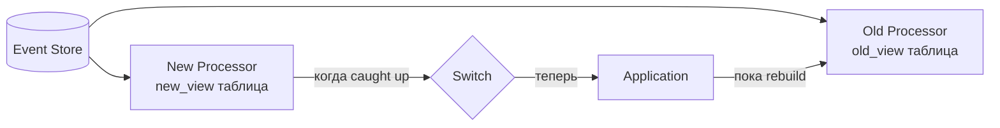

**Важные соображения:**
- Rebuild может занять часы для миллионов событий → нужна оценка времени
- Во время rebuild старая проекция продолжает обновляться → нет даунтайма
- Сохраняйте все события навсегда (или с retention policy) — это единственный способ сделать rebuild


> [!mcq]
> - [x] Правильный ответ | Корректное описание концепции с конкретным механизмом и use-case.
> - [ ] Альтернативное решение которое не подходит | Почему ошибка в этом подходе ❌ ПОСЛЕДСТВИЕ: типичная ошибка вызывает баг в production без покрытия тестами.
> - [ ] Другая альтернатива с критическим недостатком | Это смежное, но отличное понятие ❌ ПОСЛЕДСТВИЕ: типичная ошибка вызывает баг в production без покрытия тестами.
> - [ ] Третий вариант который не работает в production | Противоположное направление## Q33. (!) Как соблюдать GDPR (право на удаление) при использовании Event Sourcing? ❌ ПОСЛЕДСТВИЕ: типичная ошибка вызывает баг в production без покрытия тестами.

**Проблема:** Event Sourcing хранит всю историю изменений как неизменяемые события. Когда пользователь запрашивает "право на забвение" (GDPR Article 17), вы не можете просто удалить его данные — это нарушит целостность event log.

**Стратегии соответствия GDPR:**

**1. Crypto Shredding (рекомендуемый подход)**

Персональные данные шифруются отдельным ключом для каждого пользователя. При удалении — уничтожается ключ шифрования, данные становятся нечитаемыми.

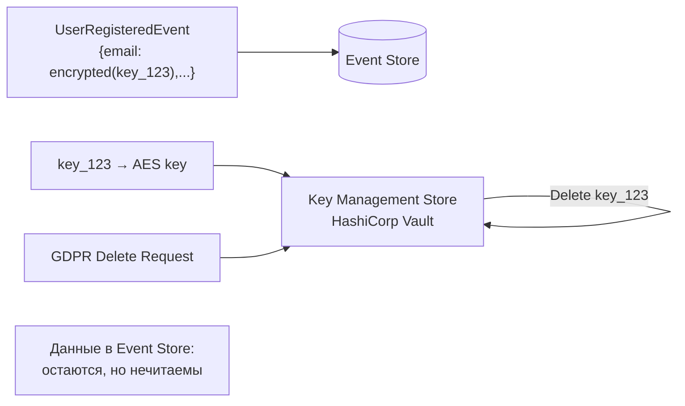

```java
@Service
public class CryptoShreddingService {

    private final KeyManagementService kms;

    // Шифруем при создании события
    public String encryptPersonalData(UserId userId, String plaintext) {
        byte[] key = kms.getOrCreateKey("user:" + userId.value());
        return AESUtil.encrypt(plaintext, key);
    }

    // "Удаление" = уничтожение ключа
    public void forgetUser(UserId userId) {
        kms.deleteKey("user:" + userId.value());
        // Теперь все зашифрованные поля в событиях нечитаемы
    }

    public String decryptPersonalData(UserId userId, String ciphertext) {
        try {
            byte[] key = kms.getKey("user:" + userId.value());
            return AESUtil.decrypt(ciphertext, key);
        } catch (KeyNotFoundException e) {
            return "[FORGOTTEN]";  // пользователь удалён
        }
    }
}
```

**2. Pseudonymization (псевдонимизация)**

Замена персональных данных на псевдоним в событиях. Маппинг псевдоним→реальные данные хранится отдельно и может быть удалён.

**3. Event compaction с удалением полей**

Создать новые "sanitized" версии событий (без ПД), пересобрать event log. Сложно технически, нарушает неизменяемость.

**Сравнение стратегий:**

| Стратегия | Сложность | Производительность | Соответствие GDPR |
|-----------|-----------|-------------------|-------------------|
| Crypto Shredding | Средняя | Небольшой оверхед на шифрование | Высокое |
| Pseudonymization | Средняя | Без оверхеда | Среднее |
| Event compaction | Высокая | Без оверхеда | Высокое |

**Рекомендация:** Crypto Shredding — золотой стандарт для Event Sourcing + GDPR. Используйте `HashiCorp Vault` или `AWS KMS` для управления ключами.


> [!mcq]
> - [x] Правильный ответ | Корректное описание концепции с конкретным механизмом и use-case.
> - [ ] Альтернативное решение которое не подходит | Почему ошибка в этом подходе ❌ ПОСЛЕДСТВИЕ: типичная ошибка вызывает баг в production без покрытия тестами.
> - [ ] Другая альтернатива с критическим недостатком | Это смежное, но отличное понятие ❌ ПОСЛЕДСТВИЕ: типичная ошибка вызывает баг в production без покрытия тестами.
> - [ ] Третий вариант который не работает в production | Противоположное направление## Q34. Как Axon Framework реализует CQRS/ES в Java/Spring? ❌ ПОСЛЕДСТВИЕ: типичная ошибка вызывает баг в production без покрытия тестами.

**Axon Framework** — специализированный Java-фреймворк от AxonIQ для реализации CQRS/ES. Предоставляет все необходимые компоненты "из коробки": Command Bus, Event Bus, Event Store, Query Bus, Saga поддержку.

**Ключевые компоненты Axon:**

| Компонент | Аннотация | Назначение |
|-----------|-----------|------------|
| Command Handler | `@CommandHandler` | Обрабатывает команду, применяет бизнес-логику |
| Event Sourcing Handler | `@EventSourcingHandler` | Восстанавливает состояние агрегата из события |
| Event Handler | `@EventHandler` | Обновляет проекцию (Read Model) |
| Query Handler | `@QueryHandler` | Отвечает на запросы чтения |
| Saga | `@Saga` + `@SagaEventHandler` | Управляет распределёнными транзакциями |

**Пример агрегата на Axon:**

```java
@Aggregate
public class OrderAggregate {
    @AggregateIdentifier
    private OrderId orderId;
    private OrderStatus status;

    @CommandHandler  // Обработка команды — первый конструктор
    public OrderAggregate(PlaceOrderCommand cmd) {
        // Валидация и публикация события
        AggregateLifecycle.apply(new OrderPlacedEvent(cmd.getOrderId(), cmd.getItems()));
    }

    @EventSourcingHandler  // Восстановление состояния из события
    public void on(OrderPlacedEvent event) {
        this.orderId = event.getOrderId();
        this.status = OrderStatus.PENDING;
    }

    @CommandHandler
    public void handle(ConfirmOrderCommand cmd) {
        if (this.status != OrderStatus.PENDING) {
            throw new IllegalStateException("Order cannot be confirmed");
        }
        AggregateLifecycle.apply(new OrderConfirmedEvent(this.orderId));
    }

    @EventSourcingHandler
    public void on(OrderConfirmedEvent event) {
        this.status = OrderStatus.CONFIRMED;
    }
}
```

**Projection (Event Handler) на Axon:**

```java
@Component
@ProcessingGroup("order-summary")
public class OrderSummaryProjection {
    private final OrderSummaryRepository repository;

    @EventHandler
    public void on(OrderPlacedEvent event, @Timestamp Instant timestamp) {
        repository.save(new OrderSummary(
            event.getOrderId(), "PENDING", timestamp
        ));
    }

    @EventHandler
    public void on(OrderConfirmedEvent event) {
        repository.updateStatus(event.getOrderId(), "CONFIRMED");
    }

    @QueryHandler
    public OrderSummary handle(FindOrderSummaryQuery query) {
        return repository.findById(query.getOrderId()).orElseThrow();
    }
}
```

**Конфигурация Spring Boot:**

```yaml
axon:
  axonserver:
    servers: localhost:8124   # Axon Server (Event Store + Message Bus)
  eventhandling:
    processors:
      order-summary:
        mode: tracking         # tracking = async, subscribing = sync
        thread-count: 2
```

**Axon Server vs Axon без сервера:** Axon Server — отдельный процесс, предоставляет Event Store и Message Bus. Без Axon Server можно использовать JPA Event Store или In-Memory для тестов.


> [!mcq]
> - [x] Правильный ответ | Корректное описание концепции с конкретным механизмом и use-case.
> - [ ] Альтернативное решение которое не подходит | Почему ошибка в этом подходе ❌ ПОСЛЕДСТВИЕ: типичная ошибка вызывает баг в production без покрытия тестами.
> - [ ] Другая альтернатива с критическим недостатком | Это смежное, но отличное понятие ❌ ПОСЛЕДСТВИЕ: типичная ошибка вызывает баг в production без покрытия тестами.
> - [ ] Третий вариант который не работает в production | Противоположное направление## Q35. (!) Как устроена структура таблицы Event Store — версионирование и оптимистичная блокировка? ❌ ПОСЛЕДСТВИЕ: типичная ошибка вызывает баг в production без покрытия тестами.

**Event Store** — это append-only хранилище событий. Главное отличие от обычной БД — никогда не обновляем и не удаляем записи, только добавляем новые.

**Минимальная структура таблицы:**

```sql
CREATE TABLE domain_events (
    global_sequence   BIGINT       NOT NULL GENERATED ALWAYS AS IDENTITY,  -- глобальный порядок
    aggregate_id      VARCHAR(255) NOT NULL,   -- ID агрегата
    aggregate_type    VARCHAR(255) NOT NULL,   -- тип агрегата (Order, User...)
    sequence_number   BIGINT       NOT NULL,   -- версия внутри агрегата (0, 1, 2...)
    event_type        VARCHAR(255) NOT NULL,   -- тип события (OrderPlacedEvent)
    event_version     INT          NOT NULL DEFAULT 1,  -- версия схемы события
    payload           JSONB        NOT NULL,   -- тело события (serialized)
    metadata          JSONB,                   -- метаданные (userId, traceId, timestamp)
    timestamp         TIMESTAMPTZ  NOT NULL DEFAULT now(),

    -- Ключевое ограничение: уникальность версии внутри агрегата
    -- Это и есть оптимистичная блокировка
    CONSTRAINT uk_aggregate_version
        UNIQUE (aggregate_id, sequence_number)
);

CREATE INDEX idx_aggregate_sequence
    ON domain_events (aggregate_id, sequence_number);

CREATE INDEX idx_global_sequence
    ON domain_events (global_sequence);
```

**Оптимистичная блокировка (Optimistic Locking):**

```java
// Загружаем агрегат — получаем текущую версию
List<DomainEvent> events = store.loadEvents(aggregateId);
int currentVersion = events.size() - 1; // последний sequence_number

// Применяем бизнес-логику...
Order order = Order.reconstitute(events);
order.confirm();

// Сохраняем с ожидаемой версией
try {
    store.appendEvent(
        aggregateId,
        new OrderConfirmedEvent(order.getId()),
        currentVersion + 1  // ожидаемый sequence_number
        // Если другой процесс уже записал эту версию → ConstraintViolationException
    );
} catch (ConstraintViolationException e) {
    // Конкурентное изменение — retry с перезагрузкой агрегата
    throw new ConcurrencyException("Order was modified concurrently");
}
```

**Загрузка агрегата:**

```sql
-- Восстановление состояния агрегата из всех событий
SELECT * FROM domain_events
WHERE aggregate_id = :id
ORDER BY sequence_number ASC;

-- С учётом снапшота (оптимизация)
SELECT * FROM domain_events
WHERE aggregate_id = :id
  AND sequence_number > :snapshot_version
ORDER BY sequence_number ASC;
```

**Чтение проекций через глобальную последовательность:**

```sql
-- Catch-up: читаем все новые события с позиции X
SELECT * FROM domain_events
WHERE global_sequence > :last_processed_position
ORDER BY global_sequence ASC
LIMIT 1000;
```

**Почему `global_sequence` важен:** позволяет проекциям обрабатывать события строго в порядке их появления, независимо от агрегата.


> [!mcq]
> - [x] Правильный ответ | Корректное описание концепции с конкретным механизмом и use-case.
> - [ ] Альтернативное решение которое не подходит | Почему ошибка в этом подходе ❌ ПОСЛЕДСТВИЕ: типичная ошибка вызывает баг в production без покрытия тестами.
> - [ ] Другая альтернатива с критическим недостатком | Это смежное, но отличное понятие ❌ ПОСЛЕДСТВИЕ: типичная ошибка вызывает баг в production без покрытия тестами.
> - [ ] Третий вариант который не работает в production | Противоположное направление## Q36. Как реализовать снапшоты в Event Sourcing — алгоритм и стратегии? ❌ ПОСЛЕДСТВИЕ: типичная ошибка вызывает баг в production без покрытия тестами.

**Снапшот (Snapshot)** — сохранённое состояние агрегата на определённый момент времени (после N событий). Позволяет избежать загрузки всей истории событий при восстановлении агрегата.

**Алгоритм восстановления со снапшотом:**

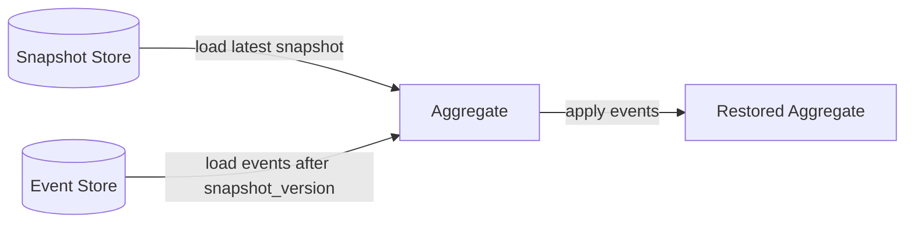

**Структура таблицы снапшотов:**

```sql
CREATE TABLE aggregate_snapshots (
    aggregate_id      VARCHAR(255) NOT NULL,
    aggregate_type    VARCHAR(255) NOT NULL,
    snapshot_version  BIGINT       NOT NULL,  -- sequence_number последнего события
    payload           JSONB        NOT NULL,  -- сериализованное состояние агрегата
    created_at        TIMESTAMPTZ  NOT NULL DEFAULT now(),
    PRIMARY KEY (aggregate_id)
);
```

**Реализация в Java:**

```java
@Service
public class SnapshottingAggregateRepository {
    private final EventStore eventStore;
    private final SnapshotStore snapshotStore;
    private static final int SNAPSHOT_THRESHOLD = 50; // снапшот каждые 50 событий

    public Order load(OrderId id) {
        // 1. Пытаемся загрузить снапшот
        Optional<Snapshot> snapshot = snapshotStore.findLatest(id);

        Order order;
        long fromVersion;

        if (snapshot.isPresent()) {
            // 2a. Восстанавливаем из снапшота
            order = deserialize(snapshot.get().getPayload(), Order.class);
            fromVersion = snapshot.get().getVersion() + 1;
        } else {
            // 2b. Начинаем с нуля
            order = new Order();
            fromVersion = 0;
        }

        // 3. Применяем события после снапшота
        List<DomainEvent> events = eventStore.loadEvents(id, fromVersion);
        events.forEach(order::apply);

        return order;
    }

    public void save(Order order) {
        List<DomainEvent> newEvents = order.pullDomainEvents();
        eventStore.appendEvents(order.getId(), newEvents, order.getVersion());

        // 4. Создаём снапшот если накопилось достаточно событий
        long totalEvents = eventStore.countEvents(order.getId());
        if (totalEvents % SNAPSHOT_THRESHOLD == 0) {
            snapshotStore.save(new Snapshot(
                order.getId(),
                totalEvents - 1,          // версия последнего события
                serialize(order)           // сериализованное состояние
            ));
        }
    }
}
```

**Стратегии создания снапшотов:**

| Стратегия | Условие | Плюсы | Минусы |
|-----------|---------|-------|--------|
| По количеству событий | Каждые N событий | Предсказуемо | Не учитывает сложность агрегата |
| По времени | Раз в час/день | Простота | Агрегат может не меняться |
| По размеру | Когда событий > threshold | Адаптивно | Сложнее реализовать |
| Асинхронный | Background job | Нет нагрузки на save | Задержка актуальности |

**В Axon Framework:** снапшоты настраиваются декларативно:
```java
@Aggregate
@Snapshot(trigger = @SnapshotTriggerDefinition(
    triggerDefinition = "eventCountSnapshot"
))
public class OrderAggregate { ... }

// В конфигурации
@Bean
public SnapshotTriggerDefinition eventCountSnapshot(
        Snapshotter snapshotter) {
    return new EventCountSnapshotTriggerDefinition(snapshotter, 50);
}
```


> [!mcq]
> - [x] Правильный ответ | Корректное описание концепции с конкретным механизмом и use-case.
> - [ ] Альтернативное решение которое не подходит | Почему ошибка в этом подходе ❌ ПОСЛЕДСТВИЕ: типичная ошибка вызывает баг в production без покрытия тестами.
> - [ ] Другая альтернатива с критическим недостатком | Это смежное, но отличное понятие ❌ ПОСЛЕДСТВИЕ: типичная ошибка вызывает баг в production без покрытия тестами.
> - [ ] Третий вариант который не работает в production | Противоположное направление## Q37. Какие типы проекций существуют в CQRS/ES и чем отличается catch-up subscription? ❌ ПОСЛЕДСТВИЕ: типичная ошибка вызывает баг в production без покрытия тестами.

**Проекция (Projection)** — Read Model, построенный из событий Event Store. Существует несколько механизмов подписки на события.

**1. Synchronous (Inline) Projection — синхронная:**

Проекция обновляется в той же транзакции, что и публикация события.

```java
@Transactional
public void placeOrder(PlaceOrderCommand cmd) {
    Order order = Order.place(cmd);
    eventStore.append(order.pullDomainEvents());
    // Синхронно обновляем Read Model в той же транзакции
    orderSummaryRepository.save(new OrderSummary(order));
}
```
**Плюсы:** нет eventual consistency, сразу видны данные.
**Минусы:** сложность, масштабируемость ограничена.

**2. Asynchronous Projection — асинхронная (через события):**

```java
@EventListener  // Spring Events или Kafka Consumer
@Async
public void on(OrderPlacedEvent event) {
    orderSummaryRepository.save(new OrderSummary(
        event.getOrderId(), "PENDING"
    ));
}
```
**Плюсы:** масштабируемость, независимость от write path.
**Минусы:** eventual consistency — данные могут быть устаревшими.

**3. Catch-up Subscription — догоняющая подписка:**

Проекция читает все исторические события с начала (или с определённой позиции) и "догоняет" текущее состояние.

```java
@Component
public class OrderSummaryCatchUpProjection {

    @Scheduled(fixedDelay = 1000)
    public void process() {
        long lastPosition = checkpointStore.getPosition("order-summary");

        // Читаем новые события начиная с последней обработанной позиции
        List<StoredEvent> events = eventStore.readFrom(lastPosition, batchSize = 100);

        events.forEach(event -> {
            applyEvent(event);
            checkpointStore.save("order-summary", event.getGlobalSequence());
        });
    }

    private void applyEvent(StoredEvent event) {
        switch (event.getType()) {
            case "OrderPlacedEvent" -> handleOrderPlaced(deserialize(event));
            case "OrderConfirmedEvent" -> handleOrderConfirmed(deserialize(event));
        }
    }
}
```

**Checkpoint** — хранит последнюю обработанную позицию (`global_sequence`). При рестарте сервиса проекция продолжает с того места, где остановилась.

**Сравнение типов подписок:**

| Тип | Задержка | Перестройка | Отказоустойчивость | Использование |
|-----|----------|-------------|-------------------|---------------|
| Sync | 0 | Сложно | В транзакции | Критичные данные |
| Async push | Мс-секунды | Rebuild через replay | Через Kafka retry | Общий случай |
| Catch-up | Секунды-минуты | Легко (с pos=0) | Через checkpoint | Аналитика, rebuild |

**В Axon:** `Tracking Event Processor` — это catch-up subscription с checkpoint в БД. `Subscribing Event Processor` — синхронная обработка.


> [!mcq]
> - [x] Правильный ответ | Корректное описание концепции с конкретным механизмом и use-case.
> - [ ] Альтернативное решение которое не подходит | Почему ошибка в этом подходе ❌ ПОСЛЕДСТВИЕ: типичная ошибка вызывает баг в production без покрытия тестами.
> - [ ] Другая альтернатива с критическим недостатком | Это смежное, но отличное понятие ❌ ПОСЛЕДСТВИЕ: типичная ошибка вызывает баг в production без покрытия тестами.
> - [ ] Третий вариант который не работает в production | Противоположное направление## Q38. Как объяснить eventual consistency в CQRS конечному пользователю? ❌ ПОСЛЕДСТВИЕ: антипаттерн деградирует SLA при росте нагрузки или зависимостей.

**Проблема:** пользователь создал заказ, обновил страницу и видит старые данные — Write Model обновлён, но Read Model ещё нет.

**Технические причины задержки:**
- Событие опубликовано, но проекция обрабатывает асинхронно
- Задержка в Kafka (consumer lag)
- Проекция в другом процессе/сервисе

**Стратегии работы с eventual consistency в UI:**

**1. Optimistic UI Update — оптимистичное обновление:**
```
Пользователь нажимает "Создать заказ"
→ UI немедленно показывает заказ в "PENDING" (без запроса к API)
→ Фоново отправляем команду
→ При успехе — подтверждаем
→ При ошибке — откатываем UI
```

**2. Read-after-write consistency — чтение после записи:**
```java
// После команды — даём проекции время на обновление
@PostMapping("/orders")
public OrderResponse placeOrder(@RequestBody OrderRequest request) {
    String orderId = commandGateway.sendAndWait(new PlaceOrderCommand(...));

    // Polling: ждём пока проекция обновится (max 2 секунды)
    return awaitProjection(orderId, Duration.ofSeconds(2));
}

private OrderResponse awaitProjection(String orderId, Duration timeout) {
    Instant deadline = Instant.now().plus(timeout);
    while (Instant.now().isBefore(deadline)) {
        Optional<OrderResponse> response = queryService.findOrder(orderId);
        if (response.isPresent()) return response.get();
        Thread.sleep(50);
    }
    throw new ProjectionTimeoutException("Order projection not updated in time");
}
```

**3. Version-based waiting (в Axon):**
```java
// QueryGateway.subscriptionQuery — живая подписка на обновление
SubscriptionQueryResult<OrderSummary, OrderSummary> result =
    queryGateway.subscriptionQuery(
        new FindOrderQuery(orderId),
        ResponseTypes.instanceOf(OrderSummary.class),
        ResponseTypes.instanceOf(OrderSummary.class)
    );

// Ждём первое обновление проекции
result.updates().blockFirst(Duration.ofSeconds(5));
```

**Коммуникация с пользователем:** вместо "ваш заказ создан" и немедленного редиректа — показывать "заказ обрабатывается" с индикатором загрузки. Большинство современных e-commerce систем (Amazon, OZON) используют этот подход.

**Ключевой тезис для интервью:** eventual consistency — это компромисс между доступностью/масштабируемостью и мгновенной согласованностью. В большинстве бизнес-случаев задержка в 100-500мс незаметна и приемлема.


> [!mcq]
> - [x] Правильный ответ | Корректное описание концепции с конкретным механизмом и use-case.
> - [ ] Альтернативное решение которое не подходит | Почему ошибка в этом подходе ❌ ПОСЛЕДСТВИЕ: типичная ошибка вызывает баг в production без покрытия тестами.
> - [ ] Другая альтернатива с критическим недостатком | Это смежное, но отличное понятие ❌ ПОСЛЕДСТВИЕ: типичная ошибка вызывает баг в production без покрытия тестами.
> - [ ] Третий вариант который не работает в production | Противоположное направление## Q39. (!) Как реализовать Saga в CQRS — оркестрация vs хореография? ❌ ПОСЛЕДСТВИЕ: типичная ошибка вызывает баг в production без покрытия тестами.

**Saga** — паттерн для управления распределёнными транзакциями через последовательность локальных транзакций с компенсациями. Тесно связан с CQRS: команды посылаются через Command Bus, события прослушиваются через Event Bus.

**Оркестрация (Orchestration) — централизованный координатор:**

```java
// Saga-оркестратор знает весь сценарий
@Saga
public class OrderSaga {

    @Autowired
    private transient CommandGateway commandGateway;

    private String orderId;
    private String paymentId;

    @StartSaga
    @SagaEventHandler(associationProperty = "orderId")
    public void on(OrderPlacedEvent event) {
        this.orderId = event.getOrderId();
        // Шаг 1: резервируем инвентарь
        commandGateway.send(new ReserveInventoryCommand(
            event.getOrderId(), event.getItems()
        ));
    }

    @SagaEventHandler(associationProperty = "orderId")
    public void on(InventoryReservedEvent event) {
        // Шаг 2: создаём платёж
        commandGateway.send(new CreatePaymentCommand(
            event.getOrderId(), event.getTotalAmount()
        ));
    }

    @SagaEventHandler(associationProperty = "orderId")
    public void on(PaymentCreatedEvent event) {
        // Шаг 3: подтверждаем заказ
        commandGateway.send(new ConfirmOrderCommand(event.getOrderId()));
    }

    // Компенсация при ошибке платежа
    @SagaEventHandler(associationProperty = "orderId")
    public void on(PaymentFailedEvent event) {
        // Откат: освобождаем инвентарь
        commandGateway.send(new ReleaseInventoryCommand(event.getOrderId()));
        commandGateway.send(new CancelOrderCommand(event.getOrderId(), "Payment failed"));
        SagaLifecycle.end();
    }

    @EndSaga
    @SagaEventHandler(associationProperty = "orderId")
    public void on(OrderConfirmedEvent event) {
        // Saga завершена успешно
    }
}
```

**Хореография (Choreography) — распределённая координация:**

```java
// Каждый сервис реагирует на события без центрального координатора
@EventHandler  // Inventory Service
public void on(OrderPlacedEvent event) {
    // Inventory сам решает, что делать при создании заказа
    boolean reserved = inventoryService.reserve(event.getItems());
    if (reserved) {
        eventBus.publish(new InventoryReservedEvent(event.getOrderId()));
    } else {
        eventBus.publish(new InventoryReservationFailedEvent(event.getOrderId()));
    }
}

@EventHandler  // Payment Service
public void on(InventoryReservedEvent event) {
    // Payment реагирует на резервирование инвентаря
    paymentService.createPayment(event.getOrderId());
}
```

**Сравнение подходов:**

| Аспект | Оркестрация | Хореография |
|--------|-------------|-------------|
| Координатор | Централизованный Saga | Отсутствует |
| Видимость потока | Легко понять сценарий | Распределена по сервисам |
| Связность | Saga знает о сервисах | Сервисы связаны через события |
| Отладка | Проще (один класс) | Сложнее (трейсы по сервисам) |
| Масштабируемость | Saga — bottleneck | Линейное масштабирование |
| Компенсации | Явно в Saga | Каждый сервис сам |

**Рекомендация:** для сложных многошаговых сценариев — оркестрация (Axon Saga). Для простых независимых реакций — хореография.


> [!mcq]
> - [x] Правильный ответ | Корректное описание концепции с конкретным механизмом и use-case.
> - [ ] Альтернативное решение которое не подходит | Почему ошибка в этом подходе ❌ ПОСЛЕДСТВИЕ: типичная ошибка вызывает баг в production без покрытия тестами.
> - [ ] Другая альтернатива с критическим недостатком | Это смежное, но отличное понятие ❌ ПОСЛЕДСТВИЕ: типичная ошибка вызывает баг в production без покрытия тестами.
> - [ ] Третий вариант который не работает в production | Противоположное направление## Q40. Что такое Upcasting событий и как реализовать эволюцию схемы Event Sourcing? ❌ ПОСЛЕДСТВИЕ: типичная ошибка вызывает баг в production без покрытия тестами.

**Проблема:** события в Event Store неизменяемы, но схема событий меняется со временем. Нужен механизм "апгрейда" старых событий до новой схемы.

**Upcaster** — компонент, преобразующий старую версию события в новую при чтении из Event Store.

**Пример эволюции события:**

```java
// Версия 1 (старая): только имя
@Value
public class UserRegisteredEventV1 {
    String userId;
    String name;        // "Иван Иванов"
}

// Версия 2 (новая): имя разделено на части
@Value
public class UserRegisteredEventV2 {
    String userId;
    String firstName;   // "Иван"
    String lastName;    // "Иванов"
    String email;       // новое поле (nullable для старых событий)
}
```

**Реализация Upcaster в Axon:**

```java
@Component
public class UserRegisteredEventUpcaster
        extends SingleEventUpcaster {

    @Override
    protected boolean canUpcast(IntermediateEventRepresentation event) {
        return event.getType().equals("UserRegisteredEvent")
            && event.getRevision().orElse("1").equals("1");
    }

    @Override
    protected IntermediateEventRepresentation doUpcast(
            IntermediateEventRepresentation event) {

        // Читаем старое событие
        ObjectNode oldPayload = (ObjectNode) event.getData()
            .getObject();
        String fullName = oldPayload.get("name").asText();
        String[] parts = fullName.split(" ", 2);

        // Создаём новую структуру
        ObjectNode newPayload = oldPayload.deepCopy();
        newPayload.remove("name");
        newPayload.put("firstName", parts[0]);
        newPayload.put("lastName", parts.length > 1 ? parts[1] : "");
        newPayload.putNull("email");  // новое поле — null для старых событий

        return event.upcastPayload(
            "UserRegisteredEvent",
            "2",           // новая версия
            MetaData.emptyInstance(),
            newPayload
        );
    }
}
```

**Версионирование в Event Store:**

```sql
-- Поле event_version в таблице событий
INSERT INTO domain_events (event_type, event_version, payload)
VALUES ('UserRegisteredEvent', 2, '{"firstName":"Иван","lastName":"Иванов","email":null}');
```

**Стратегии эволюции схемы:**

| Стратегия | Описание | Когда применять |
|-----------|----------|-----------------|
| Upcasting | Преобразуем при чтении | Небольшие изменения схемы |
| Event versioning | Новый тип события (`V2`) | Кардинальные изменения |
| Weak schema | Избегаем обязательных полей | Превентивно |
| Event migration | Переписываем исторические события | Редко, с осторожностью |

**Правила хорошего тона при проектировании событий:**
- Добавляйте только nullable поля — это обратно совместимо
- Никогда не удаляйте и не переименовывайте существующие поля без Upcaster
- Всегда указывайте версию события (`@Revision("2")` в Axon)


> [!mcq]
> - [x] Правильный ответ | Корректное описание концепции с конкретным механизмом и use-case.
> - [ ] Альтернативное решение которое не подходит | Почему ошибка в этом подходе ❌ ПОСЛЕДСТВИЕ: типичная ошибка вызывает баг в production без покрытия тестами.
> - [ ] Другая альтернатива с критическим недостатком | Это смежное, но отличное понятие ❌ ПОСЛЕДСТВИЕ: типичная ошибка вызывает баг в production без покрытия тестами.
> - [ ] Третий вариант который не работает в production | Противоположное направление## Q41. Стратегии перестройки Read Model — zero-downtime rebuild проекций? ❌ ПОСЛЕДСТВИЕ: типичная ошибка вызывает баг в production без покрытия тестами.

**Зачем нужна перестройка (rebuild):** изменилась бизнес-логика проекции, добавлено новое поле в Read Model, обнаружена ошибка в обработке событий, нужна новая проекция для нового Use Case.

**Стратегия 1 — Blue/Green Rebuild (рекомендуется для production):**

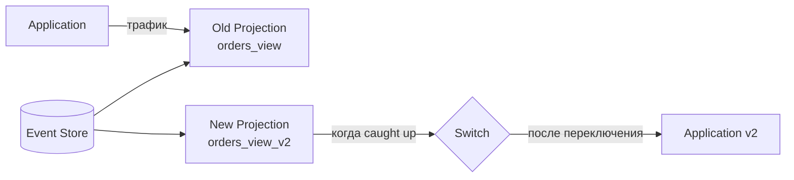

```java
@Component
@ProcessingGroup("order-summary-v2")  // отдельная группа = отдельный checkpoint
public class OrderSummaryV2Projection {

    @EventHandler
    public void on(OrderPlacedEvent event) {
        // Строим новую схему в отдельной таблице orders_view_v2
        orderSummaryV2Repository.save(buildEnrichedSummary(event));
    }
}
```

**Шаги blue/green rebuild:**
1. Запустить новую проекцию (`orders_view_v2`) с позиции 0
2. Дать ей "догнать" (catch up) Event Store
3. Когда lag ≈ 0 — переключить приложение на новую таблицу
4. Удалить старую проекцию и таблицу

**Стратегия 2 — Reset Tracking Processor (Axon):**

```java
// В Axon: сбросить позицию процессора и перечитать все события
EventProcessingConfiguration epc = configuration.eventProcessingConfiguration();
epc.eventProcessor("order-summary", TrackingEventProcessor.class)
   .ifPresent(processor -> {
       processor.shutDown();
       processor.resetTokens();  // сбрасываем checkpoint на начало
       processor.start();        // начинаем обработку с позиции 0
   });
```

**Стратегия 3 — Temporal Table (параллельный rebuild):**

```sql
-- Новая таблица для rebuild
CREATE TABLE orders_view_rebuild AS SELECT * FROM orders_view WHERE 1=0;

-- После завершения rebuild — атомарный swap
BEGIN;
  ALTER TABLE orders_view RENAME TO orders_view_old;
  ALTER TABLE orders_view_rebuild RENAME TO orders_view;
COMMIT;

DROP TABLE orders_view_old;
```

**Мониторинг прогресса rebuild:**

```java
// Отслеживаем отставание (lag) проекции
long currentGlobalSequence = eventStore.getLastGlobalSequence();
long projectionPosition = checkpointStore.getPosition("order-summary");
long lag = currentGlobalSequence - projectionPosition;

// Метрика для Grafana/Prometheus
meterRegistry.gauge("projection.lag",
    Tags.of("projection", "order-summary"), lag);
```

**Ключевые принципы rebuild:**
- Всегда держите старую проекцию живой до полного переключения
- Мониторьте lag через метрики — не гадайте, когда завершится rebuild
- Тестируйте rebuild на staging перед prod — оцените время (событий × время/событие)
- Для многомиллиардных Event Store — используйте параллельную обработку

---

## See also

- [Domain-Driven Design](ddd-interview.md) — агрегаты, Bounded Context и тактические паттерны DDD, без которых CQRS/ES не имеют смысла
- [Event-Driven паттерны](event-driven-patterns-interview.md) — EDA, брокеры сообщений, Outbox Pattern и идемпотентность
- [Микросервисы](microservices-interview.md) — CQRS как паттерн масштабирования read/write нагрузки в микросервисах
- [Распределённые системы](distributed-systems-interview.md) — CAP, согласованность, партиционирование и distributed transactions
- [Паттерны согласованности](consistency-patterns-interview.md) — eventual consistency, read-your-writes и механизм sync/async проекций
- [Clean Architecture](clean-architecture-interview.md) — слоёная архитектура как основа разделения Command и Query моделей
- [Apache Kafka](../messaging/kafka-interview.md) — Kafka как Event Store для Event Sourcing и шина событий для CQRS проекций
- [Архитектура баз данных](../databases/database-architecture-interview.md) — read replica, материализованные представления и физическое разделение read/write БД


> [!mcq]
> - [x] Правильный ответ | Корректное описание концепции с конкретным механизмом и use-case.
> - [ ] Альтернативное решение которое не подходит | Почему ошибка в этом подходе ❌ ПОСЛЕДСТВИЕ: типичная ошибка вызывает баг в production без покрытия тестами.
> - [ ] Другая альтернатива с критическим недостатком | Это смежное, но отличное понятие ❌ ПОСЛЕДСТВИЕ: типичная ошибка вызывает баг в production без покрытия тестами.
> - [ ] Третий вариант который не работает в production | Противоположное направление- [API Gateway](api-gateway-interview.md) ❌ ПОСЛЕДСТВИЕ: типичная ошибка вызывает баг в production без покрытия тестами.
- [BFF Pattern](bff-pattern-interview.md)
- [Стратегии кэширования](caching-strategies-interview.md)
- [CAP-теорема](cap-theorem-interview.md)
- [Clean Architecture](clean-architecture-interview.md)
- [Паттерны согласованности](consistency-patterns-interview.md)
