# Вопросы на собеседовании: `Domain-Driven Design`

Полное покрытие `Domain-Driven Design` (`DDD`): `Bounded Context`, `Ubiquitous Language`, агрегаты, `Entity` vs `Value Object`, доменные события, репозитории, стратегический и тактический дизайн, `CQRS`, `Event Sourcing`, `Saga`, `Specification`.

**Domain-Driven Design** -- подход к проектированию сложных систем, предложенный Эриком Эвансом в 2003 году. На собеседованиях `DDD` особенно актуален для Senior-позиций: вопросы охватывают как стратегическое разделение системы на контексты, так и тактические паттерны моделирования домена. Знание `DDD` показывает способность проектировать системы, отражающие реальную бизнес-логику.

## Полезные ссылки

### Официальная документация

- [Domain-Driven Design Reference (Eric Evans)](https://www.domainlanguage.com/ddd/reference/) -- краткий справочник от автора DDD
- [Bounded Context (Martin Fowler)](https://martinfowler.com/bliki/BoundedContext.html) -- каноническое описание Bounded Context
- [DDD Bounded Contexts and Java Modules (Baeldung)](https://www.baeldung.com/java-modules-ddd-bounded-contexts) -- Bounded Context с Java-модулями
- [Hexagonal Architecture, DDD, and Spring (Baeldung)](https://www.baeldung.com/hexagonal-architecture-ddd-spring) -- гексагональная архитектура и DDD в Spring
- [DDD Aggregates and @DomainEvents (Baeldung)](https://www.baeldung.com/spring-data-ddd) -- агрегаты и доменные события в Spring Data
- [Persisting DDD Aggregates (Baeldung)](https://www.baeldung.com/spring-persisting-ddd-aggregates) -- персистенция агрегатов
- [CQRS and Event Sourcing in Java (Baeldung)](https://www.baeldung.com/cqrs-event-sourcing-java) -- CQRS и Event Sourcing
- [Implementing CQRS with Spring Modulith (Baeldung)](https://www.baeldung.com/spring-modulith-cqrs) -- CQRS через Spring Modulith
- [Strategic Domain-Driven Design with Context Mapping (InfoQ)](https://www.infoq.com/articles/ddd-contextmapping/) -- стратегический DDD и контекстное картирование

## Содержание

- [Полезные ссылки](#полезные-ссылки)
- [See also](#see-also)

**Основы DDD**
- [Q1. (!) Что такое Domain-Driven Design и зачем он нужен?](#q1--что-такое-domain-driven-design-и-зачем-он-нужен)
- [Q2. (!) Что такое Ubiquitous Language?](#q2--что-такое-ubiquitous-language)
- [Q3. Какие проблемы решает DDD?](#q3-какие-проблемы-решает-ddd)
- [Q4. Когда стоит и не стоит применять DDD?](#q4-когда-стоит-и-не-стоит-применять-ddd)

**Стратегический дизайн**
- [Q5. (!) Что такое Bounded Context?](#q5--что-такое-bounded-context)
- [Q6. Что такое Context Mapping и какие паттерны интеграции существуют?](#q6-что-такое-context-mapping-и-какие-паттерны-интеграции-существуют)
- [Q7. Что такое Anti-Corruption Layer?](#q7-что-такое-anti-corruption-layer)
- [Q8. Что такое Shared Kernel?](#q8-что-такое-shared-kernel)
- [Q9. В чём разница между стратегическим и тактическим DDD?](#q9-в-чём-разница-между-стратегическим-и-тактическим-ddd)
- [Q10. Что такое Subdomain и какие типы бывают?](#q10-что-такое-subdomain-и-какие-типы-бывают)

**Entity и Value Object**
- [Q11. (!) В чём разница между Entity и Value Object?](#q11--в-чём-разница-между-entity-и-value-object)
- [Q12. Как правильно реализовать Value Object в Java?](#q12-как-правильно-реализовать-value-object-в-java)
- [Q13. Когда использовать Entity, а когда Value Object?](#q13-когда-использовать-entity-а-когда-value-object)

**Агрегаты**
- [Q14. (!) Что такое Aggregate и Aggregate Root?](#q14--что-такое-aggregate-и-aggregate-root)
- [Q15. Какие правила проектирования агрегатов?](#q15-какие-правила-проектирования-агрегатов)
- [Q16. Как определить границы агрегата?](#q16-как-определить-границы-агрегата)
- [Q17. Как реализовать Aggregate Root в Java/Spring?](#q17-как-реализовать-aggregate-root-в-javaspring)

**Доменные события**
- [Q18. Что такое Domain Event?](#q18-что-такое-domain-event)
- [Q19. Как реализовать доменные события в Spring?](#q19-как-реализовать-доменные-события-в-spring)
- [Q20. В чём разница между Domain Event и Integration Event?](#q20-в-чём-разница-между-domain-event-и-integration-event)

**Репозитории и сервисы**
- [Q21. (!) Что такое Repository в DDD?](#q21--что-такое-repository-в-ddd)
- [Q22. (!) В чём разница между Domain Service и Application Service?](#q22--в-чём-разница-между-domain-service-и-application-service)
- [Q23. Что такое Factory в DDD?](#q23-что-такое-factory-в-ddd)

**CQRS и Event Sourcing**
- [Q24. (!) Что такое CQRS?](#q24--что-такое-cqrs)
- [Q25. (!) Что такое Event Sourcing?](#q25--что-такое-event-sourcing)
- [Q26. Как связаны CQRS и Event Sourcing?](#q26-как-связаны-cqrs-и-event-sourcing)

**Saga и распределённые транзакции**
- [Q27. (!) Что такое Saga Pattern в контексте DDD?](#q27--что-такое-saga-pattern-в-контексте-ddd)
- [Q28. В чём разница между хореографией и оркестрацией в Saga?](#q28-в-чём-разница-между-хореографией-и-оркестрацией-в-saga)

**Specification Pattern**
- [Q29. Что такое Specification Pattern?](#q29-что-такое-specification-pattern)

**DDD с Spring и Java**
- [Q30. Как организовать пакетную структуру проекта по DDD?](#q30-как-организовать-пакетную-структуру-проекта-по-ddd)
- [Q31. Как DDD сочетается с гексагональной архитектурой?](#q31-как-ddd-сочетается-с-гексагональной-архитектурой)
- [Q32. Как использовать Spring Modulith для реализации DDD?](#q32-как-использовать-spring-modulith-для-реализации-ddd)
- [Q33. Какие анти-паттерны встречаются при реализации DDD?](#q33-какие-анти-паттерны-встречаются-при-реализации-ddd)
- [Q34. (!) Как связаны DDD и микросервисы?](#q34--как-связаны-ddd-и-микросервисы)
- [Q35. Как тестировать доменную модель?](#q35-как-тестировать-доменную-модель)

**Продвинутые темы**
- [Q36. (!) Как реализовать Anti-Corruption Layer (ACL) в Spring?](#q36--как-реализовать-anti-corruption-layer-acl-в-spring)
- [Q37. Какие стратегии Context Mapping применяются на практике?](#q37-какие-стратегии-context-mapping-применяются-на-практике)
- [Q38. (!) Как правильно проектировать Value Objects в Java?](#q38--как-правильно-проектировать-value-objects-в-java)

---

## Q1. (!) Что такое Domain-Driven Design и зачем он нужен?

**Domain-Driven Design** (`DDD`) -- это подход к проектированию программного обеспечения, при котором структура кода отражает бизнес-домен, а не технические решения. Был предложен Эриком Эвансом в книге "Domain-Driven Design: Tackling Complexity in the Heart of Software" (2003).

Ключевые принципы:

1. **Домен в центре** -- бизнес-логика определяет архитектуру, а не фреймворки или базы данных
2. **Единый язык** (`Ubiquitous Language`) -- разработчики и бизнес используют одну терминологию
3. **Модель как знание** -- код является моделью знаний о бизнес-домене
4. **Чёткие границы** -- система делится на контексты со своими моделями

Зачем нужен `DDD`:

- Снижает когнитивную сложность при работе с большими системами
- Обеспечивает точное отражение бизнес-правил в коде
- Упрощает коммуникацию между разработчиками и доменными экспертами
- Даёт чёткие критерии для декомпозиции системы на модули и микросервисы

> **Что хотят услышать на собеседовании**: `DDD` -- не набор паттернов, а философия проектирования. Главная идея -- код должен говорить на языке бизнеса, а структура системы отражать структуру домена.

---

## Q2. (!) Что такое Ubiquitous Language?

**Ubiquitous Language** (единый язык) -- это общий словарь, используемый разработчиками и доменными экспертами для описания бизнес-процессов. Этот язык пронизывает все артефакты: код, документацию, разговоры.

Принципы:

- **Один термин -- одно значение**: «Заказ» означает одно и то же и в коде, и в разговоре с бизнесом
- **Модель отражает язык**: имена классов, методов и переменных совпадают с терминами домена
- **Язык эволюционирует**: по мере углубления понимания домена язык и модель уточняются

Пример -- различие между техническим и доменным языком:

```java
// Плохо: технический язык
class DataProcessor {
    void processRecord(Map<String, Object> data) { ... }
}

// Хорошо: Ubiquitous Language
class LoanApplication {
    void submitForApproval(Applicant applicant, LoanTerms terms) { ... }
    void approve(CreditOfficer officer) { ... }
    void reject(RejectionReason reason) { ... }
}
```

Признаки нарушения `Ubiquitous Language`:

| Симптом | Проблема |
|---------|----------|
| Разработчики и бизнес говорят разными терминами | Код не отражает домен |
| Класс `Manager`, `Processor`, `Handler` | Размытая ответственность, нет доменного смысла |
| Комментарии объясняют бизнес-смысл кода | Код недостаточно выразителен |

---

## Q3. Какие проблемы решает DDD?

`DDD` решает проблемы, возникающие в **сложных** бизнес-доменах:

1. **Big Ball of Mud** -- монолитный код без чётких границ, где всё зависит от всего. `DDD` вводит `Bounded Context`, изолирующий подсистемы
2. **Разрыв между бизнесом и кодом** -- `Ubiquitous Language` устраняет двойную интерпретацию требований
3. **Анемичная модель домена** -- вместо «мешков с данными» и процедурных сервисов `DDD` предлагает Rich Domain Model с поведением
4. **Неконтролируемая сложность** -- стратегический дизайн позволяет разделить систему на управляемые части
5. **Трудности масштабирования команд** -- каждая команда владеет своим `Bounded Context`

---

## Q4. Когда стоит и не стоит применять DDD?

| Стоит применять | Не стоит применять |
|-----------------|-------------------|
| Сложный бизнес-домен с нетривиальными правилами | CRUD-приложения без бизнес-логики |
| Долгоживущий проект с активным развитием | Прототипы и одноразовые скрипты |
| Доступ к доменным экспертам | Простые интеграционные адаптеры |
| Несколько команд работают над одной системой | Маленькие проекты одного разработчика |
| Ядро бизнеса (`Core Domain`) | Утилитарные и инфраструктурные модули |

Правило Эрика Эванса: если для описания бизнес-логики достаточно `CRUD`, `DDD` будет избыточным. `DDD` окупает свою сложность только в доменах, где бизнес-правила действительно сложны.

---

## Q5. (!) Что такое Bounded Context?

**Bounded Context** (ограниченный контекст) -- центральный паттерн стратегического `DDD`. Это явная граница, внутри которой конкретная доменная модель является согласованной и однозначной.

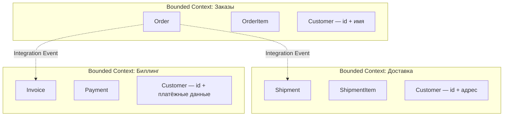

Ключевые свойства:

1. **Одна модель -- один контекст**: понятие `Customer` может означать разное в разных контекстах
2. **Лингвистическая граница**: внутри контекста `Ubiquitous Language` однозначен
3. **Независимость моделей**: изменение модели в одном контексте не ломает другие
4. **Техническая автономность**: каждый контекст может иметь свою БД, свой стек

Как определить границы `Bounded Context`:

- Найти области, где одни и те же слова имеют разные значения
- Определить, какие команды работают над какими частями системы
- Использовать `Event Storming` для визуализации потоков событий
- Следовать принципу: один контекст -- одна команда (закон Конвея)

---

## Q6. Что такое Context Mapping и какие паттерны интеграции существуют?

**Context Map** -- это диаграмма, показывающая отношения между `Bounded Context` и способы их интеграции.

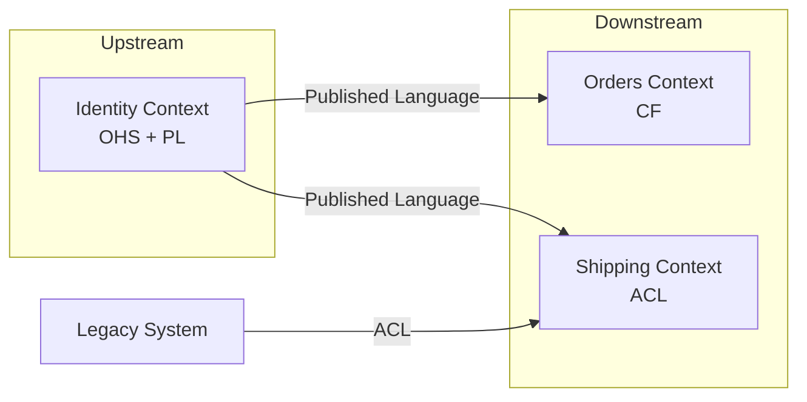

Основные паттерны `Context Mapping`:

| Паттерн | Описание | Пример |
|---------|----------|--------|
| **Shared Kernel** | Общая часть модели между двумя контекстами | Общая библиотека доменных примитивов |
| **Customer-Supplier** | Upstream поставляет, downstream потребляет | API-команда поставляет данные frontend-команде |
| **Conformist** | Downstream принимает модель upstream без изменений | Интеграция со сторонним API «как есть» |
| **Anti-Corruption Layer** | Downstream переводит модель upstream на свой язык | Адаптер к legacy-системе |
| **Open Host Service** (`OHS`) | Upstream публикует протокол для всех downstream | REST API с версионированием |
| **Published Language** (`PL`) | Документированный формат обмена данными | JSON Schema, Protobuf |
| **Separate Ways** | Контексты не интегрируются | Два автономных модуля |
| **Partnership** | Контексты развиваются совместно | Два контекста одной команды |

---

## Q7. Что такое Anti-Corruption Layer?

**Anti-Corruption Layer** (`ACL`) -- паттерн, который создаёт промежуточный слой трансляции между вашим `Bounded Context` и внешней системой (legacy, сторонний сервис, другой контекст).

`ACL` защищает доменную модель от «загрязнения» чужими концепциями.

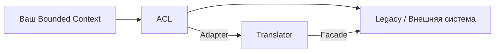

Реализация на Java:

```java
// Модель внешней системы (legacy)
public class LegacyCustomerDTO {
    private String custNo;
    private String custName;
    private int custType; // 1 = physical, 2 = legal
}

// Наша доменная модель
public class Customer {
    private CustomerId id;
    private FullName name;
    private CustomerType type;
}

// Anti-Corruption Layer
@Component
public class CustomerAntiCorruptionLayer {

    private final LegacyCustomerClient legacyClient;

    public Optional<Customer> findCustomer(CustomerId id) {
        LegacyCustomerDTO dto = legacyClient.getCustomer(id.value());
        return Optional.ofNullable(dto)
            .map(this::translateToDomain);
    }

    private Customer translateToDomain(LegacyCustomerDTO dto) {
        return new Customer(
            new CustomerId(dto.getCustNo()),
            FullName.parse(dto.getCustName()),
            CustomerType.fromLegacyCode(dto.getCustType())
        );
    }
}
```

Когда применять `ACL`:

- Интеграция с legacy-системой, модель которой нельзя менять
- Работа со сторонним API с неудобной моделью данных
- Защита `Core Domain` от влияния `Generic` или `Supporting Subdomain`

---

## Q8. Что такое Shared Kernel?

**Shared Kernel** -- паттерн, при котором два `Bounded Context` совместно владеют общей частью модели. Изменения в `Shared Kernel` требуют согласования обеих команд.

Плюсы:
- Устраняет дублирование общих концепций
- Обеспечивает согласованность общих типов

Минусы:
- Создаёт связность (coupling) между контекстами
- Любое изменение требует координации команд
- Может стать «магнитом» для лишнего кода

Пример: общая библиотека доменных примитивов:

```java
// shared-kernel module
public record Money(BigDecimal amount, Currency currency) {
    public Money {
        Objects.requireNonNull(amount);
        Objects.requireNonNull(currency);
        if (amount.scale() > currency.getDefaultFractionDigits()) {
            throw new IllegalArgumentException("Invalid scale for currency");
        }
    }

    public Money add(Money other) {
        requireSameCurrency(other);
        return new Money(amount.add(other.amount), currency);
    }

    private void requireSameCurrency(Money other) {
        if (!currency.equals(other.currency)) {
            throw new IllegalArgumentException("Cannot add different currencies");
        }
    }
}
```

> Рекомендация: `Shared Kernel` должен быть минимальным. Если он разрастается -- это сигнал о неправильно определённых границах контекстов.

---

## Q9. В чём разница между стратегическим и тактическим DDD?

| Аспект | Стратегический DDD | Тактический DDD |
|--------|-------------------|-----------------|
| **Уровень** | Архитектура системы в целом | Внутренняя структура одного контекста |
| **Фокус** | Границы контекстов, отношения между ними | Моделирование доменных объектов |
| **Паттерны** | `Bounded Context`, `Context Map`, `Subdomain` | `Entity`, `Value Object`, `Aggregate`, `Repository`, `Domain Event` |
| **Участники** | Архитекторы, доменные эксперты, тех-лиды | Разработчики |
| **Ошибки дорогие?** | Да -- неправильные границы ведут к переписыванию | Менее болезненные -- рефакторинг в рамках контекста |

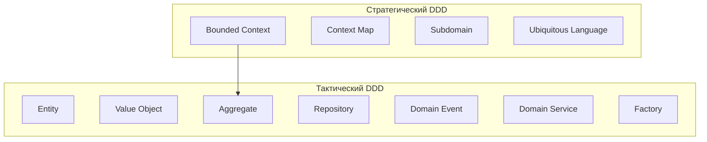

> **Важно**: частая ошибка -- начинать с тактических паттернов (классов и интерфейсов), не определив стратегические границы. Правильный порядок: сначала `Bounded Context`, потом модели внутри.

---

## Q10. Что такое Subdomain и какие типы бывают?

**Subdomain** (поддомен) -- это логическая область бизнеса, определяемая до начала проектирования. Это не технический артефакт, а часть «проблемного пространства» (problem space), в отличие от `Bounded Context`, который относится к «пространству решений» (solution space).

Три типа поддоменов:

| Тип | Описание | Пример (e-commerce) | Подход к разработке |
|-----|----------|---------------------|---------------------|
| **Core Domain** | Конкурентное преимущество бизнеса | Алгоритм рекомендаций, ценообразование | Максимум инвестиций, лучшие разработчики, `DDD` |
| **Supporting Subdomain** | Поддерживает core, но не уникально | Управление каталогом товаров | Средние инвестиции, можно аутсорсить |
| **Generic Subdomain** | Общее для всех бизнесов | Аутентификация, отправка e-mail | Готовое решение (Keycloak, SendGrid) |

Связь между `Subdomain` и `Bounded Context`:

- В идеале: один `Subdomain` = один `Bounded Context`
- На практике: один `Bounded Context` может покрывать несколько `Supporting Subdomain`
- Ошибка: один `Bounded Context` покрывает несколько `Core Domain` -- признак слишком широких границ

---

## Q11. (!) В чём разница между Entity и Value Object?

| Характеристика | `Entity` | `Value Object` |
|---------------|----------|----------------|
| **Идентичность** | Определяется уникальным ID | Определяется значением атрибутов |
| **Мутабельность** | Может изменяться (сохраняя ID) | Иммутабельный |
| **Жизненный цикл** | Создаётся, изменяется, удаляется | Создаётся и заменяется целиком |
| **Сравнение** | По ID (`equals` по ID) | По всем атрибутам |
| **Примеры** | `User`, `Order`, `Product` | `Money`, `Address`, `DateRange`, `Email` |
| **Хранение в БД** | Своя таблица с PK | Встраивается в таблицу Entity или отдельная таблица без собственного смысла |

```java
// Entity — идентичность по ID
public class Order {
    private final OrderId id;
    private OrderStatus status;
    private final List<OrderLine> lines;
    private Money totalPrice;

    @Override
    public boolean equals(Object o) {
        if (this == o) return true;
        if (!(o instanceof Order other)) return false;
        return id.equals(other.id); // сравнение только по ID
    }

    @Override
    public int hashCode() {
        return id.hashCode();
    }
}

// Value Object — идентичность по значению
public record Address(
    String city,
    String street,
    String zipCode,
    String country
) {
    public Address {
        Objects.requireNonNull(city, "City must not be null");
        Objects.requireNonNull(zipCode, "Zip code must not be null");
    }
    // equals/hashCode по всем полям — автоматически через record
}
```

> **Правило**: предпочитайте `Value Object` там, где это возможно. Они проще, безопаснее (иммутабельность) и лучше выражают бизнес-концепции. В типичной хорошо спроектированной модели `Value Object` больше, чем `Entity`.

---

## Q12. Как правильно реализовать Value Object в Java?

Требования к `Value Object`:

1. **Иммутабельность** -- все поля `final`, нет сеттеров
2. **Валидация в конструкторе** -- невалидный `Value Object` невозможно создать
3. **Сравнение по значению** -- `equals`/`hashCode` по всем атрибутам
4. **Самодокументирующийся** -- имя типа выражает бизнес-концепцию

С Java 16+ `record` -- идеальный инструмент для `Value Object`:

```java
public record Email(String value) {
    private static final Pattern EMAIL_PATTERN =
        Pattern.compile("^[A-Za-z0-9+_.-]+@[A-Za-z0-9.-]+$");

    public Email {
        Objects.requireNonNull(value, "Email must not be null");
        if (!EMAIL_PATTERN.matcher(value).matches()) {
            throw new IllegalArgumentException("Invalid email: " + value);
        }
        value = value.toLowerCase(); // нормализация
    }
}

public record Money(BigDecimal amount, Currency currency) {
    public Money {
        Objects.requireNonNull(amount);
        Objects.requireNonNull(currency);
        amount = amount.setScale(
            currency.getDefaultFractionDigits(), RoundingMode.HALF_UP
        );
    }

    public Money add(Money other) {
        if (!currency.equals(other.currency)) {
            throw new CurrencyMismatchException(currency, other.currency);
        }
        return new Money(amount.add(other.amount), currency);
    }

    public Money multiply(int quantity) {
        return new Money(amount.multiply(BigDecimal.valueOf(quantity)), currency);
    }
}

public record DateRange(LocalDate start, LocalDate end) {
    public DateRange {
        Objects.requireNonNull(start);
        Objects.requireNonNull(end);
        if (start.isAfter(end)) {
            throw new IllegalArgumentException("Start must be before end");
        }
    }

    public boolean contains(LocalDate date) {
        return !date.isBefore(start) && !date.isAfter(end);
    }

    public boolean overlaps(DateRange other) {
        return !this.end.isBefore(other.start) && !other.end.isBefore(this.start);
    }
}
```

`Value Object` как замена примитивов (`Primitive Obsession` -- антипаттерн):

```java
// Плохо: примитивы
void createUser(String email, String phone, int age) { ... }

// Хорошо: Value Objects
void createUser(Email email, PhoneNumber phone, Age age) { ... }
```

---

## Q13. Когда использовать Entity, а когда Value Object?

Вопросы-подсказки для определения:

1. **Нужно ли отслеживать объект во времени?** Да → `Entity`
2. **Важна ли уникальная идентичность?** Да → `Entity`
3. **Можно ли заменить объект целиком на другой с такими же значениями?** Да → `Value Object`
4. **Объект разделяется между несколькими `Entity`?** Обычно → `Value Object`

Примеры:

| Концепция | `Entity` или `Value Object`? | Почему? |
|-----------|------------------------------|---------|
| Деньги (100 руб.) | `Value Object` | Одна купюра 100 руб. неотличима от другой |
| Банковский счёт | `Entity` | Имеет уникальный номер и состояние |
| Адрес доставки | `Value Object` | Определяется значением, не идентичностью |
| Пользователь | `Entity` | Имеет уникальную идентичность |
| Координата GPS | `Value Object` | Определяется широтой и долготой |
| Товар в каталоге | `Entity` | Уникальный SKU, изменяемая цена |
| Элемент заказа (строка) | `Value Object` или `Entity` | Зависит от домена: если нужно отслеживать изменения строки -- `Entity` |

---

## Q14. (!) Что такое Aggregate и Aggregate Root?

**Aggregate** -- кластер доменных объектов (`Entity` и `Value Object`), которые рассматриваются как единое целое с точки зрения изменения данных. **Aggregate Root** -- входная точка, через которую происходит всё взаимодействие с агрегатом.

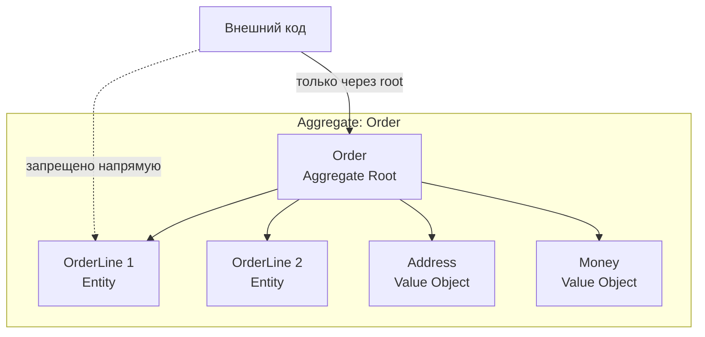

Правила агрегата:

1. **Внешний код обращается только к `Aggregate Root`** -- никогда напрямую к внутренним объектам
2. **`Aggregate Root` имеет глобальный ID** -- внутренние `Entity` имеют только локальный ID
3. **Транзакционная граница** -- один агрегат = одна транзакция
4. **Ссылки между агрегатами -- только по ID** -- не по прямой ссылке на объект
5. **Инварианты внутри агрегата** -- `Aggregate Root` гарантирует согласованность

```java
public class Order {
    private final OrderId id;
    private final CustomerId customerId; // ссылка на другой агрегат по ID
    private OrderStatus status;
    private final List<OrderLine> lines = new ArrayList<>();
    private Address shippingAddress;

    public void addLine(ProductId productId, int quantity, Money price) {
        if (status != OrderStatus.DRAFT) {
            throw new OrderAlreadySubmittedException(id);
        }
        lines.add(new OrderLine(productId, quantity, price));
    }

    public void submit() {
        if (lines.isEmpty()) {
            throw new EmptyOrderException(id);
        }
        this.status = OrderStatus.SUBMITTED;
        registerEvent(new OrderSubmittedEvent(id, customerId, calculateTotal()));
    }

    public Money calculateTotal() {
        return lines.stream()
            .map(OrderLine::subtotal)
            .reduce(Money.ZERO, Money::add);
    }
}
```

---

## Q15. Какие правила проектирования агрегатов?

Четыре правила от Вона Вернона (Vaughn Vernon, "Implementing Domain-Driven Design"):

### 1. Защищайте бизнес-инварианты внутри агрегата

Агрегат должен быть достаточно большим, чтобы гарантировать все свои бизнес-правила, но не больше.

### 2. Делайте агрегаты маленькими

Большие агрегаты:
- Создают конкуренцию за блокировки (`OptimisticLockException`)
- Загружают лишние данные из БД
- Усложняют понимание кода

### 3. Ссылайтесь на другие агрегаты только по ID

```java
// Плохо: прямая ссылка на другой агрегат
public class Order {
    private Customer customer; // загружает весь Customer
}

// Хорошо: ссылка по ID
public class Order {
    private CustomerId customerId; // лёгкая ссылка
}
```

### 4. Используйте Eventual Consistency между агрегатами

Если бизнес-правило охватывает несколько агрегатов, применяйте доменные события и eventual consistency вместо одной транзакции. Подробнее в [[consistency-patterns-interview|паттернах согласованности]].

---

## Q16. Как определить границы агрегата?

Алгоритм определения границ:

1. **Определите инварианты**: какие данные должны быть всегда согласованы?
2. **Найдите `Aggregate Root`**: кто «владеет» этими данными и отвечает за их целостность?
3. **Проверьте конкурентность**: если два пользователя часто изменяют разные части, это разные агрегаты
4. **Примените правило «маленького агрегата»**: если можно вынести -- выносите

Пример: интернет-магазин

```
❌ Один большой агрегат:
   Order → Customer → PaymentMethod → ShippingAddress → OrderLines → Product

✅ Несколько маленьких агрегатов:
   Order (root) → OrderLines
   Customer (root) → PaymentMethods
   Product (root) → ProductVariants
   Shipment (root) → ShipmentItems
```

Сигналы, что агрегат слишком большой:
- Частые `OptimisticLockException` при параллельных изменениях
- Медленные запросы из-за загрузки лишних данных
- Изменение одной части ломает тесты другой части

---

## Q17. Как реализовать Aggregate Root в Java/Spring?

Полный пример агрегата с использованием `Spring Data` и `AbstractAggregateRoot`:

```java
// Aggregate Root
public class BankAccount extends AbstractAggregateRoot<BankAccount> {

    @Id
    private final AccountId id;
    private final CustomerId ownerId;
    private Money balance;
    private AccountStatus status;
    private final List<Transaction> transactions = new ArrayList<>();

    public BankAccount(AccountId id, CustomerId ownerId, Money initialDeposit) {
        this.id = id;
        this.ownerId = ownerId;
        this.balance = initialDeposit;
        this.status = AccountStatus.ACTIVE;
        registerEvent(new AccountOpenedEvent(id, ownerId, initialDeposit));
    }

    public void deposit(Money amount) {
        requireActive();
        this.balance = balance.add(amount);
        transactions.add(Transaction.deposit(amount));
        registerEvent(new MoneyDepositedEvent(id, amount, balance));
    }

    public void withdraw(Money amount) {
        requireActive();
        if (balance.isLessThan(amount)) {
            throw new InsufficientFundsException(id, balance, amount);
        }
        this.balance = balance.subtract(amount);
        transactions.add(Transaction.withdrawal(amount));
        registerEvent(new MoneyWithdrawnEvent(id, amount, balance));
    }

    public void close() {
        if (!balance.isZero()) {
            throw new NonZeroBalanceException(id, balance);
        }
        this.status = AccountStatus.CLOSED;
        registerEvent(new AccountClosedEvent(id));
    }

    private void requireActive() {
        if (status != AccountStatus.ACTIVE) {
            throw new AccountNotActiveException(id);
        }
    }
}
```

Репозиторий для агрегата:

```java
public interface BankAccountRepository
        extends CrudRepository<BankAccount, AccountId> {

    Optional<BankAccount> findByOwnerId(CustomerId ownerId);
}
```

> Обратите внимание: `AbstractAggregateRoot` из `Spring Data` позволяет регистрировать доменные события через `registerEvent()`. Они будут автоматически опубликованы при сохранении агрегата через репозиторий.

---

## Q18. Что такое Domain Event?

**Domain Event** -- объект, представляющий факт, который произошёл в домене. События именуются в прошедшем времени (`OrderPlaced`, `PaymentReceived`, `AccountClosed`).

Характеристики доменного события:

1. **Иммутабельное** -- факт нельзя изменить задним числом
2. **Именуется в прошедшем времени** -- описывает свершившийся факт
3. **Содержит контекст** -- достаточно данных для обработки без обращения к источнику
4. **Не содержит логики** -- это данные, а не поведение

```java
public record OrderPlacedEvent(
    OrderId orderId,
    CustomerId customerId,
    Money totalAmount,
    List<OrderLineSnapshot> lines,
    Instant occurredAt
) {
    public OrderPlacedEvent {
        Objects.requireNonNull(orderId);
        Objects.requireNonNull(customerId);
        Objects.requireNonNull(totalAmount);
        if (occurredAt == null) {
            occurredAt = Instant.now();
        }
    }
}
```

Зачем нужны доменные события:

- **Декаплинг**: заказ не знает про доставку, но публикует `OrderPlacedEvent`
- **Аудит**: последовательность событий -- полная история изменений
- **Реактивность**: другие контексты реагируют на события асинхронно
- **Eventual Consistency**: синхронизация между агрегатами и контекстами

---

## Q19. Как реализовать доменные события в Spring?

Два подхода к реализации в `Spring`:

### Подход 1: `AbstractAggregateRoot` + `Spring Data`

```java
public class Order extends AbstractAggregateRoot<Order> {
    public void place() {
        this.status = OrderStatus.PLACED;
        registerEvent(new OrderPlacedEvent(this.id, this.customerId));
    }
}

// Обработчик (в том же Bounded Context)
@Component
public class OrderPlacedHandler {
    @TransactionalEventListener
    public void handle(OrderPlacedEvent event) {
        // отправить уведомление, обновить статистику и т.д.
    }
}
```

### Подход 2: `ApplicationEventPublisher` (ручной контроль)

```java
@Service
@RequiredArgsConstructor
public class OrderService {
    private final OrderRepository repository;
    private final ApplicationEventPublisher publisher;

    @Transactional
    public void placeOrder(PlaceOrderCommand cmd) {
        Order order = Order.create(cmd);
        repository.save(order);
        publisher.publishEvent(new OrderPlacedEvent(order.getId()));
    }
}
```

### Подход 3: `Spring Modulith` (рекомендуемый для модульных монолитов)

```java
@ApplicationModuleListener
public void on(OrderPlacedEvent event) {
    // Spring Modulith обеспечивает at-least-once delivery
    // через Transactional Outbox
}
```

Подробнее о событийных паттернах в [[event-driven-patterns-interview|Event-Driven паттернах]].

---

## Q20. В чём разница между Domain Event и Integration Event?

| Характеристика | `Domain Event` | `Integration Event` |
|---------------|----------------|---------------------|
| **Область видимости** | Внутри `Bounded Context` | Между `Bounded Context` |
| **Транспорт** | In-memory (`ApplicationEventPublisher`) | Брокер сообщений (`Kafka`, `RabbitMQ`) |
| **Формат** | Доменные объекты | Сериализуемый DTO (JSON, Avro, Protobuf) |
| **Надёжность** | Гарантируется транзакцией | Требует `Outbox Pattern` для гарантий |
| **Связность** | Знает о доменной модели | Не зависит от внутренней модели |

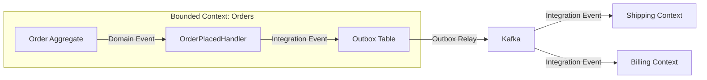

Паттерн `Transactional Outbox`: доменное событие сохраняется в таблицу `outbox` в той же транзакции, что и изменение агрегата. Отдельный процесс вычитывает `outbox` и отправляет в брокер.

---

## Q21. (!) Что такое Repository в DDD?

**Repository** -- паттерн, предоставляющий абстракцию коллекции для доступа к агрегатам. Репозиторий скрывает детали персистенции и предоставляет интерфейс, выглядящий как коллекция в памяти.

Правила репозиториев в `DDD`:

1. **Один репозиторий на агрегат** -- не на каждую `Entity` или таблицу
2. **Интерфейс в доменном слое** -- реализация в инфраструктурном
3. **Оперирует только `Aggregate Root`** -- внутренние `Entity` доступны только через корень
4. **Имитирует коллекцию** -- `add`, `find`, `remove`, а не `insert`, `select`, `delete`

```java
// Доменный слой: интерфейс
public interface OrderRepository {
    Optional<Order> findById(OrderId id);
    List<Order> findByCustomerId(CustomerId customerId);
    void save(Order order);
    void delete(Order order);
    OrderId nextId();
}

// Инфраструктурный слой: реализация через Spring Data
@Repository
public class JpaOrderRepository implements OrderRepository {
    private final SpringDataOrderRepository springRepo;

    @Override
    public Optional<Order> findById(OrderId id) {
        return springRepo.findById(id.value())
            .map(OrderMapper::toDomain);
    }

    @Override
    public void save(Order order) {
        springRepo.save(OrderMapper.toEntity(order));
    }

    @Override
    public OrderId nextId() {
        return new OrderId(UUID.randomUUID());
    }
}
```

> `Repository` ≠ `DAO`. `DAO` -- это доступ к данным (data-centric), а `Repository` -- это коллекция объектов домена (domain-centric). `Repository` работает с агрегатами, `DAO` -- с таблицами.

---

## Q22. (!) В чём разница между Domain Service и Application Service?

| Аспект | `Domain Service` | `Application Service` |
|--------|------------------|----------------------|
| **Слой** | Доменный слой | Слой приложения |
| **Зависимости** | Только доменные объекты | Репозитории, инфра, доменные сервисы |
| **Состояние** | Stateless | Stateless |
| **Бизнес-логика** | Содержит доменную логику, не принадлежащую одному агрегату | Оркестрирует, не содержит бизнес-логику |
| **Транзакции** | Не управляет транзакциями | Управляет транзакциями (`@Transactional`) |
| **Входные/выходные типы** | Доменные объекты | DTO, команды |

```java
// Domain Service — бизнес-правило, требующее два агрегата
public class TransferService {
    public void transfer(BankAccount from, BankAccount to, Money amount) {
        if (!from.canWithdraw(amount)) {
            throw new InsufficientFundsException(from.getId());
        }
        from.withdraw(amount);
        to.deposit(amount);
    }
}

// Application Service — оркестрация
@Service
@RequiredArgsConstructor
public class TransferApplicationService {
    private final BankAccountRepository accountRepo;
    private final TransferService transferService; // Domain Service
    private final NotificationService notificationService;

    @Transactional
    public void executeTransfer(TransferCommand cmd) {
        var from = accountRepo.findById(cmd.fromAccountId())
            .orElseThrow();
        var to = accountRepo.findById(cmd.toAccountId())
            .orElseThrow();

        transferService.transfer(from, to, cmd.amount());

        accountRepo.save(from);
        accountRepo.save(to);
        notificationService.notifyTransfer(cmd);
    }
}
```

Когда нужен `Domain Service`:

- Бизнес-правило требует взаимодействия нескольких агрегатов
- Логика не принадлежит ни одному конкретному агрегату
- Операция связана с доменной концепцией (например, «перевод денег»)

---

## Q23. Что такое Factory в DDD?

**Factory** -- паттерн, инкапсулирующий сложную логику создания доменных объектов. Используется, когда конструктор недостаточен для выражения правил создания.

```java
// Factory Method на самом агрегате
public class Order {
    public static Order create(CustomerId customerId, Address shippingAddress) {
        var order = new Order(OrderId.generate(), customerId);
        order.shippingAddress = shippingAddress;
        order.status = OrderStatus.DRAFT;
        order.createdAt = Instant.now();
        order.registerEvent(new OrderCreatedEvent(order.id));
        return order;
    }
}

// Отдельная Factory для сложных случаев
@Component
@RequiredArgsConstructor
public class LoanApplicationFactory {
    private final CreditScoreService creditScoreService;
    private final RiskAssessmentPolicy riskPolicy;

    public LoanApplication create(Applicant applicant, LoanTerms terms) {
        CreditScore score = creditScoreService.calculate(applicant);
        RiskLevel risk = riskPolicy.assess(applicant, terms, score);

        return new LoanApplication(
            LoanApplicationId.generate(),
            applicant,
            terms,
            score,
            risk
        );
    }
}
```

Когда использовать `Factory`:
- Создание объекта требует сложной валидации или вычислений
- Нужно выбрать конкретный тип (полиморфизм) на основе входных данных
- Создание требует обращения к внешним сервисам

---

## Q24. (!) Что такое CQRS?

**CQRS** (`Command Query Responsibility Segregation`) -- паттерн, разделяющий модель на две части: **модель команд** (запись) и **модель запросов** (чтение).

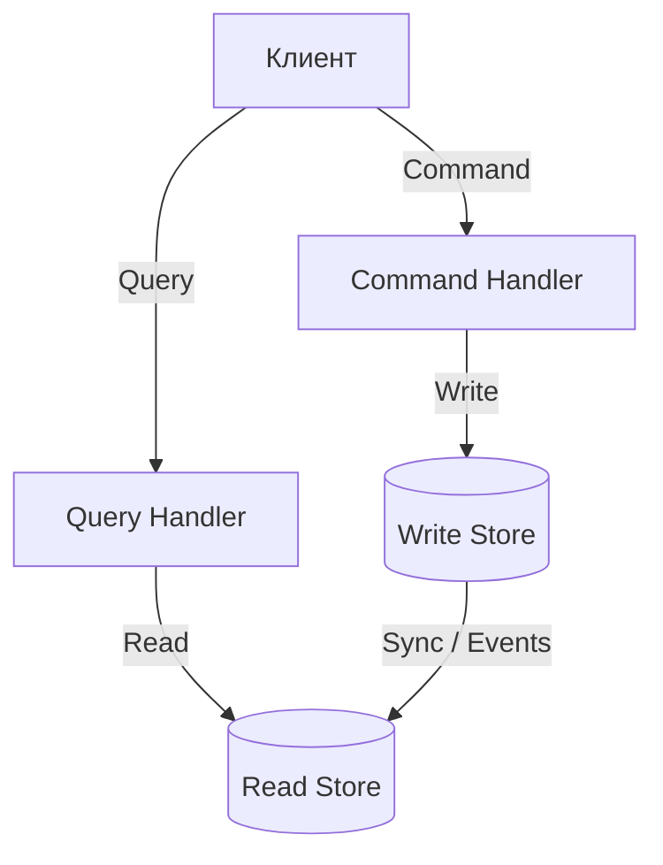

Три уровня `CQRS`:

1. **Разделение на уровне кода**: разные сервисы/интерфейсы для чтения и записи
2. **Разделение на уровне модели**: разные модели для чтения и записи
3. **Разделение на уровне хранения**: разные БД (пишем в PostgreSQL, читаем из Elasticsearch)

```java
// Command — изменение состояния
public record PlaceOrderCommand(
    CustomerId customerId,
    List<OrderLineDTO> lines,
    Address shippingAddress
) {}

@Service
public class OrderCommandService {
    @Transactional
    public OrderId handle(PlaceOrderCommand cmd) {
        Order order = Order.create(cmd.customerId(), cmd.shippingAddress());
        cmd.lines().forEach(l -> order.addLine(l.productId(), l.quantity(), l.price()));
        order.submit();
        orderRepository.save(order);
        return order.getId();
    }
}

// Query — чтение без побочных эффектов
public record OrderSummaryQuery(CustomerId customerId) {}

@Service
public class OrderQueryService {
    @Transactional(readOnly = true)
    public List<OrderSummaryDTO> handle(OrderSummaryQuery query) {
        return orderReadRepository.findSummariesByCustomer(query.customerId());
    }
}
```

Подробнее о `CQRS` в контексте [[microservices-interview|микросервисов]].

---

## Q25. (!) Что такое Event Sourcing?

**Event Sourcing** -- паттерн, при котором состояние агрегата хранится не как текущий снимок, а как последовательность доменных событий. Текущее состояние восстанавливается путём «проигрывания» всех событий.

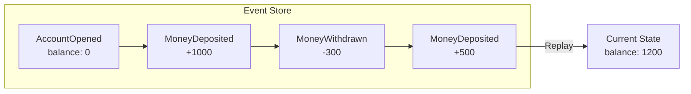

```java
// Восстановление состояния из событий
public class BankAccount {
    private AccountId id;
    private Money balance;

    public static BankAccount reconstitute(List<DomainEvent> events) {
        var account = new BankAccount();
        events.forEach(account::apply);
        return account;
    }

    private void apply(DomainEvent event) {
        switch (event) {
            case AccountOpenedEvent e -> {
                this.id = e.accountId();
                this.balance = Money.ZERO;
            }
            case MoneyDepositedEvent e -> {
                this.balance = balance.add(e.amount());
            }
            case MoneyWithdrawnEvent e -> {
                this.balance = balance.subtract(e.amount());
            }
            default -> throw new UnknownEventException(event);
        }
    }
}
```

Преимущества и недостатки:

| Преимущества | Недостатки |
|-------------|-----------|
| Полная история изменений | Сложность реализации |
| Аудит «из коробки» | Eventual consistency для read-моделей |
| Отладка: можно воспроизвести любое состояние | Версионирование событий при эволюции |
| Легко строить проекции для `CQRS` | Снапшоты нужны для длинных потоков |

---

## Q26. Как связаны CQRS и Event Sourcing?

`CQRS` и `Event Sourcing` часто используются вместе, но это **независимые паттерны**:

- **`CQRS` без `Event Sourcing`**: команды пишут в реляционную БД, запросы читают из оптимизированного read-store
- **`Event Sourcing` без `CQRS`**: события хранят историю, но чтение и запись используют одну модель
- **`CQRS` + `Event Sourcing`**: команды генерируют события → события сохраняются в Event Store → проекции строят read-модель

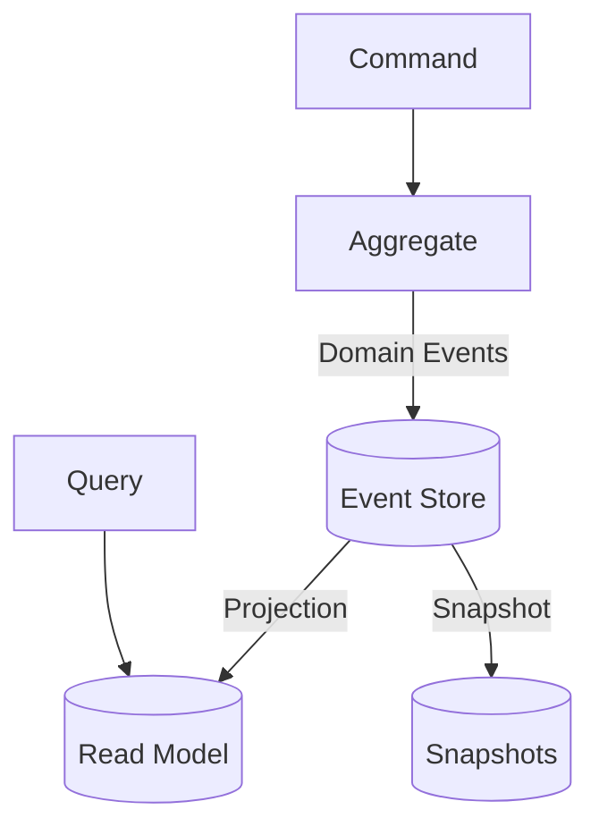

Фреймворки для реализации в Java:

| Фреймворк | Описание |
|-----------|----------|
| `Axon Framework` | Полноценная реализация CQRS + ES |
| `Spring Modulith` | Модульный подход с событиями |
| `EventStoreDB` | Специализированная БД для событий |
| `Eventuate` | CQRS/ES для микросервисов |

---

## Q27. (!) Что такое Saga Pattern в контексте DDD?

**Saga** -- паттерн управления распределёнными транзакциями, охватывающими несколько `Bounded Context` или агрегатов. Saga разбивает длинную транзакцию на цепочку локальных транзакций с компенсирующими действиями.

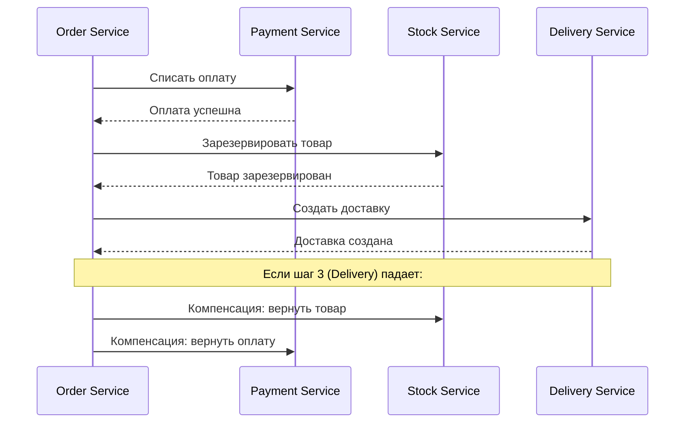

Каждый шаг Saga:
1. Выполняет локальную транзакцию
2. Публикует доменное событие
3. Имеет компенсирующую транзакцию на случай отката

Когда использовать `Saga` вместо распределённой транзакции (`2PC`):

| Критерий | `2PC` | `Saga` |
|----------|-------|--------|
| Связность | Высокая (все участники блокированы) | Низкая (асинхронно) |
| Доступность | Снижается (один участник упал -- все ждут) | Сохраняется |
| Производительность | Медленно (блокировки) | Быстро (eventual consistency) |
| Сложность | Простая модель, сложная инфра | Сложная модель, простая инфра |

Подробнее о компенсирующих транзакциях в [[microservices-interview|вопросах по микросервисам]].

---

## Q28. В чём разница между хореографией и оркестрацией в Saga?

| Аспект | Хореография | Оркестрация |
|--------|------------|-------------|
| **Управление** | Децентрализованное (каждый сервис реагирует на события) | Центральный оркестратор |
| **Связность** | Низкая | Средняя (оркестратор знает обо всех шагах) |
| **Наблюдаемость** | Сложно отследить поток | Легко видеть весь процесс |
| **Циклические зависимости** | Возможны | Исключены |
| **Сложность** | Растёт экспоненциально с числом участников | Линейный рост |
| **Когда использовать** | 2-3 шага, простые потоки | 4+ шагов, сложные потоки |

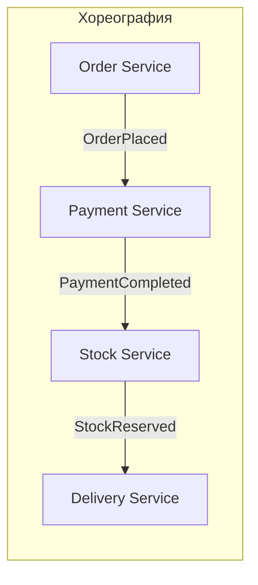

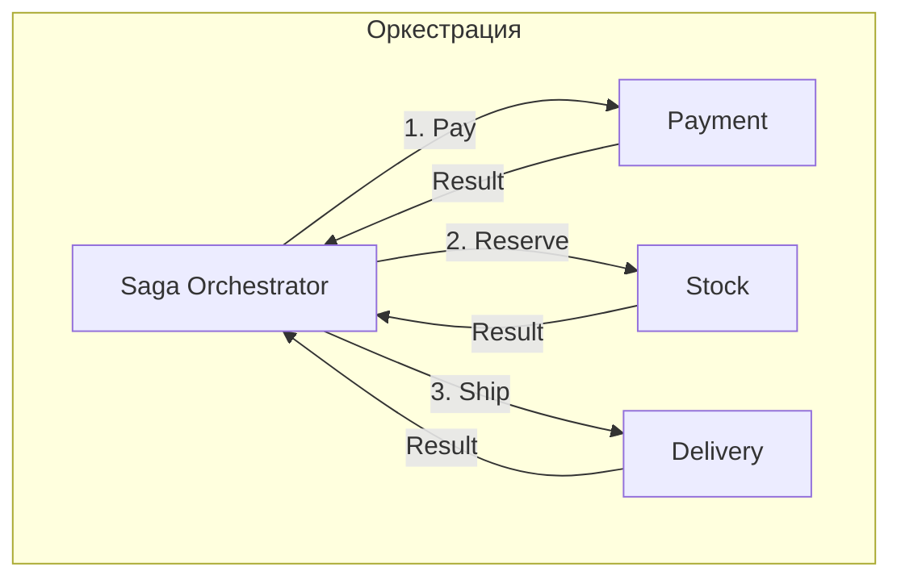

---

## Q29. Что такое Specification Pattern?

**Specification** -- паттерн, инкапсулирующий бизнес-правило в отдельный объект. Спецификации можно комбинировать через булевы операции (`AND`, `OR`, `NOT`).

Три сценария использования:
1. **Валидация** -- проверка, удовлетворяет ли объект правилу
2. **Выборка** -- фильтрация коллекций / формирование запросов к БД
3. **Создание** -- конструирование объектов, соответствующих правилу

```java
// Базовый интерфейс спецификации
public interface Specification<T> {
    boolean isSatisfiedBy(T candidate);

    default Specification<T> and(Specification<T> other) {
        return candidate -> this.isSatisfiedBy(candidate) && other.isSatisfiedBy(candidate);
    }

    default Specification<T> or(Specification<T> other) {
        return candidate -> this.isSatisfiedBy(candidate) || other.isSatisfiedBy(candidate);
    }

    default Specification<T> not() {
        return candidate -> !this.isSatisfiedBy(candidate);
    }
}

// Конкретные спецификации
public class EligibleForPremiumSpec implements Specification<Customer> {
    public boolean isSatisfiedBy(Customer customer) {
        return customer.totalOrders() > 10
            && customer.totalSpent().isGreaterThan(Money.of(50_000));
    }
}

public class ActiveCustomerSpec implements Specification<Customer> {
    public boolean isSatisfiedBy(Customer customer) {
        return customer.lastOrderDate().isAfter(LocalDate.now().minusMonths(6));
    }
}

// Композиция
Specification<Customer> premiumAndActive =
    new EligibleForPremiumSpec().and(new ActiveCustomerSpec());

List<Customer> vipCustomers = customers.stream()
    .filter(premiumAndActive::isSatisfiedBy)
    .toList();
```

Для интеграции с JPA / Spring Data можно реализовать спецификации через `Criteria API` или `Spring Data Specification<T>`.

---

## Q30. Как организовать пакетную структуру проекта по DDD?

Два основных подхода: **по слоям** и **по фичам/контекстам** (рекомендуется второй):

### По Bounded Context (рекомендуемый)

```
com.example.shop
├── order/                          # Bounded Context: Заказы
│   ├── domain/
│   │   ├── model/                  # Entity, Value Object, Aggregate Root
│   │   │   ├── Order.java
│   │   │   ├── OrderLine.java
│   │   │   └── OrderStatus.java
│   │   ├── event/                  # Domain Events
│   │   │   └── OrderPlacedEvent.java
│   │   ├── service/                # Domain Services
│   │   │   └── OrderPricingService.java
│   │   ├── repository/             # Repository interfaces
│   │   │   └── OrderRepository.java
│   │   └── specification/          # Specifications
│   │       └── OverdueOrderSpec.java
│   ├── application/                # Application Services, Use Cases
│   │   ├── PlaceOrderUseCase.java
│   │   └── dto/
│   │       └── PlaceOrderCommand.java
│   └── infrastructure/             # Implementations
│       ├── persistence/
│       │   └── JpaOrderRepository.java
│       └── messaging/
│           └── KafkaOrderEventPublisher.java
├── catalog/                        # Bounded Context: Каталог
│   ├── domain/
│   ├── application/
│   └── infrastructure/
└── shipping/                       # Bounded Context: Доставка
    ├── domain/
    ├── application/
    └── infrastructure/
```

Ключевые правила:

- **`domain/` не зависит от `infrastructure/`** -- инверсия зависимостей
- Между контекстами -- только через `Integration Events` или `ACL`
- `application/` зависит от `domain/`, но не наоборот

---

## Q31. Как DDD сочетается с гексагональной архитектурой?

**Гексагональная архитектура** (Ports and Adapters) отлично дополняет `DDD`, обеспечивая изоляцию домена от инфраструктуры.

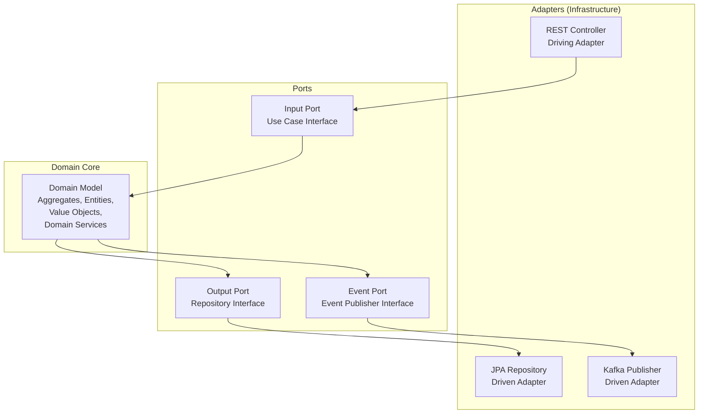

```java
// Port (Input) — интерфейс use case
public interface PlaceOrderUseCase {
    OrderId execute(PlaceOrderCommand command);
}

// Port (Output) — интерфейс репозитория (в доменном слое)
public interface OrderRepository {
    void save(Order order);
    Optional<Order> findById(OrderId id);
}

// Domain — чистая бизнес-логика
public class Order { /* ... */ }

// Adapter (Input) — REST контроллер
@RestController
@RequiredArgsConstructor
public class OrderController {
    private final PlaceOrderUseCase placeOrder;

    @PostMapping("/orders")
    public ResponseEntity<OrderId> create(@RequestBody PlaceOrderRequest req) {
        return ResponseEntity.ok(placeOrder.execute(req.toCommand()));
    }
}

// Adapter (Output) — JPA реализация
@Repository
public class JpaOrderRepository implements OrderRepository { /* ... */ }
```

Подробнее в [[clean-architecture-interview|вопросах по Clean Architecture]].

---

## Q32. Как использовать Spring Modulith для реализации DDD?

`Spring Modulith` -- модуль `Spring`, который поддерживает модульные монолиты и помогает реализовать `DDD` без микросервисов.

Возможности:

1. **Модульная структура** -- каждый `Bounded Context` = один модуль Spring Modulith
2. **Event-driven коммуникация** -- `@ApplicationModuleListener` с гарантией доставки
3. **Верификация границ** -- тест проверяет, что модули не нарушают зависимости
4. **Transactional Outbox** -- встроенная поддержка `Outbox Pattern`

```java
// Структура проекта
// com.example.shop.order    → модуль "order"
// com.example.shop.catalog  → модуль "catalog"
// com.example.shop.shipping → модуль "shipping"

// Публикация события из модуля Order
@Service
@RequiredArgsConstructor
public class OrderService {
    private final ApplicationEventPublisher events;

    @Transactional
    public void placeOrder(PlaceOrderCommand cmd) {
        Order order = Order.create(cmd);
        orderRepo.save(order);
        events.publishEvent(new OrderPlacedEvent(order.getId()));
    }
}

// Обработка в модуле Shipping (другой Bounded Context)
@ApplicationModuleListener
public void on(OrderPlacedEvent event) {
    shippingService.scheduleShipment(event.orderId());
}

// Тест верификации модульной структуры
@Test
void verifyModularStructure() {
    ApplicationModules.of(ShopApplication.class).verify();
}
```

---

## Q33. Какие анти-паттерны встречаются при реализации DDD?

| Анти-паттерн | Описание | Как исправить |
|-------------|----------|---------------|
| **Anemic Domain Model** | Модель без поведения: сущности -- «мешки с данными», логика в сервисах | Перенести бизнес-логику в агрегаты и Entity |
| **God Aggregate** | Один огромный агрегат с десятками Entity | Разделить на несколько маленьких агрегатов |
| **CRUD-мышление** | Операции `create/read/update/delete` вместо доменных команд | Именовать методы на языке домена: `place()`, `cancel()`, `approve()` |
| **Repository per Entity** | Отдельный репозиторий для каждой таблицы | Один репозиторий на `Aggregate Root` |
| **Leaking Domain** | Доменные объекты возвращаются через API (Entity как DTO) | Использовать DTO / маппинг на границе контекста |
| **Shared Database** | Несколько контекстов работают с одной БД без границ | Каждый контекст -- своя схема или БД |
| **DDD Everywhere** | Применение DDD к простым CRUD-модулям | Применять DDD только к `Core Domain` |
| **Tactical без Strategic** | Паттерны без понимания границ контекстов | Начинать со стратегического дизайна |

Пример анемичной модели vs Rich Domain Model:

```java
// ❌ Anemic Domain Model
public class Order {
    private Long id;
    private String status;
    private List<OrderLine> lines;
    // только геттеры и сеттеры
}

@Service
public class OrderService {
    public void cancelOrder(Long orderId) {
        Order order = repo.findById(orderId);
        if (!"PLACED".equals(order.getStatus())) {
            throw new IllegalStateException("Cannot cancel");
        }
        order.setStatus("CANCELLED");
        for (OrderLine line : order.getLines()) {
            stockService.release(line.getProductId(), line.getQuantity());
        }
        repo.save(order);
    }
}

// ✅ Rich Domain Model
public class Order {
    private OrderId id;
    private OrderStatus status;
    private List<OrderLine> lines;

    public void cancel() {
        if (status != OrderStatus.PLACED) {
            throw new OrderCannotBeCancelledException(id, status);
        }
        this.status = OrderStatus.CANCELLED;
        registerEvent(new OrderCancelledEvent(id, lines));
    }
}
```

---

## Q34. (!) Как связаны DDD и микросервисы?

`DDD` и микросервисы -- взаимодополняющие подходы:

- **`Bounded Context` = граница микросервиса** -- стратегический DDD даёт критерий декомпозиции
- **`Context Map` = карта взаимодействий** -- показывает, как сервисы интегрируются
- **`ACL` = адаптер между сервисами** -- защищает модель от чужих контрактов
- **`Domain Events` = асинхронная коммуникация** -- события между сервисами через брокер

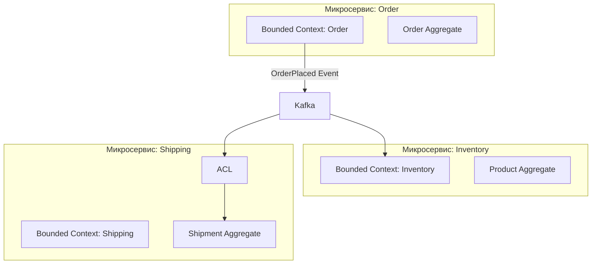

Порядок проектирования:

1. **Event Storming** -- определить домен, события, команды
2. **Выделить Bounded Context** -- сгруппировать связанные концепции
3. **Определить Context Map** -- паттерны интеграции между контекстами
4. **Решить: монолит или микросервисы** -- `DDD` работает в обоих случаях
5. **Реализовать тактические паттерны** внутри каждого контекста

> Важно: `DDD` не требует микросервисов. Модульный монолит с чёткими `Bounded Context` (через `Spring Modulith`) может быть лучшим стартом, который позже легко разделить на микросервисы.

---

## Q35. Как тестировать доменную модель?

Доменная модель -- самая важная часть для тестирования, и одновременно самая простая, потому что не зависит от инфраструктуры.

Уровни тестирования в `DDD`:

| Уровень | Что тестируем | Инструменты |
|---------|--------------|-------------|
| **Unit** (домен) | Агрегаты, Value Objects, Domain Services | JUnit, AssertJ |
| **Integration** | Application Services, Repositories | Spring Test, Testcontainers |
| **Contract** | Формат Integration Events | Spring Cloud Contract, Pact |

```java
// Тест Value Object
@Test
void moneyAddition_sameCurrency_returnsSum() {
    Money a = new Money(BigDecimal.valueOf(100), Currency.getInstance("RUB"));
    Money b = new Money(BigDecimal.valueOf(250), Currency.getInstance("RUB"));

    Money result = a.add(b);

    assertThat(result.amount()).isEqualByComparingTo("350");
    assertThat(result.currency()).isEqualTo(Currency.getInstance("RUB"));
}

@Test
void moneyAddition_differentCurrency_throwsException() {
    Money rub = new Money(BigDecimal.valueOf(100), Currency.getInstance("RUB"));
    Money usd = new Money(BigDecimal.valueOf(50), Currency.getInstance("USD"));

    assertThatThrownBy(() -> rub.add(usd))
        .isInstanceOf(CurrencyMismatchException.class);
}

// Тест Aggregate
@Test
void orderSubmit_withLines_changesStatusAndPublishesEvent() {
    Order order = Order.create(customerId, address);
    order.addLine(productId, 2, price);

    order.submit();

    assertThat(order.getStatus()).isEqualTo(OrderStatus.SUBMITTED);
    assertThat(order.domainEvents())
        .hasSize(1)
        .first()
        .isInstanceOf(OrderSubmittedEvent.class);
}

@Test
void orderSubmit_emptyOrder_throwsException() {
    Order order = Order.create(customerId, address);

    assertThatThrownBy(order::submit)
        .isInstanceOf(EmptyOrderException.class);
}

// Тест Domain Service
@Test
void transfer_sufficientFunds_movesMoneyBetweenAccounts() {
    BankAccount from = new BankAccount(id1, ownerId, Money.of(1000));
    BankAccount to = new BankAccount(id2, ownerId, Money.of(500));

    new TransferService().transfer(from, to, Money.of(300));

    assertThat(from.getBalance()).isEqualTo(Money.of(700));
    assertThat(to.getBalance()).isEqualTo(Money.of(800));
}
```

Преимущество `DDD` для тестирования: доменные тесты не требуют Spring-контекста, базы данных или моков инфраструктуры. Они быстрые и стабильные.

## Q36. (!) Как реализовать Anti-Corruption Layer (ACL) в Spring?

**Anti-Corruption Layer (ACL)** — слой-переводчик между двумя `Bounded Context`-ами с разными моделями. Защищает собственный контекст от "загрязнения" чужими концепциями и языком.

**Сценарий:** Order Context интегрируется с внешней ERP-системой (SAP), у которой своя модель данных.

```java
// Внешняя модель ERP (чужой язык/концепции)
public record ErpProductDto(
    String artNumber,
    BigDecimal listPrice,
    String availStatus    // "IN_STOCK", "OUT_OF_STOCK", "RESERVED"
) {}

// --- ACL: Translator ---
@Component
public class ProductCatalogACL {

    private final ErpProductClient erpClient;

    public Optional<Product> findProduct(ProductId productId) {
        try {
            ErpProductDto erp = erpClient.getProduct(productId.value());
            return Optional.of(translate(erp));
        } catch (ErpProductNotFoundException e) {
            return Optional.empty();
        } catch (ErpServiceException e) {
            throw new ProductCatalogUnavailableException("ERP unavailable", e);
        }
    }

    private Product translate(ErpProductDto erp) {
        return new Product(
            ProductId.of(erp.artNumber()),
            Money.of(erp.listPrice(), Currency.RUB),
            switch (erp.availStatus()) {
                case "IN_STOCK"  -> ProductAvailability.AVAILABLE;
                case "RESERVED"  -> ProductAvailability.LIMITED;
                default          -> ProductAvailability.UNAVAILABLE;
            }
        );
    }
}
```

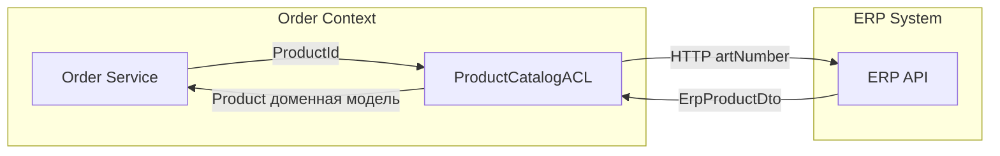

**ACL + Circuit Breaker (Resilience4j):**

```java
@CircuitBreaker(name = "erp", fallbackMethod = "fallback")
public Optional<Product> findProduct(ProductId id) { ... }

private Optional<Product> fallback(ProductId id, Exception e) {
    return localProductCache.find(id);  // stale-данные из локального кэша
}
```

**Когда нужен ACL:**
- Интеграция с legacy (SAP, 1C, SOAP)
- Чужой upstream с "плохой" моделью, навязывающей свои концепции
- Высокая изменчивость внешнего API

## Q37. Какие стратегии Context Mapping применяются на практике?

**Context Mapping** — описание отношений и паттернов интеграции между `Bounded Context`-ами.

| Паттерн | Отношение | Описание |
|---------|-----------|----------|
| **Partnership** | Равноправные | Совместная разработка API; одна команда или тесная коллаборация |
| **Shared Kernel** | Общий код | Разделяемая часть модели; риск тесной связи |
| **Customer/Supplier** | Downstream/Upstream | Upstream диктует API; Downstream формулирует требования |
| **Conformist** | Подчинение | Downstream копирует модель Upstream без власти над ней |
| **Anti-Corruption Layer** | Защита | Переводчик; применяется при интеграции с legacy |
| **Open Host Service** | Открытый протокол | Upstream публикует стабильный API/протокол |
| **Published Language** | Стандартный формат | Общий формат обмена (JSON Schema, AsyncAPI) |
| **Separate Ways** | Нет интеграции | Контексты изолированы; максимальная автономность |

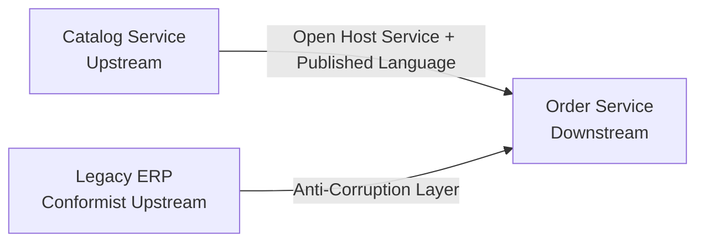

**Прагматичные рекомендации:**
- Зафиксируйте карту контекстов (`Context Map`) до начала разработки
- Всегда используйте ACL при интеграции с внешними системами
- Минимизируйте `Shared Kernel` — он создаёт скрытые зависимости между командами
- Задокументируйте паттерн в ADR (Architecture Decision Record)

## Q38. (!) Как правильно проектировать Value Objects в Java?

**Value Object (VO)** — объект, определяемый своими атрибутами, без идентификатора. Является **неизменяемым** и может свободно копироваться.

**Признаки правильного Value Object:**
1. **Неизменяемость**: все поля `final`, нет сеттеров
2. **Структурное равенство**: `equals/hashCode` по значениям
3. **Самовалидация**: валидация в конструкторе, нет "невалидного" VO
4. **Выразительный API**: методы отражают доменный язык

```java
// Java record — идеальная основа для Value Object
public record Money(BigDecimal amount, Currency currency) {

    // Compact constructor = валидация
    public Money {
        Objects.requireNonNull(amount, "Amount cannot be null");
        Objects.requireNonNull(currency, "Currency cannot be null");
        if (amount.compareTo(BigDecimal.ZERO) < 0)
            throw new IllegalArgumentException("Amount cannot be negative");
        amount = amount.setScale(2, RoundingMode.HALF_UP);
    }

    public static Money of(BigDecimal amount, Currency currency) {
        return new Money(amount, currency);
    }

    public static Money zero(Currency currency) {
        return new Money(BigDecimal.ZERO, currency);
    }

    // Доменные методы возвращают новый VO (неизменяемость)
    public Money add(Money other) {
        if (!this.currency.equals(other.currency))
            throw new CurrencyMismatchException(this.currency, other.currency);
        return new Money(this.amount.add(other.amount), this.currency);
    }

    public Money multiply(int factor) {
        return new Money(this.amount.multiply(BigDecimal.valueOf(factor)), this.currency);
    }

    public boolean isGreaterThan(Money other) {
        if (!this.currency.equals(other.currency))
            throw new CurrencyMismatchException(this.currency, other.currency);
        return this.amount.compareTo(other.amount) > 0;
    }
    // equals/hashCode генерируются автоматически для record
}

// Типизированный идентификатор — тоже Value Object
public record OrderId(UUID value) {
    public OrderId { Objects.requireNonNull(value); }
    public static OrderId generate() { return new OrderId(UUID.randomUUID()); }
    public static OrderId of(String value) { return new OrderId(UUID.fromString(value)); }
}
```

**Использование в агрегате:**

```java
public class Order {
    private final OrderId id;           // типизированный ID
    private final CustomerId customerId;
    private Money totalAmount;           // Value Object для денег
    private Address shippingAddress;     // Value Object для адреса

    public Money calculateTotal() {
        return lines.stream()
            .map(l -> l.unitPrice().multiply(l.quantity()))
            .reduce(Money.zero(Currency.getInstance("RUB")), Money::add);
    }
}
```

**Персистенция через JPA `@Embeddable`:**

```java
@Embeddable
public class MoneyEmbeddable {
    @Column(name = "amount")   private BigDecimal amount;
    @Column(name = "currency") private String currency;
    // Конвертация в/из Money через @AttributeConverter
}
```

**Антипаттерны:**
- `Money` с сеттерами — VO должен быть immutable
- Использование `BigDecimal` вместо `Money` в сигнатурах методов — теряется выразительность
- Проверка валидности снаружи VO: `if (amount < 0) throw ...` в сервисе — логика должна быть в конструкторе VO

---

## See also

- [[microservices-interview|Микросервисы]] — DDD как основа декомпозиции, Bounded Context ↔ микросервис
- [[design-patterns-interview|Design Patterns]] — GoF-паттерны в контексте доменного моделирования (Repository, Factory, Strategy)
- [[event-driven-patterns-interview|Event-Driven паттерны]] — доменные события, Outbox Pattern и событийная архитектура
- [[clean-architecture-interview|Clean Architecture]] — слоёная архитектура, изоляция домена, порты и адаптеры
- [[cqrs-event-sourcing-interview|CQRS и Event Sourcing]] — CQRS как надстройка над доменной моделью, Event Sourcing для агрегатов
- [[distributed-systems-interview|Распределённые системы]] — согласованность и транзакции между контекстами
- [[consistency-patterns-interview|Паттерны согласованности]] — eventual consistency в DDD, Saga Pattern
- [[resilience-patterns-interview|Паттерны отказоустойчивости]] — Circuit Breaker для Anti-Corruption Layer при межконтекстных вызовах
- [[database-architecture-interview|Архитектура баз данных]] — стратегии персистенции агрегатов: CRUD vs Event Sourcing

- [[api-gateway-interview|API Gateway]]
- [[bff-pattern-interview|BFF Pattern]]
- [[caching-strategies-interview|Стратегии кэширования]]
- [[cap-theorem-interview|CAP-теорема]]
- [[clean-architecture-interview|Clean Architecture]]
- [[consistency-patterns-interview|Паттерны согласованности]]
- [[ddd|Шпаргалка: Domain-Driven Design (DDD)]] — теория
