# Вопросы на собеседовании: `Domain-Driven Design`

Полное покрытие `Domain-Driven Design` (`DDD`): `Bounded Context`, `Ubiquitous Language`, агрегаты, `Entity` vs `Value Object`, доменные события, репозитории, стратегический и тактический дизайн, `CQRS`, `Event Sourcing`, `Saga`, `Specification`.

**Domain-Driven Design** -- подход к проектированию сложных систем, предложенный Эриком Эвансом в 2003 году. На собеседованиях `DDD` особенно актуален для Senior-позиций: вопросы охватывают как стратегическое разделение системы на контексты, так и тактические паттерны моделирования домена. Знание `DDD` показывает способность проектировать системы, отражающие реальную бизнес-логику.

## Полезные ссылки

### Официальная документация

- [Domain-Driven Design Reference (Eric Evans)](https://www.domainlanguage.com/ddd/reference/) -- краткий справочник от автора DDD
- [Bounded Context (Martin Fowler)](https://martinfowler.com/bliki/BoundedContext.html) -- каноническое описание Bounded Context
- [DDD Bounded Contexts and Java Modules (Baeldung)](https://www.baeldung.com/java-modules-ddd-bounded-contexts) -- Bounded Context с Java-модулями
- [Hexagonal Architecture, DDD, and Spring (Baeldung)](https://www.baeldung.com/hexagonal-architecture-ddd-spring) -- гексагональная архитектура и DDD в Spring
- [DDD Aggregates and @DomainEvents (Baeldung)](https://www.baeldung.com/spring-data-ddd) -- агрегаты и доменные события в Spring Data
- [Persisting DDD Aggregates (Baeldung)](https://www.baeldung.com/spring-persisting-ddd-aggregates) -- персистенция агрегатов
- [CQRS and Event Sourcing in Java (Baeldung)](https://www.baeldung.com/cqrs-event-sourcing-java) -- CQRS и Event Sourcing
- [Implementing CQRS with Spring Modulith (Baeldung)](https://www.baeldung.com/spring-modulith-cqrs) -- CQRS через Spring Modulith
- [Strategic Domain-Driven Design with Context Mapping (InfoQ)](https://www.infoq.com/articles/ddd-contextmapping/) -- стратегический DDD и контекстное картирование

## Содержание

- [Полезные ссылки](#полезные-ссылки)
- [See also](#see-also)

**Основы DDD**
- [Q1. (!) Что такое Domain-Driven Design и зачем он нужен?](#q1--что-такое-domain-driven-design-и-зачем-он-нужен)
- [Q2. (!) Что такое Ubiquitous Language?](#q2--что-такое-ubiquitous-language)
- [Q3. Какие проблемы решает DDD?](#q3-какие-проблемы-решает-ddd)
- [Q4. Когда стоит и не стоит применять DDD?](#q4-когда-стоит-и-не-стоит-применять-ddd)

**Стратегический дизайн**
- [Q5. (!) Что такое Bounded Context?](#q5--что-такое-bounded-context)
- [Q6. Что такое Context Mapping и какие паттерны интеграции существуют?](#q6-что-такое-context-mapping-и-какие-паттерны-интеграции-существуют)
- [Q7. Что такое Anti-Corruption Layer?](#q7-что-такое-anti-corruption-layer)
- [Q8. Что такое Shared Kernel?](#q8-что-такое-shared-kernel)
- [Q9. В чём разница между стратегическим и тактическим DDD?](#q9-в-чём-разница-между-стратегическим-и-тактическим-ddd)
- [Q10. Что такое Subdomain и какие типы бывают?](#q10-что-такое-subdomain-и-какие-типы-бывают)

**Entity и Value Object**
- [Q11. (!) В чём разница между Entity и Value Object?](#q11--в-чём-разница-между-entity-и-value-object)
- [Q12. Как правильно реализовать Value Object в Java?](#q12-как-правильно-реализовать-value-object-в-java)
- [Q13. Когда использовать Entity, а когда Value Object?](#q13-когда-использовать-entity-а-когда-value-object)

**Агрегаты**
- [Q14. (!) Что такое Aggregate и Aggregate Root?](#q14--что-такое-aggregate-и-aggregate-root)
- [Q15. Какие правила проектирования агрегатов?](#q15-какие-правила-проектирования-агрегатов)
- [Q16. Как определить границы агрегата?](#q16-как-определить-границы-агрегата)
- [Q17. Как реализовать Aggregate Root в Java/Spring?](#q17-как-реализовать-aggregate-root-в-javaspring)

**Доменные события**
- [Q18. Что такое Domain Event?](#q18-что-такое-domain-event)
- [Q19. Как реализовать доменные события в Spring?](#q19-как-реализовать-доменные-события-в-spring)
- [Q20. В чём разница между Domain Event и Integration Event?](#q20-в-чём-разница-между-domain-event-и-integration-event)

**Репозитории и сервисы**
- [Q21. (!) Что такое Repository в DDD?](#q21--что-такое-repository-в-ddd)
- [Q22. (!) В чём разница между Domain Service и Application Service?](#q22--в-чём-разница-между-domain-service-и-application-service)
- [Q23. Что такое Factory в DDD?](#q23-что-такое-factory-в-ddd)

**CQRS и Event Sourcing**
- [Q24. (!) Что такое CQRS?](#q24--что-такое-cqrs)
- [Q25. (!) Что такое Event Sourcing?](#q25--что-такое-event-sourcing)
- [Q26. Как связаны CQRS и Event Sourcing?](#q26-как-связаны-cqrs-и-event-sourcing)

**Saga и распределённые транзакции**
- [Q27. (!) Что такое Saga Pattern в контексте DDD?](#q27--что-такое-saga-pattern-в-контексте-ddd)
- [Q28. В чём разница между хореографией и оркестрацией в Saga?](#q28-в-чём-разница-между-хореографией-и-оркестрацией-в-saga)

**Specification Pattern**
- [Q29. Что такое Specification Pattern?](#q29-что-такое-specification-pattern)

**DDD с Spring и Java**
- [Q30. Как организовать пакетную структуру проекта по DDD?](#q30-как-организовать-пакетную-структуру-проекта-по-ddd)
- [Q31. Как DDD сочетается с гексагональной архитектурой?](#q31-как-ddd-сочетается-с-гексагональной-архитектурой)
- [Q32. Как использовать Spring Modulith для реализации DDD?](#q32-как-использовать-spring-modulith-для-реализации-ddd)
- [Q33. Какие анти-паттерны встречаются при реализации DDD?](#q33-какие-анти-паттерны-встречаются-при-реализации-ddd)
- [Q34. (!) Как связаны DDD и микросервисы?](#q34--как-связаны-ddd-и-микросервисы)
- [Q35. Как тестировать доменную модель?](#q35-как-тестировать-доменную-модель)

**Продвинутые темы**
- [Q36. (!) Как реализовать Anti-Corruption Layer (ACL) в Spring?](#q36--как-реализовать-anti-corruption-layer-acl-в-spring)
- [Q37. Какие стратегии Context Mapping применяются на практике?](#q37-какие-стратегии-context-mapping-применяются-на-практике)
- [Q38. (!) Как правильно проектировать Value Objects в Java?](#q38--как-правильно-проектировать-value-objects-в-java)

---

## Q1. (!) Что такое Domain-Driven Design и зачем он нужен?

**Domain-Driven Design** (`DDD`) -- это подход к проектированию программного обеспечения, при котором структура кода отражает бизнес-домен, а не технические решения. Был предложен Эриком Эвансом в книге "Domain-Driven Design: Tackling Complexity in the Heart of Software" (2003).

Ключевые принципы:

1. **Домен в центре** -- бизнес-логика определяет архитектуру, а не фреймворки или базы данных
2. **Единый язык** (`Ubiquitous Language`) -- разработчики и бизнес используют одну терминологию
3. **Модель как знание** -- код является моделью знаний о бизнес-домене
4. **Чёткие границы** -- система делится на контексты со своими моделями

Зачем нужен `DDD`:

- Снижает когнитивную сложность при работе с большими системами
- Обеспечивает точное отражение бизнес-правил в коде
- Упрощает коммуникацию между разработчиками и доменными экспертами
- Даёт чёткие критерии для декомпозиции системы на модули и микросервисы

> **Что хотят услышать на собеседовании**: `DDD` -- не набор паттернов, а философия проектирования. Главная идея -- код должен говорить на языке бизнеса, а структура системы отражать структуру домена.

> [!mcq]
> - [ ] `DDD` — набор паттернов `GoF`, адаптированных для бизнес-логики: `Aggregate`, `Repository`, `Factory`, `Service` заменяют типовые `GoF`-паттерны, а `Ubiquitous Language` помогает выбрать правильный паттерн для каждой ситуации. | `GoF` — паттерны реализации ОО-кода; `DDD` — подход к проектированию сложного домена. Это разные уровни абстракции. ❌ ПОСЛЕДСТВИЕ: команда применяет `Repository` поверх анемичных `@Entity`, логика остаётся в `*Service`, через год — Big Ball of Mud при «формально DDD-проекте».
> - [ ] `DDD` — методология, где БД является центральным артефактом: схема таблиц определяет доменную модель, а `Ubiquitous Language` описывает столбцы в терминах бизнеса. | `DDD` явно противопоставляет себя database-driven подходу: модель первична, БД скрыта за `Repository`. ❌ ПОСЛЕДСТВИЕ: при изменении бизнес-правила сначала ломается миграция Flyway, схема диктует ограничения — рефакторинг домена становится невозможен без переезда таблиц.
> - [ ] `DDD` — стратегический паттерн разбиения системы на микросервисы: каждый `Bounded Context` обязательно отдельный сервис, а `Ubiquitous Language` служит контрактом REST API между сервисами. | `DDD` не требует микросервисов — модульный монолит на `Spring Modulith` тоже валиден. `Ubiquitous Language` — внутренний словарь контекста, а не REST-контракт. ❌ ПОСЛЕДСТВИЕ: преждевременное разбиение на 15 микросервисов на старте проекта — distributed monolith с шумом сети и сложным деплоем без выгод.
> - [x] `DDD` — подход, при котором структура кода отражает бизнес-домен: `Ubiquitous Language` унифицирует терминологию разработчиков и экспертов, `Bounded Context` задаёт явные границы, а Rich Domain Model концентрирует поведение в агрегатах. | `DDD` ставит бизнес-логику в центр архитектуры; код становится живой моделью знаний о домене, а не CRUD-обёрткой над таблицами. ✓ ПРИМЕНЯТЬ: банковские системы (Tinkoff, Сбер), страхование, биллинг — там, где бизнес-правила меняются чаще, чем технологии. 📋 ПРАВИЛО: «Сначала язык — потом код, БД — последняя». 🔗 См. Q2, Q5, Q33.

---

## Q2. (!) Что такое Ubiquitous Language?

**Ubiquitous Language** (единый язык) -- это общий словарь, используемый разработчиками и доменными экспертами для описания бизнес-процессов. Этот язык пронизывает все артефакты: код, документацию, разговоры.

Принципы:

- **Один термин -- одно значение**: «Заказ» означает одно и то же и в коде, и в разговоре с бизнесом
- **Модель отражает язык**: имена классов, методов и переменных совпадают с терминами домена
- **Язык эволюционирует**: по мере углубления понимания домена язык и модель уточняются

Пример -- различие между техническим и доменным языком:

```java
// Плохо: технический язык
class DataProcessor {
    void processRecord(Map<String, Object> data) { ... }
}

// Хорошо: Ubiquitous Language
class LoanApplication {
    void submitForApproval(Applicant applicant, LoanTerms terms) { ... }
    void approve(CreditOfficer officer) { ... }
    void reject(RejectionReason reason) { ... }
}
```

Признаки нарушения `Ubiquitous Language`:

| Симптом | Проблема |
|---------|----------|
| Разработчики и бизнес говорят разными терминами | Код не отражает домен |
| Класс `Manager`, `Processor`, `Handler` | Размытая ответственность, нет доменного смысла |
| Комментарии объясняют бизнес-смысл кода | Код недостаточно выразителен |

> [!mcq]
> - [ ] `Ubiquitous Language` — глоссарий, который пишут бизнес-аналитики и передают разработчикам как документ; в коде допустимы собственные технические имена (`DataProcessor`, `Manager`). | `Ubiquitous Language` обязан проникать в код: имена классов, методов, переменных совпадают с терминами домена. Разделение «язык для документации / язык для кода» ломает принцип. ❌ ПОСЛЕДСТВИЕ: бизнес говорит «возврат», в коде `refundOrderProcessHandler.processRequest()` — на каждом митинге переводчик-разработчик объясняет связь, мердж-конфликты в Confluence-глоссарии.
> - [x] `Ubiquitous Language` — общий словарь разработчиков и доменных экспертов, пронизывающий весь проект: имена классов, методов и переменных совпадают с терминами бизнеса, а сам язык эволюционирует по мере углубления понимания домена. | Если бизнес говорит «Заявка на кредит» — класс `LoanApplication`, а не `DataProcessor`. Язык — живой артефакт, который меняется вместе с пониманием домена. ✓ ПРИМЕНЯТЬ: Event Storming в Booking.com и страховых компаниях — стикеры команд и бизнеса формируют единый словарь до старта кодирования. 📋 ПРАВИЛО: «Если бизнес не понимает имя класса — имя плохое». 🔗 См. Q1, Q5, Q33.
> - [ ] `Ubiquitous Language` — формальный DSL в виде fluent API; доменные эксперты пишут бизнес-правила на нём напрямую без участия разработчиков. | Это разговорный язык, а не синтаксический DSL. Эксперты не пишут код — язык помогает им говорить с разработчиками одними словами. ❌ ПОСЛЕДСТВИЕ: команда полгода строит «бизнес-DSL», эксперты так и не пишут на нём ни строки — продукт замораживается, проект пишут заново «по-простому».
> - [ ] `Ubiquitous Language` фиксируется только внутри одного `Bounded Context` и не может совпадать с терминами других контекстов: если «Заказ» встречается в двух контекстах, один нужно переименовать. | Термин может существовать в нескольких контекстах с разным смыслом — это и есть причина выделения `Bounded Context`. Переименование не нужно. ❌ ПОСЛЕДСТВИЕ: в команде «Биллинг» переименовали `Order` в `BillingTransaction`, бизнес-эксперт не узнаёт свой домен на ревью, требования теряются при передаче.

---

## Q3. Какие проблемы решает DDD?

`DDD` решает проблемы, возникающие в **сложных** бизнес-доменах:

1. **Big Ball of Mud** -- монолитный код без чётких границ, где всё зависит от всего. `DDD` вводит `Bounded Context`, изолирующий подсистемы
2. **Разрыв между бизнесом и кодом** -- `Ubiquitous Language` устраняет двойную интерпретацию требований
3. **Анемичная модель домена** -- вместо «мешков с данными» и процедурных сервисов `DDD` предлагает Rich Domain Model с поведением
4. **Неконтролируемая сложность** -- стратегический дизайн позволяет разделить систему на управляемые части
5. **Трудности масштабирования команд** -- каждая команда владеет своим `Bounded Context`

> [!mcq]
> - [x] DDD решает Big Ball of Mud, разрыв между бизнесом и кодом, анемичную модель и неконтролируемую сложность за счёт Bounded Context, Ubiquitous Language и Rich Domain Model. | DDD нацелен именно на сложные бизнес-домены: контексты изолируют подсистемы, единый язык устраняет двойную интерпретацию, а богатая модель концентрирует поведение в агрегатах. Масштабирование команд по контекстам — следствие, а не цель.
> - [ ] DDD решает проблемы производительности БД через CQRS и Event Sourcing, а также уменьшает латентность за счёт асинхронной обработки доменных событий. | Производительность — побочный эффект, а не цель DDD. Основная ценность — управление сложностью домена. CQRS и Event Sourcing не являются обязательной частью DDD. ❌ ПОСЛЕДСТВИЕ: команда внедряет CQRS+ES для ускорения чтений в простом CRUD-сервисе, eventually consistent проекции дают stale data на 30s — клиент видит «заказ в обработке» после оплаты, рост обращений в поддержку на 200%.
> - [ ] DDD заменяет тестирование за счёт строгой типизации Value Objects и гарантий инвариантов в агрегатах, что устраняет необходимость в unit-тестах. | Тесты по-прежнему необходимы; DDD делает доменную логику легче тестируемой, но не заменяет тесты. Инварианты агрегата проверяются именно тестами. ❌ ПОСЛЕДСТВИЕ: команда отказалась от unit-тестов на `Order.applyDiscount`, релиз с неверной формулой пересчёта НДС прошёл прод — рефанды на 2.5М рублей за сутки до отката.
> - [ ] DDD решает проблемы развёртывания и инфраструктуры: автоматически вводит микросервисную архитектуру и требует перехода с монолита на контейнеры. | DDD не диктует микросервисы и инфраструктуру; модульный монолит с Bounded Context — валидный способ применять DDD. Развёртывание — отдельное решение. ❌ ПОСЛЕДСТВИЕ: команда дробит монолит на 12 сервисов «потому что DDD», получает distributed monolith с p99 latency 3s вместо 80ms — релизы блокируются цепочкой из 5 сервисов.

---

## Q4. Когда стоит и не стоит применять DDD?

| Стоит применять | Не стоит применять |
|-----------------|-------------------|
| Сложный бизнес-домен с нетривиальными правилами | CRUD-приложения без бизнес-логики |
| Долгоживущий проект с активным развитием | Прототипы и одноразовые скрипты |
| Доступ к доменным экспертам | Простые интеграционные адаптеры |
| Несколько команд работают над одной системой | Маленькие проекты одного разработчика |
| Ядро бизнеса (`Core Domain`) | Утилитарные и инфраструктурные модули |

Правило Эрика Эванса: если для описания бизнес-логики достаточно `CRUD`, `DDD` будет избыточным. `DDD` окупает свою сложность только в доменах, где бизнес-правила действительно сложны.

> [!mcq]
> - [ ] DDD стоит применять к любому проекту на Spring Boot, поскольку аннотации `@Entity` и `@Repository` уже означают применение тактических паттернов DDD. | Наличие JPA-аннотаций не делает проект DDD-ориентированным. Важна сложность домена, а не технологический стек. ❌ ПОСЛЕДСТВИЕ: команда оборачивает простой CRUD для админки в Aggregate, Repository, Domain Service — 800 строк boilerplate на CRUD из 4 полей, скорость разработки падает в 3×, новый разработчик въезжает 2 месяца вместо 2 дней.
> - [x] DDD стоит применять в сложных долгоживущих проектах с нетривиальными бизнес-правилами и доступом к доменным экспертам; не стоит применять в CRUD-приложениях, прототипах и простых адаптерах. | DDD окупается там, где сложность домена оправдывает инвестицию в стратегический и тактический дизайн. Для CRUD и прототипов он избыточен. ✓ ПРИМЕНЯТЬ: Booking.com (Reservations Core), Wolt (Order Pipeline) — сложный домен, доменные эксперты в команде, проект на 5+ лет. 📋 ПРАВИЛО: «DDD для Core Domain, CRUD для админок». 🔗 См. Q3, Q10, Q33.
> - [ ] DDD стоит применять только к микросервисной архитектуре: без выделения каждого Bounded Context в отдельный сервис подход теряет смысл. | DDD равно применим к модульному монолиту через Spring Modulith. Границы контекстов не обязаны быть границами развёртывания. ❌ ПОСЛЕДСТВИЕ: стартап выкатывает 8 микросервисов на 3 разработчиков, оперативные правки требуют деплоя 4 сервисов в правильном порядке — bus factor падает до 1, новые фичи занимают 2 недели вместо 2 дней.
> - [ ] DDD стоит применять к утилитарным и инфраструктурным модулям для повышения читаемости кода и единообразия именования. | Утилитарные модули (например, отправка e-mail) — это Generic Subdomain; для них подходит готовое решение, а не DDD. DDD даёт максимум отдачи на Core Domain. ❌ ПОСЛЕДСТВИЕ: команда строит `EmailNotification` агрегат с инвариантами и доменными событиями вместо готового SendGrid SDK — 4 спринта впустую, итоговый код доставляет письма с задержкой 30s в часы пик.

---

## Q5. (!) Что такое Bounded Context?

**Bounded Context** (ограниченный контекст) -- центральный паттерн стратегического `DDD`. Это явная граница, внутри которой конкретная доменная модель является согласованной и однозначной.

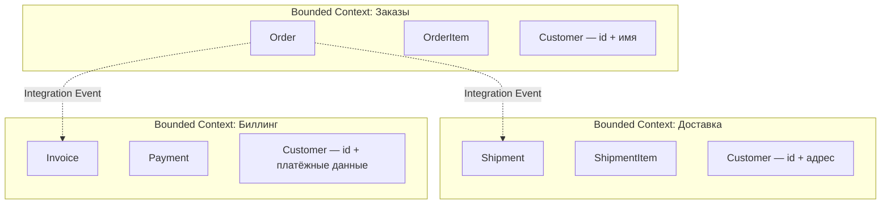

Ключевые свойства:

1. **Одна модель -- один контекст**: понятие `Customer` может означать разное в разных контекстах
2. **Лингвистическая граница**: внутри контекста `Ubiquitous Language` однозначен
3. **Независимость моделей**: изменение модели в одном контексте не ломает другие
4. **Техническая автономность**: каждый контекст может иметь свою БД, свой стек

Как определить границы `Bounded Context`:

- Найти области, где одни и те же слова имеют разные значения
- Определить, какие команды работают над какими частями системы
- Использовать `Event Storming` для визуализации потоков событий
- Следовать принципу: один контекст -- одна команда (закон Конвея)

> [!mcq]
> - [ ] `Bounded Context` — физическая граница микросервиса: один контекст всегда соответствует одному сервису, изменение границы требует переезда на новый сервис. | `Bounded Context` — логическая граница модели, не развёртывания. В модульном монолите несколько контекстов живут в одном процессе. ❌ ПОСЛЕДСТВИЕ: при пересмотре границ команда переписывает 4 микросервиса вместо рефакторинга в одном — релиз сдвигается на квартал, окно бизнеса упущено.
> - [ ] `Bounded Context` — пакет Java, помечаемый аннотацией для `ArchUnit`; границы обеспечиваются только статическими проверками зависимостей между пакетами. | `Bounded Context` — концепция `DDD`, а не артефакт инструмента. `ArchUnit` помогает поддерживать границы, но сами границы определяются доменом и языком. ❌ ПОСЛЕДСТВИЕ: команда настроила `ArchUnit`-правила «по пакетам», но `Customer` тащит ссылки в три контекста через общий `BaseEntity` — тесты зелёные, модель связная.
> - [ ] `Bounded Context` — строка в `Context Map`, описывающая контракт REST API между командами; без REST-контракта контекст не считается выделенным. | `Bounded Context` существует независимо от способа интеграции. Контракт может быть `REST`, `Kafka`, библиотекой или отсутствовать (`Separate Ways`). ❌ ПОСЛЕДСТВИЕ: команда не выделила контекст, пока не появился REST-контракт; пока «нет REST» — все команды правят общий `OrderService`, конфликты слияний на каждом релизе.
> - [x] `Bounded Context` — явная граница, внутри которой доменная модель и `Ubiquitous Language` согласованы; один термин (например, `Customer`) может иметь разные модели в разных контекстах, изменения в одном не ломают другие. | Это центральный паттерн стратегического `DDD`: контекст изолирует модель лингвистически и структурно. Разный смысл `Customer` в `Orders` (id+имя) и `Billing` (id+платёжные данные) — классический пример. ✓ ПРИМЕНЯТЬ: e-commerce платформы (Wolt, Yandex Lavka) — `Order`, `Catalog`, `Shipping` как отдельные контексты с собственными моделями `Product`. 📋 ПРАВИЛО: «Один контекст — один словарь — одна команда». 🔗 См. Q6, Q8, Q34.

---

## Q6. Что такое Context Mapping и какие паттерны интеграции существуют?

**Context Map** -- это диаграмма, показывающая отношения между `Bounded Context` и способы их интеграции.

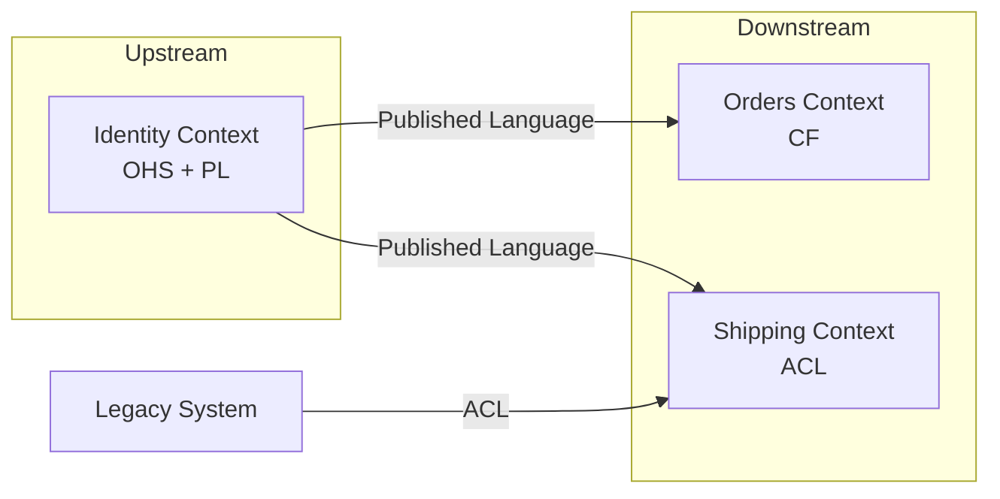

Основные паттерны `Context Mapping`:

| Паттерн | Описание | Пример |
|---------|----------|--------|
| **Shared Kernel** | Общая часть модели между двумя контекстами | Общая библиотека доменных примитивов |
| **Customer-Supplier** | Upstream поставляет, downstream потребляет | API-команда поставляет данные frontend-команде |
| **Conformist** | Downstream принимает модель upstream без изменений | Интеграция со сторонним API «как есть» |
| **Anti-Corruption Layer** | Downstream переводит модель upstream на свой язык | Адаптер к legacy-системе |
| **Open Host Service** (`OHS`) | Upstream публикует протокол для всех downstream | REST API с версионированием |
| **Published Language** (`PL`) | Документированный формат обмена данными | JSON Schema, Protobuf |
| **Separate Ways** | Контексты не интегрируются | Два автономных модуля |
| **Partnership** | Контексты развиваются совместно | Два контекста одной команды |

> [!mcq]
> - [ ] `Context Mapping` — UML-диаграмма классов, показывающая наследование доменных объектов между модулями; цель — минимизировать дублирование через общий суперкласс. | `Context Map` не описывает наследование классов; это карта отношений между контекстами на уровне команд и интеграции. ❌ ПОСЛЕДСТВИЕ: команда вводит `BaseEntity` ради «уменьшения дублирования», все контексты тащат общий код — изменение поля ломает 5 модулей одновременно.
> - [ ] `Context Mapping` — технический контракт `OpenAPI` между сервисами; единственный допустимый паттерн — `Open Host Service + REST`. | `Context Map` покрывает разные типы отношений: `Conformist`, `ACL`, `Shared Kernel`, `Partnership` и др. REST — лишь один из транспортов. ❌ ПОСЛЕДСТВИЕ: команда оформляет интеграцию с legacy-ERP как REST-OHS, но ERP не следует контракту — без `ACL` доменная модель загрязняется чужими полями `custType=1`.
> - [ ] `Context Mapping` — инструмент брокера сообщений (`Kafka`) для описания топиков и `Avro`-схем между `Bounded Context`. | `Context Mapping` не привязан к `Kafka`/`Avro`; он описывает отношения между контекстами и командами. `Published Language` — лишь один из паттернов и не обязательно `Avro`. ❌ ПОСЛЕДСТВИЕ: команда не описала отношения «кто upstream, кто downstream», на ретро обнаруживают, что Catalog тихо ломает `Order` каждые 2 недели — никто не знал о зависимости.
> - [x] `Context Mapping` — диаграмма отношений между `Bounded Context` и паттерны интеграции (`Shared Kernel`, `Customer-Supplier`, `Conformist`, `ACL`, `OHS`, `Published Language`, `Separate Ways`, `Partnership`). | `Context Map` документирует, как контексты взаимодействуют организационно и технически. Выбор паттерна зависит от власти команд, изменчивости upstream и связности. ✓ ПРИМЕНЯТЬ: микросервисная экосистема Netflix — `OHS + Published Language` (JSON Schema) для публичных API, `Conformist` для legacy-биллинга. 📋 ПРАВИЛО: «Карта контекстов до карты сервисов». 🔗 См. Q5, Q7, Q37.

---

## Q7. Что такое Anti-Corruption Layer?

**Anti-Corruption Layer** (`ACL`) -- паттерн, который создаёт промежуточный слой трансляции между вашим `Bounded Context` и внешней системой (legacy, сторонний сервис, другой контекст).

`ACL` защищает доменную модель от «загрязнения» чужими концепциями.

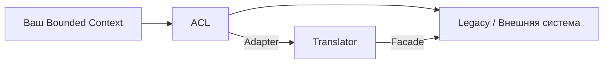

Реализация на Java:

```java
// Модель внешней системы (legacy)
public class LegacyCustomerDTO {
    private String custNo;
    private String custName;
    private int custType; // 1 = physical, 2 = legal
}

// Наша доменная модель
public class Customer {
    private CustomerId id;
    private FullName name;
    private CustomerType type;
}

// Anti-Corruption Layer
@Component
public class CustomerAntiCorruptionLayer {

    private final LegacyCustomerClient legacyClient;

    public Optional<Customer> findCustomer(CustomerId id) {
        LegacyCustomerDTO dto = legacyClient.getCustomer(id.value());
        return Optional.ofNullable(dto)
            .map(this::translateToDomain);
    }

    private Customer translateToDomain(LegacyCustomerDTO dto) {
        return new Customer(
            new CustomerId(dto.getCustNo()),
            FullName.parse(dto.getCustName()),
            CustomerType.fromLegacyCode(dto.getCustType())
        );
    }
}
```

Когда применять `ACL`:

- Интеграция с legacy-системой, модель которой нельзя менять
- Работа со сторонним API с неудобной моделью данных
- Защита `Core Domain` от влияния `Generic` или `Supporting Subdomain`

> [!mcq]
> - [ ] `Anti-Corruption Layer` — встроенная в Spring Security фича, предотвращающая SQL-инъекции и XSS между `Bounded Context`. | `ACL` из `DDD` — архитектурный паттерн, не связанный с безопасностью; решает проблему модели, а не атак. ❌ ПОСЛЕДСТВИЕ: команда добавила `WebSecurityConfig` и считает «защиту от corruption» сделанной; чужие `LegacyDTO` тащатся прямо в `Order`-агрегат — модель портится за 3 спринта.
> - [ ] `Anti-Corruption Layer` — механизм версионирования REST API, гарантирующий обратную совместимость при изменении схем. | Версионирование API — отдельная практика (`OHS` + `Published Language`). `ACL` переводит чужую модель в свою независимо от версии. ❌ ПОСЛЕДСТВИЕ: команда вешает `/api/v2/`, но внутри сервис всё равно работает с `LegacyCustomerDTO` — переход на v3 ломает половину доменных тестов.
> - [x] `Anti-Corruption Layer` — промежуточный слой-переводчик между вашим контекстом и внешней системой (legacy, чужой контекст), преобразующий чужую модель в термины `Ubiquitous Language` вашего контекста. | `ACL` защищает доменную модель от «загрязнения» чужими концепциями. `Adapter + Translator` изолируют внутренний контекст от формата и языка внешней системы. ✓ ПРИМЕНЯТЬ: интеграция e-commerce с `1C`/`SAP` — `ProductCatalogACL` маппит `LegacyCustomerDTO.custType=1/2` в типобезопасный `CustomerType.PHYSICAL/LEGAL`. 📋 ПРАВИЛО: «Чужая модель не пересекает границу контекста». 🔗 См. Q6, Q8, Q36.
> - [ ] `Anti-Corruption Layer` — `Kafka Streams`-приложение, переводящее события одного топика в другой формат для downstream-контекста. | `Kafka Streams` — одна из возможных реализаций `ACL`, но сам `ACL` — архитектурный паттерн, не привязанный к технологии. Его можно реализовать и синхронно через REST-клиент. ❌ ПОСЛЕДСТВИЕ: команда строит `Kafka Streams`-топологию там, где достаточно `@Component`-translator-а — overhead инфры на 200% при низкой нагрузке, отладка событий через `kafka-console-consumer`.

---

## Q8. Что такое Shared Kernel?

**Shared Kernel** -- паттерн, при котором два `Bounded Context` совместно владеют общей частью модели. Изменения в `Shared Kernel` требуют согласования обеих команд.

Плюсы:
- Устраняет дублирование общих концепций
- Обеспечивает согласованность общих типов

Минусы:
- Создаёт связность (coupling) между контекстами
- Любое изменение требует координации команд
- Может стать «магнитом» для лишнего кода

Пример: общая библиотека доменных примитивов:

```java
// shared-kernel module
public record Money(BigDecimal amount, Currency currency) {
    public Money {
        Objects.requireNonNull(amount);
        Objects.requireNonNull(currency);
        if (amount.scale() > currency.getDefaultFractionDigits()) {
            throw new IllegalArgumentException("Invalid scale for currency");
        }
    }

    public Money add(Money other) {
        requireSameCurrency(other);
        return new Money(amount.add(other.amount), currency);
    }

    private void requireSameCurrency(Money other) {
        if (!currency.equals(other.currency)) {
            throw new IllegalArgumentException("Cannot add different currencies");
        }
    }
}
```

> Рекомендация: `Shared Kernel` должен быть минимальным. Если он разрастается -- это сигнал о неправильно определённых границах контекстов.

> [!mcq]
> - [ ] `Shared Kernel` — общая БД, к которой имеют доступ два `Bounded Context`; для согласованности используется блокировка строк в транзакциях. | `Shared Kernel` — общая часть модели (кода), а не общая БД. Разделяемая БД — антипаттерн `DDD`, нарушающий автономность контекстов. ❌ ПОСЛЕДСТВИЕ: shared `orders`-таблица в двух сервисах → блокировки `SELECT FOR UPDATE` поднимают p99 latency с 50ms до 5s, deadlock alerts по ночам.
> - [x] `Shared Kernel` — совместно владеемая двумя `Bounded Context` часть модели (например, `Money`, `PhoneNumber`); любые изменения требуют согласования обеих команд, размер ядра минимален. | `Shared Kernel` создаёт жёсткую связь: изменения не могут быть односторонними. Его сводят к минимуму, оставляя только безусловно общие доменные примитивы. ✓ ПРИМЕНЯТЬ: финтех (Tinkoff, Stripe) — `Money(amount, currency)` как shared-kernel-record, валидация `scale` для валюты в одном месте на всех контекстах. 📋 ПРАВИЛО: «Shared Kernel — последнее средство, не первое». 🔗 См. Q5, Q6, Q33.
> - [ ] `Shared Kernel` — это `spring-cloud-config`-сервер, предоставляющий общие конфигурации для нескольких микросервисов-контекстов. | `Shared Kernel` — общий код доменной модели, а не конфигурация. Централизованная конфигурация — отдельный инфраструктурный паттерн. ❌ ПОСЛЕДСТВИЕ: команда тащит `application.yml` через `config-server` и считает контексты «автономными»; смена параметра ребутит 8 сервисов, retry-штормы на старте.
> - [ ] `Shared Kernel` — паттерн, при котором все `Bounded Context` наследуют общий базовый класс `BaseEntity` с полями `id`, `createdAt`, `updatedAt`. | Общий базовый класс ORM — технический приём, а не `Shared Kernel` в смысле `DDD`. `Shared Kernel` должен отражать доменные концепции. ❌ ПОСЛЕДСТВИЕ: меняют тип `id` с `Long` на `UUID` в `BaseEntity` — ломаются все 12 сервисов одновременно, миграция Flyway не откатывается, downtime 4 часа.

---

## Q9. В чём разница между стратегическим и тактическим DDD?

| Аспект | Стратегический DDD | Тактический DDD |
|--------|-------------------|-----------------|
| **Уровень** | Архитектура системы в целом | Внутренняя структура одного контекста |
| **Фокус** | Границы контекстов, отношения между ними | Моделирование доменных объектов |
| **Паттерны** | `Bounded Context`, `Context Map`, `Subdomain` | `Entity`, `Value Object`, `Aggregate`, `Repository`, `Domain Event` |
| **Участники** | Архитекторы, доменные эксперты, тех-лиды | Разработчики |
| **Ошибки дорогие?** | Да -- неправильные границы ведут к переписыванию | Менее болезненные -- рефакторинг в рамках контекста |

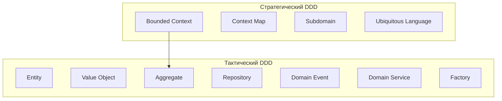

> **Важно**: частая ошибка -- начинать с тактических паттернов (классов и интерфейсов), не определив стратегические границы. Правильный порядок: сначала `Bounded Context`, потом модели внутри.

> [!mcq]
> - [ ] Стратегический DDD — это применение тактических паттернов (Entity, VO, Aggregate) на уровне всей системы; тактический DDD — применение тех же паттернов только внутри одного модуля. | Это разные уровни, а не масштабы применения одних и тех же паттернов. Стратегический DDD оперирует контекстами и их отношениями, тактический — внутренней структурой контекста. ❌ ПОСЛЕДСТВИЕ: команда «делает стратегию» через гигантский Aggregate `System`, охватывающий всё — lock contention при любой записи, p99 latency на checkout 8s, конкуренция за один row в БД на каждом запросе.
> - [ ] Стратегический DDD выполняет архитектор один раз на старте проекта, после чего он неизменен; тактический DDD — это непрерывная работа разработчиков с кодом. | Стратегический дизайн эволюционирует вместе с пониманием домена; Event Storming и Context Mapping проводятся регулярно. Он не статичен. ❌ ПОСЛЕДСТВИЕ: Context Map нарисован на kickoff и заморожен в Confluence, через год бизнес добавил `Loyalty`-модуль — он застрял в `Order`-контексте, агрегат раздувается до 20 полей, OptimisticLockException на каждой второй транзакции в Black Friday.
> - [x] Стратегический DDD отвечает за границы Bounded Context, Context Map и Subdomain; тактический — за моделирование внутри контекста через Entity, Value Object, Aggregate, Repository, Domain Event. | Стратегический уровень — как разбить систему на контексты; тактический — как устроена модель внутри контекста. Ошибки стратегического уровня дороже. ✓ ПРИМЕНЯТЬ: Netflix — стратегия через Bounded Contexts (Recommendation, Playback, Billing) на уровне команд; тактика — Aggregates и Domain Events внутри каждого. 📋 ПРАВИЛО: «Стратегия — карта; тактика — модель». 🔗 См. Q5, Q10, Q33.
> - [ ] Стратегический DDD работает только с Core Domain и не применим к Supporting/Generic Subdomain; тактический DDD применяется ко всем типам поддоменов одинаково. | Стратегический DDD классифицирует все три типа поддоменов (Core, Supporting, Generic) и определяет для каждого свой подход, но он применяется ко всей системе, а не только к Core. ❌ ПОСЛЕДСТВИЕ: команда не классифицирует Supporting/Generic поддомены, лучшие сеньоры пишут SMTP-обёртки и аутентификацию вместо алгоритма скидок Core Domain — конкурентное преимущество не развивается, бизнес теряет рынок.

---

## Q10. Что такое Subdomain и какие типы бывают?

**Subdomain** (поддомен) -- это логическая область бизнеса, определяемая до начала проектирования. Это не технический артефакт, а часть «проблемного пространства» (problem space), в отличие от `Bounded Context`, который относится к «пространству решений» (solution space).

Три типа поддоменов:

| Тип | Описание | Пример (e-commerce) | Подход к разработке |
|-----|----------|---------------------|---------------------|
| **Core Domain** | Конкурентное преимущество бизнеса | Алгоритм рекомендаций, ценообразование | Максимум инвестиций, лучшие разработчики, `DDD` |
| **Supporting Subdomain** | Поддерживает core, но не уникально | Управление каталогом товаров | Средние инвестиции, можно аутсорсить |
| **Generic Subdomain** | Общее для всех бизнесов | Аутентификация, отправка e-mail | Готовое решение (Keycloak, SendGrid) |

Связь между `Subdomain` и `Bounded Context`:

- В идеале: один `Subdomain` = один `Bounded Context`
- На практике: один `Bounded Context` может покрывать несколько `Supporting Subdomain`
- Ошибка: один `Bounded Context` покрывает несколько `Core Domain` -- признак слишком широких границ

> [!mcq]
> - [ ] Subdomain — синоним Bounded Context, но предназначен для описания технических модулей в UML-диаграмме пакетов. | Subdomain и Bounded Context — разные концепции: Subdomain — из problem space (бизнес-область), Bounded Context — из solution space (модель). ❌ ПОСЛЕДСТВИЕ: команда смешивает два понятия в одной диаграмме, на ревью архитектуры выясняется что `Pricing` (Core) реализован тем же стеком что `EmailNotification` (Generic) — лучшие сеньоры пишут SMTP-обёртки вместо алгоритма скидок.
> - [ ] Subdomain — это микросервис, отвечающий за одну бизнес-функцию, развёрнутый как отдельный pod в Kubernetes. | Subdomain — логическая бизнес-область, не связанная с развёртыванием. Один поддомен может реализовываться монолитом или несколькими сервисами. ❌ ПОСЛЕДСТВИЕ: каждый поддомен превращён в отдельный pod (12 штук), `kubectl get pods` показывает constant CrashLoopBackOff на `notification-pod` из-за SMTP rate limit — вся доставка заказов встаёт колом.
> - [ ] Subdomain делится на два типа — Core и Generic; Supporting считается подтипом Core и отличается только уровнем финансирования. | Поддоменов три типа: Core, Supporting, Generic. Supporting — отдельный тип, не подкласс Core: он поддерживает бизнес, но не даёт конкурентного преимущества. ❌ ПОСЛЕДСТВИЕ: команда классифицирует `ProductCatalog` как «мини-Core», вкладывает топ-сеньоров — реальный Core (`PricingEngine`) остаётся слабым местом, конкурент с лучшими ценами выигрывает рынок за квартал.
> - [x] Subdomain — логическая область бизнеса из problem space; делится на Core (конкурентное преимущество), Supporting (поддерживает core) и Generic (общие для всех бизнесов решения вроде аутентификации). | Классификация поддоменов определяет стратегию: в Core инвестируются лучшие разработчики и применяется DDD, Supporting может аутсорситься, Generic покупается «коробкой».

---

## Q11. (!) В чём разница между Entity и Value Object?

| Характеристика | `Entity` | `Value Object` |
|---------------|----------|----------------|
| **Идентичность** | Определяется уникальным ID | Определяется значением атрибутов |
| **Мутабельность** | Может изменяться (сохраняя ID) | Иммутабельный |
| **Жизненный цикл** | Создаётся, изменяется, удаляется | Создаётся и заменяется целиком |
| **Сравнение** | По ID (`equals` по ID) | По всем атрибутам |
| **Примеры** | `User`, `Order`, `Product` | `Money`, `Address`, `DateRange`, `Email` |
| **Хранение в БД** | Своя таблица с PK | Встраивается в таблицу Entity или отдельная таблица без собственного смысла |

```java
// Entity — идентичность по ID
public class Order {
    private final OrderId id;
    private OrderStatus status;
    private final List<OrderLine> lines;
    private Money totalPrice;

    @Override
    public boolean equals(Object o) {
        if (this == o) return true;
        if (!(o instanceof Order other)) return false;
        return id.equals(other.id); // сравнение только по ID
    }

    @Override
    public int hashCode() {
        return id.hashCode();
    }
}

// Value Object — идентичность по значению
public record Address(
    String city,
    String street,
    String zipCode,
    String country
) {
    public Address {
        Objects.requireNonNull(city, "City must not be null");
        Objects.requireNonNull(zipCode, "Zip code must not be null");
    }
    // equals/hashCode по всем полям — автоматически через record
}
```

> **Правило**: предпочитайте `Value Object` там, где это возможно. Они проще, безопаснее (иммутабельность) и лучше выражают бизнес-концепции. В типичной хорошо спроектированной модели `Value Object` больше, чем `Entity`.

> [!mcq]
> - [ ] `Entity` — класс с аннотацией `@Entity`, `Value Object` — класс с `@Embeddable`; любая Java-запись (`record`) автоматически становится `Value Object`. | Различие доменное, а не JPA-аннотационное. `Entity` в `DDD` не обязательно имеет `@Entity`; `record` — удобная основа для VO, но не автоматически VO. ❌ ПОСЛЕДСТВИЕ: команда считает класс `Customer` с `@Entity` доменным, но в нём только геттеры/сеттеры — anemic domain model, бизнес-правила утекают в `*Service`.
> - [x] `Entity` определяется уникальным ID и имеет жизненный цикл (создание, изменение, удаление), `equals` по ID; `Value Object` определяется значениями атрибутов, иммутабелен и сравнивается по всем полям. | Ключевое различие — идентичность: `Entity` остаётся «тем же» при изменении полей, `Value Object` «тот же» только если равны все атрибуты. Примеры: `Order/User` vs `Money/Address`. ✓ ПРИМЕНЯТЬ: банковские системы — `BankAccount` (Entity, идентичность по `accountId`), `Money` (VO, `equals` по amount+currency). 📋 ПРАВИЛО: «ID = Entity, значение = Value Object». 🔗 См. Q12, Q13, Q38.
> - [ ] `Entity` всегда сохраняется в отдельную таблицу БД, `Value Object` — только в JSON-поле через JSONB; это критерий различия на этапе моделирования. | Способ персистенции не определяет тип объекта в `DDD`. VO встраивается в таблицу `Entity` (`@Embeddable`), а `Entity` может храниться в документной БД. ❌ ПОСЛЕДСТВИЕ: команда выбирает тип объекта по схеме хранения; при миграции с PostgreSQL на MongoDB вся доменная модель переписывается с нуля.
> - [ ] `Entity` всегда содержит бизнес-логику, `Value Object` всегда содержит только поля без методов; наличие методов автоматически делает объект `Entity`. | VO может и должен содержать доменные методы (`Money.add`, `DateRange.contains`). Наличие методов не определяет Entity/VO; определяют идентичность и жизненный цикл. ❌ ПОСЛЕДСТВИЕ: команда выносит `Money.add` из VO в `MoneyService` ради «правила», вычисление `total` теряет атомарность — баг с разными валютами просочился в production.

---

## Q12. Как правильно реализовать Value Object в Java?

Требования к `Value Object`:

1. **Иммутабельность** -- все поля `final`, нет сеттеров
2. **Валидация в конструкторе** -- невалидный `Value Object` невозможно создать
3. **Сравнение по значению** -- `equals`/`hashCode` по всем атрибутам
4. **Самодокументирующийся** -- имя типа выражает бизнес-концепцию

С Java 16+ `record` -- идеальный инструмент для `Value Object`:

```java
public record Email(String value) {
    private static final Pattern EMAIL_PATTERN =
        Pattern.compile("^[A-Za-z0-9+_.-]+@[A-Za-z0-9.-]+$");

    public Email {
        Objects.requireNonNull(value, "Email must not be null");
        if (!EMAIL_PATTERN.matcher(value).matches()) {
            throw new IllegalArgumentException("Invalid email: " + value);
        }
        value = value.toLowerCase(); // нормализация
    }
}

public record Money(BigDecimal amount, Currency currency) {
    public Money {
        Objects.requireNonNull(amount);
        Objects.requireNonNull(currency);
        amount = amount.setScale(
            currency.getDefaultFractionDigits(), RoundingMode.HALF_UP
        );
    }

    public Money add(Money other) {
        if (!currency.equals(other.currency)) {
            throw new CurrencyMismatchException(currency, other.currency);
        }
        return new Money(amount.add(other.amount), currency);
    }

    public Money multiply(int quantity) {
        return new Money(amount.multiply(BigDecimal.valueOf(quantity)), currency);
    }
}

public record DateRange(LocalDate start, LocalDate end) {
    public DateRange {
        Objects.requireNonNull(start);
        Objects.requireNonNull(end);
        if (start.isAfter(end)) {
            throw new IllegalArgumentException("Start must be before end");
        }
    }

    public boolean contains(LocalDate date) {
        return !date.isBefore(start) && !date.isAfter(end);
    }

    public boolean overlaps(DateRange other) {
        return !this.end.isBefore(other.start) && !other.end.isBefore(this.start);
    }
}
```

`Value Object` как замена примитивов (`Primitive Obsession` -- антипаттерн):

```java
// Плохо: примитивы
void createUser(String email, String phone, int age) { ... }

// Хорошо: Value Objects
void createUser(Email email, PhoneNumber phone, Age age) { ... }
```

> [!mcq]
> - [ ] Value Object в Java 17+ должен быть классом с сеттерами и equals/hashCode, сгенерированными через Lombok `@Data`, чтобы можно было менять поля при сохранении. | VO должен быть иммутабельным — никаких сеттеров. `@Data` с сеттерами нарушает базовый принцип VO. ❌ ПОСЛЕДСТВИЕ: `Money` с `@Data`-сеттерами разделяется между двумя `Order`-агрегатами через ссылку, `setAmount()` в одном меняет сумму в другом — баг с двойным списанием обнаруживается через 2 недели по жалобе клиента.
> - [x] Value Object следует реализовать как Java `record` с валидацией в compact-конструкторе, методами, возвращающими новый VO вместо мутации, и именем типа, отражающим доменную концепцию (Email, Money, DateRange). | Record автоматически даёт иммутабельность, equals/hashCode по значениям и компактный синтаксис. Валидация в compact-конструкторе гарантирует, что невалидный VO невозможно создать. ✓ ПРИМЕНЯТЬ: банковские системы — `Money`, `IBAN`, `Email` как records с валидацией; невалидный `IBAN("XX")` бросает исключение в конструкторе. 📋 ПРАВИЛО: «Record + compact-конструктор = безопасный VO». 🔗 См. Q11, Q13, Q38.
> - [ ] Value Object реализуется через абстрактный класс с `protected` полями и наследованием; каждая конкретная концепция расширяет базовый класс AbstractValueObject. | Иерархия наследования для VO избыточна. В современной Java record даёт всё необходимое без наследования; искусственный общий суперкласс — антипаттерн. ❌ ПОСЛЕДСТВИЕ: 30 VO наследуют `AbstractValueObject` с шаблонной валидацией, новое требование «логировать создание VO» рефакторится через рекурсивный protected-метод — тесты падают каскадом, релиз сдвигается на 3 дня.
> - [ ] Value Object должен быть обычным классом с `private` полями и публичными геттерами, без валидации в конструкторе — валидацию делает Application Service перед созданием. | Самовалидация — обязательное свойство VO: невалидный экземпляр не должен существовать. Делегирование в сервис ведёт к утечке логики и возможности обойти проверки. ❌ ПОСЛЕДСТВИЕ: разработчик создаёт `new Email("not-email")` напрямую в новом коде, минуя `EmailService.create()` — невалидные записи проходят в БД, рассылка отскакивает на 30% адресов, маркетинговая кампания провалена.

---

## Q13. Когда использовать Entity, а когда Value Object?

Вопросы-подсказки для определения:

1. **Нужно ли отслеживать объект во времени?** Да → `Entity`
2. **Важна ли уникальная идентичность?** Да → `Entity`
3. **Можно ли заменить объект целиком на другой с такими же значениями?** Да → `Value Object`
4. **Объект разделяется между несколькими `Entity`?** Обычно → `Value Object`

Примеры:

| Концепция | `Entity` или `Value Object`? | Почему? |
|-----------|------------------------------|---------|
| Деньги (100 руб.) | `Value Object` | Одна купюра 100 руб. неотличима от другой |
| Банковский счёт | `Entity` | Имеет уникальный номер и состояние |
| Адрес доставки | `Value Object` | Определяется значением, не идентичностью |
| Пользователь | `Entity` | Имеет уникальную идентичность |
| Координата GPS | `Value Object` | Определяется широтой и долготой |
| Товар в каталоге | `Entity` | Уникальный SKU, изменяемая цена |
| Элемент заказа (строка) | `Value Object` или `Entity` | Зависит от домена: если нужно отслеживать изменения строки -- `Entity` |

> [!mcq]
> - [ ] Объект должен быть Entity, если он хранится в отдельной таблице БД; если встраивается в чужую таблицу — это Value Object. Критерий — схема персистенции. | Критерий — домен, а не БД. VO может иметь свою таблицу, а Entity может храниться в документной БД одним JSON. Решение принимается на этапе моделирования домена.
> - [ ] Объект должен быть Value Object, если у него меньше 5 полей, и Entity — если полей больше, так как большие объекты требуют отдельной идентификации. | Количество полей не определяет тип. Адрес может иметь 10 полей и оставаться VO, а Entity может содержать всего id + status. ❌ ПОСЛЕДСТВИЕ: `User` с 4 полями объявлен VO (по правилу), при смене email создаётся новый объект — теряется история действий, аналитика по retention ломается, продакт-команда требует «всё переделать».
> - [x] Value Object подходит, если объект определяется значением, взаимозаменяем при равных полях и не требует отслеживания во времени (Money, Address, GPS-координата); Entity — если нужна уникальная идентичность и жизненный цикл (User, BankAccount). | Вопросы-подсказки: нужно ли отслеживать объект, важна ли уникальная идентичность, можно ли заменить на объект с такими же значениями. Ответы определяют тип.
> - [ ] Если объект имеет методы, изменяющие его состояние, — это всегда Entity; если он только читается — это Value Object. | Способность к изменению — тонкий критерий, но не решающий. VO иммутабелен не потому, что «только читается», а потому, что «возвращает новый VO» при операциях. Entity допускает мутацию внутреннего состояния, сохраняя идентичность.

---

## Q14. (!) Что такое Aggregate и Aggregate Root?

**Aggregate** -- кластер доменных объектов (`Entity` и `Value Object`), которые рассматриваются как единое целое с точки зрения изменения данных. **Aggregate Root** -- входная точка, через которую происходит всё взаимодействие с агрегатом.

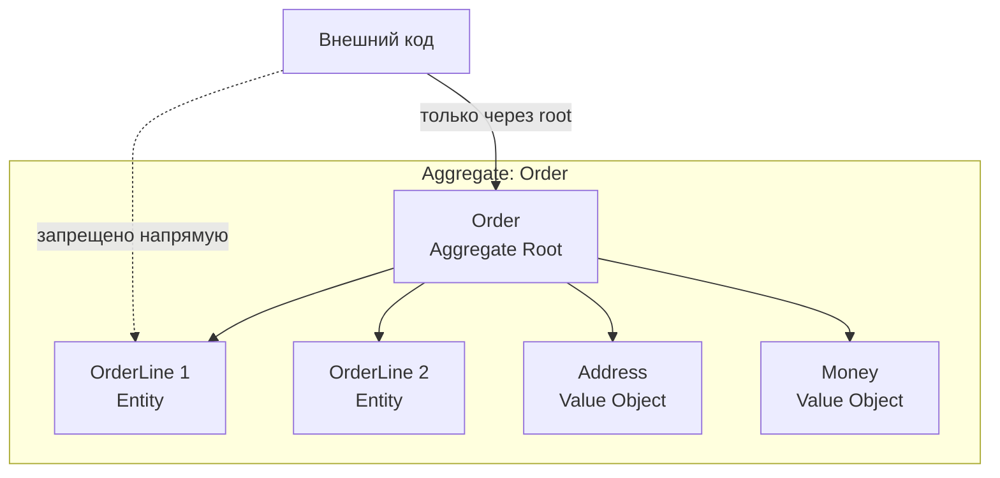

Правила агрегата:

1. **Внешний код обращается только к `Aggregate Root`** -- никогда напрямую к внутренним объектам
2. **`Aggregate Root` имеет глобальный ID** -- внутренние `Entity` имеют только локальный ID
3. **Транзакционная граница** -- один агрегат = одна транзакция
4. **Ссылки между агрегатами -- только по ID** -- не по прямой ссылке на объект
5. **Инварианты внутри агрегата** -- `Aggregate Root` гарантирует согласованность

```java
public class Order {
    private final OrderId id;
    private final CustomerId customerId; // ссылка на другой агрегат по ID
    private OrderStatus status;
    private final List<OrderLine> lines = new ArrayList<>();
    private Address shippingAddress;

    public void addLine(ProductId productId, int quantity, Money price) {
        if (status != OrderStatus.DRAFT) {
            throw new OrderAlreadySubmittedException(id);
        }
        lines.add(new OrderLine(productId, quantity, price));
    }

    public void submit() {
        if (lines.isEmpty()) {
            throw new EmptyOrderException(id);
        }
        this.status = OrderStatus.SUBMITTED;
        registerEvent(new OrderSubmittedEvent(id, customerId, calculateTotal()));
    }

    public Money calculateTotal() {
        return lines.stream()
            .map(OrderLine::subtotal)
            .reduce(Money.ZERO, Money::add);
    }
}
```

> [!mcq]
> - [ ] `Aggregate` — набор таблиц в БД, связанных `ForeignKey`, а `Aggregate Root` — родительская таблица с primary key; правила обеспечиваются ограничениями БД (FK, CHECK). | `Aggregate` — доменная концепция, не структура БД. Инварианты обеспечиваются кодом `Aggregate Root`, а не CHECK-ограничениями. ❌ ПОСЛЕДСТВИЕ: бизнес-правило «нельзя отправить пустой заказ» написано как `CHECK (lines_count > 0)`; при миграции на MongoDB правило теряется — пустые заказы уходят в Shipping.
> - [ ] `Aggregate` — это JPA `Entity` с `@OneToMany(cascade = ALL)`, а `Aggregate Root` — сущность в верхней части графа зависимостей. | JPA-каскады — инструмент персистенции, но `Aggregate` выходит за рамки JPA. Это логическая транзакционная граница консистентности в домене. ❌ ПОСЛЕДСТВИЕ: `cascade = ALL` загружает 500 `OrderLine` ради проверки одного инварианта — `OptimisticLockException` на каждом параллельном add, p99 latency растёт линейно с числом строк.
> - [ ] `Aggregate` — DTO, возвращаемый GET-эндпоинтом как «сводка» по связанным объектам; `Aggregate Root` — корневой объект этого DTO. | Агрегат — не DTO. Это кластер доменных объектов, гарантирующий инварианты, а не структура передачи данных. ❌ ПОСЛЕДСТВИЕ: команда возвращает `Aggregate` как JSON наружу, поля внутренних `Entity` светятся в API; добавление поля ломает все клиенты, версионирование становится адом.
> - [x] `Aggregate` — кластер `Entity` и `Value Object`, рассматриваемый как единое целое с транзакционной границей; `Aggregate Root` — единственная точка входа, обеспечивающая инварианты и ссылки между агрегатами только по ID. | Внешний код обращается только к `Root`, изменения агрегата атомарны, ссылки между агрегатами — по ID. `Root` несёт ответственность за согласованность инвариантов. ✓ ПРИМЕНЯТЬ: банковский `BankAccount` (Root) с внутренними `Transaction` — `withdraw()` атомарно проверяет баланс и регистрирует событие. 📋 ПРАВИЛО: «Один агрегат — одна транзакция, межагрегатные ссылки — по ID». 🔗 См. Q15, Q16, Q17.

---

## Q15. Какие правила проектирования агрегатов?

Четыре правила от Вона Вернона (Vaughn Vernon, "Implementing Domain-Driven Design"):

### 1. Защищайте бизнес-инварианты внутри агрегата

Агрегат должен быть достаточно большим, чтобы гарантировать все свои бизнес-правила, но не больше.

### 2. Делайте агрегаты маленькими

Большие агрегаты:
- Создают конкуренцию за блокировки (`OptimisticLockException`)
- Загружают лишние данные из БД
- Усложняют понимание кода

### 3. Ссылайтесь на другие агрегаты только по ID

```java
// Плохо: прямая ссылка на другой агрегат
public class Order {
    private Customer customer; // загружает весь Customer
}

// Хорошо: ссылка по ID
public class Order {
    private CustomerId customerId; // лёгкая ссылка
}
```

### 4. Используйте Eventual Consistency между агрегатами

Если бизнес-правило охватывает несколько агрегатов, применяйте доменные события и eventual consistency вместо одной транзакции. Подробнее в [паттернах согласованности](consistency-patterns-interview.md).

> [!mcq]
> - [ ] Правила агрегата: `@OneToMany(fetch = EAGER)` для загрузки всех дочерних сущностей, избегать `LazyInitializationException`, применять каскадное сохранение. | Это JPA-практики, а не правила `DDD`. EAGER-загрузка часто вредна: агрегат загружает лишнее, ухудшая конкурентность. ❌ ПОСЛЕДСТВИЕ: на каждый `findById(orderId)` тянутся 200 `OrderLine` + `Customer` + `Shipment`; время отклика 800ms на простой GET, OOM при 5K параллельных запросов.
> - [ ] Правила агрегата: один агрегат должен покрывать весь `Bounded Context`, чтобы гарантировать согласованность всех данных внутри границ. | Наоборот — агрегаты маленькие внутри контекста. Контекст содержит много мелких агрегатов; объединение всего в один — God Aggregate. ❌ ПОСЛЕДСТВИЕ: God Aggregate `OrderContext` с 50 inner Entity — каждое изменение блокирует всю модель, `OptimisticLockException` ловится 30% запросов в час пик.
> - [ ] Правила агрегата: ссылаться на другие агрегаты через прямую Java-ссылку для типобезопасности и автодополнения; ссылки по ID считаются устаревшей практикой. | Правило противоположное: между агрегатами — только ссылки по ID. Прямая ссылка создаёт связанность и загружает лишние данные. ❌ ПОСЛЕДСТВИЕ: `Order.customer` через `@ManyToOne` тащит весь `Customer`-агрегат с 30 полями + `PaymentMethods` — N+1 на любом списке заказов, отчёт не строится за 30 секунд.
> - [x] Правила Вона Вернона: защищай инварианты внутри агрегата, держи агрегаты маленькими, ссылайся на другие агрегаты по ID и используй eventual consistency между агрегатами. | Эти четыре правила — канон проектирования агрегатов. Маленькие агрегаты снижают конкуренцию блокировок, ссылки по ID избегают избыточной загрузки, eventual consistency — для межагрегатных правил. ✓ ПРИМЕНЯТЬ: e-commerce — `Order` агрегат с `OrderLines`, `Customer` отдельный агрегат, ссылка `customerId: CustomerId`, синхронизация через `OrderPlacedEvent`. 📋 ПРАВИЛО: «Маленький агрегат, ID-ссылки, события для остального». 🔗 См. Q14, Q16, Q20.

---

## Q16. Как определить границы агрегата?

Алгоритм определения границ:

1. **Определите инварианты**: какие данные должны быть всегда согласованы?
2. **Найдите `Aggregate Root`**: кто «владеет» этими данными и отвечает за их целостность?
3. **Проверьте конкурентность**: если два пользователя часто изменяют разные части, это разные агрегаты
4. **Примените правило «маленького агрегата»**: если можно вынести -- выносите

Пример: интернет-магазин

```
❌ Один большой агрегат:
   Order → Customer → PaymentMethod → ShippingAddress → OrderLines → Product

✅ Несколько маленьких агрегатов:
   Order (root) → OrderLines
   Customer (root) → PaymentMethods
   Product (root) → ProductVariants
   Shipment (root) → ShipmentItems
```

Сигналы, что агрегат слишком большой:
- Частые `OptimisticLockException` при параллельных изменениях
- Медленные запросы из-за загрузки лишних данных
- Изменение одной части ломает тесты другой части

> [!mcq]
> - [ ] Границы агрегата определяются схемой БД: то, что связано ForeignKey, входит в один агрегат; то, что связано через ассоциативную таблицу, — в разные. | БД-схема не определяет агрегат. Два объекта могут быть связаны FK и жить в разных агрегатах (ссылаться по ID). Схема — следствие модели, а не наоборот. ❌ ПОСЛЕДСТВИЕ: команда тащит `Customer` и `Order` в один агрегат «по FK», все операции по заказам блокируют редактирование профиля — оптимистичные блокировки на каждое касание клиентского кабинета, UX страдает.
> - [x] Границы определяются инвариантами: какие данные должны быть всегда согласованы в одной транзакции? Владелец этих данных становится Aggregate Root; если части можно изменять независимо — это разные агрегаты. | Алгоритм: найти инварианты, определить владельца, проверить конкурентность, применить правило «маленького агрегата». Частые OptimisticLockException — сигнал слишком широких границ. ✓ ПРИМЕНЯТЬ: Wolt Order Pipeline — `Order`-агрегат охватывает `OrderLine` (сумма = инвариант), но `Delivery` отдельный агрегат с eventual consistency через Domain Event. 📋 ПРАВИЛО: «Инварианты определяют границу транзакции». 🔗 См. Q14, Q15, Q17.
> - [ ] Границы агрегата задаются архитектором на этапе старта проекта в ADR и больше не меняются, так как пересмотр границ эквивалентен переписыванию БД. | Границы эволюционируют вместе с пониманием домена. Пересмотр — часть нормальной работы, хотя и дороже тактических правок. ❌ ПОСЛЕДСТВИЕ: `Order` агрегат «заморожен» в ADR, но через год нагрузка выросла в 50×, `OrderLine`-инварианты больше не нужны в одной транзакции — команда боится трогать ADR, lock contention в Black Friday кладёт checkout на 40 минут.
> - [ ] Границы агрегата определяются принципом SRP: каждый класс должен иметь одну ответственность, поэтому один агрегат — это одна Entity. | Агрегат — это кластер из Entity и VO под одним корнем, а не одна Entity. SRP применим внутри классов, но границы агрегата определяются инвариантами, а не SRP. ❌ ПОСЛЕДСТВИЕ: команда дробит `Order` на «один агрегат — одна Entity», `OrderLine` теряет связь с `Order`-инвариантом «сумма строк = total» — баг с дельта-подсчётом, бухгалтерия видит расхождение на 50К руб. в день.

---

## Q17. Как реализовать Aggregate Root в Java/Spring?

Полный пример агрегата с использованием `Spring Data` и `AbstractAggregateRoot`:

```java
// Aggregate Root
public class BankAccount extends AbstractAggregateRoot<BankAccount> {

    @Id
    private final AccountId id;
    private final CustomerId ownerId;
    private Money balance;
    private AccountStatus status;
    private final List<Transaction> transactions = new ArrayList<>();

    public BankAccount(AccountId id, CustomerId ownerId, Money initialDeposit) {
        this.id = id;
        this.ownerId = ownerId;
        this.balance = initialDeposit;
        this.status = AccountStatus.ACTIVE;
        registerEvent(new AccountOpenedEvent(id, ownerId, initialDeposit));
    }

    public void deposit(Money amount) {
        requireActive();
        this.balance = balance.add(amount);
        transactions.add(Transaction.deposit(amount));
        registerEvent(new MoneyDepositedEvent(id, amount, balance));
    }

    public void withdraw(Money amount) {
        requireActive();
        if (balance.isLessThan(amount)) {
            throw new InsufficientFundsException(id, balance, amount);
        }
        this.balance = balance.subtract(amount);
        transactions.add(Transaction.withdrawal(amount));
        registerEvent(new MoneyWithdrawnEvent(id, amount, balance));
    }

    public void close() {
        if (!balance.isZero()) {
            throw new NonZeroBalanceException(id, balance);
        }
        this.status = AccountStatus.CLOSED;
        registerEvent(new AccountClosedEvent(id));
    }

    private void requireActive() {
        if (status != AccountStatus.ACTIVE) {
            throw new AccountNotActiveException(id);
        }
    }
}
```

Репозиторий для агрегата:

```java
public interface BankAccountRepository
        extends CrudRepository<BankAccount, AccountId> {

    Optional<BankAccount> findByOwnerId(CustomerId ownerId);
}
```

> Обратите внимание: `AbstractAggregateRoot` из `Spring Data` позволяет регистрировать доменные события через `registerEvent()`. Они будут автоматически опубликованы при сохранении агрегата через репозиторий.

> [!mcq]
> - [ ] `Aggregate Root` реализуется через наследование от `JpaRepository<T, ID>`; репозиторий сам становится корнем и публикует события через `save()`. | Наследование от `JpaRepository` делает класс репозиторием, а не агрегатом. `Aggregate Root` — это доменный класс; репозиторий — отдельная абстракция над ним. ❌ ПОСЛЕДСТВИЕ: команда смешивает доменную логику и persistence-слой; невозможно протестировать инварианты без поднятой Spring-Data-инфраструктуры, тесты выполняются 8 секунд каждый.
> - [ ] `Aggregate Root` в Spring должен быть помечен аннотацией `@AggregateRoot` из Spring Modulith; без неё агрегат не работает. | Обязательной аннотации нет. В `org.jmolecules` есть `@AggregateRoot`, но это маркер для инструментов, а не требование. ❌ ПОСЛЕДСТВИЕ: команда верит, что без аннотации `@AggregateRoot` агрегат не работает; добавление зависимости jMolecules ради «правильности», release ломается из-за конфликта версий.
> - [x] `Aggregate Root` в Spring реализуется наследованием от `AbstractAggregateRoot<T>` из Spring Data и регистрацией событий через `registerEvent()`; события автоматически публикуются при `save()` через репозиторий. | Канонический способ: класс регистрирует события в методах изменения, Spring Data публикует их после save. Обработчики ловят через `@TransactionalEventListener` или `@ApplicationModuleListener`. ✓ ПРИМЕНЯТЬ: Spring Modulith-проекты — `BankAccount extends AbstractAggregateRoot<BankAccount>` с `registerEvent(new MoneyDepositedEvent(...))`. 📋 ПРАВИЛО: «registerEvent в агрегате, публикация — на save()». 🔗 См. Q14, Q18, Q19.
> - [ ] `Aggregate Root` должен быть интерфейсом, реализуемым на стороне инфраструктуры, чтобы отделить доменную логику от Spring; любая конкретная реализация — антипаттерн. | `Aggregate Root` — обычно конкретный класс с доменной логикой. Интерфейс на агрегате избыточен и усложняет модель без пользы. ❌ ПОСЛЕДСТВИЕ: команда вводит `OrderInterface` + `OrderImpl` ради «чистоты», логика дублируется или теряется при подмене реализации в тестах — тесты проходят на mock-Order, прод ломается.

---

## Q18. Что такое Domain Event?

**Domain Event** -- объект, представляющий факт, который произошёл в домене. События именуются в прошедшем времени (`OrderPlaced`, `PaymentReceived`, `AccountClosed`).

Характеристики доменного события:

1. **Иммутабельное** -- факт нельзя изменить задним числом
2. **Именуется в прошедшем времени** -- описывает свершившийся факт
3. **Содержит контекст** -- достаточно данных для обработки без обращения к источнику
4. **Не содержит логики** -- это данные, а не поведение

```java
public record OrderPlacedEvent(
    OrderId orderId,
    CustomerId customerId,
    Money totalAmount,
    List<OrderLineSnapshot> lines,
    Instant occurredAt
) {
    public OrderPlacedEvent {
        Objects.requireNonNull(orderId);
        Objects.requireNonNull(customerId);
        Objects.requireNonNull(totalAmount);
        if (occurredAt == null) {
            occurredAt = Instant.now();
        }
    }
}
```

Зачем нужны доменные события:

- **Декаплинг**: заказ не знает про доставку, но публикует `OrderPlacedEvent`
- **Аудит**: последовательность событий -- полная история изменений
- **Реактивность**: другие контексты реагируют на события асинхронно
- **Eventual Consistency**: синхронизация между агрегатами и контекстами

> [!mcq]
> - [ ] `Domain Event` — DTO, возвращаемый REST-эндпоинтом, с именем `XxxEventDto`; описывает будущее действие, которое клиент должен совершить. | `Domain Event` — объект внутри домена, описывающий свершившийся факт в прошлом. Это не DTO REST API и не указание к действию. ❌ ПОСЛЕДСТВИЕ: имена `PlaceOrderEventDto` и `OrderPlacedEvent` мешаются в коде; команды путают «будущее действие» и «свершившийся факт» — обработчик пытается отменить уже выполненную операцию.
> - [ ] `Domain Event` — исключение типа `EventException`, выбрасываемое при изменении агрегата; подписчики перехватывают его через `@ExceptionHandler`. | События не являются исключениями. Исключения сигнализируют об ошибках, события — о нормальных фактах изменения состояния. ❌ ПОСЛЕДСТВИЕ: при штатном `submit()` летит `OrderPlacedException`, stack trace в логах на каждый успешный заказ — 100MB логов в час, реальные ошибки тонут в шуме.
> - [ ] `Domain Event` — запись в таблице `audit_log`, создаваемая триггером БД при любом UPDATE; имя события совпадает с именем таблицы. | Событие — доменный артефакт, а не технический audit log. Триггеры БД не несут доменный смысл и зависят от языка БД. ❌ ПОСЛЕДСТВИЕ: при миграции PostgreSQL→MongoDB триггеры теряются, события не публикуются — Shipping не узнаёт о новых заказах, инциденты копятся неделями.
> - [x] `Domain Event` — иммутабельный объект, описывающий свершившийся факт в домене; именуется в прошедшем времени (`OrderPlaced`, `PaymentReceived`), содержит достаточно контекста для обработчиков и не содержит логики. | События фиксируют изменение состояния. Иммутабельность, имя в прошедшем времени и отсутствие поведения — ключевые свойства. ✓ ПРИМЕНЯТЬ: Booking.com — `BookingConfirmedEvent` несёт `bookingId`, `customerId`, `totalAmount`, `Instant occurredAt`; downstream-контексты (Notification, Loyalty) реагируют независимо. 📋 ПРАВИЛО: «Прошедшее время + иммутабельность + полный контекст». 🔗 См. Q19, Q20, Q25.

---

## Q19. Как реализовать доменные события в Spring?

Два подхода к реализации в `Spring`:

### Подход 1: `AbstractAggregateRoot` + `Spring Data`

```java
public class Order extends AbstractAggregateRoot<Order> {
    public void place() {
        this.status = OrderStatus.PLACED;
        registerEvent(new OrderPlacedEvent(this.id, this.customerId));
    }
}

// Обработчик (в том же Bounded Context)
@Component
public class OrderPlacedHandler {
    @TransactionalEventListener
    public void handle(OrderPlacedEvent event) {
        // отправить уведомление, обновить статистику и т.д.
    }
}
```

### Подход 2: `ApplicationEventPublisher` (ручной контроль)

```java
@Service
@RequiredArgsConstructor
public class OrderService {
    private final OrderRepository repository;
    private final ApplicationEventPublisher publisher;

    @Transactional
    public void placeOrder(PlaceOrderCommand cmd) {
        Order order = Order.create(cmd);
        repository.save(order);
        publisher.publishEvent(new OrderPlacedEvent(order.getId()));
    }
}
```

### Подход 3: `Spring Modulith` (рекомендуемый для модульных монолитов)

```java
@ApplicationModuleListener
public void on(OrderPlacedEvent event) {
    // Spring Modulith обеспечивает at-least-once delivery
    // через Transactional Outbox
}
```

Подробнее о событийных паттернах в [Event-Driven паттернах](event-driven-patterns-interview.md).

> [!mcq]
> - [ ] Единственный способ — публикация через `Kafka` в отдельной транзакции; Spring не предоставляет встроенных механизмов для доменных событий. | Spring даёт `ApplicationEventPublisher` и поддержку через Spring Data. `Kafka` используется для Integration Events, а не Domain Events. ❌ ПОСЛЕДСТВИЕ: команда вешает `Kafka` ради in-memory событий внутри одного контекста; задержка `0.5ms → 50ms`, дополнительный broker в инфре и Outbox-таблица там, где можно `@TransactionalEventListener`.
> - [ ] Spring Modulith работает только с Apache Camel; без Camel `@ApplicationModuleListener` не активен. | Spring Modulith не зависит от Camel. Это отдельный модуль Spring для модульных монолитов с собственной реализацией доставки. ❌ ПОСЛЕДСТВИЕ: команда добавляет `camel-spring-boot-starter` ради «активации Modulith», размер jar +30МБ, конфликты автоконфигов, зря потраченные 2 дня на интеграцию.
> - [ ] Рекомендуемый способ — `@EventListener` без `@TransactionalEventListener`, поскольку транзакционные события несовместимы с Spring Data JPA. | `@TransactionalEventListener` — стандарт: гарантирует выполнение обработчика после коммита, полностью совместим с Spring Data JPA. ❌ ПОСЛЕДСТВИЕ: `@EventListener` срабатывает до коммита; обработчик отправляет email о заказе, заказ откатывается — клиент получает уведомление о несуществующем заказе.
> - [x] Spring поддерживает три способа: `AbstractAggregateRoot` с `registerEvent + @TransactionalEventListener`, ручная публикация через `ApplicationEventPublisher` и Spring Modulith с `@ApplicationModuleListener` (Transactional Outbox). | Все три работают: первый удобен при Spring Data, второй даёт полный контроль, третий — лучший для модульных монолитов с гарантией доставки. ✓ ПРИМЕНЯТЬ: Spring Modulith-проекты с `@ApplicationModuleListener` + встроенный Outbox — at-least-once delivery без внешнего брокера на старте. 📋 ПРАВИЛО: «Внутри контекста — Spring events, между — брокер с Outbox». 🔗 См. Q17, Q18, Q32.

---

## Q20. В чём разница между Domain Event и Integration Event?

| Характеристика | `Domain Event` | `Integration Event` |
|---------------|----------------|---------------------|
| **Область видимости** | Внутри `Bounded Context` | Между `Bounded Context` |
| **Транспорт** | In-memory (`ApplicationEventPublisher`) | Брокер сообщений (`Kafka`, `RabbitMQ`) |
| **Формат** | Доменные объекты | Сериализуемый DTO (JSON, Avro, Protobuf) |
| **Надёжность** | Гарантируется транзакцией | Требует `Outbox Pattern` для гарантий |
| **Связность** | Знает о доменной модели | Не зависит от внутренней модели |

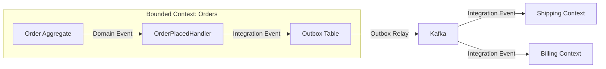

Паттерн `Transactional Outbox`: доменное событие сохраняется в таблицу `outbox` в той же транзакции, что и изменение агрегата. Отдельный процесс вычитывает `outbox` и отправляет в брокер.

> [!mcq]
> - [ ] `Domain Event` публикуется через `Kafka` между сервисами, а `Integration Event` — через in-memory `ApplicationEventPublisher` внутри сервиса; это противоположные понятия. | Наоборот: `Domain Event` — in-memory внутри контекста, `Integration Event` — через брокер между контекстами. ❌ ПОСЛЕДСТВИЕ: команда отправляет внутренние domain-events в `Kafka`, наружу — through `ApplicationEventPublisher`; downstream-сервисы не получают данные, шипинг не запускается.
> - [x] `Domain Event` живёт внутри `Bounded Context` через in-memory публикацию и знает о доменной модели; `Integration Event` пересекает границы через брокер (`Kafka`/`RabbitMQ`), сериализуется в DTO и не зависит от внутренней модели. | Разница — область видимости и транспорт. `Domain Event` — внутренний артефакт, гарантируемый транзакцией; `Integration Event` — внешний контракт с Outbox Pattern для гарантии доставки. ✓ ПРИМЕНЯТЬ: e-commerce — `OrderPlacedDomainEvent` для Loyalty-проекции внутри `OrderContext`; `OrderPlacedIntegrationEvent` JSON в Kafka для Shipping/Billing. 📋 ПРАВИЛО: «Внутрь — модель, наружу — стабильный DTO». 🔗 См. Q18, Q19, Q34.
> - [ ] `Domain Event` и `Integration Event` — синонимы; название зависит только от того, работаем ли мы с монолитом (Domain) или микросервисами (Integration). | Различие концептуальное, а не технологическое. Даже в монолите полезно разделять события для внутренней реакции и для внешней интеграции. ❌ ПОСЛЕДСТВИЕ: команда экспортирует внутренний `OrderPlacedEvent` напрямую в Kafka; добавление поля `Address shippingAddress` ломает downstream-консьюмеры — все деплоятся одновременно ради совместимости.
> - [ ] `Domain Event` обязан быть Avro-сериализуемым и иметь схему в Schema Registry, иначе не может быть опубликован через `ApplicationEventPublisher`. | `Domain Event` — обычный Java-объект, не требующий Avro/Schema Registry. Сериализация нужна только для `Integration Events` в Kafka. ❌ ПОСЛЕДСТВИЕ: команда тащит `Schema Registry` ради in-memory событий, поднимает Confluent-стек на dev-стенде — загрузка локальной разработки на 4ГБ RAM, обучение команды на месяц.

---

## Q21. (!) Что такое Repository в DDD?

**Repository** -- паттерн, предоставляющий абстракцию коллекции для доступа к агрегатам. Репозиторий скрывает детали персистенции и предоставляет интерфейс, выглядящий как коллекция в памяти.

Правила репозиториев в `DDD`:

1. **Один репозиторий на агрегат** -- не на каждую `Entity` или таблицу
2. **Интерфейс в доменном слое** -- реализация в инфраструктурном
3. **Оперирует только `Aggregate Root`** -- внутренние `Entity` доступны только через корень
4. **Имитирует коллекцию** -- `add`, `find`, `remove`, а не `insert`, `select`, `delete`

```java
// Доменный слой: интерфейс
public interface OrderRepository {
    Optional<Order> findById(OrderId id);
    List<Order> findByCustomerId(CustomerId customerId);
    void save(Order order);
    void delete(Order order);
    OrderId nextId();
}

// Инфраструктурный слой: реализация через Spring Data
@Repository
public class JpaOrderRepository implements OrderRepository {
    private final SpringDataOrderRepository springRepo;

    @Override
    public Optional<Order> findById(OrderId id) {
        return springRepo.findById(id.value())
            .map(OrderMapper::toDomain);
    }

    @Override
    public void save(Order order) {
        springRepo.save(OrderMapper.toEntity(order));
    }

    @Override
    public OrderId nextId() {
        return new OrderId(UUID.randomUUID());
    }
}
```

> `Repository` ≠ `DAO`. `DAO` -- это доступ к данным (data-centric), а `Repository` -- это коллекция объектов домена (domain-centric). `Repository` работает с агрегатами, `DAO` -- с таблицами.

> [!mcq]
> - [ ] `Repository` в `DDD` — это DAO, переименованный ради модного названия; работает с любыми таблицами и возвращает Entity или DTO в зависимости от запроса. | `Repository` ≠ `DAO`. `Repository` оперирует агрегатами (domain-centric), `DAO` — таблицами (data-centric). ❌ ПОСЛЕДСТВИЕ: команда возвращает `OrderLineDao.findByProductId()` напрямую из контроллера, минуя `Order`-агрегат — инвариант «нельзя менять подтверждённый заказ» обходится за 5 минут.
> - [ ] `Repository` — это `JpaRepository<T, ID>` из Spring Data; достаточно объявить интерфейс `extends JpaRepository`, и DDD-репозиторий готов. | `JpaRepository` — техническая реализация. DDD-репозиторий — интерфейс в доменном слое, выражающий операции над агрегатом; `JpaRepository` скрыт за ним. ❌ ПОСЛЕДСТВИЕ: домен зависит от Spring Data — миграция на R2DBC ломает все 200 use-case-ов одновременно, а тесты доменной логики требуют поднятия Spring-контекста.
> - [x] `Repository` — абстракция коллекции для работы с `Aggregate Root`: один репозиторий на агрегат, интерфейс в доменном слое, реализация в инфраструктуре; оперирует только корнями, методы в терминах коллекции (`find/save/remove`). | Domain-centric подход: репозиторий скрывает детали персистенции и выглядит как коллекция в памяти. Операции над внутренними Entity идут через корень. ✓ ПРИМЕНЯТЬ: hexagonal-проекты — `OrderRepository` интерфейс в `domain/`, `JpaOrderRepository implements OrderRepository` в `infrastructure/persistence/`. 📋 ПРАВИЛО: «Один репозиторий — один агрегат, как коллекция в памяти». 🔗 См. Q14, Q22, Q31.
> - [ ] `Repository` в `DDD` должен возвращать `Stream<Entity>` вместо `List`, чтобы поддерживать реактивное программирование и лениво загружать данные. | Тип возвращаемого значения не определяет DDD-репозиторий. `Optional/List` — идиоматичны; реактивность — отдельная техническая особенность. ❌ ПОСЛЕДСТВИЕ: команда возвращает `Stream<Order>` без `try-with-resources`, соединение к БД остаётся открытым; HikariCP `connectionLeak` через 5 минут — pool исчерпан, новые запросы валятся с timeout.

---

## Q22. (!) В чём разница между Domain Service и Application Service?

| Аспект | `Domain Service` | `Application Service` |
|--------|------------------|----------------------|
| **Слой** | Доменный слой | Слой приложения |
| **Зависимости** | Только доменные объекты | Репозитории, инфра, доменные сервисы |
| **Состояние** | Stateless | Stateless |
| **Бизнес-логика** | Содержит доменную логику, не принадлежащую одному агрегату | Оркестрирует, не содержит бизнес-логику |
| **Транзакции** | Не управляет транзакциями | Управляет транзакциями (`@Transactional`) |
| **Входные/выходные типы** | Доменные объекты | DTO, команды |

```java
// Domain Service — бизнес-правило, требующее два агрегата
public class TransferService {
    public void transfer(BankAccount from, BankAccount to, Money amount) {
        if (!from.canWithdraw(amount)) {
            throw new InsufficientFundsException(from.getId());
        }
        from.withdraw(amount);
        to.deposit(amount);
    }
}

// Application Service — оркестрация
@Service
@RequiredArgsConstructor
public class TransferApplicationService {
    private final BankAccountRepository accountRepo;
    private final TransferService transferService; // Domain Service
    private final NotificationService notificationService;

    @Transactional
    public void executeTransfer(TransferCommand cmd) {
        var from = accountRepo.findById(cmd.fromAccountId())
            .orElseThrow();
        var to = accountRepo.findById(cmd.toAccountId())
            .orElseThrow();

        transferService.transfer(from, to, cmd.amount());

        accountRepo.save(from);
        accountRepo.save(to);
        notificationService.notifyTransfer(cmd);
    }
}
```

Когда нужен `Domain Service`:

- Бизнес-правило требует взаимодействия нескольких агрегатов
- Логика не принадлежит ни одному конкретному агрегату
- Операция связана с доменной концепцией (например, «перевод денег»)

> [!mcq]
> - [ ] `Domain Service` и `Application Service` — синонимы; различие придумано автором `DDD`-книги для расширения терминологии. | Это разные концепции: `Domain Service` содержит доменную логику; `Application Service` оркестрирует use case. Разделение принципиально для слоёной архитектуры. ❌ ПОСЛЕДСТВИЕ: команда называет всё `*Service` без разделения; через год транзакции стартуют в случайных местах, тесты доменной логики требуют поднятия Spring — 95% времени CI на интеграцию.
> - [ ] `Domain Service` управляет транзакциями через `@Transactional` и обращается к репозиториям напрямую; `Application Service` является DTO-маппером. | Наоборот: транзакциями управляет `Application Service`, а `Domain Service` работает только с доменными объектами без зависимости от репозиториев и инфраструктуры. ❌ ПОСЛЕДСТВИЕ: `@Transactional` на `TransferService.transfer()` запускает вложенные транзакции; при `REQUIRES_NEW` коммит частичного перевода приводит к рассогласованию счетов в продакшене.
> - [ ] `Domain Service` находится в слое infrastructure, а `Application Service` — в слое domain; такое расположение обеспечивает инверсию зависимостей. | Расположение обратное: `Domain Service` — в domain, `Application Service` — в application. Инверсия зависимостей реализуется через интерфейсы репозиториев. ❌ ПОСЛЕДСТВИЕ: ArchUnit-проверка слоёв падает на каждом MR; команда отключает правило, через 3 месяца домен зависит от Spring и Kafka напрямую — переход на reactive невозможен.
> - [x] `Domain Service` — stateless доменная логика, не принадлежащая одному агрегату (например, `TransferService` между двумя счетами); `Application Service` оркестрирует use case, управляет транзакциями через `@Transactional` и работает с DTO/командами. | `Domain Service` живёт в domain-слое и оперирует доменными объектами; `Application Service` — в application, вызывает репозитории и Domain Services, управляет транзакциями и публикует события. ✓ ПРИМЕНЯТЬ: банковский перевод — `TransferService` (domain) проверяет инварианты двух `BankAccount`, `TransferApplicationService` (application) с `@Transactional` сохраняет оба и пушит уведомление. 📋 ПРАВИЛО: «Domain — правила, Application — оркестрация и транзакция». 🔗 См. Q21, Q23, Q31.

---

## Q23. Что такое Factory в DDD?

**Factory** -- паттерн, инкапсулирующий сложную логику создания доменных объектов. Используется, когда конструктор недостаточен для выражения правил создания.

```java
// Factory Method на самом агрегате
public class Order {
    public static Order create(CustomerId customerId, Address shippingAddress) {
        var order = new Order(OrderId.generate(), customerId);
        order.shippingAddress = shippingAddress;
        order.status = OrderStatus.DRAFT;
        order.createdAt = Instant.now();
        order.registerEvent(new OrderCreatedEvent(order.id));
        return order;
    }
}

// Отдельная Factory для сложных случаев
@Component
@RequiredArgsConstructor
public class LoanApplicationFactory {
    private final CreditScoreService creditScoreService;
    private final RiskAssessmentPolicy riskPolicy;

    public LoanApplication create(Applicant applicant, LoanTerms terms) {
        CreditScore score = creditScoreService.calculate(applicant);
        RiskLevel risk = riskPolicy.assess(applicant, terms, score);

        return new LoanApplication(
            LoanApplicationId.generate(),
            applicant,
            terms,
            score,
            risk
        );
    }
}
```

Когда использовать `Factory`:
- Создание объекта требует сложной валидации или вычислений
- Нужно выбрать конкретный тип (полиморфизм) на основе входных данных
- Создание требует обращения к внешним сервисам

> [!mcq]
> - [ ] `Factory` — обязательный элемент каждого агрегата, заменяющий конструкторы; прямой вызов `new Order()` считается антипаттерном в `DDD`. | `Factory` нужен только там, где создание сложнее обычного конструктора. Для простых агрегатов достаточно public-конструктора. ❌ ПОСЛЕДСТВИЕ: команда обязательно создаёт `Factory` для каждого VO/Entity; 2000 строк boilerplate, добавление нового поля требует правок в 3 местах — скорость разработки падает вдвое.
> - [ ] `Factory` — Spring-бин с аннотацией `@Factory`, создающий прокси вокруг доменных объектов для поддержки AOP-аспектов. | Такой аннотации нет в Spring. `Factory` — паттерн `GoF`/`DDD`, не связанный с прокси и AOP. ❌ ПОСЛЕДСТВИЕ: команда ищет `@Factory`, добавляет `@Component`, домен начинает зависеть от Spring; тесты доменной логики поднимают Spring-контекст 5 секунд каждый.
> - [ ] `Factory` в `DDD` реализуется только через шаблон Abstract Factory из `GoF`; любые другие формы (Factory Method, Builder) запрещены. | `Factory` в `DDD` — широкий паттерн; Factory Method на агрегате или отдельный Factory-компонент — обе валидные формы. Abstract Factory редко применяется. ❌ ПОСЛЕДСТВИЕ: команда строит трёхуровневую иерархию `AbstractOrderFactory` ради простого `Order.create(customerId)`; ревью отказываются понимать «зачем 4 файла на одну фабрику».
> - [x] `Factory` в `DDD` — паттерн, инкапсулирующий сложную логику создания доменных объектов: валидация, полиморфизм, обращения к внешним сервисам; может быть статическим методом агрегата или отдельным компонентом. | `Factory` применяется, когда конструктор недостаточен: `Order.create(customerId, address)` или `LoanApplicationFactory`, обращающийся к `CreditScoreService`. Упрощает сложное создание. ✓ ПРИМЕНЯТЬ: финтех — `LoanApplicationFactory` зовёт `CreditScoreService` + `RiskAssessmentPolicy` перед сборкой `LoanApplication` с `RiskLevel`. 📋 ПРАВИЛО: «Factory — когда конструктор недостаточен, иначе new». 🔗 См. Q14, Q22, Q33.

---

## Q24. (!) Что такое CQRS?

**CQRS** (`Command Query Responsibility Segregation`) -- паттерн, разделяющий модель на две части: **модель команд** (запись) и **модель запросов** (чтение).

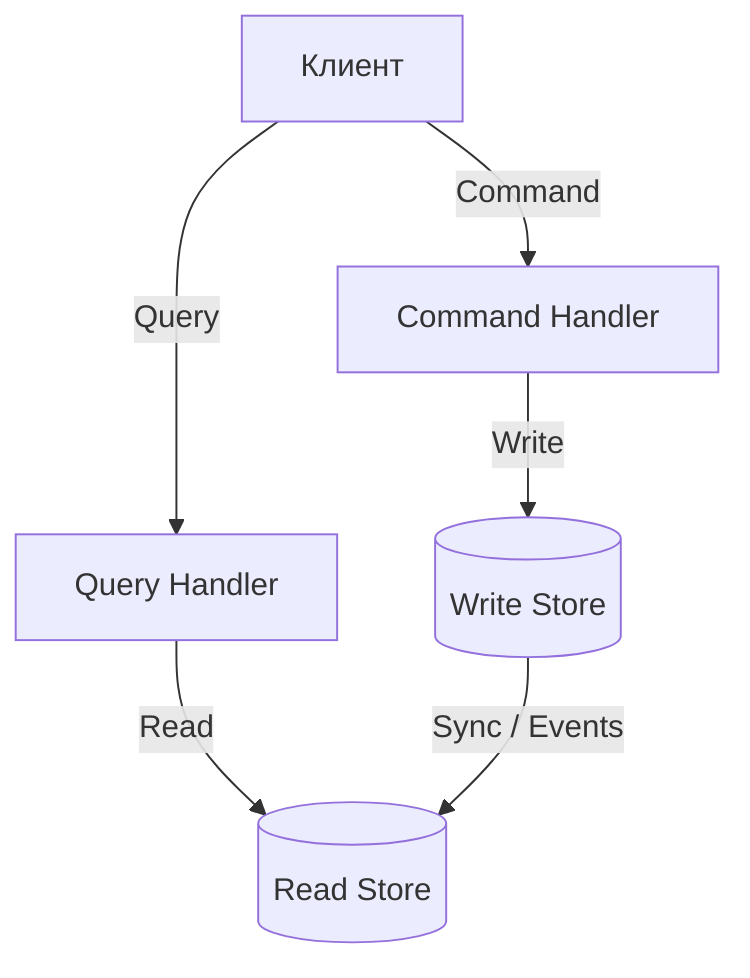

Три уровня `CQRS`:

1. **Разделение на уровне кода**: разные сервисы/интерфейсы для чтения и записи
2. **Разделение на уровне модели**: разные модели для чтения и записи
3. **Разделение на уровне хранения**: разные БД (пишем в PostgreSQL, читаем из Elasticsearch)

```java
// Command — изменение состояния
public record PlaceOrderCommand(
    CustomerId customerId,
    List<OrderLineDTO> lines,
    Address shippingAddress
) {}

@Service
public class OrderCommandService {
    @Transactional
    public OrderId handle(PlaceOrderCommand cmd) {
        Order order = Order.create(cmd.customerId(), cmd.shippingAddress());
        cmd.lines().forEach(l -> order.addLine(l.productId(), l.quantity(), l.price()));
        order.submit();
        orderRepository.save(order);
        return order.getId();
    }
}

// Query — чтение без побочных эффектов
public record OrderSummaryQuery(CustomerId customerId) {}

@Service
public class OrderQueryService {
    @Transactional(readOnly = true)
    public List<OrderSummaryDTO> handle(OrderSummaryQuery query) {
        return orderReadRepository.findSummariesByCustomer(query.customerId());
    }
}
```

Подробнее о `CQRS` в контексте [микросервисов](microservices-interview.md).

> [!mcq]
> - [ ] `CQRS` — обязательное требование `DDD`; без разделения команд и запросов доменная модель не может называться `DDD`. | `CQRS` — самостоятельный паттерн, не обязательная часть `DDD`. Многие `DDD`-системы работают с единой моделью без `CQRS`. ❌ ПОСЛЕДСТВИЕ: команда вводит `CQRS` ради «правильности», в простом домене получается двойная работа: каждое изменение пишется в обе модели, eventual consistency ломает UI «сразу после save».
> - [x] `CQRS` — паттерн, разделяющий модель на команды (запись с изменением состояния) и запросы (чтение без побочных эффектов); может применяться на трёх уровнях — код, модель, хранилище. | Command изменяет состояние и ничего не возвращает (или только ID), Query возвращает данные без побочных эффектов. Разделение может быть на уровне кода, модели или отдельных БД. ✓ ПРИМЕНЯТЬ: e-commerce-каталог — write через PostgreSQL + `Order` агрегат, read через Elasticsearch для поиска по 1М товаров с p99 < 100ms. 📋 ПРАВИЛО: «Команда меняет, запрос читает — никогда наоборот». 🔗 См. Q25, Q26, Q35.
> - [ ] `CQRS` обязательно требует отдельной БД для чтения (Elasticsearch, Redis) и синхронизации через `Kafka`, иначе паттерн бессмысленен. | Это лишь самый глубокий уровень. Часто достаточно разделения моделей в коде при общей БД — это уже даёт выгоду. ❌ ПОСЛЕДСТВИЕ: команда поднимает Elasticsearch для проекта с 100 RPS; синхронизация через Kafka добавляет 30 минут лагов в UI, отдельный девопс-человек на поддержку поискового стека.
> - [ ] `CQRS` — то же, что Event Sourcing: команды генерируют события, события хранят историю, запросы читают из агрегированных проекций. | Это два разных паттерна, которые часто комбинируют. `CQRS` можно применять без Event Sourcing и наоборот. ❌ ПОСЛЕДСТВИЕ: команда внедряет Event Sourcing думая, что это «и есть CQRS»; теряют возможность простых SELECT-запросов, отчёт «продажи за месяц» теперь требует replay 10М событий.

---

## Q25. (!) Что такое Event Sourcing?

**Event Sourcing** -- паттерн, при котором состояние агрегата хранится не как текущий снимок, а как последовательность доменных событий. Текущее состояние восстанавливается путём «проигрывания» всех событий.

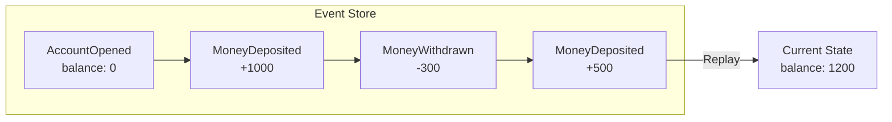

```java
// Восстановление состояния из событий
public class BankAccount {
    private AccountId id;
    private Money balance;

    public static BankAccount reconstitute(List<DomainEvent> events) {
        var account = new BankAccount();
        events.forEach(account::apply);
        return account;
    }

    private void apply(DomainEvent event) {
        switch (event) {
            case AccountOpenedEvent e -> {
                this.id = e.accountId();
                this.balance = Money.ZERO;
            }
            case MoneyDepositedEvent e -> {
                this.balance = balance.add(e.amount());
            }
            case MoneyWithdrawnEvent e -> {
                this.balance = balance.subtract(e.amount());
            }
            default -> throw new UnknownEventException(event);
        }
    }
}
```

Преимущества и недостатки:

| Преимущества | Недостатки |
|-------------|-----------|
| Полная история изменений | Сложность реализации |
| Аудит «из коробки» | Eventual consistency для read-моделей |
| Отладка: можно воспроизвести любое состояние | Версионирование событий при эволюции |
| Легко строить проекции для `CQRS` | Снапшоты нужны для длинных потоков |

> [!mcq]
> - [ ] Event Sourcing — триггеры БД, пишущие в `audit_log` каждое изменение таблицы; текущее состояние остаётся в основных таблицах, а log используется для отладки. | В Event Sourcing события — источник истины, не второстепенный журнал. Текущее состояние восстанавливается проигрыванием событий. ❌ ПОСЛЕДСТВИЕ: команда называет audit-trigger «Event Sourcing», но история неполная (триггер не покрывает batch-операции); восстановление состояния показывает баланс на 5К меньше реального.
> - [ ] Event Sourcing — синоним Domain Event: агрегат публикует события при изменении, но хранение идёт в обычной реляционной модели. | Публикация Domain Event ≠ Event Sourcing. Event Sourcing меняет способ хранения: события становятся основным источником состояния. ❌ ПОСЛЕДСТВИЕ: команда сохраняет события в Kafka и текущее состояние в PostgreSQL; eventual consistency между ними рассогласована — после рестарта бухгалтерский баланс не совпадает с потоком событий.
> - [x] Event Sourcing — паттерн, при котором состояние агрегата хранится не снимком, а последовательностью доменных событий; текущее состояние восстанавливается проигрыванием событий, что даёт полную историю и аудит из коробки. | События — источник истины. Снимок состояния либо не хранится, либо является оптимизацией (snapshot). Плюсы — полная история и отладка; минусы — версионирование событий и eventual consistency для проекций. ✓ ПРИМЕНЯТЬ: банковский ledger в EventStoreDB или Axon Framework — `AccountOpened → MoneyDeposited → MoneyWithdrawn` восстанавливают баланс. 📋 ПРАВИЛО: «События — источник истины, состояние — кэш». 🔗 См. Q18, Q24, Q26.
> - [ ] Event Sourcing — выгрузка WAL-лога PostgreSQL в Kafka через Debezium; подписчики реконструируют состояние по этому логу. | Debezium CDC — технический механизм захвата изменений, не Event Sourcing. В Event Sourcing сами события — первичный артефакт домена, а не репликация WAL. ❌ ПОСЛЕДСТВИЕ: команда настроила Debezium и считает «Event Sourcing готов»; события несут UPDATE-deltas вроде `column_x: old=5 new=7` без доменного смысла — Loyalty-проекция не может понять «что произошло».

---

## Q26. Как связаны CQRS и Event Sourcing?

`CQRS` и `Event Sourcing` часто используются вместе, но это **независимые паттерны**:

- **`CQRS` без `Event Sourcing`**: команды пишут в реляционную БД, запросы читают из оптимизированного read-store
- **`Event Sourcing` без `CQRS`**: события хранят историю, но чтение и запись используют одну модель
- **`CQRS` + `Event Sourcing`**: команды генерируют события → события сохраняются в Event Store → проекции строят read-модель

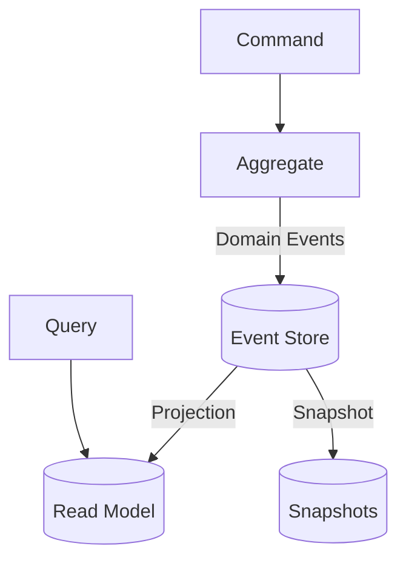

Фреймворки для реализации в Java:

| Фреймворк | Описание |
|-----------|----------|
| `Axon Framework` | Полноценная реализация CQRS + ES |
| `Spring Modulith` | Модульный подход с событиями |
| `EventStoreDB` | Специализированная БД для событий |
| `Eventuate` | CQRS/ES для микросервисов |

> [!mcq]
> - [ ] CQRS и Event Sourcing — один и тот же паттерн под разными названиями: команды генерируют события, запросы читают проекции. | Это два независимых паттерна, которые часто комбинируют. Можно применять один без другого. ❌ ПОСЛЕДСТВИЕ: команда внедряет «CQRS=ES» сразу обоими паттернами, получая 3× сложность инфры (Kafka + Event Store + проекции) при простом CRUD-домене — деплой через 6 месяцев вместо 2, клиент уходит к конкуренту.
> - [ ] Event Sourcing требует CQRS, так как без разделения моделей невозможно строить read-проекции из событий. | Event Sourcing можно применять и без CQRS, хотя комбинация наиболее выгодна. Проекции можно делать в ту же модель. ❌ ПОСЛЕДСТВИЕ: команда блокирует внедрение ES «потому что сначала нужен CQRS», audit-логи продолжают писаться в `audit_log`-таблицу с потерями при rollback — регуляторный аудит выявляет дыру в истории платежей.
> - [ ] CQRS не совместим с Event Sourcing, потому что Event Sourcing не поддерживает отдельную read-модель. | Наоборот — Event Sourcing очень естественно сочетается с CQRS: события генерируют любое число проекций для read-модели. ❌ ПОСЛЕДСТВИЕ: команда строит `EventStore` и сама же читает из него Query-запросы напрямую через replay, p99 latency для отчётов поднимается до 30s, dashboard в Grafana «таймаутит» каждый запрос менеджера.
> - [x] CQRS и Event Sourcing — независимые паттерны, но часто используются вместе: команды генерируют события → события сохраняются в Event Store → проекции строят read-модели для запросов, что даёт мощную комбинацию. | Возможны все четыре комбинации: CQRS без ES (реляционная БД + read-store), ES без CQRS (единая модель), CQRS+ES (наиболее мощно), без обоих (обычный CRUD).

---

## Q27. (!) Что такое Saga Pattern в контексте DDD?

**Saga** -- паттерн управления распределёнными транзакциями, охватывающими несколько `Bounded Context` или агрегатов. Saga разбивает длинную транзакцию на цепочку локальных транзакций с компенсирующими действиями.

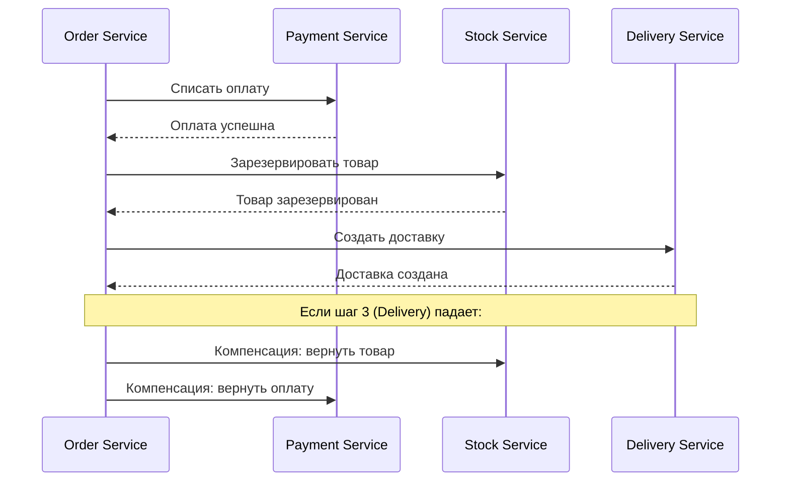

Каждый шаг Saga:
1. Выполняет локальную транзакцию
2. Публикует доменное событие
3. Имеет компенсирующую транзакцию на случай отката

Когда использовать `Saga` вместо распределённой транзакции (`2PC`):

| Критерий | `2PC` | `Saga` |
|----------|-------|--------|
| Связность | Высокая (все участники блокированы) | Низкая (асинхронно) |
| Доступность | Снижается (один участник упал -- все ждут) | Сохраняется |
| Производительность | Медленно (блокировки) | Быстро (eventual consistency) |
| Сложность | Простая модель, сложная инфра | Сложная модель, простая инфра |

Подробнее о компенсирующих транзакциях в [вопросах по микросервисам](microservices-interview.md).

> [!mcq]
> - [ ] Saga — Oracle-транзакция с `savepoints`, позволяющая откатывать отдельные блоки DML без отката всей транзакции. | Saga — архитектурный паттерн для распределённых систем, не savepoints одной БД. Работает между независимыми сервисами без общей транзакции. ❌ ПОСЛЕДСТВИЕ: команда полагается на `SAVEPOINT` в монолите, при разделении на 3 сервиса теряет атомарность; платёж списан, доставка не создалась — деньги клиента «зависли» на 2 недели до ручного разбора.
> - [ ] Saga — синхронный вызов нескольких сервисов через REST с `try/catch` и ручным откатом через DELETE-запросы. | Такой подход возможен, но Saga в `DDD` обычно асинхронна и основана на событиях; компенсации — явные доменные операции, а не DELETE-запросы. ❌ ПОСЛЕДСТВИЕ: при сетевом таймауте между Order и Stock компенсация (`DELETE /reservation/{id}`) проваливается; 200 товаров «зарезервированы навсегда», склад показывает out-of-stock при наличии.
> - [ ] Saga — `Kafka Transactions`; при включённом `transactional.id` все события во всех топиках фиксируются атомарно, что автоматически реализует паттерн. | Kafka Transactions дают атомарность записи в топики, но не решают проблему компенсаций в других сервисах. Saga — архитектурный паттерн, а не Kafka-фича. ❌ ПОСЛЕДСТВИЕ: команда включает `transactional.id`, успокаивается; Payment-сервис всё равно списал деньги при отказе Stock — компенсирующее `RefundCommand` не отправлено.
> - [x] Saga — паттерн управления длинной распределённой транзакцией через цепочку локальных транзакций, каждая со своим компенсирующим действием; применяется, когда `2PC` слишком дорог или недоступен. | Saga обеспечивает eventual consistency без блокировок. Каждый шаг — локальная транзакция + событие; при сбое выполняются компенсации в обратном порядке (BASE model). ✓ ПРИМЕНЯТЬ: order-flow Wolt/Booking — `OrderPlaced → PaymentCharged → StockReserved → DeliveryCreated`, при сбое `RefundPayment + ReleaseStock` в обратном порядке. 📋 ПРАВИЛО: «Локальная транзакция + компенсация вместо 2PC». 🔗 См. Q26, Q28, Q34.

---

## Q28. В чём разница между хореографией и оркестрацией в Saga?

| Аспект | Хореография | Оркестрация |
|--------|------------|-------------|
| **Управление** | Децентрализованное (каждый сервис реагирует на события) | Центральный оркестратор |
| **Связность** | Низкая | Средняя (оркестратор знает обо всех шагах) |
| **Наблюдаемость** | Сложно отследить поток | Легко видеть весь процесс |
| **Циклические зависимости** | Возможны | Исключены |
| **Сложность** | Растёт экспоненциально с числом участников | Линейный рост |
| **Когда использовать** | 2-3 шага, простые потоки | 4+ шагов, сложные потоки |

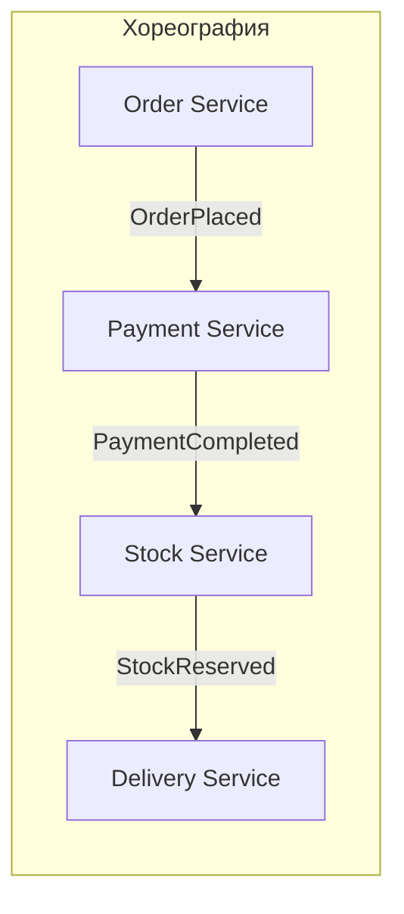

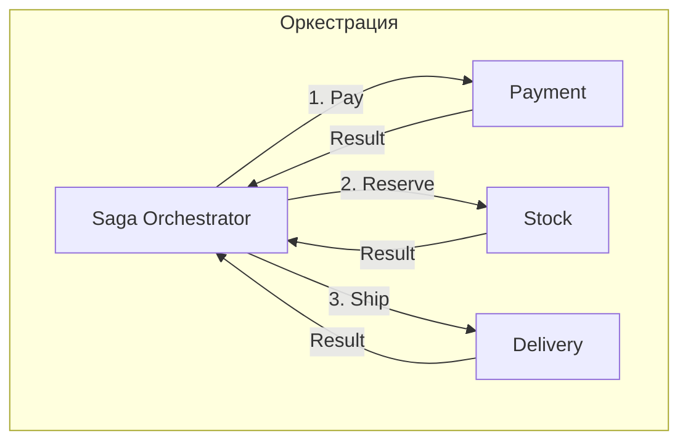

> [!mcq]
> - [ ] Хореография — это синхронные вызовы через REST, оркестрация — асинхронные через Kafka; различие только в транспорте. | Различие не в транспорте, а в управлении. И хореография, и оркестрация обычно асинхронны; оба могут использовать Kafka. ❌ ПОСЛЕДСТВИЕ: команда выбирает хореографию «потому что синхронный REST», Saga из 5 шагов теряет компенсацию при network partition — стоки списались, оплата не прошла, ручной разбор клиентских жалоб 2 дня.
> - [x] Хореография — децентрализованное управление: каждый сервис реагирует на события других сервисов; оркестрация — центральный Saga Orchestrator, явно управляющий шагами; хореография проще для 2-3 шагов, оркестрация — для 4+ шагов со сложной логикой. | Хореография даёт низкую связность, но теряет наблюдаемость с ростом количества шагов. Оркестрация повышает связность с оркестратором, но упрощает понимание и отладку процесса.
> - [ ] Хореография — это использование spring-cloud-dataflow, оркестрация — Camunda BPMN; выбор зависит только от фреймворка. | Хореография и оркестрация — паттерны управления, не фреймворки. Camunda может реализовывать обе, а можно обойтись без BPMN. ❌ ПОСЛЕДСТВИЕ: команда покупает Camunda Enterprise за $50K/год чтобы «получить оркестрацию», пишет 3 простых Saga-сценария — Camunda Engine отъедает 4Gb heap на каждом инстансе, инфраструктурный бюджет вырос в 2.5×.
> - [ ] Хореография работает только с 2 сервисами, оркестрация — с 3+; это строгое ограничение паттернов. | Хореография применима к любому числу сервисов, но её сложность растёт экспоненциально. Оркестрация наоборот — линейно масштабируется, но добавляет компонент оркестратора. ❌ ПОСЛЕДСТВИЕ: команда выбирает оркестрацию для Saga из 2 шагов «по правилу 3+», поднимает Camunda Engine ради двух событий — overhead инфры съедает 30% бюджета спринта на поддержку лишнего компонента.

---

## Q29. Что такое Specification Pattern?

**Specification** -- паттерн, инкапсулирующий бизнес-правило в отдельный объект. Спецификации можно комбинировать через булевы операции (`AND`, `OR`, `NOT`).

Три сценария использования:
1. **Валидация** -- проверка, удовлетворяет ли объект правилу
2. **Выборка** -- фильтрация коллекций / формирование запросов к БД
3. **Создание** -- конструирование объектов, соответствующих правилу

```java
// Базовый интерфейс спецификации
public interface Specification<T> {
    boolean isSatisfiedBy(T candidate);

    default Specification<T> and(Specification<T> other) {
        return candidate -> this.isSatisfiedBy(candidate) && other.isSatisfiedBy(candidate);
    }

    default Specification<T> or(Specification<T> other) {
        return candidate -> this.isSatisfiedBy(candidate) || other.isSatisfiedBy(candidate);
    }

    default Specification<T> not() {
        return candidate -> !this.isSatisfiedBy(candidate);
    }
}

// Конкретные спецификации
public class EligibleForPremiumSpec implements Specification<Customer> {
    public boolean isSatisfiedBy(Customer customer) {
        return customer.totalOrders() > 10
            && customer.totalSpent().isGreaterThan(Money.of(50_000));
    }
}

public class ActiveCustomerSpec implements Specification<Customer> {
    public boolean isSatisfiedBy(Customer customer) {
        return customer.lastOrderDate().isAfter(LocalDate.now().minusMonths(6));
    }
}

// Композиция
Specification<Customer> premiumAndActive =
    new EligibleForPremiumSpec().and(new ActiveCustomerSpec());

List<Customer> vipCustomers = customers.stream()
    .filter(premiumAndActive::isSatisfiedBy)
    .toList();
```

Для интеграции с JPA / Spring Data можно реализовать спецификации через `Criteria API` или `Spring Data Specification<T>`.

> [!mcq]
> - [ ] Specification — это аннотация из JPA, создающая динамические запросы через @Query на основе параметров метода репозитория. | Specification — это домéнный паттерн, а не JPA-аннотация. Spring Data имеет свой Specification<T>, но он реализует тот же паттерн. ❌ ПОСЛЕДСТВИЕ: команда ищет «аннотацию `@Specification`», не находит, рисует логику премиум-клиента в `@Query`-строках по 200 строк SQL — рефакторинг бизнес-правила «убрать порог 1000 руб.» затрагивает 12 репозиториев.
> - [ ] Specification — это Predicate<T> из Java 8, используемый только для фильтрации Stream без возможности комбинирования или проверки отдельных объектов. | Specification шире Predicate: он поддерживает композицию AND/OR/NOT, может использоваться для валидации, выборки и создания, а не только для Stream. ❌ ПОСЛЕДСТВИЕ: команда использует `Predicate<Order>` только для in-memory фильтра, такая же логика «активный клиент» дублируется в JPA-репозитории через `@Query` — расхождение правил между API и аналитикой выявляется при квартальной отчётности.
> - [x] Specification — паттерн, инкапсулирующий бизнес-правило в отдельный объект с методом isSatisfiedBy; спецификации комбинируются через AND/OR/NOT и применяются для валидации, выборки коллекций и формирования запросов к БД. | EligibleForPremiumSpec.and(ActiveCustomerSpec) даёт composable бизнес-правила. Одну и ту же спецификацию можно применять в in-memory фильтре или Criteria API. ✓ ПРИМЕНЯТЬ: e-commerce loyalty-системы — `PremiumCustomerSpec` переиспользуется в выборке для рассылок, валидации скидки, формировании отчётов аналитики. 📋 ПРАВИЛО: «Бизнес-правило — объект первого класса». 🔗 См. Q21, Q22, Q33.
> - [ ] Specification — это документация требований в Confluence; разработчик читает её и вручную реализует if-условия в сервисах. | Specification — это код, а не документ. Спецификация — объект первого класса, который можно тестировать, комбинировать и переиспользовать. ❌ ПОСЛЕДСТВИЕ: бизнес-аналитик меняет «премиум-клиент» в Confluence-странице, разработчики не замечают — `if`-ы в `OrderService` остаются старыми, скидка применяется к неактивным клиентам, финансовая дыра 800К руб. за квартал.

---

## Q30. Как организовать пакетную структуру проекта по DDD?

Два основных подхода: **по слоям** и **по фичам/контекстам** (рекомендуется второй):

### По Bounded Context (рекомендуемый)

```
com.example.shop
├── order/                          # Bounded Context: Заказы
│   ├── domain/
│   │   ├── model/                  # Entity, Value Object, Aggregate Root
│   │   │   ├── Order.java
│   │   │   ├── OrderLine.java
│   │   │   └── OrderStatus.java
│   │   ├── event/                  # Domain Events
│   │   │   └── OrderPlacedEvent.java
│   │   ├── service/                # Domain Services
│   │   │   └── OrderPricingService.java
│   │   ├── repository/             # Repository interfaces
│   │   │   └── OrderRepository.java
│   │   └── specification/          # Specifications
│   │       └── OverdueOrderSpec.java
│   ├── application/                # Application Services, Use Cases
│   │   ├── PlaceOrderUseCase.java
│   │   └── dto/
│   │       └── PlaceOrderCommand.java
│   └── infrastructure/             # Implementations
│       ├── persistence/
│       │   └── JpaOrderRepository.java
│       └── messaging/
│           └── KafkaOrderEventPublisher.java
├── catalog/                        # Bounded Context: Каталог
│   ├── domain/
│   ├── application/
│   └── infrastructure/
└── shipping/                       # Bounded Context: Доставка
    ├── domain/
    ├── application/
    └── infrastructure/
```

Ключевые правила:

- **`domain/` не зависит от `infrastructure/`** -- инверсия зависимостей
- Между контекстами -- только через `Integration Events` или `ACL`
- `application/` зависит от `domain/`, но не наоборот

> [!mcq]
> - [ ] Пакеты структурируются по техническим слоям: `controller/`, `service/`, `repository/`, `entity/` — внутри каждого находятся объекты всех `Bounded Context` вперемешку. | Это package-by-layer — антипаттерн в `DDD`: границы контекстов размываются, изменение одной фичи требует правки во всех пакетах. ❌ ПОСЛЕДСТВИЕ: фича «новый тип заказа» меняет 6 пакетов одновременно, мердж-конфликт на каждом MR с другой командой; ArchUnit не помогает — все «по слою» формально правильно.
> - [ ] Пакеты именуются по слоям Clean Architecture: `entities/`, `use-cases/`, `interface-adapters/`, `frameworks/`; разделение на `Bounded Context` выполняется только в диаграмме компонентов. | Clean Architecture можно комбинировать с `DDD`, но без выделения контекстов в коде модель рассыпается по слоям без организационной границы. ❌ ПОСЛЕДСТВИЕ: команда не видит границ между Order и Catalog в коде, зависимости тянутся через `entities/` — невозможно вынести Catalog в отдельный сервис без переписывания.
> - [ ] Пакеты должны следовать структуре `Entity → таблица БД`: для каждой JPA-сущности создаётся пакет с её DTO, мапперами и сервисами. | Entity-ориентированная структура смешивает агрегаты и инфраструктуру. `DDD`-структура следует за `Bounded Context`, а не за таблицами. ❌ ПОСЛЕДСТВИЕ: при добавлении nested-агрегата `OrderLine` появляется отдельный пакет `orderline/`, дублирующий логику `Order`; через год — 50 пакетов вместо 5 контекстов.
> - [x] Рекомендуемая структура — package-by-bounded-context: на верхнем уровне контексты (`order`, `catalog`, `shipping`), внутри каждого — `domain/`, `application/`, `infrastructure/`; domain не зависит от infrastructure, между контекстами — только через `Integration Events` или ACL. | Структура отражает границы модели. Каждый контекст самодостаточен, изменения локализованы, направление зависимостей: infrastructure → application → domain. ✓ ПРИМЕНЯТЬ: Spring Modulith-проекты — `com.example.shop.order/{domain,application,infrastructure}`, `verify()` проверяет, что `catalog` не тянет `order.domain`. 📋 ПРАВИЛО: «Контекст на верхнем уровне, слои — внутри». 🔗 См. Q5, Q31, Q32.

---

## Q31. Как DDD сочетается с гексагональной архитектурой?

**Гексагональная архитектура** (Ports and Adapters) отлично дополняет `DDD`, обеспечивая изоляцию домена от инфраструктуры.

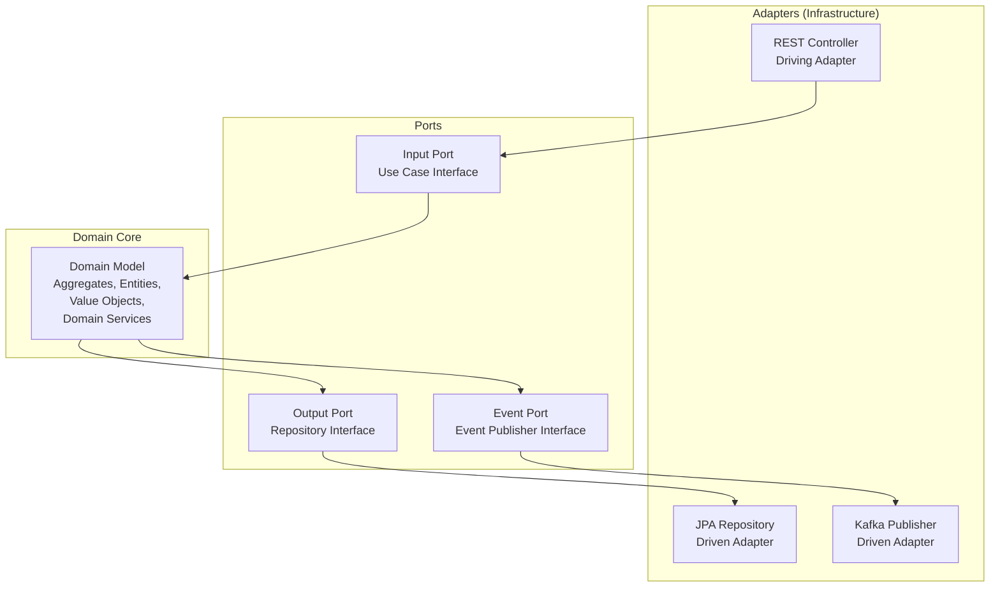

```java
// Port (Input) — интерфейс use case
public interface PlaceOrderUseCase {
    OrderId execute(PlaceOrderCommand command);
}

// Port (Output) — интерфейс репозитория (в доменном слое)
public interface OrderRepository {
    void save(Order order);
    Optional<Order> findById(OrderId id);
}

// Domain — чистая бизнес-логика
public class Order { /* ... */ }

// Adapter (Input) — REST контроллер
@RestController
@RequiredArgsConstructor
public class OrderController {
    private final PlaceOrderUseCase placeOrder;

    @PostMapping("/orders")
    public ResponseEntity<OrderId> create(@RequestBody PlaceOrderRequest req) {
        return ResponseEntity.ok(placeOrder.execute(req.toCommand()));
    }
}

// Adapter (Output) — JPA реализация
@Repository
public class JpaOrderRepository implements OrderRepository { /* ... */ }
```

Подробнее в [вопросах по Clean Architecture](clean-architecture-interview.md).

> [!mcq]
> - [x] Гексагональная архитектура даёт DDD готовую структуру изоляции: Domain Core — агрегаты и Value Objects, Input Ports — Use Case-интерфейсы, Output Ports — Repository-интерфейсы, Adapters — REST/JPA/Kafka реализации; домéн не зависит от инфраструктуры. | Hexagonal + DDD — естественная пара: ports задают контракт для домена, adapters реализуют технические детали. Это делает домéн тестируемым и переносимым. ✓ ПРИМЕНЯТЬ: Booking.com и Wolt — Domain Core не знает про Spring/JPA, замена PostgreSQL на DynamoDB затрагивает только адаптер, тесты домена прогоняются за 50ms. 📋 ПРАВИЛО: «Домен в центре, инфраструктура на периферии». 🔗 См. Q21, Q30, Q32.
> - [ ] Гексагональная архитектура противоречит DDD, так как требует выносить Repository в домéн, тогда как DDD настаивает на том, чтобы Repository жил в инфраструктуре. | Наоборот: и Hexagonal, и DDD требуют интерфейс Repository в домéнном слое, а реализацию — в инфраструктуре. Это полностью совместимо. ❌ ПОСЛЕДСТВИЕ: команда «решает противоречие» через сервисный слой-обёртку над JPA, домен зависит от `@Repository`-классов Spring Data — миграция с Hibernate на jOOQ затрагивает 40 файлов в `domain/` пакете.
> - [ ] Гексагональная архитектура вытесняет DDD: вместо Bounded Context используется шестиугольник с шестью сторонами, каждая из которых соответствует одному техническому адаптеру. | Количество адаптеров произвольно, а «шестиугольник» — метафора. Hexagonal не заменяет DDD, а дополняет его на уровне одного контекста. ❌ ПОСЛЕДСТВИЕ: команда искусственно ограничивается 6 адаптерами «по числу сторон шестиугольника», 7-й адаптер для GraphQL пишут как `if`-разветвление в REST-контроллере — protobuf-клиент через год не интегрируется без переписывания.
> - [ ] Гексагональная архитектура применяется только к микросервисам, тогда как DDD применяется только к монолитам; они не могут работать вместе. | Оба подхода применимы и к монолитам, и к микросервисам. Более того, внутри модульного монолита каждый контекст может использовать Hexagonal. ❌ ПОСЛЕДСТВИЕ: команда отказывается от Hexagonal в монолите «потому что он только для микросервисов», бизнес-логика смешивается с JPA-вызовами в сервисах — unit-тесты требуют `@SpringBootTest` (15s на класс) вместо чистых JUnit (50ms).

---

## Q32. Как использовать Spring Modulith для реализации DDD?

`Spring Modulith` -- модуль `Spring`, который поддерживает модульные монолиты и помогает реализовать `DDD` без микросервисов.

Возможности:

1. **Модульная структура** -- каждый `Bounded Context` = один модуль Spring Modulith
2. **Event-driven коммуникация** -- `@ApplicationModuleListener` с гарантией доставки
3. **Верификация границ** -- тест проверяет, что модули не нарушают зависимости
4. **Transactional Outbox** -- встроенная поддержка `Outbox Pattern`

```java
// Структура проекта
// com.example.shop.order    → модуль "order"
// com.example.shop.catalog  → модуль "catalog"
// com.example.shop.shipping → модуль "shipping"

// Публикация события из модуля Order
@Service
@RequiredArgsConstructor
public class OrderService {
    private final ApplicationEventPublisher events;

    @Transactional
    public void placeOrder(PlaceOrderCommand cmd) {
        Order order = Order.create(cmd);
        orderRepo.save(order);
        events.publishEvent(new OrderPlacedEvent(order.getId()));
    }
}

// Обработка в модуле Shipping (другой Bounded Context)
@ApplicationModuleListener
public void on(OrderPlacedEvent event) {
    shippingService.scheduleShipment(event.orderId());
}

// Тест верификации модульной структуры
@Test
void verifyModularStructure() {
    ApplicationModules.of(ShopApplication.class).verify();
}
```

> [!mcq]
> - [ ] Spring Modulith — это обёртка над Spring Cloud для создания микросервисов; без него Bounded Context нельзя реализовать корректно. | Spring Modulith — это, наоборот, инструмент для модульных монолитов, не микросервисов. Bounded Context можно реализовать и без него, но Modulith упрощает соблюдение границ. ❌ ПОСЛЕДСТВИЕ: команда тащит Spring Cloud Eureka+Ribbon+Hystrix как «обязательную часть Modulith», получает heavyweight-стек поверх простого монолита — heap 6Gb на старте, контейнер не помещается в pod limits.
> - [x] Spring Modulith даёт модульную структуру (каждый пакет первого уровня — модуль), @ApplicationModuleListener с Transactional Outbox для межмодульного взаимодействия и тест ApplicationModules.verify() для проверки границ. | Modulith делает модульный монолит practical: события вместо прямых вызовов, outbox для at-least-once delivery, автоматическая проверка что модули не нарушают зависимости.
> - [ ] Spring Modulith требует отдельной базы данных на модуль и разделяет их через схемы Flyway; без этого модули не считаются изолированными. | Spring Modulith не требует разделения БД. Границы проверяются на уровне Java-пакетов и зависимостей, БД может быть общей. ❌ ПОСЛЕДСТВИЕ: команда поднимает 5 PostgreSQL-схем для модулей монолита, eventually-consistent JOIN-ы между схемами через application-level код тормозят аналитику в 8×, DBA увольняется через месяц.
> - [ ] Spring Modulith — это фреймворк для кодогенерации: из конфигурации application.yml создаются REST-контроллеры и JPA-репозитории каждого модуля. | Spring Modulith ничего не генерирует. Это набор инструментов для структурирования, проверки и интеграции модулей в Spring Boot-приложении. ❌ ПОСЛЕДСТВИЕ: команда ждёт «генерации модулей по yml», месяц теряется на изучение того что Modulith не генератор — релизный план сдвигается, конкурент выходит на рынок первым.

---

## Q33. Какие анти-паттерны встречаются при реализации DDD?

| Анти-паттерн | Описание | Как исправить |
|-------------|----------|---------------|
| **Anemic Domain Model** | Модель без поведения: сущности -- «мешки с данными», логика в сервисах | Перенести бизнес-логику в агрегаты и Entity |
| **God Aggregate** | Один огромный агрегат с десятками Entity | Разделить на несколько маленьких агрегатов |
| **CRUD-мышление** | Операции `create/read/update/delete` вместо доменных команд | Именовать методы на языке домена: `place()`, `cancel()`, `approve()` |
| **Repository per Entity** | Отдельный репозиторий для каждой таблицы | Один репозиторий на `Aggregate Root` |
| **Leaking Domain** | Доменные объекты возвращаются через API (Entity как DTO) | Использовать DTO / маппинг на границе контекста |
| **Shared Database** | Несколько контекстов работают с одной БД без границ | Каждый контекст -- своя схема или БД |
| **DDD Everywhere** | Применение DDD к простым CRUD-модулям | Применять DDD только к `Core Domain` |
| **Tactical без Strategic** | Паттерны без понимания границ контекстов | Начинать со стратегического дизайна |

Пример анемичной модели vs Rich Domain Model:

```java
// ❌ Anemic Domain Model
public class Order {
    private Long id;
    private String status;
    private List<OrderLine> lines;
    // только геттеры и сеттеры
}

@Service
public class OrderService {
    public void cancelOrder(Long orderId) {
        Order order = repo.findById(orderId);
        if (!"PLACED".equals(order.getStatus())) {
            throw new IllegalStateException("Cannot cancel");
        }
        order.setStatus("CANCELLED");
        for (OrderLine line : order.getLines()) {
            stockService.release(line.getProductId(), line.getQuantity());
        }
        repo.save(order);
    }
}

// ✅ Rich Domain Model
public class Order {
    private OrderId id;
    private OrderStatus status;
    private List<OrderLine> lines;

    public void cancel() {
        if (status != OrderStatus.PLACED) {
            throw new OrderCannotBeCancelledException(id, status);
        }
        this.status = OrderStatus.CANCELLED;
        registerEvent(new OrderCancelledEvent(id, lines));
    }
}
```

> [!mcq]
> - [ ] Главный антипаттерн — использование Java `record` вместо `class` для `Value Object`, так как record не поддерживает методы и не может иметь валидацию. | `record` отлично поддерживает методы и валидацию через compact-конструктор. Это рекомендуемая основа для VO, а не антипаттерн. ❌ ПОСЛЕДСТВИЕ: команда отказывается от records, пишет boilerplate-классы с Lombok @Data и сеттерами; VO становится мутабельным — баг с разделяемым `Money` объектом по нескольким заказам.
> - [ ] Главный антипаттерн — применение `DDD` к `Core Domain`, так как `DDD` создаёт overhead и замедляет разработку важнейшей части системы. | Наоборот: `Core Domain` — именно там, где `DDD` наиболее оправдан. Антипаттерн — применять `DDD` ко всей системе, включая Generic. ❌ ПОСЛЕДСТВИЕ: команда применяет CRUD к ценообразованию (Core Domain); бизнес-правила «скидка для VIP + промо + сезонность» расползаются по 8 if-ам в `*Service`, регрессия на каждом релизе.
> - [x] Ключевые антипаттерны: Anemic Domain Model (модель без поведения), God Aggregate (огромный агрегат), CRUD-мышление, Repository per Entity, Leaking Domain (Entity в REST), Shared Database, DDD Everywhere, Tactical без Strategic. | Каждый антипаттерн ломает базовые принципы: анемичная модель разрывает поведение и данные; God Aggregate создаёт конкуренцию блокировок; shared DB уничтожает автономность контекстов. ✓ ПРИМЕНЯТЬ: ревью Java-сервисов в Detmir/Yandex — чек-лист анти-паттернов перед production-релизом нового микросервиса. 📋 ПРАВИЛО: «Сначала Strategic, потом Tactical, никогда CRUD-Entity-Service». 🔗 См. Q4, Q15, Q34.
> - [ ] Антипаттерн — использование `Optional<T>` в репозиториях вместо возврата `null`, так как `Optional` не поддерживает lazy loading в JPA. | `Optional` в репозиториях — идиоматичное API; lazy loading определяется отдельно. Это не имеет отношения к DDD-антипаттернам. ❌ ПОСЛЕДСТВИЕ: команда возвращает `null` из `findById()`, NPE летит из доменного слоя в production; код-стайл деградирует, через 6 месяцев `if (x != null)` в каждом use-case.

---

## Q34. (!) Как связаны DDD и микросервисы?

`DDD` и микросервисы -- взаимодополняющие подходы:

- **`Bounded Context` = граница микросервиса** -- стратегический DDD даёт критерий декомпозиции
- **`Context Map` = карта взаимодействий** -- показывает, как сервисы интегрируются
- **`ACL` = адаптер между сервисами** -- защищает модель от чужих контрактов
- **`Domain Events` = асинхронная коммуникация** -- события между сервисами через брокер

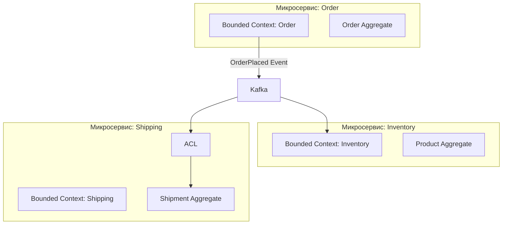

Порядок проектирования:

1. **Event Storming** -- определить домен, события, команды
2. **Выделить Bounded Context** -- сгруппировать связанные концепции
3. **Определить Context Map** -- паттерны интеграции между контекстами
4. **Решить: монолит или микросервисы** -- `DDD` работает в обоих случаях
5. **Реализовать тактические паттерны** внутри каждого контекста

> Важно: `DDD` не требует микросервисов. Модульный монолит с чёткими `Bounded Context` (через `Spring Modulith`) может быть лучшим стартом, который позже легко разделить на микросервисы.

> [!mcq]
> - [ ] DDD — это синоним микросервисов; оба термина описывают одно и то же: разделение системы на маленькие автономные компоненты. | DDD — подход к проектированию моделей, микросервисы — стиль развёртывания. Это разные вещи: DDD работает и в модульном монолите. ❌ ПОСЛЕДСТВИЕ: команда автоматически дробит систему на 20 микросервисов «потому что DDD», получает distributed monolith, latency на checkout растёт с 80ms до 1.2s — конверсия в покупку падает на 15%.
> - [ ] DDD применим только к монолитам, тогда как для микросервисов используются другие паттерны (CQRS, Event Sourcing, API Gateway). | DDD одинаково применим и к монолитам, и к микросервисам. CQRS/ES/API Gateway — дополнительные паттерны, не альтернатива DDD. ❌ ПОСЛЕДСТВИЕ: команда отказывается от Bounded Context в микросервисах, каждый сервис лепит свою `Customer`-модель — синхронизация через REST становится клубком из 30 endpoints, on-call инженер не понимает где источник правды.
> - [ ] Каждый Aggregate должен быть развёрнут как отдельный микросервис для гарантии транзакционной границы; это жёсткое правило DDD. | Агрегат — это транзакционная граница внутри контекста, но не граница развёртывания. Один сервис обычно содержит несколько агрегатов. ❌ ПОСЛЕДСТВИЕ: 50 агрегатов = 50 сервисов, каждая бизнес-операция требует 2PC через Saga-оркестратор, MTTR при инцидентах вырос с 15 минут до 4 часов из-за поиска failed step в распределённом трейсе.
> - [x] Bounded Context — естественный критерий декомпозиции на микросервисы: один контекст = один сервис; Context Map описывает интеграции; ACL защищает модель; Domain Events через брокер синхронизируют контексты. DDD не требует микросервисов — модульный монолит с Spring Modulith часто лучший старт. | Правильный порядок: Event Storming → Bounded Contexts → Context Map → решение про монолит/микросервисы → тактические паттерны. DDD даёт стратегию декомпозиции, а не предписывает технологию развёртывания.

---

## Q35. Как тестировать доменную модель?

Доменная модель -- самая важная часть для тестирования, и одновременно самая простая, потому что не зависит от инфраструктуры.

Уровни тестирования в `DDD`:

| Уровень | Что тестируем | Инструменты |
|---------|--------------|-------------|
| **Unit** (домен) | Агрегаты, Value Objects, Domain Services | JUnit, AssertJ |
| **Integration** | Application Services, Repositories | Spring Test, Testcontainers |
| **Contract** | Формат Integration Events | Spring Cloud Contract, Pact |

```java
// Тест Value Object
@Test
void moneyAddition_sameCurrency_returnsSum() {
    Money a = new Money(BigDecimal.valueOf(100), Currency.getInstance("RUB"));
    Money b = new Money(BigDecimal.valueOf(250), Currency.getInstance("RUB"));

    Money result = a.add(b);

    assertThat(result.amount()).isEqualByComparingTo("350");
    assertThat(result.currency()).isEqualTo(Currency.getInstance("RUB"));
}

@Test
void moneyAddition_differentCurrency_throwsException() {
    Money rub = new Money(BigDecimal.valueOf(100), Currency.getInstance("RUB"));
    Money usd = new Money(BigDecimal.valueOf(50), Currency.getInstance("USD"));

    assertThatThrownBy(() -> rub.add(usd))
        .isInstanceOf(CurrencyMismatchException.class);
}

// Тест Aggregate
@Test
void orderSubmit_withLines_changesStatusAndPublishesEvent() {
    Order order = Order.create(customerId, address);
    order.addLine(productId, 2, price);

    order.submit();

    assertThat(order.getStatus()).isEqualTo(OrderStatus.SUBMITTED);
    assertThat(order.domainEvents())
        .hasSize(1)
        .first()
        .isInstanceOf(OrderSubmittedEvent.class);
}

@Test
void orderSubmit_emptyOrder_throwsException() {
    Order order = Order.create(customerId, address);

    assertThatThrownBy(order::submit)
        .isInstanceOf(EmptyOrderException.class);
}

// Тест Domain Service
@Test
void transfer_sufficientFunds_movesMoneyBetweenAccounts() {
    BankAccount from = new BankAccount(id1, ownerId, Money.of(1000));
    BankAccount to = new BankAccount(id2, ownerId, Money.of(500));

    new TransferService().transfer(from, to, Money.of(300));

    assertThat(from.getBalance()).isEqualTo(Money.of(700));
    assertThat(to.getBalance()).isEqualTo(Money.of(800));
}
```

Преимущество `DDD` для тестирования: доменные тесты не требуют Spring-контекста, базы данных или моков инфраструктуры. Они быстрые и стабильные.

> [!mcq]
> - [x] Domain-слой тестируется pure-unit-тестами без Spring-контекста и БД (JUnit + AssertJ) — быстро и стабильно; Application Services — через @SpringBootTest или Testcontainers; Integration Events — через Contract Tests (Pact / Spring Cloud Contract). | Пирамида тестов для DDD: основная масса — unit-тесты агрегатов и VO без инфраструктуры, меньше — интеграционные с БД, минимум — e2e. Это даёт скорость и надёжность. ✓ ПРИМЕНЯТЬ: Booking.com — pure JUnit для агрегатов (50ms на тест), Pact для контрактов между сервисами, Testcontainers только для @Repository-слоя. 📋 ПРАВИЛО: «Тест домена не должен поднимать Spring». 🔗 См. Q14, Q21, Q33.
> - [ ] Доменная модель тестируется только через Cucumber-сценарии на Gherkin, поскольку unit-тесты не могут покрыть бизнес-логику агрегатов. | Unit-тесты прекрасно покрывают бизнес-логику агрегатов. Cucumber полезен на уровне acceptance-тестов, но не обязателен и не заменяет unit-тесты. ❌ ПОСЛЕДСТВИЕ: команда вкладывается в Cucumber/Gherkin (12К строк feature-файлов), CI прогон занимает 25 минут, разработчики коммитят с пропуском тестов локально — баги по краям инвариантов агрегата прорываются в прод еженедельно.
> - [ ] Доменные тесты требуют @SpringBootTest и Testcontainers, иначе они не смогут проверить правильную инициализацию агрегата через Spring DI. | Агрегат не должен зависеть от Spring DI. Если требуется поднять контекст для теста VO/агрегата — это сигнал утечки инфраструктуры в домéн. ❌ ПОСЛЕДСТВИЕ: каждый тест агрегата поднимает Spring + Testcontainers (15s старт), пайплайн на 200 тестов занимает 50 минут — разработчики пишут меньше тестов, coverage падает с 75% до 40%.
> - [ ] Тесты агрегатов пишутся через Mockito — каждый внутренний Entity и VO мокается; реальная композиция не тестируется для ускорения тестов. | Моки внутри агрегата разрушают инкапсуляцию и делают тесты хрупкими. Агрегат тестируется как цельный блок с реальными VO/Entity внутри — это тест логики, а не структуры. ❌ ПОСЛЕДСТВИЕ: каждый рефакторинг внутреннего поля `Order` ломает 50 моков в тестах, разработчики коммитят `when(mock.x()).thenReturn(any())` лишь бы compile прошёл — тесты зелёные, реальный баг с расчётом скидки прорывается в прод.

## Q36. (!) Как реализовать Anti-Corruption Layer (ACL) в Spring?

**Anti-Corruption Layer (ACL)** — слой-переводчик между двумя `Bounded Context`-ами с разными моделями. Защищает собственный контекст от "загрязнения" чужими концепциями и языком.

**Сценарий:** Order Context интегрируется с внешней ERP-системой (SAP), у которой своя модель данных.

```java
// Внешняя модель ERP (чужой язык/концепции)
public record ErpProductDto(
    String artNumber,
    BigDecimal listPrice,
    String availStatus    // "IN_STOCK", "OUT_OF_STOCK", "RESERVED"
) {}

// --- ACL: Translator ---
@Component
public class ProductCatalogACL {

    private final ErpProductClient erpClient;

    public Optional<Product> findProduct(ProductId productId) {
        try {
            ErpProductDto erp = erpClient.getProduct(productId.value());
            return Optional.of(translate(erp));
        } catch (ErpProductNotFoundException e) {
            return Optional.empty();
        } catch (ErpServiceException e) {
            throw new ProductCatalogUnavailableException("ERP unavailable", e);
        }
    }

    private Product translate(ErpProductDto erp) {
        return new Product(
            ProductId.of(erp.artNumber()),
            Money.of(erp.listPrice(), Currency.RUB),
            switch (erp.availStatus()) {
                case "IN_STOCK"  -> ProductAvailability.AVAILABLE;
                case "RESERVED"  -> ProductAvailability.LIMITED;
                default          -> ProductAvailability.UNAVAILABLE;
            }
        );
    }
}
```

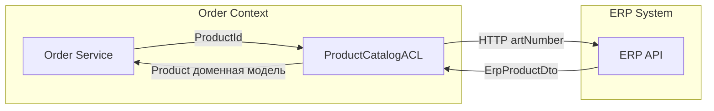

**ACL + Circuit Breaker (Resilience4j):**

```java
@CircuitBreaker(name = "erp", fallbackMethod = "fallback")
public Optional<Product> findProduct(ProductId id) { ... }

private Optional<Product> fallback(ProductId id, Exception e) {
    return localProductCache.find(id);  // stale-данные из локального кэша
}
```

**Когда нужен ACL:**
- Интеграция с legacy (SAP, 1C, SOAP)
- Чужой upstream с "плохой" моделью, навязывающей свои концепции
- Высокая изменчивость внешнего API

> [!mcq]
> - [ ] ACL в Spring — это аннотация `@AntiCorruptionLayer` на Feign-клиенте, которая автоматически маппит DTO внешнего API в домéнные объекты через Jackson. | Такой аннотации нет. ACL — это осознанно написанный компонент-переводчик, обычно @Component с методом translate() и явной логикой маппинга. ❌ ПОСЛЕДСТВИЕ: команда ищет несуществующую аннотацию неделю, в итоге Jackson десериализует `LegacyCustomerDTO` прямо в `Customer`-агрегат — поле `custType=99` (мусор из ERP) ломает switch-case в `OrderProcessor`, NPE в проде.
> - [x] ACL реализуется как @Component с клиентом внешней системы и методом translate(ExternalDto) → DomainObject; обрабатывает ошибки upstream, может быть обёрнут Circuit Breaker (@CircuitBreaker) с fallback на кэш для отказоустойчивости. | Основа ACL: инкапсуляция клиента + translator + маппинг ошибок. Resilience4j добавляет защиту от сбоев upstream, fallback возвращает stale-данные из кэша. Closed (normal), Open (fail fast), Half-Open (probe recovery) states.
> - [ ] ACL — это Spring Interceptor на RestTemplate, который трансформирует все HTTP-ответы в формат текущего контекста через глобальную конфигурацию Jackson. | Глобальный interceptor не решает задачу ACL: маппинг между моделями обычно сложнее, чем переименование полей, и должен быть явным per-context, а не глобальным. ❌ ПОСЛЕДСТВИЕ: глобальный interceptor пытается переименовать поля для всех вызовов, конфликт между ERP-маппингом и CRM-маппингом — JSON-ответы клиентского API внезапно теряют поля, frontend разваливается на проде.
> - [ ] ACL реализуется через JPA EntityListeners @PrePersist, которые конвертируют входящие данные перед сохранением в БД. | EntityListeners работают на уровне персистенции внутри одного контекста, а ACL работает на границе между контекстами до попадания данных в домéн. ❌ ПОСЛЕДСТВИЕ: данные из SAP уже попали в `Customer`-агрегат и вызвали ошибку валидации в бизнес-методе ДО `@PrePersist` — сервис кидает `IllegalStateException` на каждом 5-м запросе, on-call дежурный получает 50 алертов за ночь.

## Q37. Какие стратегии Context Mapping применяются на практике?

**Context Mapping** — описание отношений и паттернов интеграции между `Bounded Context`-ами.

| Паттерн | Отношение | Описание |
|---------|-----------|----------|
| **Partnership** | Равноправные | Совместная разработка API; одна команда или тесная коллаборация |
| **Shared Kernel** | Общий код | Разделяемая часть модели; риск тесной связи |
| **Customer/Supplier** | Downstream/Upstream | Upstream диктует API; Downstream формулирует требования |
| **Conformist** | Подчинение | Downstream копирует модель Upstream без власти над ней |
| **Anti-Corruption Layer** | Защита | Переводчик; применяется при интеграции с legacy |
| **Open Host Service** | Открытый протокол | Upstream публикует стабильный API/протокол |
| **Published Language** | Стандартный формат | Общий формат обмена (JSON Schema, AsyncAPI) |
| **Separate Ways** | Нет интеграции | Контексты изолированы; максимальная автономность |

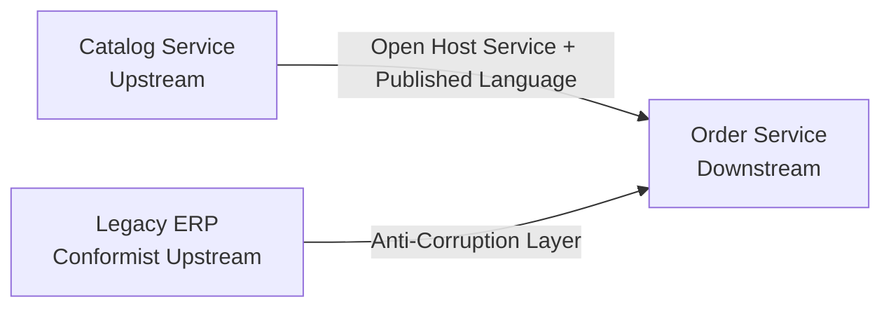

**Прагматичные рекомендации:**
- Зафиксируйте карту контекстов (`Context Map`) до начала разработки
- Всегда используйте ACL при интеграции с внешними системами
- Минимизируйте `Shared Kernel` — он создаёт скрытые зависимости между командами
- Задокументируйте паттерн в ADR (Architecture Decision Record)

> [!mcq]
> - [ ] На практике используется только один паттерн — Shared Kernel: все контексты получают общие DTO через Maven dependency, что обеспечивает единообразие и быструю разработку. | Shared Kernel — наиболее рискованный паттерн: общие зависимости ломают автономность. На практике чаще применяются Customer-Supplier, Conformist, ACL и OHS. ❌ ПОСЛЕДСТВИЕ: 7 команд тянут общий `commons-dto` модуль, изменение поля `Customer.email` ломает 12 сервисов одновременно — координация релизов через 4-часовой kickoff-митинг, хотфиксы блокируются неделями.
> - [ ] Применяется всегда Partnership: две команды синхронно разрабатывают API через общие ежедневные митинги без асинхронных контрактов. | Partnership подходит для 1-2 тесно сотрудничающих команд, но не универсален. Большинство интеграций — Customer-Supplier или ACL. ❌ ПОСЛЕДСТВИЕ: 8 команд пытаются работать в Partnership через ежедневные синки, календарь забит на 4 часа в день митингами — фактический прогресс падает на 60%, фичи задерживаются на 2 спринта.
> - [x] На практике чаще всего применяются: Customer-Supplier для подконтрольных upstream, Conformist для неподконтрольных, ACL для legacy и чужих систем, Open Host Service + Published Language для публичного API, Separate Ways для автономности. | Выбор определяется властью команды и стабильностью upstream. Главная рекомендация — минимизировать Shared Kernel и обязательно использовать ACL при интеграции с внешними системами.
> - [ ] Context Mapping требует применения всех паттернов одновременно к каждой паре контекстов, иначе Context Map считается неполной. | Между двумя контекстами выбирается один паттерн, наиболее подходящий для их отношения. Комбинация всех паттернов бессмысленна. ❌ ПОСЛЕДСТВИЕ: команда внедряет одновременно ACL+Conformist+Shared Kernel между `Order` и `Billing`, инфраструктура раздувается тремя слоями переводчиков — трассировка одного запроса проходит через 9 классов, debugging вырастает с 30 минут до 4 часов.

## Q38. (!) Как правильно проектировать Value Objects в Java?

**Value Object (VO)** — объект, определяемый своими атрибутами, без идентификатора. Является **неизменяемым** и может свободно копироваться.

**Признаки правильного Value Object:**
1. **Неизменяемость**: все поля `final`, нет сеттеров
2. **Структурное равенство**: `equals/hashCode` по значениям
3. **Самовалидация**: валидация в конструкторе, нет "невалидного" VO
4. **Выразительный API**: методы отражают доменный язык

```java
// Java record — идеальная основа для Value Object
public record Money(BigDecimal amount, Currency currency) {

    // Compact constructor = валидация
    public Money {
        Objects.requireNonNull(amount, "Amount cannot be null");
        Objects.requireNonNull(currency, "Currency cannot be null");
        if (amount.compareTo(BigDecimal.ZERO) < 0)
            throw new IllegalArgumentException("Amount cannot be negative");
        amount = amount.setScale(2, RoundingMode.HALF_UP);
    }

    public static Money of(BigDecimal amount, Currency currency) {
        return new Money(amount, currency);
    }

    public static Money zero(Currency currency) {
        return new Money(BigDecimal.ZERO, currency);
    }

    // Доменные методы возвращают новый VO (неизменяемость)
    public Money add(Money other) {
        if (!this.currency.equals(other.currency))
            throw new CurrencyMismatchException(this.currency, other.currency);
        return new Money(this.amount.add(other.amount), this.currency);
    }

    public Money multiply(int factor) {
        return new Money(this.amount.multiply(BigDecimal.valueOf(factor)), this.currency);
    }

    public boolean isGreaterThan(Money other) {
        if (!this.currency.equals(other.currency))
            throw new CurrencyMismatchException(this.currency, other.currency);
        return this.amount.compareTo(other.amount) > 0;
    }
    // equals/hashCode генерируются автоматически для record
}

// Типизированный идентификатор — тоже Value Object
public record OrderId(UUID value) {
    public OrderId { Objects.requireNonNull(value); }
    public static OrderId generate() { return new OrderId(UUID.randomUUID()); }
    public static OrderId of(String value) { return new OrderId(UUID.fromString(value)); }
}
```

**Использование в агрегате:**

```java
public class Order {
    private final OrderId id;           // типизированный ID
    private final CustomerId customerId;
    private Money totalAmount;           // Value Object для денег
    private Address shippingAddress;     // Value Object для адреса

    public Money calculateTotal() {
        return lines.stream()
            .map(l -> l.unitPrice().multiply(l.quantity()))
            .reduce(Money.zero(Currency.getInstance("RUB")), Money::add);
    }
}
```

**Персистенция через JPA `@Embeddable`:**

```java
@Embeddable
public class MoneyEmbeddable {
    @Column(name = "amount")   private BigDecimal amount;
    @Column(name = "currency") private String currency;
    // Конвертация в/из Money через @AttributeConverter
}
```

**Антипаттерны:**
- `Money` с сеттерами — VO должен быть immutable
- Использование `BigDecimal` вместо `Money` в сигнатурах методов — теряется выразительность
- Проверка валидности снаружи VO: `if (amount < 0) throw ...` в сервисе — логика должна быть в конструкторе VO

> [!mcq]
> - [ ] Правильный VO в Java — это класс с полями private и Lombok @Setter, чтобы можно было изменять значения при обработке и экономить память, создавая один экземпляр. | VO обязан быть иммутабельным: сеттеры запрещены. Каждая операция возвращает новый VO — это не расточительство, а защита от ошибок из-за разделяемого состояния. ❌ ПОСЛЕДСТВИЕ: разделяемый `Money`-объект через `@Setter` модифицируется в одном `Order`, меняет сумму в трёх других — race condition при concurrent-checkout, finance reports показывают расхождение в 200К руб. за неделю.
> - [ ] Правильный VO — абстрактный класс с абстрактным методом validate(), реализуемым наследниками; конструктор суперкласса вызывает validate() автоматически. | Избыточная иерархия для VO. Record с compact-конструктором уже даёт самовалидацию без наследования. ❌ ПОСЛЕДСТВИЕ: `validate()` вызывается из `super()`-конструктора ДО инициализации полей в наследнике, NPE при создании `Email` через `new Email("a@b.c")` — каждое регистрационное действие ломается, сайт лежит до hotfix.
> - [ ] Типизированный идентификатор (OrderId, CustomerId) не является Value Object — это просто обёртка над UUID, которая должна быть записью без методов. | Типизированный ID — это канонический Value Object. Он выражает доменный смысл (OrderId ≠ CustomerId), предотвращает передачу ID не в ту сигнатуру и может содержать методы вроде generate(). ❌ ПОСЛЕДСТВИЕ: команда использует сырые `UUID` вместо `OrderId/CustomerId`, разработчик случайно подставляет `customerId` в `findOrderById()` — компилятор молчит, runtime возвращает null или чужой заказ, leak персональных данных.
> - [x] Правильный VO в Java — это record с валидацией в compact-конструкторе, static-фабриками (of/zero/generate), доменными методами, возвращающими новый VO (add, multiply, isGreaterThan), и выразительным именем типа; персистенция — через @Embeddable или @AttributeConverter. | Record даёт иммутабельность, equals/hashCode по значениям и компактный синтаксис. Compact-конструктор гарантирует валидность; методы отражают Ubiquitous Language; @Embeddable маппит VO в колонки таблицы Entity.

---

## See also

- [Микросервисы](microservices-interview.md) — DDD как основа декомпозиции, Bounded Context ↔ микросервис
- [Design Patterns](../design-patterns/design-patterns-interview.md) — GoF-паттерны в контексте доменного моделирования (Repository, Factory, Strategy)
- [Event-Driven паттерны](event-driven-patterns-interview.md) — доменные события, Outbox Pattern и событийная архитектура
- [Clean Architecture](clean-architecture-interview.md) — слоёная архитектура, изоляция домена, порты и адаптеры
- [CQRS и Event Sourcing](cqrs-event-sourcing-interview.md) — CQRS как надстройка над доменной моделью, Event Sourcing для агрегатов
- [Распределённые системы](distributed-systems-interview.md) — согласованность и транзакции между контекстами
- [Паттерны согласованности](consistency-patterns-interview.md) — eventual consistency в DDD, Saga Pattern
- [Паттерны отказоустойчивости](resilience-patterns-interview.md) — Circuit Breaker для Anti-Corruption Layer при межконтекстных вызовах
- [Архитектура баз данных](../databases/database-architecture-interview.md) — стратегии персистенции агрегатов: CRUD vs Event Sourcing

- [API Gateway](api-gateway-interview.md)
- [BFF Pattern](bff-pattern-interview.md)
- [Стратегии кэширования](caching-strategies-interview.md)
- [CAP-теорема](cap-theorem-interview.md)
- [Clean Architecture](clean-architecture-interview.md)
- [Паттерны согласованности](consistency-patterns-interview.md)
- [Шпаргалка: Domain-Driven Design (DDD)](../../architecture/ddd.md) — теория
