# Вопросы на собеседовании: Распределённые системы

Ответы по распределённым системам: заблуждения, часы и порядок событий, консенсус, leader election, service discovery, паттерны отказоустойчивости, репликация, шардирование, distributed tracing, идемпотентность, exactly-once, gossip protocol.

**Распределённая система** — совокупность независимых узлов, которые для пользователя выглядят как единая система и взаимодействуют по сети. На собеседованиях часто спрашивают про характеристики, согласованность, доступность, способы борьбы с частичными сбоями (`Circuit Breaker`, репликация, health checks), а также про часы, консенсус, шардирование и гарантии доставки сообщений.

## Полезные ссылки

### Официальная документация

- [Designing Data-Intensive Applications](https://www.oreilly.com/library/view/designing-data-intensive-applications/9781491903063/) — основы распределённых систем
- [Resilience4j Documentation](https://resilience4j.readme.io/docs) — `Circuit Breaker`, `Bulkhead`, `Retry`, `RateLimiter`
- [OpenTelemetry Documentation](https://opentelemetry.io/docs/) — distributed tracing, метрики, логи
- [Raft Consensus Algorithm](https://raft.github.io/) — визуализация и спецификация `Raft`
- [Fundamentals of Distributed Systems (Baeldung)](https://www.baeldung.com/cs/distributed-systems-guide) — основы распределённых систем
- [Avoiding Single Points of Failures in Distributed Systems (Baeldung)](https://www.baeldung.com/cs/distributed-systems-prevent-single-point-failure) — устранение SPOF
- [Fault and Failure in Distributed Systems (Baeldung)](https://www.baeldung.com/cs/distributed-systems-fault-failure) — сбои и отказы в распределённых системах
- [Circuit Breaker Pattern in Microservices (Baeldung)](https://www.baeldung.com/cs/microservices-circuit-breaker-pattern) — паттерн Circuit Breaker
- [Guide to Resilience4j With Spring Boot (Baeldung)](https://www.baeldung.com/spring-boot-resilience4j) — интеграция Resilience4j со Spring Boot

## Содержание

- [Полезные ссылки](#полезные-ссылки)
- [See also](#see-also)

**Основы и характеристики**
- [Q1. (!) Что такое распределённая система?](#q1--что-такое-распределённая-система)
- [Q2. Какие характеристики присущи распределённым системам?](#q2-какие-характеристики-присущи-распределённым-системам)
- [Q3. В чём плюсы и минусы распределённых систем?](#q3-в-чём-плюсы-и-минусы-распределённых-систем)
- [Q4. (!) Какие существуют заблуждения о распределённых вычислениях (Fallacies of Distributed Computing)?](#q4--какие-существуют-заблуждения-о-распределённых-вычислениях-fallacies-of-distributed-computing)

**Время, порядок событий и консенсус**
- [Q5. (!) Почему в распределённых системах нельзя полагаться на физические часы?](#q5--почему-в-распределённых-системах-нельзя-полагаться-на-физические-часы)
- [Q6. Что такое логические часы Лампорта (Lamport Timestamps)?](#q6-что-такое-логические-часы-лампорта-lamport-timestamps)
- [Q7. (!) Что такое векторные часы (Vector Clocks)?](#q7--что-такое-векторные-часы-vector-clocks)
- [Q8. Что такое консенсус и какие алгоритмы его реализуют?](#q8-что-такое-консенсус-и-какие-алгоритмы-его-реализуют)

**Согласованность, доступность и отказы**
- [Q9. Как в распределённых системах обеспечивают согласованность данных?](#q9-как-в-распределённых-системах-обеспечивают-согласованность-данных)
- [Q10. Что такое доступность и как её повышают?](#q10-что-такое-доступность-и-как-её-повышают)
- [Q11. (!) Что такое частичные отказы и как с ними борются?](#q11--что-такое-частичные-отказы-и-как-с-ними-борются)

**Паттерны отказоустойчивости**
- [Q12. (!) Что такое Circuit Breaker и когда его применять?](#q12--что-такое-circuit-breaker-и-когда-его-применять)
- [Q13. Что такое Retry с экспоненциальной задержкой?](#q13-что-такое-retry-с-экспоненциальной-задержкой)
- [Q14. Что такое Bulkhead pattern?](#q14-что-такое-bulkhead-pattern)
- [Q15. Что такое graceful degradation?](#q15-что-такое-graceful-degradation)
- [Q16. Что такое health check и как его использовать?](#q16-что-такое-health-check-и-как-его-использовать)

**Leader Election и Service Discovery**
- [Q17. (!) Что такое leader election и зачем он нужен?](#q17--что-такое-leader-election-и-зачем-он-нужен)
- [Q18. Что такое service discovery и какие подходы существуют?](#q18-что-такое-service-discovery-и-какие-подходы-существуют)

**Репликация и шардирование**
- [Q19. (!) Чем отличается синхронная репликация от асинхронной?](#q19--чем-отличается-синхронная-репликация-от-асинхронной)
- [Q20. Какие существуют топологии репликации?](#q20-какие-существуют-топологии-репликации)
- [Q21. (!) Что такое шардирование (Sharding) и какие стратегии существуют?](#q21--что-такое-шардирование-sharding-и-какие-стратегии-существуют)
- [Q22. Что такое consistent hashing?](#q22-что-такое-consistent-hashing)

**Коммуникация и протоколы**
- [Q23. Что такое gossip protocol?](#q23-что-такое-gossip-protocol)
- [Q24. (!) Что такое идемпотентность в распределённых системах?](#q24--что-такое-идемпотентность-в-распределённых-системах)
- [Q25. (!) Как достичь exactly-once семантики доставки сообщений?](#q25--как-достичь-exactly-once-семантики-доставки-сообщений)

**Наблюдаемость**
- [Q26. (!) Что такое distributed tracing и зачем он нужен?](#q26--что-такое-distributed-tracing-и-зачем-он-нужен)

**Консенсус и координация**
- [Q27. (!) Как работает алгоритм Raft?](#q27-как-работает-алгоритм-raft)
- [Q28. Чем Paxos отличается от Raft?](#q28-чем-paxos-отличается-от-raft)
- [Q29. (!) Что такое Two-Phase Commit (2PC) в контексте распределённых систем?](#q29-что-такое-two-phase-commit-2pc-в-контексте-распределённых-систем)
- [Q30. (!) Что такое Saga в распределённых системах?](#q30-что-такое-saga-в-распределённых-системах)
- [Q31. Что такое FLP-теорема и какой вывод из неё следует?](#q31-что-такое-flp-теорема-и-какой-вывод-из-неё-следует)
- [Q32. Что такое Byzantine Fault Tolerance (BFT)?](#q32-что-такое-byzantine-fault-tolerance-bft)

**Протоколы, паттерны надёжности, шардирование**
- [Q33. Gossip протокол: как работает и где применяется](#q33-gossip-протокол-как-работает-и-где-применяется)
- [Q34. Raft vs Paxos: ключевые отличия](#q34-raft-vs-paxos-ключевые-отличия)
- [Q35. Leader Election: алгоритмы, Bully, координация](#q35-leader-election-алгоритмы-bully-координация)
- [Q36. Idempotency Keys: паттерн для надёжности распределённых операций](#q36-idempotency-keys-паттерн-для-надёжности-распределённых-операций)
- [Q37. Two-Phase Commit (2PC) vs Saga: Trade-offs](#q37-two-phase-commit-2pc-vs-saga-trade-offs)
- [Q38. Distributed Transactions: XA и Outbox Pattern](#q38-distributed-transactions-xa-и-outbox-pattern)
- [Q39. Backpressure в распределённых системах: механизмы](#q39-backpressure-в-распределённых-системах-механизмы)
- [Q40. Consistent Hashing: virtual nodes и hotspots](#q40-consistent-hashing-virtual-nodes-и-hotspots)

---

## Q1. (!) Что такое распределённая система?

**Распределённая система** — совокупность независимых компьютеров (узлов), которые взаимодействуют по сети и для пользователя выглядят как единая согласованная система. Компоненты работают автономно, обмениваются сообщениями и совместно решают общую задачу.

Примеры: кластер БД, микросервисы, `CDN`, распределённый кэш. В отличие от монолита на одном сервере, здесь неизбежны задержки сети, частичные сбои и необходимость согласовывать состояние между узлами.

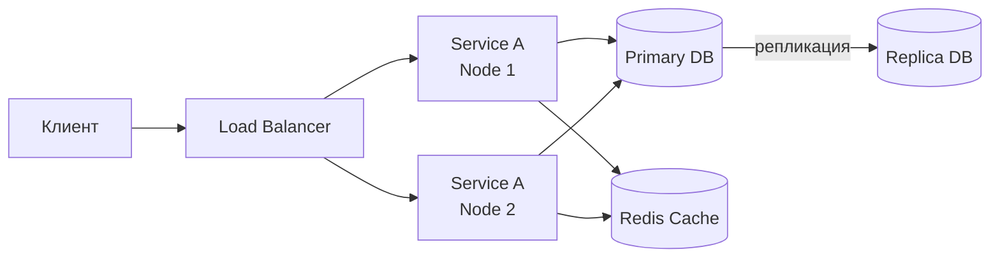

**Ключевые свойства** (по Лесли Лампорту): компоненты общаются **только через сообщения** (нет разделяемой памяти), каждый узел имеет **собственное локальное состояние**, сбой одного узла **не означает** сбой всей системы.

> [!mcq]
> - [ ] Распределённая система — это несколько потоков внутри одного процесса, взаимодействующих через общую память | Это многопоточность внутри монолита: shared memory + один процесс = НЕ distributed. ❌ ПОСЛЕДСТВИЕ: путаница ведёт к проектированию микросервисов с shared in-memory state → race conditions при горизонтальном масштабировании. 📋 ПРАВИЛО: "distributed = независимые узлы + сеть + нет shared memory".
> - [ ] Распределённая система — это любое приложение, использующее базу данных на отдельном сервере | Отдельная БД ≠ distributed: классический клиент-сервер (один app + одна БД) сюда не относится. ❌ ПОСЛЕДСТВИЕ: команды называют монолит «распределённым» и игнорируют consensus/replication → рассыпается при первом сбое. 📋 ПРАВИЛО: "distributed = N независимых узлов, взаимодействующих по сети как единое целое".
> - [x] Распределённая система — это совокупность независимых узлов, взаимодействующих по сети и выглядящих для пользователя как единая система | Каноническое определение Лесли Лампорта: автономные узлы + сообщения + нет shared memory. ✓ ПРИМЕНЯТЬ: Uber (Cassandra + микросервисы), Netflix (S3 + EVCache), Google Spanner (multi-region). 📋 ПРАВИЛО: "независимость + коммуникация через сеть + единый фасад для клиента". 🔗 См. Q2 (характеристики), Q11 (частичные отказы).
> - [ ] Распределённая система — это система с несколькими репликами базы данных и единственным приложением | Репликация — лишь один аспект; распределённая система включает сервисы, кэши, очереди, координаторы. ❌ ПОСЛЕДСТВИЕ: команда внедряет PostgreSQL replicas и считает задачу распределённой архитектуры решённой → не готовы к partial failures и consensus. 📋 ПРАВИЛО: "репликация — частный случай, distributed — общая модель".

> [!mcq]
> - [ ] Fallacies of Distributed Computing (Sun/Deutsch) утверждают, что сеть надёжна, латентность нулевая и пропускная способность бесконечна — и это верно для современных датацентров | Fallacies — это ЗАБЛУЖДЕНИЯ (ложные допущения), а не истины: сеть НЕнадёжна, latency НЕ ноль, bandwidth НЕ бесконечен. ❌ ПОСЛЕДСТВИЕ: разработчик пишет sync-вызовы без timeout, без retry, без compression → AWS S3 outage 2017 каскадирует на dependent services; chatty API съедает $2000/день egress. 📋 ПРАВИЛО: "8 fallacies — список того, что НЕЛЬЗЯ предполагать; каждое = архитектурное решение (timeout/CB/TLS/discovery)".
> - [x] Fallacies of Distributed Computing — 8 ложных допущений (network reliable, latency zero, bandwidth infinite, network secure, topology stable, single admin, transport cost zero, network homogeneous), которые ведут к багам в распределённых системах | Питер Дойч + Гослинг (Sun, 1994): каждое заблуждение → конкретный класс багов. ✓ ПРИМЕНЯТЬ: network reliable → timeout+retry+CB; latency zero → async+batch; topology stable → service discovery (Eureka/Consul/K8s DNS); transport cost zero → compress+protobuf+pagination. ❌ ПОСЛЕДСТВИЕ: Twitter 2010 «fail whale» (sync chains без timeouts), Capital One 2019 (внутренний trust → SSRF), GitHub 2012 (async без failover). 📋 ПРАВИЛО: "проектируй ПРОТИВОПОЛОЖНОЕ каждой fallacy: unreliable+slow+limited+insecure+changing+multi-admin+costly+heterogeneous". 🔗 См. Q4 (детально по fallacies), Q11 (partial failures), Q12 (Circuit Breaker).
> - [ ] Fallacies of Distributed Computing относятся только к разработке банковских систем, для обычных микросервисов они неприменимы | Fallacies — УНИВЕРСАЛЬНЫЕ для ЛЮБЫХ распределённых систем: e-commerce, social networks, IoT, ML pipelines. ❌ ПОСЛЕДСТВИЕ: команда стартапа игнорирует fallacies «у нас не банк» → первый production incident при network blip; 6 месяцев фиксов вместо initial design. 📋 ПРАВИЛО: "fallacies = базовая гигиена distributed dev, не вертикаль-specific".
> - [ ] Fallacies включают только два пункта: «сеть надёжна» и «латентность нулевая», остальные 6 — современные дополнения | Канонический список Дойча/Гослинга с 1994/1997 — 8 пунктов; ничего не добавлялось. ❌ ПОСЛЕДСТВИЕ: разработчик «знает» только 2 fallacies → не учитывает security (заблуждение №4) и cost (№7) → SSRF атаки, $$$ egress bills. 📋 ПРАВИЛО: "учить все 8: network/latency/bandwidth/security/topology/admin/transport/homogeneity".

## Q2. Какие характеристики присущи распределённым системам?

Типичные характеристики:

| Характеристика | Описание |
|---|---|
| **Независимость компонентов** | Узлы работают автономно, каждый со своим процессом и памятью |
| **Прозрачность** | Система воспринимается как единое целое (прозрачность места, репликации, отказов, миграции) |
| **Масштабируемость** | Возможность добавлять узлы для увеличения пропускной способности |
| **Отказоустойчивость** | Работа продолжается при сбоях части узлов |
| **Гетерогенность** | Компоненты могут быть на разных ОС, языках, технологиях |
| **Отсутствие глобальных часов** | Нет единого времени; нужны механизмы упорядочивания событий |
| **Недетерминизм** | Порядок и время доставки сообщений непредсказуемы |

Эти свойства достигаются за счёт репликации, консенсуса, балансировки и явной обработки отказов.

> [!mcq]
> - [ ] Распределённые системы имеют глобальные часы, синхронизированные через NTP с точностью до миллисекунды | NTP даёт расхождение 10-100мс, при сбоях — секунды; абсолютной синхронизации НЕТ. ❌ ПОСЛЕДСТВИЕ: Amazon DynamoDB 2012 — clock skew → потеря данных при last-write-wins. 📋 ПРАВИЛО: "no global clock — только Lamport/Vector clocks или TrueTime (Spanner ±7мс)".
> - [x] Распределённые системы характеризуются недетерминизмом: порядок и время доставки сообщений непредсказуемы | Сеть ненадёжна: задержки переменны, порядок не гарантирован, partition возможны. ✓ ПРИМЕНЯТЬ: проектируйте под message reordering (idempotency), failures (timeouts/retry), latency variance (p99 > p50 ×10). 📋 ПРАВИЛО: "non-determinism — фундаментальное свойство, не баг". 🔗 См. Q4 (Fallacies), Q5 (часы), Q24 (idempotency).
> - [ ] Распределённые системы требуют гомогенной среды: все узлы должны использовать одинаковую ОС и язык | Гетерогенность — преимущество: Uber использует C++ для search, Node.js для API, Python для analytics. ❌ ПОСЛЕДСТВИЕ: попытка унификации стека → потеря polyglot persistence преимуществ + замедление найма. 📋 ПРАВИЛО: "polyglot OK для сервисов, главное — стандартизированные wire-протоколы (gRPC/JSON)".
> - [ ] Распределённые системы всегда обеспечивают сильную согласованность данных между узлами | Strong consistency — выбор, не свойство; CAP заставляет жертвовать ею ради availability. ❌ ПОСЛЕДСТВИЕ: попытка strong consistency на eventual-системе (Cassandra) → low throughput + frequent timeouts. 📋 ПРАВИЛО: "consistency — тuneable: ONE/QUORUM/ALL по бизнес-требованиям".

## Q3. В чём плюсы и минусы распределённых систем?

**Плюсы:**
- **Горизонтальное масштабирование** — добавление узлов вместо апгрейда одного сервера
- **Отказоустойчивость** — реплики, несколько зон доступности
- **Распределение нагрузки** — балансировка между узлами
- **Гибкость** — каждый компонент может использовать оптимальный стек технологий
- **Географическая близость** — узлы ближе к пользователям (`CDN`, мультирегиональные деплои)

**Минусы:**
- **Сложность** разработки и отладки (сетевые задержки, недетерминизм, race conditions)
- **Проблемы согласованности** данных между узлами
- **Частичные отказы** — один узел падает, остальные работают; нужно обрабатывать
- **Латентность** и зависимость от сети
- **Операционная сложность** — мониторинг, деплой, конфигурация десятков/сотен сервисов

> [!mcq]
> - [ ] Главный минус распределённых систем — отсутствие горизонтального масштабирования, так как нельзя добавлять узлы на лету | Перевёрнуто: scale-out — ПРЕИМУЩЕСТВО (Netflix 100к+ инстансов, K8s autoscaling). ❌ ПОСЛЕДСТВИЕ: отказ от distributed «из-за невозможности масштабироваться» → vertical scaling упирается в потолок одного сервера. 📋 ПРАВИЛО: "horizontal scaling = feature, не bug".
> - [x] Главный минус распределённых систем — сложность разработки и отладки: сетевые задержки, недетерминизм и race conditions | Distributed debugging требует traceId, span tracking, correlated logs — на порядок сложнее монолита. ✓ ПРИМЕНЯТЬ: OpenTelemetry + Jaeger для трейсов, Loki/ELK с traceId, Chaos Engineering для partial failure tests. 📋 ПРАВИЛО: "distributed = +observability tax (10-30% бюджета)". 🔗 См. Q26 (tracing), Q11 (partial failures).
> - [ ] Главный минус распределённых систем — невозможность обеспечить отказоустойчивость без дополнительных зон доступности | Multi-AZ — повышение защиты, не precondition; replication работает и в одном DC. ❌ ПОСЛЕДСТВИЕ: команда блокирует distributed-проект «нужны 3 AZ» → откладывает решение реальных задач. 📋 ПРАВИЛО: "Multi-AZ = bonus, primary defense — replication + health checks".
> - [ ] Главный минус распределённых систем — обязательное использование единого стека технологий для всех компонентов | Это описание МОНОЛИТА. Distributed позволяет polyglot: Uber (C++/Go/Python), LinkedIn (Java/Scala/Python). ❌ ПОСЛЕДСТВИЕ: запрет polyglot → потеря fit-for-purpose (ML на Java вместо PyTorch на Python). 📋 ПРАВИЛО: "polyglot — преимущество, единый стек — необязательное ограничение".

## Q4. (!) Какие существуют заблуждения о распределённых вычислениях (Fallacies of Distributed Computing)?

Питер Дойч и Джеймс Гослинг сформулировали **8 заблуждений** — ложные допущения, которые разработчики часто делают при проектировании распределённых систем:

| # | Заблуждение | Реальность |
|---|---|---|
| 1 | **Сеть надёжна** | Пакеты теряются, соединения обрываются, свитчи падают |
| 2 | **Латентность нулевая** | Сетевые вызовы на порядки медленнее локальных; inter-DC — десятки мс |
| 3 | **Пропускная способность бесконечна** | Bandwidth ограничен; большие payload-ы тормозят систему |
| 4 | **Сеть безопасна** | Трафик может быть перехвачен, подменён; нужен TLS, аутентификация |
| 5 | **Топология неизменна** | Узлы добавляются, удаляются, IP меняются; нужен service discovery |
| 6 | **Есть один администратор** | Разные команды, облачные провайдеры, разные политики |
| 7 | **Стоимость передачи нулевая** | Сериализация/десериализация, сетевые расходы, cloud egress costs |
| 8 | **Сеть однородна** | Разные протоколы, MTU, оборудование, провайдеры |

**Практическое значение:** каждое заблуждение ведёт к конкретным архитектурным решениям — таймауты, retry, circuit breaker, service discovery, шифрование, сжатие данных.

> [!mcq]
> - [ ] Заблуждение «сеть надёжна» означает, что разработчики ошибочно считают сеть медленной и вводят излишние таймауты | Перевёрнуто: реальное заблуждение — считать сеть НАДЁЖНОЙ и не обрабатывать потери. ❌ ПОСЛЕДСТВИЕ: код без try/catch на ConnectionException → потеря данных при любом network blip. AWS S3 2017: сетевой сбой обнажил отсутствие fallback в зависимых сервисах. 📋 ПРАВИЛО: "treat network as unreliable: timeout + retry + circuit breaker".
> - [x] Заблуждение «латентность нулевая» приводит к тому, что разработчики делают синхронные сетевые вызовы там, где нужна асинхронность | Игнорирование сетевой задержки → blocking calls + длинные цепочки → каскадная деградация при любом hiccup. ✓ ПРИМЕНЯТЬ: timeouts (5s), CompletableFuture/Reactor для async, Circuit Breaker для fail-fast. ❌ ПОСЛЕДСТВИЕ: Twitter 2010 «fail whale» из-за sync chains; Uber 2016 — 1000+ sync микросервисов → p99 5+ sec → ввели Hystrix. 📋 ПРАВИЛО: "sync для request-response, async для side-effects". 🔗 См. Q12 (Circuit Breaker), Q14 (Bulkhead).
> - [ ] Заблуждение «топология неизменна» означает, что разработчики правильно планируют частые смены IP-адресов сервисов | Перевёрнуто: ошибка — ДУМАТЬ что топология стабильна, хардкодить IP. ❌ ПОСЛЕДСТВИЕ: hardcoded адреса в configs → каждый K8s autoscale event ломает соединения; роуты протухают. 📋 ПРАВИЛО: "service discovery (Eureka/Consul/K8s DNS) вместо hardcoded IP".
> - [ ] Заблуждение «стоимость передачи нулевая» относится исключительно к финансовым расходам на cloud egress | Стоимость включает CPU (сериализация/десериализация), память (буферы), latency. ❌ ПОСЛЕДСТВИЕ: chatty API с 100+ мелких вызовов вместо 1 batch → +30% CPU, $2000/день AWS egress при 100ТБ/день. 📋 ПРАВИЛО: "transfer cost = $ + CPU + latency; batch + compress + paginate".

> [!mcq]
> - [x] Согласно заблуждениям Дойча, топология сети считается неизменной, хотя на практике IP-адреса и конфигурация постоянно меняются | Узлы появляются/исчезают: K8s autoscale, blue-green deploy, spot-инстансы → IP меняются каждые минуты. ✓ ПРИМЕНЯТЬ: Eureka (Netflix), Consul (HashiCorp), K8s Service DNS, Istio mesh. 📋 ПРАВИЛО: "service discovery > hardcoded IP". 🔗 См. Q18 (service discovery).
> - [ ] Согласно заблуждениям Дойча, сеть считается небезопасной, хотя на практике внутренний трафик всегда зашифрован | Перевёрнуто: реальное заблуждение — считать сеть БЕЗОПАСНОЙ. ❌ ПОСЛЕДСТВИЕ: Capital One 2019 — внутренний trust → SSRF → утечка 100M записей; Target 2013 — flat network → lateral movement через HVAC. 📋 ПРАВИЛО: "zero trust + mTLS на ВСЕХ соединениях, даже внутренних".
> - [ ] Согласно заблуждениям Дойча, существует единый администратор всей инфраструктуры, что позволяет централизованно управлять политиками | Это и есть заблуждение №6 — НЕРЕАЛЬНОЕ допущение. ❌ ПОСЛЕДСТВИЕ: команда верит в «всех админов с одной policy» → security gap при сменах cloud-провайдера или регионе с разной compliance. 📋 ПРАВИЛО: "multi-admin reality → defense-in-depth, не single point of policy".
> - [ ] Согласно заблуждениям Дойча, пропускная способность сети бесконечна, и это утверждение верно для современных датацентров с 100Gb Ethernet | 100GbE увеличивает bandwidth, но не делает его «бесконечным»: конкуренция за полосу, large payloads, сериализация. ❌ ПОСЛЕДСТВИЕ: команда передаёт 1ГБ JSON по сети без сжатия → throughput → bottleneck в shared link. 📋 ПРАВИЛО: "bandwidth finite — compress (gzip/zstd), batch, paginate, protobuf вместо JSON".

```java
// Заблуждение #1 в действии: код без обработки сетевых ошибок
// ПЛОХО
String result = restTemplate.getForObject(url, String.class);

// ХОРОШО: учитываем ненадёжность сети
try {
    String result = restTemplate.getForObject(url, String.class);
} catch (ResourceAccessException e) {
    // таймаут, connection refused, DNS resolution failed
    log.warn("Сетевая ошибка при вызове {}: {}", url, e.getMessage());
    return fallbackResult();
}
```

## Q5. (!) Почему в распределённых системах нельзя полагаться на физические часы?

**Физические часы** (wall clock) на разных узлах **расходятся** — даже с `NTP`-синхронизацией разница может составлять десятки миллисекунд, а при сбоях `NTP` — секунды и минуты.

**Проблемы:**
- **Clock skew** — часы на узле A показывают 10:00:00.100, на узле B — 10:00:00.050; событие на B произошло позже, но по часам выглядит раньше
- **Clock drift** — кварцевые генераторы «уходят» со скоростью ~10-50 мкс/с
- **NTP step** — `NTP`-демон может скачкообразно сдвинуть время назад
- **Leap seconds** — вставка секунды может нарушить монотонность

**Последствия:** если использовать timestamp для определения порядка событий, можно потерять запись (last-write-wins с неправильным порядком), нарушить каузальность, получить «фантомные» транзакции.

**Решения:** `Lamport Timestamps`, `Vector Clocks`, `Hybrid Logical Clocks` (`HLC`), `TrueTime` (Google Spanner — GPS + атомные часы с явной оценкой погрешности).

> **На собеседовании:** покажите, что понимаете разницу между *wall clock* (`System.currentTimeMillis()`) и *monotonic clock* (`System.nanoTime()`). Первый может «прыгать», второй — только для измерения интервалов на одном узле.

> [!mcq]
> - [ ] Физические часы нельзя использовать в распределённых системах, потому что NTP полностью отключает синхронизацию между узлами | NTP именно СИНХРОНИЗИРУЕТ, но не до абсолютной точности (расхождение 10-100мс — норма). ❌ ПОСЛЕДСТВИЕ: вера в «NTP = perfect sync» → код использует wall-clock для ordering → race conditions при skew. 📋 ПРАВИЛО: "NTP — best-effort, не абсолютная точность".
> - [x] Физические часы нельзя использовать для упорядочивания событий из-за clock skew: событие на узле A с более поздним timestamp может на самом деле произойти раньше события на узле B | Clock skew (10-100мс при NTP, секунды без NTP) делает wall-clock ordering ненадёжным. ✓ ПРИМЕНЯТЬ: Lamport clocks (Cassandra), Vector clocks (DynamoDB v1), TrueTime (Spanner ±7мс через GPS+atomic), HLC (CockroachDB). ❌ ПОСЛЕДСТВИЕ: Amazon DynamoDB 2012 — clock skew → data loss при LWW; Cloudflare 2017 — leap second → NTP step → Java NIO failures. 📋 ПРАВИЛО: "wall-clock — измерение времени, logical clocks — упорядочивание событий". 🔗 См. Q6 (Lamport), Q7 (Vector clocks).
> - [ ] Физические часы нельзя использовать, так как monotonic clock на каждом узле монотонно убывает и никогда не возрастает | Monotonic clock монотонно ВОЗРАСТАЕТ (название говорит об этом), но локален к JVM/процессу. ❌ ПОСЛЕДСТВИЕ: путаница между monotonic и wall-clock → измерение интервалов через System.currentTimeMillis() → отрицательные duration при NTP step. 📋 ПРАВИЛО: "nanoTime для интервалов на ОДНОМ узле, никогда между узлами".
> - [ ] Физические часы нельзя использовать, потому что `System.nanoTime()` в JVM возвращает значения в миллисекундах, а не наносекундах | nanoTime возвращает наносекунды (от произвольной точки). Проблема не в единицах, а в том что значение специфично JVM-процессу. ❌ ПОСЛЕДСТВИЕ: попытка передать nanoTime() между JVM по сети → бессмысленные сравнения. 📋 ПРАВИЛО: "nanoTime — local-only intervals, не absolute time".

> [!mcq]
> - [x] `System.nanoTime()` подходит для измерения интервалов на одном узле, но не для упорядочивания событий между узлами | Monotonic, но local-only: значение от произвольной точки JVM-процесса. ✓ ПРИМЕНЯТЬ: long start=nanoTime(); ...; (nanoTime()-start) для измерения duration; для cross-node ordering — Lamport/Vector clocks. 📋 ПРАВИЛО: "nanoTime для duration на узле, logical clocks для ordering между узлами". 🔗 См. Q6 (Lamport).
> - [ ] `System.currentTimeMillis()` всегда монотонно возрастает и безопасен для упорядочивания событий внутри одного JVM-процесса | Wall-clock может прыгать назад: NTP step, leap second, ручная корректировка. ❌ ПОСЛЕДСТВИЕ: код измерения timeout через currentTimeMillis() → отрицательный elapsed при NTP step → infinite loop или premature timeout. Cloudflare 2017: leap second → Java NIO bug. 📋 ПРАВИЛО: "currentTimeMillis НЕ monotonic, nanoTime — да".
> - [ ] `System.currentTimeMillis()` синхронизирован между JVM-процессами и гарантирует одинаковое значение на всех узлах в момент вызова | Wall-clock зависит от local NTP — расхождение 10-100мс норма. ❌ ПОСЛЕДСТВИЕ: использование timestamp как identifier для cross-node ordering → race conditions, дубликаты при skew. 📋 ПРАВИЛО: "no global wall-clock в distributed; используй UUID + Lamport clock".
> - [ ] `System.nanoTime()` возвращает Unix timestamp в наносекундах и подходит для сравнения времён между различными JVM-процессами | nanoTime — от ARBITRARY origin specific to JVM, не Unix timestamp. ❌ ПОСЛЕДСТВИЕ: передача nanoTime() через REST API → клиент получает бессмысленное число; race conditions при сравнении. 📋 ПРАВИЛО: "nanoTime — process-local, никогда не сериализуй для сети".

## Q6. Что такое логические часы Лампорта (Lamport Timestamps)?

**Логические часы Лампорта** — механизм упорядочивания событий без привязки к физическому времени. Каждый узел поддерживает счётчик `L`:

**Правила:**
1. Перед каждым локальным событием: `L = L + 1`
2. При отправке сообщения: `L = L + 1`, сообщение содержит `L`
3. При получении сообщения с меткой `L_msg`: `L = max(L, L_msg) + 1`

```java
public class LamportClock {
    private final AtomicLong counter = new AtomicLong(0);

    /** Локальное событие или отправка сообщения */
    public long tick() {
        return counter.incrementAndGet();
    }

    /** Получение сообщения с меткой отправителя */
    public long receive(long senderTimestamp) {
        return counter.updateAndGet(current ->
            Math.max(current, senderTimestamp) + 1
        );
    }

    public long current() {
        return counter.get();
    }
}
```

**Свойство:** если событие A **причинно предшествует** B (`A → B`), то `L(A) < L(B)`. Но обратное **неверно**: `L(A) < L(B)` не означает `A → B` — события могут быть конкурентными. Для различения конкурентных событий нужны **векторные часы**.

> [!mcq]
> - [ ] Логические часы Лампорта гарантируют: если `L(A) < L(B)`, то событие A причинно предшествует событию B | Это ОБРАТНОЕ утверждение и оно ложно: порядок Lamport — необходимое, но НЕ достаточное условие causality. ❌ ПОСЛЕДСТВИЕ: код решает «B зависит от A» по L(A)<L(B) → ложные причинные связи в conflict resolution → потеря concurrent updates. 📋 ПРАВИЛО: "Lamport: A→B ⇒ L(A)<L(B), но обратно неверно".
> - [x] Логические часы Лампорта гарантируют: если A причинно предшествует B, то `L(A) < L(B)`, но обратное не верно | Точная формулировка: Lamport детектирует causality в одну сторону, но не различает concurrent. ✓ ПРИМЕНЯТЬ: Cassandra (timestamps в writes), CockroachDB (HLC = hybrid Lamport), DynamoDB (vector clocks для conflict). 📋 ПРАВИЛО: "Lamport — partial order, Vector — causality detection". 🔗 См. Q7 (Vector clocks).
> - [ ] Логические часы Лампорта гарантируют, что при получении сообщения счётчик устанавливается в значение из сообщения без инкремента | Правило получения: L = max(L_local, L_msg) + 1, инкремент ОБЯЗАТЕЛЕН (receive — event). ❌ ПОСЛЕДСТВИЕ: код без +1 → нарушение happens-before (L_send = L_recv возможно) → race conditions в ordering. 📋 ПРАВИЛО: "max + 1 при receive, иначе сломан happens-before".
> - [ ] Логические часы Лампорта гарантируют, что два конкурентных события всегда имеют одинаковые значения счётчика | Concurrent events могут иметь разные L: их именно НЕЛЬЗЯ различить по Lamport. ❌ ПОСЛЕДСТВИЕ: попытка детектировать конфликт через L(A)≠L(B) → пропуск concurrent updates → potential data loss. 📋 ПРАВИЛО: "concurrent ≠ same Lamport; нужны Vector clocks для concurrency detection".

## Q7. (!) Что такое векторные часы (Vector Clocks)?

**Векторные часы** — расширение логических часов Лампорта, позволяющее определить, являются ли два события **причинно связанными** или **конкурентными**.

Каждый узел `i` из `N` узлов поддерживает вектор `V[0..N-1]`:

1. Перед локальным событием: `V[i] = V[i] + 1`
2. При отправке: `V[i] = V[i] + 1`, сообщение содержит копию `V`
3. При получении от узла с вектором `V_msg`: `V[j] = max(V[j], V_msg[j])` для всех `j`, затем `V[i] = V[i] + 1`

**Сравнение:**
- `V1 ≤ V2` (причинно предшествует) — если `V1[j] ≤ V2[j]` для всех `j`
- `V1 || V2` (конкурентные) — если ни `V1 ≤ V2`, ни `V2 ≤ V1`

```java
public class VectorClock {
    private final int nodeId;
    private final int[] clock;

    public VectorClock(int nodeId, int numNodes) {
        this.nodeId = nodeId;
        this.clock = new int[numNodes];
    }

    public int[] tick() {
        clock[nodeId]++;
        return clock.clone();
    }

    public void receive(int[] senderClock) {
        for (int i = 0; i < clock.length; i++) {
            clock[i] = Math.max(clock[i], senderClock[i]);
        }
        clock[nodeId]++;
    }

    /** true если this причинно предшествует other */
    public boolean happensBefore(int[] other) {
        boolean atLeastOneLess = false;
        for (int i = 0; i < clock.length; i++) {
            if (clock[i] > other[i]) return false;
            if (clock[i] < other[i]) atLeastOneLess = true;
        }
        return atLeastOneLess;
    }
}
```

**Применение:** Amazon `DynamoDB` (оригинальный Dynamo), `Riak` — для обнаружения конфликтов при записи. **Недостаток:** размер вектора растёт с числом узлов (O(N)).

> [!mcq]
> - [ ] Векторные часы позволяют определить точное физическое время события на каждом узле кластера | Vector clocks — ЛОГИЧЕСКИЙ механизм, не имеют отношения к физическому времени. ❌ ПОСЛЕДСТВИЕ: попытка использовать V[i] как timestamp для аудита → бессмысленные значения, не соответствующие wall-clock. 📋 ПРАВИЛО: "Vector clocks — для causality, не для timing".
> - [ ] Векторные часы позволяют определить, что `V1 | | V2` (конкурентность), когда `V1[j] ≤ V2[j]` для всех `j` | Это описание V1 ≤ V2 (V1 предшествует V2), не concurrency. Concurrent = НЕсравнимы. ❌ ПОСЛЕДСТВИЕ: путаница приведёт к классификации «happens-before» как «concurrent» → ложные конфликты в DynamoDB-style merge. 📋 ПРАВИЛО: "concurrent ⇔ ни V1≤V2, ни V2≤V1".
> - [x] Векторные часы позволяют определить конкурентность событий: `V1 | | V2`, если ни `V1 ≤ V2`, ни `V2 ≤ V1` не выполняется | Ключевое преимущество перед Lamport: detects concurrency через несравнимые векторы. ✓ ПРИМЕНЯТЬ: Amazon DynamoDB v1 (conflict detection), Riak (sibling resolution), Voldemort (LinkedIn). 📋 ПРАВИЛО: "Vector clocks = causality + concurrency detection (vs Lamport только partial order)". 🔗 См. Q6 (Lamport), Q9 (consistency).
> - [ ] Векторные часы позволяют определить причинность с размером вектора O(1), не зависящим от числа узлов | Размер растёт ЛИНЕЙНО с N узлов: O(N) — главный недостаток. ❌ ПОСЛЕДСТВИЕ: при кластере 1000+ узлов vector size становится huge → 10x overhead в каждом message → throughput деградация. ✓ ПРИМЕНЯТЬ: Riak использует ITC (Interval Tree Clocks) или dotted version vectors для O(active writers). 📋 ПРАВИЛО: "Vector clocks O(N) — bottleneck при large clusters; решение — DVV/ITC".

> [!mcq]
> - [ ] `Lamport Timestamps`, `Vector Clocks` и `Hybrid Logical Clocks` идентичны и взаимозаменяемы при выборе механизма часов | У всех трёх разные свойства: Lamport — partial order O(1), Vector — concurrency detection O(N), HLC — wall+logical hybrid O(1). ❌ ПОСЛЕДСТВИЕ: команда выбирает Lamport для conflict detection в `DynamoDB`-стиле → пропускает concurrent writes (Lamport не различает параллельные события) → потеря данных при merge. 📋 ПРАВИЛО: «Lamport=ordering, Vector=concurrency, HLC=causal+wall».
> - [ ] `Vector Clocks` всегда предпочтительнее `Lamport Timestamps`, так как дают больше информации о причинности | Больше информации = больше overhead: Vector O(N) на каждое сообщение vs Lamport O(1). При 1000 узлов Vector Clock = 4-8 KB на message → throughput деградация. ❌ ПОСЛЕДСТВИЕ: использование Vector clocks в `Cassandra` (где нужен только partial order) → 10x overhead на write path → latency p99 взлетает. 📋 ПРАВИЛО: «Vector только если нужна concurrency detection, иначе Lamport».
> - [x] `Hybrid Logical Clocks` (HLC) комбинируют физическое время и логический счётчик: дают monotonic ordering близкое к wall-clock с O(1) размером и устойчивостью к clock skew | HLC = `max(physical, logical) + 1`; используется в `CockroachDB`, `MongoDB` для near-realtime causality без overhead Vector clocks. ✓ ПРИМЕНЯТЬ: `CockroachDB` (HLC + Raft), `MongoDB` 4.0+ для causal consistency, `YugaByte`. 📋 ПРАВИЛО: «HLC = best of both: causality + readable timestamps + O(1)». 🔗 См. Q5 (physical clocks), Q6 (Lamport).
> - [ ] `Hybrid Logical Clocks` требуют идеально синхронизированных физических часов (NTP с ±1мс) для корректной работы | HLC именно ТОЛЕРАНТНЫ к clock skew: при skew часы переходят в logical-only режим. NTP ±50мс достаточно. ❌ ПОСЛЕДСТВИЕ: команда отказывается от HLC «нужен дорогой PTP/atomic clock» → продолжает использовать wall-clock LWW → data corruption при leap second. 📋 ПРАВИЛО: «HLC устойчив к skew — это его фишка vs TrueTime требующий GPS+atomic».

## Q8. Что такое консенсус и какие алгоритмы его реализуют?

**Консенсус** — задача: все корректные (не-сбойные) узлы должны **согласиться на одно значение**, даже при отказе части участников. По теореме FLP невозможен детерминированный консенсус в полностью асинхронной системе с хотя бы одним сбоем.

**Основные алгоритмы:**

| Алгоритм | Кто использует | Особенности |
|---|---|---|
| `Paxos` | Google Chubby, Megastore | Теоретически элегантен, сложен в реализации |
| `Raft` | `etcd`, `Consul`, `CockroachDB` | Понятнее Paxos, явное разделение на leader election + log replication |
| `ZAB` | `ZooKeeper` | Оптимизирован для primary-backup |
| `PBFT` | Блокчейны | Устойчив к Byzantine faults (узлы могут «врать») |

**`Raft` — упрощённая модель:**

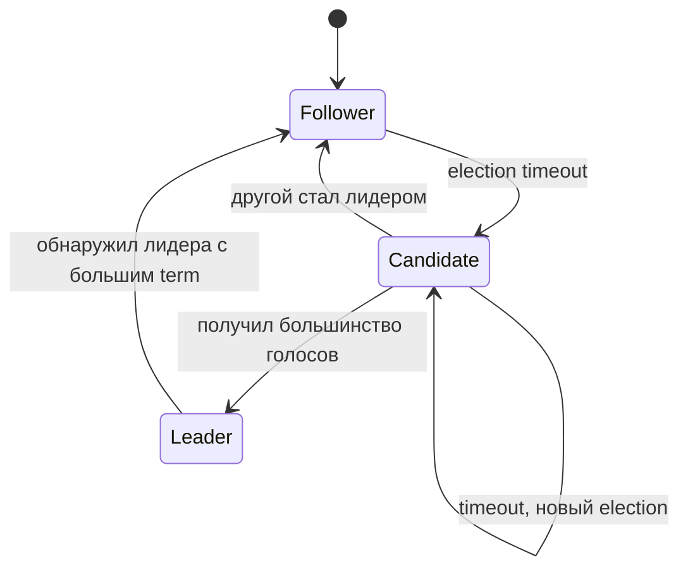

Лидер принимает запросы на запись, реплицирует log entry на фолловеров и коммитит после подтверждения от большинства (кворум `N/2 + 1`). При падении лидера фолловер с таймаутом начинает новый election.

> **На собеседовании:** достаточно объяснить Raft на уровне «leader election + log replication + commit по кворуму». Знание деталей Paxos впечатляет, но не обязательно.

> [!mcq]
> - [ ] Алгоритм Raft коммитит запись в лог, когда её подтверждает хотя бы один фолловер, не дожидаясь большинства | Один follower недостаточен — split-brain risk при network partition. ❌ ПОСЛЕДСТВИЕ: при partition оба «лидера» коммитят разные значения → data divergence; Consul 2015 имел bug в quorum logic → split-brain. 📋 ПРАВИЛО: "Raft commit ⇔ majority quorum (N/2+1)".
> - [x] Алгоритм Raft коммитит запись в лог после подтверждения от кворума узлов (`N/2 + 1`), что гарантирует безопасность при сбое меньшинства | Кворум математически гарантирует overlap между read и write quorums → no split-brain. ✓ ПРИМЕНЯТЬ: etcd (K8s control plane), Consul (HashiCorp), CockroachDB, TiKV; кластер 5 узлов выдерживает 2 fail. 📋 ПРАВИЛО: "majority quorum (N/2+1) → split-brain невозможен". 🔗 См. Q17 (leader election), Q27 (Raft details).
> - [ ] Алгоритм Raft коммитит запись только после подтверждения от всех узлов кластера, обеспечивая максимальную надёжность | Все-узлы commit = любой single failure блокирует кластер. ❌ ПОСЛЕДСТВИЕ: 5-узловой кластер с requirement-all → write latency 2-3x + availability 0% при ЛЮБОМ узле down. 📋 ПРАВИЛО: "majority > all: liveness vs paranoid safety".
> - [ ] Алгоритм Raft использует случайный выбор лидера без механизма голосования для ускорения leader election | Raft именно использует ГОЛОСОВАНИЕ (RequestVote RPC); рандомизация — только в election timeouts. ❌ ПОСЛЕДСТВИЕ: без randomized timeouts — livelock (Paxos-like): кандидаты постоянно перебивают друг друга. 📋 ПРАВИЛО: "voting + randomized timeout (150-300мс) → no livelock".

> [!mcq]
> - [ ] В алгоритме Raft алгоритм PBFT применяется для устойчивости к Byzantine faults внутри кластера | PBFT — ОТДЕЛЬНЫЙ алгоритм; Raft не handles Byzantine (только crash faults). ❌ ПОСЛЕДСТВИЕ: использование Raft в trustless среде (blockchain) → malicious node может ломать consensus. 📋 ПРАВИЛО: "Raft = crash-fault (2f+1), PBFT/Tendermint = Byzantine (3f+1)". 🔗 См. Q32 (BFT).
> - [ ] В алгоритме Raft алгоритм Paxos используется как подпроцедура для репликации лога | Raft — независимая альтернатива Paxos, разработана для понятности (Ongaro 2013). ❌ ПОСЛЕДСТВИЕ: путаница алгоритмов в документации команды → неверная отладка (etcd использует Raft, ZooKeeper — ZAB ≈ Paxos). 📋 ПРАВИЛО: "Raft и Paxos — равноправные family, не nested".
> - [x] В алгоритме Raft узел в состоянии Candidate переходит в Leader, только если получил голоса от большинства узлов кластера | Majority votes — фундаментальная гарантия от split-brain. ✓ ПРИМЕНЯТЬ: 5-узловой кластер требует 3 голосов, term-based election исключает stale leaders. 📋 ПРАВИЛО: "Candidate → Leader ⇔ N/2+1 votes". 🔗 См. Q17 (split-brain), Q27 (Raft details).
> - [ ] В алгоритме Raft узел в состоянии Candidate переходит в Leader, как только первый фолловер отправил ему голос | Один голос — split-brain guaranteed при partition. ❌ ПОСЛЕДСТВИЕ: представь partition 5→3+2; оба раздела избирают лидера → divergent commits → data loss при healing. 📋 ПРАВИЛО: "majority votes → no split-brain даже при partition".

## Q9. Как в распределённых системах обеспечивают согласованность данных?

Согласованность достигается выбором модели (strong, eventual, causal) и механизмами:

| Механизм | Модель | Когда использовать |
|---|---|---|
| `2PC` / `XA` | Strong consistency | Межбазовые транзакции, критичные к целостности |
| Синхронная репликация | Strong consistency | Данные, потеря которых недопустима |
| Асинхронная репликация | Eventual consistency | Высокая нагрузка, допускаем задержку |
| Консенсус (`Raft`, `Paxos`) | Linearizable | Координация, распределённые блокировки |
| Saga pattern | Eventual consistency | Распределённые бизнес-транзакции |
| `CRDT` | Strong eventual | Бесконфликтное слияние (счётчики, множества) |

```java
// Saga: компенсирующие действия при ошибке
@Transactional
public void createOrder(OrderRequest request) {
    Order order = orderService.create(request);        // шаг 1
    try {
        paymentService.charge(order.getPaymentInfo());  // шаг 2
        inventoryService.reserve(order.getItems());     // шаг 3
    } catch (Exception e) {
        paymentService.refund(order.getPaymentInfo());  // компенсация шага 2
        orderService.cancel(order.getId());             // компенсация шага 1
        throw e;
    }
}
```

На практике ключевой момент — **идемпотентность** шагов, корректные **компенсирующие действия** и наблюдаемость всего потока через `traceId` / метрики.

> [!mcq]
> - [ ] Для обеспечения сильной согласованности в распределённой системе достаточно использовать асинхронную репликацию с eventual consistency | Async replication = eventual consistency by definition; replica lag 20-100мс. ❌ ПОСЛЕДСТВИЕ: GitHub 2012 — async replication без failover protection → 300+ commits lost; AWS RDS failover теряет последние транзакции в lag-окне. 📋 ПРАВИЛО: "async = speed, sync = safety; для strong нужен sync или quorum".
> - [x] Сильная согласованность в распределённых системах достигается через синхронную репликацию или консенсус (`Raft`, `Paxos`) ценой увеличения латентности | Strong consistency = координация (all or quorum acks); цена — latency +50-200мс (cross-DC). ✓ ПРИМЕНЯТЬ: Google Spanner (TrueTime + Paxos), etcd (Raft), CockroachDB (Raft per-range). 📋 ПРАВИЛО: "strong consistency = sync replication trade-off для critical data". 🔗 См. Q19 (sync vs async), Q27 (Raft).
> - [ ] Сильная согласованность в распределённых системах достигается через CRDT-структуры данных без дополнительной координации | CRDT — Strong EVENTUAL Consistency (бесконфликтное слияние), не linearizability. ❌ ПОСЛЕДСТВИЕ: попытка использовать CRDT для banking ledger → читатель видит stale balance до convergence → double-spend possible. ✓ ПРИМЕНЯТЬ: CRDT для counters (Riak), collaborative editing (Google Docs/Figma); НЕ для money. 📋 ПРАВИЛО: "CRDT — strong eventual ≠ strong consistency".
> - [ ] Сильная согласованость в распределённых системах достигается через Saga pattern с компенсирующими транзакциями | Saga = eventual consistency: промежуточные состояния видны (нет ACID isolation между сервисами). ❌ ПОСЛЕДСТВИЕ: использование Saga где нужна strong consistency → читатели видят inconsistent intermediate states (например, заказ создан, оплата ещё нет). 📋 ПРАВИЛО: "Saga = eventual + compensations; strong нужен — используй 2PC внутри одной БД".

## Q10. Что такое доступность и как её повышают?

**Доступность** — доля времени, в течение которого система корректно отвечает на запросы. Выражают в «девятках»:

| Уровень | Downtime в год | Downtime в месяц |
|---|---|---|
| 99.9% (три девятки) | ~8.7 часов | ~43 мин |
| 99.99% (четыре) | ~52 мин | ~4.3 мин |
| 99.999% (пять) | ~5.2 мин | ~26 сек |

**Способы повышения:**
- **Репликация** — несколько копий данных/сервисов; при отказе одного узла остальные обслуживают запросы
- **Health checks** и автоматическое исключение нездоровых узлов из балансировщика
- **Балансировка нагрузки** — распределение трафика между healthy-узлами
- **Graceful degradation** — при сбое части системы остальная продолжает с ограниченной функциональностью
- **Multi-AZ / Multi-region** — резервные зоны доступности и дата-центры
- **Автоматический failover** — при падении primary автоматически промоутить replica

> **Формула для composed systems:** если сервис A (99.9%) вызывает сервис B (99.9%) последовательно, общая доступность = 99.9% × 99.9% = 99.8%. Параллельное резервирование: 1 − (1 − 0.999)² = 99.9999%.

> [!mcq]
> - [ ] Два сервиса 99.9%, вызываемые последовательно, дают общую доступность 99.9% | Перемножение, а не сохранение: 0.999×0.999 = 0.998. ❌ ПОСЛЕДСТВИЕ: SRE команда обещает 99.9% SLA не учитывая chain → миссит SLO когда любое звено падает. 📋 ПРАВИЛО: "sequential availability = multiply; chain длиной N = (0.999)^N".
> - [ ] Два сервиса 99.9%, вызываемые последовательно, дают общую доступность 99.99% | Sequential dependencies УХУДШАЮТ availability, не улучшают. ❌ ПОСЛЕДСТВИЕ: LinkedIn 2013 — chain 5 сервисов по 99.99% = 99.95% итого; Uber 2016 — 1000+ sync микросервисов → reduced 99.9% до 95%. 📋 ПРАВИЛО: "длинные sync chains убивают availability".
> - [x] Два сервиса 99.9%, вызываемые последовательно, дают общую доступность около 99.8% | Math: 0.999 × 0.999 ≈ 0.998 = 99.8%; chain length × dependencies = exponential decay. ✓ ПРИМЕНЯТЬ: Netflix Hystrix для fallback chain → cache → degraded UI; параллелизм вместо sync chains; fewer hops = better SLA. 📋 ПРАВИЛО: "10 сервисов × 99.9% = 99% (87 hours downtime/year); fewer dependencies = higher availability". 🔗 См. Q11 (partial failures), Q12 (Circuit Breaker).
> - [ ] Два сервиса 99.9%, вызываемые последовательно, дают общую доступность 100% | 100% невозможно: конечная надёжность компонентов + закон умножения. ❌ ПОСЛЕДСТВИЕ: команда обещает «100% uptime» в SLA → судебные риски при первом outage. 📋 ПРАВИЛО: "100% availability — миф; реалистичные target: 99.9-99.99%".

## Q11. (!) Что такое частичные отказы и как с ними борются?

**Практический сигнал:** для partial failure важно заранее определить пороги: timeout, число retry, время открытия circuit breaker и допустимую долю деградации.

**Частичный отказ** — отказ одного или нескольких компонентов при работающих остальных (упал один сервис, сетевая задержка, таймаут). В монолите чаще «всё или ничего»; в распределённой системе такие сбои — **норма**, а не исключение.

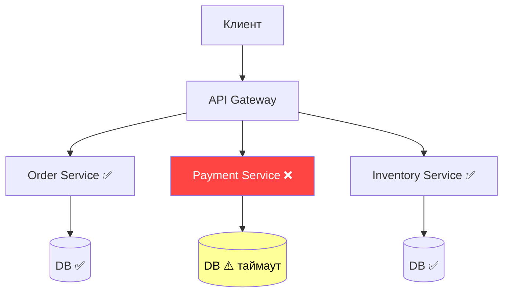

**Стратегии борьбы:**

| Паттерн | Назначение |
|---|---|
| **Timeout** | Не ждать ответ бесконечно; fail fast |
| **Retry** | Повторить при транзиентных ошибках |
| **Circuit Breaker** | Прекратить вызывать сломанный сервис |
| **Fallback** | Вернуть кэш или заглушку |
| **Bulkhead** | Изолировать ресурсы; одна зависимость не убьёт все |
| **Idempotency** | Безопасный повтор без дублирования побочных эффектов |
| **Мониторинг** | Алерты по ошибкам и задержкам; обнаружение до escalation |

> [!mcq]
> - [ ] Частичные отказы в микросервисах следует предотвращать глобальной распределённой транзакцией на все вызовы | 2PC сам страдает от partial failures + добавляет blocking + SPOF координатора. ❌ ПОСЛЕДСТВИЕ: 2PC при падении координатора между PREPARE и COMMIT → ресурсы заблокированы навсегда; в микросервисах вытесняется Saga. 📋 ПРАВИЛО: "2PC = более серьёзная проблема, чем partial failure; используй Saga + idempotency".
> - [ ] Частичные отказы можно игнорировать, полагаясь на то, что сеть надёжна и задержки постоянные | Прямая Fallacies of Distributed Computing #1 и #2. ❌ ПОСЛЕДСТВИЕ: Twitter 2010 «fail whale» — sync chains без timeouts → cascade failure; Netflix 2012 — недели downtime до Hystrix. 📋 ПРАВИЛО: "сеть unreliable, latency variable — design for failure".
> - [x] Частичные отказы обрабатывают комбинацией timeout, retry, circuit breaker, bulkhead и fallback | Каждый паттерн закрывает свой риск; partial failures — НОРМА в distributed. ✓ ПРИМЕНЯТЬ: timeout (max wait), retry+jitter (transient), CB (cascade prevention), bulkhead (resource isolation), fallback (degraded response). Netflix Hystrix использует все 5; Resilience4j — современная замена. 📋 ПРАВИЛО: "5 паттернов = defense in depth для partial failures". 🔗 См. Q12 (CB), Q13 (Retry), Q14 (Bulkhead), Q15 (graceful degradation).
> - [ ] Частичные отказы исчезают, если увеличить таймауты до нескольких минут, чтобы сервис успел ответить | Большие timeouts накапливают зависшие потоки → thread pool exhaustion → OOM. ❌ ПОСЛЕДСТВИЕ: 5000 threads × 10s timeout = 50000 hanging requests → JVM OOM → cascade на upstream. 📋 ПРАВИЛО: "fail fast > wait long; timeout = 2-5x p99, не minutes".

> [!mcq]
> - [ ] Failure detection в распределённых системах решается единственным механизмом — таймаутом запроса (timeout-based) — этого достаточно | Только timeout = `unreliable failure detection`: long GC pause или network jitter ложно классифицируется как failure. ❌ ПОСЛЕДСТВИЕ: `Cassandra` без heartbeat-based detection — 30-секундный GC pause триггерит false-positive failure → unnecessary repair → data thrashing. 📋 ПРАВИЛО: «timeout — необходимое, но не достаточное; нужны heartbeats + adaptive thresholds».
> - [x] Heartbeat-based detection (`Phi Accrual`, `SWIM`) даёт более точную оценку чем фиксированный timeout: вычисляет вероятность сбоя на основе истории интервалов | Phi Accrual в `Cassandra`/`Akka` адаптивно меняет порог под текущий network jitter; SWIM в `Consul`/`Serf` использует indirect probes для устранения false-positives. ✓ ПРИМЕНЯТЬ: `Cassandra` Phi=8 default, `Akka Cluster` adaptive failure detector, `Consul` SWIM с k=3 indirect probes. 📋 ПРАВИЛО: «adaptive heartbeats > fixed timeout — особенно в variable-latency сетях». 🔗 См. Q23 (gossip), Q33 (gossip details).
> - [ ] Heartbeat-based detection не нужен, если правильно настроить `connectionTimeout` и `readTimeout` на HTTP-клиенте | HTTP timeouts срабатывают только на in-flight requests; idle сервис «живой» с точки зрения HTTP, но фактически hung. ❌ ПОСЛЕДСТВИЕ: K8s liveness probe только через HTTP timeout → не детектирует deadlock в JVM (HTTP threads живы, business logic заблокирована). 📋 ПРАВИЛО: «HTTP timeout детектирует slow response, heartbeat — overall liveness».
> - [ ] Heartbeat и timeout — это два названия одного механизма, разница только в литературе | Принципиально разные: timeout = passive (per-request), heartbeat = active (periodic ping). ❌ ПОСЛЕДСТВИЕ: путаница в архитектурном решении: команда полагается на «heartbeat», но реализует timeout-based proactive monitoring отсутствует, не детектирует idle hangs. 📋 ПРАВИЛО: «timeout = на запрос, heartbeat = периодический ping вне запросов».

## Q12. (!) Что такое Circuit Breaker и когда его применять?

**Circuit Breaker** — паттерн отказоустойчивости: при превышении порога ошибок при вызове внешнего сервиса «размыкает цепь» и перестаёт вызывать этот сервис, возвращая fallback или ошибку. Защищает от каскадных сбоев.

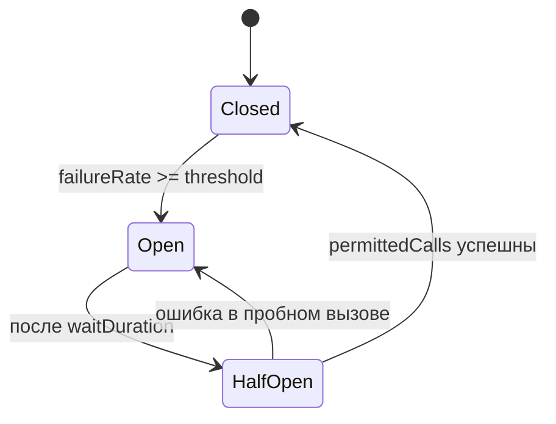

**Три состояния:**
- **Closed** — вызовы проходят нормально; считаются ошибки в скользящем окне
- **Open** — все вызовы мгновенно отклоняются; fallback
- **Half-Open** — пропускается ограниченное число пробных вызовов

```java
// Resilience4j Circuit Breaker с Spring Boot
@Bean
public CircuitBreakerConfig circuitBreakerConfig() {
    return CircuitBreakerConfig.custom()
        .failureRateThreshold(50)                    // 50% ошибок → open
        .waitDurationInOpenState(Duration.ofSeconds(30)) // 30 сек в open
        .slidingWindowSize(10)                       // окно из 10 вызовов
        .permittedNumberOfCallsInHalfOpenState(3)    // 3 пробных вызова
        .build();
}

// Использование
@CircuitBreaker(name = "paymentService", fallbackMethod = "paymentFallback")
public PaymentResult processPayment(PaymentRequest request) {
    return paymentClient.charge(request);
}

private PaymentResult paymentFallback(PaymentRequest request, Throwable t) {
    log.warn("Payment service unavailable, queuing for retry: {}", t.getMessage());
    return PaymentResult.queued(request.getOrderId());
}
```

**Trade-off:** слишком «агрессивный» circuit breaker может давать лишние отказы, а слишком «мягкий» — не защитит от каскадного сбоя; параметры всегда верифицируют нагрузочными тестами.

> [!mcq]
> - [x] В состоянии Half-Open Circuit Breaker пропускает ограниченное число пробных вызовов для проверки восстановления downstream | Half-Open = probe state: 3-5 calls (Resilience4j default 10) → success ⇒ Closed, failure ⇒ Open. ✓ ПРИМЕНЯТЬ: Resilience4j permittedNumberOfCallsInHalfOpenState=3, Hystrix probe interval. 📋 ПРАВИЛО: "Closed → Open → Half-Open, fail fast спасает каскад". 🔗 См. Q11 (partial failures), Q13 (Retry).
> - [ ] В состоянии Half-Open Circuit Breaker блокирует все вызовы, как и в состоянии Open | Без probes CB зависает в Open навсегда → deadlock recovery. ❌ ПОСЛЕДСТВИЕ: downstream восстановился, но CB не узнает → permanent fallback вместо real responses. 📋 ПРАВИЛО: "Half-Open = ограниченные probes, иначе CB не recovers".
> - [ ] В состоянии Half-Open Circuit Breaker пропускает весь трафик, чтобы проверить восстановление | Полный пропуск трафика на восстанавливающийся сервис → flooding → крах снова. ❌ ПОСЛЕДСТВИЕ: Netflix Hystrix lesson — full traffic post-recovery → восстанавливающийся сервис снова падает; gradual recovery нужен. 📋 ПРАВИЛО: "Half-Open = 3-5 probes, не all traffic; recovery — постепенный".
> - [ ] В состоянии Half-Open Circuit Breaker навсегда фиксирует себя в этом состоянии без перехода в Closed | Half-Open — TRANSIENT по определению: ⇒ Closed (успех probes) или ⇒ Open (failure). ❌ ПОСЛЕДСТВИЕ: stuck в Half-Open → бесконечная неопределённость; Resilience4j корректно держит state в waitDurationInOpenState. 📋 ПРАВИЛО: "Half-Open — temporary; либо forward (Closed), либо backward (Open)".

> [!mcq]
> - [x] `failureRateThreshold` в Circuit Breaker должен учитывать `slidingWindowSize` и тип окна (count-based vs time-based): слишком маленькое окно даёт false-trips на единичных flakes | Resilience4j: `slidingWindowSize=10, failureRateThreshold=50%` = 5 ошибок из 10 → Open; при window=2 одна ошибка = 50% → ложное срабатывание. ✓ ПРИМЕНЯТЬ: count-based window=20-100, time-based 60s; minimumNumberOfCalls=10 чтобы не открываться на пустом окне; для high-volume — time-based, для low-volume — count-based. 📋 ПРАВИЛО: «window size + minimumCalls — защита от false trips». 🔗 См. Q11 (partial failures), Q13 (retry).
> - [ ] Достаточно установить `failureRateThreshold=50%` без указания `slidingWindowSize` и `minimumNumberOfCalls` — defaults работают везде | Без minimumNumberOfCalls CB открывается на 1-2 ошибках в начале → ложные trips при cold start. ❌ ПОСЛЕДСТВИЕ: после deploy первый запрос неудачен (DNS warmup) → CB сразу Open → весь startup traffic уходит в fallback. 📋 ПРАВИЛО: «minimumNumberOfCalls=10+ обязателен для стабильности».
> - [ ] `failureRateThreshold` должен быть как можно ниже (5-10%), чтобы CB реагировал максимально быстро на любые ошибки | Слишком низкий threshold = trips на normal background error rate (например, 5xx от validations) → CB постоянно Open → degraded UX. ❌ ПОСЛЕДСТВИЕ: e-commerce с baseline 3% 4xx errors + threshold=5% → CB колеблется Open/Closed → пользователи случайно видят fallback вместо реального ответа. 📋 ПРАВИЛО: «threshold=50% default, tune по baseline error rate сервиса».
> - [ ] `slidingWindowSize` не влияет на чувствительность CB — важен только `failureRateThreshold` | Window size напрямую определяет responsiveness vs stability: маленькое = реагирует быстро + false trips; большое = stable + slow reaction. ❌ ПОСЛЕДСТВИЕ: использование default window=100 для low-traffic service (10 RPM) → CB реагирует через 10 минут, downstream cascade успевает. 📋 ПРАВИЛО: «window size = trade-off responsiveness vs noise tolerance».

## Q13. Что такое Retry с экспоненциальной задержкой?

**Retry с экспоненциальной задержкой** — стратегия повторных попыток: после каждой неудачи ждать перед следующей попыткой всё дольше. Уменьшает нагрузку на восстанавливающийся сервис.

**Формула:** `delay = min(base * 2^attempt + jitter, maxDelay)`

```java
// Resilience4j Retry
@Bean
public RetryConfig retryConfig() {
    return RetryConfig.custom()
        .maxAttempts(3)
        .waitDuration(Duration.ofMillis(500))
        .intervalFunction(IntervalFunction.ofExponentialBackoff(
            500,    // initialInterval ms
            2.0     // multiplier
        ))
        .retryOnException(e -> e instanceof ResourceAccessException)
        .retryOnResult(response -> response.getStatusCode().is5xxServerError())
        .build();
}

// Spring @Retryable
@Retryable(
    retryFor = ResourceAccessException.class,
    maxAttempts = 3,
    backoff = @Backoff(delay = 500, multiplier = 2, maxDelay = 5000)
)
public ExternalData fetchData(String id) {
    return externalClient.getData(id);
}
```

**Jitter** — случайное отклонение задержки, чтобы множество клиентов не синхронизировались и не создавали «thundering herd»:

```java
long jitter = ThreadLocalRandom.current().nextLong(0, baseDelay / 2);
long delay = Math.min(baseDelay * (1L << attempt) + jitter, maxDelay);
```

**Важно:** retry безопасен **только для идемпотентных** операций. Для не-идемпотентных (POST создание заказа) — нужен `Idempotency-Key`.

> [!mcq]
> - [ ] Jitter — это константная задержка, добавляемая ко всем retry для равномерной нагрузки | Constant ≠ jitter; одинаковые delays синхронизируют клиентов. ❌ ПОСЛЕДСТВИЕ: 1000 клиентов retry через ровно 500мс → одновременный peak load → downstream crashes снова. 📋 ПРАВИЛО: "jitter = randomness, не constant".
> - [x] Jitter — это случайное отклонение в задержке retry, предотвращающее thundering herd при синхронных повторах | Random delay = ±50% от base → распределяет load во времени. ✓ ПРИМЕНЯТЬ: AWS SDK exponential backoff + jitter (jitter=full/equal/decorrelated); Resilience4j randomized wait. 📋 ПРАВИЛО: "одинаковый result при N retries → safe для at-least-once delivery; jitter рассинхронизирует". 🔗 См. Q24 (idempotency), Q25 (exactly-once).
> - [ ] Jitter — это механизм удвоения задержки, эквивалентный экспоненциальному backoff | Удвоение — это exponential backoff (delay = base × 2^n); jitter — RANDOMNESS на ТОП. ❌ ПОСЛЕДСТВИЕ: путаница → используют exponential без jitter → thundering herd при scale failures. 📋 ПРАВИЛО: "exponential backoff (deterministic) + jitter (random) = together".
> - [ ] Jitter — это механизм отключения retry при достижении maxAttempts | maxAttempts — retry budget, jitter — wait time variance. Разные концепции. ❌ ПОСЛЕДСТВИЕ: ошибочная реализация «jitter» как cutoff → бесконечный retry без variance. 📋 ПРАВИЛО: "jitter ≠ retry budget; jitter работает в КАЖДОЙ попытке".

## Q14. Что такое Bulkhead pattern?

**Bulkhead** — изоляция ресурсов: пул потоков или соединений для вызова одного сервиса ограничен и не делится с другими. Падение одного внешнего сервиса не исчерпывает все потоки приложения.

Аналогия: **переборки на корабле** — затопление одного отсека не топит весь корабль.

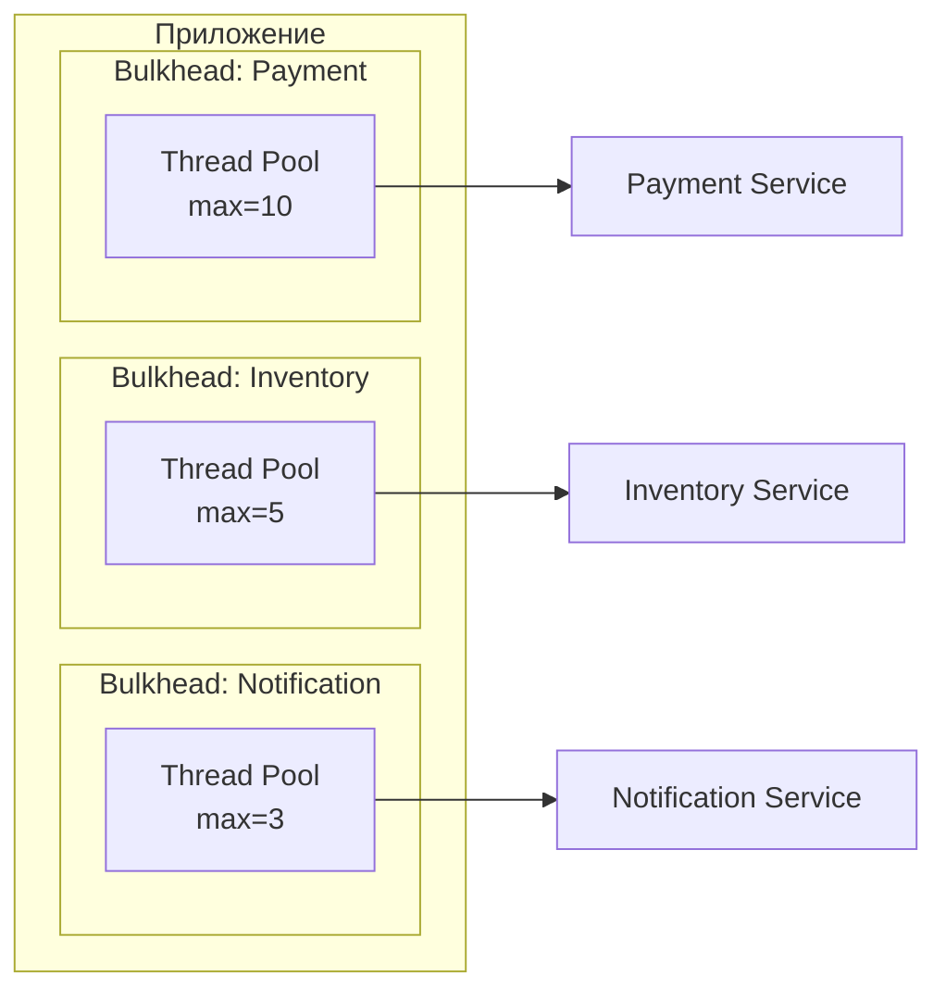

```java
// Resilience4j Bulkhead (thread pool isolation)
@Bean
public ThreadPoolBulkheadConfig bulkheadConfig() {
    return ThreadPoolBulkheadConfig.custom()
        .maxThreadPoolSize(10)
        .coreThreadPoolSize(5)
        .queueCapacity(20)
        .build();
}

// Semaphore-based bulkhead (ограничение concurrent calls)
@Bulkhead(name = "inventoryService", type = Bulkhead.Type.SEMAPHORE)
public InventoryResponse checkStock(String sku) {
    return inventoryClient.check(sku);
}
```

**Два типа:** `ThreadPool` bulkhead (выделенный пул потоков, полная изоляция) и `Semaphore` bulkhead (ограничение числа одновременных вызовов, легче по ресурсам).

> [!mcq]
> - [ ] Bulkhead pattern увеличивает общий пул потоков приложения для повышения throughput | Bulkhead = РАЗБИЕНИЕ на «отсеки», не увеличение пула. ❌ ПОСЛЕДСТВИЕ: единый большой пул → один slow downstream исчерпает все threads → весь сервис фризится. 📋 ПРАВИЛО: "bulkhead = isolation, не throughput".
> - [ ] Bulkhead pattern автоматически повторяет неудачные вызовы внешних сервисов | Retry — отдельный паттерн; bulkhead только изолирует. ❌ ПОСЛЕДСТВИЕ: ожидание retry от bulkhead → отсутствие реальных retry → permanent failures. 📋 ПРАВИЛО: "bulkhead + retry = разные защитные слои".
> - [x] Bulkhead pattern изолирует ресурсы (пулы потоков/соединений) для разных зависимостей, чтобы падение одной не истощало все потоки приложения | Принцип переборок корабля: payment pool=10, inventory pool=5, notifications pool=3 — независимые. ✓ ПРИМЕНЯТЬ: Resilience4j @Bulkhead, Hystrix thread pools, K8s resource quotas per service. 📋 ПРАВИЛО: "thread pool per service → isolated failure domains". 🔗 См. Q11 (partial failures), Q12 (CB).
> - [ ] Bulkhead pattern отключает вызовы к внешнему сервису после превышения порога ошибок | Отключение по error rate — поведение Circuit Breaker, не Bulkhead. ❌ ПОСЛЕДСТВИЕ: путаница паттернов → команда не реализует CB, полагаясь на bulkhead → cascade при error spike. 📋 ПРАВИЛО: "Bulkhead = pool isolation; CB = error-based shutdown; используй ОБА".

## Q15. Что такое graceful degradation?

**Graceful degradation** — при сбое части системы остальная продолжает работать с ограниченной функциональностью вместо полного отказа.

**Примеры:**
- При недоступности сервиса рекомендаций — показывать каталог без персональных рекомендаций
- При падении кэша — читать из БД с большей латентностью
- При сбое сервиса оплаты — принимать заказы «в очередь»

**Реализация:**

```java
public ProductPage getProductPage(String productId) {
    Product product = productService.getById(productId); // обязательный

    // Необязательные данные: fallback при ошибке
    List<Product> recommendations = safeCall(
        () -> recommendationService.getFor(productId),
        Collections.emptyList()  // fallback — пустой список
    );

    ReviewSummary reviews = safeCall(
        () -> reviewService.getSummary(productId),
        ReviewSummary.unavailable()  // fallback — «отзывы временно недоступны»
    );

    return new ProductPage(product, recommendations, reviews);
}

private <T> T safeCall(Supplier<T> call, T fallback) {
    try {
        return call.get();
    } catch (Exception e) {
        log.warn("Degraded: {}", e.getMessage());
        return fallback;
    }
}
```

**Ключ:** заранее выявить **критичные** (без них ответ невозможен) и **некритичные** (можно опустить) зависимости. Противоположность — «всё или ничего»: одна ошибка роняет весь сервис.

> [!mcq]
> - [ ] Graceful degradation требует, чтобы при сбое любой зависимости сервис немедленно возвращал HTTP 500 | HTTP 500 — fail-fast БЕЗ degradation; противоположность graceful. ❌ ПОСЛЕДСТВИЕ: 500 на любую недоступность recommendations → пользователь не видит каталог при downtime ML-сервиса. 📋 ПРАВИЛО: "graceful = degraded response, не error response".
> - [x] Graceful degradation подразумевает, что при сбое некритичных зависимостей сервис возвращает ответ с пустыми или fallback-значениями вместо полного отказа | Разделение на critical и optional dependencies; optional → fallback при сбое. ✓ ПРИМЕНЯТЬ: Amazon (каталог без recommendations), Netflix (фильмы без ratings), Twitter (timeline без trending). 📋 ПРАВИЛО: "critical = mandatory, optional = degradable; main user journey всегда работает". 🔗 См. Q11 (partial failures), Q12 (CB fallback).
> - [ ] Graceful degradation — это автоматический перезапуск контейнеров при сбое зависимостей | Restart — K8s liveness probe behavior, infrastructure-level. ❌ ПОСЛЕДСТВИЕ: использование restart как degradation → перезапуск НЕ даёт пользователю ответа; usually делает хуже (cascade restarts). 📋 ПРАВИЛО: "restart ≠ degradation; degradation = degraded response, не process recreation".
> - [ ] Graceful degradation — это синоним Circuit Breaker и реализуется только через него | CB — один из механизмов, не synonym; degradation шире: cache, queue, alt source. ❌ ПОСЛЕДСТВИЕ: CB без fallback method → reject, а не degraded → пользователь видит ошибку. 📋 ПРАВИЛО: "CB = mechanism, fallback = degradation outcome".

## Q16. Что такое health check и как его использовать?

**Health check** — периодическая проверка готовности узла к работе. Два типа:

| Тип | Назначение | Что проверять |
|---|---|---|
| **Liveness** | Жив ли процесс? | JVM не зависла, нет deadlock |
| **Readiness** | Готов ли принимать трафик? | Подключение к БД, кэшу; прогрелись кэши |

```java
// Spring Boot Actuator — кастомный health check
@Component
public class DatabaseHealthIndicator implements HealthIndicator {
    private final DataSource dataSource;

    @Override
    public Health health() {
        try (Connection conn = dataSource.getConnection()) {
            conn.createStatement().execute("SELECT 1");
            return Health.up()
                .withDetail("database", "available")
                .build();
        } catch (SQLException e) {
            return Health.down()
                .withDetail("database", e.getMessage())
                .build();
        }
    }
}
```

**В Kubernetes:**
- Liveness probe: при падении — перезапуск контейнера
- Readiness probe: при падении — исключение pod-а из `Service` (балансировщик перестаёт слать трафик)

**Антипаттерн:** не включать тяжёлые проверки внешних сервисов в liveness — иначе недоступность зависимости будет перезапускать ваш сервис (каскадный перезапуск).

> [!mcq]
> - [ ] Liveness probe проверяет готовность принимать трафик, readiness probe — жив ли процесс | Роли ПЕРЕПУТАНЫ: liveness = «alive?», readiness = «ready for traffic?». ❌ ПОСЛЕДСТВИЕ: K8s проверяет alive через readiness → restarts при недоступности внешней БД (которая в readiness). 📋 ПРАВИЛО: "liveness = restart, readiness = remove from LB".
> - [x] Liveness probe проверяет, что процесс жив и не завис; readiness probe проверяет готовность pod-а обрабатывать трафик | Liveness fail → restart (hard); readiness fail → remove from Service endpoints (soft). ✓ ПРИМЕНЯТЬ: liveness = self-only check (deadlock detection); readiness = dependencies (DB connection, cache warmup). 📋 ПРАВИЛО: "liveness = self, readiness = deps". 🔗 См. Q15 (graceful degradation), Q11 (partial failures).
> - [ ] Liveness и readiness — это два названия одной и той же проверки здоровья сервиса | Разная семантика и разная реакция K8s; нельзя объединять. ❌ ПОСЛЕДСТВИЕ: единый health → temporary DB outage → K8s restarts pod → cascading restarts → outage. 📋 ПРАВИЛО: "разделяй liveness и readiness — разные failure handling".
> - [ ] Liveness и readiness обязательно должны включать проверку всех внешних зависимостей (БД, кэш, соседние сервисы) | Liveness с внешними deps → cascade restarts при downstream outage. ❌ ПОСЛЕДСТВИЕ: 2017 GitHub — DB blip → liveness fail на 1000+ pods → mass restart → 4-hour outage. 📋 ПРАВИЛО: "liveness — only self-check; deps — в readiness или отдельный endpoint".

## Q17. (!) Что такое leader election и зачем он нужен?

**Leader election** — выбор одного узла из кластера в качестве лидера для координации. Остальные — фолловеры.

**Зачем нужен:**
- Координация распределённых задач (только лидер назначает задачи)
- Единственная точка записи в шард (избежание конфликтов)
- Распределённые блокировки (лидер управляет lock-ами)
- Единственный потребитель очереди (избежание дубликатов)

**Реализации:**

| Технология | Как работает |
|---|---|
| `ZooKeeper` | Ephemeral sequential nodes; узел с наименьшим номером — лидер |
| `etcd` | Lease + campaign API на базе `Raft` |
| `Consul` | Session + KV store с lock |
| `Redis` (Redlock) | Распределённая блокировка с TTL |
| `Kafka` | Controller broker через `KRaft` (ранее — через `ZooKeeper`) |

```java
// Leader election с Spring Integration и JDBC
@Bean
public LockRepository lockRepository(DataSource dataSource) {
    return new DefaultLockRepository(dataSource);
}

@Bean
public LockRegistryLeaderInitiator leaderInitiator(LockRepository lockRepo) {
    return new LockRegistryLeaderInitiator(
        new JdbcLockRegistry(lockRepo)
    );
}

@EventListener
public void onLeaderGranted(OnGrantedEvent event) {
    log.info("Этот узел стал лидером: {}", event.getRole());
    scheduledTaskService.start();
}

@EventListener
public void onLeaderRevoked(OnRevokedEvent event) {
    log.info("Лидерство отозвано: {}", event.getRole());
    scheduledTaskService.stop();
}
```

**Проблема split-brain:** два узла одновременно считают себя лидером. Решается fencing tokens — каждый лидер получает монотонно возрастающий номер эпохи; ресурсы принимают запросы только от лидера с наибольшей эпохой.

> [!mcq]
> - [ ] Split-brain решается увеличением таймаута election — тогда второй лидер не успеет избраться | Timeout увеличивает время ожидания, но не предотвращает partition. ❌ ПОСЛЕДСТВИЕ: Netflix 2017 — Cassandra split-brain из-за network partition; после healing — divergent data. 📋 ПРАВИЛО: "timeout не решает split-brain — нужен quorum + fencing".
> - [ ] Split-brain решается тем, что старый лидер сам заметит нового и уйдёт в отставку | Старый лидер изолирован от quorum → не знает о новых выборах → продолжает писать. ❌ ПОСЛЕДСТВИЕ: writes от stale leader в DB/S3 → corruption после healing. 📋 ПРАВИЛО: "stale leader не self-deposing — нужен external fencing".
> - [ ] Split-brain невозможен в системах с Raft и не требует отдельных механизмов | Raft гарантирует safety на уровне cluster, но external resources (DB, S3) могут принять writes от stale leader. ❌ ПОСЛЕДСТВИЕ: Raft cluster healthy, но stale leader продолжает писать в shared storage → inconsistency. 📋 ПРАВИЛО: "Raft + fencing tokens на storage layer = complete protection".
> - [x] Split-brain решается fencing tokens — монотонно возрастающим номером эпохи, который ресурсы проверяют и отклоняют запросы от лидеров с меньшим номером | Fencing token = monotonic epoch; storage rejects writes с меньшим token. ✓ ПРИМЕНЯТЬ: Google Spanner (fencing на storage layer), HBase (region server epoch), ZooKeeper zxid. 📋 ПРАВИЛО: "fencing token > current_epoch ⇒ accept; иначе reject — stale leader can't write". 🔗 См. Q8 (consensus), Q27 (Raft).

> [!mcq]
> - [ ] `Bully algorithm`, `Raft` и `ZAB` идентичны по сложности и гарантиям — выбор только дело вкуса | Принципиально разные: Bully — `O(N²)` сообщений + ID-based, Raft — quorum + term-based + `O(N)`, ZAB — Paxos-вариация для primary-backup. ❌ ПОСЛЕДСТВИЕ: команда выбирает Bully для 50-узлового кластера → election storm генерирует 2500 messages → network saturation → выборы не сходятся. 📋 ПРАВИЛО: «алгоритм определяет complexity, fault model, applicability».
> - [x] `Bully` (O(N²) сообщений, ID-based winner) подходит только для маленьких trust-кластеров; `Raft` (quorum + term) — стандарт для CP-storage; `ZAB` оптимизирован для primary-backup в `ZooKeeper` | Bully — academic/legacy, Raft — etcd/CockroachDB/Consul, ZAB — ZooKeeper (Kafka controller, Hadoop). ✓ ПРИМЕНЯТЬ: Raft (etcd, K8s control plane), ZAB (ZooKeeper для Kafka/Solr), `Bully` редко в продакшене. 📋 ПРАВИЛО: «Raft = новые системы, ZAB = ZooKeeper-based legacy, Bully = teaching tool». 🔗 См. Q27 (Raft), Q34 (Raft vs Paxos), Q35 (Bully details).
> - [ ] `Bully algorithm` — современный стандарт для production-кластеров благодаря простоте и предсказуемости | Bully устарел: `O(N²)` overhead + узел с большим ID может быть медленным/нестабильным; production использует Raft/ZAB. ❌ ПОСЛЕДСТВИЕ: реализация Bully в новом сервисе → при увеличении кластера до 20+ узлов message storm убивает network. 📋 ПРАВИЛО: «Bully = teaching example, Raft = production».
> - [ ] `ZAB` — это другое название `Raft`, использующееся в академических кругах | ZAB (ZooKeeper Atomic Broadcast) — отдельный алгоритм, ближе к Multi-Paxos чем к Raft; разработан Flavio Junqueira (2008). ❌ ПОСЛЕДСТВИЕ: попытка миграции ZooKeeper → etcd как «drop-in replacement» → ломаются ephemeral nodes, watches, ACL семантика; Kafka controller не работает. 📋 ПРАВИЛО: «ZAB ≠ Raft; ZooKeeper API не совместим с etcd lease API».

## Q18. Что такое service discovery и какие подходы существуют?

**Service discovery** — механизм, позволяющий сервисам находить друг друга без hard-coded адресов. Необходим, потому что в распределённых системах узлы появляются и исчезают динамически (автоскейлинг, деплои, сбои).

**Два подхода:**

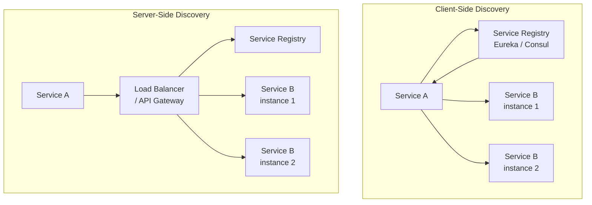

| Подход | Плюсы | Минусы | Пример |
|---|---|---|---|
| **Client-side** | Нет дополнительного hop-а | Логика балансировки в клиенте | `Eureka` + `Ribbon` / `Spring Cloud LoadBalancer` |
| **Server-side** | Клиент не знает про discovery | Дополнительный hop, SPOF | `Kubernetes Service`, `AWS ALB` |
| **DNS-based** | Простота, стандартный протокол | TTL кэша, нет health checks | `Consul DNS`, `CoreDNS` |
| **Mesh** | Прозрачно для приложения | Сложность операций | `Istio`, `Linkerd` |

**В Kubernetes** service discovery встроен: `Service` создаёт DNS-запись `<service>.<namespace>.svc.cluster.local`, `kube-proxy` балансирует между pod-ами. Для cross-cluster — `Consul`, `Istio multi-cluster`.

> [!mcq]
> - [x] При client-side discovery клиент сам получает список инстансов из registry и балансирует нагрузку; при server-side клиент ходит в единый load balancer, скрывающий registry | Client-side: balance в client lib (no extra hop, но logic в клиенте); server-side: LB hides registry (extra hop, simpler client). ✓ ПРИМЕНЯТЬ: Eureka+Spring Cloud LoadBalancer (client-side), K8s Service+kube-proxy (server-side), AWS ALB+Target Group (server-side). 📋 ПРАВИЛО: "client-side = fewer hops, server-side = simpler client". 🔗 См. Q4 (Fallacies — топология).
> - [ ] Client-side discovery и server-side discovery — это одно и то же, просто разные названия в литературе | Принципиально разные: разные locations балансировки + разные trade-offs. ❌ ПОСЛЕДСТВИЕ: путаница приводит к неверной оценке latency (server-side добавляет hop) и complexity (client-side требует libs). 📋 ПРАВИЛО: "client/server-side = разные архитектуры, не synonyms".
> - [ ] Client-side discovery работает только поверх DNS и не требует никакого registry | DNS — частный случай (TTL issues, no health checks); полноценный discovery требует registry (Eureka, Consul). ❌ ПОСЛЕДСТВИЕ: использование DNS-only → 30-second TTL = stale endpoints при scaling → 5xx errors. 📋 ПРАВИЛО: "production discovery = registry + health checks, не DNS-only".
> - [ ] Server-side discovery не требует service registry, балансировщик сам знает все инстансы | LB нуждается в source of truth — обычно registry или K8s endpoints API. ❌ ПОСЛЕДСТВИЕ: hardcoded endpoints в LB config → autoscaling не работает; instances not added → traffic не доходит. 📋 ПРАВИЛО: "LB всегда нуждается в registry (явно или K8s API)".

## Q19. (!) Чем отличается синхронная репликация от асинхронной?

**Критерий выбора:** если бизнес не допускает потерю подтверждённой записи — приоритет синхронной репликации; если важнее latency/throughput — чаще выбирают асинхронную с явным контролем окна риска.

| Критерий | Синхронная | Асинхронная |
|---|---|---|
| **Подтверждение записи** | После записи на все (или кворум) реплики | Сразу после записи на primary |
| **Консистентность** | Strong consistency | Eventual consistency |
| **Latency записи** | Выше (ждём реплики) | Ниже |
| **Throughput** | Ниже | Выше |
| **Потеря данных при сбое primary** | Невозможна (данные на репликах) | Возможна (replication lag) |
| **Доступность при partition** | Может блокироваться (нет кворума) | Продолжает работать |

**Полусинхронная репликация** (semi-sync, `MySQL`, `PostgreSQL`) — запись подтверждается после записи хотя бы на одну реплику. Компромисс между безопасностью и производительностью.

```java
// Пример: выбор уровня consistency при записи в Cassandra
// ONE — асинхронная (быстро, но рискованно)
session.execute(SimpleStatement.newInstance(query)
    .setConsistencyLevel(ConsistencyLevel.ONE));

// QUORUM — полусинхронная (N/2+1 подтверждений)
session.execute(SimpleStatement.newInstance(query)
    .setConsistencyLevel(ConsistencyLevel.QUORUM));

// ALL — синхронная (все реплики, максимальная задержка)
session.execute(SimpleStatement.newInstance(query)
    .setConsistencyLevel(ConsistencyLevel.ALL));
```

> [!mcq]
> - [ ] Асинхронная репликация гарантирует strong consistency и нулевую вероятность потери данных при сбое primary | Async = ack ДО реплицирования; lag-окно = потенциальная потеря. ❌ ПОСЛЕДСТВИЕ: GitHub 2012 — async без failover protection → 300+ commits lost; AWS RDS failover теряет 20-100мс worth of writes. 📋 ПРАВИЛО: "async = throughput, теряет lag-окно при failure".
> - [x] Асинхронная репликация имеет replication lag и при сбое primary возможна потеря последних транзакций, не доехавших до реплик | Lag 15-50мс (MySQL async), 100-200мс (semi-sync), seconds (cross-region). ✓ ПРИМЕНЯТЬ: async для high-throughput logs, analytics; sync/semi-sync для critical money/orders; semi-sync = compromise (≥1 replica ack). 📋 ПРАВИЛО: "sync = safety, async = speed, выбирай по criticality". 🔗 См. Q9 (consistency), Q20 (replication topologies).
> - [ ] Асинхронная репликация делает запись медленнее синхронной, потому что ждёт все реплики | Перевёрнуто: async НЕ ждёт реплик (faster). Sync ждёт quorum/all (3-5x slower). ❌ ПОСЛЕДСТВИЕ: команда выбирает sync «для скорости» → write latency 3-5x → user complaints. 📋 ПРАВИЛО: "async быстрее, sync медленнее но safer".
> - [ ] Асинхронная репликация и синхронная репликация дают одинаковые гарантии консистентности | Sync = strong consistency, async = eventual; принципиальная разница. ❌ ПОСЛЕДСТВИЕ: предположение strong consistency на async → bugs читателей stale data; failover loss. 📋 ПРАВИЛО: "проверяй replication mode перед SLA decisions".

> [!mcq]
> - [ ] `Semi-sync` репликация эквивалентна `sync`: ждёт ack от ВСЕХ реплик перед подтверждением клиенту | Semi-sync ждёт ХОТЯ БЫ ОДНУ реплику (не все); это компромисс safety/latency. ❌ ПОСЛЕДСТВИЕ: команда настраивает MySQL semi-sync с `rpl_semi_sync_master_wait_for_slave_count=N` ожидая поведения sync → при медленном slave write зависает на timeout. 📋 ПРАВИЛО: «semi-sync = ≥1 replica ack, не all».
> - [x] `Semi-sync` репликация (`MySQL`, `PostgreSQL`) — компромисс: ack после записи хотя бы на одну реплику; сохраняет данные при сбое primary без latency penalty всех реплик | Защищает от потери данных при single-node failure (RPO≈0 для last write) при small latency cost. ✓ ПРИМЕНЯТЬ: `MySQL` `rpl_semi_sync_master_enabled=1`, `PostgreSQL` `synchronous_commit=on` + `synchronous_standby_names`; используется в финтехе как баланс safety/throughput. 📋 ПРАВИЛО: «semi-sync = at-least-1 replica = баланс RPO≈0 vs latency». 🔗 См. Q9 (consistency), Q20 (topologies).
> - [ ] `Semi-sync` всегда быстрее `async` репликации, так как не нужно ждать сетевого round-trip | Перевёрнуто: semi-sync МЕДЛЕННЕЕ async (ждёт ack); зато safer. Async = «fire and forget». ❌ ПОСЛЕДСТВИЕ: ожидание скорости от semi-sync → разочарование при бенчмарках; неверные SLO assumptions. 📋 ПРАВИЛО: «async быстрее, semi-sync безопаснее, sync самый медленный и самый безопасный».
> - [ ] `Semi-sync` фактически identical async: при timeout primary всё равно подтверждает запись клиенту, поэтому защиты нет | В MySQL при `rpl_semi_sync_master_timeout` semi-sync ДЕГРАДИРУЕТ в async, но в нормальной работе обеспечивает at-least-1 durability; не бесполезно. ❌ ПОСЛЕДСТВИЕ: команда отключает semi-sync «всё равно фоллбэк в async» → теряет защиту от node failure в 99% времени. 📋 ПРАВИЛО: «semi-sync = primary protection + graceful degradation в async при network issues».

## Q20. Какие существуют топологии репликации?

Основные топологии:

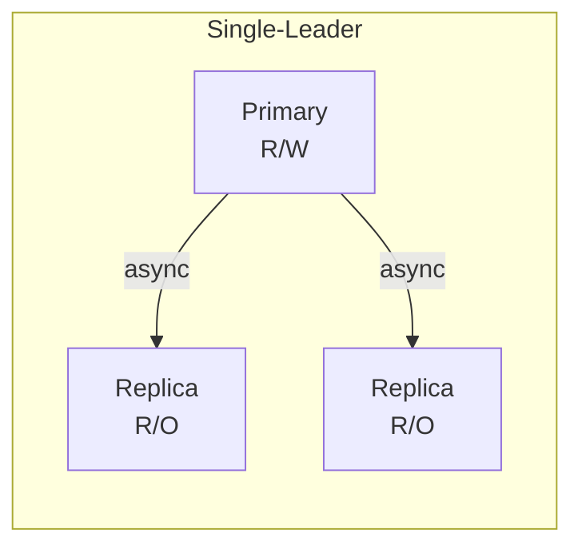

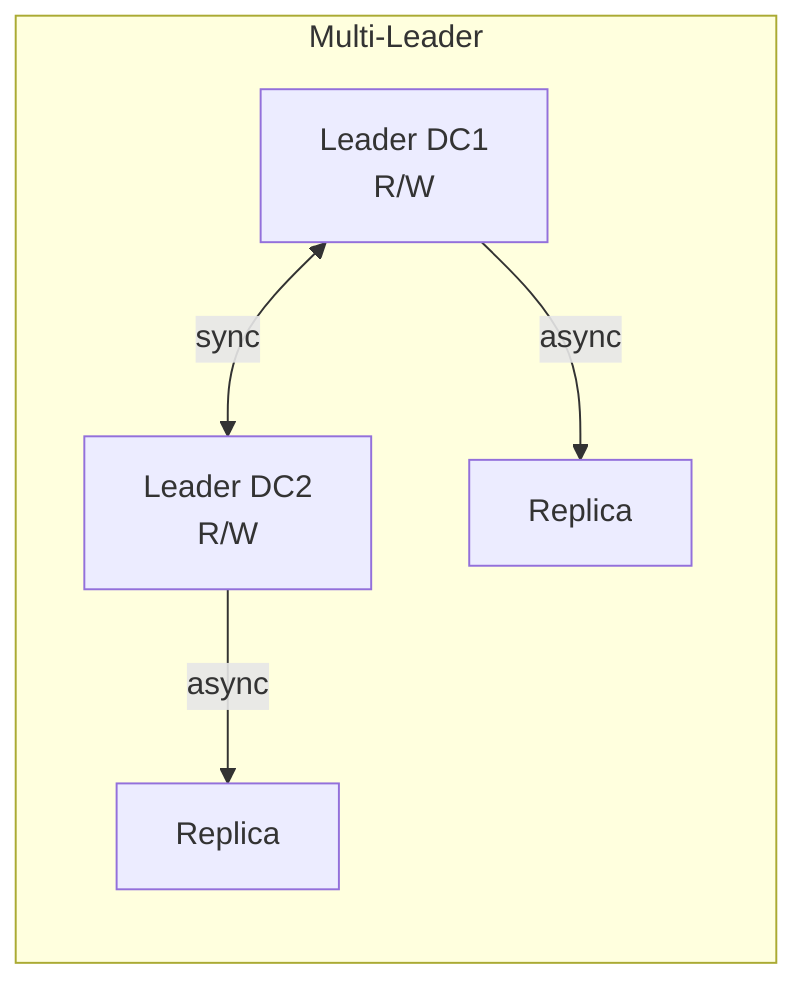

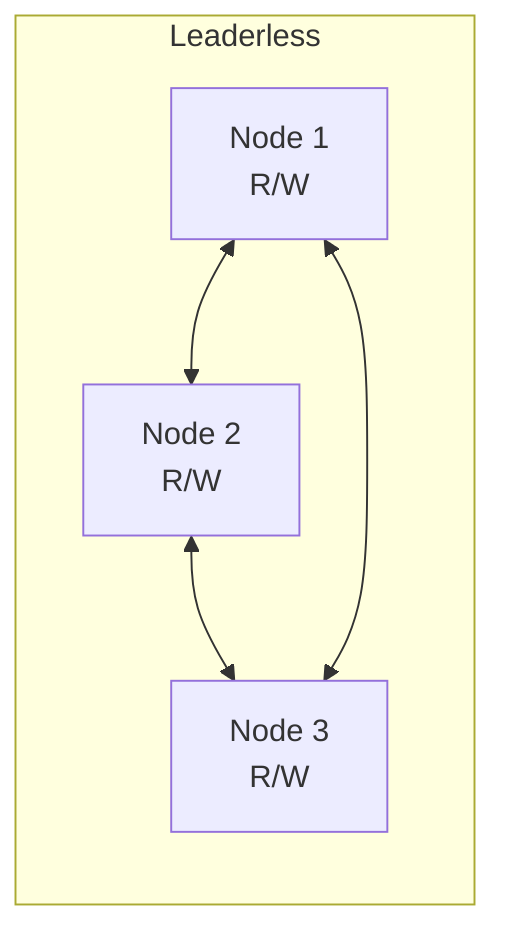

| Топология | Плюсы | Минусы | Примеры |
|---|---|---|---|
| **Single-leader** | Простота, нет конфликтов записи | SPOF лидера, latency для удалённых клиентов | `PostgreSQL`, `MySQL`, `MongoDB` |
| **Multi-leader** | Запись в нескольких DC, низкая latency | Конфликты записи, сложность разрешения | `CockroachDB`, `MySQL Group Replication` |
| **Leaderless** | Высокая доступность, нет SPOF | Конфликты, read repair, anti-entropy | `Cassandra`, `DynamoDB`, `Riak` |

**Разрешение конфликтов в multi-leader:** Last-Write-Wins (LWW), merge на уровне приложения, `CRDT`, custom conflict resolver.

> [!mcq]
> - [ ] Multi-leader репликация проще single-leader, так как нет конфликтов записи | Перевёрнуто: multi-leader создаёт concurrent writes → conflicts (LWW/CRDT/merge нужны). ❌ ПОСЛЕДСТВИЕ: CouchDB multi-leader = 10x complexity в conflict resolution; неверный merge → silent data corruption. 📋 ПРАВИЛО: "single-leader simple, multi-leader complex; choose based on geo distribution".
> - [ ] В single-leader топологии запись может идти в любой узел без координации | В single-leader только primary принимает writes; replicas — read-only. ❌ ПОСЛЕДСТВИЕ: write на replica → error или silent reroute → confusing latency. 📋 ПРАВИЛО: "single-leader = 1 writer, N readers; routing через proxy/connection pool".
> - [x] Leaderless репликация (Cassandra, DynamoDB) устраняет SPOF лидера, но требует read repair и anti-entropy для eventual consistency | R+W>N quorum для consistency, hinted handoff для temporary failures, repair для divergence. ✓ ПРИМЕНЯТЬ: Cassandra (R=W=QUORUM), DynamoDB (eventual или strongly consistent reads), Riak. ❌ ПОСЛЕДСТВИЕ: Amazon 2015 — leaderless inconsistency required 6-hour anti-entropy. 📋 ПРАВИЛО: "leaderless = no SPOF, цена = eventual + repair overhead". 🔗 См. Q19 (sync/async), Q22 (consistent hashing).
> - [ ] Leaderless репликация гарантирует strong consistency без дополнительных механизмов | Leaderless = eventual consistency by default; strong требует R+W>N + read repair. ❌ ПОСЛЕДСТВИЕ: использование Cassandra ONE для money → stale reads → wrong balances. 📋 ПРАВИЛО: "Cassandra QUORUM ≈ strong, но availability страдает при N-1 nodes down".

## Q21. (!) Что такое шардирование (Sharding) и какие стратегии существуют?

**Шардирование** — горизонтальное разбиение данных по нескольким узлам (шардам). Каждый шард хранит подмножество данных. Цель — масштабировать объём данных и нагрузку за пределы одного сервера.

**Стратегии:**

| Стратегия | Принцип | Плюсы | Минусы |
|---|---|---|---|
| **Range-based** | По диапазону ключа (A-M → shard 1, N-Z → shard 2) | Range-запросы эффективны | Hotspot при неравномерном распределении |
| **Hash-based** | `hash(key) % N` | Равномерное распределение | Range-запросы невозможны; resharding при изменении N |
| **Consistent hashing** | Кольцо хэшей с виртуальными узлами | Минимальное перемещение при добавлении узла | Сложность реализации |
| **Directory-based** | Lookup-таблица: ключ → шард | Гибкость | SPOF/bottleneck lookup-сервиса |

```java
// Простой hash-based шардинг
public class ShardRouter {
    private final List<DataSource> shards;

    public DataSource getShardFor(long userId) {
        int shardIndex = (int) (Math.abs(userId) % shards.size());
        return shards.get(shardIndex);
    }
}

// Range-based шардинг
public DataSource getShardFor(LocalDate orderDate) {
    if (orderDate.isBefore(LocalDate.of(2025, 1, 1))) {
        return archiveShard;
    } else if (orderDate.isBefore(LocalDate.of(2026, 1, 1))) {
        return shard2025;
    } else {
        return currentShard;
    }
}
```

**Проблемы шардирования:**
- **Cross-shard queries** — JOIN-ы между шардами дорогие или невозможные
- **Resharding** — добавление шардов требует миграции данных
- **Hotspots** — неравномерная нагрузка на шарды (celebrity problem)
- **Distributed transactions** — 2PC между шардами снижает производительность

> [!mcq]
> - [ ] `Hash-based` шардинг (`hash(key) % N`) идеален: даёт равномерное распределение и дешёвый resharding | При изменении `N` почти все ключи меняют шард → миграция всей БД. ❌ ПОСЛЕДСТВИЕ: добавление 1 шарда из 10 → 90% данных переезжают, downtime 12+ часов. 📋 ПРАВИЛО: «`hash % N` — равномерно сейчас, ад при resharding».
> - [ ] `Range-based` шардинг устраняет hotspots благодаря диапазонному распределению | Range усугубляет hotspots: monotonic ключи (timestamp, autoincrement) → последний шард принимает 100% writes. ❌ ПОСЛЕДСТВИЕ: HBase celebrity problem — один region всегда горячий. 📋 ПРАВИЛО: «range = локальность, цена = hotspot на свежих данных».
> - [x] `Consistent hashing` минимизирует миграцию при resharding (`K/N` ключей) и применяется в `Cassandra`, `DynamoDB`, `Redis Cluster` | Кольцо хэшей + vnodes = добавление узла перемещает ~1/N данных вместо ~всей БД. ✓ ПРИМЕНЯТЬ: `Cassandra` (256 vnodes), `DynamoDB` partition keys, `Redis Cluster` (16384 slots), Memcached ketama. 📋 ПРАВИЛО: «scale-out БД = consistent hashing + vnodes». 🔗 См. Q22 (consistent hashing), Q40 (vnodes/hotspots).
> - [ ] `Directory-based` шардинг лучше всех: гибко и без ограничений | Directory создаёт SPOF и bottleneck на lookup-сервисе; каждый запрос требует round-trip за маршрутом. ❌ ПОСЛЕДСТВИЕ: lookup down → весь кластер недоступен; cache invalidation rage. 📋 ПРАВИЛО: «directory = max гибкость, max SPOF».

## Q22. Что такое consistent hashing?

**Consistent hashing** — алгоритм распределения данных, при котором добавление или удаление узла перемещает минимальное количество ключей (в среднем `K/N`, где `K` — число ключей, `N` — число узлов).

**Принцип:** узлы и ключи хэшируются на кольцо `[0, 2^32)`. Ключ назначается **ближайшему узлу по часовой стрелке**.

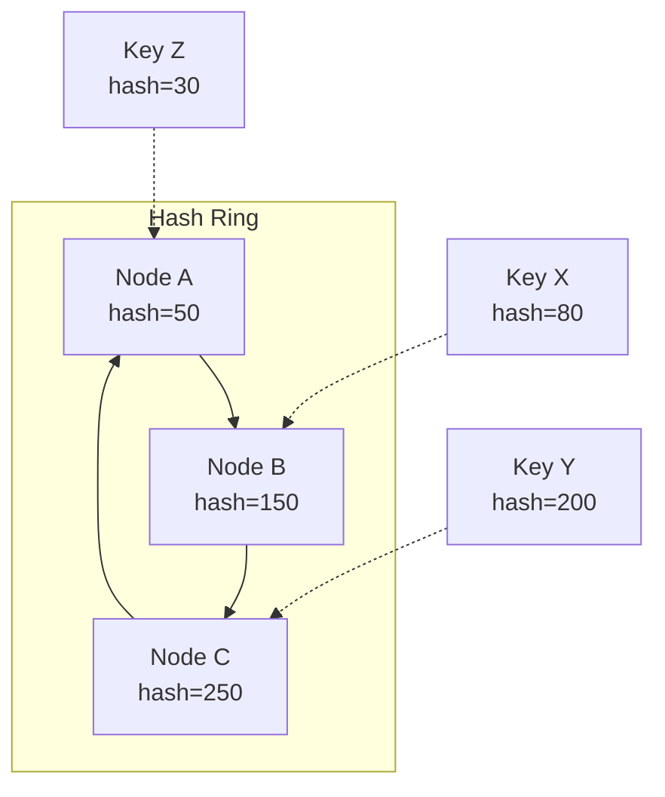

**Виртуальные узлы** (vnodes): каждый физический узел создаёт несколько точек на кольце (например, 150-256). Это обеспечивает **равномерное распределение** — без vnodes один узел может получить непропорционально большой сегмент.

**Применение:** `Cassandra`, `DynamoDB`, `Memcached` (ketama), `Redis Cluster`, `Kafka` (partition assignment), `CDN` (маршрутизация запросов).

**При добавлении узла D:** только ключи из диапазона, который теперь принадлежит D, мигрируют с соседнего узла. Остальные ключи остаются на месте — в отличие от `hash % N`, где перераспределяются почти все.

> [!mcq]
> - [x] При добавлении узла в кольцо `consistent hashing` мигрирует ~`K/N` ключей с одного соседа, остальные узлы не затронуты | Минимизация миграции — главное свойство алгоритма; vnodes выравнивают распределение. ✓ ПРИМЕНЯТЬ: `Cassandra` (`num_tokens=256`), `DynamoDB`, `Redis Cluster`, Memcached ketama, `CDN` маршрутизация. 📋 ПРАВИЛО: «consistent hashing = минимум миграции при scale-out». 🔗 См. Q21 (sharding), Q40 (vnodes/hotspots).
> - [ ] При добавлении узла в кольцо `consistent hashing` мигрирует около половины всех ключей | Только ~`K/N` мигрируют (один сегмент кольца), это и есть смысл алгоритма vs `hash % N`. ❌ ПОСЛЕДСТВИЕ: путаница с обычным modulo-хэшем → необоснованный отказ от scale-out. 📋 ПРАВИЛО: «K/N — фундаментальная характеристика consistent hashing».
> - [ ] Без `vnodes` consistent hashing даёт идеально равномерное распределение | Без vnodes маленькое число узлов → большие неравные сегменты кольца → один узел получает 50% данных. ❌ ПОСЛЕДСТВИЕ: при 3 физических узлах без vnodes ratio нагрузки 5:3:1 — hot node OOM. 📋 ПРАВИЛО: «vnodes 128-256 на узел = выровненная нагрузка».
> - [ ] Ключ назначается случайному узлу на кольце через `hash(key) XOR hash(node)` | Ключ идёт следующему узлу **по часовой стрелке** от своей позиции — детерминировано. ❌ ПОСЛЕДСТВИЕ: random-маршрутизация ломает идею (нельзя найти данные обратно). 📋 ПРАВИЛО: «clockwise next node — детерминированный routing в кольце».

## Q23. Что такое gossip protocol?

**Gossip protocol** (протокол сплетен, epidemic protocol) — децентрализованный способ распространения информации в кластере. Каждый узел периодически выбирает **случайного соседа** и обменивается с ним своим состоянием.

**Свойства:**
- **Децентрализованный** — нет лидера или координатора
- **Устойчивый** — работает при частичных сбоях
- **Eventual consistency** — информация распространяется за O(log N) раундов
- **Масштабируемый** — нагрузка на каждый узел O(1) за раунд

**Применение:**

| Задача | Пример |
|---|---|
| Обнаружение сбоев (failure detection) | `Cassandra`, `Consul` — gossip heartbeats |
| Membership — кто в кластере | `SWIM protocol`, `Serf` |
| Распространение метаданных | `Cassandra` — таблица токенов, schema changes |
| Агрегация (counts, averages) | Мониторинг, P2P-системы |

```java
// Упрощённый gossip protocol
@Scheduled(fixedRate = 1000) // каждую секунду
public void gossipRound() {
    Node randomPeer = selectRandomPeer();

    // Отправить своё состояние
    GossipDigest myDigest = buildDigest();
    GossipResponse response = sendGossip(randomPeer, myDigest);

    // Слить полученное состояние
    for (NodeState state : response.getUpdates()) {
        if (state.getVersion() > localState.get(state.getNodeId()).getVersion()) {
            localState.put(state.getNodeId(), state); // обновить
        }
    }
}
```

**Phi Accrual Failure Detector** (используется в `Cassandra`, `Akka`) — вместо бинарного «жив/мёртв» вычисляет **вероятность** сбоя на основе истории heartbeat-интервалов. Позволяет адаптироваться к сети с переменной задержкой.

> [!mcq]
> - [ ] `Gossip protocol` гарантирует strong consistency и атомарную доставку всем узлам | Gossip = eventual consistency: O(log N) раундов до полной пропагации, без атомарности. ❌ ПОСЛЕДСТВИЕ: использование gossip для критичных coordination → split-brain. 📋 ПРАВИЛО: «gossip = eventual; для consensus — Raft/Paxos».
> - [ ] Gossip требует центрального координатора для управления раундами | Главная фишка gossip — децентрализация: нет лидера, каждый узел действует автономно. ❌ ПОСЛЕДСТВИЕ: добавление координатора убивает отказоустойчивость → SPOF возвращается. 📋 ПРАВИЛО: «gossip = peer-to-peer без координатора».
> - [ ] Нагрузка на узел в gossip растёт линейно `O(N)` от размера кластера | Нагрузка `O(k)` где k = fan-out (обычно 3-5), не зависит от N — это и обеспечивает масштабируемость. ❌ ПОСЛЕДСТВИЕ: вера в `O(N)` → отказ от gossip для крупных кластеров вместо его принятия. 📋 ПРАВИЛО: «gossip O(k) per node, информация за O(log N) раундов».
> - [x] Gossip децентрализован и используется для membership/failure detection в `Cassandra`, `Consul` (SWIM), `Redis Cluster` | Случайные пары обмениваются heartbeats; Phi Accrual детектор для адаптации к latency. ✓ ПРИМЕНЯТЬ: `Cassandra` (порт 7000), `Consul`/`Serf` SWIM, `Redis Cluster` cluster bus, `Akka` cluster. 📋 ПРАВИЛО: «membership/failure-detect — gossip; data-replication — Raft/quorum». 🔗 См. Q33 (gossip details).

## Q24. (!) Что такое идемпотентность в распределённых системах?

**Идемпотентность** — повторное выполнение операции с теми же входными данными даёт тот же результат, что и однократное. Критична при retry: клиент может отправить запрос повторно из-за таймаута или сбоя сети.

**Без идемпотентности:** дублируется платёж, создаётся два заказа, дважды списываются деньги.

| HTTP-метод | Идемпотентен? | Пояснение |
|---|---|---|
| `GET` | Да | Чтение не меняет состояние |
| `PUT` | Да | Замена ресурса — результат одинаков |
| `DELETE` | Да | Удаление уже удалённого — 404, но состояние то же |
| `POST` | **Нет** | Создание нового ресурса каждый раз |
| `PATCH` | Зависит | `{ "status": "PAID" }` — да; `{ "balance": "+100" }` — нет |

**Реализация через `Idempotency-Key`:**

```java
@PostMapping("/payments")
public ResponseEntity<PaymentResult> createPayment(
        @RequestHeader("Idempotency-Key") String idempotencyKey,
        @RequestBody PaymentRequest request) {

    // 1. Проверяем кэш: уже обрабатывали этот ключ?
    Optional<PaymentResult> cached = idempotencyStore.get(idempotencyKey);
    if (cached.isPresent()) {
        return ResponseEntity.ok(cached.get()); // возвращаем прошлый результат
    }

    // 2. Выполняем операцию
    PaymentResult result = paymentService.process(request);

    // 3. Сохраняем результат с TTL
    idempotencyStore.put(idempotencyKey, result, Duration.ofHours(24));

    return ResponseEntity.status(HttpStatus.CREATED).body(result);
}
```

**Хранение ключей:** `Redis` с TTL (быстро, но volatile), БД-таблица `idempotency_keys` (надёжно), или комбинация (Redis как кэш + БД как source of truth).

> [!mcq]
> - [ ] `POST` идемпотентен по умолчанию, поэтому retry безопасен без дополнительных мер | `POST` создаёт новый ресурс при каждом вызове — retry без `Idempotency-Key` = дубль платежа/заказа. ❌ ПОСЛЕДСТВИЕ: Knight Capital 2012 — повторные ордеры на $440M убытков из-за неидемпотентного retry. 📋 ПРАВИЛО: «POST не идемпотентен — всегда Idempotency-Key для платежей».
> - [ ] Идемпотентность нужна только для read-операций (`GET`), для writes она бессмысленна | Наоборот: writes критичны при retry (платежи, заказы), reads и так safe. ❌ ПОСЛЕДСТВИЕ: дубли write-операций при network timeout → двойное списание. 📋 ПРАВИЛО: «идемпотентность = свойство writes, не reads».
> - [x] Идемпотентность реализуется через `Idempotency-Key` (UUID от клиента) + кэш ответов (Redis/БД) с TTL | Сервер кэширует первый результат и возвращает его при retry с тем же ключом. ✓ ПРИМЕНЯТЬ: Stripe API, Adyen, банковские платежи; Redis TTL=24h + Postgres `idempotency_keys` с UNIQUE index. 📋 ПРАВИЛО: «Idempotency-Key + cache+TTL — стандарт платёжных API». 🔗 См. Q25 (exactly-once), Q36 (idempotency keys).
> - [ ] `PATCH` всегда идемпотентен, как `PUT`, поэтому retry безопасен | `PATCH` зависит от семантики: `{status: "PAID"}` идемпотентен, `{balance: "+100"}` — нет. ❌ ПОСЛЕДСТВИЕ: retry incremental PATCH → удвоенные значения счётчиков. 📋 ПРАВИЛО: «PATCH идемпотентен только при absolute-set, не delta».

## Q25. (!) Как достичь exactly-once семантики доставки сообщений?

В распределённых системах существуют три гарантии доставки:

| Гарантия | Описание | Сложность |
|---|---|---|
| **At-most-once** | Сообщение доставляется 0 или 1 раз; возможна потеря | Простейшая (fire-and-forget) |
| **At-least-once** | Сообщение доставляется 1+ раз; возможны дубликаты | Retry + acknowledgement |
| **Exactly-once** | Сообщение обрабатывается ровно 1 раз | Самая сложная |

**Истинный exactly-once невозможен** в общем случае (Two Generals' Problem). На практике реализуют **effectively exactly-once** = at-least-once доставка + **идемпотентная обработка**.

**Подходы:**

1. **Idempotent consumer** — потребитель проверяет, обрабатывал ли уже это сообщение:

```java
@KafkaListener(topics = "orders")
public void handleOrder(ConsumerRecord<String, OrderEvent> record) {
    String messageId = record.key(); // или record.headers()

    if (processedMessageRepository.exists(messageId)) {
        log.info("Дубликат {}, пропускаем", messageId);
        return;
    }

    orderService.process(record.value());
    processedMessageRepository.save(messageId); // в той же транзакции!
}
```

2. **Transactional outbox** — запись в БД и «отправка» сообщения в одной транзакции:

```java
@Transactional
public void createOrder(OrderRequest request) {
    Order order = orderRepository.save(toOrder(request));
    // Сообщение — в ту же БД-транзакцию
    outboxRepository.save(new OutboxMessage(
        "orders", order.getId().toString(), toJson(order)
    ));
}
// Отдельный poller/CDC читает outbox и публикует в Kafka
```

3. **Kafka Exactly-Once Semantics (EOS)** — `enable.idempotence=true` + `transactional.id` на продюсере; `isolation.level=read_committed` на консьюмере.

> [!mcq]
> - [ ] Истинный `exactly-once` достигается простым включением `acks=all` на продюсере Kafka | `acks=all` даёт at-least-once (durability), не exactly-once; нужен `enable.idempotence`+`transactional.id`+`read_committed`. ❌ ПОСЛЕДСТВИЕ: дубликаты в downstream payments при retry brokerом. 📋 ПРАВИЛО: «acks=all — durability, EOS — отдельный набор настроек».
> - [x] На практике exactly-once = at-least-once доставка + идемпотентная обработка (Two Generals' Problem делает чистый E1 невозможным) | Effectively exactly-once: дедупликация по messageId либо Kafka EOS+transactional.id+read_committed. ✓ ПРИМЕНЯТЬ: Kafka EOS, Idempotent consumer (processed_messages table), Transactional Outbox + Debezium CDC. 📋 ПРАВИЛО: «E1 в распределёнке = at-least-once + idempotent handler». 🔗 См. Q24 (idempotency), Q38 (outbox).
> - [ ] `At-most-once` гарантирует самую надёжную доставку — лучше использовать её для платежей | At-most-once = fire-and-forget с возможной потерей; для платежей это катастрофа. ❌ ПОСЛЕДСТВИЕ: пропущенный платёж клиенту → финансовые потери, разбор инцидентов. 📋 ПРАВИЛО: «at-most-once для метрик/логов, at-least-once+idempotent для денег».
> - [ ] Transactional outbox требует распределённого 2PC между БД и Kafka | Outbox именно избегает 2PC: запись в БД-таблицу `outbox` идёт в одной локальной транзакции, отдельный relay/Debezium публикует. ❌ ПОСЛЕДСТВИЕ: попытка XA с Kafka → невозможно (Kafka не XA-resource), производственная ошибка. 📋 ПРАВИЛО: «outbox = atomic publish без 2PC через CDC/polling».

> [!mcq]
> - [x] `Two Generals' Problem` доказывает невозможность гарантированного консенсуса о доставке через ненадёжный канал — поэтому истинный exactly-once невозможен; на практике используют at-least-once + dedup window | Каждое подтверждение само нуждается в подтверждении → бесконечный регресс. Решение: idempotent consumer с dedup-таблицей (24-48h TTL). ✓ ПРИМЕНЯТЬ: `processed_messages` table с UNIQUE (messageId), TTL=24h cleanup; `Kafka EOS` (transactional.id + read_committed) — best practical exactly-once; `Stripe`-style Idempotency-Key. 📋 ПРАВИЛО: «exactly-once = at-least-once + idempotent handler + dedup window». 🔗 См. Q24 (idempotency), Q36 (idempotency keys), Q38 (outbox).
> - [ ] `Two Generals' Problem` решается добавлением третьего участника-арбитра, который гарантирует доставку | Третий участник сам нуждается в надёжной коммуникации с первыми двумя — проблема рекурсивна, не решается добавлением узлов. ❌ ПОСЛЕДСТВИЕ: команда строит «message broker как арбитр» ожидая exactly-once без идемпотентности → дубликаты при network partition между producer и broker. 📋 ПРАВИЛО: «no-arbitr can solve TGP — dedup на consumer стороне обязателен».
> - [ ] `Kafka transactional.id` сам по себе обеспечивает истинный exactly-once между producer и downstream consumer без дополнительных мер | Kafka EOS работает только ВНУТРИ Kafka (read-process-write); при exposure через REST/external systems нужен idempotency на consumer стороне. ❌ ПОСЛЕДСТВИЕ: команда полагается на `transactional.id` для платежей с external bank API → дубликаты при retry consumer'а к bank → double charge. 📋 ПРАВИЛО: «Kafka EOS = intra-Kafka, для external — Idempotency-Key».
> - [ ] Dedup window можно сделать infinite (хранить все messageId навсегда) для абсолютной гарантии exactly-once | Бесконечный storage = unsustainable: 1М msg/день × 365 дней × 5 лет = 1.8 млрд записей в dedup table → query latency растёт экспоненциально. ❌ ПОСЛЕДСТВИЕ: `processed_messages` без TTL → таблица 100GB+ через год → SELECT по UNIQUE index 500ms → consumer throttled. 📋 ПРАВИЛО: «dedup TTL = 2-3x максимального retry window (обычно 24-48h)».

## Q26. (!) Что такое distributed tracing и зачем он нужен?

**Distributed tracing** — отслеживание пути запроса через несколько сервисов. Каждый шаг — **span** (с `spanId` и `parentSpanId`), все span-ы объединены общим **`traceId`**.

```mermaid
gantt
    title Distributed Trace: POST /orders
    dateFormat X
    axisFormat %L ms
    section API Gateway
    gateway           :0, 350
    section Order Service
    createOrder        :20, 200
    section Payment Service
    processPayment     :50, 120
    section Inventory Service
    reserveStock       :180, 80
    section Notification
    sendEmail          :270, 60
```

**Ключевые концепции:**
- **Trace** — полный путь запроса (дерево span-ов)
- **Span** — одна операция (HTTP-вызов, SQL-запрос, отправка в очередь)
- **Context propagation** — передача `traceId`/`spanId` между сервисами (через HTTP-заголовки `traceparent`, `b3`)
- **Sampling** — сбор не всех трейсов (head-based или tail-based sampling)

```java
// Spring Boot + Micrometer Tracing (замена Sleuth)
// Автоматически: HTTP-заголовки, RestTemplate, WebClient, Kafka

// Ручное создание span
@Autowired
private Tracer tracer;

public void processOrder(Order order) {
    Span span = tracer.nextSpan().name("process-order").start();
    try (Tracer.SpanInScope ws = tracer.withSpan(span)) {
        span.tag("orderId", order.getId().toString());
        span.tag("amount", order.getTotal().toString());

        validateOrder(order);
        calculatePricing(order);

        span.event("order-validated"); // аннотация на timeline
    } finally {
        span.end();
    }
}
```

**Инструменты:** `OpenTelemetry` (стандарт), `Jaeger`, `Zipkin`, `AWS X-Ray`, `Grafana Tempo`. В Spring — `micrometer-tracing` с бриджем к `OpenTelemetry` или `Brave` (Zipkin).

**На собеседовании:** важно упомянуть не только инструменты, но и **context propagation** (как traceId передаётся между сервисами), **sampling** (почему не собираем 100% трейсов в проде) и **корреляцию с логами** (`traceId` в MDC для поиска логов по трейсу).

> [!mcq]
> - [ ] В проде нужно собирать 100% трейсов — иначе пропустим важную ошибку | 100% sampling в high-RPS системе = огромный storage cost и I/O overhead; стандарт — head-based 1-10% или tail-based по ошибкам. ❌ ПОСЛЕДСТВИЕ: tracing backend (Jaeger/Tempo) OOM, потеря всех трейсов при отказе хранилища. 📋 ПРАВИЛО: «sampling 1-10% head + 100% tail-based для errors/slow».
> - [x] Distributed tracing основан на `traceId`+`spanId`+`parentSpanId` с context propagation через HTTP-заголовки `traceparent`/`b3` | OpenTelemetry стандарт; Spring micrometer-tracing автоматически пропагирует через RestTemplate/WebClient/Kafka. ✓ ПРИМЕНЯТЬ: `OpenTelemetry`, `Jaeger`, `Zipkin`, `Grafana Tempo`, AWS X-Ray; `traceId` в MDC для логов. 📋 ПРАВИЛО: «один traceId = один user-request через все сервисы». 🔗 См. микросервисы (observability).
> - [ ] `traceId` генерируется каждым сервисом независимо при получении запроса | Тогда трейсы не соберутся в дерево — `traceId` создаётся на входе (gateway/первый сервис) и пропагируется до конца цепочки. ❌ ПОСЛЕДСТВИЕ: невозможно найти полный путь запроса, debug 5xx занимает часы вместо минут. 📋 ПРАВИЛО: «traceId создаётся 1 раз на edge, пропагируется через headers».
> - [ ] Sampling трейсов снижает точность мониторинга и его не применяют в крупных системах | Google Dapper, Twitter, Netflix используют sampling 0.01-1%; мониторинг качественный благодаря volume + statistical relevance. ❌ ПОСЛЕДСТВИЕ: попытка 100% при 1M RPS → backend collapse, полная потеря telemetry. 📋 ПРАВИЛО: «high-throughput = sampling, low-traffic = 100% OK».

## Q27. (!) Как работает алгоритм Raft?

`Raft` — алгоритм консенсуса, разработанный для понятности и практического применения (в отличие от `Paxos`). Используется в `etcd`, `CockroachDB`, `TiKV`, `Consul`.

**Три роли узлов:**
- **Leader** — принимает все записи, рассылает `AppendEntries` репликам
- **Follower** — пассивно получает записи от лидера
- **Candidate** — временная роль при выборах нового лидера

**Leader Election (выбор лидера):**

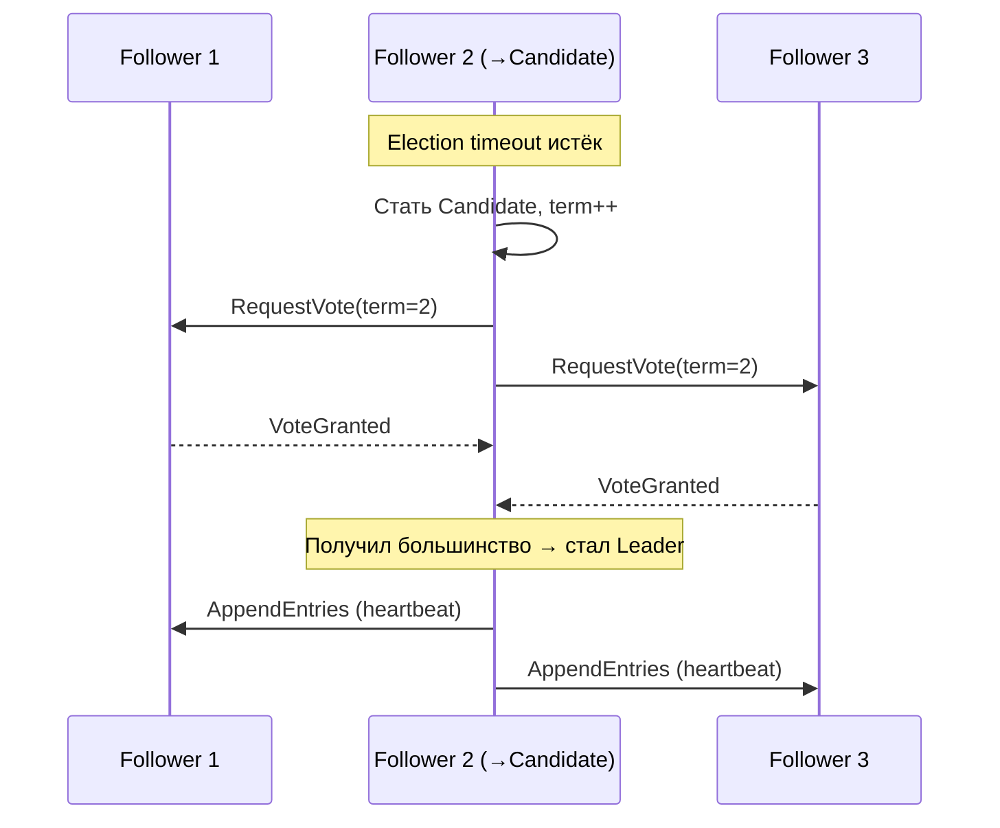

**Log Replication (репликация лога):**
1. Клиент отправляет команду лидеру
2. Лидер добавляет в свой лог (uncommitted)
3. Рассылает `AppendEntries` фолловерам
4. После подтверждения кворумом (`N/2 + 1`) — `commit`
5. Применяет к state machine, отвечает клиенту

**Ключевые свойства:**
- **Term** — монотонно возрастающий номер эпохи; устаревшие лидеры отвергаются
- **Log matching** — если два лога имеют одинаковый index и term, все предыдущие записи идентичны
- **Leader completeness** — избранный лидер всегда имеет все committed записи

```java
// Условие победы на выборах (псевдокод)
boolean grantVote(RequestVote request) {
    if (request.term < currentTerm) return false;
    if (votedFor != null && !votedFor.equals(request.candidateId)) return false;
    // Кандидат должен иметь лог не хуже нашего
    return request.lastLogIndex >= log.lastIndex()
        && request.lastLogTerm >= log.lastTerm();
}
```

> [!mcq]
> - [ ] В Raft записи коммитятся сразу после получения лидером, без ожидания репликации | Лидер ждёт подтверждения от кворума (`N/2+1`) перед commit; без этого — потеря данных при failover. ❌ ПОСЛЕДСТВИЕ: новый лидер не имеет «закоммиченной» записи → silent data loss. 📋 ПРАВИЛО: «commit only after quorum ack — фундамент Raft safety».
> - [ ] Term номер в Raft опционален и нужен только для логирования | Term — основа safety: устаревшие лидеры (с меньшим term) автоматически отвергаются, предотвращает split-brain. ❌ ПОСЛЕДСТВИЕ: без term два лидера в разных партициях коммитят конфликтующие записи. 📋 ПРАВИЛО: «term монотонно растёт; stale term = step down».
> - [x] Raft реализует консенсус через явного лидера, log replication с кворумом `N/2+1`, randomized election timeouts | Применяется в `etcd`, `CockroachDB`, `TiKV`, `Consul`; разделяет проблемы: leader election + log replication + safety. ✓ ПРИМЕНЯТЬ: `etcd` (Kubernetes control plane), `Consul`, `CockroachDB`, HashiCorp products. 📋 ПРАВИЛО: «Raft = leader + quorum + terms — стандарт для нового CP-storage». 🔗 См. Q28 (Paxos vs Raft), Q34, Q35 (leader election).
> - [ ] Кворум в Raft = все узлы должны подтвердить запись | Кворум = большинство (`N/2+1`); требование «все» = недоступность при single failure. ❌ ПОСЛЕДСТВИЕ: 5-узловой кластер при 1 узле down полностью встаёт — теряется fault tolerance. 📋 ПРАВИЛО: «quorum=majority, не unanimity; tolerate (N-1)/2 failures».

## Q28. Чем Paxos отличается от Raft?

`Paxos` (Лесли Лампорт, 1989) и `Raft` — два алгоритма консенсуса для репликации лога в распределённых системах.

| Характеристика | `Paxos` | `Raft` |
|----------------|---------|--------|
| Понятность | Сложный; много вариантов | Спроектирован для понятности |
| Лидер | Опциональный (Multi-Paxos) | Обязательный |
| Выборы | Пофазово (Prepare/Promise/Accept) | За один раунд с термами |
| Применение на практике | `Chubby` (Google), `ZooKeeper` (ZAB ≈ Paxos) | `etcd`, `CockroachDB`, `TiKV` |
| Гарантии | Safety в асинхронных сетях | Safety + Liveness при кворуме |

**Фазы классического Paxos (Single-Decree):**
1. **Prepare(n)** — proposer рассылает номер предложения; acceptors отвечают Promise
2. **Accept(n, v)** — proposer выбирает значение с наибольшим номером из Promise; acceptors принимают
3. **Learn** — learners узнают принятое значение

**Проблемы Paxos на практике:**
- Multi-Paxos (для лога) существенно сложнее Single-Decree
- Много деталей не специфицированы (reconfiguration, leader election)
- Оригинальная статья описана через метафору с греческим парламентом — намеренно сложно

`Raft` явно разделяет проблемы: `leader election`, `log replication`, `safety` — что упрощает реализацию и тестирование.

> [!mcq]
> - [x] Raft проектировался для понятности (явный лидер, term-based election), Paxos сложнее и допускает livelock | Multi-Paxos для replicated log существенно сложнее Single-Decree; Raft разделяет роли явно. ✓ ПРИМЕНЯТЬ: новые системы → Raft (`etcd`, `CockroachDB`, `TiKV`); legacy/Google → Paxos (`Chubby`, `Spanner`, `ZAB`). 📋 ПРАВИЛО: «новый CP-сервис = Raft, не Paxos». 🔗 См. Q27 (Raft), Q34 (детали).
> - [ ] Paxos и Raft идентичны по гарантиям и сложности — различие только в названии | Paxos допускает livelock между двумя proposers; Raft гарантирует liveness через randomized election. ❌ ПОСЛЕДСТВИЕ: Basic Paxos может циклить часами без избрания лидера — реальная проблема Spanner до Multi-Paxos. 📋 ПРАВИЛО: «Raft liveness > Paxos liveness в стандартных конфигурациях».
> - [ ] В Paxos лидер обязателен, как в Raft | В classic Paxos лидер опционален; Multi-Paxos вводит distinguished proposer для эффективности, но не required. ❌ ПОСЛЕДСТВИЕ: путаница на собеседовании, попытка применить Raft-подход к Paxos. 📋 ПРАВИЛО: «Paxos: лидер опционален; Raft: лидер обязателен».
> - [ ] ZooKeeper использует чистый Raft в качестве consensus-алгоритма | ZooKeeper использует ZAB (Zookeeper Atomic Broadcast) — вариацию Paxos, не Raft. ❌ ПОСЛЕДСТВИЕ: неверная аргументация в архитектурных решениях про ZK кластеры. 📋 ПРАВИЛО: «ZK = ZAB ≈ Paxos; etcd = Raft».

## Q29. (!) Что такое Two-Phase Commit (2PC) в контексте распределённых систем?

`2PC` (`Two-Phase Commit`) — протокол для атомарного выполнения распределённых транзакций: все участники либо коммитят, либо откатываются.

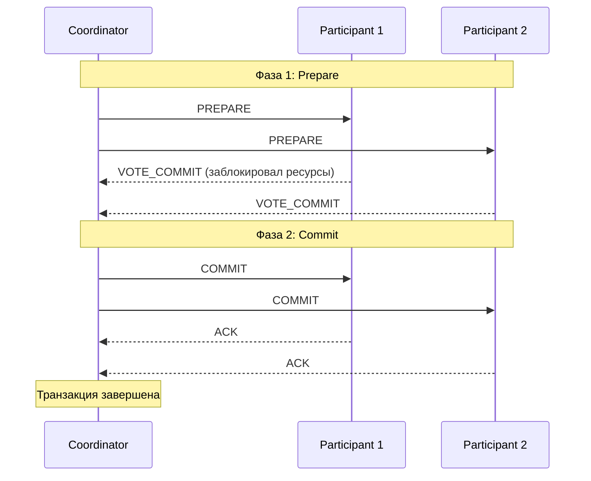

**Проблемы 2PC:**
1. **Blocking protocol** — если координатор упал после PREPARE, участники заблокированы до восстановления
2. **SPOF координатора** — без координатора участники не знают, коммитить или откатывать
3. **Производительность** — 2 раунда сообщений + синхронная запись на диск
4. **Не масштабируется** — каждый участник блокирует ресурсы до завершения протокола

**Сравнение с Saga:**

| Критерий | `2PC` | `Saga` |
|----------|-------|--------|
| Изоляция | Да (ACID) | Нет (возможны «грязные» промежуточные состояния) |
| Доступность при сбоях | Низкая (блокировка) | Высокая (компенсации) |
| Задержки | Высокие | Низкие |
| Сложность реализации | Средняя | Высокая (компенсирующие транзакции) |
| Применение | Локальные DB, XA | Микросервисы, long-running |

**Применение:** `JTA`/`XA` в Java EE, `PostgreSQL` с `prepared transactions`, `MySQL` с `XA`. В микросервисах практически не используют из-за проблем масштабируемости.

> [!mcq]
> - [ ] `2PC` — это неблокирующий протокол: участники коммитят независимо, а координатор лишь собирает финальный статус для отчётности | На самом деле `2PC` блокирующий: после `PREPARE` участники держат локки до получения `COMMIT`/`ROLLBACK`. ❌ ПОСЛЕДСТВИЕ: команда выбирает `2PC` для high-throughput микросервисов, ожидая независимые коммиты. Под нагрузкой при сбое координатора участники блокированы часами, deadlock'и в `PostgreSQL` `pg_stat_activity` показывают `idle in transaction (aborted)`.
> - [x] `2PC` гарантирует атомарность через две фазы (`PREPARE` + `COMMIT`), но блокирует ресурсы и страдает от SPOF координатора | После голосования `VOTE_COMMIT` участники держат локки до решения координатора; падение координатора между фазами оставляет участников «висящими». ✓ ПРИМЕНЯТЬ: `JTA`/`XA` через `Atomikos` или `Narayana` для одной БД + JMS в monolith; `PostgreSQL` `PREPARE TRANSACTION` для редких случаев; в микросервисах заменять на `Saga` + `Outbox`. 📋 ПРАВИЛО: «`2PC` = ACID ценой блокировки». 🔗 См. Q30 (Saga), Q38 (Outbox).
> - [ ] `2PC` устраняет проблему SPOF координатора через автоматический выбор нового координатора из участников при сбое | Базовый `2PC` не имеет встроенного failover; для устранения SPOF нужен `3PC` или консенсус (`Raft`/`Paxos`). ❌ ПОСЛЕДСТВИЕ: архитектор полагается на «автоматическое восстановление», не настраивает координатор HA. После crash координатора в проде транзакции зависают, требуется ручной `ROLLBACK PREPARED` через DBA, downtime растёт.
> - [ ] `2PC` масштабируется линейно: добавление участников не увеличивает время транзакции, так как фазы выполняются параллельно | Время `2PC` растёт с числом участников: каждая фаза ждёт самого медленного узла, плюс блокировки накапливаются. ❌ ПОСЛЕДСТВИЕ: команда добавляет 5-й и 6-й сервисы в `XA`-транзакцию, p99 latency взлетает с 200ms до 3s, lock contention в БД приводит к timeout'ам в `HikariCP` пуле.

## Q30. (!) Что такое Saga в распределённых системах?

`Saga` — паттерн управления распределёнными транзакциями без блокировки ресурсов. Длинная транзакция разбивается на последовательность **локальных транзакций**, каждая из которых публикует событие или вызывает следующий шаг. При сбое выполняются **компенсирующие транзакции** в обратном порядке.

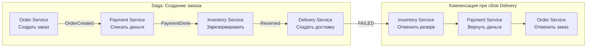

**Два стиля:**
- **Хореография** — каждый сервис слушает события и публикует новые; нет центрального координатора; подходит для простых потоков
- **Оркестрация** — центральный `Saga Orchestrator` явно вызывает каждый шаг и обрабатывает ошибки; проще отлаживать, но добавляет зависимость

**Ключевые требования:**
- Каждая локальная транзакция **идемпотентна** (повторная доставка события)
- Компенсирующие транзакции тоже идемпотентны
- Промежуточные состояния видимы другим сервисам (нет изоляции!)

```java
// Оркестратор Saga (Spring State Machine / Axon / самописный)
@Component
public class CreateOrderSaga {

    @StartSaga
    @SagaEventHandler(associationProperty = "orderId")
    public void handle(OrderCreatedEvent event) {
        SagaLifecycle.associateWith("orderId", event.orderId().toString());
        commandGateway.send(new ProcessPaymentCommand(event.orderId(), event.amount()));
    }

    @SagaEventHandler(associationProperty = "orderId")
    public void handle(PaymentProcessedEvent event) {
        commandGateway.send(new ReserveInventoryCommand(event.orderId(), event.items()));
    }

    @SagaEventHandler(associationProperty = "orderId")
    public void handle(PaymentFailedEvent event) {
        commandGateway.send(new CancelOrderCommand(event.orderId()));
        SagaLifecycle.end();
    }
}
```

> [!mcq]
> - [x] `Saga` — последовательность локальных транзакций с компенсирующими действиями при сбое; промежуточные состояния видимы (нет ACID-изоляции) | Каждый шаг коммитит локально и публикует событие; при сбое выполняются compensating transactions в обратном порядке. ✓ ПРИМЕНЯТЬ: `Axon Framework` или `Temporal` для оркестрации; `Kafka` events для хореографии; пример «order → payment → inventory → delivery» с `CancelOrder`, `RefundPayment`, `ReleaseInventory`. Идемпотентность каждого шага обязательна. 📋 ПРАВИЛО: «`Saga` = eventual + compensations». 🔗 См. Q24 (idempotency), Q29 (`2PC`), Q37 (trade-offs).
> - [ ] `Saga` обеспечивает строгую ACID-изоляцию: пока вся `Saga` не завершена, промежуточные данные не видны другим сервисам | Это не так: `Saga` явно жертвует изоляцией. Промежуточные состояния (например, заказ в статусе `PROCESSING`) видны и могут быть прочитаны другими. ❌ ПОСЛЕДСТВИЕ: разработчик пишет код, полагаясь на «всё или ничего», не обрабатывает читаемые промежуточные состояния. Customer видит «оплачен» при failed delivery, lawsuit за списание без отправки.
> - [ ] Компенсирующие транзакции в `Saga` могут не быть идемпотентными — оркестратор гарантирует, что каждая компенсация выполнится ровно один раз | Брокеры (`Kafka`, `RabbitMQ`) дают at-least-once delivery; компенсации обязаны быть идемпотентными для устойчивости к retry. ❌ ПОСЛЕДСТВИЕ: `RefundPayment` неидемпотентна, при retry клиенту возвращают деньги дважды; в платёжной системе финансовые потери, audit обнаруживает рассинхрон с банком.
> - [ ] Хореография `Saga` всегда лучше оркестрации: меньше зависимостей, проще отлаживать сложные потоки с ветвлениями | Хореография проста для линейных потоков, но при ветвлениях/откатах теряется наблюдаемость, отлаживать тяжелее. Оркестрация даёт явный flow и proще debug сложных сценариев. ❌ ПОСЛЕДСТВИЕ: команда выбирает хореографию для 8-шагового процесса, через полгода никто не понимает порядок событий, debug инцидента занимает дни вместо часов.

## Q31. Что такое FLP-теорема и какой вывод из неё следует?

**FLP-теорема** (Fischer, Lynch, Paterson, 1985) — фундаментальный результат теории распределённых вычислений: **в полностью асинхронной системе с возможностью отказа хотя бы одного узла невозможно достичь консенсуса** (гарантированно завершиться за конечное время).

**Формально:** нет детерминированного алгоритма, который всегда достигает консенсуса в асинхронной модели при возможности сбоя одного процесса.

**Практический смысл:**
- Не существует «идеального» алгоритма консенсуса — все алгоритмы идут на компромисс
- `Paxos`, `Raft` обходят FLP через **рандомизацию** (случайные таймауты) или **частичную синхронность** (bounded network delay)
- `Paxos` может зациклиться (livelock) — два proposer'а постоянно перебивают друг друга; решение — выбор уникального лидера

**Вывод для практики:** таймауты в Raft (randomized election timeout) — не баг, а намеренный механизм выхода из ситуации, запрещённой FLP для детерминированных систем.

> [!mcq]
> - [ ] FLP-теорема доказывает, что консенсус в распределённой системе невозможен ни при каких условиях, поэтому `Raft` и `Paxos` лишь делают вид, что работают | FLP относится к строго асинхронной модели с детерминированным алгоритмом. `Raft`/`Paxos` обходят её через рандомизацию и частичную синхронность, реально достигая консенсуса. ❌ ПОСЛЕДСТВИЕ: разработчик отказывается от `etcd` для конфигурации K8s, пишет «свою БД на файлах», ловит split-brain при network partition. Прод-кластер расходится, requires manual recovery.
> - [ ] FLP-теорема применима только к Byzantine-сбоям и не накладывает ограничений на crash-fault-tolerant алгоритмы | FLP сформулирована для модели crash failures (узел просто останавливается), а не для Byzantine. Это базовый результат для самой простой модели сбоев. ❌ ПОСЛЕДСТВИЕ: инженер ошибочно считает `Raft` «детерминированным консенсусом без таймаутов», убирает randomized election timeout. Два кандидата постоянно перебивают друг друга, livelock, кластер не выбирает лидера часами.
> - [x] FLP запрещает детерминированный консенсус в полностью асинхронной модели при возможности crash хотя бы одного узла; практические алгоритмы обходят её через рандомизацию и частичную синхронность | Randomized election timeout в `Raft` (150-300ms) и uniqueness leader в `Multi-Paxos` — намеренные техники обхода FLP. ✓ ПРИМЕНЯТЬ: `etcd` (Raft) для K8s metadata, `ZooKeeper` (ZAB) для Kafka controller; принимать, что в plane partition liveness может временно теряться (CAP). 📋 ПРАВИЛО: «FLP = randomization buys liveness». 🔗 См. Q8 (consensus), Q27 (Raft), Q34 (vs Paxos).
> - [ ] Согласно FLP, `Paxos` гарантированно завершается за конечное число шагов при наличии большинства узлов в сети | `Paxos` может зацикливаться (livelock) при двух конкурирующих proposer'ах. Multi-Paxos с уникальным лидером решает это, но базовый `Paxos` не имеет гарантии liveness. ❌ ПОСЛЕДСТВИЕ: команда реализует чистый `Basic Paxos` без уникального leader, два узла перебивают друг друга proposal numbers, кластер не принимает значения, throughput = 0.

## Q32. Что такое Byzantine Fault Tolerance (BFT)?

**Byzantine fault** — отказ, при котором узел ведёт себя **произвольно и злонамеренно**: отправляет противоречивые данные разным узлам, не отвечает, изменяет данные. Назван по «задаче о Византийских генералах» (Лампорт).

**Отличие от crash fault:**
| Тип отказа | Поведение | Алгоритм |
|-----------|-----------|----------|
| Crash fault | Узел просто останавливается | `Raft`, `Paxos` (`2f+1` узлов для f сбоев) |
| Byzantine fault | Узел шлёт произвольные/ложные данные | `PBFT`, `BFT-Raft` (`3f+1` узлов) |

**Условие:** для tolerating `f` Byzantine узлов нужно минимум `3f + 1` узлов (vs `2f + 1` для crash fault).

**Применение:**
- `Blockchain` (Bitcoin PoW, Ethereum PoS) — BFT в публичных ненадёжных сетях
- `Hyperledger Fabric` — PBFT для permissioned blockchain
- Авиационные/космические системы — hardware BFT

> [!mcq]
> - [ ] Для tolerating `f` Byzantine-узлов достаточно `2f + 1` узлов — той же формулы, что и для crash-fault tolerance в `Raft` | `2f + 1` работает только для crash failures. Byzantine требует `3f + 1` из-за того, что злонамеренные узлы могут отправлять разные значения разным репликам. ❌ ПОСЛЕДСТВИЕ: команда строит permissioned blockchain на 5 узлах, рассчитывая выдержать 2 Byzantine. Реально выдерживает только 1; при компрометации второго узла консенсус ломается, double-spend на $М.
> - [x] Byzantine-узел может отправлять произвольные/противоречивые данные, поэтому BFT-алгоритмы (`PBFT`) требуют `3f + 1` узлов для устойчивости к `f` сбоям | Crash fault — узел молчит, легко детектится. Byzantine — узел лжёт; нужен дополнительный round голосования и больше реплик. ✓ ПРИМЕНЯТЬ: `Hyperledger Fabric` (PBFT) для consortium blockchain; `Tendermint` для cosmos chains; не применять в trusted datacenter — `Raft`/`Paxos` достаточно. 📋 ПРАВИЛО: «BFT = `3f+1`, crash = `2f+1`». 🔗 См. Q8 (consensus), Q31 (FLP).
> - [ ] BFT необходим в любом корпоративном кластере с несколькими дата-центрами для защиты от network corruption | В trusted environment (свой DC, TLS, аутентифицированные узлы) crash-fault достаточно. BFT добавляет 50% накладные на узлы и сложность реализации без бизнес-выигрыша. ❌ ПОСЛЕДСТВИЕ: архитектор требует `PBFT` для внутреннего конфигурационного store вместо `etcd`, проект задерживается на 6 месяцев на реализацию BFT, операционная сложность зашкаливает.
> - [ ] Bitcoin использует `PBFT` для консенсуса между майнерами в публичной сети | Bitcoin использует Proof-of-Work (Nakamoto consensus), а не `PBFT`. `PBFT` требует известный набор участников и не масштабируется на тысячи узлов в публичной сети. ❌ ПОСЛЕДСТВИЕ: разработчик копирует `PBFT` из bitcoin docs для своего permissioned ledger, обнаруживает что bitcoin не использует PBFT, переписывает архитектуру через 3 месяца.

---

## Q33. Gossip протокол: как работает и где применяется

**Gossip protocol** (эпидемический протокол) — децентрализованный протокол распространения информации, при котором каждый узел периодически выбирает случайных соседей и обменивается с ними состоянием. Информация распространяется как эпидемия.

**Принцип работы:**
1. Каждые `T` миллисекунд узел выбирает `k` случайных узлов (fan-out)
2. Отправляет им своё состояние (или дельту изменений)
3. Получатели обновляют своё состояние и на следующем цикле распространяют дальше
4. За `O(log N)` раундов информация достигает всех `N` узлов

**Характеристики:**
- **Eventual consistency:** информация распространяется постепенно, без гарантии момента
- **Высокая отказоустойчивость:** нет единой точки отказа, работает при частичных сбоях
- **Масштабируемость:** каждый узел общается только с `k` соседями, нагрузка O(k·N)

**Применение:**
- **Cassandra:** использует gossip для обнаружения членов кольца, распространения информации о topology и состоянии узлов (живой/мёртвый). Порт 7000.
- **Redis Cluster:** gossip для распространения информации о слотах, обнаружения failover
- **Consul:** gossip (SWIM protocol) для health checking и membership
- **Amazon DynamoDB:** внутри для распространения версий данных

**Типы gossip:**
- **Push:** узел рассылает своё состояние
- **Pull:** узел запрашивает состояние у соседей
- **Push-Pull:** обмен в обе стороны (наиболее эффективен)

> [!mcq]
> - [ ] Gossip-протокол гарантирует строгую консистентность состояния между всеми узлами после каждого раунда обмена | Gossip даёт eventual consistency, не strong. После раунда часть узлов уже знает обновление, часть — ещё нет. ❌ ПОСЛЕДСТВИЕ: разработчик `Cassandra` ожидает мгновенного обновления topology после `nodetool decommission`, читает данные с устаревшего coordinator, получает `UnavailableException`. Думает что баг в `Cassandra`, а это особенность gossip.
> - [ ] Каждый узел в gossip общается со всеми `N-1` соседями каждый цикл, поэтому нагрузка `O(N²)` плохо масштабируется | В gossip узел общается с фиксированным числом `k` соседей (fan-out, обычно 3-5), сложность сообщений на узел `O(k)`, общая `O(k·N)` — не `O(N²)`. ❌ ПОСЛЕДСТВИЕ: архитектор отказывается от gossip для cluster membership на 200 узлов «потому что O(N²)», использует centralized registry, получает SPOF. При падении registry весь кластер теряет membership info.
> - [x] Gossip распространяет информацию за `O(log N)` раундов через случайных соседей; используется в `Cassandra`, `Consul` (SWIM), `Redis Cluster` для membership и failure detection | Каждый раунд число информированных узлов удваивается; epidemic propagation эффективен и устойчив к сбоям. ✓ ПРИМЕНЯТЬ: `Cassandra` gossip на порту 7000 для topology; `Consul` SWIM для health checking; `Redis Cluster` gossip для slot ownership; `HashiCorp Memberlist` library для своих систем. 📋 ПРАВИЛО: «gossip = epidemic O(log N)». 🔗 См. Q23 (gossip), Q18 (service discovery).
> - [ ] Gossip-протокол требует выбора лидера для координации обмена сообщениями между узлами | Gossip принципиально decentralized — нет лидера, каждый узел равноправен и сам выбирает соседей. Это его ключевое преимущество перед leader-based протоколами. ❌ ПОСЛЕДСТВИЕ: команда реализует «gossip с лидером», теряет fault tolerance gossip-протокола; падение лидера останавливает propagation, кластер расходится.

---

## Q34. Raft vs Paxos: ключевые отличия

| Характеристика | Raft | Paxos |
|----------------|------|-------|
| Сложность понимания | Низкая (designed for understandability) | Высокая |
| Лидер | Явный, единственный | Может быть несколько proposer'ов |
| Log replication | Строгая последовательность | Возможны "дыры" в log (Multi-Paxos заполняет) |
| Leader election | Randomized timeout | Произвольный proposer |
| Спецификация | Полная, единая | Базовая Paxos не описывает многие детали |
| Liveness | Гарантирована при правильном выборе таймаутов | Возможен livelock двух proposer'ов |

**Raft:**
- Разработан Диего Онгаро и Джоном Оустерхаутом (2013) с явной целью: understandable consensus
- Три роли: **Leader**, **Follower**, **Candidate**
- Leader управляет всей репликацией log — единственный, кто принимает записи от клиентов
- Применяется: **etcd** (Kubernetes), **CockroachDB**, **TiKV**, **Consul**

**Paxos:**
- Лесли Лампорт (1989, опубликован 1998)
- Базовый Paxos решает один consensus instance (одно значение)
- Multi-Paxos — расширение для replicated log (реализовать сложнее)
- Применяется: **Google Chubby**, **Google Spanner**, **Apache Zookeeper** (ZAB — вариация Paxos)

**Практический вывод:** для новых систем чаще выбирают Raft из-за простоты реализации и отладки. Paxos встречается в legacy и крупных Google-системах.

> [!mcq]
> - [x] `Raft` явно проектировался для понятности (single leader, term numbers, randomized timeouts), а `Paxos` исторически сложен и порождает livelock без уникального leader | `Raft`-paper Ongaro/Ousterhout (2013) ставит understandability как первичную цель; `Paxos` Лампорта (1998) известен сложностью изложения. ✓ ПРИМЕНЯТЬ: `etcd` (Raft) для K8s, `CockroachDB`/`TiKV` (Raft) для распределённых SQL/KV; `Google Chubby`/`Spanner` (Paxos) для legacy и спец-задач; для своих систем — Raft. 📋 ПРАВИЛО: «Raft = leader-first, Paxos = proposer-first». 🔗 См. Q8 (consensus), Q27 (Raft), Q31 (FLP).
> - [ ] `Paxos` всегда быстрее `Raft` потому что не требует выбора единственного лидера и допускает параллельные proposer'ы | Параллельные proposer'ы в `Basic Paxos` приводят к livelock'у; `Multi-Paxos` фактически тоже использует stable leader. По производительности они близки. ❌ ПОСЛЕДСТВИЕ: команда выбирает `Paxos` «ради скорости», теряет недели на отладку leader election и duelling proposers, в проде throughput ниже чем у `Raft`-альтернативы.
> - [ ] `Raft` использует `O(N²)` сетевого трафика для репликации лога, что делает его непригодным для кластеров > 7 узлов | `Raft` репликация — `O(N)`: лидер шлёт `AppendEntries` каждому follower'у. Ограничение в 5-7 узлов связано не с трафиком, а с latency кворума. ❌ ПОСЛЕДСТВИЕ: разработчик ограничивает `etcd` тремя узлами «потому что O(N²)», теряет fault tolerance; падение одного узла оставляет 2 — кворум 2/3 хрупкий, любой сбой ломает кластер.
> - [ ] `Apache ZooKeeper` использует чистый `Raft` для координации, что делает его взаимозаменяемым с `etcd` | `ZooKeeper` использует ZAB (ZooKeeper Atomic Broadcast) — вариацию `Paxos`, не `Raft`. API и семантика тоже отличаются (ephemeral nodes, watches vs leases). ❌ ПОСЛЕДСТВИЕ: команда мигрирует с `ZooKeeper` на `etcd`, ожидая drop-in replacement, ломает Kafka controller и Solr cluster manager. Outage 6 часов на переписывание интеграций.

---

## Q35. Leader Election: алгоритмы, Bully, координация

**Leader Election** — процесс выбора единственного узла-координатора (лидера) среди равноправных узлов распределённой системы.

**Зачем нужен лидер:**
- Координация распределённых транзакций
- Управление распределёнными блокировками
- Единственная точка принятия решений (избегает split-brain)

**Bully Algorithm (Алгоритм хулигана):**
```
Предпосылка: каждый узел имеет уникальный числовой ID; узел с наибольшим ID побеждает.

1. Узел обнаруживает, что лидер недоступен
2. Отправляет ELECTION сообщение всем узлам с бОльшим ID
3. Если нет ответа — объявляет себя лидером (COORDINATOR сообщение)
4. Если получает ELECTION — отвечает OK и сам запускает выборы
5. Узел с наибольшим ID всегда побеждает ("bully")

Недостатки: O(N²) сообщений в худшем случае; узел с большим ID может быть медленным.
```

**Ring Algorithm:**
- Узлы организованы в логическое кольцо
- ELECTION сообщение передаётся по кольцу, каждый добавляет свой ID
- Узел, получивший своё собственное сообщение с наибольшим ID, становится лидером

**Raft leader election (практический стандарт):**
- Randomized election timeout (150-300ms)
- Кандидат запрашивает голоса (`RequestVote RPC`)
- Для победы нужен кворум (большинство узлов)
- Term number предотвращает split-brain

**Готовые реализации:**
- **etcd/Consul** — через Raft; клиенты используют etcd-lock или Consul sessions
- **ZooKeeper** — ephemeral node: кто создал `/leader` — тот лидер
- **Spring Integration:** `LockRegistry` через Redis/JDBC для distributed lock

```java
// Leader election через Spring Integration
@Bean
public LeaderInitiator leaderInitiator(CuratorFramework client) {
    return new LeaderInitiator(client, new DefaultLeaderEventPublisher());
}

@EventListener
public void onLeaderEvent(OnGrantedEvent event) {
    // этот экземпляр стал лидером
}
```

> [!mcq]
> - [ ] Bully algorithm требует `O(log N)` сообщений в худшем случае, что делает его масштабируемым выбором для кластеров любого размера | Bully требует `O(N²)` сообщений в worst case (каждый запрашивает каждого с большим ID). Для больших кластеров это неприемлемо. ❌ ПОСЛЕДСТВИЕ: разработчик выбирает Bully для кластера 50 узлов; при сетевом сбое каскад elections генерирует 2500 сообщений за секунду, network saturation, election не сходится.
> - [ ] При leader election достаточно простого таймаута без kvorum'а: первый узел, заметивший отсутствие лидера, объявляет себя новым | Без кворума возникает split-brain: при network partition обе стороны выберут своего лидера. Поэтому `Raft` требует majority votes. ❌ ПОСЛЕДСТВИЕ: команда пишет «лёгкий» leader election на heartbeat без кворума; при partition оба DC принимают writes как лидеры, после reunion данные расходятся, требуется ручной merge через DBA, потеря транзакций.
> - [ ] `ZooKeeper` использует `Bully algorithm` для выбора лидера контроллера | `ZooKeeper` использует ZAB и pattern с ephemeral sequential nodes (наименьший sequence wins), а не Bully. ❌ ПОСЛЕДСТВИЕ: разработчик пытается тюнить «Bully timeout» в ZK config, не находит параметра, тратит дни на reverse engineering вместо чтения ZAB paper.
> - [x] Современный стандарт leader election — `Raft` через `etcd`/`Consul` с randomized timeout и кворумом для предотвращения split-brain; для приложений `LeaderInitiator` поверх `ZooKeeper`/`Redis` | Term numbers и majority voting гарантируют единственность лидера в каждом term'е. ✓ ПРИМЕНЯТЬ: `Spring Integration LeaderInitiator` + Curator на ZK для scheduled-jobs; `etcd` lease для Kubernetes controllers; `Consul` sessions для service mastership; не писать свой election. 📋 ПРАВИЛО: «leader election = quorum + term». 🔗 См. Q17 (leader election), Q27 (Raft), Q34 (vs Paxos).

---

## Q36. Idempotency Keys: паттерн для надёжности распределённых операций

**Idempotency Key** — уникальный идентификатор операции, позволяющий безопасно повторять запросы без риска дублирования эффекта.

**Проблема:** при сбоях сети клиент не знает, выполнилась ли операция (платёж, создание заказа). Retry без idempotency → дублирование.

**Паттерн:**
```
Client → POST /payments
         Header: Idempotency-Key: "uuid-1234-..."
         Body: { amount: 100, currency: "RUB" }

Server:
1. Проверить наличие ключа в БД (idempotency_keys table)
2. Если есть → вернуть сохранённый ответ (без повторного выполнения)
3. Если нет → выполнить операцию, сохранить {key, response, expires_at}
```

**Реализация в Spring:**
```java
@PostMapping("/payments")
public ResponseEntity<PaymentResponse> createPayment(
    @RequestHeader("Idempotency-Key") String idempotencyKey,
    @RequestBody PaymentRequest request
) {
    return idempotencyService.executeOnce(idempotencyKey, () -> {
        PaymentResponse response = paymentService.process(request);
        return ResponseEntity.ok(response);
    });
}

@Service
public class IdempotencyService {
    public <T> T executeOnce(String key, Supplier<T> operation) {
        // Atomic check-and-insert (SELECT FOR UPDATE или уникальный индекс)
        Optional<IdempotencyRecord> existing = repo.findByKey(key);
        if (existing.isPresent()) {
            return deserialize(existing.get().getResponse());
        }
        T result = operation.get();
        repo.save(new IdempotencyRecord(key, serialize(result), ttl));
        return result;
    }
}
```

**Важные детали:**
- TTL для ключей (24 часа — типичное значение)
- Ключ должен быть уникальным для каждой бизнес-операции, а не для endpoint
- Проблема конкурентных дубликатов: уникальный индекс + обработка `DataIntegrityViolationException`
- **Stripe, Adyen** — широко используют этот паттерн в платёжном API

> [!mcq]
> - [ ] Idempotency key достаточно генерировать на стороне сервера при получении запроса для предотвращения дубликатов | Серверный ключ не помогает: при retry клиент делает новый запрос → сервер генерит новый ключ → дубликат всё равно создаётся. Ключ должен прийти от клиента. ❌ ПОСЛЕДСТВИЕ: команда добавляет `UUID.randomUUID()` на сервере как `idempotencyKey`, при network retry клиент отправляет тот же запрос, сервер генерирует новый ключ — двойное списание $100.
> - [x] Idempotency-Key в HTTP-заголовке + `UNIQUE INDEX` в БД на ключ + кэш ответа: при повторе возвращается сохранённый response без повторного выполнения операции | Ключ генерится клиентом (`UUID v4`), сервер атомарно проверяет наличие через unique constraint, при duplicate key возвращает stored response. ✓ ПРИМЕНЯТЬ: `Stripe API` `Idempotency-Key` header (24h TTL); `Adyen` payments; в Spring — `@Aspect` поверх `@PostMapping` с `idempotency_keys` table, обработка `DataIntegrityViolationException`. 📋 ПРАВИЛО: «idempotency = client key + unique constraint». 🔗 См. Q24 (idempotency), Q25 (exactly-once).
> - [ ] Достаточно проверки `SELECT ... WHERE key = ?` перед `INSERT` для атомарности; race condition исключён `@Transactional` | Между `SELECT` и `INSERT` есть окно для race condition даже в `@Transactional` (READ_COMMITTED). Два конкурентных запроса оба увидят отсутствие ключа и оба выполнят операцию. ❌ ПОСЛЕДСТВИЕ: при retry storm от клиента два запроса проходят check одновременно, выполняют payment дважды; в Stripe-like API клиенту списывают $200 вместо $100, требуется reconciliation.
> - [ ] Idempotency key должен быть глобально уникальным для всего API, чтобы один ключ нельзя было использовать в разных endpoint'ах | На практике ключ scoped к (user, endpoint, body-hash) — иначе клиент с одним ключом может «попасть» в чужую операцию. Глобальная уникальность создаёт коллизии и проблемы безопасности. ❌ ПОСЛЕДСТВИЕ: клиент A отправил `key=abc` на `/payments`, клиент B отправил `key=abc` на `/refunds`, второй запрос вернул payment-response клиента A; data leak между tenants.

---

## Q37. Two-Phase Commit (2PC) vs Saga: Trade-offs

**Two-Phase Commit (2PC):**
```
Coordinator → все участники: PREPARE (можете закоммитить?)
Участники   → Coordinator: YES / NO (блокируют ресурсы)
Coordinator → все участники: COMMIT (если все YES) / ROLLBACK (если хоть один NO)
```

**Проблемы 2PC:**
- **Blocking protocol:** при падении координатора после PREPARE участники заблокированы навсегда
- **Single point of failure:** координатор — SPOF
- **Низкая производительность:** две фазы сетевых round-trip + блокировка ресурсов
- **Не подходит для микросервисов:** сервисы с разными БД, долгоживущие транзакции

**Saga:**
```
Последовательность локальных транзакций с компенсирующими действиями:

T1 (Order) → T2 (Payment) → T3 (Inventory)
       ↓ если T3 fail
C2 (Refund) ← C1 (Cancel Order)   ← компенсации
```

| Критерий | 2PC | Saga |
|----------|-----|------|
| Согласованность | Сильная (ACID) | Eventual |
| Доступность | Низкая (блокировки) | Высокая |
| Производительность | Низкая | Высокая |
| Откат | Автоматический ROLLBACK | Компенсирующие транзакции |
| Частичные сбои | Блокировка | Explicit handling |
| Применение | Единая БД, XA | Микросервисы |

**Saga реализации:**
- **Choreography:** события в Kafka/RabbitMQ, каждый сервис слушает и реагирует (loose coupling, сложная отладка)
- **Orchestration:** центральный оркестратор (Axon Framework, Temporal) управляет шагами (explicit flow, coupling к оркестратору)

**Вывод:** 2PC применим для локальных XA-транзакций (одна БД + очередь). Saga — стандарт де-факто для распределённых транзакций в микросервисах.

> [!mcq]
> - [ ] `2PC` подходит для микросервисов с разными БД, поскольку обеспечивает строгую ACID-семантику без жертв производительностью | `2PC` блокирует ресурсы и SPOF координатора делает его неподходящим для микросервисов; производительность страдает. ❌ ПОСЛЕДСТВИЕ: команда внедряет `XA` поверх 5 микросервисов с `MongoDB`, `Cassandra`, `Kafka` — половина не поддерживает XA, остальные деградируют по latency в 10x, проект отменяется через 4 месяца.
> - [ ] Choreography-based `Saga` всегда предпочтительнее orchestration: нет central coordinator, lower coupling, проще тестировать | Choreography хорош для простых линейных потоков, но при ветвлениях/сложных rollback теряется наблюдаемость и testability. Orchestration через `Temporal`/`Axon` проще debug. ❌ ПОСЛЕДСТВИЕ: команда выбирает choreography для 8-step booking flow в travel-app; через 6 месяцев новые разработчики не могут понять последовательность событий, рефакторинг на orchestration занимает квартал.
> - [ ] Saga гарантирует строгую ACID-консистентность через двухфазный механизм коммита и компенсаций | `Saga` даёт eventual consistency, не ACID; промежуточные состояния видимы. ACID обеспечивает только `2PC`. ❌ ПОСЛЕДСТВИЕ: PM требует «atomic order processing» через Saga, разработчик соглашается, в проде customer видит «оплачен но не отгружен» state, support tickets растут, NPS падает.
> - [x] `2PC` — strong consistency через блокировку (применим для XA в monolith), `Saga` — eventual consistency через compensations (стандарт для микросервисов с разными БД и брокерами) | Trade-off: ACID vs availability/scalability. Saga жертвует изоляцией ради устранения SPOF и блокировок. ✓ ПРИМЕНЯТЬ: `2PC` через `Atomikos` для legacy monolith с `PostgreSQL` + JMS; `Saga` через `Axon`/`Temporal` или choreography on `Kafka` для микросервисов; `Outbox pattern` для атомарной публикации событий. 📋 ПРАВИЛО: «2PC = monolith ACID, Saga = microservices BASE». 🔗 См. Q29 (2PC), Q30 (Saga), Q38 (Outbox).

---

## Q38. Distributed Transactions: XA и Outbox Pattern

**XA Transactions:**
XA — стандарт X/Open для распределённых транзакций. Координирует несколько resource managers (БД, JMS) в одной глобальной транзакции.

```java
// Spring Boot + Atomikos (XA)
@Bean
public AtomikosDataSourceBean xaDataSource() {
    AtomikosDataSourceBean ds = new AtomikosDataSourceBean();
    ds.setXaDataSourceClassName("org.postgresql.xa.PGXADataSource");
    ds.setUniqueResourceName("postgresql");
    return ds;
}

@Transactional  // JTA транзакция — покрывает БД + JMS атомарно
public void processOrder(Order order) {
    orderRepo.save(order);           // XA resource 1: PostgreSQL
    jmsTemplate.send("orders", msg); // XA resource 2: ActiveMQ
}   // Coordinator (Atomikos) выполняет 2PC под капотом
```

**Проблемы XA:** медленно, сложно в K8s, не поддерживается NoSQL.

**Outbox Pattern (рекомендуемый подход):**
```
Идея: запись в БД и публикация события — одна локальная транзакция.
Отдельный процесс (relay) читает outbox и публикует в брокер.

┌─────────────────────────────────────────┐
│ Единая локальная транзакция:            │
│  INSERT INTO orders (...)               │
│  INSERT INTO outbox_events              │
│    (event_type, payload, status=PENDING)│
└─────────────────────────────────────────┘
        ↓ Transactional Outbox Relay
┌──────────────────────────┐
│ SELECT * FROM outbox      │
│   WHERE status = 'PENDING'│
│ → publish to Kafka        │
│ → UPDATE status = 'SENT' │
└──────────────────────────┘
```

**Реализация с Debezium (CDC):**
- Debezium читает WAL PostgreSQL, публикует изменения outbox-таблицы в Kafka
- Нет polling — минимальная задержка
- Exactly-once при правильной конфигурации Kafka consumer

**Outbox vs Saga:** Outbox — механизм атомарной публикации событий. Saga — паттерн оркестрации компенсаций. Они дополняют друг друга.

> [!mcq]
> - [x] `Outbox Pattern` решает «dual write problem»: запись в БД и публикация события — одна локальная транзакция, отдельный relay/CDC публикует в брокер | Без Outbox после успешного `INSERT` падение перед `kafkaTemplate.send()` теряет событие, или наоборот send без commit БД создаёт фантомное событие. ✓ ПРИМЕНЯТЬ: `Debezium` читает WAL `PostgreSQL` для outbox-таблицы → `Kafka`; alternatively polling-publisher на `@Scheduled`; `outbox_events` table со status `PENDING/SENT/FAILED`, retry policy. 📋 ПРАВИЛО: «outbox = atomic dual-write». 🔗 См. Q24 (idempotency), Q25 (exactly-once), Q30 (Saga).
> - [ ] `XA` — рекомендуемый подход для интеграции `PostgreSQL` + `Kafka` в Kubernetes | Kafka не поддерживает XA-транзакции в распределённой манере (только `Kafka transactions` внутри Kafka); XA в K8s сложен из-за recovery после pod restart. ❌ ПОСЛЕДСТВИЕ: команда внедряет `Atomikos` + Kafka XA bridge, после OOMkill пода в K8s транзакции остаются `in-doubt`, требуется ручной recovery, теряются часы продакшена.
> - [ ] Outbox-таблица должна очищаться немедленно после публикации события для экономии места | Сразу удалять опасно: при сбое publisher между `send()` и `DELETE` событие отправлено, но статус не обновлён, retry дублирует. Безопасно: status `SENT` + TTL/cleanup job через 24-48h. ❌ ПОСЛЕДСТВИЕ: разработчик пишет `DELETE` сразу после `kafkaTemplate.send()`, при network blip дубликаты в Kafka, downstream consumers видят events дважды.
> - [ ] Debezium и Outbox несовместимы: Debezium читает все таблицы БД и не может фильтровать по outbox | Debezium поддерживает SMT (Single Message Transform) `EventRouter` именно для outbox: фильтрует по таблице, выводит payload в Kafka topic из колонки. ❌ ПОСЛЕДСТВИЕ: команда отказывается от Debezium «потому что он шлёт всё», пишет свой polling publisher, который перегружает БД на 10K events/sec, latency растёт.

---

## Q39. Backpressure в распределённых системах: механизмы

**Backpressure** — механизм, при котором downstream (потребитель) сигнализирует upstream (производителю) о своей пропускной способности, предотвращая перегрузку.

**Проблема без backpressure:**
- Producer быстрее Consumer → очереди переполняются → OOM / latency spikes
- В распределённой системе — каскадные сбои (cascade failure)

**Механизмы backpressure:**

1. **Pull-based модель (Kafka):**
   - Consumer сам запрашивает следующую порцию (`poll()`)
   - Consumer контролирует скорость чтения
   - Producer пишет в брокер, не зная о скорости Consumer

2. **Reactive Streams / Project Reactor:**
```java
Flux.fromStream(dataStream)
    .onBackpressureBuffer(1000,           // буфер 1000 элементов
        dropped -> log.warn("Dropped: {}", dropped),
        BufferOverflowStrategy.DROP_OLDEST)
    .publishOn(Schedulers.boundedElastic())
    .subscribe(this::process);
```

3. **Rate Limiting (Resilience4j):**
```java
RateLimiter limiter = RateLimiter.of("downstream",
    RateLimiterConfig.custom()
        .limitForPeriod(100)         // 100 запросов
        .limitRefreshPeriod(Duration.ofSeconds(1))
        .timeoutDuration(Duration.ofMillis(500))
        .build());
```

4. **Circuit Breaker как backpressure:** при открытом CB upstream получает быстрый отказ вместо ожидания

5. **gRPC flow control:** HTTP/2 window-based flow control встроен в протокол

**Паттерны в Kafka:**
- `max.poll.records` — ограничение порции
- `fetch.max.bytes` — ограничение размера fetch
- Lag monitoring → автоскейлинг consumer group

> [!mcq]
> - [ ] Push-based модель Kafka обеспечивает встроенный backpressure: брокер замедляет отправку при медленном consumer | Kafka работает на pull-модели: consumer сам делает `poll()`, скорость определяет он. Брокер не знает о состоянии consumer (только commit offsets). ❌ ПОСЛЕДСТВИЕ: разработчик ожидает «магического» замедления producer'а при медленном consumer, не настраивает `max.poll.records`. Consumer ловит `MAX_POLL_INTERVAL_MS_EXCEEDED`, выпадает из group, infinite rebalance loop.
> - [x] Backpressure реализуется через pull-модель (Kafka), Reactive Streams (`onBackpressureBuffer`/`Drop`), rate limiting (Resilience4j), Circuit Breaker и HTTP/2 flow control в gRPC | Каждый механизм ограничивает скорость producer'а в зависимости от способности consumer'а. ✓ ПРИМЕНЯТЬ: `Reactor` `Flux.onBackpressureBuffer(1000, BufferOverflowStrategy.DROP_OLDEST)` для streaming; `Resilience4j RateLimiter` (100 RPS) для downstream API; Kafka `max.poll.records=500`, autoscaling consumer group по lag. 📋 ПРАВИЛО: «backpressure = consumer dictates rate». 🔗 См. Q12 (Circuit Breaker), Q14 (Bulkhead).
> - [ ] При отсутствии backpressure достаточно увеличить размер очереди (queue capacity), и система выдержит любой всплеск нагрузки | Большая очередь только откладывает проблему: при стабильно высокой нагрузке очередь всё равно переполнится, OOM или latency взлетит до недопустимого. ❌ ПОСЛЕДСТВИЕ: команда увеличивает Kafka `retention.bytes` до 1TB вместо введения backpressure, при черной пятнице lag вырастает до 6 часов, бизнес-логика обрабатывает заказы с опозданием, refund-катастрофа.
> - [ ] Circuit Breaker не относится к backpressure-механизмам, поскольку он останавливает запросы, а не замедляет их | Circuit Breaker — форма backpressure: при перегрузке downstream быстрый fail вместо очереди защищает upstream от cascade failure. Это «бинарный» backpressure. ❌ ПОСЛЕДСТВИЕ: архитектор не использует CB как backpressure, при медленном downstream upstream накапливает thread pool, исчерпывает HikariCP connection pool, cascade failure через 3 сервиса.

---

## Q40. Consistent Hashing: virtual nodes и hotspots

**Consistent Hashing** — алгоритм распределения данных по узлам, при котором добавление/удаление узла перераспределяет минимальное количество ключей.

**Обычный hashing:** `node = hash(key) % N`. При изменении N перераспределяются почти все ключи.

**Consistent Hashing:**
```
Кольцо [0, 2³²): hash(node) → позиция на кольце
Ключ → hash(key) → ищем следующий узел по часовой стрелке
```

**Virtual Nodes (vnodes):**
```
Проблема без vnodes: неравномерное распределение при малом числе узлов.

Решение: каждый физический узел → N виртуальных позиций на кольце.
Node A: A1, A2, A3, A4, A5 ... A150
Node B: B1, B2, B3, B4, B5 ... B150
Node C: C1, C2, C3, C4, C5 ... C150

При добавлении Node D: забирает часть vnodes у каждого существующего узла.
Данные перераспределяются равномерно.
```

**Применение:**
- **Cassandra:** `num_tokens: 256` vnodes по умолчанию; ключи → hash → vnode → физический узел
- **DynamoDB:** consistent hashing для partition keys
- **Redis Cluster:** 16384 hash slots, каждый узел отвечает за диапазон

**Hotspots:**
```
Проблема: если ключи неравномерны (например, userId "admin" → всегда один узел)

Решения:
1. Составной ключ: key = prefix + salt (random suffix)
2. Keyspace разбивка: одна операция → несколько shard keys
3. Cassandra: partition key должен иметь высокую cardinality
4. DynamoDB: write sharding — добавить случайный суффикс к partition key
```

**Мониторинг hotspots в Cassandra:**
```bash
nodetool tablestats keyspace.table | grep "SSTable count"
# Неравное распределение SSTables → hotspot
```

**Сравнение с Range-based sharding:**
| | Consistent Hashing | Range Sharding |
|--|--|--|
| Range queries | Плохо (данные рассеяны) | Хорошо (локальность) |
| Hotspot риск | Средний (с vnodes — низкий) | Высокий (hot partition) |
| Rebalancing | Минимальное | Значительное |

> [!mcq]
> - [ ] При обычном hashing `node = hash(key) % N` добавление одного узла перераспределяет около `1/N` ключей, как и в consistent hashing | При `mod N` смена `N` меняет результат для почти всех ключей (~`(N-1)/N`). Consistent hashing — `~1/N`. ❌ ПОСЛЕДСТВИЕ: команда использует `% N` для шардирования Memcached, добавляет один узел в кластер из 10, 90% кэша инвалидируется, БД получает massive cache stampede, latency p99 взлетает с 50ms до 5s.
> - [x] Virtual nodes (vnodes) распределяют каждый физический узел на сотни виртуальных позиций на кольце, обеспечивая равномерное распределение и упрощая rebalancing при изменении кластера | Без vnodes малое число узлов даёт неравномерные segments; с vnodes load balanced, новый узел забирает по чуть-чуть от каждого. ✓ ПРИМЕНЯТЬ: `Cassandra` `num_tokens: 256` per node; `DynamoDB` partitioning; `Redis Cluster` 16384 hash slots; реализовать через `MD5(node + replicaId)` для виртуальных позиций. 📋 ПРАВИЛО: «vnodes = uniform spread + smooth rebalance». 🔗 См. Q21 (sharding), Q22 (consistent hashing).
> - [ ] Hotspots в consistent hashing невозможны, если используются vnodes — распределение всегда равномерно по определению | Vnodes решают проблему uneven node distribution, но не unbalanced keys. Если ключ `userId="admin"` обращается чаще остальных, он всегда мапится на один node — hotspot. ❌ ПОСЛЕДСТВИЕ: разработчик `DynamoDB` использует `userId` как partition key, vip-юзер с миллионом ops/sec создаёт hot partition, throttling на этом юзере, остальная капасити простаивает.
> - [ ] Range-based sharding обеспечивает лучший balancing нагрузки чем consistent hashing для большинства workload'ов | Range sharding часто страдает от hot partitions (последовательные timestamp/ID идут в один range). Consistent hashing с vnodes более равномерен. Range хорош только когда нужны range queries. ❌ ПОСЛЕДСТВИЕ: команда выбирает range sharding по `created_at` для time-series data, последний shard принимает все writes (hot tail), остальные простаивают, throughput cap на одном узле.

---

## See also

- [Микросервисная архитектура](microservices-interview.md) — паттерны межсервисного взаимодействия и отказоустойчивости
- [CAP-теорема](cap-theorem-interview.md) — ограничения распределённых систем: C, A, P компромиссы
- [Паттерны согласованности](consistency-patterns-interview.md) — 2PC, Saga, Outbox, eventual consistency
- [Event-Driven паттерны](event-driven-patterns-interview.md) — асинхронное взаимодействие в распределённых системах
- [Паттерны отказоустойчивости](resilience-patterns-interview.md) — Circuit Breaker, Retry, Bulkhead
- [CQRS и Event Sourcing](cqrs-event-sourcing-interview.md) — CQRS и Event Sourcing для масштабируемых систем

В обычных корпоративных распределённых системах Byzantine faults не рассматривают: предполагается, что узлы принадлежат одной доверенной среде (datacenter). Достаточно crash fault tolerance через `Raft`/`Paxos`.

- [API Gateway](api-gateway-interview.md)
- [BFF Pattern](bff-pattern-interview.md)
- [Стратегии кэширования](caching-strategies-interview.md)
- [CAP-теорема](cap-theorem-interview.md)
- [Clean Architecture](clean-architecture-interview.md)
- [Паттерны согласованности](consistency-patterns-interview.md)
