# Вопросы на собеседовании: Распределённые системы

Ответы по распределённым системам: заблуждения, часы и порядок событий, консенсус, leader election, service discovery, паттерны отказоустойчивости, репликация, шардирование, distributed tracing, идемпотентность, exactly-once, gossip protocol.

**Распределённая система** — совокупность независимых узлов, которые для пользователя выглядят как единая система и взаимодействуют по сети. На собеседованиях часто спрашивают про характеристики, согласованность, доступность, способы борьбы с частичными сбоями (`Circuit Breaker`, репликация, health checks), а также про часы, консенсус, шардирование и гарантии доставки сообщений.

## Полезные ссылки

### Официальная документация

- [Designing Data-Intensive Applications](https://www.oreilly.com/library/view/designing-data-intensive-applications/9781491903063/) — основы распределённых систем
- [Resilience4j Documentation](https://resilience4j.readme.io/docs) — `Circuit Breaker`, `Bulkhead`, `Retry`, `RateLimiter`
- [OpenTelemetry Documentation](https://opentelemetry.io/docs/) — distributed tracing, метрики, логи
- [Raft Consensus Algorithm](https://raft.github.io/) — визуализация и спецификация `Raft`
- [Fundamentals of Distributed Systems (Baeldung)](https://www.baeldung.com/cs/distributed-systems-guide) — основы распределённых систем
- [Avoiding Single Points of Failures in Distributed Systems (Baeldung)](https://www.baeldung.com/cs/distributed-systems-prevent-single-point-failure) — устранение SPOF
- [Fault and Failure in Distributed Systems (Baeldung)](https://www.baeldung.com/cs/distributed-systems-fault-failure) — сбои и отказы в распределённых системах
- [Circuit Breaker Pattern in Microservices (Baeldung)](https://www.baeldung.com/cs/microservices-circuit-breaker-pattern) — паттерн Circuit Breaker
- [Guide to Resilience4j With Spring Boot (Baeldung)](https://www.baeldung.com/spring-boot-resilience4j) — интеграция Resilience4j со Spring Boot

## Содержание

- [Полезные ссылки](#полезные-ссылки)
- [See also](#see-also)

**Основы и характеристики**
- [Q1. (!) Что такое распределённая система?](#q1--что-такое-распределённая-система)
- [Q2. Какие характеристики присущи распределённым системам?](#q2-какие-характеристики-присущи-распределённым-системам)
- [Q3. В чём плюсы и минусы распределённых систем?](#q3-в-чём-плюсы-и-минусы-распределённых-систем)
- [Q4. (!) Какие существуют заблуждения о распределённых вычислениях (Fallacies of Distributed Computing)?](#q4--какие-существуют-заблуждения-о-распределённых-вычислениях-fallacies-of-distributed-computing)

**Время, порядок событий и консенсус**
- [Q5. (!) Почему в распределённых системах нельзя полагаться на физические часы?](#q5--почему-в-распределённых-системах-нельзя-полагаться-на-физические-часы)
- [Q6. Что такое логические часы Лампорта (Lamport Timestamps)?](#q6-что-такое-логические-часы-лампорта-lamport-timestamps)
- [Q7. (!) Что такое векторные часы (Vector Clocks)?](#q7--что-такое-векторные-часы-vector-clocks)
- [Q8. Что такое консенсус и какие алгоритмы его реализуют?](#q8-что-такое-консенсус-и-какие-алгоритмы-его-реализуют)

**Согласованность, доступность и отказы**
- [Q9. Как в распределённых системах обеспечивают согласованность данных?](#q9-как-в-распределённых-системах-обеспечивают-согласованность-данных)
- [Q10. Что такое доступность и как её повышают?](#q10-что-такое-доступность-и-как-её-повышают)
- [Q11. (!) Что такое частичные отказы и как с ними борются?](#q11--что-такое-частичные-отказы-и-как-с-ними-борются)

**Паттерны отказоустойчивости**
- [Q12. (!) Что такое Circuit Breaker и когда его применять?](#q12--что-такое-circuit-breaker-и-когда-его-применять)
- [Q13. Что такое Retry с экспоненциальной задержкой?](#q13-что-такое-retry-с-экспоненциальной-задержкой)
- [Q14. Что такое Bulkhead pattern?](#q14-что-такое-bulkhead-pattern)
- [Q15. Что такое graceful degradation?](#q15-что-такое-graceful-degradation)
- [Q16. Что такое health check и как его использовать?](#q16-что-такое-health-check-и-как-его-использовать)

**Leader Election и Service Discovery**
- [Q17. (!) Что такое leader election и зачем он нужен?](#q17--что-такое-leader-election-и-зачем-он-нужен)
- [Q18. Что такое service discovery и какие подходы существуют?](#q18-что-такое-service-discovery-и-какие-подходы-существуют)

**Репликация и шардирование**
- [Q19. (!) Чем отличается синхронная репликация от асинхронной?](#q19--чем-отличается-синхронная-репликация-от-асинхронной)
- [Q20. Какие существуют топологии репликации?](#q20-какие-существуют-топологии-репликации)
- [Q21. (!) Что такое шардирование (Sharding) и какие стратегии существуют?](#q21--что-такое-шардирование-sharding-и-какие-стратегии-существуют)
- [Q22. Что такое consistent hashing?](#q22-что-такое-consistent-hashing)

**Коммуникация и протоколы**
- [Q23. Что такое gossip protocol?](#q23-что-такое-gossip-protocol)
- [Q24. (!) Что такое идемпотентность в распределённых системах?](#q24--что-такое-идемпотентность-в-распределённых-системах)
- [Q25. (!) Как достичь exactly-once семантики доставки сообщений?](#q25--как-достичь-exactly-once-семантики-доставки-сообщений)

**Наблюдаемость**
- [Q26. (!) Что такое distributed tracing и зачем он нужен?](#q26--что-такое-distributed-tracing-и-зачем-он-нужен)

**Консенсус и координация**
- [Q27. (!) Как работает алгоритм Raft?](#q27-как-работает-алгоритм-raft)
- [Q28. Чем Paxos отличается от Raft?](#q28-чем-paxos-отличается-от-raft)
- [Q29. (!) Что такое Two-Phase Commit (2PC) в контексте распределённых систем?](#q29-что-такое-two-phase-commit-2pc-в-контексте-распределённых-систем)
- [Q30. (!) Что такое Saga в распределённых системах?](#q30-что-такое-saga-в-распределённых-системах)
- [Q31. Что такое FLP-теорема и какой вывод из неё следует?](#q31-что-такое-flp-теорема-и-какой-вывод-из-неё-следует)
- [Q32. Что такое Byzantine Fault Tolerance (BFT)?](#q32-что-такое-byzantine-fault-tolerance-bft)

**Протоколы, паттерны надёжности, шардирование**
- [Q33. Gossip протокол: как работает и где применяется](#q33-gossip-протокол-как-работает-и-где-применяется)
- [Q34. Raft vs Paxos: ключевые отличия](#q34-raft-vs-paxos-ключевые-отличия)
- [Q35. Leader Election: алгоритмы, Bully, координация](#q35-leader-election-алгоритмы-bully-координация)
- [Q36. Idempotency Keys: паттерн для надёжности распределённых операций](#q36-idempotency-keys-паттерн-для-надёжности-распределённых-операций)
- [Q37. Two-Phase Commit (2PC) vs Saga: Trade-offs](#q37-two-phase-commit-2pc-vs-saga-trade-offs)
- [Q38. Distributed Transactions: XA и Outbox Pattern](#q38-distributed-transactions-xa-и-outbox-pattern)
- [Q39. Backpressure в распределённых системах: механизмы](#q39-backpressure-в-распределённых-системах-механизмы)
- [Q40. Consistent Hashing: virtual nodes и hotspots](#q40-consistent-hashing-virtual-nodes-и-hotspots)

---

## Q1. (!) Что такое распределённая система?

**Распределённая система** — совокупность независимых компьютеров (узлов), которые взаимодействуют по сети и для пользователя выглядят как единая согласованная система. Компоненты работают автономно, обмениваются сообщениями и совместно решают общую задачу.

Примеры: кластер БД, микросервисы, `CDN`, распределённый кэш. В отличие от монолита на одном сервере, здесь неизбежны задержки сети, частичные сбои и необходимость согласовывать состояние между узлами.

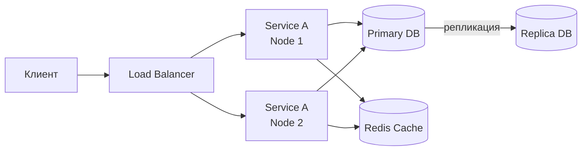

**Ключевые свойства** (по Лесли Лампорту): компоненты общаются **только через сообщения** (нет разделяемой памяти), каждый узел имеет **собственное локальное состояние**, сбой одного узла **не означает** сбой всей системы.

> [!mcq]
> - [ ] Распределённая система — это несколько потоков внутри одного процесса, взаимодействующих через общую память | Это описывает многопоточность внутри монолита, а не распределённую систему. В распределённой системе узлы физически разделены и взаимодействуют по сети.
> - [ ] Распределённая система — это любое приложение, использующее базу данных на отдельном сервере | Наличие отдельной БД — лишь одна из возможных конфигураций. Ключевой признак — независимые узлы, взаимодействующие по сети и выглядящие для пользователя как единое целое.
> - [x] Распределённая система — это совокупность независимых узлов, взаимодействующих по сети и выглядящих для пользователя как единая система | Именно это и является каноническим определением. Узлы работают автономно, не имеют разделяемой памяти и коммуницируют только через сообщения.
> - [ ] Распределённая система — это система с несколькими репликами базы данных и единственным приложением | Репликация БД — лишь часть картины. В распределённой системе независимых компонентов может быть множество: сервисы, кэши, очереди — и все они взаимодействуют по сети.

## Q2. Какие характеристики присущи распределённым системам?

Типичные характеристики:

| Характеристика | Описание |
|---|---|
| **Независимость компонентов** | Узлы работают автономно, каждый со своим процессом и памятью |
| **Прозрачность** | Система воспринимается как единое целое (прозрачность места, репликации, отказов, миграции) |
| **Масштабируемость** | Возможность добавлять узлы для увеличения пропускной способности |
| **Отказоустойчивость** | Работа продолжается при сбоях части узлов |
| **Гетерогенность** | Компоненты могут быть на разных ОС, языках, технологиях |
| **Отсутствие глобальных часов** | Нет единого времени; нужны механизмы упорядочивания событий |
| **Недетерминизм** | Порядок и время доставки сообщений непредсказуемы |

Эти свойства достигаются за счёт репликации, консенсуса, балансировки и явной обработки отказов.

> [!mcq]
> - [ ] Распределённые системы имеют глобальные часы, синхронизированные через NTP с точностью до миллисекунды | NTP-синхронизация снижает расхождение часов, но полностью его не устраняет. Одним из ключевых свойств распределённых систем является именно отсутствие глобальных часов.
> - [x] Распределённые системы характеризуются недетерминизмом: порядок и время доставки сообщений непредсказуемы | Недетерминизм — одно из фундаментальных свойств. Узлы общаются по ненадёжной сети, поэтому порядок сообщений и задержки не гарантированы.
> - [ ] Распределённые системы требуют гомогенной среды: все узлы должны использовать одинаковую ОС и язык | Гетерогенность — это наоборот одно из ключевых свойств распределённых систем. Компоненты могут использовать разные ОС, языки и технологии.
> - [ ] Распределённые системы всегда обеспечивают сильную согласованность данных между узлами | Сильная согласованность — лишь одна из возможных моделей. Многие системы жертвуют ею ради доступности и производительности (eventual consistency). Это неправильный подход к масштабируемости и надежности в production.

## Q3. В чём плюсы и минусы распределённых систем?

**Плюсы:**
- **Горизонтальное масштабирование** — добавление узлов вместо апгрейда одного сервера
- **Отказоустойчивость** — реплики, несколько зон доступности
- **Распределение нагрузки** — балансировка между узлами
- **Гибкость** — каждый компонент может использовать оптимальный стек технологий
- **Географическая близость** — узлы ближе к пользователям (`CDN`, мультирегиональные деплои)

**Минусы:**
- **Сложность** разработки и отладки (сетевые задержки, недетерминизм, race conditions)
- **Проблемы согласованности** данных между узлами
- **Частичные отказы** — один узел падает, остальные работают; нужно обрабатывать
- **Латентность** и зависимость от сети
- **Операционная сложность** — мониторинг, деплой, конфигурация десятков/сотен сервисов

> [!mcq]
> - [ ] Главный минус распределённых систем — отсутствие горизонтального масштабирования, так как нельзя добавлять узлы на лету | Горизонтальное масштабирование — наоборот, одно из ключевых преимуществ. Именно ради него часто и выбирают распределённую архитектуру.
> - [x] Главный минус распределённых систем — сложность разработки и отладки: сетевые задержки, недетерминизм и race conditions | Distributed debugging значительно сложнее монолита. Добавляются сетевые ошибки, частичные сбои, отсутствие глобальных часов и необходимость координации состояния.
> - [ ] Главный минус распределённых систем — невозможность обеспечить отказоустойчивость без дополнительных зон доступности | Отказоустойчивость достигается и в рамках одного ДЦ через репликацию и резервирование. Multi-AZ лишь повышает уровень защиты.
> - [ ] Главный минус распределённых систем — обязательное использование единого стека технологий для всех компонентов | Это описание монолита, а не распределённой системы. Гетерогенность стека — одно из свойств, которое распределённые системы допускают.

## Q4. (!) Какие существуют заблуждения о распределённых вычислениях (Fallacies of Distributed Computing)?

Питер Дойч и Джеймс Гослинг сформулировали **8 заблуждений** — ложные допущения, которые разработчики часто делают при проектировании распределённых систем:

| # | Заблуждение | Реальность |
|---|---|---|
| 1 | **Сеть надёжна** | Пакеты теряются, соединения обрываются, свитчи падают |
| 2 | **Латентность нулевая** | Сетевые вызовы на порядки медленнее локальных; inter-DC — десятки мс |
| 3 | **Пропускная способность бесконечна** | Bandwidth ограничен; большие payload-ы тормозят систему |
| 4 | **Сеть безопасна** | Трафик может быть перехвачен, подменён; нужен TLS, аутентификация |
| 5 | **Топология неизменна** | Узлы добавляются, удаляются, IP меняются; нужен service discovery |
| 6 | **Есть один администратор** | Разные команды, облачные провайдеры, разные политики |
| 7 | **Стоимость передачи нулевая** | Сериализация/десериализация, сетевые расходы, cloud egress costs |
| 8 | **Сеть однородна** | Разные протоколы, MTU, оборудование, провайдеры |

**Практическое значение:** каждое заблуждение ведёт к конкретным архитектурным решениям — таймауты, retry, circuit breaker, service discovery, шифрование, сжатие данных.

> [!mcq]
> - [ ] Заблуждение «сеть надёжна» означает, что разработчики ошибочно считают сеть медленной и вводят излишние таймауты | Это обратная трактовка. Заблуждение состоит в том, что разработчики предполагают сеть надёжной и не обрабатывают потери пакетов и обрывы соединений.
> - [x] Заблуждение «латентность нулевая» приводит к тому, что разработчики делают синхронные сетевые вызовы там, где нужна асинхронность | Когда разработчик игнорирует сетевую задержку, появляются блокирующие вызовы и цепочки зависимостей, которые деградируют при любой задержке сети.
> - [ ] Заблуждение «топология неизменна» означает, что разработчики правильно планируют частые смены IP-адресов сервисов | Это противоположно заблуждению. Ошибка в том, что разработчики хардкодят адреса и не внедряют service discovery, рассчитывая на стабильность топологии.
> - [ ] Заблуждение «стоимость передачи нулевая» относится исключительно к финансовым расходам на cloud egress | Заблуждение охватывает и вычислительные расходы: сериализацию/десериализацию, сетевые буферы, CPU-нагрузку. Cloud egress — лишь один из аспектов.

> [!mcq]
> - [x] Согласно заблуждениям Дойча, топология сети считается неизменной, хотя на практике IP-адреса и конфигурация постоянно меняются | Узлы появляются и исчезают, деплои меняют IP, автоскейлинг добавляет инстансы. Решение — service discovery вместо хардкода адресов.
> - [ ] Согласно заблуждениям Дойча, сеть считается небезопасной, хотя на практике внутренний трафик всегда зашифрован | Всё наоборот: заблуждение в том, что разработчики считают сеть безопасной и не шифруют трафик. Внутренний трафик без TLS уязвим для перехвата.
> - [ ] Согласно заблуждениям Дойча, существует единый администратор всей инфраструктуры, что позволяет централизованно управлять политиками | Это и есть заблуждение №6, а не реальность. На практике разные команды и облачные провайдеры имеют разные политики и ответственности.
> - [ ] Согласно заблуждениям Дойча, пропускная способность сети бесконечна, и это утверждение верно для современных датацентров с 100Gb Ethernet | Bandwidth ограничен всегда: конкуренция за полосу, large payloads, сериализация. 100Gb Ethernet не делает bandwidth «бесконечным» — он лишь увеличивает его.

```java
// Заблуждение #1 в действии: код без обработки сетевых ошибок
// ПЛОХО
String result = restTemplate.getForObject(url, String.class);

// ХОРОШО: учитываем ненадёжность сети
try {
    String result = restTemplate.getForObject(url, String.class);
} catch (ResourceAccessException e) {
    // таймаут, connection refused, DNS resolution failed
    log.warn("Сетевая ошибка при вызове {}: {}", url, e.getMessage());
    return fallbackResult();
}
```

## Q5. (!) Почему в распределённых системах нельзя полагаться на физические часы?

**Физические часы** (wall clock) на разных узлах **расходятся** — даже с `NTP`-синхронизацией разница может составлять десятки миллисекунд, а при сбоях `NTP` — секунды и минуты.

**Проблемы:**
- **Clock skew** — часы на узле A показывают 10:00:00.100, на узле B — 10:00:00.050; событие на B произошло позже, но по часам выглядит раньше
- **Clock drift** — кварцевые генераторы «уходят» со скоростью ~10-50 мкс/с
- **NTP step** — `NTP`-демон может скачкообразно сдвинуть время назад
- **Leap seconds** — вставка секунды может нарушить монотонность

**Последствия:** если использовать timestamp для определения порядка событий, можно потерять запись (last-write-wins с неправильным порядком), нарушить каузальность, получить «фантомные» транзакции.

**Решения:** `Lamport Timestamps`, `Vector Clocks`, `Hybrid Logical Clocks` (`HLC`), `TrueTime` (Google Spanner — GPS + атомные часы с явной оценкой погрешности).

> **На собеседовании:** покажите, что понимаете разницу между *wall clock* (`System.currentTimeMillis()`) и *monotonic clock* (`System.nanoTime()`). Первый может «прыгать», второй — только для измерения интервалов на одном узле.

> [!mcq]
> - [ ] Физические часы нельзя использовать в распределённых системах, потому что NTP полностью отключает синхронизацию между узлами | NTP как раз занимается синхронизацией, но не может обеспечить абсолютную точность. Расхождение в десятки миллисекунд при NTP — норма.
> - [x] Физические часы нельзя использовать для упорядочивания событий из-за clock skew: событие на узле A с более поздним timestamp может на самом деле произойти раньше события на узле B | Clock skew — ключевая проблема. Разные узлы показывают разное время, поэтому сравнение wall clock timestamps между узлами не даёт достоверного порядка событий.
> - [ ] Физические часы нельзя использовать, так как monotonic clock на каждом узле монотонно убывает и никогда не возрастает | Monotonic clock монотонно возрастает, но работает только в рамках одного узла и не подходит для сравнения событий между узлами.
> - [ ] Физические часы нельзя использовать, потому что `System.nanoTime()` в JVM возвращает значения в миллисекундах, а не наносекундах | `System.nanoTime()` возвращает значения в наносекундах. Проблема не в единицах измерения, а в том, что монотонные часы несравнимы между разными JVM.

> [!mcq]
> - [x] `System.nanoTime()` подходит для измерения интервалов на одном узле, но не для упорядочивания событий между узлами | Monotonic clock гарантирует монотонность внутри JVM-процесса, но его значения несравнимы между разными узлами. Для межузловой координации нужны логические часы.
> - [ ] `System.currentTimeMillis()` всегда монотонно возрастает и безопасен для упорядочивания событий внутри одного JVM-процесса | Wall clock может «прыгать» назад при NTP step adjustment или при leap second. Для монотонного измерения на одном узле нужен `System.nanoTime()`.
> - [ ] `System.currentTimeMillis()` синхронизирован между JVM-процессами и гарантирует одинаковое значение на всех узлах в момент вызова | Wall clock зависит от локальных часов узла с поправкой NTP. Гарантии одновременности нет: расхождение в десятки миллисекунд — типичная ситуация.
> - [ ] `System.nanoTime()` возвращает Unix timestamp в наносекундах и подходит для сравнения времён между различными JVM-процессами | `System.nanoTime()` возвращает значение от произвольной точки отсчёта, специфичной для JVM. Его нельзя сравнивать между процессами или передавать по сети.

## Q6. Что такое логические часы Лампорта (Lamport Timestamps)?

**Логические часы Лампорта** — механизм упорядочивания событий без привязки к физическому времени. Каждый узел поддерживает счётчик `L`:

**Правила:**
1. Перед каждым локальным событием: `L = L + 1`
2. При отправке сообщения: `L = L + 1`, сообщение содержит `L`
3. При получении сообщения с меткой `L_msg`: `L = max(L, L_msg) + 1`

```java
public class LamportClock {
    private final AtomicLong counter = new AtomicLong(0);

    /** Локальное событие или отправка сообщения */
    public long tick() {
        return counter.incrementAndGet();
    }

    /** Получение сообщения с меткой отправителя */
    public long receive(long senderTimestamp) {
        return counter.updateAndGet(current ->
            Math.max(current, senderTimestamp) + 1
        );
    }

    public long current() {
        return counter.get();
    }
}
```

**Свойство:** если событие A **причинно предшествует** B (`A → B`), то `L(A) < L(B)`. Но обратное **неверно**: `L(A) < L(B)` не означает `A → B` — события могут быть конкурентными. Для различения конкурентных событий нужны **векторные часы**.

> [!mcq]
> - [ ] Логические часы Лампорта гарантируют: если `L(A) < L(B)`, то событие A причинно предшествует событию B | Это обратное утверждение, которое является ложным. Порядок Lamport timestamps является необходимым, но не достаточным условием причинности. Два конкурентных события могут иметь L(A) < L(B), не будучи связаны причинно.
> - [x] Логические часы Лампорта гарантируют: если A причинно предшествует B, то `L(A) < L(B)`, но обратное не верно | Это точная формулировка свойства часов Лампорта. Они позволяют упорядочить события, причинно связанные, но не различают конкурентные события — для этого нужны векторные часы.
> - [ ] Логические часы Лампорта гарантируют, что при получении сообщения счётчик устанавливается в значение из сообщения без инкремента | При получении сообщения правило: `L = max(L_local, L_msg) + 1`. Инкремент обязателен — получение сообщения само по себе является событием.
> - [ ] Логические часы Лампорта гарантируют, что два конкурентных события всегда имеют одинаковые значения счётчика | Конкурентные события могут иметь разные значения счётчика. Именно потому их нельзя различить по Lamport timestamps — нужны векторные часы, где конкурентность определяется через несравнимость векторов.

## Q7. (!) Что такое векторные часы (Vector Clocks)?

**Векторные часы** — расширение логических часов Лампорта, позволяющее определить, являются ли два события **причинно связанными** или **конкурентными**.

Каждый узел `i` из `N` узлов поддерживает вектор `V[0..N-1]`:

1. Перед локальным событием: `V[i] = V[i] + 1`
2. При отправке: `V[i] = V[i] + 1`, сообщение содержит копию `V`
3. При получении от узла с вектором `V_msg`: `V[j] = max(V[j], V_msg[j])` для всех `j`, затем `V[i] = V[i] + 1`

**Сравнение:**
- `V1 ≤ V2` (причинно предшествует) — если `V1[j] ≤ V2[j]` для всех `j`
- `V1 || V2` (конкурентные) — если ни `V1 ≤ V2`, ни `V2 ≤ V1`

```java
public class VectorClock {
    private final int nodeId;
    private final int[] clock;

    public VectorClock(int nodeId, int numNodes) {
        this.nodeId = nodeId;
        this.clock = new int[numNodes];
    }

    public int[] tick() {
        clock[nodeId]++;
        return clock.clone();
    }

    public void receive(int[] senderClock) {
        for (int i = 0; i < clock.length; i++) {
            clock[i] = Math.max(clock[i], senderClock[i]);
        }
        clock[nodeId]++;
    }

    /** true если this причинно предшествует other */
    public boolean happensBefore(int[] other) {
        boolean atLeastOneLess = false;
        for (int i = 0; i < clock.length; i++) {
            if (clock[i] > other[i]) return false;
            if (clock[i] < other[i]) atLeastOneLess = true;
        }
        return atLeastOneLess;
    }
}
```

**Применение:** Amazon `DynamoDB` (оригинальный Dynamo), `Riak` — для обнаружения конфликтов при записи. **Недостаток:** размер вектора растёт с числом узлов (O(N)).

> [!mcq]
> - [ ] Векторные часы позволяют определить точное физическое время события на каждом узле кластера | Векторные часы — это логический механизм, не связанный с физическим временем. Они отслеживают причинно-следственные связи между событиями, а не абсолютное время.
> - [ ] Векторные часы позволяют определить, что `V1 | | V2` (конкурентность), когда `V1[j] ≤ V2[j]` для всех `j` | Это описание отношения «V1 предшествует V2», а не конкурентности. Конкурентность — когда ни `V1 ≤ V2`, ни `V2 ≤ V1` — то есть векторы несравнимы.
> - [x] Векторные часы позволяют определить конкурентность событий: `V1 | | V2`, если ни `V1 ≤ V2`, ни `V2 ≤ V1` не выполняется | Именно в этом и состоит ключевое преимущество перед Lamport timestamps. Если векторы несравнимы, события независимы и могут выполняться в любом порядке.
> - [ ] Векторные часы позволяют определить причинность с размером вектора O(1), не зависящим от числа узлов | Недостаток векторных часов — размер вектора растёт линейно с числом узлов O(N). Именно это ограничивает их применимость в системах с большим числом узлов.

## Q8. Что такое консенсус и какие алгоритмы его реализуют?

**Консенсус** — задача: все корректные (не-сбойные) узлы должны **согласиться на одно значение**, даже при отказе части участников. По теореме FLP невозможен детерминированный консенсус в полностью асинхронной системе с хотя бы одним сбоем.

**Основные алгоритмы:**

| Алгоритм | Кто использует | Особенности |
|---|---|---|
| `Paxos` | Google Chubby, Megastore | Теоретически элегантен, сложен в реализации |
| `Raft` | `etcd`, `Consul`, `CockroachDB` | Понятнее Paxos, явное разделение на leader election + log replication |
| `ZAB` | `ZooKeeper` | Оптимизирован для primary-backup |
| `PBFT` | Блокчейны | Устойчив к Byzantine faults (узлы могут «врать») |

**`Raft` — упрощённая модель:**

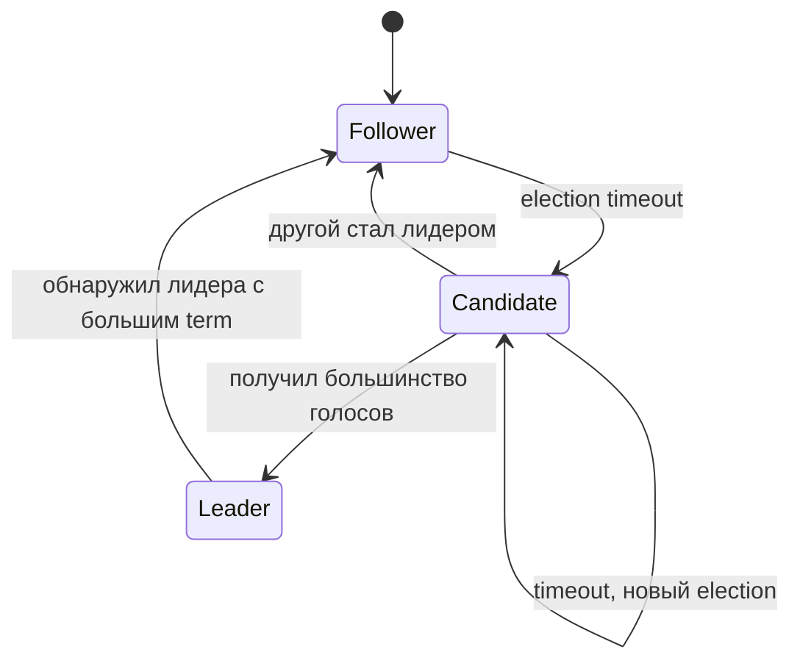

Лидер принимает запросы на запись, реплицирует log entry на фолловеров и коммитит после подтверждения от большинства (кворум `N/2 + 1`). При падении лидера фолловер с таймаутом начинает новый election.

> **На собеседовании:** достаточно объяснить Raft на уровне «leader election + log replication + commit по кворуму». Знание деталей Paxos впечатляет, но не обязательно.

> [!mcq]
> - [ ] Алгоритм Raft коммитит запись в лог, когда её подтверждает хотя бы один фолловер, не дожидаясь большинства | Это было бы недостаточно для безопасности. Raft требует подтверждения от кворума — большинства узлов (`N/2 + 1`), что гарантирует сохранность данных при падении меньшинства.
> - [x] Алгоритм Raft коммитит запись в лог после подтверждения от кворума узлов (`N/2 + 1`), что гарантирует безопасность при сбое меньшинства | Кворум — ключевая гарантия Raft. Если в кластере 5 узлов, достаточно 3 подтверждений. Это позволяет выдерживать падение до `f` узлов в кластере размером `2f+1`.
> - [ ] Алгоритм Raft коммитит запись только после подтверждения от всех узлов кластера, обеспечивая максимальную надёжность | Требование подтверждения от всех узлов означало бы, что единственный недоступный узел блокирует все записи. Raft намеренно использует кворум, а не полное согласие.
> - [ ] Алгоритм Raft использует случайный выбор лидера без механизма голосования для ускорения leader election | Лидер в Raft выбирается через явное голосование (`RequestVote RPC`). Случайность применяется только к таймаутам ожидания перед началом выборов, чтобы снизить вероятность одновременного старта нескольких кандидатов.

> [!mcq]
> - [ ] В алгоритме Raft алгоритм PBFT применяется для устойчивости к Byzantine faults внутри кластера | PBFT — отдельный алгоритм для Byzantine fault tolerance. Raft рассчитан только на crash faults: узлы могут падать, но не врать. Для Byzantine faults Raft не подходит.
> - [ ] В алгоритме Raft алгоритм Paxos используется как подпроцедура для репликации лога | Raft и Paxos — независимые алгоритмы консенсуса. Raft не использует Paxos внутри себя, он был разработан как альтернатива с более понятной структурой.
> - [x] В алгоритме Raft узел в состоянии Candidate переходит в Leader, только если получил голоса от большинства узлов кластера | Это фундаментальное правило Raft. Без кворума голосов кандидат не становится лидером. Если несколько кандидатов конкурируют, ни один не набирает большинство, и после таймаута начинается новый election term.
> - [ ] В алгоритме Raft узел в состоянии Candidate переходит в Leader, как только первый фолловер отправил ему голос | Одного голоса недостаточно. Требуется большинство (`N/2 + 1`). Это защищает от split-brain: если сеть разделена на два раздела, ни один из них не сможет избрать лидера без большинства.

## Q9. Как в распределённых системах обеспечивают согласованность данных?

Согласованность достигается выбором модели (strong, eventual, causal) и механизмами:

| Механизм | Модель | Когда использовать |
|---|---|---|
| `2PC` / `XA` | Strong consistency | Межбазовые транзакции, критичные к целостности |
| Синхронная репликация | Strong consistency | Данные, потеря которых недопустима |
| Асинхронная репликация | Eventual consistency | Высокая нагрузка, допускаем задержку |
| Консенсус (`Raft`, `Paxos`) | Linearizable | Координация, распределённые блокировки |
| Saga pattern | Eventual consistency | Распределённые бизнес-транзакции |
| `CRDT` | Strong eventual | Бесконфликтное слияние (счётчики, множества) |

```java
// Saga: компенсирующие действия при ошибке
@Transactional
public void createOrder(OrderRequest request) {
    Order order = orderService.create(request);        // шаг 1
    try {
        paymentService.charge(order.getPaymentInfo());  // шаг 2
        inventoryService.reserve(order.getItems());     // шаг 3
    } catch (Exception e) {
        paymentService.refund(order.getPaymentInfo());  // компенсация шага 2
        orderService.cancel(order.getId());             // компенсация шага 1
        throw e;
    }
}
```

На практике ключевой момент — **идемпотентность** шагов, корректные **компенсирующие действия** и наблюдаемость всего потока через `traceId` / метрики.

> [!mcq]
> - [ ] Для обеспечения сильной согласованности в распределённой системе достаточно использовать асинхронную репликацию с eventual consistency | Асинхронная репликация даёт eventual consistency, но не strong consistency. При сбое primary до реплики может случиться потеря данных и divergence между узлами. Это неправильный подход к масштабируемости и надежности в production.
> - [x] Сильная согласованность в распределённых системах достигается через синхронную репликацию или консенсус (`Raft`, `Paxos`) ценой увеличения латентности | Strong consistency требует координации: все (или кворум) узлов должны подтвердить запись. Это увеличивает задержку, но гарантирует, что все читатели видят последние данные. Strong consistency требует кворума и синхронизации, eventual дает доступность (BASE модель).
> - [ ] Сильная согласованность в распределённых системах достигается через CRDT-структуры данных без дополнительной координации | CRDT обеспечивает strong eventual consistency — бесконфликтное слияние, но не strong consistency в смысле linearizability. Читатель может видеть не самые свежие данные до слияния. Это неправильный подход к масштабируемости и надежности в production.
> - [ ] Сильная согласованность в распределённых системах достигается через Saga pattern с компенсирующими транзакциями | Saga — паттерн для eventual consistency, а не strong consistency. Промежуточные состояния в Saga видны другим сервисам: ACID-изоляции нет. Это неправильный подход к масштабируемости и надежности в production.

## Q10. Что такое доступность и как её повышают?

**Доступность** — доля времени, в течение которого система корректно отвечает на запросы. Выражают в «девятках»:

| Уровень | Downtime в год | Downtime в месяц |
|---|---|---|
| 99.9% (три девятки) | ~8.7 часов | ~43 мин |
| 99.99% (четыре) | ~52 мин | ~4.3 мин |
| 99.999% (пять) | ~5.2 мин | ~26 сек |

**Способы повышения:**
- **Репликация** — несколько копий данных/сервисов; при отказе одного узла остальные обслуживают запросы
- **Health checks** и автоматическое исключение нездоровых узлов из балансировщика
- **Балансировка нагрузки** — распределение трафика между healthy-узлами
- **Graceful degradation** — при сбое части системы остальная продолжает с ограниченной функциональностью
- **Multi-AZ / Multi-region** — резервные зоны доступности и дата-центры
- **Автоматический failover** — при падении primary автоматически промоутить replica

> **Формула для composed systems:** если сервис A (99.9%) вызывает сервис B (99.9%) последовательно, общая доступность = 99.9% × 99.9% = 99.8%. Параллельное резервирование: 1 − (1 − 0.999)² = 99.9999%.

> [!mcq]
> - [ ] Два сервиса 99.9%, вызываемые последовательно, дают общую доступность 99.9% | При последовательном вызове доступности перемножаются, а не остаются прежними. Итог: 99.9% × 99.9% ≈ 99.8% — ниже, чем у каждого отдельно.
> - [ ] Два сервиса 99.9%, вызываемые последовательно, дают общую доступность 99.99% | Последовательные зависимости ухудшают доступность, а не улучшают её. 99.99% получить из двух 99.9%-х компонентов последовательным вызовом невозможно.
> - [x] Два сервиса 99.9%, вызываемые последовательно, дают общую доступность около 99.8% | Доступности последовательно соединённых сервисов перемножаются: 0.999 × 0.999 ≈ 0.998. Чем больше звеньев в цепочке, тем ниже итоговая доступность.
> - [ ] Два сервиса 99.9%, вызываемые последовательно, дают общую доступность 100% | Последовательный вызов не устраняет отказы, а складывает их вероятности. Достичь 100% доступности принципиально невозможно из-за конечной надёжности компонентов.

## Q11. (!) Что такое частичные отказы и как с ними борются?

**Практический сигнал:** для partial failure важно заранее определить пороги: timeout, число retry, время открытия circuit breaker и допустимую долю деградации.

**Частичный отказ** — отказ одного или нескольких компонентов при работающих остальных (упал один сервис, сетевая задержка, таймаут). В монолите чаще «всё или ничего»; в распределённой системе такие сбои — **норма**, а не исключение.

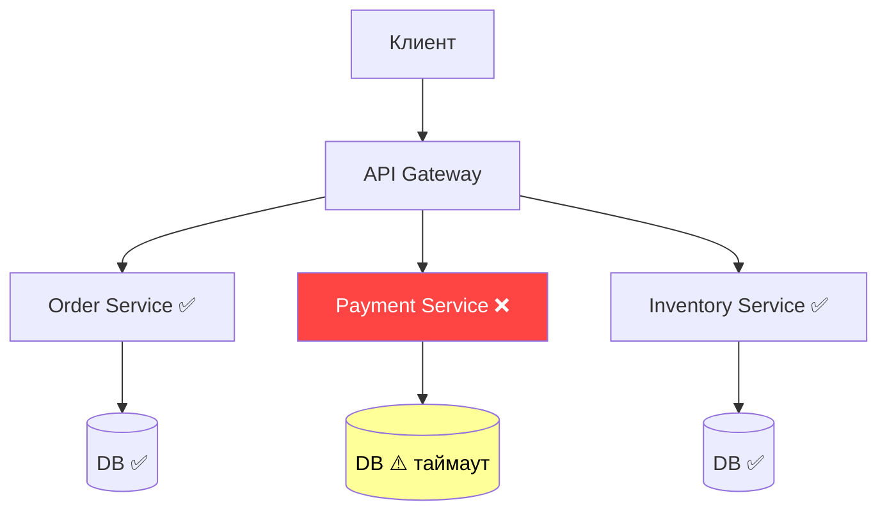

**Стратегии борьбы:**

| Паттерн | Назначение |
|---|---|
| **Timeout** | Не ждать ответ бесконечно; fail fast |
| **Retry** | Повторить при транзиентных ошибках |
| **Circuit Breaker** | Прекратить вызывать сломанный сервис |
| **Fallback** | Вернуть кэш или заглушку |
| **Bulkhead** | Изолировать ресурсы; одна зависимость не убьёт все |
| **Idempotency** | Безопасный повтор без дублирования побочных эффектов |
| **Мониторинг** | Алерты по ошибкам и задержкам; обнаружение до escalation |

> [!mcq]
> - [ ] Частичные отказы в микросервисах следует предотвращать глобальной распределённой транзакцией на все вызовы | Распределённая транзакция (2PC) сама страдает от частичных отказов и добавляет блокировки. Она не делает систему надёжнее, а усложняет восстановление и снижает доступность.
> - [ ] Частичные отказы можно игнорировать, полагаясь на то, что сеть надёжна и задержки постоянные | Это классические Fallacies of Distributed Computing: сеть не надёжна и задержки переменные. Без явной стратегии обработки отказов любой таймаут приводит к каскадному сбою.
> - [x] Частичные отказы обрабатывают комбинацией timeout, retry, circuit breaker, bulkhead и fallback | В распределённых системах отказ отдельных компонентов — норма, и каждый паттерн закрывает свой риск: timeout ограничивает ожидание, retry переживает транзиенты, CB режет каскад, bulkhead изолирует ресурсы, fallback даёт degraded response.
> - [ ] Частичные отказы исчезают, если увеличить таймауты до нескольких минут, чтобы сервис успел ответить | Большие таймауты копят зависшие запросы и исчерпывают пул потоков вызывающего сервиса. Это усиливает каскадный сбой, а не устраняет частичный отказ.

## Q12. (!) Что такое Circuit Breaker и когда его применять?

**Circuit Breaker** — паттерн отказоустойчивости: при превышении порога ошибок при вызове внешнего сервиса «размыкает цепь» и перестаёт вызывать этот сервис, возвращая fallback или ошибку. Защищает от каскадных сбоев.

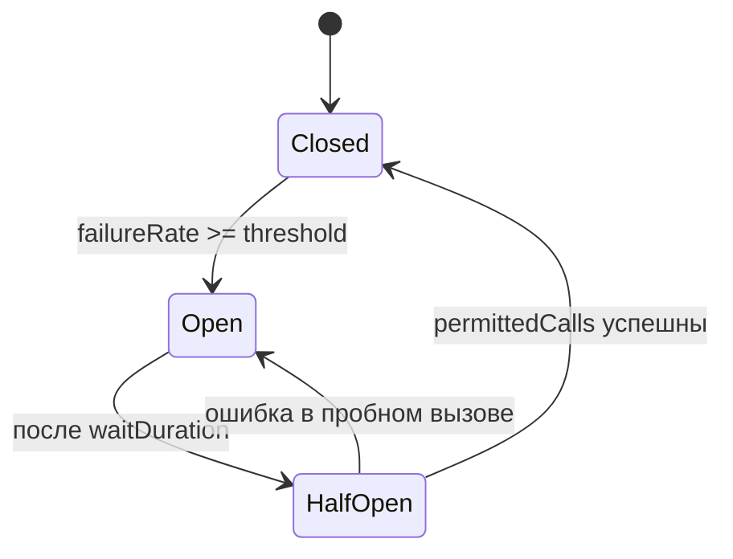

**Три состояния:**
- **Closed** — вызовы проходят нормально; считаются ошибки в скользящем окне
- **Open** — все вызовы мгновенно отклоняются; fallback
- **Half-Open** — пропускается ограниченное число пробных вызовов

```java
// Resilience4j Circuit Breaker с Spring Boot
@Bean
public CircuitBreakerConfig circuitBreakerConfig() {
    return CircuitBreakerConfig.custom()
        .failureRateThreshold(50)                    // 50% ошибок → open
        .waitDurationInOpenState(Duration.ofSeconds(30)) // 30 сек в open
        .slidingWindowSize(10)                       // окно из 10 вызовов
        .permittedNumberOfCallsInHalfOpenState(3)    // 3 пробных вызова
        .build();
}

// Использование
@CircuitBreaker(name = "paymentService", fallbackMethod = "paymentFallback")
public PaymentResult processPayment(PaymentRequest request) {
    return paymentClient.charge(request);
}

private PaymentResult paymentFallback(PaymentRequest request, Throwable t) {
    log.warn("Payment service unavailable, queuing for retry: {}", t.getMessage());
    return PaymentResult.queued(request.getOrderId());
}
```

**Trade-off:** слишком «агрессивный» circuit breaker может давать лишние отказы, а слишком «мягкий» — не защитит от каскадного сбоя; параметры всегда верифицируют нагрузочными тестами.

> [!mcq]
> - [x] В состоянии Half-Open Circuit Breaker пропускает ограниченное число пробных вызовов для проверки восстановления downstream | Half-Open — промежуточное состояние между Open и Closed: пропускается несколько probes, и по их результату CB переходит в Closed (успех) или обратно в Open (ошибка). Это защищает downstream от резкой нагрузки сразу после восстановления.
> - [ ] В состоянии Half-Open Circuit Breaker блокирует все вызовы, как и в состоянии Open | В Open все вызовы отклоняются мгновенно, а смысл Half-Open именно в пропуске пробных. Без probes CB не смог бы узнать, что сервис починился.
> - [ ] В состоянии Half-Open Circuit Breaker пропускает весь трафик, чтобы проверить восстановление | Полный пропуск трафика сразу после Open снова уронит восстанавливающийся сервис. Именно для этого в Half-Open количество пробных вызовов строго ограничено.
> - [ ] В состоянии Half-Open Circuit Breaker навсегда фиксирует себя в этом состоянии без перехода в Closed | Half-Open — по определению временное состояние: после успешных probes CB должен перейти в Closed, иначе теряется смысл восстановления.

## Q13. Что такое Retry с экспоненциальной задержкой?

**Retry с экспоненциальной задержкой** — стратегия повторных попыток: после каждой неудачи ждать перед следующей попыткой всё дольше. Уменьшает нагрузку на восстанавливающийся сервис.

**Формула:** `delay = min(base * 2^attempt + jitter, maxDelay)`

```java
// Resilience4j Retry
@Bean
public RetryConfig retryConfig() {
    return RetryConfig.custom()
        .maxAttempts(3)
        .waitDuration(Duration.ofMillis(500))
        .intervalFunction(IntervalFunction.ofExponentialBackoff(
            500,    // initialInterval ms
            2.0     // multiplier
        ))
        .retryOnException(e -> e instanceof ResourceAccessException)
        .retryOnResult(response -> response.getStatusCode().is5xxServerError())
        .build();
}

// Spring @Retryable
@Retryable(
    retryFor = ResourceAccessException.class,
    maxAttempts = 3,
    backoff = @Backoff(delay = 500, multiplier = 2, maxDelay = 5000)
)
public ExternalData fetchData(String id) {
    return externalClient.getData(id);
}
```

**Jitter** — случайное отклонение задержки, чтобы множество клиентов не синхронизировались и не создавали «thundering herd»:

```java
long jitter = ThreadLocalRandom.current().nextLong(0, baseDelay / 2);
long delay = Math.min(baseDelay * (1L << attempt) + jitter, maxDelay);
```

**Важно:** retry безопасен **только для идемпотентных** операций. Для не-идемпотентных (POST создание заказа) — нужен `Idempotency-Key`.

> [!mcq]
> - [ ] Jitter — это константная задержка, добавляемая ко всем retry для равномерной нагрузки | Константная задержка не решает проблему синхронизации клиентов. Именно случайная составляющая (jitter) рассинхронизирует повторные попытки и убирает thundering herd.
> - [x] Jitter — это случайное отклонение в задержке retry, предотвращающее thundering herd при синхронных повторах | При одновременном сбое сотни клиентов запустят retry через одинаковые интервалы 500 ms, 1 s, 2 s и создадут пиковую нагрузку. Случайный jitter размывает эти пики и даёт восстанавливающемуся сервису шанс не упасть снова.
> - [ ] Jitter — это механизм удвоения задержки, эквивалентный экспоненциальному backoff | Удвоение задержки — это как раз экспоненциальный backoff, а не jitter. Jitter добавляется поверх backoff, а не заменяет его.
> - [ ] Jitter — это механизм отключения retry при достижении maxAttempts | Ограничение maxAttempts — это бюджет retry, а не jitter. Jitter работает внутри каждой попытки, добавляя случайность в время ожидания.

## Q14. Что такое Bulkhead pattern?

**Bulkhead** — изоляция ресурсов: пул потоков или соединений для вызова одного сервиса ограничен и не делится с другими. Падение одного внешнего сервиса не исчерпывает все потоки приложения.

Аналогия: **переборки на корабле** — затопление одного отсека не топит весь корабль.

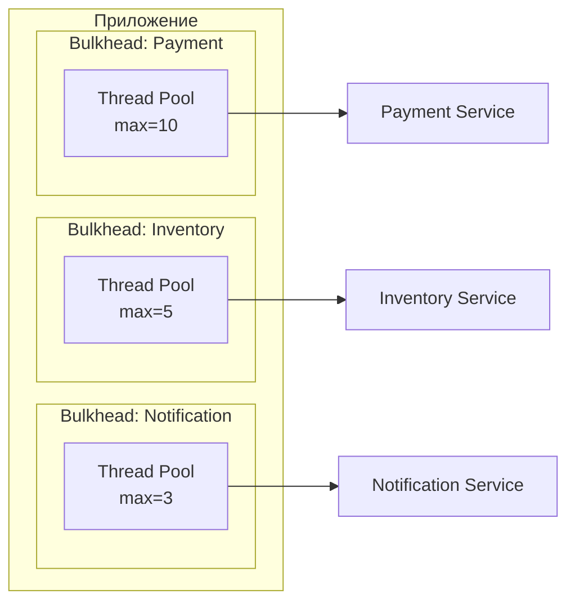

```java
// Resilience4j Bulkhead (thread pool isolation)
@Bean
public ThreadPoolBulkheadConfig bulkheadConfig() {
    return ThreadPoolBulkheadConfig.custom()
        .maxThreadPoolSize(10)
        .coreThreadPoolSize(5)
        .queueCapacity(20)
        .build();
}

// Semaphore-based bulkhead (ограничение concurrent calls)
@Bulkhead(name = "inventoryService", type = Bulkhead.Type.SEMAPHORE)
public InventoryResponse checkStock(String sku) {
    return inventoryClient.check(sku);
}
```

**Два типа:** `ThreadPool` bulkhead (выделенный пул потоков, полная изоляция) и `Semaphore` bulkhead (ограничение числа одновременных вызовов, легче по ресурсам).

> [!mcq]
> - [ ] Bulkhead pattern увеличивает общий пул потоков приложения для повышения throughput | Bulkhead не увеличивает, а разбивает ресурсы на независимые «отсеки». Его цель — не throughput, а предотвращение истощения всех потоков одной медленной зависимостью.
> - [ ] Bulkhead pattern автоматически повторяет неудачные вызовы внешних сервисов | Повторы — задача Retry-паттерна, а не Bulkhead. Bulkhead только изолирует ресурсы, чтобы один тормозящий вызов не блокировал остальные.
> - [x] Bulkhead pattern изолирует ресурсы (пулы потоков/соединений) для разных зависимостей, чтобы падение одной не истощало все потоки приложения | Принцип «переборок»: каждому внешнему сервису выделяется свой пул. При зависании downstream истощается только его пул, а остальные остаются работоспособными, предотвращая каскадный сбой.
> - [ ] Bulkhead pattern отключает вызовы к внешнему сервису после превышения порога ошибок | Отключение при высоком уровне ошибок — поведение Circuit Breaker, а не Bulkhead. Bulkhead ограничивает конкурентные вызовы, но не следит за частотой ошибок.

## Q15. Что такое graceful degradation?

**Graceful degradation** — при сбое части системы остальная продолжает работать с ограниченной функциональностью вместо полного отказа.

**Примеры:**
- При недоступности сервиса рекомендаций — показывать каталог без персональных рекомендаций
- При падении кэша — читать из БД с большей латентностью
- При сбое сервиса оплаты — принимать заказы «в очередь»

**Реализация:**

```java
public ProductPage getProductPage(String productId) {
    Product product = productService.getById(productId); // обязательный

    // Необязательные данные: fallback при ошибке
    List<Product> recommendations = safeCall(
        () -> recommendationService.getFor(productId),
        Collections.emptyList()  // fallback — пустой список
    );

    ReviewSummary reviews = safeCall(
        () -> reviewService.getSummary(productId),
        ReviewSummary.unavailable()  // fallback — «отзывы временно недоступны»
    );

    return new ProductPage(product, recommendations, reviews);
}

private <T> T safeCall(Supplier<T> call, T fallback) {
    try {
        return call.get();
    } catch (Exception e) {
        log.warn("Degraded: {}", e.getMessage());
        return fallback;
    }
}
```

**Ключ:** заранее выявить **критичные** (без них ответ невозможен) и **некритичные** (можно опустить) зависимости. Противоположность — «всё или ничего»: одна ошибка роняет весь сервис.

> [!mcq]
> - [ ] Graceful degradation требует, чтобы при сбое любой зависимости сервис немедленно возвращал HTTP 500 | HTTP 500 на любой сбой — это fail-fast без деградации. Graceful degradation подразумевает частичный ответ: отдать основное, а некритичное — заглушкой или пустым значением.
> - [x] Graceful degradation подразумевает, что при сбое некритичных зависимостей сервис возвращает ответ с пустыми или fallback-значениями вместо полного отказа | Идея — разделить зависимости на критичные и опциональные: без критичных ответа нет, а опциональные при сбое заменяются fallback-значениями. Это держит основной user journey доступным даже при деградации инфраструктуры.
> - [ ] Graceful degradation — это автоматический перезапуск контейнеров при сбое зависимостей | Перезапуск контейнеров — инфраструктурная реакция (Kubernetes liveness probe), а не graceful degradation. Перезапуск не даёт пользователю degraded ответа, он просто пересоздаёт процесс.
> - [ ] Graceful degradation — это синоним Circuit Breaker и реализуется только через него | Circuit Breaker — один из возможных механизмов, но graceful degradation шире: включает fallback значения, кэш, очередь, альтернативные источники данных. CB без fallback просто отклонит запрос, а не деградирует его.

## Q16. Что такое health check и как его использовать?

**Health check** — периодическая проверка готовности узла к работе. Два типа:

| Тип | Назначение | Что проверять |
|---|---|---|
| **Liveness** | Жив ли процесс? | JVM не зависла, нет deadlock |
| **Readiness** | Готов ли принимать трафик? | Подключение к БД, кэшу; прогрелись кэши |

```java
// Spring Boot Actuator — кастомный health check
@Component
public class DatabaseHealthIndicator implements HealthIndicator {
    private final DataSource dataSource;

    @Override
    public Health health() {
        try (Connection conn = dataSource.getConnection()) {
            conn.createStatement().execute("SELECT 1");
            return Health.up()
                .withDetail("database", "available")
                .build();
        } catch (SQLException e) {
            return Health.down()
                .withDetail("database", e.getMessage())
                .build();
        }
    }
}
```

**В Kubernetes:**
- Liveness probe: при падении — перезапуск контейнера
- Readiness probe: при падении — исключение pod-а из `Service` (балансировщик перестаёт слать трафик)

**Антипаттерн:** не включать тяжёлые проверки внешних сервисов в liveness — иначе недоступность зависимости будет перезапускать ваш сервис (каскадный перезапуск).

> [!mcq]
> - [ ] Liveness probe проверяет готовность принимать трафик, readiness probe — жив ли процесс | Роли перепутаны: liveness отвечает на вопрос «жив ли процесс», а readiness — «готов ли принимать трафик». Kubernetes на liveness перезапускает, а на readiness исключает из Service.
> - [x] Liveness probe проверяет, что процесс жив и не завис; readiness probe проверяет готовность pod-а обрабатывать трафик | При провале liveness Kubernetes перезапускает контейнер (жёсткая реакция), а при провале readiness — исключает pod из endpoints Service без рестарта. Это разделение позволяет временно «отключать» прогревающиеся или перегруженные pod-ы без их убийства.
> - [ ] Liveness и readiness — это два названия одной и той же проверки здоровья сервиса | Это две разные проверки с разной семантикой и реакцией Kubernetes. Объединение их приводит к ненужным перезапускам при временной недоступности внешних зависимостей.
> - [ ] Liveness и readiness обязательно должны включать проверку всех внешних зависимостей (БД, кэш, соседние сервисы) | Включение внешних зависимостей в liveness приводит к каскадным перезапускам при их сбое. Тяжёлые проверки уместны в readiness или в отдельном health-эндпоинте для мониторинга.

## Q17. (!) Что такое leader election и зачем он нужен?

**Leader election** — выбор одного узла из кластера в качестве лидера для координации. Остальные — фолловеры.

**Зачем нужен:**
- Координация распределённых задач (только лидер назначает задачи)
- Единственная точка записи в шард (избежание конфликтов)
- Распределённые блокировки (лидер управляет lock-ами)
- Единственный потребитель очереди (избежание дубликатов)

**Реализации:**

| Технология | Как работает |
|---|---|
| `ZooKeeper` | Ephemeral sequential nodes; узел с наименьшим номером — лидер |
| `etcd` | Lease + campaign API на базе `Raft` |
| `Consul` | Session + KV store с lock |
| `Redis` (Redlock) | Распределённая блокировка с TTL |
| `Kafka` | Controller broker через `KRaft` (ранее — через `ZooKeeper`) |

```java
// Leader election с Spring Integration и JDBC
@Bean
public LockRepository lockRepository(DataSource dataSource) {
    return new DefaultLockRepository(dataSource);
}

@Bean
public LockRegistryLeaderInitiator leaderInitiator(LockRepository lockRepo) {
    return new LockRegistryLeaderInitiator(
        new JdbcLockRegistry(lockRepo)
    );
}

@EventListener
public void onLeaderGranted(OnGrantedEvent event) {
    log.info("Этот узел стал лидером: {}", event.getRole());
    scheduledTaskService.start();
}

@EventListener
public void onLeaderRevoked(OnRevokedEvent event) {
    log.info("Лидерство отозвано: {}", event.getRole());
    scheduledTaskService.stop();
}
```

**Проблема split-brain:** два узла одновременно считают себя лидером. Решается fencing tokens — каждый лидер получает монотонно возрастающий номер эпохи; ресурсы принимают запросы только от лидера с наибольшей эпохой.

> [!mcq]
> - [ ] Split-brain решается увеличением таймаута election — тогда второй лидер не успеет избраться | Увеличение таймаута только замедляет избрание, но не устраняет возможность split-brain при сетевом разделении. После восстановления сети два лидера с разными состояниями всё равно создадут конфликт.
> - [ ] Split-brain решается тем, что старый лидер сам заметит нового и уйдёт в отставку | Старый лидер мог быть изолирован от кворума и не знать о новых выборах; он продолжит принимать записи. Без внешнего механизма отсечения старые записи попадут в систему и испортят консистентность.
> - [ ] Split-brain невозможен в системах с Raft и не требует отдельных механизмов | Raft защищает от split-brain только при корректной работе кворума, но у ресурсов (БД, сторонние API) может оказаться старый лидер с устаревшим term. Fencing tokens нужны именно для защиты внешних ресурсов.
> - [x] Split-brain решается fencing tokens — монотонно возрастающим номером эпохи, который ресурсы проверяют и отклоняют запросы от лидеров с меньшим номером | Каждый новый лидер получает больший fencing token, а ресурсы запоминают максимальный увиденный номер. Запросы от старого лидера с меньшим token отклоняются, что устраняет конфликт даже при одновременном существовании двух «лидеров».

## Q18. Что такое service discovery и какие подходы существуют?

**Service discovery** — механизм, позволяющий сервисам находить друг друга без hard-coded адресов. Необходим, потому что в распределённых системах узлы появляются и исчезают динамически (автоскейлинг, деплои, сбои).

**Два подхода:**

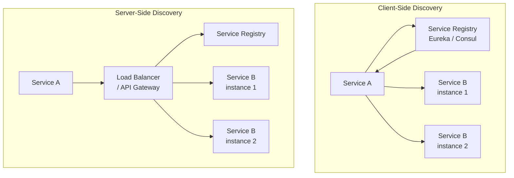

| Подход | Плюсы | Минусы | Пример |
|---|---|---|---|
| **Client-side** | Нет дополнительного hop-а | Логика балансировки в клиенте | `Eureka` + `Ribbon` / `Spring Cloud LoadBalancer` |
| **Server-side** | Клиент не знает про discovery | Дополнительный hop, SPOF | `Kubernetes Service`, `AWS ALB` |
| **DNS-based** | Простота, стандартный протокол | TTL кэша, нет health checks | `Consul DNS`, `CoreDNS` |
| **Mesh** | Прозрачно для приложения | Сложность операций | `Istio`, `Linkerd` |

**В Kubernetes** service discovery встроен: `Service` создаёт DNS-запись `<service>.<namespace>.svc.cluster.local`, `kube-proxy` балансирует между pod-ами. Для cross-cluster — `Consul`, `Istio multi-cluster`.

> [!mcq]
> - [x] При client-side discovery клиент сам получает список инстансов из registry и балансирует нагрузку; при server-side клиент ходит в единый load balancer, скрывающий registry | В client-side балансировка в библиотеке клиента (Ribbon, Spring Cloud LoadBalancer), что убирает лишний hop, но требует логики в клиенте. В server-side клиент не знает про registry — всё скрыто за балансировщиком (Kubernetes Service, AWS ALB), но добавляется один сетевой hop.
> - [ ] Client-side discovery и server-side discovery — это одно и то же, просто разные названия в литературе | Это принципиально разные схемы: в одной балансировка живёт в клиенте, в другой — в отдельном компоненте между клиентом и сервисами. У них разные trade-off по производительности и сложности.
> - [ ] Client-side discovery работает только поверх DNS и не требует никакого registry | DNS — лишь частный случай, и он плохо справляется с health checks и быстрым обновлением списка инстансов. Полноценные client-side решения используют registry (Eureka, Consul) с явным health checking.
> - [ ] Server-side discovery не требует service registry, балансировщик сам знает все инстансы | Балансировщику нужен источник правды об инстансах — им обычно выступает тот же registry (или Kubernetes endpoints API). Без registry LB не сможет корректно добавлять/удалять инстансы при autoscale.

## Q19. (!) Чем отличается синхронная репликация от асинхронной?

**Критерий выбора:** если бизнес не допускает потерю подтверждённой записи — приоритет синхронной репликации; если важнее latency/throughput — чаще выбирают асинхронную с явным контролем окна риска.

| Критерий | Синхронная | Асинхронная |
|---|---|---|
| **Подтверждение записи** | После записи на все (или кворум) реплики | Сразу после записи на primary |
| **Консистентность** | Strong consistency | Eventual consistency |
| **Latency записи** | Выше (ждём реплики) | Ниже |
| **Throughput** | Ниже | Выше |
| **Потеря данных при сбое primary** | Невозможна (данные на репликах) | Возможна (replication lag) |
| **Доступность при partition** | Может блокироваться (нет кворума) | Продолжает работать |

**Полусинхронная репликация** (semi-sync, `MySQL`, `PostgreSQL`) — запись подтверждается после записи хотя бы на одну реплику. Компромисс между безопасностью и производительностью.

```java
// Пример: выбор уровня consistency при записи в Cassandra
// ONE — асинхронная (быстро, но рискованно)
session.execute(SimpleStatement.newInstance(query)
    .setConsistencyLevel(ConsistencyLevel.ONE));

// QUORUM — полусинхронная (N/2+1 подтверждений)
session.execute(SimpleStatement.newInstance(query)
    .setConsistencyLevel(ConsistencyLevel.QUORUM));

// ALL — синхронная (все реплики, максимальная задержка)
session.execute(SimpleStatement.newInstance(query)
    .setConsistencyLevel(ConsistencyLevel.ALL));
```

> [!mcq]
> - [ ] Асинхронная репликация гарантирует strong consistency и нулевую вероятность потери данных при сбое primary | Асинхронная репликация подтверждает запись сразу после записи в primary, до записи на реплики. При падении primary последние транзакции, не успевшие реплицироваться, теряются. Это неправильный подход к масштабируемости и надежности в production.
> - [x] Асинхронная репликация имеет replication lag и при сбое primary возможна потеря последних транзакций, не доехавших до реплик | Подтверждение клиенту приходит до того, как данные записаны на реплики, что даёт низкую latency и высокий throughput. Но в окно replication lag возможна потеря данных при аварии primary — это основной trade-off.
> - [ ] Асинхронная репликация делает запись медленнее синхронной, потому что ждёт все реплики | Асинхронная как раз не ждёт реплик — это её преимущество по latency. Синхронная наоборот блокируется, пока реплики не подтвердят запись.
> - [ ] Асинхронная репликация и синхронная репликация дают одинаковые гарантии консистентности | Гарантии принципиально разные: синхронная даёт strong consistency, асинхронная — eventual. Путать их — распространённая ошибка, приводящая к потере данных в проде. Это неправильный подход к масштабируемости и надежности в production.

## Q20. Какие существуют топологии репликации?

Основные топологии:

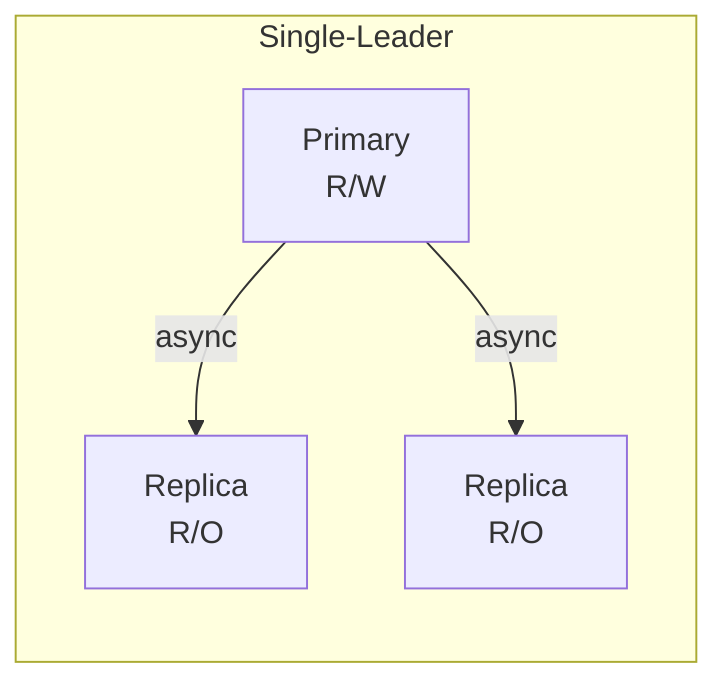

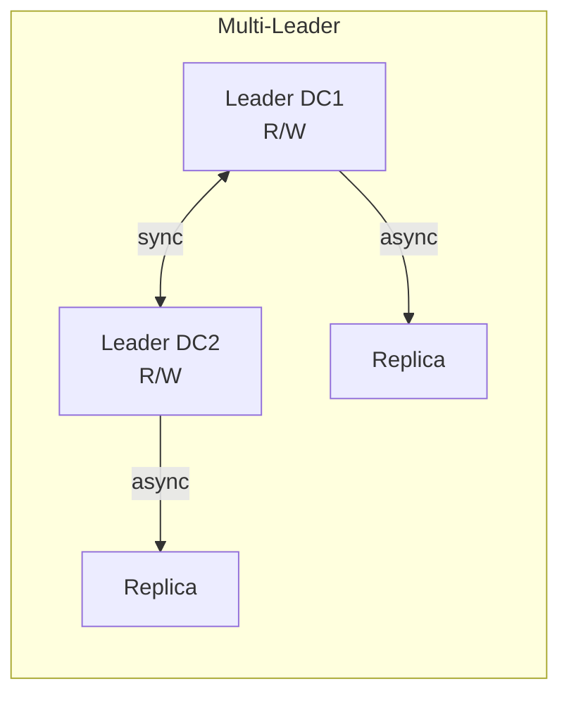

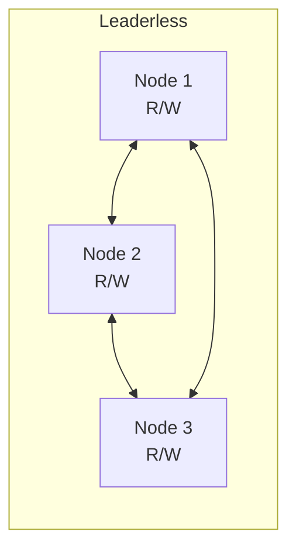

| Топология | Плюсы | Минусы | Примеры |
|---|---|---|---|
| **Single-leader** | Простота, нет конфликтов записи | SPOF лидера, latency для удалённых клиентов | `PostgreSQL`, `MySQL`, `MongoDB` |
| **Multi-leader** | Запись в нескольких DC, низкая latency | Конфликты записи, сложность разрешения | `CockroachDB`, `MySQL Group Replication` |
| **Leaderless** | Высокая доступность, нет SPOF | Конфликты, read repair, anti-entropy | `Cassandra`, `DynamoDB`, `Riak` |

**Разрешение конфликтов в multi-leader:** Last-Write-Wins (LWW), merge на уровне приложения, `CRDT`, custom conflict resolver.

> [!mcq]
> - [ ] Multi-leader репликация проще single-leader, так как нет конфликтов записи | Как раз наоборот: в multi-leader несколько узлов принимают записи параллельно, что создаёт конфликты (concurrent updates одной записи). Их нужно явно разрешать через LWW, CRDT или merge-логику.
> - [ ] В single-leader топологии запись может идти в любой узел без координации | В single-leader пишет только primary, остальные — реплики только на чтение. Попытка записи в реплику приведёт к ошибке или потребует перенаправления на primary.
> - [x] Leaderless репликация (Cassandra, DynamoDB) устраняет SPOF лидера, но требует read repair и anti-entropy для eventual consistency | Каждый узел принимает и чтение, и запись с кворумами (R+W>N), что даёт высокую доступность и отсутствие SPOF. Платой становится eventual consistency и необходимость фоновых процессов для восстановления расхождений между узлами.
> - [ ] Leaderless репликация гарантирует strong consistency без дополнительных механизмов | Leaderless по определению даёт eventual consistency — узлы могут временно иметь разные версии данных. Strong consistency достигается только при R+W>N и даже тогда требует read repair для исправления расхождений.

## Q21. (!) Что такое шардирование (Sharding) и какие стратегии существуют?

**Шардирование** — горизонтальное разбиение данных по нескольким узлам (шардам). Каждый шард хранит подмножество данных. Цель — масштабировать объём данных и нагрузку за пределы одного сервера.

**Стратегии:**

| Стратегия | Принцип | Плюсы | Минусы |
|---|---|---|---|
| **Range-based** | По диапазону ключа (A-M → shard 1, N-Z → shard 2) | Range-запросы эффективны | Hotspot при неравномерном распределении |
| **Hash-based** | `hash(key) % N` | Равномерное распределение | Range-запросы невозможны; resharding при изменении N |
| **Consistent hashing** | Кольцо хэшей с виртуальными узлами | Минимальное перемещение при добавлении узла | Сложность реализации |
| **Directory-based** | Lookup-таблица: ключ → шард | Гибкость | SPOF/bottleneck lookup-сервиса |

```java
// Простой hash-based шардинг
public class ShardRouter {
    private final List<DataSource> shards;

    public DataSource getShardFor(long userId) {
        int shardIndex = (int) (Math.abs(userId) % shards.size());
        return shards.get(shardIndex);
    }
}

// Range-based шардинг
public DataSource getShardFor(LocalDate orderDate) {
    if (orderDate.isBefore(LocalDate.of(2025, 1, 1))) {
        return archiveShard;
    } else if (orderDate.isBefore(LocalDate.of(2026, 1, 1))) {
        return shard2025;
    } else {
        return currentShard;
    }
}
```

**Проблемы шардирования:**
- **Cross-shard queries** — JOIN-ы между шардами дорогие или невозможные
- **Resharding** — добавление шардов требует миграции данных
- **Hotspots** — неравномерная нагрузка на шарды (celebrity problem)
- **Distributed transactions** — 2PC между шардами снижает производительность

## Q22. Что такое consistent hashing?

**Consistent hashing** — алгоритм распределения данных, при котором добавление или удаление узла перемещает минимальное количество ключей (в среднем `K/N`, где `K` — число ключей, `N` — число узлов).

**Принцип:** узлы и ключи хэшируются на кольцо `[0, 2^32)`. Ключ назначается **ближайшему узлу по часовой стрелке**.

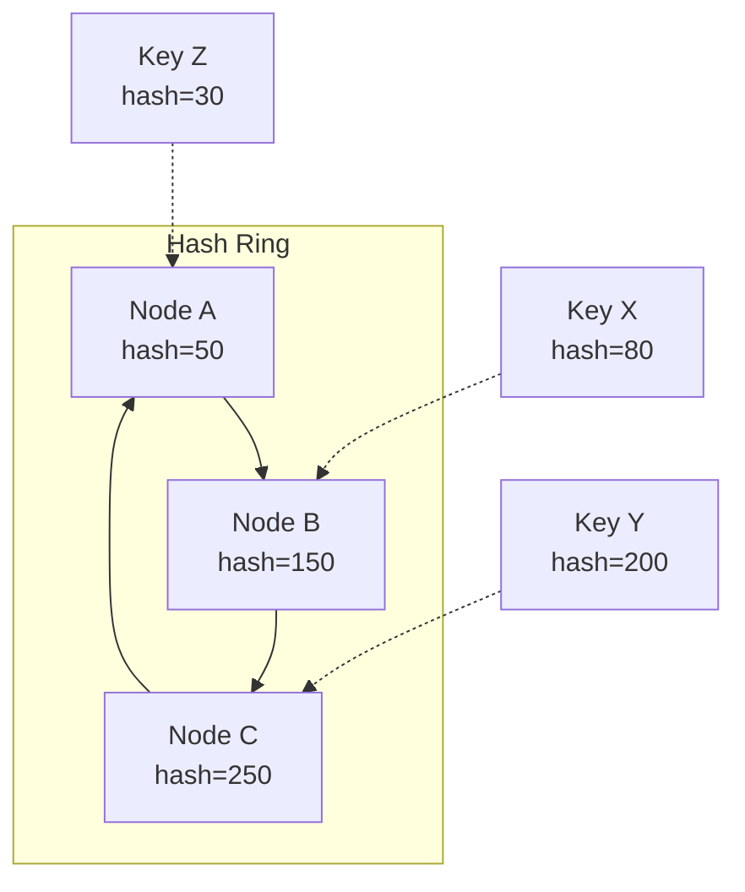

**Виртуальные узлы** (vnodes): каждый физический узел создаёт несколько точек на кольце (например, 150-256). Это обеспечивает **равномерное распределение** — без vnodes один узел может получить непропорционально большой сегмент.

**Применение:** `Cassandra`, `DynamoDB`, `Memcached` (ketama), `Redis Cluster`, `Kafka` (partition assignment), `CDN` (маршрутизация запросов).

**При добавлении узла D:** только ключи из диапазона, который теперь принадлежит D, мигрируют с соседнего узла. Остальные ключи остаются на месте — в отличие от `hash % N`, где перераспределяются почти все.

## Q23. Что такое gossip protocol?

**Gossip protocol** (протокол сплетен, epidemic protocol) — децентрализованный способ распространения информации в кластере. Каждый узел периодически выбирает **случайного соседа** и обменивается с ним своим состоянием.

**Свойства:**
- **Децентрализованный** — нет лидера или координатора
- **Устойчивый** — работает при частичных сбоях
- **Eventual consistency** — информация распространяется за O(log N) раундов
- **Масштабируемый** — нагрузка на каждый узел O(1) за раунд

**Применение:**

| Задача | Пример |
|---|---|
| Обнаружение сбоев (failure detection) | `Cassandra`, `Consul` — gossip heartbeats |
| Membership — кто в кластере | `SWIM protocol`, `Serf` |
| Распространение метаданных | `Cassandra` — таблица токенов, schema changes |
| Агрегация (counts, averages) | Мониторинг, P2P-системы |

```java
// Упрощённый gossip protocol
@Scheduled(fixedRate = 1000) // каждую секунду
public void gossipRound() {
    Node randomPeer = selectRandomPeer();

    // Отправить своё состояние
    GossipDigest myDigest = buildDigest();
    GossipResponse response = sendGossip(randomPeer, myDigest);

    // Слить полученное состояние
    for (NodeState state : response.getUpdates()) {
        if (state.getVersion() > localState.get(state.getNodeId()).getVersion()) {
            localState.put(state.getNodeId(), state); // обновить
        }
    }
}
```

**Phi Accrual Failure Detector** (используется в `Cassandra`, `Akka`) — вместо бинарного «жив/мёртв» вычисляет **вероятность** сбоя на основе истории heartbeat-интервалов. Позволяет адаптироваться к сети с переменной задержкой.

## Q24. (!) Что такое идемпотентность в распределённых системах?

**Идемпотентность** — повторное выполнение операции с теми же входными данными даёт тот же результат, что и однократное. Критична при retry: клиент может отправить запрос повторно из-за таймаута или сбоя сети.

**Без идемпотентности:** дублируется платёж, создаётся два заказа, дважды списываются деньги.

| HTTP-метод | Идемпотентен? | Пояснение |
|---|---|---|
| `GET` | Да | Чтение не меняет состояние |
| `PUT` | Да | Замена ресурса — результат одинаков |
| `DELETE` | Да | Удаление уже удалённого — 404, но состояние то же |
| `POST` | **Нет** | Создание нового ресурса каждый раз |
| `PATCH` | Зависит | `{ "status": "PAID" }` — да; `{ "balance": "+100" }` — нет |

**Реализация через `Idempotency-Key`:**

```java
@PostMapping("/payments")
public ResponseEntity<PaymentResult> createPayment(
        @RequestHeader("Idempotency-Key") String idempotencyKey,
        @RequestBody PaymentRequest request) {

    // 1. Проверяем кэш: уже обрабатывали этот ключ?
    Optional<PaymentResult> cached = idempotencyStore.get(idempotencyKey);
    if (cached.isPresent()) {
        return ResponseEntity.ok(cached.get()); // возвращаем прошлый результат
    }

    // 2. Выполняем операцию
    PaymentResult result = paymentService.process(request);

    // 3. Сохраняем результат с TTL
    idempotencyStore.put(idempotencyKey, result, Duration.ofHours(24));

    return ResponseEntity.status(HttpStatus.CREATED).body(result);
}
```

**Хранение ключей:** `Redis` с TTL (быстро, но volatile), БД-таблица `idempotency_keys` (надёжно), или комбинация (Redis как кэш + БД как source of truth).

## Q25. (!) Как достичь exactly-once семантики доставки сообщений?

В распределённых системах существуют три гарантии доставки:

| Гарантия | Описание | Сложность |
|---|---|---|
| **At-most-once** | Сообщение доставляется 0 или 1 раз; возможна потеря | Простейшая (fire-and-forget) |
| **At-least-once** | Сообщение доставляется 1+ раз; возможны дубликаты | Retry + acknowledgement |
| **Exactly-once** | Сообщение обрабатывается ровно 1 раз | Самая сложная |

**Истинный exactly-once невозможен** в общем случае (Two Generals' Problem). На практике реализуют **effectively exactly-once** = at-least-once доставка + **идемпотентная обработка**.

**Подходы:**

1. **Idempotent consumer** — потребитель проверяет, обрабатывал ли уже это сообщение:

```java
@KafkaListener(topics = "orders")
public void handleOrder(ConsumerRecord<String, OrderEvent> record) {
    String messageId = record.key(); // или record.headers()

    if (processedMessageRepository.exists(messageId)) {
        log.info("Дубликат {}, пропускаем", messageId);
        return;
    }

    orderService.process(record.value());
    processedMessageRepository.save(messageId); // в той же транзакции!
}
```

2. **Transactional outbox** — запись в БД и «отправка» сообщения в одной транзакции:

```java
@Transactional
public void createOrder(OrderRequest request) {
    Order order = orderRepository.save(toOrder(request));
    // Сообщение — в ту же БД-транзакцию
    outboxRepository.save(new OutboxMessage(
        "orders", order.getId().toString(), toJson(order)
    ));
}
// Отдельный poller/CDC читает outbox и публикует в Kafka
```

3. **Kafka Exactly-Once Semantics (EOS)** — `enable.idempotence=true` + `transactional.id` на продюсере; `isolation.level=read_committed` на консьюмере.

## Q26. (!) Что такое distributed tracing и зачем он нужен?

**Distributed tracing** — отслеживание пути запроса через несколько сервисов. Каждый шаг — **span** (с `spanId` и `parentSpanId`), все span-ы объединены общим **`traceId`**.

```mermaid
gantt
    title Distributed Trace: POST /orders
    dateFormat X
    axisFormat %L ms
    section API Gateway
    gateway           :0, 350
    section Order Service
    createOrder        :20, 200
    section Payment Service
    processPayment     :50, 120
    section Inventory Service
    reserveStock       :180, 80
    section Notification
    sendEmail          :270, 60
```

**Ключевые концепции:**
- **Trace** — полный путь запроса (дерево span-ов)
- **Span** — одна операция (HTTP-вызов, SQL-запрос, отправка в очередь)
- **Context propagation** — передача `traceId`/`spanId` между сервисами (через HTTP-заголовки `traceparent`, `b3`)
- **Sampling** — сбор не всех трейсов (head-based или tail-based sampling)

```java
// Spring Boot + Micrometer Tracing (замена Sleuth)
// Автоматически: HTTP-заголовки, RestTemplate, WebClient, Kafka

// Ручное создание span
@Autowired
private Tracer tracer;

public void processOrder(Order order) {
    Span span = tracer.nextSpan().name("process-order").start();
    try (Tracer.SpanInScope ws = tracer.withSpan(span)) {
        span.tag("orderId", order.getId().toString());
        span.tag("amount", order.getTotal().toString());

        validateOrder(order);
        calculatePricing(order);

        span.event("order-validated"); // аннотация на timeline
    } finally {
        span.end();
    }
}
```

**Инструменты:** `OpenTelemetry` (стандарт), `Jaeger`, `Zipkin`, `AWS X-Ray`, `Grafana Tempo`. В Spring — `micrometer-tracing` с бриджем к `OpenTelemetry` или `Brave` (Zipkin).

**На собеседовании:** важно упомянуть не только инструменты, но и **context propagation** (как traceId передаётся между сервисами), **sampling** (почему не собираем 100% трейсов в проде) и **корреляцию с логами** (`traceId` в MDC для поиска логов по трейсу).

## Q27. (!) Как работает алгоритм Raft?

`Raft` — алгоритм консенсуса, разработанный для понятности и практического применения (в отличие от `Paxos`). Используется в `etcd`, `CockroachDB`, `TiKV`, `Consul`.

**Три роли узлов:**
- **Leader** — принимает все записи, рассылает `AppendEntries` репликам
- **Follower** — пассивно получает записи от лидера
- **Candidate** — временная роль при выборах нового лидера

**Leader Election (выбор лидера):**

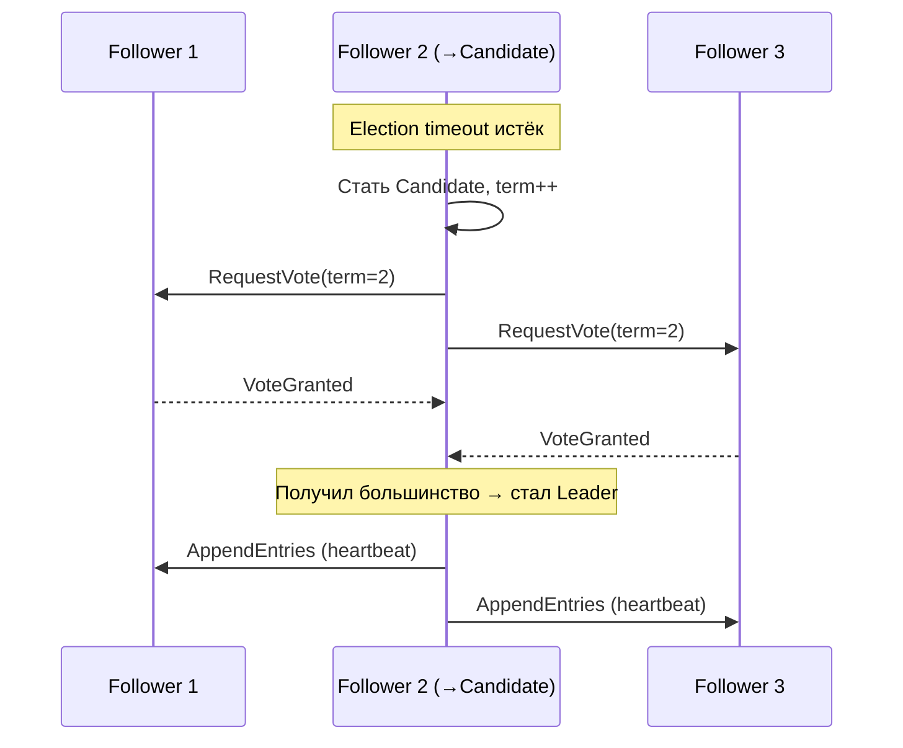

**Log Replication (репликация лога):**
1. Клиент отправляет команду лидеру
2. Лидер добавляет в свой лог (uncommitted)
3. Рассылает `AppendEntries` фолловерам
4. После подтверждения кворумом (`N/2 + 1`) — `commit`
5. Применяет к state machine, отвечает клиенту

**Ключевые свойства:**
- **Term** — монотонно возрастающий номер эпохи; устаревшие лидеры отвергаются
- **Log matching** — если два лога имеют одинаковый index и term, все предыдущие записи идентичны
- **Leader completeness** — избранный лидер всегда имеет все committed записи

```java
// Условие победы на выборах (псевдокод)
boolean grantVote(RequestVote request) {
    if (request.term < currentTerm) return false;
    if (votedFor != null && !votedFor.equals(request.candidateId)) return false;
    // Кандидат должен иметь лог не хуже нашего
    return request.lastLogIndex >= log.lastIndex()
        && request.lastLogTerm >= log.lastTerm();
}
```

## Q28. Чем Paxos отличается от Raft?

`Paxos` (Лесли Лампорт, 1989) и `Raft` — два алгоритма консенсуса для репликации лога в распределённых системах.

| Характеристика | `Paxos` | `Raft` |
|----------------|---------|--------|
| Понятность | Сложный; много вариантов | Спроектирован для понятности |
| Лидер | Опциональный (Multi-Paxos) | Обязательный |
| Выборы | Пофазово (Prepare/Promise/Accept) | За один раунд с термами |
| Применение на практике | `Chubby` (Google), `ZooKeeper` (ZAB ≈ Paxos) | `etcd`, `CockroachDB`, `TiKV` |
| Гарантии | Safety в асинхронных сетях | Safety + Liveness при кворуме |

**Фазы классического Paxos (Single-Decree):**
1. **Prepare(n)** — proposer рассылает номер предложения; acceptors отвечают Promise
2. **Accept(n, v)** — proposer выбирает значение с наибольшим номером из Promise; acceptors принимают
3. **Learn** — learners узнают принятое значение

**Проблемы Paxos на практике:**
- Multi-Paxos (для лога) существенно сложнее Single-Decree
- Много деталей не специфицированы (reconfiguration, leader election)
- Оригинальная статья описана через метафору с греческим парламентом — намеренно сложно

`Raft` явно разделяет проблемы: `leader election`, `log replication`, `safety` — что упрощает реализацию и тестирование.

## Q29. (!) Что такое Two-Phase Commit (2PC) в контексте распределённых систем?

`2PC` (`Two-Phase Commit`) — протокол для атомарного выполнения распределённых транзакций: все участники либо коммитят, либо откатываются.

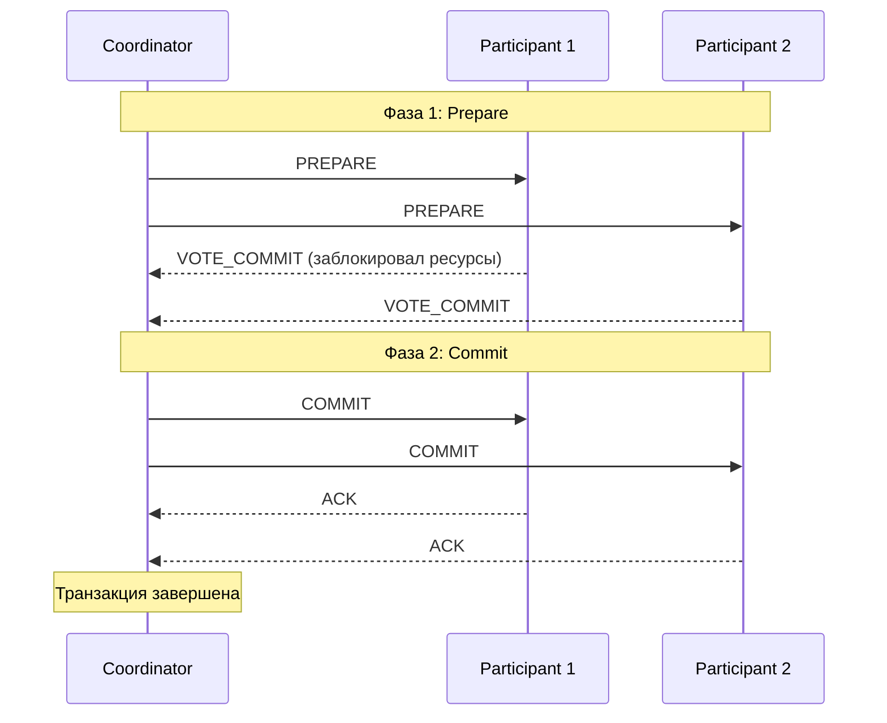

**Проблемы 2PC:**
1. **Blocking protocol** — если координатор упал после PREPARE, участники заблокированы до восстановления
2. **SPOF координатора** — без координатора участники не знают, коммитить или откатывать
3. **Производительность** — 2 раунда сообщений + синхронная запись на диск
4. **Не масштабируется** — каждый участник блокирует ресурсы до завершения протокола

**Сравнение с Saga:**

| Критерий | `2PC` | `Saga` |
|----------|-------|--------|
| Изоляция | Да (ACID) | Нет (возможны «грязные» промежуточные состояния) |
| Доступность при сбоях | Низкая (блокировка) | Высокая (компенсации) |
| Задержки | Высокие | Низкие |
| Сложность реализации | Средняя | Высокая (компенсирующие транзакции) |
| Применение | Локальные DB, XA | Микросервисы, long-running |

**Применение:** `JTA`/`XA` в Java EE, `PostgreSQL` с `prepared transactions`, `MySQL` с `XA`. В микросервисах практически не используют из-за проблем масштабируемости.

## Q30. (!) Что такое Saga в распределённых системах?

`Saga` — паттерн управления распределёнными транзакциями без блокировки ресурсов. Длинная транзакция разбивается на последовательность **локальных транзакций**, каждая из которых публикует событие или вызывает следующий шаг. При сбое выполняются **компенсирующие транзакции** в обратном порядке.

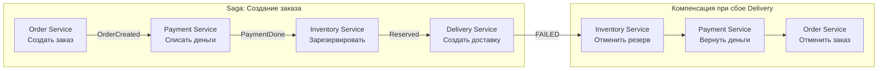

**Два стиля:**
- **Хореография** — каждый сервис слушает события и публикует новые; нет центрального координатора; подходит для простых потоков
- **Оркестрация** — центральный `Saga Orchestrator` явно вызывает каждый шаг и обрабатывает ошибки; проще отлаживать, но добавляет зависимость

**Ключевые требования:**
- Каждая локальная транзакция **идемпотентна** (повторная доставка события)
- Компенсирующие транзакции тоже идемпотентны
- Промежуточные состояния видимы другим сервисам (нет изоляции!)

```java
// Оркестратор Saga (Spring State Machine / Axon / самописный)
@Component
public class CreateOrderSaga {

    @StartSaga
    @SagaEventHandler(associationProperty = "orderId")
    public void handle(OrderCreatedEvent event) {
        SagaLifecycle.associateWith("orderId", event.orderId().toString());
        commandGateway.send(new ProcessPaymentCommand(event.orderId(), event.amount()));
    }

    @SagaEventHandler(associationProperty = "orderId")
    public void handle(PaymentProcessedEvent event) {
        commandGateway.send(new ReserveInventoryCommand(event.orderId(), event.items()));
    }

    @SagaEventHandler(associationProperty = "orderId")
    public void handle(PaymentFailedEvent event) {
        commandGateway.send(new CancelOrderCommand(event.orderId()));
        SagaLifecycle.end();
    }
}
```

## Q31. Что такое FLP-теорема и какой вывод из неё следует?

**FLP-теорема** (Fischer, Lynch, Paterson, 1985) — фундаментальный результат теории распределённых вычислений: **в полностью асинхронной системе с возможностью отказа хотя бы одного узла невозможно достичь консенсуса** (гарантированно завершиться за конечное время).

**Формально:** нет детерминированного алгоритма, который всегда достигает консенсуса в асинхронной модели при возможности сбоя одного процесса.

**Практический смысл:**
- Не существует «идеального» алгоритма консенсуса — все алгоритмы идут на компромисс
- `Paxos`, `Raft` обходят FLP через **рандомизацию** (случайные таймауты) или **частичную синхронность** (bounded network delay)
- `Paxos` может зациклиться (livelock) — два proposer'а постоянно перебивают друг друга; решение — выбор уникального лидера

**Вывод для практики:** таймауты в Raft (randomized election timeout) — не баг, а намеренный механизм выхода из ситуации, запрещённой FLP для детерминированных систем.

## Q32. Что такое Byzantine Fault Tolerance (BFT)?

**Byzantine fault** — отказ, при котором узел ведёт себя **произвольно и злонамеренно**: отправляет противоречивые данные разным узлам, не отвечает, изменяет данные. Назван по «задаче о Византийских генералах» (Лампорт).

**Отличие от crash fault:**
| Тип отказа | Поведение | Алгоритм |
|-----------|-----------|----------|
| Crash fault | Узел просто останавливается | `Raft`, `Paxos` (`2f+1` узлов для f сбоев) |
| Byzantine fault | Узел шлёт произвольные/ложные данные | `PBFT`, `BFT-Raft` (`3f+1` узлов) |

**Условие:** для tolerating `f` Byzantine узлов нужно минимум `3f + 1` узлов (vs `2f + 1` для crash fault).

**Применение:**
- `Blockchain` (Bitcoin PoW, Ethereum PoS) — BFT в публичных ненадёжных сетях
- `Hyperledger Fabric` — PBFT для permissioned blockchain
- Авиационные/космические системы — hardware BFT

---

## Q33. Gossip протокол: как работает и где применяется

**Gossip protocol** (эпидемический протокол) — децентрализованный протокол распространения информации, при котором каждый узел периодически выбирает случайных соседей и обменивается с ними состоянием. Информация распространяется как эпидемия.

**Принцип работы:**
1. Каждые `T` миллисекунд узел выбирает `k` случайных узлов (fan-out)
2. Отправляет им своё состояние (или дельту изменений)
3. Получатели обновляют своё состояние и на следующем цикле распространяют дальше
4. За `O(log N)` раундов информация достигает всех `N` узлов

**Характеристики:**
- **Eventual consistency:** информация распространяется постепенно, без гарантии момента
- **Высокая отказоустойчивость:** нет единой точки отказа, работает при частичных сбоях
- **Масштабируемость:** каждый узел общается только с `k` соседями, нагрузка O(k·N)

**Применение:**
- **Cassandra:** использует gossip для обнаружения членов кольца, распространения информации о topology и состоянии узлов (живой/мёртвый). Порт 7000.
- **Redis Cluster:** gossip для распространения информации о слотах, обнаружения failover
- **Consul:** gossip (SWIM protocol) для health checking и membership
- **Amazon DynamoDB:** внутри для распространения версий данных

**Типы gossip:**
- **Push:** узел рассылает своё состояние
- **Pull:** узел запрашивает состояние у соседей
- **Push-Pull:** обмен в обе стороны (наиболее эффективен)

---

## Q34. Raft vs Paxos: ключевые отличия

| Характеристика | Raft | Paxos |
|----------------|------|-------|
| Сложность понимания | Низкая (designed for understandability) | Высокая |
| Лидер | Явный, единственный | Может быть несколько proposer'ов |
| Log replication | Строгая последовательность | Возможны "дыры" в log (Multi-Paxos заполняет) |
| Leader election | Randomized timeout | Произвольный proposer |
| Спецификация | Полная, единая | Базовая Paxos не описывает многие детали |
| Liveness | Гарантирована при правильном выборе таймаутов | Возможен livelock двух proposer'ов |

**Raft:**
- Разработан Диего Онгаро и Джоном Оустерхаутом (2013) с явной целью: understandable consensus
- Три роли: **Leader**, **Follower**, **Candidate**
- Leader управляет всей репликацией log — единственный, кто принимает записи от клиентов
- Применяется: **etcd** (Kubernetes), **CockroachDB**, **TiKV**, **Consul**

**Paxos:**
- Лесли Лампорт (1989, опубликован 1998)
- Базовый Paxos решает один consensus instance (одно значение)
- Multi-Paxos — расширение для replicated log (реализовать сложнее)
- Применяется: **Google Chubby**, **Google Spanner**, **Apache Zookeeper** (ZAB — вариация Paxos)

**Практический вывод:** для новых систем чаще выбирают Raft из-за простоты реализации и отладки. Paxos встречается в legacy и крупных Google-системах.

---

## Q35. Leader Election: алгоритмы, Bully, координация

**Leader Election** — процесс выбора единственного узла-координатора (лидера) среди равноправных узлов распределённой системы.

**Зачем нужен лидер:**
- Координация распределённых транзакций
- Управление распределёнными блокировками
- Единственная точка принятия решений (избегает split-brain)

**Bully Algorithm (Алгоритм хулигана):**
```
Предпосылка: каждый узел имеет уникальный числовой ID; узел с наибольшим ID побеждает.

1. Узел обнаруживает, что лидер недоступен
2. Отправляет ELECTION сообщение всем узлам с бОльшим ID
3. Если нет ответа — объявляет себя лидером (COORDINATOR сообщение)
4. Если получает ELECTION — отвечает OK и сам запускает выборы
5. Узел с наибольшим ID всегда побеждает ("bully")

Недостатки: O(N²) сообщений в худшем случае; узел с большим ID может быть медленным.
```

**Ring Algorithm:**
- Узлы организованы в логическое кольцо
- ELECTION сообщение передаётся по кольцу, каждый добавляет свой ID
- Узел, получивший своё собственное сообщение с наибольшим ID, становится лидером

**Raft leader election (практический стандарт):**
- Randomized election timeout (150-300ms)
- Кандидат запрашивает голоса (`RequestVote RPC`)
- Для победы нужен кворум (большинство узлов)
- Term number предотвращает split-brain

**Готовые реализации:**
- **etcd/Consul** — через Raft; клиенты используют etcd-lock или Consul sessions
- **ZooKeeper** — ephemeral node: кто создал `/leader` — тот лидер
- **Spring Integration:** `LockRegistry` через Redis/JDBC для distributed lock

```java
// Leader election через Spring Integration
@Bean
public LeaderInitiator leaderInitiator(CuratorFramework client) {
    return new LeaderInitiator(client, new DefaultLeaderEventPublisher());
}

@EventListener
public void onLeaderEvent(OnGrantedEvent event) {
    // этот экземпляр стал лидером
}
```

---

## Q36. Idempotency Keys: паттерн для надёжности распределённых операций

**Idempotency Key** — уникальный идентификатор операции, позволяющий безопасно повторять запросы без риска дублирования эффекта.

**Проблема:** при сбоях сети клиент не знает, выполнилась ли операция (платёж, создание заказа). Retry без idempotency → дублирование.

**Паттерн:**
```
Client → POST /payments
         Header: Idempotency-Key: "uuid-1234-..."
         Body: { amount: 100, currency: "RUB" }

Server:
1. Проверить наличие ключа в БД (idempotency_keys table)
2. Если есть → вернуть сохранённый ответ (без повторного выполнения)
3. Если нет → выполнить операцию, сохранить {key, response, expires_at}
```

**Реализация в Spring:**
```java
@PostMapping("/payments")
public ResponseEntity<PaymentResponse> createPayment(
    @RequestHeader("Idempotency-Key") String idempotencyKey,
    @RequestBody PaymentRequest request
) {
    return idempotencyService.executeOnce(idempotencyKey, () -> {
        PaymentResponse response = paymentService.process(request);
        return ResponseEntity.ok(response);
    });
}

@Service
public class IdempotencyService {
    public <T> T executeOnce(String key, Supplier<T> operation) {
        // Atomic check-and-insert (SELECT FOR UPDATE или уникальный индекс)
        Optional<IdempotencyRecord> existing = repo.findByKey(key);
        if (existing.isPresent()) {
            return deserialize(existing.get().getResponse());
        }
        T result = operation.get();
        repo.save(new IdempotencyRecord(key, serialize(result), ttl));
        return result;
    }
}
```

**Важные детали:**
- TTL для ключей (24 часа — типичное значение)
- Ключ должен быть уникальным для каждой бизнес-операции, а не для endpoint
- Проблема конкурентных дубликатов: уникальный индекс + обработка `DataIntegrityViolationException`
- **Stripe, Adyen** — широко используют этот паттерн в платёжном API

---

## Q37. Two-Phase Commit (2PC) vs Saga: Trade-offs

**Two-Phase Commit (2PC):**
```
Coordinator → все участники: PREPARE (можете закоммитить?)
Участники   → Coordinator: YES / NO (блокируют ресурсы)
Coordinator → все участники: COMMIT (если все YES) / ROLLBACK (если хоть один NO)
```

**Проблемы 2PC:**
- **Blocking protocol:** при падении координатора после PREPARE участники заблокированы навсегда
- **Single point of failure:** координатор — SPOF
- **Низкая производительность:** две фазы сетевых round-trip + блокировка ресурсов
- **Не подходит для микросервисов:** сервисы с разными БД, долгоживущие транзакции

**Saga:**
```
Последовательность локальных транзакций с компенсирующими действиями:

T1 (Order) → T2 (Payment) → T3 (Inventory)
       ↓ если T3 fail
C2 (Refund) ← C1 (Cancel Order)   ← компенсации
```

| Критерий | 2PC | Saga |
|----------|-----|------|
| Согласованность | Сильная (ACID) | Eventual |
| Доступность | Низкая (блокировки) | Высокая |
| Производительность | Низкая | Высокая |
| Откат | Автоматический ROLLBACK | Компенсирующие транзакции |
| Частичные сбои | Блокировка | Explicit handling |
| Применение | Единая БД, XA | Микросервисы |

**Saga реализации:**
- **Choreography:** события в Kafka/RabbitMQ, каждый сервис слушает и реагирует (loose coupling, сложная отладка)
- **Orchestration:** центральный оркестратор (Axon Framework, Temporal) управляет шагами (explicit flow, coupling к оркестратору)

**Вывод:** 2PC применим для локальных XA-транзакций (одна БД + очередь). Saga — стандарт де-факто для распределённых транзакций в микросервисах.

---

## Q38. Distributed Transactions: XA и Outbox Pattern

**XA Transactions:**
XA — стандарт X/Open для распределённых транзакций. Координирует несколько resource managers (БД, JMS) в одной глобальной транзакции.

```java
// Spring Boot + Atomikos (XA)
@Bean
public AtomikosDataSourceBean xaDataSource() {
    AtomikosDataSourceBean ds = new AtomikosDataSourceBean();
    ds.setXaDataSourceClassName("org.postgresql.xa.PGXADataSource");
    ds.setUniqueResourceName("postgresql");
    return ds;
}

@Transactional  // JTA транзакция — покрывает БД + JMS атомарно
public void processOrder(Order order) {
    orderRepo.save(order);           // XA resource 1: PostgreSQL
    jmsTemplate.send("orders", msg); // XA resource 2: ActiveMQ
}   // Coordinator (Atomikos) выполняет 2PC под капотом
```

**Проблемы XA:** медленно, сложно в K8s, не поддерживается NoSQL.

**Outbox Pattern (рекомендуемый подход):**
```
Идея: запись в БД и публикация события — одна локальная транзакция.
Отдельный процесс (relay) читает outbox и публикует в брокер.

┌─────────────────────────────────────────┐
│ Единая локальная транзакция:            │
│  INSERT INTO orders (...)               │
│  INSERT INTO outbox_events              │
│    (event_type, payload, status=PENDING)│
└─────────────────────────────────────────┘
        ↓ Transactional Outbox Relay
┌──────────────────────────┐
│ SELECT * FROM outbox      │
│   WHERE status = 'PENDING'│
│ → publish to Kafka        │
│ → UPDATE status = 'SENT' │
└──────────────────────────┘
```

**Реализация с Debezium (CDC):**
- Debezium читает WAL PostgreSQL, публикует изменения outbox-таблицы в Kafka
- Нет polling — минимальная задержка
- Exactly-once при правильной конфигурации Kafka consumer

**Outbox vs Saga:** Outbox — механизм атомарной публикации событий. Saga — паттерн оркестрации компенсаций. Они дополняют друг друга.

---

## Q39. Backpressure в распределённых системах: механизмы

**Backpressure** — механизм, при котором downstream (потребитель) сигнализирует upstream (производителю) о своей пропускной способности, предотвращая перегрузку.

**Проблема без backpressure:**
- Producer быстрее Consumer → очереди переполняются → OOM / latency spikes
- В распределённой системе — каскадные сбои (cascade failure)

**Механизмы backpressure:**

1. **Pull-based модель (Kafka):**
   - Consumer сам запрашивает следующую порцию (`poll()`)
   - Consumer контролирует скорость чтения
   - Producer пишет в брокер, не зная о скорости Consumer

2. **Reactive Streams / Project Reactor:**
```java
Flux.fromStream(dataStream)
    .onBackpressureBuffer(1000,           // буфер 1000 элементов
        dropped -> log.warn("Dropped: {}", dropped),
        BufferOverflowStrategy.DROP_OLDEST)
    .publishOn(Schedulers.boundedElastic())
    .subscribe(this::process);
```

3. **Rate Limiting (Resilience4j):**
```java
RateLimiter limiter = RateLimiter.of("downstream",
    RateLimiterConfig.custom()
        .limitForPeriod(100)         // 100 запросов
        .limitRefreshPeriod(Duration.ofSeconds(1))
        .timeoutDuration(Duration.ofMillis(500))
        .build());
```

4. **Circuit Breaker как backpressure:** при открытом CB upstream получает быстрый отказ вместо ожидания

5. **gRPC flow control:** HTTP/2 window-based flow control встроен в протокол

**Паттерны в Kafka:**
- `max.poll.records` — ограничение порции
- `fetch.max.bytes` — ограничение размера fetch
- Lag monitoring → автоскейлинг consumer group

---

## Q40. Consistent Hashing: virtual nodes и hotspots

**Consistent Hashing** — алгоритм распределения данных по узлам, при котором добавление/удаление узла перераспределяет минимальное количество ключей.

**Обычный hashing:** `node = hash(key) % N`. При изменении N перераспределяются почти все ключи.

**Consistent Hashing:**
```
Кольцо [0, 2³²): hash(node) → позиция на кольце
Ключ → hash(key) → ищем следующий узел по часовой стрелке
```

**Virtual Nodes (vnodes):**
```
Проблема без vnodes: неравномерное распределение при малом числе узлов.

Решение: каждый физический узел → N виртуальных позиций на кольце.
Node A: A1, A2, A3, A4, A5 ... A150
Node B: B1, B2, B3, B4, B5 ... B150
Node C: C1, C2, C3, C4, C5 ... C150

При добавлении Node D: забирает часть vnodes у каждого существующего узла.
Данные перераспределяются равномерно.
```

**Применение:**
- **Cassandra:** `num_tokens: 256` vnodes по умолчанию; ключи → hash → vnode → физический узел
- **DynamoDB:** consistent hashing для partition keys
- **Redis Cluster:** 16384 hash slots, каждый узел отвечает за диапазон

**Hotspots:**
```
Проблема: если ключи неравномерны (например, userId "admin" → всегда один узел)

Решения:
1. Составной ключ: key = prefix + salt (random suffix)
2. Keyspace разбивка: одна операция → несколько shard keys
3. Cassandra: partition key должен иметь высокую cardinality
4. DynamoDB: write sharding — добавить случайный суффикс к partition key
```

**Мониторинг hotspots в Cassandra:**
```bash
nodetool tablestats keyspace.table | grep "SSTable count"
# Неравное распределение SSTables → hotspot
```

**Сравнение с Range-based sharding:**
| | Consistent Hashing | Range Sharding |
|--|--|--|
| Range queries | Плохо (данные рассеяны) | Хорошо (локальность) |
| Hotspot риск | Средний (с vnodes — низкий) | Высокий (hot partition) |
| Rebalancing | Минимальное | Значительное |

---

## See also

- [Микросервисная архитектура](microservices-interview.md) — паттерны межсервисного взаимодействия и отказоустойчивости
- [CAP-теорема](cap-theorem-interview.md) — ограничения распределённых систем: C, A, P компромиссы
- [Паттерны согласованности](consistency-patterns-interview.md) — 2PC, Saga, Outbox, eventual consistency
- [Event-Driven паттерны](event-driven-patterns-interview.md) — асинхронное взаимодействие в распределённых системах
- [Паттерны отказоустойчивости](resilience-patterns-interview.md) — Circuit Breaker, Retry, Bulkhead
- [CQRS и Event Sourcing](cqrs-event-sourcing-interview.md) — CQRS и Event Sourcing для масштабируемых систем

В обычных корпоративных распределённых системах Byzantine faults не рассматривают: предполагается, что узлы принадлежат одной доверенной среде (datacenter). Достаточно crash fault tolerance через `Raft`/`Paxos`.

- [API Gateway](api-gateway-interview.md)
- [BFF Pattern](bff-pattern-interview.md)
- [Стратегии кэширования](caching-strategies-interview.md)
- [CAP-теорема](cap-theorem-interview.md)
- [Clean Architecture](clean-architecture-interview.md)
- [Паттерны согласованности](consistency-patterns-interview.md)
