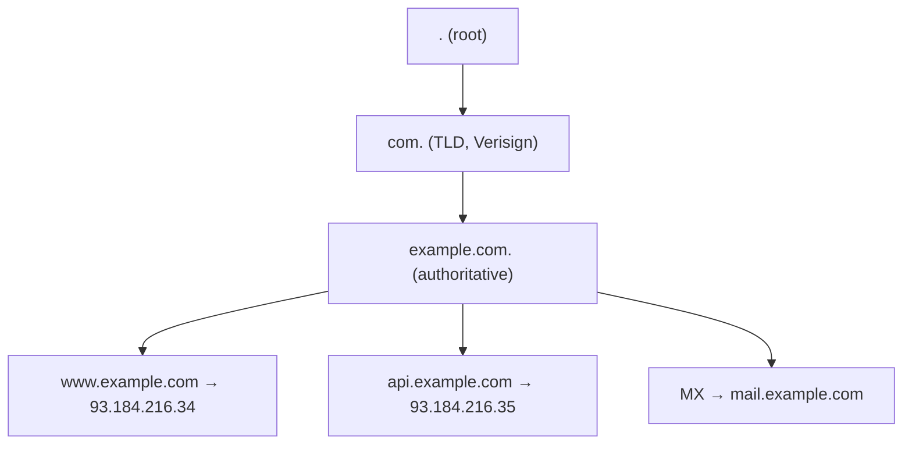
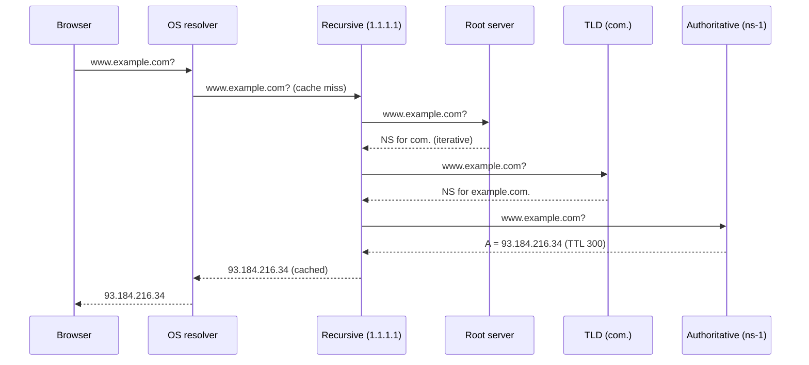
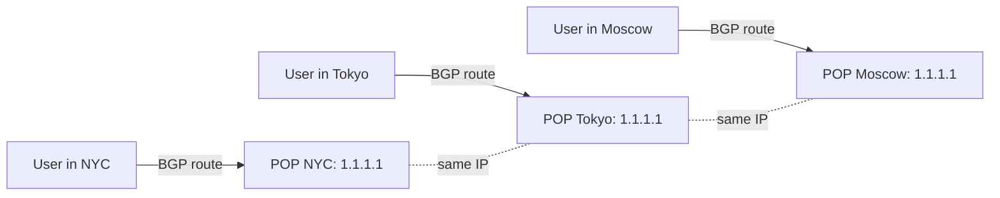

# Вопросы на собеседовании: `DNS`

`DNS` (Domain Name System) — иерархический распределённый каталог, который переводит `example.com` в `93.184.216.34`. На system design интервью DNS всплывает почти всегда: load balancing, GeoDNS, Anycast, failover, DDoS, безопасность (DNSSEC, DoH/DoT). Реальные инциденты — Dyn DDoS 2016, Facebook 2021 (DNS+BGP, 6 часов downtime), Cloudflare 1.1.1.1 outages — показывают, что DNS это **single point of failure для всего интернета**, если не задизайнить правильно.

## Полезные ссылки

- [Cloudflare Learning: What is DNS?](https://www.cloudflare.com/learning/dns/what-is-dns/)
- [RFC 1034 — DNS Concepts](https://datatracker.ietf.org/doc/html/rfc1034)
- [RFC 1035 — DNS Implementation](https://datatracker.ietf.org/doc/html/rfc1035)
- [RFC 4033 — DNSSEC Introduction](https://datatracker.ietf.org/doc/html/rfc4033)
- [RFC 8484 — DNS over HTTPS (DoH)](https://datatracker.ietf.org/doc/html/rfc8484)
- [AWS Route 53 — Routing policies](https://docs.aws.amazon.com/Route53/latest/DeveloperGuide/routing-policy.html)
- [system-design-primer: DNS](https://github.com/donnemartin/system-design-primer#domain-name-system)
- [APNIC Anycast guide](https://blog.apnic.net/2020/09/22/dns-anycast-the-not-so-obvious-considerations/)

## Содержание

- [Полезные ссылки](#полезные-ссылки)
- [See also](#see-also)

**Основы и иерархия**
- [Q1. (!) Что такое DNS и зачем он нужен?](#q1--что-такое-dns-и-зачем-он-нужен)
- [Q2. (!) Иерархия DNS: root → TLD → authoritative](#q2--иерархия-dns-root--tld--authoritative)
- [Q3. (!) Recursive vs iterative resolver](#q3--recursive-vs-iterative-resolver)
- [Q4. (!) Полный flow DNS-резолюции](#q4--полный-flow-dns-резолюции)
- [Q5. Что такое глобальные публичные resolver-ы (1.1.1.1, 8.8.8.8, 9.9.9.9)?](#q5-что-такое-глобальные-публичные-resolver-ы-1111-8888-9999)

**Record types и кеширование**
- [Q6. (!) A vs AAAA vs CNAME — основные record types](#q6--a-vs-aaaa-vs-cname--основные-record-types)
- [Q7. MX, TXT (SPF/DKIM/DMARC), NS, SOA](#q7-mx-txt-spfdkimdmarc-ns-soa)
- [Q8. SRV, PTR, CAA, ALIAS/ANAME](#q8-srv-ptr-caa-aliasaname)
- [Q9. (!) TTL и кеширование](#q9--ttl-и-кеширование)
- [Q10. Negative caching и его подводные камни](#q10-negative-caching-и-его-подводные-камни)
- [Q11. (!) DNS propagation — что это и почему «48 часов»?](#q11--dns-propagation--что-это-и-почему-48-часов)
- [Q12. CNAME flattening и проблема apex/zone apex](#q12-cname-flattening-и-проблема-apexzone-apex)

**Load balancing / GeoDNS / Anycast**
- [Q13. (!) DNS-based load balancing: round-robin, weighted, latency-based](#q13--dns-based-load-balancing-round-robin-weighted-latency-based)
- [Q14. (!) GeoDNS / Geolocation routing](#q14--geodns--geolocation-routing)
- [Q15. (!) Anycast vs Unicast — зачем root и публичные resolver-ы используют anycast](#q15--anycast-vs-unicast--зачем-root-и-публичные-resolver-ы-используют-anycast)
- [Q16. Health-check-driven DNS failover (Route 53)](#q16-health-check-driven-dns-failover-route-53)
- [Q17. EDNS Client Subnet (ECS) — почему CDN зависит от resolver location](#q17-edns-client-subnet-ecs--почему-cdn-зависит-от-resolver-location)
- [Q18. Managed DNS providers: Route 53, Cloudflare, NS1, Akamai, Dyn](#q18-managed-dns-providers-route-53-cloudflare-ns1-akamai-dyn)
- [Q19. Private DNS (Route 53 private zones) vs service discovery](#q19-private-dns-route-53-private-zones-vs-service-discovery)
- [Q20. SRV-records и service discovery (Consul, Kubernetes CoreDNS)](#q20-srv-records-и-service-discovery-consul-kubernetes-coredns)

**Безопасность (DNSSEC, DoH/DoT)**
- [Q21. (!) DNS spoofing / cache poisoning / Kaminsky attack](#q21--dns-spoofing--cache-poisoning--kaminsky-attack)
- [Q22. (!) DNSSEC — RRSIG, DS, KSK/ZSK](#q22--dnssec--rrsig-ds-kskzsk)
- [Q23. (!) DNS-over-HTTPS (DoH), DNS-over-TLS (DoT), DNS-over-QUIC](#q23--dns-over-https-doh-dns-over-tls-dot-dns-over-quic)
- [Q24. DDoS via DNS amplification и защита](#q24-ddos-via-dns-amplification-и-защита)
- [Q25. Reverse DNS (PTR) — email reputation, logging](#q25-reverse-dns-ptr--email-reputation-logging)

**Диагностика и практика**
- [Q26. (!) dig / nslookup / drill / kdig — практическая диагностика](#q26--dig--nslookup--drill--kdig--практическая-диагностика)
- [Q27. Latency budget DNS-резолюции (cold vs warm)](#q27-latency-budget-dns-резолюции-cold-vs-warm)
- [Q28. OS resolver: nscd, systemd-resolved, browser DNS cache](#q28-os-resolver-nscd-systemd-resolved-browser-dns-cache)
- [Q29. Как ускорить «48-часовой» switchover (lowering TTL заранее)](#q29-как-ускорить-48-часовой-switchover-lowering-ttl-заранее)
- [Q30. Реальные incident-ы: Dyn 2016, Facebook 2021, Route 53, Cloudflare BGP 2020](#q30-реальные-incident-ы-dyn-2016-facebook-2021-route-53-cloudflare-bgp-2020)

## Q1. (!) Что такое DNS и зачем он нужен?

`DNS` — иерархическая распределённая система, переводящая **человеко-понятные имена** (`example.com`) в **IP-адреса** (`93.184.216.34` / `2606:2800:220:1::5`).

**Зачем:**
- IP меняются (failover, ребалансировка), имена — стабильны.
- Один домен → много IP (load balancing, GeoDNS).
- Логические уровни: `api.example.com`, `mail.example.com` — разные сервисы.
- Маршрутизация через CNAME / ALIAS на managed-сервисы (CDN, ALB).

**Архитектурно:**
```
example.com → DNS resolver → 93.184.216.34
              ↑ кеш, иерархия, репликация
```

**Ключевая мысль:** DNS — **первый шаг любого HTTP-запроса**. Если DNS лёг — лежит всё (см. Facebook 2021).

## Q2. (!) Иерархия DNS: root → TLD → authoritative

DNS — **дерево**. Резолюция идёт сверху вниз.

**Уровни:**
1. **Root** (`.`) — 13 logical серверов (`a.root-servers.net`...`m.root-servers.net`), на самом деле сотни физических через Anycast. Знают, где TLD.
2. **TLD** (Top-Level Domain) — `com.`, `org.`, `ru.`, `io.`. Управляются registry-операторами (Verisign для `.com`).
3. **Authoritative** — серверы конкретной зоны (`ns-1.example.com`). Хранят реальные записи.

**Пример для `www.example.com`:**
```
www.example.com.
└── example.com.   (authoritative ns)
    └── com.       (TLD)
        └── .      (root)
```

Точка в конце (`example.com.`) — fully qualified domain name (FQDN), маркер корня.

**Делегирование** через `NS`-записи: `com.` говорит «за `example.com` отвечают `ns-1.example.com`, `ns-2.example.com`».



## Q3. (!) Recursive vs iterative resolver

Два разных режима резолюции — путать **очень частая ошибка на собесе**.

**Recursive resolver (полный «слуга»):**
- Получает запрос от клиента, **сам** обходит всю иерархию (root → TLD → authoritative).
- Возвращает клиенту **финальный ответ**.
- Кеширует результат.
- Примеры: `1.1.1.1` (Cloudflare), `8.8.8.8` (Google), DNS-серверы ISP, локальный `systemd-resolved`.

**Iterative resolver (даёт «следующий шаг»):**
- Получает запрос, отвечает **«не знаю, но спроси вот этих»** (NS-записи следующего уровня).
- Клиент сам идёт дальше.
- Так работают **root** и **TLD** серверы — они никогда не делают рекурсию для тебя.

**Flow:**
```
Client → Recursive resolver (1.1.1.1) → root (iterative: "go ask com.")
                                      → com.  (iterative: "go ask ns-1.example.com")
                                      → ns-1.example.com (authoritative: "93.184.216.34")
                                      ← cached, returned to Client
```

**Почему важно:** на собесе вопрос «кто делает работу обхода иерархии?» — почти всегда recursive resolver (вне зависимости от ISP, корпоратив, public DNS).

## Q4. (!) Полный flow DNS-резолюции

Канонический вопрос: **«что происходит, когда я набираю `www.example.com` в браузере?»** (часть до HTTP).

**Шаги (для cold cache):**
1. **Browser cache** — Chrome держит свой DNS-кеш (~60s по умолчанию). `chrome://net-internals/#dns`.
2. **OS resolver cache** — `systemd-resolved` (Linux), `dnsmasq`/`nscd`, `mDNSResponder` (macOS).
3. **`/etc/hosts`** — статика, override.
4. **Recursive resolver** (ISP / 1.1.1.1) — если у него в кеше нет:
   - **Root** (`.`): «спроси `com.`».
   - **TLD** (`com.`): «спроси `ns-1.example.com`».
   - **Authoritative** (`ns-1.example.com`): «`93.184.216.34`».
5. Resolver кеширует ответ на TTL (например, 300s).
6. Возвращает IP клиенту.
7. Браузер открывает TCP к `93.184.216.34:443`.

**Latency:**
- Warm cache (OS): <1ms
- Warm cache (recursive): 5-20ms
- Cold cache (полный обход): 50-200ms



**Команда для трассировки:**
```bash
dig +trace www.example.com
```

## Q5. Что такое глобальные публичные resolver-ы (1.1.1.1, 8.8.8.8, 9.9.9.9)?

Бесплатные recursive resolver-ы, доступные всем.

| Resolver | Провайдер | Особенность |
|----------|-----------|-------------|
| `1.1.1.1` / `1.0.0.1` | Cloudflare | Самый быстрый (Anycast 300+ POPs), DoH/DoT, privacy-focused |
| `8.8.8.8` / `8.8.4.4` | Google | Самый известный, DoH/DoT, отличный uptime |
| `9.9.9.9` / `149.112.112.112` | Quad9 | Блокирует known-malicious домены (security) |
| `208.67.222.222` | OpenDNS (Cisco) | Family-filter, parental control |

**Trade-offs:**
- **Privacy:** Cloudflare и Quad9 декларируют «логи не храним»; Google логирует.
- **Speed:** обычно `1.1.1.1` быстрее за счёт более плотной anycast-сети.
- **EDNS Client Subnet:** Google поддерживает, Cloudflare — нет (важно для CDN, см. Q17).
- **Cenzura/filtering:** Quad9 фильтрует malicious; в РФ — отдельный вопрос с провайдерскими DNS.

**Когда использовать:** failover ISP DNS, обход кривого корпоративного DNS, тестирование (`dig @1.1.1.1`).

## Q6. (!) A vs AAAA vs CNAME — основные record types

**`A` (Address)** — имя → IPv4.
```
example.com.  300  IN  A  93.184.216.34
```

**`AAAA` (Quad-A)** — имя → IPv6.
```
example.com.  300  IN  AAAA  2606:2800:220:1::5
```

**`CNAME` (Canonical Name)** — alias на другое имя.
```
www.example.com.  300  IN  CNAME  example.com.
```
- При резолюции `www.example.com` resolver получит CNAME, потом резолвит `example.com` → A/AAAA.
- **Ограничения:** на зоне apex (например, `example.com` без `www.`) CNAME запрещён по RFC 1034 — там должна быть A/AAAA (или ALIAS/ANAME у провайдера, см. Q12).
- На одном имени может быть **только один CNAME** и **никаких других** record types (кроме DNSSEC).

**Когда что использовать:**
- A/AAAA — для конечных IP.
- CNAME — для алиасов на managed-сервисы (ALB, CloudFront, Heroku), чтобы провайдер мог менять IP без правок твоей зоны.

## Q7. MX, TXT (SPF/DKIM/DMARC), NS, SOA

**`MX` (Mail Exchanger)** — куда слать почту для домена.
```
example.com.  3600  IN  MX  10 mail1.example.com.
example.com.  3600  IN  MX  20 mail2.example.com.
```
- Цифра — приоритет (меньше = выше).
- На правую часть **должно** указывать имя, не IP.

**`TXT` (Text)** — произвольный текст. На практике три критичных применения:
- **SPF** (`v=spf1 include:_spf.google.com -all`) — какие сервера могут слать почту от твоего домена.
- **DKIM** (`v=DKIM1; k=rsa; p=MIGfMA0G...`) — публичный ключ для подписи писем.
- **DMARC** (`v=DMARC1; p=reject; rua=mailto:...`) — политика для писем, не прошедших SPF/DKIM.

**`NS` (Name Server)** — какие серверы authoritative для этой зоны.
```
example.com.  86400  IN  NS  ns-1.example.com.
example.com.  86400  IN  NS  ns-2.example.com.
```

**`SOA` (Start of Authority)** — метаданные зоны: primary NS, email админа, serial, refresh/retry/expire, minimum TTL.
```
example.com.  86400  IN  SOA  ns-1.example.com. hostmaster.example.com. 2024042701 7200 3600 1209600 300
```

## Q8. SRV, PTR, CAA, ALIAS/ANAME

**`SRV` (Service)** — service discovery. Указывает host + port + priority + weight для **именованного сервиса**.
```
_sip._tcp.example.com. 86400 IN SRV 10 5 5060 sipserver.example.com.
                                    ↑  ↑    ↑
                                  prio weight port
```
- Используется в SIP, XMPP, Kerberos, **Consul DNS interface**, **Kubernetes CoreDNS**.

**`PTR` (Pointer)** — reverse DNS: IP → имя. Живёт в зоне `in-addr.arpa.` (IPv4) или `ip6.arpa.` (IPv6).
```
34.216.184.93.in-addr.arpa. 3600 IN PTR example.com.
```

**`CAA` (Certification Authority Authorization)** — какой CA может выпускать TLS-сертификаты для домена.
```
example.com. 3600 IN CAA 0 issue "letsencrypt.org"
```
- Без CAA — любой CA может выпустить сертификат (если пройдёт ACME-валидацию).
- С CAA — защита от misissuance.

**`ALIAS` / `ANAME`** — нестандартное расширение Route 53, Cloudflare, DNSimple. **«CNAME для apex»**:
- На уровне DNS-провайдера выглядит как A-запись (резолвится в IP на сервере провайдера).
- Для клиента возвращается реальный A.
- Решает проблему «CNAME запрещён на apex».

## Q9. (!) TTL и кеширование

`TTL` (Time To Live) — сколько секунд resolver кеширует ответ.

**Типичные значения:**
- A/AAAA: 300-3600 (5 мин – 1 час)
- CNAME: 3600-86400
- MX: 3600-86400
- NS: 86400-172800 (1-2 дня)
- SOA: 86400

**Trade-off:**
- **Низкий TTL (60-300s):** быстрый failover, но больше нагрузки на authoritative и больше latency.
- **Высокий TTL (3600-86400s):** меньше нагрузки, быстрее warm-cache, но медленный switchover.

**Где кеширует:**
1. Browser DNS cache (Chrome: ~60s)
2. OS resolver (`systemd-resolved`, `nscd`)
3. Recursive resolver (1.1.1.1)
4. Иногда — приложение (Java `networkaddress.cache.ttl`, по умолчанию плохо — кешировал forever, см. Q28)

**Важно:** TTL не гарантия — некоторые resolver-ы режут TTL вниз (для нагрузки) или вверх (для своего кеша). Реальный кеш может быть больше, чем заявлено.

**Negative caching** (см. Q10) — кешируется и NXDOMAIN, и тоже по TTL (SOA minimum).

## Q10. Negative caching и его подводные камни

Кешируется не только успешный ответ, но и **NXDOMAIN** («такого имени нет») — это **negative caching** (RFC 2308).

**TTL для negative caching:**
- Берётся из `SOA.minimum` поля (или `SOA TTL`, в зависимости от версии).
- Типично 300-3600s.

**Проблема:**
- Создал новую запись (`new-service.example.com`).
- Кто-то до тебя её резолвил — получил NXDOMAIN.
- Resolver закешировал NXDOMAIN на час.
- Клиент будет видеть «не существует» ещё 1 час, даже если запись уже создана.

**Защита:**
- Перед созданием новых записей убедись, что никто их не запрашивал заранее.
- Держи `SOA.minimum` низким (300s) для зон с частыми добавлениями.

**Real-world:** marketing объявил `promo.example.com`, инженер добавил запись через час после анонса — пользователи, кликнувшие в первые секунды, видели NXDOMAIN ещё час.

## Q11. (!) DNS propagation — что это и почему «48 часов»?

**«DNS propagation»** — миф и одновременно реальность.

**Миф:** «новые записи распространяются по интернету как gossip-протокол».
**Реальность:** authoritative-серверы **сразу** отдают новые значения. Задержка — это **истечение TTL в кешах** resolver-ов и OS клиентов.

**Почему «48 часов»:**
- Часто NS-записи зоны имеют TTL 86400-172800 (1-2 дня).
- При смене registrar / NS — старые resolver-ы продолжают спрашивать старый authoritative до истечения TTL.
- В худшем случае: TTL NS = 172800 → 48 часов.

**Как ускорить switchover (правильный workflow):**
1. **За 2-3 дня до миграции:** снизить TTL до 60-300s.
2. **Подождать TTL × 2** (чтобы все кеши обновились).
3. **Переключить:** новые resolver-ы за минуты подхватят новое значение.
4. **После стабилизации:** вернуть TTL обратно.

**Real-world:** Facebook 2021 — BGP withdrew NS-серверы из интернета. Resolver-ы не могли получить новые ответы, но **держали кеш**. Большинство пользователей увидели outage сразу, потому что у них в кеше уже истекли A-записи.

## Q12. CNAME flattening и проблема apex/zone apex

**Проблема:** RFC 1034 запрещает CNAME на zone apex (`example.com` без `www.`), потому что apex обязан содержать SOA и NS-записи.

**Но реальность:**
- CDN (CloudFront, Cloudflare, Fastly) даёт тебе **имя**, не IP (`d111abc.cloudfront.net`).
- Ты хочешь `example.com` → CloudFront, без `www.`.
- Чистый CNAME запрещён.

**Решения:**

**1. `ALIAS` / `ANAME` (Route 53, DNSimple, Cloudflare):**
- Провайдер на своей стороне резолвит `d111abc.cloudfront.net` → IP.
- В DNS-ответе клиенту возвращается обычная `A`-запись.
- Для клиента — стандартный flow, для тебя — гибкость CNAME.

**2. CNAME flattening (Cloudflare):**
- Аналогично: при запросе apex Cloudflare резолвит CNAME на своей стороне и возвращает A.

**3. Apex Aliases в Cloudflare/AWS:**
- AWS Route 53 Alias — нативный для AWS-сервисов (ALB, CloudFront, S3).

**Trade-off:**
- ALIAS/ANAME — vendor-specific (нет в bind/PowerDNS).
- Меняется CDN endpoint — провайдер обязан сам обновить кеш.

## Q13. (!) DNS-based load balancing: round-robin, weighted, latency-based

DNS — самый простой LB, потому что **возвращает несколько A-записей** и клиент сам выбирает.

**Round-robin DNS:**
```
example.com. 60 IN A 1.1.1.1
example.com. 60 IN A 2.2.2.2
example.com. 60 IN A 3.3.3.3
```
- Authoritative возвращает в **разном порядке** на каждый запрос.
- Клиент обычно берёт первый IP.
- **Проблемы:** нет health-check, нет учёта load, кеш resolver-а ломает balance, неравномерное распределение.

**Weighted DNS** (Route 53 weighted routing):
- `A` 1.1.1.1, weight 70
- `A` 2.2.2.2, weight 30
- 70% запросов уйдёт на первый, 30% на второй.
- Применение: blue/green deploy, canary.

**Latency-based DNS** (Route 53 latency routing):
- Resolver location → выбор ближайшего region.
- Зависит от EDNS Client Subnet (см. Q17).

**Geolocation DNS** — см. Q14.

**Когда DNS LB не подходит:**
- Stateful sessions (резолвер кешировал — клиент залип на одном инстансе).
- Точный health-check (TTL > 60s — выпавший инстанс будет получать трафик).

## Q14. (!) GeoDNS / Geolocation routing

**GeoDNS** — выбор IP в зависимости от **геолокации** клиента (или resolver-а, см. Q17).

**Примеры:**
- Route 53 Geolocation policy
- NS1 Filter Chain
- Cloudflare Geo Steering
- GSLB (Global Server Load Balancing) — общее название

**Как работает:**
1. Authoritative DNS видит, кто спрашивает (IP resolver-а + ECS, если есть).
2. Сопоставляет IP → страна/регион (MaxMind GeoIP).
3. Возвращает A-запись региона.

**Use cases:**
- Compliance: пользователи EU → EU-region, GDPR-data не выходит.
- Latency: пользователи Asia → Tokyo-region.
- Content localization: разные сайты для разных стран.

**Подводные камни:**
- **Точность geolocation** низкая для крупных ISP (1.1.1.1 в EU выглядит как «глобальный»).
- **EDNS Client Subnet:** без ECS resolver «выглядит» как клиент, не как реальный пользователь.
- **VPN-пользователи** получат не свой регион.

**Geolocation vs Latency:**
- Geolocation — по карте.
- Latency-based — по реальному времени отклика (актуальнее, но требует measurement infra).

## Q15. (!) Anycast vs Unicast — зачем root и публичные resolver-ы используют anycast

**Unicast:** один IP — один сервер (или один LB). Маршрут уникален.

**Anycast:** один IP — **много серверов в разных локациях**. BGP анонсирует один и тот же префикс из множества POPs. Маршрутизатор клиента выбирает **ближайший по BGP-метрике**.

**Зачем anycast в DNS:**
- **Низкая latency:** запрос идёт в ближайший POP (10-30ms вместо 100-300ms).
- **DDoS-устойчивость:** атака распределяется на десятки POPs.
- **Failover:** падает POP — BGP перерисовывает route на соседний.
- **Простота для клиента:** один IP, никаких смарт-resolver-ов.

**Где anycast:**
- **Root DNS:** 13 logical NS, но реально сотни физических через anycast.
- **Public resolver-ы:** `1.1.1.1` (300+ POPs Cloudflare), `8.8.8.8` (Google).
- **CDN:** Cloudflare, Akamai, Fastly.



**Подводный камень:** Cloudflare 2020 BGP withdraw — один POP анонсировал /24 префикс с ошибкой, и весь Cloudflare lost route to part of internet. Anycast сделал ошибку **глобальной мгновенно**.

## Q16. Health-check-driven DNS failover (Route 53)

**Route 53 health checks:**
1. AWS периодически шлёт HTTP/TCP/HTTPS probe на endpoint (10-30s).
2. При failure — `A`-запись помечается unhealthy.
3. Route 53 **перестаёт возвращать** unhealthy IP в ответах.

**Конфигурация:**
- Active-passive: primary IP + secondary IP, failover policy.
- Multi-region active-active: weighted + health check, выпадение — пропадает из ротации.

**Failover latency:**
- Health check interval: 10-30s.
- Threshold: обычно 3 неудачных probe.
- TTL DNS-записи: 60s.
- **Итого:** 60-120s до полного переключения для большинства клиентов.

**Trade-off:**
- Route 53 health check платный (~$0.5/check).
- Только AWS-managed (если authoritative не Route 53 — нужен другой механизм).
- Failover на DNS-уровне всегда медленнее, чем L4 LB (HAProxy keepalived: <1s).

## Q17. EDNS Client Subnet (ECS) — почему CDN зависит от resolver location

**Проблема:** authoritative DNS видит IP **resolver-а**, не клиента.

**Сценарий без ECS:**
1. Пользователь в Москве использует `1.1.1.1` (Cloudflare).
2. Спрашивает `cdn.example.com`.
3. Cloudflare-resolver идёт к authoritative.
4. Authoritative видит «запрос от Cloudflare POP», возвращает ближайший к этому POP edge.
5. Пользователь может получить edge в **Frankfurt** вместо Moscow.

**Решение — ECS (RFC 7871):**
- Resolver передаёт authoritative **префикс клиента** (`/24` IPv4 или `/56` IPv6).
- Authoritative видит «клиент из Moscow ASN», возвращает Moscow-edge.

**Trade-off:**
- **Плюс:** правильный CDN routing.
- **Минус:** утечка геолокации пользователя на каждый DNS lookup.

**Поддержка:**
- Google `8.8.8.8` — поддерживает.
- Cloudflare `1.1.1.1` — **не поддерживает** (privacy).
- OpenDNS — поддерживает.

**Последствие для CDN:** Cloudflare-сети сами хостят CDN edge в anycast POPs, поэтому им ECS не нужен — клиент уже у них. А для внешних CDN (Akamai, Fastly), Cloudflare-resolver может ухудшить routing.

## Q18. Managed DNS providers: Route 53, Cloudflare, NS1, Akamai, Dyn

| Провайдер | Сильная сторона | Особенность |
|-----------|-----------------|-------------|
| AWS Route 53 | Интеграция с AWS (ALB, CloudFront, S3 alias), 100% SLA | Health checks, weighted/latency/geolocation, private zones |
| Cloudflare DNS | Самая быстрая anycast-сеть, free tier | CNAME flattening, DDoS-защита включена, без ECS |
| NS1 | Best-in-class traffic steering, filter chain | Advanced policies (latency, sticky shuffle), dev-friendly API |
| Akamai Edge DNS | Enterprise-grade, тесно с CDN | Дорого, высокая надёжность, тесная интеграция с Akamai CDN |
| Dyn (Oracle) | Исторически второй по доле | DDoS 2016 положил Twitter/Reddit/GitHub — incident до сих пор канонический |
| Google Cloud DNS | Тесно с GCP | Простая, дешёвая, без traffic steering |

**Что важно при выборе:**
- **Anycast footprint** — сколько POPs, где.
- **SLA** — Route 53 даёт 100% (uptime credit при failure).
- **API** — для IaC (Terraform).
- **Traffic steering** — weighted, latency, geo, failover.
- **DDoS-защита** — критично для public-facing зон.
- **Private zones** — для internal DNS.

**Real-world:** Dyn DDoS October 2016 — Mirai botnet положил Dyn, Twitter, Reddit, GitHub, Spotify были недоступны на восточном побережье несколько часов. Урок: single managed-провайдер = single point of failure, multi-DNS-strategy (NS-записи на двух разных провайдерах) стала практикой.

## Q19. Private DNS (Route 53 private zones) vs service discovery

**Private DNS:** зона, доступная только внутри определённой сети (VPC, on-prem).

**Зачем:**
- `api-internal.example.com` → private IP, недоступно из public.
- Не светить internal endpoints наружу.
- Resolver внутри VPC видит private zone, снаружи — public zone (split-horizon).

**Где:**
- AWS Route 53 Private Hosted Zones (привязка к VPC).
- Cloudflare Internal DNS.
- BIND views (split-horizon DNS).

**Private DNS vs service discovery (Consul, k8s):**

| Aspect | Private DNS | Consul / k8s CoreDNS |
|--------|-------------|----------------------|
| Update frequency | Раз в несколько часов/дней | Каждые секунды (live) |
| Granularity | На уровне сервиса | На уровне instance / pod |
| Health-aware | Только через managed health-check | Built-in (Consul agent, k8s readiness) |
| Use case | Internal endpoints | Microservices dynamic discovery |

**В реальности:** часто используют **оба** — Route 53 private для stable internal endpoints, Consul/k8s CoreDNS — для динамических микросервисов.

## Q20. SRV-records и service discovery (Consul, Kubernetes CoreDNS)

**SRV** — record type, специально для service discovery.

**Формат:**
```
_service._proto.name. TTL IN SRV priority weight port target.
```

**Пример Consul:**
```
_redis._tcp.service.consul. 0 IN SRV 1 1 6379 node1.dc1.consul.
_redis._tcp.service.consul. 0 IN SRV 1 1 6379 node2.dc1.consul.
```

**Пример Kubernetes:**
```
_http._tcp.my-service.default.svc.cluster.local. SRV 0 100 80 pod-1.my-service.default.svc.cluster.local.
```

**Особенности:**
- TTL обычно 0 (не кешировать) — Consul/k8s обновляют каждую секунду.
- Health-aware: agent помечает unhealthy узлы, они выпадают из ответа.
- Один запрос → список endpoints с port-ами.

**Trade-off vs A-record:**
- A — только IP, без портов и приоритетов.
- SRV — полная инфа для service-aware discovery.
- Но не все клиенты умеют SRV (HTTP клиенты обычно нет; gRPC — да через `dns:///`).

```bash
# Получить SRV для Consul-сервиса
dig @127.0.0.1 -p 8600 _redis._tcp.service.consul SRV
```

## Q21. (!) DNS spoofing / cache poisoning / Kaminsky attack

**DNS spoofing** — атакующий отвечает на DNS-запрос быстрее настоящего authoritative и заставляет resolver принять подменённый ответ.

**Cache poisoning** — закешировать spoofed ответ в recursive resolver. Один успешный spoof → все клиенты резолвера получают подменённый IP.

**Kaminsky attack (2008):**
- Атакующий шлёт recursive resolver запросы на несуществующие имена (`a1.example.com`, `a2.example.com`, ...).
- На каждый запрос resolver идёт к authoritative.
- Атакующий шлёт параллельно spoofed-ответы с **подменённым NS** для всей зоны `example.com`.
- DNS-протокол использовал 16-bit transaction ID — угадать с 1/65536 на попытку, при тысячах запросов в секунду — реально.
- Успех = атакующий контролирует **всю зону** в кеше resolver-а.

**Митигация (применили после 2008):**
- **Source port randomization** — добавляет ещё 16 бит энтропии (теперь 32 bit угадывать).
- **DNS Cookies** (RFC 7873) — клиент-серверная аутентификация.
- **DNSSEC** (полное решение, см. Q22) — криптографическая подпись.

**Real-world:** В 2008 Kaminsky привёл к coordinated patch всех major resolver-ов (BIND, MS DNS, Cisco) одновременно.

## Q22. (!) DNSSEC — RRSIG, DS, KSK/ZSK

**DNSSEC** — расширение DNS, добавляющее **криптографическую подпись** для каждой записи.

**Ключевые типы записей:**
- **`DNSKEY`** — публичный ключ зоны.
- **`RRSIG`** — подпись для каждого RRset.
- **`DS`** (Delegation Signer) — хеш DNSKEY дочерней зоны, опубликованный в родительской.
- **`NSEC` / `NSEC3`** — доказательство «такого имени не существует» (authenticated denial).

**Chain of trust:**
1. Root зона публикует `DNSKEY`, IANA Root KSK широко известен (trust anchor).
2. Root подписывает `DS`-запись для `com.`.
3. `com.` подписывает `DS`-запись для `example.com.`.
4. `example.com.` подписывает свои `A`/`MX`/etc через `RRSIG`.
5. Resolver валидирует цепочку снизу вверх до root.

**KSK vs ZSK:**
- **KSK** (Key Signing Key) — подписывает только `DNSKEY`-записи. Долго живёт (1-2 года), `DS` в родительской зоне.
- **ZSK** (Zone Signing Key) — подписывает все остальные RRset. Часто ротируется (1-3 месяца).
- Зачем разделение: ZSK ротировать без участия registrar (DS не меняется), KSK ротация — редкое и сложное событие.

**Что НЕ даёт DNSSEC:**
- **Не шифрует** — все данные видны в plain text (DoH/DoT — отдельно).
- **Не защищает** от misconfiguration (поломанный DNSSEC = недоступность зоны).

**Real-world:** DNSSEC deployment <30% доменов (2024). Включение DNSSEC требует careful key rotation, иначе зона перестанет резолвиться.

## Q23. (!) DNS-over-HTTPS (DoH), DNS-over-TLS (DoT), DNS-over-QUIC

**Проблема классического DNS:**
- UDP/TCP port 53, **plain text**.
- ISP видит, какие домены ты резолвишь.
- MITM можно подменить ответы.

**Решения — шифрование DNS-трафика клиент ↔ resolver:**

**DoT (DNS-over-TLS, RFC 7858):**
- TCP port 853, TLS 1.2/1.3.
- Чистый DNS protocol поверх TLS.
- Поддержка: Android Private DNS, systemd-resolved, knot-resolver.
- Легче для firewall (отдельный port 853).

**DoH (DNS-over-HTTPS, RFC 8484):**
- HTTPS port 443.
- DNS-запросы упакованы в HTTP/2 (или HTTP/3).
- Поддержка: Firefox, Chrome, iOS 14+, Cloudflare 1.1.1.1, Google.
- Сложнее блокировать (трафик неотличим от обычного HTTPS).

**DoQ (DNS-over-QUIC, RFC 9250):**
- UDP/443, QUIC поверх UDP.
- Преимущество: 0-RTT, меньше handshake latency.
- Поддержка пока ограничена, но растёт.

**Сравнение:**

| Aspect | DoT | DoH | DoQ |
|--------|-----|-----|-----|
| Port | 853 | 443 | 443/UDP |
| Block-ability | Easy | Hard | Hard |
| Latency | TCP handshake | TCP+TLS | 0-RTT |
| Browser support | No | Yes | Limited |

**Trade-off:**
- DoH мешает enterprise inspection (роуты не видны admin-у).
- DoT удобнее для контроля внутри корпоратив-сети.
- Mozilla включила DoH по умолчанию — спровоцировало споры о «потере контроля» у ISP.

## Q24. DDoS via DNS amplification и защита

**DNS amplification:**
- Атакующий шлёт DNS-запрос с **spoofed source IP** (адрес жертвы) на public resolver.
- Запрос маленький (~60 байт), ответ большой (1000-4000 байт через `ANY` query или DNSSEC RRSIG).
- Resolver отвечает жертве — **amplification factor 30-70x**.
- Атакующий с 1 Gbps трафика может организовать 30-70 Gbps атаки на жертву.

**Open DNS resolvers** — главная проблема. Resolver, отвечающий всем, — useful tool для атакующего.

**Защита resolver-а:**
- **Не быть open resolver** — отвечать только своим клиентам.
- **Rate limiting** (Response Rate Limiting, RRL).
- **BCP 38** — фильтровать spoofed source IP на edge провайдера (теоретически решает proблему в корне, на практике поддержка <50%).

**Защита authoritative от DDoS:**
- **Anycast** (распределение нагрузки) — см. Q15.
- **Scrub services** — Cloudflare, Akamai, Imperva фильтруют атаку.
- **Multi-DNS provider** — атака на одного не валит всё (см. Dyn 2016).

**Real-world:** AWS Shield, GitHub 1.35 Tbps атака (memcached, не DNS, но похожая amplification), Spamhaus 300 Gbps DNS amplification (2013).

## Q25. Reverse DNS (PTR) — email reputation, logging

**Reverse DNS** — IP → имя. Живёт в зоне `in-addr.arpa.` (IPv4) или `ip6.arpa.` (IPv6).

**Зачем:**

**1. Email reputation:**
- Получатель письма с `mail.example.com` (IP `93.184.216.34`):
- Делает reverse: `34.216.184.93.in-addr.arpa. PTR mail.example.com.`?
- Делает forward: `mail.example.com A 93.184.216.34`?
- Совпадает → доверие выше.
- Нет PTR → большая часть писем в spam.

**2. Logging / SIEM:**
- В логах удобнее видеть имя, не IP.
- `8.8.8.8` → `dns.google.` — сразу понятно, что это Google DNS.

**3. SSH auth (исторически):**
- Некоторые серверы делают reverse-lookup перед auth (медленно, обычно отключено через `UseDNS no`).

**Особенности:**
- PTR-зона принадлежит **владельцу IP-блока** (обычно ISP / cloud provider).
- Свой PTR можно поставить только в своих IP-блоках (AWS Elastic IP, GCP — через консоль).
- PTR на динамическом IP бесполезен и зачастую вреден.

**Forward-confirmed reverse DNS (FCrDNS)** — двусторонняя проверка (PTR указывает на имя, имя резолвится в тот же IP). Стандарт для трекинга email-серверов.

## Q26. (!) dig / nslookup / drill / kdig — практическая диагностика

**`dig`** — стандарт де-факто.

```bash
# Базовое: A-запись
dig example.com

# Конкретный resolver
dig @1.1.1.1 example.com

# Конкретный тип
dig example.com MX
dig example.com AAAA
dig example.com TXT

# Полный обход иерархии (iterative)
dig +trace example.com

# Короткий вывод (только ответ)
dig +short example.com

# С DNSSEC validation
dig +dnssec example.com

# Reverse lookup
dig -x 93.184.216.34

# С EDNS Client Subnet
dig @8.8.8.8 example.com +subnet=1.2.3.0/24

# Все типы (для diagnostics, но многие провайдеры режут)
dig example.com ANY
```

**`nslookup`** — старый, менее удобный, доступен везде (включая Windows).
```bash
nslookup example.com
nslookup example.com 1.1.1.1
```

**`drill`** — альтернатива из LDNS, удобный DNSSEC tracing.
```bash
drill -DT example.com
```

**`kdig`** — из Knot DNS, поддерживает DoT/DoH.
```bash
kdig @1.1.1.1 +tls example.com
kdig @1.1.1.1 +https example.com
```

**Что искать в выводе `dig`:**
- `ANSWER SECTION` — сам ответ.
- `Query time` — latency запроса.
- `SERVER` — какой resolver ответил.
- `flags: aa` — authoritative answer.
- `flags: ad` — authenticated data (DNSSEC OK).

## Q27. Latency budget DNS-резолюции (cold vs warm)

**Сколько занимает DNS** — критично для TTFB.

**Warm cache:**
- Browser DNS cache: <1ms.
- OS resolver cache: <1ms.
- Recursive resolver warm: 5-20ms.

**Cold cache (полный обход root → TLD → authoritative):**
- 50-200ms типично.
- 300+ms при медленных authoritative или дальних регионах.

**Подсчёт для одного запроса:**
- DNS: 50ms (cold) или 1ms (warm)
- TCP handshake: 50ms (1 RTT)
- TLS handshake: 50-100ms (1-2 RTT)
- HTTP request: 50ms
- **Итого:** до 350ms cold, ~150ms warm.

**Где можно сэкономить:**
- **DNS prefetch** (`<link rel="dns-prefetch" href="//cdn.example.com">`) — браузер заранее резолвит.
- **Preconnect** (`<link rel="preconnect" href="...">`) — DNS + TCP + TLS заранее.
- **HTTP/3 + QUIC** — 0-RTT при повторном подключении.
- **Cloudflare Always Online / Bunny.net** — близкий edge → меньше cold lookups.

**Anti-pattern:** Java `networkaddress.cache.ttl=-1` (кеш forever) — приложение залипает на старом IP при failover.

## Q28. OS resolver: nscd, systemd-resolved, browser DNS cache

**Multi-level cache** в стеке клиента:

**1. Browser:**
- Chrome: ~60s TTL, `chrome://net-internals/#dns` для очистки.
- Firefox: настраивается через `network.dnsCacheExpiration`.

**2. OS resolver:**
- **Linux:** `systemd-resolved` (modern, кеш + DoT), `nscd` (legacy, кеш name service в целом), `dnsmasq` (часто как local cache + forwarder).
- **macOS:** `mDNSResponder` / `discoveryd`.
- **Windows:** DNS Client Service.

**3. Application:**
- **JVM:** `networkaddress.cache.ttl` (по умолчанию forever под security manager, иначе 30s).
- **Node.js:** не кеширует на уровне runtime, полагается на OS.
- **Go:** по умолчанию идёт через OS resolver (`cgo` netdns) или встроенный (`netgo`).

**Common gotchas:**
- `getent hosts example.com` — Linux, видит OS-кеш.
- `dscacheutil -flushcache` — macOS, очистить.
- `sudo systemd-resolve --flush-caches` — Linux.
- `ipconfig /flushdns` — Windows.

**Troubleshooting:** если `dig` показывает новый IP, а app — старый, значит app-cache (JVM, custom) или старый OS-resolver-кеш.

## Q29. Как ускорить «48-часовой» switchover (lowering TTL заранее)

**Сценарий:** надо перенести `api.example.com` с провайдера A на B.

**Без подготовки:**
- TTL 86400 → клиенты могут видеть старый IP до 24 часов.
- Пользователи спорадически падают на старый сервер (который уже выключен).

**Workflow:**

**День 0 (T-48h):**
- Понизить TTL: 86400 → 60 на нужных записях.
- **Подождать** старый TTL (86400 = 24h) — все кеши обновятся.

**День 1 (T-24h):**
- Все resolver-ы видят TTL 60.
- Проверить через `dig` из разных регионов (`dig @1.1.1.1`, `dig @8.8.8.8`).

**День 2 (T-0):**
- Переключить запись (новый IP).
- В течение 60-120s большинство клиентов увидят новый IP.

**День 3 (T+24h):**
- Стабилизация, мониторинг.
- Вернуть TTL обратно (3600+).

**Подводные камни:**
- **Negative caching:** если кто-то запросил несуществующее имя — NXDOMAIN закешировался на SOA.minimum. Тоже снижать заранее.
- **Bad resolvers** игнорируют TTL и кешируют дольше. Полностью убрать старую инфру можно не раньше, чем через 48-72h.
- **Browser/OS cache** — может ещё дольше, в крайнем случае пользователю надо рестартовать браузер.

**Real-world:** AWS docs официально рекомендуют lowering TTL за 24-48h перед migration.

## Q30. Реальные incident-ы: Dyn 2016, Facebook 2021, Route 53, Cloudflare BGP 2020

**Dyn DDoS — 21 октября 2016:**
- Mirai botnet (IoT-устройства, в основном camera) положил Dyn ~1.2 Tbps.
- Затронуты: Twitter, Reddit, GitHub, Spotify, Netflix, PayPal — все на DNS Dyn.
- Урок: single managed DNS provider = single point of failure. После — практика multi-DNS (NS на двух провайдерах одновременно).

**Facebook outage — 4 октября 2021 (~6 часов):**
- Backbone routing update убрал BGP-анонс NS-серверов facebook.com из интернета.
- Authoritative NS «исчезли» — recursive resolver-ы не могли получить ответы.
- Старые ответы в кешах expired быстро (TTL 60-300s) — лавина запросов в NS, которые не отвечают.
- DNS load увеличился в 30x — даже back-channel admins не могли войти (внутренние tools тоже использовали DNS).
- Урок: NS-серверы должны быть на independent infrastructure, не на той же сети, которой управляют (BGP-кольцо).

**AWS Route 53 outage — 7 декабря 2021:**
- US-EAST-1 internal API failure — control plane Route 53 не мог принимать изменения (data plane продолжал отвечать).
- Compounded by internal AWS services depending on Route 53 health checks.
- Урок: managed-сервисы тоже падают, особенно когда один регион — load center.

**Cloudflare BGP withdraw — 17 июля 2020:**
- Bug в Cloudflare router config привёл к withdraw анонсов anycast-префиксов.
- 27 минут downtime для большой части интернета.
- Урок: anycast делает ошибку **глобальной мгновенно**; rollout config через staged regions.

**Что унесли индустрию:**
- Multi-DNS provider для critical zones.
- TTL не слишком низкий (Facebook tail amplification).
- NS-серверы — на physically/logically separated network.
- Out-of-band management (не через DNS).

---

## See also

- [`networking-interview.md`](networking-interview.md) — общая сеть, TCP/IP, OSI, BGP, NAT.
- [`load-balancing-interview.md`](load-balancing-interview.md) — L4/L7 LB, health check, sticky session — DNS как первый hop.
- [`edge-computing-interview.md`](edge-computing-interview.md) — CDN edge, Cloudflare Workers, latency.
- [`distributed-systems-interview.md`](distributed-systems-interview.md) — service discovery, consensus.
- [`scalability-patterns-interview.md`](scalability-patterns-interview.md) — multi-region, GeoDNS, failover.
- [`../api/http-rest-interview.md`](../api/http-rest-interview.md) — HTTP над DNS-разрешённым именем.
- [`../security/tls-ssl-interview.md`](../security/tls-ssl-interview.md) — TLS handshake после DNS, CAA для сертификатов.
- [`../system-design/system-design-interview.md`](../system-design/system-design-interview.md) — DNS как часть end-to-end архитектуры.
