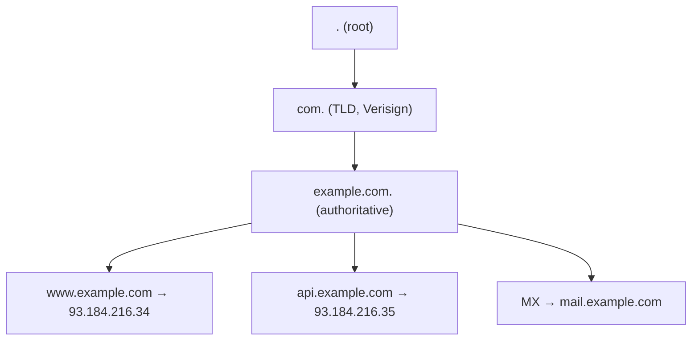
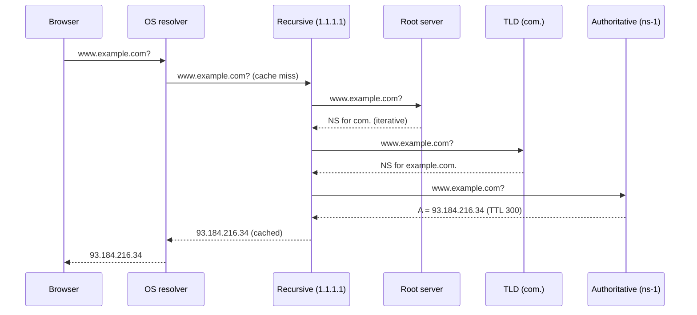
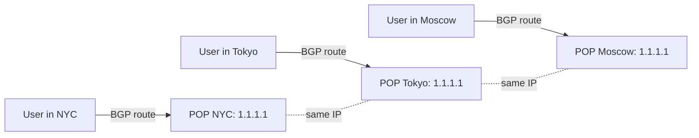

# Вопросы на собеседовании: `DNS`

`DNS` (Domain Name System) — иерархический распределённый каталог, который переводит `example.com` в `93.184.216.34`. На system design интервью DNS всплывает почти всегда: load balancing, GeoDNS, Anycast, failover, DDoS, безопасность (DNSSEC, DoH/DoT). Реальные инциденты — Dyn DDoS 2016, Facebook 2021 (DNS+BGP, 6 часов downtime), Cloudflare 1.1.1.1 outages — показывают, что DNS это **single point of failure для всего интернета**, если не задизайнить правильно.

## Полезные ссылки

- [Cloudflare Learning: What is DNS?](https://www.cloudflare.com/learning/dns/what-is-dns/)
- [RFC 1034 — DNS Concepts](https://datatracker.ietf.org/doc/html/rfc1034)
- [RFC 1035 — DNS Implementation](https://datatracker.ietf.org/doc/html/rfc1035)
- [RFC 4033 — DNSSEC Introduction](https://datatracker.ietf.org/doc/html/rfc4033)
- [RFC 8484 — DNS over HTTPS (DoH)](https://datatracker.ietf.org/doc/html/rfc8484)
- [AWS Route 53 — Routing policies](https://docs.aws.amazon.com/Route53/latest/DeveloperGuide/routing-policy.html)
- [system-design-primer: DNS](https://github.com/donnemartin/system-design-primer#domain-name-system)
- [APNIC Anycast guide](https://blog.apnic.net/2020/09/22/dns-anycast-the-not-so-obvious-considerations/)

## Содержание

- [Полезные ссылки](#полезные-ссылки)
- [See also](#see-also)

**Основы и иерархия**
- [Q1. (!) Что такое DNS и зачем он нужен?](#q1--что-такое-dns-и-зачем-он-нужен)
- [Q2. (!) Иерархия DNS: root → TLD → authoritative](#q2--иерархия-dns-root--tld--authoritative)
- [Q3. (!) Чем recursive resolver отличается от iterative](#q3--чем-recursive-resolver-отличается-от-iterative)
- [Q4. (!) Полный flow DNS-резолюции](#q4--полный-flow-dns-резолюции)
- [Q5. Что такое глобальные публичные resolver-ы (1.1.1.1, 8.8.8.8, 9.9.9.9)?](#q5-что-такое-глобальные-публичные-resolver-ы-1111-8888-9999)

**Record types и кеширование**
- [Q6. (!) A vs AAAA vs CNAME — основные record types](#q6--a-vs-aaaa-vs-cname--основные-record-types)
- [Q7. Записи MX, TXT (SPF/DKIM/DMARC), NS, SOA — за что отвечают](#q7-записи-mx-txt-spfdkimdmarc-ns-soa--за-что-отвечают)
- [Q8. Записи SRV, PTR, CAA, ALIAS/ANAME — зачем они](#q8-записи-srv-ptr-caa-aliasaname--зачем-они)
- [Q9. (!) TTL и кеширование](#q9--ttl-и-кеширование)
- [Q10. Negative caching и его подводные камни](#q10-negative-caching-и-его-подводные-камни)
- [Q11. (!) DNS propagation — что это и почему «48 часов»?](#q11--dns-propagation--что-это-и-почему-48-часов)
- [Q12. CNAME flattening и проблема apex/zone apex](#q12-cname-flattening-и-проблема-apexzone-apex)

**Load balancing / GeoDNS / Anycast**
- [Q13. (!) Балансировка нагрузки через DNS: round-robin, weighted, latency-based](#q13--балансировка-нагрузки-через-dns-round-robin-weighted-latency-based)
- [Q14. (!) Как работает GeoDNS / маршрутизация по геолокации](#q14--как-работает-geodns--маршрутизация-по-геолокации)
- [Q15. (!) Anycast против Unicast — зачем root и публичные resolver-ы используют anycast](#q15--anycast-против-unicast--зачем-root-и-публичные-resolver-ы-используют-anycast)
- [Q16. DNS-failover по health-check (на примере Route 53)](#q16-dns-failover-по-health-check-на-примере-route-53)
- [Q17. EDNS Client Subnet (ECS) — почему CDN зависит от resolver location](#q17-edns-client-subnet-ecs--почему-cdn-зависит-от-resolver-location)
- [Q18. Managed-провайдеры DNS: Route 53, Cloudflare, NS1, Akamai, Dyn](#q18-managed-провайдеры-dns-route-53-cloudflare-ns1-akamai-dyn)
- [Q19. Private DNS (Route 53 private zones) против service discovery](#q19-private-dns-route-53-private-zones-против-service-discovery)
- [Q20. SRV-records и service discovery (Consul, Kubernetes CoreDNS)](#q20-srv-records-и-service-discovery-consul-kubernetes-coredns)

**Безопасность (DNSSEC, DoH/DoT)**
- [Q21. (!) DNS spoofing, cache poisoning и атака Kaminsky](#q21--dns-spoofing-cache-poisoning-и-атака-kaminsky)
- [Q22. (!) DNSSEC изнутри: RRSIG, DS, KSK/ZSK](#q22--dnssec-изнутри-rrsig-ds-kskzsk)
- [Q23. (!) Шифрованный DNS: DoH, DoT и DNS-over-QUIC](#q23--шифрованный-dns-doh-dot-и-dns-over-quic)
- [Q24. DDoS via DNS amplification и защита](#q24-ddos-via-dns-amplification-и-защита)
- [Q25. Обратный DNS (PTR): репутация почты и логирование](#q25-обратный-dns-ptr-репутация-почты-и-логирование)

**Диагностика и практика**
- [Q26. (!) Практическая диагностика DNS: dig, nslookup, drill, kdig](#q26--практическая-диагностика-dns-dig-nslookup-drill-kdig)
- [Q27. Latency budget DNS-резолюции (cold vs warm)](#q27-latency-budget-dns-резолюции-cold-vs-warm)
- [Q28. DNS-кеши клиента: nscd, systemd-resolved, кеш браузера](#q28-dns-кеши-клиента-nscd-systemd-resolved-кеш-браузера)
- [Q29. Как ускорить «48-часовой» switchover (lowering TTL заранее)](#q29-как-ускорить-48-часовой-switchover-lowering-ttl-заранее)
- [Q30. Реальные incident-ы: Dyn 2016, Facebook 2021, Route 53, Cloudflare BGP 2020](#q30-реальные-incident-ы-dyn-2016-facebook-2021-route-53-cloudflare-bgp-2020)

## Q1. (!) Что такое DNS и зачем он нужен?

`DNS` — иерархическая распределённая система, которая переводит **понятные человеку имена** (`example.com`) в **IP-адреса** (`93.184.216.34` / `2606:2800:220:1::5`). Это телефонный справочник интернета: люди помнят имена, а сеть маршрутизирует по адресам.

**Зачем вообще нужен слой имён, если можно ходить по IP:**
- IP меняются (failover, ребалансировка), а имена остаются стабильными — клиентам не нужно ничего перенастраивать.
- Один домен можно отдать на много IP сразу — это основа load balancing и GeoDNS.
- Имена дают логическое разделение: `api.example.com`, `mail.example.com` — разные сервисы за одним доменом.
- Через CNAME / ALIAS домен маршрутизируется на managed-сервисы (CDN, ALB), которые сами меняют свои IP под капотом.

**Архитектурно:**
```
example.com → DNS resolver → 93.184.216.34
              ↑ кеш, иерархия, репликация
```

**Ключевая мысль:** DNS — **первый шаг любого HTTP-запроса**. Если DNS лёг — лежит всё (см. Facebook 2021).

## Q2. (!) Иерархия DNS: root → TLD → authoritative

DNS устроен как **дерево**, и резолюция всегда идёт сверху вниз — от корня к конкретной зоне. Каждый уровень знает не сам ответ, а лишь то, у кого спросить ниже.

**Уровни:**
1. **Root** (`.`) — 13 логических серверов (`a.root-servers.net`...`m.root-servers.net`), но физически их сотни, размноженных через Anycast. Знают только, где искать TLD.
2. **TLD** (Top-Level Domain) — `com.`, `org.`, `ru.`, `io.`. Управляются registry-операторами (например, Verisign для `.com`). Знают, какие authoritative-серверы отвечают за домен.
3. **Authoritative** — серверы конкретной зоны (`ns-1.example.com`). Хранят реальные записи и дают финальный ответ.

**Пример для `www.example.com`:**
```
www.example.com.
└── example.com.   (authoritative ns)
    └── com.       (TLD)
        └── .      (root)
```

Точка в конце (`example.com.`) делает имя fully qualified domain name (FQDN) — это явный маркер корня, чтобы resolver не дописывал к имени search-домены.

**Делегирование** работает через `NS`-записи: `com.` не хранит записи `example.com`, а лишь говорит «за эту зону отвечают `ns-1.example.com` и `ns-2.example.com` — иди к ним». Так ответственность спускается вниз по дереву.



## Q3. (!) Чем recursive resolver отличается от iterative

Это два режима резолюции, и **разницу между ними путают на собесе чаще всего**. Коротко: recursive делает всю работу за клиента, iterative лишь подсказывает следующий шаг.

**Recursive resolver** берёт запрос на себя целиком:
- Получив запрос от клиента, **сам** обходит всю иерархию (root → TLD → authoritative).
- Возвращает клиенту уже **финальный ответ** (готовый IP).
- Кеширует результат, чтобы в следующий раз ответить мгновенно.
- Примеры: `1.1.1.1` (Cloudflare), `8.8.8.8` (Google), DNS-серверы ISP, локальный `systemd-resolved`.

**Iterative resolver** работу на себя не берёт, а только направляет:
- На запрос отвечает в духе **«сам не знаю, но спроси вот этих»** — отдаёт NS-записи следующего уровня.
- Дальше клиент (точнее, recursive resolver) идёт сам.
- Именно так ведут себя **root** и **TLD** серверы: они никогда не делают рекурсию за тебя — иначе их завалило бы нагрузкой со всего интернета.

**Поток запросов:**
```
Client → Recursive resolver (1.1.1.1) → root (iterative: "go ask com.")
                                      → com.  (iterative: "go ask ns-1.example.com")
                                      → ns-1.example.com (authoritative: "93.184.216.34")
                                      ← cached, returned to Client
```

**Почему важно:** на собесе вопрос «кто делает работу обхода иерархии?» имеет один правильный ответ — recursive resolver. Какой именно (ISP, корпоративный, public DNS) — не меняет сути: всю рекурсию делает он, а root/TLD только отвечают итеративно.

## Q4. (!) Полный flow DNS-резолюции

Это разбор канонического собеседовательного вопроса **«что происходит, когда я набираю `www.example.com` в браузере?»** — но только DNS-часть, до открытия HTTP-соединения. Ключевая идея: прежде чем идти в иерархию, клиент проверяет несколько слоёв кеша, и каждый промах добавляет latency.

**Шаги (для холодного кеша, когда нигде ничего не закешировано):**
1. **Browser cache** — Chrome держит свой DNS-кеш (~60s по умолчанию). `chrome://net-internals/#dns`.
2. **OS resolver cache** — `systemd-resolved` (Linux), `dnsmasq`/`nscd`, `mDNSResponder` (macOS).
3. **`/etc/hosts`** — статика, override.
4. **Recursive resolver** (ISP / 1.1.1.1) — если у него в кеше нет:
   - **Root** (`.`): «спроси `com.`».
   - **TLD** (`com.`): «спроси `ns-1.example.com`».
   - **Authoritative** (`ns-1.example.com`): «`93.184.216.34`».
5. Resolver кеширует ответ на TTL (например, 300s).
6. Возвращает IP клиенту.
7. Браузер открывает TCP к `93.184.216.34:443`.

**Сколько это занимает (зависит от того, где нашёлся ответ):**
- Тёплый кеш ОС: <1 мс
- Тёплый кеш recursive resolver: 5–20 мс
- Холодный кеш, полный обход иерархии: 50–200 мс



**Команда для трассировки:**
```bash
dig +trace www.example.com
```

## Q5. Что такое глобальные публичные resolver-ы (1.1.1.1, 8.8.8.8, 9.9.9.9)?

Это бесплатные recursive resolver-ы с публичными IP, доступные кому угодно. Их держат крупные компании на собственной anycast-сети — поэтому они быстрее и надёжнее DNS большинства ISP.

| Resolver | Провайдер | Особенность |
|----------|-----------|-------------|
| `1.1.1.1` / `1.0.0.1` | Cloudflare | Самый быстрый (Anycast 300+ POPs), DoH/DoT, privacy-focused |
| `8.8.8.8` / `8.8.4.4` | Google | Самый известный, DoH/DoT, отличный uptime |
| `9.9.9.9` / `149.112.112.112` | Quad9 | Блокирует known-malicious домены (security) |
| `208.67.222.222` | OpenDNS (Cisco) | Family-filter, parental control |

**Чем отличаются (на что смотреть при выборе):**
- **Приватность:** Cloudflare и Quad9 декларируют «логи не храним»; Google логирует запросы.
- **Скорость:** обычно `1.1.1.1` быстрее за счёт более плотной anycast-сети.
- **EDNS Client Subnet:** Google поддерживает, Cloudflare — нет ради приватности (это важно для CDN, см. Q17).
- **Фильтрация:** Quad9 режет известные вредоносные домены; в РФ ситуация с провайдерскими DNS — отдельная история.

**Сценарии применения:** запасной resolver, когда лёг DNS провайдера, обход кривого корпоративного DNS, отладка через `dig @1.1.1.1`.

## Q6. (!) A vs AAAA vs CNAME — основные record types

**`A` (Address)** — имя → IPv4.
```
example.com.  300  IN  A  93.184.216.34
```

**`AAAA` (Quad-A)** — имя → IPv6.
```
example.com.  300  IN  AAAA  2606:2800:220:1::5
```

**`CNAME` (Canonical Name)** — alias на другое имя.
```
www.example.com.  300  IN  CNAME  example.com.
```
- CNAME — это не конечный ответ: резолвя `www.example.com`, resolver получает CNAME и **дорезолвивает** `example.com` → A/AAAA. То есть один лишний шаг в цепочке.
- **Ограничения:** на zone apex (`example.com` без `www.`) CNAME запрещён по RFC 1034 — там обязаны жить SOA/NS, а CNAME не уживается с другими записями (выход — ALIAS/ANAME у провайдера, см. Q12).
- На одном имени может быть **только один CNAME** и **больше никаких** записей (исключение — DNSSEC). Это прямое следствие того, что CNAME означает «это имя — целиком псевдоним другого».

**Когда что использовать:**
- A/AAAA — когда ты сам владеешь конечным IP.
- CNAME — для алиасов на managed-сервисы (ALB, CloudFront, Heroku): провайдер меняет IP под капотом, а твоя зона остаётся нетронутой.

## Q7. Записи MX, TXT (SPF/DKIM/DMARC), NS, SOA — за что отвечают

**`MX` (Mail Exchanger)** — куда слать почту для домена.
```
example.com.  3600  IN  MX  10 mail1.example.com.
example.com.  3600  IN  MX  20 mail2.example.com.
```
- Цифра — приоритет (меньше = выше): отправитель сначала пробует MX с меньшим числом, при недоступности — следующий. Так задаётся резервный почтовый сервер.
- Справа **обязано** стоять имя, а не IP (это требование RFC).

**`TXT` (Text)** — произвольный текст. Сам по себе ничего не значит, но на нём держатся три критичных механизма антиспама:
- **SPF** (`v=spf1 include:_spf.google.com -all`) — список серверов, которым разрешено слать почту от имени твоего домена.
- **DKIM** (`v=DKIM1; k=rsa; p=MIGfMA0G...`) — публичный ключ, которым проверяется криптоподпись писем.
- **DMARC** (`v=DMARC1; p=reject; rua=mailto:...`) — что делать с письмами, не прошедшими SPF/DKIM (отклонять, в карантин, пропускать) и куда слать отчёты.

**`NS` (Name Server)** — какие серверы authoritative для этой зоны.
```
example.com.  86400  IN  NS  ns-1.example.com.
example.com.  86400  IN  NS  ns-2.example.com.
```

**`SOA` (Start of Authority)** — служебная запись с метаданными зоны: primary NS, email админа, serial (версия зоны), таймеры refresh/retry/expire для синхронизации secondary-серверов и minimum TTL (используется в том числе для negative caching, см. Q10).
```
example.com.  86400  IN  SOA  ns-1.example.com. hostmaster.example.com. 2024042701 7200 3600 1209600 300
```

## Q8. Записи SRV, PTR, CAA, ALIAS/ANAME — зачем они

**`SRV` (Service)** — запись для service discovery. Указывает host + port + priority + weight для **именованного сервиса** (в отличие от A, которая знает только IP).
```
_sip._tcp.example.com. 86400 IN SRV 10 5 5060 sipserver.example.com.
                                    ↑  ↑    ↑
                                  prio weight port
```
- Используется в SIP, XMPP, Kerberos, **Consul DNS interface**, **Kubernetes CoreDNS**.

**`PTR` (Pointer)** — reverse DNS: IP → имя. Живёт в зоне `in-addr.arpa.` (IPv4) или `ip6.arpa.` (IPv6).
```
34.216.184.93.in-addr.arpa. 3600 IN PTR example.com.
```

**`CAA` (Certification Authority Authorization)** — белый список центров сертификации, которым разрешено выпускать TLS-сертификаты для домена.
```
example.com. 3600 IN CAA 0 issue "letsencrypt.org"
```
- Без CAA сертификат может выпустить **любой** CA, если пройдёт валидацию владения доменом.
- С CAA выпуск чужими CA блокируется — это защита от ошибочной или вредоносной выдачи сертификата (misissuance).

**`ALIAS` / `ANAME`** — нестандартное расширение провайдеров (Route 53, Cloudflare, DNSimple), по сути **«CNAME для apex»**:
- На стороне провайдера запись резолвится в IP, а клиенту отдаётся обычная A-запись.
- Для клиента это неотличимо от честной A — никакого лишнего шага.
- Решает запрет «CNAME нельзя на apex» (см. Q12), сохраняя гибкость алиаса.

## Q9. (!) TTL и кеширование

`TTL` (Time To Live) — сколько секунд resolver имеет право держать ответ в кеше, прежде чем спросить заново. По сути это рычаг между скоростью failover и нагрузкой на authoritative.

**Типичные значения:**
- A/AAAA: 300-3600 (5 мин – 1 час)
- CNAME: 3600-86400
- MX: 3600-86400
- NS: 86400-172800 (1-2 дня)
- SOA: 86400

**Компромисс:**
- **Низкий TTL (60–300с):** быстрый failover (кеши обновятся за минуты), но больше запросов к authoritative и чаще промахи кеша → выше latency.
- **Высокий TTL (3600–86400с):** меньше нагрузки и больше попаданий в кеш, но переключение записи доходит до клиентов медленно (см. «48 часов» в Q11).

**Где кеширует:**
1. Browser DNS cache (Chrome: ~60s)
2. OS resolver (`systemd-resolved`, `nscd`)
3. Recursive resolver (1.1.1.1)
4. Иногда — приложение (Java `networkaddress.cache.ttl`, по умолчанию плохо — кешировал forever, см. Q28)

**Важно:** TTL — это пожелание, а не гарантия. Некоторые resolver-ы зажимают его вниз (чтобы снизить нагрузку на себя) или вверх (чтобы дольше держать кеш). Поэтому в реальности запись может жить в кешах дольше заявленного — закладывайся на это при миграциях.

**Negative caching** (см. Q10) — кешируется не только успешный ответ, но и NXDOMAIN, причём по своему TTL (берётся из SOA minimum).

## Q10. Negative caching и его подводные камни

Кешируется не только успешный ответ, но и факт отсутствия имени — **NXDOMAIN** («такого имени нет»). Это и есть **negative caching** (RFC 2308). Логика та же, что у обычного кеша: незачем дёргать authoritative ради повторного «нет».

**На какой TTL кешируется отрицательный ответ:**
- Берётся из поля `SOA.minimum` (или `SOA TTL`, в зависимости от версии).
- Типично 300–3600с.

**Чем это опасно — главный подвох:**
- Создаёшь новую запись (`new-service.example.com`).
- Но кто-то её уже запросил **до** создания — и получил NXDOMAIN.
- Resolver закешировал это «нет» на час.
- В итоге клиент видит «не существует» ещё час, хотя запись давно есть.

То есть отрицательный кеш живёт сам по себе и не сбрасывается от того, что ты создал запись.

**Как защититься:**
- Не «светить» новое имя до того, как создана запись (не анонсировать раньше времени).
- Для зон с частыми добавлениями держи `SOA.minimum` низким (300с), чтобы такие промахи рассасывались быстро.

**Из практики:** маркетинг анонсировал `promo.example.com`, а инженер добавил запись на час позже — те, кто кликнул в первые секунды, ещё час упирались в NXDOMAIN.

## Q11. (!) DNS propagation — что это и почему «48 часов»?

**«DNS propagation»** — термин, который наполовину миф. Понять, что именно тормозит, — половина правильного ответа на собесе.

**Миф:** «новые записи расползаются по интернету, как gossip-протокол, и нужно ждать, пока они дойдут до всех серверов».
**Реальность:** authoritative-серверы отдают новое значение **сразу**, ничего никуда не «распространяется». Задержку создаёт только одно — **старые ответы, ещё живущие в кешах** resolver-ов и ОС клиентов, пока у них не истечёт TTL.

**Почему «48 часов»:**
- Часто NS-записи зоны имеют TTL 86400-172800 (1-2 дня).
- При смене registrar / NS — старые resolver-ы продолжают спрашивать старый authoritative до истечения TTL.
- В худшем случае: TTL NS = 172800 → 48 часов.

**Как ускорить switchover (правильный workflow):**
1. **За 2-3 дня до миграции:** снизить TTL до 60-300s.
2. **Подождать TTL × 2** (чтобы все кеши обновились).
3. **Переключить:** новые resolver-ы за минуты подхватят новое значение.
4. **После стабилизации:** вернуть TTL обратно.

**Из практики:** Facebook 2021 — BGP убрал NS-серверы из интернета. Resolver-ы не могли получить новые ответы, но какое-то время **держали старый кеш**. Большинство пользователей увидели падение почти сразу: у них короткоживущие A-записи (TTL 60–300с) уже истекли, а пойти за свежими было некуда.

## Q12. CNAME flattening и проблема apex/zone apex

**В чём проблема:** RFC 1034 запрещает CNAME на zone apex (`example.com` без `www.`), потому что apex обязан содержать SOA и NS, а CNAME не уживается с другими записями на том же имени.

**Почему это бьёт по практике:**
- CDN (CloudFront, Cloudflare, Fastly) выдаёт тебе **имя**, а не IP (`d111abc.cloudfront.net`).
- Ты хочешь, чтобы голый `example.com` (без `www.`) указывал на этот CDN.
- А честный CNAME на apex поставить нельзя.

**Как это обходят:**

**1. `ALIAS` / `ANAME` (Route 53, DNSimple, Cloudflare):**
- Провайдер сам резолвит `d111abc.cloudfront.net` → IP на своей стороне.
- Клиенту в ответе уходит обычная `A`-запись.
- Для клиента это стандартная резолюция, а ты получаешь гибкость CNAME.

**2. CNAME flattening (Cloudflare):**
- То же самое под другим названием: на запрос apex Cloudflare разворачивает CNAME у себя и отдаёт A.

**3. Apex Alias в AWS:**
- Route 53 Alias — нативный механизм для AWS-сервисов (ALB, CloudFront, S3), бесплатный и без лишнего lookup.

**Компромисс:**
- ALIAS/ANAME — vendor-specific: в обычных bind/PowerDNS их нет, привязка к провайдеру.
- Если у CDN сменится endpoint, обновить разрешённый IP обязан сам провайдер — ты на это не влияешь.

## Q13. (!) Балансировка нагрузки через DNS: round-robin, weighted, latency-based

DNS — самый простой балансировщик: authoritative просто **возвращает несколько A-записей**, а выбор делает клиент. Никакого отдельного железа, но и контроля почти нет.

**Round-robin DNS:**
```
example.com. 60 IN A 1.1.1.1
example.com. 60 IN A 2.2.2.2
example.com. 60 IN A 3.3.3.3
```
- Authoritative тасует порядок A-записей **на каждый запрос**.
- Клиент обычно берёт первый IP из списка — так нагрузка размазывается.
- **Слабые места:** нет health-check (мёртвый инстанс остаётся в ротации), нет учёта реальной нагрузки, кеш resolver-а ломает чередование, распределение получается неравномерным.

**Weighted DNS** (Route 53 weighted routing) — задаёшь доли:
- `A` 1.1.1.1, weight 70
- `A` 2.2.2.2, weight 30
- 70% запросов уйдёт на первый, 30% на второй.
- Удобно для blue/green-деплоя и canary: гонишь сначала 5% трафика на новую версию.

**Latency-based DNS** (Route 53 latency routing):
- По расположению resolver-а выбирается ближайший по задержке регион.
- Работает точнее при наличии EDNS Client Subnet (см. Q17).

**Geolocation DNS** — см. Q14.

**Когда DNS-балансировка не годится:**
- Stateful-сессии: resolver закешировал IP, и клиент залипает на одном инстансе.
- Когда нужен быстрый и точный health-check: при TTL > 60с выпавший инстанс ещё долго будет получать трафик из кешей.

## Q14. (!) Как работает GeoDNS / маршрутизация по геолокации

**GeoDNS** — отдача разного IP в зависимости от **геолокации** клиента (а точнее resolver-а, см. Q17). Один и тот же домен возвращает разный адрес жителю Москвы и жителю Токио.

**Примеры реализаций:**
- Route 53 Geolocation policy
- NS1 Filter Chain
- Cloudflare Geo Steering
- GSLB (Global Server Load Balancing) — общее название

**Как работает:**
1. Authoritative DNS видит, кто спрашивает (IP resolver-а + ECS, если есть).
2. Сопоставляет IP → страна/регион (MaxMind GeoIP).
3. Возвращает A-запись региона.

**Сценарии применения:**
- Регуляторика: пользователи EU → EU-регион, чтобы персональные данные не покидали юрисдикцию (GDPR).
- Снижение задержки: пользователи Азии → регион Tokyo.
- Локализация контента: разный сайт для разных стран.

**Подводные камни:**
- **Точность геолокации** низкая для крупных ISP и публичных DNS: `1.1.1.1` в EU «выглядит» просто как глобальный адрес.
- **EDNS Client Subnet:** без ECS authoritative видит resolver, а не реального пользователя, и может промахнуться регионом (см. Q17).
- **VPN** ломает всё: пользователь получит регион выходной ноды, а не свой.

**Геолокация против latency-routing:**
- Геолокация решает по карте (где формально находится IP).
- Latency-based решает по реальному времени отклика — точнее, но требует инфраструктуры измерений.

## Q15. (!) Anycast против Unicast — зачем root и публичные resolver-ы используют anycast

Разница в том, сколько серверов стоит за одним IP.

**Unicast:** один IP — один сервер (или один LB), маршрут до него единственный.

**Anycast:** один IP — **много серверов в разных локациях**. BGP анонсирует один и тот же префикс из десятков точек присутствия (POP), и маршрутизатор клиента сам выбирает **ближайший по BGP-метрике**. Клиент про это даже не знает — для него это всё тот же `1.1.1.1`.

**Зачем anycast в DNS:**
- **Низкая задержка:** запрос уходит в ближайший POP (10–30 мс вместо 100–300 мс).
- **Устойчивость к DDoS:** атака размазывается по десяткам POP, а не валит один сервер.
- **Автоматический failover:** упал POP — BGP сам перерисовывает маршрут на соседний, клиент ничего не замечает.
- **Простота для клиента:** один IP, не нужны умные resolver-ы или клиентская логика выбора.

**Где это используется:**
- **Root DNS:** 13 логических NS, но физически сотни серверов через anycast.
- **Публичные resolver-ы:** `1.1.1.1` (300+ POP Cloudflare), `8.8.8.8` (Google).
- **CDN:** Cloudflare, Akamai, Fastly.



**Обратная сторона:** Cloudflare 2020 — один POP по ошибке анонсировал /24-префикс, и часть интернета потеряла маршрут до Cloudflare. Оборотная сторона anycast: ошибка в анонсе распространяется **глобально и мгновенно** — нет «локальной» поломки, которую можно изолировать.

## Q16. DNS-failover по health-check (на примере Route 53)

Идея проста: DNS перестаёт отдавать IP инстанса, который не проходит проверку здоровья.

**Как это делает Route 53:**
1. AWS периодически шлёт HTTP/TCP/HTTPS-проверку на endpoint (раз в 10–30с).
2. Если проверка падает — `A`-запись помечается нездоровой.
3. Route 53 **перестаёт возвращать** этот IP в ответах, и трафик перетекает на здоровые.

**Варианты настройки:**
- Active-passive: основной IP + резервный, failover-политика переключает при падении основного.
- Multi-region active-active: weighted + health check; выпавший регион просто пропадает из ротации.

**Сколько занимает переключение (и почему оно не мгновенное):**
- Интервал проверки: 10–30с.
- Порог: обычно 3 неудачные проверки подряд (чтобы не реагировать на единичный сбой).
- TTL DNS-записи: 60с — клиенты с закешированным IP не узнают о смене раньше.
- **Итого:** 60–120с до полного переключения у большинства клиентов.

**Компромисс:**
- Health check в Route 53 платный (~$0.5 за проверку).
- Привязан к AWS: если authoritative не Route 53 — нужен другой механизм.
- Failover на уровне DNS всегда медленнее, чем на L4-балансировщике (HAProxy + keepalived переключают за <1с), потому что упирается в TTL и клиентские кеши.

## Q17. EDNS Client Subnet (ECS) — почему CDN зависит от resolver location

**Корень проблемы:** authoritative DNS видит IP **resolver-а**, а не самого клиента. Для GeoDNS и CDN это значит, что география определяется по resolver-у — и легко промахнуться.

**Сценарий без ECS:**
1. Пользователь в Москве использует `1.1.1.1` (Cloudflare).
2. Спрашивает `cdn.example.com`.
3. Cloudflare-resolver идёт к authoritative.
4. Authoritative видит «запрос от Cloudflare POP», возвращает ближайший к этому POP edge.
5. Пользователь может получить edge в **Frankfurt** вместо Moscow.

**Решение — ECS (RFC 7871):**
- Resolver добавляет к запросу **префикс сети клиента** (`/24` для IPv4 или `/56` для IPv6) — не полный IP, а только подсеть.
- Authoritative видит «клиент из московской подсети» и отдаёт edge в Москве.

**Компромисс:**
- **Плюс:** CDN направляет клиента на действительно ближайший edge.
- **Минус:** на каждый lookup утекает приблизительная геолокация пользователя.

**Кто поддерживает:**
- Google `8.8.8.8` — да.
- Cloudflare `1.1.1.1` — **нет**, сознательно, ради приватности.
- OpenDNS — да.

**Что это значит для CDN:** у Cloudflare edge живут в тех же anycast-POP, что и resolver, — клиент и так уже «у них», поэтому ECS им не нужен. А вот для внешних CDN (Akamai, Fastly) Cloudflare-resolver без ECS может направить клиента не на ближайший edge и ухудшить маршрут.

## Q18. Managed-провайдеры DNS: Route 53, Cloudflare, NS1, Akamai, Dyn

Managed DNS — это когда зону хостит не твой bind, а внешний провайдер с anycast-сетью, API и SLA. Ниже — кто чем силён.

| Провайдер | Сильная сторона | Особенность |
|-----------|-----------------|-------------|
| AWS Route 53 | Интеграция с AWS (ALB, CloudFront, S3 alias), 100% SLA | Health checks, weighted/latency/geolocation, private zones |
| Cloudflare DNS | Самая быстрая anycast-сеть, free tier | CNAME flattening, DDoS-защита включена, без ECS |
| NS1 | Best-in-class traffic steering, filter chain | Advanced policies (latency, sticky shuffle), dev-friendly API |
| Akamai Edge DNS | Enterprise-grade, тесно с CDN | Дорого, высокая надёжность, тесная интеграция с Akamai CDN |
| Dyn (Oracle) | Исторически второй по доле | DDoS 2016 положил Twitter/Reddit/GitHub — incident до сих пор канонический |
| Google Cloud DNS | Тесно с GCP | Простая, дешёвая, без traffic steering |

**Что важно при выборе:**
- **Anycast footprint** — сколько POPs, где.
- **SLA** — Route 53 даёт 100% (uptime credit при failure).
- **API** — для IaC (Terraform).
- **Traffic steering** — weighted, latency, geo, failover.
- **DDoS-защита** — критично для public-facing зон.
- **Private zones** — для internal DNS.

**Из практики:** DDoS на Dyn в октябре 2016 — ботнет Mirai положил Dyn, и Twitter, Reddit, GitHub, Spotify несколько часов были недоступны на восточном побережье США. Урок: один managed-провайдер = единая точка отказа; после этого нормой стала multi-DNS — NS-записи зоны держат сразу у двух независимых провайдеров.

## Q19. Private DNS (Route 53 private zones) против service discovery

**Private DNS** — это зона, видимая только внутри определённой сети (VPC, on-prem), но недоступная из публичного интернета.

**Зачем нужно:**
- `api-internal.example.com` резолвится в приватный IP и недоступен снаружи.
- Не приходится светить внутренние endpoint-ы в публичном DNS.
- Resolver внутри VPC видит приватную зону, а снаружи тот же домен резолвится в публичную (это и есть split-horizon DNS).

**Где доступно:**
- AWS Route 53 Private Hosted Zones (привязка к VPC).
- Cloudflare Internal DNS.
- BIND views (split-horizon DNS).

**Private DNS против service discovery (Consul, k8s):** это не одно и то же — они закрывают разные задачи.

| Параметр | Private DNS | Consul / k8s CoreDNS |
|--------|-------------|----------------------|
| Частота обновления | Раз в часы/дни (статика) | Ежесекундно, live |
| Гранулярность | На уровне сервиса | На уровне инстанса / pod |
| Учёт здоровья | Только через managed health-check | Встроенный (Consul agent, k8s readiness) |
| Сценарий | Стабильные внутренние endpoint-ы | Динамическое обнаружение микросервисов |

**На практике** обычно живут **оба сразу:** Route 53 private — для стабильных внутренних endpoint-ов, а Consul / k8s CoreDNS — для динамических микросервисов, чьи pod-ы постоянно пересоздаются.

## Q20. SRV-records и service discovery (Consul, Kubernetes CoreDNS)

**SRV** — record type, специально для service discovery.

**Формат:**
```
_service._proto.name. TTL IN SRV priority weight port target.
```

**Пример Consul:**
```
_redis._tcp.service.consul. 0 IN SRV 1 1 6379 node1.dc1.consul.
_redis._tcp.service.consul. 0 IN SRV 1 1 6379 node2.dc1.consul.
```

**Пример Kubernetes:**
```
_http._tcp.my-service.default.svc.cluster.local. SRV 0 100 80 pod-1.my-service.default.svc.cluster.local.
```

**Особенности:**
- TTL обычно 0 (не кешировать) — Consul/k8s обновляют состав каждую секунду, кеш только мешал бы.
- Учитывает здоровье: agent помечает нездоровые узлы, и они сразу выпадают из ответа.
- Один запрос возвращает сразу список endpoint-ов вместе с портами и приоритетами.

**Чем лучше/хуже обычной A-записи:**
- A знает только IP — без портов и приоритетов.
- SRV отдаёт полную картину для service-aware discovery (host + port + priority + weight).
- Но не все клиенты умеют SRV: обычные HTTP-клиенты — нет, gRPC — да, через схему `dns:///`.

```bash
# Получить SRV для Consul-сервиса
dig @127.0.0.1 -p 8600 _redis._tcp.service.consul SRV
```

## Q21. (!) DNS spoofing, cache poisoning и атака Kaminsky

Эти три понятия связаны: spoofing — приём, poisoning — цель, Kaminsky — конкретная атака, которая их соединила.

**DNS spoofing** — атакующий успевает ответить на DNS-запрос **раньше** настоящего authoritative и подсовывает resolver-у подменённый ответ.

**Cache poisoning** — закрепить этот подменённый ответ в кеше recursive resolver-а. Опасность в масштабе: один удачный spoof → подменённый IP получают **все** клиенты этого резолвера, пока запись в кеше.

**Атака Kaminsky (2008)** показала, как отравить кеш надёжно:
- Атакующий заваливает recursive resolver запросами на несуществующие имена (`a1.example.com`, `a2.example.com`, …).
- На каждое resolver идёт к authoritative — открывается окно для подмены.
- Параллельно атакующий шлёт поток spoofed-ответов с **подменённой NS-записью на всю зону** `example.com`.
- Защита держалась лишь на 16-битном transaction ID: шанс угадать 1/65536 на попытку, но при тысячах запросов в секунду подбор становится реальным.
- Цена успеха высока: атакующий перехватывает в кеше **всю зону**, а не одно имя.

**Чем закрылись после 2008:**
- **Рандомизация source-порта** — добавляет ещё 16 бит энтропии, теперь угадывать надо 32 бита, и подбор становится непрактичным.
- **DNS Cookies** (RFC 7873) — лёгкая клиент-серверная аутентификация запроса.
- **DNSSEC** (полноценное решение, см. Q22) — криптоподпись, после которой подменить ответ нельзя в принципе.

**Из практики:** в 2008 находка Kaminsky привела к синхронному патчу всех крупных resolver-ов (BIND, MS DNS, Cisco) в один день — настолько серьёзной была угроза.

## Q22. (!) DNSSEC изнутри: RRSIG, DS, KSK/ZSK

**DNSSEC** — расширение DNS, которое добавляет к записям **криптографическую подпись**. Цель — гарантировать, что ответ пришёл от настоящей зоны и не подменён по дороге (то самое решение против cache poisoning из Q21).

**Ключевые типы записей:**
- **`DNSKEY`** — публичный ключ зоны.
- **`RRSIG`** — подпись для каждого RRset.
- **`DS`** (Delegation Signer) — хеш DNSKEY дочерней зоны, опубликованный в родительской.
- **`NSEC` / `NSEC3`** — доказательство «такого имени не существует» (authenticated denial).

**Chain of trust:**
1. Root зона публикует `DNSKEY`, IANA Root KSK широко известен (trust anchor).
2. Root подписывает `DS`-запись для `com.`.
3. `com.` подписывает `DS`-запись для `example.com.`.
4. `example.com.` подписывает свои `A`/`MX`/etc через `RRSIG`.
5. Resolver валидирует цепочку снизу вверх до root.

**KSK против ZSK — зачем два ключа:**
- **KSK** (Key Signing Key) подписывает только `DNSKEY`-записи. Живёт долго (1–2 года), и именно его хеш лежит как `DS` в родительской зоне.
- **ZSK** (Zone Signing Key) подписывает все остальные RRset. Ротируется часто (1–3 месяца).
- Смысл разделения: ZSK можно менять у себя, не трогая registrar (`DS` остаётся прежним), а редкую и хлопотную ротацию KSK не приходится делать каждый месяц.

**Чего DNSSEC НЕ делает:**
- **Не шифрует** — данные по-прежнему передаются открытым текстом (приватность — это уже DoH/DoT, см. Q23).
- **Не прощает ошибок настройки** — сломанный DNSSEC означает не «работает без подписи», а недоступность всей зоны.

**Из практики:** DNSSEC включён менее чем у 30% доменов (2024). Причина именно в риске: неаккуратная ротация ключей — и зона перестаёт резолвиться, поэтому многие предпочитают не связываться.

## Q23. (!) Шифрованный DNS: DoH, DoT и DNS-over-QUIC

**Чем плох классический DNS:**
- Ходит по UDP/TCP на порт 53 **открытым текстом**.
- ISP (и любой на пути) видит, какие домены ты резолвишь.
- MITM может незаметно подменить ответы.

DNSSEC (Q22) защищает только целостность, но не приватность. Закрыть приватность — задача шифрования канала клиент ↔ resolver:

**DoT (DNS-over-TLS, RFC 7858):**
- TCP, порт 853, поверх TLS 1.2/1.3.
- Это обычный DNS-протокол, просто завёрнутый в TLS.
- Поддержка: Android Private DNS, systemd-resolved, knot-resolver.
- Удобен для firewall — у него выделенный порт 853, его легко разрешить или заблокировать.

**DoH (DNS-over-HTTPS, RFC 8484):**
- HTTPS, порт 443.
- DNS-запросы упакованы в HTTP/2 (или HTTP/3).
- Поддержка: Firefox, Chrome, iOS 14+, Cloudflare 1.1.1.1, Google.
- Сложно заблокировать: трафик неотличим от обычного HTTPS и тонет в общем потоке на 443.

**DoQ (DNS-over-QUIC, RFC 9250):**
- UDP, порт 443, QUIC поверх UDP.
- Главный плюс — 0-RTT и меньше задержки на установку соединения.
- Поддержка пока ограничена, но растёт.

**Сравнение:**

| Параметр | DoT | DoH | DoQ |
|--------|-----|-----|-----|
| Порт | 853 | 443 | 443/UDP |
| Легко ли заблокировать | Легко | Трудно | Трудно |
| Задержка на установку | TCP-рукопожатие | TCP + TLS | 0-RTT |
| Поддержка в браузерах | Нет | Есть | Ограниченная |

**Компромисс:**
- DoH мешает корпоративному инспектированию трафика: админ больше не видит, какие домены резолвят сотрудники.
- DoT для внутрикорпоративного контроля удобнее — отдельный порт легко регулировать политиками.
- Когда Mozilla включила DoH по умолчанию, это вызвало споры о «потере контроля» у ISP — именно из-за невидимости запросов.

## Q24. DDoS via DNS amplification и защита

**Как работает DNS amplification (усиление):**
- Атакующий шлёт DNS-запрос с **подменённым source IP** (адресом жертвы) на публичный resolver.
- Запрос крошечный (~60 байт), а ответ большой (1000–4000 байт — через `ANY`-запрос или DNSSEC-подписи RRSIG).
- Resolver добросовестно отвечает по адресу из source, то есть жертве. Коэффициент усиления — **30–70x**.
- В итоге атакующему с каналом 1 Gbps достаточно, чтобы обрушить на жертву 30–70 Gbps. Усиление и подмена адреса — два кита этой атаки.

**Корень проблемы — open resolvers.** Resolver, отвечающий кому угодно, превращается в готовый усилитель для атакующего.

**Как защищается resolver:**
- **Не быть open resolver** — отвечать только своим клиентам, отсекая чужие запросы.
- **Rate limiting** ответов (Response Rate Limiting, RRL) — не дать использовать себя как усилитель.
- **BCP 38** — провайдер на своём edge фильтрует пакеты с подменённым source IP. В теории это убивает атаку в корне, но на практике внедрено менее чем у половины сетей.

**Как защищается authoritative от DDoS:**
- **Anycast** размазывает нагрузку по POP (см. Q15).
- **Scrubbing-сервисы** (Cloudflare, Akamai, Imperva) отфильтровывают атакующий трафик.
- **Несколько DNS-провайдеров** — атака на одного не валит всю зону (урок Dyn 2016).

**Из практики:** AWS Shield как защита; атака на GitHub в 1.35 Tbps (через memcached, не DNS, но тот же принцип усиления); DNS-amplification на Spamhaus 300 Gbps (2013).

## Q25. Обратный DNS (PTR): репутация почты и логирование

**Обратный DNS (reverse DNS)** делает противоположное обычному: IP → имя. Записи живут в специальной зоне `in-addr.arpa.` (IPv4) или `ip6.arpa.` (IPv6).

**Зачем он нужен — три применения:**

**1. Репутация почтового сервера** (главный сценарий):
- Получатель письма с `mail.example.com` (IP `93.184.216.34`) проверяет согласованность имени и адреса:
- обратный запрос: `34.216.184.93.in-addr.arpa. PTR mail.example.com.`?
- прямой запрос: `mail.example.com A 93.184.216.34`?
- Если оба совпали — доверие к отправителю выше.
- Если PTR нет вовсе — значительная часть писем уйдёт в спам.

**2. Логирование / SIEM:**
- В логах имя читается лучше, чем голый IP.
- `8.8.8.8` → `dns.google.` — сразу ясно, что это Google DNS, без ручного поиска.

**3. SSH-аутентификация (исторически):**
- Некоторые серверы делали reverse-lookup перед авторизацией. Это медленно, поэтому обычно отключают через `UseDNS no`.

**Особенности, о которых спрашивают:**
- PTR-зона принадлежит **владельцу IP-блока** (обычно ISP или облачный провайдер), а не тебе.
- Поставить свой PTR можно только в своих блоках (AWS Elastic IP, GCP — через консоль).
- На динамическом IP PTR бесполезен и нередко вреден.

**Forward-confirmed reverse DNS (FCrDNS)** — двусторонняя проверка: PTR указывает на имя, а имя резолвится обратно в тот же IP. Это де-факто стандарт доверия для почтовых серверов.

## Q26. (!) Практическая диагностика DNS: dig, nslookup, drill, kdig

Четыре инструмента под разные задачи. Знать `dig` наизусть — обязательный минимум для собеса.

**`dig`** — стандарт де-факто для диагностики.

```bash
# Базовое: A-запись
dig example.com

# Конкретный resolver
dig @1.1.1.1 example.com

# Конкретный тип
dig example.com MX
dig example.com AAAA
dig example.com TXT

# Полный обход иерархии (iterative)
dig +trace example.com

# Короткий вывод (только ответ)
dig +short example.com

# С DNSSEC validation
dig +dnssec example.com

# Reverse lookup
dig -x 93.184.216.34

# С EDNS Client Subnet
dig @8.8.8.8 example.com +subnet=1.2.3.0/24

# Все типы (для diagnostics, но многие провайдеры режут)
dig example.com ANY
```

**`nslookup`** — старый и менее удобный, но есть везде, включая Windows: пригодится, когда `dig` недоступен.
```bash
nslookup example.com
nslookup example.com 1.1.1.1
```

**`drill`** — альтернатива из LDNS, удобна для трассировки цепочки DNSSEC.
```bash
drill -DT example.com
```

**`kdig`** — из Knot DNS, умеет шифрованный DNS (DoT/DoH).
```bash
kdig @1.1.1.1 +tls example.com
kdig @1.1.1.1 +https example.com
```

**На что смотреть в выводе `dig`:**
- `ANSWER SECTION` — собственно ответ.
- `Query time` — задержка запроса (полезно для диагностики «медленного DNS»).
- `SERVER` — какой resolver ответил (проверить, что спросил именно нужный).
- `flags: aa` — ответ пришёл от authoritative-сервера.
- `flags: ad` — данные аутентифицированы, DNSSEC-валидация прошла.

## Q27. Latency budget DNS-резолюции (cold vs warm)

Время DNS-резолюции напрямую влияет на TTFB, поэтому важно понимать, сколько и где оно тратится.

**Тёплый кеш (ответ уже лежит рядом):**
- Кеш браузера: <1 мс.
- Кеш resolver-а ОС: <1 мс.
- Тёплый recursive resolver: 5–20 мс.

**Холодный кеш (полный обход root → TLD → authoritative):**
- Типично 50–200 мс.
- 300+ мс при медленных authoritative или дальних регионах.

**Из чего складывается первый запрос целиком:**
- DNS: 50 мс (холодный) или 1 мс (тёплый)
- TCP-рукопожатие: 50 мс (1 RTT)
- TLS-рукопожатие: 50–100 мс (1–2 RTT)
- HTTP-запрос: 50 мс
- **Итого:** до 350 мс на холодную, ~150 мс на тёплую.

Видно, что DNS — заметная доля, и её можно срезать заранее.

**Где сэкономить:**
- **DNS prefetch** (`<link rel="dns-prefetch" href="//cdn.example.com">`) — браузер резолвит имя заранее, до того как оно понадобится.
- **Preconnect** (`<link rel="preconnect" href="...">`) — заранее проходит DNS + TCP + TLS.
- **HTTP/3 + QUIC** — 0-RTT при повторном подключении.
- **Близкий edge** (Cloudflare, Bunny.net) — меньше холодных lookup-ов.

**Антипаттерн:** Java `networkaddress.cache.ttl=-1` (кеш навсегда) — приложение залипает на старом IP и не видит failover.

## Q28. DNS-кеши клиента: nscd, systemd-resolved, кеш браузера

Ключевая мысль: на пути запроса не один кеш, а целая лестница уровней, и устаревший IP может застрять на любом из них.

**1. Браузер:**
- Chrome: TTL ~60с, очистка через `chrome://net-internals/#dns`.
- Firefox: настраивается через `network.dnsCacheExpiration`.

**2. Resolver ОС:**
- **Linux:** `systemd-resolved` (современный, кеш + DoT), `nscd` (легаси, кеширует name service целиком), `dnsmasq` (часто как локальный кеш + форвардер).
- **macOS:** `mDNSResponder` / `discoveryd`.
- **Windows:** служба DNS Client.

**3. Приложение:**
- **JVM:** `networkaddress.cache.ttl` (под security manager по умолчанию навсегда, иначе 30с) — частый источник «залипшего» IP.
- **Node.js:** на уровне рантайма не кеширует, полагается на ОС.
- **Go:** по умолчанию идёт через resolver ОС (`cgo`, netdns) либо встроенный (`netgo`).

**Частые ловушки и команды сброса:**
- `getent hosts example.com` — Linux, показывает, что в кеше ОС.
- `dscacheutil -flushcache` — macOS, очистить кеш.
- `sudo systemd-resolve --flush-caches` — Linux.
- `ipconfig /flushdns` — Windows.

**Как диагностировать:** если `dig` уже отдаёт новый IP, а приложение упорно ходит на старый — виноват кеш приложения (JVM, кастомный) или устаревший кеш resolver-а ОС, а не сам DNS.

## Q29. Как ускорить «48-часовой» switchover (lowering TTL заранее)

**Сценарий:** надо перенести `api.example.com` с провайдера A на B без долгого хвоста запросов на старый сервер.

**Что будет без подготовки:**
- При TTL 86400 клиенты держат старый IP в кеше до 24 часов.
- Часть пользователей продолжает попадать на старый сервер (уже выключенный) — отсюда хаотичные ошибки.

Лечится это не «ожиданием 48 часов», а заблаговременным снижением TTL.

**Порядок действий:**

**День 0 (T-48h):**
- Понизить TTL: 86400 → 60 на нужных записях.
- **Подождать** старый TTL (86400 = 24h) — все кеши обновятся.

**День 1 (T-24h):**
- Все resolver-ы видят TTL 60.
- Проверить через `dig` из разных регионов (`dig @1.1.1.1`, `dig @8.8.8.8`).

**День 2 (T-0):**
- Переключить запись (новый IP).
- В течение 60-120s большинство клиентов увидят новый IP.

**День 3 (T+24h):**
- Стабилизация, мониторинг.
- Вернуть TTL обратно (3600+).

**Подводные камни:**
- **Negative caching:** если кто-то запросит несуществующее имя, NXDOMAIN закешируется на `SOA.minimum` — это значение тоже надо снизить заранее.
- **«Плохие» resolver-ы** игнорируют TTL и держат запись дольше заявленного. Поэтому старую инфру нельзя гасить раньше, чем через 48–72 часа после переключения.
- **Кеш браузера/ОС** может жить ещё дольше — в крайнем случае пользователю придётся перезапустить браузер.

**Из практики:** документация AWS прямо рекомендует снижать TTL за 24–48 часов до миграции.

## Q30. Реальные incident-ы: Dyn 2016, Facebook 2021, Route 53, Cloudflare BGP 2020

**DDoS на Dyn — 21 октября 2016:**
- Ботнет Mirai (взломанные IoT-устройства, в основном камеры) обрушил на Dyn ~1.2 Tbps.
- Легло всё, что хостило DNS на Dyn: Twitter, Reddit, GitHub, Spotify, Netflix, PayPal.
- Урок: один managed-провайдер DNS — единая точка отказа. После инцидента нормой стала multi-DNS — NS у двух провайдеров одновременно.

**Падение Facebook — 4 октября 2021 (~6 часов):**
- Обновление маршрутизации backbone убрало BGP-анонс NS-серверов facebook.com из интернета.
- Authoritative NS «исчезли» — recursive resolver-ы попросту не могли до них достучаться.
- Короткоживущие записи в кешах (TTL 60–300с) быстро протухли — и поднялась лавина запросов в NS, которые не отвечают.
- Нагрузка на DNS выросла в 30 раз; пострадали даже внутренние инструменты — админы не могли зайти починить, потому что их tools тоже ходили через тот же DNS.
- Урок: NS-серверы должны жить на независимой инфраструктуре, а не в той же сети, которой управляют (иначе получается замкнутый круг через BGP).

**Сбой AWS Route 53 — 7 декабря 2021:**
- Отказ внутреннего API в US-EAST-1: control plane Route 53 перестал принимать изменения, хотя data plane продолжал отвечать на запросы.
- Усугубилось тем, что внутренние сервисы AWS сами зависели от health-check Route 53.
- Урок: managed-сервисы тоже падают, особенно когда один регион стал центром нагрузки.

**BGP-сбой Cloudflare — 17 июля 2020:**
- Баг в конфиге роутера привёл к снятию (withdraw) анонсов anycast-префиксов.
- 27 минут недоступности для большой части интернета.
- Урок: anycast делает ошибку **глобальной мгновенно**, поэтому конфиг надо раскатывать поэтапно, регион за регионом.

**Что из этого вынесла индустрия:**
- Несколько DNS-провайдеров для критичных зон.
- TTL не задирать слишком низко (иначе при сбое — лавина запросов, как у Facebook).
- NS-серверы — в физически и логически отдельной сети.
- Управление по out-of-band каналу, не зависящему от DNS.

---

## See also

- [`networking-interview.md`](networking-interview.md) — общая сеть, TCP/IP, OSI, BGP, NAT.
- [`load-balancing-interview.md`](load-balancing-interview.md) — L4/L7 LB, health check, sticky session — DNS как первый hop.
- [`edge-computing-interview.md`](edge-computing-interview.md) — CDN edge, Cloudflare Workers, latency.
- [`distributed-systems-interview.md`](distributed-systems-interview.md) — service discovery, consensus.
- [`scalability-patterns-interview.md`](scalability-patterns-interview.md) — multi-region, GeoDNS, failover.
- [`../api/http-rest-interview.md`](../api/http-rest-interview.md) — HTTP над DNS-разрешённым именем.
- [`../security/tls-ssl-interview.md`](../security/tls-ssl-interview.md) — TLS handshake после DNS, CAA для сертификатов.
- [`../system-design/system-design-interview.md`](../system-design/system-design-interview.md) — DNS как часть end-to-end архитектуры.
