# Вопросы на собеседовании: `Event-driven` паттерны

Комплексное руководство по вопросам собеседования на тему event-driven паттернов для Senior Java Developer.

## Полезные ссылки

### Официальная документация

- [Event-Driven Architecture — Martin Fowler](https://martinfowler.com/articles/201701-event-driven.html) — разница между event notification, event-carried state transfer, event sourcing, CQRS
- [Event Sourcing — Martin Fowler](https://martinfowler.com/eaaDev/EventSourcing.html) — паттерн хранения состояния через события
- [Spring Application Events](https://docs.spring.io/spring-framework/reference/core/beans/context-introduction.html#context-functionality-events) — механизм событий в Spring Framework
- [Spring Kafka Reference](https://docs.spring.io/spring-kafka/reference/) — интеграция Spring Boot с Apache Kafka
- [Spring Events — Baeldung](https://www.baeldung.com/spring-events) — практический гайд по Spring `ApplicationEvent`
- [Intro to Apache Kafka with Spring — Baeldung](https://www.baeldung.com/spring-kafka) — producer/consumer в Spring Boot
- [Kafka Streams With Spring Boot (Baeldung)](https://www.baeldung.com/spring-boot-kafka-streams) — обработка потоков событий через Kafka Streams
- [Introduction to Spring Cloud Stream (Baeldung)](https://www.baeldung.com/spring-cloud-stream) — event-driven микросервисы через Spring Cloud Stream
- [Event Externalization with Spring Modulith (Baeldung)](https://www.baeldung.com/spring-modulith-event-externalization) — публикация доменных событий в Kafka через Spring Modulith
- [Saga Pattern in Microservices — Microservices.io](https://microservices.io/patterns/data/saga.html) — описание паттерна Saga
- [Transactional Outbox — Microservices.io](https://microservices.io/patterns/data/transactional-outbox.html) — описание Outbox pattern

## Содержание

- [Полезные ссылки](#полезные-ссылки)
- [See also](#see-also)

**Основы EDA, события и брокеры**
- [Q1. (!) Что такое event-driven архитектура и чем она отличается от синхронного REST?](#q1-что-такое-event-driven-архитектура-и-чем-она-отличается-от-синхронного-rest)
- [Q2. Что такое событие (event) в контексте EDA? Какие атрибуты у события?](#q2-что-такое-событие-event-в-контексте-eda-какие-атрибуты-у-события)
- [Q3. (!) Что такое брокер сообщений и чем отличаются Kafka и RabbitMQ для EDA?](#q3-что-такое-брокер-сообщений-и-чем-отличаются-kafka-и-rabbitmq-для-eda)
- [Q4. Как обеспечить порядок обработки событий в распределённой системе?](#q4-как-обеспечить-порядок-обработки-событий-в-распределённой-системе)
- [Q5. (!) Что такое идемпотентность потребителя и зачем она нужна?](#q5-что-такое-идемпотентность-потребителя-и-зачем-она-нужна)

**Event Sourcing, CQRS и Saga**
- [Q6. (!) Что такое Event Sourcing?](#q6-что-такое-event-sourcing)
- [Q7. Что такое CQRS и как он сочетается с EDA?](#q7-что-такое-cqrs-и-как-он-сочетается-с-eda)
- [Q8. (!) Что такое Saga и когда её используют?](#q8-что-такое-saga-и-когда-её-используют)
- [Q9. (!) Что такое Outbox pattern?](#q9-что-такое-outbox-pattern)
- [Q10. (!) Что такое dead letter queue (DLQ) и когда его использовать?](#q10-что-такое-dead-letter-queue-dlq-и-когда-его-использовать)

**Схемы, семантика доставки и мониторинг**
- [Q11. Что такое Schema Registry и зачем он в EDA?](#q11-что-такое-schema-registry-и-зачем-он-в-eda)
- [Q12. (!) Как в EDA добиться exactly-once семантики?](#q12-как-в-eda-добиться-exactly-once-семантики)
- [Q13. Что такое consumer lag и как с ним работать?](#q13-что-такое-consumer-lag-и-как-с-ним-работать)
- [Q14. Чем event-driven отличается от message-driven?](#q14-чем-event-driven-отличается-от-message-driven)
- [Q15. Как обеспечить обратную совместимость при изменении схемы события?](#q15-как-обеспечить-обратную-совместимость-при-изменении-схемы-события)
- [Q16. Что такое partition key в Kafka и как он влияет на порядок?](#q16-что-такое-partition-key-в-kafka-и-как-он-влияет-на-порядок)
- [Q17. Когда использовать топик с одной партицией, а когда с несколькими?](#q17-когда-использовать-топик-с-одной-партицией-а-когда-с-несколькими)
- [Q18. Что такое consumer group и как распределяются партиции?](#q18-что-такое-consumer-group-и-как-распределяются-партиции)
- [Q19. Как в EDA обеспечить мониторинг и наблюдаемость?](#q19-как-в-eda-обеспечить-мониторинг-и-наблюдаемость)
- [Q20. Какие антипаттерны в event-driven архитектуре стоит избегать?](#q20-какие-антипаттерны-в-event-driven-архитектуре-стоит-избегать)

**Продвинутые темы**
- [Q21. Что такое event replay и когда его использовать?](#q21-что-такое-event-replay-и-когда-его-использовать)
- [Q22. Как обеспечить транзакционность в event-driven системе?](#q22-как-обеспечить-транзакционность-в-event-driven-системе)
- [Q23. Что такое event versioning и как управлять изменениями схемы?](#q23-что-такое-event-versioning-и-как-управлять-изменениями-схемы)
- [Q24. Как обработать события в правильном порядке при параллельной обработке?](#q24-как-обработать-события-в-правильном-порядке-при-параллельной-обработке)
- [Q25. Что такое event store и чем он отличается от обычной БД?](#q25-что-такое-event-store-и-чем-он-отличается-от-обычной-бд)
- [Q26. Как обеспечить мониторинг и алертинг в event-driven системе?](#q26-как-обеспечить-мониторинг-и-алертинг-в-event-driven-системе)
- [Q27. Что такое event choreography vs orchestration?](#q27-что-такое-event-choreography-vs-orchestration)
- [Q28. Как обработать события с разной скоростью обработки?](#q28-как-обработать-события-с-разной-скоростью-обработки)
- [Q29. Что такое event sourcing snapshot и зачем он нужен?](#q29-что-такое-event-sourcing-snapshot-и-зачем-он-нужен)
- [Q30. Как обеспечить безопасность событий в event-driven системе?](#q30-как-обеспечить-безопасность-событий-в-event-driven-системе)

**Spring и Kafka на практике**
- [Q31. (!) Как работает механизм событий в Spring Framework?](#q31-как-работает-механизм-событий-в-spring-framework)
- [Q32. Как создать Kafka producer и consumer в Spring Boot?](#q32-как-создать-kafka-producer-и-consumer-в-spring-boot)
- [Q33. (!) Как реализовать Outbox pattern на Spring Boot и Kafka?](#q33-как-реализовать-outbox-pattern-на-spring-boot-и-kafka)
- [Q34. Как реализовать Event Sourcing на Java?](#q34-как-реализовать-event-sourcing-на-java)
- [Q35. (!) Как реализовать CQRS с проекциями на Spring?](#q35-как-реализовать-cqrs-с-проекциями-на-spring)

**Продвинутые паттерны EDA**
- [Q36. (!) Чем отличается Saga Orchestration от Choreography?](#q36-чем-отличается-saga-orchestration-от-choreography)
- [Q37. Что такое Process Manager и когда его использовать?](#q37-что-такое-process-manager-и-когда-его-использовать)
- [Q38. (!) Что такое Event-Carried State Transfer (ECST)?](#q38-что-такое-event-carried-state-transfer-ecst)
- [Q39. Как проектировать стратегии компенсации в EDA?](#q39-как-проектировать-стратегии-компенсации-в-eda)
- [Q40. Как организовать версионирование топиков Kafka при эволюции схемы?](#q40-как-организовать-версионирование-топиков-kafka-при-эволюции-схемы)

## Q1. (!) Что такое event-driven архитектура и чем она отличается от синхронного REST?

`Event-driven` архитектура (`EDA`) -- стиль проектирования, при котором компоненты системы обмениваются данными через события, публикуемые в брокер сообщений (`Kafka`, `RabbitMQ`). Производитель (producer) публикует событие и не ждёт немедленной обработки; потребители (consumers) подписываются на топики/очереди и обрабатывают события асинхронно.

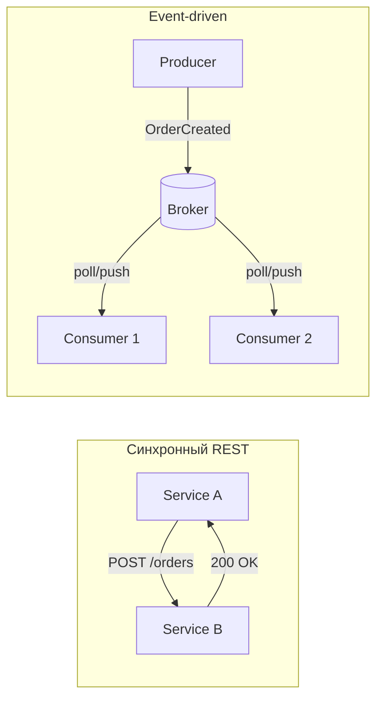

Отличия от синхронного `REST`:

| Критерий | `REST` | `EDA` |
|----------|--------|-------|
| Связность | Клиент знает адрес сервиса | Producer не знает consumers |
| Масштабируемость | Нужен load balancer | Consumers масштабируются независимо |
| Отказоустойчивость | Нужны retry и circuit breaker | Сообщения сохраняются в брокере |
| Консистентность | Сильная в одной транзакции | Eventual consistency, нужны [паттерны согласованности](consistency-patterns-interview.md) (`Saga`, компенсации) |
| Латентность | Немедленный ответ | Задержка обработки |


> [!mcq]
> - [ ] `EDA` — это синхронный `REST` через брокер: producer ждёт ответа consumer через callback-топик | По сути это RPC поверх Kafka, который убивает асинхронность и слабую связность. ❌ ПОСЛЕДСТВИЕ: latency p99 = sum всех hop-ов (50ms × 4 = 200ms), при падении consumer producer таймаутит, throughput падает в 10× против чистого `REST`.
> - [x] Producer публикует событие в брокер и не ждёт обработки; consumers подписываются на топик и обрабатывают асинхронно | Producer не знает consumers, консистентность eventual, отказоустойчивость через персистентность брокера. ✓ ПРИМЕНЯТЬ: LinkedIn Kafka для tracking 7 трлн msg/день, Uber Cadence для order workflows, Netflix Keystone pipeline. 📋 ПРАВИЛО: «опубликовал и забыл — consumer догонит сам». 🔗 См. Q3, Q14.
> - [ ] `EDA` отличается от `REST` только транспортом — вместо HTTP используется AMQP/Kafka, остальное идентично | Игнорирует фундаментальную разницу: push vs pull, fan-out, replay, eventual consistency. ❌ ПОСЛЕДСТВИЕ: команда «портирует» REST endpoints 1:1 в Kafka топики, получая tightly-coupled систему без преимуществ EDA, плюс потери сообщений из-за неправильного `acks`.
> - [ ] В `EDA` обязательна сильная консистентность через distributed transactions (`2PC`) между producer и consumers | Это противоположность EDA — асинхронность исключает 2PC. ❌ ПОСЛЕДСТВИЕ: попытка XA-транзакций через Kafka блокирует партиции на секунды, throughput падает с 100K до 500 msg/s, при network partition coordinator зависает.

## Q2. Что такое событие (event) в контексте EDA? Какие атрибуты у события?

Событие -- неизменяемая запись о факте, произошедшем в системе (например, «Заказ создан», «Платёж проведён»). Ключевое отличие от команды: событие описывает то, что **уже произошло**, а команда -- запрос на действие.

Рекомендуемые атрибуты:
- **Идентификатор события** -- уникальный `eventId` для дедупликации и трассировки
- **Тип события** -- имя/версия для маршрутизации и совместимости
- **Временная метка** -- когда произошло (часто в `UTC`)
- **Агрегат** -- идентификатор сущности (`orderId`, `userId`)
- **Полезная нагрузка** (payload) -- данные события
- **Метаданные** -- источник, `correlationId`, `traceId` для [распределённой трассировки](../monitoring/observability-interview.md)

Пример структуры события на Java:

```java
public record OrderCreatedEvent(
    UUID eventId,
    String type,           // "order.created"
    Instant timestamp,
    UUID aggregateId,      // orderId
    OrderPayload payload,
    EventMetadata metadata
) {
    public record OrderPayload(
        List<OrderItem> items,
        BigDecimal totalAmount,
        String currency
    ) {}

    public record EventMetadata(
        String source,          // "order-service"
        String correlationId,
        String traceId
    ) {}
}
```


> [!mcq]
> - [ ] Событие — мутабельная команда «сделать X», атрибуты: `targetService`, `methodName`, `args` | Это команда (RPC), а не событие; путаница типов ломает шину. ❌ ПОСЛЕДСТВИЕ: consumer интерпретирует event как command и пытается «выполнить» уже произошедший факт, дублируя побочные эффекты — двойное списание денег, повторное резервирование.
> - [ ] Достаточно одного payload-поля; `eventId`/`timestamp`/`traceId` — overhead, который можно опустить ради экономии 200 байт | Без `eventId` нет дедупликации, без `timestamp` нет порядка, без `traceId` нет observability. ❌ ПОСЛЕДСТВИЕ: при retry producer-а consumer обработает дубликат как новое событие → двойное списание; в инциденте за 3 часа невозможно восстановить корреляцию между сервисами.
> - [x] Событие — неизменяемая запись о произошедшем факте с обязательными `eventId`, `type/version`, `timestamp` (UTC), `aggregateId`, `payload`, `metadata.traceId` | `eventId` для идемпотентности, `aggregateId` для партиционирования, `traceId` для распределённой трассировки. ✓ ПРИМЕНЯТЬ: CloudEvents спецификация (CNCF, используется Knative/Argo), AsyncAPI контракты, Confluent best practices для Kafka headers. 📋 ПРАВИЛО: «событие = факт + кто + когда + по чему». 🔗 См. Q5, Q11.
> - [ ] Событие должно содержать только `aggregateId` без payload — потребитель сам запросит данные через REST | Это Event Notification (без ECST), создаёт N+1 нагрузку на источник и временную связанность. ❌ ПОСЛЕДСТВИЕ: при пиках 10K events/s consumer делает 10K GET-запросов к producer-у, тот падает по CPU; при недоступности источника проекции не обновляются.

## Q3. (!) Что такое брокер сообщений и чем отличаются Kafka и RabbitMQ для EDA?

Брокер сообщений -- промежуточное хранилище, которое принимает сообщения от производителей и доставляет их потребителям. Гарантирует персистентность, доставку и (в зависимости от настроек) порядок.

| Характеристика | `Kafka` | `RabbitMQ` |
|----------------|---------|------------|
| Модель | Распределённый лог (append-only) | Очереди с доставкой и удалением |
| Хранение | Retention-based (дни/недели) | До потребления |
| Чтение | По offset, consumer pull | Push к consumer |
| Replay | Да, с любого offset | Нет (сообщение удаляется) |
| Порядок | В пределах партиции | В пределах очереди (один consumer) |
| Throughput | Очень высокий (миллионы msg/s) | Средний (десятки тысяч msg/s) |
| Основной сценарий | Event streaming, EDA | Task queue, RPC |

Для `EDA` с большим объёмом событий и возможностью «переиграть» историю чаще выбирают `Kafka` (подробнее в [вопросах по Kafka](../messaging/kafka-interview.md)); для рабочих очередей и гарантированной доставки до одного потребителя -- `RabbitMQ`.


> [!mcq]
> - [ ] `Kafka` и `RabbitMQ` идентичны: оба «очереди сообщений» с FIFO, выбор — дело вкуса | Игнорирует фундаментальное отличие: Kafka = распределённый лог (replay, retention), RabbitMQ = очередь с удалением. ❌ ПОСЛЕДСТВИЕ: команда выбирает RabbitMQ для event-streaming с replay, через 3 месяца понимает что переиграть историю нельзя — пересчёт проекций невозможен, нужна миграция всей платформы.
> - [ ] `RabbitMQ` лучше для event-streaming: push-модель быстрее polling-а Kafka | Push-модель не масштабируется на миллионы msg/s; RabbitMQ упирается в десятки тысяч msg/s. ❌ ПОСЛЕДСТВИЕ: при росте трафика до 100K msg/s RabbitMQ деградирует, latency p99 растёт с 5ms до 2s, consumers получают `connection.blocked` при flow control.
> - [ ] `Kafka` использует exclusive consumer на партицию (один consumer обрабатывает её последовательно), `RabbitMQ` распределяет сообщения round-robin между consumers одной очереди | Kafka — append-only лог с retention и replay по offset; RabbitMQ — очередь с push и удалением после ack. ❌ ПОСЛЕДСТВИЕ: разработчик ждёт от Kafka work-queue поведения (broadcast одного сообщения нескольким consumers одной группы) и получает партиционирование вместо распределения.
> - [x] `Kafka` — append-only лог с retention/replay (миллионы msg/s, EDA, event sourcing); `RabbitMQ` — очередь с доставкой и удалением (десятки тысяч msg/s, task queue, RPC) | Kafka хранит события днями/неделями для replay новых проекций; RabbitMQ удаляет после ack. ✓ ПРИМЕНЯТЬ: LinkedIn (родина Kafka) — 7 трлн msg/день; Instagram — RabbitMQ для Celery task queue; Booking.com — Kafka для event sourcing. 📋 ПРАВИЛО: «лог для replay, очередь для задач». 🔗 См. Q14, Q21.

## Q4. Как обеспечить порядок обработки событий в распределённой системе?

Порядок в `Kafka` гарантируется только в пределах одной партиции. Поэтому:
- Используйте ключ партиционирования (например, `orderId`), чтобы все события по одному заказу попадали в одну партицию
- Не увеличивайте число партиций без необходимости -- это может изменить распределение ключей
- Для глобального порядка обычно не стремятся: достаточно порядка по агрегату

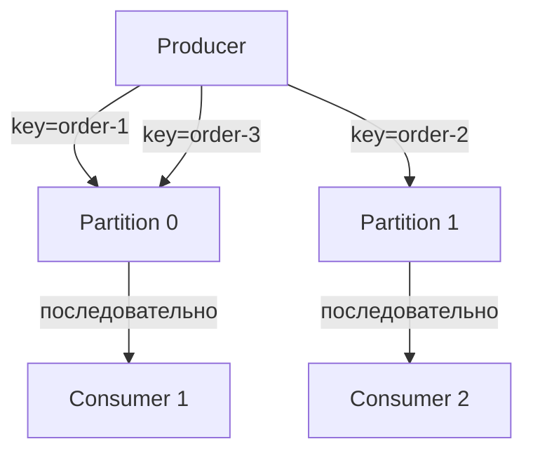

В `RabbitMQ` порядок в одной очереди сохраняется при одном потребителе; при нескольких -- порядок не гарантирован. Решения: `single active consumer`, `message groups` для группировки по ключу.


> [!mcq]
> - [x] Использовать `aggregateId` (например, `orderId`) как partition key — все события одного агрегата попадают в одну партицию и обрабатываются последовательно одним consumer-ом группы | `partition = hash(key) % numPartitions`; глобальный порядок не нужен, достаточно по агрегату. ✓ ПРИМЕНЯТЬ: Wolt order pipeline (orderId как ключ), Yandex Lavka delivery routing, Uber trip events (tripId). 📋 ПРАВИЛО: «один агрегат — одна партиция — один поток». 🔗 См. Q16, Q24.
> - [ ] Использовать один топик с одной партицией для гарантии глобального порядка | Не масштабируется: один consumer обрабатывает весь трафик, throughput ограничен ~10K msg/s. ❌ ПОСЛЕДСТВИЕ: при росте до 50K events/s consumer не успевает, lag растёт до миллионов сообщений, retention 7 дней забивается за часы — старые события теряются.
> - [ ] Сортировать события на consumer-е по `timestamp` после получения из нескольких партиций | Между партициями порядок не гарантируется даже по timestamp (clock skew, разная задержка); сортировка требует буферизации с таймаутом. ❌ ПОСЛЕДСТВИЕ: clock drift 200ms между producer-узлами → события упорядочены неверно, `OrderShipped` обрабатывается раньше `OrderCreated`, статусы перезаписываются неправильно.
> - [ ] Установить `max.in.flight.requests.per.connection=10` без `enable.idempotence=true` для скорости | При retry порядок ломается: запросы 1,2,3 → fail 1, retry успешно — порядок 2,3,1. ❌ ПОСЛЕДСТВИЕ: события перемешиваются в партиции после retries, бизнес-инварианты нарушаются (status downgrade с SHIPPED обратно в CREATED), данные расходятся между primary и projection.

## Q5. (!) Что такое идемпотентность потребителя и зачем она нужна?

Идемпотентность -- повторная обработка одного и того же сообщения даёт тот же результат, что и однократная. Нужна из-за возможной повторной доставки (retry продюсера, перезапуск потребителя до коммита offset).

**Практический критерий:** если операция связана с деньгами или резервированием, идемпотентность подтверждают интеграционным тестом с повторной доставкой одного и того же `eventId`.

Способы реализации:

```java
@Service
@RequiredArgsConstructor
public class IdempotentEventHandler {

    private final ProcessedEventRepository processedEvents;
    private final OrderRepository orderRepository;

    @Transactional
    public void handle(OrderCreatedEvent event) {
        // Проверка: уже обработано?
        if (processedEvents.existsByEventId(event.eventId())) {
            log.info("Event {} already processed, skipping", event.eventId());
            return;
        }

        // Бизнес-логика
        orderRepository.save(mapToOrder(event));

        // Пометить как обработанное (в той же транзакции)
        processedEvents.save(new ProcessedEvent(event.eventId(), Instant.now()));
    }
}
```

Альтернативные подходы:
- **Бизнес-ключ**: если операция по `paymentId` уже выполнена -- пропустить
- **Upsert** вместо `INSERT` -- повторное выполнение не создаёт дубликатов
- **Conditional update**: `UPDATE ... WHERE version = :expected`


> [!mcq]
> - [ ] Идемпотентность означает, что producer не отправляет дубликаты — consumer может не проверять `eventId` | Это идемпотентность producer-а (`enable.idempotence=true`); consumer всё равно может получить дубликат при rebalance/повторном чтении до commit offset. ❌ ПОСЛЕДСТВИЕ: после rebalance группы при rolling deploy последние 100 событий обрабатываются повторно, платежи списываются дважды, поддержка получает 50 жалоб за час.
> - [x] Повторная обработка одного и того же события (по `eventId`) даёт тот же результат, что и однократная — реализуется через таблицу processed_events, бизнес-ключ или upsert | Defense-in-depth: at-least-once доставка + дедупликация на consumer = effectively-once. ✓ ПРИМЕНЯТЬ: Stripe API requires Idempotency-Key header, Booking.com order processing, Yandex Pay для платежей. 📋 ПРАВИЛО: «обработал — запиши eventId в той же транзакции». 🔗 См. Q9, Q12.
> - [ ] Достаточно `auto.commit.enable=true` — Kafka сам гарантирует обработку каждого события один раз | Auto-commit коммитит до обработки, при падении consumer теряет события; не защищает от дублей при retry producer-а. ❌ ПОСЛЕДСТВИЕ: consumer падает после commit, но до записи в БД — событие потеряно; либо обрабатывает дважды при перезапуске до commit, бизнес-инварианты ломаются.
> - [ ] Использовать `synchronized` блоки в обработчике для защиты от concurrent processing | Synchronized защищает от concurrency внутри JVM, но не от повторной доставки между перезапусками или между нодами. ❌ ПОСЛЕДСТВИЕ: при двух инстансах consumer-а в группе lock не разделяется, дубликаты обрабатываются параллельно; внутри одного инстанса synchronized сериализует обработку — throughput падает с 5K до 200 msg/s.

## Q6. (!) Что такое Event Sourcing?

`Event Sourcing` -- хранение состояния системы как последовательности событий. Текущее состояние получают применением всех событий к «нулевому» состоянию (или к снапшоту + последующие события).

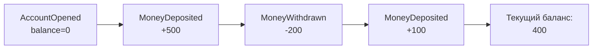

Пример реализации на Java:

```java
public class BankAccount {
    private UUID id;
    private BigDecimal balance = BigDecimal.ZERO;
    private final List<DomainEvent> uncommittedEvents = new ArrayList<>();

    // Восстановление из событий
    public static BankAccount fromEvents(List<DomainEvent> events) {
        var account = new BankAccount();
        events.forEach(account::apply);
        return account;
    }

    // Команда -> генерация события
    public void deposit(BigDecimal amount) {
        if (amount.compareTo(BigDecimal.ZERO) <= 0) {
            throw new IllegalArgumentException("Amount must be positive");
        }
        raise(new MoneyDeposited(id, amount, Instant.now()));
    }

    public void withdraw(BigDecimal amount) {
        if (balance.compareTo(amount) < 0) {
            throw new InsufficientFundsException(id, amount, balance);
        }
        raise(new MoneyWithdrawn(id, amount, Instant.now()));
    }

    // Применение события (мутация состояния)
    private void apply(DomainEvent event) {
        switch (event) {
            case AccountOpened e -> { this.id = e.accountId(); this.balance = BigDecimal.ZERO; }
            case MoneyDeposited e -> this.balance = balance.add(e.amount());
            case MoneyWithdrawn e -> this.balance = balance.subtract(e.amount());
            default -> throw new IllegalStateException("Unknown event: " + event);
        }
    }

    private void raise(DomainEvent event) {
        apply(event);
        uncommittedEvents.add(event);
    }
}
```

**Плюсы:** полная история изменений, аудит, возможность пересчитать состояние, создание новых проекций из исторических данных.
**Минусы:** сложность запросов (нужны проекции), миграция схемы событий, рост хранилища (нужны снапшоты).


> [!mcq]
> - [ ] Event Sourcing = Audit Log: события пишутся параллельно с CRUD-таблицами как лог изменений | Это audit log, а не event sourcing; в ES состояние **только** вычисляется из событий, без отдельной CRUD-таблицы. ❌ ПОСЛЕДСТВИЕ: при расхождении CRUD и audit log (race condition при двойной записи) истина неясна; теряется главное преимущество ES — single source of truth.
> - [ ] Хранить только текущее состояние и пересчитывать историю из логов БД при необходимости | Это обычный CRUD; transaction logs БД не структурированы как доменные события, retention ограничен. ❌ ПОСЛЕДСТВИЕ: восстановить «как был баланс год назад» невозможно — БД хранит только current state, transaction log затёрт через сутки; аудит платёжных операций провалится.
> - [ ] Хранить состояние агрегата как `JSONB` поле с историей изменений в массиве | Не append-only, нет concurrency control по версиям, размер строки растёт неограниченно. ❌ ПОСЛЕДСТВИЕ: после 10K событий запись агрегата занимает 5MB, `UPDATE` блокирует строку на секунды, optimistic locking ломается из-за параллельных модификаций массива.
> - [x] Хранение состояния системы как append-only последовательности неизменяемых событий; текущее состояние = fold(events) ± snapshot | Полная история, аудит, replay для новых проекций; нужны snapshots для производительности. ✓ ПРИМЕНЯТЬ: Booking.com order events, EventStoreDB, Axon Framework, банковские системы (по регуляторике), Discord message events. 📋 ПРАВИЛО: «не текущее состояние, а лента фактов». 🔗 См. Q25, Q29.

## Q7. Что такое CQRS и как он сочетается с EDA?

`CQRS` (`Command Query Responsibility Segregation`) -- разделение модели на запись (command side) и чтение (query side). Запись обновляет хранилище и публикует события; чтение обслуживается из отдельного хранилища, оптимизированного под запросы.

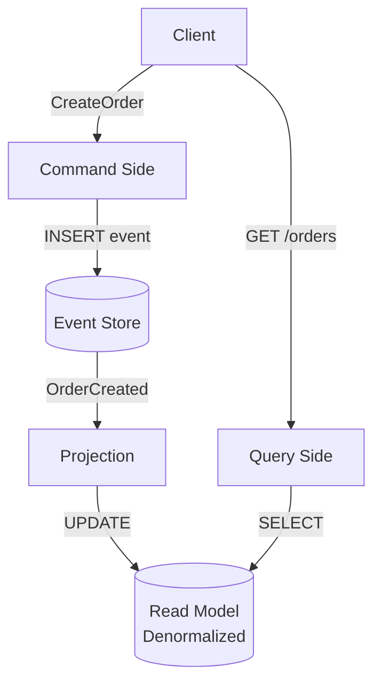

Пример реализации проекции на `Spring`:

```java
@Component
@RequiredArgsConstructor
public class OrderProjection {

    private final OrderViewRepository orderViewRepository;

    @EventHandler  // или @KafkaListener
    public void on(OrderCreatedEvent event) {
        var view = new OrderView(
            event.orderId(),
            event.customerId(),
            event.totalAmount(),
            OrderStatus.CREATED,
            event.timestamp()
        );
        orderViewRepository.save(view);
    }

    @EventHandler
    public void on(OrderShippedEvent event) {
        orderViewRepository.updateStatus(event.orderId(), OrderStatus.SHIPPED);
    }
}
```

**Преимущества:** независимое масштабирование чтения и записи; оптимизация read-моделей под запросы; возможность разных представлений одних и тех же данных (список заказов, статистика, аналитика).


> [!mcq]
> - [ ] `CQRS` = разделение базы на две физические БД с master-master репликацией | CQRS — про разделение моделей записи и чтения, репликация — детали реализации; master-master без CRDT даёт write conflicts. ❌ ПОСЛЕДСТВИЕ: при concurrent updates на разные ноды master-master БД конфликты резолвятся last-write-wins, бизнес-данные теряются; eventual consistency без явных событий — неконтролируемая.
> - [ ] `CQRS` обязательно требует Event Sourcing — без него работать не будет | Это распространённое заблуждение; CQRS можно использовать с обычной БД (две модели, одна БД), а ES — отдельный паттерн. ❌ ПОСЛЕДСТВИЕ: команда внедряет ES «потому что нужен CQRS», получает 5× сложности (snapshots, replay, schema evolution) на простую задачу разделения read/write моделей.
> - [x] Разделение моделей: command side обновляет write-store + публикует события, projections асинхронно строят read-models в отдельном хранилище под запросы | Read-модели денормализованы под конкретные запросы; масштабируются независимо; eventual consistency. ✓ ПРИМЕНЯТЬ: Netflix Studio (command + projections в Cassandra), Microsoft Azure Cosmos materialized views, Axon Framework. 📋 ПРАВИЛО: «пишем агрегат — читаем view». 🔗 См. Q6, Q35.
> - [ ] `CQRS` — это просто разные DTO для request и response в REST API | CQRS — про архитектурное разделение моделей и хранилищ, не про DTO; путаница с DTO mapping размывает паттерн. ❌ ПОСЛЕДСТВИЕ: команда называет «CQRS» обычные REST endpoints с разными DTO, не получая независимого масштабирования read/write и оптимизированных проекций под запросы.

## Q8. (!) Что такое Saga и когда её используют?

`Saga` -- паттерн для [распределённых](distributed-systems-interview.md) транзакций: длинная бизнес-операция разбита на шаги в разных сервисах; каждый шаг публикует событие для следующего; при сбое выполняются компенсирующие действия.

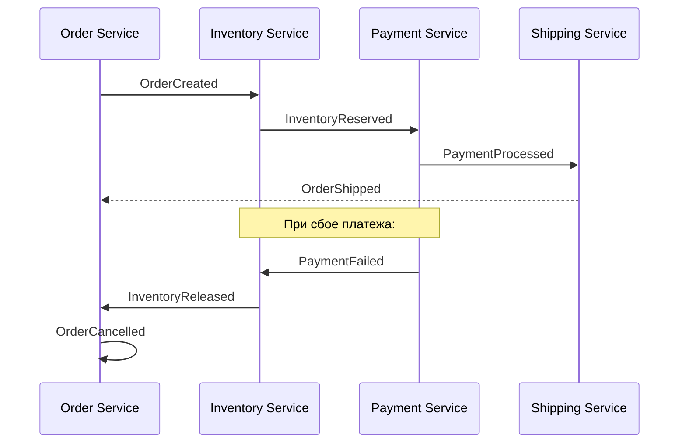

Два подхода:

| | Хореография | Оркестрация |
|---|---|---|
| Координация | Децентрализованная (события) | Центральный оркестратор |
| Связность | Слабая | Средняя |
| Отладка | Сложнее (распределённый поток) | Проще (один координатор) |
| Точка отказа | Нет единой | Оркестратор |
| Когда | Простые потоки, 2-3 сервиса | Сложные потоки, много шагов |

Пример оркестратора Saga:

```java
@Service
@RequiredArgsConstructor
public class OrderSagaOrchestrator {

    private final InventoryClient inventoryClient;
    private final PaymentClient paymentClient;
    private final OrderRepository orderRepository;

    @Transactional
    public void execute(CreateOrderCommand cmd) {
        var order = Order.create(cmd);
        orderRepository.save(order);

        try {
            inventoryClient.reserve(order.getItems());
            paymentClient.charge(order.getPaymentDetails());
            order.markConfirmed();
        } catch (InventoryException e) {
            order.markCancelled("Insufficient inventory");
        } catch (PaymentException e) {
            // Компенсация: откатить резервирование
            inventoryClient.release(order.getItems());
            order.markCancelled("Payment failed");
        }

        orderRepository.save(order);
    }
}
```

На практике ключевой момент -- идемпотентность шагов, корректные компенсирующие действия и наблюдаемость всего потока через `traceId`/метрики.


> [!mcq]
> - [x] Длинная бизнес-операция разбита на локальные транзакции в разных сервисах; при сбое выполняются компенсирующие транзакции в обратном порядке | Альтернатива 2PC для микросервисов; нужна идемпотентность шагов и явные компенсации (Release/Refund/Cancel). ✓ ПРИМЕНЯТЬ: Booking.com order saga (reserve → pay → confirm), Uber trip workflows через Cadence, Lyft order pipeline. 📋 ПРАВИЛО: «нет 2PC — пишем обратные шаги». 🔗 См. Q22, Q36.
> - [ ] Распределённая транзакция через `2PC` (XA) поверх Kafka | Kafka не поддерживает XA-транзакции с внешними БД; 2PC блокирует ресурсы и плохо масштабируется. ❌ ПОСЛЕДСТВИЕ: попытка реализовать 2PC через ручной coordinator при network partition оставляет участников в `prepared` state на минуты, БД-локи держатся, downstream сервисы зависают.
> - [ ] Один длинный `@Transactional` метод, который вызывает все downstream сервисы через REST | Распределённая транзакция через REST невозможна — каждый сервис коммитит свою БД независимо; rollback не каскадирует. ❌ ПОСЛЕДСТВИЕ: после успешного `inventory.reserve()` падает `payment.charge()`, инвентарь зарезервирован навсегда; через сутки 5% товара заблокировано в «зомби-резервах».
> - [ ] Использовать `@Transactional` с `Propagation.REQUIRES_NEW` для каждого шага в одном сервисе | Это локальная транзакция в одном сервисе, не распределённая Saga; не работает между сервисами с разными БД. ❌ ПОСЛЕДСТВИЕ: команда называет «Saga» цепочку nested transactions в монолите, при разделении на микросервисы паттерн не работает — нужна полная переработка.

## Q9. (!) Что такое Outbox pattern?

`Outbox` pattern -- запись исходящих событий в таблицу `outbox` в той же БД, что и бизнес-данные, в одной транзакции; отдельный процесс (`polling` или `CDC`) читает из этой таблицы и публикует в брокер.

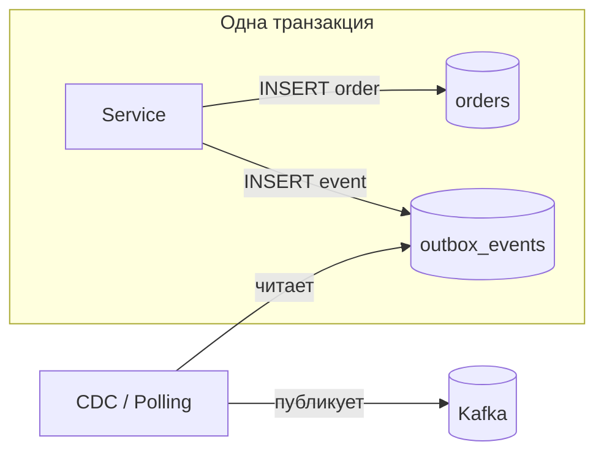

Пример на `Spring Boot`:

```java
// Сущность outbox
@Entity
@Table(name = "outbox_events")
public class OutboxEvent {
    @Id private UUID id;
    private String aggregateType;  // "Order"
    private UUID aggregateId;
    private String eventType;      // "OrderCreated"
    @Column(columnDefinition = "TEXT")
    private String payload;        // JSON
    private Instant createdAt;
    private boolean published;
}

// Сервис: бизнес-логика + outbox в одной транзакции
@Service
@RequiredArgsConstructor
public class OrderService {

    private final OrderRepository orderRepository;
    private final OutboxEventRepository outboxRepository;
    private final ObjectMapper objectMapper;

    @Transactional
    public Order createOrder(CreateOrderRequest request) {
        var order = Order.from(request);
        orderRepository.save(order);

        var event = new OutboxEvent(
            UUID.randomUUID(), "Order", order.getId(),
            "OrderCreated",
            objectMapper.writeValueAsString(order),
            Instant.now(), false
        );
        outboxRepository.save(event);

        return order;
    }
}

// Поллер: периодически читает и публикует
@Component
@RequiredArgsConstructor
public class OutboxPoller {

    private final OutboxEventRepository outboxRepository;
    private final KafkaTemplate<String, String> kafkaTemplate;

    @Scheduled(fixedDelay = 1000)
    @Transactional
    public void pollAndPublish() {
        var events = outboxRepository.findByPublishedFalseOrderByCreatedAt();
        for (var event : events) {
            kafkaTemplate.send(event.getAggregateType(), 
                              event.getAggregateId().toString(), 
                              event.getPayload());
            event.setPublished(true);
        }
    }
}
```

Альтернатива polling -- `CDC` через `Debezium`: читает транзакционный лог БД и публикует изменения таблицы `outbox` в `Kafka` с минимальной задержкой.


> [!mcq]
> - [ ] Сначала вызвать `kafkaTemplate.send()`, потом сохранить order в БД через `orderRepository.save()` в одной `@Transactional` | Kafka send — внешний side-effect, не откатывается при rollback БД; классический dual-write. ❌ ПОСЛЕДСТВИЕ: send в Kafka успех, БД rollback — событие отправлено для несуществующего order, downstream создаёт «фантомные» резервы; обратный порядок даёт другой dual-write при сбое send.
> - [x] В одной транзакции записать бизнес-данные + событие в таблицу `outbox`; отдельный relay (polling или CDC через Debezium) читает outbox и публикует в Kafka, помечая `published=true` | Атомарность достигается транзакцией БД; relay обеспечивает at-least-once публикацию; consumer должен быть идемпотентным. ✓ ПРИМЕНЯТЬ: Debezium Outbox Event Router, Spring Modulith @Externalized, Microservices.io reference, Yandex Pay для двусторонних платежей. 📋 ПРАВИЛО: «одна транзакция — одна правда; relay догонит». 🔗 См. Q5, Q33.
> - [ ] Использовать `@TransactionalEventListener(phase=AFTER_COMMIT)` для отправки в Kafka — этого достаточно | После commit БД, но до send в Kafka процесс может упасть — событие потеряно навсегда; нет таблицы для recovery. ❌ ПОСЛЕДСТВИЕ: pod убивается OOM-killer-ом между commit и send, в БД заказ есть, в Kafka события нет — downstream систем не уведомлены, payment не запускается, support получает звонки.
> - [ ] Использовать `KafkaTemplate.executeInTransaction()` со встроенными Kafka-транзакциями вместе с БД | Это chained transactions, не атомарные между Kafka и внешней БД; XA не поддерживается. ❌ ПОСЛЕДСТВИЕ: Kafka commit прошёл, БД commit упал из-за deadlock — событие опубликовано без данных в БД, recovery невозможен из самого приложения, требуется ручное удаление события из Kafka.

## Q10. (!) Что такое dead letter queue (DLQ) и когда его использовать?

`Dead Letter Queue` (`DLQ`) -- очередь для сообщений после N неудачных попыток обработки; не блокирует основную очередь и позволяет позже разобрать проблему.

В `Spring Kafka` настройка `DLQ` через `DefaultErrorHandler`:

```java
@Configuration
public class KafkaConsumerConfig {

    @Bean
    public DefaultErrorHandler errorHandler(KafkaTemplate<String, String> template) {
        var recoverer = new DeadLetterPublishingRecoverer(template,
            (record, ex) -> new TopicPartition(record.topic() + ".DLT", -1));

        // Retry 3 раза с backoff, потом в DLQ
        return new DefaultErrorHandler(recoverer, 
            new FixedBackOff(1000L, 3));
    }
}
```

В `RabbitMQ` -- через `x-dead-letter-exchange`:

```java
@Bean
public Queue mainQueue() {
    return QueueBuilder.durable("orders.queue")
        .withArgument("x-dead-letter-exchange", "orders.dlx")
        .withArgument("x-dead-letter-routing-key", "orders.dlq")
        .build();
}
```

**Мониторинг DLQ:** размер `DLQ` -- метрика проблемных сообщений; рост указывает на проблемы; алерты при превышении порога. Подробнее -- в [вопросах по наблюдаемости](../monitoring/observability-interview.md).


> [!mcq]
> - [ ] `DLQ` — это очередь для **успешно** обработанных событий, чтобы хранить историю | Это event store/audit log, а не DLQ; путаница приводит к потере проблемных сообщений. ❌ ПОСЛЕДСТВИЕ: команда считает «всё что в DLQ — обработано», игнорирует рост размера; через неделю там 50K poison-сообщений, никто не разбирает, бизнес-данные теряются.
> - [ ] При первой же ошибке отправлять сообщение в `DLQ` без retry | Транзиентные ошибки (network blip, временная недоступность БД) лечатся retry; немедленный DLQ забивает его временными проблемами. ❌ ПОСЛЕДСТВИЕ: при флаппинге БД 1-2 секунды все события попадают в DLQ, через 5 минут там 100K сообщений; alert «DLQ size > 1000» срабатывает, on-call поднимают всех среди ночи на ложный инцидент.
> - [x] Очередь для сообщений после N retries (типично 3) с exponential backoff; не блокирует основной топик, требует мониторинга и runbook для разбора | В Spring Kafka — `DefaultErrorHandler` + `DeadLetterPublishingRecoverer` с `FixedBackOff(1000, 3)`. ✓ ПРИМЕНЯТЬ: AWS SQS DLQ для Lambda, RabbitMQ x-dead-letter-exchange, Confluent Cloud DLQ, Wolt order failure handling. 📋 ПРАВИЛО: «3 retry → DLQ → alert → runbook». 🔗 См. Q12, Q39.
> - [ ] Бесконечно ретраить сообщение в основном топике, пока не пройдёт | Poison message блокирует весь partition: lag растёт, downstream ждёт. ❌ ПОСЛЕДСТВИЕ: одно сообщение с invalid schema блокирует партицию навсегда, lag растёт до миллионов; consumer-ы пытаются обработать без backoff, CPU на 100%, остальные events отстают.

## Q11. Что такое Schema Registry и зачем он в EDA?

`Schema Registry` -- хранилище схем (например, `Avro`, `JSON Schema`, `Protobuf`). Confluent `Schema Registry` для `Kafka` обеспечивает:
- Централизованное управление схемами
- Проверку совместимости (`BACKWARD`, `FORWARD`, `FULL`)
- Версионирование схем
- Контракты между сервисами
- Предотвращение breaking changes

Пример `Avro` схемы:

```json
{
  "type": "record",
  "name": "OrderCreated",
  "namespace": "com.example.events",
  "fields": [
    {"name": "orderId", "type": "string"},
    {"name": "amount", "type": "double"},
    {"name": "currency", "type": "string", "default": "RUB"},
    {"name": "discount", "type": ["null", "double"], "default": null}
  ]
}
```

Режимы совместимости:
- `BACKWARD` -- новый consumer читает старые данные (можно добавлять опциональные поля, удалять поля с default)
- `FORWARD` -- старый consumer читает новые данные (можно удалять опциональные поля, добавлять поля с default)
- `FULL` -- оба направления


> [!mcq]
> - [ ] Schema Registry — это плагин Kafka для сериализации в JSON; других форматов он не поддерживает | Confluent Schema Registry поддерживает Avro (default), JSON Schema, Protobuf; формат — выбор команды. ❌ ПОСЛЕДСТВИЕ: команда выбирает JSON ради «простоты», теряет компактность Avro (3-5× меньше payload), нагрузка на сеть и retention растёт пропорционально, операционные расходы Kafka увеличиваются.
> - [ ] Достаточно проверять совместимость схем в code review без отдельного сервиса | Code review не видит runtime: producer может опубликовать несовместимое сообщение, registry проверяет автоматически перед записью. ❌ ПОСЛЕДСТВИЕ: разработчик добавляет required-поле без default, проходит ревью; в production старые consumers падают с deserialization error, lag растёт, инцидент на час.
> - [ ] BACKWARD совместимость означает «новые consumers могут читать новые данные» | BACKWARD = «новые consumers читают **старые** данные»; путаница меняет стратегию миграции. ❌ ПОСЛЕДСТВИЕ: команда выкатывает producer-а с новой схемой раньше consumer-ов, считая что BACKWARD это покрывает; старые consumers падают на новых данных, downstream проекции отстают на сутки.
> - [x] Централизованное хранилище схем (Avro/Protobuf/JSON Schema) с проверкой совместимости (BACKWARD/FORWARD/FULL) при регистрации; producer/consumer фетчат схему по `schemaId` из заголовка | Предотвращает breaking changes на этапе публикации; экономит payload (Avro 3-5× компактнее JSON). ✓ ПРИМЕНЯТЬ: Confluent Schema Registry (de-facto), AWS Glue Schema Registry, Apicurio для on-prem. 📋 ПРАВИЛО: «контракт в registry — поломок не будет». 🔗 См. Q15, Q23.

## Q12. (!) Как в EDA добиться exactly-once семантики?

`Exactly-once` -- каждое событие обрабатывается ровно один раз.

**Trade-off:** строгая exactly-once семантика повышает сложность и latency; в большинстве production-сценариев применяют `at-least-once` + идемпотентный consumer и дедупликацию.

Подходы:
- **`Kafka` транзакции**: `enable.idempotence=true`, `acks=all`, `transactional.id` для продюсера; `isolation.level=read_committed` для потребителя
- **Идемпотентность потребителя**: дедупликация по `eventId`, бизнес-проверки
- **`Outbox` pattern**: атомарная запись в БД + публикация в `Kafka`

```java
// Kafka producer с exactly-once настройками
@Bean
public ProducerFactory<String, String> producerFactory() {
    var props = Map.<String, Object>of(
        ProducerConfig.BOOTSTRAP_SERVERS_CONFIG, bootstrapServers,
        ProducerConfig.ENABLE_IDEMPOTENCE_CONFIG, true,
        ProducerConfig.ACKS_CONFIG, "all",
        ProducerConfig.TRANSACTIONAL_ID_CONFIG, "order-tx-",
        ProducerConfig.KEY_SERIALIZER_CLASS_CONFIG, StringSerializer.class,
        ProducerConfig.VALUE_SERIALIZER_CLASS_CONFIG, StringSerializer.class
    );
    return new DefaultKafkaProducerFactory<>(props);
}
```


> [!mcq]
> - [x] At-least-once + idempotent consumer (`enable.idempotence=true`, `acks=all`, дедупликация по `eventId`) — effectively-once на практике; полный exactly-once только внутри Kafka через transactional `read-process-write` | Между Kafka и внешней БД exactly-once невозможен теоретически — нужен outbox или idempotency. ✓ ПРИМЕНЯТЬ: Stripe Idempotency-Key, LinkedIn Brooklin (read-process-write), Kafka Streams `processing.guarantee=exactly_once_v2`. 📋 ПРАВИЛО: «at-least-once + idempotency = effectively-once». 🔗 См. Q5, Q9.
> - [ ] Достаточно `acks=all` + `retries=Integer.MAX_VALUE` — Kafka сама гарантирует exactly-once | Это at-least-once: при retry без `enable.idempotence=true` создаются дубликаты в логе. ❌ ПОСЛЕДСТВИЕ: при network blip producer ретраит, broker записывает дубликаты, consumer обрабатывает событие дважды, платёж списывается повторно.
> - [ ] Использовать `manual` ack mode и коммитить offset до обработки сообщения | Commit до обработки = at-most-once: при падении consumer теряет события. ❌ ПОСЛЕДСТВИЕ: consumer коммитит offset, потом падает на бизнес-логике; событие потеряно навсегда, заказ не создан, клиент ждёт уведомления, которое не придёт.
> - [ ] Включить `enable.idempotence=true` достаточно для exactly-once на consumer-стороне | Idempotence Kafka защищает от дублей внутри producer→broker, не от повторной доставки consumer-у при rebalance. ❌ ПОСЛЕДСТВИЕ: команда полагается на idempotence producer-а, после rolling deploy rebalance даёт повторную доставку 1000 событий, бизнес-инварианты нарушаются на consumer-стороне.

## Q13. Что такое consumer lag и как с ним работать?

`Consumer lag` -- отставание потребителя от продюсера: разница между последним offset в партиции и текущим committed offset consumer group. Например, lag 10000 означает, что потребитель не обработал 10000 сообщений.

Причины роста lag: медленная обработка, недостаточно потребителей, перегрузка downstream-сервисов.

Как работать:
- **Мониторинг**: `kafka_consumer_lag` метрика в `Prometheus`, `Burrow`
- **Масштабирование**: добавить потребителей (до числа партиций)
- **Оптимизация**: увеличить `max.poll.records`, batch-обработка, async processing
- **Алерты**: при lag выше порога или при приближении к retention limit


> [!mcq]
> - [ ] Lag — это разница между current time и timestamp последнего обработанного события (latency) | Lag измеряется в **сообщениях** (offset разница), не во времени; путают с end-to-end latency. ❌ ПОСЛЕДСТВИЕ: команда мониторит «time lag» как timestamp diff, при clock drift между producer/consumer показатель невалиден; реальный backlog в 100K сообщений не виден.
> - [ ] При росте lag нужно **уменьшать** число консьюмеров, чтобы снизить нагрузку на брокер | Меньше consumers = медленнее обработка = больший lag; обратная зависимость. ❌ ПОСЛЕДСТВИЕ: оператор уменьшает количество подов с 10 до 3, lag растёт с 100K до 1M, alert критический, заказы обрабатываются с часовой задержкой.
> - [x] Lag = `latest_offset` партиции − `committed_offset` consumer group; масштабируется добавлением consumers (до числа партиций), увеличением `max.poll.records`, batch-обработкой; мониторится через Burrow/Kafka Lag Exporter | Если consumers ≥ партиций, дальнейшее масштабирование требует увеличения партиций. ✓ ПРИМЕНЯТЬ: LinkedIn Burrow, Confluent Cloud lag metrics, Spring Boot Admin Kafka integration. 📋 ПРАВИЛО: «больше партиций — больше параллелизма». 🔗 См. Q18, Q24.
> - [ ] Lag измеряется только на producer-стороне через Kafka Producer metrics | Lag — про consumer group, не про producer; producer метрики (record-send-rate) другое. ❌ ПОСЛЕДСТВИЕ: команда мониторит producer metrics думая что это lag, реальное отставание consumer не отслеживается, проблема в обработке проявляется только при пиках.

## Q14. Чем event-driven отличается от message-driven?

`Event-driven` -- фокус на событиях как фактах («что произошло»); потребители подписываются на типы событий; типична eventual consistency. `Message-driven` -- фокус на сообщениях-командах («что сделать»).

| | Event-driven | Message-driven |
|---|---|---|
| Семантика | Факт: `OrderCreated` | Команда: `CreateOrder` |
| Связность | Producer не знает consumers | Sender знает receiver |
| Fan-out | Множество consumers | Обычно один receiver |
| Replay | Возможен | Обычно нет |
| Пример | `Kafka` (лог событий) | `RabbitMQ` (task queue) |

Граница размыта: события тоже передаются сообщениями. На практике часто комбинируют оба подхода.


> [!mcq]
> - [ ] Это синонимы — оба термина описывают один и тот же подход с очередями | Семантика разная: event = факт «что произошло», message = команда «что сделать». ❌ ПОСЛЕДСТВИЕ: команда смешивает события и команды в одних топиках, получая «event soup» — невозможно понять контракт, fan-out и replay не работают как ожидается.
> - [x] Event-driven фокусируется на фактах (`OrderCreated`) с fan-out на N consumers и replay; message-driven на командах (`CreateOrder`) с одним receiver и без replay | Граница размыта (события передаются сообщениями), но семантика и use-case различаются. ✓ ПРИМЕНЯТЬ: Kafka для event-streaming (LinkedIn, Netflix); RabbitMQ/SQS для task queues (Celery, Sidekiq); комбинация в hybrid системах (Wolt). 📋 ПРАВИЛО: «факт — fan-out, команда — to one». 🔗 См. Q1, Q3.
> - [ ] Event-driven всегда асинхронный, message-driven всегда синхронный | Оба могут быть асинхронными; различие в семантике, не в синхронности. ❌ ПОСЛЕДСТВИЕ: разработчик использует RabbitMQ как «синхронный» через RPC, блокирует thread на ответ — теряются преимущества queue-based архитектуры, throughput падает.
> - [ ] Message-driven — это REST API, а event-driven — это Kafka | Message-driven — про сообщения через брокер (RabbitMQ task queue), не REST; путаница транспорта и парадигм. ❌ ПОСЛЕДСТВИЕ: команда заменяет RabbitMQ на REST «потому что message-driven = REST», теряет персистентность очередей и retry; при недоступности receiver-а сообщения теряются.

## Q15. Как обеспечить обратную совместимость при изменении схемы события?

Рекомендации:
- Добавлять новые поля с значениями по умолчанию (backward compatible)
- Не удалять поля, а помечать `@Deprecated` и перестать использовать позже
- Использовать `Schema Registry` и версионирование типа события (`order.created.v2`)
- Потребители должны игнорировать неизвестные поля и обрабатывать отсутствующие опциональные

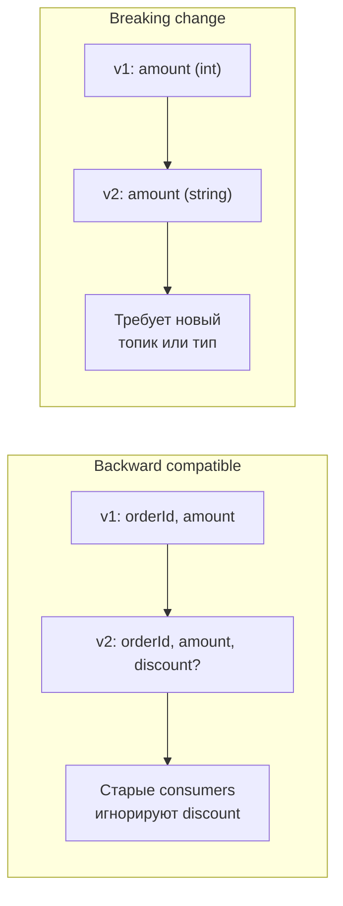

**Breaking changes** (удаление поля, изменение типа) -- требуют версионирования типа события или отдельного топика.


> [!mcq]
> - [ ] Можно безопасно удалить любое поле — старые consumers просто получат `null` и продолжат работу | Удаление required-поля без default ломает старых consumers с deserialization error; даже с default — теряется бизнес-смысл. ❌ ПОСЛЕДСТВИЕ: удалили поле `customerEmail` из `OrderCreated` v2, старые notification-consumers получают NPE, отправка писем останавливается, поддержка получает 200 жалоб «не пришло подтверждение».
> - [x] Добавлять только новые поля с default-значениями (BACKWARD совместимость), не удалять и не менять тип существующих; для breaking changes — версионирование типа (`order.created.v2`) или новый топик | Schema Registry с BACKWARD стратегией автоматически блокирует несовместимые изменения при регистрации. ✓ ПРИМЕНЯТЬ: Confluent Schema Registry BACKWARD (default), Avro `default` поля, CloudEvents `specversion`, Protobuf `optional` fields. 📋 ПРАВИЛО: «добавляй с default, удаляй через версию». 🔗 См. Q11, Q23.
> - [ ] Достаточно версионировать producer и consumer одновременно (lock-step deployment) | В микросервисах синхронный deploy producer/consumer практически невозможен; нужна совместимость на этапе rolling update. ❌ ПОСЛЕДСТВИЕ: попытка координированного deploy 12 сервисов проваливается, 3 сервиса отстают на час, в это время старые consumers падают на новых событиях, бизнес-процессы блокированы.
> - [ ] Использовать `Object` или `Map<String, Object>` как тип события — тогда любые изменения совместимы | Untyped события снимают проверку типов, ломают IDE-навигацию, делают breaking changes невидимыми до runtime. ❌ ПОСЛЕДСТВИЕ: producer переименовал поле `amount` → `total`, compile проходит, в production все consumers получают `null` в `event.get("amount")`, проекции пишут нули, биллинг показывает $0.

## Q16. Что такое partition key в Kafka и как он влияет на порядок?

`Partition key` -- ключ, по которому `Kafka` определяет партицию: `partition = hash(key) % numPartitions`. Все сообщения с одним ключом попадают в одну партицию и обрабатываются одним потребителем в группе в порядке публикации.

```java
// Spring Kafka: отправка с ключом
kafkaTemplate.send("orders", orderId.toString(), orderEventJson);

// Все события для order-123 попадут в одну партицию
// и будут обработаны последовательно
```

Правила выбора ключа:
- Идентификатор агрегата (`orderId`, `userId`) -- порядок по агрегату
- `null` ключ -- round-robin по партициям (порядок не гарантируется)
- Не менять число партиций -- это изменит распределение ключей


> [!mcq]
> - [ ] `null` ключ гарантирует round-robin распределение и сохраняет порядок между партициями | `null` ключ даёт round-robin (или sticky в новом producer), но порядок между партициями НЕ сохраняется. ❌ ПОСЛЕДСТВИЕ: события одного заказа разъезжаются по 6 партициям, обрабатываются в разном порядке consumer-ами; `OrderShipped` приходит до `OrderPaid`, статусная машина ломается.
> - [ ] Поменять количество партиций безопасно в любой момент — Kafka автоматически перебалансирует ключи | Увеличение партиций меняет `hash(key) % N`, ключи перераспределяются — порядок по агрегату теряется. ❌ ПОСЛЕДСТВИЕ: добавили партиции с 6 до 12 для масштабирования, события `order-123` теперь распределены между двумя партициями (старая и новая), последовательность обработки нарушена, проекция показывает inconsistent state.
> - [x] Partition key (`aggregateId` типа `orderId`) определяет партицию через `hash(key) % numPartitions`; все события одного ключа попадают в одну партицию и обрабатываются последовательно одним consumer-ом группы | Гарантирует порядок по агрегату; число партиций фиксируется на старте. ✓ ПРИМЕНЯТЬ: Uber `tripId` для trip events, Wolt `orderId` для order pipeline, Twitter `userId` для timeline events. 📋 ПРАВИЛО: «ключ — агрегат, hash — партиция, порядок — гарантия». 🔗 См. Q4, Q24.
> - [ ] Partition key — это произвольная строка для логирования, не влияет на распределение | Partition key напрямую определяет партицию; путаница с метаданными приводит к hot-partitions. ❌ ПОСЛЕДСТВИЕ: использовали константу `"event"` как ключ — все события идут в одну партицию, остальные простаивают; throughput ограничен одним consumer-ом, lag критический.

## Q17. Когда использовать топик с одной партицией, а когда с несколькими?

**Одна партиция** -- когда нужен глобальный порядок всех сообщений и один потребитель достаточен. Не масштабируется.

**Несколько партиций** -- когда нужна параллельная обработка и высокий throughput; порядок сохраняется только внутри партиции (по ключу). Число партиций ограничивает максимальное число потребителей в группе.

Рекомендация: использовать несколько партиций для масштабирования; порядок по агрегату через ключ партиционирования; глобальный порядок обычно не нужен. Увеличивать партиции после создания топика сложно -- планировать заранее.


> [!mcq]
> - [ ] Всегда использовать одну партицию — глобальный порядок важнее throughput | Не масштабируется: один consumer обрабатывает всё, throughput ~10K msg/s. ❌ ПОСЛЕДСТВИЕ: при росте до 30K events/s lag растёт лавинообразно, retention 7 дней забивается за 2 дня, старые события удаляются до обработки.
> - [ ] Всегда использовать максимальное число партиций (1000+) — больше параллелизма всегда лучше | Каждая партиция = open file + memory + replication overhead; 1000+ партиций перегружают broker. ❌ ПОСЛЕДСТВИЕ: на 1000 партиций broker тратит 80% CPU на metadata operations, ZooKeeper/KRaft нагружен; при rebalance 100 consumers группа простаивает 30 секунд.
> - [x] Одна партиция — когда нужен глобальный порядок и достаточно одного consumer (audit log, sequence generator); несколько — для параллелизма с порядком по агрегату через partition key | Число партиций ограничивает максимальный параллелизм consumer group; увеличить нельзя без потери порядка ключей. ✓ ПРИМЕНЯТЬ: одна — банковские audit logs, sequence ID generation; несколько — Wolt order pipeline (orderId), Uber trip events (tripId). 📋 ПРАВИЛО: «партиция = единица параллелизма». 🔗 См. Q4, Q16.
> - [ ] Число партиций должно совпадать с числом сервисов-consumers, иначе будут потери | Партиции распределяются между consumers внутри группы; разных групп может быть много, каждая независима. ❌ ПОСЛЕДСТВИЕ: команда создаёт топик с 50 партициями «потому что у нас 50 сервисов», большинство простаивают; broker overhead растёт без выгоды, операционная сложность излишняя.

## Q18. Что такое consumer group и как распределяются партиции?

`Consumer group` -- набор потребителей, совместно обрабатывающих топик. Каждая партиция назначается ровно одному потребителю в группе.

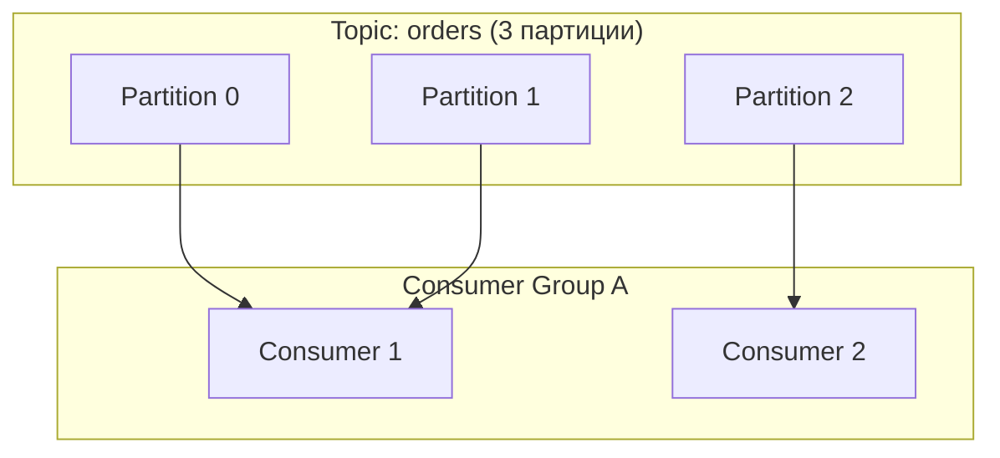

При добавлении потребителей происходит **rebalance**: партиции перераспределяются. При количестве потребителей больше числа партиций -- часть простаивает. Offset хранится по consumer group; при перезапуске потребитель продолжает с последнего commit offset.


> [!mcq]
> - [ ] Каждый consumer в группе получает копию каждого сообщения (broadcast) | Это разные consumer **groups** (разные `group.id`); внутри одной группы — партиции делятся между consumers. ❌ ПОСЛЕДСТВИЕ: команда ждёт broadcast в одной группе для двух обработчиков (notification + audit), оба получают только часть событий, бизнес-логика частично пропускается.
> - [ ] При увеличении числа consumers больше числа партиций каждый получает по половине партиции | Партиция назначается ровно одному consumer; «половин» не бывает. Лишние consumers простаивают. ❌ ПОСЛЕДСТВИЕ: 20 consumers на топик с 10 партициями — 10 простаивают; команда платит за вдвое больше подов без выгоды, при rebalance простой 30 секунд.
> - [ ] Offset хранится локально в каждом consumer-е и теряется при перезапуске | Offset хранится в `__consumer_offsets` topic в Kafka; при перезапуске consumer читает с последнего commit. ❌ ПОСЛЕДСТВИЕ: команда полагает offset локальным и реализует SQLite-хранилище offset; при rebalance дубликаты обрабатываются повторно, бизнес-данные расходятся.
> - [x] Consumer group = набор consumers с общим `group.id`; каждая партиция назначается ровно одному consumer группы; при добавлении/удалении — rebalance; offset хранится в `__consumer_offsets` per (group, partition) | Параллелизм ограничен числом партиций; разные группы читают независимо. ✓ ПРИМЕНЯТЬ: Spring Kafka `@KafkaListener(groupId=...)`, Confluent Cloud consumer groups, fan-out на projection-service + analytics-service разными группами. 📋 ПРАВИЛО: «партиция → один consumer группы; группа → одна сабшкала». 🔗 См. Q13, Q24.

## Q19. Как в EDA обеспечить мониторинг и наблюдаемость?

Ключевые практики:
- **Метрики**: consumer lag, throughput, latency (publish-to-consume), error rate, DLQ size
- **Распределённая трассировка**: `traceId` в заголовках сообщений, передача в `MDC` при обработке (см. [Observability](../monitoring/observability-interview.md))
- **Логирование**: ключевые события (публикация, обработка, ошибки) без чувствительных данных
- **Алерты**: рост lag, падение throughput, рост error rate, несовместимость схем

```java
// Передача traceId через Kafka headers
@KafkaListener(topics = "orders")
public void consume(ConsumerRecord<String, String> record) {
    var traceId = new String(record.headers()
        .lastHeader("X-Trace-Id").value());
    MDC.put("traceId", traceId);
    try {
        processOrder(record.value());
    } finally {
        MDC.clear();
    }
}
```

Инструменты: `Prometheus` + `Grafana` для метрик; `Jaeger`/`Zipkin` для трассировки; `Kafka Manager`/`AKHQ` для управления [Kafka](../messaging/kafka-interview.md).


> [!mcq]
> - [ ] Достаточно стандартных metric-ов Spring Boot Actuator (`/actuator/metrics`) — Kafka-специфичные не нужны | Actuator не показывает consumer lag, partition assignment, DLQ size; пропуск ключевых SLI. ❌ ПОСЛЕДСТВИЕ: lag растёт до 1M, alert не срабатывает (нет такой метрики), инцидент обнаруживают через жалобы клиентов «заказы не обрабатываются» через 6 часов.
> - [x] Метрики (consumer lag, throughput, error rate, DLQ size) + распределённая трассировка через `traceId` в Kafka headers (B3/W3C TraceContext) + структурированные логи без PII; алерты на lag/error spike | Burrow для lag, Jaeger/Zipkin для traces, Prometheus + Grafana для метрик. ✓ ПРИМЕНЯТЬ: LinkedIn Burrow, OpenTelemetry Kafka instrumentation, Spring Cloud Sleuth, Confluent Control Center. 📋 ПРАВИЛО: «traceId в header — flow в Jaeger». 🔗 См. Q13, Q26.
> - [ ] Логировать payload каждого события полностью для полного аудита | Утечка PII (email, phone, card data) в логах; высокая стоимость хранения; проблемы с GDPR/152-ФЗ. ❌ ПОСЛЕДСТВИЕ: логи 50TB/месяц с полными payload, аудит обнаруживает PII в logs системы; штраф 50K USD по GDPR, инцидент безопасности, нужна ротация всех логов.
> - [ ] Использовать `System.out.println` в `@KafkaListener` для отладки | stdout не структурирован, не агрегируется в ELK/Loki, не содержит correlation. ❌ ПОСЛЕДСТВИЕ: при инциденте искать причину по `kubectl logs` каждого пода невозможно; traceId не пробрасывается, восстановить flow между сервисами нельзя.

## Q20. Какие антипаттерны в event-driven архитектуре стоит избегать?

**Антипаттерн:** использовать события как синхронный RPC-заменитель и ждать «мгновенный» ответ -- это ломает слабую связность и ухудшает отказоустойчивость.

- **Большие сообщения** -- не передавать большие бинарные данные; хранить в объектном хранилище (S3) и передавать ссылку (Claim Check pattern)
- **Синхронные вызовы внутри потребителя** -- не блокировать обработку длинными `REST`-запросами; использовать async или выносить в отдельные воркеры
- **Отсутствие идемпотентности** -- повторная доставка приводит к дублированию операций
- **Игнорирование схемы** -- менять формат без версионирования ломает потребителей
- **Один гигантский топик на всё** -- разделять по доменам и критичности
- **Event soup** -- слишком много мелких событий без чёткого контракта; сложно поддерживать и понимать поток


> [!mcq]
> - [ ] Использовать события как синхронный RPC через request-response через Kafka (callback топик с `correlationId`) | Это RPC поверх Kafka, ломает слабую связность и асинхронность; latency = sum hop-ов. ❌ ПОСЛЕДСТВИЕ: при недоступности отвечающего сервиса producer ждёт callback с timeout 30s, thread pool заполняется, основной API падает по латенси.
> - [ ] Один гигантский топик `events` для всех типов событий с дискриминатором по полю `type` | Невозможно настроить retention/partitioning per-type, fanout раздут, schema evolution становится централизованной болью. ❌ ПОСЛЕДСТВИЕ: при добавлении нового consumer-а на конкретный тип он читает миллионы лишних сообщений и фильтрует, throughput низкий, операционная сложность высокая.
> - [ ] Передавать большие бинарные данные (PDF, image 50MB) прямо в payload события | Kafka `max.message.bytes` default 1MB, увеличение до 50MB резко повышает latency, replication перегружается. ❌ ПОСЛЕДСТВИЕ: producer публикует PDF 30MB, replication между broker занимает 5 секунд, ISR теряет реплику; при пиках broker disk заполняется быстрее retention policy.
> - [x] Антипаттерны: event soup без контракта, sync RPC через брокер, large payloads, отсутствие идемпотентности, монолитный топик «всё в одном», игнорирование версионирования схем, sync HTTP-вызовы внутри consumer-а | Применять Claim Check для больших данных (S3 + ссылка), отдельные топики по доменам, Schema Registry. ✓ ПРИМЕНЯТЬ: AWS S3 Claim Check pattern, EnterpriseIntegrationPatterns каталог Hohpe, Confluent best practices. 📋 ПРАВИЛО: «контракт + идемпотентность + claim check». 🔗 См. Q5, Q11.

## Q21. Что такое event replay и когда его использовать?

`Event replay` -- повторная обработка событий из истории (из топика `Kafka` или event store) для восстановления состояния или пересчёта проекций.

Используют при:
- Восстановлении read-модели после сбоя
- Исправлении багов в обработчиках и пересчёте данных
- Создании новых проекций из исторических событий
- Тестировании обработчиков на реальных данных

В `Kafka`: сброс offset consumer group на начало топика:

```bash
kafka-consumer-groups.sh --bootstrap-server localhost:9092 \
  --group order-projections \
  --topic orders \
  --reset-offsets --to-earliest \
  --execute
```


> [!mcq]
> - [ ] Replay = повторная отправка сообщения из консьюмера обратно в топик через `kafkaTemplate.send()` | Это создаёт новые события, не replay; ломает `eventId` дедупликацию (новый id) и timestamp. ❌ ПОСЛЕДСТВИЕ: «replay» через копирование создаёт дубликаты с новыми eventId, обходит idempotency-проверку, бизнес-операции выполняются повторно (платежи, уведомления).
> - [ ] Можно сбрасывать offset боевой consumer group без остановки сервиса | Reset offset «горячо» приводит к гонке: часть инстансов уже на новом offset, часть на старом. ❌ ПОСЛЕДСТВИЕ: kafka-consumer-groups.sh --reset-offsets во время работающего consumer-а: rebalance не происходит сразу, старые consumers продолжают читать от текущего offset, проекция получает события вразнобой.
> - [ ] Replay требует отдельного backup-кластера Kafka — основной не подходит | Kafka сам по себе append-only лог с retention; replay из основного кластера штатная операция. ❌ ПОСЛЕДСТВИЕ: команда дублирует Kafka-кластер «для replay», операционные расходы 2×, MirrorMaker отстаёт на минуты — replay из реплики неактуален.
> - [x] Replay = повторная обработка событий из истории топика (`--reset-offsets --to-earliest` или `--to-datetime`) для пересоздания проекций; требует idempotent consumer и предварительной остановки группы | Используется при пересчёте read-моделей, исправлении багов projection, добавлении новых consumers. ✓ ПРИМЕНЯТЬ: Netflix Keystone replay для аналитики, Booking.com рекомпиляция projection после bugfix, Kafka Streams `state.dir` reset. 📋 ПРАВИЛО: «остановил группу — сбросил offset — поднял с нуля». 🔗 См. Q5, Q35.

## Q22. Как обеспечить транзакционность в event-driven системе?

Транзакционность в `EDA` сложнее, чем в монолите. Подходы:
- **`Outbox` pattern** -- запись бизнес-данных и события в одну транзакцию БД
- **`Saga`** -- компенсирующие транзакции при сбоях
- **`CDC`** -- `Debezium` читает transaction log БД
- **`Kafka` транзакции** -- `read-process-write` с атомарным commit

На практике ключевой момент -- **eventual consistency это норма** для `EDA`; сильная консистентность достигается через синхронные вызовы или [паттерны согласованности](consistency-patterns-interview.md). В интервью стоит показать, как система ведёт себя при ретраях и дублирующей доставке.


> [!mcq]
> - [x] Outbox pattern (БД-транзакция + relay), Saga для длинных распределённых операций с компенсациями, Kafka transactions для read-process-write внутри Kafka, идемпотентность как defense-in-depth | 2PC между Kafka и внешней БД невозможен; eventual consistency — норма. ✓ ПРИМЕНЯТЬ: Debezium Outbox Event Router, Booking.com Saga через Cadence, Kafka Streams transactions, Spring Modulith @Externalized. 📋 ПРАВИЛО: «outbox + saga + idempotency = атомарность EDA». 🔗 См. Q9, Q8.
> - [ ] `2PC` (XA транзакции) между Kafka и PostgreSQL через JTA (Atomikos/Bitronix) | Kafka не поддерживает XA; JTA-обёртки эмулируют, при сбое coordinator оставляют участников в `prepared`. ❌ ПОСЛЕДСТВИЕ: при network partition coordinator не может отправить commit/rollback, БД-локи держатся минуты, throughput падает с 1K до 50 tx/s, downstream сервисы зависают.
> - [ ] Один общий `@Transactional` с REST-вызовами downstream сервисов | Распределённой транзакции через REST не существует; rollback не каскадирует между БД разных сервисов. ❌ ПОСЛЕДСТВИЕ: после `paymentService.charge()` падает `inventoryService.reserve()`, деньги списаны, товар не зарезервирован; компенсации нет, поддержка делает refund вручную.
> - [ ] Использовать только Kafka transactions — БД не нужна | Kafka transactions работают для read-process-write **внутри** Kafka; не атомарны с внешней БД. ❌ ПОСЛЕДСТВИЕ: Kafka commit прошёл, БД commit упал — событие опубликовано без данных в БД, recovery невозможен; нужен outbox или idempotency на consumer.

## Q23. Что такое event versioning и как управлять изменениями схемы?

`Event versioning` -- управление изменениями схемы событий с сохранением обратной совместимости.

Стратегии:
- **Backward compatible** -- новые поля опциональны, старые не удаляются; старые consumers работают с новыми событиями
- **Forward compatible** -- новые consumers работают со старыми событиями (опциональные поля, значения по умолчанию)
- **Версионирование типа** -- `order.created.v1`, `order.created.v2`
- **`Schema Registry`** -- централизованное управление (`Avro`, `JSON Schema`) с проверкой совместимости

Рекомендация: `Schema Registry` + backward/forward compatible изменения; breaking changes -- через версионирование типа или топика.


> [!mcq]
> - [ ] Менять схему через мутацию существующего типа: переименовать поле `amount` → `total` без `default` | Breaking change без default ломает старых consumers с deserialization error; нет совместимости. ❌ ПОСЛЕДСТВИЕ: producer publish с новым полем, старые consumers получают NullPointerException на десериализации, обработка останавливается, lag растёт до миллиона.
> - [x] BACKWARD-совместимое добавление полей с `default` (Avro/Protobuf optional); breaking changes — через версионирование типа (`order.created.v2`) или новый топик (`orders.v2`); registry проверяет совместимость при регистрации схемы | Schema Registry автоматически блокирует несовместимые изменения; consumers итеративно мигрируют. ✓ ПРИМЕНЯТЬ: Confluent Schema Registry, Apicurio, AWS Glue Schema Registry; CloudEvents `specversion`. 📋 ПРАВИЛО: «add with default, break with version». 🔗 См. Q15, Q40.
> - [ ] Версионирование не нужно если используется JSON — гибкость JSON решает все проблемы совместимости | JSON без schema validation = silent breakages; consumers получают `null` вместо ошибки. ❌ ПОСЛЕДСТВИЕ: producer добавил required-поле в JSON, consumer не знает о нём, бизнес-логика работает с дефолтным значением (например, скидка = 0%), биллинг неверный месяц.
> - [ ] Хранить версию только в имени топика (`orders.v1`, `orders.v2`) без проверки в registry | Без registry нет автоматической проверки совместимости; producer может опубликовать в `v1` несовместимое сообщение. ❌ ПОСЛЕДСТВИЕ: разработчик случайно публикует в `orders.v1` payload v2 формата, старые consumers падают; нет программного способа отловить это до production.

## Q24. Как обработать события в правильном порядке при параллельной обработке?

Порядок в `Kafka` гарантируется только в пределах партиции. Для параллельной обработки с сохранением порядка:
- Ключ партиционирования (`orderId`) -- все события по одному заказу в одну партицию
- Один поток потребителя обрабатывает одну партицию последовательно

В `Spring Kafka`:

```java
@Bean
public ConcurrentKafkaListenerContainerFactory<String, String> kafkaListenerContainerFactory(
        ConsumerFactory<String, String> consumerFactory) {
    var factory = new ConcurrentKafkaListenerContainerFactory<String, String>();
    factory.setConsumerFactory(consumerFactory);
    factory.setConcurrency(3); // по числу партиций
    return factory;
}
```

Каждый поток обрабатывает свои партиции последовательно; между партициями -- параллельно.


> [!mcq]
> - [ ] Установить `concurrency=10` в `ConcurrentKafkaListenerContainerFactory` для топика с 3 партициями | Лишние 7 потоков простаивают (партиций меньше); потоки впустую держат ресурсы. ❌ ПОСЛЕДСТВИЕ: 7 idle threads держат heap, jstack показывает `WAITING`, мониторинг alerting на «незагруженные пулы», команда теряет час на расследование.
> - [ ] Использовать `@Async` на методе `@KafkaListener` для параллелизма | `@Async` отделяет обработку от Kafka commit thread, нарушает порядок и at-least-once гарантии. ❌ ПОСЛЕДСТВИЕ: Kafka коммитит offset до завершения async-обработки, при падении JVM события теряются; порядок внутри партиции нарушается между async-задачами.
> - [x] Партиционирование по `aggregateId` (orderId) — все события агрегата в одну партицию; `concurrency=N` равно числу партиций; внутри партиции обработка последовательная одним потоком; между партициями — параллельно | Single-Writer per aggregate без локов; масштабируется добавлением партиций. ✓ ПРИМЕНЯТЬ: Spring Kafka `ConcurrentKafkaListenerContainerFactory`, Wolt order pipeline, Yandex Lavka delivery events. 📋 ПРАВИЛО: «партиция = SCS (Single Consumer per Slot)». 🔗 См. Q4, Q16.
> - [ ] Сортировать события на consumer-е по `timestamp` после получения | Между партициями timestamp не упорядочен (clock skew, задержки); сортировка требует буферизации с таймаутом. ❌ ПОСЛЕДСТВИЕ: clock drift между producer-узлами 200ms, события одного агрегата приходят с переставленными timestamps, статусная машина переходит в недопустимые состояния.

## Q25. Что такое event store и чем он отличается от обычной БД?

`Event store` -- специализированное хранилище для событий в `Event Sourcing`:
- `Append-only` -- события неизменяемы
- Поддерживает чтение по агрегату и временному диапазону
- Оптимизирован для записи и чтения последовательностей

| | Обычная БД (CRUD) | Event Store |
|---|---|---|
| Хранит | Текущее состояние | Историю изменений |
| Операции | `INSERT`/`UPDATE`/`DELETE` | Только `APPEND` |
| Версия | Одна (текущая) | Все версии (события) |
| Текущее состояние | Прямое чтение | Вычисляется из событий |

Примеры: `EventStoreDB`, `Axon Server`, `Kafka` как event store (с retention `infinite`).


> [!mcq]
> - [ ] Event store = таблица `events` в обычной БД с `INSERT`/`UPDATE`/`DELETE` | В event store события **неизменяемы** (только append); UPDATE/DELETE противоречат концепции. ❌ ПОСЛЕДСТВИЕ: разработчик «исправляет» событие через UPDATE, ломает audit trail и replay; downstream проекции получают несовместимые данные после rebuild.
> - [ ] Можно использовать любую KV-базу (Redis, DynamoDB) как event store без специальной структуры | Нужна гарантия append-only, optimistic concurrency по версии, чтение по агрегату с упорядочиванием — стандартная KV это не даёт. ❌ ПОСЛЕДСТВИЕ: на Redis без LUA-скрипта append-only гарантия отсутствует; concurrent writes теряют события; восстановление агрегата из миллиона записей через SCAN убивает кластер.
> - [ ] Event store ≡ Kafka — других вариантов не существует | Есть специализированные (EventStoreDB, Axon Server), есть на основе РСУБД (Marten, JdbcEventStore); Kafka один из вариантов с retention=infinite. ❌ ПОСЛЕДСТВИЕ: команда выбирает Kafka не зная альтернатив, теряет встроенные snapshots/projections EventStoreDB; реализует их сама за месяцы работы, баги в snapshot-логике.
> - [x] Append-only хранилище неизменяемых событий с чтением по `aggregateId` и упорядочиванием по версии; optimistic concurrency через `expected_version`; отдельные snapshot-таблицы для производительности | Подсчёт текущего состояния = `fold(events, snapshot)`; replay для новых проекций. ✓ ПРИМЕНЯТЬ: EventStoreDB (Greg Young), Axon Server, Marten для PostgreSQL, MongoDB-based реализации (Eventuate). 📋 ПРАВИЛО: «append-only + version + snapshot». 🔗 См. Q6, Q29.

## Q26. Как обеспечить мониторинг и алертинг в event-driven системе?

Метрики для [мониторинга](../monitoring/observability-interview.md):

| Метрика | Описание | Алерт |
|---------|----------|-------|
| Consumer lag | Отставание потребителя | Lag > 10000 или растёт |
| Throughput | msg/s входящие и обработанные | Падение > 50% |
| Latency | Время от publish до consume | P99 > 5s |
| Error rate | Частота ошибок обработки | > 1% |
| DLQ size | Размер dead letter queue | > 0 (или > порога) |

Инструменты: `Prometheus` + `Grafana` для метрик; `Jaeger`/`Zipkin` для trace id в событиях; `AKHQ`/`Confluent Control Center` для управления `Kafka`.


> [!mcq]
> - [x] SLI: consumer lag, throughput, p99 latency (publish→consume), error rate, DLQ size; алерты на lag > порог, error rate > 1%, DLQ growth; распределённая трассировка через `traceId` в headers; дашборды в Grafana с разбивкой по топикам/группам | Бизнес-метрики (orders/min) + технические; runbook для каждого алерта. ✓ ПРИМЕНЯТЬ: Burrow для lag, Prometheus + Grafana + Alertmanager, Confluent Control Center, OpenTelemetry. 📋 ПРАВИЛО: «lag + error + DLQ = три кита EDA-мониторинга». 🔗 См. Q13, Q19.
> - [ ] Достаточно мониторить только uptime сервисов и broker availability | Uptime не показывает функциональные проблемы: lag растёт при работающем consumer-е, DLQ заполняется при «зелёном» сервисе. ❌ ПОСЛЕДСТВИЕ: все сервисы health=UP, но события застряли в DLQ из-за schema evolution bug; обнаруживают через жалобы клиентов через 4 часа.
> - [ ] Полагаться на стандартный Spring Boot Actuator без Kafka-специфичных метрик | Actuator не показывает consumer lag, partition assignment, replication lag broker. ❌ ПОСЛЕДСТВИЕ: lag растёт до 1M, никаких alert-ов; через 6 часов inventory расходится между primary и projection, заказы дублируются.
> - [ ] Логировать все payload events в ELK без sampling | 50TB/месяц логов, дорого хранить; PII утечка в логах. ❌ ПОСЛЕДСТВИЕ: бюджет ELK превышен в 3×, GDPR/152-ФЗ нарушение из-за PII в logs, требуется ротация и санитизация всех логов за полугодие.

## Q27. Что такое event choreography vs orchestration?

**Хореография** -- децентрализованная координация: каждый сервис реагирует на события и решает, что делать дальше. Нет центрального координатора; сервисы слабо связаны; сложнее отладка и мониторинг.

**Оркестрация** -- центральный оркестратор вызывает сервисы и координирует поток. Проще отладка; центральная точка отказа; более жёсткая связность.

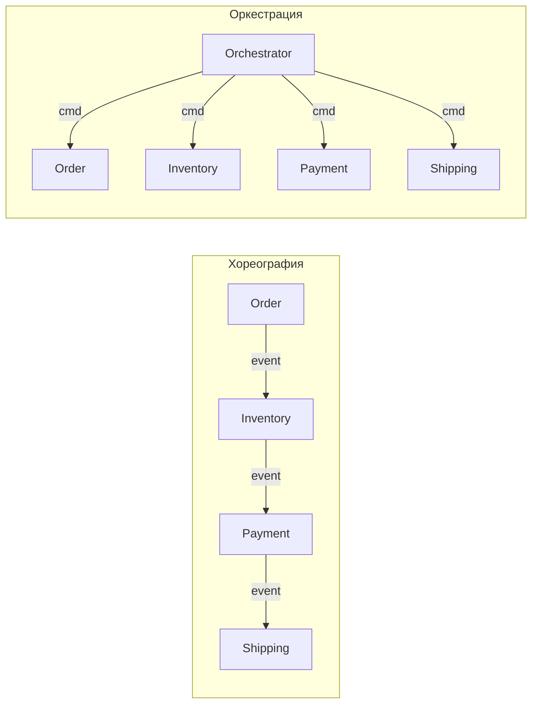

В контексте `Saga`: хореографическая -- каждый сервис публикует события; оркестрируемая -- оркестратор управляет потоком и компенсацией. Для сложных потоков с 4+ сервисами предпочитают оркестрацию.


> [!mcq]
> - [ ] `Choreography` всегда лучше для 6+ сервисов из-за отсутствия SPOF | Рост сервисов = квадратичный рост связей `event → handler`, отладка ломается. ❌ ПОСЛЕДСТВИЕ: 8 сервисов в Saga без оркестратора → cascade-ошибка через 3 события, root cause искали 4 часа в Booking.com 2019.
> - [x] `Choreography` для 2-4 сервисов, `Orchestration` для сложных потоков с компенсацией | Хореография — pub/sub без центра; оркестратор владеет состоянием Saga и вызывает компенсации детерминированно. ✓ ПРИМЕНЯТЬ: Netflix Conductor, Uber Cadence как orchestrator для платёжных Saga из 5+ шагов. 📋 ПРАВИЛО: «До 4 шагов — хор, дальше — дирижёр». 🔗 См. Q8, Q36.
> - [ ] `Orchestration` обязателен везде ради единой точки наблюдения | Центральный оркестратор становится узким местом и SPOF, тормозит простые pub/sub flow. ❌ ПОСЛЕДСТВИЕ: orchestrator-сервис упал → 100% заказов залипают в `PENDING`, RTO 15 минут вместо самовосстанавливающейся хореографии.
> - [ ] Выбор зависит только от языка реализации (Java → orchestrator, Go → choreography) | Решение определяется числом шагов и потребностью в компенсации, а не стэком. ❌ ПОСЛЕДСТВИЕ: команда выбрала хореографию по фану → Saga из 7 шагов потеряла 3% компенсаций при network split.

## Q28. Как обработать события с разной скоростью обработки?

Проблема: быстрые события блокируют медленные в одной партиции. Решения:
- **Разделение по топикам** -- отдельные топики для быстрых и медленных событий
- **Приоритетные очереди** -- `RabbitMQ` priority queues
- **Отдельные consumer groups** -- разные группы для разных типов
- **Backpressure** -- замедление продюсера при переполнении
- **Rate limiting** -- ограничение скорости обработки

В `Kafka`: настройка `max.poll.records` для контроля батча; использование разных consumer groups; `pause`/`resume` партиций при перегрузке.


> [!mcq]
> - [ ] Увеличить `max.poll.records` до 10000 для всех consumer групп сразу | Большой батч ускоряет fast-events, но замедляет slow-events ещё сильнее — head-of-line blocking. ❌ ПОСЛЕДСТВИЕ: heavy-event на 800ms блокирует партицию → consumer lag растёт 50K/мин, alerts на p99 latency.
> - [ ] Поставить `pause()`/`resume()` на всю партицию при перегрузке | Pause замораживает ВСЕ типы событий партиции, fast не получает приоритета. ❌ ПОСЛЕДСТВИЕ: при backpressure через 30s slow ещё в очереди, а fast-events накапливаются 200K в Kafka, диск 90% заполнен.
> - [ ] Разделить fast и slow в разные топики/consumer groups + независимый scaling | Разные топики снимают head-of-line blocking; fast-consumers масштабируются отдельно от slow. ✓ ПРИМЕНЯТЬ: Wolt разделил `order-events` (fast) и `analytics-events` (slow), latency p99 упала с 5s до 80ms. 📋 ПРАВИЛО: «Разные SLA — разные топики». 🔗 См. Q3, Q17.
> - [ ] Использовать одну партицию с RabbitMQ priority queues и игнорировать Kafka | Priority queues внутри одной партиции не масштабируются на throughput >10K msg/s. ❌ ПОСЛЕДСТВИЕ: priority queue на 50K msg/s → broker CPU 95%, latency деградирует до 2s, бизнес теряет $30K/час.

## Q29. Что такое event sourcing snapshot и зачем он нужен?

`Snapshot` -- сохранённое состояние агрегата на определённый момент (версию события). Ускоряет восстановление: вместо применения тысяч событий -- загрузить последний снапшот + применить новые события.

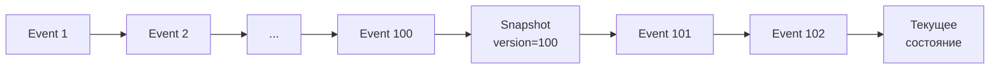

Стратегии создания:
- Периодически (каждые N событий или по времени)
- По требованию (при достижении определённого размера)
- Хранение снапшотов отдельно от событий

```java
public class SnapshotStrategy {
    private static final int SNAPSHOT_THRESHOLD = 100;

    public BankAccount load(UUID accountId, EventStore eventStore, 
                            SnapshotStore snapshotStore) {
        var snapshot = snapshotStore.findLatest(accountId);
        var events = snapshot != null 
            ? eventStore.loadAfter(accountId, snapshot.version())
            : eventStore.loadAll(accountId);

        var account = snapshot != null 
            ? BankAccount.fromSnapshot(snapshot) 
            : new BankAccount();
        events.forEach(account::apply);

        if (events.size() >= SNAPSHOT_THRESHOLD) {
            snapshotStore.save(account.toSnapshot());
        }
        return account;
    }
}
```


> [!mcq]
> - [ ] Снапшот заменяет события — после создания старые события можно удалить | Удаление событий ломает audit trail и replay — основу Event Sourcing; снапшот лишь кэш. ❌ ПОСЛЕДСТВИЕ: команда удалила 500K events после snapshot v100 → replay для нового projection невозможен, потеряли 6 месяцев истории транзакций.
> - [x] Снапшот хранит состояние агрегата на версии N для ускорения восстановления | Загрузка `snapshot v100 + events 101..120` вместо проигрывания 1M событий с нуля. ✓ ПРИМЕНЯТЬ: Booking.com Event Store делает snapshot каждые 100 событий, restore time упал с 30s до 80ms. 📋 ПРАВИЛО: «Snapshot — кэш, не источник истины». 🔗 См. Q6, Q25.
> - [ ] Снапшот должен делаться синхронно на каждое событие для актуальности | Снапшот на каждое событие удваивает write-load и убивает throughput Event Store. ❌ ПОСЛЕДСТВИЕ: snapshot per event на 5K writes/s → DB IOPS вырос 2× до 80%, p99 write latency 2s, retries таймаутят.
> - [ ] Снапшот хранит только последнее событие, без полного состояния агрегата | Это не снапшот, а просто offset; восстановление всё равно требует reapply всех событий. ❌ ПОСЛЕДСТВИЕ: aggregate с 1M events → restore через offset = replay 30s, p99 при cold start = unusable, alerts на startup probe.

## Q30. Как обеспечить безопасность событий в event-driven системе?

Меры безопасности:
- **Шифрование**: TLS для транзита, encryption at rest для хранилища
- **Аутентификация**: `SASL`/`SSL` для `Kafka`, `RBAC` для авторизации
- **Данные**: не хранить пароли и `PII` в событиях; при необходимости -- шифровать поля payload
- **Схемы**: проверка через `Schema Registry`
- **Изоляция**: отдельные топики/кластеры по окружениям
- **Сеть**: брокер в приватной сети, ACL на уровне топиков

```yaml
# Kafka producer SSL/SASL настройки (application.yml)
spring:
  kafka:
    properties:
      security.protocol: SASL_SSL
      sasl.mechanism: SCRAM-SHA-256
      sasl.jaas.config: >
        org.apache.kafka.common.security.scram.ScramLoginModule required
        username="${KAFKA_USER}" password="${KAFKA_PASSWORD}";
    ssl:
      trust-store-location: classpath:kafka-truststore.jks
      trust-store-password: ${TRUSTSTORE_PASSWORD}
```


> [!mcq]
> - [ ] Достаточно ACL на уровне топика без шифрования payload | ACL ограничивают доступ к топику, но `PII` в payload остаётся читаемым у любого consumer/админа кластера. ❌ ПОСЛЕДСТВИЕ: insider с прод-доступом → дамп `customer-events` с email/phone, GDPR-штраф €20M по аналогии с British Airways 2018.
> - [ ] PLAINTEXT внутри VPC безопасен — TLS только для внешних соединений | Внутрикластерный трафик доступен скомпрометированным pod'ам и sidecar-контейнерам. ❌ ПОСЛЕДСТВИЕ: compromised pod через CVE → сниффинг `payment-events` 2 недели до обнаружения, аналог Capital One 2019 ($100M loss).
> - [ ] Хранить пароли в payload — это удобно для downstream сервисов | Пароли/токены в payload попадают в snapshot, replay-логи, DLQ — utечка через любой канал. ❌ ПОСЛЕДСТВИЕ: пароли в `user-events` → leaked через DLQ-дамп для отладки, по аналогии с Twitch 2018 (130GB leak).
> - [x] TLS + SASL/SCRAM + Schema Registry + шифрование PII-полей в payload | Layered security: транзит (TLS), аутентификация (SASL), контракт (Schema), данные (field-level encryption). ✓ ПРИМЕНЯТЬ: Confluent Cloud + AWS KMS envelope encryption для PII в `customer-events`, PCI DSS compliant. 📋 ПРАВИЛО: «Шифруй транзит, аутентифицируй продюсера, маскируй PII». 🔗 См. Q11, Q12.

## Q31. (!) Как работает механизм событий в Spring Framework?

`Spring` предоставляет встроенный механизм событий через `ApplicationEventPublisher`. Это **внутрипроцессный** pub/sub -- не путать с брокерами вроде `Kafka`. Подробнее о Spring -- в [вопросах по Spring Framework](../frameworks/spring/spring-framework-interview.md).

Публикация и обработка кастомного события:

```java
// 1. Определение события
public record OrderCreatedEvent(UUID orderId, BigDecimal amount) {}

// 2. Публикация события
@Service
@RequiredArgsConstructor
public class OrderService {
    private final ApplicationEventPublisher eventPublisher;

    @Transactional
    public Order createOrder(CreateOrderRequest request) {
        var order = orderRepository.save(Order.from(request));
        eventPublisher.publishEvent(new OrderCreatedEvent(order.getId(), order.getAmount()));
        return order;
    }
}

// 3. Синхронный обработчик (в той же транзакции)
@Component
public class InventoryEventListener {

    @EventListener
    public void onOrderCreated(OrderCreatedEvent event) {
        inventoryService.reserve(event.orderId());
    }
}

// 4. Асинхронный обработчик (вне транзакции)
@Component
public class NotificationEventListener {

    @Async
    @EventListener
    public void onOrderCreated(OrderCreatedEvent event) {
        emailService.sendConfirmation(event.orderId());
    }
}

// 5. Выполнение ПОСЛЕ коммита транзакции
@Component
public class KafkaPublishListener {

    @TransactionalEventListener(phase = TransactionPhase.AFTER_COMMIT)
    public void onOrderCreated(OrderCreatedEvent event) {
        kafkaTemplate.send("orders", event.orderId().toString(),
                           toJson(event));
    }
}
```

Ключевые аннотации:
- `@EventListener` -- синхронный обработчик (по умолчанию в том же потоке)
- `@Async @EventListener` -- асинхронный обработчик (требует `@EnableAsync`)
- `@TransactionalEventListener` -- привязка к фазе транзакции (`AFTER_COMMIT`, `AFTER_ROLLBACK`, `BEFORE_COMMIT`)

**Важно:** `@TransactionalEventListener(phase = AFTER_COMMIT)` гарантирует, что обработчик выполнится только после успешного коммита. Это идеальное место для отправки в `Kafka` или отправки уведомлений.


> [!mcq]
> - [x] `ApplicationEventPublisher` + `@TransactionalEventListener(AFTER_COMMIT)` для отправки в Kafka | Listener срабатывает только после успешного commit, исключая dual-write inconsistency. ✓ ПРИМЕНЯТЬ: Spring Boot order-service публикует `OrderCreatedEvent` после commit JPA-транзакции, гарантирует at-least-once в Kafka. 📋 ПРАВИЛО: «Spring events — внутрипроцессный pub/sub, AFTER_COMMIT — мост наружу». 🔗 См. Q9, Q22.
> - [ ] `@EventListener` синхронно публикует в Kafka внутри `@Transactional` метода | Sync-listener в транзакции = dual-write: если commit упадёт, событие уже ушло в Kafka. ❌ ПОСЛЕДСТВИЕ: order создан в Kafka, но rollback в БД → inventory резервирует под несуществующий заказ, ручной фикс 3 часа.
> - [ ] `@Async @EventListener` всегда подходит для critical-path обработки | Async теряет события при падении JVM до выполнения; нет персистентности. ❌ ПОСЛЕДСТВИЕ: pod killed во время `@Async` → 200 событий потеряно, downstream проекции рассинхронизированы на сутки.
> - [ ] `ApplicationContext.publishEvent()` доставляет события в другие микросервисы по сети | Spring events — ВНУТРИпроцессные; межсервисная доставка требует Kafka/RabbitMQ. ❌ ПОСЛЕДСТВИЕ: разработчик ждал доставку в payment-service → события публиковались в пустоту 2 дня, баги репортили клиенты.

## Q32. Как создать Kafka producer и consumer в Spring Boot?

Минимальная настройка `Spring Kafka`:

```yaml
# application.yml
spring:
  kafka:
    bootstrap-servers: localhost:9092
    producer:
      key-serializer: org.apache.kafka.common.serialization.StringSerializer
      value-serializer: org.springframework.kafka.support.serializer.JsonSerializer
    consumer:
      group-id: order-service
      auto-offset-reset: earliest
      key-deserializer: org.apache.kafka.common.serialization.StringDeserializer
      value-deserializer: org.springframework.kafka.support.serializer.JsonDeserializer
      properties:
        spring.json.trusted.packages: "com.example.events"
```

Producer:

```java
@Service
@RequiredArgsConstructor
public class OrderEventProducer {

    private final KafkaTemplate<String, OrderCreatedEvent> kafkaTemplate;

    public CompletableFuture<SendResult<String, OrderCreatedEvent>> publish(
            OrderCreatedEvent event) {
        return kafkaTemplate
            .send("orders", event.orderId().toString(), event)
            .whenComplete((result, ex) -> {
                if (ex != null) {
                    log.error("Failed to send event {}", event.orderId(), ex);
                } else {
                    log.info("Sent event {} to partition {} offset {}",
                        event.orderId(),
                        result.getRecordMetadata().partition(),
                        result.getRecordMetadata().offset());
                }
            });
    }
}
```

Consumer:

```java
@Component
@RequiredArgsConstructor
public class OrderEventConsumer {

    private final OrderProjection orderProjection;

    @KafkaListener(topics = "orders", groupId = "order-projections")
    public void consume(@Payload OrderCreatedEvent event,
                        @Header(KafkaHeaders.RECEIVED_PARTITION) int partition,
                        @Header(KafkaHeaders.OFFSET) long offset) {
        log.info("Received event {} from partition {} offset {}",
                 event.orderId(), partition, offset);
        orderProjection.handle(event);
    }

    // Batch consumer для высокого throughput
    @KafkaListener(topics = "orders", groupId = "order-analytics",
                   containerFactory = "batchFactory")
    public void consumeBatch(List<ConsumerRecord<String, OrderCreatedEvent>> records) {
        log.info("Received batch of {} records", records.size());
        records.forEach(r -> analyticsService.process(r.value()));
    }
}
```


> [!mcq]
> - [ ] `auto-offset-reset: latest` подходит для всех новых consumer групп | `latest` теряет события, опубликованные ДО подключения consumer'а — критично для replay/новых проекций. ❌ ПОСЛЕДСТВИЕ: новый analytics-consumer запущен на prod с `latest` → 12 часов событий пропущено, отчёты разъехались с финансами.
> - [ ] `KafkaTemplate.send()` блокирующий вызов — можно использовать в request-thread | `send()` возвращает `CompletableFuture`; блокировка на `.get()` сжирает Tomcat threads под нагрузкой. ❌ ПОСЛЕДСТВИЕ: blocking send в @RestController → thread pool exhausted при 5K RPS, 503 errors, p99 latency 30s.
> - [ ] `@KafkaListener` без `containerFactory` автоматически даёт exactly-once | Default config — at-least-once; exactly-once требует `read_committed` + idempotent producer + transactional consumer. ❌ ПОСЛЕДСТВИЕ: дубли событий после redelivery → списано 2× с карты клиента, инцидент аналог Knight Capital типа race-condition.
> - [x] `KafkaTemplate` с `JsonSerializer` + `@KafkaListener` с `groupId` + idempotent payload | `groupId` распределяет партиции, idempotent consumer обрабатывает дубликаты по `eventId`. ✓ ПРИМЕНЯТЬ: Spring Kafka в LinkedIn для миллиардов событий/день, `acks=all` + `enable.idempotence=true`. 📋 ПРАВИЛО: «Producer идемпотентен, consumer перепроверяет eventId». 🔗 См. Q5, Q12.

## Q33. (!) Как реализовать Outbox pattern на Spring Boot и Kafka?

Полный пример с `@Scheduled` polling и `Debezium` CDC:

```java
// DDL для таблицы outbox
// CREATE TABLE outbox_events (
//     id UUID PRIMARY KEY,
//     aggregate_type VARCHAR(255) NOT NULL,
//     aggregate_id VARCHAR(255) NOT NULL,
//     event_type VARCHAR(255) NOT NULL,
//     payload TEXT NOT NULL,
//     created_at TIMESTAMP NOT NULL DEFAULT NOW(),
//     published BOOLEAN NOT NULL DEFAULT FALSE
// );

@Entity
@Table(name = "outbox_events")
@Getter @Setter @NoArgsConstructor
public class OutboxEvent {
    @Id private UUID id;
    private String aggregateType;
    private String aggregateId;
    private String eventType;
    @Column(columnDefinition = "TEXT") private String payload;
    private Instant createdAt;
    private boolean published;

    public static OutboxEvent create(String aggregateType, String aggregateId,
                                      String eventType, String payload) {
        var event = new OutboxEvent();
        event.setId(UUID.randomUUID());
        event.setAggregateType(aggregateType);
        event.setAggregateId(aggregateId);
        event.setEventType(eventType);
        event.setPayload(payload);
        event.setCreatedAt(Instant.now());
        event.setPublished(false);
        return event;
    }
}

// Бизнес-сервис: данные + outbox в одной транзакции
@Service
@RequiredArgsConstructor
public class OrderService {
    private final OrderRepository orderRepo;
    private final OutboxEventRepository outboxRepo;
    private final ObjectMapper mapper;

    @Transactional
    public Order createOrder(CreateOrderRequest req) {
        var order = orderRepo.save(Order.from(req));
        outboxRepo.save(OutboxEvent.create(
            "Order", order.getId().toString(),
            "OrderCreated", mapper.writeValueAsString(order)
        ));
        return order;
    }
}

// Polling relay: читает и публикует неотправленные события
@Component
@RequiredArgsConstructor
public class OutboxRelay {
    private final OutboxEventRepository outboxRepo;
    private final KafkaTemplate<String, String> kafka;

    @Scheduled(fixedDelay = 500)
    @Transactional
    public void relay() {
        outboxRepo.findTop100ByPublishedFalseOrderByCreatedAt()
            .forEach(event -> {
                kafka.send(event.getAggregateType().toLowerCase(),
                           event.getAggregateId(), event.getPayload())
                     .whenComplete((res, ex) -> {
                         if (ex == null) {
                             event.setPublished(true);
                             outboxRepo.save(event);
                         }
                     });
            });
    }
}
```

Для production рекомендуется `CDC` через `Debezium` вместо polling -- меньше задержка, нет нагрузки на БД от постоянных запросов.


> [!mcq]
> - [ ] Сначала `kafkaTemplate.send()`, потом `INSERT INTO orders` в одной транзакции | Это dual-write: send к Kafka и commit БД не атомарны, любое падение между ними даёт inconsistency. ❌ ПОСЛЕДСТВИЕ: send успешен, БД rollback → событие в Kafka без записи в БД, downstream обрабатывает фантомный заказ, refund 50K заказов.
> - [ ] `@TransactionalEventListener(BEFORE_COMMIT)` для отправки в Kafka | `BEFORE_COMMIT` срабатывает ДО commit, любой ROLLBACK после listener-а уже не остановит отправленное событие. ❌ ПОСЛЕДСТВИЕ: listener отправил, БД упала на commit → ghost-event в Kafka, аналог dual-write inconsistency.
> - [x] Запись в `outbox_events` в той же транзакции + `@Scheduled` polling/Debezium CDC → Kafka | Бизнес-данные и outbox в одной транзакции = атомарность; relay читает outbox и публикует с retry. ✓ ПРИМЕНЯТЬ: Debezium CDC на PostgreSQL WAL в Booking.com payment-service, zero lost events на 10M events/день. 📋 ПРАВИЛО: «Одна БД-транзакция — один источник истины для outbox». 🔗 См. Q9, Q22.
> - [ ] Async-publish после `@Transactional` commit без таблицы outbox и без durable retry | Async-окно между commit и Kafka теряет события при падении JVM или таймауте сети, нет персистентности. ❌ ПОСЛЕДСТВИЕ: pod killed после commit, до publish → 1500 events потеряно за час, реконсиляция вручную через CSV-сравнение БД и Kafka.

## Q34. Как реализовать Event Sourcing на Java?

Полный пример с event store, агрегатом и восстановлением:

```java
// Базовый интерфейс события
public sealed interface DomainEvent permits 
        AccountOpened, MoneyDeposited, MoneyWithdrawn {
    UUID eventId();
    UUID aggregateId();
    Instant timestamp();
    int version();
}

// Конкретные события
public record AccountOpened(UUID eventId, UUID aggregateId, 
                             String owner, Instant timestamp, 
                             int version) implements DomainEvent {}

public record MoneyDeposited(UUID eventId, UUID aggregateId, 
                              BigDecimal amount, Instant timestamp, 
                              int version) implements DomainEvent {}

public record MoneyWithdrawn(UUID eventId, UUID aggregateId, 
                              BigDecimal amount, Instant timestamp, 
                              int version) implements DomainEvent {}

// Event Store (репозиторий событий)
@Repository
@RequiredArgsConstructor
public class JdbcEventStore implements EventStore {

    private final JdbcTemplate jdbc;
    private final ObjectMapper mapper;

    @Override
    public void append(UUID aggregateId, List<DomainEvent> events) {
        for (var event : events) {
            jdbc.update("""
                INSERT INTO domain_events 
                (event_id, aggregate_id, event_type, payload, version, created_at)
                VALUES (?, ?, ?, ?::jsonb, ?, ?)
                """,
                event.eventId(), aggregateId,
                event.getClass().getSimpleName(),
                mapper.writeValueAsString(event),
                event.version(), event.timestamp()
            );
        }
    }

    @Override
    public List<DomainEvent> load(UUID aggregateId) {
        return jdbc.query("""
            SELECT event_type, payload FROM domain_events
            WHERE aggregate_id = ? ORDER BY version
            """,
            (rs, i) -> deserialize(rs.getString("event_type"), 
                                    rs.getString("payload")),
            aggregateId
        );
    }
}
```


> [!mcq]
> - [x] Хранить события в `event_store` (append-only), state восстанавливать через `apply(event)` + snapshots | Append-only гарантирует audit trail; state — функция от событий, восстановим через replay. ✓ ПРИМЕНЯТЬ: Axon Framework + EventStoreDB в банковских системах для transaction history с regulatory compliance. 📋 ПРАВИЛО: «State — функция, события — источник истины». 🔗 См. Q6, Q29.
> - [ ] Хранить только текущее состояние и event log как лог для дебага | Без replay из event log это обычный CRUD; теряются преимущества Event Sourcing. ❌ ПОСЛЕДСТВИЕ: понадобился новый projection через 6 месяцев → нет полной истории, реконструкция невозможна, проект перестроили с нуля.
> - [ ] `UPDATE` существующих событий при исправлении бизнес-логики или опечатки в payload | События иммутабельны по определению Event Sourcing; UPDATE ломает audit trail, replay-инвариант и downstream проекции. ❌ ПОСЛЕДСТВИЕ: dev исправил `amount` в старом `OrderEvent` → projections рассинхронизированы, аудит провален при SOX-проверке.
> - [ ] Хранить события в `JSONB` колонке без `event_type` и `schema_version` метаданных | Без `eventType`/`schemaVersion` десериализация ломается при первой же эволюции схемы, нет роутинга по типу. ❌ ПОСЛЕДСТВИЕ: добавили поле `currency` без version → старые consumers падают `NullPointerException`, OOM через retry-storm в Spring Kafka.

## Q35. (!) Как реализовать CQRS с проекциями на Spring?

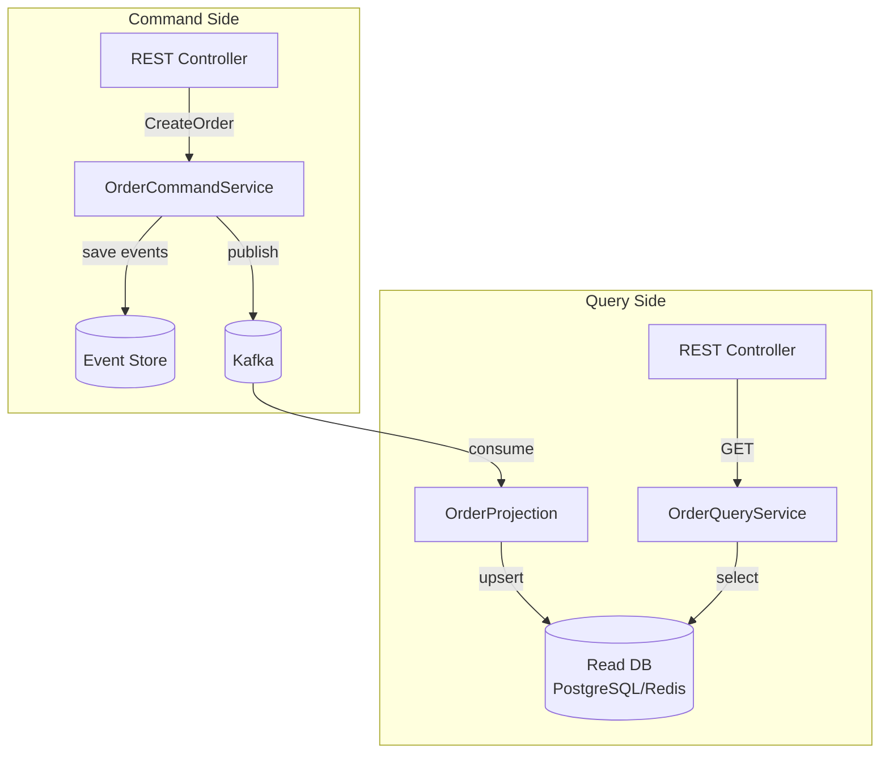

Command side (запись):

```java
@RestController
@RequestMapping("/api/orders")
@RequiredArgsConstructor
public class OrderCommandController {

    private final OrderCommandService commandService;

    @PostMapping
    public ResponseEntity<UUID> createOrder(@RequestBody CreateOrderRequest req) {
        var orderId = commandService.handle(new CreateOrderCommand(
            req.customerId(), req.items(), req.shippingAddress()
        ));
        return ResponseEntity.status(HttpStatus.ACCEPTED).body(orderId);
    }
}

@Service
@RequiredArgsConstructor
public class OrderCommandService {
    private final EventStore eventStore;
    private final KafkaTemplate<String, String> kafka;
    private final ObjectMapper mapper;

    @Transactional
    public UUID handle(CreateOrderCommand cmd) {
        var orderId = UUID.randomUUID();
        var event = new OrderCreatedEvent(UUID.randomUUID(), orderId,
            cmd.customerId(), cmd.items(), Instant.now(), 1);

        eventStore.append(orderId, List.of(event));
        kafka.send("orders", orderId.toString(), 
                   mapper.writeValueAsString(event));
        return orderId;
    }
}
```

Query side (чтение через проекцию):

```java
// Проекция: обновляет read-модель по событиям из Kafka
@Component
@RequiredArgsConstructor
public class OrderProjection {
    private final OrderViewRepository viewRepo;

    @KafkaListener(topics = "orders", groupId = "order-view-projection")
    public void on(ConsumerRecord<String, String> record) {
        var event = parseEvent(record.value());
        switch (event) {
            case OrderCreatedEvent e -> viewRepo.save(new OrderView(
                e.orderId(), e.customerId(), 
                OrderStatus.CREATED, e.timestamp()));
            case OrderShippedEvent e -> viewRepo.updateStatus(
                e.orderId(), OrderStatus.SHIPPED);
            case OrderCancelledEvent e -> viewRepo.updateStatus(
                e.orderId(), OrderStatus.CANCELLED);
        }
    }
}

// Query service: быстрое чтение из read-модели
@Service
@RequiredArgsConstructor
public class OrderQueryService {
    private final OrderViewRepository viewRepo;

    public OrderView getOrder(UUID orderId) {
        return viewRepo.findById(orderId)
            .orElseThrow(() -> new OrderNotFoundException(orderId));
    }

    public List<OrderView> getOrdersByCustomer(UUID customerId) {
        return viewRepo.findByCustomerIdOrderByCreatedAtDesc(customerId);
    }
}
```

Преимущество `CQRS`: read-модель `OrderView` может быть денормализованной таблицей с индексами под конкретные запросы, тогда как command side хранит только события. Можно создать несколько проекций (список заказов, аналитика, поиск) из одного потока событий.


> [!mcq]
> - [ ] Write-side и read-side используют одну БД и одну схему — это упрощение | Это не CQRS: read и write конкурируют за блокировки и индексы, теряется главное преимущество. ❌ ПОСЛЕДСТВИЕ: heavy-read query на report блокирует write-транзакции → p99 write latency 5s, retry-storm → OOM.
> - [ ] Проекция строится синхронно в той же транзакции что и команда | Sync-проекция блокирует write на время обновления read-side, теряется horizontal scale. ❌ ПОСЛЕДСТВИЕ: 3 проекции синхронно по 50ms → write latency 200ms вместо 10ms, throughput упал 5×.
> - [x] Команды → events → async-обновление read-моделей через `@KafkaListener` | Eventual consistency: write-side эмитит события, projections обновляются независимо. ✓ ПРИМЕНЯТЬ: Netflix Conductor для CQRS/Event Sourcing с MaterializedView в Cassandra, p99 read 5ms. 📋 ПРАВИЛО: «Один write-model, много read-моделей». 🔗 См. Q7, Q34.
> - [ ] Read-модель должна быть сильно связана с агрегатом write-стороны | Связанность ломает независимость деплоя read и write сервисов. ❌ ПОСЛЕДСТВИЕ: изменение write-схемы ломает read-side compile → одновременный деплой 4 сервисов, downtime 15 минут.

## Q36. (!) Чем отличается Saga Orchestration от Choreography?

Оба подхода решают задачу координации длинных распределённых транзакций, но по-разному распределяют ответственность.

**Choreography (хореография)** — каждый сервис самостоятельно слушает события и публикует следующие. Нет центрального координатора.

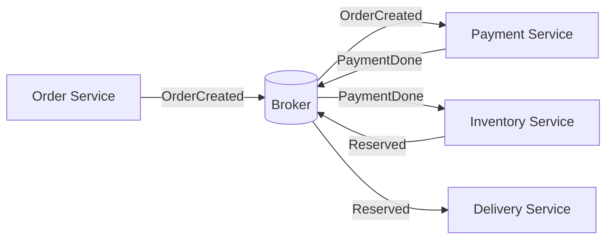

**Orchestration (оркестрация)** — центральный `Saga Orchestrator` явно управляет шагами, вызывая команды и ожидая событий.

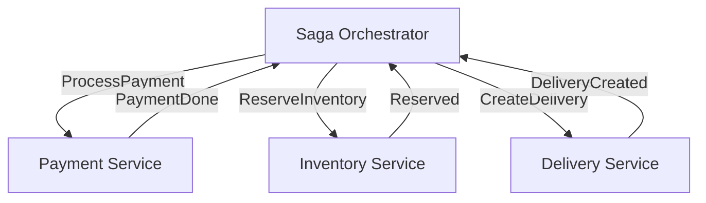

| Критерий | Choreography | Orchestration |
|----------|-------------|---------------|
| Связность | Низкая (только через broker) | Выше (оркестратор знает всех) |
| Наблюдаемость | Сложно отследить весь флоу | Статус виден в оркестраторе |
| Сложность | Растёт с числом шагов | Явная и локализованная |
| SPOF | Нет | Оркестратор (нужна HA) |
| Тестирование | Сложнее (нужна вся цепочка) | Проще (unit тест оркестратора) |
| Подходит для | 2-3 шага, простой флоу | Сложные бизнес-процессы (5+ шагов) |

**Рекомендация:** для сложных бизнес-процессов (заказ, онбординг) выбирайте **оркестрацию** — статус процесса виден в одном месте, компенсации явно описаны. Хореографию применяйте для простых событийных цепочек (уведомления, аудит-лог).


> [!mcq]
> - [ ] Choreography требует центрального координатора как и Orchestration | Choreography ПО ОПРЕДЕЛЕНИЮ децентрализована: каждый сервис реагирует на события без координатора. ❌ ПОСЛЕДСТВИЕ: команда добавила «координатор» в хореографию → cyclic dependency между сервисами, deadlock в production.
> - [x] Orchestration: центральный координатор владеет state-machine; Choreography: события без центра | Orchestrator детерминирован и easy-to-debug; choreography масштабируется лучше для простых flow. ✓ ПРИМЕНЯТЬ: Uber Cadence как Saga orchestrator для checkout (5+ шагов с компенсацией) при 1M tx/день. 📋 ПРАВИЛО: «Видимый flow — orchestrator, простой pub/sub — choreography». 🔗 См. Q8, Q27.
> - [ ] В Choreography легче отлаживать complex Saga из 8+ шагов | Без orchestrator state-machine скрыта в коде сервисов; root cause cascade-failure находят часами. ❌ ПОСЛЕДСТВИЕ: Saga из 9 шагов в choreography → инцидент с потерей платежа отлаживали 6 часов через distributed tracing.
> - [ ] Orchestrator не может выполнять компенсации, только pure forward-flow | Orchestrator владеет компенсациями: знает какие шаги выполнены и в каком порядке откатывать. ❌ ПОСЛЕДСТВИЕ: команда забыла compensate-flow в orchestrator → при сбое payment не списывается reservation, inventory заблокирован 24h.

## Q37. Что такое Process Manager и когда его использовать?

`Process Manager` (также `Saga Orchestrator`, `Workflow Engine`) — компонент, отслеживающий состояние долгосрочного бизнес-процесса и координирующий взаимодействие между сервисами.

**Отличие от простого Saga Orchestrator:**
- `Saga Orchestrator` — линейный или ветвящийся флоу с явными шагами
- `Process Manager` — более сложная state machine с таймаутами, параллельными ветками, компенсациями и перезапусками

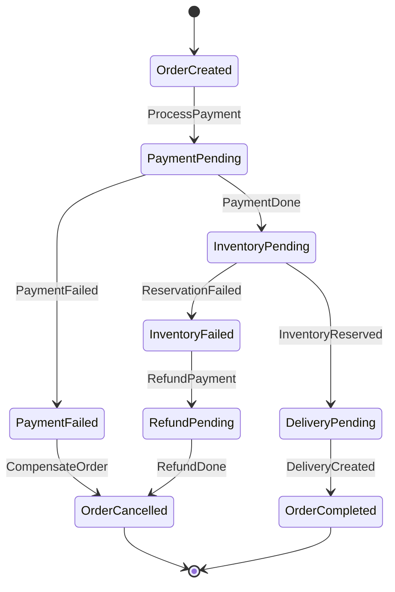

**Персистентное состояние** — Process Manager хранит текущий статус в БД (устойчив к перезапускам):

```java
@Entity
public class OrderProcess {
    @Id private UUID processId;
    private UUID orderId;
    @Enumerated(EnumType.STRING)
    private ProcessState state;  // PAYMENT_PENDING, INVENTORY_PENDING, ...
    private Instant createdAt;
    private Instant timeoutAt;
    // поля для компенсации
    private BigDecimal paidAmount;
    private List<UUID> reservedItems;
}
```

**Когда использовать:** бизнес-процессы с несколькими ветками, таймаутами, повторными попытками и частичными отказами. Инструменты: `Temporal.io`, `Axon Framework`, `Camunda`, Spring State Machine.


> [!mcq]
> - [ ] Process Manager — синоним Saga, между ними нет никакой разницы в DDD-терминологии | Process Manager шире: он routes events на основе state и поддерживает ветвление, Saga — частный случай для distributed transactions с компенсацией. ❌ ПОСЛЕДСТВИЕ: команда смешала понятия → Saga превратилась в god-orchestrator на 3K LOC, рефакторинг занял 2 sprint.
> - [ ] Process Manager без персистентности state в БД — это нормально | Без персистентности при рестарте теряется текущий step, процесс не восстановим. ❌ ПОСЛЕДСТВИЕ: rolling deploy → 200 in-flight процессов «зависли», ручное восстановление через event-replay 4 часа.
> - [ ] Process Manager выполняется синхронно в одном thread на всём протяжении процесса | Долгие процессы (часы/дни) блокируют thread, нет горизонтального масштабирования и checkpointing. ❌ ПОСЛЕДСТВИЕ: 3-day order fulfillment в одном thread → thread pool заполнен 100 процессов, новые orders таймаутят 30s, queue растёт.
> - [x] Stateful компонент, координирующий несколько Saga/процессов через events с персистентным state | PM хранит state, реагирует на events и эмитит commands; подходит для долгих процессов с ветвлением. ✓ ПРИМЕНЯТЬ: Camunda BPM в DocuSign для signature workflow с 10+ шагами, persistence через PostgreSQL. 📋 ПРАВИЛО: «State машина с persistence — Process Manager, без — Saga». 🔗 См. Q8, Q36.

## Q38. (!) Что такое Event-Carried State Transfer (ECST)?

`Event-Carried State Transfer` (ECST) — паттерн, при котором события содержат **полное состояние** изменившейся сущности, а не только идентификатор. Потребители не делают обратный запрос к источнику — данные встроены в само событие.

**Сравнение с Event Notification:**

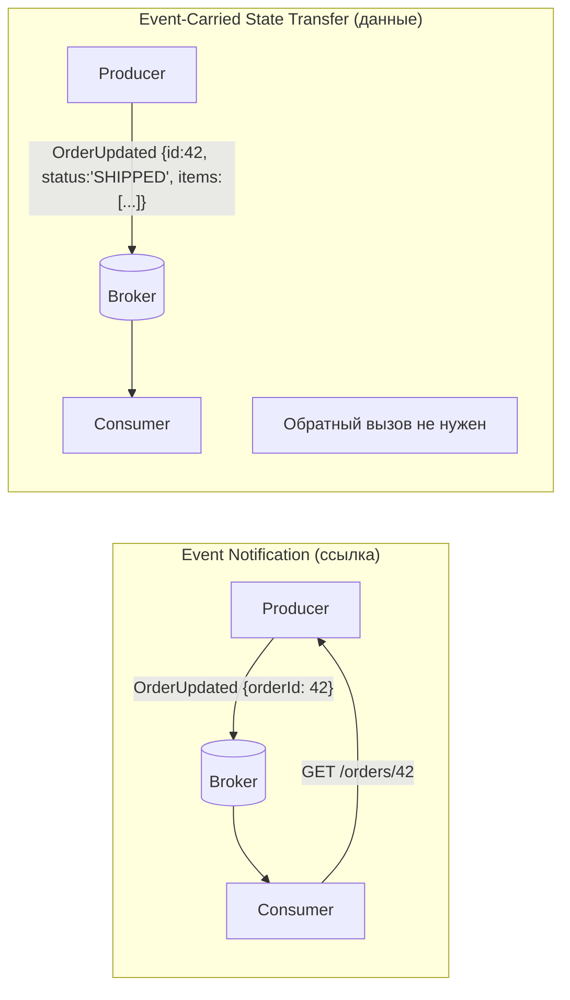

**Преимущества:**
- Слабая связность: потребители автономны, не зависят от доступности источника
- Производительность: нет N запросов при N событиях
- Replay: при пересоздании проекции все данные уже в событиях

**Недостатки:**
- Размер сообщений больше (payload крупнее)
- Нельзя убрать поле из события без нарушения совместимости потребителей
- При большом числе полей события раздуваются

**Практический подход:** включать в событие **данные, необходимые потребителям**, не весь агрегат. Оставить `aggregateId` для случаев, когда нужны детали.

```java
// Event Notification — потребитель должен сделать запрос
public record OrderStatusChangedEvent(UUID orderId, String newStatus) {}

// Event-Carried State Transfer — всё нужное в событии
public record OrderShippedEvent(
    UUID orderId,
    String status,          // "SHIPPED"
    String trackingNumber,
    Address shippingAddress,
    List<OrderItem> items,
    Instant shippedAt
) {}
```


> [!mcq]
> - [ ] Event Notification и ECST — это одно и то же | Event Notification содержит только ID; ECST — полное состояние агрегата для самодостаточного consumer'а. ❌ ПОСЛЕДСТВИЕ: дизайнер выбрал «Notification», потребители делают callback → temporal coupling, при недоступности producer все consumers ломаются.
> - [x] ECST — событие содержит полное состояние агрегата, consumer не делает callback к producer | Self-contained event снимает temporal coupling и снижает нагрузку на producer. ✓ ПРИМЕНЯТЬ: Confluent ksqlDB materialized views — каждое event несёт полный snapshot user-profile, читатели независимы. 📋 ПРАВИЛО: «Полный state в событии — нет callback к источнику». 🔗 См. Q2, Q14.
> - [ ] ECST лучше для маленьких событий ради экономии трафика | ECST неизбежно увеличивает payload (полный state vs ID), цена платится ради независимости consumer'ов. ❌ ПОСЛЕДСТВИЕ: команда применила ECST для small-events чтобы «как у больших» → Kafka traffic вырос 5×, retention 1 неделя забил диск.
> - [ ] В ECST consumer обязан делать REST callback к producer для проверки актуальности | Callback убивает суть ECST: появляется temporal coupling, ломается изоляция consumer'а. ❌ ПОСЛЕДСТВИЕ: callback к producer на каждое event → producer 503 под нагрузкой, downstream сервисы каскадно деградируют.

## Q39. Как проектировать стратегии компенсации в EDA?

Компенсирующие транзакции в `EDA` — механизм «отмены» уже выполненных шагов при сбое в Saga. В отличие от `2PC`, они **семантически** отменяют эффект, а не откатывают БД-транзакцию.

**Принципы проектирования:**

1. **Идемпотентность** — компенсация должна выполняться безопасно несколько раз:
```java
// Плохо: дважды вернёт деньги
void refund(UUID orderId) {
    payment.refund(amount);
}

// Хорошо: idempotency key предотвращает повтор
void refund(UUID orderId) {
    if (refundRepo.existsByOrderId(orderId)) return;
    payment.refund(amount);
    refundRepo.save(new Refund(orderId, amount));
}
```

2. **Не всегда возможна** — «нельзя разослать неразосланные письма»; для таких шагов используют **pivot transaction** (точку невозврата):
```
OrderCreated → PaymentCharged (PIVOT) → EmailSent → DeliveryCreated
                    ↑
         До этой точки — компенсации возможны
         После — только компенсации вперёд (forward recovery)
```

3. **Явные компенсирующие команды** в протоколе:

| Прямая транзакция | Компенсирующая |
|-------------------|----------------|
| `ReserveInventory` | `ReleaseInventory` |
| `ChargePayment` | `RefundPayment` |
| `CreateOrder` | `CancelOrder` |
| `LockAccount` | `UnlockAccount` |

4. **Таймауты и Dead Letter Queue** — если компенсация зависает, необходимо переместить событие в `DLQ` для ручного разбора инцидента.


> [!mcq]
> - [ ] Компенсация — простой откат через `DELETE FROM table` без публикации compensating event | DELETE ломает audit trail Event Sourcing и не идемпотентен (повторный DELETE = no-op для уже удалённой строки). ❌ ПОСЛЕДСТВИЕ: при retry compensation DELETE дважды → orphan-events в Kafka, реконсиляция вручную через CSV-сравнение БД и Event Store.
> - [ ] Компенсации не нужны если использовать distributed XA-транзакции | XA-транзакции не работают между гетерогенными сервисами/брокерами (Kafka не поддерживает XA). ❌ ПОСЛЕДСТВИЕ: попытка XA через Atomikos → блокировки на 30s, deadlocks под нагрузкой, throughput упал 10×.
> - [ ] Compensation должна быть точным обратным action (CreateOrder → DeleteOrder) | Точный inverse недопустим: CreateOrder → CancelOrder со статусом, не DELETE — для аудита и downstream. ❌ ПОСЛЕДСТВИЕ: DeleteOrder вместо CancelOrder → analytics проекция показывает 5% orders «исчезли», CFO в панике.
> - [x] Идемпотентные compensation-операции с DLQ для зависших шагов и таймаутами | Идемпотентность позволяет retry; DLQ изолирует stuck-шаги; timeout не даёт зависнуть навечно. ✓ ПРИМЕНЯТЬ: Booking.com payment Saga — `RefundPayment` идемпотентен по `paymentId`, DLQ с алертом для on-call. 📋 ПРАВИЛО: «Compensate идемпотентно, тайм-аут с DLQ — обязателен». 🔗 См. Q5, Q10.

## Q40. Как организовать версионирование топиков Kafka при эволюции схемы?

Эволюция схемы событий — неизбежная проблема в долгоживущих `EDA`-системах. Несовместимые изменения ломают потребителей.

**Стратегии совместимости (Confluent Schema Registry):**

| Тип совместимости | Что можно | Что нельзя |
|-------------------|-----------|-----------|
| **BACKWARD** | Добавить поле с default | Удалить обязательное поле |
| **FORWARD** | Удалить поле с default | Добавить обязательное поле |
| **FULL** | Только добавление с default | Удаление, смена типа |
| **NONE** | Всё | — (только при мажорной версии) |

**Паттерн версионирования через заголовок:**

```java
// Producer: добавляет версию в заголовок
ProducerRecord<String, byte[]> record = new ProducerRecord<>(topic, key, payload);
record.headers().add("schema-version", "2".getBytes());

// Consumer: маршрутизация по версии
@KafkaListener(topics = "orders")
public void consume(ConsumerRecord<String, byte[]> record) {
    String version = new String(record.headers().lastHeader("schema-version").value());
    switch (version) {
        case "1" -> handleV1(deserializeV1(record.value()));
        case "2" -> handleV2(deserializeV2(record.value()));
        default -> dlqSender.send(record, "unknown-version");
    }
}
```

**Топик-per-версия** (для мажорных несовместимых изменений):
```
orders.v1   — старый контракт (потребители мигрируют постепенно)
orders.v2   — новый контракт
```

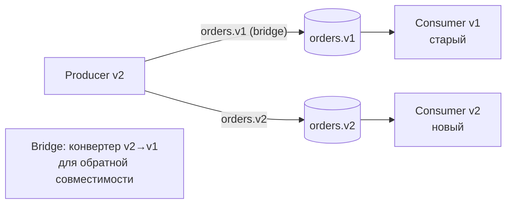

**Правила эволюции схемы Avro/Protobuf:**
- Всегда добавляйте новые поля с `default` значением
- Никогда не меняйте тип существующего поля
- Никогда не удаляйте поля — только помечайте как `deprecated`
- Для несовместимых изменений — новый топик + миграция потребителей

---

## See also

- [Apache Kafka](../messaging/kafka-interview.md) — брокер сообщений: партиции, consumer groups, exactly-once
- [Микросервисы](microservices-interview.md) — EDA как основа межсервисного взаимодействия
- [Распределённые системы](distributed-systems-interview.md) — идемпотентность, гарантии доставки и консенсус
- [Паттерны согласованности](consistency-patterns-interview.md) — eventual consistency, Saga, Outbox Pattern
- [Паттерны проектирования](../design-patterns/design-patterns-interview.md) — GoF-паттерны Observer и Mediator в контексте EDA
- [Spring Framework](../frameworks/spring/spring-framework-interview.md) — ApplicationEvent, @EventListener и Spring Integration
- [Observability](../monitoring/observability-interview.md) — трассировка событий, метрики и алертинг в EDA-системах


> [!mcq]
> - [x] Schema Registry с BACKWARD compat + headers `schema-version` + топик-per-major | BACKWARD compat для minor changes, новый топик `orders.v2` для breaking changes с миграцией консьюмеров. ✓ ПРИМЕНЯТЬ: Confluent Schema Registry в LinkedIn для 1000+ Avro схем, zero downtime evolution. 📋 ПРАВИЛО: «Minor — BACKWARD compat, major — новый топик». 🔗 См. Q11, Q15.
> - [ ] При мажорном breaking change — переименовать топик и грохнуть старый сразу | Старые consumers ломаются мгновенно без grace period, нарушается обратная совместимость. ❌ ПОСЛЕДСТВИЕ: схема breaking change без BACKWARD compat → старые consumers падают `AvroDeserializationException`, retry-storm → DLQ забит 500K events.
> - [ ] BACKWARD compatibility = consumer должен поддерживать только последнюю схему | BACKWARD = новый consumer читает СТАРЫЕ данные; consumer обязан работать с обеими схемами. ❌ ПОСЛЕДСТВИЕ: команда удалила обработку v1 после деплоя v2 → 30% событий в retention v1 упали в DLQ, потеряли 2 часа транзакций.
> - [ ] Удалить deprecated поле из Avro схемы — это безопасно для FORWARD compat | Удаление поля ломает FORWARD: старый consumer ждёт это поле, NPE при десериализации. ❌ ПОСЛЕДСТВИЕ: удалили `legacy_id` — Confluent Schema Registry разрешил BACKWARD, но FORWARD сломан → 5K старых consumers упали.

- [API Gateway](api-gateway-interview.md)
- [BFF Pattern](bff-pattern-interview.md)
- [Стратегии кэширования](caching-strategies-interview.md)
- [CAP-теорема](cap-theorem-interview.md)
- [Clean Architecture](clean-architecture-interview.md)
- [Паттерны согласованности](consistency-patterns-interview.md)
