# Вопросы на собеседовании: `Event-driven` паттерны

Комплексное руководство по вопросам собеседования на тему event-driven паттернов для Senior Java Developer.

## Полезные ссылки

### Официальная документация

- [Event-Driven Architecture — Martin Fowler](https://martinfowler.com/articles/201701-event-driven.html) — разница между event notification, event-carried state transfer, event sourcing, CQRS
- [Event Sourcing — Martin Fowler](https://martinfowler.com/eaaDev/EventSourcing.html) — паттерн хранения состояния через события
- [Spring Application Events](https://docs.spring.io/spring-framework/reference/core/beans/context-introduction.html#context-functionality-events) — механизм событий в Spring Framework
- [Spring Kafka Reference](https://docs.spring.io/spring-kafka/reference/) — интеграция Spring Boot с Apache Kafka
- [Spring Events — Baeldung](https://www.baeldung.com/spring-events) — практический гайд по Spring `ApplicationEvent`
- [Intro to Apache Kafka with Spring — Baeldung](https://www.baeldung.com/spring-kafka) — producer/consumer в Spring Boot
- [Kafka Streams With Spring Boot (Baeldung)](https://www.baeldung.com/spring-boot-kafka-streams) — обработка потоков событий через Kafka Streams
- [Introduction to Spring Cloud Stream (Baeldung)](https://www.baeldung.com/spring-cloud-stream) — event-driven микросервисы через Spring Cloud Stream
- [Event Externalization with Spring Modulith (Baeldung)](https://www.baeldung.com/spring-modulith-event-externalization) — публикация доменных событий в Kafka через Spring Modulith
- [Saga Pattern in Microservices — Microservices.io](https://microservices.io/patterns/data/saga.html) — описание паттерна Saga
- [Transactional Outbox — Microservices.io](https://microservices.io/patterns/data/transactional-outbox.html) — описание Outbox pattern

## Содержание

- [Полезные ссылки](#полезные-ссылки)
- [See also](#see-also)

**Основы EDA, события и брокеры**
- [Q1. (!) Что такое event-driven архитектура и чем она отличается от синхронного REST?](#q1-что-такое-event-driven-архитектура-и-чем-она-отличается-от-синхронного-rest)
- [Q2. Что такое событие (event) в контексте EDA? Какие атрибуты у события?](#q2-что-такое-событие-event-в-контексте-eda-какие-атрибуты-у-события)
- [Q3. (!) Что такое брокер сообщений и чем отличаются Kafka и RabbitMQ для EDA?](#q3-что-такое-брокер-сообщений-и-чем-отличаются-kafka-и-rabbitmq-для-eda)
- [Q4. Как обеспечить порядок обработки событий в распределённой системе?](#q4-как-обеспечить-порядок-обработки-событий-в-распределённой-системе)
- [Q5. (!) Что такое идемпотентность потребителя и зачем она нужна?](#q5-что-такое-идемпотентность-потребителя-и-зачем-она-нужна)

**Event Sourcing, CQRS и Saga**
- [Q6. (!) Что такое Event Sourcing?](#q6-что-такое-event-sourcing)
- [Q7. Что такое CQRS и как он сочетается с EDA?](#q7-что-такое-cqrs-и-как-он-сочетается-с-eda)
- [Q8. (!) Что такое Saga и когда её используют?](#q8-что-такое-saga-и-когда-её-используют)
- [Q9. (!) Что такое Outbox pattern?](#q9-что-такое-outbox-pattern)
- [Q10. (!) Что такое dead letter queue (DLQ) и когда его использовать?](#q10-что-такое-dead-letter-queue-dlq-и-когда-его-использовать)

**Схемы, семантика доставки и мониторинг**
- [Q11. Что такое Schema Registry и зачем он в EDA?](#q11-что-такое-schema-registry-и-зачем-он-в-eda)
- [Q12. (!) Как в EDA добиться exactly-once семантики?](#q12-как-в-eda-добиться-exactly-once-семантики)
- [Q13. Что такое consumer lag и как с ним работать?](#q13-что-такое-consumer-lag-и-как-с-ним-работать)
- [Q14. Чем event-driven отличается от message-driven?](#q14-чем-event-driven-отличается-от-message-driven)
- [Q15. Как обеспечить обратную совместимость при изменении схемы события?](#q15-как-обеспечить-обратную-совместимость-при-изменении-схемы-события)
- [Q16. Что такое partition key в Kafka и как он влияет на порядок?](#q16-что-такое-partition-key-в-kafka-и-как-он-влияет-на-порядок)
- [Q17. Когда использовать топик с одной партицией, а когда с несколькими?](#q17-когда-использовать-топик-с-одной-партицией-а-когда-с-несколькими)
- [Q18. Что такое consumer group и как распределяются партиции?](#q18-что-такое-consumer-group-и-как-распределяются-партиции)
- [Q19. Как в EDA обеспечить мониторинг и наблюдаемость?](#q19-как-в-eda-обеспечить-мониторинг-и-наблюдаемость)
- [Q20. Какие антипаттерны в event-driven архитектуре стоит избегать?](#q20-какие-антипаттерны-в-event-driven-архитектуре-стоит-избегать)

**Продвинутые темы**
- [Q21. Что такое event replay и когда его использовать?](#q21-что-такое-event-replay-и-когда-его-использовать)
- [Q22. Как обеспечить транзакционность в event-driven системе?](#q22-как-обеспечить-транзакционность-в-event-driven-системе)
- [Q23. Что такое event versioning и как управлять изменениями схемы?](#q23-что-такое-event-versioning-и-как-управлять-изменениями-схемы)
- [Q24. Как обработать события в правильном порядке при параллельной обработке?](#q24-как-обработать-события-в-правильном-порядке-при-параллельной-обработке)
- [Q25. Что такое event store и чем он отличается от обычной БД?](#q25-что-такое-event-store-и-чем-он-отличается-от-обычной-бд)
- [Q26. Как обеспечить мониторинг и алертинг в event-driven системе?](#q26-как-обеспечить-мониторинг-и-алертинг-в-event-driven-системе)
- [Q27. Что такое event choreography vs orchestration?](#q27-что-такое-event-choreography-vs-orchestration)
- [Q28. Как обработать события с разной скоростью обработки?](#q28-как-обработать-события-с-разной-скоростью-обработки)
- [Q29. Что такое event sourcing snapshot и зачем он нужен?](#q29-что-такое-event-sourcing-snapshot-и-зачем-он-нужен)
- [Q30. Как обеспечить безопасность событий в event-driven системе?](#q30-как-обеспечить-безопасность-событий-в-event-driven-системе)

**Spring и Kafka на практике**
- [Q31. (!) Как работает механизм событий в Spring Framework?](#q31-как-работает-механизм-событий-в-spring-framework)
- [Q32. Как создать Kafka producer и consumer в Spring Boot?](#q32-как-создать-kafka-producer-и-consumer-в-spring-boot)
- [Q33. (!) Как реализовать Outbox pattern на Spring Boot и Kafka?](#q33-как-реализовать-outbox-pattern-на-spring-boot-и-kafka)
- [Q34. Как реализовать Event Sourcing на Java?](#q34-как-реализовать-event-sourcing-на-java)
- [Q35. (!) Как реализовать CQRS с проекциями на Spring?](#q35-как-реализовать-cqrs-с-проекциями-на-spring)

**Продвинутые паттерны EDA**
- [Q36. (!) Чем отличается Saga Orchestration от Choreography?](#q36-чем-отличается-saga-orchestration-от-choreography)
- [Q37. Что такое Process Manager и когда его использовать?](#q37-что-такое-process-manager-и-когда-его-использовать)
- [Q38. (!) Что такое Event-Carried State Transfer (ECST)?](#q38-что-такое-event-carried-state-transfer-ecst)
- [Q39. Как проектировать стратегии компенсации в EDA?](#q39-как-проектировать-стратегии-компенсации-в-eda)
- [Q40. Как организовать версионирование топиков Kafka при эволюции схемы?](#q40-как-организовать-версионирование-топиков-kafka-при-эволюции-схемы)

## Q1. (!) Что такое event-driven архитектура и чем она отличается от синхронного REST?

`Event-driven` архитектура (`EDA`) -- стиль проектирования, при котором компоненты системы обмениваются данными через события, публикуемые в брокер сообщений (`Kafka`, `RabbitMQ`). Производитель (producer) публикует событие и не ждёт немедленной обработки; потребители (consumers) подписываются на топики/очереди и обрабатывают события асинхронно.

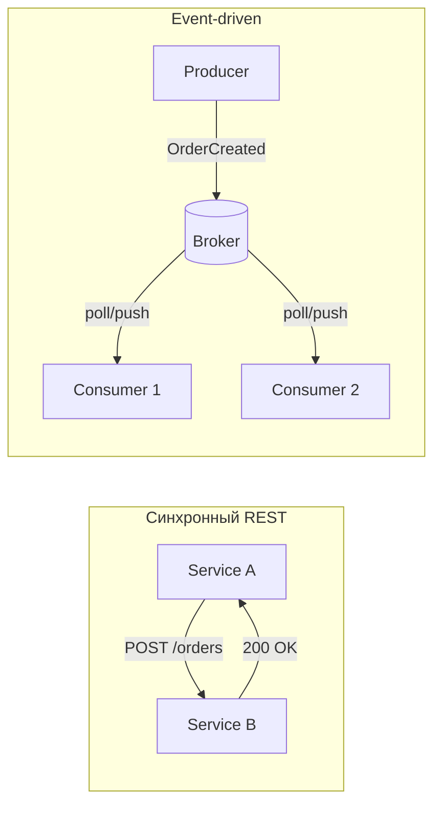

Отличия от синхронного `REST`:

| Критерий | `REST` | `EDA` |
|----------|--------|-------|
| Связность | Клиент знает адрес сервиса | Producer не знает consumers |
| Масштабируемость | Нужен load balancer | Consumers масштабируются независимо |
| Отказоустойчивость | Нужны retry и circuit breaker | Сообщения сохраняются в брокере |
| Консистентность | Сильная в одной транзакции | Eventual consistency, нужны [[consistency-patterns-interview|паттерны согласованности]] (`Saga`, компенсации) |
| Латентность | Немедленный ответ | Задержка обработки |

## Q2. Что такое событие (event) в контексте EDA? Какие атрибуты у события?

Событие -- неизменяемая запись о факте, произошедшем в системе (например, «Заказ создан», «Платёж проведён»). Ключевое отличие от команды: событие описывает то, что **уже произошло**, а команда -- запрос на действие.

Рекомендуемые атрибуты:
- **Идентификатор события** -- уникальный `eventId` для дедупликации и трассировки
- **Тип события** -- имя/версия для маршрутизации и совместимости
- **Временная метка** -- когда произошло (часто в `UTC`)
- **Агрегат** -- идентификатор сущности (`orderId`, `userId`)
- **Полезная нагрузка** (payload) -- данные события
- **Метаданные** -- источник, `correlationId`, `traceId` для [[observability-interview|распределённой трассировки]]

Пример структуры события на Java:

```java
public record OrderCreatedEvent(
    UUID eventId,
    String type,           // "order.created"
    Instant timestamp,
    UUID aggregateId,      // orderId
    OrderPayload payload,
    EventMetadata metadata
) {
    public record OrderPayload(
        List<OrderItem> items,
        BigDecimal totalAmount,
        String currency
    ) {}

    public record EventMetadata(
        String source,          // "order-service"
        String correlationId,
        String traceId
    ) {}
}
```

## Q3. (!) Что такое брокер сообщений и чем отличаются Kafka и RabbitMQ для EDA?

Брокер сообщений -- промежуточное хранилище, которое принимает сообщения от производителей и доставляет их потребителям. Гарантирует персистентность, доставку и (в зависимости от настроек) порядок.

| Характеристика | `Kafka` | `RabbitMQ` |
|----------------|---------|------------|
| Модель | Распределённый лог (append-only) | Очереди с доставкой и удалением |
| Хранение | Retention-based (дни/недели) | До потребления |
| Чтение | По offset, consumer pull | Push к consumer |
| Replay | Да, с любого offset | Нет (сообщение удаляется) |
| Порядок | В пределах партиции | В пределах очереди (один consumer) |
| Throughput | Очень высокий (миллионы msg/s) | Средний (десятки тысяч msg/s) |
| Основной сценарий | Event streaming, EDA | Task queue, RPC |

Для `EDA` с большим объёмом событий и возможностью «переиграть» историю чаще выбирают `Kafka` (подробнее в [[kafka-interview|вопросах по Kafka]]); для рабочих очередей и гарантированной доставки до одного потребителя -- `RabbitMQ`.

## Q4. Как обеспечить порядок обработки событий в распределённой системе?

Порядок в `Kafka` гарантируется только в пределах одной партиции. Поэтому:
- Используйте ключ партиционирования (например, `orderId`), чтобы все события по одному заказу попадали в одну партицию
- Не увеличивайте число партиций без необходимости -- это может изменить распределение ключей
- Для глобального порядка обычно не стремятся: достаточно порядка по агрегату

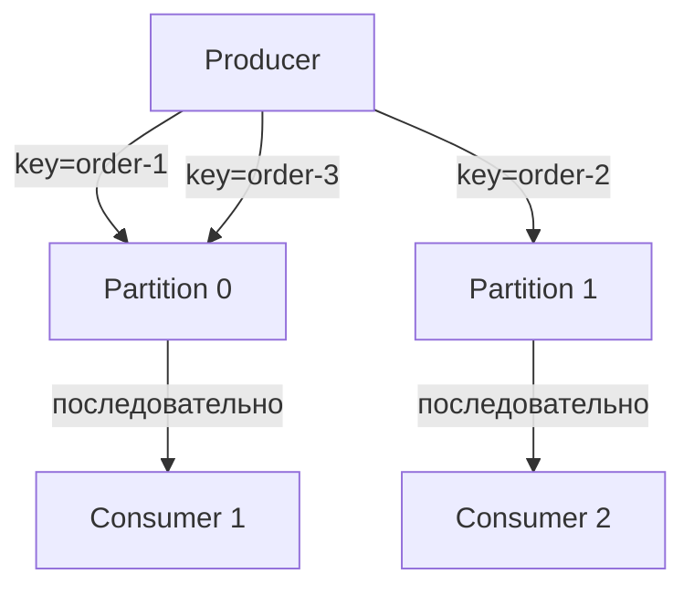

В `RabbitMQ` порядок в одной очереди сохраняется при одном потребителе; при нескольких -- порядок не гарантирован. Решения: `single active consumer`, `message groups` для группировки по ключу.

## Q5. (!) Что такое идемпотентность потребителя и зачем она нужна?

Идемпотентность -- повторная обработка одного и того же сообщения даёт тот же результат, что и однократная. Нужна из-за возможной повторной доставки (retry продюсера, перезапуск потребителя до коммита offset).

**Практический критерий:** если операция связана с деньгами или резервированием, идемпотентность подтверждают интеграционным тестом с повторной доставкой одного и того же `eventId`.

Способы реализации:

```java
@Service
@RequiredArgsConstructor
public class IdempotentEventHandler {

    private final ProcessedEventRepository processedEvents;
    private final OrderRepository orderRepository;

    @Transactional
    public void handle(OrderCreatedEvent event) {
        // Проверка: уже обработано?
        if (processedEvents.existsByEventId(event.eventId())) {
            log.info("Event {} already processed, skipping", event.eventId());
            return;
        }

        // Бизнес-логика
        orderRepository.save(mapToOrder(event));

        // Пометить как обработанное (в той же транзакции)
        processedEvents.save(new ProcessedEvent(event.eventId(), Instant.now()));
    }
}
```

Альтернативные подходы:
- **Бизнес-ключ**: если операция по `paymentId` уже выполнена -- пропустить
- **Upsert** вместо `INSERT` -- повторное выполнение не создаёт дубликатов
- **Conditional update**: `UPDATE ... WHERE version = :expected`

## Q6. (!) Что такое Event Sourcing?

`Event Sourcing` -- хранение состояния системы как последовательности событий. Текущее состояние получают применением всех событий к «нулевому» состоянию (или к снапшоту + последующие события).

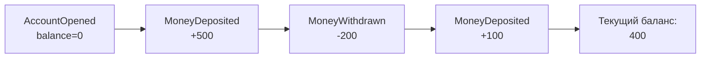

Пример реализации на Java:

```java
public class BankAccount {
    private UUID id;
    private BigDecimal balance = BigDecimal.ZERO;
    private final List<DomainEvent> uncommittedEvents = new ArrayList<>();

    // Восстановление из событий
    public static BankAccount fromEvents(List<DomainEvent> events) {
        var account = new BankAccount();
        events.forEach(account::apply);
        return account;
    }

    // Команда -> генерация события
    public void deposit(BigDecimal amount) {
        if (amount.compareTo(BigDecimal.ZERO) <= 0) {
            throw new IllegalArgumentException("Amount must be positive");
        }
        raise(new MoneyDeposited(id, amount, Instant.now()));
    }

    public void withdraw(BigDecimal amount) {
        if (balance.compareTo(amount) < 0) {
            throw new InsufficientFundsException(id, amount, balance);
        }
        raise(new MoneyWithdrawn(id, amount, Instant.now()));
    }

    // Применение события (мутация состояния)
    private void apply(DomainEvent event) {
        switch (event) {
            case AccountOpened e -> { this.id = e.accountId(); this.balance = BigDecimal.ZERO; }
            case MoneyDeposited e -> this.balance = balance.add(e.amount());
            case MoneyWithdrawn e -> this.balance = balance.subtract(e.amount());
            default -> throw new IllegalStateException("Unknown event: " + event);
        }
    }

    private void raise(DomainEvent event) {
        apply(event);
        uncommittedEvents.add(event);
    }
}
```

**Плюсы:** полная история изменений, аудит, возможность пересчитать состояние, создание новых проекций из исторических данных.
**Минусы:** сложность запросов (нужны проекции), миграция схемы событий, рост хранилища (нужны снапшоты).

## Q7. Что такое CQRS и как он сочетается с EDA?

`CQRS` (`Command Query Responsibility Segregation`) -- разделение модели на запись (command side) и чтение (query side). Запись обновляет хранилище и публикует события; чтение обслуживается из отдельного хранилища, оптимизированного под запросы.

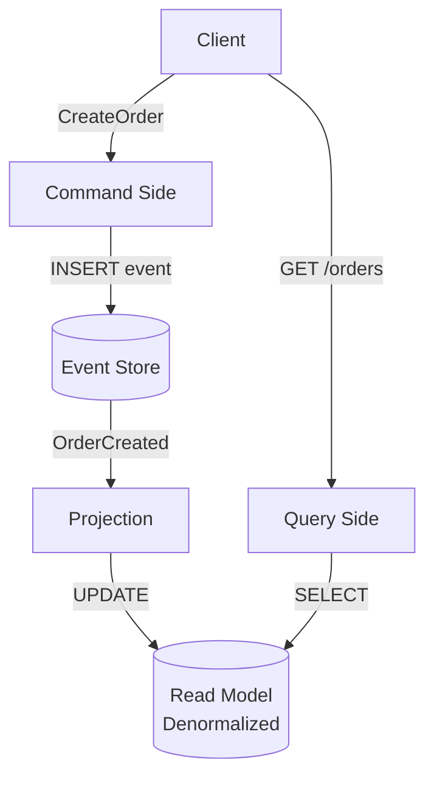

Пример реализации проекции на `Spring`:

```java
@Component
@RequiredArgsConstructor
public class OrderProjection {

    private final OrderViewRepository orderViewRepository;

    @EventHandler  // или @KafkaListener
    public void on(OrderCreatedEvent event) {
        var view = new OrderView(
            event.orderId(),
            event.customerId(),
            event.totalAmount(),
            OrderStatus.CREATED,
            event.timestamp()
        );
        orderViewRepository.save(view);
    }

    @EventHandler
    public void on(OrderShippedEvent event) {
        orderViewRepository.updateStatus(event.orderId(), OrderStatus.SHIPPED);
    }
}
```

**Преимущества:** независимое масштабирование чтения и записи; оптимизация read-моделей под запросы; возможность разных представлений одних и тех же данных (список заказов, статистика, аналитика).

## Q8. (!) Что такое Saga и когда её используют?

`Saga` -- паттерн для [[distributed-systems-interview|распределённых]] транзакций: длинная бизнес-операция разбита на шаги в разных сервисах; каждый шаг публикует событие для следующего; при сбое выполняются компенсирующие действия.

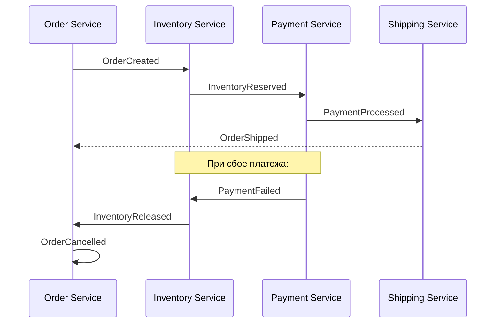

Два подхода:

| | Хореография | Оркестрация |
|---|---|---|
| Координация | Децентрализованная (события) | Центральный оркестратор |
| Связность | Слабая | Средняя |
| Отладка | Сложнее (распределённый поток) | Проще (один координатор) |
| Точка отказа | Нет единой | Оркестратор |
| Когда | Простые потоки, 2-3 сервиса | Сложные потоки, много шагов |

Пример оркестратора Saga:

```java
@Service
@RequiredArgsConstructor
public class OrderSagaOrchestrator {

    private final InventoryClient inventoryClient;
    private final PaymentClient paymentClient;
    private final OrderRepository orderRepository;

    @Transactional
    public void execute(CreateOrderCommand cmd) {
        var order = Order.create(cmd);
        orderRepository.save(order);

        try {
            inventoryClient.reserve(order.getItems());
            paymentClient.charge(order.getPaymentDetails());
            order.markConfirmed();
        } catch (InventoryException e) {
            order.markCancelled("Insufficient inventory");
        } catch (PaymentException e) {
            // Компенсация: откатить резервирование
            inventoryClient.release(order.getItems());
            order.markCancelled("Payment failed");
        }

        orderRepository.save(order);
    }
}
```

На практике ключевой момент -- идемпотентность шагов, корректные компенсирующие действия и наблюдаемость всего потока через `traceId`/метрики.

## Q9. (!) Что такое Outbox pattern?

`Outbox` pattern -- запись исходящих событий в таблицу `outbox` в той же БД, что и бизнес-данные, в одной транзакции; отдельный процесс (`polling` или `CDC`) читает из этой таблицы и публикует в брокер.

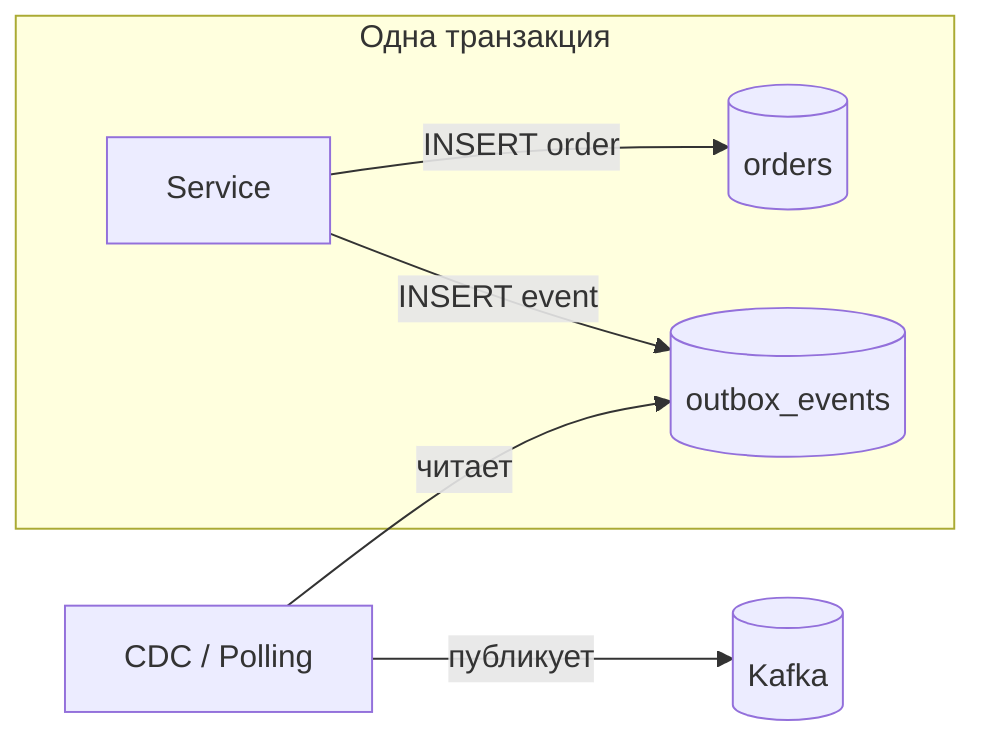

Пример на `Spring Boot`:

```java
// Сущность outbox
@Entity
@Table(name = "outbox_events")
public class OutboxEvent {
    @Id private UUID id;
    private String aggregateType;  // "Order"
    private UUID aggregateId;
    private String eventType;      // "OrderCreated"
    @Column(columnDefinition = "TEXT")
    private String payload;        // JSON
    private Instant createdAt;
    private boolean published;
}

// Сервис: бизнес-логика + outbox в одной транзакции
@Service
@RequiredArgsConstructor
public class OrderService {

    private final OrderRepository orderRepository;
    private final OutboxEventRepository outboxRepository;
    private final ObjectMapper objectMapper;

    @Transactional
    public Order createOrder(CreateOrderRequest request) {
        var order = Order.from(request);
        orderRepository.save(order);

        var event = new OutboxEvent(
            UUID.randomUUID(), "Order", order.getId(),
            "OrderCreated",
            objectMapper.writeValueAsString(order),
            Instant.now(), false
        );
        outboxRepository.save(event);

        return order;
    }
}

// Поллер: периодически читает и публикует
@Component
@RequiredArgsConstructor
public class OutboxPoller {

    private final OutboxEventRepository outboxRepository;
    private final KafkaTemplate<String, String> kafkaTemplate;

    @Scheduled(fixedDelay = 1000)
    @Transactional
    public void pollAndPublish() {
        var events = outboxRepository.findByPublishedFalseOrderByCreatedAt();
        for (var event : events) {
            kafkaTemplate.send(event.getAggregateType(), 
                              event.getAggregateId().toString(), 
                              event.getPayload());
            event.setPublished(true);
        }
    }
}
```

Альтернатива polling -- `CDC` через `Debezium`: читает транзакционный лог БД и публикует изменения таблицы `outbox` в `Kafka` с минимальной задержкой.

## Q10. (!) Что такое dead letter queue (DLQ) и когда его использовать?

`Dead Letter Queue` (`DLQ`) -- очередь для сообщений после N неудачных попыток обработки; не блокирует основную очередь и позволяет позже разобрать проблему.

В `Spring Kafka` настройка `DLQ` через `DefaultErrorHandler`:

```java
@Configuration
public class KafkaConsumerConfig {

    @Bean
    public DefaultErrorHandler errorHandler(KafkaTemplate<String, String> template) {
        var recoverer = new DeadLetterPublishingRecoverer(template,
            (record, ex) -> new TopicPartition(record.topic() + ".DLT", -1));

        // Retry 3 раза с backoff, потом в DLQ
        return new DefaultErrorHandler(recoverer, 
            new FixedBackOff(1000L, 3));
    }
}
```

В `RabbitMQ` -- через `x-dead-letter-exchange`:

```java
@Bean
public Queue mainQueue() {
    return QueueBuilder.durable("orders.queue")
        .withArgument("x-dead-letter-exchange", "orders.dlx")
        .withArgument("x-dead-letter-routing-key", "orders.dlq")
        .build();
}
```

**Мониторинг DLQ:** размер `DLQ` -- метрика проблемных сообщений; рост указывает на проблемы; алерты при превышении порога. Подробнее -- в [[observability-interview|вопросах по наблюдаемости]].

## Q11. Что такое Schema Registry и зачем он в EDA?

`Schema Registry` -- хранилище схем (например, `Avro`, `JSON Schema`, `Protobuf`). Confluent `Schema Registry` для `Kafka` обеспечивает:
- Централизованное управление схемами
- Проверку совместимости (`BACKWARD`, `FORWARD`, `FULL`)
- Версионирование схем
- Контракты между сервисами
- Предотвращение breaking changes

Пример `Avro` схемы:

```json
{
  "type": "record",
  "name": "OrderCreated",
  "namespace": "com.example.events",
  "fields": [
    {"name": "orderId", "type": "string"},
    {"name": "amount", "type": "double"},
    {"name": "currency", "type": "string", "default": "RUB"},
    {"name": "discount", "type": ["null", "double"], "default": null}
  ]
}
```

Режимы совместимости:
- `BACKWARD` -- новый consumer читает старые данные (можно добавлять опциональные поля, удалять поля с default)
- `FORWARD` -- старый consumer читает новые данные (можно удалять опциональные поля, добавлять поля с default)
- `FULL` -- оба направления

## Q12. (!) Как в EDA добиться exactly-once семантики?

`Exactly-once` -- каждое событие обрабатывается ровно один раз.

**Trade-off:** строгая exactly-once семантика повышает сложность и latency; в большинстве production-сценариев применяют `at-least-once` + идемпотентный consumer и дедупликацию.

Подходы:
- **`Kafka` транзакции**: `enable.idempotence=true`, `acks=all`, `transactional.id` для продюсера; `isolation.level=read_committed` для потребителя
- **Идемпотентность потребителя**: дедупликация по `eventId`, бизнес-проверки
- **`Outbox` pattern**: атомарная запись в БД + публикация в `Kafka`

```java
// Kafka producer с exactly-once настройками
@Bean
public ProducerFactory<String, String> producerFactory() {
    var props = Map.<String, Object>of(
        ProducerConfig.BOOTSTRAP_SERVERS_CONFIG, bootstrapServers,
        ProducerConfig.ENABLE_IDEMPOTENCE_CONFIG, true,
        ProducerConfig.ACKS_CONFIG, "all",
        ProducerConfig.TRANSACTIONAL_ID_CONFIG, "order-tx-",
        ProducerConfig.KEY_SERIALIZER_CLASS_CONFIG, StringSerializer.class,
        ProducerConfig.VALUE_SERIALIZER_CLASS_CONFIG, StringSerializer.class
    );
    return new DefaultKafkaProducerFactory<>(props);
}
```

## Q13. Что такое consumer lag и как с ним работать?

`Consumer lag` -- отставание потребителя от продюсера: разница между последним offset в партиции и текущим committed offset consumer group. Например, lag 10000 означает, что потребитель не обработал 10000 сообщений.

Причины роста lag: медленная обработка, недостаточно потребителей, перегрузка downstream-сервисов.

Как работать:
- **Мониторинг**: `kafka_consumer_lag` метрика в `Prometheus`, `Burrow`
- **Масштабирование**: добавить потребителей (до числа партиций)
- **Оптимизация**: увеличить `max.poll.records`, batch-обработка, async processing
- **Алерты**: при lag выше порога или при приближении к retention limit

## Q14. Чем event-driven отличается от message-driven?

`Event-driven` -- фокус на событиях как фактах («что произошло»); потребители подписываются на типы событий; типична eventual consistency. `Message-driven` -- фокус на сообщениях-командах («что сделать»).

| | Event-driven | Message-driven |
|---|---|---|
| Семантика | Факт: `OrderCreated` | Команда: `CreateOrder` |
| Связность | Producer не знает consumers | Sender знает receiver |
| Fan-out | Множество consumers | Обычно один receiver |
| Replay | Возможен | Обычно нет |
| Пример | `Kafka` (лог событий) | `RabbitMQ` (task queue) |

Граница размыта: события тоже передаются сообщениями. На практике часто комбинируют оба подхода.

## Q15. Как обеспечить обратную совместимость при изменении схемы события?

Рекомендации:
- Добавлять новые поля с значениями по умолчанию (backward compatible)
- Не удалять поля, а помечать `@Deprecated` и перестать использовать позже
- Использовать `Schema Registry` и версионирование типа события (`order.created.v2`)
- Потребители должны игнорировать неизвестные поля и обрабатывать отсутствующие опциональные

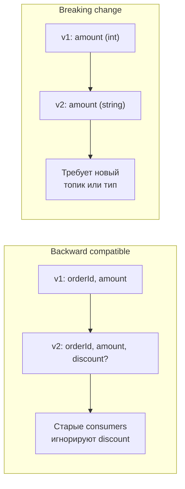

**Breaking changes** (удаление поля, изменение типа) -- требуют версионирования типа события или отдельного топика.

## Q16. Что такое partition key в Kafka и как он влияет на порядок?

`Partition key` -- ключ, по которому `Kafka` определяет партицию: `partition = hash(key) % numPartitions`. Все сообщения с одним ключом попадают в одну партицию и обрабатываются одним потребителем в группе в порядке публикации.

```java
// Spring Kafka: отправка с ключом
kafkaTemplate.send("orders", orderId.toString(), orderEventJson);

// Все события для order-123 попадут в одну партицию
// и будут обработаны последовательно
```

Правила выбора ключа:
- Идентификатор агрегата (`orderId`, `userId`) -- порядок по агрегату
- `null` ключ -- round-robin по партициям (порядок не гарантируется)
- Не менять число партиций -- это изменит распределение ключей

## Q17. Когда использовать топик с одной партицией, а когда с несколькими?

**Одна партиция** -- когда нужен глобальный порядок всех сообщений и один потребитель достаточен. Не масштабируется.

**Несколько партиций** -- когда нужна параллельная обработка и высокий throughput; порядок сохраняется только внутри партиции (по ключу). Число партиций ограничивает максимальное число потребителей в группе.

Рекомендация: использовать несколько партиций для масштабирования; порядок по агрегату через ключ партиционирования; глобальный порядок обычно не нужен. Увеличивать партиции после создания топика сложно -- планировать заранее.

## Q18. Что такое consumer group и как распределяются партиции?

`Consumer group` -- набор потребителей, совместно обрабатывающих топик. Каждая партиция назначается ровно одному потребителю в группе.

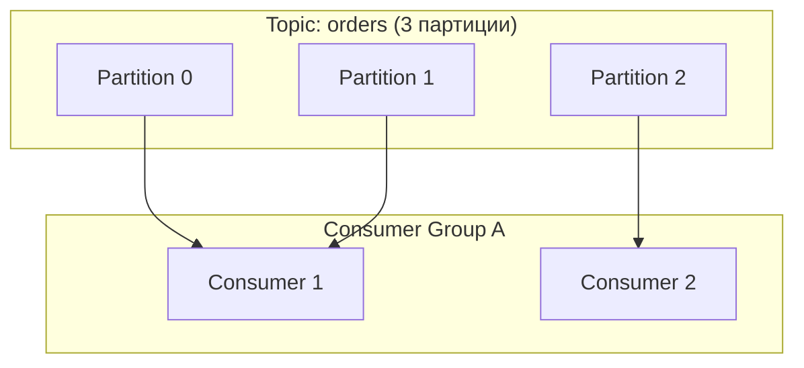

При добавлении потребителей происходит **rebalance**: партиции перераспределяются. При количестве потребителей больше числа партиций -- часть простаивает. Offset хранится по consumer group; при перезапуске потребитель продолжает с последнего commit offset.

## Q19. Как в EDA обеспечить мониторинг и наблюдаемость?

Ключевые практики:
- **Метрики**: consumer lag, throughput, latency (publish-to-consume), error rate, DLQ size
- **Распределённая трассировка**: `traceId` в заголовках сообщений, передача в `MDC` при обработке (см. [[observability-interview|Observability]])
- **Логирование**: ключевые события (публикация, обработка, ошибки) без чувствительных данных
- **Алерты**: рост lag, падение throughput, рост error rate, несовместимость схем

```java
// Передача traceId через Kafka headers
@KafkaListener(topics = "orders")
public void consume(ConsumerRecord<String, String> record) {
    var traceId = new String(record.headers()
        .lastHeader("X-Trace-Id").value());
    MDC.put("traceId", traceId);
    try {
        processOrder(record.value());
    } finally {
        MDC.clear();
    }
}
```

Инструменты: `Prometheus` + `Grafana` для метрик; `Jaeger`/`Zipkin` для трассировки; `Kafka Manager`/`AKHQ` для управления [[kafka-interview|Kafka]].

## Q20. Какие антипаттерны в event-driven архитектуре стоит избегать?

**Антипаттерн:** использовать события как синхронный RPC-заменитель и ждать «мгновенный» ответ -- это ломает слабую связность и ухудшает отказоустойчивость.

- **Большие сообщения** -- не передавать большие бинарные данные; хранить в объектном хранилище (S3) и передавать ссылку (Claim Check pattern)
- **Синхронные вызовы внутри потребителя** -- не блокировать обработку длинными `REST`-запросами; использовать async или выносить в отдельные воркеры
- **Отсутствие идемпотентности** -- повторная доставка приводит к дублированию операций
- **Игнорирование схемы** -- менять формат без версионирования ломает потребителей
- **Один гигантский топик на всё** -- разделять по доменам и критичности
- **Event soup** -- слишком много мелких событий без чёткого контракта; сложно поддерживать и понимать поток

## Q21. Что такое event replay и когда его использовать?

`Event replay` -- повторная обработка событий из истории (из топика `Kafka` или event store) для восстановления состояния или пересчёта проекций.

Используют при:
- Восстановлении read-модели после сбоя
- Исправлении багов в обработчиках и пересчёте данных
- Создании новых проекций из исторических событий
- Тестировании обработчиков на реальных данных

В `Kafka`: сброс offset consumer group на начало топика:

```bash
kafka-consumer-groups.sh --bootstrap-server localhost:9092 \
  --group order-projections \
  --topic orders \
  --reset-offsets --to-earliest \
  --execute
```

## Q22. Как обеспечить транзакционность в event-driven системе?

Транзакционность в `EDA` сложнее, чем в монолите. Подходы:
- **`Outbox` pattern** -- запись бизнес-данных и события в одну транзакцию БД
- **`Saga`** -- компенсирующие транзакции при сбоях
- **`CDC`** -- `Debezium` читает transaction log БД
- **`Kafka` транзакции** -- `read-process-write` с атомарным commit

На практике ключевой момент -- **eventual consistency это норма** для `EDA`; сильная консистентность достигается через синхронные вызовы или [[consistency-patterns-interview|паттерны согласованности]]. В интервью стоит показать, как система ведёт себя при ретраях и дублирующей доставке.

## Q23. Что такое event versioning и как управлять изменениями схемы?

`Event versioning` -- управление изменениями схемы событий с сохранением обратной совместимости.

Стратегии:
- **Backward compatible** -- новые поля опциональны, старые не удаляются; старые consumers работают с новыми событиями
- **Forward compatible** -- новые consumers работают со старыми событиями (опциональные поля, значения по умолчанию)
- **Версионирование типа** -- `order.created.v1`, `order.created.v2`
- **`Schema Registry`** -- централизованное управление (`Avro`, `JSON Schema`) с проверкой совместимости

Рекомендация: `Schema Registry` + backward/forward compatible изменения; breaking changes -- через версионирование типа или топика.

## Q24. Как обработать события в правильном порядке при параллельной обработке?

Порядок в `Kafka` гарантируется только в пределах партиции. Для параллельной обработки с сохранением порядка:
- Ключ партиционирования (`orderId`) -- все события по одному заказу в одну партицию
- Один поток потребителя обрабатывает одну партицию последовательно

В `Spring Kafka`:

```java
@Bean
public ConcurrentKafkaListenerContainerFactory<String, String> kafkaListenerContainerFactory(
        ConsumerFactory<String, String> consumerFactory) {
    var factory = new ConcurrentKafkaListenerContainerFactory<String, String>();
    factory.setConsumerFactory(consumerFactory);
    factory.setConcurrency(3); // по числу партиций
    return factory;
}
```

Каждый поток обрабатывает свои партиции последовательно; между партициями -- параллельно.

## Q25. Что такое event store и чем он отличается от обычной БД?

`Event store` -- специализированное хранилище для событий в `Event Sourcing`:
- `Append-only` -- события неизменяемы
- Поддерживает чтение по агрегату и временному диапазону
- Оптимизирован для записи и чтения последовательностей

| | Обычная БД (CRUD) | Event Store |
|---|---|---|
| Хранит | Текущее состояние | Историю изменений |
| Операции | `INSERT`/`UPDATE`/`DELETE` | Только `APPEND` |
| Версия | Одна (текущая) | Все версии (события) |
| Текущее состояние | Прямое чтение | Вычисляется из событий |

Примеры: `EventStoreDB`, `Axon Server`, `Kafka` как event store (с retention `infinite`).

## Q26. Как обеспечить мониторинг и алертинг в event-driven системе?

Метрики для [[observability-interview|мониторинга]]:

| Метрика | Описание | Алерт |
|---------|----------|-------|
| Consumer lag | Отставание потребителя | Lag > 10000 или растёт |
| Throughput | msg/s входящие и обработанные | Падение > 50% |
| Latency | Время от publish до consume | P99 > 5s |
| Error rate | Частота ошибок обработки | > 1% |
| DLQ size | Размер dead letter queue | > 0 (или > порога) |

Инструменты: `Prometheus` + `Grafana` для метрик; `Jaeger`/`Zipkin` для trace id в событиях; `AKHQ`/`Confluent Control Center` для управления `Kafka`.

## Q27. Что такое event choreography vs orchestration?

**Хореография** -- децентрализованная координация: каждый сервис реагирует на события и решает, что делать дальше. Нет центрального координатора; сервисы слабо связаны; сложнее отладка и мониторинг.

**Оркестрация** -- центральный оркестратор вызывает сервисы и координирует поток. Проще отладка; центральная точка отказа; более жёсткая связность.

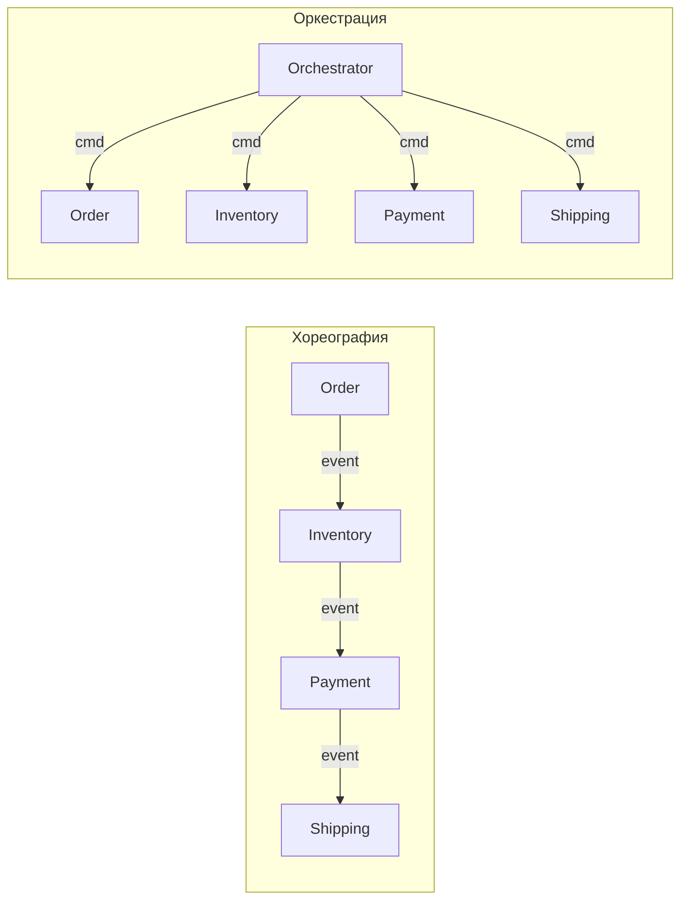

В контексте `Saga`: хореографическая -- каждый сервис публикует события; оркестрируемая -- оркестратор управляет потоком и компенсацией. Для сложных потоков с 4+ сервисами предпочитают оркестрацию.

## Q28. Как обработать события с разной скоростью обработки?

Проблема: быстрые события блокируют медленные в одной партиции. Решения:
- **Разделение по топикам** -- отдельные топики для быстрых и медленных событий
- **Приоритетные очереди** -- `RabbitMQ` priority queues
- **Отдельные consumer groups** -- разные группы для разных типов
- **Backpressure** -- замедление продюсера при переполнении
- **Rate limiting** -- ограничение скорости обработки

В `Kafka`: настройка `max.poll.records` для контроля батча; использование разных consumer groups; `pause`/`resume` партиций при перегрузке.

## Q29. Что такое event sourcing snapshot и зачем он нужен?

`Snapshot` -- сохранённое состояние агрегата на определённый момент (версию события). Ускоряет восстановление: вместо применения тысяч событий -- загрузить последний снапшот + применить новые события.

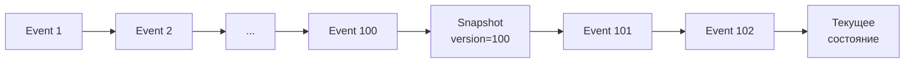

Стратегии создания:
- Периодически (каждые N событий или по времени)
- По требованию (при достижении определённого размера)
- Хранение снапшотов отдельно от событий

```java
public class SnapshotStrategy {
    private static final int SNAPSHOT_THRESHOLD = 100;

    public BankAccount load(UUID accountId, EventStore eventStore, 
                            SnapshotStore snapshotStore) {
        var snapshot = snapshotStore.findLatest(accountId);
        var events = snapshot != null 
            ? eventStore.loadAfter(accountId, snapshot.version())
            : eventStore.loadAll(accountId);

        var account = snapshot != null 
            ? BankAccount.fromSnapshot(snapshot) 
            : new BankAccount();
        events.forEach(account::apply);

        if (events.size() >= SNAPSHOT_THRESHOLD) {
            snapshotStore.save(account.toSnapshot());
        }
        return account;
    }
}
```

## Q30. Как обеспечить безопасность событий в event-driven системе?

Меры безопасности:
- **Шифрование**: TLS для транзита, encryption at rest для хранилища
- **Аутентификация**: `SASL`/`SSL` для `Kafka`, `RBAC` для авторизации
- **Данные**: не хранить пароли и `PII` в событиях; при необходимости -- шифровать поля payload
- **Схемы**: проверка через `Schema Registry`
- **Изоляция**: отдельные топики/кластеры по окружениям
- **Сеть**: брокер в приватной сети, ACL на уровне топиков

```yaml
# Kafka producer SSL/SASL настройки (application.yml)
spring:
  kafka:
    properties:
      security.protocol: SASL_SSL
      sasl.mechanism: SCRAM-SHA-256
      sasl.jaas.config: >
        org.apache.kafka.common.security.scram.ScramLoginModule required
        username="${KAFKA_USER}" password="${KAFKA_PASSWORD}";
    ssl:
      trust-store-location: classpath:kafka-truststore.jks
      trust-store-password: ${TRUSTSTORE_PASSWORD}
```

## Q31. (!) Как работает механизм событий в Spring Framework?

`Spring` предоставляет встроенный механизм событий через `ApplicationEventPublisher`. Это **внутрипроцессный** pub/sub -- не путать с брокерами вроде `Kafka`. Подробнее о Spring -- в [[spring-framework-interview|вопросах по Spring Framework]].

Публикация и обработка кастомного события:

```java
// 1. Определение события
public record OrderCreatedEvent(UUID orderId, BigDecimal amount) {}

// 2. Публикация события
@Service
@RequiredArgsConstructor
public class OrderService {
    private final ApplicationEventPublisher eventPublisher;

    @Transactional
    public Order createOrder(CreateOrderRequest request) {
        var order = orderRepository.save(Order.from(request));
        eventPublisher.publishEvent(new OrderCreatedEvent(order.getId(), order.getAmount()));
        return order;
    }
}

// 3. Синхронный обработчик (в той же транзакции)
@Component
public class InventoryEventListener {

    @EventListener
    public void onOrderCreated(OrderCreatedEvent event) {
        inventoryService.reserve(event.orderId());
    }
}

// 4. Асинхронный обработчик (вне транзакции)
@Component
public class NotificationEventListener {

    @Async
    @EventListener
    public void onOrderCreated(OrderCreatedEvent event) {
        emailService.sendConfirmation(event.orderId());
    }
}

// 5. Выполнение ПОСЛЕ коммита транзакции
@Component
public class KafkaPublishListener {

    @TransactionalEventListener(phase = TransactionPhase.AFTER_COMMIT)
    public void onOrderCreated(OrderCreatedEvent event) {
        kafkaTemplate.send("orders", event.orderId().toString(),
                           toJson(event));
    }
}
```

Ключевые аннотации:
- `@EventListener` -- синхронный обработчик (по умолчанию в том же потоке)
- `@Async @EventListener` -- асинхронный обработчик (требует `@EnableAsync`)
- `@TransactionalEventListener` -- привязка к фазе транзакции (`AFTER_COMMIT`, `AFTER_ROLLBACK`, `BEFORE_COMMIT`)

**Важно:** `@TransactionalEventListener(phase = AFTER_COMMIT)` гарантирует, что обработчик выполнится только после успешного коммита. Это идеальное место для отправки в `Kafka` или отправки уведомлений.

## Q32. Как создать Kafka producer и consumer в Spring Boot?

Минимальная настройка `Spring Kafka`:

```yaml
# application.yml
spring:
  kafka:
    bootstrap-servers: localhost:9092
    producer:
      key-serializer: org.apache.kafka.common.serialization.StringSerializer
      value-serializer: org.springframework.kafka.support.serializer.JsonSerializer
    consumer:
      group-id: order-service
      auto-offset-reset: earliest
      key-deserializer: org.apache.kafka.common.serialization.StringDeserializer
      value-deserializer: org.springframework.kafka.support.serializer.JsonDeserializer
      properties:
        spring.json.trusted.packages: "com.example.events"
```

Producer:

```java
@Service
@RequiredArgsConstructor
public class OrderEventProducer {

    private final KafkaTemplate<String, OrderCreatedEvent> kafkaTemplate;

    public CompletableFuture<SendResult<String, OrderCreatedEvent>> publish(
            OrderCreatedEvent event) {
        return kafkaTemplate
            .send("orders", event.orderId().toString(), event)
            .whenComplete((result, ex) -> {
                if (ex != null) {
                    log.error("Failed to send event {}", event.orderId(), ex);
                } else {
                    log.info("Sent event {} to partition {} offset {}",
                        event.orderId(),
                        result.getRecordMetadata().partition(),
                        result.getRecordMetadata().offset());
                }
            });
    }
}
```

Consumer:

```java
@Component
@RequiredArgsConstructor
public class OrderEventConsumer {

    private final OrderProjection orderProjection;

    @KafkaListener(topics = "orders", groupId = "order-projections")
    public void consume(@Payload OrderCreatedEvent event,
                        @Header(KafkaHeaders.RECEIVED_PARTITION) int partition,
                        @Header(KafkaHeaders.OFFSET) long offset) {
        log.info("Received event {} from partition {} offset {}",
                 event.orderId(), partition, offset);
        orderProjection.handle(event);
    }

    // Batch consumer для высокого throughput
    @KafkaListener(topics = "orders", groupId = "order-analytics",
                   containerFactory = "batchFactory")
    public void consumeBatch(List<ConsumerRecord<String, OrderCreatedEvent>> records) {
        log.info("Received batch of {} records", records.size());
        records.forEach(r -> analyticsService.process(r.value()));
    }
}
```

## Q33. (!) Как реализовать Outbox pattern на Spring Boot и Kafka?

Полный пример с `@Scheduled` polling и `Debezium` CDC:

```java
// DDL для таблицы outbox
// CREATE TABLE outbox_events (
//     id UUID PRIMARY KEY,
//     aggregate_type VARCHAR(255) NOT NULL,
//     aggregate_id VARCHAR(255) NOT NULL,
//     event_type VARCHAR(255) NOT NULL,
//     payload TEXT NOT NULL,
//     created_at TIMESTAMP NOT NULL DEFAULT NOW(),
//     published BOOLEAN NOT NULL DEFAULT FALSE
// );

@Entity
@Table(name = "outbox_events")
@Getter @Setter @NoArgsConstructor
public class OutboxEvent {
    @Id private UUID id;
    private String aggregateType;
    private String aggregateId;
    private String eventType;
    @Column(columnDefinition = "TEXT") private String payload;
    private Instant createdAt;
    private boolean published;

    public static OutboxEvent create(String aggregateType, String aggregateId,
                                      String eventType, String payload) {
        var event = new OutboxEvent();
        event.setId(UUID.randomUUID());
        event.setAggregateType(aggregateType);
        event.setAggregateId(aggregateId);
        event.setEventType(eventType);
        event.setPayload(payload);
        event.setCreatedAt(Instant.now());
        event.setPublished(false);
        return event;
    }
}

// Бизнес-сервис: данные + outbox в одной транзакции
@Service
@RequiredArgsConstructor
public class OrderService {
    private final OrderRepository orderRepo;
    private final OutboxEventRepository outboxRepo;
    private final ObjectMapper mapper;

    @Transactional
    public Order createOrder(CreateOrderRequest req) {
        var order = orderRepo.save(Order.from(req));
        outboxRepo.save(OutboxEvent.create(
            "Order", order.getId().toString(),
            "OrderCreated", mapper.writeValueAsString(order)
        ));
        return order;
    }
}

// Polling relay: читает и публикует неотправленные события
@Component
@RequiredArgsConstructor
public class OutboxRelay {
    private final OutboxEventRepository outboxRepo;
    private final KafkaTemplate<String, String> kafka;

    @Scheduled(fixedDelay = 500)
    @Transactional
    public void relay() {
        outboxRepo.findTop100ByPublishedFalseOrderByCreatedAt()
            .forEach(event -> {
                kafka.send(event.getAggregateType().toLowerCase(),
                           event.getAggregateId(), event.getPayload())
                     .whenComplete((res, ex) -> {
                         if (ex == null) {
                             event.setPublished(true);
                             outboxRepo.save(event);
                         }
                     });
            });
    }
}
```

Для production рекомендуется `CDC` через `Debezium` вместо polling -- меньше задержка, нет нагрузки на БД от постоянных запросов.

## Q34. Как реализовать Event Sourcing на Java?

Полный пример с event store, агрегатом и восстановлением:

```java
// Базовый интерфейс события
public sealed interface DomainEvent permits 
        AccountOpened, MoneyDeposited, MoneyWithdrawn {
    UUID eventId();
    UUID aggregateId();
    Instant timestamp();
    int version();
}

// Конкретные события
public record AccountOpened(UUID eventId, UUID aggregateId, 
                             String owner, Instant timestamp, 
                             int version) implements DomainEvent {}

public record MoneyDeposited(UUID eventId, UUID aggregateId, 
                              BigDecimal amount, Instant timestamp, 
                              int version) implements DomainEvent {}

public record MoneyWithdrawn(UUID eventId, UUID aggregateId, 
                              BigDecimal amount, Instant timestamp, 
                              int version) implements DomainEvent {}

// Event Store (репозиторий событий)
@Repository
@RequiredArgsConstructor
public class JdbcEventStore implements EventStore {

    private final JdbcTemplate jdbc;
    private final ObjectMapper mapper;

    @Override
    public void append(UUID aggregateId, List<DomainEvent> events) {
        for (var event : events) {
            jdbc.update("""
                INSERT INTO domain_events 
                (event_id, aggregate_id, event_type, payload, version, created_at)
                VALUES (?, ?, ?, ?::jsonb, ?, ?)
                """,
                event.eventId(), aggregateId,
                event.getClass().getSimpleName(),
                mapper.writeValueAsString(event),
                event.version(), event.timestamp()
            );
        }
    }

    @Override
    public List<DomainEvent> load(UUID aggregateId) {
        return jdbc.query("""
            SELECT event_type, payload FROM domain_events
            WHERE aggregate_id = ? ORDER BY version
            """,
            (rs, i) -> deserialize(rs.getString("event_type"), 
                                    rs.getString("payload")),
            aggregateId
        );
    }
}
```

## Q35. (!) Как реализовать CQRS с проекциями на Spring?

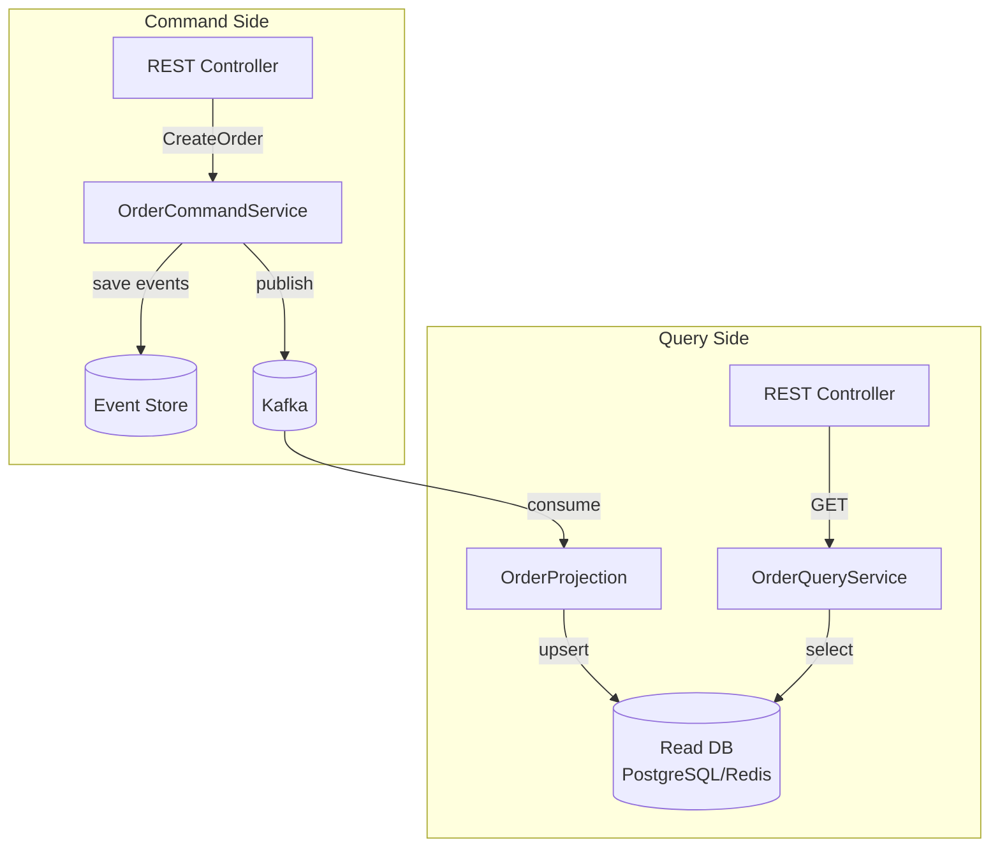

Command side (запись):

```java
@RestController
@RequestMapping("/api/orders")
@RequiredArgsConstructor
public class OrderCommandController {

    private final OrderCommandService commandService;

    @PostMapping
    public ResponseEntity<UUID> createOrder(@RequestBody CreateOrderRequest req) {
        var orderId = commandService.handle(new CreateOrderCommand(
            req.customerId(), req.items(), req.shippingAddress()
        ));
        return ResponseEntity.status(HttpStatus.ACCEPTED).body(orderId);
    }
}

@Service
@RequiredArgsConstructor
public class OrderCommandService {
    private final EventStore eventStore;
    private final KafkaTemplate<String, String> kafka;
    private final ObjectMapper mapper;

    @Transactional
    public UUID handle(CreateOrderCommand cmd) {
        var orderId = UUID.randomUUID();
        var event = new OrderCreatedEvent(UUID.randomUUID(), orderId,
            cmd.customerId(), cmd.items(), Instant.now(), 1);

        eventStore.append(orderId, List.of(event));
        kafka.send("orders", orderId.toString(), 
                   mapper.writeValueAsString(event));
        return orderId;
    }
}
```

Query side (чтение через проекцию):

```java
// Проекция: обновляет read-модель по событиям из Kafka
@Component
@RequiredArgsConstructor
public class OrderProjection {
    private final OrderViewRepository viewRepo;

    @KafkaListener(topics = "orders", groupId = "order-view-projection")
    public void on(ConsumerRecord<String, String> record) {
        var event = parseEvent(record.value());
        switch (event) {
            case OrderCreatedEvent e -> viewRepo.save(new OrderView(
                e.orderId(), e.customerId(), 
                OrderStatus.CREATED, e.timestamp()));
            case OrderShippedEvent e -> viewRepo.updateStatus(
                e.orderId(), OrderStatus.SHIPPED);
            case OrderCancelledEvent e -> viewRepo.updateStatus(
                e.orderId(), OrderStatus.CANCELLED);
        }
    }
}

// Query service: быстрое чтение из read-модели
@Service
@RequiredArgsConstructor
public class OrderQueryService {
    private final OrderViewRepository viewRepo;

    public OrderView getOrder(UUID orderId) {
        return viewRepo.findById(orderId)
            .orElseThrow(() -> new OrderNotFoundException(orderId));
    }

    public List<OrderView> getOrdersByCustomer(UUID customerId) {
        return viewRepo.findByCustomerIdOrderByCreatedAtDesc(customerId);
    }
}
```

Преимущество `CQRS`: read-модель `OrderView` может быть денормализованной таблицей с индексами под конкретные запросы, тогда как command side хранит только события. Можно создать несколько проекций (список заказов, аналитика, поиск) из одного потока событий.

## Q36. (!) Чем отличается Saga Orchestration от Choreography?

Оба подхода решают задачу координации длинных распределённых транзакций, но по-разному распределяют ответственность.

**Choreography (хореография)** — каждый сервис самостоятельно слушает события и публикует следующие. Нет центрального координатора.

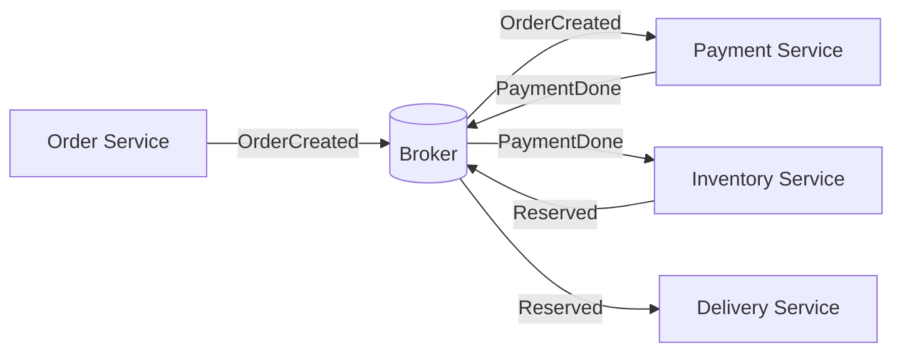

**Orchestration (оркестрация)** — центральный `Saga Orchestrator` явно управляет шагами, вызывая команды и ожидая событий.

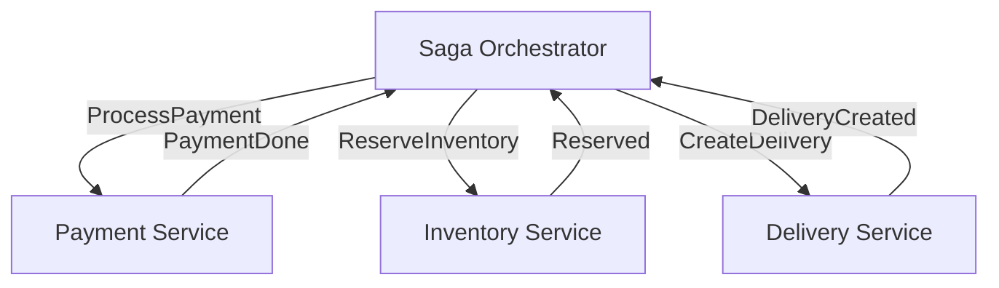

| Критерий | Choreography | Orchestration |
|----------|-------------|---------------|
| Связность | Низкая (только через broker) | Выше (оркестратор знает всех) |
| Наблюдаемость | Сложно отследить весь флоу | Статус виден в оркестраторе |
| Сложность | Растёт с числом шагов | Явная и локализованная |
| SPOF | Нет | Оркестратор (нужна HA) |
| Тестирование | Сложнее (нужна вся цепочка) | Проще (unit тест оркестратора) |
| Подходит для | 2-3 шага, простой флоу | Сложные бизнес-процессы (5+ шагов) |

**Рекомендация:** для сложных бизнес-процессов (заказ, онбординг) выбирайте **оркестрацию** — статус процесса виден в одном месте, компенсации явно описаны. Хореографию применяйте для простых событийных цепочек (уведомления, аудит-лог).

## Q37. Что такое Process Manager и когда его использовать?

`Process Manager` (также `Saga Orchestrator`, `Workflow Engine`) — компонент, отслеживающий состояние долгосрочного бизнес-процесса и координирующий взаимодействие между сервисами.

**Отличие от простого Saga Orchestrator:**
- `Saga Orchestrator` — линейный или ветвящийся флоу с явными шагами
- `Process Manager` — более сложная state machine с таймаутами, параллельными ветками, компенсациями и перезапусками

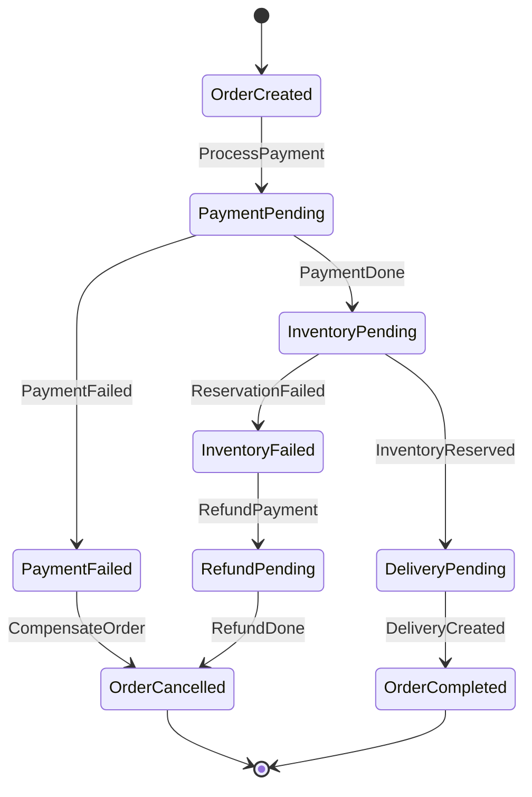

**Персистентное состояние** — Process Manager хранит текущий статус в БД (устойчив к перезапускам):

```java
@Entity
public class OrderProcess {
    @Id private UUID processId;
    private UUID orderId;
    @Enumerated(EnumType.STRING)
    private ProcessState state;  // PAYMENT_PENDING, INVENTORY_PENDING, ...
    private Instant createdAt;
    private Instant timeoutAt;
    // поля для компенсации
    private BigDecimal paidAmount;
    private List<UUID> reservedItems;
}
```

**Когда использовать:** бизнес-процессы с несколькими ветками, таймаутами, повторными попытками и частичными отказами. Инструменты: `Temporal.io`, `Axon Framework`, `Camunda`, Spring State Machine.

## Q38. (!) Что такое Event-Carried State Transfer (ECST)?

`Event-Carried State Transfer` (ECST) — паттерн, при котором события содержат **полное состояние** изменившейся сущности, а не только идентификатор. Потребители не делают обратный запрос к источнику — данные встроены в само событие.

**Сравнение с Event Notification:**

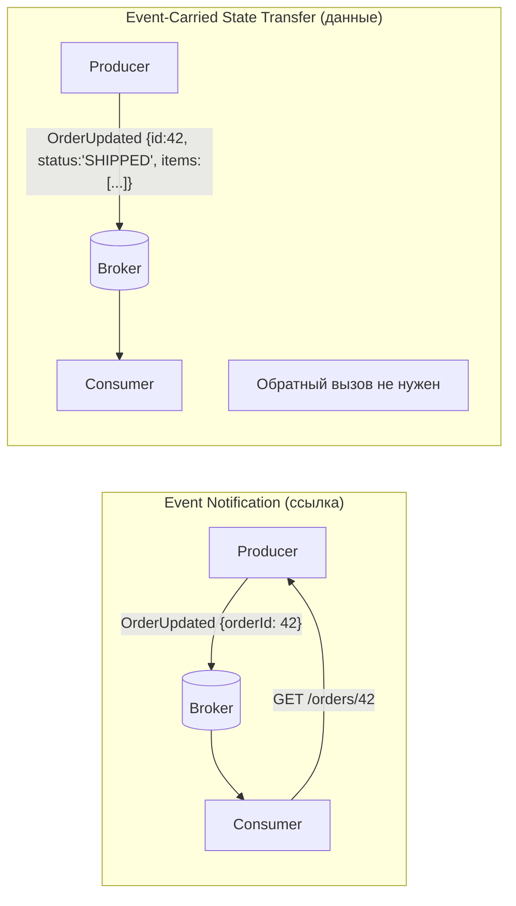

**Преимущества:**
- Слабая связность: потребители автономны, не зависят от доступности источника
- Производительность: нет N запросов при N событиях
- Replay: при пересоздании проекции все данные уже в событиях

**Недостатки:**
- Размер сообщений больше (payload крупнее)
- Нельзя убрать поле из события без нарушения совместимости потребителей
- При большом числе полей события раздуваются

**Практический подход:** включать в событие **данные, необходимые потребителям**, не весь агрегат. Оставить `aggregateId` для случаев, когда нужны детали.

```java
// Event Notification — потребитель должен сделать запрос
public record OrderStatusChangedEvent(UUID orderId, String newStatus) {}

// Event-Carried State Transfer — всё нужное в событии
public record OrderShippedEvent(
    UUID orderId,
    String status,          // "SHIPPED"
    String trackingNumber,
    Address shippingAddress,
    List<OrderItem> items,
    Instant shippedAt
) {}
```

## Q39. Как проектировать стратегии компенсации в EDA?

Компенсирующие транзакции в `EDA` — механизм «отмены» уже выполненных шагов при сбое в Saga. В отличие от `2PC`, они **семантически** отменяют эффект, а не откатывают БД-транзакцию.

**Принципы проектирования:**

1. **Идемпотентность** — компенсация должна выполняться безопасно несколько раз:
```java
// Плохо: дважды вернёт деньги
void refund(UUID orderId) {
    payment.refund(amount);
}

// Хорошо: idempotency key предотвращает повтор
void refund(UUID orderId) {
    if (refundRepo.existsByOrderId(orderId)) return;
    payment.refund(amount);
    refundRepo.save(new Refund(orderId, amount));
}
```

2. **Не всегда возможна** — «нельзя разослать неразосланные письма»; для таких шагов используют **pivot transaction** (точку невозврата):
```
OrderCreated → PaymentCharged (PIVOT) → EmailSent → DeliveryCreated
                    ↑
         До этой точки — компенсации возможны
         После — только компенсации вперёд (forward recovery)
```

3. **Явные компенсирующие команды** в протоколе:

| Прямая транзакция | Компенсирующая |
|-------------------|----------------|
| `ReserveInventory` | `ReleaseInventory` |
| `ChargePayment` | `RefundPayment` |
| `CreateOrder` | `CancelOrder` |
| `LockAccount` | `UnlockAccount` |

4. **Таймауты и Dead Letter Queue** — если компенсация зависает, необходимо переместить событие в `DLQ` для ручного разбора инцидента.

## Q40. Как организовать версионирование топиков Kafka при эволюции схемы?

Эволюция схемы событий — неизбежная проблема в долгоживущих `EDA`-системах. Несовместимые изменения ломают потребителей.

**Стратегии совместимости (Confluent Schema Registry):**

| Тип совместимости | Что можно | Что нельзя |
|-------------------|-----------|-----------|
| **BACKWARD** | Добавить поле с default | Удалить обязательное поле |
| **FORWARD** | Удалить поле с default | Добавить обязательное поле |
| **FULL** | Только добавление с default | Удаление, смена типа |
| **NONE** | Всё | — (только при мажорной версии) |

**Паттерн версионирования через заголовок:**

```java
// Producer: добавляет версию в заголовок
ProducerRecord<String, byte[]> record = new ProducerRecord<>(topic, key, payload);
record.headers().add("schema-version", "2".getBytes());

// Consumer: маршрутизация по версии
@KafkaListener(topics = "orders")
public void consume(ConsumerRecord<String, byte[]> record) {
    String version = new String(record.headers().lastHeader("schema-version").value());
    switch (version) {
        case "1" -> handleV1(deserializeV1(record.value()));
        case "2" -> handleV2(deserializeV2(record.value()));
        default -> dlqSender.send(record, "unknown-version");
    }
}
```

**Топик-per-версия** (для мажорных несовместимых изменений):
```
orders.v1   — старый контракт (потребители мигрируют постепенно)
orders.v2   — новый контракт
```

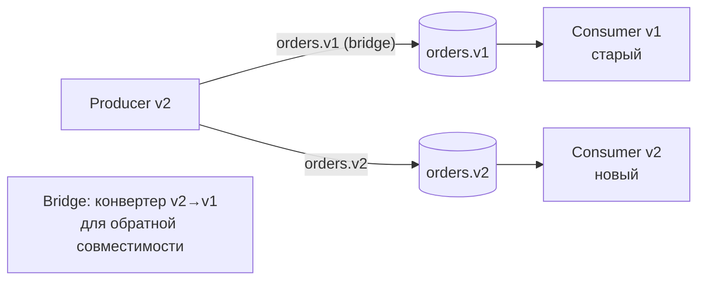

**Правила эволюции схемы Avro/Protobuf:**
- Всегда добавляйте новые поля с `default` значением
- Никогда не меняйте тип существующего поля
- Никогда не удаляйте поля — только помечайте как `deprecated`
- Для несовместимых изменений — новый топик + миграция потребителей

---

## See also

- [[kafka-interview|Apache Kafka]] — брокер сообщений: партиции, consumer groups, exactly-once
- [[microservices-interview|Микросервисы]] — EDA как основа межсервисного взаимодействия
- [[distributed-systems-interview|Распределённые системы]] — идемпотентность, гарантии доставки и консенсус
- [[consistency-patterns-interview|Паттерны согласованности]] — eventual consistency, Saga, Outbox Pattern
- [[design-patterns-interview|Паттерны проектирования]] — GoF-паттерны Observer и Mediator в контексте EDA
- [[spring-framework-interview|Spring Framework]] — ApplicationEvent, @EventListener и Spring Integration
- [[observability-interview|Observability]] — трассировка событий, метрики и алертинг в EDA-системах

- [[api-gateway-interview|API Gateway]]
- [[bff-pattern-interview|BFF Pattern]]
- [[caching-strategies-interview|Стратегии кэширования]]
- [[cap-theorem-interview|CAP-теорема]]
- [[clean-architecture-interview|Clean Architecture]]
- [[consistency-patterns-interview|Паттерны согласованности]]
