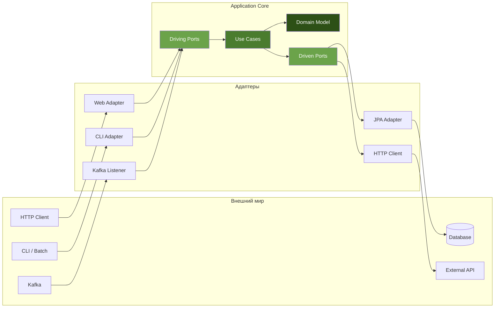
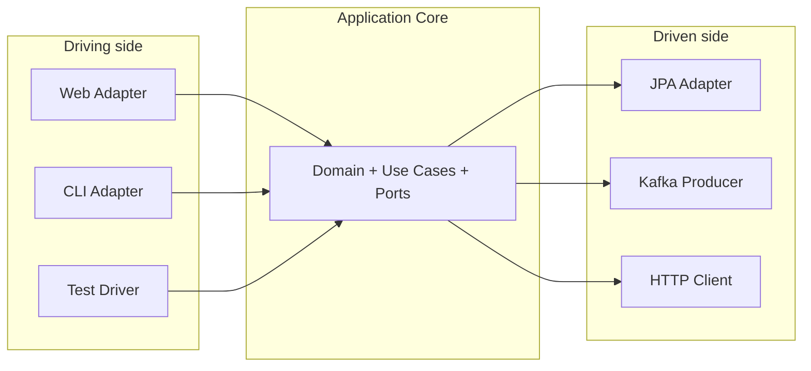
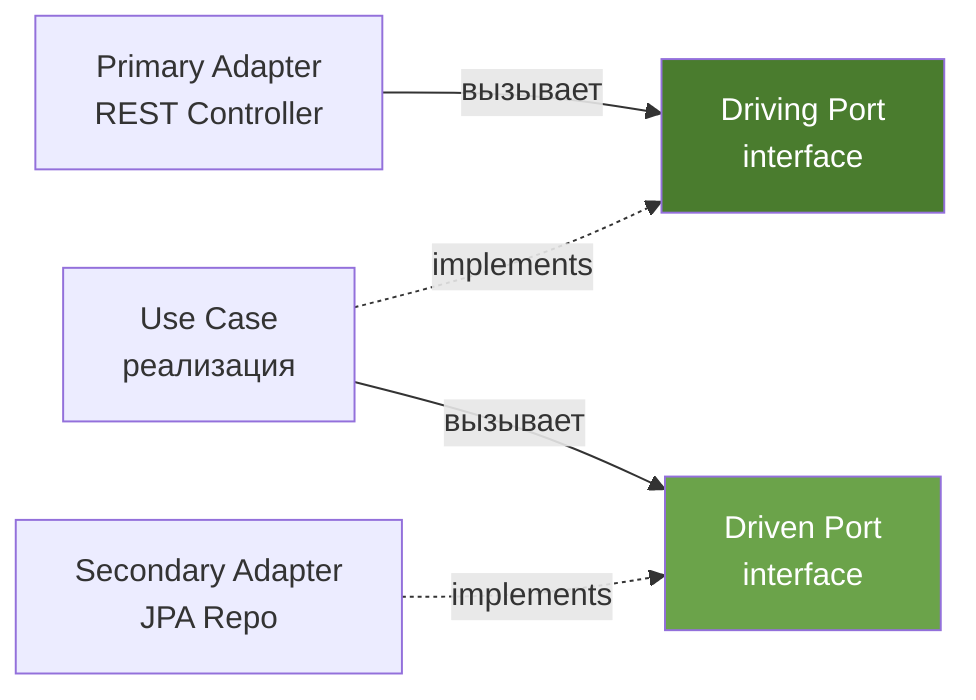
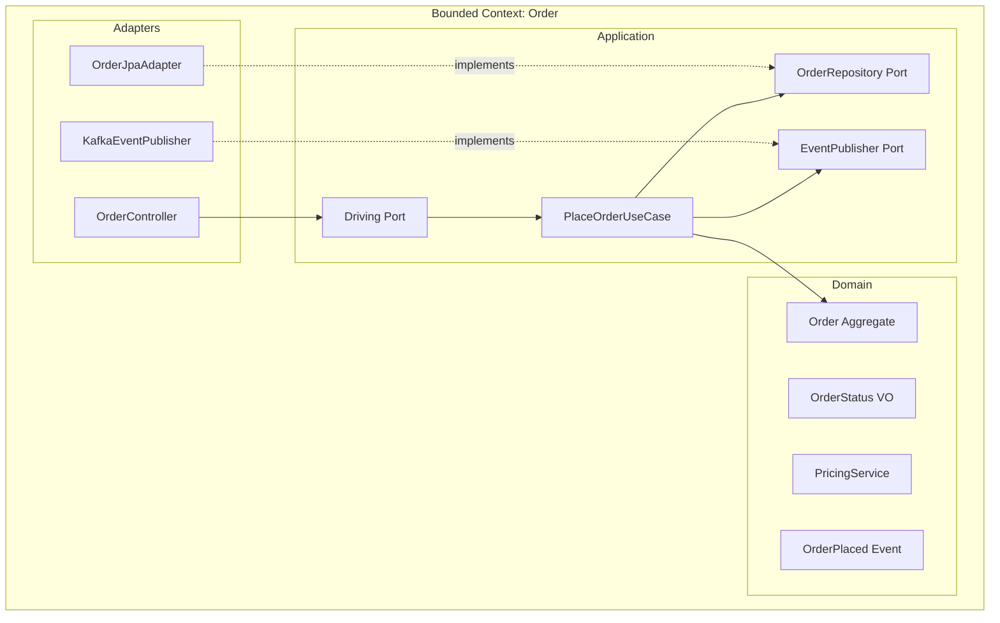
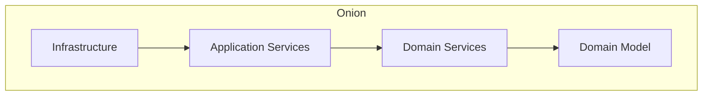
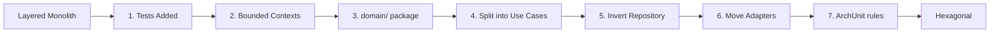
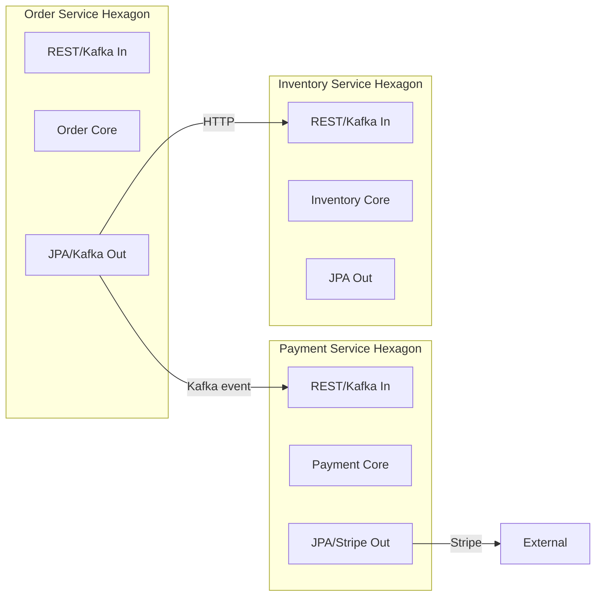

# Вопросы на собеседовании: `Hexagonal Architecture (Ports & Adapters)`

Полное покрытие `Hexagonal Architecture` (`Ports & Adapters`, Алистер Кокбёрн, 2005): порты (`driving`/`driven`), адаптеры (`primary`/`secondary`), структура Spring Boot проекта, интеграция с `DDD`, стратегия тестирования, сравнение с `Clean` и `Onion Architecture`, миграция со слоистой архитектуры, антипаттерны.

**Hexagonal Architecture** (оригинальное название -- **Ports & Adapters**) -- один из базовых архитектурных паттернов, придуманный Алистером Кокбёрном ещё в 2005 году. Главная идея -- сделать ядро приложения (доменную логику) полностью независимым от способов его вызова (UI, REST, Kafka) и от внешних зависимостей (БД, сторонние API). На собеседованиях уровня Senior/Lead вопросы по гексагональной архитектуре проверяют понимание `Dependency Inversion`, умение проектировать границы между доменом и инфраструктурой и знание практик реализации в `Java`/`Spring Boot`.

## Полезные ссылки

### Официальная документация

- [Hexagonal Architecture (Alistair Cockburn)](https://alistair.cockburn.us/hexagonal-architecture/) -- оригинальная статья автора паттерна
- [Hexagonal Architecture, DDD, and Spring (Baeldung)](https://www.baeldung.com/hexagonal-architecture-ddd-spring) -- пример реализации в Spring
- [Hexagonal Architecture with Java and Spring (Reflectoring)](https://reflectoring.io/spring-hexagonal/) -- детальный гайд по структуре проекта
- [Hexagonal Architecture pattern (AWS Prescriptive Guidance)](https://docs.aws.amazon.com/prescriptive-guidance/latest/cloud-design-patterns/hexagonal-architecture.html) -- обзор паттерна от AWS
- [Hexagonal Architecture With Spring Boot (Arho Huttunen)](https://www.arhohuttunen.com/hexagonal-architecture-spring-boot/) -- практическая реализация
- [ArchUnit (Baeldung)](https://www.baeldung.com/java-archunit-intro) -- автоматическая проверка архитектурных правил
- ["Get Your Hands Dirty on Clean Architecture" (Tom Hombergs)](https://reflectoring.io/book/) -- каноническая книга по гексагональной архитектуре в Spring

## Содержание

- [Полезные ссылки](#полезные-ссылки)
- [See also](#see-also)

**Основы Hexagonal Architecture**
- [Q1. (!) Что такое Hexagonal Architecture и какую проблему она решает?](#q1--что-такое-hexagonal-architecture-и-какую-проблему-она-решает)
- [Q2. (!) Почему именно шестиугольник? В чём смысл такой визуализации?](#q2--почему-именно-шестиугольник-в-чём-смысл-такой-визуализации)
- [Q3. Какая история и авторство у паттерна Ports & Adapters?](#q3-какая-история-и-авторство-у-паттерна-ports--adapters)
- [Q4. Что такое Application Core и что в него входит?](#q4-что-такое-application-core-и-что-в-него-входит)
- [Q5. Какие три основные зоны определяет гексагональная архитектура?](#q5-какие-три-основные-зоны-определяет-гексагональная-архитектура)

**Порты (Driving / Driven)**
- [Q6. (!) Что такое Port и чем он отличается от обычного интерфейса?](#q6--что-такое-port-и-чем-он-отличается-от-обычного-интерфейса)
- [Q7. (!) В чём разница между Driving (Input) и Driven (Output) портами?](#q7--в-чём-разница-между-driving-input-и-driven-output-портами)
- [Q8. Как правильно именовать порты?](#q8-как-правильно-именовать-порты)
- [Q9. Сколько портов должно быть у приложения? Гранулярность портов](#q9-сколько-портов-должно-быть-у-приложения-гранулярность-портов)
- [Q10. Может ли один адаптер реализовывать несколько портов?](#q10-может-ли-один-адаптер-реализовывать-несколько-портов)

**Адаптеры (Primary / Secondary)**
- [Q11. (!) Что такое Primary (Driving) Adapter и какие у него обязанности?](#q11--что-такое-primary-driving-adapter-и-какие-у-него-обязанности)
- [Q12. (!) Что такое Secondary (Driven) Adapter и какие у него обязанности?](#q12--что-такое-secondary-driven-adapter-и-какие-у-него-обязанности)
- [Q13. Примеры Primary и Secondary адаптеров в реальном приложении](#q13-примеры-primary-и-secondary-адаптеров-в-реальном-приложении)
- [Q14. Как адаптер преобразует данные между внешним миром и доменом?](#q14-как-адаптер-преобразует-данные-между-внешним-миром-и-доменом)
- [Q15. Может ли адаптер быть одновременно primary и secondary?](#q15-может-ли-адаптер-быть-одновременно-primary-и-secondary)

**Структура проекта в Java / Spring Boot**
- [Q16. (!) Какая рекомендуемая структура пакетов для гексагональной архитектуры в Spring Boot?](#q16--какая-рекомендуемая-структура-пакетов-для-гексагональной-архитектуры-в-spring-boot)
- [Q17. Как реализовать Driving Port и Use Case в Java?](#q17-как-реализовать-driving-port-и-use-case-в-java)
- [Q18. Как реализовать Driven Port и его адаптер?](#q18-как-реализовать-driven-port-и-его-адаптер)
- [Q19. (!) Стоит ли использовать `@Service` на Use Case или держать ядро чистым?](#q19--стоит-ли-использовать-service-на-use-case-или-держать-ядро-чистым)
- [Q20. Где размещать транзакционные границы в гексагональной архитектуре?](#q20-где-размещать-транзакционные-границы-в-гексагональной-архитектуре)
- [Q21. Как организовать DI / Composition Root в Spring?](#q21-как-организовать-di--composition-root-в-spring)
- [Q22. Multi-module Gradle/Maven проект для гексагональной архитектуры](#q22-multi-module-gradlemaven-проект-для-гексагональной-архитектуры)

**Интеграция с DDD**
- [Q23. (!) Как гексагональная архитектура сочетается с DDD?](#q23--как-гексагональная-архитектура-сочетается-с-ddd)
- [Q24. Где в гексагоне живут агрегаты, Value Objects и доменные сервисы?](#q24-где-в-гексагоне-живут-агрегаты-value-objects-и-доменные-сервисы)
- [Q25. В чём разница между Application Service и Domain Service?](#q25-в-чём-разница-между-application-service-и-domain-service)
- [Q26. Как обрабатывать доменные события через Driven Port?](#q26-как-обрабатывать-доменные-события-через-driven-port)

**Тестирование**
- [Q27. (!) Какая стратегия тестирования рекомендуется для гексагональной архитектуры?](#q27--какая-стратегия-тестирования-рекомендуется-для-гексагональной-архитектуры)
- [Q28. (!) Как тестировать Use Case без инфраструктуры?](#q28--как-тестировать-use-case-без-инфраструктуры)
- [Q29. Как тестировать адаптеры (контроллеры и репозитории)?](#q29-как-тестировать-адаптеры-контроллеры-и-репозитории)
- [Q30. Что такое port-level / contract testing?](#q30-что-такое-port-level--contract-testing)
- [Q31. Как использовать fake-реализации портов вместо моков?](#q31-как-использовать-fake-реализации-портов-вместо-моков)

**Hexagonal vs Clean vs Onion**
- [Q32. (!) Чем Hexagonal отличается от Clean Architecture?](#q32--чем-hexagonal-отличается-от-clean-architecture)
- [Q33. Чем Hexagonal отличается от Onion Architecture?](#q33-чем-hexagonal-отличается-от-onion-architecture)
- [Q34. Сравнительная таблица: Hexagonal, Clean, Onion, Layered](#q34-сравнительная-таблица-hexagonal-clean-onion-layered)

**Миграция со слоистой архитектуры**
- [Q35. (!) Как эволюционно мигрировать из традиционной слоистой архитектуры?](#q35--как-эволюционно-мигрировать-из-традиционной-слоистой-архитектуры)
- [Q36. Как разделить "жирный" Service-класс на Use Cases?](#q36-как-разделить-жирный-service-класс-на-use-cases)
- [Q37. Как отделить JPA-сущность от доменной модели при миграции?](#q37-как-отделить-jpa-сущность-от-доменной-модели-при-миграции)

**Реальные ловушки и антипаттерны**
- [Q38. (!) Какие антипаттерны чаще всего встречаются в гексагональной архитектуре?](#q38--какие-антипаттерны-чаще-всего-встречаются-в-гексагональной-архитектуре)
- [Q39. "Анемичная" доменная модель в гексагоне -- как избежать?](#q39-анемичная-доменная-модель-в-гексагоне----как-избежать)
- [Q40. Утечка доменной модели через адаптер -- как это происходит и как предотвратить?](#q40-утечка-доменной-модели-через-адаптер----как-это-происходит-и-как-предотвратить)
- [Q41. Когда Hexagonal Architecture -- это overkill?](#q41-когда-hexagonal-architecture----это-overkill)
- [Q42. Как проверять правила гексагональной архитектуры через ArchUnit?](#q42-как-проверять-правила-гексагональной-архитектуры-через-archunit)

**Продвинутые темы**
- [Q43. (!) Как применять гексагональную архитектуру в микросервисах?](#q43--как-применять-гексагональную-архитектуру-в-микросервисах)
- [Q44. Как организовать обработку ошибок между доменом и адаптером?](#q44-как-организовать-обработку-ошибок-между-доменом-и-адаптером)
- [Q45. Реактивность (WebFlux, R2DBC) и гексагональная архитектура: что меняется?](#q45-реактивность-webflux-r2dbc-и-гексагональная-архитектура-что-меняется)

---

## Q1. (!) Что такое Hexagonal Architecture и какую проблему она решает?

**Hexagonal Architecture** (она же `Ports & Adapters`) -- архитектурный паттерн, предложенный Алистером Кокбёрном в 2005 году. Главная идея:

> Позволить приложению одинаково управляться пользователями, программами, автоматизированными тестами или batch-скриптами, и разрабатываться и тестироваться изолированно от конкретных устройств времени выполнения и баз данных.

Механизм один: приложение изолируется от внешнего мира через **порты** (абстрактные интерфейсы в ядре) и **адаптеры** (их конкретные реализации снаружи). Внешние технологии (`Spring MVC`, `JPA`, `Kafka`, CLI) перестают быть частью приложения и становятся "подключаемыми модулями" вокруг ядра -- их можно менять, не трогая бизнес-логику.

**Какие проблемы это решает.** Паттерн целится в четыре типичные болезни слоистого кода, и каждая из них -- следствие того, что домен напрямую завязан на инфраструктуру:

- **Сильная связанность** бизнес-логики с фреймворком -- `@Transactional` и SQL-запросы размазаны по сервисам, бизнес-правило не отделить от способа его хранения.
- **Сложность тестирования** -- для unit-теста нужна БД, HTTP-сервер, очередь, потому что логику нельзя вызвать в отрыве от них.
- **Невозможность заменить инфраструктуру** без переписывания домена (сменить `PostgreSQL` на `MongoDB`, `REST` на `gRPC`).
- **Смешение ответственностей** -- контроллер содержит бизнес-правила, а домен знает про HTTP.



> На собеседовании важно подчеркнуть: `Hexagonal Architecture` -- это не про количество слоёв, а про **направление зависимостей**. Все стрелки внутри -- в сторону ядра. Ядро ничего не знает о фреймворках.

## Q2. (!) Почему именно шестиугольник? В чём смысл такой визуализации?

Форма выбрана **осознанно** -- чтобы уйти от картинки "слоёв" (layer cake), которая навязывает направление сверху вниз и иерархию «UI важнее БД». Шестиугольник решает это так:

1. **Симметрия** -- у шестиугольника нет "верха" и "низа", все стороны равнозначны. Это и есть главная мысль: HTTP-, CLI- и MQ-входы равноправны, ни один способ вызова не «главнее».
2. **Место под несколько портов** -- грани дают пространство, чтобы нарисовать несколько портов и несколько адаптеров на каждой стороне.
3. **Удобство рисования** -- шестиугольник легко набросать от руки, оставив снаружи каждой грани место для адаптеров.
4. **Нет ассоциации со слоями** -- и поэтому форма не провоцирует "N-Tier" мышление.

Само число "6" **не имеет магического значения** -- можно было бы пятиугольник или восьмиугольник. Кокбёрн прямо это отмечает.

> Частая ошибка на собеседовании -- думать, что "каждая грань = один порт". На самом деле портов может быть больше или меньше шести. Шестиугольник -- это метафора, а не структурное ограничение.

## Q3. Какая история и авторство у паттерна Ports & Adapters?

Паттерн -- часть одной линии идей о независимости домена от инфраструктуры, которая развивалась почти десять лет:

- **2005 год** -- Алистер Кокбёрн (один из авторов "Agile Manifesto") публикует статью "Hexagonal Architecture" на своём блоге.
- **Оригинальное название** -- `Ports & Adapters` (порты и адаптеры). Сам Кокбёрн предпочитает его, считая "hexagonal" визуальной метафорой.
- **2008 год** -- Джеффри Палермо вводит `Onion Architecture`, концептуально близкую идею.
- **2012 год** -- Роберт Мартин публикует `Clean Architecture`, которая обобщает Hexagonal и Onion.
- **2019 год** -- Том Хомбергс выпускает книгу "Get Your Hands Dirty on Clean Architecture" с детальной реализацией гексагональной архитектуры в `Spring Boot` (фактически каноническое руководство).

Цитата из оригинальной статьи Кокбёрна:

> Создайте приложение так, чтобы оно работало одинаково и под управлением пользователей, программ, автоматизированных тестов или batch-скриптов, и чтобы его можно было разрабатывать и тестировать в изоляции от его финальных устройств времени выполнения и баз данных.

Это была прямая реакция на то, что Кокбёрн называл "ошибками слоистой архитектуры" -- когда бизнес-логика утекала в UI и в persistence.

## Q4. Что такое Application Core и что в него входит?

**Application Core** (ядро приложения, иногда называется `Hexagon`) -- изолированная часть приложения, которая содержит всю бизнес-логику и **не зависит** ни от одного фреймворка. Это та часть, которая «выживает» при смене БД, транспорта или веб-фреймворка.

В него входят:

1. **Domain Model** -- доменные сущности (`Entities`), Value Objects, агрегаты, доменные события, доменные сервисы
2. **Use Cases / Application Services** -- сценарии приложения, оркестрация доменной логики
3. **Driving Ports (Input Ports)** -- интерфейсы, описывающие, что приложение умеет делать
4. **Driven Ports (Output Ports)** -- интерфейсы, описывающие, что приложение ожидает от внешнего мира

**В ядре НЕ должно быть:**
- Аннотаций `Spring` (`@Service`, `@Component`, `@Autowired`) -- в строгом варианте
- Аннотаций `JPA`/`jakarta.persistence` (`@Entity`, `@Column`)
- Зависимостей на `spring-web`, `spring-data`, `jackson`, HTTP-клиенты
- Знания о форматах передачи данных (`JSON`, `XML`, `protobuf`)

```java
// Ядро: чистая Java
public class Order {
    private final OrderId id;
    private OrderStatus status;
    private final List<OrderLine> lines;

    public void submit() {
        if (lines.isEmpty()) {
            throw new EmptyOrderException(id);
        }
        this.status = OrderStatus.SUBMITTED;
    }
}

public interface PlaceOrderUseCase {           // Driving Port
    OrderId placeOrder(PlaceOrderCommand cmd);
}

public interface OrderRepository {              // Driven Port
    Optional<Order> findById(OrderId id);
    void save(Order order);
}
```

> Практический компромисс: иногда допускается `@Transactional` и минимум Spring-аннотаций на реализациях Use Case, если не хочется дублировать Composition Root вручную. Важно, чтобы это был осознанный выбор, а не "случайно протекло".

## Q5. Какие три основные зоны определяет гексагональная архитектура?

Вопреки распространённому заблуждению, в гексагональной архитектуре **нет концентрических "колец"** как в `Clean`/`Onion`. Есть три функциональные зоны:

| Зона | Что содержит | Пример в Spring |
|------|--------------|-----------------|
| **Application Core** (внутри гексагона) | Domain, Use Cases, Ports | `domain/`, `application/` |
| **Driving side** (слева от гексагона) | Primary Adapters | `adapter/in/web`, `adapter/in/cli` |
| **Driven side** (справа от гексагона) | Secondary Adapters | `adapter/out/persistence`, `adapter/out/messaging` |



Такое разделение сразу отвечает на главный вопрос -- **кто кого вызывает**: driving-сторона вызывает ядро (инициирует действие), driven-сторона вызывается ядром (обслуживает его потребности). Направление управления и направление зависимости при этом совпадают только слева: справа зависимость инвертирована -- ядро зовёт интерфейс, а реализация лежит снаружи.

## Q6. (!) Что такое Port и чем он отличается от обычного интерфейса?

**Port** -- это интерфейс, описывающий **осмысленный диалог** (purposeful conversation) между ядром и внешним миром. Технически это обычный Java-интерфейс; «портом» его делает не синтаксис, а четыре свойства, которых нет у произвольного интерфейса:

1. **Выражает намерение домена**, а не технические детали. `LoadAccountPort` -- порт, потому что говорит «загрузи счёт»; `AccountDao` -- не порт, потому что говорит «сходи в таблицу».
2. **Определяется в ядре**, а не в слое инфраструктуры. Зависимость идёт от адаптера к порту -- именно это инвертирует связь домена с БД.
3. **Принадлежит языку домена** (`Ubiquitous Language`). Имена методов -- доменные глаголы (`loadAccount`, `sendMoney`), а не технические (`select`, `execute`).
4. **Несёт семантику, а не только сигнатуру.** Два интерфейса с одинаковыми методами -- это два разных порта, если они решают разные задачи; смысл важнее формы.

```java
// Это Port: описывает доменную потребность
public interface LoadAccountPort {
    Account loadAccount(AccountId id, LocalDateTime baselineDate);
}

// А это не Port, а инфраструктурный интерфейс
public interface AccountDao extends JpaRepository<AccountEntity, Long> {
    Optional<AccountEntity> findByNumber(String number);
}
```

Принципиально: `LoadAccountPort` возвращает **доменную модель `Account`**, а `AccountDao` -- `AccountEntity` (JPA-сущность). Адаптер, реализующий порт, прячет это преобразование.

## Q7. (!) В чём разница между Driving (Input) и Driven (Output) портами?

Это самое важное различие в гексагональной архитектуре, и держится оно на одном критерии -- **где находится реализация порта**. Driving-порт реализуется внутри ядра (его дёргают снаружи), driven-порт реализуется снаружи (его дёргает ядро).

| Характеристика | Driving Port (Input) | Driven Port (Output) |
|----------------|----------------------|----------------------|
| **Синонимы** | Primary Port, API Port | Secondary Port, SPI Port |
| **Направление** | Внешний мир → Ядро | Ядро → Внешний мир |
| **Кто вызывает** | Primary Adapter (Controller) | Use Case / Application Service |
| **Кто реализует** | Use Case / Application Service | Secondary Adapter |
| **Метафора** | "Что приложение умеет делать" | "Что приложение требует от мира" |
| **Пример** | `PlaceOrderUseCase`, `SendMoneyUseCase` | `OrderRepository`, `PaymentGateway`, `EmailSender` |



**Практическое правило**: если интерфейс реализуется в **ядре** -- это Driving Port; если в **адаптере** -- это Driven Port.

```java
// Driving Port: реализация -- в ядре (в application слое)
public interface SendMoneyUseCase {
    boolean sendMoney(SendMoneyCommand command);
}

// Driven Port: реализация -- в адаптере (adapter/out/persistence)
public interface LoadAccountPort {
    Account loadAccount(AccountId id);
}
```

## Q8. Как правильно именовать порты?

Имя порта должно читаться как намерение домена, а не как технический класс -- именно на этой детали часто «плывут» на собеседовании. Общее правило: имя называет *что* делает приложение или *что* ему нужно, и не упоминает *как* (DAO, JPA, REST).

**Driving Ports** -- именуются по сценарию использования:
- `PlaceOrderUseCase`, `CancelOrderUseCase`, `SendMoneyUseCase`
- Суффикс `UseCase` или `Service` (реже)
- **НЕ** `OrderController` -- это адаптер, а не порт

**Driven Ports** -- именуются по семантике действия:
- `LoadAccountPort`, `UpdateAccountStatePort`, `SendEmailPort`
- Суффикс `Port` либо доменный термин-репозиторий (`OrderRepository`)
- **НЕ** `OrderDao`, `OrderMapper` -- это технические названия
- **НЕ** `AccountRepositoryImpl` -- это адаптер

```java
// Хорошо
public interface LoadAccountPort { ... }
public interface SendMoneyUseCase { ... }
public interface OrderRepository { ... }      // DDD-style допустим

// Плохо
public interface IAccountService { ... }      // Hungarian notation
public interface AccountDAO { ... }           // технический термин
public interface OrderServiceInterface { ... } // избыточный суффикс
```

Совет от Тома Хомбергса: **один порт -- один метод** (Interface Segregation Principle). Крупные интерфейсы типа `AccountRepository` с 20 методами провоцируют зависимости, которые реально не нужны Use Case-у.

## Q9. Сколько портов должно быть у приложения? Гранулярность портов

Готового числа нет -- вопрос на самом деле про **гранулярность**, и ответ балансирует между двумя крайностями.

**Крупнозернистые порты** (coarse-grained):
```java
public interface AccountRepository {
    Account findById(AccountId id);
    void save(Account account);
    List<Account> findAll();
    void delete(AccountId id);
    List<Account> findByCustomer(CustomerId customerId);
}
```
Плюсы: меньше интерфейсов. Минусы: любой Use Case зависит от **всего** репозитория, сложнее тестировать, нарушается ISP.

**Мелкозернистые порты** (fine-grained, "ISP-style"):
```java
public interface LoadAccountPort {
    Account loadAccount(AccountId id);
}
public interface SaveAccountPort {
    void save(Account account);
}
public interface DeleteAccountPort {
    void delete(AccountId id);
}
```
Плюсы: Use Case зависит только от того, что реально использует; легче подменять в тестах. Минусы: больше классов.

**Практический компромисс** (подход Хомбергса):
- Для CRUD-операций -- один порт `OrderRepository` в DDD-стиле
- Для специализированных Use Cases -- отдельные порты (`SendMoneyPort`)
- Руководствоваться `Interface Segregation Principle`: **Use Case не должен видеть методы, которыми не пользуется**

```java
// Use Case зависит только от того, что нужно
public class SendMoneyService implements SendMoneyUseCase {
    private final LoadAccountPort loadAccount;       // только load
    private final UpdateAccountStatePort updateState; // только update
    // НЕ зависит от delete, findAll и т.д.
}
```

## Q10. Может ли один адаптер реализовывать несколько портов?

**Да, это нормальная практика** -- особенно для secondary-адаптеров.

```java
@Component
class AccountPersistenceAdapter implements
        LoadAccountPort,
        UpdateAccountStatePort {

    private final AccountJpaRepository jpaRepo;
    private final ActivityJpaRepository activityRepo;
    private final AccountMapper mapper;

    @Override
    public Account loadAccount(AccountId id, LocalDateTime since) {
        var entity = jpaRepo.findById(id.value()).orElseThrow();
        var activities = activityRepo.findByOwnerSince(id.value(), since);
        return mapper.toDomain(entity, activities);
    }

    @Override
    public void updateActivities(Account account) {
        account.getActivityWindow().getActivities().stream()
            .filter(a -> a.getId() == null)  // только новые
            .forEach(a -> activityRepo.save(mapper.toActivityEntity(a)));
    }
}
```

**Почему так удобно.** Когда один адаптер закрывает все порты вокруг одного агрегата, маппинг и работа с таблицей живут в одном месте:
- Одна реализация = одна таблица/агрегат -- меньше дублирования кода маппинга.
- Транзакционные границы остаются в пределах одного адаптера.
- Проще управлять зависимостями -- один `@Component` на агрегат.

Когда **не стоит** объединять:
- Если порты относятся к **разным bounded contexts**
- Если один порт требует HTTP-клиент, а другой -- JPA (разные технологии)
- Если реализации имеют **разный жизненный цикл** (скажем, один кешируется, другой нет)

## Q11. (!) Что такое Primary (Driving) Adapter и какие у него обязанности?

**Primary Adapter** (Driving Adapter) -- адаптер, который **инициирует** работу ядра: он переводит внешний вызов (HTTP-запрос, CLI-команду, сообщение из Kafka) на язык ядра и дёргает Driving Port. По сути это «переводчик» из формата внешнего мира в Command/Query домена и обратно.

Обязанности по шагам -- один проход «снаружи внутрь и назад»:

1. **Принять запрос** в формате внешнего мира (HTTP, JSON, CLI args)
2. **Провалидировать вход** на синтаксическом уровне (правильный формат JSON, обязательные поля)
3. **Преобразовать в Command/Query** -- объект ядра
4. **Вызвать Driving Port**
5. **Преобразовать результат** в формат клиента (JSON, HTTP response)
6. **Обработать доменные исключения** и превратить в HTTP-статусы

```java
@RestController
@RequestMapping("/accounts")
@RequiredArgsConstructor
public class SendMoneyController {

    private final SendMoneyUseCase sendMoneyUseCase;

    @PostMapping("/send/{sourceId}/{targetId}/{amount}")
    public ResponseEntity<Void> sendMoney(
            @PathVariable long sourceId,
            @PathVariable long targetId,
            @PathVariable long amount) {

        // 1. Валидация и преобразование во входной объект ядра
        var command = new SendMoneyCommand(
            new AccountId(sourceId),
            new AccountId(targetId),
            Money.of(amount));

        // 2. Вызов Driving Port
        boolean success = sendMoneyUseCase.sendMoney(command);

        // 3. Преобразование результата
        return success
            ? ResponseEntity.ok().build()
            : ResponseEntity.unprocessableEntity().build();
    }

    @ExceptionHandler(InsufficientFundsException.class)
    public ResponseEntity<ErrorDto> handle(InsufficientFundsException e) {
        return ResponseEntity.unprocessableEntity()
            .body(new ErrorDto("INSUFFICIENT_FUNDS", e.getMessage()));
    }
}
```

**Не обязанности** Primary Adapter:
- **Не** содержит бизнес-логики
- **Не** обращается напрямую к репозиторию (это сломает архитектуру)
- **Не** решает "можно ли выполнить операцию" -- это делает ядро

## Q12. (!) Что такое Secondary (Driven) Adapter и какие у него обязанности?

**Secondary Adapter** (Driven Adapter) -- адаптер, который **реализует** Driven Port и обслуживает потребность ядра во внешнем ресурсе: БД, внешнем API, шине сообщений. Это зеркало primary-адаптера: тот переводит вход в домен, этот -- домен в инфраструктуру.

Обязанности:

1. **Реализовать контракт Driven Port**
2. **Преобразовать доменную модель в технический формат** (JPA entity, JSON payload, protobuf)
3. **Общаться с внешней системой** (выполнить SQL, отправить HTTP-запрос, опубликовать в Kafka)
4. **Преобразовать результат обратно** в доменную модель
5. **Обработать технические ошибки** и преобразовать в доменные исключения (если нужно)

```java
@Component
@RequiredArgsConstructor
public class AccountPersistenceAdapter implements LoadAccountPort,
                                                 UpdateAccountStatePort {

    private final AccountJpaRepository accountRepo;
    private final ActivityJpaRepository activityRepo;
    private final AccountMapper mapper;

    @Override
    public Account loadAccount(AccountId id, LocalDateTime baseline) {
        // 1. Запрос к БД через JPA
        AccountJpaEntity entity = accountRepo.findById(id.value())
            .orElseThrow(() -> new AccountNotFoundException(id));

        List<ActivityJpaEntity> activities = activityRepo
            .findByOwnerSince(id.value(), baseline);

        // 2. Преобразование в доменную модель
        return mapper.toDomain(entity, activities, baseline);
    }

    @Override
    public void updateActivities(Account account) {
        // 3. Преобразование из доменной модели
        account.getActivityWindow().getActivities().stream()
            .filter(a -> a.getId() == null)
            .forEach(a -> activityRepo.save(
                mapper.toActivityEntity(a, account.getId())));
    }
}
```

Ключевой момент: **тип возврата метода порта -- доменная модель**, не JPA-entity. Это гарантирует, что домен не узнает про `jakarta.persistence`.

## Q13. Примеры Primary и Secondary адаптеров в реальном приложении

Проще всего показать на типовом ecommerce-сервисе -- видно, что для одного ядра существует множество входов и выходов на разных технологиях.

**Primary (Driving) адаптеры** -- инициируют ядро:

| Адаптер | Технология | Driving Port |
|---------|-----------|--------------|
| `OrderRestController` | `Spring MVC` | `PlaceOrderUseCase` |
| `OrderGraphQLResolver` | `GraphQL` | `GetOrderDetailsQuery` |
| `PaymentKafkaListener` | `Kafka` | `ConfirmPaymentUseCase` |
| `AdminCliCommand` | `Spring Shell` | `CancelOrderUseCase` |
| `OrderScheduler` | `@Scheduled` | `ProcessExpiredOrdersUseCase` |
| `OrderWebhookController` | HTTP Webhook | `ReceivePaymentWebhookUseCase` |

**Secondary (Driven) адаптеры** -- обслуживают потребности ядра:

| Адаптер | Технология | Driven Port |
|---------|-----------|-------------|
| `OrderJpaAdapter` | `Spring Data JPA` | `OrderRepository` |
| `PaymentGatewayAdapter` | `RestClient` | `PaymentGateway` |
| `OrderEventPublisher` | `Kafka Producer` | `OrderEventPublisherPort` |
| `NotificationAdapter` | `SendGrid API` | `NotificationPort` |
| `RedisOrderCache` | `Redis` | `OrderCachePort` |
| `S3InvoiceStorage` | `AWS S3 SDK` | `InvoiceStoragePort` |

Обратите внимание: **один Driving Port** может вызываться **разными Primary-адаптерами** (REST + Kafka). Это иллюстрирует главное преимущество гексагональной архитектуры -- один и тот же Use Case, разные способы вызова.

## Q14. Как адаптер преобразует данные между внешним миром и доменом?

Преобразованием занимается **Mapper** -- ключевой элемент адаптера, который держит границу между «языком» внешнего мира и доменом. В зависимости от стороны он конвертирует:
- Внешний DTO → доменная Command (в primary-адаптере)
- Доменный результат → внешний DTO
- Доменная модель → JPA entity (в secondary-адаптере)
- JPA entity → доменная модель

```java
// Mapper для Web-адаптера
@Component
public class OrderWebMapper {
    public PlaceOrderCommand toCommand(CreateOrderDto dto) {
        var lines = dto.lines().stream()
            .map(l -> new OrderLineRequest(
                new ProductId(l.productId()), l.quantity()))
            .toList();
        return new PlaceOrderCommand(
            new CustomerId(dto.customerId()), lines);
    }

    public OrderDto toDto(Order order) {
        return new OrderDto(
            order.getId().value(),
            order.getStatus().name(),
            order.getTotalPrice().amount()
        );
    }
}

// Mapper для JPA-адаптера
@Component
public class OrderJpaMapper {
    public OrderJpaEntity toJpaEntity(Order order) {
        var entity = new OrderJpaEntity();
        entity.setId(order.getId().value());
        entity.setCustomerId(order.getCustomerId().value());
        entity.setStatus(order.getStatus().name());
        entity.setLines(order.getLines().stream()
            .map(this::toLineEntity).toList());
        return entity;
    }

    public Order toDomain(OrderJpaEntity entity) {
        var lines = entity.getLines().stream()
            .map(this::toDomainLine).toList();
        return Order.reconstitute(
            new OrderId(entity.getId()),
            new CustomerId(entity.getCustomerId()),
            OrderStatus.valueOf(entity.getStatus()),
            lines);
    }
}
```

Часто задаваемый вопрос: **кто владеет маппером**? Ответ: **адаптер**, потому что доменная модель не должна знать о DTO или JPA-сущностях. Mapper -- это часть адаптера, а не ядра.

Альтернатива -- использовать `MapStruct` для автогенерации, но держать код в пакете адаптера.

## Q15. Может ли адаптер быть одновременно primary и secondary?

Технически да, но это почти всегда знак, что в одном классе смешаны две роли. Классический пример -- **Kafka-адаптер** в паттерне "listener + producer": одна и та же технология (Kafka) обслуживает и вход, и выход:
- Слушает входящий топик (`OrderCreatedEvent`) → primary adapter, вызывает `ProcessOrderUseCase`
- Публикует исходящий топик (`OrderShippedEvent`) → secondary adapter, реализует `OrderEventPublisherPort`

**Рекомендация** -- разделить это на два разных класса, даже если технология одна. Роли разные (одна инициирует ядро, другая обслуживает его), и держать их вместе мешает тестировать каждую отдельно:

```java
// Primary: driving adapter
@Component
class OrderKafkaListener {
    private final ProcessOrderUseCase useCase;

    @KafkaListener(topics = "orders.created")
    public void handle(OrderCreatedEvent event) {
        useCase.process(new ProcessOrderCommand(event.orderId()));
    }
}

// Secondary: driven adapter
@Component
class OrderEventKafkaPublisher implements OrderEventPublisherPort {
    private final KafkaTemplate<String, Object> kafkaTemplate;

    @Override
    public void publish(OrderShippedEvent event) {
        kafkaTemplate.send("orders.shipped", event.orderId().toString(), event);
    }
}
```

Смешение обеих ролей в одном классе -- **антипаттерн**: нарушает SRP и затрудняет тестирование (нельзя проверить публикацию, не поднимая listener, и наоборот).

## Q16. (!) Какая рекомендуемая структура пакетов для гексагональной архитектуры в Spring Boot?

Каноническая структура (подход Тома Хомбергса):

```
src/main/java/com/company/bookkeeper/
├── BookkeeperApplication.java             # Spring Boot entry point
│
├── account/                               # Bounded Context / Feature
│   ├── domain/                            # Ядро: доменные модели
│   │   ├── Account.java                   # Aggregate
│   │   ├── AccountId.java                 # Value Object
│   │   ├── Money.java
│   │   ├── Activity.java
│   │   └── ActivityWindow.java
│   │
│   ├── application/
│   │   ├── port/
│   │   │   ├── in/                        # Driving Ports
│   │   │   │   ├── SendMoneyUseCase.java
│   │   │   │   ├── SendMoneyCommand.java
│   │   │   │   └── GetAccountBalanceQuery.java
│   │   │   └── out/                       # Driven Ports
│   │   │       ├── LoadAccountPort.java
│   │   │       ├── UpdateAccountStatePort.java
│   │   │       └── AccountLock.java
│   │   └── service/                       # Use Case реализации
│   │       ├── SendMoneyService.java
│   │       └── GetAccountBalanceService.java
│   │
│   └── adapter/
│       ├── in/
│       │   └── web/                       # Primary Adapter: REST
│       │       ├── SendMoneyController.java
│       │       └── AccountWebMapper.java
│       └── out/
│           └── persistence/               # Secondary Adapter: JPA
│               ├── AccountPersistenceAdapter.java
│               ├── AccountJpaEntity.java
│               ├── ActivityJpaEntity.java
│               ├── AccountJpaRepository.java
│               └── AccountMapper.java
│
└── common/                                 # Общий код (если нужен)
    └── config/
        └── BeanConfiguration.java         # Composition Root
```

**Ключевые правила:**
1. `domain/` -- без `Spring`, без `jakarta.persistence`, без `Jackson` -- чистая Java
2. `application/port/in/` -- интерфейсы Driving Ports + Command/Query объекты
3. `application/port/out/` -- интерфейсы Driven Ports
4. `application/service/` -- реализации Use Cases (**могут** быть `@Component` или подключаться вручную)
5. `adapter/in/web/` -- `@RestController`, `@RequestMapping`
6. `adapter/out/persistence/` -- `@Repository`, JPA-entity
7. **Feature-first**: сначала группировка по Bounded Context (`account/`), потом по слою

Альтернативная схема для **monorepo / multi-module** -- вынести `domain/` и `application/` в отдельные Gradle-модули (см. Q22).

## Q17. Как реализовать Driving Port и Use Case в Java?

```java
// 1. Driving Port (в пакете application/port/in)
public interface SendMoneyUseCase {
    boolean sendMoney(SendMoneyCommand command);
}

// 2. Command -- self-validating value object
public record SendMoneyCommand(
    AccountId sourceAccountId,
    AccountId targetAccountId,
    Money amount
) {
    public SendMoneyCommand {
        requireNonNull(sourceAccountId);
        requireNonNull(targetAccountId);
        requireNonNull(amount);
        if (!amount.isPositive()) {
            throw new IllegalArgumentException("Amount must be positive");
        }
    }
}

// 3. Use Case реализация (в пакете application/service)
@UseCase  // кастомная мета-аннотация вместо @Service
@Transactional
@RequiredArgsConstructor
public class SendMoneyService implements SendMoneyUseCase {

    private final LoadAccountPort loadAccount;
    private final AccountLock accountLock;
    private final UpdateAccountStatePort updateAccountState;
    private final MoneyTransferProperties properties;

    @Override
    public boolean sendMoney(SendMoneyCommand command) {
        checkThreshold(command);

        LocalDateTime baselineDate = LocalDateTime.now().minusDays(10);

        Account source = loadAccount.loadAccount(
            command.sourceAccountId(), baselineDate);
        Account target = loadAccount.loadAccount(
            command.targetAccountId(), baselineDate);

        AccountId sourceId = source.getId();
        AccountId targetId = target.getId();

        accountLock.lockAccount(sourceId);
        if (!source.withdraw(command.amount(), targetId)) {
            accountLock.releaseAccount(sourceId);
            return false;
        }

        accountLock.lockAccount(targetId);
        if (!target.deposit(command.amount(), sourceId)) {
            accountLock.releaseAccount(sourceId);
            accountLock.releaseAccount(targetId);
            return false;
        }

        updateAccountState.updateActivities(source);
        updateAccountState.updateActivities(target);

        accountLock.releaseAccount(sourceId);
        accountLock.releaseAccount(targetId);

        return true;
    }

    private void checkThreshold(SendMoneyCommand cmd) {
        if (cmd.amount().isGreaterThan(properties.getTransferThreshold())) {
            throw new ThresholdExceededException(
                properties.getTransferThreshold(), cmd.amount());
        }
    }
}
```

**Кастомная аннотация `@UseCase`** -- чтобы не тащить `@Service` в ядро, а также чтобы ArchUnit-правила могли проверять, что только Use Cases помечены этой аннотацией:

```java
@Target(TYPE)
@Retention(RUNTIME)
@Service  // meta-annotation
public @interface UseCase {}
```

## Q18. Как реализовать Driven Port и его адаптер?

```java
// 1. Driven Port (в пакете application/port/out)
public interface LoadAccountPort {
    Account loadAccount(AccountId id, LocalDateTime baselineDate);
}

public interface UpdateAccountStatePort {
    void updateActivities(Account account);
}

// 2. JPA-сущность (в пакете adapter/out/persistence)
@Entity
@Table(name = "account")
@Getter @Setter @NoArgsConstructor @AllArgsConstructor
public class AccountJpaEntity {
    @Id
    private Long id;
    private String ownerName;
    private BigDecimal balance;
}

// 3. Spring Data репозиторий -- технический интерфейс, не порт!
public interface AccountJpaRepository
        extends JpaRepository<AccountJpaEntity, Long> { }

// 4. Адаптер, реализующий порты
@Component
@RequiredArgsConstructor
public class AccountPersistenceAdapter implements
        LoadAccountPort,
        UpdateAccountStatePort {

    private final AccountJpaRepository accountRepo;
    private final ActivityJpaRepository activityRepo;
    private final AccountMapper mapper;

    @Override
    public Account loadAccount(AccountId id, LocalDateTime baseline) {
        AccountJpaEntity entity = accountRepo.findById(id.value())
            .orElseThrow(() -> new AccountNotFoundException(id));

        List<ActivityJpaEntity> activities = activityRepo
            .findByOwnerSince(id.value(), baseline);

        BigDecimal withdrawalBalance = activityRepo
            .getWithdrawalBalanceUntil(id.value(), baseline)
            .orElse(BigDecimal.ZERO);
        BigDecimal depositBalance = activityRepo
            .getDepositBalanceUntil(id.value(), baseline)
            .orElse(BigDecimal.ZERO);

        return mapper.mapToDomainEntity(
            entity, activities, withdrawalBalance, depositBalance);
    }

    @Override
    public void updateActivities(Account account) {
        account.getActivityWindow().getActivities().stream()
            .filter(a -> a.getId() == null)
            .forEach(a -> activityRepo.save(mapper.mapToJpaEntity(a)));
    }
}
```

Обратите внимание: `AccountJpaRepository` **не** является Driven Port -- это технический интерфейс Spring Data. Port -- это `LoadAccountPort`, а `Spring Data` -- это технология, которую использует адаптер.

## Q19. (!) Стоит ли использовать `@Service` на Use Case или держать ядро чистым?

Однозначного ответа нет -- это компромисс между чистотой ядра и количеством ручного кода, и на собеседовании ценится понимание этого компромисса, а не «правильная» сторона. Два лагеря:

**Лагерь "чистое ядро" (purist)**:
- Use Case -- обычный Java-класс, без `@Service`
- DI выполняется в `@Configuration` классе внешнего слоя
- Плюсы: домен полностью переносим, можно юнит-тестировать без Spring
- Минусы: нужна ручная регистрация каждого Use Case

```java
// Чистый класс
public class SendMoneyService implements SendMoneyUseCase {
    public SendMoneyService(LoadAccountPort loadAccount, ...) { ... }
}

// Регистрация в Composition Root
@Configuration
public class UseCaseConfiguration {
    @Bean
    public SendMoneyUseCase sendMoneyUseCase(
            LoadAccountPort loadAccount,
            UpdateAccountStatePort updateState,
            AccountLock accountLock,
            MoneyTransferProperties properties) {
        return new SendMoneyService(loadAccount, accountLock,
            updateState, properties);
    }
}
```

**Лагерь "прагматики" (pragmatic)**:
- Use Case помечается `@Service` или кастомной `@UseCase`
- Spring автоматически собирает граф зависимостей
- Плюсы: меньше boilerplate, Spring сам разруливает
- Минусы: ядро зависит от `spring-context` (хотя это минимальная зависимость)

```java
@UseCase  // кастомная, скрывающая @Service
@Transactional
public class SendMoneyService implements SendMoneyUseCase { ... }
```

**Компромисс Хомбергса**: использовать кастомную аннотацию `@UseCase`, чтобы:
- ArchUnit мог проверять, что **только** Use Cases помечены ей
- Можно было легко заменить реализацию DI в будущем
- Код читался самодокументированно

> На собеседовании важно не "правильно" ответить, а показать понимание trade-offs. Оба подхода валидны, выбор зависит от контекста (библиотека vs монолит, жёсткость изоляции, команда).

## Q20. Где размещать транзакционные границы в гексагональной архитектуре?

Граница транзакции должна совпадать с границей бизнес-операции, а её задаёт Use Case -- поэтому `@Transactional` ставится на уровне Use Case (Application Service), а не в адаптере и не в домене. Логика проста: **транзакция -- это application concern** (один сценарий = одна атомарная единица работы), а не domain concern (домен не знает, что вокруг него есть БД) и не адаптерный (адаптер видит лишь часть операции).

```java
@UseCase
@Transactional  // Use Case определяет границы транзакции
public class SendMoneyService implements SendMoneyUseCase {

    @Override
    public boolean sendMoney(SendMoneyCommand command) {
        Account source = loadAccount.loadAccount(command.sourceAccountId());
        Account target = loadAccount.loadAccount(command.targetAccountId());

        source.withdraw(command.amount(), target.getId());
        target.deposit(command.amount(), source.getId());

        updateState.updateActivities(source);
        updateState.updateActivities(target);
        return true;
    }
}
```

Проблема "чистого ядра": `@Transactional` -- это Spring-аннотация. Варианты:
1. **Смириться** и поставить её на Use Case -- минимальное протекание
2. **Вынести** в декоратор (TransactionalUseCaseDecorator) в Application слое
3. **Управлять транзакцией вручную** через `TransactionTemplate`, принимая его как зависимость

Для read-only Use Cases используйте `@Transactional(readOnly = true)` -- меньше накладных расходов на JDBC.

**Не размещать `@Transactional`**:
- В адаптерах (контроллерах, JPA-адаптерах) -- транзакция должна охватывать всю бизнес-операцию
- В доменных моделях -- домен не знает о транзакциях
- Вложенно (`@Transactional` на контроллере + на Use Case) -- дублирование

## Q21. Как организовать DI / Composition Root в Spring?

**Composition Root** -- единственная точка, где граф зависимостей собирается воедино; всё остальное приложение лишь объявляет потребности через конструкторы. В Spring Boot эту роль играет либо автосканирование, либо явный `@Configuration`-класс. Два варианта -- по одному на каждый лагерь из Q19.

Вариант A: автосканирование (прагматичный):

```java
@SpringBootApplication
@ComponentScan(basePackages = "com.company.bookkeeper")
public class BookkeeperApplication {
    public static void main(String[] args) {
        SpringApplication.run(BookkeeperApplication.class, args);
    }
}
```
Use Cases помечены `@UseCase`, адаптеры -- `@Component`/`@RestController`. Spring сам собирает граф.

Вариант B: явная конфигурация (purist):

```java
@Configuration
public class BookkeeperConfiguration {

    @Bean
    public SendMoneyUseCase sendMoneyUseCase(
            LoadAccountPort loadAccount,
            UpdateAccountStatePort updateState,
            AccountLock accountLock,
            MoneyTransferProperties props) {
        return new SendMoneyService(
            loadAccount, accountLock, updateState, props);
    }

    @Bean
    public LoadAccountPort loadAccountPort(
            AccountJpaRepository accountRepo,
            ActivityJpaRepository activityRepo,
            AccountMapper mapper) {
        return new AccountPersistenceAdapter(
            accountRepo, activityRepo, mapper);
    }
}
```

**Где размещать**:
- В модуле "main" или "app", который знает обо всех остальных модулях
- В корневом пакете, не в `domain` или `application`
- Можно разделить на несколько `@Configuration` классов по Bounded Context

## Q22. Multi-module Gradle/Maven проект для гексагональной архитектуры

Для крупных проектов гексагон оформляют как **многомодульный проект** Gradle/Maven. Главный выигрыш -- правила зависимостей становятся физическими, а не «договорными»: модуль не может заимпортить то, чего нет в его зависимостях, поэтому `domain` просто технически не видит Spring. ArchUnit при этом превращается из обязательной защиты в дополнительную страховку.

```
bookkeeper/
├── settings.gradle
├── build.gradle
├── bookkeeper-domain/              # чистая Java, без Spring
│   └── build.gradle
├── bookkeeper-application/         # Use Cases + Ports
│   └── build.gradle                # depends on :bookkeeper-domain
├── bookkeeper-adapter-web/         # REST-адаптер
│   └── build.gradle                # depends on :bookkeeper-application
├── bookkeeper-adapter-persistence/ # JPA-адаптер
│   └── build.gradle                # depends on :bookkeeper-application
└── bookkeeper-app/                 # Composition Root
    └── build.gradle                # depends on all
```

`bookkeeper-domain/build.gradle`:
```groovy
plugins {
    id 'java-library'
}
// никаких Spring-зависимостей
dependencies {
    testImplementation 'org.junit.jupiter:junit-jupiter'
}
```

`bookkeeper-application/build.gradle`:
```groovy
dependencies {
    implementation project(':bookkeeper-domain')
    // минимум Spring, только то, что нужно Use Cases
    implementation 'org.springframework:spring-tx'
}
```

`bookkeeper-app/build.gradle`:
```groovy
dependencies {
    implementation project(':bookkeeper-application')
    implementation project(':bookkeeper-adapter-web')
    implementation project(':bookkeeper-adapter-persistence')
    implementation 'org.springframework.boot:spring-boot-starter'
}
```

Преимущества:
- **Физическое разделение** -- невозможно импортировать `org.springframework.web` из `domain`
- **Параллельная сборка** Gradle
- **Быстрые unit-тесты** в `domain` (нет Spring context)

Недостаток: больше `build.gradle` файлов, сложнее рефакторинг.

## Q23. (!) Как гексагональная архитектура сочетается с DDD?

`Hexagonal Architecture` и `DDD` -- **естественные партнёры**, потому что отвечают на разные вопросы: гексагон отвечает «где провести границы» (структурный скелет), DDD -- «как наполнить ядро» (тактические и стратегические паттерны). Они не конкурируют, а дополняют друг друга.

Как они стыкуются -- каждое понятие DDD ложится в конкретное место гексагона:

| DDD понятие | Где живёт в гексагоне |
|-------------|----------------------|
| `Aggregate`, `Entity`, `Value Object` | `domain/` |
| `Domain Service` | `domain/` |
| `Domain Event` | `domain/` |
| `Application Service` | `application/service/` (реализация Use Case) |
| `Repository` interface | `application/port/out/` |
| `Repository` implementation | `adapter/out/persistence/` |
| `Bounded Context` | отдельный Java-пакет или модуль |
| `Anti-Corruption Layer` | secondary adapter между контекстами |



Принципиально: **DDD обогащает домен**, гексагон **изолирует его** от инфраструктуры. Вместе они дают богатую, переносимую, тестируемую модель.

## Q24. Где в гексагоне живут агрегаты, Value Objects и доменные сервисы?

Всё, что относится к **доменной логике**, живёт в пакете `domain/` внутри `application core`:

```java
// Aggregate Root
public class Account {
    private final AccountId id;
    private final Money baselineBalance;
    private final ActivityWindow activityWindow;

    public boolean withdraw(Money money, AccountId targetAccountId) {
        if (!mayWithdraw(money)) return false;

        Activity withdrawal = new Activity(
            this.id, this.id, targetAccountId,
            LocalDateTime.now(), money);
        this.activityWindow.addActivity(withdrawal);
        return true;
    }

    private boolean mayWithdraw(Money money) {
        return Money.add(this.calculateBalance(), money.negate())
            .isPositiveOrZero();
    }
}

// Value Object
public record Money(BigDecimal amount) {
    public static Money of(long amount) {
        return new Money(BigDecimal.valueOf(amount));
    }
    public Money add(Money other) {
        return new Money(this.amount.add(other.amount));
    }
    public boolean isPositive() {
        return amount.signum() > 0;
    }
}

// Domain Service (когда логика не влезает в один агрегат)
public class MoneyTransferDomainService {
    public boolean transfer(Account source, Account target,
                            Money amount) {
        if (!source.withdraw(amount, target.getId())) return false;
        target.deposit(amount, source.getId());
        return true;
    }
}
```

**Domain Event** -- тоже в `domain/`:
```java
public record AccountDebited(
    AccountId accountId,
    Money amount,
    LocalDateTime occurredAt
) {}
```

**Важно**: ни один из этих классов не должен содержать Spring-аннотаций или зависеть от инфраструктурных интерфейсов напрямую.

## Q25. В чём разница между Application Service и Domain Service?

Частая тема на собеседованиях. Обе сущности содержат «логику», но разного уровня, и путать их опасно: если бизнес-правила уезжают в Application Service, домен становится анемичным. Коротко: **Domain Service -- это бизнес-правило, Application Service -- сценарий, который это правило запускает и обвязывает инфраструктурой.**

| Аспект | Application Service | Domain Service |
|--------|---------------------|----------------|
| **Ответственность** | Оркестрация Use Case | Чистая доменная логика |
| **Знает о** | Портах, транзакциях, безопасности | Только о домене |
| **Находится в** | `application/service/` | `domain/` |
| **Вызывает** | Domain Services, Aggregates | Только Aggregates |
| **Аннотации** | `@Transactional`, возможно `@UseCase` | Никаких |
| **Пример** | `SendMoneyService` | `OverdraftPolicyService`, `PricingService` |

```java
// Application Service: оркестрирует Use Case
@UseCase
@Transactional
public class SendMoneyService implements SendMoneyUseCase {
    private final LoadAccountPort loadAccount;
    private final UpdateAccountStatePort updateState;
    private final MoneyTransferDomainService transferService;

    public boolean sendMoney(SendMoneyCommand cmd) {
        Account source = loadAccount.loadAccount(cmd.sourceId());
        Account target = loadAccount.loadAccount(cmd.targetId());

        boolean success = transferService.transfer(
            source, target, cmd.amount());  // <-- доменная логика

        if (success) {
            updateState.updateActivities(source);
            updateState.updateActivities(target);
        }
        return success;
    }
}

// Domain Service: чистая логика без инфраструктуры
public class MoneyTransferDomainService {
    public boolean transfer(Account source, Account target, Money amount) {
        if (!source.withdraw(amount, target.getId())) return false;
        target.deposit(amount, source.getId());
        return true;
    }
}
```

Правило: если логику **можно выразить без I/O** (БД, HTTP) -- это Domain Service. Если нужна оркестрация с портами -- Application Service.

## Q26. Как обрабатывать доменные события через Driven Port?

Стандартная схема состоит из трёх шагов и держит публикацию событий явной: агрегат **порождает событие** при изменении состояния, Use Case **забирает** накопленные события после сохранения и **публикует** их через Driven Port. Так домен остаётся чистым (он лишь фиксирует «что произошло»), а способ доставки события прячется за портом.

```java
// 1. Domain Event (в domain/)
public record OrderPlaced(OrderId orderId, CustomerId customerId,
                         Money total, LocalDateTime occurredAt) {}

// 2. Aggregate накапливает события
public class Order {
    private final List<DomainEvent> domainEvents = new ArrayList<>();

    public void place() {
        this.status = OrderStatus.PLACED;
        this.domainEvents.add(new OrderPlaced(
            this.id, this.customerId, this.total, LocalDateTime.now()));
    }

    public List<DomainEvent> pullDomainEvents() {
        List<DomainEvent> events = List.copyOf(this.domainEvents);
        this.domainEvents.clear();
        return events;
    }
}

// 3. Driven Port (в application/port/out/)
public interface DomainEventPublisher {
    void publish(List<DomainEvent> events);
}

// 4. Use Case публикует события после сохранения агрегата
@UseCase
@Transactional
@RequiredArgsConstructor
public class PlaceOrderService implements PlaceOrderUseCase {
    private final OrderRepository orderRepo;
    private final DomainEventPublisher eventPublisher;

    @Override
    public OrderId placeOrder(PlaceOrderCommand cmd) {
        Order order = Order.create(cmd.customerId(), cmd.lines());
        order.place();
        orderRepo.save(order);

        eventPublisher.publish(order.pullDomainEvents());
        return order.getId();
    }
}

// 5. Адаптер: публикует через Kafka
@Component
@RequiredArgsConstructor
public class KafkaDomainEventPublisher implements DomainEventPublisher {
    private final KafkaTemplate<String, Object> kafkaTemplate;

    @Override
    public void publish(List<DomainEvent> events) {
        events.forEach(e -> kafkaTemplate.send(
            resolveTopicFor(e), eventKey(e), e));
    }
}
```

**Типичный антипаттерн**: публиковать события из адаптера репозитория (через `@DomainEvents` в Spring Data). Это "магия", которая скрывает важную часть бизнес-логики. Лучше явно вызывать `publisher.publish()` из Use Case.

Для **гарантий доставки** используется `Transactional Outbox` -- событие сохраняется в ту же БД в отдельной таблице, отдельный процесс затем публикует в Kafka.

## Q27. (!) Какая стратегия тестирования рекомендуется для гексагональной архитектуры?

Тестировать нужно по слоям, и здесь гексагон даёт прямую выгоду: домен и Use Case изолированы от инфраструктуры, поэтому большую часть пирамиды можно покрыть быстрыми тестами без Spring. Архитектура естественно раскладывается на классическую пирамиду тестирования:

```mermaid
graph TB
    subgraph "E2E Tests"
        E2E[End-to-End<br/>@SpringBootTest + Testcontainers]
    end
    subgraph "Integration Tests"
        INT[Adapter Tests<br/>@WebMvcTest, @DataJpaTest]
    end
    subgraph "Unit Tests"
        UC[Use Case Tests<br/>без Spring, моки портов]
        DOM[Domain Tests<br/>чистая Java]
    end
    DOM --> UC
    UC --> INT
    INT --> E2E
    style DOM fill:#2d5016,color:#fff
    style UC fill:#4a7c2e,color:#fff
    style INT fill:#6ba34a,color:#fff
    style E2E fill:#8cc665,color:#000
```

| Уровень | Что тестируем | Инструменты | % |
|---------|---------------|-------------|---|
| **Domain** | `Account.withdraw()`, `Money.add()` | `JUnit 5`, без Spring | ~50% |
| **Use Case** | `SendMoneyService` -- моки портов | `Mockito`, без Spring | ~30% |
| **Adapter** | `AccountPersistenceAdapter`, `SendMoneyController` | `@DataJpaTest`, `@WebMvcTest`, `Testcontainers` | ~15% |
| **E2E** | Полный путь HTTP→БД | `@SpringBootTest`, `Testcontainers`, `RestAssured` | ~5% |

**Ключевое преимущество**: 80% тестов (domain + use case) не требуют Spring контекста -- они запускаются за миллисекунды.

Часто встречающийся **антипаттерн** -- писать только `@SpringBootTest`. Это медленно, ненадёжно и не проверяет архитектурную изоляцию.

## Q28. (!) Как тестировать Use Case без инфраструктуры?

Use Case -- это сердце тестирования гексагональной архитектуры. Он тестируется с **моками портов**:

```java
class SendMoneyServiceTest {

    private final LoadAccountPort loadAccount = mock(LoadAccountPort.class);
    private final AccountLock accountLock = mock(AccountLock.class);
    private final UpdateAccountStatePort updateState = mock(UpdateAccountStatePort.class);
    private final MoneyTransferProperties properties = new MoneyTransferProperties(Money.of(Long.MAX_VALUE));

    private final SendMoneyService service = new SendMoneyService(
        loadAccount, accountLock, updateState, properties);

    @Test
    void transactionSucceeds() {
        // given
        Account sourceAccount = givenSourceAccount();
        Account targetAccount = givenTargetAccount();
        givenWithdrawalWillSucceed(sourceAccount);
        givenDepositWillSucceed(targetAccount);

        Money transferMoney = Money.of(500L);
        SendMoneyCommand command = new SendMoneyCommand(
            sourceAccount.getId(), targetAccount.getId(), transferMoney);

        // when
        boolean success = service.sendMoney(command);

        // then
        assertThat(success).isTrue();
        AccountId sourceId = sourceAccount.getId();
        AccountId targetId = targetAccount.getId();

        then(accountLock).should().lockAccount(eq(sourceId));
        then(sourceAccount).should().withdraw(eq(transferMoney), eq(targetId));
        then(accountLock).should().releaseAccount(eq(sourceId));

        then(accountLock).should().lockAccount(eq(targetId));
        then(targetAccount).should().deposit(eq(transferMoney), eq(sourceId));
        then(accountLock).should().releaseAccount(eq(targetId));

        thenAccountsHaveBeenUpdated(sourceId, targetId);
    }

    @Test
    void givenWithdrawalFails_thenOnlySourceAccountIsLockedAndReleased() {
        Account sourceAccount = givenSourceAccount();
        givenWithdrawalWillFail(sourceAccount);

        SendMoneyCommand cmd = new SendMoneyCommand(
            sourceAccount.getId(), new AccountId(41L), Money.of(300L));

        boolean success = service.sendMoney(cmd);

        assertThat(success).isFalse();
        then(accountLock).should().lockAccount(eq(sourceAccount.getId()));
        then(accountLock).should().releaseAccount(eq(sourceAccount.getId()));
        then(accountLock).should(never()).lockAccount(eq(new AccountId(41L)));
    }
}
```

Ключевые моменты:
- **Никаких `@SpringBootTest`, `@MockBean`** -- обычный `new` и `Mockito`
- **Тест выполняется за миллисекунды**
- **Проверяем поведение**: что withdraw был вызван, что lock был захвачен и отпущен
- **Тестируем сценарии**: happy path, failure path, edge cases

Если Use Case принимает 8+ портов -- это знак, что его стоит разбить на несколько более мелких Use Cases (нарушение SRP).

## Q29. Как тестировать адаптеры (контроллеры и репозитории)?

Каждый адаптер тестируется **с его реальной инфраструктурой**, но **изолированно** от остального приложения.

**Primary Adapter (Web) -- `@WebMvcTest`**:

```java
@WebMvcTest(SendMoneyController.class)
class SendMoneyControllerTest {

    @Autowired
    private MockMvc mockMvc;

    @MockBean
    private SendMoneyUseCase sendMoneyUseCase;

    @Test
    void testSendMoney() throws Exception {
        mockMvc.perform(post("/accounts/send/{src}/{tgt}/{amount}",
                41L, 42L, 500))
            .andExpect(status().isOk());

        then(sendMoneyUseCase).should()
            .sendMoney(eq(new SendMoneyCommand(
                new AccountId(41L), new AccountId(42L), Money.of(500L))));
    }
}
```

**Secondary Adapter (JPA) -- `@DataJpaTest` с Testcontainers**:

```java
@DataJpaTest
@Import({AccountPersistenceAdapter.class, AccountMapper.class})
@Testcontainers
@AutoConfigureTestDatabase(replace = NONE)
class AccountPersistenceAdapterTest {

    @Container
    static PostgreSQLContainer<?> postgres = new PostgreSQLContainer<>("postgres:16");

    @DynamicPropertySource
    static void props(DynamicPropertyRegistry r) {
        r.add("spring.datasource.url", postgres::getJdbcUrl);
        r.add("spring.datasource.username", postgres::getUsername);
        r.add("spring.datasource.password", postgres::getPassword);
    }

    @Autowired
    private AccountPersistenceAdapter adapter;

    @Test
    @Sql("AccountPersistenceAdapterTest.sql")
    void loadsAccount() {
        Account account = adapter.loadAccount(
            new AccountId(1L), LocalDateTime.of(2024, 1, 1, 0, 0));

        assertThat(account.getActivityWindow().getActivities()).hasSize(2);
        assertThat(account.calculateBalance()).isEqualTo(Money.of(500));
    }
}
```

Преимущества:
- Адаптер тестируется с реальной БД (Testcontainers)
- Use Case не участвует -- проверяем чисто адаптер
- Быстро: запускается только нужный контекст

## Q30. Что такое port-level / contract testing?

**Contract testing (port-level testing)** -- приём, при котором **один и тот же набор тестов** прогоняется против двух реализаций одного порта:
1. реальной (с инфраструктурой);
2. fake-реализации (в памяти).

Смысл -- доказать, что fake **ведёт себя как** настоящий адаптер. Без этого fake может молча разойтись с реальностью, и тогда Use Case-тесты пройдут зелёными на fake, а баг всплывёт уже в проде.

```java
// Абстрактный контракт теста порта
abstract class LoadAccountPortContractTest {
    protected abstract LoadAccountPort createPort();

    @Test
    void returnsAccountWhenExists() {
        LoadAccountPort port = createPort();
        Account account = port.loadAccount(new AccountId(1L), baseline());
        assertThat(account).isNotNull();
        assertThat(account.getId()).isEqualTo(new AccountId(1L));
    }

    @Test
    void throwsWhenAccountMissing() {
        LoadAccountPort port = createPort();
        assertThatThrownBy(() -> port.loadAccount(
            new AccountId(999L), baseline()))
            .isInstanceOf(AccountNotFoundException.class);
    }
}

// Реальная реализация
@DataJpaTest
class JpaLoadAccountPortContractTest extends LoadAccountPortContractTest {
    @Autowired AccountPersistenceAdapter adapter;

    @Override
    protected LoadAccountPort createPort() { return adapter; }
}

// Fake реализация
class InMemoryLoadAccountPortContractTest extends LoadAccountPortContractTest {
    @Override
    protected LoadAccountPort createPort() {
        var fake = new InMemoryAccountRepository();
        fake.save(/*seed*/);
        return fake;
    }
}
```

Такой подход также известен как **Consumer-Driven Contract Testing** для внутренних портов.

## Q31. Как использовать fake-реализации портов вместо моков?

**Fake** (fake double) -- работающая, но упрощённая реализация порта (например, репозиторий поверх `HashMap`). В отличие от мока, fake хранит состояние и реально выполняет операцию, поэтому тест проверяет **результат**, а не последовательность вызовов.

```java
// Fake репозиторий
public class InMemoryAccountRepository implements LoadAccountPort,
                                                   UpdateAccountStatePort {
    private final Map<AccountId, Account> accounts = new HashMap<>();

    @Override
    public Account loadAccount(AccountId id, LocalDateTime baseline) {
        Account account = accounts.get(id);
        if (account == null) {
            throw new AccountNotFoundException(id);
        }
        return account;
    }

    @Override
    public void updateActivities(Account account) {
        accounts.put(account.getId(), account);
    }

    // Test API
    public void given(Account account) {
        accounts.put(account.getId(), account);
    }
}
```

Использование в тесте:

```java
class SendMoneyServiceFakeTest {
    private final InMemoryAccountRepository repo = new InMemoryAccountRepository();
    private final InMemoryAccountLock lock = new InMemoryAccountLock();
    private final SendMoneyService service = new SendMoneyService(
        repo, lock, repo, properties);

    @Test
    void transferReducesSourceBalance() {
        repo.given(Account.withBalance(new AccountId(1L), Money.of(1000)));
        repo.given(Account.withBalance(new AccountId(2L), Money.of(500)));

        service.sendMoney(new SendMoneyCommand(
            new AccountId(1L), new AccountId(2L), Money.of(300)));

        // Проверяем реальное состояние
        Account source = repo.loadAccount(new AccountId(1L), baseline());
        assertThat(source.calculateBalance()).isEqualTo(Money.of(700));
    }
}
```

**Fake vs Mock**:

| Аспект | Mock (`Mockito`) | Fake (in-memory) |
|--------|------------------|-------------------|
| **Проверка** | Interaction (метод был вызван) | State (результат в памяти) |
| **Хрупкость** | Высокая (зависит от порядка вызовов) | Низкая |
| **Читаемость** | Средняя (`then().should()...`) | Высокая (прямые assertions) |
| **Риск** | Расхождение с реальной реализацией | Баг в fake не обнаружить |
| **Лучше всего для** | Взаимодействий | Проверки бизнес-логики |

Рекомендация: для Use Case тестов **предпочитать fakes**, они лучше отражают реальное поведение. Для проверки "событие опубликовано" -- можно моки.

## Q32. (!) Чем Hexagonal отличается от Clean Architecture?

По сути **это один и тот же принцип** -- инверсия зависимостей от инфраструктуры к домену; и Hexagonal, и Clean выражают `Dependency Inversion Principle`. Отличаются они не идеей, а степенью детализации и наличием явного Presenter:

| Аспект | Hexagonal Architecture | Clean Architecture |
|--------|-----------------------|---------------------|
| **Автор** | Alistair Cockburn (2005) | Robert C. Martin (2012) |
| **Исходное название** | Ports & Adapters | The Clean Architecture |
| **Визуализация** | Шестиугольник | Концентрические кольца |
| **Слои/зоны** | 2 стороны: driving и driven | 4 кольца: Entities, Use Cases, Interface Adapters, Frameworks |
| **Терминология** | Port, Adapter, Driving, Driven | Entity, Use Case, Presenter, Controller, Gateway |
| **Explicit Presenters** | Нет, адаптер возвращает результат Use Case-а | Явный `Presenter` для обратного преобразования |
| **Фокус** | Взаимозаменяемость адаптеров | Правило зависимостей (Dependency Rule) |

**Clean Architecture** добавляет:
- Явный **Presenter** -- инвертирует направление возврата (Use Case → Presenter → Controller), что полезно для UI-приложений
- Более детальное разделение на 4 кольца -- `Entities` отделены от `Use Cases`

**Hexagonal Architecture** более минималистичен:
- Просто "ядро + адаптеры"
- Результат Use Case возвращается напрямую
- Нет понятия "Interface Adapters" -- всё, что снаружи ядра, это адаптер

В реальной жизни их часто **смешивают**:
- Берут пакетную структуру Hexagonal (`adapter/in/web`, `adapter/out/persistence`)
- Добавляют разделение на `Entities` vs `Use Cases` из Clean

> Ответ, который понравится интервьюеру: "Hexagonal -- это Clean Architecture без обёрток. Clean -- это Hexagonal с явным Presenter-паттерном. Оба выражают Dependency Inversion Principle."

## Q33. Чем Hexagonal отличается от Onion Architecture?

`Onion Architecture` (Jeffrey Palermo, 2008) -- ещё одно воплощение той же идеи инверсии зависимостей внутрь, но с другим акцентом: Onion мыслит концентрическими слоями, Hexagonal -- портами на границе. Различия больше в словаре и визуализации, чем в сути.

| Аспект | Hexagonal | Onion |
|--------|-----------|-------|
| **Автор** | Alistair Cockburn (2005) | Jeffrey Palermo (2008) |
| **Визуализация** | Hexagon с портами | Луковица с 4+ кольцами |
| **Кольца** | 1 (ядро) + снаружи адаптеры | 4: Domain Model, Domain Services, Application Services, Infrastructure |
| **Акцент** | Interface boundaries (ports) | Dependency direction (inward) |
| **DI** | Явные порты-интерфейсы | Интерфейсы на границах колец |
| **UI/Test** | Driving-адаптеры симметричны | UI и Tests -- "outer rings", симметрия |

Основная идея **Onion** -- последовательные слои, где каждый внутренний слой **не знает** о внешнем. Domain Model в центре, Infrastructure снаружи.



**Практическая разница** с Hexagonal:
- Onion **различает** Domain Services и Application Services -- как в DDD
- Hexagonal не делает такого различия явно, но оно есть на практике
- Onion **менее явно** говорит про порты и адаптеры -- там просто "Infrastructure слой"

На практике Onion и Hexagonal трудно отличить в реальном коде. Оба -- проявление **Dependency Inversion Principle**.

## Q34. Сравнительная таблица: Hexagonal, Clean, Onion, Layered

| Критерий | Layered (N-tier) | Hexagonal | Onion | Clean |
|----------|------------------|-----------|-------|-------|
| **Год** | 1970-е | 2005 | 2008 | 2012 |
| **Форма** | Слои | Шестиугольник | Кольца | Кольца |
| **Направление зависимостей** | Сверху вниз | Внутрь ядра | Внутрь | Внутрь |
| **Изоляция домена** | Нет (зависит от data layer) | Да | Да | Да |
| **Явные порты** | Нет | Да | Иногда | Да |
| **Presenter** | Нет | Нет | Нет | Да |
| **Количество "зон"** | 3-4 слоя | 2 (core + adapters) | 4 кольца | 4 кольца |
| **Подходит для** | CRUD, прототипы | Сложный домен | Сложный домен | Сложный домен + UI |
| **Когда избыточно** | -- | Простой CRUD | Простой CRUD | Простой CRUD |

**Ключевое различие Layered от остальных трёх**: в Layered домен **зависит от** persistence (использует JPA-сущности напрямую). В остальных -- persistence зависит от домена (через инверсию).

## Q35. (!) Как эволюционно мигрировать из традиционной слоистой архитектуры?

Главный принцип -- **строгая постепенность**: миграция идёт через работающие промежуточные состояния, без «большого переписывания», иначе риск сломать продакшен перевешивает любую архитектурную выгоду. Типовой маршрут из семи шагов:

**Шаг 1. Стабилизировать покрытие тестами.** Без тестов любая архитектурная миграция -- лотерея.

**Шаг 2. Выделить Bounded Contexts.** Разделить кодовую базу на feature-пакеты (пока без гексагона внутри).

**Шаг 3. Внутри одного контекста создать `domain/` пакет.**
- Перенести туда доменные сущности
- Убрать из них JPA-аннотации (создать отдельные JPA-entity в persistence-пакете)
- Добавить Mapper между доменной моделью и JPA-entity

**Шаг 4. Разделить Service на Use Cases.**
- Выделить из "жирного" `OrderService` отдельные классы: `PlaceOrderService`, `CancelOrderService`
- Определить Driving Ports: `PlaceOrderUseCase`, `CancelOrderUseCase`
- Controller вызывает порт, а не конкретный сервис

**Шаг 5. Инвертировать зависимости репозитория.**
- Определить `OrderRepository` как интерфейс в `application/port/out/`
- Переименовать существующий `@Repository` в `OrderJpaAdapter` и реализовать порт

**Шаг 6. Выделить адаптеры.**
- Controller → `adapter/in/web/`
- Persistence → `adapter/out/persistence/`
- Внешние API → `adapter/out/http/`

**Шаг 7. Внедрить ArchUnit-правила.** Чтобы регрессия не сломала структуру.



**Главное правило**: не мигрировать ради миграции. Если система работает и команда счастлива -- не трогать.

## Q36. Как разделить "жирный" Service-класс на Use Cases?

Идея -- разрезать класс по сценариям использования: каждый публичный метод «жирного» сервиса становится отдельным Use Case со своим интерфейсом и своим минимальным набором зависимостей. Отправная точка -- типичный enterprise-сервис:

```java
@Service
@Transactional
public class OrderService {
    public Order createOrder(OrderDto dto) { ... }
    public Order updateOrder(Long id, OrderDto dto) { ... }
    public void cancelOrder(Long id, String reason) { ... }
    public Order findOrderById(Long id) { ... }
    public List<Order> findOrdersByCustomer(Long customerId) { ... }
    public void confirmPayment(Long orderId, PaymentDto payment) { ... }
    public void shipOrder(Long orderId, ShipmentDto shipment) { ... }
    // ... ещё 15 методов
}
```

Проблемы:
- 20+ методов в одном классе нарушают SRP
- Для любого метода тянутся все зависимости (`@Autowired` 15 полей)
- Unit-тесты громоздкие

**Разделение на Use Cases**:

```java
public interface PlaceOrderUseCase {
    OrderId placeOrder(PlaceOrderCommand command);
}

public interface CancelOrderUseCase {
    void cancelOrder(CancelOrderCommand command);
}

public interface ConfirmPaymentUseCase {
    void confirmPayment(ConfirmPaymentCommand command);
}

// Каждый Use Case -- отдельный класс
@UseCase
@Transactional
@RequiredArgsConstructor
public class PlaceOrderService implements PlaceOrderUseCase {
    private final CustomerRepository customerRepo;
    private final ProductRepository productRepo;
    private final OrderRepository orderRepo;
    private final DomainEventPublisher eventPublisher;

    @Override
    public OrderId placeOrder(PlaceOrderCommand cmd) { ... }
}
```

Query-операции отделяются в **Query-сервисы**:

```java
public interface GetOrderQuery {
    OrderDetailsView getOrder(OrderId id);
}

@Service
@Transactional(readOnly = true)
public class GetOrderQueryService implements GetOrderQuery {
    private final OrderReadModelRepository readRepo;

    @Override
    public OrderDetailsView getOrder(OrderId id) {
        return readRepo.findDetailsView(id);
    }
}
```

Правило Хомбергса: **один класс -- один публичный метод**. Это предельный случай, но он приводит к чистейшей архитектуре.

## Q37. Как отделить JPA-сущность от доменной модели при миграции?

Типичное состояние "до":
```java
@Entity
@Table(name = "orders")
public class Order {
    @Id @GeneratedValue private Long id;
    @Column private String status;
    @OneToMany(cascade = ALL) private List<OrderLine> lines;
    public void addLine(Long productId, int qty) { ... }
    // JPA-сущность + доменная логика в одном классе
}
```

Проблемы: домен связан с `jakarta.persistence`; нельзя запустить без Hibernate; доменная логика захламлена JPA-деталями (lazy loading, dirty checking).

Путь разделения:

**Шаг 1. Создать чистую доменную модель** в `domain/`:
```java
public class Order {
    private final OrderId id;
    private OrderStatus status;
    private final List<OrderLine> lines = new ArrayList<>();

    public void addLine(Product product, int quantity) { ... }
    public void submit() { ... }
}
```

**Шаг 2. Переименовать старую JPA-сущность** в `OrderJpaEntity`:
```java
@Entity
@Table(name = "orders")
public class OrderJpaEntity {
    @Id private Long id;
    @Column private String status;
    @OneToMany(cascade = ALL) private List<OrderLineJpaEntity> lines;
    // только геттеры/сеттеры, никакой логики
}
```

**Шаг 3. Mapper между двумя моделями**:
```java
@Component
public class OrderJpaMapper {
    public OrderJpaEntity toJpa(Order domain) { ... }
    public Order toDomain(OrderJpaEntity jpa) { ... }
}
```

**Шаг 4. Адаптер порта использует mapper**:
```java
@Component
class OrderPersistenceAdapter implements OrderRepository {
    private final OrderJpaRepository jpaRepo;
    private final OrderJpaMapper mapper;

    @Override
    public void save(Order order) {
        OrderJpaEntity entity = mapper.toJpa(order);
        jpaRepo.save(entity);
    }
}
```

**Трейдоффы**:
- **Плюс**: чистая доменная модель, легко тестировать
- **Плюс**: свобода эволюции схемы БД без изменения домена
- **Минус**: дублирование (domain + JPA entity)
- **Минус**: риск рассинхрона при изменении одной стороны

**Альтернатива** (компромисс): использовать JPA-сущности **и** как доменные модели, но с `@Embeddable` для Value Objects и без бизнес-логики в отдельных сервисах. Это **прагматичный DDD**, но уже не "чистый" гексагон.

## Q38. (!) Какие антипаттерны чаще всего встречаются в гексагональной архитектуре?

Почти все они -- это разные способы «протечь» сквозь границу: либо инфраструктура проникает в ядро, либо ядро обходят. Топ-10:

1. **Адаптер обходит Use Case** -- Controller вызывает репозиторий напрямую. Ядро теряет контроль.
2. **"Жирный" порт** -- интерфейс с 20 методами, где Use Case использует только 2 (нарушение ISP).
3. **Домен зависит от инфраструктуры** -- `@Entity`, `@Column`, `Jackson`-аннотации в доменных моделях.
4. **Анемичная модель** -- агрегаты превращаются в DTO с getter/setter, вся логика в сервисах.
5. **Утечка JPA-entity через порт** -- `LoadAccountPort.load()` возвращает `AccountJpaEntity` вместо `Account`.
6. **`Service` вместо Use Case** -- один `@Service` с 25 методами не имеет выделенных Use Case интерфейсов.
7. **Магическая публикация событий** -- `@DomainEvents` через Spring Data, логика "где-то там".
8. **Отсутствие ACL на границах контекстов** -- внешние DTO проникают в доменную модель.
9. **Транзакция в адаптере** -- `@Transactional` на Controller или JPA-репозитории.
10. **Нет ArchUnit** -- архитектурные правила держатся на честном слове, "устная договорённость".

Пример **утечки абстракции**:

```java
// АНТИПАТТЕРН: Port возвращает JPA entity!
public interface LoadAccountPort {
    AccountJpaEntity loadAccount(Long id);  // утечка инфраструктуры
}

// Use Case теперь зависит от JPA
public class SendMoneyService {
    AccountJpaEntity entity = loadAccount.loadAccount(1L);
    // дальше работаем с JPA-сущностью в бизнес-логике!
}
```

Правильно:

```java
public interface LoadAccountPort {
    Account loadAccount(AccountId id);  // доменная модель
}
```

## Q39. "Анемичная" доменная модель в гексагоне -- как избежать?

**Анемичная модель** (термин Мартина Фаулера) -- доменные объекты лишь с getter/setter, а вся логика вынесена в сервисы. Формально ООП, по сути -- процедурный код с данными отдельно от поведения.

```java
// АНЕМИЧНО
public class Order {
    private Long id;
    private OrderStatus status;
    private List<OrderLine> lines;
    // только геттеры/сеттеры
}

@Service
public class OrderService {
    public void submit(Order order) {
        if (order.getLines().isEmpty()) {
            throw new EmptyOrderException();
        }
        order.setStatus(OrderStatus.SUBMITTED);  // прямая мутация
    }
}
```

В гексагоне эта проблема **усиливается** -- Use Case может превратиться в "скрытый Service", который манипулирует анемичными доменами.

**Как избежать**:

1. **Логика -- в агрегате**:
```java
public class Order {
    public void submit() {
        if (lines.isEmpty()) {
            throw new EmptyOrderException(id);
        }
        this.status = OrderStatus.SUBMITTED;
        this.domainEvents.add(new OrderSubmitted(id));
    }
}
```

2. **Use Case только оркестрирует**:
```java
@UseCase
@Transactional
public class SubmitOrderService implements SubmitOrderUseCase {
    @Override
    public void submitOrder(OrderId orderId) {
        Order order = orderRepo.findById(orderId)
            .orElseThrow(() -> new OrderNotFoundException(orderId));
        order.submit();  // <-- логика в домене
        orderRepo.save(order);
        eventPublisher.publish(order.pullDomainEvents());
    }
}
```

3. **Запрещаем setter-ы в домене** -- только методы с доменными глаголами (`submit()`, `cancel()`, `addLine()`).

4. **Value Objects** для любых концепций (Money, Email, PostalCode) -- не голый `String`.

5. **Immutability** -- поля `final`, методы возвращают новый объект вместо мутации.

## Q40. Утечка доменной модели через адаптер -- как это происходит и как предотвратить?

**Утечка абстракции** -- ситуация, когда инфраструктурная деталь (JSON, JPA, HTTP, Spring) просачивается в домен и навсегда связывает его с технологией. Опасна тем, что происходит незаметно -- одной аннотацией или одним типом возврата. Типовые пути утечки и как закрыть каждый:

**Утечка 1. Json-аннотации в домене**
```java
// АНТИПАТТЕРН
public class Order {
    @JsonProperty("order_id")  // Jackson знает про Order
    private OrderId id;
}
```
Правильно: DTO с `@JsonProperty` в `adapter/in/web/`, mapper между ними.

**Утечка 2. JPA-аннотации в Value Object**
```java
// АНТИПАТТЕРН
public class Money {
    @Column(name = "amount")  // JPA знает про Money
    private BigDecimal amount;
}
```
Правильно: `@Embeddable` в **JPA-сущности**, а Value Object -- чистая Java-запись.

**Утечка 3. Spring-специфичные исключения в домене**
```java
public class OrderService {
    public Order load(OrderId id) {
        try { ... }
        catch (DataAccessException e) {  // Spring-специфичное!
            throw new OrderException(e);
        }
    }
}
```
Правильно: адаптер ловит `DataAccessException` и бросает доменное `OrderNotFoundException`.

**Утечка 4. HTTP-статусы в Use Case**
```java
public interface PlaceOrderUseCase {
    ResponseEntity<OrderDto> placeOrder(PlaceOrderCommand cmd);  // HTTP в ядре!
}
```
Правильно: порт возвращает доменный `Result<OrderId>` или `OrderId` (или бросает исключение), HTTP-маппинг -- в адаптере.

**Утечка 5. JPA-сущность возвращается из репозитория**
```java
public interface OrderRepository {
    OrderJpaEntity findById(Long id);  // утечка JPA
}
```
Правильно: возвращать `Order` (доменную модель).

**Как предотвратить**:
- **ArchUnit-правила** против `jakarta.persistence.*`, `org.springframework.*` в `domain/`
- **Code review** с фокусом на границы
- **Multi-module проект** -- `domain` не видит Spring вообще

## Q41. Когда Hexagonal Architecture -- это overkill?

Гексагон окупается только там, где есть что изолировать -- сложный домен и/или несколько каналов ввода-вывода. Если их нет, порты и мапперы становятся чистым налогом на разработку: больше классов и преобразований без выигрыша. Решение упирается в баланс «сложность задачи против сложности архитектуры».

**Не стоит применять**:

- **Простой CRUD без бизнес-логики** -- "таблица → API". Дополнительные слои и Mapper-ы -- чистые накладные расходы.
- **Прототип / MVP** -- быстрее написать по слоистой архитектуре, рефакторинг сделать позже.
- **Маленький сервис (<5000 строк)** -- команда из 2-3 разработчиков, короткий жизненный цикл.
- **Очень короткоживущий код** -- скрипты, миграции, одноразовые интеграции.
- **Команда новичков** -- кривая обучения высока, плохие реализации хуже слоистой архитектуры.

**Стоит применять**:

- **Сложная бизнес-логика** -- финансы, страхование, e-commerce
- **Долгоживущая система** -- 5+ лет в продакшене
- **Команды 5+ разработчиков** -- нужны строгие границы
- **Несколько каналов входа** (REST + Kafka + CLI + Scheduler) -- ключевая выгода от портов
- **Замена инфраструктуры ожидается** -- миграция с PostgreSQL на DynamoDB, с Kafka на SQS

> Правило Fowler: "Сложность архитектуры должна соответствовать сложности задачи". Гексагон -- это не "правильный" способ, а один из инструментов.

## Q42. Как проверять правила гексагональной архитектуры через ArchUnit?

**ArchUnit** -- библиотека, которая позволяет описать архитектурные правила как обычные JUnit-тесты и проверять их в CI. Без неё границы гексагона держатся «на честном слове» и медленно размываются; ArchUnit превращает их в исполняемый контракт, нарушение которого роняет сборку.

```java
@AnalyzeClasses(packages = "com.company.bookkeeper",
                importOptions = ImportOption.DoNotIncludeTests.class)
class HexagonalArchitectureTest {

    @ArchTest
    static final ArchRule domainDoesNotDependOnApplicationOrAdapter =
        noClasses().that().resideInAPackage("..domain..")
            .should().dependOnClassesThat()
            .resideInAnyPackage("..application..", "..adapter..");

    @ArchTest
    static final ArchRule applicationDoesNotDependOnAdapter =
        noClasses().that().resideInAPackage("..application..")
            .should().dependOnClassesThat()
            .resideInAPackage("..adapter..");

    @ArchTest
    static final ArchRule domainHasNoSpringDependencies =
        noClasses().that().resideInAPackage("..domain..")
            .should().dependOnClassesThat()
            .resideInAnyPackage(
                "org.springframework..",
                "jakarta.persistence..",
                "com.fasterxml.jackson..");

    @ArchTest
    static final ArchRule useCasesImplementDrivingPorts =
        classes().that().resideInAPackage("..application.service..")
            .and().haveSimpleNameEndingWith("Service")
            .should().implement(
                JavaClass.Predicates.resideInAPackage(
                    "..application.port.in.."));

    @ArchTest
    static final ArchRule controllersOnlyCallUseCases =
        noClasses().that().resideInAPackage("..adapter.in.web..")
            .should().dependOnClassesThat()
            .resideInAPackage("..adapter.out..");

    @ArchTest
    static final ArchRule adapterOutImplementsOutPorts =
        classes().that().resideInAPackage("..adapter.out.persistence..")
            .and().areAnnotatedWith(Component.class)
            .should().implement(
                JavaClass.Predicates.resideInAPackage(
                    "..application.port.out.."));
}
```

Для более сложных правил используется DSL `layeredArchitecture()`:

```java
@ArchTest
static final ArchRule layers = layeredArchitecture()
    .consideringAllDependencies()
    .layer("Domain").definedBy("..domain..")
    .layer("Application").definedBy("..application..")
    .layer("Adapter").definedBy("..adapter..")
    .whereLayer("Adapter").mayNotBeAccessedByAnyLayer()
    .whereLayer("Application").mayOnlyBeAccessedByLayers("Adapter")
    .whereLayer("Domain").mayOnlyBeAccessedByLayers("Application", "Adapter");
```

Запускается как обычный JUnit-тест. Нарушение правил → падение сборки в CI.

## Q43. (!) Как применять гексагональную архитектуру в микросервисах?

В микросервисах гексагон работает на уровне **одного сервиса**: каждый сервис -- самостоятельный гексагон со своим ядром и своими адаптерами. Масштаб «один сервис = один гексагон» естественно ложится на ключевые практики микросервисной архитектуры:
- **Bounded Context per service** (подход DDD)
- **Database per service**
- **API contracts**



**Что даёт гексагон в микросервисах**:
1. **Независимая эволюция транспорта** -- можно перейти с REST на gRPC без изменения домена
2. **Тестируемость** -- интеграционные тесты не требуют запуска всего стека, только адаптеров
3. **ACL на границах** -- secondary-адаптеры скрывают форматы внешних сервисов (не утекает DTO в домен)
4. **Consumer-Driven Contracts** -- порты легко покрыть контрактными тестами (Pact, Spring Cloud Contract)

**Практические рекомендации**:
- **Один сервис = один гексагон** -- не плодить модули внутри микросервиса
- **Общая доменная модель только внутри одного сервиса** -- межсервисно общаются через DTO/Events
- **Shared library** с доменной моделью между микросервисами -- антипаттерн (скрытая связанность)
- **Для простых CRUD-микросервисов** гексагон может быть избыточен -- достаточно тонкого слоя

## Q44. Как организовать обработку ошибок между доменом и адаптером?

Принцип -- ошибки тоже не должны пересекать границу «как есть»: **доменные исключения** живут в домене и говорят на языке бизнеса, **технические** ловятся в адаптерах и туда же конвертируются. Домен бросает «недостаточно средств», адаптер переводит это в HTTP 422; БД бросает `DataAccessException`, адаптер превращает её в доменное исключение. Так ядро никогда не видит ни HTTP-статусов, ни Spring-исключений.

**Шаг 1. Доменные исключения -- чистая Java, в `domain/`**:

```java
public class InsufficientFundsException extends RuntimeException {
    public InsufficientFundsException(AccountId accountId, Money requested,
                                      Money available) {
        super(String.format(
            "Insufficient funds on account %s: requested %s, available %s",
            accountId.value(), requested, available));
    }
}

public class OrderNotFoundException extends RuntimeException {
    public OrderNotFoundException(OrderId id) {
        super("Order not found: " + id.value());
    }
}
```

**Шаг 2. Use Case бросает доменные исключения**:

```java
@Override
public boolean sendMoney(SendMoneyCommand cmd) {
    Account source = loadAccount.loadAccount(cmd.sourceId());
    if (!source.withdraw(cmd.amount(), cmd.targetId())) {
        throw new InsufficientFundsException(
            source.getId(), cmd.amount(), source.calculateBalance());
    }
    // ...
}
```

**Шаг 3. Primary адаптер преобразует в HTTP**:

```java
@ControllerAdvice
public class OrderExceptionHandler {
    @ExceptionHandler(InsufficientFundsException.class)
    public ResponseEntity<ErrorDto> handle(InsufficientFundsException e) {
        return ResponseEntity.status(HttpStatus.UNPROCESSABLE_ENTITY)
            .body(new ErrorDto("INSUFFICIENT_FUNDS", e.getMessage()));
    }

    @ExceptionHandler(OrderNotFoundException.class)
    public ResponseEntity<ErrorDto> handle(OrderNotFoundException e) {
        return ResponseEntity.status(HttpStatus.NOT_FOUND)
            .body(new ErrorDto("ORDER_NOT_FOUND", e.getMessage()));
    }
}
```

**Шаг 4. Secondary адаптер ловит технические и превращает в доменные**:

```java
@Override
public Account loadAccount(AccountId id) {
    try {
        return accountRepo.findById(id.value())
            .map(mapper::toDomain)
            .orElseThrow(() -> new AccountNotFoundException(id));
    } catch (DataAccessException e) {
        // Технические ошибки превращаем в доменные или инфраструктурные
        throw new PersistenceUnavailableException("Database unavailable", e);
    }
}
```

**Альтернатива: Result type** (вместо исключений):

```java
public sealed interface SendMoneyResult {
    record Success(TransferId id) implements SendMoneyResult {}
    record InsufficientFunds(Money available) implements SendMoneyResult {}
    record AccountNotFound(AccountId id) implements SendMoneyResult {}
}

public interface SendMoneyUseCase {
    SendMoneyResult sendMoney(SendMoneyCommand cmd);
}
```

Плюсы Result type: явный контракт ошибок, нет скрытого потока управления через исключения. Минус: более громоздкий код.

## Q45. Реактивность (WebFlux, R2DBC) и гексагональная архитектура: что меняется?

Реактивность ничего не ломает в гексагоне: архитектура **ортогональна** ей. Меняется не структура, а только типы на границах портов -- вместо `T` они начинают возвращать `Mono<T>`/`Flux<T>`. Принцип «домен не знает об инфраструктуре» остаётся.

**Изменения в Driving Port**:

```java
// Синхронный
public interface PlaceOrderUseCase {
    OrderId placeOrder(PlaceOrderCommand command);
}

// Реактивный
public interface PlaceOrderUseCase {
    Mono<OrderId> placeOrder(PlaceOrderCommand command);
}
```

**Изменения в Driven Port**:

```java
// Синхронный
public interface OrderRepository {
    Optional<Order> findById(OrderId id);
    void save(Order order);
}

// Реактивный
public interface OrderRepository {
    Mono<Order> findById(OrderId id);
    Mono<Void> save(Order order);
}
```

**Use Case компонует Mono/Flux**:

```java
@Override
public Mono<OrderId> placeOrder(PlaceOrderCommand cmd) {
    return customerRepo.findById(cmd.customerId())
        .switchIfEmpty(Mono.error(new CustomerNotFoundException(cmd.customerId())))
        .flatMap(customer -> Flux.fromIterable(cmd.lines())
            .flatMap(l -> productRepo.findById(l.productId())
                .map(p -> new LineWithProduct(l, p)))
            .collectList()
            .map(lines -> Order.create(customer, lines)))
        .flatMap(order -> {
            order.place();
            return orderRepo.save(order).thenReturn(order.getId());
        });
}
```

**Что остаётся неизменным**:
- Структура пакетов
- Разделение на Domain / Application / Adapter
- ArchUnit-правила
- Principle "домен не знает об инфраструктуре"

**Что усложняется**:
- Транзакции (`@Transactional` не работает с `Mono`, нужен `TransactionalOperator`)
- Тестирование -- используется `StepVerifier` вместо простых assertions
- Доменная логика может "просочиться" -- нужно следить, чтобы `Mono.map()` и `.flatMap()` не содержали бизнес-правил

**Совет**: если доменная модель **не** реактивна (обычная), а Use Case реактивен -- это нормально. Реактивность нужна на границах (I/O), но сама бизнес-логика может оставаться синхронной внутри `.map()`/`.flatMap()`.

---

## See also

- [Clean Architecture](clean-architecture-interview.md) -- концепция, пересекающаяся с Hexagonal; Dependency Rule, Use Case Interactors, Interface Adapters
- [Domain-Driven Design](ddd-interview.md) -- тактические и стратегические паттерны DDD, агрегаты, Bounded Context -- естественный компаньон гексагона
- [Микросервисы](microservices-interview.md) -- применение гексагональной архитектуры в микросервисной среде, сервис как гексагон
- [Распределённые системы](distributed-systems-interview.md) -- адаптеры как границы надёжности, Circuit Breaker на Driven Port
- [CQRS и Event Sourcing](cqrs-event-sourcing-interview.md) -- разделение Query и Command Use Cases в гексагоне
- [Event-driven паттерны](event-driven-patterns-interview.md) -- доменные события через Driven Port, Transactional Outbox
- [Паттерны отказоустойчивости](resilience-patterns-interview.md) -- Retry, Circuit Breaker и Fallback в Secondary адаптерах
- [Паттерны проектирования](../design-patterns/design-patterns-interview.md) -- SOLID, Dependency Inversion, Adapter и Strategy в основе гексагона
- [Паттерны масштабируемости](scalability-patterns-interview.md) -- горизонтальное масштабирование гексагональных сервисов
- [Spring Boot](../frameworks/spring/spring-boot-interview.md) -- практическая реализация гексагональной архитектуры со Spring IoC, Spring Data, Spring Web
- [Шпаргалка: Hexagonal Architecture (Ports & Adapters](../../architecture/hexagonal-architecture.md) — теория
