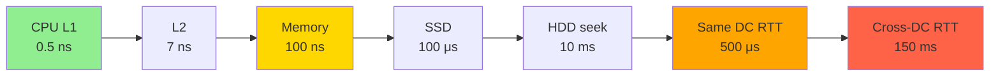
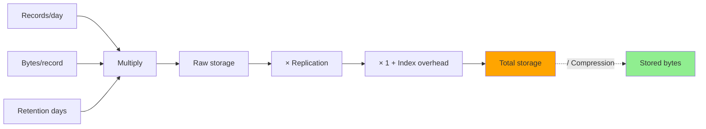
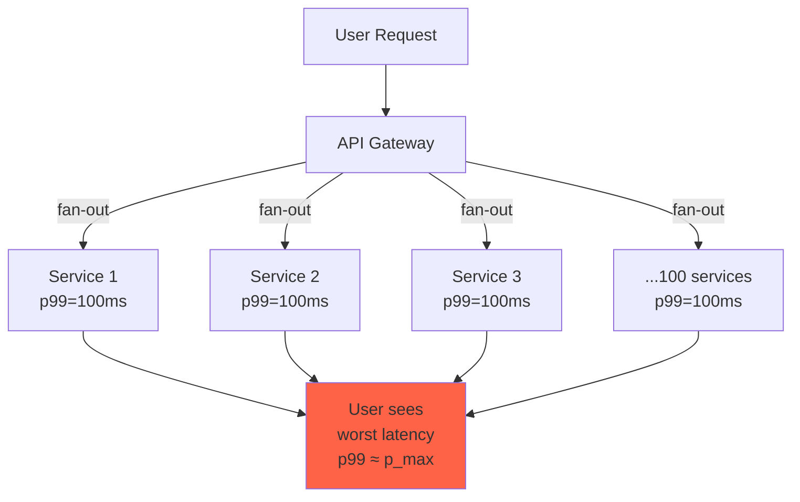
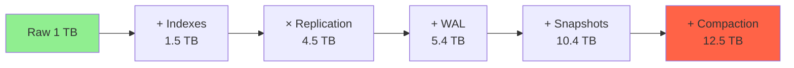

# Вопросы на собеседовании: Latency Numbers и Back-of-the-Envelope

Численные ориентиры — обязательная база для system design интервью. Без понимания, что чтение из памяти — это `~100ns`, а round-trip между датацентрами — `~150ms` (разница в **миллион раз**), невозможно ни оценить ёмкость, ни выбрать архитектуру кеширования, ни обосновать репликацию. Эти цифры держат в голове все senior-инженеры, и интервьюеры проверяют именно их.

Дата последнего обновления: 2026-05-21

Эту шпаргалку используют, чтобы за 5 минут на доске оценить **QPS, объём storage и bandwidth** для систем уровня Twitter, Instagram, YouTube — стандартного формата FAANG/Big Tech system design раунда.

## Полезные ссылки

### Первоисточники

- [Jeff Dean — Numbers Every Programmer Should Know (Stanford talk, 2009)](https://static.googleusercontent.com/media/research.google.com/en//people/jeff/stanford-295-talk.pdf) — оригинальная таблица latency
- [Peter Norvig — Teach Yourself Programming in Ten Years](http://norvig.com/21-days.html#answers) — каноническая публикация чисел Dean'а
- [Colin Scott — Latency Numbers Every Programmer Should Know (2020)](https://colin-scott.github.io/personal_website/research/interactive_latency.html) — интерактивная версия с трендами по годам

### System design

- [System Design Primer (donnemartin)](https://github.com/donnemartin/system-design-primer#powers-of-two-table) — back-of-the-envelope tables
- [Brendan Gregg — Systems Performance, 2nd edition](https://www.brendangregg.com/systems-performance-2nd-edition-book.html) — latency как часть perf-методологии
- [AWS Architecture Center — Reference Architectures](https://aws.amazon.com/architecture/reference-architecture-diagrams/) — реальные capacity-цифры
- [Google SRE Book — Service Level Objectives](https://sre.google/sre-book/service-level-objectives/) — про p50/p95/p99 SLO

### Практика оценок

- [High Scalability — Real-life Architectures](http://highscalability.com/) — публикации Twitter/Instagram/Netflix
- [The USE Method (Brendan Gregg)](https://www.brendangregg.com/usemethod.html) — Utilization/Saturation/Errors для capacity

## Содержание

- [Полезные ссылки](#полезные-ссылки)
- [See also](#see-also)

**Latency table — иерархия задержек**
- [Q1. (!) Каноническая таблица Jeff Dean: ключевые числа](#q1--каноническая-таблица-jeff-dean-ключевые-числа)
- [Q2. (!) Почему round-trip между датацентрами 150ms, а внутри одного — 500μs?](#q2--почему-round-trip-между-датацентрами-150ms-а-внутри-одного--500μs)
- [Q3. Сколько стоит чтение 1MB: память vs SSD vs HDD?](#q3-сколько-стоит-чтение-1mb-память-vs-ssd-vs-hdd)
- [Q4. Mutex lock/unlock, branch misprediction, L1/L2 cache — порядки величин](#q4-mutex-lockunlock-branch-misprediction-l1l2-cache--порядки-величин)
- [Q5. Что такое «правило 100ns/100μs/100ms» и зачем оно на интервью?](#q5-что-такое-правило-100ns100μs100ms-и-зачем-оно-на-интервью)

**Powers of two**
- [Q6. (!) Таблица 2^10…2^60 — какие префиксы соответствуют каким степеням?](#q6--таблица-210260--какие-префиксы-соответствуют-каким-степеням)
- [Q7. Сколько секунд в сутках, в году, в миллионе секунд?](#q7-сколько-секунд-в-сутках-в-году-в-миллионе-секунд)
- [Q8. Как быстро прикинуть 2^32, 2^53, 2^63 без калькулятора?](#q8-как-быстро-прикинуть-232-253-263-без-калькулятора)

**QPS, Storage, Bandwidth — фреймворк оценки**
- [Q9. (!) Формула QPS: DAU → peak RPS, как считать?](#q9--формула-qps-dau--peak-rps-как-считать)
- [Q10. (!) Как оценить storage: размер записи × replication × retention](#q10--как-оценить-storage-размер-записи--replication--retention)
- [Q11. Как оценить bandwidth: RPS × payload, где подвох?](#q11-как-оценить-bandwidth-rps--payload-где-подвох)
- [Q12. Twitter timeline: 300M DAU, как прикинуть read QPS и storage за 5 лет?](#q12-twitter-timeline-300m-dau-как-прикинуть-read-qps-и-storage-за-5-лет)
- [Q13. Instagram photo upload: storage в петабайтах, сколько серверов нужно?](#q13-instagram-photo-upload-storage-в-петабайтах-сколько-серверов-нужно)
- [Q14. URL shortener: storage и вероятность коллизий хеша](#q14-url-shortener-storage-и-вероятность-коллизий-хеша)

**Capacity reference points — сколько тянет железо**
- [Q15. (!) Сколько RPS держит средний web-сервер? А DB-нода?](#q15--сколько-rps-держит-средний-web-сервер-а-db-нода)
- [Q16. NVMe SSD vs HDD vs 10Gbps — пропускная способность по порядку](#q16-nvme-ssd-vs-hdd-vs-10gbps--пропускная-способность-по-порядку)
- [Q17. YouTube: сколько storage и bandwidth нужно для 500h видео/минуту?](#q17-youtube-сколько-storage-и-bandwidth-нужно-для-500h-видеоминуту)

**Перцентили и SLO**
- [Q18. (!) p50, p95, p99, p99.9 — зачем разные перцентили и почему mean бесполезен?](#q18--p50-p95-p99-p999--зачем-разные-перцентили-и-почему-mean-бесполезен)
- [Q19. Как из p99 latency и uptime посчитать error budget?](#q19-как-из-p99-latency-и-uptime-посчитать-error-budget)
- [Q20. Tail-amplification: почему запрос из 100 сервисов имеет p99 хуже каждого](#q20-tail-amplification-почему-запрос-из-100-сервисов-имеет-p99-хуже-каждого)
- [Q21. SLO 99.9% uptime — сколько это минут даунтайма в год?](#q21-slo-999-uptime--сколько-это-минут-даунтайма-в-год)

**Anti-patterns на интервью**
- [Q22. (!) «У меня будет идеальное распределение нагрузки» — почему это красный флаг](#q22--у-меня-будет-идеальное-распределение-нагрузки--почему-это-красный-флаг)
- [Q23. «Кеш всё решит» — когда кеш НЕ работает и какие гарантии он не даёт](#q23-кеш-всё-решит--когда-кеш-не-работает-и-какие-гарантии-он-не-даёт)
- [Q24. Игнорирование репликации/индексов в storage estimate](#q24-игнорирование-репликациииндексов-в-storage-estimate)

## Q1. (!) Каноническая таблица Jeff Dean: ключевые числа

Это таблица, которую интервьюер ждёт услышать «по памяти». Цифры — порядки величин (не точные), но соотношения между ними обязаны быть верными.

| Операция | Latency | В наносекундах | Запомнить как |
|----------|---------|----------------|----------------|
| L1 cache reference | `0.5 ns` | 0.5 | — |
| Branch mispredict | `5 ns` | 5 | 10× L1 |
| L2 cache reference | `7 ns` | 7 | ~15× L1 |
| Mutex lock/unlock | `25 ns` | 25 | — |
| Main memory reference | `100 ns` | 100 | **200× L1** |
| Compress 1KB Snappy | `3 μs` | 3 000 | — |
| Send 2KB over 1Gbps | `20 μs` | 20 000 | — |
| Read 1MB sequentially from memory | `3 μs` | 3 000 | — |
| SSD random read | `16-150 μs` | ~100 000 | **NVMe ниже, SATA выше** |
| Round trip same datacenter | `500 μs` | 500 000 | **5000× memory ref** |
| Read 1MB sequentially from SSD | `1 ms` | 1 000 000 | — |
| HDD seek | `3-10 ms` | ~10 000 000 | — |
| Read 1MB from HDD | `20 ms` | 20 000 000 | — |
| Round trip CA→Netherlands | `150 ms` | 150 000 000 | **300 000× memory ref** |

**Ключевые соотношения для запоминания:**

- L1 → memory: `200×`
- Memory → SSD random: `~1000×`
- SSD → HDD seek: `~100×`
- Same DC → cross-continent: `~300×`

**Итог:** между L1 cache и cross-continent RTT — **разница в 300 миллионов раз**. Поэтому архитектурный выбор «положить в кеш или сходить в БД через сеть» — не о «чуть быстрее», а о разнице в **порядки величин**.

## Q2. (!) Почему round-trip между датацентрами 150ms, а внутри одного — 500μs?

Разница — **в 300 раз**. Причина — фундаментальная: скорость света.

**Внутри датацентра:**
- Физическая длина кабеля: десятки метров
- 1-3 свича на пути, каждый добавляет `1-10 μs`
- Total: `200-500 μs` (sub-millisecond)

**CA → Netherlands (cross-Atlantic):**
- Расстояние ~9000 km
- Свет в оптоволокне идёт ~`200 000 km/s` (медленнее vacuum'а из-за refraction)
- Round-trip минимум: `2 × 9000 / 200000 = 90 ms` (физический предел!)
- Плюс роутеры, queueing, TCP handshake → `~150 ms`

**Из этого следует:**

1. **Никакой технологией нельзя ускорить cross-continent RTT ниже ~90ms** — это закон физики.
2. **CDN — единственное решение для глобального low-latency** — переносим контент ближе к юзеру.
3. **Multi-region active-active добавляет минимум `100-200 ms` к любой cross-region операции** — поэтому DynamoDB Global Tables не делают синхронную репликацию.



**Итог:** при проектировании любой geo-distributed системы — `150 ms` это минимум, который не убрать. Все «multi-region sync» паттерны — на самом деле async с eventual consistency.

## Q3. Сколько стоит чтение 1MB: память vs SSD vs HDD?

| Источник | Время чтения 1MB | В порядках |
|----------|------------------|-----------|
| Memory (sequential) | `3 μs` | baseline |
| SSD (sequential) | `1 ms` | **300×** медленнее памяти |
| HDD (sequential) | `20 ms` | **6 600×** медленнее памяти, **20×** медленнее SSD |

**Расчёт sanity-check для HDD:**
- HDD throughput: `~100 MB/s`
- 1MB / 100 MB/s = `10 ms` чистого чтения
- + seek `~10 ms` → `~20 ms` total

**Для NVMe SSD (современные):**
- Throughput: `3-7 GB/s`
- 1MB читается за `~150-300 μs`
- Это в 3-5× быстрее «стандартного SSD» из таблицы Dean'а 2009 года

**Практическое следствие:** если рабочее множество (working set) данных помещается в RAM, throughput растёт на 2-3 порядка. Поэтому Redis/Memcached — это не «just a cache», это **архитектурное решение перенести hot data в другой класс производительности**.

## Q4. Mutex lock/unlock, branch misprediction, L1/L2 cache — порядки величин

Эти числа важны для **micro-optimization** разговоров (HFT, game engines, column DBs):

| Операция | Time | Контекст |
|----------|------|----------|
| L1 cache hit | `0.5 ns` | 1-2 CPU cycles |
| Branch mispredict | `5 ns` | ~10 cycles flush |
| L2 cache hit | `7 ns` | ~15 cycles |
| L3 cache hit | `20-40 ns` | (нет в каноне Dean'а, но важно) |
| Mutex contended | `25 ns` (uncontended) — `1-100 μs` (contended) | разница огромная |
| Atomic CAS | `5-10 ns` | плюс memory barrier `~10 ns` |
| Context switch | `1-10 μs` | при wake-up из sleep'а |

**Главный инсайт:** uncontended mutex почти бесплатный (`25 ns`), но **contended mutex с context switch'ем — это `~10 μs`**, рост в 400×. Поэтому в hot path всегда меряем lock contention (`perf lock`, `BCC`).

## Q5. Что такое «правило 100ns/100μs/100ms» и зачем оно на интервью?

Mnemonic, разделяющий операции на 3 класса по latency:

| Класс | Latency | Что это | Архитектурное следствие |
|-------|---------|---------|------------------------|
| **In-process** | `~100 ns` | Memory access, function call | Можно делать **миллионы раз/сек** |
| **Local I/O** | `~100 μs` | SSD random read, intra-DC RTT | **~10 000 раз/сек** на ядро |
| **Network** | `~100 ms` | Cross-region RTT, slow disk | **~10 раз/сек** последовательно |

**Зачем на интервью:**

Когда интервьюер спрашивает «оцени throughput системы», ты идёшь от bottleneck'а:

1. **CPU-bound** (in-process) → bottleneck ~`100M ops/sec/core`, легко скейлится horizontally
2. **I/O-bound local** (SSD/intra-DC) → `~10K ops/sec/core`, нужно батчить или асинхронизировать
3. **Network-bound cross-DC** → `~10 ops/sec` sequential — нужно parallelizm, кеши, async

**Пример вопроса:** «Сколько RPS выдержит один Spring Boot endpoint, который делает 3 DB-запроса и 1 HTTP call в другой сервис?»

- 3 DB queries × 5 ms каждый = `15 ms`
- 1 HTTP call same-DC = `2 ms`
- + serialization/dispatch = `~20 ms` per request
- 1 thread → `1000ms / 20ms = 50 RPS`
- 200 threads → `~10 000 RPS` теоретически, но contention обычно ограничивает на `2-5K`

**Итог:** правило `100ns/μs/ms` позволяет за 30 секунд классифицировать операцию и понять, сколько RPS выжмешь — это базовый навык для system design.

## Q6. (!) Таблица 2^10…2^60 — какие префиксы соответствуют каким степеням?

Базовая таблица, без которой невозможно оценивать storage. Запомни **тройками**:

| Степень | Значение | SI-префикс | IEC-префикс | Запомнить как |
|---------|----------|------------|-------------|----------------|
| `2^10` | `1 024` | kilo (K) | kibi (Ki) | **тысяча** |
| `2^20` | `~1.05 M` | mega (M) | mebi (Mi) | **миллион** |
| `2^30` | `~1.07 B` | giga (G) | gibi (Gi) | **миллиард** |
| `2^40` | `~1.1 T` | tera (T) | tebi (Ti) | **триллион** |
| `2^50` | `~1.13 P` | peta (P) | pebi (Pi) | **квадриллион** |
| `2^60` | `~1.15 E` | exa (E) | exbi (Ei) | **квинтиллион** |

**Mnemonic:** «kilo = тысяча, mega = миллион, giga = миллиард» — далее каждые 3 нуля добавляют префикс.

**Когда какое использовать:**
- **Storage / RAM** — в degree of 2: `8 GB RAM = 8 × 2^30 bytes`
- **Throughput / RPS** — в decimal: `1 Gbps = 10^9 bits/sec`, не `2^30`
- **Disk size** — производители используют decimal: `1 TB HDD = 10^12 bytes` (а ОС показывает `~931 GiB`)

**Approximation для оценок:** `2^10 ≈ 10^3`, поэтому `2^30 ≈ 10^9`. Ошибка ~7%, на интервью допустима.

## Q7. Сколько секунд в сутках, в году, в миллионе секунд?

| Период | Секунд | Mnemonic |
|--------|--------|----------|
| 1 минута | `60` | — |
| 1 час | `3 600` | — |
| 1 сутки | `86 400` | **~10^5** |
| 1 неделя | `604 800` | ~`6 × 10^5` |
| 1 месяц (30 days) | `2.6 × 10^6` | **~2.5M** |
| 1 год | `31 536 000` | **~3.15 × 10^7 ≈ π × 10^7** |
| 1 миллион секунд | — | **~11.5 дней** |
| 1 миллиард секунд | — | **~31.7 лет** |

**Mnemonic Lewis Carroll'а:** в году `π × 10^7` секунд (точнее `3.1536 × 10^7`).

**Зачем:**
- DAU 100M, 5 запросов/день каждый → `500M / 86400 ≈ 5800 RPS` average, peak `×3 ≈ 18K RPS`
- 1B событий в день → `1B / 86400 ≈ 11K events/sec`
- Retention 5 лет → `5 × π × 10^7 ≈ 1.6 × 10^8 sec` для расчёта storage growth

**Quick formula:** `Daily count / 100K ≈ average RPS`. Это базовая ментальная арифметика, без неё нельзя оценить QPS.

## Q8. Как быстро прикинуть 2^32, 2^53, 2^63 без калькулятора?

Эти конкретные степени всплывают на интервью чаще всего — каждая привязана к практике:

| Степень | Значение | Где встречается |
|---------|----------|-----------------|
| `2^16 = 65 536` | ~`65K` | TCP/UDP ports, smallint |
| `2^31 - 1 = 2.1 × 10^9` | ~`2.1B` | Java `int` max, unix epoch до 2038 |
| `2^32 = 4.3 × 10^9` | ~`4.3B` | uint32 max, IPv4 address space |
| `2^48 = 2.8 × 10^14` | ~`280T` | x86 virtual address space (стандартный) |
| `2^53 = 9 × 10^15` | ~`9 × 10^15` | **JavaScript `Number` precision limit** |
| `2^63 - 1 = 9.2 × 10^18` | ~`9.2 × 10^18` | Java `long` max, nanos с 1970 → 2262 |
| `2^64 = 1.8 × 10^19` | ~`1.8 × 10^19` | uint64 |

**Быстрый расчёт:** `2^10 = 10^3`, поэтому `2^n ≈ 10^(n/10 × 3) = 10^(0.3n)`.
- `2^32 = 2^30 × 2^2 ≈ 10^9 × 4 ≈ 4 × 10^9` ✓
- `2^53 = 2^50 × 2^3 ≈ 10^15 × 8 ≈ 8 × 10^15` ✓
- `2^63 = 2^60 × 2^3 ≈ 10^18 × 8 ≈ 8 × 10^18` ✓

**Практика:**
- **UUID v4** (122 random bits) — `2^122 ≈ 5 × 10^36` вариантов, коллизия после генерации `~2.7 × 10^18` UUID (birthday paradox)
- **MD5** (128 bits) — collision risk при ~`2^64 ≈ 1.8 × 10^19` хешей
- **Snowflake ID** (64 bits: 41 timestamp + 10 machine + 12 sequence) — `2^12 = 4096` ID/ms/machine

## Q9. (!) Формула QPS: DAU → peak RPS, как считать?

Каноническая формула back-of-the-envelope:

```
Average RPS = (DAU × actions_per_day) / 86 400
Peak RPS = Average RPS × peak_factor
```

**Peak factor по типу системы:**
- **Web/mobile app general** — `2-3×` (вечерний пик)
- **News/social media** — `5-10×` (вирусные события)
- **B2B (SaaS, рабочее время)** — `5×` (концентрация в 8 рабочих часах)
- **Geographic concentration** — `+30-50%` (если один регион)

**Пример: Twitter timeline read**
- DAU: `300M`
- Actions/day: `~10 timeline views`
- Average RPS = `300M × 10 / 86 400 ≈ 35K RPS`
- Peak RPS (виральный event) = `35K × 5 = 175K RPS`

**Пример: Instagram feed**
- DAU: `500M`
- Actions/day: `~20 feed scrolls`
- Average RPS = `500M × 20 / 86 400 ≈ 116K RPS`
- Peak: `~350K RPS`

**Распространённые ошибки:**

1. **Забыть peak factor** — average RPS бесполезен, инфраструктуру строят под peak.
2. **Использовать MAU вместо DAU** — DAU обычно `~25-40%` от MAU.
3. **Не учесть batch endpoints** — один pageload может делать 5-10 API calls.

```python
# Шаблон на доске для интервью
DAU = 300_000_000              # 300M
actions = 10                    # per user per day
seconds_per_day = 86_400        # ≈ 10^5
peak_factor = 5

avg_rps = DAU * actions / seconds_per_day  # ≈ 35K
peak_rps = avg_rps * peak_factor           # ≈ 175K
```

## Q10. (!) Как оценить storage: размер записи × replication × retention

Каноническая формула:

```
Storage = Records/day × Bytes_per_record × Retention_days × Replication_factor × (1 + Index_overhead)
```

**Компоненты:**

- **Replication factor** — обычно `3` (Kafka, HDFS, Cassandra), `2` (PostgreSQL primary+replica), `6` (S3 across AZ)
- **Index overhead** — `+30-100%` сверх raw data для BTree indexes
- **Compression** — `2-10×` reduction для текста (gzip), `1.2-2×` для бинарных данных
- **Retention** — обычно регуляторный (7 лет финансы, 2 года логи)

**Пример: Instagram photo storage за 5 лет**
- Uploads/day: `~100M`
- Avg photo size: `~2 MB` (after compression)
- Days: `5 × 365 ≈ 1825`
- Raw: `100M × 2MB × 1825 = 365 PB`
- Replication ×3 (HDFS-like): `~1.1 EB`
- + index/metadata `+10%`: `~1.2 EB`

**Пример: Logs (1 service, 5 years)**
- Logs/sec: `10K`
- Avg log size: `500 bytes`
- Per day: `10K × 86400 × 500 = 432 GB/day`
- 5 years: `~790 TB`
- Compression `5×`: `~160 TB`
- + replication `3×`: `~480 TB`



**Итог:** оценка без replication и index overhead обычно занижает в `~4×`. Каждый из этих факторов — стандартный follow-up интервьюера: «а с учётом replication?», «а индексы посчитал?».

## Q11. Как оценить bandwidth: RPS × payload, где подвох?

Базовая формула:

```
Bandwidth = RPS × avg_payload_size × 8 (bits) × overhead_factor
```

**Overhead factor:** `1.2-1.5×` для TCP/TLS/HTTP headers. Для коротких payloads overhead доминирует.

**Пример: чат-система**
- Messages/sec: `100K`
- Avg message: `200 bytes` (JSON)
- Raw: `100K × 200 = 20 MB/s = 160 Mbps`
- + HTTP/2 overhead `1.3×`: `~210 Mbps`
- + TLS handshake amortization: negligible (persistent connections)

**Пример: видеостриминг**
- Concurrent viewers: `1M`
- Bitrate avg: `3 Mbps` (HD)
- Total egress: `1M × 3 Mbps = 3 Tbps`

**Подвохи:**

1. **Overhead для коротких payloads**: 200-byte JSON payload по HTTPS = `~600 bytes` на проводе. Игнорирование overhead = 3× ошибка.
2. **Egress vs Ingress** — для медиа egress в 100-1000× больше ingress. Стоимость в AWS — $`0.09/GB` egress vs free ingress.
3. **Replication traffic** — в Kafka между брокерами replication traffic = `RF × producer traffic`. Для RF=3 это `3×` на internal links.

```python
# Шаблон на доске
rps = 100_000
payload_bytes = 200
overhead = 1.3  # HTTP/2 + TLS headers
bits_per_byte = 8

bandwidth_bps = rps * payload_bytes * bits_per_byte * overhead
bandwidth_mbps = bandwidth_bps / 1e6
# = 208 Mbps
```

## Q12. Twitter timeline: 300M DAU, как прикинуть read QPS и storage за 5 лет?

Классическая задача с FAANG system design loop'а.

**Входные данные:**
- DAU: `300M`
- Tweets/user/day (writes): `~0.1` (большинство — readers)
- Timeline views/user/day (reads): `~10`
- Avg tweet size: `~280 chars + metadata ≈ 1 KB`
- Retention: `5 years` (бизнес: иногда forever)
- Replication: `3×` (across AZ)

**Write QPS:**
- Writes/sec average: `300M × 0.1 / 86400 ≈ 350 writes/sec`
- Peak `× 5`: `~1750 writes/sec`

**Read QPS:**
- Reads/sec average: `300M × 10 / 86400 ≈ 35K reads/sec`
- Peak `× 5`: `~175K reads/sec`
- **Read:Write ratio ≈ 100:1** — поэтому Twitter использует **fan-out on write** (precompute timeline в Redis)

**Storage (5 лет):**
- Tweets/day: `300M × 0.1 = 30M tweets/day`
- Per tweet: `~1 KB` + metadata + media references = `~2 KB` actual
- Per year: `30M × 365 × 2 KB ≈ 22 TB`
- 5 years × replication `3×`: `~330 TB`
- + indexes (`+50%`): `~500 TB`

**Media** (отдельно):
- Photos: `30M tweets/day × 0.2 (with photo) × 1 MB ≈ 6 TB/day`
- 5 years × RF=3: `~33 PB` только для медиа

**Итог:** Twitter — это **read-heavy система** (100:1), её архитектура построена вокруг fan-out на запись и агрессивного кеширования таймлайнов.

## Q13. Instagram photo upload: storage в петабайтах, сколько серверов нужно?

**Входные:**
- DAU: `500M` (Instagram public figure ~2B MAU → ~500M DAU)
- Photos uploaded/day/user: `~0.2` (1 photo per 5 days average)
- Avg photo size (after compression): `~2 MB`
- Retention: forever (бизнес)
- Replication: `3×` (RAID/distributed)

**Storage growth:**
- Photos/day: `500M × 0.2 = 100M photos/day`
- Bytes/day: `100M × 2 MB = 200 TB/day`
- Per year: `200 TB × 365 ≈ 73 PB/year`
- × Replication 3 = `~220 PB/year`
- + thumbnails (3 sizes, 100 KB each): `+15%` → `~250 PB/year`

**Уже накоплено (Instagram public history, ~13 years):**
- Estimate: `~1-3 EB` total (Facebook public 2020: «150 PB photo storage» — оценка Instagram была меньше)

**Серверы для storage:**
- HDD storage server: `10 × 16 TB = 160 TB` usable
- For 250 PB/year: `250 PB / 160 TB ≈ 1600 серверов/year`
- + compute (resize, thumbnails) — typically отдельный пул
- + caching layer (CDN, ~5-10% of catalog hot) — separate

**Network egress:**
- Photo views/day: `500M users × 50 photos/day = 25 B views/day`
- Avg photo view: `~200 KB` (mobile-optimized size)
- Egress: `25B × 200KB / 86400 ≈ 58 Gbps` average
- Peak `× 3`: `~175 Gbps` — это **dominantes cost**, не storage

**Итог:** для media-heavy системы **egress bandwidth дороже, чем storage**. Instagram использует Facebook's Open Connect / собственные CDN edge POPs.

## Q14. URL shortener: storage и вероятность коллизий хеша

Классическая задача — оценить short URL space и storage.

**Требования:**
- 100M URLs создаётся/day
- Retention: `5 years`
- Short URL length: `6-8 chars` Base62

**Address space:**
- Base62 (`a-zA-Z0-9` = 62 chars)
- 6 chars: `62^6 ≈ 5.7 × 10^10` (~57 billion)
- 7 chars: `62^7 ≈ 3.5 × 10^12` (~3.5 trillion)
- 8 chars: `62^8 ≈ 2.2 × 10^14` (~220 trillion)

**Через 5 лет URLs:**
- `100M × 365 × 5 = 1.8 × 10^11` (180 billion)
- 6 chars `2^36-ish` не хватит (57B < 180B) — **используй 7 chars**

**Birthday paradox для коллизий:**

Вероятность коллизии при N сгенерированных значений в пространстве M:
```
P(collision) ≈ N² / (2M)
```

Для 7 chars space (`M = 3.5 × 10^12`) и `N = 180 × 10^9`:
- `P ≈ (1.8e11)² / (2 × 3.5e12) = 3.24e22 / 7e12 ≈ 4.6 × 10^9` ← **уже>1, означает много коллизий**

**Вывод:** при random hash gen для 180B URLs в 7-char space коллизии **ОБЯЗАТЕЛЬНЫ**. Стандартное решение:
- Использовать **counter-based** (auto-increment ID → Base62)
- Или 8 chars Base62 = `2.2 × 10^14` → P collision ≈ `(1.8e11)² / 2 × 2.2e14 ≈ 7.4 × 10^7` — всё равно много, но fits с retry.

**Storage:**
- Per URL: `~500 bytes` (long_url avg `~200 bytes` + short_url `8` + metadata + indexes)
- Per year: `100M × 365 × 500 = 18.25 TB/year`
- 5 years × RF=3: `~275 TB`

## Q15. (!) Сколько RPS держит средний web-сервер? А DB-нода?

**Web-серверы (stateless, ~CPU-bound):**

| Сервер | Typical RPS | Контекст |
|--------|------------|----------|
| Nginx reverse proxy | `~50K RPS/core` | static content или passthrough |
| Spring Boot (без I/O в hot path) | `~5-10K RPS/core` | JSON serialization, validation |
| Node.js / Go HTTP server | `~20-50K RPS/core` | event loop, no JVM overhead |
| Python Flask + gunicorn | `~500-2K RPS/core` | GIL bottleneck |

**Стандартная конфигурация web-сервера:** `16 cores` → `~10K RPS` total для Spring Boot, `~50K RPS` для Go. Реалистичный baseline для system design — **`~12K RPS per server`** (Spring Boot/Java со средней нагрузкой).

**Database nodes:**

| DB | Read RPS | Write RPS | Контекст |
|----|----------|-----------|----------|
| PostgreSQL (single node) | `~10-20K reads/sec` | `~5K writes/sec` | OLTP-like |
| MySQL (single node) | `~15-30K reads/sec` | `~5-10K writes/sec` | comparable |
| Redis (single node) | `~100K reads/sec` | `~100K writes/sec` | in-memory, single thread |
| Cassandra (per node) | `~10-20K writes/sec` | `~5-10K reads/sec` | write-optimized LSM |
| MongoDB (per shard) | `~10K reads/sec` | `~3K writes/sec` | comparable to Postgres |

**Connection pool limits:**
- PostgreSQL обычно `max_connections=200-500`
- HikariCP recommend `pool_size = ((cores × 2) + spindles)` ≈ `10-30 connections per server`
- Bottleneck — обычно DB connections, не CPU

**Capacity formula для system design:**
```
Servers = Peak_RPS / RPS_per_server / utilization_target

# Например:
# Peak 100K RPS, Spring Boot 10K/server, 70% utilization
# Servers = 100000 / 10000 / 0.7 ≈ 15 servers
```

## Q16. NVMe SSD vs HDD vs 10Gbps — пропускная способность по порядку

**Sequential throughput:**

| Источник | Throughput | В MB/s |
|----------|-----------|--------|
| DDR4 RAM | `~25 GB/s` | 25 000 |
| NVMe Gen4 SSD | `~7 GB/s` | 7 000 |
| NVMe Gen3 SSD | `~3 GB/s` | 3 000 |
| SATA SSD | `~500 MB/s` | 500 |
| HDD (7200 RPM) | `~100-200 MB/s` | 150 |
| 10 Gbps Ethernet | `1.25 GB/s` | 1 250 |
| 1 Gbps Ethernet | `125 MB/s` | 125 |
| 25 Gbps (DC backbone) | `3.125 GB/s` | 3 125 |
| 100 Gbps (DC core) | `12.5 GB/s` | 12 500 |

**Полезные сравнения:**
- 10Gbps link ≈ SATA SSD по throughput
- NVMe Gen4 в 5× быстрее 10Gbps — диск может «опередить» сеть
- DDR4 в 3.5× быстрее NVMe Gen4

**Conversion:**
- 1 Gbps = `10^9 bits/s = 125 MB/s`
- 1 GB/s = `8 Gbps`

**IOPS (4K random):**
- NVMe Gen4: `~1M IOPS`
- SATA SSD: `~50-100K IOPS`
- HDD: `~75-150 IOPS` (на 6 порядков меньше!)

**Практика:** при выборе storage для DB — IOPS обычно важнее throughput. PostgreSQL random access на 1KB страницах любит низкую latency и высокий IOPS.

## Q17. YouTube: сколько storage и bandwidth нужно для 500h видео/минуту?

YouTube public stat (2020): «500 hours of video uploaded per minute».

**Storage growth:**
- Uploads: `500 hours/minute = 30000 hours/hour = 720K hours/day`
- Avg video size: предположим `~500 MB/hour` (1080p with H.265 codec, 1-2 Mbps avg bitrate)
- Per day: `720K × 500 MB = 360 TB/day`
- Per year: `360 TB × 365 ≈ 130 PB/year`
- Replication (RF=3 across DC): `~400 PB/year`
- Plus transcoding (multiple resolutions 144p-4K, ~6 variants): `× 2-3 storage overhead`
- **Real: ~1 EB/year of new content**

**Bandwidth:**
- Daily watch time (public stat): `1B hours/day`
- Avg bitrate served: `~3 Mbps` (mix of 480p-4K)
- Egress: `1B hours × 3600 sec × 3 Mbps / 86400 ≈ 125 Tbps average`
- Peak `× 2`: `~250 Tbps`
- **Это значительная часть глобального internet traffic** (~10% всего internet egress)

**Серверы:**
- Storage: `1 EB/year / 200 TB per node ≈ 5000 nodes/year` для new content
- CDN edge POPs: thousands across world (Google Edge Network в `>100 локациях`)
- Compute (transcoding): `~720K hours/day × ~5 minutes CPU per hour transcoded ≈ 60K hours CPU/day` = `~2500 cores непрерывно` чисто на transcoding

**Архитектурное следствие:** YouTube — это **CDN-first архитектура**. Stored bytes малозначимы по сравнению с egress capacity и transcoding compute.

## Q18. (!) p50, p95, p99, p99.9 — зачем разные перцентили и почему mean бесполезен?

**Definition:**
- p50 (median) — 50% запросов быстрее этого значения
- p95 — 95% запросов быстрее, **5% медленнее**
- p99 — 99% запросов быстрее, 1% медленнее
- p99.9 — 99.9% быстрее, 0.1% медленнее

**Почему mean бесполезен:**

Distribution latency обычно **bimodal или long-tail**:
- `90% requests` идут через cache (`~1 ms`)
- `10% requests` идут в DB (`~50 ms`)
- Mean: `0.9 × 1 + 0.1 × 50 = 5.9 ms`
- **Mean скрывает что 10% юзеров видят 50 ms** — это user experience-killer

**Реальные SLO примеры:**

| Сервис | SLO | Контекст |
|--------|-----|----------|
| Google search | p99 `<300 ms` | User-facing |
| Stripe API | p95 `<100 ms` | B2B |
| Internal microservice | p99 `<50 ms` | DC internal |
| Latency-sensitive (HFT) | p99.99 `<1 ms` | Trading |

**Почему именно p99 / p99.9 в FAANG:**

При 1B запросов/день:
- p99 = 1% = `10M запросов в день` испытывают slow latency
- p99.9 = 0.1% = `1M запросов`
- p99.99 = 0.01% = `100K запросов`

**Для пользователя 1M slow requests/day = серьёзная проблема UX**, поэтому Big Tech целится в p99.9 и выше.

**Правило большого пальца:**
- p99 obычно `2-5× от p50`
- p99.9 обычно `5-20× от p50`
- Если p99.9/p50 > 100 — есть **systematic stalls** (GC pause, lock contention, DB stall)

```python
# Не делай так!
avg_latency = total_time / count    # bimodal обманет

# Делай так:
sorted_latencies = sorted(all_latencies)
p50 = sorted_latencies[len(sorted_latencies) // 2]
p99 = sorted_latencies[int(len(sorted_latencies) * 0.99)]
```

## Q19. Как из p99 latency и uptime посчитать error budget?

**Error budget** — допустимое количество «нарушений SLO» в период.

**Формула:**
```
Error budget = (1 - SLO) × total_requests_in_period
```

**Пример: SLO 99.9% availability, 1M requests/day**
- Error budget = `0.001 × 1M = 1000 failed requests/day` = `30K/month`
- Если за неделю исчерпали `25K failures` → **freezing releases** до восстановления

**Latency SLO:** «p99 latency < 100ms»
- Error budget = 1% запросов × period
- Для 100M req/day → `1M req/day` могут быть >100ms — больше = SLO violation

**Зачем это нужно:**

1. **Объективный trigger для freeze/release** — не «менеджер сказал», а «исчерпан budget».
2. **Trade-off между velocity и reliability** — оставшийся budget = бюджет на эксперименты.
3. **Финансовая отчётность** — для AWS SLA «99.99% monthly uptime» credits возвращаются автоматически.

**Уровни uptime SLO:**

| SLO | Downtime/year | Downtime/month |
|-----|---------------|----------------|
| 90% | 36.5 days | 73 hours |
| 99% | 3.65 days | 7.3 hours |
| 99.9% («three nines») | 8.76 hours | 43.8 minutes |
| 99.99% («four nines») | 52.6 minutes | 4.4 minutes |
| 99.999% («five nines») | 5.26 minutes | 26.3 seconds |

**Mnemonic:** каждая «девятка» уменьшает downtime в `10×`.

## Q20. Tail-amplification: почему запрос из 100 сервисов имеет p99 хуже каждого

**Эффект:** когда user request fan-out'ится в 100 microservices, его latency определяется **медленным из 100**.

**Математика:**

Пусть каждый сервис имеет p99 = 100ms (т.е. 1% запросов >100ms).
- P(хотя бы один из 100 медленный) = `1 - (0.99)^100 = 1 - 0.366 = 0.634`
- **63% user requests** видят >100ms — а не 1%!

**Точная формула p99 на fan-out N:**
- p99 на N parallel calls = perсентиль `1 - (1 - 0.99)^N`
- Для N=100: `1 - 0.01^100 ≈ 1` — все запросы становятся «slow»

**Это объясняет почему:**

1. **Big Tech целит в p99.99 для internal services** — fan-out умножает 0.01% до `~1%` на верхнем уровне.
2. **Hedged requests** (Tail at Scale, Dean & Barroso 2013) — посылаешь дублирующий запрос если первый не ответил за p95, берёшь первый ответ.
3. **Backup requests** — те же hedged, но через ms timeout.



**Практика:**
- Netflix Hystrix / Resilience4j — circuit breakers + timeouts чтобы slow service не killed весь request
- gRPC `deadline` propagation — фиксированный budget на весь call tree
- Hedge requests в databases (Cassandra `speculative_retry`)

## Q21. SLO 99.9% uptime — сколько это минут даунтайма в год?

Простая таблица для запоминания (один из частых quiz-вопросов):

| SLO | % | Downtime/year | Downtime/quarter | Downtime/month | Downtime/week |
|-----|---|---------------|------------------|----------------|----------------|
| Two nines | 99% | **3.65 days** | 21.9 hours | 7.3 hours | 1.68 hours |
| Two and half | 99.5% | 1.83 days | 10.95 hours | 3.65 hours | 50.4 min |
| Three nines | 99.9% | **8.76 hours** | 2.19 hours | 43.8 min | 10.1 min |
| Three and half | 99.95% | 4.38 hours | 65.7 min | 21.9 min | 5.04 min |
| Four nines | 99.99% | **52.6 min** | 13.1 min | 4.38 min | 60.5 sec |
| Five nines | 99.999% | **5.26 min** | 1.31 min | 26.3 sec | 6.05 sec |

**Mnemonics:**
- `99.9%` → ~`9 hours/year` (3 nines → 3-значное число hours)
- `99.99%` → ~`1 hour/year` (4 nines → ~1 hour)
- `99.999%` → ~`5 min/year` (5 nines → 5 minutes)

**Что реально достижимо:**

| Уровень | Кто достигает |
|---------|---------------|
| 99.9% | Default cloud SLA (AWS EC2 single-AZ 99.5%) |
| 99.95% | Major SaaS (Stripe SLA, Slack SLA) |
| 99.99% | AWS S3 standard (`99.99% availability`), high-end infrastructure |
| 99.999% | Telecom carrier-grade, не достижимо для consumer apps |
| 99.9999% («six nines», 31s/year) | Theoretical; за пределами single-system reliability |

**Стоимость per «9»:**

Эмпирическое правило — каждая следующая «9» стоит **~10× больше** инфраструктуры:
- 99% → 99.9%: redundancy primary+replica
- 99.9% → 99.99%: multi-AZ active-active
- 99.99% → 99.999%: multi-region + chaos engineering

## Q22. (!) «У меня будет идеальное распределение нагрузки» — почему это красный флаг

**Anti-pattern statement:** «average RPS / serverов = `RPS per server`, поэтому 10K RPS на 10 серверах = `1K RPS each`».

**Почему это неправильно:**

1. **Hot keys.** Twitter 2021: Justin Bieber'а tweet генерил 100K RPS на одну partition — соседние partitions сидели на `~10 RPS`. Coefficient of variation `~10-100×`.

2. **Geographic load skew.** US East timezone vs Asia — `5-10× разница` в RPS на серверах ближайшего региона.

3. **Connection stickiness.** Sticky sessions (load balancer hash by IP) — sticky connections на один сервер. Spotify backend 2018 case — один сервер obслуживал `15%` total traffic из-за popular ISP IP range.

4. **Cold cache problem.** Только что запущенный сервер не имеет warm cache — DB load в `10×` выше → response time `10×` хуже.

**Что говорить вместо:**

```
"Реалистично — distribution имеет coefficient of variation 0.5-2.0.
Для 10K RPS average на 10 серверах закладываю peak RPS на сервер
= 2-3K (с запасом ×2-3 на skew). Использую auto-scaling по p99 latency,
а не avg CPU, чтобы среагировать на hot keys."
```

**Решения hot keys:**
- **Consistent hashing с virtual nodes** (Dynamo paper) — каждый сервер представлен N виртуальными точками на кольце
- **Hot key detection + dedicated cache** (Twitter Snowflake — отдельный путь для celebrities)
- **Read replicas + adaptive routing**
- **Adaptive load shedding** (drop requests when overloaded, не fail весь сервер)

## Q23. «Кеш всё решит» — когда кеш НЕ работает и какие гарантии он не даёт

**Anti-pattern:** «кешируем в Redis → DB load -90%, проблема решена».

**Где кеш ломается:**

1. **Cache miss storm (thundering herd).** TTL expired одновременно у 1000 keys — 1000 параллельных DB-запросов. Stripe 2019 — incident от cache miss storm на batch job. Решение: random TTL jitter, request coalescing (`singleflight` pattern), probabilistic early refresh.

2. **Cache penetration.** Запросы на несуществующие keys — cache miss, DB miss, **каждый запрос идёт в DB**. Решение: cache negative results, Bloom filter перед DB.

3. **Cache stampede on cold start.** Свежий сервер — пустой кеш. Под full prod load `100% misses → DB load в 10×`. Решение: pre-warm cache, gradual traffic ramp-up, cache replication.

4. **Stale data.** Eventually consistent cache не подходит для финансовых операций. Cache хранит `balance=100`, DB обновлено до `balance=50` — пользователь видит `100`. Решение: write-through cache, или strict consistency через DB.

5. **Hot key concentrated.** Один key в кеше получает 100K RPS — Redis single-thread становится bottleneck (`~100K ops/sec limit`). Решение: read replicas, local caching (multi-tier).

**Гарантии, которые кеш НЕ даёт:**

- **Не даёт ACID** — нет транзакций между cache и DB
- **Не гарантирует consistency** — кроме write-through (и то с delay)
- **Не уменьшает worst-case latency** — на cache miss latency = DB latency
- **Не решает write-heavy workload** — cache invalidation на каждом write становится дороже самого write

**Когда кеш реально работает:**

- Read:write ratio > 10:1
- Data tolerates staleness (seconds-minutes)
- Hot set fits in memory (>80% requests hit `<20%` data)

## Q24. Игнорирование репликации/индексов в storage estimate

**Anti-pattern:** «raw data = 1 TB → нам нужен 1 TB диск».

**Что забывают:**

| Factor | Multiplier | Example |
|--------|-----------|---------|
| Primary replication | `× 2` (primary + replica) | PostgreSQL streaming replication |
| Distributed replication | `× 3` | Cassandra/Kafka default RF=3 |
| Multi-AZ for durability | `× 2` extra | S3 11 nines (`× 6 internally`) |
| BTree indexes (OLTP) | `+ 30-100%` | PostgreSQL `pg_size_pretty` reveals it |
| Inverted indexes (search) | `× 2-5` | Elasticsearch `_source + indexes` |
| WAL / transaction log | `+ 10-30%` | Compaction lag |
| Compaction overhead | `× 2-3` peak | LSM-tree (Cassandra) during compaction |
| Snapshots / backups | `× 2-7` | 7 daily snapshots × full size |

**Real example:**

«Нам нужно хранить 1 TB user data»:
- Raw: `1 TB`
- + Indexes (BTree, OLTP): `+50%` = `1.5 TB`
- × Replication 3: `4.5 TB`
- + WAL/log buffer: `+20%` = `5.4 TB`
- + Snapshots (7 daily): `+5 TB` = `~10.4 TB`
- + Compaction peak overhead: `+20%` = **`~12.5 TB`**

**Реальная потребность в `~12.5×` raw size.** Это стандартный multiplier для production OLTP system.

**Для аналитики (OLAP):**
- Columnar compression: `× 0.3` (5-10× compression на колонках)
- Materialized aggregates: `× 1.2-2`
- Range partitioning meta: minimal
- Net: typically `~2× raw` (vs `~12× для OLTP`)



**Что отвечать на интервью:**
- «Raw `1 TB` × RF=3 × `1.5` (indexes) × `1.2` (WAL+snapshots) ≈ `5-6 TB` минимум для OLTP. Для OLAP — `2-3 TB`».

---

## See also

- [Паттерны масштабируемости](scalability-patterns-interview.md) — capacity planning, autoscaling, sharding с применением back-of-the-envelope чисел
- [Стратегии кеширования](caching-strategies-interview.md) — глубже про cache patterns, hit rate, invalidation, hot keys
- [Распределённые системы](distributed-systems-interview.md) — fan-out, tail amplification, consistency trade-offs
- [CAP-теорема](cap-theorem-interview.md) — почему 100% availability невозможна, error budget rationale
- [Resilience patterns](resilience-patterns-interview.md) — circuit breakers, hedged requests, timeout propagation для борьбы с tail latency
- [Performance: сеть](../performance/network-performance-interview.md) — RTT, packet sizes, latency на L4/L7
- [Performance: БД](../performance/database-performance-interview.md) — IOPS, throughput, capacity per node для разных СУБД
- [Анализ сложности](../algorithms/complexity/complexity-analysis-interview.md) — Big-O в контексте capacity (когда O(N²) уже не помещается)
- [Подготовка к интервью](../preparation/interview-preparation.md) — как структурировать system design ответ
- [System design — главный обзор](../system-design/system-design-interview.md) — каркас, в который встраиваются эти числа
