# Вопросы на собеседовании: `Балансировка нагрузки`

Балансировка нагрузки — ключевой элемент высоконагруженных систем, обеспечивающий распределение трафика между серверами для повышения доступности, отказоустойчивости и масштабируемости. На собеседованиях по архитектуре и System Design тема возникает практически всегда.

**Балансировка нагрузки** (Load Balancing) — процесс распределения входящих сетевых запросов между несколькими серверами. Покрывает уровни L4/L7, алгоритмы распределения, конкретные инструменты (`Nginx`, `HAProxy`, `Spring Cloud LoadBalancer`), облачные и Kubernetes-решения, а также мониторинг и отказоустойчивость.

## Полезные ссылки

### Официальная документация

- [Nginx — HTTP Load Balancing](https://nginx.org/en/docs/http/load_balancing.html) — базовая конфигурация upstream
- [Nginx — upstream module](https://nginx.org/en/docs/http/ngx_http_upstream_module.html) — полный справочник директив upstream
- [HAProxy Configuration Manual](https://www.haproxy.org/download/2.8/doc/configuration.txt) — конфигурация HAProxy
- [Spring Cloud LoadBalancer](https://docs.spring.io/spring-cloud-commons/reference/spring-cloud-commons/loadbalancer.html) — клиентская балансировка в Spring
- [AWS Elastic Load Balancing](https://docs.aws.amazon.com/elasticloadbalancing/) — документация ALB/NLB/CLB
- [Kubernetes Ingress](https://kubernetes.io/docs/concepts/services-networking/ingress/) — маршрутизация в Kubernetes
- [Introduction to Spring Cloud Load Balancer (Baeldung)](https://www.baeldung.com/spring-cloud-load-balancer) — клиентская балансировка в Spring Cloud
- [Service Discovery in Microservices (Baeldung)](https://www.baeldung.com/cs/service-discovery-microservices) — service discovery и балансировка
- [An Example of Load Balancing with Zuul and Eureka (Baeldung)](https://www.baeldung.com/zuul-load-balancing) — балансировка с Zuul и Eureka
- [Spring Cloud Netflix Eureka (Baeldung)](https://www.baeldung.com/spring-cloud-netflix-eureka) — service registry и client-side LB

## Содержание

- [Полезные ссылки](#полезные-ссылки)
- [See also](#see-also)

**Основы балансировки (L4, L7, TLS, health check)**
- [Q1. (!) Что такое балансировка нагрузки на уровне L4 и L7?](#q1--что-такое-балансировка-нагрузки-на-уровне-l4-и-l7)
- [Q2. Что такое TLS termination и где его делать?](#q2-что-такое-tls-termination-и-где-его-делать)
- [Q3. (!) Что такое health check и зачем он нужен?](#q3--что-такое-health-check-и-зачем-он-нужен)
- [Q4. Что такое sticky session (session affinity) и когда его использовать?](#q4-что-такое-sticky-session-session-affinity-и-когда-его-использовать)
- [Q5. Чем отличается активная балансировка от пассивной?](#q5-чем-отличается-активная-балансировка-от-пассивной)

**Алгоритмы балансировки**
- [Q6. (!) Что такое Round Robin и когда его применять?](#q6--что-такое-round-robin-и-когда-его-применять)
- [Q7. Что такое Weighted Round Robin?](#q7-что-такое-weighted-round-robin)
- [Q8. Что такое Least Connections и когда его применять?](#q8-что-такое-least-connections-и-когда-его-применять)
- [Q9. Что такое Least Response Time?](#q9-что-такое-least-response-time)
- [Q10. Как выбрать алгоритм балансировки для микросервисов?](#q10-как-выбрать-алгоритм-балансировки-для-микросервисов)

**Конфигурация Nginx**
- [Q11. (!) Как настроить upstream балансировку в Nginx?](#q11--как-настроить-upstream-балансировку-в-nginx)
- [Q12. Как настроить health checks и failover в Nginx?](#q12-как-настроить-health-checks-и-failover-в-nginx)
- [Q13. Как настроить rate limiting в Nginx?](#q13-как-настроить-rate-limiting-в-nginx)

**Конфигурация HAProxy**
- [Q14. (!) Как настроить балансировку в HAProxy?](#q14--как-настроить-балансировку-в-haproxy)
- [Q15. Как настроить health checks в HAProxy?](#q15-как-настроить-health-checks-в-haproxy)

**Клиентская балансировка (Spring Cloud LoadBalancer)**
- [Q16. (!) Что такое клиентская и серверная балансировка?](#q16--что-такое-клиентская-и-серверная-балансировка)
- [Q17. Как настроить Spring Cloud LoadBalancer?](#q17-как-настроить-spring-cloud-loadbalancer)
- [Q18. Как реализовать кастомную стратегию балансировки в Spring Cloud?](#q18-как-реализовать-кастомную-стратегию-балансировки-в-spring-cloud)

**Архитектура и стратегии**
- [Q19. Что такое blue-green и canary в контексте балансировки?](#q19-что-такое-blue-green-и-canary-в-контексте-балансировки)
- [Q20. (!) Как обеспечить отказоустойчивость балансировщика?](#q20--как-обеспечить-отказоустойчивость-балансировщика)
- [Q21. Что такое connection draining (deregistration delay)?](#q21-что-такое-connection-draining-deregistration-delay)

**Облачные решения и Kubernetes**
- [Q22. Что такое Layer 4 и Layer 7 load balancer в облаке?](#q22-что-такое-layer-4-и-layer-7-load-balancer-в-облаке)
- [Q23. (!) Как настроить health check в Kubernetes для Pod?](#q23--как-настроить-health-check-в-kubernetes-для-pod)
- [Q24. Что такое Ingress и как он связан с балансировкой?](#q24-что-такое-ingress-и-как-он-связан-с-балансировкой)
- [Q25. Как обеспечить zero-downtime при деплое за балансировщиком?](#q25-как-обеспечить-zero-downtime-при-деплое-за-балансировщиком)

**DNS-based и глобальная балансировка**
- [Q26. (!) Что такое DNS-based load balancing?](#q26--что-такое-dns-based-load-balancing)
- [Q27. Что такое geographic load balancing (global load balancing)?](#q27-что-такое-geographic-load-balancing-global-load-balancing)
- [Q28. Что такое cross-zone load balancing в AWS?](#q28-что-такое-cross-zone-load-balancing-в-aws)

**Продвинутые темы**
- [Q29. Что такое consistent hashing и когда его использовать?](#q29-что-такое-consistent-hashing-и-когда-его-использовать)
- [Q30. Как настроить балансировку для gRPC?](#q30-как-настроить-балансировку-для-grpc)
- [Q31. Как настроить балансировку для WebSocket соединений?](#q31-как-настроить-балансировку-для-websocket-соединений)
- [Q32. Что такое path-based routing в L7 балансировщике?](#q32-что-такое-path-based-routing-в-l7-балансировщике)
- [Q33. Как обеспечить балансировку для stateful приложений?](#q33-как-обеспечить-балансировку-для-stateful-приложений)
- [Q34. (!) Как мониторить и анализировать работу балансировщика?](#q34--как-мониторить-и-анализировать-работу-балансировщика)
- [Q35. Как балансировщик обрабатывает медленные бэкенды?](#q35-как-балансировщик-обрабатывает-медленные-бэкенды)

**Продвинутые алгоритмы и паттерны**
- [Q36. (!) Что такое IP Hash и когда его использовать?](#q36--что-такое-ip-hash-и-когда-его-использовать)
- [Q37. Что такое алгоритм Power of Two Choices?](#q37-что-такое-алгоритм-power-of-two-choices)
- [Q38. (!) Что такое Maglev hashing?](#q38--что-такое-maglev-hashing)
- [Q39. Что такое Anycast балансировка и когда её применять?](#q39-что-такое-anycast-балансировка-и-когда-её-применять)
- [Q40. Как балансировка нагрузки реализована в Service Mesh (Istio/Envoy)?](#q40-как-балансировка-нагрузки-реализована-в-service-mesh-istioenvoy)

---

## Q1. (!) Что такое балансировка нагрузки на уровне L4 и L7?

Балансировщик может принимать решение о маршруте на разной «глубине» модели OSI. Чем глубже он заглядывает в трафик, тем умнее маршрутизирует — но тем дороже обходится каждый пакет. Два рабочих уровня: транспортный (L4) и прикладной (L7).

**L4 (Transport layer)** — решение по `IP`-адресу и порту. Балансировщик не вскрывает содержимое и не знает, что внутри — `HTTP` или `gRPC`. Он просто перекладывает `TCP`/`UDP`-пакеты на выбранный бэкенд, как сетевой коммутатор. Отсюда и скорость, и «слепота».

**L7 (Application layer)** — решение по содержимому запроса: `URL`, заголовки, cookie, тело. Балансировщик терминирует `HTTP`/`HTTPS`-соединение, разбирает протокол и потому умеет маршрутизировать `/api/users` на один сервис, а `/api/orders` — на другой.

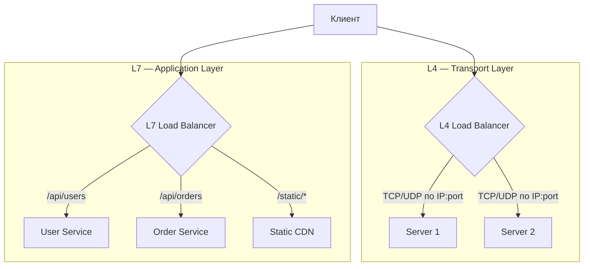

| Критерий | L4 | L7 |
|----------|----|----|
| Анализ содержимого | Нет | Да (`URL`, headers, cookies) |
| Протоколы | Любые (`TCP`/`UDP`) | `HTTP`/`HTTPS` |
| Маршрутизация по пути | Нет | Да |
| `TLS` termination | Нет (pass-through) | Да |
| Латентность | Ниже | Выше (анализ L7) |
| Примеры | `AWS NLB`, `HAProxy` (mode tcp) | `AWS ALB`, `Nginx`, `HAProxy` (mode http) |

**Что хотят услышать на собеседовании:** сформулируйте компромисс одной фразой — L4 быстрый, но «слепой», L7 медленнее, но умнее. L4 берут для не-HTTP трафика (БД, `gRPC`, любой `TCP`/`UDP`) и там, где важна минимальная латентность. L7 — когда нужна маршрутизация по `URL`/заголовкам и `TLS` termination. На практике уровни не конкурируют, а складываются в цепочку: L4 принимает входной трафик и держит статический IP, а за ним L7 раскидывает запросы по сервисам внутри кластера.

## Q2. Что такое TLS termination и где его делать?

`TLS termination` — расшифровка `HTTPS`-трафика на балансировщике: зашифрованное соединение «обрывается» (terminates) на нём, а дальше к бэкендам запрос идёт уже по обычному `HTTP` (или по mTLS, если внутренняя сеть тоже должна быть зашифрована). Смысл — снять с бэкендов работу по шифрованию и собрать управление сертификатами в одной точке.

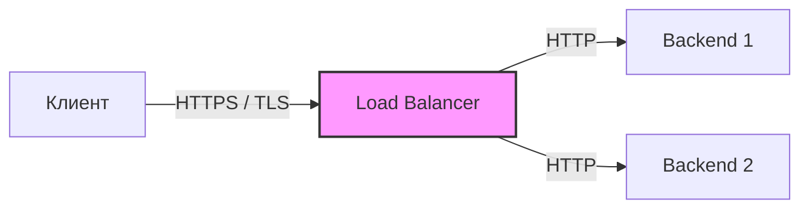

**Плюсы:**
- Сертификаты обновляются в одном месте, а не на каждом бэкенде
- Бэкенды не тратят CPU на шифрование (операция дорогая) — больше ресурсов на бизнес-логику
- Балансировщик видит расшифрованный запрос и потому может работать на L7 (маршрутизация по `URL`, WAF, инспекция)

**Минусы:**
- Участок «балансировщик → бэкенд» идёт открытым текстом — допустимо только в доверенной внутренней сети
- Если нужно сквозное шифрование (`end-to-end`), балансировщик после расшифровки заново шифрует трафик к бэкенду — это `TLS` re-encryption или `mTLS`

**Где делать:** на самом «внешнем» балансировщике, который смотрит в интернет — там сходится весь HTTPS-трафик, и централизация даёт максимум выгоды.

Пример конфигурации `TLS` termination в `Nginx`:

```nginx
server {
    listen 443 ssl;
    server_name api.example.com;

    ssl_certificate     /etc/nginx/ssl/api.example.com.crt;
    ssl_certificate_key /etc/nginx/ssl/api.example.com.key;
    ssl_protocols       TLSv1.2 TLSv1.3;
    ssl_ciphers         HIGH:!aNULL:!MD5;

    location / {
        proxy_pass http://backend_pool;  # HTTP к бэкендам
        proxy_set_header X-Forwarded-Proto $scheme;
        proxy_set_header X-Real-IP $remote_addr;
    }
}
```

В `Kubernetes` TLS termination настраивается через `Ingress`:

```yaml
apiVersion: networking.k8s.io/v1
kind: Ingress
metadata:
  name: api-ingress
spec:
  tls:
    - hosts:
        - api.example.com
      secretName: api-tls-secret
  rules:
    - host: api.example.com
      http:
        paths:
          - path: /
            pathType: Prefix
            backend:
              service:
                name: api-service
                port:
                  number: 80
```

## Q3. (!) Что такое health check и зачем он нужен?

`Health check` — периодическая проверка, жив ли бэкенд и готов ли он обслуживать запросы. Без неё балансировщик продолжал бы слать трафик на упавший узел, и часть клиентов получала бы ошибки. С health check нерабочий узел автоматически выводится из пула, а после восстановления — возвращается. Это основной механизм, который превращает «несколько серверов» в отказоустойчивый пул.

**Типы health checks** (от простого к умному):
- **TCP** — просто проверяем, открывается ли порт. Дёшево, но не ловит ситуацию «процесс жив, но завис».
- **HTTP** — `GET /health`, ждём код `200`. Видит, что приложение реально отвечает, а не только держит сокет.
- **gRPC** — через `gRPC Health Checking Protocol` для gRPC-сервисов.
- **Command/exec** — выполнение команды внутри контейнера; для случаев, где нет сетевого эндпоинта.

**Конфигурация health check в Nginx:**

```nginx
upstream backend_pool {
    zone backend_pool 64k;

    server backend1.example.com:8080 max_fails=3 fail_timeout=30s;
    server backend2.example.com:8080 max_fails=3 fail_timeout=30s;
    server backend3.example.com:8080 max_fails=3 fail_timeout=30s backup;
}
```

> `max_fails=3` — узел исключается после 3 неудачных запросов; `fail_timeout=30s` — через 30 секунд повторная попытка. `backup` — резервный сервер, получает трафик только при недоступности основных.

**Конфигурация health check в HAProxy:**

```haproxy
backend app_servers
    option httpchk GET /health
    http-check expect status 200

    server app1 10.0.0.1:8080 check inter 5s fall 3 rise 2
    server app2 10.0.0.2:8080 check inter 5s fall 3 rise 2
    server app3 10.0.0.3:8080 check inter 5s fall 3 rise 2
```

> `inter 5s` — интервал проверки; `fall 3` — исключить после 3 неудач; `rise 2` — вернуть после 2 успехов.

**Конфигурация health check в Kubernetes:**

```yaml
containers:
  - name: app
    image: myapp:latest
    ports:
      - containerPort: 8080
    livenessProbe:
      httpGet:
        path: /actuator/health/liveness
        port: 8080
      initialDelaySeconds: 30
      periodSeconds: 10
      failureThreshold: 3
    readinessProbe:
      httpGet:
        path: /actuator/health/readiness
        port: 8080
      initialDelaySeconds: 10
      periodSeconds: 5
      failureThreshold: 2
    startupProbe:
      httpGet:
        path: /actuator/health
        port: 8080
      failureThreshold: 30
      periodSeconds: 2
```

**Подводный камень:** эндпоинт health check должен быть быстрым и не тащить за собой проверку внешних зависимостей без разбора. Если в `GET /health` опросить базу, Redis и три внешних API, то при кратком сбое любого из них балансировщик массово выкинет здоровые узлы — и сам спровоцирует отказ. В Spring Boot правильный способ — `Spring Boot Actuator` с разделением на группы liveness (только «процесс жив») и readiness (готов принимать трафик, включая внешние зависимости).

## Q4. Что такое sticky session (session affinity) и когда его использовать?

`Sticky session` (session affinity) — привязка клиента к одному бэкенду: все запросы одного пользователя (распознанного по cookie или `IP`) идут на тот же сервер. Нужен ровно в одном случае — когда сервер хранит состояние сессии у себя в памяти, и попадание клиента на другой узел означало бы потерю этого состояния (разлогин, пустая корзина).

**Реализация в Nginx:**

```nginx
upstream backend_pool {
    ip_hash;  # привязка по IP клиента
    server backend1.example.com:8080;
    server backend2.example.com:8080;
    server backend3.example.com:8080;
}

# Альтернатива — через cookie (Nginx Plus / OpenResty):
upstream backend_pool_cookie {
    sticky cookie srv_id expires=1h domain=.example.com path=/;
    server backend1.example.com:8080;
    server backend2.example.com:8080;
}
```

**Реализация в Kubernetes:**

```yaml
apiVersion: v1
kind: Service
metadata:
  name: my-service
spec:
  selector:
    app: my-app
  sessionAffinity: ClientIP
  sessionAffinityConfig:
    clientIP:
      timeoutSeconds: 3600
  ports:
    - port: 80
      targetPort: 8080
```

| Метод | Плюсы | Минусы |
|-------|-------|--------|
| `ip_hash` | Просто, без cookie | Не работает за `NAT` |
| Cookie | Надёжнее, гранулярнее | Требует поддержки cookie |

**Рекомендация:** sticky session — не решение, а компромисс. Он ломает равномерность балансировки (популярные клиенты перегружают «свой» узел) и теряет сессию при падении сервера. Здоровый путь — сделать приложение stateless и вынести состояние в общее хранилище ([Redis](../databases/redis-interview.md) или `Memcached`); тогда клиент может попасть на любой узел. Sticky session оставляйте для legacy-систем, где вынести состояние невозможно.

## Q5. Чем отличается активная балансировка от пассивной?

Разница в том, как балансировщик узнаёт о сбое бэкенда — спрашивает сам или ждёт жалоб от реального трафика.

**Активная** — балансировщик по своей инициативе шлёт пробы (`GET /health` каждые N секунд) и исключает узел заранее, ещё до того как на него попадёт клиентский запрос. Сбой ловится быстро, ценой постоянного фонового трафика проверок.

**Пассивная** — отдельных проб нет; балансировщик помечает узел нерабочим, только когда реальные клиентские запросы начали возвращать ошибки. Настраивается проще и не создаёт лишнего трафика, но за это платят первые несколько клиентов — они получают ошибку до того, как узел будет исключён.

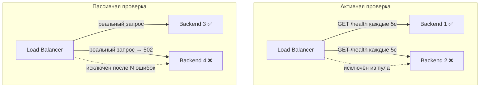

**Практика в Kubernetes:** `livenessProbe` и `readinessProbe` — активные проверки. При провале `readinessProbe` под исключается из `Service` и не получает трафик. При провале `livenessProbe` — под перезапускается.

Для критичных сервисов предпочтительна **активная** проверка с интервалом 5-10 секунд и порогом 2-3 неудачи. Метрики (число healthy/unhealthy бэкендов) экспортировать в `Prometheus` для алертинга — подробнее в [вопросах по мониторингу](../monitoring/metrics-tracing-interview.md).

## Q6. (!) Что такое Round Robin и когда его применять?

`Round Robin` — самый простой алгоритм: запросы раздаются узлам строго по кругу. 1-й запрос — узлу A, 2-й — B, 3-й — C, 4-й — снова A. Никакого учёта нагрузки, только очередь. Это разумный дефолт, когда серверы одинаковы, а запросы примерно равны по «весу».

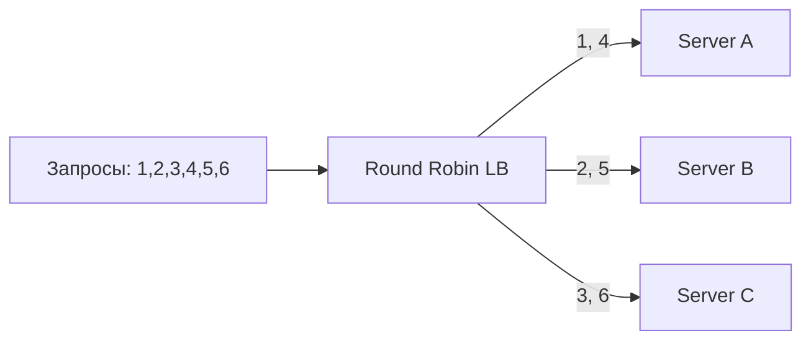

**Когда применять:**
- Узлы одинаковой производительности
- Короткие stateless запросы (типичные `REST API`)
- Нет необходимости учитывать текущую загрузку

**Конфигурация в Nginx** (используется по умолчанию):

```nginx
upstream backend_pool {
    server backend1.example.com:8080;
    server backend2.example.com:8080;
    server backend3.example.com:8080;
}
```

**Конфигурация в HAProxy:**

```haproxy
backend app_servers
    balance roundrobin
    server app1 10.0.0.1:8080 check
    server app2 10.0.0.2:8080 check
    server app3 10.0.0.3:8080 check
```

**Главный недостаток:** алгоритм не смотрит на текущую загрузку. Если узел уже занят тяжёлым запросом, очередь всё равно отправит ему следующий — и при неравномерных по длительности запросах нагрузка перекосится. Как только запросы стали разными по «весу» (отчёты, выгрузки, `WebSocket`), Round Robin пора менять на `Least Connections`.

## Q7. Что такое Weighted Round Robin?

`Weighted Round Robin` — тот же круговой обход, но каждому узлу задан вес, и узел с бóльшим весом получает пропорционально больше запросов. Это решает главную слабость обычного Round Robin — равное распределение между неравными серверами. Два типичных применения: разная мощность узлов (мощному ставят вес выше) и постепенный ввод нового инстанса (canary), которому сначала дают минимальный вес.

**Конфигурация в Nginx:**

```nginx
upstream backend_pool {
    server backend1.example.com:8080 weight=5;  # мощный сервер
    server backend2.example.com:8080 weight=3;  # средний
    server backend3.example.com:8080 weight=1;  # новый / canary
}
```

**Конфигурация в HAProxy:**

```haproxy
backend app_servers
    balance roundrobin
    server app1 10.0.0.1:8080 weight 5 check
    server app2 10.0.0.2:8080 weight 3 check
    server app3 10.0.0.3:8080 weight 1 check
```

**Как читать веса:** они задают пропорцию, а не абсолютные числа. В примере выше за каждые 9 запросов A получит 5, B — 3, C — 1. Тот же приём удобен для [canary-деплоев](../cicd/deployment-strategies-interview.md): новому инстансу ставят вес 1 (на него уйдёт лишь малая доля трафика), наблюдают за метриками и постепенно поднимают вес, переливая нагрузку на новую версию.

## Q8. Что такое Least Connections и когда его применять?

`Least Connections` — запрос уходит на узел, у которого сейчас меньше всего активных соединений. В отличие от Round Robin, алгоритм смотрит на реальную загрузку: занятый долгим запросом узел временно держит больше открытых соединений, поэтому новые запросы автоматически обходят его стороной. Именно поэтому он спасает там, где Round Robin перекашивает нагрузку — на длинных и неравномерных запросах.

**Конфигурация в Nginx:**

```nginx
upstream backend_pool {
    least_conn;
    server backend1.example.com:8080;
    server backend2.example.com:8080;
    server backend3.example.com:8080;
}
```

**Конфигурация в HAProxy:**

```haproxy
backend app_servers
    balance leastconn
    server app1 10.0.0.1:8080 check
    server app2 10.0.0.2:8080 check
    server app3 10.0.0.3:8080 check
```

**Когда использовать вместо Round Robin:**
- Запросы значительно различаются по длительности
- `WebSocket` / long-polling соединения
- Тяжёлые отчёты или пакетная обработка

## Q9. Что такое Least Response Time?

`Least Response Time` — развитие идеи Least Connections: узел выбирается не по числу соединений, а по фактическому времени ответа (либо по комбинации задержки и числа соединений). Цель — отдать запрос самому быстрому в данный момент серверу и тем минимизировать латентность, которую видит клиент. Это полезно, когда узлы реально различаются по скорости — разное железо или разные дата-центры, — а число соединений эту разницу не отражает.

**Реализация:** `HAProxy` поддерживает аналог через `balance hdr` с health check latency. `AWS ALB` выбирает таргеты с наименьшим числом активных запросов. `Nginx Plus` предоставляет директиву `least_time`:

```nginx
# Nginx Plus (коммерческая версия)
upstream backend_pool {
    least_time header;  # по времени первого байта ответа
    server backend1.example.com:8080;
    server backend2.example.com:8080;
}
```

**Когда применять:** когда узлы расположены в разных дата-центрах или имеют разную производительность, и цель — минимальная p95/p99 латентность.

## Q10. Как выбрать алгоритм балансировки для микросервисов?

Главный вопрос при выборе — насколько однородны запросы и узлы. Чем больше разброс по длительности запросов и мощности серверов, тем «умнее» нужен алгоритм. Опорная таблица:

| Сценарий | Рекомендуемый алгоритм | Почему |
|----------|----------------------|--------|
| Короткие `REST` запросы, stateless | `Round Robin` | Простота, равномерность |
| Разная мощность серверов | `Weighted Round Robin` | Учёт производительности |
| Длинные запросы, `WebSocket` | `Least Connections` | Учёт текущей загрузки |
| Минимальная латентность критична | `Least Response Time` | Выбор самого быстрого узла |
| Кэширование, sharding | `Consistent Hashing` | Локальность данных |
| Обязательное состояние на узле | `Sticky Session` | Привязка клиента к узлу |

**Эмпирическое правило:** начинайте с самого простого. Для [микросервисов](microservices-interview.md) дефолт — stateless-приложение плюс `Round Robin`; усложняйте только когда измерения покажут перекос. Первый шаг апгрейда — `Least Connections`. Sticky session — крайняя мера: прежде чем привязывать клиента к узлу, попробуйте вынести состояние в [Redis](../databases/redis-interview.md) и сделать приложение stateless.

## Q11. (!) Как настроить upstream балансировку в Nginx?

В `Nginx` балансировка строится на двух блоках: `upstream` описывает пул серверов и алгоритм, а `location` направляет запросы в этот пул через `proxy_pass`. Ниже — рабочий шаблон с весами, пассивным health check, резервным сервером, таймаутами и retry:

```nginx
# Определение upstream-пула серверов
upstream api_backend {
    # Алгоритм балансировки (по умолчанию round-robin)
    least_conn;

    # Зона разделяемой памяти для worker-процессов
    zone api_backend 64k;

    server 10.0.0.1:8080 weight=5 max_fails=3 fail_timeout=30s;
    server 10.0.0.2:8080 weight=3 max_fails=3 fail_timeout=30s;
    server 10.0.0.3:8080 weight=1 max_fails=3 fail_timeout=30s;
    server 10.0.0.4:8080 backup;  # резервный сервер

    keepalive 32;  # HTTP keep-alive к бэкендам
}

server {
    listen 80;
    server_name api.example.com;

    location / {
        proxy_pass http://api_backend;

        # Заголовки для бэкенда
        proxy_set_header Host $host;
        proxy_set_header X-Real-IP $remote_addr;
        proxy_set_header X-Forwarded-For $proxy_add_x_forwarded_for;
        proxy_set_header X-Forwarded-Proto $scheme;

        # Таймауты
        proxy_connect_timeout 5s;
        proxy_read_timeout 30s;
        proxy_send_timeout 10s;

        # Retry при ошибках — перенаправить на следующий upstream
        proxy_next_upstream error timeout http_502 http_503;
        proxy_next_upstream_tries 2;

        # Keep-alive к upstream
        proxy_http_version 1.1;
        proxy_set_header Connection "";
    }
}
```

**Ключевые параметры:**
- `weight` — вес сервера для распределения
- `max_fails` / `fail_timeout` — пассивный health check
- `backup` — резервный сервер (трафик только при недоступности основных)
- `proxy_next_upstream` — автоматический retry на следующий сервер при ошибке
- `keepalive` — пул persistent connections к бэкендам (снижает латентность)

## Q12. Как настроить health checks и failover в Nginx?

Ключевое ограничение, которое стоит назвать на собеседовании: бесплатный `Nginx` Open Source умеет только **пассивные** health checks — он замечает сбой по ошибкам реальных запросов (`max_fails` / `fail_timeout`). Отдельные активные пробы (фоновый опрос `/health`) есть лишь в коммерческом `Nginx Plus`. Поэтому в Open Source failover «реактивный»: первые запросы на упавший узел всё же отвалятся, и тут выручает `proxy_next_upstream` — он молча переотправит запрос на живой сервер.

**Пассивные health checks (Open Source):**

```nginx
upstream backend_pool {
    server backend1:8080 max_fails=3 fail_timeout=30s;
    server backend2:8080 max_fails=3 fail_timeout=30s;
    server backend3:8080 max_fails=3 fail_timeout=30s;
    server backup1:8080 backup;  # только при падении основных
}

server {
    location / {
        proxy_pass http://backend_pool;

        # Какие ошибки считать "fail" для max_fails
        proxy_next_upstream error timeout http_500 http_502 http_503 http_504;
        proxy_next_upstream_tries 3;
        proxy_next_upstream_timeout 10s;
    }
}
```

**Активные health checks (Nginx Plus):**

```nginx
upstream backend_pool {
    zone backend_pool 64k;
    server backend1:8080;
    server backend2:8080;

    # Активная проверка каждые 5 секунд
    health_check interval=5s fails=3 passes=2 uri=/health;
    health_check match=health_ok;
}

match health_ok {
    status 200;
    body ~ "UP";
}
```

## Q13. Как настроить rate limiting в Nginx?

`Rate limiting` — ограничение частоты запросов, чтобы один клиент (или бот) не перегрузил бэкенды и не уронил сервис для остальных. В `Nginx` это модуль `ngx_http_limit_req_module`, работающий по алгоритму leaky bucket. Логика в двух шагах: сначала `limit_req_zone` объявляет зону — по какому ключу считать (IP, API-ключ), с какой скоростью (`rate`) и сколько памяти под счётчики; затем `limit_req` применяет эту зону к нужному `location`.

```nginx
# Определение зоны ограничения (в блоке http)
http {
    # 10 req/s per IP, зона 10MB (~160k IP-адресов)
    limit_req_zone $binary_remote_addr zone=api_limit:10m rate=10r/s;

    # Ограничение по API-ключу
    limit_req_zone $http_x_api_key zone=apikey_limit:10m rate=100r/s;

    server {
        location /api/ {
            # burst=20 — очередь до 20 запросов сверх лимита
            # nodelay — не задерживать burst-запросы
            limit_req zone=api_limit burst=20 nodelay;
            limit_req_status 429;

            proxy_pass http://api_backend;
        }

        location /api/heavy/ {
            # Более строгий лимит для тяжёлых эндпоинтов
            limit_req zone=api_limit burst=5 nodelay;
            limit_req_status 429;

            proxy_pass http://api_backend;
        }
    }
}
```

**Про `burst` и `nodelay`:** реальный трафик идёт всплесками, поэтому жёсткий лимит без запаса резал бы легитимные пики. `burst=20` разрешает очередь до 20 запросов сверх лимита, а `nodelay` пропускает их сразу, не размазывая во времени. Что осталось за пределами очереди — отбивается кодом `429 Too Many Requests`. Подробнее о rate limiting в контексте API — в [вопросах по HTTP/REST](../api/http-rest-interview.md).

## Q14. (!) Как настроить балансировку в HAProxy?

`HAProxy` — высокопроизводительный балансировщик уровней L4/L7. Его конфиг читается сверху вниз по секциям: `global` — общесистемные настройки, `defaults` — значения по умолчанию для всех, `frontend` — точка входа (что слушаем и куда направляем по ACL), `backend` — пул серверов с алгоритмом и health check. В примере ниже один frontend раскидывает трафик по трём backend-ам в зависимости от пути запроса:

```haproxy
global
    maxconn 50000
    log /dev/log local0
    stats socket /var/run/haproxy.sock mode 600

defaults
    mode http
    log global
    option httplog
    option dontlognull
    timeout connect 5s
    timeout client  30s
    timeout server  30s
    timeout http-request 10s
    retries 3

# Статистика HAProxy (dashboard)
listen stats
    bind *:8404
    stats enable
    stats uri /stats
    stats refresh 10s

# Frontend — точка входа
frontend http_front
    bind *:80
    bind *:443 ssl crt /etc/haproxy/certs/example.pem

    # ACL для маршрутизации
    acl is_api path_beg /api
    acl is_static path_beg /static

    # Path-based routing
    use_backend api_servers if is_api
    use_backend static_servers if is_static
    default_backend app_servers

# Backend — пул серверов
backend api_servers
    balance leastconn
    option httpchk GET /health
    http-check expect status 200

    server api1 10.0.0.1:8080 check inter 5s fall 3 rise 2 weight 5
    server api2 10.0.0.2:8080 check inter 5s fall 3 rise 2 weight 3
    server api3 10.0.0.3:8080 check inter 5s fall 3 rise 2 weight 1

backend app_servers
    balance roundrobin
    option httpchk GET /health
    cookie SERVERID insert indirect nocache

    server app1 10.0.1.1:8080 check cookie app1
    server app2 10.0.1.2:8080 check cookie app2

backend static_servers
    balance roundrobin
    server static1 10.0.2.1:80 check
    server static2 10.0.2.2:80 check
```

**Ключевые возможности HAProxy:**
- `ACL` — гибкая маршрутизация по path, headers, cookies
- `cookie SERVERID insert` — sticky sessions через cookie
- Встроенный dashboard (`stats enable`)
- Поддержка `SSL/TLS` termination

## Q15. Как настроить health checks в HAProxy?

В отличие от бесплатного Nginx, `HAProxy` из коробки умеет полноценные **активные** health checks (директива `check` на сервере) и тонко настраивает их поведение — интервал, пороги срабатывания и плавный возврат узла в строй:

```haproxy
backend app_servers
    balance roundrobin

    # HTTP health check
    option httpchk GET /actuator/health
    http-check expect status 200

    # Дополнительные проверки ответа
    http-check expect rstring "UP"

    # Параметры проверки на каждый сервер
    # inter — интервал проверки
    # fall  — число неудач для исключения
    # rise  — число успехов для возврата
    # slowstart — постепенный ввод после восстановления
    server app1 10.0.0.1:8080 check inter 3s fall 3 rise 2 slowstart 60s
    server app2 10.0.0.2:8080 check inter 3s fall 3 rise 2 slowstart 60s
    server app3 10.0.0.3:8080 check inter 3s fall 3 rise 2 slowstart 60s backup

    # Таймаут health check
    timeout check 2s
```

**Зачем `slowstart`:** только что поднявшийся сервер ещё «холодный» — пустой кэш, непрогретый JIT, незаполненные пулы соединений. Если сразу дать ему полную нагрузку, он захлебнётся и снова выпадет из пула. `slowstart 60s` поднимает его вес от 0 до назначенного плавно за 60 секунд, давая прогреться. Это типовая защита от «шторма» запросов на свежевосстановленный узел.

## Q16. (!) Что такое клиентская и серверная балансировка?

Вопрос в том, **кто** принимает решение о выборе узла — выделенный посредник или сам клиент.

**Серверная** — между клиентом и бэкендами стоит отдельный компонент (`Nginx`, `AWS ALB`, `HAProxy`), который принимает все запросы и сам распределяет их. Клиент вообще не знает, сколько бэкендов и где они; он обращается к одному адресу. Просто для клиента, но балансировщик становится лишним сетевым «прыжком» и потенциальной точкой отказа.

**Клиентская** — балансировщика как отдельного звена нет; клиент (приложение или `SDK`) получает список инстансов из service discovery (`Consul`, `Eureka`) и сам выбирает узел. Соединение идёт напрямую к бэкенду — без лишнего hop и без единой точки отказа, но логика выбора теперь живёт в каждом клиенте.

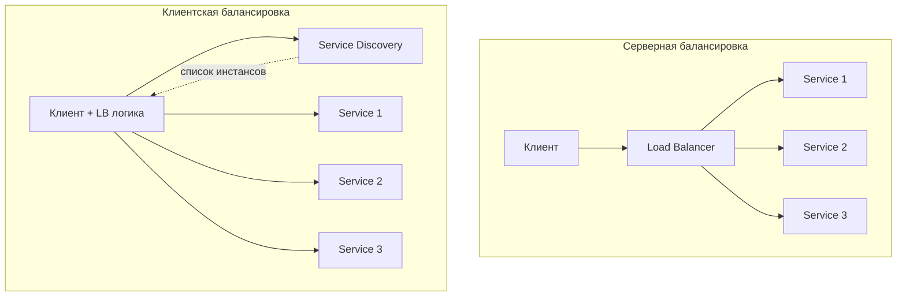

| Критерий | Серверная | Клиентская |
|----------|-----------|------------|
| Single point of failure | Да (балансировщик) | Нет |
| Дополнительный hop | Да | Нет (прямое соединение) |
| Сложность клиента | Низкая | Выше (LB логика в клиенте) |
| Примеры | `Nginx`, `HAProxy`, `AWS ALB` | `Spring Cloud LoadBalancer`, `gRPC` client LB |

В [микросервисной архитектуре](microservices-interview.md) часто комбинируют оба подхода: внешний трафик через серверный балансировщик, межсервисные вызовы — через клиентскую балансировку.

## Q17. Как настроить Spring Cloud LoadBalancer?

`Spring Cloud LoadBalancer` — штатный механизм клиентской балансировки в Spring, пришедший на смену устаревшему `Netflix Ribbon`. Идея простая: помечаете `WebClient` или `RestTemplate` аннотацией `@LoadBalanced`, и тогда логическое имя сервиса в URL (`http://user-service`) Spring сам резолвит через service discovery в конкретный инстанс — балансируя запросы между ними.

**Зависимости:**

```groovy
dependencies {
    implementation 'org.springframework.cloud:spring-cloud-starter-loadbalancer'
    implementation 'org.springframework.cloud:spring-cloud-starter-netflix-eureka-client'
}
```

**Конфигурация WebClient с балансировкой:**

```java
@Configuration
public class WebClientConfig {

    @Bean
    @LoadBalanced  // включает клиентскую балансировку
    public WebClient.Builder loadBalancedWebClientBuilder() {
        return WebClient.builder();
    }
}

@Service
public class OrderService {

    private final WebClient webClient;

    public OrderService(WebClient.Builder webClientBuilder) {
        // "user-service" — имя из Service Discovery
        this.webClient = webClientBuilder
            .baseUrl("http://user-service")
            .build();
    }

    public Mono<User> getUser(Long userId) {
        return webClient.get()
            .uri("/api/users/{id}", userId)
            .retrieve()
            .bodyToMono(User.class);
    }
}
```

**Конфигурация RestTemplate с балансировкой:**

```java
@Configuration
public class RestTemplateConfig {

    @Bean
    @LoadBalanced
    public RestTemplate restTemplate() {
        return new RestTemplate();
    }
}

@Service
public class PaymentService {

    private final RestTemplate restTemplate;

    public PaymentService(RestTemplate restTemplate) {
        this.restTemplate = restTemplate;
    }

    public Order getOrder(Long orderId) {
        // "order-service" резолвится через Service Discovery
        return restTemplate.getForObject(
            "http://order-service/api/orders/{id}",
            Order.class, orderId
        );
    }
}
```

По умолчанию используется `Round Robin`. Подробнее о Service Discovery и Spring Cloud — в [вопросах по Spring Cloud](../frameworks/spring/spring-cloud-interview.md).

## Q18. Как реализовать кастомную стратегию балансировки в Spring Cloud?

Дефолтный `Round Robin` меняется на свою стратегию через реализацию интерфейса `ReactorServiceInstanceLoadBalancer` — нужно переопределить метод `choose()`, который из списка доступных инстансов выбирает один. Дальше эту реализацию привязывают к конкретному сервису аннотацией `@LoadBalancerClient`. Пример — выбор инстанса с минимальным временем ответа:

```java
// Кастомная стратегия: выбор инстанса с минимальным временем ответа
public class LeastResponseTimeLoadBalancer implements ReactorServiceInstanceLoadBalancer {

    private final ObjectProvider<ServiceInstanceListSupplier> supplier;
    private final ConcurrentMap<String, AtomicLong> responseTimeMap =
        new ConcurrentHashMap<>();

    public LeastResponseTimeLoadBalancer(
            ObjectProvider<ServiceInstanceListSupplier> supplier) {
        this.supplier = supplier;
    }

    @Override
    public Mono<Response<ServiceInstance>> choose(Request request) {
        return supplier.getIfAvailable()
            .get(request)
            .next()
            .map(this::selectInstance);
    }

    private Response<ServiceInstance> selectInstance(
            List<ServiceInstance> instances) {
        if (instances.isEmpty()) {
            return new EmptyResponse();
        }
        ServiceInstance best = instances.stream()
            .min(Comparator.comparingLong(
                i -> responseTimeMap
                    .getOrDefault(i.getInstanceId(), new AtomicLong(0))
                    .get()))
            .orElse(instances.get(0));

        return new DefaultResponse(best);
    }
}

// Конфигурация для конкретного сервиса
@LoadBalancerClient(
    name = "user-service",
    configuration = UserServiceLBConfig.class
)
public class LoadBalancerConfiguration { }

class UserServiceLBConfig {
    @Bean
    public ReactorServiceInstanceLoadBalancer customLoadBalancer(
            ObjectProvider<ServiceInstanceListSupplier> supplier) {
        return new LeastResponseTimeLoadBalancer(supplier);
    }
}
```

## Q19. Что такое blue-green и canary в контексте балансировки?

Обе стратегии решают одну задачу — выкатить новую версию без даунтайма, — но по-разному распределяют риск, и в обоих случаях именно балансировщик переключает трафик.

**Blue-green** — держим два идентичных окружения. Весь трафик идёт на текущее (blue), рядом поднимается новая версия (green). После проверки балансировщик разом переводит 100% трафика на green. Переключение мгновенное, откат тоже мгновенный (вернуть трафик на blue), но новую версию сразу получают все пользователи.

**Canary** — переход постепенный: сначала на новую версию пускают малую долю трафика (1–10%), остальное остаётся на старой. Если метрики в норме, долю повышают шаг за шагом. Проблему заметит лишь малая часть пользователей — риск размазан, ценой более долгого выката.

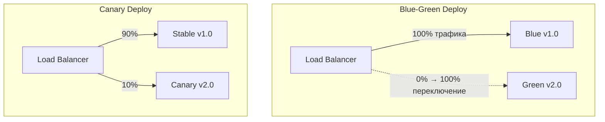

**Реализация canary в Nginx через weight:**

```nginx
upstream api_backend {
    server stable-v1.example.com:8080 weight=9;   # 90% трафика
    server canary-v2.example.com:8080 weight=1;    # 10% трафика
}
```

**Реализация canary в HAProxy:**

```haproxy
backend api_servers
    balance roundrobin
    server stable1 10.0.0.1:8080 weight 90 check
    server stable2 10.0.0.2:8080 weight 90 check
    server canary1 10.0.0.3:8080 weight 10 check
```

Подробнее о стратегиях деплоя — в [вопросах по стратегиям деплоя](../cicd/deployment-strategies-interview.md).

## Q20. (!) Как обеспечить отказоустойчивость балансировщика?

Парадокс: балансировщик повышает надёжность бэкендов, но сам становится единой точкой отказа — если он упадёт, недоступным окажется весь сервис, сколько бы здоровых бэкендов за ним ни стояло. Решение — никогда не держать балансировщик в одном экземпляре. Ставят минимум пару и связывают её плавающим IP:

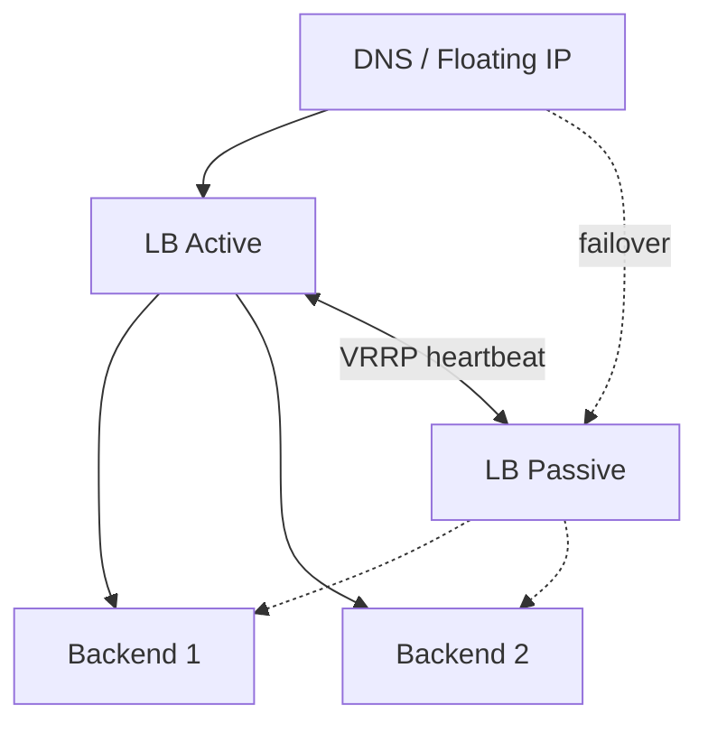

Два базовых режима резервирования:

**Active-Passive** — работает один балансировщик, второй ждёт в горячем резерве. При падении активного плавающий IP «переезжает» на резервный через `VRRP` (Virtual Router Redundancy Protocol) или keepalived. Просто и предсказуемо, но половина мощности простаивает.

**Active-Active** — оба балансировщика принимают трафик одновременно (раздаётся через `DNS Round Robin` или `Anycast`). При падении одного весь трафик уходит на второй. Используются обе машины, но конфигурация сложнее.

**Конфигурация keepalived для VRRP:**

```
vrrp_instance VI_1 {
    state MASTER
    interface eth0
    virtual_router_id 51
    priority 100
    advert_int 1

    authentication {
        auth_type PASS
        auth_pass mysecret
    }

    virtual_ipaddress {
        192.168.1.100/24
    }
}
```

**В облаке:** `AWS ALB`/`NLB` — managed, отказоустойчивость «из коробки» (multi-AZ). `GCP` Global Load Balancer — глобальная балансировка с `Anycast`.

## Q21. Что такое connection draining (deregistration delay)?

`Connection draining` (в AWS — deregistration delay) — корректный вывод узла из пула. Балансировщик перестаёт слать на него **новые** запросы, но уже выполняющиеся не обрывает, а даёт им доработать в течение заданного окна. Без этого механизма остановка сервера для деплоя или масштабирования рвала бы запросы прямо в полёте, и пользователи получали бы ошибки на ровном месте.

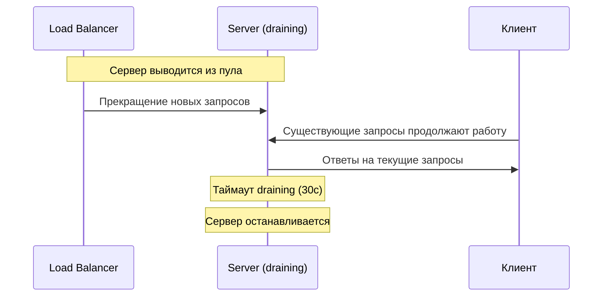

**Реализация в Kubernetes:**

```yaml
spec:
  terminationGracePeriodSeconds: 60  # время на завершение
  containers:
    - name: app
      lifecycle:
        preStop:
          exec:
            command: ["sh", "-c", "sleep 15"]  # дать время на deregistration
```

**В AWS ALB:** параметр `deregistration_delay.timeout_seconds` (по умолчанию 300 секунд).

**В Nginx:** при reload конфигурации старые worker-процессы продолжают обслуживать существующие соединения, пока новые workers обрабатывают новые запросы. Параметр `worker_shutdown_timeout` контролирует максимальное время.

## Q22. Что такое Layer 4 и Layer 7 load balancer в облаке?

В облаке балансировщики — это managed-сервисы: провайдер сам обеспечивает отказоустойчивость, масштабирование и multi-AZ, вам остаётся только выбрать уровень. Деление то же, что в Q1: L4 — быстрый и протокол-агностичный, L7 — умный для HTTP. У каждого провайдера это две разные сущности:

| Провайдер | L4 | L7 |
|-----------|----|----|
| AWS | `NLB` (Network Load Balancer) | `ALB` (Application Load Balancer) |
| GCP | Network Load Balancer | HTTP(S) Load Balancer |
| Azure | Azure Load Balancer | Application Gateway |

**AWS NLB (L4):**
- Миллионы запросов в секунду, ультранизкая латентность
- Static IP / Elastic IP
- Подходит для `TCP`/`UDP`, `gRPC`, не-HTTP протоколы

**AWS ALB (L7):**
- Path-based и host-based routing
- `TLS` termination через `ACM` (бесплатные сертификаты)
- Интеграция с `WAF`, `Cognito`
- Поддержка `WebSocket`, `HTTP/2`

**Выбор:** L4 для не-HTTP протоколов и минимальной латентности. L7 для HTTP/HTTPS с маршрутизацией по содержимому. Подробнее об облачной инфраструктуре — в [паттернах масштабирования](scalability-patterns-interview.md).

## Q23. (!) Как настроить health check в Kubernetes для Pod?

В [Kubernetes](../devops/kubernetes-interview.md) одного health check мало: «приложение запускается», «приложение зависло» и «приложение временно не готово» требуют разной реакции. Поэтому проб три, и у каждой своё действие при провале:

- **`startupProbe`** — отрабатывает только на старте и страхует медленно поднимающиеся приложения. Пока она не прошла, liveness и readiness не запускаются — иначе долгий старт могли бы принять за зависание и убить контейнер.
- **`livenessProbe`** — «процесс жив или завис?». При провале Kubernetes **перезапускает** контейнер. Лечит зависшие приложения, которые держат порт, но не отвечают.
- **`readinessProbe`** — «готов принимать трафик прямо сейчас?». При провале под **исключается из `Service`** (трафик не идёт), но контейнер не перезапускается. Для временной неготовности — прогрев кэша, переподключение к БД.

```yaml
apiVersion: apps/v1
kind: Deployment
metadata:
  name: api-service
spec:
  replicas: 3
  template:
    spec:
      containers:
        - name: api
          image: api-service:2.1.0
          ports:
            - containerPort: 8080
          startupProbe:
            httpGet:
              path: /actuator/health
              port: 8080
            failureThreshold: 30
            periodSeconds: 2
            # Макс. ожидание старта: 30 * 2 = 60с
          livenessProbe:
            httpGet:
              path: /actuator/health/liveness
              port: 8080
            periodSeconds: 10
            failureThreshold: 3
            timeoutSeconds: 3
          readinessProbe:
            httpGet:
              path: /actuator/health/readiness
              port: 8080
            periodSeconds: 5
            failureThreshold: 2
            timeoutSeconds: 3
          resources:
            requests:
              memory: "512Mi"
              cpu: "250m"
            limits:
              memory: "1Gi"
              cpu: "500m"
```

**Spring Boot Actuator** конфигурация для Kubernetes проб:

```yaml
# application.yml
management:
  endpoint:
    health:
      probes:
        enabled: true
      group:
        readiness:
          include: db, redis, kafka
        liveness:
          include: ping
  health:
    livenessState:
      enabled: true
    readinessState:
      enabled: true
```

**Важно:** `livenessProbe` не должна зависеть от внешних сервисов (БД, Redis) — иначе при падении БД все поды будут перезапущены. Внешние зависимости проверяет только `readinessProbe`.

## Q24. Что такое Ingress и как он связан с балансировкой?

`Ingress` — это L7-маршрутизатор Kubernetes для входящего HTTP/HTTPS-трафика. Важно различать две вещи: сам объект `Ingress` — лишь декларативные правила («хост `api.example.com`, путь `/api/users` → сервис `user-service`»), а реальную работу делает **Ingress Controller** (`Nginx Ingress Controller`, `Traefik`, `AWS ALB Ingress Controller`) — он читает эти правила и превращается в фактический L7-балансировщик на входе кластера, заменяя ручную настройку Nginx/HAProxy.

```yaml
apiVersion: networking.k8s.io/v1
kind: Ingress
metadata:
  name: api-ingress
  annotations:
    nginx.ingress.kubernetes.io/rewrite-target: /
    nginx.ingress.kubernetes.io/ssl-redirect: "true"
    nginx.ingress.kubernetes.io/proxy-body-size: "10m"
    nginx.ingress.kubernetes.io/rate-limit: "100"
spec:
  ingressClassName: nginx
  tls:
    - hosts:
        - api.example.com
      secretName: api-tls
  rules:
    - host: api.example.com
      http:
        paths:
          - path: /api/users
            pathType: Prefix
            backend:
              service:
                name: user-service
                port:
                  number: 8080
          - path: /api/orders
            pathType: Prefix
            backend:
              service:
                name: order-service
                port:
                  number: 8080
          - path: /
            pathType: Prefix
            backend:
              service:
                name: frontend
                port:
                  number: 80
```

**Цепочка:** Клиент → DNS → `Ingress Controller` (L7 LB) → `Service` → `Pod`. `Service` распределяет трафик между подами через `kube-proxy` / iptables.

## Q25. Как обеспечить zero-downtime при деплое за балансировщиком?

Деплой без даунтайма — это согласованная работа четырёх механизмов: новые экземпляры должны успеть подняться и подтвердить готовность раньше, чем уйдут старые, а уходящие — корректно доработать текущие запросы. Каждый элемент закрывает свой риск:

1. **Rolling Update** — версии не меняются разом: новые поды поднимаются, старые гасятся постепенно, сервис всё время доступен
2. **Readiness Probe** — пока под не подтвердил готовность, балансировщик не шлёт на него трафик (защита от запросов на ещё не прогретый под)
3. **Connection Draining** — текущие запросы на уходящем поде доигрываются до конца, а не обрываются
4. **PreStop hook** — короткая пауза перед остановкой, чтобы `kube-proxy` успел убрать под из endpoints раньше, чем тот начнёт умирать

```yaml
apiVersion: apps/v1
kind: Deployment
metadata:
  name: api-service
spec:
  replicas: 3
  strategy:
    type: RollingUpdate
    rollingUpdate:
      maxSurge: 1         # максимум 1 лишний под
      maxUnavailable: 0   # всегда доступны все реплики
  template:
    spec:
      terminationGracePeriodSeconds: 60
      containers:
        - name: api
          readinessProbe:
            httpGet:
              path: /actuator/health/readiness
              port: 8080
            periodSeconds: 5
          lifecycle:
            preStop:
              exec:
                # Ждём, пока kube-proxy обновит iptables
                command: ["sh", "-c", "sleep 15"]
```

**Порядок остановки пода:**
1. Pod получает `SIGTERM`
2. `preStop` hook выполняется (sleep 15s)
3. Pod исключается из `Service` endpoints
4. Существующие запросы завершаются
5. По истечении `terminationGracePeriodSeconds` — `SIGKILL`

Подробнее — в [вопросах по стратегиям деплоя](../cicd/deployment-strategies-interview.md).

## Q26. (!) Что такое DNS-based load balancing?

`DNS-based load balancing` — распределение трафика ещё на этапе резолва имени, до того как клиент вообще установит соединение. На один домен заводят несколько IP-адресов (разные серверы или дата-центры), и DNS-сервер отдаёт разным клиентам разные адреса — так нагрузка раскидывается по узлам. Это балансировка «нулевого уровня»: она работает перед любым L4/L7-балансировщиком и потому единственная способна распределять трафик между географически разнесёнными регионами.

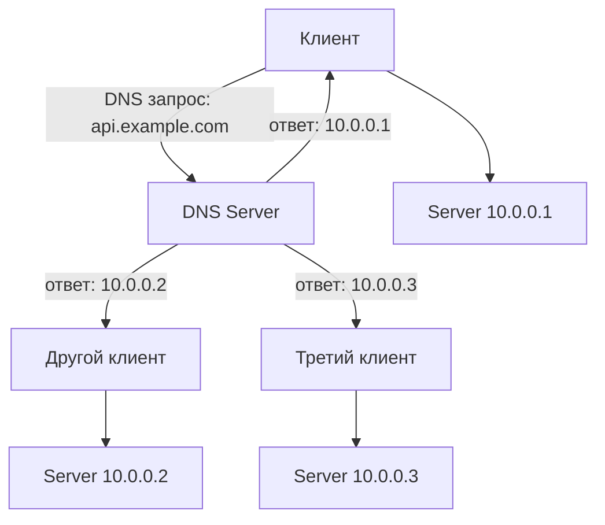

**Методы DNS-балансировки:**

| Метод | Описание | Пример |
|-------|----------|--------|
| Round Robin DNS | Циклический возврат IP | Несколько A-записей |
| Weighted DNS | Вес для каждой записи | `Route 53` weighted routing |
| Geolocation DNS | По географии клиента | `Route 53` geolocation |
| Latency-based DNS | По минимальной латентности | `Route 53` latency routing |
| Failover DNS | Переключение при отказе | `Route 53` failover |

**Плюсы:**
- Нет единой точки отказа
- Глобальное распределение нагрузки
- Работает до L4/L7 балансировщика

**Минусы** (все упираются в природу DNS):
- Ответы кэшируются по TTL — изменения (вывод упавшего узла) доходят до клиентов с задержкой, failover не мгновенный
- DNS ничего не знает о текущей загрузке серверов — раздаёт адреса «вслепую»
- Хуже того, клиенты и резолверы нередко игнорируют TTL и держат старый IP дольше положенного, продолжая стучаться на мёртвый узел

**Пример конфигурации AWS Route 53 (weighted):**

```
# A-запись с весом 70 (основной регион)
api.example.com  A  10.0.0.1  TTL=60  Weight=70  SetId=primary

# A-запись с весом 30 (вторичный регион)  
api.example.com  A  10.0.1.1  TTL=60  Weight=30  SetId=secondary
```

**На практике** DNS-балансировку используют в комбинации с L4/L7: DNS направляет трафик на ближайший регион, а внутри региона L7-балансировщик распределяет между серверами.

## Q27. Что такое geographic load balancing (global load balancing)?

`Geographic load balancing` — направление каждого пользователя в ближайший к нему дата-центр, чтобы сократить сетевую задержку и выдержать compliance (данные региона остаются в регионе). Реализуется двумя путями: через `DNS` (резолвер отдаёт IP ближайшего региона по геолокации клиента) или через `Anycast` (один и тот же IP анонсируется из всех регионов, и до ближайшего трафик доводит сама маршрутизация интернета).

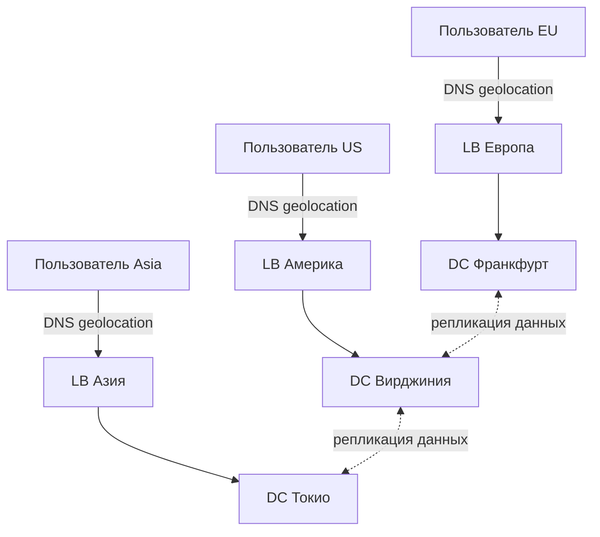

**Реализации:**
- **AWS Route 53** — geolocation и latency-based routing
- **Cloudflare** — `Anycast` + geo-routing
- **GCP Global Load Balancer** — единый `Anycast` IP, автоматическая гео-маршрутизация

**Ключевые проблемы:**
- Синхронизация данных между регионами (eventual consistency) — см. [паттерны согласованности](consistency-patterns-interview.md)
- Failover при падении целого региона
- Compliance (GDPR — данные EU-пользователей в EU)

## Q28. Что такое cross-zone load balancing в AWS?

`Cross-zone load balancing` отвечает на тонкий вопрос: балансировщик распределяет трафик равномерно **по узлам** или сначала **по зонам доступности (AZ)**? Это разные вещи, когда инстансы разложены по AZ неравномерно — и от настройки зависит, не перегрузится ли зона с меньшим числом серверов.

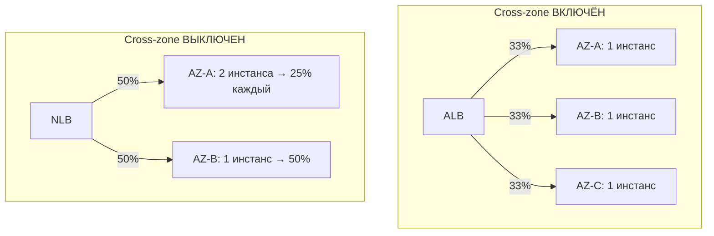

**При включённом cross-zone:** трафик распределяется равномерно по **всем** узлам во всех AZ. Лучшее использование ресурсов.

**При выключенном:** трафик распределяется равномерно **по AZ**, а внутри AZ — по узлам. Если в AZ-A 2 инстанса, а в AZ-B 1, то инстанс в AZ-B получит вдвое больше нагрузки.

**Рекомендация:** для `ALB` cross-zone включён по умолчанию (бесплатно). Для `NLB` — выключен (включение платное из-за inter-AZ трафика). Включать для равномерной загрузки; выключать для экономии трафика между AZ.

## Q29. Что такое consistent hashing и когда его использовать?

`Consistent hashing` — способ привязать ключ (например, `userId`) к узлу так, чтобы при изменении состава пула «переехала» лишь малая часть ключей. Наивный `hash(key) % N` плох именно этим: стоит добавить или убрать сервер, как N меняется, и почти **все** ключи отображаются на другие узлы — для кэша это означает массовый промах и лавину запросов к источнику. Consistent hashing размещает и узлы, и ключи на условном «кольце» хешей, поэтому при изменении числа узлов перераспределяется только ~1/N ключей, а не все.

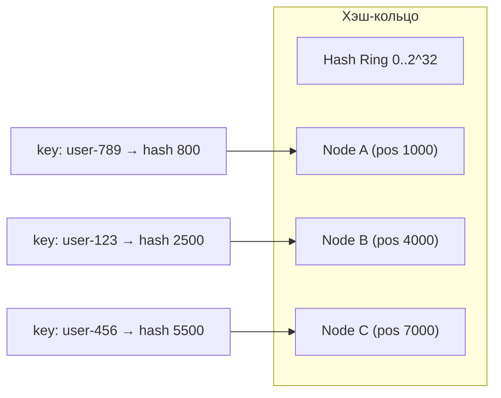

**Применение:**
- Кэширование — запросы с одним ключом попадают на один узел кэша (локальность данных)
- Sharding — распределение данных по узлам
- Session affinity без cookie

**Конфигурация в Nginx:**

```nginx
upstream cache_backend {
    hash $request_uri consistent;
    server cache1.example.com:8080;
    server cache2.example.com:8080;
    server cache3.example.com:8080;
}
```

**Конфигурация в HAProxy:**

```haproxy
backend cache_servers
    balance uri  # хэширование по URI
    hash-type consistent
    server cache1 10.0.0.1:8080 check
    server cache2 10.0.0.2:8080 check
    server cache3 10.0.0.3:8080 check
```

**Виртуальные узлы (vnodes):** для более равномерного распределения каждый физический узел представлен множеством точек на кольце (обычно 100-200 vnodes).

## Q30. Как настроить балансировку для gRPC?

`gRPC` работает поверх `HTTP/2` с мультиплексированием: одно долгоживущее TCP-соединение несёт множество запросов. Отсюда фундаментальная проблема для L4-балансировщика — он распределяет **соединения**, а не запросы. Клиент открывает одно соединение, L4 отправляет его на один бэкенд, и все последующие вызовы намертво прилипают к этому серверу. В итоге балансировки по сути нет: один узел перегружен, остальные простаивают. Лечится это переходом на уровень запросов:

1. **L7-балансировка** — балансировщик понимает `HTTP/2` фреймы:

```nginx
# Nginx с gRPC (L7)
upstream grpc_backend {
    least_conn;
    server backend1:9090;
    server backend2:9090;
}

server {
    listen 443 ssl http2;

    location / {
        grpc_pass grpc://grpc_backend;
        grpc_set_header Host $host;
    }
}
```

2. **Клиентская балансировка** — `gRPC` клиент сам распределяет запросы:

```java
// gRPC Java client с round_robin
ManagedChannel channel = ManagedChannelBuilder
    .forTarget("dns:///my-service.default.svc.cluster.local:9090")
    .defaultLoadBalancingPolicy("round_robin")
    .usePlaintext()
    .build();
```

3. **Service Mesh** (Istio, Linkerd) — sidecar proxy (`Envoy`) балансирует на уровне отдельных gRPC-вызовов.

**В Kubernetes:** стандартный `Service` (L4) не балансирует gRPC запросы эффективно. Используйте headless `Service` + клиентскую балансировку или `Istio`.

## Q31. Как настроить балансировку для WebSocket соединений?

`WebSocket` балансируется не как обычный HTTP, потому что соединение долгоживущее и stateful. Что из этого следует для балансировщика:
- Соединение поднимается через HTTP Upgrade и держится часами/днями — балансировщик должен пропустить апгрейд и не закрыть «молчащее» соединение по таймауту
- Все сообщения внутри одного соединения уходят на один сервер: распределить можно только в момент установки, дальше клиент привязан к узлу
- Падение сервера рвёт соединение — клиенту придётся переподключаться, и состояние диалога нужно где-то держать вне памяти узла

**Конфигурация в Nginx:**

```nginx
upstream websocket_backend {
    ip_hash;  # sticky session для WebSocket
    server ws1.example.com:8080;
    server ws2.example.com:8080;
}

server {
    location /ws {
        proxy_pass http://websocket_backend;

        # Обязательно для WebSocket
        proxy_http_version 1.1;
        proxy_set_header Upgrade $http_upgrade;
        proxy_set_header Connection "upgrade";

        # Увеличенные таймауты для долгих соединений
        proxy_read_timeout 3600s;
        proxy_send_timeout 3600s;
    }
}
```

**Конфигурация в HAProxy:**

```haproxy
frontend ws_front
    bind *:80
    acl is_websocket hdr(Upgrade) -i WebSocket
    use_backend ws_servers if is_websocket

backend ws_servers
    balance leastconn
    timeout server 3600s
    timeout tunnel 3600s
    server ws1 10.0.0.1:8080 check
    server ws2 10.0.0.2:8080 check
```

**Рекомендация:** для масштабирования WebSocket приложений — хранить состояние сессий в [Redis](../databases/redis-interview.md) Pub/Sub, чтобы сообщения доставлялись клиентам на любом сервере.

## Q32. Что такое path-based routing в L7 балансировщике?

`Path-based routing` — маршрутизация на разные бэкенды по пути URL: `/api/users` → один сервис, `/api/orders` → другой, `/static/*` → CDN. Это базовый приём L7-балансировки и ровно та возможность, ради которой балансировщик вообще «вскрывает» HTTP. За одним публичным адресом так прячут несколько микросервисов, делая внутреннюю декомпозицию невидимой для клиента.

**Конфигурация в Nginx:**

```nginx
upstream user_service    { server 10.0.1.1:8080; server 10.0.1.2:8080; }
upstream order_service   { server 10.0.2.1:8080; server 10.0.2.2:8080; }
upstream payment_service { server 10.0.3.1:8080; server 10.0.3.2:8080; }

server {
    listen 80;

    # Маршрутизация по path
    location /api/users {
        proxy_pass http://user_service;
    }

    location /api/orders {
        proxy_pass http://order_service;
    }

    location /api/payments {
        proxy_pass http://payment_service;
    }

    # Маршрутизация по regex
    location ~ ^/api/v[0-9]+/products {
        proxy_pass http://product_service;
    }

    # Default backend
    location / {
        return 404 '{"error": "route not found"}';
    }
}
```

**Конфигурация в HAProxy (ACL):**

```haproxy
frontend http_front
    bind *:80

    acl path_users   path_beg /api/users
    acl path_orders  path_beg /api/orders
    acl path_static  path_beg /static

    use_backend user_servers   if path_users
    use_backend order_servers  if path_orders
    use_backend static_servers if path_static
    default_backend app_servers
```

Path-based routing упрощает архитектуру [микросервисов](microservices-interview.md) без необходимости отдельного API Gateway.

## Q33. Как обеспечить балансировку для stateful приложений?

Сложность stateful-приложений в том, что состояние клиента живёт на конкретном узле, а балансировщик в любой момент может отправить запрос на другой. Есть три способа это примирить — по нарастанию надёжности:

**1. Sticky Session** — привязать клиента к «его» серверу. Просто, но хрупко: при падении узла состояние теряется, а нагрузка перекашивается.
```nginx
upstream backend {
    ip_hash;
    server backend1:8080;
    server backend2:8080;
}
```

**2. Общее хранилище (рекомендуется)** — вынести состояние в Redis/Memcached, сделав само приложение stateless. Тогда любой узел обслужит любого клиента, а падение узла не теряет сессию:

```java
@Configuration
@EnableRedisHttpSession(maxInactiveIntervalInSeconds = 3600)
public class SessionConfig {

    @Bean
    public LettuceConnectionFactory connectionFactory() {
        return new LettuceConnectionFactory("redis-cluster", 6379);
    }
}
```

```yaml
# application.yml
spring:
  session:
    store-type: redis
  redis:
    host: redis-cluster
    port: 6379
```

**3. Sharding по ключу** — через consistent hashing закрепить ключ за узлом, чтобы запросы с одним `userId` всегда шли на один сервер (нужно, когда состояние слишком велико для общего хранилища):
```nginx
upstream backend {
    hash $arg_userId consistent;
    server backend1:8080;
    server backend2:8080;
    server backend3:8080;
}
```

**Рекомендация:** вариант 2 (Redis) — наиболее надёжный. Приложение stateless, горизонтально масштабируется, при падении узла сессии не теряются. Подробнее о Redis — в [вопросах по Redis](../databases/redis-interview.md).

## Q34. (!) Как мониторить и анализировать работу балансировщика?

Балансировщик мониторят с двух сторон: равномерно ли он раздаёт нагрузку (иначе смысл теряется) и не деградирует ли сам сервис за ним. Отсюда и набор метрик — соединения и RPS на бэкенд показывают перекос, латентность и error rate ловят деградацию, число живых узлов сигналит об отказах. Опорный список с порогами для алертов:

| Метрика | Описание | Алерт |
|---------|----------|-------|
| Active connections per backend | Текущие соединения | Разброс > 30% |
| RPS per backend | Запросы в секунду | Неравномерность |
| Latency p50/p95/p99 | Задержка ответа | p99 > 200ms |
| Error rate (4xx, 5xx) | Процент ошибок | > 5% |
| Healthy backends | Число живых узлов | < N-1 |
| Bandwidth | Трафик in/out | Аномалии |

**Nginx: включение метрик:**

```nginx
# stub_status для базовых метрик
server {
    listen 8081;
    location /nginx_status {
        stub_status;
        allow 10.0.0.0/8;
        deny all;
    }
}

# Формат логов для анализа
log_format upstream_log '$remote_addr - $request '
    'upstream: $upstream_addr '
    'status: $upstream_status '
    'response_time: $upstream_response_time '
    'connect_time: $upstream_connect_time';
```

**HAProxy: встроенный dashboard + Prometheus exporter:**

```haproxy
listen stats
    bind *:8404
    stats enable
    stats uri /stats
    stats refresh 10s

# Prometheus endpoint
frontend prometheus
    bind *:8405
    http-request use-service prometheus-exporter if { path /metrics }
    no log
```

**Prometheus запросы для алертинга:**

```promql
# Процент 5xx ошибок за 5 минут
sum(rate(haproxy_server_http_responses_total{code="5xx"}[5m]))
/ sum(rate(haproxy_server_http_responses_total[5m])) > 0.05

# Число unhealthy бэкендов
haproxy_server_status{state="DOWN"} > 0

# p99 латентность бэкенда
histogram_quantile(0.99,
  rate(nginx_upstream_response_duration_seconds_bucket[5m])) > 0.2
```

Экспортировать метрики в [систему наблюдаемости](../monitoring/observability-interview.md) (`Prometheus` + `Grafana`) для визуализации и алертинга.

## Q35. Как балансировщик обрабатывает медленные бэкенды?

Опасность медленного бэкенда в том, что он не «упал» — health check он проходит, поэтому остаётся в пуле, — но отвечает с задержкой. Если балансировщик продолжает слать ему запросы, на нём копится очередь, растут таймауты, и деградация расползается на клиентов. Насколько — зависит в первую очередь от алгоритма:

| Алгоритм | Поведение | Риск |
|----------|-----------|------|
| `Round Robin` | Отправляет равномерно — медленный перегружается | Высокий |
| `Least Connections` | Медленный накапливает соединения → меньше новых | Средний |
| `Least Response Time` | Медленный автоматически получает меньше | Низкий |

**Защита в Nginx:**

```nginx
upstream backend_pool {
    least_conn;
    server backend1:8080 max_fails=3 fail_timeout=30s;
    server backend2:8080 max_fails=3 fail_timeout=30s;
    server backend3:8080 max_fails=3 fail_timeout=30s;
}

server {
    location / {
        proxy_pass http://backend_pool;

        # Таймауты — не ждать медленный бэкенд вечно
        proxy_connect_timeout 3s;
        proxy_read_timeout 10s;

        # При таймауте — retry на следующий сервер
        proxy_next_upstream error timeout http_502 http_503;
        proxy_next_upstream_tries 2;
        proxy_next_upstream_timeout 15s;
    }
}
```

**Защита в HAProxy:**

```haproxy
backend app_servers
    balance leastconn
    timeout server 10s
    timeout queue 5s

    option httpchk GET /health
    http-check expect status 200

    # slowstart — постепенный ввод после восстановления
    server app1 10.0.0.1:8080 check inter 3s fall 3 rise 2 slowstart 30s
    server app2 10.0.0.2:8080 check inter 3s fall 3 rise 2 slowstart 30s

    # Ограничение соединений на сервер
    server app3 10.0.0.3:8080 check maxconn 100
```

**Рекомендации:**
- Использовать `Least Connections` или `Least Response Time`
- Настроить таймауты (`proxy_read_timeout`, `timeout server`)
- Включить `proxy_next_upstream` для автоматического retry
- Мониторить p95/p99 по каждому бэкенду отдельно
- Настроить circuit breaker на уровне приложения (подробнее в [Spring Cloud](../frameworks/spring/spring-cloud-interview.md))

## Q36. (!) Что такое IP Hash и когда его использовать?

**IP Hash** — детерминированная балансировка по адресу клиента: бэкенд выбирается формулой `hash(client_ip) % N`, поэтому один и тот же клиент при неизменном составе пула всегда попадает на один и тот же сервер. По сути это sticky session без cookie — привязка достаётся «бесплатно», прямо из IP-адреса.

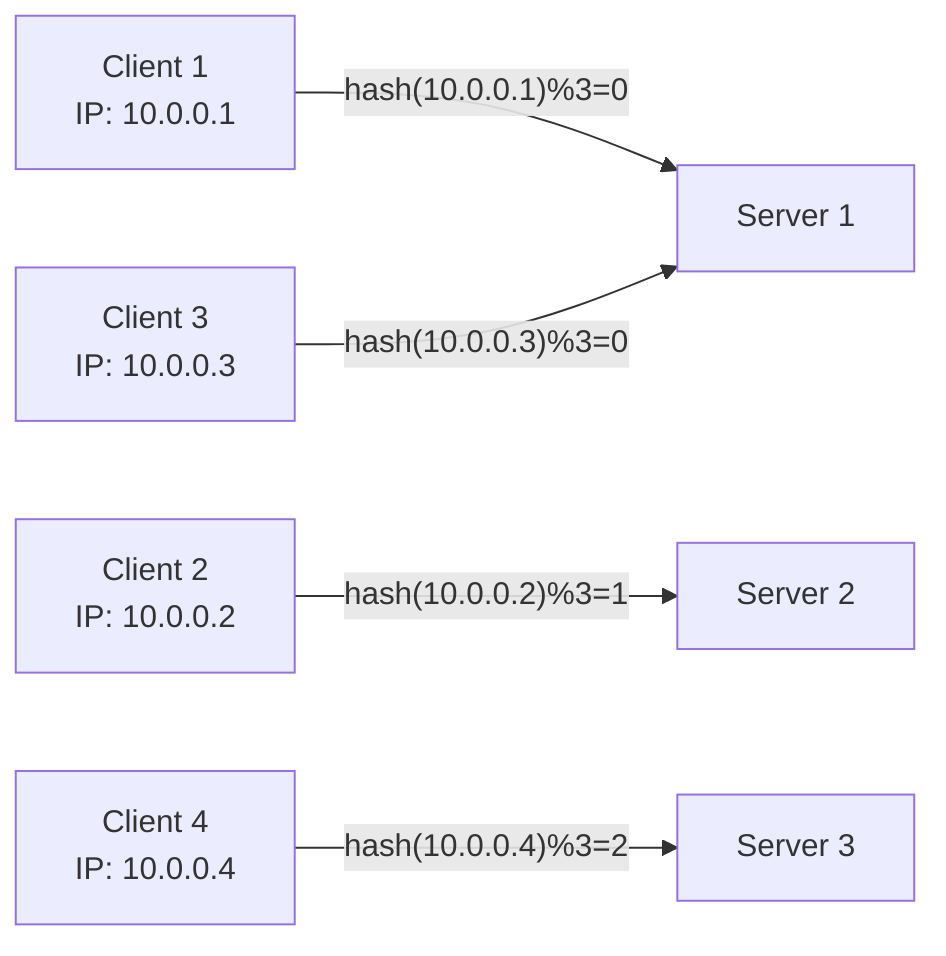

**Когда применять:**
- Stateful-приложения с локальными сессиями (альтернатива sticky cookies)
- Кэш на уровне бэкенда — один пользователь → один сервер → выше hit rate
- `WebSocket`-соединения (долгоживущие)

**Конфигурация в Nginx:**
```nginx
upstream backend {
    ip_hash;
    server backend1.example.com;
    server backend2.example.com;
    server backend3.example.com;
}
```

**Подводные камни:**
- За `NAT` или корпоративным прокси сотни клиентов делят один внешний IP — все они улетят на один бэкенд, и баланс сломается
- Формула `% N` завязана на число серверов: добавили или убрали узел — и почти все клиенты переедут (та же беда, что у наивного хеширования в Q29; лечится `consistent hashing`)
- Алгоритм не смотрит на реальную загрузку — узел с «тяжёлыми» клиентами перегрузится

**В HAProxy** аналог — `balance source`:
```haproxy
backend app_servers
    balance source
    hash-type consistent  # consistent hashing вместо modulo
    server app1 10.0.0.1:8080 check
    server app2 10.0.0.2:8080 check
```

## Q37. Что такое алгоритм Power of Two Choices?

**Power of Two Choices** (`P2C`) — вероятностный алгоритм, который почти даром получает качество, близкое к Least Connections, но без его дорогого требования. «Честный» Least Connections должен знать число соединений на **всех** узлах — в распределённой среде (сервис-меш, где у каждого клиента свой набор данных) это либо невозможно, либо дорого синхронизировать. P2C обходит проблему: он сравнивает не весь пул, а всего двух случайных кандидатов.

**Алгоритм:**
1. Случайно выбрать **два** бэкенда из пула
2. Из этих двух выбрать тот, у которого **меньше активных соединений** (или ниже latency)
3. Отправить запрос на выбранный бэкенд

```java
public ServerInstance selectServer(List<ServerInstance> pool) {
    // Случайно выбираем 2 кандидата
    int idx1 = random.nextInt(pool.size());
    int idx2;
    do {
        idx2 = random.nextInt(pool.size());
    } while (idx2 == idx1 && pool.size() > 1);

    ServerInstance s1 = pool.get(idx1);
    ServerInstance s2 = pool.get(idx2);

    // Выбираем с меньшим числом активных соединений
    return s1.activeConnections() <= s2.activeConnections() ? s1 : s2;
}
```

**Почему работает:** математически доказано, что `P2C` даёт максимальную нагрузку `O(log log N)` при N серверах, тогда как случайный выбор даёт `O(log N / log log N)` — существенное улучшение.

**Применение:** `Envoy` (режим `LEAST_REQUEST`), `Nginx Plus`, `HAProxy` (`leastconn` с randomized selection). Хорошо работает в сервис-меш, где у каждого sidecar-proxy есть локальная статистика соединений.

## Q38. (!) Что такое Maglev hashing?

**Maglev** — алгоритм consistent hashing, разработанный в Google для одноимённого балансировщика (`Maglev` обслуживает Google Search, YouTube, Gmail). Он закрывает две слабости классического кольцевого consistent hashing разом: то даёт перекос нагрузки без россыпи виртуальных узлов и требует `O(log N)` на поиск. Maglev обеспечивает:
- **Равномерное** распределение нагрузки — без виртуальных узлов, встроено в алгоритм
- **Минимальное перемешивание** при добавлении/удалении серверов
- **Быстрый lookup** за `O(1)` — через заранее построенную lookup table

**Принцип (упрощённо):**
1. Строится lookup table размером `M` (простое число, >> числа серверов)
2. Каждый сервер вычисляет два хеша: `offset` и `skip`
3. Заполнение таблицы: каждый сервер «претендует» на позиции по формуле `(offset + i*skip) % M`
4. Lookup: `table[hash(flow) % M]`

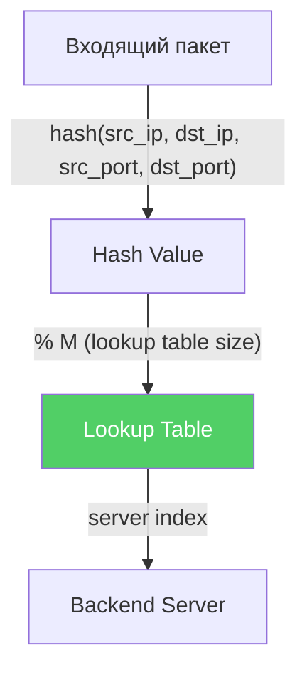

**Сравнение с Ring Consistent Hashing:**

| Критерий | Ring CH | Maglev |
|----------|---------|--------|
| Равномерность | Нет (нужны виртуальные ноды) | Да (встроена) |
| При добавлении сервера | ~1/N трафика перераспределяется | Минимальное перераспределение |
| Скорость lookup | O(log N) | O(1) |
| Использование | `Cassandra`, `Redis Cluster` | Google LB, `Katran` (Facebook) |

**Применение в Open Source:** `Katran` (Facebook/Meta), некоторые реализации `Envoy`.

## Q39. Что такое Anycast балансировка и когда её применять?

**Anycast** — балансировка силами самой сети: один и тот же `IP`-адрес анонсируется по BGP из нескольких географических точек, и маршрутизаторы интернета сами доводят пакеты до **ближайшего** узла. Принципиальное отличие от GeoDNS — решение принимается на сетевом уровне в реальном времени, а не на этапе DNS-резолва, поэтому failover при отказе точки происходит за секунды, без ожидания истечения TTL.

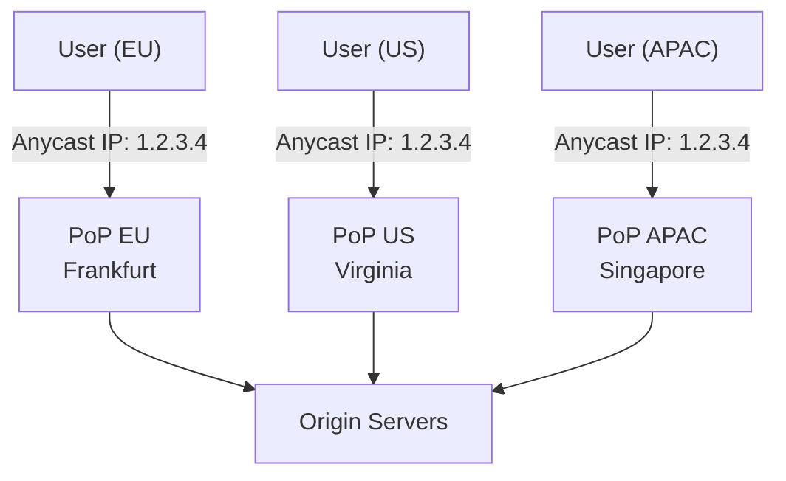

**Как работает:**
1. Три дата-центра анонсируют `1.2.3.4` в BGP
2. Маршрутизаторы интернета направляют пакеты к ближайшему `PoP`
3. При отказе одного `PoP` BGP перенаправляет трафик автоматически

**Когда применять:**
- `CDN` и глобальные сети доставки (Cloudflare, Fastly используют anycast)
- `DNS`-серверы (root DNS работает на anycast)
- `DDoS` mitigation — трафик распределяется по всем PoP
- Глобальные API с требованием минимальной latency

**Ограничения:**
- Не подходит для stateful TCP-сессий (failover = разрыв соединения)
- Нет гарантии, что один клиент всегда попадёт на один PoP (маршруты BGP могут меняться)
- Сложнее отлаживать — куда ушёл конкретный запрос?

**Сравнение с GeoDNS:**
- `GeoDNS` — TTL-based, возможна задержка failover (TTL несколько минут)
- `Anycast` — failover за секунды (BGP конвергенция)

## Q40. Как балансировка нагрузки реализована в Service Mesh (Istio/Envoy)?

В `Service Mesh` балансировка децентрализована: вместо одного балансировщика на входе рядом с **каждым** подом стоит свой sidecar-proxy (`Envoy`), и решение о выборе бэкенда принимается прямо у источника запроса. Конфигурацию всем прокси раздаёт control plane (`Istio`). За счёт этого появляются продвинутые L7-возможности — балансировка с учётом latency, circuit breaker, retries, canary — и всё это без единой строчки в коде приложения.

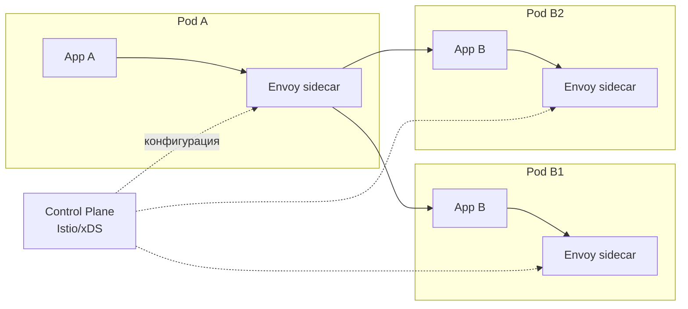

**Алгоритмы балансировки в Envoy:**

| Алгоритм | Описание |
|----------|---------|
| `ROUND_ROBIN` | По умолчанию, равномерно |
| `LEAST_REQUEST` | Power of Two Choices (P2C) |
| `RANDOM` | Случайный выбор |
| `RING_HASH` | Consistent hashing по header/cookie |
| `MAGLEV` | Maglev hashing (stable mapping) |

**Конфигурация через Istio DestinationRule:**

```yaml
apiVersion: networking.istio.io/v1beta1
kind: DestinationRule
metadata:
  name: order-service
spec:
  host: order-service
  trafficPolicy:
    loadBalancer:
      simple: LEAST_REQUEST
    connectionPool:
      tcp:
        maxConnections: 100
      http:
        h2UpgradePolicy: UPGRADE
    outlierDetection:
      consecutive5xxErrors: 5
      interval: 10s
      baseEjectionTime: 30s
      maxEjectionPercent: 50
```

**Преимущества Service Mesh перед классическим LB:**
- Балансировка с учётом реальной latency (не только соединения)
- `Circuit breaker` и `outlier detection` из коробки
- `Traffic shifting` для canary/blue-green без изменения кода
- `Retries` с backoff на уровне proxy

---

## See also

- [Паттерны масштабируемости](scalability-patterns-interview.md) — горизонтальное масштабирование и autoscaling
- [Микросервисы](microservices-interview.md) — service discovery и межсервисная балансировка
- [Распределённые системы](distributed-systems-interview.md) — репликация и отказоустойчивость за балансировщиком
- [Kubernetes](../devops/kubernetes-interview.md) — Ingress, Service и балансировка в кластере
- [Стратегии кэширования](caching-strategies-interview.md) — снижение нагрузки на бэкенды через кэширование
- [Spring Cloud](../frameworks/spring/spring-cloud-interview.md) — Spring Cloud LoadBalancer и интеграция со Service Discovery
- [Паттерны отказоустойчивости](resilience-patterns-interview.md) — Circuit Breaker и health check при балансировке
- [API Gateway](api-gateway-interview.md) — централизованная точка входа для микросервисов
- [BFF Pattern](bff-pattern-interview.md) — Backend-for-Frontend и его место за балансировщиком
- [CAP-теорема](cap-theorem-interview.md) — компромиссы согласованности и доступности
- [Clean Architecture](clean-architecture-interview.md) — слои приложения за балансировщиком
- [Паттерны согласованности](consistency-patterns-interview.md) — eventual consistency между регионами

