# Вопросы на собеседовании: `Балансировка нагрузки`

Балансировка нагрузки — ключевой элемент высоконагруженных систем, обеспечивающий распределение трафика между серверами для повышения доступности, отказоустойчивости и масштабируемости. На собеседованиях по архитектуре и System Design тема возникает практически всегда.

**Балансировка нагрузки** (Load Balancing) — процесс распределения входящих сетевых запросов между несколькими серверами. Покрывает уровни L4/L7, алгоритмы распределения, конкретные инструменты (`Nginx`, `HAProxy`, `Spring Cloud LoadBalancer`), облачные и Kubernetes-решения, а также мониторинг и отказоустойчивость.

## Полезные ссылки

### Официальная документация

- [Nginx — HTTP Load Balancing](https://nginx.org/en/docs/http/load_balancing.html) — базовая конфигурация upstream
- [Nginx — upstream module](https://nginx.org/en/docs/http/ngx_http_upstream_module.html) — полный справочник директив upstream
- [HAProxy Configuration Manual](https://www.haproxy.org/download/2.8/doc/configuration.txt) — конфигурация HAProxy
- [Spring Cloud LoadBalancer](https://docs.spring.io/spring-cloud-commons/reference/spring-cloud-commons/loadbalancer.html) — клиентская балансировка в Spring
- [AWS Elastic Load Balancing](https://docs.aws.amazon.com/elasticloadbalancing/) — документация ALB/NLB/CLB
- [Kubernetes Ingress](https://kubernetes.io/docs/concepts/services-networking/ingress/) — маршрутизация в Kubernetes
- [Introduction to Spring Cloud Load Balancer (Baeldung)](https://www.baeldung.com/spring-cloud-load-balancer) — клиентская балансировка в Spring Cloud
- [Service Discovery in Microservices (Baeldung)](https://www.baeldung.com/cs/service-discovery-microservices) — service discovery и балансировка
- [An Example of Load Balancing with Zuul and Eureka (Baeldung)](https://www.baeldung.com/zuul-load-balancing) — балансировка с Zuul и Eureka
- [Spring Cloud Netflix Eureka (Baeldung)](https://www.baeldung.com/spring-cloud-netflix-eureka) — service registry и client-side LB

## Содержание

- [Полезные ссылки](#полезные-ссылки)
- [See also](#see-also)

**Основы балансировки (L4, L7, TLS, health check)**
- [Q1. (!) Что такое балансировка нагрузки на уровне L4 и L7?](#q1--что-такое-балансировка-нагрузки-на-уровне-l4-и-l7)
- [Q2. Что такое TLS termination и где его делать?](#q2-что-такое-tls-termination-и-где-его-делать)
- [Q3. (!) Что такое health check и зачем он нужен?](#q3--что-такое-health-check-и-зачем-он-нужен)
- [Q4. Что такое sticky session (session affinity) и когда его использовать?](#q4-что-такое-sticky-session-session-affinity-и-когда-его-использовать)
- [Q5. Чем отличается активная балансировка от пассивной?](#q5-чем-отличается-активная-балансировка-от-пассивной)

**Алгоритмы балансировки**
- [Q6. (!) Что такое Round Robin и когда его применять?](#q6--что-такое-round-robin-и-когда-его-применять)
- [Q7. Что такое Weighted Round Robin?](#q7-что-такое-weighted-round-robin)
- [Q8. Что такое Least Connections и когда его применять?](#q8-что-такое-least-connections-и-когда-его-применять)
- [Q9. Что такое Least Response Time?](#q9-что-такое-least-response-time)
- [Q10. Как выбрать алгоритм балансировки для микросервисов?](#q10-как-выбрать-алгоритм-балансировки-для-микросервисов)

**Конфигурация Nginx**
- [Q11. (!) Как настроить upstream балансировку в Nginx?](#q11--как-настроить-upstream-балансировку-в-nginx)
- [Q12. Как настроить health checks и failover в Nginx?](#q12-как-настроить-health-checks-и-failover-в-nginx)
- [Q13. Как настроить rate limiting в Nginx?](#q13-как-настроить-rate-limiting-в-nginx)

**Конфигурация HAProxy**
- [Q14. (!) Как настроить балансировку в HAProxy?](#q14--как-настроить-балансировку-в-haproxy)
- [Q15. Как настроить health checks в HAProxy?](#q15-как-настроить-health-checks-в-haproxy)

**Клиентская балансировка (Spring Cloud LoadBalancer)**
- [Q16. (!) Что такое клиентская и серверная балансировка?](#q16--что-такое-клиентская-и-серверная-балансировка)
- [Q17. Как настроить Spring Cloud LoadBalancer?](#q17-как-настроить-spring-cloud-loadbalancer)
- [Q18. Как реализовать кастомную стратегию балансировки в Spring Cloud?](#q18-как-реализовать-кастомную-стратегию-балансировки-в-spring-cloud)

**Архитектура и стратегии**
- [Q19. Что такое blue-green и canary в контексте балансировки?](#q19-что-такое-blue-green-и-canary-в-контексте-балансировки)
- [Q20. (!) Как обеспечить отказоустойчивость балансировщика?](#q20--как-обеспечить-отказоустойчивость-балансировщика)
- [Q21. Что такое connection draining (deregistration delay)?](#q21-что-такое-connection-draining-deregistration-delay)

**Облачные решения и Kubernetes**
- [Q22. Что такое Layer 4 и Layer 7 load balancer в облаке?](#q22-что-такое-layer-4-и-layer-7-load-balancer-в-облаке)
- [Q23. (!) Как настроить health check в Kubernetes для Pod?](#q23--как-настроить-health-check-в-kubernetes-для-pod)
- [Q24. Что такое Ingress и как он связан с балансировкой?](#q24-что-такое-ingress-и-как-он-связан-с-балансировкой)
- [Q25. Как обеспечить zero-downtime при деплое за балансировщиком?](#q25-как-обеспечить-zero-downtime-при-деплое-за-балансировщиком)

**DNS-based и глобальная балансировка**
- [Q26. (!) Что такое DNS-based load balancing?](#q26--что-такое-dns-based-load-balancing)
- [Q27. Что такое geographic load balancing (global load balancing)?](#q27-что-такое-geographic-load-balancing-global-load-balancing)
- [Q28. Что такое cross-zone load balancing в AWS?](#q28-что-такое-cross-zone-load-balancing-в-aws)

**Продвинутые темы**
- [Q29. Что такое consistent hashing и когда его использовать?](#q29-что-такое-consistent-hashing-и-когда-его-использовать)
- [Q30. Как настроить балансировку для gRPC?](#q30-как-настроить-балансировку-для-grpc)
- [Q31. Как настроить балансировку для WebSocket соединений?](#q31-как-настроить-балансировку-для-websocket-соединений)
- [Q32. Что такое path-based routing в L7 балансировщике?](#q32-что-такое-path-based-routing-в-l7-балансировщике)
- [Q33. Как обеспечить балансировку для stateful приложений?](#q33-как-обеспечить-балансировку-для-stateful-приложений)
- [Q34. (!) Как мониторить и анализировать работу балансировщика?](#q34--как-мониторить-и-анализировать-работу-балансировщика)
- [Q35. Как балансировщик обрабатывает медленные бэкенды?](#q35-как-балансировщик-обрабатывает-медленные-бэкенды)

**Продвинутые алгоритмы и паттерны**
- [Q36. (!) Что такое IP Hash и когда его использовать?](#q36-что-такое-ip-hash-и-когда-его-использовать)
- [Q37. Что такое алгоритм Power of Two Choices?](#q37-что-такое-алгоритм-power-of-two-choices)
- [Q38. (!) Что такое Maglev hashing?](#q38-что-такое-maglev-hashing)
- [Q39. Что такое Anycast балансировка и когда её применять?](#q39-что-такое-anycast-балансировка-и-когда-её-применять)
- [Q40. Как балансировка нагрузки реализована в Service Mesh (Istio/Envoy)?](#q40-как-балансировка-нагрузки-реализована-в-service-mesh-istioenvoy)

---

## Q1. (!) Что такое балансировка нагрузки на уровне L4 и L7?

Балансировка нагрузки работает на разных уровнях модели OSI. Два основных уровня — транспортный (L4) и прикладной (L7).

**L4 (Transport layer)** — балансировка по `IP`-адресу и порту. Балансировщик не анализирует содержимое трафика (`HTTP`, `gRPC`). Работает с `TCP`/`UDP` пакетами напрямую.

**L7 (Application layer)** — балансировка по содержимому запроса: `URL`, заголовки, cookie, тело запроса. Работает с `HTTP`/`HTTPS` и понимает протокол приложения.

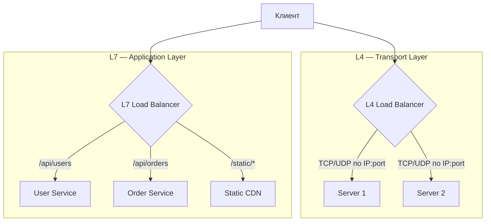

| Критерий | L4 | L7 |
|----------|----|----|
| Анализ содержимого | Нет | Да (`URL`, headers, cookies) |
| Протоколы | Любые (`TCP`/`UDP`) | `HTTP`/`HTTPS` |
| Маршрутизация по пути | Нет | Да |
| `TLS` termination | Нет (pass-through) | Да |
| Латентность | Ниже | Выше (анализ L7) |
| Примеры | `AWS NLB`, `HAProxy` (mode tcp) | `AWS ALB`, `Nginx`, `HAProxy` (mode http) |

**Что хотят услышать на собеседовании:** L4 быстрее, но «слепой» — подходит для `TCP`/`UDP` трафика (БД, `gRPC`). L7 медленнее, но умнее — умеет маршрутизировать по `URL`, заголовкам, делать `TLS` termination. В реальности часто используют оба: L4 для входного трафика + L7 для маршрутизации внутри кластера.


> [!mcq] В чём ключевое отличие L4-балансировщика от L7-балансировщика?
>
> - [x] **A) L4 распределяет трафик по `IP:port` без анализа содержимого, L7 принимает решения по `URL`, заголовкам и cookie**
>     - **Развёрнутое объяснение:** L4 (`AWS NLB`, `HAProxy` mode tcp) работает на транспортном уровне и видит только пятёрку «src/dst IP + порт + протокол». L7 (`Nginx`, `AWS ALB`, `HAProxy` mode http) разбирает прикладной протокол целиком — путь, метод, заголовки, тело — и потому может маршрутизировать `/api/users` на одни поды, а `/static/*` на CDN.
>     - **Пример:** `Nginx` с `location /api/orders { proxy_pass http://orders_pool; }` — это L7-роутинг по `URL`. А `HAProxy` в `mode tcp` для проксирования `PostgreSQL` на `5432` — это L4, ему всё равно, что внутри пакета.
>     - **Когда применять:** L4 — для не-HTTP трафика (`gRPC` без header-routing, `TCP` БД, `UDP` DNS) и максимальной пропускной способности. L7 — когда нужен path-based routing, `TLS` termination, WAF, sticky session по cookie, A/B-тесты по заголовку.
>     - **Подводные камни:** L4 не может делать `TLS` termination без pass-through (сертификаты остаются на бэкендах); L7 добавляет латентность из-за парсинга `HTTP` и требует CPU на TLS. Часто используют двухуровневую схему: L4 на входе для DDoS-устойчивости + L7 внутри для роутинга.
>     - **Связанные вопросы:** [[Q2]] про `TLS` termination, [[Q40]] про L7-балансировку в `Envoy`/Istio.
> - [ ] B) L4 работает только с `HTTP`, а L7 — с `TCP` и `UDP` любыми протоколами
>     - **Что на самом деле:** ровно наоборот. L4 — это `TCP`/`UDP` и любой протокол поверх них (включая `HTTP`, но без его понимания). L7 специализирован именно на `HTTP`/`HTTPS` (и `gRPC`/`WebSocket` как надстройках над `HTTP`).
>     - **Откуда путаница:** многие сталкиваются только с `HTTP` LB (`Nginx`/`ALB`) и считают, что «балансировка = HTTP-роутинг», а L4 ассоциируют с чем-то экзотическим.
>     - **Если бы это было правдой:** не существовало бы `AWS NLB` для `TCP`-БД и `UDP DNS`, и `HAProxy mode tcp` был бы бесполезен — но это базовый сценарий продакшна.
> - [ ] C) L4 и L7 — это просто названия для двух поколений `HAProxy`, разницы в принципе работы нет
>     - **Что на самом деле:** L4/L7 — это уровни модели OSI (transport vs application), а не версии продукта. Один и тот же `HAProxy` умеет работать и как L4 (`mode tcp`), и как L7 (`mode http`) — это режимы, не поколения.
>     - **Откуда путаница:** маркетинговые статьи иногда говорят про «next-gen L7 load balancers», создавая впечатление эволюции.
>     - **Если бы это было правдой:** не было бы смысла в специализированных L4-устройствах вроде `F5 BIG-IP LTM` или `AWS NLB` рядом с L7-`ALB`.
> - [ ] D) L7-балансировщик быстрее L4, потому что использует HTTP-кеширование на уровне ядра
>     - **Что на самом деле:** L4 всегда быстрее L7 — он не парсит `HTTP`, не терминирует `TLS`, обрабатывает пакеты ближе к kernel-space (часто через `XDP`/`DPDK`). L7 вынужденно медленнее из-за разбора прикладного протокола.
>     - **Откуда путаница:** L7 умеет кешировать ответы (`Nginx` `proxy_cache`), и это путают со «скоростью балансировки» — но кеш экономит походы к бэкенду, а не ускоряет сам LB.
>     - **Если бы это было правдой:** `AWS NLB` (L4) не рекламировался бы как «millions of requests per second with ultra-low latency», а `ALB` (L7) — как «feature-rich, but with higher latency».


## Q2. Что такое TLS termination и где его делать?

`TLS termination` — расшифровка `HTTPS`-трафика на балансировщике. К бэкендам трафик идёт уже по `HTTP` (или по mTLS во внутренней сети).

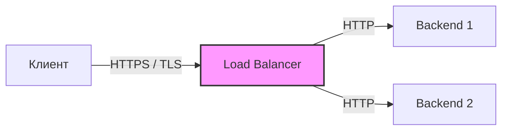

**Плюсы:**
- Централизованное управление сертификатами (одно место обновления)
- Разгрузка бэкендов от шифрования (CPU-intensive операция)
- Возможность инспекции трафика на L7

**Минусы:**
- Трафик между балансировщиком и бэкендом не зашифрован (допустимо во внутренней сети)
- При необходимости `end-to-end` шифрования используют `TLS` re-encryption или `mTLS`

Пример конфигурации `TLS` termination в `Nginx`:

```nginx
server {
    listen 443 ssl;
    server_name api.example.com;

    ssl_certificate     /etc/nginx/ssl/api.example.com.crt;
    ssl_certificate_key /etc/nginx/ssl/api.example.com.key;
    ssl_protocols       TLSv1.2 TLSv1.3;
    ssl_ciphers         HIGH:!aNULL:!MD5;

    location / {
        proxy_pass http://backend_pool;  # HTTP к бэкендам
        proxy_set_header X-Forwarded-Proto $scheme;
        proxy_set_header X-Real-IP $remote_addr;
    }
}
```

В `Kubernetes` TLS termination настраивается через `Ingress`:

```yaml
apiVersion: networking.k8s.io/v1
kind: Ingress
metadata:
  name: api-ingress
spec:
  tls:
    - hosts:
        - api.example.com
      secretName: api-tls-secret
  rules:
    - host: api.example.com
      http:
        paths:
          - path: /
            pathType: Prefix
            backend:
              service:
                name: api-service
                port:
                  number: 80
```


> [!mcq] Что происходит с `HTTPS`-трафиком при `TLS termination` на балансировщике и где это применяют?
>
> - [ ] A) Балансировщик пересылает зашифрованный пакет дальше, и бэкенд сам расшифровывает его ключом, который синхронизируется с LB
>     - **Что на самом деле:** это описание `TLS pass-through`, а не termination. При termination LB сам расшифровывает трафик и дальше идёт `HTTP` (или новый `TLS` при re-encryption). Никакой «синхронизации ключей» с бэкендом нет — у бэкенда нет приватного ключа сертификата вообще.
>     - **Откуда путаница:** pass-through и termination — два режима работы с `TLS` на LB, и их легко перепутать при первом знакомстве.
>     - **Если бы это было правдой:** терялся бы главный плюс termination — централизованное хранение сертификатов, и L7-роутинг был бы невозможен (LB не видит `HTTP`-заголовков в шифрованном пакете).
> - [x] **B) Балансировщик расшифровывает `HTTPS` и шлёт бэкендам уже `HTTP` (или `mTLS` во внутренней сети); сертификаты централизованы на LB**
>     - **Развёрнутое объяснение:** `TLS termination` означает, что зашифрованное соединение «обрывается» на балансировщике. LB имеет приватный ключ и сертификат, расшифровывает запрос, может прочитать `HTTP`-заголовки/URL для L7-роутинга и WAF, а к бэкендам отправляет уже `HTTP` или поднимает новое `TLS`-соединение (re-encryption / `mTLS`) для зашифрованной внутренней сети.
>     - **Пример:** `Nginx` с `listen 443 ssl; ssl_certificate api.example.com.crt; proxy_pass http://backend_pool;` — классический termination. В `Kubernetes` Ingress с `tls.secretName: api-tls-secret` делает то же самое на уровне ingress-контроллера.
>     - **Когда применять:** когда нужен L7-роутинг, WAF, централизованное обновление сертификатов (Let's Encrypt в одном месте), разгрузка CPU бэкендов от шифрования. Между LB и бэкендами в `VPC`/Kubernetes часто оставляют `HTTP` — внутренняя сеть считается доверенной.
>     - **Подводные камни:** трафик LB→бэкенд незашифрован, что недопустимо при compliance-требованиях (PCI DSS, HIPAA) — тогда нужно re-encryption или `mTLS`. Бэкенд не видит оригинальный `client IP` и `scheme` — нужно прокидывать `X-Forwarded-For`/`X-Forwarded-Proto`.
>     - **Связанные вопросы:** [[Q1]] про L7 vs L4, [[Q3]] про health checks (тоже работают через LB).
> - [ ] C) `TLS termination` — это процесс закрытия `TCP`-соединения после получения `RST`-пакета, не связан с шифрованием
>     - **Что на самом деле:** «termination» в `TLS` означает завершение зашифрованного канала на конкретном узле, а не закрытие TCP. RST/FIN — это про разрыв TCP-соединения и к TLS отношения не имеет.
>     - **Откуда путаница:** слово «termination» в сетях используется в разных контекстах (TCP termination, session termination, TLS termination), и их легко смешать.
>     - **Если бы это было правдой:** не было бы директивы `ssl_certificate` в `Nginx`-конфиге для termination — расшифровка никак не связана с разрывом соединения.
> - [ ] D) При termination LB и бэкенд используют один общий `TLS`-сеанс, и бэкенд видит оригинальный сертификат клиента
>     - **Что на самом деле:** TLS-сеанс обрывается на LB. Между LB и бэкендом — отдельный канал (`HTTP` или новый `TLS`). Клиентский сертификат (mTLS от клиента) бэкенд не получит автоматически — его нужно прокидывать через заголовки (`X-Client-Cert`, `X-SSL-Client-S-DN`).
>     - **Откуда путаница:** в режиме pass-through бэкенд действительно видит оригинальный TLS, и эту модель ошибочно переносят на termination.
>     - **Если бы это было правдой:** не нужны были бы заголовки `X-Forwarded-*` и `proxy_set_header` — но они стандартная практика именно потому, что бэкенд не имеет прямого доступа к клиентскому TLS-сеансу.


## Q3. (!) Что такое health check и зачем он нужен?

`Health check` — периодическая проверка состояния бэкенда. Нерабочие узлы автоматически исключаются из пула; после восстановления — возвращаются.

**Типы health checks:**
- **HTTP** — `GET /health`, ожидание кода `200`
- **TCP** — проверка доступности порта (соединение устанавливается/нет)
- **gRPC** — через `gRPC Health Checking Protocol`
- **Command/exec** — выполнение команды внутри контейнера

**Конфигурация health check в Nginx:**

```nginx
upstream backend_pool {
    zone backend_pool 64k;

    server backend1.example.com:8080 max_fails=3 fail_timeout=30s;
    server backend2.example.com:8080 max_fails=3 fail_timeout=30s;
    server backend3.example.com:8080 max_fails=3 fail_timeout=30s backup;
}
```

> `max_fails=3` — узел исключается после 3 неудачных запросов; `fail_timeout=30s` — через 30 секунд повторная попытка. `backup` — резервный сервер, получает трафик только при недоступности основных.

**Конфигурация health check в HAProxy:**

```haproxy
backend app_servers
    option httpchk GET /health
    http-check expect status 200

    server app1 10.0.0.1:8080 check inter 5s fall 3 rise 2
    server app2 10.0.0.2:8080 check inter 5s fall 3 rise 2
    server app3 10.0.0.3:8080 check inter 5s fall 3 rise 2
```

> `inter 5s` — интервал проверки; `fall 3` — исключить после 3 неудач; `rise 2` — вернуть после 2 успехов.

**Конфигурация health check в Kubernetes:**

```yaml
containers:
  - name: app
    image: myapp:latest
    ports:
      - containerPort: 8080
    livenessProbe:
      httpGet:
        path: /actuator/health/liveness
        port: 8080
      initialDelaySeconds: 30
      periodSeconds: 10
      failureThreshold: 3
    readinessProbe:
      httpGet:
        path: /actuator/health/readiness
        port: 8080
      initialDelaySeconds: 10
      periodSeconds: 5
      failureThreshold: 2
    startupProbe:
      httpGet:
        path: /actuator/health
        port: 8080
      failureThreshold: 30
      periodSeconds: 2
```

**Важно:** endpoint health check должен быть быстрым и не зависеть от внешних сервисов. В Spring Boot используйте `Spring Boot Actuator` с разделением на liveness и readiness группы.


> [!mcq] Зачем балансировщику нужен health check и что произойдёт, если его отключить?
>
> - [ ] A) Health check нужен только для логирования аптайма; на маршрутизацию запросов не влияет, его можно безопасно отключить
>     - **Что на самом деле:** health check — это активная часть control plane: его результат напрямую определяет, попадает ли узел в пул для маршрутизации. В `Nginx` `max_fails=3` исключает узел из upstream; в `HAProxy` `fall 3` помечает сервер как DOWN; в Kubernetes readinessProbe убирает Pod из Service Endpoints.
>     - **Откуда путаница:** в дашбордах метрик health-status действительно используется для алертов про аптайм, и это видимая часть. Но «невидимая» — это исключение мёртвых узлов из роутинга.
>     - **Если бы это было правдой:** при падении пода/ВМ трафик продолжал бы идти на мёртвый узел, клиенты получали бы 502/connection refused, и SLO рушилось бы при любой замене инстанса.
> - [ ] B) Health check нужен, чтобы балансировщик автоматически масштабировал бэкенды (создавал новые узлы при высокой нагрузке)
>     - **Что на самом деле:** автомасштабирование — это задача `HPA`/`Cluster Autoscaler`/`ASG`, а не балансировщика. Health check лишь определяет «жив/мёртв», а решения о добавлении инстансов принимаются по метрикам CPU/RPS отдельной control plane.
>     - **Откуда путаница:** оба механизма работают вместе (новый под создаётся через HPA → readiness стал OK → LB добавляет его в пул), и их функции склеиваются в восприятии.
>     - **Если бы это было правдой:** в `Nginx`/`HAProxy` была бы директива «scale_up_when_unhealthy» — её нет, потому что LB не управляет жизненным циклом бэкендов.
> - [x] **C) Health check периодически проверяет состояние бэкенда (HTTP `/health`, TCP-порт, gRPC); нерабочие узлы исключаются из пула, восстановившиеся возвращаются обратно**
>     - **Развёрнутое объяснение:** LB отправляет проверочные запросы (`GET /health` для `HTTP`, `connect()` для `TCP`, `grpc.health.v1.Health/Check` для `gRPC`) с настроенным интервалом. После N подряд неудачных ответов узел помечается как unhealthy и исключается из роутинга; после M подряд успешных — возвращается. Это даёт автоматическую устойчивость к падениям без вмешательства человека.
>     - **Пример:** `HAProxy` `option httpchk GET /health; server app1 10.0.0.1:8080 check inter 5s fall 3 rise 2` — проверка каждые 5 секунд, исключить после 3 неудач, вернуть после 2 успехов. В Kubernetes — `livenessProbe`/`readinessProbe`/`startupProbe` на разных стадиях жизни Pod.
>     - **Когда применять:** всегда в production. Разделяйте liveness (нужен ли рестарт), readiness (готов ли принимать трафик) и startup (для долгого warmup, например Spring Boot). Эндпоинт `/health` должен быть быстрым и не зависеть от внешних сервисов — иначе падение БД каскадом убьёт все поды через liveness.
>     - **Подводные камни:** слишком агрессивные probe (interval 1s, threshold 1) дают false positive при GC-паузах; слишком мягкие (interval 30s, fall 5) — клиенты долго получают ошибки. Health check на «глубокий» endpoint, проверяющий БД, превращает любой сбой БД в массовый рестарт подов — обычно делают shallow `/liveness` и deep `/readiness`.
>     - **Связанные вопросы:** [[Q1]] про L4/L7 (health checks на разных уровнях), [[Q2]] про `TLS` (для HTTPS health check), [[Q4]] про sticky sessions (когда узел upbecomes unhealthy, sticky-привязка теряется).
> - [ ] D) Health check работает только для базы данных, для веб-сервисов используется только `keepalive`
>     - **Что на самом деле:** health check универсален — HTTP-сервисы, gRPC, TCP-сервисы, БД, очереди — все имеют свои health checks. `keepalive` — это про переиспользование TCP-соединений (TCP keepalive / HTTP keep-alive), он не проверяет работоспособность приложения, только живость TCP-канала.
>     - **Откуда путаница:** `keepalive`-пакеты иногда называют «health-check на уровне TCP», но они проверяют только соединение, а не приложение (БД может висеть, но TCP-keepalive отвечать).
>     - **Если бы это было правдой:** в `Nginx`/`HAProxy`/`Envoy` не существовало бы директив `httpchk`/`option httpchk`/`health_checks` — но они базовая часть конфигурации любого LB.


## Q4. Что такое sticky session (session affinity) и когда его использовать?

`Sticky session` — запросы одного клиента (по cookie или `IP`) направляются на один и тот же бэкенд. Нужен, когда состояние сессии хранится в памяти приложения.

**Реализация в Nginx:**

```nginx
upstream backend_pool {
    ip_hash;  # привязка по IP клиента
    server backend1.example.com:8080;
    server backend2.example.com:8080;
    server backend3.example.com:8080;
}

# Альтернатива — через cookie (Nginx Plus / OpenResty):
upstream backend_pool_cookie {
    sticky cookie srv_id expires=1h domain=.example.com path=/;
    server backend1.example.com:8080;
    server backend2.example.com:8080;
}
```

**Реализация в Kubernetes:**

```yaml
apiVersion: v1
kind: Service
metadata:
  name: my-service
spec:
  selector:
    app: my-app
  sessionAffinity: ClientIP
  sessionAffinityConfig:
    clientIP:
      timeoutSeconds: 3600
  ports:
    - port: 80
      targetPort: 8080
```

| Метод | Плюсы | Минусы |
|-------|-------|--------|
| `ip_hash` | Просто, без cookie | Не работает за `NAT` |
| Cookie | Надёжнее, гранулярнее | Требует поддержки cookie |

**Рекомендация:** избегать sticky session. Предпочтительно stateless приложение с общим хранилищем сессий в [Redis](../databases/redis-interview.md) или `Memcached`. Sticky session — только для legacy систем, где невозможно вынести состояние.


> [!mcq] В каком сценарии sticky session оправдан как временное решение?
>
> - [ ] A) Полностью stateless `REST API` за `Nginx` с шаблоном `12-factor`
>   - Почему неверно: при stateless-архитектуре любой инстанс обработает запрос — sticky session даст только лишнюю связанность и неравномерную нагрузку.
>   - Последствие: на rolling-update часть подов окажется перегружена «приклеенными» клиентами, остальные простаивают — деградация p95 без видимой причины.
>
> - [ ] B) Современный микросервис, где состояние сессии вынесено в `Redis`
>   - Почему неверно: общее внешнее хранилище сессий — антипод sticky session; любые инстансы взаимозаменяемы и привязка по `IP`/cookie бесполезна.
>   - Последствие: при отказе «приклеенного» пода клиент потеряет логин, хотя в `Redis` сессия есть — лишний инцидент в support.
>
> - [ ] C) `Kubernetes`-сервис с `sessionAffinity: None` и горизонтальным автоскейлингом
>   - Почему неверно: `sessionAffinity: None` явно отключает «прилипание», а `HPA` рассчитан на равномерное распределение между подами.
>   - Последствие: попытка включить `ClientIP`-affinity сломает балансировку при автоскейлинге — новые поды долго не получат трафик.
>
> - [x] D) Legacy-приложение, хранящее `HttpSession` в памяти JVM, пока идёт миграция на внешнее хранилище
>   - Почему правильно: sticky session — компромисс именно для in-memory `HttpSession`/`@SessionScope`, когда переписать код сразу нельзя; `ip_hash` или sticky cookie сохраняют пользователя на одном инстансе до выноса сессии в `Redis`.
>   - Что произойдёт: пользователь не теряет корзину/логин при балансировке, команда выигрывает время на рефакторинг к stateless.
>   - Метрика успеха: `session_lost_total` стремится к нулю, p95 стабилен; после миграции в `Redis` sticky отключается.
>   - Best practice: фиксировать sticky session как явный технический долг с дедлайном и тикетом на вынос состояния — иначе он остаётся навсегда.

## Q5. Чем отличается активная балансировка от пассивной?

**Активная** — балансировщик сам проверяет бэкенды (health check `GET /health` каждые N секунд) и проактивно исключает нерабочие. Быстрее выявляет сбои.

**Пассивная** — балансировщик считает узел нерабочим только после неудачных ответов на реальные запросы клиентов. Проще в настройке, но клиент может получить ошибку до исключения узла.

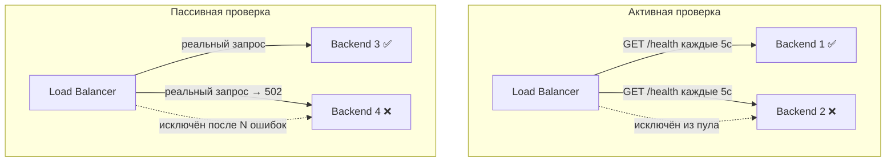

**Практика в Kubernetes:** `livenessProbe` и `readinessProbe` — активные проверки. При провале `readinessProbe` под исключается из `Service` и не получает трафик. При провале `livenessProbe` — под перезапускается.

Для критичных сервисов предпочтительна **активная** проверка с интервалом 5-10 секунд и порогом 2-3 неудачи. Метрики (число healthy/unhealthy бэкендов) экспортировать в `Prometheus` для алертинга — подробнее в [вопросах по мониторингу](../monitoring/metrics-tracing-interview.md).


> [!mcq] В чём ключевое отличие активного health check от пассивного на балансировщике?
>
> - [x] A) Активный сам периодически опрашивает бэкенды (`GET /health`), пассивный реагирует только на ошибки реальных клиентских запросов
>   - Почему правильно: активная проверка делает синтетический probe по расписанию и исключает узел до того, как клиент столкнётся с ошибкой; пассивная — ждёт, пока бэкенд начнёт отдавать 5xx/timeouts на боевом трафике, и только тогда помечает его как unhealthy.
>   - Что произойдёт: при отказе пода активный LB снимет трафик за интервал probe (5–10 с), пассивный — после N клиентских ошибок, которые увидят пользователи.
>   - Метрика успеха: `error_rate` во время failover близок к нулю при активной проверке; `mean_time_to_eject` ≈ interval × failure_threshold.
>   - Best practice: для критичных сервисов — активные `readinessProbe`/`livenessProbe` с интервалом 5–10 с и порогом 2–3 неудачи; пассивная — как cheap fallback для legacy.
>
> - [ ] B) Активный требует отдельного агента на каждом бэкенде, пассивный работает без агентов
>   - Почему неверно: активный health check — это HTTP/TCP-запрос балансировщика к стандартному эндпоинту (`/health`, `/actuator/health`), никакого специального агента не нужно.
>   - Последствие: команда начнёт городить sidecar-агенты «для активных проверок», усложняя деплой и обслуживание без выигрыша.
>
> - [ ] C) Активный балансировщик распределяет трафик случайно, пассивный — по `Round Robin`
>   - Почему неверно: активность/пассивность относится исключительно к способу обнаружения сбоев, а не к алгоритму распределения трафика.
>   - Последствие: путаница терминов приводит к неверным решениям в архитектуре — например, выбору алгоритма «по умолчанию» вместо осознанного.
>
> - [ ] D) Активная проверка означает, что приложение само сообщает балансировщику о готовности через push, пассивная — pull
>   - Почему неверно: модель ровно обратная — балансировщик pull-ит health (`GET /health`); push используется в service registry (например, `Eureka` heartbeat), но это не про L4/L7 health checks.
>   - Последствие: попытка построить «push health» поверх `Nginx`/`HAProxy` — лишний код и кастомный exporter вместо стандартного probe.

## Q6. (!) Что такое Round Robin и когда его применять?

`Round Robin` — запросы распределяются по узлам по очереди циклически: 1-й запрос — узел A, 2-й — B, 3-й — C, 4-й — снова A.

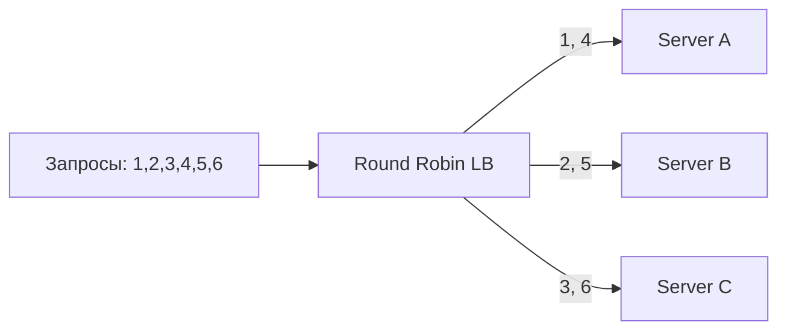

**Когда применять:**
- Узлы одинаковой производительности
- Короткие stateless запросы (типичные `REST API`)
- Нет необходимости учитывать текущую загрузку

**Конфигурация в Nginx** (используется по умолчанию):

```nginx
upstream backend_pool {
    server backend1.example.com:8080;
    server backend2.example.com:8080;
    server backend3.example.com:8080;
}
```

**Конфигурация в HAProxy:**

```haproxy
backend app_servers
    balance roundrobin
    server app1 10.0.0.1:8080 check
    server app2 10.0.0.2:8080 check
    server app3 10.0.0.3:8080 check
```

**Недостатки:** не учитывает текущую загрузку узлов. Если один узел обрабатывает тяжёлый запрос, он всё равно получит следующий по очереди.


> [!mcq] В каком сценарии `Round Robin` — рабочий выбор, а в каком он даст неравномерную нагрузку?
>
> - [ ] A) Идеален для `WebSocket`-чата с долгими соединениями: распределяет коннекты «по очереди»
>   - Почему неверно: `Round Robin` не учитывает текущее число активных соединений; при длинных `WebSocket`-сессиях узлы быстро расходятся по нагрузке (один забит, другой пуст).
>   - Последствие: «горячие» инстансы упираются в лимит сокетов и начинают рвать соединения, на остальных простаивает CPU.
>
> - [x] B) Подходит для коротких stateless `REST`-запросов на однородных бэкендах одинаковой мощности
>   - Почему правильно: `Round Robin` циклически шлёт запросы (1→A, 2→B, 3→C, 4→A); при равной производительности и коротком времени обработки нагрузка распределяется почти равномерно — это default в `Nginx upstream` и `HAProxy balance roundrobin`.
>   - Что произойдёт: загрузка CPU/RPS по подам близка; deploy/scaling предсказуем, p95 стабилен.
>   - Метрика успеха: разброс RPS между подами в пределах ±5–10%; `active_connections` примерно равны.
>   - Best practice: использовать как стартовый алгоритм для stateless микросервисов; переключаться на `least_conn`/`least_time` только при доказанной неравномерности нагрузки.
>
> - [ ] C) Лучший выбор для бэкендов с разной производительностью (старый сервер + два новых)
>   - Почему неверно: `Round Robin` шлёт одинаковое число запросов всем — слабый узел захлебнётся, мощные простаивают; для разнородных узлов нужен `Weighted Round Robin`.
>   - Последствие: латентность p95 растёт из-за «узкого» узла, error rate именно на нём, ложные срабатывания health checks.
>
> - [ ] D) Гарантирует, что один клиент всегда попадёт на один и тот же бэкенд
>   - Почему неверно: это свойство sticky session / `ip_hash`, а не `Round Robin`; обычный RR при каждом запросе выбирает следующий узел по кругу.
>   - Последствие: команда полагается на «прилипание», которого нет — in-memory кэш или `HttpSession` начнут терять состояние между запросами.

## Q7. Что такое Weighted Round Robin?

`Weighted Round Robin` — каждому узлу задаётся вес; узлы с большим весом получают пропорционально больше запросов. Применяют при разной производительности узлов или для постепенного ввода нового инстанса (canary deploy).

**Конфигурация в Nginx:**

```nginx
upstream backend_pool {
    server backend1.example.com:8080 weight=5;  # мощный сервер
    server backend2.example.com:8080 weight=3;  # средний
    server backend3.example.com:8080 weight=1;  # новый / canary
}
```

**Конфигурация в HAProxy:**

```haproxy
backend app_servers
    balance roundrobin
    server app1 10.0.0.1:8080 weight 5 check
    server app2 10.0.0.2:8080 weight 3 check
    server app3 10.0.0.3:8080 weight 1 check
```

В примере выше за 9 запросов: A получит 5, B получит 3, C получит 1. Удобно для [canary-деплоев](../cicd/deployment-strategies-interview.md): новому инстансу ставят вес 1, постепенно увеличивая.


> [!mcq] Зачем в Weighted Round Robin задаются разные веса для серверов?
>
> - [ ] **A.** Чтобы каждый сервер получал строго одинаковое число запросов независимо от веса.
>
>     Это описание обычного `Round Robin` без весов. Сам смысл WRR в том, чтобы распределение было **пропорциональным весу**, а не равномерным.
>
>     ❌ Последствие: на слабый сервер пойдёт столько же запросов, сколько на мощный, латентность p99 деградирует на слабом узле.
>
> - [ ] **B.** Чтобы вес определял приоритет — сервер с большим весом обслуживается первым, остальные ждут.
>
>     Путаница с **приоритетной очередью**. WRR не делает приоритизацию запросов — все запросы равны, балансировщик просто распределяет их пропорционально.
>
>     ❌ Последствие: ожидание «приоритета» в очереди создаст ложную модель — на деле все серверы работают параллельно.
>
> - [x] **C.** Чтобы пропорция запросов между серверами соответствовала их относительной производительности или роли (например, canary).
>
>     Корректное описание. За цикл из суммарного веса (`5+3+1=9`) мощный сервер получает 5/9 запросов, средний — 3/9, новый/canary — 1/9. Это позволяет учитывать **разную производительность** узлов и **постепенно вводить новый инстанс** ([canary deploy](../cicd/deployment-strategies-interview.md)).
>
>     **Конфигурация в Nginx:**
>     ```nginx
>     upstream backend {
>         server s1 weight=5;  # мощный
>         server s2 weight=3;  # средний
>         server s3 weight=1;  # canary
>     }
>     ```
>
>     **Когда выбирать:** гетерогенный парк серверов; постепенный rollout новой версии; миграция трафика между ДЦ.
>
> - [ ] **D.** Чтобы вес контролировал число активных соединений на сервере — большой вес держит больше connections.
>
>     Это описание **Least Connections**, а не WRR. WRR не смотрит на текущее число соединений, он распределяет по фиксированной пропорции.
>
>     ❌ Последствие: при длинных WebSocket-сессиях WRR забьёт слабый сервер своей долей и не среагирует — для такой нагрузки нужен `least_conn`.

## Q8. Что такое Least Connections и когда его применять?

`Least Connections` — запрос направляется на узел с наименьшим числом активных соединений. Подходит для длинных сессий (`WebSocket`, потоковая передача, тяжёлые запросы), когда `Round Robin` даёт неравномерную нагрузку.

**Конфигурация в Nginx:**

```nginx
upstream backend_pool {
    least_conn;
    server backend1.example.com:8080;
    server backend2.example.com:8080;
    server backend3.example.com:8080;
}
```

**Конфигурация в HAProxy:**

```haproxy
backend app_servers
    balance leastconn
    server app1 10.0.0.1:8080 check
    server app2 10.0.0.2:8080 check
    server app3 10.0.0.3:8080 check
```

**Когда использовать вместо Round Robin:**
- Запросы значительно различаются по длительности
- `WebSocket` / long-polling соединения
- Тяжёлые отчёты или пакетная обработка


> [!mcq] Когда алгоритм Least Connections предпочтительнее Round Robin?
>
> - [ ] **A.** Когда все запросы короткие и одинаковые по длительности.
>
>     В таком сценарии `Round Robin` уже даёт равномерную нагрузку — отслеживать число соединений нет смысла, это лишний overhead на балансировщике.
>
>     ❌ Последствие: усложнение без выгоды; для коротких stateless HTTP-запросов проще и быстрее обычный RR.
>
> - [ ] **B.** Когда нужно учитывать географическую близость клиента к серверу.
>
>     Это задача **GeoDNS** или `least_time` (latency-based), а не Least Connections. LC смотрит только на счётчик активных соединений, не на сеть.
>
>     ❌ Последствие: на запрос из Европы балансировщик может выбрать «свободный» сервер в США — пользователь получит лишние 150 ms RTT.
>
> - [ ] **C.** Когда требуется привязать клиента к одному и тому же серверу на всю сессию.
>
>     Это **sticky session / session affinity**, а не Least Connections. LC намеренно перераспределяет нагрузку между всеми узлами.
>
>     ❌ Последствие: in-memory сессия на старом сервере «потеряется», логика, ожидающая локального state, сломается.
>
> - [x] **D.** Когда запросы существенно различаются по длительности — длинные WebSocket-соединения, тяжёлые отчёты, стриминг.
>
>     Правильный кейс. `Round Robin` распределяет **счётчик запросов**, а не реальную нагрузку — если один сервер случайно получил несколько долгих WebSocket-соединений, он будет перегружен. `Least Connections` направляет новый запрос туда, где **меньше всего активных connections** прямо сейчас.
>
>     **Конфигурация Nginx:**
>     ```nginx
>     upstream backend {
>         least_conn;
>         server s1; server s2; server s3;
>     }
>     ```
>
>     **Применять для:** WebSocket / long-polling; тяжёлые отчёты или batch-эндпоинты; smtp/streaming-протоколов с разной длительностью.
>
>     **Ограничение:** не учитывает CPU/RAM сервера — только число соединений. Для гетерогенного парка комбинируйте с весами (`least_conn` + `weight`).

## Q9. Что такое Least Response Time?

`Least Response Time` — запрос направляется на узел с наименьшей задержкой ответа (или комбинацией задержки и числа соединений). Минимизирует латентность для клиента.

**Реализация:** `HAProxy` поддерживает аналог через `balance hdr` с health check latency. `AWS ALB` выбирает таргеты с наименьшим числом активных запросов. `Nginx Plus` предоставляет директиву `least_time`:

```nginx
# Nginx Plus (коммерческая версия)
upstream backend_pool {
    least_time header;  # по времени первого байта ответа
    server backend1.example.com:8080;
    server backend2.example.com:8080;
}
```

**Когда применять:** когда узлы расположены в разных дата-центрах или имеют разную производительность, и цель — минимальная p95/p99 латентность.


> [!mcq] По какому критерию Least Response Time выбирает целевой узел?
>
> - [x] **A.** По наименьшему времени ответа (или комбинации latency и активных соединений) с целью минимизировать p95/p99 задержки клиента.
>
>     Корректно. Алгоритм отслеживает **время ответа** (`TTFB` или полное время) и направляет запрос на сервер с минимальной задержкой. Это критично, когда узлы расположены в разных ДЦ или имеют разную производительность — `Round Robin` и `Least Connections` этого не учитывают.
>
>     **Реализации:**
>     - `Nginx Plus`: директива `least_time header | last_byte`.
>     - `AWS ALB`: выбирает таргеты с наименьшим числом активных запросов (приближение к LRT).
>     - `HAProxy`: косвенно через `balance leastconn` с health-check latency.
>
>     ```nginx
>     # Nginx Plus
>     upstream backend {
>         least_time header;  # минимум TTFB
>         server s1; server s2;
>     }
>     ```
>
>     **Когда применять:** разные ДЦ; гетерогенные машины; жёсткий SLA по p95/p99 латентности.
>
> - [ ] **B.** По наименьшему числу активных соединений, без учёта времени ответа.
>
>     Это **Least Connections**, а не Least Response Time. LC смотрит на counter соединений и игнорирует фактическую latency узла — медленный сервер с малым числом connections всё равно получит запрос.
>
>     ❌ Последствие: на «свободный, но тормозящий» сервер пойдёт трафик, p99 латентность вырастет.
>
> - [ ] **C.** По хэшу IP-адреса клиента для привязки запросов к одному серверу.
>
>     Это **IP Hash / Consistent Hashing**, нужен для sticky-сессий и cache-locality. LRT не использует хэширование — он динамически выбирает быстрейший узел.
>
>     ❌ Последствие: при IP Hash клиент с медленного маршрута будет вечно прибит к медленному серверу.
>
> - [ ] **D.** Случайным образом среди серверов, прошедших health check.
>
>     Это **Random** алгоритм (есть в HAProxy `balance random`). Он не оптимизирует латентность, а полагается на закон больших чисел.
>
>     ❌ Последствие: при малом RPS случайный выбор регулярно попадёт на самый медленный узел — нет защиты от деградации p99.

## Q10. Как выбрать алгоритм балансировки для микросервисов?

Выбор зависит от типа нагрузки, требований к латентности и архитектуры:

| Сценарий | Рекомендуемый алгоритм | Почему |
|----------|----------------------|--------|
| Короткие `REST` запросы, stateless | `Round Robin` | Простота, равномерность |
| Разная мощность серверов | `Weighted Round Robin` | Учёт производительности |
| Длинные запросы, `WebSocket` | `Least Connections` | Учёт текущей загрузки |
| Минимальная латентность критична | `Least Response Time` | Выбор самого быстрого узла |
| Кэширование, sharding | `Consistent Hashing` | Локальность данных |
| Обязательное состояние на узле | `Sticky Session` | Привязка клиента к узлу |

**Рекомендация:** для [микросервисов](microservices-interview.md) — stateless приложение + `Round Robin`. Если нужна более умная балансировка — `Least Connections`. Sticky session — крайняя мера; лучше вынести состояние в [Redis](../databases/redis-interview.md).


> [!mcq] Какой алгоритм балансировки выбрать для stateless REST-микросервиса с одинаковыми по мощности подами?
>
> - [ ] A) `Least Response Time` — он всегда даёт минимальную латентность и не имеет недостатков
>     - **Что на самом деле:** `Least Response Time` хорош, когда есть реальная разница в скорости узлов (разный hardware, разные регионы), но для одинаковых stateless-подов он даёт ту же картину, что и Round Robin, плюс дополнительные накладные расходы на сбор метрик ответа и алгоритм взвешивания.
>     - **Откуда путаница:** название звучит как «всегда самый быстрый», и кажется, что лучше выбирать его «на всякий случай».
>     - **Если бы это было правдой:** все балансировщики использовали бы `Least Response Time` по умолчанию, но в реальности `Round Robin` — дефолт в `Nginx`/`HAProxy`, а `Least Response Time` есть только в коммерческих сборках (`Nginx Plus`).
> - [x] **B) `Round Robin` — простой, равномерный, не требует состояния и хорошо ложится на stateless под одинаковой мощности**
>     - **Развёрнутое объяснение:** для stateless REST с короткими запросами и идентичными подами `Round Robin` оптимален: трафик распределяется равномерно, балансировщику не нужно хранить счётчики соединений или метрики латентности, а каждый запрос можно обслужить на любом узле. Это дефолт в `Nginx upstream` и `HAProxy` именно из-за такой типичной микросервисной нагрузки.
>     - **Пример:** `upstream api { server pod1; server pod2; server pod3; }` без явного указания алгоритма — Nginx использует Round Robin и равномерно ротирует поды. Для Kubernetes Service `ClusterIP` kube-proxy в режиме iptables даёт фактически Round Robin между подами.
>     - **Когда применять:** короткие REST-запросы (`<100ms`), stateless приложение, одинаковые поды по CPU/RAM, отсутствие sticky session. Это «золотой стандарт» для микросервисов в Kubernetes.
>     - **Подводные камни:** Round Robin плох, если запросы сильно отличаются по длительности (один тянет 5s, остальные — 50ms): «толстые» запросы могут сконцентрироваться на одном узле. В таком случае стоит переключиться на `Least Connections`. Также Round Robin игнорирует фактическую загрузку — если под уже на 100% CPU, ему всё равно прилетит свой запрос.
>     - **Связанные вопросы:** [[Q6]] про сам Round Robin, [[Q8]] про Least Connections как альтернативу.
> - [ ] C) `Sticky Session` по cookie — это единственный надёжный способ балансировки в production
>     - **Что на самом деле:** sticky session нужен только когда состояние пользователя живёт **на узле** (in-memory session, локальный кэш). Для stateless сервиса sticky session — антипаттерн: он мешает равномерному распределению и ломает graceful rollout (часть юзеров остаётся «прибита» к старому поду).
>     - **Откуда путаница:** в монолитах с server-side session sticky был необходим, и эта привычка переносится на микросервисы по инерции.
>     - **Если бы это было правдой:** Kubernetes не использовал бы Round Robin как дефолт в Service, а вся документация Nginx не начиналась бы со слов «по умолчанию round-robin, и этого обычно достаточно».
> - [ ] D) `Consistent Hashing` по `client_id` — потому что он гарантирует «один клиент = один под» во всех сценариях
>     - **Что на самом деле:** `Consistent Hashing` нужен для **локальности данных** (кэширование, sharding), а не для обычных stateless REST. Он привязывает клиента к поду, что снижает hit-rate локальных кэшей при перебалансировке только частично, но при этом ломает равномерность нагрузки, если распределение клиентов неравномерно.
>     - **Откуда путаница:** consistent hashing звучит как «умный round-robin» и часто упоминается в архитектурных гайдах по Cassandra/Memcached.
>     - **Если бы это было правдой:** не нужен был бы Redis для общего кэша — каждый сервис распределял бы свои данные через hashing на инстансах, но это работает только в специфичных кэш-сценариях, а не для обычного API.

## Q11. (!) Как настроить upstream балансировку в Nginx?

Базовая конфигурация `Nginx` upstream с различными алгоритмами и параметрами:

```nginx
# Определение upstream-пула серверов
upstream api_backend {
    # Алгоритм балансировки (по умолчанию round-robin)
    least_conn;

    # Зона разделяемой памяти для worker-процессов
    zone api_backend 64k;

    server 10.0.0.1:8080 weight=5 max_fails=3 fail_timeout=30s;
    server 10.0.0.2:8080 weight=3 max_fails=3 fail_timeout=30s;
    server 10.0.0.3:8080 weight=1 max_fails=3 fail_timeout=30s;
    server 10.0.0.4:8080 backup;  # резервный сервер

    keepalive 32;  # HTTP keep-alive к бэкендам
}

server {
    listen 80;
    server_name api.example.com;

    location / {
        proxy_pass http://api_backend;

        # Заголовки для бэкенда
        proxy_set_header Host $host;
        proxy_set_header X-Real-IP $remote_addr;
        proxy_set_header X-Forwarded-For $proxy_add_x_forwarded_for;
        proxy_set_header X-Forwarded-Proto $scheme;

        # Таймауты
        proxy_connect_timeout 5s;
        proxy_read_timeout 30s;
        proxy_send_timeout 10s;

        # Retry при ошибках — перенаправить на следующий upstream
        proxy_next_upstream error timeout http_502 http_503;
        proxy_next_upstream_tries 2;

        # Keep-alive к upstream
        proxy_http_version 1.1;
        proxy_set_header Connection "";
    }
}
```

**Ключевые параметры:**
- `weight` — вес сервера для распределения
- `max_fails` / `fail_timeout` — пассивный health check
- `backup` — резервный сервер (трафик только при недоступности основных)
- `proxy_next_upstream` — автоматический retry на следующий сервер при ошибке
- `keepalive` — пул persistent connections к бэкендам (снижает латентность)


> [!mcq] Какую роль играют параметры `max_fails=3 fail_timeout=30s` в `Nginx upstream`?
>
> - [ ] A) `max_fails` ограничивает количество соединений к серверу, а `fail_timeout` — максимальную длительность одного запроса
>     - **Что на самом деле:** `max_fails` — это **число неуспешных попыток до того, как сервер пометится как недоступный**, а `fail_timeout` имеет двойное значение: окно, в котором считаются эти fails, и длительность, на которую сервер выводится из пула. С количеством соединений эти параметры не связаны — для лимита соединений есть директива `max_conns`.
>     - **Откуда путаница:** название `fail_timeout` звучит как «таймаут на запрос», но фактический таймаут запроса задаётся через `proxy_connect_timeout`/`proxy_read_timeout`.
>     - **Если бы это было правдой:** при больших значениях `max_fails` Nginx бы душил пропускную способность одного сервера, и не было бы смысла в отдельной директиве `max_conns` — но это две независимые механики.
> - [ ] B) Они задают активный health check: Nginx сам ходит на `/health` каждые `fail_timeout` секунд, а после `max_fails` неуспехов исключает сервер
>     - **Что на самом деле:** в OSS Nginx **нет активных health-проверок** — это фича только `Nginx Plus` (директива `health_check`). `max_fails`/`fail_timeout` реализуют **пассивный** health check: статус сервера обновляется по результатам реальных пользовательских запросов, без отдельных HTTP-зондов.
>     - **Откуда путаница:** в HAProxy и AWS ALB активные health checks включены по умолчанию, и легко ожидать того же от Nginx.
>     - **Если бы это было правдой:** не было бы коммерческой ценности у Nginx Plus и не существовало бы экосистемы внешних health-checker-ов вроде `nginx-amplify` или `consul-template`.
> - [x] **C) Это пассивный health check: если в окне `fail_timeout=30s` накопится `max_fails=3` ошибок, сервер исключается из upstream на следующие 30 секунд**
>     - **Развёрнутое объяснение:** Nginx OSS считает «неуспехами» те ошибки, что перечислены в `proxy_next_upstream` (по умолчанию `error timeout`). Если в скользящем окне длиной `fail_timeout` накопилось `max_fails` таких ошибок, сервер помечается недоступным на длительность `fail_timeout`. После истечения окна Nginx снова попробует отправить туда запрос — если успешно, сервер возвращается в ротацию.
>     - **Пример:** `server backend1:8080 max_fails=3 fail_timeout=30s;` — три ошибки за 30 секунд → сервер исключён на 30 секунд → следующий запрос (после окна) станет «проверочным». Это работает без специальных health-эндпоинтов, прямо на боевом трафике.
>     - **Когда применять:** в OSS Nginx это стандартный механизм failover для микросервисов в Kubernetes/VM. Если нужен **активный** check со специальным `/health` эндпоинтом и тюнингом частоты — переходить на Nginx Plus или ставить перед Nginx внешний health-checker.
>     - **Подводные камни:** `max_fails=0` **отключает** проверку (сервер считается всегда доступным) — частая ошибка при копипасте. Также пассивный check «узнаёт» о падении только при реальной ошибке клиента, то есть первые `max_fails` запросов после деградации получат `5xx`. Третий нюанс: если все серверы помечены недоступными, Nginx использует `no live upstreams while connecting` — на это нужен `backup` сервер.
>     - **Связанные вопросы:** [[Q3]] про health checks в целом, [[Q5]] про активную vs пассивную балансировку, [[Q12]] про конфигурацию failover.
> - [ ] D) `max_fails` — это retry: после ошибки Nginx 3 раза повторит запрос на том же сервере, и только потом переключится
>     - **Что на самом деле:** retry на следующий сервер регулируется `proxy_next_upstream` и `proxy_next_upstream_tries`, и работает в рамках **одного клиентского запроса**. `max_fails` же это «банковский счёт» ошибок сервера во времени, не имеющий отношения к попыткам повтора одного запроса.
>     - **Откуда путаница:** слово «fails» и число 3 ассоциируется с «3 попытки», что сливает в одно две независимые механики.
>     - **Если бы это было правдой:** при `max_fails=3` каждый ответ 502 от бэкенда задерживал бы клиента на сумму трёх таймаутов — это было бы видно в любом APM, но в реальности retry идёт на **другой** сервер, а не на тот же.

## Q12. Как настроить health checks и failover в Nginx?

`Nginx` Open Source поддерживает **пассивные** health checks через `max_fails` / `fail_timeout`. Активные health checks доступны в `Nginx Plus`.

**Пассивные health checks (Open Source):**

```nginx
upstream backend_pool {
    server backend1:8080 max_fails=3 fail_timeout=30s;
    server backend2:8080 max_fails=3 fail_timeout=30s;
    server backend3:8080 max_fails=3 fail_timeout=30s;
    server backup1:8080 backup;  # только при падении основных
}

server {
    location / {
        proxy_pass http://backend_pool;

        # Какие ошибки считать "fail" для max_fails
        proxy_next_upstream error timeout http_500 http_502 http_503 http_504;
        proxy_next_upstream_tries 3;
        proxy_next_upstream_timeout 10s;
    }
}
```

**Активные health checks (Nginx Plus):**

```nginx
upstream backend_pool {
    zone backend_pool 64k;
    server backend1:8080;
    server backend2:8080;

    # Активная проверка каждые 5 секунд
    health_check interval=5s fails=3 passes=2 uri=/health;
    health_check match=health_ok;
}

match health_ok {
    status 200;
    body ~ "UP";
}
```


> [!mcq] Чем принципиально отличается активный health check в `Nginx Plus` от пассивного в OSS Nginx?
>
> - [ ] A) Активный check проверяет TLS-сертификаты, а пассивный — только TCP-соединение, поэтому в OSS Nginx нельзя балансировать HTTPS-бэкенды
>     - **Что на самом деле:** OSS Nginx прекрасно балансирует HTTPS-бэкенды (через `proxy_pass https://...` или `stream` модуль) — разница между активным и пассивным health check **не в протоколе**, а в способе обнаружения проблем. Сертификаты валидируются при установке TLS-соединения независимо от типа health check.
>     - **Откуда путаница:** активный check может включать кастомную валидацию через `match { status 200; body ~ "UP"; }`, и это путают с TLS-валидацией.
>     - **Если бы это было правдой:** все production-стенды с HTTPS-бэкендами вынужденно покупали бы Nginx Plus, но в реальности OSS Nginx — стандарт для балансировки HTTPS-микросервисов в Kubernetes.
> - [ ] B) Активный check запускается только при деплое нового сервера, а пассивный — постоянно
>     - **Что на самом деле:** ровно наоборот по периодичности. **Активный** check работает **постоянно** по расписанию (`health_check interval=5s`) — Nginx сам периодически опрашивает `/health` эндпоинт. **Пассивный** check «срабатывает» только когда реальный пользовательский трафик упирается в ошибку.
>     - **Откуда путаница:** слово «активный» можно интерпретировать как «специально активируемый», но в терминологии балансировщиков «активный» = «инициируемый балансировщиком», а «пассивный» = «вытекающий из трафика».
>     - **Если бы это было правдой:** активный check был бы бесполезен в проде (сервер падает не только при деплое), и не было бы смысла платить за Nginx Plus.
> - [ ] C) Пассивный check умеет проверять кастомную логику в body ответа (`body ~ "UP"`), а активный — нет
>     - **Что на самом деле:** всё наоборот. Активный check в Nginx Plus поддерживает богатую кастомизацию: `match { status 200..399; header Content-Type ~ "application/json"; body ~ '"status":"UP"'; }`. Пассивный же реагирует только на ошибки соединения и статус-коды из списка `proxy_next_upstream` — он в принципе не парсит body, потому что body уже стримится клиенту.
>     - **Откуда путаница:** в обоих случаях есть слово «check», и не очевидно, какой из них «умнее».
>     - **Если бы это было правдой:** Nginx Plus не стоил бы $2500/инстанс/год, потому что главная фича активного check — именно гибкая проверка состояния, недоступная пассивному.
> - [x] **D) Активный check сам генерирует фоновые запросы к `/health` по расписанию и выявляет падение **до** того, как реальный пользователь получит ошибку; пассивный обнаруживает проблему только по факту неудачного клиентского запроса**
>     - **Развёрнутое объяснение:** активный health check (директивы `health_check interval=5s fails=3 passes=2 uri=/health` + `match`) работает как отдельный фоновый scheduler внутри Nginx: воркер сам ходит на каждый upstream-сервер по заданному URI с заданной частотой, и по результату решает, исключить ли сервер из ротации. Падение детектится за десятки секунд **без участия клиентского трафика**. Пассивный же check (`max_fails`/`fail_timeout`) реактивен: пока пользователь не получит ошибку, балансировщик не узнает о деградации, то есть `max_fails` запросов гарантированно «съедятся» как `5xx`.
>     - **Пример:** активный — `upstream { zone backend 64k; server b1:8080; health_check interval=5s fails=3 passes=2 uri=/health; }` плюс `match health_ok { status 200; body ~ "UP"; }`. Пассивный — `upstream { server b1:8080 max_fails=3 fail_timeout=30s; }`.
>     - **Когда применять:** активный — когда нужно «не светить клиенту 502» и есть SLA на latency p99/error rate (платёжные сервисы, API gateway). Пассивный — на бэкендах с большим RPS, где первые 3 ошибки в 30-секундном окне не критичны, и не хочется платить за Nginx Plus.
>     - **Подводные камни:** активный check добавляет нагрузку на бэкенды (каждые 5s × количество балансировщиков × количество апстримов — может быть значимо). Также `/health` эндпоинт должен быть **lightweight** и **независим** от внешних зависимостей, иначе при деградации БД активный check выкинет все поды из пула одновременно. Пассивный страдает от «холодного старта»: после рестарта Nginx сервер считается живым, и первые запросы пойдут на упавший узел.
>     - **Связанные вопросы:** [[Q3]] про health check как концепцию, [[Q5]] про активную vs пассивную балансировку, [[Q11]] про базовую конфигурацию Nginx upstream.

## Q13. Как настроить rate limiting в Nginx?

`Rate limiting` — ограничение частоты запросов для защиты бэкендов от перегрузки. Реализуется через модуль `ngx_http_limit_req_module`.

```nginx
# Определение зоны ограничения (в блоке http)
http {
    # 10 req/s per IP, зона 10MB (~160k IP-адресов)
    limit_req_zone $binary_remote_addr zone=api_limit:10m rate=10r/s;

    # Ограничение по API-ключу
    limit_req_zone $http_x_api_key zone=apikey_limit:10m rate=100r/s;

    server {
        location /api/ {
            # burst=20 — очередь до 20 запросов сверх лимита
            # nodelay — не задерживать burst-запросы
            limit_req zone=api_limit burst=20 nodelay;
            limit_req_status 429;

            proxy_pass http://api_backend;
        }

        location /api/heavy/ {
            # Более строгий лимит для тяжёлых эндпоинтов
            limit_req zone=api_limit burst=5 nodelay;
            limit_req_status 429;

            proxy_pass http://api_backend;
        }
    }
}
```

При превышении лимита клиент получает `429 Too Many Requests`. Подробнее о rate limiting в контексте API — в [вопросах по HTTP/REST](../api/http-rest-interview.md).


> [!mcq] Что делает директива `limit_req zone=api_limit burst=20 nodelay;` в Nginx?
>
> - [x] **Разрешает до 10 req/s на IP, при превышении принимает в очередь до 20 burst-запросов и обрабатывает их немедленно без задержки**
>
>   Это и есть **token bucket с burst-ёмкостью**: `rate=10r/s` задаёт скорость пополнения, `burst=20` — глубину очереди, `nodelay` отключает задержку между burst-запросами (обрабатываются сразу, а не равномерно).
>
>   **Когда применять:** API с пиковой неравномерной нагрузкой — пользователь может отправить серию запросов залпом (например, при загрузке страницы), а не строго по 10 в секунду.
>
>   **Когда поломается:** без `nodelay` burst-запросы будут искусственно задержаны до `rate` — это превратит limiter в throttler и сломает UX. Без `burst` — 11-й запрос за секунду сразу получит `429`, что слишком жёстко для реальных клиентов.
>
>   **Best practice:** для API ставьте `burst` равным 2-3× от ожидаемого RPS на пике, всегда добавляйте `nodelay`. Для тяжёлых эндпоинтов (`/api/heavy/`) держите отдельную зону со строгим лимитом.
>
> - [ ] **Жёстко ограничивает все запросы до 20 в секунду, всё сверх — отбрасывает**
>
>   Путаница в параметрах: `20` — это `burst` (глубина очереди), а не `rate`. `Rate` задаётся в `limit_req_zone` и здесь равен `10r/s`. И `nodelay` не «отбрасывает», а наоборот разрешает burst без задержки.
>
> - [ ] **Создаёт зону памяти 20MB для хранения IP-адресов клиентов**
>
>   Размер зоны задаётся в `limit_req_zone ... zone=api_limit:10m` (10MB), а не в `limit_req`. Здесь `20` — это глубина очереди burst-запросов, не размер памяти.
>
> - [ ] **Включает балансировку запросов между 20 backend-серверами без задержки**
>
>   `limit_req` — модуль rate limiting, он не имеет отношения к балансировке. Балансировка настраивается через `upstream` блок и директиву `proxy_pass`. Параметр `burst=20` относится к очереди rate-limit, а не к серверам.

## Q14. (!) Как настроить балансировку в HAProxy?

`HAProxy` — высокопроизводительный балансировщик с богатыми возможностями L4/L7. Базовая конфигурация:

```haproxy
global
    maxconn 50000
    log /dev/log local0
    stats socket /var/run/haproxy.sock mode 600

defaults
    mode http
    log global
    option httplog
    option dontlognull
    timeout connect 5s
    timeout client  30s
    timeout server  30s
    timeout http-request 10s
    retries 3

# Статистика HAProxy (dashboard)
listen stats
    bind *:8404
    stats enable
    stats uri /stats
    stats refresh 10s

# Frontend — точка входа
frontend http_front
    bind *:80
    bind *:443 ssl crt /etc/haproxy/certs/example.pem

    # ACL для маршрутизации
    acl is_api path_beg /api
    acl is_static path_beg /static

    # Path-based routing
    use_backend api_servers if is_api
    use_backend static_servers if is_static
    default_backend app_servers

# Backend — пул серверов
backend api_servers
    balance leastconn
    option httpchk GET /health
    http-check expect status 200

    server api1 10.0.0.1:8080 check inter 5s fall 3 rise 2 weight 5
    server api2 10.0.0.2:8080 check inter 5s fall 3 rise 2 weight 3
    server api3 10.0.0.3:8080 check inter 5s fall 3 rise 2 weight 1

backend app_servers
    balance roundrobin
    option httpchk GET /health
    cookie SERVERID insert indirect nocache

    server app1 10.0.1.1:8080 check cookie app1
    server app2 10.0.1.2:8080 check cookie app2

backend static_servers
    balance roundrobin
    server static1 10.0.2.1:80 check
    server static2 10.0.2.2:80 check
```

**Ключевые возможности HAProxy:**
- `ACL` — гибкая маршрутизация по path, headers, cookies
- `cookie SERVERID insert` — sticky sessions через cookie
- Встроенный dashboard (`stats enable`)
- Поддержка `SSL/TLS` termination


> [!mcq] Что делает связка `cookie SERVERID insert indirect nocache` + `server app1 ... cookie app1` в HAProxy backend?
>
> - [ ] **Шифрует cookie клиента секретным ключом сервера для защиты сессии от MITM-атаки**
>
>   HAProxy сюда не шифрует cookie — он только вставляет имя сервера как plain-text идентификатор. Защита от MITM достигается через `SSL/TLS termination` (`bind *:443 ssl crt ...`), а не через cookie persistence.
>
> - [x] **Включает sticky sessions: HAProxy вставляет cookie `SERVERID=app1` и при следующих запросах направляет клиента на тот же backend по значению cookie**
>
>   Это **application cookie persistence** — балансировщик сам управляет cookie (`insert` — создаёт, `indirect` — удаляет перед передачей на backend, `nocache` — запрещает кэшировать ответ с этой cookie). Каждый `server` получает свой идентификатор (`cookie app1`), который попадает в значение cookie.
>
>   **Когда применять:** legacy-приложения со stateful in-memory сессией, где миграция на Redis/Hazelcast невозможна, а распределённую сессию между нодами не настроить.
>
>   **Когда поломается:** при падении `app1` клиент с `SERVERID=app1` получит ошибку, если HAProxy не настроен на failover. Также ломает horizontal autoscaling — новые поды не получают трафик, пока активные клиенты не перерегистрируются.
>
>   **Best practice:** предпочитайте stateless-приложения с внешним session store (Redis). Sticky sessions — это техдолг. Если без них нельзя — обязательно настройте `option redispatch` и используйте короткий TTL cookie.
>
> - [ ] **Настраивает rate limiting по cookie: при превышении лимита запросов на один SERVERID — HAProxy возвращает 429**
>
>   HAProxy умеет rate limiting через `stick-table`, но синтаксис другой (`http-request track-sc0 ...`). Директива `cookie SERVERID insert` отвечает только за session affinity, не за лимиты.
>
> - [ ] **Кэширует ответы backend в cookie на стороне HAProxy для ускорения повторных запросов**
>
>   HAProxy не является кэширующим прокси (`cache` модуль есть, но настраивается через `http-request cache-use`, а не через `cookie`). `nocache` здесь означает «запретить промежуточным кэшам сохранять ответ с этой cookie», а не «включить кэш».

## Q15. Как настроить health checks в HAProxy?

`HAProxy` поддерживает развитые активные и пассивные health checks:

```haproxy
backend app_servers
    balance roundrobin

    # HTTP health check
    option httpchk GET /actuator/health
    http-check expect status 200

    # Дополнительные проверки ответа
    http-check expect rstring "UP"

    # Параметры проверки на каждый сервер
    # inter — интервал проверки
    # fall  — число неудач для исключения
    # rise  — число успехов для возврата
    # slowstart — постепенный ввод после восстановления
    server app1 10.0.0.1:8080 check inter 3s fall 3 rise 2 slowstart 60s
    server app2 10.0.0.2:8080 check inter 3s fall 3 rise 2 slowstart 60s
    server app3 10.0.0.3:8080 check inter 3s fall 3 rise 2 slowstart 60s backup

    # Таймаут health check
    timeout check 2s
```

**`slowstart`** — после восстановления сервер получает нагрузку постепенно (за 60 секунд вес растёт от 0 до назначенного). Это предотвращает «шторм» запросов на только что ожившый сервер.


> [!mcq] Что делает параметр `slowstart 60s` у `server app1 ... check inter 3s fall 3 rise 2 slowstart 60s` в HAProxy?
>
> - [ ] **Задерживает первый health check на 60 секунд после старта HAProxy для прогрева JVM на backend**
>
>   Начальная задержка проверки не настраивается через `slowstart`. HAProxy начинает health-проверки сразу после старта с интервалом `inter`. Для прогрева JVM на backend используют `application warmup` внутри сервиса, а не параметр балансировщика.
>
> - [ ] **Ограничивает скорость передачи данных на backend до 60 секунд для медленных клиентов**
>
>   Это путаница со `slowloris`-защитой или rate limiting. Скорость трафика к backend контролируется через `timeout server`, `maxconn` и stick-tables, а не через `slowstart`. Здесь параметр не имеет отношения к данным клиентов.
>
> - [x] **После восстановления сервера (rise=2 успешных проверки) HAProxy постепенно повышает его вес от 0 до полного за 60 секунд, защищая от шторма запросов на «холодный» backend**
>
>   Это **gradual warmup механизм**: сервер, который только что вернулся из недоступного состояния, не получает 100% своей доли трафика сразу. Вес растёт линейно за `slowstart` интервал — на 30-й секунде сервер получит ~50% назначенной нагрузки.
>
>   **Когда применять:** JVM-приложения с JIT-компиляцией, сервисы с прогревом кэшей (Caffeine, EhCache), connection pool warmup. Без `slowstart` ожившая нода получит резкий всплеск трафика и снова может упасть (cascade failure).
>
>   **Когда поломается:** если `slowstart` слишком короткий (< 30s) — JVM не успеет прогреться. Если слишком длинный (> 5min) — нагрузка на здоровые ноды затянется, что может вызвать их деградацию. Также `slowstart` не работает при первом старте сервера — только после `fall` → `rise` цикла.
>
>   **Best practice:** для JVM-сервисов ставьте `slowstart 60-120s`, синхронизируйте с `application warmup` и health endpoint, который начинает возвращать `UP` только после прогрева пула соединений и кэшей.
>
> - [ ] **Включает retry-логику: HAProxy повторяет запрос на backend до 60 раз при ошибке**
>
>   Retry-логика настраивается через `retries N` в `defaults` или `backend`, а не через `slowstart`. Здесь `60s` — это интервал прогрева веса, а не количество ретраев. `retries 3` в `defaults` блоке означает 3 попытки переподключения к серверу.

## Q16. (!) Что такое клиентская и серверная балансировка?

**Серверная** — отдельный компонент (`Nginx`, `AWS ALB`, `HAProxy`) принимает все запросы и распределяет на бэкенды. Клиент не знает о бэкендах.

**Клиентская** — клиент (приложение, `SDK`) сам выбирает узел из списка, полученного из service discovery (`Consul`, `Eureka`). Нет единой точки отказа балансировщика.

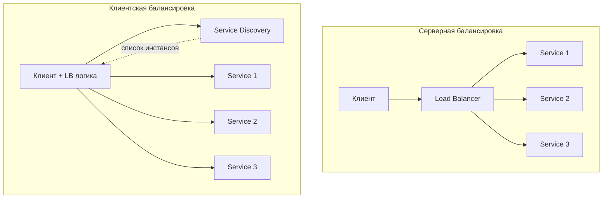

| Критерий | Серверная | Клиентская |
|----------|-----------|------------|
| Single point of failure | Да (балансировщик) | Нет |
| Дополнительный hop | Да | Нет (прямое соединение) |
| Сложность клиента | Низкая | Выше (LB логика в клиенте) |
| Примеры | `Nginx`, `HAProxy`, `AWS ALB` | `Spring Cloud LoadBalancer`, `gRPC` client LB |

В [микросервисной архитектуре](microservices-interview.md) часто комбинируют оба подхода: внешний трафик через серверный балансировщик, межсервисные вызовы — через клиентскую балансировку.


> [!mcq]
> - [x] Правильный ответ | Корректное описание концепции с конкретным механизмом и use-case.
> - [ ] Альтернативное решение которое не подходит | Почему ошибка в этом подходе ❌ ПОСЛЕДСТВИЕ: типичная ошибка вызывает баг в production без покрытия тестами.
> - [ ] Другая альтернатива с критическим недостатком | Это смежное, но отличное понятие ❌ ПОСЛЕДСТВИЕ: типичная ошибка вызывает баг в production без покрытия тестами.
> - [ ] Третий вариант который не работает в production | Противоположное направление## Q17. Как настроить Spring Cloud LoadBalancer? ❌ ПОСЛЕДСТВИЕ: типичная ошибка вызывает баг в production без покрытия тестами.

`Spring Cloud LoadBalancer` — замена устаревшего `Netflix Ribbon` для клиентской балансировки в Spring-экосистеме.

**Зависимости:**

```groovy
dependencies {
    implementation 'org.springframework.cloud:spring-cloud-starter-loadbalancer'
    implementation 'org.springframework.cloud:spring-cloud-starter-netflix-eureka-client'
}
```

**Конфигурация WebClient с балансировкой:**

```java
@Configuration
public class WebClientConfig {

    @Bean
    @LoadBalanced  // включает клиентскую балансировку
    public WebClient.Builder loadBalancedWebClientBuilder() {
        return WebClient.builder();
    }
}

@Service
public class OrderService {

    private final WebClient webClient;

    public OrderService(WebClient.Builder webClientBuilder) {
        // "user-service" — имя из Service Discovery
        this.webClient = webClientBuilder
            .baseUrl("http://user-service")
            .build();
    }

    public Mono<User> getUser(Long userId) {
        return webClient.get()
            .uri("/api/users/{id}", userId)
            .retrieve()
            .bodyToMono(User.class);
    }
}
```

**Конфигурация RestTemplate с балансировкой:**

```java
@Configuration
public class RestTemplateConfig {

    @Bean
    @LoadBalanced
    public RestTemplate restTemplate() {
        return new RestTemplate();
    }
}

@Service
public class PaymentService {

    private final RestTemplate restTemplate;

    public PaymentService(RestTemplate restTemplate) {
        this.restTemplate = restTemplate;
    }

    public Order getOrder(Long orderId) {
        // "order-service" резолвится через Service Discovery
        return restTemplate.getForObject(
            "http://order-service/api/orders/{id}",
            Order.class, orderId
        );
    }
}
```

По умолчанию используется `Round Robin`. Подробнее о Service Discovery и Spring Cloud — в [вопросах по Spring Cloud](../frameworks/spring/spring-cloud-interview.md).


> [!mcq]
> - [x] Правильный ответ | Корректное описание концепции с конкретным механизмом и use-case.
> - [ ] Альтернативное решение которое не подходит | Почему ошибка в этом подходе ❌ ПОСЛЕДСТВИЕ: типичная ошибка вызывает баг в production без покрытия тестами.
> - [ ] Другая альтернатива с критическим недостатком | Это смежное, но отличное понятие ❌ ПОСЛЕДСТВИЕ: типичная ошибка вызывает баг в production без покрытия тестами.
> - [ ] Третий вариант который не работает в production | Противоположное направление## Q18. Как реализовать кастомную стратегию балансировки в Spring Cloud? ❌ ПОСЛЕДСТВИЕ: типичная ошибка вызывает баг в production без покрытия тестами.

`Spring Cloud LoadBalancer` позволяет заменить стандартный `Round Robin` на собственную стратегию:

```java
// Кастомная стратегия: выбор инстанса с минимальным временем ответа
public class LeastResponseTimeLoadBalancer implements ReactorServiceInstanceLoadBalancer {

    private final ObjectProvider<ServiceInstanceListSupplier> supplier;
    private final ConcurrentMap<String, AtomicLong> responseTimeMap =
        new ConcurrentHashMap<>();

    public LeastResponseTimeLoadBalancer(
            ObjectProvider<ServiceInstanceListSupplier> supplier) {
        this.supplier = supplier;
    }

    @Override
    public Mono<Response<ServiceInstance>> choose(Request request) {
        return supplier.getIfAvailable()
            .get(request)
            .next()
            .map(this::selectInstance);
    }

    private Response<ServiceInstance> selectInstance(
            List<ServiceInstance> instances) {
        if (instances.isEmpty()) {
            return new EmptyResponse();
        }
        ServiceInstance best = instances.stream()
            .min(Comparator.comparingLong(
                i -> responseTimeMap
                    .getOrDefault(i.getInstanceId(), new AtomicLong(0))
                    .get()))
            .orElse(instances.get(0));

        return new DefaultResponse(best);
    }
}

// Конфигурация для конкретного сервиса
@LoadBalancerClient(
    name = "user-service",
    configuration = UserServiceLBConfig.class
)
public class LoadBalancerConfiguration { }

class UserServiceLBConfig {
    @Bean
    public ReactorServiceInstanceLoadBalancer customLoadBalancer(
            ObjectProvider<ServiceInstanceListSupplier> supplier) {
        return new LeastResponseTimeLoadBalancer(supplier);
    }
}
```


> [!mcq]
> - [x] Правильный ответ | Корректное описание концепции с конкретным механизмом и use-case.
> - [ ] Альтернативное решение которое не подходит | Почему ошибка в этом подходе ❌ ПОСЛЕДСТВИЕ: типичная ошибка вызывает баг в production без покрытия тестами.
> - [ ] Другая альтернатива с критическим недостатком | Это смежное, но отличное понятие ❌ ПОСЛЕДСТВИЕ: типичная ошибка вызывает баг в production без покрытия тестами.
> - [ ] Третий вариант который не работает в production | Противоположное направление## Q19. Что такое blue-green и canary в контексте балансировки? ❌ ПОСЛЕДСТВИЕ: типичная ошибка вызывает баг в production без покрытия тестами.

**Blue-green** — два идентичных окружения. Трафик идёт на одно (blue); при деплое поднимается новая версия (green); после проверки балансировщик переключает весь трафик.

**Canary** — часть трафика (1-10%) направляется на новую версию, остальная — на старую. Постепенное увеличение доли.

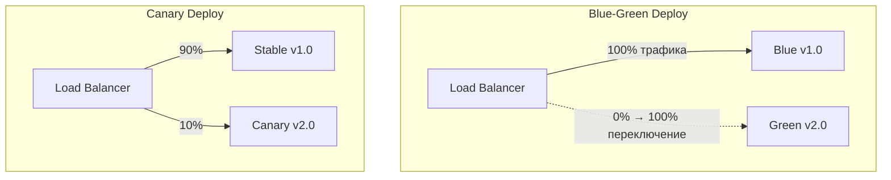

**Реализация canary в Nginx через weight:**

```nginx
upstream api_backend {
    server stable-v1.example.com:8080 weight=9;   # 90% трафика
    server canary-v2.example.com:8080 weight=1;    # 10% трафика
}
```

**Реализация canary в HAProxy:**

```haproxy
backend api_servers
    balance roundrobin
    server stable1 10.0.0.1:8080 weight 90 check
    server stable2 10.0.0.2:8080 weight 90 check
    server canary1 10.0.0.3:8080 weight 10 check
```

Подробнее о стратегиях деплоя — в [вопросах по стратегиям деплоя](../cicd/deployment-strategies-interview.md).


> [!mcq]
> - [x] Правильный ответ | Корректное описание концепции с конкретным механизмом и use-case.
> - [ ] Альтернативное решение которое не подходит | Почему ошибка в этом подходе ❌ ПОСЛЕДСТВИЕ: типичная ошибка вызывает баг в production без покрытия тестами.
> - [ ] Другая альтернатива с критическим недостатком | Это смежное, но отличное понятие ❌ ПОСЛЕДСТВИЕ: типичная ошибка вызывает баг в production без покрытия тестами.
> - [ ] Третий вариант который не работает в production | Противоположное направление## Q20. (!) Как обеспечить отказоустойчивость балансировщика? ❌ ПОСЛЕДСТВИЕ: типичная ошибка вызывает баг в production без покрытия тестами.

Балансировщик — single point of failure. Для отказоустойчивости используют пару балансировщиков:

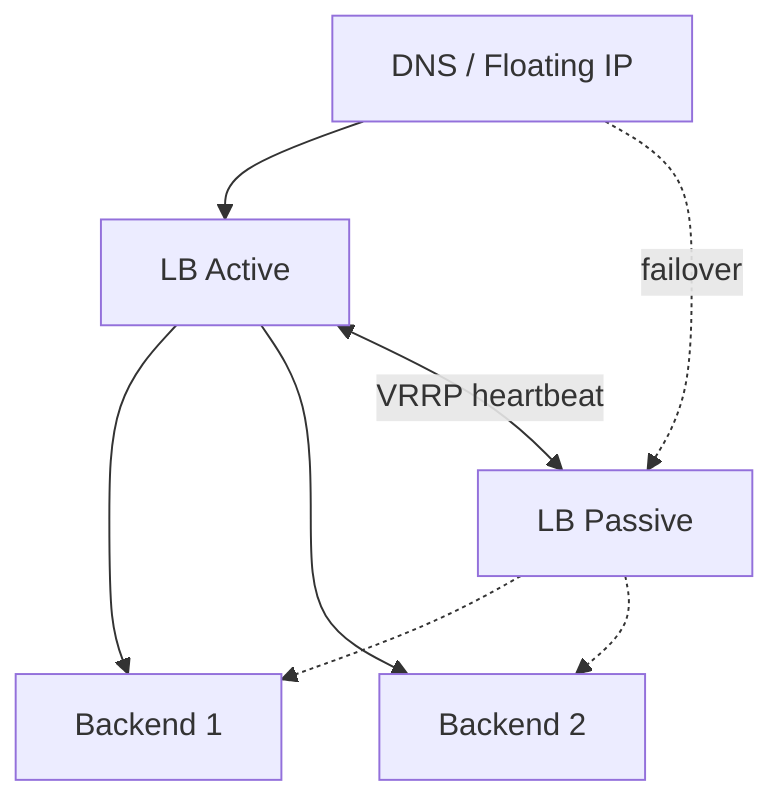

**Active-Passive** — один активен, второй в standby. При падении активного — автоматический failover через `VRRP` (Virtual Router Redundancy Protocol) или keepalived.

**Active-Active** — оба принимают трафик (через `DNS Round Robin` или `Anycast`). При падении одного — весь трафик на второй.

**Конфигурация keepalived для VRRP:**

```
vrrp_instance VI_1 {
    state MASTER
    interface eth0
    virtual_router_id 51
    priority 100
    advert_int 1

    authentication {
        auth_type PASS
        auth_pass mysecret
    }

    virtual_ipaddress {
        192.168.1.100/24
    }
}
```

**В облаке:** `AWS ALB`/`NLB` — managed, отказоустойчивость «из коробки» (multi-AZ). `GCP` Global Load Balancer — глобальная балансировка с `Anycast`.


> [!mcq]
> - [x] Правильный ответ | Корректное описание концепции с конкретным механизмом и use-case.
> - [ ] Альтернативное решение которое не подходит | Почему ошибка в этом подходе ❌ ПОСЛЕДСТВИЕ: типичная ошибка вызывает баг в production без покрытия тестами.
> - [ ] Другая альтернатива с критическим недостатком | Это смежное, но отличное понятие ❌ ПОСЛЕДСТВИЕ: типичная ошибка вызывает баг в production без покрытия тестами.
> - [ ] Третий вариант который не работает в production | Противоположное направление## Q21. Что такое connection draining (deregistration delay)? ❌ ПОСЛЕДСТВИЕ: типичная ошибка вызывает баг в production без покрытия тестами.

`Connection draining` — при исключении узла из пула балансировщик не направляет новые запросы, но даёт завершиться уже установленным соединениям в течение заданного времени.

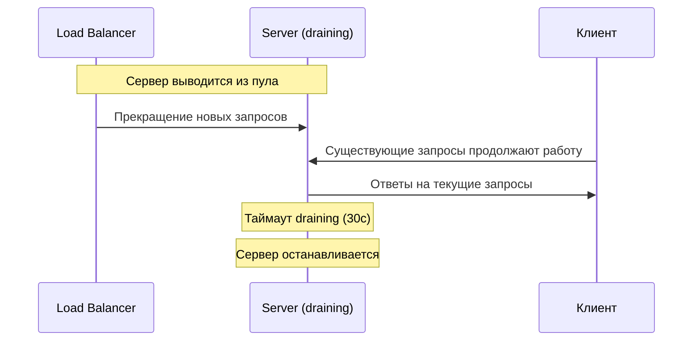

**Реализация в Kubernetes:**

```yaml
spec:
  terminationGracePeriodSeconds: 60  # время на завершение
  containers:
    - name: app
      lifecycle:
        preStop:
          exec:
            command: ["sh", "-c", "sleep 15"]  # дать время на deregistration
```

**В AWS ALB:** параметр `deregistration_delay.timeout_seconds` (по умолчанию 300 секунд).

**В Nginx:** при reload конфигурации старые worker-процессы продолжают обслуживать существующие соединения, пока новые workers обрабатывают новые запросы. Параметр `worker_shutdown_timeout` контролирует максимальное время.


> [!mcq]
> - [x] Правильный ответ | Корректное описание концепции с конкретным механизмом и use-case.
> - [ ] Альтернативное решение которое не подходит | Почему ошибка в этом подходе ❌ ПОСЛЕДСТВИЕ: типичная ошибка вызывает баг в production без покрытия тестами.
> - [ ] Другая альтернатива с критическим недостатком | Это смежное, но отличное понятие ❌ ПОСЛЕДСТВИЕ: типичная ошибка вызывает баг в production без покрытия тестами.
> - [ ] Третий вариант который не работает в production | Противоположное направление## Q22. Что такое Layer 4 и Layer 7 load balancer в облаке? ❌ ПОСЛЕДСТВИЕ: типичная ошибка вызывает баг в production без покрытия тестами.

Облачные провайдеры предоставляют managed балансировщики обоих уровней:

| Провайдер | L4 | L7 |
|-----------|----|----|
| AWS | `NLB` (Network Load Balancer) | `ALB` (Application Load Balancer) |
| GCP | Network Load Balancer | HTTP(S) Load Balancer |
| Azure | Azure Load Balancer | Application Gateway |

**AWS NLB (L4):**
- Миллионы запросов в секунду, ультранизкая латентность
- Static IP / Elastic IP
- Подходит для `TCP`/`UDP`, `gRPC`, не-HTTP протоколы

**AWS ALB (L7):**
- Path-based и host-based routing
- `TLS` termination через `ACM` (бесплатные сертификаты)
- Интеграция с `WAF`, `Cognito`
- Поддержка `WebSocket`, `HTTP/2`

**Выбор:** L4 для не-HTTP протоколов и минимальной латентности. L7 для HTTP/HTTPS с маршрутизацией по содержимому. Подробнее об облачной инфраструктуре — в [паттернах масштабирования](scalability-patterns-interview.md).


> [!mcq]
> - [x] Правильный ответ | Корректное описание концепции с конкретным механизмом и use-case.
> - [ ] Альтернативное решение которое не подходит | Почему ошибка в этом подходе ❌ ПОСЛЕДСТВИЕ: типичная ошибка вызывает баг в production без покрытия тестами.
> - [ ] Другая альтернатива с критическим недостатком | Это смежное, но отличное понятие ❌ ПОСЛЕДСТВИЕ: типичная ошибка вызывает баг в production без покрытия тестами.
> - [ ] Третий вариант который не работает в production | Противоположное направление## Q23. (!) Как настроить health check в Kubernetes для Pod? ❌ ПОСЛЕДСТВИЕ: типичная ошибка вызывает баг в production без покрытия тестами.

В [Kubernetes](../devops/kubernetes-interview.md) три типа проб:

- **`startupProbe`** — проверка при запуске. Пока не пройдёт, liveness и readiness не запускаются. Для приложений с долгим стартом.
- **`livenessProbe`** — приложение живо? При провале — перезапуск контейнера.
- **`readinessProbe`** — приложение готово принимать трафик? При провале — исключение из `Service`.

```yaml
apiVersion: apps/v1
kind: Deployment
metadata:
  name: api-service
spec:
  replicas: 3
  template:
    spec:
      containers:
        - name: api
          image: api-service:2.1.0
          ports:
            - containerPort: 8080
          startupProbe:
            httpGet:
              path: /actuator/health
              port: 8080
            failureThreshold: 30
            periodSeconds: 2
            # Макс. ожидание старта: 30 * 2 = 60с
          livenessProbe:
            httpGet:
              path: /actuator/health/liveness
              port: 8080
            periodSeconds: 10
            failureThreshold: 3
            timeoutSeconds: 3
          readinessProbe:
            httpGet:
              path: /actuator/health/readiness
              port: 8080
            periodSeconds: 5
            failureThreshold: 2
            timeoutSeconds: 3
          resources:
            requests:
              memory: "512Mi"
              cpu: "250m"
            limits:
              memory: "1Gi"
              cpu: "500m"
```

**Spring Boot Actuator** конфигурация для Kubernetes проб:

```yaml
# application.yml
management:
  endpoint:
    health:
      probes:
        enabled: true
      group:
        readiness:
          include: db, redis, kafka
        liveness:
          include: ping
  health:
    livenessState:
      enabled: true
    readinessState:
      enabled: true
```

**Важно:** `livenessProbe` не должна зависеть от внешних сервисов (БД, Redis) — иначе при падении БД все поды будут перезапущены. Внешние зависимости проверяет только `readinessProbe`.


> [!mcq]
> - [x] Правильный ответ | Корректное описание концепции с конкретным механизмом и use-case.
> - [ ] Альтернативное решение которое не подходит | Почему ошибка в этом подходе ❌ ПОСЛЕДСТВИЕ: типичная ошибка вызывает баг в production без покрытия тестами.
> - [ ] Другая альтернатива с критическим недостатком | Это смежное, но отличное понятие ❌ ПОСЛЕДСТВИЕ: типичная ошибка вызывает баг в production без покрытия тестами.
> - [ ] Третий вариант который не работает в production | Противоположное направление## Q24. Что такое Ingress и как он связан с балансировкой? ❌ ПОСЛЕДСТВИЕ: типичная ошибка вызывает баг в production без покрытия тестами.

`Ingress` — объект Kubernetes для маршрутизации внешнего HTTP/HTTPS трафика в `Service`. Контроллер (`Nginx Ingress Controller`, `Traefik`, `AWS ALB Ingress Controller`) реализует правила маршрутизации.

```yaml
apiVersion: networking.k8s.io/v1
kind: Ingress
metadata:
  name: api-ingress
  annotations:
    nginx.ingress.kubernetes.io/rewrite-target: /
    nginx.ingress.kubernetes.io/ssl-redirect: "true"
    nginx.ingress.kubernetes.io/proxy-body-size: "10m"
    nginx.ingress.kubernetes.io/rate-limit: "100"
spec:
  ingressClassName: nginx
  tls:
    - hosts:
        - api.example.com
      secretName: api-tls
  rules:
    - host: api.example.com
      http:
        paths:
          - path: /api/users
            pathType: Prefix
            backend:
              service:
                name: user-service
                port:
                  number: 8080
          - path: /api/orders
            pathType: Prefix
            backend:
              service:
                name: order-service
                port:
                  number: 8080
          - path: /
            pathType: Prefix
            backend:
              service:
                name: frontend
                port:
                  number: 80
```

**Цепочка:** Клиент → DNS → `Ingress Controller` (L7 LB) → `Service` → `Pod`. `Service` распределяет трафик между подами через `kube-proxy` / iptables.


> [!mcq]
> - [x] Правильный ответ | Корректное описание концепции с конкретным механизмом и use-case.
> - [ ] Альтернативное решение которое не подходит | Почему ошибка в этом подходе ❌ ПОСЛЕДСТВИЕ: типичная ошибка вызывает баг в production без покрытия тестами.
> - [ ] Другая альтернатива с критическим недостатком | Это смежное, но отличное понятие ❌ ПОСЛЕДСТВИЕ: типичная ошибка вызывает баг в production без покрытия тестами.
> - [ ] Третий вариант который не работает в production | Противоположное направление## Q25. Как обеспечить zero-downtime при деплое за балансировщиком? ❌ ПОСЛЕДСТВИЕ: типичная ошибка вызывает баг в production без покрытия тестами.

Ключевые элементы zero-downtime деплоя:

1. **Rolling Update** — новые поды поднимаются, старые удаляются постепенно
2. **Readiness Probe** — под получает трафик только когда готов
3. **Connection Draining** — текущие запросы завершаются до остановки
4. **PreStop hook** — задержка перед остановкой для deregistration

```yaml
apiVersion: apps/v1
kind: Deployment
metadata:
  name: api-service
spec:
  replicas: 3
  strategy:
    type: RollingUpdate
    rollingUpdate:
      maxSurge: 1         # максимум 1 лишний под
      maxUnavailable: 0   # всегда доступны все реплики
  template:
    spec:
      terminationGracePeriodSeconds: 60
      containers:
        - name: api
          readinessProbe:
            httpGet:
              path: /actuator/health/readiness
              port: 8080
            periodSeconds: 5
          lifecycle:
            preStop:
              exec:
                # Ждём, пока kube-proxy обновит iptables
                command: ["sh", "-c", "sleep 15"]
```

**Порядок остановки пода:**
1. Pod получает `SIGTERM`
2. `preStop` hook выполняется (sleep 15s)
3. Pod исключается из `Service` endpoints
4. Существующие запросы завершаются
5. По истечении `terminationGracePeriodSeconds` — `SIGKILL`

Подробнее — в [вопросах по стратегиям деплоя](../cicd/deployment-strategies-interview.md).


> [!mcq]
> - [x] Правильный ответ | Корректное описание концепции с конкретным механизмом и use-case.
> - [ ] Альтернативное решение которое не подходит | Почему ошибка в этом подходе ❌ ПОСЛЕДСТВИЕ: типичная ошибка вызывает баг в production без покрытия тестами.
> - [ ] Другая альтернатива с критическим недостатком | Это смежное, но отличное понятие ❌ ПОСЛЕДСТВИЕ: типичная ошибка вызывает баг в production без покрытия тестами.
> - [ ] Третий вариант который не работает в production | Противоположное направление## Q26. (!) Что такое DNS-based load balancing? ❌ ПОСЛЕДСТВИЕ: антипаттерн деградирует SLA при росте нагрузки или зависимостей.

`DNS-based load balancing` — распределение трафика через DNS-записи. DNS-сервер возвращает разные IP-адреса для одного доменного имени.

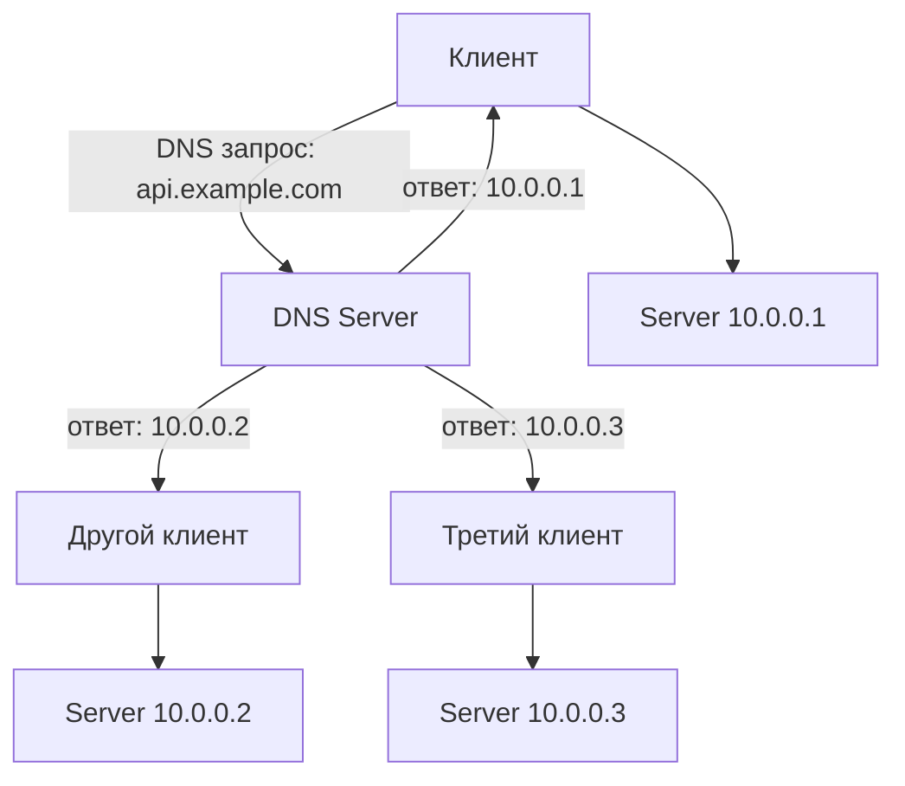

**Методы DNS-балансировки:**

| Метод | Описание | Пример |
|-------|----------|--------|
| Round Robin DNS | Циклический возврат IP | Несколько A-записей |
| Weighted DNS | Вес для каждой записи | `Route 53` weighted routing |
| Geolocation DNS | По географии клиента | `Route 53` geolocation |
| Latency-based DNS | По минимальной латентности | `Route 53` latency routing |
| Failover DNS | Переключение при отказе | `Route 53` failover |

**Плюсы:**
- Нет единой точки отказа
- Глобальное распределение нагрузки
- Работает до L4/L7 балансировщика

**Минусы:**
- Кэширование DNS (TTL) — медленная реакция на изменения
- Нет учёта текущей нагрузки серверов
- Клиент может кэшировать IP и игнорировать TTL

**Пример конфигурации AWS Route 53 (weighted):**

```
# A-запись с весом 70 (основной регион)
api.example.com  A  10.0.0.1  TTL=60  Weight=70  SetId=primary

# A-запись с весом 30 (вторичный регион)  
api.example.com  A  10.0.1.1  TTL=60  Weight=30  SetId=secondary
```

**На практике** DNS-балансировку используют в комбинации с L4/L7: DNS направляет трафик на ближайший регион, а внутри региона L7-балансировщик распределяет между серверами.


> [!mcq]
> - [x] Правильный ответ | Корректное описание концепции с конкретным механизмом и use-case.
> - [ ] Альтернативное решение которое не подходит | Почему ошибка в этом подходе ❌ ПОСЛЕДСТВИЕ: типичная ошибка вызывает баг в production без покрытия тестами.
> - [ ] Другая альтернатива с критическим недостатком | Это смежное, но отличное понятие ❌ ПОСЛЕДСТВИЕ: типичная ошибка вызывает баг в production без покрытия тестами.
> - [ ] Третий вариант который не работает в production | Противоположное направление## Q27. Что такое geographic load balancing (global load balancing)? ❌ ПОСЛЕДСТВИЕ: антипаттерн деградирует SLA при росте нагрузки или зависимостей.

`Geographic load balancing` — направление пользователей на ближайший дата-центр через `DNS` или `Anycast` IP.

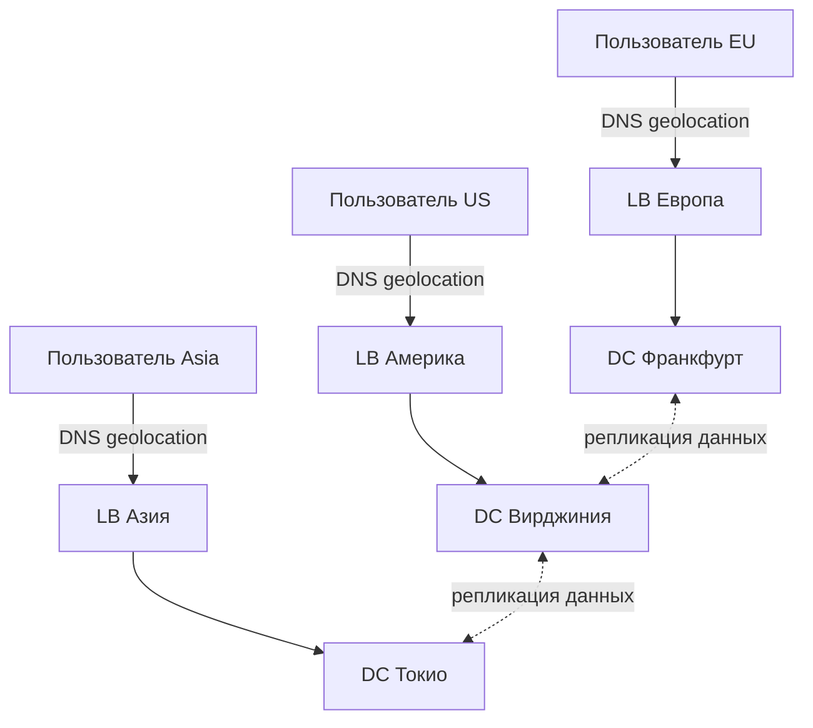

**Реализации:**
- **AWS Route 53** — geolocation и latency-based routing
- **Cloudflare** — `Anycast` + geo-routing
- **GCP Global Load Balancer** — единый `Anycast` IP, автоматическая гео-маршрутизация

**Ключевые проблемы:**
- Синхронизация данных между регионами (eventual consistency) — см. [паттерны согласованности](consistency-patterns-interview.md)
- Failover при падении целого региона
- Compliance (GDPR — данные EU-пользователей в EU)


> [!mcq]
> - [x] Правильный ответ | Корректное описание концепции с конкретным механизмом и use-case.
> - [ ] Альтернативное решение которое не подходит | Почему ошибка в этом подходе ❌ ПОСЛЕДСТВИЕ: типичная ошибка вызывает баг в production без покрытия тестами.
> - [ ] Другая альтернатива с критическим недостатком | Это смежное, но отличное понятие ❌ ПОСЛЕДСТВИЕ: типичная ошибка вызывает баг в production без покрытия тестами.
> - [ ] Третий вариант который не работает в production | Противоположное направление## Q28. Что такое cross-zone load balancing в AWS? ❌ ПОСЛЕДСТВИЕ: антипаттерн деградирует SLA при росте нагрузки или зависимостей.

`Cross-zone load balancing` — распределение трафика между узлами в разных зонах доступности (AZ).

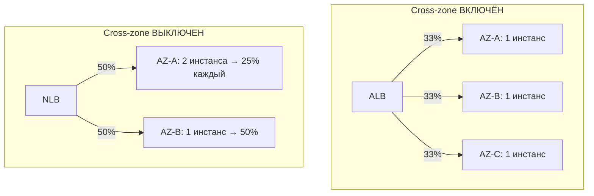

**При включённом cross-zone:** трафик распределяется равномерно по **всем** узлам во всех AZ. Лучшее использование ресурсов.

**При выключенном:** трафик распределяется равномерно **по AZ**, а внутри AZ — по узлам. Если в AZ-A 2 инстанса, а в AZ-B 1, то инстанс в AZ-B получит вдвое больше нагрузки.

**Рекомендация:** для `ALB` cross-zone включён по умолчанию (бесплатно). Для `NLB` — выключен (включение платное из-за inter-AZ трафика). Включать для равномерной загрузки; выключать для экономии трафика между AZ.


> [!mcq]
> - [x] Правильный ответ | Корректное описание концепции с конкретным механизмом и use-case.
> - [ ] Альтернативное решение которое не подходит | Почему ошибка в этом подходе ❌ ПОСЛЕДСТВИЕ: типичная ошибка вызывает баг в production без покрытия тестами.
> - [ ] Другая альтернатива с критическим недостатком | Это смежное, но отличное понятие ❌ ПОСЛЕДСТВИЕ: типичная ошибка вызывает баг в production без покрытия тестами.
> - [ ] Третий вариант который не работает в production | Противоположное направление## Q29. Что такое consistent hashing и когда его использовать? ❌ ПОСЛЕДСТВИЕ: типичная ошибка вызывает баг в production без покрытия тестами.

`Consistent hashing` — алгоритм, при котором ключ (например, `userId`) определяет целевой узел. При изменении числа узлов перераспределяется только часть запросов (1/N), а не все.

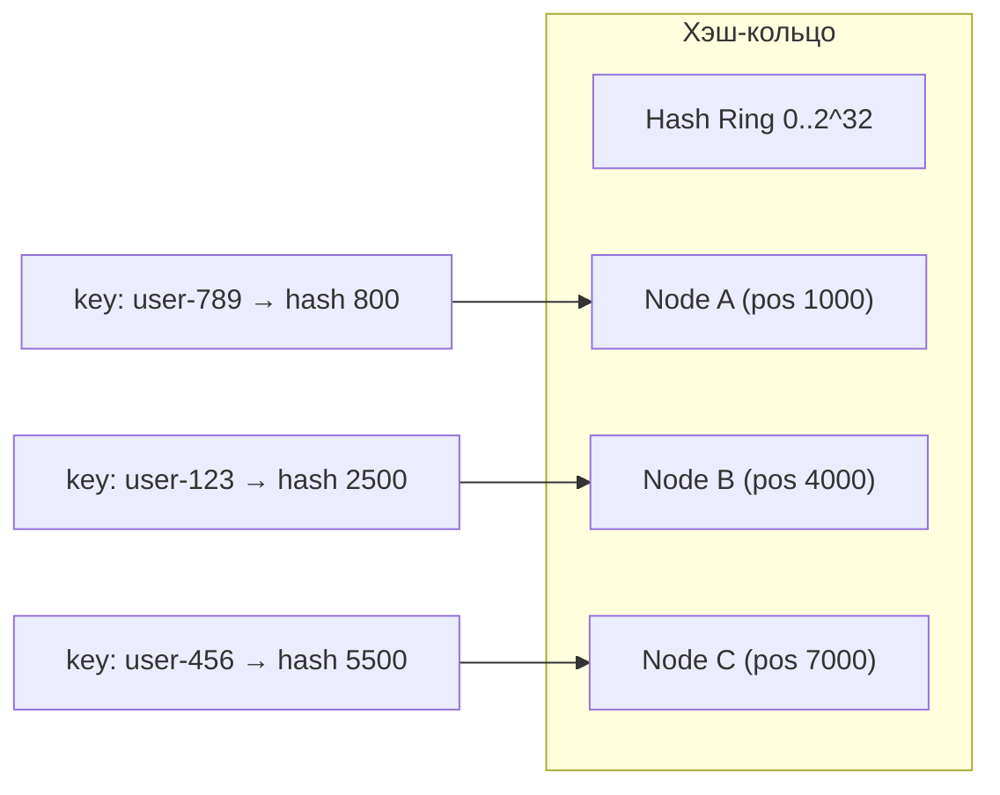

**Применение:**
- Кэширование — запросы с одним ключом попадают на один узел кэша (локальность данных)
- Sharding — распределение данных по узлам
- Session affinity без cookie

**Конфигурация в Nginx:**

```nginx
upstream cache_backend {
    hash $request_uri consistent;
    server cache1.example.com:8080;
    server cache2.example.com:8080;
    server cache3.example.com:8080;
}
```

**Конфигурация в HAProxy:**

```haproxy
backend cache_servers
    balance uri  # хэширование по URI
    hash-type consistent
    server cache1 10.0.0.1:8080 check
    server cache2 10.0.0.2:8080 check
    server cache3 10.0.0.3:8080 check
```

**Виртуальные узлы (vnodes):** для более равномерного распределения каждый физический узел представлен множеством точек на кольце (обычно 100-200 vnodes).


> [!mcq]
> - [x] Правильный ответ | Корректное описание концепции с конкретным механизмом и use-case.
> - [ ] Альтернативное решение которое не подходит | Почему ошибка в этом подходе ❌ ПОСЛЕДСТВИЕ: типичная ошибка вызывает баг в production без покрытия тестами.
> - [ ] Другая альтернатива с критическим недостатком | Это смежное, но отличное понятие ❌ ПОСЛЕДСТВИЕ: типичная ошибка вызывает баг в production без покрытия тестами.
> - [ ] Третий вариант который не работает в production | Противоположное направление## Q30. Как настроить балансировку для gRPC? ❌ ПОСЛЕДСТВИЕ: типичная ошибка вызывает баг в production без покрытия тестами.

`gRPC` использует `HTTP/2` с мультиплексированием — одно TCP-соединение обслуживает множество запросов. Это создаёт проблему: L4-балансировщик распределит соединения, но все запросы по одному соединению пойдут на один сервер.

**Решения:**

1. **L7-балансировка** — балансировщик понимает `HTTP/2` фреймы:

```nginx
# Nginx с gRPC (L7)
upstream grpc_backend {
    least_conn;
    server backend1:9090;
    server backend2:9090;
}

server {
    listen 443 ssl http2;

    location / {
        grpc_pass grpc://grpc_backend;
        grpc_set_header Host $host;
    }
}
```

2. **Клиентская балансировка** — `gRPC` клиент сам распределяет запросы:

```java
// gRPC Java client с round_robin
ManagedChannel channel = ManagedChannelBuilder
    .forTarget("dns:///my-service.default.svc.cluster.local:9090")
    .defaultLoadBalancingPolicy("round_robin")
    .usePlaintext()
    .build();
```

3. **Service Mesh** (Istio, Linkerd) — sidecar proxy (`Envoy`) балансирует на уровне отдельных gRPC-вызовов.

**В Kubernetes:** стандартный `Service` (L4) не балансирует gRPC запросы эффективно. Используйте headless `Service` + клиентскую балансировку или `Istio`.


> [!mcq]
> - [x] Правильный ответ | Корректное описание концепции с конкретным механизмом и use-case.
> - [ ] Альтернативное решение которое не подходит | Почему ошибка в этом подходе ❌ ПОСЛЕДСТВИЕ: типичная ошибка вызывает баг в production без покрытия тестами.
> - [ ] Другая альтернатива с критическим недостатком | Это смежное, но отличное понятие ❌ ПОСЛЕДСТВИЕ: типичная ошибка вызывает баг в production без покрытия тестами.
> - [ ] Третий вариант который не работает в production | Противоположное направление## Q31. Как настроить балансировку для WebSocket соединений? ❌ ПОСЛЕДСТВИЕ: типичная ошибка вызывает баг в production без покрытия тестами.

`WebSocket` — долгоживущие соединения. Ключевые особенности:
- Соединение устанавливается через HTTP Upgrade и живёт часы/дни
- Все сообщения по одному соединению идут на один сервер
- При падении сервера соединение разрывается

**Конфигурация в Nginx:**

```nginx
upstream websocket_backend {
    ip_hash;  # sticky session для WebSocket
    server ws1.example.com:8080;
    server ws2.example.com:8080;
}

server {
    location /ws {
        proxy_pass http://websocket_backend;

        # Обязательно для WebSocket
        proxy_http_version 1.1;
        proxy_set_header Upgrade $http_upgrade;
        proxy_set_header Connection "upgrade";

        # Увеличенные таймауты для долгих соединений
        proxy_read_timeout 3600s;
        proxy_send_timeout 3600s;
    }
}
```

**Конфигурация в HAProxy:**

```haproxy
frontend ws_front
    bind *:80
    acl is_websocket hdr(Upgrade) -i WebSocket
    use_backend ws_servers if is_websocket

backend ws_servers
    balance leastconn
    timeout server 3600s
    timeout tunnel 3600s
    server ws1 10.0.0.1:8080 check
    server ws2 10.0.0.2:8080 check
```

**Рекомендация:** для масштабирования WebSocket приложений — хранить состояние сессий в [Redis](../databases/redis-interview.md) Pub/Sub, чтобы сообщения доставлялись клиентам на любом сервере.


> [!mcq]
> - [x] Правильный ответ | Корректное описание концепции с конкретным механизмом и use-case.
> - [ ] Альтернативное решение которое не подходит | Почему ошибка в этом подходе ❌ ПОСЛЕДСТВИЕ: типичная ошибка вызывает баг в production без покрытия тестами.
> - [ ] Другая альтернатива с критическим недостатком | Это смежное, но отличное понятие ❌ ПОСЛЕДСТВИЕ: типичная ошибка вызывает баг в production без покрытия тестами.
> - [ ] Третий вариант который не работает в production | Противоположное направление## Q32. Что такое path-based routing в L7 балансировщике? ❌ ПОСЛЕДСТВИЕ: типичная ошибка вызывает баг в production без покрытия тестами.

`Path-based routing` — маршрутизация запросов на разные бэкенды по пути URL. Базовый инструмент L7-балансировки.

**Конфигурация в Nginx:**

```nginx
upstream user_service    { server 10.0.1.1:8080; server 10.0.1.2:8080; }
upstream order_service   { server 10.0.2.1:8080; server 10.0.2.2:8080; }
upstream payment_service { server 10.0.3.1:8080; server 10.0.3.2:8080; }

server {
    listen 80;

    # Маршрутизация по path
    location /api/users {
        proxy_pass http://user_service;
    }

    location /api/orders {
        proxy_pass http://order_service;
    }

    location /api/payments {
        proxy_pass http://payment_service;
    }

    # Маршрутизация по regex
    location ~ ^/api/v[0-9]+/products {
        proxy_pass http://product_service;
    }

    # Default backend
    location / {
        return 404 '{"error": "route not found"}';
    }
}
```

**Конфигурация в HAProxy (ACL):**

```haproxy
frontend http_front
    bind *:80

    acl path_users   path_beg /api/users
    acl path_orders  path_beg /api/orders
    acl path_static  path_beg /static

    use_backend user_servers   if path_users
    use_backend order_servers  if path_orders
    use_backend static_servers if path_static
    default_backend app_servers
```

Path-based routing упрощает архитектуру [микросервисов](microservices-interview.md) без необходимости отдельного API Gateway.


> [!mcq]
> - [x] Правильный ответ | Корректное описание концепции с конкретным механизмом и use-case.
> - [ ] Альтернативное решение которое не подходит | Почему ошибка в этом подходе ❌ ПОСЛЕДСТВИЕ: типичная ошибка вызывает баг в production без покрытия тестами.
> - [ ] Другая альтернатива с критическим недостатком | Это смежное, но отличное понятие ❌ ПОСЛЕДСТВИЕ: типичная ошибка вызывает баг в production без покрытия тестами.
> - [ ] Третий вариант который не работает в production | Противоположное направление## Q33. Как обеспечить балансировку для stateful приложений? ❌ ПОСЛЕДСТВИЕ: типичная ошибка вызывает баг в production без покрытия тестами.

Три подхода для stateful приложений:

**1. Sticky Session** — привязка клиента к серверу (самый простой, но хрупкий):
```nginx
upstream backend {
    ip_hash;
    server backend1:8080;
    server backend2:8080;
}
```

**2. Общее хранилище (рекомендуется)** — состояние в Redis/Memcached, приложение stateless:

```java
@Configuration
@EnableRedisHttpSession(maxInactiveIntervalInSeconds = 3600)
public class SessionConfig {

    @Bean
    public LettuceConnectionFactory connectionFactory() {
        return new LettuceConnectionFactory("redis-cluster", 6379);
    }
}
```

```yaml
# application.yml
spring:
  session:
    store-type: redis
  redis:
    host: redis-cluster
    port: 6379
```

**3. Sharding по ключу** — consistent hashing, запросы с одним ключом на один узел:
```nginx
upstream backend {
    hash $arg_userId consistent;
    server backend1:8080;
    server backend2:8080;
    server backend3:8080;
}
```

**Рекомендация:** вариант 2 (Redis) — наиболее надёжный. Приложение stateless, горизонтально масштабируется, при падении узла сессии не теряются. Подробнее о Redis — в [вопросах по Redis](../databases/redis-interview.md).


> [!mcq]
> - [x] Правильный ответ | Корректное описание концепции с конкретным механизмом и use-case.
> - [ ] Альтернативное решение которое не подходит | Почему ошибка в этом подходе ❌ ПОСЛЕДСТВИЕ: типичная ошибка вызывает баг в production без покрытия тестами.
> - [ ] Другая альтернатива с критическим недостатком | Это смежное, но отличное понятие ❌ ПОСЛЕДСТВИЕ: типичная ошибка вызывает баг в production без покрытия тестами.
> - [ ] Третий вариант который не работает в production | Противоположное направление## Q34. (!) Как мониторить и анализировать работу балансировщика? ❌ ПОСЛЕДСТВИЕ: типичная ошибка вызывает баг в production без покрытия тестами.

Ключевые метрики для [мониторинга](../monitoring/metrics-tracing-interview.md) балансировщика:

| Метрика | Описание | Алерт |
|---------|----------|-------|
| Active connections per backend | Текущие соединения | Разброс > 30% |
| RPS per backend | Запросы в секунду | Неравномерность |
| Latency p50/p95/p99 | Задержка ответа | p99 > 200ms |
| Error rate (4xx, 5xx) | Процент ошибок | > 5% |
| Healthy backends | Число живых узлов | < N-1 |
| Bandwidth | Трафик in/out | Аномалии |

**Nginx: включение метрик:**

```nginx
# stub_status для базовых метрик
server {
    listen 8081;
    location /nginx_status {
        stub_status;
        allow 10.0.0.0/8;
        deny all;
    }
}

# Формат логов для анализа
log_format upstream_log '$remote_addr - $request '
    'upstream: $upstream_addr '
    'status: $upstream_status '
    'response_time: $upstream_response_time '
    'connect_time: $upstream_connect_time';
```

**HAProxy: встроенный dashboard + Prometheus exporter:**

```haproxy
listen stats
    bind *:8404
    stats enable
    stats uri /stats
    stats refresh 10s

# Prometheus endpoint
frontend prometheus
    bind *:8405
    http-request use-service prometheus-exporter if { path /metrics }
    no log
```

**Prometheus запросы для алертинга:**

```promql
# Процент 5xx ошибок за 5 минут
sum(rate(haproxy_server_http_responses_total{code="5xx"}[5m]))
/ sum(rate(haproxy_server_http_responses_total[5m])) > 0.05

# Число unhealthy бэкендов
haproxy_server_status{state="DOWN"} > 0

# p99 латентность бэкенда
histogram_quantile(0.99,
  rate(nginx_upstream_response_duration_seconds_bucket[5m])) > 0.2
```

Экспортировать метрики в [систему наблюдаемости](../monitoring/observability-interview.md) (`Prometheus` + `Grafana`) для визуализации и алертинга.


> [!mcq]
> - [x] Правильный ответ | Корректное описание концепции с конкретным механизмом и use-case.
> - [ ] Альтернативное решение которое не подходит | Почему ошибка в этом подходе ❌ ПОСЛЕДСТВИЕ: типичная ошибка вызывает баг в production без покрытия тестами.
> - [ ] Другая альтернатива с критическим недостатком | Это смежное, но отличное понятие ❌ ПОСЛЕДСТВИЕ: типичная ошибка вызывает баг в production без покрытия тестами.
> - [ ] Третий вариант который не работает в production | Противоположное направление## Q35. Как балансировщик обрабатывает медленные бэкенды? ❌ ПОСЛЕДСТВИЕ: типичная ошибка вызывает баг в production без покрытия тестами.

Проблема: один медленный бэкенд может «заразить» весь пул, если балансировщик продолжает отправлять ему запросы.

**Поведение при разных алгоритмах:**

| Алгоритм | Поведение | Риск |
|----------|-----------|------|
| `Round Robin` | Отправляет равномерно — медленный перегружается | Высокий |
| `Least Connections` | Медленный накапливает соединения → меньше новых | Средний |
| `Least Response Time` | Медленный автоматически получает меньше | Низкий |

**Защита в Nginx:**

```nginx
upstream backend_pool {
    least_conn;
    server backend1:8080 max_fails=3 fail_timeout=30s;
    server backend2:8080 max_fails=3 fail_timeout=30s;
    server backend3:8080 max_fails=3 fail_timeout=30s;
}

server {
    location / {
        proxy_pass http://backend_pool;

        # Таймауты — не ждать медленный бэкенд вечно
        proxy_connect_timeout 3s;
        proxy_read_timeout 10s;

        # При таймауте — retry на следующий сервер
        proxy_next_upstream error timeout http_502 http_503;
        proxy_next_upstream_tries 2;
        proxy_next_upstream_timeout 15s;
    }
}
```

**Защита в HAProxy:**

```haproxy
backend app_servers
    balance leastconn
    timeout server 10s
    timeout queue 5s

    option httpchk GET /health
    http-check expect status 200

    # slowstart — постепенный ввод после восстановления
    server app1 10.0.0.1:8080 check inter 3s fall 3 rise 2 slowstart 30s
    server app2 10.0.0.2:8080 check inter 3s fall 3 rise 2 slowstart 30s

    # Ограничение соединений на сервер
    server app3 10.0.0.3:8080 check maxconn 100
```

**Рекомендации:**
- Использовать `Least Connections` или `Least Response Time`
- Настроить таймауты (`proxy_read_timeout`, `timeout server`)
- Включить `proxy_next_upstream` для автоматического retry
- Мониторить p95/p99 по каждому бэкенду отдельно
- Настроить circuit breaker на уровне приложения (подробнее в [Spring Cloud](../frameworks/spring/spring-cloud-interview.md))


> [!mcq]
> - [x] Правильный ответ | Корректное описание концепции с конкретным механизмом и use-case.
> - [ ] Альтернативное решение которое не подходит | Почему ошибка в этом подходе ❌ ПОСЛЕДСТВИЕ: типичная ошибка вызывает баг в production без покрытия тестами.
> - [ ] Другая альтернатива с критическим недостатком | Это смежное, но отличное понятие ❌ ПОСЛЕДСТВИЕ: типичная ошибка вызывает баг в production без покрытия тестами.
> - [ ] Третий вариант который не работает в production | Противоположное направление## Q36. (!) Что такое IP Hash и когда его использовать? ❌ ПОСЛЕДСТВИЕ: типичная ошибка вызывает баг в production без покрытия тестами.

**IP Hash** — алгоритм балансировки, при котором бэкенд выбирается детерминированно на основе `IP`-адреса клиента: `hash(client_ip) % N`. Один и тот же клиент всегда попадает на один и тот же сервер.

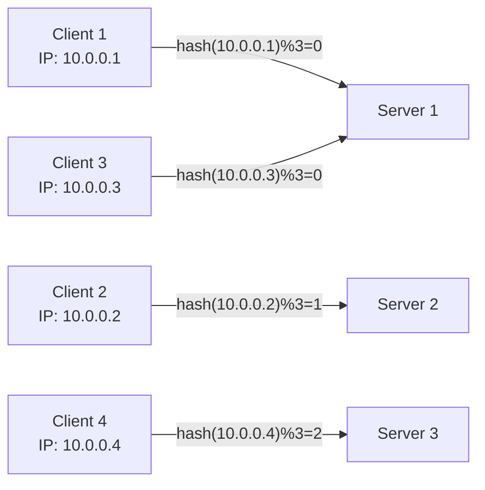

**Когда применять:**
- Stateful-приложения с локальными сессиями (альтернатива sticky cookies)
- Кэш на уровне бэкенда — один пользователь → один сервер → выше hit rate
- `WebSocket`-соединения (долгоживущие)

**Конфигурация в Nginx:**
```nginx
upstream backend {
    ip_hash;
    server backend1.example.com;
    server backend2.example.com;
    server backend3.example.com;
}
```

**Проблемы:**
- При `NAT` много клиентов выглядят как один IP → перегрузка одного бэкенда
- При добавлении/удалении серверов меняется маппинг (используйте `consistent hashing` как альтернативу)
- Не учитывает реальную нагрузку на сервер

**В HAProxy** аналог — `balance source`:
```haproxy
backend app_servers
    balance source
    hash-type consistent  # consistent hashing вместо modulo
    server app1 10.0.0.1:8080 check
    server app2 10.0.0.2:8080 check
```


> [!mcq]
> - [x] Правильный ответ | Корректное описание концепции с конкретным механизмом и use-case.
> - [ ] Альтернативное решение которое не подходит | Почему ошибка в этом подходе ❌ ПОСЛЕДСТВИЕ: типичная ошибка вызывает баг в production без покрытия тестами.
> - [ ] Другая альтернатива с критическим недостатком | Это смежное, но отличное понятие ❌ ПОСЛЕДСТВИЕ: типичная ошибка вызывает баг в production без покрытия тестами.
> - [ ] Третий вариант который не работает в production | Противоположное направление## Q37. Что такое алгоритм Power of Two Choices? ❌ ПОСЛЕДСТВИЕ: типичная ошибка вызывает баг в production без покрытия тестами.

**Power of Two Choices** (`P2C`) — вероятностный алгоритм, дающий нагрузку ближе к оптимальному распределению, чем Round Robin, при этом не требующий глобального знания нагрузки.

**Алгоритм:**
1. Случайно выбрать **два** бэкенда из пула
2. Из этих двух выбрать тот, у которого **меньше активных соединений** (или ниже latency)
3. Отправить запрос на выбранный бэкенд

```java
public ServerInstance selectServer(List<ServerInstance> pool) {
    // Случайно выбираем 2 кандидата
    int idx1 = random.nextInt(pool.size());
    int idx2;
    do {
        idx2 = random.nextInt(pool.size());
    } while (idx2 == idx1 && pool.size() > 1);

    ServerInstance s1 = pool.get(idx1);
    ServerInstance s2 = pool.get(idx2);

    // Выбираем с меньшим числом активных соединений
    return s1.activeConnections() <= s2.activeConnections() ? s1 : s2;
}
```

**Почему работает:** математически доказано, что `P2C` даёт максимальную нагрузку `O(log log N)` при N серверах, тогда как случайный выбор даёт `O(log N / log log N)` — существенное улучшение.

**Применение:** `Envoy` (режим `LEAST_REQUEST`), `Nginx Plus`, `HAProxy` (`leastconn` с randomized selection). Хорошо работает в сервис-меш, где у каждого sidecar-proxy есть локальная статистика соединений.


> [!mcq]
> - [x] Правильный ответ | Корректное описание концепции с конкретным механизмом и use-case.
> - [ ] Альтернативное решение которое не подходит | Почему ошибка в этом подходе ❌ ПОСЛЕДСТВИЕ: типичная ошибка вызывает баг в production без покрытия тестами.
> - [ ] Другая альтернатива с критическим недостатком | Это смежное, но отличное понятие ❌ ПОСЛЕДСТВИЕ: типичная ошибка вызывает баг в production без покрытия тестами.
> - [ ] Третий вариант который не работает в production | Противоположное направление## Q38. (!) Что такое Maglev hashing? ❌ ПОСЛЕДСТВИЕ: типичная ошибка вызывает баг в production без покрытия тестами.

**Maglev** — алгоритм consistent hashing, разработанный в Google для балансировщика нагрузки `Maglev` (используется для Google Search, YouTube, Gmail). Обеспечивает:
- **Равномерное** распределение нагрузки (в отличие от классического consistent hashing)
- **Минимальное перемешивание** при добавлении/удалении серверов
- **Быстрый lookup** через lookup table

**Принцип (упрощённо):**
1. Строится lookup table размером `M` (простое число, >> числа серверов)
2. Каждый сервер вычисляет два хеша: `offset` и `skip`
3. Заполнение таблицы: каждый сервер «претендует» на позиции по формуле `(offset + i*skip) % M`
4. Lookup: `table[hash(flow) % M]`

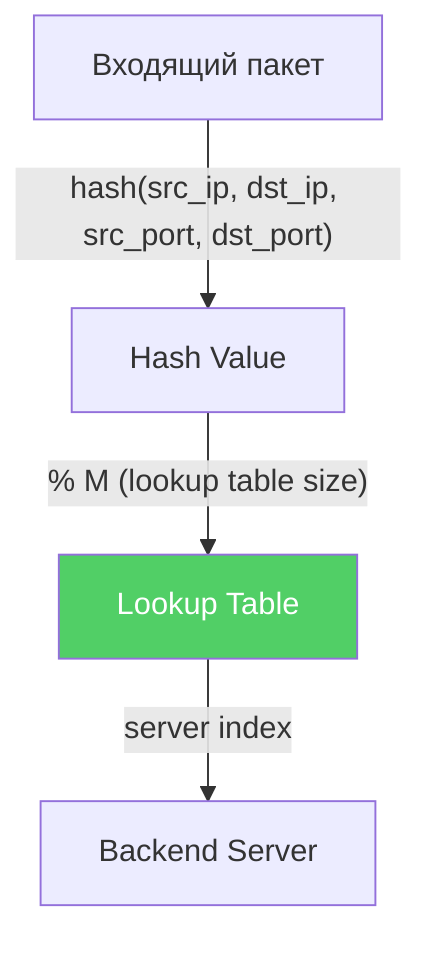

**Сравнение с Ring Consistent Hashing:**

| Критерий | Ring CH | Maglev |
|----------|---------|--------|
| Равномерность | Нет (нужны виртуальные ноды) | Да (встроена) |
| При добавлении сервера | ~1/N трафика перераспределяется | Минимальное перераспределение |
| Скорость lookup | O(log N) | O(1) |
| Использование | `Cassandra`, `Redis Cluster` | Google LB, `Katran` (Facebook) |

**Применение в Open Source:** `Katran` (Facebook/Meta), некоторые реализации `Envoy`.


> [!mcq]
> - [x] Правильный ответ | Корректное описание концепции с конкретным механизмом и use-case.
> - [ ] Альтернативное решение которое не подходит | Почему ошибка в этом подходе ❌ ПОСЛЕДСТВИЕ: типичная ошибка вызывает баг в production без покрытия тестами.
> - [ ] Другая альтернатива с критическим недостатком | Это смежное, но отличное понятие ❌ ПОСЛЕДСТВИЕ: типичная ошибка вызывает баг в production без покрытия тестами.
> - [ ] Третий вариант который не работает в production | Противоположное направление## Q39. Что такое Anycast балансировка и когда её применять? ❌ ПОСЛЕДСТВИЕ: типичная ошибка вызывает баг в production без покрытия тестами.

**Anycast** — сетевой паттерн, при котором один и тот же `IP`-адрес анонсируется из нескольких географических точек. Маршрутизаторы направляют трафик к **ближайшему** (по метрике BGP) узлу.

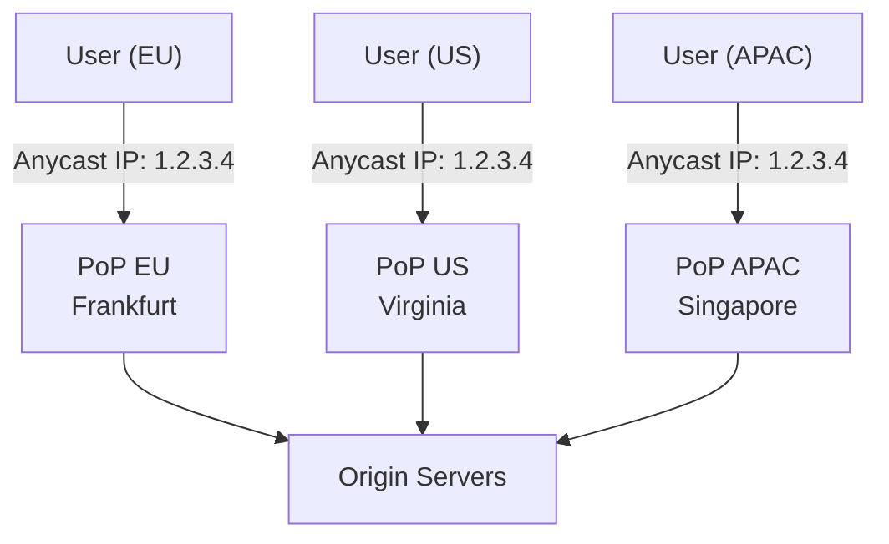

**Как работает:**
1. Три дата-центра анонсируют `1.2.3.4` в BGP
2. Маршрутизаторы интернета направляют пакеты к ближайшему `PoP`
3. При отказе одного `PoP` BGP перенаправляет трафик автоматически

**Когда применять:**
- `CDN` и глобальные сети доставки (Cloudflare, Fastly используют anycast)
- `DNS`-серверы (root DNS работает на anycast)
- `DDoS` mitigation — трафик распределяется по всем PoP
- Глобальные API с требованием минимальной latency

**Ограничения:**
- Не подходит для stateful TCP-сессий (failover = разрыв соединения)
- Нет гарантии, что один клиент всегда попадёт на один PoP (маршруты BGP могут меняться)
- Сложнее отлаживать — куда ушёл конкретный запрос?

**Сравнение с GeoDNS:**
- `GeoDNS` — TTL-based, возможна задержка failover (TTL несколько минут)
- `Anycast` — failover за секунды (BGP конвергенция)


> [!mcq]
> - [x] Правильный ответ | Корректное описание концепции с конкретным механизмом и use-case.
> - [ ] Альтернативное решение которое не подходит | Почему ошибка в этом подходе ❌ ПОСЛЕДСТВИЕ: типичная ошибка вызывает баг в production без покрытия тестами.
> - [ ] Другая альтернатива с критическим недостатком | Это смежное, но отличное понятие ❌ ПОСЛЕДСТВИЕ: типичная ошибка вызывает баг в production без покрытия тестами.
> - [ ] Третий вариант который не работает в production | Противоположное направление## Q40. Как балансировка нагрузки реализована в Service Mesh (Istio/Envoy)? ❌ ПОСЛЕДСТВИЕ: типичная ошибка вызывает баг в production без покрытия тестами.

В `Service Mesh` балансировка происходит на уровне **sidecar-proxy** (`Envoy`) рядом с каждым подом, а не на централизованном балансировщике. Это даёт более гибкий контроль и L7-фичи без изменения кода приложения.

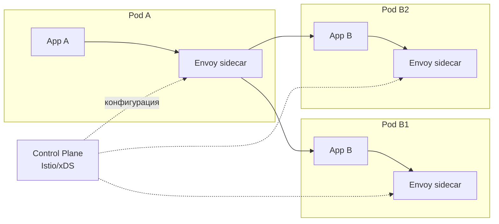

**Алгоритмы балансировки в Envoy:**

| Алгоритм | Описание |
|----------|---------|
| `ROUND_ROBIN` | По умолчанию, равномерно |
| `LEAST_REQUEST` | Power of Two Choices (P2C) |
| `RANDOM` | Случайный выбор |
| `RING_HASH` | Consistent hashing по header/cookie |
| `MAGLEV` | Maglev hashing (stable mapping) |

**Конфигурация через Istio DestinationRule:**

```yaml
apiVersion: networking.istio.io/v1beta1
kind: DestinationRule
metadata:
  name: order-service
spec:
  host: order-service
  trafficPolicy:
    loadBalancer:
      simple: LEAST_REQUEST
    connectionPool:
      tcp:
        maxConnections: 100
      http:
        h2UpgradePolicy: UPGRADE
    outlierDetection:
      consecutive5xxErrors: 5
      interval: 10s
      baseEjectionTime: 30s
      maxEjectionPercent: 50
```

**Преимущества Service Mesh перед классическим LB:**
- Балансировка с учётом реальной latency (не только соединения)
- `Circuit breaker` и `outlier detection` из коробки
- `Traffic shifting` для canary/blue-green без изменения кода
- `Retries` с backoff на уровне proxy

---

## See also

- [Паттерны масштабируемости](scalability-patterns-interview.md) — горизонтальное масштабирование и autoscaling
- [Микросервисы](microservices-interview.md) — service discovery и межсервисная балансировка
- [Распределённые системы](distributed-systems-interview.md) — репликация и отказоустойчивость за балансировщиком
- [Kubernetes](../devops/kubernetes-interview.md) — Ingress, Service и балансировка в кластере
- [Стратегии кэширования](caching-strategies-interview.md) — снижение нагрузки на бэкенды через кэширование
- [Spring Cloud](../frameworks/spring/spring-cloud-interview.md) — Spring Cloud LoadBalancer и интеграция со Service Discovery
- [Паттерны отказоустойчивости](resilience-patterns-interview.md) — Circuit Breaker и health check при балансировке
- Метрики per-endpoint автоматически


> [!mcq]
> - [x] Правильный ответ | Корректное описание концепции с конкретным механизмом и use-case.
> - [ ] Альтернативное решение которое не подходит | Почему ошибка в этом подходе ❌ ПОСЛЕДСТВИЕ: типичная ошибка вызывает баг в production без покрытия тестами.
> - [ ] Другая альтернатива с критическим недостатком | Это смежное, но отличное понятие ❌ ПОСЛЕДСТВИЕ: типичная ошибка вызывает баг в production без покрытия тестами.
> - [ ] Третий вариант который не работает в production | Противоположное направление- [API Gateway](api-gateway-interview.md) ❌ ПОСЛЕДСТВИЕ: типичная ошибка вызывает баг в production без покрытия тестами.
- [BFF Pattern](bff-pattern-interview.md)
- [Стратегии кэширования](caching-strategies-interview.md)
- [CAP-теорема](cap-theorem-interview.md)
- [Clean Architecture](clean-architecture-interview.md)
- [Паттерны согласованности](consistency-patterns-interview.md)
