# Вопросы на собеседовании: Микросервисная архитектура

Полное покрытие микросервисной архитектуры: разбиение на сервисы, коммуникация, согласованность, `Saga`, `CQRS`, `API Gateway`, `Service Discovery`, `Circuit Breaker`, `Service Mesh`, мониторинг.

**Микросервисная архитектура** -- частый фокус собеседований на Senior: согласованность, `Saga`, `2PC`, `API Gateway`, `Service Discovery`, паттерны отказоустойчивости и операционная сложность. Этот файл охватывает как теоретические основы, так и практические паттерны с примерами на `Spring Boot` / `Spring Cloud`.

## Полезные ссылки

### Официальная документация

- [Microservices (Martin Fowler)](https://martinfowler.com/articles/microservices.html) -- канонический обзор
- [Building Microservices (Sam Newman)](https://samnewman.io/books/building_microservices_2nd_edition/) -- практическое руководство
- [Spring Cloud Gateway](https://www.baeldung.com/spring-cloud-gateway) -- маршрутизация и фильтры
- [Resilience4j with Spring Boot](https://www.baeldung.com/spring-boot-resilience4j) -- Circuit Breaker, Retry, Rate Limiter
- [Spring Cloud Netflix Eureka](https://www.baeldung.com/spring-cloud-netflix-eureka) -- Service Discovery
- [Saga Pattern in Microservices](https://www.baeldung.com/cs/saga-pattern-microservices) -- паттерн Saga
- [CQRS and Event Sourcing in Java](https://www.baeldung.com/cqrs-event-sourcing-java) -- разделение чтения и записи
- [Service Mesh with Istio](https://www.baeldung.com/ops/istio-service-mesh) -- Service Mesh архитектура

## Содержание

- [Полезные ссылки](#полезные-ссылки)
- [See also](#see-also)

**Основы микросервисной архитектуры**
- [Q1. (!) Что такое микросервисная архитектура?](#q1--что-такое-микросервисная-архитектура)
- [Q2. (!) Монолит vs микросервисы -- когда что выбрать?](#q2--монолит-vs-микросервисы----когда-что-выбрать)
- [Q3. (!) Какие преимущества и недостатки имеет микросервисная архитектура?](#q3--какие-преимущества-и-недостатки-имеет-микросервисная-архитектура)
- [Q4. Как правильно определить границы микросервиса (Bounded Context)?](#q4-как-правильно-определить-границы-микросервиса-bounded-context)
- [Q5. Какие технологии используются для межсервисного взаимодействия?](#q5-какие-технологии-используются-для-межсервисного-взаимодействия)
- [Q6. Синхронное vs асинхронное взаимодействие -- когда что применять?](#q6-синхронное-vs-асинхронное-взаимодействие----когда-что-применять)

**Ключевые паттерны микросервисов**
- [Q7. (!) Какие основные паттерны микросервисной архитектуры?](#q7--какие-основные-паттерны-микросервисной-архитектуры)
- [Q8. (!) Что такое API Gateway и зачем он нужен?](#q8--что-такое-api-gateway-и-зачем-он-нужен)
- [Q9. (!) Что такое Service Discovery и как он работает?](#q9--что-такое-service-discovery-и-как-он-работает)
- [Q10. (!) Что такое Circuit Breaker и как он предотвращает каскадные сбои?](#q10--что-такое-circuit-breaker-и-как-он-предотвращает-каскадные-сбои)
- [Q11. Что такое Service Mesh и зачем он нужен?](#q11-что-такое-service-mesh-и-зачем-он-нужен)
- [Q12. (!) Что такое паттерн CQRS?](#q12--что-такое-паттерн-cqrs)
- [Q13. Что такое Event Sourcing?](#q13-что-такое-event-sourcing)
- [Q14. Что такое паттерн Strangler Fig для миграции с монолита?](#q14-что-такое-паттерн-strangler-fig-для-миграции-с-монолита)

**Транзакции и согласованность данных**
- [Q15. (!) Что такое ACID и BASE?](#q15--что-такое-acid-и-base)
- [Q16. (!) Что такое CAP-теорема?](#q16--что-такое-cap-теорема)
- [Q17. (!) Как обеспечивается атомарность операций в микросервисах?](#q17--как-обеспечивается-атомарность-операций-в-микросервисах)
- [Q18. (!) Что такое Saga и когда применять вместо 2PC?](#q18--что-такое-saga-и-когда-применять-вместо-2pc)
- [Q19. (!) Что такое двухфазная фиксация (2PC)?](#q19--что-такое-двухфазная-фиксация-2pc)
- [Q20. Что такое трёхфазная фиксация (3PC)?](#q20-что-такое-трёхфазная-фиксация-3pc)
- [Q21. (!) Что такое компенсирующие транзакции?](#q21--что-такое-компенсирующие-транзакции)
- [Q22. Как решить проблемы согласованности данных?](#q22-как-решить-проблемы-согласованности-данных)

**Отказоустойчивость и надёжность**
- [Q23. (!) Как обрабатываются сбои и отказы в микросервисах?](#q23--как-обрабатываются-сбои-и-отказы-в-микросервисах)
- [Q24. (!) Как реализовать механизмы повторной попытки (Retry)?](#q24--как-реализовать-механизмы-повторной-попытки-retry)
- [Q25. Как обеспечить идемпотентность операций?](#q25-как-обеспечить-идемпотентность-операций)
- [Q26. Что такое Bulkhead-паттерн?](#q26-что-такое-bulkhead-паттерн)

**Конфигурация, безопасность, версионирование**
- [Q27. (!) Как организовать конфигурацию микросервисов?](#q27--как-организовать-конфигурацию-микросервисов)
- [Q28. (!) Как обеспечить безопасность взаимодействия между микросервисами?](#q28--как-обеспечить-безопасность-взаимодействия-между-микросервисами)
- [Q29. Как управлять версионированием API без прерывания работы?](#q29-как-управлять-версионированием-api-без-прерывания-работы)

**Наблюдаемость и эксплуатация**
- [Q30. (!) Какие методы логирования и трейсинга используются?](#q30--какие-методы-логирования-и-трейсинга-используются)
- [Q31. (!) Какие инструменты мониторинга и отладки используются?](#q31--какие-инструменты-мониторинга-и-отладки-используются)
- [Q32. Как обеспечивается масштабируемость и производительность?](#q32-как-обеспечивается-масштабируемость-и-производительность)

**Проектирование и практика**
- [Q33. Какие аспекты транзакций необходимо учитывать при проектировании?](#q33-какие-аспекты-транзакций-необходимо-учитывать-при-проектировании)
- [Q34. Как обеспечивается изоляция данных в микросервисах (Database per Service)?](#q34-как-обеспечивается-изоляция-данных-в-микросервисах-database-per-service)
- [Q35. Что такое глобальная транзакция и как она отличается от локальной?](#q35-что-такое-глобальная-транзакция-и-как-она-отличается-от-локальной)
- [Q36. Как организовать тестирование микросервисов?](#q36-как-организовать-тестирование-микросервисов)
- [Q37. Как реализовать distributed tracing в микросервисах?](#q37-как-реализовать-distributed-tracing-в-микросервисах)
- [Q38. Как организовать деплой микросервисов (Blue-Green, Canary)?](#q38-как-организовать-деплой-микросервисов-blue-green-canary)

**Организационные паттерны и владение данными**
- [Q39. (!) Что такое закон Конвея (Conway's Law) и как он влияет на микросервисы?](#q39--что-такое-закон-конвея-conways-law-и-как-он-влияет-на-микросервисы)
- [Q40. (!) Что такое Data Ownership в микросервисах и какие антипаттерны нарушают его?](#q40--что-такое-data-ownership-в-микросервисах-и-какие-антипаттерны-нарушают-его)
- [Q41. (!) Как реализовать distributed tracing с OpenTelemetry и Jaeger?](#q41--как-реализовать-distributed-tracing-с-opentelemetry-и-jaeger)
- [Q42. Как организовать inter-service communication: Feign vs WebClient vs gRPC?](#q42-как-организовать-inter-service-communication-feign-vs-webclient-vs-grpc)

---

## Q1. (!) Что такое микросервисная архитектура?

**Микросервисная архитектура** -- подход, при котором приложение разбивается на небольшие независимые сервисы; каждый сервис отвечает за свою доменную область, развёртывается и масштабируется отдельно.

**Ключевые характеристики:**
- Каждый сервис имеет собственную БД (Database per Service)
- Сервисы общаются через сеть (`REST`, `gRPC`, очереди сообщений)
- Независимый деплой и масштабирование
- Каждый сервис разрабатывается и поддерживается отдельной командой

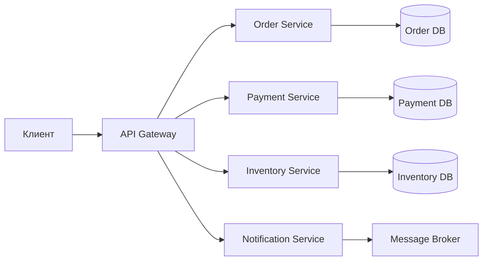

**Практический критерий:** к микросервисам переходят, когда появляется реальная потребность в независимом деплое и масштабировании частей системы, а не «по моде». Подробнее о согласованности данных -- в [[distributed-systems-interview|вопросах по распределённым системам]].

## Q2. (!) Монолит vs микросервисы -- когда что выбрать?

**Монолит** -- традиционный подход, в котором весь функционал приложения разрабатывается и развёртывается в едином блоке. Все компоненты находятся в одной кодовой базе.

**Микросервисы** -- приложение разделяется на набор маленьких независимых сервисов, которые взаимодействуют по сети.

| Критерий | Монолит | Микросервисы |
|----------|---------|-------------|
| Размер команды | Маленькая (до 10 чел.) | Большая (10+ чел., несколько команд) |
| Сложность деплоя | Простой (один артефакт) | Сложный (десятки сервисов) |
| Масштабирование | Только вертикальное | Горизонтальное, per-service |
| Согласованность | `ACID` транзакции | Eventual consistency, `Saga` |
| Старт нового проекта | Да (Monolith First) | Нет (преждевременная оптимизация) |
| Зрелость инфраструктуры | Не требуется | CI/CD, контейнеры, оркестрация |

**Совет Мартина Фаулера:** начинать с монолита (`Monolith First`), разделять на микросервисы когда появится реальная потребность. Гибридный подход -- `Modular Monolith` -- хорошая промежуточная точка: модули с чётко определёнными границами внутри одного деплоя.

## Q3. (!) Какие преимущества и недостатки имеет микросервисная архитектура?

**Преимущества:**

1. **Независимый деплой** -- обновление одного сервиса не требует пересборки всего приложения
2. **Масштабируемость** -- каждый сервис масштабируется независимо (горизонтально)
3. **Технологическая гибкость** -- разные сервисы могут использовать разные языки/фреймворки/БД
4. **Устойчивость к сбоям** -- падение одного сервиса не означает падение всей системы (при правильной реализации `Circuit Breaker`)
5. **Автономность команд** -- каждая команда владеет своим сервисом (full ownership)

**Недостатки:**

1. **Распределённая сложность** -- сетевые вызовы, латентность, частичные отказы
2. **Согласованность данных** -- нет `ACID` между сервисами, нужны `Saga`, eventual consistency
3. **Операционная сложность** -- нужен `CI/CD`, мониторинг, трейсинг, оркестрация
4. **Тестирование** -- сложнее интеграционное и end-to-end тестирование
5. **Разделение границ** -- неправильное разбиение приводит к `distributed monolith`

## Q4. Как правильно определить границы микросервиса (Bounded Context)?

**Bounded Context** из `Domain-Driven Design` -- основной инструмент определения границ микросервиса. Каждый микросервис соответствует одному ограниченному контексту.

**Правила определения границ:**

1. **Бизнес-домен** -- сервис соответствует конкретной бизнес-области (заказы, платежи, склад)
2. **Single Responsibility** -- один сервис отвечает за один бизнес-контекст
3. **Независимость данных** -- у каждого сервиса своя БД, нет общих таблиц
4. **Слабая связанность** -- изменение одного сервиса не должно требовать изменения другого
5. **Правило двух пицц (Amazon)** -- сервис должен обслуживаться командой, которую можно накормить двумя пиццами

**Анти-паттерн: Distributed Monolith** -- формально микросервисы, но тесно связаны; требуют совместного деплоя, разделяют БД или модели. Признаки: для одного изменения нужно менять несколько сервисов; нельзя деплоить независимо.

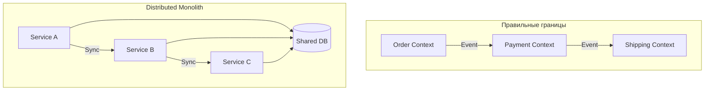

## Q5. Какие технологии используются для межсервисного взаимодействия?

| Технология | Тип | Когда применять |
|-----------|-----|----------------|
| `REST` / `HTTP` | Синхронный | CRUD, простые запросы |
| `gRPC` | Синхронный | Высокая производительность, строгие контракты |
| `Apache Kafka` | Асинхронный | Потоки событий, высокая пропускная способность |
| `RabbitMQ` | Асинхронный | Задачи, очереди, routing |
| `GraphQL` | Синхронный | Гибкие клиентские запросы, BFF |
| `WebSocket` | Двусторонний | Реалтайм-уведомления |

Подробнее о событийном взаимодействии -- в [[event-driven-patterns-interview|вопросах по Event-driven паттернам]], о `Kafka` -- в [[kafka-interview|вопросах по Kafka]].

## Q6. Синхронное vs асинхронное взаимодействие -- когда что применять?

**Синхронное** (`REST`, `gRPC`): клиент ждёт ответа. Подходит когда нужен немедленный результат (получить данные, проверить баланс). Проблемы: temporal coupling, каскадные сбои, увеличение латентности при цепочке вызовов.

**Асинхронное** (события, очереди): клиент не ждёт ответа. Подходит для уведомлений, обработки в фоне, Saga. Плюсы: слабая связанность, устойчивость к пиковым нагрузкам. Минусы: сложнее отладка, eventual consistency.

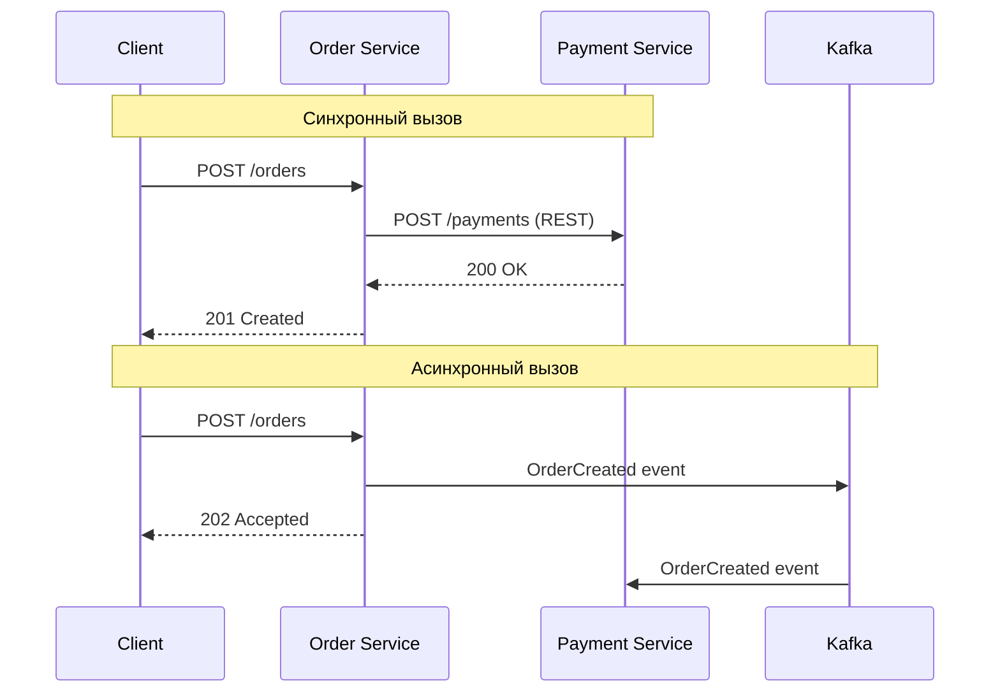

**Правило:** предпочитать асинхронное взаимодействие; синхронное -- только когда клиенту действительно нужен немедленный ответ.

## Q7. (!) Какие основные паттерны микросервисной архитектуры?

Основные паттерны, которые спрашивают на собеседованиях:

| Паттерн | Назначение |
|---------|-----------|
| `API Gateway` | Единая точка входа, маршрутизация, аутентификация |
| `Service Discovery` | Динамическое обнаружение сервисов |
| `Circuit Breaker` | Защита от каскадных сбоев |
| `Saga` | Распределённые транзакции без 2PC |
| `CQRS` | Разделение чтения и записи |
| `Event Sourcing` | Хранение истории изменений как событий |
| `Service Mesh` | Инфраструктурный слой для межсервисного трафика |
| `Bulkhead` | Изоляция ресурсов между вызовами |
| `Strangler Fig` | Постепенная миграция с монолита |
| `Sidecar` | Вспомогательный контейнер рядом с основным |
| `BFF` (`Backend for Frontend`) | Отдельный API-слой для каждого типа клиента |
| `Database per Service` | Изоляция данных каждого сервиса |

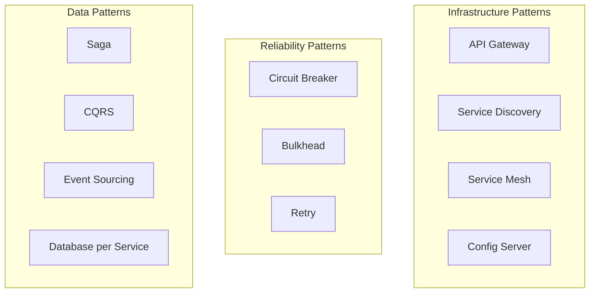

## Q8. (!) Что такое API Gateway и зачем он нужен?

**`API Gateway`** -- единая точка входа для всех клиентов; выполняет маршрутизацию запросов к микросервисам, аутентификацию/авторизацию, rate limiting, агрегацию ответов.

Реализации: `Spring Cloud Gateway`, `Kong`, `AWS API Gateway`, `NGINX`.

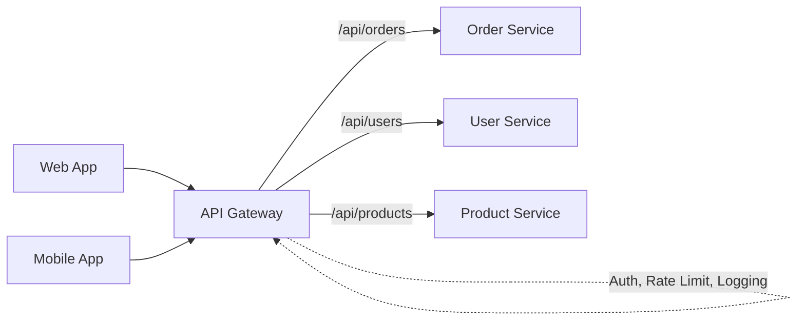

**Конфигурация `Spring Cloud Gateway`:**

```java
@Configuration
public class GatewayConfig {

    @Bean
    public RouteLocator customRouteLocator(RouteLocatorBuilder builder) {
        return builder.routes()
            .route("order-service", r -> r
                .path("/api/orders/**")
                .filters(f -> f
                    .stripPrefix(1)
                    .addRequestHeader("X-Gateway", "true")
                    .circuitBreaker(cb -> cb
                        .setName("orderCB")
                        .setFallbackUri("forward:/fallback/orders")))
                .uri("lb://order-service"))
            .route("user-service", r -> r
                .path("/api/users/**")
                .filters(f -> f.stripPrefix(1))
                .uri("lb://user-service"))
            .build();
    }
}
```

```yaml
# Декларативная конфигурация Spring Cloud Gateway
spring:
  cloud:
    gateway:
      routes:
        - id: order-service
          uri: lb://order-service
          predicates:
            - Path=/api/orders/**
          filters:
            - name: RequestRateLimiter
              args:
                redis-rate-limiter.replenishRate: 10
                redis-rate-limiter.burstCapacity: 20
            - StripPrefix=1
```

**BFF-подход:** отдельный `Gateway` для каждого типа клиента (web, mobile) -- каждый агрегирует данные из нескольких сервисов под нужды конкретного фронтенда.

## Q9. (!) Что такое Service Discovery и как он работает?

**`Service Discovery`** -- механизм автоматического обнаружения сетевых адресов экземпляров сервисов. В динамических средах (`Kubernetes`, облако) адреса меняются при масштабировании, перезапусках.

**Два подхода:**
- **Client-side discovery** -- клиент запрашивает реестр и сам выбирает инстанс (`Eureka` + `Spring Cloud LoadBalancer`)
- **Server-side discovery** -- запрос идёт через балансировщик, который знает реестр (`Kubernetes Service`, `AWS ELB`)

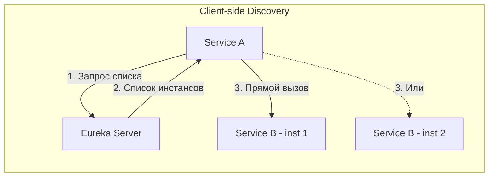

**Реализация с `Spring Cloud Eureka`:**

```java
// Eureka Server
@SpringBootApplication
@EnableEurekaServer
public class EurekaServerApp {
    public static void main(String[] args) {
        SpringApplication.run(EurekaServerApp.class, args);
    }
}

// Eureka Client (микросервис)
@SpringBootApplication
@EnableDiscoveryClient
public class OrderServiceApp {
    public static void main(String[] args) {
        SpringApplication.run(OrderServiceApp.class, args);
    }
}

// Использование DiscoveryClient
@Service
@RequiredArgsConstructor
public class PaymentClient {
    private final DiscoveryClient discoveryClient;

    public String getPaymentServiceUrl() {
        List<ServiceInstance> instances =
            discoveryClient.getInstances("payment-service");
        // Выбор инстанса (round-robin, random, etc.)
        ServiceInstance instance = instances.get(0);
        return instance.getUri().toString();
    }
}
```

В `Kubernetes` `Service Discovery` встроен через `DNS` -- каждый `Service` доступен по имени (`payment-service.default.svc.cluster.local`), и `kube-proxy` выполняет балансировку. Подробнее -- в [[kubernetes-interview|вопросах по Kubernetes]].

## Q10. (!) Что такое Circuit Breaker и как он предотвращает каскадные сбои?

**`Circuit Breaker`** -- паттерн, предотвращающий каскадные сбои: если вызываемый сервис не отвечает, прерывает вызовы и возвращает fallback-ответ.

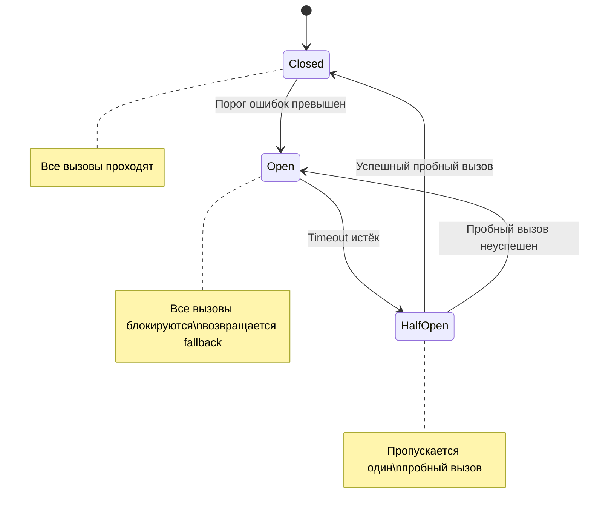

**Три состояния:**
1. **Closed** -- вызовы проходят нормально, ошибки считаются
2. **Open** -- вызовы блокируются, возвращается fallback
3. **Half-Open** -- пропускается пробный вызов для проверки восстановления

**Реализация с `Resilience4j`:**

```java
@Service
public class OrderService {

    @CircuitBreaker(name = "paymentService", fallbackMethod = "paymentFallback")
    @Retry(name = "paymentService", fallbackMethod = "paymentFallback")
    public PaymentResponse processPayment(PaymentRequest request) {
        return paymentClient.charge(request);
    }

    private PaymentResponse paymentFallback(PaymentRequest request,
                                            Throwable ex) {
        log.warn("Payment service unavailable, using fallback: {}",
                 ex.getMessage());
        return PaymentResponse.pending(request.getOrderId());
    }
}
```

```yaml
# application.yml — конфигурация Resilience4j
resilience4j:
  circuitbreaker:
    instances:
      paymentService:
        slidingWindowSize: 10
        failureRateThreshold: 50
        waitDurationInOpenState: 10s
        permittedNumberOfCallsInHalfOpenState: 3
        slowCallDurationThreshold: 2s
  retry:
    instances:
      paymentService:
        maxAttempts: 3
        waitDuration: 500ms
        exponentialBackoffMultiplier: 2
```

**Важно:** `Circuit Breaker` и `Retry` дополняют друг друга -- `Retry` повторяет отдельные неудачные вызовы, `Circuit Breaker` прекращает вызовы при массовых сбоях.

## Q11. Что такое Service Mesh и зачем он нужен?

**`Service Mesh`** -- инфраструктурный слой управления трафиком между микросервисами (sidecar-прокси рядом с каждым подом): маршрутизация, retry, circuit breaker, `mTLS`, метрики и трейсинг без изменения кода приложения.

Реализации: `Istio`, `Linkerd`, `Consul Connect`.

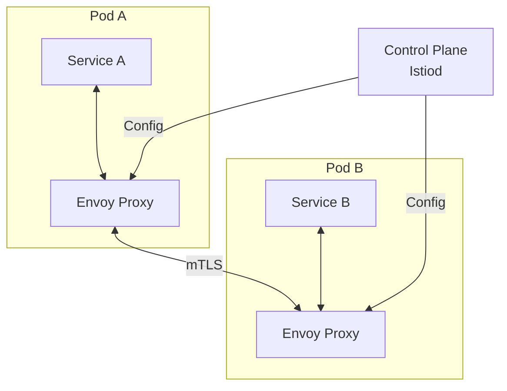

**Как работает:** sidecar-прокси (`Envoy`) перехватывает весь входящий и исходящий трафик пода. Приложение обращается на `localhost`; прокси переправляет запрос к целевому сервису, применяя политики retry, таймауты, `mTLS`.

**Когда использовать:** большое количество сервисов (10+), нужна единообразная безопасность (`mTLS`), наблюдаемость без изменения кода. **Когда не использовать:** мало сервисов (2--5) -- достаточно встроенных `Resilience4j` и `Spring Cloud`.

## Q12. (!) Что такое паттерн CQRS?

**`CQRS`** (`Command Query Responsibility Segregation`) -- паттерн, разделяющий модели чтения и записи. Команды (`Command`) изменяют состояние, запросы (`Query`) только читают данные.

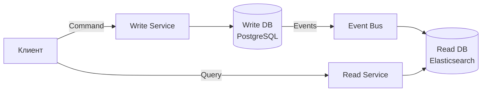

**Зачем:**
- Модель чтения оптимизирована для запросов (денормализация, кэш)
- Модель записи оптимизирована для бизнес-логики (нормализация, валидация)
- Чтение и запись масштабируются независимо

**Пример с `Spring Boot`:**

```java
// Command — изменение состояния
@RestController
@RequestMapping("/api/orders")
public class OrderCommandController {

    @PostMapping
    public ResponseEntity<UUID> createOrder(@RequestBody CreateOrderCommand cmd) {
        UUID orderId = orderCommandService.handle(cmd);
        return ResponseEntity.status(HttpStatus.CREATED).body(orderId);
    }
}

// Query — только чтение
@RestController
@RequestMapping("/api/orders")
public class OrderQueryController {

    @GetMapping("/{id}")
    public OrderView getOrder(@PathVariable UUID id) {
        return orderQueryService.findById(id);
    }

    @GetMapping
    public List<OrderSummaryView> search(OrderSearchCriteria criteria) {
        return orderQueryService.search(criteria);
    }
}
```

**Когда применять:** высокая нагрузка на чтение vs запись (read-heavy системы), сложная бизнес-логика записи, нужна денормализация для UI. Часто используется совместно с `Event Sourcing`.

## Q13. Что такое Event Sourcing?

**`Event Sourcing`** -- паттерн, при котором все изменения состояния записываются как последовательность неизменяемых событий. Текущее состояние восстанавливается повторным проигрыванием событий.

**Пример:** вместо хранения `balance = 150` хранятся события:
1. `AccountCreated(balance=0)`
2. `MoneyDeposited(amount=200)`
3. `MoneyWithdrawn(amount=50)`

**Плюсы:** полная история изменений, возможность восстановления на любой момент времени, аудит «из коробки». **Минусы:** сложность запросов (нужен `CQRS`), рост хранилища, eventual consistency.

Фреймворки для Java: `Axon Framework`, `Eventuate`. Подробнее о событийных паттернах -- в [[event-driven-patterns-interview|Event-driven паттернах]].

## Q14. Что такое паттерн Strangler Fig для миграции с монолита?

**`Strangler Fig`** (по Мартину Фаулеру) -- паттерн постепенной замены монолита микросервисами. Новая функциональность реализуется в микросервисах; старая -- постепенно переносится. `API Gateway` маршрутизирует запросы: часть идёт к монолиту, часть -- к новым сервисам.

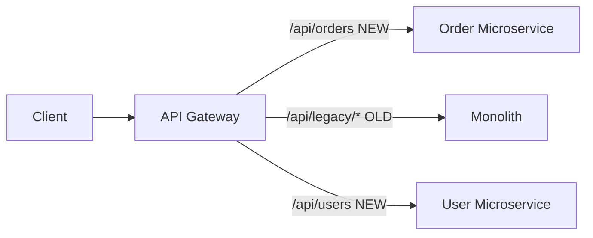

**Шаги:**
1. Поставить `API Gateway` перед монолитом
2. Выделить один Bounded Context в микросервис
3. Перенаправить трафик на микросервис через Gateway
4. Повторять для следующих контекстов
5. Отключить монолит, когда весь трафик идёт через микросервисы

## Q15. (!) Что такое ACID и BASE?

**`ACID`** (`Atomicity`, `Consistency`, `Isolation`, `Durability`) -- свойства транзакций в реляционных БД:

1. **Atomicity** -- транзакция выполняется целиком или не выполняется вовсе
2. **Consistency** -- БД переходит из одного согласованного состояния в другое
3. **Isolation** -- транзакции не видят промежуточные результаты друг друга
4. **Durability** -- после коммита данные сохраняются даже при сбое

**`BASE`** (`Basically Available`, `Soft-state`, `Eventual consistency`) -- альтернативный подход для распределённых систем:

1. **Basically Available** -- система доступна, допуская временную несогласованность
2. **Soft-state** -- состояние может меняться со временем (без записи)
3. **Eventual consistency** -- данные в итоге придут к согласованному состоянию

| | ACID | BASE |
|---|------|------|
| Гарантии | Строгая согласованность | Конечная согласованность |
| Производительность | Ниже (блокировки) | Выше (нет блокировок) |
| Масштабируемость | Вертикальная | Горизонтальная |
| Применение | Монолит, одна БД | Микросервисы, NoSQL |

В микросервисной архитектуре `BASE` -- основной подход, так как `ACID`-транзакции между сервисами невозможны. Подробнее -- в [[consistency-patterns-interview|паттернах согласованности]].

## Q16. (!) Что такое CAP-теорема?

**`CAP`-теорема** (теорема Брюэра) -- в распределённой системе невозможно одновременно гарантировать все три свойства:

1. **Consistency** -- все узлы видят одни и те же данные в один момент времени
2. **Availability** -- каждый запрос получает ответ (даже при сбоях)
3. **Partition tolerance** -- система работает при разрыве сети между узлами

В реальных распределённых системах сетевые разделения (`P`) неизбежны, поэтому выбор сводится к `CP` vs `AP`:
- **CP** (`ZooKeeper`, `etcd`, `HBase`) -- при разделении жертвуем доступностью
- **AP** (`Cassandra`, `DynamoDB`, `Eureka`) -- при разделении жертвуем строгой согласованностью

Подробнее -- в [[cap-theorem-interview|вопросах по CAP-теореме]].

## Q17. (!) Как обеспечивается атомарность операций в микросервисах?

В архитектуре микросервисов нет глобальных `ACID`-транзакций. Подходы:

1. **Saga** -- последовательность локальных транзакций с компенсациями
2. **Transactional Outbox** -- событие записывается в таблицу `outbox` в той же транзакции, что и данные; отдельный процесс (`Debezium`, polling) читает outbox и публикует в `Kafka`
3. **Event Sourcing** -- все изменения как события, атомарность на уровне одного агрегата
4. **Оркестрация / Хореография** -- координация шагов распределённой операции

```java
// Transactional Outbox — запись данных и события в одной транзакции
@Service
@RequiredArgsConstructor
public class OrderService {

    private final OrderRepository orderRepository;
    private final OutboxRepository outboxRepository;

    @Transactional
    public Order createOrder(CreateOrderRequest request) {
        Order order = Order.create(request);
        orderRepository.save(order);

        // Событие в outbox-таблицу — в той же транзакции
        outboxRepository.save(OutboxEvent.builder()
            .aggregateType("Order")
            .aggregateId(order.getId().toString())
            .type("OrderCreated")
            .payload(toJson(new OrderCreatedEvent(order)))
            .build());

        return order;
    }
}
```

## Q18. (!) Что такое Saga и когда применять вместо 2PC?

**`Saga`** -- последовательность локальных транзакций в микросервисах; при сбое шага выполняются компенсирующие транзакции (откат предыдущих шагов).

**Два подхода:**
- **Choreography** -- каждый сервис публикует событие; следующие сервисы подписываются
- **Orchestration** -- центральный оркестратор вызывает сервисы по очереди

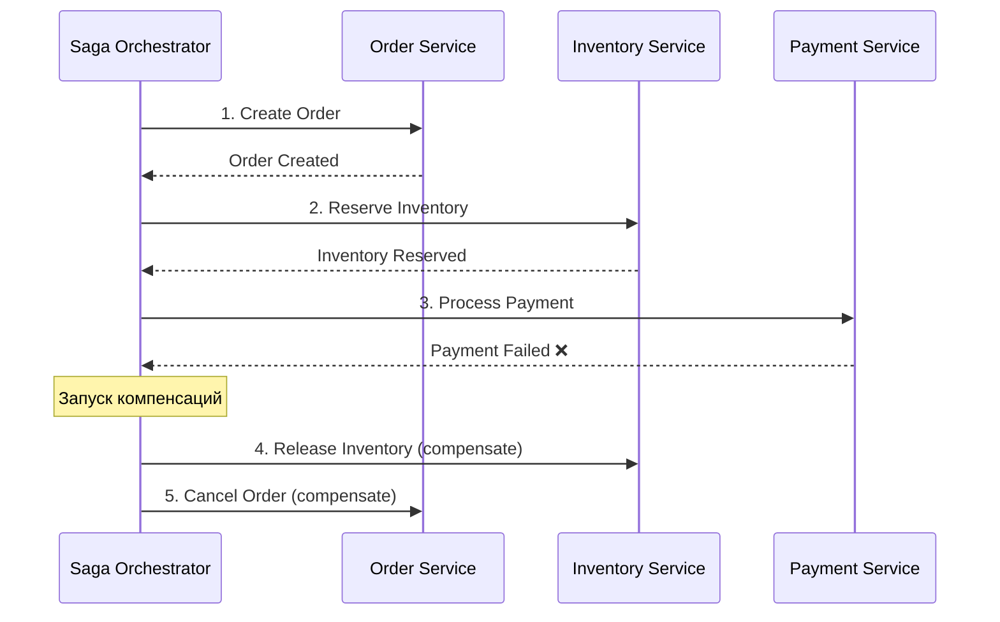

**Saga vs 2PC:**

| | Saga | 2PC |
|---|------|-----|
| Блокировки | Нет | Да (ресурсы заблокированы) |
| Производительность | Высокая | Низкая |
| Согласованность | Eventual | Strong |
| Сложность | Компенсации | Простой протокол |
| Поддержка NoSQL | Да | Нет (нужен XA) |

**Применять Saga когда:** сервисы используют разные хранилища, 2PC неприемлем по производительности, нужна слабая связанность.

**Пример оркестратора:**

```java
@Component
@RequiredArgsConstructor
public class CreateOrderSaga {

    private final OrderService orderService;
    private final InventoryClient inventoryClient;
    private final PaymentClient paymentClient;

    public void execute(CreateOrderCommand command) {
        Order order = orderService.create(command);
        try {
            inventoryClient.reserve(order.getItems());
            try {
                paymentClient.charge(order.getTotalAmount());
                orderService.confirm(order.getId());
            } catch (PaymentException e) {
                inventoryClient.release(order.getItems()); // компенсация
                orderService.cancel(order.getId());        // компенсация
                throw e;
            }
        } catch (InventoryException e) {
            orderService.cancel(order.getId());            // компенсация
            throw e;
        }
    }
}
```

## Q19. (!) Что такое двухфазная фиксация (2PC)?

**`Two-Phase Commit` (2PC)** -- протокол обеспечения атомарности распределённых транзакций.

**Фаза 1 (Prepare):** координатор спрашивает всех участников: «Готовы к фиксации?» Каждый участник выполняет локальные проверки и отвечает `YES` или `NO`.

**Фаза 2 (Commit/Rollback):** если все ответили `YES` -- координатор отправляет `COMMIT`; если хоть один `NO` -- `ROLLBACK`.

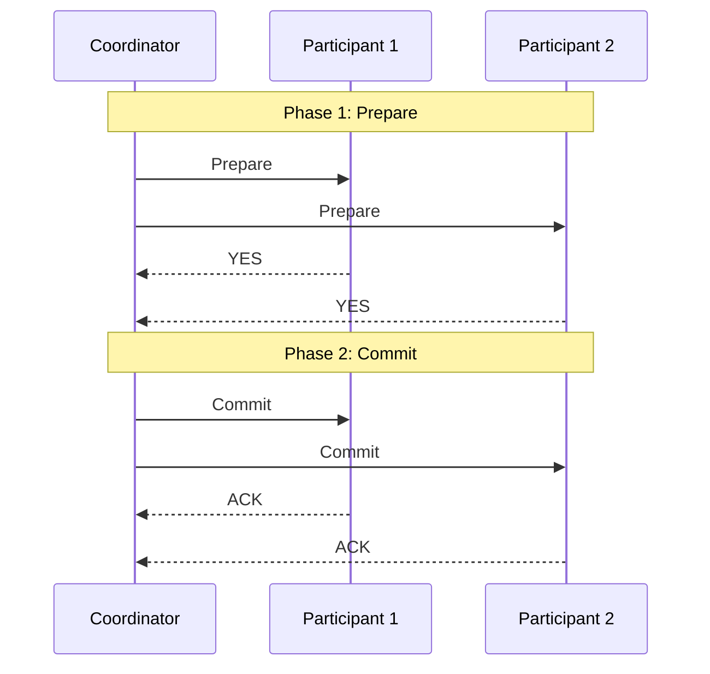

**Недостатки 2PC:**
- **Блокирующий** -- ресурсы заблокированы на время протокола
- **Single point of failure** -- если координатор упал после `Prepare`, участники зависают
- **Не поддерживается NoSQL** -- нужна поддержка `XA`-транзакций
- **Плохая масштабируемость** -- блокировки ограничивают throughput

Поэтому в микросервисах обычно предпочитают `Saga`.

## Q20. Что такое трёхфазная фиксация (3PC)?

**`Three-Phase Commit` (3PC)** -- расширение 2PC, добавляющее фазу `Pre-Commit` для уменьшения вероятности блокировки:

1. **CanCommit** -- координатор спрашивает «можешь фиксировать?»
2. **PreCommit** -- координатор говорит «готовься к фиксации» (но ещё не фиксируй)
3. **DoCommit** -- координатор говорит «фиксируй»

**Преимущество:** при сбое координатора после `PreCommit` участники могут принять решение самостоятельно (таймаут → commit или abort). **Недостаток:** не решает проблему при сетевых разделениях; сложнее реализовать; на практике используется редко.

## Q21. (!) Что такое компенсирующие транзакции?

**Компенсирующие транзакции** -- операции, отменяющие эффект уже выполненных шагов. Используются в `Saga` при сбое одного из шагов.

**Примеры компенсаций:**
| Операция | Компенсация |
|----------|-------------|
| Создать заказ | Отменить заказ |
| Зарезервировать товар | Снять резерв |
| Списать средства | Вернуть средства |
| Отправить уведомление | Отправить уведомление об отмене |

**Важно:** компенсация не всегда означает полный откат; иногда это «семантический откат» (возврат средств, а не отмена банковской транзакции). Компенсации должны быть идемпотентными -- повторный вызов не должен вызывать ошибку.

## Q22. Как решить проблемы согласованности данных?

Подходы к обеспечению согласованности в микросервисах:

1. **Выбор модели согласованности** -- `ACID` внутри сервиса, `BASE` между сервисами
2. **Event Sourcing + CQRS** -- события как источник истины; read model обновляется асинхронно
3. **Saga** -- распределённые транзакции с компенсациями
4. **Transactional Outbox** -- гарантия «at-least-once» публикации событий
5. **Оптимистическая блокировка** -- версионирование данных для обнаружения конфликтов
6. **Bounded Context** -- минимизация межсервисных зависимостей

Подробнее -- в [[consistency-patterns-interview|паттернах согласованности]].

## Q23. (!) Как обрабатываются сбои и отказы в микросервисах?

Стратегии обработки сбоев:

1. **Circuit Breaker** (`Resilience4j`) -- прерывает вызовы при массовых сбоях
2. **Retry** с exponential backoff -- повторяет отдельные неудачные вызовы
3. **Fallback** -- возвращает запасной ответ при недоступности сервиса
4. **Timeout** -- ограничение времени ожидания ответа
5. **Bulkhead** -- изоляция ресурсов (отдельные пулы потоков/соединений)
6. **Graceful degradation** -- система работает с ограниченным функционалом
7. **Health checks** -- `readiness`/`liveness` probes в `Kubernetes`

```java
@Service
public class ProductService {

    @CircuitBreaker(name = "inventory", fallbackMethod = "fallback")
    @Retry(name = "inventory")
    @TimeLimiter(name = "inventory")
    public CompletableFuture<InventoryStatus> checkInventory(String productId) {
        return CompletableFuture.supplyAsync(
            () -> inventoryClient.getStatus(productId));
    }

    private CompletableFuture<InventoryStatus> fallback(String productId,
                                                         Throwable ex) {
        return CompletableFuture.completedFuture(
            InventoryStatus.unknown(productId));
    }
}
```

## Q24. (!) Как реализовать механизмы повторной попытки (Retry)?

**Retry** -- повторение неудачного вызова с задержкой. Подходы:

1. **Фиксированная задержка** -- повтор через N секунд
2. **Exponential backoff** -- задержка удваивается с каждой попыткой (1с, 2с, 4с, 8с)
3. **Exponential backoff + jitter** -- добавляется случайный разброс для избежания `thundering herd`
4. **Retry-After заголовок** -- сервер указывает время до следующей попытки

```java
// Spring Retry
@Service
public class ExternalApiService {

    @Retryable(
        retryFor = {RestClientException.class},
        maxAttempts = 3,
        backoff = @Backoff(delay = 1000, multiplier = 2, maxDelay = 10000)
    )
    public String callExternalApi(String request) {
        return restTemplate.postForObject(apiUrl, request, String.class);
    }

    @Recover
    public String recover(RestClientException ex, String request) {
        log.error("All retries exhausted for request: {}", request);
        return "default-response";
    }
}
```

**Важно:** retry имеет смысл только для **идемпотентных** операций; для мутирующих вызовов без идемпотентности retry может привести к дублированию.

## Q25. Как обеспечить идемпотентность операций?

**Идемпотентность:** повторный вызов с теми же данными даёт тот же результат.

**Подходы:**
- **Idempotency Key** -- клиент передаёт уникальный ключ; сервер кэширует результат
- **Версионирование** -- оптимистичная блокировка по версии записи
- **Дедупликация в консьюмере** -- по ключу сообщения в `Kafka`/`RabbitMQ`

```java
@RestController
@RequestMapping("/api/payments")
public class PaymentController {

    @PostMapping
    public ResponseEntity<PaymentResponse> processPayment(
            @RequestHeader("Idempotency-Key") String idempotencyKey,
            @RequestBody PaymentRequest request) {

        // Проверяем кэш по ключу идемпотентности
        return paymentService.findByIdempotencyKey(idempotencyKey)
            .map(ResponseEntity::ok)
            .orElseGet(() -> {
                PaymentResponse response = paymentService.process(
                    request, idempotencyKey);
                return ResponseEntity.status(HttpStatus.CREATED).body(response);
            });
    }
}
```

## Q26. Что такое Bulkhead-паттерн?

**`Bulkhead`** (переборка) -- паттерн изоляции ресурсов: каждый внешний вызов использует свой пул потоков/соединений. Сбой одного сервиса не исчерпывает ресурсы для вызовов к другим.

Аналогия: переборки на корабле -- затопление одного отсека не топит весь корабль.

```java
@Service
public class OrderService {

    @Bulkhead(name = "paymentService", type = Bulkhead.Type.THREADPOOL)
    public CompletableFuture<PaymentResponse> processPayment(String orderId) {
        return CompletableFuture.supplyAsync(
            () -> paymentClient.charge(orderId));
    }
}
```

```yaml
resilience4j:
  bulkhead:
    instances:
      paymentService:
        maxConcurrentCalls: 10
        maxWaitDuration: 500ms
  thread-pool-bulkhead:
    instances:
      paymentService:
        maxThreadPoolSize: 10
        coreThreadPoolSize: 5
        queueCapacity: 20
```

## Q27. (!) Как организовать конфигурацию микросервисов?

**Централизованная конфигурация** -- хранение конфигов в одном месте; микросервисы получают конфиг при старте или по refresh.

**Решения:**
- **Spring Cloud Config** -- конфиг в Git, выдаётся по профилю
- **Kubernetes ConfigMap / Secrets** -- конфиг как ресурс кластера
- **HashiCorp Vault** -- секреты (пароли, ключи, сертификаты)
- **Consul KV** -- distributed key-value хранилище

```yaml
# Spring Cloud Config Client
spring:
  application:
    name: order-service
  config:
    import: optional:configserver:http://config-server:8888
  profiles:
    active: prod
```

**Обновление без перезапуска:** `/actuator/refresh` перезагружает `@RefreshScope` бины. `Spring Cloud Bus` (через `Kafka`/`RabbitMQ`) рассылает refresh всем инстансам. Секреты -- только в `Vault` или `Kubernetes Secrets`, не в Git.

## Q28. (!) Как обеспечить безопасность взаимодействия между микросервисами?

| Механизм | Уровень | Описание |
|----------|---------|----------|
| `mTLS` | Транспорт | Взаимная аутентификация по сертификатам |
| `JWT` / `OAuth2` | Приложение | Токен в заголовке, проверка подписи |
| `Service Mesh` | Инфраструктура | Автоматический `mTLS` через sidecar |
| Network Policies | Сеть | Изоляция подов в `Kubernetes` |

**Паттерн с `API Gateway`:**

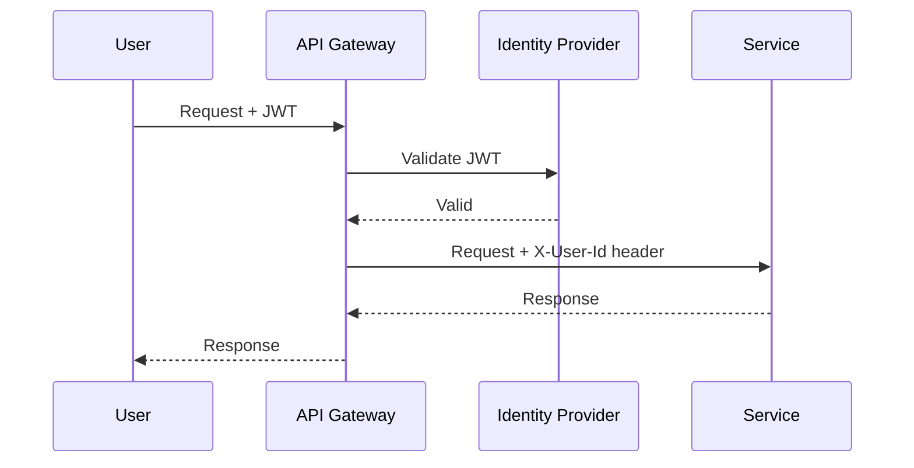

Внутри `Service Mesh` (`Istio`) включается `PeerAuthentication` с `STRICT` -- весь трафик между подами шифруется `mTLS` без изменений в коде. Подробнее о безопасности -- в [[authentication-authorization-patterns-interview|паттернах аутентификации]] и [[spring-security-interview|Spring Security]].

## Q29. Как управлять версионированием API без прерывания работы?

**Стратегии версионирования:**

1. **URL versioning** -- `/api/v1/orders`, `/api/v2/orders`
2. **Header versioning** -- `Accept: application/vnd.myapp.v2+json`
3. **Query parameter** -- `/api/orders?version=2`

**Стратегии деплоя новых версий:**
- **Обратная совместимость** -- новая версия API принимает запросы старого формата
- **Deprecation period** -- старая версия работает параллельно с новой
- **Consumer-driven contracts** -- контракты определяются потребителями (Pact)

**Правило:** добавление полей -- не ломающее изменение; удаление или переименование полей -- ломающее (нужна новая версия).

## Q30. (!) Какие методы логирования и трейсинга используются?

**Три столпа наблюдаемости (Observability):**
1. **Логи** -- события в сервисах (structured logging, JSON)
2. **Метрики** -- числовые показатели (latency, throughput, errors)
3. **Трейсы** -- путь запроса через цепочку сервисов

**Structured logging:**

```java
@Slf4j
@RestController
public class OrderController {

    @PostMapping("/api/orders")
    public ResponseEntity<Order> createOrder(@RequestBody CreateOrderRequest req) {
        log.info("Creating order for user={}, items={}",
                 req.getUserId(), req.getItems().size());
        // ...
    }
}
```

**Корреляция логов:** каждый запрос получает `traceId` (через `Micrometer Tracing` / `Spring Cloud Sleuth`); все логи всех сервисов помечаются этим `traceId`. Поиск логов по `traceId` в `ELK` показывает весь путь запроса.

Подробнее -- в [[observability-interview|вопросах по наблюдаемости]] и [[metrics-tracing-interview|метрикам и трейсингу]].

## Q31. (!) Какие инструменты мониторинга и отладки используются?

| Категория | Инструменты |
|-----------|------------|
| Distributed tracing | `Jaeger`, `Zipkin`, `Tempo`, `AWS X-Ray` |
| Метрики | `Prometheus` + `Grafana`, `VictoriaMetrics` |
| Логи | `ELK Stack`, `Loki`, `Graylog` |
| APM | `DataDog`, `New Relic`, `Dynatrace` |
| Трейсинг SDK | `OpenTelemetry`, `Micrometer Tracing` |

**Минимальный стек для микросервисов:** `OpenTelemetry` (единый SDK для логов, метрик, трейсов) → `Prometheus` (метрики) + `Jaeger`/`Tempo` (трейсы) + `ELK`/`Loki` (логи) → `Grafana` (визуализация).

**Трейсинг обязателен** для понимания порядка вызовов и узких мест при `Saga`/компенсациях.

## Q32. Как обеспечивается масштабируемость и производительность?

Методы масштабирования микросервисов:

1. **Горизонтальное масштабирование** -- увеличение числа инстансов сервиса (`Kubernetes HPA`)
2. **Кэширование** -- `Redis`, `Caffeine` для снижения нагрузки на БД
3. **Асинхронная обработка** -- очереди (`Kafka`, `RabbitMQ`) для пиковых нагрузок
4. **Шардирование БД** -- разделение данных по ключу
5. **CQRS** -- разделение read/write для независимого масштабирования
6. **Auto-scaling** -- `Kubernetes HPA` по CPU/memory/custom metrics

Подробнее -- в [[scalability-patterns-interview|паттернах масштабируемости]] и [[caching-strategies-interview|стратегиях кэширования]].

## Q33. Какие аспекты транзакций необходимо учитывать при проектировании?

При проектировании распределённых систем необходимо учитывать:

1. **Границы транзакций** -- определить, какие операции должны быть атомарными
2. **Уровень изоляции** -- `Read Committed`, `Repeatable Read`, `Serializable` (внутри одной БД)
3. **Модель согласованности** -- strong vs eventual consistency между сервисами
4. **Обработка ошибок** -- компенсации, retry, dead letter queue
5. **Транзакционные журналы** -- `outbox`, `change data capture`
6. **Координация** -- `Saga` (choreography/orchestration), не 2PC

## Q34. Как обеспечивается изоляция данных в микросервисах (Database per Service)?

**`Database per Service`** -- каждый микросервис имеет свою БД; прямой доступ к чужой БД запрещён. Данные запрашиваются через API сервиса.

**Преимущества:**
- Независимый выбор типа БД (PostgreSQL, MongoDB, Redis)
- Независимое масштабирование хранилища
- Изоляция сбоев (падение одной БД не влияет на другие сервисы)
- Свобода в схеме данных

**Проблемы и решения:**
- **Join между сервисами** → API Composition или `CQRS` с денормализованной read model
- **Согласованность** → `Saga`, eventual consistency
- **Отчётность** → отдельная аналитическая БД, заполняемая через CDC (`Debezium`)

## Q35. Что такое глобальная транзакция и как она отличается от локальной?

**Локальная транзакция** -- выполняется в пределах одной БД. Простая, быстрая, полностью `ACID`.

**Глобальная (распределённая) транзакция** -- охватывает несколько БД или сервисов. Координируется протоколом (2PC/3PC) или паттерном (`Saga`).

| | Локальная | Глобальная |
|---|-----------|------------|
| Область | Одна БД | Несколько БД/сервисов |
| Протокол | СУБД | 2PC, Saga |
| Производительность | Высокая | Ниже (сетевые вызовы) |
| Сложность | Низкая | Высокая |
| Согласованность | Strong | Strong (2PC) / Eventual (Saga) |

## Q36. Как организовать тестирование микросервисов?

**Пирамида тестирования микросервисов:**

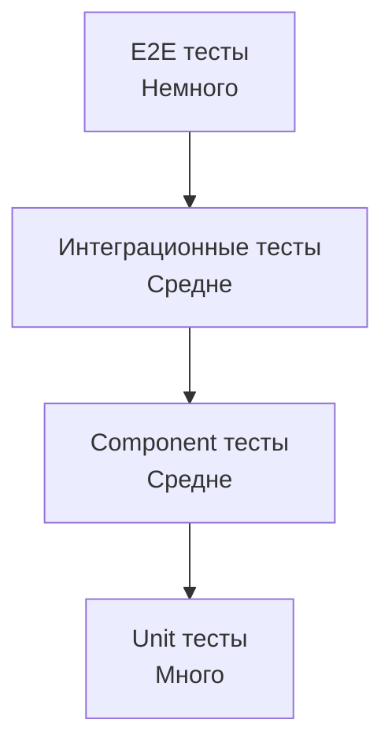

| Уровень | Описание | Инструменты |
|---------|----------|------------|
| Unit | Бизнес-логика без зависимостей | JUnit, Mockito |
| Component | Один сервис с моками зависимостей | Testcontainers, WireMock |
| Integration | Взаимодействие между сервисами | Testcontainers, Spring Cloud Contract |
| Contract | Проверка совместимости API | Pact, Spring Cloud Contract |
| E2E | Весь flow через все сервисы | Selenium, RestAssured |

**Consumer-Driven Contracts** (`Spring Cloud Contract`, `Pact`) -- потребитель определяет ожидания от API; провайдер проверяет, что контракт выполняется. Это предотвращает ломающие изменения. Подробнее -- в [[integration-testing-interview|интеграционном тестировании]].

## Q37. Как реализовать distributed tracing в микросервисах?

**Distributed tracing** показывает путь запроса через цепочку микросервисов с таймингами каждого шага.

**Компоненты:**
- **TraceId** -- уникальный идентификатор запроса, одинаковый для всех сервисов
- **SpanId** -- идентификатор операции внутри одного сервиса
- **Parent SpanId** -- связь между родительским и дочерним span

**Реализация с `Micrometer Tracing` (замена Spring Cloud Sleuth):**

```java
// application.yml
management:
  tracing:
    sampling:
      probability: 1.0  // 100% трейсов (для prod ставить 0.1-0.5)

// build.gradle
dependencies {
    implementation 'io.micrometer:micrometer-tracing-bridge-otel'
    implementation 'io.opentelemetry:opentelemetry-exporter-zipkin'
}
```

`TraceId` автоматически пробрасывается между сервисами через HTTP-заголовки (`traceparent`) и Kafka-заголовки. Все логи помечаются `traceId` и `spanId` -- можно найти в `ELK` по одному `traceId`.

## Q38. Как организовать деплой микросервисов (Blue-Green, Canary)?

| Стратегия | Описание | Риск |
|-----------|----------|------|
| **Rolling update** | Постепенная замена инстансов | Средний |
| **Blue-Green** | Два окружения; переключение трафика | Низкий |
| **Canary** | Часть трафика на новую версию | Низкий |
| **A/B testing** | Разные версии для разных пользователей | Низкий |

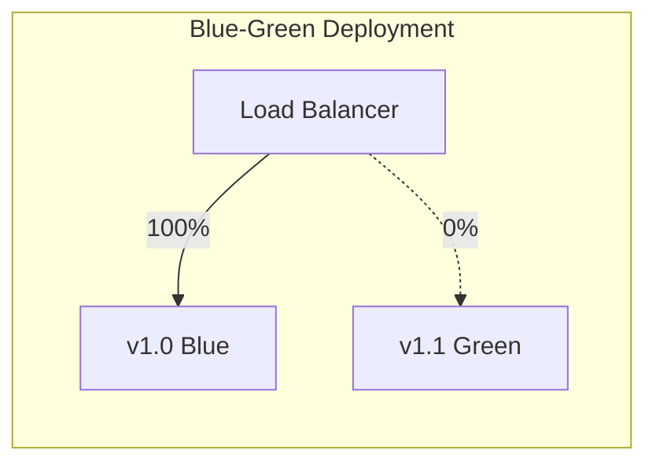

В `Kubernetes` `Rolling Update` -- стратегия по умолчанию. Для `Canary` используют `Istio VirtualService` или `Argo Rollouts` -- процент трафика на новую версию увеличивается постепенно. Подробнее -- в [[deployment-strategies-interview|стратегиях деплоя]].

## Q39. (!) Что такое закон Конвея (Conway's Law) и как он влияет на микросервисы?

**Закон Конвея** (Conway's Law, 1968):

> "Организации, проектирующие системы, вынуждены воспроизводить в них свою собственную коммуникационную структуру."

Если команды организованы по техническому принципу (frontend, backend, DBA), то и архитектура системы воспроизводит эту структуру — монолит с четырьмя слоями. Если команды организованы по доменным продуктам, архитектура тяготеет к микросервисам.

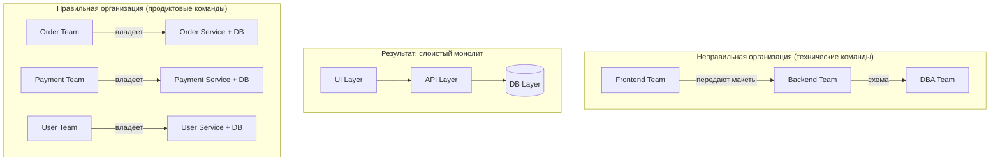

**"Обратный закон Конвея" (Inverse Conway Maneuver):**

Намеренно реструктурируйте команды так, чтобы их коммуникационная структура соответствовала желаемой архитектуре системы. Создайте кросс-функциональные продуктовые команды ДО разбиения монолита.

**Практические следствия:**
- Один `Bounded Context` — одна команда (Team Topologies: Stream-Aligned Team)
- Размер сервиса определяется "правилом двух пицц": команда, умещающаяся за одним столом с двумя пиццами
- Слишком много согласований между командами — сигнал, что границы сервисов проведены неверно

## Q40. (!) Что такое Data Ownership в микросервисах и какие антипаттерны нарушают его?

**Data Ownership** — принцип, согласно которому каждый микросервис является **единственным владельцем** своих данных. Другие сервисы обращаются к данным только через API сервиса-владельца, никогда — напрямую к его базе данных.

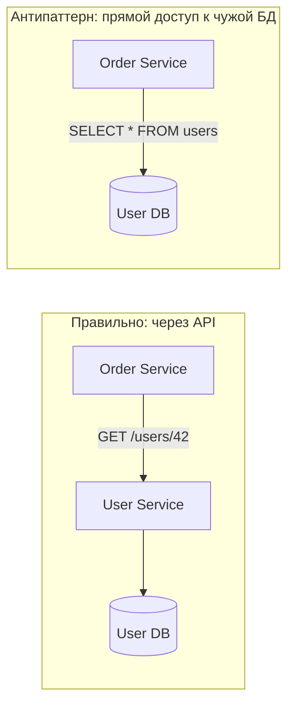

**Антипаттерны, нарушающие Data Ownership:**

| Антипаттерн | Описание | Решение |
|-------------|----------|---------|
| **Shared Database** | Несколько сервисов пишут в одну схему | Database per Service |
| **Direct DB Access** | Сервис A делает JOIN к таблицам сервиса B | API call или event-driven |
| **God Service** | Один сервис хранит данные для всех | Domain decomposition |
| **Distributed Monolith** | Сервисы раздельны, но деплоятся вместе из-за зависимостей данных | Разорвать зависимости через события |

**Стратегии организации данных:**

```
Вариант 1: API Composition
  Order Service нуждается в данных пользователя →
  вызывает User Service API при каждом запросе

Вариант 2: Event-driven denormalization
  User Service публикует UserUpdatedEvent →
  Order Service хранит копию нужных полей локально
  (eventual consistency — допустима задержка синхронизации)

Вариант 3: CQRS Read Model
  Агрегированные данные из нескольких сервисов
  собираются в отдельную read-модель
```

**Золотое правило:** если для выполнения запроса нужны данные из 3+ сервисов — пересмотрите границы сервисов или используйте `API Composition` на уровне `API Gateway`.

## Q41. (!) Как реализовать distributed tracing с OpenTelemetry и Jaeger?

**Distributed tracing** — механизм отслеживания пути запроса через цепочку микросервисов. Каждый запрос получает уникальный `trace ID`; каждая операция внутри — `span ID`.

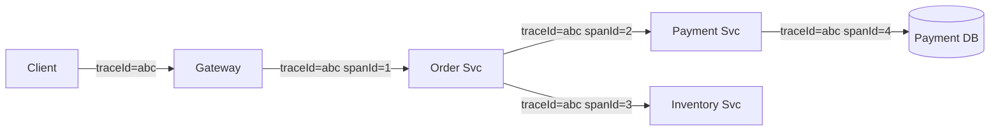

**Настройка в Spring Boot 3+ с Micrometer Tracing + OpenTelemetry:**

```xml
<!-- pom.xml -->
<dependency>
    <groupId>io.micrometer</groupId>
    <artifactId>micrometer-tracing-bridge-otel</artifactId>
</dependency>
<dependency>
    <groupId>io.opentelemetry.instrumentation</groupId>
    <artifactId>opentelemetry-spring-boot-starter</artifactId>
</dependency>
```

```yaml
# application.yml
management:
  tracing:
    sampling:
      probability: 1.0  # 100% в dev; 0.1 в prod
otel:
  exporter:
    otlp:
      endpoint: http://jaeger:4318  # OTLP HTTP endpoint
  resource:
    attributes:
      service.name: order-service
```

**Propagation заголовков между сервисами (W3C TraceContext):**

```
traceparent: 00-4bf92f3577b34da6a3ce929d0e0e4736-00f067aa0ba902b7-01
             ^^  ^^^^^^^^^^^^^^^^^^^^^^^^^^^^^^^^ ^^^^^^^^^^^^^^^^ ^^
             ver  trace-id (128-bit)              span-id (64-bit) flags
```

`RestTemplate`, `WebClient` и `OpenFeign` автоматически пропагируют заголовки при наличии `micrometer-tracing` в classpath.

**Custom span для бизнес-операций:**

```java
@Service
public class OrderService {
    private final Tracer tracer;

    public Order processOrder(CreateOrderRequest request) {
        Span span = tracer.nextSpan()
            .name("order.process")
            .tag("order.customerId", request.customerId())
            .start();
        try (Tracer.SpanInScope ws = tracer.withSpan(span)) {
            return doProcessOrder(request);
        } finally {
            span.end();
        }
    }
}
```

**Jaeger UI:** позволяет визуализировать весь trace, найти медленные span-ы и понять, какой сервис является bottleneck.

## Q42. Как организовать inter-service communication: Feign vs WebClient vs gRPC?

Выбор протокола межсервисного взаимодействия определяется требованиями к производительности, удобству разработки и характеру взаимодействия.

| Критерий | Feign (REST) | WebClient (REST) | gRPC |
|----------|-------------|-----------------|------|
| **Парадигма** | Декларативный REST | Реактивный REST | RPC с protobuf |
| **Блокирующий?** | Да (по умолчанию) | Нет (Reactor) | Нет (async) |
| **Streaming** | Нет | SSE/WebSocket | Нативный (4 режима) |
| **Типизация** | Слабая (JSON) | Слабая (JSON) | Строгая (proto) |
| **Производительность** | Средняя | Высокая | Максимальная |
| **Отладка** | Простая (curl) | Средняя | Сложнее (protobuf) |
| **Применение** | CRUD-сервисы | Высоконагруженные сервисы | Межсервисный трафик |

**OpenFeign — декларативный REST-клиент:**

```java
@FeignClient(name = "user-service", fallbackFactory = UserClientFallback.class)
public interface UserClient {
    @GetMapping("/users/{id}")
    UserDto getUser(@PathVariable Long id);
}
```

**WebClient — реактивный клиент (Spring WebFlux):**

```java
@Service
public class UserClientService {
    private final WebClient webClient;

    public Mono<UserDto> getUser(Long id) {
        return webClient.get()
            .uri("/users/{id}", id)
            .retrieve()
            .onStatus(HttpStatus::is4xxClientError,
                r -> Mono.error(new UserNotFoundException(id)))
            .bodyToMono(UserDto.class)
            .timeout(Duration.ofSeconds(2))
            .retryWhen(Retry.backoff(3, Duration.ofMillis(100)));
    }
}
```

---

## See also

- [[event-driven-patterns-interview|Event-Driven паттерны]] — EDA, Saga, Outbox и асинхронное взаимодействие в микросервисах
- [[spring-cloud-interview|Spring Cloud]] — Service Discovery, Config Server, Circuit Breaker в Spring Cloud
- [[distributed-systems-interview|Распределённые системы]] — CAP, согласованность, репликация и партиционирование
- [[cap-theorem-interview|CAP-теорема]] — выбор CP/AP для каждого микросервиса
- [[kafka-interview|Apache Kafka]] — брокер сообщений для асинхронной коммуникации
- [[kubernetes-interview|Kubernetes]] — оркестрация и деплой микросервисов
- [[resilience-patterns-interview|Паттерны отказоустойчивости]] — Circuit Breaker, Retry, Bulkhead между сервисами
- [[scalability-patterns-interview|Паттерны масштабируемости]] — горизонтальное масштабирование микросервисов

**Рекомендация:** для внутренних синхронных вызовов — `OpenFeign` (простота); для высоконагруженных реактивных сервисов — `WebClient`; для критичного по latency межсервисного взаимодействия — `gRPC` (см. [[grpc-interview|вопросы по gRPC]]).

- [[api-gateway-interview|API Gateway]]
- [[bff-pattern-interview|BFF Pattern]]
- [[caching-strategies-interview|Стратегии кэширования]]
- [[cap-theorem-interview|CAP-теорема]]
- [[clean-architecture-interview|Clean Architecture]]
- [[consistency-patterns-interview|Паттерны согласованности]]
- [[microservices|Шпаргалка: Микросервисная архитектура]] — теория
