# Вопросы на собеседовании: Микросервисная архитектура

Полное покрытие микросервисной архитектуры: разбиение на сервисы, коммуникация, согласованность, `Saga`, `CQRS`, `API Gateway`, `Service Discovery`, `Circuit Breaker`, `Service Mesh`, мониторинг.

**Микросервисная архитектура** -- частый фокус собеседований на Senior: согласованность, `Saga`, `2PC`, `API Gateway`, `Service Discovery`, паттерны отказоустойчивости и операционная сложность. Этот файл охватывает как теоретические основы, так и практические паттерны с примерами на `Spring Boot` / `Spring Cloud`.

## Полезные ссылки

### Официальная документация

- [Microservices (Martin Fowler)](https://martinfowler.com/articles/microservices.html) -- канонический обзор
- [Building Microservices (Sam Newman)](https://samnewman.io/books/building_microservices_2nd_edition/) -- практическое руководство
- [Spring Cloud Gateway](https://www.baeldung.com/spring-cloud-gateway) -- маршрутизация и фильтры
- [Resilience4j with Spring Boot](https://www.baeldung.com/spring-boot-resilience4j) -- Circuit Breaker, Retry, Rate Limiter
- [Spring Cloud Netflix Eureka](https://www.baeldung.com/spring-cloud-netflix-eureka) -- Service Discovery
- [Saga Pattern in Microservices](https://www.baeldung.com/cs/saga-pattern-microservices) -- паттерн Saga
- [CQRS and Event Sourcing in Java](https://www.baeldung.com/cqrs-event-sourcing-java) -- разделение чтения и записи
- [Service Mesh with Istio](https://www.baeldung.com/ops/istio-service-mesh) -- Service Mesh архитектура

## Содержание

- [Полезные ссылки](#полезные-ссылки)
- [See also](#see-also)

**Основы микросервисной архитектуры**
- [Q1. (!) Что такое микросервисная архитектура?](#q1--что-такое-микросервисная-архитектура)
- [Q2. (!) Монолит vs микросервисы -- когда что выбрать?](#q2--монолит-vs-микросервисы----когда-что-выбрать)
- [Q3. (!) Какие преимущества и недостатки имеет микросервисная архитектура?](#q3--какие-преимущества-и-недостатки-имеет-микросервисная-архитектура)
- [Q4. Как правильно определить границы микросервиса (Bounded Context)?](#q4-как-правильно-определить-границы-микросервиса-bounded-context)
- [Q5. Какие технологии используются для межсервисного взаимодействия?](#q5-какие-технологии-используются-для-межсервисного-взаимодействия)
- [Q6. Синхронное vs асинхронное взаимодействие -- когда что применять?](#q6-синхронное-vs-асинхронное-взаимодействие----когда-что-применять)

**Ключевые паттерны микросервисов**
- [Q7. (!) Какие основные паттерны микросервисной архитектуры?](#q7--какие-основные-паттерны-микросервисной-архитектуры)
- [Q8. (!) Что такое API Gateway и зачем он нужен?](#q8--что-такое-api-gateway-и-зачем-он-нужен)
- [Q9. (!) Что такое Service Discovery и как он работает?](#q9--что-такое-service-discovery-и-как-он-работает)
- [Q10. (!) Что такое Circuit Breaker и как он предотвращает каскадные сбои?](#q10--что-такое-circuit-breaker-и-как-он-предотвращает-каскадные-сбои)
- [Q11. Что такое Service Mesh и зачем он нужен?](#q11-что-такое-service-mesh-и-зачем-он-нужен)
- [Q12. (!) Что такое паттерн CQRS?](#q12--что-такое-паттерн-cqrs)
- [Q13. Что такое Event Sourcing?](#q13-что-такое-event-sourcing)
- [Q14. Что такое паттерн Strangler Fig для миграции с монолита?](#q14-что-такое-паттерн-strangler-fig-для-миграции-с-монолита)

**Транзакции и согласованность данных**
- [Q15. (!) Что такое ACID и BASE?](#q15--что-такое-acid-и-base)
- [Q16. (!) Что такое CAP-теорема?](#q16--что-такое-cap-теорема)
- [Q17. (!) Как обеспечивается атомарность операций в микросервисах?](#q17--как-обеспечивается-атомарность-операций-в-микросервисах)
- [Q18. (!) Что такое Saga и когда применять вместо 2PC?](#q18--что-такое-saga-и-когда-применять-вместо-2pc)
- [Q19. (!) Что такое двухфазная фиксация (2PC)?](#q19--что-такое-двухфазная-фиксация-2pc)
- [Q20. Что такое трёхфазная фиксация (3PC)?](#q20-что-такое-трёхфазная-фиксация-3pc)
- [Q21. (!) Что такое компенсирующие транзакции?](#q21--что-такое-компенсирующие-транзакции)
- [Q22. Как решить проблемы согласованности данных?](#q22-как-решить-проблемы-согласованности-данных)

**Отказоустойчивость и надёжность**
- [Q23. (!) Как обрабатываются сбои и отказы в микросервисах?](#q23--как-обрабатываются-сбои-и-отказы-в-микросервисах)
- [Q24. (!) Как реализовать механизмы повторной попытки (Retry)?](#q24--как-реализовать-механизмы-повторной-попытки-retry)
- [Q25. Как обеспечить идемпотентность операций?](#q25-как-обеспечить-идемпотентность-операций)
- [Q26. Что такое Bulkhead-паттерн?](#q26-что-такое-bulkhead-паттерн)

**Конфигурация, безопасность, версионирование**
- [Q27. (!) Как организовать конфигурацию микросервисов?](#q27--как-организовать-конфигурацию-микросервисов)
- [Q28. (!) Как обеспечить безопасность взаимодействия между микросервисами?](#q28--как-обеспечить-безопасность-взаимодействия-между-микросервисами)
- [Q29. Как управлять версионированием API без прерывания работы?](#q29-как-управлять-версионированием-api-без-прерывания-работы)

**Наблюдаемость и эксплуатация**
- [Q30. (!) Какие методы логирования и трейсинга используются?](#q30--какие-методы-логирования-и-трейсинга-используются)
- [Q31. (!) Какие инструменты мониторинга и отладки используются?](#q31--какие-инструменты-мониторинга-и-отладки-используются)
- [Q32. Как обеспечивается масштабируемость и производительность?](#q32-как-обеспечивается-масштабируемость-и-производительность)

**Проектирование и практика**
- [Q33. Какие аспекты транзакций необходимо учитывать при проектировании?](#q33-какие-аспекты-транзакций-необходимо-учитывать-при-проектировании)
- [Q34. Как обеспечивается изоляция данных в микросервисах (Database per Service)?](#q34-как-обеспечивается-изоляция-данных-в-микросервисах-database-per-service)
- [Q35. Что такое глобальная транзакция и как она отличается от локальной?](#q35-что-такое-глобальная-транзакция-и-как-она-отличается-от-локальной)
- [Q36. Как организовать тестирование микросервисов?](#q36-как-организовать-тестирование-микросервисов)
- [Q37. Как реализовать distributed tracing в микросервисах?](#q37-как-реализовать-distributed-tracing-в-микросервисах)
- [Q38. Как организовать деплой микросервисов (Blue-Green, Canary)?](#q38-как-организовать-деплой-микросервисов-blue-green-canary)

**Организационные паттерны и владение данными**
- [Q39. (!) Что такое закон Конвея (Conway's Law) и как он влияет на микросервисы?](#q39--что-такое-закон-конвея-conways-law-и-как-он-влияет-на-микросервисы)
- [Q40. (!) Что такое Data Ownership в микросервисах и какие антипаттерны нарушают его?](#q40--что-такое-data-ownership-в-микросервисах-и-какие-антипаттерны-нарушают-его)
- [Q41. (!) Как реализовать distributed tracing с OpenTelemetry и Jaeger?](#q41--как-реализовать-distributed-tracing-с-opentelemetry-и-jaeger)
- [Q42. Как организовать inter-service communication: Feign vs WebClient vs gRPC?](#q42-как-организовать-inter-service-communication-feign-vs-webclient-vs-grpc)

---

## Q1. (!) Что такое микросервисная архитектура?

**Микросервисная архитектура** -- подход, при котором приложение разбивается на небольшие независимые сервисы; каждый сервис отвечает за свою доменную область, развёртывается и масштабируется отдельно.

**Ключевые характеристики:**
- Каждый сервис имеет собственную БД (Database per Service)
- Сервисы общаются через сеть (`REST`, `gRPC`, очереди сообщений)
- Независимый деплой и масштабирование
- Каждый сервис разрабатывается и поддерживается отдельной командой

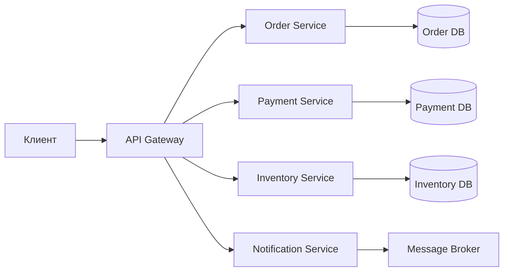

**Практический критерий:** к микросервисам переходят, когда появляется реальная потребность в независимом деплое и масштабировании частей системы, а не «по моде». Подробнее о согласованности данных -- в [вопросах по распределённым системам](distributed-systems-interview.md).

> [!mcq]
> - [ ] Микросервисная архитектура — подход, при котором каждый сервис имеет собственную БД, общается через сеть и деплоится независимо; ключевое преимущество — возможность использовать одну технологию для всех сервисов. | Технологическая гибкость (polyglot persistence) — наоборот, одно из преимуществ микросервисов: каждый сервис может использовать разный стек. Утверждение об одной технологии для всех описывает монолит с централизованным технологическим стеком.
> - [ ] Микросервисная архитектура — подход, при котором единый монолитный деплой делится на логические модули внутри одного процесса; каждый модуль имеет собственную БД и отдельный API. | Описан Modular Monolith (модульный монолит): один процесс с изолированными модулями. В микросервисах каждый сервис — отдельный процесс/контейнер с независимым деплоем, а не модуль в одном процессе.
> - [x] Микросервисная архитектура — подход, при котором приложение разбивается на независимые сервисы с отдельными БД; сервисы общаются по сети (REST, gRPC, очереди) и деплоятся независимо каждой командой. | Это каноническое определение: Database per Service, сетевое взаимодействие, независимый деплой и автономность команд — четыре ключевых характеристики микросервисной архитектуры по Сэму Ньюману.
> - [ ] Микросервисная архитектура — подход, при котором приложение разбивается на независимые сервисы, которые разделяют общую реляционную БД для обеспечения ACID-транзакций между сервисами. | Описан антипаттерн Shared Database — одна из причин «распределённого монолита». Database per Service — обязательное условие настоящих микросервисов; общая БД создаёт coupling между сервисами.

## Q2. (!) Монолит vs микросервисы -- когда что выбрать?

**Монолит** -- традиционный подход, в котором весь функционал приложения разрабатывается и развёртывается в едином блоке. Все компоненты находятся в одной кодовой базе.

**Микросервисы** -- приложение разделяется на набор маленьких независимых сервисов, которые взаимодействуют по сети.

| Критерий | Монолит | Микросервисы |
|----------|---------|-------------|
| Размер команды | Маленькая (до 10 чел.) | Большая (10+ чел., несколько команд) |
| Сложность деплоя | Простой (один артефакт) | Сложный (десятки сервисов) |
| Масштабирование | Только вертикальное | Горизонтальное, per-service |
| Согласованность | `ACID` транзакции | Eventual consistency, `Saga` |
| Старт нового проекта | Да (Monolith First) | Нет (преждевременная оптимизация) |
| Зрелость инфраструктуры | Не требуется | CI/CD, контейнеры, оркестрация |

**Совет Мартина Фаулера:** начинать с монолита (`Monolith First`), разделять на микросервисы когда появится реальная потребность. Гибридный подход -- `Modular Monolith` -- хорошая промежуточная точка: модули с чётко определёнными границами внутри одного деплоя.

> [!mcq]
> - [ ] По совету Мартина Фаулера, стартовать нужно сразу с микросервисов, чтобы заложить правильные границы с самого начала; Modular Monolith — промежуточный шаг только для legacy-систем. | Это противоположность совета Фаулера. Именно Фаулер сформулировал принцип «Monolith First»: на старте неизвестны правильные границы сервисов, и преждевременное дробление приводит к distributed monolith с неверными boundaries.
> - [x] По совету Мартина Фаулера, стартовать нужно с монолита (Monolith First); Modular Monolith — хорошая промежуточная точка; переходить к микросервисам стоит только при реальной потребности в независимом деплое и масштабировании. | Monolith First позволяет сначала нащупать правильные доменные границы, и только потом выделить их в отдельные сервисы. Без этого велик риск distributed monolith — системы, формально состоящей из сервисов, но с тесными зависимостями.
> - [ ] Монолит подходит только для маленьких команд (до 3 человек); при команде 5-10 человек уже необходимо переходить на микросервисы для устранения конфликтов при слиянии кода. | Размер команды — лишь один из факторов; «правило двух пицц» Amazon относится к команде одного сервиса, а не к порогу перехода на микросервисы. Монолит успешно работает при командах 10-15 человек при хорошей модульности кода.
> - [ ] Основное преимущество микросервисов перед монолитом — более быстрая разработка новых функций, так как сервисы меньше и легче понять; монолит целесообразен только для read-only систем. | Скорость разработки новых функций — спорное преимущество: микросервисы добавляют сложность координации, сетевых вызовов и распределённой согласованности. Монолит не ограничен read-only сценариями.

## Q3. (!) Какие преимущества и недостатки имеет микросервисная архитектура?

**Преимущества:**

1. **Независимый деплой** -- обновление одного сервиса не требует пересборки всего приложения
2. **Масштабируемость** -- каждый сервис масштабируется независимо (горизонтально)
3. **Технологическая гибкость** -- разные сервисы могут использовать разные языки/фреймворки/БД
4. **Устойчивость к сбоям** -- падение одного сервиса не означает падение всей системы (при правильной реализации `Circuit Breaker`)
5. **Автономность команд** -- каждая команда владеет своим сервисом (full ownership)

**Недостатки:**

1. **Распределённая сложность** -- сетевые вызовы, латентность, частичные отказы
2. **Согласованность данных** -- нет `ACID` между сервисами, нужны `Saga`, eventual consistency
3. **Операционная сложность** -- нужен `CI/CD`, мониторинг, трейсинг, оркестрация
4. **Тестирование** -- сложнее интеграционное и end-to-end тестирование
5. **Разделение границ** -- неправильное разбиение приводит к `distributed monolith`

> [!mcq]
> - [x] Ключевой недостаток микросервисов — операционная сложность: требуются CI/CD, централизованный мониторинг, distributed tracing и оркестрация; без зрелой инфраструктуры выгода теряется. | Операционная стоимость — главная цена микросервисов. Без CI/CD, observability и container orchestration распределённая система деградирует в неуправляемый набор сервисов, а профит от независимого деплоя не окупается.
> - [ ] Ключевой недостаток микросервисов — невозможность использовать современные фреймворки вроде Spring Boot, так как они заточены под монолитное развёртывание. | Spring Boot и Spring Cloud целенаправленно поддерживают микросервисы: Actuator, Config Server, Discovery Client, Circuit Breaker. Проблема не в фреймворках, а в эксплуатационной сложности.
> - [ ] Ключевой недостаток микросервисов — невозможность горизонтального масштабирования: каждый сервис должен работать в единственном экземпляре. | Горизонтальное масштабирование — как раз преимущество микросервисов: каждый сервис масштабируется независимо под свой профиль нагрузки (stateless pods в Kubernetes).
> - [ ] Ключевой недостаток микросервисов — отсутствие технологической гибкости: все сервисы должны использовать один язык и фреймворк. | Технологическая гибкость (polyglot) — прямое преимущество микросервисов: разные сервисы могут использовать разные стеки под профиль задачи.

## Q4. Как правильно определить границы микросервиса (Bounded Context)?

**Bounded Context** из `Domain-Driven Design` -- основной инструмент определения границ микросервиса. Каждый микросервис соответствует одному ограниченному контексту.

**Правила определения границ:**

1. **Бизнес-домен** -- сервис соответствует конкретной бизнес-области (заказы, платежи, склад)
2. **Single Responsibility** -- один сервис отвечает за один бизнес-контекст
3. **Независимость данных** -- у каждого сервиса своя БД, нет общих таблиц
4. **Слабая связанность** -- изменение одного сервиса не должно требовать изменения другого
5. **Правило двух пицц (Amazon)** -- сервис должен обслуживаться командой, которую можно накормить двумя пиццами

**Анти-паттерн: Distributed Monolith** -- формально микросервисы, но тесно связаны; требуют совместного деплоя, разделяют БД или модели. Признаки: для одного изменения нужно менять несколько сервисов; нельзя деплоить независимо.

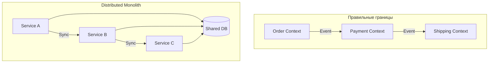

> [!mcq]
> - [ ] Основной инструмент определения границ микросервиса — физический размер кодовой базы: не более 1000 строк кода на сервис, чтобы команда могла поддерживать его полностью. | Строки кода — произвольная метрика без связи с бизнес-семантикой. Границы определяются бизнес-доменом (Bounded Context), а не LOC; сервис может быть 5000 LOC и при этом иметь здоровые границы.
> - [ ] Основной инструмент определения границ микросервиса — техническое разделение по слоям: UI-сервис, Business-сервис, Data-сервис; это обеспечивает чистую слоистую архитектуру. | Это описание распределённого слоёного монолита — классический антипаттерн: любое бизнес-изменение требует модификации всех трёх слоёв, что ломает независимый деплой.
> - [ ] Основной инструмент определения границ микросервиса — функциональное разбиение по CRUD-операциям: отдельные сервисы для Create, Read, Update, Delete. | CRUD-разбиение нарушает бизнес-семантику: в одной операции `createOrder` участвуют заказ, склад, платёж — разбить по CRUD значит требовать глобальных транзакций между сервисами.
> - [x] Основной инструмент определения границ микросервиса — Bounded Context из DDD: сервис соответствует одной бизнес-области с собственной моделью, БД и командой (правило двух пицц). | Bounded Context — канонический DDD-инструмент: доменная граница определяет ubiquitous language, model, owner team и database. Это даёт слабую связанность и независимый деплой.

## Q5. Какие технологии используются для межсервисного взаимодействия?

| Технология | Тип | Когда применять |
|-----------|-----|----------------|
| `REST` / `HTTP` | Синхронный | CRUD, простые запросы |
| `gRPC` | Синхронный | Высокая производительность, строгие контракты |
| `Apache Kafka` | Асинхронный | Потоки событий, высокая пропускная способность |
| `RabbitMQ` | Асинхронный | Задачи, очереди, routing |
| `GraphQL` | Синхронный | Гибкие клиентские запросы, BFF |
| `WebSocket` | Двусторонний | Реалтайм-уведомления |

Подробнее о событийном взаимодействии -- в [вопросах по Event-driven паттернам](event-driven-patterns-interview.md), о `Kafka` -- в [вопросах по Kafka](../messaging/kafka-interview.md).

> [!mcq]
> - [ ] Для высокой пропускной способности потоков событий между сервисами оптимально применять REST/HTTP с keep-alive и pipelining; это обеспечивает низкую latency и простую отладку. | REST синхронный и плохо масштабируется для потоков событий: каждый запрос требует подтверждения, coupling между producer и consumer по времени. Для потоков нужна асинхронная publish-subscribe модель.
> - [x] Для высокой пропускной способности потоков событий между сервисами оптимально применять Apache Kafka; он обеспечивает асинхронную публикацию, партиционирование и долговременное хранение событий. | Kafka — каноническое решение для event streaming: высокий throughput (миллионы сообщений/сек), replayable log, partitioning для параллельной обработки. Альтернативы (RabbitMQ) подходят для задач/очередей, а не потоков.
> - [ ] Для высокой пропускной способности потоков событий между сервисами оптимально применять gRPC streaming; он обеспечивает нативный streaming и строгую типизацию через protobuf. | gRPC streaming создаёт point-to-point связь между двумя сервисами и не предоставляет publish-subscribe модели с множественными consumer-группами. Также нет durable log для replay.
> - [ ] Для высокой пропускной способности потоков событий между сервисами оптимально применять WebSocket; он обеспечивает двустороннюю связь и используется для event-driven архитектур. | WebSocket — двусторонний канал для реалтайм-уведомлений между клиентом и сервером, а не для межсервисной event streaming. Нет брокера, партиционирования, replay.

## Q6. Синхронное vs асинхронное взаимодействие -- когда что применять?

**Синхронное** (`REST`, `gRPC`): клиент ждёт ответа. Подходит когда нужен немедленный результат (получить данные, проверить баланс). Проблемы: temporal coupling, каскадные сбои, увеличение латентности при цепочке вызовов.

**Асинхронное** (события, очереди): клиент не ждёт ответа. Подходит для уведомлений, обработки в фоне, Saga. Плюсы: слабая связанность, устойчивость к пиковым нагрузкам. Минусы: сложнее отладка, eventual consistency.

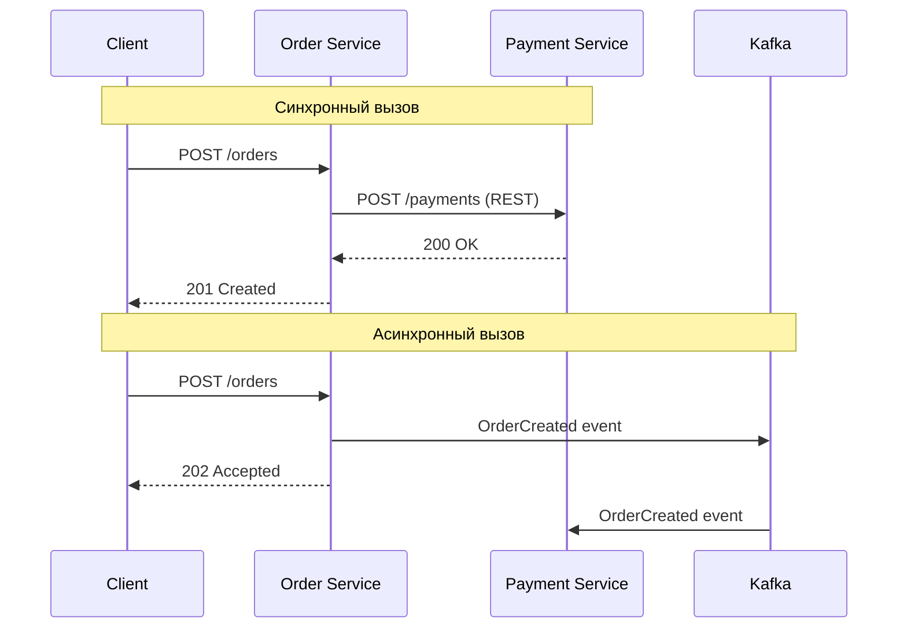

**Правило:** предпочитать асинхронное взаимодействие; синхронное -- только когда клиенту действительно нужен немедленный ответ.

> [!mcq]
> - [ ] Главная проблема синхронного взаимодействия между микросервисами — высокая нагрузка на сеть; это решается переходом на HTTP/2 и компрессией gzip. | Сеть и компрессия — частные оптимизации. Фундаментальная проблема синхронных вызовов — temporal coupling и каскадные сбои: сервис A ждёт B, B ждёт C, отказ C обрушивает всю цепочку.
> - [ ] Главная проблема синхронного взаимодействия между микросервисами — сложность сериализации JSON; это решается переходом на Protocol Buffers и binary-форматы. | Сериализация — детальная техническая оптимизация. Проблема не в формате, а в самой модели coupling: синхронный вызов требует одновременной доступности всех звеньев цепочки.
> - [x] Главная проблема синхронного взаимодействия между микросервисами — temporal coupling и каскадные сбои; асинхронное взаимодействие через события устраняет эту связанность. | Temporal coupling — ключевой недостаток sync: producer и consumer должны быть доступны одновременно. Асинхронные события разрывают эту связь через брокер, который буферизует сообщения и переживает временную недоступность consumer.
> - [ ] Главная проблема синхронного взаимодействия между микросервисами — невозможность возврата больших объектов; это решается pagination и chunked transfer encoding. | Размер ответа — частная техническая проблема. Pagination работает и в sync, и в async; проблема coupling и каскадных сбоев остаётся независимо от размера payload.

## Q7. (!) Какие основные паттерны микросервисной архитектуры?

Основные паттерны, которые спрашивают на собеседованиях:

| Паттерн | Назначение |
|---------|-----------|
| `API Gateway` | Единая точка входа, маршрутизация, аутентификация |
| `Service Discovery` | Динамическое обнаружение сервисов |
| `Circuit Breaker` | Защита от каскадных сбоев |
| `Saga` | Распределённые транзакции без 2PC |
| `CQRS` | Разделение чтения и записи |
| `Event Sourcing` | Хранение истории изменений как событий |
| `Service Mesh` | Инфраструктурный слой для межсервисного трафика |
| `Bulkhead` | Изоляция ресурсов между вызовами |
| `Strangler Fig` | Постепенная миграция с монолита |
| `Sidecar` | Вспомогательный контейнер рядом с основным |
| `BFF` (`Backend for Frontend`) | Отдельный API-слой для каждого типа клиента |
| `Database per Service` | Изоляция данных каждого сервиса |

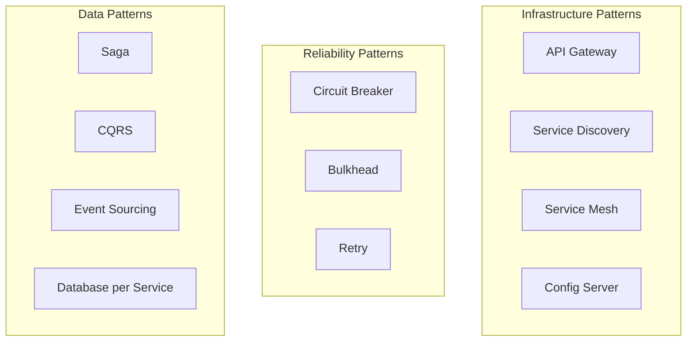

> [!mcq]
> - [x] Паттерн Saga применяется для реализации распределённых транзакций как последовательности локальных транзакций с компенсирующими действиями при сбое. | Saga — канонический data-паттерн для распределённой согласованности: каждый шаг — локальная транзакция; при сбое выполняются компенсации. Альтернатива 2PC, который блокирует ресурсы и не масштабируется.
> - [ ] Паттерн Saga применяется как infrastructure-паттерн для маршрутизации трафика между версиями сервиса при canary deployment. | Маршрутизация между версиями — задача API Gateway или Service Mesh (VirtualService), а не Saga. Saga — паттерн координации бизнес-транзакций, а не трафика.
> - [ ] Паттерн Saga применяется для реализации Circuit Breaker в межсервисных вызовах, прерывая вызовы при массовых сбоях. | Circuit Breaker — отдельный reliability-паттерн (Resilience4j). Saga координирует бизнес-транзакции через компенсации, а не прерывает вызовы при отказах.
> - [ ] Паттерн Saga применяется для обнаружения инстансов сервисов, предоставляя реестр адресов. | Обнаружение инстансов — задача Service Discovery (Eureka, Kubernetes DNS). Saga не имеет отношения к реестрам сервисов.

## Q8. (!) Что такое API Gateway и зачем он нужен?

**`API Gateway`** -- единая точка входа для всех клиентов; выполняет маршрутизацию запросов к микросервисам, аутентификацию/авторизацию, rate limiting, агрегацию ответов.

Реализации: `Spring Cloud Gateway`, `Kong`, `AWS API Gateway`, `NGINX`.

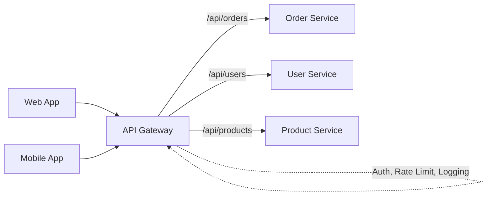

**Конфигурация `Spring Cloud Gateway`:**

```java
@Configuration
public class GatewayConfig {

    @Bean
    public RouteLocator customRouteLocator(RouteLocatorBuilder builder) {
        return builder.routes()
            .route("order-service", r -> r
                .path("/api/orders/**")
                .filters(f -> f
                    .stripPrefix(1)
                    .addRequestHeader("X-Gateway", "true")
                    .circuitBreaker(cb -> cb
                        .setName("orderCB")
                        .setFallbackUri("forward:/fallback/orders")))
                .uri("lb://order-service"))
            .route("user-service", r -> r
                .path("/api/users/**")
                .filters(f -> f.stripPrefix(1))
                .uri("lb://user-service"))
            .build();
    }
}
```

```yaml
# Декларативная конфигурация Spring Cloud Gateway
spring:
  cloud:
    gateway:
      routes:
        - id: order-service
          uri: lb://order-service
          predicates:
            - Path=/api/orders/**
          filters:
            - name: RequestRateLimiter
              args:
                redis-rate-limiter.replenishRate: 10
                redis-rate-limiter.burstCapacity: 20
            - StripPrefix=1
```

**BFF-подход:** отдельный `Gateway` для каждого типа клиента (web, mobile) -- каждый агрегирует данные из нескольких сервисов под нужды конкретного фронтенда.

> [!mcq]
> - [ ] API Gateway — опциональный load balancer, который применяется только при числе микросервисов больше 50; для маленьких систем его роль выполняет DNS. | API Gateway — не просто балансировщик и применяется даже в малых системах: он решает задачи аутентификации, rate limiting, агрегации ответов, cross-cutting concerns, которые DNS не предоставляет.
> - [ ] API Gateway — компонент бизнес-логики, который содержит главные сценарии приложения и оркестрирует работу микросервисов через Saga. | Помещение бизнес-логики в Gateway — антипаттерн «god gateway»: он становится монолитом и нарушает single responsibility. Gateway отвечает только за infrastructure concerns: routing, auth, rate limiting.
> - [ ] API Gateway — прокси для БД, который предоставляет единую точку доступа к данным всех сервисов через SQL-подобный интерфейс. | API Gateway работает на уровне HTTP/API, а не на уровне БД. Единая точка доступа к данным — антипаттерн (shared database), который ломает data ownership микросервисов.
> - [x] API Gateway — единая точка входа для клиентов, выполняющая маршрутизацию, аутентификацию, rate limiting и агрегацию ответов; реализации — Spring Cloud Gateway, Kong, AWS API Gateway. | Классическое определение: Gateway скрывает топологию микросервисов, централизует cross-cutting concerns (auth, rate limit, logging) и может агрегировать вызовы к нескольким backend-сервисам в один клиентский запрос.

## Q9. (!) Что такое Service Discovery и как он работает?

**`Service Discovery`** -- механизм автоматического обнаружения сетевых адресов экземпляров сервисов. В динамических средах (`Kubernetes`, облако) адреса меняются при масштабировании, перезапусках.

**Два подхода:**
- **Client-side discovery** -- клиент запрашивает реестр и сам выбирает инстанс (`Eureka` + `Spring Cloud LoadBalancer`)
- **Server-side discovery** -- запрос идёт через балансировщик, который знает реестр (`Kubernetes Service`, `AWS ELB`)

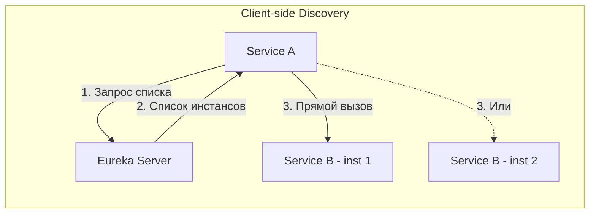

**Реализация с `Spring Cloud Eureka`:**

```java
// Eureka Server
@SpringBootApplication
@EnableEurekaServer
public class EurekaServerApp {
    public static void main(String[] args) {
        SpringApplication.run(EurekaServerApp.class, args);
    }
}

// Eureka Client (микросервис)
@SpringBootApplication
@EnableDiscoveryClient
public class OrderServiceApp {
    public static void main(String[] args) {
        SpringApplication.run(OrderServiceApp.class, args);
    }
}

// Использование DiscoveryClient
@Service
@RequiredArgsConstructor
public class PaymentClient {
    private final DiscoveryClient discoveryClient;

    public String getPaymentServiceUrl() {
        List<ServiceInstance> instances =
            discoveryClient.getInstances("payment-service");
        // Выбор инстанса (round-robin, random, etc.)
        ServiceInstance instance = instances.get(0);
        return instance.getUri().toString();
    }
}
```

В `Kubernetes` `Service Discovery` встроен через `DNS` -- каждый `Service` доступен по имени (`payment-service.default.svc.cluster.local`), и `kube-proxy` выполняет балансировку. Подробнее -- в [вопросах по Kubernetes](../devops/kubernetes-interview.md).

> [!mcq]
> - [ ] В client-side discovery (Eureka) запрос идёт через централизованный балансировщик, который знает реестр сервисов; клиент не участвует в выборе инстанса. | Описан server-side discovery (Kubernetes Service, AWS ELB). В client-side клиент сам запрашивает реестр и выбирает инстанс локально (Spring Cloud LoadBalancer + Eureka).
> - [x] В client-side discovery клиент запрашивает реестр (Eureka) и сам выбирает инстанс сервиса; в server-side запрос идёт через балансировщик, который инкапсулирует знание о реестре. | Точное разделение: Eureka + Spring Cloud LoadBalancer — client-side (клиент балансирует); Kubernetes Service с kube-proxy, AWS ELB — server-side (балансировщик скрывает топологию). В Kubernetes server-side — стандарт через DNS.
> - [ ] В client-side discovery клиент обращается к балансировщику, который не знает реестра и использует round-robin по IP-адресам из DNS. | Это смесь концепций: если балансировщик не знает реестра, он не может routing по логическому имени сервиса. Client-side означает, что клиент (а не прокси) выполняет выбор инстанса.
> - [ ] В client-side discovery клиент получает конфигурацию из Spring Cloud Config и использует её для прямого вызова инстансов без реестра. | Spring Cloud Config — это сервер конфигурации (properties), а не реестр инстансов. Discovery требует отдельного реестра (Eureka, Consul), который обновляется в реальном времени при scale up/down.

## Q10. (!) Что такое Circuit Breaker и как он предотвращает каскадные сбои?

**`Circuit Breaker`** -- паттерн, предотвращающий каскадные сбои: если вызываемый сервис не отвечает, прерывает вызовы и возвращает fallback-ответ.

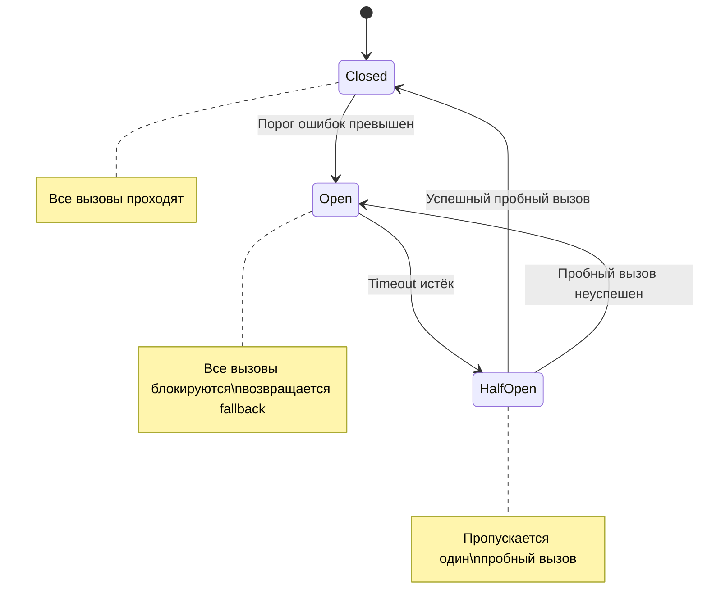

**Три состояния:**
1. **Closed** -- вызовы проходят нормально, ошибки считаются
2. **Open** -- вызовы блокируются, возвращается fallback
3. **Half-Open** -- пропускается пробный вызов для проверки восстановления

**Реализация с `Resilience4j`:**

```java
@Service
public class OrderService {

    @CircuitBreaker(name = "paymentService", fallbackMethod = "paymentFallback")
    @Retry(name = "paymentService", fallbackMethod = "paymentFallback")
    public PaymentResponse processPayment(PaymentRequest request) {
        return paymentClient.charge(request);
    }

    private PaymentResponse paymentFallback(PaymentRequest request,
                                            Throwable ex) {
        log.warn("Payment service unavailable, using fallback: {}",
                 ex.getMessage());
        return PaymentResponse.pending(request.getOrderId());
    }
}
```

```yaml
# application.yml — конфигурация Resilience4j
resilience4j:
  circuitbreaker:
    instances:
      paymentService:
        slidingWindowSize: 10
        failureRateThreshold: 50
        waitDurationInOpenState: 10s
        permittedNumberOfCallsInHalfOpenState: 3
        slowCallDurationThreshold: 2s
  retry:
    instances:
      paymentService:
        maxAttempts: 3
        waitDuration: 500ms
        exponentialBackoffMultiplier: 2
```

**Важно:** `Circuit Breaker` и `Retry` дополняют друг друга -- `Retry` повторяет отдельные неудачные вызовы, `Circuit Breaker` прекращает вызовы при массовых сбоях.

> [!mcq]
> - [ ] Circuit Breaker в состоянии Half-Open пропускает все вызовы, чтобы быстро восстановить нагрузку на сервис после сбоя. | В Half-Open пропускается ограниченное число пробных вызовов (permittedNumberOfCallsInHalfOpenState), а не все. Массовый поток на восстанавливающийся сервис снова обрушит его.
> - [ ] Circuit Breaker в состоянии Half-Open блокирует все вызовы, возвращая fallback, и проверяет состояние сервиса через health check endpoint. | Это описание Open-состояния. Half-Open означает именно пропуск пробного вызова к реальному сервису; health check — отдельный механизм, не используемый в Circuit Breaker напрямую.
> - [x] Circuit Breaker в состоянии Half-Open пропускает ограниченное число пробных вызовов; при успехе переходит в Closed, при сбое возвращается в Open. | Каноническое описание Half-Open: это discovery-состояние для проверки восстановления сервиса. Ограниченные probe-вызовы предотвращают повторный обвал сервиса, который только начал восстанавливаться.
> - [ ] Circuit Breaker в состоянии Half-Open ожидает сигнал от координатора Service Mesh, который определяет, когда можно возобновить вызовы. | Circuit Breaker работает автономно на основе внутренней статистики и таймаутов (waitDurationInOpenState), а не по сигналу извне. Service Mesh может предоставлять собственный Circuit Breaker на уровне Envoy, но без внешнего координатора.

## Q11. Что такое Service Mesh и зачем он нужен?

**`Service Mesh`** -- инфраструктурный слой управления трафиком между микросервисами (sidecar-прокси рядом с каждым подом): маршрутизация, retry, circuit breaker, `mTLS`, метрики и трейсинг без изменения кода приложения.

Реализации: `Istio`, `Linkerd`, `Consul Connect`.

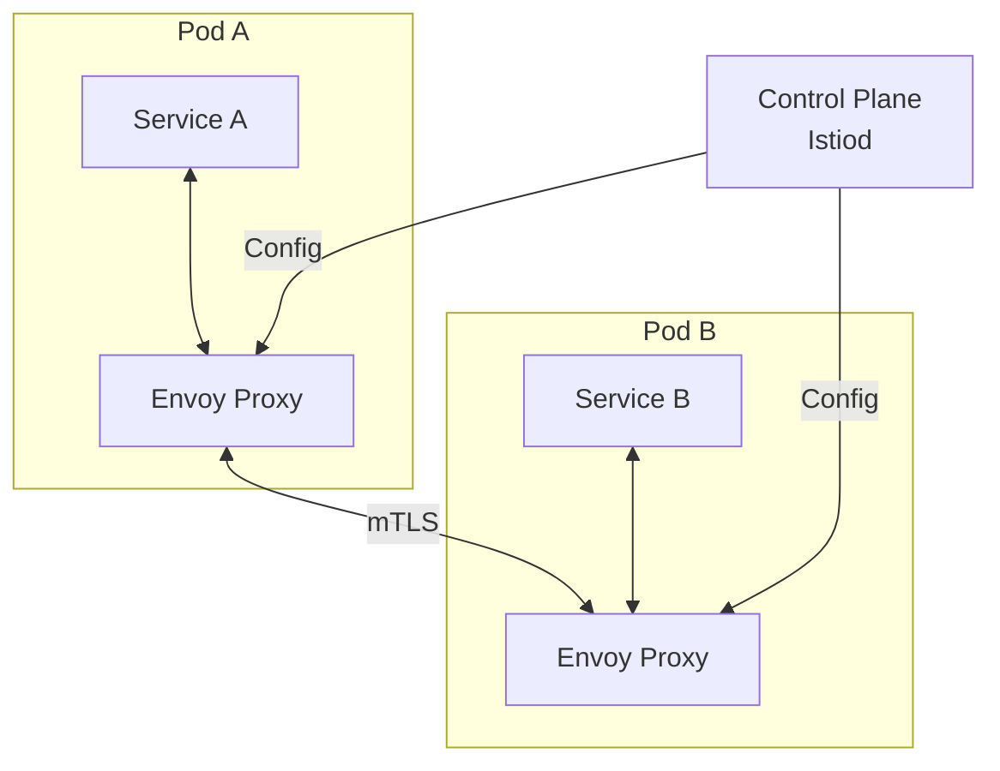

**Как работает:** sidecar-прокси (`Envoy`) перехватывает весь входящий и исходящий трафик пода. Приложение обращается на `localhost`; прокси переправляет запрос к целевому сервису, применяя политики retry, таймауты, `mTLS`.

**Когда использовать:** большое количество сервисов (10+), нужна единообразная безопасность (`mTLS`), наблюдаемость без изменения кода. **Когда не использовать:** мало сервисов (2--5) -- достаточно встроенных `Resilience4j` и `Spring Cloud`.

> [!mcq]
> - [x] Service Mesh работает через sidecar-прокси (Envoy) рядом с каждым подом; прокси перехватывает весь входящий и исходящий трафик, применяя политики без изменений в коде приложения. | Sidecar-паттерн — основа Service Mesh (Istio, Linkerd). Приложение обращается на localhost, а Envoy выполняет mTLS, retry, timeouts, трейсинг прозрачно, что позволяет унифицировать policies для всех сервисов.
> - [ ] Service Mesh работает через встраивание библиотеки в каждый сервис; библиотека управляет трафиком, mTLS и retry на уровне кода приложения. | Это описание in-process библиотек типа Spring Cloud Netflix/Resilience4j, а не Service Mesh. Mesh целенаправленно вынесен в отдельный процесс (sidecar), чтобы быть language-agnostic.
> - [ ] Service Mesh работает через централизованный прокси на границе кластера; весь межсервисный трафик проходит через этот единый прокси. | Это описание API Gateway, а не Service Mesh. Mesh работает распределённо через sidecar у каждого пода, чтобы избежать узкого места и обеспечить east-west трафик между сервисами.
> - [ ] Service Mesh работает через модификацию ядра Linux через eBPF-программы, перехватывая системные вызовы без sidecar-прокси. | eBPF-подход существует (Cilium Service Mesh), но это частный случай, а не определение Service Mesh. Классический Mesh (Istio, Linkerd) использует sidecar-прокси Envoy в user space.

## Q12. (!) Что такое паттерн CQRS?

**`CQRS`** (`Command Query Responsibility Segregation`) -- паттерн, разделяющий модели чтения и записи. Команды (`Command`) изменяют состояние, запросы (`Query`) только читают данные.

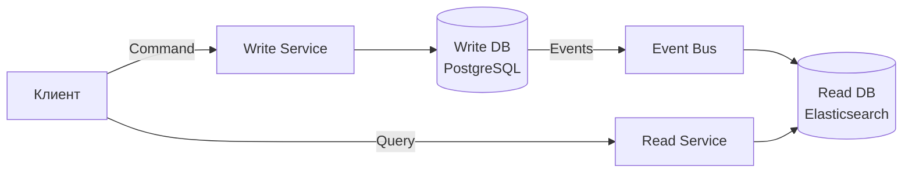

**Зачем:**
- Модель чтения оптимизирована для запросов (денормализация, кэш)
- Модель записи оптимизирована для бизнес-логики (нормализация, валидация)
- Чтение и запись масштабируются независимо

**Пример с `Spring Boot`:**

```java
// Command — изменение состояния
@RestController
@RequestMapping("/api/orders")
public class OrderCommandController {

    @PostMapping
    public ResponseEntity<UUID> createOrder(@RequestBody CreateOrderCommand cmd) {
        UUID orderId = orderCommandService.handle(cmd);
        return ResponseEntity.status(HttpStatus.CREATED).body(orderId);
    }
}

// Query — только чтение
@RestController
@RequestMapping("/api/orders")
public class OrderQueryController {

    @GetMapping("/{id}")
    public OrderView getOrder(@PathVariable UUID id) {
        return orderQueryService.findById(id);
    }

    @GetMapping
    public List<OrderSummaryView> search(OrderSearchCriteria criteria) {
        return orderQueryService.search(criteria);
    }
}
```

**Когда применять:** высокая нагрузка на чтение vs запись (read-heavy системы), сложная бизнес-логика записи, нужна денормализация для UI. Часто используется совместно с `Event Sourcing`.

> [!mcq]
> - [ ] CQRS — паттерн, при котором все операции (Create, Read, Update, Delete) обрабатываются единой моделью данных, но через разные REST-эндпоинты для улучшения читаемости API. | Это описание классического CRUD REST, а не CQRS. CQRS разделяет именно модели данных и инфраструктуру: write-модель оптимизирована под бизнес-логику, read-модель — под запросы.
> - [x] CQRS — паттерн, разделяющий модели чтения и записи: command-модель оптимизирована под бизнес-логику, query-модель — под чтение (часто денормализована); чтение и запись могут использовать разные БД. | Каноническое определение: Command изменяют состояние, Query только читают. Разделение позволяет независимо масштабировать read/write, оптимизировать read-модель (Elasticsearch), и часто используется с Event Sourcing.
> - [ ] CQRS — паттерн, при котором все команды и запросы проходят через центральный брокер сообщений для обеспечения идемпотентности. | Идемпотентность и очереди — ортогональные концепции. CQRS — о разделении read/write моделей, а не о способе доставки запросов через брокер.
> - [ ] CQRS — паттерн, при котором read-запросы всегда кэшируются в Redis, а write-запросы идут напрямую в PostgreSQL. | Кэширование — это частная оптимизация read-side. CQRS определяет архитектурное разделение моделей, а не конкретное хранилище: read-модель может быть в Elasticsearch, MongoDB, materialized view, не обязательно Redis.

## Q13. Что такое Event Sourcing?

**`Event Sourcing`** -- паттерн, при котором все изменения состояния записываются как последовательность неизменяемых событий. Текущее состояние восстанавливается повторным проигрыванием событий.

**Пример:** вместо хранения `balance = 150` хранятся события:
1. `AccountCreated(balance=0)`
2. `MoneyDeposited(amount=200)`
3. `MoneyWithdrawn(amount=50)`

**Плюсы:** полная история изменений, возможность восстановления на любой момент времени, аудит «из коробки». **Минусы:** сложность запросов (нужен `CQRS`), рост хранилища, eventual consistency.

Фреймворки для Java: `Axon Framework`, `Eventuate`. Подробнее о событийных паттернах -- в [Event-driven паттернах](event-driven-patterns-interview.md).

> [!mcq]
> - [ ] В Event Sourcing текущее состояние читается из таблицы snapshot, а события используются только для аудита и логирования. | Это описание CRUD + audit log, а не Event Sourcing. В ES события — первичный источник истины; текущее состояние вычисляется проигрыванием событий (snapshot — оптимизация для ускорения восстановления, но не замена).
> - [ ] В Event Sourcing события удаляются после применения к агрегату для экономии места; хранится только текущее состояние. | Это противоположность ES: в Event Sourcing события никогда не удаляются (append-only log). Именно неизменяемая история обеспечивает возможность воспроизведения состояния на любой момент и полный аудит.
> - [x] В Event Sourcing все изменения состояния записываются как последовательность неизменяемых событий; текущее состояние восстанавливается повторным проигрыванием событий. | Каноническое определение: append-only log событий как источник истины. Дает полный аудит, возможность восстановления на любой момент, replay для построения новых read-моделей.
> - [ ] В Event Sourcing все события хранятся в Kafka, а current-state агрегатов синхронизируется между инстансами через Raft-консенсус. | Kafka может использоваться как event store, но это не обязательно (EventStoreDB, Axon Server). Raft-консенсус между инстансами — про распределённое согласие, а не про ES-паттерн.

## Q14. Что такое паттерн Strangler Fig для миграции с монолита?

**`Strangler Fig`** (по Мартину Фаулеру) -- паттерн постепенной замены монолита микросервисами. Новая функциональность реализуется в микросервисах; старая -- постепенно переносится. `API Gateway` маршрутизирует запросы: часть идёт к монолиту, часть -- к новым сервисам.

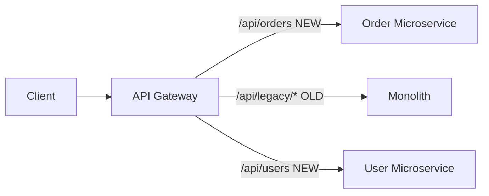

**Шаги:**
1. Поставить `API Gateway` перед монолитом
2. Выделить один Bounded Context в микросервис
3. Перенаправить трафик на микросервис через Gateway
4. Повторять для следующих контекстов
5. Отключить монолит, когда весь трафик идёт через микросервисы

> [!mcq]
> - [ ] Strangler Fig предполагает одномоментную замену монолита на набор микросервисов с переключением трафика в один release-день; это «большой взрыв» миграции. | «Большой взрыв» — антипаттерн миграции с высоким риском: отсутствие rollback, невозможность протестировать новый функционал в проде. Strangler Fig — противоположность: постепенная, инкрементальная замена.
> - [ ] Strangler Fig предполагает замену монолита через постоянный дублированный запуск (монолит и микросервисы работают параллельно вечно) без планового отключения монолита. | Параллельный запуск — промежуточное состояние, а не конечная цель. Strangler Fig явно предусматривает финальный шаг: отключение монолита, когда весь трафик перенесён.
> - [ ] Strangler Fig предполагает полное переписывание монолита на микросервисы в отдельной ветке с последующим merge; ветка разрабатывается полгода-год без релизов. | Это long-running branch, а не Strangler Fig. Strangler Fig работает в продакшене с постоянным релизным циклом: каждый извлечённый сервис выпускается сразу.
> - [x] Strangler Fig предполагает постепенную замену монолита: API Gateway маршрутизирует трафик — новые функции к микросервисам, старые к монолиту; функциональность поэтапно выносится, пока монолит не отключится. | Каноническое определение Мартина Фаулера: метафора душителя-фикуса, который постепенно оплетает дерево. API Gateway — ключ к постепенной миграции: он разделяет маршруты между старым и новым кодом без downtime.

## Q15. (!) Что такое ACID и BASE?

**`ACID`** (`Atomicity`, `Consistency`, `Isolation`, `Durability`) -- свойства транзакций в реляционных БД:

1. **Atomicity** -- транзакция выполняется целиком или не выполняется вовсе
2. **Consistency** -- БД переходит из одного согласованного состояния в другое
3. **Isolation** -- транзакции не видят промежуточные результаты друг друга
4. **Durability** -- после коммита данные сохраняются даже при сбое

**`BASE`** (`Basically Available`, `Soft-state`, `Eventual consistency`) -- альтернативный подход для распределённых систем:

1. **Basically Available** -- система доступна, допуская временную несогласованность
2. **Soft-state** -- состояние может меняться со временем (без записи)
3. **Eventual consistency** -- данные в итоге придут к согласованному состоянию

| | ACID | BASE |
|---|------|------|
| Гарантии | Строгая согласованность | Конечная согласованность |
| Производительность | Ниже (блокировки) | Выше (нет блокировок) |
| Масштабируемость | Вертикальная | Горизонтальная |
| Применение | Монолит, одна БД | Микросервисы, NoSQL |

В микросервисной архитектуре `BASE` -- основной подход, так как `ACID`-транзакции между сервисами невозможны. Подробнее -- в [паттернах согласованности](consistency-patterns-interview.md).

> [!mcq]
> - [x] Свойство Isolation в ACID означает, что параллельные транзакции не видят промежуточные состояния друг друга; реализуется через MVCC или блокировки в зависимости от уровня изоляции. | Каноническое определение: транзакции выполняются так, как если бы были последовательными. Реализация через MVCC (PostgreSQL) или lock-based (MySQL с InnoDB) зависит от уровня: Read Committed, Repeatable Read, Serializable.
> - [ ] Свойство Isolation в ACID означает, что БД изолирована от приложения через сетевой протокол; реализуется через TCP/IP и TLS. | Это сетевая изоляция, а не ACID Isolation. ACID Isolation — про изоляцию параллельных транзакций друг от друга внутри одной БД, а не между БД и клиентом.
> - [ ] Свойство Isolation в ACID означает, что данные одного пользователя физически отделены от данных другого; реализуется через партиционирование таблиц. | Это tenant isolation или data partitioning, а не ACID Isolation. Партиционирование — это оптимизация производительности, ACID Isolation же про concurrent transactions в рамках одной БД.
> - [ ] Свойство Isolation в ACID означает, что БД работает в отдельном Docker-контейнере от приложения; реализуется через сетевую изоляцию namespace. | Контейнеризация — инфраструктурный уровень и никак не связана с ACID. ACID — про семантику транзакций, определённую ещё до появления Docker.

## Q16. (!) Что такое CAP-теорема?

**`CAP`-теорема** (теорема Брюэра) -- в распределённой системе невозможно одновременно гарантировать все три свойства:

1. **Consistency** -- все узлы видят одни и те же данные в один момент времени
2. **Availability** -- каждый запрос получает ответ (даже при сбоях)
3. **Partition tolerance** -- система работает при разрыве сети между узлами

В реальных распределённых системах сетевые разделения (`P`) неизбежны, поэтому выбор сводится к `CP` vs `AP`:
- **CP** (`ZooKeeper`, `etcd`, `HBase`) -- при разделении жертвуем доступностью
- **AP** (`Cassandra`, `DynamoDB`, `Eureka`) -- при разделении жертвуем строгой согласованностью

Подробнее -- в [вопросах по CAP-теореме](cap-theorem-interview.md).

> [!mcq]
> - [ ] CAP-теорема утверждает, что распределённая система может одновременно гарантировать все три свойства (Consistency, Availability, Partition tolerance) при достаточной пропускной способности сети. | Это противоположность утверждению CAP: Брюэр доказал, что одновременно все три гарантировать невозможно. Пропускная способность не устраняет возможности network partition.
> - [x] CAP-теорема утверждает, что в распределённой системе при сетевом разделении (P) необходимо выбирать между согласованностью (C) и доступностью (A); выбор P неизбежен, поэтому на практике — CP vs AP. | Каноническая формулировка: P (partition tolerance) — не опция, а реальность, поэтому выбор сводится к CP (ZooKeeper, etcd) и AP (Cassandra, DynamoDB). Это фундаментальный trade-off распределённых систем.
> - [ ] CAP-теорема относится только к NoSQL базам данных и не применима к реляционным СУБД с кластерами (PostgreSQL, MySQL). | CAP применяется к любой распределённой системе, включая реляционные кластеры. PostgreSQL с streaming replication — CP (primary-replica), Galera Cluster — AP; выбор всегда существует.
> - [ ] CAP-теорема определяет максимальное число узлов в кластере (обычно 3 или 5) для обеспечения consensus через Raft или Paxos. | Число узлов для consensus — отдельная тема (quorum, fault tolerance), не связанная с CAP. CAP — о trade-off между C и A при P, а не о кардинальности кластера.

## Q17. (!) Как обеспечивается атомарность операций в микросервисах?

В архитектуре микросервисов нет глобальных `ACID`-транзакций. Подходы:

1. **Saga** -- последовательность локальных транзакций с компенсациями
2. **Transactional Outbox** -- событие записывается в таблицу `outbox` в той же транзакции, что и данные; отдельный процесс (`Debezium`, polling) читает outbox и публикует в `Kafka`
3. **Event Sourcing** -- все изменения как события, атомарность на уровне одного агрегата
4. **Оркестрация / Хореография** -- координация шагов распределённой операции

```java
// Transactional Outbox — запись данных и события в одной транзакции
@Service
@RequiredArgsConstructor
public class OrderService {

    private final OrderRepository orderRepository;
    private final OutboxRepository outboxRepository;

    @Transactional
    public Order createOrder(CreateOrderRequest request) {
        Order order = Order.create(request);
        orderRepository.save(order);

        // Событие в outbox-таблицу — в той же транзакции
        outboxRepository.save(OutboxEvent.builder()
            .aggregateType("Order")
            .aggregateId(order.getId().toString())
            .type("OrderCreated")
            .payload(toJson(new OrderCreatedEvent(order)))
            .build());

        return order;
    }
}
```

> [!mcq]
> - [ ] Transactional Outbox сначала публикует событие в Kafka, затем в той же транзакции сохраняет данные в БД; это гарантирует доставку события до коммита данных. | Порядок обратный и невозможный: публикация в Kafka не участвует в транзакции БД. Если событие уже отправлено, а транзакция откатится, получится inconsistent state (событие без данных).
> - [ ] Transactional Outbox использует XA-транзакции между БД и Kafka для атомарной записи данных и события; это требует XA Transaction Manager. | Kafka не поддерживает XA. Именно поэтому Transactional Outbox и был создан — как альтернатива XA для микросервисов: атомарность достигается через одну локальную БД-транзакцию, а публикация в Kafka происходит асинхронно.
> - [x] Transactional Outbox сохраняет событие в таблицу outbox в той же БД-транзакции, что и данные; отдельный процесс (Debezium или polling) читает outbox и публикует в Kafka. | Каноническая реализация: атомарность данных и события гарантируется одной локальной транзакцией БД; публикация в брокер отдельным asynchronous процессом через CDC (Debezium) или polling publisher.
> - [ ] Transactional Outbox использует distributed locks через Redis для синхронизации записи данных в БД и публикации в Kafka между инстансами сервиса. | Distributed locks не решают проблему атомарности между БД и брокером: lock может быть удержан, но транзакция БД откатится, а событие уже опубликовано. Паттерн именно в том, чтобы уйти от distributed locks.

## Q18. (!) Что такое Saga и когда применять вместо 2PC?

**`Saga`** -- последовательность локальных транзакций в микросервисах; при сбое шага выполняются компенсирующие транзакции (откат предыдущих шагов).

**Два подхода:**
- **Choreography** -- каждый сервис публикует событие; следующие сервисы подписываются
- **Orchestration** -- центральный оркестратор вызывает сервисы по очереди

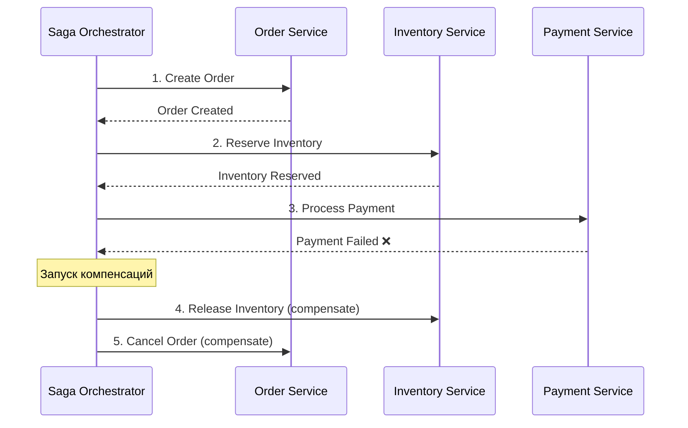

**Saga vs 2PC:**

| | Saga | 2PC |
|---|------|-----|
| Блокировки | Нет | Да (ресурсы заблокированы) |
| Производительность | Высокая | Низкая |
| Согласованность | Eventual | Strong |
| Сложность | Компенсации | Простой протокол |
| Поддержка NoSQL | Да | Нет (нужен XA) |

**Применять Saga когда:** сервисы используют разные хранилища, 2PC неприемлем по производительности, нужна слабая связанность.

**Пример оркестратора:**

```java
@Component
@RequiredArgsConstructor
public class CreateOrderSaga {

    private final OrderService orderService;
    private final InventoryClient inventoryClient;
    private final PaymentClient paymentClient;

    public void execute(CreateOrderCommand command) {
        Order order = orderService.create(command);
        try {
            inventoryClient.reserve(order.getItems());
            try {
                paymentClient.charge(order.getTotalAmount());
                orderService.confirm(order.getId());
            } catch (PaymentException e) {
                inventoryClient.release(order.getItems()); // компенсация
                orderService.cancel(order.getId());        // компенсация
                throw e;
            }
        } catch (InventoryException e) {
            orderService.cancel(order.getId());            // компенсация
            throw e;
        }
    }
}
```

> [!mcq]
> - [ ] Saga Choreography — подход, при котором центральный оркестратор вызывает сервисы по очереди и принимает решения о компенсациях; каждый сервис не знает о других. | Это описание Saga Orchestration, а не Choreography. В Choreography нет центрального координатора: каждый сервис публикует событие, а другие подписываются и реагируют.
> - [ ] Saga Orchestration — подход, при котором сервисы общаются через публикацию событий; нет центрального координатора, логика размазана по сервисам. | Это описание Saga Choreography. В Orchestration есть явный оркестратор (state machine), который вызывает сервисы и управляет компенсациями.
> - [ ] Saga и 2PC имеют одинаковую строгость согласованности, но Saga быстрее из-за асинхронных вызовов; выбор зависит только от требуемой производительности. | Строгость различается: 2PC даёт strong consistency, Saga — eventual consistency. Между шагами Saga данные несогласованы; это фундаментальное отличие, а не только скорость.
> - [x] Saga Choreography — каждый сервис публикует событие, следующие сервисы подписываются и реагируют; Orchestration — центральный оркестратор вызывает сервисы по очереди и управляет компенсациями. | Каноническое разделение двух подходов: Choreography — децентрализованный, реактивный, хорош для простых flow; Orchestration — централизованный, явная state machine, лучше для сложных бизнес-процессов с множеством компенсаций.

## Q19. (!) Что такое двухфазная фиксация (2PC)?

**`Two-Phase Commit` (2PC)** -- протокол обеспечения атомарности распределённых транзакций.

**Фаза 1 (Prepare):** координатор спрашивает всех участников: «Готовы к фиксации?» Каждый участник выполняет локальные проверки и отвечает `YES` или `NO`.

**Фаза 2 (Commit/Rollback):** если все ответили `YES` -- координатор отправляет `COMMIT`; если хоть один `NO` -- `ROLLBACK`.

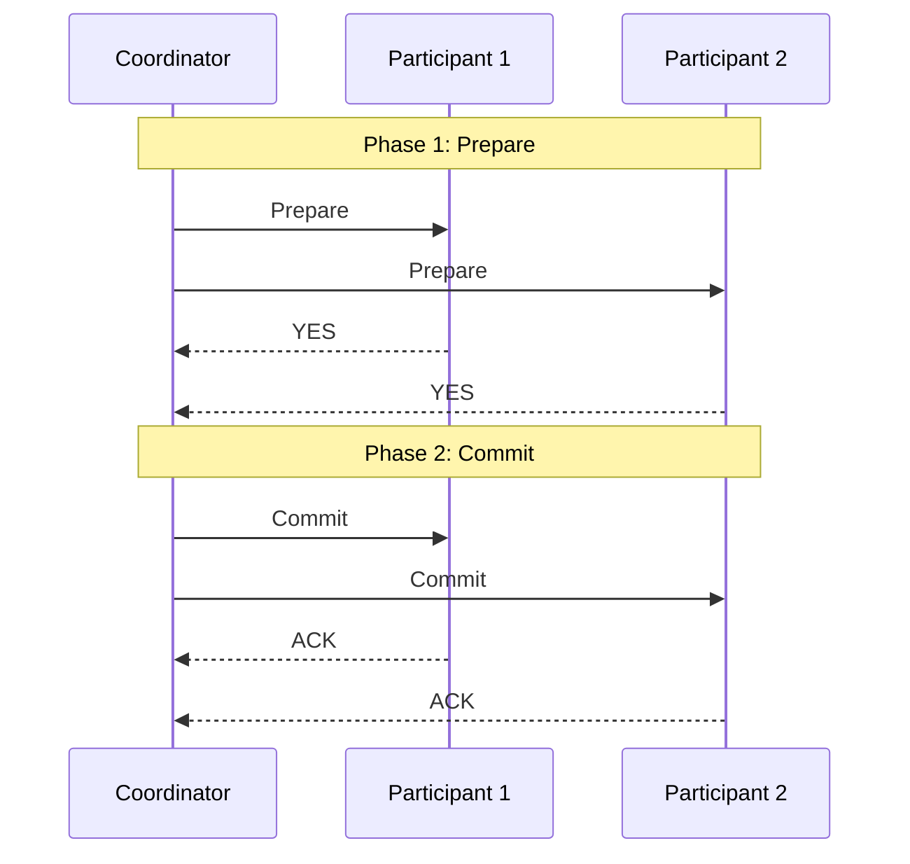

**Недостатки 2PC:**
- **Блокирующий** -- ресурсы заблокированы на время протокола
- **Single point of failure** -- если координатор упал после `Prepare`, участники зависают
- **Не поддерживается NoSQL** -- нужна поддержка `XA`-транзакций
- **Плохая масштабируемость** -- блокировки ограничивают throughput

Поэтому в микросервисах обычно предпочитают `Saga`.

> [!mcq]
> - [x] Главная проблема 2PC — блокирующий протокол: если координатор упал после отправки Prepare, участники зависают с заблокированными ресурсами, ожидая решения. | Каноническая проблема 2PC. Участники не могут самостоятельно решить commit/abort (это привело бы к inconsistency между участниками), поэтому ждут координатора. При его падении — стойка.
> - [ ] Главная проблема 2PC — низкая совместимость с JDBC-драйверами: лишь MySQL и PostgreSQL поддерживают двухфазную фиксацию. | Проблема не в драйверах: 2PC через XA поддерживается большинством реляционных СУБД. Проблема 2PC в самом протоколе (блокировки, SPOF координатора) и в отсутствии XA-поддержки у NoSQL/Kafka.
> - [ ] Главная проблема 2PC — невозможность реализации в сетевых условиях с latency выше 10ms; протокол требует синхронной RTT. | 2PC работает и с большими latency, просто становится ещё медленнее. Главная проблема — семантика блокирования, а не конкретные численные пределы latency.
> - [ ] Главная проблема 2PC — требование согласования часов между всеми участниками через NTP с точностью до миллисекунды. | 2PC не требует синхронизации часов: решения принимаются на основе сообщений, а не timestamp-ов. Это подход Spanner TrueTime, но не 2PC.

## Q20. Что такое трёхфазная фиксация (3PC)?

**`Three-Phase Commit` (3PC)** -- расширение 2PC, добавляющее фазу `Pre-Commit` для уменьшения вероятности блокировки:

1. **CanCommit** -- координатор спрашивает «можешь фиксировать?»
2. **PreCommit** -- координатор говорит «готовься к фиксации» (но ещё не фиксируй)
3. **DoCommit** -- координатор говорит «фиксируй»

**Преимущество:** при сбое координатора после `PreCommit` участники могут принять решение самостоятельно (таймаут → commit или abort). **Недостаток:** не решает проблему при сетевых разделениях; сложнее реализовать; на практике используется редко.

> [!mcq]
> - [ ] 3PC устраняет все проблемы 2PC и активно используется в production-системах (Kubernetes, etcd, Spanner) вместо 2PC. | 3PC не устраняет все проблемы: он не работает корректно при network partition. В production-системах (etcd, Spanner) используются другие протоколы — Raft и Paxos для consensus.
> - [x] 3PC добавляет промежуточную фазу PreCommit, которая уменьшает блокировки при сбое координатора, но не решает проблему network partition; на практике используется редко. | Каноническое описание: PreCommit позволяет участникам принять самостоятельное решение по таймауту, что уменьшает stuck-ситуации. Однако при network partition возможны inconsistent решения, поэтому в реальности применяется 2PC или Raft/Paxos.
> - [ ] 3PC — это синоним Saga: оба паттерна используют компенсирующие транзакции и eventual consistency. | 3PC и Saga — разные подходы: 3PC по-прежнему blocking consensus protocol со strong consistency, Saga — non-blocking с eventual consistency через компенсации. Это разные семейства паттернов.
> - [ ] 3PC добавляет третью фазу Validation после Commit для проверки правильности данных через контрольные суммы. | В 3PC нет фазы Validation: добавлена именно PreCommit между Prepare и DoCommit. Валидация через контрольные суммы — отдельная тема (data integrity).

## Q21. (!) Что такое компенсирующие транзакции?

**Компенсирующие транзакции** -- операции, отменяющие эффект уже выполненных шагов. Используются в `Saga` при сбое одного из шагов.

**Примеры компенсаций:**
| Операция | Компенсация |
|----------|-------------|
| Создать заказ | Отменить заказ |
| Зарезервировать товар | Снять резерв |
| Списать средства | Вернуть средства |
| Отправить уведомление | Отправить уведомление об отмене |

**Важно:** компенсация не всегда означает полный откат; иногда это «семантический откат» (возврат средств, а не отмена банковской транзакции). Компенсации должны быть идемпотентными -- повторный вызов не должен вызывать ошибку.

> [!mcq]
> - [ ] Компенсирующая транзакция должна технически откатить БД в состояние, идентичное тому, что было до первой транзакции; иначе это нарушает ACID. | Технический rollback невозможен в распределённой системе после commit: первая транзакция уже зафиксирована. Компенсация — «семантический откат» (возврат средств, а не cancel-операция), а ACID не гарантируется между сервисами.
> - [ ] Компенсирующая транзакция может быть не идемпотентной, так как вызывается только один раз после обнаружения сбоя в Saga. | Идемпотентность критична: при сетевых сбоях компенсация может быть вызвана несколько раз (например, timeout и retry). Не идемпотентная компенсация может списать деньги дважды или дважды освободить резерв.
> - [x] Компенсирующая транзакция — семантический откат уже выполненного шага (возврат средств, освобождение резерва); должна быть идемпотентной, так как может быть вызвана несколько раз при retry. | Каноническое определение: не технический rollback, а бизнес-действие, отменяющее эффект. Идемпотентность обязательна, т.к. Saga-оркестратор может повторять компенсации при сбоях сети или координатора.
> - [ ] Компенсирующая транзакция запускается до выполнения основной операции как превентивная проверка; при успехе проверки основная операция выполняется. | Это описание паттерна Try-Confirm/Cancel (TCC), а не классической компенсации в Saga. В классической Saga компенсация запускается после сбоя уже выполненного шага, а не до.

## Q22. Как решить проблемы согласованности данных?

Подходы к обеспечению согласованности в микросервисах:

1. **Выбор модели согласованности** -- `ACID` внутри сервиса, `BASE` между сервисами
2. **Event Sourcing + CQRS** -- события как источник истины; read model обновляется асинхронно
3. **Saga** -- распределённые транзакции с компенсациями
4. **Transactional Outbox** -- гарантия «at-least-once» публикации событий
5. **Оптимистическая блокировка** -- версионирование данных для обнаружения конфликтов
6. **Bounded Context** -- минимизация межсервисных зависимостей

Подробнее -- в [паттернах согласованности](consistency-patterns-interview.md).

> [!mcq]
> - [ ] Оптимистическая блокировка обеспечивает согласованность через удержание эксклюзивного lock на записи на всё время транзакции, блокируя другие транзакции. | Это пессимистическая блокировка (SELECT FOR UPDATE). Оптимистическая наоборот: не блокирует запись, а проверяет версию при коммите и отклоняет конфликты.
> - [ ] Оптимистическая блокировка обеспечивает согласованность через использование сетевых таймаутов: если запрос не пришёл вовремя, транзакция откатывается. | Это описание timeout-механизма, а не оптимистической блокировки. Оптимистическая блокировка — про версионирование данных, а не про время ожидания сети.
> - [ ] Оптимистическая блокировка обеспечивает согласованность через запись в event log всех операций и последующий merge конфликтующих изменений автоматически. | Это Operational Transformation / CRDT-подход для collaborative editing, а не оптимистическая блокировка. OL использует простое отклонение конфликтующих записей, а не merge.
> - [x] Оптимистическая блокировка обеспечивает согласованность через версионирование записей: при UPDATE проверяется совпадение версии; при конфликте транзакция откатывается и повторяется. | Каноническое определение: JPA @Version или ETag в HTTP. WHERE id=? AND version=? — если строка не обновлена, значит версия изменилась и конфликт обнаружен. Хорошо масштабируется, т.к. нет блокировок.

## Q23. (!) Как обрабатываются сбои и отказы в микросервисах?

Стратегии обработки сбоев:

1. **Circuit Breaker** (`Resilience4j`) -- прерывает вызовы при массовых сбоях
2. **Retry** с exponential backoff -- повторяет отдельные неудачные вызовы
3. **Fallback** -- возвращает запасной ответ при недоступности сервиса
4. **Timeout** -- ограничение времени ожидания ответа
5. **Bulkhead** -- изоляция ресурсов (отдельные пулы потоков/соединений)
6. **Graceful degradation** -- система работает с ограниченным функционалом
7. **Health checks** -- `readiness`/`liveness` probes в `Kubernetes`

```java
@Service
public class ProductService {

    @CircuitBreaker(name = "inventory", fallbackMethod = "fallback")
    @Retry(name = "inventory")
    @TimeLimiter(name = "inventory")
    public CompletableFuture<InventoryStatus> checkInventory(String productId) {
        return CompletableFuture.supplyAsync(
            () -> inventoryClient.getStatus(productId));
    }

    private CompletableFuture<InventoryStatus> fallback(String productId,
                                                         Throwable ex) {
        return CompletableFuture.completedFuture(
            InventoryStatus.unknown(productId));
    }
}
```

> [!mcq]
> - [x] Graceful degradation — стратегия, при которой система продолжает работать с ограниченным функционалом при отказе зависимостей; например, выдавая cached данные или отключая неключевые фичи. | Каноническое определение: деградация качества, а не полный отказ. Пример — e-commerce показывает товары из кэша при падении каталога, но отключает рекомендации. Критический функционал (checkout) сохраняется.
> - [ ] Graceful degradation — стратегия полной остановки системы при первом же отказе любой зависимости для предотвращения некорректных данных. | Это противоположность graceful degradation — fail-stop. Graceful именно означает сохранение работы с пониженным качеством, а не остановку.
> - [ ] Graceful degradation — стратегия автоматического отката к предыдущей версии приложения при обнаружении ошибок после деплоя. | Это описание rollback-стратегии деплоя, а не graceful degradation. Деградация касается runtime-поведения при отказе зависимостей, а не CI/CD.
> - [ ] Graceful degradation — стратегия замедления обработки запросов через back-pressure для защиты от перегрузки. | Back-pressure — отдельный паттерн (Reactive Streams) управления потоком данных. Graceful degradation работает на уровне функциональности, а не скорости обработки.

## Q24. (!) Как реализовать механизмы повторной попытки (Retry)?

**Retry** -- повторение неудачного вызова с задержкой. Подходы:

1. **Фиксированная задержка** -- повтор через N секунд
2. **Exponential backoff** -- задержка удваивается с каждой попыткой (1с, 2с, 4с, 8с)
3. **Exponential backoff + jitter** -- добавляется случайный разброс для избежания `thundering herd`
4. **Retry-After заголовок** -- сервер указывает время до следующей попытки

```java
// Spring Retry
@Service
public class ExternalApiService {

    @Retryable(
        retryFor = {RestClientException.class},
        maxAttempts = 3,
        backoff = @Backoff(delay = 1000, multiplier = 2, maxDelay = 10000)
    )
    public String callExternalApi(String request) {
        return restTemplate.postForObject(apiUrl, request, String.class);
    }

    @Recover
    public String recover(RestClientException ex, String request) {
        log.error("All retries exhausted for request: {}", request);
        return "default-response";
    }
}
```

**Важно:** retry имеет смысл только для **идемпотентных** операций; для мутирующих вызовов без идемпотентности retry может привести к дублированию.

> [!mcq]
> - [ ] Exponential backoff означает, что каждая следующая попытка повторяется с фиксированным интервалом (например, 1 секунда) для предсказуемости нагрузки. | Это описание фиксированной задержки, а не экспоненциальной. Exponential backoff увеличивает задержку между попытками (обычно удваивает), чтобы снизить нагрузку на проблемный сервис.
> - [x] Exponential backoff — стратегия, при которой задержка между попытками удваивается (1с, 2с, 4с, 8с); jitter добавляет случайный разброс для предотвращения thundering herd. | Каноническая стратегия: увеличение задержки даёт сервису время на восстановление, jitter (случайный разброс) предотвращает одновременные повторы от множества клиентов, что усугубило бы нагрузку.
> - [ ] Exponential backoff — стратегия, при которой интервал между попытками уменьшается экспоненциально (1с, 0.5с, 0.25с) для быстрого восстановления после временного сбоя. | Это противоположное направление: уменьшение задержки увеличит нагрузку на проблемный сервис и усугубит ситуацию. Правильная идея — давать больше времени между попытками, не меньше.
> - [ ] Exponential backoff вычисляет задержку на основе измеренной latency сервиса: если latency выросла вдвое, задержка между попытками удваивается автоматически. | Это описание адаптивного retry (например, Netflix Hystrix). Classic exponential backoff работает по фиксированной формуле (baseDelay * 2^attempt), не измеряя latency.

## Q25. Как обеспечить идемпотентность операций?

**Идемпотентность:** повторный вызов с теми же данными даёт тот же результат.

**Подходы:**
- **Idempotency Key** -- клиент передаёт уникальный ключ; сервер кэширует результат
- **Версионирование** -- оптимистичная блокировка по версии записи
- **Дедупликация в консьюмере** -- по ключу сообщения в `Kafka`/`RabbitMQ`

```java
@RestController
@RequestMapping("/api/payments")
public class PaymentController {

    @PostMapping
    public ResponseEntity<PaymentResponse> processPayment(
            @RequestHeader("Idempotency-Key") String idempotencyKey,
            @RequestBody PaymentRequest request) {

        // Проверяем кэш по ключу идемпотентности
        return paymentService.findByIdempotencyKey(idempotencyKey)
            .map(ResponseEntity::ok)
            .orElseGet(() -> {
                PaymentResponse response = paymentService.process(
                    request, idempotencyKey);
                return ResponseEntity.status(HttpStatus.CREATED).body(response);
            });
    }
}
```

> [!mcq]
> - [ ] Идемпотентная операция — операция, которая всегда возвращает 200 OK, даже если повторный вызов не приводит к изменению состояния. | HTTP-статус не определяет идемпотентность. Идемпотентность — про семантику (состояние системы одинаково после 1 или N вызовов), а не про код ответа. Идемпотентный endpoint может возвращать 201 при первом вызове и 200 при повторе.
> - [ ] Идемпотентная операция — операция, которая возвращает одинаковый результат (response body) при повторном вызове с теми же параметрами. | Идемпотентность — про состояние системы, а не про ответ. GET /users/42 вернёт одного пользователя дважды, но при изменениях между вызовами результаты различаются — это нормально. Главное — операция не меняет состояние повторно.
> - [x] Идемпотентная операция — операция, повторный вызов которой с теми же параметрами не приводит к изменению состояния системы; обычно реализуется через Idempotency-Key или версионирование. | Каноническое определение: первый вызов меняет состояние, повторные не делают ничего. Idempotency-Key позволяет серверу детектировать повтор и вернуть закэшированный результат без повторного выполнения бизнес-логики.
> - [ ] Идемпотентная операция — операция, которая выполняется только один раз за всё время жизни системы благодаря уникальному идентификатору транзакции. | Это описание at-most-once семантики в messaging. Идемпотентная операция может быть вызвана много раз, но эффект от N вызовов равен эффекту от 1 вызова — это не один раз за всю жизнь.

## Q26. Что такое Bulkhead-паттерн?

**`Bulkhead`** (переборка) -- паттерн изоляции ресурсов: каждый внешний вызов использует свой пул потоков/соединений. Сбой одного сервиса не исчерпывает ресурсы для вызовов к другим.

Аналогия: переборки на корабле -- затопление одного отсека не топит весь корабль.

```java
@Service
public class OrderService {

    @Bulkhead(name = "paymentService", type = Bulkhead.Type.THREADPOOL)
    public CompletableFuture<PaymentResponse> processPayment(String orderId) {
        return CompletableFuture.supplyAsync(
            () -> paymentClient.charge(orderId));
    }
}
```

```yaml
resilience4j:
  bulkhead:
    instances:
      paymentService:
        maxConcurrentCalls: 10
        maxWaitDuration: 500ms
  thread-pool-bulkhead:
    instances:
      paymentService:
        maxThreadPoolSize: 10
        coreThreadPoolSize: 5
        queueCapacity: 20
```

> [!mcq]
> - [ ] Bulkhead-паттерн решает проблему каскадных сбоев через детектирование аномалий в метриках и автоматическое отключение сбойного сервиса. | Это описание Circuit Breaker. Bulkhead не детектирует сбои, а изолирует ресурсы через отдельные пулы, чтобы исчерпание одного пула не влияло на другие.
> - [ ] Bulkhead-паттерн дублирует вызовы к нескольким инстансам сервиса для повышения надёжности; первый ответивший инстанс используется. | Это описание hedged requests (Scatter-Gather). Bulkhead — про изоляцию пулов ресурсов, а не про параллельные вызовы.
> - [ ] Bulkhead-паттерн группирует несколько запросов в один batch для снижения нагрузки на сеть. | Это описание request batching. Bulkhead разделяет ресурсы для изоляции сбоев, а не объединяет запросы.
> - [x] Bulkhead-паттерн изолирует ресурсы через отдельные пулы потоков/соединений для каждого внешнего вызова; сбой одного сервиса не исчерпывает ресурсы для вызовов к другим. | Каноническое определение: аналогия с переборками корабля. Если Payment Service тормозит, его пул в 10 потоков исчерпается, но пул для Inventory (другие 10 потоков) останется свободным.

## Q27. (!) Как организовать конфигурацию микросервисов?

**Централизованная конфигурация** -- хранение конфигов в одном месте; микросервисы получают конфиг при старте или по refresh.

**Решения:**
- **Spring Cloud Config** -- конфиг в Git, выдаётся по профилю
- **Kubernetes ConfigMap / Secrets** -- конфиг как ресурс кластера
- **HashiCorp Vault** -- секреты (пароли, ключи, сертификаты)
- **Consul KV** -- distributed key-value хранилище

```yaml
# Spring Cloud Config Client
spring:
  application:
    name: order-service
  config:
    import: optional:configserver:http://config-server:8888
  profiles:
    active: prod
```

**Обновление без перезапуска:** `/actuator/refresh` перезагружает `@RefreshScope` бины. `Spring Cloud Bus` (через `Kafka`/`RabbitMQ`) рассылает refresh всем инстансам. Секреты -- только в `Vault` или `Kubernetes Secrets`, не в Git.

> [!mcq]
> - [x] Секреты (пароли, API-ключи) должны храниться в специализированных хранилищах (HashiCorp Vault, Kubernetes Secrets) с audit log и rotation, а не в Git-репозитории с конфигом. | Каноническое правило: Git — это публичная история, секреты в нём скомпрометированы навсегда даже после удаления (история commit-ов). Vault и Kubernetes Secrets дают контроль доступа, шифрование at rest, audit log и возможность ротации.
> - [ ] Секреты можно хранить в Git в зашифрованном виде (например, через git-crypt), так как симметричное шифрование обеспечивает достаточную защиту. | Git-crypt и SOPS — частичное решение: ключ шифрования всё равно где-то хранится, а история зашифрованных блобов остаётся в репозитории. Ротация сложна, audit отсутствует — для production предпочтительнее Vault.
> - [ ] Секреты нужно хранить в application.yml вместе с остальной конфигурацией; достаточно ограничить доступ к репозиторию через GitLab permissions. | Permissions на репозиторий не защищают от утечки через локальные клоны, CI-логи, backup. Секрет в Git — это утечка, независимо от прав доступа к репозиторию; стандарт — вынесение в отдельное secret storage.
> - [ ] Секреты должны храниться в переменных окружения в Dockerfile для удобства деплоя и прозрачности между окружениями. | ENV в Dockerfile попадают в image layers и становятся доступны всем, у кого есть доступ к реестру. Переменные окружения контейнера при запуске — приемлемо, но источник должен быть secret storage, а не Dockerfile.

## Q28. (!) Как обеспечить безопасность взаимодействия между микросервисами?

| Механизм | Уровень | Описание |
|----------|---------|----------|
| `mTLS` | Транспорт | Взаимная аутентификация по сертификатам |
| `JWT` / `OAuth2` | Приложение | Токен в заголовке, проверка подписи |
| `Service Mesh` | Инфраструктура | Автоматический `mTLS` через sidecar |
| Network Policies | Сеть | Изоляция подов в `Kubernetes` |

**Паттерн с `API Gateway`:**

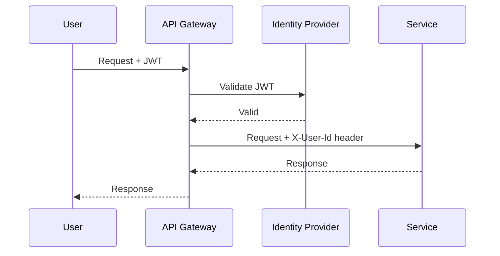

Внутри `Service Mesh` (`Istio`) включается `PeerAuthentication` с `STRICT` -- весь трафик между подами шифруется `mTLS` без изменений в коде. Подробнее о безопасности -- в [паттернах аутентификации](../security/authentication-authorization-patterns-interview.md) и [Spring Security](../frameworks/spring/spring-security-interview.md).

> [!mcq]
> - [ ] mTLS обеспечивает только шифрование трафика между сервисами; аутентификация клиента не является частью протокола. | mTLS именно про mutual authentication: и сервер, и клиент предъявляют сертификаты. Если нужно только шифрование, достаточно одностороннего TLS (server-side auth only).
> - [x] mTLS (mutual TLS) обеспечивает взаимную аутентификацию: и сервер, и клиент предъявляют сертификаты; трафик шифруется, источник запроса криптографически верифицируется. | Каноническое определение: mutual означает взаимную проверку. В Service Mesh (Istio) mTLS включается автоматически через sidecar, и каждый сервис получает SPIFFE-идентичность через сертификат.
> - [ ] mTLS требует переконфигурации приложения и изменения кода для поддержки TLS 1.3 и client certificate auth. | В Service Mesh (Istio, Linkerd) mTLS работает прозрачно: sidecar Envoy перехватывает трафик и выполняет mTLS без изменений в коде. Приложение продолжает работать через plain HTTP на localhost.
> - [ ] mTLS работает только на уровне сети L3 (IP); данные на уровне L7 (HTTP) остаются в открытом виде. | mTLS — это TLS поверх TCP, работает на уровнях L4-L7. Весь HTTP-трафик шифруется целиком (headers, body). L3 (IP) шифруется через IPsec, а не через mTLS.

## Q29. Как управлять версионированием API без прерывания работы?

**Стратегии версионирования:**

1. **URL versioning** -- `/api/v1/orders`, `/api/v2/orders`
2. **Header versioning** -- `Accept: application/vnd.myapp.v2+json`
3. **Query parameter** -- `/api/orders?version=2`

**Стратегии деплоя новых версий:**
- **Обратная совместимость** -- новая версия API принимает запросы старого формата
- **Deprecation period** -- старая версия работает параллельно с новой
- **Consumer-driven contracts** -- контракты определяются потребителями (Pact)

**Правило:** добавление полей -- не ломающее изменение; удаление или переименование полей -- ломающее (нужна новая версия).

> [!mcq]
> - [ ] Переименование поля `userName` в `user_name` в JSON-ответе — не ломающее изменение, так как данные тип и семантика совпадают; клиенты должны просто обновиться. | Это ломающее изменение: клиенты, ищущие `userName`, получат null. Нельзя требовать от клиентов обновления без deprecation периода — это именно то, от чего защищает версионирование API.
> - [ ] Удаление поля `email` из ответа — не ломающее изменение, если поле было помечено как deprecated 1 месяц назад через OpenAPI-аннотацию. | Deprecation — только предупреждение; реальное удаление остаётся ломающим. Клиенты могут не заметить deprecation или не успеть обновиться. Удалять можно только после длительного периода и подтверждения, что никто не использует.
> - [x] Добавление опционального поля `middleName` в запрос — не ломающее изменение; старые клиенты его не отправляют и продолжают работать; удаление или переименование существующих полей — ломающее. | Каноническое правило backwards compatibility: добавление optional field безопасно (Tolerant Reader), удаление/переименование — нет. Это основа эволюции API без версионирования — добавляем новое, старое оставляем.
> - [ ] Изменение HTTP-метода эндпоинта с POST на PUT — не ломающее изменение, так как PUT идемпотентен и более корректен по REST-принципам. | Это ломающее изменение: клиенты, отправляющие POST, получат 405 Method Not Allowed. REST-корректность не отменяет backwards compatibility — изменение метода требует новой версии API.

## Q30. (!) Какие методы логирования и трейсинга используются?

**Три столпа наблюдаемости (Observability):**
1. **Логи** -- события в сервисах (structured logging, JSON)
2. **Метрики** -- числовые показатели (latency, throughput, errors)
3. **Трейсы** -- путь запроса через цепочку сервисов

**Structured logging:**

```java
@Slf4j
@RestController
public class OrderController {

    @PostMapping("/api/orders")
    public ResponseEntity<Order> createOrder(@RequestBody CreateOrderRequest req) {
        log.info("Creating order for user={}, items={}",
                 req.getUserId(), req.getItems().size());
        // ...
    }
}
```

**Корреляция логов:** каждый запрос получает `traceId` (через `Micrometer Tracing` / `Spring Cloud Sleuth`); все логи всех сервисов помечаются этим `traceId`. Поиск логов по `traceId` в `ELK` показывает весь путь запроса.

Подробнее -- в [вопросах по наблюдаемости](../monitoring/observability-interview.md) и [метрикам и трейсингу](../monitoring/metrics-tracing-interview.md).

> [!mcq]
> - [ ] Три столпа observability — это логи, стеки ошибок и screenshot-ы UI, собираемые в единую систему визуализации. | Screenshot-ы не являются столпом observability и применимы только к UI-тестам. Канонические три столпа: logs, metrics, traces; они покрывают backend-observability.
> - [ ] Три столпа observability — это CPU, память и диск; эти три метрики покрывают все потребности диагностики микросервисов. | Это infrastructure-метрики (часть metrics-столпа), а не все три столпа. Канонические три столпа: logs (события), metrics (числа), traces (путь запроса через сервисы) — три разные размерности данных.
> - [ ] Три столпа observability — это health check, readiness probe и liveness probe в Kubernetes. | Probes — механизм Kubernetes для управления lifecycle пода, а не столпы observability. Три столпа — это logs, metrics, traces; probes используют metrics или endpoint checks, но не заменяют observability stack.
> - [x] Три столпа observability — это логи (structured events), метрики (числовые показатели: latency, throughput, errors) и трейсы (distributed tracing: путь запроса через цепочку сервисов). | Каноническая модель observability: logs отвечают на «что произошло», metrics — «сколько и как часто», traces — «где время потратилось». Вместе они дают полную картину поведения распределённой системы.

## Q31. (!) Какие инструменты мониторинга и отладки используются?

| Категория | Инструменты |
|-----------|------------|
| Distributed tracing | `Jaeger`, `Zipkin`, `Tempo`, `AWS X-Ray` |
| Метрики | `Prometheus` + `Grafana`, `VictoriaMetrics` |
| Логи | `ELK Stack`, `Loki`, `Graylog` |
| APM | `DataDog`, `New Relic`, `Dynatrace` |
| Трейсинг SDK | `OpenTelemetry`, `Micrometer Tracing` |

**Минимальный стек для микросервисов:** `OpenTelemetry` (единый SDK для логов, метрик, трейсов) → `Prometheus` (метрики) + `Jaeger`/`Tempo` (трейсы) + `ELK`/`Loki` (логи) → `Grafana` (визуализация).

**Трейсинг обязателен** для понимания порядка вызовов и узких мест при `Saga`/компенсациях.

> [!mcq]
> - [x] Prometheus — pull-based система метрик: сам опрашивает `/actuator/prometheus` endpoint сервисов через заданные интервалы; Grafana используется для визуализации метрик. | Каноническая архитектура: Prometheus scrape-ит метрики сам (service discovery через Kubernetes). Pull-модель даёт simpler операционную модель (Prometheus решает, когда собирать), в отличие от push (StatsD).
> - [ ] Prometheus — push-based система: сервисы сами отправляют метрики в Prometheus через HTTP POST при каждом изменении значения. | Это противоположность Prometheus-модели. Push-модель реализована в StatsD, Graphite. В Prometheus push используется только для short-lived jobs через PushGateway, но основная модель — pull.
> - [ ] Prometheus — realtime stream processing система: метрики попадают в Kafka, а Prometheus выступает как consumer и строит aggregate-ы on-the-fly. | Prometheus не использует Kafka: это standalone TSDB с собственным scrape-механизмом. Kafka → processing → TSDB — другая архитектура (например, через Telegraf).
> - [ ] Prometheus — система для хранения бизнес-метрик; для технических (CPU, memory) нужны другие инструменты (node_exporter напрямую в Grafana без Prometheus). | Prometheus хранит любые численные метрики: и бизнес (orders_created_total), и технические (process_cpu_seconds_total). node_exporter именно экспортит метрики в формате Prometheus, который потом визуализируется в Grafana через Prometheus как data source.

## Q32. Как обеспечивается масштабируемость и производительность?

Методы масштабирования микросервисов:

1. **Горизонтальное масштабирование** -- увеличение числа инстансов сервиса (`Kubernetes HPA`)
2. **Кэширование** -- `Redis`, `Caffeine` для снижения нагрузки на БД
3. **Асинхронная обработка** -- очереди (`Kafka`, `RabbitMQ`) для пиковых нагрузок
4. **Шардирование БД** -- разделение данных по ключу
5. **CQRS** -- разделение read/write для независимого масштабирования
6. **Auto-scaling** -- `Kubernetes HPA` по CPU/memory/custom metrics

Подробнее -- в [паттернах масштабируемости](scalability-patterns-interview.md) и [стратегиях кэширования](caching-strategies-interview.md).

> [!mcq]
> - [ ] Горизонтальное масштабирование означает увеличение мощности одного сервера (CPU, RAM, SSD) для обработки большей нагрузки. | Это описание вертикального масштабирования (scale up). Горизонтальное (scale out) — добавление новых инстансов сервиса; вертикальное упирается в физические лимиты одного сервера.
> - [x] Горизонтальное масштабирование означает увеличение числа инстансов сервиса; в Kubernetes реализуется через HPA (Horizontal Pod Autoscaler) по CPU, memory или custom metrics. | Каноническое определение: scale out. HPA автоматически добавляет/убирает поды в зависимости от нагрузки. Для stateless сервисов горизонтальное масштабирование даёт практически неограниченную производительность.
> - [ ] Горизонтальное масштабирование означает копирование кода сервиса в другую географическую зону для снижения latency; нагрузка распределяется через GeoDNS. | Это описание multi-region deployment — частный случай, а не определение горизонтального масштабирования. Базовое определение: добавление инстансов независимо от их географии.
> - [ ] Горизонтальное масштабирование работает только для stateful сервисов через шардирование данных между инстансами. | Это противоположность: горизонтальное масштабирование проще всего для stateless сервисов. Stateful требует шардирования (сложнее) или replication (добавляет еventual consistency). Stateless — идеальный кандидат для scale out.

## Q33. Какие аспекты транзакций необходимо учитывать при проектировании?

При проектировании распределённых систем необходимо учитывать:

1. **Границы транзакций** -- определить, какие операции должны быть атомарными
2. **Уровень изоляции** -- `Read Committed`, `Repeatable Read`, `Serializable` (внутри одной БД)
3. **Модель согласованности** -- strong vs eventual consistency между сервисами
4. **Обработка ошибок** -- компенсации, retry, dead letter queue
5. **Транзакционные журналы** -- `outbox`, `change data capture`
6. **Координация** -- `Saga` (choreography/orchestration), не 2PC

> [!mcq]
> - [ ] При проектировании транзакций в микросервисах следует использовать XA-транзакции для любой операции, затрагивающей 2+ сервиса; это гарантирует ACID между сервисами. | XA требует XA-совместимых ресурсов (многие NoSQL и брокеры их не поддерживают) и создаёт блокирующий 2PC. В микросервисах предпочитают Saga с eventual consistency вместо XA.
> - [ ] При проектировании транзакций в микросервисах границы транзакций должны совпадать с границами HTTP-запросов: одна транзакция = один эндпоинт. | HTTP-границы и транзакционные границы — разные концепции. Один эндпоинт может запустить Saga (несколько локальных транзакций), а несколько эндпоинтов могут работать в рамках одной бизнес-транзакции через outbox/события.
> - [x] При проектировании транзакций в микросервисах ключевые аспекты: границы транзакций (что атомарно), модель согласованности (strong/eventual), координация через Saga, обработка ошибок через компенсации и outbox для надёжности публикации событий. | Каноническая чек-лист: сначала определить, что действительно должно быть атомарным (обычно — один агрегат в одной БД); всё остальное — eventual consistency через Saga + Transactional Outbox для at-least-once публикации.
> - [ ] При проектировании транзакций в микросервисах важнее всего выбрать уровень изоляции Serializable для всех операций; это предотвратит race condition и dirty read. | Serializable для всех операций — ошибка проектирования: он убивает throughput через блокировки и SELECT FOR UPDATE. В микросервисах уровень изоляции выбирается per-use-case; большинство операций работают на Read Committed.

## Q34. Как обеспечивается изоляция данных в микросервисах (Database per Service)?

**`Database per Service`** -- каждый микросервис имеет свою БД; прямой доступ к чужой БД запрещён. Данные запрашиваются через API сервиса.

**Преимущества:**
- Независимый выбор типа БД (PostgreSQL, MongoDB, Redis)
- Независимое масштабирование хранилища
- Изоляция сбоев (падение одной БД не влияет на другие сервисы)
- Свобода в схеме данных

**Проблемы и решения:**
- **Join между сервисами** → API Composition или `CQRS` с денормализованной read model
- **Согласованность** → `Saga`, eventual consistency
- **Отчётность** → отдельная аналитическая БД, заполняемая через CDC (`Debezium`)

> [!mcq]
> - [ ] Database per Service позволяет выполнять JOIN между таблицами разных сервисов через federated query engine (например, Presto). | Federated query технически возможен, но нарушает принцип data ownership: изменение схемы сервиса B сломает query из сервиса A. Каноническое решение — API Composition или event-driven denormalization.
> - [ ] Database per Service требует, чтобы все сервисы использовали PostgreSQL; это обеспечивает консистентность технологического стека. | Прямо противоположно: одно из преимуществ Database per Service — polyglot persistence. Order Service может использовать PostgreSQL, Catalog — MongoDB, Session — Redis, каждый под свой профиль данных.
> - [ ] Database per Service означает физически разные серверы баз данных для каждого сервиса; логическая изоляция через схемы (PostgreSQL schemas) — антипаттерн. | Физическая изоляция идеальна, но не обязательна: на раннем этапе миграции допустима логическая изоляция через schemas с дальнейшим разделением. Важен принцип: сервис владеет схемой, другие не обращаются напрямую.
> - [x] Database per Service — каждый сервис имеет свою БД; прямой доступ к чужой БД запрещён, данные запрашиваются только через API сервиса-владельца; для отчётности применяется отдельная аналитическая БД через CDC (Debezium). | Каноническое решение: строгая изоляция данных, доступ только через API владельца. Для cross-service отчётов используется OLAP-БД, заполняемая через CDC или ETL из operational баз. Это и есть настоящая data ownership.

## Q35. Что такое глобальная транзакция и как она отличается от локальной?

**Локальная транзакция** -- выполняется в пределах одной БД. Простая, быстрая, полностью `ACID`.

**Глобальная (распределённая) транзакция** -- охватывает несколько БД или сервисов. Координируется протоколом (2PC/3PC) или паттерном (`Saga`).

| | Локальная | Глобальная |
|---|-----------|------------|
| Область | Одна БД | Несколько БД/сервисов |
| Протокол | СУБД | 2PC, Saga |
| Производительность | Высокая | Ниже (сетевые вызовы) |
| Сложность | Низкая | Высокая |
| Согласованность | Strong | Strong (2PC) / Eventual (Saga) |

> [!mcq]
> - [x] Локальная транзакция — выполняется в пределах одной БД (ACID обеспечивается СУБД); глобальная (распределённая) — охватывает несколько БД или сервисов, координируется протоколом 2PC или паттерном Saga. | Каноническое разделение. Локальная — всё просто (СУБД гарантирует ACID). Глобальная требует выбора: strong consistency (2PC) за счёт блокировок или eventual consistency (Saga) с компенсациями.
> - [ ] Локальная транзакция выполняется в одном потоке приложения; глобальная — в нескольких потоках с синхронизацией через synchronized или ReentrantLock. | Границы транзакции не связаны с потоками. Транзакция может обрабатываться в одном или нескольких потоках — ключевое отличие локальной и глобальной в числе участвующих БД/ресурсов, а не в threading-модели.
> - [ ] Локальная транзакция работает только в in-memory БД (H2, HSQLDB); любая file-backed БД требует глобальной транзакции. | Локальная транзакция работает на любой БД (PostgreSQL, MySQL, MongoDB). Тип хранилища не определяет локальность — локальность определяется тем, что транзакция ограничена одной БД.
> - [ ] Локальная транзакция имеет максимальное время выполнения 1 секунда; глобальная — до 30 секунд за счёт распределённой координации. | Timing — не критерий разделения. Локальная транзакция может длиться долго (батч-обработка), глобальная может быть быстрой (2PC в одной дата-центре). Разделение — по числу участвующих ресурсов.

## Q36. Как организовать тестирование микросервисов?

**Пирамида тестирования микросервисов:**

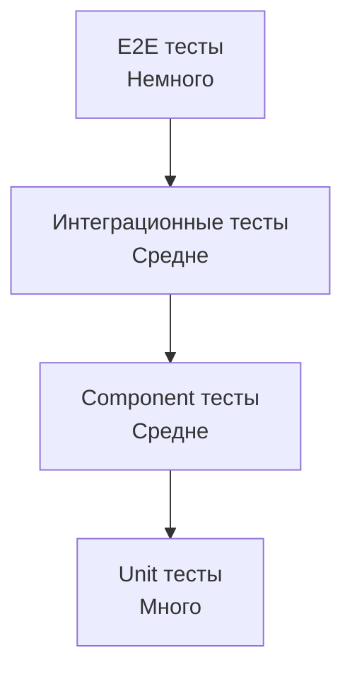

| Уровень | Описание | Инструменты |
|---------|----------|------------|
| Unit | Бизнес-логика без зависимостей | JUnit, Mockito |
| Component | Один сервис с моками зависимостей | Testcontainers, WireMock |
| Integration | Взаимодействие между сервисами | Testcontainers, Spring Cloud Contract |
| Contract | Проверка совместимости API | Pact, Spring Cloud Contract |
| E2E | Весь flow через все сервисы | Selenium, RestAssured |

**Consumer-Driven Contracts** (`Spring Cloud Contract`, `Pact`) -- потребитель определяет ожидания от API; провайдер проверяет, что контракт выполняется. Это предотвращает ломающие изменения. Подробнее -- в [интеграционном тестировании](../testing/integration-testing-interview.md).

> [!mcq]
> - [ ] Consumer-Driven Contracts означает, что провайдер API определяет схему и формат ответов; потребители должны подстраиваться под эту схему. | Это описание provider-driven API — противоположность CDC. В Consumer-Driven именно потребитель формулирует ожидания, а провайдер проверяет, что его изменения не ломают эти ожидания.
> - [x] Consumer-Driven Contracts означает, что потребитель определяет ожидания от API (request/response примеры); провайдер проверяет в своём CI, что его изменения не ломают контракт; реализации — Pact, Spring Cloud Contract. | Каноническое определение: CDC переворачивает обычный API-design — потребитель первым описывает, что ему нужно. Провайдер в своих тестах проверяет соответствие контракту, и ломающие изменения обнаруживаются до деплоя.
> - [ ] Consumer-Driven Contracts — форма E2E-тестирования, где все сервисы поднимаются вместе и прогоняются UI-сценарии от лица конечного потребителя. | E2E-тесты и CDC — разные уровни пирамиды тестирования. CDC работает на уровне API-контракта между двумя сервисами без UI, запускается быстро, не требует поднятия всей системы.
> - [ ] Consumer-Driven Contracts требует, чтобы все потребители API согласовали единый контракт через голосование; конфликты разрешаются архитектором. | Никакого голосования в CDC нет. Каждый потребитель независимо формулирует свои ожидания; провайдер проверяет совместимость со всеми опубликованными контрактами одновременно через Pact Broker.

## Q37. Как реализовать distributed tracing в микросервисах?

**Distributed tracing** показывает путь запроса через цепочку микросервисов с таймингами каждого шага.

**Компоненты:**
- **TraceId** -- уникальный идентификатор запроса, одинаковый для всех сервисов
- **SpanId** -- идентификатор операции внутри одного сервиса
- **Parent SpanId** -- связь между родительским и дочерним span

**Реализация с `Micrometer Tracing` (замена Spring Cloud Sleuth):**

```java
// application.yml
management:
  tracing:
    sampling:
      probability: 1.0  // 100% трейсов (для prod ставить 0.1-0.5)

// build.gradle
dependencies {
    implementation 'io.micrometer:micrometer-tracing-bridge-otel'
    implementation 'io.opentelemetry:opentelemetry-exporter-zipkin'
}
```

`TraceId` автоматически пробрасывается между сервисами через HTTP-заголовки (`traceparent`) и Kafka-заголовки. Все логи помечаются `traceId` и `spanId` -- можно найти в `ELK` по одному `traceId`.

> [!mcq]
> - [ ] TraceId — уникальный идентификатор внутри одного сервиса, генерируется для каждой операции; SpanId — идентификатор запроса между сервисами. | Это перевёрнутое описание. TraceId — глобальный identifier запроса через ВСЕ сервисы (один на весь цепочку); SpanId — identifier конкретной операции внутри сервиса; Parent SpanId связывает spans.
> - [ ] TraceId генерируется Service Mesh-ом (Istio) автоматически и не должен попадать в код приложения; приложение работает с ним прозрачно. | Service Mesh может генерировать TraceId, но приложение должно его пропагировать в исходящих вызовах и в логах. Прозрачности нет: нужны библиотеки tracing (OpenTelemetry, Micrometer Tracing) внутри приложения.
> - [x] TraceId — глобальный идентификатор запроса, одинаковый во всех сервисах; SpanId — идентификатор конкретной операции внутри сервиса; Parent SpanId связывает дочерний span с родительским; пробрасывается через W3C заголовок traceparent. | Каноническая модель OpenTelemetry: TraceId — сквозной ID через всю цепочку, Span формируют дерево операций через Parent SpanId. W3C TraceContext стандартизировал формат заголовка traceparent.
> - [ ] TraceId — хэш от timestamp и IP клиента; совпадение двух одинаковых TraceId указывает на retry того же запроса. | TraceId — случайный 128-битный идентификатор, а не хэш. Повторы retry-ов обычно получают новый TraceId (или тот же с новым Span). Совпадение TraceId между retry зависит от настроек клиента.

## Q38. Как организовать деплой микросервисов (Blue-Green, Canary)?

| Стратегия | Описание | Риск |
|-----------|----------|------|
| **Rolling update** | Постепенная замена инстансов | Средний |
| **Blue-Green** | Два окружения; переключение трафика | Низкий |
| **Canary** | Часть трафика на новую версию | Низкий |
| **A/B testing** | Разные версии для разных пользователей | Низкий |

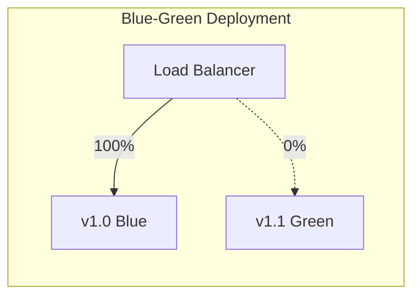

В `Kubernetes` `Rolling Update` -- стратегия по умолчанию. Для `Canary` используют `Istio VirtualService` или `Argo Rollouts` -- процент трафика на новую версию увеличивается постепенно. Подробнее -- в [стратегиях деплоя](../cicd/deployment-strategies-interview.md).

> [!mcq]
> - [ ] Blue-Green — стратегия, при которой новая версия постепенно заменяет старую на части подов (25%, 50%, 100%); это позволяет быстро откатиться при проблемах. | Это описание Canary, а не Blue-Green. В Blue-Green оба окружения развёрнуты полностью одновременно, и трафик переключается целиком (0% → 100%).
> - [ ] Canary — стратегия, при которой развёрнуты два идентичных окружения (v1 и v2), трафик переключается 100% с одного на другое через load balancer. | Это описание Blue-Green. В Canary только часть трафика (5-10%) направляется на новую версию для проверки; основная масса продолжает идти на стабильную.
> - [ ] Blue-Green и Canary решают одну и ту же задачу и фактически являются синонимами; разница только в названии в разных облачных провайдерах. | Это разные паттерны: Blue-Green — бинарное переключение между двумя окружениями (0%/100%), Canary — постепенный ramp-up процента трафика. Разная стоимость (BG требует двойных ресурсов) и гранулярность rollback.
> - [x] Blue-Green — два идентичных окружения одновременно развёрнуты (Blue=v1, Green=v2), трафик переключается целиком через LB; Canary — часть трафика (5-10%) направляется на новую версию для проверки, затем доля постепенно растёт. | Каноническое разделение: Blue-Green даёт мгновенный rollback (переключить LB обратно), но требует двойных ресурсов. Canary постепенно снижает риск, контролируя exposure по метрикам. В Kubernetes: BG через два Deployment, Canary через Istio VirtualService / Argo Rollouts.

## Q39. (!) Что такое закон Конвея (Conway's Law) и как он влияет на микросервисы?

**Закон Конвея** (Conway's Law, 1968):

> "Организации, проектирующие системы, вынуждены воспроизводить в них свою собственную коммуникационную структуру."

Если команды организованы по техническому принципу (frontend, backend, DBA), то и архитектура системы воспроизводит эту структуру — монолит с четырьмя слоями. Если команды организованы по доменным продуктам, архитектура тяготеет к микросервисам.

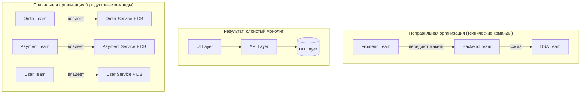

**"Обратный закон Конвея" (Inverse Conway Maneuver):**

Намеренно реструктурируйте команды так, чтобы их коммуникационная структура соответствовала желаемой архитектуре системы. Создайте кросс-функциональные продуктовые команды ДО разбиения монолита.

**Практические следствия:**
- Один `Bounded Context` — одна команда (Team Topologies: Stream-Aligned Team)
- Размер сервиса определяется "правилом двух пицц": команда, умещающаяся за одним столом с двумя пиццами
- Слишком много согласований между командами — сигнал, что границы сервисов проведены неверно

> [!mcq]
> - [x] Inverse Conway Maneuver — намеренная реструктуризация команд под желаемую архитектуру: сначала создать кросс-функциональные продуктовые команды, затем разбивать монолит; иначе архитектура повторит старую оргструктуру. | Каноническое применение закона Конвея «наоборот»: архитектура воспроизведёт оргструктуру в любом случае, поэтому разумно сначала перестроить команды (stream-aligned teams по Team Topologies), и только потом делить систему.
> - [ ] Inverse Conway Maneuver — использование микросервисов для принуждения команд работать независимо, даже если они технически связаны; это создаёт healthy friction. | Принуждение через технический split создаёт distributed monolith: команды всё равно согласовываются, но теперь ещё и через API. Правильная последовательность — сначала команды, потом сервисы.
> - [ ] Inverse Conway Maneuver — использование shared tooling (единый CI/CD, единый framework) чтобы команды работали одинаково, несмотря на разную структуру. | Shared tooling — полезная практика (platform team), но не Inverse Conway Maneuver. Маневр про организационный дизайн под архитектурные цели, а не про унификацию инструментов.
> - [ ] Inverse Conway Maneuver — паттерн, при котором архитектура определяет оргструктуру через автоматическую реорганизацию сотрудников; используется в больших компаниях (Amazon). | Автоматической реорганизации не бывает: Inverse Conway требует сознательного решения руководства о перестройке команд. Amazon известен «two-pizza teams», но это не автоматизм, а явное организационное решение.

## Q40. (!) Что такое Data Ownership в микросервисах и какие антипаттерны нарушают его?

**Data Ownership** — принцип, согласно которому каждый микросервис является **единственным владельцем** своих данных. Другие сервисы обращаются к данным только через API сервиса-владельца, никогда — напрямую к его базе данных.

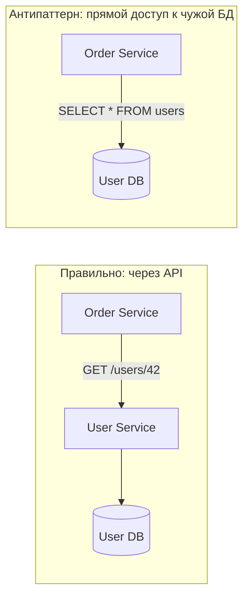

**Антипаттерны, нарушающие Data Ownership:**

| Антипаттерн | Описание | Решение |
|-------------|----------|---------|
| **Shared Database** | Несколько сервисов пишут в одну схему | Database per Service |
| **Direct DB Access** | Сервис A делает JOIN к таблицам сервиса B | API call или event-driven |
| **God Service** | Один сервис хранит данные для всех | Domain decomposition |
| **Distributed Monolith** | Сервисы раздельны, но деплоятся вместе из-за зависимостей данных | Разорвать зависимости через события |

**Стратегии организации данных:**

```
Вариант 1: API Composition
  Order Service нуждается в данных пользователя →
  вызывает User Service API при каждом запросе

Вариант 2: Event-driven denormalization
  User Service публикует UserUpdatedEvent →
  Order Service хранит копию нужных полей локально
  (eventual consistency — допустима задержка синхронизации)

Вариант 3: CQRS Read Model
  Агрегированные данные из нескольких сервисов
  собираются в отдельную read-модель
```

**Золотое правило:** если для выполнения запроса нужны данные из 3+ сервисов — пересмотрите границы сервисов или используйте `API Composition` на уровне `API Gateway`.

> [!mcq]
> - [ ] Shared Database — это приемлемый компромисс для микросервисов, если все сервисы используют отдельные схемы и придерживаются соглашения не читать чужие таблицы. | «Соглашение не читать» ничем не подкреплено технически: завтра кто-то сделает JOIN для «срочной» отчётности, и схема одного сервиса станет contract-ом для других. Shared Database — классический антипаттерн distributed monolith.
> - [x] Shared Database (несколько сервисов пишут в одну БД/схему) — ключевой антипаттерн, нарушающий data ownership: изменение схемы требует координации всех сервисов, что блокирует независимый деплой. | Каноническое определение антипаттерна: общая БД создаёт неявное coupling через схему данных. Результат — distributed monolith: сервисы формально независимы, но любое изменение таблицы затрагивает всех.
> - [ ] Shared Database является антипаттерном только если используется разными командами; одна команда может безопасно разделять БД между несколькими своими сервисами. | Принцип data ownership не зависит от организационной принадлежности сервисов. Shared Database ломает независимый деплой независимо от того, одна команда владеет сервисами или разные.
> - [ ] Shared Database — не антипаттерн, а рекомендуемый паттерн для микросервисов на ранней стадии, чтобы упростить транзакционную согласованность через ACID. | ACID внутри одной БД — соблазн, но он превращает микросервисы в distributed monolith уже на старте. Правильный путь — Database per Service с самого начала, а согласованность между сервисами — через Saga и events.

## Q41. (!) Как реализовать distributed tracing с OpenTelemetry и Jaeger?

**Distributed tracing** — механизм отслеживания пути запроса через цепочку микросервисов. Каждый запрос получает уникальный `trace ID`; каждая операция внутри — `span ID`.

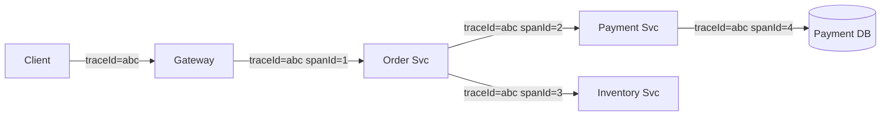

**Настройка в Spring Boot 3+ с Micrometer Tracing + OpenTelemetry:**

```xml
<!-- pom.xml -->
<dependency>
    <groupId>io.micrometer</groupId>
    <artifactId>micrometer-tracing-bridge-otel</artifactId>
</dependency>
<dependency>
    <groupId>io.opentelemetry.instrumentation</groupId>
    <artifactId>opentelemetry-spring-boot-starter</artifactId>
</dependency>
```

```yaml
# application.yml
management:
  tracing:
    sampling:
      probability: 1.0  # 100% в dev; 0.1 в prod
otel:
  exporter:
    otlp:
      endpoint: http://jaeger:4318  # OTLP HTTP endpoint
  resource:
    attributes:
      service.name: order-service
```

**Propagation заголовков между сервисами (W3C TraceContext):**

```
traceparent: 00-4bf92f3577b34da6a3ce929d0e0e4736-00f067aa0ba902b7-01
             ^^  ^^^^^^^^^^^^^^^^^^^^^^^^^^^^^^^^ ^^^^^^^^^^^^^^^^ ^^
             ver  trace-id (128-bit)              span-id (64-bit) flags
```

`RestTemplate`, `WebClient` и `OpenFeign` автоматически пропагируют заголовки при наличии `micrometer-tracing` в classpath.

**Custom span для бизнес-операций:**

```java
@Service
public class OrderService {
    private final Tracer tracer;

    public Order processOrder(CreateOrderRequest request) {
        Span span = tracer.nextSpan()
            .name("order.process")
            .tag("order.customerId", request.customerId())
            .start();
        try (Tracer.SpanInScope ws = tracer.withSpan(span)) {
            return doProcessOrder(request);
        } finally {
            span.end();
        }
    }
}
```

**Jaeger UI:** позволяет визуализировать весь trace, найти медленные span-ы и понять, какой сервис является bottleneck.

> [!mcq]
> - [ ] Формат заголовка traceparent в W3C TraceContext включает только TraceId; SpanId передаётся через отдельный заголовок tracestate. | В traceparent входят и TraceId, и SpanId, и flags в одном заголовке: `00-<trace-id>-<span-id>-<flags>`. tracestate — это опциональный vendor-specific расширенный контекст, а не SpanId.
> - [ ] Формат заголовка traceparent включает только timestamp и IP клиента; SpanId генерируется receiving service автоматически. | traceparent не содержит ни timestamp, ни IP. Это строго фиксированный формат: версия, TraceId (128-bit), SpanId (64-bit), flags. SpanId — рандомный, не выводится из IP.
> - [x] Формат заголовка traceparent: `00-<trace-id>-<span-id>-<flags>`; содержит версию протокола, 128-битный TraceId, 64-битный SpanId и флаги (sampling); стандартизирован W3C для interoperability между tracing-системами. | Каноническое описание W3C TraceContext. Единый формат заголовка позволяет tracing-системам (Jaeger, Zipkin, Datadog) обмениваться контекстом, не ломая совместимости между разными стеками и провайдерами.
> - [ ] Формат заголовка traceparent проприетарный для OpenTelemetry и несовместим с Jaeger/Zipkin; для Jaeger нужен отдельный заголовок uber-trace-id. | uber-trace-id — старый проприетарный формат Jaeger, но современный Jaeger (2.0+) и OpenTelemetry поддерживают W3C traceparent как стандарт. Это и есть суть стандартизации — избежать несовместимых форматов.

## Q42. Как организовать inter-service communication: Feign vs WebClient vs gRPC?

Выбор протокола межсервисного взаимодействия определяется требованиями к производительности, удобству разработки и характеру взаимодействия.

| Критерий | Feign (REST) | WebClient (REST) | gRPC |
|----------|-------------|-----------------|------|
| **Парадигма** | Декларативный REST | Реактивный REST | RPC с protobuf |
| **Блокирующий?** | Да (по умолчанию) | Нет (Reactor) | Нет (async) |
| **Streaming** | Нет | SSE/WebSocket | Нативный (4 режима) |
| **Типизация** | Слабая (JSON) | Слабая (JSON) | Строгая (proto) |
| **Производительность** | Средняя | Высокая | Максимальная |
| **Отладка** | Простая (curl) | Средняя | Сложнее (protobuf) |
| **Применение** | CRUD-сервисы | Высоконагруженные сервисы | Межсервисный трафик |

**OpenFeign — декларативный REST-клиент:**

```java
@FeignClient(name = "user-service", fallbackFactory = UserClientFallback.class)
public interface UserClient {
    @GetMapping("/users/{id}")
    UserDto getUser(@PathVariable Long id);
}
```

**WebClient — реактивный клиент (Spring WebFlux):**

```java
@Service
public class UserClientService {
    private final WebClient webClient;

    public Mono<UserDto> getUser(Long id) {
        return webClient.get()
            .uri("/users/{id}", id)
            .retrieve()
            .onStatus(HttpStatus::is4xxClientError,
                r -> Mono.error(new UserNotFoundException(id)))
            .bodyToMono(UserDto.class)
            .timeout(Duration.ofSeconds(2))
            .retryWhen(Retry.backoff(3, Duration.ofMillis(100)));
    }
}
```

> [!mcq]
> - [ ] OpenFeign рекомендуется для высоконагруженных реактивных сервисов из-за нативной поддержки backpressure и non-blocking I/O. | OpenFeign по умолчанию блокирующий (на основе RestTemplate/Apache HttpClient), без backpressure. Для реактивных сервисов с non-blocking I/O и backpressure — WebClient (Spring WebFlux на Reactor).
> - [ ] gRPC рекомендуется для всех межсервисных вызовов в Spring Boot-приложении, так как он всегда быстрее REST и прощё в отладке. | gRPC быстрее за счёт protobuf + HTTP/2, но отладка сложнее (бинарный формат требует grpcurl/BloomRPC вместо curl). gRPC оправдан для latency-critical путей; для обычного CRUD REST проще.
> - [ ] WebClient — единственный способ вызова внешних REST API в Spring Boot 3+, так как RestTemplate удалён из фреймворка. | RestTemplate в Spring Boot 3 объявлен в maintenance mode, но не удалён: продолжает работать. WebClient — рекомендуемая современная альтернатива, особенно для реактивных приложений, но не единственный способ.
> - [x] OpenFeign — декларативный REST-клиент, подходит для CRUD-сервисов (простота); WebClient — реактивный (Reactor), для высоконагруженных non-blocking сервисов; gRPC — максимальная производительность и строгая типизация через protobuf, для latency-critical путей. | Каноническое разделение: выбор зависит от профиля нагрузки и требований. OpenFeign — developer experience (интерфейсы + аннотации), WebClient — non-blocking для high throughput, gRPC — minimal latency + strong typing через protobuf и HTTP/2.

---

## See also

- [Event-Driven паттерны](event-driven-patterns-interview.md) — EDA, Saga, Outbox и асинхронное взаимодействие в микросервисах
- [Spring Cloud](../frameworks/spring/spring-cloud-interview.md) — Service Discovery, Config Server, Circuit Breaker в Spring Cloud
- [Распределённые системы](distributed-systems-interview.md) — CAP, согласованность, репликация и партиционирование
- [CAP-теорема](cap-theorem-interview.md) — выбор CP/AP для каждого микросервиса
- [Apache Kafka](../messaging/kafka-interview.md) — брокер сообщений для асинхронной коммуникации
- [Kubernetes](../devops/kubernetes-interview.md) — оркестрация и деплой микросервисов
- [Паттерны отказоустойчивости](resilience-patterns-interview.md) — Circuit Breaker, Retry, Bulkhead между сервисами
- [Паттерны масштабируемости](scalability-patterns-interview.md) — горизонтальное масштабирование микросервисов

**Рекомендация:** для внутренних синхронных вызовов — `OpenFeign` (простота); для высоконагруженных реактивных сервисов — `WebClient`; для критичного по latency межсервисного взаимодействия — `gRPC` (см. [вопросы по gRPC](../api/grpc-interview.md)).

- [API Gateway](api-gateway-interview.md)
- [BFF Pattern](bff-pattern-interview.md)
- [Стратегии кэширования](caching-strategies-interview.md)
- [CAP-теорема](cap-theorem-interview.md)
- [Clean Architecture](clean-architecture-interview.md)
- [Паттерны согласованности](consistency-patterns-interview.md)
- [Шпаргалка: Микросервисная архитектура](../../architecture/software-architecture/microservices.md) — теория
