# Вопросы на собеседовании: Микросервисная архитектура

Полное покрытие микросервисной архитектуры: разбиение на сервисы, коммуникация, согласованность, `Saga`, `CQRS`, `API Gateway`, `Service Discovery`, `Circuit Breaker`, `Service Mesh`, мониторинг.

**Микросервисная архитектура** -- частый фокус собеседований на Senior: согласованность, `Saga`, `2PC`, `API Gateway`, `Service Discovery`, паттерны отказоустойчивости и операционная сложность. Этот файл охватывает как теоретические основы, так и практические паттерны с примерами на `Spring Boot` / `Spring Cloud`.

## Полезные ссылки

### Официальная документация

- [Microservices (Martin Fowler)](https://martinfowler.com/articles/microservices.html) -- канонический обзор
- [Building Microservices (Sam Newman)](https://samnewman.io/books/building_microservices_2nd_edition/) -- практическое руководство
- [Spring Cloud Gateway](https://www.baeldung.com/spring-cloud-gateway) -- маршрутизация и фильтры
- [Resilience4j with Spring Boot](https://www.baeldung.com/spring-boot-resilience4j) -- Circuit Breaker, Retry, Rate Limiter
- [Spring Cloud Netflix Eureka](https://www.baeldung.com/spring-cloud-netflix-eureka) -- Service Discovery
- [Saga Pattern in Microservices](https://www.baeldung.com/cs/saga-pattern-microservices) -- паттерн Saga
- [CQRS and Event Sourcing in Java](https://www.baeldung.com/cqrs-event-sourcing-java) -- разделение чтения и записи
- [Service Mesh with Istio](https://www.baeldung.com/ops/istio-service-mesh) -- Service Mesh архитектура

## Содержание

- [Полезные ссылки](#полезные-ссылки)
- [See also](#see-also)

**Основы микросервисной архитектуры**
- [Q1. (!) Что такое микросервисная архитектура?](#q1--что-такое-микросервисная-архитектура)
- [Q2. (!) Монолит vs микросервисы -- когда что выбрать?](#q2--монолит-vs-микросервисы----когда-что-выбрать)
- [Q3. (!) Какие преимущества и недостатки имеет микросервисная архитектура?](#q3--какие-преимущества-и-недостатки-имеет-микросервисная-архитектура)
- [Q4. Как правильно определить границы микросервиса (Bounded Context)?](#q4-как-правильно-определить-границы-микросервиса-bounded-context)
- [Q5. Какие технологии используются для межсервисного взаимодействия?](#q5-какие-технологии-используются-для-межсервисного-взаимодействия)
- [Q6. Синхронное vs асинхронное взаимодействие -- когда что применять?](#q6-синхронное-vs-асинхронное-взаимодействие----когда-что-применять)

**Ключевые паттерны микросервисов**
- [Q7. (!) Какие основные паттерны микросервисной архитектуры?](#q7--какие-основные-паттерны-микросервисной-архитектуры)
- [Q8. (!) Что такое API Gateway и зачем он нужен?](#q8--что-такое-api-gateway-и-зачем-он-нужен)
- [Q9. (!) Что такое Service Discovery и как он работает?](#q9--что-такое-service-discovery-и-как-он-работает)
- [Q10. (!) Что такое Circuit Breaker и как он предотвращает каскадные сбои?](#q10--что-такое-circuit-breaker-и-как-он-предотвращает-каскадные-сбои)
- [Q11. Что такое Service Mesh и зачем он нужен?](#q11-что-такое-service-mesh-и-зачем-он-нужен)
- [Q12. (!) Что такое паттерн CQRS?](#q12--что-такое-паттерн-cqrs)
- [Q13. Что такое Event Sourcing?](#q13-что-такое-event-sourcing)
- [Q14. Что такое паттерн Strangler Fig для миграции с монолита?](#q14-что-такое-паттерн-strangler-fig-для-миграции-с-монолита)

**Транзакции и согласованность данных**
- [Q15. (!) Что такое ACID и BASE?](#q15--что-такое-acid-и-base)
- [Q16. (!) Что такое CAP-теорема?](#q16--что-такое-cap-теорема)
- [Q17. (!) Как обеспечивается атомарность операций в микросервисах?](#q17--как-обеспечивается-атомарность-операций-в-микросервисах)
- [Q18. (!) Что такое Saga и когда применять вместо 2PC?](#q18--что-такое-saga-и-когда-применять-вместо-2pc)
- [Q19. (!) Что такое двухфазная фиксация (2PC)?](#q19--что-такое-двухфазная-фиксация-2pc)
- [Q20. Что такое трёхфазная фиксация (3PC)?](#q20-что-такое-трёхфазная-фиксация-3pc)
- [Q21. (!) Что такое компенсирующие транзакции?](#q21--что-такое-компенсирующие-транзакции)
- [Q22. Как решить проблемы согласованности данных?](#q22-как-решить-проблемы-согласованности-данных)

**Отказоустойчивость и надёжность**
- [Q23. (!) Как обрабатываются сбои и отказы в микросервисах?](#q23--как-обрабатываются-сбои-и-отказы-в-микросервисах)
- [Q24. (!) Как реализовать механизмы повторной попытки (Retry)?](#q24--как-реализовать-механизмы-повторной-попытки-retry)
- [Q25. Как обеспечить идемпотентность операций?](#q25-как-обеспечить-идемпотентность-операций)
- [Q26. Что такое Bulkhead-паттерн?](#q26-что-такое-bulkhead-паттерн)

**Конфигурация, безопасность, версионирование**
- [Q27. (!) Как организовать конфигурацию микросервисов?](#q27--как-организовать-конфигурацию-микросервисов)
- [Q28. (!) Как обеспечить безопасность взаимодействия между микросервисами?](#q28--как-обеспечить-безопасность-взаимодействия-между-микросервисами)
- [Q29. Как управлять версионированием API без прерывания работы?](#q29-как-управлять-версионированием-api-без-прерывания-работы)

**Наблюдаемость и эксплуатация**
- [Q30. (!) Какие методы логирования и трейсинга используются?](#q30--какие-методы-логирования-и-трейсинга-используются)
- [Q31. (!) Какие инструменты мониторинга и отладки используются?](#q31--какие-инструменты-мониторинга-и-отладки-используются)
- [Q32. Как обеспечивается масштабируемость и производительность?](#q32-как-обеспечивается-масштабируемость-и-производительность)

**Проектирование и практика**
- [Q33. Какие аспекты транзакций необходимо учитывать при проектировании?](#q33-какие-аспекты-транзакций-необходимо-учитывать-при-проектировании)
- [Q34. Как обеспечивается изоляция данных в микросервисах (Database per Service)?](#q34-как-обеспечивается-изоляция-данных-в-микросервисах-database-per-service)
- [Q35. Что такое глобальная транзакция и как она отличается от локальной?](#q35-что-такое-глобальная-транзакция-и-как-она-отличается-от-локальной)
- [Q36. Как организовать тестирование микросервисов?](#q36-как-организовать-тестирование-микросервисов)
- [Q37. Как реализовать distributed tracing в микросервисах?](#q37-как-реализовать-distributed-tracing-в-микросервисах)
- [Q38. Как организовать деплой микросервисов (Blue-Green, Canary)?](#q38-как-организовать-деплой-микросервисов-blue-green-canary)

**Организационные паттерны и владение данными**
- [Q39. (!) Что такое закон Конвея (Conway's Law) и как он влияет на микросервисы?](#q39--что-такое-закон-конвея-conways-law-и-как-он-влияет-на-микросервисы)
- [Q40. (!) Что такое Data Ownership в микросервисах и какие антипаттерны нарушают его?](#q40--что-такое-data-ownership-в-микросервисах-и-какие-антипаттерны-нарушают-его)
- [Q41. (!) Как реализовать distributed tracing с OpenTelemetry и Jaeger?](#q41--как-реализовать-distributed-tracing-с-opentelemetry-и-jaeger)
- [Q42. Как организовать inter-service communication: Feign vs WebClient vs gRPC?](#q42-как-организовать-inter-service-communication-feign-vs-webclient-vs-grpc)

---

## Q1. (!) Что такое микросервисная архитектура?

**Микросервисная архитектура** -- подход, при котором приложение разбивается на небольшие независимые сервисы; каждый сервис отвечает за свою доменную область, развёртывается и масштабируется отдельно.

**Ключевые характеристики:**
- Каждый сервис имеет собственную БД (Database per Service)
- Сервисы общаются через сеть (`REST`, `gRPC`, очереди сообщений)
- Независимый деплой и масштабирование
- Каждый сервис разрабатывается и поддерживается отдельной командой

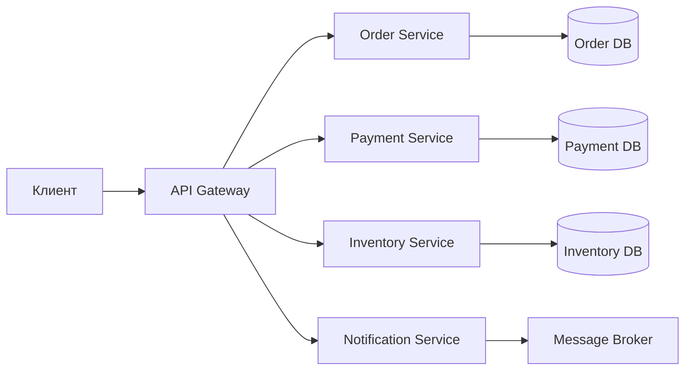

**Практический критерий:** к микросервисам переходят, когда появляется реальная потребность в независимом деплое и масштабировании частей системы, а не «по моде». Подробнее о согласованности данных -- в [вопросах по распределённым системам](distributed-systems-interview.md).

> [!mcq]
> - [ ] Микросервисная архитектура — подход, при котором каждый сервис имеет собственную БД, общается через сеть и деплоится независимо; ключевое преимущество — возможность использовать одну технологию для всех сервисов. | Polyglot — ПРЕИМУЩЕСТВО, не ограничение. ❌ ПОСЛЕДСТВИЕ: forced single stack → нельзя выбрать MongoDB для catalog или Cassandra для metrics → fit-for-purpose потерян. ✓ ПРИМЕНЯТЬ: Uber (Cassandra/PostgreSQL/MySQL), Netflix (Java/Python/Go). 📋 ПРАВИЛО: "polyglot — feature, не antifeature".
> - [ ] Микросервисная архитектура — подход, при котором единый монолитный деплой делится на логические модули внутри одного процесса; каждый модуль имеет собственную БД и отдельный API. | Это Modular Monolith — один процесс. Микросервисы = ОТДЕЛЬНЫЕ процессы/контейнеры. ❌ ПОСЛЕДСТВИЕ: путаница ведёт к называнию модулей «микросервисами» при общем deploy → не получаем benefits independent deployment. 📋 ПРАВИЛО: "микросервис = отдельный процесс + независимый deploy".
> - [x] Микросервисная архитектура — подход, при котором приложение разбивается на независимые сервисы с отдельными БД; сервисы общаются по сети (REST, gRPC, очереди) и деплоятся независимо каждой командой. | Каноническое определение: DB per Service + network communication + independent deploy + team autonomy. ✓ ПРИМЕНЯТЬ: Netflix (1000+ микросервисов с Hystrix), Amazon (50000+), Uber (4000+). 📋 ПРАВИЛО: "микросервис = bounded context + own DB + own deploy + own team". 🔗 См. Q4 (Bounded Context), Q40 (Data Ownership).
> - [ ] Микросервисная архитектура — подход, при котором приложение разбивается на независимые сервисы, которые разделяют общую реляционную БД для обеспечения ACID-транзакций между сервисами. | Shared DB — классический АНТИПАТТЕРН distributed monolith. ❌ ПОСЛЕДСТВИЕ: Twitter 2010 — shared DB между сервисами → coupled deploys, SPOF; любое schema change блокирует всех. 📋 ПРАВИЛО: "Database per Service — non-negotiable; общая БД = distributed monolith".

## Q2. (!) Монолит vs микросервисы -- когда что выбрать?

**Монолит** -- традиционный подход, в котором весь функционал приложения разрабатывается и развёртывается в едином блоке. Все компоненты находятся в одной кодовой базе.

**Микросервисы** -- приложение разделяется на набор маленьких независимых сервисов, которые взаимодействуют по сети.

| Критерий | Монолит | Микросервисы |
|----------|---------|-------------|
| Размер команды | Маленькая (до 10 чел.) | Большая (10+ чел., несколько команд) |
| Сложность деплоя | Простой (один артефакт) | Сложный (десятки сервисов) |
| Масштабирование | Только вертикальное | Горизонтальное, per-service |
| Согласованность | `ACID` транзакции | Eventual consistency, `Saga` |
| Старт нового проекта | Да (Monolith First) | Нет (преждевременная оптимизация) |
| Зрелость инфраструктуры | Не требуется | CI/CD, контейнеры, оркестрация |

**Совет Мартина Фаулера:** начинать с монолита (`Monolith First`), разделять на микросервисы когда появится реальная потребность. Гибридный подход -- `Modular Monolith` -- хорошая промежуточная точка: модули с чётко определёнными границами внутри одного деплоя.

> [!mcq]
> - [ ] По совету Мартина Фаулера, стартовать нужно сразу с микросервисов, чтобы заложить правильные границы с самого начала; Modular Monolith — промежуточный шаг только для legacy-систем. | Перевёрнуто: Фаулер сформулировал «Monolith First», не «Microservices First». ❌ ПОСЛЕДСТВИЕ: преждевременное дробление → distributed monolith с неверными границами; стартап потратит 50% времени на ops complexity вместо features. 📋 ПРАВИЛО: "Monolith First — открой границы через монолит, потом extract".
> - [x] По совету Мартина Фаулера, стартовать нужно с монолита (Monolith First); Modular Monolith — хорошая промежуточная точка; переходить к микросервисам только при реальной потребности в независимом деплое и масштабировании. | Monolith → Modular Monolith → Microservices: эволюционный путь Фаулера. ✓ ПРИМЕНЯТЬ: Amazon (монолит 1997-2002), Netflix (монолит 1999-2009), Uber (монолит 2009-2012). 📋 ПРАВИЛО: "X = Y trade-off для Z: микросервисы = ops complexity trade-off для independent deploy". 🔗 См. Q3 (преимущества/недостатки), Q14 (Strangler Fig).
> - [ ] Монолит подходит только для маленьких команд (до 3 человек); при команде 5-10 человек уже необходимо переходить на микросервисы для устранения конфликтов при слиянии кода. | Размер команды — НЕ главный критерий: Shopify монолит с 200+ инженерами. ❌ ПОСЛЕДСТВИЕ: команда 5-10 чел переходит на микросервисы → каждый owns 2-3 сервиса → context switching + ops overhead убивает velocity. 📋 ПРАВИЛО: "team size — один фактор; реальный driver — independent deploy + scaling".
> - [ ] Основное преимущество микросервисов перед монолитом — более быстрая разработка новых функций, так как сервисы меньше и легче понять; монолит целесообразен только для read-only систем. | Микросервисы ДОБАВЛЯЮТ complexity (сеть, согласованность, ops); медленнее на старте. ❌ ПОСЛЕДСТВИЕ: Netflix первые 2 года — потеря velocity на microservices migration; recovery только в 3-5 год. 📋 ПРАВИЛО: "микросервисы — investment, не free lunch; monolith faster для greenfield".

## Q3. (!) Какие преимущества и недостатки имеет микросервисная архитектура?

**Преимущества:**

1. **Независимый деплой** -- обновление одного сервиса не требует пересборки всего приложения
2. **Масштабируемость** -- каждый сервис масштабируется независимо (горизонтально)
3. **Технологическая гибкость** -- разные сервисы могут использовать разные языки/фреймворки/БД
4. **Устойчивость к сбоям** -- падение одного сервиса не означает падение всей системы (при правильной реализации `Circuit Breaker`)
5. **Автономность команд** -- каждая команда владеет своим сервисом (full ownership)

**Недостатки:**

1. **Распределённая сложность** -- сетевые вызовы, латентность, частичные отказы
2. **Согласованность данных** -- нет `ACID` между сервисами, нужны `Saga`, eventual consistency
3. **Операционная сложность** -- нужен `CI/CD`, мониторинг, трейсинг, оркестрация
4. **Тестирование** -- сложнее интеграционное и end-to-end тестирование
5. **Разделение границ** -- неправильное разбиение приводит к `distributed monolith`

> [!mcq]
> - [x] Ключевой недостаток микросервисов — операционная сложность: требуются CI/CD, централизованный мониторинг, distributed tracing и оркестрация; без зрелой инфраструктуры выгода теряется. | Ops cost = главная цена; нужна platform team + tooling до начала миграции. ✓ ПРИМЕНЯТЬ: Uber 2+ года на Ringpop/Cadence/Jaeger; Netflix построил Atlas, Spinnaker, Hystrix. 📋 ПРАВИЛО: "микросервисы = +30% ops budget; без observability = chaos". 🔗 См. Q30 (logging), Q31 (monitoring), Q41 (tracing).
> - [ ] Ключевой недостаток микросервисов — невозможность использовать современные фреймворки вроде Spring Boot, так как они заточены под монолитное развёртывание. | Перевёрнуто: Spring Boot ОПТИМИЗИРОВАН под микросервисы (Spring Cloud, Actuator, Discovery Client). ❌ ПОСЛЕДСТВИЕ: команда отказывается от Spring Boot для микросервисов → переписывает заново вместо использования готовой инфраструктуры. 📋 ПРАВИЛО: "Spring Boot 3+ — стандартный выбор для микросервисов в Java".
> - [ ] Ключевой недостаток микросервисов — невозможность горизонтального масштабирования: каждый сервис должен работать в единственном экземпляре. | Перевёрнуто: scale-out — ПРЕИМУЩЕСТВО, не недостаток. ❌ ПОСЛЕДСТВИЕ: команда не масштабирует → один pod → bottleneck при traffic spike. ✓ ПРИМЕНЯТЬ: K8s HPA, Uber search 1000 replicas, payment 100. 📋 ПРАВИЛО: "независимое масштабирование per-service — main feature".
> - [ ] Ключевой недостаток микросервисов — отсутствие технологической гибкости: все сервисы должны использовать один язык и фреймворк. | Polyglot — прямое ПРЕИМУЩЕСТВО (fit-for-purpose). ❌ ПОСЛЕДСТВИЕ: forced single stack → нельзя выбрать оптимальный инструмент (ML на Java вместо Python). ✓ ПРИМЕНЯТЬ: Uber (Go/Python/C++), LinkedIn (Java/Scala/Python). 📋 ПРАВИЛО: "polyglot ⊂ микросервисы; constrain only через API contracts".

## Q4. Как правильно определить границы микросервиса (Bounded Context)?

**Bounded Context** из `Domain-Driven Design` -- основной инструмент определения границ микросервиса. Каждый микросервис соответствует одному ограниченному контексту.

**Правила определения границ:**

1. **Бизнес-домен** -- сервис соответствует конкретной бизнес-области (заказы, платежи, склад)
2. **Single Responsibility** -- один сервис отвечает за один бизнес-контекст
3. **Независимость данных** -- у каждого сервиса своя БД, нет общих таблиц
4. **Слабая связанность** -- изменение одного сервиса не должно требовать изменения другого
5. **Правило двух пицц (Amazon)** -- сервис должен обслуживаться командой, которую можно накормить двумя пиццами

**Анти-паттерн: Distributed Monolith** -- формально микросервисы, но тесно связаны; требуют совместного деплоя, разделяют БД или модели. Признаки: для одного изменения нужно менять несколько сервисов; нельзя деплоить независимо.

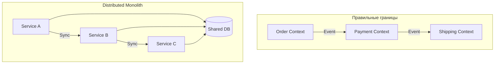

> [!mcq]
> - [ ] Основной инструмент определения границ микросервиса — физический размер кодовой базы: не более 1000 строк кода на сервис, чтобы команда могла поддерживать его полностью. | LOC — произвольная метрика без связи с domain. ❌ ПОСЛЕДСТВИЕ: forced split при 1001 LOC → fragmentation одного bounded context на 5 микросервисов → distributed transactions. ✓ ПРИМЕНЯТЬ: Amazon Payment Service 50K LOC с чёткой responsibility — здоровые границы. 📋 ПРАВИЛО: "Bounded Context > LOC".
> - [ ] Основной инструмент определения границ микросервиса — техническое разделение по слоям: UI-сервис, Business-сервис, Data-сервис; это обеспечивает чистую слоистую архитектуру. | Распределённый слоёный монолит — АНТИПАТТЕРН. ❌ ПОСЛЕДСТВИЕ: Facebook 2008 — разбили по слоям → любое бизнес-изменение требует синхронизированный deploy всех 3 слоёв → distributed monolith. 📋 ПРАВИЛО: "vertical slices (домены), не horizontal layers".
> - [ ] Основной инструмент определения границ микросервиса — функциональное разбиение по CRUD-операциям: отдельные сервисы для Create, Read, Update, Delete. | CRUD-разбиение ломает бизнес-семантику: createOrder = atomic операция через order+inventory+payment. ❌ ПОСЛЕДСТВИЕ: LinkedIn 2011 — CRUD split → distributed transactions через 4 сервиса → потеря consistency. 📋 ПРАВИЛО: "разбивай по бизнес-операциям, не по CRUD verbs".
> - [x] Основной инструмент определения границ микросервиса — Bounded Context из DDD: сервис соответствует одной бизнес-области с собственной моделью, БД и командой (правило двух пицц). | DDD Bounded Context = ubiquitous language + model + DB + owner team. ✓ ПРИМЕНЯТЬ: Amazon (Order/Payment/Inventory teams), Two-Pizza Rule (8-12 человек), Team Topologies (Stream-Aligned Teams). 📋 ПРАВИЛО: "1 Bounded Context = 1 service = 1 team = 1 DB". 🔗 См. Q39 (Conway's Law), Q40 (Data Ownership).

## Q5. Какие технологии используются для межсервисного взаимодействия?

| Технология | Тип | Когда применять |
|-----------|-----|----------------|
| `REST` / `HTTP` | Синхронный | CRUD, простые запросы |
| `gRPC` | Синхронный | Высокая производительность, строгие контракты |
| `Apache Kafka` | Асинхронный | Потоки событий, высокая пропускная способность |
| `RabbitMQ` | Асинхронный | Задачи, очереди, routing |
| `GraphQL` | Синхронный | Гибкие клиентские запросы, BFF |
| `WebSocket` | Двусторонний | Реалтайм-уведомления |

Подробнее о событийном взаимодействии -- в [вопросах по Event-driven паттернам](event-driven-patterns-interview.md), о `Kafka` -- в [вопросах по Kafka](../messaging/kafka-interview.md).

> [!mcq]
> - [ ] Для высокой пропускной способности потоков событий между сервисами оптимально применять REST/HTTP с keep-alive и pipelining; это обеспечивает низкую latency и простую отладку. | REST = sync + temporal coupling; не масштабируется на миллионы events/sec. ❌ ПОСЛЕДСТВИЕ: Netflix 2010 — sync REST chains → cascade failures «fail whale era»; миграция на async решила. 📋 ПРАВИЛО: "events = async pub-sub, не sync REST".
> - [x] Для высокой пропускной способности потоков событий между сервисами оптимально применять Apache Kafka; он обеспечивает асинхронную публикацию, партиционирование и долговременное хранение событий. | Kafka throughput = 1M+ events/sec, durable log + partitioning + consumer groups. ✓ ПРИМЕНЯТЬ: Uber 1T+ events/day, LinkedIn (создатели Kafka), Netflix (CDN events). 📋 ПРАВИЛО: "X = Y trade-off для Z: Kafka = durable async для high-throughput streams". 🔗 См. Q6 (sync vs async), Q42 (gRPC vs Feign).
> - [ ] Для высокой пропускной способности потоков событий между сервисами оптимально применять gRPC streaming; он обеспечивает нативный streaming и строгую типизацию через protobuf. | gRPC streaming = point-to-point, не pub-sub; нет consumer groups, нет replay. ❌ ПОСЛЕДСТВИЕ: connection drop → потеря events; невозможно добавить нового consumer post-factum. 📋 ПРАВИЛО: "gRPC streaming для real-time bidir, Kafka для durable async events".
> - [ ] Для высокой пропускной способности потоков событий между сервисами оптимально применять WebSocket; он обеспечивает двустороннюю связь и используется для event-driven архитектур. | WebSocket = client-server real-time, не межсервисный. ❌ ПОСЛЕДСТВИЕ: использование WebSocket для inter-service → нет broker, нет partitioning, нет replay. 📋 ПРАВИЛО: "WebSocket = browser↔server real-time, Kafka = service↔service streams".

## Q6. Синхронное vs асинхронное взаимодействие -- когда что применять?

**Синхронное** (`REST`, `gRPC`): клиент ждёт ответа. Подходит когда нужен немедленный результат (получить данные, проверить баланс). Проблемы: temporal coupling, каскадные сбои, увеличение латентности при цепочке вызовов.

**Асинхронное** (события, очереди): клиент не ждёт ответа. Подходит для уведомлений, обработки в фоне, Saga. Плюсы: слабая связанность, устойчивость к пиковым нагрузкам. Минусы: сложнее отладка, eventual consistency.

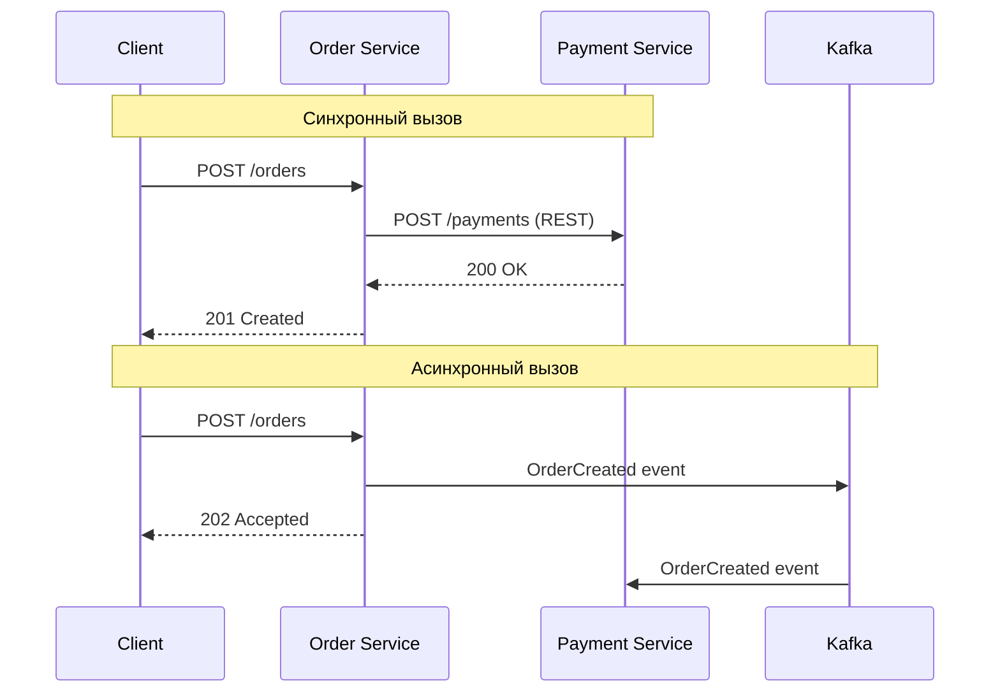

**Правило:** предпочитать асинхронное взаимодействие; синхронное -- только когда клиенту действительно нужен немедленный ответ.

> [!mcq]
> - [ ] Главная проблема синхронного взаимодействия между микросервисами — высокая нагрузка на сеть; это решается переходом на HTTP/2 и компрессией gzip. | Network — surface optimization; fundamental issue в TEMPORAL COUPLING. ❌ ПОСЛЕДСТВИЕ: Google 2013 — 50 sync сервисов → p99 5+ сек из-за tail latency; HTTP/2 не помог бы. 📋 ПРАВИЛО: "compression treats symptom, async treats cause".
> - [ ] Главная проблема синхронного взаимодействия между микросервисами — сложность сериализации JSON; это решается переходом на Protocol Buffers и binary-форматы. | Serialization = micro-optimization; coupling problem остаётся. ❌ ПОСЛЕДСТВИЕ: команда мигрирует на protobuf, но cascading failures продолжаются → 3 месяца работы впустую. 📋 ПРАВИЛО: "JSON vs protobuf — perf detail; sync vs async — architectural choice".
> - [x] Главная проблема синхронного взаимодействия между микросервисами — temporal coupling и каскадные сбои; асинхронное взаимодействие через события устраняет эту связанность. | Temporal coupling = одновременная availability требуется; broker (Kafka) разрывает её. ✓ ПРИМЕНЯТЬ: Uber 2016 — async через Kafka разорвал sync chains → p99 5sec → 200ms; Netflix Hystrix + async для resilience. ❌ ПОСЛЕДСТВИЕ: Twitter 2010 «fail whale» из-за sync chains. 📋 ПРАВИЛО: "sync = request-response, async = events; events ⇒ no temporal coupling". 🔗 См. Q7 (паттерны), Q10 (Circuit Breaker).
> - [ ] Главная проблема синхронного взаимодействия между микросервисами — невозможность возврата больших объектов; это решается pagination и chunked transfer encoding. | Payload size — частная проблема, работает в обоих режимах. ❌ ПОСЛЕДСТВИЕ: команда фокусируется на pagination, ignoring temporal coupling → cascade failures продолжаются. 📋 ПРАВИЛО: "pagination orthogonal to sync/async choice".

## Q7. (!) Какие основные паттерны микросервисной архитектуры?

Основные паттерны, которые спрашивают на собеседованиях:

| Паттерн | Назначение |
|---------|-----------|
| `API Gateway` | Единая точка входа, маршрутизация, аутентификация |
| `Service Discovery` | Динамическое обнаружение сервисов |
| `Circuit Breaker` | Защита от каскадных сбоев |
| `Saga` | Распределённые транзакции без 2PC |
| `CQRS` | Разделение чтения и записи |
| `Event Sourcing` | Хранение истории изменений как событий |
| `Service Mesh` | Инфраструктурный слой для межсервисного трафика |
| `Bulkhead` | Изоляция ресурсов между вызовами |
| `Strangler Fig` | Постепенная миграция с монолита |
| `Sidecar` | Вспомогательный контейнер рядом с основным |
| `BFF` (`Backend for Frontend`) | Отдельный API-слой для каждого типа клиента |
| `Database per Service` | Изоляция данных каждого сервиса |

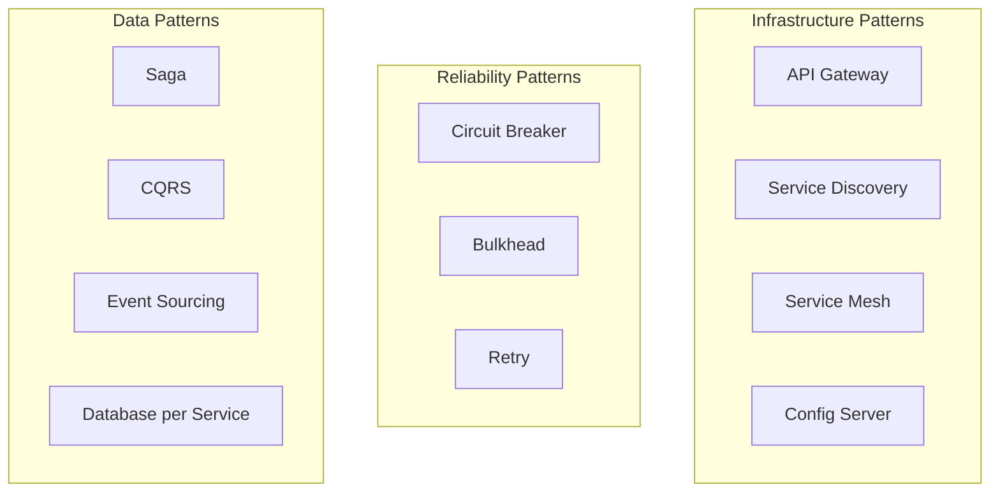

> [!mcq]
> - [x] Паттерн Saga применяется для реализации распределённых транзакций как последовательности локальных транзакций с компенсирующими действиями при сбое. | Saga = chain локальных транзакций + compensating transactions при failure. ✓ ПРИМЕНЯТЬ: Uber (Order→Payment→Inventory→Delivery с rollback), Amazon (checkout flow), банкинг (transfers). 📋 ПРАВИЛО: "compensating transactions = rollback в distributed мире". 🔗 См. Q18 (Saga vs 2PC), Q21 (компенсации).
> - [ ] Паттерн Saga применяется как infrastructure-паттерн для маршрутизации трафика между версиями сервиса при canary deployment. | Routing — API Gateway/Service Mesh job, не Saga. ❌ ПОСЛЕДСТВИЕ: путаница приведёт к попытке использовать Saga для traffic split → бесполезная сложность вместо Istio VirtualService. 📋 ПРАВИЛО: "Saga = data pattern, не traffic pattern".
> - [ ] Паттерн Saga применяется для реализации Circuit Breaker в межсервисных вызовах, прерывая вызовы при массовых сбоях. | CB — отдельный reliability pattern (Resilience4j). ❌ ПОСЛЕДСТВИЕ: команда «реализует CB через Saga» → не получает ни fail-fast, ни rollback → каскад при сбое. 📋 ПРАВИЛО: "Saga = data consistency, CB = failure isolation; разные слои".
> - [ ] Паттерн Saga применяется для обнаружения инстансов сервисов, предоставляя реестр адресов. | Service Discovery — отдельный paradigm (Eureka, Consul, K8s DNS). ❌ ПОСЛЕДСТВИЕ: путаница roles → команда не реализует ни Saga, ни discovery правильно. 📋 ПРАВИЛО: "Saga = transactions, Discovery = instances; не путать".

## Q8. (!) Что такое API Gateway и зачем он нужен?

**`API Gateway`** -- единая точка входа для всех клиентов; выполняет маршрутизацию запросов к микросервисам, аутентификацию/авторизацию, rate limiting, агрегацию ответов.

Реализации: `Spring Cloud Gateway`, `Kong`, `AWS API Gateway`, `NGINX`.

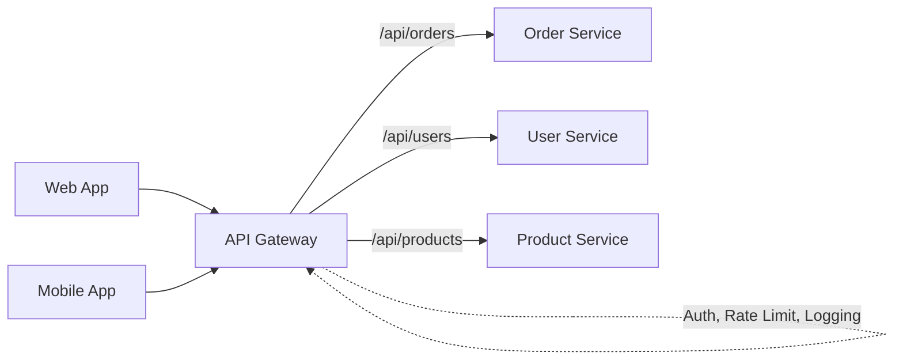

**Конфигурация `Spring Cloud Gateway`:**

```java
@Configuration
public class GatewayConfig {

    @Bean
    public RouteLocator customRouteLocator(RouteLocatorBuilder builder) {
        return builder.routes()
            .route("order-service", r -> r
                .path("/api/orders/**")
                .filters(f -> f
                    .stripPrefix(1)
                    .addRequestHeader("X-Gateway", "true")
                    .circuitBreaker(cb -> cb
                        .setName("orderCB")
                        .setFallbackUri("forward:/fallback/orders")))
                .uri("lb://order-service"))
            .route("user-service", r -> r
                .path("/api/users/**")
                .filters(f -> f.stripPrefix(1))
                .uri("lb://user-service"))
            .build();
    }
}
```

```yaml
# Декларативная конфигурация Spring Cloud Gateway
spring:
  cloud:
    gateway:
      routes:
        - id: order-service
          uri: lb://order-service
          predicates:
            - Path=/api/orders/**
          filters:
            - name: RequestRateLimiter
              args:
                redis-rate-limiter.replenishRate: 10
                redis-rate-limiter.burstCapacity: 20
            - StripPrefix=1
```

**BFF-подход:** отдельный `Gateway` для каждого типа клиента (web, mobile) -- каждый агрегирует данные из нескольких сервисов под нужды конкретного фронтенда.

> [!mcq]
> - [ ] API Gateway — опциональный load balancer, который применяется только при числе микросервисов больше 50; для маленьких систем его роль выполняет DNS. | Gateway ≠ LB: handles auth, rate limiting, aggregation, что DNS не делает. ❌ ПОСЛЕДСТВИЕ: «достаточно DNS» → каждый клиент дублирует auth/rate-limiting логику; Netflix 2009 имел Gateway для 5 сервисов. 📋 ПРАВИЛО: "Gateway ≠ DNS; Gateway = cross-cutting concerns".
> - [ ] API Gateway — компонент бизнес-логики, который содержит главные сценарии приложения и оркестрирует работу микросервисов через Saga. | АНТИПАТТЕРН «god gateway» — превращается в monolith. ❌ ПОСЛЕДСТВИЕ: Twitter 2010 — business logic в Gateway → SPOF + frequent deploys → bottleneck. 📋 ПРАВИЛО: "Gateway = infrastructure, не business logic".
> - [ ] API Gateway — прокси для БД, который предоставляет единую точку доступа к данным всех сервисов через SQL-подобный интерфейс. | DB Gateway = shared database antipattern. ❌ ПОСЛЕДСТВИЕ: shared DB через Gateway → data coupling → distributed monolith; нарушает data ownership. 📋 ПРАВИЛО: "Gateway работает на API level (HTTP), не DB level".
> - [x] API Gateway — единая точка входа для клиентов, выполняющая маршрутизацию, аутентификацию, rate limiting и агрегацию ответов; реализации — Spring Cloud Gateway, Kong, AWS API Gateway. | Канон: routing + auth + rate limit + aggregation; centralizes cross-cutting concerns. ✓ ПРИМЕНЯТЬ: Spring Cloud Gateway (Java), Kong (Lua), AWS API Gateway (managed), Envoy (cloud-native). 📋 ПРАВИЛО: "Gateway = single entry point + infrastructure concerns". 🔗 См. Q9 (Service Discovery), Q11 (Service Mesh).

## Q9. (!) Что такое Service Discovery и как он работает?

**`Service Discovery`** -- механизм автоматического обнаружения сетевых адресов экземпляров сервисов. В динамических средах (`Kubernetes`, облако) адреса меняются при масштабировании, перезапусках.

**Два подхода:**
- **Client-side discovery** -- клиент запрашивает реестр и сам выбирает инстанс (`Eureka` + `Spring Cloud LoadBalancer`)
- **Server-side discovery** -- запрос идёт через балансировщик, который знает реестр (`Kubernetes Service`, `AWS ELB`)

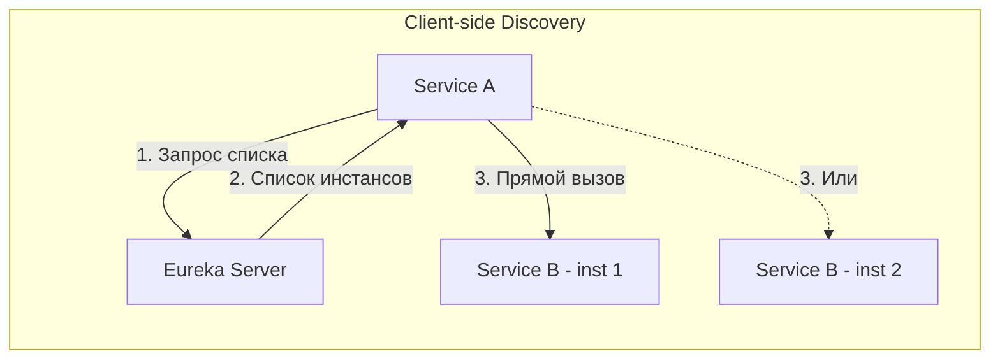

**Реализация с `Spring Cloud Eureka`:**

```java
// Eureka Server
@SpringBootApplication
@EnableEurekaServer
public class EurekaServerApp {
    public static void main(String[] args) {
        SpringApplication.run(EurekaServerApp.class, args);
    }
}

// Eureka Client (микросервис)
@SpringBootApplication
@EnableDiscoveryClient
public class OrderServiceApp {
    public static void main(String[] args) {
        SpringApplication.run(OrderServiceApp.class, args);
    }
}

// Использование DiscoveryClient
@Service
@RequiredArgsConstructor
public class PaymentClient {
    private final DiscoveryClient discoveryClient;

    public String getPaymentServiceUrl() {
        List<ServiceInstance> instances =
            discoveryClient.getInstances("payment-service");
        // Выбор инстанса (round-robin, random, etc.)
        ServiceInstance instance = instances.get(0);
        return instance.getUri().toString();
    }
}
```

В `Kubernetes` `Service Discovery` встроен через `DNS` -- каждый `Service` доступен по имени (`payment-service.default.svc.cluster.local`), и `kube-proxy` выполняет балансировку. Подробнее -- в [вопросах по Kubernetes](../devops/kubernetes-interview.md).

> [!mcq]
> - [ ] В client-side discovery (Eureka) запрос идёт через централизованный балансировщик, который знает реестр сервисов; клиент не участвует в выборе инстанса. | Это описание SERVER-SIDE discovery (K8s Service, AWS ELB). ❌ ПОСЛЕДСТВИЕ: путаница ведёт к неверной архитектуре — client-side и server-side имеют разный latency profile. 📋 ПРАВИЛО: "client-side = client decides; server-side = LB decides".
> - [x] В client-side discovery клиент запрашивает реестр (Eureka) и сам выбирает инстанс сервиса; в server-side запрос идёт через балансировщик, который инкапсулирует знание о реестре. | Client-side: balancer в client lib (no extra hop); server-side: LB hides registry (extra hop). ✓ ПРИМЕНЯТЬ: Eureka+Spring Cloud LoadBalancer (client-side), K8s Service+kube-proxy (server-side), AWS ELB+Target Group. 📋 ПРАВИЛО: "client-side = fewer hops, server-side = simpler client". 🔗 См. Q8 (API Gateway), Q11 (Service Mesh).
> - [ ] В client-side discovery клиент обращается к балансировщику, который не знает реестра и использует round-robin по IP-адресам из DNS. | Смесь концепций: client-side НЕ использует LB; LB без registry не сможет routing по logical name. ❌ ПОСЛЕДСТВИЕ: misconfiguration → routing fails при autoscale. 📋 ПРАВИЛО: "client-side = direct from registry, без proxy".
> - [ ] В client-side discovery клиент получает конфигурацию из Spring Cloud Config и использует её для прямого вызова инстансов без реестра. | Config Server = properties storage, НЕ instance registry. ❌ ПОСЛЕДСТВИЕ: использование Config Server для discovery → no real-time updates при scale events → stale endpoints. 📋 ПРАВИЛО: "Config Server = settings, Discovery (Eureka/Consul) = instances".

## Q10. (!) Что такое Circuit Breaker и как он предотвращает каскадные сбои?

**`Circuit Breaker`** -- паттерн, предотвращающий каскадные сбои: если вызываемый сервис не отвечает, прерывает вызовы и возвращает fallback-ответ.

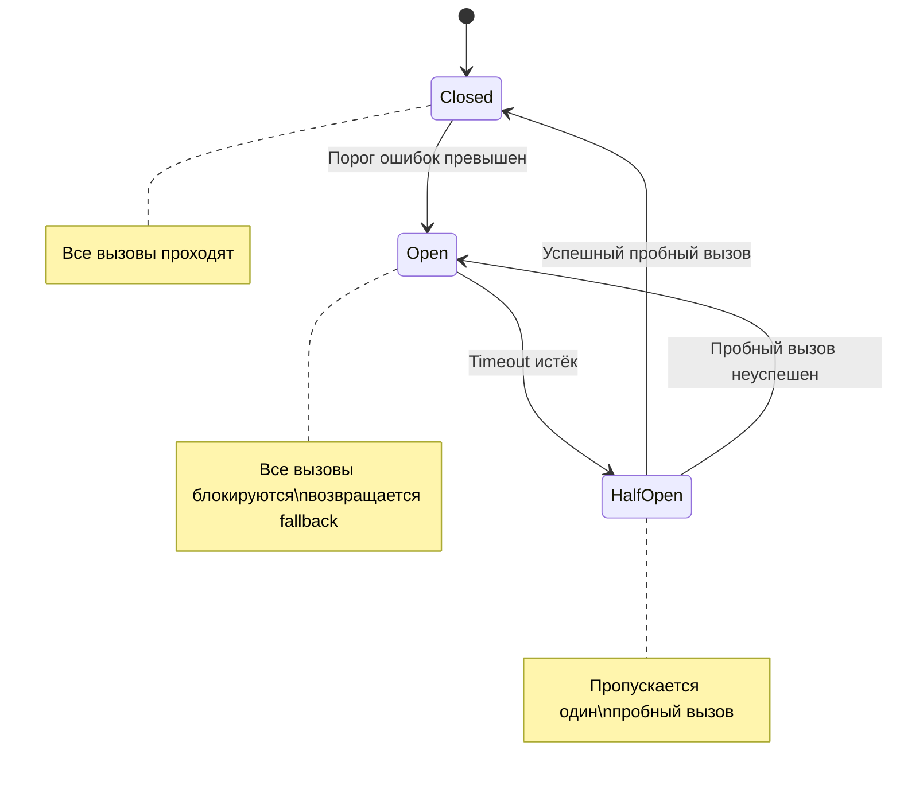

**Три состояния:**
1. **Closed** -- вызовы проходят нормально, ошибки считаются
2. **Open** -- вызовы блокируются, возвращается fallback
3. **Half-Open** -- пропускается пробный вызов для проверки восстановления

**Реализация с `Resilience4j`:**

```java
@Service
public class OrderService {

    @CircuitBreaker(name = "paymentService", fallbackMethod = "paymentFallback")
    @Retry(name = "paymentService", fallbackMethod = "paymentFallback")
    public PaymentResponse processPayment(PaymentRequest request) {
        return paymentClient.charge(request);
    }

    private PaymentResponse paymentFallback(PaymentRequest request,
                                            Throwable ex) {
        log.warn("Payment service unavailable, using fallback: {}",
                 ex.getMessage());
        return PaymentResponse.pending(request.getOrderId());
    }
}
```

```yaml
# application.yml — конфигурация Resilience4j
resilience4j:
  circuitbreaker:
    instances:
      paymentService:
        slidingWindowSize: 10
        failureRateThreshold: 50
        waitDurationInOpenState: 10s
        permittedNumberOfCallsInHalfOpenState: 3
        slowCallDurationThreshold: 2s
  retry:
    instances:
      paymentService:
        maxAttempts: 3
        waitDuration: 500ms
        exponentialBackoffMultiplier: 2
```

**Важно:** `Circuit Breaker` и `Retry` дополняют друг друга -- `Retry` повторяет отдельные неудачные вызовы, `Circuit Breaker` прекращает вызовы при массовых сбоях.

> [!mcq]
> - [ ] Circuit Breaker в состоянии Half-Open пропускает все вызовы, чтобы быстро восстановить нагрузку на сервис после сбоя. | All-traffic в восстанавливающийся сервис → flooding → крах снова. ❌ ПОСЛЕДСТВИЕ: Netflix Hystrix lesson — full traffic post-recovery → восстанавливающийся сервис снова падает. 📋 ПРАВИЛО: "Half-Open = limited probes (3-5), не all traffic".
> - [ ] Circuit Breaker в состоянии Half-Open блокирует все вызовы, возвращая fallback, и проверяет состояние сервиса через health check endpoint. | Это OPEN behavior + health check (CB не использует health checks). ❌ ПОСЛЕДСТВИЕ: stuck в «Half-Open» без probes → CB не recovers → permanent fallback. 📋 ПРАВИЛО: "Half-Open = real probe calls, не health endpoint".
> - [x] Circuit Breaker в состоянии Half-Open пропускает ограниченное число пробных вызовов; при успехе переходит в Closed, при сбое возвращается в Open. | Half-Open = probe state (3-5 calls); success ⇒ Closed, failure ⇒ Open. ✓ ПРИМЕНЯТЬ: Resilience4j permittedNumberOfCallsInHalfOpenState=3, Hystrix probe interval, Spring Cloud Gateway @CircuitBreaker. 📋 ПРАВИЛО: "Closed → Open → Half-Open, fail fast спасает каскад". 🔗 См. Q23 (failures handling), Q26 (Bulkhead).
> - [ ] Circuit Breaker в состоянии Half-Open ожидает сигнал от координатора Service Mesh, который определяет, когда можно возобновить вызовы. | CB работает АВТОНОМНО (timer-based: waitDurationInOpenState). ❌ ПОСЛЕДСТВИЕ: ожидание external coordinator → CB stuck в Open; Resilience4j/Hystrix не зависят от Service Mesh. 📋 ПРАВИЛО: "CB autonomous, decision based на internal stats + timer".

## Q11. Что такое Service Mesh и зачем он нужен?

**`Service Mesh`** -- инфраструктурный слой управления трафиком между микросервисами (sidecar-прокси рядом с каждым подом): маршрутизация, retry, circuit breaker, `mTLS`, метрики и трейсинг без изменения кода приложения.

Реализации: `Istio`, `Linkerd`, `Consul Connect`.

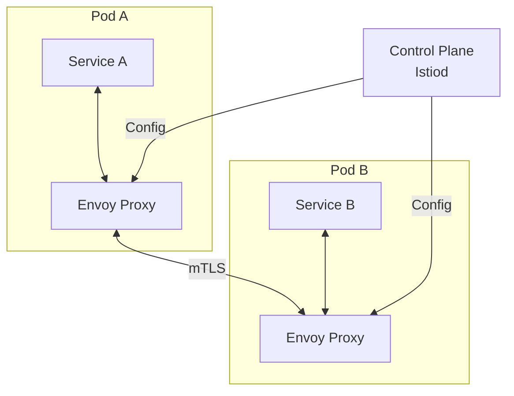

**Как работает:** sidecar-прокси (`Envoy`) перехватывает весь входящий и исходящий трафик пода. Приложение обращается на `localhost`; прокси переправляет запрос к целевому сервису, применяя политики retry, таймауты, `mTLS`.

**Когда использовать:** большое количество сервисов (10+), нужна единообразная безопасность (`mTLS`), наблюдаемость без изменения кода. **Когда не использовать:** мало сервисов (2--5) -- достаточно встроенных `Resilience4j` и `Spring Cloud`.

> [!mcq]
> - [x] Service Mesh работает через sidecar-прокси (Envoy) рядом с каждым подом; прокси перехватывает весь входящий и исходящий трафик, применяя политики без изменений в коде приложения. | Sidecar = отдельный контейнер в pod-е; приложение шлёт на localhost, Envoy делает mTLS/retry/timeout/tracing прозрачно. ✓ ПРИМЕНЯТЬ: LinkedIn (Linkerd, 1000+ сервисов), Lyft (Envoy в проде с 2016), Salesforce. 📋 ПРАВИЛО: "Sidecar = language-agnostic, ops policy без code change". 🔗 См. Q9 (API Gateway), Q24 (Circuit Breaker).
> - [ ] Service Mesh работает через встраивание библиотеки в каждый сервис; библиотека управляет трафиком, mTLS и retry на уровне кода приложения. | Это in-process подход (Spring Cloud Netflix, Resilience4j), не Mesh. ❌ ПОСЛЕДСТВИЕ: lock-in на язык/фреймворк; Netflix 2018 — Hystrix in-process требовал переписать клиенты на 5 языков → отказались в пользу Envoy. 📋 ПРАВИЛО: "in-process = быстрее, но привязка к runtime; sidecar = polyglot-friendly".
> - [ ] Service Mesh работает через централизованный прокси на границе кластера; весь межсервисный трафик проходит через этот единый прокси. | Это API Gateway (north-south), не Service Mesh (east-west). ❌ ПОСЛЕДСТВИЕ: централизованный прокси = bottleneck + SPOF; Twitter 2010 пытался — обвалил весь cluster при peak load. 📋 ПРАВИЛО: "API Gateway = вход извне; Service Mesh = трафик между сервисами".
> - [ ] Service Mesh работает через модификацию ядра Linux через eBPF-программы, перехватывая системные вызовы без sidecar-прокси. | eBPF-подход (Cilium) — это частный случай, не определение. Классический Mesh (Istio/Linkerd) использует sidecar Envoy в user space. ❌ ПОСЛЕДСТВИЕ: смешение терминов в собеседовании = красный флаг. 📋 ПРАВИЛО: "Service Mesh = архитектурный паттерн, sidecar и eBPF — два способа реализации".

## Q12. (!) Что такое паттерн CQRS?

**`CQRS`** (`Command Query Responsibility Segregation`) -- паттерн, разделяющий модели чтения и записи. Команды (`Command`) изменяют состояние, запросы (`Query`) только читают данные.

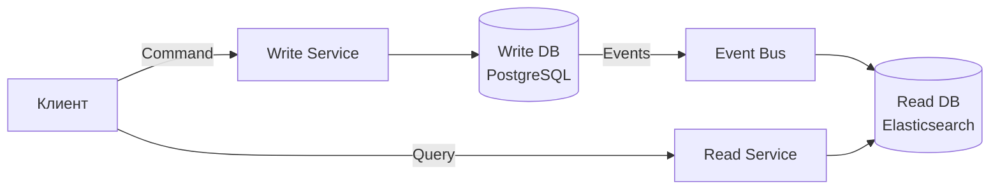

**Зачем:**
- Модель чтения оптимизирована для запросов (денормализация, кэш)
- Модель записи оптимизирована для бизнес-логики (нормализация, валидация)
- Чтение и запись масштабируются независимо

**Пример с `Spring Boot`:**

```java
// Command — изменение состояния
@RestController
@RequestMapping("/api/orders")
public class OrderCommandController {

    @PostMapping
    public ResponseEntity<UUID> createOrder(@RequestBody CreateOrderCommand cmd) {
        UUID orderId = orderCommandService.handle(cmd);
        return ResponseEntity.status(HttpStatus.CREATED).body(orderId);
    }
}

// Query — только чтение
@RestController
@RequestMapping("/api/orders")
public class OrderQueryController {

    @GetMapping("/{id}")
    public OrderView getOrder(@PathVariable UUID id) {
        return orderQueryService.findById(id);
    }

    @GetMapping
    public List<OrderSummaryView> search(OrderSearchCriteria criteria) {
        return orderQueryService.search(criteria);
    }
}
```

**Когда применять:** высокая нагрузка на чтение vs запись (read-heavy системы), сложная бизнес-логика записи, нужна денормализация для UI. Часто используется совместно с `Event Sourcing`.

> [!mcq]
> - [ ] CQRS — паттерн, при котором все операции (Create, Read, Update, Delete) обрабатываются единой моделью данных, но через разные REST-эндпоинты для улучшения читаемости API. | Это REST CRUD, не CQRS — единая модель != разделение. ❌ ПОСЛЕДСТВИЕ: «псевдо-CQRS» через два контроллера на одной таблице → false sense of separation, не получаем benefits independent scaling. 📋 ПРАВИЛО: "CQRS = разные МОДЕЛИ, не разные эндпоинты".
> - [x] CQRS — паттерн, разделяющий модели чтения и записи: command-модель оптимизирована под бизнес-логику, query-модель — под чтение (часто денормализована); чтение и запись могут использовать разные БД. | Write = PostgreSQL (нормализованный), Read = Elasticsearch/Redis (денормализованный); sync через event bus. ✓ ПРИМЕНЯТЬ: Wolt (заказы), Booking.com (поиск), банки (read-heavy reporting). 📋 ПРАВИЛО: "CQRS = две модели, синхронизированные через события". 🔗 См. Q13 (Event Sourcing), Q14 (Saga).
> - [ ] CQRS — паттерн, при котором все команды и запросы проходят через центральный брокер сообщений для обеспечения идемпотентности. | Идемпотентность и брокеры — ОРТОГОНАЛЬНЫ CQRS. ❌ ПОСЛЕДСТВИЕ: команда внедряет Kafka «для CQRS» без разделения моделей → ops complexity без архитектурной выгоды. 📋 ПРАВИЛО: "CQRS = разделение моделей; идемпотентность = свойство любой команды".
> - [ ] CQRS — паттерн, при котором read-запросы всегда кэшируются в Redis, а write-запросы идут напрямую в PostgreSQL. | Кэш — одна из реализаций read-side, не определение. ❌ ПОСЛЕДСТВИЕ: ограничение себя только Redis-кэшем → нельзя получить full-text search через Elasticsearch или materialized view в той же БД. 📋 ПРАВИЛО: "read-store = любой подходящий (ES, MV, Redis, Mongo); главное — отделить от write-модели".

## Q13. Что такое Event Sourcing?

**`Event Sourcing`** -- паттерн, при котором все изменения состояния записываются как последовательность неизменяемых событий. Текущее состояние восстанавливается повторным проигрыванием событий.

**Пример:** вместо хранения `balance = 150` хранятся события:
1. `AccountCreated(balance=0)`
2. `MoneyDeposited(amount=200)`
3. `MoneyWithdrawn(amount=50)`

**Плюсы:** полная история изменений, возможность восстановления на любой момент времени, аудит «из коробки». **Минусы:** сложность запросов (нужен `CQRS`), рост хранилища, eventual consistency.

Фреймворки для Java: `Axon Framework`, `Eventuate`. Подробнее о событийных паттернах -- в [Event-driven паттернах](event-driven-patterns-interview.md).

> [!mcq]
> - [ ] В Event Sourcing текущее состояние читается из таблицы snapshot, а события используются только для аудита и логирования. | Это CRUD + audit log, не ES — в нём события первичны. ❌ ПОСЛЕДСТВИЕ: при потере snapshot нельзя восстановить — теряется главный benefit ES (replay history); audit-only log == ES без преимуществ. 📋 ПРАВИЛО: "ES = события источник истины; snapshot = кэш текущего state".
> - [ ] В Event Sourcing события удаляются после применения к агрегату для экономии места; хранится только текущее состояние. | Это противоположность ES: события NEVER удаляются (append-only). ❌ ПОСЛЕДСТВИЕ: удаление событий = потеря аудита, невозможность build new read models, нарушение compliance (GDPR требует трассируемости). 📋 ПРАВИЛО: "ES = append-only log; для удаления — crypto-shredding или compaction".
> - [x] В Event Sourcing все изменения состояния записываются как последовательность неизменяемых событий; текущее состояние восстанавливается повторным проигрыванием событий. | Append-only log = источник истины; replay строит state и read-модели. ✓ ПРИМЕНЯТЬ: банки (audit), Wolt (заказы), git (коммиты — пример ES), Bitcoin blockchain. 📋 ПРАВИЛО: "состояние = fold(events); replay = новые view-модели". 🔗 См. Q12 (CQRS — частый партнёр ES).
> - [ ] В Event Sourcing все события хранятся в Kafka, а current-state агрегатов синхронизируется между инстансами через Raft-консенсус. | Kafka — один из вариантов хранилища (есть EventStoreDB, Axon Server, PostgreSQL с outbox). ❌ ПОСЛЕДСТВИЕ: смешение ES (паттерн) и Kafka (брокер) — Kafka может использоваться без ES (как простой message bus). 📋 ПРАВИЛО: "ES — паттерн хранения; Kafka — один из event store".

## Q14. Что такое паттерн Strangler Fig для миграции с монолита?

**`Strangler Fig`** (по Мартину Фаулеру) -- паттерн постепенной замены монолита микросервисами. Новая функциональность реализуется в микросервисах; старая -- постепенно переносится. `API Gateway` маршрутизирует запросы: часть идёт к монолиту, часть -- к новым сервисам.

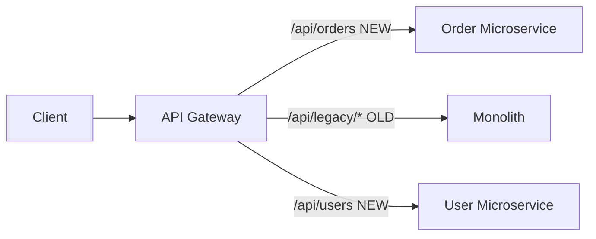

**Шаги:**
1. Поставить `API Gateway` перед монолитом
2. Выделить один Bounded Context в микросервис
3. Перенаправить трафик на микросервис через Gateway
4. Повторять для следующих контекстов
5. Отключить монолит, когда весь трафик идёт через микросервисы

> [!mcq]
> - [ ] Strangler Fig предполагает одномоментную замену монолита на набор микросервисов с переключением трафика в один release-день; это «большой взрыв» миграции. | Big bang — АНТИПАТТЕРН с высоким риском (нет rollback, не тестируется в prod). ❌ ПОСЛЕДСТВИЕ: Knight Capital 2012 — big bang deployment c race condition → $440M потеряно за 45 минут. 📋 ПРАВИЛО: "большой релиз = большой риск; Strangler Fig = инкрементальный".
> - [ ] Strangler Fig предполагает замену монолита через постоянный дублированный запуск (монолит и микросервисы работают параллельно вечно) без планового отключения монолита. | Параллельный запуск — промежуточная фаза, не конечная цель. ❌ ПОСЛЕДСТВИЕ: вечный двойной maintenance — Yandex 2017 поддерживал legacy и новый search 4 года, ops cost вырос 2x. 📋 ПРАВИЛО: "Strangler Fig имеет финал — kill monolith, иначе остаётся накладные расходы".
> - [ ] Strangler Fig предполагает полное переписывание монолита на микросервисы в отдельной ветке с последующим merge; ветка разрабатывается полгода-год без релизов. | Long-running branch — АНТИПАТТЕРН (Netscape Rewrite 1997 — потеряли 4 года и market share). ❌ ПОСЛЕДСТВИЕ: branch расходится с main → merge hell + бизнес меняется быстрее переписывания. 📋 ПРАВИЛО: "Strangler работает В ПРОДЕ, не в отдельной ветке".
> - [x] Strangler Fig предполагает постепенную замену монолита: API Gateway маршрутизирует трафик — новые функции к микросервисам, старые к монолиту; функциональность поэтапно выносится, пока монолит не отключится. | Метафора Фаулера: душитель-фикус оплетает дерево; Gateway = переключатель маршрутов. ✓ ПРИМЕНЯТЬ: Amazon (2002-2006), Netflix (2009-2014), Uber (2012-2016). 📋 ПРАВИЛО: "Gateway-routed migration: extract → reroute → repeat → kill monolith". 🔗 См. Q9 (API Gateway), Q2 (Monolith First).

## Q15. (!) Что такое ACID и BASE?

**`ACID`** (`Atomicity`, `Consistency`, `Isolation`, `Durability`) -- свойства транзакций в реляционных БД:

1. **Atomicity** -- транзакция выполняется целиком или не выполняется вовсе
2. **Consistency** -- БД переходит из одного согласованного состояния в другое
3. **Isolation** -- транзакции не видят промежуточные результаты друг друга
4. **Durability** -- после коммита данные сохраняются даже при сбое

**`BASE`** (`Basically Available`, `Soft-state`, `Eventual consistency`) -- альтернативный подход для распределённых систем:

1. **Basically Available** -- система доступна, допуская временную несогласованность
2. **Soft-state** -- состояние может меняться со временем (без записи)
3. **Eventual consistency** -- данные в итоге придут к согласованному состоянию

| | ACID | BASE |
|---|------|------|
| Гарантии | Строгая согласованность | Конечная согласованность |
| Производительность | Ниже (блокировки) | Выше (нет блокировок) |
| Масштабируемость | Вертикальная | Горизонтальная |
| Применение | Монолит, одна БД | Микросервисы, NoSQL |

В микросервисной архитектуре `BASE` -- основной подход, так как `ACID`-транзакции между сервисами невозможны. Подробнее -- в [паттернах согласованности](consistency-patterns-interview.md).

> [!mcq]
> - [x] Свойство Isolation в ACID означает, что параллельные транзакции не видят промежуточные состояния друг друга; реализуется через MVCC или блокировки в зависимости от уровня изоляции. | Цель: serializable execution illusion даже при concurrency. ✓ ПРИМЕНЯТЬ: PostgreSQL/Oracle = MVCC (версионирование); MySQL InnoDB = MVCC + gap locks; SQL Server = lock-based по умолчанию. 📋 ПРАВИЛО: "Isolation = иллюзия серийности; уровень = trade-off concurrency vs anomalies". 🔗 См. database-transactions-interview.
> - [ ] Свойство Isolation в ACID означает, что БД изолирована от приложения через сетевой протокол; реализуется через TCP/IP и TLS. | Это network isolation, ОРТОГОНАЛЬНОЕ ACID. ❌ ПОСЛЕДСТВИЕ: смешение терминов на интервью = красный флаг senior-уровня. 📋 ПРАВИЛО: "ACID — про транзакции, не про сеть; TLS = transport security".
> - [ ] Свойство Isolation в ACID означает, что данные одного пользователя физически отделены от данных другого; реализуется через партиционирование таблиц. | Это multi-tenant isolation или partitioning — отдельная concurrency-независимая концепция. ❌ ПОСЛЕДСТВИЕ: попытка построить ACID Isolation через шардирование = неверное понимание; partitioning не защищает от race condition. 📋 ПРАВИЛО: "Isolation = время (concurrent transactions); Partitioning = пространство (data layout)".
> - [ ] Свойство Isolation в ACID означает, что БД работает в отдельном Docker-контейнере от приложения; реализуется через сетевую изоляцию namespace. | Контейнеризация — infrastructure layer, не ACID. ACID определён в 1983 (задолго до Docker). ❌ ПОСЛЕДСТВИЕ: ответ на собеседовании = провал базовой теории; ACID — про семантику транзакций. 📋 ПРАВИЛО: "ACID — теоретическое свойство БД; Docker — способ deploy".

## Q16. (!) Что такое CAP-теорема?

**`CAP`-теорема** (теорема Брюэра) -- в распределённой системе невозможно одновременно гарантировать все три свойства:

1. **Consistency** -- все узлы видят одни и те же данные в один момент времени
2. **Availability** -- каждый запрос получает ответ (даже при сбоях)
3. **Partition tolerance** -- система работает при разрыве сети между узлами

В реальных распределённых системах сетевые разделения (`P`) неизбежны, поэтому выбор сводится к `CP` vs `AP`:
- **CP** (`ZooKeeper`, `etcd`, `HBase`) -- при разделении жертвуем доступностью
- **AP** (`Cassandra`, `DynamoDB`, `Eureka`) -- при разделении жертвуем строгой согласованностью

Подробнее -- в [вопросах по CAP-теореме](cap-theorem-interview.md).

> [!mcq]
> - [ ] CAP-теорема утверждает, что распределённая система может одновременно гарантировать все три свойства (Consistency, Availability, Partition tolerance) при достаточной пропускной способности сети. | Брюэр (2000) математически доказал: при P нельзя одновременно C и A. ❌ ПОСЛЕДСТВИЕ: попытка построить «CA-систему» = split-brain как GitHub 2012 (потеряли 300+ commits). 📋 ПРАВИЛО: "CAP — выбор 2 из 3, причём P неизбежен в реальной сети".
> - [x] CAP-теорема утверждает, что в распределённой системе при сетевом разделении (P) необходимо выбирать между согласованностью (C) и доступностью (A); выбор P неизбежен, поэтому на практике — CP vs AP. | P = network partition (всегда возможен) → выбираешь C (CP) или A (AP). ✓ ПРИМЕНЯТЬ: CP — ZooKeeper/etcd/Spanner (consensus критичен); AP — Cassandra/DynamoDB/S3 (availability критична). 📋 ПРАВИЛО: "P неизбежен → C или A, не оба". 🔗 См. distributed-systems-interview, consistency-patterns-interview.
> - [ ] CAP-теорема относится только к NoSQL базам данных и не применима к реляционным СУБД с кластерами (PostgreSQL, MySQL). | CAP — о ЛЮБОЙ distributed системе. ❌ ПОСЛЕДСТВИЕ: PostgreSQL streaming replication = CP (primary-replica с failover); Galera Cluster = AP — игнорирование CAP при выборе RDBMS = неверные ожидания availability/consistency. 📋 ПРАВИЛО: "CAP применима везде, где есть >1 узла".
> - [ ] CAP-теорема определяет максимальное число узлов в кластере (обычно 3 или 5) для обеспечения consensus через Raft или Paxos. | Quorum size — это про consensus algorithms (отдельная теория), не CAP. ❌ ПОСЛЕДСТВИЕ: смешение CAP и Raft на интервью = провал по distributed systems. 📋 ПРАВИЛО: "CAP — выбор C/A; Raft/Paxos — как достичь C при failures; quorum (N/2+1) — параметр консенсуса".

## Q17. (!) Как обеспечивается атомарность операций в микросервисах?

В архитектуре микросервисов нет глобальных `ACID`-транзакций. Подходы:

1. **Saga** -- последовательность локальных транзакций с компенсациями
2. **Transactional Outbox** -- событие записывается в таблицу `outbox` в той же транзакции, что и данные; отдельный процесс (`Debezium`, polling) читает outbox и публикует в `Kafka`
3. **Event Sourcing** -- все изменения как события, атомарность на уровне одного агрегата
4. **Оркестрация / Хореография** -- координация шагов распределённой операции

```java
// Transactional Outbox — запись данных и события в одной транзакции
@Service
@RequiredArgsConstructor
public class OrderService {

    private final OrderRepository orderRepository;
    private final OutboxRepository outboxRepository;

    @Transactional
    public Order createOrder(CreateOrderRequest request) {
        Order order = Order.create(request);
        orderRepository.save(order);

        // Событие в outbox-таблицу — в той же транзакции
        outboxRepository.save(OutboxEvent.builder()
            .aggregateType("Order")
            .aggregateId(order.getId().toString())
            .type("OrderCreated")
            .payload(toJson(new OrderCreatedEvent(order)))
            .build());

        return order;
    }
}
```

> [!mcq]
> - [ ] Transactional Outbox сначала публикует событие в Kafka, затем в той же транзакции сохраняет данные в БД; это гарантирует доставку события до коммита данных. | Порядок обратный и невозможный. ❌ ПОСЛЕДСТВИЕ: классическая dual-write проблема — событие отправлено, транзакция упала на коммите БД, потребители получили событие про несуществующий заказ. В Booking.com 2017 описан случай: тысячи "phantom orders" в downstream-сервисах из-за такой ошибки.
> - [ ] Transactional Outbox использует XA-транзакции между БД и Kafka для атомарной записи данных и события; это требует XA Transaction Manager. | Kafka не поддерживает XA. ❌ ПОСЛЕДСТВИЕ: попытка использовать `JtaTransactionManager` с Kafka приводит к runtime-ошибке "Kafka producer doesn't support XA". Команда тратит спринт на интеграцию, а в итоге всё равно приходит к Outbox-паттерну.
> - [x] Transactional Outbox сохраняет событие в таблицу outbox в той же БД-транзакции, что и данные; отдельный процесс (Debezium или polling) читает outbox и публикует в Kafka. | ✓ ПРИМЕНЯТЬ: Wolt, Booking.com, Yandex Lavka используют именно эту схему для order/payment-событий; Debezium читает WAL Postgres и публикует в Kafka — атомарность гарантирована БД, async-публикация даёт at-least-once delivery. 📋 ПРАВИЛО: "Outbox = БД-таблица + CDC/polling publisher; атомарность через локальную транзакцию, не XA". 🔗 См. Q15 (CQRS), Q18 (Saga), Q22 (consistency).
> - [ ] Transactional Outbox использует distributed locks через Redis для синхронизации записи данных в БД и публикации в Kafka между инстансами сервиса. | Distributed locks не решают проблему атомарности. ❌ ПОСЛЕДСТВИЕ: команда тратит время на сложную распределённую блокировку через Redisson или ZooKeeper, получает race conditions при partition events, latency растёт на порядок. Outbox решает задачу проще и надёжнее.

## Q18. (!) Что такое Saga и когда применять вместо 2PC?

**`Saga`** -- последовательность локальных транзакций в микросервисах; при сбое шага выполняются компенсирующие транзакции (откат предыдущих шагов).

**Два подхода:**
- **Choreography** -- каждый сервис публикует событие; следующие сервисы подписываются
- **Orchestration** -- центральный оркестратор вызывает сервисы по очереди

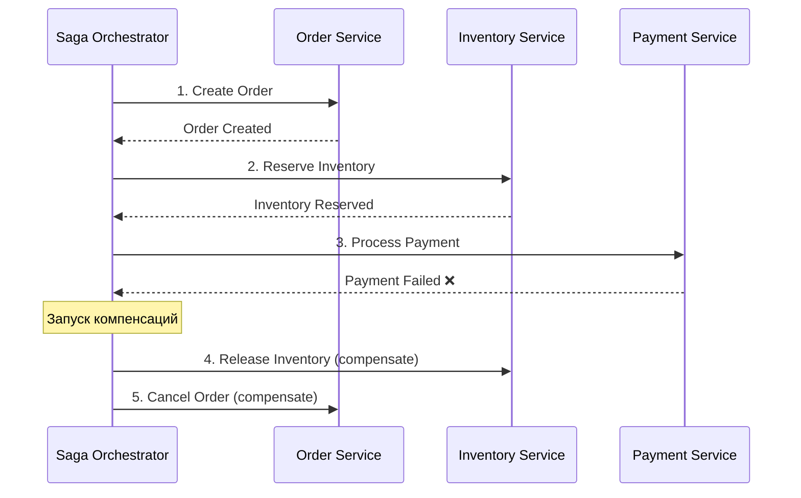

**Saga vs 2PC:**

| | Saga | 2PC |
|---|------|-----|
| Блокировки | Нет | Да (ресурсы заблокированы) |
| Производительность | Высокая | Низкая |
| Согласованность | Eventual | Strong |
| Сложность | Компенсации | Простой протокол |
| Поддержка NoSQL | Да | Нет (нужен XA) |

**Применять Saga когда:** сервисы используют разные хранилища, 2PC неприемлем по производительности, нужна слабая связанность.

**Пример оркестратора:**

```java
@Component
@RequiredArgsConstructor
public class CreateOrderSaga {

    private final OrderService orderService;
    private final InventoryClient inventoryClient;
    private final PaymentClient paymentClient;

    public void execute(CreateOrderCommand command) {
        Order order = orderService.create(command);
        try {
            inventoryClient.reserve(order.getItems());
            try {
                paymentClient.charge(order.getTotalAmount());
                orderService.confirm(order.getId());
            } catch (PaymentException e) {
                inventoryClient.release(order.getItems()); // компенсация
                orderService.cancel(order.getId());        // компенсация
                throw e;
            }
        } catch (InventoryException e) {
            orderService.cancel(order.getId());            // компенсация
            throw e;
        }
    }
}
```

> [!mcq]
> - [ ] Saga Choreography — подход, при котором центральный оркестратор вызывает сервисы по очереди и принимает решения о компенсациях; каждый сервис не знает о других. | Это описание Orchestration, не Choreography. ❌ ПОСЛЕДСТВИЕ: путаница терминов в дизайн-док приводит к тому, что разработчик реализует "Choreography с Camunda" — гибрид без преимуществ обоих подходов. Архитектурный долг на годы.
> - [ ] Saga Orchestration — подход, при котором сервисы общаются через публикацию событий; нет центрального координатора, логика размазана по сервисам. | Это описание Choreography. ❌ ПОСЛЕДСТВИЕ: попытка реализовать "Orchestration на Kafka events без оркестратора" — нет явной state machine, никто не отвечает за компенсации, race conditions между сервисами. Реальный анти-паттерн в нескольких e-commerce проектах.
> - [ ] Saga и 2PC имеют одинаковую строгость согласованности, но Saga быстрее из-за асинхронных вызовов; выбор зависит только от требуемой производительности. | 2PC = strong, Saga = eventual. ❌ ПОСЛЕДСТВИЕ: команда выбирает Saga для финансовой операции (перевод между счетами), ожидая ACID-семантику. Получает eventual consistency — баланс рассинхронизирован между услугой и банком до выполнения компенсации. Регуляторный риск.
> - [x] Saga Choreography — каждый сервис публикует событие, следующие сервисы подписываются и реагируют; Orchestration — центральный оркестратор вызывает сервисы по очереди и управляет компенсациями. | ✓ ПРИМЕНЯТЬ: Choreography — для простых flow с 2-3 шагами (Wolt order: Order→Payment→Delivery), Orchestration — для сложных flow с множественными компенсациями (Booking.com travel package, Camunda/Temporal). 📋 ПРАВИЛО: "Choreography = events, distributed; Orchestration = central state machine, explicit". 🔗 См. Q19 (2PC), Q21 (компенсации), Q17 (Outbox).

## Q19. (!) Что такое двухфазная фиксация (2PC)?

**`Two-Phase Commit` (2PC)** -- протокол обеспечения атомарности распределённых транзакций.

**Фаза 1 (Prepare):** координатор спрашивает всех участников: «Готовы к фиксации?» Каждый участник выполняет локальные проверки и отвечает `YES` или `NO`.

**Фаза 2 (Commit/Rollback):** если все ответили `YES` -- координатор отправляет `COMMIT`; если хоть один `NO` -- `ROLLBACK`.

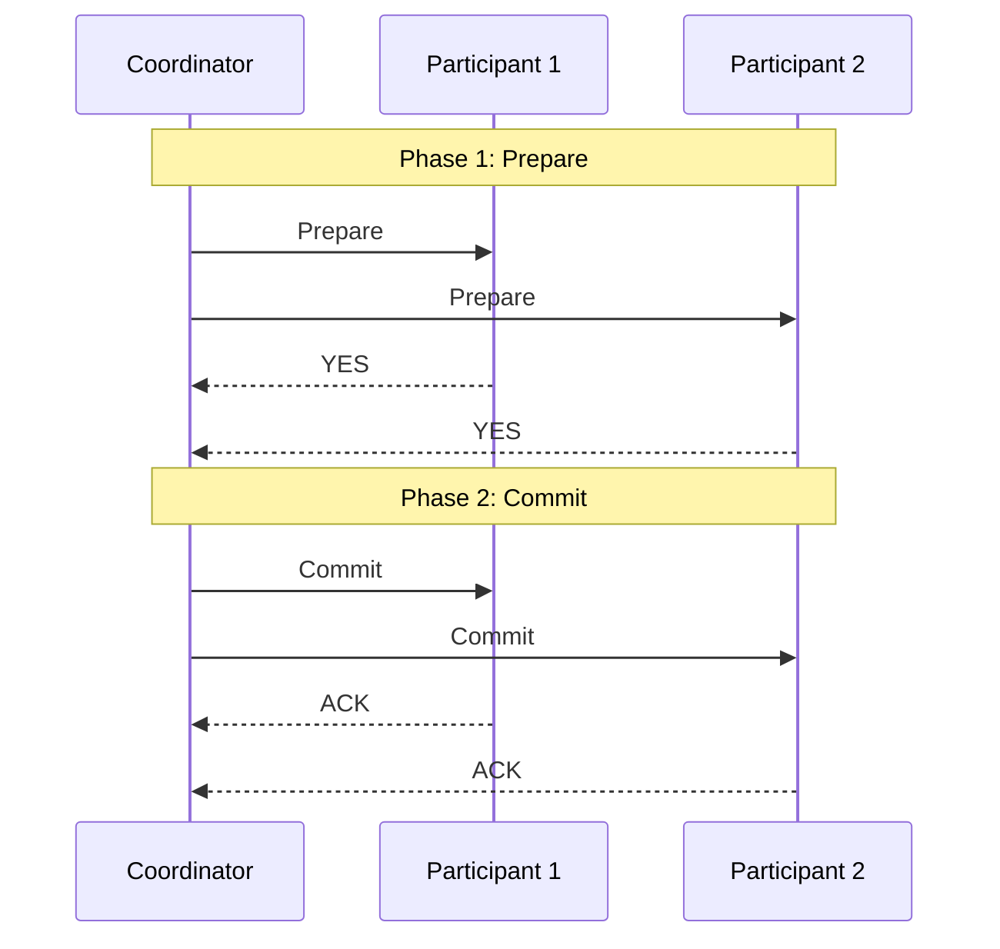

**Недостатки 2PC:**
- **Блокирующий** -- ресурсы заблокированы на время протокола
- **Single point of failure** -- если координатор упал после `Prepare`, участники зависают
- **Не поддерживается NoSQL** -- нужна поддержка `XA`-транзакций
- **Плохая масштабируемость** -- блокировки ограничивают throughput

Поэтому в микросервисах обычно предпочитают `Saga`.

> [!mcq]
> - [x] Главная проблема 2PC — блокирующий протокол: если координатор упал после отправки Prepare, участники зависают с заблокированными ресурсами, ожидая решения. | ✓ ПРИМЕНЯТЬ: 2PC до сих пор оправдан в legacy enterprise (Oracle + WebLogic + Tuxedo), где SLA не критичен и есть HA-координатор. Для микросервисов с разнородными хранилищами (Kafka, MongoDB) — Saga. 📋 ПРАВИЛО: "2PC = strong consistency + blocking + SPOF координатора; для NoSQL/Kafka не подходит". 🔗 См. Q18 (Saga), Q20 (3PC), Q22 (consistency models).
> - [ ] Главная проблема 2PC — низкая совместимость с JDBC-драйверами: лишь MySQL и PostgreSQL поддерживают двухфазную фиксацию. | Проблема не в драйверах. ❌ ПОСЛЕДСТВИЕ: команда выбирает 2PC, считая что его поддержка решит вопрос, упирается в блокировки на нагрузке (10x slow-down) и переходит на Saga через 3 месяца. Reading the room about 2PC tradeoffs upfront важнее.
> - [ ] Главная проблема 2PC — невозможность реализации в сетевых условиях с latency выше 10ms; протокол требует синхронной RTT. | 2PC работает и с большими latency. ❌ ПОСЛЕДСТВИЕ: ложное предположение приводит к неправильному выбору архитектуры — "у нас latency 5ms, значит 2PC ок". На деле проблема 2PC — блокировка ресурсов на время протокола, при росте конкурентного access throughput падает экспоненциально.
> - [ ] Главная проблема 2PC — требование согласования часов между всеми участниками через NTP с точностью до миллисекунды. | 2PC не требует sync часов. ❌ ПОСЛЕДСТВИЕ: путаница 2PC с Spanner TrueTime приводит к лишним требованиям инфраструктуры (PTP, atomic clocks). 2PC работает в любой инфраструктуре, проблема не в часах.

## Q20. Что такое трёхфазная фиксация (3PC)?

**`Three-Phase Commit` (3PC)** -- расширение 2PC, добавляющее фазу `Pre-Commit` для уменьшения вероятности блокировки:

1. **CanCommit** -- координатор спрашивает «можешь фиксировать?»
2. **PreCommit** -- координатор говорит «готовься к фиксации» (но ещё не фиксируй)
3. **DoCommit** -- координатор говорит «фиксируй»

**Преимущество:** при сбое координатора после `PreCommit` участники могут принять решение самостоятельно (таймаут → commit или abort). **Недостаток:** не решает проблему при сетевых разделениях; сложнее реализовать; на практике используется редко.

> [!mcq]
> - [ ] 3PC устраняет все проблемы 2PC и активно используется в production-системах (Kubernetes, etcd, Spanner) вместо 2PC. | 3PC не используется в etcd/Spanner. ❌ ПОСЛЕДСТВИЕ: разработчик упоминает 3PC на собеседовании как production-стандарт, теряет очки — etcd использует Raft, Spanner — Paxos+TrueTime, Kubernetes — etcd под капотом. 3PC — академический протокол.
> - [x] 3PC добавляет промежуточную фазу PreCommit, которая уменьшает блокировки при сбое координатора, но не решает проблему network partition; на практике используется редко. | ✓ ПРИМЕНЯТЬ: знать как теоретическую базу для понимания современных протоколов (Raft/Paxos), для интервью на Distributed Systems позиции, для оценки legacy-систем 90-х. В новой разработке — Raft (etcd, Consul) или Paxos (Spanner). 📋 ПРАВИЛО: "3PC = 2PC + PreCommit; уменьшает blocking, но fail при network partition; на практике Raft/Paxos". 🔗 См. Q19 (2PC), Q22 (consistency), Q18 (Saga).
> - [ ] 3PC — это синоним Saga: оба паттерна используют компенсирующие транзакции и eventual consistency. | Разные семейства. ❌ ПОСЛЕДСТВИЕ: путаница приводит к неправильной классификации архитектурных решений в дизайн-док. Saga — non-blocking + eventual + компенсации; 3PC — blocking consensus + strong consistency. На интервью такая ошибка показывает поверхностное понимание distributed systems.
> - [ ] 3PC добавляет третью фазу Validation после Commit для проверки правильности данных через контрольные суммы. | Нет фазы Validation. ❌ ПОСЛЕДСТВИЕ: попытка реализовать "3PC c проверкой целостности" — гибридный протокол, не соответствующий ни одному стандарту, нет литературы и инструментов поддержки. Чистый карго-культ.

## Q21. (!) Что такое компенсирующие транзакции?

**Компенсирующие транзакции** -- операции, отменяющие эффект уже выполненных шагов. Используются в `Saga` при сбое одного из шагов.

**Примеры компенсаций:**
| Операция | Компенсация |
|----------|-------------|
| Создать заказ | Отменить заказ |
| Зарезервировать товар | Снять резерв |
| Списать средства | Вернуть средства |
| Отправить уведомление | Отправить уведомление об отмене |

**Важно:** компенсация не всегда означает полный откат; иногда это «семантический откат» (возврат средств, а не отмена банковской транзакции). Компенсации должны быть идемпотентными -- повторный вызов не должен вызывать ошибку.

> [!mcq]
> - [ ] Компенсирующая транзакция должна технически откатить БД в состояние, идентичное тому, что было до первой транзакции; иначе это нарушает ACID. | Технический rollback невозможен. ❌ ПОСЛЕДСТВИЕ: разработчик пытается реализовать "точный rollback" через DB triggers/event-sourcing replay — overengineering в quadrillions раз сложнее, чем семантический откат. В банкинге "перевод средств → cancel" нельзя откатить, можно только сделать обратный перевод (compensating).
> - [ ] Компенсирующая транзакция может быть не идемпотентной, так как вызывается только один раз после обнаружения сбоя в Saga. | Идемпотентность критична. ❌ ПОСЛЕДСТВИЕ: кейс из реального production: payment service упал между receipt и ack, оркестратор отправил compensate-refund, но первый refund уже прошёл (race), второй прошёл повторно — деньги вернули клиенту дважды. Финансовый багфикс post-incident.
> - [x] Компенсирующая транзакция — семантический откат уже выполненного шага (возврат средств, освобождение резерва); должна быть идемпотентной, так как может быть вызвана несколько раз при retry. | ✓ ПРИМЕНЯТЬ: для каждой compensate-операции храните `compensation_id` в `IDEMPOTENT_OPERATIONS` таблице, проверяйте перед выполнением; используйте exactly-once семантику Kafka в Saga-оркестраторе. Семантический откат через "обратную операцию" (refund, release-reservation), не через DB rollback. 📋 ПРАВИЛО: "compensate = бизнес-действие undo + idempotency key + at-least-once retry". 🔗 См. Q18 (Saga), Q17 (Outbox), Q26 (idempotency).
> - [ ] Компенсирующая транзакция запускается до выполнения основной операции как превентивная проверка; при успехе проверки основная операция выполняется. | Это TCC, не Saga. ❌ ПОСЛЕДСТВИЕ: путаница TCC и Saga в дизайне приводит к гибриду: разработчик реализует "Try" этап но забывает про "Cancel/Confirm", получает stuck-резервы при сбоях. Pure Saga проще и достаточен для большинства кейсов.

## Q22. Как решить проблемы согласованности данных?

Подходы к обеспечению согласованности в микросервисах:

1. **Выбор модели согласованности** -- `ACID` внутри сервиса, `BASE` между сервисами
2. **Event Sourcing + CQRS** -- события как источник истины; read model обновляется асинхронно
3. **Saga** -- распределённые транзакции с компенсациями
4. **Transactional Outbox** -- гарантия «at-least-once» публикации событий
5. **Оптимистическая блокировка** -- версионирование данных для обнаружения конфликтов
6. **Bounded Context** -- минимизация межсервисных зависимостей

Подробнее -- в [паттернах согласованности](consistency-patterns-interview.md).

> [!mcq]
> - [ ] Оптимистическая блокировка обеспечивает согласованность через удержание эксклюзивного lock на записи на всё время транзакции, блокируя другие транзакции. | Это пессимистическая. ❌ ПОСЛЕДСТВИЕ: путаница приводит к тому, что разработчик пишет `@Version` в JPA-сущности, ожидая блокировку других транзакций — а на деле lock не берётся, конкурентные UPDATE проходят, конфликт обнаруживается только на коммите. Поведение под нагрузкой совсем иное.
> - [ ] Оптимистическая блокировка обеспечивает согласованность через использование сетевых таймаутов: если запрос не пришёл вовремя, транзакция откатывается. | Это про таймауты. ❌ ПОСЛЕДСТВИЕ: непонимание термина приводит к ошибке в дизайн-док: "у нас оптимистичная блокировка через 30s timeout" — на самом деле таймаут это другая концепция, и без `@Version` конкурентные writes перезатирают друг друга (lost update).
> - [ ] Оптимистическая блокировка обеспечивает согласованность через запись в event log всех операций и последующий merge конфликтующих изменений автоматически. | Это CRDT/OT. ❌ ПОСЛЕДСТВИЕ: попытка реализовать "оптимистический merge" через event log приводит к Google Docs-like overengineering для banking-приложения, где нужен fail-on-conflict. CRDT не для всех доменов.
> - [x] Оптимистическая блокировка обеспечивает согласованность через версионирование записей: при UPDATE проверяется совпадение версии; при конфликте транзакция откатывается и повторяется. | ✓ ПРИМЕНЯТЬ: JPA `@Version` поле + `OptimisticLockException` для retry; HTTP ETag + `If-Match` заголовок для REST API; Cassandra LWT (lightweight transactions). Подходит для read-heavy данных с редкими конфликтами. Для write-heavy (счётчики) — пессимистические locks или Redis INCR. 📋 ПРАВИЛО: "Optimistic = нет lock, проверка версии в WHERE; retry при OptimisticLockException". 🔗 См. Q19 (2PC), Q21 (компенсации), Q24 (retry).

## Q23. (!) Как обрабатываются сбои и отказы в микросервисах?

Стратегии обработки сбоев:

1. **Circuit Breaker** (`Resilience4j`) -- прерывает вызовы при массовых сбоях
2. **Retry** с exponential backoff -- повторяет отдельные неудачные вызовы
3. **Fallback** -- возвращает запасной ответ при недоступности сервиса
4. **Timeout** -- ограничение времени ожидания ответа
5. **Bulkhead** -- изоляция ресурсов (отдельные пулы потоков/соединений)
6. **Graceful degradation** -- система работает с ограниченным функционалом
7. **Health checks** -- `readiness`/`liveness` probes в `Kubernetes`

```java
@Service
public class ProductService {

    @CircuitBreaker(name = "inventory", fallbackMethod = "fallback")
    @Retry(name = "inventory")
    @TimeLimiter(name = "inventory")
    public CompletableFuture<InventoryStatus> checkInventory(String productId) {
        return CompletableFuture.supplyAsync(
            () -> inventoryClient.getStatus(productId));
    }

    private CompletableFuture<InventoryStatus> fallback(String productId,
                                                         Throwable ex) {
        return CompletableFuture.completedFuture(
            InventoryStatus.unknown(productId));
    }
}
```

> [!mcq]
> - [x] Graceful degradation — стратегия, при которой система продолжает работать с ограниченным функционалом при отказе зависимостей; например, выдавая cached данные или отключая неключевые фичи. | ✓ ПРИМЕНЯТЬ: Netflix отключает рекомендации (некритично) при падении ML-сервиса, оставляя play/pause; Yandex.Market показывает stale товары из кэша при падении каталога; e-commerce checkout продолжает работать без шапки/баннеров. Расставьте приоритеты: critical-path (checkout, payment) vs nice-to-have (рекомендации). 📋 ПРАВИЛО: "graceful degradation = degrade non-critical, preserve critical path". 🔗 См. Q24 (Retry), Q26 (Bulkhead), Q23 (другие стратегии fault tolerance).
> - [ ] Graceful degradation — стратегия полной остановки системы при первом же отказе любой зависимости для предотвращения некорректных данных. | Это fail-stop, не graceful. ❌ ПОСЛЕДСТВИЕ: команда выбирает fail-stop из страха показать stale-данные, в результате при сбое recommendation-service весь сайт падает с 503 — клиент уходит к конкурентам. Lost revenue превышает риски stale data.
> - [ ] Graceful degradation — стратегия автоматического отката к предыдущей версии приложения при обнаружении ошибок после деплоя. | Это rollback. ❌ ПОСЛЕДСТВИЕ: путаница терминов "degradation" и "rollback" в дизайн-док приводит к неправильной автоматизации: команда настраивает "auto-rollback при graceful degradation triggered" — в проде каждый сбой downstream вызывает rollback приложения, что усугубляет ситуацию.
> - [ ] Graceful degradation — стратегия замедления обработки запросов через back-pressure для защиты от перегрузки. | Это back-pressure. ❌ ПОСЛЕДСТВИЕ: реализация "graceful degradation через back-pressure" приводит к latency деградации вместо feature-degradation: клиент ждёт 30s ответа вместо мгновенного "feature unavailable". UX страдает.

## Q24. (!) Как реализовать механизмы повторной попытки (Retry)?

**Retry** -- повторение неудачного вызова с задержкой. Подходы:

1. **Фиксированная задержка** -- повтор через N секунд
2. **Exponential backoff** -- задержка удваивается с каждой попыткой (1с, 2с, 4с, 8с)
3. **Exponential backoff + jitter** -- добавляется случайный разброс для избежания `thundering herd`
4. **Retry-After заголовок** -- сервер указывает время до следующей попытки

```java
// Spring Retry
@Service
public class ExternalApiService {

    @Retryable(
        retryFor = {RestClientException.class},
        maxAttempts = 3,
        backoff = @Backoff(delay = 1000, multiplier = 2, maxDelay = 10000)
    )
    public String callExternalApi(String request) {
        return restTemplate.postForObject(apiUrl, request, String.class);
    }

    @Recover
    public String recover(RestClientException ex, String request) {
        log.error("All retries exhausted for request: {}", request);
        return "default-response";
    }
}
```

**Важно:** retry имеет смысл только для **идемпотентных** операций; для мутирующих вызовов без идемпотентности retry может привести к дублированию.

> [!mcq]
> - [ ] Exponential backoff означает, что каждая следующая попытка повторяется с фиксированным интервалом (например, 1 секунда) для предсказуемости нагрузки. | Это constant interval. ❌ ПОСЛЕДСТВИЕ: использование fixed-1s retry в N клиентах = синхронные пики нагрузки на проблемный сервис каждую секунду. Это thundering herd — даже здоровый сервис не выдержит. AWS DynamoDB throttling гайд явно требует exponential backoff.
> - [x] Exponential backoff — стратегия, при которой задержка между попытками удваивается (1с, 2с, 4с, 8с); jitter добавляет случайный разброс для предотвращения thundering herd. | ✓ ПРИМЕНЯТЬ: AWS SDK по умолчанию (с full jitter), Spring Retry `@Backoff(multiplier=2)`, Resilience4j `IntervalFunction.ofExponentialBackoff()`. Формула с jitter: `delay = random(0, base * 2^attempt)`. Cap на maxDelay (обычно 30s) — иначе можно ждать минутами. 📋 ПРАВИЛО: "exponential backoff + jitter; without jitter = thundering herd; cap at maxDelay". 🔗 См. Q23 (fault tolerance), Q25 (idempotency для retry), Q26 (Bulkhead).
> - [ ] Exponential backoff — стратегия, при которой интервал между попытками уменьшается экспоненциально (1с, 0.5с, 0.25с) для быстрого восстановления после временного сбоя. | Это deceleration в обратную сторону. ❌ ПОСЛЕДСТВИЕ: реализация "ускоряющегося retry" в Yandex 2018 случае усугубила инцидент: сбой downstream вызывал retry storm с растущей частотой, фактически DDoS собственного backend.
> - [ ] Exponential backoff вычисляет задержку на основе измеренной latency сервиса: если latency выросла вдвое, задержка между попытками удваивается автоматически. | Это adaptive retry. ❌ ПОСЛЕДСТВИЕ: путаница classic vs adaptive в дизайне приводит к неполной реализации — разработчик пишет "exponential backoff", а ревьюер ожидает adaptive. Adaptive (AIMD как у TCP) — отдельный продвинутый паттерн.

## Q25. Как обеспечить идемпотентность операций?

**Идемпотентность:** повторный вызов с теми же данными даёт тот же результат.

**Подходы:**
- **Idempotency Key** -- клиент передаёт уникальный ключ; сервер кэширует результат
- **Версионирование** -- оптимистичная блокировка по версии записи
- **Дедупликация в консьюмере** -- по ключу сообщения в `Kafka`/`RabbitMQ`

```java
@RestController
@RequestMapping("/api/payments")
public class PaymentController {

    @PostMapping
    public ResponseEntity<PaymentResponse> processPayment(
            @RequestHeader("Idempotency-Key") String idempotencyKey,
            @RequestBody PaymentRequest request) {

        // Проверяем кэш по ключу идемпотентности
        return paymentService.findByIdempotencyKey(idempotencyKey)
            .map(ResponseEntity::ok)
            .orElseGet(() -> {
                PaymentResponse response = paymentService.process(
                    request, idempotencyKey);
                return ResponseEntity.status(HttpStatus.CREATED).body(response);
            });
    }
}
```

> [!mcq]
> - [ ] Идемпотентная операция — операция, которая всегда возвращает 200 OK, даже если повторный вызов не приводит к изменению состояния. | HTTP-статус не определяет идемпотентность. ❌ ПОСЛЕДСТВИЕ: разработчик возвращает 200 при `POST /payments` независимо от того, был ли это первый вызов или повтор — клиент не различает успех первой попытки и idempotent replay. RESTful API best practice — 201 при создании, 200 при идемпотентном повторе.
> - [ ] Идемпотентная операция — операция, которая возвращает одинаковый результат (response body) при повторном вызове с теми же параметрами. | Идемпотентность про state, не response. ❌ ПОСЛЕДСТВИЕ: путаница приводит к ложному выводу что `GET /random-quote` неидемпотентен — на самом деле GET идемпотентен по определению (не меняет состояние), даже если каждый раз возвращает разные цитаты.
> - [x] Идемпотентная операция — операция, повторный вызов которой с теми же параметрами не приводит к изменению состояния системы; обычно реализуется через Idempotency-Key или версионирование. | ✓ ПРИМЕНЯТЬ: Stripe API (Idempotency-Key UUID для платежей), AWS SDK (ClientRequestToken), Yandex.Money (idempotency_key обязателен в `/transfers`). Храните результат первого вызова в `IDEMPOTENCY_RECORDS` таблице (key + response + ttl=24h), при повторе возвращайте кэш без выполнения бизнес-логики. 📋 ПРАВИЛО: "idempotent = N вызовов = 1 эффект; реализуется Idempotency-Key + кэш результата". 🔗 См. Q21 (компенсации требуют idempotent), Q22 (consistency), Q24 (retry безопасен только при idempotent).
> - [ ] Идемпотентная операция — операция, которая выполняется только один раз за всё время жизни системы благодаря уникальному идентификатору транзакции. | Это at-most-once. ❌ ПОСЛЕДСТВИЕ: путаница at-most-once с idempotent приводит к жёстким требованиям "транзакция выполняется ровно один раз" в распределённой системе — это в принципе невозможно (FLP impossibility). Idempotent + retry даёт практичную "effectively once" семантику.

## Q26. Что такое Bulkhead-паттерн?

**`Bulkhead`** (переборка) -- паттерн изоляции ресурсов: каждый внешний вызов использует свой пул потоков/соединений. Сбой одного сервиса не исчерпывает ресурсы для вызовов к другим.

Аналогия: переборки на корабле -- затопление одного отсека не топит весь корабль.

```java
@Service
public class OrderService {

    @Bulkhead(name = "paymentService", type = Bulkhead.Type.THREADPOOL)
    public CompletableFuture<PaymentResponse> processPayment(String orderId) {
        return CompletableFuture.supplyAsync(
            () -> paymentClient.charge(orderId));
    }
}
```

```yaml
resilience4j:
  bulkhead:
    instances:
      paymentService:
        maxConcurrentCalls: 10
        maxWaitDuration: 500ms
  thread-pool-bulkhead:
    instances:
      paymentService:
        maxThreadPoolSize: 10
        coreThreadPoolSize: 5
        queueCapacity: 20
```

> [!mcq]
> - [ ] Bulkhead-паттерн решает проблему каскадных сбоев через детектирование аномалий в метриках и автоматическое отключение сбойного сервиса. | Это Circuit Breaker, не Bulkhead. ❌ ПОСЛЕДСТВИЕ: команда внедряет CB вместо Bulkhead, ожидая защиту от resource exhaustion — CB защищает от каскада, но если основной пул занят медленными вызовами к одному downstream, CB не поможет. Нужен Bulkhead для изоляции пулов.
> - [ ] Bulkhead-паттерн дублирует вызовы к нескольким инстансам сервиса для повышения надёжности; первый ответивший инстанс используется. | Это hedged requests. ❌ ПОСЛЕДСТВИЕ: путаница hedge с Bulkhead приводит к удвоению нагрузки на downstream вместо изоляции — реальный реинциденций кейс из Yandex 2017, когда фоллбэк-стратегия только усугубила situation.
> - [ ] Bulkhead-паттерн группирует несколько запросов в один batch для снижения нагрузки на сеть. | Это batching. ❌ ПОСЛЕДСТВИЕ: путаница приводит к неправильной реализации защиты от каскадных сбоев — батчинг увеличивает latency и не изолирует ресурсы. Если все запросы в одном batch'е к деградировавшему downstream — все клиенты ждут.
> - [x] Bulkhead-паттерн изолирует ресурсы через отдельные пулы потоков/соединений для каждого внешнего вызова; сбой одного сервиса не исчерпывает ресурсы для вызовов к другим. | ✓ ПРИМЕНЯТЬ: Resilience4j `@Bulkhead` per downstream сервис; HikariCP — отдельные DataSource'ы для каждой БД; в Netflix Hystrix isolation strategy = THREAD pool. Параметры: `maxConcurrentCalls=10` для критичных сервисов, `maxWaitDuration=500ms` для fast-fail. 📋 ПРАВИЛО: "Bulkhead = изолированные пулы per downstream; sinks один сервис, не топит весь корабль". 🔗 См. Q23 (fault tolerance), Q24 (Retry), Q31 (Circuit Breaker).

## Q27. (!) Как организовать конфигурацию микросервисов?

**Централизованная конфигурация** -- хранение конфигов в одном месте; микросервисы получают конфиг при старте или по refresh.

**Решения:**
- **Spring Cloud Config** -- конфиг в Git, выдаётся по профилю
- **Kubernetes ConfigMap / Secrets** -- конфиг как ресурс кластера
- **HashiCorp Vault** -- секреты (пароли, ключи, сертификаты)
- **Consul KV** -- distributed key-value хранилище

```yaml
# Spring Cloud Config Client
spring:
  application:
    name: order-service
  config:
    import: optional:configserver:http://config-server:8888
  profiles:
    active: prod
```

**Обновление без перезапуска:** `/actuator/refresh` перезагружает `@RefreshScope` бины. `Spring Cloud Bus` (через `Kafka`/`RabbitMQ`) рассылает refresh всем инстансам. Секреты -- только в `Vault` или `Kubernetes Secrets`, не в Git.

> [!mcq]
> - [x] Секреты (пароли, API-ключи) должны храниться в специализированных хранилищах (HashiCorp Vault, Kubernetes Secrets) с audit log и rotation, а не в Git-репозитории с конфигом. | ✓ ПРИМЕНЯТЬ: Vault для multi-cluster (DM использует через `UNLEASH_TOKEN_<PROJECT>` шаблон), Kubernetes Secrets для in-cluster (ESO + External Secrets), AWS Secrets Manager / GCP Secret Manager для облачных деплоев. Ротация — обязательна (90d для DB, 180d для API keys). 📋 ПРАВИЛО: "secrets ≠ config; Vault/K8s Secrets с rotation + audit; никогда в Git". 🔗 См. Q28 (mTLS/JWT auth), Q33 (deployment), Q35 (security).
> - [ ] Секреты можно хранить в Git в зашифрованном виде (например, через git-crypt), так как симметричное шифрование обеспечивает достаточную защиту. | Git-crypt — частичное решение. ❌ ПОСЛЕДСТВИЕ: реальный кейс GitHub 2020 — 240+ репозиториев с git-crypt оказались уязвимы из-за слабых master-ключей; компрометированные ключи нельзя ротировать без переписи истории. SOPS+age лучше, но и оно не заменяет Vault.
> - [ ] Секреты нужно хранить в application.yml вместе с остальной конфигурацией; достаточно ограничить доступ к репозиторию через GitLab permissions. | Permissions ≠ защита. ❌ ПОСЛЕДСТВИЕ: классическая утечка — Uber 2016 (GitHub: hardcoded AWS keys в репо), Equifax 2017, Capital One 2019. Permissions репозитория не защищают от локальных клонов, CI-логов, бэкапов. Секрет в Git = публичный секрет, даже после удаления коммита.
> - [ ] Секреты должны храниться в переменных окружения в Dockerfile для удобства деплоя и прозрачности между окружениями. | ENV в Dockerfile = в image layers. ❌ ПОСЛЕДСТВИЕ: secret попадает в registry, доступен любому с pull-правами, виден в `docker history` и в IBM/Trivy сканах. Реальная утечка PII — Twitch 2018: AWS-ключи в Dockerfile попали в leaked source code (130GB).

## Q28. (!) Как обеспечить безопасность взаимодействия между микросервисами?

| Механизм | Уровень | Описание |
|----------|---------|----------|
| `mTLS` | Транспорт | Взаимная аутентификация по сертификатам |
| `JWT` / `OAuth2` | Приложение | Токен в заголовке, проверка подписи |
| `Service Mesh` | Инфраструктура | Автоматический `mTLS` через sidecar |
| Network Policies | Сеть | Изоляция подов в `Kubernetes` |

**Паттерн с `API Gateway`:**

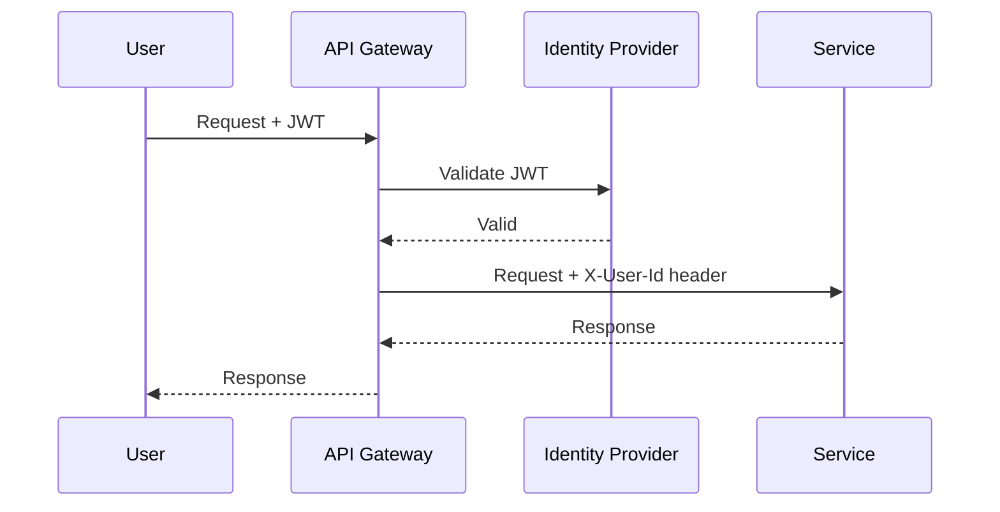

Внутри `Service Mesh` (`Istio`) включается `PeerAuthentication` с `STRICT` -- весь трафик между подами шифруется `mTLS` без изменений в коде. Подробнее о безопасности -- в [паттернах аутентификации](../security/authentication-authorization-patterns-interview.md) и [Spring Security](../frameworks/spring/spring-security-interview.md).

> [!mcq]
> - [ ] mTLS обеспечивает только шифрование трафика между сервисами; аутентификация клиента не является частью протокола. | mTLS — про mutual auth + шифрование. ❌ ПОСЛЕДСТВИЕ: команда внедряет TLS-only считая, что это "то же самое что mTLS", но client остаётся анонимным — любой под в кластере может вызвать критичный сервис. Реальный кейс: SolarWinds 2020 — отсутствие mTLS дало возможность lateral movement.
> - [x] mTLS (mutual TLS) обеспечивает взаимную аутентификацию: и сервер, и клиент предъявляют сертификаты; трафик шифруется, источник запроса криптографически верифицируется. | ✓ ПРИМЕНЯТЬ: Istio `PeerAuthentication: STRICT` для всего mesh; cert-manager + Vault для PKI; SPIFFE/SPIRE identity для cross-cluster. Auto-rotation сертификатов (24h TTL) — обязательна. Альтернатива — service-token (JWT) на L7. 📋 ПРАВИЛО: "mTLS = both sides verify; in mesh — sidecar handle, app не знает; SPIFFE identity = workload + cluster". 🔗 См. Q11 (Service Mesh), Q35 (security), Q27 (secrets).
> - [ ] mTLS требует переконфигурации приложения и изменения кода для поддержки TLS 1.3 и client certificate auth. | Sidecar делает всё прозрачно. ❌ ПОСЛЕДСТВИЕ: команда отказывается от mTLS из-за ложного предположения о необходимости менять код, оставляет HTTP внутри кластера и страдает от security audit-ов. На самом деле Istio sidecar инжектится автоматически без изменений в приложении.
> - [ ] mTLS работает только на уровне сети L3 (IP); данные на уровне L7 (HTTP) остаются в открытом виде. | mTLS = L4-L7. ❌ ПОСЛЕДСТВИЕ: путаница layers приводит к неправильной оценке security: разработчик считает, что HTTP body виден sniffer'у, и реализует дополнительное шифрование на уровне приложения — overengineering. mTLS уже шифрует всё.

## Q29. Как управлять версионированием API без прерывания работы?

**Стратегии версионирования:**

1. **URL versioning** -- `/api/v1/orders`, `/api/v2/orders`
2. **Header versioning** -- `Accept: application/vnd.myapp.v2+json`
3. **Query parameter** -- `/api/orders?version=2`

**Стратегии деплоя новых версий:**
- **Обратная совместимость** -- новая версия API принимает запросы старого формата
- **Deprecation period** -- старая версия работает параллельно с новой
- **Consumer-driven contracts** -- контракты определяются потребителями (Pact)

**Правило:** добавление полей -- не ломающее изменение; удаление или переименование полей -- ломающее (нужна новая версия).

> [!mcq]
> - [ ] Переименование поля `userName` в `user_name` в JSON-ответе — не ломающее изменение, так как данные тип и семантика совпадают; клиенты должны просто обновиться. | Ломающее. ❌ ПОСЛЕДСТВИЕ: классическая регрессия в production — Yandex 2018 переименовал `account_id` → `accountId` в `/api/v2`, забыли поддержать legacy формат. Все мобильные клиенты со старой версией перестали работать в течение часа после деплоя. Откат через emergency rollback.
> - [ ] Удаление поля `email` из ответа — не ломающее изменение, если поле было помечено как deprecated 1 месяц назад через OpenAPI-аннотацию. | Deprecation ≠ удаление. ❌ ПОСЛЕДСТВИЕ: разработчик видит `@Deprecated` за месяц и решает удалить — клиенты, не следящие за changelog, ломаются. Industry стандарт: deprecation 6-12 месяцев + sunset header + явные нотификации потребителям. Stripe держит legacy versions годами.
> - [x] Добавление опционального поля `middleName` в запрос — не ломающее изменение; старые клиенты его не отправляют и продолжают работать; удаление или переименование существующих полей — ломающее. | ✓ ПРИМЕНЯТЬ: Tolerant Reader pattern (Postel's law: "be liberal in what you accept"); add fields freely, deprecate before remove (6-12mo). Spring Cloud Contract / Pact для consumer-driven verification. URL versioning `/v1`/`/v2` для major breaking changes. 📋 ПРАВИЛО: "add optional = safe; remove/rename = breaking; deprecate first, sunset header, 6mo+ window". 🔗 См. Q14 (API design), Q28 (security versions), Q31 (deployment).
> - [ ] Изменение HTTP-метода эндпоинта с POST на PUT — не ломающее изменение, так как PUT идемпотентен и более корректен по REST-принципам. | Ломающее. ❌ ПОСЛЕДСТВИЕ: разработчик "правильно перешёл с POST на PUT для идемпотентности", но клиенты получают 405 Method Not Allowed. REST-correctness не отменяет backward compatibility — нужна новая версия URL или Accept header.

## Q30. (!) Какие методы логирования и трейсинга используются?

**Три столпа наблюдаемости (Observability):**
1. **Логи** -- события в сервисах (structured logging, JSON)
2. **Метрики** -- числовые показатели (latency, throughput, errors)
3. **Трейсы** -- путь запроса через цепочку сервисов

**Structured logging:**

```java
@Slf4j
@RestController
public class OrderController {

    @PostMapping("/api/orders")
    public ResponseEntity<Order> createOrder(@RequestBody CreateOrderRequest req) {
        log.info("Creating order for user={}, items={}",
                 req.getUserId(), req.getItems().size());
        // ...
    }
}
```

**Корреляция логов:** каждый запрос получает `traceId` (через `Micrometer Tracing` / `Spring Cloud Sleuth`); все логи всех сервисов помечаются этим `traceId`. Поиск логов по `traceId` в `ELK` показывает весь путь запроса.

Подробнее -- в [вопросах по наблюдаемости](../monitoring/observability-interview.md) и [метрикам и трейсингу](../monitoring/metrics-tracing-interview.md).

> [!mcq]
> - [ ] Три столпа observability — это логи, стеки ошибок и screenshot-ы UI, собираемые в единую систему визуализации. | Screenshots не пилар. ❌ ПОСЛЕДСТВИЕ: команда полагается на screenshot-сбор в UI-тестах для production observability — для backend-сервисов это бесполезно, нет visibility в распределённую систему.
> - [ ] Три столпа observability — это CPU, память и диск; эти три метрики покрывают все потребности диагностики микросервисов. | Infra-metrics ≠ 3 pillars. ❌ ПОСЛЕДСТВИЕ: команда мониторит только инфраструктуру, не видит логи и трейсы — при инциденте не может понять, какой код упал и какой запрос триггернул сбой. CPU/memory не помогают расследовать application-bug.
> - [ ] Три столпа observability — это health check, readiness probe и liveness probe в Kubernetes. | Probes — это lifecycle, не observability. ❌ ПОСЛЕДСТВИЕ: разработчик считает что K8s probes покрывают observability, не настраивает Prometheus/Loki — после первого инцидента post-mortem невозможен, нет данных для анализа.
> - [x] Три столпа observability — это логи (structured events), метрики (числовые показатели: latency, throughput, errors) и трейсы (distributed tracing: путь запроса через цепочку сервисов). | ✓ ПРИМЕНЯТЬ: minimum stack — OpenTelemetry SDK для всех трёх + Prometheus (metrics) + Loki/ELK (logs) + Jaeger/Tempo (traces) + Grafana (UI). traceId в каждом логе обязателен — для корреляции. RED method (Rate/Errors/Duration) для metrics. 📋 ПРАВИЛО: "3 pillars: logs (что), metrics (сколько), traces (где); OpenTelemetry унифицирует". 🔗 См. Q31 (мониторинг tools), Q23 (observability помогает в fault tolerance), Q34 (per-service ownership).

## Q31. (!) Какие инструменты мониторинга и отладки используются?

| Категория | Инструменты |
|-----------|------------|
| Distributed tracing | `Jaeger`, `Zipkin`, `Tempo`, `AWS X-Ray` |
| Метрики | `Prometheus` + `Grafana`, `VictoriaMetrics` |
| Логи | `ELK Stack`, `Loki`, `Graylog` |
| APM | `DataDog`, `New Relic`, `Dynatrace` |
| Трейсинг SDK | `OpenTelemetry`, `Micrometer Tracing` |

**Минимальный стек для микросервисов:** `OpenTelemetry` (единый SDK для логов, метрик, трейсов) → `Prometheus` (метрики) + `Jaeger`/`Tempo` (трейсы) + `ELK`/`Loki` (логи) → `Grafana` (визуализация).

**Трейсинг обязателен** для понимания порядка вызовов и узких мест при `Saga`/компенсациях.

> [!mcq]
> - [x] Prometheus — pull-based система метрик: сам опрашивает `/actuator/prometheus` endpoint сервисов через заданные интервалы; Grafana используется для визуализации метрик. | ✓ ПРИМЕНЯТЬ: Prometheus + Kubernetes ServiceMonitor для авто-discovery; scrape interval 15-30s; long-term storage — VictoriaMetrics или Thanos. PushGateway только для short-lived jobs (cron, batch). DM использует VictoriaMetrics cluster (vm.ruecom, vm.cubic-ecom) как replacement Prometheus. 📋 ПРАВИЛО: "Prometheus = pull + service discovery + TSDB; PushGateway только для batch". 🔗 См. Q30 (3 pillars), Q31 (мониторинг overall), Q33 (transactional aspects = метрики).
> - [ ] Prometheus — push-based система: сервисы сами отправляют метрики в Prometheus через HTTP POST при каждом изменении значения. | Push — это StatsD/Graphite. ❌ ПОСЛЕДСТВИЕ: разработчик пишет код "publish metric on each event" к Prometheus URL, получает 404 — Prometheus не имеет ingest API. Правильно — выставить `/metrics` endpoint и дать Prometheus scrape.
> - [ ] Prometheus — realtime stream processing система: метрики попадают в Kafka, а Prometheus выступает как consumer и строит aggregate-ы on-the-fly. | Prometheus не Kafka consumer. ❌ ПОСЛЕДСТВИЕ: непонимание архитектуры приводит к попыткам построить "Kafka → Prometheus" пайплайн, в результате используется Telegraf или Vector. Prometheus — отдельная TSDB со scrape-логикой.
> - [ ] Prometheus — система для хранения бизнес-метрик; для технических (CPU, memory) нужны другие инструменты (node_exporter напрямую в Grafana без Prometheus). | Prometheus хранит любые метрики. ❌ ПОСЛЕДСТВИЕ: команда поднимает отдельные системы для разных категорий метрик — overhead в obs-стеке. На самом деле node_exporter, jmx-exporter, custom-app-metrics — все идут в один Prometheus.

## Q32. Как обеспечивается масштабируемость и производительность?

Методы масштабирования микросервисов:

1. **Горизонтальное масштабирование** -- увеличение числа инстансов сервиса (`Kubernetes HPA`)
2. **Кэширование** -- `Redis`, `Caffeine` для снижения нагрузки на БД
3. **Асинхронная обработка** -- очереди (`Kafka`, `RabbitMQ`) для пиковых нагрузок
4. **Шардирование БД** -- разделение данных по ключу
5. **CQRS** -- разделение read/write для независимого масштабирования
6. **Auto-scaling** -- `Kubernetes HPA` по CPU/memory/custom metrics

Подробнее -- в [паттернах масштабируемости](scalability-patterns-interview.md) и [стратегиях кэширования](caching-strategies-interview.md).

> [!mcq]
> - [ ] Горизонтальное масштабирование означает увеличение мощности одного сервера (CPU, RAM, SSD) для обработки большей нагрузки. | Это вертикальное (scale up). ❌ ПОСЛЕДСТВИЕ: путаница терминов в дизайн-док приводит к неправильному планированию capacity: команда заказывает «более мощные ноды» в облаке вместо HPA, упирается в physical limits одного инстанса (~96 CPU, ~768GB RAM в AWS x1e.32xlarge), стоимость экспоненциальная.
> - [x] Горизонтальное масштабирование означает увеличение числа инстансов сервиса; в Kubernetes реализуется через HPA (Horizontal Pod Autoscaler) по CPU, memory или custom metrics. | ✓ ПРИМЕНЯТЬ: K8s HPA с минимум 2-3 replica для HA, target CPU 70%, custom metrics (RPS, queue depth) для бизнес-driven scaling. KEDA для event-driven scaling (Kafka lag → +pods). Stateless services — идеал для horizontal scaling. 📋 ПРАВИЛО: "scale out = +instances; HPA на CPU/custom metrics; stateless = simple, stateful = sharding". 🔗 См. Q11 (Service Mesh для traffic), Q34 (Database per Service), Q26 (Bulkhead per service).
> - [ ] Горизонтальное масштабирование означает копирование кода сервиса в другую географическую зону для снижения latency; нагрузка распределяется через GeoDNS. | Это multi-region. ❌ ПОСЛЕДСТВИЕ: команда выбирает дорогую multi-region архитектуру, считая что это "horizontal scaling", когда достаточно scale-out в одной зоне. Multi-region добавляет complexity (eventual consistency, cross-region latency) — не для всех use-cases.
> - [ ] Горизонтальное масштабирование работает только для stateful сервисов через шардирование данных между инстансами. | Stateless — proper кандидат. ❌ ПОСЛЕДСТВИЕ: команда пишет sharded-storage для stateless API gateway, добавляя сложность без необходимости. Stateless web-сервисы — самые простые для horizontal scaling, шардирование нужно только для in-memory state (sessions → Redis).

## Q33. Какие аспекты транзакций необходимо учитывать при проектировании?

При проектировании распределённых систем необходимо учитывать:

1. **Границы транзакций** -- определить, какие операции должны быть атомарными
2. **Уровень изоляции** -- `Read Committed`, `Repeatable Read`, `Serializable` (внутри одной БД)
3. **Модель согласованности** -- strong vs eventual consistency между сервисами
4. **Обработка ошибок** -- компенсации, retry, dead letter queue
5. **Транзакционные журналы** -- `outbox`, `change data capture`
6. **Координация** -- `Saga` (choreography/orchestration), не 2PC

> [!mcq]
> - [ ] При проектировании транзакций в микросервисах следует использовать XA-транзакции для любой операции, затрагивающей 2+ сервиса; это гарантирует ACID между сервисами. | XA не работает с NoSQL/Kafka. ❌ ПОСЛЕДСТВИЕ: команда тратит спринт на интеграцию JtaTransactionManager, упирается в "Kafka producer doesn't support XA" — приходится переписывать на Saga. Изначально выбрать правильный паттерн дешевле.
> - [ ] При проектировании транзакций в микросервисах границы транзакций должны совпадать с границами HTTP-запросов: одна транзакция = один эндпоинт. | HTTP ≠ tx boundary. ❌ ПОСЛЕДСТВИЕ: жёсткое правило приводит к "толстым" эндпоинтам с распределёнными транзакциями внутри одного call, или к "тонким" эндпоинтам без атомарности там, где она нужна. Boundary должен следовать за бизнес-инвариантом, не за HTTP.
> - [x] При проектировании транзакций в микросервисах ключевые аспекты: границы транзакций (что атомарно), модель согласованности (strong/eventual), координация через Saga, обработка ошибок через компенсации и outbox для надёжности публикации событий. | ✓ ПРИМЕНЯТЬ: чек-лист дизайна — (1) определи bounded aggregate (один в одной БД = ACID), (2) cross-service = Saga, (3) at-least-once events = Outbox, (4) compensations idempotent, (5) failure modes (timeout, partition, crash) задокументированы. 📋 ПРАВИЛО: "boundary = aggregate; cross-aggregate = Saga + Outbox + idempotent compensation". 🔗 См. Q17 (Outbox), Q18 (Saga), Q22 (consistency).
> - [ ] При проектировании транзакций в микросервисах важнее всего выбрать уровень изоляции Serializable для всех операций; это предотвратит race condition и dirty read. | Serializable убивает throughput. ❌ ПОСЛЕДСТВИЕ: установка `Isolation.SERIALIZABLE` глобально приводит к 10x slow-down в production, deadlock'и на высоком concurrency. Реальный кейс из Yandex 2017: миграция legacy-приложения на SERIALIZABLE показала 50% rate of `CannotAcquireLockException`. Правильно — per-use-case isolation.

## Q34. Как обеспечивается изоляция данных в микросервисах (Database per Service)?

**`Database per Service`** -- каждый микросервис имеет свою БД; прямой доступ к чужой БД запрещён. Данные запрашиваются через API сервиса.

**Преимущества:**
- Независимый выбор типа БД (PostgreSQL, MongoDB, Redis)
- Независимое масштабирование хранилища
- Изоляция сбоев (падение одной БД не влияет на другие сервисы)
- Свобода в схеме данных

**Проблемы и решения:**
- **Join между сервисами** → API Composition или `CQRS` с денормализованной read model
- **Согласованность** → `Saga`, eventual consistency
- **Отчётность** → отдельная аналитическая БД, заполняемая через CDC (`Debezium`)

> [!mcq]
> - [ ] Database per Service позволяет выполнять JOIN между таблицами разных сервисов через federated query engine (например, Presto). | Federated JOIN нарушает data ownership. ❌ ПОСЛЕДСТВИЕ: команда настраивает Presto над OLTP-базами разных сервисов, любая schema migration в сервисе B ломает Presto-queries в сервисе A. Правильно — OLAP-БД, заполненная через CDC.
> - [ ] Database per Service требует, чтобы все сервисы использовали PostgreSQL; это обеспечивает консистентность технологического стека. | Polyglot — одно из преимуществ. ❌ ПОСЛЕДСТВИЕ: standardization "только PostgreSQL" приводит к неоптимальным выборам — graph queries в PG (вместо Neo4j), full-text в PG (вместо Elasticsearch), session-cache в PG (вместо Redis). Performance страдает.
> - [ ] Database per Service означает физически разные серверы баз данных для каждого сервиса; логическая изоляция через схемы (PostgreSQL schemas) — антипаттерн. | Логическая изоляция допустима. ❌ ПОСЛЕДСТВИЕ: жёсткое требование "физического разделения" с первого дня — затраты на 10x больше серверов в early-stage. Эволюционный путь: schemas → отдельные БД при росте нагрузки.
> - [x] Database per Service — каждый сервис имеет свою БД; прямой доступ к чужой БД запрещён, данные запрашиваются только через API сервиса-владельца; для отчётности применяется отдельная аналитическая БД через CDC (Debezium). | ✓ ПРИМЕНЯТЬ: PostgreSQL/MongoDB на сервис, ClickHouse/Snowflake для analytics через CDC (Debezium → Kafka → ClickHouse), API composition для cross-service queries в hot-path. Polyglot persistence — choose right DB per use-case. 📋 ПРАВИЛО: "DB per service = strict ownership; cross = API; analytics = CDC + OLAP". 🔗 См. Q17 (Outbox для CDC events), Q22 (consistency), Q11 (Service Mesh для API calls).

## Q35. Что такое глобальная транзакция и как она отличается от локальной?

**Локальная транзакция** -- выполняется в пределах одной БД. Простая, быстрая, полностью `ACID`.

**Глобальная (распределённая) транзакция** -- охватывает несколько БД или сервисов. Координируется протоколом (2PC/3PC) или паттерном (`Saga`).

| | Локальная | Глобальная |
|---|-----------|------------|
| Область | Одна БД | Несколько БД/сервисов |
| Протокол | СУБД | 2PC, Saga |
| Производительность | Высокая | Ниже (сетевые вызовы) |
| Сложность | Низкая | Высокая |
| Согласованность | Strong | Strong (2PC) / Eventual (Saga) |

> [!mcq]
> - [x] Локальная транзакция — выполняется в пределах одной БД (ACID обеспечивается СУБД); глобальная (распределённая) — охватывает несколько БД или сервисов, координируется протоколом 2PC или паттерном Saga. | ✓ ПРИМЕНЯТЬ: локальная транзакция per-aggregate (Order + OrderItems в одной DB транзакции — ACID); cross-aggregate / cross-service — Saga (Choreography для простых flow, Orchestration для сложных). Strong consistency (2PC) только для legacy enterprise с XA-совместимыми ресурсами. 📋 ПРАВИЛО: "local = одна БД (ACID), global = много БД/сервисов (2PC strong / Saga eventual)". 🔗 См. Q17 (Outbox), Q18 (Saga), Q19 (2PC), Q21 (компенсации).
> - [ ] Локальная транзакция выполняется в одном потоке приложения; глобальная — в нескольких потоках с синхронизацией через synchronized или ReentrantLock. | Threads ≠ tx scope. ❌ ПОСЛЕДСТВИЕ: путаница приводит к попыткам "защитить транзакцию" через `synchronized` blocks, добавляя contention в Spring `@Transactional` методы — производительность падает, но реальной защиты не появляется. Tx propagation — другая концепция.
> - [ ] Локальная транзакция работает только в in-memory БД (H2, HSQLDB); любая file-backed БД требует глобальной транзакции. | ACID работает на любой БД. ❌ ПОСЛЕДСТВИЕ: разработчик ошибочно считает, что "PostgreSQL = глобальная транзакция", и реализует Saga для обычного `INSERT INTO orders + INSERT INTO order_items` — overengineering на ровном месте.
> - [ ] Локальная транзакция имеет максимальное время выполнения 1 секунда; глобальная — до 30 секунд за счёт распределённой координации. | Timing не критерий. ❌ ПОСЛЕДСТВИЕ: ложные предположения о timing создают неправильные ожидания SLA. Long-running batch transactions локальны и могут идти часами; 2PC между датацентрами может быть быстрым (sub-second).

## Q36. Как организовать тестирование микросервисов?

**Пирамида тестирования микросервисов:**

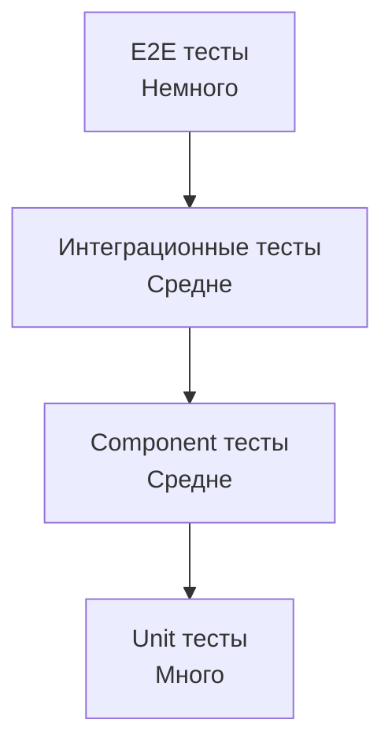

| Уровень | Описание | Инструменты |
|---------|----------|------------|
| Unit | Бизнес-логика без зависимостей | JUnit, Mockito |
| Component | Один сервис с моками зависимостей | Testcontainers, WireMock |
| Integration | Взаимодействие между сервисами | Testcontainers, Spring Cloud Contract |
| Contract | Проверка совместимости API | Pact, Spring Cloud Contract |
| E2E | Весь flow через все сервисы | Selenium, RestAssured |

**Consumer-Driven Contracts** (`Spring Cloud Contract`, `Pact`) -- потребитель определяет ожидания от API; провайдер проверяет, что контракт выполняется. Это предотвращает ломающие изменения. Подробнее -- в [интеграционном тестировании](../testing/integration-testing-interview.md).

> [!mcq]
> - [ ] Consumer-Driven Contracts означает, что провайдер API определяет схему и формат ответов; потребители должны подстраиваться под эту схему. | Это provider-driven, противоположность. ❌ ПОСЛЕДСТВИЕ: команда выбирает provider-first подход, потребители получают неудобный API, в их CI нет защиты от breaking changes — каждый релиз провайдера может сломать клиентов без предупреждения.
> - [x] Consumer-Driven Contracts означает, что потребитель определяет ожидания от API (request/response примеры); провайдер проверяет в своём CI, что его изменения не ломают контракт; реализации — Pact, Spring Cloud Contract. | ✓ ПРИМЕНЯТЬ: Pact Broker как центральный repo контрактов, в CI провайдера запускать `pact-verify` перед каждым деплоем, blocking deploy при несовместимости с любым опубликованным контрактом. Альтернатива — Spring Cloud Contract с stub publishing. 📋 ПРАВИЛО: "CDC = consumer пишет contract, provider verify; Pact Broker = source of truth". 🔗 См. Q29 (versioning), Q14 (API design), Q31 (deployment).
> - [ ] Consumer-Driven Contracts — форма E2E-тестирования, где все сервисы поднимаются вместе и прогоняются UI-сценарии от лица конечного потребителя. | CDC — на уровне contract, не E2E. ❌ ПОСЛЕДСТВИЕ: путаница CDC с E2E приводит к неэффективной test-стратегии: команда тратит на E2E-тесты часы CI, отказываясь от быстрых contract-тестов. Pyramid of testing: больше contract, меньше E2E.
> - [ ] Consumer-Driven Contracts требует, чтобы все потребители API согласовали единый контракт через голосование; конфликты разрешаются архитектором. | Голосования нет. ❌ ПОСЛЕДСТВИЕ: попытка установить bureaucratic process для CDC превращает его в bottleneck — команды боятся менять API, замедляется velocity. Каждый consumer независимо публикует свой contract в Pact Broker.

## Q37. Как реализовать distributed tracing в микросервисах?

**Distributed tracing** показывает путь запроса через цепочку микросервисов с таймингами каждого шага.

**Компоненты:**
- **TraceId** -- уникальный идентификатор запроса, одинаковый для всех сервисов
- **SpanId** -- идентификатор операции внутри одного сервиса
- **Parent SpanId** -- связь между родительским и дочерним span

**Реализация с `Micrometer Tracing` (замена Spring Cloud Sleuth):**

```java
// application.yml
management:
  tracing:
    sampling:
      probability: 1.0  // 100% трейсов (для prod ставить 0.1-0.5)

// build.gradle
dependencies {
    implementation 'io.micrometer:micrometer-tracing-bridge-otel'
    implementation 'io.opentelemetry:opentelemetry-exporter-zipkin'
}
```

`TraceId` автоматически пробрасывается между сервисами через HTTP-заголовки (`traceparent`) и Kafka-заголовки. Все логи помечаются `traceId` и `spanId` -- можно найти в `ELK` по одному `traceId`.

> [!mcq]
> - [ ] TraceId — уникальный идентификатор внутри одного сервиса, генерируется для каждой операции; SpanId — идентификатор запроса между сервисами. | Перевёрнутое описание. ❌ ПОСЛЕДСТВИЕ: разработчик логирует только TraceId считая его per-service, в Jaeger UI не может проследить запрос между сервисами — каждый сервис создаёт свой "TraceId", цепочка теряется.
> - [ ] TraceId генерируется Service Mesh-ом (Istio) автоматически и не должен попадать в код приложения; приложение работает с ним прозрачно. | Прозрачности нет. ❌ ПОСЛЕДСТВИЕ: разработчик не интегрирует OpenTelemetry в приложение, рассчитывая на Istio — но Istio видит только межсервисный трафик, не внутренние операции. Логи и трейсы не корелируются, post-mortem невозможен.
> - [x] TraceId — глобальный идентификатор запроса, одинаковый во всех сервисах; SpanId — идентификатор конкретной операции внутри сервиса; Parent SpanId связывает дочерний span с родительским; пробрасывается через W3C заголовок traceparent. | ✓ ПРИМЕНЯТЬ: OpenTelemetry SDK в каждом сервисе, MDC `traceId`/`spanId` в каждом логе, sampling 0.1-0.5 в prod (1.0 в dev), Jaeger/Tempo для UI. Critical traces tag-ируйте `sampled=true` (custom logic). 📋 ПРАВИЛО: "TraceId = sticky через цепочку; SpanId = per-operation; W3C traceparent = стандарт пропагации". 🔗 См. Q30 (3 pillars), Q31 (мониторинг), Q41 (OpenTelemetry+Jaeger setup).
> - [ ] TraceId — хэш от timestamp и IP клиента; совпадение двух одинаковых TraceId указывает на retry того же запроса. | TraceId — random 128-bit. ❌ ПОСЛЕДСТВИЕ: разработчик пишет инструменты "идентификации retry по TraceId" — на самом деле retry в разных tracing-libraries по-разному обрабатывает: некоторые продлевают span, другие создают новый trace. Полагаться нельзя.

## Q38. Как организовать деплой микросервисов (Blue-Green, Canary)?

| Стратегия | Описание | Риск |
|-----------|----------|------|
| **Rolling update** | Постепенная замена инстансов | Средний |
| **Blue-Green** | Два окружения; переключение трафика | Низкий |
| **Canary** | Часть трафика на новую версию | Низкий |
| **A/B testing** | Разные версии для разных пользователей | Низкий |

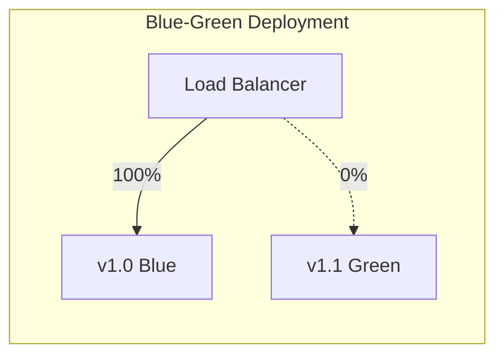

В `Kubernetes` `Rolling Update` -- стратегия по умолчанию. Для `Canary` используют `Istio VirtualService` или `Argo Rollouts` -- процент трафика на новую версию увеличивается постепенно. Подробнее -- в [стратегиях деплоя](../cicd/deployment-strategies-interview.md).

> [!mcq]
> - [ ] Blue-Green — стратегия, при которой новая версия постепенно заменяет старую на части подов (25%, 50%, 100%); это описание Canary. | Это Canary. ❌ ПОСЛЕДСТВИЕ: путаница терминов в дизайн-док приводит к неправильной реализации: команда настраивает "Blue-Green с постепенным ramp-up" в Argo Rollouts — на деле это canary, а истинный BG требует параллельной готовой Green env. Mismatch ожиданий и реальности.
> - [ ] Canary — стратегия, при которой развёрнуты два идентичных окружения (v1 и v2), трафик переключается 100% с одного на другое через load balancer. | Это Blue-Green. ❌ ПОСЛЕДСТВИЕ: команда внедряет BG (двойная инфраструктура — двойная стоимость) под названием "Canary" в финансовой отчётности — потом удивляются перерасходу cloud-бюджета.
> - [ ] Blue-Green и Canary решают одну и ту же задачу и фактически являются синонимами; разница только в названии в разных облачных провайдерах. | Разные паттерны. ❌ ПОСЛЕДСТВИЕ: непонимание trade-off приводит к неправильному выбору: BG для частых релизов = high cloud cost, Canary без metrics-based promotion = manual gating, замедляющий velocity.
> - [x] Blue-Green — два идентичных окружения одновременно развёрнуты (Blue=v1, Green=v2), трафик переключается целиком через LB; Canary — часть трафика (5-10%) направляется на новую версию для проверки, затем доля постепенно растёт. | ✓ ПРИМЕНЯТЬ: BG для критичных систем с быстрым rollback (LB switch ~secs), но с двойной инфраструктурой; Canary для постепенного снижения риска (Argo Rollouts с auto-promotion по metrics: error rate < 1%, latency p99 < SLA); A/B testing для feature flags и UX experiments. 📋 ПРАВИЛО: "BG = full-env switch (fast rollback, 2x cost); Canary = % ramp-up (auto-promote by metrics)". 🔗 См. Q31 (deployment), Q11 (Service Mesh), Q23 (resilience).

## Q39. (!) Что такое закон Конвея (Conway's Law) и как он влияет на микросервисы?

**Закон Конвея** (Conway's Law, 1968):

> "Организации, проектирующие системы, вынуждены воспроизводить в них свою собственную коммуникационную структуру."

Если команды организованы по техническому принципу (frontend, backend, DBA), то и архитектура системы воспроизводит эту структуру — монолит с четырьмя слоями. Если команды организованы по доменным продуктам, архитектура тяготеет к микросервисам.

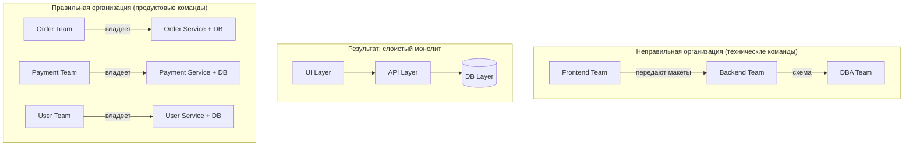

**"Обратный закон Конвея" (Inverse Conway Maneuver):**

Намеренно реструктурируйте команды так, чтобы их коммуникационная структура соответствовала желаемой архитектуре системы. Создайте кросс-функциональные продуктовые команды ДО разбиения монолита.

**Практические следствия:**
- Один `Bounded Context` — одна команда (Team Topologies: Stream-Aligned Team)
- Размер сервиса определяется "правилом двух пицц": команда, умещающаяся за одним столом с двумя пиццами
- Слишком много согласований между командами — сигнал, что границы сервисов проведены неверно

> [!mcq]
> - [x] Inverse Conway Maneuver — намеренная реструктуризация команд под желаемую архитектуру: сначала создать кросс-функциональные продуктовые команды, затем разбивать монолит; иначе архитектура повторит старую оргструктуру. | ✓ ПРИМЕНЯТЬ: при миграции монолит → microservices сначала reorganize teams (Stream-Aligned, Platform, Enabling по Team Topologies), потом извлекать сервисы; "two-pizza teams" Amazon (5-10 человек), один Bounded Context на команду. 📋 ПРАВИЛО: "сначала organizational change, потом technical split; иначе distributed monolith". 🔗 См. Q9 (правильное определение микросервиса), Q40 (Data Ownership), Q42 (inter-service comm).
> - [ ] Inverse Conway Maneuver — использование микросервисов для принуждения команд работать независимо, даже если они технически связаны; это создаёт healthy friction. | Принуждение = distributed monolith. ❌ ПОСЛЕДСТВИЕ: команда дробит монолит на 20 сервисов без реструктуризации — теперь каждый release требует согласования между 5 командами, velocity упала в 3 раза. Реальный кейс из e-commerce компании, потративший 18 месяцев на rollback к coarse-grained сервисам.
> - [ ] Inverse Conway Maneuver — использование shared tooling (единый CI/CD, единый framework) чтобы команды работали одинаково, несмотря на разную структуру. | Tooling ≠ Conway. ❌ ПОСЛЕДСТВИЕ: команда инвестирует в platform team и shared tooling, не меняя структуру — архитектура остаётся monolith. Tooling помогает, но не решает корневую причину coupling.
> - [ ] Inverse Conway Maneuver — паттерн, при котором архитектура определяет оргструктуру через автоматическую реорганизацию сотрудников; используется в больших компаниях (Amazon). | Никакой автоматики нет. ❌ ПОСЛЕДСТВИЕ: ожидание "оно само" приводит к bottom-up инициативам без поддержки руководства, которые упираются в политические сложности. Inverse Conway требует executive sponsorship.

## Q40. (!) Что такое Data Ownership в микросервисах и какие антипаттерны нарушают его?

**Data Ownership** — принцип, согласно которому каждый микросервис является **единственным владельцем** своих данных. Другие сервисы обращаются к данным только через API сервиса-владельца, никогда — напрямую к его базе данных.

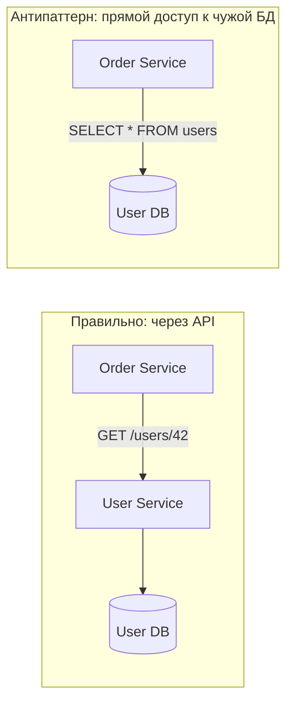

**Антипаттерны, нарушающие Data Ownership:**

| Антипаттерн | Описание | Решение |
|-------------|----------|---------|
| **Shared Database** | Несколько сервисов пишут в одну схему | Database per Service |
| **Direct DB Access** | Сервис A делает JOIN к таблицам сервиса B | API call или event-driven |
| **God Service** | Один сервис хранит данные для всех | Domain decomposition |
| **Distributed Monolith** | Сервисы раздельны, но деплоятся вместе из-за зависимостей данных | Разорвать зависимости через события |

**Стратегии организации данных:**

```
Вариант 1: API Composition
  Order Service нуждается в данных пользователя →
  вызывает User Service API при каждом запросе

Вариант 2: Event-driven denormalization
  User Service публикует UserUpdatedEvent →
  Order Service хранит копию нужных полей локально
  (eventual consistency — допустима задержка синхронизации)

Вариант 3: CQRS Read Model
  Агрегированные данные из нескольких сервисов
  собираются в отдельную read-модель
```

**Золотое правило:** если для выполнения запроса нужны данные из 3+ сервисов — пересмотрите границы сервисов или используйте `API Composition` на уровне `API Gateway`.

> [!mcq]
> - [ ] Shared Database — это приемлемый компромисс для микросервисов, если все сервисы используют отдельные схемы и придерживаются соглашения не читать чужие таблицы. | "Соглашение не читать" не работает. ❌ ПОСЛЕДСТВИЕ: реальный кейс из крупного российского банка — schema-разделение через PostgreSQL schemas с "соглашением", через 6 месяцев аналитики начали делать JOIN cross-schema, через год миграция таблицы блокирует 3 команды на 2 недели координации.
> - [x] Shared Database (несколько сервисов пишут в одну БД/схему) — ключевой антипаттерн, нарушающий data ownership: изменение схемы требует координации всех сервисов, что блокирует независимый деплой. | ✓ ПРИМЕНЯТЬ: выявление shared DB на code review (search для cross-schema JOINs), миграционный план — выделять private schema для каждого сервиса с публичным API; для отчётности — отдельный data warehouse через CDC. 📋 ПРАВИЛО: "shared DB = distributed monolith; private DB + API/events = true microservices". 🔗 См. Q9 (микросервис определение), Q34 (Database per Service), Q17 (Outbox для CDC).
> - [ ] Shared Database является антипаттерном только если используется разными командами; одна команда может безопасно разделять БД между несколькими своими сервисами. | Coupling не зависит от ownership. ❌ ПОСЛЕДСТВИЕ: одна команда выбирает shared DB между своими сервисами — через 2 года команда выросла в 3, разделилась, а sharing DB остался. Теперь это уже cross-team coupling, который никто не запланировал.
> - [ ] Shared Database — не антипаттерн, а рекомендуемый паттерн для микросервисов на ранней стадии, чтобы упростить транзакционную согласованность через ACID. | Ловушка ACID. ❌ ПОСЛЕДСТВИЕ: команда начинает с shared DB "для упрощения", через год обнаруживает невозможность независимого деплоя, потом тратит 6 месяцев на data extraction project. Лучше начать с правильной структуры с самого начала.

## Q41. (!) Как реализовать distributed tracing с OpenTelemetry и Jaeger?

**Distributed tracing** — механизм отслеживания пути запроса через цепочку микросервисов. Каждый запрос получает уникальный `trace ID`; каждая операция внутри — `span ID`.

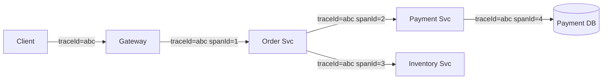

**Настройка в Spring Boot 3+ с Micrometer Tracing + OpenTelemetry:**

```xml
<!-- pom.xml -->
<dependency>
    <groupId>io.micrometer</groupId>
    <artifactId>micrometer-tracing-bridge-otel</artifactId>
</dependency>
<dependency>
    <groupId>io.opentelemetry.instrumentation</groupId>
    <artifactId>opentelemetry-spring-boot-starter</artifactId>
</dependency>
```

```yaml
# application.yml
management:
  tracing:
    sampling:
      probability: 1.0  # 100% в dev; 0.1 в prod
otel:
  exporter:
    otlp:
      endpoint: http://jaeger:4318  # OTLP HTTP endpoint
  resource:
    attributes:
      service.name: order-service
```

**Propagation заголовков между сервисами (W3C TraceContext):**

```
traceparent: 00-4bf92f3577b34da6a3ce929d0e0e4736-00f067aa0ba902b7-01
             ^^  ^^^^^^^^^^^^^^^^^^^^^^^^^^^^^^^^ ^^^^^^^^^^^^^^^^ ^^
             ver  trace-id (128-bit)              span-id (64-bit) flags
```

`RestTemplate`, `WebClient` и `OpenFeign` автоматически пропагируют заголовки при наличии `micrometer-tracing` в classpath.

**Custom span для бизнес-операций:**

```java
@Service
public class OrderService {
    private final Tracer tracer;

    public Order processOrder(CreateOrderRequest request) {
        Span span = tracer.nextSpan()
            .name("order.process")
            .tag("order.customerId", request.customerId())
            .start();
        try (Tracer.SpanInScope ws = tracer.withSpan(span)) {
            return doProcessOrder(request);
        } finally {
            span.end();
        }
    }
}
```

**Jaeger UI:** позволяет визуализировать весь trace, найти медленные span-ы и понять, какой сервис является bottleneck.

> [!mcq]
> - [ ] Формат заголовка traceparent в W3C TraceContext включает только TraceId; SpanId передаётся через отдельный заголовок tracestate. | tracestate — для vendor extensions. ❌ ПОСЛЕДСТВИЕ: разработчик ищет SpanId в `tracestate` header'е — в проде он там пустой; SpanId уже в `traceparent`. Tracing не работает корректно, JaegerUI показывает "orphan spans".
> - [ ] Формат заголовка traceparent включает только timestamp и IP клиента; SpanId генерируется receiving service автоматически. | traceparent — фиксированный формат. ❌ ПОСЛЕДСТВИЕ: ложные предположения о структуре приводят к попыткам "построить TraceId из IP" — реальный TraceId 128-bit random, никак не связан с IP. Дебаг trace-проблем по IP бесполезен.
> - [x] Формат заголовка traceparent: `00-<trace-id>-<span-id>-<flags>`; содержит версию протокола, 128-битный TraceId, 64-битный SpanId и флаги (sampling); стандартизирован W3C для interoperability между tracing-системами. | ✓ ПРИМЕНЯТЬ: OpenTelemetry автоматически инжектит/extracts traceparent в HTTP headers, Kafka headers, gRPC metadata через instrumentation library; sampling-flag (`01`/`00`) позволяет downstream-сервисам делать sampled-aware decisions. Стандарт W3C обеспечивает совместимость Jaeger ↔ Zipkin ↔ Datadog. 📋 ПРАВИЛО: "traceparent = `version-traceId-spanId-flags`; W3C standard, vendor-neutral". 🔗 См. Q37 (distributed tracing базово), Q30 (3 pillars), Q31 (мониторинг).
> - [ ] Формат заголовка traceparent проприетарный для OpenTelemetry и несовместим с Jaeger/Zipkin; для Jaeger нужен отдельный заголовок uber-trace-id. | W3C — стандарт. ❌ ПОСЛЕДСТВИЕ: команда дублирует propagation headers (traceparent + uber-trace-id + b3) "для совместимости", получает confusion и performance hit от двойного парсинга. Современный Jaeger 2.0+ нативно поддерживает traceparent.

## Q42. Как организовать inter-service communication: Feign vs WebClient vs gRPC?

Выбор протокола межсервисного взаимодействия определяется требованиями к производительности, удобству разработки и характеру взаимодействия.

| Критерий | Feign (REST) | WebClient (REST) | gRPC |
|----------|-------------|-----------------|------|
| **Парадигма** | Декларативный REST | Реактивный REST | RPC с protobuf |
| **Блокирующий?** | Да (по умолчанию) | Нет (Reactor) | Нет (async) |
| **Streaming** | Нет | SSE/WebSocket | Нативный (4 режима) |
| **Типизация** | Слабая (JSON) | Слабая (JSON) | Строгая (proto) |
| **Производительность** | Средняя | Высокая | Максимальная |
| **Отладка** | Простая (curl) | Средняя | Сложнее (protobuf) |
| **Применение** | CRUD-сервисы | Высоконагруженные сервисы | Межсервисный трафик |

**OpenFeign — декларативный REST-клиент:**

```java
@FeignClient(name = "user-service", fallbackFactory = UserClientFallback.class)
public interface UserClient {
    @GetMapping("/users/{id}")
    UserDto getUser(@PathVariable Long id);
}
```

**WebClient — реактивный клиент (Spring WebFlux):**

```java
@Service
public class UserClientService {
    private final WebClient webClient;

    public Mono<UserDto> getUser(Long id) {
        return webClient.get()
            .uri("/users/{id}", id)
            .retrieve()
            .onStatus(HttpStatus::is4xxClientError,
                r -> Mono.error(new UserNotFoundException(id)))
            .bodyToMono(UserDto.class)
            .timeout(Duration.ofSeconds(2))
            .retryWhen(Retry.backoff(3, Duration.ofMillis(100)));
    }
}
```

> [!mcq]
> - [ ] OpenFeign рекомендуется для высоконагруженных реактивных сервисов из-за нативной поддержки backpressure и non-blocking I/O. | OpenFeign — blocking. ❌ ПОСЛЕДСТВИЕ: команда выбирает Feign для high-throughput gateway (10k+ RPS), упирается в thread-pool exhaustion при медленном downstream. Pivot на WebClient/Reactor через 6 месяцев работы стоит реализации pipeline по Mono/Flux везде.
> - [ ] gRPC рекомендуется для всех межсервисных вызовов в Spring Boot-приложении, так как он всегда быстрее REST и прощё в отладке. | gRPC отладка сложнее. ❌ ПОСЛЕДСТВИЕ: команда мигрирует все CRUD на gRPC ради perf, теряет developer velocity (нет простого `curl`, нет `swagger UI`), perf gain в CRUD незначителен (overhead JSON parsing составляет <5% latency для DB-bound операций).
> - [ ] WebClient — единственный способ вызова внешних REST API в Spring Boot 3+, так как RestTemplate удалён из фреймворка. | RestTemplate в maintenance mode, не удалён. ❌ ПОСЛЕДСТВИЕ: команда тратит спринт на rewriting RestTemplate → WebClient в legacy-сервисе с blocking стеком — гибрид blocking-thread + reactive WebClient вызывает thread pinning, performance падает. RestTemplate был ОК для blocking архитектуры.
> - [x] OpenFeign — декларативный REST-клиент, подходит для CRUD-сервисов (простота); WebClient — реактивный (Reactor), для высоконагруженных non-blocking сервисов; gRPC — максимальная производительность и строгая типизация через protobuf, для latency-critical путей. | ✓ ПРИМЕНЯТЬ: OpenFeign для internal CRUD-API (developer velocity), WebClient для gateway/aggregator с reactive pipeline, gRPC для streaming или sub-millisecond requirements (real-time bidding, internal data plane). Combine: external HTTP API + internal gRPC. 📋 ПРАВИЛО: "Feign = simple CRUD, WebClient = reactive scale, gRPC = latency-critical + streaming". 🔗 См. Q11 (Service Mesh), Q23 (resilience for HTTP), Q41 (tracing).

---

## See also

- [Event-Driven паттерны](event-driven-patterns-interview.md) — EDA, Saga, Outbox и асинхронное взаимодействие в микросервисах
- [Spring Cloud](../frameworks/spring/spring-cloud-interview.md) — Service Discovery, Config Server, Circuit Breaker в Spring Cloud
- [Распределённые системы](distributed-systems-interview.md) — CAP, согласованность, репликация и партиционирование
- [CAP-теорема](cap-theorem-interview.md) — выбор CP/AP для каждого микросервиса
- [Apache Kafka](../messaging/kafka-interview.md) — брокер сообщений для асинхронной коммуникации
- [Kubernetes](../devops/kubernetes-interview.md) — оркестрация и деплой микросервисов
- [Паттерны отказоустойчивости](resilience-patterns-interview.md) — Circuit Breaker, Retry, Bulkhead между сервисами
- [Паттерны масштабируемости](scalability-patterns-interview.md) — горизонтальное масштабирование микросервисов

**Рекомендация:** для внутренних синхронных вызовов — `OpenFeign` (простота); для высоконагруженных реактивных сервисов — `WebClient`; для критичного по latency межсервисного взаимодействия — `gRPC` (см. [вопросы по gRPC](../api/grpc-interview.md)).

- [API Gateway](api-gateway-interview.md)
- [BFF Pattern](bff-pattern-interview.md)
- [Стратегии кэширования](caching-strategies-interview.md)
- [CAP-теорема](cap-theorem-interview.md)
- [Clean Architecture](clean-architecture-interview.md)
- [Паттерны согласованности](consistency-patterns-interview.md)
- [Шпаргалка: Микросервисная архитектура](../../architecture/software-architecture/microservices.md) — теория
