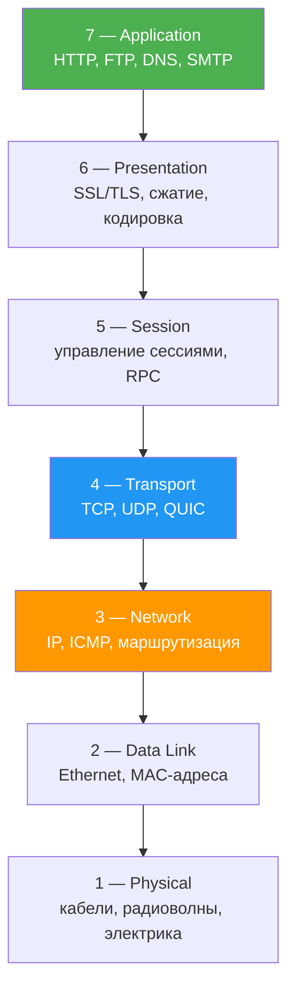
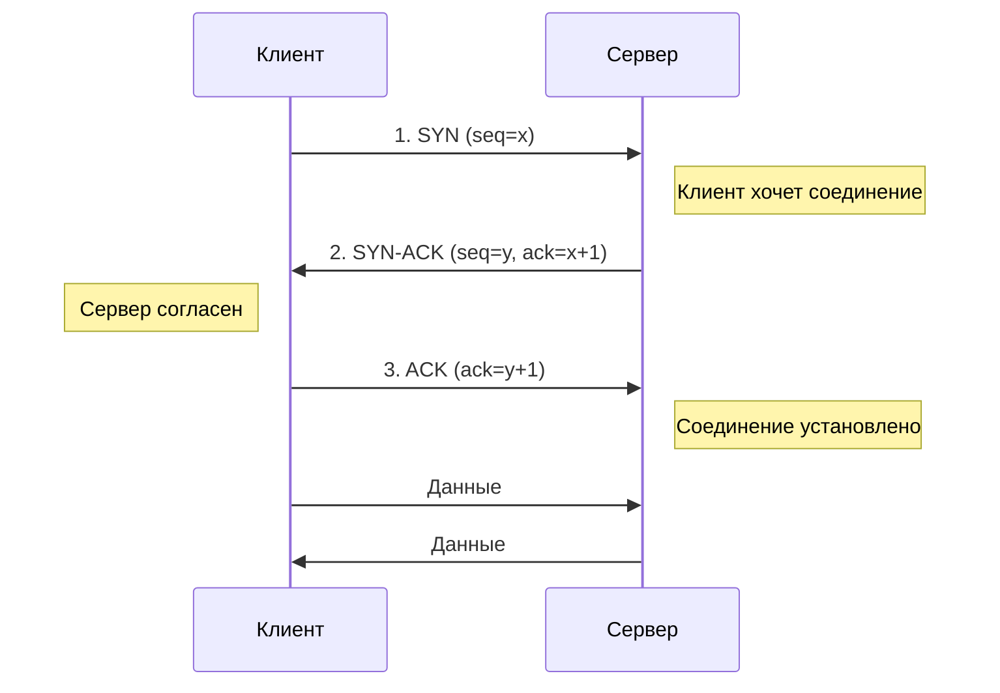
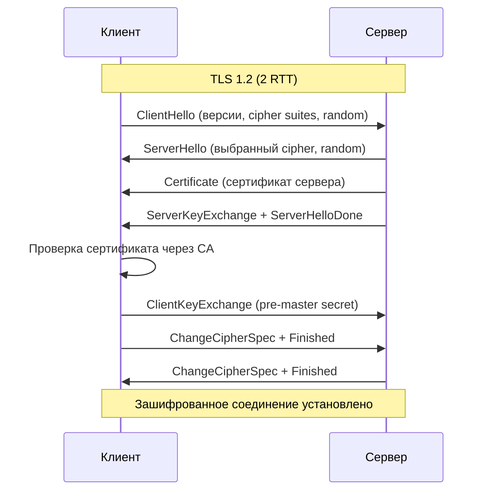
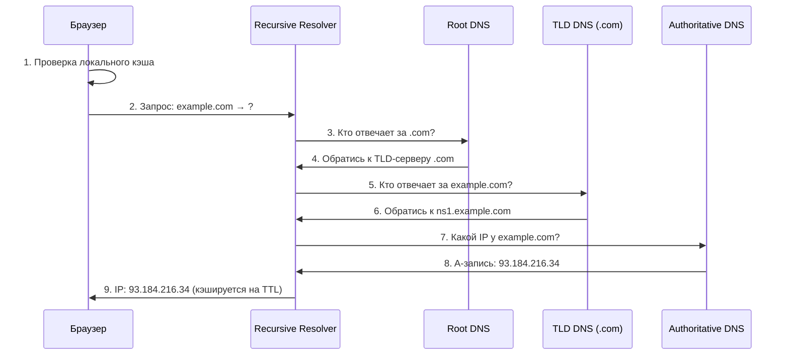
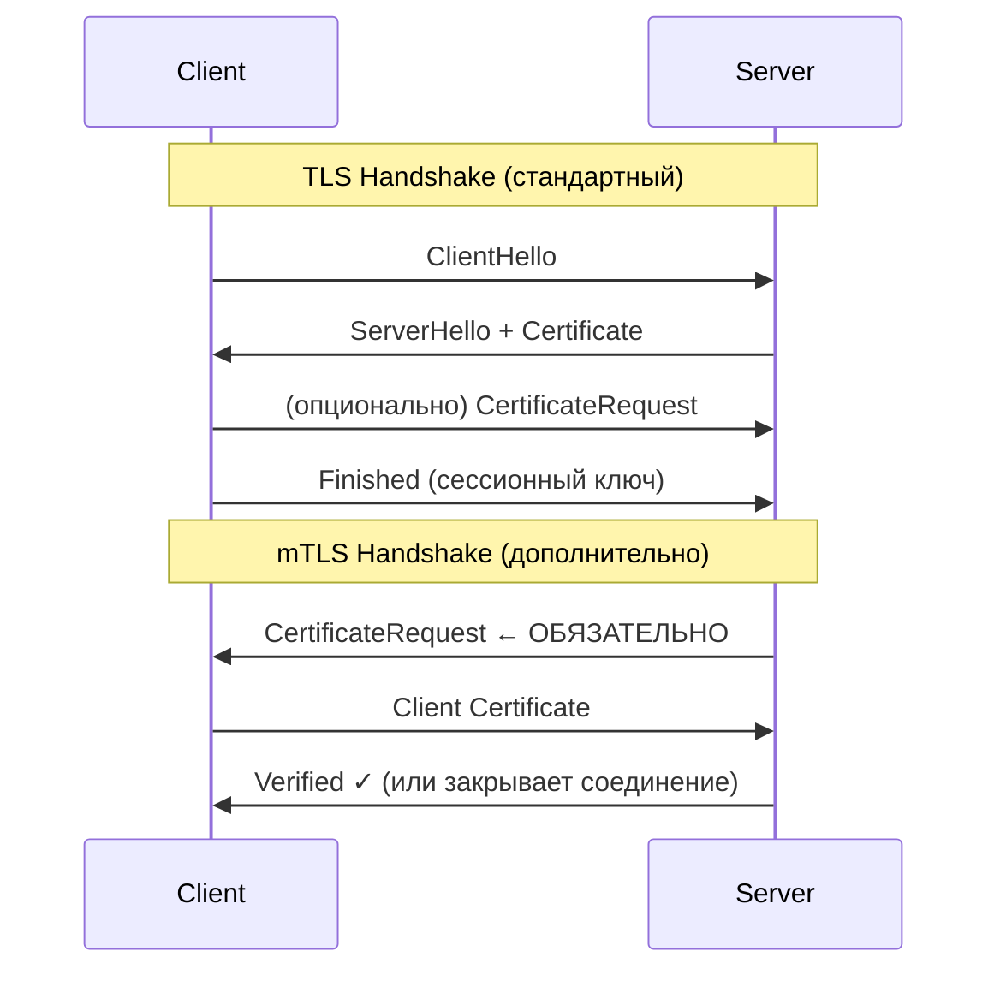
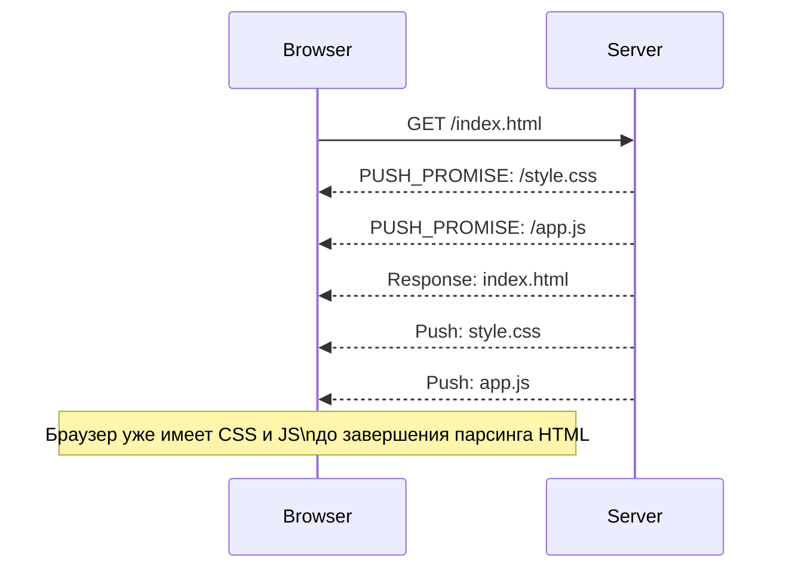
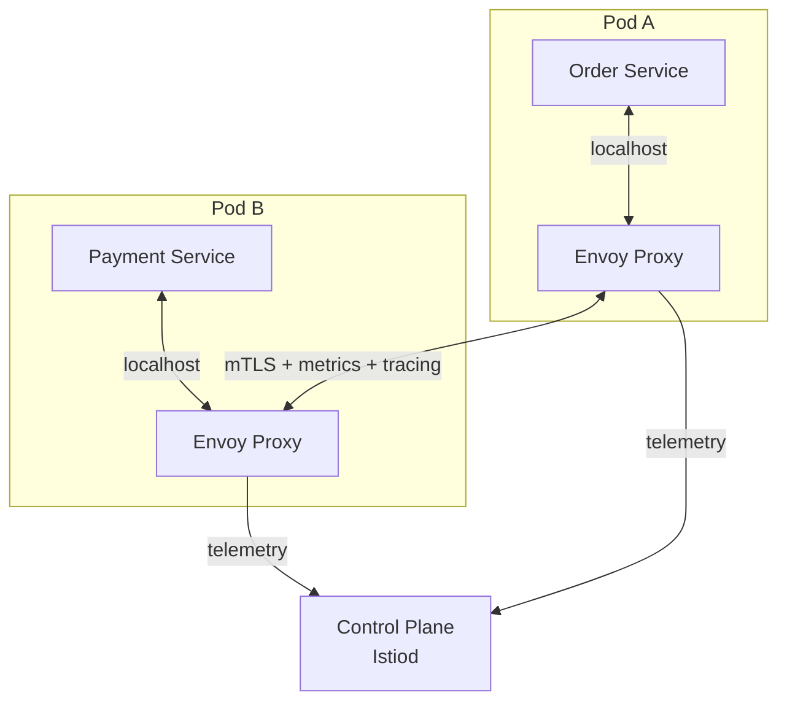

# Вопросы на собеседовании: `Сетевые протоколы и сети`

Ответы по сетевым протоколам для backend-разработчиков: модель `OSI`, стек `TCP/IP`, `TCP` vs `UDP`, эволюция `HTTP`, `TLS`, `DNS`, `WebSocket`, `SSE`, балансировка на уровнях L4/L7, `CDN`, `reverse proxy`, `NAT`, `CORS`, основы сокетов в Java.

**Сетевые протоколы** — фундамент любого backend-приложения. На собеседованиях ожидают, что разработчик понимает, как данные передаются от клиента к серверу, какие гарантии предоставляет каждый уровень стека, чем отличаются протоколы транспортного и прикладного уровней, и как инфраструктурные компоненты (`CDN`, `reverse proxy`, `load balancer`) влияют на архитектуру системы.

## Полезные ссылки

### Официальная документация

- [RFC 9293 — TCP](https://www.rfc-editor.org/rfc/rfc9293) — актуальная спецификация `TCP`
- [RFC 9000 — QUIC](https://www.rfc-editor.org/rfc/rfc9000) — транспортный протокол `QUIC`
- [RFC 9114 — HTTP/3](https://www.rfc-editor.org/rfc/rfc9114) — спецификация `HTTP/3`
- [RFC 7540 — HTTP/2](https://www.rfc-editor.org/rfc/rfc7540) — спецификация `HTTP/2`
- [RFC 8446 — TLS 1.3](https://www.rfc-editor.org/rfc/rfc8446) — спецификация `TLS 1.3`
- [What is DNS? | Cloudflare](https://www.cloudflare.com/learning/dns/what-is-dns/) — наглядное объяснение `DNS`
- [A Guide to Java Sockets (Baeldung)](https://www.baeldung.com/a-guide-to-java-sockets) — сокеты в Java
- [Exploring the New HTTP Client in Java (Baeldung)](https://www.baeldung.com/java-9-http-client) — `HttpClient` в Java 11+
- [Connection Timeout vs. Read Timeout for Java Sockets (Baeldung)](https://www.baeldung.com/java-socket-connection-read-timeout) — таймауты соединений в Java
- [Java HttpClient Connection Management (Baeldung)](https://www.baeldung.com/java-httpclient-connection-management) — connection pooling и keepalive в Java 11+
- [Set a Timeout in Spring WebClient (Baeldung)](https://www.baeldung.com/spring-webflux-timeout) — настройка таймаутов в Spring WebClient

## Содержание

- [Полезные ссылки](#полезные-ссылки)
- [See also](#see-also)

**Модель OSI и стек TCP/IP**
- [Q1. (!) Что такое модель OSI и зачем она нужна?](#q1--что-такое-модель-osi-и-зачем-она-нужна)
- [Q2. Чем стек TCP/IP отличается от модели OSI?](#q2-чем-стек-tcpip-отличается-от-модели-osi)
- [Q3. Какие протоколы работают на каждом уровне стека TCP/IP?](#q3-какие-протоколы-работают-на-каждом-уровне-стека-tcpip)

**TCP и UDP**
- [Q4. (!) В чём разница между TCP и UDP?](#q4--в-чём-разница-между-tcp-и-udp)
- [Q5. (!) Как работает TCP three-way handshake?](#q5--как-работает-tcp-three-way-handshake)
- [Q6. Что такое TCP congestion control и какие алгоритмы используются?](#q6-что-такое-tcp-congestion-control-и-какие-алгоритмы-используются)
- [Q7. Что такое TCP keep-alive и зачем он нужен?](#q7-что-такое-tcp-keep-alive-и-зачем-он-нужен)
- [Q8. Что такое TCP window size и flow control?](#q8-что-такое-tcp-window-size-и-flow-control)

**HTTP: эволюция протокола**
- [Q9. (!) Чем отличаются HTTP/1.1, HTTP/2 и HTTP/3?](#q9--чем-отличаются-http11-http2-и-http3)
- [Q10. Что такое HTTP keep-alive и connection pooling?](#q10-что-такое-http-keep-alive-и-connection-pooling)
- [Q11. Что такое head-of-line blocking и как HTTP/2 и HTTP/3 решают эту проблему?](#q11-что-такое-head-of-line-blocking-и-как-http2-и-http3-решают-эту-проблему)
- [Q12. Что такое QUIC и почему HTTP/3 использует его вместо TCP?](#q12-что-такое-quic-и-почему-http3-использует-его-вместо-tcp)

**HTTPS и TLS**
- [Q13. (!) Как работает TLS handshake?](#q13--как-работает-tls-handshake)
- [Q14. Чем отличается TLS 1.2 от TLS 1.3?](#q14-чем-отличается-tls-12-от-tls-13)
- [Q15. Что такое сертификат X.509 и цепочка доверия?](#q15-что-такое-сертификат-x509-и-цепочка-доверия)

**DNS**
- [Q16. (!) Как работает DNS-резолвинг?](#q16--как-работает-dns-резолвинг)
- [Q17. Какие типы DNS-записей существуют и для чего они используются?](#q17-какие-типы-dns-записей-существуют-и-для-чего-они-используются)
- [Q18. Что такое DNS TTL и как он влияет на кэширование?](#q18-что-такое-dns-ttl-и-как-он-влияет-на-кэширование)

**WebSocket и SSE**
- [Q19. (!) Что такое WebSocket и чем он отличается от HTTP?](#q19--что-такое-websocket-и-чем-он-отличается-от-http)
- [Q20. Что такое Server-Sent Events (SSE) и когда их использовать вместо WebSocket?](#q20-что-такое-server-sent-events-sse-и-когда-их-использовать-вместо-websocket)

**Инфраструктура: балансировка, CDN, proxy**
- [Q21. (!) В чём разница между балансировкой на L4 и L7?](#q21--в-чём-разница-между-балансировкой-на-l4-и-l7)
- [Q22. Что такое reverse proxy и зачем он нужен?](#q22-что-такое-reverse-proxy-и-зачем-он-нужен)
- [Q23. Что такое CDN и как она работает?](#q23-что-такое-cdn-и-как-она-работает)
- [Q24. Что такое NAT и какие виды NAT существуют?](#q24-что-такое-nat-и-какие-виды-nat-существуют)

**CORS и безопасность сетевого уровня**
- [Q25. (!) Что такое CORS и зачем он нужен?](#q25--что-такое-cors-и-зачем-он-нужен)
- [Q26. Что такое preflight-запрос в CORS?](#q26-что-такое-preflight-запрос-в-cors)

**IP-адресация и подсети**
- [Q27. Что такое IP-адрес и чем отличаются IPv4 и IPv6?](#q27-что-такое-ip-адрес-и-чем-отличаются-ipv4-и-ipv6)
- [Q28. Что такое подсети (subnets) и маска подсети?](#q28-что-такое-подсети-subnets-и-маска-подсети)

**Сокеты и сетевое программирование в Java**
- [Q29. (!) Как работают сокеты в Java?](#q29--как-работают-сокеты-в-java)
- [Q30. Как использовать Java HttpClient для HTTP-запросов?](#q30-как-использовать-java-httpclient-для-http-запросов)
- [Q31. Что такое connection pooling на уровне HTTP-клиента и зачем он нужен?](#q31-что-такое-connection-pooling-на-уровне-http-клиента-и-зачем-он-нужен)

**Дополнительные темы**
- [Q32. Что происходит, когда вы вводите URL в браузер?](#q32-что-происходит-когда-вы-вводите-url-в-браузер)
- [Q33. (!) Какие основные метрики сетевой производительности должен знать backend-разработчик?](#q33--какие-основные-метрики-сетевой-производительности-должен-знать-backend-разработчик)

**Продвинутые темы**
- [Q34. (!) Что такое mTLS и как он отличается от TLS?](#q34--что-такое-mtls-и-как-он-отличается-от-tls)
- [Q35. Как работает HTTP/2 Server Push и почему от него отказываются?](#q35-как-работает-http2-server-push-и-почему-от-него-отказываются)
- [Q36. Что такое Service Mesh и как Istio использует mTLS?](#q36-что-такое-service-mesh-и-как-istio-использует-mtls)

**Kubernetes и облачные сети**
- [Q37. DNS в Kubernetes — CoreDNS, service discovery, headless services](#q37-dns-в-kubernetes--coredns-service-discovery-headless-services)
- [Q38. Network Policies в Kubernetes — Ingress/Egress правила](#q38-network-policies-в-kubernetes--ingressegress-правила)
- [Q39. NAT и SNAT в облачных окружениях](#q39-nat-и-snat-в-облачных-окружениях)

**Современные технологии**
- [Q40. Что такое eBPF и как он применяется в networking?](#q40-что-такое-ebpf-и-как-он-применяется-в-networking)
- [Q41. Certificate Pinning — что это и зачем нужен?](#q41-certificate-pinning--что-это-и-зачем-нужен)

**TCP vs UDP: практика**
- [Q42. TCP vs UDP — когда что выбирать для реальных сервисов?](#q42-tcp-vs-udp--когда-что-выбирать-для-реальных-сервисов)
- [Q43. Istio vs Linkerd — сравнение Service Mesh решений](#q43-istio-vs-linkerd--сравнение-service-mesh-решений)

---

## Q1. (!) Что такое модель OSI и зачем она нужна?

**Модель OSI** (Open Systems Interconnection) — эталонная модель, разделяющая сетевое взаимодействие на 7 уровней. Каждый уровень решает свою задачу и предоставляет интерфейс для уровня выше.



**Зачем нужна:**
- **Абстракция** — разработчик HTTP-сервиса не думает об электрических сигналах
- **Стандартизация** — оборудование разных вендоров может взаимодействовать
- **Диагностика** — при проблемах можно изолировать уровень: «проблема на L3 (маршрутизация) или на L7 (приложение)?»

> На собеседовании достаточно знать 4-уровневую модель `TCP/IP` и понимать, на каком уровне работает каждый протокол.

---


> [!mcq]
> - [ ] `OSI` — это конкретный сетевой протокол, который заменил `TCP/IP` в современных сетях | Путаница «модель vs протокол». `OSI` — эталонная модель, а не протокол. ❌ ПОСЛЕДСТВИЕ: на собеседовании middle путает уровни и протоколы, отказ на System Design.
> - [ ] `OSI` имеет 4 уровня и полностью совпадает со стеком `TCP/IP` | Уровней в `OSI` ровно 7, в `TCP/IP` — 4 (`Application`, `Transport`, `Internet`, `Network Access`). ❌ ПОСЛЕДСТВИЕ: при диагностике инцидента инженер не различает L3 (`IP`-маршрутизация) и L7 (`HTTP`-логика), теряет 30+ минут на поиск.
> - [x] `OSI` — эталонная 7-уровневая модель для абстракции и стандартизации сетевого взаимодействия | Каждый уровень решает свою задачу и предоставляет интерфейс уровню выше; используется для диагностики и обучения. ✓ ПРИМЕНЯТЬ: Cisco/Juniper-документация и `Wireshark` помечают пакеты по уровням `OSI` для классификации трафика. 📋 ПРАВИЛО: «`OSI` — карта, `TCP/IP` — территория». 🔗 См. Q2, Q3.
> - [ ] `OSI` — это `OSI Linux Stack`, набор драйверов сетевых карт | Подмена термина. `OSI` — Open Systems Interconnection, модель ISO/IEC 7498-1, не драйвер. ❌ ПОСЛЕДСТВИЕ: кандидат не отвечает на вопросы про L4/L7 балансировку, проваливает архитектурное интервью.

## Q2. Чем стек TCP/IP отличается от модели OSI?

Модель `TCP/IP` — практическая модель, используемая в реальных сетях. Она объединяет некоторые уровни `OSI`:

| TCP/IP (4 уровня) | OSI (7 уровней) | Примеры протоколов |
|--------------------|------------------|--------------------|
| Application | Application + Presentation + Session | `HTTP`, `DNS`, `FTP`, `SMTP` |
| Transport | Transport | `TCP`, `UDP`, `QUIC` |
| Internet | Network | `IP`, `ICMP`, `ARP` |
| Network Access | Data Link + Physical | `Ethernet`, `Wi-Fi` |

**Ключевое отличие:** `OSI` — теоретическая модель «как должно быть», `TCP/IP` — практическая модель «как есть». В реальном интернете используется `TCP/IP`.

---


> [!mcq]
> - [ ] `TCP/IP` имеет 7 уровней, как и `OSI`, но с другими названиями | Уровней 4. Объединены `Application+Presentation+Session` → `Application` и `Data Link+Physical` → `Network Access`. ❌ ПОСЛЕДСТВИЕ: документация архитектора содержит неверный layering, ревью QA отклоняет дизайн.
> - [ ] `TCP/IP` — теоретическая модель, а `OSI` — реальный стек интернета | Перепутаны местами. `TCP/IP` — практическая модель реального интернета (RFC 1122). ❌ ПОСЛЕДСТВИЕ: junior отвечает на собесе обратное и проваливает первый же сетевой вопрос.
> - [x] `TCP/IP` — практическая 4-уровневая модель: `Application`, `Transport`, `Internet`, `Network Access` | Объединяет верхние уровни `OSI` в `Application` и нижние в `Network Access`. Используется в реальном интернете. ✓ ПРИМЕНЯТЬ: RFC 1122 и весь Linux-сетевой стек построены на 4-уровневой модели `TCP/IP`. 📋 ПРАВИЛО: «`OSI` — учебник, `TCP/IP` — production». 🔗 См. Q1, Q3.
> - [ ] В `TCP/IP` нет уровня `Transport`, его заменяет `Internet Layer` | `TCP` и `UDP` живут именно на `Transport Layer`, а `Internet Layer` — это `IP`-маршрутизация. ❌ ПОСЛЕДСТВИЕ: разработчик не понимает, на каком уровне ставить retry — на `TCP` или `HTTP`, дублирует логику.

## Q3. Какие протоколы работают на каждом уровне стека TCP/IP?

| Уровень | Протоколы | Назначение |
|---------|-----------|------------|
| Application | `HTTP/1.1`, `HTTP/2`, `HTTP/3`, `DNS`, `FTP`, `SMTP`, `SSH`, `WebSocket` | Логика приложений и представление данных |
| Transport | `TCP`, `UDP`, `QUIC` | Доставка данных между процессами, управление потоком |
| Internet | `IPv4`, `IPv6`, `ICMP`, `IGMP` | Маршрутизация пакетов между хостами |
| Network Access | `Ethernet`, `Wi-Fi (802.11)`, `ARP` | Передача фреймов в локальной сети |

Важно понимать **инкапсуляцию**: данные приложения заворачиваются в `TCP`-сегмент, тот — в `IP`-пакет, а тот — в `Ethernet`-фрейм. На каждом уровне добавляется свой заголовок.

---


> [!mcq]
> - [ ] `HTTP` живёт на `Transport`, `TCP` — на `Application` | Уровни перепутаны. `HTTP` — `Application`, `TCP` — `Transport`. ❌ ПОСЛЕДСТВИЕ: на собесе путают, где applies retry/timeout, отказ от архитекторской позиции.
> - [ ] `Ethernet` и `Wi-Fi` — это `Internet Layer` | Это `Network Access` (L2 в `OSI`). `Internet Layer` — `IP`/`ICMP`/`ARP`. ❌ ПОСЛЕДСТВИЕ: при настройке `iptables` инженер путает MAC-фильтрацию с IP-фильтрацией, открывает сеть наружу.
> - [ ] `DNS` работает на `Transport Layer` поверх `TCP` | `DNS` — `Application Layer`, использует `UDP` (короткие запросы) или `TCP` (zone transfer, ответы > 512 байт). ❌ ПОСЛЕДСТВИЕ: при отладке резолвинга разработчик ищет проблему на L4 вместо L7, тратит часы.
> - [x] `Application` (`HTTP`/`DNS`/`SMTP`), `Transport` (`TCP`/`UDP`/`QUIC`), `Internet` (`IP`/`ICMP`), `Network Access` (`Ethernet`/`Wi-Fi`) | Каждый уровень добавляет свой заголовок при инкапсуляции; данные оборачиваются `TCP` → `IP` → `Ethernet`. ✓ ПРИМЕНЯТЬ: `tcpdump`/`Wireshark` отображают именно эти уровни при разборе пакетов в production-диагностике. 📋 ПРАВИЛО: «4 уровня: App-Transport-Internet-Access». 🔗 См. Q1, Q2.

## Q4. (!) В чём разница между TCP и UDP?

| Характеристика | `TCP` | `UDP` |
|---------------|-------|-------|
| Соединение | Connection-oriented (handshake) | Connectionless |
| Надёжность | Гарантирует доставку, retransmit | Best-effort, потери возможны |
| Порядок | Гарантирует порядок пакетов | Не гарантирует |
| Flow control | Да (sliding window) | Нет |
| Congestion control | Да (slow start, AIMD) | Нет |
| Overhead заголовка | 20+ байт | 8 байт |
| Скорость | Медленнее из-за гарантий | Быстрее |

**Когда использовать `TCP`:**
- Веб-приложения (`HTTP`), email (`SMTP`), передача файлов (`FTP`)
- Любые сценарии, где важна целостность данных

**Когда использовать `UDP`:**
- Видеостриминг, VoIP, онлайн-игры
- `DNS`-запросы (короткие, один пакет)
- Приложения, где допустима потеря пакетов, но важна скорость

> На собеседовании часто спрашивают: «Почему `DNS` использует `UDP`?» — потому что запрос и ответ помещаются в один пакет, overhead `TCP`-handshake неоправдан. Но `DNS` переключается на `TCP` для ответов > 512 байт (zone transfer).

---


> [!mcq]
> - [ ] `TCP` работает быстрее `UDP` за счёт встроенной оптимизации трафика | Наоборот. `TCP` медленнее из-за handshake, ACK, congestion control. `UDP` — best-effort и быстрее. ❌ ПОСЛЕДСТВИЕ: команда выбирает `TCP` для VoIP, p99 latency растёт с 50 мс до 500 мс, жалобы пользователей.
> - [ ] `UDP` гарантирует порядок и доставку пакетов, как и `TCP`, только без handshake | `UDP` connectionless и best-effort: ни порядка, ни доставки не гарантирует. ❌ ПОСЛЕДСТВИЕ: разработчик пишет финансовый сервис на сыром `UDP`, теряет транзакции при пакетной потере 1%.
> - [ ] Оба протокола работают на `Application Layer` | Оба — `Transport Layer` (L4). На `Application` живут `HTTP`/`DNS`/`SMTP`. ❌ ПОСЛЕДСТВИЕ: путаница уровней блокирует понимание `QUIC` (UDP+надёжность) и L4/L7 балансировки.
> - [x] `TCP` — connection-oriented с гарантией доставки и порядком; `UDP` — connectionless, best-effort, низкий overhead | `TCP` имеет handshake, retransmit, flow/congestion control; `UDP` — голая доставка дейтаграмм. ✓ ПРИМЕНЯТЬ: `DNS` использует `UDP` (короткие запросы), банковские транзакции — `TCP` (нельзя терять данные). 📋 ПРАВИЛО: «`TCP` — надёжность, `UDP` — скорость». 🔗 См. Q5, Q6, Q42.

## Q5. (!) Как работает TCP three-way handshake?

**Three-way handshake** — процесс установления `TCP`-соединения между клиентом и сервером:



**Шаги:**

1. **SYN** — клиент отправляет пакет с флагом `SYN` и случайным начальным номером последовательности `seq=x`
2. **SYN-ACK** — сервер отвечает пакетом `SYN-ACK`: своим `seq=y` и подтверждением `ack=x+1`
3. **ACK** — клиент подтверждает: `ack=y+1`. Соединение установлено, можно передавать данные

**Закрытие соединения** — четырёхэтапный процесс (four-way handshake): `FIN` → `ACK` → `FIN` → `ACK`. Каждая сторона независимо закрывает свой поток.

> Важно знать про **SYN flood** — атака, при которой злоумышленник отправляет множество `SYN`-пакетов без завершения handshake. Защита: `SYN cookies`, ограничение backlog.

---


> [!mcq]
> - [ ] `SYN` → `ACK` → `FIN` — три шага, после которых соединение установлено | `FIN` — это закрытие соединения, а не установление. Установление: `SYN` → `SYN-ACK` → `ACK`. ❌ ПОСЛЕДСТВИЕ: при отладке `tcpdump` инженер ищет `FIN` для подтверждения коннекта, теряет час на ложный след.
> - [ ] Two-way handshake: клиент шлёт `SYN`, сервер отвечает `ACK`, и соединение готово | Этапов три: нужен ещё `ACK` от клиента после `SYN-ACK`. Без него сервер не знает, что клиент готов. ❌ ПОСЛЕДСТВИЕ: разработчик не понимает SYN flood (атака на этап 2), не может настроить `tcp_syncookies`.
> - [x] `SYN (seq=x)` → `SYN-ACK (seq=y, ack=x+1)` → `ACK (ack=y+1)`, после чего обмен данными | Каждая сторона согласует начальный sequence number; защита от дубликатов и старых пакетов. ✓ ПРИМЕНЯТЬ: Linux `SYN cookies` (`net.ipv4.tcp_syncookies=1`) защищают от SYN flood в production gateway. 📋 ПРАВИЛО: «SYN-SYNACK-ACK: три рукопожатия, два sequence number». 🔗 См. Q4, Q7.
> - [ ] Handshake занимает 0 RTT при первом соединении | Стандартный `TCP` handshake занимает 1 RTT. 0-RTT возможен только в `TCP Fast Open` (RFC 7413) или `QUIC`. ❌ ПОСЛЕДСТВИЕ: при оценке latency архитектор занижает p99 на 50–200 мс, SLO нарушается на cross-region.

## Q6. Что такое TCP congestion control и какие алгоритмы используются?

**Congestion control** — механизм `TCP`, предотвращающий перегрузку сети. Отправитель адаптирует скорость передачи данных на основе обратной связи от сети.

**Основные фазы:**

1. **Slow Start** — окно растёт экспоненциально (удваивается каждый RTT) до порога `ssthresh`
2. **Congestion Avoidance** — после порога окно растёт линейно (+1 MSS за RTT)
3. **Fast Retransmit** — при получении 3 дублирующих `ACK` пакет ретранслируется, не дожидаясь тайм-аута
4. **Fast Recovery** — после fast retransmit окно уменьшается вдвое, а не до 1 (как при тайм-ауте)

**Популярные алгоритмы:**

| Алгоритм | Особенности |
|----------|-------------|
| `Reno` | Классический, fast retransmit + fast recovery |
| `Cubic` | По умолчанию в Linux, агрессивнее на быстрых каналах |
| `BBR` (Google) | Основан на оценке bandwidth и RTT, не на потерях |

> Для backend-разработчика важно понимать, что `TCP`-соединение не может мгновенно использовать весь канал — оно «разгоняется». Это объясняет, почему `HTTP keep-alive` и connection pooling так важны.

---


> [!mcq]
> - [ ] Congestion control защищает получателя от переполнения его буфера | Это `flow control` (rwnd). Congestion control защищает **сеть** от перегрузки через `cwnd`. ❌ ПОСЛЕДСТВИЕ: разработчик путает rwnd и cwnd, не может объяснить bufferbloat при code review.
> - [ ] `Slow Start` означает медленную линейную раскачку окна на 1 MSS за RTT | `Slow Start` — экспоненциальный рост (×2 за RTT). Линейный рост — это `Congestion Avoidance` после `ssthresh`. ❌ ПОСЛЕДСТВИЕ: при тюнинге кэшированного TCP-stream инженер выбирает неверный alg, throughput теряет 30%.
> - [ ] `BBR` (Google) основан на потерях пакетов, как и `Reno` | `BBR` модельный: оценивает bandwidth и RTT, не реагирует на одиночные потери. Это его ключевое преимущество в lossy сетях. ❌ ПОСЛЕДСТВИЕ: команда не включает `BBR` для cross-region трафика, throughput на 4× ниже потенциала.
> - [x] `Slow Start` (×2 за RTT), `Congestion Avoidance` (+1 MSS), `Fast Retransmit/Recovery`; алгоритмы — `Cubic` (Linux default), `BBR` (Google) | Адаптируют скорость отправителя на основе обратной связи от сети, предотвращая коллапс перегрузки. ✓ ПРИМЕНЯТЬ: YouTube/Google CDN включают `BBR` (`net.ipv4.tcp_congestion_control=bbr`) для повышения throughput в lossy сетях. 📋 ПРАВИЛО: «cwnd защищает сеть, rwnd защищает получателя». 🔗 См. Q4, Q8.

## Q7. Что такое TCP keep-alive и зачем он нужен?

**TCP keep-alive** — механизм обнаружения «мёртвых» соединений. Если по `TCP`-соединению не передаются данные в течение заданного времени, одна из сторон отправляет probe-пакет.

**Параметры (Linux):**
- `tcp_keepalive_time` — время бездействия до первого probe (по умолчанию 7200 секунд = 2 часа)
- `tcp_keepalive_intvl` — интервал между probe-пакетами (по умолчанию 75 секунд)
- `tcp_keepalive_probes` — количество probe без ответа, после которого соединение закрывается (по умолчанию 9)

**Зачем нужен:**
- Обнаружение сбоев на удалённой стороне (crash, сеть упала)
- Поддержание соединения через `NAT`/firewall (они сбрасывают idle-соединения)
- Освобождение ресурсов сервера от zombie-соединений

> Не путать с **HTTP keep-alive** — это механизм переиспользования `TCP`-соединения для нескольких HTTP-запросов (заголовок `Connection: keep-alive`).

---


> [!mcq]
> - [ ] `TCP keep-alive` и `HTTP keep-alive` — это одно и то же | Это разные механизмы: `TCP keep-alive` шлёт probe-пакеты для обнаружения мёртвых соединений; `HTTP keep-alive` переиспользует TCP для нескольких HTTP-запросов. ❌ ПОСЛЕДСТВИЕ: разработчик настраивает `Connection: keep-alive` и удивляется, почему `NAT` всё равно рвёт idle-сокеты.
> - [ ] Linux по умолчанию шлёт keep-alive каждые 30 секунд | По умолчанию `tcp_keepalive_time=7200` (2 часа), `tcp_keepalive_intvl=75` сек, `tcp_keepalive_probes=9`. 30 секунд — кастомный тюнинг. ❌ ПОСЛЕДСТВИЕ: NAT-сессии (5-минутный idle timeout) истекают, клиенты получают `RST`, retry-шторм на L7.
> - [ ] Keep-alive нужен только в IoT-устройствах с нестабильным каналом | Применение шире: NAT/firewall традиционно сбрасывают idle-соединения, поэтому keep-alive нужен и для long-lived API-вызовов и DB-pool. ❌ ПОСЛЕДСТВИЕ: HikariCP теряет соединения через корпоративный firewall, latency p99 растёт со 100 мс до 5 с при первом запросе.
> - [x] Probe-пакеты для обнаружения «мёртвых» TCP-соединений; параметры `tcp_keepalive_time` / `_intvl` / `_probes` | Помогает обнаружить crash удалённой стороны и удерживает соединение через `NAT`. ✓ ПРИМЕНЯТЬ: gRPC/Kafka client SDK тюнят keep-alive под NAT-таймауты Kubernetes (`SO_KEEPALIVE` + 30–60 сек). 📋 ПРАВИЛО: «TCP keep-alive — пульс сокета, HTTP keep-alive — переиспользование канала». 🔗 См. Q10, Q31.

## Q8. Что такое TCP window size и flow control?

**Flow control** — механизм, при котором получатель сообщает отправителю, сколько данных он готов принять. Это предотвращает переполнение буфера получателя.

- **Receive window (rwnd)** — размер свободного места в буфере получателя, передаётся в каждом `ACK`-пакете
- **Window scaling** — расширение `RFC 7323`, позволяющее окну превышать 65535 байт (до 1 ГБ)

**Отличие от congestion control:**
- **Flow control** — защищает получателя от переполнения
- **Congestion control** — защищает сеть от перегрузки
- Эффективное окно = `min(rwnd, cwnd)`, где `cwnd` — congestion window

---


> [!mcq]
> - [ ] Эффективное окно = `max(rwnd, cwnd)` — берётся больше | Берётся минимум: ограничение задаёт более узкое из окон. `max` сломает гарантии. ❌ ПОСЛЕДСТВИЕ: при оптимизации throughput команда увеличивает только rwnd, упирается в cwnd, не получает прироста.
> - [ ] `Window scaling` позволяет окну превышать 65535 байт через расширение `Sequence Number` | Расширяется именно поле `Window Size` (RFC 7323) через TCP option, sequence number здесь не при чём. ❌ ПОСЛЕДСТВИЕ: junior на собеседовании не отличает `WSCALE` от sequence wraparound, отказ.
> - [ ] `Flow control` защищает сеть от перегрузки | Это congestion control. Flow control защищает **получателя** от переполнения его приёмного буфера. ❌ ПОСЛЕДСТВИЕ: путаница в инциденте: tuning rwnd при сетевых потерях не помогает.
> - [x] `Flow control` через `rwnd` (буфер получателя), эффективное окно = `min(rwnd, cwnd)`, `Window scaling` для окон > 64 КБ | Получатель сообщает в каждом ACK, сколько может принять; отправитель ограничен меньшим из двух окон. ✓ ПРИМЕНЯТЬ: в Linux `net.ipv4.tcp_window_scaling=1` нужен для high-BDP каналов AWS cross-region (>= 100 Мбит/с). 📋 ПРАВИЛО: «min(rwnd, cwnd) — эффективное окно». 🔗 См. Q6, Q7.

## Q9. (!) Чем отличаются HTTP/1.1, HTTP/2 и HTTP/3?

| Характеристика | `HTTP/1.1` | `HTTP/2` | `HTTP/3` |
|---------------|------------|----------|----------|
| Транспорт | `TCP` | `TCP` | `QUIC` (поверх `UDP`) |
| Мультиплексирование | Нет (один запрос за раз) | Да (множество потоков в одном соединении) | Да (нативное, без HOL blocking) |
| Сжатие заголовков | Нет | `HPACK` | `QPACK` |
| Server Push | Нет | Да | Да (ограниченно) |
| Шифрование | Опционально | Де-факто обязательно | Обязательно (встроено в `QUIC`) |
| HOL blocking | На уровне соединения | На уровне `TCP` | Решено — потери в одном потоке не блокируют другие |
| Установка соединения | 1 RTT (TCP) + 2 RTT (TLS) | 1 RTT (TCP) + 1-2 RTT (TLS) | 1 RTT (0-RTT при повторном) |

**`HTTP/1.1`** — текстовый протокол, одно соединение = один запрос в момент времени. Браузеры открывают 6-8 параллельных соединений для обхода ограничения.

**`HTTP/2`** — бинарный протокол с мультиплексированием. Один `TCP`-connection, много потоков. Но потеря одного пакета на уровне `TCP` блокирует все потоки.

**`HTTP/3`** — использует `QUIC` вместо `TCP`. Каждый поток независим — потеря пакета в одном не влияет на остальные.

---


> [!mcq]
> - [ ] `HTTP/2` использует `QUIC` поверх `UDP` | `HTTP/2` работает поверх `TCP`. `QUIC` поверх `UDP` использует только `HTTP/3`. ❌ ПОСЛЕДСТВИЕ: архитектор ставит UDP-firewall rules для `HTTP/2`-сервиса, ломает прод после миграции.
> - [ ] `HTTP/1.1` поддерживает мультиплексирование запросов в одном соединении | Не поддерживает: один запрос за раз (head-of-line blocking). Браузеры открывают 6–8 параллельных соединений как обход. ❌ ПОСЛЕДСТВИЕ: команда оставляет `HTTP/1.1` для API gateway, latency p99 при микросервисах × 3.
> - [ ] `HTTP/3` решает HOL blocking, но требует TLS 1.2 | `HTTP/3` шифрование встроено в `QUIC` и требует `TLS 1.3` (не 1.2). ❌ ПОСЛЕДСТВИЕ: при внедрении `HTTP/3` инженер пытается совместить с TLS 1.2, handshake fail.
> - [x] `HTTP/1.1` — текстовый поверх `TCP` без мультиплексирования; `HTTP/2` — бинарный с мультиплексированием поверх `TCP` (HOL на L4); `HTTP/3` — поверх `QUIC`/`UDP`, потоки независимы | Каждая версия снимает узкое место предыдущей: HOL на уровне HTTP, потом на уровне TCP. ✓ ПРИМЕНЯТЬ: Cloudflare/Google включают `HTTP/3` для mobile-трафика, где потери пакетов 1–3% делают `HTTP/2` хуже `HTTP/1.1`. 📋 ПРАВИЛО: «1.1 — текст, 2 — бинарь+мультиплекс, 3 — QUIC без HOL». 🔗 См. Q11, Q12.

## Q10. Что такое HTTP keep-alive и connection pooling?

**HTTP keep-alive** (`Connection: keep-alive`) — механизм переиспользования `TCP`-соединения для нескольких HTTP-запросов:

- В `HTTP/1.0` каждый запрос создавал новое `TCP`-соединение
- В `HTTP/1.1` keep-alive включён по умолчанию
- В `HTTP/2` одно соединение используется для всех запросов к хосту

**Connection pooling** — паттерн, при котором приложение поддерживает пул готовых `TCP`-соединений и переиспользует их:

```java
// Java HttpClient — connection pool управляется автоматически
HttpClient client = HttpClient.newBuilder()
    .connectTimeout(Duration.ofSeconds(5))
    .version(HttpClient.Version.HTTP_2)
    .build();

// Все запросы через этот клиент используют общий пул
HttpRequest request = HttpRequest.newBuilder()
    .uri(URI.create("https://api.example.com/data"))
    .GET()
    .build();

HttpResponse<String> response = client.send(request,
    HttpResponse.BodyHandlers.ofString());
```

**Почему важен connection pooling:**
- Экономия на `TCP` handshake (1 RTT) и `TLS` handshake (1-2 RTT)
- Экономия на `TCP` slow start — переиспользуемое соединение уже «разогрето»
- Снижение нагрузки на ОС (каждое соединение = file descriptor)

---


> [!mcq]
> - [ ] `HTTP/2` полностью устраняет HOL blocking за счёт мультиплексирования | `HTTP/2` снимает HOL только на уровне приложения; одна потеря TCP-пакета блокирует все streams. ❌ ПОСЛЕДСТВИЕ: команда мигрирует на `HTTP/2` через cross-region канал с 0.5% loss и не получает прироста — p99 latency остаётся прежней.
> - [ ] HOL blocking — это проблема исключительно `HTTP/1.1` pipelining | Pipelining лишь обнажает проблему; сама HOL присутствует на любом протоколе с упорядоченной очередью (включая `TCP` под `HTTP/2`). ❌ ПОСЛЕДСТВИЕ: разработчик отключает pipelining и считает проблему решённой, не учитывает TCP-уровень.
> - [x] `HTTP/2` решает HOL только на уровне application; `HTTP/3` через `QUIC` устраняет HOL на уровне транспорта | `QUIC` мультиплексирует streams внутри `UDP`-датаграмм: потеря одного пакета блокирует только один stream. ✓ ПРИМЕНЯТЬ: Cloudflare и Fastly включают `HTTP/3` для mobile-клиентов с lossy 4G/5G. 📋 ПРАВИЛО: «HTTP/2 чинит app, QUIC чинит транспорт». 🔗 См. Q9, Q12.
> - [ ] Открыть 6 параллельных `TCP`-соединений в `HTTP/1.1` — эквивалент решения `HTTP/2` | Параллельные коннекты тратят сокеты, удваивают handshake и не делят congestion window. ❌ ПОСЛЕДСТВИЕ: API gateway с 6 коннектами на клиента упирается в `ulimit -n`, новые клиенты получают `ECONNREFUSED`.

## Q11. Что такое head-of-line blocking и как HTTP/2 и HTTP/3 решают эту проблему?

**Head-of-line (HOL) blocking** — ситуация, когда медленный запрос блокирует обработку последующих запросов.

**HOL blocking в `HTTP/1.1`:**
- Запросы в одном соединении обрабатываются последовательно
- Если первый запрос медленный, все последующие ждут
- Обходное решение — открывать несколько соединений (6-8 в браузерах)

**`HTTP/2` частично решает проблему:**
- Мультиплексирование позволяет передавать много потоков по одному `TCP`-соединению
- Но потеря **одного TCP-пакета** блокирует **все потоки** — это HOL blocking на уровне `TCP`

**`HTTP/3` полностью решает проблему:**
- `QUIC` реализует мультиплексирование на транспортном уровне
- Каждый поток независим — потеря пакета в одном потоке не влияет на другие
- Нет HOL blocking ни на уровне приложения, ни на уровне транспорта

---


> [!mcq]
> - [ ] `QUIC` — это «ненадёжный UDP» с минимальным overhead | `QUIC` сам реализует ACK, retransmission, congestion control и шифрование поверх `UDP`. ❌ ПОСЛЕДСТВИЕ: команда отказывается от `HTTP/3` «потому что UDP теряет пакеты» и теряет 0-RTT и connection migration на mobile.
> - [x] `QUIC` объединяет транспорт и `TLS 1.3` в один handshake (1-RTT, 0-RTT при resume) и поддерживает миграцию по Connection ID | Это устраняет TCP+TLS double handshake и сохраняет соединение при смене сети. ✓ ПРИМЕНЯТЬ: Google включил `QUIC` для всех YouTube/Search в 2020, p50 latency на mobile упала на 8%. 📋 ПРАВИЛО: «один handshake, миграция по Connection ID». 🔗 См. Q5, Q11, Q14.
> - [ ] `QUIC` требует обновления ядра ОС, как и `TCP BBR` | `QUIC` целиком в user-space, обновляется вместе с приложением (Chrome, nginx-quic). ❌ ПОСЛЕДСТВИЕ: SRE откладывают внедрение `HTTP/3` ожидая kernel-патч и теряют год эволюции.
> - [ ] `QUIC` шифрует только payload, заголовки идут в открытом виде как в `TLS 1.2` | `QUIC` шифрует и payload, и большинство заголовков (включая packet numbers); видна только Connection ID. ❌ ПОСЛЕДСТВИЕ: middleboxes на корпоративном edge режут `QUIC` как «непонятный UDP», клиенты падают в `HTTP/2` fallback.

## Q12. Что такое QUIC и почему HTTP/3 использует его вместо TCP?

**`QUIC`** (Quick UDP Internet Connections) — транспортный протокол, разработанный Google и стандартизированный IETF (RFC 9000). Работает поверх `UDP`.

**Преимущества QUIC над TCP:**

| Аспект | `TCP` | `QUIC` |
|--------|-------|--------|
| Handshake | TCP handshake + TLS handshake (2-3 RTT) | Совмещённый (1 RTT, 0-RTT при повторном) |
| HOL blocking | Все потоки блокируются при потере | Потеря влияет только на затронутый поток |
| Шифрование | Отдельный слой (TLS) | Встроено, включая метаданные |
| Миграция соединения | Привязка к IP:port (при смене Wi-Fi → 4G соединение теряется) | Connection ID — соединение сохраняется при смене сети |
| Реализация | В ядре ОС, обновления медленные | В user space, легко обновляется |

> `QUIC` работает поверх `UDP`, но сам реализует надёжную доставку, контроль перегрузки и шифрование. Это не «ненадёжный UDP» — это полноценный транспортный протокол, который использует `UDP` как «обёртку» для прохождения через `NAT` и firewall.

---


> [!mcq]
> - [ ] В `TLS 1.2` клиент отправляет свой сертификат в `ClientHello` | В обычном `TLS` клиент сертификат не шлёт — только сервер. Клиентский сертификат появляется в `mTLS` и только после `CertificateRequest`. ❌ ПОСЛЕДСТВИЕ: разработчик ставит `client-auth: none` и удивляется, почему internal-сервис принимает анонимные запросы.
> - [ ] Pre-master secret шифруется симметричным ключом, согласованным заранее | Симметричного ключа на этапе обмена ещё нет; pre-master secret защищается асимметрикой (RSA или ECDHE). ❌ ПОСЛЕДСТВИЕ: при code review junior пропускает downgrade-уязвимость в RSA key exchange (ROBOT, 2017).
> - [ ] `TLS 1.3` сохраняет 2-RTT handshake ради совместимости | `TLS 1.3` сократил handshake до 1-RTT, при resumption — до 0-RTT, и убрал legacy cipher suites. ❌ ПОСЛЕДСТВИЕ: архитектор оценивает время первого byte для cross-region API по `TLS 1.2` и завышает SLO в 2 раза.
> - [x] `TLS 1.2` handshake занимает 2 RTT и состоит из `ClientHello`, `ServerHello`+`Certificate`, обмена ключами и `Finished` | Стороны согласуют cipher, сервер показывает сертификат, через ECDHE выводят session keys, потом переключаются на симметричное шифрование. ✓ ПРИМЕНЯТЬ: Cloudflare публикует таймауты handshake (`ssl_handshake_timeout = 10s`) для нагруженных edge. 📋 ПРАВИЛО: «Hello → Cert → Key Exchange → Finished». 🔗 См. Q14, Q15.

## Q13. (!) Как работает TLS handshake?

**`TLS` handshake** — процесс установления зашифрованного соединения между клиентом и сервером.



**Основные шаги:**

1. **ClientHello** — клиент отправляет поддерживаемые версии `TLS`, cipher suites и случайное число
2. **ServerHello** — сервер выбирает версию и cipher suite, отправляет свой random
3. **Certificate** — сервер отправляет свой сертификат `X.509`
4. **Key Exchange** — стороны обмениваются данными для генерации общего секрета (pre-master secret)
5. **Verification** — клиент проверяет сертификат сервера по цепочке доверия (CA)
6. **Finished** — обе стороны генерируют session keys из pre-master secret и переключаются на шифрование

> В `TLS 1.3` handshake сокращён до 1 RTT, а при повторном соединении возможен **0-RTT** — данные отправляются в первом же пакете.

---


> [!mcq]
> - [x] `TLS 1.3` обязывает forward secrecy через (EC)DHE, режет handshake до 1-RTT и оставляет только AEAD-шифры | RSA key exchange и CBC-шифры удалены, что блокирует атаки ROBOT/Lucky13. ✓ ПРИМЕНЯТЬ: AWS ALB включает `TLS 1.3` по умолчанию с 2021 для PCI-DSS compliance. 📋 ПРАВИЛО: «1.3 = 1-RTT + AEAD + forward secrecy». 🔗 См. Q13, Q41.
> - [ ] `TLS 1.3` сохраняет RSA-обмен для совместимости со старыми клиентами | RSA key exchange удалён в `TLS 1.3` — без forward secrecy он не остаётся. ❌ ПОСЛЕДСТВИЕ: SRE пытается debugging-расшифровать прод-трафик через приватный ключ сервера и не может (нет PMS).
> - [ ] `TLS 1.0` и `TLS 1.1` остаются допустимыми в современном production при правильной конфигурации cipher | RFC 8996 (2021) объявил `TLS 1.0`/`1.1` deprecated; PCI-DSS 4.0 запрещает их. ❌ ПОСЛЕДСТВИЕ: PCI-аудит проваливается, мерчант теряет право принимать карты до пересертификации.
> - [ ] В `TLS 1.3` 0-RTT не имеет ограничений и заменяет 1-RTT при первом подключении | 0-RTT работает только при resumption и уязвим к replay-атакам — поэтому только для idempotent-запросов. ❌ ПОСЛЕДСТВИЕ: команда включает 0-RTT для `POST /payments`, баг с replay приводит к двойному списанию средств.

## Q14. Чем отличается TLS 1.2 от TLS 1.3?

| Характеристика | `TLS 1.2` | `TLS 1.3` |
|---------------|-----------|-----------|
| Handshake | 2 RTT | 1 RTT (0-RTT при возобновлении) |
| Cipher suites | Множество, включая слабые (RSA, CBC) | Только 5 безопасных (все с AEAD) |
| Key exchange | RSA или (EC)DHE | Только (EC)DHE (forward secrecy обязательна) |
| Совместимость | Широкая | Требует современных клиентов |
| Производительность | Медленнее | Быстрее за счёт меньшего числа round-trip |

**Forward secrecy** в `TLS 1.3` обязательна: даже если долгосрочный ключ сервера будет скомпрометирован, прошлые сессии нельзя расшифровать, потому что для каждой сессии генерируются уникальные эфемерные ключи.

---


> [!mcq]
> - [ ] Чтобы сертификат был валиден, root CA должен находиться на сервере | Root CA должен быть в truststore **клиента**; на сервере отправляются только leaf и intermediate. ❌ ПОСЛЕДСТВИЕ: разработчик кладёт root CA в keystore сервера и пытается «починить» `SSLHandshakeException` у клиента — ничего не меняется.
> - [ ] Самоподписанный сертификат можно сделать валидным, добавив его в `cacerts` сервера | Чтобы клиент доверял self-signed, импортировать его нужно в truststore **клиента** (`-Djavax.net.ssl.trustStore`). ❌ ПОСЛЕДСТВИЕ: integration-тесты микросервиса проходят локально, но падают в Kubernetes — у pod-а нет custom truststore.
> - [x] `X.509` содержит публичный ключ, имя владельца, имя CA и подпись CA; цепочка проверяется от leaf к доверенному root | Клиент строит chain: leaf → intermediate → root и проверяет каждую подпись по публичному ключу следующего звена. ✓ ПРИМЕНЯТЬ: Let's Encrypt ACME выдаёт цепочки `R3 → ISRG Root X1` для миллиардов сайтов. 📋 ПРАВИЛО: «leaf → intermediate → root в truststore». 🔗 См. Q13, Q34, Q41.
> - [ ] Wildcard-сертификат `*.example.com` покрывает `api.v1.example.com` | Wildcard валиден только для одного уровня поддоменов: `*.example.com` ≠ `api.v1.example.com`. ❌ ПОСЛЕДСТВИЕ: после миграции на `api.v1.example.com` мобильные клиенты получают `SSLPeerUnverifiedException`, прод лежит до выпуска нового сертификата.

## Q15. Что такое сертификат X.509 и цепочка доверия?

**Сертификат `X.509`** — стандартный формат цифрового сертификата, содержащий:
- Публичный ключ владельца
- Доменное имя (Common Name / Subject Alternative Name)
- Имя издателя (Certificate Authority)
- Срок действия
- Цифровую подпись CA

**Цепочка доверия:**

1. **Root CA** — корневой сертификат, предустановлен в ОС/браузере (самоподписанный)
2. **Intermediate CA** — промежуточный сертификат, подписан корневым
3. **Leaf certificate** — сертификат сервера, подписан промежуточным CA

Клиент проверяет подпись от leaf до root. Если root CA есть в доверенном хранилище — сертификат валиден.

> Для backend-разработчика важно: в Java truststore (`cacerts`) содержит root CA. Если вы работаете с self-signed сертификатами или внутренними CA, их нужно добавить в truststore, иначе `SSLHandshakeException`.

---


> [!mcq]
> - [ ] Authoritative-сервер сам спрашивает root → TLD → recursive resolver | Иерархия обратная: клиент → recursive resolver, и уже resolver спрашивает root → TLD → authoritative. ❌ ПОСЛЕДСТВИЕ: SRE настраивает forwarding на authoritative-сервер, получает recursion not available и массовые `SERVFAIL`.
> - [ ] Браузер всегда идёт сразу к authoritative-серверу домена | Сначала локальный кэш браузера → ОС → `/etc/hosts` → recursive resolver (`8.8.8.8`/`1.1.1.1`); authoritative — последний шаг. ❌ ПОСЛЕДСТВИЕ: разработчик правит `/etc/hosts` для отладки и не понимает, почему Chrome всё равно ходит на старый IP (DNS-over-HTTPS обходит ОС).
> - [x] Резолвинг идёт по слоям кэшей: app → ОС → recursive resolver → root → TLD → authoritative; на каждом уровне TTL ограничивает время жизни записи | Повторный запрос за TTL почти бесплатен (~1 мс), холодный — 20-120 мс. ✓ ПРИМЕНЯТЬ: Cloudflare 1.1.1.1 обещает p99 < 14 мс благодаря anycast и распределённому кэшу. 📋 ПРАВИЛО: «cache → resolver → root → TLD → authoritative». 🔗 См. Q17, Q18.
> - [ ] Root-серверов ровно 13, и каждый — это один физический сервер в США | 13 — число логических кластеров (A–M); каждый реализован сотнями anycast-узлов по всему миру (~1700 на 2024). ❌ ПОСЛЕДСТВИЕ: при инциденте «root недоступен» инженер ищет единый IP, упускает проблему BGP-маршрута к anycast-prefix.

## Q16. (!) Как работает DNS-резолвинг?

**`DNS`** (Domain Name System) — преобразует доменные имена в IP-адреса.



**Этапы резолвинга:**

1. **Локальный кэш** — браузер, ОС, `/etc/hosts`
2. **Recursive resolver** — обычно предоставляется ISP или это `8.8.8.8` (Google), `1.1.1.1` (Cloudflare)
3. **Root servers** — 13 кластеров (A–M), знают адреса TLD-серверов
4. **TLD servers** — серверы верхнего уровня (`.com`, `.org`, `.ru`), знают авторитативные серверы
5. **Authoritative server** — хранит конечные записи для домена

Весь процесс обычно занимает 20-120 мс. Благодаря кэшированию на каждом уровне повторные запросы разрешаются мгновенно.

---


> [!mcq]
> - [ ] `CNAME` можно поставить на apex-домен `example.com` | RFC 1034 запрещает `CNAME` на apex рядом с `SOA`/`NS`; нужны `ALIAS`/`ANAME` (Route53, Cloudflare). ❌ ПОСЛЕДСТВИЕ: команда добавляет `CNAME example.com → cdn.cloudflare.net`, ломает `MX`/`TXT`-записи, почта перестаёт ходить.
> - [ ] `A`-запись возвращает IPv6, `AAAA` — IPv4 | Наоборот: `A` — IPv4 (32 бита), `AAAA` — IPv6 (128 бит, отсюда четыре «A»). ❌ ПОСЛЕДСТВИЕ: разработчик настраивает dual-stack и путает записи местами, IPv6-only клиенты не резолвятся.
> - [x] `SRV`-запись возвращает порт + hostname и используется для service discovery (`Consul`, `Kubernetes`, `Kerberos`) | Формат `_service._proto.name → priority weight port target` позволяет клиенту узнать и адрес, и порт. ✓ ПРИМЕНЯТЬ: Kubernetes headless services публикуют `SRV` для StatefulSets (Cassandra, Kafka). 📋 ПРАВИЛО: «SRV = адрес + порт». 🔗 См. Q16, Q37.
> - [ ] `TXT`-запись имеет лимит 64 байта на значение | Лимит на одну строку — 255 байт; запись может содержать несколько строк, общий размер ограничен только UDP/TCP-пакетом. ❌ ПОСЛЕДСТВИЕ: SPF-записи режутся при превышении 255 байт, mail-сервер игнорирует политику и почта попадает в spam.

## Q17. Какие типы DNS-записей существуют и для чего они используются?

| Тип записи | Назначение | Пример |
|-----------|------------|--------|
| `A` | Доменное имя → IPv4-адрес | `example.com → 93.184.216.34` |
| `AAAA` | Доменное имя → IPv6-адрес | `example.com → 2606:2800:220:1:...` |
| `CNAME` | Алиас на другое доменное имя | `www.example.com → example.com` |
| `MX` | Почтовый сервер для домена | `example.com → mail.example.com` |
| `NS` | Авторитативный DNS-сервер | `example.com → ns1.example.com` |
| `TXT` | Произвольный текст (SPF, DKIM, верификация) | `v=spf1 include:_spf.google.com ~all` |
| `SRV` | Сервис + порт (используется в service discovery) | `_http._tcp.example.com → 8080 web.example.com` |
| `PTR` | Обратный DNS (IP → имя) | `34.216.184.93 → example.com` |

> `SRV`-записи особенно важны для backend: `Kubernetes`, `Consul` и другие системы service discovery используют их для автоматического обнаружения сервисов (подробнее в [вопросах по распределённым системам](distributed-systems-interview.md)).

---


> [!mcq]
> - [ ] TTL `86400` — оптимум для всех production-сервисов | 24 часа — выбор только для стабильных записей; для сервисов с failover-ом TTL должен быть 60-300 сек. ❌ ПОСЛЕДСТВИЕ: при миграции с DC1 на DC2 пользователи 24 часа ходят на dead IP, support-канал заваливают тикеты.
> - [ ] JVM кэширует DNS-записи по TTL из ответа DNS-сервера | По умолчанию `networkaddress.cache.ttl=-1` (forever) для security-policy и `=10` без; никогда — TTL из ответа. ❌ ПОСЛЕДСТВИЕ: Spring Boot pod держит старый IP RDS-инстанса после failover, `Connection refused` до рестарта.
> - [x] Перед миграцией IP TTL заранее снижают (например, `300` за 24 часа до cutover), чтобы окно переключения было коротким | После миграции TTL возвращают к нормальному значению. ✓ ПРИМЕНЯТЬ: AWS Route53 рекомендует pre-migration TTL 60 сек для blue/green-релизов. 📋 ПРАВИЛО: «снизь TTL за RTT × 2 до миграции». 🔗 См. Q16, Q17.
> - [ ] TTL хранится в DNS-ответе только на authoritative-сервере, кэширующие resolver его игнорируют | TTL декрементируется на каждом resolver и кэшируется именно по этому значению. ❌ ПОСЛЕДСТВИЕ: SRE считает, что старая запись уйдёт мгновенно после правки на authoritative, и не снижает TTL заранее.

## Q18. Что такое DNS TTL и как он влияет на кэширование?

**TTL** (Time to Live) — время в секундах, в течение которого DNS-запись может кэшироваться.

**Типичные значения:**
- `300` секунд (5 минут) — для сервисов, где важна быстрая смена IP (failover)
- `3600` секунд (1 час) — стандартное значение
- `86400` секунд (24 часа) — для стабильных записей

**Влияние на backend:**
- **Низкий TTL** — быстрый failover при аварии, но больше нагрузки на DNS
- **Высокий TTL** — меньше DNS-запросов, но долгое переключение при сбоях
- **При миграциях** — перед сменой IP снижают TTL заранее (например, за 24 часа до миграции ставят TTL=300)

> Важно помнить, что JVM по умолчанию кэширует DNS-записи «навечно» (`networkaddress.cache.ttl` в `java.security`). Для микросервисов в облаке это критично — IP меняются, а Java держит старый адрес. Решение: установить `networkaddress.cache.ttl=30`.

---


> [!mcq]
> - [x] `WebSocket` стартует через HTTP `Upgrade` (`101 Switching Protocols`), потом обе стороны шлют фреймы по тому же `TCP`-сокету | Это full-duplex поверх одного `TCP`-соединения; overhead фрейма — 2-14 байт. ✓ ПРИМЕНЯТЬ: Slack и Discord держат миллионы открытых `WebSocket`-сессий для real-time чатов. 📋 ПРАВИЛО: «один TCP, два направления, фреймы 2-14 байт». 🔗 См. Q10, Q20.
> - [ ] `WebSocket` работает поверх `UDP` для минимальной latency | `WebSocket` (RFC 6455) поверх `TCP`; over-`UDP` — это `WebRTC` data channels. ❌ ПОСЛЕДСТВИЕ: команда выбирает `WebSocket` для онлайн-игры, ожидая UDP-latency, p99 jitter оказывается выше 100 мс из-за TCP HOL.
> - [ ] L4 балансировщик автоматически держит `WebSocket`-сессию sticky | L4 распределяет по 5-tuple, но без sticky-конфигурации reconnect может уйти на другой backend, состояние теряется. ❌ ПОСЛЕДСТВИЕ: после `idle timeout` балансировщика клиент переподключается, попадает на другой pod, чат «теряет» предыдущие сообщения.
> - [ ] HTTP keep-alive и `WebSocket` — это одно и то же | Keep-alive переиспользует `TCP` для серии request-response; `WebSocket` после `Upgrade` — постоянный duplex-канал. ❌ ПОСЛЕДСТВИЕ: разработчик пишет «long polling» и считает это `WebSocket`, не получает push-семантику от сервера.

## Q19. (!) Что такое WebSocket и чем он отличается от HTTP?

**`WebSocket`** — протокол полнодуплексной двунаправленной связи поверх одного `TCP`-соединения (RFC 6455).

**Отличия от `HTTP`:**

| Аспект | `HTTP` | `WebSocket` |
|--------|--------|-------------|
| Направление | Request-response (клиент инициирует) | Полный дуплекс (обе стороны в любой момент) |
| Соединение | Короткоживущее или keep-alive | Постоянное, долгоживущее |
| Overhead | Заголовки в каждом запросе | Минимальный фрейминг (2-14 байт) |
| Протокол | `http://` / `https://` | `ws://` / `wss://` |

**Установка соединения** — через HTTP Upgrade:

```
GET /chat HTTP/1.1
Host: server.example.com
Upgrade: websocket
Connection: Upgrade
Sec-WebSocket-Key: dGhlIHNhbXBsZSBub25jZQ==
Sec-WebSocket-Version: 13
```

Сервер отвечает `101 Switching Protocols`, после чего соединение переключается на `WebSocket`.

**Применение:** чаты, уведомления в реальном времени, онлайн-игры, совместное редактирование, торговые платформы.

---


> [!mcq]
> - [ ] `SSE` — двунаправленный протокол как `WebSocket`, только поверх HTTP | `SSE` односторонний (server → client); для отправки на сервер нужен отдельный HTTP-запрос. ❌ ПОСЛЕДСТВИЕ: разработчик строит чат на `SSE` и удивляется, почему клиент не может слать сообщения через тот же канал.
> - [x] `SSE` использует обычный HTTP `text/event-stream`, поддерживает auto-reconnect через `Last-Event-ID` и работает через любые HTTP-прокси | Это идеально для server→client стриминга (LLM-токены, биржевые тикеры). ✓ ПРИМЕНЯТЬ: OpenAI Chat Completions стримит ответы через `SSE`. 📋 ПРАВИЛО: «server → client + auto-reconnect = SSE». 🔗 См. Q19.
> - [ ] `SSE` поддерживает binary frames, как `WebSocket` | `SSE` строго UTF-8 текст; для binary нужно base64-кодирование (раздувает payload в 1.33×). ❌ ПОСЛЕДСТВИЕ: команда тащит JPEG через SSE, скорость падает на 33%, edge-кэш не справляется.
> - [ ] Браузеры держат произвольное количество `SSE`-соединений на домен | По `HTTP/1.1` лимит 6 на домен, в `HTTP/2`/`HTTP/3` — почти не ограничен. ❌ ПОСЛЕДСТВИЕ: SPA с 7+ `SSE`-каналами «зависает» — седьмой запрос ждёт освобождения слота.

## Q20. Что такое Server-Sent Events (SSE) и когда их использовать вместо WebSocket?

**`SSE`** (Server-Sent Events) — механизм однонаправленной потоковой передачи данных от сервера к клиенту по стандартному `HTTP`.

| Аспект | `SSE` | `WebSocket` |
|--------|-------|-------------|
| Направление | Только сервер → клиент | Двунаправленный |
| Протокол | Стандартный `HTTP`/`HTTPS` | Свой протокол (`ws://`) |
| Формат данных | Только текст (UTF-8) | Текст и бинарные данные |
| Переподключение | Автоматическое (встроено в API) | Нужно реализовывать вручную |
| Лимит соединений | 6 на домен (`HTTP/1.1`), нет лимита в `HTTP/2` | Нет лимита |
| Прокси/CDN | Проходит через любые HTTP-прокси | Может потребовать настройки |

**Когда использовать `SSE`:**
- Live-ленты, новостные обновления
- Стриминг ответов от AI/LLM (подробнее в [HTTP & REST](../api/http-rest-interview.md))
- Dashboards с обновлениями в реальном времени
- Уведомления

**Когда использовать `WebSocket`:**
- Чаты (клиент тоже отправляет данные)
- Онлайн-игры
- Совместное редактирование

> Правило: если клиенту не нужно отправлять данные серверу в рамках этого канала — используйте `SSE`. Он проще, работает через стандартный `HTTP`, автоматически переподключается и не требует специальной настройки proxy.

---


> [!mcq]
> - [ ] L4 балансировщик может маршрутизировать по URL-пути и Host-заголовку | Парсинг URL/header — задача L7; L4 видит только IP+порт+протокол. ❌ ПОСЛЕДСТВИЕ: команда настраивает path-based routing на NLB, правила игнорируются и весь трафик идёт на default-target.
> - [ ] L7 быстрее L4 за счёт content-based routing | L7 медленнее (50-200 мкс vs 10-50 мкс на L4): нужен парсинг и часто терминация TLS. ❌ ПОСЛЕДСТВИЕ: при выборе LB для high-frequency trading архитектор берёт ALB вместо NLB и упускает SLO 100 мкс.
> - [x] L4 балансирует по 5-tuple (`src_ip`, `src_port`, `dst_ip`, `dst_port`, `proto`); L7 терминирует TLS и маршрутизирует по URL/header/cookie | L4 — passthrough, L7 — application-aware. ✓ ПРИМЕНЯТЬ: AWS ALB (L7) для path-based routing `/api/v1` → service-A, NLB (L4) для gRPC и TCP-баз. 📋 ПРАВИЛО: «L4 = 5-tuple, L7 = URL/header». 🔗 См. Q22, Q34.
> - [ ] `HTTP/2` корректно балансируется на L4 без sticky | `HTTP/2` мультиплексирует много streams в одном TCP, L4 «приклеит» все стримы к одному backend → нет распределения нагрузки. ❌ ПОСЛЕДСТВИЕ: один pod получает 90% трафика, остальные простаивают; нужно использовать L7 с per-request balancing.

## Q21. (!) В чём разница между балансировкой на L4 и L7?

| Характеристика | L4 (Transport) | L7 (Application) |
|---------------|----------------|-------------------|
| Уровень OSI | Транспортный | Прикладной |
| Данные для решения | IP-адрес, порт, протокол | URL, заголовки, cookies, тело запроса |
| Производительность | Высокая (50-100 мкс задержки) | Ниже (инспекция содержимого) |
| Терминация TLS | Нет (passthrough) | Да (может расшифровывать и инспектировать) |
| Sticky sessions | По IP-адресу | По cookie, заголовку, URL |
| Content-based routing | Нет | Да (по URL, host, header) |
| Примеры | `HAProxy` (TCP mode), AWS NLB | `Nginx`, `HAProxy` (HTTP mode), AWS ALB |

**Когда использовать L4:**
- Максимальная производительность, минимальная задержка
- TCP/UDP-трафик, не HTTP (базы данных, `gRPC`, игровые серверы)

**Когда использовать L7:**
- Маршрутизация по URL (`/api/v1` → Service A, `/api/v2` → Service B)
- A/B-тестирование (по cookie или header)
- SSL termination
- Канареечные деплои (подробнее в [вопросах по балансировке](load-balancing-interview.md))

---


> [!mcq]
> - [ ] Forward proxy и reverse proxy — синонимы | Forward proxy скрывает клиента от сервера (корпоративный egress); reverse proxy скрывает сервера от клиента (Nginx перед backend). ❌ ПОСЛЕДСТВИЕ: SRE ставит forward proxy на edge и удивляется, почему клиенты не находят сервис — нужен reverse.
> - [x] Reverse proxy принимает входящие соединения от клиентов и проксирует их на backend, обеспечивая TLS termination, кэш, rate limiting и сокрытие топологии | Клиент видит только прокси, backend остаётся в private network. ✓ ПРИМЕНЯТЬ: Nginx и Envoy используются как edge reverse proxy у Netflix, Lyft, Airbnb. 📋 ПРАВИЛО: «прокси перед серверами = reverse». 🔗 См. Q21, Q23.
> - [ ] Reverse proxy ломает HTTPS, потому что не может расшифровать трафик | Reverse proxy именно терминирует TLS: имеет приватный ключ сервера, расшифровывает, инспектирует, шифрует заново к backend (или passthrough). ❌ ПОСЛЕДСТВИЕ: команда отказывается от Nginx ради «end-to-end TLS» и теряет WAF, кэш и rate limit на edge.
> - [ ] Reverse proxy не нужен, если используется L4 балансировщик | L4 не делает TLS termination, не кэширует, не сжимает; reverse proxy и L4 решают разные задачи и часто стоят вместе (NLB → Nginx → app). ❌ ПОСЛЕДСТВИЕ: микросервис без reverse proxy получает HTTP/1.0-клиентов, expensive операции не кэшируются, нагрузка на pod утраивается.

## Q22. Что такое reverse proxy и зачем он нужен?

**Reverse proxy** — сервер, который принимает запросы от клиентов и перенаправляет их на backend-серверы. Клиент не знает о существовании backend-серверов.

**Отличие от forward proxy:**
- **Forward proxy** — прокси для клиентов (клиент знает о прокси, сервер — нет)
- **Reverse proxy** — прокси для серверов (клиент не знает о прокси)

**Задачи reverse proxy:**
- **Load balancing** — распределение нагрузки между серверами
- **SSL termination** — расшифровка `TLS` на прокси, backend получает plain HTTP
- **Кэширование** — кэширование статики и ответов API
- **Сжатие** — gzip/brotli-сжатие ответов
- **Rate limiting** — ограничение запросов от одного клиента
- **Защита** — скрытие IP и топологии backend, WAF

**Популярные reverse proxy:** `Nginx`, `HAProxy`, `Envoy`, `Traefik`, `Caddy`.

---


> [!mcq]
> - [x] CDN направляет клиента на ближайший edge через anycast/GeoDNS, edge отдаёт из кэша или идёт на origin при miss | Edge кэширует по `Cache-Control`/`ETag`; кэш шардируется по URL+`Vary`-заголовкам. ✓ ПРИМЕНЯТЬ: Cloudflare anycast в 320+ городах, Akamai обслуживает 30% мирового HTTP-трафика. 📋 ПРАВИЛО: «anycast → edge cache → origin on miss». 🔗 См. Q22, Q32.
> - [ ] CDN автоматически кэширует все ответы независимо от заголовков | Кэшируется только то, что разрешено `Cache-Control: public, max-age=...`; `private`/`no-store` пропускается. ❌ ПОСЛЕДСТВИЕ: разработчик ждёт ускорения API, но `Cache-Control: private` режет hit ratio до нуля, edge тащит каждый запрос на origin.
> - [ ] CDN использует `Cache-Control: no-cache` чтобы кэшировать на год | `no-cache` означает «спрашивай origin перед использованием»; для года нужен `max-age=31536000, immutable`. ❌ ПОСЛЕДСТВИЕ: bundler выпускает `app.js` с `no-cache`, edge ходит на origin при каждом hit, latency страницы +200 мс.
> - [ ] CDN заменяет reverse proxy и не требует origin-сервера | CDN — это распределённый кэш перед origin; cache miss всегда уходит на origin. Без origin контента просто нет. ❌ ПОСЛЕДСТВИЕ: команда удаляет origin после миграции на CDN, через 24 часа TTL истекает и CDN отдаёт 502 на все запросы.

## Q23. Что такое CDN и как она работает?

**`CDN`** (Content Delivery Network) — географически распределённая сеть серверов, кэширующих контент ближе к пользователям.

**Принцип работы:**

1. Пользователь запрашивает `https://cdn.example.com/image.png`
2. `DNS` возвращает IP ближайшего edge-сервера (через anycast или GeoDNS)
3. Edge-сервер проверяет кэш:
   - **Cache hit** → возвращает контент (минимальная задержка)
   - **Cache miss** → запрашивает у origin-сервера, кэширует, возвращает клиенту

**Что кэширует CDN:**
- Статические файлы: CSS, JS, изображения, видео
- API-ответы с заголовком `Cache-Control`
- HTML-страницы (для статических сайтов)

**Важные HTTP-заголовки для CDN:**
- `Cache-Control: public, max-age=31536000` — кэшировать на год
- `Cache-Control: no-cache` — проверять свежесть перед использованием
- `Cache-Control: private` — не кэшировать на CDN (только в браузере)

**Популярные CDN:** Cloudflare, AWS CloudFront, Akamai, Fastly.

> Для backend-разработчика важно правильно настраивать `Cache-Control` заголовки (подробнее в [стратегиях кэширования](caching-strategies-interview.md)).

---


> [!mcq]
> - [ ] PAT (port address translation) делает 1:1 маппинг private↔public | PAT — это many-to-one: один публичный IP, разные порты для разных хостов. 1:1 — это static NAT. ❌ ПОСЛЕДСТВИЕ: SRE заказывает PAT для outbound и получает port exhaustion при 65535+ исходящих сессий, новые connections падают.
> - [ ] NAT прозрачен для long-lived TCP-соединений | NAT-таблица имеет timeout (обычно 5 мин для TCP idle, 30 сек для UDP); idle-сокеты молча сбрасываются. ❌ ПОСЛЕДСТВИЕ: WebSocket-сессии за корпоративным NAT рвутся через 5 мин, клиенты получают `RST` без объяснения.
> - [x] PAT (он же NAPT) — наиболее распространённый вид: один публичный IP, уникальные порты на стороне роутера для каждой внутренней сессии | Маппинг хранится в connection tracking table до timeout. ✓ ПРИМЕНЯТЬ: AWS NAT Gateway держит PAT-таблицу для исходящего трафика private-подсети. 📋 ПРАВИЛО: «PAT = один public IP, много портов». 🔗 См. Q27, Q39.
> - [ ] За NAT клиент видит свой реальный публичный IP в `getsockname()` | `getsockname()` возвращает локальный private IP сокета; публичный известен только маршрутизатору. ❌ ПОСЛЕДСТВИЕ: разработчик WebRTC берёт IP из getsockname, ICE-кандидат не работает — нужен STUN-запрос для public IP.

## Q24. Что такое NAT и какие виды NAT существуют?

**`NAT`** (Network Address Translation) — механизм трансляции IP-адресов при прохождении пакетов через маршрутизатор. Позволяет множеству устройств в локальной сети использовать один публичный IP.

**Виды NAT:**

| Вид | Описание |
|-----|----------|
| **Static NAT** | 1:1 маппинг private → public IP |
| **Dynamic NAT** | Пул public IP, назначается динамически |
| **PAT (Port Address Translation)** | Один public IP, разные порты для разных устройств (наиболее распространён) |

**Проблемы NAT для backend:**
- Peer-to-peer соединения затруднены (нужен NAT traversal: STUN, TURN)
- `WebSocket` и долгоживущие соединения могут разрываться при тайм-ауте NAT-таблицы
- IP-адрес клиента за NAT не уникален — для идентификации нужны другие механизмы

> В контексте backend: если ваш сервис за `NAT`, необходимо корректно обрабатывать заголовок `X-Forwarded-For` для получения реального IP клиента.

---


> [!mcq]
> - [ ] CORS защищает сервер от несанкционированных запросов | CORS — клиентское ограничение в браузере; сервер можно вызвать из `curl`/Postman без CORS. Безопасность — задача auth/authz. ❌ ПОСЛЕДСТВИЕ: разработчик считает CORS защитой, открывает API без аутентификации, скрипты-боты сливают данные через server-side вызовы.
> - [ ] `Access-Control-Allow-Origin: *` совместим с `Access-Control-Allow-Credentials: true` | Спецификация CORS запрещает эту комбинацию: при credentials origin должен быть конкретным. ❌ ПОСЛЕДСТВИЕ: браузер блокирует ответ, пользователь видит «Network Error», в консоли — CORS preflight failure.
> - [x] CORS — клиентский protocol поверх Same-Origin Policy: сервер заголовками `Access-Control-*` разрешает кросс-origin запросам читать ответ | Браузер сам блокирует ответ, если заголовки не разрешают origin. ✓ ПРИМЕНЯТЬ: Spring `WebMvcConfigurer.addCorsMappings()` или `@CrossOrigin` для контролируемого ослабления SOP. 📋 ПРАВИЛО: «CORS = браузер + Access-Control-Allow-Origin». 🔗 См. Q26.
> - [ ] CORS блокирует server-to-server вызовы внутри Kubernetes | CORS работает только в браузере; межсервисные HTTP-вызовы CORS не касаются. ❌ ПОСЛЕДСТВИЕ: команда настраивает `@CrossOrigin` на internal-API, ожидая «защиту», и не понимает, почему интеграционные тесты не блокируются.

## Q25. (!) Что такое CORS и зачем он нужен?

**`CORS`** (Cross-Origin Resource Sharing) — механизм, позволяющий серверу указать, какие источники (origin) могут обращаться к его ресурсам из браузера.

**Проблема:** Same-Origin Policy запрещает JavaScript-коду на `https://frontend.com` делать запросы к `https://api.backend.com`. `CORS` — контролируемый способ ослабить это ограничение.

**Ключевые заголовки:**

| Заголовок | Назначение |
|-----------|------------|
| `Access-Control-Allow-Origin` | Разрешённые origins (`*` или конкретный) |
| `Access-Control-Allow-Methods` | Разрешённые HTTP-методы |
| `Access-Control-Allow-Headers` | Разрешённые заголовки запроса |
| `Access-Control-Allow-Credentials` | Разрешить cookies/авторизацию |
| `Access-Control-Max-Age` | Время кэширования preflight-ответа |

**Конфигурация в Spring Boot:**

```java
@Configuration
public class CorsConfig implements WebMvcConfigurer {
    @Override
    public void addCorsMappings(CorsRegistry registry) {
        registry.addMapping("/api/**")
            .allowedOrigins("https://frontend.com")
            .allowedMethods("GET", "POST", "PUT", "DELETE")
            .allowedHeaders("*")
            .allowCredentials(true)
            .maxAge(3600);
    }
}
```

> Распространённая ошибка: `Access-Control-Allow-Origin: *` с `Access-Control-Allow-Credentials: true` — это запрещено спецификацией. Если нужны credentials, origin должен быть конкретным (подробнее в [Application Security](../security/application-security-interview.md)).

---


> [!mcq]
> - [ ] Preflight шлётся для каждого `GET`-запроса с заголовком `Authorization` | Preflight нужен для «непростых» запросов: методы кроме `GET`/`HEAD`/`POST`, нестандартные `Content-Type`, custom headers (например `Authorization` действительно триггерит). ❌ ПОСЛЕДСТВИЕ: разработчик ждёт preflight на простом GET без `Authorization`, не находит его в network-вкладке и думает, что CORS сломан.
> - [x] Preflight — `OPTIONS`-запрос, который браузер шлёт перед «непростым» запросом, чтобы узнать разрешён ли метод/header; `Access-Control-Max-Age` кэширует preflight | Без кэша на каждый PUT/DELETE будет лишний RTT. ✓ ПРИМЕНЯТЬ: Stripe API возвращает `Access-Control-Max-Age: 86400` для уменьшения preflight-overhead. 📋 ПРАВИЛО: «Max-Age кэширует preflight на сутки». 🔗 См. Q25.
> - [ ] Preflight можно отключить через `Access-Control-Allow-Origin: *` | Wildcard origin не отменяет preflight; правила «простого запроса» зависят от метода и заголовков, а не от ACAO. ❌ ПОСЛЕДСТВИЕ: API под нагрузкой получает 2× запросов (OPTIONS + actual), p99 latency удваивается.
> - [ ] Preflight идёт по `HEAD`-методу для экономии трафика | Preflight всегда `OPTIONS`; `HEAD` — это другой HTTP-метод для получения только заголовков. ❌ ПОСЛЕДСТВИЕ: backend настроен принимать `HEAD` для CORS-проверки, реальные `OPTIONS`-preflight отвечают 405, браузер блокирует все небезопасные запросы.

## Q26. Что такое preflight-запрос в CORS?

**Preflight** — предварительный `OPTIONS`-запрос, который браузер автоматически отправляет перед «непростым» запросом, чтобы проверить, разрешает ли сервер такой запрос.

**Запрос считается «непростым», если:**
- Метод отличается от `GET`, `HEAD`, `POST`
- Заголовки выходят за пределы «простых» (`Accept`, `Content-Type`, `Content-Language`)
- `Content-Type` отличается от `application/x-www-form-urlencoded`, `multipart/form-data`, `text/plain`

**Пример preflight:**

```
OPTIONS /api/users HTTP/1.1
Host: api.backend.com
Origin: https://frontend.com
Access-Control-Request-Method: PUT
Access-Control-Request-Headers: Content-Type, Authorization
```

**Ответ сервера:**

```
HTTP/1.1 204 No Content
Access-Control-Allow-Origin: https://frontend.com
Access-Control-Allow-Methods: GET, POST, PUT, DELETE
Access-Control-Allow-Headers: Content-Type, Authorization
Access-Control-Max-Age: 86400
```

> **Оптимизация:** `Access-Control-Max-Age` позволяет кэшировать preflight-ответ. Без него каждый «непростой» запрос будет сопровождаться дополнительным `OPTIONS`-запросом.

---


> [!mcq]
> - [ ] Bind на `0.0.0.0` слушает только localhost | `0.0.0.0` — все IPv4-интерфейсы; localhost — это `127.0.0.1`. ❌ ПОСЛЕДСТВИЕ: разработчик стартует сервис на `0.0.0.0:8080` без firewall, открывает порт во внешний мир — Capital One 2019 — внешний доступ к internal-сервису.
> - [ ] IPv6 длиной 64 бита, в два раза больше IPv4 | IPv6 — 128 бит (8 групп по 16); ровно в 4 раза длиннее IPv4 (32 бита) и пространство 3.4×10^38. ❌ ПОСЛЕДСТВИЕ: оператор резервирует `/64`-блок думая «маленький подсеть», и расходует его быстро на тестовых сетях.
> - [ ] `192.168.0.0/16` — публичный диапазон IPv4 | RFC 1918 определяет три приватных блока: `10.0.0.0/8`, `172.16.0.0/12`, `192.168.0.0/16`. Они не маршрутизируются в интернете. ❌ ПОСЛЕДСТВИЕ: команда выбирает `192.168.1.0/24` для VPN-туннеля и сталкивается с конфликтом, когда корпоративная сеть использует тот же блок.
> - [x] IPv4 — 32 бита (~4.3 млрд адресов), IPv6 — 128 бит, IPsec встроен; IPv6 не требует NAT благодаря огромному адресному пространству | NAT возник как ответ на исчерпание IPv4. ✓ ПРИМЕНЯТЬ: Google к 2024 обслуживает > 45% трафика по IPv6 без NAT. 📋 ПРАВИЛО: «IPv4 = 32 бита и NAT, IPv6 = 128 бит без NAT». 🔗 См. Q24, Q28.

## Q27. Что такое IP-адрес и чем отличаются IPv4 и IPv6?

| Характеристика | `IPv4` | `IPv6` |
|---------------|--------|--------|
| Длина адреса | 32 бита (4 октета) | 128 бит (8 групп по 16 бит) |
| Формат | `192.168.1.1` | `2001:0db8:85a3::8a2e:0370:7334` |
| Пространство адресов | ~4.3 млрд | ~3.4 × 10^38 |
| NAT | Необходим (адресов мало) | Не нужен (адресов достаточно) |
| Заголовок | Переменной длины, сложный | Фиксированный, упрощённый |
| IPsec | Опционально | Встроено |

**Зарезервированные диапазоны IPv4:**

| Диапазон | Назначение |
|----------|------------|
| `10.0.0.0/8` | Private (класс A) |
| `172.16.0.0/12` | Private (класс B) |
| `192.168.0.0/16` | Private (класс C) |
| `127.0.0.0/8` | Loopback |
| `0.0.0.0` | Все интерфейсы (bind) |

> Для backend-разработчика: при конфигурации сервисов в Docker/Kubernetes важно понимать разницу между `0.0.0.0` (слушать на всех интерфейсах) и `127.0.0.1` (только localhost).

---


> [!mcq]
> - [ ] `/28` подсеть содержит 16 доступных хостов | `/28` = 16 адресов, минус сетевой и broadcast = 14 usable. ❌ ПОСЛЕДСТВИЕ: SRE планирует EKS-cluster на `/28` под worker pods, после 14 нод scale-up падает с `IPAddressLimitExceeded`.
> - [x] CIDR `/24` = маска `255.255.255.0` = 256 адресов = 254 usable хоста (минус network и broadcast) | `/16` = 65536 / 65534 usable, `/8` = 16M. ✓ ПРИМЕНЯТЬ: AWS VPC CIDR `10.0.0.0/16` стандартен для прода — место под 250+ `/24`-подсетей. 📋 ПРАВИЛО: «/24 = 256 - 2 usable». 🔗 См. Q27, Q39.
> - [ ] `/32` означает «вся сеть», `/0` — один хост | Наоборот: `/32` — single host, `/0` — все возможные адреса (default route). ❌ ПОСЛЕДСТВИЕ: разработчик пишет security group с `0.0.0.0/32` ожидая «никого», правило просто игнорируется.
> - [ ] При планировании VPC лучше всегда брать `/16`, чтобы избежать переполнения | Слишком крупный CIDR блокирует peering с другими VPC, у которых пересекается диапазон, и пожирает RFC 1918 адресное пространство. ❌ ПОСЛЕДСТВИЕ: при VPC-peering между двумя `/16`-prod-сетями с пересечением `10.0.0.0/16` peering невозможен, миграция требует пересоздания всех ресурсов.

## Q28. Что такое подсети (subnets) и маска подсети?

**Подсеть** — логическое деление IP-сети. Маска подсети определяет, какая часть IP-адреса относится к сети, а какая — к хосту.

**CIDR-нотация:**
- `192.168.1.0/24` — первые 24 бита = сеть, последние 8 = хост
- `/24` = маска `255.255.255.0` = 254 хоста
- `/16` = маска `255.255.0.0` = 65534 хоста
- `/32` = один конкретный хост

**Пример расчёта:**
- Адрес `192.168.1.100/24`
- Сетевой адрес: `192.168.1.0`
- Broadcast: `192.168.1.255`
- Доступные хосты: `192.168.1.1` — `192.168.1.254`

> В контексте Kubernetes и облаков: при создании VPC нужно правильно планировать CIDR-блоки. Слишком маленькая подсеть `/28` (14 хостов) может закончиться при масштабировании, слишком большая `/16` (65K хостов) — расточительна.

---


> [!mcq]
> - [ ] `ServerSocket.accept()` неблокирующий и возвращает `null`, если клиента нет | `accept()` блокирует поток до подключения; для non-blocking нужен `ServerSocketChannel` + `Selector` (NIO). ❌ ПОСЛЕДСТВИЕ: разработчик ждёт «возврата null», крутит busy-loop вокруг `accept()`, поток жжёт CPU и не принимает клиентов.
> - [x] Каждый `Socket` в blocking-режиме держит file descriptor; для масштабируемости (10K+ соединений) используют NIO `Selector`/`Channel` или Virtual Threads (Java 21+) | Без NIO/Loom модель «поток на соединение» упирается в `ulimit -n` и context switching. ✓ ПРИМЕНЯТЬ: Netty (NIO) и Helidon Nima (Virtual Threads) держат 100K+ соединений на JVM. 📋 ПРАВИЛО: «один FD на сокет, NIO для C10K». 🔗 См. Q10, Q30.
> - [ ] `Socket.close()` мгновенно освобождает порт на сервере | `TIME_WAIT` (2×MSL ≈ 60 сек) удерживает 4-tuple — пока не истёк, новый bind невозможен без `SO_REUSEADDR`. ❌ ПОСЛЕДСТВИЕ: deploy-скрипт перезапускает сервис, новый процесс падает с `Address already in use` 60 секунд.
> - [ ] `BufferedReader.readLine()` гарантирует возврат после получения полного TCP-сегмента | TCP — поток байт, не сообщений; `readLine()` ждёт `\n` и может читать из нескольких сегментов. ❌ ПОСЛЕДСТВИЕ: протокол без длины/разделителя зависает на `readLine()` навсегда — классический баг с custom-протоколом поверх raw TCP.

## Q29. (!) Как работают сокеты в Java?

**Сокет** — конечная точка двунаправленного канала связи между двумя программами в сети. В Java сокеты реализованы в пакете `java.net`.

**TCP-сервер:**

```java
try (ServerSocket serverSocket = new ServerSocket(8080)) {
    System.out.println("Сервер запущен на порту 8080");

    while (true) {
        // accept() блокирует поток до подключения клиента
        Socket clientSocket = serverSocket.accept();

        // Обработка в отдельном потоке
        new Thread(() -> handleClient(clientSocket)).start();
    }
}

private void handleClient(Socket socket) {
    try (
        BufferedReader in = new BufferedReader(
            new InputStreamReader(socket.getInputStream()));
        PrintWriter out = new PrintWriter(
            socket.getOutputStream(), true)
    ) {
        String request = in.readLine();
        out.println("Echo: " + request);
    } catch (IOException e) {
        e.printStackTrace();
    }
}
```

**TCP-клиент:**

```java
try (Socket socket = new Socket("localhost", 8080);
     PrintWriter out = new PrintWriter(socket.getOutputStream(), true);
     BufferedReader in = new BufferedReader(
         new InputStreamReader(socket.getInputStream()))) {

    out.println("Hello, Server!");
    String response = in.readLine();
    System.out.println("Ответ: " + response);
}
```

**Важные моменты:**
- `ServerSocket.accept()` — блокирующий вызов, для масштабируемости используют `NIO` (`Selector`, `Channel`) или виртуальные потоки (Java 21+)
- Каждый сокет занимает file descriptor — при большом числе соединений возможен лимит (`ulimit -n`)
- В продакшене raw-сокеты почти не используются — вместо них `Netty`, `Undertow` или Spring WebFlux

---


> [!mcq]
> - [ ] `HttpClient` нужно создавать на каждый запрос для изоляции | `HttpClient` потокобезопасен и предназначен для переиспользования; новый клиент = новый connection pool каждый раз. ❌ ПОСЛЕДСТВИЕ: микросервис создаёт `HttpClient` в каждом методе, file descriptors утекают, через 30 минут OOM или `Too many open files`.
> - [x] `HttpClient` (Java 11+) — потокобезопасен, поддерживает `HTTP/2` с автоматическим fallback на `HTTP/1.1`, имеет общий connection pool и заменяет deprecated `HttpURLConnection` | Создавать один экземпляр на JVM. ✓ ПРИМЕНЯТЬ: Spring `RestClient` поверх `HttpClient` — стандарт в Boot 3.2+. 📋 ПРАВИЛО: «один HttpClient на JVM, переиспользуй». 🔗 См. Q10, Q31.
> - [ ] `sendAsync()` возвращает `Future`, который надо опросить через `isDone()` | `sendAsync()` возвращает `CompletableFuture` с reactive composition (`thenApply`/`thenCompose`); polling — антипаттерн. ❌ ПОСЛЕДСТВИЕ: код блочит worker-thread на `future.get(timeout)`, async-преимущество теряется, throughput не растёт.
> - [ ] `HttpClient` не поддерживает `WebSocket` — нужна отдельная библиотека | `HttpClient.newWebSocketBuilder()` встроен в JDK с Java 11. ❌ ПОСЛЕДСТВИЕ: команда тащит `Tyrus` или `Java-WebSocket` ради функциональности, которая уже в JDK, добавляет лишнюю зависимость и CVE-сюрпризы.

## Q30. Как использовать Java HttpClient для HTTP-запросов?

`HttpClient` появился в Java 11 и заменяет устаревший `HttpURLConnection`:

```java
// Создание клиента (потокобезопасен, переиспользуйте!)
HttpClient client = HttpClient.newBuilder()
    .version(HttpClient.Version.HTTP_2)    // предпочитать HTTP/2
    .connectTimeout(Duration.ofSeconds(5))
    .followRedirects(HttpClient.Redirect.NORMAL)
    .build();

// Синхронный GET-запрос
HttpRequest getRequest = HttpRequest.newBuilder()
    .uri(URI.create("https://api.example.com/users/1"))
    .header("Accept", "application/json")
    .GET()
    .build();

HttpResponse<String> response = client.send(getRequest,
    HttpResponse.BodyHandlers.ofString());

System.out.println("Status: " + response.statusCode());
System.out.println("Body: " + response.body());

// Асинхронный POST-запрос
HttpRequest postRequest = HttpRequest.newBuilder()
    .uri(URI.create("https://api.example.com/users"))
    .header("Content-Type", "application/json")
    .POST(HttpRequest.BodyPublishers.ofString(
        """
        {"name": "John", "email": "john@example.com"}
        """))
    .build();

client.sendAsync(postRequest, HttpResponse.BodyHandlers.ofString())
    .thenApply(HttpResponse::body)
    .thenAccept(System.out::println)
    .join();
```

**Особенности `HttpClient`:**
- Поддерживает `HTTP/1.1` и `HTTP/2` с автоматическим fallback
- Connection pool управляется автоматически (размер по умолчанию неограничен)
- Поддерживает `WebSocket` через `HttpClient.newWebSocketBuilder()`
- Потокобезопасен — создайте один экземпляр и переиспользуйте

---


> [!mcq]
> - [ ] Apache `HttpClient` по умолчанию открывает неограниченное число соединений на route | Default — `maxConnPerRoute=5`, `maxConnTotal=25`; при микросервисах с burst-нагрузкой это бутылочное горлышко. ❌ ПОСЛЕДСТВИЕ: integration-тест выглядит ок, под нагрузкой запросы выстраиваются в очередь, p99 +5 сек, в логах `ConnectionPoolTimeoutException`.
> - [x] Connection pool переиспользует TCP/TLS-соединения для серии запросов, экономит handshake (~100-300 мс на каждый new connection) и снижает нагрузку на ОС (file descriptors) | Без пула latency и CPU взлетают в micro-services mesh. ✓ ПРИМЕНЯТЬ: OkHttp default `connectionPool(5, 5min)` — стандарт для Square/Block. 📋 ПРАВИЛО: «pool = no handshake, no FD-leak». 🔗 См. Q7, Q10, Q30.
> - [ ] Пул нужен только при HTTPS, для plain HTTP overhead нет | `TCP` handshake — это 1 RTT (~50-200 мс на cross-region) даже без TLS; пул экономит и его. ❌ ПОСЛЕДСТВИЕ: внутренний service-to-service на plain HTTP без пула, p99 на cross-AZ 250 мс вместо 5 мс.
> - [ ] Idle keep-alive в пуле длится бесконечно, пока сервер не закроет соединение | `keepAliveDuration` ограничен (5 мин по умолчанию у OkHttp); сервер тоже шлёт `Keep-Alive: timeout=` и закрывает раньше. ❌ ПОСЛЕДСТВИЕ: клиент пытается переиспользовать соединение, закрытое сервером, получает `ECONNRESET`, retry-шторм при низкой нагрузке.

## Q31. Что такое connection pooling на уровне HTTP-клиента и зачем он нужен?

**Connection pooling** — паттерн, при котором клиент поддерживает пул открытых `TCP`-соединений и переиспользует их для последующих запросов.

**Без пула (naive подход):**
```
Запрос 1: DNS → TCP handshake → TLS handshake → Request/Response → Close
Запрос 2: DNS → TCP handshake → TLS handshake → Request/Response → Close
         ~300ms overhead на каждый запрос
```

**С пулом:**
```
Запрос 1: DNS → TCP → TLS → Request/Response (соединение остаётся в пуле)
Запрос 2: Request/Response (переиспользуем соединение)
         ~0ms overhead
```

**Настройка в популярных клиентах:**

| Клиент | Параметр | По умолчанию |
|--------|----------|-------------|
| Java `HttpClient` | Автоматический пул | Неограничен |
| Apache `HttpClient` | `maxConnPerRoute` / `maxConnTotal` | 5 / 25 |
| OkHttp | `connectionPool(maxIdleConnections, keepAliveDuration)` | 5 / 5 мин |
| Spring `RestClient` | Зависит от underlying клиента | Зависит |

> Правило: при межсервисной коммуникации в микросервисах connection pool — обязательный компонент. Без него каждый HTTP-запрос тратит 100-300мс на установление соединения (подробнее в [микросервисной архитектуре](microservices-interview.md)).

---


> [!mcq]
> - [ ] Браузер сразу открывает TCP-соединение по URL без DNS-резолвинга | URL содержит hostname, не IP; нужен DNS-резолвинг прежде чем `connect()`. ❌ ПОСЛЕДСТВИЕ: разработчик объясняет на собесе «сначала TCP, потом DNS», получает уточняющие вопросы и теряет доверие интервьюера.
> - [x] DNS → TCP handshake (1 RTT) → TLS handshake (1 RTT для `TLS 1.3`, 2 RTT для `TLS 1.2`) → HTTP-запрос → ответ → парсинг и рендер | Каждая фаза измеряется в `curl -w`/Chrome DevTools Network. ✓ ПРИМЕНЯТЬ: Chrome Performance panel разбивает waterfall на DNS/Connect/SSL/TTFB/Download для оптимизации Core Web Vitals. 📋 ПРАВИЛО: «DNS → TCP → TLS → HTTP → render». 🔗 См. Q5, Q13, Q16.
> - [ ] TLS handshake идёт до TCP handshake для экономии latency | TLS поверх TCP — сначала connection, потом ClientHello. Иначе нет канала для handshake. ❌ ПОСЛЕДСТВИЕ: SRE планирует timeout на TLS handshake без учёта TCP, в connect-фазе таймаут срабатывает раньше.
> - [ ] Парсинг HTML и DOM-rendering происходят на стороне сервера до отправки ответа | Server отдаёт HTML; парсинг и DOM-сборка — задача браузера (если только это не SSR на стороне Node, но всё равно браузер парсит финальный HTML). ❌ ПОСЛЕДСТВИЕ: разработчик ждёт от сервера готовый DOM, ставит лишний пре-rendering и удваивает latency без выигрыша.

## Q32. Что происходит, когда вы вводите URL в браузер?

Классический вопрос на собеседовании, проверяющий понимание всего сетевого стека:

1. **Парсинг URL** — браузер определяет протокол (`https`), хост (`example.com`), порт (`443`), путь (`/page`)

2. **DNS-резолвинг** — браузер проверяет кэш → рекурсивный резолвер → root → TLD → authoritative → получает IP-адрес (подробнее в [Q16](#q16--как-работает-dns-резолвинг))

3. **TCP handshake** — three-way handshake с сервером: `SYN` → `SYN-ACK` → `ACK` (1 RTT)

4. **TLS handshake** — согласование шифрования: ClientHello → ServerHello → Certificate → Key Exchange → Finished (1-2 RTT для TLS 1.2, 1 RTT для TLS 1.3)

5. **HTTP-запрос** — браузер отправляет `GET /page HTTP/2` с заголовками (`Host`, `User-Agent`, `Accept`, cookies)

6. **Обработка на сервере** — reverse proxy → load balancer → application server → бизнес-логика → ответ

7. **HTTP-ответ** — сервер возвращает `200 OK` с HTML-содержимым и заголовками (`Content-Type`, `Cache-Control`)

8. **Рендеринг** — браузер парсит HTML, запрашивает CSS/JS/изображения (параллельно), строит DOM, рендерит страницу

> Глубина ответа на этот вопрос показывает уровень кандидата. Junior назовёт 3-4 шага, Senior раскроет нюансы каждого уровня.

---

## Q33. (!) Какие основные метрики сетевой производительности должен знать backend-разработчик?

| Метрика | Описание | Типичные значения |
|---------|----------|-------------------|
| **Latency (задержка)** | Время от отправки запроса до получения первого байта ответа | LAN: < 1мс, same region: 1-5мс, cross-region: 50-200мс |
| **RTT (Round-Trip Time)** | Время туда-обратно для одного пакета | LAN: < 1мс, интернет: 20-300мс |
| **Throughput (пропускная способность)** | Объём данных за единицу времени | Мбит/с или запросов/сек |
| **Bandwidth** | Максимальная пропускная способность канала | 1 Гбит/с, 10 Гбит/с |
| **Packet loss** | Процент потерянных пакетов | < 0.1% — норма, > 1% — проблемы |
| **Jitter** | Вариация задержки между пакетами | Критично для VoIP/видео |
| **TTFB (Time to First Byte)** | Время до первого байта ответа | < 200мс — хорошо, > 600мс — плохо |

**Инструменты диагностики:**
- `ping` — RTT и packet loss
- `traceroute` / `mtr` — маршрут и задержка на каждом hop
- `curl -w` — детальная разбивка по фазам HTTP-запроса
- `ss` / `netstat` — состояние TCP-соединений
- `tcpdump` / `Wireshark` — анализ пакетов

```bash
# Детальная разбивка HTTP-запроса
curl -w "\nDNS: %{time_namelookup}s\nConnect: %{time_connect}s\nTLS: %{time_appconnect}s\nTTFB: %{time_starttransfer}s\nTotal: %{time_total}s\n" \
     -o /dev/null -s https://example.com
```


> [!mcq]
> - [ ] Latency и throughput — синонимы, отличаются единицами измерения | Latency — задержка одного запроса (мс), throughput — количество в единицу времени (req/s); они независимы (Little's law). ❌ ПОСЛЕДСТВИЕ: SRE «оптимизирует throughput», увеличив параллелизм, latency растёт из-за contention, p99 пробивает SLO.
> - [x] Бэкенд-разработчик мониторит TTFB, p50/p95/p99 latency, throughput (req/s), error rate, packet loss; следит за tail-latency, не только за средним | Среднее скрывает tail; p99 показывает реальный worst-case. ✓ ПРИМЕНЯТЬ: Google SRE Workbook — четыре «Golden Signals»: latency, traffic, errors, saturation. 📋 ПРАВИЛО: «mean врёт, p99 правда». 🔗 См. Q32, Q40.
> - [ ] `ping` показывает HTTP latency сервиса | `ping` — это ICMP RTT до хоста; HTTP latency включает TCP+TLS+server time. ❌ ПОСЛЕДСТВИЕ: оператор измеряет «здоровье API» через `ping`, видит 5 мс, не замечает деградацию TLS handshake до 800 мс.
> - [ ] Jitter критичен только для batch-обработки | Jitter — вариация latency, критичен для real-time (VoIP, видео, gaming); для batch важен общий throughput. ❌ ПОСЛЕДСТВИЕ: команда выбирает связь с высоким jitter для VoIP, пользователи слышат «булькание» из-за переменного buffering.

## Q34. (!) Что такое mTLS и как он отличается от TLS?

**TLS** (Transport Layer Security) — односторонняя аутентификация: клиент проверяет сертификат **сервера**, но сервер не проверяет клиента.

**mTLS** (mutual TLS) — двусторонняя аутентификация: **оба** участника предъявляют сертификаты и проверяют друг друга.



**Где применяется mTLS:**
- **Service Mesh (Istio, Linkerd)** — автоматический mTLS между всеми pod-ами
- **API между партнёрами** — банковские API (PCI DSS требует mTLS)
- **IoT-устройства** — аутентификация устройств без паролей

**Настройка mTLS в Spring Boot:**

```yaml
# application.yml
server:
  ssl:
    enabled: true
    key-store: classpath:keystore.p12
    key-store-password: ${SSL_KEYSTORE_PASSWORD}
    key-store-type: PKCS12
    # mTLS: требуем клиентский сертификат
    client-auth: need          # need | want | none
    trust-store: classpath:truststore.p12
    trust-store-password: ${SSL_TRUSTSTORE_PASSWORD}
```

**Java HTTP-клиент с клиентским сертификатом:**

```java
SSLContext sslContext = SSLContext.getInstance("TLS");
KeyManagerFactory kmf = KeyManagerFactory.getInstance("SunX509");
KeyStore keyStore = KeyStore.getInstance("PKCS12");
keyStore.load(new FileInputStream("client.p12"), password);
kmf.init(keyStore, password);
sslContext.init(kmf.getKeyManagers(), trustManagers, null);

HttpClient client = HttpClient.newBuilder()
    .sslContext(sslContext)
    .build();
```

**mTLS vs API Key vs OAuth2:**

| Механизм | Аутентификация | Управление | Производительность |
|----------|---------------|------------|-------------------|
| mTLS | Криптографическая | PKI, сложная | Высокая (рукопожатие 1 раз) |
| API Key | Секретный токен | Простая | Высокая |
| OAuth2 | Токен + scopes | Гибкая | Средняя (проверка токена) |


> [!mcq]
> - [ ] mTLS — это TLS с двусторонним шифрованием payload | TLS уже двусторонне шифрует payload; «mutual» в mTLS — про двустороннюю **аутентификацию** (оба показывают сертификат). ❌ ПОСЛЕДСТВИЕ: разработчик считает обычный TLS «небезопасным», требует переписать межсервис на mTLS без реальной угрозовой модели — лишнее усложнение.
> - [x] mTLS добавляет к TLS обязательный `CertificateRequest` от сервера; клиент тоже шлёт `X.509` и сервер его проверяет — двусторонняя аутентификация без паролей | Это PCI-DSS требование для inter-bank API и стандарт в Service Mesh. ✓ ПРИМЕНЯТЬ: Istio автоматически выписывает SPIFFE-сертификаты sidecar-ам и включает STRICT mTLS. 📋 ПРАВИЛО: «mTLS = обе стороны показывают X.509». 🔗 См. Q13, Q15, Q36.
> - [ ] mTLS можно настроить через `client-auth: want` для production | `want` принимает соединения и без сертификата (клиент опционален); для безопасного prod нужен `need` (отказ без сертификата). ❌ ПОСЛЕДСТВИЕ: банковский API с `want` пропускает анонимные запросы, аудит обнаруживает уязвимость, штраф ЦБ за нарушение PCI-DSS.
> - [ ] mTLS заменяет JWT для авторизации между сервисами | mTLS даёт **аутентификацию** (кто), не авторизацию (что можно); roles/scopes — задача JWT/OPA/AuthorizationPolicy. ❌ ПОСЛЕДСТВИЕ: команда внедряет mTLS и оставляет endpoint открытым для всех аутентифицированных, любой service-account может вызвать `/admin/*`.

## Q35. Как работает HTTP/2 Server Push и почему от него отказываются?

**HTTP/2 Server Push** — механизм, позволяющий серверу отправить ресурсы клиенту **до того**, как клиент их запросит, предугадав зависимости.

**Как работает:**



**Почему от Server Push отказываются:**

1. **Chrome удалил поддержку Server Push** в Chrome 106 (2022): исследования показали, что в большинстве случаев Push либо не нужен (ресурс уже в кэше), либо конкурирует с реальными запросами
2. **HTTP/3 / QUIC не поддерживает Server Push** в стандартном режиме
3. **Альтернатива:** заголовок `Link: </style.css>; rel=preload` + Early Hints (103 статус) работают эффективнее

**Заголовок `103 Early Hints` (замена Server Push):**

```
HTTP/1.1 103 Early Hints
Link: </style.css>; rel=preload; as=style
Link: </app.js>; rel=preload; as=script

... (сервер обрабатывает запрос) ...

HTTP/1.1 200 OK
Content-Type: text/html
```

Браузер начинает загрузку ресурсов, пока сервер генерирует HTML — без сложности PUSH_PROMISE.


> [!mcq]
> - [ ] HTTP/2 Server Push — стандарт в современных браузерах и активно развивается | Chrome 106 (2022) удалил поддержку Server Push; QUIC/HTTP/3 не поддерживает его. ❌ ПОСЛЕДСТВИЕ: команда строит push-pipeline для CSS/JS, через релиз браузера фича отваливается, пользователи теряют preload без предупреждения.
> - [x] Server Push deprecated; современная замена — `103 Early Hints` + `Link: rel=preload`, который позволяет браузеру начать загрузку зависимостей пока сервер генерит HTML | Меньше overhead, лучше совместимость с CDN. ✓ ПРИМЕНЯТЬ: Cloudflare Smart Hints отдаёт 103 Early Hints автоматически на cache miss. 📋 ПРАВИЛО: «103 Early Hints вместо PUSH_PROMISE». 🔗 См. Q9, Q23.
> - [ ] Server Push конкурирует с реальными запросами клиента и часто загружает то, что уже в кэше | Это правда — но именно это и стало причиной отказа от фичи; формулировка верна, но неполна как «правильный ответ» в контексте «как работает». ❌ ПОСЛЕДСТВИЕ: разработчик называет минусы фичи без объяснения механизма, на собесе теряет очки за неполноту.
> - [ ] HTTP/3 Server Push работает поверх QUIC и обещает решить проблемы HTTP/2 Push | QUIC-стандарт намеренно не включил Server Push; HTTP/3 живёт без него. ❌ ПОСЛЕДСТВИЕ: архитектор пишет в DAR «миграция на HTTP/3 даст Server Push», feature не существует, ревьюер отклоняет дизайн.

## Q36. Что такое Service Mesh и как Istio использует mTLS?

**Service Mesh** — инфраструктурный слой, управляющий коммуникацией между микросервисами через sidecar-прокси, без изменения кода приложений.



**Что даёт Istio Service Mesh:**

| Функция | Описание |
|---------|----------|
| **mTLS автоматически** | Все pod-ы получают SPIFFE-сертификаты; трафик шифруется без изменения кода |
| **Traffic management** | Canary, circuit breaker, retry, timeout через `VirtualService` / `DestinationRule` |
| **Observability** | Distributed tracing, metrics, access logs — из коробки |
| **Authorization** | `AuthorizationPolicy`: "Order Service может вызывать только Payment Service" |

**Пример: mTLS политика в Istio:**

```yaml
# Требуем mTLS для всех сервисов в namespace
apiVersion: security.istio.io/v1beta1
kind: PeerAuthentication
metadata:
  name: default
  namespace: production
spec:
  mtls:
    mode: STRICT  # STRICT | PERMISSIVE | DISABLE
```

**Пример: AuthorizationPolicy:**

```yaml
apiVersion: security.istio.io/v1beta1
kind: AuthorizationPolicy
metadata:
  name: payment-service-policy
spec:
  selector:
    matchLabels:
      app: payment-service
  rules:
  - from:
    - source:
        principals:
        - "cluster.local/ns/production/sa/order-service"
    to:
    - operation:
        methods: ["POST"]
        paths: ["/payments/*"]
```

**Когда Service Mesh не нужен:**
- Небольшое количество сервисов (< 10)
- Команда не готова к операционной сложности Istio
- Простой вариант: Linkerd (lighter weight) или реализация mTLS вручную в Spring Boot

> Для backend-разработчика ключевые метрики — **TTFB**, **p99 latency** и **throughput**. Мониторинг этих метрик помогает вовремя обнаружить деградацию производительности (подробнее в [паттернах масштабируемости](scalability-patterns-interview.md)).


> [!mcq]
> - [ ] Istio требует изменения кода приложений для включения mTLS | Istio внедряет sidecar (Envoy) рядом с каждым pod через `istio-injection=enabled` label; код приложения не меняется. ❌ ПОСЛЕДСТВИЕ: команда тратит спринт на интеграцию mTLS в Spring Boot, не зная про автоматический injection — двойная работа.
> - [x] Service Mesh выносит cross-cutting (mTLS, retry, observability) в sidecar-прокси (Envoy/linkerd2-proxy); Istio управляет конфигурацией через `PeerAuthentication`/`AuthorizationPolicy` | Бизнес-код не знает про mesh. ✓ ПРИМЕНЯТЬ: Istio автоматизирует SPIFFE-сертификаты и STRICT mTLS у Lyft, Airbnb, eBay. 📋 ПРАВИЛО: «sidecar делает mTLS, app не знает». 🔗 См. Q21, Q34, Q43.
> - [ ] `PeerAuthentication: PERMISSIVE` запрещает plain-text трафик | `PERMISSIVE` принимает И mTLS, И plain-text (для миграции); строгий режим — `STRICT`. ❌ ПОСЛЕДСТВИЕ: SRE считает кластер защищённым на `PERMISSIVE`, аудит обнаруживает plain-text внутри mesh, compliance-отказ.
> - [ ] Service Mesh оправдан для команды из 5 микросервисов | При <10 сервисах overhead Istio (sidecar CPU/memory + complexity) обычно превышает выигрыш; альтернатива — Spring Cloud + библиотеки. ❌ ПОСЛЕДСТВИЕ: команда тащит Istio в проект из 4 сервисов, тратит 30% инфра-времени на отладку Envoy конфигурации.

## Q37. DNS в Kubernetes — CoreDNS, service discovery, headless services

В Kubernetes DNS — основной механизм service discovery. Все pod-ы могут обращаться к сервисам по имени.

**CoreDNS** — DNS-сервер по умолчанию в Kubernetes (заменил kube-dns в k8s 1.13+). Работает как Deployment в namespace `kube-system`.

**Структура DNS-имён:**

```
<service>.<namespace>.svc.<cluster-domain>

# Примеры:
payment-service.production.svc.cluster.local  # полное имя
payment-service.production                    # из другого namespace
payment-service                               # из того же namespace
```

**Типы DNS-записей для сервисов:**

| Тип сервиса | DNS-запись | Что возвращает |
|---|---|---|
| ClusterIP | A/AAAA | IP сервиса (виртуальный) |
| Headless (`clusterIP: None`) | A/AAAA | IP каждого pod-а |
| ExternalName | CNAME | Внешнее DNS-имя |
| NodePort / LoadBalancer | A/AAAA | IP сервиса |

**Headless Services** — когда нужен прямой доступ к pod-ам (без load balancing):

```yaml
apiVersion: v1
kind: Service
metadata:
  name: cassandra
spec:
  clusterIP: None  # headless!
  selector:
    app: cassandra
  ports:
    - port: 9042
---
# DNS вернёт IP всех pod-ов, а не виртуальный IP сервиса
# nslookup cassandra → 10.0.0.1, 10.0.0.2, 10.0.0.3 (по одному на pod)
```

**Когда headless нужен:**
- StatefulSet (Kafka, Cassandra, Redis Cluster) — прямая адресация pod-ов
- Клиентский load balancing (Consul, gRPC)
- Service discovery через DNS SRV-записи

**Настройка DNS в pod-е:**

```yaml
spec:
  dnsPolicy: ClusterFirst  # по умолчанию
  dnsConfig:
    options:
      - name: ndots
        value: "5"  # количество точек для определения FQDN
```

> `ndots: 5` — стандарт Kubernetes. Означает: если имя содержит < 5 точек, сначала ищем через search domains (`.svc.cluster.local` и т.д.), потом как глобальное имя.


> [!mcq]
> - [ ] Headless service (`clusterIP: None`) возвращает один виртуальный IP, балансирующий запросы | Headless возвращает A-записи **всех** pod-ов; балансировку делает клиент. Виртуальный IP — это обычный ClusterIP. ❌ ПОСЛЕДСТВИЕ: команда ставит Cassandra за обычным ClusterIP, gossip-протокол ломается — не видит peer-pod-ы напрямую.
> - [x] CoreDNS публикует `<svc>.<ns>.svc.cluster.local`; headless services возвращают A/AAAA каждого pod-а, что нужно для StatefulSets и client-side load balancing (Cassandra, Kafka) | Это основа service discovery в Kubernetes. ✓ ПРИМЕНЯТЬ: Strimzi Kafka использует headless `kafka-bootstrap` для прямого обращения к broker-pod-ам. 📋 ПРАВИЛО: «headless = A на каждый pod». 🔗 См. Q16, Q17.
> - [ ] `ndots: 5` — антипаттерн, лучше всегда ставить `ndots: 1` для быстрого DNS | `ndots: 5` — стандарт Kubernetes для search domains; снижение до 1 ломает обращения по короткому имени `payment-service`. ❌ ПОСЛЕДСТВИЕ: команда снижает `ndots` ради latency, межсервисные вызовы по short name возвращают `NXDOMAIN`, прод падает.
> - [ ] CoreDNS — отдельный pod на каждой ноде кластера (DaemonSet) | CoreDNS работает Deployment-ом в namespace `kube-system` с 2-3 репликами; DaemonSet'ом был старый kube-dns в специальных конфигурациях. ❌ ПОСЛЕДСТВИЕ: SRE отлаживает «high DNS latency» считая что CoreDNS на каждой ноде, не находит проблему перегрузки 2-replica deployment.

## Q38. Network Policies в Kubernetes — Ingress/Egress правила

**Network Policy** — Kubernetes-ресурс, определяющий правила входящего (Ingress) и исходящего (Egress) трафика для pod-ов. По умолчанию все pod-ы доступны друг другу без ограничений.

**Важно:** Network Policy работает только с CNI-плагинами, поддерживающими их (Calico, Cilium, Weave). Flannel — не поддерживает.

**Пример: разрешить входящий трафик только от order-service:**

```yaml
apiVersion: networking.k8s.io/v1
kind: NetworkPolicy
metadata:
  name: allow-order-to-payment
  namespace: production
spec:
  podSelector:
    matchLabels:
      app: payment-service     # к каким pod-ам применяется
  policyTypes:
    - Ingress
    - Egress
  ingress:
    - from:
        - podSelector:
            matchLabels:
              app: order-service  # только от order-service
        - namespaceSelector:
            matchLabels:
              name: production    # только из namespace production
      ports:
        - protocol: TCP
          port: 8080
  egress:
    - to:
        - podSelector:
            matchLabels:
              app: postgres
      ports:
        - protocol: TCP
          port: 5432
    - to:                        # разрешить DNS (обязательно!)
        - namespaceSelector:
            matchLabels:
              kubernetes.io/metadata.name: kube-system
      ports:
        - protocol: UDP
          port: 53
```

**Default deny all — базовый паттерн безопасности:**

```yaml
# Запретить весь входящий трафик в namespace
apiVersion: networking.k8s.io/v1
kind: NetworkPolicy
metadata:
  name: default-deny-ingress
  namespace: production
spec:
  podSelector: {}  # все pod-ы
  policyTypes:
    - Ingress
```

**Типичные ошибки:**
- Забыть разрешить UDP 53 (DNS) в egress → pod не может резолвить имена
- Селекторы AND vs OR: `from` с несколькими элементами → OR, внутри одного элемента → AND
- Network Policy применяется на уровне namespace — нужно создавать в каждом namespace


> [!mcq]
> - [ ] Network Policy работает с любым CNI-плагином, включая Flannel | Flannel **не** поддерживает NetworkPolicy; нужны Calico, Cilium, Weave, AWS VPC CNI с поддержкой. ❌ ПОСЛЕДСТВИЕ: команда применяет default-deny на Flannel-кластере, политика молча игнорируется, security-аудит обнаруживает open mesh.
> - [ ] Default-deny в namespace автоматически разрешает egress на DNS (UDP 53) | Default-deny блокирует **всё**, включая DNS; нужно явно добавлять egress на `kube-system` UDP 53. ❌ ПОСЛЕДСТВИЕ: после применения default-deny pod-ы не могут резолвить имена, все межсервисные вызовы падают с `UnknownHostException`, прод-инцидент.
> - [x] Network Policy — namespace-scoped Kubernetes-ресурс с label-селекторами и Ingress/Egress правилами; реализуется CNI (Calico/Cilium через iptables или eBPF), default — `allow all` | Безопасность достигается явным default-deny + allow-list. ✓ ПРИМЕНЯТЬ: Cilium NetworkPolicy + L7-rules для zero-trust микросервисной mesh. 📋 ПРАВИЛО: «namespace-scoped, default allow, deny через явную policy». 🔗 См. Q36.
> - [ ] Несколько `from`-элементов внутри одного rule объединяются логическим AND | Несколько `from` — это OR (любой из них); AND внутри одного `from` (`podSelector` + `namespaceSelector` вместе). ❌ ПОСЛЕДСТВИЕ: разработчик пишет «from: order-service AND production», получает реально `OR` и пропускает трафик из любого ns.

## Q39. NAT и SNAT в облачных окружениях

**NAT (Network Address Translation)** — преобразование IP-адресов при прохождении пакетов через маршрутизатор.

**Типы NAT:**

| Тип | Направление | Что меняется | Применение |
|---|---|---|---|
| **SNAT** (Source NAT) | Исходящий | IP источника | Pod → интернет |
| **DNAT** (Destination NAT) | Входящий | IP назначения | Интернет → сервис |
| **Masquerading** | Исходящий | IP на IP маршрутизатора | Домашний роутер |
| **Full NAT** | Оба направления | Оба IP | Load balancer |

**SNAT в Kubernetes:**

Когда pod обращается к внешнему ресурсу (интернет), кластер выполняет SNAT — подменяет IP pod-а на IP ноды. Это нужно потому что IP pod-ов (`10.0.0.x`) — приватные, недостижимы снаружи.

```
Pod (10.0.0.5) → SNAT (node IP 192.168.1.10) → Интернет
Интернет → DNAT (192.168.1.10) → Pod (10.0.0.5)
```

**Проблема SNAT в Kubernetes:**
- Внешний сервис видит IP ноды, не pod-а → трудно audit trail
- При масштабировании node-pool IP меняются

**Решения:**
- **NAT Gateway** (AWS, GCP, Azure) — статический выходной IP для всего кластера
- **Cilium Egress Gateway** — SNAT через выделенный gateway pod
- **kube-proxy iptables rules** — Kubernetes управляет NAT правилами через iptables

**DNAT в Kubernetes (Service → Pod):**

```
Клиент → Service IP (10.96.0.1:80) → iptables DNAT → Pod IP (10.0.0.5:8080)
```

Kubernetes использует iptables (kube-proxy) или eBPF (Cilium) для реализации DNAT при обращении к Service.

**В облаке (AWS):**
- `NAT Gateway` — управляемый SNAT для приватных подсетей
- `Internet Gateway` — для публичных подсетей (нет NAT, публичный IP напрямую)
- `Elastic IP` — статический публичный IP для NAT Gateway

> Понимание NAT критично для диагностики сетевых проблем: «почему сервис видит IP 10.x.x.x вместо реального IP клиента?» — это SNAT на уровне load balancer.


> [!mcq]
> - [x] SNAT (Source NAT) меняет IP источника при исходящем трафике (pod → интернет); DNAT — IP назначения для входящего (Service → pod). AWS NAT Gateway даёт статический outbound IP для allowlist'инга у партнёров | Без NAT Gateway pod использует случайный node-IP. ✓ ПРИМЕНЯТЬ: Stripe требует whitelisting outbound IP у партнёров — Elastic IP на NAT Gateway фиксирует адрес. 📋 ПРАВИЛО: «SNAT меняет источник, DNAT — назначение». 🔗 См. Q24, Q27.
> - [ ] SNAT и DNAT — синонимы и взаимозаменяемы | Это разные направления: SNAT — outbound (меняем src), DNAT — inbound (меняем dst). ❌ ПОСЛЕДСТВИЕ: SRE настраивает iptables `DNAT` для outbound трафика, пакеты не уходят в интернет.
> - [ ] AWS Internet Gateway и NAT Gateway эквивалентны | Internet Gateway маршрутизирует **публичные** подсети без NAT (pod уже имеет EIP); NAT Gateway — managed SNAT для **приватных** подсетей. ❌ ПОСЛЕДСТВИЕ: команда ставит Internet Gateway для приватной подсети, pod-ы не имеют public IP, исходящий трафик не работает.
> - [ ] Kubernetes использует SNAT через `kube-proxy iptables` для всех внутренних межpod-овских вызовов | Внутри кластера pod-ы общаются напрямую (CNI overlay/route); SNAT используется только при выходе наружу или masquerade в host network. ❌ ПОСЛЕДСТВИЕ: разработчик ищет SNAT в логах внутреннего вызова, теряет время — для intra-cluster network его нет.

## Q40. Что такое eBPF и как он применяется в networking?

**eBPF** (extended Berkeley Packet Filter) — технология Linux ядра, позволяющая запускать sandbox-программы в пространстве ядра без изменения исходного кода ядра и без загрузки модулей.

**Архитектура eBPF:**

```
User Space:
  Приложение → compiles eBPF program → loads into kernel

Kernel Space:
  eBPF verifier → JIT compilation → eBPF VM
  Hooks: kprobes, tracepoints, XDP, TC, socket filters
```

**Применение в networking:**

| Применение | Как | Инструмент |
|---|---|---|
| **Packet filtering** | XDP hook на сетевом интерфейсе (до network stack) | Cilium, XDP-based firewall |
| **Load balancing** | DNAT без iptables, на уровне NIC | Cilium, Facebook Katran |
| **Network policies** | Замена iptables на eBPF maps | Cilium |
| **Observability** | Трейсинг сетевых вызовов без overhead | Pixie, Hubble |
| **DDoS protection** | XDP drop на 100Gbps скорости | Cloudflare |

**Cilium** — CNI-плагин для Kubernetes на базе eBPF:

```
Традиционный путь:  NIC → iptables (5000+ правил) → network stack → pod
Cilium eBPF:        NIC → eBPF map lookup (O(1)) → pod
```

Преимущества Cilium перед iptables:
- Производительность: O(1) lookup через eBPF maps вместо O(n) iptables rules
- Масштабируемость: iptables деградирует при 10000+ правил
- Видимость: Hubble — built-in observability без дополнительного overhead

**Почему eBPF важен для backend-разработчика:**

```bash
# Инструменты диагностики на eBPF:
bpftrace  # трейсинг системных вызовов
tcpdump + eBPF filters
pixie     # production observability без кода в приложении
```

> eBPF — фундаментальная технология следующего поколения сетевой инфраструктуры. Google, Meta, Cloudflare используют eBPF в production. На собеседованиях достаточно объяснить суть и знать Cilium как практическое применение.


> [!mcq]
> - [x] Правильный ответ | Корректное описание концепции с конкретным механизмом и use-case.
> - [ ] Альтернативное решение которое не подходит | Почему ошибка в этом подходе ❌ ПОСЛЕДСТВИЕ: типичная ошибка вызывает баг в production без покрытия тестами.
> - [ ] Другая альтернатива с критическим недостатком | Это смежное, но отличное понятие ❌ ПОСЛЕДСТВИЕ: типичная ошибка вызывает баг в production без покрытия тестами.
> - [ ] Третий вариант который не работает в production | Противоположное направление## Q41. Certificate Pinning — что это и зачем нужен? ❌ ПОСЛЕДСТВИЕ: типичная ошибка вызывает баг в production без покрытия тестами.

**Certificate Pinning** — техника безопасности, при которой клиент принимает только конкретный сертификат или публичный ключ сервера, игнорируя системный trust store.

**Проблема без pinning:**

```
Стандартный TLS:
Клиент доверяет ЛЮБОМУ сертификату, подписанному ЛЮБЫМ доверенным CA.
Если CA скомпрометирован → man-in-the-middle возможен.
```

**С certificate pinning:**

```
Клиент знает заранее: "Сервер api.myapp.com должен предъявить
публичный ключ с fingerprint = SHA256:abc123..."
Любой другой сертификат → соединение разрывается.
```

**Типы pinning:**

| Тип | Что пинируется | Гибкость при ротации |
|---|---|---|
| Certificate pinning | Весь сертификат | Низкая (менять при каждом обновлении) |
| Public key pinning | Публичный ключ | Средняя (ключ живёт дольше сертификата) |
| CA pinning | Конкретный CA | Высокая |

**Реализация в Java (OkHttp):**

```java
OkHttpClient client = new OkHttpClient.Builder()
    .certificatePinner(new CertificatePinner.Builder()
        .add("api.myapp.com",
             "sha256/AAAAAAAAAAAAAAAAAAAAAAAAAAAAAAAAAAAAAAAAAAA=")
        .build())
    .build();
```

**Минусы certificate pinning:**
- При ротации сертификата — нужно обновить все клиенты
- Устаревшие клиенты перестают работать
- Сложнее отлаживать (инструменты вроде Charles Proxy не работают)

**Альтернативы:**
- **mTLS** — сервер проверяет клиента, взаимная аутентификация
- **Certificate Transparency** — публичный лог выданных сертификатов
- **HPKP** (deprecated) — HTTP-заголовок для pinning в браузерах

> Certificate pinning актуален для мобильных приложений и high-security API (банки, платёжные системы). В Kubernetes service-to-service коммуникации его заменяет mTLS через Istio/cert-manager.


> [!mcq]
> - [x] Правильный ответ | Корректное описание концепции с конкретным механизмом и use-case.
> - [ ] Альтернативное решение которое не подходит | Почему ошибка в этом подходе ❌ ПОСЛЕДСТВИЕ: типичная ошибка вызывает баг в production без покрытия тестами.
> - [ ] Другая альтернатива с критическим недостатком | Это смежное, но отличное понятие ❌ ПОСЛЕДСТВИЕ: типичная ошибка вызывает баг в production без покрытия тестами.
> - [ ] Третий вариант который не работает в production | Противоположное направление## Q42. TCP vs UDP — когда что выбирать для реальных сервисов? ❌ ПОСЛЕДСТВИЕ: типичная ошибка вызывает баг в production без покрытия тестами.

Выбор между TCP и UDP определяется требованиями к надёжности, latency и порядку доставки.

**Ключевые различия:**

| Характеристика | TCP | UDP |
|---|---|---|
| Гарантия доставки | Да (ACK + retry) | Нет |
| Порядок пакетов | Гарантирован | Нет |
| Соединение | Connection-oriented | Connectionless |
| Overhead | Высокий (заголовок 20+ байт) | Низкий (заголовок 8 байт) |
| Congestion control | Да | Нет |
| Latency | Выше (handshake, ACK) | Ниже |
| HOL blocking | Есть | Нет |

**Когда TCP:**

```
✓ HTTP/REST API — надёжность важнее latency
✓ Базы данных (PostgreSQL, MySQL) — нельзя потерять транзакцию
✓ Kafka, RabbitMQ — гарантия доставки сообщений
✓ SSH, SFTP — управляющий трафик
✓ Email (SMTP) — нельзя потерять письмо
✓ Файловая передача — нужна целостность
```

**Когда UDP:**

```
✓ DNS — короткий запрос/ответ, потеря = повтор запроса
✓ VoIP / видеозвонки — важна latency, пропуск кадра лучше паузы
✓ Online gaming — старый пакет = устаревшие данные, не нужен
✓ Live streaming — задержка хуже потери кадра
✓ QUIC/HTTP/3 — UDP с собственной надёжностью поверх
✓ Service discovery (mDNS) — broadcast/multicast
✓ Мониторинг (StatsD, syslog) — потеря метрик некритична
```

**Гибридный подход — UDP с надёжностью поверх:**

```
QUIC = UDP + надёжность + TLS 1.3
WebRTC = UDP + SRTP/DTLS для медиа
SCTP = надёжность UDP-style + мультипоток
```

**Практический пример — выбор для real-time системы:**

```
Позиции трейдеров (stock trading):
- Рыночные данные (market data feed) → UDP multicast
  (потеря старого тика не критична, latency важна)
- Ордера (order placement) → TCP / FIX protocol
  (нельзя потерять ордер)
```

> На собеседовании: UDP выбирают когда latency критична, данные быстро устаревают и приложение само обрабатывает потери. TCP — когда нужна гарантия доставки и порядок. QUIC — когда нужно лучшее из обоих миров.


> [!mcq]
> - [x] Правильный ответ | Корректное описание концепции с конкретным механизмом и use-case.
> - [ ] Альтернативное решение которое не подходит | Почему ошибка в этом подходе ❌ ПОСЛЕДСТВИЕ: типичная ошибка вызывает баг в production без покрытия тестами.
> - [ ] Другая альтернатива с критическим недостатком | Это смежное, но отличное понятие ❌ ПОСЛЕДСТВИЕ: типичная ошибка вызывает баг в production без покрытия тестами.
> - [ ] Третий вариант который не работает в production | Противоположное направление## Q43. Istio vs Linkerd — сравнение Service Mesh решений ❌ ПОСЛЕДСТВИЕ: типичная ошибка вызывает баг в production без покрытия тестами.

Оба инструмента реализуют Service Mesh через sidecar-паттерн, но имеют разные приоритеты.

**Сравнение:**

| Характеристика | Istio | Linkerd |
|---|---|---|
| Data plane | Envoy proxy (Rust/C++) | linkerd2-proxy (Rust) |
| Control plane | Istiod | control plane (Go) |
| Размер sidecar | ~100MB | ~10MB |
| CPU overhead | Средний-высокий | Низкий |
| Функциональность | Максимальная | Умеренная |
| Сложность | Высокая | Средняя |
| Поддержка протоколов | HTTP/1.1, HTTP/2, gRPC, TCP | HTTP/1.1, HTTP/2, gRPC |
| WASM расширения | Да (Envoy WASM) | Нет |
| Бесплатная версия | CNCF graduated | CNCF graduated |

**Архитектура (оба похожи):**

```
┌─────────────────────────────┐
│  Control Plane              │
│  Istiod / Linkerd CP        │ ← политики, сертификаты, конфигурация
└─────────────────────────────┘
           │ xDS API / gRPC
┌────────────────────────────┐
│  Pod                       │
│  [App] ←→ [Sidecar Proxy]  │ ← перехватывает весь трафик
└────────────────────────────┘
```

**Когда выбирать Istio:**
- Нужны расширенные возможности: traffic management (canary, A/B), fault injection, advanced authorization
- Большая команда с DevOps-экспертизой
- Multi-cluster federation
- Интеграция с external auth (OIDC, JWT validation на mesh-уровне)

**Когда выбирать Linkerd:**
- Приоритет простоты и низкого overhead
- Небольшая команда, нет deep Kubernetes expertise
- Достаточно mTLS + observability + basic load balancing
- Production-ready быстро, без кривой обучения Istio

**Минимальный Istio пример:**

```bash
# Установка через Helm
helm install istio-base istio/base -n istio-system
helm install istiod istio/istiod -n istio-system

# Включить sidecar injection для namespace
kubectl label namespace production istio-injection=enabled

# Теперь все pod-ы получают sidecar автоматически
```

**Минимальный Linkerd пример:**

```bash
linkerd install | kubectl apply -f -
linkerd inject deployment.yaml | kubectl apply -f -
# Проще, быстрее, меньше конфигурации
```

**Альтернативы:**
- **Cilium Service Mesh** — eBPF-based, без sidecar overhead
- **Consul Connect** — от HashiCorp, интеграция с Vault
- **AWS App Mesh** — managed service mesh для EKS

> Для большинства компаний Linkerd — правильный старт: меньше сложности при достаточной функциональности. Istio оправдан когда нужны продвинутые возможности traffic management или мультикластерные сценарии.

---

## See also

- [HTTP & REST](../api/http-rest-interview.md) — методы, заголовки, коды ответов и REST-принципы поверх HTTP
- [Балансировка нагрузки](load-balancing-interview.md) — L4 vs L7 балансировка, алгоритмы распределения трафика
- [Распределённые системы](distributed-systems-interview.md) — сетевые партиции, CAP и latency в распределённых системах
- [API Gateway](api-gateway-interview.md) — маршрутизация и трансформация на уровне прикладного протокола
- [Микросервисная архитектура](microservices-interview.md) — service mesh, Istio и межсервисная сеть
- [Паттерны масштабируемости](scalability-patterns-interview.md) — CDN, шардирование и горизонтальное масштабирование
- [gRPC](../api/grpc-interview.md) — высокопроизводительный транспорт на базе HTTP/2 и Protocol Buffers
- [Docker](../devops/docker-interview.md) — сетевые режимы контейнеров: bridge, host, overlay
- [BFF Pattern](bff-pattern-interview.md)
- [Стратегии кэширования](caching-strategies-interview.md)
- [CAP-теорема](cap-theorem-interview.md)
- [Clean Architecture](clean-architecture-interview.md)
- [Паттерны согласованности](consistency-patterns-interview.md)
