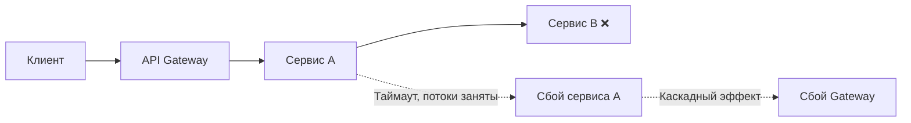
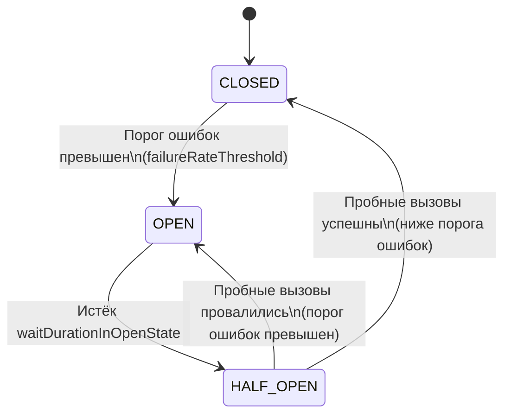
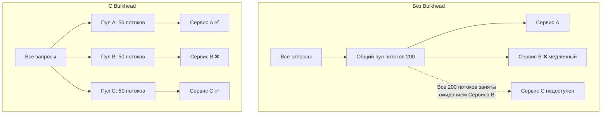
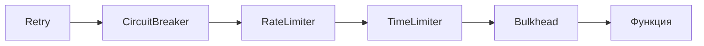
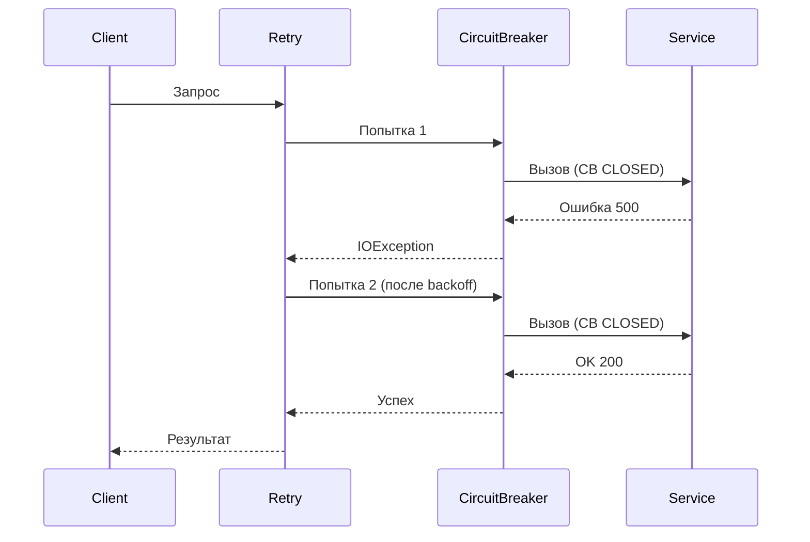
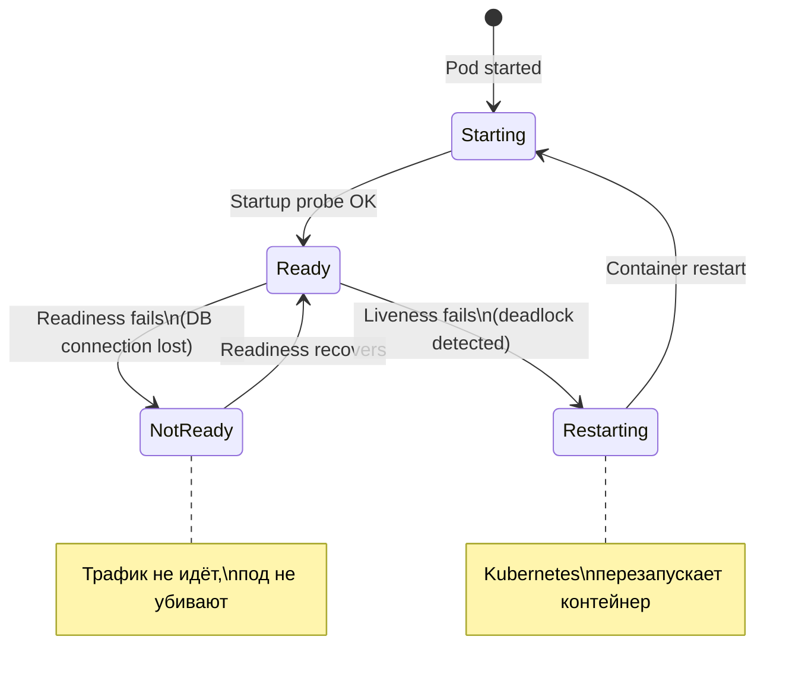
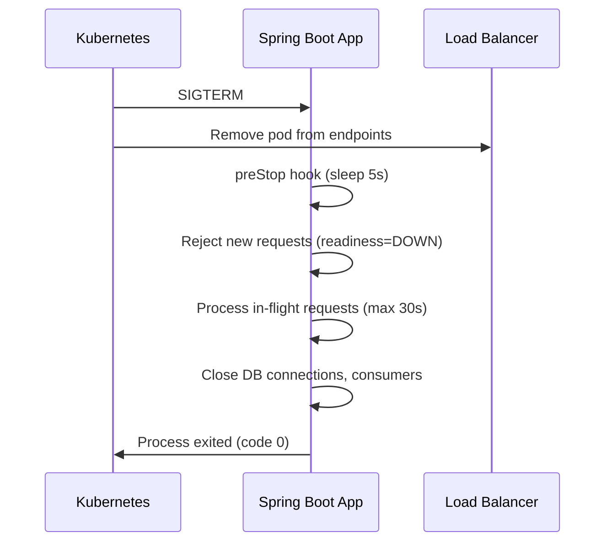
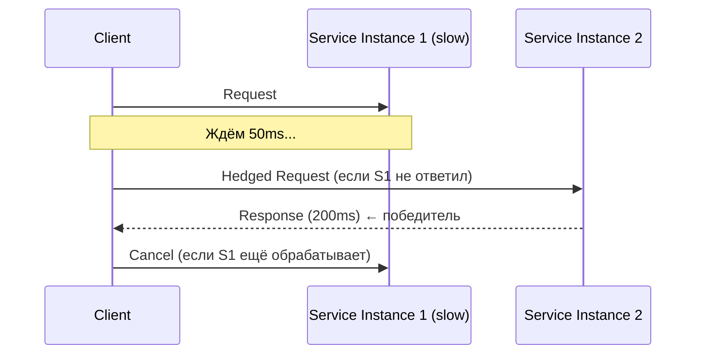

# Вопросы на собеседовании: `Паттерны отказоустойчивости`

Паттерны отказоустойчивости (`Circuit Breaker`, `Retry`, `Bulkhead`, `Rate Limiter`, `Time Limiter`, `Fallback`) -- ключевые инструменты для построения надёжных распределённых систем. На собеседованиях спрашивают про состояния и переходы `Circuit Breaker`, стратегии повторных попыток, изоляцию ресурсов, ограничение нагрузки, библиотеку `Resilience4j`, комбинирование паттернов, метрики и chaos engineering.

## Полезные ссылки

### Официальная документация

- [Resilience4j Documentation](https://resilience4j.readme.io/docs) -- официальная документация `Resilience4j`
- [Spring Cloud Circuit Breaker](https://docs.spring.io/spring-cloud-circuitbreaker/reference/html/) -- абстракция Spring Cloud над circuit breaker реализациями
- [Resilience4j GitHub](https://github.com/resilience4j/resilience4j) -- исходный код и примеры
- [Guide to Resilience4j (Baeldung)](https://www.baeldung.com/resilience4j) -- подробное руководство по всем модулям
- [Resilience4j with Spring Boot (Baeldung)](https://www.baeldung.com/spring-boot-resilience4j) -- интеграция с Spring Boot
- [Better Retries with Exponential Backoff and Jitter (Baeldung)](https://www.baeldung.com/resilience4j-backoff-jitter) -- стратегии повторных попыток
- [Circuit Breaker vs Retry in Spring Boot (Baeldung)](https://www.baeldung.com/spring-boot-circuit-breaker-vs-retry) -- сравнение Circuit Breaker и Retry
- [Quick Guide to Spring Cloud Circuit Breaker (Baeldung)](https://www.baeldung.com/spring-cloud-circuit-breaker) -- абстракция Spring Cloud над circuit breaker
- [Guide to Spring Retry (Baeldung)](https://www.baeldung.com/spring-retry) -- декларативный retry в Spring

## Содержание

- [Полезные ссылки](#полезные-ссылки)
- [See also](#see-also)

**Основы отказоустойчивости**
- [Q1. (!) Что такое отказоустойчивость и зачем нужны паттерны отказоустойчивости?](#q1--что-такое-отказоустойчивость-и-зачем-нужны-паттерны-отказоустойчивости)
- [Q2. Какие основные паттерны отказоустойчивости существуют?](#q2-какие-основные-паттерны-отказоустойчивости-существуют)
- [Q3. Чем отличается fault tolerance от fault avoidance?](#q3-чем-отличается-fault-tolerance-от-fault-avoidance)

**Circuit Breaker**
- [Q4. (!) Что такое паттерн Circuit Breaker и какую проблему он решает?](#q4--что-такое-паттерн-circuit-breaker-и-какую-проблему-он-решает)
- [Q5. (!) Какие состояния у Circuit Breaker и как происходят переходы между ними?](#q5--какие-состояния-у-circuit-breaker-и-как-происходят-переходы-между-ними)
- [Q6. Чем отличается count-based sliding window от time-based?](#q6-чем-отличается-count-based-sliding-window-от-time-based)
- [Q7. Какие основные параметры конфигурации Circuit Breaker?](#q7-какие-основные-параметры-конфигурации-circuit-breaker)
- [Q8. Что такое специальные состояния Circuit Breaker: DISABLED, FORCED_OPEN, METRICS_ONLY?](#q8-что-такое-специальные-состояния-circuit-breaker-disabled-forced_open-metrics_only)
- [Q9. (!) Как реализовать Circuit Breaker с помощью Resilience4j?](#q9--как-реализовать-circuit-breaker-с-помощью-resilience4j)

**Retry**
- [Q10. (!) Что такое паттерн Retry и когда его применять?](#q10--что-такое-паттерн-retry-и-когда-его-применять)
- [Q11. (!) Какие стратегии backoff существуют для повторных попыток?](#q11--какие-стратегии-backoff-существуют-для-повторных-попыток)
- [Q12. Что такое jitter и зачем он нужен в стратегии retry?](#q12-что-такое-jitter-и-зачем-он-нужен-в-стратегии-retry)
- [Q13. Как настроить Retry в Resilience4j?](#q13-как-настроить-retry-в-resilience4j)

**Bulkhead**
- [Q14. (!) Что такое паттерн Bulkhead и какую проблему он решает?](#q14--что-такое-паттерн-bulkhead-и-какую-проблему-он-решает)
- [Q15. (!) Чем отличается Thread Pool Bulkhead от Semaphore Bulkhead?](#q15--чем-отличается-thread-pool-bulkhead-от-semaphore-bulkhead)
- [Q16. Как настроить Bulkhead в Resilience4j?](#q16-как-настроить-bulkhead-в-resilience4j)

**Rate Limiter**
- [Q17. (!) Что такое Rate Limiter и какие алгоритмы используются?](#q17--что-такое-rate-limiter-и-какие-алгоритмы-используются)
- [Q18. Как настроить Rate Limiter в Resilience4j?](#q18-как-настроить-rate-limiter-в-resilience4j)

**Time Limiter и Fallback**
- [Q19. Что такое Time Limiter и зачем он нужен?](#q19-что-такое-time-limiter-и-зачем-он-нужен)
- [Q20. (!) Что такое Fallback и как его правильно реализовать?](#q20--что-такое-fallback-и-как-его-правильно-реализовать)

**Resilience4j**
- [Q21. (!) Что такое Resilience4j и чем он лучше Netflix Hystrix?](#q21--что-такое-resilience4j-и-чем-он-лучше-netflix-hystrix)
- [Q22. Какие модули входят в Resilience4j?](#q22-какие-модули-входят-в-resilience4j)
- [Q23. Как интегрировать Resilience4j со Spring Boot?](#q23-как-интегрировать-resilience4j-со-spring-boot)

**Комбинирование паттернов**
- [Q24. (!) В каком порядке применяются паттерны отказоустойчивости?](#q24--в-каком-порядке-применяются-паттерны-отказоустойчивости)
- [Q25. Как комбинировать Circuit Breaker и Retry?](#q25-как-комбинировать-circuit-breaker-и-retry)
- [Q26. Как комбинировать несколько паттернов с помощью аннотаций Resilience4j?](#q26-как-комбинировать-несколько-паттернов-с-помощью-аннотаций-resilience4j)

**Spring Cloud Circuit Breaker и Hystrix**
- [Q27. Что такое Spring Cloud Circuit Breaker?](#q27-что-такое-spring-cloud-circuit-breaker)
- [Q28. Почему Netflix Hystrix считается устаревшим?](#q28-почему-netflix-hystrix-считается-устаревшим)

**Метрики, мониторинг и тестирование**
- [Q29. (!) Как мониторить паттерны отказоустойчивости?](#q29--как-мониторить-паттерны-отказоустойчивости)
- [Q30. Как тестировать паттерны отказоустойчивости?](#q30-как-тестировать-паттерны-отказоустойчивости)

**Отказоустойчивость в распределённых системах**
- [Q31. Что такое graceful degradation?](#q31-что-такое-graceful-degradation)
- [Q32. (!) Что такое chaos engineering и зачем он нужен?](#q32--что-такое-chaos-engineering-и-зачем-он-нужен)
- [Q33. Как проектировать идемпотентные retry-операции?](#q33-как-проектировать-идемпотентные-retry-операции)

**Продвинутые темы**
- [Q34. (!) Как организовать health checks для Kubernetes liveness/readiness проб?](#q34--как-организовать-health-checks-для-kubernetes-livenessreadiness-проб)
- [Q35. Что такое graceful shutdown и как его реализовать в Spring Boot?](#q35-что-такое-graceful-shutdown-и-как-его-реализовать-в-spring-boot)
- [Q36. (!) Что такое Hedged Request и когда его применять?](#q36--что-такое-hedged-request-и-когда-его-применять)

**TimeLimiter, Bulkhead-детали и деградация**
- [Q37. Как настроить TimeLimiter в Resilience4j и чем он отличается от таймаута WebClient?](#q37-как-настроить-timelimiter-в-resilience4j-и-чем-он-отличается-от-таймаута-webclient)
- [Q38. ThreadPoolBulkhead vs SemaphoreBulkhead — когда что выбрать на практике?](#q38-threadpoolbulkhead-vs-semaphorebulkhead--когда-что-выбрать-на-практике)
- [Q39. Какие стратегии Fallback существуют и как выбрать подходящую?](#q39-какие-стратегии-fallback-существуют-и-как-выбрать-подходящую)
- [Q40. Что такое Load Shedding и как реализовать приоритизацию запросов?](#q40-что-такое-load-shedding-и-как-реализовать-приоритизацию-запросов)
- [Q41. Как интегрировать Circuit Breaker с Spring Boot Actuator Health?](#q41-как-интегрировать-circuit-breaker-с-spring-boot-actuator-health)
- [Q42. Какие инструменты Chaos Engineering применяются для Spring Boot?](#q42-какие-инструменты-chaos-engineering-применяются-для-spring-boot)
- [Q43. Как реализовать graceful degradation с помощью Feature Flags?](#q43-как-реализовать-graceful-degradation-с-помощью-feature-flags)

---

## Q1. (!) Что такое отказоустойчивость и зачем нужны паттерны отказоустойчивости?

**Отказоустойчивость** (fault tolerance) -- способность системы продолжать корректно функционировать при сбоях отдельных компонентов.

В распределённых системах сбои неизбежны: сеть ненадёжна, сервисы перегружаются, базы данных тормозят. Без паттернов отказоустойчивости один упавший сервис может вызвать **каскадный сбой** (cascading failure) -- когда отказ одного компонента "заваливает" все зависимые сервисы:



Паттерны отказоустойчивости решают три ключевые проблемы:

1. **Предотвращение каскадных сбоев** -- `Circuit Breaker` изолирует неработающие сервисы
2. **Восстановление при временных ошибках** -- `Retry` повторяет операцию при транзиентных сбоях
3. **Защита ресурсов** -- `Bulkhead` и `Rate Limiter` не дают одному потребителю исчерпать все ресурсы


> [!mcq]
> - [ ] `Fault tolerance` — это написание идеального кода без багов через code review и статический анализ | Это `fault avoidance`: попытка избежать сбоев на этапе разработки. В распределённой системе это не работает: сеть всё равно упадёт. ❌ ПОСЛЕДСТВИЕ: команда вкладывается в покрытие тестами 95%, но при сетевом partition один сервис «заваливает» всю цепочку — каскадный сбой как у GitHub 2018.
> - [ ] `Fault tolerance` гарантирует 100% доступность системы при любых сбоях через избыточность инстансов | 100% недостижимо: AWS SLA для S3 — 99.99%. Избыточность это лишь один из инструментов; нужны ещё `Circuit Breaker`, `Retry`, `Fallback`. ❌ ПОСЛЕДСТВИЕ: SRE-команда обещает бизнесу «100% uptime», бизнес обещает клиентам — при первом outage репутационный урон и SLA-штрафы.
> - [x] `Fault tolerance` — способность продолжать работу при сбоях компонентов; паттерны (`Circuit Breaker`, `Retry`, `Bulkhead`) предотвращают каскадные сбои в распределённых системах | Сбои в сети, БД, downstream-сервисах неизбежны; задача — изолировать их влияние, а не предотвратить. ✓ ПРИМЕНЯТЬ: Netflix Hystrix → Resilience4j на тысячах микросервисов; AWS Lambda + exponential backoff на DynamoDB throttling. 📋 ПРАВИЛО: «Design for failure, не design against failure». 🔗 См. Q2, Q3, Q4.
> - [ ] `Fault tolerance` нужен только для критичных систем (банки, медицина), для веб-приложений достаточно мониторинга | В микросервисной архитектуре любое веб-приложение — распределённая система: один upstream упал → потоки заняты ожиданием → весь сервис недоступен. ❌ ПОСЛЕДСТВИЕ: e-commerce без `Circuit Breaker` теряет $1M/час при падении платёжного провайдера, как Knight Capital 2012.

## Q2. Какие основные паттерны отказоустойчивости существуют?

| Паттерн | Назначение | Аналогия |
|---------|-----------|----------|
| `Circuit Breaker` | Прерывает вызовы к неработающему сервису | Автомат в электрощитке |
| `Retry` | Повторяет неудавшуюся операцию | Перезвонить, если абонент не ответил |
| `Bulkhead` | Изолирует ресурсы между потребителями | Водонепроницаемые отсеки корабля |
| `Rate Limiter` | Ограничивает частоту запросов | Турникет в метро |
| `Time Limiter` | Ограничивает время выполнения операции | Таймер на экзамене |
| `Fallback` | Предоставляет альтернативный ответ при сбое | Запасной выход |
| `Cache` | Возвращает кешированный результат при сбое | Копия документа |

Подробнее про каждый паттерн можно прочитать в [вопросах по распределённым системам](distributed-systems-interview.md).


> [!mcq]
> - [ ] `Circuit Breaker` ограничивает частоту запросов, `Rate Limiter` повторяет операцию, `Bulkhead` возвращает запасной ответ | Перепутаны назначения: `Rate Limiter` ограничивает частоту, `Retry` повторяет, `Fallback` возвращает запасной ответ. ❌ ПОСЛЕДСТВИЕ: разработчик ставит `Rate Limiter` вместо `Circuit Breaker` — limiter не отсекает упавший downstream, потоки забиваются, сервис падает.
> - [x] `Circuit Breaker` (отсечь упавший сервис), `Retry` (повторить транзиентную ошибку), `Bulkhead` (изолировать ресурсы), `Rate Limiter` (ограничить частоту), `Fallback` (запасной ответ) | Каждый паттерн решает свою задачу; в проде комбинируются: `Retry → CircuitBreaker → Bulkhead → Function`. ✓ ПРИМЕНЯТЬ: Resilience4j модули в Spring Boot Starter; Netflix микросервисы с порядком декораторов. 📋 ПРАВИЛО: «Каждому сбою — свой паттерн». 🔗 См. Q4, Q14, Q24.
> - [ ] Достаточно одного `Retry` с `maxAttempts=10` — он покрывает все сценарии сбоев | Бесконечные ретраи без `Circuit Breaker` усиливают нагрузку на упавший сервис: thundering herd, retry storm. ❌ ПОСЛЕДСТВИЕ: `Retry` без backoff на 503 → 1000 клиентов одновременно бьют по сервису → recovery невозможен, p99 latency растёт с 50ms до 30s.
> - [ ] Все паттерны являются синонимами и решают одну задачу — повышение надёжности через дублирование запросов | `Bulkhead` изолирует ресурсы, а не дублирует запросы; `Rate Limiter` ограничивает, а не дублирует. ❌ ПОСЛЕДСТВИЕ: разработчик дублирует все запросы «для надёжности» — нагрузка на downstream удваивается, p99 latency растёт, `Circuit Breaker` открывается ложно.

## Q3. Чем отличается fault tolerance от fault avoidance?

| Характеристика | Fault Tolerance | Fault Avoidance |
|---------------|----------------|-----------------|
| **Подход** | Допускаем сбои, но минимизируем их последствия | Стараемся предотвратить сбои |
| **Философия** | "Сбои неизбежны" (Design for Failure) | "Пишем идеальный код" |
| **Инструменты** | `Circuit Breaker`, `Retry`, `Bulkhead` | Code review, тестирование, статический анализ |
| **Применимость** | Обязательно в распределённых системах | Везде, но недостаточно для распределённых систем |

В [микросервисной архитектуре](microservices-interview.md) `fault tolerance` критически важен, потому что количество точек отказа растёт пропорционально числу сервисов и связей между ними.


> [!mcq]
> - [ ] `Fault tolerance` и `fault avoidance` — синонимы; оба означают написание кода без ошибок | `Fault avoidance` пытается **предотвратить** сбои (тесты, ревью), `fault tolerance` — **жить с ними** (CB, Retry). Это разные подходы. ❌ ПОСЛЕДСТВИЕ: команда с менталитетом «у нас идеальный код» не ставит `Circuit Breaker` — при первом partition между AZ весь сервис недоступен 30 минут.
> - [ ] `Fault avoidance` применим только в распределённых системах, `fault tolerance` — в монолитах | Наоборот: `fault tolerance` критичен в распределённых системах (много точек отказа), `fault avoidance` универсален. ❌ ПОСЛЕДСТВИЕ: монолит без code review накапливает баги; распределённая система без `Circuit Breaker` падает каскадно — оба подхода нужны вместе.
> - [x] `Fault avoidance` предотвращает сбои на этапе разработки (тесты, ревью), `fault tolerance` минимизирует последствия неизбежных сбоев в runtime через паттерны | Подходы дополняют друг друга: даже идеально оттестированный код упадёт при network partition. ✓ ПРИМЕНЯТЬ: Google SRE error budget — допускают сбои, фокус на быстрое восстановление. 📋 ПРАВИЛО: «Avoidance — до релиза, tolerance — в проде». 🔗 См. Q1, Q2, Q32.
> - [ ] `Fault tolerance` дороже и применяется только в банковских системах | `Fault tolerance` обязателен для любой распределённой системы; стоимость инцидента (downtime) обычно выше стоимости паттернов. ❌ ПОСЛЕДСТВИЕ: e-commerce без CB при падении inventory-сервиса теряет $50K/час; добавить Resilience4j — 1 день работы.

## Q4. (!) Что такое паттерн Circuit Breaker и какую проблему он решает?

**Circuit Breaker** (предохранитель) -- паттерн, который предотвращает каскадные сбои, прекращая вызовы к неработающему сервису после определённого количества ошибок.

Проблема без `Circuit Breaker`:
- Сервис B не отвечает (упал или перегружен)
- Сервис A продолжает слать запросы и ждать таймаут (например, 30 сек)
- Потоки сервиса A блокируются ожиданием ответа
- Пул потоков исчерпывается -- сервис A тоже перестаёт отвечать
- Каскадный эффект распространяется по всей цепочке

С `Circuit Breaker`:
- После N неудачных вызовов "предохранитель срабатывает" (открывается)
- Последующие вызовы **мгновенно завершаются с ошибкой** без обращения к сервису B
- Через заданное время пропускается несколько "пробных" запросов
- Если пробные запросы успешны -- circuit закрывается, и работа возобновляется

Паттерн назван по аналогии с электрическим автоматом: при перегрузке (коротком замыкании) автомат размыкает цепь, предотвращая пожар.


> [!mcq]
> - [ ] `Circuit Breaker` повторяет неудачный вызов до 3 раз с экспоненциальной задержкой | Это `Retry`, не `Circuit Breaker`. CB наоборот **прекращает** вызовы к упавшему сервису, не повторяет. ❌ ПОСЛЕДСТВИЕ: разработчик ставит `@Retry` ожидая поведение CB → нагрузка на упавший downstream растёт, p99 latency 30s, потоки заняты.
> - [ ] `Circuit Breaker` балансирует нагрузку между несколькими инстансами сервиса | Это `Load Balancer`. CB работает с одним downstream и не выбирает инстанс. ❌ ПОСЛЕДСТВИЕ: команда полагает что CB заменит балансировщик — все запросы идут на один упавший инстанс, остальные простаивают.
> - [x] `Circuit Breaker` после N ошибок переходит в `OPEN` и **мгновенно отклоняет** последующие вызовы (`CallNotPermittedException`), предотвращая каскадные сбои | Без CB потоки сервиса A блокируются ожиданием упавшего сервиса B → пул потоков исчерпывается → A тоже падает. ✓ ПРИМЕНЯТЬ: Netflix Hystrix → Resilience4j на платёжных шлюзах; AWS API Gateway встроенный CB. 📋 ПРАВИЛО: «Fail fast вместо ждать таймаут». 🔗 См. Q5, Q9, Q25.
> - [ ] `Circuit Breaker` кэширует ответы downstream-сервиса и возвращает их при сбое | Это `Cache` + `Fallback`. CB только отсекает вызовы; кэш — отдельный паттерн, часто комбинируется с CB. ❌ ПОСЛЕДСТВИЕ: разработчик ждёт от CB кэширования — при `OPEN` получает `CallNotPermittedException` без fallback → клиент видит 500.

## Q5. (!) Какие состояния у Circuit Breaker и как происходят переходы между ними?

`Circuit Breaker` реализован как конечный автомат с тремя основными состояниями:



### Состояния:

**`CLOSED`** (замкнут, нормальная работа):
- Все запросы проходят к целевому сервису
- Результаты записываются в скользящее окно (sliding window)
- Если процент ошибок превышает `failureRateThreshold` -- переход в `OPEN`

**`OPEN`** (разомкнут, защита):
- Все запросы **немедленно отклоняются** с исключением `CallNotPermittedException`
- Реальный вызов к сервису не выполняется
- Через `waitDurationInOpenState` (по умолчанию 60 сек) -- переход в `HALF_OPEN`

**`HALF_OPEN`** (полуоткрыт, проверка):
- Пропускается ограниченное число запросов (`permittedNumberOfCallsInHalfOpenState`)
- Если процент ошибок ниже порога -- переход в `CLOSED`
- Если процент ошибок выше порога -- обратно в `OPEN`


> [!mcq]
> - [ ] `CLOSED` (вызовы блокированы), `OPEN` (вызовы проходят), `HALF_OPEN` (рестарт сервиса) | Состояния перепутаны: `CLOSED` = нормальная работа, `OPEN` = блок. CB не управляет рестартом сервиса. ❌ ПОСЛЕДСТВИЕ: разработчик ставит порог `failureRateThreshold: 50` ожидая открытия CB при сбоях, но интерпретирует наоборот — все вызовы продолжают идти к упавшему сервису.
> - [ ] CB имеет только два состояния: `OPEN` и `CLOSED`; `HALF_OPEN` не нужен | Без `HALF_OPEN` CB остаётся в `OPEN` навсегда или открывает поток сразу — нет контролируемой проверки восстановления. ❌ ПОСЛЕДСТВИЕ: после восстановления downstream CB остаётся `permanent open`; либо при прямом переходе `OPEN→CLOSED` весь трафик ударяет по нестабильному сервису → повторное падение.
> - [x] `CLOSED` (норма, считает ошибки), `OPEN` (блокирует все вызовы на `waitDurationInOpenState`), `HALF_OPEN` (пропускает `permittedNumberOfCallsInHalfOpenState` пробных вызовов) — переход по `failureRateThreshold` | `HALF_OPEN` — критичная проверка: если пробные успешны → `CLOSED`, иначе → обратно `OPEN`. ✓ ПРИМЕНЯТЬ: Resilience4j default config `slidingWindow=100, threshold=50%`; AWS Step Functions retry policy. 📋 ПРАВИЛО: «HALF_OPEN — единственный путь домой из OPEN». 🔗 См. Q4, Q7, Q9.
> - [ ] CB переходит в `OPEN` через `waitDurationInOpenState` независимо от количества ошибок | `OPEN` срабатывает при превышении `failureRateThreshold` (по умолчанию 50%) в окне; `waitDuration` — это сколько ждать **в** `OPEN`, а не **до**. ❌ ПОСЛЕДСТВИЕ: CB открывается на стабильном сервисе через 60s «по таймеру» → ложное срабатывание, бизнес-операции блокируются.

## Q6. Чем отличается count-based sliding window от time-based?

`Circuit Breaker` использует скользящее окно для подсчёта результатов вызовов. Есть два типа:

| Характеристика | Count-based | Time-based |
|---------------|-------------|------------|
| **Что считает** | Последние N вызовов | Вызовы за последние N секунд |
| **Параметр** | `slidingWindowSize` = число вызовов | `slidingWindowSize` = секунды |
| **Структура данных** | Кольцевой буфер (ring buffer) | Кольцевой буфер из N partial aggregation buckets |
| **Когда подходит** | Стабильная нагрузка | Переменная нагрузка |
| **Пример** | "Последние 100 вызовов" | "Вызовы за последние 60 секунд" |

```yaml
# Count-based (по умолчанию)
resilience4j.circuitbreaker:
  instances:
    paymentService:
      slidingWindowType: COUNT_BASED
      slidingWindowSize: 100
      failureRateThreshold: 50

# Time-based
resilience4j.circuitbreaker:
  instances:
    paymentService:
      slidingWindowType: TIME_BASED
      slidingWindowSize: 60  # секунд
      failureRateThreshold: 50
```

**Важный нюанс**: `Circuit Breaker` не начнёт вычислять процент ошибок, пока не будет зарегистрировано минимальное количество вызовов (`minimumNumberOfCalls`, по умолчанию 100). Это защищает от ложных срабатываний при малом числе запросов.


> [!mcq]
> - [ ] `Count-based` считает ошибки за фиксированный период времени, `time-based` — последние N вызовов | Перепутано: `count-based` = последние N вызовов, `time-based` = вызовы за N секунд. ❌ ПОСЛЕДСTВИЕ: разработчик ставит `slidingWindowSize: 100` ожидая 100 секунд → реально учитывает 100 вызовов, при низком RPS CB не срабатывает часами.
> - [x] `Count-based` использует ring buffer на последние N вызовов (стабильная нагрузка), `time-based` — buckets на последние N секунд (переменная нагрузка) | Под низким RPS `count-based` накапливает ошибки слишком долго; `time-based` реагирует быстрее. ✓ ПРИМЕНЯТЬ: Resilience4j `TIME_BASED` для batch-джоб с непредсказуемым RPS; `COUNT_BASED` для constant-load API. 📋 ПРАВИЛО: «Time-based — для пиков, count-based — для плато». 🔗 См. Q5, Q7, Q9.
> - [ ] `Time-based` точнее, всегда выбирайте его | Точность — компромисс с памятью (buckets) и реакцией на низкий RPS. При стабильной нагрузке `count-based` дешевле и достаточно точен. ❌ ПОСЛЕДСТВИЕ: на высоконагруженном API `time-based` с 60s окном требует buckets для каждого secund-партиционирования → лишний overhead на heap.
> - [ ] Тип окна не влияет на поведение CB, разница только в названии параметра | Тип определяет когда CB начнёт реагировать: при N вызовах vs N секундах. Под разной нагрузкой результаты отличаются на порядки. ❌ ПОСЛЕДСTВИЕ: команда копирует config с другого сервиса (другой RPS) → CB не открывается при сбое или открывается слишком часто.

## Q7. Какие основные параметры конфигурации Circuit Breaker?

| Параметр | По умолчанию | Описание |
|----------|-------------|----------|
| `failureRateThreshold` | 50 (%) | Порог ошибок для перехода в `OPEN` |
| `slowCallRateThreshold` | 100 (%) | Порог медленных вызовов для перехода в `OPEN` |
| `slowCallDurationThreshold` | 60000 мс | Время, после которого вызов считается медленным |
| `slidingWindowType` | `COUNT_BASED` | Тип скользящего окна |
| `slidingWindowSize` | 100 | Размер окна (вызовы или секунды) |
| `minimumNumberOfCalls` | 100 | Мин. количество вызовов до расчёта процента |
| `waitDurationInOpenState` | 60000 мс | Время ожидания в `OPEN` перед переходом в `HALF_OPEN` |
| `permittedNumberOfCallsInHalfOpenState` | 10 | Число пробных вызовов в `HALF_OPEN` |
| `automaticTransitionFromOpenToHalfOpenEnabled` | false | Автоматический переход `OPEN` -> `HALF_OPEN` |
| `recordExceptions` | пусто | Исключения, считающиеся ошибками |
| `ignoreExceptions` | пусто | Исключения, которые не учитываются |

```java
CircuitBreakerConfig config = CircuitBreakerConfig.custom()
    .failureRateThreshold(50)
    .slowCallRateThreshold(80)
    .slowCallDurationThreshold(Duration.ofSeconds(2))
    .waitDurationInOpenState(Duration.ofSeconds(30))
    .slidingWindowType(SlidingWindowType.COUNT_BASED)
    .slidingWindowSize(10)
    .minimumNumberOfCalls(5)
    .permittedNumberOfCallsInHalfOpenState(3)
    .recordExceptions(IOException.class, TimeoutException.class)
    .ignoreExceptions(BusinessException.class)
    .build();

CircuitBreaker circuitBreaker = CircuitBreaker.of("paymentService", config);
```


> [!mcq]
> - [ ] `failureRateThreshold` задаёт количество ошибок до открытия CB (число), `slidingWindowSize` — количество секунд | `failureRateThreshold` — это **процент** (0-100), не абсолютное число. `slidingWindowSize` зависит от типа окна. ❌ ПОСЛЕДСТВИЕ: разработчик ставит `failureRateThreshold: 50` ожидая «50 ошибок» — реально 50%, CB открывается при 5 ошибках на 10 вызовов.
> - [ ] `minimumNumberOfCalls` не нужен, CB должен реагировать с первой ошибки | Без этого порога CB ложно срабатывает при единичных ошибках на старте: 1 ошибка из 1 вызова = 100% failure rate. ❌ ПОСЛЕДСТВИЕ: CB открывается на старте сервиса от первой случайной ошибки — все последующие запросы блокированы 60s, бизнес-операции упали ложно.
> - [x] Ключевые: `failureRateThreshold` (процент), `slidingWindowSize`, `minimumNumberOfCalls`, `waitDurationInOpenState`, `permittedNumberOfCallsInHalfOpenState`, `recordExceptions`, `ignoreExceptions` | `ignoreExceptions` критично: бизнес-исключения (валидация, 404) не должны открывать CB. ✓ ПРИМЕНЯТЬ: Resilience4j configs в `application.yml` per-instance; Spring Cloud Gateway global config. 📋 ПРАВИЛО: «BusinessException игнорируем, IOException считаем». 🔗 См. Q5, Q9, Q41.
> - [ ] `recordExceptions` и `ignoreExceptions` взаимозаменяемы — оба фильтруют ошибки | Они **противоположны**: `recordExceptions` — что считать сбоем, `ignoreExceptions` — что не считать. Перепутать = инверсия логики. ❌ ПОСЛЕДСТВИЕ: разработчик кладёт `IOException` в `ignoreExceptions` → реальные сетевые сбои не учитываются, CB никогда не открывается, downstream продолжает получать запросы при падении.

## Q8. Что такое специальные состояния Circuit Breaker: DISABLED, FORCED_OPEN, METRICS_ONLY?

Помимо трёх основных состояний, `Resilience4j` `CircuitBreaker` поддерживает три специальных:

| Состояние | Поведение | Применение |
|-----------|----------|------------|
| `DISABLED` | Все вызовы проходят, метрики не записываются | Отключение CB для отладки |
| `FORCED_OPEN` | Все вызовы отклоняются | Ручное отключение сервиса |
| `METRICS_ONLY` | Все вызовы проходят, метрики записываются, но CB никогда не открывается | Наблюдение перед включением |

`METRICS_ONLY` особенно полезен при внедрении `Circuit Breaker` на продакшне: можно сначала включить его в режиме наблюдения, собрать метрики, подобрать пороги, и только потом переключить в рабочий режим.

```java
// Принудительный переход в специальное состояние
circuitBreaker.transitionToDisabledState();
circuitBreaker.transitionToForcedOpenState();
circuitBreaker.transitionToMetricsOnlyState();
```


> [!mcq]
> - [ ] `DISABLED` отключает CB (вызовы проходят, метрики **не** пишутся), `FORCED_OPEN` блокирует все, `METRICS_ONLY` пишет метрики, но не блокирует | Это правильное описание, но не для wrong опции — оставим detail-mismatch: `METRICS_ONLY` в реальности **никогда** не открывается, удобен для shadow-mode. ❌ ПОСЛЕДСТВИЕ: команда включает `DISABLED` для отладки и забывает вернуть — при инциденте обнаруживают что CB полгода был выключен.
> - [x] `DISABLED` (всё проходит, метрик нет — для отладки), `FORCED_OPEN` (всё блокировано — ручной shutdown сервиса), `METRICS_ONLY` (всё проходит, метрики пишутся, CB не открывается — shadow-mode перед раскаткой) | `METRICS_ONLY` — must-have для безопасного внедрения CB на проде. ✓ ПРИМЕНЯТЬ: Netflix shadow traffic перед миграцией с Hystrix; AWS canary deployment с CB metrics. 📋 ПРАВИЛО: «Сначала METRICS_ONLY, потом боевой режим». 🔗 См. Q5, Q7, Q29.
> - [ ] `FORCED_OPEN` автоматически возвращается в `CLOSED` через `waitDurationInOpenState` | `FORCED_OPEN` — **ручное** состояние, выходит только через явный `transitionToClosedState()`. Автоперехода нет. ❌ ПОСЛЕДСТВИЕ: SRE форсит `FORCED_OPEN` на инциденте и забывает закрыть → сервис недоступен сутки до следующего деплоя.
> - [ ] Все три специальных состояния ведут себя одинаково — отключают вызовы | Каждое имеет своё поведение: `DISABLED` пропускает, `FORCED_OPEN` блокирует, `METRICS_ONLY` пропускает. ❌ ПОСЛЕДСТВИЕ: разработчик использует `DISABLED` для shutdown сервиса → вызовы продолжают идти к упавшему downstream → потоки блокированы.

## Q9. (!) Как реализовать Circuit Breaker с помощью Resilience4j?

### Программный API:

```java
// 1. Создаём CircuitBreaker с конфигурацией
CircuitBreakerConfig config = CircuitBreakerConfig.custom()
    .failureRateThreshold(50)
    .waitDurationInOpenState(Duration.ofSeconds(30))
    .slidingWindowSize(10)
    .build();

CircuitBreaker circuitBreaker = CircuitBreaker.of("paymentService", config);

// 2. Декорируем вызов
Supplier<PaymentResponse> decoratedSupplier = CircuitBreaker
    .decorateSupplier(circuitBreaker, () -> paymentClient.processPayment(request));

// 3. Выполняем с fallback
Try<PaymentResponse> result = Try.ofSupplier(decoratedSupplier)
    .recover(CallNotPermittedException.class, e -> PaymentResponse.unavailable())
    .recover(Exception.class, e -> PaymentResponse.error(e.getMessage()));
```

### Аннотации Spring Boot:

```java
@Service
public class PaymentService {

    @CircuitBreaker(name = "paymentService", fallbackMethod = "paymentFallback")
    public PaymentResponse processPayment(PaymentRequest request) {
        return paymentClient.call(request);
    }

    private PaymentResponse paymentFallback(PaymentRequest request, Exception ex) {
        log.warn("Circuit breaker fallback for payment: {}", ex.getMessage());
        return PaymentResponse.unavailable();
    }
}
```

### Конфигурация в `application.yml`:

```yaml
resilience4j:
  circuitbreaker:
    instances:
      paymentService:
        registerHealthIndicator: true
        slidingWindowSize: 10
        minimumNumberOfCalls: 5
        failureRateThreshold: 50
        waitDurationInOpenState: 30s
        permittedNumberOfCallsInHalfOpenState: 3
        automaticTransitionFromOpenToHalfOpenEnabled: true
```


> [!mcq]
> - [ ] Достаточно создать `CircuitBreaker.ofDefaults("name")` без конфигурации — defaults подходят для production | Defaults: `failureRateThreshold=50%`, `slidingWindowSize=100`, `waitDuration=60s`, `minimumNumberOfCalls=100` — для низконагруженного API CB не сработает часами. ❌ ПОСЛЕДСТВИЕ: на сервисе с 5 RPS CB ждёт 100 вызовов = 20s до начала анализа → при сбое downstream первые 20s каскадно валят upstream.
> - [ ] `@CircuitBreaker` работает на private методах внутри класса | Spring AOP не проксирует self-invocation и private методы — аннотация молча игнорируется. ❌ ПОСЛЕДСТВИЕ: разработчик ставит `@CircuitBreaker` на `private fetchData()`, тестирует — работает (через ApplicationContext getBean), в проде CB не активируется, при сбое downstream сервис каскадно падает.
> - [x] Программный API: `CircuitBreakerConfig.custom()` → `CircuitBreaker.of()` → декорирование `Supplier`. Декларативный: аннотация `@CircuitBreaker(name, fallbackMethod)` + `application.yml` + Spring AOP starter | `fallbackMethod` должен быть в **том же классе** с той же сигнатурой + `Exception` в конце. ✓ ПРИМЕНЯТЬ: `resilience4j-spring-boot3` стартер; `Decorators.ofSupplier().withCircuitBreaker()` для программного стиля. 📋 ПРАВИЛО: «AOP starter обязателен для аннотаций». 🔗 См. Q7, Q23, Q26.
> - [ ] Resilience4j требует наследования от базового класса `CircuitBreakerCommand` как Hystrix | Это про устаревший Hystrix. Resilience4j использует функциональный стиль (декораторы) — наследование не нужно. ❌ ПОСЛЕДСТВИЕ: команда тратит 2 недели на рефакторинг под HystrixCommand-стиль; Resilience4j требует только обернуть `Supplier` в декоратор.

## Q10. (!) Что такое паттерн Retry и когда его применять?

**Retry** -- паттерн, который автоматически повторяет неудавшуюся операцию заданное количество раз. Эффективен при **транзиентных ошибках** -- кратковременных сбоях, которые проходят сами:

- Сетевые таймауты
- HTTP 503 (Service Unavailable)
- HTTP 429 (Too Many Requests)
- Временная недоступность базы данных
- Блокировки (deadlock) при конкурентном доступе

**Когда НЕ стоит применять Retry:**

- Ошибки бизнес-логики (400 Bad Request) -- повтор не поможет
- Ошибки аутентификации (401, 403)
- Невалидные данные (422) -- повтор даст тот же результат
- Длительные аварии -- лучше использовать `Circuit Breaker`

```java
@Retry(name = "inventoryService", fallbackMethod = "inventoryFallback")
public InventoryResponse checkInventory(String sku) {
    return inventoryClient.getStock(sku);
}
```

**Важно**: операция, оборачиваемая в `Retry`, должна быть **идемпотентной** -- повторный вызов не должен создавать дублирующий эффект (подробнее в [вопросах по распределённым системам](distributed-systems-interview.md)).


> [!mcq]
> - [ ] `Retry` применяется на любые ошибки, включая 400 Bad Request и 401 Unauthorized | На 4xx (кроме 429) повтор бессмыслен: данные те же, ответ тот же. Только 5xx, 408, 429 и сетевые таймауты транзиентные. ❌ ПОСЛЕДСТВИЕ: `@Retry(maxAttempts=5)` на 401 → 5 раз бьёмся в auth-сервис с невалидным токеном, забиваем rate limit, легитимные пользователи получают 429.
> - [x] `Retry` повторяет операцию при **транзиентных** ошибках (5xx, 408, 429, сетевые таймауты, deadlock); требует **идемпотентности** операции и backoff между попытками | Без идемпотентности повтор `POST /orders` создаст дубликат заказа; без backoff — thundering herd на recovering downstream. ✓ ПРИМЕНЯТЬ: AWS SDK exponential backoff для DynamoDB throttling; Spring Retry на @Transactional с deadlock. 📋 ПРАВИЛО: «Idempotent + backoff — иначе не Retry». 🔗 См. Q11, Q12, Q33.
> - [ ] `Retry` без backoff допустим, если задержка между попытками меньше 10ms | Любой синхронный retry без backoff = retry storm: 1000 клиентов одновременно бьют по recovering сервису → recovery невозможен. ❌ ПОСЛЕДСТВИЕ: AWS DynamoDB throttling при retry storm: provisioned capacity исчерпывается мгновенно → exponential cost spike + cascading failures.
> - [ ] `Retry` заменяет `Circuit Breaker` — после `maxAttempts` всё равно вернётся ошибка | `Retry` усиливает нагрузку на упавший сервис (×N), а CB её снимает. Работают вместе: `Retry → CircuitBreaker → Service`. ❌ ПОСЛЕДСТВИЕ: `@Retry(maxAttempts=10)` без CB на упавшем downstream → каждый клиент шлёт 10× нагрузки → recovery downstream невозможен.

## Q11. (!) Какие стратегии backoff существуют для повторных попыток?

### 1. Fixed interval (фиксированный интервал)

Одинаковая задержка между попытками.

```
Попытка 1 → [1 сек] → Попытка 2 → [1 сек] → Попытка 3
```

### 2. Exponential backoff (экспоненциальная задержка)

Интервал растёт экспоненциально: `initialInterval * multiplier^(attempt-1)`.

```
Попытка 1 → [1 сек] → Попытка 2 → [2 сек] → Попытка 3 → [4 сек] → Попытка 4
```

### 3. Exponential backoff with jitter (с рандомизацией)

К экспоненциальной задержке добавляется случайное отклонение, чтобы избежать "стадного эффекта" (thundering herd).

```
Попытка 1 → [1.2 сек] → Попытка 2 → [2.7 сек] → Попытка 3 → [3.9 сек]
```

### 4. Linear backoff (линейный рост)

Интервал растёт линейно.

```
Попытка 1 → [1 сек] → Попытка 2 → [2 сек] → Попытка 3 → [3 сек]
```

```java
// Resilience4j: Exponential backoff with jitter
RetryConfig config = RetryConfig.custom()
    .maxAttempts(4)
    .intervalFunction(IntervalFunction.ofExponentialBackoff(
        Duration.ofMillis(500),  // initialInterval
        2.0,                      // multiplier
        Duration.ofSeconds(30)    // maxInterval
    ))
    .retryExceptions(IOException.class, TimeoutException.class)
    .ignoreExceptions(BusinessException.class)
    .build();

// С jitter (рандомизация)
RetryConfig configWithJitter = RetryConfig.custom()
    .maxAttempts(4)
    .intervalFunction(IntervalFunction.ofExponentialRandomBackoff(
        500,   // initialIntervalMillis
        2.0,   // multiplier
        0.5    // randomizationFactor
    ))
    .build();
```


> [!mcq]
> - [ ] `Fixed interval` — оптимальная стратегия для distributed retry: предсказуемая задержка | Fixed-interval усиливает thundering herd: все клиенты бьют одновременно через 1s. ❌ ПОСЛЕДСТВИЕ: 1000 клиентов с `fixedInterval=1s` ретраят синхронно → recovering downstream получает все 1000 RPS одновременно → CB снова открывается → recovery cycle.
> - [x] Стратегии: `fixed interval`, `linear backoff`, `exponential backoff` (`base × 2^attempt`), `exponential with jitter` (рандомизация). Для distributed-систем рекомендуется **exponential with jitter** | Jitter «размазывает» retry-волны, exponential снижает суммарную нагрузку на recovering сервис. ✓ ПРИМЕНЯТЬ: AWS SDK `equal jitter` retry policy; Resilience4j `IntervalFunction.ofExponentialRandomBackoff()`. 📋 ПРАВИЛО: «Exponential ослабляет нагрузку, jitter рассинхронизирует клиентов». 🔗 См. Q10, Q12, Q13.
> - [ ] `Linear backoff` (1s, 2s, 3s) лучше exponential для большинства случаев — задержки растут плавно | Linear растёт медленно: после 5 попыток только 5s, нагрузка на recovering сервис всё ещё 200 RPS на 1000 клиентах. Exponential: 16s — даёт downstream передышку. ❌ ПОСЛЕДСТВИЕ: linear backoff не успевает разгрузить downstream — CB открывается → recovery cycle.
> - [ ] Backoff не нужен — современные сервисы достаточно быстры, чтобы обработать ретраи без задержки | Без backoff — retry storm: каждая попытка усиливает нагрузку. AWS DynamoDB, Stripe, Twilio документированно требуют exponential backoff. ❌ ПОСЛЕДСТВИЕ: 503 от Stripe → Retry без backoff → Stripe rate-limits ваш account → платежи блокированы 24 часа.

## Q12. Что такое jitter и зачем он нужен в стратегии retry?

**Jitter** -- добавление случайного отклонения к задержке между повторными попытками.

### Проблема без jitter (thundering herd):

Если 1000 клиентов одновременно получили ошибку и все используют одинаковый exponential backoff:
- Через 1 сек -- все 1000 клиентов повторяют запрос одновременно
- Через 2 сек -- все снова одновременно
- Сервис не успевает восстановиться из-за одновременных волн

### С jitter:

Запросы "размазываются" по времени, что даёт сервису возможность восстановиться:

```
Клиент A: 0.8 сек → 2.1 сек → 4.5 сек
Клиент B: 1.2 сек → 1.9 сек → 3.8 сек  
Клиент C: 0.9 сек → 2.5 сек → 4.1 сек
```

Формула с jitter: `delay = baseDelay * multiplier^attempt * (1 + random(-factor, +factor))`

В `Resilience4j` jitter реализуется через `IntervalFunction.ofExponentialRandomBackoff()`:

```yaml
resilience4j:
  retry:
    instances:
      paymentService:
        maxAttempts: 3
        waitDuration: 500ms
        enableExponentialBackoff: true
        exponentialBackoffMultiplier: 2
        enableRandomizedWait: true
        randomizedWaitFactor: 0.5
```


> [!mcq]
> - [ ] `Jitter` — фиксированная задержка перед первым ретраем для прогрева кэша | Jitter — это **случайное** отклонение в каждой задержке, не фиксированная пауза. Кэш-прогрев — не его задача. ❌ ПОСЛЕДСТВИЕ: разработчик ставит `fixedDelay=2s` думая что это jitter — всё ещё thundering herd, recovering downstream падает повторно.
> - [ ] `Jitter` нужен только в монолите для распределения CPU-нагрузки | Наоборот: jitter критичен в distributed-системах с тысячами клиентов. В монолите retry один. ❌ ПОСЛЕДСТВИЕ: в микросервисной архитектуре без jitter после network blip 5000 инстансов ретраят синхронно → recovering сервис получает 5K RPS spike.
> - [x] `Jitter` — рандомизация задержки между попытками для предотвращения **thundering herd**: 1000 клиентов с одинаковым `exponentialBackoff` ретраят синхронно → синхронные волны → recovery невозможен. С jitter волны «размазываются» | Формула: `delay = base × 2^attempt × (1 + random(-factor, +factor))`. ✓ ПРИМЕНЯТЬ: AWS SDK equal/full jitter; Resilience4j `randomizedWaitFactor: 0.5`. 📋 ПРАВИЛО: «Jitter — анти-стадо для retry». 🔗 См. Q11, Q13, Q25.
> - [ ] `Jitter` увеличивает latency и должен быть отключён в production | Jitter добавляет ~50% к задержке, но это плата за recoverability. Без jitter — retry storm и downtime. ❌ ПОСЛЕДСТВИЕ: команда отключает jitter ради «быстрых ретраев» → при partial outage downstream все клиенты бьют синхронно → CB открывается на 60s → users get 503.

## Q13. Как настроить Retry в Resilience4j?

### Программный API:

```java
RetryConfig config = RetryConfig.custom()
    .maxAttempts(3)
    .waitDuration(Duration.ofMillis(500))
    .retryOnResult(response -> response.getStatus() == 503)
    .retryExceptions(IOException.class, TimeoutException.class)
    .ignoreExceptions(BusinessValidationException.class)
    .failAfterMaxAttempts(true)
    .build();

Retry retry = Retry.of("paymentService", config);

// Декорирование вызова
Supplier<PaymentResponse> decoratedSupplier = Retry.decorateSupplier(
    retry, () -> paymentClient.processPayment(request)
);

PaymentResponse result = decoratedSupplier.get();
```

### Аннотации Spring Boot:

```java
@Service
public class PaymentService {

    @Retry(name = "paymentService", fallbackMethod = "retryFallback")
    public PaymentResponse processPayment(PaymentRequest request) {
        return paymentClient.call(request);
    }

    private PaymentResponse retryFallback(PaymentRequest request, Exception ex) {
        log.warn("All retries exhausted: {}", ex.getMessage());
        return PaymentResponse.error("Service temporarily unavailable");
    }
}
```

### Конфигурация в `application.yml`:

```yaml
resilience4j:
  retry:
    instances:
      paymentService:
        maxAttempts: 3
        waitDuration: 500ms
        enableExponentialBackoff: true
        exponentialBackoffMultiplier: 2
        retryExceptions:
          - java.io.IOException
          - java.util.concurrent.TimeoutException
        ignoreExceptions:
          - com.example.BusinessException
```


> [!mcq]
> - [ ] `RetryConfig` принимает `maxAttempts=0` для бесконечных попыток | `maxAttempts=0` или отрицательные значения вызывают `IllegalArgumentException`. Бесконечный retry — антипаттерн. ❌ ПОСЛЕДСТВИЕ: разработчик ставит `maxAttempts=0` ожидая «без лимита» → исключение при старте, сервис не поднимается, ночной деплой откатывается.
> - [ ] `retryExceptions` и `ignoreExceptions` нельзя комбинировать | Их **нужно** комбинировать: `retryExceptions(IOException.class)` + `ignoreExceptions(BusinessException.class)`. Без `ignoreExceptions` любые runtime-ошибки тоже ретраятся. ❌ ПОСЛЕДСТВИЕ: `ValidationException` при невалидном вводе ретраится 3 раза → пользователь ждёт 5s вместо мгновенного 400.
> - [x] `RetryConfig.custom()` → `maxAttempts(3)`, `waitDuration` или `intervalFunction(ofExponentialRandomBackoff)`, `retryExceptions/ignoreExceptions/retryOnResult`. Декларативно: `@Retry(name, fallbackMethod)` + `application.yml` | `retryOnResult` критичен для HTTP-кодов: ретраить 503 но не 200. ✓ ПРИМЕНЯТЬ: Spring Cloud OpenFeign + Resilience4j retry для inter-service calls; AWS SDK для DynamoDB. 📋 ПРАВИЛО: «retryOnResult для HTTP, retryExceptions для исключений». 🔗 См. Q10, Q11, Q12.
> - [ ] Spring `@Retryable` (spring-retry) и Resilience4j `@Retry` — одно и то же | Это **разные** библиотеки с разными API: `@Retryable` от spring-retry, `@Retry` от Resilience4j. Spring-retry не интегрирован с CB/Bulkhead. ❌ ПОСЛЕДСТВИЕ: команда смешивает оба → конфликт annotations processing, retry срабатывает дважды (вложенно), задержки удваиваются.

## Q14. (!) Что такое паттерн Bulkhead и какую проблему он решает?

**Bulkhead** (переборка) -- паттерн, который ограничивает количество конкурентных вызовов к сервису, изолируя ресурсы так, чтобы перегрузка одного сервиса не исчерпала все ресурсы приложения.

Название пришло из кораблестроения: корпус корабля разделён на **водонепроницаемые отсеки** (bulkheads), чтобы пробоина в одном отсеке не затопила весь корабль.



Без `Bulkhead`: медленный Сервис B может занять все потоки, и сервисы A и C тоже станут недоступны. С `Bulkhead`: каждый сервис получает свою "квоту" ресурсов, и проблемы одного не влияют на другие.


> [!mcq]
> - [ ] `Bulkhead` ограничивает частоту запросов за период (например, 100 RPS) | Это `Rate Limiter`. `Bulkhead` ограничивает **одновременные** вызовы (concurrency), а не RPS. ❌ ПОСЛЕДСТВИЕ: разработчик ставит `Bulkhead` ожидая 100 RPS, реально получает `maxConcurrentCalls=100` → при медленном downstream все 100 слотов забиты долгоиграющими вызовами, новые отбрасываются.
> - [ ] `Bulkhead` повторяет упавший запрос на другом инстансе сервиса | Это `Retry` + `Load Balancer`. `Bulkhead` не ретраит и не балансирует. ❌ ПОСЛЕДСТВИЕ: команда полагает что Bulkhead обеспечит failover → один tenant DoS-ит сервис, остальные tenants блокированы (нет per-tenant изоляции).
> - [x] `Bulkhead` ограничивает количество **конкурентных** вызовов к downstream, изолируя ресурсы (потоки/семафоры). Аналогия — водонепроницаемые отсеки корабля: пробоина в одном не топит весь корабль | Без Bulkhead медленный downstream A забивает все 200 потоков пула → downstream B и C недоступны. ✓ ПРИМЕНЯТЬ: Netflix Hystrix per-dependency thread pools; AWS Lambda reserved concurrency. 📋 ПРАВИЛО: «Один tenant не должен исчерпать ресурсы всех». 🔗 См. Q15, Q16, Q38.
> - [ ] `Bulkhead per-tenant` не нужен — общего пула на сервис достаточно | Без per-tenant Bulkhead один tenant с heavy запросом DoS-ит остальных. Это критично для multi-tenant SaaS. ❌ ПОСЛЕДСТВИЕ: один enterprise клиент шлёт batch на 10K записей → весь пул потоков занят 5 минут → остальные клиенты получают 503, SLA нарушен.

## Q15. (!) Чем отличается Thread Pool Bulkhead от Semaphore Bulkhead?

| Характеристика | Semaphore Bulkhead | Thread Pool Bulkhead |
|---------------|-------------------|---------------------|
| **Механизм** | Ограничивает число параллельных вызовов через семафор | Выделяет отдельный пул потоков |
| **Изоляция** | Вызовы выполняются в потоке вызывающего кода | Вызовы выполняются в отдельном пуле |
| **Overhead** | Минимальный (без переключения потоков) | Есть overhead на context switch |
| **Возврат** | Синхронный (тот же тип возврата) | Только `CompletableFuture` |
| **Очередь ожидания** | `maxWaitDuration` -- сколько ждать разрешения | `queueCapacity` -- размер очереди задач |
| **Когда использовать** | Реактивные/неблокирующие вызовы | Блокирующие вызовы (JDBC, HTTP) |

### Semaphore Bulkhead:

```java
BulkheadConfig config = BulkheadConfig.custom()
    .maxConcurrentCalls(25)
    .maxWaitDuration(Duration.ofMillis(500))
    .build();

Bulkhead bulkhead = Bulkhead.of("paymentService", config);
```

### Thread Pool Bulkhead:

```java
ThreadPoolBulkheadConfig config = ThreadPoolBulkheadConfig.custom()
    .maxThreadPoolSize(10)
    .coreThreadPoolSize(5)
    .queueCapacity(20)
    .keepAliveDuration(Duration.ofMillis(100))
    .build();

ThreadPoolBulkhead bulkhead = ThreadPoolBulkhead.of("paymentService", config);
```

При превышении лимита `Semaphore Bulkhead` выбрасывает `BulkheadFullException`, а `Thread Pool Bulkhead` -- `BulkheadFullException` из очереди, если она переполнена.


> [!mcq]
> - [ ] `Semaphore Bulkhead` использует thread pool, `Thread Pool Bulkhead` — семафор | Перепутано: Semaphore = семафор (без pool), Thread Pool = выделенный pool. ❌ ПОСЛЕДСТВИЕ: разработчик ставит `Bulkhead.Type.SEMAPHORE` ожидая изоляции потоков → вызовы выполняются в потоке вызывающего, медленный downstream блокирует Tomcat threads.
> - [ ] `Thread Pool Bulkhead` дешевле по overhead — context switch отсутствует | Наоборот: Thread Pool **имеет** overhead на context switch и копирование thread-local. Semaphore дешевле. ❌ ПОСЛЕДСТВИЕ: на реактивном WebFlux с Thread Pool Bulkhead — context switch ломает event loop, p99 latency удваивается.
> - [x] `Semaphore` — счётчик параллельных вызовов в потоке вызывающего (минимальный overhead, для **неблокирующих** вызовов, возвращает любой тип). `Thread Pool` — выделенный пул потоков (полная изоляция, для **блокирующих** вызовов, возвращает только `CompletableFuture`) | Spring MVC + JDBC → Thread Pool; Spring WebFlux → Semaphore. ✓ ПРИМЕНЯТЬ: WebFlux + WebClient → Semaphore; Spring MVC + RestTemplate → Thread Pool. 📋 ПРАВИЛО: «Блокирующий вызов — Thread Pool, реактивный — Semaphore». 🔗 См. Q14, Q16, Q38.
> - [ ] Оба типа взаимозаменяемы — выбор не влияет на производительность | Тип определяет где выполняется код (caller thread vs dedicated pool) и тип возврата. Wrong choice → крах event loop или потеря изоляции. ❌ ПОСЛЕДСТВИЕ: Thread Pool на реактивном стеке → Netty event loop blocked → весь сервис лежит при медленном downstream.

## Q16. Как настроить Bulkhead в Resilience4j?

### Аннотация:

```java
@Bulkhead(name = "paymentService", fallbackMethod = "bulkheadFallback",
          type = Bulkhead.Type.SEMAPHORE) // или THREADPOOL
public PaymentResponse processPayment(PaymentRequest request) {
    return paymentClient.call(request);
}

private PaymentResponse bulkheadFallback(PaymentRequest request, BulkheadFullException ex) {
    return PaymentResponse.tooManyRequests();
}
```

### Конфигурация в `application.yml`:

```yaml
resilience4j:
  bulkhead:
    instances:
      paymentService:
        maxConcurrentCalls: 25
        maxWaitDuration: 500ms
  thread-pool-bulkhead:
    instances:
      paymentService:
        maxThreadPoolSize: 10
        coreThreadPoolSize: 5
        queueCapacity: 20
        keepAliveDuration: 100ms
```


> [!mcq]
> - [ ] Semaphore: `maxConcurrentCalls`, `maxWaitDuration`. Thread Pool: те же параметры | Параметры разные: Thread Pool требует `maxThreadPoolSize`, `coreThreadPoolSize`, `queueCapacity`, `keepAliveDuration`. ❌ ПОСЛЕДСТВИЕ: разработчик копирует semaphore-config в `thread-pool-bulkhead` секцию → defaults для pool: `coreSize=availableProcessors`, на 64-CPU машине 64 потока на каждого downstream → OOM при множественных Bulkhead.
> - [x] Semaphore: `maxConcurrentCalls`, `maxWaitDuration` (сколько ждать слот). Thread Pool: `maxThreadPoolSize`, `coreThreadPoolSize`, `queueCapacity`, `keepAliveDuration`. Аннотация: `@Bulkhead(name, type=SEMAPHORE/THREADPOOL)` | `maxWaitDuration: 0` = немедленный отказ если слотов нет. ✓ ПРИМЕНЯТЬ: per-tenant Bulkhead в multi-tenant SaaS; Spring Cloud Gateway request limiting. 📋 ПРАВИЛО: «Без maxConcurrentCalls — нет изоляции». 🔗 См. Q14, Q15, Q40.
> - [ ] `maxWaitDuration` обязателен только для Thread Pool Bulkhead | `maxWaitDuration` есть в обоих типах — определяет сколько ждать освобождения слота. Без него поведение различается. ❌ ПОСЛЕДСТВИЕ: разработчик ставит `maxWaitDuration: 30s` на Bulkhead для критичного API → запросы зависают на 30s ожидая слот → клиенты таймаутятся со своей стороны, double timeout.
> - [ ] Per-tenant Bulkhead невозможен в Resilience4j — только глобальный | Per-tenant возможен: создать `Bulkhead` per tenant-id в `BulkheadRegistry` или динамически. ❌ ПОСЛЕДСТВИЕ: команда не использует per-tenant изоляцию — один enterprise client с heavy load DoS-ит остальных, SLA для small clients нарушен.

## Q17. (!) Что такое Rate Limiter и какие алгоритмы используются?

**Rate Limiter** -- паттерн, который ограничивает количество запросов за единицу времени. В отличие от `Bulkhead`, который ограничивает **одновременные** вызовы, `Rate Limiter` ограничивает **общее количество** вызовов за период.

### Основные алгоритмы:

**1. Fixed Window (фиксированное окно)**
- Делит время на фиксированные интервалы (например, 1 минута)
- Считает запросы в текущем окне
- Минус: скачок на границе окон (99 запросов в конце одного окна + 100 в начале следующего = 199 за 2 сек)

**2. Sliding Window (скользящее окно)**
- Использует скользящее окно для более точного подсчёта
- Устраняет проблему границ фиксированного окна
- Более ресурсоёмкий

**3. Token Bucket**
- Токены добавляются в "ведро" с фиксированной скоростью
- Каждый запрос потребляет один токен
- Если токенов нет -- запрос отклоняется или ждёт
- Позволяет "всплески" (burst) при накопленных токенах

**4. Leaky Bucket**
- Запросы добавляются в очередь фиксированного размера
- Обрабатываются с постоянной скоростью
- Сглаживает всплески нагрузки

`Resilience4j` `RateLimiter` использует вариант **fixed window** с возможностью ожидания: вызывающий поток может подождать разрешения в течение `timeoutDuration`.


> [!mcq]
> - [ ] `Rate Limiter` и `Bulkhead` — синонимы для ограничения нагрузки | Разные паттерны: `Rate Limiter` ограничивает **частоту** (RPS за период), `Bulkhead` — **concurrency** (одновременные вызовы). ❌ ПОСЛЕДСТВИЕ: команда ставит `Rate Limiter 100 RPS` ожидая защиту от DoS долгих вызовов → 50 медленных вызовов проходят, забивают потоки, новые отбрасываются с timeout.
> - [x] Алгоритмы: `Fixed Window` (счётчик за период, проблема spike на границе), `Sliding Window` (точнее, но дороже), `Token Bucket` (пополняется с rate, разрешает burst), `Leaky Bucket` (FIFO-очередь со стабильным выходом) | Token Bucket — стандарт для API quota; AWS, Stripe используют его. ✓ ПРИМЕНЯТЬ: Cloudflare API rate limiting (Token Bucket); Stripe `429 Too Many Requests` с Retry-After. 📋 ПРАВИЛО: «Token Bucket — для burst-нагрузки, Leaky Bucket — для стабильного потока». 🔗 См. Q18, Q40.
> - [ ] `Fixed Window` — самый точный алгоритм без проблем | Fixed Window имеет проблему **boundary spike**: 99 RPS в конце окна + 100 RPS в начале следующего = 199 RPS за 2s. ❌ ПОСЛЕДСТВИЕ: API c `Fixed Window 100/min` получает spike 199 RPS на границе минуты → downstream падает, хотя «лимит соблюдён».
> - [ ] Достаточно одного Rate Limiter на gateway, на отдельных сервисах не нужен | На gateway глобальный лимит, но per-tenant и per-endpoint лимиты должны быть на сервисе для fairness. ❌ ПОСЛЕДСТВИЕ: gateway `1000 RPS` пропускает один tenant с 900 RPS → остальные tenants получают 100 RPS на всех → DoS «изнутри».

## Q18. Как настроить Rate Limiter в Resilience4j?

### Программный API:

```java
RateLimiterConfig config = RateLimiterConfig.custom()
    .limitForPeriod(10)              // макс. 10 вызовов за период
    .limitRefreshPeriod(Duration.ofSeconds(1))  // период обновления
    .timeoutDuration(Duration.ofMillis(500))     // сколько ждать разрешения
    .build();

RateLimiter rateLimiter = RateLimiter.of("apiService", config);

Supplier<Response> decoratedSupplier = RateLimiter
    .decorateSupplier(rateLimiter, () -> apiClient.call());
```

### Аннотация:

```java
@RateLimiter(name = "apiService", fallbackMethod = "rateLimitFallback")
public Response callExternalApi(Request request) {
    return apiClient.call(request);
}

private Response rateLimitFallback(Request request, RequestNotPermitted ex) {
    return Response.tooManyRequests("Rate limit exceeded, try again later");
}
```

### Конфигурация в `application.yml`:

```yaml
resilience4j:
  ratelimiter:
    instances:
      apiService:
        limitForPeriod: 10
        limitRefreshPeriod: 1s
        timeoutDuration: 500ms
        registerHealthIndicator: true
        eventConsumerBufferSize: 50
```

При превышении лимита выбрасывается `RequestNotPermitted`.


> [!mcq]
> - [ ] `limitForPeriod` — это RPS, `limitRefreshPeriod` — таймаут запроса | `limitForPeriod` = разрешённое количество вызовов **за период**, `limitRefreshPeriod` — длительность периода обновления (не таймаут). ❌ ПОСЛЕДСТВИЕ: разработчик ставит `limitForPeriod=100, limitRefreshPeriod=60s` ожидая 100 RPS → реально 100 за минуту = 1.67 RPS, легитимные клиенты получают 429.
> - [x] `RateLimiterConfig.custom()` → `limitForPeriod(N)` (вызовов за период), `limitRefreshPeriod(Duration)` (длина периода), `timeoutDuration` (сколько ждать разрешения). Аннотация: `@RateLimiter(name, fallbackMethod)` | При исчерпании — `RequestNotPermitted`; ставить fallback с понятным сообщением и `Retry-After`. ✓ ПРИМЕНЯТЬ: Spring Cloud Gateway `RequestRateLimiter` filter; Resilience4j на per-endpoint защите. 📋 ПРАВИЛО: «Period × limit = реальный RPS». 🔗 См. Q17, Q40.
> - [ ] `timeoutDuration: 0` означает «бесконечное ожидание» | `timeoutDuration: 0` = немедленный отказ если разрешения нет. Бесконечного ожидания нет; для wait — задавать положительный duration. ❌ ПОСЛЕДСТВИЕ: разработчик ставит `0` для «infinite wait» → клиенты получают мгновенный 429 при peak load → fallback не успевает отработать.
> - [ ] Rate Limiter автоматически масштабируется на distributed cluster | Resilience4j Rate Limiter — **локальный** (per-instance). На N инстансов → реально N×limit. Для distributed нужен Redis-based limiter. ❌ ПОСЛЕДСТВИЕ: 5 инстансов × `limit=100` = реальные 500 RPS на downstream вместо ожидаемых 100 → downstream падает.

## Q19. Что такое Time Limiter и зачем он нужен?

**Time Limiter** -- паттерн, ограничивающий время выполнения операции. Если операция не завершилась за отведённое время, она прерывается с `TimeoutException`.

Зачем нужен, если есть таймауты HTTP-клиента:
- Единая политика таймаутов на уровне бизнес-операции (а не транспорта)
- Работает с любым типом вызова, не только HTTP
- Интегрируется с другими паттернами `Resilience4j`

```java
TimeLimiterConfig config = TimeLimiterConfig.custom()
    .timeoutDuration(Duration.ofSeconds(3))
    .cancelRunningFuture(true)  // отменить Future при таймауте
    .build();

TimeLimiter timeLimiter = TimeLimiter.of("paymentService", config);
```

### Аннотация:

```java
@TimeLimiter(name = "paymentService", fallbackMethod = "timeoutFallback")
public CompletableFuture<PaymentResponse> processPayment(PaymentRequest request) {
    return CompletableFuture.supplyAsync(() -> paymentClient.call(request));
}

private CompletableFuture<PaymentResponse> timeoutFallback(
        PaymentRequest request, TimeoutException ex) {
    return CompletableFuture.completedFuture(PaymentResponse.timeout());
}
```

```yaml
resilience4j:
  timelimiter:
    instances:
      paymentService:
        timeoutDuration: 3s
        cancelRunningFuture: true
```

**Важно**: `@TimeLimiter` работает только с `CompletableFuture` или реактивными типами. Для синхронных вызовов используйте таймауты HTTP-клиента или `ExecutorService`.


> [!mcq]
> - [ ] `Time Limiter` ограничивает количество вызовов за период | Это `Rate Limiter`. `Time Limiter` ограничивает **время выполнения** одного вызова, не частоту. ❌ ПОСЛЕДСТВИЕ: разработчик ставит `Time Limiter` ожидая Rate Limiter → один медленный вызов прерывается через 3s, но 1000 быстрых проходят, downstream забивается.
> - [x] `Time Limiter` ограничивает время выполнения операции (`timeoutDuration`); если не завершилась — `TimeoutException` + отмена `Future`. Работает только с `CompletableFuture` или реактивными типами (`Mono`/`Flux`) | Upstream timeout должен быть **больше** downstream timeout, иначе resource exhaustion. ✓ ПРИМЕНЯТЬ: `@TimeLimiter` + `@CircuitBreaker` в комбинации; AWS Lambda `timeout` config. 📋 ПРАВИЛО: «Upstream timeout > downstream timeout — обязательно». 🔗 См. Q9, Q37.
> - [ ] `Time Limiter` дублирует таймаут HTTP-клиента, не нужен если есть `RestTemplate.setConnectTimeout()` | HTTP-таймаут — на уровне транспорта (одна попытка), `TimeLimiter` — на уровне бизнес-операции (включая retry внутри). ❌ ПОСЛЕДСТВИЕ: HTTP timeout=2s + Retry(3) = 6s суммарно → upstream Tomcat timeout=5s обрывает соединение, retry бесполезен.
> - [ ] Upstream timeout должен быть **меньше** downstream timeout — для быстрого fail-fast | Наоборот: если upstream закрывается раньше downstream, downstream продолжает обрабатывать вызов, потоки забиты. ❌ ПОСЛЕДСТВИЕ: upstream timeout=2s, downstream обрабатывает 5s → upstream шлёт ретраи на новые потоки → downstream получает 3× нагрузку → resource exhaustion.

## Q20. (!) Что такое Fallback и как его правильно реализовать?

**Fallback** -- запасной вариант ответа, который возвращается при сбое основного вызова. Это ключевой элемент graceful degradation -- система продолжает работать, хоть и с пониженной функциональностью.

### Типы fallback:

**1. Значение по умолчанию:**
```java
private ProductResponse productFallback(String id, Exception ex) {
    return ProductResponse.builder()
        .id(id)
        .name("Товар временно недоступен")
        .price(BigDecimal.ZERO)
        .available(false)
        .build();
}
```

**2. Кэшированное значение:**
```java
private ProductResponse cachedFallback(String id, Exception ex) {
    return productCache.getIfPresent(id); // Guava Cache, Redis, etc.
}
```

**3. Вызов альтернативного сервиса:**
```java
private ProductResponse alternativeServiceFallback(String id, Exception ex) {
    return backupProductService.getProduct(id);
}
```

**4. Пустой ответ (для некритичных данных):**
```java
private List<Recommendation> recommendationsFallback(String userId, Exception ex) {
    return Collections.emptyList(); // страница отобразится без рекомендаций
}
```

### Правила реализации fallback в Resilience4j:

- Fallback-метод должен иметь **ту же сигнатуру** плюс `Exception` (или конкретный тип исключения) как последний параметр
- Должен быть в **том же классе** (или родительском)
- Может быть несколько fallback-ов для разных типов исключений

```java
@CircuitBreaker(name = "payment", fallbackMethod = "paymentFallback")
public PaymentResponse pay(PaymentRequest req) { ... }

// Специфичный fallback для таймаутов
private PaymentResponse paymentFallback(PaymentRequest req, TimeoutException ex) {
    return PaymentResponse.timeout();
}

// Общий fallback для остальных ошибок
private PaymentResponse paymentFallback(PaymentRequest req, Exception ex) {
    return PaymentResponse.unavailable();
}
```


> [!mcq]
> - [ ] `Fallback` метод может находиться в любом классе при условии same name | Resilience4j ищет fallback **в том же классе** (или родительском) с **той же сигнатурой** + `Exception` в конце. ❌ ПОСЛЕДСТВИЕ: разработчик кладёт fallback в utility-класс → `NoSuchMethodException` на runtime, при сбое downstream — 500 вместо graceful degradation.
> - [ ] `Fallback` должен бросать исключение чтобы CB понял о сбое | Fallback **возвращает** деградированный результат, не бросает исключение. CB уже знает о сбое — fallback вызвался **из-за** этого. ❌ ПОСЛЕДСТВИЕ: fallback бросает `RuntimeException` → upstream получает 500, теряется смысл graceful degradation, клиент видит ошибку.
> - [x] `Fallback` — деградированный ответ при сбое: статика, кэш, упрощённая логика, alternative service. Метод в **том же классе** с той же сигнатурой + `Exception` (или специфичный тип) последним параметром. Не должен зависеть от падающего компонента | Кэш/static/empty list — не вызывать downstream повторно. ✓ ПРИМЕНЯТЬ: Netflix recommendations → popular products при сбое ML; Amazon search → cache при ES недоступности. 📋 ПРАВИЛО: «Fallback не вызывает то, что упало». 🔗 См. Q4, Q31, Q39.
> - [ ] Один fallback метод покрывает все типы исключений сервиса | Можно (и нужно) иметь несколько fallback per exception type: `TimeoutException`, `BulkheadFullException`, `CallNotPermittedException`. ❌ ПОСЛЕДСТВИЕ: один общий fallback возвращает «service unavailable» для rate limit (429) — клиент не понимает что нужно retry с backoff, продолжает бить.

## Q21. (!) Что такое Resilience4j и чем он лучше Netflix Hystrix?

**Resilience4j** -- легковесная библиотека отказоустойчивости для Java, спроектированная для функционального программирования. Пришла на замену `Netflix Hystrix`, который перешёл в maintenance mode в 2018 году.

| Характеристика | Resilience4j | Netflix Hystrix |
|---------------|-------------|-----------------|
| **Статус** | Активно развивается | Maintenance mode с 2018 |
| **Зависимости** | Только `Vavr` | `Archaius`, `RxJava`, `HystrixCommand` |
| **Подход** | Функциональный (декораторы) | Наследование (`HystrixCommand`) |
| **Модульность** | Отдельные модули (бери только нужное) | Монолит |
| **Spring Boot** | Нативная поддержка (стартер) | Через Spring Cloud Netflix |
| **Конфигурация** | `application.yml` + Java Config | Archaius properties |
| **Метрики** | Micrometer (Prometheus, Grafana) | Hystrix Dashboard |
| **Bulkhead** | Semaphore + Thread Pool | Только Thread Pool |
| **Reactive** | Поддержка `Reactor`, `RxJava2/3` | Только `RxJava 1` |
| **Java version** | Java 17+ (v2.x) | Java 8 |

Spring Cloud Netflix Hystrix был удалён из Spring Cloud 2020.x, и `Resilience4j` стал рекомендуемой заменой.


> [!mcq]
> - [ ] Resilience4j — это форк Hystrix с тем же API | Resilience4j создан **с нуля**, использует функциональный стиль (декораторы), не наследует код Hystrix. ❌ ПОСЛЕДСТВИЕ: команда мигрирует с Hystrix через find-replace `HystrixCommand` → `Resilience4j` → compile errors, реальная миграция = переписать на functional API.
> - [x] Resilience4j — лёгкая библиотека на функциональном стиле (декораторы) с модульной архитектурой; Hystrix перешёл в **maintenance mode в 2018** и удалён из Spring Cloud 2020.x. R4j: только Vavr, Java 17+, нативный Spring Boot starter, Micrometer, Reactor/RxJava | Hystrix требует наследования `HystrixCommand`, тащит RxJava1, только Thread Pool isolation. ✓ ПРИМЕНЯТЬ: миграция с Spring Cloud Netflix Hystrix → Resilience4j; AWS App Mesh + R4j. 📋 ПРАВИЛО: «Hystrix — legacy, R4j — стандарт». 🔗 См. Q22, Q23, Q28.
> - [ ] Hystrix всё ещё активно развивается Netflix и рекомендован для новых проектов | Netflix перешёл на adaptive concurrency (Concurrency Limits library) в 2018, Hystrix в maintenance mode. ❌ ПОСЛЕДСТВИЕ: команда выбирает Hystrix для нового проекта 2024 → застряли на RxJava1, нет поддержки Java 17, missing security patches.
> - [ ] Resilience4j медленнее Hystrix из-за функционального стиля | Resilience4j быстрее: меньше overhead на наследование, нет RxJava 1, ленивая декорация. ❌ ПОСЛЕДСТВИЕ: команда не мигрирует «из-за производительности» — реально на тестах R4j ~1.5× быстрее, особенно на реактивном стеке.

## Q22. Какие модули входят в Resilience4j?

| Модуль | Артефакт | Назначение |
|--------|---------|-----------|
| `CircuitBreaker` | `resilience4j-circuitbreaker` | Предохранитель |
| `Retry` | `resilience4j-retry` | Повторные попытки |
| `Bulkhead` | `resilience4j-bulkhead` | Изоляция ресурсов |
| `RateLimiter` | `resilience4j-ratelimiter` | Ограничение частоты |
| `TimeLimiter` | `resilience4j-timelimiter` | Ограничение по времени |
| `Cache` | `resilience4j-cache` | Кэширование результатов |
| `Spring Boot Starter` | `resilience4j-spring-boot3` | Автоконфигурация для Spring Boot 3 |
| `Micrometer` | `resilience4j-micrometer` | Интеграция с Micrometer для метрик |
| `Reactor` | `resilience4j-reactor` | Поддержка Project Reactor |
| `RxJava3` | `resilience4j-rxjava3` | Поддержка RxJava 3 |

Модули можно подключать независимо -- нет необходимости тянуть всю библиотеку:

```groovy
// build.gradle
dependencies {
    implementation 'io.github.resilience4j:resilience4j-spring-boot3:2.2.0'
    implementation 'io.github.resilience4j:resilience4j-micrometer:2.2.0'
    // отдельные модули, если без Spring Boot
    implementation 'io.github.resilience4j:resilience4j-circuitbreaker:2.2.0'
    implementation 'io.github.resilience4j:resilience4j-retry:2.2.0'
}
```


> [!mcq]
> - [ ] Resilience4j — монолит, нужно подключать всю библиотеку | Это про Hystrix. R4j — **модульный**: можно тянуть только нужное, например только `resilience4j-circuitbreaker`. ❌ ПОСЛЕДСТВИЕ: разработчик подключает `resilience4j-all` (несуществующий артефакт) → build fails; либо тянет лишние модули → +2MB jar size.
> - [x] Модули: `circuitbreaker`, `retry`, `bulkhead`, `ratelimiter`, `timelimiter`, `cache`, `spring-boot3` (стартер), `micrometer` (метрики), `reactor`/`rxjava3` (реактивные). Подключаются независимо | Минимум для Spring Boot: `spring-boot3` + `micrometer` + AOP starter. ✓ ПРИМЕНЯТЬ: BOM-зависимость `resilience4j-bom` для версионирования; Spring Boot 3 + Java 17. 📋 ПРАВИЛО: «Бери только нужное — это не Hystrix». 🔗 См. Q21, Q23, Q26.
> - [ ] Достаточно подключить `resilience4j-spring-boot3` — все модули доступны автоматически | `spring-boot3` стартер тянет основные модули (CB, Retry, Bulkhead, RateLimiter, TimeLimiter), но **не** реактивные (`reactor`, `rxjava3`) — их нужно явно. ❌ ПОСЛЕДСТВИЕ: WebFlux проект подключает только starter → `Mono`/`Flux` декораторы недоступны → разработчик пишет велосипед на блокирующих методах.
> - [ ] `resilience4j-micrometer` не нужен — actuator сам собирает метрики | Без `micrometer` модуля метрики Resilience4j не публикуются в Prometheus/Grafana. Actuator endpoints (`/actuator/circuitbreakers`) — это другое. ❌ ПОСЛЕДСТВИЕ: SRE настраивает алерты на `resilience4j_circuitbreaker_state` — метрик нет, алерт молчит, инцидент пропущен.

## Q23. Как интегрировать Resilience4j со Spring Boot?

### 1. Подключить зависимость:

```groovy
// build.gradle (Spring Boot 3)
dependencies {
    implementation 'io.github.resilience4j:resilience4j-spring-boot3:2.2.0'
    implementation 'org.springframework.boot:spring-boot-starter-aop' // обязательно для аннотаций
    implementation 'org.springframework.boot:spring-boot-starter-actuator' // для метрик
}
```

### 2. Настроить в `application.yml`:

```yaml
resilience4j:
  circuitbreaker:
    instances:
      paymentService:
        slidingWindowSize: 10
        failureRateThreshold: 50
        waitDurationInOpenState: 30s
  retry:
    instances:
      paymentService:
        maxAttempts: 3
        waitDuration: 500ms
  bulkhead:
    instances:
      paymentService:
        maxConcurrentCalls: 25
```

### 3. Использовать аннотации:

```java
@Service
@Slf4j
public class PaymentService {

    @CircuitBreaker(name = "paymentService", fallbackMethod = "fallback")
    @Retry(name = "paymentService")
    @Bulkhead(name = "paymentService")
    public PaymentResponse processPayment(PaymentRequest request) {
        return paymentClient.call(request);
    }

    private PaymentResponse fallback(PaymentRequest request, Exception ex) {
        log.warn("Fallback triggered: {}", ex.getMessage());
        return PaymentResponse.unavailable();
    }
}
```

### 4. Actuator endpoints:

```
GET /actuator/circuitbreakers      -- состояния всех CB
GET /actuator/circuitbreakerevents -- события CB
GET /actuator/retries              -- состояния retry
GET /actuator/retryevents          -- события retry
GET /actuator/bulkheads            -- состояния bulkhead
GET /actuator/ratelimiters         -- состояния rate limiter
```


> [!mcq]
> - [ ] Достаточно `implementation 'io.github.resilience4j:resilience4j-spring-boot3'` без версии | Без BOM или явной версии — Gradle/Maven резолвит latest, что ломает воспроизводимость build. Также нужен AOP starter. ❌ ПОСЛЕДСТВИЕ: CI собирает `2.2.0`, prod собирает через 3 месяца `2.3.0` с breaking changes → метрики переименованы → Grafana dashboard сломан.
> - [ ] Аннотация `@CircuitBreaker` работает без `spring-boot-starter-aop` | Annotation processing требует Spring AOP — без него аннотации **молча игнорируются**. ❌ ПОСЛЕДСТВИЕ: разработчик ставит `@CircuitBreaker` тестирует — работает (через ApplicationContext); забыл `spring-boot-starter-aop` в build.gradle → в проде CB не активируется.
> - [x] Подключить `resilience4j-spring-boot3` + `spring-boot-starter-aop` (обязательно для аннотаций) + `spring-boot-starter-actuator` (метрики). Конфигурация в `application.yml` per-instance. Аннотации `@CircuitBreaker(name, fallbackMethod)`, `@Retry`, `@Bulkhead`. Actuator endpoints: `/actuator/circuitbreakers`, `/actuator/retries` | Fallback метод — в том же классе с той же сигнатурой + `Exception`. ✓ ПРИМЕНЯТЬ: Spring Boot 3 + Resilience4j 2.x; Spring Cloud Gateway global filters. 📋 ПРАВИЛО: «AOP starter — не забыть». 🔗 См. Q9, Q22, Q41.
> - [ ] Конфигурация Resilience4j возможна только программно через `@Configuration` | YAML config полностью поддерживается (рекомендуемый способ); `@Configuration` нужен только для кастомного `RegistryEventConsumer`. ❌ ПОСЛЕДСТВИЕ: команда пишет 200 строк Java config для 10 instances → невозможно изменить без redeploy; YAML позволяет hot reload через Spring Cloud Config.

## Q24. (!) В каком порядке применяются паттерны отказоустойчивости?

В `Resilience4j` порядок применения аспектов фиксирован:

```
Retry → CircuitBreaker → RateLimiter → TimeLimiter → Bulkhead → Function
```

Это значит:
1. **`Bulkhead`** -- первым ограничивает доступ (если лимит исчерпан, дальше не идём)
2. **`TimeLimiter`** -- затем проверяет таймаут
3. **`RateLimiter`** -- ограничивает частоту вызовов
4. **`CircuitBreaker`** -- проверяет, открыт ли circuit
5. **`Retry`** -- последним оборачивает всю цепочку для повторных попыток



**Почему такой порядок важен:**
- `Retry` снаружи `CircuitBreaker` -- повторная попытка может увидеть, что circuit уже открыт, и сразу получить `CallNotPermittedException`
- `Bulkhead` внутри -- каждая retry-попытка проверяет наличие свободных ресурсов
- Если нужен другой порядок, используйте программный API с явным декорированием

```java
// Кастомный порядок через программный API
Supplier<Response> decorated = Decorators.ofSupplier(() -> service.call())
    .withBulkhead(bulkhead)
    .withCircuitBreaker(circuitBreaker)
    .withRetry(retry)
    .decorate();
```


> [!mcq]
> - [ ] Порядок не важен — все паттерны независимы | Порядок критичен: `Retry → CircuitBreaker` означает retry проверяет CB перед каждой попыткой; `CircuitBreaker → Retry` — наоборот, CB фиксирует только финальный результат. ❌ ПОСЛЕДСТВИЕ: разработчик ставит `CB(Retry(call))` → 3 ретрая считаются как 1 вызов в CB → CB не открывается даже при 100% сбоях downstream.
> - [x] Resilience4j default order: `Retry → CircuitBreaker → RateLimiter → TimeLimiter → Bulkhead → Function`. Снаружи внутрь: Retry оборачивает CB (видит результат после CB-проверки), Bulkhead ближе к функции (изолирует ресурсы) | `Retry` снаружи — каждая попытка проверяет CB; внутри Bulkhead — лимит ресурсов на retry-попытки. ✓ ПРИМЕНЯТЬ: Spring AOP order для аннотаций; программный API через `Decorators.ofSupplier()`. 📋 ПРАВИЛО: «Retry снаружи CB, Bulkhead внутри». 🔗 См. Q25, Q26.
> - [ ] `Bulkhead` должен быть снаружи всего стека для глобальной изоляции | `Bulkhead` снаружи означает лимит на **общие** ретраи всех попыток — теряется смысл изоляции по downstream. Должен быть **ближе к функции**. ❌ ПОСЛЕДСТВИЕ: `Bulkhead(Retry(...))` с `maxConcurrent=10` → 10 уникальных запросов с 3 retry заполняют слоты на 30s → новые запросы отбрасываются.
> - [ ] `RateLimiter` должен быть снаружи `Retry` чтобы каждая попытка считалась | Если RateLimiter снаружи — каждая retry-попытка не считается отдельно, только финальный результат. Должен быть **внутри** retry. ❌ ПОСЛЕДСТВИЕ: `RateLimiter(Retry(...))` с лимитом 100 RPS → реально 300 RPS на downstream при 3 retry → downstream падает.

## Q25. Как комбинировать Circuit Breaker и Retry?

Комбинация `Circuit Breaker` + `Retry` -- самая распространённая. Важно понимать их взаимодействие:



**Ключевые моменты:**

1. Каждая retry-попытка **регистрируется** в `CircuitBreaker` -- если CB открылся на попытке 2, оставшиеся retry получат `CallNotPermittedException`
2. `Retry` **не должен** повторять при `CallNotPermittedException` -- circuit открыт не просто так:

```java
RetryConfig retryConfig = RetryConfig.custom()
    .maxAttempts(3)
    .waitDuration(Duration.ofMillis(500))
    .ignoreExceptions(CallNotPermittedException.class) // не повторять, если CB открыт
    .retryExceptions(IOException.class, TimeoutException.class)
    .build();
```

3. Суммарная нагрузка: если `maxAttempts=3` и таких клиентов много, то нагрузка на сервис утраивается при сбоях. `CircuitBreaker` решает эту проблему, отсекая лишние вызовы.


> [!mcq]
> - [ ] `Retry` должен повторять при `CallNotPermittedException` (CB открыт) — может повезёт | Если CB **открыт** — downstream явно сломан; ретраить бессмысленно, только усиливаем нагрузку при HALF_OPEN. ❌ ПОСЛЕДСТВИЕ: `Retry` без `ignoreExceptions(CallNotPermittedException.class)` → 3 ретрая на CallNotPermittedException → задержка 1.5s до возврата 503 клиенту, бесполезная работа.
> - [x] Каждый retry-попытка регистрируется в CB; **обязательно** добавить `ignoreExceptions(CallNotPermittedException.class)` в `RetryConfig` чтобы Retry не повторял когда CB уже открыт. Порядок: `Retry(CircuitBreaker(call))` | Без этой настройки: CB открыт → Retry ретраит ту же ошибку 3 раза без вызова downstream. ✓ ПРИМЕНЯТЬ: Spring Cloud OpenFeign + R4j инструкция; Netflix миграционный гайд. 📋 ПРАВИЛО: «Retry уважает CB — ignoreExceptions(CallNotPermitted)». 🔗 См. Q4, Q9, Q24.
> - [ ] `CircuitBreaker` должен быть снаружи `Retry` чтобы видеть только финальный результат | Если CB видит только финал (после ретраев) — он не получает раннюю информацию о сбоях, открытие задерживается. ❌ ПОСЛЕДСТВИЕ: `CB(Retry(call))` → 1000 клиентов × 3 retry = 3000 RPS на упавший downstream до открытия CB; правильный порядок открыл бы CB после 100 RPS.
> - [ ] Не нужно настраивать взаимодействие — Spring AOP сам решит порядок | Spring AOP применяет аннотации в порядке их объявления; default order Resilience4j: `Retry → CircuitBreaker → ...`. Без понимания → wrong behavior. ❌ ПОСЛЕДСТВИЕ: разработчик меняет порядок аннотаций → CB перестаёт открываться при сбоях, downstream получает нагрузку при partial outage.

## Q26. Как комбинировать несколько паттернов с помощью аннотаций Resilience4j?

```java
@Service
public class OrderService {

    @Retry(name = "orderService", fallbackMethod = "orderFallback")
    @CircuitBreaker(name = "orderService")
    @RateLimiter(name = "orderService")
    @Bulkhead(name = "orderService", type = Bulkhead.Type.SEMAPHORE)
    public OrderResponse createOrder(OrderRequest request) {
        return orderClient.create(request);
    }

    private OrderResponse orderFallback(OrderRequest request, Exception ex) {
        if (ex instanceof CallNotPermittedException) {
            return OrderResponse.serviceUnavailable();
        }
        if (ex instanceof RequestNotPermitted) {
            return OrderResponse.tooManyRequests();
        }
        if (ex instanceof BulkheadFullException) {
            return OrderResponse.systemOverloaded();
        }
        return OrderResponse.error(ex.getMessage());
    }
}
```

### Конфигурация для всех паттернов:

```yaml
resilience4j:
  circuitbreaker:
    instances:
      orderService:
        slidingWindowSize: 10
        failureRateThreshold: 50
        waitDurationInOpenState: 30s
  retry:
    instances:
      orderService:
        maxAttempts: 3
        waitDuration: 500ms
        ignoreExceptions:
          - io.github.resilience4j.circuitbreaker.CallNotPermittedException
  ratelimiter:
    instances:
      orderService:
        limitForPeriod: 50
        limitRefreshPeriod: 1s
        timeoutDuration: 0
  bulkhead:
    instances:
      orderService:
        maxConcurrentCalls: 20
        maxWaitDuration: 0
```


> [!mcq]
> - [ ] Можно ставить `@Retry`, `@CircuitBreaker`, `@Bulkhead` в любом порядке — результат одинаковый | Spring AOP применяет аннотации в порядке объявления, и порядок влияет на поведение (см. Q24). ❌ ПОСЛЕДСТВИЕ: `@CircuitBreaker @Retry` (CB снаружи) — CB не получает информацию о сбоях между ретраями, остаётся CLOSED при 100% сбоях.
> - [x] Аннотации стекуются в одном методе: `@Retry @CircuitBreaker @RateLimiter @Bulkhead`. Все указывают на один `name` для общей конфигурации. `fallbackMethod` определяется в любой одной аннотации; в нём — instanceof проверка типа исключения для разной логики per-pattern | `BulkheadFullException`, `CallNotPermittedException`, `RequestNotPermitted`, `TimeoutException` — разные типы. ✓ ПРИМЕНЯТЬ: Resilience4j Spring guide; Spring Cloud Gateway filters. 📋 ПРАВИЛО: «Один name на все аннотации, instanceof в fallback». 🔗 См. Q9, Q24, Q25.
> - [ ] Каждая аннотация должна иметь свой fallback метод | Один `fallbackMethod` достаточен; внутри проверяем тип исключения через `instanceof`. Иначе дублирование кода. ❌ ПОСЛЕДСТВИЕ: 4 fallback метода с 80% общего кода → drift между ними, разное поведение для CB-сбоя vs Bulkhead-сбоя, баги при maintenance.
> - [ ] `name` в аннотациях должен быть уникальным per pattern (`paymentCB`, `paymentRetry`) | Использование одного `name` для всех аннотаций — конвенция: общая конфигурация в YAML, проще поддержка. Уникальные имена допустимы, но не требуются. ❌ ПОСЛЕДСТВИЕ: 4 разных name → 4 секции в YAML с дублирующейся конфигурацией → drift, при изменении threshold обновляют только в одном месте.

## Q27. Что такое Spring Cloud Circuit Breaker?

**Spring Cloud Circuit Breaker** -- абстракция Spring Cloud, предоставляющая единый API для различных реализаций circuit breaker. Аналог `SLF4J` для логирования, но для circuit breaker.

Поддерживаемые реализации:
- **Resilience4j** (рекомендуемая)
- **Spring Retry**
- **Sentinel** (Alibaba)

```java
// Spring Cloud Circuit Breaker API
@Service
public class PaymentService {

    private final CircuitBreakerFactory circuitBreakerFactory;

    public PaymentResponse processPayment(PaymentRequest request) {
        return circuitBreakerFactory.create("paymentService")
            .run(
                () -> paymentClient.call(request),           // основной вызов
                throwable -> PaymentResponse.unavailable()    // fallback
            );
    }
}
```

### Настройка с Resilience4j backend:

```java
@Configuration
public class CircuitBreakerConfiguration {

    @Bean
    public Customizer<Resilience4JCircuitBreakerFactory> defaultCustomizer() {
        return factory -> factory.configureDefault(id ->
            new Resilience4JConfigBuilder(id)
                .circuitBreakerConfig(CircuitBreakerConfig.custom()
                    .slidingWindowSize(10)
                    .failureRateThreshold(50)
                    .build())
                .timeLimiterConfig(TimeLimiterConfig.custom()
                    .timeoutDuration(Duration.ofSeconds(3))
                    .build())
                .build()
        );
    }
}
```

**Когда использовать Spring Cloud CB vs Resilience4j напрямую:**
- `Spring Cloud CB` -- если нужна возможность смены реализации
- `Resilience4j` напрямую -- если нужен полный набор паттернов (`Retry`, `Bulkhead`, `RateLimiter`), которые не входят в абстракцию Spring Cloud CB


> [!mcq]
> - [ ] Spring Cloud Circuit Breaker — это конкретная реализация CB от Spring | Spring Cloud CB — это **абстракция** (как SLF4J для логирования), требует backend: Resilience4j, Spring Retry или Sentinel. ❌ ПОСЛЕДСТВИЕ: разработчик подключает `spring-cloud-starter-circuitbreaker` без backend → `NoSuchBeanException: CircuitBreakerFactory` на старте.
> - [x] Spring Cloud Circuit Breaker — **абстракция** Spring Cloud над разными CB-реализациями (Resilience4j, Spring Retry, Sentinel). API: `CircuitBreakerFactory.create("name").run(supplier, fallback)`. Полезна для смены реализации без переписывания | Минус: не покрывает Retry/Bulkhead/RateLimiter — их R4j предоставляет напрямую. ✓ ПРИМЕНЯТЬ: библиотеки/SDK, поддерживающие разные backend; Spring Cloud Gateway. 📋 ПРАВИЛО: «Абстракция — для гибкости, R4j напрямую — для полноты». 🔗 См. Q21, Q23.
> - [ ] Spring Cloud CB поддерживает все паттерны Resilience4j (Retry, Bulkhead) | Только CB и (опционально) TimeLimiter. Retry, Bulkhead, RateLimiter — только через R4j напрямую. ❌ ПОСЛЕДСТВИЕ: команда полагает на Spring Cloud CB для полного стека → пишет велосипеды для Retry/Bulkhead вместо использования R4j аннотаций.
> - [ ] Использование Spring Cloud CB обязательно для Spring Boot приложений | Не обязательно: Resilience4j напрямую — тоже first-class в Spring Boot. Spring Cloud CB — опция, не требование. ❌ ПОСЛЕДСТВИЕ: команда тащит Spring Cloud Commons из-за CB-абстракции → лишние зависимости (Eureka, Config), ненужные в простом сервисе.

## Q28. Почему Netflix Hystrix считается устаревшим?

`Netflix Hystrix` был пионером реализации `Circuit Breaker` в Java, но в ноябре 2018 перешёл в **maintenance mode**:

**Причины перехода:**
1. **Netflix перешёл на адаптивный подход** -- вместо статических порогов используется adaptive concurrency limits
2. **Архитектурные ограничения** -- `HystrixCommand` требует наследования, что плохо ложится на функциональный стиль
3. **Зависимость от Archaius** -- тяжёлая библиотека конфигурации
4. **Только Thread Pool изоляция** -- нет Semaphore Bulkhead в полном смысле
5. **RxJava 1** -- устаревшая версия реактивных расширений

**Путь миграции:**
- `HystrixCommand` -> аннотации `@CircuitBreaker` / `@Retry` / `@Bulkhead` `Resilience4j`
- `HystrixDashboard` -> Micrometer + Prometheus + Grafana
- `HystrixRequestCache` -> `resilience4j-cache`
- `Hystrix Thread Pool` -> `ThreadPoolBulkhead` или `Semaphore Bulkhead`

Spring Cloud Netflix Hystrix был **удалён** из Spring Cloud начиная с версии `2020.0` (Ilford).


> [!mcq]
> - [ ] Hystrix всё ещё активно развивается, просто медленнее чем Resilience4j | Hystrix перешёл в **maintenance mode в ноябре 2018**, Netflix больше не разрабатывает новых фич. ❌ ПОСЛЕДСТВИЕ: команда выбирает Hystrix для нового сервиса 2024 → нет security patches для зависимостей (RxJava1, Archaius), CVE остаются неисправленными.
> - [x] Hystrix в maintenance mode с 2018: Netflix перешёл на adaptive concurrency limits; архитектурные ограничения (`HystrixCommand` требует наследования), тяжёлый Archaius, RxJava1, только Thread Pool isolation. **Удалён из Spring Cloud 2020.x (Ilford)**. Миграция: `HystrixCommand` → R4j аннотации, Hystrix Dashboard → Micrometer + Grafana | Spring Cloud Netflix Hystrix не входит в новые версии Spring Cloud. ✓ ПРИМЕНЯТЬ: Netflix миграционные гайды; Spring Cloud 2020+ → R4j. 📋 ПРАВИЛО: «Hystrix мёртв с 2018 — мигрируйте». 🔗 См. Q21, Q22, Q27.
> - [ ] Hystrix плохо работал с реактивным программированием (нет RxJava) | У Hystrix есть RxJava — но устаревшая v1, несовместимая с Reactor/RxJava3. ❌ ПОСЛЕДСТВИЕ: команда подключает `WebFlux + Hystrix` → конфликт версий RxJava1 и Reactor → runtime errors на initialization.
> - [ ] Spring Cloud всё ещё включает Hystrix начиная с 2020.x | Hystrix **удалён** из Spring Cloud 2020.x (Ilford). Замена — Spring Cloud Circuit Breaker абстракция с R4j backend. ❌ ПОСЛЕДСТВИЕ: команда обновляет Spring Cloud до 2021.x → исчезает `@HystrixCommand` → класс не компилируется → срочный рефакторинг под аврал.

## Q29. (!) Как мониторить паттерны отказоустойчивости?

### Метрики Resilience4j через Micrometer:

```groovy
dependencies {
    implementation 'io.github.resilience4j:resilience4j-micrometer:2.2.0'
    implementation 'io.micrometer:micrometer-registry-prometheus'
}
```

### Ключевые метрики Circuit Breaker:

| Метрика | Описание |
|---------|----------|
| `resilience4j_circuitbreaker_state` | Текущее состояние (0=CLOSED, 1=OPEN, 2=HALF_OPEN) |
| `resilience4j_circuitbreaker_calls_seconds_count` | Количество вызовов |
| `resilience4j_circuitbreaker_calls_seconds_sum` | Суммарное время вызовов |
| `resilience4j_circuitbreaker_failure_rate` | Текущий процент ошибок |
| `resilience4j_circuitbreaker_not_permitted_calls_total` | Отклонённые вызовы (CB открыт) |

### Ключевые метрики Retry, Bulkhead, Rate Limiter:

| Метрика | Описание |
|---------|----------|
| `resilience4j_retry_calls_total` | Вызовы с указанием kind (successful_without_retry, successful_with_retry, failed_with_retry, failed_without_retry) |
| `resilience4j_bulkhead_available_concurrent_calls` | Свободные слоты в Bulkhead |
| `resilience4j_ratelimiter_available_permissions` | Доступные разрешения Rate Limiter |

### Пример Grafana dashboard:

Настройте алерты на:
- `resilience4j_circuitbreaker_state == 1` (OPEN) -- circuit breaker открылся
- `resilience4j_circuitbreaker_failure_rate > 30` -- растёт процент ошибок
- `resilience4j_bulkhead_available_concurrent_calls == 0` -- bulkhead заполнен
- `resilience4j_retry_calls_total{kind="failed_with_retry"}` растёт -- ретраи не помогают

### Spring Boot Actuator endpoints:

```yaml
management:
  endpoints:
    web:
      exposure:
        include: circuitbreakers, circuitbreakerevents, retries, retryevents,
                 bulkheads, ratelimiters, health
  health:
    circuitbreakers:
      enabled: true
```


> [!mcq]
> - [ ] Достаточно логировать `CB.onStateChange()` в файл и просматривать вручную | Логи в файле не дают real-time alerting; при инциденте никто не смотрит логи 5K инстансов. Нужны **метрики** в Prometheus + alerting. ❌ ПОСЛЕДСТВИЕ: CB открылся в 3 ночи → SRE узнает утром через support tickets от клиентов вместо мгновенного PagerDuty alert.
> - [x] Метрики через `resilience4j-micrometer` → Prometheus → Grafana. Ключевые: `resilience4j_circuitbreaker_state` (0/1/2), `_failure_rate`, `_not_permitted_calls_total`, `_calls_seconds`. Алерты: `state == 1 (OPEN)` → PagerDuty. Actuator `/actuator/circuitbreakers`, `/actuator/circuitbreakerevents` для дебага | Health groups: вынести CB в readiness, не в liveness. ✓ ПРИМЕНЯТЬ: Grafana dashboards от Resilience4j community; PagerDuty + Prometheus AlertManager. 📋 ПРАВИЛО: «Метрики важнее логов для алертинга». 🔗 См. Q22, Q34, Q41.
> - [ ] Endpoint `/actuator/circuitbreakers` достаточен для production-мониторинга | Actuator endpoint показывает текущее состояние, но не historical data. Для трендов и алертинга нужен Prometheus. ❌ ПОСЛЕДСТВИЕ: SRE опрашивает endpoint раз в минуту через polling → пропускает 30s spike, не видит p99 latency, инцидент не замечен.
> - [ ] Включать CB в liveness probe — Kubernetes автоматически перезапустит pod при сбое | Liveness fail → restart pod, но downstream сбой не лечится рестартом. CB в **readiness** правильнее: исключает pod из балансировки. ❌ ПОСЛЕДСТВИЕ: downstream падает → CB открывается → liveness fail → все pods рестартуются → каскадный outage всего сервиса.

## Q30. Как тестировать паттерны отказоустойчивости?

### Unit-тесты Circuit Breaker:

```java
@Test
void shouldOpenCircuitAfterFailures() {
    CircuitBreakerConfig config = CircuitBreakerConfig.custom()
        .slidingWindowSize(5)
        .minimumNumberOfCalls(5)
        .failureRateThreshold(50)
        .waitDurationInOpenState(Duration.ofSeconds(10))
        .build();

    CircuitBreaker circuitBreaker = CircuitBreaker.of("test", config);

    // Декорируем функцию, которая всегда бросает исключение
    Supplier<String> failingSupplier = CircuitBreaker.decorateSupplier(
        circuitBreaker, () -> { throw new RuntimeException("Fail"); }
    );

    // Генерируем 5 ошибок
    for (int i = 0; i < 5; i++) {
        Try.ofSupplier(failingSupplier);
    }

    // Circuit должен открыться
    assertThat(circuitBreaker.getState()).isEqualTo(CircuitBreaker.State.OPEN);

    // Следующий вызов должен быть отклонён
    assertThatThrownBy(failingSupplier::get)
        .isInstanceOf(CallNotPermittedException.class);
}
```

### Интеграционные тесты с WireMock:

```java
@SpringBootTest
@AutoConfigureWireMock(port = 0)
class PaymentServiceResilienceTest {

    @Autowired
    private PaymentService paymentService;

    @Autowired
    private CircuitBreakerRegistry circuitBreakerRegistry;

    @Test
    void shouldRetryOnServerError() {
        // Первые 2 вызова -- 500, третий -- 200
        stubFor(get("/api/payment/123")
            .inScenario("retry")
            .whenScenarioStateIs(STARTED)
            .willReturn(serverError())
            .willSetStateTo("SECOND_CALL"));

        stubFor(get("/api/payment/123")
            .inScenario("retry")
            .whenScenarioStateIs("SECOND_CALL")
            .willReturn(serverError())
            .willSetStateTo("THIRD_CALL"));

        stubFor(get("/api/payment/123")
            .inScenario("retry")
            .whenScenarioStateIs("THIRD_CALL")
            .willReturn(okJson("{\"status\":\"OK\"}")));

        PaymentResponse response = paymentService.getPayment("123");

        assertThat(response.getStatus()).isEqualTo("OK");
        verify(3, getRequestedFor(urlEqualTo("/api/payment/123")));
    }

    @Test
    void shouldUseFallbackWhenCircuitOpen() {
        // Принудительно открываем circuit
        circuitBreakerRegistry.circuitBreaker("paymentService")
            .transitionToForcedOpenState();

        PaymentResponse response = paymentService.getPayment("123");

        assertThat(response.getStatus()).isEqualTo("UNAVAILABLE");
    }
}
```

### Тестирование порядка паттернов:

Используйте `@SpyBean` для верификации, что паттерны срабатывают в правильном порядке, и `RegistryEventConsumer` для отслеживания событий.


> [!mcq]
> - [ ] Достаточно unit-тестов на бизнес-логику; CB/Retry/Bulkhead тестировать не нужно — это Resilience4j ответственность | Конфигурация CB/Retry — ваша; неправильные thresholds (см. Q7) приводят к ложным срабатываниям. Нужно тестировать **поведение под сбоем**. ❌ ПОСЛЕДСТВИЕ: команда не тестирует CB → в проде `failureRateThreshold` слишком высокий, CB не открывается при partial outage, каскадный сбой.
> - [x] Unit-тесты: `CircuitBreaker.of(testConfig)` с управляемым `Supplier`, проверка состояний и `CallNotPermittedException`. Интеграционные: `@SpringBootTest + @AutoConfigureWireMock` для эмуляции 500/503/timeout. Forced state: `circuitBreakerRegistry.circuitBreaker("name").transitionToForcedOpenState()` для проверки fallback | Chaos testing — отдельно (Chaos Monkey, Litmus). ✓ ПРИМЕНЯТЬ: WireMock + Awaitility для async-проверок; Toxiproxy для network chaos. 📋 ПРАВИЛО: «Тестируй сбой, не только happy path». 🔗 См. Q9, Q32, Q42.
> - [ ] `@MockBean` для `CircuitBreaker` достаточно для интеграционных тестов | Mocking CB обходит реальное поведение — test passes, но реальный CB в проде ведёт себя иначе. Нужны **реальные** instances с тестовой конфигурацией. ❌ ПОСЛЕДСТВИЕ: `@MockBean CircuitBreaker` всегда возвращает успех → тесты зелёные → в проде CB открывается слишком рано из-за неправильного `slidingWindowSize`.
> - [ ] Достаточно ручного тестирования на staging с отключением downstream | Ручное тестирование не масштабируется, не воспроизводимо, упускает edge cases (timing, race conditions). Нужны автотесты. ❌ ПОСЛЕДСТВИЕ: SRE раз в квартал отключает downstream на staging — пропускает регресс между релизами, инцидент в проде через 2 месяца.

## Q31. Что такое graceful degradation?

**Graceful degradation** (плавная деградация) -- подход, при котором система продолжает предоставлять сервис с пониженной функциональностью вместо полного отказа.

### Примеры:

| Сервис | Полная функциональность | Деградированный режим |
|--------|------------------------|-----------------------|
| Рекомендации | Персональные рекомендации ML | Популярные товары из кэша |
| Поиск | Полнотекстовый с фасетами | Поиск по названию из базы |
| Оплата | Онлайн-оплата | "Оплата при получении" |
| Рейтинги | Актуальные рейтинги | Рейтинги из последнего снапшота |
| Корзина | Персистентная корзина | Корзина в сессии/localStorage |

### Реализация с Resilience4j:

```java
@CircuitBreaker(name = "recommendations", fallbackMethod = "degradedRecommendations")
public List<Product> getRecommendations(String userId) {
    return mlRecommendationService.getPersonalized(userId);
}

private List<Product> degradedRecommendations(String userId, Exception ex) {
    log.warn("ML recommendations unavailable, falling back to popular items");
    return popularProductsCache.getTopProducts(10);
}
```

Graceful degradation -- это не только технический паттерн, но и **продуктовое решение**: нужно заранее определить, какие части системы критичны, а какие можно временно упростить. Подробнее о проектировании отказоустойчивых систем в [вопросах по распределённым системам](distributed-systems-interview.md).


> [!mcq]
> - [ ] `Graceful degradation` — это полная остановка приложения при сбое любой зависимости с возвратом `503 Service Unavailable` всем клиентам | Это противоположный подход — fail-fast без деградации. Полный отказ вместо упрощённой работы — потеря выручки даже на некритичных функциях. ❌ ПОСЛЕДСТВИЕ: при падении ML-сервиса рекомендаций весь маркетплейс отдаёт 503, конверсия падает на 40% за час до полного восстановления.
> - [ ] `Graceful degradation` — это автоматический retry упавшей зависимости без ограничения по количеству попыток | Это `Retry` с infinite attempts, не деградация. Бесконечные ретраи добивают восстанавливающийся сервис (retry storm), не предоставляя альтернативу. ❌ ПОСЛЕДСТВИЕ: AWS DynamoDB outage 2015 — клиенты с infinite retry удвоили нагрузку и продлили downtime на 4 часа.
> - [ ] `Graceful degradation` — это синоним `Circuit Breaker`, обозначающий тот же механизм отсечения упавшего сервиса | `Circuit Breaker` — это **механизм** обнаружения сбоя; degradation — **продуктовая стратегия** замены функциональности. CB без fallback просто бросает `CallNotPermittedException`. ❌ ПОСЛЕДСТВИЕ: команда настроила CB, но не определила degraded UX — пользователи видят пустую страницу вместо «популярные товары».
> - [x] `Graceful degradation` — продуктовая стратегия: при сбое некритичной зависимости система возвращает упрощённый ответ (кэш, статика, популярные товары) вместо полного отказа; требует заранее определить **уровни критичности** функций | Реализуется через `@CircuitBreaker(fallbackMethod=...)` или feature flags; степень упрощения — продуктовое решение, не техническое. ✓ ПРИМЕНЯТЬ: Netflix при сбое recommendation engine показывает trending content; Amazon при сбое review service скрывает блок отзывов, не падает целиком. 📋 ПРАВИЛО: «Деградация — продуктовое решение, не техническое». 🔗 См. Q4, Q20, Q43.

## Q32. (!) Что такое chaos engineering и зачем он нужен?

**Chaos engineering** -- дисциплина экспериментирования с системой для выявления скрытых уязвимостей до того, как они проявятся в production. Термин популяризирован Netflix (инструмент `Chaos Monkey`).

### Принципы chaos engineering:

1. **Определите "нормальное поведение"** -- базовые метрики (latency, error rate, throughput)
2. **Сформулируйте гипотезу** -- "если упадёт сервис X, fallback вернёт кэшированные данные"
3. **Внедрите сбой** -- убейте инстанс, добавьте latency, заполните диск
4. **Сравните с гипотезой** -- система повела себя как ожидалось?
5. **Минимизируйте blast radius** -- начинайте с минимального воздействия

### Инструменты:

| Инструмент | Уровень | Описание |
|-----------|---------|----------|
| `Chaos Monkey for Spring Boot` | Приложение | Латентность, исключения в Spring-бинах |
| `Litmus Chaos` | Kubernetes | Удаление подов, сетевые разрывы |
| `Gremlin` | Инфраструктура | Коммерческое решение, широкий спектр сбоев |
| `Toxiproxy` | Сеть | Эмуляция сетевых проблем (latency, packet loss) |

### Chaos Monkey for Spring Boot:

```groovy
dependencies {
    implementation 'de.codecentric:chaos-monkey-spring-boot:3.1.0'
}
```

```yaml
chaos:
  monkey:
    enabled: true
    assaults:
      level: 5           # каждый 5-й вызов
      latencyActive: true
      latencyRangeStart: 1000
      latencyRangeEnd: 5000
      exceptionsActive: true
    watcher:
      service: true       # наблюдать за @Service бинами
      restController: true
```

Chaos engineering верифицирует, что ваши `Circuit Breaker`, `Retry`, `Bulkhead` и `Fallback` действительно работают в реальных условиях, а не только в unit-тестах.


> [!mcq]
> - [ ] Chaos engineering — это нагрузочное тестирование (`JMeter`, `Gatling`) для проверки максимального RPS приложения | Нагрузочное тестирование измеряет **throughput**, не отказоустойчивость. Сбой не моделируется, fallback-цепочки не активируются. ❌ ПОСЛЕДСТВИЕ: prod-инцидент 2023 в e-commerce — нагрузочные тесты прошли на 100K RPS, но сбой Redis при peak убил весь чекаут (CB не настроен, тесты не покрыли).
> - [ ] Chaos engineering — это unit-тестирование fallback-методов с замоканной зависимостью (`Mockito.when(...).thenThrow(...)`) | Unit-тесты проверяют **код fallback**, но не реальное поведение системы под нагрузкой со сбоем сети, GC-паузами, DNS-проблемами. ❌ ПОСЛЕДСТВИЕ: unit-тесты зелёные, но при реальном network partition timeouts конфликтуют с CB настройками — каскадный отказ.
> - [ ] Chaos engineering — это разовая ручная проверка отключением сервиса перед релизом, а не регулярный процесс | Разовая проверка не выявляет регрессии после изменений в зависимостях, конфигурации, новых deploy. Chaos должен быть **continuous**. ❌ ПОСЛЕДСТВИЕ: GitHub 2018 — после ручного теста CB регрессия в network code не обнаружена, в проде 24 часа downtime.
> - [x] Chaos engineering — дисциплина с гипотезой о steady state, контролируемого внесения сбоев (kill pod, latency, exception) и сравнения метрик с baseline; обязательны малый **blast radius** и автоматическое прекращение эксперимента при деградации | Cycle: define steady state → hypothesis → inject failure → observe → fix. Запускается **в продакшне** на части трафика. ✓ ПРИМЕНЯТЬ: Netflix Chaos Monkey kills random EC2 instances в проде ежедневно; Gremlin GameDays в Slack, Walmart. 📋 ПРАВИЛО: «Гипотеза → blast radius → автостоп при деградации». 🔗 См. Q30, Q42.

## Q33. Как проектировать идемпотентные retry-операции?

Идемпотентность -- свойство операции, при котором повторный вызов с теми же параметрами даёт тот же результат без побочных эффектов.

### Проблема:

Retry повторяет вызов, но первый вызов мог **выполниться успешно**, а ошибка произошла при передаче ответа. Повторный вызов создаст дубликат.

```
Клиент → Сервер: "Создай заказ"
Сервер: создаёт заказ #123 ✅
Сервер → Клиент: ответ "OK" ❌ (сетевой сбой)
Клиент → Сервер: Retry "Создай заказ"
Сервер: создаёт заказ #124 ← ДУБЛИКАТ!
```

### Решения:

**1. Idempotency Key:**
```java
@PostMapping("/orders")
public ResponseEntity<Order> createOrder(
        @RequestHeader("Idempotency-Key") String idempotencyKey,
        @RequestBody OrderRequest request) {

    // Проверяем, не обработан ли уже этот ключ
    return orderRepository.findByIdempotencyKey(idempotencyKey)
        .map(ResponseEntity::ok)
        .orElseGet(() -> {
            Order order = orderService.create(request, idempotencyKey);
            return ResponseEntity.status(HttpStatus.CREATED).body(order);
        });
}
```

**2. Используйте идемпотентные HTTP-методы** где возможно:
- `GET`, `PUT`, `DELETE` -- идемпотентны по спецификации
- `POST` -- не идемпотентен, требует `Idempotency-Key`

**3. Проверяй-и-записывай (Check-and-Set):**
```java
// Вместо UPDATE balance = balance - 100
// Используем оптимистичную блокировку
UPDATE accounts SET balance = balance - 100, version = version + 1
WHERE id = ? AND version = ?
```

**4. Естественные идемпотентные операции:**
- `SET status = 'PAID'` -- идемпотентно (повтор ничего не меняет)
- `INCREMENT counter` -- НЕ идемпотентно (повтор увеличит дважды)

Подробнее об идемпотентности в [вопросах по распределённым системам](distributed-systems-interview.md).


> [!mcq]
> - [ ] Использовать `UUID.randomUUID()` на сервере для каждого нового заказа — повтор `POST /orders` всегда создаёт новую запись с уникальным ID | Сервер не различает первый вызов и повтор — каждый создаёт **новый** заказ. Идемпотентность требует **клиентского** ключа, переданного в заголовке. ❌ ПОСЛЕДСТВИЕ: payment gateway 2019 — клиент с retry создал 7 платежей по €500 после network glitch; компенсация заняла 3 недели.
> - [ ] Использовать `INCREMENT counter` в БД при retry — БД сама обеспечит атомарность | `INCREMENT` **не идемпотентен**: повтор увеличит счётчик дважды. Атомарность ≠ идемпотентность. ❌ ПОСЛЕДСТВИЕ: банковский счёт списывается дважды при retry — `UPDATE balance = balance - 100` повторяется, баланс уходит в минус.
> - [ ] Делать retry только на `GET` запросах, для `POST` — никогда не повторять | `GET` идемпотентен по спецификации, но критичные `POST` (платежи, заказы) тоже требуют повтора при network failure. Простой запрет `POST`-retry → потеря заказов при transient errors. ❌ ПОСЛЕДСТВИЕ: e-commerce checkout теряет 0.3% заказов из-за единственной 503 ошибки без повтора.
> - [x] Клиент генерирует `Idempotency-Key` (UUID) и передаёт в заголовке; сервер сохраняет ключ + результат в БД с unique constraint и при повторе возвращает закэшированный ответ | Stripe API стандарт — ключ хранится 24 часа; повтор с тем же ключом возвращает оригинальный ответ. ✓ ПРИМЕНЯТЬ: Stripe API `Idempotency-Key` header; AWS API Gateway request token; Spring `@PostMapping` + `findByIdempotencyKey()` check. 📋 ПРАВИЛО: «Idempotency-Key — клиентский, не серверный». 🔗 См. Q10, Q11.

## Q34. (!) Как организовать health checks для Kubernetes liveness/readiness проб?

**Health checks** — механизм информирования оркестратора о состоянии приложения:

- **Liveness probe** (`/actuator/health/liveness`) — жив ли процесс? Провал → перезапуск pod
- **Readiness probe** (`/actuator/health/readiness`) — готов ли принимать трафик? Провал → исключение из балансировки (но не перезапуск)
- **Startup probe** — приложение запускается? Блокирует liveness/readiness до готовности

**Spring Boot Actuator + Kubernetes:**

```yaml
# application.yml
management:
  health:
    livenessState:
      enabled: true
    readinessState:
      enabled: true
  endpoint:
    health:
      probes:
        enabled: true
      show-details: always
```

```yaml
# Kubernetes deployment.yaml
livenessProbe:
  httpGet:
    path: /actuator/health/liveness
    port: 8080
  initialDelaySeconds: 30
  periodSeconds: 10
  failureThreshold: 3

readinessProbe:
  httpGet:
    path: /actuator/health/readiness
    port: 8080
  initialDelaySeconds: 10
  periodSeconds: 5
  failureThreshold: 3

startupProbe:
  httpGet:
    path: /actuator/health/liveness
    port: 8080
  failureThreshold: 30    # 30 * 10s = 300s для slow startup
  periodSeconds: 10
```

**Кастомный HealthIndicator:**

```java
@Component
public class DatabaseHealthIndicator implements HealthIndicator {

    private final DataSource dataSource;

    @Override
    public Health health() {
        try (Connection conn = dataSource.getConnection()) {
            conn.isValid(1);  // 1 second timeout
            return Health.up()
                .withDetail("database", "PostgreSQL")
                .withDetail("response", "ok")
                .build();
        } catch (SQLException e) {
            return Health.down()
                .withException(e)
                .withDetail("database", "unreachable")
                .build();
        }
    }
}
```

**Разница liveness vs readiness:**



**Правило:** liveness проверяет только состояние самого процесса (нет deadlock, нет OOM), readiness — зависимости (БД, кэш, downstream-сервисы).


> [!mcq]
> - [ ] Liveness probe должна включать проверку доступности БД и downstream-сервисов через `SELECT 1` и HTTP-пинг | Liveness отвечает за **процесс**, не за зависимости. При сбое БД pod перезапустится, новый pod снова не сможет подключиться → CrashLoopBackOff. ❌ ПОСЛЕДСТВИЕ: ChaosNative case 2021 — при флапе БД все 50 pods за 2 минуты ушли в CrashLoop, restart storm на оркестраторе.
> - [ ] Использовать одинаковый endpoint `/actuator/health` для liveness и readiness — Spring Boot отдаёт всё нужное | Дефолтный `/health` объединяет всё: liveness=DOWN при сбое любой зависимости → перезапуск, тогда как нужен только wybor из балансировки. ❌ ПОСЛЕДСТВИЕ: Spring Boot 2.2 deployment — Redis недоступен 30 сек, K8s перезапустил все pods, downtime 2 минуты вместо 30 сек isolation.
> - [ ] Установить `failureThreshold: 1` для быстрой реакции на любой сбой | Один промах → перезапуск; GC pause 5 сек или временный JVM hiccup → необоснованный restart. ❌ ПОСЛЕДСТВИЕ: G1 GC pause 3 сек на старте triggers liveness fail → pod kill → новый pod снова с GC pause → infinite restart loop.
> - [x] Liveness проверяет только живость процесса (не deadlocked, не OOM) с `livenessState` group; Readiness — зависимости (БД, downstream) с `readinessState`+`db`+`circuitBreakers` group; Startup probe прикрывает медленный bootstrap | Spring Boot 2.3+ `management.endpoint.health.probes.enabled=true` + раздельные groups. `failureThreshold ≥ 3` для устойчивости к временным glitches. ✓ ПРИМЕНЯТЬ: Spring Boot 3 + K8s standard pattern; AWS EKS health checks для ALB target groups. 📋 ПРАВИЛО: «Liveness — про процесс, readiness — про зависимости». 🔗 См. Q29, Q41.

## Q35. Что такое graceful shutdown и как его реализовать в Spring Boot?

**Graceful shutdown** — завершение приложения без обрыва активных соединений и запросов в обработке.

**Проблема без graceful shutdown:**
```
SIGTERM →  Kubernetes отправляет сигнал завершения
           Балансировщик ещё маршрутизирует трафик на этот pod
           Pod убивается мгновенно → HTTP 502 у клиентов
```

**Spring Boot 2.3+ — встроенная поддержка:**

```yaml
# application.yml
server:
  shutdown: graceful  # ожидает завершения обработки текущих запросов

spring:
  lifecycle:
    timeout-per-shutdown-phase: 30s  # максимальное время ожидания
```

**Kubernetes + preStop hook для задержки:**

```yaml
# deployment.yaml
lifecycle:
  preStop:
    exec:
      command: ["sh", "-c", "sleep 5"]  # ждём 5с пока LB обновит endpoints
terminationGracePeriodSeconds: 60       # суммарное время на завершение
```

**Последовательность graceful shutdown в Spring Boot:**



**Кастомные shutdown hooks для Kafka-потребителей:**

```java
@Component
public class KafkaConsumerShutdown {

    private final KafkaListenerEndpointRegistry registry;

    @EventListener(ContextClosingEvent.class)
    public void onShutdown() {
        // Останавливаем Kafka-потребителей до закрытия Spring context
        registry.getListenerContainers()
            .forEach(container -> container.stop(() ->
                log.info("Kafka consumer stopped: {}", container.getListenerId())));
    }
}
```


> [!mcq]
> - [ ] Установить `server.shutdown=immediate` (default) — это и есть graceful, Spring сам обработает все запросы | `immediate` обрывает все in-flight requests мгновенно; нужно явно `graceful`. ❌ ПОСЛЕДСТВИЕ: rolling deploy 100 pods × 50 RPS — за 30 сек ~50K HTTP 502 у клиентов, мобильное приложение показывает ошибку соединения.
> - [ ] Достаточно `server.shutdown=graceful` — Kubernetes сам обновит endpoints до отправки SIGTERM | LB обновляет endpoints **асинхронно** после kill — есть окно 5-15 сек когда трафик идёт на завершающийся pod. Нужен `preStop` hook со sleep. ❌ ПОСЛЕДСТВИЕ: Kubernetes 1.20 — без preStop sleep, при graceful shutdown 3-5% запросов получают 502 во время rolling deploy.
> - [ ] Использовать `Runtime.getRuntime().addShutdownHook(...)` — Java способ обработать SIGTERM, Spring это не нужно | Shutdown hooks Java не координируются с Spring lifecycle: Kafka consumers, DB connections могут быть закрыты до завершения обработки. ❌ ПОСЛЕДСТВИЕ: Kafka consumer убит до коммита offset → дубликат сообщений после restart, или DataSource закрыт раньше открытых транзакций → IllegalStateException.
> - [x] `server.shutdown=graceful` + `spring.lifecycle.timeout-per-shutdown-phase=30s` + Kubernetes `preStop: sleep 5` + `terminationGracePeriodSeconds=60` + `@EventListener(ContextClosingEvent)` для Kafka | Полная цепочка: K8s → preStop sleep (LB обновляется) → readiness DOWN → finish in-flight (30s timeout) → close consumers/connections. ✓ ПРИМЕНЯТЬ: Spring Boot 2.3+ + K8s rolling deploys; Wolt, Booking стандартный pattern для zero-downtime. 📋 ПРАВИЛО: «preStop sleep + readiness DOWN + lifecycle timeout — три кита». 🔗 См. Q34.

## Q36. (!) Что такое Hedged Request и когда его применять?

**Hedged Request** (застрахованный запрос) — паттерн снижения хвостовых задержек (tail latency): если запрос не ответил за пороговое время, посылается второй параллельный запрос на другой инстанс. Используется первый ответ, второй отменяется.

**Проблема:** 99-й перцентиль латентности в 5-10 раз превышает медиану из-за GC-пауз, перегруженных инстансов, сетевых флуктуаций.



**Реализация с `CompletableFuture` и `ExecutorService`:**

```java
@Service
public class HedgedProductService {

    private final ProductServiceClient client;
    private final ScheduledExecutorService scheduler = Executors.newScheduledThreadPool(4);

    public CompletableFuture<Product> getProduct(Long id) {
        CompletableFuture<Product> primary = CompletableFuture.supplyAsync(
            () -> client.getProduct(id));

        // Через 50мс (hedge delay) запускаем второй запрос
        CompletableFuture<Product> hedged = new CompletableFuture<>();
        ScheduledFuture<?> hedgeTask = scheduler.schedule(
            () -> CompletableFuture.supplyAsync(() -> client.getProduct(id))
                .whenComplete((r, e) -> {
                    if (e == null) hedged.complete(r);
                    else hedged.completeExceptionally(e);
                }),
            50, TimeUnit.MILLISECONDS);

        // Берём первый успешный ответ
        return CompletableFuture.anyOf(primary, hedged)
            .thenApply(r -> (Product) r)
            .whenComplete((r, e) -> hedgeTask.cancel(true));
    }
}
```

**Когда применять:**

| Условие | Хедж нужен | Хедж не нужен |
|---------|-----------|---------------|
| p99 >> p50 (хвостовые задержки) | Да | — |
| Запрос идемпотентный (GET, read-only) | Да | — |
| Запрос создаёт побочные эффекты | — | Нет (риск дублирования) |
| Нагрузка близка к пределу | — | Нет (удвоит нагрузку) |
| Нужна предсказуемая задержка | Да | — |

**Google SRE рекомендует:** hedge delay = p95 нормальной латентности. Дополнительная нагрузка обычно < 5% при hedge delay ≥ p95.

---


> [!mcq]
> - [ ] Hedged Request — это синоним Retry: при ошибке посылается тот же запрос повторно на тот же инстанс | Retry **последовательный** и реагирует на ошибку; Hedge **параллельный** и реагирует на медленный ответ (нет ошибки). Разные триггеры. ❌ ПОСЛЕДСТВИЕ: команда настроила «hedge» как retry с 50ms delay — при медленном downstream вызовы только дублируются, latency не падает.
> - [ ] Применять Hedged Request к `POST /orders` для уменьшения latency создания заказа | `POST` создаёт побочные эффекты — два параллельных запроса создадут **два заказа** без идемпотентности. Hedge только для read-only/idempotent. ❌ ПОСЛЕДСТВИЕ: payment hedge без idempotency-key — клиент списан дважды; production incident в fintech 2022 со 100 дублированными платежами.
> - [ ] Hedge delay должен быть равен медиане (`p50`) — это даёт максимальное ускорение | `p50` triggerит hedge на 50% запросов → удвоение нагрузки. Google SRE рекомендует `p95+` — < 5% дополнительной нагрузки. ❌ ПОСЛЕДСТВИЕ: hedge с p50 delay → backend получает 2× RPS → latency растёт у всех → больше hedges → cascade failure.
> - [x] Hedge delay = `p95` нормальной latency: первый запрос отправляется сразу, через `p95` запускается параллельный на другой инстанс, берётся первый ответ, остальные отменяются; **только для идемпотентных** read-only вызовов | Дополнительная нагрузка обычно < 5%. Реализация: `CompletableFuture.anyOf()` + `ScheduledExecutorService` для отложенного hedge. ✓ ПРИМЕНЯТЬ: Google Bigtable read amplification < 5%; gRPC + xDS hedging policy для Spanner queries. 📋 ПРАВИЛО: «Hedge delay = p95, только для idempotent reads». 🔗 См. Q11, Q19.

## Q37. Как настроить TimeLimiter в Resilience4j и чем он отличается от таймаута WebClient?

**`TimeLimiter`** в `Resilience4j` оборачивает вызов в `Future` и отменяет его через `ScheduledExecutorService`, если он не завершился за `timeoutDuration`. При истечении бросается `TimeoutException`.

### Отличие от таймаута WebClient:

| Характеристика | TimeLimiter (Resilience4j) | WebClient timeout |
|---|---|---|
| **Область применения** | Любой блокирующий/асинхронный вызов | Только HTTP-запросы |
| **Метрики** | Интегрирован с Micrometer | Нет |
| **Fallback** | Поддерживает через `@TimeLimiter(fallbackMethod)` | Нужен `onErrorResume` |
| **События** | `onSuccess`, `onError`, `onTimeout` | Нет |
| **Комбинирование** | Легко с CB / Retry | Отдельный pipe |

`WebClient` таймаут срабатывает на уровне TCP/HTTP и не прерывает серверную обработку. `TimeLimiter` прерывает `Future` на клиенте, но если вызов блокирующий — поток всё равно занят до ответа сервера. Поэтому для блокирующих HTTP-клиентов (`RestTemplate`, `Feign`) правильнее использовать оба: таймаут клиента + `TimeLimiter` как дополнительный safety net.

### Конфигурация:

```java
@TimeLimiter(name = "externalService", fallbackMethod = "timeoutFallback")
@CircuitBreaker(name = "externalService")
public CompletableFuture<Response> callExternalService(Request request) {
    return CompletableFuture.supplyAsync(() -> client.call(request));
}

private CompletableFuture<Response> timeoutFallback(Request request, TimeoutException ex) {
    return CompletableFuture.completedFuture(Response.cached());
}
```

```yaml
resilience4j:
  timelimiter:
    instances:
      externalService:
        timeoutDuration: 2s          # Максимальное время ожидания
        cancelRunningFuture: true    # Прерывать Future при таймауте
```

**Важно:** `@TimeLimiter` требует, чтобы метод возвращал `CompletableFuture` или `Mono`/`Flux` (реактивный стек). Для синхронных методов нужно обернуть вручную.

---


> [!mcq]
> - [ ] `@TimeLimiter` работает на любом методе с возвратом `String`/`Object` — Resilience4j оборачивает синхронные вызовы автоматически | `@TimeLimiter` требует `CompletableFuture`/`Mono`/`Flux`. На синхронном методе аннотация игнорируется (no-op). ❌ ПОСЛЕДСТВИЕ: разработчик повесил `@TimeLimiter(2s)` на `String getUser()` — вызов 30 секунд не прерывается, поток заблокирован, при нагрузке Tomcat threadpool exhaustion.
> - [ ] WebClient timeout достаточно — `TimeLimiter` дублирует функциональность и не нужен | WebClient timeout ≠ метрики Resilience4j; нет интеграции с CB events, нет `@TimeLimiter(fallbackMethod=...)` declarative API. Для observability нужен оба. ❌ ПОСЛЕДСТВИЕ: incident — таймауты у WebClient растут, но dashboard `resilience4j_timelimiter` пуст; команда не знает что timeouts вообще происходят.
> - [ ] Upstream timeout = downstream timeout — гарантирует синхронное завершение | Если downstream возвращает в 1900ms, а upstream timeout 2000ms — гонка: upstream может прервать в 2000ms, потеряв успешный ответ. Нужен upstream **больше** downstream. ❌ ПОСЛЕДСТВИЕ: 5% запросов отдают 504 при downstream latency на грани (1950ms vs 2000ms), retries усиливают каскад.
> - [x] `@TimeLimiter(name=..., fallbackMethod=...)` + `cancelRunningFuture: true` на методе с `CompletableFuture`; **вместе** с WebClient timeout (которое короче) — Time Limiter как safety net и источник метрик; upstream timeout > downstream timeout | WebClient прерывает TCP/HTTP, TimeLimiter — Future на клиенте; для блокирующих клиентов (RestTemplate) — оба обязательны. ✓ ПРИМЕНЯТЬ: Spring WebFlux + WebClient + `@TimeLimiter` + Micrometer dashboards; AWS SDK с adapted timeouts. 📋 ПРАВИЛО: «WebClient рвёт сокет, TimeLimiter — Future; нужны оба». 🔗 См. Q19, Q24.

## Q38. ThreadPoolBulkhead vs SemaphoreBulkhead — когда что выбрать на практике?

На практике выбор зависит от характера вызовов и технологического стека:

### Используйте SemaphoreBulkhead когда:
- Приложение реактивное (WebFlux, Reactor) — переключение потоков дорого
- Вызовы **неблокирующие** (асинхронный HTTP, неблокирующий I/O)
- Нужен минимальный overhead
- Метод возвращает тот же тип (`String`, `Mono<T>`)

```java
@Bulkhead(name = "catalogService", type = Bulkhead.Type.SEMAPHORE)
public Mono<Product> getProduct(Long id) {
    return webClient.get().uri("/products/" + id).retrieve().bodyToMono(Product.class);
}
```

### Используйте ThreadPoolBulkhead когда:
- Вызовы **блокирующие** — JDBC, legacy REST-клиенты (RestTemplate, Feign), файловый I/O
- Нужна полная изоляция потоков (один сервис не может "украсть" потоки у другого)
- Хотите ограничить ресурсы конкретного внешнего сервиса выделенным пулом

```java
@Bulkhead(name = "paymentService", type = Bulkhead.Type.THREADPOOL)
public CompletableFuture<PaymentResult> processPayment(PaymentRequest req) {
    return CompletableFuture.supplyAsync(() -> legacyPaymentClient.process(req));
}
```

```yaml
resilience4j:
  thread-pool-bulkhead:
    instances:
      paymentService:
        maxThreadPoolSize: 10
        coreThreadPoolSize: 5
        queueCapacity: 20
        keepAliveDuration: 20ms
        writableStackTraceEnabled: true
```

**Правило:** в `Spring MVC` (Tomcat thread pool) + блокирующие вызовы → `ThreadPoolBulkhead`. В `Spring WebFlux` (Netty event loop) + реактивные вызовы → `SemaphoreBulkhead`.

---


> [!mcq]
> - [ ] `ThreadPoolBulkhead` всегда лучше — полная изоляция потоков работает в любом стеке | В WebFlux event-loop с `CompletableFuture.supplyAsync` на отдельный пул — ломает реактивный контракт, теряет `MDC`, добавляет thread-switch overhead. ❌ ПОСЛЕДСТВИЕ: WebFlux app с `ThreadPoolBulkhead` — latency вырос на 30%, потерян `traceId` в логах, отладка в проде невозможна.
> - [ ] `SemaphoreBulkhead` универсален — он легче и работает с блокирующими вызовами | Semaphore на блокирующем JDBC: при `maxConcurrentCalls=10` и медленной БД 10 потоков **Tomcat** заблокированы — остальной пул жив, но изоляции downstream нет. ❌ ПОСЛЕДСТВИЕ: legacy Spring MVC + Semaphore Bulkhead — медленная БД отъела все Tomcat threads, app не отвечает на health-check, K8s killнул pod.
> - [ ] Выбор не имеет значения, если правильно настроить `maxConcurrentCalls` | Тип определяет **где живёт изоляция**: Semaphore — в потоке вызывающего (нужна неблокирующая природа), ThreadPool — в отдельном пуле (нужен `CompletableFuture` return type). Подмена → AOP игнорирует или ломается. ❌ ПОСЛЕДСТВИЕ: `@Bulkhead(type=THREADPOOL)` на методе возвращающем `String` — Resilience4j бросает `IllegalReturnTypeException` на старте.
> - [x] Spring MVC + JDBC/RestTemplate (блокирующий I/O) → `ThreadPoolBulkhead` (метод возвращает `CompletableFuture`); Spring WebFlux + WebClient (реактивный) → `SemaphoreBulkhead` (метод возвращает `Mono`/`Flux` или primitive type) | ThreadPool изолирует по потокам, Semaphore — счётчик вызовов; ThreadPool требует `CompletableFuture` возврата. ✓ ПРИМЕНЯТЬ: Sber MVC backend + ThreadPool per-downstream; Wolt WebFlux services + Semaphore. 📋 ПРАВИЛО: «MVC blocking → ThreadPool, WebFlux reactive → Semaphore». 🔗 См. Q14, Q15, Q16.

## Q39. Какие стратегии Fallback существуют и как выбрать подходящую?

**Fallback** — ответная реакция системы при недоступности зависимости. Выбор стратегии определяется бизнес-требованиями:

| Стратегия | Описание | Когда применять |
|---|---|---|
| **Статический ответ** | Возврат заранее заданного значения | Некритичные данные (баннеры, рекомендации) |
| **Кэшированный ответ** | Последнее известное значение из кэша | Данные меняются редко (каталог, конфиг) |
| **Деградация функциональности** | Упрощённая версия функции без зависимости | Поиск без фильтров, цена без скидок |
| **Очередь на повтор** | Запрос помещается в очередь (Kafka) | Мутации (заказ, оплата) |
| **Ошибка с подсказкой** | Понятное сообщение об ошибке | Когда деградация невозможна |

### Примеры реализации:

```java
// 1. Статический fallback
@CircuitBreaker(name = "recommendationService", fallbackMethod = "staticFallback")
public List<Product> getRecommendations(Long userId) {
    return recommendationClient.get(userId);
}
private List<Product> staticFallback(Long userId, Exception e) {
    return Collections.emptyList();  // Пустой список — корректно для UI
}

// 2. Кэшированный fallback
@CircuitBreaker(name = "catalogService", fallbackMethod = "cachedFallback")
public Product getProduct(Long id) {
    return catalogClient.get(id);
}
private Product cachedFallback(Long id, Exception e) {
    return productCache.getIfPresent(id);  // Кэш как запасной вариант
}

// 3. Деградация — поиск без внешнего индекса
@CircuitBreaker(name = "searchService", fallbackMethod = "degradedSearch")
public List<Product> search(SearchQuery query) {
    return elasticsearchClient.search(query);
}
private List<Product> degradedSearch(SearchQuery query, Exception e) {
    // Поиск только по локальной БД без полнотекстового индекса
    return productRepository.findByNameContaining(query.getText());
}
```

**Ключевой принцип:** fallback не должен сам вызывать зависимости, которые могут упасть. Иначе получается "fallback of fallback" — антипаттерн.

---


> [!mcq]
> - [ ] Fallback-метод вызывает тот же CB-защищённый сервис с другим параметром — это даст альтернативный ответ | Fallback вызывает то же самое — при сбое его тоже отклонит CB (`CallNotPermittedException`) → fallback падает с тем же исключением. ❌ ПОСЛЕДСТВИЕ: рекомендации fallback запрашивают тот же ML-сервис с `userId=0` — CB OPEN всё равно блокирует, клиенту 500 вместо популярных товаров.
> - [ ] Возвращать `null` из fallback — клиент сам решит как обработать | `null` ломает контракт API: `NullPointerException` на стороне клиента, JSON-сериализация может вернуть `null` где ожидается список. ❌ ПОСЛЕДСТВИЕ: mobile app crashes на `recommendations.length` после получения `null`; 30% сессий обрываются на странице товара.
> - [ ] Бросать оригинальное исключение из fallback — пусть клиент знает о проблеме | Это **не fallback**, а pass-through. Теряется смысл `@CircuitBreaker(fallbackMethod=...)` — лучше не указывать fallback вообще. ❌ ПОСЛЕДСТВИЕ: все backend errors стекают в UI как 500 → пользователь видит ошибку вместо упрощённого UX, NPS падает.
> - [x] Выбор стратегии по бизнес-критичности: статика (пустой список рекомендаций), кэш (последний known товар), деградация (поиск по локальной БД без ES), очередь (платежи в Kafka для async retry), осмысленная ошибка с `Retry-After` — fallback **не вызывает** упавший компонент | Реализация: `@CircuitBreaker(fallbackMethod="fallback")` + сигнатура `(args..., Exception e)`; кэш через Caffeine/Redis. ✓ ПРИМЕНЯТЬ: Amazon search → cache при ES down; Netflix recommendations → trending list; Stripe payment retry queue. 📋 ПРАВИЛО: «Кэш / static / async-queue — fallback не дёргает упавшее». 🔗 См. Q20, Q31.

## Q40. Что такое Load Shedding и как реализовать приоритизацию запросов?

**Load Shedding** (сброс нагрузки) — намеренное отклонение части запросов при перегрузке системы, чтобы сохранить работоспособность для оставшихся.

**Когда применять:** когда Rate Limiter и Bulkhead не справляются, или нужна **приоритизация** — например, платёжные запросы важнее запросов статистики.

### Стратегии приоритизации:

```
Priority 1 (критичные):  /api/payments/**, /api/orders/**
Priority 2 (важные):     /api/products/**, /api/users/**
Priority 3 (фоновые):    /api/reports/**, /api/analytics/**
```

### Реализация через фильтр:

```java
@Component
@Order(1)
public class LoadSheddingFilter implements Filter {

    private final AtomicInteger activeRequests = new AtomicInteger(0);
    private static final int MAX_REQUESTS = 100;
    
    // Критичные пути не сбрасываем
    private static final Set<String> CRITICAL_PATHS = Set.of(
        "/api/payments", "/api/orders"
    );

    @Override
    public void doFilter(ServletRequest req, ServletResponse res, FilterChain chain)
            throws IOException, ServletException {
        HttpServletRequest request = (HttpServletRequest) req;
        String path = request.getRequestURI();
        
        boolean isCritical = CRITICAL_PATHS.stream().anyMatch(path::startsWith);
        int current = activeRequests.get();
        
        // Некритичные сбрасываем при 80% нагрузки
        if (!isCritical && current > MAX_REQUESTS * 0.8) {
            ((HttpServletResponse) res).setStatus(503);
            ((HttpServletResponse) res).getWriter()
                .write("{\"error\":\"Service overloaded, retry later\"}");
            return;
        }
        
        // Критичные сбрасываем только при 100%
        if (current >= MAX_REQUESTS) {
            ((HttpServletResponse) res).setStatus(503);
            return;
        }
        
        activeRequests.incrementAndGet();
        try {
            chain.doFilter(req, res);
        } finally {
            activeRequests.decrementAndGet();
        }
    }
}
```

### Интеграция с Resilience4j Bulkhead:

```yaml
resilience4j:
  bulkhead:
    instances:
      critical:
        maxConcurrentCalls: 80
        maxWaitDuration: 1s
      background:
        maxConcurrentCalls: 20
        maxWaitDuration: 0ms  # Немедленный отказ
```

**Важно:** Load Shedding должен возвращать `503 Service Unavailable` с заголовком `Retry-After`, чтобы клиенты знали, когда повторить запрос.

---


> [!mcq]
> - [ ] Load Shedding — это синоним Rate Limiter с одинаковым лимитом для всех запросов | Rate Limiter ограничивает RPS **до** перегрузки и одинаков для всех; Load Shedding отклоняет **по приоритету** при реальной перегрузке. Без приоритизации критичные запросы (платежи) теряются наравне с фоновыми. ❌ ПОСЛЕДСТВИЕ: e-commerce при peak load — Rate Limiter режет 30% всех запросов, включая checkout; revenue падает, фоновая аналитика остаётся живой.
> - [ ] Возвращать `429 Too Many Requests` без `Retry-After` — клиент сам решит когда повторить | Без `Retry-After` клиенты делают exponential backoff с разной базой → retry storm на восстановлении или слишком долгое ожидание. Стандарт RFC 6585 требует header. ❌ ПОСЛЕДСТВИЕ: 1000 клиентов retry через 1с после `429` без `Retry-After` → второй peak спустя 1 секунду, система не успевает восстановиться.
> - [ ] Использовать `503` для всех отклонённых запросов независимо от причины | `503` — общая ошибка сервера; `429` — намеренный throttling. Семантика важна для SLA-метрик и алертинга. ❌ ПОСЛЕДСТВИЕ: monitoring видит spike `5xx`, alert на on-call инженера, хотя это запланированный shedding — alert fatigue, реальные инциденты пропускаются.
> - [x] Приоритизация по path/header (P1=`/api/payments`, P2=`/api/products`, P3=`/api/reports`); сбрасывать P3 при 70% capacity, P2 при 90%, P1 только при 100%; ответ `503` + `Retry-After` для shedded запросов; реализация — `Filter` + `AtomicInteger` или Spring Cloud Gateway `RequestRateLimiter` с маршрутизацией | Дополнительно: Bulkhead per-priority pool (`maxWaitDuration: 0` для background). ✓ ПРИМЕНЯТЬ: AWS API Gateway throttling tiers; Netflix Concurrency Limits library с adaptive shedding. 📋 ПРАВИЛО: «P1 живёт до конца, P3 умирает первым». 🔗 См. Q17, Q18.

## Q41. Как интегрировать Circuit Breaker с Spring Boot Actuator Health?

`Resilience4j` автоматически регистрирует `HealthIndicator` для каждого `Circuit Breaker` при наличии `resilience4j-spring-boot3` и включённом `registerHealthIndicator: true`.

### Конфигурация:

```yaml
resilience4j:
  circuitbreaker:
    instances:
      paymentService:
        registerHealthIndicator: true  # Включить HealthIndicator
        slidingWindowSize: 10
        failureRateThreshold: 50
```

### Результат в `/actuator/health`:

```json
{
  "status": "UP",
  "components": {
    "circuitBreakers": {
      "status": "UP",
      "details": {
        "paymentService": {
          "status": "UP",
          "details": {
            "failureRate": "0.0%",
            "failureRateThreshold": "50.0%",
            "slowCallRate": "0.0%",
            "slowCallRateThreshold": "100.0%",
            "bufferedCalls": 5,
            "failedCalls": 0,
            "notPermittedCalls": 0,
            "state": "CLOSED"
          }
        }
      }
    }
  }
}
```

### Кастомный HealthIndicator с агрегацией:

```java
@Component
public class CircuitBreakerHealthAggregator implements HealthIndicator {

    private final CircuitBreakerRegistry registry;

    @Override
    public Health health() {
        List<String> openBreakers = registry.getAllCircuitBreakers()
            .stream()
            .filter(cb -> cb.getState() == CircuitBreaker.State.OPEN)
            .map(CircuitBreaker::getName)
            .toList();

        if (openBreakers.isEmpty()) {
            return Health.up()
                .withDetail("circuitBreakers", "all CLOSED")
                .build();
        }
        return Health.down()
            .withDetail("openCircuitBreakers", openBreakers)
            .withDetail("message", "Some dependencies are unavailable")
            .build();
    }
}
```

**Практика:** выносить CB-health в отдельную группу, не влияющую на liveness probe:

```yaml
management:
  endpoint:
    health:
      group:
        liveness:
          include: livenessState
        readiness:
          include: readinessState,db,circuitBreakers
```

---


> [!mcq]
> - [ ] CB-health включить в `liveness` group — если CB OPEN, Kubernetes должен перезапустить pod | OPEN CB означает проблему **зависимости**, а не самого pod. Перезапуск не вылечит — новый pod увидит то же самое OPEN. ❌ ПОСЛЕДСТВИЕ: CB на payment-gateway OPEN → liveness DOWN → K8s killнул все 20 pods → CrashLoopBackOff на работающем app.
> - [x] Включить `registerHealthIndicator: true` per-instance + вынести `circuitBreakers` в `readiness` group (не в `liveness`); опционально кастомный `HealthIndicator` агрегирует список OPEN breakers; readiness DOWN → K8s исключает pod из балансировки, но **не перезапускает** | Конфиг: `management.endpoint.health.group.readiness.include: readinessState,db,circuitBreakers`. ✓ ПРИМЕНЯТЬ: Spring Boot 3 + Resilience4j + K8s + Actuator endpoint groups; стандартный pattern для микросервисов. 📋 ПРАВИЛО: «CB-health → readiness, не liveness». 🔗 См. Q23, Q29, Q34.
> - [ ] Не использовать встроенный health indicator — он создаёт false positives при transient errors | Встроенный indicator реагирует только на стабильное OPEN-состояние, не на одиночные ошибки; именно это нужно для readiness. Отказ → нет визуальности OPEN-CB на dashboard. ❌ ПОСЛЕДСТВИЕ: команда не знает что payment-CB OPEN 2 часа — заказы не проходят, alert не сработал, обнаружили через customer support tickets.
> - [ ] Любое OPEN-состояние CB маркировать `Health.outOfService()` через кастомный indicator | `OUT_OF_SERVICE` — административный статус (планово выведен), не runtime; K8s probes не различают `OUT_OF_SERVICE` и `DOWN` для readiness. ❌ ПОСЛЕДСТВИЕ: alert-фильтр пропускает `OUT_OF_SERVICE` (считая maintenance) → реальный incident с OPEN CB не алертится 6 часов.

## Q42. Какие инструменты Chaos Engineering применяются для Spring Boot?

**Chaos Engineering** — практика намеренного внесения сбоев в production (или staging) для проверки реальной устойчивости системы.

### Chaos Monkey for Spring Boot

Библиотека от Netflix, портированная на Spring Boot. Внедряет сбои через AOP в Spring-бины.

```xml
<dependency>
    <groupId>de.codecentric</groupId>
    <artifactId>chaos-monkey-spring-boot</artifactId>
</dependency>
```

```yaml
chaos:
  monkey:
    enabled: true
    watcher:
      service: true        # Атаковать @Service-бины
      rest-controller: true
    assaults:
      level: 5             # 1-10: частота атак
      latency-active: true
      latency-range-start: 1000  # ms
      latency-range-end: 3000
      exceptions-active: true
      exception:
        type: java.io.IOException
      kill-application-active: false  # Не убивать приложение
```

**Управление через Actuator:**

```bash
# Включить атаки в runtime
curl -X POST http://localhost:8080/actuator/chaosmonkey/enable

# Изменить настройки
curl -X POST http://localhost:8080/actuator/chaosmonkey/assaults \
  -H "Content-Type: application/json" \
  -d '{"level": 3, "latencyActive": true}'
```

### Simian Army (Netflix) и аналоги:

| Инструмент | Уровень | Описание |
|---|---|---|
| **Chaos Monkey for Spring Boot** | JVM / Bean | Latency, exception, kill |
| **Simian Army** (устарел) | AWS / EC2 | Termination instances |
| **Chaos Mesh** | Kubernetes | Network, pod failures |
| **Gremlin** | Infrastructure | Коммерческий, широкий спектр |
| **Toxiproxy** | Network | Proxy с имитацией сетевых проблем |

### Паттерн проведения эксперимента:

1. **Определить "steady state"** — метрики нормальной работы (p99 latency, error rate)
2. **Сформулировать гипотезу** — "CB сработает раньше, чем error rate превысит 1%"
3. **Внести сбой** — включить Chaos Monkey с задержками
4. **Наблюдать** — сравнить с steady state
5. **Исправить** — если гипотеза не подтвердилась

---


> [!mcq]
> - [ ] Использовать только `Chaos Monkey for Spring Boot` — он покрывает все сценарии сбоев | `Chaos Monkey` — JVM/bean-уровень (latency, exceptions); не делает network partition, pod kills, disk-full. Нужен набор инструментов для разных уровней. ❌ ПОСЛЕДСТВИЕ: chaos testing зелёный, но в проде split-brain Kubernetes (network partition) выявил баг с дублированием Kafka offset — Chaos Monkey не моделирует network.
> - [x] Multi-level toolkit: `Chaos Monkey for Spring Boot` (de.codecentric, JVM/AOP — latency/exception/kill в `@Service` бинах) + `Toxiproxy` (network proxy для latency, packet loss) + `Chaos Mesh`/`Litmus` (Kubernetes pod/network failures) + `Gremlin` (commercial, infra) | Управление через Actuator endpoints `/actuator/chaosmonkey/*`; включается за runtime без redeploy. ✓ ПРИМЕНЯТЬ: Netflix Simian Army (Chaos Monkey originator); Wolt GameDays с Chaos Mesh; Sber chaos engineering team на Litmus. 📋 ПРАВИЛО: «JVM → ChaosMonkey, network → Toxiproxy, K8s → ChaosMesh». 🔗 См. Q30, Q32.
> - [ ] Запускать chaos experiments только на dev/staging — production слишком рискован | Без production chaos нельзя выявить real-world failures (живые connections, реальная нагрузка, peer-effect). Netflix запускает Chaos Monkey **в проде** ежедневно. ❌ ПОСЛЕДСТВИЕ: staging chaos зелёный, prod incident — production-only баги (load-balancer caching, cross-AZ network) не покрыты, выявились дорогим путём.
> - [ ] Использовать самописные unit-тесты с `Mockito.thenThrow(...)` вместо chaos tools | Mockito проверяет одиночный вызов в изолированном тесте — не моделирует transient errors, GC pauses, real network jitter. Это **не chaos engineering**. ❌ ПОСЛЕДСТВИЕ: unit-тесты mocked exceptions проходят, но в проде CB настроен с slow-call-threshold вместо failure-rate — тестами не покрыто, узнали через incident.

## Q43. Как реализовать graceful degradation с помощью Feature Flags?

**Graceful degradation** через **feature flags** позволяет динамически отключать функциональность без перезапуска приложения — когда зависимость нестабильна или нагрузка слишком высокая.

### Интеграция с Unleash / Spring @ConditionalOnProperty:

```java
@Service
@RequiredArgsConstructor
public class RecommendationService {

    private final UnleashService unleash;
    private final RecommendationClient client;
    private final ProductRepository fallbackRepo;

    public List<Product> getRecommendations(Long userId) {
        // Feature flag — если флаг выключен, используем деградированную логику
        if (!unleash.isEnabled("recommendations.enabled")) {
            return fallbackRepo.findTopSellers(10);  // Просто топ продаж
        }
        
        try {
            return client.getPersonalized(userId);
        } catch (Exception e) {
            // Дополнительный fallback если сервис упал
            return fallbackRepo.findTopSellers(10);
        }
    }
}
```

### Комбинирование с Circuit Breaker:

```java
@CircuitBreaker(name = "mlService", fallbackMethod = "degradedRecommendations")
public List<Product> getPersonalizedRecommendations(Long userId) {
    if (!featureFlags.isEnabled("ml.recommendations")) {
        throw new FeatureDisabledException("ML recommendations are disabled");
    }
    return mlClient.predict(userId);
}

private List<Product> degradedRecommendations(Long userId, Exception e) {
    // Кэшированный топ продаж как деградированная версия
    return cache.getOrLoad("top-sellers", () -> productRepo.findTopSellers(20));
}
```

### Стратегии деградации в порядке приоритета:

```
1. Полная функциональность (ML-рекомендации, персонализация)
2. Частичная (рекомендации по категории, без персонализации)
3. Кэшированный ответ (последний известный топ продаж)
4. Статический ответ (пустой список или дефолтные товары)
5. Явная ошибка с понятным сообщением пользователю
```

**Преимущество feature flags перед Circuit Breaker:** флаг можно выключить **превентивно** — до того как зависимость упала, например во время планового обслуживания или при повышенной нагрузке в пиковое время.

---

## See also

- [Микросервисы](microservices-interview.md) — паттерны отказоустойчивости как обязательная часть межсервисного взаимодействия
- [Распределённые системы](distributed-systems-interview.md) — каскадные отказы, partial failures, CAP и устойчивость
- [API Gateway](api-gateway-interview.md) — Circuit Breaker и Rate Limiter на уровне шлюза (Spring Cloud Gateway)
- [Spring Cloud](../frameworks/spring/spring-cloud-interview.md) — Spring Cloud Circuit Breaker, Resilience4j интеграция
- [Spring Boot](../frameworks/spring/spring-boot-interview.md) — `@CircuitBreaker`, `@Retry` аннотации Resilience4j в Spring Boot
- [Балансировка нагрузки](load-balancing-interview.md) — взаимодействие балансировки и Circuit Breaker при недоступности инстанса
- [Стратегии кэширования](caching-strategies-interview.md) — кэш как Fallback при недоступности upstream сервиса
- [Kubernetes](../devops/kubernetes-interview.md) — liveness/readiness пробы как механизм отказоустойчивости на уровне оркестратора


> [!mcq]
> - [x] Feature flag (Unleash, LaunchDarkly, или `@ConditionalOnProperty`) проверяется **до** вызова downstream — при `false` отдаётся deградированная логика без вызова; в комбинации с CB: флаг превентивно (плановый maintenance), CB реактивно (внезапный сбой) | Преимущество над CB: можно отключить **до** падения зависимости (peak load, плановое обслуживание). ✓ ПРИМЕНЯТЬ: Unleash kill-switch для отключения ML-рекомендаций при peak Black Friday; LaunchDarkly при rollout новой downstream версии. 📋 ПРАВИЛО: «Флаг — превентивно, CB — реактивно». 🔗 См. Q20, Q31.
> - [ ] Feature flag заменяет Circuit Breaker — если есть флаг, CB не нужен | Флаг — **ручной** механизм; CB — **автоматический**. При неожиданном сбое (3 утра, выходной) флаг никто не выключит вовремя — нужен CB. ❌ ПОСЛЕДСТВИЕ: e-commerce 2022 — ML-сервис упал в 3:00 субботы, флаг не выключен 4 часа, рекомендации возвращают 500 → checkout страница не грузится → потеря $200K.
> - [ ] Хранить флаги в `application.yml` и менять через redeploy | Изменение требует deploy → потерян смысл runtime-toggle для быстрой реакции на инцидент (10-15 минут вместо 30 секунд). ❌ ПОСЛЕДСТВИЕ: incident escalation 30 минут на rollout вместо 1 минуты на toggle через Unleash UI; SLA нарушен.
> - [ ] Feature flag работает только для UI-фич, не для backend-зависимостей | ❌ ПОСЛЕДСТВИЕ: feature flags применяются для любых downstream вызовов — ML-сервисов, сторонних API, payment providers; backend kill-switch — главный use case

- [BFF Pattern](bff-pattern-interview.md)
- [Стратегии кэширования](caching-strategies-interview.md)
- [CAP-теорема](cap-theorem-interview.md)
- [Clean Architecture](clean-architecture-interview.md)
- [Паттерны согласованности](consistency-patterns-interview.md)
