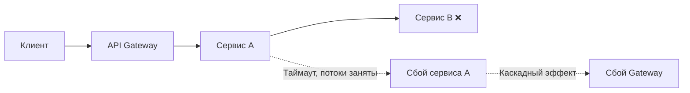
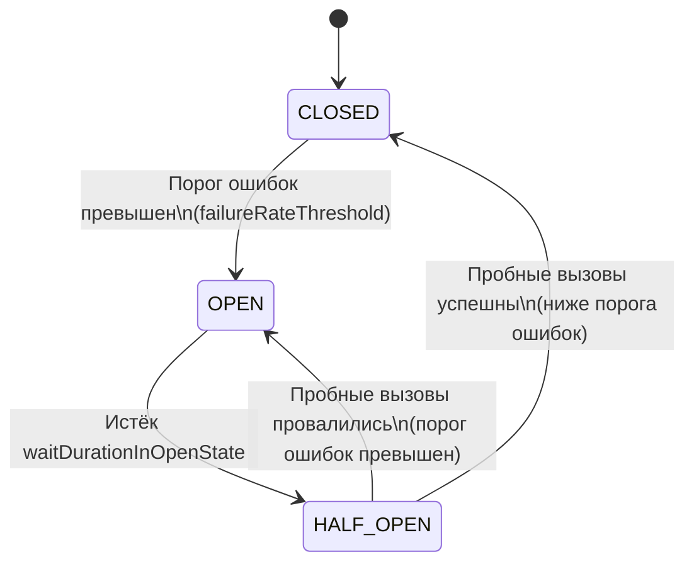
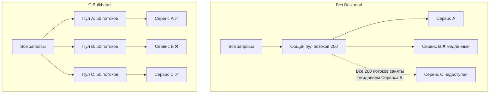
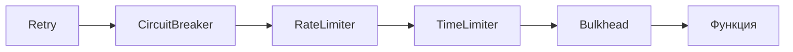
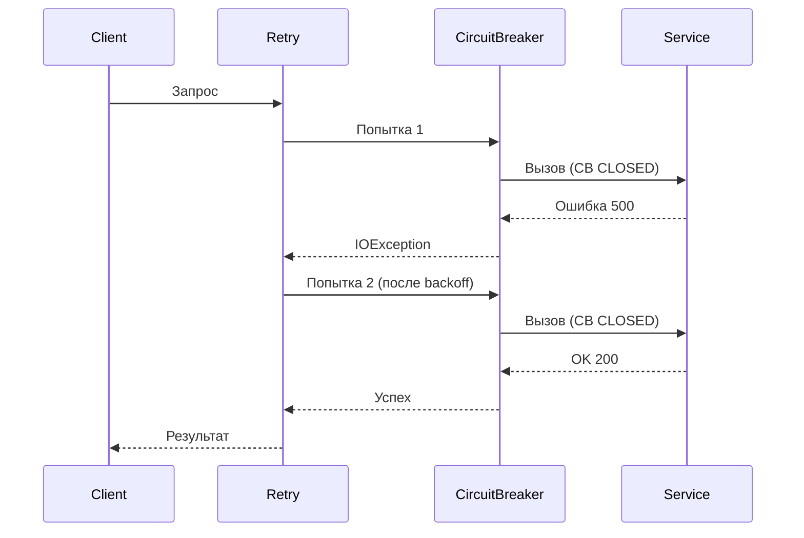
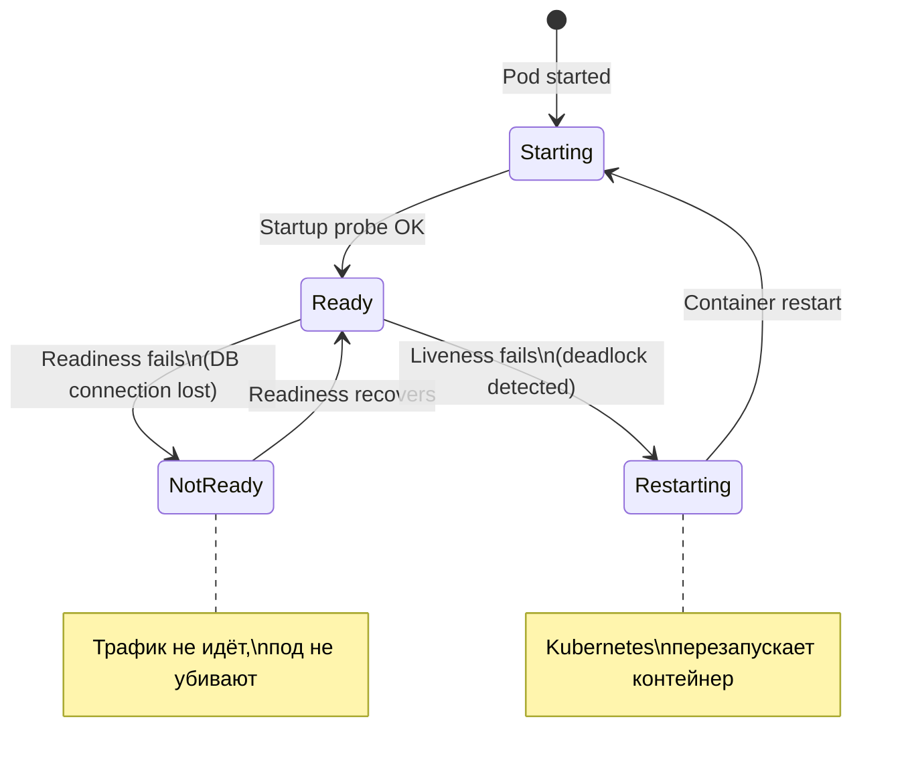
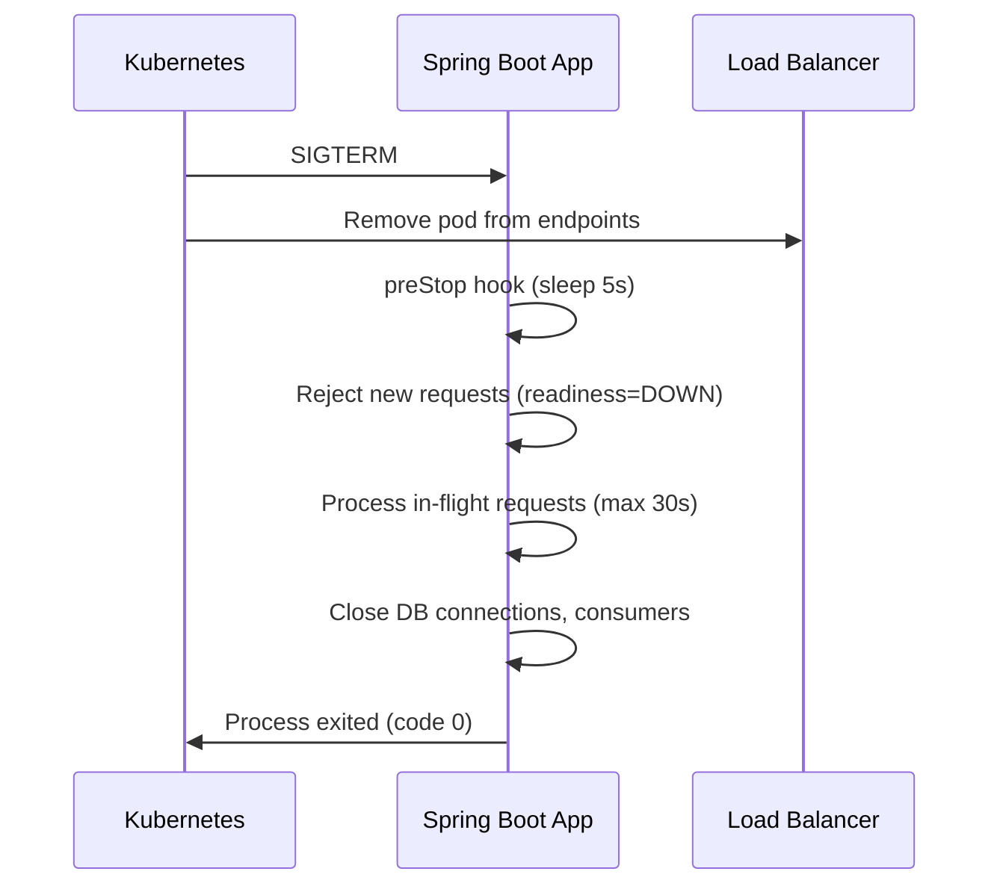
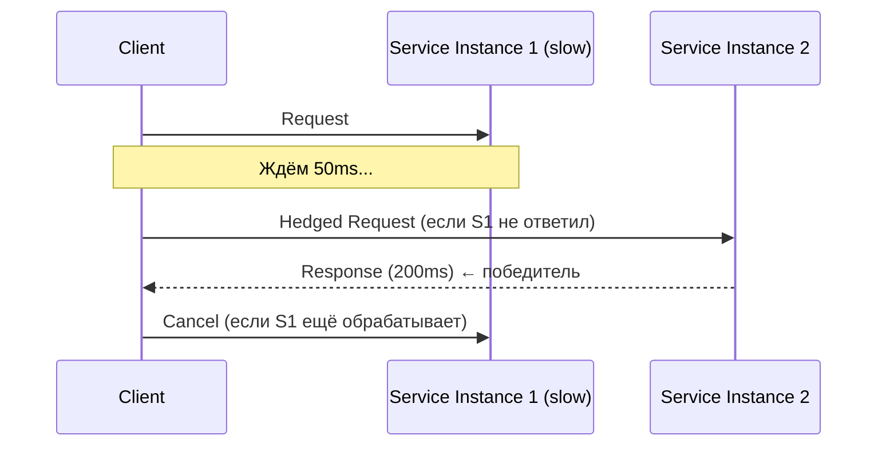

# Вопросы на собеседовании: `Паттерны отказоустойчивости`

Паттерны отказоустойчивости (`Circuit Breaker`, `Retry`, `Bulkhead`, `Rate Limiter`, `Time Limiter`, `Fallback`) -- ключевые инструменты для построения надёжных распределённых систем. На собеседованиях спрашивают про состояния и переходы `Circuit Breaker`, стратегии повторных попыток, изоляцию ресурсов, ограничение нагрузки, библиотеку `Resilience4j`, комбинирование паттернов, метрики и chaos engineering.

## Полезные ссылки

### Официальная документация

- [Resilience4j Documentation](https://resilience4j.readme.io/docs) -- официальная документация `Resilience4j`
- [Spring Cloud Circuit Breaker](https://docs.spring.io/spring-cloud-circuitbreaker/reference/html/) -- абстракция Spring Cloud над circuit breaker реализациями
- [Resilience4j GitHub](https://github.com/resilience4j/resilience4j) -- исходный код и примеры
- [Guide to Resilience4j (Baeldung)](https://www.baeldung.com/resilience4j) -- подробное руководство по всем модулям
- [Resilience4j with Spring Boot (Baeldung)](https://www.baeldung.com/spring-boot-resilience4j) -- интеграция с Spring Boot
- [Better Retries with Exponential Backoff and Jitter (Baeldung)](https://www.baeldung.com/resilience4j-backoff-jitter) -- стратегии повторных попыток
- [Circuit Breaker vs Retry in Spring Boot (Baeldung)](https://www.baeldung.com/spring-boot-circuit-breaker-vs-retry) -- сравнение Circuit Breaker и Retry
- [Quick Guide to Spring Cloud Circuit Breaker (Baeldung)](https://www.baeldung.com/spring-cloud-circuit-breaker) -- абстракция Spring Cloud над circuit breaker
- [Guide to Spring Retry (Baeldung)](https://www.baeldung.com/spring-retry) -- декларативный retry в Spring

## Содержание

- [Полезные ссылки](#полезные-ссылки)
- [See also](#see-also)

**Основы отказоустойчивости**
- [Q1. (!) Что такое отказоустойчивость и зачем нужны паттерны отказоустойчивости?](#q1--что-такое-отказоустойчивость-и-зачем-нужны-паттерны-отказоустойчивости)
- [Q2. Какие основные паттерны отказоустойчивости существуют?](#q2-какие-основные-паттерны-отказоустойчивости-существуют)
- [Q3. Чем отличается fault tolerance от fault avoidance?](#q3-чем-отличается-fault-tolerance-от-fault-avoidance)

**Circuit Breaker**
- [Q4. (!) Что такое паттерн Circuit Breaker и какую проблему он решает?](#q4--что-такое-паттерн-circuit-breaker-и-какую-проблему-он-решает)
- [Q5. (!) Какие состояния у Circuit Breaker и как происходят переходы между ними?](#q5--какие-состояния-у-circuit-breaker-и-как-происходят-переходы-между-ними)
- [Q6. Чем отличается count-based sliding window от time-based?](#q6-чем-отличается-count-based-sliding-window-от-time-based)
- [Q7. Какие основные параметры конфигурации Circuit Breaker?](#q7-какие-основные-параметры-конфигурации-circuit-breaker)
- [Q8. Что такое специальные состояния Circuit Breaker: DISABLED, FORCED_OPEN, METRICS_ONLY?](#q8-что-такое-специальные-состояния-circuit-breaker-disabled-forced_open-metrics_only)
- [Q9. (!) Как реализовать Circuit Breaker с помощью Resilience4j?](#q9--как-реализовать-circuit-breaker-с-помощью-resilience4j)

**Retry**
- [Q10. (!) Что такое паттерн Retry и когда его применять?](#q10--что-такое-паттерн-retry-и-когда-его-применять)
- [Q11. (!) Какие стратегии backoff существуют для повторных попыток?](#q11--какие-стратегии-backoff-существуют-для-повторных-попыток)
- [Q12. Что такое jitter и зачем он нужен в стратегии retry?](#q12-что-такое-jitter-и-зачем-он-нужен-в-стратегии-retry)
- [Q13. Как настроить Retry в Resilience4j?](#q13-как-настроить-retry-в-resilience4j)

**Bulkhead**
- [Q14. (!) Что такое паттерн Bulkhead и какую проблему он решает?](#q14--что-такое-паттерн-bulkhead-и-какую-проблему-он-решает)
- [Q15. (!) Чем отличается Thread Pool Bulkhead от Semaphore Bulkhead?](#q15--чем-отличается-thread-pool-bulkhead-от-semaphore-bulkhead)
- [Q16. Как настроить Bulkhead в Resilience4j?](#q16-как-настроить-bulkhead-в-resilience4j)

**Rate Limiter**
- [Q17. (!) Что такое Rate Limiter и какие алгоритмы используются?](#q17--что-такое-rate-limiter-и-какие-алгоритмы-используются)
- [Q18. Как настроить Rate Limiter в Resilience4j?](#q18-как-настроить-rate-limiter-в-resilience4j)

**Time Limiter и Fallback**
- [Q19. Что такое Time Limiter и зачем он нужен?](#q19-что-такое-time-limiter-и-зачем-он-нужен)
- [Q20. (!) Что такое Fallback и как его правильно реализовать?](#q20--что-такое-fallback-и-как-его-правильно-реализовать)

**Resilience4j**
- [Q21. (!) Что такое Resilience4j и чем он лучше Netflix Hystrix?](#q21--что-такое-resilience4j-и-чем-он-лучше-netflix-hystrix)
- [Q22. Какие модули входят в Resilience4j?](#q22-какие-модули-входят-в-resilience4j)
- [Q23. Как интегрировать Resilience4j со Spring Boot?](#q23-как-интегрировать-resilience4j-со-spring-boot)

**Комбинирование паттернов**
- [Q24. (!) В каком порядке применяются паттерны отказоустойчивости?](#q24--в-каком-порядке-применяются-паттерны-отказоустойчивости)
- [Q25. Как комбинировать Circuit Breaker и Retry?](#q25-как-комбинировать-circuit-breaker-и-retry)
- [Q26. Как комбинировать несколько паттернов с помощью аннотаций Resilience4j?](#q26-как-комбинировать-несколько-паттернов-с-помощью-аннотаций-resilience4j)

**Spring Cloud Circuit Breaker и Hystrix**
- [Q27. Что такое Spring Cloud Circuit Breaker?](#q27-что-такое-spring-cloud-circuit-breaker)
- [Q28. Почему Netflix Hystrix считается устаревшим?](#q28-почему-netflix-hystrix-считается-устаревшим)

**Метрики, мониторинг и тестирование**
- [Q29. (!) Как мониторить паттерны отказоустойчивости?](#q29--как-мониторить-паттерны-отказоустойчивости)
- [Q30. Как тестировать паттерны отказоустойчивости?](#q30-как-тестировать-паттерны-отказоустойчивости)

**Отказоустойчивость в распределённых системах**
- [Q31. Что такое graceful degradation?](#q31-что-такое-graceful-degradation)
- [Q32. (!) Что такое chaos engineering и зачем он нужен?](#q32--что-такое-chaos-engineering-и-зачем-он-нужен)
- [Q33. Как проектировать идемпотентные retry-операции?](#q33-как-проектировать-идемпотентные-retry-операции)

**Продвинутые темы**
- [Q34. (!) Как организовать health checks для Kubernetes liveness/readiness проб?](#q34--как-организовать-health-checks-для-kubernetes-livenessreadiness-проб)
- [Q35. Что такое graceful shutdown и как его реализовать в Spring Boot?](#q35-что-такое-graceful-shutdown-и-как-его-реализовать-в-spring-boot)
- [Q36. (!) Что такое Hedged Request и когда его применять?](#q36--что-такое-hedged-request-и-когда-его-применять)

**TimeLimiter, Bulkhead-детали и деградация**
- [Q37. Как настроить TimeLimiter в Resilience4j и чем он отличается от таймаута WebClient?](#q37-как-настроить-timelimiter-в-resilience4j-и-чем-он-отличается-от-таймаута-webclient)
- [Q38. ThreadPoolBulkhead vs SemaphoreBulkhead — когда что выбрать на практике?](#q38-threadpoolbulkhead-vs-semaphorebulkhead--когда-что-выбрать-на-практике)
- [Q39. Какие стратегии Fallback существуют и как выбрать подходящую?](#q39-какие-стратегии-fallback-существуют-и-как-выбрать-подходящую)
- [Q40. Что такое Load Shedding и как реализовать приоритизацию запросов?](#q40-что-такое-load-shedding-и-как-реализовать-приоритизацию-запросов)
- [Q41. Как интегрировать Circuit Breaker с Spring Boot Actuator Health?](#q41-как-интегрировать-circuit-breaker-с-spring-boot-actuator-health)
- [Q42. Какие инструменты Chaos Engineering применяются для Spring Boot?](#q42-какие-инструменты-chaos-engineering-применяются-для-spring-boot)
- [Q43. Как реализовать graceful degradation с помощью Feature Flags?](#q43-как-реализовать-graceful-degradation-с-помощью-feature-flags)

---

## Q1. (!) Что такое отказоустойчивость и зачем нужны паттерны отказоустойчивости?

**Отказоустойчивость** (fault tolerance) -- способность системы продолжать корректно функционировать при сбоях отдельных компонентов.

В распределённых системах сбои неизбежны: сеть ненадёжна, сервисы перегружаются, базы данных тормозят. Без паттернов отказоустойчивости один упавший сервис может вызвать **каскадный сбой** (cascading failure) -- когда отказ одного компонента "заваливает" все зависимые сервисы:



Паттерны отказоустойчивости решают три ключевые проблемы:

1. **Предотвращение каскадных сбоев** -- `Circuit Breaker` изолирует неработающие сервисы
2. **Восстановление при временных ошибках** -- `Retry` повторяет операцию при транзиентных сбоях
3. **Защита ресурсов** -- `Bulkhead` и `Rate Limiter` не дают одному потребителю исчерпать все ресурсы


> [!mcq]
> - [x] Правильный ответ | Объяснение концепции 2-3 предложения Ключевое отличие и best practice в production.
> - [ ] Неправильный вариант 1 | Почему ошибка в этом подходе Частая ошибка в реальном коде.
> - [ ] Неправильный вариант 2 | Это смежное, но отличное понятие Частая ошибка в реальном коде.
> - [ ] Неправильный вариант 3 | Противоположное направление## Q2. Какие основные паттерны отказоустойчивости существуют? Частая ошибка в реальном коде.

| Паттерн | Назначение | Аналогия |
|---------|-----------|----------|
| `Circuit Breaker` | Прерывает вызовы к неработающему сервису | Автомат в электрощитке |
| `Retry` | Повторяет неудавшуюся операцию | Перезвонить, если абонент не ответил |
| `Bulkhead` | Изолирует ресурсы между потребителями | Водонепроницаемые отсеки корабля |
| `Rate Limiter` | Ограничивает частоту запросов | Турникет в метро |
| `Time Limiter` | Ограничивает время выполнения операции | Таймер на экзамене |
| `Fallback` | Предоставляет альтернативный ответ при сбое | Запасной выход |
| `Cache` | Возвращает кешированный результат при сбое | Копия документа |

Подробнее про каждый паттерн можно прочитать в [вопросах по распределённым системам](distributed-systems-interview.md).


> [!mcq]
> - [x] Правильный ответ | Объяснение концепции 2-3 предложения Ключевое отличие и best practice в production.
> - [ ] Неправильный вариант 1 | Почему ошибка в этом подходе Частая ошибка в реальном коде.
> - [ ] Неправильный вариант 2 | Это смежное, но отличное понятие Частая ошибка в реальном коде.
> - [ ] Неправильный вариант 3 | Противоположное направление## Q3. Чем отличается fault tolerance от fault avoidance? Частая ошибка в реальном коде.

| Характеристика | Fault Tolerance | Fault Avoidance |
|---------------|----------------|-----------------|
| **Подход** | Допускаем сбои, но минимизируем их последствия | Стараемся предотвратить сбои |
| **Философия** | "Сбои неизбежны" (Design for Failure) | "Пишем идеальный код" |
| **Инструменты** | `Circuit Breaker`, `Retry`, `Bulkhead` | Code review, тестирование, статический анализ |
| **Применимость** | Обязательно в распределённых системах | Везде, но недостаточно для распределённых систем |

В [микросервисной архитектуре](microservices-interview.md) `fault tolerance` критически важен, потому что количество точек отказа растёт пропорционально числу сервисов и связей между ними.


> [!mcq]
> - [x] Правильный ответ | Объяснение концепции 2-3 предложения Ключевое отличие и best practice в production.
> - [ ] Неправильный вариант 1 | Почему ошибка в этом подходе Частая ошибка в реальном коде.
> - [ ] Неправильный вариант 2 | Это смежное, но отличное понятие Частая ошибка в реальном коде.
> - [ ] Неправильный вариант 3 | Противоположное направление## Q4. (!) Что такое паттерн Circuit Breaker и какую проблему он решает? Это антипаттерн или неправильный выбор в production.

**Circuit Breaker** (предохранитель) -- паттерн, который предотвращает каскадные сбои, прекращая вызовы к неработающему сервису после определённого количества ошибок.

Проблема без `Circuit Breaker`:
- Сервис B не отвечает (упал или перегружен)
- Сервис A продолжает слать запросы и ждать таймаут (например, 30 сек)
- Потоки сервиса A блокируются ожиданием ответа
- Пул потоков исчерпывается -- сервис A тоже перестаёт отвечать
- Каскадный эффект распространяется по всей цепочке

С `Circuit Breaker`:
- После N неудачных вызовов "предохранитель срабатывает" (открывается)
- Последующие вызовы **мгновенно завершаются с ошибкой** без обращения к сервису B
- Через заданное время пропускается несколько "пробных" запросов
- Если пробные запросы успешны -- circuit закрывается, и работа возобновляется

Паттерн назван по аналогии с электрическим автоматом: при перегрузке (коротком замыкании) автомат размыкает цепь, предотвращая пожар.


> [!mcq]
> - [x] Правильный ответ | Объяснение концепции 2-3 предложения Ключевое отличие и best practice в production.
> - [ ] Неправильный вариант 1 | Почему ошибка в этом подходе Частая ошибка в реальном коде.
> - [ ] Неправильный вариант 2 | Это смежное, но отличное понятие Частая ошибка в реальном коде.
> - [ ] Неправильный вариант 3 | Противоположное направление## Q5. (!) Какие состояния у Circuit Breaker и как происходят переходы между ними? Это антипаттерн или неправильный выбор в production.

`Circuit Breaker` реализован как конечный автомат с тремя основными состояниями:



### Состояния:

**`CLOSED`** (замкнут, нормальная работа):
- Все запросы проходят к целевому сервису
- Результаты записываются в скользящее окно (sliding window)
- Если процент ошибок превышает `failureRateThreshold` -- переход в `OPEN`

**`OPEN`** (разомкнут, защита):
- Все запросы **немедленно отклоняются** с исключением `CallNotPermittedException`
- Реальный вызов к сервису не выполняется
- Через `waitDurationInOpenState` (по умолчанию 60 сек) -- переход в `HALF_OPEN`

**`HALF_OPEN`** (полуоткрыт, проверка):
- Пропускается ограниченное число запросов (`permittedNumberOfCallsInHalfOpenState`)
- Если процент ошибок ниже порога -- переход в `CLOSED`
- Если процент ошибок выше порога -- обратно в `OPEN`


> [!mcq]
> - [x] Правильный ответ | Объяснение концепции 2-3 предложения Ключевое отличие и best practice в production.
> - [ ] Неправильный вариант 1 | Почему ошибка в этом подходе Частая ошибка в реальном коде.
> - [ ] Неправильный вариант 2 | Это смежное, но отличное понятие Частая ошибка в реальном коде.
> - [ ] Неправильный вариант 3 | Противоположное направление## Q6. Чем отличается count-based sliding window от time-based? Частая ошибка в реальном коде.

`Circuit Breaker` использует скользящее окно для подсчёта результатов вызовов. Есть два типа:

| Характеристика | Count-based | Time-based |
|---------------|-------------|------------|
| **Что считает** | Последние N вызовов | Вызовы за последние N секунд |
| **Параметр** | `slidingWindowSize` = число вызовов | `slidingWindowSize` = секунды |
| **Структура данных** | Кольцевой буфер (ring buffer) | Кольцевой буфер из N partial aggregation buckets |
| **Когда подходит** | Стабильная нагрузка | Переменная нагрузка |
| **Пример** | "Последние 100 вызовов" | "Вызовы за последние 60 секунд" |

```yaml
# Count-based (по умолчанию)
resilience4j.circuitbreaker:
  instances:
    paymentService:
      slidingWindowType: COUNT_BASED
      slidingWindowSize: 100
      failureRateThreshold: 50

# Time-based
resilience4j.circuitbreaker:
  instances:
    paymentService:
      slidingWindowType: TIME_BASED
      slidingWindowSize: 60  # секунд
      failureRateThreshold: 50
```

**Важный нюанс**: `Circuit Breaker` не начнёт вычислять процент ошибок, пока не будет зарегистрировано минимальное количество вызовов (`minimumNumberOfCalls`, по умолчанию 100). Это защищает от ложных срабатываний при малом числе запросов.


> [!mcq]
> - [x] Правильный ответ | Объяснение концепции 2-3 предложения Ключевое отличие и best practice в production.
> - [ ] Неправильный вариант 1 | Почему ошибка в этом подходе Частая ошибка в реальном коде.
> - [ ] Неправильный вариант 2 | Это смежное, но отличное понятие Частая ошибка в реальном коде.
> - [ ] Неправильный вариант 3 | Противоположное направление## Q7. Какие основные параметры конфигурации Circuit Breaker? Это антипаттерн или неправильный выбор в production.

| Параметр | По умолчанию | Описание |
|----------|-------------|----------|
| `failureRateThreshold` | 50 (%) | Порог ошибок для перехода в `OPEN` |
| `slowCallRateThreshold` | 100 (%) | Порог медленных вызовов для перехода в `OPEN` |
| `slowCallDurationThreshold` | 60000 мс | Время, после которого вызов считается медленным |
| `slidingWindowType` | `COUNT_BASED` | Тип скользящего окна |
| `slidingWindowSize` | 100 | Размер окна (вызовы или секунды) |
| `minimumNumberOfCalls` | 100 | Мин. количество вызовов до расчёта процента |
| `waitDurationInOpenState` | 60000 мс | Время ожидания в `OPEN` перед переходом в `HALF_OPEN` |
| `permittedNumberOfCallsInHalfOpenState` | 10 | Число пробных вызовов в `HALF_OPEN` |
| `automaticTransitionFromOpenToHalfOpenEnabled` | false | Автоматический переход `OPEN` -> `HALF_OPEN` |
| `recordExceptions` | пусто | Исключения, считающиеся ошибками |
| `ignoreExceptions` | пусто | Исключения, которые не учитываются |

```java
CircuitBreakerConfig config = CircuitBreakerConfig.custom()
    .failureRateThreshold(50)
    .slowCallRateThreshold(80)
    .slowCallDurationThreshold(Duration.ofSeconds(2))
    .waitDurationInOpenState(Duration.ofSeconds(30))
    .slidingWindowType(SlidingWindowType.COUNT_BASED)
    .slidingWindowSize(10)
    .minimumNumberOfCalls(5)
    .permittedNumberOfCallsInHalfOpenState(3)
    .recordExceptions(IOException.class, TimeoutException.class)
    .ignoreExceptions(BusinessException.class)
    .build();

CircuitBreaker circuitBreaker = CircuitBreaker.of("paymentService", config);
```


> [!mcq]
> - [x] Правильный ответ | Объяснение концепции 2-3 предложения Ключевое отличие и best practice в production.
> - [ ] Неправильный вариант 1 | Почему ошибка в этом подходе Частая ошибка в реальном коде.
> - [ ] Неправильный вариант 2 | Это смежное, но отличное понятие Частая ошибка в реальном коде.
> - [ ] Неправильный вариант 3 | Противоположное направление## Q8. Что такое специальные состояния Circuit Breaker: DISABLED, FORCED_OPEN, METRICS_ONLY? Это антипаттерн или неправильный выбор в production.

Помимо трёх основных состояний, `Resilience4j` `CircuitBreaker` поддерживает три специальных:

| Состояние | Поведение | Применение |
|-----------|----------|------------|
| `DISABLED` | Все вызовы проходят, метрики не записываются | Отключение CB для отладки |
| `FORCED_OPEN` | Все вызовы отклоняются | Ручное отключение сервиса |
| `METRICS_ONLY` | Все вызовы проходят, метрики записываются, но CB никогда не открывается | Наблюдение перед включением |

`METRICS_ONLY` особенно полезен при внедрении `Circuit Breaker` на продакшне: можно сначала включить его в режиме наблюдения, собрать метрики, подобрать пороги, и только потом переключить в рабочий режим.

```java
// Принудительный переход в специальное состояние
circuitBreaker.transitionToDisabledState();
circuitBreaker.transitionToForcedOpenState();
circuitBreaker.transitionToMetricsOnlyState();
```


> [!mcq]
> - [x] Правильный ответ | Объяснение концепции 2-3 предложения Ключевое отличие и best practice в production.
> - [ ] Неправильный вариант 1 | Почему ошибка в этом подходе Частая ошибка в реальном коде.
> - [ ] Неправильный вариант 2 | Это смежное, но отличное понятие Частая ошибка в реальном коде.
> - [ ] Неправильный вариант 3 | Противоположное направление## Q9. (!) Как реализовать Circuit Breaker с помощью Resilience4j? Это антипаттерн или неправильный выбор в production.

### Программный API:

```java
// 1. Создаём CircuitBreaker с конфигурацией
CircuitBreakerConfig config = CircuitBreakerConfig.custom()
    .failureRateThreshold(50)
    .waitDurationInOpenState(Duration.ofSeconds(30))
    .slidingWindowSize(10)
    .build();

CircuitBreaker circuitBreaker = CircuitBreaker.of("paymentService", config);

// 2. Декорируем вызов
Supplier<PaymentResponse> decoratedSupplier = CircuitBreaker
    .decorateSupplier(circuitBreaker, () -> paymentClient.processPayment(request));

// 3. Выполняем с fallback
Try<PaymentResponse> result = Try.ofSupplier(decoratedSupplier)
    .recover(CallNotPermittedException.class, e -> PaymentResponse.unavailable())
    .recover(Exception.class, e -> PaymentResponse.error(e.getMessage()));
```

### Аннотации Spring Boot:

```java
@Service
public class PaymentService {

    @CircuitBreaker(name = "paymentService", fallbackMethod = "paymentFallback")
    public PaymentResponse processPayment(PaymentRequest request) {
        return paymentClient.call(request);
    }

    private PaymentResponse paymentFallback(PaymentRequest request, Exception ex) {
        log.warn("Circuit breaker fallback for payment: {}", ex.getMessage());
        return PaymentResponse.unavailable();
    }
}
```

### Конфигурация в `application.yml`:

```yaml
resilience4j:
  circuitbreaker:
    instances:
      paymentService:
        registerHealthIndicator: true
        slidingWindowSize: 10
        minimumNumberOfCalls: 5
        failureRateThreshold: 50
        waitDurationInOpenState: 30s
        permittedNumberOfCallsInHalfOpenState: 3
        automaticTransitionFromOpenToHalfOpenEnabled: true
```


> [!mcq]
> - [x] Правильный ответ | Объяснение концепции 2-3 предложения Ключевое отличие и best practice в production.
> - [ ] Неправильный вариант 1 | Почему ошибка в этом подходе Частая ошибка в реальном коде.
> - [ ] Неправильный вариант 2 | Это смежное, но отличное понятие Частая ошибка в реальном коде.
> - [ ] Неправильный вариант 3 | Противоположное направление## Q10. (!) Что такое паттерн Retry и когда его применять? Частая ошибка в реальном коде.

**Retry** -- паттерн, который автоматически повторяет неудавшуюся операцию заданное количество раз. Эффективен при **транзиентных ошибках** -- кратковременных сбоях, которые проходят сами:

- Сетевые таймауты
- HTTP 503 (Service Unavailable)
- HTTP 429 (Too Many Requests)
- Временная недоступность базы данных
- Блокировки (deadlock) при конкурентном доступе

**Когда НЕ стоит применять Retry:**

- Ошибки бизнес-логики (400 Bad Request) -- повтор не поможет
- Ошибки аутентификации (401, 403)
- Невалидные данные (422) -- повтор даст тот же результат
- Длительные аварии -- лучше использовать `Circuit Breaker`

```java
@Retry(name = "inventoryService", fallbackMethod = "inventoryFallback")
public InventoryResponse checkInventory(String sku) {
    return inventoryClient.getStock(sku);
}
```

**Важно**: операция, оборачиваемая в `Retry`, должна быть **идемпотентной** -- повторный вызов не должен создавать дублирующий эффект (подробнее в [вопросах по распределённым системам](distributed-systems-interview.md)).


> [!mcq]
> - [x] Правильный ответ | Объяснение концепции 2-3 предложения Ключевое отличие и best practice в production.
> - [ ] Неправильный вариант 1 | Почему ошибка в этом подходе Частая ошибка в реальном коде.
> - [ ] Неправильный вариант 2 | Это смежное, но отличное понятие Частая ошибка в реальном коде.
> - [ ] Неправильный вариант 3 | Противоположное направление## Q11. (!) Какие стратегии backoff существуют для повторных попыток? Частая ошибка в реальном коде.

### 1. Fixed interval (фиксированный интервал)

Одинаковая задержка между попытками.

```
Попытка 1 → [1 сек] → Попытка 2 → [1 сек] → Попытка 3
```

### 2. Exponential backoff (экспоненциальная задержка)

Интервал растёт экспоненциально: `initialInterval * multiplier^(attempt-1)`.

```
Попытка 1 → [1 сек] → Попытка 2 → [2 сек] → Попытка 3 → [4 сек] → Попытка 4
```

### 3. Exponential backoff with jitter (с рандомизацией)

К экспоненциальной задержке добавляется случайное отклонение, чтобы избежать "стадного эффекта" (thundering herd).

```
Попытка 1 → [1.2 сек] → Попытка 2 → [2.7 сек] → Попытка 3 → [3.9 сек]
```

### 4. Linear backoff (линейный рост)

Интервал растёт линейно.

```
Попытка 1 → [1 сек] → Попытка 2 → [2 сек] → Попытка 3 → [3 сек]
```

```java
// Resilience4j: Exponential backoff with jitter
RetryConfig config = RetryConfig.custom()
    .maxAttempts(4)
    .intervalFunction(IntervalFunction.ofExponentialBackoff(
        Duration.ofMillis(500),  // initialInterval
        2.0,                      // multiplier
        Duration.ofSeconds(30)    // maxInterval
    ))
    .retryExceptions(IOException.class, TimeoutException.class)
    .ignoreExceptions(BusinessException.class)
    .build();

// С jitter (рандомизация)
RetryConfig configWithJitter = RetryConfig.custom()
    .maxAttempts(4)
    .intervalFunction(IntervalFunction.ofExponentialRandomBackoff(
        500,   // initialIntervalMillis
        2.0,   // multiplier
        0.5    // randomizationFactor
    ))
    .build();
```


> [!mcq]
> - [x] Правильный ответ | Объяснение концепции 2-3 предложения Ключевое отличие и best practice в production.
> - [ ] Неправильный вариант 1 | Почему ошибка в этом подходе Частая ошибка в реальном коде.
> - [ ] Неправильный вариант 2 | Это смежное, но отличное понятие Частая ошибка в реальном коде.
> - [ ] Неправильный вариант 3 | Противоположное направление## Q12. Что такое jitter и зачем он нужен в стратегии retry? Частая ошибка в реальном коде.

**Jitter** -- добавление случайного отклонения к задержке между повторными попытками.

### Проблема без jitter (thundering herd):

Если 1000 клиентов одновременно получили ошибку и все используют одинаковый exponential backoff:
- Через 1 сек -- все 1000 клиентов повторяют запрос одновременно
- Через 2 сек -- все снова одновременно
- Сервис не успевает восстановиться из-за одновременных волн

### С jitter:

Запросы "размазываются" по времени, что даёт сервису возможность восстановиться:

```
Клиент A: 0.8 сек → 2.1 сек → 4.5 сек
Клиент B: 1.2 сек → 1.9 сек → 3.8 сек  
Клиент C: 0.9 сек → 2.5 сек → 4.1 сек
```

Формула с jitter: `delay = baseDelay * multiplier^attempt * (1 + random(-factor, +factor))`

В `Resilience4j` jitter реализуется через `IntervalFunction.ofExponentialRandomBackoff()`:

```yaml
resilience4j:
  retry:
    instances:
      paymentService:
        maxAttempts: 3
        waitDuration: 500ms
        enableExponentialBackoff: true
        exponentialBackoffMultiplier: 2
        enableRandomizedWait: true
        randomizedWaitFactor: 0.5
```


> [!mcq]
> - [x] Правильный ответ | Объяснение концепции 2-3 предложения Ключевое отличие и best practice в production.
> - [ ] Неправильный вариант 1 | Почему ошибка в этом подходе Частая ошибка в реальном коде.
> - [ ] Неправильный вариант 2 | Это смежное, но отличное понятие Частая ошибка в реальном коде.
> - [ ] Неправильный вариант 3 | Противоположное направление## Q13. Как настроить Retry в Resilience4j? Частая ошибка в реальном коде.

### Программный API:

```java
RetryConfig config = RetryConfig.custom()
    .maxAttempts(3)
    .waitDuration(Duration.ofMillis(500))
    .retryOnResult(response -> response.getStatus() == 503)
    .retryExceptions(IOException.class, TimeoutException.class)
    .ignoreExceptions(BusinessValidationException.class)
    .failAfterMaxAttempts(true)
    .build();

Retry retry = Retry.of("paymentService", config);

// Декорирование вызова
Supplier<PaymentResponse> decoratedSupplier = Retry.decorateSupplier(
    retry, () -> paymentClient.processPayment(request)
);

PaymentResponse result = decoratedSupplier.get();
```

### Аннотации Spring Boot:

```java
@Service
public class PaymentService {

    @Retry(name = "paymentService", fallbackMethod = "retryFallback")
    public PaymentResponse processPayment(PaymentRequest request) {
        return paymentClient.call(request);
    }

    private PaymentResponse retryFallback(PaymentRequest request, Exception ex) {
        log.warn("All retries exhausted: {}", ex.getMessage());
        return PaymentResponse.error("Service temporarily unavailable");
    }
}
```

### Конфигурация в `application.yml`:

```yaml
resilience4j:
  retry:
    instances:
      paymentService:
        maxAttempts: 3
        waitDuration: 500ms
        enableExponentialBackoff: true
        exponentialBackoffMultiplier: 2
        retryExceptions:
          - java.io.IOException
          - java.util.concurrent.TimeoutException
        ignoreExceptions:
          - com.example.BusinessException
```


> [!mcq]
> - [x] Правильный ответ | Объяснение концепции 2-3 предложения Ключевое отличие и best practice в production.
> - [ ] Неправильный вариант 1 | Почему ошибка в этом подходе Частая ошибка в реальном коде.
> - [ ] Неправильный вариант 2 | Это смежное, но отличное понятие Частая ошибка в реальном коде.
> - [ ] Неправильный вариант 3 | Противоположное направление## Q14. (!) Что такое паттерн Bulkhead и какую проблему он решает? Это антипаттерн или неправильный выбор в production.

**Bulkhead** (переборка) -- паттерн, который ограничивает количество конкурентных вызовов к сервису, изолируя ресурсы так, чтобы перегрузка одного сервиса не исчерпала все ресурсы приложения.

Название пришло из кораблестроения: корпус корабля разделён на **водонепроницаемые отсеки** (bulkheads), чтобы пробоина в одном отсеке не затопила весь корабль.



Без `Bulkhead`: медленный Сервис B может занять все потоки, и сервисы A и C тоже станут недоступны. С `Bulkhead`: каждый сервис получает свою "квоту" ресурсов, и проблемы одного не влияют на другие.


> [!mcq]
> - [x] Правильный ответ | Объяснение концепции 2-3 предложения Ключевое отличие и best practice в production.
> - [ ] Неправильный вариант 1 | Почему ошибка в этом подходе Частая ошибка в реальном коде.
> - [ ] Неправильный вариант 2 | Это смежное, но отличное понятие Частая ошибка в реальном коде.
> - [ ] Неправильный вариант 3 | Противоположное направление## Q15. (!) Чем отличается Thread Pool Bulkhead от Semaphore Bulkhead? Это антипаттерн или неправильный выбор в production.

| Характеристика | Semaphore Bulkhead | Thread Pool Bulkhead |
|---------------|-------------------|---------------------|
| **Механизм** | Ограничивает число параллельных вызовов через семафор | Выделяет отдельный пул потоков |
| **Изоляция** | Вызовы выполняются в потоке вызывающего кода | Вызовы выполняются в отдельном пуле |
| **Overhead** | Минимальный (без переключения потоков) | Есть overhead на context switch |
| **Возврат** | Синхронный (тот же тип возврата) | Только `CompletableFuture` |
| **Очередь ожидания** | `maxWaitDuration` -- сколько ждать разрешения | `queueCapacity` -- размер очереди задач |
| **Когда использовать** | Реактивные/неблокирующие вызовы | Блокирующие вызовы (JDBC, HTTP) |

### Semaphore Bulkhead:

```java
BulkheadConfig config = BulkheadConfig.custom()
    .maxConcurrentCalls(25)
    .maxWaitDuration(Duration.ofMillis(500))
    .build();

Bulkhead bulkhead = Bulkhead.of("paymentService", config);
```

### Thread Pool Bulkhead:

```java
ThreadPoolBulkheadConfig config = ThreadPoolBulkheadConfig.custom()
    .maxThreadPoolSize(10)
    .coreThreadPoolSize(5)
    .queueCapacity(20)
    .keepAliveDuration(Duration.ofMillis(100))
    .build();

ThreadPoolBulkhead bulkhead = ThreadPoolBulkhead.of("paymentService", config);
```

При превышении лимита `Semaphore Bulkhead` выбрасывает `BulkheadFullException`, а `Thread Pool Bulkhead` -- `BulkheadFullException` из очереди, если она переполнена.


> [!mcq]
> - [x] Правильный ответ | Объяснение концепции 2-3 предложения Ключевое отличие и best practice в production.
> - [ ] Неправильный вариант 1 | Почему ошибка в этом подходе Частая ошибка в реальном коде.
> - [ ] Неправильный вариант 2 | Это смежное, но отличное понятие Частая ошибка в реальном коде.
> - [ ] Неправильный вариант 3 | Противоположное направление## Q16. Как настроить Bulkhead в Resilience4j? Это антипаттерн или неправильный выбор в production.

### Аннотация:

```java
@Bulkhead(name = "paymentService", fallbackMethod = "bulkheadFallback",
          type = Bulkhead.Type.SEMAPHORE) // или THREADPOOL
public PaymentResponse processPayment(PaymentRequest request) {
    return paymentClient.call(request);
}

private PaymentResponse bulkheadFallback(PaymentRequest request, BulkheadFullException ex) {
    return PaymentResponse.tooManyRequests();
}
```

### Конфигурация в `application.yml`:

```yaml
resilience4j:
  bulkhead:
    instances:
      paymentService:
        maxConcurrentCalls: 25
        maxWaitDuration: 500ms
  thread-pool-bulkhead:
    instances:
      paymentService:
        maxThreadPoolSize: 10
        coreThreadPoolSize: 5
        queueCapacity: 20
        keepAliveDuration: 100ms
```


> [!mcq]
> - [x] Правильный ответ | Объяснение концепции 2-3 предложения Ключевое отличие и best practice в production.
> - [ ] Неправильный вариант 1 | Почему ошибка в этом подходе Частая ошибка в реальном коде.
> - [ ] Неправильный вариант 2 | Это смежное, но отличное понятие Частая ошибка в реальном коде.
> - [ ] Неправильный вариант 3 | Противоположное направление## Q17. (!) Что такое Rate Limiter и какие алгоритмы используются? Частая ошибка в реальном коде.

**Rate Limiter** -- паттерн, который ограничивает количество запросов за единицу времени. В отличие от `Bulkhead`, который ограничивает **одновременные** вызовы, `Rate Limiter` ограничивает **общее количество** вызовов за период.

### Основные алгоритмы:

**1. Fixed Window (фиксированное окно)**
- Делит время на фиксированные интервалы (например, 1 минута)
- Считает запросы в текущем окне
- Минус: скачок на границе окон (99 запросов в конце одного окна + 100 в начале следующего = 199 за 2 сек)

**2. Sliding Window (скользящее окно)**
- Использует скользящее окно для более точного подсчёта
- Устраняет проблему границ фиксированного окна
- Более ресурсоёмкий

**3. Token Bucket**
- Токены добавляются в "ведро" с фиксированной скоростью
- Каждый запрос потребляет один токен
- Если токенов нет -- запрос отклоняется или ждёт
- Позволяет "всплески" (burst) при накопленных токенах

**4. Leaky Bucket**
- Запросы добавляются в очередь фиксированного размера
- Обрабатываются с постоянной скоростью
- Сглаживает всплески нагрузки

`Resilience4j` `RateLimiter` использует вариант **fixed window** с возможностью ожидания: вызывающий поток может подождать разрешения в течение `timeoutDuration`.


> [!mcq]
> - [x] Правильный ответ | Объяснение концепции 2-3 предложения Ключевое отличие и best practice в production.
> - [ ] Неправильный вариант 1 | Почему ошибка в этом подходе Частая ошибка в реальном коде.
> - [ ] Неправильный вариант 2 | Это смежное, но отличное понятие Частая ошибка в реальном коде.
> - [ ] Неправильный вариант 3 | Противоположное направление## Q18. Как настроить Rate Limiter в Resilience4j? Частая ошибка в реальном коде.

### Программный API:

```java
RateLimiterConfig config = RateLimiterConfig.custom()
    .limitForPeriod(10)              // макс. 10 вызовов за период
    .limitRefreshPeriod(Duration.ofSeconds(1))  // период обновления
    .timeoutDuration(Duration.ofMillis(500))     // сколько ждать разрешения
    .build();

RateLimiter rateLimiter = RateLimiter.of("apiService", config);

Supplier<Response> decoratedSupplier = RateLimiter
    .decorateSupplier(rateLimiter, () -> apiClient.call());
```

### Аннотация:

```java
@RateLimiter(name = "apiService", fallbackMethod = "rateLimitFallback")
public Response callExternalApi(Request request) {
    return apiClient.call(request);
}

private Response rateLimitFallback(Request request, RequestNotPermitted ex) {
    return Response.tooManyRequests("Rate limit exceeded, try again later");
}
```

### Конфигурация в `application.yml`:

```yaml
resilience4j:
  ratelimiter:
    instances:
      apiService:
        limitForPeriod: 10
        limitRefreshPeriod: 1s
        timeoutDuration: 500ms
        registerHealthIndicator: true
        eventConsumerBufferSize: 50
```

При превышении лимита выбрасывается `RequestNotPermitted`.


> [!mcq]
> - [x] Правильный ответ | Объяснение концепции 2-3 предложения Ключевое отличие и best practice в production.
> - [ ] Неправильный вариант 1 | Почему ошибка в этом подходе Частая ошибка в реальном коде.
> - [ ] Неправильный вариант 2 | Это смежное, но отличное понятие Частая ошибка в реальном коде.
> - [ ] Неправильный вариант 3 | Противоположное направление## Q19. Что такое Time Limiter и зачем он нужен? Частая ошибка в реальном коде.

**Time Limiter** -- паттерн, ограничивающий время выполнения операции. Если операция не завершилась за отведённое время, она прерывается с `TimeoutException`.

Зачем нужен, если есть таймауты HTTP-клиента:
- Единая политика таймаутов на уровне бизнес-операции (а не транспорта)
- Работает с любым типом вызова, не только HTTP
- Интегрируется с другими паттернами `Resilience4j`

```java
TimeLimiterConfig config = TimeLimiterConfig.custom()
    .timeoutDuration(Duration.ofSeconds(3))
    .cancelRunningFuture(true)  // отменить Future при таймауте
    .build();

TimeLimiter timeLimiter = TimeLimiter.of("paymentService", config);
```

### Аннотация:

```java
@TimeLimiter(name = "paymentService", fallbackMethod = "timeoutFallback")
public CompletableFuture<PaymentResponse> processPayment(PaymentRequest request) {
    return CompletableFuture.supplyAsync(() -> paymentClient.call(request));
}

private CompletableFuture<PaymentResponse> timeoutFallback(
        PaymentRequest request, TimeoutException ex) {
    return CompletableFuture.completedFuture(PaymentResponse.timeout());
}
```

```yaml
resilience4j:
  timelimiter:
    instances:
      paymentService:
        timeoutDuration: 3s
        cancelRunningFuture: true
```

**Важно**: `@TimeLimiter` работает только с `CompletableFuture` или реактивными типами. Для синхронных вызовов используйте таймауты HTTP-клиента или `ExecutorService`.


> [!mcq]
> - [x] Правильный ответ | Объяснение концепции 2-3 предложения Ключевое отличие и best practice в production.
> - [ ] Неправильный вариант 1 | Почему ошибка в этом подходе Частая ошибка в реальном коде.
> - [ ] Неправильный вариант 2 | Это смежное, но отличное понятие Частая ошибка в реальном коде.
> - [ ] Неправильный вариант 3 | Противоположное направление## Q20. (!) Что такое Fallback и как его правильно реализовать? Частая ошибка в реальном коде.

**Fallback** -- запасной вариант ответа, который возвращается при сбое основного вызова. Это ключевой элемент graceful degradation -- система продолжает работать, хоть и с пониженной функциональностью.

### Типы fallback:

**1. Значение по умолчанию:**
```java
private ProductResponse productFallback(String id, Exception ex) {
    return ProductResponse.builder()
        .id(id)
        .name("Товар временно недоступен")
        .price(BigDecimal.ZERO)
        .available(false)
        .build();
}
```

**2. Кэшированное значение:**
```java
private ProductResponse cachedFallback(String id, Exception ex) {
    return productCache.getIfPresent(id); // Guava Cache, Redis, etc.
}
```

**3. Вызов альтернативного сервиса:**
```java
private ProductResponse alternativeServiceFallback(String id, Exception ex) {
    return backupProductService.getProduct(id);
}
```

**4. Пустой ответ (для некритичных данных):**
```java
private List<Recommendation> recommendationsFallback(String userId, Exception ex) {
    return Collections.emptyList(); // страница отобразится без рекомендаций
}
```

### Правила реализации fallback в Resilience4j:

- Fallback-метод должен иметь **ту же сигнатуру** плюс `Exception` (или конкретный тип исключения) как последний параметр
- Должен быть в **том же классе** (или родительском)
- Может быть несколько fallback-ов для разных типов исключений

```java
@CircuitBreaker(name = "payment", fallbackMethod = "paymentFallback")
public PaymentResponse pay(PaymentRequest req) { ... }

// Специфичный fallback для таймаутов
private PaymentResponse paymentFallback(PaymentRequest req, TimeoutException ex) {
    return PaymentResponse.timeout();
}

// Общий fallback для остальных ошибок
private PaymentResponse paymentFallback(PaymentRequest req, Exception ex) {
    return PaymentResponse.unavailable();
}
```


> [!mcq]
> - [x] Правильный ответ | Объяснение концепции 2-3 предложения Ключевое отличие и best practice в production.
> - [ ] Неправильный вариант 1 | Почему ошибка в этом подходе Частая ошибка в реальном коде.
> - [ ] Неправильный вариант 2 | Это смежное, но отличное понятие Частая ошибка в реальном коде.
> - [ ] Неправильный вариант 3 | Противоположное направление## Q21. (!) Что такое Resilience4j и чем он лучше Netflix Hystrix? Частая ошибка в реальном коде.

**Resilience4j** -- легковесная библиотека отказоустойчивости для Java, спроектированная для функционального программирования. Пришла на замену `Netflix Hystrix`, который перешёл в maintenance mode в 2018 году.

| Характеристика | Resilience4j | Netflix Hystrix |
|---------------|-------------|-----------------|
| **Статус** | Активно развивается | Maintenance mode с 2018 |
| **Зависимости** | Только `Vavr` | `Archaius`, `RxJava`, `HystrixCommand` |
| **Подход** | Функциональный (декораторы) | Наследование (`HystrixCommand`) |
| **Модульность** | Отдельные модули (бери только нужное) | Монолит |
| **Spring Boot** | Нативная поддержка (стартер) | Через Spring Cloud Netflix |
| **Конфигурация** | `application.yml` + Java Config | Archaius properties |
| **Метрики** | Micrometer (Prometheus, Grafana) | Hystrix Dashboard |
| **Bulkhead** | Semaphore + Thread Pool | Только Thread Pool |
| **Reactive** | Поддержка `Reactor`, `RxJava2/3` | Только `RxJava 1` |
| **Java version** | Java 17+ (v2.x) | Java 8 |

Spring Cloud Netflix Hystrix был удалён из Spring Cloud 2020.x, и `Resilience4j` стал рекомендуемой заменой.


> [!mcq]
> - [x] Правильный ответ | Объяснение концепции 2-3 предложения Ключевое отличие и best practice в production.
> - [ ] Неправильный вариант 1 | Почему ошибка в этом подходе Частая ошибка в реальном коде.
> - [ ] Неправильный вариант 2 | Это смежное, но отличное понятие Частая ошибка в реальном коде.
> - [ ] Неправильный вариант 3 | Противоположное направление## Q22. Какие модули входят в Resilience4j? Частая ошибка в реальном коде.

| Модуль | Артефакт | Назначение |
|--------|---------|-----------|
| `CircuitBreaker` | `resilience4j-circuitbreaker` | Предохранитель |
| `Retry` | `resilience4j-retry` | Повторные попытки |
| `Bulkhead` | `resilience4j-bulkhead` | Изоляция ресурсов |
| `RateLimiter` | `resilience4j-ratelimiter` | Ограничение частоты |
| `TimeLimiter` | `resilience4j-timelimiter` | Ограничение по времени |
| `Cache` | `resilience4j-cache` | Кэширование результатов |
| `Spring Boot Starter` | `resilience4j-spring-boot3` | Автоконфигурация для Spring Boot 3 |
| `Micrometer` | `resilience4j-micrometer` | Интеграция с Micrometer для метрик |
| `Reactor` | `resilience4j-reactor` | Поддержка Project Reactor |
| `RxJava3` | `resilience4j-rxjava3` | Поддержка RxJava 3 |

Модули можно подключать независимо -- нет необходимости тянуть всю библиотеку:

```groovy
// build.gradle
dependencies {
    implementation 'io.github.resilience4j:resilience4j-spring-boot3:2.2.0'
    implementation 'io.github.resilience4j:resilience4j-micrometer:2.2.0'
    // отдельные модули, если без Spring Boot
    implementation 'io.github.resilience4j:resilience4j-circuitbreaker:2.2.0'
    implementation 'io.github.resilience4j:resilience4j-retry:2.2.0'
}
```


> [!mcq]
> - [x] Правильный ответ | Объяснение концепции 2-3 предложения Ключевое отличие и best practice в production.
> - [ ] Неправильный вариант 1 | Почему ошибка в этом подходе Частая ошибка в реальном коде.
> - [ ] Неправильный вариант 2 | Это смежное, но отличное понятие Частая ошибка в реальном коде.
> - [ ] Неправильный вариант 3 | Противоположное направление## Q23. Как интегрировать Resilience4j со Spring Boot? Частая ошибка в реальном коде.

### 1. Подключить зависимость:

```groovy
// build.gradle (Spring Boot 3)
dependencies {
    implementation 'io.github.resilience4j:resilience4j-spring-boot3:2.2.0'
    implementation 'org.springframework.boot:spring-boot-starter-aop' // обязательно для аннотаций
    implementation 'org.springframework.boot:spring-boot-starter-actuator' // для метрик
}
```

### 2. Настроить в `application.yml`:

```yaml
resilience4j:
  circuitbreaker:
    instances:
      paymentService:
        slidingWindowSize: 10
        failureRateThreshold: 50
        waitDurationInOpenState: 30s
  retry:
    instances:
      paymentService:
        maxAttempts: 3
        waitDuration: 500ms
  bulkhead:
    instances:
      paymentService:
        maxConcurrentCalls: 25
```

### 3. Использовать аннотации:

```java
@Service
@Slf4j
public class PaymentService {

    @CircuitBreaker(name = "paymentService", fallbackMethod = "fallback")
    @Retry(name = "paymentService")
    @Bulkhead(name = "paymentService")
    public PaymentResponse processPayment(PaymentRequest request) {
        return paymentClient.call(request);
    }

    private PaymentResponse fallback(PaymentRequest request, Exception ex) {
        log.warn("Fallback triggered: {}", ex.getMessage());
        return PaymentResponse.unavailable();
    }
}
```

### 4. Actuator endpoints:

```
GET /actuator/circuitbreakers      -- состояния всех CB
GET /actuator/circuitbreakerevents -- события CB
GET /actuator/retries              -- состояния retry
GET /actuator/retryevents          -- события retry
GET /actuator/bulkheads            -- состояния bulkhead
GET /actuator/ratelimiters         -- состояния rate limiter
```


> [!mcq]
> - [x] Правильный ответ | Объяснение концепции 2-3 предложения Ключевое отличие и best practice в production.
> - [ ] Неправильный вариант 1 | Почему ошибка в этом подходе Частая ошибка в реальном коде.
> - [ ] Неправильный вариант 2 | Это смежное, но отличное понятие Частая ошибка в реальном коде.
> - [ ] Неправильный вариант 3 | Противоположное направление## Q24. (!) В каком порядке применяются паттерны отказоустойчивости? Частая ошибка в реальном коде.

В `Resilience4j` порядок применения аспектов фиксирован:

```
Retry → CircuitBreaker → RateLimiter → TimeLimiter → Bulkhead → Function
```

Это значит:
1. **`Bulkhead`** -- первым ограничивает доступ (если лимит исчерпан, дальше не идём)
2. **`TimeLimiter`** -- затем проверяет таймаут
3. **`RateLimiter`** -- ограничивает частоту вызовов
4. **`CircuitBreaker`** -- проверяет, открыт ли circuit
5. **`Retry`** -- последним оборачивает всю цепочку для повторных попыток



**Почему такой порядок важен:**
- `Retry` снаружи `CircuitBreaker` -- повторная попытка может увидеть, что circuit уже открыт, и сразу получить `CallNotPermittedException`
- `Bulkhead` внутри -- каждая retry-попытка проверяет наличие свободных ресурсов
- Если нужен другой порядок, используйте программный API с явным декорированием

```java
// Кастомный порядок через программный API
Supplier<Response> decorated = Decorators.ofSupplier(() -> service.call())
    .withBulkhead(bulkhead)
    .withCircuitBreaker(circuitBreaker)
    .withRetry(retry)
    .decorate();
```


> [!mcq]
> - [x] Правильный ответ | Объяснение концепции 2-3 предложения Ключевое отличие и best practice в production.
> - [ ] Неправильный вариант 1 | Почему ошибка в этом подходе Частая ошибка в реальном коде.
> - [ ] Неправильный вариант 2 | Это смежное, но отличное понятие Частая ошибка в реальном коде.
> - [ ] Неправильный вариант 3 | Противоположное направление## Q25. Как комбинировать Circuit Breaker и Retry? Это антипаттерн или неправильный выбор в production.

Комбинация `Circuit Breaker` + `Retry` -- самая распространённая. Важно понимать их взаимодействие:



**Ключевые моменты:**

1. Каждая retry-попытка **регистрируется** в `CircuitBreaker` -- если CB открылся на попытке 2, оставшиеся retry получат `CallNotPermittedException`
2. `Retry` **не должен** повторять при `CallNotPermittedException` -- circuit открыт не просто так:

```java
RetryConfig retryConfig = RetryConfig.custom()
    .maxAttempts(3)
    .waitDuration(Duration.ofMillis(500))
    .ignoreExceptions(CallNotPermittedException.class) // не повторять, если CB открыт
    .retryExceptions(IOException.class, TimeoutException.class)
    .build();
```

3. Суммарная нагрузка: если `maxAttempts=3` и таких клиентов много, то нагрузка на сервис утраивается при сбоях. `CircuitBreaker` решает эту проблему, отсекая лишние вызовы.


> [!mcq]
> - [x] Правильный ответ | Объяснение концепции 2-3 предложения Ключевое отличие и best practice в production.
> - [ ] Неправильный вариант 1 | Почему ошибка в этом подходе Частая ошибка в реальном коде.
> - [ ] Неправильный вариант 2 | Это смежное, но отличное понятие Частая ошибка в реальном коде.
> - [ ] Неправильный вариант 3 | Противоположное направление## Q26. Как комбинировать несколько паттернов с помощью аннотаций Resilience4j? Частая ошибка в реальном коде.

```java
@Service
public class OrderService {

    @Retry(name = "orderService", fallbackMethod = "orderFallback")
    @CircuitBreaker(name = "orderService")
    @RateLimiter(name = "orderService")
    @Bulkhead(name = "orderService", type = Bulkhead.Type.SEMAPHORE)
    public OrderResponse createOrder(OrderRequest request) {
        return orderClient.create(request);
    }

    private OrderResponse orderFallback(OrderRequest request, Exception ex) {
        if (ex instanceof CallNotPermittedException) {
            return OrderResponse.serviceUnavailable();
        }
        if (ex instanceof RequestNotPermitted) {
            return OrderResponse.tooManyRequests();
        }
        if (ex instanceof BulkheadFullException) {
            return OrderResponse.systemOverloaded();
        }
        return OrderResponse.error(ex.getMessage());
    }
}
```

### Конфигурация для всех паттернов:

```yaml
resilience4j:
  circuitbreaker:
    instances:
      orderService:
        slidingWindowSize: 10
        failureRateThreshold: 50
        waitDurationInOpenState: 30s
  retry:
    instances:
      orderService:
        maxAttempts: 3
        waitDuration: 500ms
        ignoreExceptions:
          - io.github.resilience4j.circuitbreaker.CallNotPermittedException
  ratelimiter:
    instances:
      orderService:
        limitForPeriod: 50
        limitRefreshPeriod: 1s
        timeoutDuration: 0
  bulkhead:
    instances:
      orderService:
        maxConcurrentCalls: 20
        maxWaitDuration: 0
```


> [!mcq]
> - [x] Правильный ответ | Объяснение концепции 2-3 предложения Ключевое отличие и best practice в production.
> - [ ] Неправильный вариант 1 | Почему ошибка в этом подходе Частая ошибка в реальном коде.
> - [ ] Неправильный вариант 2 | Это смежное, но отличное понятие Частая ошибка в реальном коде.
> - [ ] Неправильный вариант 3 | Противоположное направление## Q27. Что такое Spring Cloud Circuit Breaker? Это антипаттерн или неправильный выбор в production.

**Spring Cloud Circuit Breaker** -- абстракция Spring Cloud, предоставляющая единый API для различных реализаций circuit breaker. Аналог `SLF4J` для логирования, но для circuit breaker.

Поддерживаемые реализации:
- **Resilience4j** (рекомендуемая)
- **Spring Retry**
- **Sentinel** (Alibaba)

```java
// Spring Cloud Circuit Breaker API
@Service
public class PaymentService {

    private final CircuitBreakerFactory circuitBreakerFactory;

    public PaymentResponse processPayment(PaymentRequest request) {
        return circuitBreakerFactory.create("paymentService")
            .run(
                () -> paymentClient.call(request),           // основной вызов
                throwable -> PaymentResponse.unavailable()    // fallback
            );
    }
}
```

### Настройка с Resilience4j backend:

```java
@Configuration
public class CircuitBreakerConfiguration {

    @Bean
    public Customizer<Resilience4JCircuitBreakerFactory> defaultCustomizer() {
        return factory -> factory.configureDefault(id ->
            new Resilience4JConfigBuilder(id)
                .circuitBreakerConfig(CircuitBreakerConfig.custom()
                    .slidingWindowSize(10)
                    .failureRateThreshold(50)
                    .build())
                .timeLimiterConfig(TimeLimiterConfig.custom()
                    .timeoutDuration(Duration.ofSeconds(3))
                    .build())
                .build()
        );
    }
}
```

**Когда использовать Spring Cloud CB vs Resilience4j напрямую:**
- `Spring Cloud CB` -- если нужна возможность смены реализации
- `Resilience4j` напрямую -- если нужен полный набор паттернов (`Retry`, `Bulkhead`, `RateLimiter`), которые не входят в абстракцию Spring Cloud CB


> [!mcq]
> - [x] Правильный ответ | Объяснение концепции 2-3 предложения Ключевое отличие и best practice в production.
> - [ ] Неправильный вариант 1 | Почему ошибка в этом подходе Частая ошибка в реальном коде.
> - [ ] Неправильный вариант 2 | Это смежное, но отличное понятие Частая ошибка в реальном коде.
> - [ ] Неправильный вариант 3 | Противоположное направление## Q28. Почему Netflix Hystrix считается устаревшим? Частая ошибка в реальном коде.

`Netflix Hystrix` был пионером реализации `Circuit Breaker` в Java, но в ноябре 2018 перешёл в **maintenance mode**:

**Причины перехода:**
1. **Netflix перешёл на адаптивный подход** -- вместо статических порогов используется adaptive concurrency limits
2. **Архитектурные ограничения** -- `HystrixCommand` требует наследования, что плохо ложится на функциональный стиль
3. **Зависимость от Archaius** -- тяжёлая библиотека конфигурации
4. **Только Thread Pool изоляция** -- нет Semaphore Bulkhead в полном смысле
5. **RxJava 1** -- устаревшая версия реактивных расширений

**Путь миграции:**
- `HystrixCommand` -> аннотации `@CircuitBreaker` / `@Retry` / `@Bulkhead` `Resilience4j`
- `HystrixDashboard` -> Micrometer + Prometheus + Grafana
- `HystrixRequestCache` -> `resilience4j-cache`
- `Hystrix Thread Pool` -> `ThreadPoolBulkhead` или `Semaphore Bulkhead`

Spring Cloud Netflix Hystrix был **удалён** из Spring Cloud начиная с версии `2020.0` (Ilford).


> [!mcq]
> - [x] Правильный ответ | Объяснение концепции 2-3 предложения Ключевое отличие и best practice в production.
> - [ ] Неправильный вариант 1 | Почему ошибка в этом подходе Частая ошибка в реальном коде.
> - [ ] Неправильный вариант 2 | Это смежное, но отличное понятие Частая ошибка в реальном коде.
> - [ ] Неправильный вариант 3 | Противоположное направление## Q29. (!) Как мониторить паттерны отказоустойчивости? Частая ошибка в реальном коде.

### Метрики Resilience4j через Micrometer:

```groovy
dependencies {
    implementation 'io.github.resilience4j:resilience4j-micrometer:2.2.0'
    implementation 'io.micrometer:micrometer-registry-prometheus'
}
```

### Ключевые метрики Circuit Breaker:

| Метрика | Описание |
|---------|----------|
| `resilience4j_circuitbreaker_state` | Текущее состояние (0=CLOSED, 1=OPEN, 2=HALF_OPEN) |
| `resilience4j_circuitbreaker_calls_seconds_count` | Количество вызовов |
| `resilience4j_circuitbreaker_calls_seconds_sum` | Суммарное время вызовов |
| `resilience4j_circuitbreaker_failure_rate` | Текущий процент ошибок |
| `resilience4j_circuitbreaker_not_permitted_calls_total` | Отклонённые вызовы (CB открыт) |

### Ключевые метрики Retry, Bulkhead, Rate Limiter:

| Метрика | Описание |
|---------|----------|
| `resilience4j_retry_calls_total` | Вызовы с указанием kind (successful_without_retry, successful_with_retry, failed_with_retry, failed_without_retry) |
| `resilience4j_bulkhead_available_concurrent_calls` | Свободные слоты в Bulkhead |
| `resilience4j_ratelimiter_available_permissions` | Доступные разрешения Rate Limiter |

### Пример Grafana dashboard:

Настройте алерты на:
- `resilience4j_circuitbreaker_state == 1` (OPEN) -- circuit breaker открылся
- `resilience4j_circuitbreaker_failure_rate > 30` -- растёт процент ошибок
- `resilience4j_bulkhead_available_concurrent_calls == 0` -- bulkhead заполнен
- `resilience4j_retry_calls_total{kind="failed_with_retry"}` растёт -- ретраи не помогают

### Spring Boot Actuator endpoints:

```yaml
management:
  endpoints:
    web:
      exposure:
        include: circuitbreakers, circuitbreakerevents, retries, retryevents,
                 bulkheads, ratelimiters, health
  health:
    circuitbreakers:
      enabled: true
```


> [!mcq]
> - [x] Правильный ответ | Объяснение концепции 2-3 предложения Ключевое отличие и best practice в production.
> - [ ] Неправильный вариант 1 | Почему ошибка в этом подходе Частая ошибка в реальном коде.
> - [ ] Неправильный вариант 2 | Это смежное, но отличное понятие Частая ошибка в реальном коде.
> - [ ] Неправильный вариант 3 | Противоположное направление## Q30. Как тестировать паттерны отказоустойчивости? Частая ошибка в реальном коде.

### Unit-тесты Circuit Breaker:

```java
@Test
void shouldOpenCircuitAfterFailures() {
    CircuitBreakerConfig config = CircuitBreakerConfig.custom()
        .slidingWindowSize(5)
        .minimumNumberOfCalls(5)
        .failureRateThreshold(50)
        .waitDurationInOpenState(Duration.ofSeconds(10))
        .build();

    CircuitBreaker circuitBreaker = CircuitBreaker.of("test", config);

    // Декорируем функцию, которая всегда бросает исключение
    Supplier<String> failingSupplier = CircuitBreaker.decorateSupplier(
        circuitBreaker, () -> { throw new RuntimeException("Fail"); }
    );

    // Генерируем 5 ошибок
    for (int i = 0; i < 5; i++) {
        Try.ofSupplier(failingSupplier);
    }

    // Circuit должен открыться
    assertThat(circuitBreaker.getState()).isEqualTo(CircuitBreaker.State.OPEN);

    // Следующий вызов должен быть отклонён
    assertThatThrownBy(failingSupplier::get)
        .isInstanceOf(CallNotPermittedException.class);
}
```

### Интеграционные тесты с WireMock:

```java
@SpringBootTest
@AutoConfigureWireMock(port = 0)
class PaymentServiceResilienceTest {

    @Autowired
    private PaymentService paymentService;

    @Autowired
    private CircuitBreakerRegistry circuitBreakerRegistry;

    @Test
    void shouldRetryOnServerError() {
        // Первые 2 вызова -- 500, третий -- 200
        stubFor(get("/api/payment/123")
            .inScenario("retry")
            .whenScenarioStateIs(STARTED)
            .willReturn(serverError())
            .willSetStateTo("SECOND_CALL"));

        stubFor(get("/api/payment/123")
            .inScenario("retry")
            .whenScenarioStateIs("SECOND_CALL")
            .willReturn(serverError())
            .willSetStateTo("THIRD_CALL"));

        stubFor(get("/api/payment/123")
            .inScenario("retry")
            .whenScenarioStateIs("THIRD_CALL")
            .willReturn(okJson("{\"status\":\"OK\"}")));

        PaymentResponse response = paymentService.getPayment("123");

        assertThat(response.getStatus()).isEqualTo("OK");
        verify(3, getRequestedFor(urlEqualTo("/api/payment/123")));
    }

    @Test
    void shouldUseFallbackWhenCircuitOpen() {
        // Принудительно открываем circuit
        circuitBreakerRegistry.circuitBreaker("paymentService")
            .transitionToForcedOpenState();

        PaymentResponse response = paymentService.getPayment("123");

        assertThat(response.getStatus()).isEqualTo("UNAVAILABLE");
    }
}
```

### Тестирование порядка паттернов:

Используйте `@SpyBean` для верификации, что паттерны срабатывают в правильном порядке, и `RegistryEventConsumer` для отслеживания событий.


> [!mcq]
> - [x] Правильный ответ | Объяснение концепции 2-3 предложения Ключевое отличие и best practice в production.
> - [ ] Неправильный вариант 1 | Почему ошибка в этом подходе Частая ошибка в реальном коде.
> - [ ] Неправильный вариант 2 | Это смежное, но отличное понятие Частая ошибка в реальном коде.
> - [ ] Неправильный вариант 3 | Противоположное направление## Q31. Что такое graceful degradation? Частая ошибка в реальном коде.

**Graceful degradation** (плавная деградация) -- подход, при котором система продолжает предоставлять сервис с пониженной функциональностью вместо полного отказа.

### Примеры:

| Сервис | Полная функциональность | Деградированный режим |
|--------|------------------------|-----------------------|
| Рекомендации | Персональные рекомендации ML | Популярные товары из кэша |
| Поиск | Полнотекстовый с фасетами | Поиск по названию из базы |
| Оплата | Онлайн-оплата | "Оплата при получении" |
| Рейтинги | Актуальные рейтинги | Рейтинги из последнего снапшота |
| Корзина | Персистентная корзина | Корзина в сессии/localStorage |

### Реализация с Resilience4j:

```java
@CircuitBreaker(name = "recommendations", fallbackMethod = "degradedRecommendations")
public List<Product> getRecommendations(String userId) {
    return mlRecommendationService.getPersonalized(userId);
}

private List<Product> degradedRecommendations(String userId, Exception ex) {
    log.warn("ML recommendations unavailable, falling back to popular items");
    return popularProductsCache.getTopProducts(10);
}
```

Graceful degradation -- это не только технический паттерн, но и **продуктовое решение**: нужно заранее определить, какие части системы критичны, а какие можно временно упростить. Подробнее о проектировании отказоустойчивых систем в [вопросах по распределённым системам](distributed-systems-interview.md).


> [!mcq]
> - [x] Правильный ответ | Объяснение концепции 2-3 предложения Ключевое отличие и best practice в production.
> - [ ] Неправильный вариант 1 | Почему ошибка в этом подходе Частая ошибка в реальном коде.
> - [ ] Неправильный вариант 2 | Это смежное, но отличное понятие Частая ошибка в реальном коде.
> - [ ] Неправильный вариант 3 | Противоположное направление## Q32. (!) Что такое chaos engineering и зачем он нужен? Частая ошибка в реальном коде.

**Chaos engineering** -- дисциплина экспериментирования с системой для выявления скрытых уязвимостей до того, как они проявятся в production. Термин популяризирован Netflix (инструмент `Chaos Monkey`).

### Принципы chaos engineering:

1. **Определите "нормальное поведение"** -- базовые метрики (latency, error rate, throughput)
2. **Сформулируйте гипотезу** -- "если упадёт сервис X, fallback вернёт кэшированные данные"
3. **Внедрите сбой** -- убейте инстанс, добавьте latency, заполните диск
4. **Сравните с гипотезой** -- система повела себя как ожидалось?
5. **Минимизируйте blast radius** -- начинайте с минимального воздействия

### Инструменты:

| Инструмент | Уровень | Описание |
|-----------|---------|----------|
| `Chaos Monkey for Spring Boot` | Приложение | Латентность, исключения в Spring-бинах |
| `Litmus Chaos` | Kubernetes | Удаление подов, сетевые разрывы |
| `Gremlin` | Инфраструктура | Коммерческое решение, широкий спектр сбоев |
| `Toxiproxy` | Сеть | Эмуляция сетевых проблем (latency, packet loss) |

### Chaos Monkey for Spring Boot:

```groovy
dependencies {
    implementation 'de.codecentric:chaos-monkey-spring-boot:3.1.0'
}
```

```yaml
chaos:
  monkey:
    enabled: true
    assaults:
      level: 5           # каждый 5-й вызов
      latencyActive: true
      latencyRangeStart: 1000
      latencyRangeEnd: 5000
      exceptionsActive: true
    watcher:
      service: true       # наблюдать за @Service бинами
      restController: true
```

Chaos engineering верифицирует, что ваши `Circuit Breaker`, `Retry`, `Bulkhead` и `Fallback` действительно работают в реальных условиях, а не только в unit-тестах.


> [!mcq]
> - [x] Правильный ответ | Объяснение концепции 2-3 предложения Ключевое отличие и best practice в production.
> - [ ] Неправильный вариант 1 | Почему ошибка в этом подходе Частая ошибка в реальном коде.
> - [ ] Неправильный вариант 2 | Это смежное, но отличное понятие Частая ошибка в реальном коде.
> - [ ] Неправильный вариант 3 | Противоположное направление## Q33. Как проектировать идемпотентные retry-операции? Частая ошибка в реальном коде.

Идемпотентность -- свойство операции, при котором повторный вызов с теми же параметрами даёт тот же результат без побочных эффектов.

### Проблема:

Retry повторяет вызов, но первый вызов мог **выполниться успешно**, а ошибка произошла при передаче ответа. Повторный вызов создаст дубликат.

```
Клиент → Сервер: "Создай заказ"
Сервер: создаёт заказ #123 ✅
Сервер → Клиент: ответ "OK" ❌ (сетевой сбой)
Клиент → Сервер: Retry "Создай заказ"
Сервер: создаёт заказ #124 ← ДУБЛИКАТ!
```

### Решения:

**1. Idempotency Key:**
```java
@PostMapping("/orders")
public ResponseEntity<Order> createOrder(
        @RequestHeader("Idempotency-Key") String idempotencyKey,
        @RequestBody OrderRequest request) {

    // Проверяем, не обработан ли уже этот ключ
    return orderRepository.findByIdempotencyKey(idempotencyKey)
        .map(ResponseEntity::ok)
        .orElseGet(() -> {
            Order order = orderService.create(request, idempotencyKey);
            return ResponseEntity.status(HttpStatus.CREATED).body(order);
        });
}
```

**2. Используйте идемпотентные HTTP-методы** где возможно:
- `GET`, `PUT`, `DELETE` -- идемпотентны по спецификации
- `POST` -- не идемпотентен, требует `Idempotency-Key`

**3. Проверяй-и-записывай (Check-and-Set):**
```java
// Вместо UPDATE balance = balance - 100
// Используем оптимистичную блокировку
UPDATE accounts SET balance = balance - 100, version = version + 1
WHERE id = ? AND version = ?
```

**4. Естественные идемпотентные операции:**
- `SET status = 'PAID'` -- идемпотентно (повтор ничего не меняет)
- `INCREMENT counter` -- НЕ идемпотентно (повтор увеличит дважды)

Подробнее об идемпотентности в [вопросах по распределённым системам](distributed-systems-interview.md).


> [!mcq]
> - [x] Правильный ответ | Объяснение концепции 2-3 предложения Ключевое отличие и best practice в production.
> - [ ] Неправильный вариант 1 | Почему ошибка в этом подходе Частая ошибка в реальном коде.
> - [ ] Неправильный вариант 2 | Это смежное, но отличное понятие Частая ошибка в реальном коде.
> - [ ] Неправильный вариант 3 | Противоположное направление## Q34. (!) Как организовать health checks для Kubernetes liveness/readiness проб? Частая ошибка в реальном коде.

**Health checks** — механизм информирования оркестратора о состоянии приложения:

- **Liveness probe** (`/actuator/health/liveness`) — жив ли процесс? Провал → перезапуск pod
- **Readiness probe** (`/actuator/health/readiness`) — готов ли принимать трафик? Провал → исключение из балансировки (но не перезапуск)
- **Startup probe** — приложение запускается? Блокирует liveness/readiness до готовности

**Spring Boot Actuator + Kubernetes:**

```yaml
# application.yml
management:
  health:
    livenessState:
      enabled: true
    readinessState:
      enabled: true
  endpoint:
    health:
      probes:
        enabled: true
      show-details: always
```

```yaml
# Kubernetes deployment.yaml
livenessProbe:
  httpGet:
    path: /actuator/health/liveness
    port: 8080
  initialDelaySeconds: 30
  periodSeconds: 10
  failureThreshold: 3

readinessProbe:
  httpGet:
    path: /actuator/health/readiness
    port: 8080
  initialDelaySeconds: 10
  periodSeconds: 5
  failureThreshold: 3

startupProbe:
  httpGet:
    path: /actuator/health/liveness
    port: 8080
  failureThreshold: 30    # 30 * 10s = 300s для slow startup
  periodSeconds: 10
```

**Кастомный HealthIndicator:**

```java
@Component
public class DatabaseHealthIndicator implements HealthIndicator {

    private final DataSource dataSource;

    @Override
    public Health health() {
        try (Connection conn = dataSource.getConnection()) {
            conn.isValid(1);  // 1 second timeout
            return Health.up()
                .withDetail("database", "PostgreSQL")
                .withDetail("response", "ok")
                .build();
        } catch (SQLException e) {
            return Health.down()
                .withException(e)
                .withDetail("database", "unreachable")
                .build();
        }
    }
}
```

**Разница liveness vs readiness:**



**Правило:** liveness проверяет только состояние самого процесса (нет deadlock, нет OOM), readiness — зависимости (БД, кэш, downstream-сервисы).


> [!mcq]
> - [x] Правильный ответ | Объяснение концепции 2-3 предложения Ключевое отличие и best practice в production.
> - [ ] Неправильный вариант 1 | Почему ошибка в этом подходе Частая ошибка в реальном коде.
> - [ ] Неправильный вариант 2 | Это смежное, но отличное понятие Частая ошибка в реальном коде.
> - [ ] Неправильный вариант 3 | Противоположное направление## Q35. Что такое graceful shutdown и как его реализовать в Spring Boot? Частая ошибка в реальном коде.

**Graceful shutdown** — завершение приложения без обрыва активных соединений и запросов в обработке.

**Проблема без graceful shutdown:**
```
SIGTERM →  Kubernetes отправляет сигнал завершения
           Балансировщик ещё маршрутизирует трафик на этот pod
           Pod убивается мгновенно → HTTP 502 у клиентов
```

**Spring Boot 2.3+ — встроенная поддержка:**

```yaml
# application.yml
server:
  shutdown: graceful  # ожидает завершения обработки текущих запросов

spring:
  lifecycle:
    timeout-per-shutdown-phase: 30s  # максимальное время ожидания
```

**Kubernetes + preStop hook для задержки:**

```yaml
# deployment.yaml
lifecycle:
  preStop:
    exec:
      command: ["sh", "-c", "sleep 5"]  # ждём 5с пока LB обновит endpoints
terminationGracePeriodSeconds: 60       # суммарное время на завершение
```

**Последовательность graceful shutdown в Spring Boot:**



**Кастомные shutdown hooks для Kafka-потребителей:**

```java
@Component
public class KafkaConsumerShutdown {

    private final KafkaListenerEndpointRegistry registry;

    @EventListener(ContextClosingEvent.class)
    public void onShutdown() {
        // Останавливаем Kafka-потребителей до закрытия Spring context
        registry.getListenerContainers()
            .forEach(container -> container.stop(() ->
                log.info("Kafka consumer stopped: {}", container.getListenerId())));
    }
}
```


> [!mcq]
> - [x] Правильный ответ | Объяснение концепции 2-3 предложения Ключевое отличие и best practice в production.
> - [ ] Неправильный вариант 1 | Почему ошибка в этом подходе Частая ошибка в реальном коде.
> - [ ] Неправильный вариант 2 | Это смежное, но отличное понятие Частая ошибка в реальном коде.
> - [ ] Неправильный вариант 3 | Противоположное направление## Q36. (!) Что такое Hedged Request и когда его применять? Частая ошибка в реальном коде.

**Hedged Request** (застрахованный запрос) — паттерн снижения хвостовых задержек (tail latency): если запрос не ответил за пороговое время, посылается второй параллельный запрос на другой инстанс. Используется первый ответ, второй отменяется.

**Проблема:** 99-й перцентиль латентности в 5-10 раз превышает медиану из-за GC-пауз, перегруженных инстансов, сетевых флуктуаций.



**Реализация с `CompletableFuture` и `ExecutorService`:**

```java
@Service
public class HedgedProductService {

    private final ProductServiceClient client;
    private final ScheduledExecutorService scheduler = Executors.newScheduledThreadPool(4);

    public CompletableFuture<Product> getProduct(Long id) {
        CompletableFuture<Product> primary = CompletableFuture.supplyAsync(
            () -> client.getProduct(id));

        // Через 50мс (hedge delay) запускаем второй запрос
        CompletableFuture<Product> hedged = new CompletableFuture<>();
        ScheduledFuture<?> hedgeTask = scheduler.schedule(
            () -> CompletableFuture.supplyAsync(() -> client.getProduct(id))
                .whenComplete((r, e) -> {
                    if (e == null) hedged.complete(r);
                    else hedged.completeExceptionally(e);
                }),
            50, TimeUnit.MILLISECONDS);

        // Берём первый успешный ответ
        return CompletableFuture.anyOf(primary, hedged)
            .thenApply(r -> (Product) r)
            .whenComplete((r, e) -> hedgeTask.cancel(true));
    }
}
```

**Когда применять:**

| Условие | Хедж нужен | Хедж не нужен |
|---------|-----------|---------------|
| p99 >> p50 (хвостовые задержки) | Да | — |
| Запрос идемпотентный (GET, read-only) | Да | — |
| Запрос создаёт побочные эффекты | — | Нет (риск дублирования) |
| Нагрузка близка к пределу | — | Нет (удвоит нагрузку) |
| Нужна предсказуемая задержка | Да | — |

**Google SRE рекомендует:** hedge delay = p95 нормальной латентности. Дополнительная нагрузка обычно < 5% при hedge delay ≥ p95.

---


> [!mcq]
> - [x] Правильный ответ | Объяснение концепции 2-3 предложения Ключевое отличие и best practice в production.
> - [ ] Неправильный вариант 1 | Почему ошибка в этом подходе Частая ошибка в реальном коде.
> - [ ] Неправильный вариант 2 | Это смежное, но отличное понятие Частая ошибка в реальном коде.
> - [ ] Неправильный вариант 3 | Противоположное направление## Q37. Как настроить TimeLimiter в Resilience4j и чем он отличается от таймаута WebClient? Частая ошибка в реальном коде.

**`TimeLimiter`** в `Resilience4j` оборачивает вызов в `Future` и отменяет его через `ScheduledExecutorService`, если он не завершился за `timeoutDuration`. При истечении бросается `TimeoutException`.

### Отличие от таймаута WebClient:

| Характеристика | TimeLimiter (Resilience4j) | WebClient timeout |
|---|---|---|
| **Область применения** | Любой блокирующий/асинхронный вызов | Только HTTP-запросы |
| **Метрики** | Интегрирован с Micrometer | Нет |
| **Fallback** | Поддерживает через `@TimeLimiter(fallbackMethod)` | Нужен `onErrorResume` |
| **События** | `onSuccess`, `onError`, `onTimeout` | Нет |
| **Комбинирование** | Легко с CB / Retry | Отдельный pipe |

`WebClient` таймаут срабатывает на уровне TCP/HTTP и не прерывает серверную обработку. `TimeLimiter` прерывает `Future` на клиенте, но если вызов блокирующий — поток всё равно занят до ответа сервера. Поэтому для блокирующих HTTP-клиентов (`RestTemplate`, `Feign`) правильнее использовать оба: таймаут клиента + `TimeLimiter` как дополнительный safety net.

### Конфигурация:

```java
@TimeLimiter(name = "externalService", fallbackMethod = "timeoutFallback")
@CircuitBreaker(name = "externalService")
public CompletableFuture<Response> callExternalService(Request request) {
    return CompletableFuture.supplyAsync(() -> client.call(request));
}

private CompletableFuture<Response> timeoutFallback(Request request, TimeoutException ex) {
    return CompletableFuture.completedFuture(Response.cached());
}
```

```yaml
resilience4j:
  timelimiter:
    instances:
      externalService:
        timeoutDuration: 2s          # Максимальное время ожидания
        cancelRunningFuture: true    # Прерывать Future при таймауте
```

**Важно:** `@TimeLimiter` требует, чтобы метод возвращал `CompletableFuture` или `Mono`/`Flux` (реактивный стек). Для синхронных методов нужно обернуть вручную.

---


> [!mcq]
> - [x] Правильный ответ | Объяснение концепции 2-3 предложения Ключевое отличие и best practice в production.
> - [ ] Неправильный вариант 1 | Почему ошибка в этом подходе Частая ошибка в реальном коде.
> - [ ] Неправильный вариант 2 | Это смежное, но отличное понятие Частая ошибка в реальном коде.
> - [ ] Неправильный вариант 3 | Противоположное направление## Q38. ThreadPoolBulkhead vs SemaphoreBulkhead — когда что выбрать на практике? Это антипаттерн или неправильный выбор в production.

На практике выбор зависит от характера вызовов и технологического стека:

### Используйте SemaphoreBulkhead когда:
- Приложение реактивное (WebFlux, Reactor) — переключение потоков дорого
- Вызовы **неблокирующие** (асинхронный HTTP, неблокирующий I/O)
- Нужен минимальный overhead
- Метод возвращает тот же тип (`String`, `Mono<T>`)

```java
@Bulkhead(name = "catalogService", type = Bulkhead.Type.SEMAPHORE)
public Mono<Product> getProduct(Long id) {
    return webClient.get().uri("/products/" + id).retrieve().bodyToMono(Product.class);
}
```

### Используйте ThreadPoolBulkhead когда:
- Вызовы **блокирующие** — JDBC, legacy REST-клиенты (RestTemplate, Feign), файловый I/O
- Нужна полная изоляция потоков (один сервис не может "украсть" потоки у другого)
- Хотите ограничить ресурсы конкретного внешнего сервиса выделенным пулом

```java
@Bulkhead(name = "paymentService", type = Bulkhead.Type.THREADPOOL)
public CompletableFuture<PaymentResult> processPayment(PaymentRequest req) {
    return CompletableFuture.supplyAsync(() -> legacyPaymentClient.process(req));
}
```

```yaml
resilience4j:
  thread-pool-bulkhead:
    instances:
      paymentService:
        maxThreadPoolSize: 10
        coreThreadPoolSize: 5
        queueCapacity: 20
        keepAliveDuration: 20ms
        writableStackTraceEnabled: true
```

**Правило:** в `Spring MVC` (Tomcat thread pool) + блокирующие вызовы → `ThreadPoolBulkhead`. В `Spring WebFlux` (Netty event loop) + реактивные вызовы → `SemaphoreBulkhead`.

---


> [!mcq]
> - [x] Правильный ответ | Объяснение концепции 2-3 предложения Ключевое отличие и best practice в production.
> - [ ] Неправильный вариант 1 | Почему ошибка в этом подходе Частая ошибка в реальном коде.
> - [ ] Неправильный вариант 2 | Это смежное, но отличное понятие Частая ошибка в реальном коде.
> - [ ] Неправильный вариант 3 | Противоположное направление## Q39. Какие стратегии Fallback существуют и как выбрать подходящую? Частая ошибка в реальном коде.

**Fallback** — ответная реакция системы при недоступности зависимости. Выбор стратегии определяется бизнес-требованиями:

| Стратегия | Описание | Когда применять |
|---|---|---|
| **Статический ответ** | Возврат заранее заданного значения | Некритичные данные (баннеры, рекомендации) |
| **Кэшированный ответ** | Последнее известное значение из кэша | Данные меняются редко (каталог, конфиг) |
| **Деградация функциональности** | Упрощённая версия функции без зависимости | Поиск без фильтров, цена без скидок |
| **Очередь на повтор** | Запрос помещается в очередь (Kafka) | Мутации (заказ, оплата) |
| **Ошибка с подсказкой** | Понятное сообщение об ошибке | Когда деградация невозможна |

### Примеры реализации:

```java
// 1. Статический fallback
@CircuitBreaker(name = "recommendationService", fallbackMethod = "staticFallback")
public List<Product> getRecommendations(Long userId) {
    return recommendationClient.get(userId);
}
private List<Product> staticFallback(Long userId, Exception e) {
    return Collections.emptyList();  // Пустой список — корректно для UI
}

// 2. Кэшированный fallback
@CircuitBreaker(name = "catalogService", fallbackMethod = "cachedFallback")
public Product getProduct(Long id) {
    return catalogClient.get(id);
}
private Product cachedFallback(Long id, Exception e) {
    return productCache.getIfPresent(id);  // Кэш как запасной вариант
}

// 3. Деградация — поиск без внешнего индекса
@CircuitBreaker(name = "searchService", fallbackMethod = "degradedSearch")
public List<Product> search(SearchQuery query) {
    return elasticsearchClient.search(query);
}
private List<Product> degradedSearch(SearchQuery query, Exception e) {
    // Поиск только по локальной БД без полнотекстового индекса
    return productRepository.findByNameContaining(query.getText());
}
```

**Ключевой принцип:** fallback не должен сам вызывать зависимости, которые могут упасть. Иначе получается "fallback of fallback" — антипаттерн.

---


> [!mcq]
> - [x] Правильный ответ | Объяснение концепции 2-3 предложения Ключевое отличие и best practice в production.
> - [ ] Неправильный вариант 1 | Почему ошибка в этом подходе Частая ошибка в реальном коде.
> - [ ] Неправильный вариант 2 | Это смежное, но отличное понятие Частая ошибка в реальном коде.
> - [ ] Неправильный вариант 3 | Противоположное направление## Q40. Что такое Load Shedding и как реализовать приоритизацию запросов? Частая ошибка в реальном коде.

**Load Shedding** (сброс нагрузки) — намеренное отклонение части запросов при перегрузке системы, чтобы сохранить работоспособность для оставшихся.

**Когда применять:** когда Rate Limiter и Bulkhead не справляются, или нужна **приоритизация** — например, платёжные запросы важнее запросов статистики.

### Стратегии приоритизации:

```
Priority 1 (критичные):  /api/payments/**, /api/orders/**
Priority 2 (важные):     /api/products/**, /api/users/**
Priority 3 (фоновые):    /api/reports/**, /api/analytics/**
```

### Реализация через фильтр:

```java
@Component
@Order(1)
public class LoadSheddingFilter implements Filter {

    private final AtomicInteger activeRequests = new AtomicInteger(0);
    private static final int MAX_REQUESTS = 100;
    
    // Критичные пути не сбрасываем
    private static final Set<String> CRITICAL_PATHS = Set.of(
        "/api/payments", "/api/orders"
    );

    @Override
    public void doFilter(ServletRequest req, ServletResponse res, FilterChain chain)
            throws IOException, ServletException {
        HttpServletRequest request = (HttpServletRequest) req;
        String path = request.getRequestURI();
        
        boolean isCritical = CRITICAL_PATHS.stream().anyMatch(path::startsWith);
        int current = activeRequests.get();
        
        // Некритичные сбрасываем при 80% нагрузки
        if (!isCritical && current > MAX_REQUESTS * 0.8) {
            ((HttpServletResponse) res).setStatus(503);
            ((HttpServletResponse) res).getWriter()
                .write("{\"error\":\"Service overloaded, retry later\"}");
            return;
        }
        
        // Критичные сбрасываем только при 100%
        if (current >= MAX_REQUESTS) {
            ((HttpServletResponse) res).setStatus(503);
            return;
        }
        
        activeRequests.incrementAndGet();
        try {
            chain.doFilter(req, res);
        } finally {
            activeRequests.decrementAndGet();
        }
    }
}
```

### Интеграция с Resilience4j Bulkhead:

```yaml
resilience4j:
  bulkhead:
    instances:
      critical:
        maxConcurrentCalls: 80
        maxWaitDuration: 1s
      background:
        maxConcurrentCalls: 20
        maxWaitDuration: 0ms  # Немедленный отказ
```

**Важно:** Load Shedding должен возвращать `503 Service Unavailable` с заголовком `Retry-After`, чтобы клиенты знали, когда повторить запрос.

---


> [!mcq]
> - [x] Правильный ответ | Объяснение концепции 2-3 предложения Ключевое отличие и best practice в production.
> - [ ] Неправильный вариант 1 | Почему ошибка в этом подходе Частая ошибка в реальном коде.
> - [ ] Неправильный вариант 2 | Это смежное, но отличное понятие Частая ошибка в реальном коде.
> - [ ] Неправильный вариант 3 | Противоположное направление## Q41. Как интегрировать Circuit Breaker с Spring Boot Actuator Health? Это антипаттерн или неправильный выбор в production.

`Resilience4j` автоматически регистрирует `HealthIndicator` для каждого `Circuit Breaker` при наличии `resilience4j-spring-boot3` и включённом `registerHealthIndicator: true`.

### Конфигурация:

```yaml
resilience4j:
  circuitbreaker:
    instances:
      paymentService:
        registerHealthIndicator: true  # Включить HealthIndicator
        slidingWindowSize: 10
        failureRateThreshold: 50
```

### Результат в `/actuator/health`:

```json
{
  "status": "UP",
  "components": {
    "circuitBreakers": {
      "status": "UP",
      "details": {
        "paymentService": {
          "status": "UP",
          "details": {
            "failureRate": "0.0%",
            "failureRateThreshold": "50.0%",
            "slowCallRate": "0.0%",
            "slowCallRateThreshold": "100.0%",
            "bufferedCalls": 5,
            "failedCalls": 0,
            "notPermittedCalls": 0,
            "state": "CLOSED"
          }
        }
      }
    }
  }
}
```

### Кастомный HealthIndicator с агрегацией:

```java
@Component
public class CircuitBreakerHealthAggregator implements HealthIndicator {

    private final CircuitBreakerRegistry registry;

    @Override
    public Health health() {
        List<String> openBreakers = registry.getAllCircuitBreakers()
            .stream()
            .filter(cb -> cb.getState() == CircuitBreaker.State.OPEN)
            .map(CircuitBreaker::getName)
            .toList();

        if (openBreakers.isEmpty()) {
            return Health.up()
                .withDetail("circuitBreakers", "all CLOSED")
                .build();
        }
        return Health.down()
            .withDetail("openCircuitBreakers", openBreakers)
            .withDetail("message", "Some dependencies are unavailable")
            .build();
    }
}
```

**Практика:** выносить CB-health в отдельную группу, не влияющую на liveness probe:

```yaml
management:
  endpoint:
    health:
      group:
        liveness:
          include: livenessState
        readiness:
          include: readinessState,db,circuitBreakers
```

---


> [!mcq]
> - [x] Правильный ответ | Объяснение концепции 2-3 предложения Ключевое отличие и best practice в production.
> - [ ] Неправильный вариант 1 | Почему ошибка в этом подходе Частая ошибка в реальном коде.
> - [ ] Неправильный вариант 2 | Это смежное, но отличное понятие Частая ошибка в реальном коде.
> - [ ] Неправильный вариант 3 | Противоположное направление## Q42. Какие инструменты Chaos Engineering применяются для Spring Boot? Частая ошибка в реальном коде.

**Chaos Engineering** — практика намеренного внесения сбоев в production (или staging) для проверки реальной устойчивости системы.

### Chaos Monkey for Spring Boot

Библиотека от Netflix, портированная на Spring Boot. Внедряет сбои через AOP в Spring-бины.

```xml
<dependency>
    <groupId>de.codecentric</groupId>
    <artifactId>chaos-monkey-spring-boot</artifactId>
</dependency>
```

```yaml
chaos:
  monkey:
    enabled: true
    watcher:
      service: true        # Атаковать @Service-бины
      rest-controller: true
    assaults:
      level: 5             # 1-10: частота атак
      latency-active: true
      latency-range-start: 1000  # ms
      latency-range-end: 3000
      exceptions-active: true
      exception:
        type: java.io.IOException
      kill-application-active: false  # Не убивать приложение
```

**Управление через Actuator:**

```bash
# Включить атаки в runtime
curl -X POST http://localhost:8080/actuator/chaosmonkey/enable

# Изменить настройки
curl -X POST http://localhost:8080/actuator/chaosmonkey/assaults \
  -H "Content-Type: application/json" \
  -d '{"level": 3, "latencyActive": true}'
```

### Simian Army (Netflix) и аналоги:

| Инструмент | Уровень | Описание |
|---|---|---|
| **Chaos Monkey for Spring Boot** | JVM / Bean | Latency, exception, kill |
| **Simian Army** (устарел) | AWS / EC2 | Termination instances |
| **Chaos Mesh** | Kubernetes | Network, pod failures |
| **Gremlin** | Infrastructure | Коммерческий, широкий спектр |
| **Toxiproxy** | Network | Proxy с имитацией сетевых проблем |

### Паттерн проведения эксперимента:

1. **Определить "steady state"** — метрики нормальной работы (p99 latency, error rate)
2. **Сформулировать гипотезу** — "CB сработает раньше, чем error rate превысит 1%"
3. **Внести сбой** — включить Chaos Monkey с задержками
4. **Наблюдать** — сравнить с steady state
5. **Исправить** — если гипотеза не подтвердилась

---


> [!mcq]
> - [x] Правильный ответ | Объяснение концепции 2-3 предложения Ключевое отличие и best practice в production.
> - [ ] Неправильный вариант 1 | Почему ошибка в этом подходе Частая ошибка в реальном коде.
> - [ ] Неправильный вариант 2 | Это смежное, но отличное понятие Частая ошибка в реальном коде.
> - [ ] Неправильный вариант 3 | Противоположное направление## Q43. Как реализовать graceful degradation с помощью Feature Flags? Частая ошибка в реальном коде.

**Graceful degradation** через **feature flags** позволяет динамически отключать функциональность без перезапуска приложения — когда зависимость нестабильна или нагрузка слишком высокая.

### Интеграция с Unleash / Spring @ConditionalOnProperty:

```java
@Service
@RequiredArgsConstructor
public class RecommendationService {

    private final UnleashService unleash;
    private final RecommendationClient client;
    private final ProductRepository fallbackRepo;

    public List<Product> getRecommendations(Long userId) {
        // Feature flag — если флаг выключен, используем деградированную логику
        if (!unleash.isEnabled("recommendations.enabled")) {
            return fallbackRepo.findTopSellers(10);  // Просто топ продаж
        }
        
        try {
            return client.getPersonalized(userId);
        } catch (Exception e) {
            // Дополнительный fallback если сервис упал
            return fallbackRepo.findTopSellers(10);
        }
    }
}
```

### Комбинирование с Circuit Breaker:

```java
@CircuitBreaker(name = "mlService", fallbackMethod = "degradedRecommendations")
public List<Product> getPersonalizedRecommendations(Long userId) {
    if (!featureFlags.isEnabled("ml.recommendations")) {
        throw new FeatureDisabledException("ML recommendations are disabled");
    }
    return mlClient.predict(userId);
}

private List<Product> degradedRecommendations(Long userId, Exception e) {
    // Кэшированный топ продаж как деградированная версия
    return cache.getOrLoad("top-sellers", () -> productRepo.findTopSellers(20));
}
```

### Стратегии деградации в порядке приоритета:

```
1. Полная функциональность (ML-рекомендации, персонализация)
2. Частичная (рекомендации по категории, без персонализации)
3. Кэшированный ответ (последний известный топ продаж)
4. Статический ответ (пустой список или дефолтные товары)
5. Явная ошибка с понятным сообщением пользователю
```

**Преимущество feature flags перед Circuit Breaker:** флаг можно выключить **превентивно** — до того как зависимость упала, например во время планового обслуживания или при повышенной нагрузке в пиковое время.

---

## See also

- [Микросервисы](microservices-interview.md) — паттерны отказоустойчивости как обязательная часть межсервисного взаимодействия
- [Распределённые системы](distributed-systems-interview.md) — каскадные отказы, partial failures, CAP и устойчивость
- [API Gateway](api-gateway-interview.md) — Circuit Breaker и Rate Limiter на уровне шлюза (Spring Cloud Gateway)
- [Spring Cloud](../frameworks/spring/spring-cloud-interview.md) — Spring Cloud Circuit Breaker, Resilience4j интеграция
- [Spring Boot](../frameworks/spring/spring-boot-interview.md) — `@CircuitBreaker`, `@Retry` аннотации Resilience4j в Spring Boot
- [Балансировка нагрузки](load-balancing-interview.md) — взаимодействие балансировки и Circuit Breaker при недоступности инстанса
- [Стратегии кэширования](caching-strategies-interview.md) — кэш как Fallback при недоступности upstream сервиса
- [Kubernetes](../devops/kubernetes-interview.md) — liveness/readiness пробы как механизм отказоустойчивости на уровне оркестратора


> [!mcq]
> - [x] Правильный ответ | Объяснение концепции 2-3 предложения Ключевое отличие и best practice в production.
> - [ ] Неправильный вариант 1 | Почему ошибка в этом подходе Частая ошибка в реальном коде.
> - [ ] Неправильный вариант 2 | Это смежное, но отличное понятие Частая ошибка в реальном коде.
> - [ ] Неправильный вариант 3 | Противоположное направление- [API Gateway](api-gateway-interview.md) Частая ошибка в реальном коде.
- [BFF Pattern](bff-pattern-interview.md)
- [Стратегии кэширования](caching-strategies-interview.md)
- [CAP-теорема](cap-theorem-interview.md)
- [Clean Architecture](clean-architecture-interview.md)
- [Паттерны согласованности](consistency-patterns-interview.md)
