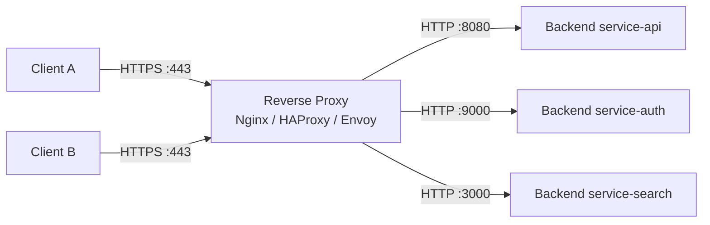
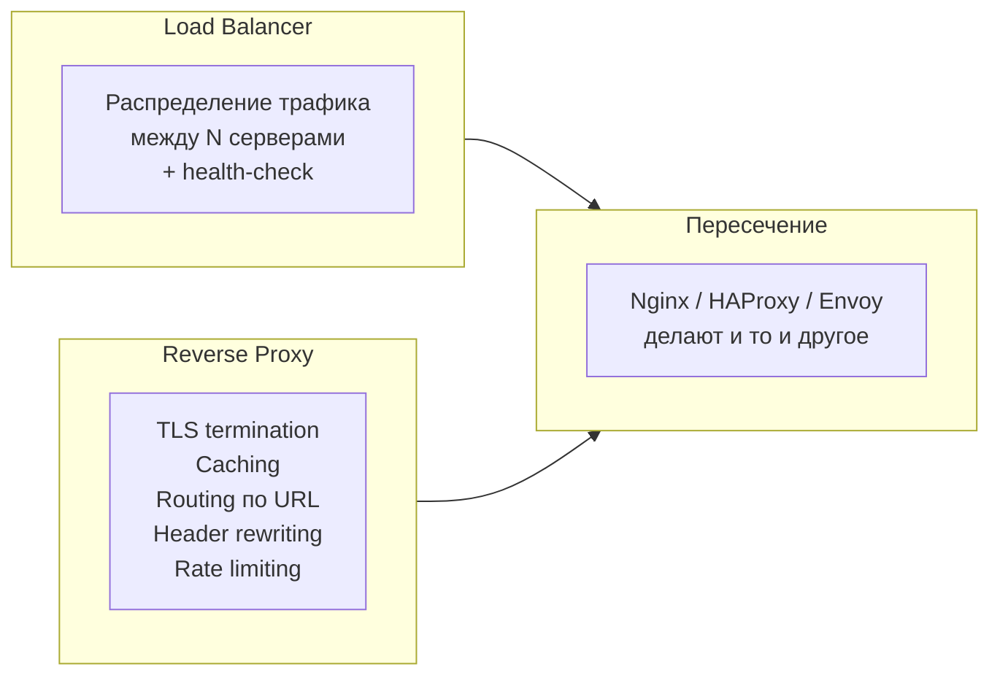
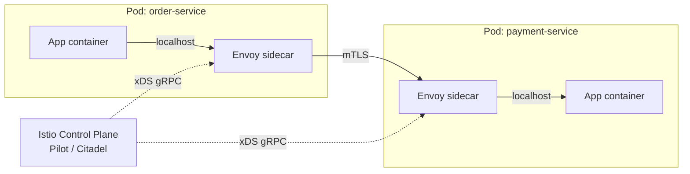
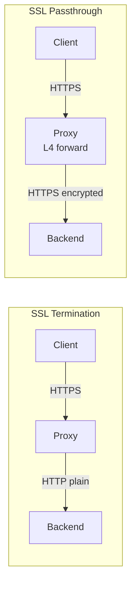

# Вопросы на собеседовании: `Reverse Proxy`

`Reverse proxy` — серверный посредник, принимающий запросы от клиентов и проксирующий их к одному или нескольким upstream-backendам, скрывая их топологию. На L7 он становится точкой, где живут `TLS termination`, `caching`, `rate limiting`, `header rewriting`, `routing` по URL/host и `sticky session`. В современных архитектурах reverse proxy — это `Nginx`, `HAProxy`, `Envoy`, `Traefik`, а также `sidecar`-прокси в service mesh.

Дата последнего обновления: 2026-05-21

**Ключевая идея:** клиент видит один публичный endpoint (`https://api.example.com`), за которым может стоять любое количество сервисов на разных портах, языках и стендах. Прокси берёт на себя кросс-функциональные требования (`security`, `observability`, `traffic control`), которые иначе пришлось бы дублировать в каждом сервисе.

## Полезные ссылки

### Официальная документация

- [Nginx — ngx_http_proxy_module](https://nginx.org/en/docs/http/ngx_http_proxy_module.html) — `proxy_pass`, `proxy_cache`, `proxy_set_header`
- [Nginx — ngx_http_upstream_module](https://nginx.org/en/docs/http/ngx_http_upstream_module.html) — `upstream`-блоки, балансировка
- [Nginx — limit_req_module](https://nginx.org/en/docs/http/ngx_http_limit_req_module.html) — rate limiting на leaky bucket
- [HAProxy Configuration Manual](https://docs.haproxy.org/) — `frontend`/`backend`/`acl`/`stick-table`
- [Envoy Proxy Documentation](https://www.envoyproxy.io/docs/envoy/latest/) — `listeners`, `filters`, `xDS`
- [Traefik Documentation](https://doc.traefik.io/traefik/) — провайдеры (`Docker`, `Kubernetes`), labels-based config

### Статьи и руководства

- [Baeldung — Reverse Proxy Pattern](https://www.baeldung.com/cs/reverse-proxy-vs-load-balancer) — отличие от LB
- [Cloudflare — What is a reverse proxy?](https://www.cloudflare.com/learning/cdn/glossary/reverse-proxy/) — базовое объяснение
- [NGINX Plus — Connection Processing](https://docs.nginx.com/nginx/admin-guide/web-server/connection-processing/) — event loop, worker tuning
- [Envoy — Architecture overview](https://www.envoyproxy.io/docs/envoy/latest/intro/arch_overview/intro/intro) — filter chain, threading
- [HAProxy blog — Stick Tables](https://www.haproxy.com/blog/introduction-to-haproxy-stick-tables) — sticky sessions и rate limiting

## Содержание

### Основы

- [Q1. Что такое reverse proxy и зачем он нужен?](#q1--что-такое-reverse-proxy-и-зачем-он-нужен) (!)
- [Q2. Reverse proxy vs forward proxy — в чём разница?](#q2--reverse-proxy-vs-forward-proxy--в-чём-разница) (!)
- [Q3. Reverse proxy vs Load Balancer — где грань?](#q3--reverse-proxy-vs-load-balancer--где-грань) (!)
- [Q4. Основные функции reverse proxy](#q4-основные-функции-reverse-proxy)
- [Q5. Header manipulation: X-Forwarded-For, X-Real-IP, X-Forwarded-Proto](#q5--header-manipulation-x-forwarded-for-x-real-ip-x-forwarded-proto)

### Nginx

- [Q6. Nginx как reverse proxy: upstream и proxy_pass](#q6--nginx-как-reverse-proxy-upstream-и-proxy_pass) (!)
- [Q7. Nginx proxy_cache — как работает кеш?](#q7-nginx-proxy_cache--как-работает-кеш)
- [Q8. Nginx limit_req — rate limiting на leaky bucket](#q8--nginx-limit_req--rate-limiting-на-leaky-bucket)
- [Q9. Nginx worker_processes и worker_connections — production tuning](#q9-nginx-worker_processes-и-worker_connections--production-tuning)
- [Q10. Trailing slash и proxy_pass — известный gotcha](#q10-trailing-slash-и-proxy_pass--известный-gotcha)

### HAProxy

- [Q11. HAProxy: frontend, backend, ACL](#q11--haproxy-frontend-backend-acl)
- [Q12. HAProxy stick-table — sticky sessions и rate limiting](#q12--haproxy-stick-table--sticky-sessions-и-rate-limiting)
- [Q13. Health checks: active vs passive](#q13-health-checks-active-vs-passive)

### Envoy и Traefik

- [Q14. Envoy: filter chain и xDS API](#q14--envoy-filter-chain-и-xds-api) (!)
- [Q15. Envoy как sidecar в service mesh](#q15-envoy-как-sidecar-в-service-mesh)
- [Q16. Traefik: автодискавери через labels](#q16-traefik-автодискавери-через-labels)
- [Q17. Сравнение: Nginx vs HAProxy vs Envoy vs Traefik](#q17--сравнение-nginx-vs-haproxy-vs-envoy-vs-traefik)

### SSL/TLS

- [Q18. SSL termination vs SSL passthrough](#q18--ssl-termination-vs-ssl-passthrough) (!)
- [Q19. mTLS на reverse proxy](#q19-mtls-на-reverse-proxy)
- [Q20. Sticky session: cookie, IP-hash, JWT-based](#q20--sticky-session-cookie-ip-hash-jwt-based)

### HTTP-протоколы

- [Q21. HTTP/1.1, HTTP/2, HTTP/3 — поддержка upstream/downstream](#q21--http11-http2-http3--поддержка-upstreamdownstream) (!)
- [Q22. WebSocket proxying — Upgrade header и long-lived connections](#q22-websocket-proxying--upgrade-header-и-long-lived-connections)
- [Q23. gRPC proxying — HTTP/2 end-to-end](#q23-grpc-proxying--http2-end-to-end)
- [Q24. Connection pooling и keepalive к upstream](#q24-connection-pooling-и-keepalive-к-upstream)

### Кеширование и rate limiting

- [Q25. Кеширование статики и динамики, cache hit ratio](#q25-кеширование-статики-и-динамики-cache-hit-ratio)
- [Q26. Compression: gzip vs brotli](#q26-compression-gzip-vs-brotli)
- [Q27. Request/response transformation на L7](#q27-requestresponse-transformation-на-l7)

### Production tuning

- [Q28. Slowloris и slow client — как защититься?](#q28--slowloris-и-slow-client--как-защититься) (!)
- [Q29. Chunked encoding и буферизация ответов](#q29-chunked-encoding-и-буферизация-ответов)
- [Q30. Observability: access log, metrics, distributed tracing](#q30-observability-access-log-metrics-distributed-tracing)

---

## Q1. (!) Что такое reverse proxy и зачем он нужен?

`Reverse proxy` — сервер, который принимает HTTP/TCP-запросы от клиентов и пересылает их одному или нескольким backend-сервисам, выдавая ответы обратно клиенту так, будто он сам их сгенерировал. Backend-серверы при этом не имеют прямого сетевого контакта с клиентом — публичный IP/DNS принадлежит только прокси.



**Зачем нужен:**

- **Скрытие топологии backendов** — клиент знает один URL, внутренняя структура (порты, языки, K8s-pods) может меняться без редеплоя клиентов.
- **TLS termination** — сертификаты живут в одном месте, backend-ы работают по plain HTTP внутри VPC.
- **Кросс-функциональные требования** — `caching`, `compression`, `rate limiting`, `auth` вынесены из сервисов в прокси.
- **Безопасность** — `WAF`, фильтрация атак, ограничение IP, защита от `Slowloris` и `DDoS` на L7.
- **Observability** — единая точка для access-log, метрик, distributed tracing.

Без reverse proxy эти задачи дублируются в каждом сервисе или, ещё хуже, делаются по-разному (что приводит к security-инцидентам).

## Q2. (!) Reverse proxy vs forward proxy — в чём разница?

Оба термина содержат слово «прокси», но направление и цель противоположны.

| Аспект | Forward proxy | Reverse proxy |
|---|---|---|
| **Кого защищает/скрывает** | Клиента от интернета | Сервер от клиентов |
| **Сторона** | Стоит у клиента (или его сети) | Стоит перед серверами |
| **Знание клиента** | Клиент явно настроен на прокси | Клиент не знает о прокси (видит публичный URL) |
| **Типичные задачи** | Корпоративный фильтр, обход блокировок, кеширование исходящего трафика | TLS termination, балансировка, кеш статики, WAF |
| **Примеры** | `Squid`, корпоративный HTTP proxy, VPN-gateway | `Nginx`, `HAProxy`, `Envoy`, `Cloudflare` |

**Аналогия:** forward proxy — это «секретарь, который звонит за вас наружу». Reverse proxy — это «ресепшн, который принимает посетителей и направляет их в нужный кабинет».

С точки зрения HTTP-протокола они выглядят почти одинаково: TCP-соединение к промежуточному серверу, который дальше открывает соединение к origin. Разница в том, **кто кому что доверяет** и где находится конфигурация маршрутизации.

## Q3. (!) Reverse proxy vs Load Balancer — где грань?

Грань размытая: на практике большинство современных reverse proxy умеют балансировать, а большинство load balancer'ов работают как reverse proxy. Различие — в акценте.



| Чистый load balancer | Чистый reverse proxy |
|---|---|
| Цель — распределить нагрузку | Цель — добавить функции на L7 |
| Часто L4 (TCP/UDP), не разбирает HTTP | Всегда L7, понимает HTTP-семантику |
| Алгоритмы: round-robin, least-conn, hash | Routing по URL/host/header |
| Пример: AWS NLB, IPVS, keepalived | Пример: Nginx с одним backend, кеширующий статику |

**Практически:** `Nginx`, `HAProxy`, `Envoy` — это **L7 reverse proxy с функцией балансировки**. Если за прокси один backend — это «чистый» reverse proxy. Если несколько — он одновременно играет роль L7 load balancer.

**Когда нужны оба слоя:**

- L4 LB (AWS NLB, IPVS) на входе для масштабирования и DDoS-абсорбции.
- За ним пул L7 reverse proxy (Nginx pods) — они уже делают TLS termination, routing, кеш.
- Дальше application backendы.

См. [load-balancing-interview.md](load-balancing-interview.md) для алгоритмов балансировки и L4/L7 деталей.

## Q4. Основные функции reverse proxy

Список того, что обычно делегируется на reverse proxy в production:

- **TLS termination** — приём HTTPS, расшифровка, отправка plain HTTP на backend.
- **Routing** — выбор backend по `Host`, URL path, header, cookie, geo-IP.
- **Load balancing** — распределение запросов между upstream-серверами (round-robin, least-connections, IP-hash).
- **Caching** — кеш статики и (с оговорками) динамики на основе `Cache-Control`.
- **Compression** — `gzip`/`brotli` на выходе к клиенту.
- **Rate limiting / throttling** — защита backendа от перегрузки и злоупотреблений.
- **Request/response transformation** — переписывание URL, заголовков, тела (rewrite, sub_filter, Lua/Wasm).
- **Authentication / WAF** — проверка JWT, integration с OAuth2, фильтрация SQLi/XSS.
- **Header injection** — `X-Forwarded-For`, `X-Request-ID`, trace-headers.
- **Health checks** — active probes к backend-серверам, исключение «упавших».
- **Sticky session** — привязка клиента к одному backendу (cookie, IP-hash).
- **Protocol bridging** — клиент по HTTP/2, backend по HTTP/1.1, или наоборот.
- **Observability** — access log, metrics (Prometheus), distributed tracing (OpenTelemetry).

В service mesh (Istio, Linkerd) большая часть этого делается **на каждый pod** через sidecar Envoy.

## Q5. (!) Header manipulation: `X-Forwarded-For`, `X-Real-IP`, `X-Forwarded-Proto`

Когда запрос проходит через reverse proxy, для backend-а исходный IP клиента теряется — он видит IP прокси. Это решается стандартными forwarded-заголовками.

| Заголовок | Содержит | Кто ставит |
|---|---|---|
| `X-Forwarded-For` | Цепочка IP `client, proxy1, proxy2` | Каждый прокси аппендит свой клиентский IP |
| `X-Real-IP` | IP последнего клиента (нестандарт) | Обычно один-в-один с первым элементом `X-Forwarded-For` |
| `X-Forwarded-Proto` | `http` или `https` — оригинальная схема | Прокси, который сделал TLS termination |
| `X-Forwarded-Host` | Оригинальный `Host` от клиента | Прокси при переписывании Host |
| `Forwarded` (RFC 7239) | Стандартизованный аналог всех XF-* | Современные прокси |

**Nginx-конфиг:**

```nginx
location / {
    proxy_pass http://backend;
    proxy_set_header Host              $host;
    proxy_set_header X-Real-IP         $remote_addr;
    proxy_set_header X-Forwarded-For   $proxy_add_x_forwarded_for;
    proxy_set_header X-Forwarded-Proto $scheme;
    proxy_set_header X-Forwarded-Host  $host;
}
```

**Подводные камни:**

- **Spoofing:** клиент может сам прислать `X-Forwarded-For: 1.2.3.4`. Прокси должен **затирать** или дополнять, а не доверять. В Nginx: `real_ip_header X-Forwarded-For; set_real_ip_from <trusted-proxy-net>;`.
- **Цепочка из нескольких прокси:** backend получает список IP, реальный клиент — самый левый, но только если все прокси корректно аппендили.
- **Spring Boot:** для корректного `request.getRemoteAddr()` нужно настроить `server.forward-headers-strategy: native` (Tomcat) или `framework`.
- **HTTPS-detection:** если backend проверяет `request.isSecure()`, нужен `X-Forwarded-Proto: https`, иначе после TLS termination сервис думает что трафик plain.

## Q6. (!) Nginx как reverse proxy: `upstream` и `proxy_pass`

Базовый конфиг Nginx как reverse proxy с балансировкой:

```nginx
http {
    upstream backend {
        # Алгоритм: round-robin (default), least_conn, ip_hash, hash <key>
        least_conn;

        server 10.0.1.10:8080 weight=3 max_fails=3 fail_timeout=30s;
        server 10.0.1.11:8080 weight=2 max_fails=3 fail_timeout=30s;
        server 10.0.1.12:8080 backup;  # включится только если основные «упали»

        keepalive 32;  # пул persistent-соединений к upstream
    }

    server {
        listen 443 ssl http2;
        server_name api.example.com;

        ssl_certificate     /etc/nginx/certs/api.crt;
        ssl_certificate_key /etc/nginx/certs/api.key;
        ssl_protocols       TLSv1.2 TLSv1.3;

        location / {
            proxy_pass http://backend;
            proxy_http_version 1.1;          # обязательно для keepalive
            proxy_set_header Connection "";  # очистка close
            proxy_set_header Host              $host;
            proxy_set_header X-Real-IP         $remote_addr;
            proxy_set_header X-Forwarded-For   $proxy_add_x_forwarded_for;
            proxy_set_header X-Forwarded-Proto $scheme;

            proxy_connect_timeout 5s;
            proxy_send_timeout    60s;
            proxy_read_timeout    60s;
        }
    }
}
```

**Что здесь важно:**

- `upstream` — пул backend-серверов. Имя (`backend`) используется в `proxy_pass`.
- `proxy_http_version 1.1` + `Connection ""` — без этого keepalive к upstream не работает, каждый запрос открывает новое TCP-соединение.
- `keepalive 32` — держать до 32 idle-соединений на worker. Резко снижает latency и нагрузку на backend.
- `max_fails` / `fail_timeout` — passive health-check: после N ошибок сервер исключается на T секунд.
- `backup` — резервный сервер, поднимается только когда основные недоступны.

## Q7. Nginx `proxy_cache` — как работает кеш?

Кеш в Nginx — это файлы на диске (или tmpfs/SSD) с индексом в shared memory. Прокси может кешировать ответы upstream и отдавать их без обращения к backendу.

```nginx
http {
    proxy_cache_path /var/cache/nginx
        levels=1:2
        keys_zone=api_cache:100m   # 100MB shared memory для индекса
        max_size=10g               # 10GB на диске
        inactive=60m
        use_temp_path=off;

    server {
        location /static/ {
            proxy_pass http://backend;
            proxy_cache api_cache;
            proxy_cache_key "$scheme$request_method$host$request_uri";
            proxy_cache_valid 200 302 1h;
            proxy_cache_valid 404 1m;
            proxy_cache_use_stale error timeout updating http_500 http_502 http_503 http_504;
            proxy_cache_lock on;          # один запрос на cache miss, остальные ждут
            proxy_cache_revalidate on;    # if-modified-since на revalidation
            add_header X-Cache-Status $upstream_cache_status;
        }
    }
}
```

**Ключевые директивы:**

- `proxy_cache_key` — что считается «одинаковым запросом». По умолчанию не включает заголовки, поэтому `Vary`-заголовки нужно учитывать вручную.
- `proxy_cache_valid` — TTL по кодам ответа. Если backend не прислал `Cache-Control`, применяется это.
- `proxy_cache_use_stale` — отдавать stale-копию при ошибках upstream (поведение в духе `stale-if-error`).
- `proxy_cache_lock` — защита от cache stampede: при miss один запрос идёт в backend, остальные ждут ответа.
- `$upstream_cache_status` — `HIT` / `MISS` / `EXPIRED` / `STALE` / `UPDATING` / `BYPASS`.

**Чего НЕ умеет Nginx из коробки:** purge по тегу/паттерну (только по точному ключу, и то только в `nginx-plus` или с модулем `ngx_cache_purge`). Для современных задач CDN-уровня используют `Varnish` или коммерческие CDN.

## Q8. (!) Nginx `limit_req` — rate limiting на leaky bucket

Защита backendа от перегрузки и злоупотреблений на уровне прокси.

```nginx
http {
    # Зона: ключ + размер shared memory + rate
    limit_req_zone $binary_remote_addr zone=api_per_ip:10m rate=10r/s;
    limit_req_zone $http_authorization zone=api_per_token:10m rate=100r/s;

    server {
        location /api/ {
            # burst — сколько запросов можно «накопить» поверх rate
            # nodelay — отдавать burst мгновенно, без задержки
            limit_req zone=api_per_ip burst=20 nodelay;
            limit_req zone=api_per_token burst=200 nodelay;
            limit_req_status 429;

            proxy_pass http://backend;
        }
    }
}
```

**Как работает (leaky bucket):**

- Ведро ёмкостью `burst+1` (тут 21 для per-IP).
- Запросы добавляются в ведро, утекают со скоростью `rate` (10/сек).
- При переполнении — HTTP 429 (или 503 по умолчанию).
- `nodelay` — все запросы из burst отдаются сразу, но «накапливаются» в счётчике.

**Подводные камни:**

- `$binary_remote_addr` берёт IP клиента **относительно Nginx**. Если перед ним ещё один прокси/LB — все запросы идут с одного IP. Нужно настроить `real_ip` или брать ключ из `X-Forwarded-For`.
- Memory: `10m` ≈ 160K уникальных IP. На крупном трафике — увеличить.
- Это локальный счётчик на одном Nginx. Если их несколько за L4 LB — лимит **не глобальный**. Для глобального нужен `Redis`-backed модуль или внешний сервис (`Envoy` + `Ratelimit Service`).

## Q9. Nginx `worker_processes` и `worker_connections` — production tuning

Архитектура Nginx — master + N workers, каждый worker однопоточный event loop (epoll).

```nginx
worker_processes auto;          # = number of CPU cores
worker_rlimit_nofile 65535;     # ulimit -n на worker

events {
    worker_connections 10240;   # max соединений на worker (clients + upstream)
    use epoll;                  # Linux
    multi_accept on;            # принимать сразу несколько соединений в одном tick
}

http {
    sendfile on;
    tcp_nopush on;
    tcp_nodelay on;

    keepalive_timeout 65s;
    keepalive_requests 1000;

    client_body_timeout   10s;
    client_header_timeout 10s;
    send_timeout          10s;

    # размер буфера на клиента
    client_body_buffer_size 16k;
    client_max_body_size    10m;

    # GZIP
    gzip on;
    gzip_min_length 1024;
    gzip_types text/plain text/css application/json application/javascript;
}
```

**Расчёт capacity:** `max_clients = worker_processes × worker_connections / 2`. Делим на 2, так как каждое клиентское соединение тянет одно upstream-соединение.

**Типичные ошибки:**

- `worker_processes 1` на 8-ядерной машине — не используется параллелизм.
- `worker_connections 1024` — упрётесь в лимит при 1K RPS.
- Низкий `worker_rlimit_nofile` — соединения отвергаются с `EMFILE: Too many open files`.
- `keepalive_timeout 5s` — клиенты дропают persistent-соединения, лишний TLS handshake на каждый запрос.

## Q10. Trailing slash и `proxy_pass` — известный gotcha

Поведение `proxy_pass` зависит от наличия trailing slash в URL.

```nginx
# Вариант 1: БЕЗ slash после backend — URI передаётся as-is
location /api/ {
    proxy_pass http://backend;
    # Запрос /api/users → http://backend/api/users
}

# Вариант 2: СО slash после backend — префикс location вырезается
location /api/ {
    proxy_pass http://backend/;
    # Запрос /api/users → http://backend/users
}

# Вариант 3: С путём после backend
location /api/ {
    proxy_pass http://backend/v2/;
    # Запрос /api/users → http://backend/v2/users
}
```

Это одна из самых частых ошибок при настройке Nginx — забывают `/` в `proxy_pass` и backend получает `/api/...` вместо чистого пути, либо наоборот.

**Дополнительно:**

- Если в `proxy_pass` есть переменные (`proxy_pass http://$backend;`), правила переписывания **не применяются**, URI всегда передаётся as-is.
- В таких случаях нужен явный `rewrite ^/api/(.*)$ /$1 break;` перед `proxy_pass`.

## Q11. (!) HAProxy: `frontend`, `backend`, `ACL`

HAProxy — высокопроизводительный L4/L7 прокси, изначально заточенный под балансировку. Конфиг строится из трёх блоков.

```haproxy
global
    maxconn 50000
    log /dev/log local0
    daemon

defaults
    mode http
    timeout connect 5s
    timeout client  60s
    timeout server  60s
    option httplog
    option dontlognull

frontend api_https
    bind *:443 ssl crt /etc/haproxy/certs/
    http-request set-header X-Forwarded-Proto https

    # ACL — условия
    acl is_admin path_beg /admin
    acl is_api   path_beg /api/v2
    acl is_grpc  hdr(content-type) -i application/grpc

    # use_backend — маршрутизация по ACL
    use_backend admin_servers if is_admin
    use_backend grpc_servers  if is_grpc
    use_backend api_servers   if is_api
    default_backend           web_servers

backend api_servers
    balance leastconn
    option httpchk GET /actuator/health
    http-check expect status 200

    server api1 10.0.1.10:8080 check inter 2s fall 3 rise 2 maxconn 1000
    server api2 10.0.1.11:8080 check inter 2s fall 3 rise 2 maxconn 1000
    server api3 10.0.1.12:8080 check inter 2s fall 3 rise 2 backup

backend admin_servers
    server admin1 10.0.2.10:8080 check

backend grpc_servers
    mode http
    server grpc1 10.0.3.10:50051 check proto h2 alpn h2
```

**Ключевые концепции:**

- `frontend` — слушающий endpoint (порт + TLS + ACL + маршрутизация).
- `backend` — пул серверов + алгоритм балансировки + health-check.
- `ACL` — именованное условие на L7 (path, header, cookie, src IP, query).
- `defaults` — настройки, наследуемые всеми frontend/backend (можно переопределить).
- `check`, `inter`, `fall`, `rise` — active health-check: пробить каждые 2 сек, считать «down» после 3 fail, «up» после 2 success.

**Преимущества HAProxy перед Nginx:**

- Богаче ACL и stick-tables.
- Лучше performance на чистом TCP/HTTP проксировании (без модулей под cache/scripting).
- Встроенный admin socket с runtime API (`disable server backend/srv1` без reload).

## Q12. (!) HAProxy `stick-table` — sticky sessions и rate limiting

`stick-table` — in-memory key-value store, доступный из ACL. Один из самых мощных инструментов HAProxy.

```haproxy
backend app_servers
    # Таблица: ключ=src IP, размер 200K записей, expire 30 мин, считаем 3 счётчика
    stick-table type ip size 200k expire 30m store \
        conn_cur,conn_rate(10s),http_req_rate(10s)

    # Sticky session: запоминаем какой server обслуживал клиента
    stick on src

    # Rate limiting: блокировать если >100 req за 10 сек
    http-request track-sc0 src
    http-request deny deny_status 429 if { sc_http_req_rate(0) gt 100 }

    server app1 10.0.1.10:8080 check
    server app2 10.0.1.11:8080 check
```

**Что умеет:**

- **Sticky sessions** — привязать клиента к одному backendу по любому ключу (src IP, cookie, header).
- **Rate limiting** — счётчики per-key с временными окнами (`http_req_rate(10s)`).
- **Connection limiting** — `conn_cur` для лимита параллельных соединений.
- **Geo-аналитика** — `sc_inc_gpc0`, `gpc0_rate` для general-purpose counters.
- **Репликация** между HAProxy-инстансами через `peers` — распределённый rate limit.

**Преимущества над Nginx limit_req:**

- Богаче условия (можно комбинировать с любым ACL).
- Distributed через `peers` — глобальный лимит на кластер прокси.
- Runtime инспекция: `show table app_servers` в admin socket.

## Q13. Health checks: active vs passive

| Тип | Active | Passive |
|---|---|---|
| **Кто инициирует** | Прокси сам пробит backend по расписанию | Прокси анализирует реальные запросы клиентов |
| **Стоимость** | Доп. трафик/нагрузка на backend | Бесплатно (использует юзерский трафик) |
| **Скорость детекта** | Зависит от `inter` (период пробы) | Мгновенно, как только пошли ошибки |
| **Точность** | Может пройти даже если backend «полудохлый» | Может ошибочно исключить из-за случайного 5xx |
| **Реакция на «холодный» backend** | Заметит до первого клиентского запроса | Узнаёт только при попытке клиента |

**Nginx (passive):**

```nginx
upstream backend {
    server 10.0.1.10:8080 max_fails=3 fail_timeout=30s;
    server 10.0.1.11:8080 max_fails=3 fail_timeout=30s;
}
```

**Nginx Plus / HAProxy (active):**

```haproxy
backend app
    option httpchk GET /actuator/health
    http-check expect status 200
    server app1 10.0.1.10:8080 check inter 2s fall 3 rise 2
```

**Production-практика:** комбинировать оба. Active даёт быстрый детект «упавшего» pod-а, passive — защиту от backend-а, который отвечает 5xx на реальных запросах, но проходит /health.

## Q14. (!) Envoy: filter chain и xDS API

`Envoy` — современный L7 прокси от Lyft, основа `Istio`, `AWS App Mesh`, `Consul Connect`. Главные отличия от Nginx/HAProxy:

- **Filter chain** — каждый запрос проходит через цепочку фильтров (HTTP filters, network filters). Каждый — независимый модуль.
- **xDS API** — динамическая конфигурация по gRPC: `LDS` (listeners), `RDS` (routes), `CDS` (clusters), `EDS` (endpoints), `SDS` (secrets).
- **Hot reload без drop соединений** — конфиг применяется на лету.
- **Native HTTP/2 и HTTP/3** end-to-end.
- **Богатая observability** — Prometheus metrics, OpenTelemetry tracing, structured access log из коробки.

```yaml
# Минимальный listener + cluster
static_resources:
  listeners:
    - name: listener_0
      address:
        socket_address: { address: 0.0.0.0, port_value: 10000 }
      filter_chains:
        - filters:
            - name: envoy.filters.network.http_connection_manager
              typed_config:
                "@type": type.googleapis.com/envoy.extensions.filters.network.http_connection_manager.v3.HttpConnectionManager
                stat_prefix: ingress_http
                http_filters:
                  - name: envoy.filters.http.local_ratelimit
                    typed_config:
                      "@type": type.googleapis.com/envoy.extensions.filters.http.local_ratelimit.v3.LocalRateLimit
                      stat_prefix: http_local_rate_limiter
                      token_bucket:
                        max_tokens: 100
                        tokens_per_fill: 100
                        fill_interval: 1s
                  - name: envoy.filters.http.router
                route_config:
                  name: local_route
                  virtual_hosts:
                    - name: backend
                      domains: ["*"]
                      routes:
                        - match: { prefix: "/" }
                          route: { cluster: service_backend }

  clusters:
    - name: service_backend
      connect_timeout: 5s
      type: STRICT_DNS
      lb_policy: LEAST_REQUEST
      http2_protocol_options: {}
      load_assignment:
        cluster_name: service_backend
        endpoints:
          - lb_endpoints:
              - endpoint:
                  address:
                    socket_address: { address: backend, port_value: 8080 }
```

**xDS** — это то, что превращает Envoy в platform-component. Control plane (Istio Pilot, Consul) пушит конфиг через gRPC stream, и Envoy инстансы обновляются без рестарта. Это позволяет управлять тысячами sidecar-прокси из одной точки.

## Q15. Envoy как sidecar в service mesh

В `Istio` / `Linkerd` / `Consul Connect` каждый pod получает свой Envoy-контейнер (sidecar). Весь трафик pod-а (входящий и исходящий) проходит через него.



**Что даёт sidecar-подход:**

- **mTLS между сервисами** автоматически (Citadel выдаёт сертификаты, Envoy включает их в TLS handshake).
- **Retry / timeout / circuit breaker** конфигурируются централизованно через `VirtualService` CRD, а не в коде каждого сервиса.
- **Distributed tracing** — Envoy сам инжектит trace-headers и шлёт спаны в Jaeger/Tempo.
- **Traffic shifting** — canary deploy `10% → v2`, A/B-тесты по header.
- **Language-agnostic** — Go-сервис, Java-сервис и Python-сервис получают одинаковый набор фич без изменения кода.

**Цена:** +RAM/CPU на каждый pod (~50-200 MB), +1 hop в latency (~1-3 ms), сложность дебаггинга (`istioctl proxy-config` для просмотра конфига).

См. [microservices-interview.md](microservices-interview.md) для общего контекста service mesh.

## Q16. Traefik: автодискавери через labels

`Traefik` — reverse proxy, спроектированный под динамические окружения (Docker, Kubernetes, Consul). Главная фишка — автоматическое чтение конфигурации из метаданных платформы.

**Docker labels:**

```yaml
# docker-compose.yml
services:
  api:
    image: my-api:1.0
    labels:
      - "traefik.enable=true"
      - "traefik.http.routers.api.rule=Host(`api.example.com`)"
      - "traefik.http.routers.api.tls=true"
      - "traefik.http.routers.api.tls.certresolver=letsencrypt"
      - "traefik.http.services.api.loadbalancer.server.port=8080"
      - "traefik.http.middlewares.api-ratelimit.ratelimit.average=100"
      - "traefik.http.routers.api.middlewares=api-ratelimit"
```

**Kubernetes IngressRoute (CRD):**

```yaml
apiVersion: traefik.io/v1alpha1
kind: IngressRoute
metadata:
  name: api
spec:
  entryPoints: [websecure]
  routes:
    - match: Host(`api.example.com`) && PathPrefix(`/v2`)
      kind: Rule
      services:
        - name: api-service
          port: 8080
      middlewares:
        - name: rate-limit
  tls:
    certResolver: letsencrypt
```

**Сильные стороны:**

- Из коробки — Let's Encrypt с автообновлением.
- Динамическая конфигурация: добавил label → endpoint появился сразу.
- Удобный dashboard и метрики Prometheus.
- Middleware-композиция (auth, rate limit, headers, redirect).

**Слабые стороны:**

- Хуже performance чем Nginx/HAProxy/Envoy на high-RPS.
- Конфигурация через labels превращается в кашу при сложной маршрутизации.
- Меньше тонких настроек на L4.

## Q17. (!) Сравнение: Nginx vs HAProxy vs Envoy vs Traefik

| Аспект | Nginx | HAProxy | Envoy | Traefik |
|---|---|---|---|---|
| **Год / язык** | 2004 / C | 2001 / C | 2016 / C++ | 2016 / Go |
| **L4 / L7** | L7 (L4 в Plus/stream) | L4 + L7 | L7 (L4 в filter) | L7 |
| **Конфиг** | Static, reload | Static, runtime API | xDS dynamic + static | Provider-based (Docker, K8s) |
| **HTTP/3** | Stable | Stable | Stable | Stable |
| **gRPC** | Да | Да | First-class | Да |
| **Кеш** | Богатый proxy_cache | Нет (только session-stick) | Нет встроенного | Нет |
| **Rate limit** | leaky bucket per-zone | stick-table + peers | Local / global RLS | Middleware |
| **Hot reload** | Reload с graceful | Reload + runtime API | Dynamic xDS, без drop | Auto на label change |
| **Service mesh** | nginx-ingress | Нет в core | Default sidecar | Не позиционируется |
| **WAF** | ModSecurity / Coraza | Нет встроенного | Через filter | Через middleware |
| **Лицензия** | BSD + nginx-plus paid | GPL | Apache 2 | MIT |

**Когда что выбирать:**

- **Nginx** — универсальный выбор для small-medium, нужна статика и кеш, не нужен service mesh.
- **HAProxy** — high-performance L4/L7 LB, богатые ACL, нужны stick-tables и runtime config.
- **Envoy** — service mesh, миллионы RPS, нужна динамическая конфигурация через control plane.
- **Traefik** — Docker / K8s окружение, важен developer experience и автоконфиг.

## Q18. (!) SSL termination vs SSL passthrough

Два способа обработать HTTPS на reverse proxy.



| Аспект | SSL Termination | SSL Passthrough |
|---|---|---|
| **Где живут сертификаты** | На прокси | На backend |
| **L7-функции прокси** | Доступны: routing, кеш, header rewrite, WAF | Недоступны — прокси видит только TCP |
| **CPU-нагрузка** | На прокси (часто это терпимо) | На backend |
| **End-to-end шифрование** | Нет (внутри VPC plain HTTP) | Да |
| **Routing по path** | Возможен | Невозможен (HTTPS opaque, max — SNI) |
| **Когда применять** | 99% web/API нагрузки | Compliance, e2e шифрование, проксирование внешнего HTTPS-сервиса |

**Гибридный вариант — re-encryption (SSL bridging):** прокси расшифровывает HTTPS (для L7-функций), затем шифрует обратно к backendу:

```nginx
location / {
    proxy_pass https://backend;        # https:// — re-encrypt
    proxy_ssl_verify on;
    proxy_ssl_trusted_certificate /etc/nginx/ca.crt;
    proxy_set_header Host $host;
}
```

Это компромисс: L7 функции работают, плюс шифрование внутри VPC (нужно для compliance — PCI-DSS, HIPAA).

См. [tls-ssl-interview.md](../security/tls-ssl-interview.md) для деталей TLS handshake и cipher suites.

## Q19. mTLS на reverse proxy

`mTLS` (mutual TLS) — обе стороны TLS-handshake предъявляют сертификат. Reverse proxy может играть как клиента (к backend), так и сервера (к внешнему клиенту).

**Nginx — клиентский сертификат от внешнего клиента:**

```nginx
server {
    listen 443 ssl;
    server_name api.example.com;

    ssl_certificate     /etc/nginx/certs/server.crt;
    ssl_certificate_key /etc/nginx/certs/server.key;

    # Требуем клиентский сертификат
    ssl_client_certificate /etc/nginx/certs/client-ca.crt;
    ssl_verify_client on;
    ssl_verify_depth 2;

    location / {
        # Передаём CN/DN клиентского сертификата в backend
        proxy_set_header X-Client-DN  $ssl_client_s_dn;
        proxy_set_header X-Client-Verify $ssl_client_verify;
        proxy_pass http://backend;
    }
}
```

**Envoy:**

```yaml
transport_socket:
  name: envoy.transport_sockets.tls
  typed_config:
    "@type": type.googleapis.com/envoy.extensions.transport_sockets.tls.v3.DownstreamTlsContext
    require_client_certificate: true
    common_tls_context:
      tls_certificates: [...]
      validation_context:
        trusted_ca: { filename: /etc/envoy/client-ca.crt }
```

**Где применяется:**

- **Service mesh** — sidecar Envoy валидирует identity вызывающего сервиса (SPIFFE ID).
- **B2B API** — клиентские сертификаты вместо API-ключей.
- **IoT-устройства** — каждое устройство со своим сертификатом, прокси проверяет CA.
- **Internal admin endpoints** — `kubectl`-stile аутентификация.

См. [mtls-interview.md](../security/mtls-interview.md) для подробностей.

## Q20. (!) Sticky session: cookie, IP-hash, JWT-based

Когда нужно гарантировать, что все запросы одного клиента идут на один backend (in-memory session, WebSocket upgrade на конкретный pod, локальный кеш).

**1. Cookie-based (insertable cookie) — самый надёжный**

```nginx
# Nginx Plus (только в платной)
upstream backend {
    sticky cookie srv_id expires=1h domain=.example.com path=/;
    server 10.0.1.10:8080;
    server 10.0.1.11:8080;
}
```

```haproxy
backend app_servers
    cookie SERVERID insert indirect nocache
    server app1 10.0.1.10:8080 check cookie app1
    server app2 10.0.1.11:8080 check cookie app2
```

Прокси добавляет в ответ свой cookie со значением «какой server», в последующих запросах смотрит на этот cookie.

**2. IP-hash — простой, но проблемный**

```nginx
upstream backend {
    ip_hash;
    server 10.0.1.10:8080;
    server 10.0.1.11:8080;
}
```

Hash от IP клиента → выбор сервера. Проблемы:

- Корпоративные NAT — все сотрудники компании идут на один backend.
- Mobile-сети с CGNAT — десятки тысяч клиентов с одного IP.
- При добавлении/удалении backend меняется hash → перераспределение всех клиентов (если не consistent hash).

**3. JWT-based — кастомное hash по claim из токена**

```nginx
# Извлекаем sub из JWT (через ngx_http_auth_jwt_module или Lua)
map $jwt_claim_sub $backend_pool {
    default                              backend_pool;
}

upstream backend_pool {
    hash $jwt_claim_sub consistent;
    server 10.0.1.10:8080;
    server 10.0.1.11:8080;
}
```

Распределение по user_id — кеш пользователя живёт на одном pod, корпоративный NAT не влияет.

**Production-практика:** sticky session — антипаттерн. Лучше держать session в `Redis` / `JWT` и иметь stateless сервисы. Sticky оправдан только для WebSocket и устаревших монолитов.

См. [load-balancing-interview.md](load-balancing-interview.md) — там подробнее про consistent hashing.

## Q21. (!) HTTP/1.1, HTTP/2, HTTP/3 — поддержка upstream/downstream

Reverse proxy — это часто **протокольный мост**: клиент по HTTP/2, backend по HTTP/1.1 (или наоборот). Версии downstream и upstream могут отличаться.

| Протокол | Downstream (client → proxy) | Upstream (proxy → backend) | Особенности |
|---|---|---|---|
| **HTTP/1.1** | Везде | Везде | Текстовый, head-of-line blocking, keepalive |
| **HTTP/2** | Nginx, HAProxy, Envoy, Traefik | Envoy, HAProxy (через `proto h2`), Nginx с `grpc_pass` | Бинарный, multiplexing, HPACK, требует TLS на практике |
| **HTTP/3 (QUIC)** | Nginx (1.25+), HAProxy, Envoy, Traefik | Envoy, Nginx Plus | Поверх UDP, 0-RTT, нет head-of-line blocking на TCP-уровне |

**Nginx — HTTP/2 на downstream, HTTP/1.1 на upstream (типичная схема):**

```nginx
server {
    listen 443 ssl http2;            # H2 к клиенту
    location / {
        proxy_pass http://backend;   # H1.1 к backend
        proxy_http_version 1.1;
    }
}
```

**Nginx — HTTP/3 (с 1.25+):**

```nginx
server {
    listen 443 quic reuseport;
    listen 443 ssl;                  # fallback HTTP/2 на TCP
    http2 on;
    http3 on;

    ssl_certificate     /etc/nginx/certs/server.crt;
    ssl_certificate_key /etc/nginx/certs/server.key;

    add_header Alt-Svc 'h3=":443"; ma=86400';  # объявляем поддержку H3 клиенту
}
```

**Подводные камни:**

- HTTP/2 multiplexing → один backend под нагрузкой нескольких streams одновременно. Нужно повышать `keepalive` пул и `max_concurrent_streams`.
- HTTP/3 поверх UDP — firewalls/middleboxes часто блокируют. `Alt-Svc` позволяет fallback на H2.
- Между прокси и Java/Spring backendом часто оставляют HTTP/1.1 — Netty/Tomcat H2 настроить сложнее, выигрыш минимален внутри VPC.
- gRPC требует HTTP/2 end-to-end — об этом ниже.

## Q22. WebSocket proxying — `Upgrade` header и long-lived connections

WebSocket поверх HTTP — это HTTP/1.1 connection, который через `Upgrade: websocket` превращается в TCP-канал с фреймами WebSocket-протокола.

```nginx
location /ws/ {
    proxy_pass http://websocket_backend;
    proxy_http_version 1.1;
    proxy_set_header Upgrade $http_upgrade;
    proxy_set_header Connection "upgrade";
    proxy_set_header Host $host;

    # Long-lived: дольше держим соединение
    proxy_read_timeout  3600s;
    proxy_send_timeout  3600s;
}
```

**Особенности:**

- Обязательно `proxy_http_version 1.1` и явный `Connection: upgrade`. Без них прокси разорвёт upgrade.
- `proxy_read_timeout` по умолчанию 60 сек → idle WebSocket разрывается. Поднять до часа или больше; на уровне приложения слать ping/pong каждые 30 сек.
- Sticky session: WebSocket «прибит» к одному backend pod, при ребалансировке (например, удаление pod) клиент должен переподключиться.
- HTTP/2 поверх WebSocket → нужен RFC 8441 (`SETTINGS_ENABLE_CONNECT_PROTOCOL`), поддерживается не везде. Чаще оставляют H1.1 для WS.
- HTTP/3 → WebSocket поверх H3 (RFC 9220) — экспериментально.

## Q23. gRPC proxying — HTTP/2 end-to-end

gRPC использует HTTP/2 с trailers и бинарными фреймами. Прокси должен поддерживать H2 на обоих концах (или явно конвертировать).

**Nginx — `grpc_pass`:**

```nginx
server {
    listen 443 ssl http2;

    location / {
        grpc_pass grpc://grpc_backend;
        # для TLS к backend:
        # grpc_pass grpcs://grpc_backend;

        grpc_set_header X-Real-IP $remote_addr;
        grpc_read_timeout  3600s;
        grpc_send_timeout  3600s;
    }
}

upstream grpc_backend {
    server 10.0.1.10:50051;
    server 10.0.1.11:50051;
    keepalive 16;
}
```

**HAProxy:**

```haproxy
backend grpc_backend
    mode http
    server grpc1 10.0.1.10:50051 proto h2 alpn h2
    server grpc2 10.0.1.11:50051 proto h2 alpn h2
```

**Envoy** — gRPC native, никаких отдельных директив, hot path по умолчанию.

**Подводные камни:**

- HTTP/2 multiplexing → один TCP-connection несёт сотни RPC-вызовов. Балансировка на TCP-уровне (L4) **не работает** для gRPC — все запросы пойдут на один pod. Нужен L7 (Envoy/Nginx/Linkerd).
- gRPC использует `trailers` (для status code) — прокси должен корректно их пропускать. Старые версии Nginx не умели.
- `gRPC-Web` — gRPC через HTTP/1.1 для браузеров, нужен `Envoy grpc-web filter` или `Improbable grpcwebproxy`.
- Streaming (server/client/bidi) — long-lived; `grpc_read_timeout` обязателен.

## Q24. Connection pooling и keepalive к upstream

Без keepalive каждый запрос → новый TCP-handshake + TLS-handshake к backendу. Это +5-50 ms latency на запрос и multiplied нагрузка на backend.

**Nginx:**

```nginx
upstream backend {
    server 10.0.1.10:8080;
    server 10.0.1.11:8080;

    keepalive 32;                # max idle persistent connections per worker
    keepalive_requests 1000;     # перед закрытием прогнать N запросов
    keepalive_timeout 60s;       # idle timeout
}

location / {
    proxy_pass http://backend;
    proxy_http_version 1.1;       # обязательно
    proxy_set_header Connection ""; # обязательно (иначе передаётся "close")
}
```

**HAProxy:**

```haproxy
defaults
    option http-server-close   # close после ответа (no keepalive)
    # ИЛИ
    option http-keep-alive     # keepalive (default)

backend app
    server app1 10.0.1.10:8080 check maxconn 1000
```

**HAProxy «multiplexing» backend HTTP/2** — `proto h2 alpn h2`: один backend connection обслуживает несколько клиентских.

**Что важно понимать:**

- Backend должен поддерживать keepalive — Java/Spring Tomcat по умолчанию ок, но `server.tomcat.keep-alive-timeout` должен быть >= `proxy_read_timeout`.
- `keepalive_requests` — после N запросов соединение закрывается, чтобы перераспределить нагрузку (особенно полезно после деплоя нового backend).
- Если за прокси несколько worker процессов, каждый держит свой пул — общий лимит на backend = `worker_processes × keepalive`.

## Q25. Кеширование статики и динамики, cache hit ratio

**Статика (`/static/*`, `.css`, `.js`, картинки):** идеальный кандидат — immutable URLs с hash в имени (`app.a3f2b1.js`). Прокси кеширует с TTL = 1 год.

```nginx
location /static/ {
    proxy_pass http://backend;
    proxy_cache static_cache;
    proxy_cache_valid 200 1y;
    proxy_cache_key "$scheme$host$request_uri";

    expires 1y;
    add_header Cache-Control "public, immutable";
}
```

**Динамика (`/api/products?category=...`):** сложнее.

- TTL короткий (1-60 сек).
- `Vary: Accept-Encoding, Authorization` — кеш для разных юзеров не пересекается.
- Только GET (POST/PUT/DELETE никогда не кешировать).
- `proxy_cache_bypass $http_cache_control` — позволить клиенту обойти кеш через `Cache-Control: no-cache`.

```nginx
location /api/catalog/ {
    proxy_pass http://backend;
    proxy_cache api_cache;
    proxy_cache_methods GET HEAD;
    proxy_cache_valid 200 30s;
    proxy_cache_key "$scheme$host$request_uri$http_authorization";
    proxy_cache_bypass $http_cache_control;
    proxy_no_cache $cookie_session_id;  # юзеры с сессией — мимо кеша

    add_header X-Cache-Status $upstream_cache_status;
}
```

**Cache hit ratio:**

- `hit_ratio = HIT / (HIT + MISS + EXPIRED + STALE)` — собирается из `$upstream_cache_status` в access log.
- Хорошо: >80% для статики, >40% для API.
- Низкий ratio → проверить `proxy_cache_key` (не слишком ли уникальный), `Vary`, рост контента.

См. [caching-strategies-interview.md](caching-strategies-interview.md) и [cdn-interview.md](cdn-interview.md).

## Q26. Compression: gzip vs brotli

Сжатие на L7 прокси — экономия трафика и времени загрузки.

| Алгоритм | Compression ratio (text) | CPU cost (encode) | Поддержка браузерами |
|---|---|---|---|
| `gzip` | ~70-75% | Низкий | Все |
| `brotli` (br) | ~75-80% (на ~15-20% лучше gzip) | Выше на динамике, дешевле на статике (precompressed) | Все современные (Chrome 49+, FF 44+) |
| `zstd` | сравним с brotli | Низкий | Пока редко |

**Nginx — gzip:**

```nginx
gzip on;
gzip_vary on;
gzip_min_length 1024;
gzip_proxied any;
gzip_comp_level 6;
gzip_types text/plain text/css text/xml
           application/json application/javascript application/xml+rss
           application/atom+xml image/svg+xml;
```

**Nginx — brotli (через ngx_brotli):**

```nginx
brotli on;
brotli_static on;   # отдавать .br с диска если есть
brotli_comp_level 6;
brotli_types text/plain text/css application/json application/javascript image/svg+xml;
```

**Production-практика:**

- Pre-compressed статика на диск (CI генерит `.gz` и `.br` рядом с `.js`/`.css`) → `gzip_static on; brotli_static on;` — прокси отдаёт уже сжатое, нулевая CPU-цена.
- Динамика — `gzip_comp_level 4-6`, баланс CPU vs ratio. Compression level 9 редко окупается.
- Не сжимать уже сжатое: JPEG/PNG/MP4/WebM — никакого выигрыша, плюс CPU.

## Q27. Request/response transformation на L7

Прокси может модифицировать запрос/ответ перед передачей.

**Nginx — переписывание URL:**

```nginx
location /old-api/ {
    rewrite ^/old-api/(.*)$ /api/v2/$1 break;
    proxy_pass http://backend;
}
```

**Подмена заголовков:**

```nginx
location / {
    proxy_pass http://backend;

    # запрос:
    proxy_set_header X-Internal-Token "secret";
    proxy_hide_header Cookie;

    # ответ:
    add_header X-Frame-Options SAMEORIGIN;
    add_header Strict-Transport-Security "max-age=31536000; includeSubDomains";
    proxy_hide_header X-Powered-By;          # скрываем внутренний leak
}
```

**Подмена тела ответа (`sub_filter`):**

```nginx
location / {
    proxy_pass http://backend;
    sub_filter 'http://internal.example.com' 'https://api.example.com';
    sub_filter_once off;
    sub_filter_types text/html application/json;
}
```

**HAProxy:**

```haproxy
http-request set-header X-Internal-Token secret
http-request replace-uri ^/old-api/(.*) /api/v2/\1
http-response del-header X-Powered-By
http-response set-header Strict-Transport-Security "max-age=31536000"
```

**Envoy** — `Lua` или `Wasm` фильтры для произвольной трансформации.

**Где применяется:**

- **API versioning** — старый клиент шлёт на `/v1/`, прокси переписывает на `/v2/`.
- **Security headers** — `HSTS`, `CSP`, `X-Frame-Options` на каждый ответ.
- **Удаление leak-заголовков** — `Server`, `X-Powered-By`, `X-AspNet-Version`.
- **Канонизация URL** — trailing slash, нижний регистр.

## Q28. (!) Slowloris и slow client — как защититься?

`Slowloris` — атака, при которой клиент очень медленно отправляет HTTP-заголовки или тело, удерживая соединение и заполняя пул прокси/backendа. С 1000+ медленных соединений можно положить сервер с лимитом 1024 worker connections.

**Защита на Nginx:**

```nginx
http {
    client_header_timeout 10s;      # max время на отправку headers
    client_body_timeout   10s;      # max время на отправку body
    send_timeout          10s;      # max время между порциями ответа клиенту

    client_max_body_size  10m;      # лимит тела
    large_client_header_buffers 4 8k;

    # ограничение количества соединений с одного IP
    limit_conn_zone $binary_remote_addr zone=conn_per_ip:10m;

    server {
        limit_conn conn_per_ip 20;  # max 20 одновременных соединений с одного IP
    }
}
```

**Защита на HAProxy:**

```haproxy
defaults
    timeout client       10s
    timeout client-fin   5s
    timeout http-request 5s     # ключевое для slowloris — таймаут на header
    timeout http-keep-alive 15s

frontend api
    bind *:443 ssl crt /etc/haproxy/certs/
    # max соединений с одного IP
    stick-table type ip size 200k expire 30m store conn_cur
    http-request track-sc0 src
    http-request reject if { sc_conn_cur(0) gt 50 }
```

**Дополнительно:**

- Reverse proxy буферизует запрос целиком перед отправкой backendу — backend не страдает от медленных клиентов (но прокси страдает).
- За прокси полезно ставить L4 LB (AWS NLB, Cloudflare) — он поглощает большую часть медленных соединений.
- `Cloudflare`/`AWS Shield` — managed защита от Slowloris и подобных L7 атак.

## Q29. Chunked encoding и буферизация ответов

HTTP/1.1 `Transfer-Encoding: chunked` — отправка тела порциями, без заранее известного `Content-Length`. Используется для streaming (Server-Sent Events, large files, real-time API).

**По умолчанию Nginx буферизует ответ upstream:** скачивает весь ответ во временный файл, потом отдаёт клиенту. Это плохо для streaming.

```nginx
location /stream/ {
    proxy_pass http://backend;
    proxy_buffering off;             # streaming, без буфера
    proxy_http_version 1.1;
    proxy_set_header Connection "";

    proxy_read_timeout 24h;          # долгие SSE
    chunked_transfer_encoding on;
}
```

**Когда выключать `proxy_buffering`:**

- Server-Sent Events (`text/event-stream`).
- gRPC streaming (там это умолчание).
- Большие файлы — иначе двойной диск read+write.
- Real-time API (chat, notifications).

**Когда включать:**

- Защита backendа от медленных клиентов — прокси буферизует, backend быстро освобождается.
- Уменьшение количества TCP-сегментов клиенту.

**HAProxy** — буферизация в `http-buffer-request` (опционально).

## Q30. Observability: access log, metrics, distributed tracing

Reverse proxy — естественная точка для сбора telemetry, т.к. через него проходит весь HTTP-трафик.

**Access log (Nginx — JSON):**

```nginx
log_format json_combined escape=json
    '{'
    '"time":"$time_iso8601",'
    '"remote_addr":"$remote_addr",'
    '"request":"$request",'
    '"status":$status,'
    '"body_bytes_sent":$body_bytes_sent,'
    '"request_time":$request_time,'
    '"upstream_response_time":"$upstream_response_time",'
    '"upstream_addr":"$upstream_addr",'
    '"upstream_cache_status":"$upstream_cache_status",'
    '"http_user_agent":"$http_user_agent",'
    '"http_referer":"$http_referer",'
    '"request_id":"$request_id",'
    '"x_forwarded_for":"$http_x_forwarded_for"'
    '}';

access_log /var/log/nginx/access.log json_combined;
```

**Metrics:**

- `Nginx Plus` — JSON status endpoint.
- `Nginx OSS` — `ngx_http_stub_status_module` (минимум), `nginx-vts-exporter` или `nginx-prometheus-exporter` для Prometheus.
- `HAProxy` — встроенный Prometheus endpoint (`/metrics` через `prometheus-exporter` builtin с 2.0).
- `Envoy` — `/stats/prometheus` нативно.
- `Traefik` — `/metrics` нативно.

**Distributed tracing:**

- `Envoy` — встроенная поддержка OpenTelemetry, Jaeger, Zipkin. Инжектит `traceparent` (W3C Trace Context) или `x-b3-*` заголовки.
- `Nginx` — `nginx-opentracing` или `nginx-otel-module` (1.25+).
- `HAProxy` — через SPOE-агенты.
- Trace-id из proxy → backend через header `traceparent` → корреляция в Jaeger/Tempo/Honeycomb.

**Что собирать в первую очередь:**

- p50/p95/p99 latency (`upstream_response_time`).
- RPS / error rate / 5xx ratio.
- Connection count (`active`, `reading`, `writing`).
- Cache hit ratio (`$upstream_cache_status`).
- Per-upstream метрики (какой backend быстрый/медленный).
- Rate-limit denials (429-ответы).

---

## See also

- [load-balancing-interview.md](load-balancing-interview.md) — L4/L7 балансировка, алгоритмы, health checks
- [networking-interview.md](networking-interview.md) — TCP, TLS handshake, HTTP-протоколы
- [api-gateway-interview.md](api-gateway-interview.md) — API gateway vs reverse proxy, BFF
- [bff-pattern-interview.md](bff-pattern-interview.md) — Backend for Frontend
- [microservices-interview.md](microservices-interview.md) — service mesh, Istio, sidecar Envoy
- [dns-interview.md](dns-interview.md) — DNS-based LB, GeoDNS, Anycast
- [cdn-interview.md](cdn-interview.md) — edge caching, TLS на edge, CDN vs reverse proxy
- [caching-strategies-interview.md](caching-strategies-interview.md) — кеширование, invalidation, hit ratio
- [../api/http-rest-interview.md](../api/http-rest-interview.md) — HTTP-семантика, headers, REST
- [../security/tls-ssl-interview.md](../security/tls-ssl-interview.md) — TLS handshake, cipher suites
- [../security/mtls-interview.md](../security/mtls-interview.md) — mutual TLS, клиентские сертификаты
