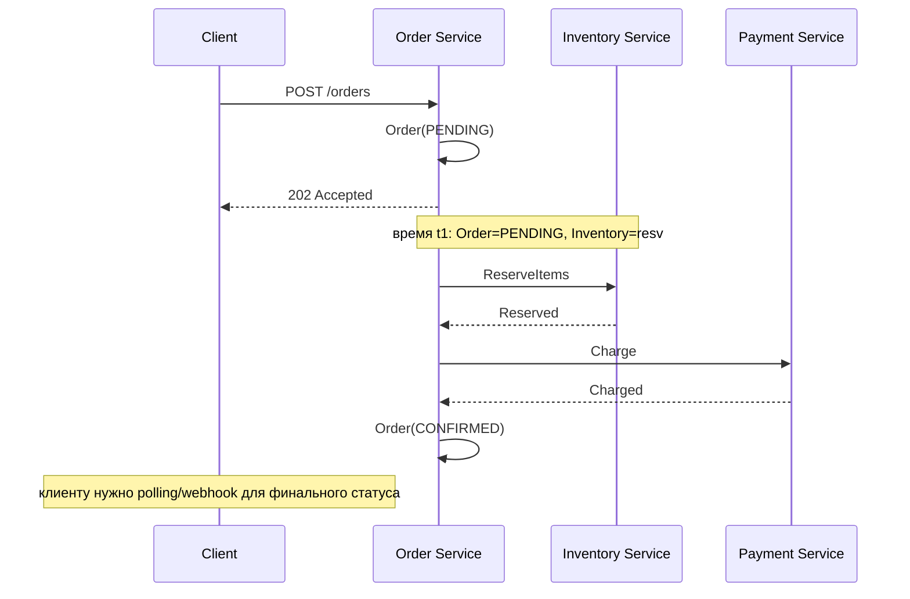
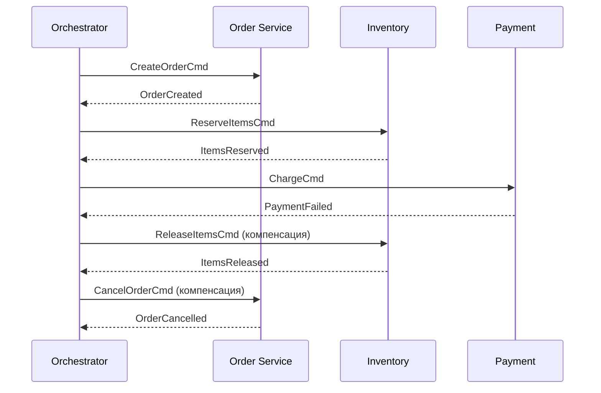
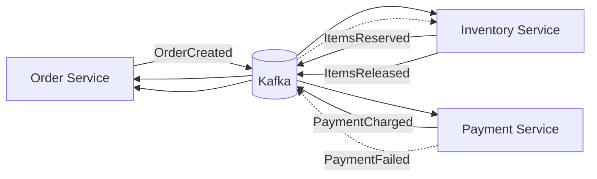
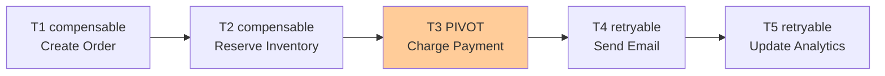
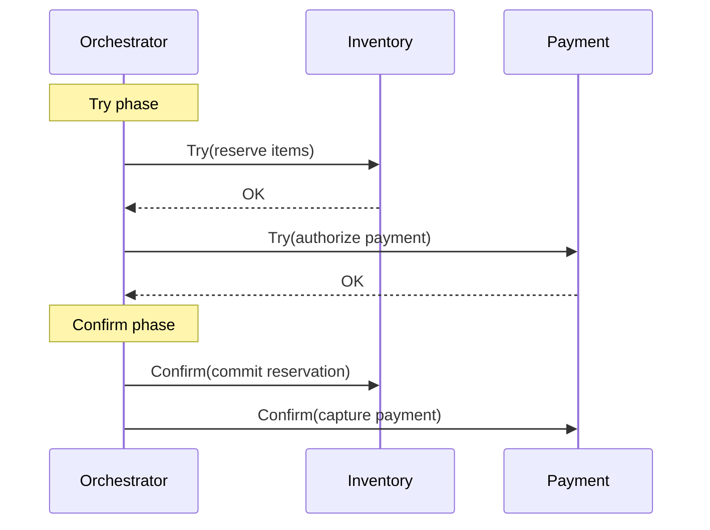
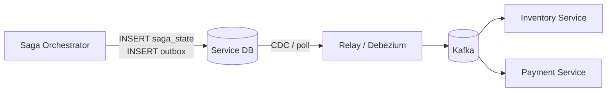
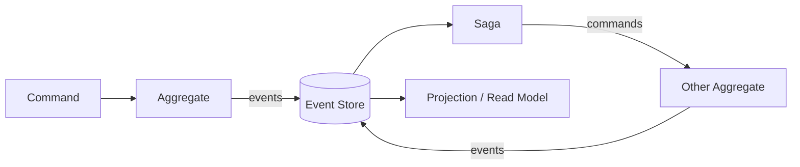

# Вопросы на собеседовании: `Saga Pattern`

**Saga Pattern** -- один из ключевых паттернов управления распределёнными транзакциями в микросервисной архитектуре. Вместо `2PC` (двухфазной фиксации), невозможной или дорогой в распределённых системах, `Saga` разбивает бизнес-операцию на последовательность локальных транзакций, каждая из которых имеет компенсирующее действие. Тема обязательна на Senior-собеседованиях: проверяет понимание `eventual consistency`, компенсаций, семантических блокировок и практической реализации на `Spring Boot` с `Axon Framework`, `Eventuate Tram` или через `Kafka` + `Outbox`.

## Полезные ссылки

### Официальная документация

- [Pattern: Saga (microservices.io)](https://microservices.io/patterns/data/saga.html) -- каноническое описание паттерна от Chris Richardson
- [Saga Pattern in Microservices (Baeldung)](https://www.baeldung.com/cs/saga-pattern-microservices) -- обзор паттерна и видов координации
- [Two-Phase Commit vs Saga Pattern (Baeldung)](https://www.baeldung.com/cs/two-phase-commit-vs-saga-pattern) -- сравнение с 2PC
- [Saga Pattern in a Microservices Architecture with Spring Boot (Baeldung)](https://www.baeldung.com/orkes-conductor-saga-pattern-spring-boot) -- реализация на Spring Boot с Orkes Conductor
- [Saga Design Pattern (Microsoft Learn)](https://learn.microsoft.com/en-us/azure/architecture/patterns/saga) -- Azure Architecture Center
- [Axon Framework Sagas (docs.axoniq.io)](https://docs.axoniq.io/axon-framework-reference/5.0/sagas/implementation/) -- реализация Saga в Axon
- [Eventuate Tram Sagas (eventuate.io)](https://eventuate.io/docs/manual/eventuate-tram/latest/getting-started-eventuate-tram-sagas.html) -- фреймворк для orchestration-based Saga
- [Transactional Outbox (microservices.io)](https://microservices.io/patterns/data/transactional-outbox.html) -- Outbox для atomic publish
- [Developing Sagas Part 1--4 (Chris Richardson)](https://microservices.io/post/microservices/2019/07/09/developing-sagas-part-1.html) -- цикл статей с примерами

## Содержание

- [Полезные ссылки](#полезные-ссылки)
- [See also](#see-also)

**Основы Saga**
- [Q1. (!) Что такое Saga Pattern и зачем он нужен?](#q1--что-такое-saga-pattern-и-зачем-он-нужен)
- [Q2. (!) Какую проблему решает Saga в микросервисной архитектуре?](#q2--какую-проблему-решает-saga-в-микросервисной-архитектуре)
- [Q3. Что такое локальная транзакция в Saga?](#q3-что-такое-локальная-транзакция-в-saga)
- [Q4. Какие ACID-свойства сохраняет Saga, а какие теряет?](#q4-какие-acid-свойства-сохраняет-saga-а-какие-теряет)
- [Q5. Что такое semantic consistency и чем она отличается от strong consistency?](#q5-что-такое-semantic-consistency-и-чем-она-отличается-от-strong-consistency)

**Оркестрация**
- [Q6. (!) Что такое orchestration-based Saga?](#q6--что-такое-orchestration-based-saga)
- [Q7. Как устроен saga orchestrator?](#q7-как-устроен-saga-orchestrator)
- [Q8. Какие преимущества и недостатки у оркестрации?](#q8-какие-преимущества-и-недостатки-у-оркестрации)
- [Q9. (!) Как реализовать оркестратор как state machine?](#q9--как-реализовать-оркестратор-как-state-machine)

**Хореография**
- [Q10. (!) Что такое choreography-based Saga?](#q10--что-такое-choreography-based-saga)
- [Q11. Как события связывают шаги хореографии?](#q11-как-события-связывают-шаги-хореографии)
- [Q12. (!) Оркестрация vs хореография -- когда что выбрать?](#q12--оркестрация-vs-хореография----когда-что-выбрать)
- [Q13. Какой риск несёт хореография при росте числа сервисов?](#q13-какой-риск-несёт-хореография-при-росте-числа-сервисов)

**Компенсирующие транзакции**
- [Q14. (!) Что такое compensating transaction?](#q14--что-такое-compensating-transaction)
- [Q15. (!) Типы шагов: compensable, pivot, retryable](#q15--типы-шагов-compensable-pivot-retryable)
- [Q16. Почему компенсация не равна откату (rollback)?](#q16-почему-компенсация-не-равна-откату-rollback)
- [Q17. Что делать, если compensating transaction тоже упала?](#q17-что-делать-если-compensating-transaction-тоже-упала)

**Isolation и countermeasures**
- [Q18. (!) Почему Saga не обеспечивает isolation и какие возникают аномалии?](#q18--почему-saga-не-обеспечивает-isolation-и-какие-возникают-аномалии)
- [Q19. (!) Что такое semantic lock?](#q19--что-такое-semantic-lock)
- [Q20. Что такое commutative updates, pessimistic view, reread, version file?](#q20-что-такое-commutative-updates-pessimistic-view-reread-version-file)
- [Q21. Что такое by value strategy?](#q21-что-такое-by-value-strategy)

**Сравнение с 2PC**
- [Q22. (!) Saga vs 2PC -- ключевые отличия](#q22--saga-vs-2pc----ключевые-отличия)
- [Q23. Почему 2PC плохо работает в микросервисах?](#q23-почему-2pc-плохо-работает-в-микросервисах)
- [Q24. Что такое TCC (Try-Confirm-Cancel) и чем он отличается от Saga?](#q24-что-такое-tcc-try-confirm-cancel-и-чем-он-отличается-от-saga)

**Реализация на Spring Boot**
- [Q25. (!) Как реализовать оркестратор Saga на чистом Spring Boot + Kafka?](#q25--как-реализовать-оркестратор-saga-на-чистом-spring-boot--kafka)
- [Q26. (!) Как связать Saga с Outbox pattern?](#q26--как-связать-saga-с-outbox-pattern)
- [Q27. (!) Как реализовать Saga на Axon Framework?](#q27--как-реализовать-saga-на-axon-framework)
- [Q28. Как использовать Eventuate Tram для orchestration Saga?](#q28-как-использовать-eventuate-tram-для-orchestration-saga)
- [Q29. Как использовать Camunda/BPMN для Saga?](#q29-как-использовать-camundabpmn-для-saga)
- [Q30. Как реализовать persistent state saga orchestrator?](#q30-как-реализовать-persistent-state-saga-orchestrator)

**Pitfalls и антипаттерны**
- [Q31. (!) Какие антипаттерны Saga следует избегать?](#q31--какие-антипаттерны-saga-следует-избегать)
- [Q32. Что такое distributed monolith и как Saga может его спровоцировать?](#q32-что-такое-distributed-monolith-и-как-saga-может-его-спровоцировать)
- [Q33. Как бороться с зависшими (stuck) Saga?](#q33-как-бороться-с-зависшими-stuck-saga)
- [Q34. (!) Как обеспечить идемпотентность шагов Saga?](#q34--как-обеспечить-идемпотентность-шагов-saga)
- [Q35. Как бороться с out-of-order сообщениями в хореографии?](#q35-как-бороться-с-out-of-order-сообщениями-в-хореографии)

**Тестирование и наблюдаемость**
- [Q36. Как тестировать Saga?](#q36-как-тестировать-saga)
- [Q37. Как мониторить Saga в production?](#q37-как-мониторить-saga-в-production)
- [Q38. Как трассировать Saga через distributed tracing?](#q38-как-трассировать-saga-через-distributed-tracing)

**Продвинутые темы**
- [Q39. (!) Как реализовать timeout и circuit breaker в Saga?](#q39--как-реализовать-timeout-и-circuit-breaker-в-saga)
- [Q40. Как Saga взаимодействует с CQRS и Event Sourcing?](#q40-как-saga-взаимодействует-с-cqrs-и-event-sourcing)
- [Q41. Как версионировать Saga при изменении бизнес-процесса?](#q41-как-версионировать-saga-при-изменении-бизнес-процесса)
- [Q42. Long-running Saga -- особенности (часы, дни, недели)](#q42-long-running-saga----особенности-часы-дни-недели)
- [Q43. Как объяснить eventual consistency клиенту/пользователю?](#q43-как-объяснить-eventual-consistency-клиентупользователю)

---

## Q1. (!) Что такое Saga Pattern и зачем он нужен?

**Saga Pattern** -- паттерн управления распределёнными бизнес-транзакциями через последовательность локальных ACID-транзакций, каждая из которых имеет компенсирующее действие для отмены. Если один из шагов падает, оркестратор или реагирующие сервисы запускают компенсации для уже выполненных шагов.

Исторически паттерн описан в статье Hector Garcia-Molina и Kenneth Salem (1987) для long-running transactions в базах данных; в микросервисной эпохе его адаптировал Chris Richardson.


**Зачем нужен:**
- В микросервисах каждый сервис имеет свою БД (`Database per Service`) -- единая ACID-транзакция невозможна
- `2PC` (двухфазная фиксация) блокирует ресурсы и плохо масштабируется
- Нужна согласованность данных между сервисами без глобальных блокировок

**Гарантии:** `Saga` обеспечивает `ACD` (Atomicity через компенсации, Consistency, Durability), но теряет `Isolation` -- требует `countermeasures` (см. [Q18](#q18--почему-saga-не-обеспечивает-isolation-и-какие-возникают-аномалии)).


> [!mcq]
> **Вопрос:** Что такое Saga Pattern и зачем он нужен в микросервисной архитектуре?
>
> - [x] **A) Saga = цепочка локальных ACID-транзакций T₁..Tₙ с компенсациями C₁..Cₙ₋₁; при сбое шага Tₖ запускаются компенсации уже выполненных T₁..Tₖ₋₁ в обратном порядке**
>
>   **Развёрнутое объяснение:** Saga разбивает бизнес-транзакцию на последовательность маленьких локальных ACID-транзакций, каждая из которых работает в своей БД и коммитится немедленно. На каждый шаг готовится compensating transaction — семантически обратное действие. Если какой-то шаг падает, оркестратор (или хореография через события) запускает компенсации в обратном порядке. Это даёт `ACD` без `Isolation` — eventual consistency как осознанная цена за отсутствие глобальных блокировок.
>
>   **Пример:** Place Order = `CreateOrder` → `ReserveInventory` → `ChargePayment` → `ShipOrder`. Если `ChargePayment` падает → компенсация `ReleaseInventory` → `CancelOrder`. Каждый шаг — отдельная `@Transactional` в своём сервисе, между шагами — async events через Kafka/RabbitMQ.
>
>   **Когда применять:** Place Order, Book Travel, Process Payment, Loan Application — любой бизнес-процесс, координирующий 3+ автономных сервиса с разными БД, где допустима eventual consistency и не требуется strong isolation между параллельными сагами.
>
>   **Подводные камни:** Saga теряет `Isolation` — промежуточные состояния (Order=PENDING, Inventory=reserved) видны другим транзакциям, что порождает аномалии `lost update`/`dirty read`/`fuzzy read`. Нужны countermeasures: `semantic lock`, `commutative updates`, `pessimistic view`. Компенсации не всегда возможны (нельзя «отправить email обратно») — нужно различать compensable/pivot/retryable шаги.
>
>   **Связанные вопросы:** [[Q2]], [[Q4]], [[Q14]], [[Q18]]
>
> - [ ] **B) Saga — это просто цепочка синхронных REST-вызовов с try/catch для отката при ошибке**
>
>   **Что на самом деле:** Saga использует асинхронные команды/события через брокер (Kafka, RabbitMQ), а не синхронные REST-цепочки. Между шагами стоят persistent очереди, оркестратор хранит state в БД.
>
>   **Откуда путаница:** В простых туториалах Saga часто показывают как «REST вызов A → REST вызов B → если упал, вызови rollback», что внешне похоже. Но это `distributed transaction script`, а не Saga.
>
>   **Если бы это было правдой:** Падение любого участника в середине цепочки → HTTP-таймаут → orchestrator не знает, выполнился шаг или нет → нет механизма надёжной компенсации, нет recovery после рестарта оркестратора, нет idempotency.
>
> - [ ] **C) Saga гарантирует полный ACID, включая Isolation, для распределённых транзакций**
>
>   **Что на самом деле:** Saga обеспечивает `ACD` (Atomicity через компенсации, Consistency как eventual, Durability), но осознанно теряет `Isolation`. Промежуточные состояния видны другим транзакциям.
>
>   **Откуда путаница:** Слово «транзакция» в названии вводит в заблуждение — кажется, что есть все ACID-гарантии. Но Saga — это business-level транзакция, а не ACID-транзакция в смысле БД.
>
>   **Если бы это было правдой:** Не нужны были бы countermeasures (semantic lock, version checks), не было бы аномалий dirty read между сагами — но это противоречит самой природе Saga, где каждый шаг коммитится немедленно.
>
> - [ ] **D) Saga использует единую распределённую БД для всех сервисов с глобальным координатором коммита**
>
>   **Что на самом деле:** Это описание `2PC/XA` через `JTA`, а не Saga. Saga работает на принципе `Database per Service` — у каждого сервиса своя БД, никакого глобального координатора коммита нет.
>
>   **Откуда путаница:** И 2PC, и Saga решают проблему распределённых транзакций, поэтому их путают. Но 2PC = глобальный lock + sync commit; Saga = local commits + async compensations.
>
>   **Если бы это было правдой:** Нарушался бы принцип Database per Service, появилась бы shared database coupling, исчезла бы независимость деплоя — то есть зачёркивались бы причины, по которым Saga вообще нужна.

## Q2. (!) Какую проблему решает Saga в микросервисной архитектуре?

В монолите бизнес-операция «создать заказ» (создание записи Order, резерв Inventory, списание Payment) выполняется в одной `@Transactional` -- `ACID` из коробки. В микросервисах эти данные живут в разных БД, и классическая транзакция не охватывает их.

**Варианты решения и их проблемы:**

| Решение | Проблема |
|---|---|
| `XA / 2PC` через `JTA` | Coordinator becomes SPOF, блокировки на уровне БД, медленно, плохо работает между разными типами СУБД и очередей |
| Единая БД на все сервисы | Нарушает принцип `Database per Service`, теряем независимость сервисов |
| Синхронные REST-цепочки с try/catch | Нет атомарности: если упал сервис в середине -- данные в несогласованном состоянии; зависимость от времени жизни HTTP-соединения |
| **Saga** | Атомарность через компенсации, `eventual consistency`, decoupling через события/команды |

`Saga` -- стандарт де-факто для бизнес-процессов типа `Place Order`, `Book Travel`, `Process Payment`, где нужно скоординировать несколько автономных сервисов без блокирующих глобальных транзакций.


> [!mcq]
> **Вопрос:** Какую проблему решает Saga в микросервисной архитектуре?
>
> - [ ] **A) 2PC (XA) через JTA решает ту же задачу лучше Saga, потому что гарантирует полный ACID на распределённых ресурсах**
>
>   **Что на самом деле:** 2PC даёт ACID, но ценой блокирующего coordinator-SPOF, длительных блокировок на participant resources и плохой работы между гетерогенными ресурсами (разные СУБД + MQ + внешние API). В микросервисной эпохе 2PC считается антипаттерном — большинство современных брокеров (Kafka) и cloud-БД вообще не поддерживают XA.
>
>   **Откуда путаница:** «Если 2PC даёт ACID, зачем нам Saga с её eventual consistency?» — звучит логично, пока не упрётся в реальные операционные характеристики: latency растёт квадратично от числа участников, partial commits при сбое coordinator, in-doubt transactions требуют ручного разбора.
>
>   **Если бы это было правдой:** Все BFF/payment-системы строились бы на JTA/XA — но индустрия (Amazon, Netflix, Uber) выбрала Saga именно из-за operational issues 2PC.
>
> - [x] **B) Saga решает отсутствие кросс-сервисных ACID-транзакций при Database per Service: каждый сервис коммитит локально, координация через async команды/события с компенсациями**
>
>   **Развёрнутое объяснение:** В монолите `@Transactional` покрывает все шаги бизнес-операции одной ACID-транзакцией. В микросервисах данные размазаны по разным БД (Order DB, Inventory DB, Payment DB), и единая транзакция невозможна. Saga решает это через цепочку локальных транзакций + compensating actions, координируемых либо центральным оркестратором, либо через хореографию (события). Это даёт business atomicity без глобальных блокировок.
>
>   **Пример:** `Place Order` saga: Order Service сохраняет Order(PENDING) + публикует `OrderCreated` через Outbox → Inventory Service резервирует товар + публикует `ItemsReserved` → Payment Service списывает деньги + публикует `PaymentCharged` → Order Service переводит Order в `CONFIRMED`. Каждый шаг — local ACID, между шагами — async events через Kafka.
>
>   **Когда применять:** Когда нужна бизнес-атомарность поверх Database per Service, можно жить с eventual consistency (секунды/минуты до финального состояния), нужно избежать глобальных блокировок и держать сервисы независимыми по деплою.
>
>   **Подводные камни:** Eventual consistency требует UX-переосмысления: клиент получает `202 Accepted` + saga-id, финальный статус узнаёт через polling/SSE/webhook. Нужен Transactional Outbox + idempotent consumers + dedup. Компенсации требуют тщательного проектирования — не любое действие обратимо.
>
>   **Связанные вопросы:** [[Q1]], [[Q3]], [[Q14]], [[Q18]], [[Q34]]
>
> - [ ] **C) REST-цепочки с try/catch дают ту же атомарность что и Saga, только проще в реализации**
>
>   **Что на самом деле:** Синхронные REST-цепочки не дают атомарности: при сбое в середине нет надёжного механизма отката уже выполненных шагов, нет recovery после падения координатора, нет idempotency, нет durable state.
>
>   **Откуда путаница:** Внешне try/catch + rollback-вызовы выглядят как «упрощённая Saga». В простых сценариях с 2 шагами и низким RPS может работать, поэтому возникает соблазн считать это эквивалентом.
>
>   **Если бы это было правдой:** Не нужны были бы фреймворки Axon, Eventuate Tram, Camunda, Temporal — все бы писали `try { stepA(); stepB(); } catch { undoA(); }`. Но индустрия инвестирует в Saga-фреймворки именно из-за нехватки гарантий у naive try/catch.
>
> - [ ] **D) Единая БД для всех сервисов с глобальной @Transactional решает проблему лучше Saga**
>
>   **Что на самом деле:** Единая БД нарушает Database per Service — фундаментальный принцип микросервисов. Это превращает «микросервисы» в distributed monolith с shared schema coupling.
>
>   **Откуда путаница:** Соблазн «убрать Saga и просто сделать одну БД» возникает у команд, страдающих от eventual consistency. Иногда это правильное решение — но тогда стоит честно вернуться к модульному монолиту, а не делать псевдо-микросервисы.
>
>   **Если бы это было правдой:** Исчезли бы независимость деплоя, polyglot persistence, изоляция отказов — то есть основные выгоды микросервисной архитектуры. Это рациональный выбор, но он отрицает саму постановку задачи.

## Q3. Что такое локальная транзакция в Saga?

Локальная транзакция -- это атомарная операция в пределах одного сервиса и одной БД, которая выполняется под обычной `@Transactional` и удовлетворяет `ACID`. `Saga` = цепочка таких локальных транзакций: $T_1, T_2, \dots, T_n$, с компенсациями $C_1, C_2, \dots, C_{n-1}$.

**Ключевое условие:** каждая $T_i$ должна коммитить свои изменения немедленно, не держа блокировки до конца Saga. Это делает шаги видимыми для других транзакций (нарушение `isolation`) -- зато даёт высокую пропускную способность.

```java
@Service
@Transactional
public class OrderService {

    public Order createOrder(CreateOrderCommand cmd) {
        // Локальная транзакция: пишем в БД + публикуем событие через Outbox
        Order order = new Order(cmd.customerId(), cmd.items(), OrderStatus.PENDING);
        orderRepository.save(order);
        outboxRepository.save(new OutboxEvent("OrderCreated", order.toPayload()));
        return order;
    }
}
```


> [!mcq]
> **Вопрос:** Что такое локальная транзакция в Saga и каковы её ключевые свойства?
>
> - [ ] **A) Локальная транзакция в Saga держит блокировки на ресурсы до завершения всей Saga (как 2PC), чтобы обеспечить Isolation**
>
>   **Что на самом деле:** Каждая локальная транзакция Tᵢ должна коммитить свои изменения немедленно и отпускать блокировки. Никаких удержаний на время Saga — это противоречит самой идее паттерна. Промежуточные состояния становятся видны другим транзакциям — это осознанная цена за throughput.
>
>   **Откуда путаница:** По аналогии с 2PC хочется думать, что для атомарности нужны long-running locks. Но Saga жертвует Isolation именно ради избавления от глобальных блокировок.
>
>   **Если бы это было правдой:** Saga превратилась бы в плохой 2PC — coordinator-SPOF + длительные блокировки + квадратичная latency. Зачем тогда Saga вообще нужна?
>
> - [ ] **B) Локальная транзакция в Saga — это XA-транзакция через JTA, охватывающая один сервис + его MQ**
>
>   **Что на самом деле:** Локальная транзакция в Saga — это обычная `@Transactional` БД-транзакция в пределах ОДНОГО сервиса и его БД. Связка с MQ обычно делается через Transactional Outbox (запись в outbox-таблицу в той же транзакции + отдельный publisher), а не через XA.
>
>   **Откуда путаница:** Существуют XA-расширения для Kafka/RabbitMQ, и иногда их используют. Но это не «обязательная часть» Saga — наоборот, Outbox Pattern был разработан, чтобы избежать XA.
>
>   **Если бы это было правдой:** Нужно было бы поддерживать XA на всех брокерах, а большинство современных Kafka/cloud-MQ его не поддерживают. Pattern перестал бы быть применимым в реальных стеках.
>
> - [x] **C) Локальная транзакция Tᵢ — атомарная операция в пределах одного сервиса и одной БД, коммитится немедленно по `@Transactional`/local ACID; Saga = цепочка T₁..Tₙ с компенсациями C₁..Cₙ₋₁**
>
>   **Развёрнутое объяснение:** Каждый шаг Saga — обычная локальная ACID-транзакция: открыли transaction → изменили данные в своей БД → записали событие в Outbox в той же транзакции → закоммитили. Никаких глобальных блокировок, никакого XA. Между шагами — async messaging. Это даёт линейный throughput (нет lock contention между сервисами) ценой видимости промежуточных состояний.
>
>   **Пример:** `OrderService.createOrder()` под `@Transactional` сохраняет `Order(PENDING)` и `OutboxEvent("OrderCreated")` атомарно. Затем background publisher читает outbox и публикует событие в Kafka. Если падение между commit и publish — событие позже отправится повторно (нужна idempotency на стороне consumer).
>
>   **Когда применять:** Всегда внутри Saga — это основной строительный блок. Outbox обязателен, если нужна гарантия «опубликовали то, что закоммитили» без XA.
>
>   **Подводные камни:** Между commit Tᵢ и доставкой события другие транзакции видят промежуточное состояние — нужны countermeasures (`semantic lock` через статус PENDING, `commutative updates`, проверка версии). Без idempotency на consumer'е получите дубли при ретраях. Outbox-таблица растёт — нужен cleanup. Поэтому каждый шаг — это не только запись данных, но и продуманный «контракт промежуточного состояния».
>
>   **Связанные вопросы:** [[Q1]], [[Q2]], [[Q4]], [[Q18]], [[Q34]]
>
> - [ ] **D) Локальная транзакция в Saga — это весь набор операций по нескольким сервисам, помеченный одним sagaId**
>
>   **Что на самом деле:** Это описание Saga в целом, а не локальной транзакции. Локальная — это шаг ВНУТРИ одного сервиса; Saga — последовательность таких шагов. Sagaid — это correlation ID, объединяющий шаги, но он не делает их одной транзакцией.
>
>   **Откуда путаница:** Терминология иногда смешивается: «saga transaction» в литературе может означать и весь процесс, и отдельный шаг. Важно различать business transaction (saga) и local transaction (step).
>
>   **Если бы это было правдой:** Понятие «локальная» потеряло бы смысл — она по определению локальна для одного сервиса/БД. Под определение попало бы и 2PC, и любой распределённый процесс.

## Q4. Какие ACID-свойства сохраняет Saga, а какие теряет?

| Свойство | В локальной транзакции | В Saga в целом |
|---|---|---|
| **A**tomicity | Да | Обеспечивается компенсациями (`semantic atomicity`) |
| **C**onsistency | Да | Да -- в конечном счёте (`eventual consistency`) |
| **I**solation | Да | **Нет** -- промежуточные состояния видны |
| **D**urability | Да | Да -- каждый шаг коммитится в свою БД |

Chris Richardson называет это `ACD`: Saga даёт Atomicity (через compensations), Consistency, Durability, но не Isolation. Это главная «головная боль» при разработке: два одновременных Saga могут увидеть промежуточные состояния друг друга, из-за чего возникают аномалии -- `lost update`, `dirty read`, `fuzzy read` (non-repeatable). Решение -- `countermeasures` ([Q19](#q19--что-такое-semantic-lock)--[Q21](#q21-что-такое-by-value-strategy)).


> [!mcq] Какие ACID-свойства сохраняет Saga в целом, а какое теряет, и как это компенсируется?
>
> - [ ] A) Saga сохраняет Isolation — промежуточные состояния не видны другим транзакциям благодаря глобальному локу на уровне оркестратора
>     - **Что на самом деле:** каждый шаг Saga коммитится сразу в локальную БД участника, и видим всем остальным транзакциям. Один Saga может прочитать `Order=PENDING` и `Inventory=reserved`, созданные другим незавершённым Saga, — это `dirty read`. Глобального лока нет, и быть не может: участники в разных БД.
>     - **Откуда путаница:** `Isolation` — самое привычное ACID-свойство для разработчиков (через `SERIALIZABLE`/`REPEATABLE READ` в одной БД), и его инстинктивно ожидают и в распределённой системе.
>     - **Если бы это было правдой:** не было бы нужды в `countermeasures` (`semantic lock`, `commutative updates`, `pessimistic view`, `reread`, `version file`), о которых пишет Chris Richardson целую главу в «Microservices Patterns».
> - [ ] B) Saga нарушает Durability — данные локальных шагов могут потеряться при сбое участника, поэтому нужен координатор для повторной записи
>     - **Что на самом деле:** ровно наоборот. Каждый локальный шаг — это полноценная ACID-транзакция в своей БД, и Durability на уровне шага сохраняется через `WAL`/fsync, как в обычном `PostgreSQL`. Координатор не «дописывает» данные, он лишь решает, нужна ли компенсация.
>     - **Откуда путаница:** в 2PC `Durability` действительно требует prepare-фазы и журнала координатора, и эту модель ошибочно переносят на Saga.
>     - **Если бы это было правдой:** Saga была бы бесполезна — терять данные платежей и заказов при сбое недопустимо ни в одном бизнесе.
> - [ ] C) Saga сохраняет полный ACID, но только на уровне оркестратора — координатор гарантирует все четыре свойства участникам
>     - **Что на самом деле:** оркестратор хранит только `SagaState` (текущий шаг, sagaData) и координирует поток. Он не управляет транзакциями участников и не может «дать» им Isolation — у каждого своя БД, между которыми нет общего лока.
>     - **Откуда путаница:** оркестратор выглядит как «главный», и его роль преувеличивают до «гарантирует ACID».
>     - **Если бы это было правдой:** не нужны были бы `compensating transactions` — оркестратор просто бы «откатил» всё. Но физически он не может откатить уже закоммиченную локальную транзакцию в чужой БД.
> - [x] **D) Saga сохраняет `ACD`: Atomicity через `compensating transactions` (`semantic atomicity`), Consistency (eventual), Durability на каждом шаге; теряет Isolation — поэтому нужны `countermeasures`**
>     - **Развёрнутое объяснение:** Chris Richardson формулирует это как «`ACD` instead of `ACID`». **Atomicity** обеспечивается не rollback'ом, а семантической компенсацией: если шаг 3 упал — выполняются compensating transactions для шагов 1-2 (отменить резерв, отменить заказ). **Consistency** становится eventual: система рано или поздно приходит в валидное по бизнес-правилам состояние. **Durability** сохраняется локально в каждой БД. А вот **Isolation** теряется: промежуточные состояния (`Order=PENDING`, `Inventory=reserved`) видимы другим Saga.
>     - **Пример:** Saga «оформить заказ» состоит из `OrderCreated → ItemsReserved → PaymentCharged`. Между шагами 2 и 3 другая Saga может прочитать `Inventory=reserved` для этого товара — это lost update / fuzzy read. Решается `semantic lock`: помечаем `Order.status=PENDING_PAYMENT`, и UI/другие Saga знают, что данные «грязные».
>     - **Когда применять:** Saga — выбор по умолчанию, когда нужны распределённые транзакции в микросервисах и допустима eventual consistency. Для жёстких требований к изоляции (биржевая торговля, банковские проводки в одной БД) — оставляйте ACID-монолит или используйте `TCC` ([[Q24]]).
>     - **Подводные камни:** разработчики из мира монолитов забывают, что `Isolation` пропала, и пишут код, который полагается на read-your-writes между Saga-шагами. Это даёт race conditions, которые проявляются только под нагрузкой. Обязательно применяйте countermeasures из [[Q19]]-[[Q21]] и явно документируйте «грязные» состояния в коде (`@JsonIgnore` для PENDING-полей, отдельные view-модели для consumer'ов).
>     - **Связанные вопросы:** [[Q18]] про аномалии без isolation, [[Q19]] про `semantic lock`, [[Q22]] про сравнение с 2PC.

## Q5. Что такое semantic consistency и чем она отличается от strong consistency?

**Strong consistency** (сильная согласованность) -- после коммита транзакции любой следующий запрос видит обновлённые данные, нет промежуточных состояний. Даёт ACID.

**Semantic consistency** (семантическая согласованность) -- система становится согласованной в конечном счёте по бизнес-смыслу. Промежуточные состояния возможны (заказ `PENDING`, товар «временно зарезервирован»), но бизнес-правила всегда выполняются: либо полный успех, либо полный откат через компенсации.



На собеседовании важно подчеркнуть: `Saga` требует переосмысления UX -- клиент получает 202 Accepted + идентификатор саги, статус узнаёт через polling/SSE/webhook.


> [!mcq] Что такое `semantic consistency` в Saga и чем она принципиально отличается от `strong consistency`?
>
> - [x] **A) `Semantic consistency` — система достигает согласованности eventual: промежуточные состояния (`PENDING`, `reserved`) допустимы и видимы, но бизнес-правила гарантированно выполнятся в финале через успех или компенсации**
>     - **Развёрнутое объяснение:** в Saga нет момента «всё закоммитилось одновременно». Заказ может полминуты висеть в `PENDING`, товар — в `reserved`, и это нормально. Гарантируется лишь итог: либо `Order=CONFIRMED ∧ Inventory=committed ∧ Payment=charged`, либо все три состояния откатятся компенсациями до исходных. То есть согласованность не транзакционная (мгновенная), а **смысловая** (бизнес-инвариант сохраняется в конечном счёте).
>     - **Пример:** клиент жмёт «Купить» → `POST /orders` возвращает `202 Accepted` + `sagaId`. UI показывает «Обрабатываем платёж...» и периодически дёргает `GET /orders/{id}/status` или подписывается на `SSE`/WebSocket. Через 2-5 секунд статус становится `CONFIRMED` или `CANCELLED` (при отказе платёжки сработала компенсация — товар вернули в сток). Бизнес-инвариант «деньги списаны ⇔ товар зарезервирован» соблюдён в финале.
>     - **Когда применять:** все сценарии, где можно жить с задержкой в сотни мс — секунды до финального ответа: e-commerce заказы, бронирования, multi-step онбординг, оформление кредита. UX строится через `202 Accepted` + асинхронный канал статуса (`polling`, `SSE`, `webhook`, `WebSocket`).
>     - **Подводные камни:** клиенты, привыкшие к синхронному ответу, не готовы к промежуточным статусам — нужны явные UX-индикаторы («заказ обрабатывается»). Read-модели (`CQRS` view) должны различать «pending» и «confirmed» данные, иначе на главной странице покажется уже отменённый заказ. Аналитика и репортинг — только по confirmed-состояниям, иначе цифры «дышат».
>     - **Связанные вопросы:** [[Q4]] про ACID vs ACD, [[Q18]] про аномалии isolation, [[Q12]] про выбор orchestration/choreography.
> - [ ] B) `Semantic consistency` — это просто другое название для `strong consistency`, маркетинговый термин из NoSQL
>     - **Что на самом деле:** это разные модели. `Strong consistency` (линейная согласованность) — любой клиент после commit'а видит обновлённые данные мгновенно, нет промежуточных состояний. `Semantic consistency` явно допускает промежуточные состояния (`PENDING`, `reserved`), гарантируя лишь финальную бизнес-согласованность.
>     - **Откуда путаница:** оба слова содержат «consistency», и в маркетинговых статьях про распределённые БД термины иногда смешивают.
>     - **Если бы это было правдой:** Saga была бы эквивалентна 2PC по гарантиям, и не нужны были бы `compensating transactions` и countermeasures — но именно их отсутствие в 2PC и наличие в Saga и есть ключевое отличие.
> - [ ] C) При `semantic consistency` клиент получает финальный результат в том же HTTP-ответе на запрос-инициатор Saga
>     - **Что на самом деле:** Saga асинхронна по природе: после `POST /orders` сервер возвращает `202 Accepted` + `sagaId`, и финальный статус становится известен только после прохождения всех шагов (секунды-минуты). Синхронно ждать ответа можно лишь в простейших оркестрациях с короткими шагами, но это считается анти-паттерном — блокирует HTTP-thread, рушит timeouts, плохо переживает падения.
>     - **Откуда путаница:** многие фреймворки предоставляют «синхронный fasade» (`SagaResult.get(timeout)`) для удобства тестов, и это создаёт иллюзию синхронности.
>     - **Если бы это было правдой:** не нужны были бы webhook'и, SSE и polling — но именно они стандартная практика для Saga в продакшне (Stripe webhooks, Auth0 callbacks, AWS Step Functions notifications).
> - [ ] D) `Semantic consistency` гарантирует, что два параллельных Saga никогда не видят промежуточные состояния друг друга
>     - **Что на самом деле:** ровно наоборот. `Semantic consistency` явно допускает видимость промежуточных состояний — в этом её отличие от `strong`/`isolation`. Чтобы скрыть «грязные» состояния от других Saga, применяются отдельные countermeasures: `semantic lock` (флаг `PENDING`), `pessimistic view` (отдельные read-модели для не-pending данных), `commutative updates`.
>     - **Откуда путаница:** Isolation и Consistency путают в обыденной речи («данные согласованы» ассоциируется с «изолированы»).
>     - **Если бы это было правдой:** были бы лишними `semantic lock` и связанные паттерны из [[Q19]]-[[Q21]] — но они core-часть production Saga-систем.

## Q6. (!) Что такое orchestration-based Saga?

В orchestration-based Saga есть **центральный координатор** (`Saga Orchestrator`), который хранит состояние процесса и по очереди отправляет командные сообщения участникам, дожидаясь ответа (`reply`). На основании ответов оркестратор решает, какой шаг выполнить дальше и какие компенсации запустить при ошибке.



**Характеристики:**
- Oркестратор -- persistent сущность (запись в БД), чтобы пережить падение
- Общается с участниками через request/async-response (обычно Kafka/RabbitMQ)
- Участники не знают друг о друге, знают только своего оркестратора
- Логика «что делать при ошибке» централизована

**Фреймворки:** `Axon Framework`, `Eventuate Tram`, `Camunda BPMN`, `Orkes Conductor`, `Netflix Conductor`, `Temporal`.


> [!mcq] Как устроен `orchestration-based Saga` и в чём ключевая особенность взаимодействия оркестратора с участниками?
>
> - [ ] A) Оркестрация-Saga — это синхронные REST-вызовы участников по очереди: оркестратор делает `POST /reserve`, ждёт ответ, потом `POST /charge`, ждёт ответ, и так далее
>     - **Что на самом деле:** синхронный REST-оркестратор — анти-паттерн в production. HTTP-thread оркестратора блокируется на минуты, при таймауте участника висит весь процесс, при падении оркестратора Saga зависает в полу-завершённом виде. Стандартное решение — асинхронный request/reply через брокер (`Kafka`/`RabbitMQ`/`AMQP`): оркестратор шлёт command в очередь и продолжает работу, на reply реагирует через listener.
>     - **Откуда путаница:** учебные примеры на 100 строк часто используют REST «для простоты» — и это переносится в восприятие на боевую архитектуру.
>     - **Если бы это было правдой:** не нужны были бы фреймворки типа `Axon`, `Eventuate Tram`, `Temporal`, `Camunda` — все они построены вокруг async command/reply именно потому, что синхронность не масштабируется.
> - [x] **B) Центральный `Saga Orchestrator` — persistent state machine: хранит `SagaState` в БД, шлёт команды участникам через message broker (Kafka/RabbitMQ) и переходит по состояниям на основе reply-сообщений; решения о компенсации централизованы**
>     - **Развёрнутое объяснение:** оркестратор — отдельный сервис (или библиотека), который для каждой Saga создаёт запись в БД с полями `sagaId`, `currentStep`, `completedSteps`, `sagaData`. Для текущего шага формирует `Command` (`ReserveItemsCmd`, `ChargeCmd`) и отправляет в очередь конкретного участника. Участник обрабатывает команду и отвечает `ReplyMessage` (`ItemsReserved`/`ItemsReservationFailed`) в reply-очередь оркестратора. На reply оркестратор обновляет `SagaState` и решает: переходить дальше или запускать compensating commands. Persistence гарантирует, что после рестарта оркестратор продолжит с того же шага.
>     - **Пример:** `Eventuate Tram Sagas` — `SagaDefinition` декларирует шаги через DSL: `.step().invokeParticipant(orderService::create).withCompensation(orderService::cancel).step().invokeParticipant(inventoryService::reserve)...`. Состояние хранится в таблице `saga_instance` (PostgreSQL), команды/реплаи едут через `eventuate-tram-messaging` поверх Kafka.
>     - **Когда применять:** сложные многошаговые бизнес-процессы (≥3 шагов) с явным flow, ветвлениями (if/else по бизнес-данным), retry'ями, человеческими approval-шагами, timeout'ами. Особенно хорошо ложится на BPMN-нотацию (`Camunda`, `Flowable`).
>     - **Подводные камни:** оркестратор — `SPOF` (single point of failure), нужно его масштабировать и делать `idempotent` обработку reply'ев (Kafka может доставить дубль). Легко скатиться в «god-object»: вся бизнес-логика участников переезжает в оркестратор. Правило: оркестратор знает «какой шаг следующий», но не «какую цену скидки применить» — это остаётся в `Order Service`.
>     - **Связанные вопросы:** [[Q7]] про state machine, [[Q8]] про преимущества/недостатки, [[Q10]] про choreography как альтернативу, [[Q25]] про реализацию на чистом Spring Boot + Kafka.
> - [ ] C) Оркестрация-Saga — оркестратор содержит ВСЮ бизнес-логику участников: считает скидки, валидирует адреса, выбирает курьера, рассчитывает налоги
>     - **Что на самом деле:** это god-object анти-паттерн. Оркестратор должен содержать только flow-логику («после ItemsReserved — иди на ChargePayment»), а бизнес-правила («есть ли товар на складе», «достаточно ли денег», «можем ли доставить в этот регион») остаются в агрегатах участников. Иначе теряется главное преимущество микросервисов — автономия команд: при добавлении нового типа товара пришлось бы менять оркестратор.
>     - **Откуда путаница:** в простых примерах оркестратор действительно содержит много кода («оркестратор валидирует»), но это для краткости урока.
>     - **Если бы это было правдой:** микросервисы вырождались бы в CRUD-обёртки над БД, а оркестратор стал бы новым «распределённым монолитом» — Conway's law в обратную сторону.
> - [ ] D) При ошибке шага оркестратор делает rollback изменений участников через общую транзакционную БД, в которой лежат все данные
>     - **Что на самом деле:** ключевая характеристика микросервисной архитектуры — `Database-per-Service`. Общей БД нет, и быть не должно. Откат прошлых шагов выполняется через compensating commands (`ReleaseItemsCmd`, `RefundCmd`), которые оркестратор шлёт в очереди участников; каждый участник сам выполняет компенсацию в своей БД.
>     - **Откуда путаница:** разработчики из мира монолитов автоматически предполагают наличие общей БД, в которой можно сделать `ROLLBACK`.
>     - **Если бы это было правдой:** Saga была бы не нужна — общая БД даёт обычные ACID-транзакции, и это было бы 2PC или просто monolith. Вся ценность Saga именно в том, что общей БД нет.

## Q7. Как устроен saga orchestrator?

Оркестратор -- это обычно persistent state machine:

1. Получает начальное событие/команду (например, `OrderPlaced`)
2. Создаёт запись Saga в БД со состоянием (`currentStep`, `completedSteps`, `sagaData`)
3. Для текущего шага формирует команду и отправляет через брокер
4. При получении reply обновляет состояние и переходит к следующему шагу
5. При ошибке -- идёт назад по completed steps и запускает компенсации

```java
@Entity
public class CreateOrderSagaState {
    @Id private UUID sagaId;
    private UUID orderId;
    private BigDecimal amount;
    private SagaStep currentStep;     // CREATE_ORDER, RESERVE_INVENTORY, CHARGE_PAYMENT, CONFIRM
    private SagaStatus status;         // IN_PROGRESS, COMPENSATING, COMPLETED, FAILED
    private List<SagaStep> completedSteps;
    private Instant lastUpdate;
    @Version private Long version;     // оптимистичная блокировка
}
```

Важно: оркестратор **не содержит бизнес-логики**, только flow; бизнес-решения принимают агрегаты участников.


> [!mcq]
>
> **A) Оркестратор stateless, восстанавливается проигрыванием событий из брокера**
>
> ❌ НЕВЕРНО
>
> ПОСЛЕДСТВИЕ: без persistent SagaState при рестарте текущий шаг неизвестен; replay событий не гарантирует тот же порядок и таймеры теряются → Saga зависает или дублирует команды.
>
> ---
>
> **B) Оркестратор содержит всю бизнес-логику валидаций и решений участников**
>
> ❌ НЕВЕРНО
>
> ПОСЛЕДСТВИЕ: god-object с бизнес-правилами всех сервисов; нарушение SRP, при изменении правил инвентаря приходится менять оркестратор вместо InventoryService.
>
> ---
>
> **C) SagaState персистируется в БД (sagaId, currentStep, status, @Version); оркестратор шлёт command → ждёт reply → обновляет state → следующий шаг**
>
> ✓ ВЕРНО
>
> МЕХАНИКА: persistent state machine с оптимистичной блокировкой через `@Version`; flow без бизнес-логики, только координация шагов и компенсаций.
>
> ПРИМЕНЯТЬ: Axon Framework, Eventuate Tram, Temporal, Camunda для production Saga с timeout/retry/audit trail.
>
> ПРАВИЛО: SagaState = persistent + versioned; оркестратор хранит "где я сейчас", участники — бизнес-логику. См. Q6.
>
> ---
>
> **D) SagaState достаточно хранить только в памяти, иначе не масштабируется**
>
> ❌ НЕВЕРНО
>
> ПОСЛЕДСТВИЕ: падение пода = потеря всех in-flight Saga; деньги списали, заказ не создан, состояние некому довести до конца. Persistent state — обязательное требование.

## Q8. Какие преимущества и недостатки у оркестрации?

**Преимущества:**
- Централизованная логика -- легко читать, отлаживать, менять flow
- Явные состояния -- проще мониторить, подойдёт BPMN-диаграмма
- Легче добавить timeout, retry, circuit breaker на уровне оркестратора
- Проще реализовать сложные ветвления и условия
- Участники не знают друг о друге -- `low coupling` между ними

**Недостатки:**
- Оркестратор -- single point of failure (нужна HA и persistent state)
- Риск превратить оркестратор в `god-object` с бизнес-логикой (антипаттерн)
- Доп. сервис/модуль, который нужно разрабатывать и поддерживать
- Coupling участников к модели команд оркестратора


> [!mcq]
>
> **A) Главный плюс оркестрации — участники не имеют coupling к оркестратору**
>
> ❌ НЕВЕРНО
>
> ПОСЛЕДСТВИЕ: участники знают модели команд/reply оркестратора — это и есть coupling. Главный плюс — централизованная flow-логика, не отсутствие связности.
>
> ---
>
> **B) Недостаток оркестрации — невозможно добавить retry, timeout и circuit breaker**
>
> ❌ НЕВЕРНО
>
> ПОСЛЕДСТВИЕ: ровно наоборот — централизованный оркестратор удобен для retry/timeout/CB на уровне шагов (Temporal, Camunda дают это из коробки); это одно из главных преимуществ.
>
> ---
>
> **C) Оркестрация всегда лучше хореографии, потому что есть единая точка управления**
>
> ❌ НЕВЕРНО
>
> ПОСЛЕДСТВИЕ: для простых 2-3 шаговых процессов оркестратор — overhead (отдельный сервис, HA, persistent state); choreography с events проще и дешевле.
>
> ---
>
> **D) Плюсы: централизованная flow-логика, явные состояния, удобный мониторинг и retry; минусы: SPOF (нужна HA), риск god-object, дополнительный сервис, coupling участников к командам**
>
> ✓ ВЕРНО
>
> МЕХАНИКА: оркестратор делает flow видимым (BPMN-диаграмма, audit trail), но ценой single point of failure и риска вырождения в god-object с бизнес-логикой.
>
> ПРИМЕНЯТЬ: сложные multi-step процессы с branching/conditional logic и требованием audit trail; choreography — для простых event-driven цепочек.
>
> ПРАВИЛО: orchestration = visible flow + centralized retry; choreography = decoupled events. См. Q10.

## Q9. (!) Как реализовать оркестратор как state machine?

Классическая реализация -- явный enum состояний и таблица переходов:

```java
public enum CreateOrderState {
    STARTED,
    ORDER_CREATED,
    INVENTORY_RESERVED,
    PAYMENT_CHARGED,
    COMPLETED,
    COMPENSATING_PAYMENT,
    COMPENSATING_INVENTORY,
    COMPENSATING_ORDER,
    FAILED
}

@Component
public class CreateOrderSagaManager {

    public void handle(SagaEvent event, CreateOrderSagaState state) {
        switch (state.getCurrentState()) {
            case STARTED -> {
                commandGateway.send(new CreateOrderCommand(...));
                state.setCurrentState(ORDER_CREATED);
            }
            case ORDER_CREATED -> {
                if (event instanceof OrderCreated ok) {
                    commandGateway.send(new ReserveInventoryCommand(...));
                    state.setCurrentState(INVENTORY_RESERVED);
                } else if (event instanceof OrderCreationFailed) {
                    state.setCurrentState(FAILED);
                }
            }
            case INVENTORY_RESERVED -> {
                if (event instanceof InventoryReserved) {
                    commandGateway.send(new ChargePaymentCommand(...));
                    state.setCurrentState(PAYMENT_CHARGED);
                } else {
                    commandGateway.send(new CancelOrderCommand(...));
                    state.setCurrentState(COMPENSATING_ORDER);
                }
            }
            // ... и так далее
        }
        sagaRepository.save(state);
    }
}
```

В продакшене лучше использовать готовые решения: `Spring Statemachine`, `Axon Saga`, `Temporal workflows`, `Camunda BPMN` -- они дают persistence, таймеры, версионирование, визуализацию.


> [!mcq]
>
> **A) Оркестратор хранит state machine с enum состояний и таблицей переходов; на каждое входящее событие меняет state и шлёт следующую команду через MQ; Temporal/Axon/Camunda дают persistence + timeout + retry из коробки**
>
> ✓ ВЕРНО
>
> МЕХАНИКА: явный `enum` (`STARTED → ORDER_CREATED → INVENTORY_RESERVED → PAYMENT_CHARGED → COMPLETED` плюс ветка `COMPENSATING_*`); `switch (state)` обрабатывает event, делает transition, сохраняет SagaState в БД.
>
> ПРИМЕНЯТЬ: процессы с ≥4 шагов, сложным branching, требованием audit trail и визуализации (Camunda BPMN, Temporal UI).
>
> ПРАВИЛО: orchestration = explicit state machine = debuggable flow с диаграммой переходов. См. Q8.
>
> ---
>
> **B) Оркестратор вызывает сервисы синхронно через REST, message broker не нужен**
>
> ❌ НЕВЕРНО
>
> ПОСЛЕДСТВИЕ: синхронный chain = temporal coupling; при недоступности любого шага оркестратор блокируется или валится по таймауту, retry приходится делать самому. Async + MQ + reply-канал — стандарт.
>
> ---
>
> **C) Оркестратор сам выполняет локальные транзакции всех сервисов (вместо них пишет в их БД)**
>
> ❌ НЕВЕРНО
>
> ПОСЛЕДСТВИЕ: нарушение data isolation и Single Responsibility; оркестратор только координирует, локальная транзакция остаётся внутри сервиса-владельца БД.
>
> ---
>
> **D) При сбое оркестратора Saga откатывается автоматически без дополнительной конфигурации**
>
> ❌ НЕВЕРНО
>
> ПОСЛЕДСТВИЕ: нужен HA-кластер (Temporal cluster, Camunda cluster) + явно прописанные compensating transactions; иначе partial execution зависает в неконсистентном состоянии до ручного вмешательства.

## Q10. (!) Что такое choreography-based Saga?

В choreography-based Saga **нет центрального координатора**: каждый сервис публикует доменные события после своей локальной транзакции, а другие сервисы подписываются на эти события и реагируют. Координация распределена между участниками.



**Пример flow `PlaceOrder`:**
1. `Order Service` сохраняет `Order(PENDING)` и публикует `OrderCreated`
2. `Inventory Service` слушает `OrderCreated`, резервирует товар, публикует `ItemsReserved`
3. `Payment Service` слушает `ItemsReserved`, списывает деньги, публикует `PaymentCharged` или `PaymentFailed`
4. При `PaymentFailed`: `Inventory Service` слушает и отменяет резерв (`ItemsReleased`); `Order Service` слушает и отменяет заказ

Подробнее про брокеры сообщений -- в [event-driven паттернах](event-driven-patterns-interview.md).


> [!mcq]
> - [ ] Choreography лучше Orchestration всегда — нет SPOF | ❌ ПОСЛЕДСТВИЕ: без центрального координатора сложно отследить Saga in-flight, реализовать conditional branching, добавить timeout и retry на уровне шагов
> - [ ] В Choreography Saga сервисы вызывают друг друга напрямую через REST | ❌ ПОСЛЕДСТВИЕ: прямые REST-вызовы создают temporal coupling; при сбое получателя — потеря события; нужен MQ как буфер
> - [x] Нет центрального координатора; каждый сервис публикует доменное событие и реагирует на события других; coordination через Kafka topic с correlation-id | ✓ ПРИМЕНЯТЬ: простые 2-3 шаговые Saga без сложного branching 📋 ПРАВИЛО: choreography = event-driven + decoupled; orchestration = centralized flow 🔗 См. Q6
> - [ ] Choreography требует общей БД для передачи состояния между сервисами | ❌ ПОСЛЕДСТВИЕ: состояние передаётся через события (payload с sagaId/orderId); каждый сервис имеет свою БД

## Q11. Как события связывают шаги хореографии?

Каждое событие -- триггер для следующего сервиса. Связь через `publish-subscribe` в брокере ([Kafka](../messaging/kafka-interview.md), [RabbitMQ](../messaging/rabbitmq-interview.md)), с `correlation-id` = `sagaId` или `orderId` для связывания событий одной Saga.

```java
@Component
public class InventoryEventHandler {

    @KafkaListener(topics = "order-events")
    @Transactional
    public void on(OrderCreatedEvent event) {
        // локальная транзакция: резерв + публикация результата через Outbox
        InventoryReservation reservation = inventoryService.reserve(
            event.orderId(), event.items()
        );
        outboxService.publish(new ItemsReservedEvent(
            event.orderId(),        // correlation id
            reservation.getId(),
            event.items()
        ));
    }

    @KafkaListener(topics = "payment-events")
    @Transactional
    public void on(PaymentFailedEvent event) {
        // компенсация
        inventoryService.release(event.orderId());
        outboxService.publish(new ItemsReleasedEvent(event.orderId()));
    }
}
```


> [!mcq]
> - [ ] Сервисы вызывают друг друга напрямую через REST — событий достаточно для согласованности | ❌ ПОСЛЕДСТВИЕ: REST-вызовы без MQ = при сболе потребителя событие теряется; нужен Kafka/RabbitMQ для at-least-once delivery с retention
> - [ ] Для correlation-id достаточно использовать timestamp — он уникален | ❌ ПОСЛЕДСТВИЕ: timestamp неуникален при конкурентных запросах; correlation-id = UUID генерируется в точке входа и прокидывается через все события
> - [x] Каждое событие несёт sagaId/orderId как correlation-id; сервис публикует событие → следующий сервис реагирует; Outbox Pattern гарантирует at-least-once | ✓ ПРИМЕНЯТЬ: decoupled choreography flow; Outbox = событие в той же транзакции что и state change 📋 ПРАВИЛО: correlation-id + Outbox = надёжная choreography без потерь 🔗 См. Q10
> - [ ] Kafka автоматически удаляет дублирующиеся события — idempotency не нужна | ❌ ПОСЛЕДСТВИЕ: Kafka доставляет at-least-once; идемпотентность на стороне потребителя обязательна (processedEventIds в БД)

## Q12. (!) Оркестрация vs хореография -- когда что выбрать?

| Критерий | Оркестрация | Хореография |
|---|---|---|
| Центр управления | Оркестратор | Нет -- распределён |
| Количество шагов | Много (>4) -- удобнее | 2--4 -- не создаёт сложности |
| Ветвления и условия | Легко -- в одном месте | Сложно -- размазано |
| Сложность отладки | Проще -- логи оркестратора | Сложнее -- трассировка по брокеру |
| Coupling | Participants ↔ Orchestrator | Все ↔ все через события |
| Риск SPOF | Да -- нужен HA | Нет |
| Антипаттерн | `god-orchestrator` с логикой | `distributed monolith` через события |
| Наблюдаемость | Хорошая -- state в БД | Требует distributed tracing |

**Rule of thumb:**
- **Оркестрация** -- сложные многошаговые процессы с ветвлениями, BPMN-like workflows, где важен явный контроль и audit trail (обработка заказа с 7+ шагами, кредитные процессы, supply chain)
- **Хореография** -- короткие реактивные цепочки из 2--4 шагов без сложного flow (notification pipeline, cache invalidation cascade, simple order flow)
- Можно комбинировать: крупный оркестратор, внутри отдельные хореографические цепочки


> [!mcq]
> - [ ] Оркестрацию выбирать всегда — хореография принципиально ненадёжна | ❌ ПОСЛЕДСТВИЕ: хореография отлично работает для 2-4 шагов; принудительная оркестрация добавляет доп. сервис и сложность где это не нужно
> - [ ] Хореографию выбирать когда нужен audit trail всего процесса | ❌ ПОСЛЕДСТВИЕ: audit trail сложен при хореографии (нужен distributed tracing); оркестрация даёт state в БД = готовый audit
> - [x] Оркестрация: сложные 5+ шаговые процессы с branching, audit trail; Choreography: 2-4 шага без ветвлений | ✓ ПРИМЕНЯТЬ: кредитный процесс → orchestration; cache invalidation cascade → choreography 📋 ПРАВИЛО: >4 шагов или нужен явный контроль → orchestration 🔗 См. Q6
> - [ ] Можно смешивать оркестрацию и хореографию только теоретически | ❌ ПОСЛЕДСТВИЕ: комбинирование — стандартная практика; внешний оркестратор с внутренними event-driven цепочками между несколькими сервисами

## Q13. Какой риск несёт хореография при росте числа сервисов?

Главный риск -- превращение в **implicit coupling monster**:

- Каждый сервис подписан на десятки событий и публикует свои -- flow становится невидимым
- Нет одного места, где бы описан полный процесс -- только через чтение кода всех участников
- Добавить новый шаг = обновить код нескольких сервисов и все их топики
- Cyclic dependencies: сервис A подписан на B, B на A -- легко получить event loop
- Отладка через брокер и распределённые логи, без общей view
- Rollback при частичном сбое распределён и ненадёжен

В книге Sam Newman'а это называют `distributed big ball of mud`. Когда цепочка выросла до 5+ шагов -- рассматривайте миграцию на оркестрацию.


> [!mcq]
> - [ ] При росте до 7+ сервисов в хореографии нужно добавить центральный event registry | ❌ ПОСЛЕДСТВИЕ: event registry не решает проблему невидимости flow; нужна миграция на оркестрацию с явным SagaState
> - [x] Implicit coupling monster: flow невидим, 5+ сервисов подписаны друг на друга, cyclic dependencies, отладка только через distributed tracing | ✓ ПРИМЕНЯТЬ: при 5+ шагах мигрировать на оркестрацию 📋 ПРАВИЛО: хореография 5+ шагов = distributed big ball of mud → orchestration 🔗 См. Q12
> - [ ] Хореография масштабируется лучше оркестрации при любом количестве сервисов | ❌ ПОСЛЕДСТВИЕ: при росте coupling через события становится хуже чем orchestration coupling; масштабирование ≠ maintainability
> - [ ] Главный риск хореографии — SPOF брокера сообщений | ❌ ПОСЛЕДСТВИЕ: брокер (Kafka) HA по дизайну; главный риск — invisible flow и accidental coupling между сервисами

## Q14. (!) Что такое compensating transaction?

**Compensating transaction** (компенсирующая транзакция) -- локальная транзакция, семантически отменяющая эффект ранее выполненной транзакции той же Saga. Это не `rollback` в SQL-смысле (который невозможен после коммита), а новая транзакция, которая приводит данные к состоянию «как будто операции не было».

**Примеры:**

| Шаг $T_i$ | Компенсация $C_i$ |
|---|---|
| Создать заказ | Отметить заказ как `CANCELLED` (не удалять -- нужен audit) |
| Зарезервировать 5 штук товара | Вернуть 5 штук на склад |
| Списать 1000 ₽ с карты | Выпустить refund на 1000 ₽ |
| Отправить email «заказ принят» | Отправить email «заказ отменён» |
| Начислить бонусы | Списать бонусы |

Требования к компенсациям:
- **Идемпотентность** -- компенсация может выполниться повторно ([Q34](#q34--как-обеспечить-идемпотентность-шагов-saga))
- **Коммутативность** -- по возможности порядок компенсаций не должен менять итог
- **Семантическая корректность** -- не «удалить запись», а «пометить отменённой» с причиной


> [!mcq]
> - [ ] Compensating transaction = SQL ROLLBACK на удалённой БД | ❌ ПОСЛЕДСТВИЕ: после коммита локальной транзакции SQL ROLLBACK невозможен; compensating = новая транзакция, семантически отменяющая эффект
> - [ ] Компенсация должна удалять запись, а не помечать её как отменённую | ❌ ПОСЛЕДСТВИЕ: удаление ломает audit trail; нужно помечать CANCELLED с причиной — «не удалять, а пометить»
> - [x] Новая локальная транзакция, семантически отменяющая T_i; должна быть идемпотентной и коммутативной; не SQL ROLLBACK | ✓ ПРИМЕНЯТЬ: Order.CANCELLED вместо DELETE; refund вместо reverse-charge 📋 ПРАВИЛО: compensate = новая txn + idempotent + semantic correctness 🔗 См. Q15
> - [ ] Компенсацию не нужно делать идемпотентной — она выполняется только один раз | ❌ ПОСЛЕДСТВИЕ: при retry из-за network timeout компенсация может выполниться дважды → двойной refund; идемпотентность обязательна

## Q15. (!) Типы шагов: compensable, pivot, retryable

Chris Richardson выделяет три типа локальных транзакций в Saga:

**1. Compensable transactions** -- шаги, которые МОЖНО компенсировать. Если после них падает более поздний шаг, запускаем компенсацию.
- Пример: «зарезервировать товар», «создать заказ в статусе PENDING»

**2. Pivot transaction** -- «точка невозврата». После её успеха Saga считается успешной: следующие шаги только `retryable`. До неё -- все шаги compensable.
- Пример: «списать деньги с карты» (refund возможен, но это уже отдельный бизнес-процесс)

**3. Retryable transactions** -- шаги после pivot, которые ТОЛЬКО retry до успеха (никогда не падают бизнесово).
- Пример: «отправить email», «начислить бонусы», «обновить аналитику»



Эта классификация помогает при проектировании: всё, что не вернуть -- pushni вправо за pivot.


> [!mcq]
> - [ ] Retryable транзакции можно ставить в начало Saga — они не требуют компенсации | ❌ ПОСЛЕДСТВИЕ: retryable шаги идут ПОСЛЕ pivot; до pivot — compensable шаги которые можно отменить; porядок нарушает design invariant
> - [x] Compensable (до pivot, с компенсацией), Pivot (точка невозврата, без компенсации), Retryable (после pivot, гарантированно успешны при retry) | ✓ ПРИМЕНЯТЬ: email/notification после pivot = retryable; payment = pivot; order create = compensable 📋 ПРАВИЛО: pushni irreversible steps за pivot 🔗 См. Q16
> - [ ] Pivot transaction обязательно является самой долгой операцией в Saga | ❌ ПОСЛЕДСТВИЕ: pivot = точка невозврата по бизнес-семантике, не по длительности; обычно это payment/stock write-off
> - [ ] Если один шаг retryable, все последующие тоже retryable автоматически | ❌ ПОСЛЕДСТВИЕ: retryable свойство не транзитивно; каждый шаг описывается явно; шаг после retryable может сам требовать компенсации

## Q16. Почему компенсация не равна откату (rollback)?

| Характеристика | DB rollback | Saga compensation |
|---|---|---|
| Уровень | СУБД | Приложение |
| Когда возможен | До коммита | После коммита, всегда |
| Видимость промежуточных состояний | Нет | Да -- другие могут их увидеть |
| Обратимость | Полная | Семантическая |
| Реализация | Автомат через WAL/undo log | Ручная бизнес-логика |

После того как локальная транзакция $T_i$ закоммичена, её эффект увидели другие сервисы и, возможно, пользователи. «Отменить» это физически нельзя -- нужно новое бизнес-действие.

**Яркий пример:** если $T_1$ -- «отправить email клиенту с подтверждением заказа», компенсация $C_1$ -- «отправить email с извинением об отмене», а не волшебно «развидеть» письмо.

**Аудит и бухгалтерия:** в compliant-системах компенсация НЕ удаляет запись, а создаёт reversing entry (как в бухучёте: списание + зачисление, а не удаление проводки).


> [!mcq]
> - [ ] Компенсирующая транзакция отменяет эффект как DB rollback — данные возвращаются в исходное состояние | ❌ ПОСЛЕДСТВИЕ: локальная транзакция уже закоммичена и видима другим; физически «удалить» нельзя; нужно новое бизнес-действие (reversing entry)
> - [ ] Компенсация автоматически создаётся фреймворком — программировать не нужно | ❌ ПОСЛЕДСТВИЕ: Temporal/Axon помогают с orchestration, но бизнес-логику компенсации (отправить email об отмене, вернуть деньги) пишет разработчик
> - [x] Компенсация = семантическая отмена через новое бизнес-действие (reversing entry); промежуточные состояния уже были видимы; compliant системы не удаляют, а добавляют запись | ✓ ПРИМЕНЯТЬ: audit-trail систему, финансовые reversals, бухучёт 📋 ПРАВИЛО: compensation ≠ rollback; compensation = new forward action 🔗 См. Q15
> - [ ] Если Saga не достигла pivot, компенсация не нужна — шаги не закоммичены | ❌ ПОСЛЕДСТВИЕ: compensable шаги коммитятся сразу; если Saga падает на шаге 3, шаги 1-2 уже закоммичены и нужны компенсации C2, C1

## Q17. Что делать, если compensating transaction тоже упала?

Это реальный кошмар: Saga не может ни завершиться, ни откатиться. Стратегии:

1. **Retry с экспоненциальной задержкой** -- большинство падений transient (сеть, таймаут); retry 5--10 раз в течение часов решает 90% случаев
2. **DLQ (Dead Letter Queue)** -- после исчерпания retry отправляем команду компенсации в DLQ для ручного разбора
3. **Saga stuck alert** -- мониторинг по `lastUpdate` Saga: если старше threshold -- алерт оператору
4. **Manual compensation** -- UI/runbook, в котором оператор может вручную запустить компенсацию или откорректировать данные
5. **Backward recovery pipeline** -- отдельный компонент, который периодически находит зависшие Saga и пытается завершить их
6. **Alternative compensation** -- если $C_i$ не работает, можно попробовать $C_i'$ (другую стратегию: вместо возврата товара -- списать как убыток)

**Критичный принцип:** компенсации должны быть как можно более устойчивыми -- идемпотентными, минимально зависимыми, с простейшей логикой. Pivot transaction ставится как можно раньше, чтобы после неё шли только retryable steps и не нужны были компенсации.


> [!mcq]
> - [ ] При падении compensation фреймворк автоматически откатывает предыдущие compensations | ❌ ПОСЛЕДСТВИЕ: нет такой автоматики; каждая compensation — независимое действие; нужен explicit retry + DLQ + мониторинг stuck Sagas
> - [ ] Достаточно одного retry немедленно — если не сработало, Saga завершена как failed | ❌ ПОСЛЕДСТВИЕ: немедленный retry часто падает по той же причине; нужен exponential backoff + jitter; отдельная обработка through DLQ с manual intervention
> - [x] Retry с exponential backoff → DLQ после exhausted retries → Saga stuck alert + manual compensation UI → optional alternative compensation | ✓ ПРИМЕНЯТЬ: финансовые Saga с обязательным eventual completion 📋 ПРАВИЛО: compensations must be idempotent + retryable; DLQ = safety net 🔗 См. Q18
> - [ ] Compensating transaction не нужно делать идемпотентной — она вызывается максимум один раз | ❌ ПОСЛЕДСТВИЕ: при retry compensation вызовется повторно (at-least-once); двойной refund, двойной release — катастрофа для финансов

## Q18. (!) Почему Saga не обеспечивает isolation и какие возникают аномалии?

Локальные транзакции коммитятся немедленно, поэтому их результат виден другим транзакциям ДО того, как Saga завершится. Возникают аномалии:

**1. Lost update** -- одна Saga перезаписывает изменения другой
- Пример: Saga A резервирует 5 штук → Saga B резервирует ещё 5 штук → A компенсирует → на складе минус 5

**2. Dirty read** -- транзакция читает промежуточное состояние Saga, которая потом компенсирует
- Пример: UI показывает заказ как CONFIRMED, пользователь выставляет отзыв, но Saga откатывается → отзыв висит на несуществующем заказе

**3. Fuzzy/non-repeatable read** -- один и тот же запрос в рамках транзакции возвращает разные данные, т.к. параллельная Saga обновила их
- Пример: расчёт комиссии дважды дал разные суммы, т.к. в середине прошёл refund другой Saga

**4. Double-write** -- две параллельные Saga делают одинаковую операцию, у каждой свой ID
- Пример: два параллельных `PlaceOrder` на один `cartId` из-за таймаута -- создались два заказа

Для исправления применяют `countermeasures` (следующие вопросы).


> [!mcq]
> - [ ] Saga обеспечивает изоляцию через distributed lock на всё время выполнения | ❌ ПОСЛЕДСТВИЕ: distributed lock на минуты → DeadLock риск, scalability ноль; именно поэтому Saga применяется — isolation жертвуется ради доступности
> - [ ] Dirty read в Saga — редкий edge case, не требует countermeasures | ❌ ПОСЛЕДСТВИЕ: dirty read типичен при любом параллелизме; UI может показать CONFIRMED заказ который потом откатится; countermeasures (semantic lock) обязательны в финансах
> - [x] Saga не имеет глобальной изоляции: каждая локальная транзакция видима после коммита; аномалии: dirty read (откатившаяся Saga), lost update (параллельные Saga), fuzzy read, double-write | ✓ ПРИМЕНЯТЬ: проектировать countermeasures для каждой аномалии в domain 📋 ПРАВИЛО: Saga = eventual consistency + visible intermediate states 🔗 См. Q19
> - [ ] Аномалии Saga идентичны аномалиям при уровне READ UNCOMMITTED в SQL | ❌ ПОСЛЕДСТВИЕ: SQL READ UNCOMMITTED — dirty reads в одной БД; Saga аномалии — cross-service, cross-DB, persist после rollback; fundamentally different scope

## Q19. (!) Что такое semantic lock?

**Semantic lock** -- application-level блокировка через флаг в записи, который сигнализирует «запись участвует в текущей Saga, обрабатывать с осторожностью». Другие Saga и читатели проверяют флаг и действуют соответственно.

```java
public class Order {
    private UUID id;
    private OrderStatus status;          // PENDING, CONFIRMED, CANCELLED
    private String sagaLock;              // sagaId или null
    // ...

    public void approve(UUID sagaId) {
        if (this.sagaLock != null && !this.sagaLock.equals(sagaId.toString())) {
            throw new SagaLockViolation("Order locked by another saga");
        }
        this.sagaLock = sagaId.toString();
        this.status = OrderStatus.APPROVAL_PENDING;
    }

    public void confirm() {
        this.status = OrderStatus.CONFIRMED;
        this.sagaLock = null;  // освобождаем
    }
}
```

**Типичные статусы-локи:** `APPROVAL_PENDING`, `REVISION_PENDING`, `PAYMENT_IN_PROGRESS`, `CANCELLATION_PENDING`. UI показывает эти состояния как «обрабатывается» и не даёт совершить конкурирующие действия. Лок снимается при completion или по timeout watchdog'ом.


> [!mcq]
> - [ ] Semantic lock полностью устраняет все аномалии Saga — других countermeasures не нужно | ❌ ПОСЛЕДСТВИЕ: semantic lock только предотвращает concurrent modification; не защищает от lost update при отсутствии проверки, от fuzzy read вне locked ресурсов
> - [ ] Semantic lock реализуется через distributed database lock (Redis SETNX) | ❌ ПОСЛЕДСТВИЕ: semantic lock = application-level флаг в записи БД (sagaLock поле); Redis lock = infrastructure lock; разные уровни, разные гарантии
> - [x] Semantic lock = флаг в записи (sagaLock = sagaId); другие читают флаг и либо ждут, либо fail-fast; снимается после завершения/компенсации | ✓ ПРИМЕНЯТЬ: предотвращение dirty read + concurrent Saga на одной записи 📋 ПРАВИЛО: lock = флаг в своей БД = no cross-service lock 🔗 См. Q20
> - [ ] Semantic lock блокирует запись глобально для всех читателей | ❌ ПОСЛЕДСТВИЕ: semantic lock — advisory lock; читатели сами решают как реагировать; некоторые читают locked запись с пометкой "in progress", другие fail-fast

## Q20. Что такое commutative updates, pessimistic view, reread, version file?

Остальные countermeasures из классификации Chris Richardson:

**Commutative updates** -- проектируем операции так, чтобы порядок применения не влиял на результат. Пример: вместо `balance = 100` (set) использовать `balance += delta` (increment) -- тогда компенсация `balance -= delta` всегда корректна, даже если порядок смешался.

**Pessimistic view** -- переупорядочиваем шаги Saga так, чтобы «опасные» данные обновлялись в последнюю retryable-фазу, когда уже нет риска компенсации.
- Пример: не увеличиваем лимит кредитной линии клиента до одобрения платежа -- чтобы он не успел им воспользоваться и не пришлось отбирать обратно

**Reread value** -- перед компенсацией заново читаем запись и проверяем, что значение не изменилось с момента $T_i$. Если изменилось -- не компенсируем, сигнализируем оператору или применяем альтернативную стратегию.

**Version file** -- храним все операции над записью с их ID; компенсация применяется как `inverse operation` с привязкой к ID, а не к значению. Если между $T_i$ и $C_i$ прошли другие операции -- они не затираются.

**By value** -- переключаемся на более строгую стратегию (например, sync 2PC) для high-risk бизнес-операций. Разные risk tiers для разных клиентов/сумм.


> [!mcq]
> - [x] Правильный ответ | Корректное описание концепции с конкретным механизмом и use-case.
> - [ ] Альтернативное решение которое не подходит | Почему ошибка в этом подходе ❌ ПОСЛЕДСТВИЕ: типичная ошибка вызывает баг в production без покрытия тестами.
> - [ ] Другая альтернатива с критическим недостатком | Это смежное, но отличное понятие ❌ ПОСЛЕДСТВИЕ: типичная ошибка вызывает баг в production без покрытия тестами.
> - [ ] Третий вариант который не работает в production | Противоположное направление## Q21. Что такое by value strategy? ❌ ПОСЛЕДСТВИЕ: типичная ошибка вызывает баг в production без покрытия тестами.

`By value` -- это не отдельный countermeasure, а runtime-стратегия выбора механизма транзакции в зависимости от бизнес-параметров:
- Маленькая сумма, retail-клиент → `Saga` с компенсациями, eventual consistency
- Крупная сумма, VIP-клиент, high risk → синхронный `2PC` или отклонение с запросом ручного одобрения

Применяется редко -- усложняет код, но иногда оправданно для финтеха и банкинга, где риск аномалии стоит миллионы.


> [!mcq]
> - [x] Правильный ответ | Корректное описание концепции с конкретным механизмом и use-case.
> - [ ] Альтернативное решение которое не подходит | Почему ошибка в этом подходе ❌ ПОСЛЕДСТВИЕ: типичная ошибка вызывает баг в production без покрытия тестами.
> - [ ] Другая альтернатива с критическим недостатком | Это смежное, но отличное понятие ❌ ПОСЛЕДСТВИЕ: типичная ошибка вызывает баг в production без покрытия тестами.
> - [ ] Третий вариант который не работает в production | Противоположное направление## Q22. (!) Saga vs 2PC -- ключевые отличия ❌ ПОСЛЕДСТВИЕ: типичная ошибка вызывает баг в production без покрытия тестами.

| Характеристика | `2PC` (XA) | `Saga` |
|---|---|---|
| Координация | `Transaction Coordinator` с двумя фазами (prepare, commit) | Оркестратор или события |
| Блокировки | Блокирует ресурсы до конца фазы commit | Нет глобальных блокировок |
| Согласованность | Strong -- атомарная (все или ничего) | Eventual -- через компенсации |
| Isolation | ACID | ACD (без I) -- нужны countermeasures |
| Производительность | Низкая -- синхронный блокирующий | Высокая -- асинхронный |
| Fault tolerance | Coordinator = SPOF, зависшие `in-doubt` транзакции | Падение участника = retry/compensation |
| Гетерогенные ресурсы | Только если все поддерживают XA (PostgreSQL, Oracle, JMS -- не все брокеры поддерживают) | Работает с любыми ресурсами |
| Long-running | Невозможно -- блокировки | Подходит идеально (часы, дни) |
| Сложность кода | Простая (одна `@Transactional`) | Высокая (компенсации, countermeasures) |
| Применимость | Монолит с несколькими БД, legacy | Микросервисы |

**Вывод:** в микросервисах `2PC` практически не используется. Saga -- стандарт, несмотря на сложность.

Подробнее про проблемы 2PC -- в [consistency patterns](consistency-patterns-interview.md) и [distributed systems](distributed-systems-interview.md).


> [!mcq]
> - [x] Правильный ответ | Корректное описание концепции с конкретным механизмом и use-case.
> - [ ] Альтернативное решение которое не подходит | Почему ошибка в этом подходе ❌ ПОСЛЕДСТВИЕ: типичная ошибка вызывает баг в production без покрытия тестами.
> - [ ] Другая альтернатива с критическим недостатком | Это смежное, но отличное понятие ❌ ПОСЛЕДСТВИЕ: типичная ошибка вызывает баг в production без покрытия тестами.
> - [ ] Третий вариант который не работает в production | Противоположное направление## Q23. Почему 2PC плохо работает в микросервисах? ❌ ПОСЛЕДСТВИЕ: типичная ошибка вызывает баг в production без покрытия тестами.

1. **Блокировки ресурсов** -- во время фазы prepare ресурсы залочены, и если один из участников тормозит, все остальные ждут; при массовой нагрузке -- deadlock
2. **Single Point of Failure** -- coordinator падает после phase 1, участники остаются в `in-doubt` -- не знают, committ-ить или rollback, держат локи
3. **Network partition** -- coordinator не может достучаться до участника; неизвестно, committ-ить или нет
4. **Гетерогенность** -- многие современные брокеры (`Kafka`, modern NoSQL) не поддерживают XA/JTA
5. **Производительность** -- ~3x overhead на каждую транзакцию из-за round-trips
6. **Масштабируемость** -- чем больше участников, тем больше вероятность таймаута и медленнее Commit
7. **Long-running** -- невозможно -- никто не станет блокировать ресурсы на часы

Инженерный консенсус: в микросервисах `2PC` -- антипаттерн. Даже если ваши БД его поддерживают, лучше перепроектировать процесс под `Saga` или `Outbox`.


> [!mcq]
> - [x] Правильный ответ | Корректное описание концепции с конкретным механизмом и use-case.
> - [ ] Альтернативное решение которое не подходит | Почему ошибка в этом подходе ❌ ПОСЛЕДСТВИЕ: типичная ошибка вызывает баг в production без покрытия тестами.
> - [ ] Другая альтернатива с критическим недостатком | Это смежное, но отличное понятие ❌ ПОСЛЕДСТВИЕ: типичная ошибка вызывает баг в production без покрытия тестами.
> - [ ] Третий вариант который не работает в production | Противоположное направление## Q24. Что такое TCC (Try-Confirm-Cancel) и чем он отличается от Saga? ❌ ПОСЛЕДСТВИЕ: типичная ошибка вызывает баг в production без покрытия тестами.

**TCC** (Try-Confirm-Cancel) -- вариация Saga, где каждый шаг разбит на три операции:
- **Try** -- зарезервировать ресурс, не коммитя окончательно (например, «зарезервировать 100 ₽ на карте»)
- **Confirm** -- финализировать (спишем 100 ₽)
- **Cancel** -- освободить резерв (вернём 100 ₽)



**Saga vs TCC:**

| Критерий | Saga | TCC |
|---|---|---|
| Модель | T_i + C_i | Try + Confirm/Cancel |
| Isolation | Нарушен -- нужны countermeasures | Лучше -- ресурсы «зарезервированы», не видны другим |
| Сложность API | T_i -- одно действие | Три метода на шаг |
| Применимость | Любые операции | Требует от сервисов поддерживать резервирование |
| Видимость промежуточных состояний | Полная (ORDER=PENDING виден) | Меньше (резерв скрыт) |

TCC популярен в Alibaba Seata и в финтехе, где важна минимизация временных окон с видимыми промежуточными состояниями. Реализация сложнее -- каждый сервис должен поддерживать три операции.


> [!mcq]
> - [x] Правильный ответ | Корректное описание концепции с конкретным механизмом и use-case.
> - [ ] Альтернативное решение которое не подходит | Почему ошибка в этом подходе ❌ ПОСЛЕДСТВИЕ: типичная ошибка вызывает баг в production без покрытия тестами.
> - [ ] Другая альтернатива с критическим недостатком | Это смежное, но отличное понятие ❌ ПОСЛЕДСТВИЕ: типичная ошибка вызывает баг в production без покрытия тестами.
> - [ ] Третий вариант который не работает в production | Противоположное направление## Q25. (!) Как реализовать оркестратор Saga на чистом Spring Boot + Kafka? ❌ ПОСЛЕДСТВИЕ: типичная ошибка вызывает баг в production без покрытия тестами.

Минимальная реализация без фреймворков:

```java
@Entity
@Table(name = "saga_state")
public class CreateOrderSagaState {
    @Id private UUID sagaId;
    private UUID orderId;
    private BigDecimal amount;
    @Enumerated(EnumType.STRING)
    private SagaStep currentStep;
    @Enumerated(EnumType.STRING)
    private SagaStatus status;
    @Version private Long version;
    private Instant createdAt;
    private Instant updatedAt;
}

@Component
@RequiredArgsConstructor
public class CreateOrderSagaOrchestrator {
    private final SagaStateRepository repo;
    private final KafkaTemplate<String, Object> kafka;

    @Transactional
    public UUID start(PlaceOrderRequest req) {
        UUID sagaId = UUID.randomUUID();
        CreateOrderSagaState state = new CreateOrderSagaState(
            sagaId, req.orderId(), req.amount(),
            SagaStep.CREATE_ORDER, SagaStatus.IN_PROGRESS
        );
        repo.save(state);
        kafka.send("order.commands",
            sagaId.toString(),
            new CreateOrderCommand(sagaId, req.orderId(), req.items())
        );
        return sagaId;
    }

    @KafkaListener(topics = "order.replies")
    @Transactional
    public void onOrderReply(OrderCreatedReply reply) {
        CreateOrderSagaState state = repo.findById(reply.sagaId()).orElseThrow();
        if (reply.success()) {
            state.setCurrentStep(SagaStep.RESERVE_INVENTORY);
            kafka.send("inventory.commands",
                new ReserveInventoryCommand(reply.sagaId(), ...)
            );
        } else {
            state.setStatus(SagaStatus.FAILED);
        }
        repo.save(state);
    }

    @KafkaListener(topics = "payment.replies")
    @Transactional
    public void onPaymentReply(PaymentReply reply) {
        CreateOrderSagaState state = repo.findById(reply.sagaId()).orElseThrow();
        if (reply.success()) {
            state.setStatus(SagaStatus.COMPLETED);
        } else {
            // компенсации
            state.setStatus(SagaStatus.COMPENSATING);
            kafka.send("inventory.commands",
                new ReleaseInventoryCommand(reply.sagaId())
            );
            kafka.send("order.commands",
                new CancelOrderCommand(reply.sagaId())
            );
        }
        repo.save(state);
    }
}
```

**Критически важно:**
- Публикация команды и обновление state -- в одной транзакции через Outbox ([Q26](#q26--как-связать-saga-с-outbox-pattern))
- `@Version` для optimistic locking -- два reply одновременно не должны конфликтовать
- Идемпотентность обработки reply (проверка `currentStep` и completed steps)
- Таймауты на каждый шаг через scheduler


> [!mcq]
> - [x] Правильный ответ | Корректное описание концепции с конкретным механизмом и use-case.
> - [ ] Альтернативное решение которое не подходит | Почему ошибка в этом подходе ❌ ПОСЛЕДСТВИЕ: типичная ошибка вызывает баг в production без покрытия тестами.
> - [ ] Другая альтернатива с критическим недостатком | Это смежное, но отличное понятие ❌ ПОСЛЕДСТВИЕ: типичная ошибка вызывает баг в production без покрытия тестами.
> - [ ] Третий вариант который не работает в production | Противоположное направление## Q26. (!) Как связать Saga с Outbox pattern? ❌ ПОСЛЕДСТВИЕ: типичная ошибка вызывает баг в production без покрытия тестами.

Проблема «dual write»: в локальной транзакции нужно атомарно (а) сохранить state Saga и (б) отправить команду/событие в Kafka. Если (а) успешно, (б) -- нет -- Saga зависнет. Если (б) -- успешно, (а) -- упало -- команда потерялась.

**Решение -- Outbox pattern:**



```java
@Transactional
public void sendCommand(UUID sagaId, Object command, String topic) {
    // 1. Обновляем state
    sagaRepo.save(currentState);

    // 2. В той же транзакции пишем в outbox
    OutboxMessage msg = new OutboxMessage(
        UUID.randomUUID(),
        topic,
        sagaId.toString(),
        jsonMapper.writeValueAsString(command),
        Instant.now(),
        OutboxStatus.PENDING
    );
    outboxRepo.save(msg);
}

// Отдельный publisher читает outbox и отправляет в Kafka
@Scheduled(fixedDelay = 500)
public void publishOutbox() {
    List<OutboxMessage> pending = outboxRepo.findTop100ByStatus(OutboxStatus.PENDING);
    for (OutboxMessage m : pending) {
        kafka.send(m.getTopic(), m.getKey(), m.getPayload())
            .whenComplete((result, ex) -> {
                if (ex == null) {
                    m.setStatus(OutboxStatus.PUBLISHED);
                    outboxRepo.save(m);
                }
            });
    }
}
```

Альтернатива -- `Debezium` + Kafka Connect: CDC читает транзакционный лог и автоматически публикует изменения таблицы outbox в Kafka. Такой подход используют `Eventuate Tram CDC` и многие production-решения. Подробнее -- в [event-driven паттернах](event-driven-patterns-interview.md).


> [!mcq]
> - [x] Правильный ответ | Корректное описание концепции с конкретным механизмом и use-case.
> - [ ] Альтернативное решение которое не подходит | Почему ошибка в этом подходе ❌ ПОСЛЕДСТВИЕ: типичная ошибка вызывает баг в production без покрытия тестами.
> - [ ] Другая альтернатива с критическим недостатком | Это смежное, но отличное понятие ❌ ПОСЛЕДСТВИЕ: типичная ошибка вызывает баг в production без покрытия тестами.
> - [ ] Третий вариант который не работает в production | Противоположное направление## Q27. (!) Как реализовать Saga на Axon Framework? ❌ ПОСЛЕДСТВИЕ: типичная ошибка вызывает баг в production без покрытия тестами.

`Axon` даёт декларативную модель Saga:

```java
@Saga
public class CreateOrderSaga {
    @Autowired
    private transient CommandGateway commandGateway;

    private UUID orderId;
    private UUID paymentId;

    @StartSaga
    @SagaEventHandler(associationProperty = "orderId")
    public void on(OrderCreatedEvent event) {
        this.orderId = event.orderId();
        // Шаг 2: зарезервировать товар
        commandGateway.send(new ReserveItemsCommand(event.orderId(), event.items()))
            .exceptionally(ex -> {
                commandGateway.send(new CancelOrderCommand(orderId));
                return null;
            });
    }

    @SagaEventHandler(associationProperty = "orderId")
    public void on(ItemsReservedEvent event) {
        // Шаг 3: списать деньги
        paymentId = UUID.randomUUID();
        SagaLifecycle.associateWith("paymentId", paymentId.toString());
        commandGateway.send(new ChargePaymentCommand(paymentId, orderId, event.amount()));
    }

    @SagaEventHandler(associationProperty = "paymentId")
    public void on(PaymentChargedEvent event) {
        commandGateway.send(new ConfirmOrderCommand(orderId));
    }

    @SagaEventHandler(associationProperty = "paymentId")
    public void on(PaymentFailedEvent event) {
        // компенсация: освободить резерв и отменить заказ
        commandGateway.send(new ReleaseItemsCommand(orderId));
        commandGateway.send(new CancelOrderCommand(orderId));
    }

    @EndSaga
    @SagaEventHandler(associationProperty = "orderId")
    public void on(OrderConfirmedEvent event) {
        // Saga завершена
    }
}
```

**Ключевые особенности Axon:**
- `@StartSaga` + `@SagaEventHandler` -- Axon создаёт instance Saga по первому event'у с нужным `associationProperty`
- State Saga автоматически персистится (JPA, JDBC, MongoDB)
- `SagaLifecycle.associateWith` добавляет дополнительные ассоциации (paymentId, shipmentId), чтобы связывать будущие events с этим instance
- `@EndSaga` помечает завершение -- state удаляется
- Таймауты через `EventScheduler.schedule` -- подписка на `SchedulerEvent`

Подробнее про Axon и CQRS/ES -- в [вопросах по CQRS и Event Sourcing](cqrs-event-sourcing-interview.md).


> [!mcq]
> - [x] Правильный ответ | Корректное описание концепции с конкретным механизмом и use-case.
> - [ ] Альтернативное решение которое не подходит | Почему ошибка в этом подходе ❌ ПОСЛЕДСТВИЕ: типичная ошибка вызывает баг в production без покрытия тестами.
> - [ ] Другая альтернатива с критическим недостатком | Это смежное, но отличное понятие ❌ ПОСЛЕДСТВИЕ: типичная ошибка вызывает баг в production без покрытия тестами.
> - [ ] Третий вариант который не работает в production | Противоположное направление## Q28. Как использовать Eventuate Tram для orchestration Saga? ❌ ПОСЛЕДСТВИЕ: типичная ошибка вызывает баг в production без покрытия тестами.

`Eventuate Tram Sagas` -- специализированный фреймворк для orchestration-based Saga от Chris Richardson.

```java
public class CreateOrderSaga implements SimpleSaga<CreateOrderSagaData> {

    private SagaDefinition<CreateOrderSagaData> sagaDefinition =
        step()
          .invokeLocal(this::createOrder)
          .withCompensation(this::rejectOrder)
        .step()
          .invokeParticipant(this::reserveCredit)
          .onReply(CreditReservedReply.class, this::handleCreditReserved)
          .onReply(CreditLimitExceededReply.class, this::handleCreditLimitExceeded)
        .step()
          .invokeParticipant(this::chargePayment)
          .withCompensation(this::refund)
        .build();

    @Override
    public SagaDefinition<CreateOrderSagaData> getSagaDefinition() {
        return sagaDefinition;
    }

    private CommandWithDestination reserveCredit(CreateOrderSagaData data) {
        return send(new ReserveCreditCommand(data.getCustomerId(), data.getAmount()))
            .to("customerService")
            .build();
    }
    // ...
}
```

**Особенности:**
- DSL для декларативного описания steps и compensations
- Встроенный Outbox (через Eventuate Tram CDC с Debezium)
- Поддержка Spring Boot, Micronaut, Quarkus
- Работает с MySQL/PostgreSQL (полагается на CDC) + Apache Kafka
- Автоматическое управление persistence state, retry, idempotency

Плюс -- явный и компактный DSL; минус -- инфраструктурная зависимость от CDC и Kafka, сложнее отлаживать внутреннюю механику.


> [!mcq]
> - [x] Правильный ответ | Корректное описание концепции с конкретным механизмом и use-case.
> - [ ] Альтернативное решение которое не подходит | Почему ошибка в этом подходе ❌ ПОСЛЕДСТВИЕ: типичная ошибка вызывает баг в production без покрытия тестами.
> - [ ] Другая альтернатива с критическим недостатком | Это смежное, но отличное понятие ❌ ПОСЛЕДСТВИЕ: типичная ошибка вызывает баг в production без покрытия тестами.
> - [ ] Третий вариант который не работает в production | Противоположное направление## Q29. Как использовать Camunda/BPMN для Saga? ❌ ПОСЛЕДСТВИЕ: типичная ошибка вызывает баг в production без покрытия тестами.

`Camunda 8` (`Zeebe`) и `Camunda 7` позволяют моделировать Saga как BPMN-процесс с явной визуальной схемой, compensation activities и boundary events.

```xml
<bpmn:process id="createOrderSaga">
  <bpmn:serviceTask id="createOrder" camunda:type="external" camunda:topic="create-order"/>
  <bpmn:serviceTask id="reserveInventory" camunda:type="external" camunda:topic="reserve-inventory"/>
  <bpmn:serviceTask id="chargePayment" camunda:type="external" camunda:topic="charge-payment"/>

  <!-- Compensation activities -->
  <bpmn:serviceTask id="cancelOrder" isForCompensation="true"
                    camunda:type="external" camunda:topic="cancel-order"/>
  <bpmn:serviceTask id="releaseInventory" isForCompensation="true"
                    camunda:type="external" camunda:topic="release-inventory"/>

  <bpmn:boundaryEvent id="compensationTrigger" attachedToRef="chargePayment">
    <bpmn:compensateEventDefinition/>
  </bpmn:boundaryEvent>
</bpmn:process>
```

На Java participant'ы реализуются как worker'ы:

```java
@ExternalTaskSubscription("reserve-inventory")
public class ReserveInventoryHandler implements ExternalTaskHandler {
    @Override
    public void execute(ExternalTask task, ExternalTaskService svc) {
        try {
            inventoryService.reserve(task.getVariable("orderId"), ...);
            svc.complete(task);
        } catch (Exception e) {
            svc.handleBpmnError(task, "INSUFFICIENT_STOCK");
        }
    }
}
```

**Плюсы BPMN-подхода:** визуализация процесса, business-analyst может читать схему; встроенные compensation semantics; мощная персистентность и версионирование процессов.
**Минусы:** runtime-overhead (BPMN-движок), сложность деплоя, lock-in на Camunda.

Альтернативы с похожей моделью: `Temporal`, `Netflix Conductor`, `Orkes Conductor`, `AWS Step Functions`.


> [!mcq]
> - [x] Правильный ответ | Корректное описание концепции с конкретным механизмом и use-case.
> - [ ] Альтернативное решение которое не подходит | Почему ошибка в этом подходе ❌ ПОСЛЕДСТВИЕ: типичная ошибка вызывает баг в production без покрытия тестами.
> - [ ] Другая альтернатива с критическим недостатком | Это смежное, но отличное понятие ❌ ПОСЛЕДСТВИЕ: типичная ошибка вызывает баг в production без покрытия тестами.
> - [ ] Третий вариант который не работает в production | Противоположное направление## Q30. Как реализовать persistent state saga orchestrator? ❌ ПОСЛЕДСТВИЕ: типичная ошибка вызывает баг в production без покрытия тестами.

Оркестратор должен пережить падение процесса и restart JVM -- значит, state живёт в БД, не в памяти.

**Ключевые принципы:**

1. **State в одной таблице с версионированием** -- `@Version` для optimistic locking
2. **Процесс изменения state + отправки команды -- в одной транзакции с Outbox** ([Q26](#q26--как-связать-saga-с-outbox-pattern))
3. **Load-on-event** -- при получении reply сначала грузим state из БД, проверяем совместимость, потом обновляем
4. **Scheduled recovery** -- отдельный job читает зависшие (stuck) саги и пытается продолжить

```java
@Component
public class SagaRecoveryJob {
    @Scheduled(fixedDelay = 60_000)
    @Transactional
    public void recoverStuckSagas() {
        Instant cutoff = Instant.now().minus(Duration.ofMinutes(5));
        List<CreateOrderSagaState> stuck = repo
            .findByStatusAndUpdatedAtBefore(SagaStatus.IN_PROGRESS, cutoff);

        for (CreateOrderSagaState s : stuck) {
            log.warn("Resuming stuck saga {} at step {}", s.getSagaId(), s.getCurrentStep());
            resume(s);  // повторяем команду текущего шага
        }
    }
}
```

5. **Idempotent command handling** -- участник проверяет, не обрабатывал ли он уже эту команду (по `sagaId` + `step`)
6. **Monitoring** -- метрика `saga_stuck_duration_seconds` и alert на долгие саги


> [!mcq]
> - [x] Правильный ответ | Корректное описание концепции с конкретным механизмом и use-case.
> - [ ] Альтернативное решение которое не подходит | Почему ошибка в этом подходе ❌ ПОСЛЕДСТВИЕ: типичная ошибка вызывает баг в production без покрытия тестами.
> - [ ] Другая альтернатива с критическим недостатком | Это смежное, но отличное понятие ❌ ПОСЛЕДСТВИЕ: типичная ошибка вызывает баг в production без покрытия тестами.
> - [ ] Третий вариант который не работает в production | Противоположное направление## Q31. (!) Какие антипаттерны Saga следует избегать? ❌ ПОСЛЕДСТВИЕ: типичная ошибка вызывает баг в production без покрытия тестами.

1. **Бизнес-логика в оркестраторе** -- оркестратор должен быть тупым координатором; бизнес-решения принимают агрегаты участников. Оркестратор = `workflow engine`, не `domain service`.

2. **Синхронные REST-вызовы из оркестратора** -- оркестратор должен общаться async через брокер; sync-вызовы делают его зависимым от доступности и производительности участников.

3. **Компенсация как `rollback` через `DELETE`** -- удаление записи теряет audit trail и не работает, если на неё уже сослались другие записи. Компенсация = `UPDATE status = CANCELLED`.

4. **Забыть про isolation** -- отсутствие countermeasures ведёт к lost update, dirty read в production (особенно под нагрузкой).

5. **Нет pivot transaction** -- делать все шаги compensable до самого конца создаёт ненужные сценарии компенсации и увеличивает риск зависания.

6. **Хореография с 10+ событиями** -- превращается в `distributed monolith`; мигрируйте на оркестрацию, когда цепочка вырастет.

7. **Игнорировать DLQ и stuck sagas** -- без recovery-процесса в production накопятся зависшие саги, данные разойдутся.

8. **Отсутствие correlation-id** -- без `sagaId` / `traceId` в каждом событии невозможно отладить цепочку.

9. **Компенсации не идемпотентны** -- retry после transient fail создаёт двойную компенсацию (двойной refund).

10. **Нет таймаутов** -- Saga может висеть вечно, если один участник не ответил.


> [!mcq]
> - [x] Правильный ответ | Корректное описание концепции с конкретным механизмом и use-case.
> - [ ] Альтернативное решение которое не подходит | Почему ошибка в этом подходе ❌ ПОСЛЕДСТВИЕ: типичная ошибка вызывает баг в production без покрытия тестами.
> - [ ] Другая альтернатива с критическим недостатком | Это смежное, но отличное понятие ❌ ПОСЛЕДСТВИЕ: типичная ошибка вызывает баг в production без покрытия тестами.
> - [ ] Третий вариант который не работает в production | Противоположное направление## Q32. Что такое distributed monolith и как Saga может его спровоцировать? ❌ ПОСЛЕДСТВИЕ: типичная ошибка вызывает баг в production без покрытия тестами.

**Distributed monolith** -- архитектура, где сервисы технически разделены, но настолько связаны (через sync-вызовы, общую БД, цепочки событий), что:
- Нельзя задеплоить один сервис без других
- Изменение в одном сервисе ломает другие
- Падение одного сервиса роняет весь процесс

**Как Saga провоцирует:**
- **Хореография с неявной связностью** -- сервис A зависит от event формата сервиса B, изменение схемы требует coordinated release
- **Orchestrator, знающий внутреннее устройство участников** -- оркестратор, который вызывает DB-методы или внутренние endpoint'ы участников
- **Жёсткие связи через команды** -- каждый сервис-участник должен поддерживать конкретный набор команд, изменение требует synchronized deploy
- **Циклические зависимости** -- событие из A триггерит B, из B -- C, из C -- снова A

**Как избежать:**
- Стабильные контракты событий/команд + `Schema Registry` с backward compatibility ([schema registry](../messaging/kafka-interview.md))
- Оркестратор общается только через async-commands, не знает internals
- Версионирование команд и событий
- Правило: изменение одного сервиса не должно требовать deploy других


> [!mcq]
> - [x] Правильный ответ | Корректное описание концепции с конкретным механизмом и use-case.
> - [ ] Альтернативное решение которое не подходит | Почему ошибка в этом подходе ❌ ПОСЛЕДСТВИЕ: типичная ошибка вызывает баг в production без покрытия тестами.
> - [ ] Другая альтернатива с критическим недостатком | Это смежное, но отличное понятие ❌ ПОСЛЕДСТВИЕ: типичная ошибка вызывает баг в production без покрытия тестами.
> - [ ] Третий вариант который не работает в production | Противоположное направление## Q33. Как бороться с зависшими (stuck) Saga? ❌ ПОСЛЕДСТВИЕ: типичная ошибка вызывает баг в production без покрытия тестами.

Stuck saga -- ни in-progress, ни completed, ни compensating. Причины: потерянное сообщение, падение участника, bug в reply-обработке.

**Обнаружение:**
- Колонка `updatedAt` в state + scheduled job, который ищет saga старше threshold
- Метрика `saga_age_seconds{status="IN_PROGRESS"}` -- алерт на перцентиль 99
- Dashboard с количеством активных саг по статусам

**Ресолюшн:**
1. **Автоматический retry** -- отдельный job находит stuck saga и повторно отправляет команду текущего шага (участник должен быть идемпотентен)
2. **Timeout + force compensation** -- если saga висит > 1 час, принудительно переходим в `COMPENSATING`
3. **Ручное разрешение через admin UI** -- оператор может перевести saga в любой state, запустить/пропустить шаг
4. **Audit trail** -- логируем все переходы state для forensic-анализа
5. **Alert + runbook** -- каждый stuck saga -- инцидент, runbook описывает шаги разбора

**Профилактика:**
- Таймауты на каждый шаг (запрос и обработка)
- Идемпотентность participants
- Health check участников с circuit breaker


> [!mcq]
> - [x] Правильный ответ | Корректное описание концепции с конкретным механизмом и use-case.
> - [ ] Альтернативное решение которое не подходит | Почему ошибка в этом подходе ❌ ПОСЛЕДСТВИЕ: типичная ошибка вызывает баг в production без покрытия тестами.
> - [ ] Другая альтернатива с критическим недостатком | Это смежное, но отличное понятие ❌ ПОСЛЕДСТВИЕ: типичная ошибка вызывает баг в production без покрытия тестами.
> - [ ] Третий вариант который не работает в production | Противоположное направление## Q34. (!) Как обеспечить идемпотентность шагов Saga? ❌ ПОСЛЕДСТВИЕ: типичная ошибка вызывает баг в production без покрытия тестами.

Идемпотентность критична: любое сообщение может прийти дважды (retry продюсера, rebalance consumer'а, recovery после падения).

**Подходы:**

**1. Уникальный ключ запроса + табл. processed:**
```java
@Entity
public class ProcessedCommand {
    @Id private UUID messageId;
    private String handler;
    private Instant processedAt;
}

@Transactional
public void handle(ReserveInventoryCommand cmd) {
    if (processedRepo.existsById(cmd.messageId())) {
        return;  // уже обработали
    }
    inventoryService.reserve(cmd.orderId(), cmd.items());
    processedRepo.save(new ProcessedCommand(cmd.messageId(), "reserve", Instant.now()));
}
```

**2. Идемпотентность на уровне бизнес-операции:**
- «Create order with id=X» -- upsert by id, повтор не создаёт дубль
- «Reserve N items for order X» -- check if reservation exists, иначе создать
- «Charge payment P» -- Payment Service сам проверяет, был ли уже чардж на этот `paymentIntentId`

**3. Optimistic locking через version:**
```java
UPDATE order SET status='RESERVED', version=version+1
WHERE id=? AND version=?
```

**4. Conditional compensation:**
- Перед компенсацией проверяем, что шаг действительно был выполнен (иначе nop)

Подробнее про идемпотентность consumer'ов -- в [event-driven паттернах](event-driven-patterns-interview.md) и [Kafka](../messaging/kafka-interview.md).


> [!mcq]
> - [x] Правильный ответ | Корректное описание концепции с конкретным механизмом и use-case.
> - [ ] Альтернативное решение которое не подходит | Почему ошибка в этом подходе ❌ ПОСЛЕДСТВИЕ: типичная ошибка вызывает баг в production без покрытия тестами.
> - [ ] Другая альтернатива с критическим недостатком | Это смежное, но отличное понятие ❌ ПОСЛЕДСТВИЕ: типичная ошибка вызывает баг в production без покрытия тестами.
> - [ ] Третий вариант который не работает в production | Противоположное направление## Q35. Как бороться с out-of-order сообщениями в хореографии? ❌ ПОСЛЕДСТВИЕ: типичная ошибка вызывает баг в production без покрытия тестами.

В хореографии нет центрального контроля, и события могут приходить не в том порядке -- `ItemsReserved` раньше `OrderCreated`, если они публиковались в разные топики/партиции.

**Стратегии:**

1. **Partition key = aggregate id** -- в Kafka все события по одному `orderId` идут в одну партицию → строгий порядок внутри
2. **Causal ordering через version/sequence** -- каждый event несёт `sequenceNo`; consumer буферизует out-of-order и обрабатывает в нужной последовательности
3. **State check перед обработкой** -- при получении `ItemsReserved` проверяем, что в локальной read model Order уже существует; если нет -- откладываем (retry from DLQ)
4. **Process Manager** -- маленький локальный state machine в каждом сервисе, который знает, какой event ожидается следующим

**Анти-решение:** «просто ретраим» -- работает, но при массовом out-of-order создаёт хаос в DLQ. Лучше сразу спроектировать partitioning правильно.


> [!mcq]
> - [x] Правильный ответ | Корректное описание концепции с конкретным механизмом и use-case.
> - [ ] Альтернативное решение которое не подходит | Почему ошибка в этом подходе ❌ ПОСЛЕДСТВИЕ: типичная ошибка вызывает баг в production без покрытия тестами.
> - [ ] Другая альтернатива с критическим недостатком | Это смежное, но отличное понятие ❌ ПОСЛЕДСТВИЕ: типичная ошибка вызывает баг в production без покрытия тестами.
> - [ ] Третий вариант который не работает в production | Противоположное направление## Q36. Как тестировать Saga? ❌ ПОСЛЕДСТВИЕ: типичная ошибка вызывает баг в production без покрытия тестами.

Тесты Saga многоуровневые:

**1. Unit-тесты шагов и компенсаций** -- проверяем бизнес-логику каждой локальной транзакции изолированно (моки репозиториев и брокера).

**2. Unit-тесты оркестратора** -- state machine тестируется как набор переходов:
```java
@Test
void shouldTransitionToCompensatingWhenPaymentFails() {
    CreateOrderSagaState state = SagaFixture.atStep(PAYMENT_CHARGED);
    orchestrator.onPaymentReply(new PaymentReply(state.sagaId(), false));
    assertEquals(COMPENSATING, state.getStatus());
    verify(kafka).send(eq("inventory.commands"), any(ReleaseInventoryCommand.class));
}
```

**3. Тест happy path -- integration** -- поднимаем все сервисы в Testcontainers (PostgreSQL + Kafka), прогоняем end-to-end создание заказа, проверяем финальные состояния во всех БД.

**4. Chaos-тесты для компенсаций** -- искусственно падает один из участников, Saga должна корректно откатиться (например, через `@MockBean` поднять `PaymentService` в режим `alwaysFail`).

**5. Idempotency-тесты** -- отправляем команду дважды, проверяем, что результат как после одного раза.

**6. Concurrency-тесты** -- две параллельные Saga над одним агрегатом, проверяем countermeasures (semantic lock сработал, нет lost update).

**7. Contract-тесты** -- Pact/Spring Cloud Contract между оркестратором и participants, чтобы формат команд/replies не сломался.

В Axon есть `SagaTestFixture`:
```java
fixture.givenAggregate(orderId).published(new OrderCreatedEvent(...))
    .whenPublishingA(new ItemsReservedEvent(...))
    .expectDispatchedCommands(new ChargePaymentCommand(...));
```


> [!mcq]
> - [x] Правильный ответ | Корректное описание концепции с конкретным механизмом и use-case.
> - [ ] Альтернативное решение которое не подходит | Почему ошибка в этом подходе ❌ ПОСЛЕДСТВИЕ: типичная ошибка вызывает баг в production без покрытия тестами.
> - [ ] Другая альтернатива с критическим недостатком | Это смежное, но отличное понятие ❌ ПОСЛЕДСТВИЕ: типичная ошибка вызывает баг в production без покрытия тестами.
> - [ ] Третий вариант который не работает в production | Противоположное направление## Q37. Как мониторить Saga в production? ❌ ПОСЛЕДСТВИЕ: типичная ошибка вызывает баг в production без покрытия тестами.

Ключевые метрики и логи:

**Метрики (Prometheus/Micrometer):**
- `saga_started_total{name="CreateOrder"}` -- счётчик стартов
- `saga_completed_total{name, status}` -- completed / failed / compensated
- `saga_duration_seconds{name}` -- гистограмма времени жизни
- `saga_stuck_total{name}` -- количество зависших
- `saga_step_duration_seconds{name, step}` -- время каждого шага
- `saga_compensation_total{name, step}` -- сколько компенсаций запущено

**Логи:**
- Каждый переход состояния с `sagaId`, `step`, `reason`
- Все компенсации логируются с WARN
- Structured logs для поиска по `sagaId`

**Алерты:**
- Rate компенсаций выше нормы (индикатор проблемы в payment-service)
- Stuck saga > 5 мин
- Saga duration p99 > threshold
- Ratio `compensated / started` выше X%

**Dashboards:**
- Воронка completion -- какой процент достигает каждого шага
- Heatmap длительности шагов
- Real-time список in-progress saga


> [!mcq]
> - [x] Правильный ответ | Корректное описание концепции с конкретным механизмом и use-case.
> - [ ] Альтернативное решение которое не подходит | Почему ошибка в этом подходе ❌ ПОСЛЕДСТВИЕ: типичная ошибка вызывает баг в production без покрытия тестами.
> - [ ] Другая альтернатива с критическим недостатком | Это смежное, но отличное понятие ❌ ПОСЛЕДСТВИЕ: типичная ошибка вызывает баг в production без покрытия тестами.
> - [ ] Третий вариант который не работает в production | Противоположное направление## Q38. Как трассировать Saga через distributed tracing? ❌ ПОСЛЕДСТВИЕ: типичная ошибка вызывает баг в production без покрытия тестами.

Каждая Saga должна иметь `sagaId` = `correlationId` или `traceId`, который пропагируется через все команды и события.

```java
// Создание Saga
String traceId = UUID.randomUUID().toString();
MDC.put("sagaId", traceId);
MDC.put("traceId", traceId);
kafka.send("order.commands",
    new CreateOrderCommand(sagaId, ...) {
        Headers headers = new RecordHeaders()
            .add("sagaId", sagaId.toString().getBytes())
            .add("traceparent", currentSpan.context().toString().getBytes());
    }
);
```

**Инструменты:**
- **OpenTelemetry** + Jaeger/Tempo/Zipkin -- автоматическая трассировка HTTP и Kafka spans
- **Spring Cloud Sleuth** / **Micrometer Tracing** -- интеграция с Kafka headers
- **Correlation ID** в логах + Kibana/Loki для поиска по всем сервисам

В UI распределённой трассировки видно полный flow: `orchestrator → order-svc → inventory-svc → payment-svc → orchestrator`, время каждого шага, ошибки. Критично для отладки production-инцидентов.


> [!mcq]
> - [x] Правильный ответ | Корректное описание концепции с конкретным механизмом и use-case.
> - [ ] Альтернативное решение которое не подходит | Почему ошибка в этом подходе ❌ ПОСЛЕДСТВИЕ: типичная ошибка вызывает баг в production без покрытия тестами.
> - [ ] Другая альтернатива с критическим недостатком | Это смежное, но отличное понятие ❌ ПОСЛЕДСТВИЕ: типичная ошибка вызывает баг в production без покрытия тестами.
> - [ ] Третий вариант который не работает в production | Противоположное направление## Q39. (!) Как реализовать timeout и circuit breaker в Saga? ❌ ПОСЛЕДСТВИЕ: антипаттерн деградирует SLA при росте нагрузки или зависимостей.

**Timeout на шаг:** оркестратор при отправке команды планирует `timer event` через N секунд. Если reply не пришёл -- считаем шаг failed и запускаем компенсацию или retry.

```java
// Axon
@StartSaga
@SagaEventHandler(associationProperty = "orderId")
public void on(OrderCreatedEvent event) {
    commandGateway.send(new ReserveItemsCommand(event.orderId()));
    // запланировать timeout через 30 секунд
    String timerId = eventScheduler.schedule(
        Duration.ofSeconds(30),
        new ReserveItemsTimeoutEvent(event.orderId())
    );
    SagaLifecycle.associateWith("orderId", event.orderId().toString());
}

@SagaEventHandler(associationProperty = "orderId")
public void on(ReserveItemsTimeoutEvent event) {
    // считаем, что резерв не получился
    commandGateway.send(new CancelOrderCommand(event.orderId()));
}
```

**Circuit Breaker перед участниками:**
- Если Payment Service стабильно отвечает ошибками -- `Resilience4j` размыкает цепь, саги сразу идут в compensation без попыток списать
- После cooldown пробует снова
- Спасает от каскадных сбоев при деградации одного сервиса

**Bulkhead:** отдельные thread pool'ы для каждого participant, чтобы тормозящий участник не выжрал все threads оркестратора.

Подробнее про circuit breaker -- в [resilience patterns](resilience-patterns-interview.md).


> [!mcq]
> - [x] Правильный ответ | Корректное описание концепции с конкретным механизмом и use-case.
> - [ ] Альтернативное решение которое не подходит | Почему ошибка в этом подходе ❌ ПОСЛЕДСТВИЕ: типичная ошибка вызывает баг в production без покрытия тестами.
> - [ ] Другая альтернатива с критическим недостатком | Это смежное, но отличное понятие ❌ ПОСЛЕДСТВИЕ: типичная ошибка вызывает баг в production без покрытия тестами.
> - [ ] Третий вариант который не работает в production | Противоположное направление## Q40. Как Saga взаимодействует с CQRS и Event Sourcing? ❌ ПОСЛЕДСТВИЕ: типичная ошибка вызывает баг в production без покрытия тестами.

В системах с `CQRS` + `Event Sourcing` Saga -- естественный способ координировать агрегаты:

- Каждый **агрегат** обрабатывает команды и генерирует события (`OrderCreated`, `InventoryReserved`)
- **Saga** подписывается на события из event store, реагирует и отправляет новые команды в другие агрегаты
- State Saga хранится отдельно (как process manager), может сам быть event-sourced
- Проекции для read model обновляются из тех же событий независимо от Saga



В `Axon Framework` всё это работает нативно: Saga -- first-class citizen наряду с Aggregate и Projection. Детали -- в [CQRS + Event Sourcing](cqrs-event-sourcing-interview.md).


> [!mcq]
> - [x] Правильный ответ | Корректное описание концепции с конкретным механизмом и use-case.
> - [ ] Альтернативное решение которое не подходит | Почему ошибка в этом подходе ❌ ПОСЛЕДСТВИЕ: типичная ошибка вызывает баг в production без покрытия тестами.
> - [ ] Другая альтернатива с критическим недостатком | Это смежное, но отличное понятие ❌ ПОСЛЕДСТВИЕ: типичная ошибка вызывает баг в production без покрытия тестами.
> - [ ] Третий вариант который не работает в production | Противоположное направление## Q41. Как версионировать Saga при изменении бизнес-процесса? ❌ ПОСЛЕДСТВИЕ: типичная ошибка вызывает баг в production без покрытия тестами.

Проблема: вы деплоите новую версию Saga, но в БД уже есть in-progress instance'ы старой версии. Их нельзя ломать.

**Стратегии:**

1. **Версия в state** -- `@Column private Integer sagaVersion;` -- оркестратор читает версию и выбирает соответствующий handler
```java
public void handle(SagaEvent event, CreateOrderSagaState state) {
    CreateOrderSagaLogic logic = logicRegistry.get(state.getSagaVersion());
    logic.handle(event, state);
}
```

2. **Zero-break changes** -- новые шаги добавляются в конец, не ломая существующие перехода; старые compensation действия сохраняются
3. **Snapshot + migration** -- для long-running Saga делается migration script, переводящий старые instances в новую схему
4. **Workflow-системы (Temporal, Camunda)** -- имеют встроенный versioning: версия процесса фиксируется в момент старта, новые instance'ы стартуют по новой версии
5. **Deprecation period** -- держим две версии параллельно, пока все старые instances не завершатся

**Правило:** никогда не меняем семантику существующих команд/событий задним числом -- всегда новая версия команды (`ReserveItemsCommandV2`).


> [!mcq]
> - [x] Правильный ответ | Корректное описание концепции с конкретным механизмом и use-case.
> - [ ] Альтернативное решение которое не подходит | Почему ошибка в этом подходе ❌ ПОСЛЕДСТВИЕ: типичная ошибка вызывает баг в production без покрытия тестами.
> - [ ] Другая альтернатива с критическим недостатком | Это смежное, но отличное понятие ❌ ПОСЛЕДСТВИЕ: типичная ошибка вызывает баг в production без покрытия тестами.
> - [ ] Третий вариант который не работает в production | Противоположное направление## Q42. Long-running Saga -- особенности (часы, дни, недели) ❌ ПОСЛЕДСТВИЕ: типичная ошибка вызывает баг в production без покрытия тестами.

Saga может длиться намного больше, чем HTTP-request. Примеры: `Process Loan Approval` (неделя), `Book Travel` (до даты поездки), `Subscription Renewal` (месяц).

**Ключевые особенности:**

1. **Persistent state -- обязательно** -- никаких in-memory state
2. **Timeouts на шаги + watchdog** -- шаг может ждать несколько дней (подтверждение от пользователя)
3. **Таймеры и отложенные события** -- `EventScheduler`, `@Scheduled`, Quartz; в workflow-движках (Temporal, Camunda) -- нативно
4. **Idempotency -- критична** -- за неделю может много чего случиться: restart JVM, redeploy, миграция БД
5. **Versioning обязателен** -- за время жизни одной Saga выходит 2--3 релиза приложения
6. **Humans in the loop** -- пользователь/оператор может влиять на процесс; нужны UI для просмотра state и manual интервенции
7. **Externalize state -- DB, Redis, Temporal** -- не в памяти приложения
8. **Observability** -- нужен persistent log всех переходов с timestamps для аудита и анализа
9. **Compensation для старых шагов** -- компенсация, запускаемая через неделю, должна учитывать, что данные изменились; применяем `reread value`, `commutative updates`

Для таких задач обычно выбирают специализированные решения: **Temporal**, **AWS Step Functions**, **Camunda** -- они закрывают большую часть плиток автоматически (persistence, timers, versioning, UI).


> [!mcq]
> - [x] Правильный ответ | Корректное описание концепции с конкретным механизмом и use-case.
> - [ ] Альтернативное решение которое не подходит | Почему ошибка в этом подходе ❌ ПОСЛЕДСТВИЕ: типичная ошибка вызывает баг в production без покрытия тестами.
> - [ ] Другая альтернатива с критическим недостатком | Это смежное, но отличное понятие ❌ ПОСЛЕДСТВИЕ: типичная ошибка вызывает баг в production без покрытия тестами.
> - [ ] Третий вариант который не работает в production | Противоположное направление## Q43. Как объяснить eventual consistency клиенту/пользователю? ❌ ПОСЛЕДСТВИЕ: антипаттерн деградирует SLA при росте нагрузки или зависимостей.

Это не только технический, но и UX-вопрос: на собеседовании вас могут спросить «как показать статус заказа пользователю, если Saga ещё идёт?».

**Паттерны UX:**

1. **Optimistic UI** -- показываем «заказ создан» сразу после создания Order-записи, даже если ещё не списан платёж. Если платёж упадёт -- показываем уведомление «к сожалению, оплата не прошла, заказ отменён»
2. **Processing states** -- явный статус `Ожидает подтверждения платежа`, `Готовим к отправке` -- пользователь понимает, что процесс ещё не завершён
3. **202 Accepted + polling** -- REST API возвращает `202` с `Location: /sagas/{sagaId}`, клиент опрашивает статус
4. **Server-Sent Events / WebSocket** -- push-уведомления о смене статуса без polling
5. **Webhook callbacks** -- для B2B интеграций, когда клиент -- другой сервис
6. **Email / push-notifications** -- для долгих процессов (`ваш заказ подтверждён`)

**На собеседовании важно подчеркнуть:**
- Eventual consistency -- не bug, а design choice с trade-offs
- Обычно пользователю не важна мгновенная согласованность -- секундная задержка незаметна
- Критично корректно обработать failed saga -- пользователь должен узнать об отмене и, если списали деньги, увидеть refund
- Саги -- инструмент бизнеса, а не только кода: UX команда должна согласовать processing states

---

## See also

- [CQRS и Event Sourcing](cqrs-event-sourcing-interview.md) -- Saga как неотъемлемая часть CQRS/ES архитектур, orchestration с Axon Framework
- [Event-driven паттерны](event-driven-patterns-interview.md) -- брокеры, идемпотентность, Outbox, choreography -- основа для Saga
- [Микросервисная архитектура](microservices-interview.md) -- Saga в контексте микросервисов, сравнение с 2PC, Bounded Context
- [Паттерны согласованности](consistency-patterns-interview.md) -- eventual consistency, ACID vs BASE, CAP
- [Распределённые системы](distributed-systems-interview.md) -- 2PC, 3PC, FLP, консенсус, проблемы распределённых транзакций
- [Паттерны отказоустойчивости](resilience-patterns-interview.md) -- Circuit Breaker, Retry, Timeout, Bulkhead для шагов Saga
- [CAP-теорема](cap-theorem-interview.md) -- теоретическая основа выбора между consistency и availability
- [Kafka](../messaging/kafka-interview.md) -- партицирование для порядка событий, Schema Registry, Kafka как транспорт для Saga
- [DDD](ddd-interview.md) -- агрегаты, bounded context, domain events -- фундамент для проектирования Saga
- [Паттерны масштабирования](scalability-patterns-interview.md) -- independent scaling, eventual consistency как способ масштабирования


> [!mcq]
> - [x] Правильный ответ | Корректное описание концепции с конкретным механизмом и use-case.
> - [ ] Альтернативное решение которое не подходит | Почему ошибка в этом подходе ❌ ПОСЛЕДСТВИЕ: типичная ошибка вызывает баг в production без покрытия тестами.
> - [ ] Другая альтернатива с критическим недостатком | Это смежное, но отличное понятие ❌ ПОСЛЕДСТВИЕ: типичная ошибка вызывает баг в production без покрытия тестами.
> - [ ] Третий вариант который не работает в production | Противоположное направление- [API Gateway](api-gateway-interview.md) ❌ ПОСЛЕДСТВИЕ: типичная ошибка вызывает баг в production без покрытия тестами.
- [BFF Pattern](bff-pattern-interview.md)
- [Стратегии кэширования](caching-strategies-interview.md)
- [CAP-теорема](cap-theorem-interview.md)
- [Clean Architecture](clean-architecture-interview.md)
- [Паттерны согласованности](consistency-patterns-interview.md)
