# Вопросы на собеседовании: Паттерны масштабируемости

Комплексное руководство по вопросам собеседования на тему паттернов масштабируемости для Senior Java Developer. Охватывает горизонтальное и вертикальное масштабирование, кэширование, шардирование, асинхронную обработку, `CQRS`, автоскейлинг и мониторинг.

## Полезные ссылки

### Официальная документация

- [Scalability (Martin Fowler)](https://martinfowler.com/articles/scalability.html) — обзор подходов к масштабированию
- [Designing Data-Intensive Applications (O'Reilly)](https://www.oreilly.com/library/view/designing-data-intensive-applications/9781491903063/) — фундаментальная книга по проектированию масштабируемых систем
- [A Guide To Caching in Spring (Baeldung)](https://www.baeldung.com/spring-cache-tutorial) — кэширование в `Spring`
- [Guide to Resilience4j With Spring Boot (Baeldung)](https://www.baeldung.com/spring-boot-resilience4j) — `Circuit Breaker` и `Rate Limiter`
- [CQRS and Event Sourcing in Java (Baeldung)](https://www.baeldung.com/cqrs-event-sourcing-java) — паттерн `CQRS`
- [Configuring a Hikari Connection Pool with Spring Boot (Baeldung)](https://www.baeldung.com/spring-boot-hikari) — пул соединений `HikariCP`
- [Rate Limiting a Spring API Using Bucket4j (Baeldung)](https://www.baeldung.com/spring-bucket4j) — ограничение частоты запросов
- [Guide to Spring Session (Baeldung)](https://www.baeldung.com/spring-session) — внешнее хранение сессий

## Содержание

- [Полезные ссылки](#полезные-ссылки)
- [See also](#see-also)

**Основы масштабирования**
- [Q1. (!) Что такое вертикальное и горизонтальное масштабирование?](#q1--что-такое-вертикальное-и-горизонтальное-масштабирование)
- [Q2. (!) Почему для горизонтального масштабирования приложение должно быть stateless?](#q2--почему-для-горизонтального-масштабирования-приложение-должно-быть-stateless)
- [Q3. Когда предпочтительнее вертикальное, а когда горизонтальное масштабирование?](#q3-когда-предпочтительнее-вертикальное-а-когда-горизонтальное-масштабирование)
- [Q4. Что такое эластичное масштабирование (autoscaling)?](#q4-что-такое-эластичное-масштабирование-autoscaling)
- [Q5. Что такое узкое место (bottleneck) и как его выявлять?](#q5-что-такое-узкое-место-bottleneck-и-как-его-выявлять)

**Кэширование**
- [Q6. (!) Как кэширование помогает масштабированию?](#q6--как-кэширование-помогает-масштабированию)
- [Q7. Как реализовать двухуровневый кэш в Spring Boot?](#q7-как-реализовать-двухуровневый-кэш-в-spring-boot)
- [Q8. Какие стратегии инвалидации кэша существуют?](#q8-какие-стратегии-инвалидации-кэша-существуют)

**Шардирование и партиционирование**
- [Q9. (!) Что такое шардирование и когда его применять?](#q9--что-такое-шардирование-и-когда-его-применять)
- [Q10. Что такое «горячая партиция» / «горячий шард» и как избежать?](#q10-что-такое-горячая-партиция--горячий-шард-и-как-избежать)
- [Q11. Чем отличается шардирование от партиционирования таблиц?](#q11-чем-отличается-шардирование-от-партиционирования-таблиц)

**Асинхронность и очереди**
- [Q12. (!) Как асинхронность и очереди помогают масштабированию?](#q12--как-асинхронность-и-очереди-помогают-масштабированию)
- [Q13. Что такое backpressure и зачем он нужен?](#q13-что-такое-backpressure-и-зачем-он-нужен)
- [Q14. Как масштабировать обработку очередей (Kafka, RabbitMQ)?](#q14-как-масштабировать-обработку-очередей-kafka-rabbitmq)

**Репликация и CQRS**
- [Q15. (!) Что такое read replica и как это помогает масштабировать чтение?](#q15--что-такое-read-replica-и-как-это-помогает-масштабировать-чтение)
- [Q16. (!) Что такое CQRS в контексте масштабирования?](#q16--что-такое-cqrs-в-контексте-масштабирования)
- [Q17. Как масштабировать запись (write scaling)?](#q17-как-масштабировать-запись-write-scaling)

**Устойчивость и защита от перегрузок**
- [Q18. (!) Что такое circuit breaker и как он связан с масштабируемостью?](#q18--что-такое-circuit-breaker-и-как-он-связан-с-масштабируемостью)
- [Q19. (!) Что такое rate limiting и как он помогает при масштабировании?](#q19--что-такое-rate-limiting-и-как-он-помогает-при-масштабировании)
- [Q20. Что такое bulkhead pattern и как он предотвращает каскадные сбои?](#q20-что-такое-bulkhead-pattern-и-как-он-предотвращает-каскадные-сбои)
- [Q21. Как таймауты и retry-стратегии влияют на масштабируемость?](#q21-как-таймауты-и-retry-стратегии-влияют-на-масштабируемость)

**Мониторинг и SLO**
- [Q22. Как мониторинг связан с масштабируемостью?](#q22-как-мониторинг-связан-с-масштабируемостью)
- [Q23. Что такое SLO и как он связан с масштабированием?](#q23-что-такое-slo-и-как-он-связан-с-масштабированием)

**Автоскейлинг и проектирование**
- [Q24. Что такое auto-scaling по кастомным метрикам?](#q24-что-такое-auto-scaling-по-кастомным-метрикам)
- [Q25. (!) Как проектировать приложение для горизонтального масштабирования с первого дня?](#q25--как-проектировать-приложение-для-горизонтального-масштабирования-с-первого-дня)
- [Q26. Что такое scale to zero и когда его используют?](#q26-что-такое-scale-to-zero-и-когда-его-используют)

**Масштабирование БД и инфраструктуры**
- [Q27. (!) Как масштабировать базу данных?](#q27--как-масштабировать-базу-данных)
- [Q28. Что такое вертикальное масштабирование БД и его ограничения?](#q28-что-такое-вертикальное-масштабирование-бд-и-его-ограничения)
- [Q29. (!) Что такое connection pooling и как он связан с масштабированием?](#q29--что-такое-connection-pooling-и-как-он-связан-с-масштабированием)
- [Q30. Что такое database connection limit и как с ним работать?](#q30-что-такое-database-connection-limit-и-как-с-ним-работать)
- [Q31. Как масштабировать поиск и полнотекстовый индекс?](#q31-как-масштабировать-поиск-и-полнотекстовый-индекс)

**Продвинутые темы**
- [Q32. Как масштабировать микросервисы?](#q32-как-масштабировать-микросервисы)
- [Q33. Что такое data partitioning strategies и как выбрать ключ шардирования?](#q33-что-такое-data-partitioning-strategies-и-как-выбрать-ключ-шардирования)
- [Q34. Как тестировать масштабируемость?](#q34-как-тестировать-масштабируемость)
- [Q35. Что такое capacity planning и как он связан с масштабированием?](#q35-что-такое-capacity-planning-и-как-он-связан-с-масштабированием)
- [Q36. Что такое chaos engineering в контексте масштабируемости?](#q36-что-такое-chaos-engineering-в-контексте-масштабируемости)

**Продвинутые паттерны масштабирования**
- [Q37. (!) Что такое Fan-out и Fan-in паттерны масштабирования?](#q37-что-такое-fan-out-и-fan-in-паттерны-масштабирования)
- [Q38. Что такое Write-Behind (Write-Back) кэширование?](#q38-что-такое-write-behind-write-back-кэширование)
- [Q39. (!) Что такое Cell-Based Architecture?](#q39-что-такое-cell-based-architecture)
- [Q40. Как масштабировать систему в нескольких регионах (Multi-Region)?](#q40-как-масштабировать-систему-в-нескольких-регионах-multi-region)
- [Q41. Как предотвратить hotspot при шардировании?](#q41-как-предотвратить-hotspot-при-шардировании)

---

Паттерны масштабируемости — способы увеличить производительность и пропускную способность системы при росте нагрузки. Масштабирование может быть вертикальным (увеличение ресурсов одного узла) или горизонтальным (добавление узлов). На собеседовании Senior Java Developer ожидают понимание: горизонтальное и вертикальное масштабирование; stateless vs stateful; кэширование, шардирование, асинхронность; автоскейлинг и мониторинг; типичные узкие места и их устранение.

## Q1. (!) Что такое вертикальное и горизонтальное масштабирование?

**Вертикальное масштабирование** (`scale up`) — увеличение ресурсов одного узла (`CPU`, память, диск). Плюсы: простота, не нужно менять архитектуру. Минусы: ограниченный потолок, `single point of failure`, дороже с определённого размера. Применяют для БД и компонентов, сложно шардируемых, или при умеренной нагрузке.

**Горизонтальное масштабирование** (`scale out`) — добавление новых узлов в систему. Плюсы: линейный рост производительности, отказоустойчивость. Минусы: нужна stateless-архитектура, балансировка, согласованность данных и более сложная эксплуатация. Типично для веб-приложений, микросервисов и воркеров очередей; масштабирование достигается добавлением реплик за [балансировщиком](load-balancing-interview.md) (`Kubernetes Deployment`, облачные группы).

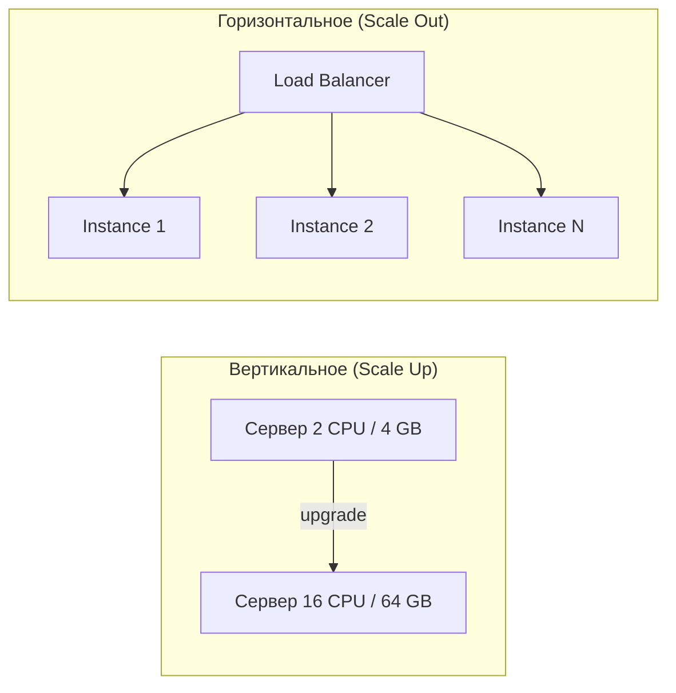

| Характеристика | Вертикальное | Горизонтальное |
|----------------|-------------|----------------|
| Сложность | Низкая | Высокая |
| Потолок | Ограничен оборудованием | Практически не ограничен |
| Отказоустойчивость | `SPOF` | Высокая |
| Стоимость | Экспоненциальный рост | Линейный рост |
| Downtime при масштабировании | Часто требуется | Не требуется |


> [!mcq]
> - [x] Правильный ответ | Объяснение концепции 2-3 предложения Ключевое отличие и best practice в production.
> - [ ] Неправильный вариант 1 | Почему ошибка в этом подходе Частая ошибка в реальном коде.
> - [ ] Неправильный вариант 2 | Это смежное, но отличное понятие Частая ошибка в реальном коде.
> - [ ] Неправильный вариант 3 | Противоположное направление## Q2. (!) Почему для горизонтального масштабирования приложение должно быть stateless? Частая ошибка в реальном коде.

**Stateless** — сервер не хранит состояние запроса между вызовами; любой запрос может быть обработан любым узлом. При **stateful** (сессии в памяти) запросы одного пользователя должны попадать на один и тот же узел (`sticky session`), что усложняет [балансировку](load-balancing-interview.md) и делает невозможным равномерное распределение при добавлении/удалении узлов.

Для горизонтального масштабирования состояние выносят в общее хранилище ([Redis](../databases/redis-interview.md), БД, кэш). При добавлении нового узла в stateful-системе часть сессий нужно мигрировать или они теряются; при падении узла все его сессии теряются. В stateless-системе новый узел сразу получает долю трафика; падение узла влияет только на активные запросы на нём, сессии в `Redis` остаются доступны с других узлов.

**Пример — `Spring Session` с `Redis`:**

```java
@Configuration
@EnableRedisHttpSession(maxInactiveIntervalInSeconds = 1800)
public class SessionConfig {

    @Bean
    public LettuceConnectionFactory connectionFactory() {
        return new LettuceConnectionFactory("redis-host", 6379);
    }
}
```

```yaml
# application.yml
spring:
  session:
    store-type: redis
  data:
    redis:
      host: redis-host
      port: 6379
```

С `spring-session-data-redis` серия запросов с одним session cookie может обрабатываться разными инстансами — сессия подгружается из `Redis` по id. Без `Redis` при масштабировании до N инстансов пришлось бы держать `sticky session` и терять сессии при падении узла.

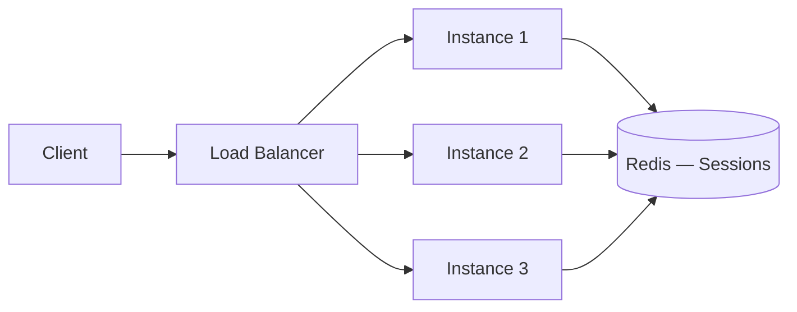


> [!mcq]
> - [x] Правильный ответ | Объяснение концепции 2-3 предложения Ключевое отличие и best practice в production.
> - [ ] Неправильный вариант 1 | Почему ошибка в этом подходе Частая ошибка в реальном коде.
> - [ ] Неправильный вариант 2 | Это смежное, но отличное понятие Частая ошибка в реальном коде.
> - [ ] Неправильный вариант 3 | Противоположное направление## Q3. Когда предпочтительнее вертикальное, а когда горизонтальное масштабирование? Частая ошибка в реальном коде.

**Вертикальное** — когда нагрузка умеренная и один мощный узел достаточен; при ограничениях на изменение кода (legacy); для БД и компонентов, сложно шардируемых (монолитная БД, stateful системы).

**Горизонтальное** — когда нужен рост без потолка; для веб-приложений и [микросервисов](microservices-interview.md); когда важна отказоустойчивость и эластичность (автоскейлинг).

На практике часто комбинируют: приложение — горизонтально, БД — сначала вертикально и `read replicas`, затем шардирование.

| Сценарий | Рекомендация |
|----------|-------------|
| БД до исчерпания возможностей одного инстанса | Вертикально |
| Legacy-приложение без рефакторинга | Вертикально |
| `API` и stateless веб-сервисы | Горизонтально |
| Воркеры [Kafka](../messaging/kafka-interview.md) / `RabbitMQ` | Горизонтально |
| `Read replicas` БД | Горизонтально |


> [!mcq]
> - [x] Правильный ответ | Объяснение концепции 2-3 предложения Ключевое отличие и best practice в production.
> - [ ] Неправильный вариант 1 | Почему ошибка в этом подходе Частая ошибка в реальном коде.
> - [ ] Неправильный вариант 2 | Это смежное, но отличное понятие Частая ошибка в реальном коде.
> - [ ] Неправильный вариант 3 | Противоположное направление## Q4. Что такое эластичное масштабирование (autoscaling)? Частая ошибка в реальном коде.

Эластичное масштабирование — автоматическое добавление или удаление узлов в зависимости от метрик (`CPU`, память, длина очереди, `latency`). В [Kubernetes](../devops/kubernetes-interview.md) — `HPA` (`Horizontal Pod Autoscaler`) по `CPU`/памяти или кастомным метрикам; в облаках — группы автоскейлинга.

**Практический критерий:** автоскейлинг должен опираться на метрику, которая реально отражает деградацию `SLO` (`latency`, `lag`, `queue depth`), а не только на `CPU`.

Важно: корректные пороги, задержка масштабирования, ограничение `min`/`max` инстансов. Слишком агрессивное масштабирование вверх при кратковременных пиках приводит к лишним инстансам; слишком медленное — к росту `latency`. Настройка периода усреднения и стабилизации (`stabilizationWindowSeconds`) сглаживает колебания.


> [!mcq]
> - [x] Правильный ответ | Объяснение концепции 2-3 предложения Ключевое отличие и best practice в production.
> - [ ] Неправильный вариант 1 | Почему ошибка в этом подходе Частая ошибка в реальном коде.
> - [ ] Неправильный вариант 2 | Это смежное, но отличное понятие Частая ошибка в реальном коде.
> - [ ] Неправильный вариант 3 | Противоположное направление## Q5. Что такое узкое место (bottleneck) и как его выявлять? Частая ошибка в реальном коде.

Узкое место — ресурс или компонент, ограничивающий пропускную способность всей системы. Даже если остальные компоненты масштабированы, узкое место определяет максимальный throughput.

Выявление:
1. **Профилирование** — `CPU`, память, `GC`, потоки (см. [профилирование приложений](../performance/application-profiling-interview.md))
2. **Метрики** — `latency` по компонентам, throughput, error rate
3. **Трассировка** — `Jaeger`, `Zipkin` для определения медленного звена в цепочке вызовов
4. **Нагрузочное тестирование** — постепенное увеличение `RPS` и наблюдение за точкой насыщения

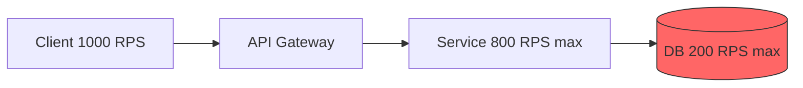

В примере выше БД — узкое место: при 1000 `RPS` она обработает лишь 200, остальное — таймауты. Масштабирование `API Gateway` и сервиса не поможет — нужно масштабировать БД (кэш, `read replicas`, шардирование).


> [!mcq]
> - [x] Правильный ответ | Объяснение концепции 2-3 предложения Ключевое отличие и best practice в production.
> - [ ] Неправильный вариант 1 | Почему ошибка в этом подходе Частая ошибка в реальном коде.
> - [ ] Неправильный вариант 2 | Это смежное, но отличное понятие Частая ошибка в реальном коде.
> - [ ] Неправильный вариант 3 | Противоположное направление## Q6. (!) Как кэширование помогает масштабированию? Частая ошибка в реальном коде.

Кэш снижает нагрузку на источник данных (БД, внешний `API`) и уменьшает латентность. Часто читаемые данные кэшируются в памяти (локальный кэш) или в распределённом кэше ([Redis](../databases/redis-interview.md)). Подробнее о стратегиях — в [вопросах по кэшированию](caching-strategies-interview.md).

Многоуровневый кэш (`L1` — локальный `Caffeine`, `L2` — `Redis`) увеличивает `hit ratio`. Важно: стратегия инвалидации, `TTL`, консистентность.

**Пример — кэширование в `Spring Boot` с `Caffeine`:**

```java
@Configuration
@EnableCaching
public class CacheConfig {

    @Bean
    public CacheManager cacheManager() {
        CaffeineCacheManager manager = new CaffeineCacheManager("products");
        manager.setCaffeine(Caffeine.newBuilder()
                .maximumSize(10_000)
                .expireAfterWrite(Duration.ofMinutes(5))
                .recordStats());
        return manager;
    }
}

@Service
public class ProductService {

    @Cacheable(value = "products", key = "#productId")
    public Product getProduct(Long productId) {
        return productRepository.findById(productId)
                .orElseThrow(() -> new NotFoundException("Product not found"));
    }

    @CacheEvict(value = "products", key = "#product.id")
    public Product updateProduct(Product product) {
        return productRepository.save(product);
    }
}
```

При горизонтальном масштабировании каждый инстанс держит свой локальный кэш; для согласованности между инстансами используют распределённый кэш или инвалидацию по событиям ([Kafka](../messaging/kafka-interview.md), `Redis Pub/Sub`).

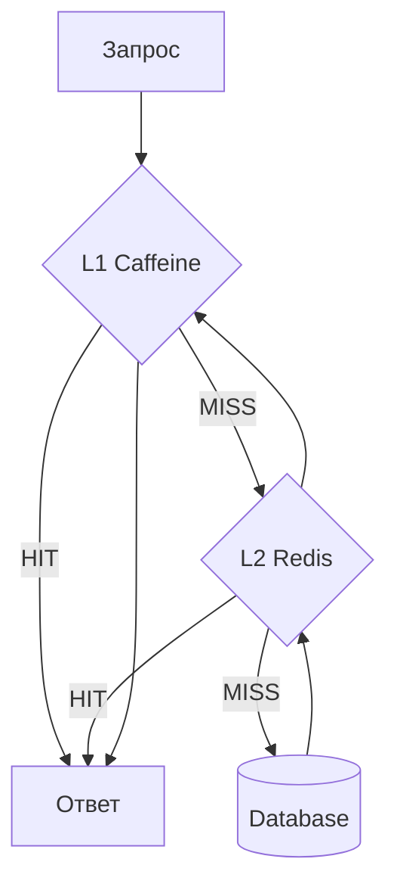


> [!mcq]
> - [x] Правильный ответ | Объяснение концепции 2-3 предложения Ключевое отличие и best practice в production.
> - [ ] Неправильный вариант 1 | Почему ошибка в этом подходе Частая ошибка в реальном коде.
> - [ ] Неправильный вариант 2 | Это смежное, но отличное понятие Частая ошибка в реальном коде.
> - [ ] Неправильный вариант 3 | Противоположное направление## Q7. Как реализовать двухуровневый кэш в Spring Boot? Частая ошибка в реальном коде.

Двухуровневый кэш (`L1` — локальный `Caffeine`, `L2` — `Redis`) минимизирует сетевые вызовы и обеспечивает высокий `hit ratio`. `L1` проверяется первым (наносекунды), при промахе — `L2` (миллисекунды), при промахе — источник данных.

```java
@Component
public class TwoLevelCacheManager implements CacheManager {

    private final CaffeineCacheManager l1CacheManager;
    private final RedisCacheManager l2CacheManager;

    public TwoLevelCacheManager(RedisConnectionFactory redisConnectionFactory) {
        // L1: локальный, быстрый, ограниченный размер
        this.l1CacheManager = new CaffeineCacheManager();
        l1CacheManager.setCaffeine(Caffeine.newBuilder()
                .maximumSize(1_000)
                .expireAfterWrite(Duration.ofMinutes(1)));

        // L2: распределённый, больше данных, дольше живёт
        RedisCacheConfiguration redisConfig = RedisCacheConfiguration.defaultCacheConfig()
                .entryTtl(Duration.ofMinutes(10));
        this.l2CacheManager = RedisCacheManager.builder(redisConnectionFactory)
                .cacheDefaults(redisConfig)
                .build();
    }

    @Override
    public Cache getCache(String name) {
        return new TwoLevelCache(
                l1CacheManager.getCache(name),
                l2CacheManager.getCache(name));
    }
    // ...
}
```

При инвалидации нужно очищать оба уровня: `L2` через `Redis`, `L1` через `Redis Pub/Sub` или [Kafka](../messaging/kafka-interview.md), чтобы все инстансы сбросили локальный кэш.


> [!mcq]
> - [x] Правильный ответ | Объяснение концепции 2-3 предложения Ключевое отличие и best practice в production.
> - [ ] Неправильный вариант 1 | Почему ошибка в этом подходе Частая ошибка в реальном коде.
> - [ ] Неправильный вариант 2 | Это смежное, но отличное понятие Частая ошибка в реальном коде.
> - [ ] Неправильный вариант 3 | Противоположное направление## Q8. Какие стратегии инвалидации кэша существуют? Частая ошибка в реальном коде.

| Стратегия | Описание | Плюсы | Минусы |
|-----------|----------|-------|--------|
| **TTL** | Запись истекает через фиксированное время | Простота | Stale data до истечения |
| **Write-through** | Запись обновляет кэш синхронно | Консистентность | Увеличивает latency записи |
| **Write-behind** | Запись обновляет кэш, БД — асинхронно | Быстрая запись | Риск потери данных |
| **Event-driven** | Кэш инвалидируется по событию | Гибкость | Сложность реализации |
| **Cache-aside** | Приложение явно управляет кэшем | Контроль | Бойлерплейт |

В масштабируемой системе `event-driven` инвалидация через [Kafka](../messaging/kafka-interview.md) — самый надёжный способ: при изменении данных публикуется событие, все инстансы-подписчики инвалидируют свой локальный кэш.


> [!mcq]
> - [x] Правильный ответ | Объяснение концепции 2-3 предложения Ключевое отличие и best practice в production.
> - [ ] Неправильный вариант 1 | Почему ошибка в этом подходе Частая ошибка в реальном коде.
> - [ ] Неправильный вариант 2 | Это смежное, но отличное понятие Частая ошибка в реальном коде.
> - [ ] Неправильный вариант 3 | Противоположное направление## Q9. (!) Что такое шардирование и когда его применять? Частая ошибка в реальном коде.

Шардирование — горизонтальное разделение данных по ключу между несколькими узлами (БД, топики [Kafka](../messaging/kafka-interview.md)). Применяют при росте объёма данных, когда один узел не справляется.

Ключ шардирования определяет, на какой шард попадёт запись; важно равномерное распределение и отсутствие «горячих» шардов. В БД шардирование часто делают по доменному ключу (`user_id`, `tenant_id`); в `Kafka` ключ сообщения определяет партицию.

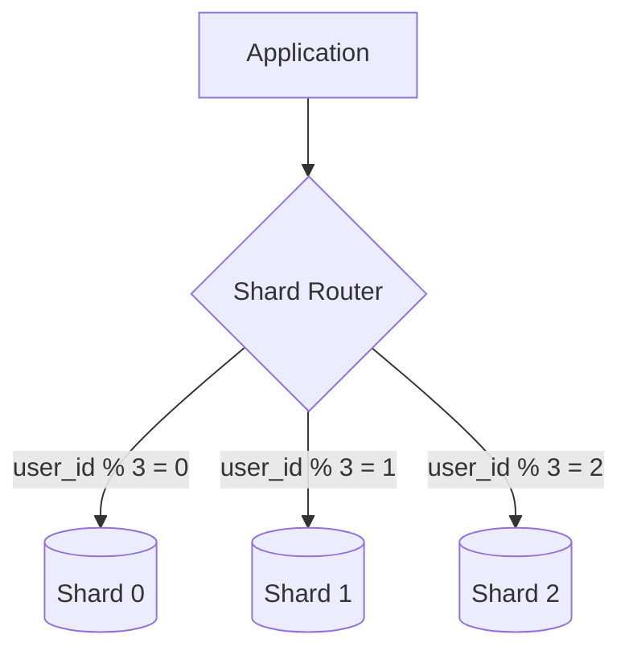

**Пример — маршрутизация по шарду в `Spring`:**

```java
public class ShardRoutingDataSource extends AbstractRoutingDataSource {

    @Override
    protected Object determineCurrentLookupKey() {
        Long userId = ShardContext.getCurrentUserId();
        int shardIndex = (int) (userId % getNumberOfShards());
        return "shard_" + shardIndex;
    }
}

// Использование
@Service
public class UserService {

    public User getUser(Long userId) {
        ShardContext.setCurrentUserId(userId);
        try {
            return userRepository.findById(userId).orElseThrow();
        } finally {
            ShardContext.clear();
        }
    }
}
```


> [!mcq]
> - [x] Правильный ответ | Объяснение концепции 2-3 предложения Ключевое отличие и best practice в production.
> - [ ] Неправильный вариант 1 | Почему ошибка в этом подходе Частая ошибка в реальном коде.
> - [ ] Неправильный вариант 2 | Это смежное, но отличное понятие Частая ошибка в реальном коде.
> - [ ] Неправильный вариант 3 | Противоположное направление## Q10. Что такое «горячая партиция» / «горячий шард» и как избежать? Частая ошибка в реальном коде.

**Горячая партиция (шард)** — партиция или шард с непропорционально высокой нагрузкой (например, один ключ генерирует большую часть трафика).

Решения:
- Пересмотреть ключ шардирования
- Добавить соль (`random suffix`) в ключ для распределения
- Кэшировать горячие данные
- Разделить горячий ключ на несколько логических партиций

**Практика в `Kafka`:** один ключ всегда попадает в одну партицию — если один `user_id` генерирует 80% событий, одна партиция перегружена. Решения: составной ключ (`userId + "-" + random(0..9)`) для распределения; кэширование обработки; увеличение числа партиций. В БД при шардировании по `user_id` «звезда» с огромной активностью даёт горячий шард — кэш, `read replica` для этого шарда или выделение отдельного шарда.

```java
// Kafka: соль в ключе для распределения горячего пользователя
String key = userId + "-" + ThreadLocalRandom.current().nextInt(10);
kafkaTemplate.send("orders", key, orderEvent);
```


> [!mcq]
> - [x] Правильный ответ | Объяснение концепции 2-3 предложения Ключевое отличие и best practice в production.
> - [ ] Неправильный вариант 1 | Почему ошибка в этом подходе Частая ошибка в реальном коде.
> - [ ] Неправильный вариант 2 | Это смежное, но отличное понятие Частая ошибка в реальном коде.
> - [ ] Неправильный вариант 3 | Противоположное направление## Q11. Чем отличается шардирование от партиционирования таблиц? Частая ошибка в реальном коде.

| Характеристика | Шардирование | Партиционирование |
|----------------|-------------|-------------------|
| Размещение данных | Разные серверы | Один сервер |
| Масштабирование | Горизонтальное | Вертикальное |
| Транзакции | Распределённые | Локальные |
| Сложность | Высокая | Средняя |
| `JOIN` между частями | Сложный/невозможный | Прозрачный |

**Партиционирование** — разделение таблицы на части внутри одной БД (по диапазону, хэшу, списку). Ускоряет запросы и упрощает обслуживание (удаление старых данных), но не даёт горизонтального масштабирования.

```sql
-- PostgreSQL: партиционирование по диапазону дат
CREATE TABLE orders (
    id BIGINT,
    user_id BIGINT,
    created_at TIMESTAMP,
    total DECIMAL
) PARTITION BY RANGE (created_at);

CREATE TABLE orders_2026_q1 PARTITION OF orders
    FOR VALUES FROM ('2026-01-01') TO ('2026-04-01');
CREATE TABLE orders_2026_q2 PARTITION OF orders
    FOR VALUES FROM ('2026-04-01') TO ('2026-07-01');
```

**Шардирование** — данные физически на разных серверах; нужен роутинг и может понадобиться [согласованность](consistency-patterns-interview.md) между шардами.


> [!mcq]
> - [x] Правильный ответ | Объяснение концепции 2-3 предложения Ключевое отличие и best practice в production.
> - [ ] Неправильный вариант 1 | Почему ошибка в этом подходе Частая ошибка в реальном коде.
> - [ ] Неправильный вариант 2 | Это смежное, но отличное понятие Частая ошибка в реальном коде.
> - [ ] Неправильный вариант 3 | Противоположное направление## Q12. (!) Как асинхронность и очереди помогают масштабированию? Частая ошибка в реальном коде.

Синхронный запрос блокирует поток до ответа; при пиках все потоки заняты и `latency` растёт. Асинхронная обработка: `API` принимает запрос, ставит задачу в очередь ([Kafka](../messaging/kafka-interview.md), `RabbitMQ`) и сразу отвечает; воркеры обрабатывают очередь параллельно.

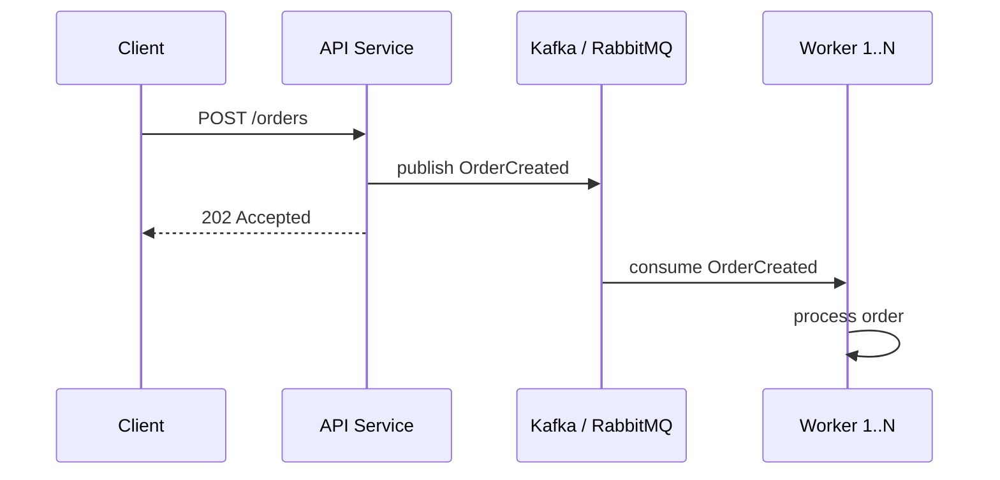

Нагрузка сглаживается; можно масштабировать воркеров независимо от числа клиентов. Очередь выступает буфером между продюсерами и потребителями.

```java
// Асинхронная отправка заказа в Kafka
@RestController
@RequiredArgsConstructor
public class OrderController {

    private final KafkaTemplate<String, OrderEvent> kafkaTemplate;

    @PostMapping("/orders")
    public ResponseEntity<Void> createOrder(@RequestBody OrderRequest request) {
        OrderEvent event = new OrderEvent(request.getUserId(), request.getItems());
        kafkaTemplate.send("orders", request.getUserId().toString(), event);
        return ResponseEntity.accepted().build();
    }
}
```


> [!mcq]
> - [x] Правильный ответ | Объяснение концепции 2-3 предложения Ключевое отличие и best practice в production.
> - [ ] Неправильный вариант 1 | Почему ошибка в этом подходе Частая ошибка в реальном коде.
> - [ ] Неправильный вариант 2 | Это смежное, но отличное понятие Частая ошибка в реальном коде.
> - [ ] Неправильный вариант 3 | Противоположное направление## Q13. Что такое backpressure и зачем он нужен? Частая ошибка в реальном коде.

**Backpressure** — механизм, при котором быстрый производитель замедляется при переполнении потребителя. Без `backpressure` очередь растёт бесконечно и возможна потеря сообщений или `OOM`.

Реализации:
- **Reactive Streams** (`Reactor`, `RxJava`) — подписчик запрашивает `request(n)` элементов
- **Kafka** — потребитель не fetch'ит следующую партию, пока не обработал текущую; `lag` растёт
- **HTTP** — сервис возвращает `429 Too Many Requests` или замедляет (rate limiting)

```java
// Reactor: backpressure с ограниченным буфером
Flux.range(1, 10_000)
    .onBackpressureBuffer(256)   // буфер 256 элементов
    .publishOn(Schedulers.boundedElastic())
    .subscribe(item -> {
        // Медленная обработка
        processItem(item);
    });
```

В [Kafka](../messaging/kafka-interview.md) `backpressure` косвенный: мониторинг `consumer lag` триггерит алерт или автоскейлинг воркеров через `KEDA`.


> [!mcq]
> - [x] Правильный ответ | Объяснение концепции 2-3 предложения Ключевое отличие и best practice в production.
> - [ ] Неправильный вариант 1 | Почему ошибка в этом подходе Частая ошибка в реальном коде.
> - [ ] Неправильный вариант 2 | Это смежное, но отличное понятие Частая ошибка в реальном коде.
> - [ ] Неправильный вариант 3 | Противоположное направление## Q14. Как масштабировать обработку очередей (Kafka, RabbitMQ)? Частая ошибка в реальном коде.

Подходы:
1. Увеличить число партиций (`Kafka`) или воркеров (`RabbitMQ`)
2. Масштабировать потребителей по числу партиций (в `Kafka` — один потребитель на партицию в группе)
3. Оптимизировать обработку одного сообщения (батчи, асинхронность)
4. Мониторить `lag` и длину очереди
5. При необходимости — шардировать топики по доменам

В `Kafka` число потребителей в `consumer group` не должно превышать число партиций топика — лишние потребители будут простаивать. При росте `lag` увеличивают число партиций (с перебалансировкой) или оптимизируют скорость обработки.

```java
// Spring Kafka: конкурентная обработка
@Configuration
public class KafkaConsumerConfig {

    @Bean
    public ConcurrentKafkaListenerContainerFactory<String, OrderEvent>
            kafkaListenerContainerFactory(ConsumerFactory<String, OrderEvent> cf) {
        var factory = new ConcurrentKafkaListenerContainerFactory<String, OrderEvent>();
        factory.setConsumerFactory(cf);
        factory.setConcurrency(8); // 8 потоков = 8 партиций
        factory.setBatchListener(true); // батч-обработка
        return factory;
    }
}

@KafkaListener(topics = "orders", groupId = "order-processor")
public void processOrders(List<OrderEvent> events) {
    events.forEach(this::processOrder);
}
```


> [!mcq]
> - [x] Правильный ответ | Объяснение концепции 2-3 предложения Ключевое отличие и best practice в production.
> - [ ] Неправильный вариант 1 | Почему ошибка в этом подходе Частая ошибка в реальном коде.
> - [ ] Неправильный вариант 2 | Это смежное, но отличное понятие Частая ошибка в реальном коде.
> - [ ] Неправильный вариант 3 | Противоположное направление## Q15. (!) Что такое read replica и как это помогает масштабировать чтение? Частая ошибка в реальном коде.

`Read replica` — реплика БД только для чтения; запись идёт в `primary`, реплики синхронизируются асинхронно. Нагрузка чтения распределяется по репликам; `primary` разгружается.

Ограничение: `eventual consistency` для чтения — реплики могут отставать. Подробнее о моделях консистентности — в [паттернах согласованности](consistency-patterns-interview.md).

**Пример — маршрутизация read/write в `Spring`:**

```java
public class ReadWriteRoutingDataSource extends AbstractRoutingDataSource {

    @Override
    protected Object determineCurrentLookupKey() {
        return TransactionSynchronizationManager.isCurrentTransactionReadOnly()
                ? DataSourceType.REPLICA
                : DataSourceType.PRIMARY;
    }
}

@Service
public class OrderService {

    @Transactional(readOnly = true) // → replica
    public List<Order> getOrdersByUser(Long userId) {
        return orderRepository.findByUserId(userId);
    }

    @Transactional // → primary
    public Order createOrder(Order order) {
        return orderRepository.save(order);
    }
}
```

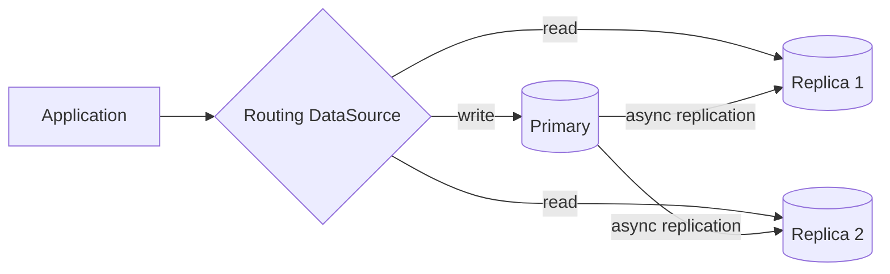


> [!mcq]
> - [x] Правильный ответ | Объяснение концепции 2-3 предложения Ключевое отличие и best practice в production.
> - [ ] Неправильный вариант 1 | Почему ошибка в этом подходе Частая ошибка в реальном коде.
> - [ ] Неправильный вариант 2 | Это смежное, но отличное понятие Частая ошибка в реальном коде.
> - [ ] Неправильный вариант 3 | Противоположное направление## Q16. (!) Что такое CQRS в контексте масштабирования? Частая ошибка в реальном коде.

**CQRS** (`Command Query Responsibility Segregation`) — разделение модели на запись (`command`) и чтение (`query`). Write-модель оптимизирована для транзакций; read-модель — для запросов (денормализованные проекции, индексы).

Чтение и запись масштабируются независимо; можно иметь много `read replicas` или отдельные хранилища под типы запросов.

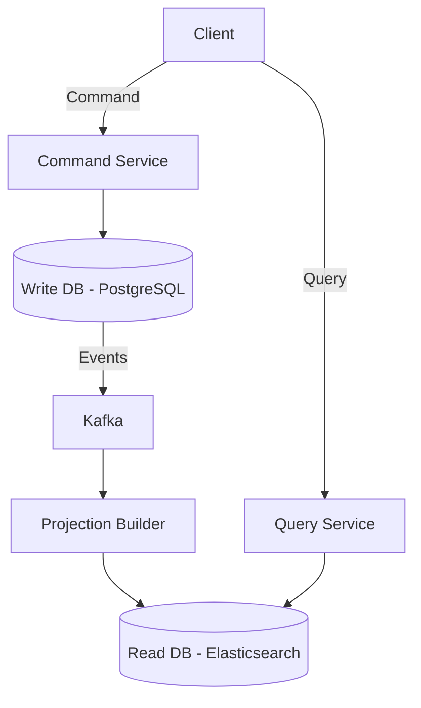

**Пример — `CQRS` со `Spring Modulith`:**

```java
// Command side
@Service
@RequiredArgsConstructor
public class OrderCommandService {

    private final OrderRepository repository;
    private final ApplicationEventPublisher events;

    @Transactional
    public Long createOrder(CreateOrderCommand cmd) {
        Order order = Order.create(cmd.userId(), cmd.items());
        repository.save(order);
        events.publishEvent(new OrderCreatedEvent(order.getId(), order.getUserId()));
        return order.getId();
    }
}

// Query side — отдельная модель, возможно другое хранилище
@Service
@RequiredArgsConstructor
public class OrderQueryService {

    private final OrderProjectionRepository projections;

    @Transactional(readOnly = true)
    public List<OrderSummary> getUserOrders(Long userId) {
        return projections.findByUserId(userId);
    }
}

// Event handler — строит read-проекцию
@Component
public class OrderProjectionUpdater {

    @EventListener
    public void on(OrderCreatedEvent event) {
        // Обновляет денормализованную проекцию для быстрого чтения
        projections.upsert(new OrderSummary(event.orderId(), event.userId(), ...));
    }
}
```

Минусы `CQRS`: `eventual consistency` между write и read моделями; сложность поддержки двух моделей и проекций.


> [!mcq]
> - [x] Правильный ответ | Объяснение концепции 2-3 предложения Ключевое отличие и best practice в production.
> - [ ] Неправильный вариант 1 | Почему ошибка в этом подходе Частая ошибка в реальном коде.
> - [ ] Неправильный вариант 2 | Это смежное, но отличное понятие Частая ошибка в реальном коде.
> - [ ] Неправильный вариант 3 | Противоположное направление## Q17. Как масштабировать запись (write scaling)? Частая ошибка в реальном коде.

Запись сложнее масштабировать, чем чтение: один `primary` для записи, реплики — только для чтения.

Подходы:
1. **Шардирование** по ключу — несколько шардов, каждый со своим `primary`
2. **Партиционирование таблиц** — по диапазону или хэшу
3. **Асинхронная запись** — очередь + воркеры, сглаживание пиков
4. **CQRS** с отдельной write-моделью и событийной синхронизацией
5. **Батчирование** — группировка записей для снижения числа транзакций

При шардировании записи каждый шард принимает только своё подмножество ключей; важно равномерное распределение. Асинхронная запись через очередь позволяет сгладить пики и масштабировать воркеров независимо.


> [!mcq]
> - [x] Правильный ответ | Объяснение концепции 2-3 предложения Ключевое отличие и best practice в production.
> - [ ] Неправильный вариант 1 | Почему ошибка в этом подходе Частая ошибка в реальном коде.
> - [ ] Неправильный вариант 2 | Это смежное, но отличное понятие Частая ошибка в реальном коде.
> - [ ] Неправильный вариант 3 | Противоположное направление## Q18. (!) Что такое circuit breaker и как он связан с масштабируемостью? Это антипаттерн или неправильный выбор в production.

**Circuit breaker** — паттерн: при множестве ошибок вызова сервиса «размыкает цепь» и перестаёт вызывать сервис на время. Снижает каскадные сбои и нагрузку на падающий сервис.

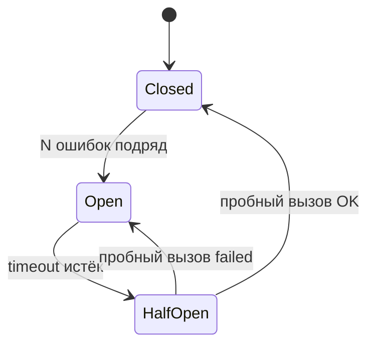

При масштабировании без `circuit breaker` сотни потоков ждут ответа от падающего сервиса; с `circuit breaker` — быстрый отказ, потоки освобождаются, падающий сервис перестаёт получать нагрузку и может восстановиться.

**Пример — `Resilience4j` с аннотациями `Spring Boot`:**

```java
@Service
public class PaymentService {

    @CircuitBreaker(name = "paymentGateway", fallbackMethod = "fallbackPayment")
    @Retry(name = "paymentGateway", fallbackMethod = "fallbackPayment")
    public PaymentResult processPayment(PaymentRequest request) {
        return paymentGatewayClient.charge(request);
    }

    private PaymentResult fallbackPayment(PaymentRequest request, Throwable t) {
        log.warn("Payment gateway unavailable, queuing for retry: {}", t.getMessage());
        paymentRetryQueue.enqueue(request);
        return PaymentResult.pending();
    }
}
```

```yaml
# application.yml
resilience4j:
  circuitbreaker:
    instances:
      paymentGateway:
        failure-rate-threshold: 50
        wait-duration-in-open-state: 30s
        sliding-window-size: 10
        permitted-number-of-calls-in-half-open-state: 3
  retry:
    instances:
      paymentGateway:
        max-attempts: 3
        wait-duration: 500ms
```


> [!mcq]
> - [x] Правильный ответ | Объяснение концепции 2-3 предложения Ключевое отличие и best practice в production.
> - [ ] Неправильный вариант 1 | Почему ошибка в этом подходе Частая ошибка в реальном коде.
> - [ ] Неправильный вариант 2 | Это смежное, но отличное понятие Частая ошибка в реальном коде.
> - [ ] Неправильный вариант 3 | Противоположное направление## Q19. (!) Что такое rate limiting и как он помогает при масштабировании? Это антипаттерн или неправильный выбор в production.

**Rate limiting** — ограничение частоты запросов от клиента или по `API`. Защищает от перегрузки при всплесках и злоупотреблениях; позволяет гарантировать `SLO` для части трафика.

Алгоритмы:
- **Token Bucket** — бакет пополняется с фиксированной скоростью; запрос забирает токен; при пустом бакете — `429`
- **Sliding Window** — считаются запросы за последние N секунд
- **Fixed Window** — лимит на фиксированный интервал (минута, секунда)

**Пример — `Bucket4j` в `Spring Boot`:**

```java
@Component
public class RateLimitFilter extends OncePerRequestFilter {

    private final Map<String, Bucket> buckets = new ConcurrentHashMap<>();

    @Override
    protected void doFilterInternal(HttpServletRequest request,
                                     HttpServletResponse response,
                                     FilterChain chain) throws ServletException, IOException {
        String clientId = request.getRemoteAddr();
        Bucket bucket = buckets.computeIfAbsent(clientId, this::createBucket);

        if (bucket.tryConsume(1)) {
            chain.doFilter(request, response);
        } else {
            response.setStatus(HttpStatus.TOO_MANY_REQUESTS.value());
            response.getWriter().write("Rate limit exceeded");
        }
    }

    private Bucket createBucket(String clientId) {
        return Bucket.builder()
                .addLimit(Bandwidth.classic(100, Refill.intervally(100, Duration.ofMinutes(1))))
                .build();
    }
}
```

При масштабировании шлюза rate limiting может быть **локальным** (на инстанс) или **распределённым** (`Redis`) для единого лимита на клиента across инстансов. Распределённый лимит в `Redis`: все инстансы шлюза обращаются к одному `Redis`, лимит общий — при масштабировании шлюза лимит на клиента не умножается.


> [!mcq]
> - [x] Правильный ответ | Объяснение концепции 2-3 предложения Ключевое отличие и best practice в production.
> - [ ] Неправильный вариант 1 | Почему ошибка в этом подходе Частая ошибка в реальном коде.
> - [ ] Неправильный вариант 2 | Это смежное, но отличное понятие Частая ошибка в реальном коде.
> - [ ] Неправильный вариант 3 | Противоположное направление## Q20. Что такое bulkhead pattern и как он предотвращает каскадные сбои? Это антипаттерн или неправильный выбор в production.

**Bulkhead** (переборка) — изоляция ресурсов для разных потребителей или операций, чтобы сбой одного не повлиял на остальные. По аналогии с водонепроницаемыми переборками корабля.

Типы:
- **Thread pool bulkhead** — отдельный пул потоков для каждого внешнего вызова
- **Semaphore bulkhead** — ограничение количества параллельных вызовов

```java
@Service
public class IntegrationService {

    @Bulkhead(name = "inventoryService", type = Bulkhead.Type.THREADPOOL)
    public CompletableFuture<InventoryResponse> checkInventory(String sku) {
        return CompletableFuture.supplyAsync(() ->
                inventoryClient.check(sku));
    }

    @Bulkhead(name = "pricingService", type = Bulkhead.Type.SEMAPHORE)
    public PriceResponse getPrice(String sku) {
        return pricingClient.getPrice(sku);
    }
}
```

```yaml
resilience4j:
  bulkhead:
    instances:
      pricingService:
        max-concurrent-calls: 20
        max-wait-duration: 500ms
  thread-pool-bulkhead:
    instances:
      inventoryService:
        max-thread-pool-size: 10
        core-thread-pool-size: 5
        queue-capacity: 50
```

Без `bulkhead` медленный внешний сервис может исчерпать все потоки приложения, блокируя и здоровые эндпоинты.


> [!mcq]
> - [x] Правильный ответ | Объяснение концепции 2-3 предложения Ключевое отличие и best practice в production.
> - [ ] Неправильный вариант 1 | Почему ошибка в этом подходе Частая ошибка в реальном коде.
> - [ ] Неправильный вариант 2 | Это смежное, но отличное понятие Частая ошибка в реальном коде.
> - [ ] Неправильный вариант 3 | Противоположное направление## Q21. Как таймауты и retry-стратегии влияют на масштабируемость? Частая ошибка в реальном коде.

Неправильные таймауты — частая причина каскадных сбоев при масштабировании:

- **Слишком длинные** — потоки блокируются, пул исчерпывается, новые запросы стоят в очереди
- **Слишком короткие** — ложные ошибки при нормальной нагрузке
- **Retry без backoff** — «retry storm» усиливает нагрузку на и без того перегруженный сервис

**Правила для масштабируемых систем:**
1. Устанавливать таймауты на каждый внешний вызов
2. Retry с **exponential backoff** и **jitter**
3. Ограничивать число retry (обычно 2-3)
4. Комбинировать с `circuit breaker`

```java
@Configuration
public class RestClientConfig {

    @Bean
    public RestTemplate restTemplate() {
        var factory = new SimpleClientHttpRequestFactory();
        factory.setConnectTimeout(Duration.ofSeconds(2));
        factory.setReadTimeout(Duration.ofSeconds(5));
        return new RestTemplate(factory);
    }
}
```

```yaml
resilience4j:
  retry:
    instances:
      externalApi:
        max-attempts: 3
        wait-duration: 500ms
        enable-exponential-backoff: true
        exponential-backoff-multiplier: 2
        retry-exceptions:
          - java.io.IOException
          - java.net.SocketTimeoutException
```


> [!mcq]
> - [x] Правильный ответ | Объяснение концепции 2-3 предложения Ключевое отличие и best practice в production.
> - [ ] Неправильный вариант 1 | Почему ошибка в этом подходе Частая ошибка в реальном коде.
> - [ ] Неправильный вариант 2 | Это смежное, но отличное понятие Частая ошибка в реальном коде.
> - [ ] Неправильный вариант 3 | Противоположное направление## Q22. Как мониторинг связан с масштабируемостью? Частая ошибка в реальном коде.

Без метрик невозможно понять, где узкое место и когда масштабировать. Подробнее — в [вопросах по observability](../monitoring/observability-interview.md) и [метрикам и трейсингу](../monitoring/metrics-tracing-interview.md).

Необходимые метрики:
- **Ресурсы** — `CPU`, память, диск, сеть
- **Приложение** — `throughput`, `latency` (p50, p95, p99), `error rate`
- **Очереди** — длина, `lag`, скорость обработки
- **SLO** и алерты

В [Kubernetes](../devops/kubernetes-interview.md) `HPA` использует метрики из `Metrics Server` или внешних адаптеров (`Prometheus`); `KEDA` добавляет метрики из очередей ([Kafka](../messaging/kafka-interview.md) `lag`, `RabbitMQ` length). Трассировка (`Jaeger`, `Zipkin`) помогает выявить медленные звенья в цепочке вызовов.

```java
// Spring Boot Actuator + Micrometer — кастомные метрики для автоскейлинга
@Component
@RequiredArgsConstructor
public class OrderMetrics {

    private final MeterRegistry registry;

    public void recordOrderProcessingTime(Duration duration) {
        registry.timer("order.processing.time").record(duration);
    }

    public void incrementOrderCount() {
        registry.counter("order.processed.total").increment();
    }

    public void recordQueueDepth(int depth) {
        registry.gauge("order.queue.depth", depth);
    }
}
```


> [!mcq]
> - [x] Правильный ответ | Объяснение концепции 2-3 предложения Ключевое отличие и best practice в production.
> - [ ] Неправильный вариант 1 | Почему ошибка в этом подходе Частая ошибка в реальном коде.
> - [ ] Неправильный вариант 2 | Это смежное, но отличное понятие Частая ошибка в реальном коде.
> - [ ] Неправильный вариант 3 | Противоположное направление## Q23. Что такое SLO и как он связан с масштабированием? Частая ошибка в реальном коде.

`SLO` (`Service Level Objective`) — целевой уровень качества сервиса (например, 99.9% доступности, p99 `latency` < 200 ms).

Связь с масштабированием:
- При нарушении `SLO` — триггер для алертов и автоскейлинга
- Кастомные метрики `HPA` / `KEDA` привязаны к `SLO` (масштабировать при p99 > 200 ms)
- Алерты по `SLO` позволяют реагировать до того, как пользователи заметят деградацию

| Метрика | SLO | Действие при нарушении |
|---------|-----|----------------------|
| Доступность | 99.9% | Увеличить реплики, проверить health checks |
| p99 latency | < 200ms | Масштабировать горизонтально, добавить кэш |
| Error rate | < 0.1% | Circuit breaker, fallback, откат деплоя |
| Kafka lag | < 1000 | Добавить воркеров через KEDA |


> [!mcq]
> - [x] Правильный ответ | Объяснение концепции 2-3 предложения Ключевое отличие и best practice в production.
> - [ ] Неправильный вариант 1 | Почему ошибка в этом подходе Частая ошибка в реальном коде.
> - [ ] Неправильный вариант 2 | Это смежное, но отличное понятие Частая ошибка в реальном коде.
> - [ ] Неправильный вариант 3 | Противоположное направление## Q24. Что такое auto-scaling по кастомным метрикам? Частая ошибка в реальном коде.

**Auto-scaling по кастомным метрикам** — масштабирование подов по метрикам, отличным от `CPU`: `RPS`, `latency`, длина очереди [Kafka](../messaging/kafka-interview.md), число сообщений в `RabbitMQ`.

В [Kubernetes](../devops/kubernetes-interview.md) `HPA` по умолчанию масштабирует по `CPU` и памяти; кастомные метрики подключают через `Prometheus Adapter` или `KEDA`.

**Пример `KEDA ScaledObject` (Kafka lag):**

```yaml
apiVersion: keda.sh/v1alpha1
kind: ScaledObject
metadata:
  name: kafka-consumer-scaler
spec:
  scaleTargetRef:
    name: my-consumer-deployment
  minReplicaCount: 1
  maxReplicaCount: 10
  triggers:
    - type: kafka
      metadata:
        topic: orders
        lagThreshold: "100"
        bootstrapServers: kafka:9092
        consumerGroup: order-processor
```

При `lag` > 100 `KEDA` увеличивает число подов consumer'а; при `lag` = 0 — уменьшает до `minReplicaCount`. Так воркеры очередей масштабируются по реальной нагрузке, а не только по `CPU`.


> [!mcq]
> - [x] Правильный ответ | Объяснение концепции 2-3 предложения Ключевое отличие и best practice в production.
> - [ ] Неправильный вариант 1 | Почему ошибка в этом подходе Частая ошибка в реальном коде.
> - [ ] Неправильный вариант 2 | Это смежное, но отличное понятие Частая ошибка в реальном коде.
> - [ ] Неправильный вариант 3 | Противоположное направление## Q25. (!) Как проектировать приложение для горизонтального масштабирования с первого дня? Частая ошибка в реальном коде.

Ключевые принципы:

1. **Stateless** — не хранить состояние в памяти; сессии в [Redis](../databases/redis-interview.md)
2. **Идемпотентность** — повторный вызов даёт тот же результат (важно при retry)
3. **Нет локальных файлов** — использовать `S3`, `MinIO` для хранения
4. **Нет глобальных блокировок** — если нужны, использовать распределённые (`Redis`, `ZooKeeper`)
5. **Пул соединений** — настроить с учётом числа инстансов и лимита БД
6. **Асинхронность** — тяжёлые операции через очереди
7. **Circuit breaker и таймауты** — при вызове внешних сервисов
8. **Health checks** — readiness/liveness для [Kubernetes](../devops/kubernetes-interview.md)

```java
// Идемпотентный API с ключом идемпотентности
@PostMapping("/payments")
public ResponseEntity<PaymentResult> processPayment(
        @RequestHeader("Idempotency-Key") String idempotencyKey,
        @RequestBody PaymentRequest request) {

    // Проверяем: если уже обработано — возвращаем результат
    return paymentRepository.findByIdempotencyKey(idempotencyKey)
            .map(ResponseEntity::ok)
            .orElseGet(() -> {
                PaymentResult result = paymentService.process(request, idempotencyKey);
                return ResponseEntity.status(HttpStatus.CREATED).body(result);
            });
}
```


> [!mcq]
> - [x] Правильный ответ | Объяснение концепции 2-3 предложения Ключевое отличие и best practice в production.
> - [ ] Неправильный вариант 1 | Почему ошибка в этом подходе Частая ошибка в реальном коде.
> - [ ] Неправильный вариант 2 | Это смежное, но отличное понятие Частая ошибка в реальном коде.
> - [ ] Неправильный вариант 3 | Противоположное направление## Q26. Что такое scale to zero и когда его используют? Частая ошибка в реальном коде.

`Scale to zero` — уменьшение числа инстансов до нуля при отсутствии нагрузки (серверлесс, `Knative`, `KEDA`). Используют для непостоянной нагрузки (batch, редкие запросы) для экономии ресурсов.

Минусы: **холодный старт** (`cold start`) при первом запросе после нуля — для `Spring Boot` может составлять 5-15 секунд; не подходит для постоянной нагрузки с низкой `latency`.

Оптимизации холодного старта:
- `Spring Boot` `CDS` (Class Data Sharing)
- `GraalVM Native Image` — старт за миллисекунды
- `KEDA` с `minReplicaCount: 0` + `cooldownPeriod`

```yaml
# KEDA: scale to zero при отсутствии сообщений в очереди
apiVersion: keda.sh/v1alpha1
kind: ScaledObject
metadata:
  name: batch-processor
spec:
  scaleTargetRef:
    name: batch-worker
  minReplicaCount: 0        # scale to zero
  maxReplicaCount: 20
  cooldownPeriod: 300        # 5 минут без нагрузки → scale to zero
  triggers:
    - type: rabbitmq
      metadata:
        queueName: batch-tasks
        queueLength: "5"
```


> [!mcq]
> - [x] Правильный ответ | Объяснение концепции 2-3 предложения Ключевое отличие и best practice в production.
> - [ ] Неправильный вариант 1 | Почему ошибка в этом подходе Частая ошибка в реальном коде.
> - [ ] Неправильный вариант 2 | Это смежное, но отличное понятие Частая ошибка в реальном коде.
> - [ ] Неправильный вариант 3 | Противоположное направление## Q27. (!) Как масштабировать базу данных? Частая ошибка в реальном коде.

**Trade-off:** `read replicas` и кэш обычно дают быстрый выигрыш, но для write-heavy сценариев почти всегда приходится переходить к шардированию и пересмотру модели данных.

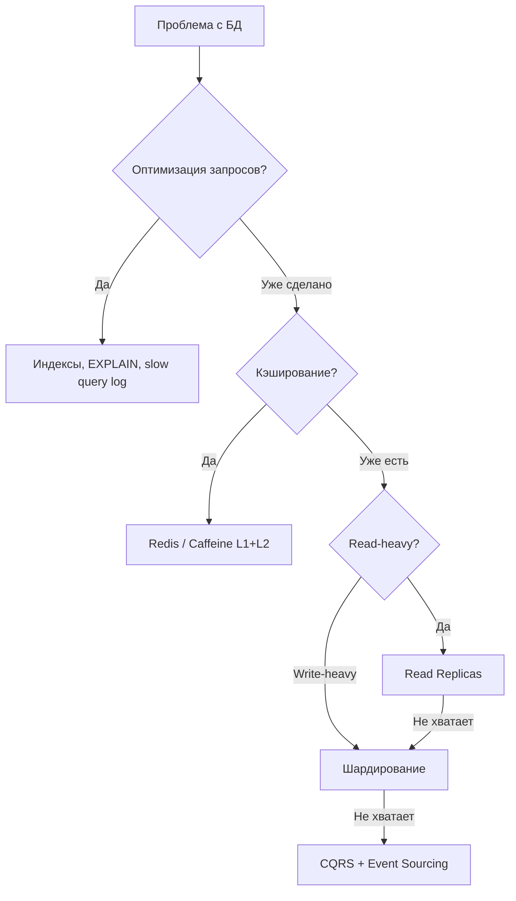

Подходы (в порядке возрастания сложности):
1. **Оптимизация запросов** — индексы, `EXPLAIN`, [SQL](../databases/sql-interview.md)-оптимизация
2. **Кэширование** — [Redis](../databases/redis-interview.md), `Caffeine`
3. **Read replicas** — масштабирование чтения
4. **Партиционирование таблиц** — ускорение запросов по диапазону
5. **Шардирование** — горизонтальное разделение данных
6. **CQRS** — разделение read/write моделей


> [!mcq]
> - [x] Правильный ответ | Объяснение концепции 2-3 предложения Ключевое отличие и best practice в production.
> - [ ] Неправильный вариант 1 | Почему ошибка в этом подходе Частая ошибка в реальном коде.
> - [ ] Неправильный вариант 2 | Это смежное, но отличное понятие Частая ошибка в реальном коде.
> - [ ] Неправильный вариант 3 | Противоположное направление## Q28. Что такое вертикальное масштабирование БД и его ограничения? Частая ошибка в реальном коде.

Вертикальное масштабирование БД — увеличение `CPU`, памяти, диска на одном инстансе.

Ограничения:
- Потолок у одного узла (физические лимиты, стоимость растёт экспоненциально)
- `Single point of failure`
- При миграции на больший инстанс — простой или сложная процедура

Перед вертикальным масштабированием БД стоит проверить:
- Индексы и медленные запросы (`pg_stat_statements`, `EXPLAIN ANALYZE`)
- Лимит соединений и настройки [Hibernate](../databases/hibernate-interview.md)
- Размер `shared_buffers` и `work_mem`
- Наличие `N+1` запросов

Часто оптимизация запросов и `read replicas` дают больший эффект при меньших затратах.


> [!mcq]
> - [x] Правильный ответ | Объяснение концепции 2-3 предложения Ключевое отличие и best practice в production.
> - [ ] Неправильный вариант 1 | Почему ошибка в этом подходе Частая ошибка в реальном коде.
> - [ ] Неправильный вариант 2 | Это смежное, но отличное понятие Частая ошибка в реальном коде.
> - [ ] Неправильный вариант 3 | Противоположное направление## Q29. (!) Что такое connection pooling и как он связан с масштабированием? Частая ошибка в реальном коде.

`Connection pooling` — пул переиспользуемых соединений к БД вместо создания нового соединения на каждый запрос. Создание соединения дорого (`TCP`, `SSL`, аутентификация); пул ограничивает число одновременных соединений и снижает `latency`.

**Критический момент:** при горизонтальном масштабировании суммарное число соединений = `инстансы × размер пула`. При 20 инстансах с пулом 10 = 200 соединений к БД.

**Пример — настройка `HikariCP` в `Spring Boot`:**

```yaml
spring:
  datasource:
    hikari:
      maximum-pool-size: 10
      minimum-idle: 5
      idle-timeout: 300000       # 5 минут
      max-lifetime: 1800000      # 30 минут
      connection-timeout: 20000  # 20 секунд
      pool-name: OrderServicePool
      # Важно для мониторинга
      register-mbeans: true
```

```java
// Программная настройка HikariCP
@Bean
public DataSource dataSource() {
    HikariConfig config = new HikariConfig();
    config.setJdbcUrl("jdbc:postgresql://primary:5432/orders");
    config.setUsername("app");
    config.setPassword("secret");
    config.setMaximumPoolSize(10);
    config.setMinimumIdle(5);
    config.setPoolName("OrderServicePool");
    // Метрики для Prometheus
    config.setMetricRegistry(meterRegistry);
    return new HikariDataSource(config);
}
```

Формула расчёта: `max_pool_size = max_connections_db / expected_instances` с запасом для миграций и `admin` соединений.


> [!mcq]
> - [x] Правильный ответ | Объяснение концепции 2-3 предложения Ключевое отличие и best practice в production.
> - [ ] Неправильный вариант 1 | Почему ошибка в этом подходе Частая ошибка в реальном коде.
> - [ ] Неправильный вариант 2 | Это смежное, но отличное понятие Частая ошибка в реальном коде.
> - [ ] Неправильный вариант 3 | Противоположное направление## Q30. Что такое database connection limit и как с ним работать? Частая ошибка в реальном коде.

**Database connection limit** — максимальное число одновременных соединений к БД (в `PostgreSQL` по умолчанию `max_connections = 100`).

При горизонтальном масштабировании (N инстансов × размер пула) легко превысить лимит.

Решения:
1. **Уменьшить пул** на инстанс
2. **Connection proxy** — `PgBouncer`, `ProxySQL` для мультиплексирования
3. **Read replicas** — часть соединений на реплики
4. **Увеличить лимит БД** (осторожно — каждое соединение потребляет память)

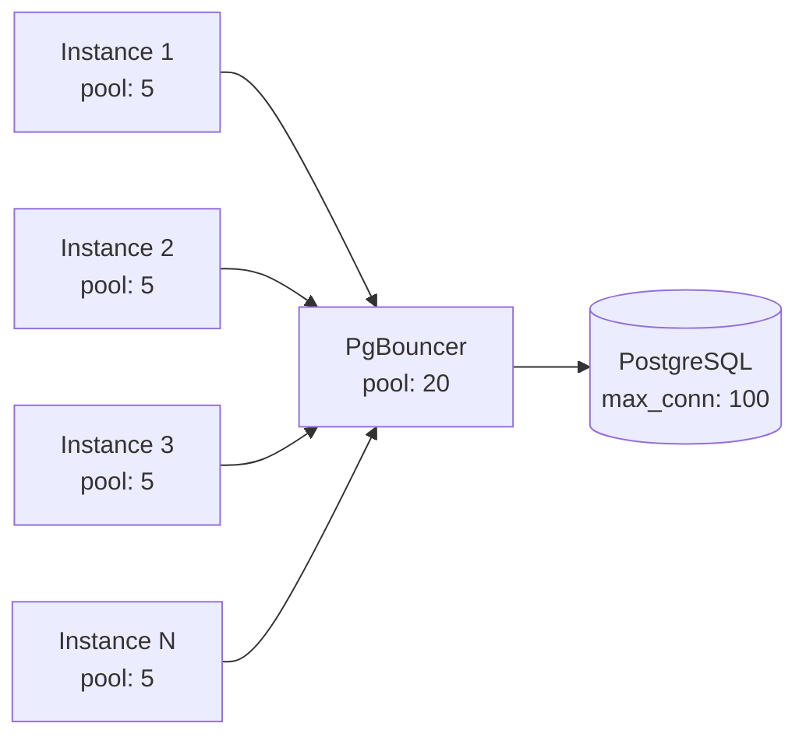

`PgBouncer` мультиплексирует соединения: 50 инстансов с пулом 5 = 250 виртуальных соединений, но `PgBouncer` держит лишь 20 реальных соединений к `PostgreSQL`, переиспользуя их.


> [!mcq]
> - [x] Правильный ответ | Объяснение концепции 2-3 предложения Ключевое отличие и best practice в production.
> - [ ] Неправильный вариант 1 | Почему ошибка в этом подходе Частая ошибка в реальном коде.
> - [ ] Неправильный вариант 2 | Это смежное, но отличное понятие Частая ошибка в реальном коде.
> - [ ] Неправильный вариант 3 | Противоположное направление## Q31. Как масштабировать поиск и полнотекстовый индекс? Частая ошибка в реальном коде.

Поисковые движки ([Elasticsearch](../databases/elasticsearch-interview.md), `OpenSearch`, `Solr`) масштабируются горизонтально: кластер из нескольких узлов; индексы шардируются и реплицируются.

- Увеличение числа **шардов** → пропускная способность записи и параллелизм поиска
- Увеличение **реплик** → отказоустойчивость и throughput чтения
- Равномерное распределение данных по шардам
- Мониторинг размера шардов (рекомендация: 10-50 GB на шард)
- Кэширование частых запросов (`Elasticsearch query cache`)

При росте объёма данных добавляют узлы в кластер и перебалансируют шарды; для горячих запросов используют кэш на стороне приложения.


> [!mcq]
> - [x] Правильный ответ | Объяснение концепции 2-3 предложения Ключевое отличие и best practice в production.
> - [ ] Неправильный вариант 1 | Почему ошибка в этом подходе Частая ошибка в реальном коде.
> - [ ] Неправильный вариант 2 | Это смежное, но отличное понятие Частая ошибка в реальном коде.
> - [ ] Неправильный вариант 3 | Противоположное направление## Q32. Как масштабировать микросервисы? Частая ошибка в реальном коде.

Каждый [микросервис](microservices-interview.md) масштабируется независимо: горизонтально за [балансировщиком](load-balancing-interview.md) ([Kubernetes](../devops/kubernetes-interview.md) `Deployment`, облачные группы); автоскейлинг по `CPU`, памяти или кастомным метрикам.

Ключевые принципы:
- Состояние — во внешних хранилищах (БД, кэш, очереди)
- `API` — идемпотентные где возможно
- Service discovery — `Kubernetes Service`, `Consul`, [Spring Cloud](../frameworks/spring/spring-cloud-interview.md)
- Circuit breaker и таймауты при межсервисных вызовах
- Мониторинг и трассировка для каждого сервиса

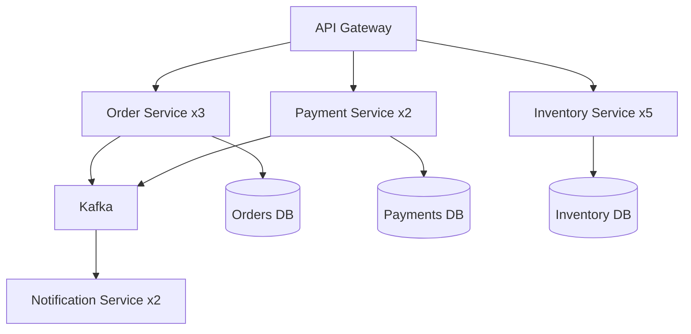

При росте числа сервисов важно контролировать лимиты на соединения между сервисами и использовать `service mesh` (`Istio`, `Linkerd`) для управления трафиком.


> [!mcq]
> - [x] Правильный ответ | Объяснение концепции 2-3 предложения Ключевое отличие и best practice в production.
> - [ ] Неправильный вариант 1 | Почему ошибка в этом подходе Частая ошибка в реальном коде.
> - [ ] Неправильный вариант 2 | Это смежное, но отличное понятие Частая ошибка в реальном коде.
> - [ ] Неправильный вариант 3 | Противоположное направление## Q33. Что такое data partitioning strategies и как выбрать ключ шардирования? Это антипаттерн или неправильный выбор в production.

Выбор ключа шардирования — одно из самых критичных решений при масштабировании данных:

| Стратегия | Описание | Плюсы | Минусы |
|-----------|----------|-------|--------|
| **Hash-based** | `hash(key) % N` | Равномерное распределение | Сложный resharding |
| **Range-based** | По диапазону значений | Эффективные range-запросы | Горячие шарды |
| **Directory-based** | Lookup-таблица | Гибкость | Дополнительный hop |
| **Geo-based** | По географии | Низкая latency | Неравномерность |

Критерии выбора ключа:
1. **Кардинальность** — достаточно значений для равномерного распределения
2. **Частота запросов** — ключ должен совпадать с основным паттерном доступа
3. **Рост** — ключ не должен создавать горячих шардов при росте данных
4. **Cross-shard запросы** — минимизировать необходимость `JOIN` между шардами

**Consistent hashing** решает проблему `resharding`: при добавлении/удалении узла перемещается минимум данных. Используется в [Redis Cluster](../databases/redis-interview.md), `Cassandra`, [Kafka](../messaging/kafka-interview.md).


> [!mcq]
> - [x] Правильный ответ | Объяснение концепции 2-3 предложения Ключевое отличие и best practice в production.
> - [ ] Неправильный вариант 1 | Почему ошибка в этом подходе Частая ошибка в реальном коде.
> - [ ] Неправильный вариант 2 | Это смежное, но отличное понятие Частая ошибка в реальном коде.
> - [ ] Неправильный вариант 3 | Противоположное направление## Q34. Как тестировать масштабируемость? Частая ошибка в реальном коде.

**Практический минимум:** тест считают полезным, если он фиксирует «точку отказа» (`RPS` / `latency` / `error budget`), а не просто подтверждает, что сервис «работает под нагрузкой».

Виды тестирования:
1. **Нагрузочное** — постепенное увеличение `RPS` для определения точки насыщения
2. **Стресс-тестирование** — нагрузка выше ожидаемой для проверки деградации
3. **Spike testing** — резкий всплеск для проверки автоскейлинга
4. **Soak testing** — длительная нагрузка для выявления утечек
5. **Тестирование с несколькими инстансами** — проверка stateless, гонки, блокировки

Инструменты: `Gatling`, `k6`, `JMeter`; в [Kubernetes](../devops/kubernetes-interview.md) — запуск нескольких реплик и проверка равномерного распределения запросов.

```java
// Gatling: простой сценарий нагрузочного тестирования
public class OrderLoadSimulation extends Simulation {
    {
        HttpProtocolBuilder httpProtocol = http
                .baseUrl("http://localhost:8080")
                .acceptHeader("application/json");

        ScenarioBuilder scenario = scenario("Create Orders")
                .exec(http("create-order")
                        .post("/api/orders")
                        .body(StringBody("{\"userId\": 1, \"items\": []}"))
                        .check(status().is(202)));

        setUp(
            scenario.injectOpen(
                rampUsersPerSec(1).to(100).during(Duration.ofMinutes(5)),
                constantUsersPerSec(100).during(Duration.ofMinutes(10))
            )
        ).protocols(httpProtocol)
         .assertions(global().responseTime().percentile3().lt(200));
    }
}
```


> [!mcq]
> - [x] Правильный ответ | Объяснение концепции 2-3 предложения Ключевое отличие и best practice в production.
> - [ ] Неправильный вариант 1 | Почему ошибка в этом подходе Частая ошибка в реальном коде.
> - [ ] Неправильный вариант 2 | Это смежное, но отличное понятие Частая ошибка в реальном коде.
> - [ ] Неправильный вариант 3 | Противоположное направление## Q35. Что такое capacity planning и как он связан с масштабированием? Это антипаттерн или неправильный выбор в production.

`Capacity planning` — планирование ресурсов под ожидаемую нагрузку.

Оценка:
- Пиковая нагрузка (`RPS`, объём данных)
- Метрики на инстанс (`throughput`, `latency`)
- Расчёт числа инстансов и ресурсов БД

Автоскейлинг дополняет `capacity planning` — реагирует на фактические метрики; планирование задаёт `min`/`max` и типы инстансов.

Формула для грубой оценки:
```
instances_needed = peak_rps / rps_per_instance * safety_factor(1.3-1.5)
db_connections = instances_needed * pool_size_per_instance
```

Регулярный пересмотр `capacity planning` при изменении нагрузки и после инцидентов помогает корректировать `min`/`max` реплик и лимиты пулов соединений.


> [!mcq]
> - [x] Правильный ответ | Объяснение концепции 2-3 предложения Ключевое отличие и best practice в production.
> - [ ] Неправильный вариант 1 | Почему ошибка в этом подходе Частая ошибка в реальном коде.
> - [ ] Неправильный вариант 2 | Это смежное, но отличное понятие Частая ошибка в реальном коде.
> - [ ] Неправильный вариант 3 | Противоположное направление## Q36. Что такое chaos engineering в контексте масштабируемости? Частая ошибка в реальном коде.

`Chaos engineering` — намеренное внесение сбоев для проверки устойчивости системы. В контексте масштабируемости проверяют:

- При отказе части инстансов оставшиеся справляются с нагрузкой
- Автоскейлинг корректно добавляет узлы
- [Балансировщик](load-balancing-interview.md) исключает нездоровые инстансы
- Очереди и кэш ведут себя предсказуемо при сбоях
- `Circuit breaker` срабатывает, алерты уходят

Инструменты: `Chaos Monkey`, `Chaos Mesh`, `Gremlin`, `Litmus`.

Типичные сценарии:
1. Убийство случайного пода в [Kubernetes](../devops/kubernetes-interview.md)
2. Задержка или отказ вызова к БД / внешнему `API`
3. Переполнение очереди [Kafka](../messaging/kafka-interview.md)
4. Исчерпание пула соединений
5. Сетевой partition между сервисами (см. [CAP-теорему](cap-theorem-interview.md))

Эксперименты проводят с чёткими критериями успеха ("`SLO` не нарушен при потере 30% инстансов") и возможностью отката.


> [!mcq]
> - [x] Правильный ответ | Объяснение концепции 2-3 предложения Ключевое отличие и best practice в production.
> - [ ] Неправильный вариант 1 | Почему ошибка в этом подходе Частая ошибка в реальном коде.
> - [ ] Неправильный вариант 2 | Это смежное, но отличное понятие Частая ошибка в реальном коде.
> - [ ] Неправильный вариант 3 | Противоположное направление## Q37. (!) Что такое Fan-out и Fan-in паттерны масштабирования? Частая ошибка в реальном коде.

**Fan-out** — один запрос разветвляется на множество параллельных подзапросов, результаты которых объединяются (**Fan-in**). Паттерн позволяет распределить вычисления и снизить latency через параллелизм.

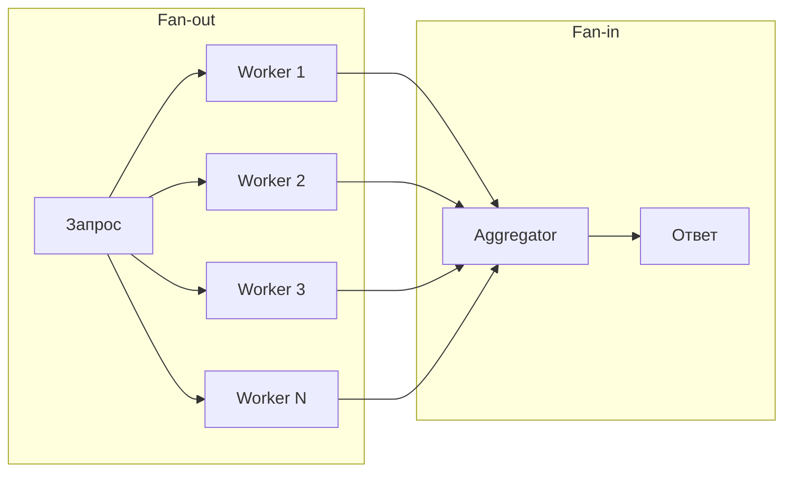

**Типичные применения:**
- **Scatter-Gather** в поисковых системах: запрос → N шардов индекса → merge результатов
- **Feed aggregation**: лента новостей = fan-out по всем подпискам пользователя
- **MapReduce**: map-фаза (fan-out) → reduce-фаза (fan-in)

**Реализация на Java (CompletableFuture):**
```java
public SearchResult search(SearchRequest request, List<ShardClient> shards) {
    // Fan-out: параллельный поиск по всем шардам
    List<CompletableFuture<ShardResult>> futures = shards.stream()
        .map(shard -> CompletableFuture.supplyAsync(
            () -> shard.search(request), searchExecutor))
        .toList();

    // Fan-in: собираем результаты с таймаутом
    CompletableFuture<Void> allOf = CompletableFuture.allOf(
        futures.toArray(new CompletableFuture[0]));

    try {
        allOf.get(500, TimeUnit.MILLISECONDS); // hedge requests timeout
    } catch (TimeoutException e) {
        log.warn("Некоторые шарды не ответили вовремя");
    }

    // Fan-in: merge доступных результатов
    return futures.stream()
        .filter(f -> f.isDone() && !f.isCompletedExceptionally())
        .map(CompletableFuture::join)
        .collect(SearchResultMerger::merge);
}
```

**Проблема write fan-out:** если пользователь с 10M подписчиков публикует пост, fan-out на всех подписчиков создаёт огромную нагрузку. Решение: `pull model` для «звёзд» (знаменитости) + `push model` для обычных пользователей (гибридный подход Twitter).


> [!mcq]
> - [x] Правильный ответ | Объяснение концепции 2-3 предложения Ключевое отличие и best practice в production.
> - [ ] Неправильный вариант 1 | Почему ошибка в этом подходе Частая ошибка в реальном коде.
> - [ ] Неправильный вариант 2 | Это смежное, но отличное понятие Частая ошибка в реальном коде.
> - [ ] Неправильный вариант 3 | Противоположное направление## Q38. Что такое Write-Behind (Write-Back) кэширование? Частая ошибка в реальном коде.

**Write-Behind** (`Write-Back`) — стратегия кэширования, при которой запись идёт **сначала в кэш**, а в БД данные попадают асинхронно с задержкой. Противоположность `Write-Through` (синхронная запись в кэш и БД одновременно).

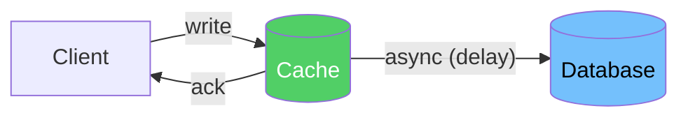

**Сравнение стратегий записи:**

| Стратегия | Запись в | Latency | Durability | Риск |
|-----------|----------|---------|------------|------|
| `Write-Through` | Кэш + БД синхронно | Высокая | Высокая | Нет потерь |
| `Write-Behind` | Кэш, потом БД | Низкая | Низкая | Потеря при падении кэша |
| `Write-Around` | Только БД | Средняя | Высокая | Cache miss при чтении |

**Реализация через Redis + очередь:**
```java
@Service
public class WriteBackCacheService {
    private final RedisTemplate<String, Object> redis;
    private final KafkaTemplate<String, WriteEvent> kafka;

    public void updateCounter(String userId, long delta) {
        // 1. Быстрое обновление в Redis (O(1))
        Long newValue = redis.opsForValue()
            .increment("counter:" + userId, delta);

        // 2. Асинхронная запись в Kafka → Consumer → DB
        kafka.send("counter-updates",
            new WriteEvent(userId, newValue, Instant.now()));
    }
}

@KafkaListener(topics = "counter-updates")
public void persistCounter(WriteEvent event) {
    // Батчевая запись: обрабатываем N событий за раз
    counterRepository.upsert(event.userId(), event.value());
}
```

**Когда применять:**
- Счётчики просмотров, лайков — небольшая потеря при падении Redis допустима
- Метрики и аналитика — eventual consistency OK
- Высоконагруженная запись (>100K writes/s), где БД становится узким местом

**Риски:** при падении кэша до сброса в БД данные теряются. Минимизация: Redis Persistence (`AOF`), репликация кэша, малый интервал flush.


> [!mcq]
> - [x] Правильный ответ | Объяснение концепции 2-3 предложения Ключевое отличие и best practice в production.
> - [ ] Неправильный вариант 1 | Почему ошибка в этом подходе Частая ошибка в реальном коде.
> - [ ] Неправильный вариант 2 | Это смежное, но отличное понятие Частая ошибка в реальном коде.
> - [ ] Неправильный вариант 3 | Противоположное направление## Q39. (!) Что такое Cell-Based Architecture? Частая ошибка в реальном коде.

**Cell-Based Architecture** (клеточная архитектура) — паттерн, при котором система разбивается на **независимые изолированные ячейки** (`cells`), каждая из которых обслуживает подмножество пользователей или данных. Отказ одной ячейки не влияет на другие.

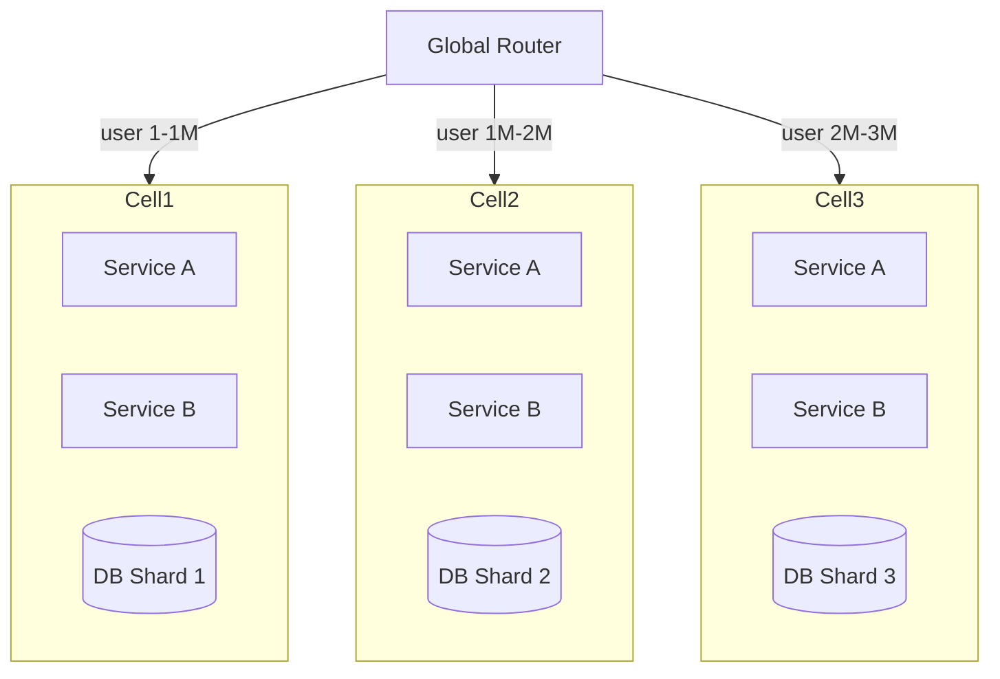

**Ключевые свойства:**
- **Изоляция отказов** — проблема в Cell 2 не затрагивает Cell 1 и Cell 3
- **Blast radius** — максимальный ущерб от инцидента ограничен одной ячейкой
- **Независимый деплой** — можно обновлять ячейки по очереди (canary по ячейкам)
- **Масштабирование** — добавление ячейки = линейный рост ёмкости

**Применяют:** Amazon (Availability Zones as cells), Slack (sharding по рабочим пространствам), Netflix (regional cells), Salesforce (pods).

**Реализация роутинга:**
```java
@Component
public class CellRouter {
    private final List<CellConfig> cells;

    public CellConfig routeUser(UUID userId) {
        // Детерминированное присвоение ячейки по userId
        int cellIndex = Math.abs(userId.hashCode()) % cells.size();
        return cells.get(cellIndex);
    }

    public CellConfig routeTenant(String tenantId) {
        // Для B2B: один tenant всегда в одной ячейке
        return tenantCellMapping.get(tenantId);
    }
}
```

**Отличие от просто шардирования:** ячейка содержит **полный стек** (все сервисы + БД), а не только одну БД. Это даёт полную автономность.


> [!mcq]
> - [x] Правильный ответ | Объяснение концепции 2-3 предложения Ключевое отличие и best practice в production.
> - [ ] Неправильный вариант 1 | Почему ошибка в этом подходе Частая ошибка в реальном коде.
> - [ ] Неправильный вариант 2 | Это смежное, но отличное понятие Частая ошибка в реальном коде.
> - [ ] Неправильный вариант 3 | Противоположное направление## Q40. Как масштабировать систему в нескольких регионах (Multi-Region)? Частая ошибка в реальном коде.

**Multi-Region** — развёртывание в нескольких географических регионах для снижения latency, повышения доступности и disaster recovery.

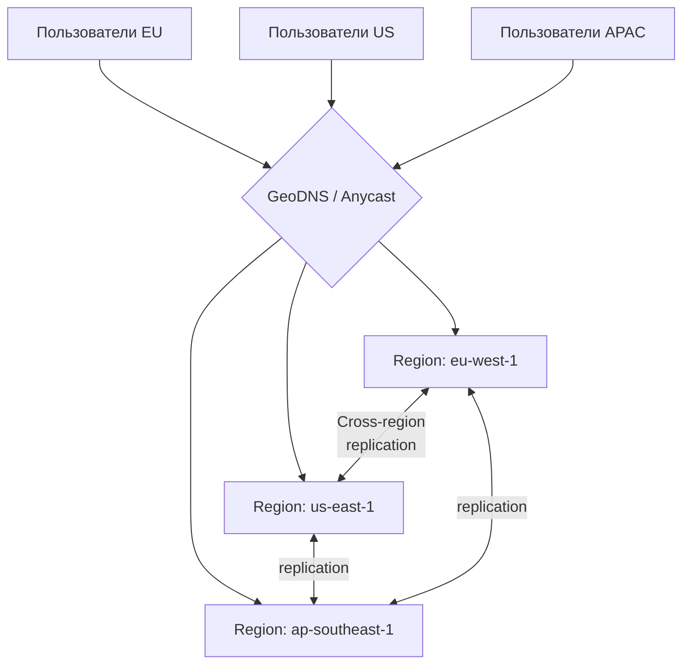

**Стратегии согласованности данных:**

| Стратегия | Описание | Применение |
|-----------|----------|-----------|
| **Active-Passive** | Один регион — primary, остальные — read replicas | DR, читающие нагрузки |
| **Active-Active** | Все регионы принимают записи | Глобальные системы |
| **Follow-the-sun** | Primary мигрирует по часовым поясам | Рабочий день бизнеса |

**Проблема конфликтов при Active-Active:**
- Если два пользователя в разных регионах обновляют одну запись одновременно — конфликт
- Решения: `CRDT`, `Last-Write-Wins`, бизнес-правила слияния, partition данных по регионам

**Партиционирование данных по регионам (Data Residency):**
```java
// Пользователи EU → данные хранятся только в eu-west-1
// Пользователи US → данные только в us-east-1
public class RegionAwareRouter {
    public DataSource resolve(User user) {
        return switch (user.region()) {
            case EU -> euDataSource;
            case US -> usDataSource;
            case APAC -> apacDataSource;
        };
    }
}
```

**Ключевые решения:**
- `Amazon Aurora Global Database` — один primary, реплики в 5 регионах, RPO < 1 сек
- `CockroachDB` — built-in multi-region, geo-partitioning
- `Cassandra` — multi-DC replication с `NetworkTopologyStrategy`
- `Spanner` — глобальная согласованность через TrueTime


> [!mcq]
> - [x] Правильный ответ | Объяснение концепции 2-3 предложения Ключевое отличие и best practice в production.
> - [ ] Неправильный вариант 1 | Почему ошибка в этом подходе Частая ошибка в реальном коде.
> - [ ] Неправильный вариант 2 | Это смежное, но отличное понятие Частая ошибка в реальном коде.
> - [ ] Неправильный вариант 3 | Противоположное направление## Q41. Как предотвратить hotspot при шардировании? Частая ошибка в реальном коде.

**Hotspot** (горячая партиция) — один шард получает несоразмерно большую нагрузку, становясь узким местом. Типичные причины: плохой ключ шардирования, данные знаменитостей, временные паттерны.

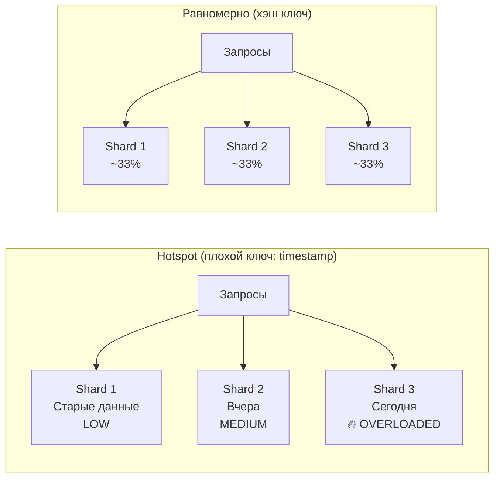

**Причины и решения:**

| Причина | Решение |
|---------|---------|
| Монотонный ключ (`timestamp`, `AUTO_INCREMENT`) | Хэш от ID или composite key (`user_id + timestamp`) |
| «Горячий» пользователь (celebrity) | Добавить random suffix к ключу, разделить на N sub-shards |
| Временной паттерн (пик в 9:00) | Consistent hashing + автоскейлинг |
| Несбалансированное распределение | `Virtual nodes` в consistent hashing |

**Техника salting для горячих ключей:**
```java
// Проблема: popular-product-1 → всегда в Shard 0
String shardKey = "popular-product-1"; // hotspot!

// Решение: добавить случайный суффикс (salting)
int saltBuckets = 10; // разбить на 10 виртуальных ключей
int salt = random.nextInt(saltBuckets);
String shardKey = "popular-product-1#" + salt; // → разные шарды

// При чтении: scatter-gather по всем bucket'ам и объединение
List<CompletableFuture<Long>> futures = IntStream.range(0, saltBuckets)
    .mapToObj(i -> CompletableFuture.supplyAsync(
        () -> cache.get("popular-product-1#" + i)))
    .toList();
long totalCount = futures.stream()
    .map(CompletableFuture::join)
    .mapToLong(Long::longValue)
    .sum();
```

**Мониторинг hotspots:**
- Prometheus метрика `requests_per_shard` — аномальный рост одного шарда
- В `Cassandra`: `nodetool tpstats`, `nodetool tablestats` — `Read Latency` по нодам
- В `Kafka`: consumer lag per partition через AKHQ/Confluent Control Center
- В `Redis Cluster`: `redis-cli --cluster info` — `keys` и `used_memory` по нодам

---

## See also

- [Распределённые системы](distributed-systems-interview.md) — CAP теорема, репликация, партиционирование и согласованность
- [Стратегии кэширования](caching-strategies-interview.md) — Cache-Aside, Write-Through, CDN и локальные кэши для снижения нагрузки
- [Балансировка нагрузки](load-balancing-interview.md) — алгоритмы балансировки, health checks и горизонтальное масштабирование
- [Архитектура баз данных](../databases/database-architecture-interview.md) — шардирование, read replica и партиционирование для масштабирования
- [Микросервисная архитектура](microservices-interview.md) — декомпозиция и независимое масштабирование сервисов
- [CQRS и Event Sourcing](cqrs-event-sourcing-interview.md) — разделение read/write нагрузки для масштабирования
- [Apache Kafka](../messaging/kafka-interview.md) — партиционирование и потоковая обработка для высокопроизводительных систем
- [Kubernetes](../devops/kubernetes-interview.md) — HPA, VPA и автоматическое масштабирование приложений


> [!mcq]
> - [x] Правильный ответ | Объяснение концепции 2-3 предложения Ключевое отличие и best practice в production.
> - [ ] Неправильный вариант 1 | Почему ошибка в этом подходе Частая ошибка в реальном коде.
> - [ ] Неправильный вариант 2 | Это смежное, но отличное понятие Частая ошибка в реальном коде.
> - [ ] Неправильный вариант 3 | Противоположное направление- [API Gateway](api-gateway-interview.md) Частая ошибка в реальном коде.
- [BFF Pattern](bff-pattern-interview.md)
- [Стратегии кэширования](caching-strategies-interview.md)
- [CAP-теорема](cap-theorem-interview.md)
- [Clean Architecture](clean-architecture-interview.md)
- [Паттерны согласованности](consistency-patterns-interview.md)
