# Вопросы на собеседовании: Паттерны масштабируемости

Комплексное руководство по вопросам собеседования на тему паттернов масштабируемости для Senior Java Developer. Охватывает горизонтальное и вертикальное масштабирование, кэширование, шардирование, асинхронную обработку, `CQRS`, автоскейлинг и мониторинг.

## Полезные ссылки

### Официальная документация

- [Scalability (Martin Fowler)](https://martinfowler.com/articles/scalability.html) — обзор подходов к масштабированию
- [Designing Data-Intensive Applications (O'Reilly)](https://www.oreilly.com/library/view/designing-data-intensive-applications/9781491903063/) — фундаментальная книга по проектированию масштабируемых систем
- [A Guide To Caching in Spring (Baeldung)](https://www.baeldung.com/spring-cache-tutorial) — кэширование в `Spring`
- [Guide to Resilience4j With Spring Boot (Baeldung)](https://www.baeldung.com/spring-boot-resilience4j) — `Circuit Breaker` и `Rate Limiter`
- [CQRS and Event Sourcing in Java (Baeldung)](https://www.baeldung.com/cqrs-event-sourcing-java) — паттерн `CQRS`
- [Configuring a Hikari Connection Pool with Spring Boot (Baeldung)](https://www.baeldung.com/spring-boot-hikari) — пул соединений `HikariCP`
- [Rate Limiting a Spring API Using Bucket4j (Baeldung)](https://www.baeldung.com/spring-bucket4j) — ограничение частоты запросов
- [Guide to Spring Session (Baeldung)](https://www.baeldung.com/spring-session) — внешнее хранение сессий

## Содержание

- [Полезные ссылки](#полезные-ссылки)
- [See also](#see-also)

**Основы масштабирования**
- [Q1. (!) Что такое вертикальное и горизонтальное масштабирование?](#q1--что-такое-вертикальное-и-горизонтальное-масштабирование)
- [Q2. (!) Почему для горизонтального масштабирования приложение должно быть stateless?](#q2--почему-для-горизонтального-масштабирования-приложение-должно-быть-stateless)
- [Q3. Когда предпочтительнее вертикальное, а когда горизонтальное масштабирование?](#q3-когда-предпочтительнее-вертикальное-а-когда-горизонтальное-масштабирование)
- [Q4. Что такое эластичное масштабирование (autoscaling)?](#q4-что-такое-эластичное-масштабирование-autoscaling)
- [Q5. Что такое узкое место (bottleneck) и как его выявлять?](#q5-что-такое-узкое-место-bottleneck-и-как-его-выявлять)

**Кэширование**
- [Q6. (!) Как кэширование помогает масштабированию?](#q6--как-кэширование-помогает-масштабированию)
- [Q7. Как реализовать двухуровневый кэш в Spring Boot?](#q7-как-реализовать-двухуровневый-кэш-в-spring-boot)
- [Q8. Какие стратегии инвалидации кэша существуют?](#q8-какие-стратегии-инвалидации-кэша-существуют)

**Шардирование и партиционирование**
- [Q9. (!) Что такое шардирование и когда его применять?](#q9--что-такое-шардирование-и-когда-его-применять)
- [Q10. Что такое «горячая партиция» / «горячий шард» и как избежать?](#q10-что-такое-горячая-партиция--горячий-шард-и-как-избежать)
- [Q11. Чем отличается шардирование от партиционирования таблиц?](#q11-чем-отличается-шардирование-от-партиционирования-таблиц)

**Асинхронность и очереди**
- [Q12. (!) Как асинхронность и очереди помогают масштабированию?](#q12--как-асинхронность-и-очереди-помогают-масштабированию)
- [Q13. Что такое backpressure и зачем он нужен?](#q13-что-такое-backpressure-и-зачем-он-нужен)
- [Q14. Как масштабировать обработку очередей (Kafka, RabbitMQ)?](#q14-как-масштабировать-обработку-очередей-kafka-rabbitmq)

**Репликация и CQRS**
- [Q15. (!) Что такое read replica и как это помогает масштабировать чтение?](#q15--что-такое-read-replica-и-как-это-помогает-масштабировать-чтение)
- [Q16. (!) Что такое CQRS в контексте масштабирования?](#q16--что-такое-cqrs-в-контексте-масштабирования)
- [Q17. Как масштабировать запись (write scaling)?](#q17-как-масштабировать-запись-write-scaling)

**Устойчивость и защита от перегрузок**
- [Q18. (!) Что такое circuit breaker и как он связан с масштабируемостью?](#q18--что-такое-circuit-breaker-и-как-он-связан-с-масштабируемостью)
- [Q19. (!) Что такое rate limiting и как он помогает при масштабировании?](#q19--что-такое-rate-limiting-и-как-он-помогает-при-масштабировании)
- [Q20. Что такое bulkhead pattern и как он предотвращает каскадные сбои?](#q20-что-такое-bulkhead-pattern-и-как-он-предотвращает-каскадные-сбои)
- [Q21. Как таймауты и retry-стратегии влияют на масштабируемость?](#q21-как-таймауты-и-retry-стратегии-влияют-на-масштабируемость)

**Мониторинг и SLO**
- [Q22. Как мониторинг связан с масштабируемостью?](#q22-как-мониторинг-связан-с-масштабируемостью)
- [Q23. Что такое SLO и как он связан с масштабированием?](#q23-что-такое-slo-и-как-он-связан-с-масштабированием)

**Автоскейлинг и проектирование**
- [Q24. Что такое auto-scaling по кастомным метрикам?](#q24-что-такое-auto-scaling-по-кастомным-метрикам)
- [Q25. (!) Как проектировать приложение для горизонтального масштабирования с первого дня?](#q25--как-проектировать-приложение-для-горизонтального-масштабирования-с-первого-дня)
- [Q26. Что такое scale to zero и когда его используют?](#q26-что-такое-scale-to-zero-и-когда-его-используют)

**Масштабирование БД и инфраструктуры**
- [Q27. (!) Как масштабировать базу данных?](#q27--как-масштабировать-базу-данных)
- [Q28. Что такое вертикальное масштабирование БД и его ограничения?](#q28-что-такое-вертикальное-масштабирование-бд-и-его-ограничения)
- [Q29. (!) Что такое connection pooling и как он связан с масштабированием?](#q29--что-такое-connection-pooling-и-как-он-связан-с-масштабированием)
- [Q30. Что такое database connection limit и как с ним работать?](#q30-что-такое-database-connection-limit-и-как-с-ним-работать)
- [Q31. Как масштабировать поиск и полнотекстовый индекс?](#q31-как-масштабировать-поиск-и-полнотекстовый-индекс)

**Продвинутые темы**
- [Q32. Как масштабировать микросервисы?](#q32-как-масштабировать-микросервисы)
- [Q33. Что такое data partitioning strategies и как выбрать ключ шардирования?](#q33-что-такое-data-partitioning-strategies-и-как-выбрать-ключ-шардирования)
- [Q34. Как тестировать масштабируемость?](#q34-как-тестировать-масштабируемость)
- [Q35. Что такое capacity planning и как он связан с масштабированием?](#q35-что-такое-capacity-planning-и-как-он-связан-с-масштабированием)
- [Q36. Что такое chaos engineering в контексте масштабируемости?](#q36-что-такое-chaos-engineering-в-контексте-масштабируемости)

**Продвинутые паттерны масштабирования**
- [Q37. (!) Что такое Fan-out и Fan-in паттерны масштабирования?](#q37--что-такое-fan-out-и-fan-in-паттерны-масштабирования)
- [Q38. Что такое Write-Behind (Write-Back) кэширование?](#q38-что-такое-write-behind-write-back-кэширование)
- [Q39. (!) Что такое Cell-Based Architecture?](#q39--что-такое-cell-based-architecture)
- [Q40. Как масштабировать систему в нескольких регионах (Multi-Region)?](#q40-как-масштабировать-систему-в-нескольких-регионах-multi-region)
- [Q41. Как предотвратить hotspot при шардировании?](#q41-как-предотвратить-hotspot-при-шардировании)

---

Паттерны масштабируемости — способы увеличить производительность и пропускную способность системы при росте нагрузки. Масштабирование может быть вертикальным (увеличение ресурсов одного узла) или горизонтальным (добавление узлов). На собеседовании Senior Java Developer ожидают понимание: горизонтальное и вертикальное масштабирование; stateless vs stateful; кэширование, шардирование, асинхронность; автоскейлинг и мониторинг; типичные узкие места и их устранение.

## Q1. (!) Что такое вертикальное и горизонтальное масштабирование?

Это два способа нарастить производительность: вертикальное (`scale up`) делает один узел мощнее, горизонтальное (`scale out`) добавляет новые узлы. Главное различие — у первого есть жёсткий потолок (предел одной машины), у второго потолка практически нет, но требуется stateless-архитектура.

**Вертикальное масштабирование** (`scale up`) — увеличение ресурсов одного узла (`CPU`, память, диск).
- **Плюсы:** простота, не нужно менять архитектуру.
- **Минусы:** ограниченный потолок, `single point of failure`, дороже с определённого размера.
- **Когда применять:** БД и компоненты, которые сложно шардировать, или умеренная нагрузка.

**Горизонтальное масштабирование** (`scale out`) — добавление новых узлов в систему.
- **Плюсы:** линейный рост производительности, отказоустойчивость.
- **Минусы:** нужна stateless-архитектура, балансировка, согласованность данных и более сложная эксплуатация.
- **Когда применять:** веб-приложения, микросервисы, воркеры очередей. Масштабируется добавлением реплик за [балансировщиком](load-balancing-interview.md) (`Kubernetes Deployment`, облачные группы).

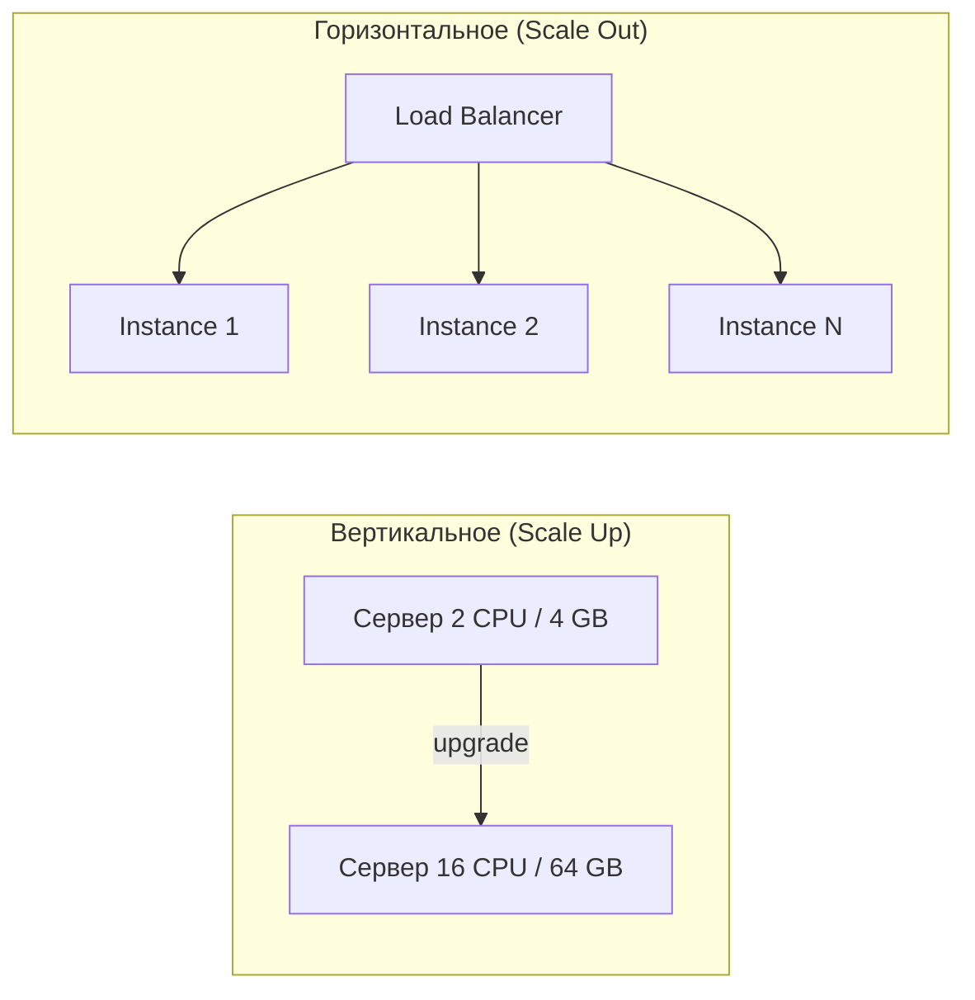

| Характеристика | Вертикальное | Горизонтальное |
|----------------|-------------|----------------|
| Сложность | Низкая | Высокая |
| Потолок | Ограничен оборудованием | Практически не ограничен |
| Отказоустойчивость | `SPOF` | Высокая |
| Стоимость | Экспоненциальный рост | Линейный рост |
| Downtime при масштабировании | Часто требуется | Не требуется |

## Q2. (!) Почему для горизонтального масштабирования приложение должно быть stateless?

Потому что любой запрос должен обрабатываться любым узлом — иначе нельзя свободно добавлять и убирать узлы. **Stateless** означает, что сервер не хранит состояние запроса между вызовами: вся информация либо приходит в запросе, либо лежит во внешнем хранилище.

В **stateful**-варианте (сессии в памяти) запросы одного пользователя обязаны попадать на тот же узел (`sticky session`). Это усложняет [балансировку](load-balancing-interview.md) и ломает равномерное распределение при добавлении или удалении узлов.

Решение — вынести состояние в общее хранилище ([Redis](../databases/redis-interview.md), БД, кэш). Тогда:
- **Добавление узла:** новый инстанс сразу получает долю трафика. В stateful-системе часть сессий пришлось бы мигрировать, иначе они теряются.
- **Падение узла:** затронуты только активные на нём запросы; сессии в `Redis` остаются доступны с других узлов. В stateful-системе упали бы все сессии этого узла.

**Пример — `Spring Session` с `Redis`:**

```java
@Configuration
@EnableRedisHttpSession(maxInactiveIntervalInSeconds = 1800)
public class SessionConfig {

    @Bean
    public LettuceConnectionFactory connectionFactory() {
        return new LettuceConnectionFactory("redis-host", 6379);
    }
}
```

```yaml
# application.yml
spring:
  session:
    store-type: redis
  data:
    redis:
      host: redis-host
      port: 6379
```

С `spring-session-data-redis` серия запросов с одним session cookie обрабатывается разными инстансами — сессия подгружается из `Redis` по id. Без него при масштабировании до N инстансов пришлось бы держать `sticky session` и терять сессии при падении узла.

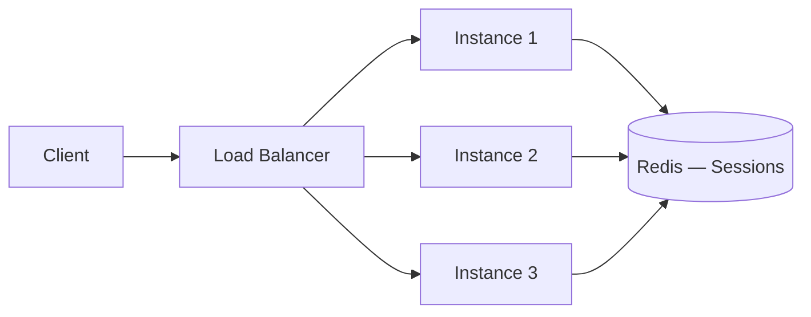

## Q3. Когда предпочтительнее вертикальное, а когда горизонтальное масштабирование?

Короткое правило: **вертикально** — пока проще докупить ресурсов одной машине; **горизонтально** — как только нужен рост без потолка и отказоустойчивость.

**Вертикальное** выбирают, когда:
- нагрузка умеренная и одного мощного узла достаточно;
- код нельзя свободно менять (legacy);
- компонент сложно шардировать (монолитная БД, stateful-системы).

**Горизонтальное** выбирают, когда:
- нужен рост без потолка;
- это веб-приложения и [микросервисы](microservices-interview.md);
- важны отказоустойчивость и эластичность (автоскейлинг).

На практике подходы комбинируют: приложение масштабируют горизонтально, а БД — сначала вертикально и через `read replicas`, и только затем шардируют.

| Сценарий | Рекомендация |
|----------|-------------|
| БД до исчерпания возможностей одного инстанса | Вертикально |
| Legacy-приложение без рефакторинга | Вертикально |
| `API` и stateless веб-сервисы | Горизонтально |
| Воркеры [Kafka](../messaging/kafka-interview.md) / `RabbitMQ` | Горизонтально |
| `Read replicas` БД | Горизонтально |

## Q4. Что такое эластичное масштабирование (autoscaling)?

Эластичное масштабирование — автоматическое добавление и удаление узлов в зависимости от метрик (`CPU`, память, длина очереди, `latency`). Система сама расширяется под пик и сворачивается, когда нагрузка спадает, — платишь только за реально нужные ресурсы. В [Kubernetes](../devops/kubernetes-interview.md) это `HPA` (`Horizontal Pod Autoscaler`) по `CPU`/памяти или кастомным метрикам; в облаках — группы автоскейлинга.

**Рекомендация:** опираться на метрику, которая реально отражает деградацию `SLO` (`latency`, `lag`, `queue depth`), а не только на `CPU`. `CPU` может быть низким, пока сервис тормозит из-за БД или внешнего вызова.

**Подводные камни** — пороги и тайминг:
- слишком агрессивное масштабирование вверх при коротких пиках плодит лишние инстансы;
- слишком медленное — даёт рост `latency`;
- ограничение `min`/`max` инстансов защищает от обоих краёв.

Период усреднения и окно стабилизации (`stabilizationWindowSeconds`) сглаживают колебания, чтобы автоскейлер не «дёргался» туда-сюда.

## Q5. Что такое узкое место (bottleneck) и как его выявлять?

Узкое место — самый медленный ресурс или компонент в цепочке: именно он, а не сумма всех остальных, определяет максимальный throughput системы. Расширять что-то другое бесполезно, пока не устранено узкое место — работает «закон самого слабого звена».

Как выявлять (от дешёвого к дорогому):
1. **Профилирование** — `CPU`, память, `GC`, потоки (см. [профилирование приложений](../performance/application-profiling-interview.md))
2. **Метрики** — `latency` по компонентам, throughput, error rate
3. **Трассировка** — `Jaeger`, `Zipkin`: показывают, какое именно звено в цепочке вызовов тормозит
4. **Нагрузочное тестирование** — постепенно повышают `RPS` и ловят точку насыщения

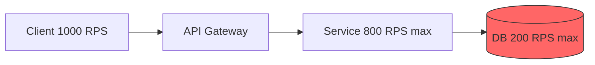

В примере выше БД — узкое место: из 1000 `RPS` она обработает лишь 200, остальное уйдёт в таймауты. Масштабировать `API Gateway` и сервис бессмысленно — расширять надо именно БД: кэш, `read replicas`, шардирование.

## Q6. (!) Как кэширование помогает масштабированию?

Кэш перехватывает повторные чтения до того, как они дойдут до источника данных: запрос обслуживается из памяти, а не из БД или внешнего `API`. Это даёт сразу два эффекта — снижает латентность ответа и снимает нагрузку с источника, который обычно и есть узкое место. Часто читаемые данные держат в локальном кэше или распределённом ([Redis](../databases/redis-interview.md)). Подробнее о стратегиях — в [вопросах по кэшированию](caching-strategies-interview.md).

Многоуровневый кэш (`L1` — локальный `Caffeine`, `L2` — `Redis`) поднимает `hit ratio`: чем больше запросов отвечают из кэша, тем меньше доходит до БД. **Ключевые вопросы:** стратегия инвалидации, `TTL` и консистентность — иначе пользователь увидит устаревшие данные.

**Пример — кэширование в `Spring Boot` с `Caffeine`:**

```java
@Configuration
@EnableCaching
public class CacheConfig {

    @Bean
    public CacheManager cacheManager() {
        CaffeineCacheManager manager = new CaffeineCacheManager("products");
        manager.setCaffeine(Caffeine.newBuilder()
                .maximumSize(10_000)
                .expireAfterWrite(Duration.ofMinutes(5))
                .recordStats());
        return manager;
    }
}

@Service
public class ProductService {

    @Cacheable(value = "products", key = "#productId")
    public Product getProduct(Long productId) {
        return productRepository.findById(productId)
                .orElseThrow(() -> new NotFoundException("Product not found"));
    }

    @CacheEvict(value = "products", key = "#product.id")
    public Product updateProduct(Product product) {
        return productRepository.save(product);
    }
}
```

**Подводный камень при масштабировании:** каждый инстанс держит свой локальный кэш, и при обновлении данных остальные инстансы об этом не знают — у них останется устаревшая копия. Чтобы синхронизировать их, используют распределённый кэш или инвалидацию по событиям ([Kafka](../messaging/kafka-interview.md), `Redis Pub/Sub`).

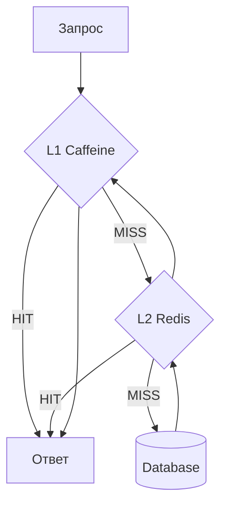

## Q7. Как реализовать двухуровневый кэш в Spring Boot?

Идея в каскаде из двух кэшей разной скорости и охвата: `L1` — локальный `Caffeine` в памяти процесса (наносекунды), `L2` — общий `Redis` по сети (миллисекунды). Запрос идёт сверху вниз и останавливается на первом попадании: сначала `L1`, при промахе `L2`, и только при двойном промахе — источник данных. `L1` отсекает сетевые вызовы к `Redis`, `L2` — попадания в БД; вместе они дают высокий `hit ratio`.

```java
@Component
public class TwoLevelCacheManager implements CacheManager {

    private final CaffeineCacheManager l1CacheManager;
    private final RedisCacheManager l2CacheManager;

    public TwoLevelCacheManager(RedisConnectionFactory redisConnectionFactory) {
        // L1: локальный, быстрый, ограниченный размер
        this.l1CacheManager = new CaffeineCacheManager();
        l1CacheManager.setCaffeine(Caffeine.newBuilder()
                .maximumSize(1_000)
                .expireAfterWrite(Duration.ofMinutes(1)));

        // L2: распределённый, больше данных, дольше живёт
        RedisCacheConfiguration redisConfig = RedisCacheConfiguration.defaultCacheConfig()
                .entryTtl(Duration.ofMinutes(10));
        this.l2CacheManager = RedisCacheManager.builder(redisConnectionFactory)
                .cacheDefaults(redisConfig)
                .build();
    }

    @Override
    public Cache getCache(String name) {
        return new TwoLevelCache(
                l1CacheManager.getCache(name),
                l2CacheManager.getCache(name));
    }
    // ...
}
```

**Подводный камень:** инвалидировать нужно оба уровня. `L2` чистится централизованно через `Redis`, но `L1` живёт в памяти каждого инстанса — чтобы все они сбросили локальную копию, рассылают сигнал через `Redis Pub/Sub` или [Kafka](../messaging/kafka-interview.md). Иначе один инстанс отдаст свежие данные, а другой — устаревшие.

## Q8. Какие стратегии инвалидации кэша существуют?

| Стратегия | Описание | Плюсы | Минусы |
|-----------|----------|-------|--------|
| **TTL** | Запись истекает через фиксированное время | Простота | Stale data до истечения |
| **Write-through** | Запись обновляет кэш синхронно | Консистентность | Увеличивает latency записи |
| **Write-behind** | Запись обновляет кэш, БД — асинхронно | Быстрая запись | Риск потери данных |
| **Event-driven** | Кэш инвалидируется по событию | Гибкость | Сложность реализации |
| **Cache-aside** | Приложение явно управляет кэшем | Контроль | Бойлерплейт |

Что выбрать: `TTL` — самый простой и часто достаточный вариант, если допустимо короткое окно устаревших данных. Когда нужна согласованность между многими инстансами, `event-driven`-инвалидация через [Kafka](../messaging/kafka-interview.md) — самый надёжный способ: при изменении данных публикуется событие, и все инстансы-подписчики разом сбрасывают свой локальный кэш.

## Q9. (!) Что такое шардирование и когда его применять?

Шардирование — горизонтальное разделение данных по ключу между несколькими узлами (БД, топики [Kafka](../messaging/kafka-interview.md)). В отличие от реплик (где каждый узел держит полную копию), здесь каждый шард хранит только свою часть данных — поэтому растёт не только пропускная способность, но и общий объём, который можно хранить. Применяют, когда данные или нагрузка на запись перерастают возможности одного узла.

Сердце шардирования — **ключ шардирования**: он определяет, на какой шард попадёт запись. От него зависит равномерность распределения и отсутствие «горячих» шардов. В БД шардируют по доменному ключу (`user_id`, `tenant_id`); в `Kafka` ключ сообщения задаёт партицию.

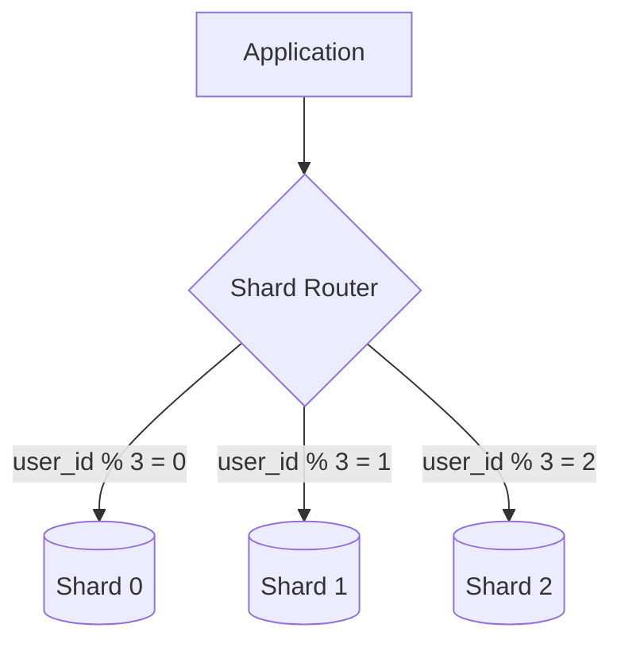

**Пример — маршрутизация по шарду в `Spring`:**

```java
public class ShardRoutingDataSource extends AbstractRoutingDataSource {

    @Override
    protected Object determineCurrentLookupKey() {
        Long userId = ShardContext.getCurrentUserId();
        int shardIndex = (int) (userId % getNumberOfShards());
        return "shard_" + shardIndex;
    }
}

// Использование
@Service
public class UserService {

    public User getUser(Long userId) {
        ShardContext.setCurrentUserId(userId);
        try {
            return userRepository.findById(userId).orElseThrow();
        } finally {
            ShardContext.clear();
        }
    }
}
```

## Q10. Что такое «горячая партиция» / «горячий шард» и как избежать?

**Горячая партиция (шард)** — партиция или шард, на который приходится непропорционально большая доля нагрузки. Смысл шардирования — равномерно размазать нагрузку, а горячий шард сводит его на нет: он становится узким местом, пока остальные простаивают. Возникает, когда один ключ генерирует большую часть трафика.

Решения:
- Пересмотреть ключ шардирования (выбрать с большей кардинальностью)
- Добавить соль (`random suffix`) в ключ для распределения
- Кэшировать горячие данные
- Разделить горячий ключ на несколько логических партиций

**Как это выглядит в `Kafka`:** один ключ всегда попадает в одну партицию. Если один `user_id` генерирует 80% событий — эта партиция перегружена, а добавление новых ничего не даст. Лечат составным ключом (`userId + "-" + random(0..9)`), кэшированием обработки или увеличением числа партиций. В БД при шардировании по `user_id` «звезда» с огромной активностью даёт горячий шард — помогает кэш, `read replica` для этого шарда или вынос его на отдельный сервер.

```java
// Kafka: соль в ключе для распределения горячего пользователя
String key = userId + "-" + ThreadLocalRandom.current().nextInt(10);
kafkaTemplate.send("orders", key, orderEvent);
```

## Q11. Чем отличается шардирование от партиционирования таблиц?

Ключевое различие — где лежат части данных. **Партиционирование** делит таблицу на части внутри одной БД на одном сервере; **шардирование** разносит данные по разным серверам. Отсюда всё остальное: партиционирование не снимает потолок одного узла (это, по сути, оптимизация в рамках вертикального масштабирования), а шардирование даёт горизонтальный рост ценой распределённых транзакций и сложных `JOIN`.

| Характеристика | Шардирование | Партиционирование |
|----------------|-------------|-------------------|
| Размещение данных | Разные серверы | Один сервер |
| Масштабирование | Горизонтальное | Вертикальное |
| Транзакции | Распределённые | Локальные |
| Сложность | Высокая | Средняя |
| `JOIN` между частями | Сложный/невозможный | Прозрачный |

**Партиционирование** — разделение таблицы на части внутри одной БД (по диапазону, хэшу, списку). Ускоряет запросы (сканируется только нужная партиция) и упрощает обслуживание (удаление старых данных = `DROP` партиции), но потолок одного сервера остаётся.

```sql
-- PostgreSQL: партиционирование по диапазону дат
CREATE TABLE orders (
    id BIGINT,
    user_id BIGINT,
    created_at TIMESTAMP,
    total DECIMAL
) PARTITION BY RANGE (created_at);

CREATE TABLE orders_2026_q1 PARTITION OF orders
    FOR VALUES FROM ('2026-01-01') TO ('2026-04-01');
CREATE TABLE orders_2026_q2 PARTITION OF orders
    FOR VALUES FROM ('2026-04-01') TO ('2026-07-01');
```

**Шардирование** — данные физически на разных серверах; нужен роутинг по ключу и может понадобиться [согласованность](consistency-patterns-interview.md) между шардами. Часто их сочетают: данные шардируют по серверам, а внутри каждого шарда ещё и партиционируют таблицы.

## Q12. (!) Как асинхронность и очереди помогают масштабированию?

Они разрывают жёсткую связку «клиент ждёт, пока всё посчитается». Синхронный запрос держит поток занятым до полного ответа; на пике потоки заканчиваются, новые запросы встают в очередь и `latency` растёт. При асинхронной обработке `API` принимает запрос, кладёт задачу в очередь ([Kafka](../messaging/kafka-interview.md), `RabbitMQ`) и сразу отвечает `202 Accepted`, а воркеры разбирают очередь параллельно в своём темпе.

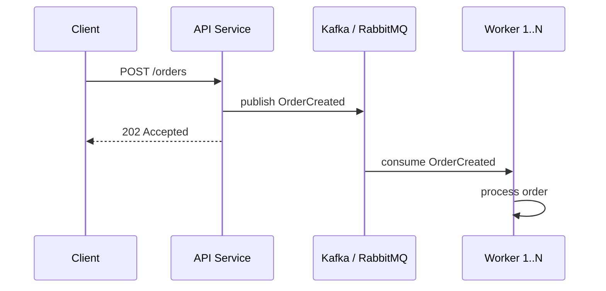

Очередь работает буфером между продюсерами и потребителями: она поглощает всплески и отдаёт работу ровным потоком. Поэтому пики сглаживаются, а воркеров можно масштабировать независимо от числа клиентов — под текущую глубину очереди, а не под мгновенный трафик.

```java
// Асинхронная отправка заказа в Kafka
@RestController
@RequiredArgsConstructor
public class OrderController {

    private final KafkaTemplate<String, OrderEvent> kafkaTemplate;

    @PostMapping("/orders")
    public ResponseEntity<Void> createOrder(@RequestBody OrderRequest request) {
        OrderEvent event = new OrderEvent(request.getUserId(), request.getItems());
        kafkaTemplate.send("orders", request.getUserId().toString(), event);
        return ResponseEntity.accepted().build();
    }
}
```

## Q13. Что такое backpressure и зачем он нужен?

**Backpressure** («обратное давление») — механизм, который заставляет быстрого производителя притормозить, когда потребитель не успевает. Это защитный клапан: без него очередь между ними растёт неограниченно, и система рано или поздно теряет сообщения или падает с `OOM`. Суть — пропускную способность диктует самый медленный участник, а не самый быстрый.

Как реализуется на разных уровнях:
- **Reactive Streams** (`Reactor`, `RxJava`) — подписчик сам запрашивает `request(n)` элементов, то есть тянет ровно столько, сколько может обработать (`pull`-модель)
- **Kafka** — потребитель не забирает следующую партию, пока не обработал текущую; давление проявляется как рост `lag`
- **HTTP** — сервис отдаёт `429 Too Many Requests` или замедляет ответы (rate limiting), сигналя клиенту «сбавь темп»

```java
// Reactor: backpressure с ограниченным буфером
Flux.range(1, 10_000)
    .onBackpressureBuffer(256)   // буфер 256 элементов
    .publishOn(Schedulers.boundedElastic())
    .subscribe(item -> {
        // Медленная обработка
        processItem(item);
    });
```

В [Kafka](../messaging/kafka-interview.md) `backpressure` косвенный: продюсер не тормозят напрямую, а следят за `consumer lag` — его рост триггерит алерт или автоскейлинг воркеров через `KEDA`, чтобы догнать поток.

## Q14. Как масштабировать обработку очередей (Kafka, RabbitMQ)?

Масштабируют либо вширь (больше потребителей), либо вглубь (быстрее обрабатывать одно сообщение):
1. Увеличить число партиций (`Kafka`) или воркеров (`RabbitMQ`)
2. Масштабировать потребителей по числу партиций (в `Kafka` — один потребитель на партицию в группе)
3. Оптимизировать обработку одного сообщения (батчи, асинхронность)
4. Мониторить `lag` и длину очереди
5. При необходимости — шардировать топики по доменам

**Ключевое ограничение `Kafka`:** число потребителей в `consumer group` не должно превышать число партиций топика — параллелизм упирается в партиции, и лишние потребители просто простаивают. Поэтому при растущем `lag` сначала увеличивают число партиций (с перебалансировкой) либо ускоряют саму обработку.

```java
// Spring Kafka: конкурентная обработка
@Configuration
public class KafkaConsumerConfig {

    @Bean
    public ConcurrentKafkaListenerContainerFactory<String, OrderEvent>
            kafkaListenerContainerFactory(ConsumerFactory<String, OrderEvent> cf) {
        var factory = new ConcurrentKafkaListenerContainerFactory<String, OrderEvent>();
        factory.setConsumerFactory(cf);
        factory.setConcurrency(8); // 8 потоков = 8 партиций
        factory.setBatchListener(true); // батч-обработка
        return factory;
    }
}

@KafkaListener(topics = "orders", groupId = "order-processor")
public void processOrders(List<OrderEvent> events) {
    events.forEach(this::processOrder);
}
```

## Q15. (!) Что такое read replica и как это помогает масштабировать чтение?

`Read replica` — копия БД, доступная только для чтения. Запись по-прежнему идёт в единственный `primary`, а реплики асинхронно подтягивают его изменения. Это работает, потому что в большинстве систем чтений в разы больше, чем записей: разгружаешь `primary`, размазав чтения по нескольким репликам, а сам `primary` оставляешь только под запись.

**Главное ограничение — `replication lag`:** реплика отстаёт от `primary`, поэтому сразу после записи чтение с реплики может вернуть старые данные (`eventual consistency`). Где это критично (например, «прочитай свою запись»), читают с `primary`. Подробнее о моделях консистентности — в [паттернах согласованности](consistency-patterns-interview.md).

**Пример — маршрутизация read/write в `Spring`:**

```java
public class ReadWriteRoutingDataSource extends AbstractRoutingDataSource {

    @Override
    protected Object determineCurrentLookupKey() {
        return TransactionSynchronizationManager.isCurrentTransactionReadOnly()
                ? DataSourceType.REPLICA
                : DataSourceType.PRIMARY;
    }
}

@Service
public class OrderService {

    @Transactional(readOnly = true) // → replica
    public List<Order> getOrdersByUser(Long userId) {
        return orderRepository.findByUserId(userId);
    }

    @Transactional // → primary
    public Order createOrder(Order order) {
        return orderRepository.save(order);
    }
}
```

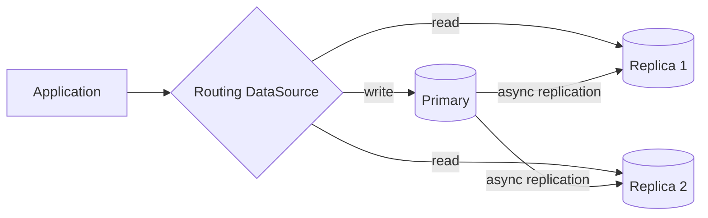

## Q16. (!) Что такое CQRS в контексте масштабирования?

**CQRS** (`Command Query Responsibility Segregation`) — разделение модели на запись (`command`) и чтение (`query`), вплоть до разных хранилищ. Идея в том, что у чтения и записи разные требования: write-модель оптимизируют под транзакции и целостность (нормализованная схема), а read-модель — под скорость запросов (денормализованные проекции, готовые индексы).

Главный выигрыш для масштабирования: чтение и запись масштабируются независимо. Под чтение можно держать много `read replicas` или вовсе отдельное хранилище, заточенное под конкретные запросы (например, `Elasticsearch` для поиска), не трогая write-сторону.

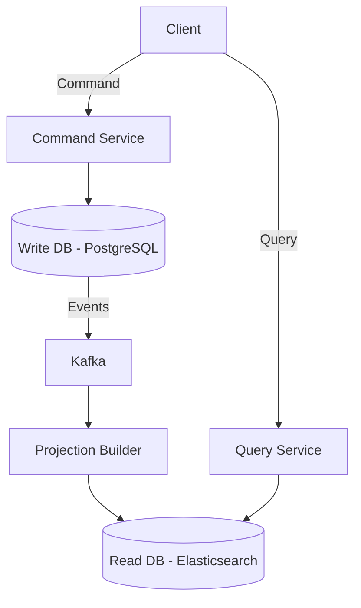

**Пример — `CQRS` со `Spring Modulith`:**

```java
// Command side
@Service
@RequiredArgsConstructor
public class OrderCommandService {

    private final OrderRepository repository;
    private final ApplicationEventPublisher events;

    @Transactional
    public Long createOrder(CreateOrderCommand cmd) {
        Order order = Order.create(cmd.userId(), cmd.items());
        repository.save(order);
        events.publishEvent(new OrderCreatedEvent(order.getId(), order.getUserId()));
        return order.getId();
    }
}

// Query side — отдельная модель, возможно другое хранилище
@Service
@RequiredArgsConstructor
public class OrderQueryService {

    private final OrderProjectionRepository projections;

    @Transactional(readOnly = true)
    public List<OrderSummary> getUserOrders(Long userId) {
        return projections.findByUserId(userId);
    }
}

// Event handler — строит read-проекцию
@Component
public class OrderProjectionUpdater {

    @EventListener
    public void on(OrderCreatedEvent event) {
        // Обновляет денормализованную проекцию для быстрого чтения
        projections.upsert(new OrderSummary(event.orderId(), event.userId(), ...));
    }
}
```

**Подводные камни `CQRS`:** read-проекция обновляется через события асинхронно, поэтому между write- и read-моделями возникает `eventual consistency` — сразу после команды запрос может ещё не увидеть изменения. Плюс растёт сложность: две модели, код проекций и их пересборка. Поэтому `CQRS` оправдан при сильном перекосе read/write или существенно разных требованиях к запросам, а не «по умолчанию».

## Q17. Как масштабировать запись (write scaling)?

Запись масштабировать принципиально сложнее, чем чтение: реплики решают проблему чтения (любую можно добавить), но запись стекается в единственный `primary`, и просто «добавить реплику» здесь не помогает. Чтобы распараллелить саму запись, нужно разбить поток на несколько независимых получателей.

Подходы:
1. **Шардирование** по ключу — несколько шардов, у каждого свой `primary` (единственный способ дать несколько точек записи)
2. **Партиционирование таблиц** — по диапазону или хэшу
3. **Асинхронная запись** — очередь + воркеры, сглаживание пиков
4. **CQRS** с отдельной write-моделью и событийной синхронизацией
5. **Батчирование** — группировка записей, чтобы снизить число транзакций

При шардировании записи каждый шард принимает только своё подмножество ключей, поэтому критично равномерное распределение — иначе один шард снова станет узким местом. Асинхронная запись через очередь не убирает потолок записи, но сглаживает пики и позволяет масштабировать воркеров независимо.

## Q18. (!) Что такое circuit breaker и как он связан с масштабируемостью?

**Circuit breaker** («предохранитель») — паттерн по аналогии с электрическим автоматом: когда вызовы сервиса начинают массово падать, он «размыкает цепь» и на время вообще перестаёт его вызывать, мгновенно отдавая ошибку или fallback. Это разрывает каскад сбоев и снимает нагрузку с уже падающего сервиса, давая ему шанс восстановиться.

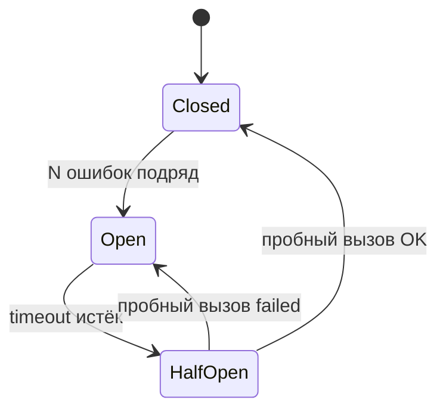

Состояния: **Closed** (вызовы идут как обычно) → при серии ошибок **Open** (вызовы блокируются, сразу fallback) → по таймауту **HalfOpen** (пробный вызов: успех — возврат в Closed, провал — снова Open).

**Связь с масштабируемостью.** Без `circuit breaker` сотни потоков повисают в ожидании ответа от падающего сервиса, исчерпывают пул и тянут на дно даже здоровые эндпоинты — так локальный сбой становится общим. С ним отказ быстрый, потоки сразу освобождаются, а падающий сервис перестаёт получать добивающую нагрузку.

**Пример — `Resilience4j` с аннотациями `Spring Boot`:**

```java
@Service
public class PaymentService {

    @CircuitBreaker(name = "paymentGateway", fallbackMethod = "fallbackPayment")
    @Retry(name = "paymentGateway", fallbackMethod = "fallbackPayment")
    public PaymentResult processPayment(PaymentRequest request) {
        return paymentGatewayClient.charge(request);
    }

    private PaymentResult fallbackPayment(PaymentRequest request, Throwable t) {
        log.warn("Payment gateway unavailable, queuing for retry: {}", t.getMessage());
        paymentRetryQueue.enqueue(request);
        return PaymentResult.pending();
    }
}
```

```yaml
# application.yml
resilience4j:
  circuitbreaker:
    instances:
      paymentGateway:
        failure-rate-threshold: 50
        wait-duration-in-open-state: 30s
        sliding-window-size: 10
        permitted-number-of-calls-in-half-open-state: 3
  retry:
    instances:
      paymentGateway:
        max-attempts: 3
        wait-duration: 500ms
```

## Q19. (!) Что такое rate limiting и как он помогает при масштабировании?

**Rate limiting** — ограничение частоты запросов от клиента или по `API`: всё сверх лимита отбивается `429 Too Many Requests`. Это входной клапан, который защищает систему от перегрузки при всплесках и злоупотреблениях ещё до того, как трафик дойдёт до дорогих компонентов. Заодно он гарантирует справедливость — один агрессивный клиент не «съест» ресурсы и не сломает `SLO` для остальных.

Алгоритмы:
- **Token Bucket** — бакет пополняется токенами с фиксированной скоростью; запрос забирает токен, при пустом бакете — `429`. Допускает короткие всплески, пока в бакете есть запас.
- **Sliding Window** — считаются запросы за скользящее окно в N секунд; точнее, но дороже по памяти.
- **Fixed Window** — лимит на фиксированный интервал (минута, секунда); просто, но даёт всплеск на стыке двух окон.

**Пример — `Bucket4j` в `Spring Boot`:**

```java
@Component
public class RateLimitFilter extends OncePerRequestFilter {

    private final Map<String, Bucket> buckets = new ConcurrentHashMap<>();

    @Override
    protected void doFilterInternal(HttpServletRequest request,
                                     HttpServletResponse response,
                                     FilterChain chain) throws ServletException, IOException {
        String clientId = request.getRemoteAddr();
        Bucket bucket = buckets.computeIfAbsent(clientId, this::createBucket);

        if (bucket.tryConsume(1)) {
            chain.doFilter(request, response);
        } else {
            response.setStatus(HttpStatus.TOO_MANY_REQUESTS.value());
            response.getWriter().write("Rate limit exceeded");
        }
    }

    private Bucket createBucket(String clientId) {
        return Bucket.builder()
                .addLimit(Bandwidth.classic(100, Refill.intervally(100, Duration.ofMinutes(1))))
                .build();
    }
}
```

**Подводный камень при масштабировании шлюза.** Если лимит **локальный** (на инстанс), то при N инстансах клиент фактически получает N×лимит — каждый инстанс считает свою квоту независимо. Чтобы лимит на клиента не умножался на число инстансов, его делают **распределённым**: все инстансы шлюза ведут счётчики в одном `Redis`, и квота остаётся общей сколько бы инстансов ни добавили.

## Q20. Что такое bulkhead pattern и как он предотвращает каскадные сбои?

**Bulkhead** (переборка) — изоляция ресурсов под разные потребители или операции, чтобы сбой одного не утянул остальных. Название — от водонепроницаемых переборок корабля: пробоина в одном отсеке не топит весь корабль. В приложении «отсек» — это выделенный пул потоков или лимит параллелизма на конкретную интеграцию.

Типы:
- **Thread pool bulkhead** — отдельный пул потоков под каждый внешний вызов; жёсткая изоляция, но дороже по ресурсам
- **Semaphore bulkhead** — ограничение числа параллельных вызовов без отдельных потоков; легче, но без изоляции по потокам

```java
@Service
public class IntegrationService {

    @Bulkhead(name = "inventoryService", type = Bulkhead.Type.THREADPOOL)
    public CompletableFuture<InventoryResponse> checkInventory(String sku) {
        return CompletableFuture.supplyAsync(() ->
                inventoryClient.check(sku));
    }

    @Bulkhead(name = "pricingService", type = Bulkhead.Type.SEMAPHORE)
    public PriceResponse getPrice(String sku) {
        return pricingClient.getPrice(sku);
    }
}
```

```yaml
resilience4j:
  bulkhead:
    instances:
      pricingService:
        max-concurrent-calls: 20
        max-wait-duration: 500ms
  thread-pool-bulkhead:
    instances:
      inventoryService:
        max-thread-pool-size: 10
        core-thread-pool-size: 5
        queue-capacity: 50
```

**Зачем это для масштабируемости.** Без `bulkhead` один медленный внешний сервис постепенно набирает на себя все потоки приложения — и блокируются даже те эндпоинты, которые с ним никак не связаны. Переборка ограничивает «зону поражения» размером одного отсека, не давая локальной проблеме положить весь сервис.

## Q21. Как таймауты и retry-стратегии влияют на масштабируемость?

Напрямую: таймауты определяют, как быстро поток освобождается, а retry — сколько дополнительной нагрузки вы создаёте. Неверная настройка обоих — одна из самых частых причин каскадных сбоев под нагрузкой.

- **Слишком длинные таймауты** — потоки висят в ожидании, пул исчерпывается, новые запросы встают в очередь (тот же эффект, что и отсутствие `circuit breaker`)
- **Слишком короткие** — ложные ошибки и лишние retry при нормальной нагрузке
- **Retry без backoff** — «retry storm»: клиенты дружно повторяют запросы и добивают и без того перегруженный сервис, мешая ему восстановиться

**Правила для масштабируемых систем:**
1. Устанавливать таймауты на каждый внешний вызов
2. Retry с **exponential backoff** и **jitter**
3. Ограничивать число retry (обычно 2-3)
4. Комбинировать с `circuit breaker`

```java
@Configuration
public class RestClientConfig {

    @Bean
    public RestTemplate restTemplate() {
        var factory = new SimpleClientHttpRequestFactory();
        factory.setConnectTimeout(Duration.ofSeconds(2));
        factory.setReadTimeout(Duration.ofSeconds(5));
        return new RestTemplate(factory);
    }
}
```

```yaml
resilience4j:
  retry:
    instances:
      externalApi:
        max-attempts: 3
        wait-duration: 500ms
        enable-exponential-backoff: true
        exponential-backoff-multiplier: 2
        retry-exceptions:
          - java.io.IOException
          - java.net.SocketTimeoutException
```

## Q22. Как мониторинг связан с масштабируемостью?

Мониторинг — это «приборная панель» масштабирования: без метрик нельзя понять, где узкое место, и тем более нельзя автоматически масштабироваться — автоскейлеру просто не на что опереться. Метрики дают и сигнал «пора расширяться», и обратную связь «помогло ли». Подробнее — в [вопросах по observability](../monitoring/observability-interview.md) и [метрикам и трейсингу](../monitoring/metrics-tracing-interview.md).

Необходимые метрики:
- **Ресурсы** — `CPU`, память, диск, сеть
- **Приложение** — `throughput`, `latency` (p50, p95, p99), `error rate`
- **Очереди** — длина, `lag`, скорость обработки
- **SLO** и алерты

В [Kubernetes](../devops/kubernetes-interview.md) `HPA` использует метрики из `Metrics Server` или внешних адаптеров (`Prometheus`); `KEDA` добавляет метрики из очередей ([Kafka](../messaging/kafka-interview.md) `lag`, `RabbitMQ` length). Трассировка (`Jaeger`, `Zipkin`) помогает выявить медленные звенья в цепочке вызовов.

```java
// Spring Boot Actuator + Micrometer — кастомные метрики для автоскейлинга
@Component
@RequiredArgsConstructor
public class OrderMetrics {

    private final MeterRegistry registry;

    public void recordOrderProcessingTime(Duration duration) {
        registry.timer("order.processing.time").record(duration);
    }

    public void incrementOrderCount() {
        registry.counter("order.processed.total").increment();
    }

    public void recordQueueDepth(int depth) {
        registry.gauge("order.queue.depth", depth);
    }
}
```

## Q23. Что такое SLO и как он связан с масштабированием?

`SLO` (`Service Level Objective`) — измеримая цель по качеству сервиса (например, 99.9% доступности, p99 `latency` < 200 ms). По сути это формальный ответ на вопрос «насколько хорошо система обязана работать» — и именно он превращает масштабирование из интуиции в правило.

Связь с масштабированием: `SLO` задаёт порог, при пересечении которого нужно действовать.
- Нарушение `SLO` — естественный триггер для алертов и автоскейлинга
- Кастомные метрики `HPA` / `KEDA` привязывают прямо к `SLO` (масштабировать при p99 > 200 ms), а не к косвенному `CPU`
- Алерты по `SLO` дают реагировать до того, как деградацию заметят пользователи

| Метрика | SLO | Действие при нарушении |
|---------|-----|----------------------|
| Доступность | 99.9% | Увеличить реплики, проверить health checks |
| p99 latency | < 200ms | Масштабировать горизонтально, добавить кэш |
| Error rate | < 0.1% | Circuit breaker, fallback, откат деплоя |
| Kafka lag | < 1000 | Добавить воркеров через KEDA |

## Q24. Что такое auto-scaling по кастомным метрикам?

**Auto-scaling по кастомным метрикам** — масштабирование подов по показателям, которые ближе к реальной нагрузке, чем `CPU`: `RPS`, `latency`, длина очереди [Kafka](../messaging/kafka-interview.md), число сообщений в `RabbitMQ`. Нужен он потому, что `CPU` часто врёт: воркер очереди может стоять с пустым `CPU`, пока `lag` растёт, — масштабировать его надо по `lag`, а не по загрузке процессора.

В [Kubernetes](../devops/kubernetes-interview.md) `HPA` из коробки умеет только `CPU` и память; кастомные метрики подключают через `Prometheus Adapter` или `KEDA`.

**Пример `KEDA ScaledObject` (Kafka lag):**

```yaml
apiVersion: keda.sh/v1alpha1
kind: ScaledObject
metadata:
  name: kafka-consumer-scaler
spec:
  scaleTargetRef:
    name: my-consumer-deployment
  minReplicaCount: 1
  maxReplicaCount: 10
  triggers:
    - type: kafka
      metadata:
        topic: orders
        lagThreshold: "100"
        bootstrapServers: kafka:9092
        consumerGroup: order-processor
```

Логика проста: `lag` > 100 — `KEDA` добавляет подов consumer'а, чтобы разгрести отставание; `lag` = 0 — сворачивает до `minReplicaCount`. Так число воркеров привязано к реальному объёму невыполненной работы, а не к загрузке `CPU`.

## Q25. (!) Как проектировать приложение для горизонтального масштабирования с первого дня?

Общий принцип: инстанс должен быть **взаимозаменяемым** — его можно в любой момент убить, добавить или заменить без последствий для пользователя. Всё, что этому мешает (состояние в памяти, локальные файлы, нескоординированные побочные эффекты), убирают заранее, потому что переделывать под нагрузкой намного дороже.

Ключевые принципы:

1. **Stateless** — не хранить состояние в памяти; сессии в [Redis](../databases/redis-interview.md)
2. **Идемпотентность** — повторный вызов даёт тот же результат (критично при retry, иначе двойное списание)
3. **Нет локальных файлов** — хранить в `S3`, `MinIO`, иначе файл доступен только на одном инстансе
4. **Нет глобальных блокировок** — если нужны, то распределённые (`Redis`, `ZooKeeper`)
5. **Пул соединений** — рассчитывать с учётом числа инстансов и лимита БД (см. Q29)
6. **Асинхронность** — тяжёлые операции через очереди
7. **Circuit breaker и таймауты** — при вызове внешних сервисов
8. **Health checks** — readiness/liveness, чтобы [Kubernetes](../devops/kubernetes-interview.md) не слал трафик на неготовый под

```java
// Идемпотентный API с ключом идемпотентности
@PostMapping("/payments")
public ResponseEntity<PaymentResult> processPayment(
        @RequestHeader("Idempotency-Key") String idempotencyKey,
        @RequestBody PaymentRequest request) {

    // Проверяем: если уже обработано — возвращаем результат
    return paymentRepository.findByIdempotencyKey(idempotencyKey)
            .map(ResponseEntity::ok)
            .orElseGet(() -> {
                PaymentResult result = paymentService.process(request, idempotencyKey);
                return ResponseEntity.status(HttpStatus.CREATED).body(result);
            });
}
```

## Q26. Что такое scale to zero и когда его используют?

`Scale to zero` — сворачивание сервиса до нуля инстансов, когда нагрузки нет (серверлесс, `Knative`, `KEDA`). Цель — не платить за простаивающие ресурсы: имеет смысл для непостоянной нагрузки (batch-задачи, редкие запросы), которая большую часть времени отсутствует.

**Плата за это — холодный старт.** Первый запрос после нуля ждёт, пока поднимется новый инстанс: для `Spring Boot` это 5-15 секунд. Поэтому `scale to zero` не подходит сервисам с постоянным трафиком и жёсткими требованиями к `latency` — там экономия не окупает задержку на каждом «пробуждении».

Оптимизации холодного старта:
- `Spring Boot` `CDS` (Class Data Sharing)
- `GraalVM Native Image` — старт за миллисекунды
- `KEDA` с `minReplicaCount: 0` + `cooldownPeriod`

```yaml
# KEDA: scale to zero при отсутствии сообщений в очереди
apiVersion: keda.sh/v1alpha1
kind: ScaledObject
metadata:
  name: batch-processor
spec:
  scaleTargetRef:
    name: batch-worker
  minReplicaCount: 0        # scale to zero
  maxReplicaCount: 20
  cooldownPeriod: 300        # 5 минут без нагрузки → scale to zero
  triggers:
    - type: rabbitmq
      metadata:
        queueName: batch-tasks
        queueLength: "5"
```

## Q27. (!) Как масштабировать базу данных?

БД масштабируют по лестнице — от дешёвого и обратимого к дорогому и сложному, останавливаясь, как только проблема решена. Порядок не случаен: каждый следующий шаг сложнее предыдущего, поэтому к нему переходят, только исчерпав предыдущий.

**Компромисс:** `read replicas` и кэш дают быстрый выигрыш и просты в откате, но решают в основном проблему чтения. Для write-heavy сценариев они упираются в потолок единственного `primary`, и почти всегда приходится идти дальше — к шардированию и пересмотру модели данных.

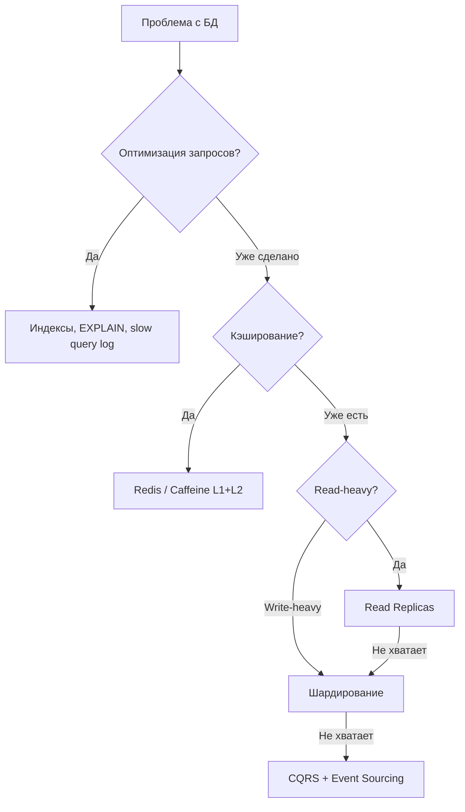

Подходы (в порядке возрастания сложности — снизу вверх по лестнице):
1. **Оптимизация запросов** — индексы, `EXPLAIN`, [SQL](../databases/sql-interview.md)-оптимизация (часто снимает проблему без всякого «масштабирования»)
2. **Кэширование** — [Redis](../databases/redis-interview.md), `Caffeine`: убирает повторные чтения
3. **Read replicas** — масштабирование чтения
4. **Партиционирование таблиц** — ускорение запросов по диапазону в пределах одного сервера
5. **Шардирование** — горизонтальное разделение данных по серверам, в т.ч. масштабирование записи
6. **CQRS** — разделение read/write моделей, когда требования к ним радикально расходятся

## Q28. Что такое вертикальное масштабирование БД и его ограничения?

Вертикальное масштабирование БД — наращивание `CPU`, памяти и диска на одном инстансе. Это самый простой шаг (код не меняется), но он лишь отодвигает потолок, а не убирает его.

Ограничения:
- Жёсткий потолок одного узла — упрёшься в физические лимиты, а стоимость растёт экспоненциально
- `Single point of failure` — узел один, его падение кладёт всю БД
- Миграция на больший инстанс обычно требует простоя или сложной процедуры

Прежде чем докупать «железо», проверьте, не упирается ли БД в неэффективность, а не в ресурсы:
- Индексы и медленные запросы (`pg_stat_statements`, `EXPLAIN ANALYZE`)
- Лимит соединений и настройки [Hibernate](../databases/hibernate-interview.md)
- Размер `shared_buffers` и `work_mem`
- Наличие `N+1` запросов

**Эмпирическое правило:** оптимизация запросов и `read replicas` чаще дают больший эффект при меньших затратах, чем апгрейд инстанса.

## Q29. (!) Что такое connection pooling и как он связан с масштабированием?

`Connection pooling` — пул заранее открытых, переиспользуемых соединений к БД вместо открытия нового на каждый запрос. Открытие соединения дорого (`TCP`-рукопожатие, `SSL`, аутентификация) — пул платит эту цену один раз и затем раздаёт готовые соединения, снижая `latency`. Заодно пул ограничивает число одновременных соединений, не давая всплеску запросов перегрузить БД.

**Критический момент при масштабировании.** Каждый инстанс держит свой пул, поэтому суммарная нагрузка на БД = `инстансы × размер пула`. 20 инстансов с пулом 10 — это уже 200 соединений к БД, и про этот множитель легко забыть (см. Q30 о лимите соединений).

**Пример — настройка `HikariCP` в `Spring Boot`:**

```yaml
spring:
  datasource:
    hikari:
      maximum-pool-size: 10
      minimum-idle: 5
      idle-timeout: 300000       # 5 минут
      max-lifetime: 1800000      # 30 минут
      connection-timeout: 20000  # 20 секунд
      pool-name: OrderServicePool
      # Важно для мониторинга
      register-mbeans: true
```

```java
// Программная настройка HikariCP
@Bean
public DataSource dataSource() {
    HikariConfig config = new HikariConfig();
    config.setJdbcUrl("jdbc:postgresql://primary:5432/orders");
    config.setUsername("app");
    config.setPassword("secret");
    config.setMaximumPoolSize(10);
    config.setMinimumIdle(5);
    config.setPoolName("OrderServicePool");
    // Метрики для Prometheus
    config.setMetricRegistry(meterRegistry);
    return new HikariDataSource(config);
}
```

**Эмпирическое правило размера пула:** `max_pool_size = max_connections_db / expected_instances`, оставив запас под миграции и `admin`-соединения. То есть размер пула привязывают к числу инстансов, а не выставляют «на глаз», иначе суммарно превысите лимит БД.

## Q30. Что такое database connection limit и как с ним работать?

**Database connection limit** — жёсткий предел числа одновременных соединений к БД (в `PostgreSQL` по умолчанию `max_connections = 100`). Это потолок не из настроек ради настроек: каждое соединение в `PostgreSQL` — отдельный процесс со своей памятью, и сотни соединений реально съедают ресурсы сервера.

**Проблема при масштабировании:** `N инстансов × размер пула` легко перебивает этот лимит, и новые инстансы начинают получать отказ в соединении — масштабирование приложения упирается в БД.

Решения:
1. **Уменьшить пул** на инстанс — самый прямой способ снизить множитель
2. **Connection proxy** — `PgBouncer`, `ProxySQL`: мультиплексируют много клиентских соединений на немного реальных
3. **Read replicas** — увести часть соединений (чтения) на реплики
4. **Увеличить лимит БД** — крайняя мера: каждое соединение потребляет память, безоглядно поднимать `max_connections` нельзя

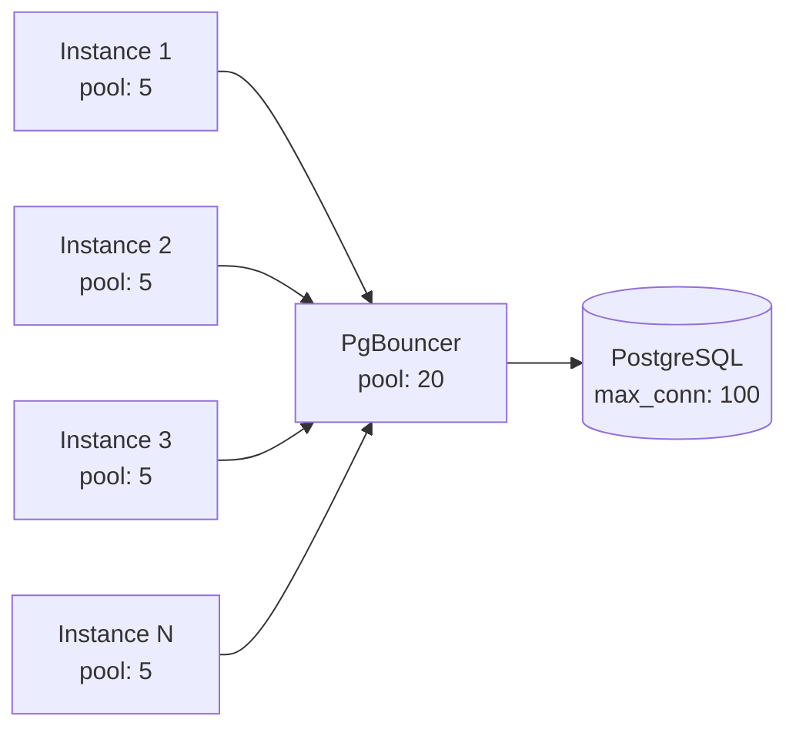

`PgBouncer` мультиплексирует соединения: 50 инстансов с пулом 5 = 250 виртуальных соединений, но `PgBouncer` держит лишь 20 реальных соединений к `PostgreSQL`, переиспользуя их.

## Q31. Как масштабировать поиск и полнотекстовый индекс?

Поисковые движки ([Elasticsearch](../databases/elasticsearch-interview.md), `OpenSearch`, `Solr`) изначально распределённые: индекс режется на **шарды** и раскладывается по узлам кластера, плюс держит **реплики**. Эти две оси и масштабируют независимо — шарды отвечают за объём и параллелизм, реплики за отказоустойчивость и чтение.

- Больше **шардов** → выше параллелизм поиска и пропускная способность записи (каждый шард обрабатывается отдельно)
- Больше **реплик** → выше отказоустойчивость и throughput чтения (запрос можно отдать любой реплике)
- Данные должны распределяться по шардам равномерно, иначе один шард станет узким местом
- Следить за размером шардов (**рекомендация:** 10-50 GB на шард — слишком крупные тормозят, слишком мелкие дают накладные расходы)
- Кэшировать частые запросы (`Elasticsearch query cache`)

**Важный нюанс:** число первичных шардов фиксируется при создании индекса. Поэтому при росте данных обычно добавляют узлы и перебалансируют существующие шарды, а для смены их количества переиндексируют в новый индекс.

## Q32. Как масштабировать микросервисы?

Главное преимущество микросервисов для масштабирования — независимость: расширяют только тот [сервис](microservices-interview.md), который стал узким местом, а не всю систему. Каждый масштабируется горизонтально за [балансировщиком](load-balancing-interview.md) ([Kubernetes](../devops/kubernetes-interview.md) `Deployment`, облачные группы), с автоскейлингом по `CPU`, памяти или кастомным метрикам — поэтому на схеме ниже у сервисов разное число реплик (×2, ×3, ×5).

Ключевые принципы (те же, что в Q25, но в межсервисном масштабе):
- Состояние — во внешних хранилищах (БД, кэш, очереди), а не в инстансе
- `API` — идемпотентные, где возможно (важно при retry между сервисами)
- Service discovery — `Kubernetes Service`, `Consul`, [Spring Cloud](../frameworks/spring/spring-cloud-interview.md): новые реплики находят друг друга автоматически
- Circuit breaker и таймауты при межсервисных вызовах, чтобы сбой одного сервиса не каскадировал
- Мониторинг и трассировка для каждого сервиса (иначе не понять, какой из них узкое место)

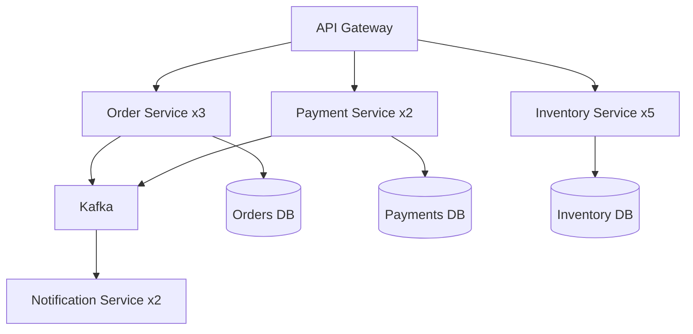

**Подводный камень:** с ростом числа сервисов растёт и число межсервисных вызовов, и их нужно держать под контролем — лимиты соединений, общая политика таймаутов и retry. Это удобно вынести в `service mesh` (`Istio`, `Linkerd`), который управляет трафиком, балансировкой и устойчивостью на уровне инфраструктуры, а не в коде каждого сервиса.

## Q33. Что такое data partitioning strategies и как выбрать ключ шардирования?

Выбор ключа шардирования — одно из самых дорогих решений при масштабировании данных: его трудно поменять задним числом (придётся перераскладывать все данные), а ошибка приводит к горячим шардам и cross-shard запросам. Поэтому стоит понимать компромиссы каждой стратегии:

| Стратегия | Описание | Плюсы | Минусы |
|-----------|----------|-------|--------|
| **Hash-based** | `hash(key) % N` | Равномерное распределение | Сложный resharding |
| **Range-based** | По диапазону значений | Эффективные range-запросы | Горячие шарды |
| **Directory-based** | Lookup-таблица | Гибкость | Дополнительный hop |
| **Geo-based** | По географии | Низкая latency | Неравномерность |

Главный компромисс — между равномерностью и удобством range-запросов: hash распределяет ровно, но ломает диапазонные запросы; range удобен для диапазонов, но порождает горячие шарды на «свежих» данных.

Критерии выбора ключа:
1. **Кардинальность** — достаточно значений для равномерного распределения
2. **Частота запросов** — ключ должен совпадать с основным паттерном доступа
3. **Рост** — ключ не должен создавать горячих шардов при росте данных
4. **Cross-shard запросы** — минимизировать необходимость `JOIN` между шардами

**Consistent hashing** решает главную боль `hash(key) % N` — resharding. При наивном `% N` смена числа узлов меняет остаток почти для всех ключей, и переезжает почти весь датасет. Consistent hashing раскладывает узлы и ключи на одном «кольце», поэтому добавление или удаление узла трогает лишь соседний участок — перемещается минимум данных. Используется в [Redis Cluster](../databases/redis-interview.md), `Cassandra`, [Kafka](../messaging/kafka-interview.md).

## Q34. Как тестировать масштабируемость?

Цель — заранее найти, где система ломается, и убедиться, что под нагрузкой работают сами механизмы масштабирования (автоскейлинг, балансировка, stateless). **Критерий полезного теста:** он фиксирует конкретную «точку отказа» (`RPS` / `latency` / `error budget`), а не просто показывает, что сервис «как-то работает под нагрузкой».

Виды тестирования — каждый отвечает на свой вопрос:
1. **Нагрузочное** — где точка насыщения? Постепенно повышают `RPS`, пока `latency` не поплывёт
2. **Стресс-тестирование** — как система деградирует за пределом? Дают нагрузку выше ожидаемой
3. **Spike testing** — успевает ли автоскейлинг? Резкий всплеск трафика
4. **Soak testing** — нет ли утечек? Длительная ровная нагрузка
5. **Тестирование с несколькими инстансами** — действительно ли сервис stateless? Ловит гонки и проблемы с блокировками

Инструменты: `Gatling`, `k6`, `JMeter`; в [Kubernetes](../devops/kubernetes-interview.md) дополнительно запускают несколько реплик и проверяют равномерность распределения запросов.

```java
// Gatling: простой сценарий нагрузочного тестирования
public class OrderLoadSimulation extends Simulation {
    {
        HttpProtocolBuilder httpProtocol = http
                .baseUrl("http://localhost:8080")
                .acceptHeader("application/json");

        ScenarioBuilder scenario = scenario("Create Orders")
                .exec(http("create-order")
                        .post("/api/orders")
                        .body(StringBody("{\"userId\": 1, \"items\": []}"))
                        .check(status().is(202)));

        setUp(
            scenario.injectOpen(
                rampUsersPerSec(1).to(100).during(Duration.ofMinutes(5)),
                constantUsersPerSec(100).during(Duration.ofMinutes(10))
            )
        ).protocols(httpProtocol)
         .assertions(global().responseTime().percentile3().lt(200));
    }
}
```

## Q35. Что такое capacity planning и как он связан с масштабированием?

`Capacity planning` — заблаговременный расчёт ресурсов под ожидаемую нагрузку: сколько инстансов, какой БД и каких лимитов хватит на прогнозируемый трафик. По сути это ответ на вопрос «выдержим ли мы пик и распродажу», который дают до пика, а не во время.

Что оценивают:
- Пиковую нагрузку (`RPS`, объём данных) — на неё и планируют, а не на среднюю
- Метрики на один инстанс (`throughput`, `latency`) — сколько тянет одна реплика
- Из этого — число инстансов и ресурсы БД

**Capacity planning и автоскейлинг дополняют друг друга, а не заменяют.** Планирование задаёт рамки (`min`/`max` реплик, типы инстансов, лимиты БД), а автоскейлинг внутри этих рамок реагирует на фактические метрики. Без планирования автоскейлер либо упрётся в `max` на пике, либо разорит бюджет.

Формула для грубой оценки:
```
instances_needed = peak_rps / rps_per_instance * safety_factor(1.3-1.5)
db_connections = instances_needed * pool_size_per_instance
```

Регулярный пересмотр `capacity planning` при изменении нагрузки и после инцидентов помогает корректировать `min`/`max` реплик и лимиты пулов соединений.

## Q36. Что такое chaos engineering в контексте масштабируемости?

`Chaos engineering` — контролируемое внесение сбоев в работающую систему, чтобы проверить её устойчивость не в теории, а на практике. Идея простая: сбои в распределённой системе неизбежны, и лучше вызвать их самому при свидетелях, чем ждать аварии ночью в проде. В контексте масштабируемости проверяют, что механизмы устойчивости реально срабатывают:

- При отказе части инстансов оставшиеся справляются с нагрузкой
- Автоскейлинг корректно добавляет узлы
- [Балансировщик](load-balancing-interview.md) исключает нездоровые инстансы
- Очереди и кэш ведут себя предсказуемо при сбоях
- `Circuit breaker` срабатывает, алерты уходят

Инструменты: `Chaos Monkey`, `Chaos Mesh`, `Gremlin`, `Litmus`.

Типичные сценарии:
1. Убийство случайного пода в [Kubernetes](../devops/kubernetes-interview.md)
2. Задержка или отказ вызова к БД / внешнему `API`
3. Переполнение очереди [Kafka](../messaging/kafka-interview.md)
4. Исчерпание пула соединений
5. Сетевой partition между сервисами (см. [CAP-теорему](cap-theorem-interview.md))

**Рекомендация:** каждый эксперимент проводят с заранее сформулированной гипотезой и измеримым критерием успеха («`SLO` не нарушен при потере 30% инстансов») и держат наготове кнопку отката — это эксперимент, а не диверсия.

## Q37. (!) Что такое Fan-out и Fan-in паттерны масштабирования?

Это пара зеркальных операций: **Fan-out** разветвляет один запрос на множество параллельных подзапросов, **Fan-in** собирает их результаты обратно в один ответ. Смысл — заменить последовательную работу параллельной: вместо того чтобы опросить N источников по очереди (сумма задержек), опрашивают все сразу, и общая latency сводится к самому медленному из них.

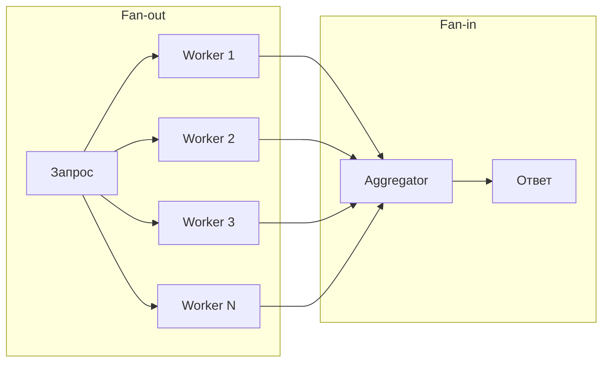

**Типичные применения:**
- **Scatter-Gather** в поисковых системах: запрос → N шардов индекса → merge результатов
- **Feed aggregation**: лента новостей = fan-out по всем подпискам пользователя
- **MapReduce**: map-фаза (fan-out) → reduce-фаза (fan-in)

**Реализация на Java (CompletableFuture):**
```java
public SearchResult search(SearchRequest request, List<ShardClient> shards) {
    // Fan-out: параллельный поиск по всем шардам
    List<CompletableFuture<ShardResult>> futures = shards.stream()
        .map(shard -> CompletableFuture.supplyAsync(
            () -> shard.search(request), searchExecutor))
        .toList();

    // Fan-in: собираем результаты с таймаутом
    CompletableFuture<Void> allOf = CompletableFuture.allOf(
        futures.toArray(new CompletableFuture[0]));

    try {
        allOf.get(500, TimeUnit.MILLISECONDS); // hedge requests timeout
    } catch (TimeoutException e) {
        log.warn("Некоторые шарды не ответили вовремя");
    }

    // Fan-in: merge доступных результатов
    return futures.stream()
        .filter(f -> f.isDone() && !f.isCompletedExceptionally())
        .map(CompletableFuture::join)
        .collect(SearchResultMerger::merge);
}
```

**Подводный камень — write fan-out.** До сих пор речь шла о fan-out на чтении. Но если разветвлять запись (например, разносить пост по лентам всех подписчиков), у пользователя с 10M подписчиков один пост превращается в 10M записей — это лавина нагрузки. Решение — гибрид (подход Twitter): для обычных пользователей `push model` (записываем в ленты подписчиков сразу), а для «звёзд» `pull model` (их посты подмешиваются в ленту в момент чтения).

## Q38. Что такое Write-Behind (Write-Back) кэширование?

**Write-Behind** (`Write-Back`) — стратегия записи, при которой данные сначала ложатся в кэш, клиент сразу получает подтверждение, а в БД они попадают асинхронно и с задержкой. Это противоположность `Write-Through`, где кэш и БД пишутся синхронно вместе. Выигрыш — латентность записи определяется быстрым кэшем (миллисекунды), а не медленной БД; плата — окно, в котором подтверждённые данные ещё не сохранены в БД.

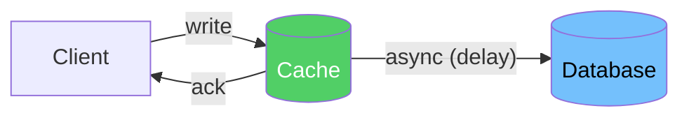

**Сравнение стратегий записи:**

| Стратегия | Запись в | Latency | Durability | Риск |
|-----------|----------|---------|------------|------|
| `Write-Through` | Кэш + БД синхронно | Высокая | Высокая | Нет потерь |
| `Write-Behind` | Кэш, потом БД | Низкая | Низкая | Потеря при падении кэша |
| `Write-Around` | Только БД | Средняя | Высокая | Cache miss при чтении |

**Реализация через Redis + очередь:**
```java
@Service
public class WriteBackCacheService {
    private final RedisTemplate<String, Object> redis;
    private final KafkaTemplate<String, WriteEvent> kafka;

    public void updateCounter(String userId, long delta) {
        // 1. Быстрое обновление в Redis (O(1))
        Long newValue = redis.opsForValue()
            .increment("counter:" + userId, delta);

        // 2. Асинхронная запись в Kafka → Consumer → DB
        kafka.send("counter-updates",
            new WriteEvent(userId, newValue, Instant.now()));
    }
}

@KafkaListener(topics = "counter-updates")
public void persistCounter(WriteEvent event) {
    // Батчевая запись: обрабатываем N событий за раз
    counterRepository.upsert(event.userId(), event.value());
}
```

**Сценарии применения** — там, где скорость записи важнее, чем 100%-я надёжность каждой записи:
- Счётчики просмотров, лайков — потерять пару инкрементов при падении Redis не страшно
- Метрики и аналитика — eventual consistency допустима по своей природе
- Высоконагруженная запись (>100K writes/s), где синхронная БД становится узким местом

**Подводные камни:** если кэш упадёт до сброса в БД, данные между подтверждением и flush теряются — durability приносится в жертву латентности. Риск снижают `Redis Persistence` (`AOF`), репликацией кэша и малым интервалом flush, но полностью он не уходит, поэтому критичные данные (платежи, заказы) так не пишут.

## Q39. (!) Что такое Cell-Based Architecture?

**Cell-Based Architecture** (клеточная архитектура) — система разбивается на **независимые изолированные ячейки** (`cells`), и каждая обслуживает свой срез пользователей или данных целиком, полным стеком. Главная цель — ограничить `blast radius`: отказ одной ячейки затрагивает только её пользователей, а не всю систему. Вместо «один большой кластер на всех» получается набор маленьких, изолированных друг от друга.

```mermaid
graph TD
    Router[Global Router] -->|"user 1-1M"| Cell1
    Router -->|"user 1M-2M"| Cell2
    Router -->|"user 2M-3M"| Cell3

    subgraph Cell1
        S1[Service A] & S2[Service B] & DB1[(DB Shard 1)]
    end
    subgraph Cell2
        S3[Service A] & S4[Service B] & DB2[(DB Shard 2)]
    end
    subgraph Cell3
        S5[Service A] & S6[Service B] & DB3[(DB Shard 3)]
    end
```

**Ключевые свойства:**
- **Изоляция отказов** — проблема в Cell 2 не затрагивает Cell 1 и Cell 3
- **Blast radius** — максимальный ущерб от инцидента ограничен одной ячейкой
- **Независимый деплой** — можно обновлять ячейки по очереди (canary по ячейкам)
- **Масштабирование** — добавление ячейки = линейный рост ёмкости

**Применяют:** Amazon (Availability Zones as cells), Slack (sharding по рабочим пространствам), Netflix (regional cells), Salesforce (pods).

**Реализация роутинга:**
```java
@Component
public class CellRouter {
    private final List<CellConfig> cells;

    public CellConfig routeUser(UUID userId) {
        // Детерминированное присвоение ячейки по userId
        int cellIndex = Math.abs(userId.hashCode()) % cells.size();
        return cells.get(cellIndex);
    }

    public CellConfig routeTenant(String tenantId) {
        // Для B2B: один tenant всегда в одной ячейке
        return tenantCellMapping.get(tenantId);
    }
}
```

**Чем это отличается от обычного шардирования.** При шардировании делят только данные (БД), а сервисы остаются общими — значит, остаётся и общая точка отказа на уровне приложения. Ячейка же содержит **полный стек** (все сервисы + своя БД), поэтому она автономна: сбой в одной ячейке физически не может задеть другую, ведь у них нет общих компонентов.

## Q40. Как масштабировать систему в нескольких регионах (Multi-Region)?

**Multi-Region** — развёртывание системы сразу в нескольких географических регионах. Решает три задачи разом: снижает latency (пользователя обслуживает ближайший регион), повышает доступность (выживает падение целого региона) и даёт disaster recovery. Главная сложность — не сами серверы, а согласование данных между регионами через высокую сетевую задержку.

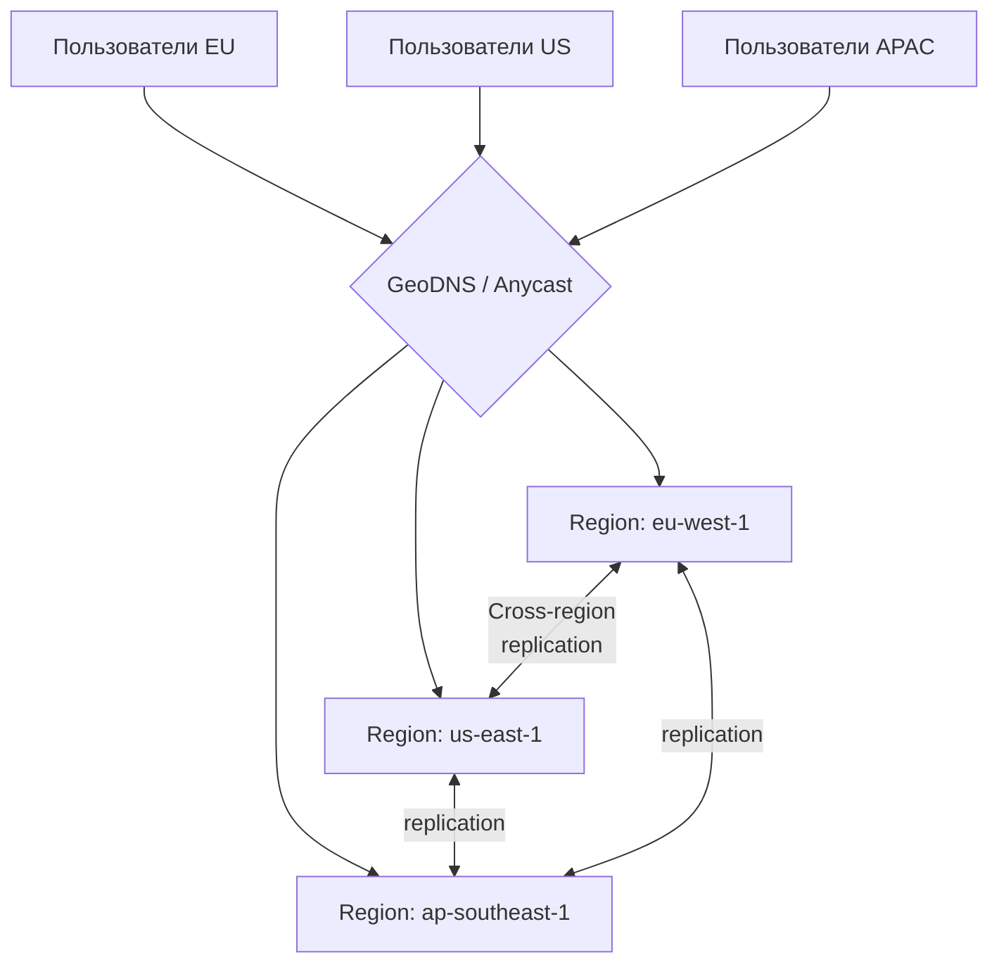

**Стратегии согласованности данных:**

| Стратегия | Описание | Применение |
|-----------|----------|-----------|
| **Active-Passive** | Один регион — primary, остальные — read replicas | DR, читающие нагрузки |
| **Active-Active** | Все регионы принимают записи | Глобальные системы |
| **Follow-the-sun** | Primary мигрирует по часовым поясам | Рабочий день бизнеса |

**Главная боль Active-Active — конфликты записи.** Поскольку запись принимают все регионы, два пользователя в разных регионах могут одновременно изменить одну запись, и согласовать это через межрегиональную задержку синхронно нельзя. Способы разрешения:
- `CRDT` — структуры данных, которые сливаются без конфликтов по построению
- `Last-Write-Wins` — побеждает запись с последним таймстампом (просто, но теряет данные)
- бизнес-правила слияния — доменная логика решает, как объединить
- partition данных по регионам — чтобы конкретную запись писал только один регион (конфликта нет вовсе)

**Партиционирование данных по регионам (Data Residency):**
```java
// Пользователи EU → данные хранятся только в eu-west-1
// Пользователи US → данные только в us-east-1
public class RegionAwareRouter {
    public DataSource resolve(User user) {
        return switch (user.region()) {
            case EU -> euDataSource;
            case US -> usDataSource;
            case APAC -> apacDataSource;
        };
    }
}
```

**Ключевые решения:**
- `Amazon Aurora Global Database` — один primary, реплики в 5 регионах, RPO < 1 сек
- `CockroachDB` — built-in multi-region, geo-partitioning
- `Cassandra` — multi-DC replication с `NetworkTopologyStrategy`
- `Spanner` — глобальная согласованность через TrueTime

## Q41. Как предотвратить hotspot при шардировании?

**Hotspot** (горячая партиция) — один шард принимает несоразмерно большую долю нагрузки и становится узким местом, пока остальные простаивают. Это прямое отрицание цели шардирования: данные распределены, а нагрузка — нет. Типичные причины: плохой ключ шардирования (монотонный или с малой кардинальностью), «звёздные» данные знаменитостей, временные пики. Лечение всегда сводится к одному — сделать распределение нагрузки равномернее.

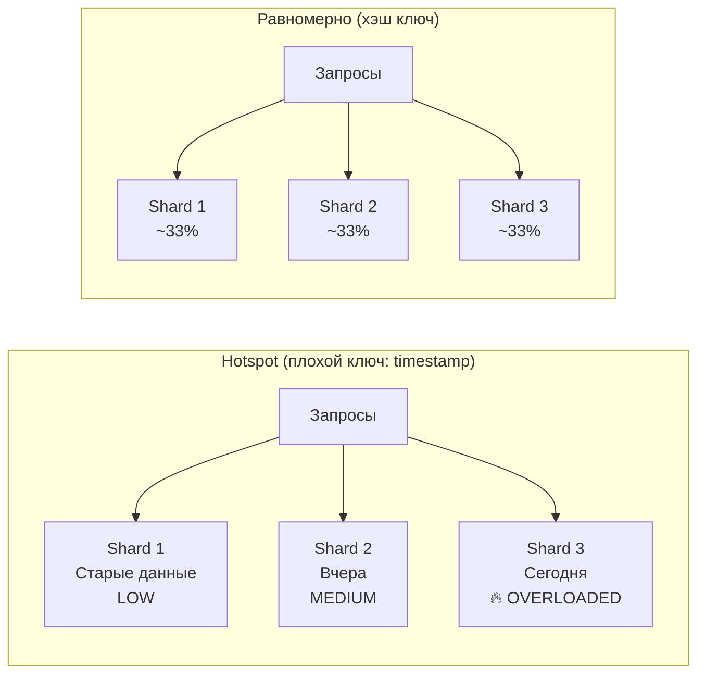

**Причины и решения:**

| Причина | Решение |
|---------|---------|
| Монотонный ключ (`timestamp`, `AUTO_INCREMENT`) | Хэш от ID или composite key (`user_id + timestamp`) |
| «Горячий» пользователь (celebrity) | Добавить random suffix к ключу, разделить на N sub-shards |
| Временной паттерн (пик в 9:00) | Consistent hashing + автоскейлинг |
| Несбалансированное распределение | `Virtual nodes` в consistent hashing |

**Техника salting для горячих ключей:**
```java
// Проблема: popular-product-1 → всегда в Shard 0
String shardKey = "popular-product-1"; // hotspot!

// Решение: добавить случайный суффикс (salting)
int saltBuckets = 10; // разбить на 10 виртуальных ключей
int salt = random.nextInt(saltBuckets);
String shardKey = "popular-product-1#" + salt; // → разные шарды

// При чтении: scatter-gather по всем bucket'ам и объединение
List<CompletableFuture<Long>> futures = IntStream.range(0, saltBuckets)
    .mapToObj(i -> CompletableFuture.supplyAsync(
        () -> cache.get("popular-product-1#" + i)))
    .toList();
long totalCount = futures.stream()
    .map(CompletableFuture::join)
    .mapToLong(Long::longValue)
    .sum();
```

**Мониторинг hotspots:**
- Prometheus метрика `requests_per_shard` — аномальный рост одного шарда
- В `Cassandra`: `nodetool tpstats`, `nodetool tablestats` — `Read Latency` по нодам
- В `Kafka`: consumer lag per partition через AKHQ/Confluent Control Center
- В `Redis Cluster`: `redis-cli --cluster info` — `keys` и `used_memory` по нодам

---

## See also

- [Распределённые системы](distributed-systems-interview.md) — CAP теорема, репликация, партиционирование и согласованность
- [Стратегии кэширования](caching-strategies-interview.md) — Cache-Aside, Write-Through, CDN и локальные кэши для снижения нагрузки
- [Балансировка нагрузки](load-balancing-interview.md) — алгоритмы балансировки, health checks и горизонтальное масштабирование
- [Архитектура баз данных](../databases/database-architecture-interview.md) — шардирование, read replica и партиционирование для масштабирования
- [Микросервисная архитектура](microservices-interview.md) — декомпозиция и независимое масштабирование сервисов
- [CQRS и Event Sourcing](cqrs-event-sourcing-interview.md) — разделение read/write нагрузки для масштабирования
- [Apache Kafka](../messaging/kafka-interview.md) — партиционирование и потоковая обработка для высокопроизводительных систем
- [Kubernetes](../devops/kubernetes-interview.md) — HPA, VPA и автоматическое масштабирование приложений

- [API Gateway](api-gateway-interview.md)
- [BFF Pattern](bff-pattern-interview.md)
- [Стратегии кэширования](caching-strategies-interview.md)
- [CAP-теорема](cap-theorem-interview.md)
- [Clean Architecture](clean-architecture-interview.md)
- [Паттерны согласованности](consistency-patterns-interview.md)
