# Вопросы на собеседовании: Паттерны масштабируемости

Комплексное руководство по вопросам собеседования на тему паттернов масштабируемости для Senior Java Developer. Охватывает горизонтальное и вертикальное масштабирование, кэширование, шардирование, асинхронную обработку, `CQRS`, автоскейлинг и мониторинг.

## Полезные ссылки

### Официальная документация

- [Scalability (Martin Fowler)](https://martinfowler.com/articles/scalability.html) — обзор подходов к масштабированию
- [Designing Data-Intensive Applications (O'Reilly)](https://www.oreilly.com/library/view/designing-data-intensive-applications/9781491903063/) — фундаментальная книга по проектированию масштабируемых систем
- [A Guide To Caching in Spring (Baeldung)](https://www.baeldung.com/spring-cache-tutorial) — кэширование в `Spring`
- [Guide to Resilience4j With Spring Boot (Baeldung)](https://www.baeldung.com/spring-boot-resilience4j) — `Circuit Breaker` и `Rate Limiter`
- [CQRS and Event Sourcing in Java (Baeldung)](https://www.baeldung.com/cqrs-event-sourcing-java) — паттерн `CQRS`
- [Configuring a Hikari Connection Pool with Spring Boot (Baeldung)](https://www.baeldung.com/spring-boot-hikari) — пул соединений `HikariCP`
- [Rate Limiting a Spring API Using Bucket4j (Baeldung)](https://www.baeldung.com/spring-bucket4j) — ограничение частоты запросов
- [Guide to Spring Session (Baeldung)](https://www.baeldung.com/spring-session) — внешнее хранение сессий

## Содержание

- [Полезные ссылки](#полезные-ссылки)
- [See also](#see-also)

**Основы масштабирования**
- [Q1. (!) Что такое вертикальное и горизонтальное масштабирование?](#q1--что-такое-вертикальное-и-горизонтальное-масштабирование)
- [Q2. (!) Почему для горизонтального масштабирования приложение должно быть stateless?](#q2--почему-для-горизонтального-масштабирования-приложение-должно-быть-stateless)
- [Q3. Когда предпочтительнее вертикальное, а когда горизонтальное масштабирование?](#q3-когда-предпочтительнее-вертикальное-а-когда-горизонтальное-масштабирование)
- [Q4. Что такое эластичное масштабирование (autoscaling)?](#q4-что-такое-эластичное-масштабирование-autoscaling)
- [Q5. Что такое узкое место (bottleneck) и как его выявлять?](#q5-что-такое-узкое-место-bottleneck-и-как-его-выявлять)

**Кэширование**
- [Q6. (!) Как кэширование помогает масштабированию?](#q6--как-кэширование-помогает-масштабированию)
- [Q7. Как реализовать двухуровневый кэш в Spring Boot?](#q7-как-реализовать-двухуровневый-кэш-в-spring-boot)
- [Q8. Какие стратегии инвалидации кэша существуют?](#q8-какие-стратегии-инвалидации-кэша-существуют)

**Шардирование и партиционирование**
- [Q9. (!) Что такое шардирование и когда его применять?](#q9--что-такое-шардирование-и-когда-его-применять)
- [Q10. Что такое «горячая партиция» / «горячий шард» и как избежать?](#q10-что-такое-горячая-партиция--горячий-шард-и-как-избежать)
- [Q11. Чем отличается шардирование от партиционирования таблиц?](#q11-чем-отличается-шардирование-от-партиционирования-таблиц)

**Асинхронность и очереди**
- [Q12. (!) Как асинхронность и очереди помогают масштабированию?](#q12--как-асинхронность-и-очереди-помогают-масштабированию)
- [Q13. Что такое backpressure и зачем он нужен?](#q13-что-такое-backpressure-и-зачем-он-нужен)
- [Q14. Как масштабировать обработку очередей (Kafka, RabbitMQ)?](#q14-как-масштабировать-обработку-очередей-kafka-rabbitmq)

**Репликация и CQRS**
- [Q15. (!) Что такое read replica и как это помогает масштабировать чтение?](#q15--что-такое-read-replica-и-как-это-помогает-масштабировать-чтение)
- [Q16. (!) Что такое CQRS в контексте масштабирования?](#q16--что-такое-cqrs-в-контексте-масштабирования)
- [Q17. Как масштабировать запись (write scaling)?](#q17-как-масштабировать-запись-write-scaling)

**Устойчивость и защита от перегрузок**
- [Q18. (!) Что такое circuit breaker и как он связан с масштабируемостью?](#q18--что-такое-circuit-breaker-и-как-он-связан-с-масштабируемостью)
- [Q19. (!) Что такое rate limiting и как он помогает при масштабировании?](#q19--что-такое-rate-limiting-и-как-он-помогает-при-масштабировании)
- [Q20. Что такое bulkhead pattern и как он предотвращает каскадные сбои?](#q20-что-такое-bulkhead-pattern-и-как-он-предотвращает-каскадные-сбои)
- [Q21. Как таймауты и retry-стратегии влияют на масштабируемость?](#q21-как-таймауты-и-retry-стратегии-влияют-на-масштабируемость)

**Мониторинг и SLO**
- [Q22. Как мониторинг связан с масштабируемостью?](#q22-как-мониторинг-связан-с-масштабируемостью)
- [Q23. Что такое SLO и как он связан с масштабированием?](#q23-что-такое-slo-и-как-он-связан-с-масштабированием)

**Автоскейлинг и проектирование**
- [Q24. Что такое auto-scaling по кастомным метрикам?](#q24-что-такое-auto-scaling-по-кастомным-метрикам)
- [Q25. (!) Как проектировать приложение для горизонтального масштабирования с первого дня?](#q25--как-проектировать-приложение-для-горизонтального-масштабирования-с-первого-дня)
- [Q26. Что такое scale to zero и когда его используют?](#q26-что-такое-scale-to-zero-и-когда-его-используют)

**Масштабирование БД и инфраструктуры**
- [Q27. (!) Как масштабировать базу данных?](#q27--как-масштабировать-базу-данных)
- [Q28. Что такое вертикальное масштабирование БД и его ограничения?](#q28-что-такое-вертикальное-масштабирование-бд-и-его-ограничения)
- [Q29. (!) Что такое connection pooling и как он связан с масштабированием?](#q29--что-такое-connection-pooling-и-как-он-связан-с-масштабированием)
- [Q30. Что такое database connection limit и как с ним работать?](#q30-что-такое-database-connection-limit-и-как-с-ним-работать)
- [Q31. Как масштабировать поиск и полнотекстовый индекс?](#q31-как-масштабировать-поиск-и-полнотекстовый-индекс)

**Продвинутые темы**
- [Q32. Как масштабировать микросервисы?](#q32-как-масштабировать-микросервисы)
- [Q33. Что такое data partitioning strategies и как выбрать ключ шардирования?](#q33-что-такое-data-partitioning-strategies-и-как-выбрать-ключ-шардирования)
- [Q34. Как тестировать масштабируемость?](#q34-как-тестировать-масштабируемость)
- [Q35. Что такое capacity planning и как он связан с масштабированием?](#q35-что-такое-capacity-planning-и-как-он-связан-с-масштабированием)
- [Q36. Что такое chaos engineering в контексте масштабируемости?](#q36-что-такое-chaos-engineering-в-контексте-масштабируемости)

**Продвинутые паттерны масштабирования**
- [Q37. (!) Что такое Fan-out и Fan-in паттерны масштабирования?](#q37-что-такое-fan-out-и-fan-in-паттерны-масштабирования)
- [Q38. Что такое Write-Behind (Write-Back) кэширование?](#q38-что-такое-write-behind-write-back-кэширование)
- [Q39. (!) Что такое Cell-Based Architecture?](#q39-что-такое-cell-based-architecture)
- [Q40. Как масштабировать систему в нескольких регионах (Multi-Region)?](#q40-как-масштабировать-систему-в-нескольких-регионах-multi-region)
- [Q41. Как предотвратить hotspot при шардировании?](#q41-как-предотвратить-hotspot-при-шардировании)

---

Паттерны масштабируемости — способы увеличить производительность и пропускную способность системы при росте нагрузки. Масштабирование может быть вертикальным (увеличение ресурсов одного узла) или горизонтальным (добавление узлов). На собеседовании Senior Java Developer ожидают понимание: горизонтальное и вертикальное масштабирование; stateless vs stateful; кэширование, шардирование, асинхронность; автоскейлинг и мониторинг; типичные узкие места и их устранение.

## Q1. (!) Что такое вертикальное и горизонтальное масштабирование?

**Вертикальное масштабирование** (`scale up`) — увеличение ресурсов одного узла (`CPU`, память, диск). Плюсы: простота, не нужно менять архитектуру. Минусы: ограниченный потолок, `single point of failure`, дороже с определённого размера. Применяют для БД и компонентов, сложно шардируемых, или при умеренной нагрузке.

**Горизонтальное масштабирование** (`scale out`) — добавление новых узлов в систему. Плюсы: линейный рост производительности, отказоустойчивость. Минусы: нужна stateless-архитектура, балансировка, согласованность данных и более сложная эксплуатация. Типично для веб-приложений, микросервисов и воркеров очередей; масштабирование достигается добавлением реплик за [балансировщиком](load-balancing-interview.md) (`Kubernetes Deployment`, облачные группы).

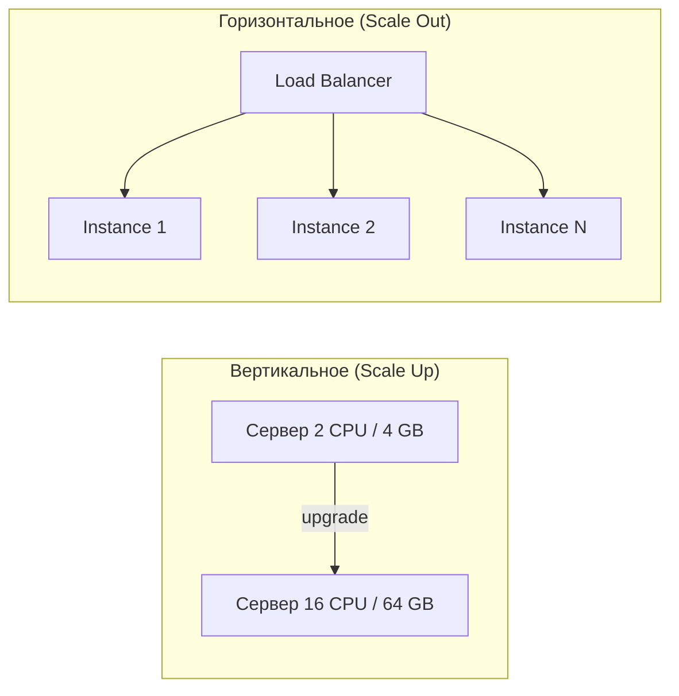

| Характеристика | Вертикальное | Горизонтальное |
|----------------|-------------|----------------|
| Сложность | Низкая | Высокая |
| Потолок | Ограничен оборудованием | Практически не ограничен |
| Отказоустойчивость | `SPOF` | Высокая |
| Стоимость | Экспоненциальный рост | Линейный рост |
| Downtime при масштабировании | Часто требуется | Не требуется |


> [!mcq]
> - [x] `Scale up` упирается в потолок одного узла, `scale out` добавляет реплики и `linear scaling` | Вертикалка дешевле в начале, но горизонталка снимает `SPOF` и убирает `downtime` при росте. ✓ ПРИМЕНЯТЬ: Netflix Eureka + AWS ASG для stateless-сервисов, БД сначала вертикально, потом read-replicas. 📋 ПРАВИЛО: «Up — до потолка, out — без потолка». 🔗 См. Q2, Q3, Q27.
> - [ ] Вертикальное всегда дешевле горизонтального | Стоимость растёт экспоненциально после среднего размера. ❌ ПОСЛЕДСТВИЕ: 96-vCPU-инстанс RDS стоит 8× 12-vCPU при той же производительности — счёт за квартал в 2× плана.
> - [ ] Горизонтальное масштабирование не требует менять архитектуру | Stateless и идемпотентность нужны обязательно. ❌ ПОСЛЕДСТВИЕ: добавили вторую реплику без `Spring Session` в Redis — половина пользователей разлогинивается на каждом запросе.
> - [ ] Вертикалка решает отказоустойчивость, горизонталка — нет | Наоборот: один большой узел остаётся `SPOF`. ❌ ПОСЛЕДСТВИЕ: единственный 64-vCPU узел упал — весь сервис недоступен 30 минут пока поднимается резерв.

## Q2. (!) Почему для горизонтального масштабирования приложение должно быть stateless?

**Stateless** — сервер не хранит состояние запроса между вызовами; любой запрос может быть обработан любым узлом. При **stateful** (сессии в памяти) запросы одного пользователя должны попадать на один и тот же узел (`sticky session`), что усложняет [балансировку](load-balancing-interview.md) и делает невозможным равномерное распределение при добавлении/удалении узлов.

Для горизонтального масштабирования состояние выносят в общее хранилище ([Redis](../databases/redis-interview.md), БД, кэш). При добавлении нового узла в stateful-системе часть сессий нужно мигрировать или они теряются; при падении узла все его сессии теряются. В stateless-системе новый узел сразу получает долю трафика; падение узла влияет только на активные запросы на нём, сессии в `Redis` остаются доступны с других узлов.

**Пример — `Spring Session` с `Redis`:**

```java
@Configuration
@EnableRedisHttpSession(maxInactiveIntervalInSeconds = 1800)
public class SessionConfig {

    @Bean
    public LettuceConnectionFactory connectionFactory() {
        return new LettuceConnectionFactory("redis-host", 6379);
    }
}
```

```yaml
# application.yml
spring:
  session:
    store-type: redis
  data:
    redis:
      host: redis-host
      port: 6379
```

С `spring-session-data-redis` серия запросов с одним session cookie может обрабатываться разными инстансами — сессия подгружается из `Redis` по id. Без `Redis` при масштабировании до N инстансов пришлось бы держать `sticky session` и терять сессии при падении узла.

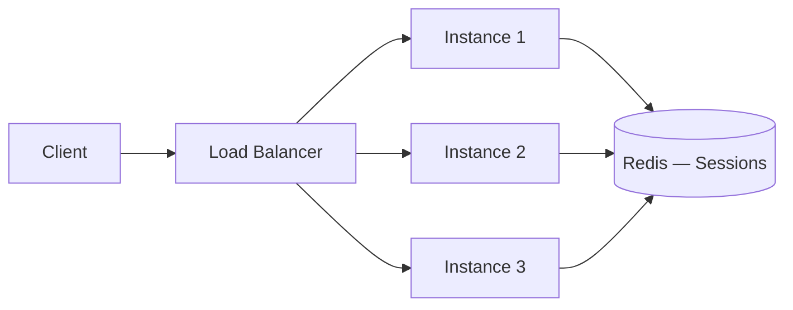


> [!mcq]
> - [ ] Stateless быстрее работает, потому что не делает I/O | Stateless ровно так же ходит к БД и кэшу, выигрыш не в скорости. ❌ ПОСЛЕДСТВИЕ: разработчик «оптимизирует» — кладёт корзину в `HttpSession`, `latency` падает на одном узле, а после rollout у пользователей корзина исчезает.
> - [x] Любой запрос обрабатывается любым узлом без `sticky session` | Состояние вынесено в `Redis`/БД, добавление/удаление узла не теряет сессии. ✓ ПРИМЕНЯТЬ: `Spring Session` с `@EnableRedisHttpSession` за `K8s Deployment` — pod умер, сессия живёт. 📋 ПРАВИЛО: «Pod умирает — сессия выживает». 🔗 См. Q1, Q25.
> - [ ] Stateless обязателен, потому что Kubernetes не поддерживает sticky session | `K8s Service` поддерживает `sessionAffinity: ClientIP`, но это плохое решение. ❌ ПОСЛЕДСТВИЕ: включили `sessionAffinity` для legacy — при rolling update 30% пользователей попадают на старые поды и видят 503 после graceful shutdown.
> - [ ] Stateful узлы нельзя масштабировать в принципе | Можно через `StatefulSet` + sticky routing, просто дороже. ❌ ПОСЛЕДСТВИЕ: команда отказалась от Cassandra «потому что stateful» и взяла in-memory map — потеряли данные при первом OOM.

## Q3. Когда предпочтительнее вертикальное, а когда горизонтальное масштабирование?

**Вертикальное** — когда нагрузка умеренная и один мощный узел достаточен; при ограничениях на изменение кода (legacy); для БД и компонентов, сложно шардируемых (монолитная БД, stateful системы).

**Горизонтальное** — когда нужен рост без потолка; для веб-приложений и [микросервисов](microservices-interview.md); когда важна отказоустойчивость и эластичность (автоскейлинг).

На практике часто комбинируют: приложение — горизонтально, БД — сначала вертикально и `read replicas`, затем шардирование.

| Сценарий | Рекомендация |
|----------|-------------|
| БД до исчерпания возможностей одного инстанса | Вертикально |
| Legacy-приложение без рефакторинга | Вертикально |
| `API` и stateless веб-сервисы | Горизонтально |
| Воркеры [Kafka](../messaging/kafka-interview.md) / `RabbitMQ` | Горизонтально |
| `Read replicas` БД | Горизонтально |


> [!mcq]
> - [ ] Всегда горизонтальное — оно дешевле и универсальнее | Для legacy и primary БД горизонталка требует переписывать схему. ❌ ПОСЛЕДСТВИЕ: попытались шардировать монолитную PostgreSQL без подготовки — миграция растянулась на 8 месяцев, прод стоял на read-only по выходным.
> - [ ] Всегда вертикальное — у облачных инстансов потолка нет | У AWS RDS максимум `db.r6i.32xlarge`, дальше упор в железо. ❌ ПОСЛЕДСТВИЕ: бизнес требует ×3 нагрузки за квартал, RDS уже на максимальном инстансе — нет пути дальше, аварийный шардинг под пиком.
> - [ ] Stateful БД — горизонтально, stateless API — вертикально | Перевёрнуто: stateless легко масштабируется out, БД — наоборот. ❌ ПОСЛЕДСТВИЕ: 50 stateless-инстансов на одном громадном узле — упал узел, упало всё; БД на 10 шардах — сложность без выигрыша.
> - [x] Stateless API — горизонтально, write-heavy БД — сначала вертикально + read-replicas | Комбинация: out для приложения, up для primary БД до исчерпания, потом шардинг. ✓ ПРИМЕНЯТЬ: типичный Spring Boot за `K8s HPA` + AWS Aurora с 5 read-replicas; шардинг подключают при write-RPS > 10K. 📋 ПРАВИЛО: «API наружу, БД сперва вверх». 🔗 См. Q1, Q15, Q27.

## Q4. Что такое эластичное масштабирование (autoscaling)?

Эластичное масштабирование — автоматическое добавление или удаление узлов в зависимости от метрик (`CPU`, память, длина очереди, `latency`). В [Kubernetes](../devops/kubernetes-interview.md) — `HPA` (`Horizontal Pod Autoscaler`) по `CPU`/памяти или кастомным метрикам; в облаках — группы автоскейлинга.

**Практический критерий:** автоскейлинг должен опираться на метрику, которая реально отражает деградацию `SLO` (`latency`, `lag`, `queue depth`), а не только на `CPU`.

Важно: корректные пороги, задержка масштабирования, ограничение `min`/`max` инстансов. Слишком агрессивное масштабирование вверх при кратковременных пиках приводит к лишним инстансам; слишком медленное — к росту `latency`. Настройка периода усреднения и стабилизации (`stabilizationWindowSeconds`) сглаживает колебания.


> [!mcq]
> - [ ] Autoscaling срабатывает только по `CPU` | `HPA` поддерживает кастомные метрики через `external.metrics.k8s.io`. ❌ ПОСЛЕДСТВИЕ: API в Spring Boot c блокирующими I/O — `CPU` 30%, но `latency` p99 = 5s; HPA не масштабирует, потому что считает нагрузку низкой.
> - [ ] Чем агрессивнее пороги (60% CPU), тем стабильнее система | Триггер на 60% при коротких пиках вызывает thrashing — поды поднимаются и сразу гасятся. ❌ ПОСЛЕДСТВИЕ: счёт за `cluster-autoscaler` вырос на 40%, новые поды не успевают прогреть JIT и `latency` растёт во время масштабирования.
> - [ ] Autoscaling заменяет capacity planning | `min`/`max` границы и резервы должны быть посчитаны заранее. ❌ ПОСЛЕДСТВИЕ: на Black Friday HPA упёрся в `maxReplicas: 10`, заявленный для будней; пользователи получают 503 пока DevOps правит yaml.
> - [x] Автоматическое изменение числа реплик по метрикам, отражающим деградацию `SLO` | `HPA`/`KEDA` смотрят `RPS`, p99 `latency`, `Kafka lag` — не только `CPU`. ✓ ПРИМЕНЯТЬ: `KEDA` ScaledObject по `Kafka consumer lag > 1000` для воркеров заказов. 📋 ПРАВИЛО: «Скейль по симптому пользователя, не по CPU». 🔗 См. Q22, Q24.

## Q5. Что такое узкое место (bottleneck) и как его выявлять?

Узкое место — ресурс или компонент, ограничивающий пропускную способность всей системы. Даже если остальные компоненты масштабированы, узкое место определяет максимальный throughput.

Выявление:
1. **Профилирование** — `CPU`, память, `GC`, потоки (см. [профилирование приложений](../performance/application-profiling-interview.md))
2. **Метрики** — `latency` по компонентам, throughput, error rate
3. **Трассировка** — `Jaeger`, `Zipkin` для определения медленного звена в цепочке вызовов
4. **Нагрузочное тестирование** — постепенное увеличение `RPS` и наблюдение за точкой насыщения

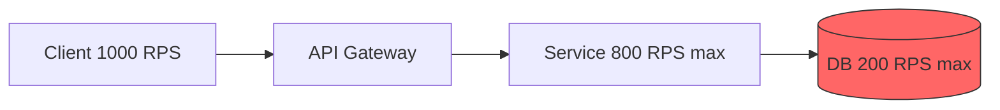

В примере выше БД — узкое место: при 1000 `RPS` она обработает лишь 200, остальное — таймауты. Масштабирование `API Gateway` и сервиса не поможет — нужно масштабировать БД (кэш, `read replicas`, шардирование).


> [!mcq]
> - [x] Компонент с минимальным `throughput` определяет пропускную способность всей цепочки | Масштабирование других звеньев не помогает: трафик упирается в bottleneck. ✓ ПРИМЕНЯТЬ: `Jaeger` distributed tracing + `pg_stat_statements` находят медленный звено в order-service цепочке. 📋 ПРАВИЛО: «Цепь не сильнее самого слабого звена». 🔗 См. Q22, Q27.
> - [ ] Bottleneck — это всегда БД | Может быть CPU приложения, сеть, GC, внешний API, диск. ❌ ПОСЛЕДСТВИЕ: команда удвоила инстансы RDS, а реальный bottleneck — `Executors.newFixedThreadPool(10)` в коде; `latency` не изменилась, счёт вырос.
> - [ ] Чтобы найти bottleneck, достаточно посмотреть `top` на проде | Без распределённого трейсинга в микросервисах непонятно, какой сервис медленный. ❌ ПОСЛЕДСТВИЕ: 5 часов искали проблему в order-service, на самом деле 4-секундный ответ давал inventory-service — без `Jaeger` это не видно.
> - [ ] При нагрузочном тесте все компоненты деградируют одновременно | Один компонент упирается первым — это и есть bottleneck. ❌ ПОСЛЕДСТВИЕ: поверили синтетическому тесту с равномерной деградацией, на проде упёрлись в connection pool на 2× меньшей нагрузке.

## Q6. (!) Как кэширование помогает масштабированию?

Кэш снижает нагрузку на источник данных (БД, внешний `API`) и уменьшает латентность. Часто читаемые данные кэшируются в памяти (локальный кэш) или в распределённом кэше ([Redis](../databases/redis-interview.md)). Подробнее о стратегиях — в [вопросах по кэшированию](caching-strategies-interview.md).

Многоуровневый кэш (`L1` — локальный `Caffeine`, `L2` — `Redis`) увеличивает `hit ratio`. Важно: стратегия инвалидации, `TTL`, консистентность.

**Пример — кэширование в `Spring Boot` с `Caffeine`:**

```java
@Configuration
@EnableCaching
public class CacheConfig {

    @Bean
    public CacheManager cacheManager() {
        CaffeineCacheManager manager = new CaffeineCacheManager("products");
        manager.setCaffeine(Caffeine.newBuilder()
                .maximumSize(10_000)
                .expireAfterWrite(Duration.ofMinutes(5))
                .recordStats());
        return manager;
    }
}

@Service
public class ProductService {

    @Cacheable(value = "products", key = "#productId")
    public Product getProduct(Long productId) {
        return productRepository.findById(productId)
                .orElseThrow(() -> new NotFoundException("Product not found"));
    }

    @CacheEvict(value = "products", key = "#product.id")
    public Product updateProduct(Product product) {
        return productRepository.save(product);
    }
}
```

При горизонтальном масштабировании каждый инстанс держит свой локальный кэш; для согласованности между инстансами используют распределённый кэш или инвалидацию по событиям ([Kafka](../messaging/kafka-interview.md), `Redis Pub/Sub`).

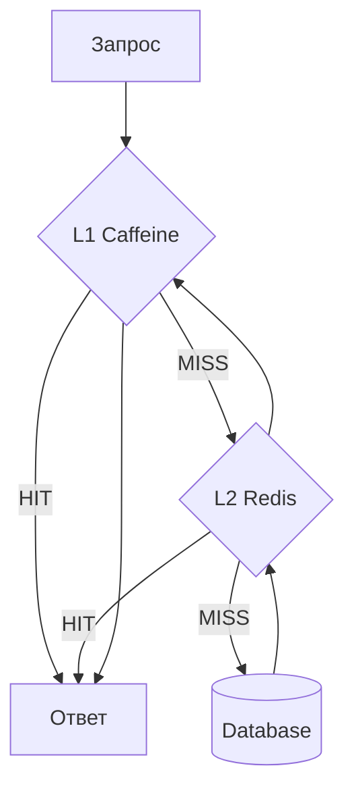


> [!mcq]
> - [ ] Кэш всегда даёт сильную консистентность | Кэш предполагает trade-off со staleness через `TTL` или event-driven инвалидацию. ❌ ПОСЛЕДСТВИЕ: финансовый дашборд кэшировал баланс на 5 минут — клиент видит остаток до списания, делает второй платёж и уходит в овердрафт.
> - [x] Снижает нагрузку на источник и латентность через переиспользование результатов | `Caffeine` (L1) + `Redis` (L2) — `hit ratio` > 80% разгружает БД в разы. ✓ ПРИМЕНЯТЬ: `@Cacheable` на product-catalog в e-commerce — БД получает 1/10 запросов после прогрева. 📋 ПРАВИЛО: «Считаешь повторно — кэшируй». 🔗 См. Q7, Q8, Q38.
> - [ ] Достаточно поставить `@Cacheable` без TTL и инвалидации | Без TTL/eviction кэш выжирает heap → OOM. ❌ ПОСЛЕДСТВИЕ: `@Cacheable("users")` без `expireAfterWrite` — Caffeine растёт до 4GB, OOM через 3 дня после deploy.
> - [ ] Локальный кэш на инстанс при горизонтальном масштабировании работает идентично распределённому | Каждая нода имеет свою копию, инвалидация требует pub/sub. ❌ ПОСЛЕДСТВИЕ: после `UPDATE products` 9 из 10 инстансов держат старую цену в `Caffeine` ещё 5 минут — пользователь видит то старую, то новую цену при F5.

## Q7. Как реализовать двухуровневый кэш в Spring Boot?

Двухуровневый кэш (`L1` — локальный `Caffeine`, `L2` — `Redis`) минимизирует сетевые вызовы и обеспечивает высокий `hit ratio`. `L1` проверяется первым (наносекунды), при промахе — `L2` (миллисекунды), при промахе — источник данных.

```java
@Component
public class TwoLevelCacheManager implements CacheManager {

    private final CaffeineCacheManager l1CacheManager;
    private final RedisCacheManager l2CacheManager;

    public TwoLevelCacheManager(RedisConnectionFactory redisConnectionFactory) {
        // L1: локальный, быстрый, ограниченный размер
        this.l1CacheManager = new CaffeineCacheManager();
        l1CacheManager.setCaffeine(Caffeine.newBuilder()
                .maximumSize(1_000)
                .expireAfterWrite(Duration.ofMinutes(1)));

        // L2: распределённый, больше данных, дольше живёт
        RedisCacheConfiguration redisConfig = RedisCacheConfiguration.defaultCacheConfig()
                .entryTtl(Duration.ofMinutes(10));
        this.l2CacheManager = RedisCacheManager.builder(redisConnectionFactory)
                .cacheDefaults(redisConfig)
                .build();
    }

    @Override
    public Cache getCache(String name) {
        return new TwoLevelCache(
                l1CacheManager.getCache(name),
                l2CacheManager.getCache(name));
    }
    // ...
}
```

При инвалидации нужно очищать оба уровня: `L2` через `Redis`, `L1` через `Redis Pub/Sub` или [Kafka](../messaging/kafka-interview.md), чтобы все инстансы сбросили локальный кэш.


> [!mcq]
> - [ ] Достаточно одного уровня кэша — `Redis` покрывает все запросы | Сетевой round-trip к Redis (1-2 мс) всё равно тяжелее локального обращения. ❌ ПОСЛЕДСТВИЕ: hot-метод `getProductPrice` вызывается 50K/s — каждый поход в Redis по 1 мс съедает 50 vCPU только на сериализацию.
> - [ ] L1 и L2 имеют одинаковый TTL | L1 должен быть короче (минуты), L2 длиннее (десятки минут). ❌ ПОСЛЕДСТВИЕ: TTL в L1 = 1 час и L2 = 1 час → после `evict` в L2 локальные кэши инстансов отдают stale данные ещё час.
> - [x] L1 (`Caffeine`, наносекунды) первым, при miss → L2 (`Redis`, мс), при miss — БД | Двухуровневый снижает round-trip к Redis для самых горячих ключей. ✓ ПРИМЕНЯТЬ: каталог товаров Wildberries — Caffeine на 1K SKU + Redis на 100K SKU. 📋 ПРАВИЛО: «Лесенка: память — Redis — БД». 🔗 См. Q6, Q8.
> - [ ] При write нужно обновлять только L2 | Без инвалидации L1 на всех инстансах локальные кэши держат stale до своего TTL. ❌ ПОСЛЕДСТВИЕ: пользователь сменил аватар, обновили Redis — но 8 из 10 подов показывают старый ещё 5 минут, потому что нет Redis Pub/Sub.

## Q8. Какие стратегии инвалидации кэша существуют?

| Стратегия | Описание | Плюсы | Минусы |
|-----------|----------|-------|--------|
| **TTL** | Запись истекает через фиксированное время | Простота | Stale data до истечения |
| **Write-through** | Запись обновляет кэш синхронно | Консистентность | Увеличивает latency записи |
| **Write-behind** | Запись обновляет кэш, БД — асинхронно | Быстрая запись | Риск потери данных |
| **Event-driven** | Кэш инвалидируется по событию | Гибкость | Сложность реализации |
| **Cache-aside** | Приложение явно управляет кэшем | Контроль | Бойлерплейт |

В масштабируемой системе `event-driven` инвалидация через [Kafka](../messaging/kafka-interview.md) — самый надёжный способ: при изменении данных публикуется событие, все инстансы-подписчики инвалидируют свой локальный кэш.


> [!mcq]
> - [ ] `Cache-Aside` без TTL даёт самую сильную консистентность | Без TTL устаревшие данные живут вечно, пока приложение явно не вытолкнет. ❌ ПОСЛЕДСТВИЕ: `@CacheEvict` забыли в `updateUser` — пользователь меняет email, но дашборд показывает старый бесконечно.
> - [ ] `Write-Through` всегда быстрее `Write-Behind` | Наоборот: `Write-Through` синхронен и медленнее `Write-Behind`. ❌ ПОСЛЕДСТВИЕ: критичный счётчик переключили на `Write-Through` без замера — `latency` POST вырос с 5 мс до 80 мс из-за двойной записи.
> - [ ] Только `TTL` гарантирует свежесть в распределённом кэше | TTL = «грязные данные до X минут», для критичных полей нужен event-driven invalidate. ❌ ПОСЛЕДСТВИЕ: цена товара кэширована на 10 минут — после акции старая цена отдаётся ещё 10 минут, продавец списывает разницу с маржи.
> - [x] Event-driven через `Kafka`/`Redis Pub/Sub` — самый надёжный для распределённых кэшей | Изменение → событие → все инстансы инвалидируют локальный кэш и L2. ✓ ПРИМЕНЯТЬ: `Debezium` ловит изменения в PostgreSQL, шлёт `cache-invalidate` в Kafka, все воркеры сбрасывают Caffeine. 📋 ПРАВИЛО: «Меняешь данные — публикуй событие». 🔗 См. Q6, Q7, Q38.

## Q9. (!) Что такое шардирование и когда его применять?

Шардирование — горизонтальное разделение данных по ключу между несколькими узлами (БД, топики [Kafka](../messaging/kafka-interview.md)). Применяют при росте объёма данных, когда один узел не справляется.

Ключ шардирования определяет, на какой шард попадёт запись; важно равномерное распределение и отсутствие «горячих» шардов. В БД шардирование часто делают по доменному ключу (`user_id`, `tenant_id`); в `Kafka` ключ сообщения определяет партицию.

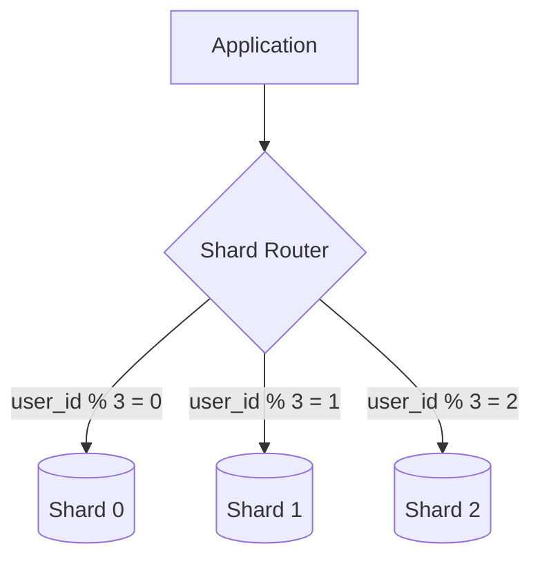

**Пример — маршрутизация по шарду в `Spring`:**

```java
public class ShardRoutingDataSource extends AbstractRoutingDataSource {

    @Override
    protected Object determineCurrentLookupKey() {
        Long userId = ShardContext.getCurrentUserId();
        int shardIndex = (int) (userId % getNumberOfShards());
        return "shard_" + shardIndex;
    }
}

// Использование
@Service
public class UserService {

    public User getUser(Long userId) {
        ShardContext.setCurrentUserId(userId);
        try {
            return userRepository.findById(userId).orElseThrow();
        } finally {
            ShardContext.clear();
        }
    }
}
```


> [!mcq]
> - [x] Горизонтальное разделение данных по ключу между узлами с роутингом по shard key | Применяют когда один primary упёрся в железо, а индексы и кэш уже выжаты. ✓ ПРИМЕНЯТЬ: Discord перешёл с Cassandra на ScyllaDB с шардингом по `channel_id`; Instagram шардирует по `user_id`. 📋 ПРАВИЛО: «Сначала индексы, потом реплики, в конце шарды». 🔗 См. Q10, Q11, Q33.
> - [ ] Шардирование решает любую проблему производительности БД | Сначала индексы, кэш, реплики — шардинг последний из-за сложности. ❌ ПОСЛЕДСТВИЕ: команда сразу пошла в шардинг при write-RPS 200 — потратили 4 месяца на инфраструктуру, а проблема решалась `CREATE INDEX`.
> - [ ] Range sharding по `created_at` распределяет нагрузку равномерно | Range по монотонно растущему ключу даёт горячий шард на «сегодня». ❌ ПОСЛЕДСТВИЕ: range-sharding orders по `created_at` — весь write-traffic в один shard, остальные простаивают; миграция на hash потребовала double-write окно в 2 недели.
> - [ ] После шардинга можно делать обычные `JOIN` между шардами | Cross-shard JOIN либо невозможен, либо требует scatter-gather. ❌ ПОСЛЕДСТВИЕ: «простой» отчёт с JOIN по 8 шардам выполняется 45 секунд под нагрузкой и валит весь сервис аналитики.

## Q10. Что такое «горячая партиция» / «горячий шард» и как избежать?

**Горячая партиция (шард)** — партиция или шард с непропорционально высокой нагрузкой (например, один ключ генерирует большую часть трафика).

Решения:
- Пересмотреть ключ шардирования
- Добавить соль (`random suffix`) в ключ для распределения
- Кэшировать горячие данные
- Разделить горячий ключ на несколько логических партиций

**Практика в `Kafka`:** один ключ всегда попадает в одну партицию — если один `user_id` генерирует 80% событий, одна партиция перегружена. Решения: составной ключ (`userId + "-" + random(0..9)`) для распределения; кэширование обработки; увеличение числа партиций. В БД при шардировании по `user_id` «звезда» с огромной активностью даёт горячий шард — кэш, `read replica` для этого шарда или выделение отдельного шарда.

```java
// Kafka: соль в ключе для распределения горячего пользователя
String key = userId + "-" + ThreadLocalRandom.current().nextInt(10);
kafkaTemplate.send("orders", key, orderEvent);
```


> [!mcq]
> - [ ] Горячий шард решается увеличением CPU на этом узле | Это вертикалка, потолок придёт быстро; нужен пересмотр ключа или salting. ❌ ПОСЛЕДСТВИЕ: апгрейднули один узел Cassandra до 2× CPU — через месяц снова hotspot, остальные 9 узлов на 20% утилизации.
> - [x] Один ключ генерирует непропорционально большую долю трафика, добавляют salt или sub-shards | Solution: `userId + "-" + random(0..9)`, кэш горячих, virtual nodes. ✓ ПРИМЕНЯТЬ: Instagram постит фото знаменитости — salt в Kafka key распределяет по партициям. 📋 ПРАВИЛО: «Звезда едет в 10 партиций, не в одну». 🔗 См. Q9, Q33, Q41.
> - [ ] Hash sharding по `user_id` гарантирует отсутствие hotspot | Один пользователь-знаменитость создаст hotspot даже при идеальном hash. ❌ ПОСЛЕДСТВИЕ: hash-sharding по `user_id` — Илон Маск пишет твит, его шард принимает 80% read-нагрузки; CPU 100%, остальные шарды по 12%.
> - [ ] Hot partition в Kafka исчезает при увеличении числа партиций | Partition выбирается по `hash(key) % N`, тот же key всегда летит в ту же partition. ❌ ПОСЛЕДСТВИЕ: подняли `partitions` с 6 до 24, lag не упал — все события `user-VIP` всё ещё в одну партицию, consumer на ней отстаёт.

## Q11. Чем отличается шардирование от партиционирования таблиц?

| Характеристика | Шардирование | Партиционирование |
|----------------|-------------|-------------------|
| Размещение данных | Разные серверы | Один сервер |
| Масштабирование | Горизонтальное | Вертикальное |
| Транзакции | Распределённые | Локальные |
| Сложность | Высокая | Средняя |
| `JOIN` между частями | Сложный/невозможный | Прозрачный |

**Партиционирование** — разделение таблицы на части внутри одной БД (по диапазону, хэшу, списку). Ускоряет запросы и упрощает обслуживание (удаление старых данных), но не даёт горизонтального масштабирования.

```sql
-- PostgreSQL: партиционирование по диапазону дат
CREATE TABLE orders (
    id BIGINT,
    user_id BIGINT,
    created_at TIMESTAMP,
    total DECIMAL
) PARTITION BY RANGE (created_at);

CREATE TABLE orders_2026_q1 PARTITION OF orders
    FOR VALUES FROM ('2026-01-01') TO ('2026-04-01');
CREATE TABLE orders_2026_q2 PARTITION OF orders
    FOR VALUES FROM ('2026-04-01') TO ('2026-07-01');
```

**Шардирование** — данные физически на разных серверах; нужен роутинг и может понадобиться [согласованность](consistency-patterns-interview.md) между шардами.


> [!mcq]
> - [ ] Это синонимы — оба разделяют таблицу на части | Партиционирование — внутри одного сервера, шардинг — между серверами. ❌ ПОСЛЕДСТВИЕ: миддл рассказал на ревью «мы партиционируем по `user_id`», а в реальности это hash-sharding на 8 серверов; тимлид путает терминологию в обсуждениях с DBA.
> - [ ] Партиционирование даёт горизонтальное масштабирование как и шардинг | Партиционирование внутри одного узла, не масштабирует write. ❌ ПОСЛЕДСТВИЕ: команда «масштабировала» PostgreSQL через `PARTITION BY RANGE`, узел всё равно один — write-RPS не вырос, но удаление старых данных стало быстрым.
> - [x] Партиционирование — части таблицы внутри одного сервера; шардинг — данные на разных серверах | Партиции дают быстрые запросы по диапазону и `DROP PARTITION`, но не масштабирование. ✓ ПРИМЕНЯТЬ: PostgreSQL `PARTITION BY RANGE (created_at)` для `orders` — `DROP PARTITION orders_2024_q1` без `DELETE`. 📋 ПРАВИЛО: «Партиции — внутри узла, шарды — между узлами». 🔗 См. Q9, Q10.
> - [ ] При партиционировании JOIN между частями невозможен, при шардинге — прозрачный | Перевёрнуто: партиции внутри одной БД, JOIN прозрачный; cross-shard JOIN сложен. ❌ ПОСЛЕДСТВИЕ: архитектор спроектировал систему предполагая, что cross-shard JOIN «как-то работает», через год переписали аналитику на batch-ETL в DWH.

## Q12. (!) Как асинхронность и очереди помогают масштабированию?

Синхронный запрос блокирует поток до ответа; при пиках все потоки заняты и `latency` растёт. Асинхронная обработка: `API` принимает запрос, ставит задачу в очередь ([Kafka](../messaging/kafka-interview.md), `RabbitMQ`) и сразу отвечает; воркеры обрабатывают очередь параллельно.

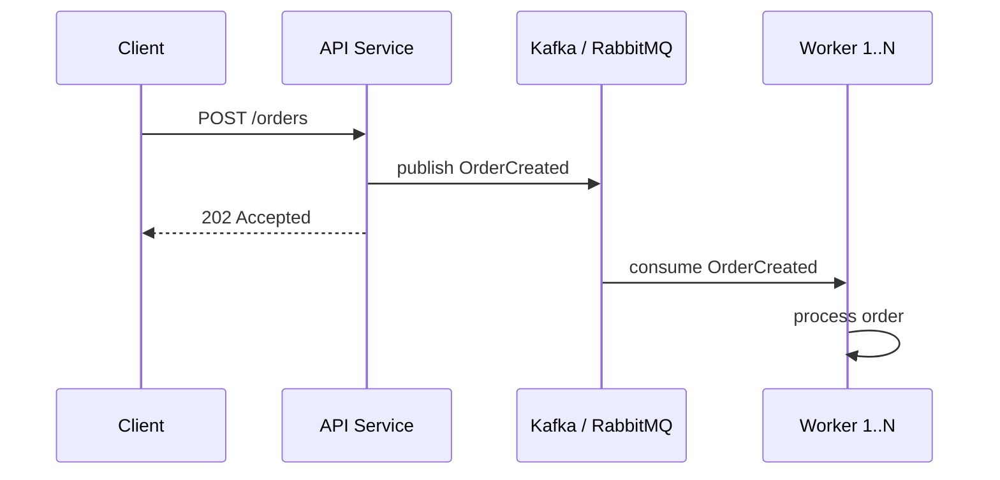

Нагрузка сглаживается; можно масштабировать воркеров независимо от числа клиентов. Очередь выступает буфером между продюсерами и потребителями.

```java
// Асинхронная отправка заказа в Kafka
@RestController
@RequiredArgsConstructor
public class OrderController {

    private final KafkaTemplate<String, OrderEvent> kafkaTemplate;

    @PostMapping("/orders")
    public ResponseEntity<Void> createOrder(@RequestBody OrderRequest request) {
        OrderEvent event = new OrderEvent(request.getUserId(), request.getItems());
        kafkaTemplate.send("orders", request.getUserId().toString(), event);
        return ResponseEntity.accepted().build();
    }
}
```


> [!mcq]
> - [ ] Очередь убирает зависимость от потребителя — продюсер всегда быстрый | Без backpressure очередь растёт бесконечно, OOM или потери. ❌ ПОСЛЕДСТВИЕ: producer пишет 10K msg/s, consumer обрабатывает 1K — Kafka lag растёт на миллион в час, через сутки disk full на брокерах.
> - [ ] Async = всегда быстрее, чем sync | За счёт latency end-to-end: клиент получает ack, но обработка идёт дольше. ❌ ПОСЛЕДСТВИЕ: команда сделала платежи async «для скорости» — клиент видит «оплачено», но реально деньги не списались 30 минут из-за роста lag.
> - [ ] Очередь даёт идемпотентность бесплатно | Идемпотентность — отдельная задача (Idempotency-Key, dedup). ❌ ПОСЛЕДСТВИЕ: retry в Kafka producer без `enable.idempotence=true` — дубликаты заказов; клиент получает 2 одинаковых счёта.
> - [x] API ставит задачу в очередь и сразу отвечает 202, воркеры обрабатывают параллельно | Очередь сглаживает пики, продюсеры и воркеры масштабируются независимо. ✓ ПРИМЕНЯТЬ: order-service Wolt принимает заказ → Kafka `orders` → 50 воркеров готовят payment+inventory параллельно. 📋 ПРАВИЛО: «Принял быстро, обработал по силам». 🔗 См. Q13, Q14, Q17.

## Q13. Что такое backpressure и зачем он нужен?

**Backpressure** — механизм, при котором быстрый производитель замедляется при переполнении потребителя. Без `backpressure` очередь растёт бесконечно и возможна потеря сообщений или `OOM`.

Реализации:
- **Reactive Streams** (`Reactor`, `RxJava`) — подписчик запрашивает `request(n)` элементов
- **Kafka** — потребитель не fetch'ит следующую партию, пока не обработал текущую; `lag` растёт
- **HTTP** — сервис возвращает `429 Too Many Requests` или замедляет (rate limiting)

```java
// Reactor: backpressure с ограниченным буфером
Flux.range(1, 10_000)
    .onBackpressureBuffer(256)   // буфер 256 элементов
    .publishOn(Schedulers.boundedElastic())
    .subscribe(item -> {
        // Медленная обработка
        processItem(item);
    });
```

В [Kafka](../messaging/kafka-interview.md) `backpressure` косвенный: мониторинг `consumer lag` триггерит алерт или автоскейлинг воркеров через `KEDA`.


> [!mcq]
> - [ ] Backpressure нужен только в реактивных приложениях | В Kafka это natural — consumer не fetch'ит, пока не обработает; в HTTP — `429`. ❌ ПОСЛЕДСТВИЕ: команда взяла Spring MVC «потому что не нужен backpressure», под пиком все потоки Tomcat в `wait`, новые запросы падают по таймауту.
> - [ ] `onBackpressureBuffer` без лимита решает проблему | Без `maxSize` буфер растёт до OOM — это не backpressure, а отложенный отказ. ❌ ПОСЛЕДСТВИЕ: `Flux.onBackpressureBuffer()` без аргумента — heap растёт 200MB/мин под пиком, OOM через 40 минут после старта rush hour.
> - [ ] Backpressure = потеря сообщений | Backpressure именно предотвращает потери, замедляя продюсера. ❌ ПОСЛЕДСТВИЕ: `onBackpressureDrop` молча выкидывает события — клиентский счётчик показывает 100K заказов, в БД попало 60K, через сутки находим в логах.
> - [x] Механизм замедления продюсера при переполнении потребителя через `request(n)` или `429` | `Reactor` возвращает токены, Kafka growth lag, HTTP отдаёт 429. ✓ ПРИМЕНЯТЬ: `KEDA` мониторит Kafka `consumer lag`, при росте триггерит автоскейлинг воркеров. 📋 ПРАВИЛО: «Слабый говорит — сильный ждёт». 🔗 См. Q12, Q14, Q19.

## Q14. Как масштабировать обработку очередей (Kafka, RabbitMQ)?

Подходы:
1. Увеличить число партиций (`Kafka`) или воркеров (`RabbitMQ`)
2. Масштабировать потребителей по числу партиций (в `Kafka` — один потребитель на партицию в группе)
3. Оптимизировать обработку одного сообщения (батчи, асинхронность)
4. Мониторить `lag` и длину очереди
5. При необходимости — шардировать топики по доменам

В `Kafka` число потребителей в `consumer group` не должно превышать число партиций топика — лишние потребители будут простаивать. При росте `lag` увеличивают число партиций (с перебалансировкой) или оптимизируют скорость обработки.

```java
// Spring Kafka: конкурентная обработка
@Configuration
public class KafkaConsumerConfig {

    @Bean
    public ConcurrentKafkaListenerContainerFactory<String, OrderEvent>
            kafkaListenerContainerFactory(ConsumerFactory<String, OrderEvent> cf) {
        var factory = new ConcurrentKafkaListenerContainerFactory<String, OrderEvent>();
        factory.setConsumerFactory(cf);
        factory.setConcurrency(8); // 8 потоков = 8 партиций
        factory.setBatchListener(true); // батч-обработка
        return factory;
    }
}

@KafkaListener(topics = "orders", groupId = "order-processor")
public void processOrders(List<OrderEvent> events) {
    events.forEach(this::processOrder);
}
```


> [!mcq]
> - [x] Воркеры в `consumer group` ≤ числа партиций; lag → автоскейл через `KEDA` | Лишние воркеры простаивают, нужно увеличивать партиции и concurrency. ✓ ПРИМЕНЯТЬ: `ConcurrentKafkaListenerContainerFactory.setConcurrency(8)` для 8 партиций topic-orders. 📋 ПРАВИЛО: «Один консьюмер — одна партиция, лишние спят». 🔗 См. Q12, Q13.
> - [ ] Можно ставить consumer'ов в `group` больше, чем партиций | Лишние воркеры в group rebalance стоят без работы. ❌ ПОСЛЕДСТВИЕ: 20 подов consumer на 6 партиций — 14 простаивают, lag всё равно растёт; счёт за `K8s` за зря, latency не улучшилась.
> - [ ] Достаточно поднять `concurrency` в Spring Kafka до числа CPU | `concurrency` ограничен числом партиций topic'а. ❌ ПОСЛЕДСТВИЕ: `setConcurrency(16)` на topic с 4 партициями — реально работают 4 потока, 12 в `idle`; разработчик не понимает почему throughput не вырос.
> - [ ] Увеличение партиций rebalance делается без downtime автоматически | Rebalance триггерит остановку всех consumer на секунды; `keys` распределяются заново. ❌ ПОСЛЕДСТВИЕ: на проде увеличили партиции с 12 до 24 в час пик — все consumer остановились на 8 секунд для rebalance, lag вырос до миллиона.

## Q15. (!) Что такое read replica и как это помогает масштабировать чтение?

`Read replica` — реплика БД только для чтения; запись идёт в `primary`, реплики синхронизируются асинхронно. Нагрузка чтения распределяется по репликам; `primary` разгружается.

Ограничение: `eventual consistency` для чтения — реплики могут отставать. Подробнее о моделях консистентности — в [паттернах согласованности](consistency-patterns-interview.md).

**Пример — маршрутизация read/write в `Spring`:**

```java
public class ReadWriteRoutingDataSource extends AbstractRoutingDataSource {

    @Override
    protected Object determineCurrentLookupKey() {
        return TransactionSynchronizationManager.isCurrentTransactionReadOnly()
                ? DataSourceType.REPLICA
                : DataSourceType.PRIMARY;
    }
}

@Service
public class OrderService {

    @Transactional(readOnly = true) // → replica
    public List<Order> getOrdersByUser(Long userId) {
        return orderRepository.findByUserId(userId);
    }

    @Transactional // → primary
    public Order createOrder(Order order) {
        return orderRepository.save(order);
    }
}
```

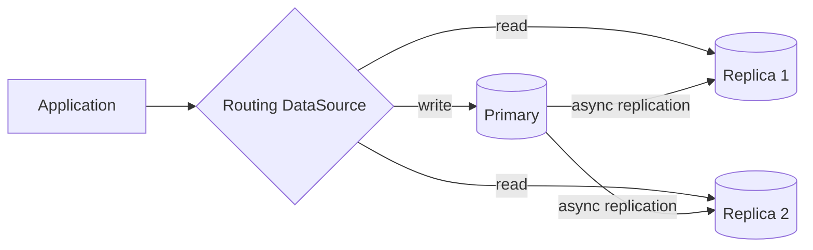


> [!mcq]
> - [ ] Read replica поддерживает strong consistency для чтения | Реплика асинхронна — `replication lag` 50ms-5s, чтение видит stale. ❌ ПОСЛЕДСТВИЕ: read replica с lag 5s — финдиректор открывает дашборд сразу после транзакции, видит старый баланс и инициирует второй платёж.
> - [x] Реплика только для чтения, асинхронная репликация — `eventual consistency` для read | `@Transactional(readOnly=true)` маршрутизирует на replica через `AbstractRoutingDataSource`. ✓ ПРИМЕНЯТЬ: AWS Aurora с 5 read-replicas; Spring Cloud `LoadBalancerClient` балансирует чтение между ними. 📋 ПРАВИЛО: «Чтение — на реплику, запись — в primary». 🔗 См. Q16, Q17, Q27.
> - [ ] Read replica помогает масштабировать запись | Запись только в primary; реплики — для read. ❌ ПОСЛЕДСТВИЕ: команда добавила 3 read replica «для масштабирования» — write-RPS не вырос, primary всё равно bottleneck, проблема не решена.
> - [ ] Чтение свежезаписанной строки на реплике безопасно | После `INSERT` чтение по той же реплике может вернуть «not found» из-за lag. ❌ ПОСЛЕДСТВИЕ: создал заказ → читает с replica → 404 → клиент F5 → дубль; flow `read-after-write` должен идти на primary или ждать sync.

## Q16. (!) Что такое CQRS в контексте масштабирования?

**CQRS** (`Command Query Responsibility Segregation`) — разделение модели на запись (`command`) и чтение (`query`). Write-модель оптимизирована для транзакций; read-модель — для запросов (денормализованные проекции, индексы).

Чтение и запись масштабируются независимо; можно иметь много `read replicas` или отдельные хранилища под типы запросов.

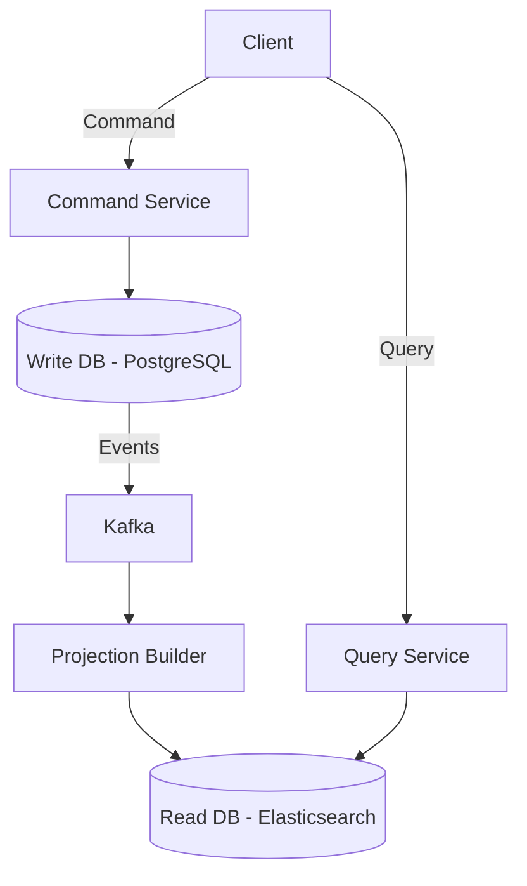

**Пример — `CQRS` со `Spring Modulith`:**

```java
// Command side
@Service
@RequiredArgsConstructor
public class OrderCommandService {

    private final OrderRepository repository;
    private final ApplicationEventPublisher events;

    @Transactional
    public Long createOrder(CreateOrderCommand cmd) {
        Order order = Order.create(cmd.userId(), cmd.items());
        repository.save(order);
        events.publishEvent(new OrderCreatedEvent(order.getId(), order.getUserId()));
        return order.getId();
    }
}

// Query side — отдельная модель, возможно другое хранилище
@Service
@RequiredArgsConstructor
public class OrderQueryService {

    private final OrderProjectionRepository projections;

    @Transactional(readOnly = true)
    public List<OrderSummary> getUserOrders(Long userId) {
        return projections.findByUserId(userId);
    }
}

// Event handler — строит read-проекцию
@Component
public class OrderProjectionUpdater {

    @EventListener
    public void on(OrderCreatedEvent event) {
        // Обновляет денормализованную проекцию для быстрого чтения
        projections.upsert(new OrderSummary(event.orderId(), event.userId(), ...));
    }
}
```

Минусы `CQRS`: `eventual consistency` между write и read моделями; сложность поддержки двух моделей и проекций.


> [!mcq]
> - [ ] CQRS — это синоним read-replica | Read-replica использует ту же модель; CQRS вводит отдельные read/write модели и хранилища. ❌ ПОСЛЕДСТВИЕ: «мы используем CQRS» — а реально просто `@Transactional(readOnly=true)` на replica; на ревью архитектор спрашивает про event-driven projections, ответа нет.
> - [ ] CQRS даёт strong consistency между write и read | Между write и read моделью — `eventual consistency` через события. ❌ ПОСЛЕДСТВИЕ: пользователь видит «заказ создан» в UI, через 200ms открывает «мои заказы» — пусто, потому что projection ещё не обновилась.
> - [x] Разделение модели на write (`commands`) и read (`queries`) с независимым масштабированием | Write — нормализованная PostgreSQL; read — денормализованные проекции в Elasticsearch. ✓ ПРИМЕНЯТЬ: Booking.com — write-модель резерваций в PostgreSQL, read-модель карточки отеля в Elasticsearch через Kafka events. 📋 ПРАВИЛО: «Пишем нормализованно, читаем денормализованно». 🔗 См. Q15, Q17.
> - [ ] CQRS обязателен для любых микросервисов | CQRS оправдан при большой разнице read:write ratio (10:1+) и сложных read-сценариях. ❌ ПОСЛЕДСТВИЕ: команда внедрила CQRS на CRUD-сервисе с 100 RPS — два хранилища, projection-баги, время фичи x3, выгоды нет.

## Q17. Как масштабировать запись (write scaling)?

Запись сложнее масштабировать, чем чтение: один `primary` для записи, реплики — только для чтения.

Подходы:
1. **Шардирование** по ключу — несколько шардов, каждый со своим `primary`
2. **Партиционирование таблиц** — по диапазону или хэшу
3. **Асинхронная запись** — очередь + воркеры, сглаживание пиков
4. **CQRS** с отдельной write-моделью и событийной синхронизацией
5. **Батчирование** — группировка записей для снижения числа транзакций

При шардировании записи каждый шард принимает только своё подмножество ключей; важно равномерное распределение. Асинхронная запись через очередь позволяет сгладить пики и масштабировать воркеров независимо.


> [!mcq]
> - [ ] Read-replicas масштабируют запись | Replica — только read; write всегда в primary. ❌ ПОСЛЕДСТВИЕ: на собеседовании middle сказал «добавим 5 read-replica для масштабирования заказов» — write всё равно ограничен одним primary, нагрузка не уйдёт.
> - [ ] `INSERT` в одной транзакции с 1000 строк всегда быстрее, чем 1000 одиночных | Большая транзакция держит блокировки, рост lock contention под нагрузкой. ❌ ПОСЛЕДСТВИЕ: bulk-insert на 100K строк блокирует таблицу 30 секунд, OLTP-транзакции встают в очередь и таймаутят.
> - [ ] Шардинг — единственный способ масштабировать write | Сначала пробуют батчирование, async через очередь и партиционирование. ❌ ПОСЛЕДСТВИЕ: сразу пошли в шардинг при write-RPS 500 — задержали launch фичи на 6 месяцев, можно было решить батчем + индексом.
> - [x] Шардинг по ключу + async через `Kafka` + батчирование снижают write-bottleneck | Каждый shard принимает своё подмножество, воркеры группируют записи. ✓ ПРИМЕНЯТЬ: LinkedIn Kafka-based ingestion → batch insert в Cassandra по shard key `member_id`. 📋 ПРАВИЛО: «Распредели, отложи, сгруппируй». 🔗 См. Q9, Q12, Q16.

## Q18. (!) Что такое circuit breaker и как он связан с масштабируемостью?

**Circuit breaker** — паттерн: при множестве ошибок вызова сервиса «размыкает цепь» и перестаёт вызывать сервис на время. Снижает каскадные сбои и нагрузку на падающий сервис.

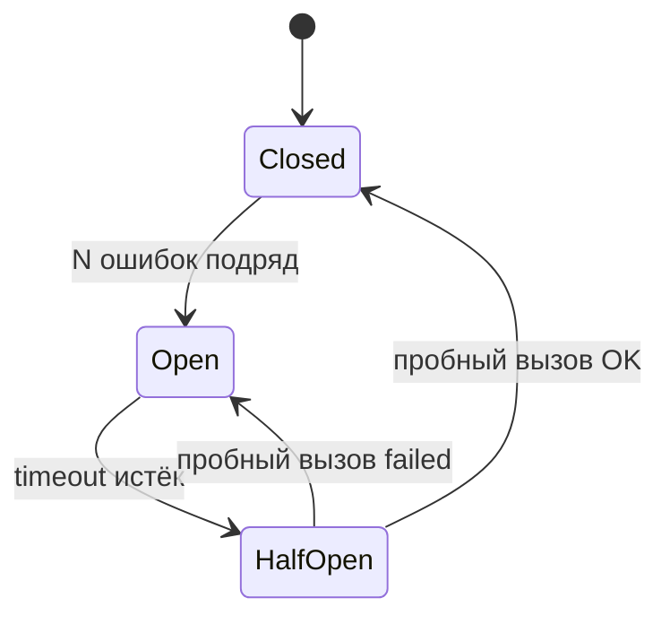

При масштабировании без `circuit breaker` сотни потоков ждут ответа от падающего сервиса; с `circuit breaker` — быстрый отказ, потоки освобождаются, падающий сервис перестаёт получать нагрузку и может восстановиться.

**Пример — `Resilience4j` с аннотациями `Spring Boot`:**

```java
@Service
public class PaymentService {

    @CircuitBreaker(name = "paymentGateway", fallbackMethod = "fallbackPayment")
    @Retry(name = "paymentGateway", fallbackMethod = "fallbackPayment")
    public PaymentResult processPayment(PaymentRequest request) {
        return paymentGatewayClient.charge(request);
    }

    private PaymentResult fallbackPayment(PaymentRequest request, Throwable t) {
        log.warn("Payment gateway unavailable, queuing for retry: {}", t.getMessage());
        paymentRetryQueue.enqueue(request);
        return PaymentResult.pending();
    }
}
```

```yaml
# application.yml
resilience4j:
  circuitbreaker:
    instances:
      paymentGateway:
        failure-rate-threshold: 50
        wait-duration-in-open-state: 30s
        sliding-window-size: 10
        permitted-number-of-calls-in-half-open-state: 3
  retry:
    instances:
      paymentGateway:
        max-attempts: 3
        wait-duration: 500ms
```


> [!mcq]
> - [x] При N ошибок «размыкается», запросы падают мгновенно вместо ожидания таймаута | Снижает каскадные сбои, освобождает thread pool, даёт упавшему сервису восстановиться. ✓ ПРИМЕНЯТЬ: Netflix Hystrix → Resilience4j `@CircuitBreaker(name="paymentGateway")` с `failure-rate-threshold: 50`. 📋 ПРАВИЛО: «Сломалось — отключи, дай отдышаться». 🔗 См. Q20, Q21.
> - [ ] Circuit breaker увеличивает доступность падающего сервиса | Он защищает вызывающего, упавший сервис ничего не получает — это хорошо для recovery. ❌ ПОСЛЕДСТВИЕ: «настроили circuit breaker — почему сервис всё равно падает?»; CB защищает caller, для callee нужен auto-restart, scale-out, fix.
> - [ ] CB полезен только для внешних API | Между микросервисами — обязателен, иначе один медленный сервис валит всю систему. ❌ ПОСЛЕДСТВИЕ: order-service вызывает inventory-service без CB — inventory ушёл в GC pause на 10s, все 200 потоков order ждут, запросы пользователей висят.
> - [ ] CB заменяет retry и timeout | Это разные паттерны, работают в связке: timeout → retry → CB. ❌ ПОСЛЕДСТВИЕ: только CB без timeout — поток ждёт 60 секунд первого ответа, CB не срабатывает потому что нет «ошибки», thread pool исчерпан.

## Q19. (!) Что такое rate limiting и как он помогает при масштабировании?

**Rate limiting** — ограничение частоты запросов от клиента или по `API`. Защищает от перегрузки при всплесках и злоупотреблениях; позволяет гарантировать `SLO` для части трафика.

Алгоритмы:
- **Token Bucket** — бакет пополняется с фиксированной скоростью; запрос забирает токен; при пустом бакете — `429`
- **Sliding Window** — считаются запросы за последние N секунд
- **Fixed Window** — лимит на фиксированный интервал (минута, секунда)

**Пример — `Bucket4j` в `Spring Boot`:**

```java
@Component
public class RateLimitFilter extends OncePerRequestFilter {

    private final Map<String, Bucket> buckets = new ConcurrentHashMap<>();

    @Override
    protected void doFilterInternal(HttpServletRequest request,
                                     HttpServletResponse response,
                                     FilterChain chain) throws ServletException, IOException {
        String clientId = request.getRemoteAddr();
        Bucket bucket = buckets.computeIfAbsent(clientId, this::createBucket);

        if (bucket.tryConsume(1)) {
            chain.doFilter(request, response);
        } else {
            response.setStatus(HttpStatus.TOO_MANY_REQUESTS.value());
            response.getWriter().write("Rate limit exceeded");
        }
    }

    private Bucket createBucket(String clientId) {
        return Bucket.builder()
                .addLimit(Bandwidth.classic(100, Refill.intervally(100, Duration.ofMinutes(1))))
                .build();
    }
}
```

При масштабировании шлюза rate limiting может быть **локальным** (на инстанс) или **распределённым** (`Redis`) для единого лимита на клиента across инстансов. Распределённый лимит в `Redis`: все инстансы шлюза обращаются к одному `Redis`, лимит общий — при масштабировании шлюза лимит на клиента не умножается.


> [!mcq]
> - [ ] Локальный rate-limit `Bucket4j` на инстанс — единственное правильное решение | Локальный лимит умножается на число инстансов, общий клиентский лимит размывается. ❌ ПОСЛЕДСТВИЕ: лимит 100 RPS per client локально × 10 инстансов API = клиент реально получает 1000 RPS, защита от brute-force не работает.
> - [x] Распределённый лимит в `Redis` через `Bucket4j` или `Lua-INCR` — общий для всех инстансов | При масштабировании gateway лимит на клиента не умножается. ✓ ПРИМЕНЯТЬ: Kong/Nginx + Redis для rate-limit; Spring Cloud Gateway с `RedisRateLimiter` для public API. 📋 ПРАВИЛО: «Лимит — в общем хранилище, не на ноде». 🔗 См. Q18, Q20.
> - [ ] Rate-limit нужен только для защиты от DDoS | Также защищает internal-сервисы от случайного клиента-разогнавшейся batch-job. ❌ ПОСЛЕДСТВИЕ: внутренний batch-импорт без rate-limit пошёл в order-API на 50K RPS — положил production, хотя «своих не били».
> - [ ] Возврат `429` достаточно — клиент сам разберётся | Без `Retry-After` header клиенты ретраят немедленно, эффект DDoS на свой же сервис. ❌ ПОСЛЕДСТВИЕ: клиент получает `429`, retry без backoff каждые 10 мс — нагрузка на gateway растёт вместо падения.

## Q20. Что такое bulkhead pattern и как он предотвращает каскадные сбои?

**Bulkhead** (переборка) — изоляция ресурсов для разных потребителей или операций, чтобы сбой одного не повлиял на остальные. По аналогии с водонепроницаемыми переборками корабля.

Типы:
- **Thread pool bulkhead** — отдельный пул потоков для каждого внешнего вызова
- **Semaphore bulkhead** — ограничение количества параллельных вызовов

```java
@Service
public class IntegrationService {

    @Bulkhead(name = "inventoryService", type = Bulkhead.Type.THREADPOOL)
    public CompletableFuture<InventoryResponse> checkInventory(String sku) {
        return CompletableFuture.supplyAsync(() ->
                inventoryClient.check(sku));
    }

    @Bulkhead(name = "pricingService", type = Bulkhead.Type.SEMAPHORE)
    public PriceResponse getPrice(String sku) {
        return pricingClient.getPrice(sku);
    }
}
```

```yaml
resilience4j:
  bulkhead:
    instances:
      pricingService:
        max-concurrent-calls: 20
        max-wait-duration: 500ms
  thread-pool-bulkhead:
    instances:
      inventoryService:
        max-thread-pool-size: 10
        core-thread-pool-size: 5
        queue-capacity: 50
```

Без `bulkhead` медленный внешний сервис может исчерпать все потоки приложения, блокируя и здоровые эндпоинты.


> [!mcq]
> - [ ] Bulkhead — то же самое, что circuit breaker | CB останавливает вызовы при ошибках, bulkhead изолирует ресурсы. ❌ ПОСЛЕДСТВИЕ: разработчик «защитился» только CB на pricing-API — медленный inventory-API всё равно съел все 200 потоков Tomcat, остановил весь сервис.
> - [ ] Один общий thread-pool на все внешние вызовы — best practice | Один пул = bulkhead отсутствует, медленный сервис исчерпает все потоки. ❌ ПОСЛЕДСТВИЕ: общий `ExecutorService` на 200 потоков, один внешний API замедлился до 5s — все 200 потоков зависли там, остальные эндпоинты возвращают 503.
> - [x] Изоляция ресурсов: отдельный thread-pool/semaphore на каждый внешний вызов | Медленный inventory-сервис не съест потоки pricing-сервиса. ✓ ПРИМЕНЯТЬ: `@Bulkhead(name="inventoryService", type=THREADPOOL)` Resilience4j; `@Bulkhead(name="pricingService", type=SEMAPHORE)`. 📋 ПРАВИЛО: «Каждый внешний вызов — в свой отсек». 🔗 См. Q18, Q21.
> - [ ] Bulkhead снижает throughput | Правильно настроенный bulkhead не снижает throughput здоровых вызовов, только изолирует больные. ❌ ПОСЛЕДСТВИЕ: «не используем bulkhead — он медленный» — при первой деградации одного API весь сервис ложится; throughput здоровых endpoint = 0.

## Q21. Как таймауты и retry-стратегии влияют на масштабируемость?

Неправильные таймауты — частая причина каскадных сбоев при масштабировании:

- **Слишком длинные** — потоки блокируются, пул исчерпывается, новые запросы стоят в очереди
- **Слишком короткие** — ложные ошибки при нормальной нагрузке
- **Retry без backoff** — «retry storm» усиливает нагрузку на и без того перегруженный сервис

**Правила для масштабируемых систем:**
1. Устанавливать таймауты на каждый внешний вызов
2. Retry с **exponential backoff** и **jitter**
3. Ограничивать число retry (обычно 2-3)
4. Комбинировать с `circuit breaker`

```java
@Configuration
public class RestClientConfig {

    @Bean
    public RestTemplate restTemplate() {
        var factory = new SimpleClientHttpRequestFactory();
        factory.setConnectTimeout(Duration.ofSeconds(2));
        factory.setReadTimeout(Duration.ofSeconds(5));
        return new RestTemplate(factory);
    }
}
```

```yaml
resilience4j:
  retry:
    instances:
      externalApi:
        max-attempts: 3
        wait-duration: 500ms
        enable-exponential-backoff: true
        exponential-backoff-multiplier: 2
        retry-exceptions:
          - java.io.IOException
          - java.net.SocketTimeoutException
```


> [!mcq]
> - [ ] Default-таймаут RestTemplate `0` (бесконечный) — безопасно для прода | Поток ждёт ответа вечно, пул исчерпывается за минуты под пиком. ❌ ПОСЛЕДСТВИЕ: внешний API завис, без `setReadTimeout` все 200 потоков Tomcat в `wait` через 5 минут, новые запросы получают 503.
> - [ ] Retry без backoff агрессивно решает проблемы сети | «Retry storm» — 1000 клиентов одновременно ретраят на падающий сервис, добивая его. ❌ ПОСЛЕДСТВИЕ: AWS partial outage, retry без `enable-exponential-backoff` усилил нагрузку x10 — сервис, который мог восстановиться, окончательно упал.
> - [ ] Чем больше `max-attempts`, тем надёжнее | 10 retry × 5s timeout = 50s ожидания, поток заблокирован, retry storm на peer. ❌ ПОСЛЕДСТВИЕ: `max-attempts: 10` для платежей — пользователь ждёт минуту, успевает закрыть вкладку, deduplication не сработала, дубль платежа.
> - [x] Connect/read timeouts на каждый вызов + retry с exponential backoff + jitter, max 2-3 попытки + CB | Освобождают потоки, размазывают нагрузку, не добивают peer. ✓ ПРИМЕНЯТЬ: Resilience4j `enable-exponential-backoff: true` + `multiplier: 2` + jitter; AWS SDK retry policy. 📋 ПРАВИЛО: «Тайм-аут — обязателен, ретрай — с задержкой и пределом». 🔗 См. Q18, Q20.

## Q22. Как мониторинг связан с масштабируемостью?

Без метрик невозможно понять, где узкое место и когда масштабировать. Подробнее — в [вопросах по observability](../monitoring/observability-interview.md) и [метрикам и трейсингу](../monitoring/metrics-tracing-interview.md).

Необходимые метрики:
- **Ресурсы** — `CPU`, память, диск, сеть
- **Приложение** — `throughput`, `latency` (p50, p95, p99), `error rate`
- **Очереди** — длина, `lag`, скорость обработки
- **SLO** и алерты

В [Kubernetes](../devops/kubernetes-interview.md) `HPA` использует метрики из `Metrics Server` или внешних адаптеров (`Prometheus`); `KEDA` добавляет метрики из очередей ([Kafka](../messaging/kafka-interview.md) `lag`, `RabbitMQ` length). Трассировка (`Jaeger`, `Zipkin`) помогает выявить медленные звенья в цепочке вызовов.

```java
// Spring Boot Actuator + Micrometer — кастомные метрики для автоскейлинга
@Component
@RequiredArgsConstructor
public class OrderMetrics {

    private final MeterRegistry registry;

    public void recordOrderProcessingTime(Duration duration) {
        registry.timer("order.processing.time").record(duration);
    }

    public void incrementOrderCount() {
        registry.counter("order.processed.total").increment();
    }

    public void recordQueueDepth(int depth) {
        registry.gauge("order.queue.depth", depth);
    }
}
```


> [!mcq]
> - [x] Метрики ресурсов + RED (`Rate`, `Errors`, `Duration`) + очереди + SLO кормят HPA/KEDA | Без них scale-решение принимается вслепую или поздно. ✓ ПРИМЕНЯТЬ: `Micrometer` + Prometheus + `KEDA` ScaledObject по `kafka_lag` для автоскейла consumer'ов. 📋 ПРАВИЛО: «Не видишь метрику — не масштабируешь». 🔗 См. Q4, Q24.
> - [ ] Достаточно мониторить только `CPU` и память | Bottleneck часто в connection pool, GC, очередях, внешнем API — `CPU` это не покажет. ❌ ПОСЛЕДСТВИЕ: дашборд показывает CPU 30% и «всё ок», на самом деле HikariCP timeout 1000/min, пользователи получают 500.
> - [ ] Алерты по CPU > 80% — лучшая практика | CPU редко коррелирует с user experience; алерт по p99 latency или error budget burn rate точнее. ❌ ПОСЛЕДСТВИЕ: CPU 50% но p99 = 8s, алерт молчит, пользователи матерятся в support, инцидент находим через час.
> - [ ] Distributed tracing нужен только для отладки, не для scale | Без trace нельзя найти, какой сервис в цепочке нужно масштабировать. ❌ ПОСЛЕДСТВИЕ: latency 5s в order-service — отскейлили order на 3x, но реально медленный inventory; счёт вырос, проблема осталась.

## Q23. Что такое SLO и как он связан с масштабированием?

`SLO` (`Service Level Objective`) — целевой уровень качества сервиса (например, 99.9% доступности, p99 `latency` < 200 ms).

Связь с масштабированием:
- При нарушении `SLO` — триггер для алертов и автоскейлинга
- Кастомные метрики `HPA` / `KEDA` привязаны к `SLO` (масштабировать при p99 > 200 ms)
- Алерты по `SLO` позволяют реагировать до того, как пользователи заметят деградацию

| Метрика | SLO | Действие при нарушении |
|---------|-----|----------------------|
| Доступность | 99.9% | Увеличить реплики, проверить health checks |
| p99 latency | < 200ms | Масштабировать горизонтально, добавить кэш |
| Error rate | < 0.1% | Circuit breaker, fallback, откат деплоя |
| Kafka lag | < 1000 | Добавить воркеров через KEDA |


> [!mcq]
> - [ ] SLO = SLA, термины взаимозаменяемы | SLO — внутренняя цель; SLA — внешний контракт со штрафами; SLI — метрика измерения. ❌ ПОСЛЕДСТВИЕ: команда обсуждает «99.9% SLA» с заказчиком, не понимая что нарушение влечёт штрафы; реально измеряли SLI без `error budget`.
> - [x] Целевой уровень качества (p99 < 200ms, 99.9% uptime), триггер для autoscale и алертов | `KEDA`/HPA масштабируют при нарушении, error budget burn rate триггерит инцидент. ✓ ПРИМЕНЯТЬ: Google SRE — error budget 0.1%/мес = 43 минуты downtime; превышение блокирует release. 📋 ПРАВИЛО: «SLO нарушен — масштабируй или откатись». 🔗 См. Q22, Q24.
> - [ ] SLO должен быть 100% | 100% невозможен и слишком дорог; разумная цель 99.9-99.99% оставляет error budget для деплоев. ❌ ПОСЛЕДСТВИЕ: команда обещала «100% доступность» — любая выкладка нарушает SLA, релизы блокированы; продукт стагнирует.
> - [ ] SLO привязывается только к доступности | SLO покрывает latency, error rate, throughput, freshness данных. ❌ ПОСЛЕДСТВИЕ: SLO «99.9% uptime» не нарушается, но p99 = 10s — пользователи уходят, метрика «всё ок» вводит в заблуждение.

## Q24. Что такое auto-scaling по кастомным метрикам?

**Auto-scaling по кастомным метрикам** — масштабирование подов по метрикам, отличным от `CPU`: `RPS`, `latency`, длина очереди [Kafka](../messaging/kafka-interview.md), число сообщений в `RabbitMQ`.

В [Kubernetes](../devops/kubernetes-interview.md) `HPA` по умолчанию масштабирует по `CPU` и памяти; кастомные метрики подключают через `Prometheus Adapter` или `KEDA`.

**Пример `KEDA ScaledObject` (Kafka lag):**

```yaml
apiVersion: keda.sh/v1alpha1
kind: ScaledObject
metadata:
  name: kafka-consumer-scaler
spec:
  scaleTargetRef:
    name: my-consumer-deployment
  minReplicaCount: 1
  maxReplicaCount: 10
  triggers:
    - type: kafka
      metadata:
        topic: orders
        lagThreshold: "100"
        bootstrapServers: kafka:9092
        consumerGroup: order-processor
```

При `lag` > 100 `KEDA` увеличивает число подов consumer'а; при `lag` = 0 — уменьшает до `minReplicaCount`. Так воркеры очередей масштабируются по реальной нагрузке, а не только по `CPU`.


> [!mcq]
> - [ ] HPA по умолчанию умеет масштабировать по `Kafka lag` | Из коробки только CPU/memory; для очередей нужен `KEDA` или Prometheus Adapter. ❌ ПОСЛЕДСТВИЕ: «настроили HPA по lag» — yaml не валидный, реально работает scale по CPU consumer'а; lag растёт до миллиона, поды не добавляются.
> - [ ] Достаточно одной метрики `RPS` для всех сервисов | Воркеры очередей лучше масштабировать по `lag`, API — по `latency` p99 или `RPS`. ❌ ПОСЛЕДСТВИЕ: consumer на `RPS` метрике — `RPS` 0 (никто не пишет), но lag 10K (накопилось ночью); поды не поднимаются, утром клиенты ждут обработку часами.
> - [x] HPA/KEDA с метриками вне CPU: `Kafka lag`, `RabbitMQ queue length`, `RPS`, `latency` | `KEDA ScaledObject` с `type: kafka` и `lagThreshold: 100`. ✓ ПРИМЕНЯТЬ: KEDA scale to zero для batch-воркеров; Spring Boot Actuator + Prometheus Adapter для custom HPA. 📋 ПРАВИЛО: «Скейль по очереди работы, не по работе процессора». 🔗 См. Q4, Q26.
> - [ ] KEDA и HPA — это одно и то же | KEDA — расширение HPA с поддержкой 50+ источников метрик (Kafka, RabbitMQ, AWS SQS, Redis). ❌ ПОСЛЕДСТВИЕ: разработчик «настроил HPA по Kafka lag» вручную через PromQL — сломалось при обновлении Prometheus, KEDA сделал бы это декларативно.

## Q25. (!) Как проектировать приложение для горизонтального масштабирования с первого дня?

Ключевые принципы:

1. **Stateless** — не хранить состояние в памяти; сессии в [Redis](../databases/redis-interview.md)
2. **Идемпотентность** — повторный вызов даёт тот же результат (важно при retry)
3. **Нет локальных файлов** — использовать `S3`, `MinIO` для хранения
4. **Нет глобальных блокировок** — если нужны, использовать распределённые (`Redis`, `ZooKeeper`)
5. **Пул соединений** — настроить с учётом числа инстансов и лимита БД
6. **Асинхронность** — тяжёлые операции через очереди
7. **Circuit breaker и таймауты** — при вызове внешних сервисов
8. **Health checks** — readiness/liveness для [Kubernetes](../devops/kubernetes-interview.md)

```java
// Идемпотентный API с ключом идемпотентности
@PostMapping("/payments")
public ResponseEntity<PaymentResult> processPayment(
        @RequestHeader("Idempotency-Key") String idempotencyKey,
        @RequestBody PaymentRequest request) {

    // Проверяем: если уже обработано — возвращаем результат
    return paymentRepository.findByIdempotencyKey(idempotencyKey)
            .map(ResponseEntity::ok)
            .orElseGet(() -> {
                PaymentResult result = paymentService.process(request, idempotencyKey);
                return ResponseEntity.status(HttpStatus.CREATED).body(result);
            });
}
```


> [!mcq]
> - [ ] Достаточно настроить HPA — приложение само станет масштабируемым | HPA не починит in-memory state, локальные файлы, неидемпотентные API. ❌ ПОСЛЕДСТВИЕ: подняли HPA на legacy Spring MVC с `HttpSession` — после `scale up` 30% пользователей разлогинены, корзины потеряны.
> - [ ] Идемпотентность нужна только для внешних API | Внутренние тоже: retry в Kafka, K8s restart pod — дубль обработки без `Idempotency-Key`. ❌ ПОСЛЕДСТВИЕ: Kafka redelivery после рестарта consumer — заказ создан дважды, у клиента два списания, manual refund.
> - [ ] Локальные файлы можно использовать с `Persistent Volume` | PV привязывает pod к node, теряется elasticity и `scale to zero`. ❌ ПОСЛЕДСТВИЕ: загрузка файлов в `/data/uploads` с PV — не масштабируется, при отказе ноды pod не запускается, S3 решил бы за день.
> - [x] Stateless + идемпотентность + S3/MinIO + Redis-locks + health-checks + async + CB + готовность к множеству реплик | Каждый принцип решает конкретный failure mode при scale-out. ✓ ПРИМЕНЯТЬ: 12-factor app + `Idempotency-Key` header + `@EnableRedisHttpSession` + `K8s readinessProbe`. 📋 ПРАВИЛО: «Pod — это скот, не любимец». 🔗 См. Q1, Q2, Q15, Q18.

## Q26. Что такое scale to zero и когда его используют?

`Scale to zero` — уменьшение числа инстансов до нуля при отсутствии нагрузки (серверлесс, `Knative`, `KEDA`). Используют для непостоянной нагрузки (batch, редкие запросы) для экономии ресурсов.

Минусы: **холодный старт** (`cold start`) при первом запросе после нуля — для `Spring Boot` может составлять 5-15 секунд; не подходит для постоянной нагрузки с низкой `latency`.

Оптимизации холодного старта:
- `Spring Boot` `CDS` (Class Data Sharing)
- `GraalVM Native Image` — старт за миллисекунды
- `KEDA` с `minReplicaCount: 0` + `cooldownPeriod`

```yaml
# KEDA: scale to zero при отсутствии сообщений в очереди
apiVersion: keda.sh/v1alpha1
kind: ScaledObject
metadata:
  name: batch-processor
spec:
  scaleTargetRef:
    name: batch-worker
  minReplicaCount: 0        # scale to zero
  maxReplicaCount: 20
  cooldownPeriod: 300        # 5 минут без нагрузки → scale to zero
  triggers:
    - type: rabbitmq
      metadata:
        queueName: batch-tasks
        queueLength: "5"
```


> [!mcq]
> - [ ] Scale to zero подходит любому Spring Boot сервису | Холодный старт Spring Boot 5-15 секунд — недопустимо для latency-чувствительных API. ❌ ПОСЛЕДСТВИЕ: API авторизации scale to zero при ночной нагрузке — первый утренний пользователь ждёт 12 секунд старта pod, OTP таймаутит.
> - [x] Уменьшение реплик до 0 при простое; для batch и редких запросов через `KEDA`/`Knative` | Экономит ресурсы, но имеет cold start; решается `GraalVM Native Image` или CDS. ✓ ПРИМЕНЯТЬ: AWS Lambda для редких событий; KEDA `minReplicaCount: 0` для ночных batch-job. 📋 ПРАВИЛО: «Нет нагрузки — нет подов». 🔗 См. Q4, Q24.
> - [ ] Cold start — миф, GraalVM решает за миллисекунды | GraalVM ускоряет, но требует AOT-компиляции, не все библиотеки совместимы. ❌ ПОСЛЕДСТВИЕ: команда переписала на native image без проверки рефлексии — половина библиотек не работает в runtime, баги в проде через неделю.
> - [ ] Scale to zero увеличивает доступность | Наоборот: при первом запросе после простоя cold start добавляет latency. ❌ ПОСЛЕДСТВИЕ: SLO p99 < 200ms, scale to zero включили на API — после 5-минутного простоя p99 = 8 секунд, SLO нарушен.

## Q27. (!) Как масштабировать базу данных?

**Trade-off:** `read replicas` и кэш обычно дают быстрый выигрыш, но для write-heavy сценариев почти всегда приходится переходить к шардированию и пересмотру модели данных.

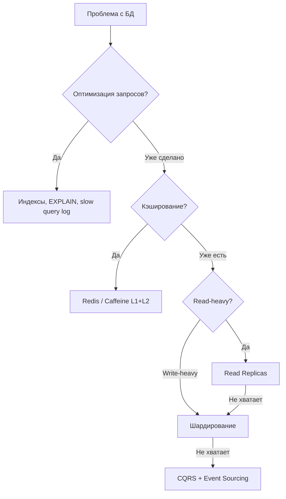

Подходы (в порядке возрастания сложности):
1. **Оптимизация запросов** — индексы, `EXPLAIN`, [SQL](../databases/sql-interview.md)-оптимизация
2. **Кэширование** — [Redis](../databases/redis-interview.md), `Caffeine`
3. **Read replicas** — масштабирование чтения
4. **Партиционирование таблиц** — ускорение запросов по диапазону
5. **Шардирование** — горизонтальное разделение данных
6. **CQRS** — разделение read/write моделей


> [!mcq]
> - [ ] Шардинг — первое, что делают при росте нагрузки | Это последний шаг: сначала индексы, кэш, реплики. ❌ ПОСЛЕДСТВИЕ: команда сразу пошла в Vitess-шардинг при 500 RPS — 6 месяцев на инфраструктуру, в реальности проблема была в `SELECT *` без индекса.
> - [ ] Read replicas решают и read, и write нагрузку | Replica только для read; write остаётся в primary. ❌ ПОСЛЕДСТВИЕ: добавили 5 replica «для масштабирования» write-heavy сервиса — primary как был bottleneck, так и остался; счёт за RDS вырос на 60%.
> - [x] Лестница: индексы → кэш → read-replicas → партиции → шардинг → CQRS | Каждый шаг отдалённее по сложности и эффекту; шардинг — после исчерпания дешёвых вариантов. ✓ ПРИМЕНЯТЬ: Postgres EXPLAIN ANALYZE → Redis кэш → AWS Aurora replicas → `PARTITION BY RANGE` → Vitess. 📋 ПРАВИЛО: «От индекса к шарду — снизу вверх». 🔗 См. Q9, Q15, Q16, Q29.
> - [ ] CQRS обязателен на старте, чтобы не переделывать | CQRS оправдан при large read:write ratio и сложных read; на старте — overkill. ❌ ПОСЛЕДСТВИЕ: внедрили CQRS на CRUD-сервисе с 50 RPS — две модели, projection-баги, время фичи x3.

## Q28. Что такое вертикальное масштабирование БД и его ограничения?

Вертикальное масштабирование БД — увеличение `CPU`, памяти, диска на одном инстансе.

Ограничения:
- Потолок у одного узла (физические лимиты, стоимость растёт экспоненциально)
- `Single point of failure`
- При миграции на больший инстанс — простой или сложная процедура

Перед вертикальным масштабированием БД стоит проверить:
- Индексы и медленные запросы (`pg_stat_statements`, `EXPLAIN ANALYZE`)
- Лимит соединений и настройки [Hibernate](../databases/hibernate-interview.md)
- Размер `shared_buffers` и `work_mem`
- Наличие `N+1` запросов

Часто оптимизация запросов и `read replicas` дают больший эффект при меньших затратах.


> [!mcq]
> - [ ] Вертикалка БД — оптимальное долгосрочное решение | Потолок физический + цена экспоненциальная + SPOF. ❌ ПОСЛЕДСТВИЕ: апгрейднули RDS до `db.r6i.32xlarge` за $20K/мес — через 3 месяца упёрлись снова, миграция на шардинг под рост бизнеса заняла 6 месяцев.
> - [ ] Перед апгрейдом достаточно купить инстанс побольше | Часто проблема в `EXPLAIN`-плане или `N+1`, апгрейд — пустые деньги. ❌ ПОСЛЕДСТВИЕ: апгрейд CPU 4→16 не помог, реальная проблема — отсутствие индекса по `created_at`; после `CREATE INDEX` 4 vCPU справились с нагрузкой.
> - [x] Up до потолка железа, потом обязательно проверить индексы и `pg_stat_statements` | Часто оптимизация запросов даёт x10 при копеечных затратах. ✓ ПРИМЕНЯТЬ: PostgreSQL `pg_stat_statements` + EXPLAIN ANALYZE для топ-10 медленных query; `auto_explain`. 📋 ПРАВИЛО: «Сначала индекс, потом железо». 🔗 См. Q5, Q27, Q30.
> - [ ] Вертикальное масштабирование БД делается без downtime | Failover-апгрейд RDS — 60-120 сек unavailability. ❌ ПОСЛЕДСТВИЕ: запустили вертикальный апгрейд в час пик — 90 секунд недоступности БД, все pods receive `connection refused`, пользователи получают 500.

## Q29. (!) Что такое connection pooling и как он связан с масштабированием?

`Connection pooling` — пул переиспользуемых соединений к БД вместо создания нового соединения на каждый запрос. Создание соединения дорого (`TCP`, `SSL`, аутентификация); пул ограничивает число одновременных соединений и снижает `latency`.

**Критический момент:** при горизонтальном масштабировании суммарное число соединений = `инстансы × размер пула`. При 20 инстансах с пулом 10 = 200 соединений к БД.

**Пример — настройка `HikariCP` в `Spring Boot`:**

```yaml
spring:
  datasource:
    hikari:
      maximum-pool-size: 10
      minimum-idle: 5
      idle-timeout: 300000       # 5 минут
      max-lifetime: 1800000      # 30 минут
      connection-timeout: 20000  # 20 секунд
      pool-name: OrderServicePool
      # Важно для мониторинга
      register-mbeans: true
```

```java
// Программная настройка HikariCP
@Bean
public DataSource dataSource() {
    HikariConfig config = new HikariConfig();
    config.setJdbcUrl("jdbc:postgresql://primary:5432/orders");
    config.setUsername("app");
    config.setPassword("secret");
    config.setMaximumPoolSize(10);
    config.setMinimumIdle(5);
    config.setPoolName("OrderServicePool");
    // Метрики для Prometheus
    config.setMetricRegistry(meterRegistry);
    return new HikariDataSource(config);
}
```

Формула расчёта: `max_pool_size = max_connections_db / expected_instances` с запасом для миграций и `admin` соединений.


> [!mcq]
> - [x] Пул переиспользует TCP/SSL/auth-соединения; формула `max_pool × pods ≤ DB_max_connections` | HikariCP — стандарт; настройка решает scale-проблемы. ✓ ПРИМЕНЯТЬ: `spring.datasource.hikari.maximum-pool-size: 10`; `register-mbeans: true` для Prometheus. 📋 ПРАВИЛО: «Соединения = поды × пул, не больше БД». 🔗 См. Q28, Q30.
> - [ ] Чем больше `maximum-pool-size`, тем выше throughput | Слишком большой пул вызывает context-switching и lock contention в БД. ❌ ПОСЛЕДСТВИЕ: `maximum-pool-size: 100` на pod × 10 pods = 1000 соединений → PostgreSQL `max_connections=200`, 800 запросов получают `connection refused`.
> - [ ] При scale-out можно не менять `maximum-pool-size` | Connection pool size = 1000 на 10 backend pods → DB connections exhausted, всем 503. ❌ ПОСЛЕДСТВИЕ: масштабировали до 50 подов с pool=20 — суммарно 1000 соединений на PostgreSQL c лимитом 200; новые запросы получают timeout, бизнес стоит.
> - [ ] Пул соединений не нужен — JDBC сам кэширует | JDBC создаёт новое TCP/SSL соединение каждый запрос (10-100 мс на handshake). ❌ ПОСЛЕДСТВИЕ: убрали HikariCP «упростить код» — latency выросла с 5 мс до 80 мс на каждом запросе, пользователи видят тормоза.

## Q30. Что такое database connection limit и как с ним работать?

**Database connection limit** — максимальное число одновременных соединений к БД (в `PostgreSQL` по умолчанию `max_connections = 100`).

При горизонтальном масштабировании (N инстансов × размер пула) легко превысить лимит.

Решения:
1. **Уменьшить пул** на инстанс
2. **Connection proxy** — `PgBouncer`, `ProxySQL` для мультиплексирования
3. **Read replicas** — часть соединений на реплики
4. **Увеличить лимит БД** (осторожно — каждое соединение потребляет память)

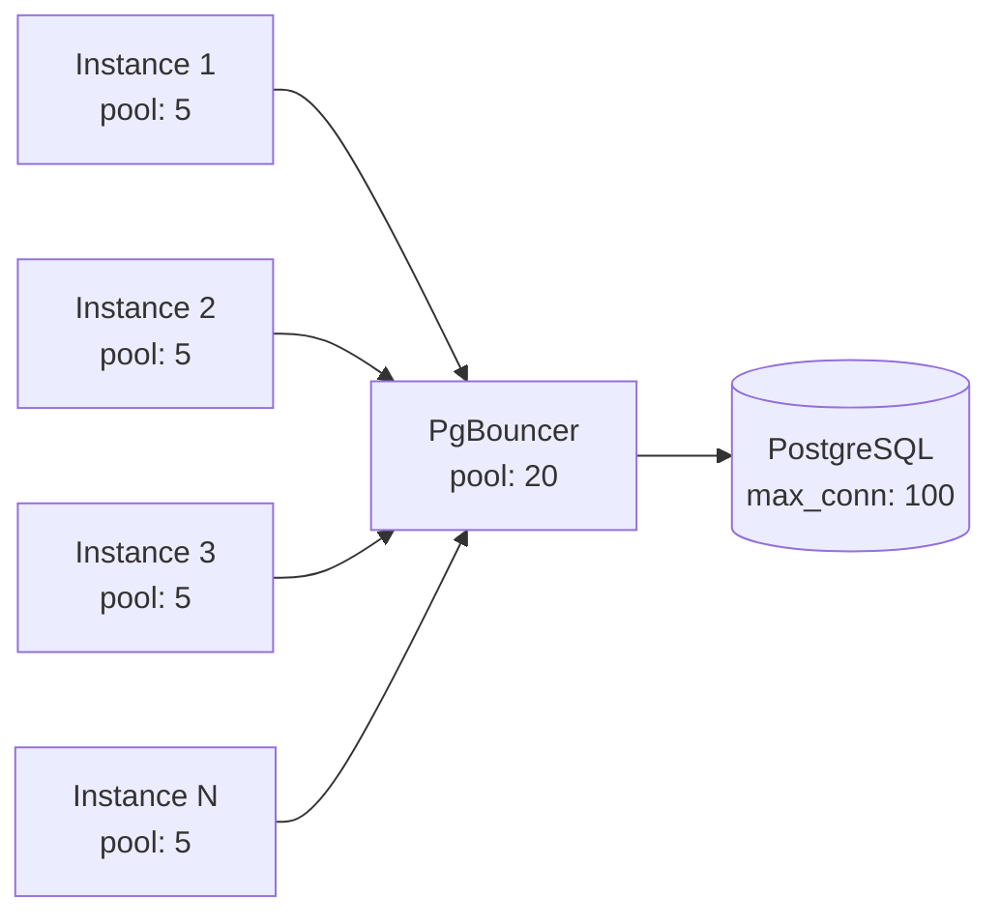

`PgBouncer` мультиплексирует соединения: 50 инстансов с пулом 5 = 250 виртуальных соединений, но `PgBouncer` держит лишь 20 реальных соединений к `PostgreSQL`, переиспользуя их.


> [!mcq]
> - [ ] Можно поднять `max_connections` PostgreSQL до любого значения | Каждое соединение = 5-10 MB RAM + процесс; 1000 соединений = 10 GB RAM на бухучёт. ❌ ПОСЛЕДСТВИЕ: подняли `max_connections=2000` на RDS — RAM съеден на процессах, query производительность упала, OOM-kill процессов БД.
> - [ ] HPA с pod=20 и pool=50 на каждом — норма | `20 × 50 = 1000` соединений; стандартный PostgreSQL держит 100-200. ❌ ПОСЛЕДСТВИЕ: HPA отскейлил до 30 подов на пике — 1500 соединений требуется, БД даёт 200, всем `connection timeout`, пользователи 503.
> - [x] `PgBouncer`/`ProxySQL` мультиплексирует соединения: 50 подов × 5 пул → 20 реальных к БД | Transaction-pooling режим переиспользует соединение между запросами. ✓ ПРИМЕНЯТЬ: `PgBouncer` `pool_mode = transaction` перед PostgreSQL для 100+ микросервисов. 📋 ПРАВИЛО: «Bouncer на входе — соединения переиспользуются». 🔗 См. Q29.
> - [ ] Connection limit касается только OLTP, на read-replica можно не считать | Каждая replica имеет свой `max_connections`, тоже надо считать. ❌ ПОСЛЕДСТВИЕ: replica с `max_connections=100`, 30 read-only сервисов с pool=10 — 300 соединений запрошено, replica начинает отказывать.

## Q31. Как масштабировать поиск и полнотекстовый индекс?

Поисковые движки ([Elasticsearch](../databases/elasticsearch-interview.md), `OpenSearch`, `Solr`) масштабируются горизонтально: кластер из нескольких узлов; индексы шардируются и реплицируются.

- Увеличение числа **шардов** → пропускная способность записи и параллелизм поиска
- Увеличение **реплик** → отказоустойчивость и throughput чтения
- Равномерное распределение данных по шардам
- Мониторинг размера шардов (рекомендация: 10-50 GB на шард)
- Кэширование частых запросов (`Elasticsearch query cache`)

При росте объёма данных добавляют узлы в кластер и перебалансируют шарды; для горячих запросов используют кэш на стороне приложения.


> [!mcq]
> - [x] Шардировать индекс по 10-50 GB на shard, число реплик задавать по read-нагрузке | Параллельный поиск по shards + расширение реплик масштабирует throughput независимо. ✓ ПРИМЕНЯТЬ: `Elasticsearch` в Booking.com — `number_of_shards` по объёму, `number_of_replicas` по `search_rate`. 📋 ПРАВИЛО: «Shard под объём, replica под чтение». 🔗 См. Q9, Q15.
> - [ ] Поднять `max_clauses` Lucene-запроса до 100 000 для широких фильтров | Лимит защищает от OOM на огромных bool-запросах; обход роняет coordinator-ноду. ❌ ПОСЛЕДСТВИЕ: `Elasticsearch` с `indices.query.bool.max_clause_count=100000` упал по heap при поиске по 50K тегов, кластер `red` 40 минут.
> - [ ] Хранить весь индекс в одном огромном шарде на 500 GB ради простоты | Шард > 50 GB замедляет recovery, rebalance занимает часы и блокирует write. ❌ ПОСЛЕДСТВИЕ: shard 500 GB на одной ноде — после рестарта recovery 6 часов, индекс read-only, search latency p99 вырос до 12s.
> - [ ] Заменить `Elasticsearch` на `LIKE '%query%'` в `PostgreSQL` для упрощения стека | Sequential scan по миллиардам строк не масштабируется, индекс `B-tree` не работает с leading wildcard. ❌ ПОСЛЕДСТВИЕ: миграция полнотекстового поиска на `LIKE '%...%'` — каждый запрос 8s, БД на 100% CPU, очередь запросов растёт до timeout.

## Q32. Как масштабировать микросервисы?

Каждый [микросервис](microservices-interview.md) масштабируется независимо: горизонтально за [балансировщиком](load-balancing-interview.md) ([Kubernetes](../devops/kubernetes-interview.md) `Deployment`, облачные группы); автоскейлинг по `CPU`, памяти или кастомным метрикам.

Ключевые принципы:
- Состояние — во внешних хранилищах (БД, кэш, очереди)
- `API` — идемпотентные где возможно
- Service discovery — `Kubernetes Service`, `Consul`, [Spring Cloud](../frameworks/spring/spring-cloud-interview.md)
- Circuit breaker и таймауты при межсервисных вызовах
- Мониторинг и трассировка для каждого сервиса

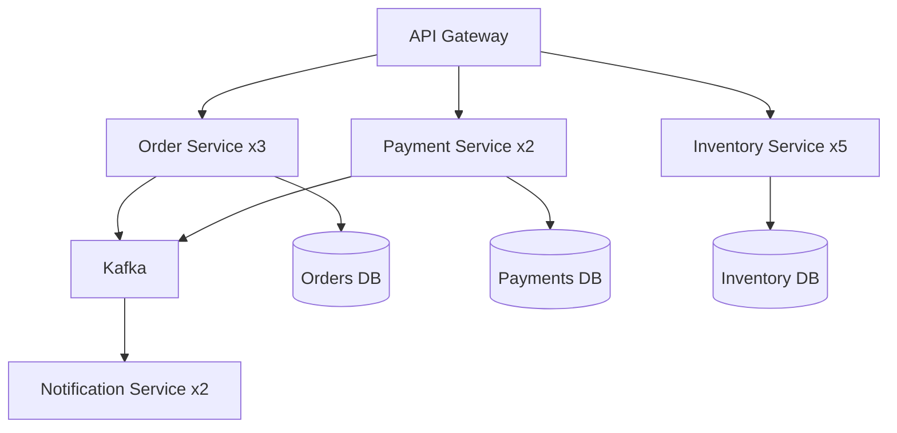

При росте числа сервисов важно контролировать лимиты на соединения между сервисами и использовать `service mesh` (`Istio`, `Linkerd`) для управления трафиком.


> [!mcq]
> - [ ] Масштабировать все микросервисы одинаково (одинаковый replica count) | Сервисы имеют разный профиль нагрузки: `payment` 100 RPS, `inventory` 5K RPS — равный count тратит ресурсы. ❌ ПОСЛЕДСТВИЕ: 5 реплик каждого из 30 сервисов — `inventory` упирается в throughput при пиках, `payment` простаивает за $3K/мес.
> - [ ] Хранить состояние сессии в памяти каждого сервиса (sticky session) | Любой `pod restart` теряет сессии; `HPA scale-down` приводит к logout пользователей. ❌ ПОСЛЕДСТВИЕ: rolling update `cart-service` — 30% пользователей потеряли корзину, conversion rate упал на 15% за час.
> - [ ] Делить общую БД между всеми сервисами для упрощения транзакций | Shared DB = shared bottleneck; миграция схемы блокирует все сервисы. ❌ ПОСЛЕДСТВИЕ: `ALTER TABLE` на общей таблице заблокировал 12 сервисов на 40 минут — каскадные таймауты, gateway 503.
> - [x] Каждый сервис масштабируется независимо: HPA по своим метрикам, своя БД, stateless логика | Independent scaling + database-per-service + service mesh для трафика. ✓ ПРИМЕНЯТЬ: Netflix — каждый сервис свой `Cassandra cluster` + `Hystrix`, скейлятся под свою нагрузку. 📋 ПРАВИЛО: «Свой сервис — свои метрики, своя БД». 🔗 См. Q25, Q27.

## Q33. Что такое data partitioning strategies и как выбрать ключ шардирования?

Выбор ключа шардирования — одно из самых критичных решений при масштабировании данных:

| Стратегия | Описание | Плюсы | Минусы |
|-----------|----------|-------|--------|
| **Hash-based** | `hash(key) % N` | Равномерное распределение | Сложный resharding |
| **Range-based** | По диапазону значений | Эффективные range-запросы | Горячие шарды |
| **Directory-based** | Lookup-таблица | Гибкость | Дополнительный hop |
| **Geo-based** | По географии | Низкая latency | Неравномерность |

Критерии выбора ключа:
1. **Кардинальность** — достаточно значений для равномерного распределения
2. **Частота запросов** — ключ должен совпадать с основным паттерном доступа
3. **Рост** — ключ не должен создавать горячих шардов при росте данных
4. **Cross-shard запросы** — минимизировать необходимость `JOIN` между шардами

**Consistent hashing** решает проблему `resharding`: при добавлении/удалении узла перемещается минимум данных. Используется в [Redis Cluster](../databases/redis-interview.md), `Cassandra`, [Kafka](../messaging/kafka-interview.md).


> [!mcq]
> - [x] Hash + consistent hashing с virtual nodes; ключ совпадает с основным паттерном доступа | Минимум данных перемещается при resharding, JOIN внутри одного shard избегает cross-shard. ✓ ПРИМЕНЯТЬ: `Cassandra` partition key = `(tenant_id, bucket)` с virtual nodes — Discord scaled до триллионов сообщений. 📋 ПРАВИЛО: «Hash на ключе доступа + virtual nodes». 🔗 См. Q9, Q41.
> - [ ] Range-based на monotonic ID (`AUTO_INCREMENT`, `created_at`) для простоты | Все новые записи попадают в последний shard — write hotspot, остальные простаивают. ❌ ПОСЛЕДСТВИЕ: range sharding по `order_id` — последний shard принял 95% записей, p99 write latency 4s, остальные 9 shards на 5% CPU.
> - [ ] `hash(key) % N` без consistent hashing — добавить shard позже | При смене N перемещается ~`(N-1)/N` ключей; resharding 10TB занимает дни с двойной нагрузкой. ❌ ПОСЛЕДСТВИЕ: рост с 4 на 5 shards — 80% ключей переехали, replication lag 6 часов, читатели получали NULL по `cache miss`.
> - [ ] Geo-based по стране для всех сервисов независимо от паттерна доступа | Если 80% трафика из одной страны — один shard перегружен; нет equal распределения. ❌ ПОСЛЕДСТВИЕ: shard `RU` принимает 70% записей в Wildberries-like системе, shards `KZ`/`BY` пустуют, hotspot не решён.

## Q34. Как тестировать масштабируемость?

**Практический минимум:** тест считают полезным, если он фиксирует «точку отказа» (`RPS` / `latency` / `error budget`), а не просто подтверждает, что сервис «работает под нагрузкой».

Виды тестирования:
1. **Нагрузочное** — постепенное увеличение `RPS` для определения точки насыщения
2. **Стресс-тестирование** — нагрузка выше ожидаемой для проверки деградации
3. **Spike testing** — резкий всплеск для проверки автоскейлинга
4. **Soak testing** — длительная нагрузка для выявления утечек
5. **Тестирование с несколькими инстансами** — проверка stateless, гонки, блокировки

Инструменты: `Gatling`, `k6`, `JMeter`; в [Kubernetes](../devops/kubernetes-interview.md) — запуск нескольких реплик и проверка равномерного распределения запросов.

```java
// Gatling: простой сценарий нагрузочного тестирования
public class OrderLoadSimulation extends Simulation {
    {
        HttpProtocolBuilder httpProtocol = http
                .baseUrl("http://localhost:8080")
                .acceptHeader("application/json");

        ScenarioBuilder scenario = scenario("Create Orders")
                .exec(http("create-order")
                        .post("/api/orders")
                        .body(StringBody("{\"userId\": 1, \"items\": []}"))
                        .check(status().is(202)));

        setUp(
            scenario.injectOpen(
                rampUsersPerSec(1).to(100).during(Duration.ofMinutes(5)),
                constantUsersPerSec(100).during(Duration.ofMinutes(10))
            )
        ).protocols(httpProtocol)
         .assertions(global().responseTime().percentile3().lt(200));
    }
}
```


> [!mcq]
> - [ ] Постоянная нагрузка на ожидаемом RPS — если без ошибок, система масштабируется | Не находит точку отказа; не проверяет деградацию при пиках или утечки памяти. ❌ ПОСЛЕДСТВИЕ: 30 минут на 1K RPS прошли — на проде в Black Friday 3K RPS, JVM heap leak дал OOM через 6 часов.
> - [x] Ramp-up до точки насыщения + spike + soak с метриками RPS/p99/error budget | Находит bottleneck, проверяет autoscaling, выявляет утечки за длительной нагрузкой. ✓ ПРИМЕНЯТЬ: `Gatling` ramp-up до 5K RPS + soak 4 часа в CI перед релизом — Wolt находит memory leaks до prod. 📋 ПРАВИЛО: «Ramp + spike + soak — три кита нагрузки». 🔗 См. Q5, Q35.
> - [ ] Нагрузочный тест из одного клиента localhost против одной реплики | Не проверяет stateless, race conditions при scale-out, сетевую латентность к БД. ❌ ПОСЛЕДСТВИЕ: тест с 1 клиентом прошёл — на проде 3 реплики поделили sticky-state, корзины перепутались между пользователями.
> - [ ] Запустить тест после деплоя и сравнить только с предыдущим релизом | Без baseline и SLO нельзя сказать что приемлемо; deploy-to-deploy сравнение скрывает медленную деградацию. ❌ ПОСЛЕДСТВИЕ: каждый релиз +5% latency, через 20 релизов p99 вырос с 200ms до 800ms — никто не заметил, пока не пришли жалобы.

## Q35. Что такое capacity planning и как он связан с масштабированием?

`Capacity planning` — планирование ресурсов под ожидаемую нагрузку.

Оценка:
- Пиковая нагрузка (`RPS`, объём данных)
- Метрики на инстанс (`throughput`, `latency`)
- Расчёт числа инстансов и ресурсов БД

Автоскейлинг дополняет `capacity planning` — реагирует на фактические метрики; планирование задаёт `min`/`max` и типы инстансов.

Формула для грубой оценки:
```
instances_needed = peak_rps / rps_per_instance * safety_factor(1.3-1.5)
db_connections = instances_needed * pool_size_per_instance
```

Регулярный пересмотр `capacity planning` при изменении нагрузки и после инцидентов помогает корректировать `min`/`max` реплик и лимиты пулов соединений.


> [!mcq]
> - [ ] Полагаться только на autoscaling, без оценки пиковой нагрузки заранее | HPA реагирует за 30-90 секунд; за это время spike в 10x уже создал очередь и таймауты. ❌ ПОСЛЕДСТВИЕ: маркетинг запустил push на 5M пользователей без warning, HPA scaled с 5 до 50 за 3 минуты — первые 2 минуты 503 для всех.
> - [ ] Планировать ресурсы по среднему RPS без safety factor | Средний 1K RPS, но пик 4K RPS в `Q4` — без `safety_factor=1.5` система не справится с пиком. ❌ ПОСЛЕДСТВИЕ: ресурсы под `avg_rps=1000`, в Black Friday прилетел 4K RPS — БД упёрлась в `max_connections`, downtime 2 часа, потеря $500K.
> - [x] Расчёт `instances = peak_rps / rps_per_instance × safety_factor(1.3-1.5)` + регулярный пересмотр | Учитывает пик и резерв; пересмотр после инцидентов корректирует min/max HPA. ✓ ПРИМЕНЯТЬ: AWS auto scaling group с `min` от capacity planning + `max` с buffer 50% — Yandex Lavka на пиках доставки. 📋 ПРАВИЛО: «Peak × safety, не average». 🔗 См. Q4, Q24.
> - [ ] Capacity planning заменяет autoscaling — задал N инстансов и забыл | Нагрузка нелинейна по времени; статический provisioning либо переплачивает либо упирается. ❌ ПОСЛЕДСТВИЕ: статические 30 инстансов круглосуточно: ночью 5% утилизации ($8K/мес впустую), днём при пике 100% и таймауты.

## Q36. Что такое chaos engineering в контексте масштабируемости?

`Chaos engineering` — намеренное внесение сбоев для проверки устойчивости системы. В контексте масштабируемости проверяют:

- При отказе части инстансов оставшиеся справляются с нагрузкой
- Автоскейлинг корректно добавляет узлы
- [Балансировщик](load-balancing-interview.md) исключает нездоровые инстансы
- Очереди и кэш ведут себя предсказуемо при сбоях
- `Circuit breaker` срабатывает, алерты уходят

Инструменты: `Chaos Monkey`, `Chaos Mesh`, `Gremlin`, `Litmus`.

Типичные сценарии:
1. Убийство случайного пода в [Kubernetes](../devops/kubernetes-interview.md)
2. Задержка или отказ вызова к БД / внешнему `API`
3. Переполнение очереди [Kafka](../messaging/kafka-interview.md)
4. Исчерпание пула соединений
5. Сетевой partition между сервисами (см. [CAP-теорему](cap-theorem-interview.md))

Эксперименты проводят с чёткими критериями успеха ("`SLO` не нарушен при потере 30% инстансов") и возможностью отката.


> [!mcq]
> - [ ] Запускать chaos в проде без определённого SLO и плана отката | Без критериев успеха эксперимент превращается в реальный инцидент с непредсказуемым blast radius. ❌ ПОСЛЕДСТВИЕ: убили pod в проде «посмотреть» — оказалось последняя реплика payment-сервиса, 20 минут downtime, инцидент Sev-1.
> - [ ] Тестировать chaos только в staging, не повторять в проде | Staging имеет другой трафик, размер данных, версии — поведение под сбоями отличается. ❌ ПОСЛЕДСТВИЕ: chaos в staging показал устойчивость; в проде сетевой partition вызвал split-brain в БД (другая нагрузка), 4 часа DR.
> - [ ] Внедрять сразу network partition между всеми сервисами для максимального покрытия | Слишком большой blast radius на старте; невозможно различить корневую причину среди множества failures. ❌ ПОСЛЕДСТВИЕ: первый chaos experiment — отключили сеть между 3 сервисами, упали оба, root cause искали 6 часов.
> - [x] Постепенный chaos с чёткими SLO («SLO не нарушен при потере 30% инстансов») и rollback | Малый blast radius → расширение, измеримые гипотезы, автоматический откат при превышении error budget. ✓ ПРИМЕНЯТЬ: Netflix `Chaos Monkey` убивает 1 instance в business hours с auto-rollback по SLO нарушению. 📋 ПРАВИЛО: «Малый blast + SLO + rollback». 🔗 См. Q23, Q34.

## Q37. (!) Что такое Fan-out и Fan-in паттерны масштабирования?

**Fan-out** — один запрос разветвляется на множество параллельных подзапросов, результаты которых объединяются (**Fan-in**). Паттерн позволяет распределить вычисления и снизить latency через параллелизм.

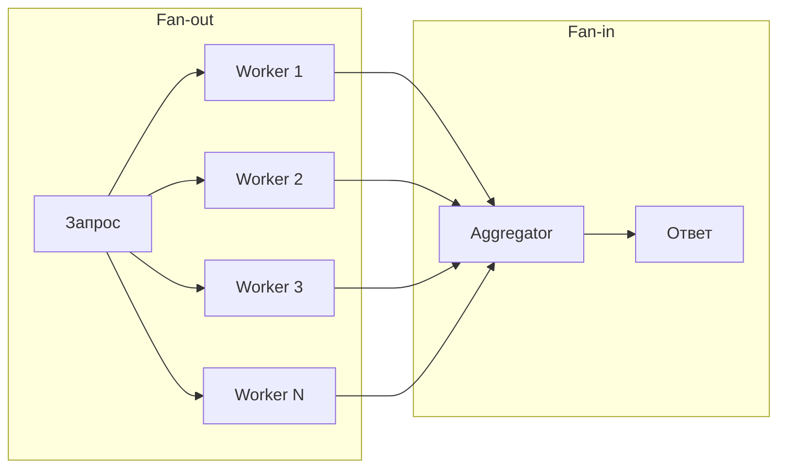

**Типичные применения:**
- **Scatter-Gather** в поисковых системах: запрос → N шардов индекса → merge результатов
- **Feed aggregation**: лента новостей = fan-out по всем подпискам пользователя
- **MapReduce**: map-фаза (fan-out) → reduce-фаза (fan-in)

**Реализация на Java (CompletableFuture):**
```java
public SearchResult search(SearchRequest request, List<ShardClient> shards) {
    // Fan-out: параллельный поиск по всем шардам
    List<CompletableFuture<ShardResult>> futures = shards.stream()
        .map(shard -> CompletableFuture.supplyAsync(
            () -> shard.search(request), searchExecutor))
        .toList();

    // Fan-in: собираем результаты с таймаутом
    CompletableFuture<Void> allOf = CompletableFuture.allOf(
        futures.toArray(new CompletableFuture[0]));

    try {
        allOf.get(500, TimeUnit.MILLISECONDS); // hedge requests timeout
    } catch (TimeoutException e) {
        log.warn("Некоторые шарды не ответили вовремя");
    }

    // Fan-in: merge доступных результатов
    return futures.stream()
        .filter(f -> f.isDone() && !f.isCompletedExceptionally())
        .map(CompletableFuture::join)
        .collect(SearchResultMerger::merge);
}
```

**Проблема write fan-out:** если пользователь с 10M подписчиков публикует пост, fan-out на всех подписчиков создаёт огромную нагрузку. Решение: `pull model` для «звёзд» (знаменитости) + `push model` для обычных пользователей (гибридный подход Twitter).


> [!mcq]
> - [ ] Push fan-out на 10M подписчиков знаменитости синхронно при публикации | 10M записей в timeline-БД блокируют publish-запрос; latency растёт до минут, очередь забивается. ❌ ПОСЛЕДСТВИЕ: Twitter-like система делает sync push для celebrity с 50M followers — публикация поста заняла 14 минут, лента отстала на час.
> - [ ] Fan-out без таймаутов на медленных шардах: ждать всех до конца | Один медленный shard блокирует весь ответ; tail latency p99 определяется самым медленным узлом. ❌ ПОСЛЕДСТВИЕ: scatter-gather по 50 shards без timeout — один узел в GC pause 8s, search latency p99 вырос с 200ms до 8s.
> - [x] Hedge requests с timeout на fan-out + hybrid push/pull для звёзд (Twitter-модель) | Timeout отбрасывает медленные shards; pull-model для celebrities снимает write fan-out нагрузку. ✓ ПРИМЕНЯТЬ: Twitter timeline = push для обычных + pull для celebrities, search = scatter-gather с 500ms hedge. 📋 ПРАВИЛО: «Hedge timeout + hybrid push/pull». 🔗 См. Q14, Q33.
> - [ ] Использовать fan-out для CPU-bound задач без параллелизма (1 worker) | Без реального параллелизма fan-out даёт overhead на координацию без выигрыша по latency. ❌ ПОСЛЕДСТВИЕ: «параллельный» поиск с `Executors.newSingleThreadExecutor` — задачи выполняются последовательно, latency не уменьшилась, overhead на CompletableFuture +20ms.

## Q38. Что такое Write-Behind (Write-Back) кэширование?

**Write-Behind** (`Write-Back`) — стратегия кэширования, при которой запись идёт **сначала в кэш**, а в БД данные попадают асинхронно с задержкой. Противоположность `Write-Through` (синхронная запись в кэш и БД одновременно).

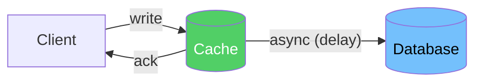

**Сравнение стратегий записи:**

| Стратегия | Запись в | Latency | Durability | Риск |
|-----------|----------|---------|------------|------|
| `Write-Through` | Кэш + БД синхронно | Высокая | Высокая | Нет потерь |
| `Write-Behind` | Кэш, потом БД | Низкая | Низкая | Потеря при падении кэша |
| `Write-Around` | Только БД | Средняя | Высокая | Cache miss при чтении |

**Реализация через Redis + очередь:**
```java
@Service
public class WriteBackCacheService {
    private final RedisTemplate<String, Object> redis;
    private final KafkaTemplate<String, WriteEvent> kafka;

    public void updateCounter(String userId, long delta) {
        // 1. Быстрое обновление в Redis (O(1))
        Long newValue = redis.opsForValue()
            .increment("counter:" + userId, delta);

        // 2. Асинхронная запись в Kafka → Consumer → DB
        kafka.send("counter-updates",
            new WriteEvent(userId, newValue, Instant.now()));
    }
}

@KafkaListener(topics = "counter-updates")
public void persistCounter(WriteEvent event) {
    // Батчевая запись: обрабатываем N событий за раз
    counterRepository.upsert(event.userId(), event.value());
}
```

**Когда применять:**
- Счётчики просмотров, лайков — небольшая потеря при падении Redis допустима
- Метрики и аналитика — eventual consistency OK
- Высоконагруженная запись (>100K writes/s), где БД становится узким местом

**Риски:** при падении кэша до сброса в БД данные теряются. Минимизация: Redis Persistence (`AOF`), репликация кэша, малый интервал flush.


> [!mcq]
> - [ ] Write-Behind для финансовых транзакций ради низкой latency | Падение Redis между ack и flush в БД = реальная потеря денег без trace. ❌ ПОСЛЕДСТВИЕ: Write-Behind для платежей — Redis упал до flush, 3K транзакций «успешных» для клиента, но в БД нет; reconciliation 2 недели.
> - [ ] Write-Through везде — гарантия durability важнее latency | Каждая запись блокируется на disk write БД; при 100K writes/s БД становится bottleneck. ❌ ПОСЛЕДСТВИЕ: Write-Through на счётчики просмотров видео (1M writes/s) — `PostgreSQL` не справляется, write latency 2s, очередь растёт.
> - [x] Write-Behind для счётчиков/метрик/аналитики, где eventual consistency допустима | Запись в Redis O(1), асинхронный flush через Kafka в БД батчами; малая потеря приемлема. ✓ ПРИМЕНЯТЬ: счётчики просмотров YouTube — Redis `INCR` + Kafka batch flush в `BigQuery` каждые 30s. 📋 ПРАВИЛО: «Write-Behind только где OK потерять секунды данных». 🔗 См. Q6, Q8.
> - [ ] Write-Around для всех сценариев, чтобы кэш не загрязнялся редкими данными | Каждое чтение после записи — `cache miss`, тяжёлая нагрузка на БД и медленный first read. ❌ ПОСЛЕДСТВИЕ: Write-Around для пользовательских профилей с частым чтением после update — 90% cache miss первые 5 минут, БД в 100% CPU.

## Q39. (!) Что такое Cell-Based Architecture?

**Cell-Based Architecture** (клеточная архитектура) — паттерн, при котором система разбивается на **независимые изолированные ячейки** (`cells`), каждая из которых обслуживает подмножество пользователей или данных. Отказ одной ячейки не влияет на другие.

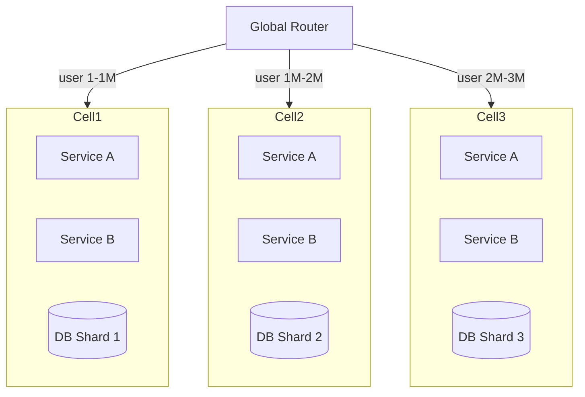

**Ключевые свойства:**
- **Изоляция отказов** — проблема в Cell 2 не затрагивает Cell 1 и Cell 3
- **Blast radius** — максимальный ущерб от инцидента ограничен одной ячейкой
- **Независимый деплой** — можно обновлять ячейки по очереди (canary по ячейкам)
- **Масштабирование** — добавление ячейки = линейный рост ёмкости

**Применяют:** Amazon (Availability Zones as cells), Slack (sharding по рабочим пространствам), Netflix (regional cells), Salesforce (pods).

**Реализация роутинга:**
```java
@Component
public class CellRouter {
    private final List<CellConfig> cells;

    public CellConfig routeUser(UUID userId) {
        // Детерминированное присвоение ячейки по userId
        int cellIndex = Math.abs(userId.hashCode()) % cells.size();
        return cells.get(cellIndex);
    }

    public CellConfig routeTenant(String tenantId) {
        // Для B2B: один tenant всегда в одной ячейке
        return tenantCellMapping.get(tenantId);
    }
}
```

**Отличие от просто шардирования:** ячейка содержит **полный стек** (все сервисы + БД), а не только одну БД. Это даёт полную автономность.


> [!mcq]
> - [x] Cell содержит полный стек (все сервисы + БД); router закрепляет user/tenant за cell детерминированно | Blast radius ограничен одной cell; canary deploy по cells; линейное масштабирование добавлением cells. ✓ ПРИМЕНЯТЬ: Slack pods (cells по workspace), AWS AZ как cells, Salesforce instances. 📋 ПРАВИЛО: «Cell = полный стек + stable affinity». 🔗 См. Q9, Q40.
> - [ ] Cell = только отдельная БД, общие сервисы и cross-cell вызовы | Это просто sharding БД; отказ общего сервиса валит все cells, blast radius не ограничен. ❌ ПОСЛЕДСТВИЕ: «cells» с shared `auth-service` — баг в auth уронил все 10 cells, 100% downtime на 45 минут вместо изолированного отказа.
> - [ ] Один глобальный router без cell affinity (запросы случайно распределяются) | Без stable affinity пользователь попадает в разные cells, теряет state, нарушается изоляция данных. ❌ ПОСЛЕДСТВИЕ: random routing — пользователь делал заказ в cell 1, оплачивал в cell 3, payment не нашёл order, 5% checkout fails.
> - [ ] Cells без независимого деплоя — релиз одновременно во все | Bug в релизе валит все cells сразу; теряется главное преимущество canary по cells. ❌ ПОСЛЕДСТВИЕ: одновременный rollout новой версии во все 8 cells — баг в migration уронил всю систему, rollback 90 минут вместо canary 1 cell.

## Q40. Как масштабировать систему в нескольких регионах (Multi-Region)?

**Multi-Region** — развёртывание в нескольких географических регионах для снижения latency, повышения доступности и disaster recovery.

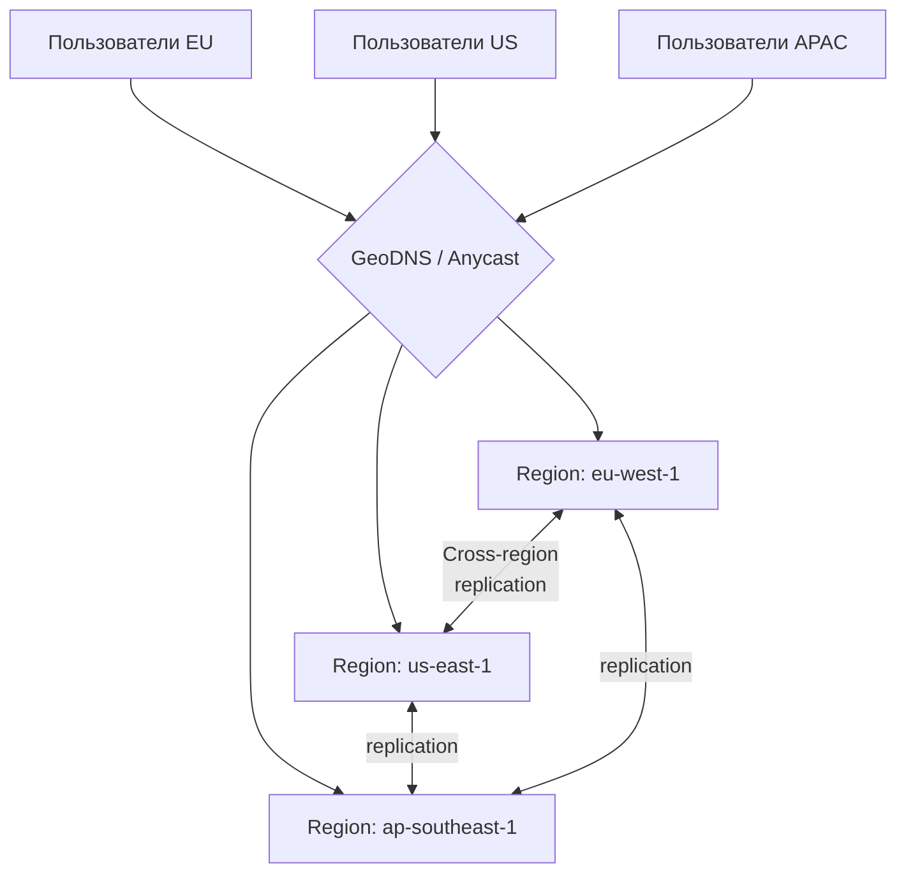

**Стратегии согласованности данных:**

| Стратегия | Описание | Применение |
|-----------|----------|-----------|
| **Active-Passive** | Один регион — primary, остальные — read replicas | DR, читающие нагрузки |
| **Active-Active** | Все регионы принимают записи | Глобальные системы |
| **Follow-the-sun** | Primary мигрирует по часовым поясам | Рабочий день бизнеса |

**Проблема конфликтов при Active-Active:**
- Если два пользователя в разных регионах обновляют одну запись одновременно — конфликт
- Решения: `CRDT`, `Last-Write-Wins`, бизнес-правила слияния, partition данных по регионам

**Партиционирование данных по регионам (Data Residency):**
```java
// Пользователи EU → данные хранятся только в eu-west-1
// Пользователи US → данные только в us-east-1
public class RegionAwareRouter {
    public DataSource resolve(User user) {
        return switch (user.region()) {
            case EU -> euDataSource;
            case US -> usDataSource;
            case APAC -> apacDataSource;
        };
    }
}
```

**Ключевые решения:**
- `Amazon Aurora Global Database` — один primary, реплики в 5 регионах, RPO < 1 сек
- `CockroachDB` — built-in multi-region, geo-partitioning
- `Cassandra` — multi-DC replication с `NetworkTopologyStrategy`
- `Spanner` — глобальная согласованность через TrueTime


> [!mcq]
> - [ ] Active-Active без стратегии разрешения конфликтов записи | Одновременная запись одной строки в двух регионах = silent data loss или разное состояние в разных DC. ❌ ПОСЛЕДСТВИЕ: Active-Active `MySQL` master-master без CRDT — при concurrent update счёта баланс расходится между регионами на $50K, обнаружили через 3 дня.
> - [ ] Cross-region replication синхронно для каждой записи | Latency запроса = max(latency до всех регионов); 200ms между EU и US делают каждую запись 200ms+. ❌ ПОСЛЕДСТВИЕ: sync replication EU↔US для checkout — write latency вырос с 30ms до 250ms, conversion упал на 8%.
> - [ ] Игнорировать data residency регуляции (GDPR) и реплицировать всё везде | EU данные в US нарушают GDPR; штраф до 4% годового оборота, блокировка сервиса. ❌ ПОСЛЕДСТВИЕ: GDPR audit обнаружил персональные данные EU в us-east-1 — штраф €10M, форсированная миграция данных за 30 дней.
> - [x] Geo-partitioning по data residency + Active-Active с CRDT/LWW для горячих данных | Данные пользователя живут в его регионе (latency + GDPR), конфликты решаются автоматически. ✓ ПРИМЕНЯТЬ: `CockroachDB` с `REGIONAL BY ROW`, `Cassandra` `NetworkTopologyStrategy` + LWW в Discord. 📋 ПРАВИЛО: «Geo-partition + CRDT для конфликтов». 🔗 См. Q9, Q39.

## Q41. Как предотвратить hotspot при шардировании?

**Hotspot** (горячая партиция) — один шард получает несоразмерно большую нагрузку, становясь узким местом. Типичные причины: плохой ключ шардирования, данные знаменитостей, временные паттерны.

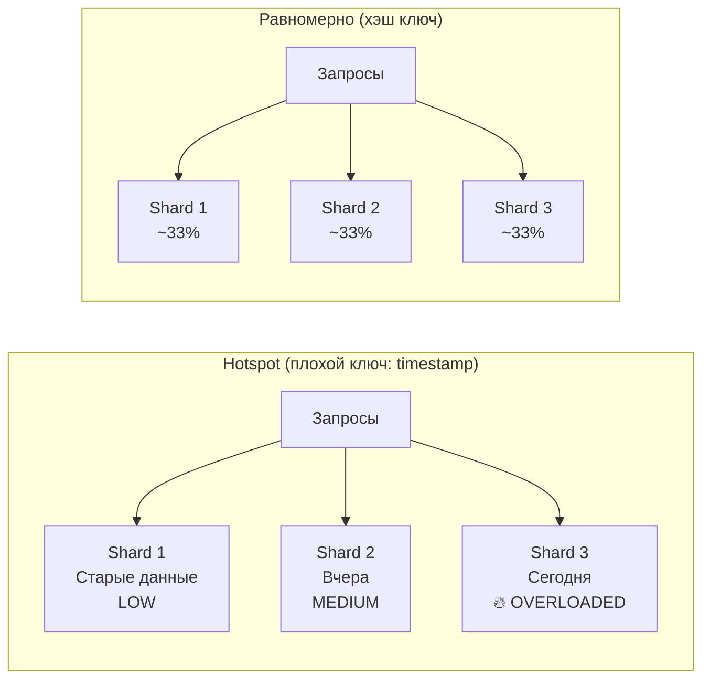

**Причины и решения:**

| Причина | Решение |
|---------|---------|
| Монотонный ключ (`timestamp`, `AUTO_INCREMENT`) | Хэш от ID или composite key (`user_id + timestamp`) |
| «Горячий» пользователь (celebrity) | Добавить random suffix к ключу, разделить на N sub-shards |
| Временной паттерн (пик в 9:00) | Consistent hashing + автоскейлинг |
| Несбалансированное распределение | `Virtual nodes` в consistent hashing |

**Техника salting для горячих ключей:**
```java
// Проблема: popular-product-1 → всегда в Shard 0
String shardKey = "popular-product-1"; // hotspot!

// Решение: добавить случайный суффикс (salting)
int saltBuckets = 10; // разбить на 10 виртуальных ключей
int salt = random.nextInt(saltBuckets);
String shardKey = "popular-product-1#" + salt; // → разные шарды

// При чтении: scatter-gather по всем bucket'ам и объединение
List<CompletableFuture<Long>> futures = IntStream.range(0, saltBuckets)
    .mapToObj(i -> CompletableFuture.supplyAsync(
        () -> cache.get("popular-product-1#" + i)))
    .toList();
long totalCount = futures.stream()
    .map(CompletableFuture::join)
    .mapToLong(Long::longValue)
    .sum();
```

**Мониторинг hotspots:**
- Prometheus метрика `requests_per_shard` — аномальный рост одного шарда
- В `Cassandra`: `nodetool tpstats`, `nodetool tablestats` — `Read Latency` по нодам
- В `Kafka`: consumer lag per partition через AKHQ/Confluent Control Center
- В `Redis Cluster`: `redis-cli --cluster info` — `keys` и `used_memory` по нодам


> [!mcq]
> - [x] Salting горячих ключей (random suffix) + scatter-gather на чтении + virtual nodes | Распределяет запись celebrity-данных по N виртуальным sub-shards; чтение объединяет результаты. ✓ ПРИМЕНЯТЬ: Twitter celebrity counters — `user_id#salt(0..9)` + sum at read; Cassandra virtual nodes по 256 на physical. 📋 ПРАВИЛО: «Salt + scatter-gather для celebrities». 🔗 См. Q10, Q33.
> - [ ] Добавить больше реплик горячему shard, не трогая ключ | Replicas масштабируют чтение, но запись всё равно идёт на один primary; write hotspot остаётся. ❌ ПОСЛЕДСТВИЕ: добавили 5 read-replicas к hot shard для celebrity counter — write latency 3s осталась, replication lag 8s, чтение тоже стало stale.
> - [ ] Использовать `AUTO_INCREMENT` PK как shard key для равномерности | Monotonic ID создаёт hotspot на последнем shard — все новые записи в один узел. ❌ ПОСЛЕДСТВИЕ: shard key = `user_id AUTO_INCREMENT` — последний shard 95% writes, p99 5s, alert на write throughput 24/7.
> - [ ] Перешардировать кластер вручную при появлении hotspot | Ручной resharding на 10TB занимает дни с двойной нагрузкой; hotspot успевает повториться на новом ключе. ❌ ПОСЛЕДСТВИЕ: ручной resharding `Cassandra` после Black Friday — 36 часов миграции, latency p99 12s, второй hotspot появился на новом ключе через неделю.

---

## See also

- [Распределённые системы](distributed-systems-interview.md) — CAP теорема, репликация, партиционирование и согласованность
- [Стратегии кэширования](caching-strategies-interview.md) — Cache-Aside, Write-Through, CDN и локальные кэши для снижения нагрузки
- [Балансировка нагрузки](load-balancing-interview.md) — алгоритмы балансировки, health checks и горизонтальное масштабирование
- [Архитектура баз данных](../databases/database-architecture-interview.md) — шардирование, read replica и партиционирование для масштабирования
- [Микросервисная архитектура](microservices-interview.md) — декомпозиция и независимое масштабирование сервисов
- [CQRS и Event Sourcing](cqrs-event-sourcing-interview.md) — разделение read/write нагрузки для масштабирования
- [Apache Kafka](../messaging/kafka-interview.md) — партиционирование и потоковая обработка для высокопроизводительных систем
- [Kubernetes](../devops/kubernetes-interview.md) — HPA, VPA и автоматическое масштабирование приложений


- [API Gateway](api-gateway-interview.md)
- [BFF Pattern](bff-pattern-interview.md)
- [Стратегии кэширования](caching-strategies-interview.md)
- [CAP-теорема](cap-theorem-interview.md)
- [Clean Architecture](clean-architecture-interview.md)
- [Паттерны согласованности](consistency-patterns-interview.md)
