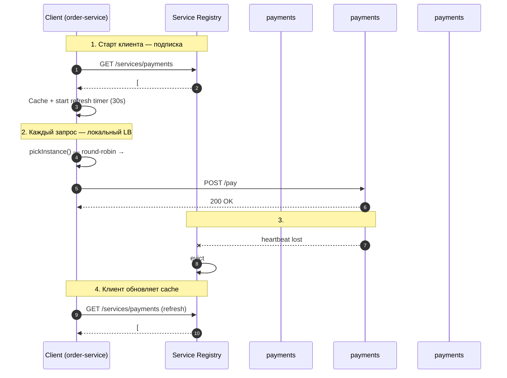
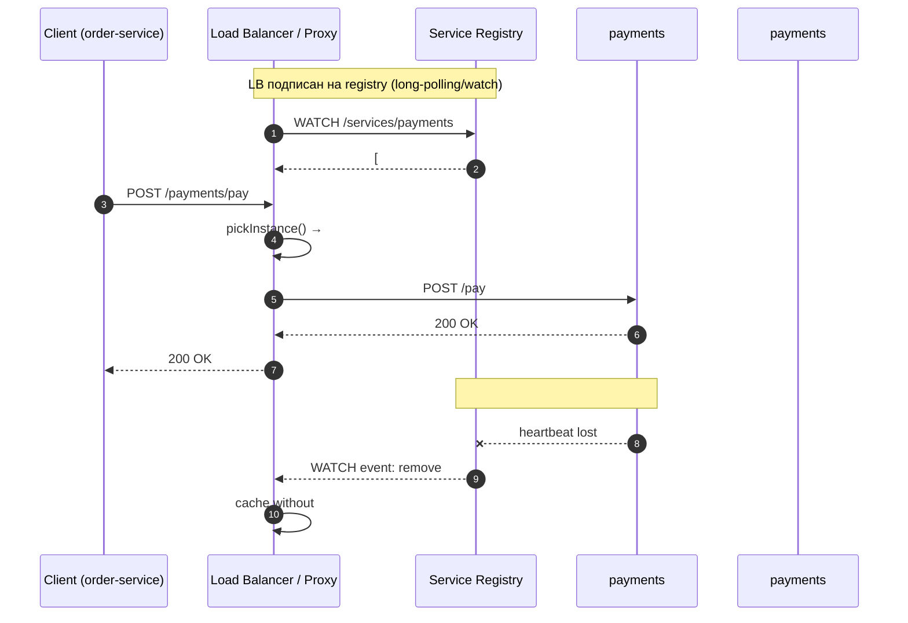
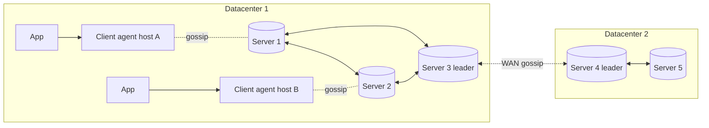
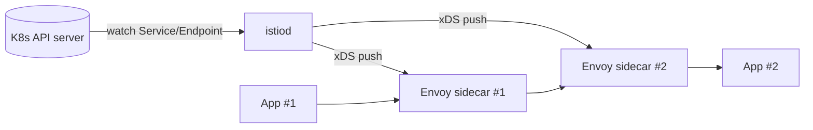

# Вопросы на собеседовании: `Service Discovery`

`Service Discovery` — механизм, через который микросервисы находят друг друга в сети с **динамическими IP и портами**. В монолите вызов — это локальный method call; в микросервисах за каждым вызовом стоит вопрос: «где сейчас находится `payments-service` и какой из его инстансов жив?». На собеседованиях по архитектуре ожидают понимание двух моделей (client-side / server-side), сравнения registries (`Consul`, `Eureka`, `etcd`, `ZooKeeper`, Kubernetes DNS), CAP-компромиссов и того, как health-checks и cache защищают от каскадных отказов.

## Полезные ссылки

### Официальная документация

- [HashiCorp Consul Documentation](https://developer.hashicorp.com/consul/docs) — Consul agents, gossip, KV.
- [Netflix Eureka Wiki](https://github.com/Netflix/eureka/wiki) — AP-режим, self-preservation.
- [etcd Documentation](https://etcd.io/docs/) — Raft, watch API, leases.
- [Apache ZooKeeper Documentation](https://zookeeper.apache.org/doc/current/) — ZAB, ephemeral znodes.
- [Kubernetes Service](https://kubernetes.io/docs/concepts/services-networking/service/) — Service, Endpoints, EndpointSlices.
- [CoreDNS Documentation](https://coredns.io/manual/toc/) — DNS в Kubernetes.
- [Spring Cloud DiscoveryClient](https://docs.spring.io/spring-cloud-commons/reference/spring-cloud-commons/common-abstractions.html) — абстракция.
- [Istio Service Discovery](https://istio.io/latest/docs/concepts/traffic-management/#service-discovery-and-load-balancing) — Pilot/istiod + xDS.

### Книги и статьи

- Sam Newman, *Building Microservices* (2nd ed.) — глава Service Discovery.
- Chris Richardson, *Microservices Patterns* — шаблоны Client-side / Server-side Discovery.
- [Netflix Tech Blog: Eureka 2.0](https://netflixtechblog.com/netflix-shares-cloud-load-balancing-and-failover-tool-eureka-c10647ef95e5)
- [microservices.io: Service Discovery](https://microservices.io/patterns/service-registry.html)

## Содержание

- [Полезные ссылки](#полезные-ссылки)
- [See also](#see-also)

**Основы**

- [Q1. (!) Что такое service discovery и зачем он нужен?](#q1--что-такое-service-discovery-и-зачем-он-нужен)
- [Q2. (!) Service registry: что внутри?](#q2--service-registry-что-внутри)
- [Q3. Self-registration vs third-party registration](#q3-self-registration-vs-third-party-registration)
- [Q4. (!) Health checks: TTL, HTTP, TCP, gRPC](#q4--health-checks-ttl-http-tcp-grpc)
- [Q5. Heartbeat, TTL и eviction policy](#q5-heartbeat-ttl-и-eviction-policy)

**Client-side vs Server-side**

- [Q6. (!) Client-side discovery — модель и flow](#q6--client-side-discovery--модель-и-flow)
- [Q7. (!) Server-side discovery — модель и flow](#q7--server-side-discovery--модель-и-flow)
- [Q8. (!) Pros/Cons: client-side vs server-side](#q8--proscons-client-side-vs-server-side)
- [Q9. Кеш реестра на клиенте: stale entries и partition](#q9-кеш-реестра-на-клиенте-stale-entries-и-partition)

**Consul**

- [Q10. (!) Архитектура Consul: client / server agents, gossip](#q10--архитектура-consul-client--server-agents-gossip)
- [Q11. Consul: регистрация сервиса и health-check](#q11-consul-регистрация-сервиса-и-health-check)
- [Q12. DNS-интерфейс Consul и HTTP API](#q12-dns-интерфейс-consul-и-http-api)
- [Q13. Consul KV, multi-datacenter, ACL](#q13-consul-kv-multi-datacenter-acl)

**Eureka**

- [Q14. (!) Архитектура Eureka и почему она AP](#q14--архитектура-eureka-и-почему-она-ap)
- [Q15. Self-preservation mode — что это и зачем](#q15-self-preservation-mode--что-это-и-зачем)
- [Q16. Eureka client: регистрация и heartbeat](#q16-eureka-client-регистрация-и-heartbeat)

**etcd и ZooKeeper**

- [Q17. (!) etcd — Raft, watch API, leases](#q17--etcd--raft-watch-api-leases)
- [Q18. ZooKeeper — ZAB, ephemeral znodes, watches](#q18-zookeeper--zab-ephemeral-znodes-watches)
- [Q19. Почему etcd выиграл у ZooKeeper для облачных систем](#q19-почему-etcd-выиграл-у-zookeeper-для-облачных-систем)

**Kubernetes DNS**

- [Q20. (!) Kubernetes Service / Endpoints / EndpointSlices](#q20--kubernetes-service--endpoints--endpointslices)
- [Q21. (!) CoreDNS — как Service резолвится в IP](#q21--coredns--как-service-резолвится-в-ip)
- [Q22. Headless Service и SRV-records](#q22-headless-service-и-srv-records)
- [Q23. kube-proxy: iptables / IPVS / eBPF](#q23-kube-proxy-iptables--ipvs--ebpf)

**Service mesh и облака**

- [Q24. Service mesh discovery: Istio Pilot / istiod, Envoy xDS](#q24-service-mesh-discovery-istio-pilot--istiod-envoy-xds)
- [Q25. AWS Cloud Map, GCP Service Directory](#q25-aws-cloud-map-gcp-service-directory)
- [Q26. Versioning через метаданные: canary, blue-green, A/B](#q26-versioning-через-метаданные-canary-blue-green-ab)

**CAP, HA и сравнения**

- [Q27. (!) CAP trade-offs: Eureka (AP) vs Consul / etcd / ZK (CP)](#q27--cap-trade-offs-eureka-ap-vs-consul--etcd--zk-cp)
- [Q28. Discovery как single point of failure — анти-паттерн и защита](#q28-discovery-как-single-point-of-failure--анти-паттерн-и-защита)
- [Q29. Spring Cloud DiscoveryClient — абстракция](#q29-spring-cloud-discoveryclient--абстракция)
- [Q30. Сравнительная таблица: Consul vs Eureka vs etcd vs ZooKeeper vs K8s DNS](#q30-сравнительная-таблица-consul-vs-eureka-vs-etcd-vs-zookeeper-vs-k8s-dns)

---

## Q1. (!) Что такое service discovery и зачем он нужен?

`Service Discovery` — это механизм, через который **клиент находит сетевой адрес (host:port) живого инстанса сервиса** в условиях, когда адреса непостоянны.

**Почему статический config не работает в микросервисах:**

- **Динамические IP.** Контейнер при рестарте получает новый IP (Kubernetes Pod, ECS task, Docker `--rm`). Hard-coded `payments-host=10.0.0.42` ломается каждый деплой.
- **Auto-scaling.** Сервис растёт с 3 до 30 инстансов и обратно — клиент не должен знать заранее их количество.
- **Failover.** Инстанс умер — discovery должен перестать его отдавать в течение секунд, а не минут.
- **Rolling deploy.** Старые инстансы выводятся, новые поднимаются — между ними секунды overlap-а.

**Что даёт discovery:**

- Логическое имя (`payments-service`) вместо IP.
- Актуальный список живых инстансов с метаданными (zone, version, tags).
- Интеграцию с health-check — мёртвые автоматически выбывают.
- Возможность для load-balancer-а / клиента выбирать стратегию (round-robin, locality-aware, weighted).

**Минимальный пример:** вместо `RestTemplate.getForObject("http://10.0.0.42:8080/...", ...)` пишем `RestTemplate.getForObject("http://payments-service/...", ...)`, а под капотом — `@LoadBalanced` / `DiscoveryClient` / DNS преобразует имя в живой адрес.

---

## Q2. (!) Service registry: что внутри?

`Service Registry` — база данных живых инстансов. Минимальная запись:

| Поле | Пример | Назначение |
|------|--------|-----------|
| `service_id` | `payments-service` | логическое имя |
| `instance_id` | `payments-7f9c-x8h2k` | уникальность |
| `host` | `10.0.4.17` | сетевой адрес |
| `port` | `8080` | порт |
| `metadata` | `zone=eu-west-1a, version=2.3.1, tags=[canary]` | для routing |
| `status` | `UP / DOWN / STARTING / OUT_OF_SERVICE` | для фильтрации |
| `last_heartbeat` | `2026-05-21T12:34:56Z` | для eviction |
| `health_check_url` | `http://10.0.4.17:8080/actuator/health` | для проверки |

**Дополнительно:**

- **Версия записи** (для оптимистичной блокировки / watch).
- **TTL** (через сколько секунд без heartbeat запись считается мёртвой).
- **Сертификаты / SPIFFE ID** в service mesh.

**Где живёт реестр:**

- В Eureka — in-memory в server-инстансах с peer-to-peer репликацией.
- В Consul — Raft-лог среди server-агентов.
- В etcd / ZK — Raft / ZAB-лог соответственно.
- В Kubernetes — это `Endpoints` / `EndpointSlices` объекты в etcd (control plane).

---

## Q3. Self-registration vs third-party registration

Два подхода к тому, **кто кладёт запись в реестр**.

**Self-registration** — инстанс сам регистрирует себя при старте и шлёт heartbeat-ы.

```yaml
# Eureka client (Spring Boot)
spring:
  application:
    name: payments-service
eureka:
  client:
    serviceUrl:
      defaultZone: http://eureka:8761/eureka/
  instance:
    lease-renewal-interval-in-seconds: 30   # heartbeat
    lease-expiration-duration-in-seconds: 90 # TTL
```

- Pros: простой, инстанс сам знает свои метаданные (версия, билд).
- Cons: связка с конкретной registry-библиотекой, инстанс знает её адрес.

**Third-party registration** — внешний компонент (registrator, Kubernetes controller) следит за жизненным циклом и сам пишет в реестр.

- В Kubernetes — `kubelet` сообщает API-серверу о готовности pod-а, `EndpointController` обновляет `Endpoints`.
- В Consul — Registrator (sidecar контейнер) подписывается на Docker events и регистрирует.

Pros: приложение не знает про discovery, можно менять реестр без редеплоя сервиса. Cons: лишний компонент в архитектуре, метаданные ограничены тем, что видно снаружи.

В Kubernetes-мире победил **third-party** — приложение публикует только `/health`, всё остальное делает platform.

---

## Q4. (!) Health checks: TTL, HTTP, TCP, gRPC

Без health-check реестр быстро наполняется зомби-записями. Типы:

**TTL-based (push).** Клиент сам шлёт heartbeat каждые `N` секунд. Если не пришёл за `2N` — запись помечается DOWN. Используется в Eureka.
- Pros: registry ничего не знает про сеть до клиента.
- Cons: процесс «жив» (поток шлёт ping), но `/api/order` может быть сломан — false-positive.

**HTTP (pull).** Registry периодически зовёт `GET /actuator/health` и ждёт `200`. Consul, Kubernetes liveness/readiness probe.
- Pros: проверяется **реальная функциональность** (DB connection, downstream).
- Cons: нагрузка на сервис, сложнее через NAT.

**TCP.** Registry открывает соединение на порт и закрывает. Подходит когда сервис не HTTP (например, custom-протокол).
- Cons: connection established ≠ приложение работает.

**gRPC health checking protocol** (`grpc.health.v1.Health/Check`) — стандарт, реализован в Consul, Envoy, Kubernetes.

```yaml
# Kubernetes readinessProbe
readinessProbe:
  httpGet:
    path: /actuator/health/readiness
    port: 8080
  periodSeconds: 10
  failureThreshold: 3
```

**Хорошая практика:** разделять `/health/liveness` (процесс жив, не нужно рестартить) и `/health/readiness` (готов принимать трафик — DB подключилась, кеш прогрелся).

---

## Q5. Heartbeat, TTL и eviction policy

Параметры, которые определяют **скорость реакции** реестра на падение инстанса.

| Параметр | Что | Типичные значения |
|----------|-----|-------------------|
| `heartbeat interval` | как часто инстанс пингует registry | 5-30 сек |
| `TTL / lease` | через сколько без heartbeat — DOWN | 2-3 × heartbeat |
| `eviction interval` | как часто registry удаляет DOWN | 30-60 сек |
| `grace period` | время до полного удаления | 60-300 сек |

**Trade-off:**

- Короткий TTL → быстрая реакция, но больше false-positive в network glitch.
- Длинный TTL → стабильно, но клиенты долго бьют в мёртвый инстанс.

**Sweet spot:** ставить TTL так, чтобы покрыть один GC-pause + network blip, но не больше `circuit-breaker timeout` клиента. Если CB реагирует за 5 сек, а registry за 90 — клиент сам отрежет инстанс быстрее.

**Двойной механизм** = идеальный: registry убирает мёртвых медленно (защита от шторма), а клиент через circuit-breaker / retry helps мгновенно.

---

## Q6. (!) Client-side discovery — модель и flow

**Client-side discovery** — клиент сам опрашивает registry и сам выбирает инстанс.



**Примеры:**

- **Netflix Eureka + Ribbon / Spring Cloud LoadBalancer** — классика, client держит in-memory snapshot реестра.
- **Consul + Consul Connect client SDK**.
- **gRPC custom resolver** — клиент держит подключения ко всем инстансам.

**Особенности:**

- Балансировка — на стороне клиента (round-robin, weighted, locality-aware).
- Между клиентом и сервером **нет лишнего hop-а** — прямой TCP.
- Клиент должен **периодически refresh-ить cache** (типично 30 сек).
- При partition с registry — клиент использует stale cache (fail open).

---

## Q7. (!) Server-side discovery — модель и flow

**Server-side discovery** — клиент шлёт на well-known endpoint (LB / proxy), а тот опрашивает registry и сам решает, куда переслать.



**Примеры:**

- **Kubernetes Service** — `ClusterIP` + `kube-proxy` (iptables / IPVS) → endpoints.
- **AWS ELB / ALB / NLB** — managed LB опрашивает target group.
- **Nginx + nginx-resolver** — DNS-based discovery.
- **Service mesh** — Envoy sidecar опрашивает Pilot / istiod.

**Особенности:**

- Клиент видит **один endpoint** — не знает ни про registry, ни про инстансы.
- Балансировка — централизованная.
- Лишний hop через LB → +latency (обычно 1-3 ms в одном AZ).
- LB может стать bottleneck → нужен HA-кластер.

---

## Q8. (!) Pros/Cons: client-side vs server-side

| Аспект | Client-side | Server-side |
|--------|-------------|-------------|
| **Hops** | 1 hop (client → server) | 2 hops (client → LB → server) |
| **Latency** | минимальная | +1-3 ms (proxy) |
| **Логика балансировки** | в каждом языке/клиенте | в одном месте (LB) |
| **Sticky / locality-aware** | легко (клиент знает свой AZ) | сложно (нужно передавать hint) |
| **Multi-language** | каждый язык нужна библиотека | прозрачно (HTTP — и достаточно) |
| **Деплой балансировки** | rolling клиентов → долго | один деплой LB |
| **Где CB / retry** | в клиенте | можно в LB (Envoy) |
| **Сетевой security** | mTLS между всеми клиентами и серверами | mTLS только до LB |
| **Когда выбирать** | Netflix-style, JVM-моноязык, low-latency | polyglot, Kubernetes, простота клиента |

**Гибрид:** service mesh (Istio + Envoy sidecar) — формально это server-side (через sidecar), но sidecar локален → нет inter-host hop, минимальная latency. Логика балансировки в sidecar, а не в приложении → polyglot-friendly. По сути, **best of both worlds**.

---

## Q9. Кеш реестра на клиенте: stale entries и partition

Клиент почти всегда держит **локальный snapshot** реестра — иначе каждый запрос == round-trip в registry, и registry падает первым при нагрузке.

**Параметры:**

- `refresh interval`: 5-30 сек (push через watch / pull по таймеру).
- `eviction on failure`: количество подряд failed запросов до того, как клиент сам выкинет инстанс из cache.
- `TTL cache`: даже если registry недоступен, использовать cache до N минут.

**Стратегии при partition с registry:**

1. **Fail-open (stale read)** — продолжать работать со старым cache (Eureka default).
   - Плюс: сервис не падает каскадно при downtime registry.
   - Минус: можем долго бить в мёртвые инстансы.
2. **Fail-closed** — если registry недоступна, не принимать запросы.
   - Плохо для production, redundancy ставится на стороне registry.

**Уроки production:**

- Кеш на диск (Eureka сохраняет последний snapshot в файл) — после перезапуска клиент сразу работает, не дожидаясь первого refresh.
- Цикличность: registry-сервер тоже клиент discovery (для health-check). При cold start кластера — chicken-and-egg, нужен seed-config.

---

## Q10. (!) Архитектура Consul: client / server agents, gossip

`Consul` — distributed service mesh от HashiCorp. Состоит из **agents**, объединённых в кластер.

**Server agents (3 или 5 в production):**

- Хранят state в Raft-логе → CP-система.
- Один — leader, остальные — followers.
- Здесь живут registry, KV, ACL.

**Client agents** (по одному на каждой машине / pod):

- Не хранят state, пересылают регистрации сервиса в server-кластер.
- Делают local health-check для регистрированных сервисов.
- DNS / HTTP API доступны локально (`127.0.0.1:8600` / `127.0.0.1:8500`).

**Gossip protocol (Serf, основан на SWIM):**

- Все агенты (client + server) знают про friend-list через gossip.
- При падении узла — gossip быстро (секунды) разносит новость по кластеру.
- LAN gossip (внутри DC) + WAN gossip (между DC).

**Multi-datacenter** — несколько server-кластеров, объединённых через WAN gossip; запросы между DC — через RPC forwarding.



---

## Q11. Consul: регистрация сервиса и health-check

Регистрация — JSON-файл или HTTP-PUT в local agent. Agent сам реплицирует в server-кластер.

```json
// /etc/consul.d/payments.json
{
  "service": {
    "name": "payments-service",
    "id": "payments-1",
    "address": "10.0.4.17",
    "port": 8080,
    "tags": ["v2.3.1", "canary"],
    "meta": {
      "version": "2.3.1",
      "zone": "eu-west-1a"
    },
    "checks": [
      {
        "name": "HTTP health",
        "http": "http://10.0.4.17:8080/actuator/health",
        "interval": "10s",
        "timeout": "2s",
        "deregister_critical_service_after": "1m"
      }
    ]
  }
}
```

**Health-check выполняется local-agent-ом** (не central registry) — масштабируется горизонтально.

`deregister_critical_service_after` — grace-period: если check critical N времени, инстанс удаляется автоматически.

---

## Q12. DNS-интерфейс Consul и HTTP API

**Два способа узнать живые инстансы:**

**DNS** — для legacy-приложений, которые умеют только в DNS.

```bash
dig @127.0.0.1 -p 8600 payments-service.service.consul
# A 10.0.4.17
# A 10.0.4.18

dig @127.0.0.1 -p 8600 payments-service.service.consul SRV
# 0 1 8080 payments-1.node.dc1.consul
# 0 1 8080 payments-2.node.dc1.consul
```

- Plus: zero code change.
- Cons: DNS не знает про метаданные (tags, version) — фильтрация ограничена.

**HTTP API** — для современных клиентов.

```bash
curl 'http://127.0.0.1:8500/v1/health/service/payments-service?passing&tag=v2.3.1'
# JSON со всем — host, port, metadata, check status
```

- Plus: блокирующий `?wait=30s&index=X` (long-polling watch) — push-обновления.
- Cons: нужно консумировать через библиотеку (Spring Cloud Consul, hashicorp/consul/api).

В Spring Cloud Consul — по умолчанию HTTP API + watch.

---

## Q13. Consul KV, multi-datacenter, ACL

**KV-store** — встроенная key-value база (Raft-replicated). Используется как:

- Distributed config (заменяет `application.yml`).
- Distributed locks (`acquire`).
- Leader election (через session + KV).

**Multi-datacenter** — Consul изначально проектировался под несколько DC.

- Каждый DC — независимый Raft-кластер.
- Cross-DC запросы: `payments-service.service.dc2.consul`.
- WAN gossip между DC, RPC forwarding.

**ACL** — token-based authorization. Можно ограничить, кто пишет / читает какие сервисы / KV-пути.

**Consul Connect** (service mesh) — встроенный mTLS + intentions (политики «кто к кому может ходить»), без отдельного service mesh.

---

## Q14. (!) Архитектура Eureka и почему она AP

`Eureka` — Netflix-овский registry, заточенный под **availability над consistency**.

**Топология:** несколько Eureka-серверов (типично 3) с **peer-to-peer репликацией** через REST. Никакого Raft / Paxos.

**Особенности AP-режима:**

- Запись принимается локально и **асинхронно** реплицируется на peers. Если peer недоступен — реплика догонится позже.
- При split-brain каждый peer продолжает обслуживать клиентов своим (возможно устаревшим) snapshot-ом.
- Stale read — допустимо: клиент получит чуть устаревший список, но registry **никогда не отказывает**.

**Почему именно AP** (по Netflix):

> «Лучше клиент пошлёт запрос в чуть устаревший инстанс, чем мы вернём ему ошибку "registry недоступна"».

В Netflix-сценарии (потоковое видео) — недоступность реестра = деградация всего сервиса. Stale registration хуже, чем нет registration вовсе.

```yaml
# eureka-server (Spring Cloud)
eureka:
  client:
    serviceUrl:
      defaultZone: http://peer1:8761/eureka/,http://peer2:8761/eureka/
    register-with-eureka: true   # сервер тоже регистрируется (для peer-discovery)
    fetch-registry: true
  server:
    enable-self-preservation: true
```

---

## Q15. Self-preservation mode — что это и зачем

**Проблема:** допустим, между Eureka и большинством клиентов — network partition. Heartbeat-ы перестают приходить. Eureka думает «все умерли», начинает массово evict — и **усугубляет catastrophe**: клиенты, которые умели бы пережить partition через stale cache, теперь получат пустой реестр.

**Решение — self-preservation mode.** Eureka считает: если за последние `N` минут пришло **слишком мало heartbeat-ов** (меньше threshold ≈ 85% ожидаемых), значит проблема не в инстансах, а **в самой Eureka** (или в сети). Тогда:

- **Прекращаем eviction** — лучше держать stale записи, чем выкинуть всех.
- Логируем warning «SELF-PRESERVATION ACTIVE».
- Ждём, пока соотношение восстановится.

**Trigger:** реальное число heartbeat-ов за минуту < `expected × renewalPercentThreshold (0.85)`.

```yaml
eureka:
  server:
    enable-self-preservation: true
    renewal-percent-threshold: 0.85
    eviction-interval-timer-in-ms: 60000
```

**Trade-off:** в dev-окружении с 1-2 инстансами self-preservation часто вызывает false-positive (если убить инстанс — пропорция падает резко). В dev обычно выключают, в prod — оставляют.

---

## Q16. Eureka client: регистрация и heartbeat

Spring Cloud Netflix Eureka client встраивается через стартер. Основное:

```yaml
spring:
  application:
    name: payments-service
eureka:
  client:
    serviceUrl:
      defaultZone: http://eureka1:8761/eureka/,http://eureka2:8761/eureka/
    registry-fetch-interval-seconds: 30   # как часто клиент тянет snapshot
  instance:
    prefer-ip-address: true
    lease-renewal-interval-in-seconds: 30 # heartbeat
    lease-expiration-duration-in-seconds: 90 # TTL (3× heartbeat)
    metadata-map:
      version: 2.3.1
      zone: eu-west-1a
```

**Жизненный цикл:**

1. Startup → `POST /eureka/apps/PAYMENTS-SERVICE` (регистрация со статусом `STARTING`).
2. После `/actuator/health` = UP → `PUT` со статусом `UP`.
3. Каждые 30 сек → `PUT` heartbeat.
4. Shutdown hook → `DELETE` (graceful deregistration).

Клиент тянет полный snapshot первый раз, потом **delta** (что изменилось). Snapshot хранится на disk — после рестарта моментально доступен.

---

## Q17. (!) etcd — Raft, watch API, leases

`etcd` — distributed key-value store, написан CoreOS, используется как control-plane Kubernetes.

**Архитектура:**

- Raft consensus (CP-система). 3 или 5 узлов в кластере. Запись принимается leader-ом, реплицируется на majority.
- gRPC API (раньше HTTP, в v2 — устарело).

**Ключевые фичи для service discovery:**

**Lease** — TTL для key. Инстанс берёт lease на 30 сек, прикрепляет к ней свой ключ `/services/payments/inst-1 → {host, port}`, и каждые 10 сек делает `KeepAlive`. Если KeepAlive прекратился — lease истёк → key автоматически удалён.

**Watch API** — long-poll за изменениями префикса.

```bash
# Регистрация инстанса
etcdctl lease grant 30
# → lease 694d7... granted with TTL(30s)
etcdctl put --lease=694d7 /services/payments/inst-1 '{"host":"10.0.4.17","port":8080}'
etcdctl lease keep-alive 694d7 &

# Discovery (watch)
etcdctl watch --prefix /services/payments/
# → PUT /services/payments/inst-1 {...}
# → DELETE /services/payments/inst-1 (lease expired)
```

**Преимущества:** строгая consistency (linearizable reads), нативный watch, gRPC + protobuf эффективнее, чем JSON over HTTP. Минусы: оверхед Raft на каждую запись — не для high-write workloads.

В Kubernetes — etcd хранит ВСЕ объекты (Pod, Service, Endpoint, ConfigMap…), и service discovery строится поверх него косвенно через `EndpointController` → `Endpoints` → CoreDNS / kube-proxy.

---

## Q18. ZooKeeper — ZAB, ephemeral znodes, watches

`Apache ZooKeeper` — старейший координационный сервис (от Yahoo, 2010). Использовался в Hadoop, Kafka (до KRaft), HBase, Solr.

**Архитектура:**

- ZAB (ZooKeeper Atomic Broadcast) — близок к Raft, leader + followers.
- 3 / 5 узлов, кворум.
- Иерархическая ФС (`/services/payments/inst-1`) с метаданными в каждом znode.

**Ephemeral znode** — узел, привязанный к сессии клиента. Сессия отвалилась (TCP close или session timeout) → znode удалён. Идеально для discovery: инстанс создаёт `/services/payments/inst-1` ephemeral; умер → znode исчез автоматически.

**Watch** — одноразовая подписка на изменения znode (path или children). После триггера — нужно пересоздать watch. Это отличие от etcd, где watch — long-running.

```python
# Псевдо-код
zk.create("/services/payments/inst-1", b'{"host":"10.0.4.17"}', ephemeral=True)
children = zk.get_children("/services/payments/", watch=update_cache)
```

**Где использовался:**

- Kafka brokers и controller (до KRaft в Kafka 3.x).
- HBase master election.
- Hadoop NameNode HA.
- Curator framework — упрощённое API.

---

## Q19. Почему etcd выиграл у ZooKeeper для облачных систем

Оба — CP, оба на consensus-протоколе. Но в облаке/Kubernetes победил etcd. Почему:

| Аспект | ZooKeeper | etcd |
|--------|-----------|------|
| **Протокол** | custom TCP (Jute) | gRPC + protobuf |
| **API** | Java-centric, getChildren / setData | clean kv API + watch + lease |
| **Watch** | one-shot, нужно пересоздавать | long-running |
| **Установка** | JVM + ensemble config | один Go binary |
| **TLS / mTLS** | сложно настраивается | встроено |
| **Operational story** | heavy для small teams | lightweight |
| **Ecosystem** | Java мир (Kafka, HBase) | Cloud Native (k8s, CoreDNS, …) |
| **JVM-overhead** | + GC pauses | нет JVM |

Kafka сама ушла от ZooKeeper к KRaft (Raft внутри Kafka-кластера) — даже там ZK признали legacy.

**Но ZooKeeper не мёртв:** в больших Hadoop / Kafka-инсталляциях он остаётся, и для классических coordination-задач (leader election, distributed lock) Curator + ZK — всё ещё надёжный выбор.

---

## Q20. (!) Kubernetes Service / Endpoints / EndpointSlices

В Kubernetes discovery построен поверх трёх объектов.

**Service** — стабильный сетевой identity для набора pod-ов. Селектор по label-ам.

```yaml
apiVersion: v1
kind: Service
metadata:
  name: payments-service
spec:
  selector:
    app: payments       # выбирает pod-ы с label app=payments
  ports:
    - port: 80
      targetPort: 8080
  type: ClusterIP       # стабильный IP внутри кластера
```

**Endpoints** (legacy) / **EndpointSlices** (с k8s 1.21+, default) — actual IPs живых pod-ов.

```yaml
# kubectl get endpointslices
apiVersion: discovery.k8s.io/v1
kind: EndpointSlice
metadata:
  name: payments-service-abc12
  labels:
    kubernetes.io/service-name: payments-service
endpoints:
  - addresses: ["10.244.1.5"]
    conditions: { ready: true }
    targetRef: { kind: Pod, name: payments-7f9c-x8h2k }
  - addresses: ["10.244.2.7"]
    conditions: { ready: true }
ports:
  - port: 8080
```

**Кто что делает:**

- **EndpointController / EndpointSliceController** — следит за pod-ами и поддерживает EndpointSlices в актуальном состоянии (CRUD при ready/not-ready).
- **kube-proxy** — на каждом node читает Service + Endpoints и пишет iptables / IPVS правила для DNAT с ClusterIP на pod IP.
- **CoreDNS** — резолвит `payments-service.default.svc.cluster.local` в ClusterIP.

**Зачем EndpointSlices вместо Endpoints:** при 1000 pod-ах за одним Service — один Endpoints-объект становится огромным и каждое изменение требует full re-broadcast по watch-у. EndpointSlices разбивают на куски по 100 endpoints, что снижает control-plane нагрузку.

---

## Q21. (!) CoreDNS — как Service резолвится в IP

`CoreDNS` — DNS-сервер по умолчанию в Kubernetes (раньше — `kube-dns`).

**Что резолвится:**

- `payments-service.default.svc.cluster.local` → A `10.96.123.45` (ClusterIP Service-а).
- `payments-service.default.svc.cluster.local` SRV → port + target node.
- `10-244-1-5.default.pod.cluster.local` → pod-IP (если включено).

**search domains** в `/etc/resolv.conf` pod-а:

```
search default.svc.cluster.local svc.cluster.local cluster.local
nameserver 10.96.0.10   # CoreDNS Service IP
options ndots:5
```

Это позволяет писать `payments-service` (короткое имя) — DNS-resolver попробует `payments-service.default.svc.cluster.local`, `payments-service.svc.cluster.local`, … и найдёт.

**TTL** — обычно 30 сек (configurable). Клиент должен кешировать DNS-ответ — иначе CoreDNS падает под нагрузкой.

**Внутри CoreDNS** — `kubernetes` plugin читает Service / Endpoints из API-сервера через watch (не из etcd напрямую). Делает in-memory mapping name → IP.

```
# Corefile
.:53 {
    kubernetes cluster.local in-addr.arpa ip6.arpa {
        pods insecure
    }
    forward . /etc/resolv.conf   # external DNS
    cache 30
}
```

---

## Q22. Headless Service и SRV-records

**Обычный Service** даёт **ClusterIP** — виртуальный IP, балансирующий на pod-ы через kube-proxy. Клиент видит один IP, не знает про инстансы.

**Headless Service** (`clusterIP: None`) — НЕТ виртуального IP. DNS возвращает **A-records на каждый pod**.

```yaml
apiVersion: v1
kind: Service
metadata:
  name: payments-headless
spec:
  clusterIP: None
  selector:
    app: payments
  ports:
    - port: 8080
```

```bash
dig payments-headless.default.svc.cluster.local
# A 10.244.1.5
# A 10.244.2.7
# A 10.244.3.9
```

**Зачем нужен:**

1. **Client-side load balancing** — клиент видит все IP и сам решает (gRPC, Java reactive).
2. **StatefulSet-ы** — каждый pod имеет stable DNS name (`payments-0.payments-headless...`), для master-replica топологий (Kafka, Cassandra, MongoDB).
3. **SRV-records** — резолвят `host:port`, удобно для не-стандартных портов.

```bash
dig SRV _http._tcp.payments-headless.default.svc.cluster.local
# 0 100 8080 payments-0.payments-headless.default.svc.cluster.local
# 0 100 8080 payments-1.payments-headless.default.svc.cluster.local
```

---

## Q23. kube-proxy: iptables / IPVS / eBPF

`kube-proxy` — компонент на каждом node, преобразующий запросы на `ClusterIP` в запросы на конкретный pod-IP. Три режима:

**iptables (default):**

- На node добавляются DNAT-правила: «трафик на 10.96.123.45:80 → DNAT на 10.244.1.5:8080 с вероятностью 33%, …».
- Балансировка — статистическая (`statistic mode random`).
- Просто и стабильно, но при тысячах Service-ов iptables-цепочки растут → reload медленный, CPU на packet processing высокий.

**IPVS** (с k8s 1.11+):

- L4 LB в ядре Linux (IP Virtual Server, давний компонент).
- O(1) поиск (hash), а не O(N) как iptables.
- Поддерживает round-robin, least-connection, source-hashing.
- Лучше масштабируется на больших кластерах.

**eBPF / Cilium:**

- Полная замена kube-proxy (Cilium `kubeProxyReplacement: true`).
- DNAT и routing решения принимаются в eBPF-программах, исполняемых в ядре.
- Самый быстрый, более expressive (L7 policy без sidecar).
- Большее доверие к Cilium как CNI.

Service Discovery с т. з. кода приложения **выглядит одинаково** во всех трёх — это деталь kernel data plane. Но при scale (>5k Services) выбор сильно влияет на latency и control-plane нагрузку.

---

## Q24. Service mesh discovery: Istio Pilot / istiod, Envoy xDS

В service mesh discovery «спрятан» за sidecar-прокси (обычно Envoy).

**Архитектура Istio:**

- **istiod** (Pilot + Citadel + Galley в одном) — control plane.
  - Читает Service / Endpoint / EndpointSlice / VirtualService / DestinationRule из k8s.
  - Преобразует в Envoy-конфиг.
- **Envoy sidecar** в каждом pod-е (injection через mutating webhook).
- **xDS API** (gRPC streaming) — istiod пушит конфиг в Envoy: CDS (clusters), EDS (endpoints), LDS (listeners), RDS (routes), SDS (secrets).



**Что меняется по сравнению с «голым» k8s discovery:**

- **Локальная балансировка в sidecar** — нет hop через kube-proxy → меньше latency.
- **L7 routing** — по headers, version, source workload (canary 5% по `x-user-cohort`).
- **mTLS** автоматически (SPIFFE identity).
- **Observability** — все запросы проходят через Envoy → distributed tracing, metrics.

**Цена:** +CPU/memory на каждый pod, сложность config.

---

## Q25. AWS Cloud Map, GCP Service Directory

**Managed-аналоги Consul / Eureka в облаке.**

**AWS Cloud Map:**

- Регистрация инстансов сервиса с метаданными.
- Резолвинг через DNS (Route 53) ИЛИ HTTP API.
- Интеграция с ECS (auto-registration) / EKS / Lambda.
- Health-check через Route 53.
- Multi-region не нативно — нужно объединять через global accelerator / multi-region setup.

**GCP Service Directory:**

- Аналогично — namespace → services → endpoints + metadata.
- Resolve через DNS (Cloud DNS) или REST.
- Интеграция с GKE и Cloud Run.

**Зачем managed:**

- Нет своего operational overhead — HA, backup, patching на провайдере.
- Интеграция с IAM и audit log.
- Платить $$ за query / instance — может быть дорого на больших кластерах.

**Когда выбирать:** когда команда не хочет content with running Consul / etcd сами; когда экосистема уже cloud-native (ECS / Lambda).

---

## Q26. Versioning через метаданные: canary, blue-green, A/B

Service Discovery позволяет хранить **метаданные** при инстансах — это даёт основу для traffic shaping.

**Метаданные:**

```json
{
  "service": "payments-service",
  "metadata": {
    "version": "2.3.1",
    "track": "canary",
    "zone": "eu-west-1a"
  }
}
```

**Canary deployment:**

- 1 инстанс с `track=canary` среди 9 с `track=stable`.
- LB / клиент-side фильтр направляет ~5% трафика на `track=canary` (Istio VirtualService по subsets, Envoy CDS endpoint-level weight).
- Monitoring → если canary ОК → постепенно увеличиваем долю.

**Blue-green:**

- Два набора инстансов: `color=blue` (current production) и `color=green` (new version).
- Все запросы идут в `blue`. На момент переключения — Service selector / route переключается на `green`.

**A/B testing:**

- Routing по header (`x-user-cohort=A` → `version=2`; `B` → `version=1`).
- В Istio:

```yaml
apiVersion: networking.istio.io/v1
kind: VirtualService
spec:
  hosts: [payments-service]
  http:
    - match:
        - headers:
            x-user-cohort: { exact: A }
      route:
        - destination: { host: payments-service, subset: v2 }
    - route:
        - destination: { host: payments-service, subset: v1 }
```

Discovery + метаданные — это **основа всего advanced traffic management**. Простой round-robin без метаданных делает невозможным canary.

---

## Q27. (!) CAP trade-offs: Eureka (AP) vs Consul / etcd / ZK (CP)

Service registry — это **распределённое состояние**. По CAP теореме в условиях partition можно выбрать только C или A.

| Система | Тип | Что делает при partition | Когда подходит |
|---------|-----|--------------------------|---------------|
| **Eureka** | **AP** | продолжает отдавать stale списки; нет master | Netflix-style: больше hurt от unavailability, чем от stale data |
| **Consul** | **CP** | minority partition perd запросов; reads через leader блокируются | service mesh, secrets, KV-config |
| **etcd** | **CP** | minority partition не пишет; reads опционально linearizable | Kubernetes control plane |
| **ZooKeeper** | **CP** | minority blocked; ephemeral znodes сохраняются на majority side | classic coordination (Kafka, HBase) |
| **Kubernetes (через etcd)** | **CP** | API server не пишет в minority; data plane (kube-proxy cache) продолжает работать со stale endpoint slices | platform — лучше «работаем по старому», чем «не работаем» |

**Что важно понять:**

- AP — клиенты могут получить **stale list** (или даже dead instance), но **никогда не получают ошибку "registry unavailable"**.
- CP — клиенты могут получить ошибку при partition, но если получили ответ — он **актуален**.
- В реальности **discovery почти всегда хочет AP-ish**: stale data ≤ полная недоступность discovery.
- Но если registry хранит ещё и **distributed lock / leader election** — нужна CP (нельзя иметь двух leader-ов).

**Правило:** для чистого service discovery → AP-стиль (или CP с агрессивным client cache). Для coordination → CP.

---

## Q28. Discovery как single point of failure — анти-паттерн и защита

**Анти-паттерн:** «registry → недоступна → весь сервис лёг». Особенно опасен в случае:

- Клиент не кеширует — каждый запрос идёт через registry.
- Registry — один инстанс / нет HA.
- Регистрация blocking — pod не стартует, пока не зарегистрировался.
- Heartbeat blocking — поток приложения завис на heartbeat, упустил business работу.

**Защита:**

1. **Cluster registry** (3-5 nodes, не один).
2. **Локальный snapshot на клиенте** + disk persistence (Eureka так делает).
3. **Stale OK** — клиент работает по cache даже если registry down.
4. **Async heartbeat** — отдельный поток / event-loop, не блокирует основной workflow.
5. **Lazy registration** — pod становится ready после первого успешного health-check, не обязательно после registration.
6. **Multi-registry / fallback DNS** — если Eureka недоступна, fallback на DNS A-record.
7. **Circuit breaker на запросах к registry**.

**Реальный case (Facebook 2021):** BGP-rollout убрал NS-серверы из интернета → DNS-resolution отказала → внутренние tools, которые ходили в API, тоже не могли. Lesson: **out-of-band management** не должен зависеть от той же discovery, которой управляет.

---

## Q29. Spring Cloud DiscoveryClient — абстракция

Spring Cloud абстрагирует разные registry за одним интерфейсом `DiscoveryClient`.

```java
@RestController
public class PaymentsResolver {

    private final DiscoveryClient discoveryClient;

    public PaymentsResolver(DiscoveryClient discoveryClient) {
        this.discoveryClient = discoveryClient;
    }

    @GetMapping("/instances")
    public List<ServiceInstance> instances() {
        return discoveryClient.getInstances("payments-service");
    }
}
```

`ServiceInstance` даёт `getHost()`, `getPort()`, `getMetadata()`, `getUri()`.

**Включение:** аннотация `@EnableDiscoveryClient` (опционально с Spring Boot 3 — auto-config работает по classpath).

**Реализации:**

- `spring-cloud-starter-netflix-eureka-client`
- `spring-cloud-starter-consul-discovery`
- `spring-cloud-starter-kubernetes-client` (читает Endpoints через k8s API)
- `spring-cloud-starter-zookeeper-discovery`
- `spring-cloud-starter-alibaba-nacos-discovery`

**LoadBalancer интеграция:**

```java
@Bean
@LoadBalanced
public RestTemplate restTemplate() {
    return new RestTemplate();
}

// Использование
restTemplate.getForObject("http://payments-service/pay", ...);  // имя, а не IP
```

`@LoadBalanced` подключает интерсептор, который через `DiscoveryClient` резолвит `payments-service` → конкретный URL и применяет балансировку (Spring Cloud LoadBalancer, не Ribbon с 2020).

---

## Q30. Сравнительная таблица: Consul vs Eureka vs etcd vs ZooKeeper vs K8s DNS

| Критерий | **Consul** | **Eureka** | **etcd** | **ZooKeeper** | **K8s DNS (CoreDNS + Service)** |
|----------|-----------|-----------|---------|---------------|--------------------------------|
| **CAP** | CP | AP | CP | CP | CP (etcd под капотом) |
| **Consensus** | Raft | peer-to-peer async | Raft | ZAB | Raft (etcd) |
| **Interface** | HTTP API + DNS | HTTP REST | gRPC | custom TCP (Jute) | DNS + k8s API |
| **Watch** | blocking query (long-poll) | delta + periodic fetch | streaming gRPC | one-shot watch | через k8s API watch |
| **Health checks** | HTTP / TCP / TTL / gRPC / script | TTL (heartbeat) | TTL via lease | ephemeral znode (session) | liveness / readiness probe |
| **Discovery latency после падения** | секунды (gossip + check) | до 90 сек (default lease) | секунды (lease expire) | секунды (session timeout) | 5-30 сек (probe + endpoint update) |
| **Multi-DC** | нативно (WAN gossip) | через federation, сложно | federation (etcd-mirror) | observers / cross-DC ensemble | через cluster federation |
| **KV store** | да | нет | да (primary) | да (через znode data) | через ConfigMap (косвенно) |
| **mTLS / security** | встроено (Consul Connect) | basic auth | TLS / RBAC | SASL / Kerberos | нативно (k8s RBAC + ServiceAccount) |
| **Operational** | средний | низкий | средний | высокий (JVM) | низкий (всё managed platform-ом) |
| **Когда выбирать** | service mesh + secrets + multi-DC | JVM-моноязык, AP важно | k8s, secrets, leader-election | legacy Kafka / HBase | k8s-native стек |
| **Когда НЕ выбирать** | если нужен AP | вне Netflix-style | не для high-write | новые проекты | вне Kubernetes |

**Rule of thumb:**

- **В Kubernetes** → Kubernetes Service + CoreDNS + (опционально service mesh для L7).
- **Гибридное окружение / VM + K8s** → Consul.
- **Чистая JVM, моноязык, нужна максимальная availability** → Eureka.
- **Coordination + leader election + config** → etcd / ZooKeeper.
- **Cloud-native managed** → AWS Cloud Map / GCP Service Directory.

---

## See also

- [`microservices-interview.md`](microservices-interview.md) — общие паттерны микросервисов, контекст для discovery.
- [`distributed-systems-interview.md`](distributed-systems-interview.md) — consensus (Raft, Paxos, ZAB), gossip, CAP.
- [`load-balancing-interview.md`](load-balancing-interview.md) — L4 / L7 LB, round-robin, weighted, locality-aware — что выбирает клиент / sidecar.
- [`api-gateway-interview.md`](api-gateway-interview.md) — gateway тоже использует discovery, чтобы знать downstream-инстансы.
- [`cap-theorem-interview.md`](cap-theorem-interview.md) — теорема CAP, объяснение CP vs AP в контексте registry.
- [`resilience-patterns-interview.md`](resilience-patterns-interview.md) — circuit breaker, retry, fallback — как защищаться от stale entries.
- [`dns-interview.md`](dns-interview.md) — DNS как нижний слой discovery, TTL, SRV-records.
- [`../frameworks/spring/spring-cloud-interview.md`](../frameworks/spring/spring-cloud-interview.md) — Spring Cloud DiscoveryClient, LoadBalancer, Eureka / Consul стартеры.
- [`../system-design/system-design-interview.md`](../system-design/system-design-interview.md) — discovery как часть end-to-end архитектуры в system design.
