# Вопросы на собеседовании: Поведенческие (`Behavioral`)

Поведенческие вопросы проверяют, как кандидат действует в реальных рабочих ситуациях: конфликты, дедлайны, лидерство, обучение, обратная связь. Основной инструмент ответа -- метод **STAR** (`Situation`, `Task`, `Action`, `Result`). Рекомендуется подготовить 5--7 кейсов из опыта и уметь адаптировать их под разные вопросы.

## Метод STAR: основа поведенческого интервью

Все ответы на поведенческие вопросы строятся по методу **STAR**. Это не просто аббревиатура -- это фреймворк, который помогает дать структурированный, убедительный ответ за 2--3 минуты.

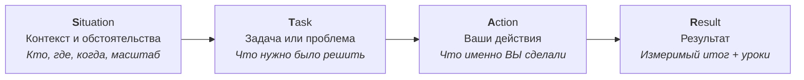

**Ключевые правила STAR:**
- **Situation** -- краткий контекст (1--2 предложения). Не затягивайте: интервьюеру нужна суть, а не предыстория проекта
- **Task** -- ваша конкретная задача или ответственность. Что именно от вас ожидали
- **Action** -- самая важная часть. Говорите «я», а не «мы». Опишите конкретные шаги
- **Result** -- измеримый итог (цифры, сроки, метрики). Добавьте, чему научились

> **Антипаттерн:** длинная история без конкретных действий и результата. Интервьюер оценивает не ситуацию, а ваше поведение в ней.

## Полезные ссылки

### Официальная документация

- [STAR Method (Wikipedia)](https://en.wikipedia.org/wiki/Situation,_task,_action,_result) -- описание метода STAR
- [Behavioral Interview Questions (Indeed)](https://www.indeed.com/career-advice/interviewing/behavioral-interview-questions) -- примеры вопросов и советы
- [Amazon Leadership Principles](https://www.amazon.jobs/content/en/our-workplace/leadership-principles) -- 16 принципов лидерства Amazon, на которых часто строят поведенческие вопросы
- [Top Spring Framework Interview Questions](https://www.baeldung.com/spring-interview-questions) -- технические вопросы по Spring для полного интервью
- [Java Interview Questions](https://www.baeldung.com/java-interview-questions) -- типичные технические вопросы на Java-собеседованиях

## Содержание

- [Метод STAR: основа поведенческого интервью](#метод-star-основа-поведенческого-интервью)
- [Полезные ссылки](#полезные-ссылки)
- [See also](#see-also)

**О себе и мотивация**
- [Q1. (!) Расскажите о себе и о своём профессиональном пути](#q1--расскажите-о-себе-и-о-своём-профессиональном-пути)
- [Q2. (!) Почему вы хотите сменить работу / почему наша компания?](#q2--почему-вы-хотите-сменить-работу--почему-наша-компания)

**Конфликты и неудачи**
- [Q3. (!) Опишите ситуацию конфликта с коллегой и как вы её решили](#q3--опишите-ситуацию-конфликта-с-коллегой-и-как-вы-её-решили)
- [Q4. (!) Опишите ситуацию неудачи или провала проекта. Что вы сделали?](#q4--опишите-ситуацию-неудачи-или-провала-проекта-что-вы-сделали)

**Лидерство и командная работа**
- [Q5. (!) Приведите пример, когда вы проявили лидерство без формальной роли](#q5--приведите-пример-когда-вы-проявили-лидерство-без-формальной-роли)
- [Q6. Опишите опыт работы в сложной или разнородной команде](#q6-опишите-опыт-работы-в-сложной-или-разнородной-команде)

**Дедлайны и обучение**
- [Q7. (!) Как вы принимали важное решение под давлением дедлайна?](#q7--как-вы-принимали-важное-решение-под-давлением-дедлайна)
- [Q8. (!) Расскажите, как вы осваивали новую технологию или домен](#q8--расскажите-как-вы-осваивали-новую-технологию-или-домен)
- [Q9. Как вы приоритизируете задачи при ограниченном времени?](#q9-как-вы-приоритизируете-задачи-при-ограниченном-времени)

**Обратная связь и влияние**
- [Q10. (!) Опишите ситуацию, когда вы давали или получали сложную обратную связь](#q10--опишите-ситуацию-когда-вы-давали-или-получали-сложную-обратную-связь)
- [Q11. Приведите пример, когда вы убеждали команду или руководство изменить подход](#q11-приведите-пример-когда-вы-убеждали-команду-или-руководство-изменить-подход)
- [Q12. Опишите опыт менторства или помощи коллеге](#q12-опишите-опыт-менторства-или-помощи-коллеге)

**Стресс и выгорание**
- [Q13. Как вы справлялись с выгоранием или перегрузкой?](#q13-как-вы-справлялись-с-выгоранием-или-перегрузкой)
- [Q14. Опишите ситуацию, когда пришлось сказать «нет» заказчику или стейкхолдеру](#q14-опишите-ситуацию-когда-пришлось-сказать-нет-заказчику-или-стейкхолдеру)
- [Q15. Как вы работаете с неопределённостью требований?](#q15-как-вы-работаете-с-неопределённостью-требований)

**Процессы и кросс-функциональность**
- [Q16. Приведите пример улучшения процесса в команде или компании](#q16-приведите-пример-улучшения-процесса-в-команде-или-компании)
- [Q17. Опишите опыт кросс-функционального взаимодействия (продакт, дизайн, поддержка)](#q17-опишите-опыт-кросс-функционального-взаимодействия-продакт-дизайн-поддержка)
- [Q18. Как вы реагируете на критику кода или решений?](#q18-как-вы-реагируете-на-критику-кода-или-решений)

**Технические решения и ответственность**
- [Q19. (!) Расскажите о самом сложном техническом решении и как к нему пришли](#q19--расскажите-о-самом-сложном-техническом-решении-и-как-к-нему-пришли)
- [Q20. Опишите ситуацию, когда вы брали ответственность за чужую ошибку](#q20-опишите-ситуацию-когда-вы-брали-ответственность-за-чужую-ошибку)

**Удалённая работа и прагматизм**
- [Q21. Как вы выстраиваете отношения с удалённой или распределённой командой?](#q21-как-вы-выстраиваете-отношения-с-удалённой-или-распределённой-командой)
- [Q22. Приведите пример, когда пришлось пожертвовать идеальным решением ради сроков](#q22-приведите-пример-когда-пришлось-пожертвовать-идеальным-решением-ради-сроков)

**Культура и онбординг**
- [Q23. Как вы справлялись с токсичным или непродуктивным поведением в команде?](#q23-как-вы-справлялись-с-токсичным-или-непродуктивным-поведением-в-команде)
- [Q24. Опишите ваш подход к онбордингу новых сотрудников](#q24-опишите-ваш-подход-к-онбордингу-новых-сотрудников)

**Саморефлексия и ценности**
- [Q25. (!) Какие у вас сильные стороны и зоны роста?](#q25--какие-у-вас-сильные-стороны-и-зоны-роста)
- [Q26. Опишите ситуацию, когда вы работали с трудным заказчиком или стейкхолдером](#q26-опишите-ситуацию-когда-вы-работали-с-трудным-заказчиком-или-стейкхолдером)
- [Q27. Как вы справлялись с многозадачностью и переключением контекста?](#q27-как-вы-справлялись-с-многозадачностью-и-переключением-контекста)
- [Q28. Приведите пример, когда вы инициировали изменение в команде или процессе](#q28-приведите-пример-когда-вы-инициировали-изменение-в-команде-или-процессе)

**Подготовка к собеседованию**
- [Q29. (!) Как вы готовитесь к собеседованию с технической и поведенческой стороны?](#q29--как-вы-готовитесь-к-собеседованию-с-технической-и-поведенческой-стороны)
- [Q30. (!) Что для вас важно в работе и в команде (ценности)?](#q30--что-для-вас-важно-в-работе-и-в-команде-ценности)

**Agile и командные процессы**
- [Q31. Опишите ваш опыт работы в Agile/Scrum-команде](#q31-опишите-ваш-опыт-работы-в-agilescrum-команде)
- [Q32. Как вы справляетесь с ситуацией, когда спринт под угрозой?](#q32-как-вы-справляетесь-с-ситуацией-когда-спринт-под-угрозой)

**Сложные решения и инновации**
- [Q33. (!) Расскажите о случае, когда вы предложили нестандартное решение](#q33--расскажите-о-случае-когда-вы-предложили-нестандартное-решение)
- [Q34. Опишите ситуацию, когда вам пришлось принимать решение при неполных данных](#q34-опишите-ситуацию-когда-вам-пришлось-принимать-решение-при-неполных-данных)

**Карьера и переговоры**
- [Q35. Как вы оцениваете предложение о работе и на что обращаете внимание?](#q35-как-вы-оцениваете-предложение-о-работе-и-на-что-обращаете-внимание)
- [Q36. (!) Расскажите о моменте, когда вы чувствовали несправедливую оценку](#q36--расскажите-о-моменте-когда-вы-чувствовали-несправедливую-оценку)

**Data-driven подход**
- [Q37. Приведите пример, когда данные изменили ваше решение](#q37-приведите-пример-когда-данные-изменили-ваше-решение)

**Amazon Leadership Principles**
- [Q38. (!) Какие Leadership Principles Amazon наиболее близки вашему опыту?](#q38--какие-leadership-principles-amazon-наиболее-близки-вашему-опыту)

---

## Q1. (!) Расскажите о себе и о своём профессиональном пути

Это открывающий вопрос, который задают почти на каждом собеседовании. Цель -- не пересказ резюме, а структурированная «история карьеры» за 2--3 минуты.

**Что хочет услышать интервьюер:**
- Логику карьерных переходов (не случайность, а осознанные решения)
- 2--3 ключевых достижения, релевантных позиции
- Связь вашего пути с тем, зачем вы здесь

**Структура ответа (формула «Прошлое -- Настоящее -- Будущее»):**

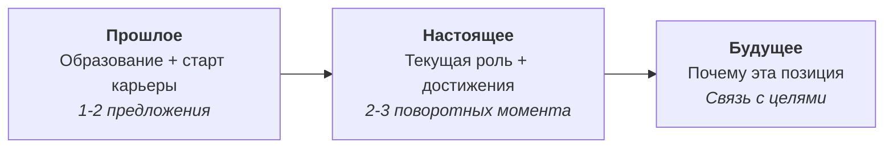

**Пример по STAR:**
- **S:** «Начинал как backend-разработчик в финтех-стартапе, команда из 5 человек»
- **T:** «Отвечал за платёжный модуль, 50k транзакций в день»
- **A:** «За 3 года вырос до лида, запустил 2 ключевых сервиса, внедрил `CI/CD`»
- **R:** «Сейчас ищу позицию, где смогу влиять на архитектурные решения на большем масштабе -- ваш продукт с миллионами пользователей это именно тот вызов»

**Типичные follow-up вопросы:**
- «Какой из проектов вы считаете самым значимым?»
- «Почему перешли из компании X в компанию Y?»
- «Что бы вы сделали иначе в своём карьерном пути?»

> **Ошибки:** перечисление резюме по датам; уход в технические детали без запроса; монолог дольше 3 минут.

## Q2. (!) Почему вы хотите сменить работу / почему наша компания?

Вопрос проверяет мотивацию и серьёзность намерений. Интервьюер хочет понять: вы убегаете от проблем или двигаетесь к цели?

**Что хочет услышать интервьюер:**
- Позитивная мотивация (рост, новые задачи), а не негатив к текущему работодателю
- Конкретные факты о компании (продукт, технологии, культура)
- Связь между вашими целями и возможностями компании

**Фреймворк ответа:**

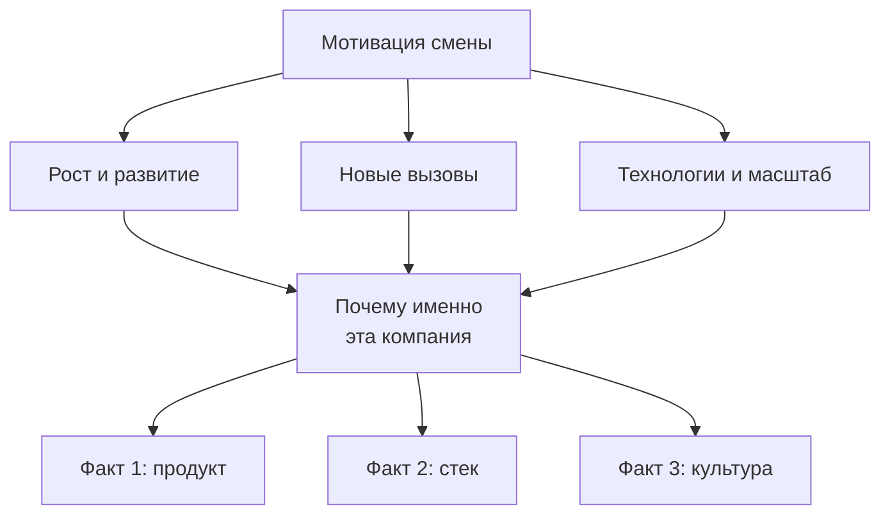

**Пример формулировки:** «Текущая роль дала мне сильную базу в `Spring Boot` и микросервисах, но я хочу работать на бОльшем масштабе. Ваш продукт обрабатывает миллионы заказов, и я знаю, что вы используете `Kafka` и event-driven архитектуру -- это то направление, в которое я хочу углубиться. Кроме того, ваш подход к инженерной культуре (открытые постмортемы, внутренние доклады) совпадает с моими ценностями.»

**Типичные follow-up:**
- «Что именно вас не устраивает на текущем месте?»
- «Какие альтернативы вы рассматриваете?»
- «Что вы знаете о нашем продукте/стеке?»

> **Ошибки:** критика текущей команды или руководства; общие фразы «хочу развиваться» без контекста; незнание компании.

## Q3. (!) Опишите ситуацию конфликта с коллегой и как вы её решили

Один из самых частых вопросов. Проверяет эмоциональный интеллект, умение слушать и находить решения.

**Что хочет услышать интервьюер:**
- Вы фокусируетесь на проблеме, а не на личности
- Вы слушаете другую сторону
- Вы ищете win-win, а не «я был прав»
- Конфликт привёл к улучшению, а не просто «замяли»

**Фреймворк разрешения конфликтов:**

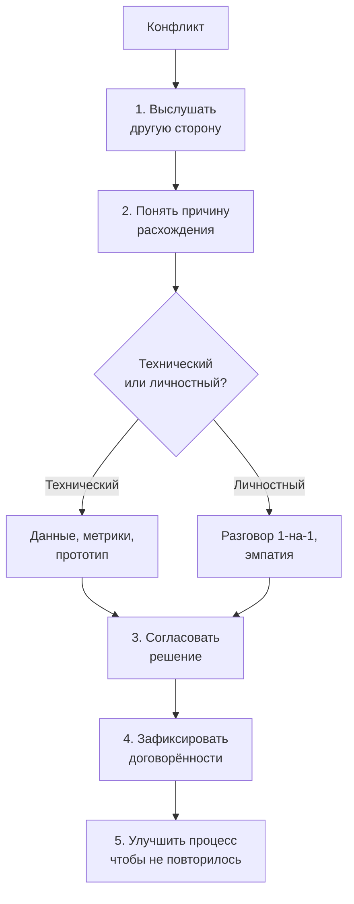

**Пример по STAR:**
- **S:** «На код-ревью мы с коллегой разошлись по подходу к обработке ошибок: я за единый `ErrorHandler`, он за обработку на месте. Спор блокировал мёрдж 2 дня»
- **T:** «Нужно было принять решение, не разрушив рабочие отношения»
- **A:** «Я предложил встретиться 1-на-1, без чата. Мы записали плюсы и минусы каждого подхода, посмотрели, как это сделано в других сервисах команды. Оказалось, его подход лучше для нашего конкретного случая, но мой -- для будущих сервисов»
- **R:** «Приняли его подход для текущего PR, создали ADR для единого стандарта в новых сервисах. Отношения стали лучше -- он теперь первый, кого я зову на архитектурные обсуждения»

Связано с практиками [код-ревью](../leadership/code-review-practices-interview.md) -- конфликты часто возникают именно на этапе ревью.

**Типичные follow-up:**
- «А если бы коллега не пошёл на контакт?»
- «Когда стоит эскалировать конфликт?»
- «Как вы отличаете конструктивный спор от деструктивного?»

## Q4. (!) Опишите ситуацию неудачи или провала проекта. Что вы сделали?

Вопрос проверяет зрелость, ответственность и способность учиться на ошибках. Это один из вопросов, где «плохой» пример -- лучше, чем его отсутствие.

**Что хочет услышать интервьюер:**
- Вы берёте ответственность, а не ищете виноватых
- Вы провели анализ причин (не просто «ну, не получилось»)
- Вы внедрили конкретные изменения, чтобы избежать повторения
- Вы способны говорить о неудачах спокойно

**Пример по STAR:**
- **S:** «Мы мигрировали монолит на микросервисы. Я отвечал за сервис заказов -- ключевой в цепочке»
- **T:** «Запустить в прод за 2 месяца, без даунтайма»
- **A:** «Я недооценил сложность миграции данных, не заложил время на нагрузочное тестирование. Запустили по плану, но через 2 часа сервис упал под нагрузкой. Откатили, провели постмортем, я написал детальный разбор причин»
- **R:** «Перезапустили через 3 недели с нагрузочными тестами и canary-деплоем. Из этого вырос чек-лист миграции, который потом использовали 4 команды. Главный урок -- нагрузочные тесты до прода, не после»

**Фреймворк разбора неудачи:**

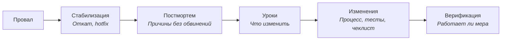

**Типичные follow-up:**
- «Что бы вы сделали иначе, зная то, что знаете сейчас?»
- «Как команда отреагировала?»
- «Были ли аналогичные ситуации после?»

> **Ошибки:** выбор примера, где виноваты только другие; слишком «учебный» пример без реального провала; отсутствие конкретных уроков.

## Q5. (!) Приведите пример, когда вы проявили лидерство без формальной роли

Вопрос проверяет проактивность и способность влиять без формальной власти -- ключевой навык для senior-разработчиков. Подробнее о лидерских качествах -- в [вопросах по лидерству в команде](../leadership/team-leadership-interview.md).

**Что хочет услышать интервьюер:**
- Вы видите проблему и берёте инициативу, а не ждёте, пока скажут
- Вы умеете вовлечь других без приказов
- Есть измеримый результат

**Пример по STAR:**
- **S:** «В команде из 8 человек не было стандартов код-ревью. Ревью занимало 3--5 дней, качество зависело от настроения ревьюера»
- **T:** «Формального ответственного за процесс не было, тимлид был перегружен»
- **A:** «Я изучил подходы Google и Thoughtbot, написал драфт гайдлайнов, обсудил на ретро, собрал фидбэк, итеративно доработал. Сам начал ревьюить по новым правилам, показывая пример»
- **R:** «Среднее время ревью снизилось с 4 дней до 1. Команда приняла гайдлайны как стандарт, тимлид делегировал мне ведение процесса ревью»

Это пересекается с темой [практик код-ревью](../leadership/code-review-practices-interview.md) -- лидерство часто проявляется именно в улучшении инженерных процессов.

**Типичные follow-up:**
- «Было ли сопротивление? Как справились?»
- «Почему именно вы взяли это на себя?»
- «Как поддерживаете эти изменения со временем?»

## Q6. Опишите опыт работы в сложной или разнородной команде

Вопрос проверяет навыки коммуникации и адаптивности в условиях разных ролей, культур, часовых поясов.

**Что хочет услышать интервьюер:**
- Умение находить общий язык с разными людьми
- Конкретные практики для преодоления барьеров
- Результат сотрудничества

**Пример по STAR:**
- **S:** «Проект с командой из 12 человек: 4 бэкенда в Москве, 3 фронтенда в Минске, продакт и дизайнер удалённо. Разница в 0--2 часа, но разные процессы и привычки»
- **T:** «Запустить фичу за 6 недель, координируя фронт и бэк»
- **A:** «Инициировал ежедневный 15-минутный синк в общее окно. Завёл шаблон для фиксации решений в `Confluence`. Перевёл технические требования на «язык продукта» для продакта»
- **R:** «Запустили на неделю раньше срока. Шаблон и синки продолжили использовать в следующих проектах»

**Типичные follow-up:**
- «Как справлялись с языковым/культурным барьером?»
- «Что делали, когда не могли договориться?»

## Q7. (!) Как вы принимали важное решение под давлением дедлайна?

Проверяет способность мыслить структурно в стрессе, принимать осознанные trade-off и коммуницировать риски.

**Что хочет услышать интервьюер:**
- Осознанный выбор, а не паника или «просто работал ночами»
- Явный trade-off: что выбрали и чем пожертвовали
- Митигация рисков после дедлайна

**Фреймворк принятия решений под давлением:**

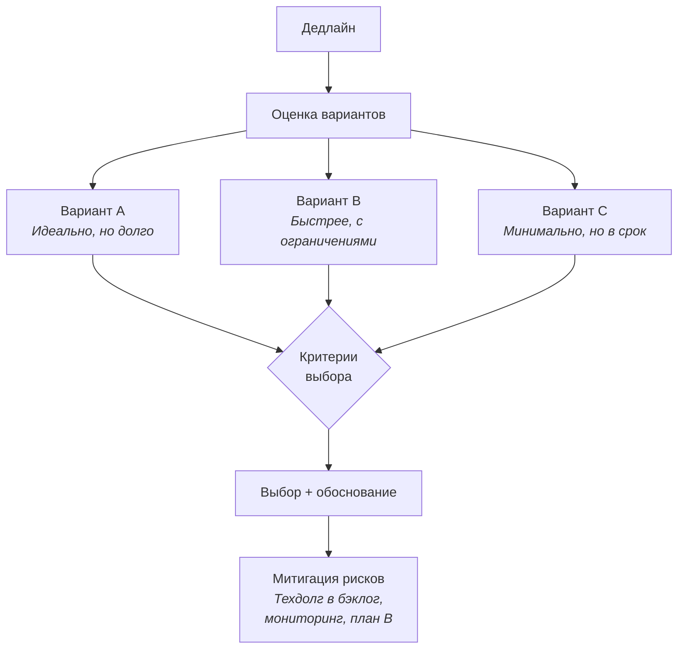

**Пример по STAR:**
- **S:** «Релиз платёжного модуля через 3 дня. Обнаружили, что новый платёжный провайдер не поддерживает рекурренты -- 15% заказов»
- **T:** «Выпустить релиз в срок без потери функциональности»
- **A:** «Варианты: (A) доработать интеграцию -- 2 недели; (B) оставить старый провайдер для рекуррентов, новый для остального -- 2 дня; (C) отложить релиз. Выбрал B: минимальный риск, проверяемое решение. Написал тикет на полную миграцию в следующем спринте, добавил алерты на fallback»
- **R:** «Релиз вышел в срок, рекурренты работали стабильно через старый провайдер. Полную миграцию завершили через 3 недели»

Тема trade-off тесно связана с [управлением техдолгом](../code-quality/technical-debt-interview.md).

**Типичные follow-up:**
- «А если бы вариант B не сработал?»
- «Как вы коммуницировали риски менеджменту?»
- «Как решили, что trade-off приемлемый?»

## Q8. (!) Расскажите, как вы осваивали новую технологию или домен

Проверяет обучаемость -- одно из самых ценных качеств для любого уровня.

**Что хочет услышать интервьюер:**
- Системный подход к обучению, а не «просто читал документацию»
- Конкретные сроки и результат
- Применение знаний в реальном проекте

**Пример по STAR:**
- **S:** «Команда переходила на `Kafka` для event-driven архитектуры. Никто не имел продакшен-опыта с `Kafka`»
- **T:** «Стать экспертом в команде за 4 недели, чтобы спроектировать первый продюсер-консьюмер»
- **A:** «Неделя 1: официальная документация + курс от Confluent. Неделя 2: пет-проект с основными паттернами (exactly-once, DLQ). Неделя 3: прототип для нашего use case, нагрузочный тест. Неделя 4: ревью прототипа с экспертом из другой команды, внутренний доклад»
- **R:** «Запустили первый продюсер в прод через 5 недель. За полгода перевели 4 сервиса на event-driven. Провёл 2 внутренних доклада, помогал с онбордингом новых разработчиков»

**Типичные follow-up:**
- «Какие ресурсы оказались самыми полезными?»
- «Какие ошибки допустили при внедрении?»
- «Как вы отличаете «достаточно знаний для старта» от «нужно ещё учить»?»

## Q9. Как вы приоритизируете задачи при ограниченном времени?

Проверяет навыки тайм-менеджмента и коммуникации -- важно показать не только подход, но и умение сказать «нет» или «позже».

**Что хочет услышать интервьюер:**
- Системный подход (матрица, согласование), а не «просто работаю больше»
- Коммуникация о рисках заблаговременно
- Конкретный пример из практики

**Фреймворк приоритизации (Eisenhower):**

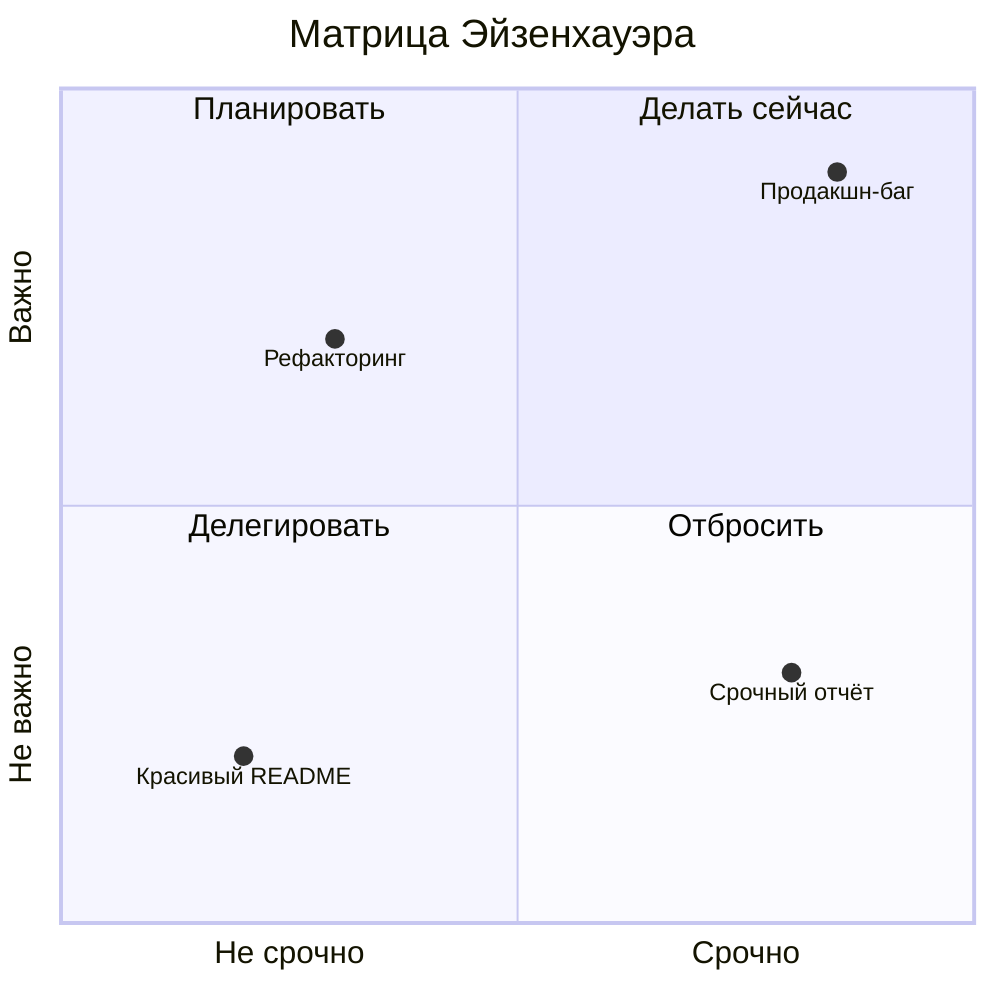

**Пример по STAR:**
- **S:** «Середина спринта, 3 задачи в работе. Прилетает P1 баг в проде + запрос от продакта на срочную аналитику»
- **T:** «Расставить приоритеты и выполнить всё критическое»
- **A:** «Зафиксировал статус задач. P1 баг -- первый приоритет (продакшн, влияет на пользователей). Аналитика -- согласовал с продактом сдвиг на 1 день. Из спринта перенёс одну задачу на следующую итерацию, предупредил тимлида»
- **R:** «Баг закрыт за 3 часа, аналитика сделана в новый срок. Ни одна задача не «потерялась» -- всё задокументировано в Jira»

**Типичные follow-up:**
- «Как решаете, что отложить?»
- «Что делаете, когда всё «срочно»?»

## Q10. (!) Опишите ситуацию, когда вы давали или получали сложную обратную связь

Один из маркеров зрелости разработчика. Обратная связь в [код-ревью](../leadership/code-review-practices-interview.md) -- частный случай; здесь речь о любой рабочей обратной связи.

**Что хочет услышать интервьюер:**
- Конкретика (факты, не оценки личности)
- Правильный формат (1-на-1, в подходящий момент)
- Результат -- изменения в поведении, а не обида

**Фреймворк обратной связи (SBI -- Situation, Behavior, Impact):**

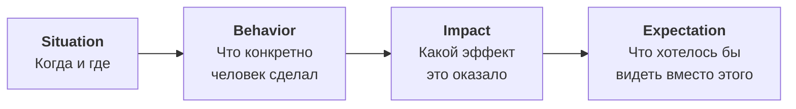

**Пример по STAR (давал обратную связь):**
- **S:** «Коллега регулярно пушил код без тестов, что ломало CI и блокировало другие PR»
- **T:** «Донести проблему без разрушения отношений»
- **A:** «Позвал на кофе 1-на-1. Описал конкретику: «За последние 2 недели 4 из 7 твоих PR ломали CI. Это блокирует остальных в среднем на 2 часа». Спросил, чем могу помочь -- оказалось, он не знал про pre-commit hooks»
- **R:** «Настроили хуки вместе, за следующий месяц -- 0 сломанных билдов. Коллега позже сам стал помогать другим с настройкой»

**Пример по STAR (получал обратную связь):**
- **S:** «На 1-на-1 тимлид сказал, что я слишком много беру на себя и не делегирую»
- **T:** «Принять фидбэк и изменить поведение»
- **A:** «Сначала внутренняя реакция -- защита. Но попросил конкретные примеры, записал. Начал осознанно передавать задачи джуниорам, вести трекинг делегирования»
- **R:** «Через 2 месяца тимлид отметил прогресс. Бонус: джуниоры выросли быстрее, а я освободил время на архитектурные задачи»

**Типичные follow-up:**
- «А если человек не принял обратную связь?»
- «Как вы отличаете конструктивную критику от деструктивной?»
- «Как часто вы сами запрашиваете обратную связь?»

## Q11. Приведите пример, когда вы убеждали команду или руководство изменить подход

Проверяет навыки влияния -- умение продвигать идеи через данные и аргументы, а не авторитет.

**Что хочет услышать интервьюер:**
- Аргументация на данных, а не «я так считаю»
- Работа с сопротивлением (не давите, а вовлекайте)
- Конкретный результат

**Пример по STAR:**
- **S:** «Команда деплоила вручную через SSH -- 40 минут на деплой, 2--3 ошибки в месяц из-за человеческого фактора»
- **T:** «Убедить команду и тимлида перейти на `CI/CD`»
- **A:** «Собрал статистику инцидентов за квартал (7 из 10 -- ошибки ручного деплоя). Сделал proof-of-concept за выходные. Представил на ретро с числами: «40 минут * 20 деплоев/месяц = 13 часов. С CI/CD -- 5 минут * 20 = 1.5 часа». Предложил поэтапный переход: сначала staging, потом prod»
- **R:** «Через 2 недели staging на CI/CD, через месяц -- prod. Ошибки деплоя снизились с 3/мес до 0. Тимлид потом использовал этот кейс как пример для других команд»

**Типичные follow-up:**
- «Что бы делали, если бы руководство отказало?»
- «Как работали с теми, кто был против?»

## Q12. Опишите опыт менторства или помощи коллеге

Проверяет готовность делиться знаниями и терпение. Особенно важно для senior-позиций.

**Что хочет услышать интервьюер:**
- Системный подход к обучению, а не «ну, я отвечал на вопросы»
- Адаптация под уровень менти
- Измеримый результат роста

**Пример по STAR:**
- **S:** «В команду пришёл джуниор с 6 месяцами опыта. Проект на `Spring Boot` с микросервисной архитектурой -- для него всё новое»
- **T:** «Вывести на самостоятельность за 2 месяца»
- **A:** «Составил онбординг-план: неделя 1 -- архитектура и документация; неделя 2--3 -- парное программирование на небольших задачах; неделя 4+ -- самостоятельные задачи с детальным ревью. Еженедельные 1-на-1 по 30 минут для вопросов. Создал FAQ-страницу в `Confluence` для частых вопросов»
- **R:** «Через 6 недель делал фичи самостоятельно. Через 3 месяца -- сам начал ревьюить код. Время онбординга следующего новичка сократилось вдвое благодаря FAQ»

Тема пересекается с [лидерством в команде](../leadership/team-leadership-interview.md) -- менторство это одна из ключевых лидерских практик.

**Типичные follow-up:**
- «Что делать, если менти не прогрессирует?»
- «Как балансировать менторство и свои задачи?»

## Q13. Как вы справлялись с выгоранием или перегрузкой?

Вопрос на эмоциональный интеллект и самоосознание. Не стыдно признать выгорание -- важно показать, что вы это распознали и приняли меры.

**Что хочет услышать интервьюер:**
- Осознанность (вы замечаете признаки, а не игнорируете)
- Конкретные действия (не просто «отдохнул»)
- Превентивные меры на будущее

**Признаки и стратегии:**

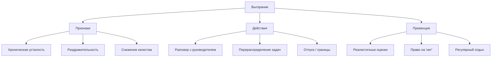

**Пример по STAR:**
- **S:** «Квартал с 3 параллельными проектами, сверхурочные 2 месяца подряд»
- **T:** «Понял, что качество падает -- 2 бага в продакшене за неделю, чего раньше не было»
- **A:** «Поговорил с тимлидом, показал загрузку. Вместе перераспределили: один проект передали коллеге, второй сдвинули на спринт. Взял 3 дня отпуска. Договорились о лимите -- не больше 2 проектов одновременно»
- **R:** «Баги прекратились, следующий квартал -- без сверхурочных. Правило «максимум 2 проекта» стало командным»

**Типичные follow-up:**
- «Как вы предотвращаете выгорание у членов команды?»
- «Что делаете, если понимаете, что команда перегружена, а дедлайн не двигается?»

## Q14. Опишите ситуацию, когда пришлось сказать «нет» заказчику или стейкхолдеру

Проверяет умение управлять ожиданиями и защищать команду/качество -- важный навык на любом уровне, но особенно для senior и lead.

**Что хочет услышать интервьюер:**
- «Нет» с аргументами и альтернативами, а не просто отказ
- Профессиональная коммуникация
- Баланс между «угодить клиенту» и «защитить качество»

**Пример по STAR:**
- **S:** «Продакт-менеджер просит добавить 3 новых фичи в текущий спринт за неделю до релиза»
- **T:** «Объяснить ограничения и предложить реалистичный план»
- **A:** «Оценил каждую фичу: 2, 3 и 5 дней. Показал: «Если берём все 3, рискуем качеством текущего релиза -- нет времени на тестирование». Предложил: «Берём самую ценную (2 дня) сейчас, остальные -- первые в следующем спринте с гарантией». Подкрепил данными: conversion rate фичи 1 в 3 раза выше остальных»
- **R:** «Продакт согласился. Фича 1 вышла в срок, остальные -- через 2 недели. Ни одного бага в релизе»

**Типичные follow-up:**
- «А если стейкхолдер настаивает и ваш руководитель его поддерживает?»
- «Как вы определяете, когда «нет» оправдано?»

## Q15. Как вы работаете с неопределённостью требований?

Реальность разработки -- требования часто меняются или неполны. Вопрос проверяет адаптивность и умение снижать риски.

**Что хочет услышать интервьюер:**
- Проактивный подход (уточняющие вопросы, а не «делаю как понял»)
- Итеративность (MVP, прототипы, ранняя обратная связь)
- Фиксация договорённостей

**Пример по STAR:**
- **S:** «Новый проект: «сделать дашборд аналитики». ТЗ -- полстраницы, неясно кто пользователь и какие метрики»
- **T:** «Снизить неопределённость и начать работу, не дожидаясь «идеального» ТЗ»
- **A:** «Собрал воркшоп с продактом и аналитиком на 1.5 часа: определили 3 ключевых пользователя и их топ-3 сценария. Зафиксировал в Confluence, согласовал. Сделал прототип (mockup + API) за 3 дня, показал стейкхолдерам. Из фидбэка скорректировал 40% требований»
- **R:** «Запустили MVP за 3 недели вместо запланированных 6. Фидбэк от пользователей получили на 3 недели раньше, скорректировали roadmap»

**Типичные follow-up:**
- «Как решаете, когда достаточно информации для старта?»
- «Что делаете, если стейкхолдер не может ответить на уточняющие вопросы?»

## Q16. Приведите пример улучшения процесса в команде или компании

Проверяет проактивность и системное мышление. Показывает, что вы не просто выполняете задачи, а улучшаете среду вокруг.

**Что хочет услышать интервьюер:**
- Конкретная «боль» и её масштаб
- Ваша инициатива и действия
- Измеримый результат

**Пример по STAR:**
- **S:** «Релизы выходили раз в 2 недели, каждый релиз -- 4 часа ручного тестирования + 2 часа деплоя. Регрессии в 30% релизов»
- **T:** «Снизить время и ошибки релиза»
- **A:** «На ретро предложил план: (1) автотесты на критический путь (2 недели); (2) canary-деплой (1 неделя); (3) rollback за 1 клик (3 дня). Сделал proof-of-concept, получил buy-in от тимлида, внедрили за 6 недель»
- **R:** «Время релиза: 6 часов -> 40 минут. Регрессии: 30% -> 5%. Начали деплоить 3 раза в неделю вместо 1 раза в 2 недели»

**Типичные follow-up:**
- «Как измеряли результат?»
- «Кто ещё участвовал?»
- «Как поддерживаете процесс со временем?»

## Q17. Опишите опыт кросс-функционального взаимодействия (продакт, дизайн, поддержка)

Проверяет умение работать за пределами своей функции -- «переводить» технический язык на бизнес-язык и обратно.

**Что хочет услышать интервьюер:**
- Понимание целей и языка другой функции
- Конкретные практики взаимодействия
- Результат сотрудничества

**Пример по STAR:**
- **S:** «Запуск системы лояльности. Продакт хотел максимум функций, дизайнер -- идеальный UX, поддержка -- минимум нагрузки на саппорт»
- **T:** «Согласовать требования и выпустить первую версию за 8 недель»
- **A:** «Предложил еженедельные синки всех стейкхолдеров. На первом определили success-метрики каждой стороны. Перевёл техдолг и ограничения в бизнес-последствия: «Если делаем всё сразу -- 12 недель + риск багов, которые загрузят поддержку». Согласовали MVP из 3 фич»
- **R:** «Запустили за 7 недель. Продакт получил ключевые фичи, поддержка -- понятные FAQ, дизайнер -- консистентный UI. Нагрузка на поддержку выросла на 10% вместо ожидаемых 40%»

**Типичные follow-up:**
- «Что делаете, когда приоритеты стейкхолдеров конфликтуют?»
- «Как «переводите» технические ограничения для нетехнических людей?»

## Q18. Как вы реагируете на критику кода или решений?

Проверяет зрелость и фокус на результате, а не на эго. Тесно связано с практиками [код-ревью](../leadership/code-review-practices-interview.md).

**Что хочет услышать интервьюер:**
- Отделяете идею от личности
- Слушаете аргументы, а не защищаетесь
- Готовы изменить позицию при наличии аргументов

**Пример по STAR:**
- **S:** «Предложил архитектуру нового сервиса на базе event sourcing. На ревью тимлид и два сеньора раскритиковали -- слишком сложно для текущего масштаба»
- **T:** «Понять, обоснована ли критика, и принять решение»
- **A:** «Первая реакция -- защита, потому что потратил неделю на проектирование. Взял паузу до следующего дня. Перечитал аргументы: они были правы -- event sourcing добавлял сложность без текущей необходимости. Написал ответ: «Согласен, CRUD + события в отдельной таблице покроют 90% кейсов. Event sourcing -- в бэклог, если нагрузка вырастет в 10 раз»»
- **R:** «Сервис запустили в 2 раза быстрее. Через полгода нагрузка действительно выросла, и мы мигрировали -- но уже с реальными данными для проектирования»

**Типичные follow-up:**
- «А если вы уверены, что правы, а команда нет?»
- «Как отличаете конструктивную критику от субъективного мнения?»

## Q19. (!) Расскажите о самом сложном техническом решении и как к нему пришли

Показывает глубину мышления, способность работать с trade-off и вовлекать команду.

**Что хочет услышать интервьюер:**
- Масштаб и сложность задачи
- Структурный подход к принятию решения (не «интуиция», а анализ)
- Осознанные компромиссы
- Результат и валидация

**Фреймворк принятия технических решений:**

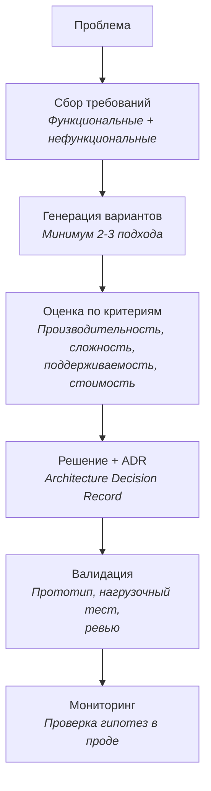

**Пример по STAR:**
- **S:** «Сервис заказов: 10k RPS, текущая БД не справляется. Нужно масштабировать хранение без даунтайма»
- **T:** «Выбрать стратегию масштабирования, реализовать без потери данных»
- **A:** «Рассмотрел 3 варианта: (A) вертикальное масштабирование PostgreSQL -- предел через 6 месяцев; (B) шардирование по customer_id -- сложно, но масштабируемо; (C) CQRS с отдельной read-моделью -- решает текущую проблему чтения. Написал ADR с таблицей сравнения. Выбрали C + подготовка к B: CQRS решает проблему сейчас, а разделение read/write упрощает будущее шардирование»
- **R:** «Время ответа с 500ms до 50ms. Через год, когда нагрузка выросла в 3 раза, шардирование прошло гладко благодаря уже разделённой read/write модели»

**Типичные follow-up:**
- «Как вовлекали команду в принятие решения?»
- «Какие компромиссы оказались болезненными?»
- «Как документировали решение для будущих разработчиков?»

## Q20. Опишите ситуацию, когда вы брали ответственность за чужую ошибку

Проверяет надёжность и командный дух -- отсутствие «культуры поиска виноватых».

**Что хочет услышать интервьюер:**
- Вы думаете о команде и клиенте, а не о «кто виноват»
- Вы действуете (исправление, коммуникация), а не просто «прикрыли»
- Вы улучшаете процесс, чтобы не повторилось

**Пример по STAR:**
- **S:** «Продакшен-баг: неправильный расчёт скидки, потери ~200k за сутки. Код написал джуниор, ревью пропустил я»
- **T:** «Исправить баг и взять ответственность за пропущенное ревью»
- **A:** «Сразу сказал тимлиду: «Это мой пропуск на ревью, я исправлю». Откатил изменение за 20 минут, написал hotfix с тестами. На постмортеме не упоминал имя джуниора -- говорил «мы пропустили». Предложил чек-лист ревью для бизнес-критичных модулей»
- **R:** «Баг закрыт за 2 часа. Чек-лист внедрили, за следующие 6 месяцев -- 0 аналогичных инцидентов. Джуниор не потерял мотивацию и вырос до мидла»

**Типичные follow-up:**
- «Где граница между «взять ответственность» и «покрывать чужие ошибки»?»
- «Как донести проблему до автора кода без обвинений?»

## Q21. Как вы выстраиваете отношения с удалённой или распределённой командой?

Актуальный вопрос в эпоху удалённой работы. Проверяет навыки асинхронной коммуникации и самоорганизации.

**Что хочет услышать интервьюер:**
- Конкретные практики (не общие слова «мы созваниваемся»)
- Умение работать асинхронно
- Инициатива в построении отношений

**Пример по STAR:**
- **S:** «Команда из 6 человек в 3 часовых поясах (Москва, Тбилиси, Алматы). Общее окно -- 4 часа»
- **T:** «Обеспечить продуктивное взаимодействие без потерь контекста»
- **A:** «Внедрил 3 практики: (1) ежедневный async-стендап в Slack до 11:00 по Москве; (2) все решения фиксируются в `Confluence`, не в чате; (3) еженедельный видео-синк в общее окно 14:00--15:00 МСК. Плюс неформальный «виртуальный кофе» раз в 2 недели»
- **R:** «За 3 месяца ни одного «а мы не знали» инцидента. Velocity команды выросла на 15% по сравнению с предыдущим кварталом. Практики переняли 2 другие команды»

**Типичные follow-up:**
- «Как решаете проблему «из чата всё пропадает»?»
- «Как поддерживаете командный дух на удалёнке?»

## Q22. Приведите пример, когда пришлось пожертвовать идеальным решением ради сроков

Проверяет прагматизм и умение балансировать quality vs. delivery. Тесно связано с [управлением техдолгом](../code-quality/technical-debt-interview.md).

**Что хочет услышать интервьюер:**
- Осознанный trade-off (не «просто захакали»)
- Явный план митигации (техдолг зафиксирован, не забыт)
- Баланс, а не крайности

**Пример по STAR:**
- **S:** «Запуск промо-кампании через 5 дней. Нужен новый тип скидки. Идеальное решение -- обобщённый движок скидок (2 недели). Быстрое -- if/else для конкретного типа (2 дня)»
- **T:** «Запустить в срок без ущерба для стабильности»
- **A:** «Выбрал быстрое решение, но с дисциплиной: выделил логику в отдельный класс (не размазал по коду), написал тесты на все граничные случаи, создал тикет на рефакторинг с приоритетом «следующий спринт», добавил TODO с номером тикета в код»
- **R:** «Промо запущено в срок, 0 багов. Рефакторинг в обобщённый движок сделали через 3 недели, перенеся тесты. Временное решение жило 3 недели, а не «навсегда»»

**Типичные follow-up:**
- «Как решаете, что техдолг допустим?»
- «Как предотвращаете ситуацию, когда «временное» становится постоянным?»

## Q23. Как вы справлялись с токсичным или непродуктивным поведением в команде?

Деликатная тема, которая проверяет лидерство и [умение управлять командной динамикой](../leadership/team-leadership-interview.md).

**Что хочет услышать интервьюер:**
- Конкретные действия (не «терпел» и не «сразу пожаловался»)
- Объективность и фокус на поведении, а не на личности
- Эскалация -- как последнее средство, а не первое

**Пример по STAR:**
- **S:** «Коллега систематически блокировал ревью комментариями типа «это плохо, переделай», без конструктива. Команда начала избегать его ревью»
- **T:** «Изменить поведение или минимизировать негативное влияние»
- **A:** «Шаг 1: поговорил 1-на-1, привёл конкретные примеры комментариев и спросил, что он имел в виду. Оказалось, он не осознавал тон. Шаг 2: предложил формат ревью-комментариев (what / why / how to fix). Шаг 3: на ретро подняли тему «культуры ревью» без указания на конкретного человека»
- **R:** «Качество ревью улучшилось у всей команды. Коллега стал одним из лучших ревьюеров -- его комментарии стали образцом»

**Типичные follow-up:**
- «А если разговор не помог?»
- «Когда стоит эскалировать, а когда решать самому?»

## Q24. Опишите ваш подход к онбордингу новых сотрудников

Проверяет системное мышление и заботу о команде. Хороший онбординг -- признак зрелой инженерной культуры.

**Что хочет услышать интервьюер:**
- Структурированный подход (не «разберёшься»)
- Измеримый результат (время до первого PR, время до самостоятельности)
- Ваша роль в процессе

**Фреймворк онбординга:**

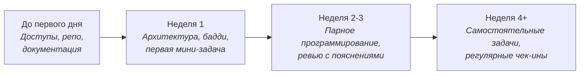

**Пример по STAR:**
- **S:** «В команду за квартал пришли 3 новых разработчика. Предыдущий онбординг -- «вот репо, разберись»»
- **T:** «Создать системный онбординг, чтобы люди выходили на продуктивность за 2--3 недели, а не за 2 месяца»
- **A:** «Создал чек-лист: (1) до первого дня -- все доступы готовы; (2) день 1 -- overview архитектуры + бадди; (3) неделя 1 -- мини-задача с парным программированием; (4) недели 2--3 -- задачи с детальным ревью; (5) неделя 4 -- самостоятельные задачи + ретро онбординга. Написал «Architecture Overview» в Confluence»
- **R:** «Время до первого PR: 5 дней -> 2 дня. Время до самостоятельности: 2 месяца -> 3 недели. Новички на ретро отмечали «лучший онбординг в карьере»»

**Типичные follow-up:**
- «Как адаптируете онбординг под уровень (джуниор vs. сеньор)?»
- «Что делаете, если новичок «застрял»?»

## Q25. (!) Какие у вас сильные стороны и зоны роста?

Классический вопрос на самоосознание. Ловушка -- слишком «идеальный» ответ или слишком откровенный.

**Что хочет услышать интервьюер:**
- Конкретные примеры, а не абстракции
- Зоны роста -- реальные, с планом улучшения
- Честность без самоуничижения

**Фреймворк ответа:**

| | Формулировка | Пример |
|---|---|---|
| **Сильная сторона 1** | Навык + подтверждение | «Быстро осваиваю новые технологии -- за 4 недели стал тимовым экспертом по `Kafka`» |
| **Сильная сторона 2** | Навык + подтверждение | «Структурирую хаос -- в проекте с размытым ТЗ построил roadmap за 2 дня» |
| **Зона роста 1** | Честно + что делаю | «Делегирование -- раньше делал всё сам, сейчас осознанно передаю задачи и контролирую результат» |
| **Зона роста 2** | Честно + что делаю | «Публичные выступления -- начал с внутренних докладов, планирую внешний митап» |

**Типичные follow-up:**
- «Приведите пример, когда сильная сторона помогла»
- «Приведите пример, когда зона роста помешала»
- «Что вы делаете для развития прямо сейчас?»

> **Ошибки:** «Мой недостаток -- перфекционизм» (клише); перечисление без примеров; слишком критичное отношение к себе.

## Q26. Опишите ситуацию, когда вы работали с трудным заказчиком или стейкхолдером

Проверяет профессионализм и навыки управления отношениями.

**Что хочет услышать интервьюер:**
- Сохранение профессионализма под давлением
- Конкретные техники (фиксация договорённостей, управление ожиданиями)
- Результат -- не «терпел», а «нашёл подход»

**Пример по STAR:**
- **S:** «Стейкхолдер из бизнеса менял требования каждую неделю, при этом требовал сохранить дедлайн. Команда демотивирована переделками»
- **T:** «Стабилизировать требования и защитить команду от хаоса»
- **A:** «Предложил формат: (1) все изменения -- через единый канал (Jira, не чат); (2) еженедельный приоритизационный митинг: «добавляем фичу X -- что убираем?»; (3) каждое изменение -- с оценкой влияния на сроки. Показал стейкхолдеру визуализацию: «вот 5 изменений за месяц, каждое добавило N дней»»
- **R:** «Частота изменений снизилась с 3/неделю до 1/спринт. Стейкхолдер оценил прозрачность: «Теперь я вижу, чего стоят мои хотелки». Дедлайн соблюдён»

**Типичные follow-up:**
- «А если стейкхолдер выше вашего руководителя?»
- «Как сохраняете спокойствие при давлении?»

## Q27. Как вы справлялись с многозадачностью и переключением контекста?

Проверяет самоорганизацию и реалистичность -- признание, что многозадачность снижает продуктивность.

**Что хочет услышать интервьюер:**
- Вы понимаете цену переключения контекста
- У вас есть конкретные техники
- Вы умеете коммуницировать о границах

**Пример по STAR:**
- **S:** «Параллельно вёл 2 проекта + дежурство по инцидентам. За неделю 15+ переключений контекста»
- **T:** «Снизить переключения и не потерять качество»
- **A:** «Договорился с тимлидом: утро (до 13:00) -- глубокая работа над проектом A, уведомления выключены. После обеда -- проект B и дежурство. Критичные инциденты -- исключение, остальное ждёт. Каждый вечер 10 минут -- фиксация контекста: «где остановился, что делать дальше»»
- **R:** «Переключения снизились с 15 до 4 в неделю. Скорость по обоим проектам выросла, потому что появились блоки для глубокой работы»

**Типичные follow-up:**
- «Что делаете, когда всё «горит» одновременно?»
- «Как объясняете коллегам, что вы «не в доступе»?»

## Q28. Приведите пример, когда вы инициировали изменение в команде или процессе

Похож на Q16, но акцент на инициативе и вовлечении других. Показывает [лидерство без формальной роли](../leadership/team-leadership-interview.md).

**Что хочет услышать интервьюер:**
- Вы не ждёте, пока скажут -- вы действуете
- Вы умеете вовлечь других (не «я один всё сделал»)
- Есть измеримый результат

**Пример по STAR:**
- **S:** «Отсутствие обязательного код-ревью. PR мёрджились автором без ревью, баги обнаруживались в проде»
- **T:** «Внедрить культуру ревью без «указания сверху»»
- **A:** «Начал с себя -- стал просить ревью на все свои PR. Через неделю предложил на ретро: «Давайте попробуем 2 недели обязательное ревью, потом оценим». Написал короткий гайд: что проверять, сколько времени тратить. Настроил branch protection в GitLab»
- **R:** «После 2-недельного пилота команда единогласно решила продолжить. За квартал: баги в проде -40%, плюс все отмечали рост обмена знаниями. Гайд переняли 3 другие команды»

Подробнее о практиках ревью -- в [вопросах по код-ревью](../leadership/code-review-practices-interview.md).

**Типичные follow-up:**
- «Как работали с теми, кто был против?»
- «Что если пилот провалился бы?»

## Q29. (!) Как вы готовитесь к собеседованию с технической и поведенческой стороны?

Мета-вопрос, который показывает системность и осознанность подхода.

**Что хочет услышать интервьюер:**
- Структурированный подход, а не «просто повторяю»
- Подготовка к конкретной компании (вы изучили продукт, стек, культуру)
- Баланс технической и поведенческой подготовки

**Фреймворк подготовки к собеседованию:**

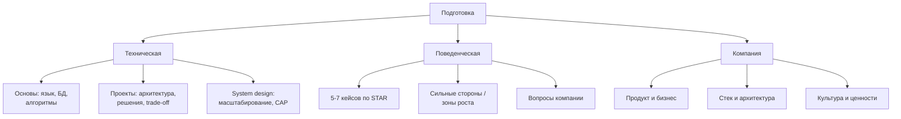

**Пример ответа:**
«Техническая подготовка: повторяю основы `Java`, `Spring Boot`, основные паттерны проектирования. Разбираю свои проекты: какие архитектурные решения принимал и почему. Решаю 2--3 задачи на system design.

Поведенческая: готовлю 5--7 кейсов по STAR -- конфликт, неудача, лидерство, обучение, обратная связь, приоритизация. Каждый кейс адаптирую под разные вопросы.

К компании: изучаю продукт (пробую как пользователь), стек (вакансия, блог, GitHub), культуру (Glassdoor, доклады сотрудников). Готовлю 2--3 вопроса о команде и процессах.»

**Типичные follow-up:**
- «Какие источники используете для подготовки?»
- «Сколько времени обычно тратите?»

## Q30. (!) Что для вас важно в работе и в команде (ценности)?

Проверяет culture fit -- соответствие ваших ценностей культуре компании.

**Что хочет услышать интервьюер:**
- Конкретные ценности с примерами из опыта
- Связь ваших ценностей с компанией (вы изучили культуру)
- Честность, а не «правильные» ответы

**Пример ответа:**
«Для меня ключевые ценности:

1. **Прозрачность** -- открытые решения и приоритеты. В прошлой команде я инициировал public roadmap, чтобы все понимали, над чем работаем и почему
2. **Качество кода и ревью** -- не как формальность, а как инструмент обмена знаниями. Подробнее о моём подходе к ревью -- это для меня ключевой процесс
3. **Рост и сложные задачи** -- мне важно решать проблемы, а не просто писать CRUD. Именно поэтому меня привлекает ваш продукт с [конкретный технический вызов компании]»

**Типичные follow-up:**
- «Какую ценность вы не готовы нарушить?»
- «Был ли опыт работы в компании, чьи ценности не совпадали с вашими?»
- «Как вы определяете, подходит ли вам компания?»

> Свяжите с конкретными фактами о компании -- это показывает подготовку и серьёзность намерений.

## Q31. Опишите ваш опыт работы в `Agile`/`Scrum`-команде

Вопрос часто задают для оценки знакомства с процессами и умения работать в итеративном режиме. Важно показать не знание терминологии, а практический опыт.

**Что хочет услышать интервьюер:**
- Конкретные роли и практики (не просто «мы делали спринты»)
- Как вы вносили вклад в улучшение процесса
- Умение работать с velocity, retrospective, backlog refinement

**Фреймворк Scrum-ролей и артефактов:**

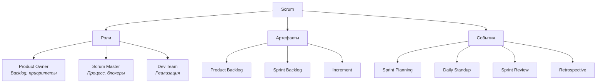

**Пример по STAR:**
- **S:** «Команда из 6 разработчиков, продакт и Scrum Master. 2-недельные спринты»
- **T:** «Участвовать в процессе и помочь повысить предсказуемость команды»
- **A:** «Активно участвовал в backlog refinement: задавал уточняющие вопросы до планирования, выявлял скрытые зависимости. На ретро предложил ввести «definition of done» с явными критериями -- раньше мёрджили «когда казалось готовым». Взял на себя ведение технического backlog (техдолг, инфраструктурные задачи)»
- **R:** «Velocity команды выросла на 20% за квартал. Процент незавершённых задач в спринте снизился с 30% до 10%. «Definition of done» переняли другие команды»

**Типичные follow-up:**
- «Что бы вы изменили в Scrum, если бы могли?»
- «Как работали, когда Scrum Master или PO были недоступны?»
- «Как относитесь к story points vs. time estimation?»

## Q32. Как вы справляетесь с ситуацией, когда спринт под угрозой?

Проверяет реакцию на риски и умение коммуницировать проблемы заблаговременно.

**Что хочет услышать интервьюер:**
- Ранняя сигнализация, а не «дотянул до последнего»
- Осознанная приоритизация (что урезать, а не «сделаем всё чуть хуже»)
- Командная работа при разрешении ситуации

**Пример по STAR:**
- **S:** «Середина спринта. Я столкнулся с неожиданной проблемой интеграции с внешним API -- документация оказалась устаревшей, реальное поведение отличалось»
- **T:** «Предупредить команду и найти решение, не срывая релиз»
- **A:** «В тот же день написал в командный канал: «Задача X под угрозой, теряю 2 дня на интеграцию. Варианты: (A) задвигаем X, берём Y; (B) я прошу помощи; (C) используем mock и реальный API -- в следующем спринте». Обсудили на планёрке, выбрали вариант C. Параллельно написал в поддержку API-провайдера»
- **R:** «Спринт закрыт в срок. Mock позволил остальным продолжить работу. Реальная интеграция завершена через 5 дней после спринта -- отдельным PR»

**Типичные follow-up:**
- «Как бы поступили, если команда проигнорировала риск?»
- «Как вы оцениваете задачи, чтобы минимизировать такие сюрпризы?»

## Q33. (!) Расскажите о случае, когда вы предложили нестандартное решение

Проверяет инженерное творчество и смелость отступить от «очевидного» пути. Лучший пример -- когда нестандартный подход дал измеримо лучший результат.

**Что хочет услышать интервьюер:**
- Почему «стандартный» путь не подходил
- Как вы обосновали и «продали» нестандартную идею
- Измеримый результат

**Пример по STAR:**
- **S:** «Сервис генерации отчётов падал под нагрузкой. Стандартное решение -- добавить серверы (горизонтальное масштабирование), бюджет был ограничен»
- **T:** «Найти решение без роста инфраструктурных расходов»
- **A:** «Профилировал и выяснил: 80% запросов -- повторные отчёты за одни и те же данные. Предложил `pre-computation`: генерировать отчёты в фоне по расписанию (каждые 15 минут) и отдавать кешированный результат. Для «горячих» отчётов -- мгновенно, для актуальных -- явная кнопка «обновить». Написал ADR, обсудил с командой риск «устаревших данных» -- приняли, т.к. для бизнеса 15 минут допустимо»
- **R:** «Нагрузка на сервис снизилась на 70%. Среднее время ответа с 8 секунд до 200мс. Инфраструктурные расходы выросли на 0% -- только +1 cron-job»

**Типичные follow-up:**
- «А если бизнес не принял бы ограничение на актуальность?»
- «Как убедили команду в правильности нестандартного подхода?»

## Q34. Опишите ситуацию, когда вам пришлось принимать решение при неполных данных

Реальные условия разработки -- всегда неполная информация. Вопрос проверяет структурный подход к неопределённости.

**Что хочет услышать интервьюер:**
- Вы действуете, а не парализованы неизвестностью
- Явная оценка рисков принятых допущений
- Готовность быстро изменить курс при новых данных

**Фреймворк принятия решений в условиях неопределённости:**

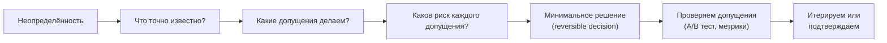

**Пример по STAR:**
- **S:** «Нужно выбрать схему шардирования БД до нагрузочного тестирования -- данные о распределении запросов ещё не собраны»
- **T:** «Принять решение по архитектуре, не имея реальных данных нагрузки»
- **A:** «Проанализировал аналоги в индустрии, сделал допущение: распределение 80/20 по ID пользователя (hotspot risk). Выбрал шардирование по `hash(user_id) % N` -- равномерно и обратимо при rehashing. Зафиксировал допущение в ADR. Настроил мониторинг для проверки: «если разброс по шардам > 20% -- пересматриваем»»
- **R:** «Через 2 месяца данные показали распределение 85/15 -- чуть хуже допущения, но в пределах. Один шард стал горячим -- добавили read-replica. Решение не пришлось менять кардинально»

**Типичные follow-up:**
- «Как вы определяете момент, когда достаточно данных для решения?»
- «Что делаете, если допущение оказалось неверным?»

## Q35. Как вы оцениваете предложение о работе и на что обращаете внимание?

Вопрос проверяет зрелость, осознанность карьерных решений и понимание, что важно за пределами зарплаты.

**Что хочет услышать интервьюер:**
- Системный подход к выбору, а не «просто деньги»
- Понимание своих приоритетов
- Готовность задавать правильные вопросы

**Фреймворк оценки оффера:**

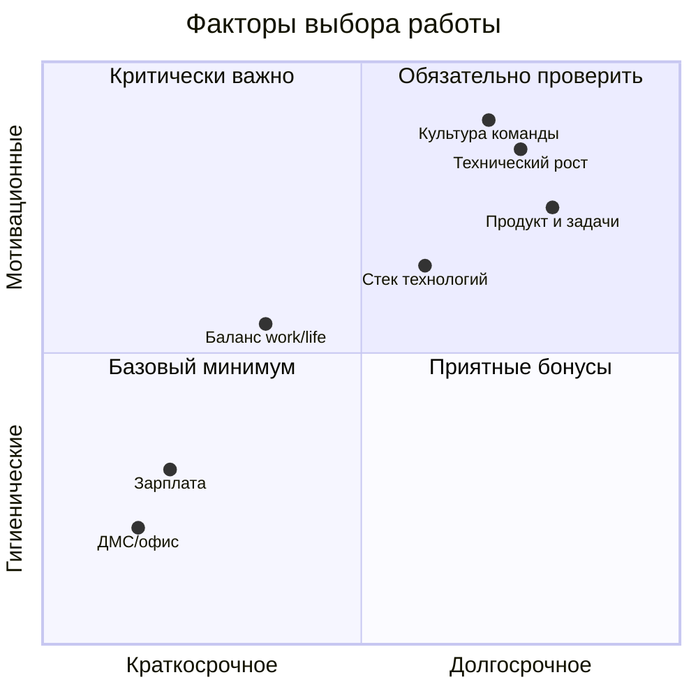

**Ключевые вопросы при оценке оффера:**
1. **Задачи** — Над чем конкретно буду работать первые 3 месяца?
2. **Рост** — Есть ли чёткий путь до следующего уровня?
3. **Команда** — Как принимаются технические решения? Кто мой непосредственный руководитель?
4. **Культура** — Как команда обрабатывает инциденты и постмортемы?
5. **Продукт** — Какова бизнес-модель и метрики успеха?
6. **Стабильность** — Финансирование, runway, план на 2 года

**Пример ответа:** «Для меня важен баланс трёх факторов: интересность задач (могу ли я здесь вырасти технически), культура (психологическая безопасность, прозрачность) и компенсация (должна быть справедливой рынку). Зарплата -- необходимое, но не достаточное условие. Поэтому на финальных этапах всегда прошу поговорить с потенциальными коллегами, а не только с рекрутером»

**Типичные follow-up:**
- «А если два оффера почти одинаковы по деньгам?»
- «Что делаете, если оффер ниже ожиданий?»

## Q36. (!) Расскажите о моменте, когда вы чувствовали несправедливую оценку

Деликатный вопрос на эмоциональный интеллект. Важно не скатиться в жалобы, а показать зрелость и конструктив.

**Что хочет услышать интервьюер:**
- Вы умеете объективно анализировать ситуацию (не только своя точка зрения)
- Вы действуете, а не накапливаете обиду
- Вы извлекли урок

**Пример по STAR:**
- **S:** «На performance review получил оценку «meets expectations» при том, что лично запустил 2 крупных фичи и наладил процесс код-ревью в команде»
- **T:** «Понять причину расхождения ожиданий и получить справедливую оценку»
- **A:** «На 1-на-1 попросил конкретные примеры, где не дотянул до «exceeds». Тимлид объяснил: работа была заметна внутри команды, но не была «видна» выше -- не было crossteam impact. Это оказалось сюрпризом: я не понимал, что критерий не только «делай хорошо», но и «делай видимо». Договорились на следующий квартал: я веду внутренний доклад и участвую в кросс-командном проекте»
- **R:** «Следующий review -- «exceeds expectations». Главный урок: visibility -- это тоже часть работы, а не «хвастовство». Теперь регулярно делаю weekly update на широкую аудиторию»

**Типичные follow-up:**
- «А если после разговора ничего не изменилось?»
- «Как находите баланс между «продавать себя» и реальными результатами?»

## Q37. Приведите пример, когда данные изменили ваше решение

Проверяет data-driven мышление и готовность менять позицию на основе фактов.

**Что хочет услышать интервьюер:**
- Вы строили гипотезы и проверяли их
- Вы изменили решение при опровержении гипотезы (а не подтасовали данные)
- Метрики конкретны

**Пример по STAR:**
- **S:** «Планировали переписать legacy-модуль авторизации. Интуиция команды: «он медленный и глючный, надо переписать»»
- **T:** «Принять обоснованное решение о рефакторинге vs. переписывании»
- **A:** «Прежде чем начать, добавил метрики: p95 latency, error rate, время разработчика на поддержку. Данные за месяц показали: latency 12мс (хорошо), error rate 0.01% (отлично), но время поддержки -- 3 часа в неделю (плохо). Переформулировал проблему: не «медленный», а «дорогой в поддержке». Решение изменилось: не переписывать, а добавить документацию и тесты на тёмные углы»
- **R:** «Время поддержки снизилось до 30 минут в неделю. Сэкономили ~2 месяца разработки, которые направили на новые фичи. Модуль до сих пор в проде без проблем»

**Типичные follow-up:**
- «Как решаете, каким данным доверять?»
- «Что делаете, когда данные противоречат интуиции эксперта?»

## Q38. (!) Какие `Leadership Principles` Amazon наиболее близки вашему опыту?

Вопрос задают в Amazon и компаниях, построивших культуру по этому образцу. Знание принципов позволяет структурировать кейсы и показать alignment с культурой компании.

**16 принципов Amazon — ключевые для технического интервью:**

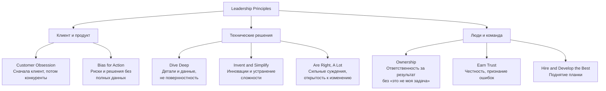

**Как отвечать:** выберите 2--3 принципа, наиболее релевантных вашему опыту, и дайте кейс по каждому.

**Примеры привязки кейсов к принципам:**

| Принцип | Типичный вопрос | Ваш кейс |
|---------|-----------------|----------|
| **Ownership** | «Расскажите о задаче, которую никто не хотел брать» | Инициатива без формальной роли (Q5) |
| **Invent and Simplify** | «Как упростили сложный процесс?» | Предложение нестандартного решения (Q33) |
| **Dive Deep** | «Когда данные изменили ваше решение?» | Data-driven решение (Q37) |
| **Bias for Action** | «Как принимали решение при неполных данных?» | Решение в условиях неопределённости (Q34) |
| **Earn Trust** | «Как брали ответственность за ошибку?» | Ответственность за чужую ошибку (Q20) |
| **Customer Obsession** | «Как отстаивали интересы клиента?» | «Нет» заказчику с альтернативой (Q14) |

> **Ошибки:** пересказывать принципы своими словами без конкретных примеров; выбирать «красивый» принцип без реального кейса; игнорировать принципы, характерные для уровня (для senior — Ownership и Hire the Best особенно важны).

---

## See also

- [Лидерство в команде](../leadership/team-leadership-interview.md) — вопросы по лидерству и управлению
- [Практики code review](../leadership/code-review-practices-interview.md) — практики код-ревью и обратная связь через код
- [Подготовка к собеседованию](../preparation/interview-preparation.md) — общая стратегия подготовки
- [Технический долг](../code-quality/technical-debt-interview.md) — прагматизм и компромиссы в разработке
- [System Design](../system-design/system-design-interview.md) — проектирование систем: структурированный ответ
- [Алгоритмы](../algorithms/algorithms-interview.md) — алгоритмическая часть технического интервью

- [Конфликтные истории](conflict-stories-interview.md)
- [Culture Fit](culture-fit-interview.md)
- [Истории о неудачах](failure-stories-interview.md)
- [Истории о лидерстве](leadership-stories-interview.md)
- [Метод STAR](star-method-interview.md)
- [AI Agents](../ai-ml/ai-agents-interview.md)
